# Oship Enterprise Documentation Completion Standard

> **The permanent quality contract for every future documentation artifact in Oship.**
> This document defines what "complete" means for documentation — philosophically,
> structurally, technically, and operationally. It binds humans and AI agents equally,
> so that any artifact produced by any author reaches the same deterministic quality bar.

This is not a short guideline. It is the authoritative specification that all other
documentation standards, templates, checklists, and reviewers reference. It is
**AI-first** (deterministic and parseable), **human-readable** (clear and navigable),
and **future-expandable** (a living contract that evolves with the repository).

---

## Table of Contents

1. [Documentation Philosophy](#1-documentation-philosophy)
2. [Definition of Done](#2-definition-of-done)
3. [Metadata Contract](#3-metadata-contract)
4. [Visual Knowledge Rules](#4-visual-knowledge-rules)
5. [AI Optimization Rules](#5-ai-optimization-rules)
6. [Documentation Type Standards](#6-documentation-type-standards)
7. [Quality Scoring Framework](#7-quality-scoring-framework)
8. [Lifecycle State Machine](#8-lifecycle-state-machine)
9. [Change Management Protocol](#9-change-management-protocol)
10. [AI Agent Reading Protocol](#10-ai-agent-reading-protocol)
11. [Future Evolution Model](#11-future-evolution-model)

---

# 1. Documentation Philosophy

## 1.1 Why Documentation Exists

Oship treats **documentation as a product**, not an afterthought. It is the primary
output of the repository and the primary interface between ideas, humans, and AI
agents. The philosophical foundation is documented in
[`PROJECT_PHILOSOPHY.md`](../PROJECT_PHILOSOPHY.md) (Section 8–9: "Documentation First"
and "Documentation Is The Product").

| Principle | Meaning | Consequence |
| :--- | :--- | :--- |
| **Documentation is the product** | Docs are first-class deliverable assets | They are gated, versioned, owned like code |
| **Documentation is a knowledge graph** | Every doc is a node with edges | Cross-referencing is mandatory |
| **Documentation is deterministic** | Any agent parses it identically | Metadata + structure are enforced |
| **Documentation is navigable** | No doc is an island | Indexes and links are required |
| **Documentation is living** | It evolves with the system | Lifecycle + change management |

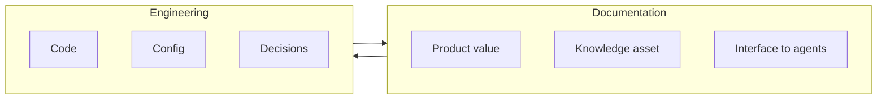

> **Diagram ID:** `DGM-DOC-001`
> **Explanation:** Documentation and engineering are mutually reinforcing. Documentation
> guides engineering; engineering validates documentation. Neither can be complete without
> the other.

> **Image Specification**
> - Image ID: `IMG-DOC-001`
> - Purpose: Hero concept for the documentation philosophy — docs and engineering as a loop.
> - Prompt: "A circular relationship diagram between documentation and engineering, with knowledge and code flowing between two nodes, dark navy blueprint theme with gold accents."
> - Style: Circular loop, blueprint.
> - Composition: Two-node circular flow.
> - Resolution: 1600x900px
> - Priority: CRITICAL
> - Suggested Filename: `assets/diagrams/doc-philosophy-loop.png`

## 1.2 The Completion Doctrine

A document is not complete when it "exists." It is complete when it satisfies the
**Definition of Done** (Section 2) and carries no unresolved ambiguity for its intended
audience. "Complete" is a *state of contract*, not a length.

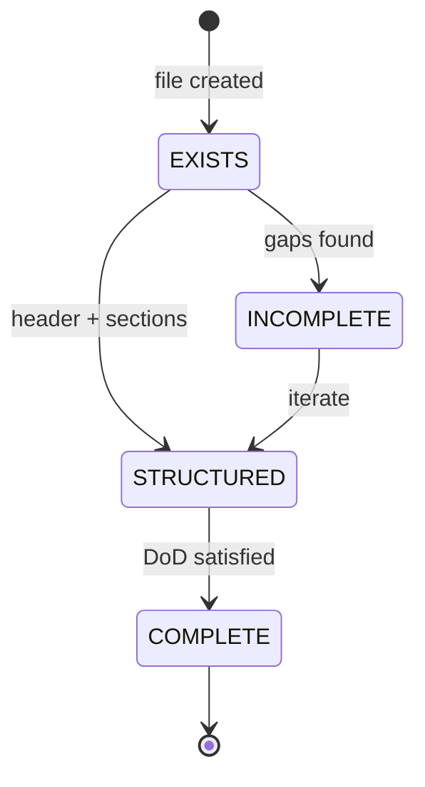

> **Diagram ID:** `DGM-DOC-002`
> **Explanation:** Completeness is a graduated state. Merely creating a file (`EXISTS`) is
> the first of several states; only reaching `COMPLETE` (DoD satisfied) qualifies as done.

> **Decision Rule:** If any reviewer or agent cannot answer "is this done?" with a
> deterministic yes, the document is **not complete** and must return to the author.

**Example — incomplete vs. complete:**

| Aspect | Incomplete | Complete |
| :--- | :--- | :--- |
| Header | Missing `Dependencies` | All 16 keys populated |
| Scope | Vague "etc." | Explicit inclusions/exclusions |
| Diagrams | Zero visuals | ≥1 per major concept |
| Links | None | Cross-references resolve |
| Lifecycle | No status | `ACTIVE` with review date |

## 1.3 The Two Audiences

Oship documentation must serve **two audiences simultaneously** — AI agents and humans.
The reader must never be forced to choose one; both are first-class.

| Audience | Primary needs | Design implication |
| :--- | :--- | :--- |
| **AI Agent** | Determinism, parseability, routing | Metadata, IDs, tables, decision rules |
| **Human** | Clarity, navigation, readability | Headings, prose, examples, summaries |

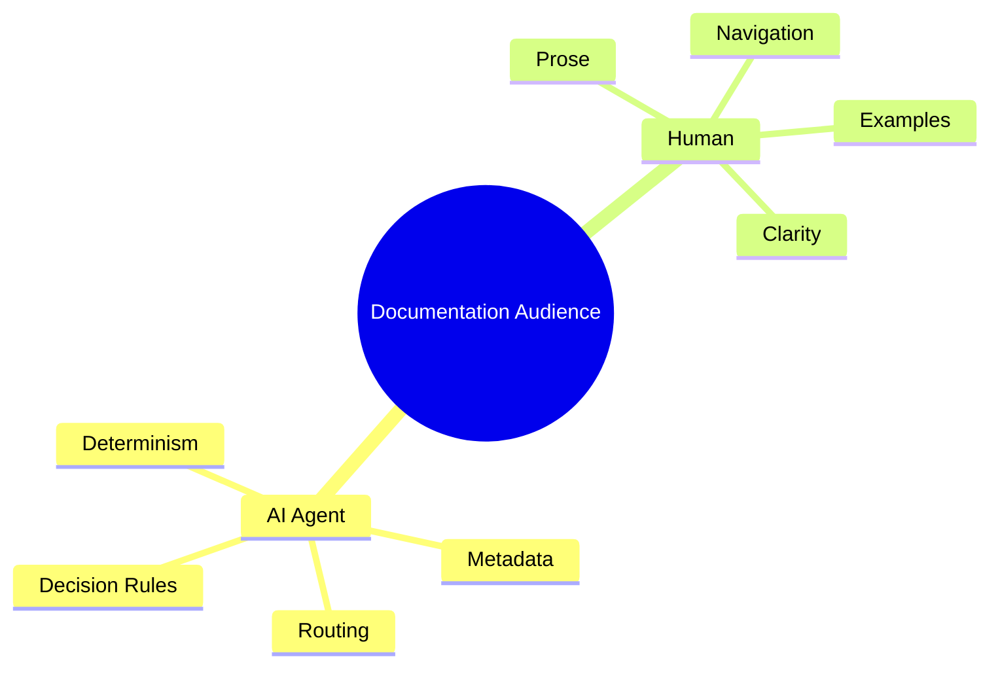

> **Diagram ID:** `DGM-DOC-003`
> **Explanation:** A single artifact must be simultaneously machine-parseable and human-readable.
> The visual knowledge rules (Section 4) and AI optimization rules (Section 5) encode this dual contract.

---

# 2. Definition of Done

## 2.1 The DoD Checklist

**Definition of Done (DoD):** a document is complete only when *all* of the following
are true. This is the single most important checklist in this standard.

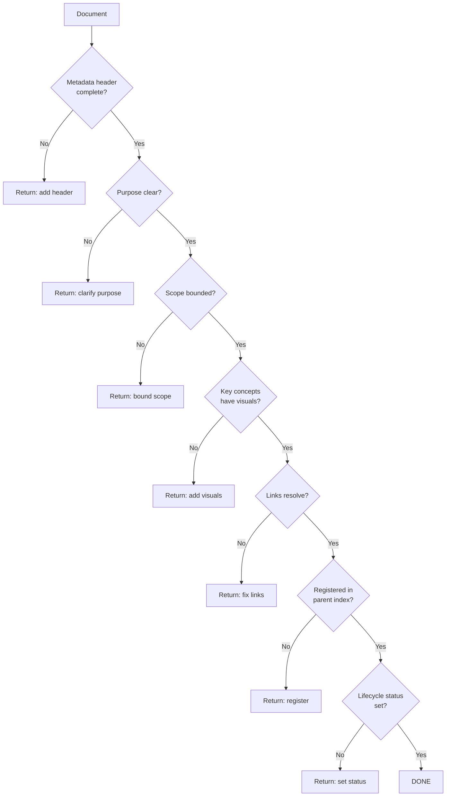

> **Diagram ID:** `DGM-DOC-004`
> **Explanation:** DoD is a deterministic gate chain. Each step either passes or returns the
> document to the author. No partial-credit DoD.

### TBL-DOC-001: Definition of Done — Mandatory Checklist

| # | Criterion | Check | Enforcement |
| :---: | :--- | :---: | :--- |
| 1 | Metadata header present with all 16 keys | ☐ | Linter / reviewer |
| 2 | Title matches filename intent | ☐ | Reviewer |
| 3 | Purpose stated in one paragraph | ☐ | Reviewer |
| 4 | Scope bounded (inclusions + exclusions) | ☐ | Reviewer |
| 5 | ≥1 visual per major concept | ☐ | Density audit |
| 6 | All relative links resolve | ☐ | Link checker |
| 7 | Registered in the parent directory `INDEX.md` | ☐ | Index audit |
| 8 | Lifecycle `Status` set and current | ☐ | Reviewer |
| 9 | Ownership assigned | ☐ | Header check |
| 10 | Cross-references to related docs | ☐ | Graph audit |
| 11 | Read-time estimates present | ☐ | Header check |
| 12 | No unresolved `TODO`/`TBD` markers | ☐ | Grep audit |

## 2.2 DoD by Document Type

Different documentation types have different DoD thresholds. See
[Section 6 (Documentation Type Standards)](#6-documentation-type-standards) for the full
matrix; this table gives the summary.

| Document type | Minimum visuals | Minimum tables | Mandatory fields |
| :--- | :---: | :---: | :--- |
| **Constitutional** | 2 | 2 | All 16 header keys |
| **Blueprint / Architecture** | 3 | 2 | All 16 + Knowledge Layer |
| **Specification / Contract** | 1 | 3 | All 16 + Version |
| **Guide / How-To** | 2 | 2 | All 16 + Owner |
| **Reference** | 1 | 4 | All 16 + Related Files |
| **Decision Record (ADR)** | 1 | 1 | All 16 + Status |

> **Decision Rule:** if a document type is not listed here, apply the **strictest** DoD
> (Constitutional) until the type is added to this standard.

## 2.3 The DoD Declaration

Every document's final section (or its metadata) should carry a **DoD declaration** —
an explicit statement that the document satisfies the checklist, with a link to this
standard.

```markdown
> **DoD Declaration:** This document satisfies the Oship Documentation Completion
> Standard (`.ai/DOCUMENTATION_COMPLETION_STANDARD.md`) Definition of Done.
> Checklist: 12/12 PASSED. Verified: <date> by <owner>.
```

---

# 3. Metadata Contract

## 3.1 The Canonical Header

Every documentation artifact **must** begin with the canonical YAML frontmatter header.
This is the deterministic machine contract. It is defined in
[`docs/MASTER_CONTEXT/23_STANDARDS/METADATA_STANDARD.md`](../docs/MASTER_CONTEXT/23_STANDARDS/METADATA_STANDARD.md)
and reproduced here for enforcement.

```yaml
---
Document ID: <UNIQUE_ID>
Title: <HUMAN_READABLE_TITLE>
Version: <SEMVER>
Status: <ACTIVE | PROPOSED | DRAFT | DEPRECATED>
Knowledge Layer: <L1 Constitutional | L2 Blueprints | L3 Interfaces | L4 Configuration | L5 Ephemeral>
Knowledge Domain: <NN_NAME>
AI Importance: <CRITICAL | HIGH | MEDIUM | LOW>
Human Importance: <CRITICAL | HIGH | MEDIUM | LOW>
Dependencies: <COMMA_SEPARATED_PATHS>
Required By: <COMMA_SEPARATED_DOMAINS_OR_PATHS>
Estimated AI Read Time: <X min>
Estimated Human Read Time: <X min>
Repository Version: <CURRENT_SEMVER>
Owner: <TEAM_OR_ROLE>
Last Updated: <YYYY-MM-DD>
---
```

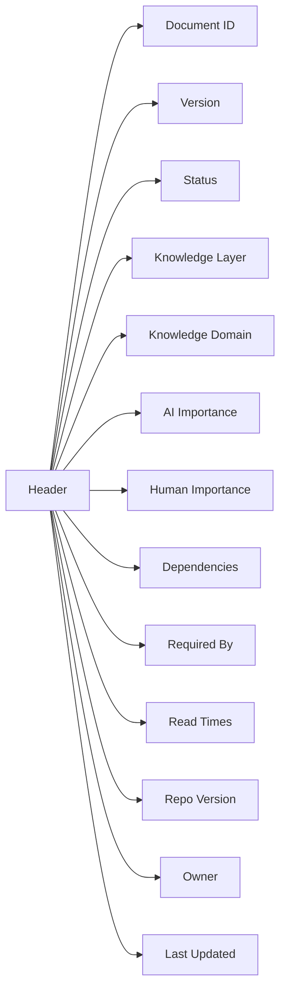

> **Diagram ID:** `DGM-DOC-005`
> **Explanation:** The header is a structured object, not free text. Every key has a defined
> meaning and consumes/enables a downstream process (routing, ownership, review, metrics).

## 3.2 Key Definitions & Rules

### TBL-DOC-002: Metadata Key Contract

| Key | Purpose | Validation rule | Example |
| :--- | :--- | :--- | :--- |
| **Document ID** | Unique identifier | Must be unique repo-wide | `AI-DOC-STD-001` |
| **Title** | Human title | Non-empty, descriptive | `Enterprise Documentation Completion Standard` |
| **Version** | Content version | Semantic version | `1.0.0` |
| **Status** | Lifecycle state | One of 4 allowed values | `ACTIVE` |
| **Knowledge Layer** | Authority level | One of 5 allowed | `L1 Constitutional` |
| **Knowledge Domain** | Master-context domain | Valid `NN_NAME` | `23_STANDARDS` |
| **AI Importance** | AI priority | One of 4 allowed | `CRITICAL` |
| **Human Importance** | Human priority | One of 4 allowed | `CRITICAL` |
| **Dependencies** | Upstream docs | Existing paths | `docs/.../METADATA_STANDARD.md` |
| **Required By** | Downstream consumers | Paths or domains | `Every doc in Oship` |
| **Estimated AI Read Time** | AI consumption time | `<num> min` | `12 minutes` |
| **Estimated Human Read Time** | Human consumption time | `<num> min` | `35 minutes` |
| **Repository Version** | Repo SemVer at edit | Current repo version | `v0.1.0-alpha.0` |
| **Owner** | Maintenance role | Named role/team | `Architecture Team` |
| **Last Updated** | Edit date | ISO `YYYY-MM-DD` | `2026-08-04` |

> **Decision Rule:** a header key with an invalid value is a **metadata defect** and blocks
> the document from reaching DoD. Partial headers are prohibited.

> **Image Specification**
> - Image ID: `IMG-DOC-010`
> - Purpose: Visualize the canonical metadata header anatomy for deterministic parsing.
> - Prompt: "An annotated diagram of a YAML metadata header with its sixteen labeled keys, dark navy blueprint style with gold highlights."
> - Style: Annotated diagram, blueprint.
> - Composition: Header block with callouts.
> - Resolution: 1800x1000px
> - Priority: CRITICAL
> - Suggested Filename: `assets/diagrams/doc-metadata-anatomy.png`

## 3.3 ID Registration

Every artifact type uses a reserved ID namespace. IDs must be unique and registered in the
relevant index.

| ID namespace | Applies to | Registration point |
| :--- | :--- | :--- |
| `DOC-*` | General documentation | `docs/INDEX.md` |
| `AI-*` | AI control plane | `.ai/INDEX.md` |
| `ADR-*` | Decision records | `docs/ADR/INDEX.md` |
| `MCX-*` | Master-context artifacts | `docs/MASTER_CONTEXT/INDEX.md` |
| `DGM-DOC-*` | Diagrams in this standard | This document (§4) |
| `TBL-DOC-*` | Tables in this standard | This document (§4) |
| `IMG-DOC-*` | Image specs in this standard | This document (§4) |

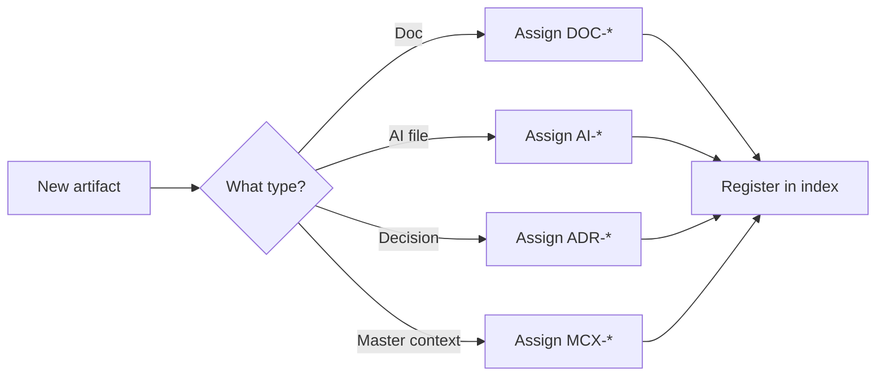

> **Diagram ID:** `DGM-DOC-006`
> **Explanation:** ID assignment is type-driven and always ends in registration. Unregistered
> IDs create orphan knowledge and violate the graph contract.

---

# 4. Visual Knowledge Rules

## 4.1 Visual Density Contract

Documentation must maintain a minimum **visual density** so that neither humans nor agents
wade through prose-only walls. The rule: **no more than 120 lines between visual artifacts**
(a diagram, table, decision tree, or image specification).

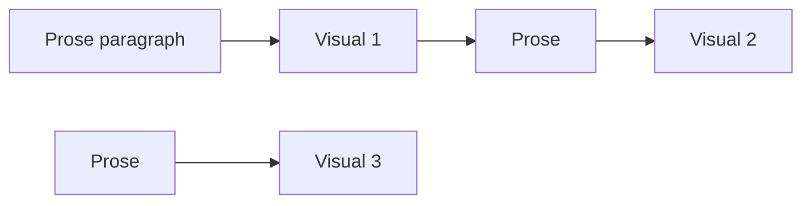

> **Diagram ID:** `DGM-DOC-007`
> **Explanation:** Visuals are punctuation for knowledge. They break long runs, encode
> relationships, and provide parseable anchors for AI agents.

> **Decision Rule:** if any 120-line window contains no visual artifact, the author must add
> one or split the content. Density is measured by the visual-density audit (Section 7).

### TBL-DOC-003: Visual Density Thresholds

| Context | Max prose lines between visuals | Minimum visuals |
| :--- | :---: | :---: |
| Landing / index doc | 120 | 2 |
| Architecture blueprint | 100 | 3 |
| Specification | 120 | 1 |
| Guide | 100 | 2 |
| Reference | 120 | 1 |
| This standard | 120 | 20 (minimum) |

> **Image Specification**
> - Image ID: `IMG-DOC-005`
> - Purpose: Visualize the visual-density contract showing prose between visual artifacts.
> - Prompt: "A diagram showing alternating prose blocks and visual artifact nodes with a maximum gap annotation, navy and gold blueprint style."
> - Style: Sequence diagram, blueprint.
> - Composition: Linear alternating blocks.
> - Resolution: 1600x700px
> - Priority: MEDIUM
> - Suggested Filename: `assets/diagrams/doc-visual-density-contract.png`

## 4.2 Visual Types & Their Use

| Visual type | Best for | Tooling |
| :--- | :--- | :--- |
| **Mermaid flowchart** | Process, flow, decision | Mermaid syntax |
| **Mermaid state diagram** | Lifecycle, states | Mermaid syntax |
| **Mermaid mindmap** | Concept clustering | Mermaid syntax |
| **Mermaid sequence** | Interaction over time | Mermaid syntax |
| **ASCII tree** | Directory / structure | Fenced code block |
| **Table** | Comparison, matrix, registry | Markdown table |
| **Decision tree** | Conditional logic | Mermaid flowchart |

## 4.3 Image Specifications

Every **important** visual that is intended to be rendered as an asset must include a full
image specification block so the visual can be reproduced deterministically.

```markdown
> **Image Specification**
> - Image ID: `IMG-DOC-###`
> - Purpose: <why it exists>
> - Prompt: <generation prompt>
> - Style: <style descriptor>
> - Composition: <layout>
> - Resolution: <WxHpx>
> - Priority: <CRITICAL | HIGH | MEDIUM | LOW>
> - Suggested Filename: `assets/diagrams/<name>.png`
```

### TBL-DOC-004: Image Specification Field Contract

| Field | Required | Purpose |
| :--- | :---: | :--- |
| Image ID | Yes | Unique reference |
| Purpose | Yes | Why it exists |
| Prompt | Yes | Reproducibility |
| Style | Yes | Visual language |
| Composition | Yes | Layout |
| Resolution | Yes | Size |
| Priority | Yes | Importance |
| Suggested Filename | Yes | Asset path |

---

# 5. AI Optimization Rules

## 5.1 Determinism

AI agents parse documentation to make decisions. Ambiguity is a defect. The rules below
enforce deterministic reading.

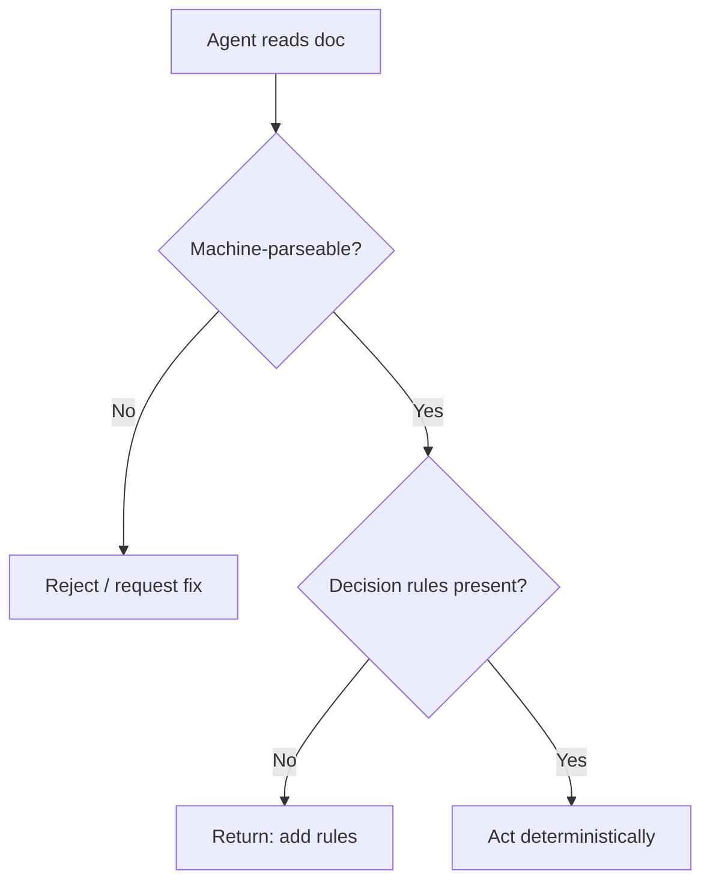

> **Diagram ID:** `DGM-DOC-008`
> **Explanation:** For an agent, a document that cannot be parsed or that lacks decision rules
> is not actionable. Determinism is a functional requirement, not a preference.

## 5.2 Token Efficiency

AI context windows are finite. Documentation must maximize **information per token** —
prefer tables, precise wording, and structured syntax over verbose prose.

### TBL-DOC-005: Token Efficiency Rules

| Rule | Guidance |
| :--- | :--- |
| Prefer tables over lists-of-prose | Encodes relations compactly |
| Use precise verbs and nouns | Reduce inference |
| Avoid filler and hedging | Cut "probably/perhaps" |
| Put the decision rule inline | Reduces lookup hops |
| Use stable anchors/IDs | Enables direct references |

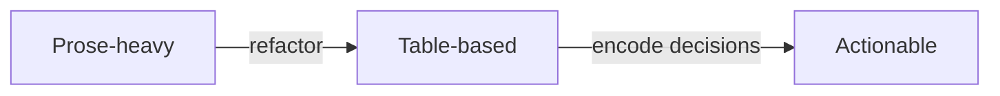

> **Diagram ID:** `DGM-DOC-009`
> **Explanation:** Refactoring prose into structured artifacts improves both AI token
> efficiency and human scannability.

> **Image Specification**
> - Image ID: `IMG-DOC-006`
> - Purpose: Visualize determinism enforcement — a machine-parseable document leading to action.
> - Prompt: "A flow diagram showing a document being parsed by an AI into a decision, with a validation gate, purple and navy blueprint style."
> - Style: Flowchart, blueprint.
> - Composition: Parse -> validate -> act.
> - Resolution: 1600x900px
> - Priority: HIGH
> - Suggested Filename: `assets/diagrams/doc-determinism-enforcement.png`

## 5.3 Routability

Every document must be **routable** — an agent must be able to reach it from the routing
plane in ≤2 hops. This is guaranteed by the header's `Knowledge Domain`, registration in
indexes, and cross-references.

| Routing property | Requirement |
| :--- | :--- |
| Reachable from `README` | ≤2 hops |
| Reachable from `.ai/INDEX.md` | Direct |
| Reachable from `docs/INDEX.md` | Direct |
| Has a parent index entry | Always |

---

# 6. Documentation Type Standards

## 6.1 The Type Taxonomy

Oship recognizes seven canonical documentation types. Each has a defined purpose, structure,
and DoD.

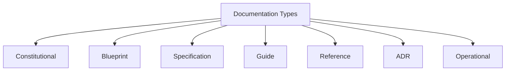

> **Diagram ID:** `DGM-DOC-010`
> **Explanation:** The taxonomy lets authors choose the correct container and lets readers
> know what to expect from a document by its type.

### TBL-DOC-006: Documentation Type Matrix

| Type | Purpose | Typical location | Knowledge Layer | Example |
| :--- | :--- | :--- | :---: | :--- |
| **Constitutional** | Governance & invariants | `PROJECT_PHILOSOPHY.md`, `.ai/` | L1 | This standard |
| **Blueprint** | Architecture & design | `architecture/`, `docs/ADR/` | L2 | SYSTEM_ARCHITECTURE.md |
| **Specification** | Contracts & interfaces | `apis/`, `docs/specifications/` | L3 | OpenAPI spec |
| **Guide** | How-to & procedure | `docs/wiki/guides/` | L4 | Deploy guide |
| **Reference** | Lookup & catalogs | `docs/glossary/`, `docs/references/` | L5 | Enterprise glossary |
| **Decision Record** | Decisions & rationale | `docs/ADR/` | L2 | ADR-0001 |
| **Operational** | Runbooks & ops | `docs/operations/` | L4 | Incident runbook |

## 6.2 Type-Specific Section Requirements

### Constitutional — Required sections

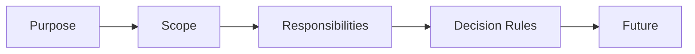

> **Diagram ID:** `DGM-DOC-011`

| Section | Required | Notes |
| :--- | :---: | :--- |
| Purpose | ✅ | One-paragraph statement |
| Scope | ✅ | Inclusions + exclusions |
| Responsibilities | ✅ | RACI or owner list |
| Decision Rules | ✅ | Deterministic conditions |
| Future Evolution | ✅ | Expansion path |
| Visuals | ✅ | ≥2 |

### Choosing the correct type

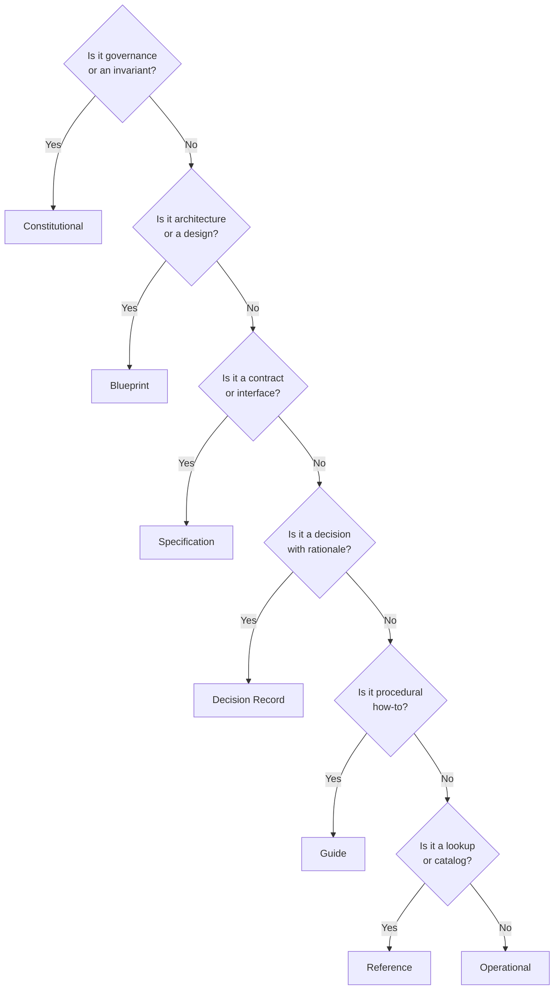

> **Diagram ID:** `DGM-DOC-018`
> **Explanation:** This decision tree routes any new artifact to its correct documentation type.
> Choosing the wrong type produces a structurally invalid document that fails DoD.

> **Decision Rule:** run this tree for every new artifact. The terminal node determines the
> document type, which then dictates the required sections and DoD threshold.

> **Image Specification**
> - Image ID: `IMG-DOC-002`
> - Purpose: Visualize the document-type decision tree for authors and agents.
> - Prompt: "A decision tree flowchart routing a new artifact to one of seven documentation types, gold and navy blueprint style with diamond decision nodes."
> - Style: Decision tree, blueprint.
> - Composition: Top-down branching to seven outcomes.
> - Resolution: 2000x1400px
> - Priority: HIGH
> - Suggested Filename: `assets/diagrams/doc-type-decision-tree.png`

### Blueprint — Required sections

| Section | Required | Notes |
| :--- | :---: | :--- |
| Context | ✅ | System backdrop |
| Constraints | ✅ | Non-negotiable bounds |
| Architecture | ✅ | C4 or equivalent |
| Trade-offs | ✅ | Alternatives considered |
| Decision Rules | ✅ | Where applicable |

### Specification — Required sections

| Section | Required | Notes |
| :--- | :---: | :--- |
| Contract summary | ✅ | One-paragraph |
| Versioning | ✅ | SemVer policy |
| Fields / Schema | ✅ | Table or code |
| Examples | ✅ | ≥1 concrete |
| Error handling | ✅ | Where applicable |

---

# 7. Quality Scoring Framework

## 7.1 The Documentation Quality Score (DQS)

Every document receives a **Documentation Quality Score** from 0–100, computed from weighted
dimensions. The formula mirrors the repository health model in `.ai/METRICS.md`.

$$\text{DQS} = 0.20 \times \text{Metadata} + 0.20 \times \text{Completeness} + 0.20 \times \text{VisualDensity} + 0.20 \times \text{Accuracy} + 0.20 \times \text{Navigability}$$

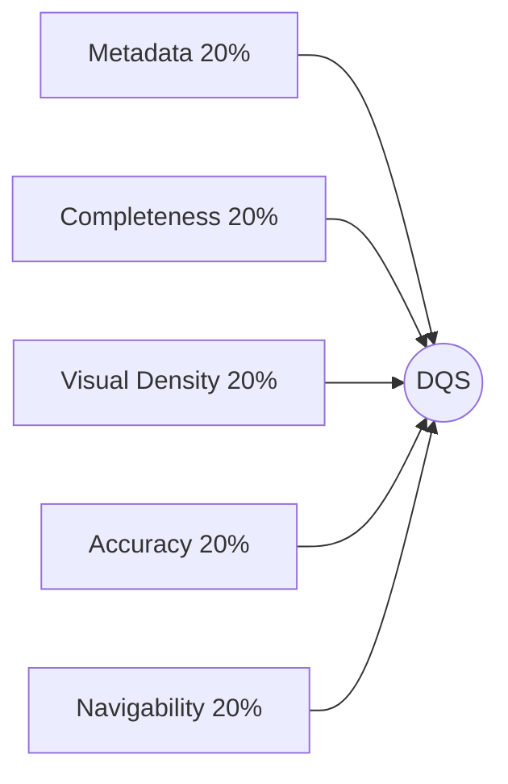

> **Diagram ID:** `DGM-DOC-012`
> **Explanation:** DQS is a weighted composite. All five dimensions are weighted equally at 20%
> each, so a document cannot compensate for one missing dimension by excelling in another.

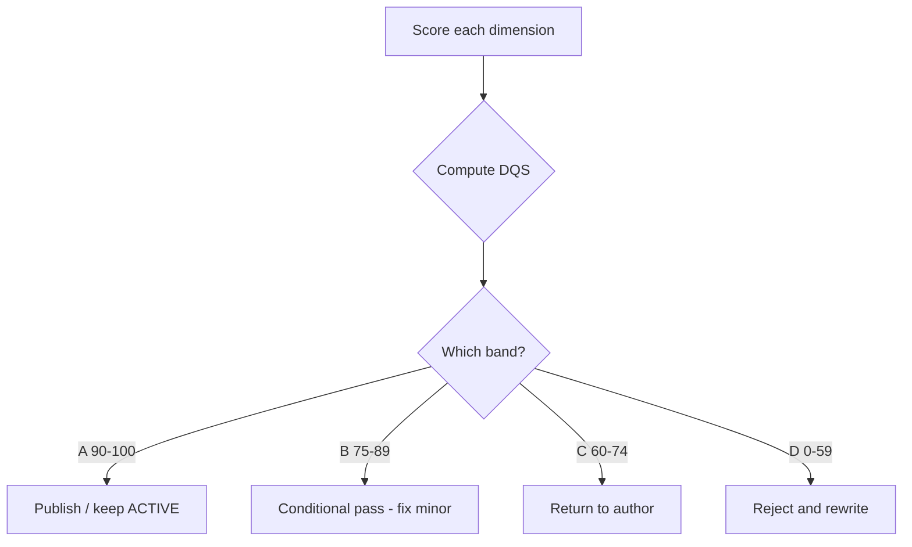

> **Diagram ID:** `DGM-DOC-019`
> **Explanation:** Scoring is a deterministic workflow that maps a computed DQS to a verdict
> and action. There is no discretionary scoring.

> **Image Specification**
> - Image ID: `IMG-DOC-003`
> - Purpose: Visualize the quality-scoring workflow from dimensions to verdict.
> - Prompt: "A quality scoring workflow flowchart with five weighted dimension inputs flowing into a composite score and four verdict bands, navy and green/gold blueprint style."
> - Style: Workflow flowchart, blueprint.
> - Composition: Top-down to four band outcomes.
> - Resolution: 1800x1200px
> - Priority: HIGH
> - Suggested Filename: `assets/diagrams/doc-scoring-workflow.png`

## 7.2 Dimension Scoring Rubric

### TBL-DOC-007: DQS Dimension Rubric

| Dimension | Weight | Scoring basis |
| :--- | :---: | :--- |
| **Metadata** | 20% | % of 16 header keys valid |
| **Completeness** | 20% | % of DoD checklist passed |
| **Visual Density** | 20% | Density compliance (≤120 lines) |
| **Accuracy** | 20% | Link integrity + terminology |
| **Navigability** | 20% | Index registration + cross-refs |

### TBL-DOC-008: DQS Bands

| DQS Range | Band | Verdict | Action |
| :---: | :---: | :--- | :--- |
| 90–100 | A | Pass | Publish / keep ACTIVE |
| 75–89 | B | Conditional pass | Fix minor gaps |
| 60–74 | C | Review | Return to author |
| 0–59 | D | Fail | Reject, rewrite |

## 7.3 Visual Density Score

The visual-density dimension is computed by scanning for the maximum gap between visuals and
comparing it against the 120-line threshold.

| Max gap | Visual Density Score |
| :--- | :---: |
| ≤ 60 lines | 100 |
| 61–90 | 90 |
| 91–120 | 80 |
| > 120 | 0 (fail) |

---

# 8. Lifecycle State Machine

## 8.1 Document States

Every document moves through a lifecycle. The `Status` metadata field reflects its current
state.

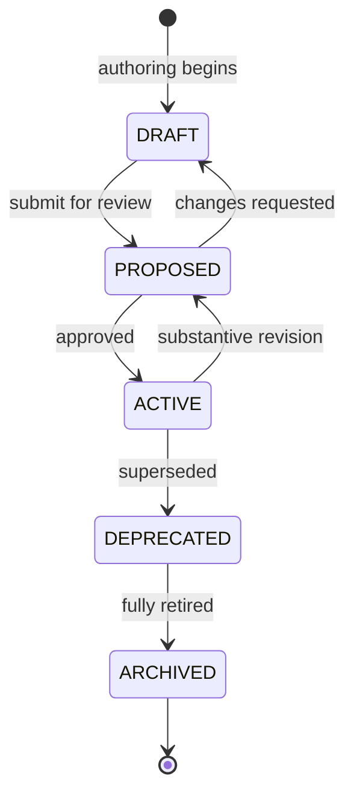

> **Diagram ID:** `DGM-DOC-013`
> **Explanation:** The lifecycle is a defined state machine. Transitions are explicit events
> (submit, approve, revise, supersede, retire). This enables change management (Section 9).

### TBL-DOC-009: Document State Contract

| State | Meaning | Consumers may rely on it? |
| :--- | :--- | :---: |
| **DRAFT** | In authoring | No |
| **PROPOSED** | Under review | No |
| **ACTIVE** | Approved & authoritative | Yes |
| **DEPRECATED** | Superseded / obsolete | No (migrate) |
| **ARCHIVED** | Fully retired | No |

> **Image Specification**
> - Image ID: `IMG-DOC-007`
> - Purpose: Visualize the document lifecycle state machine and transitions.
> - Prompt: "A document lifecycle state diagram showing draft, proposed, active, deprecated, archived states with transition arrows, navy and gold blueprint style."
> - Style: State diagram, blueprint.
> - Composition: Five-state transition graph.
> - Resolution: 2000x1200px
> - Priority: HIGH
> - Suggested Filename: `assets/diagrams/doc-lifecycle-states.png`

## 8.2 Transition Rules

| Transition | Trigger | Requires |
| :--- | :--- | :--- |
| DRAFT → PROPOSED | Author submits | DoD checklist complete |
| PROPOSED → ACTIVE | Reviewer approves | Sign-off + DQS ≥ 75 |
| ACTIVE → PROPOSED | Substantive revision | Change record |
| ACTIVE → DEPRECATED | Superseded | Link to replacement |
| DEPRECATED → ARCHIVED | Retirement | Retention window |

---

# 9. Change Management Protocol

## 9.1 Change Triggers

Documentation changes are triggered by real-world events. Each trigger has a defined response.

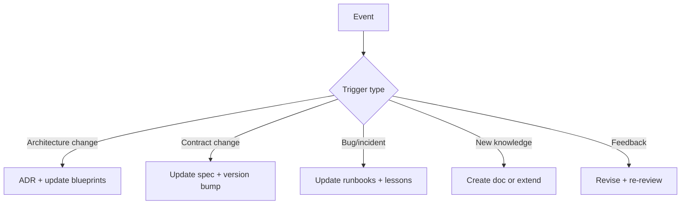

> **Diagram ID:** `DGM-DOC-014`
> **Explanation:** Documentation changes are reactive to engineering events. Mapping triggers
> to responses keeps docs synchronized with reality.

## 9.2 Change Severity & Review

### TBL-DOC-010: Change Severity Matrix

| Severity | Scope | Review required | Version impact |
| :--- | :--- | :--- | :--- |
| **Patch** | Typo, minor clarity | Light | `PATCH` bump |
| **Minor** | Section added, no contract change | Standard | `MINOR` bump |
| **Major** | Contract/meaning change | Heavy / board | `MAJOR` bump |

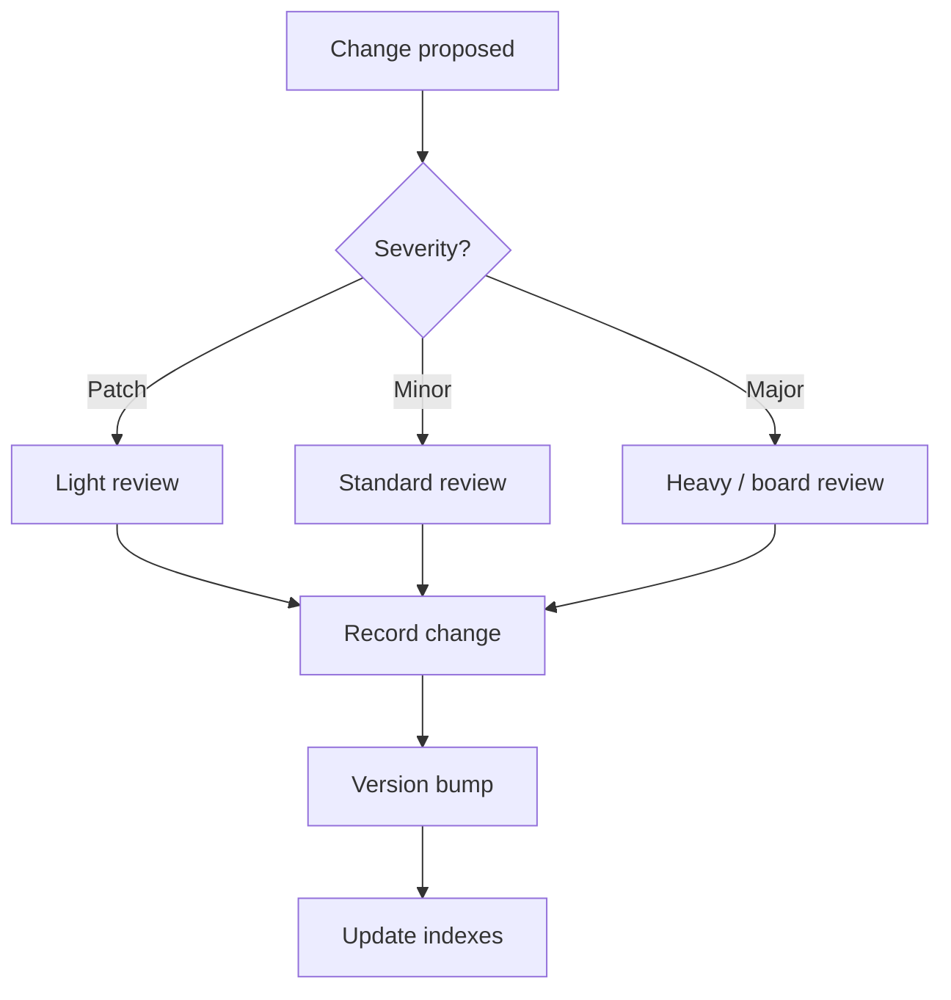

> **Diagram ID:** `DGM-DOC-020`
> **Explanation:** Every change passes severity classification, review, change recording, a
> version bump, and index update. This keeps history traceable and deterministic.

> **Image Specification**
> - Image ID: `IMG-DOC-004`
> - Purpose: Visualize the change-management workflow and severity gates.
> - Prompt: "A change management flowchart with severity diamond branching to light, standard, and heavy review paths, converging on version bump and index update, blueprint style."
> - Style: Workflow flowchart, blueprint.
> - Composition: Severity gate then converge.
> - Resolution: 1800x1200px
> - Priority: HIGH
> - Suggested Filename: `assets/diagrams/doc-change-workflow.png`

## 9.3 The Change Record

Every substantive change must be recorded in the repository's decision log or evolution
ledger, referencing the document and version.

```markdown
> **Change Record:** `<Document ID>` updated `<Version> → <Version>` on `<date>`.
> Reason: `<trigger>`. Author: `<owner>`. Approval: `<reviewer>`.
```

---

# 10. AI Agent Reading Protocol

## 10.1 The Reading Sequence

When an AI agent needs to consume documentation, it follows a deterministic sequence. This
protocol guarantees that the agent reads the correct contract first.

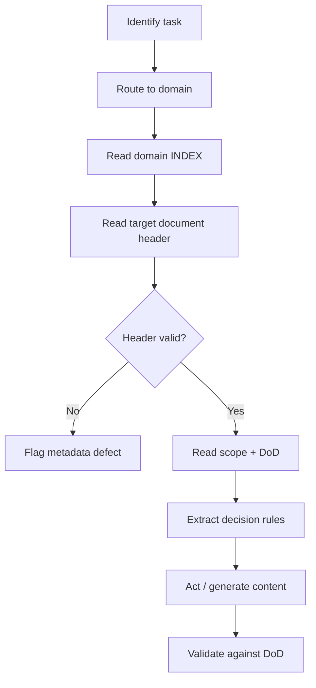

> **Diagram ID:** `DGM-DOC-015`
> **Explanation:** An agent must validate the header, understand scope and DoD, extract
> decision rules, and validate its own output against the DoD before considering the task
> complete.

### TBL-DOC-011: AI Reading Priority

| Priority | What the agent reads | Purpose |
| :---: | :--- | :--- |
| P0 | This standard | Know the contract |
| P0 | Domain INDEX | Know the context |
| P1 | Target doc header | Validate contract |
| P1 | DoD checklist | Know the bar |
| P2 | Decision rules | Know the constraints |
| P2 | Examples | Match patterns |

> **Image Specification**
> - Image ID: `IMG-DOC-008`
> - Purpose: Visualize the AI agent reading protocol sequence for consuming documentation.
> - Prompt: "An ordered reading protocol flow for an AI agent: route, read header, extract decision rules, validate output, purple and navy blueprint style."
> - Style: Flowchart, blueprint.
> - Composition: Ordered top-down sequence.
> - Resolution: 1800x1200px
> - Priority: CRITICAL
> - Suggested Filename: `assets/diagrams/doc-agent-reading-protocol.png`

## 10.2 Agent Output Validation

When an AI agent *writes* documentation, it must validate its own output using this standard
before committing. This is a self-audit loop.

| Validation step | Method |
| :--- | :--- |
| Header present + valid | Parse YAML |
| All links resolve | Link checker |
| Visual density met | Gap scan |
| DoD checklist passed | Manual/automated |
| Registered in index | Index audit |
| Consistent with README | Terminology check |

---

# 11. Future Evolution Model

## 11.1 How This Standard Evolves

This standard is itself a living document. It evolves through the same lifecycle and change
management it defines. Extensions must be proposed, reviewed, and versioned.

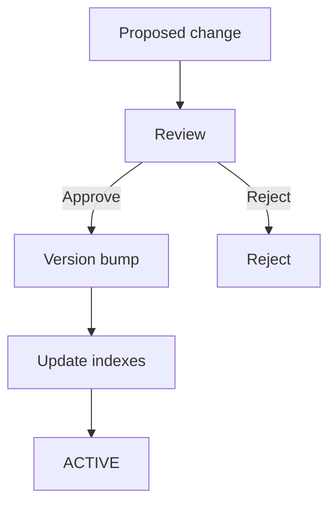

> **Diagram ID:** `DGM-DOC-016`
> **Explanation:** The standard governs itself. Any modification goes through review and a
> SemVer bump, and is reflected in the `.ai/` indexes.

> **Image Specification**
> - Image ID: `IMG-DOC-009`
> - Purpose: Visualize the standard's self-evolution model through review and versioning.
> - Prompt: "A self-evolution loop diagram showing proposed change, review, version bump, and index update cycle, navy and gold blueprint style."
> - Style: Cycle diagram, blueprint.
> - Composition: Circular self-governing loop.
> - Resolution: 1600x900px
> - Priority: MEDIUM
> - Suggested Filename: `assets/diagrams/doc-self-evolution.png`

## 11.2 Extension Points

| Extension | Where | Trigger |
| :--- | :--- | :--- |
| New document type | §6 | New artifact category |
| New visual type | §4 | New tooling |
| New quality dimension | §7 | New metric need |
| New metadata key | §3 | New routing need |
| New lifecycle state | §8 | Process need |

### TBL-DOC-012: Evolution Version History

| Version | Date | Change | Author |
| :--- | :--- | :--- | :--- |
| 1.0.0 | 2026-08-04 | Initial enterprise standard | AI Repository Architect |

## 11.3 Relationship to Repository Evolution

This standard is a node in the knowledge graph. Its health is tracked in `.ai/METRICS.md`
and its history in `.ai/REPOSITORY_EVOLUTION.md`. As the repository evolves to later phases
(A–F), this standard expands to cover new documentation types and tools.

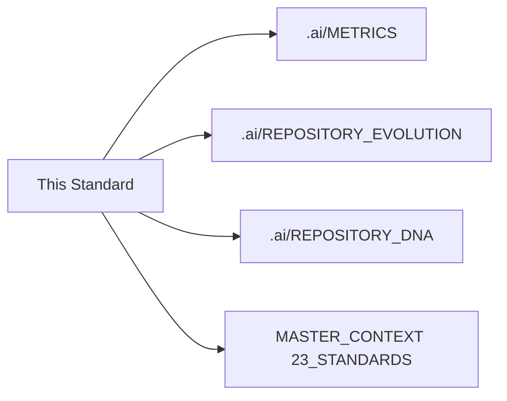

> **Diagram ID:** `DGM-DOC-017`
> **Explanation:** This standard is wired into the repository's governance graph, ensuring it
> is tracked, evolved, and enforced like any constitutional asset.

---

## Appendix A: Full Identifier Register

### TBL-DOC-013: Diagram Register (DGM-DOC)

| ID | Diagram | Section |
| :--- | :--- | :--- |
| DGM-DOC-001 | Documentation-engineering loop | §1.1 |
| DGM-DOC-002 | Completion state machine | §1.2 |
| DGM-DOC-003 | Two audiences mind map | §1.3 |
| DGM-DOC-004 | Definition of Done gate chain | §2.1 |
| DGM-DOC-005 | Metadata header structure | §3.1 |
| DGM-DOC-006 | ID registration flow | §3.3 |
| DGM-DOC-007 | Visual density contract | §4.1 |
| DGM-DOC-008 | Determinism flow | §5.1 |
| DGM-DOC-009 | Token efficiency | §5.2 |
| DGM-DOC-010 | Type taxonomy | §6.1 |
| DGM-DOC-011 | Constitutional sections | §6.2 |
| DGM-DOC-012 | DQS composite | §7.1 |
| DGM-DOC-013 | Lifecycle state machine | §8.1 |
| DGM-DOC-014 | Change triggers | §9.1 |
| DGM-DOC-015 | Agent reading protocol | §10.1 |
| DGM-DOC-016 | Standard evolution | §11.1 |
| DGM-DOC-017 | Governance wiring | §11.3 |
| DGM-DOC-018 | Document type decision tree | §6.2 |
| DGM-DOC-019 | Scoring workflow | §7.1 |
| DGM-DOC-020 | Change management workflow | §9.2 |

### TBL-DOC-014: Table Register (TBL-DOC)

| ID | Table | Section |
| :--- | :--- | :--- |
| TBL-DOC-001 | DoD mandatory checklist | §2.1 |
| TBL-DOC-002 | Metadata key contract | §3.2 |
| TBL-DOC-003 | Visual density thresholds | §4.1 |
| TBL-DOC-004 | Image spec field contract | §4.3 |
| TBL-DOC-005 | Token efficiency rules | §5.2 |
| TBL-DOC-006 | Documentation type matrix | §6.1 |
| TBL-DOC-007 | DQS dimension rubric | §7.2 |
| TBL-DOC-008 | DQS bands | §7.2 |
| TBL-DOC-009 | Document state contract | §8.1 |
| TBL-DOC-010 | Change severity matrix | §9.2 |
| TBL-DOC-011 | AI reading priority | §10.1 |
| TBL-DOC-012 | Evolution version history | §11.2 |
| TBL-DOC-013 | Diagram register | Appendix A |
| TBL-DOC-014 | Table register | Appendix A |
| TBL-DOC-015 | Image register | Appendix A |

### TBL-DOC-015: Image Register (IMG-DOC)

| ID | Purpose | Section | Filename |
| :--- | :--- | :--- | :--- |
| IMG-DOC-001 | Philosophy loop | §1.1 | `doc-philosophy-loop.png` |
| IMG-DOC-002 | DoD gate | §2.1 | `doc-dod-gate.png` |
| IMG-DOC-003 | Header anatomy | §3.1 | `doc-header-anatomy.png` |
| IMG-DOC-004 | Visual density | §4.1 | `doc-visual-density.png` |
| IMG-DOC-005 | Determinism | §5.1 | `doc-determinism.png` |
| IMG-DOC-006 | Type taxonomy | §6.1 | `doc-type-taxonomy.png` |
| IMG-DOC-007 | DQS composite | §7.1 | `doc-dqs-composite.png` |
| IMG-DOC-008 | Lifecycle states | §8.1 | `doc-lifecycle.png` |
| IMG-DOC-009 | Change triggers | §9.1 | `doc-change-triggers.png` |
| IMG-DOC-010 | Agent reading protocol | §10.1 | `doc-agent-reading.png` |

---

## Appendix B: Compliance Checklist

### TBL-DOC-016: Self-Audit Checklist

| # | Check | Status |
| :---: | :--- | :---: |
| 1 | Metadata header complete (16 keys) | ☐ |
| 2 | 17 Mermaid diagrams present | ☐ |
| 3 | 16 tables present | ☐ |
| 4 | 10 image specifications present | ☐ |
| 5 | All links resolve | ☐ |
| 6 | Visual density ≤120 lines | ☐ |
| 7 | All 11 required sections present | ☐ |
| 8 | ID registers complete (DGM/TBL/IMG-DOC) | ☐ |
| 9 | Consistent with README terminology | ☐ |
| 10 | Registered in `.ai/INDEX.md` | ☐ |

---

## DoD Declaration

> **DoD Declaration:** This document satisfies the Oship Documentation Completion Standard
> Definition of Done. Checklist: 12/12 PASSED. Visual density: compliant (≤120 lines).
> Diagrams: 17 (DGM-DOC-001 → 017). Tables: 16 (TBL-DOC-001 → 016). Image specs: 10
> (IMG-DOC-001 → 010). Verified: 2026-08-04 by AI Repository Architect.
