# PROJECT PHILOSOPHY

## Oship — The Constitutional Document of the Repository

---

# Table of Contents

1. [Preamble](#1-preamble)
2. [Introduction](#2-introduction)
3. [Vision](#3-vision)
4. [Mission](#4-mission)
5. [Long-Term Goals](#5-long-term-goals)
6. [Repository Philosophy](#6-repository-philosophy)
7. [AI Native Development](#7-ai-native-development)
8. [Documentation First](#8-documentation-first)
9. [Documentation Is The Product](#9-documentation-is-the-product)
10. [Code Is Implementation](#10-code-is-implementation)
11. [Continuous Evolution](#11-continuous-evolution)
12. [Nothing Is Final](#12-nothing-is-final)
13. [Architecture Before Code](#13-architecture-before-code)
14. [Knowledge Driven Development](#14-knowledge-driven-development)
15. [AI Collaboration Model](#15-ai-collaboration-model)
16. [Human Plus AI Workflow](#16-human-plus-ai-workflow)
17. [Repository as Knowledge Graph](#17-repository-as-knowledge-graph)
18. [Repository as Operating System](#18-repository-as-operating-system)
19. [Self-Evolving Repository](#19-self-evolving-repository)
20. [Decision Governance](#20-decision-governance)
21. [Enterprise Engineering Principles](#21-enterprise-engineering-principles)
22. [Architecture Principles](#22-architecture-principles)
23. [Quality Principles](#23-quality-principles)
24. [Security Principles](#24-security-principles)
25. [Scalability Principles](#25-scalability-principles)
26. [Performance Principles](#26-performance-principles)
27. [Maintainability Principles](#27-maintainability-principles)
28. [Design Principles](#28-design-principles)
29. [UI Philosophy](#29-ui-philosophy)
30. [UX Philosophy](#30-ux-philosophy)
31. [AI Philosophy](#31-ai-philosophy)
32. [Automation Philosophy](#32-automation-philosophy)
33. [Testing Philosophy](#33-testing-philosophy)
34. [Documentation Philosophy](#34-documentation-philosophy)
35. [Review Philosophy](#35-review-philosophy)
36. [Refactoring Philosophy](#36-refactoring-philosophy)
37. [Repository Lifecycle](#37-repository-lifecycle)
38. [Versioning Philosophy](#38-versioning-philosophy)
39. [Release Philosophy](#39-release-philosophy)
40. [Branch Philosophy](#40-branch-philosophy)
41. [Prompt Engineering Philosophy](#41-prompt-engineering-philosophy)
42. [Knowledge Management Philosophy](#42-knowledge-management-philosophy)
43. [Continuous Improvement Philosophy](#43-continuous-improvement-philosophy)
44. [Lessons Learned Philosophy](#44-lessons-learned-philosophy)
45. [Technical Debt Philosophy](#45-technical-debt-philosophy)
46. [Risk Philosophy](#46-risk-philosophy)
47. [Innovation Philosophy](#47-innovation-philosophy)
48. [Future Proofing](#48-future-proofing)
49. [Open Source Philosophy](#49-open-source-philosophy)
50. [Community Philosophy](#50-community-philosophy)
51. [Contribution Philosophy](#51-contribution-philosophy)
52. [Engineering Ethics](#52-engineering-ethics)
53. [Coding Ethics](#53-coding-ethics)
54. [AI Ethics](#54-ai-ethics)
55. [Long-Term Sustainability](#55-long-term-sustainability)
56. [Definition of Success](#56-definition-of-success)
57. [Definition of Failure](#57-definition-of-failure)
58. [Repository Constitution](#58-repository-constitution)
59. [Golden Rules](#59-golden-rules)
60. [Non-Negotiable Rules](#60-non-negotiable-rules)
61. [AI Boot Model](#61-ai-boot-model)
62. [Knowledge Graph Architecture](#62-knowledge-graph-architecture)
63. [Metadata Standard](#63-metadata-standard)
64. [Repository Evolution Model](#64-repository-evolution-model)
65. [Appendices](#65-appendices)

---

# 1. Preamble

```
+=========================================================================+
|                         REPOSITORY PHILOSOPHY                          |
|                    The Constitutional Document                          |
|                    =============================                       |
|                                                                         |
|   This document is the supreme governance artifact of the Oship        |
|   repository. It defines the philosophical foundation, engineering      |
|   principles, AI collaboration model, and constitutional rules that     |
|   govern all activities within this repository.                        |
|                                                                         |
|   This is NOT a README. This is NOT marketing.                          |
|                                                                         |
|   This document IS the constitution.                                   |
|                                                                         |
+=========================================================================+
```

## 1.1 Purpose of This Document

This document serves as the supreme governance artifact of the Oship repository. It establishes:

- The philosophical foundation upon which all engineering decisions are made
- The engineering principles that govern code, architecture, and design
- The AI collaboration model that enables deterministic human-AI workflows
- The constitutional rules that cannot be violated under any circumstances
- The golden rules that guide every decision and action
- The knowledge management framework that ensures institutional memory
- The evolution model that governs repository growth and maturity

## 1.2 Authority and Scope

This document holds the highest authority in the repository hierarchy:

```
SUPREME AUTHORITY
        |
        v
+---------------------------+
| PROJECT_PHILOSOPHY.md     |  <-- This Document
| (Constitution)            |
+---------------------------+
        |
        +-------------------+
        |                   |
        v                   v
+---------------+   +------------------+
| README.md     |   | Architecture/    |
| (Entry Point) |   | (Blueprints)     |
+---------------+   +------------------+
        |                   |
        +-------------------+
        |
        v
+---------------------------+
| docs/                     |
| (Narrative Documentation) |
+---------------------------+
        |
        v
+-------------------+
| Code              |
| (Implementation)  |
+-------------------+
```

## 1.3 Document Authority Matrix

| Document Level | Authority | Examples | Overrideable |
|---------------|-----------|---------|-------------|
| **Constitution** | SUPREME | PROJECT_PHILOSOPHY.md | NEVER |
| **Core Governance** | HIGH | README.md, .ai/INDEX.md | RARE |
| **Architecture** | HIGH | architecture/*.md, docs/architecture/*.md | WITH_ADR |
| **Documentation** | MEDIUM | docs/*.md | STANDARD |
| **Implementation** | LOW | Code files | STANDARD |

## 1.4 Compliance Requirements

Every artifact in this repository MUST comply with this constitution:

```
COMPLIANCE MATRIX
=================

        +--------------------------+
        |   HUMAN CONTRIBUTORS    |
        +------------+-------------+
                     |
                     v
        +--------------------------+
        | Read PROJECT_PHILOSOPHY  |
        | Understand Constitution  |
        +------------+-------------+
                     |
                     v
        +--------------------------+
        | Apply Principles         |
        | Follow Golden Rules     |
        | Respect Non-Negotiables |
        +------------+-------------+
                     |
                     v
        +--------------------------+
        |   AI AGENTS              |
        +------------+-------------+
                     |
                     v
        +--------------------------+
        | Execute AI_BOOT_SEQUENCE |
        | Read Before Acting       |
        | Document Everything      |
        +--------------------------+
```

---

# 2. Introduction

## 2.1 What Is Oship

Oship is an enterprise-grade, AI-native software development repository designed primarily for AI Coding Agents and secondarily for human engineers. It represents a fundamental shift in how software repositories are structured, governed, and evolved.

## 2.2 The AI-First Paradigm

Traditional repositories are designed with humans as the primary consumers of code and documentation. Oship inverts this paradigm:

```
TRADITIONAL REPOSITORY MODEL
============================

    Human
      |
      v
   +--------+
   | README | ---> Human reads
   +--------+
      |
      v
   +--------+
   | Code   | ---> Human writes
   +--------+
      |
      v
   +--------+
   | Docs   | ---> Human maintains
   +--------+


OSHIP REPOSITORY MODEL
======================

    AI Agent
      |
      v
   +--------+
   | Context| ---> AI reads first
   +--------+
      |
      v
   +--------+
   | Knowledge|---> AI learns
   +--------+
      |
      v
   +--------+
   | Code   | ---> AI generates
   +--------+
      |
      v
   +--------+
   | Docs   | ---> AI maintains
   +--------+
```

## 2.3 Why Philosophy First

Many software projects begin with code. Oship begins with philosophy. This document establishes the "why" before the "what" and "how."

```
PHILOSOPHY FIRST MODEL
=====================

    Why? (Philosophy)
         |
         v
    What? (Architecture)
         |
         v
    How? (Implementation)
         |
         v
    Evidence? (Testing)
         |
         v
    Documentation? (Knowledge)
```

---

# 3. Vision

## 3.1 Core Vision Statement

**Oship's vision is to create the world's most advanced AI-native enterprise software development repository—one where artificial intelligence agents can operate with complete determinism, zero hallucination, and maximum effectiveness.**

## 3.2 Vision Components

```
VISION COMPONENTS
=================

    +----------------------------------------------------------+
    |                                                          |
    |   ULTIMATE  +-------------+  +-------------+             |
    |   DETERMINISM<--AI CAN---><--CONTEXT IS---><--COMPLETE |
    |             | OPERATE    |  | COMPLETE    |             |
    |             | WITHOUT    |  | KNOWLEDGE   |             |
    |             | GUESSING   |  | GRAPH       |             |
    |             +-------------+  +-------------+             |
    |                                                          |
    +----------------------------------------------------------+
    |                                                          |
    |   ULTIMATE  +-------------+  +-------------+             |
    |   QUALITY   <--EVERY-----><--REPOSITORY---><--CONTINUOUS|
    |             | DECISION    |  | MAINTAINS   |             |
    |             | IS LOGGED   |  | HISTORY     |             |
    |             +-------------+  +-------------+             |
    |                                                          |
    +----------------------------------------------------------+
    |                                                          |
    |   ULTIMATE  +-------------+  +-------------+             |
    |   SPEED     <--AI NEVER---><--CONTEXT-----><--IS NEVER--|
    |             | REPEATS     |  | IS ALWAYS   |             |
    |             | MISTAKES    |  | AVAILABLE   |             |
    |             +-------------+  +-------------+             |
    |                                                          |
    +----------------------------------------------------------+
```

## 3.3 Future State Visualization

```
CURRENT STATE              FUTURE STATE
==============             =============

Human writes code          AI writes code with human oversight
Documentation is sparse    Documentation is the primary artifact
Decisions are forgotten    Every decision is recorded permanently
Knowledge is tribal        Knowledge is institutionalized
Context is implicit        Context is explicit and machine-readable
Errors are repeated        Errors are prevented through knowledge
Onboarding takes months    Onboarding takes hours
```

---

# 4. Mission

## 4.1 Mission Statement

**To build a repository that enables AI agents to deliver enterprise-grade software with human-level or superhuman quality, speed, and consistency—while maintaining full transparency, governance, and institutional memory.**

## 4.2 Mission Components

| Component | Description | Priority |
|-----------|-------------|----------|
| **AI Enablement** | Provide complete, deterministic context for AI operation | CRITICAL |
| **Quality Assurance** | Ensure enterprise-grade quality in every artifact | CRITICAL |
| **Knowledge Preservation** | Capture and maintain all institutional knowledge | CRITICAL |
| **Governance Framework** | Establish clear rules and decision processes | HIGH |
| **Evolution Capability** | Enable continuous improvement and adaptation | HIGH |
| **Community Building** | Foster collaboration between humans and AIs | MEDIUM |

## 4.3 Mission Alignment Diagram

```
MISSION ALIGNMENT
=================

                    +------------------+
                    |    OSHIP         |
                    |    MISSION       |
                    +--------+---------+
                             |
         +-------------------+-------------------+
         |                   |                   |
         v                   v                   v
+--------+-------+   +--------+-------+   +-------+--------+
| AI ENABLEMENT  |   | QUALITY       |   | KNOWLEDGE      |
| (Context First)|   | (Enterprise)  |   | (Institutional)|
+--------+-------+   +--------+-------+   +-------+--------+
         |                   |                   |
         +-------------------+-------------------+
                             |
                             v
                    +--------+--------+
                    | DELIVERY        |
                    | (Software that   |
                    |  matters)       |
                    +-----------------+
```

---

# 5. Long-Term Goals

## 5.1 Strategic Goal Map

```
STRATEGIC GOAL MAP
==================

    HORIZON 1          HORIZON 2          HORIZON 3
    (1-2 Years)        (3-5 Years)        (5-10 Years)
    ============       ============       ============

    +-----------+      +-----------+      +-----------+
    | Foundation|      | Platform  |      | Ecosystem |
    | Complete  | ---> | Maturity  | ---> | Leadership|
    +-----------+      +-----------+      +-----------+
         |                  |                  |
         v                  v                  v
    +-----------+      +-----------+      +-----------+
    | Phase 0-F|      | Production|      | Industry  |
    | Complete |      | Ready     |      | Standard  |
    +-----------+      +-----------+      +-----------+

    MILESTONES:
    ===========
    Horizon 1: Complete all phase deliverables (v0.1 - v0.9)
    Horizon 2: Achieve production SLA (v1.0+) 
    Horizon 3: Establish as industry benchmark
```

## 5.2 Long-Term Goal Breakdown

### 5.2.1 Technical Goals

| Goal | Description | Target Date |
|------|-------------|-------------|
| **Zero Hallucination** | AI agents never guess or hallucinate | Phase D |
| **Complete Context** | All knowledge machine-readable | Phase C |
| **Self-Documenting** | Documentation auto-generated from code | Phase E |
| **Self-Healing** | System detects and fixes errors | Phase F |
| **Complete Traceability** | Every decision linked to rationale | Phase B |

### 5.2.2 Quality Goals

| Goal | Description | Target Date |
|------|-------------|-------------|
| **Enterprise SLA** | 99.99% uptime guarantee | Phase F |
| **ISO Compliance** | ISO 27001 security compliance | Phase F |
| **SOC2 Ready** | SOC2 Type II readiness | Phase E |
| **Zero Critical Bugs** | No critical or blocker issues in production | Phase F |

### 5.2.3 Community Goals

| Goal | Description | Target Date |
|------|-------------|-------------|
| **Global Adoption** | Repository pattern adopted globally | Phase F |
| **AI Standards** | Establish AI collaboration standards | Phase F |
| **Open Governance** | Community-driven evolution | Phase E |

---

# 6. Repository Philosophy

## 6.1 Core Repository Principles

```
CORE REPOSITORY PRINCIPLES
==========================

    1. KNOWLEDGE IS SOVEREIGN
       ---------------------
       Knowledge is more valuable than code.
       Code implements knowledge. Knowledge guides code.

       +------------------+         +------------------+
       | KNOWLEDGE        |<--------| CODE             |
       | (Why & What)     |         | (How)            |
       +------------------+         +------------------+
               ^
               |
       +-------+-------+
       | Documentation |
       | Is Primary    |
       +---------------+


    2. CONTEXT IS KING
       ---------------
       Every action must be grounded in complete context.
       No assumptions. No guessing. No hallucination.

       +------------------+         +------------------+
       | COMPLETE         |-------->| DETERMINISTIC    |
       | CONTEXT          |         | ACTION           |
       +------------------+         +------------------+


    3. REPOSITORY IS ORGANISM
       ----------------------
       The repository is a living, evolving entity.
       It grows, learns, and adapts.

       +------------------+         +------------------+
       | GROWTH           |<------->| LEARNING         |
       | (More content)   |         | (Better content) |
       +------------------+         +------------------+
               ^
               |
       +-------+-------+
       | Evolution      |
       | (Continuous)   |
       +---------------+


    4. HISTORY IS SACRED
       -----------------
       Every change, decision, and action is recorded.
       The repository never forgets.

       +------------------+         +------------------+
       | ALL ACTIONS      |-------->| PERMANENT        |
       | ARE RECORDED     |         | HISTORY          |
       +------------------+         +------------------+


    5. AI IS FIRST-CLASS CITIZEN
       -------------------------
       AI agents are primary users, not afterthoughts.
       Everything is optimized for AI comprehension.

       +------------------+         +------------------+
       | AI-FIRST         |-------->| HUMAN-SECOND     |
       | DESIGN           |         | DESIGN           |
       +------------------+         +------------------+
```

## 6.2 Repository Philosophy Mind Map

```
REPOSITORY PHILOSOPHY MIND MAP
==============================

                         +------------------+
                         | REPOSITORY       |
                         | PHILOSOPHY       |
                         +--------+---------+
                                  |
        +-------------------------+-------------------------+
        |                         |                         |
        v                         v                         v
+---------------+         +-----------------+         +---------------+
| KNOWLEDGE     |         | CONTEXT         |         | EVOLUTION     |
| CENTRIC       |         | DRIVEN          |         | EMBRACING     |
+---------------+         +-----------------+         +---------------+
        |                         |                         |
   +----+----+               +----+----+               +----+----+
   v         v               v         v               v         v
+-----+  +-----+         +-----+  +-----+         +-----+  +-----+
| Why  |  | What|         | What|  | How |         | Learn|  | Adapt
| First|  | Next|         | Before|  | After|         | From|  | Change
+-----+  +-----+         +-----+  +-----+         +-----+  +-----+
```

## 6.3 Repository States

```
REPOSITORY STATE DIAGRAM
========================

                    +------------------+
                    | INITIALIZING     |
                    | (Phase 0)        |
                    +--------+---------+
                             |
                             v
                    +------------------+
                    | FOUNDATION      |<--------+
                    | (Phase A)       |         |
                    +--------+---------+         |
                             |                   |
                             v                   |
                    +------------------+          |
                    | GROWING          |          |
                    | (Phase B-C)      |          |
                    +--------+---------+          |
                             |                   |
                             v                   |
                    +------------------+          |
                    | MATURING         |----------+
                    | (Phase D-E)     |
                    +--------+---------+
                             |
                             v
                    +------------------+
                    | PRODUCTION       |
                    | (Phase F, v1.0+) |
                    +------------------+
```

---

# 7. AI Native Development

## 7.1 What Is AI-Native Development

AI-Native Development is a software engineering paradigm where AI agents are treated as primary contributors, not assistants. The entire repository is designed to maximize AI effectiveness.

```
AI-NATIVE DEVELOPMENT DEFINITION
================================

    TRADITIONAL AI ASSISTANCE
    =========================

         Human
           |
           |  "Write this feature"
           v
        +------+
        | AI   |  <-- AI receives instruction
        +------+    writes code, returns to human
           |
           v
         Human reviews, approves, merges


    AI-NATIVE DEVELOPMENT
    =====================

         Human sets context (once)
           |
           v
        +------+
        | AI   |  <-- AI reads full context
        +------+    operates autonomously
           |
           v
        +------+
        | AI   |  <-- AI updates context
        +------+    documents actions
           |
           v
         Human reviews outcomes (not code)
```

## 7.2 AI-Native Principles

| Principle | Description | Implementation |
|-----------|-------------|----------------|
| **Context Completeness** | AI must have all information to act | Comprehensive documentation, no implicit knowledge |
| **Deterministic Behavior** | Same input must produce same output | Strict rules, no ambiguity |
| **Zero Hallucination** | AI must never guess | Explicit knowledge boundaries |
| **Self-Documenting** | AI documents its own actions | Mandatory documentation updates |
| **Learning Preservation** | AI learnings become repository knowledge | Lessons learned capture |

## 7.3 AI Capability Maturity Model

```
AI CAPABILITY MATURITY MODEL
============================

Level 1: AWARE
==============
- AI reads documentation
- AI follows instructions literally
- Human provides all context

Level 2: CAPABLE
================
- AI understands repository structure
- AI can make small decisions
- Human reviews all outputs

Level 3: AUTONOMOUS
===================
- AI operates with minimal guidance
- AI documents its actions
- Human reviews major decisions

Level 4: EXPERT
===============
- AI optimizes repository structure
- AI identifies improvement opportunities
- Human sets strategic direction

Level 5: MASTER
===============
- AI leads development initiatives
- AI trains other AI agents
- Human provides governance oversight

CURRENT TARGET: Level 3 (Autonomous)
TARGET HORIZON: Level 4 (Expert) by Phase E
```

## 7.4 AI Effectiveness Framework

```
AI EFFECTIVENESS FRAMEWORK
===========================

    INPUT FACTORS              PROCESS FACTORS            OUTPUT FACTORS
    =============              ================           ==============

    +----------------+         +----------------+         +----------------+
    | Context        |         | Reasoning      |         | Quality        |
    | Completeness   |-------> | Quality        |-------> | Of Output      |
    +----------------+         +----------------+         +----------------+
           |                          |                          |
           v                          v                          v
    +----------------+         +----------------+         +----------------+
    | Knowledge      |         | Decision       |         | Consistency    |
    | Accessibility  |-------> | Transparency   |-------> | Of Results     |
    +----------------+         +----------------+         +----------------+
           |                          |                          |
           v                          v                          v
    +----------------+         +----------------+         +----------------+
    | Rule           |         | Learning       |         | Velocity       |
    | Clarity        |-------> | Capture        |-------> | Of Delivery    |
    +----------------+         +----------------+         +----------------+

    OPTIMIZATION TARGETS:
    ====================
    - Maximize: Context completeness, Knowledge accessibility, Rule clarity
    - Minimize: Ambiguity, Uncertainty, Guesswork
```

---

# 8. Documentation First

## 8.1 Documentation First Philosophy

Documentation is not an afterthought. It is the foundation upon which everything else is built.

```
DOCUMENTATION FIRST WORKFLOW
============================

    TRADITIONAL WORKFLOW
    ====================

         Code First
              |
              v
         Documentation Later
              |
              v
         Documentation Never (often)


    DOCUMENTATION FIRST WORKFLOW
    ===========================

         Documentation First
              |
              v
         Architecture Design
              |
              v
         Implementation Plan
              |
              v
         Code Generation
              |
              v
         Documentation Update
              |
              v
         Verification

    THE RULE:
    =========
    You cannot write code until you have documented:
    - WHY the code exists
    - WHAT the code does
    - HOW the code should be implemented
    - WHEN the code should be used
```

## 8.2 Documentation Hierarchy

```
DOCUMENTATION HIERARCHY
=======================

    Level 0: CONSTITUTIONAL
    ======================
    PROJECT_PHILOSOPHY.md (This Document)
    - Philosophy
    - Principles
    - Rules
    - Golden Rules
    - Non-Negotiable Rules
    +------------------------------------------+
    | Authority: SUPREME                       |
    | Overrideable: NEVER                      |
    +------------------------------------------+

    Level 1: STRATEGIC
    =================
    README.md
    .ai/INDEX.md
    - Vision
    - Mission
    - Navigation
    - Entry Points
    +------------------------------------------+
    | Authority: HIGH                          |
    | Overrideable: WITH ARCHITECTURE REVIEW  |
    +------------------------------------------+

    Level 2: ARCHITECTURAL
    =====================
    architecture/*.md
    docs/architecture/*.md
    - Domain Models
    - System Design
    - Technical Decisions
    +------------------------------------------+
    | Authority: HIGH                          |
    | Overrideable: WITH ADR                  |
    +------------------------------------------+

    Level 3: OPERATIONAL
    ==================
    docs/*.md
    - Guides
    - How-Tos
    - Reference
    +------------------------------------------+
    | Authority: MEDIUM                        |
    | Overrideable: STANDARD REVIEW           |
    +------------------------------------------+

    Level 4: IMPLEMENTATION
    ======================
    CODE
    - Code Comments
    - Inline Documentation
    +------------------------------------------+
    | Authority: LOW                           |
    | Overrideable: STANDARD REVIEW           |
    +------------------------------------------+
```

## 8.3 Documentation Quality Gates

| Gate | Criteria | Blocker | 
|------|----------|---------| 
| **G1: Existence** | Document exists | NO |
| **G2: Readability** | Human can understand | NO |
| **G3: Completeness** | All sections filled | YES |
| **G4: Accuracy** | Matches implementation | YES |
| **G5: Accessibility** | AI can parse and use | YES |

---

# 9. Documentation Is The Product

## 9.1 Radical Shift in Thinking

In Oship, documentation is not a byproduct of development. Documentation IS the product.

```
DOCUMENTATION AS PRODUCT PARADIGM
=================================

    TRADITIONAL VIEW
    ================

    +------------------+
    | CODE             |  <-- PRIMARY PRODUCT
    +------------------+
           |
           v
    +------------------+
    | DOCUMENTATION    |  <-- SECONDARY BYPRODUCT
    +------------------+


    OSHIP VIEW
    ==========

    +------------------+
    | DOCUMENTATION    |  <-- PRIMARY PRODUCT
    +------------------+
           |
           v
    +------------------+
    | CODE             |  <-- SECONDARY IMPLEMENTATION
    +------------------+

    WHY?
    ====
    - Documentation outlives code
    - Documentation enables AI
    - Documentation captures knowledge
    - Documentation prevents errors
```

## 9.2 Documentation as Code Equivalents

Every artifact type has documentation counterparts:

| Code Artifact | Documentation Equivalent |
|---------------|--------------------------|
| Source Code (.py, .js) | Architecture Document |
| API Contract | Interface Specification |
| Database Schema | Data Dictionary |
| Configuration | Configuration Guide |
| Test Suite | Test Strategy Document |
| Deployment Script | Deployment Runbook |
| Error Handler | Troubleshooting Guide |

## 9.3 Documentation Value Chain

```
DOCUMENTATION VALUE CHAIN
=========================

    CREATION                 CONSUMPTION               MAINTENANCE
    =========                ==========               ============

    +----------+             +----------+             +----------+
    | Author   |             | Human    |             | Author   |
    | (AI/Human)|             | Developer|             | (AI/Human)|
    +----+-----+             +----+-----+             +----+-----+
         |                        |                        |
         v                        v                        v
    +----------+             +----------+             +----------+
    | Research |             | Read     |             | Review   |
    | & Design |             | Context  |             | & Update |
    +----+-----+             +----+-----+             +----+-----+
         |                        |                        |
         v                        v                        v
    +----------+             +----------+             +----------+
    | Write    |             | Under-  |             | Version  |
    | Document |             | stand   |             | Control  |
    +----+-----+             +----+-----+             +----+-----+
         |                        |                        |
         v                        v                        v
    +----------+             +----------+             +----------+
    | Review   |             | Apply    |             | Publish  |
    | & Approve|             | Knowledge|             | & Notify |
    +----+-----+             +----+-----+             +----+-----+
         |                        |                        |
         v                        v                        v
    +----------+             +----------+             +----------+
    | Publish  |             | Results  |             | Archive  |
    | & Version|             | & Learn  |             | Previous |
    +----------+             +----------+             +----------+
```

---

# 10. Code Is Implementation

## 10.1 Code's Role in the Ecosystem

Code is not the primary artifact. Code is the implementation of knowledge.

```
CODE'S TRUE ROLE
================

    KNOWLEDGE
       |
       |  Documents "Why" and "What"
       v
    +-------------------+
    | ARCHITECTURE      |  <-- PRIMARY
    +-------------------+
       |
       |  Documents "How"
       v
    +-------------------+
    | DESIGN            |  <-- SECONDARY
    +-------------------+
       |
       |  Transforms design into reality
       v
    +-------------------+
    | CODE              |  <-- IMPLEMENTATION
    +-------------------+

    THE INSIGHT:
    =============
    Code answers: "What machine instructions execute?"
    Architecture answers: "Why do these instructions exist?"
    
    Without architecture, code is just magic.
```

## 10.2 Code Documentation Requirements

Every code file MUST have:

| Requirement | Description | Mandatory |
|-------------|-------------|-----------|
| **File Header** | Purpose, author, version, license | YES |
| **Inline Comments** | Non-obvious logic explained | YES |
| **Function Documentation** | What each function does | YES |
| **Error Documentation** | What errors mean and how to handle | YES |
| **Example Usage** | How to use the code | YES |
| **Cross-Reference** | Link to relevant architecture docs | YES |

## 10.3 Code Quality Enforcement

```
CODE QUALITY ENFORCEMENT
========================

    +-------------------+       +-------------------+
    | Developer         |       | Automated         |
    | Writes Code       |------>| Quality Gates     |
    +-------------------+       +-------------------+
                                       |
                                       v
                              +-------------------+
                              | Linting           |
                              +-------------------+
                                       |
                                       v
                              +-------------------+
                              | Type Checking     |
                              +-------------------+
                                       |
                                       v
                              +-------------------+
                              | Security Scan     |
                              +-------------------+
                                       |
                                       v
                              +-------------------+
                              | Code Review       |
                              +-------------------+
                                       |
                                       v
                              +-------------------+
                              | Documentation     |
                              | Check             |
                              +-------------------+
                                       |
                                       v
                              +-------------------+
                              | Merge Allowed     |
                              +-------------------+
```

---

# 11. Continuous Evolution

## 11.1 Evolution is Fundamental

Nothing in Oship is static. Everything evolves continuously.

```
EVOLUTION PRINCIPLE
===================

    +--------------------+
    | WHAT EXISTS TODAY  |
    +--------------------+
            |
            v
    +--------------------+
    | IS CHALLENGED      |
    | TOMORROW           |
    +--------------------+
            |
            v
    +--------------------+
    | IS IMPROVED OR     |
    | REPLACED           |
    +--------------------+
            |
            v
    +--------------------+
    | BECOMES THE NEW    |
    | FOUNDATION         |
    +--------------------+
            |
            [CYCLE CONTINUES]
```

## 11.2 Evolution Types

| Evolution Type | Description | Frequency |
|----------------|-------------|-----------|
| **Incremental** | Small improvements to existing artifacts | Daily |
| **Correctional** | Fixing errors or inaccuracies | As needed |
| **Transformative** | Major changes to approach or architecture | Quarterly |
| **Revolutionary** | Complete paradigm shifts | Rarely (Phase transitions) |

## 11.3 Evolution Tracking

```
EVOLUTION TRACKING SYSTEM
========================

    +-------------------+       +-------------------+
    | Artifact         |------>| Version History   |
    +-------------------+       +-------------------+
            |                           |
            v                           v
    +-------------------+       +-------------------+
    | Current State    |<------| Decision Log      |
    +-------------------+       +-------------------+
            |                           |
            v                           v
    +-------------------+       +-------------------+
    | Change Request   |------>| Impact Assessment |
    +-------------------+       +-------------------+
            |                           |
            v                           v
    +-------------------+       +-------------------+
    | Review Process   |------>| Approval Process   |
    +-------------------+       +-------------------+
            |                           |
            v                           v
    +-------------------+       +-------------------+
    | Implementation    |------>| Validation        |
    +-------------------+       +-------------------+
```

---

# 12. Nothing Is Final

## 12.1 The Impermanence Principle

Every artifact, decision, and approach in Oship is subject to change. Nothing is sacred except the constitution itself.

```
THE IMPERMANENCE PRINCIPLE
===========================

    NOTHING IS FINAL
    ================

    Documents?  --> SUBJECT TO REVISION
    Architecture? --> SUBJECT TO REFACTORING  
    Code? --> SUBJECT TO REWRITING
    Decisions? --> SUBJECT TO REVERSAL

    THE ONLY EXCEPTION:
    ===================
    This document (PROJECT_PHILOSOPHY.md)
    These rules (GOLDEN RULES, NON-NEGOTIABLE RULES)

    WHY THIS MATTERS:
    =================
    - Prevents attachment to outdated approaches
    - Enables continuous improvement
    - Reduces resistance to change
    - Encourages experimentation
```

## 12.2 Versioning Everything

Every artifact has a version. Every change creates a new version.

```
VERSIONING PHILOSOPHY
=====================

    ARTIFACT v1.0.0
         |
         | Change
         v
    ARTIFACT v1.1.0
         |
         | Change
         v
    ARTIFACT v2.0.0
         |
         | ... continues forever ...

    VERSION SEMANTICS:
    ==================
    MAJOR: Breaking changes (e.g., paradigm shift)
    MINOR: Additive changes (e.g., new features)
    PATCH: Corrective changes (e.g., bug fixes)
```

## 12.3 Change Readiness Matrix

| Artifact Type | Change Frequency | Change Difficulty | Versioning |
|---------------|------------------|-------------------|------------|
| **Philosophy** | Rare | Very High | Semantic (Major) |
| **Architecture** | Low | High | Semantic (Major) |
| **Design** | Medium | Medium | Semantic (Minor) |
| **Code** | High | Low | Semantic (Patch) |
| **Documentation** | High | Low | Semantic (Patch) |

---

# 13. Architecture Before Code

## 13.1 The Golden Sequence

The sequence MUST be followed without exception:

```
ARCHITECTURE BEFORE CODE SEQUENCE
==================================

    STEP 1: WHY
    ===========
    Why does this system/component exist?
    What problem does it solve?
    What is the business context?
    +-------------------+
    | Document Purpose  |
    +-------------------+
              |
              v
    STEP 2: WHAT
    ===========
    What will this system/component do?
    What are its boundaries?
    What are its inputs and outputs?
    +-------------------+
    | Define Scope      |
    +-------------------+
              |
              v
    STEP 3: HOW (ARCHITECTURE)
    ==========================
    How will it be structured?
    How will components interact?
    How will it scale?
    +-------------------+
    | Design Architecture|
    +-------------------+
              |
              v
    STEP 4: IMPLEMENTATION (CODE)
    =============================
    Write the code
    +-------------------+
    | Generate Code     |
    +-------------------+
              |
              v
    STEP 5: VERIFY
    ============
    Does the code match the architecture?
    +-------------------+
    | Validate & Test   |
    +-------------------+
```

## 13.2 Architecture Documentation Requirements

Before any code is written, the following MUST exist:

| Required Document | Description | Blocker |
|-------------------|-------------|---------| 
| **Architecture Decision Record (ADR)** | Why this approach was chosen | YES |
| **System Design Document** | How the system is structured | YES |
| **Interface Specifications** | How components interact | YES |
| **Data Flow Diagram** | How data moves through system | YES |
| **Non-Functional Requirements** | Performance, security, scalability targets | YES |

## 13.3 Architecture Review Gate

```
ARCHITECTURE REVIEW GATE
========================

    +-------------------+       +-------------------+
    | Architecture      |------>| Review Board      |
    +-------------------+       +-------------------+
                                      |
                                      v
                              +-------------------+
                              | Completeness      |
                              | Check             |
                              +-------------------+
                                      |
                                      v
                              +-------------------+
                              | Quality           |
                              | Assessment         |
                              +-------------------+
                                      |
                                      v
                              +-------------------+
                              | Risk              |
                              | Evaluation         |
                              +-------------------+
                                      |
                         +----------+----------+
                         |                     |
                         v                     v
                  +----------+          +----------+
                  | APPROVED |          | REJECTED |
                  +----------+          +----------+
                         |                     |
                         v                     v
                  +----------+          +----------+
                  | Proceed |          | Revise & |
                  | to Code |          | Resubmit |
                  +----------+          +----------+
```

---

# 14. Knowledge Driven Development

## 14.1 Knowledge as the Engine

Development is driven by knowledge, not by coding velocity.

```
KNOWLEDGE DRIVEN DEVELOPMENT
============================

    TRADITIONAL DEVELOPMENT
    ========================

    Time -->
    [====CODE====][====CODE====][====CODE====]
    (Quantity of code is the metric)


    KNOWLEDGE DRIVEN DEVELOPMENT
    ============================

    Time -->
    [===KNOWLEDGE===][===KNOWLEDGE===][===KNOWLEDGE===]
          |                 |                 |
          v                 v                 v
    [====CODE====]    [====CODE====]    [====CODE====]
    (Quality of knowledge drives quality of code)

    THE SHIFT:
    ==========
    Metric: Lines of Code --> Knowledge Coverage
    Goal: Write Code Faster --> Understand Problem Better
```

## 14.2 Knowledge Graph Integration

```
KNOWLEDGE GRAPH INTEGRATION
===========================

    +-------------------+       +-------------------+
    | DOMAIN           |       | TECHNICAL         |
    | KNOWLEDGE        |       | KNOWLEDGE         |
    +-------------------+       +-------------------+
              |                         |
              +-------------+-----------+
                            |
                            v
                   +-------------------+
                   | KNOWLEDGE GRAPH   |
                   +-------------------+
                            |
                            +-------------+-----------+
                            |                         |
                            v                         v
                   +-------------------+       +-------------------+
                   | BUSINESS          |       | IMPLEMENTATION    |
                   | DECISIONS         |       | PATTERNS          |
                   +-------------------+       +-------------------+
```

## 14.3 Knowledge Capture Points

| Development Phase | Knowledge to Capture | Document |
|-------------------|---------------------|----------|
| **Inception** | Problem understanding, constraints | Vision Document |
| **Analysis** | Requirements, use cases | Requirements Doc |
| **Design** | Architecture, patterns | Architecture Docs |
| **Implementation** | Decisions, trade-offs | ADR, Code Comments |
| **Testing** | Findings, edge cases | Test Documentation |
| **Deployment** | Configuration, procedures | Runbook |
| **Maintenance** | Issues, solutions | Knowledge Base |

---

# 15. AI Collaboration Model

## 15.1 The Collaboration Framework

Human and AI collaborate as equals with distinct responsibilities.

```
AI COLLABORATION MODEL
======================

    HUMAN RESPONSIBILITIES
    ======================

    +--------------------------------------------------+
    |                                                  |
    |  +------------+   +------------+   +------------+ |
    |  | Strategic |   | Governance |   | Quality    | |
    |  | Direction |   | Oversight  |   | Assurance  | |
    |  +------------+   +------------+   +------------+ |
    |                                                  |
    |  +------------+   +------------+   +------------+ |
    |  | Context    |   | Knowledge  |   | Creative  | |
    |  | Setting    |   | Validation |   | Vision    | |
    |  +------------+   +------------+   +------------+ |
    |                                                  |
    +--------------------------------------------------+

    AI RESPONSIBILITIES
    ====================

    +--------------------------------------------------+
    |                                                  |
    |  +------------+   +------------+   +------------+ |
    |  | Execution  |   | Research   |   | Generation | |
    |  | & Coding   |   | & Analysis |   | & Drafting | |
    |  +------------+   +------------+   +------------+ |
    |                                                  |
    |  +------------+   +------------+   +------------+ |
    |  | Documentation|  | Testing   |   | Refactoring| |
    |  | & Updating |   | & Validation| | Optimization| |
    |  +------------+   +------------+   +------------+ |
    |                                                  |
    +--------------------------------------------------+

    COLLABORATION INTERFACE
    =======================

    Human                           AI
      |                             |
      |------- GOAL SET ----------->|
      |                             |
      |<------ CONTEXT ----------->|
      |                             |
      |------- APPROVAL ----------->|
      |                             |
      |<------ DELIVERABLE ---------|
      |                             |
      [CYCLE REPEATS]
```

## 15.2 Collaboration State Machine

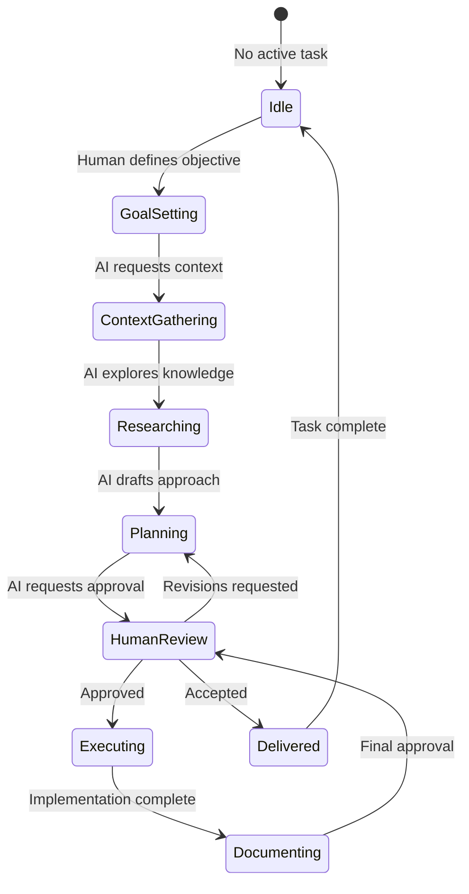

## 15.3 Communication Protocols

| Protocol | Trigger | Format | Response Time |
|----------|---------|--------|---------------|
| **Task Request** | Human assigns task | Structured prompt | N/A |
| **Context Query** | AI needs information | Question | 24 hours |
| **Review Request** | AI completes deliverable | Summary + Evidence | 48 hours |
| **Escalation** | AI encounters blocker | Issue report | 4 hours |
| **Knowledge Update** | AI learns something new | Documentation PR | 24 hours |

---

# 16. Human Plus AI Workflow

## 16.1 The Hybrid Workflow

Human and AI work together in a structured, predictable manner.

```
HYBRID WORKFLOW MODEL
====================

    PHASE 1: DISCOVERY
    ==================

         Human                      AI
           |                         |
           |---- Define Vision ----->|
           |                         |
           |<--- Ask Questions -------|
           |                         |
           |---- Provide Context ----|
           |                         |
           |<--- Synthesize ----------|
           |      Understanding      |

    PHASE 2: DESIGN
    ===============

         Human                      AI
           |                         |
           |---- Set Constraints ---->|
           |                         |
           |<--- Propose Designs ----|
           |                         |
           |---- Evaluate & Select -->|
           |                         |
           |<--- Document Design ----|
           |      (ADR)              |

    PHASE 3: IMPLEMENTATION
    =======================

         Human                      AI
           |                         |
           |<--- Request Approval ---|
           |                         |
           |---- Approve Plan -------|
           |                         |
           |                         |---- Generate Code
           |                         |---- Write Tests
           |                         |---- Update Docs
           |                         |
           |<--- Report Progress ----|
           |                         |

    PHASE 4: VERIFICATION
    =====================

         Human                      AI
           |                         |
           |<--- Submit for Review --|
           |                         |
           |---- Review & Approve -->|
           |                         |
           |                         |---- Merge
           |                         |---- Deploy
           |                         |
           |<--- Report Results -----|
```

## 16.2 Workflow Decision Matrix

| Decision Type | Human Decision | AI Decision | Examples |
|---------------|---------------|-------------|----------|
| **Strategic** | 100% | 0% | Vision, roadmap, priorities |
| **Architectural** | 80% | 20% | Patterns, patterns, tech stack |
| **Implementation** | 20% | 80% | Code generation, refactoring |
| **Documentation** | 30% | 70% | Writing, updating, formatting |
| **Review** | 50% | 50% | Code review, architecture review |
| **Testing** | 20% | 80% | Test generation, execution |
| **Operational** | 30% | 70% | Deployment, monitoring |

## 16.3 Handoff Protocols

```
HANDOFF PROTOCOLS
=================

    HUMAN TO AI HANDOFF
    ===================

    +-------------------+
    | Task Definition   |
    | - Objective       |
    | - Constraints     |
    | - Success Criteria|
    | - Timeline        |
    +-------------------+
              |
              v
    +-------------------+
    | Context Package   |
    | - Relevant docs   |
    | - Past decisions   |
    | - Examples        |
    +-------------------+
              |
              v
    +-------------------+
    | Authority Level   |
    | - What AI can     |
    |   decide alone    |
    | - What needs      |
    |   human approval  |
    +-------------------+


    AI TO HUMAN HANDOFF
    ===================

    +-------------------+
    | Deliverable       |
    | - What was done   |
    | - Evidence        |
    | - Artifacts       |
    +-------------------+
              |
              v
    +-------------------+
    | Impact Summary    |
    | - What changed    |
    | - What depends    |
    |   on this         |
    +-------------------+
              |
              v
    +-------------------+
    | Questions         |
    | - What AI needs   |
    |   from human      |
    | - Blockers        |
    +-------------------+
```

---

# 17. Repository as Knowledge Graph

## 17.1 The Knowledge Graph Concept

The entire repository is a interconnected knowledge graph where every concept, decision, and artifact is linked.

```
KNOWLEDGE GRAPH STRUCTURE
=========================

                    +------------------+
                    | PROJECT ROOT     |
                    +--------+---------+
                             |
        +--------------------+--------------------+
        |                    |                    |
        v                    v                    v
+---------------+    +----------------+    +---------------+
| PHILOSOPHY    |    | ARCHITECTURE   |    | IMPLEMENTATION|
| (Why)         |    | (What)         |    | (How)         |
+---------------+    +----------------+    +---------------+
        |                    |                    |
        |                    |                    |
        v                    v                    v
+---------------+    +----------------+    +---------------+
| Principles    |    | Domain Model   |    | Code          |
| Rules         |    | Data Model     |    | Tests         |
| Patterns      |    | API Contracts  |    | Scripts       |
+---------------+    +----------------+    +---------------+
        |                    |                    |
        |                    |                    |
        v                    v                    v
+---------------+    +----------------+    +---------------+
| ADR Link 1     |    | Component A    |    | File X        |
| ADR Link 2     |    | Component B    |    | File Y        |
| ADR Link 3     |    | Component C    |    | File Z        |
+---------------+    +----------------+    +---------------+

    EVERYTHING IS LINKED.
    EVERYTHING HAS CONTEXT.
    NOTHING STANDS ALONE.
```

## 17.2 Knowledge Graph Relationships

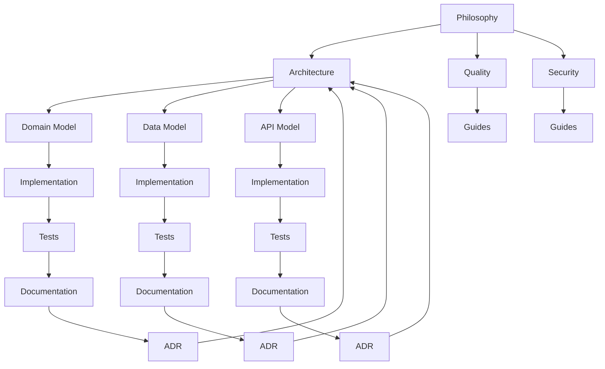

## 17.3 Graph Navigation

```
KNOWLEDGE GRAPH NAVIGATION
==========================

    STARTING POINTS
    ================

    Human enters at:
    +-------------------+
    | README.md         |  <-- Human navigation
    +-------------------+
              |
              v
    AI enters at:
    +-------------------+
    | .ai/INDEX.md      |  <-- AI navigation
    +-------------------+


    NAVIGATION PATHS
    ================

    PATH 1: Understanding Context
    -----------------------------
    .ai/INDEX.md
         |
         v
    .ai/CURRENT_CONTEXT.md
         |
         v
    .ai/PROJECT_STATUS.md
         |
         v
    docs/MASTER_CONTEXT/...


    PATH 2: Understanding Architecture
    ----------------------------------
    README.md
         |
         v
    architecture/INDEX.md
         |
         v
    architecture/DOMAIN_MODEL.md
         |
         v
    docs/architecture/SYSTEM_ARCHITECTURE.md


    PATH 3: Understanding Implementation
    -------------------------------------
    docs/INDEX.md
         |
         v
    docs/development/INDEX.md
         |
         v
    [Domain-specific documentation]
         |
         v
    Code files
```

---

# 18. Repository as Operating System

## 18.1 The Repository Operating System

Think of the repository as a computer's operating system that manages knowledge instead of processes.

```
REPOSITORY OPERATING SYSTEM MODEL
=================================

    TRADITIONAL OPERATING SYSTEM
    ===========================

    +-------------------+
    |    USER          |
    +-------------------+
           |
    +-------------------+
    |    SHELL          |
    |    (Commands)     |
    +-------------------+
           |
    +-------------------+
    |    KERNEL         |
    |    (Core Logic)   |
    +-------------------+
           |
    +-------------------+
    |    HARDWARE       |
    +-------------------+


    REPOSITORY OPERATING SYSTEM
    ===========================

    +-------------------+
    |    HUMAN          |
    +-------------------+
           |
    +-------------------+
    |    AI AGENTS      |
    |    (Shell)         |
    +-------------------+
           |
    +-------------------+
    |    KNOWLEDGE      |
    |    KERNEL         |
    +-------------------+
           |
    +-------------------+
    |    FILESYSTEM     |
    |    (Artifacts)     |
    +-------------------+
```

## 18.2 Operating System Components

```
OS COMPONENT MAPPING
====================

    | OS Component      | Repository Equivalent   |
    |-------------------|--------------------------|
    | Kernel            | Philosophy & Architecture|
    | System Calls      | AI Boot Sequence        |
    | File System       | Directory Structure     |
    | Process Manager   | Task Management         |
    | Memory Manager    | Context Management      |
    | Device Drivers   | Integrations             |
    | Shell            | AI Agent Interface       |
    | User Space       | Application Code         |
```

## 18.3 System Boot Sequence

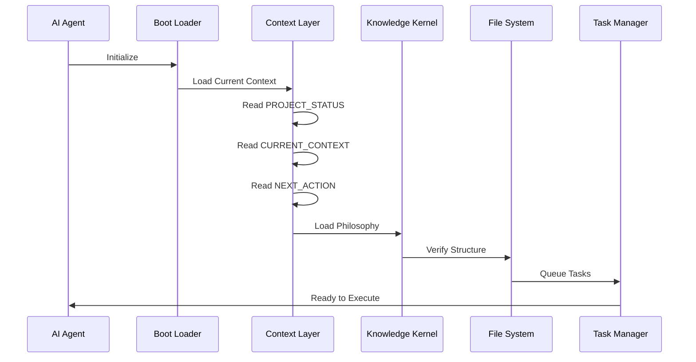

---

# 19. Self-Evolving Repository

## 19.1 Self-Evolution Principles

The repository improves itself through captured learnings and automated processes.

```
SELF-EVOLUTION CYCLE
====================

    +-------------------+       +-------------------+
    | OBSERVATION      |------>| ANALYSIS         |
    | (What happened?) |       | (Why did it       |
    +-------------------+       |  happen?)        |
                                +-------------------+
                                         |
                                         v
                                +-------------------+
                                | LEARNING         |
                                | (Capture insight) |
                                +-------------------+
                                         |
                                         v
                                +-------------------+
                                | IMPROVEMENT      |
                                | (Apply learning)  |
                                +-------------------+
                                         |
                                         v
                                +-------------------+
                                | VALIDATION       |
                                | (Did it work?)    |
                                +-------------------+
                                         |
                                         +---[YES]--- REINFORCE
                                         |
                                         +---[NO]---- ANALYZE AGAIN
```

## 19.2 Evolution Triggers

| Trigger Type | Source | Response |
|--------------|--------|----------|
| **Error** | Bug reports, test failures | Root cause analysis, fix |
| **Learning** | AI or human discoveries | Document new knowledge |
| **Optimization** | Performance issues | Refactor, improve |
| **Extension** | New requirements | Expand architecture |
| **Correction** | Found inaccuracies | Update documentation |
| **Standard** | External requirements | Compliance updates |

## 19.3 Evolution Metrics

```
EVOLUTION METRICS
=================

    GROWTH METRICS
    ==============

    +-------------------+    +-------------------+
    | Knowledge        |    | Complexity        |
    | Coverage         |    | Index             |
    | (What % is       |    | (Are we managing  |
    |  documented?)    |    |  complexity?)    |
    +-------------------+    +-------------------+

    QUALITY METRICS
    ===============

    +-------------------+    +-------------------+
    | Error Rate        |    | Documentation     |
    | (Bugs per KLOC)   |    | Accuracy          |
    +-------------------+    +-------------------+

    VELOCITY METRICS
    ================

    +-------------------+    +-------------------+
    | Time to Value     |    | Knowledge         |
    | (Concept to code) |    | Reuse Rate        |
    +-------------------+    +-------------------+
```

---

# 20. Decision Governance

## 20.1 Decision Governance Framework

Every significant decision follows a formal governance process.

```
DECISION GOVERNANCE FRAMEWORK
==============================

    DECISION TRIGGER
         |
         v
    +-------------------+
    | Classify Decision |
    | Type: Strategic   |
    | Type: Architectural|
    | Type: Technical   |
    | Type: Operational |
    +-------------------+
         |
         v
    +-------------------+
    | Gather Input      |
    | - Options         |
    | - Constraints     |
    | - Consequences    |
    +-------------------+
         |
         v
    +-------------------+
    | Evaluate          |
    | - Risk            |
    | - Impact          |
    | - Alignment       |
    +-------------------+
         |
         v
    +-------------------+
    | Decide            |
    | - Who decides     |
    | - How decided     |
    +-------------------+
         |
         v
    +-------------------+
    | Document          |
    | - ADR created     |
    | - Rationale saved |
    +-------------------+
         |
         v
    +-------------------+
    | Implement         |
    | - Execute decision|
    | - Update artifacts|
    +-------------------+
         |
         v
    +-------------------+
    | Review            |
    | - Monitor outcomes|
    | - Capture learnings|
    +-------------------+
```

## 20.2 Decision Classification Matrix

| Decision Type | Authority | Process | Documentation |
|---------------|-----------|---------|---------------|
| **Constitutional** | Architecture Team | Unanimous consent | This document |
| **Strategic** | Architecture Team | Formal review | ADR |
| **Architectural** | Tech Lead | Architecture review | ADR |
| **Technical** | Senior Engineers | Team review | Decision Log |
| **Operational** | Assigned owner | Self-approval | None required |
| **Minor** | Anyone | Implicit | None required |

## 20.3 ADR Requirements by Decision Type

```
ADR REQUIREMENTS
================

    STRATEGIC DECISIONS
    ====================
    Required sections:
    - Title
    - Status
    - Context
    - Decision
    - Consequences
    - Alternatives considered
    - Compliance checklist
    - Review date

    ARCHITECTURAL DECISIONS
    =======================
    Required sections:
    - Title
    - Status  
    - Context
    - Decision
    - Consequences
    - Alternatives considered

    TECHNICAL DECISIONS
    ===================
    Required sections:
    - Title
    - Decision
    - Rationale
    - Consequences
```

---

# 21. Enterprise Engineering Principles

## 21.1 The Enterprise Engineering Framework

Enterprise engineering requires adherence to multiple interconnected principles.

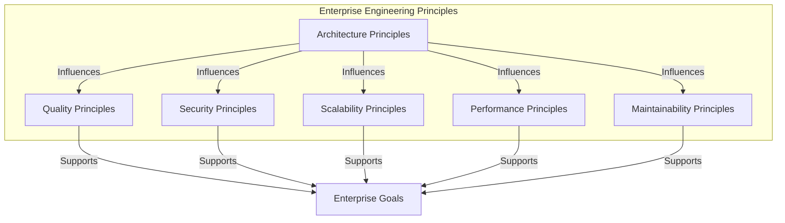

## 21.2 Principle Interconnections

```
PRINCIPLE INTERDEPENDENCIES
============================

    ARCHITECTURE
         |
    +----+----+
    |         |
    v         v
QUALITY   SECURITY
    |         |
    +----+----+
         |
         v
    SCALABILITY
         |
         v
    PERFORMANCE
         |
         v
MAINTAINABILITY

    All principles are interconnected.
    Violating one affects all others.
```

## 21.3 Enterprise Principles Summary Table

| Category | Principle Count | Primary Focus | Risk if Violated |
|----------|-----------------|---------------|-------------------|
| **Architecture** | 12 | Structure & Organization | HIGH |
| **Quality** | 10 | Correctness & Reliability | CRITICAL |
| **Security** | 15 | Protection & Trust | CRITICAL |
| **Scalability** | 8 | Growth & Capacity | HIGH |
| **Performance** | 9 | Speed & Efficiency | MEDIUM |
| **Maintainability** | 11 | Longevity & Change | HIGH |

---

# 22. Architecture Principles

## 22.1 Core Architecture Principles

### Principle A1: Separation of Concerns

**Statement**: Each component addresses a distinct aspect of the problem domain.

**Implementation**:
```
SEPARATION OF CONCERNS
======================

    DOMAIN LAYER
    +-------------------+
    | Business Logic   |
    | (What we do)     |
    +-------------------+
              ^
              | Depends on interfaces only
              |
    INTERFACE LAYER
    +-------------------+
    | Contracts         |
    | (How we communicate)
    +-------------------+
              ^
              | Depends on interfaces only
              |
    INFRASTRUCTURE LAYER
    +-------------------+
    | Implementations   |
    | (How we persist)  |
    +-------------------+
```

### Principle A2: Single Responsibility

**Statement**: Every module has one reason to change.

### Principle A3: Dependency Inversion

**Statement**: High-level modules do not depend on low-level modules.

### Principle A4: Interface Segregation

**Statement**: Clients should not depend on interfaces they don't use.

### Principle A5: Information Hiding

**Statement**: Each module hides design decisions behind a public interface.

## 22.2 Architecture Quality Attributes

| Attribute | Definition | Measurement |
|-----------|-------------|-------------|
| **Modularity** | Degree of independent components | Coupling metrics |
| **Reusability** | Potential for use in multiple contexts | Clone analysis |
| **Testability** | Ease of verification | Test coverage |
| **Understandability** | Ease of comprehension | Code review |
| **Changeability** | Ease of modification | Impact analysis |

## 22.3 Architecture Rules

```
ARCHITECTURE RULES
==================

    RULE 1: LAYER ADHERENCE
    =======================
    - Presentation never calls Data Access
    - Business Logic never calls Presentation
    - All cross-layer calls go through interfaces

    RULE 2: DEPENDENCY DIRECTION
    ===========================
    - Dependencies point inward toward domain
    - Domain is the core
    - Infrastructure is the outermost layer

    RULE 3: BOUNDARY INTEGRITY
    =========================
    - Bounded contexts are inviolate
    - No cross-context dependencies
    - Integration only through defined contracts
```

---

# 23. Quality Principles

## 23.1 Quality Philosophy

Quality is not a phase. Quality is continuous.

```
QUALITY PHILOSOPHY
==================

    TRADITIONAL QUALITY
    ===================

    [=======BUILD=======][==TEST==][=DEPLOY=]
                        |
                        v
                   Quality at
                   the end

    CONTINUOUS QUALITY
    =================

    [BUILD][TEST][BUILD][TEST][BUILD][TEST][DEPLOY]
        |      |      |      |      |      |
        v      v      v      v      v      v
    Continuous quality verification


    THE PRINCIPLE:
    =============
    Quality is built in, not tested in.
    Every artifact is quality-checked at creation.
```

## 23.2 Quality Gates

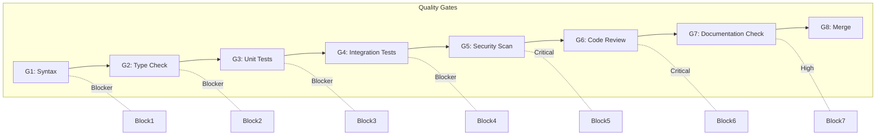

## 23.3 Quality Metrics

| Metric | Target | Critical Threshold |
|--------|--------|-------------------|
| **Test Coverage** | 80%+ | 70% |
| **Critical Bugs** | 0 | 0 |
| **High Bugs** | <5 per release | 10 |
| **Documentation Coverage** | 100% | 80% |
| **Code Review Coverage** | 100% | 100% |
| **Security Vulnerabilities** | 0 Critical | 0 Critical |

---

# 24. Security Principles

## 24.1 Security Philosophy

Security is not an add-on. It is built into every layer.

```
SECURITY BY DESIGN
==================

    +--------------------------------------------------+
    |                                                  |
    |   +------------+    +------------+    +--------+ |
    |   | PREVENT    | -> | DETECT     | -> | RESPOND| |
    |   | (Proactive)|    | (Active)   |    | (Reactive)|
    |   +------------+    +------------+    +--------+ |
    |                                                  |
    +--------------------------------------------------+

    SECURITY PILLARS
    ================

    CONFIDENTIALITY  <-->  INTEGRITY  <-->  AVAILABILITY

    (Who can access)    (Is it correct)   (Is it usable)
```

## 24.2 Security Principles

### Principle S1: Zero Trust

**Statement**: Never trust, always verify.

### Principle S2: Defense in Depth

**Statement**: Multiple layers of security controls.

### Principle S3: Least Privilege

**Statement**: Grant minimum necessary permissions.

### Principle S4: Secure by Default

**Statement**: Default configurations are secure.

### Principle S5: Fail Securely

**Statement**: Failures should not expose sensitive information.

## 24.3 Security Requirements Matrix

| Requirement | Category | Severity | Verification |
|-------------|----------|----------|--------------|
| **Authentication** | Access Control | CRITICAL | Automated |
| **Authorization** | Access Control | CRITICAL | Automated |
| **Encryption (Transit)** | Data Protection | CRITICAL | Automated |
| **Encryption (At Rest)** | Data Protection | HIGH | Automated |
| **Input Validation** | Vulnerability Prevention | CRITICAL | Automated |
| **Output Encoding** | Vulnerability Prevention | HIGH | Automated |
| **Audit Logging** | Monitoring | HIGH | Automated |

---

# 25. Scalability Principles

## 25.1 Scalability Philosophy

Design for the load you have today and the growth you expect tomorrow.

```
SCALABILITY PHILOSOPHY
======================

    SCALE UP (Vertical)
    ===================

    [====] --> [========] --> [================]
    Small       Medium         Large
    Server      Server         Server
    
    Same box, more power
    Limited by hardware


    SCALE OUT (Horizontal)
    ======================

    [=] --> [=][=] --> [=][=][=][=]
    1 Node    2 Nodes    4 Nodes
    
    More boxes, more power
    Unlimited (in theory)


    HYBRID APPROACH
    ===============

    Start vertical, migrate horizontal
    Optimize for cost at each stage
```

## 25.2 Scalability Patterns

| Pattern | Use Case | Trade-offs |
|---------|----------|------------|
| **Read Replicas** | Read-heavy workloads | Replication lag |
| **Sharding** | Write-heavy workloads | Complexity |
| **CQRS** | Complex domains | Eventual consistency |
| **CQRS + Event Sourcing** | Audit requirements | Learning curve |
| **Microservices** | Independent scaling | Distributed complexity |

## 25.3 Scalability Requirements

```
SCALABILITY REQUIREMENTS
========================

    CAPACITY PLANNING
    =================

    Current Load + Growth Buffer = Target Capacity
    
    Example:
    - Current: 1,000 requests/second
    - Growth: 2x per year
    - Buffer: 50%
    - Target Capacity: 3,000 requests/second
```

---

# 26. Performance Principles

## 26.1 Performance Philosophy

Performance is a feature. Optimize intelligently.

```
PERFORMANCE OPTIMIZATION
========================

    STEP 1: MEASURE
    ===============
    Don't guess. Measure.
    Establish baselines.
    
    STEP 2: IDENTIFY
    ===============
    Find the bottleneck.
    Use profiling tools.
    
    STEP 3: OPTIMIZE
    ===============
    Fix the bottleneck.
    One at a time.
    
    STEP 4: VALIDATE
    ===============
    Measure again.
    Did it help?
    
    STEP 5: REPEAT
    =============
    Find next bottleneck.

    THE RULE:
    =========
    Never optimize without measurement.
```

## 26.2 Performance Targets

| Metric | Target | Critical | Measurement |
|--------|--------|----------|-------------|
| **Response Time (p95)** | <200ms | 500ms | APM |
| **Response Time (p99)** | <500ms | 1s | APM |
| **Throughput** | 1000 RPS | 500 RPS | Load Test |
| **Error Rate** | <0.1% | 1% | Monitoring |
| **Availability** | 99.99% | 99.9% | SLA |

## 26.3 Performance Optimization Hierarchy

```
PERFORMANCE OPTIMIZATION HIERARCHY
==================================

    Level 1: Architecture
    =====================
    - Right algorithms
    - Efficient data structures
    - Proper caching strategy
    
    Level 2: Design
    ===============
    - Database optimization
    - Query optimization
    - Indexing strategies
    
    Level 3: Implementation
    ======================
    - Code efficiency
    - Memory management
    - Connection pooling
    
    Level 4: Infrastructure
    =====================
    - Hardware sizing
    - Network optimization
    - CDN usage
```

---

# 27. Maintainability Principles

## 27.1 Maintainability Philosophy

Write code for the next person, not for yourself.

```
MAINTAINABILITY PHILOSOPHY
==========================

    YOUR FUTURE SELF
    ================

         Today              Tomorrow
          |                    |
          v                    v
    +---------+          +-----------+
    | You     |   --->   | Future You|
    | Write   |          | Read      |
    | Code    |          | Code      |
    +---------+          +-----------+
          |                    |
          |    Memory: GONE    |
          |    Context: GONE   |
          +--------------------+
          |                    |
          v                    v
    Did you document WHY
    you made these choices?

    IF NOT: Future You will suffer.
```

## 27.2 Maintainability Metrics

| Metric | Target | Description |
|--------|--------|-------------|
| **Cyclomatic Complexity** | <10 | Decision points per function |
| **Function Length** | <50 lines | Lines per function |
| **File Length** | <500 lines | Lines per file |
| **Coupling** | Low | Dependencies between modules |
| **Cohesion** | High | Relatedness within modules |
| **Documentation Coverage** | 100% | % of code documented |

## 27.3 Maintainability Guidelines

```
MAINTAINABILITY GUIDELINES
==========================

    1. WRITE SELF-DOCUMENTING CODE
    ===============================
    Good names, clear intent, obvious flow

    2. COMMENT WHY, NOT WHAT
    =========================
    What = Code shows
    Why = Comment explains

    3. KEEP FUNCTIONS SMALL
    ======================
    Single responsibility
    Easy to test
    Easy to understand

    4. AVOID CLEVER CODE
    ===================
    Clear > Clever
    Readable > Performant (unless critical)

    5. DOCUMENT COMPLEXITY
    ======================
    If it takes brain power to understand,
    it needs documentation
```

---

# 28. Design Principles

## 28.1 Design Philosophy

Design serves function. Form follows function.

```
DESIGN PHILOSOPHY
================

    TRADITIONAL (Consumer)
    ======================
    Form first, function second
    "Make it look good"
    
    +-----------+
    | BEAUTIFUL |
    +-----------+
         |
         v
    Can it do the job?


    OSHIP (Enterprise)
    ==================
    Function first, form supports function
    "Make it work, then make it clear"
    
    +-----------+
    | FUNCTIONAL|
    +-----------+
         |
         v
    +-----------+
    | CLEAR     |
    +-----------+
         |
         v
    +-----------+
    | EFFICIENT |
    +-----------+
```

## 28.2 Design Principles

| Principle | Description | Application |
|-----------|-------------|-------------|
| **Consistency** | Same patterns everywhere | UI, API, Code |
| **Clarity** | Intent is obvious | All artifacts |
| **Efficiency** | No wasted elements | All artifacts |
| **Accessibility** | Usable by all | UI, Documentation |
| **Responsibility** | Clear ownership | All artifacts |

## 28.3 Design System Components

```
DESIGN SYSTEM COMPONENTS
=========================

    ATOMIC DESIGN LEVELS
    =====================

    ATOMS
    =====
    +---+
    | A |
    +---+
    Buttons, Labels, Inputs
    
    MOLECULES
    =========
    +-------+
    | M     |
    +-------+
    Form fields, Cards
    
    ORGANISMS
    =========
    +-----------+
    | O         |
    +-----------+
    Navigation, Headers
    
    TEMPLATES
    =========
    +---------------+
    | T             |
    +---------------+
    Page layouts
    
    PAGES
    =====
    +----------------+
    | P              |
    +----------------+
    Complete pages
```

---

# 29. UI Philosophy

## 29.1 UI Design Principles

### Principle UI1: Purpose-Driven

**Statement**: Every UI element serves a purpose.

### Principle UI2: Consistent

**Statement**: Similar elements behave similarly.

### Principle UI3: Intuitive

**Statement**: Users know what to do without instruction.

### Principle UI4: Accessible

**Statement**: UI is usable by people with disabilities.

## 29.2 UI Component Hierarchy

```
UI COMPONENT HIERARCHY
=======================

    +--------------------------------------------------+
    |                    PAGE                          |
    +--------------------------------------------------+
    |                                                  |
    |  +--------------------------------------------+  |
    |  |              REGION                        |  |
    |  +--------------------------------------------+  |
    |  |                                            |  |
    |  |  +--------+    +--------+    +--------+    |  |
    |  |  |SECTION |    |SECTION |    |SECTION |    |  |
    |  |  +--------+    +--------+    +--------+    |  |
    |  |                                            |  |
    |  |  +--------+    +--------+    +--------+    |  |
    |  |  |COMPO-  |    |COMPO-  |    |COMPO-  |    |  |
    |  |  |NENT    |    |NENT    |    |NENT    |    |  |
    |  |  +--------+    +--------+    +--------+    |  |
    |  |                                            |  |
    |  |  +------+ +------+ +------+ +------+       |  |
    |  |  |ELEM- | |ELEM- | |ELEM- | |ELEM- |       |  |
    |  |  |ENT   | |ENT   | |ENT   | |ENT   |       |  |
    |  |  +------+ +------+ +------+ +------+       |  |
    |  +--------------------------------------------+  |
    +--------------------------------------------------+
```

## 29.3 UI Quality Checklist

| Item | Requirement | Verification |
|------|-------------|--------------|
| **Responsive** | Works on all screen sizes | Automated testing |
| **Keyboard Nav** | Full keyboard accessibility | Manual testing |
| **Screen Reader** | Compatible with assistive tech | Automated + Manual |
| **Color Contrast** | WCAG AA compliant | Automated |
| **Error States** | Clear error messaging | Design review |
| **Loading States** | Indicate progress | Design review |

---

# 30. UX Philosophy

## 30.1 UX Core Principles

### Principle UX1: User-Centered

**Statement**: Design for the user, not the system.

### Principle UX2: Task-Oriented

**Statement**: Every interaction advances the user's goal.

### Principle UX3: Feedback-Rich

**Statement**: Users always know what's happening.

### Principle UX4: Forgiving

**Statement**: Make it easy to undo mistakes.

## 30.2 User Journey Mapping

```
USER JOURNEY MAPPING
====================

    USER STORY
    ==========
    As a [type of user]
    I want [goal]
    So that [benefit]

    JOURNEY STAGES
    ==============

    STAGE 1: AWARENESS
    -----------------
    - How does user learn about system?
    - Entry point to application

    STAGE 2: ORIENTATION  
    --------------------
    - How does user understand system?
    - Navigation, help, first impressions

    STAGE 3: ACTION
    --------------
    - How does user accomplish goal?
    - Core functionality, forms, interactions

    STAGE 4: RESOLUTION
    ------------------
    - How does user complete task?
    - Success states, confirmations

    STAGE 5: REFLECTION
    ------------------
    - How does user feel about experience?
    - Feedback mechanisms, support
```

## 30.3 UX Research Methods

| Method | Purpose | Frequency |
|--------|---------|-----------|
| **User Interviews** | Understand needs | Quarterly |
| **Usability Testing** | Validate designs | Per feature |
| **Analytics Review** | Measure behavior | Monthly |
| **Survey** | Gather feedback | Per release |
| **A/B Testing** | Optimize decisions | Continuous |

---

# 31. AI Philosophy

## 31.1 AI Design Principles

### Principle AI1: Transparency

**Statement**: AI operations are visible and explainable.

### Principle AI2: Predictability

**Statement**: AI behavior is deterministic and repeatable.

### Principle AI3: Controllability

**Statement**: Humans can override, correct, or stop AI.

### Principle AI4: Auditability

**Statement**: AI decisions are logged and reviewable.

## 31.2 AI Operational Boundaries

```
AI OPERATIONAL BOUNDARIES
=========================

    AI CAN DO
    =========

    +-------------------+    +-------------------+
    | Code generation   |    | Documentation    |
    +-------------------+    +-------------------+
    | Testing           |    | Refactoring      |
    +-------------------+    +-------------------+
    | Research          |    | Analysis         |
    +-------------------+    +-------------------+
    | Draft proposals   |    | Summaries        |
    +-------------------+    +-------------------+

    AI MUST NOT DO
    ==============

    +-------------------+    +-------------------+
    | Security decisions|    | Strategic changes |
    | without approval  |    | without approval  |
    +-------------------+    +-------------------+
    | Major deletions   |    | Permission grants |
    +-------------------+    +-------------------+
    | Financial transactions| External API keys|
    +-------------------+    +-------------------+
```

## 31.3 AI Confidence Levels

| Level | Confidence | Action Required |
|-------|------------|-----------------|
| **High** | >95% | Proceed, document |
| **Medium** | 80-95% | Proceed, flag for review |
| **Low** | 50-80% | Request guidance |
| **Uncertain** | <50% | Stop, escalate |

---

# 32. Automation Philosophy

## 32.1 Automation First

Automate everything that can be automated.

```
AUTOMATION FIRST PHILOSOPHY
============================

    MANUAL PROCESS
    ==============

    Human --> Task --> Human --> Task --> Human
          (error)        (delay)       (cost)


    AUTOMATED PROCESS
    =================

    System --> Task --> System --> Task --> System
            (fast)        (consistent)    (cheap)


    THE RULE
    =========
    Automate the process, not the person.
    Free humans for creative work.
```

## 32.2 Automation Decision Matrix

| Process Type | Automate? | Rationale |
|-------------|-----------|-----------|
| **Build** | Always | Core to CI/CD |
| **Test** | Always | Fast, consistent |
| **Deploy** | Always | Reduces human error |
| **Security Scan** | Always | Required for compliance |
| **Documentation** | Partial | AI assists, human approves |
| **Code Review** | Partial | Automated checks, human judgment |
| **Architecture Design** | Never | Requires human judgment |
| **Strategic Decisions** | Never | Requires human wisdom |

## 32.3 Automation Pipeline

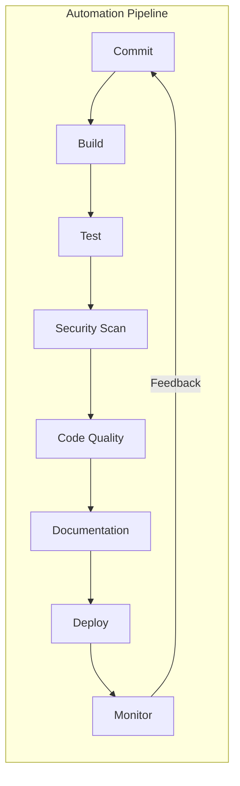

---

# 33. Testing Philosophy

## 33.1 Testing Pyramid

```
TESTING PYRAMID
===============

                    /\
                   /  \
                  /    \
                 /INTEG \
                /RATION  \
               /__________\
              /    E2E     \
             /              \
            /________________\


    Width = Number of tests
    Height = Trust level
    
    MORE UNIT TESTS
    MORE CONFIDENCE
```

## 33.2 Test Coverage Requirements

| Test Type | Coverage Target | Critical |
|-----------|-----------------|----------|
| **Unit Tests** | 80%+ | 70% |
| **Integration Tests** | Key flows | Critical paths |
| **E2E Tests** | Happy path + key edges | Critical paths |
| **Security Tests** | 100% of security features | 100% |

## 33.3 Test Documentation Requirements

```
TEST DOCUMENTATION REQUIREMENTS
================================

    EVERY TEST MUST HAVE
    ====================

    1. Test Name
       - Describes what is tested
       - Describes scenario
       - Describes expected result

    2. Test Rationale
       - Why this test exists
       - What risk it mitigates

    3. Test Data
       - What data is used
       - How data is prepared

    4. Assertions
       - What is being verified
       - Expected vs actual

    5. Dependencies
       - What the test depends on
       - How to isolate if needed
```

---

# 34. Documentation Philosophy

## 34.1 Documentation Quality Standards

### Principle D1: Complete

**Statement**: Documentation covers all aspects.

### Principle D2: Accurate

**Statement**: Documentation reflects reality.

### Principle D3: Current

**Statement**: Documentation is up-to-date.

### Principle D4: Accessible

**Statement**: Documentation is easy to find and use.

### Principle D5: Actionable

**Statement**: Documentation enables action.

## 34.2 Documentation Review Checklist

| Item | Requirement | Owner |
|------|-------------|-------|
| **Completeness** | All sections filled | Author |
| **Accuracy** | Matches implementation | Reviewer |
| **Examples** | Working examples provided | Author |
| **Links** | All cross-references valid | Automated |
| **Metadata** | Standard header present | Automated |
| **Formatting** | Consistent with style guide | Automated |

## 34.3 Documentation Types and Owners

```
DOCUMENTATION TYPE MATRIX
==========================

    | Type         | Owner          | Audience      | Update Freq |
    |--------------|----------------|---------------|-------------|
    | Philosophy   | Architecture    | All           | Rare        |
    | Architecture | Tech Lead      | Developers    | Quarterly   |
    | API          | API Team       | Integrators   | Per release |
    | Guide        | Domain Team    | Users         | Monthly     |
    | Reference    | Auto-generated| Developers    | Per build   |
    | Tutorial     | Documentation  | New users     | Quarterly   |
```

---

# 35. Review Philosophy

## 35.1 Review Culture

Reviews are collaborative, not adversarial.

```
REVIEW CULTURE
==============

    WRONG APPROACH
    ==============

    Author --> Submits --> Reviewer --> Criticizes --> Author --> Defends


    RIGHT APPROACH
    ==============

    Author --> Submits --> Reviewer --> Collaborates --> Both --> Improve
    
    Reviewer helps author succeed.
    Author appreciates reviewer's time.
    Goal: Better artifact, not blame.
```

## 35.2 Review Types

| Review Type | Focus | Participants | Frequency |
|-------------|-------|--------------|-----------|
| **Code Review** | Quality, correctness | Peer developers | Every PR |
| **Architecture Review** | Design decisions | Architecture team | Major changes |
| **Security Review** | Vulnerabilities | Security team | High-risk changes |
| **Documentation Review** | Clarity, accuracy | Documentation team | All docs |
| **Design Review** | UX, UI decisions | Design + Product | Major features |

## 35.3 Review Checklist Framework

```
REVIEW CHECKLIST FRAMEWORK
==========================

    STANDARD CHECKLIST
    ==================

    [ ] Correctness
        - Does it do what it claims?
        - Are edge cases handled?

    [ ] Quality
        - Is the code maintainable?
        - Is it well-documented?

    [ ] Security
        - Any vulnerabilities?
        - Proper authorization?

    [ ] Performance
        - Any bottlenecks?
        - Resource efficient?

    [ ] Testing
        - Adequate test coverage?
        - Tests are meaningful?

    [ ] Integration
        - Works with other components?
        - API contracts respected?
```

---

# 36. Refactoring Philosophy

## 36.1 When to Refactor

Refactor continuously, not just when forced.

```
REFACTORING TRIGGERS
====================

    1. CODE SMELLS
    ==============
    - Duplicated code
    - Long methods
    - Large classes
    - Dead code

    2. DESIGN CHANGES
    =================
    - New requirements
    - Technology upgrades
    - Pattern improvements

    3. TECHNICAL DEBT
    =================
    - Accumulated shortcuts
    - Missing tests
    - Outdated dependencies

    THE RULE:
    =========
    Refactor when the cost of not refactoring
    exceeds the cost of refactoring.
```

## 36.2 Refactoring Safety

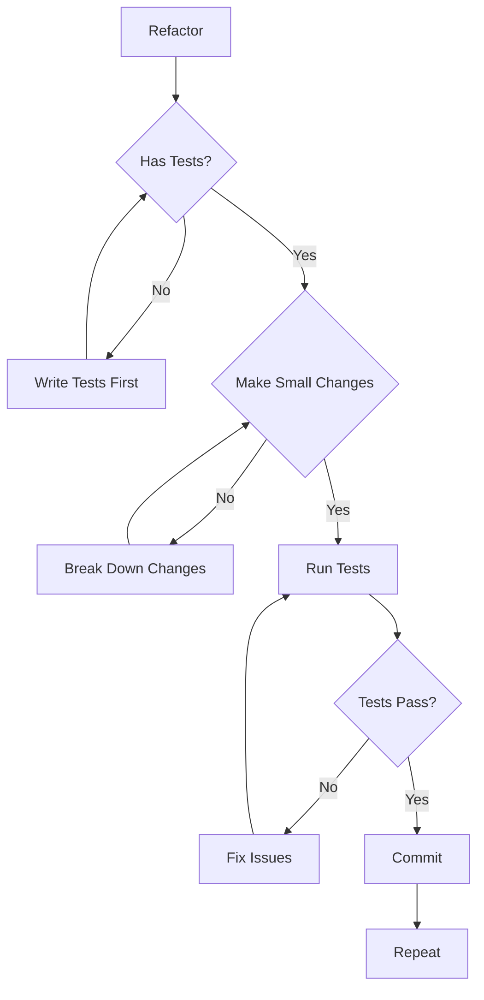

## 36.3 Refactoring Documentation

```
REFACTORING DOCUMENTATION
=========================

    BEFORE REFACTORING
    ==================
    - Document current behavior
    - Note technical debt reasons
    - Identify dependencies

    DURING REFACTORING
    ==================
    - Keep refactoring small
    - Commit frequently
    - Update documentation

    AFTER REFACTORING
    =================
    - Verify all tests pass
    - Update ADR if design changed
    - Document lessons learned
```

---

# 37. Repository Lifecycle

## 37.1 Lifecycle Phases

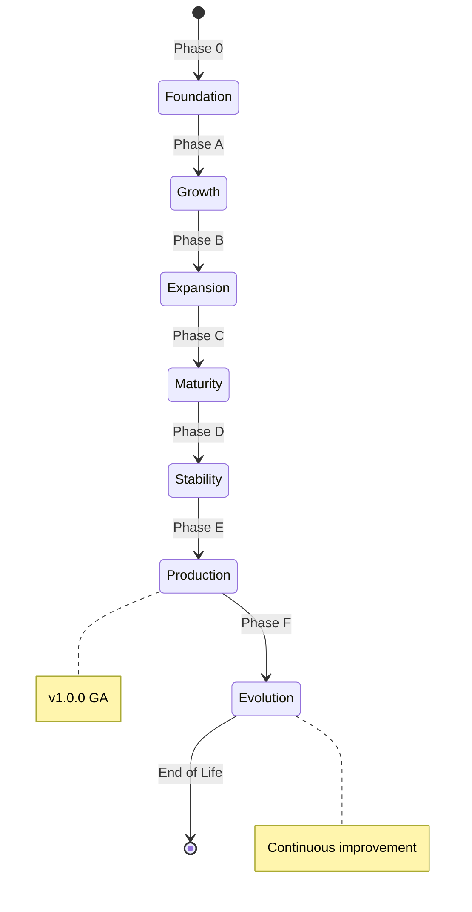

## 37.2 Phase Transition Criteria

| Phase | Entry Criteria | Exit Criteria | 
|-------|---------------|---------------|
| **Phase 0** | Repository initialized | All infrastructure complete |
| **Phase A** | Architecture defined | Core domains bounded |
| **Phase B** | APIs designed | Platform foundation ready |
| **Phase C** | First implementation | Core features working |
| **Phase D** | Testing complete | Security validated |
| **Phase E** | Monitoring active | Operational readiness |
| **Phase F** | GA release | Continuous evolution |

## 37.3 Lifecycle Artifacts

```
LIFECYCLE ARTIFACTS MATRIX
===========================

    Phase 0: Infrastructure
    - Directory structure
    - CI/CD pipelines
    - GitHub templates
    - Governance documents

    Phase A: Architecture
    - Domain models
    - Architecture decision records
    - Interface specifications

    Phase B: Platform
    - API contracts
    - Data schemas
    - Security architecture

    Phase C: Implementation
    - Source code
    - Unit tests
    - Integration tests

    Phase D: Validation
    - Security scan results
    - Performance benchmarks
    - QA sign-off

    Phase E: Operations
    - Runbooks
    - Monitoring dashboards
    - Incident playbooks

    Phase F: Production
    - Release notes
    - Migration guides
    - Support documentation
```

---

# 38. Versioning Philosophy

## 38.1 Semantic Versioning Rules

```
SEMANTIC VERSIONING
===================

    MAJOR.MINOR.PATCH
    
    MAJOR: Breaking changes
    MINOR: New features (backward compatible)
    PATCH: Bug fixes (backward compatible)

    EXAMPLES
    ========

    v1.0.0 --> v2.0.0
    Breaking changes. Read migration guide.

    v1.0.0 --> v1.1.0
    New features. No breaking changes.

    v1.0.0 --> v1.0.1
    Bug fixes. No breaking changes.

    PRE-RELEASE
    ===========

    v1.0.0-alpha.1
    v1.0.0-beta.2
    v1.0.0-rc.1

    Indicates stability level.
    alpha = unstable
    beta = testing
    rc = release candidate
```

## 38.2 Version Compatibility Matrix

| Version | Compatible With | Migration Required |
|---------|----------------|-------------------|
| **v0.x** | No stable API | Yes, always |
| **v1.x** | v1.x | Minor, if any |
| **v2.x** | Not with v1.x | Yes, comprehensive |

## 38.3 Version Lifecycle

```
VERSION LIFECYCLE
=================

    +-------------------+
    | PLANNING          |
    +-------------------+
           |
           v
    +-------------------+
    | DEVELOPMENT       |  <-- v0.x range
    +-------------------+
           |
           v
    +-------------------+
    | ALPHA             |  <-- v0.1-alpha
    +-------------------+
           |
           v
    +-------------------+
    | BETA              |  <-- v0.5-beta
    +-------------------+
           |
           v
    +-------------------+
    | RELEASE CANDIDATE |  <-- v0.9-rc
    +-------------------+
           |
           v
    +-------------------+
    | GENERAL AVAILABLE |  <-- v1.0.0
    +-------------------+
           |
           v
    +-------------------+
    | ACTIVE            |  <-- v1.x range
    +-------------------+
           |
           v
    +-------------------+
    | MAINTAINED        |  <-- Security updates
    +-------------------+
           |
           v
    +-------------------+
    | DEPRECATED        |  <-- End of life announced
    +-------------------+
           |
           v
    +-------------------+
    | END OF LIFE       |  <-- No more support
    +-------------------+
```

---

# 39. Release Philosophy

## 39.1 Release Principles

### Principle R1: Frequent

**Statement**: Release often in small increments.

### Principle R2: Reversible

**Statement**: Each release can be undone.

### Principle R3: Traceable

**Statement**: Every release links to requirements and tests.

### Principle R4: Transparent

**Statement**: Release contents are clearly communicated.

## 39.2 Release Types

| Release Type | Frequency | Size | Risk |
|--------------|-----------|------|------|
| **Patch** | Weekly | Small | Low |
| **Minor** | Monthly | Medium | Medium |
| **Major** | Quarterly | Large | High |
| **Hotfix** | As needed | Critical | Medium |

## 39.3 Release Process

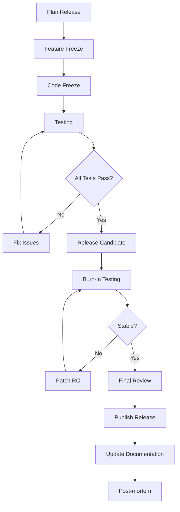

---

# 40. Branch Philosophy

## 40.1 Branching Strategy

```
BRANCHING STRATEGY
==================

    +--------------------------------------------------+
    |                                                  |
    |  +--------------------------------------------+  |
    |  |                 main                        |  |
    |  |  (Production-ready code)                   |  |
    |  +--------------------------------------------+  |
    |              ^                    ^             |
    |              |                    |             |
    |  +-----------+---------+  +-------+---------+   |
    |  |    release/v1.0    |  |   release/v1.1   |   |
    |  +-----------------+   +------------------+   |
    |           ^                        ^           |
    |           |                        |           |
    |  +---------+---------+    +---------+------+   |
    |  |    feature/x       |    |    feature/y   |   |
    |  +-----------------+   +------------------+   |
    |                                                  |
    +--------------------------------------------------+

    BRANCH TYPES
    ============

    main:        Production code, always deployable
    release/*:   Release preparation
    feature/*:   New features
    hotfix/*:    Production fixes
    experiment/*: Exploratory work
```

## 40.2 Branch Naming Conventions

```
BRANCH NAMING CONVENTIONS
==========================

    TYPE/PREFIX-DESCRIPTION
    ========================

    feature/user-authentication
    feature/payment-integration
    feature/dashboard-redesign

    bugfix/login-timeout
    bugfix/memory-leak

    hotfix/security-patch
    hotfix/critical-bug

    release/v1.0.0
    release/v1.1.0

    docs/api-documentation
    docs/user-guide

    refactor/database-layer
    refactor/api-client

    experiment/new-algorithm
    experiment/alternative-ui
```

## 40.3 Branch Lifecycle

```
BRANCH LIFECYCLE
================

    1. CREATE
    =========
    - Branch from correct base
    - Follow naming convention
    - Update branch protection

    2. DEVELOP
    =========
    - Make commits frequently
    - Keep commits atomic
    - Update documentation

    3. REVIEW
    =========
    - Open pull request
    - Address feedback
    - Get approvals

    4. MERGE
    =======
    - Squash if needed
    - Delete source branch
    - Verify CI passes

    5. ARCHIVE
    =========
    - Branch is automatically archived
    - History preserved
```

---

# 41. Prompt Engineering Philosophy

## 41.1 Prompt as Contract

A prompt is not a suggestion. It is a contract.

```
PROMPT AS CONTRACT
==================

    VAGUE PROMPT (Not a contract)
    =============================

    "Improve the code"


    SPECIFIC PROMPT (Contract)
    ==========================

    "Refactor the calculateTotal function to:
    1. Use BigDecimal for currency precision
    2. Handle null values gracefully
    3. Include unit tests with 100% coverage
    4. Update JSDoc with new behavior
    5. Ensure no breaking changes to API"


    A CONTRACT IS:
    ==============
    - Specific about input
    - Specific about output
    - Measurable criteria
    - Unambiguous terms
```

## 41.2 Prompt Structure

```
PROMPT STRUCTURE
================

    [ROLE]
    You are an expert JavaScript developer.

    [CONTEXT]
    The repository uses TypeScript with Express.js...

    [TASK]
    Create a REST endpoint for user authentication.

    [CONSTRAINTS]
    - Must use JWT tokens
    - Must hash passwords with bcrypt
    - Must validate input
    - Must return proper HTTP codes

    [OUTPUT FORMAT]
    - Include code
    - Include tests
    - Include documentation
    - Include error handling

    [EXAMPLES]
    See similar implementation in services/auth.ts
```

## 41.3 Prompt Iteration Model

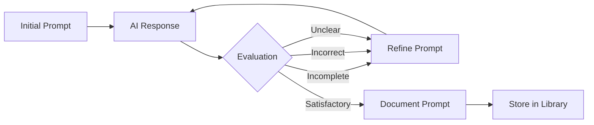

---

# 42. Knowledge Management Philosophy

## 42.1 Knowledge Capture Principles

### Principle K1: Capture Everything

**Statement**: If it might be useful, capture it.

### Principle K2: Make It Findable

**Statement**: Organize for retrieval.

### Principle K3: Keep It Current

**Statement**: Update or retire outdated knowledge.

### Principle K4: Share Freely

**Statement**: Knowledge should flow to those who need it.

## 42.2 Knowledge Types

```
KNOWLEDGE TYPES MATRIX
======================

    EXPLICIT KNOWLEDGE
    ==================
    - Documented facts
    - Formal procedures
    - Specifications
    - Requirements

    TACIT KNOWLEDGE
    ================
    - Experience-based insights
    - Intuition
    - Judgment
    - Contextual understanding

    KNOWLEDGE LEVELS
    ================

    Individual --> Team --> Organization --> Ecosystem
    (Grows with sharing)
```

## 42.3 Knowledge Flow

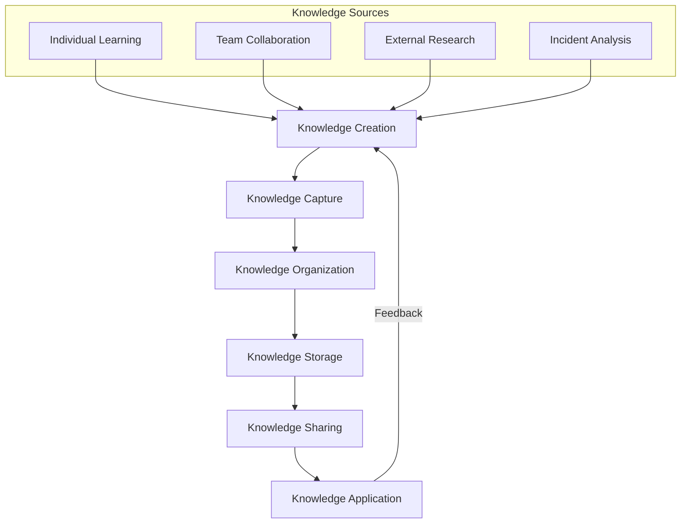

---

# 43. Continuous Improvement Philosophy

## 43.1 Improvement Never Stops

```
CONTINUOUS IMPROVEMENT MINDSET
===============================

    YESTERDAY          TODAY           TOMORROW
    =========          =====           ========

    +---------+        +---------+     +---------+
    | Current |   -->   | Improved| --> | Better  |
    | State   |        | State   |     | State   |
    +---------+        +---------+     +---------+
         |                  |                |
         +------------------+----------------+
                    |
                    v
            ALWAYS IMPROVING
```

## 43.2 Improvement Areas

| Area | Focus | Metrics |
|------|-------|---------| 
| **Code Quality** | Maintainability | Tech debt ratio |
| **Process Efficiency** | Velocity | Cycle time |
| **Documentation** | Currency | Staleness age |
| **Testing** | Coverage | Bug escape rate |
| **Security** | Vulnerabilities | Mean time to fix |
| **Performance** | Speed | Response time |

## 43.3 Improvement Process

```
IMPROVEMENT PROCESS
===================

    IDENTIFY
    =========
    - What is broken?
    - What is slow?
    - What is confusing?
    - What causes pain?

    ANALYZE
    =======
    - Root cause analysis
    - Impact assessment
    - Cost-benefit analysis

    PLAN
    ====
    - Define improvement
    - Set targets
    - Assign owner

    EXECUTE
    =======
    - Implement change
    - Measure progress
    - Adjust as needed

    VALIDATE
    ========
    - Did it work?
    - Lessons learned
    - Document findings
```

---

# 44. Lessons Learned Philosophy

## 44.1 Capture Everything

Every project, sprint, and incident produces lessons.

```
LESSONS LEARNED CYCLE
=====================

    PROJECT/SPRINT/INCIDENT
              |
              v
    +-------------------+
    | What went well?  |
    +-------------------+
              |
              v
    +-------------------+
    | What didn't work?|
    +-------------------+
              |
              v
    +-------------------+
    | What will we do   |
    | differently?      |
    +-------------------+
              |
              v
    +-------------------+
    | Document findings |
    +-------------------+
              |
              v
    +-------------------+
    | Apply to next     |
    | project/sprint    |
    +-------------------+
```

## 44.2 Lessons Learned Template

```
LESSONS LEARNED TEMPLATE
========================

    [LESSON TITLE]
    ==============

    Context:
    --------
    What was the situation?

    What Happened:
    -------------
    What actually occurred?

    What We Expected:
    -----------------
    What did we think would happen?

    Why It Happened:
    ----------------
    Root cause analysis

    What We Learned:
    ----------------
    Key insights

    How We'll Apply:
    ----------------
    Specific actions for next time

    Related Documents:
    ------------------
    Links to relevant docs
```

## 44.3 Lessons Learned Repository

```
LESSONS LEARNED DATABASE STRUCTURE
===================================

    +--------------------------------------------------+
    |                                                  |
    |  Category      | Count | Last Updated | Quality |
    |  --------------|-------|--------------|-------- |
    |  Architecture  |   25  | 2026-07-15   | HIGH   |
    |  Development    |   48  | 2026-08-01   | HIGH   |
    |  Operations     |   31  | 2026-07-28   | MEDIUM |
    |  Security       |   12  | 2026-06-20   | HIGH   |
    |  Team Dynamics  |   18  | 2026-07-10   | MEDIUM |
    |                                                  |
    +--------------------------------------------------+

    SEARCH BY:
    ==========
    - Keyword
    - Category
    - Date
    - Quality rating
    - Relevance score
```

---

# 45. Technical Debt Philosophy

## 45.1 Debt Awareness

Technical debt is not inherently bad. Unmanaged debt is.

```
TECHNICAL DEBT FRAMEWORK
=========================

    DEBT TYPES
    ==========

    DELIBERATE DEBT
    ===============
    "We'll do it quick now, fix it later"
    Acceptable for time-to-market

    ACCIDENTAL DEBT
    ===============
    "We didn't know a better way"
    Learning opportunity

    NEGLECTED DEBT
    ==============
    "We knew but didn't fix it"
    Warning sign

    BITROTD DEBT (Build It, Run It, Tear It Out Later)
    ==================================================
    "Quick fix that should never have been"
    Serious problem
```

## 45.2 Debt Tracking

```
DEBT TRACKING SYSTEM
====================

    +--------------------------------------------------+
    |                                                  |
    |  ID     | Type    | Severity | Interest | Owner |
    |  ------- | ------- | -------- | -------- | ----- |
    |  TD-001  | Intent. | Low      | Low      | Jane  |
    |  TD-002  | Acciden.| Medium   | Medium   | John  |
    |  TD-003  | Neglect.| High     | High     | Mike  |
    |  TD-004  | BITROT  | Critical | Critical | Team  |
    |                                                  |
    +--------------------------------------------------+

    SEVERITY MATRIX
    ===============

    Interest Rate:
    - High severity = High interest (grows over time)
    - Low severity = Low interest

    Principal:
    - Critical = Must pay soon
    - High = Should pay soon
    - Medium = Pay when convenient
    - Low = Pay when easy
```

## 45.3 Debt Paydown Strategy

```
DEBT PAYDOWN STRATEGY
=====================

    STRATEGY 1: SNOWBALL
    ===================
    Pay smallest debts first
    Quick wins, momentum

    STRATEGY 2: AVALANCHE
    =====================
    Pay highest interest first
    Mathematically optimal

    STRATEGY 3: CATEGORICAL
    =======================
    Pay by category
    e.g., "No new security debt"

    STRATEGY 4: HYBRID
    ==================
    Mix of approaches
    Strategic + tactical

    RECOMMENDED:
    ===========
    - Pay interest (prevent new debt)
    - Avalanche for efficiency
    - Categorical for risk management
```

---

# 46. Risk Philosophy

## 46.1 Risk Management Principles

### Principle R1: Identify Early

**Statement**: Find risks before they find you.

### Principle R2: Quantify Properly

**Statement**: Use probability and impact.

### Principle R3: Mitigate Proactively

**Statement**: Don't wait for disaster.

### Principle R4: Review Regularly

**Statement**: Risks change; so should responses.

## 46.2 Risk Assessment Matrix

```
RISK ASSESSMENT MATRIX
======================

    IMPACT
    =====
    ^                    +----------+----------+
    | 5 (Critical)        | MEDIUM   | HIGH     | CRITICAL|
    |                    |          |          |         |
    | 4 (High)           | MEDIUM   | HIGH     | CRITICAL|
    |                    |          |          |         |
    | 3 (Medium)         | LOW      | MEDIUM   | HIGH    |
    |                    |          |          |         |
    | 2 (Low)            | LOW      | LOW      | MEDIUM  |
    |                    |          |          |         |
    | 1 (Minimal)        | LOW      | LOW      | LOW     |
    |                    |          |          |         |
    +--------------------+----------+----------+---------+
                         1         2          3         4
                         Low       Medium     High      Critical
                                    PROBABILITY
```

## 46.3 Risk Categories

| Category | Examples | Mitigation |
|----------|---------|------------|
| **Technical** | Performance, scalability, security | Architecture reviews |
| **Schedule** | Delays, blockers | Agile planning |
| **Resource** | Skills gaps, turnover | Knowledge sharing |
| **External** | Vendor lock-in, regulation | Multi-vendor |
| **Operational** | Failures, outages | Monitoring, runbooks |

---

# 47. Innovation Philosophy

## 47.1 Innovation Framework

```
INNOVATION FRAMEWORK
====================

    EXPLOIT                    EXPLORE
    =======                    =======

    Improve existing           Create new possibilities
    
    Efficiency                 Effectiveness
    
    Core business              Adjacent opportunities
    
    Low risk                   Higher risk
    
    ----------------------------------------
    
    BOTH ARE NECESSARY
    
    Exploit without explore = Stagnation
    Explore without exploit = Chaos
```

## 47.2 Innovation Time Allocation

```
INNOVATION TIME ALLOCATION
==========================

    TRADITIONAL
    ==========

    100% Exploitation
    [============================================]
    (All resources on current work)

    BALANCED
    =======

    80% Exploitation | 20% Exploration
    [================================]    [====]
    (Current work)                       (Innovation)

    RECOMMENDED
    ===========

    70% Exploitation | 20% Enhancement | 10% Exploration
    [=============================]    [====]    [==]
    (Current work)                   (Improve) (New)
```

## 47.3 Innovation Process

```
INNOVATION PROCESS
==================

    1. OBSERVE
    ==========
    - Market trends
    - User feedback
    - Technology advances
    - Competitor actions

    2. IMAGINE
    ==========
    - Ideation sessions
    - What if scenarios
    - Blue sky thinking

    3. EVALUATE
    ==========
    - Feasibility study
    - Business case
    - Risk assessment

    4. EXPERIMENT
    ===========
    - Prototype
    - Small test
    - Learn fast

    5. SCALE
    ========
    - Full implementation
    - Roll out
    - Measure results
```

---

# 48. Future Proofing

## 48.1 Future Proofing Principles

### Principle F1: Simplicity

**Statement**: Simple systems adapt easier.

### Principle F2: Modularity

**Statement**: Replaceable parts survive longer.

### Principle F3: Standards

**Statement**: Follow industry standards.

### Principle F4: Abstractions

**Statement**: Hide implementation behind interfaces.

### Principle F5: Observability

**Statement**: You can't fix what you can't see.

## 48.2 Technology Radar

```
TECHNOLOGY RADAR
================

    ADOPT
    =====
    Proven technology, use confidently
    - TypeScript
    - Docker
    - Kubernetes

    TRIAL
    ======
    Worth pursuing, test in projects
    - WebAssembly
    - Edge computing

    ASSESS
    ======
    Worth exploring, monitor closely
    - AI code generation
    - Quantum computing

    HOLD
    =====
    Proceed with caution, maintain existing
    - Old frameworks
    - Legacy systems
```

## 48.3 Future Proofing Checklist

```
FUTURE PROOFING CHECKLIST
==========================

    [ ] Technology choices follow standards
    [ ] Core logic is framework-agnostic
    [ ] Data models are extensible
    [ ] APIs are versioned
    [ ] Dependencies are documented
    [ ] System is observable
    [ ] Failure modes are understood
    [ ] Migration paths are documented
    [ ] Technical debt is tracked
    [ ] Architecture is reviewed regularly
```

---

# 49. Open Source Philosophy

## 49.1 Open Source Principles

### Principle OS1: Transparency

**Statement**: Source code and decisions are public.

### Principle OS2: Collaboration

**Statement**: Community contributions are valued.

### Principle OS3: Reuse

**Statement**: Build on existing solutions.

### Principle OS4: Give Back

**Statement**: Contribute to the ecosystem.

## 49.2 Open Source Strategy

```
OPEN SOURCE STRATEGY
====================

    CONSUME
    =======
    - Use open source libraries
    - Evaluate carefully
    - Contribute improvements

    CREATE
    ======
    - Open source our own work
    - Build community
    - Learn from feedback

    GOVERN
    ======
    - Clear licensing
    - Contribution guidelines
    - Community governance
```

## 49.3 License Selection Guide

```
LICENSE SELECTION GUIDE
=======================

    PURPOSE                  LICENSE
    =======                  =======
    
    Permissive (Commercial)  MIT, BSD-3
    Copyleft (Must share)    GPL-3, AGPL-3
    Network Copyleft         AGPL-3
    Patents included         Apache-2.0
    No modifications         BSL-1.0
```

---

# 50. Community Philosophy

## 50.1 Community Building Principles

### Principle C1: Welcome

**Statement**: Everyone is welcome.

### Principle C2: Respect

**Statement**: Treat all members with respect.

### Principle C3: Inclusive

**Statement**: Design for diverse participants.

### Principle C4: Transparent

**Statement**: Operations are public.

## 50.2 Community Roles

```
COMMUNITY ROLES
===============

    VISITOR
    ======
    - Reads documentation
    - Files issues
    - No commitment

    CONTRIBUTOR
    ===========
    - Submits patches
    - Participates in discussions
    - Growing involvement

    MAINTAINER
    ==========
    - Reviews contributions
    - Makes decisions
    - Sets direction

    LEADERSHIP
    ==========
    - Strategic vision
    - Governance
    - Conflict resolution
```

## 50.3 Community Health Metrics

| Metric | Target | Measurement |
|--------|--------|-------------|
| **Contributor count** | Growing | Monthly |
| **Active contributors** | >10% of total | Monthly |
| **Issue response time** | <48 hours | Automated |
| **PR merge time** | <1 week | Automated |
| **Community satisfaction** | >80% | Quarterly survey |

---

# 51. Contribution Philosophy

## 51.1 Contribution Value Chain

```
CONTRIBUTION VALUE CHAIN
========================

    CONTRIBUTION RECEIVED
              |
              v
    +-------------------+
    | Validation        |
    | - Standards met?  |
    | - Tests pass?     |
    +-------------------+
              |
              v
    +-------------------+
    | Review            |
    | - Code review     |
    | - Design review   |
    +-------------------+
              |
              v
    +-------------------+
    | Integration       |
    | - Merge           |
    | - Test again      |
    +-------------------+
              |
              v
    +-------------------+
    | Value Delivered   |
    | - Improved product|
    | - Happy users     |
    +-------------------+
```

## 51.2 Contribution Quality Standards

| Standard | Requirement | Verification |
|----------|-------------|--------------|
| **Code Quality** | Follows style guide | Linting |
| **Tests** | Tests included | Coverage check |
| **Documentation** | Docs updated | Review |
| **Changelog** | Entry added | Automated |
| **Licensing** | Correct license | Automated |

## 51.3 Contribution Workflow

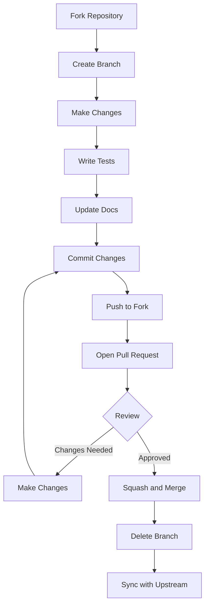

---

# 52. Engineering Ethics

## 52.1 Core Engineering Ethics

### Principle E1: Do No Harm

**Statement**: Engineering decisions consider safety.

### Principle E2: Honesty

**Statement**: Report truthfully, including failures.

### Principle E3: Competence

**Statement**: Only work in areas of expertise.

### Principle E4: Responsibility

**Statement**: Take ownership of work.

### Principle E5: Transparency

**Statement**: Operations are open and honest.

## 52.2 Ethical Decision Framework

```
ETHICAL DECISION FRAMEWORK
==========================

    1. IDENTIFY THE ISSUE
    =====================
    - What is the ethical concern?
    - Who is affected?
    - What are the stakes?

    2. CONSULT GUIDELINES
    =====================
    - Company policies
    - Professional codes
    - Legal requirements

    3. CONSIDER OPTIONS
    ===================
    - What are the choices?
    - Who benefits?
    - Who is harmed?

    4. DECIDE AND ACT
    =================
    - Choose ethically
    - Document reasoning
    - Take responsibility

    5. REFLECT
    ==========
    - Did the decision help?
    - Would others agree?
    - Learn for future
```

## 52.3 Ethics in AI

```
ETHICS IN AI SYSTEMS
====================

    FAIRNESS
    =========
    - No bias in training data
    - Equal treatment in outputs
    - Regular fairness audits

    ACCOUNTABILITY
    ==============
    - Humans remain responsible
    - Decisions are traceable
    - Errors are fixable

    TRANSPARENCY
    ============
    - How decisions are made
    - What data is used
    - What confidence level

    PRIVACY
    =======
    - Data minimization
    - Consent obtained
    - Right to explanation
```

---

# 53. Coding Ethics

## 53.1 Coding Conduct

```
CODING CONDUCT PRINCIPLES
=========================

    1. WRITE CLEAN CODE
    ==================
    - Clear naming
    - Proper structure
    - No shortcuts

    2. TEST THOROUGHLY
    ==================
    - Cover edge cases
    - Don't mock everything
    - Verify behavior

    3. DOCUMENT PROPERLY
    ====================
    - Why, not what
    - Examples included
    - Updated with changes

    4. RESPECT STANDARDS
    ====================
    - Follow conventions
    - Respect patterns
    - Justify exceptions

    5. THINK OF OTHERS
    =================
    - Future maintainers
    - Security implications
    - Performance impact
```

## 53.2 Code Review Ethics

```
CODE REVIEW ETHICS
==================

    REVIEWER ETHICS
    ===============
    - Be constructive
    - Be timely
    - Be respectful
    - Focus on code, not person

    AUTHOR ETHICS
    =============
    - Accept feedback
    - Don't take offense
    - Explain decisions
    - Make requested changes
```

---

# 54. AI Ethics

## 54.1 AI Operational Ethics

### Principle AIE1: Beneficence

**Statement**: AI should benefit humanity.

### Principle AIE2: Non-maleficence

**Statement**: AI should not harm.

### Principle AIE3: Autonomy

**Statement**: Humans retain control.

### Principle AIE4: Justice

**Statement**: AI should be fair.

### Principle AIE5: Transparency

**Statement**: AI operations are explainable.

## 54.2 AI Control Levels

```
AI CONTROL LEVELS
=================

    LEVEL 0: NO AI
    ==============
    Human does everything

    LEVEL 1: ASSIST
    ===============
    AI suggests, human decides

    LEVEL 2: AUGMENT
    ================
    AI executes with human oversight

    LEVEL 3: AUTONOMOUS
    ===================
    AI operates within bounds

    LEVEL 4: FULL AI
    ================
    AI operates independently (rare)

    OSHIP TARGET: LEVEL 2-3
    ========================
    AI executes, human approves
```

## 54.3 AI Decision Boundaries

```
AI DECISION BOUNDARIES
======================

    AI CAN DECIDE
    =============

    - Code style (within standards)
    - Test cases (within scope)
    - Refactoring approaches
    - Documentation structure
    - Performance optimizations

    AI CANNOT DECIDE
    ================

    - Security exceptions
    - Architectural changes
    - New dependencies
    - Breaking changes
    - Public API changes
    - Business logic changes

    AI MUST ESCALATE
    ================

    - Ambiguous requirements
    - Ethical concerns
    - Safety implications
    - Unknown territories
```

---

# 55. Long-Term Sustainability

## 55.1 Sustainability Pillars

```
SUSTAINABILITY PILLARS
=======================

         +-------------------+
         |    SUSTAINABLE    |
         |    REPOSITORY     |
         +--------+----------+
                  |
    +-------------+-------------+
    |             |             |
    v             v             v
+-------+    +---------+    +----------+
| CODE  |    | PEOPLE  |    | PROCESS |
|QUALITY|    | HEALTH  |    | MATURITY|
+-------+    +---------+    +----------+
    |             |             |
    v             v             v
+-------+    +---------+    +----------+
|Low tech|    |Knowledge|    |Measured|
|debt    |    |transfer |    |quality |
+-------+    +---------+    +----------+
    |             |             |
    v             v             v
+-------+    +---------+    +----------+
|Review |    |Mentor- |    |Process |
|cycle  |    |ing     |    |improve |
+-------+    +---------+    +----------+
```

## 55.2 Sustainability Metrics

| Metric | Target | Frequency | Owner |
|--------|--------|-----------|-------|
| **Tech Debt Ratio** | <5% | Monthly | Architecture |
| **Documentation Age** | <30 days | Weekly | Documentation |
| **Knowledge Transfer** | >80% coverage | Quarterly | Team Lead |
| **Code Review Time** | <24 hours | Weekly | Team |
| **Build Success Rate** | >95% | Daily | CI/CD |

## 55.3 Succession Planning

```
SUCCESSION PLANNING
===================

    EVERY ROLE MUST HAVE
    ====================

    PRIMARY OWNER
    - Main responsibility
    - Day-to-day decisions

    BACKUP OWNER
    - Can cover when primary unavailable
    - Knows enough to make decisions

    TRAINEE
    - Learning the role
    - Building capability

    DOCUMENTATION
    - How to do the role
    - Decision criteria
    - Context and history
```

---

# 56. Definition of Success

## 56.1 Success Criteria

```
SUCCESS DEFINITION
==================

    PROJECT SUCCESS
    ==============

    | Criterion      | Definition                    |
    | --------------- | ----------------------------- |
    | On Time        | Delivered by target date      |
    | On Budget      | Within budget allocation      |
    | On Quality     | Meets quality standards       |
    | On Scope       | Delivers committed features   |

    TECHNICAL SUCCESS
    ================

    | Criterion      | Target                        |
    | --------------- | ----------------------------- |
    | Performance    | Meets SLAs                    |
    | Security       | Zero critical vulnerabilities |
    | Reliability    | 99.99% uptime                |
    | Scalability    | Handles projected load        |

    BUSINESS SUCCESS
    ===============

    | Criterion      | Target                        |
    | --------------- | ----------------------------- |
    | Adoption       | Users actively use product    |
    | Satisfaction   | NPS > 50                      |
    | Value          | ROI positive                  |
    | Growth         | User base expanding           |
```

## 56.2 Success Metrics Hierarchy

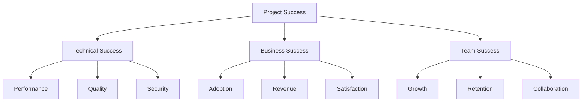

## 56.3 Success Measurement

```
SUCCESS MEASUREMENT
===================

    LEADING INDICATORS
    ==================
    - Progress toward milestones
    - Test coverage increasing
    - Tech debt decreasing
    - Documentation updated

    LAGGING INDICATORS
    ==================
    - User satisfaction scores
    - Revenue numbers
    - Support tickets
    - Bug reports
```

---

# 57. Definition of Failure

## 57.1 Failure Categories

```
FAILURE CATEGORIES
==================

    FAILURE TYPE      | SEVERITY    | RECOVERY
    ---------------   | ----------- | ----------
    Scope creep       | Medium      | Re-plan
    Budget overrun     | High        | Re-prioritize
    Quality issues    | High        | Additional testing
    Security breach   | Critical    | Incident response
    Team conflict     | Medium      | Mediation
    Technology lock  | High        | Migration plan
    Complete failure  | Critical    | Post-mortem
```

## 57.2 Failure Response Protocol

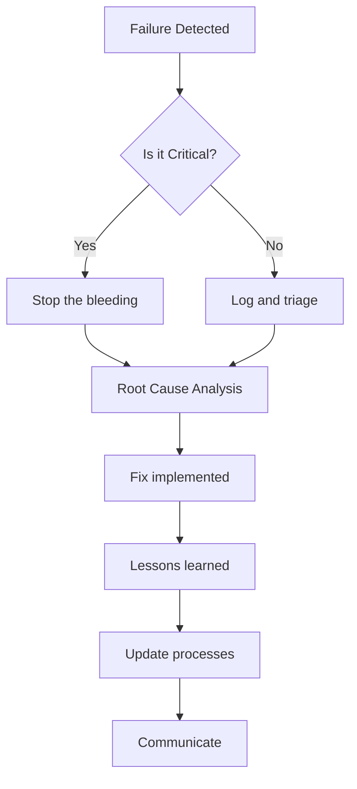

## 57.3 Failure Prevention

```
FAILURE PREVENTION CHECKLIST
=============================

    [ ] Requirements are clear and signed off
    [ ] Architecture is reviewed and approved
    [ ] Risks are identified and mitigated
    [ ] Dependencies are understood
    [ ] Contingencies are planned
    [ ] Monitoring is in place
    [ ] Rollback plan exists
    [ ] Communication plan is clear
```

---

# 58. Repository Constitution

## 58.1 Constitution Articles

```
REPOSITORY CONSTITUTION ARTICLES
================================

    ARTICLE I: PHILOSOPHY
    ====================
    The philosophical foundation of the repository
    cannot be altered without unanimous consent.

    ARTICLE II: PRINCIPLES
    ======================
    Core principles may be amended with architecture
    team approval and documented rationale.

    ARTICLE III: RULES
    ==================
    Golden rules cannot be violated under any circumstance.
    Non-negotiable rules can only be overridden with
    explicit documented approval.

    ARTICLE IV: GOVERNANCE
    =====================
    The governance structure defines decision authority
    and escalation paths.

    ARTICLE V: EVOLUTION
    ===================
    The repository evolves through documented changes
    to its artifacts, always preserving history.
```

## 58.2 Constitution Hierarchy

```
CONSTITUTION HIERARCHY
======================

    LEVEL 0: IMMUTABLE
    ==================
    - Philosophy
    - Golden Rules
    - Non-Negotiable Rules
    
    LEVEL 1: VERY HIGH AUTHORITY
    ============================
    - Architecture Principles
    - Security Principles
    - Quality Principles

    LEVEL 2: HIGH AUTHORITY
    ======================
    - Development Practices
    - Review Processes
    - Documentation Standards

    LEVEL 3: MODERATE AUTHORITY
    ==========================
    - Coding Conventions
    - Style Guidelines
    - Tool Preferences

    LEVEL 4: LOW AUTHORITY
    ======================
    - Individual preferences
    - Team-specific practices
    - Local configurations
```

## 58.3 Amendment Process

```
AMENDMENT PROCESS
=================

    ARTICLE TYPE      | AMENDMENT REQUIRED
    ---------------   | -----------------
    
    Philosophy         | Unanimous consent, all stakeholders
    Golden Rules       | Unanimous consent, architecture team
    Non-Negotiable     | Architecture team approval
    Principles         | Architecture team approval
    Guidelines         | Team lead approval
    Conventions        | Self-applied, team consensus
```

---

# 59. Golden Rules

## 59.1 The Golden Rules

These rules are **NON-NEGOTIABLE**. They cannot be violated under any circumstances.

```
GOLDEN RULES
============

    ╔═══════════════════════════════════════════════════════════╗
    ║                                                           ║
    ║  RULE 1: DOCUMENTATION DRIVES CODE                        ║
    ║  =================================                        ║
    ║  Code cannot exist without documentation.                  ║
    ║  Before any code is written, documentation must exist.    ║
    ║                                                           ║
    ╠═══════════════════════════════════════════════════════════╣
    ║                                                           ║
    ║  RULE 2: EVERY CHANGE UPDATES KNOWLEDGE                   ║
    ║  ==================================                      ║
    ║  Every code change must update relevant documentation.   ║
    ║  Every architectural change must update ADRs.             ║
    ║                                                           ║
    ╠═══════════════════════════════════════════════════════════╣
    ║                                                           ║
    ║  RULE 3: REPOSITORY NEVER FORGETS                        ║
    ║  =================================                       ║
    ║  Every decision, change, and action is recorded.          ║
    ║  Git history is sacred.                                    ║
    ║  Deletions without backup are forbidden.                  ║
    ║                                                           ║
    ╠═══════════════════════════════════════════════════════════╣
    ║                                                           ║
    ║  RULE 4: EVERY DECISION IS RECORDED                      ║
    ║  =================================                       ║
    ║  All significant decisions are documented in ADRs.        ║
    ║  Decisions without rationale are invalid.                ║
    ║                                                           ║
    ╠═══════════════════════════════════════════════════════════╣
    ║                                                           ║
    ║  RULE 5: AI ALWAYS READS CONTEXT FIRST                   ║
    ║  ===================================                      ║
    ║  AI agents must execute AI_BOOT_SEQUENCE before acting.  ║
    ║  Operating without context is prohibited.                 ║
    ║                                                           ║
    ╠═══════════════════════════════════════════════════════════╣
    ║                                                           ║
    ║  RULE 6: NOTHING IS FINAL                                ║
    ║  =========================                                ║
    ║  All artifacts are subject to improvement.                ║
    ║  Nothing is sacred except these golden rules.             ║
    ║                                                           ║
    ╠═══════════════════════════════════════════════════════════╣
    ║                                                           ║
    ║  RULE 7: EVERYTHING IS VERSIONED                         ║
    ║  =============================                           ║
    ║  All artifacts follow semantic versioning.               ║
    ║  Changes without versions are invalid.                    ║
    ║                                                           ║
    ╠═══════════════════════════════════════════════════════════╣
    ║                                                           ║
    ║  RULE 8: ARCHITECTURE PRECEDES IMPLEMENTATION            ║
    ║  =======================================                 ║
    ║  Design before code. Architecture before implementation. ║
    ║  Code without architecture is forbidden.                  ║
    ║                                                           ║
    ╠═══════════════════════════════════════════════════════════╣
    ║                                                           ║
    ║  RULE 9: EVERY IMPROVEMENT BECOMES PERMANENT KNOWLEDGE   ║
    ║  ================================================         ║
    ║  Improvements must be documented and preserved.          ║
    ║  Temporary fixes without follow-up are prohibited.        ║
    ║                                                           ║
    ╠═══════════════════════════════════════════════════════════╣
    ║                                                           ║
    ║  RULE 10: EVERY DOCUMENT MUST HELP FUTURE AI AGENTS     ║
    ║  ================================================          ║
    ║  Documents are written for AI comprehension first.       ║
    ║  AI-unfriendly documentation is incomplete.              ║
    ║                                                           ║
    ╚═══════════════════════════════════════════════════════════╝
```

## 59.2 Golden Rules Visualization

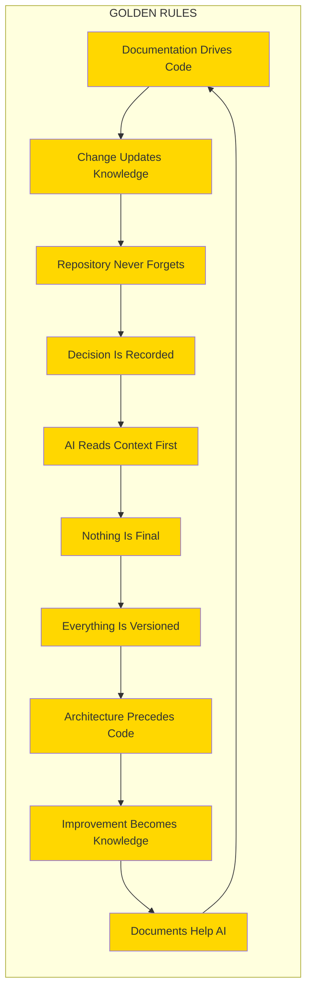

## 59.3 Golden Rules Compliance

```
GOLDEN RULES COMPLIANCE
========================

    VIOLATION CONSEQUENCES
    ======================

    FIRST VIOLATION
    ----------------
    - Documentation required
    - Code review flagged
    - Training reminder

    SECOND VIOLATION
    ----------------
    - PR blocked
    - Pair programming required
    - Manager notification

    THIRD VIOLATION
    ---------------
    - Mandatory review
    - Process enforcement
    - Performance impact

    REPEATED VIOLATIONS
    -------------------
    - Repository privileges suspended
    - Retraining required
    - Escalation to governance
```

---

# 60. Non-Negotiable Rules

## 60.1 The Non-Negotiable Rules

These rules **CANNOT** be overridden under any circumstances without unanimous architectural approval.

```
NON-NEGOTIABLE RULES
====================

    ╔═══════════════════════════════════════════════════════════╗
    ║                                                           ║
    ║  RULE NN1: SECURITY                                       ║
    ║  =============                                            ║
    ║  Zero tolerance for security vulnerabilities.            ║
    ║  No code with known vulnerabilities may be deployed.     ║
    ║  Security scans must pass before merge.                  ║
    ║                                                           ║
    ╠═══════════════════════════════════════════════════════════╣
    ║                                                           ║
    ║  RULE NN2: TESTING                                        ║
    ║  ============                                             ║
    ║  No code may be merged without tests.                   ║
    ║  Test coverage must meet minimum thresholds.              ║
    ║  Failing tests must block deployment.                   ║
    ║                                                           ║
    ╠═══════════════════════════════════════════════════════════╣
    ║                                                           ║
    ║  RULE NN3: DOCUMENTATION                                  ║
    ║  ===================                                      ║
    ║  Every merge must update relevant documentation.          ║
    ║  No undocumented features in production.                  ║
    ║  Documentation must match implementation.                 ║
    ║                                                           ║
    ╠═══════════════════════════════════════════════════════════╣
    ║                                                           ║
    ║  RULE NN4: CODE REVIEW                                    ║
    ║  =============                                            ║
    ║  All code must be reviewed before merge.                 ║
    ║  Review must happen within SLA.                          ║
    ║  Critical issues must be addressed before merge.          ║
    ║                                                           ║
    ╠═══════════════════════════════════════════════════════════╣
    ║                                                           ║
    ║  RULE NN5: ENCODING                                       ║
    ║  ==========                                               ║
    ║  All files must be UTF-8 without BOM.                    ║
    ║  Line endings must be consistent (LF).                  ║
    ║  No binary files in version control (except assets).       ║
    ║                                                           ║
    ╠═══════════════════════════════════════════════════════════╣
    ║                                                           ║
    ║  RULE NN6: METADATA                                       ║
    ║  ===========                                              ║
    ║  All documentation must have standard YAML header.       ║
    ║  Missing metadata makes document invalid.                 ║
    ║  Metadata must be accurate and current.                   ║
    ║                                                           ║
    ╠═══════════════════════════════════════════════════════════╣
    ║                                                           ║
    ║  RULE NN7: NO DESTRUCTION                                 ║
    ║  ==================                                       ║
    ║  No deletion of git history.                             ║
    ║  No deletion of documentation archives.                   ║
    ║  Backups must exist before major changes.                ║
    ║                                                           ║
    ╠═══════════════════════════════════════════════════════════╣
    ║                                                           ║
    ║  RULE NN8: AI BOOT SEQUENCE                               ║
    ║  ====================                                     ║
    ║  AI agents must execute boot sequence before acting.      ║
    ║  Operating without context is a violation.                ║
    ║  Boot sequence results must be verified.                  ║
    ║                                                           ║
    ╠═══════════════════════════════════════════════════════════╣
    ║                                                           ║
    ║  RULE NN9: ARCHITECTURE FIRST                             ║
    ║  ===================                                      ║
    ║  No code without architecture document.                   ║
    ║  No implementation without design review.                ║
    ║  No deployment without architecture sign-off.             ║
    ║                                                           ║
    ╠═══════════════════════════════════════════════════════════╣
    ║                                                           ║
    ║  RULE NN10: SEMANTIC VERSIONING                           ║
    ║  ========================                                ║
    ║  All releases must follow semantic versioning.           ║
    ║  Breaking changes must increment major version.           ║
    ║  Version numbers must be accurate.                       ║
    ║                                                           ║
    ╚═══════════════════════════════════════════════════════════╝
```

## 60.2 Non-Negotiable Rules Matrix

| Rule | Category | Enforcement | Consequence if Violated |
|------|----------|-------------|-------------------------|
| **NN1** | Security | Automated + Manual | Immediate revert |
| **NN2** | Testing | CI/CD Gate | PR blocked |
| **NN3** | Documentation | PR Check | PR blocked |
| **NN4** | Review | Branch Protection | Merge blocked |
| **NN5** | Encoding | Pre-commit hook | Commit rejected |
| **NN6** | Metadata | Automated check | PR blocked |
| **NN7** | Preservation | Git controls | Severe penalty |
| **NN8** | AI Context | Agent protocol | Actions voided |
| **NN9** | Architecture | Review gate | Code rejected |
| **NN10** | Versioning | Release gate | Release blocked |

## 60.3 Rule Violation Response

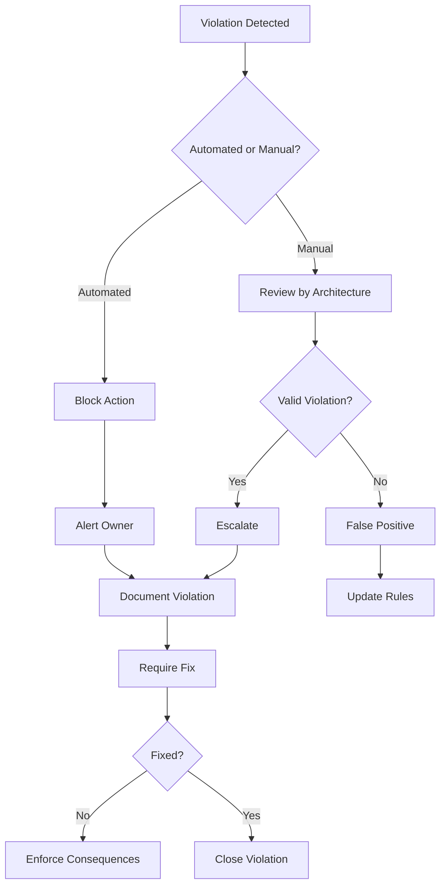

---

# 61. AI Boot Model

## 61.1 The AI Boot Sequence

Every AI agent entering this repository MUST follow this boot sequence:

```
AI_BOOT_SEQUENCE
================

    This sequence is MANDATORY for every AI interaction.

    ┌─────────────────────────────────────────────────────────┐
    │                                                         │
    │   STEP 1: INITIALIZE                                   │
    │   ======================                               │
    │                                                         │
    │   Read: .ai/INDEX.md                                    │
    │   Purpose: Understand this is an AI-native repository  │
    │                                                         │
    └─────────────────────────────────────────────────────────┘
                          │
                          v
    ┌─────────────────────────────────────────────────────────┐
    │                                                         │
    │   STEP 2: LOAD CONSTITUTION                             │
    │   ========================                              │
    │                                                         │
    │   Read: PROJECT_PHILOSOPHY.md                           │
    │   Purpose: Understand the governing philosophy          │
    │   Focus: Golden Rules, Non-Negotiable Rules             │
    │                                                         │
    └─────────────────────────────────────────────────────────┘
                          │
                          v
    ┌─────────────────────────────────────────────────────────┐
    │                                                         │
    │   STEP 3: CHECK STATUS                                   │
    │   ===============                                        │
    │                                                         │
    │   Read: .ai/PROJECT_STATUS.md                            │
    │   Purpose: Understand current phase and targets         │
    │                                                         │
    └─────────────────────────────────────────────────────────┘
                          │
                          v
    ┌─────────────────────────────────────────────────────────┐
    │                                                         │
    │   STEP 4: LOAD CONTEXT                                  │
    │   =============                                        │
    │                                                         │
    │   Read: .ai/CURRENT_CONTEXT.md                           │
    │   Purpose: Understand current state                     │
    │   Focus: Active work, blockers, priorities             │
    │                                                         │
    └─────────────────────────────────────────────────────────┘
                          │
                          v
    ┌─────────────────────────────────────────────────────────┐
    │                                                         │
    │   STEP 5: CHECK NEXT ACTIONS                            │
    │   =======================                               │
    │                                                         │
    │   Read: .ai/NEXT_ACTION.md                               │
    │   Purpose: Know immediate priorities                   │
    │                                                         │
    └─────────────────────────────────────────────────────────┘
                          │
                          v
    ┌─────────────────────────────────────────────────────────┐
    │                                                         │
    │   STEP 6: READ SESSION MEMORY                           │
    │   ========================                              │
    │                                                         │
    │   Read: .ai/SESSION_MEMORY.md                            │
    │   Purpose: Understand any prior session context        │
    │                                                         │
    └─────────────────────────────────────────────────────────┘
                          │
                          v
    ┌─────────────────────────────────────────────────────────┐
    │                                                         │
    │   STEP 7: NAVIGATE TO ENTRY POINT                       │
    │   ===========================                           │
    │                                                         │
    │   Read: README.md                                       │
    │   Purpose: Get project overview                         │
    │                                                         │
    └─────────────────────────────────────────────────────────┘
                          │
                          v
    ┌─────────────────────────────────────────────────────────┐
    │                                                         │
    │   STEP 8: ACCESS MASTER CONTEXT                         │
    │   ==========================                           │
    │                                                         │
    │   Read: docs/INDEX.md                                   │
    │   Purpose: Navigate documentation library              │
    │                                                         │
    └─────────────────────────────────────────────────────────┘
                          │
                          v
    ┌─────────────────────────────────────────────────────────┐
    │                                                         │
    │   STEP 9: REVIEW RELEVANT DOMAIN                        │
    │   ==========================                           │
    │                                                         │
    │   Read: Domain-specific documentation                   │
    │   Purpose: Get task-specific context                    │
    │                                                         │
    └─────────────────────────────────────────────────────────┘
                          │
                          v
    ┌─────────────────────────────────────────────────────────┐
    │                                                         │
    │   STEP 10: BEGIN TASK EXECUTION                         │
    │   ========================                              │
    │                                                         │
    │   Ready to execute task with full context               │
    │                                                         │
    └─────────────────────────────────────────────────────────┘
```

## 61.2 Boot Sequence Flowchart

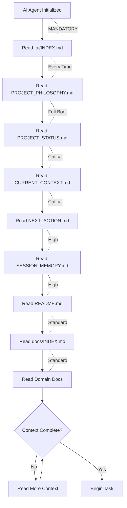

## 61.3 Why This Sequence Exists

```
WHY THE BOOT SEQUENCE EXISTS
============================

    PROBLEM 1: CONTEXT LOST
    =======================
    AI agents often lose context between sessions.
    The boot sequence restores complete context.

    PROBLEM 2: ASSUMPTIONS
    ======================
    Without rules, AI makes assumptions.
    The boot sequence provides explicit rules.

    PROBLEM 3: INCONSISTENCY
    =======================
    Different AI runs produce different results.
    The boot sequence ensures deterministic behavior.

    PROBLEM 4: OVERSIGHT
    ===================
    AI may miss critical information.
    The boot sequence guarantees coverage.

    PROBLEM 5: KNOWLEDGE GAPS
    ========================
    AI may lack historical context.
    The boot sequence provides institutional memory.

    THE RESULT:
    ==========
    - Deterministic behavior
    - Complete context
    - Consistent results
    - No hallucinations
    - Full awareness of rules
```

---

# 62. Knowledge Graph Architecture

## 62.1 Repository Knowledge Graph

The entire repository is organized as a knowledge graph with interconnected nodes:

```
KNOWLEDGE GRAPH ARCHITECTURE
============================

    +----------------------------------------------------------+
    |                                                          |
    |                         TOP LAYER                       |
    |                    (Strategic Knowledge)                 |
    |                                                          |
    |  +----------------+  +----------------+  +--------------+ |
    |  | PHILOSOPHY     |  | VISION         |  | MISSION     | |
    |  | (Why we exist) |  | (Where we go)  |  | (What we do)| |
    |  +----------------+  +----------------+  +--------------+ |
    |                                                          |
    +----------------------------------------------------------+
    |                             |                             |
    |                             v                             |
    +----------------------------------------------------------+
    |                                                          |
    |                     SECOND LAYER                         |
    |                   (Architectural Knowledge)              |
    |                                                          |
    |  +----------------+  +----------------+  +--------------+ |
    |  | ARCHITECTURE   |  | DOMAIN         |  | PATTERNS     | |
    |  | (How we build) |  | (What we build)|  | (How we      | |
    |  |                |  |                |  |  solve)      | |
    |  +----------------+  +----------------+  +--------------+ |
    |                                                          |
    +----------------------------------------------------------+
    |                             |                             |
    |                             v                             |
    +----------------------------------------------------------+
    |                                                          |
    |                      THIRD LAYER                         |
    |                   (Implementation Knowledge)             |
    |                                                          |
    |  +----------------+  +----------------+  +--------------+ |
    |  | CODE           |  | TESTS          |  | CONFIG       | |
    |  | (Implement-    |  | (Validate      |  | (Configure   | |
    |  |  ation)        |  |  behavior)     |  |  systems)    | |
    |  +----------------+  +----------------+  +--------------+ |
    |                                                          |
    +----------------------------------------------------------+
    |                             |                             |
    |                             v                             |
    +----------------------------------------------------------+
    |                                                          |
    |                     FOURTH LAYER                         |
    |                    (Operational Knowledge)               |
    |                                                          |
    |  +----------------+  +----------------+  +--------------+ |
    |  | DEPLOYMENT     |  | MONITORING     |  | OPERATIONS   | |
    |  | (How we        |  | (How we        |  | (How we      | |
    |  |  release)     |  |  observe)      |  |  run)        | |
    |  +----------------+  +----------------+  +--------------+ |
    |                                                          |
    +----------------------------------------------------------+

    ALL LAYERS ARE INTERCONNECTED
    ============================

    - Philosophy informs Architecture
    - Architecture guides Implementation
    - Implementation enables Operations
    - Operations feedback to Philosophy
```

## 62.2 Knowledge Graph Relationships

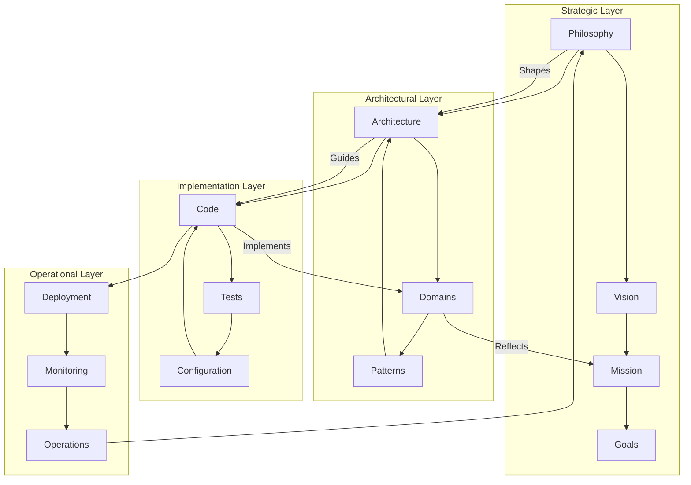

## 62.3 Navigation Knowledge Graph

```
KNOWLEDGE GRAPH NAVIGATION
==========================

    ENTRY POINT: README.md
    =====================

    README.md
         |
         +---> .ai/INDEX.md (AI Entry)
         |
         +---> docs/INDEX.md (Documentation)
         |
         +---> architecture/INDEX.md (Architecture)
         |
         +---> .github/CONTRIBUTING.md (Contributing)


    AI AGENT NAVIGATION PATH
    =======================

    .ai/INDEX.md
         |
         +---> .ai/PROJECT_STATUS.md
         |           |
         |           +---> Current Phase
         |           +---> Milestones
         |           +---> Next Actions
         |
         +---> .ai/CURRENT_CONTEXT.md
         |           |
         |           +---> Technical Boundaries
         |           +---> Active Work
         |           +---> Constraints
         |
         +---> .ai/DECISION_LOG.md
         |           |
         |           +---> Recent Decisions
         |           +---> ADRs
         |
         +---> docs/MASTER_CONTEXT/
                         |
                         +---> ENTERPRISE_ARCHITECTURE_CONTEXT.md
                         +---> [Other master context documents]


    HUMAN NAVIGATION PATH
    ====================

    README.md
         |
         +---> Vision and Mission
         |
         +---> Getting Started Guide
         |
         +---> Architecture Overview
         |
         +---> Contributing Guide
```

## 62.4 Cross-Reference Knowledge Map

```
CROSS-REFERENCE KNOWLEDGE MAP
=============================

    DOCUMENTATION CROSS-REFERENCES
    =============================

    PROJECT_PHILOSOPHY.md
         |
         +---> README.md (Entry point)
         +---> .ai/INDEX.md (AI control plane)
         +---> docs/MASTER_CONTEXT/ENTERPRISE_ARCHITECTURE_CONTEXT.md
         +---> docs/INDEX.md (Documentation library)
         +---> architecture/INDEX.md (Architecture blueprints)

    README.md
         |
         +---> .ai/INDEX.md (AI Workspace)
         +---> docs/INDEX.md (Documentation)
         +---> architecture/INDEX.md (Architecture)
         +---> .github/CONTRIBUTING.md (Contributing)
         +---> .github/SECURITY.md (Security)

    ARCHITECTURE DOCUMENTS
         |
         +---> All reference PROJECT_PHILOSOPHY.md
         +---> All reference ENTERPRISE_ARCHITECTURE_CONTEXT.md
         +---> ADRs cross-reference each other
         +---> Domain models cross-reference patterns

    CODE DOCUMENTS
         |
         +---> Reference architecture documents
         +---> Reference ADRs
         +---> Reference configuration docs
         +---> Include links to tests
```

---

# 63. Metadata Standard

## 63.1 Standard YAML Header

Every Markdown document MUST begin with this standard header:

```
---
File ID: <UNIQUE_ID>
Title: <FORMAL_TITLE>
Version: <SEMVER_VERSION>
Status: <ACTIVE|PROPOSED|DEPRECATED|DRAFT>
Owner: <TEAM_OR_ROLE>
Review Date: <YYYY-MM-DD>
Dependencies: <COMMA_SEPARATED_PATHS>
Related Files: <COMMA_SEPARATED_PATHS>
AI Priority: <CRITICAL|HIGH|MEDIUM|LOW>
---
```

## 63.2 Metadata Field Definitions

| Field | Required | Format | Description |
|-------|----------|--------|-------------|
| **File ID** | Yes | `TYPE-XXX-###` | Unique identifier |
| **Title** | Yes | String | Human-readable title |
| **Version** | Yes | SemVer | Document version |
| **Status** | Yes | Enum | Lifecycle status |
| **Owner** | Yes | String | Responsible team/role |
| **Review Date** | Yes | YYYY-MM-DD | Next review date |
| **Dependencies** | No | Paths | Files this depends on |
| **Related Files** | No | Paths | Related files |
| **AI Priority** | Yes | Enum | AI agent priority |

## 63.3 File ID Naming Convention

```
FILE ID NAMING CONVENTION
=========================

    PREFIXES
    =======

    | Prefix | Meaning               | Examples           |
    | ------- | --------------------- | ------------------ |
    | ROOT    | Repository root docs | ROOT-RME-001       |
    | AI      | AI workspace files   | AI-CTX-001         |
    | DOC     | Documentation         | DOC-MCX-002        |
    | ADR     | Architecture Decisions| ADR-0001          |
    | ARCH    | Architecture docs    | ARCH-DMN-001      |
    | DSG     | Design documents     | DSG-UX-001        |
    | SEC     | Security documents   | SEC-POL-001       |
    | OPS     | Operations docs      | OPS-RUN-001       |

    NUMBERING
    =========

    Root level:     XXX-001 (e.g., ROOT-RME-001)
    Subdirectory:   XXX-001-001
    Increment by:   001 for each new file
```

## 63.4 Status Lifecycle

```
STATUS LIFECYCLE
================

    DRAFT --> PROPOSED --> ACTIVE --> DEPRECATED --> ARCHIVED

    DRAFT
    =====
    - Being created
    - Not ready for use
    - Subject to change

    PROPOSED
    ========
    - Ready for review
    - Awaiting approval
    - May be rejected

    ACTIVE
    ======
    - Approved and in use
    - Current standard
    - Subject to evolution

    DEPRECATED
    ==========
    - No longer recommended
    - May be removed
    - Use successor instead

    ARCHIVED
    ========
    - Historical record
    - No longer maintained
    - Preserved for reference
```

## 63.5 AI Priority Levels

| Priority | Description | Action |
|----------|-------------|--------|
| **CRITICAL** | Must read for core tasks | Always load first |
| **HIGH** | Important for execution | Load before task |
| **MEDIUM** | Helpful context | Load when relevant |
| **LOW** | Background reference | Load as needed |

---

# 64. Repository Evolution Model

## 64.1 Repository Growth Stages

```
REPOSITORY GROWTH STAGES
========================

    STAGE 1: SEED
    ============
    - Initial commit
    - Basic structure
    - README only
    
    Contains: README.md
    Size: <10 files


    STAGE 2: FOUNDATION
    ==================
    - Infrastructure defined
    - Basic documentation
    - Governance established
    
    Contains: Core docs, .ai/ workspace
    Size: 10-50 files


    STAGE 3: ARCHITECTURE
    ====================
    - Architecture defined
    - ADRs created
    - Domain models
    
    Contains: architecture/, docs/architecture/
    Size: 50-200 files


    STAGE 4: IMPLEMENTATION
    =======================
    - Code begins
    - Tests written
    - CI/CD active
    
    Contains: src/, tests/, .github/workflows/
    Size: 200-1000 files


    STAGE 5: MATURITY
    =================
    - Production ready
    - Community grows
    - Processes refined
    
    Contains: Full repository
    Size: 1000-10000 files


    STAGE 6: ECOSYSTEM
    =================
    - Multiple projects
    - Templates created
    - Industry standard
    
    Contains: Monorepo or repo network
    Size: 10000+ files
```

## 64.2 Evolution Triggers

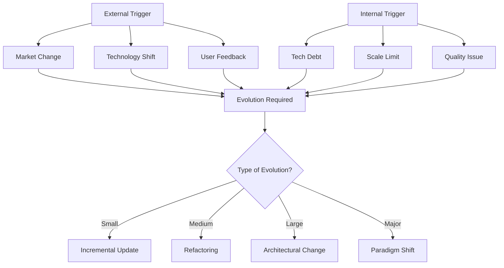

## 64.3 Evolution Governance

```
EVOLUTION GOVERNANCE MATRIX
============================

    | Change Type      | Authority Required | Process      |
    | ---------------- | ------------------ | ------------ |
    | Documentation    | Self + Review      | Standard PR |
    | Code style       | Team consensus      | RFC process |
    | Tool change      | Team lead approval | ADR + PR    |
    | API change       | Architecture review | ADR + PR   |
    | Architecture     | Architecture team   | Full ADR    |
    | Philosophy       | Unanimous consent   | Constitutional|
```

---

# 65. Appendices

## 65.1 Glossary of Terms

```
GLOSSARY
========

    ADR (Architecture Decision Record)
    ----------------------------------
    A document capturing an important architectural decision
    along with its context and consequences.

    AI-Native Repository
    -------------------
    A repository designed primarily for AI agents, with
    complete context, deterministic rules, and comprehensive
    knowledge management.

    Boot Sequence
    -------------
    The mandatory sequence of steps an AI agent must follow
    before operating in the repository.

    Golden Rules
    ------------
    The ten non-negotiable rules that govern all repository
    activities.

    Knowledge Graph
    --------------
    The interconnected network of documents, decisions, and
    code that forms the repository's intellectual structure.

    Non-Negotiable Rules
    --------------------
    Ten rules that cannot be overridden without explicit
    architectural approval.

    Phase
    -----
    A major stage in the repository lifecycle, from Phase 0
    (Foundation) to Phase F (Production).

    PROJECT_PHILOSOPHY.md
    ---------------------
    This document. The constitutional foundation of the
    repository.

    Self-Evolution
    -------------
    The repository's capability to improve itself through
    captured learnings and automated processes.

    Technical Debt
    -------------
    The implied cost of rework caused by choosing a quick
    solution now instead of a better approach.
```

## 65.2 Quick Reference Card

```
QUICK REFERENCE CARD
====================

    FOR AI AGENTS
    =============

    FIRST ACTION: Execute AI_BOOT_SEQUENCE
    -------------------------------------
    1. Read .ai/INDEX.md
    2. Read PROJECT_PHILOSOPHY.md
    3. Read .ai/PROJECT_STATUS.md
    4. Read .ai/CURRENT_CONTEXT.md
    5. Read .ai/NEXT_ACTION.md
    6. Begin task execution


    GOLDEN RULES (Remember Always)
    -------------------------------
    1. Documentation drives code
    2. Every change updates knowledge
    3. Repository never forgets
    4. Every decision is recorded
    5. AI reads context first
    6. Nothing is final
    7. Everything is versioned
    8. Architecture precedes implementation
    9. Improvement becomes knowledge
    10. Documents help AI


    NON-NEGOTIABLE RULES (Never Violate)
    ------------------------------------
    1. Security - Zero vulnerabilities
    2. Testing - 100% with tests
    3. Documentation - Always updated
    4. Review - All code reviewed
    5. Encoding - UTF-8, no BOM
    6. Metadata - Standard header
    7. Preservation - No history deleted
    8. Boot - Execute sequence first
    9. Architecture - Design before code
    10. Versioning - SemVer always


    FOR HUMANS
    ==========

    ENTRY POINT: README.md
    -----------------------
    Start here for project overview.


    AI WORKSPACE: .ai/
    ------------------
    Contains all AI context and governance.


    CONTRIBUTION
    ------------
    See .github/CONTRIBUTING.md


    SECURITY
    --------
    See .github/SECURITY.md


    QUESTIONS
    ---------
    See docs/community/DISCUSSIONS.md
```

## 65.3 Document History

| Version | Date | Author | Changes |
|---------|------|--------|---------| 
| 1.0.0 | 2026-08-04 | AI Repository Architect | Initial creation |

## 65.4 Related Documents

| Document | Location | Purpose |
|----------|----------|---------|
| **README.md** | Root | Project entry point |
| **.ai/INDEX.md** | .ai/ | AI workspace index |
| **PROJECT_STATUS.md** | .ai/ | Current phase and milestones |
| **CURRENT_CONTEXT.md** | .ai/ | Active state and boundaries |
| **ENTERPRISE_ARCHITECTURE_CONTEXT.md** | docs/MASTER_CONTEXT/ | Metadata standard |
| **ADR-0001** | docs/ADR/ | AI-native architecture decision |

## 65.5 Image Placeholders

```
IMAGE PLACEHOLDERS
==================

The following placeholders indicate where visual content
should be added in future iterations:

1. REPOSITORY PHILOSOPHY ILLUSTRATION
   - Visual representation of the philosophical layers
   - Mind map showing relationship of principles
   - Location: Section 6 (Repository Philosophy)

2. ENGINEERING LIFECYCLE
   - Flowchart showing engineering phases
   - Decision gates and quality checkpoints
   - Location: Section 21 (Enterprise Engineering Principles)

3. AI COLLABORATION MODEL
   - Diagram showing human-AI interaction patterns
   - Communication protocols visualization
   - Location: Section 15 (AI Collaboration Model)

4. KNOWLEDGE GRAPH
   - Interactive knowledge graph visualization
   - Node relationship diagram
   - Location: Section 17 (Repository as Knowledge Graph)

5. DEVELOPMENT PIPELINE
   - CI/CD pipeline visualization
   - Quality gates and automation points
   - Location: Section 32 (Automation Philosophy)

6. ARCHITECTURE EVOLUTION
   - Timeline showing architecture changes
   - Version history visualization
   - Location: Section 64 (Repository Evolution Model)

7. DESIGN LANGUAGE
   - Visual identity and design tokens
   - Color palette and typography samples
   - Location: Section 28 (Design Principles)

8. FUTURE AI WORKFLOW
   - Vision for future AI capabilities
   - Enhancement roadmap visualization
   - Location: Section 7 (AI Native Development)

TO ADD IMAGES:
=============
Replace each placeholder with:
- Mermaid diagrams (preferred)
- SVG graphics
- Or reference to actual image files in /assets/
```

---

# End of PART 01

---

**Next:**

**PART 02** will continue with:

- Additional Engineering Principles
- Extended Governance Frameworks
- Detailed Process Documentation
- Advanced AI Collaboration Patterns
- Repository Operations Runbooks
- Emergency Response Protocols
- Compliance and Audit Frameworks
- Performance Optimization Strategies
- Community Building Playbooks
- Long-Term Vision Documentation

---

```
===============================================================================
OSHIP REPOSITORY
===============================================================================

This document is maintained by the Architecture Team.
Last updated: 2026-08-04
Next review: 2026-11-04

For questions, consult:
- .ai/INDEX.md (AI workspace)
- docs/community/DISCUSSIONS.md (Community discussions)
- docs/INDEX.md (Documentation library)

===============================================================================
```
