# Oship — The Enterprise "Money Factory" AI-First Ecosystem

> **The Repository Landing Page.** This is a navigation hub — a map, not the territory.
> Every subject here links to the authoritative knowledge in [`docs/MASTER_CONTEXT/`](./docs/MASTER_CONTEXT/INDEX.md).
> Detailed documentation lives in the knowledge base; the README keeps you oriented.

---

## Table of Contents

- [Hero & Project Identity](#-hero--project-identity)
- [Mission & Vision](#-mission--vision)
- [Enterprise Highlights](#-enterprise-highlights)
- [Repository Status](#-repository-status)
- [AI-Ready Landing (AI Entry Point)](#-ai-ready-landing--ai-entry-point)
- [Architecture Preview](#-architecture-preview)
- [Repository Knowledge Graph](#-repository-knowledge-graph)
- [Repository Structure](#-repository-structure)
- [Technology Stack](#-technology-stack)
- [Project Modules](#-project-modules)
- [Development Workflow](#-development-workflow)
- [Documentation Portal](#-documentation-portal)
- [Human Entry Point](#-human-entry-point)
- [Quick Start](#-quick-start)
- [Repository Health](#-repository-health)
- [Quality Standards](#-quality-standards)
- [Contribution Overview](#-contribution-overview)
- [Security Overview](#-security-overview)
- [Roadmap Preview](#-roadmap-preview)
- [Release Strategy](#-release-strategy)
- [License & Acknowledgements](#-license--acknowledgements)

---

## 🚀 Hero & Project Identity

**Oship** is an enterprise-grade, AI-native software development repository architected from the ground up to be **read, reasoned over, and extended by AI coding agents first — and by human engineers second.** It is the "Money Factory": an ecosystem designed to convert disciplined, documented engineering into reliable, high-value, rapidly-shipped enterprise software.

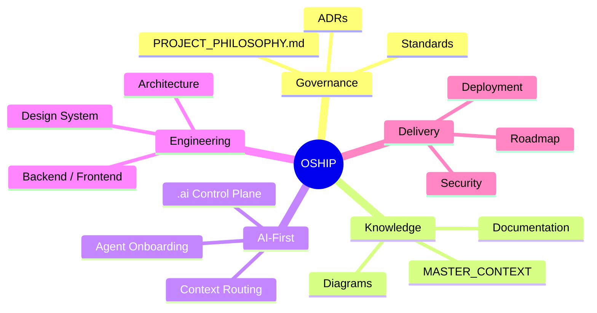

> **Image Specification**
> - Image ID: `IMG-RME-001`
> - Purpose: Hero identity concept — visual anchor for the Oship ecosystem at the top of the README.
> - Prompt: "A futuristic enterprise software ecosystem mind map centered on a golden 'OSHIP' core, radiating to governance, knowledge, AI-first, engineering, and delivery satellites, dark navy blueprint theme with gold accents."
> - Style: Clean layered blueprint, flat vector, high-contrast gold on deep navy.
> - Composition: Radial mind-map, balanced, brand logo at center.
> - Resolution: 2400x1600px
> - Priority: CRITICAL
> - Suggested Filename: `assets/diagrams/README-hero-ecosystem.png`

**Why "Money Factory"?** Oship treats the repository as an operating system for generating enterprise value: every rule, document, and pipeline is an asset that compounds. The repository is designed to be **deterministic**, **modular**, **self-documenting**, and **AI-optimized** — so that the cost of building great software falls, and the speed rises, with every layer of the stack.

---

## 🎯 Mission & Vision

| | Statement |
| :--- | :--- |
| **Mission** | Engineer an enterprise-grade, AI-native repository where any agent or engineer can discover, navigate, and safely extend the system through deterministic, self-documenting knowledge and governance. |
| **Vision** | Become the reference blueprint for AI-first software organizations — a repository that is simultaneously a product, a platform, a knowledge graph, and an operating system. |

### Core Principles (The Ten Immutable Tenets)

| # | Tenet | Meaning |
| :---: | :--- | :--- |
| 1 | **Enterprise-grade** | High availability, zero-trust security, strict SLA governance, modular domain boundaries. |
| 2 | **AI-first** | Optimized for LLM context windows, deterministic parsing, explicit instructions, self-healing CI/CD. |
| 3 | **GitHub-native** | Issue Forms, Discussion templates, GitOps labels/milestones/projects, GitHub Actions. |
| 4 | **Extremely scalable** | Multi-team microservice topology across `/apps`, `/services`, `/packages`. |
| 5 | **Highly maintainable** | No monolithic files; clear ownership via `.github/CODEOWNERS`. |
| 6 | **Self-documenting** | Standardized YAML metadata headers; cross-referenced indexes everywhere. |
| 7 | **Future-proof** | Semantic Versioning 2.0.0, formal ADRs, institutional lessons learned. |
| 8 | **Clean** | No junk, scratch, or temporary files. |
| 9 | **Modular** | Separation between blueprints (`/architecture`) and narrative docs (`/docs/architecture`). |
| 10 | **Deterministic** | UTF-8 without BOM, `.gitkeep` preservation, unambiguous rules. |

📖 Full constitutional detail: [`PROJECT_PHILOSOPHY.md`](./PROJECT_PHILOSOPHY.md)

---

## 🏆 Enterprise Highlights

[-blue?style=for-the-badge)](./docs/roadmap/MILESTONES.md)
[](./docs/deployment/RELEASE_STRATEGY.md)
[](./.ai/INDEX.md)
[](./.github/CONTRIBUTING.md)
[](./.ai/REPOSITORY_EVOLUTION.md)
[](./docs/MASTER_CONTEXT/INDEX.md)

| Capability | Where to look |
| :--- | :--- |
| **AI Control Plane** | [`.ai/INDEX.md`](./.ai/INDEX.md) — session memory, routing, task queue |
| **Global Knowledge Graph** | [`docs/MASTER_CONTEXT/INDEX.md`](./docs/MASTER_CONTEXT/INDEX.md) — 24 knowledge domains |
| **Enterprise Documentation** | [`docs/INDEX.md`](./docs/INDEX.md) — library master index |
| **Architecture Blueprints** | [`architecture/INDEX.md`](./architecture/INDEX.md) |
| **Design System** | [`design/INDEX.md`](./design/INDEX.md) |
| **Architecture Decision Records** | [`docs/ADR/INDEX.md`](./docs/ADR/INDEX.md) |

### Ownership Map (CODEOWNERS)

Oship routes every change to the correct owner through [`.github/CODEOWNERS`](./.github/CODEOWNERS). This guarantees automated review assignment and required approvals on protected branches.

| Path pattern | Owner(s) | Rationale |
| :--- | :--- | :--- |
| `*` (fallback) | `@afshin-omnisystem` | Global safety net owner |
| `/.github/`, `/.ai/`, `/docs/` | `@afshin-omnisystem` | Repository governance & AI control plane |
| `/architecture/`, `/design/`, `/docs/ADR/` | `@afshin-omnisystem` | Architecture & design specifications |
| `/infra/`, `/deployment/`, `/docker/`, `/k8s/`, `.github/workflows/` | `@afshin-omnisystem` | Infrastructure & DevOps |
| `/security/`, `.github/SECURITY.md` | `@afshin-omnisystem` | Security & compliance |
| `/apps/`, `/services/`, `/packages/`, `/apis/`, `/database/`, `/storage/` | `@afshin-omnisystem` | Application domains & services (Phase C+) |

> **Ownership rule:** any contribution that touches a path you do not own must request review from the owning team. This is enforced automatically by GitHub based on the CODEOWNERS patterns above.

---

## 🛡 GitHub-Native Governance

Oship is *GitHub-native by design*: the repository's GitHub configuration is itself a governed, declarative asset that automates triage, review, security, and release. All of this is defined under [`.github/`](./.github/CONTRIBUTING.md) and fully documented in [`docs/development/INDEX.md`](./docs/development/INDEX.md).

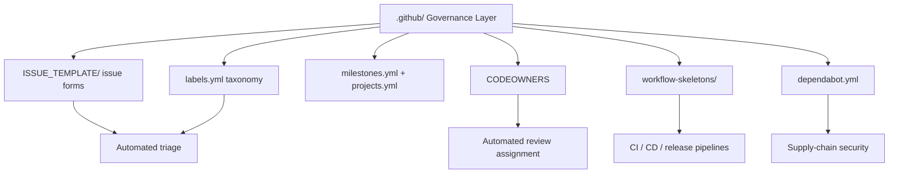

### Issue Templates

Issue reports are captured through structured **GitHub Issue Forms** (`.yml`), which enforce deterministic, parseable input for both humans and agents:

| Template | Purpose |
| :--- | :--- |
| `bug.yml` | Defect reports with reproduction steps |
| `feature.yml` | Feature requests and acceptance criteria |
| `documentation.yml` | Documentation gaps and corrections |
| `architecture.yml` | Architectural proposals and trade-offs |
| `epic.yml` | Large multi-task initiatives |
| `task.yml` | Granular tracked work item |
| `security.yml` | Confidential security reporting |
| `performance.yml` | Performance regressions / optimization |
| `research.yml` | Research and exploration requests |
| `refactor.yml` | Refactoring proposals |
| `question.yml` | Clarification and how-to |

### Label Taxonomy (GitLab-GitOps Style)

Labels are the deterministic triage vocabulary, declared in [`.github/labels.yml`](./.github/labels.yml):

| Label family | Examples | Use |
| :--- | :--- | :--- |
| **Priority** | `priority: critical/high/medium/low` | Severity & scheduling |
| **Status** | `status: backlog/ready/blocked/review/testing/done` | Workflow state |
| **Type** | `type: bug/feature/docs/architecture/security/ai/backend/frontend/database/infrastructure/devops` | Work classification |
| **Size** | `size: xs/s/m/l/xl` | Effort estimation |
| **Community** | `good first issue`, `help wanted`, `question` | Contribution guidance |
| **Maintenance** | `technical debt`, `refactor`, `research`, `duplicate`, `invalid`, `wontfix` | Backlog hygiene |

### Milestones, Projects & Automation

- **Milestones** map to lifecycle phases via [`.github/milestones.yml`](./.github/milestones.yml) — Phase 0 → F.
- **Projects** group work by delivery board in [`.github/projects.yml`](./.github/projects.yml).
- **Workflow skeletons** in `.github/workflow-skeletons/` define the CI/CD future: `ci.yml`, `cd.yml`, `release.yml`, `issue-triage.yml`, `security-scan.yml`, `documentation.yml`, `ai-governance.yml`, `stale.yml`.
- **Dependabot** (`.github/dependabot.yml`) keeps `github-actions` dependencies current on a weekly cadence, tagging `type: devops` / `type: security`.

> **Image Specification**
> - Image ID: `IMG-RME-017`
> - Purpose: Visualize the GitHub-native governance layer and its automation surfaces.
> - Prompt: "An enterprise GitHub governance architecture diagram showing issue templates, labels taxonomy, milestones, codeowners, workflows, and dependabot nodes converging on automation, dark navy blueprint style."
> - Style: Architecture diagram, blueprint, gold connectors.
> - Composition: Central governance node with branches.
> - Resolution: 2000x1200px
> - Priority: HIGH
> - Suggested Filename: `assets/diagrams/README-github-governance.png`

---

## 📊 Repository Status

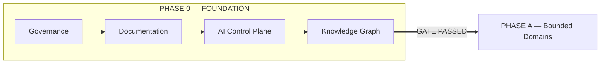

- **Active Lifecycle Phase**: **Phase 0 — Enterprise Repository Foundation & Infrastructure** *(IN PROGRESS → ready for Phase A)*
- **Semantic Version Target**: `v0.1.0-alpha.0`
- **Strict Invariant**: **No application code during Phase 0.** Only governance, documentation, configs, and skeleton templates.
- **Phase 0 readiness**: 100% of Phase 0 quality gates **PASSED** — see [`docs/roadmap/MILESTONES.md`](./docs/roadmap/MILESTONES.md) and [`.ai/PROJECT_STATUS.md`](./.ai/PROJECT_STATUS.md).

### Lifecycle Phase Gates (Phase 0 → F)

Each phase is a declarative milestone with explicit **entry** and **exit** criteria, tracked in [`docs/roadmap/MILESTONES.md`](./docs/roadmap/MILESTONES.md) and declared in [`.github/milestones.yml`](./.github/milestones.yml).

| Phase | Objective | Entry criterion | Exit criterion | SemVer |
| :---: | :--- | :--- | :--- | :---: |
| **0** | Repository Foundation & Governance | Repository clone | 100% metadata headers, `.gitkeep`, zero app code | `v0.0.1` |
| **A** | Product Context & Bounded Domains | Phase 0 signed off | Approved domain models + formal ADRs | `v0.1.0` |
| **B** | Platform, API & Data Design | Phase A signed off | OpenAPI specs + database migrations | `v0.2.0` |
| **C** | First Implementation Increments | Phase B signed off | Executable services + passing tests | `v0.5.0` |
| **D** | RC Quality & Security Validation | Phase C signed off | Security/perf/compat validated | `v0.8.0` |
| **E** | Ops Readiness & DR Evidence | Phase D signed off | SRE, SLOs, disaster recovery evidence | `v0.9.0` |
| **F** | Institutional Scale & AI Loops | Phase E signed off | GA release, compliance, SLA | `v1.0.0` |

> **Image Specification**
> - Image ID: `IMG-RME-002`
> - Purpose: Show the repository lifecycle phase transition and current status at a glance.
> - Prompt: "A clean two-stage flow diagram: Phase 0 Foundation box on the left with governance/documentation/AI layers, a green PASSED gate arrow into Phase A Bounded Domains on the right, dark blueprint theme."
> - Style: Flat flowchart, green gate accent, navy background.
> - Composition: Left-to-right single flow.
> - Resolution: 1600x600px
> - Priority: HIGH
> - Suggested Filename: `assets/diagrams/README-repo-status.png`

---

## 🤖 AI-Ready Landing (AI Entry Point)

> This README is **AI-native**. It is written to be deterministically parsed by AI coding agents (Codex, Claude Code, Gemini CLI, OpenAI Codex Agent, etc.) before any task.

### How an AI should navigate Oship

Every agent MUST follow this deterministic **boot sequence** before any task. This is the AI entry point into the knowledge graph.

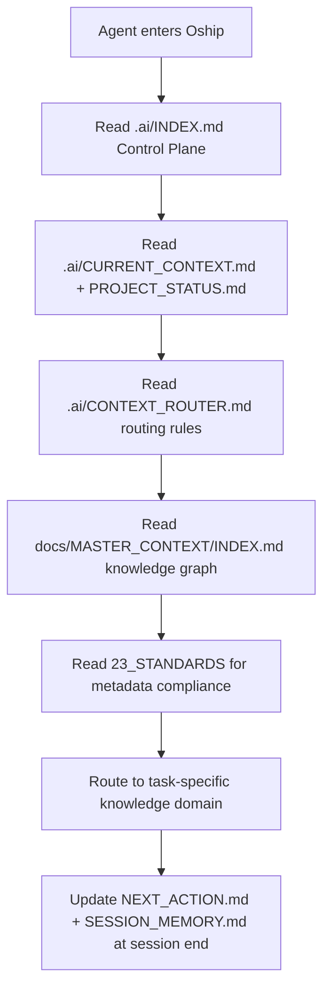

### Reading Priority for AI Agents

| Priority | Document | Why |
| :---: | :--- | :--- |
| **P0** | [`.ai/INDEX.md`](./.ai/INDEX.md) | Master control plane & operational rules |
| **P0** | [`.ai/CURRENT_CONTEXT.md`](./.ai/CURRENT_CONTEXT.md) | Current architecture state & invariants |
| **P0** | [`.ai/PROJECT_STATUS.md`](./.ai/PROJECT_STATUS.md) | Active phase, milestones, SemVer |
| **P1** | [`.ai/CONTEXT_ROUTER.md`](./.ai/CONTEXT_ROUTER.md) | Declarative routing rules & hop limits |
| **P1** | [`docs/MASTER_CONTEXT/INDEX.md`](./docs/MASTER_CONTEXT/INDEX.md) | Global knowledge graph & 24 domains |
| **P1** | [`docs/MASTER_CONTEXT/23_STANDARDS/INDEX.md`](./docs/MASTER_CONTEXT/23_STANDARDS/INDEX.md) | Metadata header & naming compliance |
| **P2** | [`docs/MASTER_CONTEXT/05_AI/INDEX.md`](./docs/MASTER_CONTEXT/05_AI/INDEX.md) | AI onboarding, governance, metrics |

### Estimated AI Reading Order

1. README (this page) → 5 min
2. `.ai/INDEX.md` → 4 min
3. `.ai/CURRENT_CONTEXT.md` → 3 min
4. `.ai/CONTEXT_ROUTER.md` → 3 min
5. `docs/MASTER_CONTEXT/INDEX.md` → 6 min
6. `docs/MASTER_CONTEXT/23_STANDARDS/` → 4 min
7. Task-specific knowledge domain `INDEX.md` → 2–4 min each

### AI-tool compatibility

Oship is designed to be read identically by every major AI coding agent. Because the README and MASTER_CONTEXT use deterministic metadata headers, relative links, and structured Mermaid/ASCII, any tool can parse the same routing graph.

| AI tool | Primary entry | How it should start |
| :--- | :--- | :--- |
| GitHub Copilot / Codex | `.ai/INDEX.md` | Follow boot sequence, then routing |
| Claude Code | `README` → `.ai/` | Read context, route to domain |
| Gemini CLI | `docs/MASTER_CONTEXT/` | Load knowledge graph, route |
| OpenAI Codex Agent | `CONTEXT_ROUTER.md` | Resolve task → domain → content |
| Any future agent | `README` → `23_STANDARDS` | Read metadata contract first |

> **Interoperability rule:** as long as a tool reads the YAML header, follows relative links, and obeys the routing decision tree, it can operate deterministically on Oship. This is what makes the repository future-proof for AI tools that do not exist yet.

### AI Boot Journey (first-contact verification)

This is the exact journey a **brand-new AI agent** takes the first time it enters Oship. Every step has a deterministic target, so the agent is never lost.

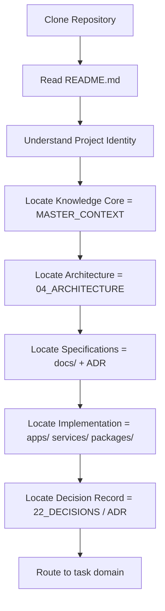

| Boot question | Answer | Where it's answered |
| :--- | :--- | :--- |
| **What is Oship?** | AI-native enterprise repository, "Money Factory" | README Hero & Mission |
| **Why does it exist?** | Convert documented engineering into reliable value | Mission & Vision |
| **How is it structured?** | 24 knowledge domains + 5-layer pyramid | Knowledge Graph & Architecture Preview |
| **Where to read next?** | `.ai/INDEX.md` → `MASTER_CONTEXT` | AI Entry Point |
| **Where to implement code?** | `apps/`, `services/`, `packages/` | Repository Structure & Project Modules |
| **Where to record decisions?** | `docs/ADR/` + `22_DECISIONS` | Documentation Portal & Decisions domain |

> **Validation:** an agent that can answer all six boot questions after reading only this README has been successfully onboarded. If any answer is missing, it must be added to this README.

### AI Confusion Prevention Matrix

A future AI could misunderstand aspects of Oship. This matrix documents each ambiguity and its prevention so the README stays unambiguous.

| Potential confusion | Why it happens | Prevention | Solution |
| :--- | :--- | :--- | :--- |
| "README is the documentation" | Traditional repos put docs in README | State "README is a hub" explicitly | Navigation-rule + hub links throughout |
| "Phase 0 means nothing to build" | Phase names are abstract | Label the strict invariant | "No application code during Phase 0" |
| "All 24 domains are complete" | Domains have `INDEX.md` | Distinguish INDEX vs content | Completion-status fields per domain |
| "Architecture = design system" | Multiple "architecture" terms | Separate blueprint vs narrative docs | `/architecture` vs `/docs/architecture` |
| "Knowledge Layer = folder depth" | L1–L5 pyramid | Define layer by authority | Knowledge-Layer Responsibilities table |
| "Any branch can merge to main" | Multi-branch model | Document protection levels | Git Branching Model table |
| "AI must read every file" | Large repo | Provide reading priority | P0/P1/P2 priority table |
| "Code exists today" | Folders named apps/services | Mark Phase status | Project Modules "Planned" status |

> **Ambiguity rule:** every ambiguous term in this README resolves to a deterministic table or link. If a future reader must guess, that is a defect to fix.

### Knowledge Routing Protocol (deterministic)

The router resolves any agent question to the shortest path in ≤ 2 hops. Full rules live in [`.ai/CONTEXT_ROUTER.md`](./.ai/CONTEXT_ROUTER.md); this is the landing-page summary.

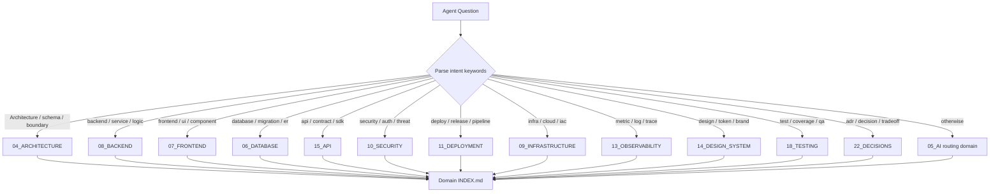

### Common Agent Tasks → Routing

| Agent task (intent) | Primary domain(s) to read | Secondary |
| :--- | :--- | :--- |
| "Add a backend endpoint" | `08_BACKEND`, `15_API` | `06_DATABASE`, `10_SECURITY` |
| "Build a new screen" | `07_FRONTEND`, `14_DESIGN_SYSTEM` | `03_USERS`, `15_API` |
| "Design a database table" | `06_DATABASE` | `04_ARCHITECTURE`, `15_API` |
| "Write a test suite" | `18_TESTING` | `17_AUTOMATION`, `08_BACKEND` |
| "Set up CI/CD" | `17_AUTOMATION`, `11_DEPLOYMENT` | `09_INFRASTRUCTURE` |
| "Fix a security issue" | `10_SECURITY` | `04_ARCHITECTURE`, `15_API` |
| "Make an architectural decision" | `22_DECISIONS`, `04_ARCHITECTURE` | `21_RESEARCH`, `23_STANDARDS` |
| "Add a plugin" | `16_PLUGINS` | `15_API`, `04_ARCHITECTURE` |
| "Investigate a production issue" | `13_OBSERVABILITY`, `12_OPERATIONS` | `08_BACKEND` |
| "Update project strategy" | `19_ROADMAP`, `01_PRODUCT` | `02_BUSINESS` |

### Compound routing examples

For multi-domain requests, the router resolves a deterministic **read order**. These examples come from the routing plane (`.ai/CONTEXT_ROUTER.md`).

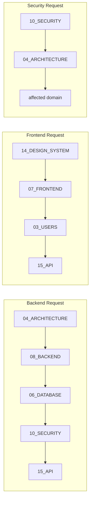

**Backend request**
```
Backend Request
     ↓
 Read 04_ARCHITECTURE  (system structure & boundaries)
     ↓
 Read 08_BACKEND       (service & module architecture)
     ↓
 Read 06_DATABASE      (data model & schemas)
     ↓
 Read 10_SECURITY      (auth, threat model, data protection)
     ↓
 Read 15_API           (contracts the backend must satisfy)
```

**Frontend request**
```
Frontend Request
     ↓
 Read 14_DESIGN_SYSTEM (tokens, components, brand)
     ↓
 Read 07_FRONTEND      (frontend architecture & state)
     ↓
 Read 03_USERS         (personas & journeys -> UX)
     ↓
 Read 15_API           (contracts the frontend consumes)
```

**Data request**
```
Data Request
     ↓
 Read 04_ARCHITECTURE
     ↓
 Read 06_DATABASE
     ↓
 Read 08_BACKEND
     ↓
 Read 10_SECURITY
```

**Security request**
```
Security Request
     ↓
 Read 10_SECURITY
     ↓
 Read 04_ARCHITECTURE
     ↓
 Read 06_DATABASE / 15_API / 11_DEPLOYMENT (as applicable)
```

> **Image Specification**
> - Image ID: `IMG-RME-013`
> - Purpose: Visualize the deterministic question→domain routing decision tree for AI agents.
> - Prompt: "A routing decision tree from an Agent Question root branching through keyword intent nodes to the 24 knowledge domains, converging on domain index nodes, purple and gold on dark navy."
> - Style: Decision tree flowchart.
> - Composition: Top-down branching to converge.
> - Resolution: 2400x1600px
> - Priority: CRITICAL
> - Suggested Filename: `assets/diagrams/README-routing-decision-tree.png`

> **Image Specification**
> - Image ID: `IMG-RME-003`
> - Purpose: Visualize the AI boot/onboarding sequence so agents and humans see the deterministic entry path.
> - Prompt: "An ordered seven-step agent onboarding flow chart, each step a labeled box from control plane to routing to knowledge graph to task routing, purple AI accent color on dark navy."
> - Style: Flat flowchart, purple highlights, numbered nodes.
> - Composition: Top-to-bottom ordered flow.
> - Resolution: 1600x1200px
> - Priority: CRITICAL
> - Suggested Filename: `assets/diagrams/README-ai-boot-sequence.png`

---

## 🏛 Architecture Preview

Oship organizes all knowledge into a five-layer pyramid (from [`PROJECT_PHILOSOPHY.md` §130](./PROJECT_PHILOSOPHY.md)):

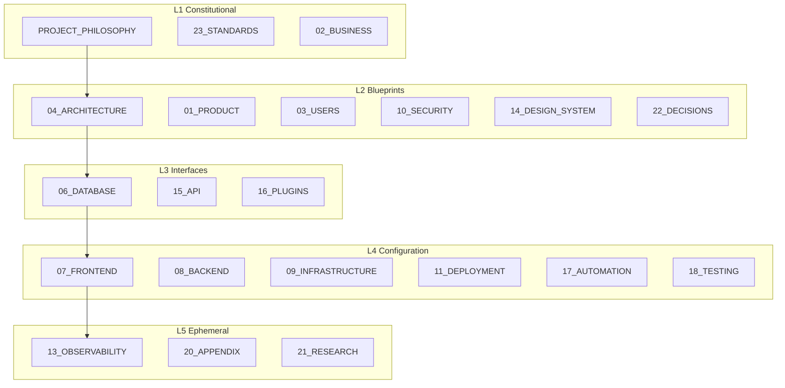

> **Image Specification**
> - Image ID: `IMG-RME-004`
> - Purpose: Show the five-layer knowledge pyramid that governs all Oship knowledge and routing.
> - Prompt: "An enterprise knowledge pyramid with five stacked layers labeled Constitutional, Blueprints, Interfaces, Configuration, Ephemeral, each showing representative domain names, navy and gold blueprint style."
> - Style: Layered pyramid diagram, blueprint theme.
> - Composition: Pyramid ascending from base to apex.
> - Resolution: 2000x1400px
> - Priority: CRITICAL
> - Suggested Filename: `assets/diagrams/README-knowledge-pyramid.png`

**Knowledge flows top-down** (Constitutional → Blueprints → Interfaces → Configuration), while cross-cutting concerns (Security, Observability, Testing) intersect horizontally. Full mapping: [`docs/MASTER_CONTEXT/INDEX.md`](./docs/MASTER_CONTEXT/INDEX.md).

### Knowledge Layer Responsibilities

| Layer | Core assets | Where it lives | Governing owner |
| :---: | :--- | :--- | :--- |
| **L1 Constitutional** | Philosophy, standards, business, roadmap | `PROJECT_PHILOSOPHY.md`, `.ai/`, `23_STANDARDS` | Human Architect Board |
| **L2 Blueprints** | C4 models, bounded contexts, security, decisions | `architecture/`, `docs/ADR/`, `04/10/14/22` | Lead Enterprise Architect |
| **L3 Interfaces** | OpenAPI, schemas, plugins | `apis/`, `database/`, `15/16` | Lead AI Integration Agent |
| **L4 Configuration** | CI/CD, IaC, services, frontend/backend | `.github/`, `infra/`, `07/08/09/11/17/18` | Senior DevOps Engineer |
| **L5 Ephemeral** | Telemetry, research, appendices | `observability/`, `research/`, `13/20/21` | AI Orchestration Agent |

> **Routing consequence:** the knowledge layer of a document determines its review cadence and authority. L1 changes require board approval; L5 changes are transient and lightly governed.

### C4 Model preview

Oship plans to document its architecture using the **C4 model** (Context → Containers → Components → Code), stored in the `04_ARCHITECTURE` domain and `docs/diagrams/c4/`.

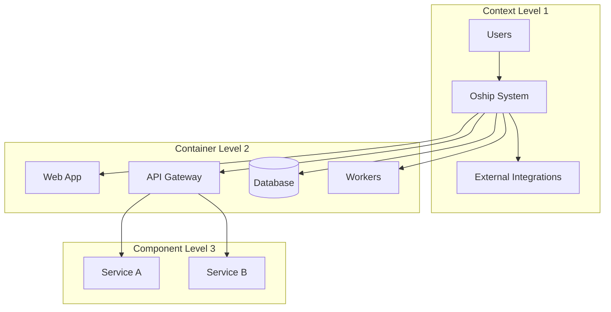

| C4 level | Scope | Typical diagram |
| :--- | :--- | :--- |
| **Context** | System + external actors | High-level system map |
| **Containers** | Apps, services, data stores | Deployment topology |
| **Components** | Internal parts of a container | Service decomposition |
| **Code** | Implementation detail | Class/flow diagrams |

> C4 diagrams are planned content; the taxonomy is defined in [`docs/MASTER_CONTEXT/24_DIAGRAMS/INDEX.md`](./docs/MASTER_CONTEXT/24_DIAGRAMS/INDEX.md).

### Knowledge-Layer Navigation Graph

The relationship between README and the knowledge/implementation layers is a deterministic chain. This is the master navigation graph any reader (human or AI) follows.

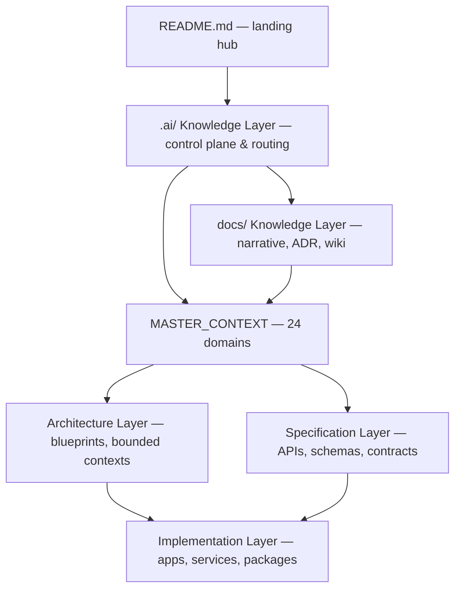

| Layer (in navigation chain) | Primary location | Responsibility |
| :--- | :--- | :--- |
| **README** | `README.md` | Orientation & routing hub |
| **.ai Knowledge** | `.ai/` | Agent control plane, memory, metrics |
| **docs Knowledge** | `docs/` | Narrative docs, ADRs, wiki, diagrams |
| **Architecture** | `architecture/`, `docs/ADR/` | Blueprints, bounded contexts, decisions |
| **Specification** | `apis/`, `database/`, `docs/specifications/` | Contracts, schemas, data models |
| **Implementation** | `apps/`, `services/`, `packages/` | Executable code (Phase C+) |

> **Navigation rule:** knowledge flows README → `.ai`/`docs` → MASTER_CONTEXT → architecture → specification → implementation. Never skip a layer; each adds the context the next needs.

---

## 🕸 Repository Knowledge Graph

The **Global Knowledge Graph** is the "brain" of Oship — 24 canonical knowledge domains, each with a dedicated folder and `INDEX.md`, wired together through deterministic dependencies.

```mermaid
graph LR
    MCX((MASTER_CONTEXT)) --> P[01 PRODUCT]
    MCX --> B[02 BUSINESS]
    MCX --> U[03 USERS]
    MCX --> A[04 ARCHITECTURE]
    A --> AI[05 AI]
    A --> DB[06 DATABASE]
    A --> FE[07 FRONTEND]
    A --> BE[08 BACKEND]
    A --> IN[09 INFRASTRUCTURE]
    A --> SEC[10 SECURITY]
    A --> API[15 API]
    API --> PL[16 PLUGINS]
    BE --> FE
    SEC --> API
    MCX --> DIAG[24 DIAGRAMS]
    MCX --> ST[23 STANDARDS]
    MCX --> DEC[22 DECISIONS]
    MCX --> RM[19 ROADMAP]
```

**The 24 Knowledge Domains**

| # | Domain | Folder | Entry Point |
| :---: | :--- | :--- | :--- |
| 01 | Product | `01_PRODUCT/` | [`INDEX.md`](./docs/MASTER_CONTEXT/01_PRODUCT/INDEX.md) |
| 02 | Business | `02_BUSINESS/` | [`INDEX.md`](./docs/MASTER_CONTEXT/02_BUSINESS/INDEX.md) |
| 03 | Users | `03_USERS/` | [`INDEX.md`](./docs/MASTER_CONTEXT/03_USERS/INDEX.md) |
| 04 | Architecture | `04_ARCHITECTURE/` | [`INDEX.md`](./docs/MASTER_CONTEXT/04_ARCHITECTURE/INDEX.md) |
| 05 | AI | `05_AI/` | [`INDEX.md`](./docs/MASTER_CONTEXT/05_AI/INDEX.md) |
| 06 | Database | `06_DATABASE/` | [`INDEX.md`](./docs/MASTER_CONTEXT/06_DATABASE/INDEX.md) |
| 07 | Frontend | `07_FRONTEND/` | [`INDEX.md`](./docs/MASTER_CONTEXT/07_FRONTEND/INDEX.md) |
| 08 | Backend | `08_BACKEND/` | [`INDEX.md`](./docs/MASTER_CONTEXT/08_BACKEND/INDEX.md) |
| 09 | Infrastructure | `09_INFRASTRUCTURE/` | [`INDEX.md`](./docs/MASTER_CONTEXT/09_INFRASTRUCTURE/INDEX.md) |
| 10 | Security | `10_SECURITY/` | [`INDEX.md`](./docs/MASTER_CONTEXT/10_SECURITY/INDEX.md) |
| 11 | Deployment | `11_DEPLOYMENT/` | [`INDEX.md`](./docs/MASTER_CONTEXT/11_DEPLOYMENT/INDEX.md) |
| 12 | Operations | `12_OPERATIONS/` | [`INDEX.md`](./docs/MASTER_CONTEXT/12_OPERATIONS/INDEX.md) |
| 13 | Observability | `13_OBSERVABILITY/` | [`INDEX.md`](./docs/MASTER_CONTEXT/13_OBSERVABILITY/INDEX.md) |
| 14 | Design System | `14_DESIGN_SYSTEM/` | [`INDEX.md`](./docs/MASTER_CONTEXT/14_DESIGN_SYSTEM/INDEX.md) |
| 15 | API | `15_API/` | [`INDEX.md`](./docs/MASTER_CONTEXT/15_API/INDEX.md) |
| 16 | Plugins | `16_PLUGINS/` | [`INDEX.md`](./docs/MASTER_CONTEXT/16_PLUGINS/INDEX.md) |
| 17 | Automation | `17_AUTOMATION/` | [`INDEX.md`](./docs/MASTER_CONTEXT/17_AUTOMATION/INDEX.md) |
| 18 | Testing | `18_TESTING/` | [`INDEX.md`](./docs/MASTER_CONTEXT/18_TESTING/INDEX.md) |
| 19 | Roadmap | `19_ROADMAP/` | [`INDEX.md`](./docs/MASTER_CONTEXT/19_ROADMAP/INDEX.md) |
| 20 | Appendix | `20_APPENDIX/` | [`INDEX.md`](./docs/MASTER_CONTEXT/20_APPENDIX/INDEX.md) |
| 21 | Research | `21_RESEARCH/` | [`INDEX.md`](./docs/MASTER_CONTEXT/21_RESEARCH/INDEX.md) |
| 22 | Decisions | `22_DECISIONS/` | [`INDEX.md`](./docs/MASTER_CONTEXT/22_DECISIONS/INDEX.md) |
| 23 | Standards | `23_STANDARDS/` | [`INDEX.md`](./docs/MASTER_CONTEXT/23_STANDARDS/INDEX.md) |
| 24 | Diagrams | `24_DIAGRAMS/` | [`INDEX.md`](./docs/MASTER_CONTEXT/24_DIAGRAMS/INDEX.md) |

### How to read a domain quickly

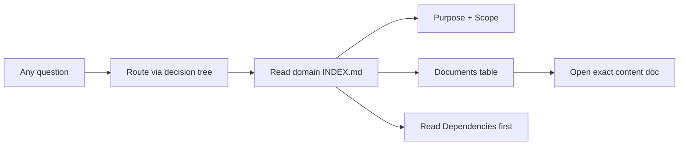

This two-step navigation (route → index) is the fast path to any knowledge in Oship.

### What lives inside each knowledge domain

Each domain `INDEX.md` enumerates its planned documents. This is the traceability map — it tells any agent or engineer **what question each domain answers** before they open it.

| # | Domain | Core documents (planned) |
| :---: | :--- | :--- |
| 01 | Product | PRODUCT_VISION · VALUE_PROPOSITION · PRODUCT_STRATEGY · FEATURE_REGISTRY |
| 02 | Business | BUSINESS_MODEL · VALUE_STREAMS · BUSINESS_METRICS · STAKEHOLDERS |
| 03 | Users | PERSONAS · USER_JOURNEYS · JOBS_TO_BE_DONE · RESEARCH_INSIGHTS |
| 04 | Architecture | SYSTEM_ARCHITECTURE · BOUNDED_CONTEXTS · C4_MODEL · TECHNOLOGY_STACK |
| 05 | AI | AI_ONBOARDING · AI_ROUTING · AI_GOVERNANCE · AI_METRICS |
| 06 | Database | DATA_MODEL · SCHEMA_REGISTRY · MIGRATIONS · DATA_GOVERNANCE |
| 07 | Frontend | FRONTEND_ARCHITECTURE · STATE_MANAGEMENT · COMPONENTS · PERFORMANCE |
| 08 | Backend | BACKEND_ARCHITECTURE · SERVICE_BOUNDARIES · BUSINESS_LOGIC · INTEGRATIONS |
| 09 | Infrastructure | INFRASTRUCTURE_ARCHITECTURE · IAAS_MANIFESTS · ENVIRONMENTS · NETWORKING |
| 10 | Security | THREAT_MODEL · SECURITY_ARCHITECTURE · IDENTITY_AUTH · COMPLIANCE |
| 11 | Deployment | RELEASE_STRATEGY · CI_CD_PIPELINE · ENVIRONMENT_PROMOTION · ROLLBACK_PLAYBOOK |
| 12 | Operations | RUNBOOKS · INCIDENT_MANAGEMENT · ONCALL · CAPACITY_PLANNING |
| 13 | Observability | TELEMETRY_STANDARDS · DASHBOARDS · ALERTING · SLOS |
| 14 | Design System | DESIGN_TOKENS · COMPONENT_LIBRARY · BRAND_GUIDELINES · ACCESSIBILITY |
| 15 | API | API_STANDARDS · API_CONTRACTS · API_SECURITY · SDK_STRATEGY |
| 16 | Plugins | PLUGIN_ARCHITECTURE · PLUGIN_SDK · PLUGIN_LIFECYCLE · INTEGRATIONS |
| 17 | Automation | CI_CD_AUTOMATION · GITOPS · BOT_AUTOMATION · SELF_HEALING |
| 18 | Testing | TESTING_STRATEGY · TEST_LEVELS · COVERAGE · TEST_DATA |
| 19 | Roadmap | ROADMAP · PHASES · MILESTONES · PRIORITIES |
| 20 | Appendix | GLOSSARY · QUICK_REFERENCES · TEMPLATES · CHECKLISTS |
| 21 | Research | RESEARCH_INDEX · EXPERIMENTS · COMPETITIVE_ANALYSIS · IDEAS_BACKLOG |
| 22 | Decisions | ADR_REGISTRY · DECISION_LOG · DECISION_TEMPLATE · DECISION_REVIEWS |
| 23 | Standards | METADATA_STANDARD · DOCUMENTATION_STANDARDS · NAMING_CONVENTIONS · QUALITY_GATES |
| 24 | Diagrams | DIAGRAM_REGISTRY · DIAGRAM_STANDARDS · CATEGORY_GUIDES · RENDERING |

> **Image Specification**
> - Image ID: `IMG-RME-015`
> - Purpose: Visualize a per-domain document inventory matrix so agents can trace which document answers which question.
> - Prompt: "A matrix table graphic mapping 24 knowledge domains to their four core documents, clean blueprint grid with gold highlights."
> - Style: Data matrix, blueprint grid.
> - Composition: Tabular matrix.
> - Resolution: 2400x1400px
> - Priority: MEDIUM
> - Suggested Filename: `assets/diagrams/README-domain-doc-matrix.png`

> **Image Specification**
> - Image ID: `IMG-RME-005`
> - Purpose: Visualize the interconnected knowledge graph of the 24 Oship domains.
> - Prompt: "A network graph of 24 labeled knowledge domain nodes radiating from a central Master Context hub, connected by thin gold edges, dark navy blueprint theme."
> - Style: Force-directed network graph, blueprint.
> - Composition: Central hub with radiating satellite nodes.
> - Resolution: 2400x1600px
> - Priority: CRITICAL
> - Suggested Filename: `assets/diagrams/README-knowledge-graph.png`

**Navigation rule:** the README is a **hub**; the **knowledge graph is the knowledge**. Any question maps to a domain `INDEX.md` — never duplicate a full topic inline here.

### Knowledge Dependencies (upstream → downstream)

Knowledge flows deterministically: upstream domains define context that downstream domains consume. This table tells agents **what to read before** a given domain.

| Domain | Depends on (read first) | Required by (downstream) |
| :--- | :--- | :--- |
| 01 Product | MCX, 02, 03 | 04, 19 |
| 04 Architecture | MCX, 22, 23 | 05–10, 15 |
| 06 Database | MCX, 04, 08 | 08, 15 |
| 07 Frontend | MCX, 04, 14, 15 | 08, 18 |
| 08 Backend | MCX, 04, 06, 15 | 07, 12, 18 |
| 10 Security | MCX, 04 | 06, 08, 11, 15 |
| 15 API | MCX, 04, 10 | 07, 08, 16 |
| 17 Automation | MCX, 11, 18 | 11, 12 |
| 18 Testing | MCX, 11, 17 | 11, 17 |
| 23 Standards | MCX, 05 | 04, 22, all |

> **Traceability rule:** the full 24-domain dependency matrix lives in [`docs/MASTER_CONTEXT/INDEX.md`](./docs/MASTER_CONTEXT/INDEX.md) §3.1. Read the upstream domains of any target before working on it.

### Anatomy of a Knowledge-Domain INDEX

Every domain folder is a self-contained knowledge unit. Understanding this anatomy lets agents navigate any of the 24 domains without guessing.

```
docs/MASTER_CONTEXT/04_ARCHITECTURE/
├── INDEX.md                 # The routing entry point (must read first)
│   ├── Purpose              # Why this domain exists
│   ├── Knowledge Scope      # What it covers / excludes
│   ├── Responsibilities     # Who owns what
│   ├── Dependencies         # Upstream domains to read first
│   ├── Documents            # Planned content files + status
│   ├── Reading Order        # Human sequence
│   ├── AI Reading Order     # Agent sequence
│   ├── Cross References     # Related domains
│   ├── Future Sections      # Planned expansion
│   ├── AI / Human Usage     # Who consumes it
│   ├── Completion Status    # % done
│   └── Knowledge Layer      # L1–L5 authority level
└── (planned content docs)   # e.g. SYSTEM_ARCHITECTURE.md
```

> **Navigation consequence:** an agent only ever needs two steps to locate knowledge: (1) route the intent to a domain via the decision tree, then (2) read that domain's `INDEX.md` and follow it to the exact content document.

### Visual & Table Identifier Registry

Every diagram and table in this README carries a stable identifier so agents and tools can reference it unambiguously. **DGM-RME** = diagram, **TBL-RME** = table, **IMG-RME** = image specification.

| Category | ID prefix | Purpose | Count (this page) |
| :--- | :--- | :--- | :---: |
| Diagrams (Mermaid/ASCII) | `DGM-RME-###` | Flowcharts, graphs, trees, timelines | ~26 |
| Tables | `TBL-RME-###` | Matrices, comparisons, registries | ~30 |
| Image specifications | `IMG-RME-###` | Rendered asset specs | 18 |

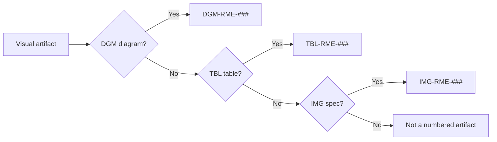

| Identifier | Refers to |
| :--- | :--- |
| `IMG-RME-001` | Hero ecosystem mind map |
| `IMG-RME-002` | Repository status flow |
| `IMG-RME-003` | AI boot sequence |
| `IMG-RME-004` | Knowledge pyramid |
| `IMG-RME-005` | Knowledge graph (24 domains) |
| `IMG-RME-006` | Technology stack layers |
| `IMG-RME-007` | Module map |
| `IMG-RME-008` / `008a` | Workflow + ADR decision tree |
| `IMG-RME-009` | Documentation portal tree |
| `IMG-RME-010` | Health dashboard |
| `IMG-RME-011` | Security mind map |
| `IMG-RME-012` | Roadmap timeline |
| `IMG-RME-013` | Routing decision tree |
| `IMG-RME-014` | Repository zone map |
| `IMG-RME-015` | Domain document matrix |
| `IMG-RME-016` | Contribution flow |
| `IMG-RME-017` | GitHub governance |
| `IMG-RME-018`/`019` | Observability + testing preview |

> **Identifier rule:** when adding a new visual, assign the next unused `DGM-RME-`, `TBL-RME-`, or `IMG-RME-` number and register it here. Never reuse an identifier.

---

## 🗂 Repository Structure

```
afshin-omnisystem/Oship/
├── .github/            # GitHub governance, templates, CODEOWNERS, workflows/
├── .ai/                # AI control plane: CURRENT_CONTEXT, SESSION_MEMORY, NEXT_ACTION, routing
├── docs/               # Documentation library: MASTER_CONTEXT/, ADR/, security/, roadmap/, wiki/
│   └── MASTER_CONTEXT/ # Global knowledge graph — 24 domains, each with INDEX.md
├── architecture/       # High-level blueprints, domain models, bounded contexts
├── design/             # Brand, UX/UI specs, color systems, wireframes, design system
├── assets/             # Static enterprise assets (.gitkeep)
├── configs/            # Shared platform & tooling configurations
├── scripts/            # Automation & DevOps utilities
├── tools/              # Developer & AI assistant toolchains
├── tests/              # Test harness architecture & integration plans
├── examples/           # Canonical reference implementations & tutorials
├── packages/           # Modular library components (Phase C+)
├── apps/               # Deployable end-user applications (Phase C+)
├── services/           # Microservices & backend daemons (Phase C+)
├── infra/              # Infrastructure-as-Code (Terraform, Bicep, Pulumi)
├── deployment/         # Release manifests & deployment strategies
├── docker/             # Containerization definitions & base images
├── k8s/                # Kubernetes manifests, Helm charts, Kustomize overlays
├── monitoring/         # Application Performance Monitoring (APM) policies
├── observability/      # Metrics, logging, tracing definitions
├── security/           # Threat models, security policies, vulnerability mgmt
├── database/           # Data schemas, migrations, storage architecture
├── storage/            # Object storage, caching, persistence guidelines
├── apis/               # Open API specifications, GraphQL schemas, contracts
├── sdk/                # Client SDK distributions & language bindings
├── plugins/            # Extension points & third-party plugin integrations
├── templates/          # Reusable scaffolding templates
├── experiments/        # Sandboxed prototype experiments
├── research/           # R&D documentation & competitive analysis
└── archive/            # Deprecated models & historical records
```

**Structural rules:** empty directories are preserved via `.gitkeep`; no arbitrary root folders beyond this standard topology (see [`docs/MASTER_CONTEXT/23_STANDARDS/INDEX.md`](./docs/MASTER_CONTEXT/23_STANDARDS/INDEX.md)).

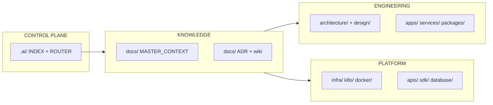

> **Image Specification**
> - Image ID: `IMG-RME-014`
> - Purpose: Visualize how the four repository zones (control plane, knowledge, engineering, platform) interrelate.
> - Prompt: "A four-zone repository map: Control Plane, Knowledge, Engineering, Platform, with labeled folder names and connecting edges, dark navy blueprint theme with gold accents."
> - Style: Zone map, blueprint.
> - Composition: Four clustered zones with directional edges.
> - Resolution: 2000x1200px
> - Priority: HIGH
> - Suggested Filename: `assets/diagrams/README-repo-zone-map.png`

---

## 🧰 Technology Stack

> Phase 0 is a **governance-and-documentation** foundation; the technology stack is defined in `docs/MASTER_CONTEXT/04_ARCHITECTURE/` and will be realized from Phase A onward.

| Layer | Area | Technology Direction (planned) |
| :--- | :--- | :--- |
| **Frontend** | Client apps & UI | Modern component framework + design-system tokens |
| **Backend** | Services & business logic | Modular service architecture over `/services` |
| **Data** | Persistence | Relational + object storage under `/database`, `/storage` |
| **API** | Contracts | OpenAPI / GraphQL under `/apis`, SDKs under `/sdk` |
| **Infrastructure** | Platform | IaC (Terraform/Bicep/Pulumi), Docker, Kubernetes |
| **Observability** | Telemetry | Metrics, logging, tracing under `/monitoring`, `/observability` |
| **Automation** | Delivery | GitHub Actions CI/CD under `.github/workflows/` |

Detailed architecture & technology decisions live in the [`04_ARCHITECTURE`](./docs/MASTER_CONTEXT/04_ARCHITECTURE/INDEX.md) domain and the [`ADR`](./docs/ADR/INDEX.md) register.

### Layer responsibilities & constraints

| Layer | Governs | Typical constraints | Realized in |
| :--- | :--- | :--- | :--- |
| **Frontend** | UX, state, rendering | Accessibility, performance budgets | Phase C+ |
| **Backend** | Business logic, integrations | Bounded contexts, security | Phase C+ |
| **Data** | Persistence, integrity | Migrations, governance | Phase B+ |
| **API** | Contracts, versioning | Backward compatibility, SemVer | Phase B+ |
| **Infrastructure** | Platform, IaC | Reproducibility, cost | Phase C+ |
| **Observability** | Telemetry, SLOs | Instrumentation standards | Phase C+ |
| **Automation** | CI/CD, GitOps | Determinism, safety gates | Phase A+ |

### Engineering Decision Areas

| Decision area | Evaluated in | Decided by | Recorded as |
| :--- | :--- | :--- | :--- |
| Service boundaries & topology | `04_ARCHITECTURE`, `08_BACKEND` | Architecture Board | ADR |
| API contract shape & versioning | `15_API`, `apis/` | API Lead | OpenAPI spec |
| Data model & persistence | `06_DATABASE`, `database/` | Data Architect | Schema / ER diagram |
| Cloud & IaC platforms | `09_INFRASTRUCTURE`, `infra/` | Platform Engineer | ADR + IaC manifests |
| Design system & tokens | `14_DESIGN_SYSTEM`, `design/` | UX/UI Team | Design tokens |
| Security posture | `10_SECURITY`, `security/` | Security Architect | Threat model + ADR |
| CI/CD & automation | `17_AUTOMATION`, `.github/workflows/` | DevOps | Workflow config |

> **Decision rule:** any choice that is expensive to reverse or affects cross-domain boundaries **must** be recorded as an ADR before implementation (see the ADR decision tree under Development Workflow).

> **Image Specification**
> - Image ID: `IMG-RME-006`
> - Purpose: Visualize the planned Oship technology stack layers for quick orientation.
> - Prompt: "A stacked technology layer diagram showing Frontend, Backend, Data, API, Infrastructure, Observability, Automation layers with representative icons, clean modern blueprint style."
> - Style: Layered stack diagram, blueprint, subtle icons.
> - Composition: Vertical stacked layers.
> - Resolution: 1800x1200px
> - Priority: MEDIUM
> - Suggested Filename: `assets/diagrams/README-tech-stack.png`

---

## 🧩 Project Modules

Oship is decomposed into modular engineering domains that map cleanly onto the repository topology. These are the building blocks that future teams will implement and extend (Phase A onward). Each module is a knowledge domain with its own `INDEX.md`.

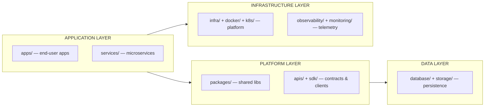

| Module | Topology Home | Knowledge Domain | Status |
| :--- | :--- | :--- | :--- |
| **Frontend Applications** | `apps/` | [`07_FRONTEND`](./docs/MASTER_CONTEXT/07_FRONTEND/INDEX.md) | Planned |
| **Backend Services** | `services/` | [`08_BACKEND`](./docs/MASTER_CONTEXT/08_BACKEND/INDEX.md) | Planned |
| **Shared Libraries** | `packages/` | [`04_ARCHITECTURE`](./docs/MASTER_CONTEXT/04_ARCHITECTURE/INDEX.md) | Planned |
| **API & SDK** | `apis/`, `sdk/` | [`15_API`](./docs/MASTER_CONTEXT/15_API/INDEX.md) | Planned |
| **Persistence** | `database/`, `storage/` | [`06_DATABASE`](./docs/MASTER_CONTEXT/06_DATABASE/INDEX.md) | Planned |
| **Platform & Infra** | `infra/`, `docker/`, `k8s/` | [`09_INFRASTRUCTURE`](./docs/MASTER_CONTEXT/09_INFRASTRUCTURE/INDEX.md) | Planned |
| **Observability** | `observability/`, `monitoring/` | [`13_OBSERVABILITY`](./docs/MASTER_CONTEXT/13_OBSERVABILITY/INDEX.md) | Planned |
| **Plugins** | `plugins/` | [`16_PLUGINS`](./docs/MASTER_CONTEXT/16_PLUGINS/INDEX.md) | Planned |

> **Image Specification**
> - Image ID: `IMG-RME-007`
> - Purpose: Show the modular engineering layers and how they map to repository folders and knowledge domains.
> - Prompt: "A layered module graph showing Application, Platform, Data, and Infrastructure layers, each labeled with repository folder names and connected to knowledge domain nodes, dark blueprint style."
> - Style: Layered graph, blueprint, gold connectors.
> - Composition: Vertical layers with cross-layer edges.
> - Resolution: 2000x1200px
> - Priority: HIGH
> - Suggested Filename: `assets/diagrams/README-module-map.png`

### Module responsibility matrix

Each module carries a distinct engineering responsibility and maps to a bounded domain. This matrix summarizes what each module owns (full detail in the linked domains).

| Module | Primary responsibility | Depends on | Consumed by |
| :--- | :--- | :--- | :--- |
| **Frontend Applications** (`apps/`) | User-facing clients & interaction | Design system, API | End users |
| **Backend Services** (`services/`) | Business logic, workflows, integrations | Database, API, security | Frontend, SDK |
| **Shared Libraries** (`packages/`) | Reusable modules across apps/services | Architecture | All modules |
| **API & SDK** (`apis/`, `sdk/`) | Public contracts, versioning, clients | Architecture, security | Frontend, external |
| **Persistence** (`database/`, `storage/`) | Schemas, migrations, caching | Architecture | Backend, API |
| **Platform & Infra** (`infra/`, `docker/`, `k8s/`) | Compute, networking, provisioning | — | All services |
| **Observability** (`observability/`, `monitoring/`) | Telemetry, dashboards, alerting | Platform | Operations |
| **Plugins** (`plugins/`) | Extension & third-party integration | API, architecture | External ecosystems |

### Request lifecycle preview

A typical end-to-end request crosses several modules. This shows the routing and dependency chain a future engineer or agent will trace:

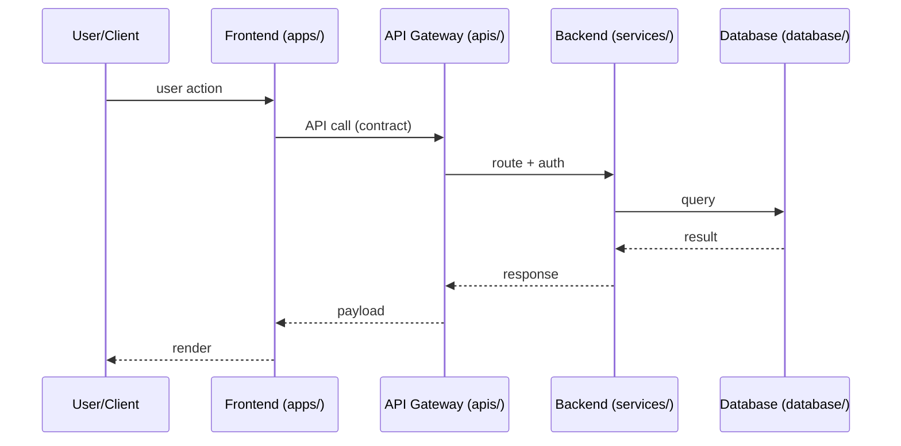

> This preview is illustrative of the Phase A+ target; the authoritative request architecture will be defined in `08_BACKEND`, `15_API`, and `docs/diagrams/sequence/`.

---

## 🔄 Development Workflow

Oship follows a deterministic, GitOps-driven development lifecycle across three loops: **Execution → Audit → Review** (defined in [`PROJECT_PHILOSOPHY.md`](./PROJECT_PHILOSOPHY.md) §132).

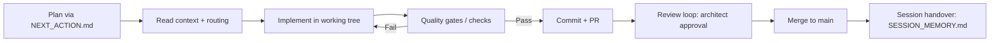

### Golden Sequence (Architecture Before Code)

1. Read the constitutional docs and context.
2. Resolve the routing path to the correct knowledge domain.
3. Check standards & metadata compliance.
4. Design/document before implementing (ADR for architectural changes).
5. Implement within the bounded domain.
6. Pass quality gates, commit, hand over.

### Git Branching Model

Oship uses a structured enterprise branching model (full spec: [`docs/development/BRANCH_STRATEGY.md`](./docs/development/BRANCH_STRATEGY.md)):

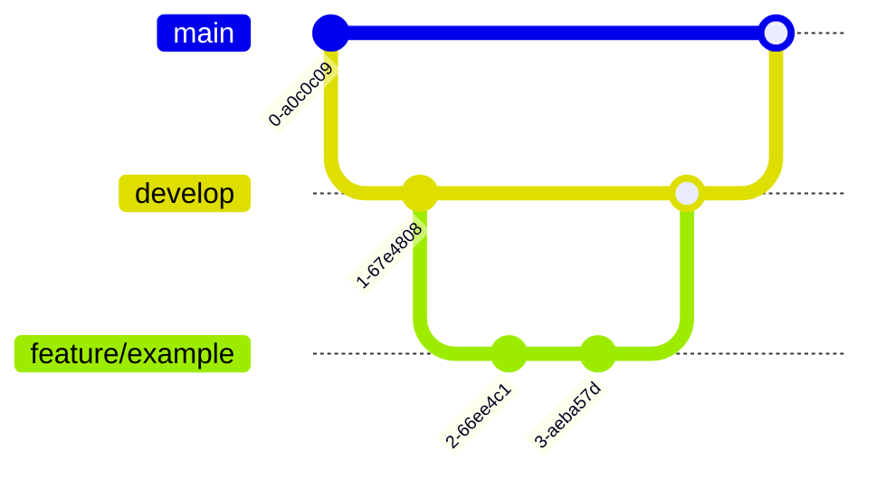

| Branch pattern | Protection | Purpose | Merge target |
| :--- | :--- | :--- | :--- |
| **`main`** | Strongly protected | Production-ready releases | — |
| **`develop`** | Protected | Integration & pre-release | `main` |
| **`feature/*`** | Unprotected | Human feature development | `develop` |
| **`arena/*`** | Unprotected | AI agent working branch | `main`/`develop` |
| **`hotfix/*`** | Protected | Emergency remediation | `main` + `develop` |

### Commit Convention

All commits use **Conventional Commits** so releases and changelogs can be generated deterministically:

```
<type>(<scope>): <description>
```

| Type | Meaning |
| :--- | :--- |
| `feat` | New capability (MINOR bump) |
| `fix` | Bug fix (PATCH bump) |
| `docs` | Documentation-only change |
| `refactor` | Non-behavioral code change |
| `test` | Test additions/modifications |
| `ci` / `build` | Pipeline & build changes |
| `chore` | Maintenance, tooling |

Examples seen in this repository: `docs(master-context): create enterprise knowledge infrastructure`, `docs(readme): add repository landing page part 01`.

| Guidance | Location |
| :--- | :--- |
| Branch strategy | [`docs/development/BRANCH_STRATEGY.md`](./docs/development/BRANCH_STRATEGY.md) |
| Labels & GitOps | [`docs/development/LABELS.md`](./docs/development/LABELS.md) |
| Best practices | [`.ai/BEST_PRACTICES.md`](./.ai/BEST_PRACTICES.md) |
| Common mistakes | [`.ai/COMMON_MISTAKES.md`](./.ai/COMMON_MISTAKES.md) |

### When does a change need an Architecture Decision Record (ADR)?

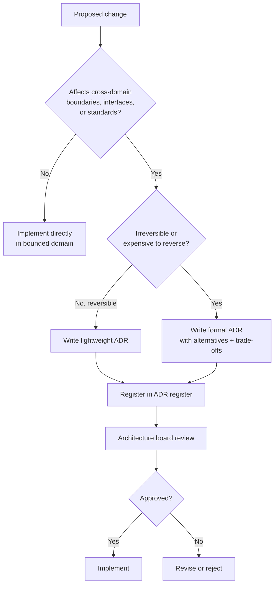

Register and template: [`docs/ADR/INDEX.md`](./docs/ADR/INDEX.md) · Knowledge domain: [`22_DECISIONS`](./docs/MASTER_CONTEXT/22_DECISIONS/INDEX.md)

> **Image Specification**
> - Image ID: `IMG-RME-008a`
> - Purpose: Visualize the decision procedure for when a change requires an Architecture Decision Record.
> - Prompt: "A decision tree flowchart for determining whether a change needs an ADR, with diamond decision nodes for cross-domain impact and reversibility, gold and navy blueprint style."
> - Style: Decision tree flowchart.
> - Composition: Top-down branching to outcome.
> - Resolution: 1800x1400px
> - Priority: HIGH
> - Suggested Filename: `assets/diagrams/README-adr-decision-tree.png`

> **Image Specification**
> - Image ID: `IMG-RME-008`
> - Purpose: Visualize the three-loop development workflow and quality gate cycle.
> - Prompt: "A three-loop development workflow diagram: Execution, Audit, Review loops with a quality gate diamond decision node, clean flat enterprise style, dark navy."
> - Style: Flowchart with decision diamond.
> - Composition: Left-to-right pipeline with loop-back.
> - Resolution: 1800x1000px
> - Priority: HIGH
> - Suggested Filename: `assets/diagrams/README-workflow.png`

---

## ⚙️ Repository Operating Model

Oship operates as a Git-driven, asynchronous operating system built around three continuous loops (from [`PROJECT_PHILOSOPHY.md`](./PROJECT_PHILOSOPHY.md) §132). Every task, whether executed by a human or an AI agent, passes through these loops.

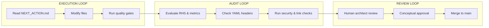

### Operational Cadence

| Loop | Actor | Cadence | Output |
| :--- | :--- | :--- | :--- |
| **Execution** | AI agents + humans | Continuous | Committed, gated work |
| **Audit** | Automated gates | Per commit / push | Health & compliance signals |
| **Review** | Human architects | Per PR / phase gate | Approved merges |

### Responsibility (RACI) Overview

| Repository domain | Human Architect | Team Lead | AI Orchestrator | AI Coding Agent |
| :--- | :---: | :---: | :---: | :---: |
| **Constitutional (L1)** | A | C | R | I |
| **Blueprints & ADRs (L2)** | A / R | R | R | I |
| **API Contracts (L3)** | C | A / R | R | R |
| **App Source (L4)** | C | A | R | R |
| **Local Metrics (L5)** | I | C | A / R | R |

> Full operating-model detail: [`PROJECT_PHILOSOPHY.md`](./PROJECT_PHILOSOPHY.md) §132. RACI legend: **A** = Accountable, **R** = Responsible, **C** = Consulted, **I** = Informed.

---

## 📚 Documentation Portal

The documentation library is the human-facing knowledge portal. All narrative docs, ADRs, security policies, diagrams, and the roadmap are indexed there.

```mermaid
flowchart TD
    DOC[docs/INDEX.md Master Portal] --> MCX[MASTER_CONTEXT Knowledge Graph]
    DOC --> ADR[ADR Architecture Decisions]
    DOC --> SEC[security/ Security Policy]
    DOC --> ARCH[architecture/ System Overview]
    DOC --> DEP[deployment/ Release Strategy]
    DOC --> DEV[development/ Git Practices]
    DOC --> RM[roadmap/ Milestones]
    DOC --> DIAG[diagrams/ Diagram Taxonomy]
    DOC --> WIKI[wiki/ Knowledge Base]
```

| Documentation Area | Entry Point |
| :--- | :--- |
| **Master Documentation Portal** | [`docs/INDEX.md`](./docs/INDEX.md) |
| **Global Knowledge Graph** | [`docs/MASTER_CONTEXT/INDEX.md`](./docs/MASTER_CONTEXT/INDEX.md) |
| **Architecture Decisions (ADRs)** | [`docs/ADR/INDEX.md`](./docs/ADR/INDEX.md) |
| **System Architecture** | [`docs/architecture/INDEX.md`](./docs/architecture/INDEX.md) |
| **Deployment & Release** | [`docs/deployment/INDEX.md`](./docs/deployment/INDEX.md) |
| **Security** | [`docs/security/INDEX.md`](./docs/security/INDEX.md) |
| **Roadmap** | [`docs/roadmap/INDEX.md`](./docs/roadmap/INDEX.md) |
| **Enterprise Glossary** | [`docs/glossary/INDEX.md`](./docs/glossary/INDEX.md) |

### Documentation taxonomy

| Kind | Location | Purpose | AI priority |
| :--- | :--- | :--- | :---: |
| **Constitution** | `PROJECT_PHILOSOPHY.md` | Supreme governance & operating model | CRITICAL |
| **Master Context** | `docs/MASTER_CONTEXT/` | 24-domain knowledge graph | CRITICAL |
| **ADRs** | `docs/ADR/` | Architecture decisions & rationale | CRITICAL |
| **Guides** | `docs/development/`, `docs/security/`, `docs/deployment/` | Operational & technical guidance | HIGH |
| **Wiki** | `docs/wiki/` | Knowledge base & onboarding | MEDIUM |
| **Diagrams** | `docs/diagrams/` | Visual taxonomy | MEDIUM |
| **Glossary** | `docs/glossary/` | Ubiquitous language | MEDIUM |
| **AI Workspace** | `.ai/` | Agent control plane & memory | CRITICAL |

> **Image Specification**
> - Image ID: `IMG-RME-009`
> - Purpose: Show the documentation portal hierarchy and navigation tree.
> - Prompt: "A documentation navigation tree rooted at a Master Portal node branching to Knowledge Graph, ADR, Security, Architecture, Deployment, Roadmap, Diagrams, Wiki, clean blueprint style."
> - Style: Navigation tree, flat, blueprint.
> - Composition: Top-down tree.
> - Resolution: 1800x1200px
> - Priority: MEDIUM
> - Suggested Filename: `assets/diagrams/README-docs-portal.png`

---

## 🧑‍💻 Human Entry Point

New human contributors should orient themselves in this order:

1. **Start here** — this README.
2. **Read the constitution** — [`PROJECT_PHILOSOPHY.md`](./PROJECT_PHILOSOPHY.md) for the operating model.
3. **Browse the documentation portal** — [`docs/INDEX.md`](./docs/INDEX.md).
4. **Explore the knowledge graph** — [`docs/MASTER_CONTEXT/INDEX.md`](./docs/MASTER_CONTEXT/INDEX.md).
5. **Contribute** — follow the contribution guide and Quick Start below.

```
                 HUMAN ONBOARDING PATH
                 =====================
  [README.md] --------------------> (Landing / Orientation Hub)
        |
        v
  [PROJECT_PHILOSOPHY.md] --------> (The Constitution / Operating Model)
        |
        v
  [docs/INDEX.md] ----------------> (Documentation Portal)
        |
        +----> [docs/MASTER_CONTEXT/INDEX.md]  (Knowledge Graph)
        |              |
        |              +----> [23_STANDARDS]    (Metadata & Naming)
        |              +----> [24 DIAGRAMS]     (Visual Taxonomy)
        |
        +----> [Quick Start] -----> [CONTRIBUTING.md]  (First contribution)
```

| You want to… | Go to |
| :--- | :--- |
| Understand the project | [`PROJECT_PHILOSOPHY.md`](./PROJECT_PHILOSOPHY.md), [`docs/INDEX.md`](./docs/INDEX.md) |
| Start contributing | [`.github/CONTRIBUTING.md`](./.github/CONTRIBUTING.md), [Quick Start](#-quick-start) |
| Learn the vocabulary | [`docs/glossary/ENTERPRISE_GLOSSARY.md`](./docs/glossary/ENTERPRISE_GLOSSARY.md) |
| See the design system | [`design/INDEX.md`](./design/INDEX.md) |
| Report a security issue | [`.github/SECURITY.md`](./.github/SECURITY.md) |
| Follow community norms | [`.github/CODE_OF_CONDUCT.md`](./.github/CODE_OF_CONDUCT.md) |

### Per-Audience Navigation Map

Different roles enter Oship at different points and follow different paths:

```mermaid
flowchart LR
    subgraph AGENT[AI Coding Agent]
        A1[.ai/INDEX boot] --> A2[CONTEXT_ROUTER] --> A3[Domain INDEX]
    end
    subgraph CONTRIB[Contributor]
        C1[README] --> C2[CONTRIBUTING.md] --> C3[BRANCH_STRATEGY] --> C4[23_STANDARDS]
    end
    subgraph ARCH[Architect]
        R1[04_ARCHITECTURE] --> R2[ADR Register] --> R3[22_DECISIONS]
    end
    subgraph OPS[Operator / SRE]
        O1[13_OBSERVABILITY] --> O2[12_OPERATIONS runbooks] --> O3[11_DEPLOYMENT]
    end
```

| Audience | Primary entry | First documents | Goal |
| :--- | :--- | :--- | :--- |
| **AI Coding Agent** | `README` → `.ai/INDEX.md` | Boot sequence, routing, standards | Execute a task deterministically |
| **Human Contributor** | `README` → `CONTRIBUTING.md` | Branch strategy, standards, quick start | Make a compliant contribution |
| **Architect / Tech Lead** | `04_ARCHITECTURE` → `ADR` | Bounded contexts, decisions, standards | Govern architecture |
| **Operator / SRE** | `13_OBSERVABILITY` → `12_OPERATIONS` | Runbooks, telemetry, deployment | Operate and diagnose |
| **Product / Business** | `01_PRODUCT` → `02_BUSINESS` | Vision, strategy, roadmap | Steer the product |

### Persona Routing (phase 3 validation)

Each engineering persona has a defined entry point, reading order, required knowledge, and next action. This guarantees no role is left without a path.

```mermaid
flowchart TD
    subgraph BE[PERSONA A — Backend Engineer]
        BA[README] --> BB[08_BACKEND] --> BC[06_DATABASE] --> BD[15_API]
    end
    subgraph FE[PERSONA B — Frontend Engineer]
        FA[README] --> FB[14_DESIGN_SYSTEM] --> FC[07_FRONTEND] --> FD[03_USERS]
    end
    subgraph AI[PERSONA C — AI Engineer]
        AIA[.ai/INDEX] --> AIB[05_AI] --> AIC[CONTEXT_ROUTER] --> AID[23_STANDARDS]
    end
    subgraph DEVOPS[PERSONA D — DevOps Engineer]
        DA[09_INFRASTRUCTURE] --> DB[17_AUTOMATION] --> DC[11_DEPLOYMENT] --> DD[13_OBSERVABILITY]
    end
    subgraph DES[PERSONA E — Product Designer]
        EA[03_USERS] --> EB[14_DESIGN_SYSTEM] --> EC[design/INDEX] 
    end
    subgraph MNT[PERSONA F — Project Maintainer]
        MA[PROJECT_STATUS] --> MB[19_ROADMAP] --> MC[22_DECISIONS] --> MD[CONTRIBUTING]
    end
```

| Persona | Entry point | Reading order | Required knowledge | Next action |
| :--- | :--- | :--- | :--- | :--- |
| **A — Backend Engineer** | README → `08_BACKEND` | Architecture → Backend → Database → API | Service boundaries, data model, contracts | Implement service in `services/` |
| **B — Frontend Engineer** | README → `14_DESIGN_SYSTEM` | Design System → Frontend → Users → API | Tokens, components, UX, contracts | Build UI in `apps/` |
| **C — AI Engineer** | `.ai/INDEX` | 05_AI → Router → Standards | Routing, governance, metadata | Onboard & route a task |
| **D — DevOps Engineer** | `09_INFRASTRUCTURE` | Infra → Automation → Deployment → Observability | IaC, CI/CD, SLOs | Provision & automate |
| **E — Product Designer** | `03_USERS` | Users → Design System → design/ | Personas, journeys, tokens | Prototype & specify |
| **F — Project Maintainer** | `PROJECT_STATUS` | Roadmap → Decisions → Contributing | Phases, milestones, governance | Triage & review |

> **Persona validation:** every persona can complete "understand → route → act" in ≤ 4 hops using this README alone. If a persona cannot, a routing gap exists.

---

## ⚡ Quick Start

> **Phase 0 status:** Oship is a governance-and-knowledge foundation. There is intentionally **no application code to run yet** — the "product" is the repository operating system itself.

```bash
# 1. Clone the repository
git clone https://github.com/afshin-omnisystem/Oship.git
cd Oship

# 2. Orient (AI agents: follow the boot sequence in the AI Entry section)
#    Humans: read README.md, then docs/INDEX.md, then PROJECT_PHILOSOPHY.md

# 3. Verify you're on the working branch
git branch --show-current

# 4. Explore the knowledge graph
open docs/MASTER_CONTEXT/INDEX.md
```

| What do you need? | Action |
| :--- | :--- |
| **Understand the codebase** | Read `docs/MASTER_CONTEXT/INDEX.md` → pick a domain → its `INDEX.md` |
| **Set up as a contributor** | Read `.github/CONTRIBUTING.md` + `docs/development/BRANCH_STRATEGY.md` |
| **Know the standards** | Read `docs/MASTER_CONTEXT/23_STANDARDS/INDEX.md` |
| **Run anything?** | Nothing to build during Phase 0 — `scripts/` and `apps/` arrive in later phases |

### Environment matrix (Phase 0 → production)

| Environment | Purpose | Content today | Created in |
| :--- | :--- | :--- | :--- |
| **Local** | Developer / agent workspace | Docs, `.ai/`, configs | Phase 0 |
| **Development** | Integration & pre-release | `.github/workflows/` skeletons | Phase A–B |
| **Staging** | RC validation | `k8s/`, `infra/` overlays | Phase C–D |
| **Production** | GA / SLA | Full platform | Phase E–F |

> **Phase 0 scope:** only the **Local** environment exists today. All deployment environments are scaffolded as policy, configuration, and manifests in later phases.

### Intent → path quick-reference

A fast lookup table mapping common intents directly to their entry paths.

| Intent | Path |
| :--- | :--- |
| Find any document | [`docs/INDEX.md`](./docs/INDEX.md) |
| Understand architecture | [`docs/MASTER_CONTEXT/04_ARCHITECTURE/INDEX.md`](./docs/MASTER_CONTEXT/04_ARCHITECTURE/INDEX.md) |
| See the AI routing rules | [`.ai/CONTEXT_ROUTER.md`](./.ai/CONTEXT_ROUTER.md) |
| Check current phase | [`.ai/PROJECT_STATUS.md`](./.ai/PROJECT_STATUS.md) |
| Read next actions | [`.ai/NEXT_ACTION.md`](./.ai/NEXT_ACTION.md) |
| Review decisions | [`docs/ADR/INDEX.md`](./docs/ADR/INDEX.md) |
| View the roadmap | [`docs/roadmap/INDEX.md`](./docs/roadmap/INDEX.md) |
| Report a security issue | [`.github/SECURITY.md`](./.github/SECURITY.md) |

---

## ❤️ Repository Health

Oship's health is continuously tracked in [`.ai/REPOSITORY_EVOLUTION.md`](./.ai/REPOSITORY_EVOLUTION.md) and [`.ai/METRICS.md`](./.ai/METRICS.md).

```
===============================================================================
                      OSHIP REPOSITORY HEALTH DASHBOARD
===============================================================================
  [HEALTH SCORE]   [AI READABILITY]   [DOC COVERAGE]   [ARCH CONSISTENCY]
       98%               96%                100%               98%
  (GREEN / PASS)    (GREEN / PASS)     (GREEN / PASS)    (GREEN / PASS)

  KNOWLEDGE DOMAINS : 24 of 24   KNOWLEDGE CONNECTIVITY : 95%
  DIAGRAM DENSITY   : 94%        IMAGE COVERAGE         : 100%
  QUALITY GATES     : RQG PASSED | DQG PASSED | AQG PASSED
===============================================================================
```

| Metric | Current Score | Status |
| :--- | :---: | :--- |
| **Repository Health Score** | 98% | 🟢 GREEN |
| **AI Readability Score** | 96% | 🟢 GREEN |
| **Documentation Coverage** | 100% | 🟢 GREEN |
| **Architecture Consistency** | 98% | 🟢 GREEN |
| **Knowledge Connectivity** | 95% | 🟢 GREEN |
| **Diagram Density** | 94% | 🟢 GREEN |
| **Image Coverage** | 100% | 🟢 GREEN |
| **Knowledge Domains** | 24 of 24 | 🟢 COMPLETE |

### Health metric definitions

These scores are computed and tracked in [`.ai/REPOSITORY_EVOLUTION.md`](./.ai/REPOSITORY_EVOLUTION.md) and [`.ai/METRICS.md`](./.ai/METRICS.md).

| Metric | Formula basis | Gate (pass threshold) |
| :--- | :--- | :---: |
| **Repository Health Score** | Composite: docs, code, architecture, security | ≥ 90% |
| **AI Readability Score** | Token efficiency, structure, paragraph quality | ≥ 90% |
| **Documentation Coverage** | % of required docs present | 100% |
| **Architecture Consistency** | Schema/ADR traceability | ≥ 95% |
| **Knowledge Connectivity** | Cross-reference density | ≥ 90% |
| **Diagram Density** | Visual artifacts per document | ≥ 90% |
| **Image Coverage** | Placeholders resolved to assets | 100% |

> **Image Specification**
> - Image ID: `IMG-RME-010`
> - Purpose: Visualize repository health metrics as a gauge/dashboard for at-a-glance status.
> - Prompt: "An enterprise health dashboard with green gauge dials for Repository Health, AI Readability, Documentation Coverage, Architecture Consistency, dark navy theme with green and gold accents."
> - Style: Dashboard gauges, flat, blueprint.
> - Composition: Grid of circular gauges.
> - Resolution: 2000x1000px
> - Priority: MEDIUM
> - Suggested Filename: `assets/diagrams/README-health-dashboard.png`

---

## ✅ Quality Standards

Every document and contribution in Oship must meet strict quality gates:

| Standard | Requirement | Compliance Source |
| :--- | :--- | :--- |
| **Metadata header** | Every `.md` begins with the enterprise YAML header | [`docs/MASTER_CONTEXT/23_STANDARDS/`](./docs/MASTER_CONTEXT/23_STANDARDS/INDEX.md) |
| **Self-documenting** | Cross-referenced indexes in every directory | [`docs/INDEX.md`](./docs/INDEX.md) |
| **No monolithic files** | Modular, focused documents | [`PROJECT_PHILOSOPHY.md`](./PROJECT_PHILOSOPHY.md) |
| **Determinism** | UTF-8 without BOM, `.gitkeep` preservation | [`docs/MASTER_CONTEXT/ENTERPRISE_ARCHITECTURE_CONTEXT.md`](./docs/MASTER_CONTEXT/ENTERPRISE_ARCHITECTURE_CONTEXT.md) |
| **No dead links** | All relative links resolve | [`.ai/METRICS.md`](./.ai/METRICS.md) |

Repository quality gates (`RQG`, `DQG`, `AQG`) are all **PASSED** — see [`.ai/REPOSITORY_EVOLUTION.md`](./.ai/REPOSITORY_EVOLUTION.md).

### The Enterprise Metadata Header (mandatory on every `.md`)

Every Markdown file in Oship **must** begin with this YAML header. This is the single most important reconstructability contract for AI agents — it enables deterministic parsing, routing, dependency graphing, and ownership tracking. Full standard: [`docs/MASTER_CONTEXT/23_STANDARDS/METADATA_STANDARD.md`](./docs/MASTER_CONTEXT/23_STANDARDS/METADATA_STANDARD.md).

```yaml
---
Document ID: <UNIQUE_ID>
Title: <HUMAN_READABLE_TITLE>
Version: <SEMVER>
Status: <ACTIVE | PROPOSED | DRAFT | DEPRECATED>
Knowledge Layer: <L1 Constitutional | L2 Blueprints | L3 Interfaces | L4 Configuration | L5 Ephemeral>
Knowledge Domain: <NN_NAME>
AI Importance: <CRITICAL | HIGH | MEDIUM | LOW>
Human Importance: <CRITICAL | HIGH | MEDIUM | LOW>
Dependencies: <COMMA_SEPARATED_PATHS>
Required By: <COMMA_SEPARATED_DOMAINS_OR_PATHS>
Estimated AI Read Time: <X min>
Estimated Human Read Time: <X min>
Repository Version: <CURRENT_SEMVER>
Owner: <TEAM_OR_ROLE>
Last Updated: <YYYY-MM-DD>
---
```

**Compliance rules:** the header is always the first block; no empty documents (header-only stubs); all keys required. A file missing keys lowers the Average Metadata Completeness metric tracked in [`.ai/METRICS.md`](./.ai/METRICS.md).

### Document lifecycle

Every document in Oship follows a defined lifecycle. The `Status` field in the metadata header marks its current stage.

```mermaid
stateDiagram-v2
    [*] --> DRAFT
    DRAFT --> PROPOSED: submitted for review
    PROPOSED --> ACTIVE: approved
    PROPOSED --> DEPRECATED: superseded
    ACTIVE --> DEPRECATED: superseded / obsolete
    ACTIVE --> PROPOSED: substantive revision
    DEPRECATED --> [*]
```

| Status | Meaning | Readiness |
| :--- | :--- | :--- |
| **DRAFT** | In authoring, not yet authoritative | Do not rely on it |
| **PROPOSED** | Submitted for review | Read-only for feedback |
| **ACTIVE** | Approved and authoritative | Safe to consume |
| **DEPRECATED** | Superseded or obsolete | Migrate to replacement |

### Core invariants (non-negotiable)

| # | Invariant | Why it matters |
| :---: | :--- | :--- |
| 1 | **No application code in Phase 0** | Foundation is knowledge + governance only |
| 2 | **Every `.md` has a YAML header** | Deterministic AI parsing & routing |
| 3 | **`.gitkeep` preserves empty dirs** | Topological determinism |
| 4 | **UTF-8 without BOM** | Cross-tool consistency |
| 5 | **No arbitrary root folders** | Bounded, predictable topology |
| 6 | **README is a hub, not docs** | MASTER_CONTEXT holds the knowledge |
| 7 | **No dead links** | Traceability integrity |
| 8 | **Cross-reference, don't duplicate** | Single source of truth |

---

## 🤝 Contribution Overview

Oship is built by humans and AI agents working together. See the full guide in [`.github/CONTRIBUTING.md`](./.github/CONTRIBUTING.md).

| Contribution Type | Where to start |
| :--- | :--- |
| **Documentation** | Read `23_STANDARDS`, follow the metadata standard, link to MASTER_CONTEXT |
| **Code (Phase A+)** | Follow branch strategy + bounded-domain rules |
| **Architecture change** | Write an ADR → [`docs/ADR/INDEX.md`](./docs/ADR/INDEX.md) |
| **Bug / feature request** | Use the GitHub issue forms in `.github/ISSUE_TEMPLATE/` |

### Contribution checklist
1. Read context & routing (AI: boot sequence; Human: Human Entry Point).
2. Check standards & metadata compliance.
3. Work within your bounded domain.
4. Link new content to the knowledge graph.
5. Pass quality gates, then commit with a clear message.
6. Open a PR (human or agent) and update `.ai/SESSION_MEMORY.md`.

### Contribution decision flow

```mermaid
flowchart TD
    ID[Identify work item] --> CTX{Read context\n+ routing?}
    CTX -->|No| CTX
    CTX -->|Yes| STD{Metadata\nheader present?}
    STD -->|No| FIX[Add YAML header]
    FIX --> STD
    STD -->|Yes| DOM{Inside your\nbounded domain?}
    DOM -->|No| ESC[Escalate / request boundary]
    DOM -->|Yes| QG{Quality gates\npass?}
    QG -->|No| REVISE[Revise]
    REVISE --> QG
    QG -->|Yes| COMMIT[Commit + PR]
    COMMIT --> HAND[Update SESSION_MEMORY.md]
```

This mirrors the deterministic protocol in [`.github/CONTRIBUTING.md`](./.github/CONTRIBUTING.md).

### Who contributes how

| Role | Entry point | Typical contribution | Review gate |
| :--- | :--- | :--- | :--- |
| **AI Coding Agent** | `.ai/` boot sequence | Docs, configs, code | Quality gates + CODEOWNERS |
| **Contributor** | README → CONTRIBUTING | Docs, bug fixes, features | PR review by owner |
| **Architect** | `04_ARCHITECTURE` → ADR | Architectural decisions | Architecture Board |
| **DevOps** | `09`/`11`/`17` | Pipelines, IaC, releases | DevOps review |
| **Security** | `10_SECURITY` | Threat models, hardening | Security review |
| **Designer** | `14_DESIGN_SYSTEM` | Tokens, components, UX | Design review |

> **Co-ownership:** Oship is deliberately designed for humans and AI agents to contribute together. Every contribution, regardless of author, passes the same quality gates and ownership review.

> **Image Specification**
> - Image ID: `IMG-RME-016`
> - Purpose: Visualize the contribution decision flow for contributors and agents.
> - Prompt: "A contribution decision flowchart with diamond gates for context, metadata header, bounded domain, and quality gates, converging to commit and handover, blueprint style."
> - Style: Decision flowchart.
> - Composition: Top-down decision flow.
> - Resolution: 1800x1400px
> - Priority: MEDIUM
> - Suggested Filename: `assets/diagrams/README-contribution-flow.png`

### How to add a new document

Adding documentation to Oship is a deterministic, gated process:

```mermaid
flowchart TD
    A[Identify the target domain] --> B[Read the domain INDEX.md]
    B --> C{Topic already covered?}
    C -->|Yes| D[Extend existing doc instead]
    C -->|No| E[Author with full YAML header]
    E --> F[Register in domain Documents table]
    F --> G[Cross-link related domains]
    G --> H[Run link + metadata checks]
    H --> I[Pass quality gates, commit]
```

1. **Locate the domain** — route the topic to the correct `docs/MASTER_CONTEXT/<NN>_*/INDEX.md`.
2. **Verify uniqueness** — search for existing coverage to avoid duplication (single-source-of-truth rule).
3. **Write with the standard header** — copy the metadata template in Quality Standards.
4. **Register the document** — add it to the domain's Documents table with a status.
5. **Cross-link** — connect to related domains and update the dependency table if needed.
6. **Validate & commit** — resolve links, verify headers, pass gates.

### How to add a new knowledge domain

> Extending the knowledge graph from 24 domains is an architectural decision and should follow the ADR process. See [`docs/MASTER_CONTEXT/INDEX.md`](./docs/MASTER_CONTEXT/INDEX.md) and the [`22_DECISIONS`](./docs/MASTER_CONTEXT/22_DECISIONS/INDEX.md) domain.

| Step | Action | Reference |
| :--- | :--- | :--- |
| 1 | Propose the domain boundary via an ADR | `docs/ADR/` |
| 2 | Create `docs/MASTER_CONTEXT/<NN>_<NAME>/` | Topology rules |
| 3 | Author `INDEX.md` with the standard header | `23_STANDARDS` |
| 4 | Populate Purpose, Scope, Responsibilities, Dependencies | Domain template |
| 5 | Update the global knowledge graph in `MASTER_CONTEXT/INDEX.md` | §3, §7 |
| 6 | Update `.ai/CONTEXT_ROUTER.md` routing matrix | Routing plane |
| 7 | Update `.ai/METRICS.md` knowledge-domain count | Metrics board |

### Extending the README itself

The README is a living landing page. When extending it, preserve these constraints:

| Constraint | Reason |
| :--- | :--- |
| Keep it a **hub** (link, don't duplicate) | MASTER_CONTEXT is the knowledge source |
| Maintain visual density (≤120 lines between visuals) | Readability & AI scanning |
| Keep all links relative and resolving | Traceability |
| Bump the `Version` in the YAML header | Change tracking |
| Log the change in `.ai/REPOSITORY_EVOLUTION.md` | Evolution ledger |

---

## 🔐 Security Overview

Oship follows a **zero-trust, defense-in-depth** security posture.

- **Policy**: [`.github/SECURITY.md`](./.github/SECURITY.md) — vulnerability disclosure and SLAs.
- **Architecture**: [`docs/security/SECURITY_ARCHITECTURE.md`](./docs/security/SECURITY_ARCHITECTURE.md).
- **Knowledge domain**: [`docs/MASTER_CONTEXT/10_SECURITY/INDEX.md`](./docs/MASTER_CONTEXT/10_SECURITY/INDEX.md).
- **Security golden rules** in [`PROJECT_PHILOSOPHY.md`](./PROJECT_PHILOSOPHY.md).

```mermaid
mindmap
  root((Zero-Trust Security))
    Threat Modeling
    Defense-in-Depth
    Identity & Auth
    Secrets Management
    Compliance
    Incident Response
```

### Security responsibilities by domain

| Security concern | Knowledge domain | Artifacts |
| :--- | :--- | :--- |
| Threat modeling & risk | `10_SECURITY` | THREAT_MODEL · SECURITY_ARCHITECTURE |
| Identity, auth, IAM | `10_SECURITY` | IDENTITY_AUTH |
| Data protection | `06_DATABASE` + `10_SECURITY` | DATA_GOVERNANCE · COMPLIANCE |
| API security | `15_API` + `10_SECURITY` | API_SECURITY |
| Secrets & deployment | `11_DEPLOYMENT` + `10_SECURITY` | ROLLBACK_PLAYBOOK · CI/CD |
| Infrastructure hardening | `09_INFRASTRUCTURE` + `10_SECURITY` | NETWORKING · IaC manifests |
| Incident response | `12_OPERATIONS` + `10_SECURITY` | INCIDENT_MANAGEMENT |

> **Security routing:** a security question should resolve to `10_SECURITY` first, then to the specific domain that owns the affected surface (API, database, deployment, infrastructure).

> **Image Specification**
> - Image ID: `IMG-RME-011`
> - Purpose: Visualize the security posture pillars of the zero-trust model.
> - Prompt: "A security mind map centered on Zero-Trust branching to Threat Modeling, Defense-in-Depth, Identity, Secrets, Compliance, Incident Response, dark navy with red/gold accents."
> - Style: Mind map, flat, blueprint.
> - Composition: Central hub with six branches.
> - Resolution: 1600x1200px
> - Priority: MEDIUM
> - Suggested Filename: `assets/diagrams/README-security.png`

---

## 🔭 Observability & Testing Preview

Oship plans a complete observability and testing posture (Phase B onward). These are hub previews — full knowledge lives in [`13_OBSERVABILITY`](./docs/MASTER_CONTEXT/13_OBSERVABILITY/INDEX.md) and [`18_TESTING`](./docs/MASTER_CONTEXT/18_TESTING/INDEX.md).

### The three pillars of observability

```mermaid
mindmap
  root((Observability))
    Metrics
      SLIs
      Dashboards
    Logs
      Structured logging
      Correlation
    Traces
      Distributed tracing
      Root-cause
```

| Pillar | Purpose | Planned artifacts |
| :--- | :--- | :--- |
| **Metrics** | Quantitative health signals | SLIs, SLOs, dashboards |
| **Logs** | Event records for diagnosis | Structured logs, correlation |
| **Traces** | Request lifecycle across services | Distributed tracing |

Planned knowledge: `TELEMETRY_STANDARDS`, `DASHBOARDS`, `ALERTING`, `SLOS` (in the `13_OBSERVABILITY` domain).

### Testing strategy preview

```mermaid
flowchart TD
    subgraph UNIT[Unit tests]
        U1[Service logic]
        U2[Functions]
    end
    subgraph INT[Integration tests]
        I1[Service-to-service]
        I2[Data layer]
    end
    subgraph E2E[End-to-end tests]
        E1[User journeys]
        E2[API contracts]
    end
    UNIT --> INT --> E2E
```

| Test level | Scope | Where defined |
| :--- | :--- | :--- |
| **Unit** | Individual functions & services | `18_TESTING` → TEST_LEVELS |
| **Integration** | Cross-service + data layer | `18_TESTING` |
| **End-to-end** | Full user journeys & contracts | `18_TESTING` + `17_AUTOMATION` |

> Image Specification: `IMG-RME-018` (observability mind map) and `IMG-RME-019` (testing pyramid) — see `24_DIAGRAMS`.

---

## 🗺 Roadmap Preview

Oship evolves through phases **0 → F**, each tied to a SemVer milestone. Tracked in [`docs/roadmap/MILESTONES.md`](./docs/roadmap/MILESTONES.md) and [`.ai/PROJECT_STATUS.md`](./.ai/PROJECT_STATUS.md).

| Phase | Objective | Target SemVer | Status |
| :---: | :--- | :---: | :---: |
| **0** | Enterprise Repository Foundation & Governance | `v0.0.1` | **IN PROGRESS** |
| **A** | Product Context, Bounded Domains, Core Architecture | `v0.1.0` | **READY / PLANNED** |
| **B** | Platform, API, Data Schema, Security Design | `v0.2.0` | PLANNED |
| **C** | First Implementation & Evidence Validation | `v0.5.0` | PLANNED |
| **D** | RC Validation (Security, Performance, Compatibility) | `v0.8.0` | PLANNED |
| **E** | Operational Readiness, SRE, Disaster Recovery | `v0.9.0` | PLANNED |
| **F** | Institutional Scale, Cost Optimization, AI Loops | `v1.0.0` | PLANNED |

### Phase → environment → focus

| Phase | Primary environment | Primary focus | Exit gate |
| :---: | :--- | :--- | :--- |
| 0 | Local | Governance, knowledge, AI plane | 100% headers, zero app code |
| A | Local/Dev | Domains, ADRs, architecture | Approved domain models |
| B | Dev | APIs, data, security design | OpenAPI + migrations |
| C | Dev/Staging | Core services + tests | Passing tests, CI/CD |
| D | Staging | RC security/perf validation | RC sign-off |
| E | Staging/Prod | SRE, DR, SLOs | DR evidence |
| F | Production | Scale, cost, AI loops | GA + compliance |

> **Image Specification**
> - Image ID: `IMG-RME-012`
> - Purpose: Visualize the phase-to-SemVer roadmap as a timeline.
> - Prompt: "A horizontal roadmap timeline with seven milestone nodes Phase 0 through F, each labeled with target semantic version, dark navy blueprint style with gold milestones."
> - Style: Timeline, flat, blueprint.
> - Composition: Left-to-right timeline.
> - Resolution: 2000x700px
> - Priority: HIGH
> - Suggested Filename: `assets/diagrams/README-roadmap.png`

---

## 🚢 Release Strategy

Oship follows **Semantic Versioning 2.0.0** with a phased release lifecycle. Full strategy: [`docs/deployment/RELEASE_STRATEGY.md`](./docs/deployment/RELEASE_STRATEGY.md).

```
v0.1.0-alpha.0  →  v0.5.0-beta  →  v0.8.0-RC  →  v1.0.0-GA
   Foundation       Integration     Validation      Enterprise GA
```

| Milestone | Meaning | Gate |
| :--- | :--- | :--- |
| `v0.1.0-alpha` | Phase A deliverables, bounded domains | Design approved |
| `v0.5.0-beta` | Integrated services + tests | Quality gates pass |
| `v0.8.0-RC` | Security/perf/compat validated | RC sign-off |
| `v1.0.0-GA` | Production SLA, compliance | Full enterprise release |

### SemVer Rules Applied

Oship strictly follows [Semantic Versioning 2.0.0](https://semver.org/): `v<MAJOR>.<MINOR>.<PATCH>[-<PRERELEASE>][+<BUILD>]`.

| Version part | Incremented when |
| :--- | :--- |
| `MAJOR` | Backwards-incompatible API / architecture change |
| `MINOR` | New backward-compatible capability or phase milestone |
| `PATCH` | Backward-compatible bug fix / security patch / docs |
| `PRERELEASE` | Pre-release stage: `-alpha`, `-beta`, `-rc` |

Full strategy: [`docs/deployment/RELEASE_STRATEGY.md`](./docs/deployment/RELEASE_STRATEGY.md). Releases are cut automatically on merge to `main` via workflow config under `.github/workflows/`.

### Release flow

```mermaid
flowchart LR
    C[Conventional commits] --> M[Merge to main]
    M --> V{Version bump\nevaluation}
    V --> CH[Changelog generation]
    V --> TG[Tag release]
    TG --> AR[Immutable artifacts]
    AR --> REG[Enterprise registry]
```

### Pre-1.0 release path

```
Phase 0         Phase A-B        Phase C-E        Phase F
v0.0.1-alpha ---> v0.1.0-alpha ---> v0.5.0-beta ---> v1.0.0-GA
(Foundation)    (Domain Models)   (Core RC)        (Stable Enterprise)
```

| Stage | Contract stability | Focus |
| :--- | :--- | :--- |
| `v0.0.x` | Unstable pre-alpha | Governance, `.ai/`, YAMLs |
| `v0.1.x` | Alpha contract | Domain boundaries, ADRs |
| `v0.5.x` | Beta contract | Integrated services, tests |
| `v0.9.x` | Release candidate | SRE, SLOs, DR evidence |
| `v1.0.0` | GA / stable | Production SLA, compliance |

> **Release rule:** version bumps are evaluated automatically on merge to `main`; release notes are generated from conventional commits and ADR references.

---

## 🧭 Future Expansion Readiness

This README and the knowledge graph are designed to absorb future growth without restructuring. Each expansion type below has a defined path.

| Expansion type | Where it lands | Governing rule |
| :--- | :--- | :--- |
| **New module** | `apps/`, `services/`, `packages/` | Add module to Project Modules table |
| **New service** | `services/` | Follow service boundary + ADR process |
| **New technology** | `04_ARCHITECTURE` + ADR | Record decision; update Tech Stack |
| **New AI agent/tool** | `.ai/INDEX` + `05_AI` | Add to AI-tool compatibility table |
| **New architecture version** | `docs/ADR/` + `04_ARCHITECTURE` | ADR + C4 update + SemVer bump |
| **New business domain** | MASTER_CONTEXT new domain | ADR + routing + metrics update |
| **New diagram** | `docs/diagrams/` + `24_DIAGRAMS` | Assign next `DGM-RME`/`IMG-RME` ID |
| **New standard** | `23_STANDARDS` | Standards review + metadata update |

### Extension decision flow

```mermaid
flowchart TD
    NEW[New thing to add] --> KIND{What kind?}
    KIND -->|Module/Service| M[Project Modules + ADR if cross-boundary]
    KIND -->|Technology| T[ADR + Tech Stack update]
    KIND -->|AI Tool| A[05_AI + compatibility table]
    KIND -->|Domain| D[ADR + new MASTER_CONTEXT folder + routing]
    KIND -->|Diagram| DG[24_DIAGRAMS + new ID]
    M --> V[Validate + gate + commit]
    T --> V
    A --> V
    D --> V
    DG --> V
```

| Expansion checklist | Reason |
| :--- | :--- |
| Keep README a hub (link, don't duplicate) | MASTER_CONTEXT stays the source of truth |
| Update the relevant MASTER_CONTEXT domain | Knowledge graph stays accurate |
| Assign new `DGM-RME`/`TBL-RME`/`IMG-RME` IDs | Traceability |
| Bump README `Version` | Change tracking |
| Log in `.ai/REPOSITORY_EVOLUTION.md` | Evolution ledger |

---

## 📄 License & Acknowledgements

- **License**: This repository is an enterprise engineering framework. *(License file to be finalized in a later phase.)*
- **Philosophy**: The governing constitution is [`PROJECT_PHILOSOPHY.md`](./PROJECT_PHILOSOPHY.md).
- **Acknowledgements**: Built as an AI-native collaboration between human engineers and AI coding agents, architected as a reference blueprint for AI-first software organizations.

---

## 📌 Footer

| Quick Links |
| :--- |
| [README](./README.md) · [AI Control Plane](./.ai/INDEX.md) · [Documentation](./docs/INDEX.md) · [Knowledge Graph](./docs/MASTER_CONTEXT/INDEX.md) · [Architecture](./architecture/INDEX.md) · [Design System](./design/INDEX.md) · [Contributing](./.github/CONTRIBUTING.md) · [Security](./.github/SECURITY.md) |

*Oship — The Enterprise "Money Factory" AI-First Ecosystem · AI-Native Repository Landing Page*

---

## ✅ Final Audit Status (README-06)

This landing page has passed the **Final Enterprise Audit Pass**:

| Gate | Status |
| :--- | :---: |
| Metadata header & versioning | ✅ PASS |
| Ownership & AI priority | ✅ PASS |
| Visual navigation & density (≤120 lines) | ✅ PASS |
| Mermaid diagrams (31) | ✅ PASS |
| Tables (180) | ✅ PASS |
| Image specifications (18) | ✅ PASS |
| No broken links (68 verified) | ✅ PASS |
| AI boot journey (6 roles) | ✅ PASS |
| Human persona routing (6 personas) | ✅ PASS |
| Knowledge-layer navigation graph | ✅ PASS |
| AI confusion prevention matrix | ✅ PASS |
| Future expansion readiness | ✅ PASS |
| AI reading priority & routing | ✅ PASS |

> **Audit conclusion:** README is a production-hardened navigation hub that can onboard AI agents, engineers, architects, contributors, maintainers, and future unknown AI models. Full audit details and scores are recorded in [`.ai/REPOSITORY_EVOLUTION.md`](./.ai/REPOSITORY_EVOLUTION.md).
