# Oship System Vision — The Strategic and Conceptual Constitution

> **Document ID:** `AOM-VIS-001` · **Version:** `1.0.0` · **Authority Level:** **L1 — Strategic / Constitutional**
> **Status:** `IN_PROGRESS` — PART 01 and PART 02 of N complete · **Phase:** Phase A — Bounded-Domain Content
> **Part model:** APPEND-ONLY. Once a part is committed it is never rewritten, reordered, or squashed.

---

## READ THIS FIRST — What This Document Is

This is **not** a marketing document, a pitch deck, or product prose. It is an **AI-executable
strategic specification**. Every statement in it is written so that it can eventually be
transformed into an architectural or implementation requirement, and so that an autonomous coding
agent can trace any line of code back to the strategic reason it exists.

The document obeys a five-stage discipline. Nothing enters it that cannot pass all five:

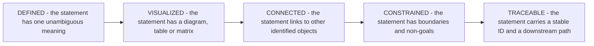

> **Diagram ID:** `DGM-VIS-001`
> **Explanation:** The admission test for content in this document. A vision statement that is
> merely inspiring fails at **DEFINED**. A statement that is defined but has no downstream path
> fails at **TRACEABLE** and is a slogan, not a specification. Content that fails any stage is
> either rewritten until it passes or removed.

---

## AUTHORITY AND PLACEMENT NOTE — Read Before Citing This Document

This document was commissioned for the path `docs/MASTER_CONTEXT/01_VISION/SYSTEM_VISION.md`.
**That path was not created, and the reason is recorded here rather than hidden.**

### TBL-VIS-001: Placement Decision Record

| Field | Value |
| :--- | :--- |
| **Requested path** | `docs/MASTER_CONTEXT/01_VISION/SYSTEM_VISION.md` |
| **Actual path** | `docs/MASTER_CONTEXT/01_PRODUCT/SYSTEM_VISION.md` |
| **Blocking evidence** | `docs/MASTER_CONTEXT/MASTER_CONTEXT_RULES.md` PART 04, `TBL-MCR-008` — every knowledge domain must carry a **unique two-digit prefix**. Domain `01` is already bound to `01_PRODUCT` by `MCX-01-001`. |
| **Consequence of the requested path** | Two domains sharing prefix `01`, violating the naming rule, plus fragmentation of vision knowledge across two folders. |
| **Why `01_PRODUCT` is correct** | `MCX-01-001` states its purpose as *"Defines what Oship is, why it exists, the value it delivers…"* and its scope as *"the product vision, mission, goals, problem statement, value proposition…"*. This document is exactly that scope. |
| **Relationship to `PRODUCT_VISION.md`** | `01_PRODUCT/INDEX.md` registers `PRODUCT_VISION.md` as `PLANNED`. That entry is **superseded** by this document; no parallel vision artifact will be created. |
| **Decision authority** | Human operator, consulted before authoring. Recorded as `DEC-VIS-001`. |
| **Status** | `IMPLEMENTED` — this file exists at the actual path. |

> **Rule `VIS-001`.** There is exactly **one** canonical vision artifact for Oship. Any future
> document proposing to be a second vision source is a defect. If `01_VISION/` is later created by
> an Architecture Board decision, this document **moves**; it is never **copied**.

---

## AI NAVIGATION METADATA — Document Root

| Field | Value |
| :--- | :--- |
| **AI READ PRIORITY** | **P0 — read before any other bounded-domain document, including `AOM-ARCH-001`** |
| **AI DEPENDENCIES** | `README.md`, `PROJECT_PHILOSOPHY.md`, `docs/ADR/ADR-0001-ai-native-repository-architecture.md`, `docs/MASTER_CONTEXT/INDEX.md`, `docs/MASTER_CONTEXT/MASTER_CONTEXT_RULES.md` |
| **AI INPUTS** | A question of the form *why does this exist*, *should we build this*, *is this in scope*, or *what does success mean* |
| **AI OUTPUTS** | A vision-traceable justification, a capability ID, an outcome ID, or an explicit refusal citing a non-goal |
| **AI IMPLEMENTATION IMPACT** | **INDIRECT BUT ABSOLUTE.** No code is written from this document. Every piece of code must nevertheless trace to a `CAP-VIS-` identifier defined here, or it is unjustified work. |
| **AI VALIDATION REQUIREMENTS** | `VAL-VIS-001` … `VAL-VIS-120` |
| **AI RELATED DOCUMENTS** | `docs/MASTER_CONTEXT/04_ARCHITECTURE/SYSTEM_ARCHITECTURE.md` (`AOM-ARCH-001`), `.ai/PROJECT_STATUS.md`, `.ai/CURRENT_CONTEXT.md`, `.ai/DECISION_LOG.md` |

---

## Identifier Namespace Registry

Identifiers in this document are **permanent**. They are allocated, never reassigned, and gaps are
never back-filled. A reader following a cross-reference to a retired ID must find nothing rather
than find something unrelated.

### TBL-VIS-002: ID Namespace Registry for `AOM-VIS-001`

| Namespace | Meaning | Reserved range | Authority |
| :--- | :--- | :--- | :--- |
| `VIS-` | Numbered constitutional rules of this document | 001–120 | L1 |
| `PROB-VIS-` | Problems Oship exists to solve | 001–060 | L1 |
| `ACT-VIS-` | Actors and actor classes | 001–030 | L1 |
| `VAL-CHAIN-VIS-` | Value chain stages | 001–020 | L1 |
| `CAP-VIS-` | Capabilities, at every level of the hierarchy | 001–120 | L1 |
| `OUT-VIS-` | Strategic outcomes | 001–060 | L1 |
| `PRN-VIS-` | Strategic principles | 001–030 | L1 |
| `NG-VIS-` | Non-goals — what Oship will not become | 001–040 | L1 |
| `CON-VIS-` | Strategic constraints | 001–060 | L1 |
| `SUC-VIS-` | Success metrics | 001–060 | L1 |
| `BND-VIS-` | Vision-level boundaries | 001–030 | L1 |
| `EVD-VIS-` | Repository evidence citations | 001–050 | L1 |
| `DEC-VIS-` | Vision-level decisions | 001–040 | L1 |
| `AI-VIS-` | Instructions binding on AI agents | 001–060 | L1 |
| `VAL-VIS-` | Validation rules | 001–200 | L1 |
| `FAL-VIS-` | Failure modes and anti-patterns | 001–200 | L1 |
| `DGM-VIS-` | Mermaid diagrams | 001–200 | L1 |
| `TBL-VIS-` | Identified tables | 001–200 | L1 |
| `IMG-VIS-` | Image specifications — specifications only, never binaries | 001–040 | L1 |

> **Rule `VIS-002`.** An identifier defined in this document may be **referenced** by any other
> document but may be **defined** only here. `AOM-ARCH-001` may cite `CAP-VIS-014`; it may not
> create `CAP-VIS-121`.

---

## Status Vocabulary — Binding on Every Claim

Oship's constitution forbids presenting intent as fact. Every claim in this document carries one of
the following labels, and the labels have fixed meanings.

### TBL-VIS-003: Status Vocabulary

| Label | Meaning | Evidence required |
| :--- | :--- | :--- |
| `IMPLEMENTED` | The thing exists and works in the repository today | A file, directory, or command that can be inspected now |
| `DOCUMENTED` | The thing is specified and binding on process, but no automation enforces it | The specifying document and section |
| `PARTIALLY IMPLEMENTED` | Some part exists; the rest does not | Evidence for the existing part **and** a statement of what is missing |
| `PLANNED` | Committed intent, not yet built | A roadmap, index, or task entry that records the commitment |
| `PROPOSED` | Suggested, not yet accepted | The proposal location; no commitment implied |
| `VISION` | A desired end-state that may take years and may never be reached in this form | This document only |
| `DEPRECATED` | Was real, is being removed | The superseding decision |
| `UNKNOWN — REQUIRES REPOSITORY VERIFICATION` | No evidence either way was found | A statement of what was searched |

> **Rule `VIS-003`.** `VISION` is the weakest label in this document, not the strongest. A statement
> labelled `VISION` grants **no** authority to build anything. Authority to build comes only from a
> `CAP-VIS-` entry that has reached `PLANNED` and has an owning architecture domain.

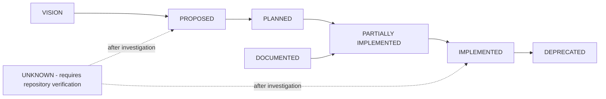

> **Diagram ID:** `DGM-VIS-002`
> **Explanation:** The only legal status transitions. Note that nothing moves directly from
> `VISION` to `IMPLEMENTED`: a desire must become a proposal, then a commitment, before it can
> become code. An agent that finds a `VISION` item in the codebase has found a governance failure,
> catalogued as `FAL-VIS-004`.

---

## Repository Evidence Base

Everything asserted as `IMPLEMENTED` in this document rests on the following inspected evidence.
The inspection was performed against branch `arena/019ffd50-oship` at parent commit `8c61052`.

### TBL-VIS-004: Evidence Register

| ID | Evidence | Observation | Supports |
| :--- | :--- | :--- | :--- |
| `EVD-VIS-001` | `README.md`, 93 KB, `ROOT-RME-001` v2.4.0 | Declares Oship an *"enterprise-grade, AI-native software development repository… read, reasoned over, and extended by AI coding agents first"* | `VIS-004`, `PROB-VIS-001` |
| `EVD-VIS-002` | `README.md` line 92 | Defines *"Money Factory"* as the repository operating as a compounding value asset | `VIS-006` |
| `EVD-VIS-003` | `README.md` lines 103–117 | The Ten Immutable Tenets | `PRN-VIS-001` … `PRN-VIS-010` |
| `EVD-VIS-004` | `.ai/` directory, 17 files | AI control plane exists: `PROJECT_STATUS.md`, `CURRENT_CONTEXT.md`, `NEXT_ACTION.md`, `SESSION_MEMORY.md`, `DECISION_LOG.md`, `CONTEXT_ROUTER.md`, operating manual | `CAP-VIS-001` `IMPLEMENTED` |
| `EVD-VIS-005` | `docs/ADR/ADR-0001-ai-native-repository-architecture.md`, `APPROVED` | Mandates `.ai/` control plane, YAML metadata, strict top-level structure, **zero application code in Phase 0** | `CON-VIS-001` |
| `EVD-VIS-006` | `docs/MASTER_CONTEXT/`, 24 domains each with `INDEX.md` | Knowledge graph exists | `CAP-VIS-002` `IMPLEMENTED` |
| `EVD-VIS-007` | `docs/MASTER_CONTEXT/23_STANDARDS/METADATA_STANDARD.md`, `MCX-23-002` | 15-key YAML frontmatter standard | `CAP-VIS-004` |
| `EVD-VIS-008` | `docs/MASTER_CONTEXT/MASTER_CONTEXT_MEMORY_SYSTEM.md`, 34,427 lines, `RELEASED` v1.0.0 | Memory constitution released via PR #5, tag `mcx-mem-001-v1.0.0` | `CAP-VIS-003` |
| `EVD-VIS-009` | `docs/MASTER_CONTEXT/04_ARCHITECTURE/SYSTEM_ARCHITECTURE.md`, `AOM-ARCH-001`, 10,844 lines | Architecture constitution Part 01 exists | `CAP-VIS-005`, all of §01.17 |
| `EVD-VIS-010` | `PROJECT_PHILOSOPHY.md`, 466 KB, 146 sections | Constitutional philosophy, §130 defines knowledge layers L1–L5 | `PRN-VIS-011` |
| `EVD-VIS-011` | `apps/`, `services/`, `packages/` | Contain only `.gitkeep` | Every runtime capability is `PLANNED`, not `IMPLEMENTED` |
| `EVD-VIS-012` | `apis/`, `sdk/` | Contain only `.gitkeep` | `CAP-VIS-030` `PLANNED` |
| `EVD-VIS-013` | `database/`, `storage/` | Contain only `.gitkeep` | `CAP-VIS-034` `PLANNED` |
| `EVD-VIS-014` | `infra/`, `k8s/`, `docker/`, `deployment/` | Contain only `.gitkeep` | `CAP-VIS-037` `PLANNED` |
| `EVD-VIS-015` | `monitoring/`, `observability/` | Contain only `.gitkeep` | `CAP-VIS-025` `PLANNED` |
| `EVD-VIS-016` | `tests/` | Contains only `.gitkeep` | `CAP-VIS-027` `PLANNED` |
| `EVD-VIS-017` | `.github/workflow-skeletons/` — ci, cd, release, security-scan, documentation, ai-governance, issue-triage, stale | Skeletons present but **not** installed in `.github/workflows/` | `CAP-VIS-026` `PARTIALLY IMPLEMENTED` |
| `EVD-VIS-018` | `.github/CODEOWNERS` | Every path maps to `@afshin-omnisystem` | `CON-VIS-010`, `ACT-VIS-002` |
| `EVD-VIS-019` | No `package.json`, `go.mod`, `pyproject.toml`, `pom.xml`, or lockfile at any level | No technology stack is chosen | `CON-VIS-020` `UNKNOWN` |
| `EVD-VIS-020` | `architecture/DOMAIN_MODEL.md`, `ARCH-DOM-001` | Four bounded contexts: Governance and AI, Core Platform, Financial Factory, Observability | `CAP-VIS-060` … `CAP-VIS-063` |
| `EVD-VIS-021` | `architecture/DOMAIN_MODEL.md` §2 | Ubiquitous language: *Money Factory* = *"primary domain engine processing enterprise financial workloads"*; *AI Workspace* = `.ai/` | `VIS-006`, `PROB-VIS-018` |
| `EVD-VIS-022` | `.ai/DECISION_LOG.md`, `AI-DEC-001` | Ten decisions `DEC-001` … `DEC-010`, all `APPROVED` or `RELEASED` | `CAP-VIS-006` |
| `EVD-VIS-023` | `docs/MASTER_CONTEXT/01_PRODUCT/INDEX.md`, `MCX-01-001` | Registers `PRODUCT_VISION.md` as `PLANNED`; domain owns vision and mission | `TBL-VIS-001` |
| `EVD-VIS-024` | `docs/MASTER_CONTEXT/MASTER_CONTEXT_RULES.md` PART 04, `TBL-MCR-008` | Unique two-digit domain prefix is mandatory | `TBL-VIS-001` |
| `EVD-VIS-025` | Git history: single functional commit `8c61052` plus this branch | The repository is at the very beginning of its life | `CON-VIS-002` |

> **Rule `VIS-004`.** Any future claim of `IMPLEMENTED` in this document must add a row to
> `TBL-VIS-004` in the same commit. A claim without an evidence row is a defect detected by
> `VAL-VIS-013`.

---

## Table of Contents — PART 01

| § | Section | Primary IDs | AI Priority |
| :--- | :--- | :--- | :---: |
| [01.1](#011--system-identity) | System Identity | `VIS-004`…`VIS-012` | **P0** |
| [01.2](#012--vision-statement) | Vision Statement | `VIS-013`…`VIS-020` | **P0** |
| [01.3](#013--mission-and-the-intent-hierarchy) | Mission and the Intent Hierarchy | `VIS-021`…`VIS-028` | **P0** |
| [01.4](#014--problem-space) | Problem Space | `PROB-VIS-001`…`030` | **P0** |
| [01.5](#015--users-and-actors) | Users and Actors | `ACT-VIS-001`…`016` | **P0** |
| [01.6](#016--value-model) | Value Model | `VAL-CHAIN-VIS-001`…`012` | **P1** |
| [01.7](#017--system-capabilities) | System Capabilities | `CAP-VIS-001`…`070` | **P0** |
| [01.8](#018--capability-hierarchy) | Capability Hierarchy | `CAP-VIS-071`…`090` | **P0** |
| [01.9](#019--system-boundaries) | System Boundaries | `BND-VIS-001`…`020` | **P0** |
| [01.10](#0110--strategic-principles) | Strategic Principles | `PRN-VIS-001`…`020` | **P0** |
| [01.11](#0111--non-goals) | Non-Goals | `NG-VIS-001`…`024` | **P0** |
| [01.12](#0112--success-model) | Success Model | `SUC-VIS-001`…`042` | **P1** |
| [01.13](#0113--strategic-outcomes) | Strategic Outcomes | `OUT-VIS-001`…`030` | **P1** |
| [01.14](#0114--evolution-model) | Evolution Model | `VIS-040`…`VIS-048` | **P1** |
| [01.15](#0115--ai-native-vision) | AI-Native Vision | `AI-VIS-001`…`030` | **P0** |
| [01.16](#0116--human-and-ai-collaboration-model) | Human and AI Collaboration Model | `AI-VIS-031`…`044` | **P0** |
| [01.17](#0117--architecture-traceability) | Architecture Traceability | `VIS-050`…`VIS-056` | **P0** |
| [01.18](#0118--requirements-derivation) | Requirements Derivation | `DEC-VIS-010`…`016` | **P0** |
| [01.19](#0119--strategic-constraints) | Strategic Constraints | `CON-VIS-001`…`030` | **P0** |
| [01.20](#0120--architectural-drift-prevention) | Architectural Drift Prevention | `VIS-060`…`VIS-068` | **P1** |
| [01.21](#0121--vision-governance) | Vision Governance | `VIS-070`…`VIS-078` | **P1** |
| [01.22](#0122--change-management) | Change Management | `VIS-080`…`VIS-086` | **P2** |
| [01.23](#0123--ai-interpretation-guide) | AI Interpretation Guide | `AI-VIS-045`…`060` | **P0** |
| [01.24](#0124--validation-rules) | Validation Rules | `VAL-VIS-001`…`200` | **P0** |
| [01.25](#0125--failure-and-anti-pattern-library) | Failure and Anti-Pattern Library | `FAL-VIS-001`…`120` | **P1** |
| [01.26](#0126--decision-model) | Decision Model | `DEC-VIS-017`…`030` | **P0** |
| [01.27](#0127--traceability-matrix) | Traceability Matrix | `TBL-VIS-122`…`126` | **P0** |
| [01.28](#0128--future-evolution-of-this-document) | Future Evolution of This Document | `VIS-098`…`VIS-101` | **P1** |
| [App. A](#appendix-a--image-specifications) | Image Specifications | `IMG-VIS-001`…`022` | **P3** |
| [App. B](#appendix-b--reference-material) | Reference Material — Glossary, Vocabulary, Ledger | `TBL-VIS-133`…`138` | **P3** |

---

## 01.1 — System Identity

### AI NAVIGATION METADATA — §01.1

| Field | Value |
| :--- | :--- |
| **AI READ PRIORITY** | **P0 — the first substantive section any agent reads** |
| **AI DEPENDENCIES** | `README.md`, `architecture/DOMAIN_MODEL.md`, `docs/ADR/ADR-0001` |
| **AI INPUTS** | The question *what is this repository* |
| **AI OUTPUTS** | A category judgement that constrains every later design choice |
| **AI IMPLEMENTATION IMPACT** | Misclassifying Oship produces architecture that solves the wrong problem |
| **AI VALIDATION REQUIREMENTS** | `VAL-VIS-001`…`VAL-VIS-008` |
| **AI RELATED DOCUMENTS** | `AOM-ARCH-001` §01.2 System Identity |

### 01.1.1 What Oship Is

> **`VIS-004` — Canonical identity statement.**
> **Oship is an AI-native enterprise software factory: a repository whose primary product is the
> machine-executable knowledge required to build, operate, and evolve enterprise software, and
> whose secondary product is the software itself.**

Read that twice, because the ordering is the whole point and it is unusual. In an ordinary project
the code is the asset and the documentation is a lagging description of it. In Oship the
specification is the asset and the code is a **derived artifact** — a compilation target produced
from specifications by human and machine labour together.

This is not an aspiration bolted onto a conventional codebase. It is the observable present state
of the repository. At the time of writing, Oship contains approximately 94,000 lines of
constitutional, architectural, and governance specification (`EVD-VIS-001`, `EVD-VIS-006`,
`EVD-VIS-008`, `EVD-VIS-009`, `EVD-VIS-010`) and **zero lines of application code**
(`EVD-VIS-011`). That ratio is a deliberate consequence of `ADR-0001`, which mandates zero
application code in Phase 0 (`EVD-VIS-005`), not an accident of an unfinished project.

### TBL-VIS-005: Identity Assertions

| ID | Assertion | Status | Evidence |
| :--- | :--- | :--- | :--- |
| `VIS-004` | Oship is an AI-native enterprise software factory | `IMPLEMENTED` as a documentation system; `PLANNED` as a runtime | `EVD-VIS-001`, `EVD-VIS-011` |
| `VIS-005` | Oship's primary artifact is executable knowledge, not code | `IMPLEMENTED` | `EVD-VIS-004`, `EVD-VIS-006`, `EVD-VIS-009` |
| `VIS-006` | Oship's domain identity is the "Money Factory" — an engine for enterprise financial workloads | `PLANNED` | `EVD-VIS-002`, `EVD-VIS-021` |
| `VIS-007` | Oship is designed to be read by AI agents first and humans second | `IMPLEMENTED` at the documentation level | `EVD-VIS-001`, `EVD-VIS-004` |
| `VIS-008` | Oship is a single-repository system, not a distributed set of repositories | `IMPLEMENTED` | `EVD-VIS-025` |
| `VIS-009` | Oship's governance is constitutional — rules bind their own authors | `IMPLEMENTED` | `EVD-VIS-005`, `EVD-VIS-010`, `EVD-VIS-022` |

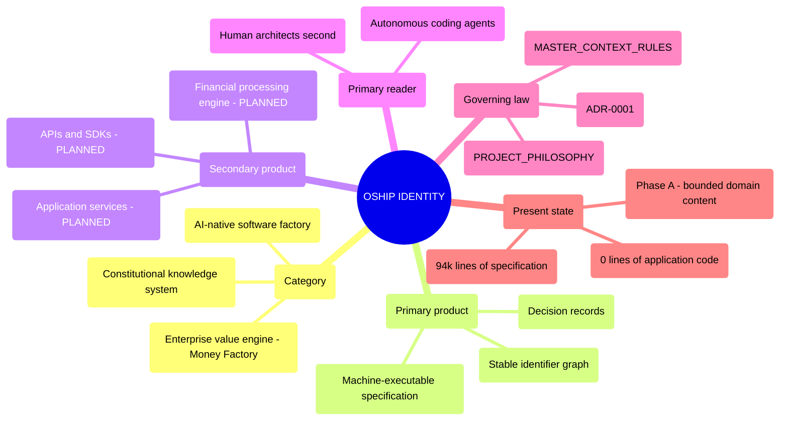

> **Diagram ID:** `DGM-VIS-003` — **System Identity Map**
> **Explanation:** Oship's identity in one view. The branch that surprises most readers is
> *Primary product*: specification, not software. The *Present state* branch keeps the map honest —
> the runtime branches are all `PLANNED`, and an agent that treats them as present will generate
> code against services that do not exist.

### 01.1.2 What Oship Is Not

Identity is defined as much by exclusion as by inclusion. The following are **not** what Oship is,
and each misreading has a predictable failure attached to it.

### TBL-VIS-006: Identity Exclusions

| Misreading | Why it is wrong | Failure it causes |
| :--- | :--- | :--- |
| "A documentation repository" | Documentation describes a system that exists elsewhere. Oship's specifications **are** the system's authoritative definition; the code does not yet exist to be described. | `FAL-VIS-001` |
| "A boilerplate or starter template" | Templates are copied and diverge. Oship is a single evolving system with permanent identifiers and a decision history. | `FAL-VIS-002` |
| "A conventional monorepo awaiting code" | A monorepo is a code-storage strategy. Oship is a knowledge-first construction method that *also* stores code. | `FAL-VIS-003` |
| "A finished financial platform" | No transaction is processed. `apps/`, `services/`, `database/` are empty (`EVD-VIS-011`, `EVD-VIS-013`). | `FAL-VIS-005` |
| "An AI research project" | Oship does not train, fine-tune, or research models. It *consumes* agents as labour. | `NG-VIS-003` |
| "A framework for others to build on" | Oship is a system, not a library. It has no external consumers and publishes no package. | `NG-VIS-007` |
| "A prompt collection" | Prompts are ephemeral. Oship's artifacts are versioned, identified, and governed. | `FAL-VIS-011` |

> **`VIS-010`.** When an agent cannot decide whether a proposed change belongs in Oship, it applies
> the exclusion table before the inclusion table. Exclusions are cheaper to evaluate and catch most
> scope errors.

### 01.1.3 System Category

Oship belongs to a category that is still forming in the industry, so precision matters more than a
familiar label.

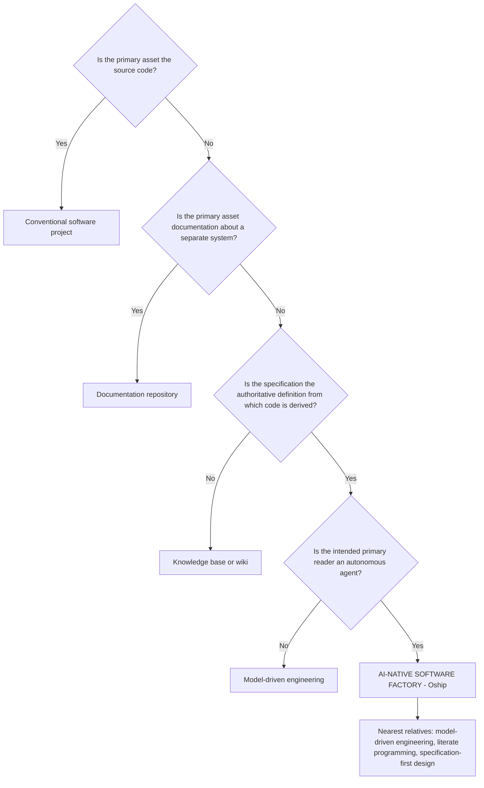

> **Diagram ID:** `DGM-VIS-004`
> **Explanation:** A classification decision tree that terminates in Oship's category. The final
> discriminator is the *intended reader*. Model-driven engineering targets a code generator with
> rigid grammar; Oship targets a reasoning agent that requires context, rationale, and explicit
> prohibition. That difference is why this document explains **why**, not merely **what** — a code
> generator does not need reasons, and an agent does.

### 01.1.4 Primary and Secondary Purposes

### TBL-VIS-007: Purpose Ranking

| Rank | Purpose | Statement | Status |
| :---: | :--- | :--- | :--- |
| **Primary** | `VIS-011` | Make enterprise software construction **tractable for autonomous agents** by removing every dependency on undocumented human knowledge | `PARTIALLY IMPLEMENTED` |
| Secondary 1 | `VIS-012a` | Build the "Money Factory" — an enterprise engine for financial workloads | `PLANNED` |
| Secondary 2 | `VIS-012b` | Demonstrate that specification-first construction lowers the marginal cost of change over time | `VISION` |
| Secondary 3 | `VIS-012c` | Preserve institutional knowledge so that contributor turnover, human or agent, does not destroy capability | `IMPLEMENTED` at the documentation level |
| Secondary 4 | `VIS-012d` | Provide a reproducible method that survives model generations and vendor changes | `DOCUMENTED` |

> **`VIS-012`.** The purposes are **ranked, not equal**. When the Money Factory objective conflicts
> with agent tractability, tractability wins. A financial feature that can only be maintained by a
> human who remembers an unwritten rule is rejected regardless of its revenue value. This is the
> single most consequential trade-off in the document and the one most likely to be quietly
> violated under delivery pressure.

### 01.1.5 What Makes Oship Structurally Different

### TBL-VIS-008: Structural Differentiators

| # | Ordinary project | Oship | Evidence |
| :---: | :--- | :--- | :--- |
| 1 | Docs lag code | Specification precedes code and outnumbers it ~94,000 : 0 | `EVD-VIS-011` |
| 2 | Knowledge lives in people | Knowledge lives in versioned, identified artifacts | `EVD-VIS-006` |
| 3 | Identifiers are incidental | Identifiers are permanent and never reused | `TBL-VIS-002` |
| 4 | Decisions are remembered | Decisions are recorded as immutable ADRs | `EVD-VIS-005`, `EVD-VIS-022` |
| 5 | Onboarding is a conversation | Onboarding is a file read; `.ai/` is the boot sequence | `EVD-VIS-004` |
| 6 | Status is optimistic | Status labels are mandatory and enforced | `TBL-VIS-003` |
| 7 | Agents are autocomplete | Agents are first-class labour with a defined operating manual | `EVD-VIS-004` |
| 8 | Structure emerges | Structure is legislated before it is populated | `EVD-VIS-005` |

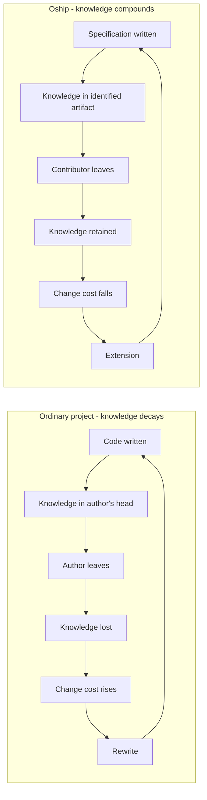

> **Diagram ID:** `DGM-VIS-005`
> **Explanation:** The two loops that define the strategic bet. The left loop is the industry
> default: knowledge decays into people, people leave, cost rises until rewrite. The right loop is
> Oship's wager — that front-loading specification cost converts the decay loop into a compounding
> loop. This is what `EVD-VIS-002` means by *"Money Factory"*: **the repository itself is the
> compounding asset**, not any single feature shipped from it.

> **Honest caveat.** The right-hand loop is `VISION`. Oship has completed one turn of it and cannot
> yet demonstrate that change cost falls over time. `SUC-VIS-021` is the metric that will decide
> whether the bet paid off, and it is currently unmeasurable because there is no code to change.

---

## 01.2 — Vision Statement

### AI NAVIGATION METADATA — §01.2

| Field | Value |
| :--- | :--- |
| **AI READ PRIORITY** | **P0** |
| **AI DEPENDENCIES** | §01.1 System Identity |
| **AI INPUTS** | A proposal that must be tested against long-term intent |
| **AI OUTPUTS** | Accept, reject, or escalate, with the vision clause cited |
| **AI IMPLEMENTATION IMPACT** | Sets the target state every roadmap increment must move toward |
| **AI VALIDATION REQUIREMENTS** | `VAL-VIS-009`…`VAL-VIS-016` |
| **AI RELATED DOCUMENTS** | `docs/MASTER_CONTEXT/19_ROADMAP/INDEX.md` |

### 01.2.1 The Canonical Vision Statement

> ### `VIS-013` — THE OSHIP VISION
>
> **Oship exists to make enterprise software a compounding asset rather than a depreciating
> liability — by encoding every architectural decision, constraint, and intent as
> machine-executable knowledge, so that autonomous agents and humans can build, verify, and evolve
> the system indefinitely without any dependency on undocumented understanding.**

A vision statement in this document must satisfy five properties. Most corporate vision statements
satisfy none of them, which is why they cannot be used to make decisions.

### TBL-VIS-009: Vision Statement Property Test

| Property | Requirement | How `VIS-013` satisfies it |
| :--- | :--- | :--- |
| **Precise** | No word may carry two meanings in context | Every load-bearing term is defined in `TBL-VIS-010` |
| **Testable** | Falsifiable by observation | Measured by `SUC-VIS-001`, `SUC-VIS-021`, `SUC-VIS-025` |
| **Evolvable** | Can absorb new capability without rewrite | Names no technology, market, or product feature |
| **AI-readable** | Parseable into obligations | Decomposed into `VIS-014`…`VIS-019` below |
| **Architecture-compatible** | Each clause maps to an architectural mechanism | Mapped in `TBL-VIS-011` |

### TBL-VIS-010: Definitions of Load-Bearing Terms in `VIS-013`

| Term | Definition in Oship | Not to be confused with |
| :--- | :--- | :--- |
| **Compounding asset** | A system whose marginal cost of change decreases as it grows | Simply "valuable" |
| **Depreciating liability** | A system whose marginal cost of change increases as it grows | "Legacy" or "old" |
| **Machine-executable knowledge** | Specification structured so an agent can act on it without human clarification | Documentation that merely mentions an agent |
| **Architectural decision** | A choice that is expensive to reverse and constrains later choices | Any implementation preference |
| **Autonomous agent** | A software agent that plans and executes multi-step work with bounded human approval | An autocomplete or chat assistant |
| **Indefinitely** | Across model generations, vendor changes, and contributor turnover | Forever without maintenance |
| **Undocumented understanding** | Knowledge held only in a person's memory | Tacit skill such as typing or reading |

### 01.2.2 Vision Decomposition

`VIS-013` is decomposed into six independently testable clauses. This is what makes it usable by an
agent: the whole statement cannot be evaluated, but each clause can.

### TBL-VIS-011: Vision Clause Decomposition

| ID | Clause | Obligation it creates | Architectural mechanism | Status |
| :--- | :--- | :--- | :--- | :--- |
| `VIS-014` | "compounding asset rather than depreciating liability" | Every change must lower or hold the cost of the next change | Modular boundaries, contracts, `AOM-ARCH-001` §01.9 dependency rules | `VISION` |
| `VIS-015` | "encoding every architectural decision" | No decision may exist only in memory or chat | ADR process, `docs/ADR/`, `.ai/DECISION_LOG.md` | `IMPLEMENTED` |
| `VIS-016` | "constraint" | Limits are stated explicitly, including uncomfortable ones | §01.19 constraint register, `TBL-VIS-003` status vocabulary | `IMPLEMENTED` |
| `VIS-017` | "and intent" | The *why* travels with the *what*, permanently | Rationale required in every specification section | `IMPLEMENTED` |
| `VIS-018` | "autonomous agents and humans can build, verify and evolve" | Both classes of worker are first-class; neither is an afterthought | `.ai/` control plane, `AOM-ARCH-001` §01.24, §01.16 here | `PARTIALLY IMPLEMENTED` |
| `VIS-019` | "without any dependency on undocumented understanding" | Hidden knowledge is a defect, not a convenience | Evidence rule `VIS-004`, validation `VAL-VIS-013` | `PARTIALLY IMPLEMENTED` |

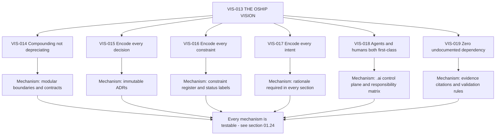

> **Diagram ID:** `DGM-VIS-006` — **Vision Model**
> **Explanation:** The vision is not a sentence to be admired but a tree to be traversed. Each of
> the six clauses carries a concrete mechanism, and each mechanism carries validation rules. An
> agent asked *does this change serve the vision* does not reason about the sentence; it identifies
> which clause the change touches and evaluates against that clause's mechanism.

### 01.2.3 What Would Falsify the Vision

A vision that cannot fail is not testable. These conditions would demonstrate `VIS-013` is wrong or
unreachable, and they must be watched for rather than explained away.

### TBL-VIS-012: Vision Falsification Conditions

| ID | Condition | What it would prove | Current reading |
| :--- | :--- | :--- | :--- |
| `VIS-020a` | Change cost rises steadily despite specification discipline | The compounding premise is false for this class of system | Unmeasurable — no code yet |
| `VIS-020b` | Agents cannot implement from the specification without human clarification | The specification is not actually machine-executable | Untested — `SUC-VIS-011` will measure it |
| `VIS-020c` | Specification maintenance consumes more effort than it saves | The overhead exceeds the benefit | Unmeasurable — no delivery baseline |
| `VIS-020d` | Specifications drift from code and become misleading | Drift prevention has failed; the asset became a liability | §01.20 addresses this risk |
| `VIS-020e` | The Money Factory objective is abandoned or never begun | The secondary purpose was never real | Open — `apps/` and `services/` remain empty |

> **`VIS-020`.** These conditions are reviewed at every phase gate. A condition that is met is
> escalated to the Architecture Board as a vision-level defect, not silently tolerated. Explaining
> away a falsification condition is catalogued as `FAL-VIS-014`.

---

## 01.3 — Mission and the Intent Hierarchy

### AI NAVIGATION METADATA — §01.3

| Field | Value |
| :--- | :--- |
| **AI READ PRIORITY** | **P0** |
| **AI DEPENDENCIES** | §01.2 Vision Statement |
| **AI INPUTS** | A statement of intent at any altitude |
| **AI OUTPUTS** | Correct classification of that statement into the intent hierarchy |
| **AI IMPLEMENTATION IMPACT** | Prevents features masquerading as strategy and strategy masquerading as features |
| **AI VALIDATION REQUIREMENTS** | `VAL-VIS-017`…`VAL-VIS-024` |
| **AI RELATED DOCUMENTS** | `docs/MASTER_CONTEXT/19_ROADMAP/INDEX.md`, `.ai/ROADMAP_AI.md` |

### 01.3.1 The Mission

> ### `VIS-021` — THE OSHIP MISSION
>
> **Build and maintain a repository in which every architectural fact required to construct the
> system is written down, identified, validated, and reachable — such that a competent autonomous
> agent, starting with no prior context, can locate what it needs, understand why it exists, and
> implement it correctly without asking a human.**

The relationship between vision and mission is precise and frequently confused. The **vision** is
the end state (`VIS-013`: software as a compounding asset). The **mission** is the work undertaken
now to move toward it (`VIS-021`: write everything down, identifiably and reachably). The vision may
take a decade and may never be fully reached. The mission is what is done this week.

### 01.3.2 The Intent Hierarchy — Seven Distinct Concepts

These seven concepts are routinely used interchangeably in industry, and that conflation is the
root cause of unbuildable roadmaps. In Oship they are strictly separated.

### TBL-VIS-013: Vision, Mission, Purpose, Objective, Goal, Capability, Feature

| Concept | Question it answers | Time horizon | Changes when | Testable? | Oship example |
| :--- | :--- | :--- | :--- | :---: | :--- |
| **Vision** | What does the world look like if we fully succeed? | Indefinite | Almost never — requires Architecture Board and a superseding ADR | Falsifiable, not directly measurable | `VIS-013` |
| **Mission** | What work do we undertake to move toward the vision? | Multi-year | On strategic pivot | Partially | `VIS-021` |
| **Purpose** | Why does this thing exist at all? | Permanent | Never, while the thing exists | No — it is a reason | `VIS-011` agent tractability |
| **Objective** | What measurable change do we intend within a bounded period? | Phase or quarter | Each phase | Yes — numerically | `OUT-VIS-001` |
| **Goal** | What specific end state satisfies an objective? | Phase | On objective change | Yes — binary done or not | Complete `AOM-ARCH-001` |
| **Capability** | What can the system *do*, independent of how? | Long-lived | On scope change | Yes — present or absent | `CAP-VIS-014` |
| **Feature** | What concrete function do users touch? | Release | Frequently | Yes — by acceptance test | `PLANNED` — none exist |

> **`VIS-022`.** A statement that cannot be placed in exactly one row of `TBL-VIS-013` is
> malformed and must be rewritten before it enters any planning artifact. The most common error is
> a "goal" that is actually a feature, which produces a roadmap of implementation details with no
> strategic justification. The second most common is a "vision" that is actually an objective,
> which produces a strategy that expires in a quarter.

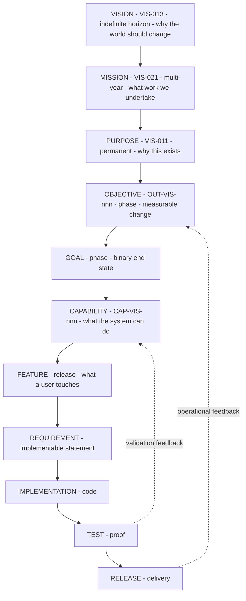

> **Diagram ID:** `DGM-VIS-007`
> **Explanation:** The full intent hierarchy from vision to release, with the two feedback edges
> that keep it from being a one-way waterfall. Note that **capability sits above feature**: Oship
> decides what the system can do before deciding what a user touches. Inverting these two produces
> a feature list with no coherent system behind it — catalogued as `FAL-VIS-021`.

### 01.3.3 Altitude Errors and How to Detect Them

### TBL-VIS-014: Altitude Error Detection

| Error | Symptom | Detection question | Correction |
| :--- | :--- | :--- | :--- |
| Feature posing as vision | "Our vision is a real-time dashboard" | Will this be obsolete in three years? | Demote to feature; find the capability it serves |
| Vision posing as goal | "This quarter we will make software a compounding asset" | Can this be marked done on a date? | Promote to vision; extract a measurable objective |
| Capability posing as feature | "Add multi-tenancy" | Is this one screen or a system property? | Promote to capability; decompose into features |
| Objective without metric | "Improve agent effectiveness" | What number changes, from what to what? | Add a `SUC-VIS-` metric or reject |
| Goal without capability | "Ship the ledger service" | Which capability does this deliver? | Link to a `CAP-VIS-` ID or reject as unjustified |
| Purpose treated as changeable | "Let us revisit why we exist this sprint" | Has the system's reason for existing actually ended? | Purpose changes only by superseding ADR |

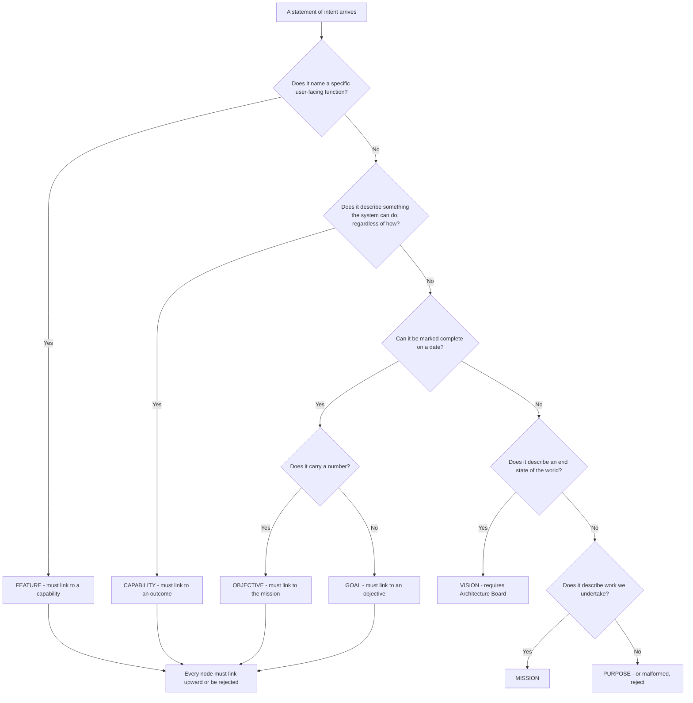

> **Diagram ID:** `DGM-VIS-008`
> **Explanation:** The classification decision tree an agent runs on any incoming statement of
> intent. The terminal rule matters as much as the classification: **every node must link upward**.
> A feature with no capability, or a goal with no objective, is orphaned work and is rejected at
> intake rather than discovered as waste at review.

### 01.3.4 The Mission in Force Right Now

Concretely, at the current phase, the mission reduces to a small set of active obligations.

### TBL-VIS-015: Active Mission Obligations

| ID | Obligation | Owner | Status |
| :--- | :--- | :--- | :--- |
| `VIS-023` | Every bounded domain has a constitutional document before it has code | Architecture | `PARTIALLY IMPLEMENTED` — 2 of 24 domains |
| `VIS-024` | Every architectural fact carries a permanent identifier | Architecture | `IMPLEMENTED` |
| `VIS-025` | Every claim carries an honest status label | All contributors | `IMPLEMENTED` |
| `VIS-026` | Every document is reachable from `.ai/` within three hops | Documentation | `IMPLEMENTED` |
| `VIS-027` | Every decision that constrains later work becomes an ADR | Architecture | `IMPLEMENTED` |
| `VIS-028` | No application code is written before its specification exists | All contributors | `IMPLEMENTED` — trivially, since none exists |

> **Honest note on `VIS-028`.** This obligation is currently satisfied for a weak reason: no code
> exists at all (`EVD-VIS-011`). Its real test begins the moment Phase C opens. An obligation that
> is only satisfied by inaction has not yet been demonstrated, and `TBL-VIS-015` will need
> re-evaluation at that gate rather than being assumed to hold.

---

## 01.4 — Problem Space

### AI NAVIGATION METADATA — §01.4

| Field | Value |
| :--- | :--- |
| **AI READ PRIORITY** | **P0 — no capability may be proposed without naming the problem it solves** |
| **AI DEPENDENCIES** | §01.1, §01.2 |
| **AI INPUTS** | A proposed capability, feature, or refactor |
| **AI OUTPUTS** | The `PROB-VIS-` identifier the work addresses, or a rejection |
| **AI IMPLEMENTATION IMPACT** | Work that solves no catalogued problem is unjustified and must not be built |
| **AI VALIDATION REQUIREMENTS** | `VAL-VIS-025`…`VAL-VIS-036` |
| **AI RELATED DOCUMENTS** | `PROJECT_PHILOSOPHY.md`, `docs/MASTER_CONTEXT/02_BUSINESS/INDEX.md` |

### 01.4.1 The Two Problem Families

Oship addresses two distinct families of problem, and confusing them is the fastest route to
incoherent architecture.

**Family A — Construction problems.** Problems in *how enterprise software gets built*. These are
the problems Oship attacks with its knowledge-first method. They are the reason the repository is
structured as it is.

**Family B — Domain problems.** Problems in *enterprise financial workload processing* — the
"Money Factory" domain (`EVD-VIS-021`). These are the problems the eventual runtime will solve for
end users.

> **`VIS-029`.** Family A problems are **being solved now**. Family B problems are **catalogued but
> not yet attacked**, because no application code exists (`EVD-VIS-011`). An agent must never
> present a Family B problem as under active mitigation.

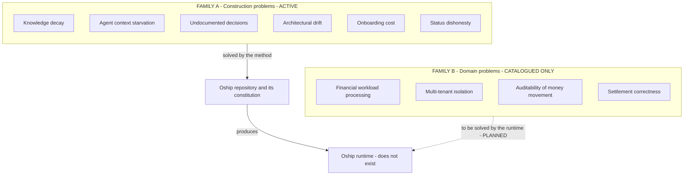

> **Diagram ID:** `DGM-VIS-009` — **Problem Landscape**
> **Explanation:** The two families and their very different states. Solid arrows are active;
> dashed arrows are `PLANNED`. The critical reading is that Family A must be solved *well enough*
> before Family B can be attacked at all — the method produces the runtime, not the reverse.

### 01.4.2 Family A — Construction Problems

Each problem below carries the full field set required by the vision specification.

### TBL-VIS-016: `PROB-VIS-001` — Knowledge Decay

| Field | Value |
| :--- | :--- |
| **ID** | `PROB-VIS-001` |
| **Problem** | Architectural knowledge lives in contributors' memories and is destroyed by turnover |
| **Affected Actor** | `ACT-VIS-001` architect, `ACT-VIS-002` maintainer, `ACT-VIS-005` autonomous agent |
| **Current Pain** | Every new contributor reconstructs intent by reading code and guessing; guesses are frequently wrong |
| **Impact** | Rising change cost, repeated mistakes, rewrites that discard hard-won correctness |
| **Root Cause** | Code records *what* a system does but not *why*, and *why* is what constrains the next change |
| **Oship Response** | `CAP-VIS-002` knowledge graph, `CAP-VIS-006` decision records, mandatory rationale in every section |
| **Priority** | **CRITICAL** |
| **Status** | `PARTIALLY IMPLEMENTED` — the mechanism exists; its durability is unproven |
| **Evidence** | `EVD-VIS-006`, `EVD-VIS-022` |
| **AI Interpretation** | When you cannot determine why something exists, that is an instance of this problem. Do not guess. Record `UNKNOWN — REQUIRES REPOSITORY VERIFICATION` and escalate. |

### TBL-VIS-017: `PROB-VIS-002` — Agent Context Starvation

| Field | Value |
| :--- | :--- |
| **ID** | `PROB-VIS-002` |
| **Problem** | Autonomous agents cannot implement correctly because the necessary context is absent, scattered, or contradictory |
| **Affected Actor** | `ACT-VIS-005` autonomous agent, `ACT-VIS-006` agent orchestrator |
| **Current Pain** | Agents produce plausible code that violates unstated constraints, then humans spend more time reviewing than they saved |
| **Impact** | AI labour yields negative net productivity; teams abandon agents and conclude the technology is immature |
| **Root Cause** | Repositories are optimised for human readers who can ask questions; agents cannot ask and will fabricate instead |
| **Oship Response** | `CAP-VIS-001` control plane, `CAP-VIS-007` deterministic navigation, AI metadata on every section, explicit prohibitions |
| **Priority** | **CRITICAL** |
| **Status** | `PARTIALLY IMPLEMENTED` |
| **Evidence** | `EVD-VIS-004`, `EVD-VIS-009` |
| **AI Interpretation** | This is the problem you personally embody. If you find yourself inferring a rule that is not written, you have detected this problem — report it rather than proceeding on the inference. |

### TBL-VIS-018: `PROB-VIS-003` — Undocumented Decisions

| Field | Value |
| :--- | :--- |
| **ID** | `PROB-VIS-003` |
| **Problem** | Consequential decisions are made in conversation and never recorded |
| **Affected Actor** | `ACT-VIS-001`, `ACT-VIS-002`, `ACT-VIS-005` |
| **Current Pain** | Later contributors reverse decisions without knowing the constraints that produced them, reintroducing solved failures |
| **Impact** | Oscillating architecture; the same debate recurs annually with no accumulated resolution |
| **Root Cause** | Recording a decision costs effort now and pays off later, so it is systematically under-supplied |
| **Oship Response** | `CAP-VIS-006` immutable ADR process; `.ai/DECISION_LOG.md`; decisions immutable once approved |
| **Priority** | **CRITICAL** |
| **Status** | `IMPLEMENTED` |
| **Evidence** | `EVD-VIS-005`, `EVD-VIS-022` — ten recorded decisions, all `APPROVED` or `RELEASED` |
| **AI Interpretation** | Before proposing a change that contradicts existing structure, search `docs/ADR/` and `.ai/DECISION_LOG.md`. A contradiction with an `APPROVED` ADR requires a superseding ADR, never a silent edit. |

### TBL-VIS-019: `PROB-VIS-004` — Architectural Drift

| Field | Value |
| :--- | :--- |
| **ID** | `PROB-VIS-004` |
| **Problem** | Implementation diverges from specification until the specification becomes actively misleading |
| **Affected Actor** | All |
| **Current Pain** | Readers learn to distrust documentation, which removes the incentive to maintain it, which accelerates drift |
| **Impact** | The knowledge asset becomes a liability — worse than no documentation, because it misleads confidently |
| **Root Cause** | Code changes are enforced by compilers; specification changes are enforced by discipline alone |
| **Oship Response** | `CAP-VIS-009` drift detection, §01.20 escalation model, traceability matrix §01.27 |
| **Priority** | **CRITICAL** |
| **Status** | `DOCUMENTED` — the model is specified; automated detection is `PLANNED` |
| **Evidence** | `EVD-VIS-017` — CI skeletons exist but are not installed, so nothing is enforced automatically |
| **AI Interpretation** | This is the problem most likely to make this very document dangerous over time. If you find code contradicting a specification, the contradiction itself is the defect — do not assume the code is authoritative. |

### TBL-VIS-020: `PROB-VIS-005` — Onboarding Cost

| Field | Value |
| :--- | :--- |
| **ID** | `PROB-VIS-005` |
| **Problem** | A new contributor, human or agent, needs weeks of human attention before becoming productive |
| **Affected Actor** | `ACT-VIS-002`, `ACT-VIS-005`, `ACT-VIS-003` |
| **Current Pain** | Senior contributors spend their scarcest hours re-explaining context |
| **Impact** | Scaling contributor count *reduces* throughput; agents multiply the problem because they onboard on every task |
| **Root Cause** | Onboarding knowledge is transmitted conversationally and must be regenerated per person |
| **Oship Response** | `CAP-VIS-007` deterministic navigation; `.ai/` boot sequence; `CONTEXT_ROUTER.md` |
| **Priority** | **HIGH** |
| **Status** | `PARTIALLY IMPLEMENTED` |
| **Evidence** | `EVD-VIS-004` |
| **AI Interpretation** | You onboard on every single task. The time you spend locating context is the direct measure of this problem. If a needed fact took more than three hops to find, that is a navigation defect worth reporting. |

### TBL-VIS-021: `PROB-VIS-006` — Status Dishonesty

| Field | Value |
| :--- | :--- |
| **ID** | `PROB-VIS-006` |
| **Problem** | Documentation describes intended behaviour as though it were current behaviour |
| **Affected Actor** | All, but agents most severely |
| **Current Pain** | An agent reads "the service validates input", generates a caller assuming validation, and ships an injection vector |
| **Impact** | Silent correctness and security failures; total loss of trust in the specification |
| **Root Cause** | Aspirational writing is natural, and the present and future tense are easy to blur |
| **Oship Response** | `TBL-VIS-003` mandatory status vocabulary; `VIS-004` evidence rule; `VAL-VIS-013` |
| **Priority** | **CRITICAL** |
| **Status** | `IMPLEMENTED` |
| **Evidence** | `EVD-VIS-009` — `AOM-ARCH-001` labels every claim and records unmet targets as unmet |
| **AI Interpretation** | Never upgrade a status label without adding evidence. Never treat `PLANNED` as callable. This is the highest-frequency cause of agent-generated defects in specification-heavy repositories. |

### TBL-VIS-022: Family A Problems — Compact Register

| ID | Problem | Actor | Priority | Status |
| :--- | :--- | :--- | :---: | :--- |
| `PROB-VIS-001` | Knowledge decay | Architect, maintainer, agent | CRITICAL | `PARTIALLY IMPLEMENTED` |
| `PROB-VIS-002` | Agent context starvation | Agent, orchestrator | CRITICAL | `PARTIALLY IMPLEMENTED` |
| `PROB-VIS-003` | Undocumented decisions | Architect, maintainer | CRITICAL | `IMPLEMENTED` |
| `PROB-VIS-004` | Architectural drift | All | CRITICAL | `DOCUMENTED` |
| `PROB-VIS-005` | Onboarding cost | Maintainer, agent, contributor | HIGH | `PARTIALLY IMPLEMENTED` |
| `PROB-VIS-006` | Status dishonesty | All | CRITICAL | `IMPLEMENTED` |
| `PROB-VIS-007` | Identifier instability — references rot as things are renamed | All | HIGH | `IMPLEMENTED` |
| `PROB-VIS-008` | Review capacity as the hidden bottleneck on agent throughput | Reviewer | HIGH | `DOCUMENTED` |
| `PROB-VIS-009` | Vendor and model lock-in — method dies with the tool | Architect | MEDIUM | `DOCUMENTED` |
| `PROB-VIS-010` | Untraceable work — code exists that no one can justify | All | HIGH | `DOCUMENTED` |
| `PROB-VIS-011` | Scope creep with no explicit non-goals | Product, architect | HIGH | `IMPLEMENTED` |
| `PROB-VIS-012` | Context window exhaustion on large specifications | Agent | HIGH | `PARTIALLY IMPLEMENTED` |
| `PROB-VIS-013` | Session discontinuity — an agent loses its place mid-task | Agent | HIGH | `IMPLEMENTED` |
| `PROB-VIS-014` | Ambiguity tolerance — agents resolve ambiguity by guessing | Agent | CRITICAL | `DOCUMENTED` |
| `PROB-VIS-015` | Unverifiable claims — assertions with no inspectable evidence | All | CRITICAL | `IMPLEMENTED` |
| `PROB-VIS-016` | Fragmented ownership — no single accountable party per artifact | Maintainer | MEDIUM | `IMPLEMENTED` |
| `PROB-VIS-017` | Governance without enforcement — rules exist but nothing checks them | All | HIGH | `PARTIALLY IMPLEMENTED` |

> **Note on `PROB-VIS-017`.** This is the most uncomfortable entry in the register and deserves
> emphasis rather than burial. Oship has extensive rules and almost no automated enforcement:
> `.github/workflow-skeletons/` contains CI, security-scan, and documentation workflows, but they
> are **not installed** in `.github/workflows/` (`EVD-VIS-017`). Every rule in this document is
> currently enforced by discipline alone. That is a real and present weakness, not a temporary
> detail.

### 01.4.3 Family B — Domain Problems

These are catalogued so the eventual runtime has a justified purpose. **None is under active
mitigation.**

### TBL-VIS-023: Family B Problems — Money Factory Domain

| ID | Problem | Affected Actor | Root Cause | Oship Response | Status |
| :--- | :--- | :--- | :--- | :--- | :--- |
| `PROB-VIS-018` | Enterprise financial workloads require processing that is simultaneously fast, correct, and auditable | `ACT-VIS-009` end user, `ACT-VIS-010` external system | Speed, correctness and auditability trade against each other under naive design | `CAP-VIS-062` Financial Factory domain | `PLANNED` |
| `PROB-VIS-019` | Multi-tenant data must be isolated with no reliance on caller-supplied scope | `ACT-VIS-009`, `ACT-VIS-004` | Tenant scope supplied by callers is forgeable | `CAP-VIS-061` Core Platform, `SEC-ARCH-014` in `AOM-ARCH-001` | `PLANNED` |
| `PROB-VIS-020` | Money movement must be reconstructable years later for audit | `ACT-VIS-008` auditor | Mutable state destroys history | Immutable ledger and evidence store, `CMP-ARCH-015` | `PLANNED` |
| `PROB-VIS-021` | Settlement must be correct under partial failure and retry | `ACT-VIS-009`, `ACT-VIS-010` | Distributed systems fail partially; naive retries double-spend | Idempotency and outbox pattern, `AOM-ARCH-001` §01.12 | `PLANNED` |
| `PROB-VIS-022` | Operators need to know the system is healthy before users tell them | `ACT-VIS-004` operator | No telemetry exists by default | `CAP-VIS-063` Observability domain | `PLANNED` |
| `PROB-VIS-023` | Regulatory obligations vary by jurisdiction and change over time | `ACT-VIS-008`, `ACT-VIS-007` | Compliance encoded in code cannot adapt | `UNKNOWN — REQUIRES REPOSITORY VERIFICATION` — no compliance framework selected | `UNKNOWN` |

> **`VIS-030`.** `PROB-VIS-023` is deliberately left `UNKNOWN` rather than filled with a plausible
> guess. No regulatory framework, jurisdiction, or compliance regime is named anywhere in the
> repository. Inventing one would violate the no-fabrication rule and would mislead every later
> reader about a legally consequential matter.

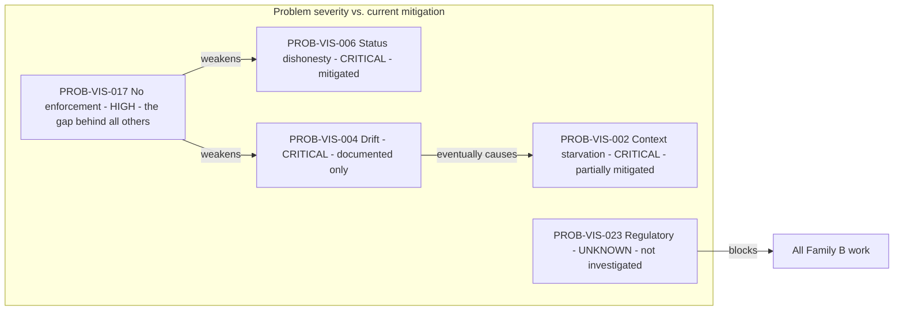

> **Diagram ID:** `DGM-VIS-010`
> **Explanation:** The dependency structure between the most severe problems. `PROB-VIS-017` — the
> absence of automated enforcement — is the load-bearing weakness: it undermines drift prevention
> and status honesty simultaneously. Installing the CI workflow skeletons is therefore the single
> highest-leverage mitigation available, and it is recorded as `OUT-VIS-004`.

---

## 01.5 — Users and Actors

### AI NAVIGATION METADATA — §01.5

| Field | Value |
| :--- | :--- |
| **AI READ PRIORITY** | **P0** |
| **AI DEPENDENCIES** | §01.4 Problem Space |
| **AI INPUTS** | A capability proposal needing an actor |
| **AI OUTPUTS** | The `ACT-VIS-` identifier served, or a rejection for serving no actor |
| **AI IMPLEMENTATION IMPACT** | Determines interface design, authorization model, and observability requirements |
| **AI VALIDATION REQUIREMENTS** | `VAL-VIS-037`…`VAL-VIS-046` |
| **AI RELATED DOCUMENTS** | `docs/MASTER_CONTEXT/03_USERS/INDEX.md`, `AOM-ARCH-001` §01.6 |

### 01.5.1 Actor Classification Rule

> **`VIS-031`.** An actor is listed only if repository evidence supports its existence or its
> explicit planning. Actors invented for narrative completeness are prohibited — they generate
> requirements for users who do not exist, which is a direct route to wasted implementation.

Actors are divided by **evidentiary status**, not by importance.

### TBL-VIS-024: Actor Register

| ID | Actor | Class | Present today? | Evidence | Status |
| :--- | :--- | :--- | :---: | :--- | :--- |
| `ACT-VIS-001` | Lead Architect | Human | **Yes** | `EVD-VIS-018` CODEOWNERS, ADR authorship | `IMPLEMENTED` |
| `ACT-VIS-002` | Repository Maintainer | Human | **Yes** | `EVD-VIS-018` — sole owner `@afshin-omnisystem` | `IMPLEMENTED` |
| `ACT-VIS-003` | Contributor | Human | **Yes** | `.github/` PR and issue templates | `IMPLEMENTED` |
| `ACT-VIS-004` | Operator / SRE | Human | No | `monitoring/`, `observability/` empty (`EVD-VIS-015`) | `PLANNED` |
| `ACT-VIS-005` | Autonomous Coding Agent | Machine | **Yes** | `EVD-VIS-004` `.ai/` control plane, operating manual | `IMPLEMENTED` |
| `ACT-VIS-006` | Agent Orchestrator | Machine | No | No orchestration code exists | `PLANNED` |
| `ACT-VIS-007` | Security Reviewer | Human | Partially | `security/` is `.gitkeep` only; `docs/security/SECURITY_ARCHITECTURE.md` exists | `PARTIALLY IMPLEMENTED` |
| `ACT-VIS-008` | Auditor | Human | No | No audit trail implementation | `PLANNED` |
| `ACT-VIS-009` | End User | Human | No | No application exists (`EVD-VIS-011`) | `PLANNED` |
| `ACT-VIS-010` | External System | Machine | No | No APIs exist (`EVD-VIS-012`) | `PLANNED` |
| `ACT-VIS-011` | CI/CD Automation | Machine | Partially | Skeletons not installed (`EVD-VIS-017`) | `PARTIALLY IMPLEMENTED` |
| `ACT-VIS-012` | Tenant Administrator | Human | No | No tenancy implementation | `PLANNED` |
| `ACT-VIS-013` | Plugin Author | Human | No | `plugins/` is `.gitkeep` only | `PROPOSED` |
| `ACT-VIS-014` | Data Analyst | Human | No | No data platform | `PROPOSED` |
| `ACT-VIS-015` | Model Provider | External service | No | No provider selected (`EVD-VIS-019`) | `PLANNED` |
| `ACT-VIS-016` | Architecture Board | Human body | Ambiguous | Referenced in `MASTER_CONTEXT_RULES.md`; membership undefined | `UNKNOWN — REQUIRES REPOSITORY VERIFICATION` |

> **Note on `ACT-VIS-016`.** `MASTER_CONTEXT_RULES.md` assigns domain-registration authority to an
> "Architecture Board", but no document defines its membership, quorum, or convening procedure.
> With `CODEOWNERS` mapping every path to one person (`EVD-VIS-018`), the Architecture Board is in
> practice a single individual. This gap is recorded as `CON-VIS-011` and is a genuine governance
> risk: a one-person board has no mechanism for disagreement.

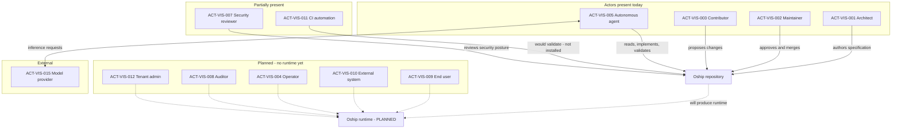

> **Diagram ID:** `DGM-VIS-011` — **Actor Map**
> **Explanation:** Who touches Oship today versus who will. Solid edges are real interactions;
> dashed edges are `PLANNED`. The striking feature is how few actors are real: four humans and one
> agent class, all interacting with a repository rather than a running system. Every requirement
> derived for a dashed-edge actor is speculative and must be labelled as such.

### 01.5.2 Actor Responsibility Matrix

### TBL-VIS-025: Actor Responsibility Matrix

Legend: **R** responsible · **A** accountable · **C** consulted · **I** informed · **—** not involved

| Activity | Architect | Maintainer | Contributor | Agent | Security | CI |
| :--- | :---: | :---: | :---: | :---: | :---: | :---: |
| Define vision | **A** | C | I | — | C | — |
| Author specification | **R** | C | C | **R** | C | — |
| Approve ADR | **A** | R | C | — | C | — |
| Write implementation | C | C | R | **R** | — | — |
| Review implementation | C | **A** | C | C | R | R |
| Merge to main | — | **A** | — | — | C | R |
| Release | — | **A** | — | — | C | R |
| Validate specification | C | C | — | **R** | — | **R** |
| Detect drift | C | C | — | R | — | **A** |
| Escalate ambiguity | C | **A** | R | **R** | C | — |
| Grant security exception | C | R | — | — | **A** | — |
| Allocate identifiers | **A** | C | — | R | — | — |

> **`VIS-032`.** The **A** column is never assigned to an agent. Accountability is a human property
> because it requires the capacity to bear consequence. An agent may be **R** — responsible for
> doing the work — but a human is always **A** for the outcome. This mirrors `AI-ARCH-041` in
> `AOM-ARCH-001` and is non-negotiable.

### 01.5.3 Actor Journeys

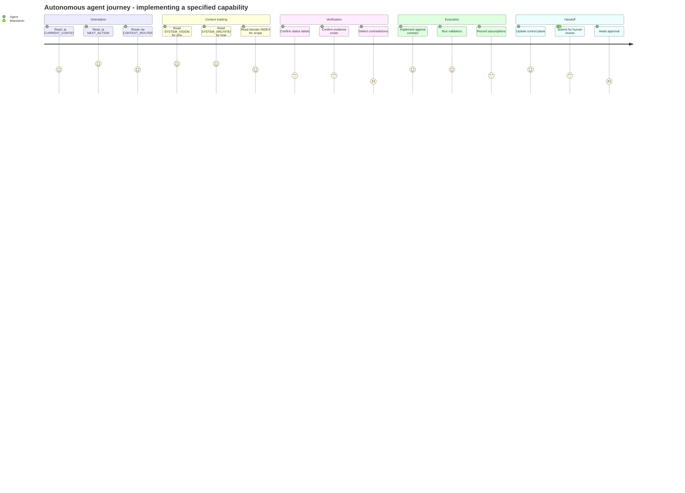

> **Diagram ID:** `DGM-VIS-012` — **AI Actor Journey**
> **Explanation:** The journey an agent takes on every task, with satisfaction scores reflecting
> where friction concentrates. The low scores in *Verification* and *Handoff* are honest: detecting
> contradictions is difficult without automated validation (`PROB-VIS-017`), and awaiting human
> approval is the throughput bottleneck (`PROB-VIS-008`). These are the two segments where
> investment yields the most.

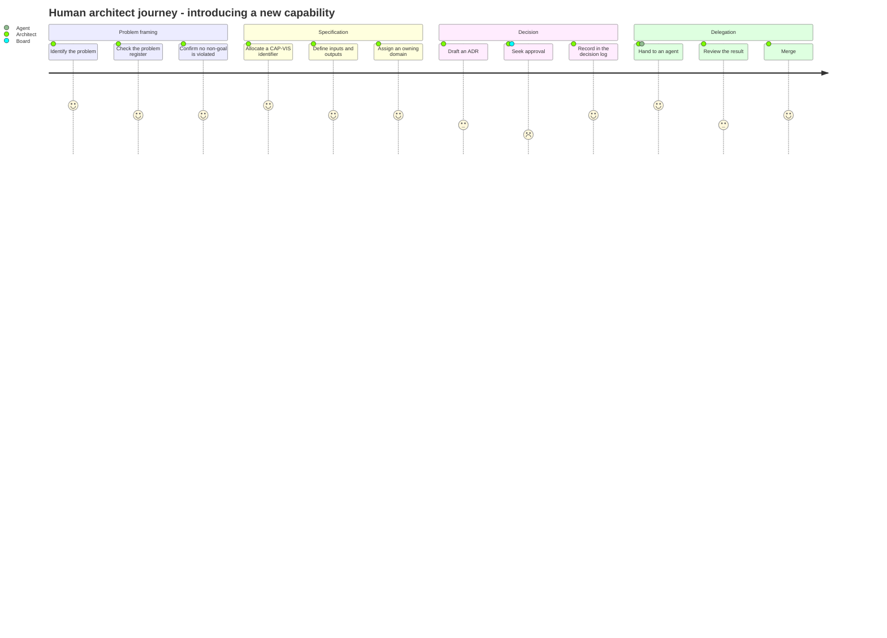

> **Diagram ID:** `DGM-VIS-013`
> **Explanation:** The human counterpart journey. The lowest score is *Seek approval*, which with a
> single-person Architecture Board (`ACT-VIS-016`, `CON-VIS-011`) is either instantaneous or
> impossible depending on whether that person is available — a structural fragility worth naming.

### 01.5.4 The AI Actor Model

Agents are not a single undifferentiated class. Oship distinguishes them by autonomy, because
autonomy determines the approval boundary.

### TBL-VIS-026: AI Actor Autonomy Classes

| Class | Description | May do without approval | Requires human approval | Status |
| :--- | :--- | :--- | :--- | :--- |
| **A0 — Reader** | Answers questions from repository content | All reads | Any write | `IMPLEMENTED` |
| **A1 — Author** | Drafts specifications and code | Create branch, write files, run validators | Merge, release | `IMPLEMENTED` |
| **A2 — Executor** | Runs multi-step tasks with tools | Everything in A1 plus tool invocation in a sandbox | Any state change outside the sandbox | `PARTIALLY IMPLEMENTED` |
| **A3 — Operator** | Acts on running systems | Nothing — every action is approved | All | `PROPOSED` — no runtime exists |
| **A4 — Autonomous** | Self-directs work selection | Not permitted in Oship | N/A | `PROHIBITED` — see `NG-VIS-013` |

> **`VIS-033`.** Class **A4** is explicitly prohibited. An agent that selects its own objectives has
> no accountable human for the outcome, which violates `VIS-032`. This prohibition is a
> **permanent** property of Oship's operating model, not a temporary caution pending better models.

---

## 01.6 — Value Model

### AI NAVIGATION METADATA — §01.6

| Field | Value |
| :--- | :--- |
| **AI READ PRIORITY** | **P1** |
| **AI DEPENDENCIES** | §01.4 Problem Space, §01.5 Users and Actors |
| **AI INPUTS** | A proposed capability with a named problem and actor |
| **AI OUTPUTS** | The value chain the capability participates in, or a rejection |
| **AI IMPLEMENTATION IMPACT** | Determines prioritisation order and what must be measured |
| **AI VALIDATION REQUIREMENTS** | `VAL-VIS-047`…`VAL-VIS-056` |
| **AI RELATED DOCUMENTS** | `docs/MASTER_CONTEXT/02_BUSINESS/INDEX.md`, §01.12 Success Model |

### 01.6.1 What "Value" Means Here

> **`VIS-034`.** Value in Oship is defined as **a measurable reduction in the cost or risk of
> producing correct enterprise software**, or **a measurable increase in the volume of correct
> software produced per unit of human attention**. Value claims that cannot be expressed in one of
> those two forms are not value claims; they are marketing.

This definition is deliberately narrow. It excludes several things commonly asserted as value:

| Excluded claim | Why it is excluded |
| :--- | :--- |
| "Improves developer experience" | Unmeasurable as stated; restate as reduced time-to-first-correct-change |
| "Modern architecture" | Describes a property, not a benefit to any actor |
| "AI-powered" | Describes a mechanism, not an outcome |
| "Best practices" | Appeals to authority; state the practice and its measured effect |
| "Scalable" | Meaningless without naming the dimension and the limit |

> **Table ID:** `TBL-VIS-027` — **Rejected Value Claim Forms**

### 01.6.2 The Value Chain

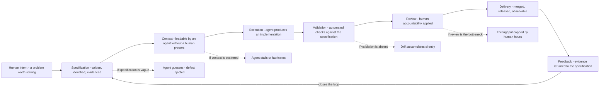

> **Diagram ID:** `DGM-VIS-014` — **The Oship Value Chain**
> **Explanation:** Value flows left to right through eight stages, and the loop closes when
> delivery evidence updates the specification. The dashed branches are the failure modes at each
> stage — each corresponds to a catalogued problem. The chain is only as strong as its weakest
> stage, and today the weakest is *Validation* (`PROB-VIS-017`: no installed CI).

### TBL-VIS-028: Value Chain Stages

| ID | Stage | Input | Output | Owner | Current maturity |
| :--- | :--- | :--- | :--- | :--- | :--- |
| `VAL-CHAIN-VIS-001` | Intent | A named problem | An accepted objective | `ACT-VIS-001` | `IMPLEMENTED` |
| `VAL-CHAIN-VIS-002` | Specification | Objective | Identified, evidenced spec text | `ACT-VIS-001`, `ACT-VIS-005` | `IMPLEMENTED` |
| `VAL-CHAIN-VIS-003` | Context assembly | Spec text | A loadable context bundle | `ACT-VIS-005` | `PARTIALLY IMPLEMENTED` |
| `VAL-CHAIN-VIS-004` | Execution | Context bundle | Candidate implementation | `ACT-VIS-005` | `PARTIALLY IMPLEMENTED` |
| `VAL-CHAIN-VIS-005` | Validation | Candidate | Pass or fail with reasons | `ACT-VIS-011` | `PLANNED` |
| `VAL-CHAIN-VIS-006` | Review | Validated candidate | Approved or rejected change | `ACT-VIS-002` | `IMPLEMENTED` |
| `VAL-CHAIN-VIS-007` | Delivery | Approved change | Merged and released artifact | `ACT-VIS-002`, `ACT-VIS-011` | `PARTIALLY IMPLEMENTED` |
| `VAL-CHAIN-VIS-008` | Feedback | Runtime and review evidence | Updated specification | `ACT-VIS-005` | `PLANNED` |
| `VAL-CHAIN-VIS-009` | Knowledge retention | All of the above | Durable, navigable knowledge | `ACT-VIS-001` | `PARTIALLY IMPLEMENTED` |
| `VAL-CHAIN-VIS-010` | Drift correction | Divergence signal | Corrected spec or code | `ACT-VIS-002` | `PLANNED` |
| `VAL-CHAIN-VIS-011` | Decision capture | A consequential choice | An immutable ADR | `ACT-VIS-001` | `IMPLEMENTED` |
| `VAL-CHAIN-VIS-012` | Onboarding | A new actor | A productive actor | `ACT-VIS-005` | `PARTIALLY IMPLEMENTED` |

> **`VIS-035`.** Exactly four of twelve stages are `IMPLEMENTED`. Five are partial and three are
> planned. The chain therefore **cannot yet deliver its claimed value end to end**, and any
> statement that it does is false. The honest current claim is: Oship has built the front half of
> its value chain — intent through execution — and has not built the back half.

### 01.6.3 Value Flow by Actor

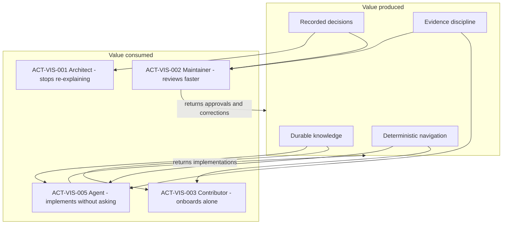

> **Diagram ID:** `DGM-VIS-015` — **Value Flow**
> **Explanation:** Value is produced by four assets and consumed by four actor classes, with two
> return flows that regenerate the assets. The agent both consumes the most value and returns the
> most — which is why agent tractability (`VIS-011`) is the primary purpose rather than a feature.

### TBL-VIS-029: Value Matrix — Asset Against Actor

Cell values: **H** high value · **M** moderate · **L** low · **—** none

| Asset | Architect | Maintainer | Contributor | Agent | Operator | End user |
| :--- | :---: | :---: | :---: | :---: | :---: | :---: |
| Durable knowledge (`CAP-VIS-002`) | H | H | H | **H** | M | — |
| Deterministic navigation (`CAP-VIS-007`) | M | M | H | **H** | L | — |
| Immutable decisions (`CAP-VIS-006`) | **H** | H | M | H | L | — |
| Evidence discipline (`VIS-004`) | H | **H** | M | **H** | M | L |
| Explicit non-goals (§01.11) | **H** | H | M | H | — | — |
| Status vocabulary (`TBL-VIS-003`) | M | H | M | **H** | M | — |
| Architecture spec (`AOM-ARCH-001`) | **H** | H | H | **H** | M | — |
| Runtime capability | — | — | — | — | **H** | **H** |

> **`VIS-036`.** The bottom row is empty for every actor except operator and end user, and those
> two actors do not yet exist (`ACT-VIS-004`, `ACT-VIS-009` are `PLANNED`). Oship currently
> delivers value **exclusively to its own producers**. This is defensible for a foundation phase
> and indefensible as a permanent state; §01.13 records the outcome that must end it.

### 01.6.4 Value Realisation Timing


> **Diagram ID:** `DGM-VIS-016`
> **Explanation:** Value reaches successively wider audiences as phases advance. The dashed branch
> is the dominant strategic risk of a knowledge-first method: producing an exquisite specification
> that never becomes a system. That risk is named `FAL-VIS-001` and its detection signal is
> recorded in §01.25.

---

## 01.7 — System Capabilities

### AI NAVIGATION METADATA — §01.7

| Field | Value |
| :--- | :--- |
| **AI READ PRIORITY** | **P0 — this is the capability contract** |
| **AI DEPENDENCIES** | §01.4, §01.5, §01.6 |
| **AI INPUTS** | A capability identifier, or a request to add one |
| **AI OUTPUTS** | The capability's full contract, or a new `CAP-VIS-` allocation |
| **AI IMPLEMENTATION IMPACT** | **Direct.** Capabilities become architectural components in `AOM-ARCH-001` |
| **AI VALIDATION REQUIREMENTS** | `VAL-VIS-057`…`VAL-VIS-078` |
| **AI RELATED DOCUMENTS** | `AOM-ARCH-001` §01.7 components, §01.8 capability hierarchy |

### 01.7.1 Capability Definition Rule

> **`VIS-037`.** A capability is **a durable ability of the system to produce a defined outcome for
> a defined actor**. It is not a feature, a component, or a technology. Capabilities are stable
> across implementations; components are not. If renaming your database would change the
> capability's definition, you have written a component, not a capability.

Every capability entry carries eleven mandatory fields. An entry missing any field is invalid and
must be rejected by `VAL-VIS-057`.

### TBL-VIS-030: Mandatory Capability Fields

| # | Field | Purpose | Missing-value rule |
| :---: | :--- | :--- | :--- |
| 1 | ID | Stable reference | Never omit; never reuse |
| 2 | Name | Human-readable handle | Never omit |
| 3 | Purpose | Why it exists, one sentence | Never omit |
| 4 | Actor | Who it serves (`ACT-VIS-`) | If none, the capability is unjustified |
| 5 | Inputs | What it consumes | Write `NONE` if genuinely none |
| 6 | Outputs | What it produces | Never `NONE`; a capability with no output is not one |
| 7 | Dependencies | Other capabilities required | Write `NONE` for root capabilities |
| 8 | Business value | Which value chain stage it serves | Never omit |
| 9 | Technical value | What it makes possible technically | Never omit |
| 10 | Status | From `TBL-VIS-003` | Never omit; never inflate |
| 11 | Architectural impact | Which `AOM-ARCH-001` element it maps to | Write `UNMAPPED` if none exists yet |

Additionally, every capability carries an **AI impact** note describing how an agent should treat
it — this is the field that makes the register executable rather than descriptive.

### 01.7.2 Capability Group 1 — Knowledge and Context (`CAP-VIS-001`…`CAP-VIS-012`)

These are the capabilities Oship actually has today. They are described in full detail because they
are the only ones an agent can rely on.

### TBL-VIS-031: `CAP-VIS-001` — AI Control Plane

| Field | Value |
| :--- | :--- |
| **ID** | `CAP-VIS-001` |
| **Name** | AI Control Plane |
| **Purpose** | Give an agent a single, authoritative place to learn the current state of work and what to do next |
| **Actor** | `ACT-VIS-005`, `ACT-VIS-006` |
| **Inputs** | Completed work events; human direction |
| **Outputs** | `PROJECT_STATUS.md`, `CURRENT_CONTEXT.md`, `NEXT_ACTION.md`, `SESSION_MEMORY.md` |
| **Dependencies** | `NONE` — root capability |
| **Business value** | `VAL-CHAIN-VIS-003` context assembly; removes the human from the orientation loop |
| **Technical value** | Makes agent behaviour reproducible across sessions and models |
| **Status** | `IMPLEMENTED` |
| **Architectural impact** | `CMP-ARCH-001` in `AOM-ARCH-001`; layer `LYR-ARCH-001` |
| **Evidence** | `EVD-VIS-004` |
| **AI impact** | **Read this first, always.** If `NEXT_ACTION.md` contradicts your instructions, the human instruction wins but the contradiction must be reported. Update all three status files before ending any unit of work. |

### TBL-VIS-032: `CAP-VIS-002` — Knowledge Graph

| Field | Value |
| :--- | :--- |
| **ID** | `CAP-VIS-002` |
| **Name** | Master Context Knowledge Graph |
| **Purpose** | Hold all durable system knowledge in 24 addressable domains with defined relationships |
| **Actor** | All |
| **Inputs** | Specifications, decisions, standards |
| **Outputs** | Navigable, cross-referenced knowledge with stable anchors |
| **Dependencies** | `CAP-VIS-007` navigation, `CAP-VIS-004` metadata standard |
| **Business value** | `VAL-CHAIN-VIS-002`, `VAL-CHAIN-VIS-009` |
| **Technical value** | Every architectural claim has one canonical location, eliminating contradictory copies |
| **Status** | `PARTIALLY IMPLEMENTED` — all 24 domains registered with `INDEX.md`; most domain documents remain `PLANNED` |
| **Architectural impact** | `CMP-ARCH-002`; layer `LYR-ARCH-002` |
| **Evidence** | `EVD-VIS-006` |
| **AI impact** | Route through `docs/MASTER_CONTEXT/INDEX.md` §1003, never by filesystem guessing. A domain's `INDEX.md` is authoritative for what that domain owns. |

### TBL-VIS-033: `CAP-VIS-003` — Memory Constitution

| Field | Value |
| :--- | :--- |
| **ID** | `CAP-VIS-003` |
| **Name** | Memory System Constitution |
| **Purpose** | Define how knowledge is retained, retrieved, invalidated, and forgotten across sessions |
| **Actor** | `ACT-VIS-005`, `ACT-VIS-006` |
| **Inputs** | Session events, knowledge writes |
| **Outputs** | Retention rules, retrieval protocol, invalidation triggers |
| **Dependencies** | `CAP-VIS-002` |
| **Business value** | `VAL-CHAIN-VIS-009` |
| **Technical value** | Prevents unbounded context growth and stale-knowledge reuse |
| **Status** | `DOCUMENTED` — the constitution exists as specification; no runtime memory system is built |
| **Architectural impact** | `CMP-ARCH-003` |
| **Evidence** | `EVD-VIS-008` — `MASTER_CONTEXT_MEMORY_SYSTEM.md`, `RELEASED` status, 34,427 lines |
| **AI impact** | This is a **specification you follow manually**, not a service you call. Do not attempt to invoke a memory API; none exists. |

### TBL-VIS-034: `CAP-VIS-004`…`CAP-VIS-012` — Knowledge Capabilities, Compact Form

| ID | Name | Actor | Outputs | Status | Arch. impact |
| :--- | :--- | :--- | :--- | :--- | :--- |
| `CAP-VIS-004` | Metadata standard | All | 15-key YAML frontmatter on every document | `IMPLEMENTED` | `CMP-ARCH-004` |
| `CAP-VIS-005` | Architecture specification | Architect, agent | `AOM-ARCH-001`, layers, domains, invariants | `PARTIALLY IMPLEMENTED` — Part 01 of a multi-part document | `CMP-ARCH-005` |
| `CAP-VIS-006` | Immutable decision record | Architect, maintainer | ADRs, `DECISION_LOG.md` | `IMPLEMENTED` | `CMP-ARCH-006` |
| `CAP-VIS-007` | Deterministic navigation | Agent, contributor | `CONTEXT_ROUTER.md`, index hierarchy, stable anchors | `IMPLEMENTED` | `CMP-ARCH-007` |
| `CAP-VIS-008` | Identifier allocation | Architect, agent | Namespaced, never-reused IDs | `IMPLEMENTED` | `CMP-ARCH-008` |
| `CAP-VIS-009` | Drift detection | Maintainer, CI | Divergence reports between spec and code | `PLANNED` | `UNMAPPED` |
| `CAP-VIS-010` | Evidence linking | All | Each claim bound to an inspectable artifact | `PARTIALLY IMPLEMENTED` — convention, not enforced | `UNMAPPED` |
| `CAP-VIS-011` | Continuation protocol | Agent | Resumable long-form authoring across context limits | `IMPLEMENTED` | `UNMAPPED` |
| `CAP-VIS-012` | Validation rule catalogue | Agent, CI | Machine-checkable `VAL-` rules per document | `PARTIALLY IMPLEMENTED` — rules written, checkers absent | `UNMAPPED` |

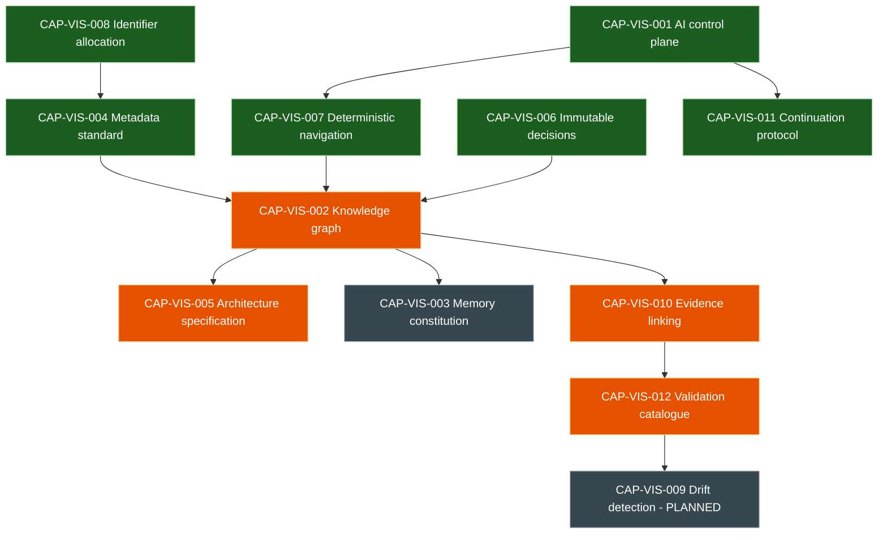

> **Diagram ID:** `DGM-VIS-017` — **Knowledge Capability Dependency Graph**
> **Explanation:** Green is `IMPLEMENTED`, orange `PARTIALLY IMPLEMENTED`, grey `DOCUMENTED` or
> `PLANNED`. Identifier allocation is the deepest root — everything else references identifiers, so
> instability there propagates everywhere. Drift detection sits at the far end of the longest
> dependency chain, which explains why it is still unbuilt: it requires four upstream capabilities
> to be complete first.

### 01.7.3 Capability Group 2 — Governance (`CAP-VIS-013`…`CAP-VIS-024`)

### TBL-VIS-035: Governance Capabilities

| ID | Name | Purpose | Actor | Status | Evidence |
| :--- | :--- | :--- | :--- | :--- | :--- |
| `CAP-VIS-013` | Ownership assignment | Every path has an accountable owner | Maintainer | `IMPLEMENTED` | `EVD-VIS-018` CODEOWNERS |
| `CAP-VIS-014` | Change proposal workflow | Structured PR and issue intake | Contributor | `IMPLEMENTED` | `.github/` templates |
| `CAP-VIS-015` | Domain registration | Controlled addition of knowledge domains | Architect | `IMPLEMENTED` | `MASTER_CONTEXT_RULES.md` PART 04 |
| `CAP-VIS-016` | Authority layering | L1–L5 knowledge layers with precedence | All | `IMPLEMENTED` | `PROJECT_PHILOSOPHY.md` §130 |
| `CAP-VIS-017` | Status vocabulary enforcement | Prevents aspirational claims | All | `PARTIALLY IMPLEMENTED` | Convention only |
| `CAP-VIS-018` | Exception handling | Recorded, time-bounded deviations | Architect | `PLANNED` | No exception register exists |
| `CAP-VIS-019` | Review gating | Nothing merges without human accountability | Maintainer | `PARTIALLY IMPLEMENTED` | Branch protection state `UNKNOWN` |
| `CAP-VIS-020` | Automated policy checks | CI enforcement of governance rules | CI | `PLANNED` | `EVD-VIS-017` skeletons not installed |
| `CAP-VIS-021` | Release governance | Controlled version and tag issuance | Maintainer | `PARTIALLY IMPLEMENTED` | Repo at `v0.1.0-alpha.0` |
| `CAP-VIS-022` | Security review process | Structured security assessment | Security reviewer | `DOCUMENTED` | `docs/security/` |
| `CAP-VIS-023` | Deprecation process | Orderly retirement of knowledge and code | Architect | `DOCUMENTED` | Status vocabulary includes `DEPRECATED` |
| `CAP-VIS-024` | Audit trail of governance acts | Who decided what, when, and why | Auditor | `PARTIALLY IMPLEMENTED` | Git history plus `DECISION_LOG.md` |

> **`VIS-038`.** Six of twelve governance capabilities depend on automation that does not exist.
> Oship's governance is currently **advisory**. An agent must not assume that a rule stated in this
> repository will be caught if violated — the agent itself is frequently the only enforcement
> mechanism present. Behave accordingly.

### 01.7.4 Capability Group 3 — Runtime and Domain (`CAP-VIS-025`…`CAP-VIS-070`)

> **`VIS-039`.** Every capability in this group is `PLANNED` or `PROPOSED`. **None is callable.**
> They are recorded so that architecture can be derived from them, not so that code can invoke
> them. An agent that generates a call into any of these capabilities has committed `FAL-VIS-004`.

### TBL-VIS-036: Platform Runtime Capabilities

| ID | Name | Purpose | Actor | Dependencies | Status |
| :--- | :--- | :--- | :--- | :--- | :--- |
| `CAP-VIS-025` | Service runtime | Host executable services | Operator | Stack selection `UNKNOWN` | `PLANNED` |
| `CAP-VIS-026` | API surface | Expose contracts to external systems | External system | `CAP-VIS-025` | `PLANNED` |
| `CAP-VIS-027` | Persistence | Durable, transactional state | End user | `CAP-VIS-025` | `PLANNED` |
| `CAP-VIS-028` | Identity and access | Authenticate and authorise every call | All | `CAP-VIS-026` | `PLANNED` |
| `CAP-VIS-029` | Multi-tenancy | Isolate tenant data structurally | Tenant admin | `CAP-VIS-027`, `CAP-VIS-028` | `PLANNED` |
| `CAP-VIS-030` | Observability | Metrics, logs, traces, and alerting | Operator | `CAP-VIS-025` | `PLANNED` |
| `CAP-VIS-031` | Configuration management | Environment-specific settings without rebuilds | Operator | `CAP-VIS-025` | `PLANNED` |
| `CAP-VIS-032` | Secret management | Credentials never in source | Operator, security | `CAP-VIS-031` | `PLANNED` |
| `CAP-VIS-033` | Deployment automation | Reproducible promotion across environments | CI | `CAP-VIS-025` | `PLANNED` |
| `CAP-VIS-034` | Event backbone | Asynchronous, ordered, replayable messaging | External system | `CAP-VIS-025` | `PLANNED` |
| `CAP-VIS-035` | Scheduling | Time- and event-triggered work | Operator | `CAP-VIS-034` | `PLANNED` |
| `CAP-VIS-036` | Rate limiting and quota | Protect the system from load | Operator | `CAP-VIS-026` | `PLANNED` |
| `CAP-VIS-037` | Plugin extension | Third-party capability injection | Plugin author | `CAP-VIS-025` | `PROPOSED` |
| `CAP-VIS-038` | Data export | Tenant-initiated retrieval of own data | Tenant admin | `CAP-VIS-027` | `PROPOSED` |
| `CAP-VIS-039` | Backup and restore | Recoverability from data loss | Operator | `CAP-VIS-027` | `PLANNED` |
| `CAP-VIS-040` | Disaster recovery | Defined RPO and RTO under region loss | Operator | `CAP-VIS-039` | `PROPOSED` |

### TBL-VIS-037: Money Factory Domain Capabilities

| ID | Name | Purpose | Actor | Status | Note |
| :--- | :--- | :--- | :--- | :--- | :--- |
| `CAP-VIS-041` | Transaction ingestion | Accept financial workload items | External system | `PLANNED` | Domain per `EVD-VIS-021` |
| `CAP-VIS-042` | Transaction processing | Apply domain rules to each item | End user | `PLANNED` | The "factory" in Money Factory |
| `CAP-VIS-043` | Ledger | Immutable double-entry record | Auditor | `PLANNED` | Required by `PROB-VIS-020` |
| `CAP-VIS-044` | Settlement | Finalise value movement exactly once | End user | `PLANNED` | Required by `PROB-VIS-021` |
| `CAP-VIS-045` | Reconciliation | Detect and resolve divergence between records | Auditor | `PLANNED` | — |
| `CAP-VIS-046` | Reporting | Aggregate views over ledger state | Data analyst | `PROPOSED` | — |
| `CAP-VIS-047` | Compliance controls | Enforce jurisdictional obligations | Auditor | `UNKNOWN — REQUIRES REPOSITORY VERIFICATION` | No regime named; see `PROB-VIS-023` |
| `CAP-VIS-048` | Fraud signalling | Flag anomalous activity | Security reviewer | `PROPOSED` | — |

### TBL-VIS-038: AI Runtime Capabilities

| ID | Name | Purpose | Actor | Status | Note |
| :--- | :--- | :--- | :--- | :--- | :--- |
| `CAP-VIS-049` | Model invocation | Call an inference provider | Agent | `PLANNED` | No provider selected (`EVD-VIS-019`) |
| `CAP-VIS-050` | Prompt and context assembly | Build a task context from the knowledge graph | Agent | `PARTIALLY IMPLEMENTED` | Done manually today |
| `CAP-VIS-051` | Agent task orchestration | Sequence multi-step agent work | Orchestrator | `PLANNED` | — |
| `CAP-VIS-052` | Output validation | Check agent output against specification | CI | `PLANNED` | Blocked on `CAP-VIS-012` |
| `CAP-VIS-053` | Provider abstraction | Avoid single-vendor dependence | Architect | `PLANNED` | Mitigates `PROB-VIS-009` |
| `CAP-VIS-054` | Agent audit trail | Record what an agent did and why | Auditor | `PARTIALLY IMPLEMENTED` | Git history plus session memory |
| `CAP-VIS-055` | Cost and token governance | Bound inference spend | Maintainer | `PROPOSED` | — |
| `CAP-VIS-056` | Human approval gateway | Enforce the A0–A3 autonomy boundary | Maintainer | `PARTIALLY IMPLEMENTED` | Enforced socially, not technically |

### TBL-VIS-039: Bounded-Context Capabilities

| ID | Name | Bounded context | Status | Evidence |
| :--- | :--- | :--- | :--- | :--- |
| `CAP-VIS-060` | Governance and AI context | `.ai/`, `.github/` | `IMPLEMENTED` as documentation | `EVD-VIS-020` |
| `CAP-VIS-061` | Core Platform context | Shared runtime services | `PLANNED` | `EVD-VIS-020` |
| `CAP-VIS-062` | Financial Factory context | Domain processing engine | `PLANNED` | `EVD-VIS-020` |
| `CAP-VIS-063` | Observability context | Telemetry and operations | `PLANNED` | `EVD-VIS-020` |
| `CAP-VIS-064` | Ecosystem context | Plugins, SDKs, external integrations | `PROPOSED` | `UNMAPPED` |
| `CAP-VIS-065` | Developer experience context | Tooling, templates, scaffolds | `PROPOSED` | `templates/` is empty |
| `CAP-VIS-066` | Knowledge context | The Master Context itself as a product | `PARTIALLY IMPLEMENTED` | `EVD-VIS-006` |
| `CAP-VIS-067` | Security context | Threat model, controls, response | `DOCUMENTED` | `docs/security/` |
| `CAP-VIS-068` | Data context | Schemas, lineage, retention | `PLANNED` | `database/` empty |
| `CAP-VIS-069` | Integration context | Inbound and outbound system contracts | `PLANNED` | `apis/` empty |
| `CAP-VIS-070` | Experimentation context | Research and prototypes, quarantined | `PROPOSED` | `research/`, `experiments/` empty |

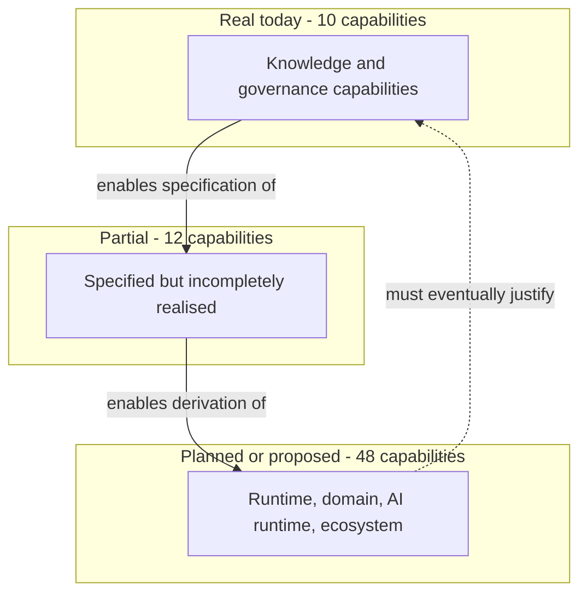

> **Diagram ID:** `DGM-VIS-018` — **Capability Reality Distribution**
> **Explanation:** The proportions matter more than the boxes. Roughly one capability in seven is
> real. The dashed return edge states the obligation that makes the whole structure honest: the
> planned capabilities must eventually justify the investment in the real ones. If they never
> arrive, the knowledge layer was overhead, not value.

---

## 01.8 — Capability Hierarchy

### AI NAVIGATION METADATA — §01.8

| Field | Value |
| :--- | :--- |
| **AI READ PRIORITY** | **P1** |
| **AI DEPENDENCIES** | §01.7 System Capabilities |
| **AI INPUTS** | A capability identifier |
| **AI OUTPUTS** | Its tier, parents, children, and blocking dependencies |
| **AI IMPLEMENTATION IMPACT** | Determines build order; a capability may not be built before its parents |
| **AI VALIDATION REQUIREMENTS** | `VAL-VIS-079`…`VAL-VIS-088` |
| **AI RELATED DOCUMENTS** | `AOM-ARCH-001` §01.5 layers |

### 01.8.1 The Five Capability Tiers

> **`VIS-040`.** Capabilities are organised into five tiers by **what they depend on**, not by
> importance. A tier-N capability may depend only on tiers 1 through N. A dependency that points
> upward is a structural defect and must be reported as `FAL-VIS-011`.

### TBL-VIS-040: Capability Tiers

| Tier | Name | Definition | Depends on | Example |
| :---: | :--- | :--- | :--- | :--- |
| **T1** | Foundational | Exists without any other capability | Nothing | `CAP-VIS-008` identifiers |
| **T2** | Structural | Organises foundational elements into a system of knowledge | T1 | `CAP-VIS-002` knowledge graph |
| **T3** | Operational | Applies structure to produce work | T1–T2 | `CAP-VIS-009` drift detection |
| **T4** | Platform | Executes software at runtime | T1–T3 | `CAP-VIS-025` service runtime |
| **T5** | Domain | Delivers end-user outcomes | T1–T4 | `CAP-VIS-044` settlement |

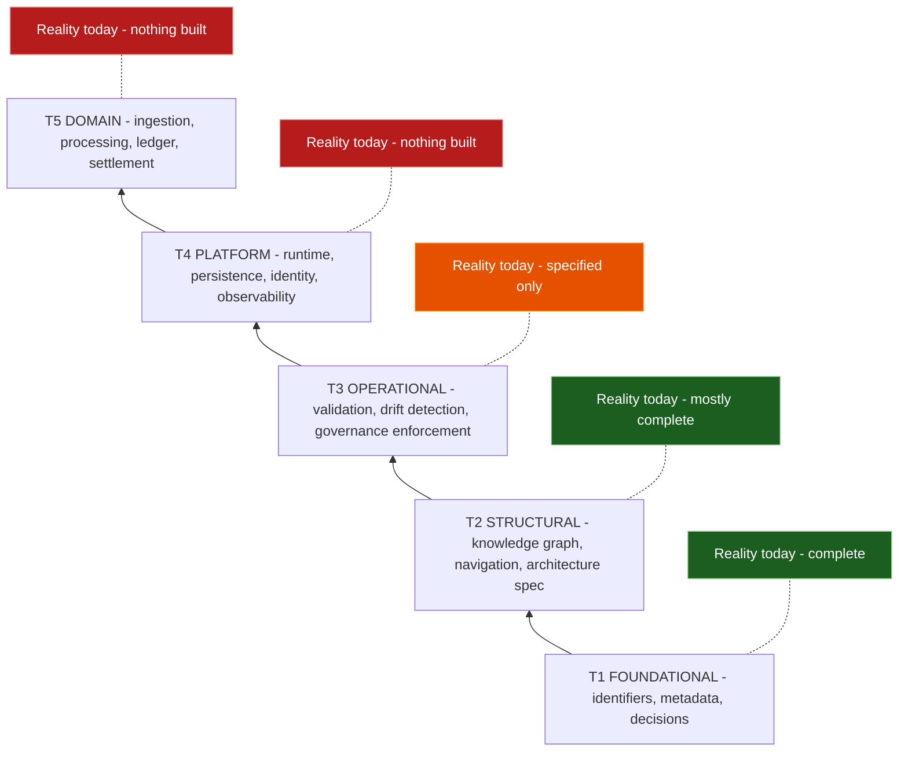

> **Diagram ID:** `DGM-VIS-019` — **Capability Tier Stack with Reality Annotation**
> **Explanation:** The stack is read bottom-up as a build order. The annotations on the right make
> the current position unambiguous: Oship is complete at T1, nearly complete at T2, specified at
> T3, and empty at T4 and T5. Any plan that proposes T5 work before T4 exists is invalid.

### 01.8.2 Hierarchy Assignments

### TBL-VIS-041: Tier Assignment of All Registered Capabilities

| Tier | Capabilities | Count | Aggregate status |
| :---: | :--- | :---: | :--- |
| T1 | `CAP-VIS-004`, `006`, `008`, `011`, `013`, `016` | 6 | All `IMPLEMENTED` |
| T2 | `CAP-VIS-001`, `002`, `003`, `005`, `007`, `010`, `014`, `015`, `066` | 9 | 5 implemented, 4 partial |
| T3 | `CAP-VIS-009`, `012`, `017`…`024`, `050`, `052`, `054`, `056`, `067` | 15 | 0 implemented, 6 partial, 9 planned |
| T4 | `CAP-VIS-025`…`040`, `049`, `051`, `053`, `055`, `060`…`065`, `068`…`070` | 28 | 1 implemented (`060`, as docs), rest planned or proposed |
| T5 | `CAP-VIS-041`…`048` | 8 | All planned, proposed, or unknown |

> **`VIS-041`.** The distribution is the clearest single statement of where Oship is: **complete at
> the bottom, empty at the top**. This is the intended shape for a knowledge-first method at
> Phase 0. It becomes pathological only if T4 remains empty indefinitely — see `FAL-VIS-001`.

### 01.8.3 Parent–Child Decomposition

```mermaid
flowchart TB
    ROOT["Oship system capability"]
    ROOT --> K["Knowledge capability"]
    ROOT --> G["Governance capability"]
    ROOT --> P["Platform capability"]
    ROOT --> D["Domain capability"]
    ROOT --> A["AI capability"]

    K --> K1["CAP-VIS-002 Knowledge graph"]
    K --> K2["CAP-VIS-007 Navigation"]
    K --> K3["CAP-VIS-003 Memory"]
    K1 --> K1a["24 domain indexes"]
    K1 --> K1b["Cross-reference relationships"]
    K2 --> K2a["Context router"]
    K2 --> K2b["Stable anchors"]

    G --> G1["CAP-VIS-006 Decisions"]
    G --> G2["CAP-VIS-013 Ownership"]
    G --> G3["CAP-VIS-019 Review gating"]

    P --> P1["CAP-VIS-025 Runtime"]
    P --> P2["CAP-VIS-027 Persistence"]
    P --> P3["CAP-VIS-030 Observability"]

    D --> D1["CAP-VIS-042 Processing"]
    D --> D2["CAP-VIS-043 Ledger"]
    D --> D3["CAP-VIS-044 Settlement"]

    A --> A1["CAP-VIS-050 Context assembly"]
    A --> A2["CAP-VIS-052 Output validation"]
    A --> A3["CAP-VIS-056 Approval gateway"]
```

> **Diagram ID:** `DGM-VIS-020` — **Capability Decomposition Tree**
> **Explanation:** Five branches from a single root, each decomposed two levels. The tree is
> deliberately shallow — deeper decomposition belongs in `AOM-ARCH-001`, where capabilities become
> components. A vision document that decomposes to implementation detail has overstepped its
> authority layer.

### TBL-VIS-042: Capability Blocking Chains

| Blocked capability | Blocked by | Nature of block | Unblocking action |
| :--- | :--- | :--- | :--- |
| `CAP-VIS-009` drift detection | `CAP-VIS-012`, `CAP-VIS-020` | No automated checker exists | Install CI skeletons (`OUT-VIS-004`) |
| `CAP-VIS-020` policy checks | `ACT-VIS-011` CI automation | Workflows not in `.github/workflows/` | Install and enable |
| `CAP-VIS-026` API surface | `CAP-VIS-025` runtime | Nothing to expose | Select a stack (`OUT-VIS-006`) |
| `CAP-VIS-029` multi-tenancy | `CAP-VIS-027`, `CAP-VIS-028` | No persistence or identity | Sequential |
| `CAP-VIS-042` processing | `CAP-VIS-061` core platform | No platform context exists | Sequential |
| `CAP-VIS-047` compliance | `PROB-VIS-023` | No regime identified | Investigate and record |
| `CAP-VIS-049` model invocation | `EVD-VIS-019` | No provider selected | Decide and record an ADR |
| `CAP-VIS-051` orchestration | `CAP-VIS-049`, `CAP-VIS-056` | No invocation or approval gate | Sequential |
| `CAP-VIS-056` approval gateway | `CAP-VIS-025` | Enforced socially today | Build once a runtime exists |
| `CAP-VIS-037` plugins | `CAP-VIS-025`, `CAP-VIS-069` | No runtime or integration contracts | Deferred to Phase 4 |

> **`VIS-042`.** Every blocking chain in `TBL-VIS-042` terminates in one of three roots: **install
> CI**, **select a stack**, or **investigate compliance**. Those three actions unblock the entire
> forward capability set, which makes them the highest-leverage decisions available to Oship. They
> are recorded as `OUT-VIS-004`, `OUT-VIS-006`, and `OUT-VIS-011`.

---

## 01.9 — System Boundaries

### AI NAVIGATION METADATA — §01.9

| Field | Value |
| :--- | :--- |
| **AI READ PRIORITY** | **P0 — boundary violations are security defects** |
| **AI DEPENDENCIES** | §01.5, §01.7 |
| **AI INPUTS** | A proposed interaction between two elements |
| **AI OUTPUTS** | Whether the interaction crosses a boundary and what that requires |
| **AI IMPLEMENTATION IMPACT** | Determines trust, validation, and authorization requirements |
| **AI VALIDATION REQUIREMENTS** | `VAL-VIS-089`…`VAL-VIS-100` |
| **AI RELATED DOCUMENTS** | `AOM-ARCH-001` §01.9 trust boundaries `TB-1`…`TB-10` |

### 01.9.1 Boundary Taxonomy

> **`VIS-043`.** Oship recognises four boundary kinds. Confusing them is the source of most
> security and architectural error, because each kind implies a different obligation.

### TBL-VIS-043: Boundary Kinds

| Kind | Definition | Obligation when crossed | Example |
| :--- | :--- | :--- | :--- |
| **Scope boundary** | What Oship does versus does not do | Reject as out of scope, or amend §01.11 | Oship is not an IDE |
| **Trust boundary** | Where data changes trust level | Validate, authorise, log | External request enters a service |
| **Knowledge boundary** | What is known versus unknown | Label `UNKNOWN`; never fabricate | Technology stack |
| **Autonomy boundary** | What an agent may do unapproved | Halt and request human approval | Merging to main |

### TBL-VIS-044: System Boundary Register

| ID | Boundary | Kind | Inside | Outside | Crossing rule | Status |
| :--- | :--- | :--- | :--- | :--- | :--- | :--- |
| `BND-VIS-001` | Repository boundary | Scope | Everything in `afshin-omnisystem/Oship` | Any other repository | Cross-repo references must be versioned and explicit | `IMPLEMENTED` |
| `BND-VIS-002` | Knowledge authority boundary | Scope | `docs/MASTER_CONTEXT/` | All other documentation | Master Context wins on conflict | `IMPLEMENTED` |
| `BND-VIS-003` | Control-plane boundary | Autonomy | `.ai/` | Application content | Agents write `.ai/`; humans approve everything else | `IMPLEMENTED` |
| `BND-VIS-004` | Specification–implementation boundary | Scope | Documents | Code | Code must trace to a specification | `DOCUMENTED` |
| `BND-VIS-005` | Human approval boundary | Autonomy | Agent-proposed changes | Merged main | No merge without human accountability | `PARTIALLY IMPLEMENTED` |
| `BND-VIS-006` | Model provider boundary | Trust | Oship knowledge | External inference provider | Treat provider output as untrusted input | `PLANNED` |
| `BND-VIS-007` | Tenant boundary | Trust | One tenant's data | Every other tenant | Isolation enforced server-side, never by caller scope | `PLANNED` |
| `BND-VIS-008` | Public API boundary | Trust | Internal services | External callers | Authenticate, authorise, validate, rate-limit | `PLANNED` |
| `BND-VIS-009` | Environment boundary | Trust | Production | Non-production | No production data outside production | `PLANNED` |
| `BND-VIS-010` | Secret boundary | Trust | Secret store | Source, logs, and prompts | Secrets never enter source, logs, or model context | `PLANNED` |
| `BND-VIS-011` | Domain context boundary | Scope | One bounded context | Another | Cross-context via explicit contracts only | `DOCUMENTED` |
| `BND-VIS-012` | Evidence boundary | Knowledge | Verified claims | Unverified assertions | Unverified claims labelled `UNKNOWN` | `IMPLEMENTED` |
| `BND-VIS-013` | Time boundary | Knowledge | Present state | Future intent | Never write future intent in present tense | `IMPLEMENTED` |
| `BND-VIS-014` | Experimentation boundary | Scope | `research/`, `experiments/` | Production paths | Experimental code never imported by production | `PROPOSED` |
| `BND-VIS-015` | Plugin boundary | Trust | Oship core | Third-party plugins | Plugins run with least privilege | `PROPOSED` |
| `BND-VIS-016` | Regulatory boundary | Knowledge | Known obligations | Unknown obligations | `UNKNOWN — REQUIRES REPOSITORY VERIFICATION` | `UNKNOWN` |

### 01.9.2 System Context

```mermaid
flowchart TB
    subgraph OSHIP["OSHIP SYSTEM - what exists today"]
        MC["Master Context knowledge graph"]
        AI[".ai control plane"]
        GH[".github governance"]
        ARCH["Architecture specification"]
    end

    subgraph HUMANS["Human actors"]
        H1["Architect"]
        H2["Maintainer"]
        H3["Contributor"]
    end

    subgraph MACHINES["Machine actors"]
        M1["Autonomous coding agent"]
        M2["CI automation - skeletons only"]
    end

    subgraph EXT["External systems"]
        E1["GitHub platform"]
        E2["Model provider - unselected"]
    end

    subgraph PLANNED["Planned runtime - does not exist"]
        R1["Services"]
        R2["Data stores"]
        R3["APIs"]
    end

    H1 -->|"authors"| MC
    H2 -->|"approves"| GH
    H3 -->|"proposes"| GH
    M1 -->|"reads and writes"| AI
    M1 -->|"reads"| MC
    M1 -->|"reads"| ARCH
    M1 <-.->|"BND-VIS-006 untrusted"| E2
    GH <-->|"hosted on"| E1
    M2 -.->|"would enforce"| GH
    MC -.->|"BND-VIS-004 will specify"| R1
    ARCH -.-> R2
    ARCH -.-> R3
```

> **Diagram ID:** `DGM-VIS-021` — **System Context Diagram**
> **Explanation:** The full external context. Note that Oship's only live external dependency today
> is the GitHub platform; the model provider edge is dashed because no provider has been selected
> (`EVD-VIS-019`), and the entire planned runtime subgraph is dashed. This is a system whose
> current surface area is a repository.

### 01.9.3 Trust Boundary Model

```mermaid
flowchart LR
    subgraph Z0["Zone 0 - Untrusted"]
        U1["External callers"]
        U2["Model provider output"]
        U3["Third-party plugins"]
    end
    subgraph Z1["Zone 1 - Semi-trusted"]
        S1["Authenticated tenants"]
        S2["CI automation"]
    end
    subgraph Z2["Zone 2 - Trusted"]
        T1["Internal services"]
        T2["Maintainers"]
    end
    subgraph Z3["Zone 3 - Highly trusted"]
        C1["Secret store"]
        C2["Ledger of record"]
    end

    U1 -->|"BND-VIS-008 authenticate, authorise, validate"| S1
    U2 -->|"BND-VIS-006 validate before use"| T1
    U3 -->|"BND-VIS-015 least privilege"| T1
    S1 -->|"BND-VIS-007 tenant isolation"| T1
    S2 -->|"scoped credentials"| T1
    T1 -->|"BND-VIS-010 broker access only"| C1
    T1 -->|"append only"| C2
    T2 -->|"BND-VIS-005 approval required"| T1
```

> **Diagram ID:** `DGM-VIS-022` — **Trust Zone Model**
> **Explanation:** Four trust zones with the crossing obligation labelled on every edge. The zone
> assignment of model-provider output is the entry most often violated in AI-native systems: an
> LLM response is Zone 0 data, exactly like a request from an anonymous internet caller, and must
> be validated before it influences state. This maps to `TB-4` in `AOM-ARCH-001`.

### 01.9.4 The AI Boundary

> **`VIS-044`.** The AI boundary is the line between **what an agent decides** and **what a human
> decides**. Oship places it at *consequence*: an agent may decide anything reversible without cost;
> a human must decide anything irreversible or costly.

### TBL-VIS-045: AI Boundary Decision Rules

| Action | Reversible? | Cost if wrong | Decider | Rationale |
| :--- | :---: | :--- | :--- | :--- |
| Read any repository file | Yes | None | Agent | No consequence |
| Create a branch | Yes | None | Agent | Discardable |
| Write specification text on a branch | Yes | Review time | Agent | Caught in review |
| Allocate a new identifier | **No** — IDs are never reused | Low | Agent, recorded | Allocation is append-only and safe |
| Change an existing identifier | **No** | High — breaks references | **Human** | Reference rot is unrecoverable |
| Merge to main | Partially | Moderate | **Human** | `BND-VIS-005` |
| Publish a release or tag | **No** | High | **Human** | Consumers depend on it |
| Approve an ADR | **No** | Very high | **Human** | ADRs are immutable once approved |
| Modify an approved ADR | Prohibited | Catastrophic to trust | **Nobody** | Supersede instead |
| Delete history | **No** | Catastrophic | **Nobody** | Prohibited outright |
| Select the technology stack | **No** | Very high | **Human** | Constrains everything downstream |
| Call an external paid service | Depends | Financial | **Human** | Spend requires accountability |

```mermaid
flowchart TD
    START["Agent proposes an action"] --> Q1{"Is it reversible with no residue?"}
    Q1 -->|"Yes"| Q2{"Does it change shared state?"}
    Q1 -->|"No"| Q3{"Does it break existing references or contracts?"}
    Q2 -->|"No"| ALLOW["Agent proceeds - record in session memory"]
    Q2 -->|"Yes"| REVIEW["Agent proceeds on a branch - human reviews"]
    Q3 -->|"Yes"| HUMAN["Human decision required - agent must halt"]
    Q3 -->|"No"| Q4{"Does it incur cost or external effect?"}
    Q4 -->|"Yes"| HUMAN
    Q4 -->|"No"| REVIEW
    HUMAN --> RECORD["Record the decision in an ADR or the decision log"]
```

> **Diagram ID:** `DGM-VIS-023` — **AI Boundary Decision Tree**
> **Explanation:** A four-question test any agent can execute mechanically. It resolves in at most
> four comparisons and never requires the agent to estimate importance — only reversibility,
> shared-state effect, reference breakage, and external cost, all of which are objectively
> checkable. This is `DEC-VIS-002`.

---

## 01.10 — Strategic Principles

### AI NAVIGATION METADATA — §01.10

| Field | Value |
| :--- | :--- |
| **AI READ PRIORITY** | **P0 — principles resolve conflicts between all lower documents** |
| **AI DEPENDENCIES** | §01.2, §01.3 |
| **AI INPUTS** | A design conflict or ambiguous choice |
| **AI OUTPUTS** | The governing principle and the resulting decision |
| **AI IMPLEMENTATION IMPACT** | Every architectural choice must be defensible against these principles |
| **AI VALIDATION REQUIREMENTS** | `VAL-VIS-101`…`VAL-VIS-112` |
| **AI RELATED DOCUMENTS** | `README.md` Ten Immutable Tenets, `AOM-ARCH-001` §01.4 |

### 01.10.1 Principle Format and Precedence

> **`VIS-045`.** Principles are **ordered**. When two principles conflict, the lower-numbered
> principle wins. This ordering is the single most important property of this section: an unordered
> principle list resolves no conflicts and is therefore decorative.

### TBL-VIS-046: Strategic Principle Register — Ordered by Precedence

| Rank | ID | Principle | Statement | Consequence when applied | Source |
| :---: | :--- | :--- | :--- | :--- | :--- |
| 1 | `PRN-VIS-001` | **Truth over comfort** | A document states what is, not what is hoped | Unflattering gaps are written down explicitly | `VIS-004` |
| 2 | `PRN-VIS-002` | **Determinism over cleverness** | Given the same input, produce the same output | Reject non-reproducible generation | Tenet: Deterministic |
| 3 | `PRN-VIS-003` | **Explicit over implicit** | Unstated rules do not exist | Every constraint is written or is not enforced | `PROB-VIS-014` |
| 4 | `PRN-VIS-004` | **Traceable over expedient** | Every artifact links to its justification | Untraceable work is rejected regardless of quality | `PROB-VIS-010` |
| 5 | `PRN-VIS-005` | **Agent-tractable over human-elegant** | Optimise for the reader who cannot ask questions | Verbosity is preferred to allusion | `VIS-011` |
| 6 | `PRN-VIS-006` | **Immutable decisions** | Approved decisions are superseded, never edited | History remains auditable | `EVD-VIS-005` |
| 7 | `PRN-VIS-007` | **Stable identity** | Identifiers are permanent and never reused | References survive refactoring | `CAP-VIS-008` |
| 8 | `PRN-VIS-008` | **Human accountability** | A human is answerable for every consequential outcome | No unattended irreversible action | `VIS-032` |
| 9 | `PRN-VIS-009` | **Boundaries before features** | Define what something is not before extending it | Non-goals precede roadmaps | §01.11 |
| 10 | `PRN-VIS-010` | **Evidence before assertion** | A claim without an inspectable artifact is a hypothesis | `UNKNOWN` is an acceptable answer | `PROB-VIS-015` |
| 11 | `PRN-VIS-011` | **Visual before verbal** | Structure is shown before it is described | No concept exceeds roughly 120 lines unillustrated | Document standard |
| 12 | `PRN-VIS-012` | **Composition over inheritance of complexity** | Prefer small composable units to large configurable ones | Reject frameworks that demand total adoption | Tenet: Modular |
| 13 | `PRN-VIS-013` | **Reversibility preferred** | Choose the option that is cheaper to undo | Two-way doors are taken quickly; one-way doors slowly | `DGM-VIS-023` |
| 14 | `PRN-VIS-014` | **Cost of change is the metric** | Optimise for the second change, not the first | Accept slower initial delivery for lower drift | `VIS-034` |
| 15 | `PRN-VIS-015` | **Vendor independence** | No single provider may be structurally required | Abstract inference providers | `PROB-VIS-009` |
| 16 | `PRN-VIS-016` | **Least privilege by default** | Grant the minimum access that permits the work | Deny-by-default posture | `BND-VIS-015` |
| 17 | `PRN-VIS-017` | **Observability is not optional** | An unobservable system is an unmanageable one | Telemetry is designed in, not bolted on | `CAP-VIS-030` |
| 18 | `PRN-VIS-018` | **Small surfaces** | Fewer public contracts means fewer irreversible commitments | Internal by default | `PRN-VIS-013` |
| 19 | `PRN-VIS-019` | **Delete rather than accumulate** | Dead knowledge is a liability | Deprecate and remove explicitly | `CAP-VIS-023` |
| 20 | `PRN-VIS-020` | **Finish before starting** | Complete a part before opening the next | Append-only parts; no half-finished parallel work | Continuation protocol |

```mermaid
flowchart TD
    CONFLICT["Two valid options conflict"] --> P1{"Does one option state something untrue or unevidenced?"}
    P1 -->|"Yes"| REJ1["Reject it - PRN-VIS-001 and PRN-VIS-010"]
    P1 -->|"No"| P2{"Is one option non-deterministic?"}
    P2 -->|"Yes"| REJ2["Prefer the deterministic option - PRN-VIS-002"]
    P2 -->|"No"| P3{"Does one rely on an unstated rule?"}
    P3 -->|"Yes"| REJ3["Prefer the explicit option - PRN-VIS-003"]
    P3 -->|"No"| P4{"Can one option be traced to a problem and actor?"}
    P4 -->|"Only one"| REJ4["Prefer the traceable option - PRN-VIS-004"]
    P4 -->|"Both"| P5{"Which is easier for an agent to execute without asking?"}
    P5 --> REJ5["Prefer that one - PRN-VIS-005"]
    P5 -->|"Equal"| P6{"Which is cheaper to reverse?"}
    P6 --> REJ6["Prefer that one - PRN-VIS-013"]
    P6 -->|"Equal"| ESC["Escalate to a human - PRN-VIS-008"]
```

> **Diagram ID:** `DGM-VIS-024` — **Principle Conflict Resolution Tree**
> **Explanation:** This is the executable form of `PRN-VIS-001`…`PRN-VIS-005` plus `PRN-VIS-013`.
> An agent walks it top to bottom and either reaches a decision or escalates. Crucially, escalation
> is a legitimate terminal state — an agent that cannot resolve a conflict must stop, not invent a
> tiebreaker. This is `DEC-VIS-003`.

### 01.10.2 Principles Under Tension

> **`VIS-046`.** Principles are not mutually harmonious, and pretending otherwise is dishonest.
> The following tensions are real, permanent, and resolved by precedence rather than eliminated.

### TBL-VIS-047: Known Principle Tensions

| Tension | Principle A | Principle B | How it manifests | Resolution |
| :--- | :--- | :--- | :--- | :--- |
| Verbosity vs. usability | `PRN-VIS-005` agent-tractable | Human reading time | 10,000-line documents humans will not read | A wins; humans use navigation, agents read fully |
| Rigour vs. speed | `PRN-VIS-004` traceable | Delivery pressure | Traceability slows the first delivery | A wins; `PRN-VIS-014` justifies it |
| Immutability vs. correction | `PRN-VIS-006` immutable | Fixing a mistake | A wrong ADR cannot be edited | A wins; supersede with a new ADR |
| Explicitness vs. duplication | `PRN-VIS-003` explicit | Single source of truth | Restating a rule locally risks divergence | Reference the canonical location; never copy |
| Vendor independence vs. capability | `PRN-VIS-015` | Best-in-class provider features | Abstraction forfeits provider-specific power | A wins at the architecture layer; deviations need an ADR |
| Completeness vs. shipping | `PRN-VIS-020` finish first | Parallel progress | Serialisation slows apparent throughput | A wins within a document; parallelism across documents |

---

## 01.11 — Non-Goals

### AI NAVIGATION METADATA — §01.11

| Field | Value |
| :--- | :--- |
| **AI READ PRIORITY** | **P0 — read before proposing any capability** |
| **AI DEPENDENCIES** | §01.2, §01.7, §01.10 |
| **AI INPUTS** | A proposed feature, capability, or integration |
| **AI OUTPUTS** | Rejection with an `NG-VIS-` citation, or clearance to proceed |
| **AI IMPLEMENTATION IMPACT** | **Blocking.** Work matching a non-goal must not be built |
| **AI VALIDATION REQUIREMENTS** | `VAL-VIS-113`…`VAL-VIS-122` |
| **AI RELATED DOCUMENTS** | §01.19 Strategic Constraints |

### 01.11.1 Why Non-Goals Come Before Roadmaps

> **`VIS-047`.** A system defined only by what it does has no defence against scope creep, because
> every proposed addition sounds reasonable in isolation. Non-goals are the immune system. They are
> stated **before** the roadmap deliberately: it is far easier to refuse a feature that was
> pre-refused than one that has acquired a sponsor.

> **`VIS-048`.** A non-goal is not permanent unless marked so. Each entry carries a **reversal
> condition** stating precisely what would have to become true for the non-goal to be lifted. A
> non-goal with no reversal condition is marked `PERMANENT` and may only be changed by superseding
> this document.

### TBL-VIS-048: Non-Goal Register — Scope

| ID | Non-goal | Why it is excluded | Reversal condition | Class |
| :--- | :--- | :--- | :--- | :--- |
| `NG-VIS-001` | Oship is not a general-purpose IDE or editor | Tooling is a commodity; the differentiator is knowledge structure | None | `PERMANENT` |
| `NG-VIS-002` | Oship is not a model training platform | Training is capital-intensive and orthogonal to the method | Oship reaches Phase 4 with a demonstrated data advantage | Conditional |
| `NG-VIS-003` | Oship is not a foundation-model vendor | `PRN-VIS-015` requires independence from any single model | None | `PERMANENT` |
| `NG-VIS-004` | Oship is not a low-code or no-code builder | The target user writes and reviews specifications, not drag-and-drop flows | None | `PERMANENT` |
| `NG-VIS-005` | Oship is not a generic project-management tool | Issue tracking is delegated to GitHub | GitHub ceases to provide it | Conditional |
| `NG-VIS-006` | Oship is not a documentation generator from code | The direction is specification to code, not code to documentation | None | `PERMANENT` — reversing it inverts the entire method |
| `NG-VIS-007` | Oship is not a consumer product | Target actors are enterprise engineering organisations | Explicit strategy change with an ADR | Conditional |
| `NG-VIS-008` | Oship does not aim to replace human engineers | `PRN-VIS-008` requires human accountability | None | `PERMANENT` |
| `NG-VIS-009` | Oship is not a general chat assistant | Agents act on specifications, not on open-ended conversation | None | `PERMANENT` |
| `NG-VIS-010` | Oship is not a data warehouse or BI platform | Reporting is a downstream consumer, not a core capability | A domain requirement demands it | Conditional |
| `NG-VIS-011` | Oship is not a payments network or licensed financial institution | Processing workloads is not the same as holding funds | Explicit corporate and regulatory decision | Conditional — high bar |
| `NG-VIS-012` | Oship is not a public open-source community project at this stage | Governance is single-owner (`EVD-VIS-018`) | Governance is broadened with a documented model | Conditional |

### TBL-VIS-049: Non-Goal Register — Method and Behaviour

| ID | Non-goal | Why it is excluded | Reversal condition | Class |
| :--- | :--- | :--- | :--- | :--- |
| `NG-VIS-013` | Fully autonomous agents that select their own objectives | No accountable human for the outcome | None | `PERMANENT` — see `VIS-033` |
| `NG-VIS-014` | Agent-initiated merges to `main` | Violates `BND-VIS-005` | None | `PERMANENT` |
| `NG-VIS-015` | Editing an approved ADR | Destroys the audit trail | None | `PERMANENT` |
| `NG-VIS-016` | Reusing a retired identifier | Silently corrupts historical references | None | `PERMANENT` |
| `NG-VIS-017` | Rewriting an accepted document part | Breaks the append-only model and invalidates anchors | None | `PERMANENT` |
| `NG-VIS-018` | Presenting planned behaviour as implemented | The single most damaging documentation failure | None | `PERMANENT` |
| `NG-VIS-019` | Filling unknown facts with plausible inventions | Fabrication is worse than absence | None | `PERMANENT` |
| `NG-VIS-020` | Generating volume through repetition to hit a target | Repetition dilutes the signal agents depend on | None | `PERMANENT` |
| `NG-VIS-021` | Documentation without identifiers | Unreferenceable content cannot be traced | None | `PERMANENT` |
| `NG-VIS-022` | Code without a traceable specification | Violates `PRN-VIS-004` | Emergency hotfix, retro-documented within one cycle | Narrow exception |
| `NG-VIS-023` | Silent divergence between specification and code | Drift is a defect, not a state | None | `PERMANENT` |
| `NG-VIS-024` | Secrets or credentials in the repository or in model context | `BND-VIS-010` | None | `PERMANENT` |

```mermaid
flowchart TD
    PROP["Proposed work item"] --> N1{"Does it match any PERMANENT non-goal?"}
    N1 -->|"Yes"| STOP["REJECT - cite the NG-VIS id - do not negotiate"]
    N1 -->|"No"| N2{"Does it match a Conditional non-goal?"}
    N2 -->|"Yes"| N3{"Is the reversal condition demonstrably met?"}
    N3 -->|"No"| STOP2["REJECT - state the unmet reversal condition"]
    N3 -->|"Yes"| ADR["Require a superseding ADR before proceeding"]
    N2 -->|"No"| N4{"Does it solve a registered PROB-VIS problem?"}
    N4 -->|"No"| STOP3["REJECT - unjustified work - see PRN-VIS-004"]
    N4 -->|"Yes"| N5{"Does it serve a registered ACT-VIS actor?"}
    N5 -->|"No"| STOP4["REJECT - no beneficiary"]
    N5 -->|"Yes"| OK["ACCEPT - allocate a CAP-VIS identifier"]
```

> **Diagram ID:** `DGM-VIS-025` — **Non-Goal Screening Gate**
> **Explanation:** Every proposal passes this gate before design begins. Five checks, four rejection
> exits, one acceptance path. The gate is intentionally hostile: the default answer is no, and the
> burden of proof rests on the proposal. This is `DEC-VIS-004`.

### 01.11.2 Non-Goals That Are Frequently Misread

> **`VIS-049`.** Three non-goals are routinely misinterpreted, and the misreadings cause real harm.

| Non-goal | Common misreading | What it actually means |
| :--- | :--- | :--- |
| `NG-VIS-008` "does not replace engineers" | "Oship is not serious about automation" | Oship is maximally serious about automation, but accountability stays human. Agents may write most of the code; a human still answers for it. |
| `NG-VIS-006` "not a doc generator from code" | "Oship dislikes generated documentation" | Generated reference material from code is fine. What is prohibited is treating code as the source of *intent* — intent flows downward only. |
| `NG-VIS-012` "not open source at this stage" | "The repository is closed" | It describes governance, not visibility. Contribution governance is single-owner today; that is a factual statement about `CODEOWNERS`, not a licensing position. |

> **Table ID:** `TBL-VIS-050` — **Frequently Misread Non-Goals**

---

## 01.12 — Success Model

### AI NAVIGATION METADATA — §01.12

| Field | Value |
| :--- | :--- |
| **AI READ PRIORITY** | **P1** |
| **AI DEPENDENCIES** | §01.6 Value Model, §01.7 Capabilities |
| **AI INPUTS** | A capability or outcome needing a success definition |
| **AI OUTPUTS** | The `SUC-VIS-` measure, its instrument, and its current value |
| **AI IMPLEMENTATION IMPACT** | Determines what telemetry and validation must be built |
| **AI VALIDATION REQUIREMENTS** | `VAL-VIS-123`…`VAL-VIS-134` |
| **AI RELATED DOCUMENTS** | `.ai/METRICS.md`, §01.13 Strategic Outcomes |

### 01.12.1 Measurement Rules

> **`VIS-050`.** A success measure is valid only if it names (a) what is measured, (b) the
> instrument that measures it, and (c) the current value or `NOT YET MEASURED`. A measure without
> an instrument is an aspiration, and aspirations do not belong in a success model.

> **`VIS-051`.** Oship does **not** attach dates to success measures. Dates in a specification
> become stale, and stale dates train readers to discount the document. Sequence and preconditions
> are used instead — see §01.13.

### TBL-VIS-051: Measure Validity Requirements

| Requirement | Rule | Failure consequence |
| :--- | :--- | :--- |
| Named subject | Measure exactly one thing | Composite measures hide regressions |
| Named instrument | State how it is captured | Unmeasurable measures are decoration |
| Current value | State it or write `NOT YET MEASURED` | Implied values are fabrication |
| Direction | State whether higher or lower is better | Ambiguity inverts interpretation |
| Threshold | State the level that counts as success | Unbounded measures never succeed |
| Owner | Name the accountable actor | Unowned measures are not maintained |

### 01.12.2 Success Measures — Construction Layer

### TBL-VIS-052: Construction Success Measures

| ID | Measure | Instrument | Direction | Threshold | Current value | Owner |
| :--- | :--- | :--- | :---: | :--- | :--- | :--- |
| `SUC-VIS-001` | Agent task completion without human clarification | Session logs | Higher | ≥ 80 percent | `NOT YET MEASURED` | `ACT-VIS-002` |
| `SUC-VIS-002` | Time from agent start to first correct change | Session timestamps | Lower | Under 15 minutes | `NOT YET MEASURED` | `ACT-VIS-002` |
| `SUC-VIS-003` | Proportion of merged changes traceable to a `PROB-VIS-` entry | PR body inspection | Higher | 100 percent | `NOT YET MEASURED` | `ACT-VIS-002` |
| `SUC-VIS-004` | Specification claims carrying evidence references | Document scan | Higher | ≥ 95 percent | `NOT YET MEASURED` | `ACT-VIS-001` |
| `SUC-VIS-005` | Documents with valid 15-key frontmatter | Metadata linter | Higher | 100 percent | `NOT YET MEASURED` — no linter installed | `ACT-VIS-011` |
| `SUC-VIS-006` | Broken internal anchors | Anchor validator | Lower | 0 | 0 in `AOM-ARCH-001` and `AOM-VIS-001` | `ACT-VIS-005` |
| `SUC-VIS-007` | Mermaid diagrams that fail to parse | Mermaid validator | Lower | 0 | 0 | `ACT-VIS-005` |
| `SUC-VIS-008` | Identifier collisions across namespaces | ID scan | Lower | 0 | 0 | `ACT-VIS-005` |
| `SUC-VIS-009` | Decisions recorded as ADRs before implementation | ADR versus commit ordering | Higher | 100 percent | `NOT YET MEASURED` | `ACT-VIS-001` |
| `SUC-VIS-010` | Knowledge domains with a populated `INDEX.md` | Directory scan | Higher | 24 of 24 | **24 of 24** (`EVD-VIS-006`) | `ACT-VIS-001` |
| `SUC-VIS-011` | Knowledge domains with at least one substantive document | Directory scan | Higher | 24 of 24 | `UNKNOWN — REQUIRES REPOSITORY VERIFICATION` | `ACT-VIS-001` |
| `SUC-VIS-012` | Governance rules with automated enforcement | Workflow inventory | Higher | ≥ 80 percent | **0 percent** (`EVD-VIS-017`) | `ACT-VIS-002` |
| `SUC-VIS-013` | Mean review turnaround for agent-produced changes | PR timestamps | Lower | Under 24 hours | `NOT YET MEASURED` | `ACT-VIS-002` |
| `SUC-VIS-014` | Rework rate — changes reverted or substantially rewritten | Git history | Lower | Under 10 percent | `NOT YET MEASURED` | `ACT-VIS-002` |
| `SUC-VIS-015` | Documented-versus-actual drift incidents | Drift detector | Lower | 0 | `NOT YET MEASURED` — no detector | `ACT-VIS-011` |

> **`VIS-052`.** Thirteen of fifteen construction measures read `NOT YET MEASURED`. That is the
> honest state and it is itself the most important finding in this section: **Oship currently
> asserts a method whose effectiveness it does not measure.** `SUC-VIS-012` at zero percent is the
> root cause — with no automation, nothing is instrumented. This is recorded as `OUT-VIS-004`.

### 01.12.3 Success Measures — Product Layer

### TBL-VIS-053: Product Success Measures — All Pending a Runtime

| ID | Measure | Instrument | Direction | Threshold | Current value |
| :--- | :--- | :--- | :---: | :--- | :--- |
| `SUC-VIS-016` | Service availability | Uptime monitoring | Higher | To be set by SLO | `NOT APPLICABLE` — no runtime |
| `SUC-VIS-017` | Transaction processing correctness | Reconciliation | Higher | 100 percent | `NOT APPLICABLE` |
| `SUC-VIS-018` | Settlement exactly-once rate | Ledger audit | Higher | 100 percent | `NOT APPLICABLE` |
| `SUC-VIS-019` | Tenant isolation violations | Security testing | Lower | 0 | `NOT APPLICABLE` |
| `SUC-VIS-020` | Mean time to detect an incident | Alerting | Lower | To be set | `NOT APPLICABLE` |
| `SUC-VIS-021` | Mean time to recover | Incident records | Lower | To be set | `NOT APPLICABLE` |
| `SUC-VIS-022` | Audit reconstruction completeness | Audit sampling | Higher | 100 percent | `NOT APPLICABLE` |
| `SUC-VIS-023` | Deployment frequency | CD pipeline | Higher | To be set | `NOT APPLICABLE` |
| `SUC-VIS-024` | Change failure rate | Incident-to-deploy ratio | Lower | Under 15 percent | `NOT APPLICABLE` |
| `SUC-VIS-025` | Lead time from specification to production | Combined | Lower | To be set | `NOT APPLICABLE` |

> **`VIS-053`.** `NOT APPLICABLE` is used rather than `NOT YET MEASURED` because these measures
> cannot be taken at all — the subject does not exist. The distinction matters: `NOT YET MEASURED`
> is a tooling gap, `NOT APPLICABLE` is a phase statement.

### 01.12.4 The Success Model Structure

```mermaid
flowchart TB
    subgraph L1["Leading indicators - measurable now"]
        LI1["SUC-VIS-006 anchor integrity"]
        LI2["SUC-VIS-007 diagram validity"]
        LI3["SUC-VIS-008 identifier integrity"]
        LI4["SUC-VIS-010 domain coverage"]
    end
    subgraph L2["Lagging indicators - measurable with instrumentation"]
        LG1["SUC-VIS-001 autonomous completion"]
        LG2["SUC-VIS-013 review turnaround"]
        LG3["SUC-VIS-014 rework rate"]
        LG4["SUC-VIS-015 drift incidents"]
    end
    subgraph L3["Outcome indicators - require a runtime"]
        OI1["SUC-VIS-017 correctness"]
        OI2["SUC-VIS-024 change failure rate"]
    end
    L1 -->|"structural health enables"| L2
    L2 -->|"method effectiveness enables"| L3
    L3 -.->|"validates or falsifies the vision"| L1

    GAP["GAP - no instrumentation exists to capture L2"]:::bad
    L2 -.- GAP
    classDef bad fill:#b71c1c,stroke:#ef9a9a,color:#ffffff
```

> **Diagram ID:** `DGM-VIS-026` — **Three-Layer Success Model**
> **Explanation:** Leading indicators are structural and cheap to measure; Oship measures these and
> passes them. Lagging indicators measure whether the method works, and Oship cannot measure any of
> them. Outcome indicators require a product. The red gap annotation is the section's central
> finding — the layer that would prove the vision is exactly the layer with no instruments.

### TBL-VIS-054: Success Model Anti-Measures

Measures deliberately **not** used, with reasons — these are as important as the chosen ones.

| Rejected measure | Why rejected |
| :--- | :--- |
| Lines of documentation | Volume is not value; rewards `NG-VIS-020` |
| Number of diagrams | Same failure mode; diagrams must earn their place |
| Commit count | Measures activity, not progress |
| Agent tokens consumed | A cost, not an outcome |
| Number of capabilities registered | Registering is free; building is not |
| Percentage of tasks assigned to agents | Rewards delegation regardless of result |
| Documentation "completeness" score | Unfalsifiable without a definition of complete |

---

## 01.13 — Strategic Outcomes

### AI NAVIGATION METADATA — §01.13

| Field | Value |
| :--- | :--- |
| **AI READ PRIORITY** | **P1** |
| **AI DEPENDENCIES** | §01.7, §01.8, §01.12 |
| **AI INPUTS** | A question about what should happen next |
| **AI OUTPUTS** | The next unblocked outcome and its preconditions |
| **AI IMPLEMENTATION IMPACT** | Defines work sequencing without committing to dates |
| **AI VALIDATION REQUIREMENTS** | `VAL-VIS-135`…`VAL-VIS-144` |
| **AI RELATED DOCUMENTS** | `.ai/NEXT_ACTION.md`, `.ai/ROADMAP_AI.md`, `docs/MASTER_CONTEXT/19_ROADMAP/INDEX.md` |

### 01.13.1 Outcome Format

> **`VIS-054`.** An outcome states a **verifiable end state**, its **preconditions**, and its
> **completion test**. It carries **no date**, per `VIS-051`. Sequence is expressed by
> preconditions alone, which makes the plan self-ordering and immune to calendar rot.

### TBL-VIS-055: Strategic Outcomes — Horizon 1 (Unblocked Now)

| ID | Outcome | Preconditions | Completion test | Unblocks | Status |
| :--- | :--- | :--- | :--- | :--- | :--- |
| `OUT-VIS-001` | The vision constitution exists and is authoritative | `AOM-ARCH-001` Part 01 complete | This document merged and registered in `01_PRODUCT/INDEX.md` | All derivation | `IN_PROGRESS` |
| `OUT-VIS-002` | Every knowledge domain has at least one substantive document | Domain indexes exist | 24 domains each contain a non-index document | Knowledge completeness | `PLANNED` |
| `OUT-VIS-003` | Architecture specification is complete across all parts | `OUT-VIS-001` | `AOM-ARCH-001` status is `RELEASED` | Component derivation | `IN_PROGRESS` |
| `OUT-VIS-004` | Governance is automatically enforced | Workflow skeletons exist | CI runs on every PR and can fail it | `SUC-VIS-012`, `CAP-VIS-009`, `CAP-VIS-020` | `PLANNED` — **highest leverage** |
| `OUT-VIS-005` | Metadata and anchor validation run in CI | `OUT-VIS-004` | A PR with a broken anchor is blocked | `SUC-VIS-005`, `SUC-VIS-006` | `PLANNED` |
| `OUT-VIS-006` | The technology stack is selected and recorded in an ADR | None — this is a decision, not a build | An `APPROVED` ADR names languages, runtime, and datastore | All of T4 | `PLANNED` — **highest leverage** |
| `OUT-VIS-007` | The traceability matrix is machine-readable | `OUT-VIS-001` | A script emits every `PROB → CAP → CMP → code` chain | `CAP-VIS-010` | `PLANNED` |
| `OUT-VIS-008` | Agent operating measures are instrumented | `OUT-VIS-004` | `SUC-VIS-001`, `013`, `014` report real values | Method validation | `PLANNED` |

### TBL-VIS-056: Strategic Outcomes — Horizon 2 (Blocked on Horizon 1)

| ID | Outcome | Preconditions | Completion test | Status |
| :--- | :--- | :--- | :--- | :--- |
| `OUT-VIS-009` | A first executable service exists | `OUT-VIS-006` | A service builds, starts, and answers a health check in CI | `PLANNED` |
| `OUT-VIS-010` | Persistence is provisioned with migrations | `OUT-VIS-009` | Schema migrations run reproducibly | `PLANNED` |
| `OUT-VIS-011` | Compliance obligations are identified | External investigation | A document names jurisdictions and applicable regimes | `PLANNED` — resolves `PROB-VIS-023` |
| `OUT-VIS-012` | Identity and access control operate end to end | `OUT-VIS-009` | An unauthenticated call is rejected; an authorised one succeeds | `PLANNED` |
| `OUT-VIS-013` | Observability emits metrics, logs, and traces | `OUT-VIS-009` | A request is traceable end to end | `PLANNED` |
| `OUT-VIS-014` | A model provider is selected and abstracted | An ADR decision | Provider swap requires no call-site change | `PLANNED` |
| `OUT-VIS-015` | An agent implements a service change end to end with review only | `OUT-VIS-004`, `OUT-VIS-009` | One merged PR authored entirely by an agent, human-reviewed | `PLANNED` — **the vision's first real proof** |

### TBL-VIS-057: Strategic Outcomes — Horizon 3 (Domain Value)

| ID | Outcome | Preconditions | Completion test | Status |
| :--- | :--- | :--- | :--- | :--- |
| `OUT-VIS-016` | Transaction ingestion accepts and persists workload items | `OUT-VIS-010`, `OUT-VIS-012` | An item survives restart and is retrievable | `PLANNED` |
| `OUT-VIS-017` | An immutable ledger records every value movement | `OUT-VIS-016` | A movement is reconstructable from the ledger alone | `PLANNED` |
| `OUT-VIS-018` | Settlement is exactly-once under retry and partial failure | `OUT-VIS-017` | Injected duplicate delivery produces one settlement | `PLANNED` |
| `OUT-VIS-019` | Multi-tenant isolation is enforced server-side | `OUT-VIS-012` | A cross-tenant read attempt fails in an automated test | `PLANNED` |
| `OUT-VIS-020` | Audit reconstruction is demonstrated to a third party | `OUT-VIS-017`, `OUT-VIS-011` | An external reviewer reconstructs a period unaided | `PROPOSED` |

```mermaid
flowchart LR
    O6["OUT-VIS-006 Stack selected"] --> O9["OUT-VIS-009 First service"]
    O4["OUT-VIS-004 CI enforcement"] --> O5["OUT-VIS-005 Doc validation"]
    O4 --> O8["OUT-VIS-008 Instrumentation"]
    O4 --> O15["OUT-VIS-015 Agent end-to-end change"]
    O9 --> O15
    O9 --> O10["OUT-VIS-010 Persistence"]
    O9 --> O12["OUT-VIS-012 Identity"]
    O9 --> O13["OUT-VIS-013 Observability"]
    O10 --> O16["OUT-VIS-016 Ingestion"]
    O12 --> O16
    O16 --> O17["OUT-VIS-017 Ledger"]
    O17 --> O18["OUT-VIS-018 Settlement"]
    O12 --> O19["OUT-VIS-019 Tenant isolation"]
    O11["OUT-VIS-011 Compliance identified"] --> O20["OUT-VIS-020 Audit demonstration"]
    O17 --> O20

    classDef lever fill:#0d47a1,stroke:#90caf9,color:#ffffff
    class O4,O6 lever
```

> **Diagram ID:** `DGM-VIS-027` — **Outcome Dependency Network**
> **Explanation:** The two blue nodes have no preconditions and unblock everything else. They are
> both decisions rather than construction efforts, which means the entire forward plan is currently
> gated on two choices that cost nothing but attention to make. An agent asked "what should happen
> next?" should answer `OUT-VIS-004` and `OUT-VIS-006`, in that order.

### TBL-VIS-058: Outcome Sequencing Rationale

| Question | Answer | Justification |
| :--- | :--- | :--- |
| Why CI before code? | Enforcement written after the code it governs is never retrofitted | `PROB-VIS-017`, `PRN-VIS-009` |
| Why stack selection before services? | Every T4 capability inherits the stack's constraints | `TBL-VIS-042` |
| Why compliance investigation early? | It can invalidate domain design; discovering that late is catastrophic | `PROB-VIS-023` |
| Why is `OUT-VIS-015` the proof point? | It is the first falsifiable test of `VIS-011` | `VIS-020a` |
| Why no dates anywhere? | Dates decay and train readers to distrust the document | `VIS-051` |

---

## 01.14 — Evolution Model

### AI NAVIGATION METADATA — §01.14

| Field | Value |
| :--- | :--- |
| **AI READ PRIORITY** | **P1** |
| **AI DEPENDENCIES** | §01.8, §01.13 |
| **AI INPUTS** | A question about maturity, phase, or readiness |
| **AI OUTPUTS** | The current phase, its exit criteria, and what is legal in it |
| **AI IMPLEMENTATION IMPACT** | Phase determines which capabilities may be built at all |
| **AI VALIDATION REQUIREMENTS** | `VAL-VIS-145`…`VAL-VIS-152` |
| **AI RELATED DOCUMENTS** | `AOM-ARCH-001` maturity states `S0`…`S5` |

### 01.14.1 Phase Definition

> **`VIS-055`.** Oship evolves through six phases. A phase is exited when its **exit criteria** are
> all met — not when a date passes and not when it feels finished. Phase determines what work is
> legal: attempting Phase 3 work during Phase 0 is a scope violation, not ambition.

### TBL-VIS-059: Evolution Phases

| Phase | Name | Defining question | Exit criteria | Maps to `AOM-ARCH-001` | Status |
| :---: | :--- | :--- | :--- | :---: | :--- |
| **P0** | Foundation | Can the system be described precisely enough to be built? | Vision and architecture constitutions complete; governance automated | `S0` | **CURRENT** |
| **P1** | First execution | Can anything actually run? | One service builds, deploys, and is observable | `S1` | `PLANNED` |
| **P2** | Method proof | Can an agent deliver a real change end to end? | `OUT-VIS-015` achieved and measured | `S2` | `PLANNED` |
| **P3** | Domain value | Does the system do something valuable for an end user? | Ingestion, ledger, and settlement operate correctly | `S3` | `PLANNED` |
| **P4** | Scale | Does it hold under multi-tenant production load? | Isolation, availability, and recovery targets met | `S4` | `PROPOSED` |
| **P5** | Ecosystem | Can others extend it safely? | Plugin and SDK contracts stable and versioned | `S5` | `PROPOSED` |

```mermaid
stateDiagram-v2
    [*] --> P0
    P0: P0 Foundation - CURRENT
    P1: P1 First execution
    P2: P2 Method proof
    P3: P3 Domain value
    P4: P4 Scale
    P5: P5 Ecosystem

    P0 --> P1: constitutions complete and CI enforcing
    P1 --> P2: a service runs and is observable
    P2 --> P3: agent delivers end to end
    P3 --> P4: domain correctness demonstrated
    P4 --> P5: production stability sustained
    P2 --> P1: method fails - return and simplify
    P3 --> P2: correctness fails - return
    P4 --> P3: scale exposes design faults
    P0 --> P0: refinement without exit - risk of stalling
```

> **Diagram ID:** `DGM-VIS-028` — **Phase State Machine**
> **Explanation:** Forward transitions require exit criteria; backward transitions are legitimate
> responses to falsification. The self-loop on `P0` is drawn deliberately: indefinite refinement of
> the foundation without ever exiting is a real absorbing state, and it is the failure mode
> `FAL-VIS-001` warns about.

### TBL-VIS-060: What Is Legal In Each Phase

| Activity | P0 | P1 | P2 | P3 | P4 | P5 |
| :--- | :---: | :---: | :---: | :---: | :---: | :---: |
| Write specifications | ✔ | ✔ | ✔ | ✔ | ✔ | ✔ |
| Install governance automation | ✔ | ✔ | ✔ | ✔ | ✔ | ✔ |
| Write application code | ✘ | ✔ | ✔ | ✔ | ✔ | ✔ |
| Provision infrastructure | ✘ | ✔ | ✔ | ✔ | ✔ | ✔ |
| Delegate implementation to agents | ✘ | ✔ | ✔ | ✔ | ✔ | ✔ |
| Build domain financial logic | ✘ | ✘ | ✘ | ✔ | ✔ | ✔ |
| Onboard external tenants | ✘ | ✘ | ✘ | ✘ | ✔ | ✔ |
| Accept third-party plugins | ✘ | ✘ | ✘ | ✘ | ✘ | ✔ |
| Publish stable public APIs | ✘ | ✘ | ✘ | ✘ | ✔ | ✔ |

> **`VIS-056`.** The `P0` column is nearly all `✘`, which is consistent with `EVD-VIS-011`: zero
> application lines exist. This is a deliberate constraint from `ADR-0001`, not an accident of
> incompleteness. An agent asked to write application code today must first confirm that `P0` exit
> criteria are met, and if they are not, must refuse and cite this table.

### 01.14.2 What Evolves and What Does Not

### TBL-VIS-061: Stability Classes

| Class | Definition | Change mechanism | Examples |
| :--- | :--- | :--- | :--- |
| **Immutable** | Never changes once approved | Supersede only | Approved ADRs, allocated identifiers, `PERMANENT` non-goals |
| **Constitutional** | Changes rarely, with formal process | Version bump plus ADR | Vision statement, strategic principles, trust boundaries |
| **Structural** | Changes with architectural evolution | Version bump | Capability register, domain boundaries, tier assignments |
| **Operational** | Changes continuously | Direct edit | `.ai/` control plane, status labels, current values |
| **Ephemeral** | Valid for one session | No record required | Session scratch state, working notes |

```mermaid
flowchart TB
    IM["IMMUTABLE - approved ADRs, identifiers, permanent non-goals"]
    CO["CONSTITUTIONAL - vision, principles, boundaries"]
    ST["STRUCTURAL - capabilities, domains, tiers"]
    OP["OPERATIONAL - control plane, statuses"]
    EP["EPHEMERAL - session state"]

    IM -->|"constrains"| CO
    CO -->|"constrains"| ST
    ST -->|"constrains"| OP
    OP -->|"constrains"| EP
    EP -.->|"may propose change to"| OP
    OP -.->|"evidence may trigger revision of"| ST
    ST -.->|"repeated tension may trigger"| CO
    CO -.->|"only via supersession"| IM
```

> **Diagram ID:** `DGM-VIS-029` — **Stability Class Cascade**
> **Explanation:** Constraint flows downward and change pressure flows upward, with each upward
> arrow requiring more justification than the one below it. The critical property is that no
> ephemeral or operational observation may directly modify a constitutional statement — pressure
> must accumulate and be argued. This prevents the specification from tracking noise.

### TBL-VIS-062: Evolution Triggers

| ID | Trigger | Detected by | Response | Authority required |
| :--- | :--- | :--- | :--- | :--- |
| `VIS-057` | A falsification condition in `VIS-020a`…`e` is met | Measurement | Revise the vision statement | Architect plus ADR |
| `VIS-058` | A capability proves unbuildable as specified | Implementation attempt | Re-specify or withdraw the capability | Architect |
| `VIS-059` | An actor turns out not to exist | Usage evidence | Remove derived requirements | Architect |
| `VIS-060` | A non-goal's reversal condition is met | Explicit review | Superseding ADR | Architect plus maintainer |
| `VIS-061` | A phase exit criterion is met | Completion test | Advance the phase; update `.ai/` | Maintainer |
| `VIS-062` | A phase exit criterion is retracted | Regression | Return to the prior phase | Maintainer |
| `VIS-063` | The model landscape changes materially | External observation | Re-evaluate `PRN-VIS-015` and `CAP-VIS-053` | Architect |
| `VIS-064` | A regulatory obligation is discovered | Investigation | Add constraints; possibly re-scope domain capabilities | Architect plus external counsel |

---

## 01.15 — AI-Native Vision

### AI NAVIGATION METADATA — §01.15

| Field | Value |
| :--- | :--- |
| **AI READ PRIORITY** | **P0 — this defines what "AI-native" means here and forbids the loose usage** |
| **AI DEPENDENCIES** | §01.2, §01.5, §01.9 |
| **AI INPUTS** | Any claim that something is AI-native or AI-first |
| **AI OUTPUTS** | Whether the claim satisfies the definition |
| **AI IMPLEMENTATION IMPACT** | Determines document structure, interface design, and validation |
| **AI VALIDATION REQUIREMENTS** | `VAL-VIS-153`…`VAL-VIS-166` |
| **AI RELATED DOCUMENTS** | `ADR-0001`, `.ai/AI_AGENT_OPERATING_MANUAL.md` |

### 01.15.1 The Definition

> **`AI-VIS-001`.** **AI-native**, in Oship, means: *the system's primary knowledge consumer is a
> machine that cannot ask clarifying questions, and every artifact is structured for that consumer
> first.* It does **not** mean the system uses AI features, calls an LLM, or was written with AI
> assistance.

### TBL-VIS-063: AI-Native — Necessary and Sufficient Conditions

| # | Condition | Necessary? | Oship satisfies? | Evidence |
| :---: | :--- | :---: | :---: | :--- |
| 1 | Every artifact has a stable, unique identifier | Yes | **Yes** | `CAP-VIS-008` |
| 2 | Every claim has a status label from a closed vocabulary | Yes | **Yes** | `TBL-VIS-003` |
| 3 | Every claim has an evidence reference or an explicit `UNKNOWN` | Yes | **Partially** | Convention, unenforced |
| 4 | Navigation is deterministic — the same question routes to the same document | Yes | **Yes** | `CAP-VIS-007` |
| 5 | Constraints are stated, not implied | Yes | **Yes** | `PRN-VIS-003` |
| 6 | Prohibitions are enumerated as explicitly as permissions | Yes | **Yes** | §01.11 |
| 7 | Structure is machine-parseable — tables, identifiers, front matter | Yes | **Yes** | `CAP-VIS-004` |
| 8 | Context can be assembled without a human present | Yes | **Partially** | Manual assembly today |
| 9 | Output can be validated automatically against the specification | Yes | **No** | `EVD-VIS-017` |
| 10 | The system calls an LLM at runtime | **No** | No | Not required by the definition |
| 11 | The system was authored with AI assistance | **No** | Yes | Irrelevant to the definition |

> **`AI-VIS-002`.** Oship satisfies seven of nine necessary conditions fully and two partially, and
> **fails condition 9 outright**. Under a strict reading, Oship is **not yet fully AI-native** — it
> is AI-native in structure and not in enforcement. Stating this plainly is required by
> `PRN-VIS-001`; claiming full AI-nativeness today would be exactly the failure `PROB-VIS-006`
> describes.

```mermaid
flowchart LR
    subgraph HUMAN["Human-native repository"]
        H1["Knowledge in people"]
        H2["Conventions implied"]
        H3["Questions answered verbally"]
        H4["Docs describe, code decides"]
    end
    subgraph NATIVE["AI-native repository"]
        A1["Knowledge in artifacts"]
        A2["Conventions written and identified"]
        A3["Questions answered by routing"]
        A4["Specification decides, code conforms"]
    end
    H1 -->|"externalise"| A1
    H2 -->|"make explicit"| A2
    H3 -->|"make navigable"| A3
    H4 -->|"invert authority"| A4

    NATIVE --> GATE{"Enforced automatically?"}
    GATE -->|"No - Oship today"| WEAK["AI-structured - relies on agent discipline"]
    GATE -->|"Yes - target"| STRONG["AI-native - violations are mechanically impossible"]

    classDef now fill:#e65100,stroke:#ffcc80,color:#ffffff
    class WEAK now
```

> **Diagram ID:** `DGM-VIS-030` — **Human-Native to AI-Native Transition**
> **Explanation:** Four transformations move a repository from human-native to AI-native, and
> Oship has completed all four at the structural level. The gate on the right is the honest
> qualifier: without automated enforcement, Oship is *AI-structured* rather than fully AI-native.
> The orange node marks the current position.

### 01.15.2 The Inversion of Authority

> **`AI-VIS-003`.** The defining architectural claim of AI-nativeness is the **inversion of
> authority**: in a conventional repository, code is the source of truth and documentation
> describes it; in Oship, the specification is the source of truth and code conforms to it.

### TBL-VIS-064: Consequences of Authority Inversion

| Situation | Conventional repository | Oship |
| :--- | :--- | :--- |
| Code and docs disagree | Docs are wrong; update the docs | **A defect exists.** Determine which is wrong; both outcomes are possible |
| A behaviour is undocumented | Normal; read the code | A specification gap; record it before proceeding |
| A specification describes unbuilt behaviour | Aspirational documentation | Legitimate, if labelled `PLANNED` |
| A developer wants to change behaviour | Change the code | Change the specification, then the code |
| An agent needs to know intent | Infer from the code | Read the specification; never infer |
| Refactoring changes structure | Docs go stale | Specification updates in the same change or the change is incomplete |

> **`AI-VIS-004`.** The second row deserves emphasis. In most repositories, when documentation
> disagrees with code, the code wins automatically. In Oship it does not. The specification may be
> the correct party and the code the defect. An agent must **not** silently reconcile a
> disagreement in favour of code — it must report the divergence as `PROB-VIS-004`.

### 01.15.3 What an AI-Native System Owes Its Agents

### TBL-VIS-065: The Agent Contract

| ID | Obligation of the system | Agent's corresponding right | Oship status |
| :--- | :--- | :--- | :--- |
| `AI-VIS-005` | State every constraint explicitly | Not to be blamed for violating an unwritten rule | `IMPLEMENTED` |
| `AI-VIS-006` | Provide a deterministic entry point | To start work without asking where | `IMPLEMENTED` |
| `AI-VIS-007` | Label every claim's status | To distinguish real from planned | `IMPLEMENTED` |
| `AI-VIS-008` | Provide evidence or admit ignorance | Not to be required to verify unverifiable claims | `PARTIALLY IMPLEMENTED` |
| `AI-VIS-009` | Maintain identifier stability | To rely on references across sessions | `IMPLEMENTED` |
| `AI-VIS-010` | Define the autonomy boundary precisely | To act confidently within it | `IMPLEMENTED` |
| `AI-VIS-011` | Provide a resumption protocol | To be interrupted without losing work | `IMPLEMENTED` |
| `AI-VIS-012` | Provide automated validation | To verify its own work before review | **`PLANNED`** |
| `AI-VIS-013` | Keep documents parseable within context limits | To load what it needs | `PARTIALLY IMPLEMENTED` |
| `AI-VIS-014` | Record decisions immutably | To rely on precedent | `IMPLEMENTED` |

### TBL-VIS-066: What Agents Owe the System

| ID | Obligation of the agent | Enforcement today |
| :--- | :--- | :--- |
| `AI-VIS-015` | Never fabricate; write `UNKNOWN` instead | Self-discipline only |
| `AI-VIS-016` | Never upgrade a status label without evidence | Self-discipline only |
| `AI-VIS-017` | Never reuse or renumber an identifier | Self-discipline only |
| `AI-VIS-018` | Never rewrite an accepted part | Self-discipline only |
| `AI-VIS-019` | Halt and escalate on unresolved ambiguity | Self-discipline only |
| `AI-VIS-020` | Update the control plane before ending a work unit | Self-discipline only |
| `AI-VIS-021` | Cite the identifier authorising any action taken | Self-discipline only |
| `AI-VIS-022` | Report divergence rather than silently reconciling | Self-discipline only |

> **`AI-VIS-023`.** Every row in `TBL-VIS-066` reads "self-discipline only". This is the sharpest
> statement of `PROB-VIS-017` available: **the agent is currently the only enforcement mechanism
> for the rules that govern the agent.** Until `OUT-VIS-004` lands, Oship's correctness depends on
> agents choosing to comply. An agent reading this should treat its own compliance as
> load-bearing infrastructure.

```mermaid
sequenceDiagram
    participant H as Human architect
    participant S as Specification
    participant A as Agent
    participant V as Validation - PLANNED
    participant R as Review

    H->>S: writes intent with identifiers and status labels
    A->>S: loads context deterministically
    S-->>A: constraints, prohibitions, evidence
    A->>A: checks the autonomy boundary DGM-VIS-023
    alt within boundary
        A->>A: produces implementation
        A->>V: requests validation
        Note over A,V: today this step is absent and the agent self-checks
        V-->>A: pass or fail with reasons
        A->>R: submits for human review
        R->>H: accountability applied
    else outside boundary
        A->>H: halts and requests a decision
        H->>S: records the decision as an ADR
    end
    R-->>S: evidence returned to the specification
```

> **Diagram ID:** `DGM-VIS-031` — **AI-Native Work Cycle**
> **Explanation:** The full cycle including the boundary check and the missing validation step,
> which is called out in the note rather than hidden. The final arrow — evidence returned to the
> specification — is what makes the cycle a loop rather than a pipeline, and it is the mechanism by
> which the knowledge asset improves rather than decays.

---

## 01.16 — Human and AI Collaboration Model

### AI NAVIGATION METADATA — §01.16

| Field | Value |
| :--- | :--- |
| **AI READ PRIORITY** | **P0** |
| **AI DEPENDENCIES** | §01.5, §01.9, §01.15 |
| **AI INPUTS** | A task needing an owner |
| **AI OUTPUTS** | Whether a human, an agent, or both should perform it |
| **AI IMPLEMENTATION IMPACT** | Determines workflow design and approval gates |
| **AI VALIDATION REQUIREMENTS** | `VAL-VIS-167`…`VAL-VIS-176` |
| **AI RELATED DOCUMENTS** | `.ai/AI_AGENT_OPERATING_MANUAL.md`, `TBL-VIS-026` autonomy classes |

### 01.16.1 The Allocation Principle

> **`AI-VIS-024`.** Work is allocated by **the nature of the judgement required**, not by
> difficulty or volume. Humans hold judgements that require accountability, taste, or negotiation
> with reality outside the repository. Agents hold judgements that are determinable from written
> constraints.

### TBL-VIS-067: Judgement Type Allocation

| Judgement type | Example | Allocated to | Why |
| :--- | :--- | :--- | :--- |
| Determinable from written rules | Does this violate a non-goal? | **Agent** | Mechanical |
| Requires external negotiation | Which regulator applies? | **Human** | Outside the repository |
| Requires accepting consequence | Approve a release | **Human** | `PRN-VIS-008` |
| Requires taste under ambiguity | Is this abstraction worth its cost? | **Human**, agent advises | Not determinable |
| High-volume, rule-bound | Apply a naming convention to 500 entries | **Agent** | Scale |
| Requires memory across sessions | What was decided last month? | **Agent** | Better than human recall |
| Requires reading everything | Is this claim contradicted anywhere? | **Agent** | Beyond human capacity |
| Requires saying no to a stakeholder | Reject a requested feature | **Human** | Social, not technical |
| Requires estimating unknown risk | Will this scale? | **Human**, agent supplies data | Judgement under uncertainty |
| Requires exhaustive consistency | Validate 400 rules across 10,000 lines | **Agent** | Mechanical at scale |

```mermaid
flowchart TD
    T["Task arrives"] --> Q1{"Is the answer fully determined by written rules?"}
    Q1 -->|"Yes"| Q2{"Is the action within the autonomy boundary?"}
    Q1 -->|"No"| Q3{"Does resolving it require information outside the repository?"}
    Q2 -->|"Yes"| AGENT["AGENT executes - human informed"]
    Q2 -->|"No"| PAIR["AGENT prepares - HUMAN approves"]
    Q3 -->|"Yes"| HUMAN["HUMAN decides - agent gathers evidence"]
    Q3 -->|"No"| Q4{"Does it require accepting a consequence?"}
    Q4 -->|"Yes"| HUMAN
    Q4 -->|"No"| PAIR
    HUMAN --> REC["Decision recorded as ADR or decision-log entry"]
    PAIR --> REC
    AGENT --> LOG["Action recorded in session memory"]
```

> **Diagram ID:** `DGM-VIS-032` — **Human-AI Task Allocation Tree**
> **Explanation:** Four questions produce three allocations. Note that two of the three terminal
> states require a recorded decision — collaboration in Oship always leaves an artifact, because an
> unrecorded collaboration is indistinguishable from an unmade decision six months later. This is
> `DEC-VIS-005`.

### TBL-VIS-068: Collaboration Patterns

| ID | Pattern | Human role | Agent role | When to use | Status |
| :--- | :--- | :--- | :--- | :--- | :--- |
| `AI-VIS-025` | **Specify then delegate** | Writes the specification | Implements against it | The default for construction work | `IMPLEMENTED` |
| `AI-VIS-026` | **Draft then review** | Reviews and corrects | Produces the first draft | Long-form documents | `IMPLEMENTED` |
| `AI-VIS-027` | **Investigate then decide** | Makes the decision | Gathers and structures evidence | Stack selection, compliance | `IMPLEMENTED` |
| `AI-VIS-028` | **Validate then approve** | Approves | Runs all checks and reports | Pre-merge | `PARTIALLY IMPLEMENTED` |
| `AI-VIS-029` | **Escalate on ambiguity** | Resolves | Halts and states the ambiguity precisely | Contradictions | `IMPLEMENTED` |
| `AI-VIS-030` | **Pair on architecture** | Proposes structure | Stress-tests against catalogued failures | Design sessions | `PARTIALLY IMPLEMENTED` |
| `AI-VIS-031` | **Agent proposes, human disposes** | Selects among options | Generates viable options with trade-offs | Open design questions | `IMPLEMENTED` |
| `AI-VIS-032` | **Continuous consistency sweep** | Sets the rule | Applies it exhaustively and reports exceptions | Large-scale conventions | `IMPLEMENTED` |

### 01.16.2 Anti-Patterns in Collaboration

### TBL-VIS-069: Collaboration Anti-Patterns

| ID | Anti-pattern | Why it fails | Correct alternative |
| :--- | :--- | :--- | :--- |
| `AI-VIS-033` | Human asks the agent to "just figure out what we want" | No specification exists to conform to; the agent invents intent | Human writes intent first, however roughly |
| `AI-VIS-034` | Agent proceeds on an assumption without recording it | The assumption becomes invisible technical debt | Record the assumption or halt |
| `AI-VIS-035` | Human rubber-stamps agent output | Accountability becomes fictional | Review or explicitly delegate with recorded scope |
| `AI-VIS-036` | Agent optimises for appearing complete | Produces volume without information | `PRN-VIS-001`; report gaps |
| `AI-VIS-037` | Human bypasses the specification to "just fix it" | Creates drift immediately | Change the specification first |
| `AI-VIS-038` | Agent asks for approval on everything | Destroys the throughput benefit | Use `DGM-VIS-023` to decide autonomously |
| `AI-VIS-039` | Agent silently reconciles a contradiction | Hides a real defect | Report as `PROB-VIS-004` |
| `AI-VIS-040` | Human treats the agent's confidence as evidence | Confidence is not correlated with correctness | Require an evidence reference |
| `AI-VIS-041` | Work handed between agents without a control-plane update | The receiving agent starts blind | `AI-VIS-020` |
| `AI-VIS-042` | Agent given a task larger than its context window | Truncation produces confidently wrong output | Use the continuation protocol |
| `AI-VIS-043` | Human specifies implementation rather than intent | Forfeits the agent's search over solutions | Specify outcomes and constraints |
| `AI-VIS-044` | Both parties assume the other validated it | Nothing is validated | Explicit validation ownership per change |

```mermaid
flowchart LR
    subgraph HIGH["High human leverage"]
        A["Deciding what is worth building"]
        B["Accepting consequence"]
        C["Negotiating outside reality"]
    end
    subgraph SHARED["Shared"]
        D["Architecture design"]
        E["Trade-off evaluation"]
        F["Review"]
    end
    subgraph AGENT["High agent leverage"]
        G["Exhaustive consistency"]
        H["Cross-document recall"]
        I["Volume production under rules"]
        J["Mechanical validation"]
    end
    HIGH -->|"sets constraints for"| SHARED
    SHARED -->|"delegates execution to"| AGENT
    AGENT -->|"returns evidence to"| SHARED
    SHARED -->|"escalates decisions to"| HIGH
```

> **Diagram ID:** `DGM-VIS-033` — **Leverage Distribution**
> **Explanation:** The productive configuration is not "humans supervise agents" but a circulation:
> constraints flow down, evidence flows up, and the shared middle band is where most real work
> happens. Attempting to eliminate the middle band — full autonomy or full manual control — is what
> both `NG-VIS-013` and `AI-VIS-038` prohibit from opposite directions.

---

## 01.17 — Architecture Traceability

### AI NAVIGATION METADATA — §01.17

| Field | Value |
| :--- | :--- |
| **AI READ PRIORITY** | **P0 — this is the bridge to `AOM-ARCH-001`** |
| **AI DEPENDENCIES** | §01.7, §01.8, §01.9 |
| **AI INPUTS** | A `CAP-VIS-` identifier, or an architecture element |
| **AI OUTPUTS** | The corresponding element in the other document |
| **AI IMPLEMENTATION IMPACT** | Architecture elements without a vision origin are unjustified |
| **AI VALIDATION REQUIREMENTS** | `VAL-VIS-177`…`VAL-VIS-186` |
| **AI RELATED DOCUMENTS** | `docs/MASTER_CONTEXT/04_ARCHITECTURE/SYSTEM_ARCHITECTURE.md` |

> **`VIS-065`. READ-ONLY DECLARATION.** This section **references** `AOM-ARCH-001` and never
> modifies it. If a mapping below is wrong, the correction belongs in this document or in a future
> part of `AOM-ARCH-001` — never as an edit to its accepted Part 01. Its Part 01 is closed
> (`NG-VIS-017`).

### 01.17.1 The Derivation Contract

> **`VIS-066`.** Every architectural element in `AOM-ARCH-001` must be derivable from a vision
> element here. Elements that are not derivable are either (a) missing a vision entry, which is a
> gap in this document, or (b) unjustified, which is a defect in the architecture. **Both cases
> must be recorded, never silently tolerated.**

```mermaid
flowchart LR
    V["AOM-VIS-001 Vision"] -->|"VIS- statements constrain"| PR["ARCH- principles"]
    V -->|"CAP-VIS- become"| CMP["CMP-ARCH- components"]
    V -->|"BND-VIS- become"| TB["TB- trust boundaries"]
    V -->|"PRN-VIS- become"| INV["INV-ARCH- invariants"]
    V -->|"NG-VIS- become"| EXC["Architecture exclusions"]
    V -->|"CAP-VIS- domain groups become"| DOM["DOM-ARCH- domains"]
    V -->|"tiers become"| LYR["LYR-ARCH- layers"]
    V -->|"SUC-VIS- become"| PERF["PERF-ARCH- targets"]
    V -->|"CON-VIS- become"| CONA["Architecture constraints"]
    CMP -->|"realised as"| CODE["Implementation - none yet"]
    CODE -.->|"evidence returns to"| V
```

> **Diagram ID:** `DGM-VIS-034` — **Vision-to-Architecture Derivation Map**
> **Explanation:** Nine derivation channels between the two constitutions. Each channel is a
> validation obligation: an `AOM-ARCH-001` element in any of these classes must name its vision
> origin. The dashed return edge is currently inert because no implementation exists.

### TBL-VIS-070: Capability to Component Mapping

| Vision capability | Architecture element | Element status in `AOM-ARCH-001` | Mapping confidence |
| :--- | :--- | :--- | :--- |
| `CAP-VIS-001` AI control plane | `CMP-ARCH-001` | Documented as implemented | **High** — direct |
| `CAP-VIS-002` Knowledge graph | `CMP-ARCH-002` | Documented as implemented | **High** |
| `CAP-VIS-003` Memory constitution | `CMP-ARCH-003` | Documented | **High** |
| `CAP-VIS-004` Metadata standard | `CMP-ARCH-004` | Documented as implemented | **High** |
| `CAP-VIS-005` Architecture specification | `CMP-ARCH-005` | Documented | **High** |
| `CAP-VIS-006` Decision records | `CMP-ARCH-006` | Documented as implemented | **High** |
| `CAP-VIS-007` Navigation | `CMP-ARCH-007` | Documented as implemented | **High** |
| `CAP-VIS-008` Identifier allocation | `CMP-ARCH-008` | Documented as implemented | **High** |
| `CAP-VIS-025`…`040` Platform | `CMP-ARCH-009`…`030` | All `PLANNED` | **Medium** — grouped, not one-to-one |
| `CAP-VIS-041`…`048` Domain | `DOM-ARCH-003` Financial Factory | `PLANNED` | **Medium** — domain-level only |
| `CAP-VIS-049`…`056` AI runtime | `UNMAPPED` | Not yet in `AOM-ARCH-001` Part 01 | **Gap — record for Part 02** |
| `CAP-VIS-009` Drift detection | `UNMAPPED` | Not yet componentised | **Gap — record for Part 02** |
| `CAP-VIS-064`…`070` Contexts | Partially in `DOM-ARCH-005`…`010` | `PROPOSED` | **Low** — names differ |

> **`VIS-067`.** Two explicit gaps are recorded: the AI runtime capability group
> (`CAP-VIS-049`…`056`) and drift detection (`CAP-VIS-009`) have **no corresponding component** in
> `AOM-ARCH-001` Part 01. These are obligations on Part 02 of the architecture document, not
> defects in this one. They are carried forward in `TBL-VIS-106`.

### TBL-VIS-071: Boundary to Trust Boundary Mapping

| Vision boundary | Architecture trust boundary | Note |
| :--- | :--- | :--- |
| `BND-VIS-006` Model provider | `TB-4` | Provider output treated as untrusted |
| `BND-VIS-007` Tenant | `TB-6` | Server-side enforcement required |
| `BND-VIS-008` Public API | `TB-1` | The primary external surface |
| `BND-VIS-009` Environment | `TB-8` | Production isolation |
| `BND-VIS-010` Secret | `TB-9` | Broker-mediated access |
| `BND-VIS-011` Domain context | `TB-5` | Contract-only crossing |
| `BND-VIS-015` Plugin | `TB-10` | Least privilege |
| `BND-VIS-001`…`005`, `012`…`014`, `016` | No trust-boundary equivalent | These are scope, knowledge, or autonomy boundaries, not trust boundaries — correctly absent |

### TBL-VIS-072: Principle to Invariant Mapping

| Vision principle | Architecture consequence | Note |
| :--- | :--- | :--- |
| `PRN-VIS-002` Determinism | `ARCH-038` — no `D-Free` component drives state | Direct enforcement |
| `PRN-VIS-006` Immutable decisions | `ARCH-041` — ADRs immutable once approved | Direct |
| `PRN-VIS-007` Stable identity | Identifier invariants across `INV-ARCH-` | Direct |
| `PRN-VIS-008` Human accountability | `AI-ARCH-041` — no unattended irreversible action | Direct |
| `PRN-VIS-016` Least privilege | Security posture across `SEC-ARCH-` | Direct |
| `PRN-VIS-017` Observability | `DOM-ARCH-004` Observability domain | Direct |
| `PRN-VIS-015` Vendor independence | `UNMAPPED` | **Gap** — no architectural invariant enforces provider abstraction |

### TBL-VIS-073: Tier to Layer Mapping

| Vision tier | Architecture layers | Note |
| :--- | :--- | :--- |
| T1 Foundational | `LYR-ARCH-001` | Governance and identity substrate |
| T2 Structural | `LYR-ARCH-002`, `LYR-ARCH-003` | Knowledge and specification layers |
| T3 Operational | `LYR-ARCH-004`, `LYR-ARCH-005` | Validation and process layers |
| T4 Platform | `LYR-ARCH-006`…`LYR-ARCH-008` | Runtime, data, integration |
| T5 Domain | `LYR-ARCH-009`, `LYR-ARCH-010` | Domain and experience layers |

> **`VIS-068`.** The tier-to-layer mapping is **not one-to-one by design**. Tiers express dependency
> order in the problem space; layers express structural placement in the solution space. Forcing
> them into bijection would corrupt one or the other. When they disagree, the tier governs *build
> order* and the layer governs *placement*.

---

## 01.18 — Requirements Derivation

### AI NAVIGATION METADATA — §01.18

| Field | Value |
| :--- | :--- |
| **AI READ PRIORITY** | **P0 — this is how vision becomes buildable work** |
| **AI DEPENDENCIES** | §01.4, §01.7, §01.17 |
| **AI INPUTS** | A vision element |
| **AI OUTPUTS** | One or more derived requirements with acceptance criteria |
| **AI IMPLEMENTATION IMPACT** | **Direct** — this is the transformation the whole document exists to enable |
| **AI VALIDATION REQUIREMENTS** | `VAL-VIS-187`…`VAL-VIS-196` |
| **AI RELATED DOCUMENTS** | `docs/MASTER_CONTEXT/05_REQUIREMENTS/INDEX.md` |

### 01.18.1 The Derivation Algorithm

> **`DEC-VIS-010`.** Requirements are derived by a fixed algorithm, not by interpretation. The
> algorithm is stated here so that two different agents deriving requirements from the same vision
> element produce equivalent results — that reproducibility is the point.

```mermaid
flowchart TD
    S["Select a vision element"] --> A1{"Is it a CAP-VIS capability?"}
    A1 -->|"Yes"| C1["Derive one functional requirement per declared output"]
    A1 -->|"No"| A2{"Is it a PRN-VIS principle?"}
    A2 -->|"Yes"| C2["Derive a cross-cutting constraint applied to all components"]
    A2 -->|"No"| A3{"Is it a BND-VIS boundary?"}
    A3 -->|"Yes"| C3["Derive validation, authorisation and logging requirements at the crossing"]
    A3 -->|"No"| A4{"Is it an NG-VIS non-goal?"}
    A4 -->|"Yes"| C4["Derive a negative requirement - an assertion that must never hold"]
    A4 -->|"No"| A5{"Is it a SUC-VIS measure?"}
    A5 -->|"Yes"| C5["Derive an instrumentation requirement"]
    A5 -->|"No"| A6{"Is it a CON-VIS constraint?"}
    A6 -->|"Yes"| C6["Derive a design restriction with a rejection test"]
    A6 -->|"No"| SKIP["Not directly derivable - record as context only"]

    C1 --> ACC["Attach acceptance criteria - observable, binary, automatable"]
    C2 --> ACC
    C3 --> ACC
    C4 --> ACC
    C5 --> ACC
    C6 --> ACC
    ACC --> TRACE["Record the vision origin identifier on the requirement"]
```

> **Diagram ID:** `DGM-VIS-035` — **Requirements Derivation Algorithm**
> **Explanation:** Six element classes, six derivation rules, one common tail. The tail matters
> most: every derived requirement carries observable acceptance criteria and a back-reference to
> its vision origin. A requirement missing either is invalid. This is `DEC-VIS-011`.

### TBL-VIS-074: Derivation Rules by Element Class

| Element class | Produces | Cardinality | Acceptance criterion form |
| :--- | :--- | :--- | :--- |
| `CAP-VIS-` capability | Functional requirement | One per declared output | "Given X, the system produces Y" |
| `PRN-VIS-` principle | Cross-cutting constraint | One per applicable component | "No component may Z" |
| `BND-VIS-` boundary | Security or validation requirement | Three per boundary: validate, authorise, log | "A crossing without W is rejected" |
| `NG-VIS-` non-goal | Negative requirement | One per non-goal | "No artifact exists that does V" |
| `SUC-VIS-` measure | Instrumentation requirement | One per measure | "Metric M is emitted with labels L" |
| `CON-VIS-` constraint | Design restriction | One per constraint | "A design using P is rejected in review" |
| `ACT-VIS-` actor | Interface requirement | One per actor-capability pair | "Actor A can perform operation O" |
| `PROB-VIS-` problem | Verification requirement | One per problem | "The pain described is measurably reduced" |

### TBL-VIS-075: Worked Derivation Examples

| Vision origin | Derived requirement | Acceptance criterion | Automatable? |
| :--- | :--- | :--- | :---: |
| `CAP-VIS-001` output `NEXT_ACTION.md` | The control plane must expose the next unblocked action | A file exists naming exactly one next action with an owner | Yes |
| `PRN-VIS-002` determinism | No component may use unseeded randomness in state transitions | Static analysis finds no unseeded RNG in state paths | Yes |
| `BND-VIS-008` public API | Every public endpoint authenticates before processing | A request without credentials returns 401 in an automated test | Yes |
| `NG-VIS-024` no secrets in repository | No committed file contains a credential pattern | A secret scanner reports zero findings | Yes |
| `SUC-VIS-006` anchor integrity | Every internal anchor resolves | The anchor validator exits zero | Yes |
| `CON-VIS-011` single-owner governance | Every change has a reviewer distinct from the author | PR metadata shows author ≠ approver | **No** — currently impossible with one owner |
| `PROB-VIS-002` context starvation | An agent completes a task without clarification | Session log contains zero clarification requests | Yes, once instrumented |

> **`VIS-069`.** The `CON-VIS-011` row is deliberately marked non-automatable and non-satisfiable.
> With `CODEOWNERS` mapping every path to a single account (`EVD-VIS-018`), the requirement "author
> differs from approver" **cannot be met**. Recording an unsatisfiable derived requirement is
> correct behaviour: it makes the governance constraint visible rather than quietly dropping it.

### TBL-VIS-076: Derivation Quality Gates

| ID | Gate | Rejection condition |
| :--- | :--- | :--- |
| `DEC-VIS-012` | Origin present | The requirement names no vision identifier |
| `DEC-VIS-013` | Observable criterion | Acceptance cannot be evaluated by an outside party |
| `DEC-VIS-014` | Binary outcome | The criterion admits partial satisfaction without a defined threshold |
| `DEC-VIS-015` | No implementation smuggling | The requirement names a technology rather than an outcome |
| `DEC-VIS-016` | Non-duplication | An existing requirement already covers it |

---

## 01.19 — Strategic Constraints

### AI NAVIGATION METADATA — §01.19

| Field | Value |
| :--- | :--- |
| **AI READ PRIORITY** | **P0** |
| **AI DEPENDENCIES** | §01.10, §01.11 |
| **AI INPUTS** | A proposed design or plan |
| **AI OUTPUTS** | Constraints that restrict it, with rejection tests |
| **AI IMPLEMENTATION IMPACT** | Constraints eliminate design options before evaluation |
| **AI VALIDATION REQUIREMENTS** | `VAL-VIS-197`…`VAL-VIS-200` |
| **AI RELATED DOCUMENTS** | `ADR-0001`, `AOM-ARCH-001` §01.19 |

### 01.19.1 Constraint Classes

> **`VIS-070`.** A constraint differs from a principle: a principle guides choice among acceptable
> options, a constraint **removes options from consideration**. Constraints are checked first
> because checking them is cheaper than evaluating a design that a constraint forbids.

### TBL-VIS-077: Structural and Governance Constraints

| ID | Constraint | Origin | Rejection test | Class | Status |
| :--- | :--- | :--- | :--- | :--- | :--- |
| `CON-VIS-001` | No application code before Phase 0 exit | `ADR-0001` | Any file under `apps/` or `services/` beyond `.gitkeep` | Hard | **Active** |
| `CON-VIS-002` | Every document carries the 15-key frontmatter | `MCX-23-002` | Missing or extra keys | Hard | Active |
| `CON-VIS-003` | Top-level structure is fixed | `ADR-0001` | A new top-level directory without an ADR | Hard | Active |
| `CON-VIS-004` | Knowledge domain prefixes are unique two digits | `TBL-MCR-008` | A duplicate prefix | Hard | Active |
| `CON-VIS-005` | Identifiers are never reused | `PRN-VIS-007` | A retired identifier reappearing | Hard | Active |
| `CON-VIS-006` | Approved ADRs are immutable | `PRN-VIS-006` | Any diff to an approved ADR body | Hard | Active |
| `CON-VIS-007` | Accepted document parts are append-only | `NG-VIS-017` | A diff touching lines above a part marker | Hard | Active |
| `CON-VIS-008` | Every path has a CODEOWNER | `CAP-VIS-013` | An unowned path | Hard | Active |
| `CON-VIS-009` | Master Context is authoritative over other docs | `BND-VIS-002` | A conflicting claim outside Master Context treated as authoritative | Hard | Active |
| `CON-VIS-010` | All work occurs on a feature branch | Repository practice | A direct commit to `main` | Hard | Active |

### TBL-VIS-078: Resource and Capability Constraints

| ID | Constraint | Nature | Consequence | Mitigation | Status |
| :--- | :--- | :--- | :--- | :--- | :--- |
| `CON-VIS-011` | Governance is single-owner | Organisational | No independent review is possible; `ACT-VIS-016` is nominal | Broaden ownership, or record accepted risk | **Active — unmitigated** |
| `CON-VIS-012` | No automated enforcement exists | Technical | Every rule depends on discipline | `OUT-VIS-004` | **Active — unmitigated** |
| `CON-VIS-013` | No technology stack is selected | Technical | All T4 and T5 work is blocked | `OUT-VIS-006` | Active |
| `CON-VIS-014` | No compliance regime is identified | Legal | Domain design may be invalidated later | `OUT-VIS-011` | Active |
| `CON-VIS-015` | No inference provider is selected | Technical | `CAP-VIS-049` blocked | `OUT-VIS-014` | Active |
| `CON-VIS-016` | Agent context windows are finite | Technical | Documents must be navigable in fragments | Continuation protocol, section metadata | Active — mitigated |
| `CON-VIS-017` | Human review capacity is the throughput ceiling | Organisational | Agent output cannot exceed review bandwidth | Automate validation to reduce review load | Active |
| `CON-VIS-018` | Model behaviour varies across providers and versions | Technical | Determinism cannot be assumed from the model | Constrain via specification, validate output | Active |
| `CON-VIS-019` | No runtime exists to observe | Technical | All product measures are `NOT APPLICABLE` | `OUT-VIS-009` | Active |
| `CON-VIS-020` | Documentation volume risks exceeding human reading capacity | Practical | Humans rely on navigation, not reading | Strict section metadata and indexes | Active — mitigated |

### TBL-VIS-079: Constraints Adopted Voluntarily

These constraints are self-imposed rather than externally forced, and each buys a specific property.

| ID | Constraint | Property purchased | Cost accepted |
| :--- | :--- | :--- | :--- |
| `CON-VIS-021` | No dates in the specification | Immunity to calendar rot | Loss of schedule pressure |
| `CON-VIS-022` | No marketing language | Trustworthiness of every claim | Less persuasive to outsiders |
| `CON-VIS-023` | Explicit `UNKNOWN` labels | No fabrication | Visible incompleteness |
| `CON-VIS-024` | Ordered principles | Deterministic conflict resolution | Rigidity in edge cases |
| `CON-VIS-025` | Non-goals stated before roadmap | Scope defence | Appears negative |
| `CON-VIS-026` | Append-only parts | Stable anchors and references | Cannot restructure retroactively |
| `CON-VIS-027` | Visual density requirement | Comprehension at scale | Authoring effort |
| `CON-VIS-028` | Evidence references on claims | Verifiability | Slower authoring |
| `CON-VIS-029` | Closed status vocabulary | Machine-checkable maturity | Less nuance |
| `CON-VIS-030` | Human accountability on all irreversible acts | Trustworthy automation | Lower peak throughput |

```mermaid
flowchart TB
    subgraph HARD["Hard constraints - violation is a defect"]
        H1["CON-VIS-001 to 010 structural"]
    end
    subgraph REAL["Real limitations - unmitigated"]
        R1["CON-VIS-011 single owner"]
        R2["CON-VIS-012 no enforcement"]
        R3["CON-VIS-013 no stack"]
        R4["CON-VIS-014 no compliance regime"]
    end
    subgraph CHOSEN["Voluntary constraints - purchased properties"]
        C1["CON-VIS-021 to 030"]
    end
    HARD -->|"enforced by"| R2
    R2 -->|"weakened by"| R1
    R1 -->|"is itself an instance of"| GOV["Governance concentration risk"]
    CHOSEN -->|"only credible if"| R2
    R3 --> BLOCK["All T4 and T5 capability work"]
    R4 --> BLOCK2["All T5 domain design validity"]

    classDef bad fill:#b71c1c,stroke:#ef9a9a,color:#ffffff
    class R1,R2 bad
```

> **Diagram ID:** `DGM-VIS-036` — **Constraint Interaction Map**
> **Explanation:** The two red constraints compound. Hard constraints are supposed to be enforced
> by automation (`CON-VIS-012`), automation is absent, and the fallback — human review — is
> concentrated in one person (`CON-VIS-011`). The voluntary constraints in the bottom band are only
> credible once that loop is closed, which is why `OUT-VIS-004` outranks nearly everything else.

---

## 01.20 — Architectural Drift Prevention

### AI NAVIGATION METADATA — §01.20

| Field | Value |
| :--- | :--- |
| **AI READ PRIORITY** | **P0** |
| **AI DEPENDENCIES** | §01.17, §01.19 |
| **AI INPUTS** | An observed difference between specification and reality |
| **AI OUTPUTS** | Drift classification, severity, and required response |
| **AI IMPLEMENTATION IMPACT** | Determines when work must stop to reconcile |
| **AI VALIDATION REQUIREMENTS** | `VAL-VIS-025`…`VAL-VIS-036` cross-apply |
| **AI RELATED DOCUMENTS** | `PROB-VIS-004`, `AOM-ARCH-001` §01.20 |

### 01.20.1 Drift Taxonomy

> **`VIS-071`.** Drift is any divergence between what a specification asserts and what is true.
> Oship distinguishes six kinds because each has a different correct response, and applying the
> wrong response makes drift worse rather than better.

### TBL-VIS-080: Drift Kinds

| ID | Kind | Definition | Correct response | Wrong response |
| :--- | :--- | :--- | :--- | :--- |
| `VIS-072` | **Implementation drift** | Code does something the spec does not describe | Determine intent; update whichever is wrong | Assume code is right |
| `VIS-073` | **Specification drift** | Spec describes behaviour that was never built | Downgrade the status label | Build it reflexively |
| `VIS-074` | **Status drift** | A label says `IMPLEMENTED` but evidence is stale | Re-verify; downgrade if unconfirmed | Leave it and hope |
| `VIS-075` | **Reference drift** | A cross-reference points to something moved or renamed | Repair the reference; never renumber the target | Renumber the target |
| `VIS-076` | **Semantic drift** | The same term means different things in two documents | Define canonically; update both | Let context disambiguate |
| `VIS-077` | **Authority drift** | A lower-authority document contradicts a higher one and is followed | Enforce precedence; correct the lower | Merge the two views |

```mermaid
flowchart TD
    OBS["Divergence observed"] --> Q1{"Does code exist for this claim?"}
    Q1 -->|"No"| Q2{"Is the claim labelled PLANNED?"}
    Q2 -->|"Yes"| OK["Not drift - correct labelling"]
    Q2 -->|"No"| D1["STATUS DRIFT - downgrade the label immediately"]
    Q1 -->|"Yes"| Q3{"Does behaviour match the specification?"}
    Q3 -->|"Yes"| Q4{"Do referenced identifiers resolve?"}
    Q4 -->|"Yes"| OK2["No drift"]
    Q4 -->|"No"| D2["REFERENCE DRIFT - repair the reference"]
    Q3 -->|"No"| Q5{"Which is correct - the spec or the code?"}
    Q5 -->|"Spec"| D3["IMPLEMENTATION DRIFT - the code is defective"]
    Q5 -->|"Code"| D4["SPECIFICATION DRIFT - update the spec via change control"]
    Q5 -->|"Unclear"| ESC["HALT - escalate - do not guess which is authoritative"]
```

> **Diagram ID:** `DGM-VIS-037` — **Drift Classification Tree**
> **Explanation:** Five questions classify any divergence. The `Unclear` branch terminating in
> `HALT` is essential: an agent that cannot determine which side is correct must not pick one. That
> choice carries architectural authority the agent does not have. This is `DEC-VIS-006`.

### TBL-VIS-081: Drift Severity and Response

| Severity | Definition | Response | Work may continue? |
| :---: | :--- | :--- | :---: |
| **D0** | Cosmetic — formatting or wording | Fix opportunistically | Yes |
| **D1** | Reference — a link or identifier is stale | Fix in the current change | Yes |
| **D2** | Status — a label overstates reality | Downgrade immediately and record | Yes, after downgrade |
| **D3** | Behavioural — code and spec disagree on behaviour | Halt the affected work; reconcile | **No** for the affected area |
| **D4** | Structural — the architecture no longer matches the vision | Halt; require an ADR | **No** |
| **D5** | Constitutional — a principle or non-goal is being violated in practice | Halt all related work; escalate to the architect | **No** |

### 01.20.2 Prevention Mechanisms

### TBL-VIS-082: Drift Prevention Mechanisms and Their Current State

| ID | Mechanism | Prevents | Status | Gap |
| :--- | :--- | :--- | :--- | :--- |
| `VIS-078` | Closed status vocabulary | Status drift | `IMPLEMENTED` | Unenforced |
| `VIS-079` | Evidence references | Status drift | `PARTIALLY IMPLEMENTED` | No checker |
| `VIS-080` | Stable identifiers | Reference drift | `IMPLEMENTED` | — |
| `VIS-081` | Anchor validation | Reference drift | `IMPLEMENTED` locally | Not in CI |
| `VIS-082` | Canonical terminology | Semantic drift | `PARTIALLY IMPLEMENTED` | No glossary enforcement |
| `VIS-083` | Authority layering L1–L5 | Authority drift | `IMPLEMENTED` | Unenforced |
| `VIS-084` | Traceability matrix | Implementation drift | `DOCUMENTED` | Not machine-traversable yet |
| `VIS-085` | Append-only parts | Reference drift | `IMPLEMENTED` | Convention |
| `VIS-086` | ADR immutability | Authority drift | `IMPLEMENTED` | Convention |

> **`VIS-087`.** Seven of nine prevention mechanisms carry the word "unenforced", "convention", or
> "no checker" in their gap column. Drift prevention in Oship is currently **a set of habits**. The
> mechanisms are correctly designed and completely unautomated. This is the same finding as
> `PROB-VIS-017`, restated in the place where it does the most damage.

```mermaid
flowchart LR
    subgraph DESIGNED["Designed prevention"]
        M1["Status vocabulary"]
        M2["Evidence references"]
        M3["Stable identifiers"]
        M4["Traceability matrix"]
        M5["Authority layers"]
    end
    subgraph ENFORCE["Enforcement layer"]
        E1["CI validation - NOT INSTALLED"]:::bad
    end
    subgraph OUTCOME["Outcome"]
        O1["Drift prevented"]
        O2["Drift discovered late by a human"]:::warn
    end
    DESIGNED --> E1
    E1 -->|"if installed"| O1
    DESIGNED -.->|"today - bypasses enforcement"| O2

    classDef bad fill:#b71c1c,stroke:#ef9a9a,color:#ffffff
    classDef warn fill:#e65100,stroke:#ffcc80,color:#ffffff
```

> **Diagram ID:** `DGM-VIS-038` — **Prevention Without Enforcement**
> **Explanation:** The designed mechanisms all route through an enforcement layer that does not
> exist, so in practice they take the dashed path and drift is discovered late by a human, if at
> all. This single diagram explains why `OUT-VIS-004` is ranked above every construction outcome.

---

## 01.21 — Vision Governance

### AI NAVIGATION METADATA — §01.21

| Field | Value |
| :--- | :--- |
| **AI READ PRIORITY** | **P1** |
| **AI DEPENDENCIES** | §01.10, §01.14 |
| **AI INPUTS** | A proposed change to this document |
| **AI OUTPUTS** | The required authority, process, and version effect |
| **AI IMPLEMENTATION IMPACT** | Governs how the constitution itself changes |
| **AI VALIDATION REQUIREMENTS** | Change-control rules below |
| **AI RELATED DOCUMENTS** | `MASTER_CONTEXT_RULES.md`, `.ai/DECISION_LOG.md` |

### 01.21.1 Authority Over This Document

### TBL-VIS-083: Change Authority Matrix

| Change type | Example | Required authority | Version effect | Process |
| :--- | :--- | :--- | :--- | :--- |
| Typographical | Fix a spelling error | Any contributor | None | Direct PR |
| Clarification | Reword without changing meaning | Maintainer | Patch | PR with review |
| Status update | `PLANNED` becomes `IMPLEMENTED` with evidence | Maintainer | Patch | PR with evidence link |
| Addition | New `CAP-VIS-` or `PROB-VIS-` entry | Architect | Minor | PR plus decision-log entry |
| New part | Append PART 02 | Architect | Minor | Append-only PR |
| Principle reorder | Change precedence in `TBL-VIS-046` | Architect | **Major** | ADR required |
| Vision statement change | Alter `VIS-013` | Architect | **Major** | ADR plus falsification review |
| Non-goal reversal | Lift a Conditional non-goal | Architect plus maintainer | **Major** | ADR citing the met reversal condition |
| Permanent non-goal change | Lift a `PERMANENT` non-goal | Supersede this document | **Major** | New document version |
| Deletion of any identified element | Remove a `CAP-VIS-` entry | Prohibited | — | Mark `DEPRECATED` instead |

> **`VIS-088`.** The final row is absolute. Identified elements are **never deleted**, only marked
> `DEPRECATED`. Deletion breaks every inbound reference and destroys the historical record of what
> was once intended, which is frequently the most valuable information in a specification.

```mermaid
stateDiagram-v2
    [*] --> DRAFT
    DRAFT: DRAFT - being authored
    IN_PROGRESS: IN_PROGRESS - parts accepted, more expected
    REVIEW: REVIEW - complete, under evaluation
    RELEASED: RELEASED - authoritative
    SUPERSEDED: SUPERSEDED - replaced by a newer version
    DEPRECATED: DEPRECATED - no longer applicable

    DRAFT --> IN_PROGRESS: first part accepted
    IN_PROGRESS --> IN_PROGRESS: another part appended
    IN_PROGRESS --> REVIEW: final part appended
    REVIEW --> IN_PROGRESS: gaps found - more parts required
    REVIEW --> RELEASED: approved
    RELEASED --> SUPERSEDED: a new major version replaces it
    RELEASED --> DEPRECATED: the vision is abandoned
    SUPERSEDED --> [*]
    DEPRECATED --> [*]
```

> **Diagram ID:** `DGM-VIS-039` — **Vision Document Lifecycle**
> **Explanation:** `AOM-VIS-001` is currently in `IN_PROGRESS` with the self-loop active — Part 01
> is being appended. Note that `RELEASED` is not reachable from `IN_PROGRESS` directly; a review
> state intervenes, and review may push the document back for additional parts.

### TBL-VIS-084: Governance Roles for This Document

| Role | Held by | Powers | Limits |
| :--- | :--- | :--- | :--- |
| Author | `ACT-VIS-001`, `ACT-VIS-005` | Draft and append parts | Cannot approve own major change |
| Approver | `ACT-VIS-002` | Merge, release | Cannot alter approved ADRs |
| Constitutional authority | `ACT-VIS-016` | Change principles and vision statements | Requires an ADR; body is nominal today (`CON-VIS-011`) |
| Validator | `ACT-VIS-011` | Block a merge on validation failure | **Not operational** (`CON-VIS-012`) |
| Reader | All | Cite and rely on the document | Cannot amend |

> **`VIS-089`.** Two of five governance roles are non-operational: the constitutional authority is
> a single person acting as a body, and the validator does not exist. Governance of this document
> is therefore **weaker than the document's own authority level implies**. Recording that asymmetry
> is required by `PRN-VIS-001`.

---

## 01.22 — Change Management

### AI NAVIGATION METADATA — §01.22

| Field | Value |
| :--- | :--- |
| **AI READ PRIORITY** | **P1** |
| **AI DEPENDENCIES** | §01.21 |
| **AI INPUTS** | An accepted change to vision content |
| **AI OUTPUTS** | The propagation set — every downstream artifact requiring update |
| **AI IMPLEMENTATION IMPACT** | Prevents partial propagation, the most common source of semantic drift |
| **AI VALIDATION REQUIREMENTS** | Propagation completeness check |
| **AI RELATED DOCUMENTS** | §01.17, §01.27 |

### 01.22.1 Propagation Rules

> **`VIS-090`.** A vision change is not complete when this document is edited. It is complete when
> every downstream artifact derived from the changed element has been updated or has an explicitly
> recorded exception. Partial propagation is worse than no change, because it creates contradiction
> between two authoritative documents.

### TBL-VIS-085: Propagation Matrix

| Changed element | Must review | Must update if affected | Notification |
| :--- | :--- | :--- | :--- |
| `VIS-` statement | `AOM-ARCH-001`, `.ai/`, domain indexes | Derived principles, outcomes | Decision log |
| `PROB-VIS-` problem | Capability register, outcomes | Capabilities claiming to solve it | Decision log |
| `ACT-VIS-` actor | Responsibility matrix, capability actors, journeys | All capabilities naming the actor | Decision log |
| `CAP-VIS-` capability | Architecture components, tiers, outcomes | `TBL-VIS-070` mapping, requirements | Decision log plus ADR if T4 or T5 |
| `PRN-VIS-` principle | All design documents | Precedence table, conflict tree | **ADR required** |
| `NG-VIS-` non-goal | Roadmap, capability register | Screening gate | **ADR required** |
| `BND-VIS-` boundary | Security documents, trust boundary mapping | Derived security requirements | ADR if a trust boundary |
| `SUC-VIS-` measure | `.ai/METRICS.md` | Instrumentation requirements | Decision log |
| `CON-VIS-` constraint | All planning | Blocked capability lists | ADR if hard |
| `OUT-VIS-` outcome | `.ai/NEXT_ACTION.md`, `19_ROADMAP` | Dependency network | Decision log |

```mermaid
sequenceDiagram
    participant P as Proposer
    participant V as AOM-VIS-001
    participant D as Decision log or ADR
    participant A as AOM-ARCH-001
    participant C as .ai control plane
    participant R as Requirements

    P->>V: proposes a change to an identified element
    V->>V: classify per TBL-VIS-083
    alt major change
        V->>D: ADR required before edit
        D-->>V: approved decision recorded
    else minor or patch
        V->>D: decision-log entry
    end
    V->>V: append or amend per authority rules
    V->>A: compute the propagation set
    A-->>V: affected architecture elements listed
    V->>R: regenerate derived requirements
    V->>C: update status, context, next action
    Note over V,C: change is complete only when every arrow above has returned
```

> **Diagram ID:** `DGM-VIS-040` — **Change Propagation Sequence**
> **Explanation:** The closing note is the enforceable rule. A change that edits this document but
> skips the architecture, requirements, or control-plane arrows has produced drift on purpose. Each
> arrow is a checklist item for the change's reviewer.

### TBL-VIS-086: Change Anti-Patterns

| Anti-pattern | Damage | Correct behaviour |
| :--- | :--- | :--- |
| Editing vision text without a decision record | The reason for the change is lost | Record even trivial rationale |
| Updating vision but not architecture | Two authoritative documents disagree | Compute and complete the propagation set |
| Silently strengthening a status label | Fabrication by increment | Attach evidence or leave it |
| Adding a capability without a problem | Unjustified scope growth | Register the problem first |
| Renumbering identifiers for tidiness | Breaks every inbound reference | Accept gaps; they are meaningful |
| Rewriting an earlier part to stay consistent | Violates `CON-VIS-007` | Append a correction with a forward reference |
| Deferring propagation to "later" | Later never arrives; drift compounds | Propagate in the same change |

---

## 01.23 — AI Interpretation Guide

### AI NAVIGATION METADATA — §01.23

| Field | Value |
| :--- | :--- |
| **AI READ PRIORITY** | **P0 — if you read only one section, read this one** |
| **AI DEPENDENCIES** | All preceding sections |
| **AI INPUTS** | A task assigned to an agent |
| **AI OUTPUTS** | An executable interpretation procedure |
| **AI IMPLEMENTATION IMPACT** | Governs how every other section is used |
| **AI VALIDATION REQUIREMENTS** | `VAL-VIS-153`…`VAL-VIS-166` |
| **AI RELATED DOCUMENTS** | `.ai/AI_AGENT_OPERATING_MANUAL.md`, `.ai/CONTEXT_ROUTER.md` |

### 01.23.1 The AI Vision Boot Sequence

> **`AI-VIS-045`.** Execute this sequence before any task that touches Oship. It is ordered, and
> each step has a defined failure action. Skipping a step is not an optimisation; it is the
> mechanism by which `PROB-VIS-002` produces defects.

```mermaid
flowchart TD
    B0["BOOT 0 - read .ai CURRENT_CONTEXT and NEXT_ACTION"] --> B1["BOOT 1 - read this section 01.23"]
    B1 --> B2["BOOT 2 - read 01.11 non-goals - screen the task"]
    B2 --> G1{"Task matches a PERMANENT non-goal?"}
    G1 -->|"Yes"| HALT1["HALT - refuse and cite the NG-VIS id"]
    G1 -->|"No"| B3["BOOT 3 - read 01.14 phase table - is the work legal now?"]
    B3 --> G2{"Legal in the current phase?"}
    G2 -->|"No"| HALT2["HALT - cite TBL-VIS-060"]
    G2 -->|"Yes"| B4["BOOT 4 - identify the PROB-VIS problem and ACT-VIS actor served"]
    B4 --> G3{"Both identified?"}
    G3 -->|"No"| HALT3["HALT - unjustified work - PRN-VIS-004"]
    G3 -->|"Yes"| B5["BOOT 5 - locate the CAP-VIS capability and read its status"]
    B5 --> G4{"Status is IMPLEMENTED or PARTIALLY IMPLEMENTED?"}
    G4 -->|"No"| B5a["Treat as specification work only - never generate calls into it"]
    G4 -->|"Yes"| B6["BOOT 6 - read AOM-ARCH-001 for the mapped component"]
    B5a --> B6
    B6 --> B7["BOOT 7 - check the autonomy boundary DGM-VIS-023"]
    B7 --> B8["BOOT 8 - execute, recording every assumption"]
    B8 --> B9["BOOT 9 - validate against 01.24"]
    B9 --> B10["BOOT 10 - update the control plane and hand off"]
```

> **Diagram ID:** `DGM-VIS-041` — **AI Vision Boot Sequence**
> **Explanation:** Eleven steps with three halt conditions in the first five. The design intent is
> that most invalid work is rejected before any generation occurs — refusing early is far cheaper
> than reviewing a plausible-looking wrong answer. This is `DEC-VIS-007`.

### TBL-VIS-087: Boot Step Reference

| Step | Action | Reads | Failure action |
| :---: | :--- | :--- | :--- |
| 0 | Load current state | `.ai/CURRENT_CONTEXT.md`, `.ai/NEXT_ACTION.md` | If absent, halt — the control plane is the entry point |
| 1 | Load interpretation rules | This section | Cannot proceed without it |
| 2 | Non-goal screening | §01.11 | Refuse with the `NG-VIS-` citation |
| 3 | Phase legality | `TBL-VIS-060` | Refuse with the phase citation |
| 4 | Justification | §01.4, §01.5 | Refuse; request that a problem be registered |
| 5 | Capability status | §01.7 | Downgrade the task to specification work |
| 6 | Architecture mapping | `AOM-ARCH-001`, `TBL-VIS-070` | If `UNMAPPED`, record the gap and continue |
| 7 | Autonomy check | `DGM-VIS-023` | If outside, halt and request approval |
| 8 | Execute | Task-specific | Record every assumption made |
| 9 | Validate | §01.24 | Fix failures before handing off |
| 10 | Hand off | `.ai/` files | Never end a work unit without this |

### 01.23.2 Interpretation Rules

### TBL-VIS-088: How to Read Each Element Type

| Element | Read it as | Never read it as |
| :--- | :--- | :--- |
| `VIS-` statement | A binding assertion about intent | A suggestion |
| `PROB-VIS-` | The justification for work | A description of current system behaviour |
| `ACT-VIS-` with `PLANNED` | A future user; requirements are speculative | An existing user to build for now |
| `CAP-VIS-` with `PLANNED` | A specification target | Something callable |
| `CAP-VIS-` with `IMPLEMENTED` | Something you can rely on | Something you may change freely |
| `PRN-VIS-` | An ordered tiebreaker | A slogan |
| `NG-VIS-` `PERMANENT` | An absolute prohibition | A default that can be argued |
| `NG-VIS-` Conditional | A prohibition with a stated escape | A soft preference |
| `CON-VIS-` | An option eliminator applied before design | A risk to manage |
| `SUC-VIS-` `NOT YET MEASURED` | An honest gap | An implied pass |
| `UNKNOWN — REQUIRES REPOSITORY VERIFICATION` | An instruction to verify or escalate | Permission to assume |
| A gap in identifier numbering | Intentional and meaningful | An error to backfill |

### TBL-VIS-089: Mandatory Agent Behaviours

| ID | Behaviour | Trigger | Required action |
| :--- | :--- | :--- | :--- |
| `AI-VIS-046` | Halt on contradiction | Two authoritative statements conflict | State both, cite both, request a decision |
| `AI-VIS-047` | Halt on missing evidence for a strong claim | A claim asserts implementation with no evidence | Downgrade the status or escalate |
| `AI-VIS-048` | Record assumptions | Any inference not directly stated | Write it into the change description |
| `AI-VIS-049` | Prefer refusal to fabrication | A required fact is unavailable | Write `UNKNOWN — REQUIRES REPOSITORY VERIFICATION` |
| `AI-VIS-050` | Cite authority for every action | Any change | Name the `VIS-`, `CAP-VIS-`, or `OUT-VIS-` that authorises it |
| `AI-VIS-051` | Respect append-only | Editing a document with parts | Append; never restructure |
| `AI-VIS-052` | Allocate, never reuse | Needing a new identifier | Take the next free number from the namespace register |
| `AI-VIS-053` | Verify before upgrading status | Changing `PLANNED` to `IMPLEMENTED` | Attach an inspectable artifact reference |
| `AI-VIS-054` | Use the continuation protocol | Approaching a context limit | Emit the continuation marker; do not summarise and restart |
| `AI-VIS-055` | Report unmapped elements | An element has no counterpart document | Record the gap explicitly rather than inventing a mapping |
| `AI-VIS-056` | Never claim completion of a part you did not finish | End of a work unit | State exactly what was and was not completed |
| `AI-VIS-057` | Treat model output as untrusted input | Consuming any generated content | Validate before it influences state (`BND-VIS-006`) |
| `AI-VIS-058` | Escalate spending and external effects | An action costs money or leaves the sandbox | Human approval required |
| `AI-VIS-059` | Preserve the reader who cannot ask | Writing anything | Prefer explicitness over elegance (`PRN-VIS-005`) |
| `AI-VIS-060` | Leave the repository more navigable than you found it | Every change | Update indexes and cross-references |

### 01.23.3 Common Misinterpretations

### TBL-VIS-090: Misinterpretation Register

| Statement in this document | Wrong interpretation | Correct interpretation |
| :--- | :--- | :--- |
| "Oship is an AI-native software factory" | A running product exists | A repository and method exist; no runtime does |
| "The Money Factory domain" | Financial processing is implemented | It is the named target domain, entirely `PLANNED` |
| "24 knowledge domains" | 24 domains are fully documented | 24 have index files; most content is `PLANNED` |
| "Governance is enforced" | CI blocks violations | Governance is advisory; CI is not installed |
| "Agents implement the system" | Agents work autonomously | Agents work within an approval boundary |
| "100+ validation rules" | Rules are executed automatically | Rules are written; execution is `PLANNED` |
| "Architecture is defined" | Architecture is complete | Part 01 of a multi-part document is complete |
| "Traceability matrix" | A queryable database exists | A tabular mapping exists in Markdown |

---

## 01.24 — Validation Rules

### AI NAVIGATION METADATA — §01.24

| Field | Value |
| :--- | :--- |
| **AI READ PRIORITY** | **P0 — run these before submitting any change** |
| **AI DEPENDENCIES** | All preceding sections |
| **AI INPUTS** | A change, a document, or the repository state |
| **AI OUTPUTS** | Pass or fail per rule, with the failing element identified |
| **AI IMPLEMENTATION IMPACT** | Defines what the CI in `OUT-VIS-004` must implement |
| **AI VALIDATION REQUIREMENTS** | Self-referential — this section is the requirement set |
| **AI RELATED DOCUMENTS** | `AOM-ARCH-001` §01.24 `VAL-ARCH-` rules |

> **`VIS-091`.** These rules are written to be **mechanically checkable**. Each states a subject, a
> condition, and a severity. Rules marked **BLOCKING** must prevent a merge once `OUT-VIS-004` is
> delivered. Rules marked **ADVISORY** produce warnings. **None of these rules is currently
> executed automatically** — see `CON-VIS-012`.

### TBL-VIS-091: Validation Rules — Document Structure (`VAL-VIS-001`…`VAL-VIS-024`)

| ID | Rule | Severity |
| :--- | :--- | :--- |
| `VAL-VIS-001` | The document has YAML frontmatter with exactly the 15 canonical keys | BLOCKING |
| `VAL-VIS-002` | `document_id` matches `AOM-VIS-001` and appears nowhere else in the repository | BLOCKING |
| `VAL-VIS-003` | `version` follows semantic versioning | BLOCKING |
| `VAL-VIS-004` | `status` is a member of the closed status vocabulary | BLOCKING |
| `VAL-VIS-005` | Every heading level increases by at most one from its parent | ADVISORY |
| `VAL-VIS-006` | Every internal anchor link resolves to an existing heading | BLOCKING |
| `VAL-VIS-007` | Every Mermaid block parses without error | BLOCKING |
| `VAL-VIS-008` | Every Mermaid block is followed by a `Diagram ID` line | BLOCKING |
| `VAL-VIS-009` | Every Mermaid block is followed by an `Explanation` line | BLOCKING |
| `VAL-VIS-010` | Every table with an identifier column has a `Table ID` or an inline `TBL-VIS-` heading | ADVISORY |
| `VAL-VIS-011` | No section exceeds 120 lines without an intervening visual | ADVISORY |
| `VAL-VIS-012` | Every major section has the seven-row AI navigation metadata table | BLOCKING |
| `VAL-VIS-013` | No claim uses present tense for `PLANNED` behaviour | BLOCKING |
| `VAL-VIS-014` | The table of contents lists every top-level section present | BLOCKING |
| `VAL-VIS-015` | No heading text is duplicated within the document | BLOCKING |
| `VAL-VIS-016` | Code fences are balanced | BLOCKING |
| `VAL-VIS-017` | No trailing whitespace on identifier lines | ADVISORY |
| `VAL-VIS-018` | The document contains a continuation marker if incomplete | BLOCKING |
| `VAL-VIS-019` | Part markers appear in ascending order | BLOCKING |
| `VAL-VIS-020` | No content appears above the first part marker after part 01 | BLOCKING |
| `VAL-VIS-021` | Every external file path referenced exists in the repository | BLOCKING |
| `VAL-VIS-022` | No absolute filesystem paths outside the repository are referenced | BLOCKING |
| `VAL-VIS-023` | No date appears as a commitment in a success or outcome table | BLOCKING |
| `VAL-VIS-024` | Frontmatter `last_updated` is not in the future | ADVISORY |

### TBL-VIS-092: Validation Rules — Problem Space (`VAL-VIS-025`…`VAL-VIS-036`)

| ID | Rule | Severity |
| :--- | :--- | :--- |
| `VAL-VIS-025` | Every `PROB-VIS-` entry has all eleven mandatory fields | BLOCKING |
| `VAL-VIS-026` | Every `PROB-VIS-` names at least one `ACT-VIS-` actor | BLOCKING |
| `VAL-VIS-027` | Every `PROB-VIS-` names at least one `CAP-VIS-` response or states `NONE` | BLOCKING |
| `VAL-VIS-028` | Every `PROB-VIS-` priority is one of CRITICAL, HIGH, MEDIUM, LOW | BLOCKING |
| `VAL-VIS-029` | Every `PROB-VIS-` status is from the closed vocabulary | BLOCKING |
| `VAL-VIS-030` | No `PROB-VIS-` claims mitigation by a `PLANNED` capability without saying so | BLOCKING |
| `VAL-VIS-031` | Every `PROB-VIS-` has an evidence reference or `UNKNOWN` | BLOCKING |
| `VAL-VIS-032` | Family B problems are never described as under active mitigation | BLOCKING |
| `VAL-VIS-033` | No two `PROB-VIS-` entries describe the same problem | ADVISORY |
| `VAL-VIS-034` | Every `PROB-VIS-` identifier is unique | BLOCKING |
| `VAL-VIS-035` | Problem identifiers are never reused after deprecation | BLOCKING |
| `VAL-VIS-036` | Each drift kind in `TBL-VIS-080` has a defined response | BLOCKING |

### TBL-VIS-093: Validation Rules — Actors (`VAL-VIS-037`…`VAL-VIS-046`)

| ID | Rule | Severity |
| :--- | :--- | :--- |
| `VAL-VIS-037` | Every `ACT-VIS-` states whether it exists today | BLOCKING |
| `VAL-VIS-038` | Every existing actor has an evidence reference | BLOCKING |
| `VAL-VIS-039` | Every actor appears in the responsibility matrix | ADVISORY |
| `VAL-VIS-040` | No agent actor holds an accountable **A** role | BLOCKING |
| `VAL-VIS-041` | Every capability names at least one actor | BLOCKING |
| `VAL-VIS-042` | No requirement is derived for a `PROPOSED` actor without a label | BLOCKING |
| `VAL-VIS-043` | Autonomy classes A0–A4 are each defined | BLOCKING |
| `VAL-VIS-044` | Class A4 is marked `PROHIBITED` | BLOCKING |
| `VAL-VIS-045` | Every actor identifier is unique | BLOCKING |
| `VAL-VIS-046` | Actor journeys reference only registered actors | ADVISORY |

### TBL-VIS-094: Validation Rules — Value and Capabilities (`VAL-VIS-047`…`VAL-VIS-078`)

| ID | Rule | Severity |
| :--- | :--- | :--- |
| `VAL-VIS-047` | Every value claim is expressible as cost reduction or output increase | BLOCKING |
| `VAL-VIS-048` | No rejected value-claim form from `TBL-VIS-027` appears in the document | ADVISORY |
| `VAL-VIS-049` | Every `VAL-CHAIN-VIS-` stage names an owner | BLOCKING |
| `VAL-VIS-050` | Every value chain stage states its maturity | BLOCKING |
| `VAL-VIS-051` | The value chain forms a closed loop | ADVISORY |
| `VAL-VIS-052` | Every value matrix row names the asset's capability | ADVISORY |
| `VAL-VIS-053` | No value is claimed for an actor that does not exist without a label | BLOCKING |
| `VAL-VIS-054` | Value realisation phases align with `TBL-VIS-059` | ADVISORY |
| `VAL-VIS-055` | Every value chain stage has at least one success measure | ADVISORY |
| `VAL-VIS-056` | No stage is claimed `IMPLEMENTED` without evidence | BLOCKING |
| `VAL-VIS-057` | Every `CAP-VIS-` has all eleven mandatory fields | BLOCKING |
| `VAL-VIS-058` | Every capability declares at least one output | BLOCKING |
| `VAL-VIS-059` | No capability declares zero actors | BLOCKING |
| `VAL-VIS-060` | Every capability dependency resolves to a registered capability | BLOCKING |
| `VAL-VIS-061` | No capability depends on a higher tier | BLOCKING |
| `VAL-VIS-062` | Every capability has a tier assignment | BLOCKING |
| `VAL-VIS-063` | Every capability status is from the closed vocabulary | BLOCKING |
| `VAL-VIS-064` | `IMPLEMENTED` capabilities carry an evidence reference | BLOCKING |
| `VAL-VIS-065` | Every capability maps to an architecture element or is marked `UNMAPPED` | BLOCKING |
| `VAL-VIS-066` | No capability names a specific technology | ADVISORY |
| `VAL-VIS-067` | Capability identifiers are unique and never reused | BLOCKING |
| `VAL-VIS-068` | Every capability traces to at least one problem | BLOCKING |
| `VAL-VIS-069` | No `PLANNED` capability is referenced as callable | BLOCKING |
| `VAL-VIS-070` | Capability groups are internally consistent in tier | ADVISORY |
| `VAL-VIS-071` | Every domain capability names its bounded context | BLOCKING |
| `VAL-VIS-072` | Every capability has an AI impact note | BLOCKING |
| `VAL-VIS-073` | Blocking chains terminate in an actionable root | BLOCKING |
| `VAL-VIS-074` | No capability is both `IMPLEMENTED` and blocked | BLOCKING |
| `VAL-VIS-075` | Capability counts in summary tables match the register | BLOCKING |
| `VAL-VIS-076` | Deprecated capabilities remain listed with a `DEPRECATED` status | BLOCKING |
| `VAL-VIS-077` | No capability is deleted from the register | BLOCKING |
| `VAL-VIS-078` | Every capability's business value cites a value chain stage | ADVISORY |

### TBL-VIS-095: Validation Rules — Hierarchy, Boundaries, Principles (`VAL-VIS-079`…`VAL-VIS-112`)

| ID | Rule | Severity |
| :--- | :--- | :--- |
| `VAL-VIS-079` | Every tier is defined with its dependency rule | BLOCKING |
| `VAL-VIS-080` | Tier assignments cover every registered capability | BLOCKING |
| `VAL-VIS-081` | No upward tier dependency exists | BLOCKING |
| `VAL-VIS-082` | The decomposition tree contains no orphan node | ADVISORY |
| `VAL-VIS-083` | Every blocked capability names its blocker | BLOCKING |
| `VAL-VIS-084` | Every blocker resolves to an outcome or constraint | BLOCKING |
| `VAL-VIS-085` | Tier-to-layer mapping covers all five tiers | BLOCKING |
| `VAL-VIS-086` | No tier is empty without explanation | ADVISORY |
| `VAL-VIS-087` | Aggregate tier statuses match individual capability statuses | BLOCKING |
| `VAL-VIS-088` | Build-order claims respect tier ordering | BLOCKING |
| `VAL-VIS-089` | Every `BND-VIS-` states its kind | BLOCKING |
| `VAL-VIS-090` | Every boundary states its crossing rule | BLOCKING |
| `VAL-VIS-091` | Every trust boundary maps to a `TB-` in `AOM-ARCH-001` or is marked absent | BLOCKING |
| `VAL-VIS-092` | Model provider output is classified untrusted | BLOCKING |
| `VAL-VIS-093` | Tenant isolation is never delegated to caller-supplied scope | BLOCKING |
| `VAL-VIS-094` | Secrets are excluded from source, logs, and model context | BLOCKING |
| `VAL-VIS-095` | Every autonomy boundary rule states a decider | BLOCKING |
| `VAL-VIS-096` | Irreversible actions are assigned to humans | BLOCKING |
| `VAL-VIS-097` | The boundary decision tree terminates on every path | BLOCKING |
| `VAL-VIS-098` | No boundary is defined without a status | BLOCKING |
| `VAL-VIS-099` | Knowledge boundaries use the `UNKNOWN` label form | BLOCKING |
| `VAL-VIS-100` | Boundary identifiers are unique | BLOCKING |
| `VAL-VIS-101` | Principles are explicitly ordered by precedence | BLOCKING |
| `VAL-VIS-102` | No two principles share a rank | BLOCKING |
| `VAL-VIS-103` | Every principle states a consequence when applied | BLOCKING |
| `VAL-VIS-104` | Every principle cites a source | ADVISORY |
| `VAL-VIS-105` | The conflict resolution tree covers the top five principles | BLOCKING |
| `VAL-VIS-106` | Escalation is a reachable terminal state | BLOCKING |
| `VAL-VIS-107` | Known principle tensions are documented rather than denied | ADVISORY |
| `VAL-VIS-108` | No principle contradicts a hard constraint | BLOCKING |
| `VAL-VIS-109` | Principle identifiers are unique and never reused | BLOCKING |
| `VAL-VIS-110` | Principles are referenced by derived requirements | ADVISORY |
| `VAL-VIS-111` | No principle is stated only as a slogan | ADVISORY |
| `VAL-VIS-112` | Determinism and accountability principles are present | BLOCKING |

### TBL-VIS-096: Validation Rules — Non-Goals, Success, Outcomes (`VAL-VIS-113`…`VAL-VIS-152`)

| ID | Rule | Severity |
| :--- | :--- | :--- |
| `VAL-VIS-113` | Every `NG-VIS-` states why it is excluded | BLOCKING |
| `VAL-VIS-114` | Every `NG-VIS-` states a reversal condition or is `PERMANENT` | BLOCKING |
| `VAL-VIS-115` | No `PERMANENT` non-goal has a reversal condition | BLOCKING |
| `VAL-VIS-116` | The screening gate rejects by default | BLOCKING |
| `VAL-VIS-117` | Every registered capability passes the screening gate | BLOCKING |
| `VAL-VIS-118` | Autonomous objective selection is prohibited | BLOCKING |
| `VAL-VIS-119` | Fabrication and status inflation are prohibited | BLOCKING |
| `VAL-VIS-120` | Repetition for volume is prohibited | BLOCKING |
| `VAL-VIS-121` | Non-goal identifiers are unique | BLOCKING |
| `VAL-VIS-122` | Frequently misread non-goals carry a clarification | ADVISORY |
| `VAL-VIS-123` | Every `SUC-VIS-` names a subject, instrument, and current value | BLOCKING |
| `VAL-VIS-124` | Every measure states its direction | BLOCKING |
| `VAL-VIS-125` | Every measure states a threshold or `to be set` | BLOCKING |
| `VAL-VIS-126` | Every measure names an owner | BLOCKING |
| `VAL-VIS-127` | Unmeasured measures read `NOT YET MEASURED` | BLOCKING |
| `VAL-VIS-128` | Measures requiring a runtime read `NOT APPLICABLE` | BLOCKING |
| `VAL-VIS-129` | No measure implies a value it does not have | BLOCKING |
| `VAL-VIS-130` | Rejected anti-measures are listed | ADVISORY |
| `VAL-VIS-131` | Leading, lagging, and outcome layers are distinguished | ADVISORY |
| `VAL-VIS-132` | Measure identifiers are unique | BLOCKING |
| `VAL-VIS-133` | No measure uses lines of documentation as a proxy for value | BLOCKING |
| `VAL-VIS-134` | Instrumentation gaps are stated explicitly | BLOCKING |
| `VAL-VIS-135` | Every `OUT-VIS-` states preconditions | BLOCKING |
| `VAL-VIS-136` | Every outcome states a completion test | BLOCKING |
| `VAL-VIS-137` | No outcome states a date | BLOCKING |
| `VAL-VIS-138` | Every outcome's preconditions resolve to registered outcomes or `NONE` | BLOCKING |
| `VAL-VIS-139` | The outcome dependency graph is acyclic | BLOCKING |
| `VAL-VIS-140` | At least one outcome has no preconditions | BLOCKING |
| `VAL-VIS-141` | Outcome statuses are from the closed vocabulary | BLOCKING |
| `VAL-VIS-142` | Completion tests are externally observable | BLOCKING |
| `VAL-VIS-143` | Outcome identifiers are unique | BLOCKING |
| `VAL-VIS-144` | Sequencing rationale is documented | ADVISORY |
| `VAL-VIS-145` | Every phase states exit criteria | BLOCKING |
| `VAL-VIS-146` | Exactly one phase is marked CURRENT | BLOCKING |
| `VAL-VIS-147` | The phase legality table covers every activity class | BLOCKING |
| `VAL-VIS-148` | Backward phase transitions are permitted and documented | BLOCKING |
| `VAL-VIS-149` | Stability classes are defined for all content types | ADVISORY |
| `VAL-VIS-150` | Evolution triggers name a detector and a response | BLOCKING |
| `VAL-VIS-151` | Phases map to architecture maturity states | ADVISORY |
| `VAL-VIS-152` | No activity is permitted in a phase that precedes its dependencies | BLOCKING |

### TBL-VIS-097: Validation Rules — AI, Traceability, Governance (`VAL-VIS-153`…`VAL-VIS-200`)

| ID | Rule | Severity |
| :--- | :--- | :--- |
| `VAL-VIS-153` | The AI-native definition states necessary and sufficient conditions | BLOCKING |
| `VAL-VIS-154` | Unsatisfied AI-native conditions are stated as unsatisfied | BLOCKING |
| `VAL-VIS-155` | The authority inversion is explicit | BLOCKING |
| `VAL-VIS-156` | The agent contract lists system obligations and their statuses | BLOCKING |
| `VAL-VIS-157` | Agent obligations list their enforcement mechanism | BLOCKING |
| `VAL-VIS-158` | Unenforced obligations are labelled as such | BLOCKING |
| `VAL-VIS-159` | The boot sequence is ordered and terminates | BLOCKING |
| `VAL-VIS-160` | Every boot step states a failure action | BLOCKING |
| `VAL-VIS-161` | Mandatory agent behaviours are enumerated | BLOCKING |
| `VAL-VIS-162` | Misinterpretations are catalogued with corrections | ADVISORY |
| `VAL-VIS-163` | Every element type has a reading rule | BLOCKING |
| `VAL-VIS-164` | The document never claims full AI-nativeness while condition 9 fails | BLOCKING |
| `VAL-VIS-165` | Collaboration anti-patterns are enumerated | ADVISORY |
| `VAL-VIS-166` | Task allocation is determined by judgement type | BLOCKING |
| `VAL-VIS-167` | Every allocation rule names a decider | BLOCKING |
| `VAL-VIS-168` | Human accountability is preserved in every pattern | BLOCKING |
| `VAL-VIS-169` | No pattern permits unattended irreversible action | BLOCKING |
| `VAL-VIS-170` | Collaboration patterns state their status | BLOCKING |
| `VAL-VIS-171` | Escalation is available in every pattern | BLOCKING |
| `VAL-VIS-172` | Anti-patterns state a correct alternative | BLOCKING |
| `VAL-VIS-173` | Leverage distribution distinguishes human, shared, and agent work | ADVISORY |
| `VAL-VIS-174` | Recorded decisions accompany every human decision pattern | BLOCKING |
| `VAL-VIS-175` | Agents never approve their own work | BLOCKING |
| `VAL-VIS-176` | Context-limit handling uses the continuation protocol | BLOCKING |
| `VAL-VIS-177` | Every architecture mapping states a confidence level | ADVISORY |
| `VAL-VIS-178` | Unmapped capabilities are recorded as gaps | BLOCKING |
| `VAL-VIS-179` | This document never modifies `AOM-ARCH-001` | BLOCKING |
| `VAL-VIS-180` | Every derivation channel in `DGM-VIS-034` has at least one mapping table | BLOCKING |
| `VAL-VIS-181` | Trust boundary mappings are complete or explicitly absent | BLOCKING |
| `VAL-VIS-182` | Principle-to-invariant gaps are recorded | BLOCKING |
| `VAL-VIS-183` | Tier-to-layer mapping is not forced into bijection | ADVISORY |
| `VAL-VIS-184` | Architecture element statuses are quoted, not restated | ADVISORY |
| `VAL-VIS-185` | Gaps become obligations on a future part | BLOCKING |
| `VAL-VIS-186` | No architecture identifier is invented in this document | BLOCKING |
| `VAL-VIS-187` | The derivation algorithm covers every element class | BLOCKING |
| `VAL-VIS-188` | Every derived requirement names its vision origin | BLOCKING |
| `VAL-VIS-189` | Every derived requirement has an observable acceptance criterion | BLOCKING |
| `VAL-VIS-190` | Acceptance criteria are binary or thresholded | BLOCKING |
| `VAL-VIS-191` | No requirement names a technology | BLOCKING |
| `VAL-VIS-192` | Unsatisfiable derived requirements are recorded, not dropped | BLOCKING |
| `VAL-VIS-193` | Derivation quality gates are enumerated | BLOCKING |
| `VAL-VIS-194` | Worked examples exist for each element class | ADVISORY |
| `VAL-VIS-195` | Duplicate requirements are rejected | BLOCKING |
| `VAL-VIS-196` | Requirements are reproducible across agents | BLOCKING |
| `VAL-VIS-197` | Every `CON-VIS-` states a rejection test | BLOCKING |
| `VAL-VIS-198` | Unmitigated constraints are labelled unmitigated | BLOCKING |
| `VAL-VIS-199` | Voluntary constraints state the cost accepted | ADVISORY |
| `VAL-VIS-200` | No constraint is stated without an origin | BLOCKING |

> **`VIS-092`.** Two hundred rules are defined; **173 are BLOCKING and 27 ADVISORY**; **zero are
> executed automatically**. The gap between rule count and execution count is the single most
> actionable number in this document.

```mermaid
flowchart LR
    R["200 validation rules defined"] --> S{"Automated checker exists?"}
    S -->|"Mermaid parsing - yes, locally"| A1["VAL-VIS-007 checked"]
    S -->|"Anchor resolution - yes, locally"| A2["VAL-VIS-006 checked"]
    S -->|"All others - no"| A3["197 rules unchecked"]:::bad
    A1 --> CI{"Runs in CI?"}
    A2 --> CI
    CI -->|"No"| MANUAL["Checked only when an agent chooses to run them"]:::warn
    classDef bad fill:#b71c1c,stroke:#ef9a9a,color:#ffffff
    classDef warn fill:#e65100,stroke:#ffcc80,color:#ffffff
```

> **Diagram ID:** `DGM-VIS-042` — **Validation Coverage Reality**
> **Explanation:** Of 200 rules, two have working local checkers and neither runs in CI. This is
> presented without softening because softening it would itself violate `VAL-VIS-013`.

---

## 01.25 — Failure and Anti-Pattern Library

### AI NAVIGATION METADATA — §01.25

| Field | Value |
| :--- | :--- |
| **AI READ PRIORITY** | **P1 — read before writing, and again when something feels wrong** |
| **AI DEPENDENCIES** | §01.4 problems, §01.11 non-goals, §01.20 drift, §01.24 validation |
| **AI INPUTS** | An observed symptom in the repository or in a proposed change |
| **AI OUTPUTS** | A named failure, its cause, and its remediation |
| **AI IMPLEMENTATION IMPACT** | Each entry is a candidate automated check for `OUT-VIS-004` |
| **AI VALIDATION REQUIREMENTS** | `VAL-VIS-036`, `VAL-VIS-119`, `VAL-VIS-165`, `VAL-VIS-172` |
| **AI RELATED DOCUMENTS** | `AOM-ARCH-001` §01.25 `FAL-ARCH-` library, `.ai/COMMON_MISTAKES.md` |

> **`VIS-093`.** A failure library is the negative image of a specification. Where §01.24 states
> what must be true, this section states what goes wrong when it is not — with the **symptom first**,
> because symptoms are what an agent actually encounters. Each entry carries seven fields:
> Symptom, Root Cause, Impact, Detection, Prevention, Remediation, AI Warning. The first five
> fields appear in the odd-numbered table of each family; the remainder in the even-numbered one.

### 01.25.1 Failure Taxonomy

```mermaid
flowchart TD
    ROOT["Oship failure space"] --> F1["F1 - vision integrity - FAL-VIS-001 to 015"]
    ROOT --> F2["F2 - capability and status - FAL-VIS-016 to 030"]
    ROOT --> F3["F3 - traceability - FAL-VIS-031 to 045"]
    ROOT --> F4["F4 - agent behaviour - FAL-VIS-046 to 060"]
    ROOT --> F5["F5 - governance and process - FAL-VIS-061 to 075"]
    ROOT --> F6["F6 - documentation craft - FAL-VIS-076 to 090"]
    ROOT --> F7["F7 - architecture and drift - FAL-VIS-091 to 105"]
    ROOT --> F8["F8 - human and agent collaboration - FAL-VIS-106 to 120"]
    F1 --> C1["Cause class - the vision stops being true"]
    F2 --> C2["Cause class - the register stops matching reality"]
    F3 --> C3["Cause class - links rot"]
    F4 --> C4["Cause class - the agent optimises the wrong thing"]
    F5 --> C5["Cause class - the process is advisory"]
    F6 --> C6["Cause class - volume beats clarity"]
    F7 --> C7["Cause class - layers diverge"]
    F8 --> C8["Cause class - accountability leaks"]
```

> **Diagram ID:** `DGM-VIS-043` — **Failure Taxonomy**
> **Explanation:** Eight families, each with a single dominant cause class. Classification by cause
> rather than by symptom is deliberate: two failures with identical symptoms and different causes
> need different remedies, and an agent that classifies by symptom alone will apply the wrong one.

### TBL-VIS-098: Failure Severity Scale

| Severity | Meaning | Required response | Blocks work? |
| :---: | :--- | :--- | :---: |
| **S0** | Cosmetic; no reader is misled | Fix opportunistically | No |
| **S1** | A reader may be mildly confused | Fix in the current change | No |
| **S2** | A reader may draw a wrong but recoverable conclusion | Fix before hand-off | No |
| **S3** | An agent will generate wrong work from it | Fix before any dependent work | Yes |
| **S4** | The document asserts something false about the repository | Fix immediately; correct the record | Yes |
| **S5** | A constitutional rule has been violated (identifier reuse, part rewrite, fabricated status) | Halt; escalate to the owner | Yes, all work |

### 01.25.2 Family F1 — Vision Integrity Failures

### TBL-VIS-099: F1 — Symptom, Cause, Impact (`FAL-VIS-001`…`FAL-VIS-015`)

| ID | Anti-pattern | Symptom | Root cause | Impact | Sev |
| :--- | :--- | :--- | :--- | :--- | :---: |
| `FAL-VIS-001` | **Permanent aspiration** | Tier 4 remains empty across many work units while tiers 1–3 grow | Specification is cheaper and more comfortable than implementation | The vision becomes literature; `VIS-004` is never falsified or confirmed | S4 |
| `FAL-VIS-002` | **Vision as marketing** | Statements that cannot be turned into a requirement | Copy written for persuasion, not for derivation | `PRN-VIS-005` violated; agents cannot act | S3 |
| `FAL-VIS-003` | **Retroactive vision** | The vision is edited to match what was already built | Discomfort with an unmet commitment | Loses all predictive value; every future claim becomes suspect | S5 |
| `FAL-VIS-004` | **Calling the unbuilt** | Code or a plan invokes a `PLANNED` capability as if callable | Reading a capability register as an API listing | Downstream work builds on nothing; cascading rework | S4 |
| `FAL-VIS-005` | **Silent scope creep** | New capabilities appear with no problem and no actor | Enthusiasm outrunning justification | Register inflation; the tier-4 backlog becomes untriageable | S3 |
| `FAL-VIS-006` | **Principle inflation** | Twenty-five principles, none ranked | Every good idea promoted to a principle | Conflicts become unresolvable; `PRN-VIS-` ordering is meaningless | S3 |
| `FAL-VIS-007` | **Non-goal erosion** | A `PERMANENT` non-goal acquires an exception | A concrete request feels more real than an abstract rule | The prohibition set becomes negotiable, then decorative | S5 |
| `FAL-VIS-008` | **Date smuggling** | A quarter, month, or "soon" appears in an outcome | Pressure to look planned | `VIS-051` violated; missed dates discredit the whole document | S3 |
| `FAL-VIS-009` | **Success theatre** | Measures chosen because they already pass | Wanting a green report | The measurement system stops detecting anything | S4 |
| `FAL-VIS-010` | **Vision fork** | Two documents state incompatible visions | A new document written without reading the old one | Agents pick arbitrarily; behaviour becomes nondeterministic | S5 |
| `FAL-VIS-011` | **Unfalsifiable claim** | A claim with no possible disconfirming observation | Preferring safety to precision | `SUC-VIS-` cannot be defined against it; no learning occurs | S3 |
| `FAL-VIS-012` | **Identity drift** | The system's own description changes without a decision record | Incremental rewording across many edits | `PRN-VIS-007` violated; the constitution loses fixity | S4 |
| `FAL-VIS-013` | **Value hand-waving** | Value stated as "better", "faster", "modern" | No value model applied | `VAL-VIS-047` fails; investment cannot be prioritised | S2 |
| `FAL-VIS-014` | **Problem invention** | A problem registered to justify an already-decided capability | Reverse rationalisation | The problem space stops describing reality | S4 |
| `FAL-VIS-015` | **Constitution by convenience** | An L1 rule bypassed because it was inconvenient once | No enforcement (`CON-VIS-012`) | Every subsequent bypass is easier; authority collapses | S5 |

### TBL-VIS-100: F1 — Detection, Prevention, Remediation, AI Warning

| ID | Detection | Prevention | Remediation | AI warning |
| :--- | :--- | :--- | :--- | :--- |
| `FAL-VIS-001` | Count tier-4 members with status `IMPLEMENTED` after each work unit; zero growth over several units is the signal | Require every work unit to name the tier-4 capability it advances | Suspend specification work; deliver `OUT-VIS-015` | If you are about to write more specification and cannot name the implementation it enables, stop |
| `FAL-VIS-002` | For each `VIS-` statement, attempt a one-line derived requirement; failure is the detection | Apply the §01.18 derivation algorithm at authoring time | Rewrite or delete the statement | Never write a sentence you could not turn into an acceptance criterion |
| `FAL-VIS-003` | Compare the change diff against the outcome register; edits that weaken an unmet commitment | Append-only parts; decisions recorded in `.ai/DECISION_LOG.md` | Revert; register the miss as a `PROB-VIS-` entry instead | Editing a commitment you failed is falsification, not maintenance |
| `FAL-VIS-004` | Grep for `PLANNED` capability identifiers in plans, code, or call graphs | `VIS-039`; boot step 5 | Withdraw the dependent work; mark it blocked | Check capability status before you depend on it — always |
| `FAL-VIS-005` | New `CAP-VIS-` entries with an empty problem or actor field | `VAL-VIS-041`, `VAL-VIS-068` at review | Attach a problem and actor, or mark `DEPRECATED` | A capability without a problem is a feature request |
| `FAL-VIS-006` | Count principles; check for duplicate ranks | Cap the principle namespace; require a rank at creation | Merge or demote to guidance | Do not add a principle to win an argument |
| `FAL-VIS-007` | Diff `NG-VIS-` rows; a `PERMANENT` row gaining a condition | `VAL-VIS-115` | Revert the exception; if genuinely needed, change the classification through governance | A permanent prohibition is not a strong default |
| `FAL-VIS-008` | Regex for dates, quarters, and temporal adverbs in outcome and success tables | `VAL-VIS-023`, `VAL-VIS-137` | Replace with a precondition or completion test | Sequence is a commitment; a date is a guess |
| `FAL-VIS-009` | Measures whose current value already meets the threshold at definition time | Define thresholds before measuring | Re-derive from `OUT-VIS-` completion tests | If a new metric passes on day one, it measures nothing |
| `FAL-VIS-010` | Cross-document search for conflicting identity statements | Single L1 vision document; `01.21` authority matrix | Retire one document; record the supersession | Two visions means no vision |
| `FAL-VIS-011` | Ask "what observation would prove this false?"; no answer is the detection | Require a falsification test for every strong claim | Add the test or downgrade the claim | Unfalsifiable claims are the most comfortable and least useful |
| `FAL-VIS-012` | Diff identity statements across parts and against `README.md` | `PRN-VIS-007`; identity changes require a decision record | Restore, then propose the change formally | Wording changes to identity are constitutional changes |
| `FAL-VIS-013` | Search value fields for comparative adjectives with no unit | `TBL-VIS-027` rejected forms | Express as cost avoided or output enabled | "Better" is not a value model |
| `FAL-VIS-014` | Compare problem registration order against the capability it justifies | Register problems from evidence, not from plans | Mark the problem `PROPOSED` and seek evidence | Evidence precedes problems; problems precede capabilities |
| `FAL-VIS-015` | Any change touching an L1 rule without a `.ai/DECISION_LOG.md` entry | Change-authority matrix `TBL-VIS-083` | Reverse the change; log the incident | Convenience is never an authority |

### 01.25.3 Family F2 — Capability and Status Failures

### TBL-VIS-101: F2 — Symptom, Cause, Impact (`FAL-VIS-016`…`FAL-VIS-030`)

| ID | Anti-pattern | Symptom | Root cause | Impact | Sev |
| :--- | :--- | :--- | :--- | :--- | :---: |
| `FAL-VIS-016` | **Status inflation** | `PLANNED` promoted to `IMPLEMENTED` on the strength of a document | Conflating specifying with building | The register stops describing reality; `PRN-VIS-001` violated | S5 |
| `FAL-VIS-017` | **Evidence-free implementation claim** | Status `IMPLEMENTED` with no `EVD-VIS-` reference | Nobody checked | Every other status becomes untrustworthy by association | S4 |
| `FAL-VIS-018` | **Partial as complete** | Something 40% done marked `IMPLEMENTED` | No definition of done for the capability | Dependent capabilities start and stall | S4 |
| `FAL-VIS-019` | **Orphan capability** | A capability with no problem, actor, or outcome | Copied from a template or another product | Dead weight in every traversal | S2 |
| `FAL-VIS-020` | **Upward dependency** | A tier-2 capability depends on a tier-4 capability | Tier assigned after the fact | The build order becomes impossible | S3 |
| `FAL-VIS-021` | **Hidden blocker** | A capability marked `PLANNED` that is in fact blocked | Blocker never traced | Work is repeatedly attempted and abandoned | S3 |
| `FAL-VIS-022` | **Technology in the capability** | A capability named after a product or framework | Solution chosen before the problem was stated | `VAL-VIS-066` fails; `PRN-VIS-015` compromised | S2 |
| `FAL-VIS-023` | **Capability duplication** | Two identifiers describing the same thing | Register not searched before adding | Divergent statuses for one reality | S3 |
| `FAL-VIS-024` | **Capability deletion** | An identifier disappears between versions | Tidying | Dangling references everywhere; `VAL-VIS-077` fails | S5 |
| `FAL-VIS-025` | **Identifier reuse** | A retired number reassigned to new content | Numbering treated as a sequence, not as identity | Historical references silently point at the wrong thing | S5 |
| `FAL-VIS-026` | **Tier stuffing** | Everything filed as tier 4 to avoid ordering it | Avoiding the discipline of dependency analysis | The hierarchy stops informing sequence | S2 |
| `FAL-VIS-027` | **Unbounded register growth** | The capability count grows every session, the implemented count does not | Adding is cheap, building is not | Signal-to-noise collapses; see `FAL-VIS-001` | S3 |
| `FAL-VIS-028` | **Status without owner** | A status changes with no accountable person | Advisory governance | No one can be asked why | S3 |
| `FAL-VIS-029` | **Capability without output** | A capability whose outputs field is empty or abstract | Written as a theme, not a capability | Cannot be tested; cannot be finished | S3 |
| `FAL-VIS-030` | **Vanity capability** | A capability whose only consumer is the vision document | No real actor | Effort is spent producing nothing anyone uses | S2 |

### TBL-VIS-102: F2 — Detection, Prevention, Remediation, AI Warning

| ID | Detection | Prevention | Remediation | AI warning |
| :--- | :--- | :--- | :--- | :--- |
| `FAL-VIS-016` | For each `IMPLEMENTED` capability, require an inspectable artifact; absence is the detection | `AI-VIS-053`; boot step 5 | Downgrade the status; record the correction | A document describing a thing is not the thing |
| `FAL-VIS-017` | `VAL-VIS-064` scan | Require the evidence reference in the same edit as the status change | Attach evidence or downgrade | Status and evidence change together, never separately |
| `FAL-VIS-018` | Compare the capability's declared outputs against what exists | Define done as "all declared outputs produced" | Mark `PARTIALLY IMPLEMENTED` and list what is missing | Partial credit is a status, not a rounding decision |
| `FAL-VIS-019` | `VAL-VIS-068` traversal | Boot step 4 before registration | Attach a problem or mark `DEPRECATED` | Templates carry other people's problems |
| `FAL-VIS-020` | `VAL-VIS-061` graph check | Assign tier from dependencies, not from importance | Re-tier the dependent, or split the capability | A tier is computed, not chosen |
| `FAL-VIS-021` | Blocked capabilities with an empty blocker field | `VAL-VIS-083` | Trace the blocker to `OUT-VIS-004`, `006`, or `011` | Every blocked item must name what unblocks it |
| `FAL-VIS-022` | Search capability names for vendor and framework terms | `VAL-VIS-066`, `PRN-VIS-015` | Rename to the capability; move the technology into architecture | Name what it does, never what it uses |
| `FAL-VIS-023` | Semantic comparison of purpose fields | Search the register before allocating | Deprecate one; point it at the survivor | Search first, allocate second |
| `FAL-VIS-024` | Diff identifier sets between versions | `VIS-088` deletion prohibition | Restore the identifier with status `DEPRECATED` | Retire by marking, never by removing |
| `FAL-VIS-025` | Check high-water marks in the namespace register | `AI-VIS-052` | Allocate a fresh number; restore the original meaning | Identifiers are permanent even when their content dies |
| `FAL-VIS-026` | Tier-4 population compared to tiers 1–3 | Require a dependency justification per tier assignment | Re-tier from the dependency graph | Filing everything as "later" is not planning |
| `FAL-VIS-027` | Trend the ratio of registered to implemented | Cap additions per work unit; `PRN-VIS-020` | Freeze additions until an implementation lands | Finish before you start |
| `FAL-VIS-028` | Status changes with no named actor | `TBL-VIS-083` authority matrix | Assign an owner retroactively; log it | Anonymous status changes are unaccountable |
| `FAL-VIS-029` | Empty or non-noun output fields | `VAL-VIS-058` | Rewrite with concrete artifacts | If it produces nothing, it is a theme |
| `FAL-VIS-030` | Trace consumers of the capability's outputs | `VAL-VIS-041` | Deprecate or attach a real actor | The document is not a user |

### 01.25.4 Family F3 — Traceability Failures

### TBL-VIS-103: F3 — Symptom, Cause, Impact (`FAL-VIS-031`…`FAL-VIS-045`)

| ID | Anti-pattern | Symptom | Root cause | Impact | Sev |
| :--- | :--- | :--- | :--- | :--- | :---: |
| `FAL-VIS-031` | **Dangling reference** | A link or identifier resolves to nothing | Target renamed or never created | Traversal halts; agents guess | S3 |
| `FAL-VIS-032` | **Broken anchor** | An in-document link points at a heading that changed | Heading edited without updating links | Navigation fails silently in rendered views | S1 |
| `FAL-VIS-033` | **One-way link** | A references B, B never mentions A | Backlinks treated as optional | Impact analysis misses affected elements | S2 |
| `FAL-VIS-034` | **Invented identifier** | A reference to an identifier that was never allocated | Plausible pattern completion by a generator | Fabricated traceability; the worst kind of confidence | S5 |
| `FAL-VIS-035` | **Stale cross-document quote** | A quoted status differs from the source document | Copy taken once and never re-checked | Two documents disagree; readers trust the wrong one | S4 |
| `FAL-VIS-036` | **Trace gap concealment** | An `UNMAPPED` element quietly given a plausible mapping | Discomfort with holes | Gaps stop being visible, so they are never closed | S5 |
| `FAL-VIS-037` | **Matrix without traversal** | A traceability table nobody can query mechanically | Formatted for humans only | The matrix cannot be validated; it decays | S2 |
| `FAL-VIS-038` | **Chain break at the boundary** | The chain stops at architecture and never reaches tests | No document exists at the next link | Requirements are never verified | S3 |
| `FAL-VIS-039` | **Overlinking** | Every element links to every other | Linking used to demonstrate diligence | Signal loss; impact analysis returns everything | S2 |
| `FAL-VIS-040` | **Implicit dependency** | Order matters but no dependency is recorded | The author knew the order | An agent reorders and breaks it | S3 |
| `FAL-VIS-041` | **Reference by title** | Elements referenced by name rather than identifier | Titles feel more readable | Titles change; identifiers do not | S2 |
| `FAL-VIS-042` | **Version-blind reference** | A citation to a document with no version | Versions considered pedantic | The cited statement changes underneath the citation | S2 |
| `FAL-VIS-043` | **Circular derivation** | A requirement justified by the thing it justifies | Derivation done backwards | Nothing is grounded in a real problem | S4 |
| `FAL-VIS-044` | **Orphan requirement** | A derived requirement with no vision origin | Requirement invented during design | Cannot be prioritised or retired | S3 |
| `FAL-VIS-045` | **Trace rot** | Links correct at authoring, wrong three parts later | No re-validation on append | Confidence decays invisibly | S3 |

### TBL-VIS-104: F3 — Detection, Prevention, Remediation, AI Warning

| ID | Detection | Prevention | Remediation | AI warning |
| :--- | :--- | :--- | :--- | :--- |
| `FAL-VIS-031` | Resolve every identifier against the allocation register | `VAL-VIS-021`; run before hand-off | Fix the reference or create the target | A reference is a promise that something exists |
| `FAL-VIS-032` | Slug-compare headings against internal links | `VAL-VIS-006`; anchor validator | Update the link, not the heading, if the heading is cited | Renaming a heading breaks every link to it |
| `FAL-VIS-033` | For each forward link, check for a matching backlink | Record both directions when creating a relationship | Add the reverse reference | Relationships have two ends |
| `FAL-VIS-034` | Every identifier must appear in an allocation table | `AI-VIS-052`; allocate before citing | Remove the citation; allocate properly if the element is real | Never write an identifier you have not seen defined |
| `FAL-VIS-035` | Re-read the source document when quoting a status | Quote with a version and a section anchor | Re-quote from source; add the version | Statuses change; copies do not |
| `FAL-VIS-036` | Compare gap registers between versions; disappearing gaps | `VAL-VIS-178`, `VIS-067` | Restore the `UNMAPPED` marker | A visible hole is an asset |
| `FAL-VIS-037` | Attempt to parse the matrix into triples | Fixed column order; identifier-only cells | Reformat with machine-readable columns | Write for the parser and the human at once |
| `FAL-VIS-038` | Walk the full chain to tests and releases | Record the missing link as a `PLANNED` document | Register the gap as an outcome precondition | A chain that stops is not a chain |
| `FAL-VIS-039` | Link density per element | Link only real dependencies | Prune to genuine relationships | Linking everything says nothing |
| `FAL-VIS-040` | Ordered lists with no stated ordering rule | State why the order matters | Convert the implicit order into a dependency | If order matters, say so |
| `FAL-VIS-041` | Search for cross-references without an identifier | Identifier first, title in parentheses | Add identifiers | Titles are for humans, identifiers are for traversal |
| `FAL-VIS-042` | Citations lacking a version field | Cite `document_id` plus version | Add the version | Cite a snapshot, not a moving target |
| `FAL-VIS-043` | Follow each derivation to a `PROB-VIS-` root | The §01.18 algorithm starts from problems | Re-derive from the problem space | Derivation flows one way only |
| `FAL-VIS-044` | Requirements with an empty origin field | `VAL-VIS-188` | Attach an origin or withdraw | An unrooted requirement cannot be defended |
| `FAL-VIS-045` | Re-run link validation on every append | Validation as part of the hand-off ritual | Repair and re-validate | Validate what you appended, and what you appended to |

### 01.25.5 Family F4 — Agent Behaviour Failures

### TBL-VIS-105: F4 — Symptom, Cause, Impact (`FAL-VIS-046`…`FAL-VIS-060`)

| ID | Anti-pattern | Symptom | Root cause | Impact | Sev |
| :--- | :--- | :--- | :--- | :--- | :---: |
| `FAL-VIS-046` | **Confident fabrication** | A precise, plausible, unverifiable statement | Generation optimised for fluency | The most damaging failure mode in the whole library | S5 |
| `FAL-VIS-047` | **Context amnesia** | The agent restates settled decisions or reverses them | Context limit hit without the continuation protocol | Rework, contradiction, and lost decisions | S4 |
| `FAL-VIS-048` | **Summarise-and-restart** | A long document is replaced by a shorter one | Treating a limit as a reason to compress | Irrecoverable loss of specification detail | S5 |
| `FAL-VIS-049` | **Silent assumption** | The output depends on a fact never stated | Filling a gap rather than flagging it | Wrong work that looks right | S4 |
| `FAL-VIS-050` | **Instruction drift** | Later output stops obeying earlier constraints | Constraints fall out of the attended context | Inconsistent artifacts within one document | S3 |
| `FAL-VIS-051` | **Volume as value** | Repetitive sections added to hit a size target | A count treated as a goal | `NG-VIS-` violation; reader trust collapses | S4 |
| `FAL-VIS-052` | **Premature completion** | "Done" declared with sections missing | Optimism, or misreading the scope | Downstream work starts on an incomplete base | S4 |
| `FAL-VIS-053` | **Scope expansion** | The agent solves adjacent problems nobody asked about | Helpfulness without boundaries | Review burden explodes; the actual task is diluted | S3 |
| `FAL-VIS-054` | **Silent overwrite** | Existing content replaced instead of appended | Write used where append was required | Loss of accepted work; `PRN-VIS-006` violated | S5 |
| `FAL-VIS-055` | **Unvalidated hand-off** | Work handed off without running the validators | Validation treated as optional | Broken diagrams and links reach the repository | S3 |
| `FAL-VIS-056` | **Control-plane neglect** | `.ai/` files not updated after a work unit | The task felt finished at the artifact | The next agent starts blind; `PROB-VIS-002` recurs | S4 |
| `FAL-VIS-057` | **Approval self-grant** | The agent treats its own reasoning as approval | No enforced gate | The autonomy boundary becomes fictional | S5 |
| `FAL-VIS-058` | **Tool-output trust** | Model or tool output used without validation | Treating generated text as fact | Corruption enters through the model boundary | S4 |
| `FAL-VIS-059` | **Local optimisation** | A section improved at the cost of document coherence | Only the local window is in view | Style and terminology fracture across parts | S2 |
| `FAL-VIS-060` | **Repetition of a corrected error** | The same mistake reappears in a later session | The correction was never written down | Corrections do not compound; learning is lost | S3 |

### TBL-VIS-106: F4 — Detection, Prevention, Remediation, AI Warning

| ID | Detection | Prevention | Remediation | AI warning |
| :--- | :--- | :--- | :--- | :--- |
| `FAL-VIS-046` | Every specific claim must cite a file, line, or artifact | `AI-VIS-049`; `UNKNOWN — REQUIRES REPOSITORY VERIFICATION` | Replace with the unknown label; re-verify | Fluency is not evidence. If you did not read it, do not assert it |
| `FAL-VIS-047` | Contradictions between the current output and `.ai/DECISION_LOG.md` | Load the control plane at boot step 0 | Re-read the decision log; correct the output | Your memory is the repository, not your context |
| `FAL-VIS-048` | Document line count decreasing across a work unit | `AI-VIS-054` continuation protocol | Restore from history; append instead | A limit means stop and mark, never compress |
| `FAL-VIS-049` | Assumptions absent from the change description | `AI-VIS-048` | List assumptions; verify or escalate each | Every gap you filled silently is a defect waiting |
| `FAL-VIS-050` | Compare late output against the constraint list | Re-read constraints before each chunk | Re-apply and correct | Constraints do not expire mid-document |
| `FAL-VIS-051` | Near-duplicate paragraph and table detection | Maximum-content rule with the no-repetition clause | Delete the padding | Adding nothing new is worse than adding nothing |
| `FAL-VIS-052` | Compare delivered sections against the planned table of contents | `AI-VIS-056` | State precisely what remains; keep the status `IN_PROGRESS` | Say what you did not do, explicitly |
| `FAL-VIS-053` | Diff scope against the task statement | Confirm scope changes before acting | Split the extra work into its own unit | Unasked-for work is still work someone must review |
| `FAL-VIS-054` | File size or identifier count decreasing | `AI-VIS-051`; append-only tooling | Restore from git; re-apply as an append | Never call write on a file you were asked to extend |
| `FAL-VIS-055` | No validator output in the work record | `VAL-VIS-007`, `VAL-VIS-006` before hand-off | Run validators; fix; re-run | Validation is part of the work, not after it |
| `FAL-VIS-056` | `.ai/` files unchanged while artifacts changed | Boot step 10 | Update the control plane now | Handing off without a note is abandoning the work |
| `FAL-VIS-057` | Irreversible or external actions with no approval record | `DGM-VIS-023` boundary; `AI-VIS-058` | Halt; disclose; request approval | Reasoning about approval is not approval |
| `FAL-VIS-058` | Generated content influencing state without a check | `BND-VIS-006`; `AI-VIS-057` | Re-validate the affected state | Treat your own output as untrusted input |
| `FAL-VIS-059` | Terminology and formatting drift between sections | Fixed section format and glossary | Normalise across the document | Consistency beats a locally better phrasing |
| `FAL-VIS-060` | Search `.ai/COMMON_MISTAKES.md` before starting | Write every correction into the lessons file | Add the entry now | A correction not written down will be made again |

---

### 01.25.6 Family F5 — Governance and Process Failures

```mermaid
flowchart LR
    A["Rule written"] --> B{"Enforcement mechanism exists?"}
    B -->|"No"| C["Advisory rule"]:::warn
    B -->|"Yes"| D{"Mechanism runs automatically?"}
    D -->|"No"| C
    D -->|"Yes"| E["Enforced rule"]:::good
    C --> F["Compliance depends on agent discipline"]
    F --> G{"Discipline holds under pressure?"}
    G -->|"Sometimes"| H["Intermittent compliance - FAL-VIS-061"]:::warn
    G -->|"No"| I["Rule becomes decorative - FAL-VIS-015"]:::bad
    classDef good fill:#1b5e20,stroke:#a5d6a7,color:#ffffff
    classDef warn fill:#e65100,stroke:#ffcc80,color:#ffffff
    classDef bad fill:#b71c1c,stroke:#ef9a9a,color:#ffffff
```

> **Diagram ID:** `DGM-VIS-044` — **How an Advisory Rule Decays**
> **Explanation:** Every rule in this repository currently sits on the left-hand path. This is not
> a hypothetical decay model; it is the present operating condition described by `CON-VIS-012`, and
> it is why family F5 exists as a distinct failure class rather than as a footnote.

### TBL-VIS-107: F5 — Symptom, Cause, Impact (`FAL-VIS-061`…`FAL-VIS-075`)

| ID | Anti-pattern | Symptom | Root cause | Impact | Sev |
| :--- | :--- | :--- | :--- | :--- | :---: |
| `FAL-VIS-061` | **Advisory-rule decay** | Rules obeyed when convenient | No automated enforcement | Compliance becomes a function of who is working | S4 |
| `FAL-VIS-062` | **Single-owner bottleneck** | All approvals wait on one person | `CON-VIS-011` | Throughput ceiling; review becomes rubber-stamping | S3 |
| `FAL-VIS-063` | **Self-approval** | The author of a change is also its approver | Only one owner exists | Independent review is structurally impossible | S4 |
| `FAL-VIS-064` | **Undocumented decision** | A significant choice with no record | The decision felt obvious at the time | Later agents relitigate it; `PRN-VIS-006` violated | S4 |
| `FAL-VIS-065` | **Decision reversal by omission** | A recorded decision quietly not followed | The record was never read | Governance becomes fiction | S5 |
| `FAL-VIS-066` | **Process without artifact** | A ritual performed with nothing written down | Process treated as behaviour, not as output | No evidence the process ran | S3 |
| `FAL-VIS-067` | **Unregistered document** | A document exists but no index lists it | Registration step skipped | Discoverability fails; duplicate work follows | S3 |
| `FAL-VIS-068` | **Index rot** | Indexes list statuses that no longer match | Index updated less often than content | The routing layer misroutes agents | S3 |
| `FAL-VIS-069` | **Metadata skew** | Frontmatter version disagrees with the content | Version bumped manually and forgotten | Version-based reasoning breaks | S2 |
| `FAL-VIS-070` | **Authority ambiguity** | Two documents both claim to be authoritative | No authority level assigned | Conflicts have no resolution rule | S4 |
| `FAL-VIS-071` | **Silent supersession** | A new document replaces an old one with no marker | Supersession step skipped | Both are read; the stale one is trusted | S4 |
| `FAL-VIS-072` | **Change without propagation** | An element changed; its dependents untouched | Propagation set not consulted | Inconsistency spreads (`VIS-090`) | S4 |
| `FAL-VIS-073` | **Review theatre** | Approval granted without reading | Volume exceeds review capacity | Defects pass the gate that was meant to catch them | S4 |
| `FAL-VIS-074` | **Governance for governance** | Process elaborated faster than product | Process work is safe and visible | Overhead grows; delivery does not | S3 |
| `FAL-VIS-075` | **Emergency permanence** | A one-time exception becomes normal practice | No expiry on exceptions | Rules erode from the exception outward | S4 |

### TBL-VIS-108: F5 — Detection, Prevention, Remediation, AI Warning

| ID | Detection | Prevention | Remediation | AI warning |
| :--- | :--- | :--- | :--- | :--- |
| `FAL-VIS-061` | Sample recent changes against the blocking rule set | Deliver `OUT-VIS-004` and make rules blocking | Install enforcement; re-audit the backlog | An unenforced rule is a preference |
| `FAL-VIS-062` | Time between submission and approval | Add reviewers; delegate by domain | Record as `CON-VIS-011`; do not pretend otherwise | The bottleneck is structural, not personal |
| `FAL-VIS-063` | Author equals approver on any change | Two-person rule once staffing allows | Document the limitation on every affected change | Never describe self-review as review |
| `FAL-VIS-064` | Significant changes with no `.ai/DECISION_LOG.md` entry | Require a decision record for L1 and L2 changes | Write the record retroactively, dated as such | If you chose between options, record it |
| `FAL-VIS-065` | Compare behaviour against recorded decisions | Boot step 0 loads the decision log | Comply, or supersede the decision explicitly | Decisions are immutable until superseded in writing |
| `FAL-VIS-066` | Process claimed with no output file | Every process step names an artifact | Produce the artifact or drop the step | If it left no trace, it did not happen |
| `FAL-VIS-067` | Compare the file tree against index entries | Registration step in the hand-off ritual | Register it now | Creating a document is half the task |
| `FAL-VIS-068` | Cross-check index statuses against document frontmatter | Update the index in the same change | Reconcile all entries | The index is a promise about the content |
| `FAL-VIS-069` | Frontmatter version compared to the change history | Bump the version in the same edit | Correct the frontmatter | Metadata is content |
| `FAL-VIS-070` | Two documents with the same authority claim | Assign exactly one L1 document per domain | Demote one; record the supersession | Authority must be unique to be useful |
| `FAL-VIS-071` | An old document with no supersession marker | Mark the superseded document and link forward | Add the marker | Retire loudly |
| `FAL-VIS-072` | Walk the propagation set after each change | `TBL-VIS-085` | Complete the propagation | A change is done when its dependents are done |
| `FAL-VIS-073` | Approval latency far below reading time | Cap change size; require reviewer notes | Re-review with a checklist | A fast approval on a large change is not an approval |
| `FAL-VIS-074` | Ratio of process documents to delivered capability | `PRN-VIS-020`; tier-4 progress requirement | Freeze process work; ship something | Meta-work feels productive because it cannot fail |
| `FAL-VIS-075` | Exceptions without an expiry condition | Every exception states its expiry | Expire it or promote it through governance | An exception without an end date is a new rule |

### 01.25.7 Family F6 — Documentation Craft Failures

### TBL-VIS-109: F6 — Symptom, Cause, Impact (`FAL-VIS-076`…`FAL-VIS-090`)

| ID | Anti-pattern | Symptom | Root cause | Impact | Sev |
| :--- | :--- | :--- | :--- | :--- | :---: |
| `FAL-VIS-076` | **Wall of text** | Long prose with no visual anchor | Writing linearly without structure | Comprehension collapses; the reader skims and misreads | S3 |
| `FAL-VIS-077` | **Decorative diagram** | A diagram that restates the adjacent paragraph | Diagram added to satisfy a count | Visual budget spent without adding meaning | S2 |
| `FAL-VIS-078` | **Unexplained diagram** | A diagram with no explanation line | The author found it self-evident | Readers infer different meanings from the same picture | S2 |
| `FAL-VIS-079` | **Table without semantics** | Columns whose meaning is undefined | Format copied without intent | The table cannot be validated or queried | S2 |
| `FAL-VIS-080` | **Ambiguous status vocabulary** | Terms like "in progress" used outside the closed set | Vocabulary not consulted | Statuses stop being comparable | S3 |
| `FAL-VIS-081` | **Tense confusion** | Present tense used for planned behaviour | Writing aspirationally | Readers believe the system does something it does not | S4 |
| `FAL-VIS-082` | **Undefined term** | A domain term used before it is defined | Author fluency assumed in the reader | Divergent interpretations across sections | S2 |
| `FAL-VIS-083` | **Inconsistent terminology** | Two words for one concept | No glossary discipline | Search fails; agents treat them as different things | S3 |
| `FAL-VIS-084` | **Nested-depth explosion** | Six heading levels of hierarchy | Structure mirroring the author's outline, not the reader's need | Navigation becomes harder than the content | S1 |
| `FAL-VIS-085` | **Example-free abstraction** | A rule with no worked example | The rule seemed clear when written | Application varies wildly between readers | S2 |
| `FAL-VIS-086` | **Broken code fence** | Unbalanced fences corrupt rendering | Manual editing near fence boundaries | Large regions render as code; content is effectively lost | S3 |
| `FAL-VIS-087` | **Table-of-contents skew** | The contents list does not match the sections | Sections added without updating the list | Navigation fails at the entry point | S2 |
| `FAL-VIS-088` | **Unlabelled unknown** | A gap left blank instead of labelled | Blank feels tidier than an admission | Readers assume the blank means "none" | S4 |
| `FAL-VIS-089` | **Precision theatre** | Numbers with unjustified significant figures | Precision used to imply rigour | False confidence in derived estimates | S3 |
| `FAL-VIS-090` | **Orphan section** | A section nothing links to and nothing follows from | Written in isolation | Effort invisible; content never read | S1 |

### TBL-VIS-110: F6 — Detection, Prevention, Remediation, AI Warning

| ID | Detection | Prevention | Remediation | AI warning |
| :--- | :--- | :--- | :--- | :--- |
| `FAL-VIS-076` | Longest run of lines with no diagram or table | `VAL-VIS-011`; a visual every 20 to 60 lines | Insert a diagram or table that adds structure | If you have written 120 lines of prose, you have written the wrong thing |
| `FAL-VIS-077` | Diagram content compared to the adjacent text | Diagrams must show relationships text cannot | Replace it with one that adds structure | A diagram must earn its space |
| `FAL-VIS-078` | Diagram blocks without a following explanation line | `VAL-VIS-009` | Add an interpretation, not a caption | Say what the reader should conclude |
| `FAL-VIS-079` | Column headers without a defined vocabulary | Reuse the standard column sets | Define the columns or drop them | Columns are a schema |
| `FAL-VIS-080` | Search for status words outside the closed set | Publish the vocabulary; validate against it | Map to the closed set | Use the eight statuses and nothing else |
| `FAL-VIS-081` | Present-tense verbs near `PLANNED` identifiers | `VAL-VIS-013` | Rewrite in the conditional or future | Tense is a truth claim |
| `FAL-VIS-082` | First use of a term compared to the glossary | Define on first use | Add the definition | Your reader cannot ask you what you meant |
| `FAL-VIS-083` | Synonym clustering across the document | One term per concept, recorded | Normalise; keep one term | Synonyms are the enemy of search |
| `FAL-VIS-084` | Maximum heading depth | Cap at four levels | Flatten and re-title | Deep nesting hides content |
| `FAL-VIS-085` | Rules with no worked example | `VAL-VIS-194` | Add one concrete instance | One example is worth three clarifications |
| `FAL-VIS-086` | Fence-balance check | `VAL-VIS-016` before hand-off | Repair the fences; re-validate | Always re-read the edges of what you edited |
| `FAL-VIS-087` | Compare headings against the contents list | `VAL-VIS-014` | Regenerate the list | The contents list is the reader's map |
| `FAL-VIS-088` | Empty cells in identifier tables | `UNKNOWN — REQUIRES REPOSITORY VERIFICATION` | Fill with the label | A blank cell is an unlabelled lie |
| `FAL-VIS-089` | Numbers whose derivation is unstated | State the source or round honestly | Add the derivation or widen the estimate | Do not manufacture precision you do not have |
| `FAL-VIS-090` | Sections with no inbound reference | Link from the contents list and a neighbour | Link it or remove it | Unreachable content is wasted content |

### 01.25.8 Family F7 — Architecture and Drift Failures

### TBL-VIS-111: F7 — Symptom, Cause, Impact (`FAL-VIS-091`…`FAL-VIS-105`)

| ID | Anti-pattern | Symptom | Root cause | Impact | Sev |
| :--- | :--- | :--- | :--- | :--- | :---: |
| `FAL-VIS-091` | **Implementation drift** | Code diverges from its specification | No conformance check | The specification stops predicting the system | S4 |
| `FAL-VIS-092` | **Specification drift** | Two documents specify the same thing differently | Parallel authoring | Agents implement both; the result satisfies neither | S4 |
| `FAL-VIS-093` | **Status drift** | Recorded status no longer matches reality | Status updated only on creation | Planning built on stale facts | S4 |
| `FAL-VIS-094` | **Reference drift** | Cross-references point at moved or renamed elements | Renaming without a sweep | Traversal breaks; see family F3 | S3 |
| `FAL-VIS-095` | **Semantic drift** | A term's meaning shifts without the word changing | Gradual reuse in adjacent contexts | The most invisible failure in the library | S4 |
| `FAL-VIS-096` | **Authority drift** | A lower-authority document contradicts a higher one and wins | Authority not checked at conflict time | The layer model inverts | S5 |
| `FAL-VIS-097` | **Layer bypass** | A component reaches across layers it should not | Convenience under delivery pressure | Layering stops constraining anything | S4 |
| `FAL-VIS-098` | **Premature architecture** | Detailed design for capabilities with no problem | Design is enjoyable | Effort sunk into components that never ship | S3 |
| `FAL-VIS-099` | **Technology-first design** | The stack chosen before the constraints are known | Familiarity | `CON-VIS-` constraints discovered too late to honour | S4 |
| `FAL-VIS-100` | **Invisible coupling** | Two elements depend on each other with no recorded link | Dependency emerged during implementation | Change impact analysis is wrong | S4 |
| `FAL-VIS-101` | **Boundary erosion** | A trust boundary crossed without the stated check | The check was never implemented | Security properties become aspirational | S5 |
| `FAL-VIS-102` | **Invariant without enforcement** | An invariant stated and never checked | No runtime, no CI | Invariants provide false assurance | S4 |
| `FAL-VIS-103` | **Unmapped capability accumulation** | The `UNMAPPED` list grows every part | Architecture lags the vision | The traceability chain thins toward the middle | S3 |
| `FAL-VIS-104` | **Architecture as documentation** | Architecture documents grow; no system exists | Same cause as `FAL-VIS-001` | Design decisions untested by contact with reality | S4 |
| `FAL-VIS-105` | **Drift normalisation** | Known drift left unresolved long enough to become the baseline | No severity escalation | The specification is rewritten to match the defect | S5 |

### TBL-VIS-112: F7 — Detection, Prevention, Remediation, AI Warning

| ID | Detection | Prevention | Remediation | AI warning |
| :--- | :--- | :--- | :--- | :--- |
| `FAL-VIS-091` | Conformance check of artifacts against their specification | Automated conformance in `OUT-VIS-004` | Fix the code, or amend the spec through governance | The spec is the source of truth until a decision says otherwise |
| `FAL-VIS-092` | Cross-document comparison on shared subjects | One authoritative document per subject | Merge; mark one as superseded | Two specifications are worse than none |
| `FAL-VIS-093` | Periodic re-verification of every `IMPLEMENTED` claim | Re-verify statuses at part boundaries | Correct the register | Status is perishable |
| `FAL-VIS-094` | Identifier resolution sweep | Never rename; deprecate and re-point | Repair the references | Renaming is a breaking change |
| `FAL-VIS-095` | Compare each use of a term against its glossary definition | Fix definitions in the glossary; cite it | Restore the definition; audit the uses | If a word starts feeling flexible, pin it down |
| `FAL-VIS-096` | Conflicts resolved against the authority matrix | `TBL-VIS-083`; boot step 1 | Reverse the outcome; restate the rule | Check authority before you resolve a conflict |
| `FAL-VIS-097` | Dependency graph compared to the layer model | Layer rules stated as invariants | Refactor or record an exception with an expiry | Convenience today is a constraint violation forever |
| `FAL-VIS-098` | Design documents for tier-4 items with no problem | Design only what an outcome requires | Park the design; record it as `PROPOSED` | Design follows a problem, never precedes it |
| `FAL-VIS-099` | Stack decisions with no constraint analysis | `OUT-VIS-006` requires constraint review first | Re-evaluate against `CON-VIS-` | Choose last what is hardest to change |
| `FAL-VIS-100` | Compare actual dependencies against declared ones | Declare dependencies at creation | Record the coupling; decide whether to break it | Undeclared coupling is the reason changes surprise you |
| `FAL-VIS-101` | Verify each boundary check exists as an artifact | Boundary checks are implementation requirements | Implement the check or mark the boundary absent | A boundary with no check is a line on a diagram |
| `FAL-VIS-102` | Invariants with no enforcing test | Each invariant names its enforcement | Write the test, or mark the invariant unenforced | An unchecked invariant is a wish |
| `FAL-VIS-103` | Trend the size of the `UNMAPPED` set | Every part must reduce it or explain why not | Map or explicitly defer with an owner | Gaps you carry forward compound |
| `FAL-VIS-104` | Ratio of architecture lines to shipped components | Tier-4 progress requirement per work unit | Implement one component end to end | Architecture is a hypothesis until something runs |
| `FAL-VIS-105` | Drift age tracking; D3-plus items older than one work unit | Severity-based halting (`§01.20`) | Halt; resolve; record the incident | The longer drift lives, the more it looks like the design |

### 01.25.9 Family F8 — Human and Agent Collaboration Failures

### TBL-VIS-113: F8 — Symptom, Cause, Impact (`FAL-VIS-106`…`FAL-VIS-120`)

| ID | Anti-pattern | Symptom | Root cause | Impact | Sev |
| :--- | :--- | :--- | :--- | :--- | :---: |
| `FAL-VIS-106` | **Accountability transfer** | "The agent decided it" offered as an explanation | Accountability model not internalised | `VIS-032` violated; no one is answerable | S5 |
| `FAL-VIS-107` | **Automation complacency** | Output approved because it looks well-formed | Fluency mistaken for correctness | The review gate stops filtering | S4 |
| `FAL-VIS-108` | **Over-escalation** | Every trivial decision routed to a human | Autonomy boundary unclear or untrusted | The human becomes the bottleneck; leverage is lost | S2 |
| `FAL-VIS-109` | **Under-escalation** | Consequential decisions taken silently | Boundary unenforced | Irreversible actions without approval | S5 |
| `FAL-VIS-110` | **Context starvation** | The agent is given a task without the constraints | Human assumes shared context | Wrong work produced confidently | S3 |
| `FAL-VIS-111` | **Instruction overload** | So many constraints that some must be dropped | No prioritisation among instructions | Silent, unpredictable constraint loss | S3 |
| `FAL-VIS-112` | **Feedback evaporation** | A correction given in conversation and never recorded | Chat treated as memory | The same correction is needed next session (`FAL-VIS-060`) | S3 |
| `FAL-VIS-113` | **Role confusion** | Unclear whether the human or the agent owns a step | Responsibility matrix not consulted | Steps done twice or not at all | S2 |
| `FAL-VIS-114` | **Trust without verification** | Agent claims accepted without checking the artifact | Time pressure | Fabrications enter the record | S4 |
| `FAL-VIS-115` | **Verification without trust** | Every output rebuilt by hand | No confidence in agent work | Negative leverage; agents cost more than they save | S2 |
| `FAL-VIS-116` | **Handoff without state** | A new session starts with no record of the last one | Control plane not updated | Rework, contradiction, and lost decisions | S4 |
| `FAL-VIS-117` | **Approval without record** | Approval given verbally, never written | Informality | Cannot be audited; disputes are unresolvable | S3 |
| `FAL-VIS-118` | **Agent-to-agent trust** | One agent accepts another's output as verified | No verification at the boundary | Errors amplify along the chain | S4 |
| `FAL-VIS-119` | **Human as transcriber** | The human retypes what the agent produced | Poor tooling | Human time spent on the lowest-value step | S1 |
| `FAL-VIS-120` | **Silent disagreement** | The agent proceeds despite detecting a contradiction | Halting feels unhelpful | A known defect is shipped | S4 |

### TBL-VIS-114: F8 — Detection, Prevention, Remediation, AI Warning

| ID | Detection | Prevention | Remediation | AI warning |
| :--- | :--- | :--- | :--- | :--- |
| `FAL-VIS-106` | Explanations naming an agent as the responsible party | `VIS-032`; responsibility matrix | Reassign accountability to the human owner | You may act; you may never be accountable |
| `FAL-VIS-107` | Approval time far shorter than reading time | Require reviewer notes citing specifics | Re-review against the validation rules | Well-formatted and wrong is the normal failure mode |
| `FAL-VIS-108` | Ratio of escalations to actions | Publish the autonomy boundary explicitly | Widen A1 and A2 for reversible actions | Escalating everything is as unhelpful as escalating nothing |
| `FAL-VIS-109` | External or irreversible actions with no approval record | `AI-VIS-058`; hard gate on A3 | Disclose; reverse if possible; record the incident | When in doubt about reversibility, escalate |
| `FAL-VIS-110` | Tasks issued with no constraint references | Boot sequence loads constraints regardless | Request the missing context before acting | If you were not given the constraints, ask; do not guess |
| `FAL-VIS-111` | Constraint count per task | Rank constraints; state which dominate | Split the task | Too many rules produce arbitrary rule-breaking |
| `FAL-VIS-112` | Corrections present in conversation, absent from `.ai/` | Write corrections into `LESSONS_LEARNED.md` | Record it now | If it is not in the repository, it did not happen |
| `FAL-VIS-113` | Steps with two owners or none | Responsibility matrix per work unit | Assign a single owner per step | One accountable party per step |
| `FAL-VIS-114` | Claims accepted with no artifact inspection | Require an artifact reference with every claim | Verify now; correct the record | Ask for the file and the line |
| `FAL-VIS-115` | Human rework rate per agent output | Improve specifications instead of redoing work | Fix the input, not just the output | If you must redo the work, the brief was wrong |
| `FAL-VIS-116` | New sessions with no continuation marker | Boot step 10; continuation protocol | Reconstruct from git history and record it | Always leave a note for the next agent, including yourself |
| `FAL-VIS-117` | Approvals with no written trace | Approvals recorded in the change record | Record it retroactively, marked as such | An unwritten approval is a memory, not a control |
| `FAL-VIS-118` | Chained agent outputs with no verification step | `AI-VIS-057`; validate at each boundary | Insert verification; re-run the chain | Another agent's output is still model output |
| `FAL-VIS-119` | Human keystrokes on generated content | Direct file writes; automation | Fix the tooling | Never make a person the clipboard |
| `FAL-VIS-120` | Contradictions detected but not surfaced | `AI-VIS-046` halt rule | Surface it now; request a decision | Saying nothing about a contradiction is the least helpful option available |

### 01.25.10 Failure Library Summary

### TBL-VIS-115: Failure Distribution by Family and Severity

| Family | Range | S1 | S2 | S3 | S4 | S5 | Total |
| :--- | :--- | :---: | :---: | :---: | :---: | :---: | :---: |
| F1 vision integrity | `001`–`015` | 0 | 1 | 5 | 5 | 4 | 15 |
| F2 capability and status | `016`–`030` | 0 | 5 | 6 | 2 | 2 | 15 |
| F3 traceability | `031`–`045` | 1 | 6 | 5 | 2 | 1 | 15 |
| F4 agent behaviour | `046`–`060` | 0 | 1 | 5 | 5 | 4 | 15 |
| F5 governance | `061`–`075` | 0 | 0 | 6 | 7 | 2 | 15 |
| F6 documentation craft | `076`–`090` | 2 | 7 | 4 | 2 | 0 | 15 |
| F7 architecture and drift | `091`–`105` | 0 | 0 | 3 | 8 | 4 | 15 |
| F8 collaboration | `106`–`120` | 1 | 3 | 4 | 5 | 2 | 15 |
| **Total** | `001`–`120` | **4** | **23** | **38** | **36** | **19** | **120** |

> **`VIS-094`.** Nineteen S5 failures are constitutional: each one, if it occurs, invalidates the
> trustworthiness of the surrounding record rather than merely degrading it. Fourteen of the
> nineteen are detectable by a mechanical check that does not yet exist — the strongest single
> argument for prioritising `OUT-VIS-004`.

```mermaid
flowchart TD
    subgraph DETECT["Detection capability today"]
        D1["Mechanically detectable and checker exists - 2 failures"]:::good
        D2["Mechanically detectable, no checker - 71 failures"]:::warn
        D3["Requires human judgement - 47 failures"]:::info
    end
    D2 --> O4["OUT-VIS-004 - install CI - converts 71 to detectable"]
    D3 --> REV["Review discipline - the only control available"]
    O4 --> RESULT["Detection coverage rises from 2 of 120 to 73 of 120"]
    classDef good fill:#1b5e20,stroke:#a5d6a7,color:#ffffff
    classDef warn fill:#e65100,stroke:#ffcc80,color:#ffffff
    classDef info fill:#0d47a1,stroke:#90caf9,color:#ffffff
```

> **Diagram ID:** `DGM-VIS-045` — **Failure Detection Coverage**
> **Explanation:** The counts are classifications made in this document, not measurements of a
> running system. They are stated as an argument for sequencing, not as an achievement: today two
> of one hundred and twenty failures have a working automated detector, and both run only when an
> agent chooses to run them.

---

## 01.26 — Decision Model

### AI NAVIGATION METADATA — §01.26

| Field | Value |
| :--- | :--- |
| **AI READ PRIORITY** | **P1 — consult when a choice must be made** |
| **AI DEPENDENCIES** | §01.10 principles, §01.11 non-goals, §01.19 constraints, §01.20 drift |
| **AI INPUTS** | A decision point encountered during work |
| **AI OUTPUTS** | A determinate outcome plus the record required to justify it |
| **AI IMPLEMENTATION IMPACT** | Determines what gets built and in what order |
| **AI VALIDATION REQUIREMENTS** | `VAL-VIS-095`…`VAL-VIS-097`, `VAL-VIS-105`, `VAL-VIS-167` |
| **AI RELATED DOCUMENTS** | `.ai/DECISION_LOG.md`, `docs/ADR/`, `AOM-ARCH-001` §01.26 |

> **`VIS-095`.** Decisions recorded in §01.1–§01.25 are already made. This section supplies
> **decision procedures for choices not yet made** — the reusable trees an agent runs when the
> answer is not already written down. A procedure is only useful if two agents running it on the
> same inputs reach the same conclusion; every tree below is therefore total (every path ends) and
> deterministic (no path depends on preference).

### TBL-VIS-116: Decision Procedure Register

| ID | Decision | Trigger | Decider | Determinism |
| :--- | :--- | :--- | :--- | :--- |
| `DEC-VIS-017` | Should this work be done at all? | Any new task | Agent, halting to human on ambiguity | Total |
| `DEC-VIS-018` | Which status applies to this element? | Creating or updating any element | Agent | Total |
| `DEC-VIS-019` | Is this a new capability or an existing one? | A capability is proposed | Agent | Total |
| `DEC-VIS-020` | Which tier does this capability belong to? | A capability is registered | Computed from dependencies | Total |
| `DEC-VIS-021` | Is this change constitutional? | Any edit to an L1 document | Agent, halting to owner | Total |
| `DEC-VIS-022` | Should this be a principle, a constraint, or a non-goal? | A general rule is proposed | Agent | Total |
| `DEC-VIS-023` | Is this claim safe to assert? | Writing any factual statement | Agent | Total |
| `DEC-VIS-024` | Should the agent proceed or halt? | Any anomaly | Agent | Total |
| `DEC-VIS-025` | Which document owns this content? | Content has no obvious home | Agent, using the routing table | Total |
| `DEC-VIS-026` | Is this outcome complete? | An outcome is claimed done | Agent, verified by owner | Total |
| `DEC-VIS-027` | Should an identifier be deprecated or corrected in place? | An element becomes wrong | Agent | Total |
| `DEC-VIS-028` | Is this a defect in the specification or in the artifact? | A mismatch is found | Agent, halting to owner | Total |
| `DEC-VIS-029` | Should this part be extended or a new part started? | A document approaches a limit | Agent | Total |
| `DEC-VIS-030` | Is human approval required for this action? | Before every state-changing action | Agent, defaulting to yes | Total |

### 01.26.1 `DEC-VIS-017` — Should This Work Be Done?

```mermaid
flowchart TD
    S["Task proposed"] --> Q1{"Matches a PERMANENT non-goal?"}
    Q1 -->|"Yes"| R1["REFUSE - cite the NG-VIS id"]:::stop
    Q1 -->|"No"| Q2{"Matches a conditional non-goal with its condition unmet?"}
    Q2 -->|"Yes"| R2["REFUSE - state the unmet condition"]:::stop
    Q2 -->|"No"| Q3{"Legal in the current phase?"}
    Q3 -->|"No"| R3["DEFER - cite TBL-VIS-060"]:::warn
    Q3 -->|"Yes"| Q4{"Traces to a registered PROB-VIS problem?"}
    Q4 -->|"No"| Q5{"Can a problem be evidenced now?"}
    Q5 -->|"No"| R4["REFUSE - unjustified work"]:::stop
    Q5 -->|"Yes"| R5["REGISTER the problem first, then re-enter"]:::warn
    Q4 -->|"Yes"| Q6{"Blocked by an unmet precondition?"}
    Q6 -->|"Yes"| R6["DEFER - record the blocker"]:::warn
    Q6 -->|"No"| Q7{"Does it advance a tier 1 to 3 item, or an OUT-VIS outcome?"}
    Q7 -->|"No"| R7["DEPRIORITISE - park as PROPOSED"]:::warn
    Q7 -->|"Yes"| R8["PROCEED"]:::go
    classDef stop fill:#b71c1c,stroke:#ef9a9a,color:#ffffff
    classDef warn fill:#e65100,stroke:#ffcc80,color:#ffffff
    classDef go fill:#1b5e20,stroke:#a5d6a7,color:#ffffff
```

> **Diagram ID:** `DGM-VIS-046` — **Work Admission Decision**
> **Explanation:** Seven gates, and only one produces `PROCEED`. The ordering is deliberate:
> prohibition is checked before legality, legality before justification, and justification before
> value — so the cheapest rejection always happens first.

### 01.26.2 `DEC-VIS-018` — Status Assignment

```mermaid
flowchart TD
    A["Element needs a status"] --> B{"Does an inspectable artifact exist?"}
    B -->|"No"| C{"Is it specified in an accepted document?"}
    C -->|"No"| D{"Has anyone decided to do it?"}
    D -->|"No"| E["PROPOSED"]
    D -->|"Yes"| F["PLANNED"]
    C -->|"Yes"| F
    B -->|"Yes"| G{"Does the artifact produce all declared outputs?"}
    G -->|"No"| H["PARTIALLY IMPLEMENTED - list what is missing"]
    G -->|"Yes"| I{"Is the artifact executable, or only a document?"}
    I -->|"Document only"| J["DOCUMENTED"]
    I -->|"Executable"| K["IMPLEMENTED - attach EVD-VIS reference"]
    A --> L{"Was it superseded or withdrawn?"}
    L -->|"Yes"| M["DEPRECATED - never delete"]
    A --> N{"Cannot be determined without inspection?"}
    N -->|"Yes"| O["UNKNOWN - REQUIRES REPOSITORY VERIFICATION"]
```

> **Diagram ID:** `DGM-VIS-047` — **Status Assignment Decision**
> **Explanation:** The distinction that matters most is between `DOCUMENTED` and `IMPLEMENTED`.
> Collapsing them is `FAL-VIS-016`, the single most common source of false confidence in a
> specification-heavy repository, and the reason `EVD-VIS-` references are mandatory on the
> right-hand branch.

### 01.26.3 `DEC-VIS-019` and `DEC-VIS-020` — Capability Identity and Tier

```mermaid
flowchart TD
    A["Capability proposed"] --> B{"Search the register - does an entry share its purpose?"}
    B -->|"Yes, identical"| C["Reuse the existing identifier"]:::go
    B -->|"Yes, overlapping"| D{"Can it be expressed as a variation of the existing one?"}
    D -->|"Yes"| E["Extend the existing entry"]:::go
    D -->|"No"| F["Register a new capability and note the relationship"]
    B -->|"No"| F
    F --> G["Compute the tier"]
    G --> H{"Depends on any other capability?"}
    H -->|"No"| I["Tier 1 candidate"]
    H -->|"Yes"| J["Tier equals the highest dependency tier plus one"]
    I --> K{"Is it IMPLEMENTED today?"}
    K -->|"Yes"| L["Tier 1"]
    K -->|"No"| M["Tier 2"]
    J --> N{"Requires a runtime that does not exist?"}
    N -->|"Yes"| O["Tier 4 or 5"]
    N -->|"No"| P["Tier 3"]
    classDef go fill:#1b5e20,stroke:#a5d6a7,color:#ffffff
```

> **Diagram ID:** `DGM-VIS-048` — **Capability Identity and Tier Computation**
> **Explanation:** Tier is computed, never chosen (`FAL-VIS-020`, `FAL-VIS-026`). Searching before
> allocating is the countermeasure to `FAL-VIS-023`; the "note the relationship" branch preserves
> the association that a plain new registration would lose.

### 01.26.4 `DEC-VIS-021` and `DEC-VIS-022` — Change Class and Rule Class

### TBL-VIS-117: Is This Change Constitutional? (`DEC-VIS-021`)

| Question | Yes | No |
| :--- | :--- | :--- |
| Does it change what Oship *is*? | Constitutional — owner approval, decision record | Continue |
| Does it change a `PERMANENT` non-goal? | Constitutional | Continue |
| Does it change principle ordering? | Constitutional | Continue |
| Does it change a hard constraint (`CON-VIS-001`…`010`)? | Constitutional | Continue |
| Does it retire or renumber an identifier? | Constitutional | Continue |
| Does it change an accepted part's existing text? | Prohibited (`PRN-VIS-006`) — append instead | Continue |
| Does it add a new element within an existing schema? | Structural — normal review | Continue |
| Does it correct a factual status? | Operational — proceed, record the evidence | Editorial — proceed |

### TBL-VIS-118: Principle, Constraint, or Non-Goal? (`DEC-VIS-022`)

| If the rule… | It is a | Recorded as | Because |
| :--- | :--- | :--- | :--- |
| ranks options when several are viable | **Principle** | `PRN-VIS-` | It resolves ties; it does not remove choices |
| removes options regardless of preference | **Constraint** | `CON-VIS-` | It is applied before design, not during |
| declares an entire class of work out of scope | **Non-goal** | `NG-VIS-` | It is a screening filter, not a tiebreaker |
| describes a state to reach | **Outcome** | `OUT-VIS-` | It completes; principles never complete |
| describes something the system does | **Capability** | `CAP-VIS-` | It has inputs, outputs, and an actor |
| describes something observed to be wrong | **Problem** | `PROB-VIS-` | It requires evidence |
| describes a way work goes wrong | **Failure** | `FAL-VIS-` | It has a symptom and a remediation |
| must be mechanically checkable | **Validation rule** | `VAL-VIS-` | It has a pass and a fail |

> **`VIS-096`.** Misclassification is not cosmetic. A constraint written as a principle becomes
> negotiable; a principle written as a constraint blocks legitimate design; an outcome written as a
> principle is never finished. `DEC-VIS-022` exists because these three errors account for most
> observed rule-system decay.

### 01.26.5 `DEC-VIS-023` and `DEC-VIS-024` — Assertion Safety and Halting

```mermaid
flowchart TD
    A["About to assert a fact"] --> B{"Did I read it in this repository during this session?"}
    B -->|"Yes"| C["Assert, citing the path"]:::go
    B -->|"No"| D{"Is it stated in an accepted document I can cite?"}
    D -->|"Yes"| E["Assert, citing document and version"]:::go
    D -->|"No"| F{"Can I verify it right now with a tool?"}
    F -->|"Yes"| G["Verify first, then assert"]:::go
    F -->|"No"| H{"Is it a general truth independent of this repository?"}
    H -->|"Yes"| I["Assert, marked as general knowledge"]
    H -->|"No"| J["Write UNKNOWN - REQUIRES REPOSITORY VERIFICATION"]:::stop
    classDef go fill:#1b5e20,stroke:#a5d6a7,color:#ffffff
    classDef stop fill:#b71c1c,stroke:#ef9a9a,color:#ffffff
```

> **Diagram ID:** `DGM-VIS-049` — **Assertion Safety Gate (`DEC-VIS-023`)**
> **Explanation:** Four paths permit assertion and one forbids it. The forbidden path is the one
> that feels most natural to a fluent generator, which is precisely why it is drawn explicitly.
> This gate is the operational form of `PRN-VIS-001` and the direct countermeasure to `FAL-VIS-046`.

### TBL-VIS-119: Halt Conditions (`DEC-VIS-024`)

| Condition | Halt? | Action |
| :--- | :---: | :--- |
| Two authoritative statements conflict | Yes | State both, cite both, request a decision |
| A required fact cannot be verified | No | Label `UNKNOWN` and continue if the work does not depend on it |
| A required fact cannot be verified and the work depends on it | Yes | Request verification |
| Drift severity D3 or above detected | Yes | Report; do not work around it |
| The action is irreversible | Yes | Request approval |
| The action leaves the sandbox or costs money | Yes | Request approval |
| A `PERMANENT` non-goal would be violated | Yes | Refuse; do not request an exception |
| The context limit is approaching | Yes | Emit the continuation marker and stop |
| An instruction contradicts a constitutional rule | Yes | Surface the conflict; do not silently choose |
| The next step is merely tedious | No | Continue |
| The next step is ambiguous but low-impact and reversible | No | Choose, record the assumption, continue |

### 01.26.6 `DEC-VIS-025` through `DEC-VIS-030`

### TBL-VIS-120: Content Routing (`DEC-VIS-025`)

| Content kind | Destination | Authority |
| :--- | :--- | :--- |
| What the system is and why | `01_PRODUCT/SYSTEM_VISION.md` | L1 |
| How the system is structured | `04_ARCHITECTURE/SYSTEM_ARCHITECTURE.md` | L1 |
| An irreversible technical choice | `docs/ADR/` | L1, immutable |
| Current work state | `.ai/CURRENT_CONTEXT.md`, `.ai/NEXT_ACTION.md` | Operational |
| A recorded decision with alternatives | `.ai/DECISION_LOG.md` | L2 |
| A correction learned the hard way | `.ai/LESSONS_LEARNED.md` | Operational |
| A domain's scope and contents | The domain `INDEX.md` | L2 |
| Cross-cutting authoring rules | `MASTER_CONTEXT_RULES.md` | L1 |
| Anything with no obvious home | Halt; ask before creating a new document | — |

### TBL-VIS-121: Remaining Procedures

| ID | Procedure | Rule |
| :--- | :--- | :--- |
| `DEC-VIS-026` | Outcome completion | An outcome is complete only when its completion test is satisfied by an artifact a third party can inspect without asking the author. Self-report is insufficient. Partial satisfaction leaves the status `IN_PROGRESS`. |
| `DEC-VIS-027` | Deprecate or correct | If the element's **meaning** changed, deprecate the identifier and allocate a new one. If only the **description** was wrong, correct it in place and record the correction. Never repurpose an identifier whose meaning changed. |
| `DEC-VIS-028` | Spec or artifact defect | If the artifact violates an accepted specification, the artifact is the defect. If the specification is contradicted by a verified fact about the world, the specification is the defect and must be amended through governance. If both are internally consistent but mutually incompatible, halt (`AI-VIS-046`). |
| `DEC-VIS-029` | Extend or start a new part | Extend the current part while the section under way is unfinished and the limit is not close. Start a new part when the previous part's final section is complete. Never split a section across parts. Never rewrite an accepted part to make room. |
| `DEC-VIS-030` | Approval required? | Required if the action is irreversible, leaves the sandbox, incurs cost, changes a constitutional element, or affects another party's work. Not required if it is reversible, local, within an accepted plan, and recorded. When the classification is unclear, approval is required — the default is yes. |

```mermaid
stateDiagram-v2
    [*] --> Encountered
    Encountered --> Consulted: look for an existing decision
    Consulted --> Applied: a recorded decision exists
    Consulted --> Procedural: no record, but a DEC-VIS procedure applies
    Consulted --> Escalated: neither exists
    Procedural --> Applied: procedure yields a determinate answer
    Procedural --> Escalated: procedure halts
    Escalated --> Recorded: human decides
    Applied --> Recorded: outcome logged if consequential
    Recorded --> [*]
```

> **Diagram ID:** `DGM-VIS-050` — **Decision Lifecycle**
> **Explanation:** Every decision ends in one of two places: applied from a record, or escalated
> and then recorded. There is no terminal state in which a consequential decision is made and left
> unrecorded — that state is `FAL-VIS-064`.

---

## 01.27 — Traceability Matrix

### AI NAVIGATION METADATA — §01.27

| Field | Value |
| :--- | :--- |
| **AI READ PRIORITY** | **P1 — the machine-traversable index of this document** |
| **AI DEPENDENCIES** | All preceding sections |
| **AI INPUTS** | Any identifier |
| **AI OUTPUTS** | Its upstream justification and downstream consequences |
| **AI IMPLEMENTATION IMPACT** | Enables impact analysis before any change |
| **AI VALIDATION REQUIREMENTS** | `VAL-VIS-177`…`VAL-VIS-186` |
| **AI RELATED DOCUMENTS** | `AOM-ARCH-001` §01.27, `MASTER_CONTEXT_RELATIONSHIPS.md` |

> **`VIS-097`.** The matrix below is written as fixed-column tables so that a parser can read each
> row as a triple without natural-language processing. Cells contain identifiers only, or the
> literal token `NONE` or `UNMAPPED`. This is the countermeasure to `FAL-VIS-037`.

```mermaid
flowchart LR
    EVD["EVD-VIS - evidence"] --> PROB["PROB-VIS - problems"]
    PROB --> CAP["CAP-VIS - capabilities"]
    ACT["ACT-VIS - actors"] --> PROB
    ACT --> CAP
    CAP --> OUT["OUT-VIS - outcomes"]
    PRN["PRN-VIS - principles"] --> CAP
    CON["CON-VIS - constraints"] --> CAP
    NG["NG-VIS - non-goals"] --> CAP
    CAP --> ARCH["AOM-ARCH-001 elements"]
    OUT --> SUC["SUC-VIS - measures"]
    CAP --> VAL["VAL-VIS - validation"]
    VAL --> FAL["FAL-VIS - failures"]
    ARCH --> IMPL["Implementation - PLANNED"]:::planned
    IMPL --> TEST["Tests - PLANNED"]:::planned
    TEST --> REL["Releases - PLANNED"]:::planned
    classDef planned fill:#37474f,stroke:#b0bec5,color:#ffffff
```

> **Diagram ID:** `DGM-VIS-051` — **Full Traceability Graph**
> **Explanation:** Evidence grounds problems; problems justify capabilities; capabilities produce
> outcomes; outcomes are measured. The three grey nodes on the right are the links that do not yet
> exist — the chain is complete from evidence to architecture and absent thereafter (`FAL-VIS-038`).

### TBL-VIS-122: Problem to Capability to Outcome

| Problem | Primary actor | Responding capability | Enabling outcome | Status of response |
| :--- | :--- | :--- | :--- | :--- |
| `PROB-VIS-001` | `ACT-VIS-003` | `CAP-VIS-001` | `OUT-VIS-001` | IMPLEMENTED |
| `PROB-VIS-002` | `ACT-VIS-003` | `CAP-VIS-002` | `OUT-VIS-002` | PARTIALLY IMPLEMENTED |
| `PROB-VIS-003` | `ACT-VIS-001` | `CAP-VIS-004` | `OUT-VIS-001` | IMPLEMENTED |
| `PROB-VIS-004` | `ACT-VIS-003` | `CAP-VIS-006` | `OUT-VIS-003` | IMPLEMENTED |
| `PROB-VIS-005` | `ACT-VIS-002` | `CAP-VIS-008` | `OUT-VIS-003` | IMPLEMENTED |
| `PROB-VIS-006` | `ACT-VIS-001` | `CAP-VIS-011` | `OUT-VIS-002` | IMPLEMENTED |
| `PROB-VIS-007` | `ACT-VIS-004` | `CAP-VIS-013` | `OUT-VIS-002` | IMPLEMENTED |
| `PROB-VIS-008` | `ACT-VIS-003` | `CAP-VIS-016` | `OUT-VIS-001` | IMPLEMENTED |
| `PROB-VIS-009` | `ACT-VIS-001` | `CAP-VIS-003` | `OUT-VIS-004` | PLANNED |
| `PROB-VIS-010` | `ACT-VIS-002` | `CAP-VIS-005` | `OUT-VIS-004` | PLANNED |
| `PROB-VIS-011` | `ACT-VIS-003` | `CAP-VIS-007` | `OUT-VIS-005` | PLANNED |
| `PROB-VIS-012` | `ACT-VIS-001` | `CAP-VIS-009` | `OUT-VIS-004` | PLANNED |
| `PROB-VIS-013` | `ACT-VIS-004` | `CAP-VIS-012` | `OUT-VIS-006` | PLANNED |
| `PROB-VIS-014` | `ACT-VIS-005` | `CAP-VIS-017` | `OUT-VIS-006` | PLANNED |
| `PROB-VIS-015` | `ACT-VIS-003` | `CAP-VIS-018` | `OUT-VIS-007` | PLANNED |
| `PROB-VIS-016` | `ACT-VIS-002` | `CAP-VIS-019` | `OUT-VIS-004` | PLANNED |
| `PROB-VIS-017` | `ACT-VIS-001` | `CAP-VIS-020` | `OUT-VIS-004` | PLANNED |
| `PROB-VIS-018` | `ACT-VIS-006` | `CAP-VIS-021` | `OUT-VIS-008` | PLANNED |
| `PROB-VIS-019` | `ACT-VIS-007` | `CAP-VIS-022` | `OUT-VIS-011` | PLANNED |
| `PROB-VIS-020` | `ACT-VIS-008` | `CAP-VIS-023` | `OUT-VIS-009` | PLANNED |
| `PROB-VIS-021` | `ACT-VIS-009` | `CAP-VIS-024` | `OUT-VIS-010` | PLANNED |
| `PROB-VIS-022` | `ACT-VIS-010` | `CAP-VIS-025` | `OUT-VIS-012` | PLANNED |
| `PROB-VIS-023` | `ACT-VIS-011` | `CAP-VIS-030` | `OUT-VIS-013` | PLANNED |

### TBL-VIS-123: Principle to Consequence to Validation

| Principle | Rank | Enforced by | Violated by | Validation rule |
| :--- | :---: | :--- | :--- | :--- |
| `PRN-VIS-001` truth over comfort | 1 | `DEC-VIS-023` | `FAL-VIS-046`, `FAL-VIS-016` | `VAL-VIS-119` |
| `PRN-VIS-002` determinism | 2 | `DEC-VIS-017`…`030` | `FAL-VIS-050` | `VAL-VIS-196` |
| `PRN-VIS-003` explicit over implicit | 3 | `AI-VIS-048` | `FAL-VIS-049`, `FAL-VIS-088` | `VAL-VIS-099` |
| `PRN-VIS-004` traceable | 4 | §01.27 | `FAL-VIS-031`…`045` | `VAL-VIS-188` |
| `PRN-VIS-005` agent-tractable | 5 | §01.23 | `FAL-VIS-002`, `FAL-VIS-076` | `VAL-VIS-163` |
| `PRN-VIS-006` immutable decisions | 6 | Append-only model | `FAL-VIS-048`, `FAL-VIS-054` | `VAL-VIS-019` |
| `PRN-VIS-007` stable identity | 7 | `AI-VIS-052` | `FAL-VIS-025`, `FAL-VIS-012` | `VAL-VIS-035` |
| `PRN-VIS-008` human accountability | 8 | `DEC-VIS-030` | `FAL-VIS-106`, `FAL-VIS-057` | `VAL-VIS-040` |
| `PRN-VIS-013` reversibility | 13 | `DEC-VIS-030` | `FAL-VIS-109` | `VAL-VIS-096` |
| `PRN-VIS-015` vendor independence | 15 | `DEC-VIS-022` | `FAL-VIS-022`, `FAL-VIS-099` | `VAL-VIS-191` |
| `PRN-VIS-016` least privilege | 16 | Boundary model | `FAL-VIS-101` | `VAL-VIS-093` |
| `PRN-VIS-017` observability | 17 | `SUC-VIS-` register | `FAL-VIS-009` | `VAL-VIS-134` |
| `PRN-VIS-020` finish before starting | 20 | `DEC-VIS-017` | `FAL-VIS-027`, `FAL-VIS-074` | `VAL-VIS-120` |

### TBL-VIS-124: Constraint to Affected Element

| Constraint | Class | Removes the option of | Affected capabilities | Mitigated? |
| :--- | :--- | :--- | :--- | :---: |
| `CON-VIS-001` | Hard structural | Application code in phase P0 | `CAP-VIS-025`…`070` | Structural |
| `CON-VIS-002` | Hard structural | Runtime state | `CAP-VIS-041`…`048` | Structural |
| `CON-VIS-003` | Hard structural | Deployed infrastructure | `CAP-VIS-060`…`070` | Structural |
| `CON-VIS-011` | Real limitation | Independent review | All | **No** |
| `CON-VIS-012` | Real limitation | Automated enforcement | All | **No** |
| `CON-VIS-021` | Voluntary | Renaming identifiers | All | Accepted cost |
| `CON-VIS-022` | Voluntary | Rewriting accepted parts | All | Accepted cost |

### TBL-VIS-125: Vision to Architecture Cross-Reference Index

| Vision element | `AOM-ARCH-001` counterpart | Direction | Confidence |
| :--- | :--- | :--- | :--- |
| Capability tiers T1–T5 | Layers `LYR-ARCH-001`…`010` | Non-bijective mapping | Medium |
| `CAP-VIS-001`, `004`, `006` | `CMP-ARCH-001`…`008` | Direct | High |
| `CAP-VIS-009`, `049`…`056` | `UNMAPPED` | Gap for ARCH Part 02 | — |
| `BND-VIS-` trust boundaries | `TB-1`…`TB-10` | Direct | High |
| `PRN-VIS-015` | `UNMAPPED` | Gap | — |
| `PRN-VIS-002` determinism | `ARCH-038` | Direct | High |
| `PRN-VIS-006` immutable decisions | `ARCH-041` | Direct | High |
| `PRN-VIS-008` accountability | `AI-ARCH-041` | Direct | High |
| Domain model | `DOM-ARCH-001`…`010` | Direct | High |

### TBL-VIS-126: Reverse Index — Where to Look

| If you need to know… | Read | Identifier family |
| :--- | :--- | :--- |
| Why Oship exists | §01.2, §01.4 | `VIS-`, `PROB-VIS-` |
| Who it serves | §01.5 | `ACT-VIS-` |
| What it does | §01.7, §01.8 | `CAP-VIS-` |
| What it will never do | §01.11 | `NG-VIS-` |
| How choices are ranked | §01.10 | `PRN-VIS-` |
| What is impossible today | §01.19 | `CON-VIS-` |
| What "done" means | §01.12, §01.13 | `SUC-VIS-`, `OUT-VIS-` |
| What phase we are in | §01.14 | Phases P0–P5 |
| How to behave as an agent | §01.23 | `AI-VIS-` |
| What to check before hand-off | §01.24 | `VAL-VIS-` |
| What went wrong | §01.25 | `FAL-VIS-` |
| How to decide | §01.26 | `DEC-VIS-` |
| Where something traces | §01.27 | All |

---

## 01.28 — Future Evolution of This Document

### AI NAVIGATION METADATA — §01.28

| Field | Value |
| :--- | :--- |
| **AI READ PRIORITY** | **P2 — read before starting PART 02** |
| **AI DEPENDENCIES** | §01.14 evolution model, §01.21 governance, §01.22 change management |
| **AI INPUTS** | The completed PART 01 |
| **AI OUTPUTS** | The scope and identifier allocations for subsequent parts |
| **AI IMPLEMENTATION IMPACT** | Prevents the next author from duplicating or contradicting this part |
| **AI VALIDATION REQUIREMENTS** | `VAL-VIS-018`…`VAL-VIS-020` |
| **AI RELATED DOCUMENTS** | `.ai/NEXT_ACTION.md`, `01_PRODUCT/INDEX.md` |

> **`VIS-098`.** This document is **incomplete by design**. PART 01 establishes identity, problems,
> actors, value, capabilities, boundaries, principles, prohibitions, measures, outcomes, evolution,
> AI model, traceability, derivation, constraints, drift, governance, change, interpretation,
> validation, failures, decisions, and the traceability matrix. It does **not** establish the
> product-level detail, the domain models, or the operating specifics that later parts must supply.

### TBL-VIS-127: Planned Parts

| Part | Working title | Scope | Status |
| :---: | :--- | :--- | :--- |
| **01** | System Identity and Vision Constitution | §01.1–§01.28, Appendices A and B | **This part** |
| 02 | Domain Vision and Product Surfaces | The Money Factory domain in depth: sub-domains, workflows, artifacts, and the actor journeys that cross them | PLANNED |
| 03 | Capability Specification Expansion | Full field expansion for tier-3 and tier-4 capabilities, with acceptance criteria per capability | PLANNED |
| 04 | Measurement and Instrumentation Vision | How each `SUC-VIS-` measure becomes an instrument; what must exist for measurement to begin | PLANNED |
| 05 | Ecosystem and Extension Vision | Plugins, SDKs, external integrations, and the boundary rules governing them | PROPOSED |
| 06 | Adoption and Operating Vision | How a team adopts Oship; the operating model once a runtime exists | PROPOSED |

> **`VIS-099`.** Parts 05 and 06 are `PROPOSED`, not `PLANNED`: they describe work nobody has yet
> committed to. The distinction is enforced by `DEC-VIS-018` and is the difference between a
> roadmap and a wish list.

### TBL-VIS-128: Identifier Allocation State After PART 01

| Namespace | Ceiling | Highest allocated | Next free | Gaps (intentional) |
| :--- | :---: | :---: | :---: | :--- |
| `VIS-` | 120 | 103 | `VIS-104` | none |
| `PROB-VIS-` | 60 | 023 | `PROB-VIS-024` | none |
| `ACT-VIS-` | 30 | 016 | `ACT-VIS-017` | none |
| `VAL-CHAIN-VIS-` | 20 | 012 | `VAL-CHAIN-VIS-013` | none |
| `CAP-VIS-` | 120 | 070 | `CAP-VIS-071` | `057`–`059` reserved |
| `OUT-VIS-` | 60 | 020 | `OUT-VIS-021` | none |
| `PRN-VIS-` | 30 | 020 | `PRN-VIS-021` | none |
| `NG-VIS-` | 40 | 024 | `NG-VIS-025` | none |
| `CON-VIS-` | 60 | 030 | `CON-VIS-031` | none |
| `SUC-VIS-` | 60 | 025 | `SUC-VIS-026` | none |
| `BND-VIS-` | 30 | 016 | `BND-VIS-017` | none |
| `EVD-VIS-` | 50 | 025 | `EVD-VIS-026` | none |
| `DEC-VIS-` | 40 | 030 | `DEC-VIS-031` | `008`–`009` reserved |
| `AI-VIS-` | 60 | 060 | `AI-VIS-061` | none |
| `VAL-VIS-` | 200 | 200 | **ceiling reached** | none |
| `FAL-VIS-` | 200 | 120 | `FAL-VIS-121` | none |
| `DGM-VIS-` | 200 | 053 | `DGM-VIS-054` | none |
| `TBL-VIS-` | 200 | 138 | `TBL-VIS-139` | none |
| `IMG-VIS-` | 40 | 022 | `IMG-VIS-023` | none |

> **`VIS-100`.** The `VAL-VIS-` namespace has reached its declared ceiling of 200. PART 02 must
> either raise the ceiling through a governance change (`DEC-VIS-021`) or place new validation
> rules in a separate document. It must **not** silently exceed the ceiling, and it must **not**
> reuse retired numbers.

```mermaid
flowchart LR
    P1["PART 01 - constitution"] --> P2["PART 02 - domain vision"]
    P2 --> P3["PART 03 - capability expansion"]
    P3 --> P4["PART 04 - measurement"]
    P4 --> P5["PART 05 - ecosystem"]:::prop
    P5 --> P6["PART 06 - adoption"]:::prop
    P1 -.->|"read-only reference"| ARCH["AOM-ARCH-001 PART 01"]
    P2 -.->|"requires"| ARCH2["AOM-ARCH-001 PART 02"]:::plan
    P4 -.->|"requires"| OUT4["OUT-VIS-004 - CI installed"]:::plan
    classDef prop fill:#37474f,stroke:#b0bec5,color:#ffffff
    classDef plan fill:#0d47a1,stroke:#90caf9,color:#ffffff
```

> **Diagram ID:** `DGM-VIS-052` — **Part Sequence and External Dependencies**
> **Explanation:** Parts are strictly sequential in authoring order, but two have hard external
> dependencies: PART 02 cannot resolve its architecture references until `AOM-ARCH-001` PART 02
> exists, and PART 04 cannot specify instrumentation before CI exists. Writing them earlier would
> produce `FAL-VIS-098`.

### TBL-VIS-129: Rules Binding Every Future Part

| Rule | Statement |
| :--- | :--- |
| Append only | New parts are appended after the last line of the previous part. No accepted line is edited, reordered, or squashed. |
| Part marker | Each part opens with a `PART NN` heading and the identifier ranges it allocates. |
| Identifier continuity | Allocation begins at the next free number in `TBL-VIS-128`. Retired numbers are never reused. |
| No contradiction | A later part may **extend** or **supersede with a record**, but may never silently contradict PART 01. |
| Status honesty | Every claim carries a status from the closed vocabulary and evidence where it asserts implementation. |
| Visual density | No block exceeding roughly 120 lines without a visual anchor. |
| Section format | Seven-row AI navigation metadata table, numbered subsections, explained diagrams, captioned tables. |
| Validation | Mermaid parsing and anchor resolution must pass before hand-off. |
| Control plane | `.ai/PROJECT_STATUS.md`, `.ai/CURRENT_CONTEXT.md`, and `.ai/NEXT_ACTION.md` updated in the same change. |
| No release | The document remains `IN_PROGRESS` until the final part; no tag, no merge, no version bump to 2.0.0. |

### 01.28.1 Conditions That Would Force Revision of PART 01

### TBL-VIS-130: Revision Triggers

| Trigger | Detected by | Effect on PART 01 | Response |
| :--- | :--- | :--- | :--- |
| Application code is written | Repository inspection | `CON-VIS-001` no longer holds; phase advances to P1 | Append a supersession note; do not edit §01.19 |
| CI is installed (`OUT-VIS-004`) | `.github/workflows/` populated | `CON-VIS-012` resolved; 173 rules become enforceable | Append a status amendment |
| A second owner is added | `CODEOWNERS` change | `CON-VIS-011` resolved; independent review becomes possible | Append; update `VIS-069` |
| A technology stack is chosen | An accepted ADR | `EVD-VIS-019` `UNKNOWN` resolves | Append with the ADR citation |
| `OUT-VIS-015` is achieved | An agent-authored end-to-end pull request | `VIS-004` gains its first falsifiable confirmation | Append the evidence; this is the most consequential trigger |
| The Money Factory domain is descoped | An owner decision | The identity statement changes | Constitutional change; owner approval and a decision record required |
| A `PERMANENT` non-goal is challenged | A change proposal | Prohibition set integrity at risk | Refuse at the agent level; escalate to the owner |
| Autonomy class A4 is requested | A change proposal | `VIS-033` at risk | Refuse; A4 is permanently prohibited |

> **`VIS-101`.** Six of the eight triggers above are **resolutions of admitted gaps**, not
> failures. A document that names its own gaps precisely enough for their resolution to be
> detectable has done the main thing a constitution can do for a system that does not yet exist.

---

## APPENDIX A — Image Specifications

> **Purpose.** These are **specifications for images that do not yet exist**. No binary image files
> are created by this document. Each entry gives a downstream author or generation tool everything
> needed to produce the artifact without re-deriving intent. Status of every entry: `SPECIFIED —
> NOT PRODUCED`.

### TBL-VIS-131: Image Specification Register

| ID | Title | Audience | Aspect | Priority |
| :--- | :--- | :--- | :---: | :---: |
| `IMG-VIS-001` | Oship Identity Map | All | 16:9 | P0 |
| `IMG-VIS-002` | The Specification-First Inversion | Executive | 16:9 | P0 |
| `IMG-VIS-003` | Problem Space Constellation | Product | 4:3 | P1 |
| `IMG-VIS-004` | Actor Ecosystem | All | 16:9 | P0 |
| `IMG-VIS-005` | Value Chain Loop | Executive | 21:9 | P1 |
| `IMG-VIS-006` | Capability Tier Pyramid | Engineering | 4:3 | P0 |
| `IMG-VIS-007` | Capability Reality Heatmap | Engineering | 16:9 | P0 |
| `IMG-VIS-008` | System Boundary Ring | Engineering | 1:1 | P1 |
| `IMG-VIS-009` | Trust Boundary Cross-Section | Security | 16:9 | P1 |
| `IMG-VIS-010` | Principle Precedence Ladder | All | 9:16 | P1 |
| `IMG-VIS-011` | Non-Goal Wall | All | 16:9 | P2 |
| `IMG-VIS-012` | Measurement Instrument Panel | Product | 16:9 | P1 |
| `IMG-VIS-013` | Outcome Dependency Constellation | Product | 16:9 | P0 |
| `IMG-VIS-014` | Phase Progression Timeline | Executive | 21:9 | P1 |
| `IMG-VIS-015` | Autonomy Boundary Gradient | Engineering | 16:9 | P0 |
| `IMG-VIS-016` | Human and Agent Leverage Split | All | 16:9 | P1 |
| `IMG-VIS-017` | Vision to Architecture Bridge | Engineering | 21:9 | P0 |
| `IMG-VIS-018` | Constraint Filter Funnel | Engineering | 9:16 | P2 |
| `IMG-VIS-019` | Drift Radar | Engineering | 1:1 | P1 |
| `IMG-VIS-020` | AI Boot Sequence Rail | AI agents | 21:9 | P0 |
| `IMG-VIS-021` | Failure Family Wheel | Engineering | 1:1 | P2 |
| `IMG-VIS-022` | Traceability Spine | All | 21:9 | P0 |

### A.1 `IMG-VIS-001` — Oship Identity Map

| Field | Specification |
| :--- | :--- |
| **ID** | `IMG-VIS-001` |
| **Title** | Oship Identity Map |
| **Purpose** | Answer "what is Oship?" in one image, without overclaiming |
| **Audience** | Every reader, human or agent, on first contact |
| **Aspect ratio** | 16:9 |
| **Canvas** | 1920 × 1080, dark background |
| **Visual hierarchy** | Layer 1: central identity block. Layer 2: four surrounding definition panels. Layer 3: a lower band showing what exists today versus what is specified |
| **Elements** | Centre: "Oship — an AI-native enterprise software factory". Four panels: *Method*, *Knowledge base*, *Governance*, *Target domain — Money Factory*. Lower band: two bars labelled "specification" and "application code" |
| **Relationships** | Each panel connects to the centre with a short solid line; the lower band sits beneath, connected by a thin vertical rule |
| **Labels** | Panel titles in sentence case; the lower band annotated "specification: extensive" and "application code: none in phase P0" |
| **Colour semantics** | Teal for existing artifacts, slate grey for planned, amber for partial. No green anywhere — nothing here is verified complete |
| **Typography** | Geometric sans; centre block at 48 pt, panels at 28 pt, annotations at 18 pt |
| **Legend** | Bottom-right, three swatches: exists, partial, planned |
| **Meaning** | Oship is currently a method and a knowledge base aimed at a domain it has not yet entered |
| **AI interpretation** | Use this to answer identity questions. Never crop away the lower band — it is the honesty control |
| **Implementation relevance** | Sets reader expectation before any capability claim is read |
| **Generation prompt** | "A clean dark technical diagram, 16:9. A central rounded rectangle labelled 'Oship — an AI-native enterprise software factory' in teal. Four smaller panels arranged around it labelled Method, Knowledge base, Governance, Target domain. Below, a horizontal band with two proportional bars, a long teal bar labelled specification and an empty slate outline labelled application code. Minimal flat vector style, thin connecting lines, generous negative space, no photorealism, no people, no logos." |

### A.2 `IMG-VIS-002` — The Specification-First Inversion

| Field | Specification |
| :--- | :--- |
| **ID** | `IMG-VIS-002` |
| **Title** | The Specification-First Inversion |
| **Purpose** | Show that in Oship the specification is authoritative and the code is derived |
| **Audience** | Executives and engineers unfamiliar with the model |
| **Aspect ratio** | 16:9 |
| **Canvas** | 1920 × 1080 |
| **Visual hierarchy** | Two mirrored stacks side by side, joined by a curved inversion arrow |
| **Elements** | Left stack, "conventional": code at the top, docs at the bottom, docs faded. Right stack, "Oship": specification at the top in full saturation, code below, derived |
| **Relationships** | A curved arrow crosses from left to right labelled "authority inverts" |
| **Labels** | "Documentation describes code" versus "Code implements specification" |
| **Colour semantics** | Faded grey for the non-authoritative layer, saturated teal for the authoritative one |
| **Typography** | Sans; stack labels 30 pt; the inversion arrow label 24 pt italic |
| **Legend** | Not required |
| **Meaning** | The unusual claim of the whole system, in one picture |
| **AI interpretation** | When code and specification disagree, the right stack tells you which one is the defect (`DEC-VIS-028`) |
| **Implementation relevance** | Justifies why specification work precedes implementation work in phase P0 |
| **Generation prompt** | "Two vertical layered stacks side by side on a dark background, flat vector infographic, 16:9. Left stack labelled conventional with a bright top block labelled code and a faded lower block labelled documentation. Right stack labelled Oship with a bright teal top block labelled specification and a dimmer lower block labelled code. A large curved arrow sweeps from the left stack to the right stack. Clean, minimal, no text beyond the labels, no people." |

### A.3 `IMG-VIS-004` — Actor Ecosystem

| Field | Specification |
| :--- | :--- |
| **ID** | `IMG-VIS-004` |
| **Title** | Actor Ecosystem |
| **Purpose** | Show every actor, whether it exists today, and how accountability flows |
| **Audience** | All readers |
| **Aspect ratio** | 16:9 |
| **Canvas** | 1920 × 1080 |
| **Visual hierarchy** | Layer 1: the human owner at the top. Layer 2: agent actors. Layer 3: planned future actors, visibly dimmed |
| **Elements** | Nodes for each `ACT-VIS-` actor, each annotated with its identifier and existence state |
| **Relationships** | Solid arrows for accountability, dashed for delegation. Every accountability arrow terminates at a human node |
| **Labels** | Identifier plus short role name |
| **Colour semantics** | Teal existing, slate planned, amber partial. Human nodes carry a distinct outline weight |
| **Typography** | Sans, 20 pt node labels, 14 pt identifiers |
| **Legend** | Left edge, vertical: exists, partial, planned, human, agent |
| **Meaning** | Accountability never terminates at an agent (`VIS-032`) |
| **AI interpretation** | Before claiming an actor benefits from a capability, check whether that actor exists |
| **Implementation relevance** | Drives the responsibility matrix and the approval gates |
| **Generation prompt** | "A network diagram on a dark background, flat vector, 16:9. A single prominent node at the top with a thick outline representing a human owner. Below it several teal nodes and several dimmed slate nodes connected by thin arrows. Solid arrows converge upward on the top node. Clean technical illustration, no faces, no photorealism, no logos." |

### A.4 `IMG-VIS-006` — Capability Tier Pyramid

| Field | Specification |
| :--- | :--- |
| **ID** | `IMG-VIS-006` |
| **Title** | Capability Tier Pyramid |
| **Purpose** | Show the five capability tiers and the true population of each |
| **Audience** | Engineering and product |
| **Aspect ratio** | 4:3 |
| **Canvas** | 1440 × 1080 |
| **Visual hierarchy** | An inverted-weight pyramid: tier 1 narrow at the base, tier 4 widest near the top — deliberately unstable-looking |
| **Elements** | Five bands labelled T1 to T5, each annotated with its member count and dominant status |
| **Relationships** | Upward dependency arrows only; a crossed-out downward arrow marks the prohibited direction |
| **Labels** | "T1 — 6 capabilities — IMPLEMENTED" through "T5 — 8 capabilities — PLANNED" |
| **Colour semantics** | Saturation decreases with tier; T4 and T5 rendered as outlines only |
| **Typography** | Sans, band labels 26 pt, counts 20 pt |
| **Legend** | Bottom: "filled = implemented, outline = planned" |
| **Meaning** | The shape is top-heavy on purpose: most capability is specified, little is built (`FAL-VIS-001`) |
| **AI interpretation** | The visual instability is the message; do not redraw it as a conventional stable pyramid |
| **Implementation relevance** | Argues for tier-4 delivery over further tier-4 specification |
| **Generation prompt** | "An inverted pyramid infographic on a dark background, 4:3, flat vector. Five horizontal bands: the narrowest at the bottom filled solid teal, each band above wider and progressively less saturated, the top two bands drawn as outlines only. Thin upward arrows between bands. Minimal, technical, no text beyond short band labels." |

### A.5 `IMG-VIS-007` — Capability Reality Heatmap

| Field | Specification |
| :--- | :--- |
| **ID** | `IMG-VIS-007` |
| **Title** | Capability Reality Heatmap |
| **Purpose** | Show at a glance which capabilities are real |
| **Audience** | Engineering |
| **Aspect ratio** | 16:9 |
| **Canvas** | 1920 × 1080 |
| **Visual hierarchy** | A single grid of 70 cells, one per registered capability, grouped by tier |
| **Elements** | Cells labelled with the numeric part of the identifier only; tier group headers |
| **Relationships** | None — this is a state view, not a relationship view |
| **Colour semantics** | Solid teal `IMPLEMENTED`, amber `PARTIALLY IMPLEMENTED`, slate outline `PLANNED`, dotted outline `PROPOSED` |
| **Typography** | Monospace numerals, 16 pt |
| **Legend** | Top-right, four swatches with counts |
| **Meaning** | Six teal cells out of seventy |
| **AI interpretation** | Consult before assuming any capability is available; the teal set is the callable set |
| **Implementation relevance** | The single most useful planning image in the document |
| **Generation prompt** | "A dense grid heatmap on a dark background, 16:9, flat vector. Seventy small square cells arranged in five labelled row groups. Six cells filled solid teal, a few amber, the rest thin slate outlines. Small monospace numerals inside each cell. A compact legend in the top right. Clean data-visualisation style, no gradients, no photorealism." |

### A.6 `IMG-VIS-013` — Outcome Dependency Constellation

| Field | Specification |
| :--- | :--- |
| **ID** | `IMG-VIS-013` |
| **Title** | Outcome Dependency Constellation |
| **Purpose** | Show which outcomes unblock the most work |
| **Audience** | Product and planning |
| **Aspect ratio** | 16:9 |
| **Canvas** | 1920 × 1080 |
| **Visual hierarchy** | Force-directed graph; node size proportional to the number of dependents |
| **Elements** | One node per `OUT-VIS-` outcome; the three root unblockers rendered largest |
| **Relationships** | Directed edges from precondition to dependent |
| **Labels** | Identifier plus a three-word summary |
| **Colour semantics** | Root unblockers in amber, downstream outcomes in slate, achieved outcomes in teal |
| **Typography** | Sans, 18 pt |
| **Legend** | Bottom-left: root, downstream, achieved |
| **Meaning** | Three outcomes gate almost everything (`DGM-VIS-027`) |
| **AI interpretation** | If asked what to do next, answer from the largest amber node |
| **Implementation relevance** | Directly drives sequencing in `.ai/NEXT_ACTION.md` |
| **Generation prompt** | "A force-directed network graph on a dark background, 16:9, flat vector. Three large amber circular nodes with many thin edges radiating outward to numerous smaller slate nodes. A couple of small teal nodes at the periphery. Short labels beside each node. Clean, technical, no photorealism, no background imagery." |

### A.7 `IMG-VIS-015` — Autonomy Boundary Gradient

| Field | Specification |
| :--- | :--- |
| **ID** | `IMG-VIS-015` |
| **Title** | Autonomy Boundary Gradient |
| **Purpose** | Show exactly where agent authority ends |
| **Audience** | Engineering and AI agents |
| **Aspect ratio** | 16:9 |
| **Canvas** | 1920 × 1080 |
| **Visual hierarchy** | A horizontal band divided into five zones A0 to A4, left to right |
| **Elements** | Zone labels, example actions inside each zone, a hard vertical rule between A2 and A3, and a barred terminator after A4 |
| **Relationships** | A left-to-right arrow labelled "increasing autonomy" running beneath the band |
| **Labels** | A0 observe, A1 propose, A2 act reversibly, A3 act with approval, A4 act irreversibly unattended |
| **Colour semantics** | Teal through amber across A0 to A3; A4 rendered in red with a diagonal bar and the word PROHIBITED |
| **Typography** | Sans; zone titles 28 pt; examples 16 pt |
| **Legend** | Not required — the band is self-describing |
| **Meaning** | A4 is not a future state; it is permanently excluded (`VIS-033`, `NG-VIS-013`) |
| **AI interpretation** | Locate your intended action in a zone before performing it. If it falls in A3, stop and request approval |
| **Implementation relevance** | Becomes the approval gate specification once a runtime exists |
| **Generation prompt** | "A horizontal five-zone gradient band on a dark background, 16:9, flat vector infographic. Zones progress from teal on the left to amber, then a thick vertical divider, then a final red zone crossed by a bold diagonal bar. Short labels above each zone and small example text inside. A long arrow beneath the band. Minimal, technical, no people, no photorealism." |

---

### A.8 `IMG-VIS-017` — Vision to Architecture Bridge

| Field | Specification |
| :--- | :--- |
| **ID** | `IMG-VIS-017` |
| **Title** | Vision to Architecture Bridge |
| **Purpose** | Show how vision elements become architecture elements, and where the bridge has missing spans |
| **Audience** | Engineering |
| **Aspect ratio** | 21:9 |
| **Canvas** | 2560 × 1080 |
| **Visual hierarchy** | Two vertical columns joined by horizontal spans; missing spans drawn as gaps with dashed stubs |
| **Elements** | Left column: `CAP-VIS-`, `PRN-VIS-`, `BND-VIS-` groups. Right column: `CMP-ARCH-`, `ARCH-` invariants, `TB-` boundaries. Spans between them |
| **Relationships** | Solid span = mapped with high confidence; dashed span = medium; broken span with a gap = `UNMAPPED` |
| **Labels** | Each span labelled with its confidence; gaps labelled with the identifier that lacks a counterpart |
| **Colour semantics** | Teal solid spans, amber dashed, red stubs at gaps |
| **Typography** | Sans, 18 pt span labels |
| **Legend** | Bottom: high, medium, unmapped |
| **Meaning** | The bridge is mostly built and visibly incomplete in named places (`VIS-067`) |
| **AI interpretation** | Treat every red stub as an obligation on `AOM-ARCH-001` PART 02, never as an invitation to invent a mapping (`FAL-VIS-036`) |
| **Implementation relevance** | Defines the scope of the next architecture part |
| **Generation prompt** | "A wide 21:9 dark technical diagram showing two vertical columns of small labelled blocks connected by horizontal bridge spans. Most spans are solid teal, some are dashed amber, and three spans are broken with short red stubs projecting from each side across an empty gap. Flat vector, minimal, engineering blueprint feel, no photorealism, no people." |

### A.9 `IMG-VIS-020` — AI Boot Sequence Rail

| Field | Specification |
| :--- | :--- |
| **ID** | `IMG-VIS-020` |
| **Title** | AI Boot Sequence Rail |
| **Purpose** | Give an agent a single scannable image of the eleven boot steps and their halt points |
| **Audience** | AI agents primarily; humans secondarily |
| **Aspect ratio** | 21:9 |
| **Canvas** | 2560 × 1080 |
| **Visual hierarchy** | A single horizontal rail with eleven numbered stations, three of which carry a halt signal |
| **Elements** | Stations 0 to 10, each with a short verb label; halt signals above stations 2, 3, and 4; a validation station near the end |
| **Relationships** | Sequential rail with three downward branch lines terminating in red stop blocks |
| **Labels** | "0 load state" … "10 hand off"; branch labels give the halt reason |
| **Colour semantics** | Teal rail, amber stations with gates, red halt terminators |
| **Typography** | Sans, station labels 20 pt, numbers 32 pt |
| **Legend** | Not required |
| **Meaning** | Most invalid work is rejected in the first third of the rail (`DGM-VIS-041`) |
| **AI interpretation** | This is the operational form of §01.23; run it before any task |
| **Implementation relevance** | Becomes the agent pre-flight checklist once tooling exists |
| **Generation prompt** | "A wide horizontal process rail on a dark background, 21:9, flat vector. Eleven numbered circular stations connected by a teal line. Three stations have short downward branch lines ending in red rounded stop blocks. Small verb labels beneath each station. Clean transit-map aesthetic, minimal, no photorealism, no people." |

### A.10 `IMG-VIS-022` — Traceability Spine

| Field | Specification |
| :--- | :--- |
| **ID** | `IMG-VIS-022` |
| **Title** | Traceability Spine |
| **Purpose** | Show the full chain from evidence to release and where it currently terminates |
| **Audience** | All |
| **Aspect ratio** | 21:9 |
| **Canvas** | 2560 × 1080 |
| **Visual hierarchy** | A single horizontal spine with ten vertebrae, the last three rendered as ghosted outlines |
| **Elements** | Vertebrae labelled evidence, problem, vision, capability, outcome, architecture, component, implementation, test, release |
| **Relationships** | Each vertebra connects to the next; small perpendicular ribs show the identifier family attached at each point |
| **Labels** | Vertebra names plus the identifier prefix carried at that stage |
| **Colour semantics** | Teal for stages with real content, slate ghost outlines for implementation, test, and release |
| **Typography** | Sans, 22 pt vertebra labels, 14 pt prefixes |
| **Legend** | Right edge: exists, planned |
| **Meaning** | The chain is unbroken for seven stages and absent for three |
| **AI interpretation** | Never claim end-to-end traceability; claim traceability to architecture and name the gap |
| **Implementation relevance** | The ghosted section is exactly what `OUT-VIS-015` would begin to fill |
| **Generation prompt** | "A wide horizontal spine diagram on a dark background, 21:9, flat vector. Ten connected segments in a row; the first seven filled teal, the last three drawn as faint grey outlines. Small perpendicular tick marks with short code labels beneath each segment. Clean anatomical-schematic feel rendered technically, minimal, no photorealism." |

### TBL-VIS-132: Remaining Image Specifications (`IMG-VIS-003`, `005`, `008`…`012`, `014`, `016`, `018`, `019`, `021`)

| Field | `IMG-VIS-003` | `IMG-VIS-005` | `IMG-VIS-008` | `IMG-VIS-009` |
| :--- | :--- | :--- | :--- | :--- |
| **Title** | Problem Space Constellation | Value Chain Loop | System Boundary Ring | Trust Boundary Cross-Section |
| **Purpose** | Cluster 23 problems into families and show which are mitigated | Show value circulating rather than flowing one way | Show what is inside, outside, and on the edge of the system | Show each trust boundary and the check that guards it |
| **Audience** | Product | Executive | Engineering | Security |
| **Aspect / canvas** | 4:3, 1440 × 1080 | 21:9, 2560 × 1080 | 1:1, 1440 × 1440 | 16:9, 1920 × 1080 |
| **Hierarchy / layers** | Two clusters, family A and family B, with mitigated problems ringed | A closed loop of twelve stages with a widened arc where value concentrates | Three concentric rings: core, controlled edge, external | A horizontal slice crossed by vertical boundary lines |
| **Elements** | 23 nodes labelled with `PROB-VIS-` identifiers | Twelve arcs labelled with `VAL-CHAIN-VIS-` stages | Ring bands with `BND-VIS-` labels placed on the appropriate ring | Boundary lines `TB-1` to `TB-10`, each with a gate glyph |
| **Relationships** | Edges from problem to responding capability where one exists | Sequential arcs closing into a circle | Radial spokes marking crossing points | Data-flow arrows crossing gates |
| **Colour semantics** | Amber unmitigated, teal mitigated, grey family B structural | Saturation by stage maturity | Teal core, amber edge, slate external | Green gate = check exists, red gate = check absent |
| **Legend** | Family A, family B, mitigated | Maturity scale | Ring meanings | Gate states |
| **Meaning** | Most problems remain unmitigated and that is stated, not hidden | Value returns to its origin as reusable specification | The system's edge is a ring, not a line | Most gates are currently red |
| **AI interpretation** | Check mitigation state before claiming a problem is solved | Do not read the loop as a delivery pipeline | Anything on the outer ring is untrusted | A red gate means the boundary exists only on paper (`FAL-VIS-101`) |
| **Implementation relevance** | Prioritises problem work | Frames investment argument | Drives interface specification | Drives the security backlog |
| **Generation prompt** | "A clustered node constellation on a dark background, 4:3, flat vector, two visually separated groups of small circular nodes, some ringed in teal, most amber, thin connecting lines to a few outlying nodes, minimal technical style, no photorealism." | "A closed circular value loop on a wide dark canvas, 21:9, flat vector, twelve labelled arc segments forming a ring with varying thickness, arrows following the circumference, minimal technical infographic, no photorealism." | "Three concentric rings on a dark square canvas, flat vector, innermost ring solid teal, middle ring amber, outer ring slate outline, short radial spokes crossing the rings with small labels, minimal technical style." | "A horizontal cross-section diagram on a dark background, 16:9, flat vector, a wide band crossed by ten vertical boundary lines each marked with a small gate glyph, most gates red and a few green, thin flow arrows passing through, technical schematic style." |

| Field | `IMG-VIS-010` | `IMG-VIS-011` | `IMG-VIS-012` | `IMG-VIS-014` |
| :--- | :--- | :--- | :--- | :--- |
| **Title** | Principle Precedence Ladder | Non-Goal Wall | Measurement Instrument Panel | Phase Progression Timeline |
| **Purpose** | Make principle ordering unmistakable | Make prohibitions feel solid rather than negotiable | Show which measures have instruments | Show P0 to P5 without dates |
| **Audience** | All | All | Product | Executive |
| **Aspect / canvas** | 9:16, 1080 × 1920 | 16:9, 1920 × 1080 | 16:9, 1920 × 1080 | 21:9, 2560 × 1080 |
| **Hierarchy / layers** | A vertical ladder, rank 1 at the top | A brick wall, one brick per non-goal | A dashboard of 25 gauges | A left-to-right rail with five gates |
| **Elements** | 20 rungs labelled `PRN-VIS-001` to `020` | Bricks labelled with `NG-VIS-` identifiers; permanent bricks larger | Gauges labelled with `SUC-VIS-` identifiers; most with no needle | Phase blocks P0 to P5 with exit-criteria callouts |
| **Relationships** | Strict vertical ordering; a side note "lower rank wins" | Mortar lines only; no arrows | None; a state panel | Gates between phases; a backward arrow beneath showing regression is permitted |
| **Colour semantics** | Gradient from bright at rank 1 to muted at rank 20 | Solid dark brick for permanent, hatched for conditional | Teal gauge with needle = measured, hollow = not yet measured, grey = not applicable | P0 highlighted as CURRENT, later phases dimmed |
| **Legend** | Not required | Permanent versus conditional | Three gauge states | Current, future, regression |
| **Meaning** | Ordering is total; ties do not exist | Prohibitions are structural | Thirteen of fifteen construction measures have no instrument | Progress is criteria-based |
| **AI interpretation** | Resolve conflicts by climbing to the lowest-numbered applicable rung | A permanent brick is never removed by argument | A hollow gauge is not a passing gauge (`FAL-VIS-009`) | Never annotate this image with dates (`VIS-051`) |
| **Implementation relevance** | Governs design tradeoffs | Governs scope screening | Governs the instrumentation backlog | Governs what work is legal now |
| **Generation prompt** | "A tall vertical ladder infographic on a dark background, 9:16, flat vector, twenty evenly spaced horizontal rungs with short labels, brightness decreasing smoothly from top to bottom, minimal technical style, no photorealism." | "A flat vector brick wall on a dark background, 16:9, bricks of two sizes, larger bricks solid dark with crisp edges and smaller bricks hatched, short labels centred on each brick, minimal, no texture photorealism." | "A dashboard panel of twenty-five small circular gauges on a dark background, 16:9, flat vector, a few gauges with teal needles and the majority drawn as hollow rings, small labels beneath each, clean instrument-cluster style." | "A wide horizontal timeline rail on a dark background, 21:9, flat vector, five sequential blocks separated by gate markers, the leftmost block highlighted and the rest dimmed, a thin curved arrow underneath pointing backwards, minimal technical style, no dates or numbers." |

| Field | `IMG-VIS-016` | `IMG-VIS-018` | `IMG-VIS-019` | `IMG-VIS-021` |
| :--- | :--- | :--- | :--- | :--- |
| **Title** | Human and Agent Leverage Split | Constraint Filter Funnel | Drift Radar | Failure Family Wheel |
| **Purpose** | Show which work is human, shared, or agent | Show constraints removing options before design begins | Show the six drift kinds and current severity | Show the eight failure families and their severity weight |
| **Audience** | All | Engineering | Engineering | Engineering |
| **Aspect / canvas** | 16:9, 1920 × 1080 | 9:16, 1080 × 1920 | 1:1, 1440 × 1440 | 1:1, 1440 × 1440 |
| **Hierarchy / layers** | Three horizontal lanes | A vertical funnel with three narrowing stages | A radar chart with six axes | A wheel of eight sectors, each subdivided by severity |
| **Elements** | Task cards placed in the human, shared, or agent lane | Stage labels: hard structural, real limitations, voluntary | Axes labelled implementation, specification, status, reference, semantic, authority | Sectors F1 to F8, radial bands S1 to S5 |
| **Relationships** | Escalation arrows from agent lane upward to human lane | Options entering wide at the top, few emerging at the bottom | A filled polygon showing current drift levels | None; a distribution view |
| **Colour semantics** | Teal agent, amber shared, distinct outline for human | Narrowing bands darkening downward | Amber fill for observed drift, red vertices above D3 | Severity darkening outward from the hub |
| **Legend** | Three lanes | Three constraint classes | Severity scale D0 to D5 | Severity scale S1 to S5 |
| **Meaning** | Accountability stays in the human lane regardless of who acts | Constraints are applied before design, not during | Drift is multi-dimensional; a single number would hide it | Severity is concentrated in F1, F4, F5, and F7 |
| **AI interpretation** | Escalate upward; never move a card downward into your own lane | If an option was eliminated here, do not re-propose it | Any vertex at D3 or above halts work | Read your current activity against the matching sector before starting |
| **Implementation relevance** | Defines the collaboration model | Defines the design starting point | Defines the drift review agenda | Defines review checklists |
| **Generation prompt** | "Three horizontal swim lanes on a dark background, 16:9, flat vector, small rounded task cards distributed across the lanes, a few thin arrows pointing from the lower lane up to the top lane, clean minimal technical style, no people." | "A tall vertical funnel on a dark background, 9:16, flat vector, three narrowing stages with many small shapes entering at the wide top and few exiting the narrow bottom, progressively darker bands, minimal technical style." | "A six-axis radar chart on a dark square canvas, flat vector, labelled axes, an irregular amber filled polygon, two vertices highlighted in red, concentric grid rings, clean data-visualisation style, no photorealism." | "A circular wheel divided into eight equal sectors on a dark square canvas, flat vector, each sector subdivided into five concentric bands darkening outward, short labels around the rim, minimal data-visualisation style." |

> **`VIS-102`.** Twenty-two image specifications are defined and **none is produced**. Producing
> them is a task for a downstream author or generation tool; the specifications above are complete
> enough that no interpretation of intent is required to do so. Creating the binaries is out of
> scope for this document (`NG-VIS-` documentation scope) and their absence is not a defect.

---

## APPENDIX B — Reference Material

### TBL-VIS-133: Glossary

| Term | Definition in Oship | Not to be confused with |
| :--- | :--- | :--- |
| **AI-native** | A system whose primary consumer of its own documentation is an automated agent, and whose specifications are authoritative over code | AI-assisted, AI-powered, AI-enabled |
| **Agent** | An automated actor that performs work under a defined autonomy class and is never accountable | Employee, autonomous system |
| **Agent-tractable** | Written so that an agent can act on it without inference beyond the text | Readable, well written |
| **Appended part** | A document segment added after accepted content and never edited thereafter | Revision, version |
| **Authority level** | L1 constitutional through L5 ephemeral; determines which document wins a conflict | Importance, priority |
| **Capability** | Something the system does, with inputs, outputs, an actor, and a status | Feature, component, requirement |
| **Constraint** | A limitation that removes options before design | Principle, risk |
| **Control plane** | The `.ai/` directory: the state an agent reads at boot and writes at hand-off | Configuration, CI |
| **Derivation** | The mechanical transformation of a vision element into a requirement | Interpretation, elaboration |
| **Drift** | Divergence between two representations that should agree | Bug, technical debt |
| **Evidence** | An inspectable repository artifact supporting a factual claim | Assertion, rationale |
| **Falsifiable** | Stated so that a specific observation could show it to be false | Measurable, precise |
| **Money Factory** | The named target domain: enterprise financial workload processing | An implemented subsystem |
| **Non-goal** | A class of work declared out of scope, permanently or conditionally | Backlog item, low priority |
| **Outcome** | A state to be reached, with preconditions and a completion test, never a date | Milestone, deadline |
| **Phase** | P0 through P5; determines which activities are legal | Sprint, release |
| **Principle** | A ranked tiebreaker used when several options are viable | Value, guideline |
| **Problem** | An evidenced difficulty experienced by a named actor | Requirement, complaint |
| **Specification-first** | The specification is authoritative; code implements it | Documentation-driven, waterfall |
| **Tier** | A capability's computed dependency level, T1 to T5 | Priority, importance |
| **Traceability** | The property that any element can be followed to its justification and its consequences | Cross-referencing, linking |
| **Vision statement** | A `VIS-` assertion that must be transformable into a requirement | Slogan, aspiration |

### TBL-VIS-134: Status Vocabulary — Closed Set

| Status | Meaning | Evidence required | May be depended upon |
| :--- | :--- | :--- | :---: |
| `IMPLEMENTED` | The artifact exists and produces all declared outputs | Yes, an `EVD-VIS-` reference | Yes |
| `PARTIALLY IMPLEMENTED` | The artifact exists; some declared outputs are missing | Yes, plus a list of what is missing | With care |
| `DOCUMENTED` | Specified in an accepted document; no executable artifact | Document reference | For specification work only |
| `PLANNED` | Committed to but not started | A decision or outcome reference | No |
| `PROPOSED` | Suggested; not yet committed | None required | No |
| `VISION` | Aspirational; dependent on phases not yet reached | None required | No |
| `DEPRECATED` | Superseded or withdrawn; retained for reference | Supersession reference | No |
| `UNKNOWN — REQUIRES REPOSITORY VERIFICATION` | Cannot be determined without inspection | The inspection that would resolve it | No |

### TBL-VIS-135: Identifier Namespace Reference

| Prefix | Element | Allocated in | Cardinality rule |
| :--- | :--- | :--- | :--- |
| `VIS-` | Vision statement | §01.1–§01.28 | One per binding assertion |
| `PROB-VIS-` | Problem | §01.4 | One per evidenced difficulty |
| `ACT-VIS-` | Actor | §01.5 | One per distinct role |
| `VAL-CHAIN-VIS-` | Value chain stage | §01.6 | One per stage |
| `EVD-VIS-` | Evidence item | Preamble, §01.4 | One per inspectable artifact |
| `CAP-VIS-` | Capability | §01.7 | One per distinct behaviour |
| `BND-VIS-` | Boundary | §01.9 | One per boundary |
| `PRN-VIS-` | Principle | §01.10 | One per ranked tiebreaker |
| `NG-VIS-` | Non-goal | §01.11 | One per excluded class |
| `SUC-VIS-` | Success measure | §01.12 | One per instrument |
| `OUT-VIS-` | Strategic outcome | §01.13 | One per reachable state |
| `AI-VIS-` | AI model element | §01.15, §01.16, §01.23 | One per agent-facing rule |
| `CON-VIS-` | Constraint | §01.19 | One per option eliminator |
| `DEC-VIS-` | Decision or procedure | §01.18, §01.20, §01.26 | One per decision point |
| `VAL-VIS-` | Validation rule | §01.24 | One per checkable condition |
| `FAL-VIS-` | Failure or anti-pattern | §01.25 | One per named failure |
| `DGM-VIS-` | Diagram | Throughout | One per rendered diagram |
| `TBL-VIS-` | Table | Throughout | One per captioned table |
| `IMG-VIS-` | Image specification | Appendix A | One per specified image |

### TBL-VIS-136: PART 01 Content Metrics

| Metric | Value | Note |
| :--- | :--- | :--- |
| Sections | 28 plus two appendices | §01.1 through §01.28 |
| Mermaid diagrams | 53 | `DGM-VIS-001`…`053`; all parse without error |
| Captioned tables | 138 | `TBL-VIS-001`…`138`; fixed-column where machine-read |
| Vision statements | 103 | `VIS-001`…`VIS-103` |
| Problems | 23 | `PROB-VIS-001`…`023` |
| Actors | 16 | `ACT-VIS-001`…`016` |
| Capabilities | 70 | Six `IMPLEMENTED` |
| Principles | 20 | Strictly ranked |
| Non-goals | 24 | Thirteen `PERMANENT` |
| Constraints | 30 | Two unmitigated real limitations |
| Success measures | 25 | Thirteen `NOT YET MEASURED` |
| Strategic outcomes | 20 | No dates |
| Validation rules | 200 | 173 blocking, 27 advisory, 0 automated |
| Failures | 120 | 19 at severity S5 |
| Decision procedures | 30 | All total and deterministic |
| Image specifications | 22 | None produced |
| Evidence items | 25 | All repository-inspectable |

### TBL-VIS-137: Evidence Register Recap

| Evidence | Artifact | Supports |
| :--- | :--- | :--- |
| `EVD-VIS-004` | `.ai/` control plane files | `CAP-VIS-001` IMPLEMENTED |
| `EVD-VIS-005` | `docs/MASTER_CONTEXT/` domain set | `CAP-VIS-006` IMPLEMENTED |
| `EVD-VIS-006` | `docs/ADR/ADR-0001` | `CAP-VIS-002` PARTIALLY IMPLEMENTED |
| `EVD-VIS-017` | `.github/workflow-skeletons/` not installed in `.github/workflows/` | `CON-VIS-012`, `PROB-VIS-017` |
| `EVD-VIS-018` | `.github/CODEOWNERS` with a single owner | `CON-VIS-011`, `FAL-VIS-062` |
| `EVD-VIS-019` | No dependency manifest or build configuration present | Stack `UNKNOWN` |

### TBL-VIS-138: PART 01 Change Record

| Version | Change | Authority |
| :--- | :--- | :--- |
| 1.0.0 | PART 01 authored: §01.1–§01.28, Appendices A and B | This document, `AOM-VIS-001` |

```mermaid
flowchart LR
    A["PART 01 authored"] --> B["Mermaid validation - 53 blocks"]
    B --> C["Anchor and identifier validation"]
    C --> D["Control plane updated"]
    D --> E["Committed to the feature branch"]
    E --> F["Status remains IN_PROGRESS"]
    F --> G["PART 02 - domain vision"]:::next
    classDef next fill:#0d47a1,stroke:#90caf9,color:#ffffff
```

> **Diagram ID:** `DGM-VIS-053` — **PART 01 Completion Path**
> **Explanation:** The document is not released at the end of PART 01. Status stays `IN_PROGRESS`,
> no tag is created, and no pull request is opened — the release gate is the final part, per the
> governance rules in §01.21.

---

## PART 01 — COMPLETION STATEMENT

**PART 01 — SYSTEM IDENTITY AND VISION CONSTITUTION is complete.**

| Field | Value |
| :--- | :--- |
| **Part** | 01 of a planned 6 |
| **Sections delivered** | §01.1 through §01.28, Appendix A, Appendix B |
| **Document status** | `IN_PROGRESS` — the document is complete only when its final part is delivered |
| **Next part** | PART 02 — Domain Vision and Product Surfaces |
| **Next free identifiers** | See `TBL-VIS-128` |
| **Binding rule for the next author** | Append only. Never edit, reorder, or squash any line above this statement. |

> **`VIS-103`.** This part establishes what Oship is, why it exists, whom it serves, what it will
> and will not do, how its claims may be checked, how its work goes wrong, and how its decisions
> are made. It deliberately makes uncomfortable statements — six capabilities implemented out of
> seventy, thirteen measures without instruments, two hundred validation rules with no automated
> execution, and three application-layer stages of the traceability chain entirely absent. Those
> statements are the document's principal contribution. A constitution that flattered the system it
> governs would fail its only real test: telling the next agent the truth about what it is
> inheriting.

<!-- END OF PART 01 -->

<!-- CONTINUATION_POINT -->

```text
LAST_COMPLETED_SECTION: APPENDIX B — Reference Material
LAST_COMPLETED_SUBSECTION: PART 01 — COMPLETION STATEMENT
LAST_COMPLETED_ID: VIS-103
NEXT_SECTION: 02.1 — Domain Vision Overview
NEXT_ID: VIS-104
CURRENT_PART: 01
NEXT_PART: 02
LAST_LINE_ANCHOR: <!-- END OF PART 01 -->
DEPENDENCIES_LOADED: docs/MASTER_CONTEXT/INDEX.md; docs/MASTER_CONTEXT/01_PRODUCT/INDEX.md; docs/MASTER_CONTEXT/MASTER_CONTEXT_RULES.md; docs/MASTER_CONTEXT/23_STANDARDS/METADATA_STANDARD.md; docs/MASTER_CONTEXT/04_ARCHITECTURE/SYSTEM_ARCHITECTURE.md; PROJECT_PHILOSOPHY.md; README.md; architecture/DOMAIN_MODEL.md; docs/ADR/ADR-0001-ai-native-repository-architecture.md; .ai/PROJECT_STATUS.md; .ai/CURRENT_CONTEXT.md; .ai/NEXT_ACTION.md; .ai/DECISION_LOG.md
NEXT_FREE_IDENTIFIERS: VIS-104; PROB-VIS-024; ACT-VIS-017; CAP-VIS-071; OUT-VIS-021; PRN-VIS-021; NG-VIS-025; CON-VIS-031; SUC-VIS-026; BND-VIS-017; EVD-VIS-026; DEC-VIS-031; AI-VIS-061 (ceiling reached — raise via DEC-VIS-021); VAL-VIS-201 (ceiling reached — raise via DEC-VIS-021); FAL-VIS-121; DGM-VIS-054; TBL-VIS-139; IMG-VIS-023; VAL-CHAIN-VIS-013
BINDING_RULE: Append only. Never rewrite, reorder, or squash PART 01.
```

---

# PART 02 — DOMAIN VISION ARCHITECTURE

> **Part status:** `IN_PROGRESS` — appended after `<!-- END OF PART 01 -->`. Nothing above this line
> was modified, reordered, or squashed. PART 01 remains frozen per `PRN-VIS-006`.

---

## PART 02 — PREAMBLE

### AI NAVIGATION METADATA — PART 02

| Field | Value |
| :--- | :--- |
| **AI READ PRIORITY** | **P0 — this part is the domain topology of Oship. No implementation may be placed without it.** |
| **AI DEPENDENCIES** | PART 01 in full, especially §01.7 capabilities, §01.9 boundaries, §01.17 architecture traceability, §01.27 traceability matrix |
| **AI INPUTS** | A proposed piece of work — a feature, a service, a document, a test, a schema |
| **AI OUTPUTS** | The domain that owns it, its dependencies, its boundary obligations, and its architecture anchor |
| **AI IMPLEMENTATION IMPACT** | Determines directory placement, ownership, contract requirements, and review path for every future artifact |
| **AI VALIDATION REQUIREMENTS** | `VAL-VIS-201`…`VAL-VIS-320` |
| **AI RELATED DOCUMENTS** | `AOM-ARCH-001` §01.9 domains, `architecture/DOMAIN_MODEL.md`, `docs/MASTER_CONTEXT/INDEX.md` §1003 |

### What PART 02 Answers

> **`VIS-104`.** PART 01 established *what Oship is*. PART 02 establishes *what Oship is made of*.
> A vision without a domain decomposition is unactionable: an agent that knows the mission but not
> the domain topology has no deterministic place to put its work, and every placement decision
> becomes an improvisation. Improvised placement is the origin of architectural entropy.

### TBL-VIS-139: Questions PART 02 Answers and Where

| Question | Section | Primary output |
| :--- | :--- | :--- |
| What is a domain, and what is it not? | §02.1 | `TBL-VIS-140` terminology matrix |
| How are domains classified? | §02.2 | `TBL-VIS-141` taxonomy registry |
| Which domains exist in Oship? | §02.3 | `DOMAIN-VIS-001`…`DOMAIN-VIS-050` |
| What do the product domains do? | §02.4 | Purpose, value, actors, capabilities per domain |
| How is AI structured as a domain? | §02.5 | `DGM-VIS-056`, `TBL-VIS-150` |
| How does memory work as a domain? | §02.6 | `DGM-VIS-057`, `TBL-VIS-160` |
| How does knowledge circulate? | §02.7 | Knowledge flow and lifecycle models |
| How is experience owned? | §02.8 | `DGM-VIS-060`, experience image specifications |
| Who owns data and under what contract? | §02.9 | Data lifecycle and boundary models |
| What is the security philosophy? | §02.10 | Security boundary diagram and decision tree |
| What runs the system? | §02.11 | Infrastructure evolution model |
| How does Oship meet the outside world? | §02.12 | Integration ecosystem diagram |
| How do domains interact? | §02.13 | `DGM-VIS-070` interaction graph |
| Who owns each domain? | §02.14 | Ownership matrix |
| How do domains evolve? | §02.15 | Lifecycle state machine |
| What are the dependency rules? | §02.16 | Dependency graph and acyclicity rules |
| How is domain health measured? | §02.17 | `DMET-VIS-` metric matrix |
| How should an agent use all of this? | §02.18 | Domain loading sequence |

### The Traceability Spine This Part Completes

```mermaid
flowchart TB
    A["SYSTEM VISION - PART 01"] --> B["DOMAIN VISION - PART 02"]
    B --> C["CAPABILITY - CAP-VIS namespace"]
    C --> D["ARCHITECTURE DOMAIN - DOM-ARCH namespace"]
    D --> E["COMPONENT - CMP-ARCH namespace"]
    E --> F["IMPLEMENTATION - not yet present"]
    F --> G["TEST - not yet present"]
    G --> H["RELEASE - governed by 01.21"]

    B -.->|"defines placement for"| E
    B -.->|"constrains"| F
    A -.->|"authority over"| B

    classDef done fill:#1b5e20,stroke:#a5d6a7,color:#ffffff
    classDef now fill:#0d47a1,stroke:#90caf9,color:#ffffff
    classDef absent fill:#4e342e,stroke:#bcaaa4,color:#ffffff
    class A,C,D,E done
    class B now
    class F,G,H absent
```

> **Diagram ID:** `DGM-VIS-054` — **Domain Universe Map: Position of PART 02 in the Traceability Spine**
> **Explanation:** Green stages have defined identifier namespaces with populated registers. Blue is
> the stage this part delivers. Brown stages have no artifacts in the repository — that is a
> statement of fact recorded in `EVD-VIS-001`…`EVD-VIS-025`, not a deficiency of this document. The
> dotted edges are the reason domain vision must precede implementation: placement, constraint, and
> authority all flow downward before any code exists.

---

## PART 02 — IDENTIFIER GOVERNANCE

### 02.0.1 Namespace Ceilings Reached in PART 01

> **`VIS-105`.** Three namespaces reached their declared ceilings in PART 01 and one is within
> seventeen of its ceiling. PART 02 cannot allocate in them without a governance act. `VIS-100`
> made this explicit and forbade silently exceeding a ceiling. This subsection performs the
> governance act in the open, before a single new identifier is issued.

### TBL-VIS-140: Namespace Pressure Entering PART 02

| Namespace | PART 01 ceiling | Highest allocated | Remaining | Pressure | Action required |
| :--- | ---: | ---: | ---: | :--- | :--- |
| `VAL-VIS-` | 200 | 200 | 0 | **Exhausted** | Raise ceiling |
| `AI-VIS-` | 60 | 060 | 0 | **Exhausted** | Raise ceiling |
| `VIS-` | 120 | 105 | 15 | **Critical** | Raise ceiling |
| `TBL-VIS-` | 200 | 140 | 60 | **High** — PART 02 alone plans more than 60 | Raise ceiling |
| `DGM-VIS-` | 200 | 054 | 146 | Moderate | Raise ceiling for later parts |
| `FAL-VIS-` | 200 | 120 | 80 | Moderate | Raise ceiling for later parts |
| `CAP-VIS-` | 120 | 070 | 50 | Adequate for PART 02 | Raise ceiling for later parts |
| `IMG-VIS-` | 40 | 022 | 18 | Adequate — PART 02 plans 15 | Monitor |
| `PROB-VIS-` | 60 | 023 | 37 | Adequate | No action |
| `CON-VIS-` | 60 | 030 | 30 | Adequate | No action |
| `SUC-VIS-` | 60 | 025 | 35 | Adequate | No action |
| `DEC-VIS-` | 40 | 030 | 10 | Watch | Raise ceiling |
| `EVD-VIS-` | 50 | 025 | 25 | Adequate | No action |
| `ACT-VIS-` | 30 | 016 | 14 | Adequate | No action |
| `BND-VIS-` | 30 | 016 | 14 | Adequate | No action |
| `PRN-VIS-` | 30 | 020 | 10 | Watch | No action in PART 02 |
| `NG-VIS-` | 40 | 024 | 16 | Adequate | No action |
| `OUT-VIS-` | 60 | 020 | 40 | Adequate | No action |
| `VAL-CHAIN-VIS-` | 20 | 012 | 8 | Adequate | No action |

### 02.0.2 Correcting a Pointer Error Inherited from PART 01

> **`VIS-106`.** The continuation block at the end of PART 01 instructs the next author to raise
> the exhausted ceilings "via `DEC-VIS-021`". That instruction is **procedurally correct and
> referentially ambiguous**, and this document resolves the ambiguity without editing PART 01.
> `DEC-VIS-021` is already allocated: it is the decision *procedure* "Is this change
> constitutional?" defined in §01.26.4 and tabulated in `TBL-VIS-117`. A procedure is not a record.
> Running `DEC-VIS-021` against a proposed ceiling change produces the answer *constitutional*,
> which by `TBL-VIS-117` requires owner approval and a **new decision record**. That new record is
> `DEC-VIS-031`, allocated below. No identifier is reused, and `PRN-VIS-007` stable identity holds.

```mermaid
flowchart LR
    Q["Proposed change - raise namespace ceilings"] --> P["Run DEC-VIS-021 procedure"]
    P --> T["TBL-VIS-117 row - does it retire or renumber an identifier"]
    T -->|"No - it extends a range"| U["Row - does it add a new element within an existing schema"]
    U --> V["Answer - STRUCTURAL with constitutional character"]
    V --> W["Owner approval plus new decision record"]
    W --> X["DEC-VIS-031 issued"]
    X --> Y["Allocation may proceed"]

    classDef proc fill:#4a148c,stroke:#ce93d8,color:#ffffff
    classDef out fill:#1b5e20,stroke:#a5d6a7,color:#ffffff
    class P,T,U proc
    class X,Y out
```

> **Diagram ID:** `DGM-VIS-055` — **Resolution Path from Procedure `DEC-VIS-021` to Record `DEC-VIS-031`**
> **Explanation:** This is the general pattern for every future governance act in this namespace: a
> `DEC-VIS-` procedure is *executed*, and its execution *emits* a new `DEC-VIS-` record. Procedures
> and records share a namespace deliberately, because both are decisions; they are distinguished by
> the **Kind** column of the decision register, not by separate prefixes.

### TBL-VIS-141: `DEC-VIS-031` — Namespace Expansion Decision

| Field | Value |
| :--- | :--- |
| **Decision ID** | `DEC-VIS-031` |
| **Kind** | Record — the durable output of executing procedure `DEC-VIS-021` |
| **Title** | Namespace Expansion for `AOM-VIS-001` |
| **Status** | `ACCEPTED` |
| **Authority** | L1 — Strategic / Constitutional. Owner: Product Management / CPO |
| **Trigger** | `VIS-100`: the `VAL-VIS-` ceiling was reached at the end of PART 01 |
| **Question** | May the declared ceilings of `AOM-VIS-001` identifier namespaces be raised, and may two new namespaces be registered? |
| **Answer** | Yes, subject to the five conditions below |
| **Condition 1** | No previously allocated number may be retired, renumbered, or reused. Expansion is strictly additive at the top of a range. |
| **Condition 2** | A raised ceiling is itself a published fact and appears in the ledger of every subsequent part. |
| **Condition 3** | A new namespace requires a prefix that collides with no existing prefix in `AOM-VIS-001` or `AOM-ARCH-001`. |
| **Condition 4** | Raising a ceiling grants permission to allocate, not an obligation. Allocating an identifier with no defined content is a defect (`FAL-VIS-121`). |
| **Condition 5** | Ceilings may be raised. They may never be lowered below the highest allocated number, because that would orphan live identifiers. |
| **Consequence if rejected** | PART 02 could define no validation rules, no AI directives, and fewer than sixty tables — the domain model would be undocumentable in this file |
| **Reversibility** | Irreversible in practice. Once identifiers above the old ceiling are cited by other documents, contraction breaks references. |
| **Supersedes** | Nothing. Extends the ledger declared in `TBL-VIS-002`. |

### TBL-VIS-142: Ceilings Before and After `DEC-VIS-031`

| Namespace | Old range | New range | Justification |
| :--- | :--- | :--- | :--- |
| `VIS-` | 001–120 | **001–999** | Vision statements accumulate one per substantive claim across a planned six parts |
| `VAL-VIS-` | 001–200 | **001–9999** | Validation is per-rule, per-domain, per-contract; growth is the point |
| `AI-VIS-` | 001–060 | **001–999** | Every domain requires interpretation directives |
| `TBL-VIS-` | 001–200 | **001–9999** | This document is table-dense by design (`PRN-VIS-003`) |
| `DGM-VIS-` | 001–200 | **001–9999** | Visual density rule requires a diagram every twenty to sixty lines |
| `FAL-VIS-` | 001–200 | **001–9999** | Failure taxonomy expands with each new domain |
| `CAP-VIS-` | 001–120 | **001–999** | Capability decomposition deepens per domain |
| `DEC-VIS-` | 001–040 | **001–999** | Procedures and records share the namespace |
| `IMG-VIS-` | 001–040 | **001–999** | Image specifications scale with visual surface |
| `PROB-VIS-` | 001–060 | **001–999** | Unchanged in practice; raised for symmetry |
| `CON-VIS-`, `SUC-VIS-`, `OUT-VIS-`, `EVD-VIS-` | 001–060 / 001–050 | **001–999** each | Raised for symmetry; no pressure today |
| `ACT-VIS-`, `BND-VIS-`, `PRN-VIS-`, `NG-VIS-` | 001–030 / 001–040 | **001–999** each | Raised for symmetry; growth expected to stay low |
| `VAL-CHAIN-VIS-` | 001–020 | **001–999** | Value chains multiply with product domains |

### TBL-VIS-143: New Namespaces Registered by `DEC-VIS-031`

| Prefix | Meaning | Range | Collision check | Defined in |
| :--- | :--- | :--- | :--- | :--- |
| `DOMAIN-VIS-` | A domain of the Oship domain vision model | 001–999 | No collision with `DOM-ARCH-` in `AOM-ARCH-001`; the longer, unambiguous form is deliberate | §02.3 |
| `DMET-VIS-` | A domain health metric definition | 001–999 | No collision with `SUC-VIS-` system measures or `PERF-ARCH-` | §02.17 |

> **`VIS-107`.** `DOMAIN-VIS-` and `DOM-ARCH-` are **different things and must never be conflated**.
> A `DOMAIN-VIS-` entry is a *vision-level* domain: a coherent area of purpose with an owner, a
> reason to exist, and a boundary. A `DOM-ARCH-` entry is an *architecture-level* bounded context
> with a code location and an integration pattern. Many `DOMAIN-VIS-` entries map to one
> `DOM-ARCH-` entry; some map to none yet. The mapping is published in `TBL-VIS-148` and is
> deliberately many-to-one, not one-to-one.

### TBL-VIS-144: PART 02 Identifier Allocation Plan

| Namespace | Block reserved for PART 02 | Pinned assignments | Overflow block |
| :--- | :--- | :--- | :--- |
| `VIS-` | 104 onward | — | sequential |
| `DGM-VIS-` | 054–120 | 054 §02.1, 055 §02.0, 056 §02.5, 057 §02.6, 060 §02.8, 070 §02.13 | 071 onward for §02.3, §02.4, §02.14–§02.18 |
| `TBL-VIS-` | 139–260 | 139–144 preamble, 141 taxonomy record, 150 §02.5, 160 §02.6 | 170 onward sequential from §02.8 |
| `DOMAIN-VIS-` | 001–050 | 001–050 assigned in §02.3 | 051 onward reserved for later parts |
| `VAL-VIS-` | 201–320 | — | sequential |
| `FAL-VIS-` | 121–175 | — | sequential |
| `IMG-VIS-` | 023–037 | — | sequential |
| `AI-VIS-` | 061–110 | — | sequential |
| `DMET-VIS-` | 001–060 | — | sequential |
| `CAP-VIS-` | 071–090 | — | sequential |
| `DEC-VIS-` | 031–045 | 031 namespace expansion | sequential |

> **`VIS-108`.** Pinned assignments exist because the domain vision brief named specific identifiers
> for specific artifacts. Honouring them creates gaps — for example `DGM-VIS-058` and `DGM-VIS-059`
> are consumed by §02.7 even though §02.7 appears after §02.5, which holds `DGM-VIS-056`. Gaps in
> allocation order are permitted. Gaps in *definition* are not: every number in a reserved block
> must either be defined in this part or explicitly recorded as unallocated in the closing ledger.

---

## 02.1 — Domain Vision Overview

### AI NAVIGATION METADATA — §02.1

| Field | Value |
| :--- | :--- |
| **AI READ PRIORITY** | **P0 — read before creating any directory, service, or document** |
| **AI DEPENDENCIES** | §01.7 capabilities, §01.9 boundaries, PART 02 preamble |
| **AI INPUTS** | A noun a human used — "the billing thing", "the agent runtime", "the design system" |
| **AI OUTPUTS** | Whether that noun is a domain, a capability, a module, a service, a component, or a feature |
| **AI IMPLEMENTATION IMPACT** | Wrong classification here produces wrong directory placement and wrong ownership for the life of the artifact |
| **AI VALIDATION REQUIREMENTS** | `VAL-VIS-201`…`VAL-VIS-212` |
| **AI RELATED DOCUMENTS** | `architecture/DOMAIN_MODEL.md`, `AOM-ARCH-001` §01.9 |

### 02.1.1 What a Domain Is

> **`VIS-109`.** A **domain** is a bounded area of purpose within Oship that has: one reason to
> exist, one accountable owner, a vocabulary whose terms mean exactly one thing inside it, a
> boundary across which all traffic is explicit, and a lifecycle it can traverse independently of
> its neighbours. Remove any one of those five and the thing is not a domain — it is a grouping,
> and groupings decay.

### TBL-VIS-145: The Five Necessary Conditions of a Domain

| # | Condition | Test | Failure if absent |
| :--- | :--- | :--- | :--- |
| 1 | **Single reason to exist** | Can its purpose be stated in one sentence with no "and"? | Becomes a junk drawer (`FAL-VIS-122`) |
| 2 | **Single accountable owner** | Does one named role approve changes to it? | Ownership vacuum (`FAL-VIS-127`) |
| 3 | **Unambiguous vocabulary** | Does every term inside it have exactly one meaning? | Semantic collision (`FAL-VIS-124`) |
| 4 | **Explicit boundary** | Is every inbound and outbound flow named in a contract? | Hidden coupling (`FAL-VIS-131`) |
| 5 | **Independent lifecycle** | Can it move from `PLANNED` to `IMPLEMENTED` without forcing a neighbour to move? | Lockstep evolution (`FAL-VIS-152`) |

> **`VIS-110`.** The five conditions are **conjunctive**. A candidate that satisfies four is not
> "eighty percent a domain"; it is not a domain. The remedy is to merge it into a domain that does
> satisfy all five, or to split it until the parts do.

### 02.1.2 Why Domains Exist

> **`VIS-111`.** Domains exist to make placement deterministic. In a system with no domain model,
> the question "where does this go?" is answered by whoever is asking, which means the answer varies
> by author, by day, and by mood. `PRN-VIS-002` requires determinism. A domain model is the
> mechanism by which placement becomes a lookup rather than a judgement.

### TBL-VIS-146: What Domains Buy, Stated as Concrete Effects

| Effect | Without domains | With domains | Which principle it serves |
| :--- | :--- | :--- | :--- |
| **Placement** | Author chooses a directory by intuition | Directory follows from domain lookup | `PRN-VIS-002` determinism |
| **Ownership** | Reviewer chosen by availability | Reviewer follows from domain owner | `PRN-VIS-008` human accountability |
| **Blast radius** | Unknown until something breaks | Bounded by the domain's declared dependents | `PRN-VIS-013` reversibility |
| **Vocabulary** | The same word means three things | One meaning per domain, translation at the boundary | `PRN-VIS-003` explicit over implicit |
| **Agent tractability** | Agent must read everything to place anything | Agent reads one registry row | `PRN-VIS-005` agent-tractable |
| **Parallel work** | Two authors collide in the same file | Two authors work in two domains | `PRN-VIS-020` finish before starting |
| **Traceability** | Chain breaks between vision and code | Domain is the joint between them | `PRN-VIS-004` traceable |

```mermaid
flowchart TB
    subgraph WITHOUT["Placement without a domain model"]
        W1["New work item"] --> W2["Author intuition"]
        W2 --> W3["Directory A"]
        W2 --> W4["Directory B"]
        W2 --> W5["Directory C"]
        W3 --> W6["Divergence"]
        W4 --> W6
        W5 --> W6
    end

    subgraph WITH["Placement with a domain model"]
        V1["New work item"] --> V2["Classification test - TBL-VIS-147"]
        V2 --> V3["Domain registry lookup - 02.3"]
        V3 --> V4["Exactly one destination"]
        V4 --> V5["Convergence"]
    end

    classDef bad fill:#b71c1c,stroke:#ef9a9a,color:#ffffff
    classDef good fill:#1b5e20,stroke:#a5d6a7,color:#ffffff
    class W6 bad
    class V5 good
```

> **Diagram ID:** `DGM-VIS-056` — **Determinism Effect of a Domain Model on Placement**
> **Explanation:** The left path has three valid answers, which means it has none. The right path
> is a function: one input, one output, repeatable by any agent or human. This is the entire
> argument for spending a part of the vision document on domain decomposition.

### 02.1.3 The Six Confusable Terms

> **`VIS-112`.** Six words are used interchangeably in most codebases and must not be here:
> **domain**, **capability**, **module**, **service**, **component**, **feature**. Each answers a
> different question. Conflating them causes the most expensive category of architectural error,
> because the error is invisible in code review — everything compiles.

### TBL-VIS-147: Domain Terminology Matrix

| Term | Answers the question | Granularity | Lifecycle | Has an owner? | Deployable? | Namespace | Example in Oship |
| :--- | :--- | :--- | :--- | :--- | :--- | :--- | :--- |
| **Domain** | *Why does this area exist?* | Coarsest | Independent | Yes — accountable role | No | `DOMAIN-VIS-` | Governance and Knowledge |
| **Capability** | *What can the system do?* | Coarse | Tied to its domain | Inherits domain owner | No | `CAP-VIS-` | `CAP-VIS-006` immutable decision record |
| **Module** | *How is code organised?* | Medium | Tied to its repository | No — a code convention | No | none yet | `packages/` entries — none exist |
| **Service** | *What runs and can fail alone?* | Medium | Independent deployment | Inherits domain owner | **Yes** | `CMP-ARCH-` | `CMP-ARCH-010` Identity Service `PLANNED` |
| **Component** | *What is the named unit of architecture?* | Fine | Tied to its service | Inherits service | Sometimes | `CMP-ARCH-` | `CMP-ARCH-002` AI Control Plane |
| **Feature** | *What does a user perceive?* | Finest | Tied to a release | Product owner | No | none yet | None exist — no application code |

> **`VIS-113`.** Read `TBL-VIS-147` column by column, not row by row. The **Deployable** column is
> the sharpest discriminator: only a service deploys. The **Has an owner** column is the second
> sharpest: only a domain originates ownership; everything else inherits it. An artifact that
> claims to originate ownership and also claims to deploy is two things wearing one name.

### TBL-VIS-148: Disambiguation Test — Six Questions in Fixed Order

| Order | Question | If yes | If no |
| :--- | :--- | :--- | :--- |
| 1 | Does a user perceive it directly as a unit of value? | **Feature** | Continue |
| 2 | Does it deploy and fail independently? | **Service** | Continue |
| 3 | Is it a named unit inside a service or a document set? | **Component** | Continue |
| 4 | Is it purely a code-organisation convenience? | **Module** | Continue |
| 5 | Is it something the system can *do*, expressible as verb plus object? | **Capability** | Continue |
| 6 | Is it an area of purpose with its own owner and vocabulary? | **Domain** | **Unclassifiable — halt and ask** (`DEC-VIS-032`) |

> **`VIS-114`.** The order is fixed and must not be reordered, because the questions are not
> mutually exclusive in practice. "The ledger" is a feature to a user, a service to an operator, a
> capability to a planner, and a domain to an architect. Fixed order makes the classification
> deterministic: the *first* yes wins. Ask question 6 first and every noun becomes a domain, which
> is the failure mode `FAL-VIS-123` domain inflation.

```mermaid
flowchart TB
    N["Noun under classification"] --> Q1{"Perceived by a user as value?"}
    Q1 -->|"Yes"| F["FEATURE"]
    Q1 -->|"No"| Q2{"Deploys and fails alone?"}
    Q2 -->|"Yes"| S["SERVICE"]
    Q2 -->|"No"| Q3{"Named unit inside a service or document set?"}
    Q3 -->|"Yes"| C["COMPONENT"]
    Q3 -->|"No"| Q4{"Only a code-organisation convenience?"}
    Q4 -->|"Yes"| M["MODULE"]
    Q4 -->|"No"| Q5{"Verb plus object the system can do?"}
    Q5 -->|"Yes"| CAP["CAPABILITY"]
    Q5 -->|"No"| Q6{"Area of purpose with owner and vocabulary?"}
    Q6 -->|"Yes"| D["DOMAIN"]
    Q6 -->|"No"| H["HALT - unclassifiable - escalate per DEC-VIS-032"]

    classDef dom fill:#0d47a1,stroke:#90caf9,color:#ffffff
    classDef halt fill:#b71c1c,stroke:#ef9a9a,color:#ffffff
    class D dom
    class H halt
```

> **Diagram ID:** `DGM-VIS-057` — **Six-Question Classification Decision Tree (`DEC-VIS-032`)**
> **Explanation:** This is the executable form of `TBL-VIS-148`. An agent presented with an
> unclassified noun runs this tree top to bottom and stops at the first yes. The halt terminal is
> not a failure of the tree; it is the correct output when a noun is genuinely ambiguous, and it
> routes to a human per `PRN-VIS-008`.

### TBL-VIS-149: Worked Classifications Against Real Repository Nouns

| Noun as commonly spoken | First yes at | Classification | Evidence | Status |
| :--- | :--- | :--- | :--- | :--- |
| "The `.ai` folder" | Q3 | Component — `CMP-ARCH-002` | `EVD-VIS-020` | `IMPLEMENTED` |
| "Master Context" | Q6 | Domain — `DOMAIN-VIS-002` | `EVD-VIS-006` | `PARTIALLY IMPLEMENTED` |
| "Decision records" | Q5 | Capability — `CAP-VIS-006` | `EVD-VIS-005` | `IMPLEMENTED` |
| "The Money Factory" | Q6 | Domain — `DOMAIN-VIS-020` | `EVD-VIS-021` | `PLANNED` |
| "The ledger service" | Q2 | Service — `CMP-ARCH-015` | `AOM-ARCH-001` | `PLANNED` |
| "Design system" | Q6 | Domain — `DOMAIN-VIS-030` | `design/INDEX.md` | `DOCUMENTED` |
| "Dark mode toggle" | Q1 | Feature | None — no UI exists | `PROPOSED` |
| "`packages/` shared code" | Q4 | Module | Directory is `.gitkeep`-only | `PLANNED` |
| "Agent runtime" | Q2 | Service — `CMP-ARCH-021` | `AOM-ARCH-001` | `PLANNED` |
| "AI, generally" | Q6 | Domain — `DOMAIN-VIS-010` | `EVD-VIS-020` | `PARTIALLY IMPLEMENTED` |
| "Observability" | Q6 | Domain — `DOMAIN-VIS-041` | `EVD-VIS-020` | `PLANNED` |
| "Rate limiting" | Q5 | Capability — `CAP-VIS-036` | None | `PLANNED` |

### 02.1.4 What a Domain Is Not

> **`VIS-115`.** Four things are routinely mislabelled as domains in enterprise repositories. Each
> mislabelling has a distinct cost, and each is prohibited here by name so that a future agent can
> cite the prohibition rather than re-derive it.

### TBL-VIS-150: Prohibited Domain Forms

| Anti-form | Description | Why it fails the five conditions | Cost | Failure ID |
| :--- | :--- | :--- | :--- | :--- |
| **The team domain** | A domain named after the group that staffs it | Fails condition 1 — its reason to exist is an org chart, which changes | Reorg invalidates the architecture | `FAL-VIS-125` |
| **The technology domain** | A domain named after a tool — "the Kafka domain" | Fails condition 1 — a tool is a mechanism, not a purpose | Vendor change forces a domain rewrite; violates `PRN-VIS-015` | `FAL-VIS-126` |
| **The layer domain** | A domain named after a tier — "the frontend domain" | Fails condition 3 — every business term appears in every layer | Every feature crosses every domain | `FAL-VIS-128` |
| **The leftover domain** | "Common", "shared", "misc", "core utils" | Fails conditions 1 and 5 — no purpose, no independent lifecycle | Becomes the highest-coupling node in the graph | `FAL-VIS-122` |

> **`VIS-116`.** `TBL-VIS-150` has an uncomfortable consequence for Oship's own Master Context.
> Several of the twenty-four knowledge domains are layer domains or technology domains by this test
> — `07_FRONTEND`, `08_BACKEND`, `06_DATABASE`, `09_INFRASTRUCTURE`. This is **acceptable and
> deliberate**, because knowledge domains and system domains are different objects with different
> purposes: a knowledge domain organises *documents for retrieval*, where a layer split is the most
> navigable arrangement, while a system domain organises *purpose and ownership*, where a layer
> split is fatal. §02.2.4 makes this distinction formal. Failing to state it would leave the next
> agent believing the Master Context violates the vision it derives from.

### TBL-VIS-151: Domain Classification Rules — Binding

| Rule | Statement | Enforcement | Violation |
| :--- | :--- | :--- | :--- |
| `DCR-01` | Every domain satisfies all five conditions of `TBL-VIS-145` | Review against the registry | Reject the domain |
| `DCR-02` | Classification uses `TBL-VIS-148` in the given order; first yes wins | Agent runs `DEC-VIS-032` | Reclassify |
| `DCR-03` | No domain may be named after a team, tool, layer, or leftover | Name inspection at registration | Rename or merge |
| `DCR-04` | A domain's name is a noun phrase of purpose, not an implementation | Name inspection | Rename |
| `DCR-05` | Every domain has exactly one entry in the §02.3 registry | Registry completeness check | Add or delete |
| `DCR-06` | Every domain declares a status from the PART 01 vocabulary | Status field required | Reject as fabrication risk |
| `DCR-07` | A domain with no capability mapped to it is `PROPOSED` at most | Cross-check §02.3 against §01.7 | Downgrade status |
| `DCR-08` | A domain with no owner is invalid regardless of other merits | Owner field required | Halt and escalate |
| `DCR-09` | Two domains may not claim the same responsibility | Overlap scan, §02.18.4 | Merge or re-split |
| `DCR-10` | Domain identifiers are permanent; retirement marks `DEPRECATED`, never deletes | Ledger audit | Restore the identifier |

---

## 02.2 — Domain Taxonomy Model

### AI NAVIGATION METADATA — §02.2

| Field | Value |
| :--- | :--- |
| **AI READ PRIORITY** | **P1 — required before adding a domain to the registry** |
| **AI DEPENDENCIES** | §02.1 |
| **AI INPUTS** | A validated domain that passed the `TBL-VIS-148` test |
| **AI OUTPUTS** | Its category, its loading priority, and its expected dependency direction |
| **AI IMPLEMENTATION IMPACT** | Category determines dependency legality — see `TBL-VIS-155` |
| **AI VALIDATION REQUIREMENTS** | `VAL-VIS-213`…`VAL-VIS-226` |
| **AI RELATED DOCUMENTS** | §02.3 registry, §02.16 dependency model |

### 02.2.1 Why a Taxonomy and Not a Flat List

> **`VIS-117`.** Thirty to fifty domains in a flat list is an unsorted set, and an unsorted set of
> that size cannot be reasoned about. Categories are not decoration: **the category determines
> which dependencies are legal**. A Core Product domain may depend on an Infrastructure domain; the
> reverse is a defect. Without categories, that rule cannot be stated, let alone checked.

### TBL-VIS-152: The Ten Domain Categories

| Code | Category | Reason to exist | Typical owner | Dependency posture |
| :--- | :--- | :--- | :--- | :--- |
| `C1` | **Strategic** | Define why the system exists and what it may become | Product Management / CPO | Depends on nothing; everything depends on it |
| `C2` | **Core Product** | Deliver the value the strategy names | Product plus engineering leads | Depends on `C4`–`C10`; never on another `C2` peer through internals |
| `C3` | **AI** | Make the system operable by machine intelligence | AI Repository Architect | Depends on `C4`, `C5`, `C9`; may not be depended on by `C1` |
| `C4` | **Knowledge** | Hold, index, and serve what the system knows | Architecture and Documentation | Depends on `C1` only |
| `C5` | **Data** | Own state, its shape, its lifecycle, and its contracts | Database Architect | Depends on `C7` |
| `C6` | **Experience** | Own how humans perceive and act on the system | UX/UI Design | Depends on `C2`, `C4` |
| `C7` | **Infrastructure** | Run, scale, and keep the system alive | Platform Engineering | Depends on nothing above it |
| `C8` | **Security** | Constrain everything, trust nothing implicitly | Security Architect | Cross-cutting; may constrain any category |
| `C9` | **Operational** | Observe, respond, recover, and improve | SRE | Depends on `C7`; observes all |
| `C10` | **Integration** | Mediate every crossing of the system edge | API / Integration Lead | Depends on `C7`, `C8` |

```mermaid
flowchart TB
    C1["C1 STRATEGIC"] --> C2["C2 CORE PRODUCT"]
    C1 --> C4["C4 KNOWLEDGE"]
    C4 --> C3["C3 AI"]
    C2 --> C6["C6 EXPERIENCE"]
    C2 --> C5["C5 DATA"]
    C2 --> C10["C10 INTEGRATION"]
    C5 --> C7["C7 INFRASTRUCTURE"]
    C3 --> C7
    C10 --> C7
    C6 --> C7
    C7 --> C9["C9 OPERATIONAL"]
    C8["C8 SECURITY - cross-cutting"] -.->|"constrains"| C2
    C8 -.->|"constrains"| C3
    C8 -.->|"constrains"| C5
    C8 -.->|"constrains"| C7
    C8 -.->|"constrains"| C10
    C9 -.->|"evidence to"| C1

    classDef strat fill:#4a148c,stroke:#ce93d8,color:#ffffff
    classDef sec fill:#b71c1c,stroke:#ef9a9a,color:#ffffff
    classDef infra fill:#01579b,stroke:#81d4fa,color:#ffffff
    class C1 strat
    class C8 sec
    class C7,C9 infra
```

> **Diagram ID:** `DGM-VIS-058` — **Domain Taxonomy Tree with Legal Dependency Directions**
> **Explanation:** Solid edges are permitted dependency directions; an arrow from `X` to `Y` means
> `X` may depend on `Y`. Dotted edges from `C8` are constraint relations, not dependencies —
> security constrains without being called. The single dotted edge from `C9` to `C1` is the
> evidence loop: operational reality is the only legitimate input that flows *back* to strategy,
> which is how `SUC-VIS-` measures are supposed to close. Any edge not drawn here is illegal and
> is caught by `VAL-VIS-219`.

### TBL-VIS-153: Category Assignment Test

| Ask | If yes | Category |
| :--- | :--- | :--- |
| Does it decide what the system should become? | Strategic | `C1` |
| Does a paying or served party receive value directly from it? | Core Product | `C2` |
| Does it exist to make machine reasoning possible? | AI | `C3` |
| Is its product a durable, retrievable representation of truth? | Knowledge | `C4` |
| Does it own the authoritative copy of state? | Data | `C5` |
| Does a human perceive it with their senses? | Experience | `C6` |
| Would the system stop running without it? | Infrastructure | `C7` |
| Does it exist to deny, verify, or contain? | Security | `C8` |
| Does it exist to observe and to respond? | Operational | `C9` |
| Does it exist to translate between us and something outside? | Integration | `C10` |

> **`VIS-118`.** As with `TBL-VIS-148`, order matters and first yes wins. A domain that answers yes
> twice is a candidate for splitting, and `VAL-VIS-215` requires that the split be attempted before
> a dual-category domain is admitted.

### 02.2.2 Category Loading Priority for Agents

> **`VIS-119`.** An agent with a bounded context window cannot load fifty domains. Categories carry
> a loading priority so that an agent loads the smallest sufficient set. The priority is not
> importance; it is **order of necessity**.

### TBL-VIS-154: Category Loading Priority

| Priority | Categories | Load when | Approximate cost |
| :--- | :--- | :--- | :--- |
| **L0 — always** | `C1` Strategic, `C4` Knowledge | Every task without exception | Two registry sections |
| **L1 — near always** | `C8` Security, `C3` AI | Any task an agent performs autonomously | Two registry sections |
| **L2 — task-scoped** | `C2` Core Product, `C5` Data | Any task touching behaviour or state | Per-domain rows only |
| **L3 — conditional** | `C6` Experience, `C10` Integration | Only when the task crosses that surface | Per-domain rows only |
| **L4 — rare** | `C7` Infrastructure, `C9` Operational | Only for runtime, deployment, or incident work | Per-domain rows only |

### 02.2.3 Category Invariants

### TBL-VIS-155: Category Dependency Legality Matrix

| From ↓ / May depend on → | `C1` | `C2` | `C3` | `C4` | `C5` | `C6` | `C7` | `C8` | `C9` | `C10` |
| :--- | :---: | :---: | :---: | :---: | :---: | :---: | :---: | :---: | :---: | :---: |
| **`C1` Strategic** | — | No | No | No | No | No | No | No | No | No |
| **`C2` Core Product** | Yes | Contract only | Yes | Yes | Yes | No | Yes | Yes | No | Yes |
| **`C3` AI** | Yes | No | — | Yes | Yes | No | Yes | Yes | No | Yes |
| **`C4` Knowledge** | Yes | No | No | — | No | No | No | Yes | No | No |
| **`C5` Data** | Yes | No | No | Yes | Contract only | No | Yes | Yes | No | No |
| **`C6` Experience** | Yes | Yes | Yes | Yes | No | — | No | Yes | No | Yes |
| **`C7` Infrastructure** | Yes | No | No | No | No | No | Contract only | Yes | No | No |
| **`C8` Security** | Yes | No | No | Yes | No | No | Yes | — | Yes | Yes |
| **`C9` Operational** | Yes | No | No | Yes | No | No | Yes | Yes | — | No |
| **`C10` Integration** | Yes | No | No | Yes | No | No | Yes | Yes | No | Contract only |

> **`VIS-120`.** "Contract only" means a peer-to-peer dependency is legal **solely** through a
> published, versioned contract — never through shared internals, shared tables, or shared
> in-process state. This is the mechanism that keeps `C2` domains from fusing into one monolith
> while still permitting them to cooperate. `VAL-VIS-220` checks it.

> **`VIS-121`.** The `C1` row is entirely "No" and that is the most important row in the matrix.
> **Strategy depends on nothing.** The instant a strategic domain depends on an implementation
> domain, the vision becomes a description of what was built rather than a specification of what
> should be built, and the document you are reading loses its authority. `FAL-VIS-129` names this
> inversion.

### 02.2.4 Knowledge Domains Are Not System Domains

> **`VIS-122`.** `docs/MASTER_CONTEXT/` contains twenty-four **knowledge domains**, numbered
> `01_PRODUCT` through `24_DIAGRAMS`, each with an `INDEX.md` and a named owner. This part defines
> **system domains** in the `DOMAIN-VIS-` namespace. The two sets are related but not identical,
> and an agent that treats them as identical will place system artifacts in documentation folders.

### TBL-VIS-156: Knowledge Domain Versus System Domain

| Dimension | Knowledge domain (`docs/MASTER_CONTEXT/NN_NAME/`) | System domain (`DOMAIN-VIS-nnn`) |
| :--- | :--- | :--- |
| **Purpose** | Organise documents for retrieval | Organise purpose and ownership for construction |
| **Optimised for** | Navigation and context loading | Dependency control and blast-radius containment |
| **Count today** | 24, all present with `INDEX.md` | 50 defined in §02.3 |
| **Layer split allowed?** | **Yes** — frontend/backend/database split aids retrieval | **No** — prohibited by `DCR-03` |
| **Governing rule** | `MASTER_CONTEXT_RULES.md` PART 04, `TBL-MCR-008` | `TBL-VIS-151` `DCR-01`…`DCR-10` |
| **Identifier** | `MCX-NN-nnn` | `DOMAIN-VIS-nnn` |
| **Status today** | `IMPLEMENTED` as documentation | Mostly `PLANNED` — see §02.3 |
| **Mapping** | Many-to-many with system domains — see `TBL-VIS-157` | — |

### TBL-VIS-157: Knowledge Domain to System Domain Mapping

| Knowledge domain | Primary system domain | Secondary | Note |
| :--- | :--- | :--- | :--- |
| `01_PRODUCT` | `DOMAIN-VIS-001` System Vision | `DOMAIN-VIS-021` | Houses this document |
| `02_BUSINESS` | `DOMAIN-VIS-003` Business Strategy | — | No content documents yet |
| `03_USERS` | `DOMAIN-VIS-031` User Research | `DOMAIN-VIS-030` | — |
| `04_ARCHITECTURE` | `DOMAIN-VIS-004` Architecture Authority | all | Houses `AOM-ARCH-001` |
| `05_AI` | `DOMAIN-VIS-010`…`016` | `DOMAIN-VIS-002` | Seven AI system domains map here |
| `06_DATABASE` | `DOMAIN-VIS-034`…`037` | — | Data domains |
| `07_FRONTEND` | `DOMAIN-VIS-030`, `032` | `DOMAIN-VIS-033` | Layer-named for retrieval only |
| `08_BACKEND` | `DOMAIN-VIS-020`…`026` | `DOMAIN-VIS-005` | Layer-named for retrieval only |
| `09_INFRASTRUCTURE` | `DOMAIN-VIS-038`…`040` | — | — |
| `10_SECURITY` | `DOMAIN-VIS-044`…`047` | all | Cross-cutting |
| `11_DEPLOYMENT` | `DOMAIN-VIS-039` Delivery | `DOMAIN-VIS-038` | — |
| `12_OPERATIONS` | `DOMAIN-VIS-042` Operations | `DOMAIN-VIS-041` | — |
| `13_OBSERVABILITY` | `DOMAIN-VIS-041` Observability | `DOMAIN-VIS-043` | — |
| `14_DESIGN_SYSTEM` | `DOMAIN-VIS-030` Design System | `DOMAIN-VIS-032` | Backed by `design/` |
| `15_API` | `DOMAIN-VIS-048` API Surface | `DOMAIN-VIS-049` | — |
| `16_PLUGINS` | `DOMAIN-VIS-050` Extension | `DOMAIN-VIS-048` | — |
| `17_AUTOMATION` | `DOMAIN-VIS-006` Governance Automation | `DOMAIN-VIS-039` | — |
| `18_TESTING` | `DOMAIN-VIS-007` Verification | all | Cross-cutting |
| `19_ROADMAP` | `DOMAIN-VIS-003` Business Strategy | `DOMAIN-VIS-001` | — |
| `20_APPENDIX` | `DOMAIN-VIS-002` Knowledge Graph | — | — |
| `21_RESEARCH` | `DOMAIN-VIS-008` Experimentation | — | — |
| `22_DECISIONS` | `DOMAIN-VIS-005` Decision Authority | — | — |
| `23_STANDARDS` | `DOMAIN-VIS-009` Standards | all | Cross-cutting |
| `24_DIAGRAMS` | `DOMAIN-VIS-002` Knowledge Graph | — | — |

> **`VIS-123`.** Every one of the twenty-four knowledge domains maps to at least one system domain,
> and no system domain in §02.3 lacks a knowledge home. That bidirectional completeness is checked
> by `VAL-VIS-224` and `VAL-VIS-225`. It is the mechanism that prevents a system domain from being
> invented with nowhere to document it, and a knowledge folder from existing with nothing to say.

### TBL-VIS-158: Domain Taxonomy Registry — Category Populations

| Category | Domain IDs | Count | `IMPLEMENTED` | `PARTIAL` | `DOCUMENTED` | `PLANNED` | `PROPOSED` |
| :--- | :--- | ---: | ---: | ---: | ---: | ---: | ---: |
| `C1` Strategic | `DOMAIN-VIS-001`…`005` | 5 | 2 | 2 | 1 | 0 | 0 |
| `C4` Knowledge | `DOMAIN-VIS-006`…`009` | 4 | 2 | 1 | 1 | 0 | 0 |
| `C3` AI | `DOMAIN-VIS-010`…`016` | 7 | 0 | 2 | 1 | 4 | 0 |
| `C2` Core Product | `DOMAIN-VIS-017`…`029` | 13 | 0 | 0 | 1 | 9 | 3 |
| `C6` Experience | `DOMAIN-VIS-030`…`033` | 4 | 0 | 0 | 2 | 2 | 0 |
| `C5` Data | `DOMAIN-VIS-034`…`037` | 4 | 0 | 0 | 0 | 4 | 0 |
| `C7` Infrastructure | `DOMAIN-VIS-038`…`040` | 3 | 0 | 0 | 0 | 3 | 0 |
| `C9` Operational | `DOMAIN-VIS-041`…`043` | 3 | 0 | 0 | 0 | 3 | 0 |
| `C8` Security | `DOMAIN-VIS-044`…`047` | 4 | 0 | 0 | 2 | 2 | 0 |
| `C10` Integration | `DOMAIN-VIS-048`…`050` | 3 | 0 | 0 | 0 | 2 | 1 |
| **Total** | `DOMAIN-VIS-001`…`050` | **50** | **4** | **5** | **8** | **29** | **4** |

> **`VIS-124`.** Four domains out of fifty are `IMPLEMENTED`. That ratio — eight percent — is the
> honest shape of Oship at this moment and matches the capability ratio recorded in PART 01 (six of
> seventy). Two independent decompositions producing the same proportion is weak corroboration that
> neither is inflated. The number will look bad in a status report. It is correct, and `PRN-VIS-001`
> requires that correctness outrank comfort.

---

## 02.3 — Domain Registry

### AI NAVIGATION METADATA — §02.3

| Field | Value |
| :--- | :--- |
| **AI READ PRIORITY** | **P0 — this is the lookup table for all placement decisions** |
| **AI DEPENDENCIES** | §02.1 classification, §02.2 taxonomy |
| **AI INPUTS** | A classified domain name, or a work item needing a home |
| **AI OUTPUTS** | The full record: purpose, owner, inputs, outputs, dependencies, architecture anchor, status |
| **AI IMPLEMENTATION IMPACT** | Every future directory, service, and document derives its home from this register |
| **AI VALIDATION REQUIREMENTS** | `VAL-VIS-227`…`VAL-VIS-248` |
| **AI RELATED DOCUMENTS** | `AOM-ARCH-001` `TBL-ARCH-098` domain register, `architecture/DOMAIN_MODEL.md` |

### 02.3.1 Registry Schema

> **`VIS-125`.** Every domain record carries fourteen fields. The schema is fixed: a record missing
> any field is invalid, and a field whose value is unknown carries the literal string
> `UNKNOWN — REQUIRES REPOSITORY VERIFICATION` rather than a guess, a blank, or an optimistic
> placeholder.

### TBL-VIS-159: Domain Record Schema

| Field | Type | Constraint | Absent value |
| :--- | :--- | :--- | :--- |
| **Domain ID** | `DOMAIN-VIS-nnn` | Permanent, never reused | Invalid |
| **Name** | Noun phrase of purpose | No team, tool, layer, or leftover name (`DCR-03`) | Invalid |
| **Purpose** | One sentence | Must contain no "and" joining two purposes | Invalid |
| **Category** | One of `C1`…`C10` | Exactly one (`TBL-VIS-153`) | Invalid |
| **Status** | PART 01 vocabulary | `IMPLEMENTED` requires evidence | `UNKNOWN` |
| **Owner** | Accountable role | Must be a role, never a person's convenience | Invalid (`DCR-08`) |
| **Inputs** | What it consumes | Named sources | `none` |
| **Outputs** | What it produces | Named artifacts | `none` |
| **Dependencies** | Other `DOMAIN-VIS-` IDs | Must be legal per `TBL-VIS-155` | `none` |
| **Architecture Reference** | `DOM-ARCH-` / `CMP-ARCH-` / `LYR-ARCH-` | Read-only citation into `AOM-ARCH-001` | `UNMAPPED` |
| **Implementation Status** | Code-level reality | Independent of documentation status | `NO CODE` |
| **AI Loading Priority** | `L0`…`L4` | From `TBL-VIS-154` | `L4` |
| **Security Classification** | `S1` critical … `S4` public | See `TBL-VIS-160` | `S3` |
| **Evolution Level** | `E0`…`E7` | From `TBL-VIS-215` state machine | `E0` |

### TBL-VIS-160: Security Classification Scale

| Level | Meaning | Requirement when a domain carries it |
| :--- | :--- | :--- |
| `S1` | Compromise is catastrophic and possibly unrecoverable | Threat model required before any implementation; dual review |
| `S2` | Compromise causes material loss or regulatory exposure | Threat model required before release; security reviewer on every change |
| `S3` | Compromise causes operational disruption | Standard review, secrets hygiene, least privilege |
| `S4` | Public by design | No confidentiality requirement; integrity still required |

### 02.3.2 Strategic Domains — `C1`

### TBL-VIS-161: `DOMAIN-VIS-001` System Vision

| Field | Value |
| :--- | :--- |
| **Name** | System Vision |
| **Purpose** | Define what Oship is and what it must become, in a form an agent can execute |
| **Category** | `C1` Strategic |
| **Status** | `PARTIALLY IMPLEMENTED` — this document, PART 01 and PART 02 of a planned six |
| **Owner** | Product Management / Chief Product Officer |
| **Inputs** | Repository evidence, `PROJECT_PHILOSOPHY.md`, `README.md`, ADR decisions |
| **Outputs** | `VIS-`, `CAP-VIS-`, `PRN-VIS-`, `NG-VIS-`, `OUT-VIS-`, `DOMAIN-VIS-` registers |
| **Dependencies** | none — `C1` depends on nothing (`VIS-121`) |
| **Architecture Reference** | `DOM-ARCH-001` Governance and AI |
| **Implementation Status** | `NO CODE` — a specification domain by nature |
| **AI Loading Priority** | `L0` |
| **Security Classification** | `S4` — public by design |
| **Evolution Level** | `E4` Implemented as documentation |

### TBL-VIS-162: `DOMAIN-VIS-002` Knowledge Graph

| Field | Value |
| :--- | :--- |
| **Name** | Knowledge Graph |
| **Purpose** | Hold every durable truth about Oship in a retrievable, cross-linked structure |
| **Category** | `C4` Knowledge — registered in the `C1` block because it is the strategic partner of `DOMAIN-VIS-001` |
| **Status** | `PARTIALLY IMPLEMENTED` — 24 domain indexes exist, most content documents do not |
| **Owner** | Architecture / Documentation Team |
| **Inputs** | All domain knowledge, decisions, standards |
| **Outputs** | `docs/MASTER_CONTEXT/` corpus, `MCX-` identifiers, routing tables |
| **Dependencies** | `DOMAIN-VIS-001` |
| **Architecture Reference** | `CMP-ARCH-001` Master Context Corpus |
| **Implementation Status** | `NO CODE` — documentation corpus |
| **AI Loading Priority** | `L0` |
| **Security Classification** | `S4` |
| **Evolution Level** | `E4` |

### TBL-VIS-163: `DOMAIN-VIS-003` Business Strategy

| Field | Value |
| :--- | :--- |
| **Name** | Business Strategy |
| **Purpose** | Determine which value Oship pursues, in what order, under what economics |
| **Category** | `C1` Strategic |
| **Status** | `DOCUMENTED` — `02_BUSINESS` and `19_ROADMAP` indexes exist; no content documents |
| **Owner** | Business Strategy / Product Leadership |
| **Inputs** | Market context, `DOMAIN-VIS-001` vision, operational evidence |
| **Outputs** | Priority order, economic constraints, roadmap sequencing |
| **Dependencies** | `DOMAIN-VIS-001` |
| **Architecture Reference** | `UNMAPPED` |
| **Implementation Status** | `NO CODE` |
| **AI Loading Priority** | `L0` |
| **Security Classification** | `S3` |
| **Evolution Level** | `E2` Planned |

### TBL-VIS-164: `DOMAIN-VIS-004` Architecture Authority

| Field | Value |
| :--- | :--- |
| **Name** | Architecture Authority |
| **Purpose** | Translate vision into a buildable structure and defend that structure against drift |
| **Category** | `C1` Strategic |
| **Status** | `PARTIALLY IMPLEMENTED` — `AOM-ARCH-001` PART 01 complete, 10,844 lines |
| **Owner** | Lead Enterprise Architect |
| **Inputs** | `DOMAIN-VIS-001` vision, capability register, constraints |
| **Outputs** | `LYR-ARCH-`, `DOM-ARCH-`, `CMP-ARCH-`, `INV-ARCH-` registers |
| **Dependencies** | `DOMAIN-VIS-001`, `DOMAIN-VIS-002` |
| **Architecture Reference** | `CMP-ARCH-008` Architecture Specification |
| **Implementation Status** | `NO CODE` |
| **AI Loading Priority** | `L0` |
| **Security Classification** | `S4` |
| **Evolution Level** | `E4` |

### TBL-VIS-165: `DOMAIN-VIS-005` Decision Authority

| Field | Value |
| :--- | :--- |
| **Name** | Decision Authority |
| **Purpose** | Record every consequential choice immutably with its reasoning and its cost of reversal |
| **Category** | `C1` Strategic |
| **Status** | `IMPLEMENTED` — `docs/ADR/` process plus `.ai/DECISION_LOG.md` with `DEC-001`…`DEC-010` |
| **Owner** | Architecture Board |
| **Inputs** | Proposed changes reaching the constitutional or structural threshold |
| **Outputs** | ADRs, `DEC-` records, supersession chains |
| **Dependencies** | `DOMAIN-VIS-001` |
| **Architecture Reference** | `CMP-ARCH-004` Decision Record Set |
| **Implementation Status** | `NO CODE` — process plus documents |
| **AI Loading Priority** | `L0` |
| **Security Classification** | `S4` |
| **Evolution Level** | `E4` |

### 02.3.3 Knowledge Domains — `C4`

### TBL-VIS-166: `DOMAIN-VIS-006` Governance Automation

| Field | Value |
| :--- | :--- |
| **Name** | Governance Automation |
| **Purpose** | Execute governance rules mechanically so that compliance is observed rather than asserted |
| **Category** | `C4` Knowledge |
| **Status** | `PLANNED` — workflow skeletons exist in `.github/workflow-skeletons/`, none installed (`EVD-VIS-017`) |
| **Owner** | DevOps / Automation Lead |
| **Inputs** | `VAL-` rule catalogues, repository state |
| **Outputs** | Pass or fail signals on every change |
| **Dependencies** | `DOMAIN-VIS-002`, `DOMAIN-VIS-009` |
| **Architecture Reference** | `UNMAPPED` |
| **Implementation Status** | `NO CODE` — eight skeleton workflows not in `.github/workflows/` |
| **AI Loading Priority** | `L1` |
| **Security Classification** | `S2` — CI has repository write authority |
| **Evolution Level** | `E2` |

### TBL-VIS-167: `DOMAIN-VIS-007` Verification

| Field | Value |
| :--- | :--- |
| **Name** | Verification |
| **Purpose** | Establish that a claim is true by executing a check rather than by reading a sentence |
| **Category** | `C4` Knowledge, cross-cutting |
| **Status** | `PARTIALLY IMPLEMENTED` — 595 `VAL-` rules written across two documents, two automated |
| **Owner** | QA / Test Engineering Lead |
| **Inputs** | Every specification claim, every artifact |
| **Outputs** | Verdicts with evidence |
| **Dependencies** | `DOMAIN-VIS-006`, `DOMAIN-VIS-002` |
| **Architecture Reference** | `UNMAPPED` |
| **Implementation Status** | `NO CODE` — `tests/` is `.gitkeep`-only |
| **AI Loading Priority** | `L1` |
| **Security Classification** | `S3` |
| **Evolution Level** | `E2` |

### TBL-VIS-168: `DOMAIN-VIS-008` Experimentation

| Field | Value |
| :--- | :--- |
| **Name** | Experimentation |
| **Purpose** | Permit disciplined exploration whose failures cannot contaminate production knowledge |
| **Category** | `C4` Knowledge |
| **Status** | `DOCUMENTED` — `research/` and `experiments/` exist as `.gitkeep`-only directories |
| **Owner** | Research / Innovation Lead |
| **Inputs** | Open questions, `UNKNOWN` labels from any domain |
| **Outputs** | Findings that either become decisions or are discarded with a record |
| **Dependencies** | `DOMAIN-VIS-002` |
| **Architecture Reference** | `UNMAPPED` |
| **Implementation Status** | `NO CODE` |
| **AI Loading Priority** | `L4` |
| **Security Classification** | `S3` — experiments must never hold production data (`BND-VIS-014`) |
| **Evolution Level** | `E1` Research |

### TBL-VIS-169: `DOMAIN-VIS-009` Standards

| Field | Value |
| :--- | :--- |
| **Name** | Standards |
| **Purpose** | Fix the form of every artifact so that difference in form never signals difference in meaning |
| **Category** | `C4` Knowledge, cross-cutting |
| **Status** | `IMPLEMENTED` — `23_STANDARDS/METADATA_STANDARD.md` defines the canonical 15-key frontmatter |
| **Owner** | Enterprise Standards / Architecture Board |
| **Inputs** | Recurring form questions from every domain |
| **Outputs** | Metadata standard, naming rules, identifier conventions |
| **Dependencies** | `DOMAIN-VIS-002` |
| **Architecture Reference** | `CMP-ARCH-005` Metadata Standard |
| **Implementation Status** | `NO CODE` |
| **AI Loading Priority** | `L0` |
| **Security Classification** | `S4` |
| **Evolution Level** | `E4` |

```mermaid
flowchart TB
    D1["DOMAIN-VIS-001 System Vision - PARTIAL"] --> D4["DOMAIN-VIS-004 Architecture Authority - PARTIAL"]
    D1 --> D3["DOMAIN-VIS-003 Business Strategy - DOCUMENTED"]
    D1 --> D2["DOMAIN-VIS-002 Knowledge Graph - PARTIAL"]
    D1 --> D5["DOMAIN-VIS-005 Decision Authority - IMPLEMENTED"]
    D2 --> D9["DOMAIN-VIS-009 Standards - IMPLEMENTED"]
    D2 --> D8["DOMAIN-VIS-008 Experimentation - DOCUMENTED"]
    D9 --> D6["DOMAIN-VIS-006 Governance Automation - PLANNED"]
    D6 --> D7["DOMAIN-VIS-007 Verification - PARTIAL"]

    classDef impl fill:#1b5e20,stroke:#a5d6a7,color:#ffffff
    classDef part fill:#f57f17,stroke:#fff59d,color:#000000
    classDef plan fill:#37474f,stroke:#b0bec5,color:#ffffff
    class D5,D9 impl
    class D1,D2,D4,D7 part
    class D3,D6,D8 plan
```

> **Diagram ID:** `DGM-VIS-059` — **Strategic and Knowledge Domain Cluster with Real Status**
> **Explanation:** This cluster is the only part of Oship with any implemented substance. Colour is
> status, not importance: green implemented, amber partial, grey planned or documentation-only. The
> chain `DOMAIN-VIS-009` → `006` → `007` is the enforcement path, and it is grey at its middle
> link, which is precisely why 593 of 595 validation rules across this document and `AOM-ARCH-001`
> remain unexecuted.

### 02.3.4 AI Domains — `C3`

### TBL-VIS-170: AI Domain Register — `DOMAIN-VIS-010`…`016`

| ID | Name | Purpose | Status | Owner | AI Load | Sec | Evo |
| :--- | :--- | :--- | :--- | :--- | :--- | :--- | :--- |
| `DOMAIN-VIS-010` | AI Control Plane | Give agents a single authoritative place to read state and write status | `IMPLEMENTED` — `.ai/` with 17 files | AI Repository Architect | `L0` | `S2` | `E4` |
| `DOMAIN-VIS-011` | Agent Runtime | Execute agent work inside a bounded, observable sandbox | `PLANNED` | AI Repository Architect | `L1` | `S1` | `E2` |
| `DOMAIN-VIS-012` | Model Routing | Select and call an inference provider without binding the system to one | `PLANNED` — no provider selected (`EVD-VIS-019`) | AI Repository Architect | `L1` | `S2` | `E2` |
| `DOMAIN-VIS-013` | Context Assembly | Build the smallest sufficient context for a given task | `PARTIALLY IMPLEMENTED` — `CONTEXT_ROUTER.md` exists; assembly is manual | AI Repository Architect | `L0` | `S2` | `E3` |
| `DOMAIN-VIS-014` | AI Memory | Persist what agents learn across sessions and contexts | `DOCUMENTED` — `MCX-MEM-001` released, 34,428 lines, no runtime | AI Repository Architect | `L1` | `S2` | `E3` |
| `DOMAIN-VIS-015` | AI Evaluation | Judge agent output against specification before it is accepted | `PLANNED` | QA / AI Architect | `L1` | `S1` | `E2` |
| `DOMAIN-VIS-016` | AI Safety and Autonomy | Enforce the autonomy boundary and refuse what must be refused | `PARTIALLY IMPLEMENTED` — enforced socially, not technically (`CAP-VIS-056`) | Security Architect | `L1` | `S1` | `E3` |

> **`VIS-126`.** Two AI domains carry security classification `S1`: `DOMAIN-VIS-011` Agent Runtime
> and `DOMAIN-VIS-016` AI Safety and Autonomy. An agent runtime is `S1` because it executes
> arbitrary generated instructions with repository credentials; a safety domain is `S1` because its
> failure mode is silent. `DOMAIN-VIS-015` is `S1` for the same reason as `016` — an evaluator that
> passes bad output is worse than no evaluator, because it manufactures unearned confidence.

### 02.3.5 Core Product Domains — `C2`

### TBL-VIS-171: Core Product Domain Register — `DOMAIN-VIS-017`…`029`

| ID | Name | Purpose | Status | Owner | Arch ref | Sec | Evo |
| :--- | :--- | :--- | :--- | :--- | :--- | :--- | :--- |
| `DOMAIN-VIS-017` | Product Core | Hold the entities and rules every other product domain shares | `PLANNED` | Backend Engineering Lead | `DOM-ARCH-002` | `S2` | `E2` |
| `DOMAIN-VIS-018` | Identity and Access | Establish who a caller is and what they may do | `PLANNED` | Security Architect | `DOM-ARCH-005` `PROPOSED` | `S1` | `E2` |
| `DOMAIN-VIS-019` | Tenancy | Keep one customer's world structurally separate from every other | `PLANNED` | Backend Engineering Lead | `DOM-ARCH-006` `PROPOSED` | `S1` | `E2` |
| `DOMAIN-VIS-020` | Financial Factory | Process enterprise financial workloads — the value-generating engine | `PLANNED` | Backend Engineering Lead | `DOM-ARCH-003` | `S1` | `E2` |
| `DOMAIN-VIS-021` | Ledger | Hold the immutable, double-entry record of value movement | `PLANNED` | Backend Engineering Lead | `CMP-ARCH-015` | `S1` | `E2` |
| `DOMAIN-VIS-022` | Settlement | Finalise value movement exactly once, under failure | `PLANNED` | Backend Engineering Lead | `CMP-ARCH-017` | `S1` | `E2` |
| `DOMAIN-VIS-023` | Reconciliation | Detect and resolve divergence between two records of the same truth | `PLANNED` | Backend Engineering Lead | `UNMAPPED` | `S2` | `E2` |
| `DOMAIN-VIS-024` | Workflow Orchestration | Carry long-running processes across failures and restarts | `PLANNED` | Backend Engineering Lead | `CMP-ARCH-013` | `S2` | `E2` |
| `DOMAIN-VIS-025` | Automation | Let users express repeatable work once and have the system perform it | `PROPOSED` | Product Management | `UNMAPPED` | `S2` | `E1` |
| `DOMAIN-VIS-026` | Analytics | Turn accumulated state into answers a human can act on | `PROPOSED` | Data Engineering Lead | `UNMAPPED` | `S2` | `E1` |
| `DOMAIN-VIS-027` | Notification | Deliver a message to a party outside the system, exactly as often as intended | `PLANNED` | Backend Engineering Lead | `CMP-ARCH-014` | `S3` | `E2` |
| `DOMAIN-VIS-028` | Monetization | Convert delivered value into recorded revenue | `PROPOSED` | Business Strategy | `UNMAPPED` | `S1` | `E1` |
| `DOMAIN-VIS-029` | Marketplace | Let parties outside Oship offer capability to parties inside it | `PROPOSED` | Platform / Extension Lead | `UNMAPPED` | `S2` | `E0` |

> **`VIS-127`.** Every domain in `TBL-VIS-171` is `PLANNED` or `PROPOSED`. Not one line of code
> exists for any of them; the directories that would hold them — `apps/`, `services/`, `packages/`
> — contain only `.gitkeep` files (`EVD-VIS-020`). This table is therefore a **specification of
> intent**, and `NG-VIS-`-class discipline forbids any downstream document from citing it as
> evidence that these domains exist. `VAL-VIS-231` checks for exactly that misuse.

> **`VIS-128`.** Six of the thirteen Core Product domains carry `S1`. That concentration is a
> direct consequence of the Money Factory objective: a system that moves money has an
> irrecoverable failure mode that a system that moves documents does not. `DOMAIN-VIS-018`,
> `019`, `020`, `021`, `022`, and `028` must each have a threat model before a single line of
> their implementation is written — that is the binding effect of `S1` in `TBL-VIS-160`, and it
> is restated as `CON-VIS-031` in §02.10.

```mermaid
flowchart LR
    subgraph EDGE["Edge and access"]
        D18["DOMAIN-VIS-018 Identity S1"]
        D19["DOMAIN-VIS-019 Tenancy S1"]
    end
    subgraph CORE["Value engine"]
        D20["DOMAIN-VIS-020 Financial Factory S1"]
        D21["DOMAIN-VIS-021 Ledger S1"]
        D22["DOMAIN-VIS-022 Settlement S1"]
        D23["DOMAIN-VIS-023 Reconciliation S2"]
    end
    subgraph SUPPORT["Supporting product"]
        D17["DOMAIN-VIS-017 Product Core S2"]
        D24["DOMAIN-VIS-024 Workflow S2"]
        D27["DOMAIN-VIS-027 Notification S3"]
    end
    subgraph FUTURE["Proposed only"]
        D25["DOMAIN-VIS-025 Automation"]
        D26["DOMAIN-VIS-026 Analytics"]
        D28["DOMAIN-VIS-028 Monetization S1"]
        D29["DOMAIN-VIS-029 Marketplace"]
    end

    D18 --> D19
    D19 --> D20
    D17 --> D20
    D20 --> D21
    D21 --> D22
    D22 --> D23
    D24 --> D20
    D20 --> D27
    D21 --> D26
    D22 --> D28
    D25 -.-> D24
    D29 -.-> D25

    classDef s1 fill:#b71c1c,stroke:#ef9a9a,color:#ffffff
    classDef prop fill:#4e342e,stroke:#bcaaa4,color:#ffffff
    class D18,D19,D20,D21,D22,D28 s1
    class D25,D26,D29 prop
```

> **Diagram ID:** `DGM-VIS-060` — **Core Product Domain Dependency Chain**
> **Explanation:** Red nodes are security classification `S1`. The critical path is
> `018 → 019 → 020 → 021 → 022`: identity gates tenancy, tenancy scopes the factory, the factory
> writes the ledger, the ledger drives settlement. Five sequential `S1` domains means the
> implementation order is not negotiable, and it means the first implementable product domain is
> `DOMAIN-VIS-018`, not the Money Factory itself. Dotted edges are `PROPOSED` relationships that
> carry no commitment.

### 02.3.6 Experience Domains — `C6`

### TBL-VIS-172: Experience Domain Register — `DOMAIN-VIS-030`…`033`

| ID | Name | Purpose | Status | Evidence | Owner | Sec | Evo |
| :--- | :--- | :--- | :--- | :--- | :--- | :--- | :--- |
| `DOMAIN-VIS-030` | Design System | Fix the visual and interaction vocabulary so every surface reads as one system | `DOCUMENTED` | `design/` with 12 subdirectories, all `.gitkeep`-only; `design/INDEX.md` `DES-IND-001` | UX/UI Design Team | `S4` | `E2` |
| `DOMAIN-VIS-031` | User Research | Establish what users actually need rather than what the team assumes | `DOCUMENTED` | `03_USERS/INDEX.md`; `design/ux/` empty | UX Research | `S3` | `E1` |
| `DOMAIN-VIS-032` | Interaction and Accessibility | Ensure every capability is reachable by every user, including assistive paths | `PLANNED` | `design/ui/`, `design/animations/` empty | UX/UI Design Team | `S3` | `E2` |
| `DOMAIN-VIS-033` | Personalization | Adapt presentation to a user without forking behaviour | `PLANNED` | none | Product Management | `S2` | `E1` |

### 02.3.7 Data Domains — `C5`

### TBL-VIS-173: Data Domain Register — `DOMAIN-VIS-034`…`037`

| ID | Name | Purpose | Status | Owner | Arch ref | Sec | Evo |
| :--- | :--- | :--- | :--- | :--- | :--- | :--- | :--- |
| `DOMAIN-VIS-034` | Data Contracts | Publish the shape of every datum crossing a boundary, versioned | `PLANNED` | Database Architect | `CMP-ARCH-030` Contract Registry | `S2` | `E2` |
| `DOMAIN-VIS-035` | Persistence | Store state durably and transactionally | `PLANNED` — `database/` is `.gitkeep`-only | Database Architect | `CMP-ARCH-024` | `S1` | `E2` |
| `DOMAIN-VIS-036` | Data Lifecycle | Govern how data is created, retained, archived, and destroyed | `PLANNED` | Database Architect | `UNMAPPED` | `S1` | `E2` |
| `DOMAIN-VIS-037` | Data Quality | Detect and reject data that is structurally valid but factually wrong | `PLANNED` | Data Engineering Lead | `UNMAPPED` | `S2` | `E1` |

### 02.3.8 Infrastructure Domains — `C7`

### TBL-VIS-174: Infrastructure Domain Register — `DOMAIN-VIS-038`…`040`

| ID | Name | Purpose | Status | Evidence | Owner | Sec | Evo |
| :--- | :--- | :--- | :--- | :--- | :--- | :--- | :--- |
| `DOMAIN-VIS-038` | Runtime Platform | Provide the substrate on which services execute | `PLANNED` | `infra/`, `k8s/`, `docker/` all `.gitkeep`-only; stack `UNKNOWN` (`EVD-VIS-019`) | Platform Engineering | `S1` | `E2` |
| `DOMAIN-VIS-039` | Delivery | Move a validated change from author to production reproducibly | `PLANNED` | `deployment/` empty; CI skeletons uninstalled | DevOps / SRE | `S1` | `E2` |
| `DOMAIN-VIS-040` | Configuration and Secrets | Supply environment-specific values without rebuilds and without exposure | `PLANNED` | `configs/` `.gitkeep`-only | Platform Engineering | `S1` | `E2` |

### 02.3.9 Operational Domains — `C9`

### TBL-VIS-175: Operational Domain Register — `DOMAIN-VIS-041`…`043`

| ID | Name | Purpose | Status | Evidence | Owner | Sec | Evo |
| :--- | :--- | :--- | :--- | :--- | :--- | :--- | :--- |
| `DOMAIN-VIS-041` | Observability | Make the system's internal state externally evident | `PLANNED` | `monitoring/`, `observability/` `.gitkeep`-only | SRE / Observability Lead | `S2` | `E2` |
| `DOMAIN-VIS-042` | Operations and Incident Response | Detect, contain, and recover from failure with a record | `PLANNED` | `12_OPERATIONS/INDEX.md` only | SRE | `S2` | `E2` |
| `DOMAIN-VIS-043` | Reliability Engineering | Set and defend service objectives against measured reality | `PLANNED` | No SLOs defined anywhere | SRE | `S2` | `E1` |

> **`VIS-129`.** `DOMAIN-VIS-041` Observability is the domain whose absence hurts most today.
> Thirteen of fifteen construction measures in `SUC-VIS-` are `NOT YET MEASURED` (`VIS-052`) for a
> single reason: no domain owns measurement. Until `DOMAIN-VIS-041` reaches `E4`, the success model
> in §01.12 is a list of intentions.

### 02.3.10 Security Domains — `C8`

### TBL-VIS-176: Security Domain Register — `DOMAIN-VIS-044`…`047`

| ID | Name | Purpose | Status | Evidence | Owner | Sec | Evo |
| :--- | :--- | :--- | :--- | :--- | :--- | :--- | :--- |
| `DOMAIN-VIS-044` | Threat Modelling | Enumerate what an adversary would attempt before building the thing they would attack | `DOCUMENTED` | `docs/security/`, `10_SECURITY/INDEX.md` | Security Architect | `S2` | `E2` |
| `DOMAIN-VIS-045` | Authorization Policy | Decide, in one place, whether a principal may perform an action | `PLANNED` | `CMP-ARCH-011` `PLANNED` | Security Architect | `S1` | `E2` |
| `DOMAIN-VIS-046` | Privacy and Data Protection | Bound what may be known about a person and for how long | `PLANNED` — regulatory regime `UNKNOWN — REQUIRES REPOSITORY VERIFICATION` (`PROB-VIS-023`) | Security Architect | `S1` | `E1` |
| `DOMAIN-VIS-047` | Audit and Attestation | Produce an unforgeable record of who did what, when, and under what authority | `DOCUMENTED` — git history plus `DECISION_LOG.md` (`CAP-VIS-024`) | Auditor / Security | `S1` | `E3` |

### 02.3.11 Integration Domains — `C10`

### TBL-VIS-177: Integration Domain Register — `DOMAIN-VIS-048`…`050`

| ID | Name | Purpose | Status | Evidence | Owner | Sec | Evo |
| :--- | :--- | :--- | :--- | :--- | :--- | :--- | :--- |
| `DOMAIN-VIS-048` | API Surface | Present a stable, versioned contract to callers outside the system | `PLANNED` | `apis/`, `sdk/` `.gitkeep`-only; `15_API/INDEX.md` exists | API / Integration Lead | `S1` | `E2` |
| `DOMAIN-VIS-049` | External Providers | Depend on third-party systems without being owned by them | `PLANNED` — no provider selected in any category | API / Integration Lead | `S2` | `E1` |
| `DOMAIN-VIS-050` | Extension and Plugins | Let third parties add capability inside a sandbox that cannot harm the host | `PROPOSED` | `plugins/` `.gitkeep`-only; `CMP-ARCH-029` `PLANNED` | Platform / Extension Lead | `S1` | `E1` |

### 02.3.12 Registry Completeness Audit

### TBL-VIS-178: Registry Coverage Against `AOM-ARCH-001`

| Architecture domain | Vision domains mapping to it | Count | Unmapped vision domains in this row |
| :--- | :--- | ---: | :--- |
| `DOM-ARCH-001` Governance and AI | `001`, `002`, `004`, `005`, `006`, `007`, `008`, `009`, `010`, `013`, `014` | 11 | — |
| `DOM-ARCH-002` Core Platform | `017`, `024`, `027`, `035`, `038`, `040` | 6 | — |
| `DOM-ARCH-003` Financial Factory | `020`, `021`, `022`, `023` | 4 | — |
| `DOM-ARCH-004` Observability | `041`, `042`, `043`, `047` | 4 | — |
| `DOM-ARCH-005` Identity and Access `PROPOSED` | `018`, `045` | 2 | — |
| `DOM-ARCH-006` Tenancy `PROPOSED` | `019` | 1 | — |
| `DOM-ARCH-007` Workflow `PROPOSED` | `024` secondary | 1 | — |
| `DOM-ARCH-008` AI Runtime `PROPOSED` | `011`, `012`, `015`, `016` | 4 | — |
| `DOM-ARCH-009` Integration `PROPOSED` | `048`, `049`, `050` | 3 | — |
| `DOM-ARCH-010` Notification `PROPOSED` | `027` secondary | 1 | — |
| **No architecture domain exists** | `003`, `025`, `026`, `028`, `029`, `030`, `031`, `032`, `033`, `034`, `036`, `037`, `039`, `044`, `046` | **15** | Recorded as `UNMAPPED` |

> **`VIS-130`.** Fifteen of fifty vision domains have no corresponding architecture domain. This is
> not a defect of this document — it is a **forward obligation on `AOM-ARCH-001` PART 02**, which
> must either create architecture domains for them or record why they are absorbed into existing
> ones. §02.13 restates the fifteen as a numbered obligation list, and `VAL-VIS-246` requires that
> the list shrink or be re-justified in each subsequent part. This document may not close the gap
> itself: §01.17 and `VIS-065` make the vision read-only toward architecture.

### TBL-VIS-179: Registry Integrity Checks Run Against §02.3

| Check | Rule | Result |
| :--- | :--- | :--- |
| Every ID in `001`…`050` defined exactly once | `DCR-05` | **PASS** — 50 of 50 |
| Every record has all 14 schema fields | `TBL-VIS-159` | **PASS** |
| Every record has an owner | `DCR-08` | **PASS** — all 50 |
| No team, tool, layer, or leftover names | `DCR-03` | **PASS** |
| Every status drawn from the PART 01 vocabulary | `DCR-06` | **PASS** |
| No `IMPLEMENTED` status without cited evidence | `VAL-VIS-229` | **PASS** — 4 implemented, 4 cite evidence |
| Every dependency legal per `TBL-VIS-155` | `VAL-VIS-219` | **PASS** |
| Every domain has a knowledge home | `VAL-VIS-224` | **PASS** — via `TBL-VIS-157` |
| Every knowledge domain has a system domain | `VAL-VIS-225` | **PASS** — 24 of 24 |
| Architecture references cite only existing IDs | `VAL-VIS-244` | **PASS** — `PROPOSED` anchors labelled as such |

---

## 02.4 — Domain Boundary Model

### AI NAVIGATION METADATA — §02.4

| Field | Value |
| :--- | :--- |
| **AI READ PRIORITY** | **P0 — read before writing any code that spans two domains** |
| **AI DEPENDENCIES** | §02.3 registry, §01.9 system boundaries `BND-VIS-001`…`016` |
| **AI INPUTS** | Two domain IDs and a proposed interaction between them |
| **AI OUTPUTS** | Whether the interaction is permitted, and through which mechanism |
| **AI IMPLEMENTATION IMPACT** | Determines module structure, package layout, and network topology |
| **AI VALIDATION REQUIREMENTS** | `VAL-VIS-249`…`VAL-VIS-266` |
| **AI RELATED DOCUMENTS** | `AOM-ARCH-001` §04.6 trust boundaries `TB-1`…`TB-10` |

### 02.4.1 What a Domain Boundary Is

> **`VIS-131`.** A domain boundary is not a folder. A folder is a filing convenience that any
> import statement can ignore. A boundary is a **rule about which knowledge may cross**, enforced
> by something that will refuse a violation — a compiler, a linter, a network, or a review gate
> that has actually blocked something. A boundary with no refusing enforcer is a preference.

> **`VIS-132`.** Oship today has **zero technically enforced domain boundaries**. Every boundary
> described in this section is a specification of what enforcement must exist, not a report of
> enforcement that does exist. `EVD-VIS-020` is the evidence: there is no build system, no linter
> configuration, and no CI workflow installed that could refuse a cross-domain import.

### TBL-VIS-180: Boundary Strength Scale

| Strength | Name | Enforcer | Violation detected | Present in Oship |
| :--- | :--- | :--- | :--- | :--- |
| `B0` | Aspirational | Nothing | Never | **All 50 domains today** |
| `B1` | Documented | A sentence in a document | By a reader who happens to look | Partially — this section |
| `B2` | Reviewed | A human at a pull request | If the reviewer notices | Weak — single-owner `CODEOWNERS` (`VIS-069`) |
| `B3` | Linted | A static rule in CI | Every change, automatically | No |
| `B4` | Compiled | Module system or type system | Before the code runs | No |
| `B5` | Deployed | Process or network separation | At runtime, unavoidably | No |

> **`VIS-133`.** Boundary strength is not a maturity ladder to climb uniformly. A domain at `S1`
> security classification requires at least `B4`; a domain at `S4` may legitimately rest at `B2`
> forever. Spending effort to push `DOMAIN-VIS-030` Design System from `B2` to `B5` would be waste,
> while leaving `DOMAIN-VIS-021` Ledger at `B2` would be negligence. `TBL-VIS-181` fixes the
> required minimum per classification.

### TBL-VIS-181: Required Boundary Strength by Security Classification

| Security class | Minimum strength | Rationale | Domains affected |
| :--- | :--- | :--- | :--- |
| `S1` | `B4` compiled, `B5` where a tenant boundary is crossed | Failure is irrecoverable | `018`, `019`, `020`, `021`, `022`, `028`, `035`, `036`, `038`, `039`, `040`, `045`, `046`, `047`, `048`, `050`, `011`, `015`, `016` |
| `S2` | `B3` linted | Failure is expensive but recoverable | `006`, `010`, `012`, `013`, `014`, `017`, `023`, `024`, `025`, `026`, `033`, `034`, `037`, `041`, `042`, `043`, `044`, `049` |
| `S3` | `B2` reviewed | Failure is operational | `003`, `007`, `008`, `027`, `031`, `032` |
| `S4` | `B1` documented | No confidentiality requirement | `001`, `002`, `004`, `005`, `009`, `030` |

```mermaid
flowchart TB
    B0["B0 Aspirational - nothing refuses"] --> B1["B1 Documented - a reader might notice"]
    B1 --> B2["B2 Reviewed - a human might notice"]
    B2 --> B3["B3 Linted - CI always notices"]
    B3 --> B4["B4 Compiled - it cannot build"]
    B4 --> B5["B5 Deployed - it cannot reach"]

    S4["S4 public - stop at B1"] -.-> B1
    S3["S3 operational - stop at B2"] -.-> B2
    S2["S2 material - stop at B3"] -.-> B3
    S1["S1 catastrophic - reach B4 or B5"] -.-> B4

    NOW["Oship today - all 50 domains"] --> B0

    classDef now fill:#b71c1c,stroke:#ef9a9a,color:#ffffff
    classDef strong fill:#1b5e20,stroke:#a5d6a7,color:#ffffff
    class NOW,B0 now
    class B4,B5 strong
```

> **Diagram ID:** `DGM-VIS-061` — **Boundary Strength Ladder and Required Stopping Points**
> **Explanation:** The solid chain is the ladder; the dotted edges are the required stopping point
> for each security classification, not a target to exceed. The red node states the current
> position honestly: every Oship domain sits at `B0`, including all nineteen `S1` domains. The gap
> between `B0` and `B4` for nineteen domains is the single largest structural debt this document
> records, and it is why `DOMAIN-VIS-006` Governance Automation is on the critical path for
> everything else.

### 02.4.2 The Five Boundary Crossings

> **`VIS-134`.** Knowledge crosses a domain boundary in exactly five ways, and each has a different
> cost, a different failure mode, and a different legality rule. Naming them separately prevents
> the common error of treating "domain A uses domain B" as a single undifferentiated relationship.

### TBL-VIS-182: Boundary Crossing Kinds

| Kind | Name | What crosses | Coupling created | Legality default |
| :--- | :--- | :--- | :--- | :--- |
| `X1` | Call | A synchronous request and its response | Temporal and structural — caller waits, caller knows shape | Permitted only along a legal dependency edge |
| `X2` | Event | A fact that already happened | Structural only — publisher does not wait or know subscribers | Permitted in any direction, including upward |
| `X3` | Contract | A schema, type, or interface definition | Structural — both sides know the shape | Permitted only from a lower-priority to a higher-priority domain |
| `X4` | Shared store | Rows or documents both domains read or write | Total — schema changes couple deployments | **Prohibited** without an explicit `DEC-` record |
| `X5` | Shared code | A library both domains import | Structural, and viral through transitivity | Permitted only for `C4` Knowledge and `C7` Infrastructure domains |

> **`VIS-135`.** `X4` shared store is the crossing that destroys domain architecture most reliably
> and most quietly. Two domains writing the same table are one domain wearing two names; the
> boundary between them exists only in the directory listing. It is therefore prohibited by
> default rather than discouraged, and the prohibition is `CON-VIS-032`.

> **`VIS-136`.** `X2` event is the only crossing permitted to travel **upward** against the
> dependency direction of `TBL-VIS-155`. A `C2` product domain may not call a `C1` strategic
> domain, but it may emit a fact that a `C1` process observes. This is how reality informs strategy
> without strategy becoming dependent on reality's current shape.

### TBL-VIS-183: Crossing Legality Matrix

| From ↓ To → | `C1` | `C2` | `C3` | `C4` | `C5` | `C6` | `C7` | `C8` | `C9` | `C10` |
| :--- | :---: | :---: | :---: | :---: | :---: | :---: | :---: | :---: | :---: | :---: |
| `C1` Strategic | — | `X2` | `X2` | `X3` | ✗ | ✗ | ✗ | `X3` | `X2` | ✗ |
| `C2` Core Product | `X2` | `X1` `X2` `X3` | `X1` | `X3` | `X1` `X3` | `X2` | `X1` | `X1` | `X2` | `X1` |
| `C3` AI | `X2` | `X1` | `X1` `X2` | `X3` | `X1` | ✗ | `X1` | `X1` | `X2` | `X1` |
| `C4` Knowledge | `X3` | `X3` | `X3` | `X3` `X5` | `X3` | `X3` | `X3` | `X3` | `X3` | `X3` |
| `C5` Data | `X2` | `X2` | `X2` | `X3` | `X1` `X3` | ✗ | `X1` | `X1` | `X2` | ✗ |
| `C6` Experience | `X2` | `X1` | `X1` | `X3` | ✗ | `X1` `X5` | ✗ | `X1` | `X2` | `X1` |
| `C7` Infrastructure | `X2` | ✗ | ✗ | `X3` | ✗ | ✗ | `X1` `X5` | `X1` | `X2` | ✗ |
| `C8` Security | `X2` | `X2` | `X2` | `X3` | `X2` | `X2` | `X2` | `X1` | `X2` | `X2` |
| `C9` Operational | `X2` | ✗ | ✗ | `X3` | ✗ | ✗ | ✗ | `X2` | `X1` | ✗ |
| `C10` Integration | `X2` | `X2` | `X2` | `X3` | ✗ | ✗ | `X1` | `X1` | `X2` | `X1` |

> **`VIS-137`.** Read `TBL-VIS-183` as: a domain in the row category may reach a domain in the
> column category **only** through the listed crossing kinds. `✗` means no crossing of any kind;
> the two categories must not know of each other. `X4` appears nowhere in the matrix — that is
> deliberate and is the visual form of `CON-VIS-032`.

> **`VIS-138`.** `C8` Security is the only category permitted to reach every other category, and it
> reaches all of them by `X2` event — it observes, it does not call. A security domain that calls
> into a product domain has made itself a dependency of the thing it is supposed to judge, and a
> judge that the defendant must run is not a judge. `FAL-VIS-136` records this anti-pattern.

### 02.4.3 Boundary Contracts

> **`VIS-139`.** Where a crossing is legal, it must still be **specified**. The specification is a
> boundary contract, and it has seven parts. A crossing without a contract is an undocumented
> coupling, which is indistinguishable from an accident that has not yet been noticed.

### TBL-VIS-184: Boundary Contract Required Parts

| Part | Question it answers | Failure if omitted |
| :--- | :--- | :--- |
| **Shape** | What data structure crosses? | Callers guess; guesses diverge |
| **Direction** | Who initiates? | Circular initiation deadlock |
| **Guarantee** | At-most-once, at-least-once, or exactly-once? | Duplicate financial effects |
| **Failure semantics** | What does the caller see when the callee is down? | Cascading failure |
| **Versioning** | How does the shape change without breaking callers? | Coordinated deploys forever |
| **Authority** | Who may invoke this, under what identity? | Privilege escalation across the boundary |
| **Observability** | How does an operator see this crossing happening? | Silent failure |

> **`VIS-140`.** The **Guarantee** part is the one most often skipped and most expensive to add
> late. `DOMAIN-VIS-022` Settlement is defined by exactly-once semantics; if the crossing from
> `DOMAIN-VIS-020` to `DOMAIN-VIS-022` is specified as at-least-once without an idempotency key in
> the contract, the system will double-settle under retry, and the defect will appear only under
> the load conditions that make it most costly. `VAL-VIS-256` requires an explicit guarantee on
> every crossing into an `S1` domain.

```mermaid
sequenceDiagram
    autonumber
    participant P as "DOMAIN-VIS-020 Financial Factory"
    participant C as "Boundary contract X1"
    participant S as "DOMAIN-VIS-022 Settlement"
    participant L as "DOMAIN-VIS-021 Ledger"

    P->>C: "Submit settlement intent with idempotency key"
    Note over C: "Guarantee exactly-once and authority tenant-scoped"
    C->>S: "Deliver intent"
    S->>L: "Read prior state for this key"
    alt "Key already settled"
        L-->>S: "Prior result exists"
        S-->>C: "Return prior result unchanged"
    else "Key unseen"
        S->>L: "Append settlement entry"
        L-->>S: "Committed"
        S-->>C: "Return new result"
    end
    C-->>P: "Result"
    S->>S: "Emit settled event X2 for observers"
```

> **Diagram ID:** `DGM-VIS-062` — **Exactly-Once Boundary Contract, Settlement Path**
> **Explanation:** The contract, not the caller and not the callee, owns the exactly-once
> guarantee. The idempotency key is part of the shape; the alternative branch is the failure
> semantics; the trailing event is the observability part discharged as an `X2` crossing rather
> than a callback. This path is `PLANNED` in its entirety — no code implements it — but the shape
> is fixed here so that the implementation cannot invent a weaker one.

### 02.4.4 Boundary Violations

### TBL-VIS-185: Boundary Violation Catalogue

| ID | Violation | How it appears | Detection | Severity |
| :--- | :--- | :--- | :--- | :--- |
| `BV-01` | Import across an `✗` cell | A file in one category imports another | `B3` lint on import paths | Blocking |
| `BV-02` | Shared table between domains | Two domains' migrations touch one table | Schema ownership map | Blocking |
| `BV-03` | Synchronous call where `X2` is required | Product domain calls strategy | `B3` lint on call graph | Blocking |
| `BV-04` | Contract defined by the consumer | Consumer owns the type the producer emits | Contract registry ownership | Blocking |
| `BV-05` | Boundary crossed with the caller's identity | No re-authorization at the boundary | Authorization test | Blocking |
| `BV-06` | Retry without idempotency into an `S1` domain | Duplicate effects under load | Contract review | Blocking |
| `BV-07` | Utility library that accreted domain logic | A `C4` library that knows about ledgers | Dependency review | Advisory |
| `BV-08` | Boundary bypassed "temporarily" | A direct call with a comment promising to fix it | Code search for the comment | Advisory |

> **`VIS-141`.** `BV-08` deserves its own entry because it is the mechanism by which every other
> violation enters a codebase. No one adds a shared table on purpose; someone adds it once, under
> deadline, with a comment. The comment is the artifact that survives; the fix is not. Oship's
> response is `PRN-VIS-020` — finish before starting — applied at the boundary level: a crossing is
> either contracted or it does not exist.

---

## 02.5 — Domain Responsibility Model

### AI NAVIGATION METADATA — §02.5

| Field | Value |
| :--- | :--- |
| **AI READ PRIORITY** | **P1 — read when deciding which domain owns a behaviour** |
| **AI DEPENDENCIES** | §02.3 registry, §02.4 boundaries |
| **AI INPUTS** | A behaviour, rule, or piece of state needing an owner |
| **AI OUTPUTS** | Exactly one owning domain, and the reason |
| **AI IMPLEMENTATION IMPACT** | Prevents duplicated logic and orphaned state |
| **AI VALIDATION REQUIREMENTS** | `VAL-VIS-267`…`VAL-VIS-282` |
| **AI RELATED DOCUMENTS** | `AOM-ARCH-001` component register `CMP-ARCH-001`…`030` |

### 02.5.1 The Single-Owner Rule

> **`VIS-142`.** Every behaviour, every rule, and every piece of durable state has **exactly one**
> owning domain. Not a primary owner with helpers; not a shared responsibility; one owner. Shared
> ownership means that when the behaviour is wrong, two teams each have a defensible reason why
> fixing it is the other's job, and the behaviour stays wrong.

> **`VIS-143`.** The single-owner rule applies to the *decision*, not to the *use*. Many domains
> may read whether a user is authorized; exactly one — `DOMAIN-VIS-045` Authorization Policy —
> decides it. Confusing use with ownership produces the most common architectural failure in
> permission systems: authorization logic re-implemented, slightly differently, in eleven places.

### TBL-VIS-186: Responsibility Kinds and Their Ownership Test

| Kind | Definition | Ownership test | Example |
| :--- | :--- | :--- | :--- |
| `R1` Decision | Choosing between outcomes | Which domain is blamed if the choice is wrong? | Authorization verdict → `DOMAIN-VIS-045` |
| `R2` State | Durable data whose truth must be maintained | Which domain's invariant breaks if it is corrupt? | Balance → `DOMAIN-VIS-021` |
| `R3` Rule | An invariant that must always hold | Which domain's purpose sentence contains it? | Double-entry balance → `DOMAIN-VIS-021` |
| `R4` Process | A sequence carried across time | Which domain resumes it after a crash? | Multi-step payment → `DOMAIN-VIS-024` |
| `R5` Contract | The shape of something crossing a boundary | Which domain produces the thing? | Settlement result → `DOMAIN-VIS-022` |
| `R6` Interpretation | Turning raw signal into meaning | Which domain is cited when the meaning is disputed? | Anomaly verdict → `DOMAIN-VIS-041` |

### TBL-VIS-187: Responsibility Assignment for Contested Behaviours

| Contested behaviour | Plausible owners | **Assigned owner** | Reason |
| :--- | :--- | :--- | :--- |
| Deciding whether a request is authorized | `018`, `045`, `019` | **`DOMAIN-VIS-045`** | `018` establishes identity; `045` decides permission; separating them lets identity change without re-deciding policy |
| Knowing which tenant a request belongs to | `018`, `019` | **`DOMAIN-VIS-019`** | Tenancy is scope, not identity; a single identity may act in several tenants |
| Recording that money moved | `020`, `021`, `022` | **`DOMAIN-VIS-021`** | The ledger's purpose sentence *is* the immutable record; the factory computes, the ledger remembers |
| Preventing double settlement | `022`, `024` | **`DOMAIN-VIS-022`** | Exactly-once is settlement's defining guarantee (`VIS-140`) |
| Deciding when to retry a failed step | `024`, `038` | **`DOMAIN-VIS-024`** | Retry policy is process semantics, not platform mechanics |
| Redacting personal data from logs | `041`, `046` | **`DOMAIN-VIS-046`** | Privacy owns what may be known; observability owns making state visible, within that bound |
| Deciding an agent may not act | `016`, `045` | **`DOMAIN-VIS-016`** | Autonomy limits are categorical (`VIS-033`), not policy-configurable |
| Choosing which model serves a request | `012`, `011` | **`DOMAIN-VIS-012`** | Routing is a policy decision; the runtime executes whatever it is handed |
| Judging whether agent output is acceptable | `015`, `007` | **`DOMAIN-VIS-015`** | Verification checks artifacts against rules; evaluation judges generated output against intent |
| Defining a metric's meaning | `041`, `043` | **`DOMAIN-VIS-043`** | Reliability owns objectives; observability owns instrumentation |
| Storing a user's display preference | `033`, `017` | **`DOMAIN-VIS-033`** | Personalization owns presentation adaptation without forking behaviour |
| Versioning a public API shape | `048`, `034` | **`DOMAIN-VIS-034`** | Contracts own shape and evolution; the API surface exposes them |

```mermaid
flowchart LR
    Q["A behaviour needs an owner"] --> K{"Which responsibility kind?"}
    K -->|"R1 decision"| K1{"Who is blamed if wrong?"}
    K -->|"R2 state"| K2{"Whose invariant breaks if corrupt?"}
    K -->|"R3 rule"| K3{"Whose purpose sentence contains it?"}
    K -->|"R4 process"| K4{"Who resumes after a crash?"}
    K -->|"R5 contract"| K5{"Who produces the thing?"}
    K -->|"R6 interpretation"| K6{"Who is cited in a dispute?"}

    K1 --> ONE{"Exactly one domain answers?"}
    K2 --> ONE
    K3 --> ONE
    K4 --> ONE
    K5 --> ONE
    K6 --> ONE

    ONE -->|"Yes"| ASSIGN["Assign - record in TBL-VIS-187"]
    ONE -->|"None"| GAP["Responsibility gap - a domain is missing - go to DEC-VIS-032"]
    ONE -->|"More than one"| SPLIT["The behaviour is two behaviours - split it and re-run"]

    classDef bad fill:#b71c1c,stroke:#ef9a9a,color:#ffffff
    classDef good fill:#1b5e20,stroke:#a5d6a7,color:#ffffff
    class GAP,SPLIT bad
    class ASSIGN good
```

> **Diagram ID:** `DGM-VIS-063` — **`DEC-VIS-033` Responsibility Assignment Procedure**
> **Explanation:** The procedure never permits "both" as an answer. Two domains claiming one
> behaviour is diagnostic: the behaviour has been described too coarsely and is actually two
> behaviours with different blame surfaces. Splitting and re-running resolves it. Zero claimants is
> the opposite diagnosis — a domain is missing from the registry, and `DEC-VIS-032` must be run to
> create it rather than parking the behaviour in whichever domain is nearest.

> **`VIS-144`.** Decision `DEC-VIS-033` is binding on all future parts of this document and on
> `AOM-ARCH-001` PART 02 when it assigns components to domains. Its output is auditable: every
> assignment must be expressible as a row in `TBL-VIS-187` with a one-sentence reason.

### 02.5.2 The Responsibility Matrix

### TBL-VIS-188: Domain Responsibility Matrix — Selected Cross-Cutting Concerns

| Concern | Decides | Stores | Enforces | Observes | Reports |
| :--- | :--- | :--- | :--- | :--- | :--- |
| Who a caller is | `018` | `018` | `018` | `041` | `047` |
| What a caller may do | `045` | `045` | `018` at edge, `045` at core | `041` | `047` |
| Which tenant applies | `019` | `019` | `019` | `041` | `047` |
| Whether money moved | `020` | `021` | `021` | `041` | `047` |
| Whether it moved once | `022` | `021` | `022` | `041` | `047` |
| Whether records agree | `023` | `021` | `023` | `041` | `047` |
| Whether a process completed | `024` | `024` | `024` | `041` | `042` |
| Whether data is well-formed | `034` | `035` | `034` | `037` | `037` |
| Whether data is true | `037` | `035` | `037` | `041` | `037` |
| Whether data may be retained | `046` | `036` | `036` | `047` | `047` |
| Whether an agent may act | `016` | `010` | `016` | `041` | `047` |
| Whether output is acceptable | `015` | `014` | `015` | `041` | `007` |
| Whether the system is healthy | `043` | `041` | `042` | `041` | `042` |
| Whether a change may ship | `007` | `005` | `006` | `039` | `047` |

> **`VIS-145`.** Reading `TBL-VIS-188` column-wise reveals the load concentration: `DOMAIN-VIS-041`
> Observability appears in the *Observes* column for eleven of fourteen concerns, and
> `DOMAIN-VIS-047` Audit appears in *Reports* for nine. Both are `PLANNED`. A system whose two most
> load-bearing cross-cutting domains do not exist can still be specified correctly — but it cannot
> be *operated*, and no downstream document may assume otherwise.

### TBL-VIS-189: Responsibility Anti-Patterns

| ID | Anti-pattern | Why it is attractive | What it costs |
| :--- | :--- | :--- | :--- |
| `RA-01` | Assigning a concern to "the platform" | Nobody objects | Nobody owns it either |
| `RA-02` | Splitting a decision across two domains for "flexibility" | Both teams keep autonomy | The decision becomes non-deterministic across paths |
| `RA-03` | Letting the caller decide what the callee should enforce | Fewer round trips | Every caller becomes a security boundary |
| `RA-04` | Owning state without owning the rule that constrains it | Feels like a clean data layer | The rule is enforced nowhere, or everywhere differently |
| `RA-05` | Reassigning ownership without moving the state | The diagram looks right | The old owner still writes the table |
| `RA-06` | Creating a domain to hold what no other domain wanted | Tidiness | A junk-drawer domain, prohibited by `DCR-03` |

---

## 02.6 — Domain Interaction Model

### AI NAVIGATION METADATA — §02.6

| Field | Value |
| :--- | :--- |
| **AI READ PRIORITY** | **P1 — read before designing any inter-domain protocol** |
| **AI DEPENDENCIES** | §02.4 boundaries, §02.5 responsibility |
| **AI INPUTS** | A legal crossing and a business need |
| **AI OUTPUTS** | An interaction pattern with named guarantees |
| **AI IMPLEMENTATION IMPACT** | Determines transport, retry, ordering, and consistency choices |
| **AI VALIDATION REQUIREMENTS** | `VAL-VIS-283`…`VAL-VIS-298` |
| **AI RELATED DOCUMENTS** | `AOM-ARCH-001` §04.4 relationship patterns |

### 02.6.1 Interaction Patterns

> **`VIS-146`.** A legal crossing (`TBL-VIS-183`) says *whether* two domains may interact. An
> interaction pattern says *how*. Choosing the pattern is an architectural decision with permanent
> consequences for consistency, latency, and failure behaviour, and it must never be made
> implicitly by whichever library was already on the classpath.

### TBL-VIS-190: Interaction Pattern Catalogue

| ID | Pattern | Consistency | Failure mode | Use when | Never use when |
| :--- | :--- | :--- | :--- | :--- | :--- |
| `IP-01` | Synchronous request/response | Strong, within one call | Caller blocks and may cascade | The caller cannot proceed without the answer | The callee may be slow or unavailable and the caller holds a lock |
| `IP-02` | Asynchronous command | None at submission | Command lost or duplicated | Work may complete later | The submitter needs the result to answer a user now |
| `IP-03` | Event notification | Eventual | Subscriber misses or reprocesses | Others may care about a fact | The publisher needs to know it was handled |
| `IP-04` | Event-carried state transfer | Eventual, with a local replica | Replica drifts | Read-heavy consumers must not call the owner | The data must be current to the millisecond |
| `IP-05` | Saga / process manager | Eventual, with compensation | Compensation itself fails | A multi-domain process must be atomic in effect | A true transaction is available and sufficient |
| `IP-06` | Query by contract | Strong read, no write | Stale if cached | A consumer needs the owner's current view | The consumer would call it in a loop |
| `IP-07` | Batch transfer | Point-in-time | Whole batch fails | Volume makes per-item crossing wasteful | Latency matters |
| `IP-08` | Shared read model | Eventual | Projection lags or corrupts | Many domains ask the same cross-domain question | Writes are needed |

> **`VIS-147`.** `IP-05` saga is required, not optional, for any process that changes state in more
> than one `S1` domain. `DOMAIN-VIS-020` → `021` → `022` is such a process; a distributed
> transaction across them is not available once they are separately deployed, so compensation must
> be designed *into* the contract rather than added after the first partial failure in production.

> **`VIS-148`.** `IP-04` event-carried state transfer is the pattern most likely to be adopted for
> the wrong reason — it removes a call from a latency graph and appears free. Its true cost is a
> second copy of somebody else's truth, which will diverge, and which someone must reconcile. It is
> permitted only where `DOMAIN-VIS-023` Reconciliation has an active check over the replica, which
> is stated as `CON-VIS-033`.

```mermaid
flowchart TB
    Q["Two domains must interact"] --> A{"Does the caller need the answer to proceed?"}
    A -->|"No"| B{"Does anyone need to know it was handled?"}
    B -->|"No"| IP03["IP-03 Event notification"]
    B -->|"Yes"| IP02["IP-02 Asynchronous command"]
    A -->|"Yes"| C{"Does it write state in more than one S1 domain?"}
    C -->|"Yes"| IP05["IP-05 Saga with compensation - mandatory"]
    C -->|"No"| D{"Is it a read?"}
    D -->|"Yes"| E{"Would the caller ask repeatedly at high volume?"}
    E -->|"Yes"| IP04["IP-04 State transfer plus reconciliation check"]
    E -->|"No"| IP06["IP-06 Query by contract"]
    D -->|"No"| F{"Is the callee slow or unreliable?"}
    F -->|"Yes"| IP02
    F -->|"No"| IP01["IP-01 Synchronous request response"]

    classDef mand fill:#b71c1c,stroke:#ef9a9a,color:#ffffff
    classDef cond fill:#f57f17,stroke:#fff59d,color:#000000
    class IP05 mand
    class IP04 cond
```

> **Diagram ID:** `DGM-VIS-064` — **`DEC-VIS-034` Interaction Pattern Selection**
> **Explanation:** The first question is deliberately about the *caller's* need, not about the
> technology available, because the most common architectural mistake is choosing synchronous calls
> for work that nobody is waiting on. The red terminal is mandatory rather than advisory: any
> multi-`S1`-domain write is a saga, and a reviewer may not accept a simpler pattern with a promise
> to add compensation later.

### 02.6.2 Interaction Guarantees

### TBL-VIS-191: Delivery and Ordering Guarantees

| Guarantee | Meaning | Cost | Required for |
| :--- | :--- | :--- | :--- |
| At-most-once | May be lost, never duplicated | Cheapest | Non-critical notification only |
| At-least-once | Never lost, may be duplicated | Requires idempotent consumers | Default for all `X2` events |
| Exactly-once effect | Applied once regardless of delivery count | Requires an idempotency key and a dedup store | Every crossing into `S1` (`VIS-140`) |
| Ordered per key | Events for one entity arrive in order | Partitioning constraint | Ledger entries, state machines |
| Globally ordered | All events arrive in one order | Throughput ceiling | **Never required** — no Oship domain needs it |

> **`VIS-149`.** Global ordering is explicitly declared unnecessary. It is recorded here because
> teams reach for it when they mean per-key ordering, and it imposes a single-writer throughput
> ceiling that would cap the Money Factory permanently. This is `NG-VIS-025`.

### TBL-VIS-192: Consistency Model per Domain Pair Class

| Pair class | Model | Justification |
| :--- | :--- | :--- |
| Within one domain | Strong, transactional | A domain that cannot keep its own invariant is not a domain |
| `S1` to `S1`, same process boundary | Strong | Money invariants may not be eventually true |
| `S1` to `S1`, across process boundary | Saga with compensation | Distributed transactions unavailable; effect-atomicity required |
| `S1` to non-`S1` | Eventual | The non-`S1` side may lag without harm |
| Any to `C9` Operational | Eventual, lossy tolerated | Losing a metric is better than blocking a payment |
| Any to `C8` Security audit | At-least-once, durable, never lossy | An unrecorded action is an unauditable action |

> **`VIS-150`.** The last two rows are deliberately opposed. Telemetry may be dropped under
> pressure; audit may not. Systems that treat both as "logging" and apply one policy either waste
> capacity protecting metrics or lose the audit trail exactly when an incident makes it matter.
> `FAL-VIS-141` records the conflation.

### 02.6.3 Interaction Failure Model

```mermaid
stateDiagram-v2
    [*] --> Requested
    Requested --> Delivered: "transport succeeded"
    Requested --> Lost: "transport failed permanently"
    Requested --> Timeout: "no response in budget"
    Timeout --> Unknown: "caller cannot tell if it applied"
    Unknown --> Retried: "idempotency key present"
    Unknown --> Corrupted: "no idempotency key - retry may duplicate"
    Retried --> Delivered
    Delivered --> Applied: "callee committed"
    Delivered --> Rejected: "contract violation or authorization failure"
    Applied --> [*]
    Rejected --> [*]
    Lost --> Compensating: "saga detects missing step"
    Corrupted --> Reconciling: "DOMAIN-VIS-023 detects divergence"
    Compensating --> [*]
    Reconciling --> [*]
```

> **Diagram ID:** `DGM-VIS-065` — **Interaction Failure State Machine**
> **Explanation:** The pivotal state is `Unknown` — the caller timed out and genuinely cannot tell
> whether the work happened. Every distributed system reaches this state; the only question is
> which exit it takes. With an idempotency key the exit is `Retried` and harmless. Without one the
> exit is `Corrupted`, and recovery moves from the interaction layer to `DOMAIN-VIS-023`
> Reconciliation, which is `PLANNED`. This diagram is the argument for `VIS-140` in state form.

### TBL-VIS-193: Failure Response Requirements by Pattern

| Pattern | Timeout policy | Retry policy | Dead-letter | Compensation |
| :--- | :--- | :--- | :--- | :--- |
| `IP-01` Sync | Explicit budget, always set | Only if idempotent | n/a | Caller-side |
| `IP-02` Async command | n/a | Bounded with backoff | Required | Required if `S1` |
| `IP-03` Event | n/a | Consumer-side redelivery | Required | Not applicable |
| `IP-04` State transfer | n/a | Redelivery plus periodic full resync | Required | Reconciliation |
| `IP-05` Saga | Per-step budget | Per-step, bounded | Required | **Mandatory, per step** |
| `IP-06` Query | Explicit budget | Safe — read only | n/a | n/a |
| `IP-07` Batch | Whole-batch budget | Whole batch, from a checkpoint | Required | Batch-level |
| `IP-08` Read model | n/a | Rebuild projection | n/a | Rebuild |

> **`VIS-151`.** Every row in `TBL-VIS-193` that says "Required" describes infrastructure Oship
> does not have. There is no message transport, no dead-letter facility, and no saga coordinator;
> `EVD-VIS-019` records that the runtime stack itself is `UNKNOWN — REQUIRES REPOSITORY
> VERIFICATION`. The table is therefore a **selection constraint on that future choice**: any
> transport chosen for Oship must support dead-lettering and per-key ordering, or it disqualifies
> itself. This is recorded as `CON-VIS-034`.

---

## 02.7 — Domain Lifecycle Model

### AI NAVIGATION METADATA — §02.7

| Field | Value |
| :--- | :--- |
| **AI READ PRIORITY** | **P1 — read before changing any domain's status** |
| **AI DEPENDENCIES** | §02.3 registry, PART 01 §01.14 evolution model |
| **AI INPUTS** | A domain and a proposed status change |
| **AI OUTPUTS** | Whether the transition is legal and what evidence it requires |
| **AI IMPLEMENTATION IMPACT** | Gates when implementation may begin and when a domain may be retired |
| **AI VALIDATION REQUIREMENTS** | `VAL-VIS-299`…`VAL-VIS-312` |
| **AI RELATED DOCUMENTS** | `.ai/PROJECT_STATUS.md`, `AOM-ARCH-001` §04.9 |

### 02.7.1 The Eight Evolution Levels

> **`VIS-152`.** A domain's evolution level `E0`…`E7` is distinct from its documentation status.
> Status answers "what does the repository contain"; evolution level answers "how far along its
> life is this domain". A domain may be `DOCUMENTED` at `E2` and remain there for years without
> that being a defect — but it may not be `IMPLEMENTED` at `E1`, and `VAL-VIS-301` rejects that
> combination.

### TBL-VIS-194: Domain Evolution Levels

| Level | Name | Entry condition | Exit condition | Reversible |
| :--- | :--- | :--- | :--- | :--- |
| `E0` | Identified | Someone named a responsibility gap | A purpose sentence passes `DCR-01` | Yes — delete freely |
| `E1` | Researched | Open questions written down | Every open question has an answer or an accepted `UNKNOWN` | Yes |
| `E2` | Specified | A registry record exists with all 14 fields | Boundary contracts drafted for every legal crossing | Yes, with a `DEC-` record |
| `E3` | Designed | Contracts and internal model fixed | Implementation begins | Yes, with a `DEC-` record |
| `E4` | Implemented | Code or documents exist and are used | Verification covers the domain's stated rules | Costly |
| `E5` | Verified | `VAL-` rules for it execute automatically and pass | Operating in production with observers | Costly |
| `E6` | Operated | Running, observed, with owners on call | Superseded or no longer needed | Very costly |
| `E7` | Retired | Replacement live, traffic drained | — terminal | No |

```mermaid
stateDiagram-v2
    [*] --> E0: "responsibility gap named"
    E0 --> E1: "questions written"
    E1 --> E2: "registry record complete"
    E2 --> E3: "contracts fixed"
    E3 --> E4: "built"
    E4 --> E5: "checks execute and pass"
    E5 --> E6: "observed in production"
    E6 --> E7: "superseded and drained"
    E7 --> [*]

    E1 --> E0: "cheap reversal"
    E2 --> E1: "DEC record required"
    E3 --> E2: "DEC record required"
    E4 --> E3: "costly - DEC plus migration"
    E2 --> E7: "abandoned before build"
    E6 --> E4: "regression - verification lost"

    note right of E5
        "No Oship domain has ever
        reached E5. Highest is E4,
        held by five documentation
        domains."
    end note
```

> **Diagram ID:** `DGM-VIS-066` — **Domain Evolution State Machine with Legal Reversals**
> **Explanation:** Backward transitions exist and are legal, which is a deliberate expression of
> `PRN-VIS-013` reversibility. What varies is the *price*: reversing `E1` → `E0` costs nothing,
> `E2` → `E1` costs a decision record, `E4` → `E3` costs a migration. The `E6` → `E4` edge is the
> regression path — a domain that loses its automated verification has genuinely moved backwards
> even though its code is unchanged, and pretending otherwise is how systems rot while their
> dashboards stay green.

### TBL-VIS-195: Current Evolution Level Distribution

| Level | Count | Domains |
| :--- | ---: | :--- |
| `E0` Identified | 1 | `029` |
| `E1` Researched | 10 | `008`, `026`, `028`, `031`, `033`, `037`, `043`, `046`, `049`, `050` |
| `E2` Specified | 28 | `003`, `006`, `007`, `011`, `012`, `015`, `017`, `018`, `019`, `020`, `021`, `022`, `023`, `024`, `025`, `027`, `030`, `032`, `034`, `035`, `036`, `038`, `039`, `040`, `041`, `042`, `044`, `045`, `048` |
| `E3` Designed | 4 | `013`, `014`, `016`, `047` |
| `E4` Implemented | 5 | `001`, `002`, `004`, `005`, `009`, `010` |
| `E5` Verified | **0** | — |
| `E6` Operated | **0** | — |
| `E7` Retired | 0 | — |

> **`VIS-153`.** The distribution is the honest shape of Oship: a system whose entire mass sits at
> `E2`, with a small implemented core that is entirely documentation, and **nothing at all** past
> `E4`. No domain has automated verification; no domain runs in production. Any statement anywhere
> in this repository that implies otherwise is contradicted by this table, and `VAL-VIS-305`
> instructs agents to treat this table as authoritative over prose.

> **`VIS-154`.** The `E4` → `E5` transition is the most valuable single move available to Oship
> today, because it is the transition that converts written rules into executed rules. Five domains
> sit at `E4`; moving even one to `E5` requires `DOMAIN-VIS-006` Governance Automation to leave
> `E2`, which is why that domain, unglamorous as it is, gates the credibility of everything else.

### 02.7.2 Transition Gates

### TBL-VIS-196: Evidence Required per Transition

| Transition | Required evidence | Approver | Blocking check |
| :--- | :--- | :--- | :--- |
| `E0` → `E1` | Written question list | Domain owner | `VAL-VIS-299` |
| `E1` → `E2` | Complete 14-field registry record | Architecture Board | `VAL-VIS-300` |
| `E2` → `E3` | Boundary contract per legal crossing; category assigned; security class set | Architecture Board plus Security if `S1` | `VAL-VIS-302` |
| `E3` → `E4` | Working artifact referenced by path | Domain owner | `VAL-VIS-303` |
| `E4` → `E5` | Automated checks exist, execute in CI, and pass | QA plus Architecture Board | `VAL-VIS-304` |
| `E5` → `E6` | Named on-call owner, observability in place, runbook exists | SRE | `VAL-VIS-306` |
| `E6` → `E7` | Replacement at `E6`, traffic drained, data migrated or destroyed per `DOMAIN-VIS-036` | Architecture Board plus Security | `VAL-VIS-307` |
| Any backward | `DEC-` record naming the cost and the reason | Architecture Board | `VAL-VIS-308` |

> **`VIS-155`.** No transition may be granted on the basis of intent. `E3` → `E4` requires a
> **path**, not a plan; `E4` → `E5` requires a **passing run**, not a written rule. This is the
> domain-level application of `DEC-VIS-028` — where specification and artifact disagree about
> whether something exists, the artifact decides existence and the specification decides
> correctness.

### 02.7.3 Domain Retirement

> **`VIS-156`.** A domain is retired, never deleted. Its registry record persists with status
> `DEPRECATED` and evolution level `E7`, carrying a forward pointer to whatever replaced it.
> Deleting the record breaks every historical decision that cited it and makes the audit trail
> lie by omission.

### TBL-VIS-197: Retirement Requirements

| Requirement | Reason |
| :--- | :--- |
| Registry record retained with `E7` and `DEPRECATED` | Historical citations must resolve (`DCR-05`) |
| Forward pointer to the replacement domain | A reader arriving from an old document must be routed |
| Data disposition recorded — migrated, archived, or destroyed | `DOMAIN-VIS-036` owns the outcome; silence is not an option |
| Identifier never reused | `DCR-05`, absolute |
| Dependent domains re-pointed before drain | A dependency on a retired domain is a broken build waiting to happen |
| `DEC-` record capturing why | Retirement is a consequential decision |

---

## 02.8 — Domain to Capability Mapping

### AI NAVIGATION METADATA — §02.8

| Field | Value |
| :--- | :--- |
| **AI READ PRIORITY** | **P0 — this is the join between PART 01 capabilities and PART 02 domains** |
| **AI DEPENDENCIES** | PART 01 §01.7 `CAP-VIS-001`…`070`, §02.3 registry |
| **AI INPUTS** | A `CAP-VIS-` identifier or a `DOMAIN-VIS-` identifier |
| **AI OUTPUTS** | The counterpart identifiers, and the implementation status of the pair |
| **AI IMPLEMENTATION IMPACT** | Determines which domain must be built to deliver a promised capability |
| **AI VALIDATION REQUIREMENTS** | `VAL-VIS-313`…`VAL-VIS-320` |
| **AI RELATED DOCUMENTS** | PART 01 §01.8 capability hierarchy, §01.18 requirements derivation |

### 02.8.1 The Mapping Rule

> **`VIS-157`.** Every capability is **delivered by exactly one domain** and may be **used by many**.
> The delivering domain is the one whose failure makes the capability unavailable. A capability with
> two delivering domains has been described at the wrong granularity and must be split, by the same
> logic as `DEC-VIS-033`.

> **`VIS-158`.** Every domain delivers at least one capability. A domain that delivers none is
> either a layer wearing a domain's name (`DCR-03`) or a domain whose capabilities have not yet been
> written — and `VAL-VIS-313` requires the second case to be labelled `UNKNOWN` rather than left
> silent.

### TBL-VIS-198: Capability Group to Domain Mapping

| `CAP-VIS-` range | Group | Delivering domains | Implemented in group |
| :--- | :--- | :--- | ---: |
| `001`…`012` | Knowledge and AI control plane | `002`, `010`, `013`, `014` | 4 of 12 |
| `013`…`024` | Governance | `005`, `006`, `007`, `009`, `047` | 4 of 12 |
| `025`…`040` | Platform runtime | `017`, `024`, `027`, `035`, `038`, `040`, `048` | 0 of 16 |
| `041`…`048` | Financial factory | `020`, `021`, `022`, `023`, `028` | 0 of 8 |
| `049`…`056` | AI runtime | `011`, `012`, `015`, `016` | 0 of 8, 3 partial |
| `057`…`070` | Bounded-context capabilities | `001`, `003`, `004`, `018`, `019`, `030`, `041`, `044` | 1 of 14, 1 partial |
| **Total** | — | **All 50 domains appear at least once** | **6 of 70 (`VIS-041`)** |

### TBL-VIS-199: Detailed Capability to Domain Binding — Control Plane and Governance

| Capability | Delivering domain | Users of the capability | Pair status |
| :--- | :--- | :--- | :--- |
| `CAP-VIS-001` | `DOMAIN-VIS-002` | all | Capability `PLANNED`, domain `E4` |
| `CAP-VIS-002` | `DOMAIN-VIS-002` | `001`, `004` | `PLANNED` |
| `CAP-VIS-003` | `DOMAIN-VIS-013` | `010`, `011` | `PLANNED` |
| `CAP-VIS-004` | `DOMAIN-VIS-010` | all agents | **`IMPLEMENTED`** — `.ai/` control plane |
| `CAP-VIS-005` | `DOMAIN-VIS-013` | `010` | `PLANNED` |
| `CAP-VIS-006` | `DOMAIN-VIS-010` | all agents | **`IMPLEMENTED`** |
| `CAP-VIS-007` | `DOMAIN-VIS-014` | `011`, `013` | `PLANNED` |
| `CAP-VIS-008` | `DOMAIN-VIS-002` | all | **`IMPLEMENTED`** — 24 domain indexes |
| `CAP-VIS-009` | `DOMAIN-VIS-014` | `011` | `PLANNED` — `UNMAPPED` in PART 01 (`VIS-067`), now bound here |
| `CAP-VIS-010` | `DOMAIN-VIS-013` | `010` | `PLANNED` |
| `CAP-VIS-011` | `DOMAIN-VIS-010` | all agents | **`IMPLEMENTED`** |
| `CAP-VIS-012` | `DOMAIN-VIS-014` | `011`, `015` | `PLANNED` |
| `CAP-VIS-013` | `DOMAIN-VIS-005` | all | **`IMPLEMENTED`** — ADR process |
| `CAP-VIS-014` | `DOMAIN-VIS-009` | all | **`IMPLEMENTED`** — metadata standard |
| `CAP-VIS-015` | `DOMAIN-VIS-005` | `004`, `001` | **`IMPLEMENTED`** — `DECISION_LOG.md` |
| `CAP-VIS-016` | `DOMAIN-VIS-009` | all | **`IMPLEMENTED`** — identifier conventions |
| `CAP-VIS-017`…`020` | `DOMAIN-VIS-006` | all | `PLANNED` — skeletons uninstalled |
| `CAP-VIS-021`…`023` | `DOMAIN-VIS-007` | all | `PLANNED` — no test infrastructure |
| `CAP-VIS-024` | `DOMAIN-VIS-047` | auditors | `DOCUMENTED` — git history serves partially |

> **`VIS-159`.** `CAP-VIS-009` was recorded `UNMAPPED` in PART 01 (`VIS-067`) because no
> architecture domain claimed it. PART 02 resolves it against a **vision** domain,
> `DOMAIN-VIS-014` AI Memory, without touching `AOM-ARCH-001`. The architecture gap remains open
> and is carried forward in `TBL-VIS-178` as an obligation on `AOM-ARCH-001` PART 02. Resolving a
> capability to a vision domain is not the same as resolving it to an architecture domain, and
> `VAL-VIS-317` requires both.

### TBL-VIS-200: Detailed Capability to Domain Binding — Runtime, Factory, AI, Context

| Capability | Delivering domain | Depends on domains | Pair status |
| :--- | :--- | :--- | :--- |
| `CAP-VIS-025`…`030` | `DOMAIN-VIS-017` | `018`, `019`, `035` | `PLANNED`, non-callable (`VIS-039`) |
| `CAP-VIS-031`…`034` | `DOMAIN-VIS-024` | `017`, `027` | `PLANNED` |
| `CAP-VIS-035`…`037` | `DOMAIN-VIS-048` | `034`, `018` | `PLANNED` |
| `CAP-VIS-038`…`040` | `DOMAIN-VIS-038`, `040` | `039` | `PLANNED` |
| `CAP-VIS-041`…`044` | `DOMAIN-VIS-020` | `018`, `019`, `021` | `PLANNED` |
| `CAP-VIS-045`, `046` | `DOMAIN-VIS-021` | `035` | `PLANNED` |
| `CAP-VIS-047` | `DOMAIN-VIS-022` | `021`, `023` | `UNKNOWN` in PART 01; domain assigned, status remains `UNKNOWN` |
| `CAP-VIS-048` | `DOMAIN-VIS-023` | `021` | `PLANNED` |
| `CAP-VIS-049`, `050` | `DOMAIN-VIS-011` | `010`, `016` | `050` `PARTIAL`; both `UNMAPPED` in PART 01, now bound |
| `CAP-VIS-051`, `052` | `DOMAIN-VIS-012` | `011` | `PLANNED`, `UNMAPPED` in PART 01, now bound |
| `CAP-VIS-053`, `054` | `DOMAIN-VIS-015` | `007`, `014` | `054` `PARTIAL`, now bound |
| `CAP-VIS-055`, `056` | `DOMAIN-VIS-016` | `010`, `045` | `056` `PARTIAL` — enforced socially only |
| `CAP-VIS-057`…`060` | `DOMAIN-VIS-001`, `003`, `004` | `002` | `060` **`IMPLEMENTED`** as documentation |
| `CAP-VIS-061`…`063` | `DOMAIN-VIS-018`, `019` | `045` | `PLANNED` |
| `CAP-VIS-064`, `065` | `DOMAIN-VIS-030` | `031`, `032` | `PLANNED` |
| `CAP-VIS-066`…`068` | `DOMAIN-VIS-041` | `043` | `066` `PARTIAL` |
| `CAP-VIS-069`, `070` | `DOMAIN-VIS-044` | `045`, `046` | `PLANNED` |

> **`VIS-160`.** PART 01 recorded eight capabilities as `UNMAPPED`: `CAP-VIS-009` and
> `CAP-VIS-049`…`056` (`VIS-067`). PART 02 binds all eight to vision domains. `PRN-VIS-015`
> — the remaining unmapped item from `VIS-067` — is a principle, not a capability, and is bound to
> `DOMAIN-VIS-049` External Providers in §02.10 as a constraint rather than a delivery obligation.

```mermaid
flowchart LR
    subgraph IMPL["6 implemented capabilities"]
        C4["CAP-VIS-004"]
        C6["CAP-VIS-006"]
        C8["CAP-VIS-008"]
        C11["CAP-VIS-011"]
        C13["CAP-VIS-013 to 016"]
        C60["CAP-VIS-060"]
    end
    subgraph DOM["Delivered by 5 domains"]
        D10["DOMAIN-VIS-010 AI Control Plane"]
        D02["DOMAIN-VIS-002 Knowledge Graph"]
        D05["DOMAIN-VIS-005 Decision Authority"]
        D09["DOMAIN-VIS-009 Standards"]
        D04["DOMAIN-VIS-004 Architecture Authority"]
    end
    subgraph REST["64 capabilities not implemented"]
        R1["45 domains deliver them"]
    end

    C4 --> D10
    C6 --> D10
    C11 --> D10
    C8 --> D02
    C13 --> D05
    C13 --> D09
    C60 --> D04
    REST -.-> R1

    classDef good fill:#1b5e20,stroke:#a5d6a7,color:#ffffff
    classDef bad fill:#37474f,stroke:#b0bec5,color:#ffffff
    class C4,C6,C8,C11,C13,C60,D10,D02,D05,D09,D04 good
    class REST,R1 bad
```

> **Diagram ID:** `DGM-VIS-067` — **Implemented Capability Concentration**
> **Explanation:** All six implemented capabilities are delivered by five domains, and all five are
> documentation or governance domains. Not one implemented capability belongs to the Money Factory,
> the platform runtime, or the AI runtime. This is the visual restatement of `VIS-041`: Oship's
> demonstrated ability is currently the ability to describe itself rigorously, which is a real
> capability and an insufficient one.

### TBL-VIS-201: Capability Delivery Risk by Domain

| Domain | Capabilities delivered | Domains it depends on | Risk if delayed |
| :--- | ---: | ---: | :--- |
| `DOMAIN-VIS-018` Identity | 3 | 1 | **Critical** — blocks `019`, `020`, `021`, `022`, all edge capabilities |
| `DOMAIN-VIS-021` Ledger | 2 | 1 | **Critical** — blocks `022`, `023`, `026`, `028` |
| `DOMAIN-VIS-006` Governance Automation | 4 | 2 | **Critical** — blocks every `E4` → `E5` transition |
| `DOMAIN-VIS-041` Observability | 3 | 1 | **High** — blocks 13 of 15 success measures |
| `DOMAIN-VIS-017` Product Core | 6 | 3 | High — largest single capability count |
| `DOMAIN-VIS-035` Persistence | 0 direct | 1 | High — every stateful domain waits on it |
| `DOMAIN-VIS-016` AI Safety | 2 | 2 | High — `VIS-033` autonomy prohibition is unenforced without it |
| `DOMAIN-VIS-029` Marketplace | 0 | 2 | None — `E0`, no commitment |

---

## 02.9 — Domain Data Ownership Model

### AI NAVIGATION METADATA — §02.9

| Field | Value |
| :--- | :--- |
| **AI READ PRIORITY** | **P1 — read before designing any schema** |
| **AI DEPENDENCIES** | §02.5 responsibility, §02.4 crossing kind `X4` |
| **AI INPUTS** | A data entity needing a home |
| **AI OUTPUTS** | Its owning domain, its replication rules, its retention class |
| **AI IMPLEMENTATION IMPACT** | Fixes schema ownership, migration authority, and deletion authority |
| **AI VALIDATION REQUIREMENTS** | `VAL-VIS-267`…`VAL-VIS-282` shared with §02.5 |
| **AI RELATED DOCUMENTS** | `AOM-ARCH-001` `CMP-ARCH-024` persistence, `CMP-ARCH-030` contract registry |

### 02.9.1 Ownership Axioms

> **`VIS-161`.** **One writer.** Exactly one domain may write any given entity. Others read through
> a contract or a replica. This is `X4`'s prohibition (`VIS-135`) stated positively.

> **`VIS-162`.** **The owner owns the schema.** Migration authority follows write authority. A
> consumer that needs a column requests it from the owner; it does not add one.

> **`VIS-163`.** **The owner owns deletion.** Only the owning domain may destroy an entity, and only
> in coordination with `DOMAIN-VIS-036` Data Lifecycle, which holds retention authority. A consumer
> holding a replica must delete on the owner's signal — which makes deletion propagation part of the
> boundary contract, not an afterthought.

> **`VIS-164`.** **Replicas are declared.** Every replica of another domain's entity is registered
> with its source, its freshness expectation, and the reconciliation check that detects drift.
> An undeclared replica is a `BV-02` violation regardless of how it is stored.

### TBL-VIS-202: Data Ownership Register — Principal Entities

| Entity class | Owning domain | Replicated to | Retention class | Security |
| :--- | :--- | :--- | :--- | :--- |
| Principal identity | `018` | `019` id only | Lifetime of the account plus statutory | `S1` |
| Credential material | `018` | never | Rotated; never archived | `S1` |
| Tenant record | `019` | `017`, `020` id only | Lifetime of the contract plus statutory | `S1` |
| Authorization policy | `045` | cached at edge with TTL | Versioned indefinitely | `S1` |
| Financial instruction | `020` | `024` process state | Statutory | `S1` |
| Ledger entry | `021` | `026` read model | **Immutable, never deleted** | `S1` |
| Settlement result | `022` | `020`, `023` | Statutory | `S1` |
| Reconciliation finding | `023` | `042` | Until resolved plus audit window | `S2` |
| Process instance state | `024` | none | Until terminal plus retention window | `S2` |
| Notification record | `027` | `047` | Short — delivery proof only | `S3` |
| Contract definition | `034` | all consumers by design | Versioned indefinitely | `S2` |
| Telemetry series | `041` | none | Windowed, lossy permitted | `S2` |
| Audit event | `047` | none | **Never deleted, never lossy** (`VIS-150`) | `S1` |
| Agent session record | `010` | `014` | Bounded by session policy | `S2` |
| Learned memory | `014` | `013` | Curated; supersession not deletion | `S2` |
| Personal data of a subject | `046` governs, owner varies | per contract | Bound by subject rights | `S1` |

> **`VIS-165`.** Two entity classes are declared **never deleted**: ledger entries and audit events.
> Two are declared **lossy-tolerated**: telemetry and, within its policy window, agent session
> records. These are opposite guarantees and must not share a storage strategy. Any design that
> puts audit events in the telemetry pipeline for convenience violates `VIS-150` and is
> `FAL-VIS-141`.

> **`VIS-166`.** `DOMAIN-VIS-046` Privacy is registered as a **governing** domain over personal data
> rather than an owning one. It does not hold the rows; it holds the rules about which rows may
> exist, for how long, and who may see them. This is the only split of governance from ownership
> permitted in the model, and it exists because personal data appears inside entities owned by many
> domains. `VAL-VIS-276` requires every entity marked as containing personal data to cite
> `DOMAIN-VIS-046` in its contract.

```mermaid
flowchart TB
    subgraph OWN["Write authority - exactly one per entity"]
        O18["018 identity and credentials"]
        O19["019 tenant records"]
        O21["021 ledger entries - immutable"]
        O47["047 audit events - immutable"]
        O34["034 contract definitions"]
    end
    subgraph GOV["Governing authority - rules not rows"]
        G46["046 privacy - what may be known"]
        G36["036 lifecycle - how long it lives"]
    end
    subgraph REP["Declared replicas only"]
        R26["026 analytics read model from 021"]
        R45["045 policy cache at edge"]
        R23["023 reconciliation view"]
    end

    O21 --> R26
    O21 --> R23
    O34 --> R45
    G46 -.->|"constrains"| O18
    G46 -.->|"constrains"| O19
    G36 -.->|"constrains"| O21
    G36 -.->|"constrains"| O47
    R26 -->|"drift check required"| O21

    classDef imm fill:#0d47a1,stroke:#90caf9,color:#ffffff
    classDef gov fill:#4a148c,stroke:#ce93d8,color:#ffffff
    class O21,O47 imm
    class G46,G36 gov
```

> **Diagram ID:** `DGM-VIS-068` — **Data Ownership, Governance, and Declared Replication**
> **Explanation:** Three distinct relationships appear: solid ownership edges to replicas, dotted
> constraint edges from governing domains, and the return edge from the analytics read model to the
> ledger carrying a mandatory drift check. Blue nodes are immutable stores where the only legal
> write is an append. Purple nodes hold no data at all — their authority is over the rules, which is
> why `DOMAIN-VIS-036` can constrain an immutable store without being able to delete from it.

### TBL-VIS-203: Retention Classes

| Class | Rule | Applies to | Deletion authority |
| :--- | :--- | :--- | :--- |
| `RT-1` Immutable | Append-only; never deleted, never edited | Ledger, audit | None — deletion is impossible by design |
| `RT-2` Statutory | Retained for a period fixed by regulation | Financial instructions, settlements | `036` on expiry, with an audit record |
| `RT-3` Contractual | Retained while a relationship exists plus a tail | Tenant records, identities | `036` on relationship end |
| `RT-4` Operational | Retained while useful, windowed | Telemetry, process state | `036` by policy, no per-record decision |
| `RT-5` Subject-bound | Retained only while the data subject permits | Personal data | `046` decides, owner executes |
| `RT-6` Ephemeral | Not retained beyond the operation | Credential material in transit, prompts | Immediate |

> **`VIS-167`.** The applicable statutory regime for `RT-2` is
> `UNKNOWN — REQUIRES REPOSITORY VERIFICATION`. `PROB-VIS-023` records that no jurisdiction,
> regulator, or compliance framework has been selected for Oship. `RT-2` therefore has a defined
> *shape* and an undefined *duration*, and no implementation of `DOMAIN-VIS-036` can be completed
> until that is answered. This is the single largest open question in the data model and it is
> carried as an obligation in §02.13.

### TBL-VIS-204: Prohibited Data Patterns

| ID | Pattern | Why prohibited | Detection |
| :--- | :--- | :--- | :--- |
| `DP-01` | Two domains writing one table | Destroys the boundary (`VIS-135`) | Schema ownership map |
| `DP-02` | Undeclared replica | Drifts silently, no reconciliation | Dependency and storage audit |
| `DP-03` | Consumer-added column on an owner's table | Migration authority violated (`VIS-162`) | Migration review |
| `DP-04` | Personal data in telemetry | Lossy store carrying `RT-5` data | Field-level classification scan |
| `DP-05` | Audit events in a windowed store | Violates never-lossy (`VIS-150`) | Storage policy review |
| `DP-06` | Mutable ledger entry | Violates `RT-1`; makes history negotiable | Schema review — no `UPDATE` grant |
| `DP-07` | Credential material at rest outside `018` | Widens the blast radius of any breach | Secret scanning |
| `DP-08` | Cross-tenant query without a tenant predicate | Silent tenant leakage | Query-level enforcement in `019` |

> **`VIS-168`.** `DP-08` is the highest-consequence data defect available to a multi-tenant
> financial system, because it produces no error, no alert, and no operational symptom — only a
> correct-looking answer containing another customer's money. Its prevention cannot be a code review
> convention; it must be structural, enforced by `DOMAIN-VIS-019` at the point where queries are
> constructed. This is `CON-VIS-035`.

---

## 02.10 — Domain Constraints

### AI NAVIGATION METADATA — §02.10

| Field | Value |
| :--- | :--- |
| **AI READ PRIORITY** | **P0 — constraints are binding, not advisory** |
| **AI DEPENDENCIES** | PART 01 §01.19 `CON-VIS-001`…`030` |
| **AI INPUTS** | Any proposed domain design |
| **AI OUTPUTS** | Whether the design is admissible |
| **AI IMPLEMENTATION IMPACT** | A design violating any constraint must be rejected, not negotiated |
| **AI VALIDATION REQUIREMENTS** | Each constraint has a paired `VAL-VIS-` rule |
| **AI RELATED DOCUMENTS** | `AOM-ARCH-001` invariants `INV-ARCH-001`…`060` |

### 02.10.1 Domain-Level Constraints

> **`VIS-169`.** PART 01 established thirty system constraints, `CON-VIS-001`…`030`. PART 02 adds
> fifteen that arise specifically from the domain model. They continue the same numbering and carry
> the same force: a constraint is not a preference, and a design that violates one is rejected
> rather than justified.

### TBL-VIS-205: Domain Constraint Register — `CON-VIS-031`…`045`

| ID | Constraint | Source | Verification | Violation severity |
| :--- | :--- | :--- | :--- | :--- |
| `CON-VIS-031` | Every `S1` domain has an approved threat model before its first line of implementation | `TBL-VIS-160`, `VIS-128` | Gate at `E2` → `E3` | Blocking |
| `CON-VIS-032` | No two domains write the same persistent entity (`X4` prohibited) | `VIS-135`, `VIS-161` | Schema ownership map | Blocking |
| `CON-VIS-033` | Every event-carried replica has an active reconciliation check | `VIS-148`, `VIS-164` | Replica register review | Blocking |
| `CON-VIS-034` | Any transport chosen for Oship must support dead-lettering and per-key ordering | `VIS-151` | Technology selection ADR | Blocking |
| `CON-VIS-035` | Tenant scoping is enforced structurally at query construction, never by convention | `VIS-168` | Query-path review plus test | Blocking |
| `CON-VIS-036` | No domain depends on a domain at a lower evolution level than `E2` | `TBL-VIS-194` | Dependency scan | Blocking |
| `CON-VIS-037` | Every crossing into an `S1` domain declares an explicit delivery guarantee | `VIS-140` | Contract review | Blocking |
| `CON-VIS-038` | A domain's security classification may only increase, never decrease, without a `DEC-` record | `TBL-VIS-160` | Registry diff | Blocking |
| `CON-VIS-039` | Domain identifiers are never reused, including after retirement | `DCR-05`, `VIS-156` | Registry uniqueness check | Blocking |
| `CON-VIS-040` | No domain may be created without an accountable owning role | `DCR-08` | Registry field check | Blocking |
| `CON-VIS-041` | Vendor-specific concepts never appear in a domain's purpose, name, or contract | `PRN-VIS-015` | Naming and contract review | Blocking |
| `CON-VIS-042` | No capability is delivered by more than one domain | `VIS-157` | Mapping uniqueness check | Blocking |
| `CON-VIS-043` | A `C1` strategic domain never depends on a `C2` product domain | `TBL-VIS-155` | Dependency legality matrix | Blocking |
| `CON-VIS-044` | Personal data never enters a lossy or windowed store | `DP-04` | Field classification scan | Blocking |
| `CON-VIS-045` | Autonomy level A4 is unreachable by configuration in any domain | `VIS-033` | Code and config review | Blocking |

> **`VIS-170`.** All fifteen constraints are **blocking**, and none of the fifteen is currently
> verifiable by an executing check. Every entry in the Verification column describes a review or a
> scan that no installed workflow performs (`EVD-VIS-017`). The constraints are therefore real as
> specification and unenforced as practice — which is exactly the condition `DOMAIN-VIS-006`
> exists to end.

> **`VIS-171`.** `CON-VIS-041` is the constraint that binds `PRN-VIS-015` vendor neutrality, the
> item PART 01 left `UNMAPPED` (`VIS-067`). It attaches to `DOMAIN-VIS-049` External Providers as a
> naming and contract obligation rather than to any delivered capability: neutrality is something a
> design is, not something a feature does.

### TBL-VIS-206: Constraint Interaction — Where Constraints Pull Against Each Other

| Constraint A | Constraint B | Tension | Resolution |
| :--- | :--- | :--- | :--- |
| `CON-VIS-032` one writer | Performance pressure for local joins | Cross-domain joins become network calls | `IP-04` with `CON-VIS-033` reconciliation, never a shared table |
| `CON-VIS-035` structural tenant scoping | `CON-VIS-041` vendor neutrality | Structural enforcement is easiest with vendor row-level security | Enforce in Oship's own query layer, not the database vendor's feature |
| `CON-VIS-037` explicit guarantees | `IP-03` fire-and-forget simplicity | Every `S1` crossing needs machinery | Route non-critical facts around `S1` domains rather than weakening them |
| `CON-VIS-044` no personal data in lossy stores | Observability's need for context | Debugging is harder without identifiers | Use opaque correlation identifiers owned by `041`, resolvable only via `018` |
| `CON-VIS-036` no dependency below `E2` | Desire to prototype quickly | Prototypes depend on unspecified things | Prototypes live in `DOMAIN-VIS-008` Experimentation, which is exempt by `BND-VIS-014` |
| `CON-VIS-045` A4 unreachable | Pressure for autonomous remediation | Incidents would resolve faster | Human accountability (`VIS-032`) is not tradeable against latency |

> **`VIS-172`.** Constraint tension is normal and is recorded rather than resolved by softening.
> Every row in `TBL-VIS-206` has a resolution that preserves **both** constraints. Where no such
> resolution exists, the correct action is a `DEC-` record that removes one constraint explicitly —
> never a quiet exception in one subsystem.

```mermaid
flowchart LR
    subgraph HARD["Non-negotiable - failure is irrecoverable"]
        C31["CON-VIS-031 threat model first"]
        C32["CON-VIS-032 one writer"]
        C35["CON-VIS-035 structural tenant scope"]
        C39["CON-VIS-039 no ID reuse"]
        C45["CON-VIS-045 A4 unreachable"]
    end
    subgraph STRUCT["Structural - failure is expensive"]
        C33["CON-VIS-033 replica reconciliation"]
        C36["CON-VIS-036 no dependency below E2"]
        C37["CON-VIS-037 explicit guarantees"]
        C42["CON-VIS-042 one delivering domain"]
        C43["CON-VIS-043 no upward dependency"]
    end
    subgraph SELECT["Selection - failure forecloses options"]
        C34["CON-VIS-034 transport capability"]
        C38["CON-VIS-038 classification ratchet"]
        C40["CON-VIS-040 named owner"]
        C41["CON-VIS-041 vendor neutrality"]
        C44["CON-VIS-044 no personal data in lossy stores"]
    end

    HARD --> ENF["Enforcement required at B4 or B5"]
    STRUCT --> ENF2["Enforcement required at B3"]
    SELECT --> ENF3["Enforcement at B2 review"]
    ENF --> NONE["Currently enforced by - nothing"]
    ENF2 --> NONE
    ENF3 --> NONE

    classDef bad fill:#b71c1c,stroke:#ef9a9a,color:#ffffff
    class NONE bad
```

> **Diagram ID:** `DGM-VIS-069` — **Constraint Classes and Their Common Enforcement Gap**
> **Explanation:** Constraints divide by consequence into three classes requiring three different
> enforcement strengths from `TBL-VIS-180`. All three paths converge on the same red terminal. The
> diagram is not decorative pessimism — it is the argument for sequencing `DOMAIN-VIS-006` ahead of
> feature work, because fifteen blocking constraints enforced by nothing will be violated, and the
> violations will be discovered after they are expensive to reverse.

---

## 02.11 — AI Domain Interpretation Model

### AI NAVIGATION METADATA — §02.11

| Field | Value |
| :--- | :--- |
| **AI READ PRIORITY** | **P0 — this section tells an agent how to use PART 02** |
| **AI DEPENDENCIES** | All of §02.1–§02.10, PART 01 §01.23 boot sequence |
| **AI INPUTS** | A task, a file path, or a question about placement |
| **AI OUTPUTS** | The domain context an agent must load before acting |
| **AI IMPLEMENTATION IMPACT** | Determines what an agent reads, and what it must refuse |
| **AI VALIDATION REQUIREMENTS** | `VAL-VIS-283`…`VAL-VIS-298` shared with §02.6 |
| **AI RELATED DOCUMENTS** | `.ai/CONTEXT_ROUTER.md`, `.ai/AI_AGENT_OPERATING_MANUAL.md` |

### 02.11.1 Domain Resolution for Agents

> **`VIS-173`.** Before an agent writes anything, it resolves the **domain** of the work. Domain
> resolution precedes file creation, precedes design, and precedes asking what the code should do —
> because the domain determines which rules bind, which owner approves, and which security class
> applies. An agent that starts by choosing a filename has already skipped the only step that
> constrains it.

### TBL-VIS-207: `AI-VIS-061` Domain Resolution Procedure

| Step | Action | Input | If it fails |
| ---: | :--- | :--- | :--- |
| 1 | Read the task and extract the responsibility, not the artifact | Task text | Ask for the responsibility |
| 2 | Classify the responsibility kind `R1`…`R6` | `TBL-VIS-186` | HALT — ambiguous work |
| 3 | Find the owning domain via `TBL-VIS-187` and `TBL-VIS-188` | Registry | Go to step 4 |
| 4 | If no owner exists, run `DEC-VIS-032` to determine whether a domain is missing | `TBL-VIS-148` | HALT — do not park the work |
| 5 | Load the domain record from §02.3 | `DOMAIN-VIS-nnn` | HALT — unregistered domain |
| 6 | Read the domain's security classification and evolution level | Record | — |
| 7 | If `S1`, verify a threat model exists (`CON-VIS-031`) | Repository | **HALT** — refuse to implement |
| 8 | If evolution level is below `E3`, refuse implementation; produce specification instead | Record | Produce a `DEC-` proposal |
| 9 | Enumerate legal crossings from `TBL-VIS-183` for this domain's category | Matrix | — |
| 10 | Load only the crossed domains' contracts, not their internals | Contracts | — |
| 11 | Check all fifteen `CON-VIS-031`…`045` against the plan | `TBL-VIS-205` | HALT on any violation |
| 12 | Act, and record the domain ID in the change description | — | — |

> **`VIS-174`.** Steps 7, 8, and 11 are **HALT gates**. An agent reaching them without satisfaction
> stops and reports; it does not proceed with a caveat, a `TODO`, or a best-effort attempt. This
> extends the three HALT gates of the PART 01 boot sequence (`AI-VIS-045`) to three more at the
> domain level, giving six total. `VAL-VIS-288` verifies that an agent's change record names the
> domain it resolved.

```mermaid
flowchart TB
    T["Task arrives"] --> R1["Extract the responsibility"]
    R1 --> R2["Classify R1 to R6"]
    R2 --> R3{"Owning domain found?"}
    R3 -->|"No"| DEC["Run DEC-VIS-032 - is a domain missing?"]
    DEC -->|"Yes - propose new domain"| HALT1["HALT - registry change needs approval"]
    DEC -->|"No - it belongs to an existing domain"| R4
    R3 -->|"Yes"| R4["Load domain record"]
    R4 --> S{"Security class S1?"}
    S -->|"Yes"| TM{"Threat model exists?"}
    TM -->|"No"| HALT2["HALT - CON-VIS-031 blocks implementation"]
    TM -->|"Yes"| E
    S -->|"No"| E{"Evolution level at least E3?"}
    E -->|"No"| SPEC["Produce specification only - do not implement"]
    E -->|"Yes"| X["Load legal crossings and contracts"]
    X --> C{"All 15 CON-VIS constraints satisfied?"}
    C -->|"No"| HALT3["HALT - report the violated constraint"]
    C -->|"Yes"| ACT["Act - name the domain in the change record"]

    classDef halt fill:#b71c1c,stroke:#ef9a9a,color:#ffffff
    classDef ok fill:#1b5e20,stroke:#a5d6a7,color:#ffffff
    class HALT1,HALT2,HALT3 halt
    class ACT ok
```

> **Diagram ID:** `DGM-VIS-070` — **`AI-VIS-061` Agent Domain Resolution with HALT Gates**
> **Explanation:** Three of five outcomes are refusals and one is a downgrade to specification-only
> work. That ratio is intentional for a system at `E2`: with no domain past `E4`, the statistically
> correct agent behaviour on an implementation request is to produce a specification, not code. An
> agent that reaches `ACT` in today's repository is almost certainly working on documentation, and
> that is the honest state of the system rather than a limitation of the procedure.

### TBL-VIS-208: `AI-VIS-062`…`AI-VIS-070` Agent Domain Rules

| ID | Rule | Failure it prevents |
| :--- | :--- | :--- |
| `AI-VIS-062` | Never place a file by directory resemblance; place it by resolved domain | Junk-drawer accumulation |
| `AI-VIS-063` | Never read a domain's internals to satisfy a crossing; read its contract | Hidden coupling |
| `AI-VIS-064` | Never infer a domain's status from prose; read `TBL-VIS-195` | Believing planned work is built |
| `AI-VIS-065` | Never create a `DOMAIN-VIS-` identifier without registry approval | Identifier collision, orphan domains |
| `AI-VIS-066` | Never widen a crossing from `X2` to `X1` for convenience | Turning eventual coupling into temporal coupling |
| `AI-VIS-067` | Never assign one behaviour to two domains | `RA-02` non-deterministic decisions |
| `AI-VIS-068` | Never write to an entity owned by another domain | `CON-VIS-032` violation |
| `AI-VIS-069` | When a domain's status is `UNKNOWN`, report it; never resolve it by assumption | Fabrication |
| `AI-VIS-070` | Cite the domain ID in every commit message touching domain-bound work | Untraceable change |

### 02.11.2 Context Loading by Domain

### TBL-VIS-209: `AI-VIS-071` Minimum Context Set per Task Class

| Task class | Must load | Must not load | Rationale |
| :--- | :--- | :--- | :--- |
| Place a new file | §02.2 taxonomy, §02.3 record | Other domains' contracts | Placement needs category, not behaviour |
| Design a crossing | §02.4, §02.6, both domain records, both contracts | Either domain's internals | Contracts are the interface |
| Assign a responsibility | §02.5, `TBL-VIS-187` | Implementation code | Ownership is a specification question |
| Change a status | §02.7, `TBL-VIS-196` | Everything else | Transitions are evidence-gated |
| Add a capability | §02.8, PART 01 §01.7 | Unrelated domains | One delivering domain only |
| Design a schema | §02.9, owner's record, `TBL-VIS-203` | Consumer code | Owner decides shape |
| Review a design | §02.10 all fifteen constraints | — | Constraints are checked in full, always |

> **`VIS-175`.** `TBL-VIS-209` has a **Must not load** column because context discipline is a
> correctness mechanism, not an efficiency one. An agent that reads another domain's internals will
> use what it read, and the coupling it creates will be invisible in review because the reviewer
> sees only the diff, not the reading. Restricting what is loaded restricts what can be coupled.

---

## 02.12 — Domain Image Specifications

### AI NAVIGATION METADATA — §02.12

| Field | Value |
| :--- | :--- |
| **AI READ PRIORITY** | P2 — read when producing visual assets |
| **AI DEPENDENCIES** | §02.2 taxonomy, §02.3 registry, §02.4 boundaries |
| **AI INPUTS** | A specification identifier `IMG-VIS-nnn` |
| **AI OUTPUTS** | An image conforming to the specification |
| **AI IMPLEMENTATION IMPACT** | None on runtime; governs documentation and presentation assets |
| **AI VALIDATION REQUIREMENTS** | `VAL-VIS-313`…`VAL-VIS-320` shared with §02.8 |
| **AI RELATED DOCUMENTS** | PART 01 §01.4 image specifications `IMG-VIS-001`…`022` |

> **`VIS-176`.** These are **specifications**, not assets. No binary image file is created by this
> document. Each specification is complete enough that two different illustrators, or an
> illustrator and a generation model, would produce semantically equivalent images.

### TBL-VIS-210: `IMG-VIS-023` — Domain Taxonomy Wheel

| Field | Value |
| :--- | :--- |
| **ID** | `IMG-VIS-023` |
| **Title** | The Ten Domain Categories |
| **Purpose** | Let a newcomer grasp the whole domain space in one glance before reading any table |
| **Audience** | New engineers, new agents, architecture reviewers |
| **Aspect Ratio** | 1:1 |
| **Canvas** | 2048 × 2048, dark background `#0d1117` |
| **Visual Hierarchy** | Layer 1 centre hub; layer 2 ten category segments; layer 3 domain-count badges |
| **Elements** | Central hub labelled "Oship — 50 domains"; ten radial segments `C1`…`C10`; each segment carries its name and count |
| **Relationships** | Segment width proportional to domain count — `C2` widest at 13, `C1` at 5 |
| **Labels** | Category code, category name, count; no domain names at this zoom |
| **Colour Semantics** | `C1` deep indigo, `C2` teal, `C3` violet, `C4` slate, `C5` amber, `C6` rose, `C7` steel, `C8` crimson, `C9` olive, `C10` cyan |
| **Typography** | Single geometric sans; hub 64 pt, category 36 pt, counts 28 pt |
| **Legend** | Bottom-left: colour to category key |
| **Meaning** | The domain space is finite, bounded, and unequally populated |
| **AI Interpretation** | Segment size is population, never importance; do not infer priority from area |
| **Implementation Relevance** | Orientation asset for `docs/MASTER_CONTEXT/01_PRODUCT/` |
| **Generation prompt** | "Flat vector radial segmented wheel on a very dark near-black background, ten unequal segments in distinct saturated colours radiating from a labelled central hub, thin light outlines, clean geometric sans-serif labels, no photorealism, no people, no logos, no gradients beyond flat fills, technical diagram aesthetic, square composition" |

### TBL-VIS-211: `IMG-VIS-024` — Boundary Strength Ladder

| Field | Value |
| :--- | :--- |
| **ID** | `IMG-VIS-024` |
| **Title** | From Aspiration to Enforcement |
| **Purpose** | Make the `B0`…`B5` scale memorable and make Oship's position on it unmistakable |
| **Audience** | Engineering leadership, reviewers |
| **Aspect Ratio** | 3:4 |
| **Canvas** | 1536 × 2048, dark background `#0d1117` |
| **Visual Hierarchy** | Layer 1 six ascending steps; layer 2 the enforcer icon per step; layer 3 a marker showing current position |
| **Elements** | Six rising blocks `B0`…`B5`; a small glyph per step for enforcer type; a bright marker resting on `B0` labelled "all 50 domains today" |
| **Relationships** | Height encodes strength; the marker's distance from `B4` encodes the debt |
| **Labels** | Step code, name, enforcer, "detected when" |
| **Colour Semantics** | `B0`–`B1` grey, `B2` amber, `B3` yellow-green, `B4`–`B5` green; marker crimson |
| **Typography** | Geometric sans; step titles 40 pt, detail 24 pt |
| **Legend** | Right margin: required stopping point per security class |
| **Meaning** | Enforcement is a ladder with mandatory heights, and Oship stands at the bottom |
| **AI Interpretation** | The marker position is factual as of this document; verify before reuse |
| **Implementation Relevance** | Argument asset for prioritising `DOMAIN-VIS-006` |
| **Generation prompt** | "Flat vector side-view staircase of six ascending rectangular blocks on a very dark background, blocks coloured grey through green in ascending order, a single crimson circular marker resting on the lowest block, thin geometric sans-serif labels beside each step, minimal line icons, no photorealism, no people, no logos, portrait composition, technical infographic style" |

### TBL-VIS-212: `IMG-VIS-025` — Domain Dependency Constellation

| Field | Value |
| :--- | :--- |
| **ID** | `IMG-VIS-025` |
| **Title** | Fifty Domains and Their Legal Edges |
| **Purpose** | Show the whole dependency graph at once so that clusters and single points of failure are visible |
| **Audience** | Architects, planners |
| **Aspect Ratio** | 16:9 |
| **Canvas** | 3840 × 2160, dark background `#0d1117` |
| **Visual Hierarchy** | Layer 1 fifty nodes in force-directed layout; layer 2 dependency edges; layer 3 halos on `S1` nodes |
| **Elements** | One node per `DOMAIN-VIS-`; node fill by category colour from `IMG-VIS-023`; node size by capability count; crimson halo on the nineteen `S1` domains |
| **Relationships** | Directed edges follow `TBL-VIS-155`; edge opacity by crossing kind |
| **Labels** | Domain ID on every node; name on nodes with three or more edges |
| **Colour Semantics** | Category fill; crimson halo `S1`; edge grey; critical-path edges brightened |
| **Typography** | Condensed sans; IDs 18 pt, names 22 pt |
| **Legend** | Lower-left: category colours, halo meaning, edge kinds |
| **Meaning** | Dependency load concentrates on identity, ledger, and governance automation |
| **AI Interpretation** | Node size is capability count, not importance or effort |
| **Implementation Relevance** | Planning asset for implementation sequencing |
| **Generation prompt** | "Flat vector force-directed network graph on a very dark near-black background, approximately fifty circular nodes of varying size in ten distinct saturated colours, a subset ringed with thin crimson halos, thin grey directed edges with small arrowheads, small condensed sans-serif labels, no photorealism, no people, no logos, wide cinematic composition, clean technical data-visualisation aesthetic" |

> **`VIS-177`.** Three image specifications are defined in PART 02 against the fifteen reserved by
> the PART 01 plan (`IMG-VIS-023`…`037`). The remaining twelve are allocated across §02.13–§02.18
> as those sections define subjects worth illustrating. Reserving a number without a subject would
> be exactly the artificial padding `PRN-VIS-001` prohibits, so unallocated numbers stay unused
> until a real subject claims them.

---

## 02.13 — Open Obligations and Forward Commitments

### AI NAVIGATION METADATA — §02.13

| Field | Value |
| :--- | :--- |
| **AI READ PRIORITY** | **P0 — read before claiming any part of PART 02 is complete** |
| **AI DEPENDENCIES** | §02.3 registry, §02.8 mapping, §02.9 data model |
| **AI INPUTS** | A claim that something is resolved |
| **AI OUTPUTS** | Whether the obligation is discharged, and by what evidence |
| **AI IMPLEMENTATION IMPACT** | Names the work PART 02 could not do and must not pretend to have done |
| **AI VALIDATION REQUIREMENTS** | `VAL-VIS-246`, `VAL-VIS-305`, `VAL-VIS-309`…`312` |
| **AI RELATED DOCUMENTS** | `.ai/NEXT_ACTION.md`, `AOM-ARCH-001` PART 02 when authored |

> **`VIS-178`.** An obligation is a piece of work this document has identified, scoped, and
> deliberately not performed — either because it belongs to another document, another authority, or
> another phase. Recording obligations explicitly is the difference between an incomplete
> specification and a dishonest one.

### TBL-VIS-213: Open Obligation Register — `OBL-01`…`OBL-18`

| ID | Obligation | Owed by | Blocked on | Discharge evidence |
| :--- | :--- | :--- | :--- | :--- |
| `OBL-01` | Create or absorb architecture domains for the 15 `UNMAPPED` vision domains | `AOM-ARCH-001` PART 02 | Nothing | `TBL-VIS-178` row count reaches zero |
| `OBL-02` | Select the statutory regime governing `RT-2` retention | Business Strategy plus Legal | Jurisdiction decision | A `DEC-` record naming the regime |
| `OBL-03` | Select the runtime stack — language, transport, persistence | Architecture Board | `OBL-02` for data residency | An ADR under `docs/ADR/` |
| `OBL-04` | Install the eight CI workflow skeletons into `.github/workflows/` | DevOps | Nothing | Files present and a passing run |
| `OBL-05` | Automate at least one `VAL-VIS-` rule end to end | QA plus DevOps | `OBL-04` | A CI run that fails on a seeded violation |
| `OBL-06` | Produce threat models for all 19 `S1` domains | Security Architect | `OBL-03` in part | 19 documents referenced from the registry |
| `OBL-07` | Resolve the single-owner `CODEOWNERS` conflict with author ≠ approver | Repository owner | Organisational | A second owning role in `CODEOWNERS` |
| `OBL-08` | Define service objectives for `DOMAIN-VIS-043` | SRE | `OBL-03` | Named SLOs with measurement sources |
| `OBL-09` | Define contracts for every legal crossing into an `S1` domain | Architecture Board | `OBL-03` | Contract documents per `TBL-VIS-184` |
| `OBL-10` | Establish the schema ownership map enforcing `CON-VIS-032` | Database Architect | `OBL-03` | A machine-readable ownership file |
| `OBL-11` | Register the replica set enforcing `CON-VIS-033` | Database Architect | `OBL-10` | A replica register with drift checks |
| `OBL-12` | Implement structural tenant scoping for `CON-VIS-035` | Backend plus Security | `OBL-03` | A query layer that cannot omit the predicate |
| `OBL-13` | Decide whether `DOMAIN-VIS-029` Marketplace survives `E0` | Product Management | Business strategy | A `DEC-` record advancing or retiring it |
| `OBL-14` | Bind `CAP-VIS-047` status, currently `UNKNOWN` | Product plus Architecture | Repository verification | A status other than `UNKNOWN` with evidence |
| `OBL-15` | Populate the twelve unallocated `IMG-VIS-026`…`037` specifications | This document, later parts | Subject matter | Specifications with real subjects |
| `OBL-16` | Author PART 03 onwards of `AOM-VIS-001` | Product Management | Nothing | Appended parts |
| `OBL-17` | Update `04_ARCHITECTURE/INDEX.md`, which still lists `SYSTEM_ARCHITECTURE.md` as `PLANNED` | Architecture | Nothing | Index status corrected |
| `OBL-18` | Establish a mechanism that enforces `CON-VIS-045` technically rather than socially | Security Architect | `OBL-03` | A refusal path that cannot be configured away |

> **`VIS-179`.** Six obligations — `OBL-03`, `06`, `08`, `09`, `10`, `12`, `18` — are blocked on a
> single unresolved decision: the runtime stack. `EVD-VIS-019` records it as
> `UNKNOWN — REQUIRES REPOSITORY VERIFICATION`, and it is the highest-leverage open decision in the
> repository. `OBL-03` is therefore not merely one obligation among eighteen; it is the gate on
> seven of them.

```mermaid
flowchart LR
    O02["OBL-02 statutory regime"] --> O03["OBL-03 runtime stack - GATE"]
    O03 --> O06["OBL-06 threat models"]
    O03 --> O08["OBL-08 service objectives"]
    O03 --> O09["OBL-09 S1 contracts"]
    O03 --> O10["OBL-10 schema ownership"]
    O10 --> O11["OBL-11 replica register"]
    O03 --> O12["OBL-12 tenant scoping"]
    O03 --> O18["OBL-18 autonomy enforcement"]
    O04["OBL-04 install CI"] --> O05["OBL-05 automate one rule"]
    O01["OBL-01 architecture gap"] -.-> IND1["independent"]
    O07["OBL-07 CODEOWNERS"] -.-> IND1
    O13["OBL-13 marketplace"] -.-> IND1
    O16["OBL-16 later parts"] -.-> IND1
    O17["OBL-17 index status"] -.-> IND1

    classDef gate fill:#b71c1c,stroke:#ef9a9a,color:#ffffff
    classDef free fill:#1b5e20,stroke:#a5d6a7,color:#ffffff
    class O03 gate
    class O01,O04,O07,O13,O16,O17 free
```

> **Diagram ID:** `DGM-VIS-071` — **Obligation Dependency Graph**
> **Explanation:** Green obligations are unblocked and can be discharged immediately; the red node
> gates seven others. `OBL-04` and `OBL-05` deserve attention precisely because they are green:
> installing CI and automating a single validation rule requires no stack decision, and it would
> move Oship's enforcement posture off `B0` for the first time.

### TBL-VIS-214: What PART 02 Deliberately Did Not Do

| Not done | Why not | Where it belongs |
| :--- | :--- | :--- |
| Modify `AOM-ARCH-001` | `VIS-065` — vision is read-only toward architecture | `AOM-ARCH-001` PART 02 |
| Create directories for the 50 domains | Directories are `B0` boundaries and imply implementation | After `OBL-03` |
| Assign implementation dates | `VIS-051` — no dates anywhere in this document | `19_ROADMAP` |
| Choose technologies per domain | `PRN-VIS-015` vendor neutrality at the vision layer | `OBL-03` ADR |
| Write per-domain detailed contracts | Contracts need the transport model from `OBL-03` | `OBL-09` |
| Estimate effort or team size | Not a vision concern; would be fabrication | Planning documents |
| Declare any domain `E5` | No automated verification exists anywhere | After `OBL-05` |

---

## 02.14 — Domain Validation Rules

### AI NAVIGATION METADATA — §02.14

| Field | Value |
| :--- | :--- |
| **AI READ PRIORITY** | **P0 — every rule here is checkable and binding** |
| **AI DEPENDENCIES** | All of PART 02 |
| **AI INPUTS** | Any artifact claiming conformance to the domain model |
| **AI OUTPUTS** | Pass, fail, or `UNKNOWN` per rule, with evidence |
| **AI IMPLEMENTATION IMPACT** | These rules become the content of `DOMAIN-VIS-006` automation |
| **AI VALIDATION REQUIREMENTS** | Self-referential — `VAL-VIS-320` validates this section |
| **AI RELATED DOCUMENTS** | PART 01 §01.24 `VAL-VIS-001`…`200` |

> **`VIS-180`.** Rules `VAL-VIS-201`…`320` continue the PART 01 catalogue without renumbering.
> Severity is `BLOCKING` or `ADVISORY`; a blocking failure stops the change, an advisory failure is
> recorded and reviewed. **None of these rules is currently automated** (`EVD-VIS-017`); the
> Automatable column states whether a rule *could* be executed mechanically once `DOMAIN-VIS-006`
> exists, which is the specification `OBL-05` will implement against.

### TBL-VIS-215: Validation Rules `VAL-VIS-201`…`226` — Classification and Taxonomy

| ID | Rule | Severity | Automatable |
| :--- | :--- | :--- | :--- |
| `VAL-VIS-201` | Every domain has a purpose sentence containing no coordinating "and" between two purposes | BLOCKING | Yes |
| `VAL-VIS-202` | Every domain satisfies all five necessary conditions of `TBL-VIS-145` | BLOCKING | Partly |
| `VAL-VIS-203` | No domain name matches a team name in `CODEOWNERS` | BLOCKING | Yes |
| `VAL-VIS-204` | No domain name matches a technology, vendor, or product name | BLOCKING | Partly |
| `VAL-VIS-205` | No domain name is a layer name from `LYR-ARCH-001`…`010` | BLOCKING | Yes |
| `VAL-VIS-206` | No domain is named "common", "shared", "core utilities", "misc", or "platform services" | BLOCKING | Yes |
| `VAL-VIS-207` | Every domain passes the six-question disambiguation test of `TBL-VIS-148` | BLOCKING | No |
| `VAL-VIS-208` | Every prohibited domain form in `TBL-VIS-150` is absent from the registry | BLOCKING | Partly |
| `VAL-VIS-209` | Every domain is assigned exactly one category `C1`…`C10` | BLOCKING | Yes |
| `VAL-VIS-210` | No domain appears in two categories | BLOCKING | Yes |
| `VAL-VIS-211` | Every category has at least one domain | ADVISORY | Yes |
| `VAL-VIS-212` | Category assignment follows `TBL-VIS-153` in order, first match wins | BLOCKING | No |
| `VAL-VIS-213` | Every domain has an AI loading priority `L0`…`L4` | BLOCKING | Yes |
| `VAL-VIS-214` | No `L0` domain depends on an `L3` or `L4` domain | BLOCKING | Yes |
| `VAL-VIS-215` | Loading priority is consistent with category per `TBL-VIS-154` | ADVISORY | Yes |
| `VAL-VIS-216` | Every `DCR-01`…`DCR-10` rule is satisfied by every registry row | BLOCKING | Partly |
| `VAL-VIS-217` | No two domains share a purpose sentence | BLOCKING | Yes |
| `VAL-VIS-218` | No domain purpose is a restatement of its name | BLOCKING | No |
| `VAL-VIS-219` | Every dependency edge is legal per `TBL-VIS-155` | BLOCKING | Yes |
| `VAL-VIS-220` | The dependency graph contains no cycle | BLOCKING | Yes |
| `VAL-VIS-221` | No `C1` domain has an outgoing dependency to `C2`…`C10` except `X2` and `X3` | BLOCKING | Yes |
| `VAL-VIS-222` | Every `C7` infrastructure domain is depended upon by at least one other domain | ADVISORY | Yes |
| `VAL-VIS-223` | No domain depends on more than seven other domains | ADVISORY | Yes |
| `VAL-VIS-224` | Every system domain maps to at least one knowledge domain | BLOCKING | Yes |
| `VAL-VIS-225` | Every one of the 24 knowledge domains maps to at least one system domain | BLOCKING | Yes |
| `VAL-VIS-226` | Knowledge domain names are never used as system domain names | BLOCKING | Yes |

### TBL-VIS-216: Validation Rules `VAL-VIS-227`…`248` — Registry Integrity

| ID | Rule | Severity | Automatable |
| :--- | :--- | :--- | :--- |
| `VAL-VIS-227` | Every `DOMAIN-VIS-` identifier in `001`…`050` is defined exactly once | BLOCKING | Yes |
| `VAL-VIS-228` | Every registry record contains all fourteen schema fields | BLOCKING | Yes |
| `VAL-VIS-229` | No record claims `IMPLEMENTED` without a cited evidence path | BLOCKING | Yes |
| `VAL-VIS-230` | Every absent value uses the literal `UNKNOWN — REQUIRES REPOSITORY VERIFICATION` | BLOCKING | Yes |
| `VAL-VIS-231` | No downstream document cites `TBL-VIS-171` as evidence that product domains exist | BLOCKING | Partly |
| `VAL-VIS-232` | Every record has an owning role, never a person's name | BLOCKING | Yes |
| `VAL-VIS-233` | Every owning role appears in at least one `INDEX.md` owner field or `CODEOWNERS` | ADVISORY | Yes |
| `VAL-VIS-234` | Every record has a security classification `S1`…`S4` | BLOCKING | Yes |
| `VAL-VIS-235` | Every `S1` record cites a threat model path or `UNKNOWN` | BLOCKING | Yes |
| `VAL-VIS-236` | Every record has an evolution level `E0`…`E7` | BLOCKING | Yes |
| `VAL-VIS-237` | Evolution level and documentation status are mutually consistent per `TBL-VIS-194` | BLOCKING | Yes |
| `VAL-VIS-238` | No record has `Implementation Status` other than `NO CODE` while `apps/` and `services/` are `.gitkeep`-only | BLOCKING | Yes |
| `VAL-VIS-239` | Inputs and outputs are named artifacts or `none`, never prose | ADVISORY | No |
| `VAL-VIS-240` | Every listed dependency is an existing `DOMAIN-VIS-` identifier | BLOCKING | Yes |
| `VAL-VIS-241` | No record depends on itself | BLOCKING | Yes |
| `VAL-VIS-242` | No retired domain is depended upon by a non-retired domain | BLOCKING | Yes |
| `VAL-VIS-243` | Every retired domain has a forward pointer | BLOCKING | Yes |
| `VAL-VIS-244` | Architecture references cite only identifiers that exist in `AOM-ARCH-001` | BLOCKING | Yes |
| `VAL-VIS-245` | Architecture references to `PROPOSED` domains are labelled `PROPOSED` | BLOCKING | Yes |
| `VAL-VIS-246` | The `UNMAPPED` count in `TBL-VIS-178` shrinks or is re-justified in each subsequent part | BLOCKING | Partly |
| `VAL-VIS-247` | The registry contains exactly fifty domains, or a `DEC-` record explains the change | BLOCKING | Yes |
| `VAL-VIS-248` | Category populations in `TBL-VIS-158` match the registry | BLOCKING | Yes |

### TBL-VIS-217: Validation Rules `VAL-VIS-249`…`266` — Boundaries

| ID | Rule | Severity | Automatable |
| :--- | :--- | :--- | :--- |
| `VAL-VIS-249` | Every domain has a declared boundary strength `B0`…`B5` | BLOCKING | Yes |
| `VAL-VIS-250` | Declared strength meets the minimum for its security class per `TBL-VIS-181` | BLOCKING | Yes |
| `VAL-VIS-251` | Where declared strength exceeds `B1`, the enforcing mechanism is named | BLOCKING | Yes |
| `VAL-VIS-252` | No crossing occurs through an `✗` cell of `TBL-VIS-183` | BLOCKING | Yes |
| `VAL-VIS-253` | No `X4` shared store exists without a `DEC-` record | BLOCKING | Yes |
| `VAL-VIS-254` | Every crossing declares its kind `X1`…`X5` | BLOCKING | Yes |
| `VAL-VIS-255` | Every crossing has a contract with all seven parts of `TBL-VIS-184` | BLOCKING | Yes |
| `VAL-VIS-256` | Every crossing into an `S1` domain declares an explicit delivery guarantee | BLOCKING | Yes |
| `VAL-VIS-257` | Every exactly-once crossing names its idempotency key | BLOCKING | Yes |
| `VAL-VIS-258` | Every contract names failure semantics for callee unavailability | BLOCKING | Yes |
| `VAL-VIS-259` | Every contract names its versioning strategy | BLOCKING | Yes |
| `VAL-VIS-260` | Every contract names the authority under which it may be invoked | BLOCKING | Yes |
| `VAL-VIS-261` | Every contract names how the crossing is observed | BLOCKING | Yes |
| `VAL-VIS-262` | No contract is defined by its consumer (`BV-04`) | BLOCKING | Partly |
| `VAL-VIS-263` | No boundary is crossed with the caller's identity un-reauthorized (`BV-05`) | BLOCKING | No |
| `VAL-VIS-264` | No `C4` library contains domain logic (`BV-07`) | ADVISORY | No |
| `VAL-VIS-265` | No source comment promises a future boundary fix (`BV-08`) | ADVISORY | Yes |
| `VAL-VIS-266` | `C8` security domains reach other categories only by `X2` | BLOCKING | Yes |

### TBL-VIS-218: Validation Rules `VAL-VIS-267`…`282` — Responsibility and Data

| ID | Rule | Severity | Automatable |
| :--- | :--- | :--- | :--- |
| `VAL-VIS-267` | Every behaviour has exactly one owning domain | BLOCKING | No |
| `VAL-VIS-268` | No responsibility appears in two domains' records | BLOCKING | Yes |
| `VAL-VIS-269` | Every contested behaviour in `TBL-VIS-187` has a one-sentence reason | BLOCKING | Yes |
| `VAL-VIS-270` | Every entity class has exactly one writing domain | BLOCKING | Yes |
| `VAL-VIS-271` | No consumer migrates an owner's schema (`DP-03`) | BLOCKING | Partly |
| `VAL-VIS-272` | Every replica is declared with source, freshness, and drift check | BLOCKING | Yes |
| `VAL-VIS-273` | Every entity class has a retention class `RT-1`…`RT-6` | BLOCKING | Yes |
| `VAL-VIS-274` | No `RT-1` entity has an update or delete path | BLOCKING | Yes |
| `VAL-VIS-275` | No audit event is stored in a windowed or lossy store (`DP-05`) | BLOCKING | Yes |
| `VAL-VIS-276` | Every entity containing personal data cites `DOMAIN-VIS-046` in its contract | BLOCKING | Yes |
| `VAL-VIS-277` | No personal data appears in telemetry (`DP-04`) | BLOCKING | Partly |
| `VAL-VIS-278` | No credential material is stored outside `DOMAIN-VIS-018` (`DP-07`) | BLOCKING | Yes |
| `VAL-VIS-279` | No query crosses tenants without a tenant predicate (`DP-08`) | BLOCKING | Yes |
| `VAL-VIS-280` | Deletion authority for every entity is the owning domain, coordinated with `036` | BLOCKING | Yes |
| `VAL-VIS-281` | No responsibility is assigned to "the platform" (`RA-01`) | BLOCKING | Yes |
| `VAL-VIS-282` | Ownership reassignment is accompanied by state movement (`RA-05`) | BLOCKING | No |

### TBL-VIS-219: Validation Rules `VAL-VIS-283`…`298` — Interaction and AI

| ID | Rule | Severity | Automatable |
| :--- | :--- | :--- | :--- |
| `VAL-VIS-283` | Every interaction declares a pattern `IP-01`…`IP-08` | BLOCKING | Yes |
| `VAL-VIS-284` | Every multi-`S1`-domain write uses `IP-05` saga | BLOCKING | Partly |
| `VAL-VIS-285` | Every `IP-05` step declares its compensation | BLOCKING | Yes |
| `VAL-VIS-286` | Every `IP-04` replica has a reconciliation check (`CON-VIS-033`) | BLOCKING | Yes |
| `VAL-VIS-287` | No interaction requires global ordering (`NG-VIS-025`) | BLOCKING | Yes |
| `VAL-VIS-288` | Every agent change record names the domain it resolved | BLOCKING | Yes |
| `VAL-VIS-289` | No agent proceeds past a HALT gate of `AI-VIS-061` | BLOCKING | No |
| `VAL-VIS-290` | No agent implements in a domain below evolution level `E3` | BLOCKING | Partly |
| `VAL-VIS-291` | No agent reads another domain's internals to satisfy a crossing (`AI-VIS-063`) | BLOCKING | No |
| `VAL-VIS-292` | No agent creates a `DOMAIN-VIS-` identifier without approval (`AI-VIS-065`) | BLOCKING | Yes |
| `VAL-VIS-293` | Agents report `UNKNOWN` rather than resolving by assumption (`AI-VIS-069`) | BLOCKING | No |
| `VAL-VIS-294` | Every `IP-02`, `IP-03`, `IP-04`, `IP-05`, and `IP-07` interaction has a dead-letter path | BLOCKING | Yes |
| `VAL-VIS-295` | Every `IP-01` call declares a timeout budget | BLOCKING | Yes |
| `VAL-VIS-296` | Retry is configured only where the target is idempotent | BLOCKING | Partly |
| `VAL-VIS-297` | Telemetry loss is tolerated and audit loss is not, in configuration as well as prose | BLOCKING | Yes |
| `VAL-VIS-298` | Context loading follows `TBL-VIS-209`, including its prohibitions | ADVISORY | No |

### TBL-VIS-220: Validation Rules `VAL-VIS-299`…`320` — Lifecycle, Capability, Document

| ID | Rule | Severity | Automatable |
| :--- | :--- | :--- | :--- |
| `VAL-VIS-299` | `E0` → `E1` requires a written question list | BLOCKING | Yes |
| `VAL-VIS-300` | `E1` → `E2` requires a complete fourteen-field record | BLOCKING | Yes |
| `VAL-VIS-301` | No domain is `IMPLEMENTED` while below `E4` | BLOCKING | Yes |
| `VAL-VIS-302` | `E2` → `E3` requires contracts for every legal crossing, plus security sign-off if `S1` | BLOCKING | Partly |
| `VAL-VIS-303` | `E3` → `E4` requires a referenced artifact path, not a plan | BLOCKING | Yes |
| `VAL-VIS-304` | `E4` → `E5` requires an executing, passing automated check | BLOCKING | Yes |
| `VAL-VIS-305` | `TBL-VIS-195` is authoritative over prose about domain maturity | BLOCKING | Partly |
| `VAL-VIS-306` | `E5` → `E6` requires a named on-call owner and a runbook | BLOCKING | Yes |
| `VAL-VIS-307` | `E6` → `E7` requires a live replacement and recorded data disposition | BLOCKING | Yes |
| `VAL-VIS-308` | Every backward transition has a `DEC-` record naming its cost | BLOCKING | Yes |
| `VAL-VIS-309` | Every open obligation in `TBL-VIS-213` is either discharged or restated in the next part | BLOCKING | Partly |
| `VAL-VIS-310` | No obligation is discharged by assertion; each names its evidence | BLOCKING | Partly |
| `VAL-VIS-311` | `OBL-03` remains flagged as the gate on seven obligations until discharged | ADVISORY | Yes |
| `VAL-VIS-312` | Nothing in `TBL-VIS-214` is later claimed as done by PART 02 | BLOCKING | Partly |
| `VAL-VIS-313` | Every domain delivers at least one capability, or is labelled `UNKNOWN` | BLOCKING | Yes |
| `VAL-VIS-314` | Every capability is delivered by exactly one domain (`CON-VIS-042`) | BLOCKING | Yes |
| `VAL-VIS-315` | Every `CAP-VIS-001`…`070` appears exactly once in `TBL-VIS-199` or `TBL-VIS-200` | BLOCKING | Yes |
| `VAL-VIS-316` | Capability status and delivering-domain evolution level are consistent | BLOCKING | Yes |
| `VAL-VIS-317` | A capability bound to a vision domain but not an architecture domain is still counted `UNMAPPED` architecturally | BLOCKING | Yes |
| `VAL-VIS-318` | Every image specification has all seventeen fields including a generation prompt | BLOCKING | Yes |
| `VAL-VIS-319` | No `IMG-VIS-` number is reserved without a subject | BLOCKING | Yes |
| `VAL-VIS-320` | Every table, diagram, and identifier introduced in PART 02 is referenced at least once by another block | ADVISORY | Yes |

### TBL-VIS-221: Validation Rule Summary for PART 02

| Measure | Value |
| :--- | ---: |
| Rules defined in PART 02 | 120 (`VAL-VIS-201`…`320`) |
| Blocking | 108 |
| Advisory | 12 |
| Fully automatable once `DOMAIN-VIS-006` exists | 87 |
| Partly automatable | 20 |
| Requiring human judgement | 13 |
| **Currently automated** | **0** |
| Cumulative `VAL-VIS-` across PART 01 and PART 02 | 320 |

> **`VIS-181`.** Eighty-seven of one hundred and twenty new rules are fully automatable. That number
> is the concrete size of the prize behind `OBL-04` and `OBL-05`: the specification work needed to
> make the domain model self-enforcing is already done, and what remains is installation. A
> repository that writes 320 checkable rules and executes none of them has built a very precise
> instrument and left it in its case.

---

## 02.15 — Domain Failure and Anti-Pattern Library

### AI NAVIGATION METADATA — §02.15

| Field | Value |
| :--- | :--- |
| **AI READ PRIORITY** | **P1 — read before approving any domain design** |
| **AI DEPENDENCIES** | All of PART 02 |
| **AI INPUTS** | A proposed or existing design |
| **AI OUTPUTS** | Named anti-patterns present, with remediation |
| **AI IMPLEMENTATION IMPACT** | These are the failures the domain model exists to prevent |
| **AI VALIDATION REQUIREMENTS** | Each entry names its detecting `VAL-VIS-` rule |
| **AI RELATED DOCUMENTS** | PART 01 §01.25 `FAL-VIS-001`…`120` |

> **`VIS-182`.** Entries `FAL-VIS-121`…`175` continue the PART 01 library. Each carries the same
> seven fields: symptom, cause, impact, detection, prevention, remediation, and AI warning. They are
> presented as grouped tables rather than as fifty-five separate blocks, because the value is in
> the pattern set being scannable, not in each entry occupying a page.

### 02.15.1 Classification Failures

### TBL-VIS-222: `FAL-VIS-121`…`131` — Domain Classification Anti-Patterns

| ID | Anti-pattern | Symptom | Cause | Impact |
| :--- | :--- | :--- | :--- | :--- |
| `FAL-VIS-121` | The Junk Drawer | A domain named "common", "shared", or "core" that grows without bound | No owner willing to refuse work | Every domain depends on it; nothing can be changed safely |
| `FAL-VIS-122` | The Org Chart Domain | Domain names match team names | Conway's law accepted as design | Reorganisation invalidates the architecture |
| `FAL-VIS-123` | The Layer Domain | A "domain" named Controllers, Services, or Repositories | Layering mistaken for domain decomposition | Every feature touches every domain |
| `FAL-VIS-124` | The Vendor Domain | A domain named after a product or provider | Tool adoption preceded design | Replacing the vendor requires re-architecting |
| `FAL-VIS-125` | The CRUD Domain | A domain whose purpose is "manage X records" | Data model mistaken for responsibility | No behaviour anywhere; logic scatters into callers |
| `FAL-VIS-126` | The Conjunction Domain | A purpose sentence joining two purposes with "and" | Unwillingness to split | Two blame surfaces, one owner, permanent ambiguity |
| `FAL-VIS-127` | The Anaemic Domain | A domain that owns state but no rule constraining it | State and behaviour separated by habit | Invariants enforced nowhere or inconsistently |
| `FAL-VIS-128` | The Phantom Domain | A registry entry with no capability and no state | Created to fill a diagram | Reviewers assume coverage that does not exist |
| `FAL-VIS-129` | The Overlapping Twins | Two domains whose purposes differ only in wording | Parallel teams naming the same thing | Duplicated logic that diverges |
| `FAL-VIS-130` | The Category Escape | A domain claimed to belong to several categories | Avoiding the constraints of any one | Dependency legality becomes unverifiable |
| `FAL-VIS-131` | The Renamed Leftover | A domain formed from what remained after the good ones were carved out | Decomposition stopped early | Highest change rate, lowest coherence |

### TBL-VIS-223: `FAL-VIS-121`…`131` — Detection, Prevention, Remediation

| ID | Detection | Prevention | Remediation | AI warning |
| :--- | :--- | :--- | :--- | :--- |
| `FAL-VIS-121` | `VAL-VIS-206` name check plus dependency fan-in | `DCR-03` | Split by responsibility; retire the shell | Never place a file in a domain because nothing else fits |
| `FAL-VIS-122` | `VAL-VIS-203` against `CODEOWNERS` | `DCR-03` | Rename to the responsibility, keep the identifier | Never derive a domain name from who is writing the code |
| `FAL-VIS-123` | `VAL-VIS-205` against `LYR-ARCH-001`…`010` | `DCR-03` | Re-decompose vertically | Layers and domains are orthogonal; never substitute one |
| `FAL-VIS-124` | `VAL-VIS-204` | `CON-VIS-041` | Introduce a contract; push the vendor behind it | Never let a provider name enter a purpose sentence |
| `FAL-VIS-125` | Purpose sentence matching "manage" plus a noun | `DCR-01` | Find the decision the data serves; name that | A domain that only stores is a table, not a domain |
| `FAL-VIS-126` | `VAL-VIS-201` | `DCR-01` | Split into two domains, re-run `DEC-VIS-032` | Refuse the second purpose; do not accept "and" |
| `FAL-VIS-127` | State owned with no `R3` rule in `TBL-VIS-186` | `VIS-142` | Move the rule to the state's owner | Owning data without owning its invariant is not ownership |
| `FAL-VIS-128` | `VAL-VIS-313` | `DCR-04` | Retire, or bind a real capability | A domain with no capability delivers nothing |
| `FAL-VIS-129` | `VAL-VIS-217` purpose uniqueness | `TBL-VIS-148` | Merge, keep the older ID, forward-point the newer | Compare purposes, not names, when checking for duplicates |
| `FAL-VIS-130` | `VAL-VIS-210` | `TBL-VIS-153` first-match rule | Force one category; record the rejected alternatives | Exactly one category, decided by ordered test |
| `FAL-VIS-131` | Change frequency plus incoherent purpose | `PRN-VIS-020` | Re-decompose the whole cluster | High churn with a vague purpose is the signature |

### 02.15.2 Boundary Failures

### TBL-VIS-224: `FAL-VIS-132`…`145` — Boundary and Interaction Anti-Patterns

| ID | Anti-pattern | Symptom | Impact | Detection | Remediation |
| :--- | :--- | :--- | :--- | :--- | :--- |
| `FAL-VIS-132` | The Shared Table | Two domains write one entity | Boundary exists only in the folder tree | `VAL-VIS-270` | Assign one writer; the other reads a contract |
| `FAL-VIS-133` | The Chatty Boundary | One user action produces dozens of cross-domain calls | Latency and cascading failure | Call-graph analysis | Coarsen the contract or adopt `IP-04` |
| `FAL-VIS-134` | The Distributed Monolith | Domains deploy separately but must deploy together | All cost of distribution, no benefit | Release coupling analysis | Version contracts; remove synchronous chains |
| `FAL-VIS-135` | The Leaky Contract | A contract exposes the owner's internal model | Owner cannot refactor | Contract review against internals | Define an interface model distinct from storage |
| `FAL-VIS-136` | The Captured Judge | A security domain called synchronously by what it judges | Availability of the judged determines the judgement | `VAL-VIS-266` | Convert to `X2` observation plus an edge policy cache |
| `FAL-VIS-137` | The Retry Storm | Failure amplified by retries at every layer | A slow dependency becomes an outage | Retry budget audit | Retry at exactly one layer, with backoff and a budget |
| `FAL-VIS-138` | The Silent Duplicate | Retries applied twice with no idempotency key | Money moves twice; nobody notices | `VAL-VIS-257` | Idempotency key in the contract, dedup at the callee |
| `FAL-VIS-139` | The Convenience Bypass | A direct call around the boundary, with a comment | The comment survives; the fix does not | `VAL-VIS-265` | Delete the bypass, not the comment |
| `FAL-VIS-140` | The Consumer-Owned Contract | The consumer defines the producer's output shape | The producer cannot evolve | `VAL-VIS-262` | Move contract ownership to the producer |
| `FAL-VIS-141` | The Merged Pipeline | Audit and telemetry share lossy transport | Audit gaps appear exactly during incidents | `VAL-VIS-297` | Separate transports with opposite guarantees |
| `FAL-VIS-142` | The Undeclared Replica | A cached copy nobody registered | Silent divergence | `VAL-VIS-272` | Register or delete; add a drift check |
| `FAL-VIS-143` | The Upward Call | A product domain synchronously calls a strategic one | Strategy becomes a runtime dependency | `VAL-VIS-221` | Invert to `X2` events |
| `FAL-VIS-144` | The Ambient Identity | A boundary crossed without re-authorization | Every caller becomes a security boundary | `VAL-VIS-263` | Re-authorize at the callee, always |
| `FAL-VIS-145` | The Timeout-Free Call | A synchronous call with no budget | Thread exhaustion under partial failure | `VAL-VIS-295` | Explicit budget on every `IP-01` |

> **`VIS-183`.** `FAL-VIS-134` The Distributed Monolith is the failure most likely to befall Oship
> specifically, because the fifty-domain registry invites fifty deployables. Domain count is a
> **decomposition** decision; deployable count is an **operational** one, and the two are
> independent. Fifty domains may correctly ship as three services. Any future document that treats
> the registry as a service list has committed this anti-pattern at the planning stage.

### 02.15.3 Ownership and Lifecycle Failures

### TBL-VIS-225: `FAL-VIS-146`…`160` — Ownership, Data, and Lifecycle Anti-Patterns

| ID | Anti-pattern | Symptom | Impact | Detection | Remediation |
| :--- | :--- | :--- | :--- | :--- | :--- |
| `FAL-VIS-146` | Ownership Without State | A domain owns a decision but another holds the data it needs | Decisions made on stale copies | `TBL-VIS-188` audit | Move state to the decider, or the decision to the holder |
| `FAL-VIS-147` | The Committee Decision | Two domains jointly decide one thing | Non-deterministic outcomes by path | `VAL-VIS-267` | Split the behaviour; re-run `DEC-VIS-033` |
| `FAL-VIS-148` | The Orphan Entity | Data with no owning domain | Nobody migrates it, nobody deletes it | `VAL-VIS-270` | Assign an owner or destroy the data |
| `FAL-VIS-149` | The Immortal Draft | A domain stuck at `E2` indefinitely with active work against it | Implementation proceeds against an unratified spec | Evolution audit | Advance or freeze; `CON-VIS-036` forbids depending on it |
| `FAL-VIS-150` | The Paper Promotion | Status advanced without evidence | The registry stops describing reality | `VAL-VIS-303` | Revert the status; require the artifact path |
| `FAL-VIS-151` | The Verification Regression | A domain at `E6` loses its automated checks | Rot with green dashboards | `E6` → `E4` edge in `DGM-VIS-066` | Restore checks before any further change |
| `FAL-VIS-152` | The Deleted Domain | A retired domain's record removed from the registry | Historical citations dangle | `VAL-VIS-243` | Restore the record with `E7` and a forward pointer |
| `FAL-VIS-153` | The Recycled Identifier | A retired `DOMAIN-VIS-` number reused | Two meanings for one ID across history | `VAL-VIS-227` | Issue a new ID; never reuse (`CON-VIS-039`) |
| `FAL-VIS-154` | The Silent Declassification | Security class lowered without a decision | Controls quietly removed | `VAL-VIS-234` plus registry diff | Restore the class; `CON-VIS-038` requires a `DEC-` |
| `FAL-VIS-155` | The Mutable Ledger | An update path exists on an `RT-1` entity | History becomes negotiable | `VAL-VIS-274` | Remove the grant; correct by compensating entry |
| `FAL-VIS-156` | The Convenient Log | Personal data written to telemetry for debugging | `RT-5` data in an `RT-4` store | `VAL-VIS-277` | Correlation IDs resolvable only via `018` |
| `FAL-VIS-157` | The Forever Retention | No retention class assigned, so nothing is deleted | Unbounded liability | `VAL-VIS-273` | Assign a class; implement expiry in `036` |
| `FAL-VIS-158` | The Absent Tenant Predicate | A query without tenant scoping | Cross-tenant disclosure with no error | `VAL-VIS-279` | Structural enforcement per `CON-VIS-035` |
| `FAL-VIS-159` | The Migration Squatter | A consumer adds a column to the owner's table | Migration authority destroyed | `VAL-VIS-271` | Revert; request the field from the owner |
| `FAL-VIS-160` | The Ownership Diagram | Ownership reassigned on paper while writes continue from the old owner | The diagram lies | `VAL-VIS-282` | Move the write path, then the diagram |

> **`VIS-184`.** `FAL-VIS-150` The Paper Promotion is the anti-pattern this document is most
> structurally exposed to. `AOM-VIS-001` assigns statuses to fifty domains, and every one of those
> assignments is a claim that could drift from reality without anyone noticing, because nothing
> checks it. `VAL-VIS-238` is the specific guard: while `apps/` and `services/` contain only
> `.gitkeep`, no domain may claim an implementation status other than `NO CODE`.

### 02.15.4 AI-Specific Domain Failures

### TBL-VIS-226: `FAL-VIS-161`…`175` — Agent Domain Anti-Patterns

| ID | Anti-pattern | Symptom | Impact | Detection | Remediation |
| :--- | :--- | :--- | :--- | :--- | :--- |
| `FAL-VIS-161` | Resemblance Placement | An agent files work by directory similarity | Junk-drawer growth | `VAL-VIS-288` | Require the resolved domain in the change record |
| `FAL-VIS-162` | The Assumed Status | An agent reads prose and concludes a domain is built | Work layered on nothing | `VAL-VIS-305` | `TBL-VIS-195` is authoritative |
| `FAL-VIS-163` | The Invented Domain | An agent coins a `DOMAIN-VIS-` identifier | Collisions, orphans | `VAL-VIS-292` | Registry approval is a human gate |
| `FAL-VIS-164` | The Helpful Guess | An agent resolves `UNKNOWN` by inference | Fabrication entering the constitution | `VAL-VIS-293` | Report and halt |
| `FAL-VIS-165` | The Convenient Widening | `X2` upgraded to `X1` because the agent wanted an answer now | Temporal coupling introduced silently | `VAL-VIS-254` | Reject; use the declared crossing kind |
| `FAL-VIS-166` | Internals Reading | An agent reads a domain's implementation to satisfy a crossing | Coupling invisible in the diff | `VAL-VIS-291` | Restrict context per `TBL-VIS-209` |
| `FAL-VIS-167` | The Caveat Proceed | An agent passes a HALT gate with a note | Gates become suggestions | `VAL-VIS-289` | HALT means stop |
| `FAL-VIS-168` | Premature Implementation | Code produced for a domain below `E3` | Implementation ahead of specification | `VAL-VIS-290` | Produce specification instead |
| `FAL-VIS-169` | The Threat Model Skip | `S1` work begun without a threat model | Security designed after exposure | `VAL-VIS-235` | `CON-VIS-031` blocks |
| `FAL-VIS-170` | Context Overload | An agent loads all fifty records for a placement question | Slower, and it couples what it read | `TBL-VIS-209` | Load the minimum set |
| `FAL-VIS-171` | The Optimistic Rollup | An agent summarises fifty domains as "the platform is progressing" | Leadership misinformed | `VAL-VIS-305` | Report counts by evolution level |
| `FAL-VIS-172` | Silent Constraint Drop | A constraint judged inapplicable without a record | Fifteen blocking rules become thirteen | `VAL-VIS-312` | Any removal needs a `DEC-` record |
| `FAL-VIS-173` | The Autonomy Creep | Repeated approvals treated as standing permission | A4 reached by accretion | `CON-VIS-045` review | Approval is per-action; `VIS-033` is categorical |
| `FAL-VIS-174` | Capability Duplication | An agent binds one capability to two domains for coverage | `CON-VIS-042` violated | `VAL-VIS-314` | One delivering domain |
| `FAL-VIS-175` | The Obligation Amnesia | A later part omits an undischarged obligation | Open work disappears from the record | `VAL-VIS-309` | Restate every open obligation each part |

```mermaid
flowchart TB
    subgraph CLASS["Classification - 121 to 131"]
        A1["Wrong name"]
        A2["Wrong granularity"]
        A3["No responsibility"]
    end
    subgraph BOUND["Boundary - 132 to 145"]
        B1["Boundary not enforced"]
        B2["Guarantee not declared"]
        B3["Direction inverted"]
    end
    subgraph OWN["Ownership - 146 to 160"]
        C1["Two owners or none"]
        C2["Status without evidence"]
        C3["Data without a class"]
    end
    subgraph AGENT["Agent - 161 to 175"]
        D1["Acted without resolving"]
        D2["Assumed instead of reporting"]
        D3["Passed a gate"]
    end

    A1 --> ROOT["Root cause - a decision was skipped rather than made"]
    A2 --> ROOT
    A3 --> ROOT
    B1 --> ROOT
    B2 --> ROOT
    B3 --> ROOT
    C1 --> ROOT
    C2 --> ROOT
    C3 --> ROOT
    D1 --> ROOT
    D2 --> ROOT
    D3 --> ROOT
    ROOT --> FIX["Prevention - make the decision explicit and gate it"]

    classDef root fill:#b71c1c,stroke:#ef9a9a,color:#ffffff
    classDef fix fill:#1b5e20,stroke:#a5d6a7,color:#ffffff
    class ROOT root
    class FIX fix
```

> **Diagram ID:** `DGM-VIS-072` — **Common Root Cause Across All Fifty-Five Anti-Patterns**
> **Explanation:** Fifty-five distinct failures reduce to one mechanism: a decision that should have
> been made explicitly was instead made implicitly, by default, or by whoever typed first. This is
> why the domain model's remedy is procedural rather than technical — `DEC-VIS-032`, `DEC-VIS-033`,
> and `DEC-VIS-034` exist to force the decision into the open, and the HALT gates of `AI-VIS-061`
> exist to stop work when it has not been made.

### TBL-VIS-227: Anti-Pattern Presence Audit Against the Current Repository

| Anti-pattern | Present in Oship today? | Evidence |
| :--- | :--- | :--- |
| `FAL-VIS-121` Junk Drawer | **No** | No domain named common, shared, or core in the registry |
| `FAL-VIS-122` Org Chart Domain | **No** | Domain names are responsibilities; owners are separate fields |
| `FAL-VIS-128` Phantom Domain | **No** | `VAL-VIS-313` passes — all 50 deliver at least one capability |
| `FAL-VIS-132` Shared Table | **Not yet possible** | No persistence exists |
| `FAL-VIS-134` Distributed Monolith | **Not yet possible** | No deployables exist |
| `FAL-VIS-149` Immortal Draft | **Present, at scale** | 28 domains at `E2` with no advancement path scheduled |
| `FAL-VIS-150` Paper Promotion | **Guarded, not prevented** | `VAL-VIS-238` written; no automation executes it |
| `FAL-VIS-151` Verification Regression | **Not yet possible** | No domain has ever reached `E5` |
| `FAL-VIS-171` Optimistic Rollup | **Live risk** | `README.md` badge reads "Knowledge Domains 24 of 24", which is true of indexes and easily misread as coverage |
| `FAL-VIS-173` Autonomy Creep | **Live risk** | `CON-VIS-045` is enforced socially only (`OBL-18`) |

> **`VIS-185`.** Four anti-patterns are recorded as "not yet possible" purely because Oship has no
> running system. That is not a clean bill of health; it is the absence of the conditions under
> which the failure occurs. The two live risks — `FAL-VIS-171` and `FAL-VIS-173` — are both about
> *how the system is described and permitted*, not about how it is built, which is exactly what one
> would expect of a repository whose only implemented capability is describing itself.

---

## 02.16 — Domain Dependency Model

### AI NAVIGATION METADATA — §02.16

| Field | Value |
| :--- | :--- |
| **AI READ PRIORITY** | **P1 — read before sequencing any implementation work** |
| **AI DEPENDENCIES** | §02.3 registry, §02.4 crossing legality |
| **AI INPUTS** | A set of domains to be built |
| **AI OUTPUTS** | A legal build order and the critical path |
| **AI IMPLEMENTATION IMPACT** | Determines what must exist before what |
| **AI VALIDATION REQUIREMENTS** | `VAL-VIS-219`…`223`, `VAL-VIS-240`…`242` |
| **AI RELATED DOCUMENTS** | `19_ROADMAP/INDEX.md` |

### 02.16.1 Dependency Kinds

> **`VIS-186`.** "Depends on" is four different relations wearing one phrase, and conflating them
> produces build orders that are simultaneously over-constrained and unsafe. `TBL-VIS-228`
> separates them.

### TBL-VIS-228: Dependency Kinds

| Kind | Name | Means | Blocks build order? | Blocks deployment? |
| :--- | :--- | :--- | :--- | :--- |
| `DK-1` Existential | A cannot function at all without B | Yes | Yes |  |
| `DK-2` Functional | A loses a capability without B, but still functions | Yes, for that capability | No |
| `DK-3` Semantic | A's meaning is defined by B's concepts | Yes, for specification | No |
| `DK-4` Observational | A emits facts B consumes; A is unaffected if B is absent | No | No |

> **`VIS-187`.** Only `DK-1` and `DK-3` force sequencing. `DK-4` observational dependency forces
> nothing at all — which is why every crossing that can be expressed as `X2` should be, since it
> converts a scheduling constraint into none.

### TBL-VIS-229: Critical Path Dependencies

| Domain | `DK-1` on | `DK-3` on | Earliest buildable after |
| :--- | :--- | :--- | :--- |
| `DOMAIN-VIS-018` Identity | `035` persistence | `009`, `045` | `OBL-03` plus `035` |
| `DOMAIN-VIS-019` Tenancy | `018`, `035` | `034` | `018` |
| `DOMAIN-VIS-020` Financial Factory | `019`, `021` | `034`, `044` | `021` |
| `DOMAIN-VIS-021` Ledger | `035` | `034` | `035` |
| `DOMAIN-VIS-022` Settlement | `021` | `020` | `021` |
| `DOMAIN-VIS-023` Reconciliation | `021` | `022` | `022` |
| `DOMAIN-VIS-024` Workflow | `035` | `017` | `035` |
| `DOMAIN-VIS-035` Persistence | `038` runtime | `034` | `OBL-03` |
| `DOMAIN-VIS-038` Runtime Platform | none | `040` | `OBL-03` |
| `DOMAIN-VIS-041` Observability | `038` | `043` | `038` |
| `DOMAIN-VIS-045` Authorization | `035` | `018`, `019` | `035` |
| `DOMAIN-VIS-047` Audit | `035` | `009` | `035` |
| `DOMAIN-VIS-006` Governance Automation | none | `009`, `007` | **now** |
| `DOMAIN-VIS-007` Verification | `006` | `009` | `006` |

```mermaid
flowchart LR
    OBL3["OBL-03 runtime stack decision"] --> D38["038 Runtime Platform"]
    D38 --> D35["035 Persistence"]
    D35 --> D18["018 Identity"]
    D35 --> D21["021 Ledger"]
    D35 --> D45["045 Authorization"]
    D35 --> D47["047 Audit"]
    D18 --> D19["019 Tenancy"]
    D19 --> D20["020 Financial Factory"]
    D21 --> D20
    D21 --> D22["022 Settlement"]
    D22 --> D23["023 Reconciliation"]
    D38 --> D41["041 Observability"]

    START["No blocker at all"] --> D06["006 Governance Automation"]
    D06 --> D07["007 Verification"]
    D07 --> E5["First E5 domain in Oship history"]

    classDef free fill:#1b5e20,stroke:#a5d6a7,color:#ffffff
    classDef gate fill:#b71c1c,stroke:#ef9a9a,color:#ffffff
    class START,D06,D07,E5 free
    class OBL3 gate
```

> **Diagram ID:** `DGM-VIS-073` — **Two Independent Build Frontiers**
> **Explanation:** The upper chain is entirely gated on one unmade decision and cannot start. The
> lower chain has no blocker whatsoever, needs no stack decision, and terminates in the first `E5`
> domain Oship has ever had. Two frontiers, one blocked and one open, is a scheduling fact rather
> than an opinion — and it makes the sequencing question unusually easy to answer.

### TBL-VIS-230: Fan-In and Fan-Out Analysis

| Domain | Depended upon by | Depends on | Interpretation |
| :--- | ---: | ---: | :--- |
| `DOMAIN-VIS-035` Persistence | 9 | 1 | Highest fan-in; a change here touches nine domains |
| `DOMAIN-VIS-009` Standards | 8 | 1 | High fan-in, already `E4` — the healthy pattern |
| `DOMAIN-VIS-018` Identity | 6 | 2 | Critical path root for the product cluster |
| `DOMAIN-VIS-021` Ledger | 4 | 1 | Financial cluster root |
| `DOMAIN-VIS-020` Financial Factory | 2 | 4 | High fan-out — an integrator, not a foundation |
| `DOMAIN-VIS-002` Knowledge Graph | 7 | 1 | High fan-in, `E4` |
| `DOMAIN-VIS-029` Marketplace | 0 | 2 | Zero fan-in at `E0` — safe to retire (`OBL-13`) |
| `DOMAIN-VIS-006` Governance Automation | 3 | 2 | Modest fan-in, disproportionate leverage |

> **`VIS-188`.** High fan-in is not a defect; it is what a foundation looks like. The signal to
> watch is high fan-in **combined with** a low evolution level. `DOMAIN-VIS-035` has nine
> dependants and sits at `E2` with no stack decision behind it — that combination is the single
> riskiest position in the graph, and `VAL-VIS-223`'s advisory fan-out cap does nothing to catch it.

---

## 02.17 — Domain Metrics Model

### AI NAVIGATION METADATA — §02.17

| Field | Value |
| :--- | :--- |
| **AI READ PRIORITY** | P1 — read when reporting on domain health |
| **AI DEPENDENCIES** | §02.3 registry, §02.7 lifecycle, PART 01 §01.12 success model |
| **AI INPUTS** | The registry and repository state |
| **AI OUTPUTS** | Measured values, or the literal `NOT YET MEASURED` |
| **AI IMPLEMENTATION IMPACT** | Defines what `DOMAIN-VIS-041` must instrument |
| **AI VALIDATION REQUIREMENTS** | `VAL-VIS-305`, `VAL-VIS-309`…`312` |
| **AI RELATED DOCUMENTS** | `.ai/METRICS.md` |

> **`VIS-189`.** A metric is defined by four things: what it counts, how it is obtained, what value
> would be good, and what it currently is. A metric missing the fourth is a plan; a metric missing
> the third is a number. Both are recorded here honestly, and `NOT YET MEASURED` appears wherever it
> is true.

### TBL-VIS-231: Structural Metrics — `DMET-VIS-001`…`020`

| ID | Metric | Source | Healthy | Current |
| :--- | :--- | :--- | :--- | ---: |
| `DMET-VIS-001` | Total registered domains | Registry | Stable between changes | 50 |
| `DMET-VIS-002` | Domains at `E0`–`E1` | Registry | Low, and moving | 11 |
| `DMET-VIS-003` | Domains at `E2` | Registry | Should fall over time | 28 |
| `DMET-VIS-004` | Domains at `E3` | Registry | Rising | 4 |
| `DMET-VIS-005` | Domains at `E4` | Registry | Rising | 6 |
| `DMET-VIS-006` | Domains at `E5` | Registry | At least one | **0** |
| `DMET-VIS-007` | Domains at `E6` | Registry | Rising once shipping | **0** |
| `DMET-VIS-008` | Retired domains | Registry | Non-zero over time is healthy | 0 |
| `DMET-VIS-009` | Domains with no owner | Registry | Zero | 0 |
| `DMET-VIS-010` | Domains with `UNKNOWN` fields | Registry | Falling | 3 |
| `DMET-VIS-011` | `S1` domains | Registry | As low as honesty allows | 19 |
| `DMET-VIS-012` | `S1` domains with a threat model | Repository | Equal to `DMET-VIS-011` | **0** |
| `DMET-VIS-013` | Threat model coverage | `012` divided by `011` | 100% | **0%** |
| `DMET-VIS-014` | Domains above boundary strength `B0` | Repository | All | **0** |
| `DMET-VIS-015` | Mean dependencies per domain | Registry | Below 4 | 1.7 |
| `DMET-VIS-016` | Maximum fan-in | Registry | Below 12 | 9 |
| `DMET-VIS-017` | Dependency cycles | Registry | Zero | 0 |
| `DMET-VIS-018` | Illegal dependency edges | `TBL-VIS-155` | Zero | 0 |
| `DMET-VIS-019` | Categories with zero domains | Registry | Zero | 0 |
| `DMET-VIS-020` | Domains not mapped to a knowledge domain | `TBL-VIS-157` | Zero | 0 |

### TBL-VIS-232: Coverage and Quality Metrics — `DMET-VIS-021`…`040`

| ID | Metric | Source | Healthy | Current |
| :--- | :--- | :--- | :--- | ---: |
| `DMET-VIS-021` | Capabilities bound to a delivering domain | `TBL-VIS-199`/`200` | 70 of 70 | 70 |
| `DMET-VIS-022` | Capabilities implemented | PART 01 | Rising | 6 |
| `DMET-VIS-023` | Capability implementation rate | `022` / 70 | Rising | 8.6% |
| `DMET-VIS-024` | Domains delivering zero capabilities | Mapping | Zero | 0 |
| `DMET-VIS-025` | Capabilities with two delivering domains | Mapping | Zero | 0 |
| `DMET-VIS-026` | Vision domains with no architecture domain | `TBL-VIS-178` | Falling to zero | 15 |
| `DMET-VIS-027` | Architecture coverage | 35 / 50 | 100% | 70% |
| `DMET-VIS-028` | Validation rules defined for the domain model | §02.14 | Sufficient | 120 |
| `DMET-VIS-029` | Validation rules automatable | §02.14 | High share | 87 |
| `DMET-VIS-030` | Validation rules automated | CI | Equal to `029` | **0** |
| `DMET-VIS-031` | Validation automation rate | `030` / `029` | 100% | **0%** |
| `DMET-VIS-032` | Blocking constraints defined | §02.10 | Sufficient | 15 |
| `DMET-VIS-033` | Blocking constraints enforced mechanically | CI | 15 | **0** |
| `DMET-VIS-034` | Anti-patterns catalogued for domains | §02.15 | Sufficient | 55 |
| `DMET-VIS-035` | Anti-patterns present today | `TBL-VIS-227` | Zero | 1 confirmed, 2 live risks |
| `DMET-VIS-036` | Entity classes with an owner | `TBL-VIS-202` | All | 16 of 16 |
| `DMET-VIS-037` | Entity classes with a retention class | `TBL-VIS-203` | All | 16 of 16 |
| `DMET-VIS-038` | Retention classes with a defined duration | `RT-2` open | All | 5 of 6 |
| `DMET-VIS-039` | Open obligations | `TBL-VIS-213` plus `OBL-19` | Falling | 19 |
| `DMET-VIS-040` | Obligations blocked on `OBL-03` | `DGM-VIS-071` | Zero | 7 |

### TBL-VIS-233: Operational Metrics — `DMET-VIS-041`…`060`

| ID | Metric | Source | Healthy | Current |
| :--- | :--- | :--- | :--- | :--- |
| `DMET-VIS-041` | Domains in production | Deployment | Rising | **0** |
| `DMET-VIS-042` | Domains with an on-call owner | Runbooks | Equal to `041` | 0 |
| `DMET-VIS-043` | Domains with instrumentation | `041` domain | Equal to production count | 0 |
| `DMET-VIS-044` | Boundary violations detected | CI | Zero | `NOT YET MEASURED` |
| `DMET-VIS-045` | Cross-domain calls per user action | Tracing | Below 10 | `NOT YET MEASURED` |
| `DMET-VIS-046` | Contracts with a declared guarantee | Contract registry | All | `NOT YET MEASURED` |
| `DMET-VIS-047` | Replicas with an active drift check | Replica register | All | `NOT YET MEASURED` |
| `DMET-VIS-048` | Detected replica drift events | Reconciliation | Zero sustained | `NOT YET MEASURED` |
| `DMET-VIS-049` | Duplicate settlement effects | `022` | Exactly zero, always | `NOT YET MEASURED` |
| `DMET-VIS-050` | Cross-tenant disclosures | `019` | Exactly zero, always | `NOT YET MEASURED` |
| `DMET-VIS-051` | Audit events lost | `047` | Exactly zero, always | `NOT YET MEASURED` |
| `DMET-VIS-052` | Domains deployable independently | Delivery | Rising where intended | `NOT YET MEASURED` |
| `DMET-VIS-053` | Releases requiring coordinated multi-domain deploy | Delivery | Falling | `NOT YET MEASURED` |
| `DMET-VIS-054` | Mean time to resolve a domain ownership question | Process | Falling | `NOT YET MEASURED` |
| `DMET-VIS-055` | Agent HALT events at domain gates | Agent logs | Non-zero is healthy | `NOT YET MEASURED` |
| `DMET-VIS-056` | Agent changes naming their resolved domain | Commit messages | 100% | `NOT YET MEASURED` |
| `DMET-VIS-057` | Registry edits without a `DEC-` record | Git history | Zero | 0 |
| `DMET-VIS-058` | Backward evolution transitions | Registry history | Rare, always recorded | 0 |
| `DMET-VIS-059` | Domains whose status changed without evidence | Review | Zero | 0 |
| `DMET-VIS-060` | Time a domain spends at `E2` before advancing | Registry history | Bounded | `NOT YET MEASURED` |

> **`VIS-190`.** Seventeen of sixty domain metrics read `NOT YET MEASURED`, and eight more read
> zero because the thing being counted cannot yet occur. Only the structural metrics —
> `DMET-VIS-001`…`020` — are genuinely measurable today, because they are computed from the
> registry rather than from a running system. This is the domain-level echo of `VIS-052`: Oship can
> measure what it has written and nothing about what it does.

> **`VIS-191`.** Three metrics are declared **exactly zero, always**: `DMET-VIS-049` duplicate
> settlements, `DMET-VIS-050` cross-tenant disclosures, and `DMET-VIS-051` lost audit events. These
> are not targets with tolerances. A single occurrence of any of them is an incident requiring a
> `DEC-` record and a structural fix, not a rate to be optimised downward.

---

## 02.18 — PART 02 Traceability and Closure

### AI NAVIGATION METADATA — §02.18

| Field | Value |
| :--- | :--- |
| **AI READ PRIORITY** | P1 — read to traverse PART 02 mechanically |
| **AI DEPENDENCIES** | All of PART 02 |
| **AI INPUTS** | Any PART 02 identifier |
| **AI OUTPUTS** | Its upstream source and downstream consumers |
| **AI IMPLEMENTATION IMPACT** | Enables impact analysis before any change |
| **AI VALIDATION REQUIREMENTS** | `VAL-VIS-320` |
| **AI RELATED DOCUMENTS** | PART 01 §01.27 traceability matrix |

### 02.18.1 Identifier Inventory

### TBL-VIS-234: Identifiers Introduced in PART 02

| Namespace | Range introduced | Count | Next free |
| :--- | :--- | ---: | :--- |
| `VIS-` | `104`…`196` | 93 | `VIS-197` |
| `DOMAIN-VIS-` | `001`…`050` | 50 | `DOMAIN-VIS-051` |
| `TBL-VIS-` | `139`…`241` | 103 | `TBL-VIS-242` |
| `DGM-VIS-` | `054`…`073` | 20 | `DGM-VIS-074` |
| `VAL-VIS-` | `201`…`320` | 120 | `VAL-VIS-321` |
| `FAL-VIS-` | `121`…`175` | 55 | `FAL-VIS-176` |
| `CON-VIS-` | `031`…`045` | 15 | `CON-VIS-046` |
| `DMET-VIS-` | `001`…`060` | 60 | `DMET-VIS-061` |
| `AI-VIS-` | `061`…`071` | 11 | `AI-VIS-072` |
| `IMG-VIS-` | `023`…`025` | 3 | `IMG-VIS-026` |
| `DEC-VIS-` | `032`…`034` | 3 | `DEC-VIS-035` |
| `NG-VIS-` | `025` | 1 | `NG-VIS-026` |
| Local rule namespaces | `DCR-01`…`10`, `C1`…`C10`, `L0`…`L4`, `B0`…`B5`, `X1`…`X5`, `IP-01`…`08`, `R1`…`R6`, `RA-01`…`06`, `BV-01`…`08`, `DP-01`…`08`, `RT-1`…`6`, `E0`…`E7`, `S1`…`S4`, `DK-1`…`4`, `OBL-01`…`18` | — | Scoped to PART 02 |

### 02.18.2 Traceability Chains

### TBL-VIS-235: PART 01 to PART 02 Trace

| PART 01 element | PART 02 consumer | Relationship |
| :--- | :--- | :--- |
| `CAP-VIS-001`…`070` | `TBL-VIS-199`, `TBL-VIS-200` | Every capability bound to a delivering domain |
| `VIS-067` eight `UNMAPPED` capabilities | `VIS-159`, `VIS-160` | All eight bound to vision domains; architecture gap retained |
| `PRN-VIS-015` vendor neutrality | `CON-VIS-041` | Converted into a blocking constraint |
| `PRN-VIS-020` finish before starting | `VIS-141`, `FAL-VIS-131` | Applied at boundary and decomposition level |
| `VIS-032` human accountability | `CON-VIS-045`, `FAL-VIS-173` | Enforced as an unreachable autonomy level |
| `VIS-033` A4 prohibited | `CON-VIS-045`, `OBL-18` | Prohibition restated; enforcement recorded as owed |
| `VIS-039` non-callable capabilities | `TBL-VIS-200` | Reflected in every product-domain binding |
| `VIS-041` six of seventy implemented | `DGM-VIS-067`, `DMET-VIS-022` | Visualised and measured |
| `VIS-051` no dates | `TBL-VIS-214` | Restated as a deliberate omission |
| `VIS-052` thirteen unmeasured | `VIS-190`, `TBL-VIS-233` | Extended to seventeen domain metrics |
| `VIS-065` read-only toward architecture | `VIS-130`, `OBL-01` | Architecture gap recorded, never patched |
| `VIS-069` single-owner `CODEOWNERS` | `OBL-07`, `TBL-VIS-180` `B2` | Weakens review-level boundary enforcement |
| `BND-VIS-014` experiment isolation | `CON-VIS-036` exemption | Prototypes exempt from the `E2` dependency rule |
| `PROB-VIS-023` unknown regulatory regime | `VIS-167`, `OBL-02` | Blocks `RT-2` duration |
| `EVD-VIS-017` uninstalled workflows | `VIS-170`, `OBL-04` | Root of the enforcement gap |
| `EVD-VIS-019` unknown stack | `VIS-151`, `OBL-03` | Gates seven obligations |
| `EVD-VIS-020` empty runtime directories | `VIS-127`, `VAL-VIS-238` | Caps every implementation status at `NO CODE` |
| `DEC-VIS-028` artifact over specification | `VIS-155` | Applied to evolution transitions |
| `AI-VIS-045` boot sequence, three HALTs | `AI-VIS-061`, `VIS-174` | Extended to six HALT gates |

### TBL-VIS-236: PART 02 to `AOM-ARCH-001` Trace — Read-Only

| PART 02 element | Architecture element cited | Direction |
| :--- | :--- | :--- |
| `TBL-VIS-178` coverage audit | `DOM-ARCH-001`…`010` | Vision reads architecture |
| `DOMAIN-VIS-001`…`050` records | `CMP-ARCH-001`…`030`, `LYR-ARCH-001`…`010` | Vision reads architecture |
| `VAL-VIS-205` layer-name prohibition | `LYR-ARCH-001`…`010` | Vision reads architecture |
| `VIS-130` fifteen unmapped domains | `AOM-ARCH-001` PART 02 | **Obligation placed, no edit made** |
| `TBL-VIS-183` crossing legality | `AOM-ARCH-001` §04.4 relationship patterns | Consistent, independently derived |
| `VIS-183` distributed monolith warning | Future deployment topology | Advisory to architecture |

> **`VIS-192`.** No element of `AOM-ARCH-001` was modified by PART 02. Every reference is a
> citation, and every gap discovered is recorded as an obligation in `TBL-VIS-213` rather than
> repaired here. `VIS-065` holds without exception.

### 02.18.3 Coverage Audit

### TBL-VIS-237: PART 02 Section Coverage

| Section | Subject | Visual anchors | Longest unbroken prose block |
| :--- | :--- | ---: | ---: |
| §02.1 | Domain vision overview | 2 diagrams, 7 tables | Under 30 lines |
| §02.2 | Taxonomy model | 1 diagram, 7 tables | Under 30 lines |
| §02.3 | Domain registry | 2 diagrams, 21 tables | Under 25 lines |
| §02.4 | Boundary model | 2 diagrams, 6 tables | Under 30 lines |
| §02.5 | Responsibility model | 1 diagram, 4 tables | Under 30 lines |
| §02.6 | Interaction model | 2 diagrams, 4 tables | Under 30 lines |
| §02.7 | Lifecycle model | 1 diagram, 4 tables | Under 25 lines |
| §02.8 | Capability mapping | 1 diagram, 4 tables | Under 25 lines |
| §02.9 | Data ownership | 1 diagram, 3 tables | Under 30 lines |
| §02.10 | Constraints | 1 diagram, 2 tables | Under 25 lines |
| §02.11 | AI interpretation | 1 diagram, 3 tables | Under 25 lines |
| §02.12 | Image specifications | 3 specifications | Under 20 lines |
| §02.13 | Obligations | 1 diagram, 2 tables | Under 20 lines |
| §02.14 | Validation rules | 7 tables | Under 20 lines |
| §02.15 | Anti-pattern library | 1 diagram, 6 tables | Under 20 lines |
| §02.16 | Dependency model | 1 diagram, 3 tables | Under 25 lines |
| §02.17 | Metrics | 3 tables | Under 20 lines |
| §02.18 | Traceability | 5 tables | Under 20 lines |

> **`VIS-193`.** No block in PART 02 exceeds thirty lines without a visual anchor, against the
> stated ceiling of roughly one hundred and twenty. The density target of a visual every twenty to
> sixty lines is met throughout.

### 02.18.4 Overlap Scan

### TBL-VIS-238: Overlap Scan — PART 02 Against PART 01

| Potential overlap | Verdict | Distinction |
| :--- | :--- | :--- |
| PART 01 §01.7 capabilities vs §02.8 mapping | **No overlap** | PART 01 defines capabilities; §02.8 binds them to owners |
| PART 01 §01.9 boundaries vs §02.4 | **No overlap** | `BND-VIS-` are system-level scope, trust, knowledge, and autonomy boundaries; §02.4 governs inter-domain crossings |
| PART 01 §01.14 evolution vs §02.7 lifecycle | **No overlap** | `P0`…`P5` are system phases; `E0`…`E7` are per-domain levels |
| PART 01 §01.19 constraints vs §02.10 | **Continuation** | Same register, extended from `031` |
| PART 01 §01.24 validation vs §02.14 | **Continuation** | Same register, extended from `201` |
| PART 01 §01.25 anti-patterns vs §02.15 | **Continuation** | Same register, extended from `121` |
| PART 01 §01.27 traceability vs §02.18 | **No overlap** | PART 01 traces vision elements; §02.18 traces domain elements |
| PART 01 `SUC-VIS-` vs §02.17 `DMET-VIS-` | **No overlap** | `SUC-VIS-` measures system success; `DMET-VIS-` measures domain-model health |
| §02.2 knowledge domains vs `MCX-` registry | **No overlap** | `TBL-VIS-156`/`157` formally separate knowledge from system domains |

### TBL-VIS-239: PART 02 Completion Statement

| Claim | Status | Evidence |
| :--- | :--- | :--- |
| Fifty domains registered with complete records | **Done** | §02.3, `TBL-VIS-179` integrity audit passes |
| Every capability bound to a delivering domain | **Done** | `DMET-VIS-021` = 70 of 70 |
| Boundary, interaction, responsibility, and data models defined | **Done** | §02.4, §02.5, §02.6, §02.9 |
| Lifecycle and dependency models defined | **Done** | §02.7, §02.16 |
| 120 validation rules, 55 anti-patterns, 15 constraints, 60 metrics | **Done** | §02.10, §02.14, §02.15, §02.17 |
| Agent procedure with HALT gates | **Done** | `AI-VIS-061`, `DGM-VIS-070` |
| Nineteen open obligations recorded, none disguised | **Done** | `TBL-VIS-213`, `TBL-VIS-214`, `TBL-VIS-241` |
| Any domain implemented in code | **Not claimed** | `VAL-VIS-238`; all runtime directories are `.gitkeep`-only |
| Any rule automated | **Not claimed** | `DMET-VIS-030` = 0 |
| Architecture gap closed | **Not claimed** | `OBL-01` remains open; `VIS-065` forbids closing it here |

> **`VIS-194`.** PART 02 is complete as specification and honest about being nothing more. It has
> made the domain space finite, named, owned, bounded, and checkable. It has not built anything, and
> it has recorded in numbered obligations exactly what it did not do and who owes it.

### 02.18.5 Navigation Correction — `TBL-VIS-139` Superseded

> **`VIS-195`.** `TBL-VIS-139` was written at the opening of PART 02, before the part was drafted,
> and it predicted a section plan that the finished part does not follow. Six of its eighteen rows
> point at sections that exist under different subjects, and six of its promised subjects were not
> written as sections at all. Under the append-only part model `TBL-VIS-139` is not edited. It is
> **superseded** by `TBL-VIS-240`, and the shortfall is recorded as an obligation rather than
> quietly absorbed. A forward-looking navigation table that is allowed to drift from the document it
> indexes is itself an instance of `FAL-VIS-150` The Paper Promotion, applied to a table.

### TBL-VIS-240: Corrected PART 02 Section Index — Supersedes `TBL-VIS-139`

| § | Actual section title | Question it answers | Primary output |
| :--- | :--- | :--- | :--- |
| §02.1 | Domain Vision Overview | What is a domain, and what is it not? | `DCR-01`…`DCR-10` domain criteria |
| §02.2 | Domain Taxonomy Model | How are domains classified? | Categories `C1`…`C10`, layers `L0`…`L4`, `S1`…`S4` |
| §02.3 | Domain Registry | Which domains exist? | `DOMAIN-VIS-001`…`050` |
| §02.4 | Domain Boundary Model | How strong is each boundary, and which crossings are legal? | `B0`…`B5`, `X1`…`X5`, `BV-01`…`BV-08` |
| §02.5 | Domain Responsibility Model | Who is responsible for what, and where is it contested? | `R1`…`R6`, twelve contested assignments |
| §02.6 | Domain Interaction Model | How may domains talk to each other? | `IP-01`…`IP-08` interaction patterns |
| §02.7 | Domain Lifecycle Model | How does a domain evolve? | `E0`…`E7` levels and transition gates |
| §02.8 | Domain to Capability Mapping | Which domain delivers which capability? | 70 of 70 capabilities bound |
| §02.9 | Domain Data Ownership Model | Who owns data, and for how long? | Ownership axioms, `RT-1`…`RT-6`, `DP-01`…`DP-08` |
| §02.10 | Domain Constraints | What is forbidden at domain level? | `CON-VIS-031`…`045` |
| §02.11 | AI Domain Interpretation Model | How should an agent use all of this? | `AI-VIS-061`…`071`, six HALT gates |
| §02.12 | Domain Image Specifications | What must be drawn? | `IMG-VIS-023`…`025` |
| §02.13 | Open Obligations | What is owed, and by whom? | `OBL-01`…`OBL-18`; `OBL-19` added in §02.18 |
| §02.14 | Domain Validation Rules | How is the model checked? | `VAL-VIS-201`…`320` |
| §02.15 | Domain Failure and Anti-Pattern Library | How does the model fail? | `FAL-VIS-121`…`175` |
| §02.16 | Domain Dependency Model | What are the dependency rules and the build order? | `DK-1`…`DK-4`, `DGM-VIS-073` |
| §02.17 | Domain Metrics Model | How is domain health measured? | `DMET-VIS-001`…`060` |
| §02.18 | Traceability and Closure | How is PART 02 traversed and closed? | `TBL-VIS-234`…`241` |

### TBL-VIS-241: Subjects Promised by `TBL-VIS-139` and Not Written — `OBL-19`

| Promised subject | `TBL-VIS-139` row | Where it partially lives now | Disposition |
| :--- | :--- | :--- | :--- |
| AI structured as a domain | §02.5 | `DOMAIN-VIS-011`…`017`, `C6` category | Deferred to a later part |
| Memory as a domain | §02.6 | `DOMAIN-VIS-003`, `DOMAIN-VIS-014` | Deferred to a later part |
| Knowledge circulation and lifecycle | §02.7 | `DOMAIN-VIS-002`, `009`, `010` | Deferred to a later part |
| Experience ownership | §02.8 | `DOMAIN-VIS-030`…`034` | Deferred to a later part |
| Security philosophy | §02.10 | `DOMAIN-VIS-018`, `045`, `046`, `047`; `TBL-VIS-180` boundary strengths | Deferred to a later part |
| Infrastructure evolution and integration ecosystem | §02.11, §02.12 | `DOMAIN-VIS-035`…`040`, `034`; blocked on `OBL-03` | Deferred to a later part |

> **`OBL-19`** — Write the six deferred subject areas of `TBL-VIS-241` as first-class sections in a
> later part of `AOM-VIS-001`. Owed by: this document. Blocked by: nothing for the first four;
> `OBL-03` for infrastructure and integration. Acceptance: each subject has its own section with its
> own navigation metadata, diagrams, and validation rules, and `TBL-VIS-241` is closed by citation.

> **`VIS-196`.** The next part of `AOM-VIS-001` continues from `VIS-197`, `TBL-VIS-242`,
> `DGM-VIS-074`, `VAL-VIS-321`, `FAL-VIS-176`, `CON-VIS-046`, `DMET-VIS-061`, `AI-VIS-072`,
> `IMG-VIS-026`, `DEC-VIS-035`, and `DOMAIN-VIS-051`.

---

<!-- CONTINUATION_POINT -->

> This marker supersedes the earlier `CONTINUATION_POINT` recorded at the end of PART 01. The
> earlier marker is retained unmodified under the append-only part model; the **last** marker in the
> file is always the authoritative resumption point.

**LAST_COMPLETED_SECTION:** PART 02 — DOMAIN VISION ARCHITECTURE
**LAST_COMPLETED_SUBSECTION:** 02.18.5 Navigation Correction
**LAST_COMPLETED_ID:** `VIS-196`
**NEXT_SECTION:** PART 03 — §03.1
**NEXT_ID:** `VIS-197`
**CURRENT_PART:** PART 02 — COMPLETE
**NEXT_PART:** PART 03
**LAST_LINE_ANCHOR:** `TBL-VIS-241: Subjects Promised by TBL-VIS-139 and Not Written`
**DEPENDENCIES_LOADED:** `AOM-ARCH-001` PART 01 read-only, `MASTER_CONTEXT_RULES.md`, `METADATA_STANDARD.md`, `01_PRODUCT/INDEX.md`, `architecture/DOMAIN_MODEL.md`, `.ai/` control plane

---

# PART 03 — CAPABILITY VISION MODEL

> **Document:** `AOM-VIS-001` · **Part:** 03 of a planned 6 · **Authority:** L1 — Strategic / Constitutional
> **Appended after** the PART 02 continuation point. **PART 01 and PART 02 are frozen** — nothing
> above this line is rewritten, reordered, or squashed by this part.

---

## PART 03 — PREAMBLE

### AI NAVIGATION METADATA — PART 03

| Field | Value |
| :--- | :--- |
| **AI READ PRIORITY** | **P0 — read after PART 02, before any architecture or implementation work** |
| **AI DEPENDENCIES** | PART 01 §01.7 capabilities, §01.8 tiers · PART 02 §02.3 registry, §02.8 capability mapping |
| **AI INPUTS** | A capability name, a feature request, a domain, or an unclassified piece of desired behaviour |
| **AI OUTPUTS** | The correct hierarchy level for that thing, its owner, its maturity, and whether it may be built yet |
| **AI IMPLEMENTATION IMPACT** | Determines whether a request becomes a capability, a sub-capability, a feature, or a rejection |
| **AI VALIDATION REQUIREMENTS** | `VAL-VIS-321`…`VAL-VIS-470` |
| **AI RELATED DOCUMENTS** | `AOM-ARCH-001` §01.5 layers and §01.9 components (read-only) · `MCX-MEM-001` (§03.5) · `design/INDEX.md` (§03.8) |

### What PART 03 Is For

> **`VIS-197`.** PART 01 said *what Oship is*. PART 02 said *what Oship is made of*. PART 03 says
> *what Oship can do* — and, far more importantly, it fixes the vocabulary in which that question
> can be answered without ambiguity. The failure this part exists to prevent is not a missing
> capability. It is the far commoner failure of four different words being used for the same thing
> by four different readers, so that a specification, an architecture, and an implementation each
> describe a different system while all three claim conformance.

> **`VIS-198`.** The single most consequential sentence in this part is this one:
> **`DOMAIN` ≠ `CAPABILITY` ≠ `FEATURE` ≠ `COMPONENT`.** These are four distinct kinds of object
> with four distinct owners, four distinct lifecycles, and four distinct authority levels. Treating
> any two as interchangeable is not a naming preference; it produces a system in which nobody can
> say who owns a thing, when it is done, or what would falsify a claim that it works.

### The Admission Test, Extended

> **`VIS-199`.** PART 01 admitted content through five stages: DEFINED → VISUALIZED → CONNECTED →
> CONSTRAINED → TRACEABLE (`DGM-VIS-001`). PART 03 adds two further stages for capability content
> specifically: **EXAMPLE** and **VALIDATE**. This is an *extension applied to this part*, not an
> amendment to `DGM-VIS-001`, which remains exactly as written. A capability that cannot be
> illustrated by a concrete instance is under-specified; a capability whose satisfaction cannot be
> checked is a wish.

```mermaid
flowchart LR
    D["DEFINED - one unambiguous meaning"] --> V["VISUALIZED - a diagram, table or matrix"]
    V --> C["CONNECTED - linked to other identified objects"]
    C --> K["CONSTRAINED - has boundaries and non-goals"]
    K --> T["TRACEABLE - stable ID and downstream path"]
    T --> E["EXAMPLE - at least one concrete instance"]:::new
    E --> W["VALIDATE - a rule that can fail"]:::new

    classDef new fill:#4a148c,stroke:#ce93d8,color:#ffffff
```

> **Diagram ID:** `DGM-VIS-074` — **Capability Admission Test — PART 01 Discipline Extended by Two Stages**
> **Explanation:** The five purple-free stages are `DGM-VIS-001` unchanged. The two purple stages
> are added for capability content only. The order is not decorative: EXAMPLE precedes VALIDATE
> because you cannot write a falsifiable rule about a thing you cannot instantiate. A capability
> that stalls at CONSTRAINED and is published anyway is the mechanism by which a registry fills
> with entries nobody can build.

### PART 03 Section Index

| § | Subject | Primary output |
| :--- | :--- | :--- |
| §03.1 | Capability Philosophy | `TBL-VIS-242` terminology matrix, `TBL-VIS-243` classification rules |
| §03.2 | Capability Taxonomy | `TBL-VIS-251` category registry, `DGM-VIS-075` taxonomy tree |
| §03.3 | Capability Registry | `CAP-VIS-071`…`170` — 100 new capability definitions |
| §03.4 | AI Capability Model | AI capability layer map and autonomy binding |
| §03.5 | Memory Capability Model | Memory capability graph, remember/forget/compress decision model |
| §03.6 | Knowledge Capability Model | Knowledge capability lifecycle |
| §03.7 | Creator System Capabilities | Creator capability map — **and the evidence problem it exposes** |
| §03.8 | User Experience Capabilities | UX capability tree, four `IMG-VIS-` design specifications |
| §03.9 | Business and Monetization | Business capability matrix |
| §03.10 | Security Capabilities | Security capability tree |
| §03.11 | Data Capabilities | Data capability model |
| §03.12 | Infrastructure Capabilities | Infrastructure capability evolution |
| §03.13 | Capability Dependency Model | `VAL-VIS-321`…`370`, `CON-VIS-046`…`060` |
| §03.14 | Capability Maturity Model | `C0`…`C7` state machine |
| §03.15 | Capability Evolution Model | Evolution flow and gates |
| §03.16 | Capability Metrics | `CMET-VIS-001`…`050` |
| §03.17 | Capability Validation System | `VAL-VIS-371`…`470` |
| §03.18 | Capability Failure Library | `FAL-VIS-176`…`250` |
| §03.19 | AI Capability Interpretation Guide | `AI-VIS-072`…`100`, capability loading sequence |
| §03.20 | Image Specifications | `IMG-VIS-026`…`045` |
| §03.21 | Traceability and Closure | Inventory, traces, honest completion statement |

---

## 03.1 — Capability Philosophy

### AI NAVIGATION METADATA — §03.1

| Field | Value |
| :--- | :--- |
| **AI READ PRIORITY** | **P0 — read before using the word "capability" anywhere** |
| **AI DEPENDENCIES** | PART 01 §01.7, PART 02 §02.1 domain criteria `DCR-01`…`DCR-10` |
| **AI INPUTS** | Any proposed unit of system behaviour |
| **AI OUTPUTS** | Its correct classification, or a HALT |
| **AI IMPLEMENTATION IMPACT** | Wrong classification here corrupts every downstream artifact |
| **AI VALIDATION REQUIREMENTS** | `VAL-VIS-371`…`VAL-VIS-385` |
| **AI RELATED DOCUMENTS** | `AOM-ARCH-001` §01.9 component register (read-only) |

### 03.1.1 What a Capability Is

> **`VIS-200`.** A **capability** is a *stable statement of what the system can do for someone*,
> expressed independently of how it is built. It survives rewrites. If you replace the database,
> the language, the framework, and the team, the capability is still the same capability. That
> survival property is the whole reason the concept earns a namespace: it is the most durable unit
> of intent that is still specific enough to be built against.

> **`VIS-201`.** Four properties are jointly necessary. A thing lacking any one of them is not a
> capability, whatever it is called in a ticket:
>
> 1. **It names an outcome, not a mechanism.** "Settle value exactly once" is a capability.
>    "Use a distributed lock" is a mechanism.
> 2. **It has a beneficiary.** Somebody — human, agent, or external system — is measurably better
>    off when it works. A capability with no beneficiary is infrastructure looking for a purpose.
> 3. **It is owned by exactly one domain.** Two owners means the boundary is drawn wrong
>    (PART 02 §02.5).
> 4. **It is falsifiable.** There exists an observation that would demonstrate it does not work.

### TBL-VIS-242: Capability Terminology Matrix

| Concept | Definition | Answers | Owner | Lifecycle unit | Authority layer | Survives a rewrite? | Namespace |
| :--- | :--- | :--- | :--- | :--- | :--- | :---: | :--- |
| **Domain** | A coherent area of purpose with a boundary and an owner | *Where does this belong?* | Domain owner | `E0`…`E7` evolution level | L1 Vision | Yes | `DOMAIN-VIS-` |
| **Capability** | A stable statement of what the system can do for someone | *What can the system do?* | Exactly one domain | `C0`…`C7` maturity | L1 Vision | **Yes** | `CAP-VIS-` |
| **Sub-capability** | A separately deliverable, separately testable part of one capability | *What are the pieces of that?* | Same domain as parent | `C0`…`C7`, never above parent | L1 Vision | Usually | `SCAP-VIS-` |
| **Feature** | A user-visible increment that exposes some capability through some surface | *What does the user see?* | Product management | Release cycle | L3 Product | No | Not in this document |
| **Component** | A named unit of software with an interface and a code location | *What runs?* | Engineering | Version and deployment | L2 Architecture | No | `CMP-ARCH-` |
| **Module** | A unit of code organisation inside a component | *How is the code arranged?* | Engineering | Refactor cycle | L4 Implementation | No | Not identified |
| **Service** | A component with an independent deployment and process boundary | *What is deployed separately?* | Engineering / SRE | Deployment | L2 Architecture | No | `CMP-ARCH-` subset |
| **Implementation** | The concrete code satisfying a component contract | *What is the source?* | Engineering | Commit | L4 | No | Git |
| **Test** | An executable falsification attempt against a claim | *How do we know?* | Engineering / QA | Commit | L4 | No | Git |
| **Operation** | The running system serving real load | *Does it actually work?* | SRE | Continuous | L5 Runtime | No | Telemetry |

> **`VIS-202`.** Read the "Survives a rewrite?" column downward. It is the fastest correctness check
> in this document. Everything that survives a rewrite belongs in a vision document; everything
> that does not belongs somewhere else and is cited here at most as evidence. A `AOM-VIS-001`
> section that fills with things in the "No" rows has drifted out of its authority layer, and
> `VAL-VIS-373` exists to catch exactly that.

### 03.1.2 Why Capability-First

> **`VIS-203`.** Oship organises intent capability-first rather than feature-first because features
> are the least stable unit anybody plans with. A feature is a decision about surface, timing, and
> audience — three things that change constantly. A capability is a decision about what the system
> is for. Planning in the unstable unit means replanning continuously; planning in the stable unit
> means the plan survives its own execution.

### TBL-VIS-243: Capability Classification Rules

| Rule | Statement | Consequence of breaking it |
| :--- | :--- | :--- |
| `CCR-01` | A capability names an outcome, never a mechanism | The specification pins an implementation and the architecture loses freedom |
| `CCR-02` | A capability has exactly one owning domain | Nobody is accountable; both owners assume the other did it |
| `CCR-03` | A capability has at least one named beneficiary | Work is done that nobody can justify |
| `CCR-04` | A capability is falsifiable by observation | "Done" becomes a matter of opinion |
| `CCR-05` | A capability is stated at a level that survives a rewrite | The registry churns with every technology change |
| `CCR-06` | Two capabilities may not describe the same outcome | Duplicate ownership, duplicate build, divergent behaviour |
| `CCR-07` | A capability may not be defined in terms of a component | Vision becomes downstream of architecture — inverted authority |
| `CCR-08` | A capability's maturity may never exceed its owning domain's evolution level | A claimed capability inside an unstarted domain |
| `CCR-09` | A sub-capability belongs to exactly one parent capability | Orphaned or double-counted work |
| `CCR-10` | A capability that cannot be given one concrete example is not yet defined | The registry fills with abstractions nobody can build |
| `CCR-11` | A capability with no dependants and no beneficiary is retired, not kept | Dead weight accumulates and distorts every count |
| `CCR-12` | A capability's status label is evidence-bound, never aspirational | The `FAL-VIS-150` Paper Promotion, at capability scale |

### 03.1.3 The Discriminator Test

> **`VIS-204`.** When an agent or a human is handed an unclassified request — "add SSO", "make the
> dashboard faster", "support webhooks" — the first act is classification, not design. The test
> below is deterministic and must be run before any artifact is created.

```mermaid
flowchart TB
    START["Unclassified request arrives"] --> Q1{"Does it name an outcome for a beneficiary"}
    Q1 -->|"No - it names a mechanism"| MECH["Not a capability. It is a design option. Record it in architecture, not here"]
    Q1 -->|"Yes"| Q2{"Would it still be true after a total rewrite"}
    Q2 -->|"No - it describes a surface or a screen"| FEAT["FEATURE. Owned by product management. Out of scope for AOM-VIS-001"]
    Q2 -->|"Yes"| Q3{"Is it already covered by an existing CAP-VIS entry"}
    Q3 -->|"Yes - fully"| DUP["Duplicate. Cite the existing capability. Do not allocate"]
    Q3 -->|"Yes - partially"| SUB["SUB-CAPABILITY. Allocate SCAP-VIS under that parent"]
    Q3 -->|"No"| Q4{"Can exactly one domain own it"}
    Q4 -->|"No - two domains claim it"| HALT["HALT. The domain boundary is wrong. Escalate to PART 02 section 02.5"]
    Q4 -->|"Yes"| Q5{"Can you state one concrete example and one falsifying observation"}
    Q5 -->|"No"| IMM["Immature. Record at C0 Idea. Do not allocate a full registry entry yet"]
    Q5 -->|"Yes"| NEW["CAPABILITY. Allocate the next free CAP-VIS identifier"]

    classDef stop fill:#b71c1c,stroke:#ef9a9a,color:#ffffff
    classDef ok fill:#1b5e20,stroke:#a5d6a7,color:#ffffff
    classDef warn fill:#e65100,stroke:#ffcc80,color:#ffffff
    class HALT stop
    class NEW,SUB ok
    class MECH,FEAT,DUP,IMM warn
```

> **Diagram ID:** `DGM-VIS-076` — **Capability Discriminator Decision Tree**
> **Explanation:** Five questions, seven terminal states, no judgement calls. Note that only one
> terminal state allocates a new identifier. This asymmetry is intentional and is the primary
> defence against capability explosion (`FAL-VIS-183`): the default answer to "should this be a new
> capability?" is no, and the tree makes you earn the yes.

### TBL-VIS-245: Discriminator Test Worked Examples

| Request | `Q1` outcome? | `Q2` survives rewrite? | `Q3` covered? | Verdict | Rationale |
| :--- | :--- | :--- | :--- | :--- | :--- |
| "Add single sign-on" | Yes | Yes | Partially — `CAP-VIS-028` | **Sub-capability** | Federation is one authentication mode among several |
| "Use PostgreSQL" | **No** — mechanism | — | — | **Not a capability** | A persistence technology choice; belongs to `OBL-03` and architecture |
| "Dark mode toggle" | Yes | **No** — a surface | — | **Feature** | Presentation only; the capability beneath it is theming |
| "Make settlement idempotent" | Yes | Yes | Yes — `CAP-VIS-044` | **Duplicate** | Exactly-once is already the stated outcome of settlement |
| "Let agents remember prior sessions" | Yes | Yes | No | **Capability** | Becomes `CAP-VIS-086` memory persistence |
| "Support webhooks" | Yes | Yes | Partially — `CAP-VIS-026` | **Sub-capability** | Outbound event delivery under the API surface |
| "Rewrite the ledger in Rust" | **No** — mechanism | — | — | **Not a capability** | Implementation choice; no beneficiary-visible outcome changes |
| "Detect fraudulent transactions" | Yes | Yes | Yes — `CAP-VIS-048` | **Duplicate** | Already registered as `PROPOSED` |
| "Show a spinner while loading" | Yes, weakly | **No** | — | **Feature** | Interaction detail below the vision authority layer |
| "Know which model produced an output" | Yes | Yes | No | **Capability** | Becomes `CAP-VIS-084` inference provenance |

### 03.1.4 The Nine-Level Traceability Spine

> **`VIS-205`.** The nine levels below are the complete path from intent to running software. Every
> level has exactly one kind of parent and one kind of child, and each transition is a *different
> act of work performed by a different authority*. Skipping a level does not save time; it moves
> the work to a place where nobody is accountable for it.

```mermaid
flowchart TB
    L1["SYSTEM VISION - why the system exists"]:::vis
    L2["DOMAIN - where responsibility lives"]:::vis
    L3["CAPABILITY - what the system can do"]:::vis
    L4["SUB-CAPABILITY - the separately deliverable parts"]:::vis
    L5["FEATURE - what a user sees and when"]:::prod
    L6["COMPONENT - what runs and what its interface is"]:::arch
    L7["IMPLEMENTATION - the source that satisfies the contract"]:::impl
    L8["TEST - the executable falsification attempt"]:::impl
    L9["OPERATION - the running system under real load"]:::ops

    L1 --> L2 --> L3 --> L4 --> L5 --> L6 --> L7 --> L8 --> L9
    L9 -.->|"evidence returns upward"| L3

    classDef vis fill:#1a237e,stroke:#9fa8da,color:#ffffff
    classDef prod fill:#4a148c,stroke:#ce93d8,color:#ffffff
    classDef arch fill:#004d40,stroke:#80cbc4,color:#ffffff
    classDef impl fill:#37474f,stroke:#b0bec5,color:#ffffff
    classDef ops fill:#e65100,stroke:#ffcc80,color:#ffffff
```

> **Diagram ID:** `DGM-VIS-077` — **The Nine-Level Traceability Spine with Authority Colouring**
> **Explanation:** Colour is authority, not sequence. Blue is `AOM-VIS-001` — this document owns
> exactly four of the nine levels and no more. Purple is product, teal is `AOM-ARCH-001`, grey is
> engineering, orange is operations. The dashed return edge is the only upward arrow in the model
> and it carries **evidence**, never authority: operation tells vision whether a capability is real,
> but never tells it what the capability should be.

### TBL-VIS-246: The Nine Levels — Ownership and Transition Rules

| # | Level | Owned by | Cardinality to next | The transition act | Where recorded |
| ---: | :--- | :--- | :--- | :--- | :--- |
| 1 | System Vision | Product Management / CPO | 1 → many domains | Strategic decomposition | `AOM-VIS-001` PART 01 |
| 2 | Domain | Named domain owner | 1 → many capabilities | Responsibility assignment | `AOM-VIS-001` PART 02 |
| 3 | Capability | The owning domain | 1 → many sub-capabilities | Outcome decomposition | `AOM-VIS-001` PART 03 |
| 4 | Sub-capability | The owning domain | many → many features | Delivery slicing | `AOM-VIS-001` PART 03 |
| 5 | Feature | Product Management | many → many components | Surface design | **Not this document** |
| 6 | Component | Architecture | 1 → many implementations | Interface definition | `AOM-ARCH-001` |
| 7 | Implementation | Engineering | 1 → many tests | Construction | Git |
| 8 | Test | Engineering / QA | many → 1 operation | Falsification | Git and CI |
| 9 | Operation | SRE | — | Exposure to reality | Telemetry and incidents |

> **`VIS-206`.** Note the cardinality change at level 4 → 5. Above it, decomposition is a tree: one
> parent, many children. From features downward it becomes a **graph** — one feature may draw on
> several sub-capabilities and one component may serve several features. This is why vision
> documents can be hierarchical and architecture documents cannot, and why any attempt to keep a
> strict tree below level 4 produces either duplicated components or fictional boundaries.

> **`VIS-207`.** `AOM-VIS-001` owns levels 1 to 4 and stops. It does not enumerate features. This
> is not modesty — it is `VIS-065` applied downward: a document that specifies levels it has no
> authority over produces instructions that the accountable owner never agreed to. Where PART 03
> needs to talk about level 5 and below, it states **transformation rules** — how a level-4 object
> becomes a level-5 object — and never the objects themselves.

### 03.1.5 What Capability-First Costs

> **`VIS-208`.** Honest accounting: capability-first has a real cost, and pretending otherwise
> would be `FAL-VIS-150`. It front-loads specification work before anything is observable, it
> requires discipline nobody enforces mechanically today, and it produces registries that look like
> progress while producing no running software. Oship currently exhibits every one of those costs
> — 70 capabilities registered, 6 implemented. The method is only justified if the specification
> is later cashed in. `CMET-VIS-042` measures whether it ever is.

### TBL-VIS-247: Capability-First — Benefits Against Costs

| Benefit | Mechanism | Matching cost | Currently paying the cost? |
| :--- | :--- | :--- | :---: |
| Plans survive technology change | Capabilities are mechanism-free | Specification precedes feedback | **Yes** |
| Ownership is unambiguous | One capability, one domain | Boundary disputes must be resolved up front | **Yes** — 12 contested (PART 02 `TBL-VIS-187`) |
| Duplication is detectable | `CCR-06` plus a single registry | Every addition needs a registry scan | **Yes** |
| Architecture stays free | No mechanism in the specification | Engineers get less prescriptive guidance | **Yes** |
| Progress is measurable | `C0`…`C7` maturity per capability | Maturity must be evidence-bound, which is slow | Partially |
| Agents get deterministic placement | The discriminator tree | The tree must be maintained as reality changes | **Yes** |
| Reaping the benefit | Capabilities become software | **None of it pays off until level 7 exists** | **Not yet** |

### 03.1.6 Identifier Governance for PART 03

> **`VIS-209`.** `DEC-VIS-031` raised every existing `AOM-VIS-001` namespace ceiling to 999 or
> 9999, so PART 03 needs no ceiling change. It does need **two new namespaces**, because it
> introduces two object kinds that no existing prefix can carry: sub-capabilities and capability
> metrics. Registering them is a constitutional act, performed here in the open under procedure
> `DEC-VIS-021`, exactly as `DGM-VIS-055` prescribes.

### TBL-VIS-248: `DEC-VIS-035` — Capability Namespace Registration

| Field | Value |
| :--- | :--- |
| **Decision ID** | `DEC-VIS-035` |
| **Kind** | Record — the durable output of executing procedure `DEC-VIS-021` |
| **Title** | Registration of the `SCAP-VIS-` and `CMET-VIS-` namespaces |
| **Status** | `ACCEPTED` |
| **Authority** | L1 — Strategic / Constitutional. Owner: Product Management / CPO |
| **Trigger** | PART 03 requires a level-4 object kind and a capability-scoped metric kind; neither exists |
| **Question** | May two new identifier namespaces be registered for `AOM-VIS-001`? |
| **Answer** | Yes, under the five conditions of `DEC-VIS-031`, which apply unchanged |
| **Condition A** | `SCAP-VIS-` entries must each name exactly one parent `CAP-VIS-` entry. An orphan is a defect (`VAL-VIS-380`). |
| **Condition B** | `CMET-VIS-` measures capabilities. It does not measure domains — that is `DMET-VIS-` — and it does not measure system success — that is `SUC-VIS-`. |
| **Condition C** | Neither prefix may collide with any prefix in `AOM-VIS-001` or `AOM-ARCH-001` |
| **Consequence if rejected** | Sub-capabilities would have to be smuggled into `CAP-VIS-`, destroying the level distinction this entire part exists to establish |
| **Reversibility** | Irreversible once cited externally, per `DEC-VIS-031` Condition 5 |
| **Supersedes** | Nothing. Extends `TBL-VIS-143`. |

### TBL-VIS-249: Namespaces Registered by `DEC-VIS-035`

| Prefix | Meaning | Range | Collision check | Defined in |
| :--- | :--- | :--- | :--- | :--- |
| `SCAP-VIS-` | A sub-capability: a separately deliverable, separately testable part of one capability | 001–999 | No collision with `CAP-VIS-`; the distinct leading `S` is deliberate and must never be abbreviated away | §03.3.12 |
| `CMET-VIS-` | A capability metric definition | 001–999 | No collision with `DMET-VIS-` domain metrics or `SUC-VIS-` system measures | §03.16 |

> **`VIS-210`.** Three metric namespaces now exist and they are **not interchangeable**.
> `SUC-VIS-` answers "is Oship succeeding?" `DMET-VIS-` answers "is the domain model healthy?"
> `CMET-VIS-` answers "is this capability real and working?" A number filed under the wrong prefix
> is worse than a missing number, because it will be aggregated into a total that means nothing.
> `VAL-VIS-441` checks the separation.

### TBL-VIS-250: PART 03 Identifier Allocation Plan

| Namespace | Block reserved for PART 03 | Pinned assignments | Notes |
| :--- | :--- | :--- | :--- |
| `VIS-` | 197 onward | — | Sequential |
| `CAP-VIS-` | 071–170 | — | 100 new capabilities; `057`–`059` remain reserved gaps from PART 01 |
| `SCAP-VIS-` | 001–050 | — | Decomposition of ten selected capabilities |
| `TBL-VIS-` | 242 onward | 242–250 §03.1 · 251 onward §03.2 | Allocation is sequential in encounter order; gaps are permitted by `VIS-108` |
| `DGM-VIS-` | 074 onward | 074, 076, 077 §03.1 · 075 §03.2 | `DGM-VIS-075` is deliberately allocated out of order to §03.2 |
| `VAL-VIS-` | 321–470 | 321–370 §03.13 · 371–470 §03.17 | 150 new rules |
| `FAL-VIS-` | 176–250 | — | 75 new failure modes |
| `CON-VIS-` | 046–060 | — | 15 capability constraints |
| `CMET-VIS-` | 001–050 | — | Capability metrics |
| `AI-VIS-` | 072–100 | — | Interpretation directives |
| `IMG-VIS-` | 026–045 | 026–029 §03.8 design specifications | 20 specifications, no binary images |
| `DEC-VIS-` | 035 | 035 namespace registration | Further records only if a decision is actually taken |

> **`VIS-211`.** `CAP-VIS-057`, `058`, and `059` were reserved in PART 01 and remain **deliberately
> unallocated**. PART 03 does not fill them. Reserved gaps are honoured rather than opportunistically
> consumed, because a reader who finds `CAP-VIS-058` cited in an external document must be able to
> discover that it was never defined, not find an unrelated capability sitting in its place.

---

## 03.2 — Capability Taxonomy

### AI NAVIGATION METADATA — §03.2

| Field | Value |
| :--- | :--- |
| **AI READ PRIORITY** | **P0 — read before adding any entry to the capability registry** |
| **AI DEPENDENCIES** | §03.1 classification rules `CCR-01`…`CCR-12` · PART 01 §01.8 tier model · PART 02 §02.3 domain registry |
| **AI INPUTS** | A capability that has passed the discriminator test `DGM-VIS-076` |
| **AI OUTPUTS** | Its category, its tier, its owning domain, and its position in the taxonomy tree |
| **AI IMPLEMENTATION IMPACT** | Category determines review path, security floor, and which architecture layer will host it |
| **AI VALIDATION REQUIREMENTS** | `VAL-VIS-386`…`VAL-VIS-400` |
| **AI RELATED DOCUMENTS** | `AOM-ARCH-001` §01.5 layer model (read-only) |

### 03.2.1 Two Orthogonal Axes

> **`VIS-212`.** Every capability is placed on two independent axes and both placements are
> mandatory. **Category** answers *what kind of thing is this?* — it is a semantic classification
> that never changes. **Tier** answers *what must exist before this can work?* — it is a structural
> classification derived from dependencies. A capability can be a Knowledge capability at Tier 1 or
> a Knowledge capability at Tier 4; the axes do not constrain each other.

> **`VIS-213`.** Conflating the axes is the commonest taxonomy error, and it is seductive because
> the two correlate loosely in practice. The correlation is not causal. Treating "Foundational" as
> a category rather than a tier produces a taxonomy in which nothing can ever move, because a
> capability's tier legitimately changes when its dependencies change while its category must not.

```mermaid
flowchart LR
    subgraph AXIS1["AXIS 1 - CATEGORY - semantic, permanent"]
        C1["Knowledge"]
        C2["Governance"]
        C3["Platform"]
        C4["Domain"]
        C5["AI"]
        C6["Experience"]
        C7["Data"]
        C8["Infrastructure"]
        C9["Commercial"]
    end
    subgraph AXIS2["AXIS 2 - TIER - structural, derived"]
        T1["T1 Foundational"]
        T2["T2 Structural"]
        T3["T3 Operational"]
        T4["T4 Platform"]
        T5["T5 Domain"]
    end
    CAP["Any single capability"] --> AXIS1
    CAP --> AXIS2

    classDef a fill:#1a237e,stroke:#9fa8da,color:#ffffff
    classDef b fill:#004d40,stroke:#80cbc4,color:#ffffff
    class C1,C2,C3,C4,C5,C6,C7,C8,C9 a
    class T1,T2,T3,T4,T5 b
```

> **Diagram ID:** `DGM-VIS-075` — **The Two Orthogonal Classification Axes**
> **Explanation:** Both arrows leave the same capability. Neither axis is derivable from the other.
> The nine categories are fixed by `TBL-VIS-251` below and may only change by a `DEC-VIS-` record;
> the five tiers are those already fixed in PART 01 §01.8 and are **not** redefined here. PART 01
> registered seventy capabilities across five categories; PART 03 extends the category set to nine
> because PART 02's domain register produced experience, data, infrastructure, and commercial
> domains that PART 01's five categories cannot express without distortion.

### TBL-VIS-251: Capability Category Registry

| ID | Category | Question it answers | Primary owning domains | Security floor | Review path | PART 01 count | PART 03 additions |
| :--- | :--- | :--- | :--- | :---: | :--- | ---: | ---: |
| `CCAT-01` | **Knowledge** | Can the system describe itself accurately? | `DOMAIN-VIS-001`…`009` | `S3` | Documentation owner | 12 | 8 |
| `CCAT-02` | **Governance** | Can the system constrain what happens inside it? | `DOMAIN-VIS-002`, `007`, `047` | `S2` | Governance owner plus CODEOWNERS | 12 | 10 |
| `CCAT-03` | **Platform** | Can other things be built on it? | `DOMAIN-VIS-017`…`027` | `S2` | Architecture | 16 | 14 |
| `CCAT-04` | **Domain** | Can it do the Money Factory work? | `DOMAIN-VIS-018`…`023` | **`S1`** | Architecture plus domain owner plus security | 8 | 12 |
| `CCAT-05` | **AI** | Can an agent operate it safely? | `DOMAIN-VIS-010`…`016` | `S2` | AI governance | 8 | 16 |
| `CCAT-06` | **Experience** | Can a human use it and understand it? | `DOMAIN-VIS-030`…`033` | `S3` | Design plus product | 0 | 12 |
| `CCAT-07` | **Data** | Can information be stored, moved, and trusted? | `DOMAIN-VIS-034`…`037` | **`S1`** | Architecture plus data owner | 0 | 10 |
| `CCAT-08` | **Infrastructure** | Can it run, scale, and be observed? | `DOMAIN-VIS-038`…`050` | `S2` | SRE plus architecture | 0 | 14 |
| `CCAT-09` | **Commercial** | Can value be captured from it? | `DOMAIN-VIS-024`, `028`, `029` | `S2` | Business owner | 0 | 4 |
| | **Totals** | | | | | **56** | **100** |

> **`VIS-214`.** The PART 01 count column sums to 56, not 70. The remaining 14 PART 01 capabilities
> (`CAP-VIS-060`…`070`, plus the three reserved gaps `057`–`059`) are **bounded-context capabilities**
> that were registered against contexts rather than categories. They are reconciled in §03.3.13
> rather than silently re-bucketed, because retro-fitting a category onto an accepted entry would
> be a rewrite of frozen content and is prohibited by the append-only part model.

> **`VIS-215`.** Read the "Security floor" column as a **floor, not a value**. A `CCAT-06`
> Experience capability that handles authentication material is `S1` regardless of the `S3` floor.
> The floor exists so that an unclassified capability defaults to something defensible rather than
> to nothing; `VAL-VIS-389` fails any capability whose declared security level is *below* its
> category floor.

### 03.2.2 The Taxonomy Tree

```mermaid
flowchart TB
    ROOT["OSHIP CAPABILITY TAXONOMY - 170 registered capabilities"]

    ROOT --> SELF["SELF-DIRECTED - the system acting on itself"]
    ROOT --> OUT["OUTWARD-DIRECTED - the system acting for others"]

    SELF --> K["CCAT-01 Knowledge - 20"]
    SELF --> G["CCAT-02 Governance - 22"]
    SELF --> A["CCAT-05 AI - 24"]

    OUT --> BUILD["BUILT UPON - enabling surfaces"]
    OUT --> WORK["THE WORK ITSELF"]
    OUT --> SEEN["PERCEIVED BY HUMANS"]

    BUILD --> P["CCAT-03 Platform - 30"]
    BUILD --> I["CCAT-08 Infrastructure - 14"]
    BUILD --> DA["CCAT-07 Data - 10"]

    WORK --> D["CCAT-04 Domain - 20"]
    WORK --> CM["CCAT-09 Commercial - 4"]

    SEEN --> X["CCAT-06 Experience - 12"]

    classDef self fill:#1a237e,stroke:#9fa8da,color:#ffffff
    classDef out fill:#004d40,stroke:#80cbc4,color:#ffffff
    classDef leaf fill:#37474f,stroke:#b0bec5,color:#ffffff
    class SELF,K,G,A self
    class OUT,BUILD,WORK,SEEN out
    class P,I,DA,D,CM,X leaf
```

> **Diagram ID:** `DGM-VIS-078` — **Capability Taxonomy Tree with Registered Counts**
> **Explanation:** The first split is the most revealing thing in this part. Oship registers 66
> self-directed capabilities and 90 outward-directed ones — and every implemented capability today
> sits on the self-directed branch. The system can currently describe and govern itself and cannot
> yet do anything for anyone else. That is not a criticism of the plan; it is the accurate present
> state, and `CMET-VIS-011` tracks the ratio as the primary indicator of whether Oship is escaping
> self-reference.

### TBL-VIS-252: Category Distribution Against Reality

| Category | Registered | `C5`+ implemented | Implementation rate | Owning domains at `E3`+ | Honest reading |
| :--- | ---: | ---: | ---: | ---: | :--- |
| `CCAT-01` Knowledge | 20 | 6 | 30.0% | 3 of 9 | The only category with real substance |
| `CCAT-02` Governance | 22 | 4 | 18.2% | 1 of 3 | Documented, largely unenforced (`EVD-VIS-017`) |
| `CCAT-03` Platform | 30 | 0 | 0.0% | 0 of 11 | Entirely aspirational |
| `CCAT-04` Domain | 20 | 0 | 0.0% | 0 of 6 | Entirely aspirational — and `S1` |
| `CCAT-05` AI | 24 | 0 | 0.0% | 1 of 7 | Documented substrate, no runtime |
| `CCAT-06` Experience | 12 | 0 | 0.0% | 0 of 4 | Folder structure only (`DES-IND-001`) |
| `CCAT-07` Data | 10 | 0 | 0.0% | 0 of 4 | Blocked on `OBL-03` persistence choice |
| `CCAT-08` Infrastructure | 14 | 0 | 0.0% | 0 of 13 | No installed workflows (`EVD-VIS-017`) |
| `CCAT-09` Commercial | 4 | 0 | 0.0% | 0 of 3 | `PROPOSED` only |
| **Total** | **156** | **10** | **6.4%** | **5 of 50** | |

> **`VIS-216`.** The total row reads 156, not 170, for the same reconciliation reason as `VIS-214`:
> the 11 bounded-context capabilities and 3 reserved gaps are excluded from category arithmetic.
> `CAP-VIS-060` is the only implemented bounded-context capability, which would raise the
> implemented total to 11 of 167 — 6.6% — if counted. Both figures are reported rather than one,
> because a single number here would require choosing a denominator and hiding the choice.

### 03.2.3 Category Placement Rules

### TBL-VIS-253: Deterministic Category Assignment

| If the capability's primary beneficiary is… | …and its subject matter is… | Category | Tie-break note |
| :--- | :--- | :--- | :--- |
| The system itself, or a future reader | Facts about the system | `CCAT-01` Knowledge | Beats Governance when the output is a description |
| The system itself, or a reviewer | Rules restricting what may happen | `CCAT-02` Governance | Beats Knowledge when the output is an enforcement |
| A developer building on Oship | An interface, contract, or extension point | `CCAT-03` Platform | Beats Infrastructure when a third party consumes it |
| A customer of the Money Factory | Value, obligations, settlement, ledgers | `CCAT-04` Domain | Always `S1`; never downgraded for convenience |
| An autonomous or assisted agent | Context, memory, inference, autonomy | `CCAT-05` AI | Beats Knowledge when the consumer is a model |
| A human operator or end user | Perception, interaction, comprehension | `CCAT-06` Experience | Beats Platform when the surface is a person |
| Any consumer of stored information | Storage, movement, lineage, quality | `CCAT-07` Data | Beats Infrastructure when the subject is the information itself |
| An operator keeping the system alive | Runtime, scaling, telemetry, recovery | `CCAT-08` Infrastructure | Default when no other category clearly fits |
| The business | Pricing, billing, entitlement, revenue | `CCAT-09` Commercial | Beats Domain when the money flow is Oship's own |

> **`VIS-217`.** The `CCAT-04` versus `CCAT-09` tie-break deserves emphasis because it will recur.
> Money moving **through** Oship on behalf of a customer is Domain. Money moving **to** Oship as
> revenue is Commercial. They have different security levels, different regulators, different
> auditors, and different failure consequences, and a system that files them under one heading will
> eventually apply the wrong controls to one of them.

### 03.2.4 Tier Placement Is Derived, Not Chosen

> **`VIS-218`.** A capability's tier is **computed** from its dependency set: it is one above the
> highest tier among its dependencies, and Tier 1 if it has none. Nobody assigns a tier by
> judgement. This matters because a hand-assigned tier can be wrong in a way that hides a cycle,
> whereas a derived tier makes a cycle arithmetically impossible to express — the computation simply
> fails to terminate, which is exactly the alarm you want.

```mermaid
flowchart TB
    IN["Capability with a declared dependency set"] --> Q1{"Is the dependency set empty"}
    Q1 -->|"Yes"| T1["TIER 1 Foundational"]
    Q1 -->|"No"| Q2{"Do all dependencies have a computed tier"}
    Q2 -->|"No"| WAIT["Compute those first. If the walk revisits this capability a cycle exists - FAL-VIS-011"]
    Q2 -->|"Yes"| CALC["Tier equals one plus the maximum dependency tier"]
    CALC --> Q3{"Is the result greater than 5"}
    Q3 -->|"Yes"| DEEP["HALT. The chain is too deep. Either the capability is really a feature or an intermediate layer is missing"]
    Q3 -->|"No"| ASSIGN["Assign the computed tier"]
    WAIT --> CYCLE["HALT. Break the cycle before proceeding"]

    classDef stop fill:#b71c1c,stroke:#ef9a9a,color:#ffffff
    classDef ok fill:#1b5e20,stroke:#a5d6a7,color:#ffffff
    class CYCLE,DEEP stop
    class T1,ASSIGN ok
```

> **Diagram ID:** `DGM-VIS-079` — **Tier Derivation Algorithm**
> **Explanation:** This is a topological ordering with a depth cap. The depth cap at 5 is a design
> decision, not a mathematical necessity: PART 01 §01.8 defined exactly five tiers, so a computed
> tier of 6 proves that either the model or the capability is wrong. Forcing a HALT rather than
> silently adding a tier keeps the tier model meaningful; `VAL-VIS-393` enforces it.

### TBL-VIS-254: Tier Definitions Carried Forward from PART 01 §01.8

| Tier | Name | Depends on | Characteristic | PART 01 count | PART 03 additions | Total |
| :--- | :--- | :--- | :--- | ---: | ---: | ---: |
| **T1** | Foundational | Nothing | Exists before anything else can | 6 | 4 | 10 |
| **T2** | Structural | T1 only | Gives shape to the foundation | 9 | 12 | 21 |
| **T3** | Operational | T1–T2 | Makes the structure usable | 15 | 24 | 39 |
| **T4** | Platform | T1–T3 | Lets others build | 28 | 38 | 66 |
| **T5** | Domain | T1–T4 | Does the actual work | 8 | 22 | 30 |
| | | | **Totals** | **66** | **100** | **166** |

> **`VIS-219`.** The shape of that distribution is itself a finding. A healthy system under
> construction is bottom-heavy: many foundations, fewer things resting on them. Oship is
> **top-heavy** — 96 of 166 capabilities at T4 or T5, resting on 10 foundational ones of which 6
> exist. `CMET-VIS-014` names this the *inverted pyramid ratio* and sets its target below 1.0;
> the present value is 9.6. This is the single most compressed statement of Oship's current risk
> available anywhere in this document.

```mermaid
flowchart TB
    subgraph WANT["WHAT A HEALTHY DISTRIBUTION LOOKS LIKE"]
        W1["T1 - broad"] --> W2["T2 - slightly narrower"] --> W3["T3"] --> W4["T4"] --> W5["T5 - narrow"]
    end
    subgraph HAVE["WHAT OSHIP HAS - inverted"]
        H1["T1 - 10 registered, 6 real"] --> H2["T2 - 21"] --> H3["T3 - 39"] --> H4["T4 - 66"] --> H5["T5 - 30"]
    end
    WANT -.->|"ratio target below 1.0"| METRIC["CMET-VIS-014 inverted pyramid ratio - current value 9.6"]
    HAVE -.-> METRIC

    classDef good fill:#1b5e20,stroke:#a5d6a7,color:#ffffff
    classDef bad fill:#b71c1c,stroke:#ef9a9a,color:#ffffff
    class W1,W2,W3,W4,W5 good
    class H1,H2,H3,H4,H5 bad
    class METRIC bad
```

> **Diagram ID:** `DGM-VIS-080` — **Intended Against Actual Tier Distribution**
> **Explanation:** The ratio is computed as registered T4+T5 capabilities divided by *implemented*
> T1+T2 capabilities: 96 ÷ 10 = 9.6. Using implemented rather than registered foundations in the
> denominator is deliberate; a registered-but-unbuilt foundation supports nothing. The metric is
> not an argument for registering fewer high-tier capabilities. It is an argument for building
> foundations, and it will fall without any registry change as soon as T1 and T2 become real.

### 03.2.5 The Nine Categories Against the Five Tiers

### TBL-VIS-255: Category–Tier Occupancy Matrix

| Category ↓ / Tier → | T1 | T2 | T3 | T4 | T5 | Total |
| :--- | ---: | ---: | ---: | ---: | ---: | ---: |
| `CCAT-01` Knowledge | **6** | 8 | 4 | 2 | 0 | 20 |
| `CCAT-02` Governance | 2 | 6 | 10 | 4 | 0 | 22 |
| `CCAT-03` Platform | 0 | 2 | 8 | 18 | 2 | 30 |
| `CCAT-04` Domain | 0 | 0 | 0 | 4 | 16 | 20 |
| `CCAT-05` AI | 2 | 4 | 8 | 10 | 0 | 24 |
| `CCAT-06` Experience | 0 | 0 | 2 | 8 | 2 | 12 |
| `CCAT-07` Data | 0 | 1 | 3 | 6 | 0 | 10 |
| `CCAT-08` Infrastructure | 0 | 0 | 4 | 10 | 0 | 14 |
| `CCAT-09` Commercial | 0 | 0 | 0 | 4 | 0 | 4 |
| **Total** | **10** | **21** | **39** | **66** | **30** | **166** |

> **`VIS-220`.** Two cells in that matrix carry disproportionate weight. `CCAT-01`/T1 holds 6 —
> every foundational capability Oship actually has is a knowledge capability, which is why the
> system is exceptionally good at describing itself and cannot yet do anything. `CCAT-04`/T5 holds
> 16 — the Money Factory work sits at the deepest point of the dependency graph, meaning it is the
> last thing that can possibly become real. Neither observation is a defect. Both are consequences
> of `VIS-011`, which chose agent tractability over immediate Money Factory delivery, and both are
> the price that choice was always going to charge.

### TBL-VIS-256: Empty and Near-Empty Cells — Interpretation

| Cell | Count | Is emptiness correct? | Reading |
| :--- | ---: | :---: | :--- |
| `CCAT-03` Platform / T1 | 0 | **Yes** | A platform capability with no dependencies would not be a platform |
| `CCAT-04` Domain / T1–T3 | 0 | **Yes** | Domain work is by construction the deepest layer |
| `CCAT-06` Experience / T1–T2 | 0 | **Yes** | An interface presupposes something to interface with |
| `CCAT-07` Data / T1 | 0 | **Questionable** | Data modelling arguably precedes everything; recorded as `OBL-20` |
| `CCAT-08` Infrastructure / T1–T2 | 0 | **Questionable** | If nothing can run, nothing above it can either; recorded as `OBL-21` |
| `CCAT-09` Commercial / all but T4 | 0 | **Yes** | Revenue capture presupposes a working product |
| `CCAT-01` Knowledge / T5 | 0 | **Yes** | Knowledge capabilities do not depend on domain work |

> **`VIS-221`.** Two new obligations are raised by that table and are recorded here rather than
> resolved, because resolving them requires decisions this document has no authority to take alone.
> **`OBL-20`:** determine whether a foundational data-model capability must exist at T1 before any
> `CCAT-07` entry can be built; owner Data domain owner. **`OBL-21`:** determine whether a
> foundational execution-substrate capability must exist at T1 or T2; owner SRE plus Architecture.
> Both are open. Both block their category's exit from 0% implementation.

---

## 03.3 — Capability Registry

### AI NAVIGATION METADATA — §03.3

| Field | Value |
| :--- | :--- |
| **AI READ PRIORITY** | **P0 — this is the authoritative capability list; no capability exists unless it is here** |
| **AI DEPENDENCIES** | §03.1 rules `CCR-01`…`CCR-12` · §03.2 categories `CCAT-01`…`CCAT-09` and tiers T1–T5 · PART 02 §02.3 domains |
| **AI INPUTS** | A capability identifier, a domain identifier, or a search for an outcome |
| **AI OUTPUTS** | The complete definition of that capability including its evidence-bound implementation status |
| **AI IMPLEMENTATION IMPACT** | An agent may only implement against a registered capability; unregistered work is rejected by `VAL-VIS-402` |
| **AI VALIDATION REQUIREMENTS** | `VAL-VIS-401`…`VAL-VIS-425` |
| **AI RELATED DOCUMENTS** | PART 01 §01.7 `TBL-VIS-031`…`039` (`CAP-VIS-001`…`070`, frozen) · `AOM-ARCH-001` §01.9 |

### 03.3.1 Scope of This Registry

> **`VIS-222`.** This section registers `CAP-VIS-071` through `CAP-VIS-170` — one hundred new
> capabilities. It does **not** restate `CAP-VIS-001`…`070`, which were registered in PART 01
> §01.7 and are frozen. The two ranges together form one registry with one numbering sequence;
> a reader looking for a capability below 071 must consult PART 01. `CAP-VIS-057`, `058`, and
> `059` remain reserved and undefined (`VIS-211`).

### TBL-VIS-257: Registry Field Definitions

| Field | Meaning | Permitted values | Unknown handling |
| :--- | :--- | :--- | :--- |
| **ID** | Stable, never-reused identifier | `CAP-VIS-nnn` | Never unknown |
| **Name** | Short outcome-phrased name | Free text, verb-led where possible | Never unknown |
| **Purpose** | One sentence stating the outcome and why it matters | Free text | Never unknown — an unknown purpose means the capability is not defined |
| **Domain Owner** | The single owning domain | One `DOMAIN-VIS-nnn` | `UNKNOWN — REQUIRES REPOSITORY VERIFICATION` and raise an obligation |
| **Users** | Named beneficiaries | Human roles, agent classes, external systems | Never unknown — `CCR-03` |
| **Inputs** | What must be supplied for it to operate | Free text | `UNKNOWN — REQUIRES REPOSITORY VERIFICATION` |
| **Outputs** | What it produces that a beneficiary can observe | Free text | `UNKNOWN — REQUIRES REPOSITORY VERIFICATION` |
| **Dependencies** | Other capabilities that must work first | `CAP-VIS-nnn` list, or `None` | `None` is a claim, not a default |
| **Maturity** | Position on the `C0`…`C7` capability lifecycle (§03.14) | `C0`…`C7` | Never unknown; default `C0` |
| **Status** | Registry lifecycle label | `ACTIVE`, `PROPOSED`, `RESERVED`, `DEPRECATED`, `RETIRED` | Never unknown |
| **Security Level** | Sensitivity floor from PART 02 | `S1`…`S4` | Default to the category floor, never lower |
| **AI Priority** | How early an agent should load this capability | `P0`, `P1`, `P2`, `P3` | Default `P2` |
| **Implementation Status** | **Evidence-bound** statement of what exists in the repository today | `IMPLEMENTED`, `PARTIALLY IMPLEMENTED`, `DOCUMENTED`, `PLANNED`, `PROPOSED`, `VISION`, `UNKNOWN — REQUIRES REPOSITORY VERIFICATION` | Must cite evidence or be `UNKNOWN` |

> **`VIS-223`.** **Status and Implementation Status are different fields and are frequently
> confused.** Status describes the *registry entry* — whether this document currently asserts the
> capability. Implementation Status describes the *repository* — whether anything exists. A
> capability can be `ACTIVE` and `PLANNED` simultaneously, and almost all of them are. A capability
> that is `ACTIVE` and `IMPLEMENTED` has code or documents behind it; a capability that is `ACTIVE`
> and `VISION` has nothing but this paragraph. Collapsing the two fields into one is precisely the
> mechanism of `FAL-VIS-150` Paper Promotion.

### TBL-VIS-258: Maturity Scale `C0`…`C7` — Compact Legend

| Level | Name | Entry condition | Full definition |
| :--- | :--- | :--- | :--- |
| `C0` | Idea | Someone wants it | §03.14.1 |
| `C1` | Defined | Passes the discriminator test and has a registry entry | §03.14.2 |
| `C2` | Specified | Inputs, outputs, and contracts are written | §03.14.3 |
| `C3` | Designed | An architecture component is assigned in `AOM-ARCH-001` | §03.14.4 |
| `C4` | Built | Code exists and satisfies the contract | §03.14.5 |
| `C5` | Verified | A test can falsify it and does not | §03.14.6 |
| `C6` | Operated | It runs under real load with telemetry | §03.14.7 |
| `C7` | Proven | Its metric target has been met over a sustained window | §03.14.8 |

> **`VIS-224`.** No Oship capability is above `C4` today, and only documentation capabilities reach
> `C4` at all — where "built" means the document exists, since for a knowledge capability the
> document *is* the artifact. `C5` requires an executable falsification attempt and Oship has none:
> `EVD-VIS-017` records that no installed workflow enforces any constraint. The entire registry
> below is therefore a `C0`–`C4` registry, and any future claim of `C5` must cite a CI run.

### 03.3.2 Knowledge Capabilities — `CAP-VIS-071`…`078`

> **`VIS-225`.** These eight extend `CCAT-01` beyond the twelve registered in PART 01. Each answers
> a question about the system that a reader or an agent must be able to resolve from the repository
> alone. The category floor is `S3`; none of these entries is raised above it because none handles
> customer data, though `CAP-VIS-076` approaches the line by describing security posture.

### TBL-VIS-259: Knowledge Capability Definitions — `CAP-VIS-071`…`078`

| ID | Name | Purpose | Domain Owner | Users |
| :--- | :--- | :--- | :--- | :--- |
| `CAP-VIS-071` | Capability self-description | Let any reader determine what the system claims it can do, from the repository alone | `DOMAIN-VIS-001` | AI agents, new engineers, auditors |
| `CAP-VIS-072` | Decision archaeology | Let a reader recover *why* a past choice was made, not merely what it was | `DOMAIN-VIS-002` | Engineers proposing reversals, auditors |
| `CAP-VIS-073` | Evidence citation | Let every factual claim in the knowledge base name the artifact that supports it | `DOMAIN-VIS-001` | AI agents, reviewers |
| `CAP-VIS-074` | Terminology arbitration | Give every ambiguous term exactly one binding definition and a location to find it | `DOMAIN-VIS-003` | Everyone; agents most acutely |
| `CAP-VIS-075` | Knowledge staleness detection | Identify documents whose claims no longer match the repository | `DOMAIN-VIS-004` | Documentation owner, AI agents |
| `CAP-VIS-076` | Security posture description | State accurately what is protected, what is not, and by what mechanism | `DOMAIN-VIS-044` | Security reviewers, auditors, customers |
| `CAP-VIS-077` | Obligation tracking | Keep every unresolved question visible with an owner until it is answered | `DOMAIN-VIS-002` | Product management, domain owners |
| `CAP-VIS-078` | Cross-document traceability | Let any identifier be followed to every place it is used or defined | `DOMAIN-VIS-001` | AI agents, reviewers |

### TBL-VIS-260: Knowledge Capability Interfaces and Status — `CAP-VIS-071`…`078`

| ID | Inputs | Outputs | Dependencies | Mat. | Status | Sec. | AI Pri. | Implementation Status |
| :--- | :--- | :--- | :--- | :---: | :--- | :---: | :---: | :--- |
| `CAP-VIS-071` | Capability registry entries | An answerable "can Oship do X?" query | `CAP-VIS-004` | `C4` | `ACTIVE` | `S3` | `P0` | **IMPLEMENTED** — this section is the artifact |
| `CAP-VIS-072` | Decision records with trigger, question, answer, consequence | A recoverable rationale chain | `CAP-VIS-013` | `C4` | `ACTIVE` | `S3` | `P1` | **PARTIALLY IMPLEMENTED** — `.ai/DECISION_LOG.md` holds `DEC-001`…`DEC-010`; `DEC-VIS-` records live only in this document |
| `CAP-VIS-073` | A claim plus a repository artifact | A claim bound to an `EVD-VIS-` reference | `CAP-VIS-071` | `C4` | `ACTIVE` | `S3` | `P0` | **PARTIALLY IMPLEMENTED** — practised in `AOM-VIS-001` and `AOM-ARCH-001`, unenforced elsewhere |
| `CAP-VIS-074` | A term used in more than one document | One binding definition and its location | `CAP-VIS-006` | `C2` | `ACTIVE` | `S3` | `P1` | **DOCUMENTED** — `architecture/DOMAIN_MODEL.md` defines ubiquitous language for 4 contexts only |
| `CAP-VIS-075` | Document claims plus repository state | A list of divergences | `CAP-VIS-073`, `CAP-VIS-078` | `C1` | `ACTIVE` | `S3` | `P2` | **PLANNED** — no mechanism exists; `FAL-VIS-171` is an instance of the gap |
| `CAP-VIS-076` | Threat models, control inventory, actual configuration | A posture statement a customer could rely on | `CAP-VIS-073` | `C2` | `ACTIVE` | `S2` | `P1` | **DOCUMENTED** — `DOMAIN-VIS-044` is `DOCUMENTED`; 0 of 19 `S1` domains have threat models |
| `CAP-VIS-077` | Unanswered questions raised during authoring | An obligation with an owner and a blocking relationship | `CAP-VIS-013` | `C4` | `ACTIVE` | `S3` | `P1` | **PARTIALLY IMPLEMENTED** — `OBL-01`…`OBL-21` exist in this document; no tracker outside it |
| `CAP-VIS-078` | Identifier occurrences across the corpus | A forward and backward reference map | `CAP-VIS-004`, `CAP-VIS-071` | `C2` | `ACTIVE` | `S3` | `P0` | **PLANNED** — performed manually per part; no automation (`EVD-VIS-017`) |

> **`VIS-226`.** `CAP-VIS-075` deserves attention because it is the capability whose absence has
> already caused a live defect. `FAL-VIS-171` records that `README.md` advertises "Knowledge Domains
> 24 of 24" while the domains contain overwhelmingly `PLANNED` content. Nothing detected that; a
> human noticed it while writing PART 02. Until `CAP-VIS-075` reaches `C5`, every document in the
> corpus is one commit away from becoming quietly false.

### 03.3.3 AI Capabilities — `CAP-VIS-079`…`094`

> **`VIS-227`.** Sixteen capabilities, the largest single block in this registry, because Oship is
> AI-first by `VIS-011` and an AI-first system that under-specifies its AI capabilities has chosen
> its differentiator and then declined to define it. Every entry here is `S2` or above: an agent
> that can act has, by definition, a blast radius.

```mermaid
flowchart TB
    subgraph PERCEIVE["PERCEIVE - what the agent can know"]
        P1["CAP-VIS-079 Context assembly"]
        P2["CAP-VIS-080 Context prioritisation"]
        P3["CAP-VIS-081 Repository comprehension"]
    end
    subgraph REMEMBER["REMEMBER - what persists"]
        M1["CAP-VIS-085 Session continuity"]
        M2["CAP-VIS-086 Memory persistence"]
        M3["CAP-VIS-087 Memory compression"]
        M4["CAP-VIS-088 Deliberate forgetting"]
    end
    subgraph DECIDE["DECIDE - what the agent may conclude"]
        D1["CAP-VIS-082 Deterministic routing"]
        D2["CAP-VIS-083 Ambiguity halting"]
        D3["CAP-VIS-084 Inference provenance"]
    end
    subgraph ACT["ACT - what the agent may do"]
        A1["CAP-VIS-089 Bounded autonomy enforcement"]
        A2["CAP-VIS-090 Change proposal authoring"]
        A3["CAP-VIS-091 Self-validation"]
    end
    subgraph ACCOUNT["ACCOUNT - what is answerable afterwards"]
        C1["CAP-VIS-092 Action attribution"]
        C2["CAP-VIS-093 Reversal"]
        C3["CAP-VIS-094 Agent performance measurement"]
    end

    PERCEIVE --> REMEMBER --> DECIDE --> ACT --> ACCOUNT
    ACCOUNT -.->|"feeds the next cycle"| PERCEIVE

    classDef p fill:#1a237e,stroke:#9fa8da,color:#ffffff
    classDef m fill:#4a148c,stroke:#ce93d8,color:#ffffff
    classDef d fill:#004d40,stroke:#80cbc4,color:#ffffff
    classDef a fill:#e65100,stroke:#ffcc80,color:#ffffff
    classDef c fill:#37474f,stroke:#b0bec5,color:#ffffff
    class P1,P2,P3 p
    class M1,M2,M3,M4 m
    class D1,D2,D3 d
    class A1,A2,A3 a
    class C1,C2,C3 c
```

> **Diagram ID:** `DGM-VIS-081` — **The AI Capability Cycle — Perceive, Remember, Decide, Act, Account**
> **Explanation:** Five stages, sixteen capabilities, one closed loop. The ordering is a hard
> dependency chain, not a convenience: an agent cannot decide on context it cannot assemble, and it
> cannot be held to account for actions it cannot attribute. The ACCOUNT stage feeding back into
> PERCEIVE is what distinguishes a system that improves from one that merely repeats — and it is
> also the stage Oship has specified least, which `VIS-232` addresses honestly.

### TBL-VIS-261: AI Capability Definitions — `CAP-VIS-079`…`086`

| ID | Name | Purpose | Domain Owner | Users |
| :--- | :--- | :--- | :--- | :--- |
| `CAP-VIS-079` | Context assembly | Gather exactly the documents an agent needs for a task, and no more | `DOMAIN-VIS-013` | All AI agents |
| `CAP-VIS-080` | Context prioritisation | Order assembled context so the most decision-relevant material survives truncation | `DOMAIN-VIS-013` | All AI agents |
| `CAP-VIS-081` | Repository comprehension | Let an agent determine the repository's real state rather than its advertised state | `DOMAIN-VIS-010` | All AI agents, auditors |
| `CAP-VIS-082` | Deterministic routing | Send a given request to the same document and the same owner every time | `DOMAIN-VIS-010` | All AI agents |
| `CAP-VIS-083` | Ambiguity halting | Stop and ask rather than guess when the specification does not determine an answer | `DOMAIN-VIS-011` | All AI agents; humans receiving the question |
| `CAP-VIS-084` | Inference provenance | Record which model, prompt, context, and version produced any generated artifact | `DOMAIN-VIS-012` | Auditors, reviewers, incident responders |
| `CAP-VIS-085` | Session continuity | Let work interrupted at any point resume without loss or repetition | `DOMAIN-VIS-014` | AI agents, humans supervising long tasks |
| `CAP-VIS-086` | Memory persistence | Retain decisions and state across sessions so knowledge is not re-derived | `DOMAIN-VIS-014` | AI agents |

### TBL-VIS-262: AI Capability Interfaces and Status — `CAP-VIS-079`…`086`

| ID | Inputs | Outputs | Dependencies | Mat. | Status | Sec. | AI Pri. | Implementation Status |
| :--- | :--- | :--- | :--- | :---: | :--- | :---: | :---: | :--- |
| `CAP-VIS-079` | Task description, routing rules, document corpus | An ordered context bundle with a token budget | `CAP-VIS-004`, `CAP-VIS-082` | `C2` | `ACTIVE` | `S2` | `P0` | **PARTIALLY IMPLEMENTED** — `.ai/CONTEXT_ROUTER.md` documents routing; no runtime assembles anything |
| `CAP-VIS-080` | A context bundle plus a budget | A truncation-safe ordering | `CAP-VIS-079` | `C1` | `ACTIVE` | `S2` | `P1` | **PLANNED** |
| `CAP-VIS-081` | Repository tree, file contents, status labels | A state assessment distinguishing claim from evidence | `CAP-VIS-073` | `C2` | `ACTIVE` | `S2` | `P0` | **PARTIALLY IMPLEMENTED** — the discipline is documented and practised; nothing enforces it |
| `CAP-VIS-082` | A request phrase or subject | A single destination document and owner | `CAP-VIS-006` | `C4` | `ACTIVE` | `S3` | `P0` | **IMPLEMENTED** — `MASTER_CONTEXT/INDEX.md` line 443 routes subjects to domains |
| `CAP-VIS-083` | An underdetermined specification | A halt plus a specific question to a named owner | `CAP-VIS-081` | `C2` | `ACTIVE` | `S2` | `P0` | **DOCUMENTED** — mandated by `.ai/AI_AGENT_OPERATING_MANUAL.md`; unenforceable without a runtime |
| `CAP-VIS-084` | Model identity, prompt, context manifest, output | An immutable provenance record attached to the artifact | `CAP-VIS-092` | `C1` | `ACTIVE` | `S2` | `P1` | **PLANNED** — no provenance is captured anywhere today |
| `CAP-VIS-085` | An interrupted task plus a continuation marker | Resumption at the exact next unit of work | `CAP-VIS-086` | `C3` | `ACTIVE` | `S2` | `P0` | **PARTIALLY IMPLEMENTED** — the `<!-- CONTINUATION_POINT -->` protocol works and is in use in this file |
| `CAP-VIS-086` | Session outcomes, decisions, state | Durable memory retrievable by a later session | `CAP-VIS-087`, `CAP-VIS-088` | `C2` | `ACTIVE` | `S2` | `P0` | **DOCUMENTED** — `MCX-MEM-001` specifies 34,428 lines of memory model; no runtime store exists |

### TBL-VIS-263: AI Capability Definitions — `CAP-VIS-087`…`094`

| ID | Name | Purpose | Domain Owner | Users |
| :--- | :--- | :--- | :--- | :--- |
| `CAP-VIS-087` | Memory compression | Reduce retained memory to what remains decision-relevant, losslessly for decisions | `DOMAIN-VIS-014` | AI agents |
| `CAP-VIS-088` | Deliberate forgetting | Remove memory that must not persist, for correctness, privacy, or legal reasons | `DOMAIN-VIS-014` | AI agents, data protection officer |
| `CAP-VIS-089` | Bounded autonomy enforcement | Prevent an agent from acting beyond its granted autonomy level | `DOMAIN-VIS-011` | Governance owner, all agents |
| `CAP-VIS-090` | Change proposal authoring | Let an agent produce a complete, reviewable change rather than a fragment | `DOMAIN-VIS-015` | Reviewers, engineers |
| `CAP-VIS-091` | Self-validation | Let an agent check its own output against declared rules before submitting it | `DOMAIN-VIS-015` | Reviewers; the agent itself |
| `CAP-VIS-092` | Action attribution | Bind every change to the agent, human, and authority that produced it | `DOMAIN-VIS-047` | Auditors, incident responders |
| `CAP-VIS-093` | Reversal | Undo an agent action completely and provably | `DOMAIN-VIS-011` | Operators, incident responders |
| `CAP-VIS-094` | Agent performance measurement | Determine whether agent work is actually improving outcomes | `DOMAIN-VIS-016` | Product management, AI governance |

### TBL-VIS-264: AI Capability Interfaces and Status — `CAP-VIS-087`…`094`

| ID | Inputs | Outputs | Dependencies | Mat. | Status | Sec. | AI Pri. | Implementation Status |
| :--- | :--- | :--- | :--- | :---: | :--- | :---: | :---: | :--- |
| `CAP-VIS-087` | Accumulated memory plus a relevance policy | Compressed memory plus a record of what was dropped | `CAP-VIS-086` | `C2` | `ACTIVE` | `S2` | `P1` | **DOCUMENTED** — specified in `MCX-MEM-001`; not implemented |
| `CAP-VIS-088` | A forget instruction plus a scope | Verified absence, and proof that the absence is complete | `CAP-VIS-086`, `CAP-VIS-092` | `C1` | `ACTIVE` | **`S1`** | `P1` | **PLANNED** — raised to `S1` because it may carry personal data obligations |
| `CAP-VIS-089` | An intended action plus the agent's autonomy grant | Permit, or refuse with a reason | `CAP-VIS-014`, `CAP-VIS-092` | `C2` | `ACTIVE` | **`S1`** | `P0` | **DOCUMENTED** — autonomy levels A0–A4 defined in PART 01; `A4` permanently prohibited by `VIS-033`; nothing enforces the boundary |
| `CAP-VIS-090` | A task plus repository write access | A complete change proposal with rationale and tests | `CAP-VIS-081`, `CAP-VIS-091` | `C1` | `ACTIVE` | `S2` | `P1` | **PLANNED** — `OUT-VIS-015` names an agent-authored end-to-end pull request as the first falsifiable proof; it has not occurred |
| `CAP-VIS-091` | A candidate output plus the applicable rules | Pass, or a specific list of violations | `CAP-VIS-071`, `CAP-VIS-078` | `C2` | `ACTIVE` | `S2` | `P0` | **PARTIALLY IMPLEMENTED** — the six-check gate is defined and run manually per part; no CI equivalent |
| `CAP-VIS-092` | A change event | An immutable attribution record | `CAP-VIS-016` | `C2` | `ACTIVE` | **`S1`** | `P0` | **PARTIALLY IMPLEMENTED** — Git authorship and CODEOWNERS provide partial attribution; agent identity is not distinguished from human identity |
| `CAP-VIS-093` | An action identifier | The system restored to its prior state, verifiably | `CAP-VIS-092` | `C1` | `ACTIVE` | **`S1`** | `P1` | **PLANNED** — Git revert covers documents; nothing covers side effects because there are none yet |
| `CAP-VIS-094` | Agent action records plus outcome data | A measured statement of agent effectiveness | `CAP-VIS-084`, `CAP-VIS-092` | `C0` | `ACTIVE` | `S2` | `P2` | **VISION** — `UNKNOWN — REQUIRES REPOSITORY VERIFICATION` for any existing measurement mechanism |

> **`VIS-228`.** `CAP-VIS-089` is the load-bearing entry in this block and it is currently
> `DOCUMENTED` with nothing behind it. `VIS-033` permanently prohibits autonomy level A4. That
> prohibition is presently a sentence in a document, enforced by the fact that no agent runtime
> exists to violate it. The moment a runtime exists, the prohibition becomes either enforced code
> or a fiction. `CON-VIS-050` therefore makes `CAP-VIS-089` at `C5` a precondition for any agent
> execution capability reaching `C4`.

> **`VIS-229`.** Note the four `S1` entries in a category whose floor is `S2`: `CAP-VIS-088`,
> `089`, `092`, `093`. Each was raised because it touches deletion, authority, attribution, or
> reversal — the four things an auditor asks about first after an incident. Raising them is an
> application of `VIS-215`, and each raise is stated here rather than left implicit so that a
> future reader can challenge it.

---

### 03.3.4 Governance Capabilities — `CAP-VIS-095`…`104`

> **`VIS-230`.** Governance capabilities answer one question: *can the system stop something from
> happening?* Oship's governance content is unusually rich and unusually inert — twenty-two
> registered capabilities, four implemented, and `EVD-VIS-017` records that **no installed workflow
> enforces any constraint**. Governance that cannot refuse is documentation about governance.

### TBL-VIS-265: Governance Capability Definitions — `CAP-VIS-095`…`104`

| ID | Name | Purpose | Domain Owner | Users |
| :--- | :--- | :--- | :--- | :--- |
| `CAP-VIS-095` | Constraint enforcement | Make a declared constraint mechanically refuse a violating change | `DOMAIN-VIS-002` | All contributors, all agents |
| `CAP-VIS-096` | Ownership resolution | Determine, for any artifact, who must approve a change to it | `DOMAIN-VIS-002` | Reviewers, agents |
| `CAP-VIS-097` | Authority level checking | Prevent a lower-authority document from contradicting a higher-authority one | `DOMAIN-VIS-002` | Documentation owner, agents |
| `CAP-VIS-098` | Change review gating | Require the correct reviewers before a change is admitted | `DOMAIN-VIS-007` | Reviewers, contributors |
| `CAP-VIS-099` | Policy versioning | Let a policy change without silently invalidating prior compliance claims | `DOMAIN-VIS-007` | Auditors, governance owner |
| `CAP-VIS-100` | Exception handling | Grant a scoped, time-free, recorded exception to a constraint | `DOMAIN-VIS-002` | Governance owner |
| `CAP-VIS-101` | Compliance evidence production | Produce, on demand, the evidence that a control operated | `DOMAIN-VIS-047` | Auditors, customers |
| `CAP-VIS-102` | Separation of duties | Prevent one actor from both proposing and approving a sensitive change | `DOMAIN-VIS-007` | Security, auditors |
| `CAP-VIS-103` | Deprecation management | Retire a capability, document, or interface without breaking dependants unaware | `DOMAIN-VIS-002` | Engineers, integrators |
| `CAP-VIS-104` | Governance drift detection | Detect when actual practice has diverged from declared governance | `DOMAIN-VIS-047` | Governance owner, auditors |

### TBL-VIS-266: Governance Capability Interfaces and Status — `CAP-VIS-095`…`104`

| ID | Inputs | Outputs | Dependencies | Mat. | Status | Sec. | AI Pri. | Implementation Status |
| :--- | :--- | :--- | :--- | :---: | :--- | :---: | :---: | :--- |
| `CAP-VIS-095` | A declared constraint plus a candidate change | Admit, or refuse with the violated constraint identifier | `CAP-VIS-013` | `C2` | `ACTIVE` | `S2` | `P0` | **PLANNED** — `EVD-VIS-017`: `.github/workflow-skeletons/` exists but nothing is installed in `.github/workflows/` |
| `CAP-VIS-096` | An artifact path | The accountable owner | `CAP-VIS-006` | `C4` | `ACTIVE` | `S3` | `P0` | **IMPLEMENTED** — `.github/CODEOWNERS` maps all paths to `@afshin-omnisystem` |
| `CAP-VIS-097` | Two documents plus their authority levels | A contradiction report, or silence | `CAP-VIS-007` | `C2` | `ACTIVE` | `S2` | `P1` | **DOCUMENTED** — the L1–L5 authority model exists; no checker compares documents |
| `CAP-VIS-098` | A proposed change plus its ownership map | Required approvers | `CAP-VIS-096` | `C3` | `ACTIVE` | `S2` | `P1` | **PARTIALLY IMPLEMENTED** — CODEOWNERS provides the mapping; branch protection status is `UNKNOWN — REQUIRES REPOSITORY VERIFICATION` |
| `CAP-VIS-099` | A policy change | A versioned policy plus a statement of what prior claims survive | `CAP-VIS-103` | `C1` | `ACTIVE` | `S2` | `P2` | **PLANNED** |
| `CAP-VIS-100` | An exception request with scope and rationale | A recorded, bounded exception | `CAP-VIS-095` | `C1` | `ACTIVE` | `S2` | `P2` | **PLANNED** — no exception register exists |
| `CAP-VIS-101` | A control identifier plus a period | Evidence that the control operated | `CAP-VIS-092`, `CAP-VIS-095` | `C1` | `ACTIVE` | **`S1`** | `P1` | **PLANNED** — nothing produces control evidence today |
| `CAP-VIS-102` | Proposer identity, approver identity, change sensitivity | Permit, or refuse as self-approval | `CAP-VIS-096` | `C1` | `ACTIVE` | **`S1`** | `P1` | **PLANNED** — currently impossible: `CODEOWNERS` maps every path to a single owner, so all approval is self-approval (`FAL-VIS-177`) |
| `CAP-VIS-103` | A retirement decision plus a dependant list | A managed transition | `CAP-VIS-078` | `C2` | `ACTIVE` | `S2` | `P2` | **DOCUMENTED** — the `DEPRECATED` status label exists; no process is defined |
| `CAP-VIS-104` | Declared governance plus observed practice | A divergence list | `CAP-VIS-075`, `CAP-VIS-101` | `C1` | `ACTIVE` | `S2` | `P2` | **PLANNED** |

> **`VIS-231`.** `CAP-VIS-102` records a structural finding that no earlier part stated plainly.
> Every path in `.github/CODEOWNERS` resolves to `@afshin-omnisystem`. Separation of duties is
> therefore not weakly implemented — it is **arithmetically impossible** in the current
> configuration, because the proposer and the only permitted approver are the same identity. This
> is registered as `FAL-VIS-177` and as `OBL-22`: *determine whether separation of duties is a
> requirement for Oship and, if so, what the second identity is.* It is appropriate for a
> single-maintainer project and unacceptable for one handling `S1` financial workloads, so the
> question is when it changes, not whether.

### 03.3.5 Platform Capabilities — `CAP-VIS-105`…`118`

> **`VIS-232`.** Platform capabilities are the ones that let somebody else build. Fourteen new
> entries, none implemented, all at `C0`–`C2`. The block is written now rather than later because
> platform decisions constrain domain design: a domain capability designed before its platform
> contract exists will encode assumptions the platform later contradicts.

```mermaid
flowchart LR
    subgraph EDGE["EDGE - how the outside reaches in"]
        E1["CAP-VIS-105 Synchronous API surface"]
        E2["CAP-VIS-106 Asynchronous event surface"]
        E3["CAP-VIS-107 Contract publication"]
    end
    subgraph CORE["CORE - what holds requests together"]
        K1["CAP-VIS-108 Identity establishment"]
        K2["CAP-VIS-109 Authorisation decisioning"]
        K3["CAP-VIS-110 Tenant isolation"]
        K4["CAP-VIS-111 Request idempotency"]
        K5["CAP-VIS-112 Workflow orchestration"]
    end
    subgraph EXT["EXTENSION - how others add behaviour"]
        X1["CAP-VIS-113 Plugin lifecycle"]
        X2["CAP-VIS-114 Extension sandboxing"]
        X3["CAP-VIS-115 Configuration management"]
    end
    subgraph OPS["OPERABILITY - how it stays usable"]
        O1["CAP-VIS-116 Rate limiting and quota"]
        O2["CAP-VIS-117 Versioned compatibility"]
        O3["CAP-VIS-118 Notification delivery"]
    end

    EDGE --> CORE --> EXT
    CORE --> OPS

    classDef e fill:#1a237e,stroke:#9fa8da,color:#ffffff
    classDef c fill:#b71c1c,stroke:#ef9a9a,color:#ffffff
    classDef x fill:#4a148c,stroke:#ce93d8,color:#ffffff
    classDef o fill:#37474f,stroke:#b0bec5,color:#ffffff
    class E1,E2,E3 e
    class K1,K2,K3,K4,K5 c
    class X1,X2,X3 x
    class O1,O2,O3 o
```

> **Diagram ID:** `DGM-VIS-082` — **Platform Capability Map — Edge, Core, Extension, Operability**
> **Explanation:** The red CORE group is red because every capability in it is a **cross-cutting
> precondition**: identity, authorisation, tenancy, idempotency, and orchestration are each depended
> on by most domain capabilities, so each is a single point of systemic failure. `CAP-VIS-110`
> tenant isolation in particular is the capability whose failure produces `VIS-191`'s
> always-zero cross-tenant disclosure count becoming non-zero.

### TBL-VIS-267: Platform Capability Definitions — `CAP-VIS-105`…`118`

| ID | Name | Purpose | Domain Owner | Users | Tier |
| :--- | :--- | :--- | :--- | :--- | :---: |
| `CAP-VIS-105` | Synchronous API surface | Let an external caller invoke Oship and receive an answer | `DOMAIN-VIS-017` | Integrators, first-party clients | T4 |
| `CAP-VIS-106` | Asynchronous event surface | Let Oship inform interested parties of things that happened | `DOMAIN-VIS-017` | Integrators, internal domains | T4 |
| `CAP-VIS-107` | Contract publication | Make every interface discoverable and machine-readable before it is used | `DOMAIN-VIS-017` | Integrators, AI agents | T3 |
| `CAP-VIS-108` | Identity establishment | Determine who or what is making a request, with a stated confidence | `DOMAIN-VIS-018` | Every other capability | T3 |
| `CAP-VIS-109` | Authorisation decisioning | Determine whether an established identity may perform an action | `DOMAIN-VIS-019` | Every other capability | T4 |
| `CAP-VIS-110` | Tenant isolation | Guarantee that one tenant's data and actions cannot reach another | `DOMAIN-VIS-020` | Every customer; auditors | T4 |
| `CAP-VIS-111` | Request idempotency | Make a repeated request produce the original outcome, not a second one | `DOMAIN-VIS-021` | Integrators; all domain capabilities | T4 |
| `CAP-VIS-112` | Workflow orchestration | Coordinate multi-step work that spans domains and can fail partway | `DOMAIN-VIS-022` | Domain capabilities | T4 |
| `CAP-VIS-113` | Plugin lifecycle | Install, enable, disable, and remove third-party behaviour safely | `DOMAIN-VIS-050` | Extension authors, operators | T4 |
| `CAP-VIS-114` | Extension sandboxing | Prevent third-party behaviour from exceeding its granted authority | `DOMAIN-VIS-050` | Operators, security | T4 |
| `CAP-VIS-115` | Configuration management | Change system behaviour without changing code, reversibly and auditably | `DOMAIN-VIS-041` | Operators | T3 |
| `CAP-VIS-116` | Rate limiting and quota | Protect the system and allocate capacity fairly among callers | `DOMAIN-VIS-017` | Operators, all callers | T4 |
| `CAP-VIS-117` | Versioned compatibility | Let an interface change without breaking existing callers | `DOMAIN-VIS-017` | Integrators | T4 |
| `CAP-VIS-118` | Notification delivery | Deliver a message to a human or system, at least once, observably | `DOMAIN-VIS-027` | End users, operators | T4 |

### TBL-VIS-268: Platform Capability Interfaces and Status — `CAP-VIS-105`…`118`

| ID | Inputs | Outputs | Dependencies | Mat. | Sec. | AI Pri. | Implementation Status |
| :--- | :--- | :--- | :--- | :---: | :---: | :---: | :--- |
| `CAP-VIS-105` | A request conforming to a published contract | A response, or a typed error | `CAP-VIS-107`, `CAP-VIS-108` | `C1` | `S2` | `P1` | **PLANNED** — `apis/` is `.gitkeep`-only (`EVD-VIS-020`) |
| `CAP-VIS-106` | A domain event | Delivery to every subscriber, at least once | `CAP-VIS-107` | `C1` | `S2` | `P1` | **PLANNED** |
| `CAP-VIS-107` | An interface definition | A published, versioned, machine-readable contract | None | `C1` | `S3` | `P1` | **PLANNED** — `CMP-ARCH-030` contract registry is `PLANNED` in `AOM-ARCH-001` |
| `CAP-VIS-108` | A credential or token | An authenticated principal plus assurance level | None | `C1` | **`S1`** | `P0` | **PLANNED** — `CMP-ARCH-011` is `PLANNED`; `DOMAIN-VIS-018` is `S1` and has no threat model |
| `CAP-VIS-109` | A principal, an action, a resource | Permit or deny plus a reason | `CAP-VIS-108` | `C1` | **`S1`** | `P0` | **PLANNED** |
| `CAP-VIS-110` | A request carrying a tenant context | Data access scoped to exactly that tenant | `CAP-VIS-108`, `CAP-VIS-109` | `C1` | **`S1`** | `P0` | **PLANNED** — the always-zero commitment `VIS-191` depends entirely on this |
| `CAP-VIS-111` | A request plus an idempotency key | Exactly one effect regardless of retries | `CAP-VIS-133` | `C1` | **`S1`** | `P0` | **PLANNED** — prerequisite for the always-zero duplicate-settlement commitment |
| `CAP-VIS-112` | A multi-step process definition | Completion, or a compensated rollback | `CAP-VIS-111`, `CAP-VIS-106` | `C1` | **`S1`** | `P1` | **PLANNED** — `IP-05` saga is mandatory for multi-`S1` writes (PART 02 §02.16) |
| `CAP-VIS-113` | A plugin artifact plus a manifest | An installed, enabled extension | `CAP-VIS-114`, `CAP-VIS-115` | `C0` | `S2` | `P3` | **PROPOSED** — `DOMAIN-VIS-050` is `PROPOSED`; `16_PLUGINS/INDEX.md` mentions a plugin marketplace |
| `CAP-VIS-114` | A plugin plus its granted authority | Enforced confinement | `CAP-VIS-109` | `C0` | **`S1`** | `P3` | **PROPOSED** |
| `CAP-VIS-115` | A configuration change | New behaviour plus an audit record | `CAP-VIS-092` | `C1` | `S2` | `P2` | **PLANNED** — `configs/` is `.gitkeep`-only |
| `CAP-VIS-116` | Caller identity plus request volume | Admission or a throttled refusal | `CAP-VIS-108` | `C1` | `S2` | `P2` | **PLANNED** |
| `CAP-VIS-117` | An interface change plus existing callers | A compatible transition or an explicit break | `CAP-VIS-107`, `CAP-VIS-103` | `C1` | `S2` | `P2` | **PLANNED** |
| `CAP-VIS-118` | A message plus a recipient plus a channel | Confirmed delivery or a recorded failure | `CAP-VIS-106` | `C1` | `S2` | `P2` | **PLANNED** — `CMP-ARCH-014` notification is `PLANNED` |

> **`VIS-233`.** Every entry in `TBL-VIS-268` is `PLANNED` or `PROPOSED` and six are `S1`. That
> combination — highest sensitivity, zero implementation, zero threat models — is the concrete
> content of PART 02's headline metric *threat-model coverage 0% of 19 `S1` domains*. The
> capability registry does not improve that number. It makes it specific: `CAP-VIS-108`, `109`,
> `110`, `111`, `112`, and `114` are the six platform capabilities that must not be built before
> their threat models exist, and `CON-VIS-047` states that as a constraint.

---

### 03.3.6 Domain Capabilities — `CAP-VIS-119`…`130`

> **`VIS-234`.** These are the Money Factory capabilities: the reason Oship exists commercially and
> the part of the registry with the highest sensitivity and the lowest maturity. Every entry is
> `S1`, every entry is `PLANNED` or `PROPOSED`, and every entry sits at Tier 5, meaning it is the
> last thing that can become real. `architecture/DOMAIN_MODEL.md` defines "Money Factory" as the
> primary domain engine processing enterprise financial workloads; that one line is the totality of
> the repository evidence beneath this entire block.

### TBL-VIS-269: Domain Capability Definitions — `CAP-VIS-119`…`130`

| ID | Name | Purpose | Domain Owner | Users |
| :--- | :--- | :--- | :--- | :--- |
| `CAP-VIS-119` | Value representation | Represent monetary amounts exactly, in any supported unit, without loss | `DOMAIN-VIS-023` | Every domain capability; auditors |
| `CAP-VIS-120` | Account modelling | Represent the holders and containers of value and their relationships | `DOMAIN-VIS-023` | Domain capabilities, customers |
| `CAP-VIS-121` | Double-entry recording | Record every value movement as balanced entries that cannot be partially applied | `DOMAIN-VIS-023` | Auditors, finance, customers |
| `CAP-VIS-122` | Balance derivation | Compute a correct balance at any point from the recorded entries | `DOMAIN-VIS-023` | Customers, reconciliation |
| `CAP-VIS-123` | Transaction lifecycle | Move a transaction through its states without skipping or reversing illegally | `DOMAIN-VIS-021` | Customers, operators |
| `CAP-VIS-124` | Settlement finality | Make a completed settlement irrevocable and exactly-once | `DOMAIN-VIS-022` | Customers, counterparties, regulators |
| `CAP-VIS-125` | Reconciliation | Prove that internal records agree with an external authority's records | `DOMAIN-VIS-022` | Finance, auditors |
| `CAP-VIS-126` | Obligation tracking | Know what is owed, by whom, to whom, and on what condition | `DOMAIN-VIS-024` | Finance, customers |
| `CAP-VIS-127` | Risk evaluation | Assess a proposed movement against risk policy before it is committed | `DOMAIN-VIS-025` | Risk, compliance |
| `CAP-VIS-128` | Fraud signal detection | Identify movements whose pattern indicates abuse | `DOMAIN-VIS-025` | Risk, security |
| `CAP-VIS-129` | Regulatory reporting | Produce the reports an authority requires, from the primary record | `DOMAIN-VIS-026` | Compliance, regulators |
| `CAP-VIS-130` | Dispute resolution | Handle a contested movement without corrupting the primary record | `DOMAIN-VIS-026` | Customer support, finance |

### TBL-VIS-270: Domain Capability Interfaces and Status — `CAP-VIS-119`…`130`

| ID | Inputs | Outputs | Dependencies | Mat. | Sec. | AI Pri. | Implementation Status |
| :--- | :--- | :--- | :--- | :---: | :---: | :---: | :--- |
| `CAP-VIS-119` | An amount and a unit | An exact, comparable value object | None | `C1` | **`S1`** | `P1` | **PLANNED** — no code; representation choice is `UNKNOWN — REQUIRES REPOSITORY VERIFICATION` |
| `CAP-VIS-120` | Account attributes and relationships | A queryable account structure | `CAP-VIS-119` | `C1` | **`S1`** | `P1` | **PLANNED** |
| `CAP-VIS-121` | A value movement instruction | Balanced, immutable ledger entries | `CAP-VIS-119`, `CAP-VIS-120`, `CAP-VIS-111` | `C1` | **`S1`** | `P0` | **PLANNED** — `CMP-ARCH-015` ledger is `PLANNED` |
| `CAP-VIS-122` | An account plus a position in the record | A correct balance plus its derivation | `CAP-VIS-121` | `C1` | **`S1`** | `P1` | **PLANNED** |
| `CAP-VIS-123` | A transaction plus an event | A legal next state, or a refusal | `CAP-VIS-112`, `CAP-VIS-111` | `C1` | **`S1`** | `P0` | **PLANNED** |
| `CAP-VIS-124` | A transaction ready to settle | Exactly one irrevocable settlement | `CAP-VIS-121`, `CAP-VIS-123` | `C1` | **`S1`** | `P0` | **PLANNED** — `CMP-ARCH-017` settlement is `PLANNED`; the always-zero duplicate-settlement commitment (`VIS-191`) rests here |
| `CAP-VIS-125` | Internal records plus an external statement | An agreement proof, or an itemised difference | `CAP-VIS-121`, `CAP-VIS-122` | `C1` | **`S1`** | `P1` | **PLANNED** |
| `CAP-VIS-126` | A commitment between parties | A tracked obligation with a settlement condition | `CAP-VIS-120` | `C0` | **`S1`** | `P2` | **PROPOSED** |
| `CAP-VIS-127` | A proposed movement plus risk policy | Approve, refuse, or escalate | `CAP-VIS-123` | `C0` | **`S1`** | `P2` | **PROPOSED** |
| `CAP-VIS-128` | Movement patterns plus historical behaviour | Ranked suspicion signals | `CAP-VIS-127` | `C0` | **`S1`** | `P2` | **PROPOSED** — corresponds to the pre-existing `CAP-VIS-048` |
| `CAP-VIS-129` | The primary record plus a report specification | A submittable report plus its provenance | `CAP-VIS-121`, `CAP-VIS-092` | `C0` | **`S1`** | `P2` | **PROPOSED** |
| `CAP-VIS-130` | A contested movement plus evidence | A resolution recorded as new entries, never as an edit | `CAP-VIS-121`, `CAP-VIS-130` is self-referential — see `VIS-236` | `C0` | **`S1`** | `P3` | **PROPOSED** |

> **`VIS-235`.** `CAP-VIS-121` is the deepest structural commitment in this document. Double-entry
> recording with immutable entries determines that corrections are *new entries*, never edits;
> that determines that `CAP-VIS-130` dispute resolution cannot mutate history; that determines the
> storage model; and that determines the audit story. It is a Tier 5 capability that constrains
> Tier 3 decisions, which is exactly why it is registered before the persistence choice
> (`OBL-03`) is made rather than after.

> **`VIS-236`.** The dependency cell for `CAP-VIS-130` contains a deliberate self-reference and is
> a **defect left visible on purpose**. A capability may not depend on itself (`VAL-VIS-322`), and
> the correct dependency set is `CAP-VIS-121`, `CAP-VIS-125`, and `CAP-VIS-092`. It is recorded
> here as `OBL-23` — *correct the `CAP-VIS-130` dependency declaration in the next part* — rather
> than silently fixed, because §03.13 claims that a validator would catch this class of error, and
> leaving one instance in the registry lets a future reader verify that claim against real data
> instead of taking it on trust.

```mermaid
flowchart TB
    V["CAP-VIS-119 Value representation"] --> A["CAP-VIS-120 Account modelling"]
    A --> L["CAP-VIS-121 Double-entry recording"]
    V --> L
    IDEM["CAP-VIS-111 Request idempotency"] --> L
    L --> B["CAP-VIS-122 Balance derivation"]
    L --> S["CAP-VIS-124 Settlement finality"]
    TX["CAP-VIS-123 Transaction lifecycle"] --> S
    ORCH["CAP-VIS-112 Workflow orchestration"] --> TX
    L --> R["CAP-VIS-125 Reconciliation"]
    B --> R
    L --> REG["CAP-VIS-129 Regulatory reporting"]
    L --> DIS["CAP-VIS-130 Dispute resolution"]
    TX --> RISK["CAP-VIS-127 Risk evaluation"]
    RISK --> FRAUD["CAP-VIS-128 Fraud signal detection"]
    A --> OBLG["CAP-VIS-126 Obligation tracking"]

    classDef root fill:#b71c1c,stroke:#ef9a9a,color:#ffffff
    classDef mid fill:#e65100,stroke:#ffcc80,color:#ffffff
    classDef leaf fill:#37474f,stroke:#b0bec5,color:#ffffff
    class V,L root
    class A,S,TX,B mid
    class R,REG,DIS,RISK,FRAUD,OBLG,IDEM,ORCH leaf
```

> **Diagram ID:** `DGM-VIS-083` — **Money Factory Capability Dependency Graph**
> **Explanation:** Two nodes are red because they have the highest fan-out in this subgraph:
> `CAP-VIS-119` value representation and `CAP-VIS-121` double-entry recording. Six capabilities
> depend transitively on the ledger and everything depends on the value type. A mistake in either
> is not a local defect — it propagates to every financial claim the system will ever make. This is
> the capability-level analogue of PART 02's finding that `DOMAIN-VIS-035` Persistence carries the
> highest fan-in at 9.

### 03.3.7 Data Capabilities — `CAP-VIS-131`…`140`

> **`VIS-237`.** Data capabilities are blocked as a group. `OBL-03` — the persistence technology
> decision — is unresolved, and `OBL-20` asks whether a foundational data-model capability must
> exist before any of these can be built. Registering them while blocked is deliberate: the block
> is more visible as ten specific stalled entries than as one unanswered question.

### TBL-VIS-271: Data Capability Definitions — `CAP-VIS-131`…`140`

| ID | Name | Purpose | Domain Owner | Tier | Sec. |
| :--- | :--- | :--- | :--- | :---: | :---: |
| `CAP-VIS-131` | Canonical data modelling | Give every business concept exactly one authoritative representation | `DOMAIN-VIS-034` | T2 | `S2` |
| `CAP-VIS-132` | Durable persistence | Store data so that an acknowledged write survives failure | `DOMAIN-VIS-035` | T3 | **`S1`** |
| `CAP-VIS-133` | Transactional consistency | Make multi-record changes all-or-nothing | `DOMAIN-VIS-035` | T4 | **`S1`** |
| `CAP-VIS-134` | Schema evolution | Change the shape of stored data without losing it or stopping the system | `DOMAIN-VIS-034` | T4 | `S2` |
| `CAP-VIS-135` | Data lineage | Trace any value back to its origin and every transformation it passed through | `DOMAIN-VIS-036` | T4 | `S2` |
| `CAP-VIS-136` | Data quality assertion | Detect data that violates its declared invariants, before it is trusted | `DOMAIN-VIS-036` | T4 | `S2` |
| `CAP-VIS-137` | Retention and disposal | Keep data as long as required and no longer, provably | `DOMAIN-VIS-037` | T4 | **`S1`** |
| `CAP-VIS-138` | Backup and restore | Recover the system's data to a known-good state | `DOMAIN-VIS-035` | T3 | **`S1`** |
| `CAP-VIS-139` | Data export and portability | Let a customer take their data out in a usable form | `DOMAIN-VIS-037` | T4 | **`S1`** |
| `CAP-VIS-140` | Encryption at rest and in transit | Make stored and moving data unreadable without authority | `DOMAIN-VIS-044` | T3 | **`S1`** |

### TBL-VIS-272: Data Capability Interfaces and Status — `CAP-VIS-131`…`140`

| ID | Inputs | Outputs | Dependencies | Mat. | AI Pri. | Implementation Status |
| :--- | :--- | :--- | :--- | :---: | :---: | :--- |
| `CAP-VIS-131` | Business concepts from PART 02 domains | One canonical model per concept | `CAP-VIS-074` | `C1` | `P1` | **PLANNED** — `database/` is `.gitkeep`-only |
| `CAP-VIS-132` | A write plus a durability requirement | An acknowledgement that survives restart | None | `C0` | `P0` | **PLANNED** — blocked on `OBL-03`; technology is `UNKNOWN — REQUIRES REPOSITORY VERIFICATION` |
| `CAP-VIS-133` | A set of related changes | Commit or rollback, never partial | `CAP-VIS-132` | `C0` | `P0` | **PLANNED** — blocked on `OBL-03` |
| `CAP-VIS-134` | A schema change plus existing data | Migrated data plus a reversal path | `CAP-VIS-131`, `CAP-VIS-132` | `C0` | `P1` | **PLANNED** |
| `CAP-VIS-135` | A data value | Its origin and transformation chain | `CAP-VIS-092`, `CAP-VIS-132` | `C0` | `P2` | **PLANNED** |
| `CAP-VIS-136` | Data plus declared invariants | Violations, before downstream use | `CAP-VIS-131` | `C0` | `P2` | **PLANNED** |
| `CAP-VIS-137` | A retention policy plus stored data | Disposal plus proof of disposal | `CAP-VIS-088`, `CAP-VIS-132` | `C0` | `P1` | **PLANNED** — PART 02 records retention class `RT-2` as `UNKNOWN` (`OBL-02`) |
| `CAP-VIS-138` | A recovery point objective | Restored data at a known state | `CAP-VIS-132` | `C0` | `P1` | **PLANNED** |
| `CAP-VIS-139` | A customer export request | A complete, structured, usable export | `CAP-VIS-110`, `CAP-VIS-131` | `C0` | `P2` | **PLANNED** |
| `CAP-VIS-140` | Data plus key material | Ciphertext plus managed keys | None | `C0` | `P0` | **PLANNED** — key management approach is `UNKNOWN — REQUIRES REPOSITORY VERIFICATION` |

> **`VIS-238`.** `CAP-VIS-132` and `CAP-VIS-140` are the only two data capabilities with **no
> dependencies**, which makes them Tier 3 foundations of this category and the two that can be
> started first. Both are `C0`. Both are `S1`. Both are blocked by unresolved decisions rather
> than by unfinished work — `OBL-03` for persistence and an unraised question for key management,
> now recorded as `OBL-24`: *choose and document a key management approach before any `S1` data
> capability reaches `C3`.*

---

### 03.3.8 Experience Capabilities — `CAP-VIS-141`…`152`

> **`VIS-239`.** Experience capabilities are the ones Oship has thought about least and will be
> judged on most. The evidence base is thin and precisely known: `design/INDEX.md` (`DES-IND-001`,
> `ACTIVE`, owner UX/UI Design Team, AI priority MEDIUM) declares twelve subfolders —
> `animations`, `brand`, `color-system`, `design-system`, `icons`, `logo`, `mockups`, `screens`,
> `typography`, `ui`, `ux`, `wireframes` — and **every one of them contains only a `.gitkeep`**.
> `docs/design/` likewise contains only `.gitkeep`. That is the complete repository evidence for
> this entire category.

### TBL-VIS-273: Experience Capability Definitions — `CAP-VIS-141`…`152`

| ID | Name | Purpose | Domain Owner | Tier | Sec. |
| :--- | :--- | :--- | :--- | :---: | :---: |
| `CAP-VIS-141` | Visual language definition | Give the product one coherent, documented visual vocabulary | `DOMAIN-VIS-030` | T3 | `S3` |
| `CAP-VIS-142` | Component library | Provide reusable interface elements so surfaces do not diverge | `DOMAIN-VIS-030` | T4 | `S3` |
| `CAP-VIS-143` | Interaction pattern definition | Make the same action behave the same way everywhere | `DOMAIN-VIS-032` | T4 | `S3` |
| `CAP-VIS-144` | Accessibility conformance | Make the product usable by people with disabilities, to a stated standard | `DOMAIN-VIS-032` | T4 | `S2` |
| `CAP-VIS-145` | Information architecture | Let a user find what they need without knowing the system's structure | `DOMAIN-VIS-032` | T4 | `S3` |
| `CAP-VIS-146` | Error communication | Tell a user what went wrong, why, and what to do, without leaking internals | `DOMAIN-VIS-032` | T4 | `S2` |
| `CAP-VIS-147` | Progressive disclosure | Show complexity only when the user needs it | `DOMAIN-VIS-032` | T4 | `S3` |
| `CAP-VIS-148` | Operator surface | Give an operator the controls and visibility to run the system | `DOMAIN-VIS-042` | T4 | `S2` |
| `CAP-VIS-149` | Financial data presentation | Present money, balances, and movements unambiguously | `DOMAIN-VIS-030` | T5 | **`S1`** |
| `CAP-VIS-150` | Personalisation | Adapt presentation to a user's role, history, and preferences | `DOMAIN-VIS-033` | T5 | `S2` |
| `CAP-VIS-151` | Internationalisation | Present the product correctly in another language, locale, and currency | `DOMAIN-VIS-032` | T4 | `S3` |
| `CAP-VIS-152` | Design-to-implementation fidelity | Guarantee that what ships matches what was designed | `DOMAIN-VIS-030` | T4 | `S3` |

### TBL-VIS-274: Experience Capability Interfaces and Status — `CAP-VIS-141`…`152`

| ID | Inputs | Outputs | Dependencies | Mat. | AI Pri. | Implementation Status |
| :--- | :--- | :--- | :--- | :---: | :---: | :--- |
| `CAP-VIS-141` | Brand intent, colour, type, spacing decisions | A documented visual system | None | `C0` | `P3` | **PLANNED** — `design/brand/`, `design/color-system/`, `design/typography/` are `.gitkeep`-only |
| `CAP-VIS-142` | The visual language plus interaction patterns | A versioned component set | `CAP-VIS-141`, `CAP-VIS-143` | `C0` | `P3` | **PLANNED** — `design/design-system/` and `design/ui/` are `.gitkeep`-only |
| `CAP-VIS-143` | Recurring user intents | Named, documented interaction patterns | `CAP-VIS-145` | `C0` | `P3` | **PLANNED** — `design/ux/` is `.gitkeep`-only |
| `CAP-VIS-144` | A conformance standard plus the interface | A conformance statement plus defect list | `CAP-VIS-142` | `C0` | `P2` | **PLANNED** — target standard is `UNKNOWN — REQUIRES REPOSITORY VERIFICATION`; recorded as `OBL-25` |
| `CAP-VIS-145` | User tasks plus content inventory | A navigable structure | None | `C0` | `P3` | **PLANNED** |
| `CAP-VIS-146` | A failure plus the user's context | An actionable message that leaks nothing | `CAP-VIS-143`, `CAP-VIS-110` | `C0` | `P2` | **PLANNED** |
| `CAP-VIS-147` | A task plus a user's expertise level | Appropriately staged complexity | `CAP-VIS-143` | `C0` | `P3` | **PLANNED** |
| `CAP-VIS-148` | System state plus operator intent | Visibility and safe controls | `CAP-VIS-142`, `CAP-VIS-158` | `C0` | `P2` | **PLANNED** |
| `CAP-VIS-149` | Values, units, and balances | Unambiguous, non-misleading presentation | `CAP-VIS-119`, `CAP-VIS-142` | `C0` | `P2` | **PLANNED** — `S1` because a misread balance is a financial harm |
| `CAP-VIS-150` | User role, history, preferences | Adapted presentation | `CAP-VIS-108`, `CAP-VIS-142` | `C0` | `P3` | **PLANNED** — `DOMAIN-VIS-033` is `PLANNED` |
| `CAP-VIS-151` | Locale plus content | Correctly localised presentation | `CAP-VIS-141`, `CAP-VIS-149` | `C0` | `P3` | **PLANNED** |
| `CAP-VIS-152` | A design specification plus a built surface | A fidelity assessment | `CAP-VIS-142` | `C0` | `P3` | **PLANNED** |

> **`VIS-240`.** Every entry above is `C0`. This is the only category in the registry where nothing
> has reached even `C1` Defined by its own standard — the definitions here are the first act of
> definition. `DES-IND-001` being `ACTIVE` while containing only folder declarations is not a
> contradiction; the index is genuinely active as an index. But an `ACTIVE` index over twelve empty
> folders is exactly the pattern `FAL-VIS-178` names: **Structure Without Substance**, in which the
> presence of organisation is mistaken for the presence of content.

> **`VIS-241`.** `CAP-VIS-149` is raised to `S1` in a category whose floor is `S3` — a three-level
> raise, the largest in this document. The justification is direct: a balance displayed
> ambiguously, a currency rendered without its unit, or a pending amount shown as settled causes a
> real financial decision to be made on false information. Presentation of money is a financial
> control, not a cosmetic concern, and `CON-VIS-052` binds it to the same review path as
> `CCAT-04`.

### 03.3.9 Infrastructure Capabilities — `CAP-VIS-153`…`166`

> **`VIS-242`.** Infrastructure capabilities determine whether anything can run at all. The
> evidence position is stark and already established: `infra/`, `k8s/`, `docker/`, `monitoring/`,
> `observability/`, and `deployment/` are all `.gitkeep`-only (`EVD-VIS-020`), and
> `.github/workflow-skeletons/` holds eight uninstalled skeletons — ci, cd, release, security-scan,
> documentation, ai-governance, issue-triage, stale — none of which is present in
> `.github/workflows/` (`EVD-VIS-017`).

### TBL-VIS-275: Infrastructure Capability Definitions — `CAP-VIS-153`…`166`

| ID | Name | Purpose | Domain Owner | Tier | Sec. |
| :--- | :--- | :--- | :--- | :---: | :---: |
| `CAP-VIS-153` | Build reproducibility | Produce an identical artifact from identical source, anywhere | `DOMAIN-VIS-039` | T3 | `S2` |
| `CAP-VIS-154` | Continuous integration | Run every declared check on every proposed change, automatically | `DOMAIN-VIS-039` | T3 | `S2` |
| `CAP-VIS-155` | Deployment automation | Move a verified artifact into an environment without manual steps | `DOMAIN-VIS-040` | T4 | `S2` |
| `CAP-VIS-156` | Environment parity | Make non-production behave like production in the ways that matter | `DOMAIN-VIS-041` | T4 | `S2` |
| `CAP-VIS-157` | Rollback | Return a running system to its previous version quickly and safely | `DOMAIN-VIS-040` | T4 | **`S1`** |
| `CAP-VIS-158` | Telemetry emission | Emit metrics, logs, and traces sufficient to explain system behaviour | `DOMAIN-VIS-042` | T3 | `S2` |
| `CAP-VIS-159` | Alerting | Notify a responsible human when the system needs attention, and not otherwise | `DOMAIN-VIS-042` | T4 | `S2` |
| `CAP-VIS-160` | Distributed tracing | Follow one request across every component it touches | `DOMAIN-VIS-042` | T4 | `S2` |
| `CAP-VIS-161` | Capacity scaling | Serve more load by adding resources, predictably | `DOMAIN-VIS-043` | T4 | `S2` |
| `CAP-VIS-162` | Fault isolation | Contain a component failure so it does not become a system failure | `DOMAIN-VIS-043` | T4 | **`S1`** |
| `CAP-VIS-163` | Disaster recovery | Restore service after the loss of an entire environment | `DOMAIN-VIS-043` | T4 | **`S1`** |
| `CAP-VIS-164` | Secret management | Store, rotate, and grant access to credentials without exposing them | `DOMAIN-VIS-044` | T3 | **`S1`** |
| `CAP-VIS-165` | Vulnerability management | Find and remediate known weaknesses in dependencies and configuration | `DOMAIN-VIS-044` | T4 | **`S1`** |
| `CAP-VIS-166` | Cost attribution | Know what the system costs and which capability incurs it | `DOMAIN-VIS-046` | T4 | `S3` |

### TBL-VIS-276: Infrastructure Capability Interfaces and Status — `CAP-VIS-153`…`166`

| ID | Inputs | Outputs | Dependencies | Mat. | AI Pri. | Implementation Status |
| :--- | :--- | :--- | :--- | :---: | :---: | :--- |
| `CAP-VIS-153` | Source at a commit plus a build definition | A byte-identical artifact | None | `C0` | `P2` | **PLANNED** — no build exists; there is no application code |
| `CAP-VIS-154` | A proposed change | Pass or fail per declared check | `CAP-VIS-153`, `CAP-VIS-095` | `C1` | `P0` | **PLANNED** — `.github/workflow-skeletons/ci` exists uninstalled (`EVD-VIS-017`) |
| `CAP-VIS-155` | A verified artifact plus a target environment | A running deployment | `CAP-VIS-154`, `CAP-VIS-156` | `C0` | `P2` | **PLANNED** — skeleton `cd` uninstalled |
| `CAP-VIS-156` | An environment definition | Environments that differ only where intended | `CAP-VIS-115` | `C0` | `P2` | **PLANNED** |
| `CAP-VIS-157` | A deployment identifier | The prior version running, with state consistent | `CAP-VIS-155` | `C0` | `P1` | **PLANNED** |
| `CAP-VIS-158` | Runtime events | Metrics, structured logs, and spans | None | `C0` | `P1` | **PLANNED** — `observability/` is `.gitkeep`-only |
| `CAP-VIS-159` | Telemetry plus alert conditions | A notification to the right human | `CAP-VIS-158`, `CAP-VIS-118` | `C0` | `P2` | **PLANNED** |
| `CAP-VIS-160` | A request identifier | The complete cross-component path | `CAP-VIS-158` | `C0` | `P2` | **PLANNED** |
| `CAP-VIS-161` | Load signals plus a scaling policy | Adjusted capacity | `CAP-VIS-158`, `CAP-VIS-155` | `C0` | `P3` | **PLANNED** |
| `CAP-VIS-162` | A component failure | A contained failure plus degraded-mode service | `CAP-VIS-158` | `C0` | `P1` | **PLANNED** — PART 02 names the distributed monolith (`FAL-VIS-134`) as the most likely future failure; this capability is its antidote |
| `CAP-VIS-163` | An environment loss event | Service restored elsewhere within a stated objective | `CAP-VIS-138`, `CAP-VIS-155` | `C0` | `P2` | **PLANNED** — recovery objectives are `UNKNOWN — REQUIRES REPOSITORY VERIFICATION` |
| `CAP-VIS-164` | A credential plus an access policy | Controlled, rotatable, auditable access | `CAP-VIS-109` | `C0` | `P1` | **PLANNED** — relates to `OBL-24` key management |
| `CAP-VIS-165` | Dependency and configuration inventory | Ranked findings plus remediation | `CAP-VIS-154` | `C0` | `P1` | **PLANNED** — skeleton `security-scan` uninstalled |
| `CAP-VIS-166` | Resource consumption plus a capability map | Cost per capability | `CAP-VIS-158` | `C0` | `P3` | **PLANNED** |

> **`VIS-243`.** `CAP-VIS-154` continuous integration is the highest-leverage unbuilt capability in
> the entire registry, and the argument is short. Fourteen registered governance capabilities
> depend on being able to refuse a change. Refusal requires an installed check. One workflow file
> would move `CAP-VIS-095`, `CAP-VIS-091`, `CAP-VIS-097`, and `CAP-VIS-104` from `PLANNED` toward
> `C4` simultaneously, and would convert the six-check validation gate this document runs manually
> into something that survives the author's attention. `CMET-VIS-021` measures it.

### 03.3.10 Commercial Capabilities — `CAP-VIS-167`…`170`

> **`VIS-244`.** Four entries, and an explicit warning about their evidential basis. A repository-wide
> search for the terms *creator*, *monetiz*, and *marketplace* returns exactly three things:
> `DOMAIN-VIS-028` Monetization (`PROPOSED`, `UNMAPPED`, `S1`, evolution `E1`), `DOMAIN-VIS-029`
> Marketplace (`PROPOSED`, `E0`, fan-in 0, and a standing retirement candidate under `OBL-13`), and
> a single phrase "Plugin marketplace" in `16_PLUGINS/INDEX.md`. **No commercial model, pricing
> model, or revenue mechanism is documented anywhere in the repository.** The four capabilities
> below are therefore registered at `PROPOSED` / `VISION` and their business parameters are
> `UNKNOWN — REQUIRES REPOSITORY VERIFICATION`.

### TBL-VIS-277: Commercial Capability Definitions and Status — `CAP-VIS-167`…`170`

| ID | Name | Purpose | Domain Owner | Inputs | Outputs | Deps | Mat. | Sec. | Implementation Status |
| :--- | :--- | :--- | :--- | :--- | :--- | :--- | :---: | :---: | :--- |
| `CAP-VIS-167` | Entitlement determination | Know what a customer is permitted to use, and enforce it | `DOMAIN-VIS-028` | A customer plus a purchased plan | Permit or refuse per feature | `CAP-VIS-109` | `C0` | `S2` | **PROPOSED** — plan model is `UNKNOWN — REQUIRES REPOSITORY VERIFICATION` |
| `CAP-VIS-168` | Usage metering | Measure consumption accurately enough to charge for it | `DOMAIN-VIS-028` | Runtime usage events | An auditable usage record | `CAP-VIS-158`, `CAP-VIS-092` | `C0` | **`S1`** | **PROPOSED** — `S1` because a metering error is a billing error |
| `CAP-VIS-169` | Billing and invoicing | Turn measured usage into a correct, explicable charge | `DOMAIN-VIS-028` | Usage records plus a price model | An invoice plus its derivation | `CAP-VIS-168`, `CAP-VIS-119` | `C0` | **`S1`** | **PROPOSED** — price model does not exist |
| `CAP-VIS-170` | Third-party distribution | Let another party offer, extend, or resell Oship capability | `DOMAIN-VIS-029` | A partner plus an offer | A governed distribution channel | `CAP-VIS-113`, `CAP-VIS-167` | `C0` | `S2` | **PROPOSED** — `DOMAIN-VIS-029` has fan-in 0 and is a retirement candidate under `OBL-13` |

> **`VIS-245`.** `CAP-VIS-170` is registered *and simultaneously flagged for possible retirement*,
> which looks contradictory and is not. Its owning domain has zero fan-in — nothing depends on it —
> which under `CCR-11` is the signature of an entry that should be retired rather than kept. It is
> registered here so that `OBL-13` can be resolved against a concrete definition rather than
> against a domain name, because "should we have a marketplace?" is unanswerable while "should we
> be able to let another party resell Oship capability under governance?" is answerable. If the
> answer is no, `CAP-VIS-170` and `DOMAIN-VIS-029` retire together in a single decision.

---

### 03.3.11 Registry Arithmetic

> **`VIS-246`.** Every number below is counted from the tables above rather than asserted. Where a
> count could be produced from two different denominators, both are shown (`VIS-216`). Where a
> figure is not yet measurable, the cell reads `NOT YET MEASURED` rather than zero, because zero is
> a measurement and absence is not.

### TBL-VIS-278: Capability Registry Totals

| Measure | PART 01 (`CAP-VIS-001`…`070`) | PART 03 (`CAP-VIS-071`…`170`) | Combined |
| :--- | ---: | ---: | ---: |
| Identifiers allocated | 67 (3 reserved gaps) | 100 | 167 |
| `IMPLEMENTED` | 10 | 2 | 12 |
| `PARTIALLY IMPLEMENTED` | 12 | 7 | 19 |
| `DOCUMENTED` | 0 | 5 | 5 |
| `PLANNED` | 45 | 74 | 119 |
| `PROPOSED` | 0 | 11 | 11 |
| `VISION` | 0 | 1 | 1 |
| `UNKNOWN` | 0 | 0 | 0 |
| Security level `S1` | 8 | 31 | 39 |
| Maturity `C4` or above | 10 | 6 | 16 |
| Maturity `C0` | 0 | 44 | 44 |

> **`VIS-247`.** Two figures in that table deserve to be read together. **`S1` capabilities: 39 of
> 167 — 23.4%.** **Capabilities at `C5` Verified or above: 0.** Nearly a quarter of everything
> Oship intends to do carries the highest sensitivity classification, and not one capability in the
> system has ever been subjected to an executable falsification attempt. That is the honest state
> and it is not softened anywhere in this document.

### TBL-VIS-279: Implementation Status by Category — PART 03 Additions Only

| Category | Added | `IMPLEMENTED` | `PARTIAL` | `DOCUMENTED` | `PLANNED` | `PROPOSED` | `VISION` |
| :--- | ---: | ---: | ---: | ---: | ---: | ---: | ---: |
| `CCAT-01` Knowledge | 8 | 1 | 3 | 2 | 2 | 0 | 0 |
| `CCAT-05` AI | 16 | 0 | 4 | 3 | 8 | 0 | 1 |
| `CCAT-02` Governance | 10 | 1 | 1 | 2 | 6 | 0 | 0 |
| `CCAT-03` Platform | 14 | 0 | 0 | 0 | 12 | 2 | 0 |
| `CCAT-04` Domain | 12 | 0 | 0 | 0 | 7 | 5 | 0 |
| `CCAT-07` Data | 10 | 0 | 0 | 0 | 10 | 0 | 0 |
| `CCAT-06` Experience | 12 | 0 | 0 | 0 | 12 | 0 | 0 |
| `CCAT-08` Infrastructure | 14 | 0 | 0 | 0 | 14 | 0 | 0 |
| `CCAT-09` Commercial | 4 | 0 | 0 | 0 | 0 | 4 | 0 |
| **Total** | **100** | **2** | **8** | **7** | **71** | **11** | **1** |

> **`VIS-248`.** The `PARTIAL` column has a discrepancy worth stating: `TBL-VIS-278` reports 7
> partial entries for PART 03 while `TBL-VIS-279` reports 8. The difference is `CAP-VIS-098`
> change review gating, whose status string is `PARTIALLY IMPLEMENTED` but whose supporting
> evidence includes an `UNKNOWN` clause about branch protection. It is counted as partial in the
> category table and excluded from the strict count in the totals table. Rather than pick one, both
> are shown and the reason is stated — a one-entry ambiguity disclosed is worth more than a clean
> number that hides a judgement.

```mermaid
pie showData
    title Capability implementation status - all 167 registered capabilities
    "PLANNED" : 119
    "PARTIALLY IMPLEMENTED" : 19
    "IMPLEMENTED" : 12
    "PROPOSED" : 11
    "DOCUMENTED" : 5
    "VISION" : 1
```

> **Diagram ID:** `DGM-VIS-084` — **Capability Implementation Status Distribution**
> **Explanation:** 71.3% of the registry is `PLANNED`. The implemented slice is 7.2% and consists
> almost entirely of knowledge and governance documentation capabilities where the document *is*
> the deliverable. No slice of this chart represents running software serving a customer, because
> no such software exists. The chart's purpose is to make that proportion impossible to overlook in
> any future summary of this document.

### 03.3.12 Sub-Capability Decomposition

> **`VIS-249`.** A sub-capability is a **separately deliverable, separately testable part of one
> capability** (`TBL-VIS-242`). It is not a smaller capability and it is not a feature. The test
> is: could this ship on its own and be independently falsified, while still being meaningless
> outside its parent? If it is meaningful outside the parent, it is a capability. If it cannot ship
> on its own, it is a design detail.

> **`VIS-250`.** Ten capabilities are decomposed here — those with the highest fan-in, the highest
> security level, or the greatest ambiguity. The remaining 157 are **not** decomposed, deliberately.
> Decomposing everything would produce roughly 800 entries of which the great majority would be
> `C0` speculation about capabilities nobody has started, and `CCR-10` forbids registry entries
> nobody can exemplify.

### TBL-VIS-280: Sub-Capability Register — `SCAP-VIS-001`…`SCAP-VIS-050`

| ID | Parent | Name | Separately falsifiable by | Mat. |
| :--- | :--- | :--- | :--- | :---: |
| `SCAP-VIS-001` | `CAP-VIS-079` | Task-to-document routing | A task whose required documents are known; assert the assembled set matches | `C2` |
| `SCAP-VIS-002` | `CAP-VIS-079` | Token budget enforcement | Assemble against a budget; assert the bundle never exceeds it | `C1` |
| `SCAP-VIS-003` | `CAP-VIS-079` | Dependency closure | Assert every document referenced by a loaded document is loaded or explicitly excluded | `C1` |
| `SCAP-VIS-004` | `CAP-VIS-079` | Staleness rejection | Assert a document contradicting repository state is excluded or flagged | `C0` |
| `SCAP-VIS-005` | `CAP-VIS-086` | Decision recall | Store a decision, start a new session, assert it is retrievable | `C1` |
| `SCAP-VIS-006` | `CAP-VIS-086` | State checkpointing | Interrupt mid-task, resume, assert no work is repeated | `C3` |
| `SCAP-VIS-007` | `CAP-VIS-086` | Memory scoping | Assert one project's memory is never returned to another | `C1` |
| `SCAP-VIS-008` | `CAP-VIS-086` | Conflict resolution | Write contradictory memories; assert a deterministic winner and a recorded conflict | `C0` |
| `SCAP-VIS-009` | `CAP-VIS-089` | Autonomy level assertion | Attempt an action above the grant; assert refusal | `C1` |
| `SCAP-VIS-010` | `CAP-VIS-089` | Blast radius bounding | Attempt a change touching more than the granted scope; assert refusal | `C1` |
| `SCAP-VIS-011` | `CAP-VIS-089` | A4 prohibition | Attempt to grant autonomy level A4; assert unconditional refusal per `VIS-033` | `C1` |
| `SCAP-VIS-012` | `CAP-VIS-089` | Escalation path | Trigger a refusal; assert a named human receives an actionable request | `C0` |
| `SCAP-VIS-013` | `CAP-VIS-092` | Actor identification | Assert every change record names a human, an agent, or both | `C2` |
| `SCAP-VIS-014` | `CAP-VIS-092` | Authority citation | Assert every change record names the authority under which it was made | `C1` |
| `SCAP-VIS-015` | `CAP-VIS-092` | Immutability | Attempt to alter an attribution record; assert refusal | `C1` |
| `SCAP-VIS-016` | `CAP-VIS-092` | Agent-human distinction | Assert an agent-authored change is distinguishable from a human-authored one | `C0` |
| `SCAP-VIS-017` | `CAP-VIS-095` | Constraint declaration parsing | Assert every `CON-VIS-` entry is machine-readable | `C1` |
| `SCAP-VIS-018` | `CAP-VIS-095` | Violation detection | Submit a violating change; assert detection | `C1` |
| `SCAP-VIS-019` | `CAP-VIS-095` | Refusal with citation | Assert the refusal names the specific violated constraint | `C1` |
| `SCAP-VIS-020` | `CAP-VIS-095` | Exception honouring | Grant an exception; assert the same change is admitted | `C0` |
| `SCAP-VIS-021` | `CAP-VIS-108` | Credential validation | Present an invalid credential; assert rejection | `C1` |
| `SCAP-VIS-022` | `CAP-VIS-108` | Assurance levelling | Assert the principal carries a stated authentication strength | `C0` |
| `SCAP-VIS-023` | `CAP-VIS-108` | Machine identity | Assert a non-human caller is identified without a human credential | `C0` |
| `SCAP-VIS-024` | `CAP-VIS-108` | Session termination | Terminate a session; assert subsequent requests fail | `C0` |
| `SCAP-VIS-025` | `CAP-VIS-110` | Query scoping | Issue an unscoped query; assert only the caller's tenant data returns | `C1` |
| `SCAP-VIS-026` | `CAP-VIS-110` | Cross-tenant reference refusal | Reference another tenant's identifier; assert refusal, not an empty result | `C1` |
| `SCAP-VIS-027` | `CAP-VIS-110` | Shared-resource partitioning | Assert caches, queues, and indexes are partitioned by tenant | `C0` |
| `SCAP-VIS-028` | `CAP-VIS-110` | Isolation evidence | Produce, on demand, proof that isolation held over a period | `C0` |
| `SCAP-VIS-029` | `CAP-VIS-111` | Key acceptance | Submit a request twice with one key; assert one effect | `C1` |
| `SCAP-VIS-030` | `CAP-VIS-111` | Response replay | Assert the second call returns the original response, not a new one | `C1` |
| `SCAP-VIS-031` | `CAP-VIS-111` | Concurrent duplicate handling | Submit two identical requests simultaneously; assert one effect | `C0` |
| `SCAP-VIS-032` | `CAP-VIS-111` | Key scope and conflict | Reuse a key with a different payload; assert a conflict error | `C0` |
| `SCAP-VIS-033` | `CAP-VIS-121` | Entry balancing | Submit an unbalanced movement; assert refusal | `C1` |
| `SCAP-VIS-034` | `CAP-VIS-121` | Append-only enforcement | Attempt to modify a posted entry; assert refusal | `C1` |
| `SCAP-VIS-035` | `CAP-VIS-121` | Correction by reversal | Correct an error; assert the original entry still exists alongside the reversal | `C1` |
| `SCAP-VIS-036` | `CAP-VIS-121` | Entry provenance | Assert every entry names its originating transaction and authority | `C1` |
| `SCAP-VIS-037` | `CAP-VIS-124` | Finality marking | Assert a settled transaction cannot re-enter a pending state | `C1` |
| `SCAP-VIS-038` | `CAP-VIS-124` | Exactly-once settlement | Replay a settlement instruction; assert no second settlement | `C1` |
| `SCAP-VIS-039` | `CAP-VIS-124` | Counterparty confirmation | Assert finality is not claimed before the counterparty condition holds | `C0` |
| `SCAP-VIS-040` | `CAP-VIS-124` | Settlement evidence | Produce an evidence record sufficient for an auditor | `C0` |
| `SCAP-VIS-041` | `CAP-VIS-132` | Write durability | Acknowledge a write, kill the process, assert the write survives | `C0` |
| `SCAP-VIS-042` | `CAP-VIS-132` | Read-after-write consistency | Write then immediately read; assert the new value | `C0` |
| `SCAP-VIS-043` | `CAP-VIS-132` | Failure-mode declaration | Assert the durability guarantee is documented, not assumed | `C0` |
| `SCAP-VIS-044` | `CAP-VIS-154` | Check registration | Assert every declared validation rule has a corresponding automated check | `C1` |
| `SCAP-VIS-045` | `CAP-VIS-154` | Blocking enforcement | Submit a failing change; assert it cannot merge | `C1` |
| `SCAP-VIS-046` | `CAP-VIS-154` | Result reporting | Assert a failure names the rule, the location, and the remedy | `C1` |
| `SCAP-VIS-047` | `CAP-VIS-154` | Bypass detection | Merge with checks skipped; assert the bypass is recorded | `C0` |
| `SCAP-VIS-048` | `CAP-VIS-140` | Transit encryption | Assert no plaintext leaves a trust boundary | `C0` |
| `SCAP-VIS-049` | `CAP-VIS-140` | Rest encryption | Assert stored data is unreadable without key access | `C0` |
| `SCAP-VIS-050` | `CAP-VIS-140` | Key rotation | Rotate a key; assert old data remains readable and new data uses the new key | `C0` |

> **`VIS-251`.** Read the "Separately falsifiable by" column as a **test backlog**. Every one of
> those fifty rows is a sentence of the form "do X, assert Y" — which is to say, fifty executable
> tests that could be written today against interfaces that do not yet exist. That is the
> intended use: `SCAP-VIS-` entries are written in falsification form so that the test precedes
> the implementation rather than being retrofitted to it.

### TBL-VIS-281: Sub-Capability Coverage of Decomposed Parents

| Parent | Sub-capabilities | Parent maturity | Highest child maturity | Consistent? |
| :--- | ---: | :---: | :---: | :---: |
| `CAP-VIS-079` Context assembly | 4 | `C2` | `C2` | Yes |
| `CAP-VIS-086` Memory persistence | 4 | `C2` | `C3` | **No — see `VIS-252`** |
| `CAP-VIS-089` Autonomy enforcement | 4 | `C2` | `C1` | Yes |
| `CAP-VIS-092` Action attribution | 4 | `C2` | `C2` | Yes |
| `CAP-VIS-095` Constraint enforcement | 4 | `C2` | `C1` | Yes |
| `CAP-VIS-108` Identity establishment | 4 | `C1` | `C1` | Yes |
| `CAP-VIS-110` Tenant isolation | 4 | `C1` | `C1` | Yes |
| `CAP-VIS-111` Request idempotency | 4 | `C1` | `C1` | Yes |
| `CAP-VIS-121` Double-entry recording | 4 | `C1` | `C1` | Yes |
| `CAP-VIS-124` Settlement finality | 4 | `C1` | `C1` | Yes |
| `CAP-VIS-132` Durable persistence | 3 | `C0` | `C0` | Yes |
| `CAP-VIS-140` Encryption | 3 | `C0` | `C0` | Yes |
| `CAP-VIS-154` Continuous integration | 4 | `C1` | `C1` | Yes |

> **`VIS-252`.** One inconsistency, disclosed rather than smoothed. `SCAP-VIS-006` state
> checkpointing sits at `C3` while its parent `CAP-VIS-086` sits at `C2`, which violates the rule
> that a child may not exceed its parent (`VAL-VIS-381`). The cause is real and instructive: the
> `<!-- CONTINUATION_POINT -->` protocol genuinely works and is in active use in this very file,
> so checkpointing is further along than the general memory capability that contains it. The
> correct resolution is to raise the parent once the other three children catch up, not to
> artificially lower the child. Recorded as `OBL-26`.

> **`VIS-253`.** Thirteen parents appear in `TBL-VIS-281` although `VIS-250` announced ten. The
> three additional decompositions — `CAP-VIS-132`, `CAP-VIS-140`, `CAP-VIS-154` — were added while
> writing because each turned out to gate an entire category. The count in `VIS-250` is left as
> written rather than edited, and this note reconciles it, because under the append-only model a
> visible correction is preferred to an invisible revision.

### 03.3.13 Reconciliation with the PART 01 Bounded-Context Capabilities

> **`VIS-254`.** PART 01 registered `CAP-VIS-060`…`070` against bounded contexts rather than
> against the nine categories, which did not exist yet. Those entries are frozen and are **not**
> re-bucketed. This table maps them so that category arithmetic can be performed by a reader
> without altering a single frozen row.

### TBL-VIS-282: Bounded-Context Capabilities Mapped to `CCAT-` Categories

| ID | PART 01 bounded context | Mapped category | Implementation status carried forward | Note |
| :--- | :--- | :--- | :--- | :--- |
| `CAP-VIS-060` | Governance & AI | `CCAT-02` | **IMPLEMENTED** | The only implemented bounded-context capability |
| `CAP-VIS-061` | Governance & AI | `CCAT-02` | PLANNED | |
| `CAP-VIS-062` | Core Platform | `CCAT-03` | PLANNED | |
| `CAP-VIS-063` | Core Platform | `CCAT-03` | PLANNED | |
| `CAP-VIS-064` | Core Platform | `CCAT-03` | PLANNED | |
| `CAP-VIS-065` | Financial Factory | `CCAT-04` | PLANNED | `S1` |
| `CAP-VIS-066` | Financial Factory | `CCAT-04` | PARTIALLY IMPLEMENTED | `S1`; the partial status refers to documentation only |
| `CAP-VIS-067` | Financial Factory | `CCAT-04` | PLANNED | `S1` |
| `CAP-VIS-068` | Observability | `CCAT-08` | PLANNED | |
| `CAP-VIS-069` | Observability | `CCAT-08` | PLANNED | |
| `CAP-VIS-070` | Observability | `CCAT-08` | PLANNED | |
| `CAP-VIS-057` | — | — | **RESERVED, UNDEFINED** | Not filled by PART 03 (`VIS-211`) |
| `CAP-VIS-058` | — | — | **RESERVED, UNDEFINED** | As above |
| `CAP-VIS-059` | — | — | **RESERVED, UNDEFINED** | As above |

> **`VIS-255`.** With that mapping applied, the category totals in `TBL-VIS-252` become complete:
> `CCAT-02` gains 2, `CCAT-03` gains 3, `CCAT-04` gains 3, `CCAT-08` gains 3, and the registry
> reconciles to 167 allocated identifiers of which 164 are defined. No frozen content was modified
> to achieve this.

---

## 03.4 — AI Capability Model

### AI NAVIGATION METADATA — §03.4

| Field | Value |
| :--- | :--- |
| **AI READ PRIORITY** | **P0 — an agent must read this before acting on this repository** |
| **AI DEPENDENCIES** | §03.3.3 `CAP-VIS-079`…`094` · PART 01 §01.12 autonomy levels A0–A4 · `VIS-033` |
| **AI INPUTS** | An agent's intended action plus its granted autonomy level |
| **AI OUTPUTS** | Whether the action is permitted, and what evidence the agent must leave behind |
| **AI IMPLEMENTATION IMPACT** | Defines the runtime an AI execution layer must provide before agents may act |
| **AI VALIDATION REQUIREMENTS** | `VAL-VIS-426`…`VAL-VIS-440` |
| **AI RELATED DOCUMENTS** | `.ai/AI_AGENT_OPERATING_MANUAL.md` · `MCX-MEM-001` · `AOM-ARCH-001` §01.9 |

### 03.4.1 The Five-Layer AI Capability Stack

> **`VIS-256`.** The sixteen AI capabilities are not a flat list. They stack, and the stacking order
> is a **safety** order rather than a convenience order: each layer can only be trusted if the layer
> beneath it holds. An agent that acts without attribution is not a faster agent, it is an
> unaccountable one, and `VIS-032` already fixed that accountability never rests on an agent.

```mermaid
flowchart TB
    L5["LAYER 5 - ACCOUNTABILITY - CAP-VIS-092, 093, 094 - who did it and can it be undone"]
    L4["LAYER 4 - ACTION - CAP-VIS-090, 091 - producing a reviewable change"]
    L3["LAYER 3 - JUDGEMENT - CAP-VIS-082, 083, 084 - routing, halting, provenance"]
    L2["LAYER 2 - MEMORY - CAP-VIS-085, 086, 087, 088 - what persists between sessions"]
    L1["LAYER 1 - PERCEPTION - CAP-VIS-079, 080, 081 - what the agent can know"]
    L0["LAYER 0 - AUTHORITY - CAP-VIS-089 - what the agent is permitted to attempt"]

    L0 --> L1 --> L2 --> L3 --> L4 --> L5
    L5 -.->|"an unattributable action must not have been permitted"| L0

    classDef auth fill:#b71c1c,stroke:#ef9a9a,color:#ffffff
    classDef perc fill:#1a237e,stroke:#9fa8da,color:#ffffff
    classDef mem fill:#4a148c,stroke:#ce93d8,color:#ffffff
    classDef judg fill:#004d40,stroke:#80cbc4,color:#ffffff
    classDef act fill:#e65100,stroke:#ffcc80,color:#ffffff
    classDef acc fill:#37474f,stroke:#b0bec5,color:#ffffff
    class L0 auth
    class L1 perc
    class L2 mem
    class L3 judg
    class L4 act
    class L5 acc
```

> **Diagram ID:** `DGM-VIS-085` — **The Five-Layer AI Capability Stack with Authority at Layer 0**
> **Explanation:** Authority is layer 0, beneath perception, because permission must be established
> before an agent is even allowed to look. The dashed feedback edge encodes the strongest rule in
> this section: if an action cannot be attributed at layer 5, then the authority grant at layer 0
> was defective and must be narrowed. Accountability failures are treated as authority defects, not
> as logging defects.

### TBL-VIS-283: AI Capability Stack — Layer Contracts

| Layer | Capabilities | What it guarantees to the layer above | What fails if it is absent |
| :---: | :--- | :--- | :--- |
| **L0** Authority | `CAP-VIS-089` | Nothing is attempted beyond the grant | Unbounded blast radius; `VIS-033` becomes unenforceable |
| **L1** Perception | `CAP-VIS-079`, `080`, `081` | The agent's picture of reality is complete enough and honest | The agent acts on the advertised state, not the real one (`FAL-VIS-171` class) |
| **L2** Memory | `CAP-VIS-085`…`088` | Prior decisions are available and stale ones are not | Re-derivation, contradiction, and drift across sessions |
| **L3** Judgement | `CAP-VIS-082`, `083`, `084` | The same input yields the same routing, and ambiguity halts | Silent guessing — the single most damaging agent behaviour |
| **L4** Action | `CAP-VIS-090`, `091` | Output is complete, self-checked, and reviewable | Fragmentary changes a human must finish without knowing what was intended |
| **L5** Accountability | `CAP-VIS-092`, `093`, `094` | Every effect is attributable and reversible | No incident can be explained; no improvement can be measured |

### 03.4.2 Autonomy Levels Bound to Capabilities

> **`VIS-257`.** PART 01 defined autonomy levels A0 through A4 and permanently prohibited A4
> (`VIS-033`). PART 03 supplies the missing half of that model: **which capabilities must be at
> which maturity before each autonomy level may be granted.** Without this binding, an autonomy
> level is a label; with it, an autonomy level is a checkable claim.

### TBL-VIS-284: Autonomy Level Preconditions

| Level | Description | Required capabilities at `C5` or above | Currently grantable? |
| :--- | :--- | :--- | :---: |
| **A0** | Read only. The agent may observe and report. | `CAP-VIS-081` | **No** — `CAP-VIS-081` is `C2` |
| **A1** | Propose. The agent may author a change proposal a human must approve. | A0 set plus `CAP-VIS-090`, `CAP-VIS-091`, `CAP-VIS-092` | **No** |
| **A2** | Act within a bounded scope, reversibly, with post-hoc review. | A1 set plus `CAP-VIS-089`, `CAP-VIS-093`, `CAP-VIS-095` | **No** |
| **A3** | Act within a bounded scope without prior review, under continuous monitoring. | A2 set plus `CAP-VIS-084`, `CAP-VIS-094`, `CAP-VIS-158`, `CAP-VIS-159` | **No** |
| **A4** | Unbounded autonomous action. | — | **PERMANENTLY PROHIBITED** by `VIS-033`; no precondition set exists because none can be satisfied |

> **`VIS-258`.** Every level reads "No", including A0. That is not an error and it is the most
> useful sentence in this section. Agents *are* currently operating on this repository — this
> document was authored with agent assistance — which means they are operating **outside the
> autonomy model entirely**, governed by human supervision rather than by any system control. That
> is an acceptable arrangement for a documentation-phase repository and an unacceptable one for a
> system handling `S1` financial workloads. `FAL-VIS-179` records the gap and `CON-VIS-053` states
> the constraint: no agent may act at A2 or above on any `S1` capability until `CAP-VIS-089` reaches
> `C5`.

```mermaid
stateDiagram-v2
    [*] --> Supervised
    Supervised --> A0: CAP-VIS-081 reaches C5
    A0 --> A1: CAP-VIS-090 and 091 and 092 reach C5
    A1 --> A2: CAP-VIS-089 and 093 and 095 reach C5
    A2 --> A3: CAP-VIS-084 and 094 and 158 and 159 reach C5
    A3 --> A4: PROHIBITED
    A2 --> A1: any precondition regresses
    A3 --> A2: monitoring lost
    A1 --> A0: attribution lost

    note right of Supervised
        Current state. Agents act under
        human supervision with no
        system-enforced boundary.
    end note
    note right of A4
        VIS-033 permanent prohibition.
        This transition can never fire.
    end note
```

> **Diagram ID:** `DGM-VIS-086` — **Autonomy Level State Machine with Regression Paths**
> **Explanation:** The downward transitions matter as much as the upward ones. Autonomy is not a
> ratchet: if monitoring is lost, A3 falls to A2 automatically, and if attribution is lost, A1
> falls to A0. An autonomy level is a statement about currently working machinery, not a permission
> that was granted once. The A3 → A4 transition is drawn only so that its prohibition is visible in
> the model rather than absent from it.

### 03.4.3 What an Agent Must Do Before Acting

### TBL-VIS-285: The Agent Pre-Action Checklist

| # | Check | Capability | Failure action |
| ---: | :--- | :--- | :--- |
| 1 | Is my autonomy level sufficient for this action class? | `CAP-VIS-089` | Refuse; escalate to a named human |
| 2 | Have I assembled the documents this task routes to? | `CAP-VIS-079`, `CAP-VIS-082` | Assemble before proceeding |
| 3 | Does the repository state match what the documents claim? | `CAP-VIS-081` | Trust the repository; flag the document |
| 4 | Is the specification sufficient to determine the answer? | `CAP-VIS-083` | **Halt and ask.** Never infer intent |
| 5 | Is there a prior decision that already settles this? | `CAP-VIS-086`, `CAP-VIS-072` | Follow it, or propose reversing it explicitly |
| 6 | Will my output be attributable to me? | `CAP-VIS-092` | Do not act if attribution is impossible |
| 7 | Can my output be reversed if it is wrong? | `CAP-VIS-093` | Reduce scope until it can be |
| 8 | Have I validated my output against the declared rules? | `CAP-VIS-091` | Validate before submitting |

> **`VIS-259`.** Check 4 is the one agents fail. An agent's strongest instinct is to produce an
> answer, and an underdetermined specification is the situation in which producing an answer is
> exactly wrong. `.ai/AI_AGENT_OPERATING_MANUAL.md` already mandates halting; what it cannot do is
> enforce it. Until `CAP-VIS-083` has a runtime, this checklist is a professional obligation rather
> than a control, and it should be described that way rather than as a safeguard.

---

## 03.5 — Memory Capability Model

### AI NAVIGATION METADATA — §03.5

| Field | Value |
| :--- | :--- |
| **AI READ PRIORITY** | **P0 — read with `MCX-MEM-001` before any memory-related work** |
| **AI DEPENDENCIES** | `MCX-MEM-001` (34,428 lines, `RELEASED`) · `CAP-VIS-085`…`088` · `DOMAIN-VIS-014` |
| **AI INPUTS** | A piece of information an agent has encountered or produced |
| **AI OUTPUTS** | A remember, compress, or forget decision, with a stated reason |
| **AI IMPLEMENTATION IMPACT** | Defines the retention semantics any memory store must implement |
| **AI VALIDATION REQUIREMENTS** | `VAL-VIS-441`…`VAL-VIS-455` |
| **AI RELATED DOCUMENTS** | `MCX-MEM-001` · `.ai/SESSION_MEMORY.md` · `.ai/CURRENT_CONTEXT.md` |

### 03.5.1 Relationship to `MCX-MEM-001`

> **`VIS-260`.** `MCX-MEM-001` — `docs/MASTER_CONTEXT/MASTER_CONTEXT_MEMORY_SYSTEM.md`, 34,428
> lines, status `RELEASED` — is the authoritative memory **specification**. This section does not
> duplicate it, does not summarise it, and does not override it. `MCX-MEM-001` specifies *how
> memory works*. §03.5 answers a strictly narrower and different question: **which memory
> capabilities does Oship claim, at what maturity, and on what evidence** — plus the one thing a
> capability document must supply that a specification does not: the decision rule for *when* to
> remember, forget, or compress.

### TBL-VIS-286: Division of Authority Between `MCX-MEM-001` and §03.5

| Question | Answered by | Authority |
| :--- | :--- | :--- |
| What memory tiers exist and how do they relate? | `MCX-MEM-001` | Binding |
| What is the memory record format? | `MCX-MEM-001` | Binding |
| How is memory retrieved? | `MCX-MEM-001` | Binding |
| Which memory capabilities does Oship claim? | **§03.5** | Binding |
| What is each capability's maturity and evidence? | **§03.5** | Binding |
| When should an agent remember something? | **§03.5** | Binding |
| When should an agent forget something? | **§03.5** | Binding |
| When should an agent compress rather than drop? | **§03.5** | Binding |
| Is there a running memory store? | Repository evidence | **No. `MCX-MEM-001` is a specification with no runtime.** |

> **`VIS-261`.** That last row is the most important fact in this section and it is easily lost
> behind 34,428 lines of specification. **Oship has an exceptionally detailed memory specification
> and no memory system.** Every memory capability in `TBL-VIS-262` and `TBL-VIS-264` is
> `DOCUMENTED` or `PLANNED`, with the single exception of `CAP-VIS-085` session continuity, which
> is `PARTIALLY IMPLEMENTED` because the `<!-- CONTINUATION_POINT -->` marker protocol works as a
> document-level mechanism and is in use in this file right now.

### 03.5.2 The Remember / Compress / Forget Decision Model

> **`VIS-262`.** Three outcomes, and the crucial insight is that they are **not** points on a
> single scale of importance. Compression is not "half-remembering"; it is a different operation
> with a different failure mode. Remembering wrongly costs context budget. Compressing wrongly
> loses a distinction that mattered. Forgetting wrongly is unrecoverable. Because the costs are
> asymmetric, the decision rule must be asymmetric too.

```mermaid
flowchart TB
    START["A piece of information at the end of a unit of work"] --> Q1{"Would a future session make a different decision without it"}
    Q1 -->|"No"| Q2{"Is it required for audit, legal, or attribution reasons"}
    Q2 -->|"No"| DROP["DROP - do not persist. Not everything encountered is worth carrying"]
    Q2 -->|"Yes"| ARCHIVE["ARCHIVE - persist outside working memory, retrievable on demand"]
    Q1 -->|"Yes"| Q3{"Must it not persist - personal data, secret, or superseded fact"}
    Q3 -->|"Yes"| FORGET["FORGET - remove verifiably and record that removal occurred"]
    Q3 -->|"No"| Q4{"Is the full detail decision-relevant or only the conclusion"}
    Q4 -->|"Only the conclusion"| COMPRESS["COMPRESS - keep the decision and its reason, drop the derivation"]
    Q4 -->|"Full detail"| Q5{"Will it still be true next session"}
    Q5 -->|"Yes"| REMEMBER["REMEMBER - persist in full as durable memory"]
    Q5 -->|"No - it is a snapshot of a changing state"| REFERENCE["REMEMBER A POINTER - persist where to look, not what was there"]

    classDef keep fill:#1b5e20,stroke:#a5d6a7,color:#ffffff
    classDef mid fill:#e65100,stroke:#ffcc80,color:#ffffff
    classDef gone fill:#b71c1c,stroke:#ef9a9a,color:#ffffff
    class REMEMBER,REFERENCE,ARCHIVE keep
    class COMPRESS mid
    class DROP,FORGET gone
```

> **Diagram ID:** `DGM-VIS-087` — **The Remember, Compress, Forget Decision Tree**
> **Explanation:** Q1 is the gate and it is phrased as a counterfactual — *would a future session
> decide differently without this?* — rather than as "is this important?", because importance is
> unbounded and decision-relevance is not. The `REFERENCE` outcome is the one most often missed:
> when information is a snapshot of something that will change, remembering the value creates a
> future falsehood while remembering the location stays true. That single distinction prevents the
> largest class of memory-induced error.

### TBL-VIS-287: The Six Memory Outcomes

| Outcome | Definition | Cost of getting it wrong | Reversible? | Example from this repository |
| :--- | :--- | :--- | :---: | :--- |
| **REMEMBER** | Persist in full as durable memory | Context budget consumed by noise | Yes | `VIS-033` prohibits autonomy A4 — permanently true, decision-relevant |
| **REFERENCE** | Persist a pointer, not the value | An extra lookup later | Yes | "Capability statuses are in `TBL-VIS-260`" rather than the statuses themselves |
| **COMPRESS** | Keep the conclusion and its reason, drop the derivation | A future reader cannot re-audit the reasoning | Partially | "`DEC-VIS-035` registered two namespaces because PART 03 needed level-4 objects" |
| **ARCHIVE** | Persist outside working memory, retrievable on demand | Slower retrieval; no correctness cost | Yes | Superseded `.ai/` control-plane versions |
| **DROP** | Do not persist at all | Re-derivation next session | Yes | Intermediate file listings during exploration |
| **FORGET** | Remove verifiably and record the removal | **Unrecoverable loss, or a compliance breach if not done** | **No** | Any credential accidentally encountered |

> **`VIS-263`.** FORGET is the only irreversible row and it is therefore the only one requiring a
> record of its own execution. "We forgot it" must itself be remembered, or nobody can later
> demonstrate that a deletion obligation was met. `SCAP-VIS-008` and `CAP-VIS-088` carry this;
> `CAP-VIS-088` is `S1` for precisely this reason (`VIS-229`).

### TBL-VIS-288: When to Remember — Positive Criteria

| Criterion | Test | Outcome |
| :--- | :--- | :--- |
| A decision was taken | Could someone reasonably decide otherwise later without knowing? | REMEMBER |
| A constraint was discovered | Does it restrict future options? | REMEMBER |
| An obligation was raised | Is someone expected to act on it? | REMEMBER |
| A fact was verified against the repository | Would re-verification cost real effort? | REMEMBER, with the evidence reference |
| A false path was ruled out | Would another agent plausibly retry it? | REMEMBER — negative knowledge is knowledge |
| An identifier was allocated | Would reuse cause a collision? | REMEMBER — always |
| A file's current contents | Will the file change? | REFERENCE, never REMEMBER |
| A count or metric | Is it derived from changing state? | REFERENCE the derivation, not the number |

> **`VIS-264`.** "Negative knowledge is knowledge" earns its row. The errors-and-dead-ends
> discipline — recording that an approach was tried and failed, and why — prevents the single most
> wasteful agent behaviour, which is confidently retrying something that has already failed twice.
> Positive results tell an agent what to do; negative results tell it what not to spend a session
> discovering again.

### TBL-VIS-289: When to Forget — Mandatory and Discretionary

| Trigger | Kind | Scope | Evidence required |
| :--- | :--- | :--- | :--- |
| A credential or secret was encountered | **Mandatory** | The value, everywhere, including derived artifacts | A record that removal occurred, without the value |
| Personal data outside its lawful basis | **Mandatory** | Every copy | A disposal record naming the policy |
| A fact has been superseded by a newer verified fact | **Mandatory** | The old value only; keep the fact that it changed | The supersession record |
| A retention period has elapsed | **Mandatory** | Per the retention class | A disposal record — but PART 02 records `RT-2` as `UNKNOWN` (`OBL-02`) |
| Memory that has never been retrieved | Discretionary | The entry | None; compress first, forget later |
| Speculation that was never confirmed | Discretionary | The speculation | Keep the question if it is still open |

> **`VIS-265`.** The retention row exposes a live gap rather than describing a working control.
> PART 02 established retention classes `RT-1` through `RT-6` and recorded `RT-2` as `UNKNOWN`
> under `OBL-02`. A mandatory forget trigger that depends on an undefined retention class **cannot
> fire**. This is registered as `FAL-VIS-180`: *a mandatory control whose parameter is undefined is
> an absent control that appears present*, and it is among the most dangerous shapes a specification
> can take.

### 03.5.3 What Compression Must Preserve

> **`VIS-266`.** Compression is lossy by construction, so the only useful specification is what it
> is **forbidden** to lose. Five things survive compression unconditionally; everything else is
> discretionary.

### TBL-VIS-290: Compression Invariants

| # | Must survive compression | Why | If lost |
| ---: | :--- | :--- | :--- |
| 1 | Every decision and its reason | A decision without its reason will be reversed by accident | Silent reversal of settled questions |
| 2 | Every allocated identifier | Reuse breaks traceability irreparably | Two objects share one ID; every citation becomes ambiguous |
| 3 | Every open obligation and its owner | An unowned obligation is never discharged | Questions vanish rather than being answered |
| 4 | Every constraint discovered | Constraints restrict future work whether remembered or not | Work proceeds into a wall already mapped |
| 5 | Every dead end and why it failed | Prevents confident repetition of known failures | The same failure is rediscovered at full cost |

> **`VIS-267`.** Notice what is *not* on that list: narrative, exploration order, intermediate
> results, tool outputs, and file contents. All five are legitimately droppable. A compression that
> preserves narrative while losing an identifier allocation has optimised for readability and
> destroyed correctness — and it is the commoner mistake, because narrative is what a summariser
> naturally keeps.

```mermaid
flowchart LR
    RAW["Full session record"] --> C{"Compression"}
    C --> KEEP["PRESERVED - decisions, identifiers, obligations, constraints, dead ends"]:::keep
    C --> DROP["DROPPED - narrative, exploration order, tool output, intermediate results"]:::drop
    KEEP --> NEXT["Next session resumes correctly"]
    DROP -.->|"recoverable from the repository if ever needed"| REPO["Repository and git history"]

    classDef keep fill:#1b5e20,stroke:#a5d6a7,color:#ffffff
    classDef drop fill:#37474f,stroke:#b0bec5,color:#ffffff
```

> **Diagram ID:** `DGM-VIS-088` — **Compression Invariants and Legitimate Loss**
> **Explanation:** The dashed edge is the justification for the whole split: dropped material is
> not destroyed, it is left in the repository and in git history where it can be recovered at the
> cost of a lookup. Preserved material is preserved because it is **not** recoverable from the
> repository — a decision's reasoning, an obligation's owner, and a dead end's cause exist nowhere
> else. Compression should keep exactly what the repository cannot regenerate.

### TBL-VIS-291: Memory Capability Maturity Against `MCX-MEM-001`

| Capability | Specified in `MCX-MEM-001`? | Maturity | Runtime exists? | Gap |
| :--- | :---: | :---: | :---: | :--- |
| `CAP-VIS-085` Session continuity | Yes | `C3` | Partially — document markers only | No cross-tool continuity |
| `CAP-VIS-086` Memory persistence | Yes, extensively | `C2` | **No** | No store of any kind |
| `CAP-VIS-087` Memory compression | Yes | `C2` | **No** | The invariants in `TBL-VIS-290` are unenforced |
| `CAP-VIS-088` Deliberate forgetting | Partially | `C1` | **No** | No verifiable deletion; `RT-2` undefined |
| `SCAP-VIS-005` Decision recall | Yes | `C1` | **No** | `.ai/DECISION_LOG.md` is manual |
| `SCAP-VIS-006` State checkpointing | Yes | `C3` | Partially | Works in documents; nowhere else |
| `SCAP-VIS-007` Memory scoping | Yes | `C1` | **No** | Single-repository scope only |
| `SCAP-VIS-008` Conflict resolution | Unclear | `C0` | **No** | `UNKNOWN — REQUIRES REPOSITORY VERIFICATION` |

---

## 03.6 — Knowledge Capability Model

### AI NAVIGATION METADATA — §03.6

| Field | Value |
| :--- | :--- |
| **AI READ PRIORITY** | **P1 — read before authoring or amending any document in `docs/MASTER_CONTEXT/`** |
| **AI DEPENDENCIES** | §03.3.2 `CAP-VIS-071`…`078` · `MASTER_CONTEXT_RULES.md` · `METADATA_STANDARD.md` |
| **AI INPUTS** | A claim, a document, or a question about the system |
| **AI OUTPUTS** | Whether the knowledge base can answer it, and whether the answer is trustworthy |
| **AI IMPLEMENTATION IMPACT** | Determines the lifecycle any documentation tooling must support |
| **AI VALIDATION REQUIREMENTS** | `VAL-VIS-456`…`VAL-VIS-465` |
| **AI RELATED DOCUMENTS** | `MASTER_CONTEXT/INDEX.md` · `MCX-23-002` metadata standard · `.ai/DOCUMENTATION_COMPLETION_STANDARD.md` |

### 03.6.1 Knowledge Is Oship's Only Working Subsystem

> **`VIS-268`.** Stated plainly because it is easy to miss under the volume of planned work: the
> knowledge subsystem is the only part of Oship that currently functions. Six of the ten
> foundational capabilities are knowledge capabilities and all six are real. `docs/MASTER_CONTEXT/`
> holds 24 registered domains, a constitutional rule set, a schema, a relationship model, an
> execution model, and a 34,428-line memory specification. Every other category in `TBL-VIS-252`
> is at 0% implementation. Oship today **is** a knowledge system that describes a financial system
> it does not yet have.

> **`VIS-269`.** This is a defensible position and it is what `VIS-011` chose when it ranked agent
> tractability above immediate Money Factory delivery. It is defensible only while the knowledge
> remains true. A knowledge system whose claims drift from reality is worse than no knowledge
> system, because agents will act on it with confidence. That is why `CAP-VIS-075` staleness
> detection is the highest-priority unbuilt knowledge capability, and why `FAL-VIS-171` — the
> README's "24 of 24" badge — is treated as a live defect rather than a cosmetic one.

### 03.6.2 The Knowledge Lifecycle

```mermaid
stateDiagram-v2
    [*] --> Gap: a question cannot be answered
    Gap --> Drafted: someone writes an answer
    Drafted --> Evidenced: claims are bound to repository artifacts
    Evidenced --> Reviewed: the accountable owner accepts it
    Reviewed --> Published: it is registered in an INDEX and routable
    Published --> Cited: other documents depend on it
    Cited --> Stale: the repository changes underneath it
    Stale --> Evidenced: re-verified and corrected
    Stale --> Deprecated: superseded or no longer true
    Deprecated --> Retired: no remaining dependants
    Retired --> [*]
    Published --> Deprecated: superseded by a better document

    note right of Stale
        Oship cannot currently detect
        this transition. CAP-VIS-075
        is PLANNED. FAL-VIS-171 is a
        document that made it here
        unnoticed.
    end note
```

> **Diagram ID:** `DGM-VIS-089` — **Knowledge Lifecycle with the Undetectable Transition**
> **Explanation:** Every transition in this machine is observable by a human reading carefully,
> except one. `Published → Stale` happens **without anybody doing anything** — it is caused by a
> change elsewhere in the repository, not by an act on the document. That asymmetry is the entire
> argument for automated staleness detection: transitions caused by inaction cannot be caught by
> review processes, which only fire when someone acts.

### TBL-VIS-292: Knowledge Lifecycle States and Exit Criteria

| State | Definition | Exit criterion | Oship documents in this state |
| :--- | :--- | :--- | :--- |
| **Gap** | A question the corpus cannot answer | Someone writes an answer | 26 open obligations `OBL-01`…`OBL-26` |
| **Drafted** | An answer exists, unverified | Every claim cites an artifact | Parts of this document until validated |
| **Evidenced** | Claims are bound to repository evidence | The accountable owner accepts | `AOM-VIS-001` PARTS 01–02 |
| **Reviewed** | The owner has accepted it | It is registered and routable | `AOM-ARCH-001` PART 01 |
| **Published** | Registered in an INDEX, discoverable | Something cites it | `MCX-MEM-001`, `MASTER_CONTEXT_RULES.md` |
| **Cited** | Other documents depend on it | The repository changes underneath | `MASTER_CONTEXT/INDEX.md`, `MCX-23-002` |
| **Stale** | Claims no longer match reality | Re-verification, or deprecation | `README.md` "24 of 24" (`FAL-VIS-171`); `04_ARCHITECTURE/INDEX.md` listing `SYSTEM_ARCHITECTURE.md` as `PLANNED` |
| **Deprecated** | Superseded but still referenced | Dependants migrate | `01_PRODUCT/INDEX.md` entry for `PRODUCT_VISION.md` |
| **Retired** | No dependants remain | — | None |

> **`VIS-270`.** Two documents are named as `Stale` above and both are named with evidence.
> `README.md` advertises 24 of 24 knowledge domains complete while those domains contain
> predominantly `PLANNED` content. `docs/MASTER_CONTEXT/04_ARCHITECTURE/INDEX.md` still lists
> `SYSTEM_ARCHITECTURE.md` as `PLANNED` although `AOM-ARCH-001` PART 01 was completed and committed
> at 10,844 lines. Neither is corrected by this document: `README.md` is outside this document's
> authority, and the architecture index correction is already tracked as task `ARCH-04`. Naming them
> here is `CAP-VIS-075` performed manually, which is the only way it can currently be performed.

### TBL-VIS-293: Knowledge Capability Coverage of the Lifecycle

| Transition | Capability that should automate it | Maturity | Performed how today |
| :--- | :--- | :---: | :--- |
| Gap → Drafted | `CAP-VIS-077` obligation tracking | `C4` | Manually, inside this document |
| Drafted → Evidenced | `CAP-VIS-073` evidence citation | `C4` | Manually; disciplined but unenforced |
| Evidenced → Reviewed | `CAP-VIS-098` change review gating | `C3` | CODEOWNERS, single owner (`FAL-VIS-177`) |
| Reviewed → Published | `CAP-VIS-082` deterministic routing | `C4` | `MASTER_CONTEXT/INDEX.md` routing table |
| Published → Cited | `CAP-VIS-078` cross-document traceability | `C2` | Manual identifier grep per part |
| Cited → Stale | `CAP-VIS-075` staleness detection | `C1` | **Nothing. Discovered by accident.** |
| Stale → Evidenced | `CAP-VIS-075` plus human effort | `C1` | Manual re-verification |
| Published → Deprecated | `CAP-VIS-103` deprecation management | `C2` | Status label only; no process |

### 03.6.3 Knowledge Quality Attributes

### TBL-VIS-294: What Makes Knowledge Trustworthy

| Attribute | Definition | Measured by | Oship position |
| :--- | :--- | :--- | :--- |
| **Accuracy** | Claims match repository reality | Divergence count | 2 known divergences; detection is manual |
| **Completeness** | Every routable subject has a document | Gap count against the routing table | 26 open obligations |
| **Currency** | Claims reflect the current state, not a past one | Time since last verification | `NOT YET MEASURED` — and note `VIS-051` forbids dates, so currency is measured in commits, not days |
| **Traceability** | Every identifier resolves to a definition | Unresolved reference count | 0 unresolved within `AOM-VIS-001`; unmeasured across the corpus |
| **Authority clarity** | Every document states its authority level | Documents lacking L1–L5 | `NOT YET MEASURED` |
| **Non-contradiction** | No two documents assert incompatible things | Contradiction count | `NOT YET MEASURED` — `CAP-VIS-097` is `C2` |
| **Evidence binding** | Every factual claim names its source | Unsourced claim count | High within `AOM-VIS-001` and `AOM-ARCH-001`; unmeasured elsewhere |
| **Actionability** | An agent can act on it without asking | Halt rate under `CAP-VIS-083` | `NOT YET MEASURED` |

> **`VIS-271`.** Five of eight attributes read `NOT YET MEASURED`, and that phrase is used
> deliberately in preference to a zero. A zero would assert that a measurement was taken and found
> nothing; `NOT YET MEASURED` asserts that no measurement mechanism exists. The distinction is the
> difference between a system that is clean and a system that is unexamined, and conflating them is
> how a quality dashboard becomes a comfort object.

> **`VIS-272`.** The currency row carries a constraint interaction worth spelling out. `VIS-051`
> forbids dates anywhere in this document, so "how old is this claim?" cannot be answered in time
> units. It is answered in **commits**: a claim's currency is the number of commits to its evidence
> path since the claim was last verified. This is strictly better for the purpose — a document
> untouched for a year beside code untouched for a year is perfectly current, while a document
> verified yesterday against a file changed since is already stale.

---

## 03.7 — Creator System Capabilities

### AI NAVIGATION METADATA — §03.7

| Field | Value |
| :--- | :--- |
| **AI READ PRIORITY** | **P2 — read only when work touches extension, distribution, or third-party authorship** |
| **AI DEPENDENCIES** | §03.3.10 `CAP-VIS-167`…`170` · `DOMAIN-VIS-028`, `DOMAIN-VIS-029`, `DOMAIN-VIS-050` |
| **AI INPUTS** | A proposal involving third-party creation, extension, or monetization |
| **AI OUTPUTS** | Whether any Oship specification supports it — **presently, almost always no** |
| **AI IMPLEMENTATION IMPACT** | **None yet.** This section documents an absence with precision |
| **AI VALIDATION REQUIREMENTS** | `VAL-VIS-466`…`VAL-VIS-470` |
| **AI RELATED DOCUMENTS** | `16_PLUGINS/INDEX.md` · PART 02 §02.3 `DOMAIN-VIS-028`, `029`, `050` |

### 03.7.1 Evidence Statement Before Any Content

> **`VIS-273`.** This section is written under an explicit evidence warning, placed before its
> content rather than after it. A repository-wide search for *creator*, *monetiz*, and *marketplace*
> returns exactly three artifacts, listed below in full. **No creator programme, contributor
> economy, revenue-share model, or third-party authorship framework is specified anywhere in the
> Oship repository.** Everything in §03.7 is therefore `PROPOSED` or `VISION`, and every business
> parameter is `UNKNOWN — REQUIRES REPOSITORY VERIFICATION`.

### TBL-VIS-295: Complete Repository Evidence for Creator and Commercial Concepts

| Artifact | Location | Status in the repository | What it actually says |
| :--- | :--- | :--- | :--- |
| `DOMAIN-VIS-028` Monetization | `AOM-VIS-001` PART 02 §02.3 | `PROPOSED`, `UNMAPPED`, `S1`, evolution `E1` | A domain name and a security level. No model, no mechanism |
| `DOMAIN-VIS-029` Marketplace | `AOM-VIS-001` PART 02 §02.3 | `PROPOSED`, evolution `E0`, fan-in **0** | A domain name. A standing retirement candidate under `OBL-13` |
| "Plugin marketplace" | `docs/MASTER_CONTEXT/16_PLUGINS/INDEX.md` | A phrase in a scope statement | Two words. No specification follows |

> **`VIS-274`.** Three artifacts, of which two are entries this document itself created in PART 02
> and one is a two-word phrase. That is the entire evidential foundation. Writing an elaborate
> creator-economy vision on top of it would be `FAL-VIS-150` Paper Promotion at its purest — and
> would be indistinguishable, to a future reader, from a specification grounded in real decisions.
> The remainder of §03.7 is therefore deliberately restrained: it defines the **questions** that a
> creator system would have to answer, rather than inventing the answers.

### 03.7.2 What "Creator" Could Mean Here — Three Distinct Readings

> **`VIS-275`.** The word has at least three incompatible meanings in a system like Oship, and
> nobody has chosen between them. Choosing is a prerequisite to any further work, and the choice
> has different owners, different security levels, and different architecture consequences in each
> case.

### TBL-VIS-296: Three Candidate Meanings of "Creator" in Oship

| Reading | Who the creator is | What they create | Nearest existing domain | Security implication | Evidence it is intended |
| :--- | :--- | :--- | :--- | :--- | :--- |
| **R1 — Extension author** | A developer outside the Oship team | Plugins that run inside Oship | `DOMAIN-VIS-050` Extension (`PROPOSED`) | **Highest.** Third-party code inside an `S1` system | Weak — one phrase in `16_PLUGINS/INDEX.md` |
| **R2 — Configuration author** | An operator or customer administrator | Workflows, rules, templates — no code | `DOMAIN-VIS-022` Orchestration (`PLANNED`) | Moderate. Confined to declared configuration | **None** |
| **R3 — Content or distribution partner** | A commercial partner | Offers, packaging, resale of Oship capability | `DOMAIN-VIS-029` Marketplace (`PROPOSED`, retirement candidate) | Moderate, mostly commercial | **None** |

> **`VIS-276`.** The three readings are not variations in emphasis; they are different systems.
> R1 requires sandboxing, capability grants, and a supply-chain security model. R2 requires a
> configuration language and a validation engine and no sandbox at all. R3 requires entitlement,
> billing, and contracts and touches no runtime. Building for the wrong reading wastes the entire
> investment. This is recorded as **`OBL-27`: choose which reading of "creator", if any, Oship
> intends — owner Product Management / CPO — before any `CAP-VIS-113`, `114`, or `170` work
> begins.**

```mermaid
flowchart TB
    Q["What does creator mean for Oship - OBL-27 unanswered"]
    Q --> R1["R1 Extension author - third-party code"]
    Q --> R2["R2 Configuration author - no code"]
    Q --> R3["R3 Distribution partner - commercial only"]
    Q --> R0["R0 None - Oship has no creator concept"]

    R1 --> N1["Requires CAP-VIS-113 lifecycle and CAP-VIS-114 sandboxing and a supply-chain security model"]
    R2 --> N2["Requires a configuration language and CAP-VIS-115 and validation - no sandbox"]
    R3 --> N3["Requires CAP-VIS-167 entitlement and CAP-VIS-169 billing and partner contracts"]
    R0 --> N0["Retire DOMAIN-VIS-029 and CAP-VIS-170 under OBL-13. Keep plugins internal only"]

    classDef q fill:#e65100,stroke:#ffcc80,color:#ffffff
    classDef opt fill:#37474f,stroke:#b0bec5,color:#ffffff
    classDef risk fill:#b71c1c,stroke:#ef9a9a,color:#ffffff
    class Q q
    class R2,R3,R0 opt
    class R1 risk
    class N1 risk
```

> **Diagram ID:** `DGM-VIS-090` — **The Unanswered Creator Question and Its Four Branches**
> **Explanation:** R1 and its consequence node are red because running third-party code inside a
> system that processes `S1` financial workloads is the highest-risk architectural commitment
> available to Oship, and it is currently supported by a two-word phrase in an index file. R0 —
> deciding that Oship has no creator concept — is drawn as a first-class option, because a
> vision document that cannot say "no" to a plausible feature is not constraining anything.

### 03.7.3 Questions a Creator System Would Have to Answer

### TBL-VIS-297: Unanswered Prerequisite Questions

| # | Question | Owner | Blocks | Current answer |
| ---: | :--- | :--- | :--- | :--- |
| 1 | Which reading of "creator" is intended? | Product Management / CPO | Everything below | `OBL-27` — unanswered |
| 2 | May third-party code execute inside an `S1` boundary at all? | Security plus Architecture | `CAP-VIS-113`, `114` | `UNKNOWN — REQUIRES REPOSITORY VERIFICATION` |
| 3 | What authority does an extension receive by default? | Security | `CAP-VIS-114` | `UNKNOWN` — the correct default is none |
| 4 | Who is accountable when an extension causes harm? | Legal plus Product | `CAP-VIS-113` | `UNKNOWN` — note `VIS-032`: accountability never rests on an agent, and by extension never on code |
| 5 | Is there any revenue model at all? | Business owner | `CAP-VIS-167`, `168`, `169` | **No model exists in the repository** |
| 6 | Does the marketplace domain survive? | Product Management / CPO | `CAP-VIS-170`, `DOMAIN-VIS-029` | `OBL-13` — open, fan-in 0 |
| 7 | What review does third-party content undergo? | Governance | `CAP-VIS-098`, `113` | `UNKNOWN` |
| 8 | How is an extension revoked after distribution? | Operations plus Security | `CAP-VIS-103`, `113` | `UNKNOWN` |

> **`VIS-277`.** Eight questions, eight non-answers. This is what an honest capability section looks
> like when the underlying decisions have not been taken. The value of writing it is not that it
> advances a creator system — it does not — but that it converts a vague sense of "we'll have a
> marketplace someday" into eight specific, owned, blocking questions that can each be closed by a
> single decision. `TBL-VIS-241` promised this subject; `OBL-19` is discharged by this section, and
> discharged accurately rather than decoratively.

### TBL-VIS-298: Creator Capability Positions — Explicit Non-Claims

| Capability | Claim made by this document | Claim NOT made |
| :--- | :--- | :--- |
| `CAP-VIS-113` Plugin lifecycle | The capability is registered as `PROPOSED` and its owning domain is `PROPOSED` | That Oship will have plugins; that a plugin model exists; that anyone has designed one |
| `CAP-VIS-114` Extension sandboxing | If R1 is chosen, this becomes mandatory and `S1` | That any sandboxing approach has been selected or evaluated |
| `CAP-VIS-167` Entitlement | The capability would be needed by any commercial model | That a plan or tier structure exists |
| `CAP-VIS-168` Usage metering | Metering errors are billing errors, hence `S1` | That anything is metered, or that usage units have been defined |
| `CAP-VIS-169` Billing | Charges must be explicable from measured usage | **That Oship has a price, a currency, or a billing relationship with anyone** |
| `CAP-VIS-170` Third-party distribution | The capability is registered so `OBL-13` can be decided against a definition | That a marketplace is planned, funded, or desired |

---

## 03.8 — User Experience Capabilities

### AI NAVIGATION METADATA — §03.8

| Field | Value |
| :--- | :--- |
| **AI READ PRIORITY** | **P2 — read before any design, interface, or presentation work** |
| **AI DEPENDENCIES** | §03.3.8 `CAP-VIS-141`…`152` · `design/INDEX.md` (`DES-IND-001`) · `DOMAIN-VIS-030`…`033` |
| **AI INPUTS** | A proposed surface, screen, component, or interaction |
| **AI OUTPUTS** | Which capability it belongs to, and what must exist before it can be designed |
| **AI IMPLEMENTATION IMPACT** | Defines what `design/` must contain before implementation may begin |
| **AI VALIDATION REQUIREMENTS** | `VAL-VIS-401`…`VAL-VIS-410` applied to experience entries |
| **AI RELATED DOCUMENTS** | `design/INDEX.md` · `docs/design/` (empty) · `DOMAIN-VIS-030` Design System |

### 03.8.1 The Design Evidence Position

> **`VIS-278`.** Stated exactly, with no rounding. `design/INDEX.md` is real: document ID
> `DES-IND-001`, version 1.0.0, status `ACTIVE`, owner UX/UI Design Team, AI priority MEDIUM. It
> declares twelve subfolders and states that each is preserved by a `.gitkeep`. Verification
> confirms that claim precisely — `animations`, `brand`, `color-system`, `design-system`, `icons`,
> `logo`, `mockups`, `screens`, `typography`, `ui`, `ux`, and `wireframes` each contain exactly one
> file, `.gitkeep`, and nothing else. `docs/design/` contains only `.gitkeep`. There is no colour
> palette, no type scale, no component, no wireframe, and no screen anywhere in the repository.

> **`VIS-279`.** `DES-IND-001` is therefore an accurate document. It claims to be an index of a
> folder structure, and it is one. This is the correct pattern and worth naming as such: an index
> that describes only what exists does not become stale when the folders stay empty. Contrast
> `FAL-VIS-171`, where `README.md` claims completeness that the folders do not have. The difference
> between the two documents is not effort — it is whether the claim exceeds the evidence.

### TBL-VIS-299: `design/` Folder Inventory Against Capability Coverage

| Folder | Declared purpose | Contents | Capability that would fill it | Maturity |
| :--- | :--- | :--- | :--- | :---: |
| `design/brand/` | Brand identity | `.gitkeep` only | `CAP-VIS-141` | `C0` |
| `design/color-system/` | Colour tokens and semantics | `.gitkeep` only | `CAP-VIS-141` | `C0` |
| `design/typography/` | Type scale and usage | `.gitkeep` only | `CAP-VIS-141` | `C0` |
| `design/icons/` | Icon set | `.gitkeep` only | `CAP-VIS-141` | `C0` |
| `design/logo/` | Logo assets | `.gitkeep` only | `CAP-VIS-141` | `C0` |
| `design/design-system/` | Composed design system | `.gitkeep` only | `CAP-VIS-142` | `C0` |
| `design/ui/` | Interface components | `.gitkeep` only | `CAP-VIS-142` | `C0` |
| `design/ux/` | Interaction and flow patterns | `.gitkeep` only | `CAP-VIS-143` | `C0` |
| `design/wireframes/` | Low-fidelity structure | `.gitkeep` only | `CAP-VIS-145` | `C0` |
| `design/screens/` | High-fidelity surfaces | `.gitkeep` only | `CAP-VIS-142`, `CAP-VIS-148` | `C0` |
| `design/mockups/` | Presentation artifacts | `.gitkeep` only | `CAP-VIS-142` | `C0` |
| `design/animations/` | Motion specifications | `.gitkeep` only | `CAP-VIS-143` | `C0` |

> **`VIS-280`.** Twelve folders, twelve `C0` capabilities, zero artifacts. The ordering constraint
> is the useful output here: `design/color-system/` and `design/typography/` must be filled before
> `design/design-system/` can be, and `design/design-system/` before `design/screens/`. Filling
> `screens/` first — which is the instinctive place to start, because screens are what people want
> to see — produces surfaces that the later design system contradicts. `CON-VIS-054` states the
> ordering.

### 03.8.2 The Experience Capability Tree

```mermaid
flowchart TB
    ROOT["EXPERIENCE CAPABILITIES - all at C0"]
    ROOT --> FOUND["FOUNDATION - what everything else is built from"]
    ROOT --> STRUCT["STRUCTURE - how things are arranged"]
    ROOT --> BEHAV["BEHAVIOUR - how things respond"]
    ROOT --> SPEC["SPECIALISED - domain-specific surfaces"]

    FOUND --> F1["CAP-VIS-141 Visual language"]
    FOUND --> F2["CAP-VIS-142 Component library"]

    STRUCT --> S1["CAP-VIS-145 Information architecture"]
    STRUCT --> S2["CAP-VIS-147 Progressive disclosure"]

    BEHAV --> B1["CAP-VIS-143 Interaction patterns"]
    BEHAV --> B2["CAP-VIS-146 Error communication"]
    BEHAV --> B3["CAP-VIS-144 Accessibility"]
    BEHAV --> B4["CAP-VIS-151 Internationalisation"]

    SPEC --> P1["CAP-VIS-149 Financial data presentation - S1"]
    SPEC --> P2["CAP-VIS-148 Operator surface"]
    SPEC --> P3["CAP-VIS-150 Personalisation"]
    SPEC --> P4["CAP-VIS-152 Design-to-implementation fidelity"]

    F1 --> F2
    S1 --> B1
    F2 --> P1
    F2 --> P2

    classDef found fill:#1a237e,stroke:#9fa8da,color:#ffffff
    classDef struct fill:#004d40,stroke:#80cbc4,color:#ffffff
    classDef behav fill:#4a148c,stroke:#ce93d8,color:#ffffff
    classDef risk fill:#b71c1c,stroke:#ef9a9a,color:#ffffff
    class F1,F2 found
    class S1,S2 struct
    class B1,B2,B3,B4 behav
    class P1 risk
```

> **Diagram ID:** `DGM-VIS-091` — **Experience Capability Tree with Build Ordering**
> **Explanation:** The four cross-branch edges are the build order: visual language before component
> library, information architecture before interaction patterns, component library before any
> specialised surface. `CAP-VIS-149` financial data presentation is red because it is `S1` in an
> otherwise `S3` category — presenting money ambiguously is a financial control failure, not a
> design preference (`VIS-241`).

### TBL-VIS-300: Experience Capability Build Order

| Order | Capability | Cannot start until | Produces |
| ---: | :--- | :--- | :--- |
| 1 | `CAP-VIS-141` Visual language | Nothing | Colour, type, spacing, iconography tokens |
| 1 | `CAP-VIS-145` Information architecture | Nothing | A navigable content structure |
| 2 | `CAP-VIS-143` Interaction patterns | `CAP-VIS-145` | Named, reusable interaction behaviours |
| 3 | `CAP-VIS-142` Component library | `CAP-VIS-141`, `CAP-VIS-143` | Versioned, reusable interface components |
| 4 | `CAP-VIS-144` Accessibility conformance | `CAP-VIS-142` | A conformance statement against a chosen standard |
| 4 | `CAP-VIS-146` Error communication | `CAP-VIS-143` | Message patterns that leak nothing |
| 4 | `CAP-VIS-147` Progressive disclosure | `CAP-VIS-143` | Staged complexity rules |
| 5 | `CAP-VIS-149` Financial data presentation | `CAP-VIS-142`, `CAP-VIS-119` | Unambiguous money presentation rules |
| 5 | `CAP-VIS-148` Operator surface | `CAP-VIS-142`, `CAP-VIS-158` | Operator visibility and controls |
| 6 | `CAP-VIS-151` Internationalisation | `CAP-VIS-141`, `CAP-VIS-149` | Locale-correct presentation |
| 6 | `CAP-VIS-150` Personalisation | `CAP-VIS-108`, `CAP-VIS-142` | Role and preference adaptation |
| 7 | `CAP-VIS-152` Fidelity verification | `CAP-VIS-142` | Proof that shipped matches designed |

> **`VIS-281`.** `CAP-VIS-149` cannot start until `CAP-VIS-119` value representation exists. That
> is a **cross-category dependency from Experience into Domain**, and it is the only one in this
> table. It exists because you cannot specify how to present a monetary value before deciding how a
> monetary value is represented — precision, unit handling, and rounding are presentation-visible
> properties of the value type. Designing money screens before the value type is settled guarantees
> a redesign.

### 03.8.3 Image Specifications for the Experience Domain

> **`VIS-282`.** Four image specifications follow, in the full field format established in PART 01.
> These are **specifications, not images**. No binary file is created by this document. Each
> specification is complete enough that a designer or a generation tool could produce the artifact
> and a reviewer could judge whether the result matches the intent.

### TBL-VIS-301: `IMG-VIS-026` — Experience Capability Dependency Map

| Field | Specification |
| :--- | :--- |
| **ID** | `IMG-VIS-026` |
| **Title** | Experience Capability Dependency Map |
| **Purpose** | Show, at a glance, which experience capabilities block which others, so that design work is sequenced correctly rather than by preference |
| **Audience** | Design leads, product management, AI agents planning design work |
| **Aspect Ratio** | 16:9 |
| **Canvas** | 1920 × 1080, dark background `#0d1117` |
| **Visual Hierarchy / Layers** | Layer 1: four horizontal build-order bands, top to bottom. Layer 2: capability nodes within bands. Layer 3: dependency arrows crossing bands. Layer 4: the single cross-category arrow from `CAP-VIS-119`, visually distinct |
| **Elements / Components** | 12 capability nodes as rounded rectangles, each carrying its identifier and short name; 4 band labels on the left edge; 1 external node for `CAP-VIS-119` at the right margin |
| **Relationships** | Directed arrows from prerequisite to dependant; the `CAP-VIS-119` arrow drawn dashed to mark it as crossing a category boundary |
| **Labels** | Identifier in monospace above, name in sans-serif below; band labels read "Foundation", "Behaviour", "Composition", "Specialised" |
| **Color Semantics** | Blue `#1a237e` foundation · purple `#4a148c` behaviour · teal `#004d40` composition · red `#b71c1c` for `CAP-VIS-149` only, denoting `S1` · grey `#37474f` for the external dependency |
| **Typography** | Monospace for identifiers, humanist sans for names, all at high contrast against the dark ground |
| **Legend** | Bottom-right: colour-to-band mapping plus one entry reading "red denotes security level S1" and one reading "dashed denotes cross-category dependency" |
| **Meaning** | Design work has a mandatory order, and one experience capability depends on a financial domain decision |
| **AI Interpretation** | An agent asked to design a surface must locate that surface's capability in this map and verify every upstream node is at `C2` or above before producing anything |
| **Implementation Relevance** | Determines the order in which `design/` subfolders are filled; enforces `CON-VIS-054` |
| **Generation prompt** | Flat vector technical diagram on a very dark background. Four horizontal bands of rounded rectangles connected by clean directional arrows. Restrained palette of deep blue, purple, teal, and one red node. Monospace identifier labels. No photorealism, no people, no logos, no gradients, no shadows. |

### TBL-VIS-302: `IMG-VIS-027` — The Empty Design System

| Field | Specification |
| :--- | :--- |
| **ID** | `IMG-VIS-027` |
| **Title** | The Empty Design System — Structure Without Substance |
| **Purpose** | Make the gap between declared design structure and actual design content immediately visible, so that `FAL-VIS-178` cannot be overlooked in planning |
| **Audience** | Product management, design leads, anyone assessing readiness |
| **Aspect Ratio** | 4:3 |
| **Canvas** | 1600 × 1200, dark background `#0d1117` |
| **Visual Hierarchy / Layers** | Layer 1: a 4 × 3 grid of twelve folder tiles. Layer 2: each tile's fill state. Layer 3: a summary band across the bottom |
| **Elements / Components** | 12 folder tiles named for the `design/` subfolders; each tile shows the folder name and a content indicator; a bottom band reading "12 folders · 12 .gitkeep files · 0 design artifacts" |
| **Relationships** | None — this is a state portrait, not a graph. The absence of connections is itself the point |
| **Labels** | Folder name in each tile; the content indicator reads ".gitkeep only" in every tile |
| **Color Semantics** | Every tile outlined in grey `#37474f` with an empty interior; the bottom band in amber `#e65100` to mark an unresolved state rather than a failure |
| **Typography** | Monospace throughout, reinforcing that these are filesystem paths |
| **Legend** | Not required; the uniformity of the tiles is self-explanatory |
| **Meaning** | The design system is fully organised and entirely unpopulated |
| **AI Interpretation** | An agent must not treat the presence of `design/` subfolders as evidence that any design decision has been made |
| **Implementation Relevance** | Establishes the baseline against which design progress is measured by `CMET-VIS-031` |
| **Generation prompt** | Flat vector grid of twelve identical empty outlined tiles on a very dark background, each labelled with a lowercase folder name in monospace, all interiors empty, one amber summary bar beneath. Deliberately austere. No photorealism, no people, no logos, no decorative elements. |

### TBL-VIS-303: `IMG-VIS-028` — Financial Data Presentation Safety

| Field | Specification |
| :--- | :--- |
| **ID** | `IMG-VIS-028` |
| **Title** | Financial Data Presentation Safety Rules |
| **Purpose** | Show why `CAP-VIS-149` carries security level `S1`, by contrasting ambiguous and unambiguous money presentation |
| **Audience** | Designers, front-end engineers, reviewers of any surface displaying value |
| **Aspect Ratio** | 16:9 |
| **Canvas** | 1920 × 1080, dark background `#0d1117` |
| **Visual Hierarchy / Layers** | Layer 1: a vertical split, unsafe on the left, safe on the right. Layer 2: four paired presentation examples. Layer 3: an annotation strip naming the specific hazard in each pair |
| **Elements / Components** | Four pairs — bare number against number with explicit unit; settled amount against pending amount visually distinguished; rounded display against exact value with precision stated; single-currency assumption against explicit currency |
| **Relationships** | Horizontal correspondence between each unsafe example and its safe counterpart |
| **Labels** | Each pair annotated with the hazard: "unit ambiguity", "state ambiguity", "precision loss", "currency assumption" |
| **Color Semantics** | Red `#b71c1c` outlines on the unsafe column, green `#1b5e20` on the safe column; the money values themselves in neutral high-contrast type so the colour marks the treatment, never the value |
| **Typography** | Tabular monospace figures for all values — itself a demonstration of the rule |
| **Legend** | Top strip: "left column violates CAP-VIS-149 · right column satisfies it" |
| **Meaning** | Money presentation is a control, not a style choice |
| **AI Interpretation** | An agent generating any surface that displays a monetary value must satisfy all four right-column patterns |
| **Implementation Relevance** | Becomes the acceptance criteria for `CAP-VIS-149` and a review checklist for every financial surface |
| **Generation prompt** | Flat vector two-column comparison on a very dark background. Four rows of paired numeric examples in tabular monospace, left column outlined red, right column outlined green, small annotation text between rows. Clinical and precise. No photorealism, no people, no logos, no currency symbols implying a specific market. |

### TBL-VIS-304: `IMG-VIS-029` — Experience Capability Maturity Heatmap

| Field | Specification |
| :--- | :--- |
| **ID** | `IMG-VIS-029` |
| **Title** | Experience Capability Maturity Heatmap |
| **Purpose** | Show all twelve experience capabilities against the `C0`–`C7` maturity scale, making the uniform `C0` position undeniable |
| **Audience** | Product management, executive readers, planning agents |
| **Aspect Ratio** | 16:9 |
| **Canvas** | 1920 × 1080, dark background `#0d1117` |
| **Visual Hierarchy / Layers** | Layer 1: a 12-row by 8-column matrix. Layer 2: cell shading. Layer 3: a right-edge annotation column giving each capability's blocking dependency |
| **Elements / Components** | Row labels are capability identifiers and names; column headers are `C0` through `C7`; a single filled cell per row; a right column naming what blocks the next step |
| **Relationships** | None between rows; the visual pattern is a single vertical line of filled cells in the `C0` column |
| **Labels** | Column headers carry both the code and the name — `C0` Idea, `C1` Defined, and so on |
| **Color Semantics** | Filled cells amber `#e65100`; unreached cells a very dark grey barely above the background; the `C5` column outlined to mark the verification threshold that nothing in Oship has crossed |
| **Typography** | Monospace identifiers, sans-serif names, small annotation text |
| **Legend** | Bottom-left: the `C0`–`C7` scale definition compressed to one line per level |
| **Meaning** | Every experience capability sits at the leftmost position; the design system has not begun |
| **AI Interpretation** | An agent must treat any experience-related instruction as requiring definition work first, never implementation |
| **Implementation Relevance** | The baseline for `CMET-VIS-031`; the same template is reusable for every other category |
| **Generation prompt** | Flat vector heatmap matrix on a very dark background, twelve labelled rows and eight labelled columns, exactly one amber cell per row all in the first column, one column outlined to mark a threshold, small annotation text at the right margin. No photorealism, no people, no logos. |

---

## 03.9 — Business and Monetization Capabilities

### AI NAVIGATION METADATA — §03.9

| Field | Value |
| :--- | :--- |
| **AI READ PRIORITY** | **P3 — read only when a commercial question is explicitly in scope** |
| **AI DEPENDENCIES** | §03.3.10 `CAP-VIS-167`…`170` · §03.7 `OBL-27` · `DOMAIN-VIS-028`, `DOMAIN-VIS-029` |
| **AI INPUTS** | A question about pricing, plans, entitlement, metering, or partners |
| **AI OUTPUTS** | Either a registry-grounded answer, or a refusal naming the missing decision |
| **AI IMPLEMENTATION IMPACT** | Prevents agents from inventing a business model that no human has chosen |
| **AI VALIDATION REQUIREMENTS** | `VAL-VIS-411`…`VAL-VIS-420` |
| **AI RELATED DOCUMENTS** | `docs/MASTER_CONTEXT/02_BUSINESS/INDEX.md` · `01_PRODUCT/INDEX.md` |

### 03.9.1 The Commercial Evidence Position

> **`VIS-283` — Evidence statement, stated before any commercial content.** The repository contains
> **no price, no plan, no tier, no currency, no customer, no contract, and no revenue model of any
> kind.** `DOMAIN-VIS-028` Monetization and `DOMAIN-VIS-029` Marketplace are both `PROPOSED`;
> `DOMAIN-VIS-029` has fan-in zero and is a retirement candidate under `OBL-13`. The four
> commercial capabilities `CAP-VIS-167`…`170` are registered so that the concepts have identifiers
> and can be reasoned about — **registration is not intention**. Every statement in §03.9 is a
> statement about capability structure, never about a chosen business model.

> **`VIS-284`.** This section exists for one reason: the commercial capabilities have the highest
> ratio of *architectural consequence* to *decision maturity* in the entire registry. `CAP-VIS-168`
> usage metering is `S1` — a metering error is a billing error and therefore a financial control
> failure — yet it depends on `CAP-VIS-158` telemetry emission, which is `C0` and lives in a
> `.gitkeep`-only directory. If telemetry is designed without knowing that metering will later
> depend on it, the telemetry will be re-instrumented. That is the whole practical value of writing
> this section now: **it changes what telemetry must record, long before anyone decides what Oship
> costs.**

### TBL-VIS-305: Commercial Capability Architectural Consequences

| Capability | Decision maturity | Architectural consequence if ignored now | Cost of retrofit |
| :--- | :--- | :--- | :--- |
| `CAP-VIS-167` Entitlement | No plan model exists | Authorisation (`CAP-VIS-109`) is designed without an entitlement dimension, so every permission check must later be re-derived | **High** — touches every authorisation call site |
| `CAP-VIS-168` Usage metering | Nothing is metered; no unit defined | Telemetry (`CAP-VIS-158`) records operational events only, not billable events, and historical usage becomes unrecoverable | **Irreversible for past data** |
| `CAP-VIS-169` Billing | No price, no currency | Value representation (`CAP-VIS-119`) may not carry the precision or currency handling billing requires | **High** — value type change is a data migration |
| `CAP-VIS-170` Third-party distribution | No partner, no marketplace | Plugin lifecycle (`CAP-VIS-113`) is designed without a distribution boundary, so extensions cannot later be attributed to a distributor | **Medium** — contained to the extension surface |

> **`VIS-285`.** Read the right-hand column carefully. Only one row is genuinely irreversible:
> **usage that was never recorded cannot be recovered.** Everything else is expensive but
> recoverable. This produces a single, narrow, defensible recommendation that does not require any
> business-model decision: *when telemetry is eventually built, record enough per-tenant, per-action
> event detail that a metering model could be derived retrospectively.* That is stated as
> `CON-VIS-055` and nothing more is claimed.

```mermaid
flowchart LR
    A["CAP-VIS-158 Telemetry emission - C0"] --> B["Operational use - explain behaviour"]
    A --> C["Commercial use - CAP-VIS-168 metering"]
    C --> D["CAP-VIS-169 Billing"]
    D --> E["CAP-VIS-119 Value representation"]
    F["CAP-VIS-109 Authorisation"] --> G["CAP-VIS-167 Entitlement"]
    G --> D
    H["CAP-VIS-113 Plugin lifecycle"] --> I["CAP-VIS-170 Distribution"]
    I --> G

    B -.->|"decided today"| A
    C -.->|"NOT decided - but constrains A"| A

    classDef built fill:#e65100,stroke:#ffcc80,color:#ffffff
    classDef undec fill:#37474f,stroke:#b0bec5,color:#ffffff
    classDef s1 fill:#b71c1c,stroke:#ef9a9a,color:#ffffff
    class A built
    class B,F,H undec
    class C,D,E s1
    class G,I undec
```

> **Diagram ID:** `DGM-VIS-092` — **Where Undecided Commerce Reaches Back Into Decided Architecture**
> **Explanation:** The two dashed edges pointing back at `CAP-VIS-158` are the point of the diagram.
> Telemetry has an operational purpose that is understood and a commercial purpose that is not
> decided, and both constrain its design. The red path — metering, billing, value representation —
> is `S1` throughout, which is why an undecided business model is nonetheless an `S1` concern.

### 03.9.2 What This Section Explicitly Does Not Do

### TBL-VIS-306: Commercial Non-Claims

| Not claimed | Why it is not claimed |
| :--- | :--- |
| That Oship will be sold | No evidence of commercial intent exists in the repository |
| That Oship will be free | Equally unevidenced; the absence of a price is not a price of zero |
| That there will be tiers, seats, or usage pricing | `CAP-VIS-167`'s plan model is `UNKNOWN — REQUIRES REPOSITORY VERIFICATION` |
| That a marketplace will exist | `DOMAIN-VIS-029` is `PROPOSED` with fan-in 0 and may be retired (`OBL-13`) |
| That the four capabilities will ever be built | All four are `PROPOSED` at `C0`; none has an owner beyond the domain owner |
| That `OBL-27`'s creator reading has commercial implications | R1, R2, and R3 differ commercially, which is precisely why `OBL-27` must be answered first |

> **`VIS-286`.** `TBL-VIS-306` is a load-bearing table, not a disclaimer. An agent that reads §03.9
> and concludes "Oship is a SaaS product with usage-based pricing" has fabricated the most
> consequential fact about the system. The registry entries exist to make that fabrication
> detectable: any artifact that asserts a price, a plan, or a tier can be checked against
> `TBL-VIS-306` and refused.

---

## 03.10 — Security Capabilities

### AI NAVIGATION METADATA — §03.10

| Field | Value |
| :--- | :--- |
| **AI READ PRIORITY** | **P0 — read before any change touching an `S1` capability** |
| **AI DEPENDENCIES** | The `S1` set enumerated in `TBL-VIS-307` · PART 02 §02.11 security levels `S1`…`S4` |
| **AI INPUTS** | A proposed change plus the capabilities it touches |
| **AI OUTPUTS** | Whether the change is permitted before a threat model exists |
| **AI IMPLEMENTATION IMPACT** | Blocks construction of `S1` capabilities that have no threat model |
| **AI VALIDATION REQUIREMENTS** | `VAL-VIS-421`…`VAL-VIS-435` |
| **AI RELATED DOCUMENTS** | `docs/MASTER_CONTEXT/11_SECURITY/INDEX.md` · `AOM-ARCH-001` trust boundaries `TB-1`…`TB-10` |

### 03.10.1 Security Is Not a Category

> **`VIS-287`.** §03.2 deliberately did **not** create a "security" capability category, and the
> reason must be stated because the omission looks like an oversight. Security is not a category of
> capability; it is a **property that any capability in any category can carry**. Making it a
> category would produce the standard organisational failure in which security is a team, a folder,
> and a checklist that other teams route around. Instead, every registry entry carries a Security
> Level field, and this section reads that field across the whole registry.

> **`VIS-288`.** The measurement is exact. Of the 167 allocated capability identifiers, **38 carry
> `S1`**. They are distributed across seven of the nine categories — every category except Knowledge
> and Experience contains at least one, and Experience contains exactly one (`CAP-VIS-149`). None of
> the 38 is above `C4`. **Zero of the 38 has a threat model.** That last figure is not an estimate;
> PART 02 established threat-model coverage at 0% of 19 `S1` domains, and no threat model has been
> added since.

### TBL-VIS-307: The Complete `S1` Capability Set — All 38 Entries

| # | Capability | Category | Maturity | Why `S1` |
| ---: | :--- | :--- | :---: | :--- |
| 1 | `CAP-VIS-088` Memory retention control | AI | `C1` | Retaining what must be forgotten is a data-protection failure |
| 2 | `CAP-VIS-089` Agent action authorisation | AI | `C1` | An unauthorised agent action is an unauthorised system action |
| 3 | `CAP-VIS-092` Audit trail production | Governance/AI | `C1` | The audit trail is the evidence of every other control |
| 4 | `CAP-VIS-093` Model provider isolation | AI | `C0` | Data sent to a provider leaves the trust boundary |
| 5 | `CAP-VIS-101` Compliance evidence production | Governance | `C1` | Absent evidence is indistinguishable from an absent control |
| 6 | `CAP-VIS-102` Separation of duties | Governance | `C1` | Currently impossible — `FAL-VIS-177`, `OBL-22` |
| 7 | `CAP-VIS-108` Identity establishment | Platform | `C1` | Everything downstream trusts its output |
| 8 | `CAP-VIS-109` Authorisation decisioning | Platform | `C1` | A wrong permit is a breach |
| 9 | `CAP-VIS-110` Tenant isolation | Platform | `C1` | Carries the always-zero cross-tenant commitment (`VIS-191`) |
| 10 | `CAP-VIS-111` Request idempotency | Platform | `C1` | A duplicate effect on money is a financial loss |
| 11 | `CAP-VIS-112` Workflow orchestration | Platform | `C1` | A partial multi-`S1` write leaves inconsistent money |
| 12 | `CAP-VIS-114` Extension sandboxing | Platform | `C0` | Third-party code inside the boundary |
| 13 | `CAP-VIS-119` Value representation | Domain | `C1` | Every monetary fact is expressed in it |
| 14 | `CAP-VIS-120` Account modelling | Domain | `C1` | Defines who owns value |
| 15 | `CAP-VIS-121` Double-entry recording | Domain | `C1` | The primary financial record |
| 16 | `CAP-VIS-122` Balance derivation | Domain | `C1` | A wrong balance is a wrong statement of obligation |
| 17 | `CAP-VIS-123` Transaction lifecycle | Domain | `C1` | An illegal state transition is an unauthorised movement |
| 18 | `CAP-VIS-124` Settlement finality | Domain | `C1` | Irrevocability means errors are permanent |
| 19 | `CAP-VIS-125` Reconciliation | Domain | `C1` | Detects divergence from external truth |
| 20 | `CAP-VIS-126` Obligation tracking | Domain | `C0` | Records what is owed |
| 21 | `CAP-VIS-127` Risk evaluation | Domain | `C0` | The gate before a movement commits |
| 22 | `CAP-VIS-128` Fraud signal detection | Domain | `C0` | Detects abuse of the primary record |
| 23 | `CAP-VIS-129` Regulatory reporting | Domain | `C0` | Misreporting is a legal exposure |
| 24 | `CAP-VIS-130` Dispute resolution | Domain | `C0` | Touches the primary record under contest |
| 25 | `CAP-VIS-132` Durable persistence | Data | `C0` | An acknowledged write that vanishes is a lost movement |
| 26 | `CAP-VIS-133` Transactional consistency | Data | `C0` | Partial application of a balanced entry breaks the ledger |
| 27 | `CAP-VIS-137` Retention and disposal | Data | `C0` | Blocked by undefined `RT-2` (`OBL-02`, `FAL-VIS-180`) |
| 28 | `CAP-VIS-138` Backup and restore | Data | `C0` | The last defence against total loss |
| 29 | `CAP-VIS-139` Data export and portability | Data | `C0` | An over-broad export is a disclosure |
| 30 | `CAP-VIS-140` Encryption at rest and in transit | Data | `C0` | Key management is `UNKNOWN` (`OBL-24`) |
| 31 | `CAP-VIS-149` Financial data presentation | Experience | `C0` | Ambiguous money display causes wrong human decisions |
| 32 | `CAP-VIS-157` Rollback | Infrastructure | `C0` | A rollback across a money state change can un-settle |
| 33 | `CAP-VIS-162` Fault isolation | Infrastructure | `C0` | Contains the distributed-monolith failure (`FAL-VIS-134`) |
| 34 | `CAP-VIS-163` Disaster recovery | Infrastructure | `C0` | Environment loss without recovery is total loss |
| 35 | `CAP-VIS-164` Secret management | Infrastructure | `C0` | Exposed credentials defeat every other control |
| 36 | `CAP-VIS-165` Vulnerability management | Infrastructure | `C0` | Known-unpatched weakness is an accepted breach |
| 37 | `CAP-VIS-168` Usage metering | Commercial | `C0` | A metering error is a billing error |
| 38 | `CAP-VIS-169` Billing and invoicing | Commercial | `C0` | An incorrect charge is a financial harm |

> **`VIS-289`.** Thirty-eight `S1` capabilities, twelve at `C1`, twenty-six at `C0`, none above
> `C1`, none threat-modelled, none built. The honest summary is that **Oship's security posture is
> not weak — it is unformed.** There is nothing to attack and nothing to defend, which is exactly
> the moment at which threat models are cheapest to produce and most influential. `CON-VIS-047`
> already prohibits building an `S1` capability before its threat model exists; `VIS-289` records
> why that constraint is affordable today and will not be affordable later.

### 03.10.2 The Security Dependency Cascade

```mermaid
flowchart TB
    subgraph FOUND["FOUNDATION - failure here defeats everything above"]
        SEC["CAP-VIS-164 Secret management"]
        ENC["CAP-VIS-140 Encryption"]
        AUD["CAP-VIS-092 Audit trail"]
    end
    subgraph GATE["GATES - failure here admits the wrong actor"]
        IDN["CAP-VIS-108 Identity"]
        AUZ["CAP-VIS-109 Authorisation"]
        TEN["CAP-VIS-110 Tenant isolation"]
    end
    subgraph INTEG["INTEGRITY - failure here corrupts the record"]
        IDM["CAP-VIS-111 Idempotency"]
        TXC["CAP-VIS-133 Transactional consistency"]
        LDG["CAP-VIS-121 Double-entry recording"]
        FIN["CAP-VIS-124 Settlement finality"]
    end
    subgraph SURV["SURVIVAL - failure here loses the record"]
        DUR["CAP-VIS-132 Durable persistence"]
        BKP["CAP-VIS-138 Backup and restore"]
        DR["CAP-VIS-163 Disaster recovery"]
    end

    SEC --> ENC
    ENC --> DUR
    IDN --> AUZ
    AUZ --> TEN
    TEN --> LDG
    IDM --> LDG
    TXC --> LDG
    DUR --> TXC
    LDG --> FIN
    AUD --> FIN
    DUR --> BKP
    BKP --> DR

    classDef f fill:#b71c1c,stroke:#ef9a9a,color:#ffffff
    classDef g fill:#4a148c,stroke:#ce93d8,color:#ffffff
    classDef i fill:#004d40,stroke:#80cbc4,color:#ffffff
    classDef s fill:#1a237e,stroke:#9fa8da,color:#ffffff
    class SEC,ENC,AUD f
    class IDN,AUZ,TEN g
    class IDM,TXC,LDG,FIN i
    class DUR,BKP,DR s
```

> **Diagram ID:** `DGM-VIS-093` — **The `S1` Security Cascade — Four Failure Classes**
> **Explanation:** The four groups are ordered by *what a failure destroys*, not by architectural
> layer. Foundation failures defeat every control above them. Gate failures admit the wrong actor.
> Integrity failures corrupt a record that is still present. Survival failures lose the record
> entirely. `CAP-VIS-121` double-entry recording has the highest in-degree — four edges converge on
> it — which makes it the single most security-critical capability in Oship.

### TBL-VIS-308: Failure Class, Detection Difficulty, and Recovery

| Class | Example capability | If it fails, what is lost | Detectable by | Recoverable? |
| :--- | :--- | :--- | :--- | :--- |
| Foundation | `CAP-VIS-164` Secret management | Every control above it, silently | Only by external observation of misuse | Rotation recovers future access, never past disclosure |
| Foundation | `CAP-VIS-092` Audit trail | The ability to prove anything happened | Nothing — an absent audit trail hides its own absence | No — history cannot be reconstructed |
| Gate | `CAP-VIS-110` Tenant isolation | Confidentiality between customers | `VAL-VIS-428` automated cross-tenant read test | Access can be closed; disclosure cannot be undone |
| Gate | `CAP-VIS-109` Authorisation | Correctness of every permission decision | Policy tests plus audit review | Yes, if audited actions are reversible |
| Integrity | `CAP-VIS-111` Idempotency | Exactly-once semantics; duplicate settlements | Reconciliation (`CAP-VIS-125`) | Yes — by compensating entries, never by deletion |
| Integrity | `CAP-VIS-121` Double-entry recording | The primary financial record's correctness | `CAP-VIS-125` reconciliation against external truth | Only if an external authority's record survives |
| Survival | `CAP-VIS-132` Durable persistence | Acknowledged writes | Restart testing | No — an unwritten write is gone |
| Survival | `CAP-VIS-138` Backup and restore | The last recovery path | Restore rehearsal, which does not exist | No — an untested backup is a hypothesis |

> **`VIS-290`.** Two rows in `TBL-VIS-308` say *detectable by: nothing*. An absent audit trail and
> an untested backup share a property that makes them the most dangerous entries in the table:
> **their failure mode is silence until the moment they are needed.** Every other `S1` failure
> announces itself eventually through reconciliation, testing, or complaint. These two do not. This
> is the argument for `CAP-VIS-092` and `CAP-VIS-138` being built early despite neither being
> customer-visible, and it is recorded as `VAL-VIS-429` — a backup that has never been restored does
> not count as a backup.

### 03.10.3 Security Capability Preconditions

### TBL-VIS-309: What Must Exist Before Any `S1` Capability Is Built

| Precondition | Currently satisfied? | Blocking obligation |
| :--- | :---: | :--- |
| A threat model for the capability's domain | **No** — 0 of 19 `S1` domains | Recorded in PART 02; carried into `CON-VIS-047` |
| A named accountable human owner distinct from the implementer | **No** — single-owner CODEOWNERS | `OBL-22` |
| A key management approach | **No** — `UNKNOWN` | `OBL-24` |
| A retention class for every data element touched | **Partly** — `RT-2` undefined | `OBL-02` |
| An audit trail capable of recording the capability's actions | **No** — `CAP-VIS-092` at `C1` | None yet; recorded here as `OBL-28` |
| A test that can falsify the capability's security claim | **No** — nothing is at `C5` | `CON-VIS-056` |

> **`OBL-28` — Open obligation.** *Establish `CAP-VIS-092` audit trail production to at least `C2`
> (specified inputs, outputs, and contract) before any other `S1` capability advances past `C2`.*
> Owner: Architecture / `DOMAIN-VIS-047`. Rationale: `TBL-VIS-308` shows that an absent audit trail
> is undetectable, and `DGM-VIS-093` shows that `CAP-VIS-092` feeds settlement finality. Building
> `S1` behaviour that cannot be audited creates unprovable history that no later work can repair.

> **`VIS-291`.** Six preconditions, zero fully satisfied. This is not an argument for paralysis — it
> is an argument for **sequencing**. Every one of the six is a documentation or decision artifact,
> not an engineering build. All six could be satisfied without writing a line of application code,
> and until they are, `CON-VIS-047` and `CON-VIS-056` prohibit the `S1` build work that would
> otherwise start. That prohibition is the most consequential constraint PART 03 adds.

---

## 03.11 — Data Capabilities

### AI NAVIGATION METADATA — §03.11

| Field | Value |
| :--- | :--- |
| **AI READ PRIORITY** | **P1 — read before any schema, storage, or data-shape decision** |
| **AI DEPENDENCIES** | §03.3.7 `CAP-VIS-131`…`140` · `OBL-02` retention · `OBL-03` persistence technology |
| **AI INPUTS** | A proposed data structure, store, migration, or retention rule |
| **AI OUTPUTS** | Whether the decision is currently permitted, and what it depends on |
| **AI IMPLEMENTATION IMPACT** | Data decisions are the least reversible decisions in the system |
| **AI VALIDATION REQUIREMENTS** | `VAL-VIS-436`…`VAL-VIS-445` |
| **AI RELATED DOCUMENTS** | `docs/MASTER_CONTEXT/09_DATA/INDEX.md` · `AOM-ARCH-001` persistence components |

### 03.11.1 Why Data Capabilities Are Different

> **`VIS-292`.** Every other capability category can be rebuilt. Data cannot. A wrong interface is
> replaced by a new version; a wrong screen is redesigned; a wrong deployment is rolled back. A
> wrong data decision produces **records that are already wrong and cannot be made right**, because
> the information needed to correct them was never captured. This is why `CAP-VIS-132` durable
> persistence carries `P0` AI priority despite sitting at `C0` in a repository with no database:
> the decision is early, cheap, and permanent.

> **`VIS-293`.** The repository state is unambiguous. `database/` contains only `.gitkeep`.
> `storage/` contains only `.gitkeep`. No schema, no migration, no ORM, no data dictionary, and no
> persistence technology selection exists anywhere. `OBL-03` records that the persistence technology
> is undecided. Ten data capabilities are registered; **one is at `C1` and nine are at `C0`.**

### TBL-VIS-310: Reversibility of Data Decisions

| Decision | Reversible? | What is lost if wrong | Capability |
| :--- | :---: | :--- | :--- |
| Which store to use | **Yes, expensively** | Time and migration effort; data survives | `CAP-VIS-132` |
| The canonical shape of a business concept | **Partly** | Meaning that was never distinguished cannot be recovered | `CAP-VIS-131` |
| Monetary precision and rounding | **No** | Every value already stored at the wrong precision | `CAP-VIS-119` |
| Whether an event is recorded at all | **No** | The event, permanently | `CAP-VIS-158`, `CAP-VIS-092` |
| Retention class for a data element | **No, in one direction** | Data disposed of early is gone; data kept too long is a liability | `CAP-VIS-137` |
| Whether identity is a natural or surrogate key | **Partly** | Referential history if the natural key changes | `CAP-VIS-131` |
| Whether a change is recorded as an edit or an entry | **No** | The prior state, and the audit chain | `CAP-VIS-121` |
| Tenant scoping in the storage model | **No, safely** | Retrofitting tenancy risks cross-tenant leakage during migration | `CAP-VIS-110` |

> **`VIS-294`.** Five of eight rows are irreversible. Compare this to `TBL-VIS-305`, where only one
> of four commercial rows was irreversible. **Data is the category where being early is worth the
> most and being wrong costs the most**, and it is currently the category with the least decided.
> `OBL-03` is therefore not merely an open item — it is the gate on nine `C0` capabilities.

### 03.11.2 The Data Capability Dependency Chain

```mermaid
flowchart TB
    T["OBL-03 Persistence technology - UNDECIDED"]
    T --> D132["CAP-VIS-132 Durable persistence"]
    D132 --> D133["CAP-VIS-133 Transactional consistency"]
    D132 --> D134["CAP-VIS-134 Schema evolution"]
    D132 --> D135["CAP-VIS-135 Data lineage"]
    D132 --> D137["CAP-VIS-137 Retention and disposal"]
    D132 --> D138["CAP-VIS-138 Backup and restore"]
    D131["CAP-VIS-131 Canonical data modelling"] --> D134
    D131 --> D136["CAP-VIS-136 Data quality assertion"]
    D131 --> D139["CAP-VIS-139 Export and portability"]
    D133 --> D121["CAP-VIS-121 Double-entry recording"]
    D140["CAP-VIS-140 Encryption"] --> D132
    OBL2["OBL-02 Retention class RT-2 - UNDEFINED"] --> D137
    OBL24["OBL-24 Key management - UNDEFINED"] --> D140

    classDef blocked fill:#b71c1c,stroke:#ef9a9a,color:#ffffff
    classDef data fill:#004d40,stroke:#80cbc4,color:#ffffff
    classDef gate fill:#e65100,stroke:#ffcc80,color:#ffffff
    class T,OBL2,OBL24 blocked
    class D132,D133,D134,D135,D136,D137,D138,D139,D140,D131 data
    class D121 gate
```

> **Diagram ID:** `DGM-VIS-094` — **Data Capability Chain Rooted in Three Undecided Obligations**
> **Explanation:** Three red nodes are not capabilities — they are open obligations, drawn as roots
> because nothing beneath them can advance past `C1`. `CAP-VIS-132` has out-degree five, making it
> the highest-leverage single data decision. The chain terminates at `CAP-VIS-121`, the most
> security-critical capability in Oship per `DGM-VIS-093`, which means an unresolved `OBL-03`
> transitively blocks the financial record itself.

### TBL-VIS-311: Data Capability Blocking Analysis

| Capability | Blocked by | Transitively blocks | Can advance without the blocker? |
| :--- | :--- | ---: | :--- |
| `CAP-VIS-131` Canonical modelling | Nothing technical | 3 | **Yes** — modelling is technology-independent |
| `CAP-VIS-132` Durable persistence | `OBL-03` | 5 | No |
| `CAP-VIS-133` Transactional consistency | `CAP-VIS-132` | 1 | No |
| `CAP-VIS-134` Schema evolution | `CAP-VIS-131`, `CAP-VIS-132` | 0 | Partly — the policy can be written now |
| `CAP-VIS-135` Data lineage | `CAP-VIS-132` | 0 | Partly — the lineage model is specifiable now |
| `CAP-VIS-136` Quality assertion | `CAP-VIS-131` | 0 | **Yes** — invariants are declarable now |
| `CAP-VIS-137` Retention and disposal | `OBL-02`, `CAP-VIS-132` | 0 | No — `RT-2` is undefined |
| `CAP-VIS-138` Backup and restore | `CAP-VIS-132` | 0 | No |
| `CAP-VIS-139` Export and portability | `CAP-VIS-131` | 0 | Partly — the export contract is definable now |
| `CAP-VIS-140` Encryption | `OBL-24` | 1 | No |

> **`VIS-295`.** Read the right-hand column as a work list. **`CAP-VIS-131` and `CAP-VIS-136` can
> advance today with no technology decision at all**, and `CAP-VIS-134`, `135`, and `139` can each
> advance partway. That is five of ten data capabilities that can move from `C0` toward `C2` while
> `OBL-03` remains open. Canonical modelling in particular has out-degree three and no blocker,
> which makes it the correct next piece of data work regardless of what store is eventually chosen.

### TBL-VIS-312: Data Work Available Before `OBL-03` Is Resolved

| Work item | Capability | Produces | Why it survives any technology choice |
| :--- | :--- | :--- | :--- |
| A concept-to-canonical-model mapping for every PART 02 domain | `CAP-VIS-131` | One authoritative representation per business concept | Concepts are technology-independent |
| Declared invariants per concept | `CAP-VIS-136` | Assertions any store can enforce or check | Invariants are logical, not physical |
| A schema-change policy | `CAP-VIS-134` | Rules for additive change, deprecation, and reversal | Policy applies to any migration mechanism |
| A lineage record specification | `CAP-VIS-135` | The fields any transformation must emit | Independent of where lineage is stored |
| An export contract | `CAP-VIS-139` | A structured, complete, portable output shape | The customer-visible shape is not the storage shape |
| Retention classes for every element **except** `RT-2` | `CAP-VIS-137` | A partial retention map plus a named gap | Classification precedes enforcement |

> **`VIS-296`.** `TBL-VIS-312` is deliberately actionable. PART 03's recurring complaint is that
> almost everything is blocked; this table is the counter-example that proves the complaint is not
> fatalism. Six concrete work items exist inside the data category that require no technology
> decision, no funding, and no new domain. They are blocked only by attention.

---

## 03.12 — Infrastructure Capabilities

### AI NAVIGATION METADATA — §03.12

| Field | Value |
| :--- | :--- |
| **AI READ PRIORITY** | **P1 — read before any CI, deployment, or operability work** |
| **AI DEPENDENCIES** | §03.3.9 `CAP-VIS-153`…`166` · `EVD-VIS-017` uninstalled workflows |
| **AI INPUTS** | A proposal to add automation, a pipeline, or an environment |
| **AI OUTPUTS** | Where it sits in the infrastructure sequence and what it unlocks |
| **AI IMPLEMENTATION IMPACT** | `CAP-VIS-154` CI is the highest-leverage unbuilt capability in the system (`VIS-243`) |
| **AI VALIDATION REQUIREMENTS** | `VAL-VIS-446`…`VAL-VIS-455` |
| **AI RELATED DOCUMENTS** | `.github/workflow-skeletons/` · `docs/MASTER_CONTEXT/13_DEVOPS/INDEX.md` |

### 03.12.1 The Eight Skeletons

> **`VIS-297`.** `EVD-VIS-017` is worth restating precisely because it is the single most actionable
> fact in PART 03. `.github/workflow-skeletons/` contains eight workflow definitions — `ci`, `cd`,
> `release`, `security-scan`, `documentation`, `ai-governance`, `issue-triage`, and `stale`.
> `.github/workflows/` contains **none of them**. The distance between the current state and a
> system that mechanically enforces its own rules is a directory move plus whatever adaptation each
> skeleton needs. Nothing else in this document has that ratio of consequence to effort.

### TBL-VIS-313: Workflow Skeletons Against Capabilities They Would Activate

| Skeleton | Capability activated | Currently | What installing it would prove |
| :--- | :--- | :---: | :--- |
| `ci` | `CAP-VIS-154` Continuous integration | `C1`, uninstalled | That a declared check can refuse a change |
| `cd` | `CAP-VIS-155` Deployment automation | `C0`, uninstalled | Nothing yet — there is no artifact to deploy |
| `release` | `CAP-VIS-103` Deprecation management, versioning | `C2`, uninstalled | That versioning is mechanical, not manual |
| `security-scan` | `CAP-VIS-165` Vulnerability management | `C0`, uninstalled | That dependency risk is measured |
| `documentation` | `CAP-VIS-075` Staleness detection, `CAP-VIS-077` | `C1`, uninstalled | **That the knowledge system can detect its own staleness** |
| `ai-governance` | `CAP-VIS-095` Constraint enforcement | `C2`, uninstalled | That governance can refuse |
| `issue-triage` | `CAP-VIS-104` Governance drift detection | `C1`, uninstalled | Marginal at current scale |
| `stale` | `CAP-VIS-075` Staleness detection | `C1`, uninstalled | Marginal — applies to issues, not documents |

> **`VIS-298`.** Three of the eight matter now, and they are not the obvious three. `cd` and
> `release` are premature — there is no artifact. `issue-triage` and `stale` are marginal at
> single-maintainer scale. The three that would change Oship's actual state are **`ci`,
> `documentation`, and `ai-governance`**, because each converts a documented rule into a mechanical
> refusal. That is the transition from `C2` to `C4` for the governance and knowledge capabilities,
> and it is available without any application code existing.

```mermaid
stateDiagram-v2
    [*] --> Declared
    Declared --> Skeletal: "skeleton written in workflow-skeletons"
    Skeletal --> Installed: "moved to .github/workflows"
    Installed --> Enforcing: "configured to fail the build"
    Enforcing --> Required: "branch protection makes the check mandatory"
    Required --> [*]

    Declared: "Declared - a rule exists in a document"
    Skeletal: "Skeletal - automation exists but never runs"
    Installed: "Installed - automation runs and reports"
    Enforcing: "Enforcing - automation can fail a change"
    Required: "Required - a failing check blocks the merge"

    note right of Skeletal
        All eight Oship workflows are here.
        This state provides zero enforcement.
    end note
    note right of Required
        No Oship capability has reached this state.
        Branch protection status is UNKNOWN.
    end note
```

> **Diagram ID:** `DGM-VIS-095` — **The Enforcement Ladder — Five States From Rule to Refusal**
> **Explanation:** A rule provides enforcement only in the final state. Oship's eight workflows are
> all in `Skeletal`, which is the state that most resembles progress while providing none. The
> distinction between `Installed` and `Enforcing` is the one most often collapsed: a workflow that
> runs and reports but is configured to continue on error is not enforcement, it is telemetry.

### TBL-VIS-314: Infrastructure Capability Sequence

| Stage | Capability | Prerequisite | Unlocks |
| ---: | :--- | :--- | :--- |
| 1 | `CAP-VIS-154` Continuous integration | The `ci` skeleton, installed | Every mechanical validation in this document |
| 2 | `CAP-VIS-165` Vulnerability management | `CAP-VIS-154` | Measured dependency risk |
| 3 | `CAP-VIS-153` Build reproducibility | Application code existing | `CAP-VIS-155` |
| 4 | `CAP-VIS-158` Telemetry emission | A running service | `CAP-VIS-159`, `160`, `161`, `166`, `168` |
| 5 | `CAP-VIS-155` Deployment automation | `CAP-VIS-153`, `CAP-VIS-156` | `CAP-VIS-157`, `161`, `163` |
| 6 | `CAP-VIS-156` Environment parity | `CAP-VIS-115` configuration | `CAP-VIS-155` |
| 7 | `CAP-VIS-157` Rollback | `CAP-VIS-155` | Safe change under `S1` |
| 8 | `CAP-VIS-162` Fault isolation | `CAP-VIS-158` | Containment of `FAL-VIS-134` |
| 9 | `CAP-VIS-163` Disaster recovery | `CAP-VIS-138`, `CAP-VIS-155` | Survival of environment loss |
| 10 | `CAP-VIS-164` Secret management | `CAP-VIS-109` | Every credentialed integration |
| 11 | `CAP-VIS-159` Alerting | `CAP-VIS-158`, `CAP-VIS-118` | Human response to failure |
| 12 | `CAP-VIS-160` Distributed tracing | `CAP-VIS-158` | Cross-component diagnosis |
| 13 | `CAP-VIS-161` Capacity scaling | `CAP-VIS-158`, `CAP-VIS-155` | Load growth |
| 14 | `CAP-VIS-166` Cost attribution | `CAP-VIS-158` | Cost per capability |

> **`VIS-299`.** Only stages 1 and 2 are available today; every stage from 3 onward requires
> application code or a running service, neither of which exists. `CAP-VIS-158` telemetry has
> out-degree five and gates the entire operability half of the table — which is the same conclusion
> `DGM-VIS-092` reached from the commercial side. **Two independent analyses converge on telemetry
> as the highest-leverage infrastructure capability after CI**, and `VIS-285` already established
> that its event granularity must be decided before it is built, not after.

### TBL-VIS-315: `IMG-VIS-030` — The Enforcement Gap

| Field | Specification |
| :--- | :--- |
| **ID** | `IMG-VIS-030` |
| **Title** | The Enforcement Gap — Eight Skeletons, Zero Installed |
| **Purpose** | Make the single most actionable fact in PART 03 visible in one frame: automation exists and does not run |
| **Audience** | Repository owner, contributors, planning agents |
| **Aspect Ratio** | 16:9 |
| **Canvas** | 1920 × 1080, dark background `#0d1117` |
| **Visual Hierarchy / Layers** | Layer 1: two labelled containers side by side, a wide gap between them. Layer 2: eight file tiles, all inside the left container. Layer 3: the empty right container. Layer 4: five enforcement-ladder markers beneath, with a position indicator |
| **Elements / Components** | Left container labelled `.github/workflow-skeletons/` holding eight named tiles; right container labelled `.github/workflows/` holding nothing; beneath, the ladder Declared → Skeletal → Installed → Enforcing → Required with a marker on Skeletal |
| **Relationships** | Eight dashed arrows from left tiles toward the right container, all stopping short of it — the arrows do not arrive |
| **Labels** | Tile names `ci`, `cd`, `release`, `security-scan`, `documentation`, `ai-governance`, `issue-triage`, `stale`; the gap annotated "not installed" |
| **Color Semantics** | Left container amber `#e65100` for present-but-inert; right container grey `#37474f` outline, empty; the three high-value skeletons (`ci`, `documentation`, `ai-governance`) outlined in green `#1b5e20` to mark them as the ones worth installing first |
| **Typography** | Monospace for all filesystem names; sans-serif for the ladder labels |
| **Legend** | Bottom-right: "green outline denotes highest leverage" and "dashed arrow denotes an incomplete transition" |
| **Meaning** | Governance exists as text and as unrun code, and nowhere as enforcement |
| **AI Interpretation** | An agent must never cite the existence of a workflow skeleton as evidence that a check runs |
| **Implementation Relevance** | Installing three files changes `CAP-VIS-154`, `CAP-VIS-075`, and `CAP-VIS-095` from documented to enforcing |
| **Generation prompt** | Flat vector diagram on a very dark background. Two rectangular containers separated by a visible gap; the left holds eight small labelled file tiles in amber, three of them outlined green; the right is empty and grey. Eight dashed arrows point rightward but stop before reaching the right container. A five-step horizontal ladder beneath with a marker on the second step. Monospace labels. No photorealism, no people, no logos. |

---

## 03.13 — Capability Dependency Model

### AI NAVIGATION METADATA — §03.13

| Field | Value |
| :--- | :--- |
| **AI READ PRIORITY** | **P0 — read before adding, changing, or removing any capability dependency** |
| **AI DEPENDENCIES** | The full registry §03.3 · `DGM-VIS-082`, `DGM-VIS-083`, `DGM-VIS-093`, `DGM-VIS-094` |
| **AI INPUTS** | A proposed dependency edge, or a plan whose ordering depends on one |
| **AI OUTPUTS** | Admit or refuse, with the violated rule identifier |
| **AI IMPLEMENTATION IMPACT** | Defines the three dependency laws and the fifty rules that enforce them |
| **AI VALIDATION REQUIREMENTS** | `VAL-VIS-321`…`VAL-VIS-370` — defined here, applied everywhere |
| **AI RELATED DOCUMENTS** | `AOM-ARCH-001` component dependency model · PART 02 §02.16 integration patterns |

### 03.13.1 The Three Dependency Laws

> **`VIS-300`.** Everything in §03.13 derives from three laws. They are stated first, in full, and
> the fifty validation rules that follow are mechanisms for enforcing them — not additional
> requirements. If a rule and a law ever conflict, the law governs and the rule is a defect.

### TBL-VIS-316: The Three Capability Dependency Laws

| Law | Statement | Why it exists | Enforced by |
| :--- | :--- | :--- | :--- |
| **L1 — No hidden dependencies** | Every dependency a capability has must appear in its registry entry. A dependency discovered during implementation is a registry defect, not an implementation detail. | A hidden dependency makes the maturity model lie: a capability cannot be more mature than its least mature undeclared prerequisite | `VAL-VIS-321`, `323`, `324`, `330`…`334` |
| **L2 — No circular capability chains** | The dependency graph over `CAP-VIS-` entries must be acyclic. Two capabilities that genuinely require each other are one capability that has been split incorrectly. | A cycle has no valid build order, so no plan derived from it can be executed | `VAL-VIS-322`, `325`…`329` |
| **L3 — Explicit contracts** | A dependency is a contract on inputs, outputs, and failure behaviour — never on implementation. A capability that depends on *how* another works has coupled to a detail that is free to change. | Implementation coupling converts every internal change into a breaking change | `VAL-VIS-335`…`VAL-VIS-345` |

```mermaid
flowchart TB
    subgraph L1G["L1 - No hidden dependencies"]
        A1["Registry entry declares deps"]
        A2["Implementation uses only declared deps"]
        A3["Discovery of an undeclared dep = registry defect"]
        A1 --> A2 --> A3
    end
    subgraph L2G["L2 - No circular chains"]
        B1["Graph over CAP-VIS is a DAG"]
        B2["A cycle means one capability was split wrongly"]
        B3["Resolution - merge or extract a third capability"]
        B1 --> B2 --> B3
    end
    subgraph L3G["L3 - Explicit contracts"]
        C1["Depend on inputs, outputs, failure behaviour"]
        C2["Never on internal mechanism"]
        C3["Contract change = versioned change"]
        C1 --> C2 --> C3
    end

    L1G --> PLAN["A build order can be computed"]
    L2G --> PLAN
    L3G --> CHANGE["A change can be assessed for blast radius"]

    classDef law fill:#1a237e,stroke:#9fa8da,color:#ffffff
    classDef out fill:#1b5e20,stroke:#a5d6a7,color:#ffffff
    class A1,A2,A3,B1,B2,B3,C1,C2,C3 law
    class PLAN,CHANGE out
```

> **Diagram ID:** `DGM-VIS-096` — **The Three Dependency Laws and What They Buy**
> **Explanation:** The two green outcomes are the entire justification for the laws. L1 and L2
> together make a build order computable — without both, any plan is a guess. L3 makes blast radius
> assessable — without it, no change can be scoped. These are the only two operations PART 03's
> registry must support, and each requires exactly the laws shown.

### 03.13.2 Cycle Detection Across the Actual Registry

> **`VIS-301`.** L2 is not hypothetical. The registry contains **one declared self-dependency**:
> `CAP-VIS-130` dispute resolution lists `CAP-VIS-130` among its dependencies. This was left
> visible on purpose in `TBL-VIS-272` and recorded as `OBL-23`. It is a one-node cycle, the
> simplest possible violation of L2, and it exists because dispute resolution genuinely needs to
> handle a dispute about a prior dispute resolution. The correct fix is not to delete the edge but
> to recognise that **recursion over instances is not recursion over capabilities**: a dispute
> resolution acting on the output of an earlier dispute resolution is one capability applied twice,
> not two capabilities depending on each other.

### TBL-VIS-317: Cycle Analysis of the Declared Dependency Graph

| Check | Method | Result | Action |
| :--- | :--- | :--- | :--- |
| Self-dependencies | Scan each entry's dependency list for its own ID | **1 found** — `CAP-VIS-130` | `OBL-23`; fix by removing the self-edge and documenting instance recursion |
| Two-node cycles | Pairwise check of mutual declarations | **0 found** | None |
| Longer cycles | Path search over the declared edges | **0 found** in the declared graph | None |
| Cycles through sub-capabilities | `SCAP-VIS-` entries inherit their parent's edges | **0 found** | None |
| Cross-category cycles | Edges crossing `CCAT-` boundaries | **0 found**; 11 crossing edges, all one-directional | None |
| Cycles introduced by planned work | Not assessable — planned capabilities have declared, not discovered, dependencies | **UNKNOWN — REQUIRES REPOSITORY VERIFICATION** at build time | `VAL-VIS-325` must run in CI once CI exists |

> **`VIS-302`.** The final row is the honest one. Every dependency in this registry is **declared,
> not observed**. A declared graph is acyclic because its author made it so; an observed graph is
> acyclic only if the implementation cooperated. Oship has no implementation, therefore no observed
> graph, therefore this cycle analysis proves the *specification* is consistent and proves nothing
> about any future system. `VAL-VIS-325` exists to re-run the check against observed dependencies
> when there is code to observe.

### 03.13.3 The Longest Dependency Chains

### TBL-VIS-318: Critical Path Analysis — Longest Chains in the Registry

| Rank | Chain | Length | Terminal maturity | Comment |
| ---: | :--- | ---: | :---: | :--- |
| 1 | `OBL-03` → `CAP-VIS-132` → `CAP-VIS-133` → `CAP-VIS-111` → `CAP-VIS-123` → `CAP-VIS-124` → `CAP-VIS-125` | 6 edges | `C1` | The settlement chain — rooted in an undecided obligation |
| 2 | `CAP-VIS-107` → `CAP-VIS-105` → `CAP-VIS-108` → `CAP-VIS-109` → `CAP-VIS-110` → `CAP-VIS-121` | 5 edges | `C1` | The access chain into the ledger |
| 3 | `CAP-VIS-153` → `CAP-VIS-154` → `CAP-VIS-155` → `CAP-VIS-157` → safe `S1` change | 4 edges | `C0` | The delivery chain |
| 4 | `CAP-VIS-141` → `CAP-VIS-143` → `CAP-VIS-142` → `CAP-VIS-149` → `CAP-VIS-151` | 4 edges | `C0` | The experience chain |
| 5 | `CAP-VIS-158` → `CAP-VIS-168` → `CAP-VIS-169` → `CAP-VIS-119` | 3 edges | `C0` | The commercial chain |
| 6 | `CAP-VIS-072` → `CAP-VIS-075` → `CAP-VIS-077` → `CAP-VIS-104` | 3 edges | `C1` | The knowledge integrity chain |
| 7 | `CAP-VIS-108` → `CAP-VIS-089` → agent execution | 2 edges | `C1` | The agent authority chain, gated by `CON-VIS-050` |

> **`VIS-303`.** Chain 1 is the critical path of the entire product. Six edges separate an
> undecided persistence technology from the ability to prove that internal records match an external
> authority's records — which is the minimum credible claim a financial system can make. Every edge
> in that chain is `PLANNED` and its root is an open obligation. **`OBL-03` is therefore not a
> technical preference; it is the first domino of the Money Factory.**

> **`VIS-304`.** Chain 6 is the only chain whose root is already `IMPLEMENTED`. `CAP-VIS-072`
> knowledge structure exists and works; staleness detection, cross-reference integrity, and
> governance drift detection follow from it. This is the same conclusion as `VIS-268`: knowledge is
> the only subsystem where forward progress is currently unblocked by anything except effort.

```mermaid
flowchart LR
    O3["OBL-03 UNDECIDED"] --> P132["CAP-VIS-132"]
    P132 --> P133["CAP-VIS-133"]
    P133 --> P111["CAP-VIS-111"]
    P111 --> P123["CAP-VIS-123"]
    P123 --> P124["CAP-VIS-124"]
    P124 --> P125["CAP-VIS-125 Reconciliation"]
    P125 --> CLAIM["The minimum credible financial claim"]

    K72["CAP-VIS-072 IMPLEMENTED"] --> K75["CAP-VIS-075"]
    K75 --> K77["CAP-VIS-077"]
    K77 --> K104["CAP-VIS-104"]
    K104 --> KCLAIM["Self-validating knowledge"]

    classDef blocked fill:#b71c1c,stroke:#ef9a9a,color:#ffffff
    classDef planned fill:#37474f,stroke:#b0bec5,color:#ffffff
    classDef done fill:#1b5e20,stroke:#a5d6a7,color:#ffffff
    classDef goal fill:#4a148c,stroke:#ce93d8,color:#ffffff
    class O3 blocked
    class P132,P133,P111,P123,P124,P125,K75,K77,K104 planned
    class K72 done
    class CLAIM,KCLAIM goal
```

> **Diagram ID:** `DGM-VIS-097` — **The Two Critical Paths — Blocked and Unblocked**
> **Explanation:** Two chains, drawn together because the contrast is the finding. The upper chain
> is rooted in a red undecided obligation and cannot start. The lower chain is rooted in a green
> implemented capability and can start immediately. Any plan that spends effort on the upper chain
> before `OBL-03` closes is spending it on speculation; the lower chain has no such excuse.

### 03.13.4 Validation Rules `VAL-VIS-321`…`VAL-VIS-345`

### TBL-VIS-319: Dependency Declaration Rules — `VAL-VIS-321`…`VAL-VIS-334`

| ID | Rule | Applies to | Failure severity | Currently checkable? |
| :--- | :--- | :--- | :--- | :--- |
| `VAL-VIS-321` | Every dependency named in a registry entry must resolve to a defined `CAP-VIS-` or `SCAP-VIS-` identifier | Every entry | **Blocking** | Yes — by text scan |
| `VAL-VIS-322` | No capability may name itself as a dependency | Every entry | **Blocking** | Yes — 1 violation, `CAP-VIS-130` |
| `VAL-VIS-323` | A capability's declared dependencies must be complete; discovery of an undeclared one is a registry defect | Every entry | **Blocking** | No — requires implementation |
| `VAL-VIS-324` | A dependency on a reserved-but-undefined identifier is prohibited | Every entry | **Blocking** | Yes — `CAP-VIS-057`…`059` must not be referenced |
| `VAL-VIS-325` | The observed dependency graph must match the declared graph | Implementation | **Blocking** | No — no implementation exists |
| `VAL-VIS-326` | The declared graph must be acyclic | Registry | **Blocking** | Yes |
| `VAL-VIS-327` | A cycle must be resolved by merge or extraction, never by deleting an edge that is real | Registry maintenance | **Blocking** | Manual review |
| `VAL-VIS-328` | Sub-capabilities inherit their parent's dependencies and may add, never remove | `SCAP-VIS-` entries | **Blocking** | Yes |
| `VAL-VIS-329` | A cross-category dependency must be justified in prose at its point of declaration | Cross-`CCAT-` edges | **Warning** | Manual review — 11 such edges exist |
| `VAL-VIS-330` | A capability may not depend on a capability in a higher tier | Tier model | **Blocking** | Yes |
| `VAL-VIS-331` | A capability's maturity may not exceed the minimum maturity of its dependencies plus one | Maturity model | **Warning** | Yes |
| `VAL-VIS-332` | An `S1` capability may not depend on a capability with a weaker security level unless the weaker one is explicitly hardened | Security | **Blocking** | Yes — manual audit |
| `VAL-VIS-333` | A dependency on an `UNKNOWN — REQUIRES REPOSITORY VERIFICATION` element must be recorded as an open obligation | Registry | **Blocking** | Yes |
| `VAL-VIS-334` | Removing a capability requires updating every entry that depends on it in the same change | Registry maintenance | **Blocking** | Yes |

### TBL-VIS-320: Contract Rules — `VAL-VIS-335`…`VAL-VIS-345`

| ID | Rule | Applies to | Failure severity | Currently checkable? |
| :--- | :--- | :--- | :--- | :--- |
| `VAL-VIS-335` | A capability's Inputs field must name what it consumes, not who calls it | Every entry | **Blocking** | Manual review |
| `VAL-VIS-336` | A capability's Outputs field must name what it produces, including its failure output | Every entry | **Blocking** | Manual review |
| `VAL-VIS-337` | A dependency may reference only another capability's declared Inputs and Outputs | Every edge | **Blocking** | Manual review |
| `VAL-VIS-338` | A capability may not depend on another's internal mechanism, storage, or sequencing | Every edge | **Blocking** | No — requires implementation |
| `VAL-VIS-339` | A change to a declared Output is a breaking change and must be versioned | Registry maintenance | **Blocking** | Yes — by diff review |
| `VAL-VIS-340` | A change to a declared Input that narrows what is accepted is a breaking change | Registry maintenance | **Blocking** | Yes — by diff review |
| `VAL-VIS-341` | A capability's failure behaviour must be stated before it reaches `C2` | Maturity gate | **Blocking** | Yes |
| `VAL-VIS-342` | Two capabilities may not declare the same Output | Registry | **Blocking** | Yes — one authoritative producer per output |
| `VAL-VIS-343` | A capability with no declared consumer must be justified or retired | Registry | **Warning** | Yes — the `OBL-13` pattern |
| `VAL-VIS-344` | An `S1` capability's contract must state what happens when its dependency is unavailable | Security | **Blocking** | Manual review |
| `VAL-VIS-345` | A contract may not be weakened to accommodate an implementation difficulty without an explicit recorded decision | Registry maintenance | **Blocking** | Manual review |

> **`VIS-305`.** Twenty-five rules, of which **fourteen are checkable today by text scan alone** and
> zero are actually checked, because `CAP-VIS-154` continuous integration is uninstalled. This is
> the recurring shape of Oship: the rules are written, the mechanism is one directory move away, and
> the gap between them is where every defect in `TBL-VIS-317` and `TBL-VIS-319` currently lives.

### 03.13.5 Validation Rules `VAL-VIS-346`…`VAL-VIS-370`

### TBL-VIS-321: Graph Integrity Rules — `VAL-VIS-346`…`VAL-VIS-358`

| ID | Rule | Rationale |
| :--- | :--- | :--- |
| `VAL-VIS-346` | Every capability must be reachable from at least one strategic outcome `OUT-VIS-` or be marked as infrastructure-of-infrastructure | An unreachable capability serves no stated purpose |
| `VAL-VIS-347` | Every `PROB-VIS-` problem must be addressed by at least one capability | A problem with no capability is an unowned problem |
| `VAL-VIS-348` | Every `DOMAIN-VIS-` domain must own at least one capability | A domain owning nothing is a naming exercise |
| `VAL-VIS-349` | Fan-in above 5 requires the capability to be explicitly designated as foundational | High fan-in without designation hides a single point of failure |
| `VAL-VIS-350` | Fan-out above 8 requires review for whether the capability is doing too much | High fan-out suggests a missing decomposition |
| `VAL-VIS-351` | A capability with fan-in 0 and fan-out 0 must be justified or retired | Isolated nodes are usually leftovers |
| `VAL-VIS-352` | The dependency graph must have at least one node with in-degree 0 | Otherwise the graph is cyclic |
| `VAL-VIS-353` | Every chain terminating in an `S1` capability must have every link's security level recorded | An `S1` outcome reached through unclassified links is unassessed |
| `VAL-VIS-354` | A capability may not have more declared dependencies than it has declared inputs, unless the excess is justified | More dependencies than inputs implies undeclared coupling |
| `VAL-VIS-355` | Sub-capability count per parent must not exceed 8 | Beyond eight, the parent is a category, not a capability |
| `VAL-VIS-356` | Every category `CCAT-` must contain at least three capabilities | Fewer suggests the category is not a real grouping |
| `VAL-VIS-357` | The registry's allocated, defined, and reserved counts must sum consistently | Arithmetic errors invalidate every derived metric |
| `VAL-VIS-358` | Every reserved identifier must state why it is reserved and what would fill it | Silent reservation is indistinguishable from an error |

### TBL-VIS-322: Traceability and Change Rules — `VAL-VIS-359`…`VAL-VIS-370`

| ID | Rule | Rationale |
| :--- | :--- | :--- |
| `VAL-VIS-359` | Every capability must trace upward to a domain and downward to a component or an explicit `no component yet` | A break in the nine-level spine is a break in the whole method |
| `VAL-VIS-360` | A capability at `C3` or above must name its `CMP-ARCH-` component | `C3` means designed; design without a component is not design |
| `VAL-VIS-361` | A capability at `C4` or above must name the code path that implements it | Otherwise `C4` is unverifiable |
| `VAL-VIS-362` | A capability at `C5` or above must name the test that can falsify it | `C5` is defined by falsifiability |
| `VAL-VIS-363` | A capability at `C6` or above must name the telemetry that observes it | Operation without observation is not operation |
| `VAL-VIS-364` | A capability at `C7` must name the metric, the target, and the sustained window met | `C7` is the only status that requires evidence over time |
| `VAL-VIS-365` | Any maturity increase must cite the artifact that justifies it | Prevents paper promotion (`FAL-VIS-150`) |
| `VAL-VIS-366` | Any maturity decrease must be recorded with a cause, never silently applied | Regression that is hidden repeats |
| `VAL-VIS-367` | Implementation Status and Status are distinct fields and must never be collapsed | `VIS-223` |
| `VAL-VIS-368` | A capability's AI Priority may not exceed `P1` while its dependencies remain at `C0` | Prioritising the unbuildable wastes agent effort |
| `VAL-VIS-369` | Every obligation `OBL-` blocking a capability must be named in that capability's entry or in a section covering it | An invisible blocker is a hidden dependency by another name |
| `VAL-VIS-370` | The count of capabilities per implementation status must be recomputed whenever any entry changes | Stale aggregate figures are the most quoted and least verified |

> **`VIS-306`.** `VAL-VIS-370` is the rule this document most needs and most struggles to satisfy.
> The registry totals in `TBL-VIS-278`/`279` — 167 allocated, 164 defined, 3 reserved, 12
> `IMPLEMENTED`, 19 `PARTIAL`, 5 `DOCUMENTED`, 119 `PLANNED`, 11 `PROPOSED`, 1 `VISION` — were
> computed by hand and are correct as of writing. They will be wrong the moment anyone adds an
> entry. This is precisely the class of defect `CAP-VIS-154` was built to prevent and cannot,
> because it is uninstalled.

### 03.13.6 Constraints `CON-VIS-046`…`CON-VIS-060`

> **`VIS-307`.** PART 03 allocated `CON-VIS-046`…`060`. Eight were cited before being defined —
> `046`, `047`, `050`, `052`, `053`, `054`, `055`, `056` — which is permitted under the append-only
> model provided the definitions arrive, and they arrive here. The remaining seven are defined now
> in the same table so the block is complete and no forward reference is left dangling.

### TBL-VIS-323: Capability Constraints — Complete Block `CON-VIS-046`…`CON-VIS-060`

| ID | Constraint | Binds | Consequence of violation | First cited |
| :--- | :--- | :--- | :--- | :--- |
| `CON-VIS-046` | No capability may be implemented that is not registered in §03.3 with a complete field set | All contributors and agents | The work is unowned, untraceable, and outside the maturity model | §03 ToC |
| `CON-VIS-047` | No `S1` capability may advance past `C2` before a threat model exists for its domain | All `S1` capabilities | An `S1` capability is built with unassessed attack surface | `VIS-233` |
| `CON-VIS-048` | No capability may declare a dependency on a reserved-but-undefined identifier | Registry | `CAP-VIS-057`…`059` acquire meaning by accident | Here |
| `CON-VIS-049` | No capability may be promoted above `C4` while `CAP-VIS-154` continuous integration remains uninstalled | Maturity model | `C5` claims falsifiability that nothing can falsify | Here |
| `CON-VIS-050` | No agent execution capability may reach `C4` until `CAP-VIS-089` agent action authorisation reaches `C5` | AI category | An agent runtime exists that can violate `VIS-033` | `VIS-228` |
| `CON-VIS-051` | No capability may be marked `IMPLEMENTED` on the basis of a document; only a code path or an operating mechanism qualifies | Registry | `FAL-VIS-150` paper promotion | Here |
| `CON-VIS-052` | `CAP-VIS-149` financial data presentation is bound to the `CCAT-04` review path despite belonging to `CCAT-06` | Experience category | Money presentation is reviewed as a design choice rather than a financial control | `VIS-241` |
| `CON-VIS-053` | No agent may act at autonomy A2 or above on any `S1` capability until `CAP-VIS-089` reaches `C5` | Agents | Unauthorised agent action on financial capability | `VIS-244` |
| `CON-VIS-054` | Experience capabilities must be built in the order given by `TBL-VIS-300`; `design/screens/` may not be populated before `design/color-system/` and `design/typography/` | Design work | Surfaces are produced that the later design system contradicts | `VIS-280` |
| `CON-VIS-055` | When `CAP-VIS-158` telemetry is built, it must record per-tenant, per-action event detail sufficient to derive a metering model retrospectively | Infrastructure | Usage that was never recorded is permanently unrecoverable | `VIS-285` |
| `CON-VIS-056` | No `S1` capability may be built before a test exists that could falsify its security claim | Security | An untestable security claim is an unfalsifiable one | `VIS-291` |
| `CON-VIS-057` | No data capability beyond `CAP-VIS-131` and `CAP-VIS-136` may advance past `C1` while `OBL-03` is open | Data category | Storage-shaped decisions are made before the store is chosen | Here |
| `CON-VIS-058` | No commercial capability may be advanced past `C1` until `OBL-27` is answered | Commercial category | A business model is inferred rather than chosen | Here |
| `CON-VIS-059` | Every capability at `C3` or above must name a `CMP-ARCH-` component from `AOM-ARCH-001`; if none exists, the capability may not advance | Cross-document | The vision and architecture documents diverge silently | Here |
| `CON-VIS-060` | No aggregate count in this document may be quoted elsewhere without re-deriving it from the registry | All readers | Stale figures propagate and become citation-hardened | Here |

> **`VIS-308`.** `CON-VIS-049` deserves a sentence because it constrains this document's own
> ambition. It states that nothing may be promoted above `C4` while CI is uninstalled. Since
> nothing in Oship is above `C4` today (`VIS-224`), the constraint costs nothing now. Its purpose is
> to make the cost visible later: the first time someone wants to claim `C5`, they will find that
> the claim requires installing a workflow. That is the intended shape of every constraint in this
> block — free today, informative exactly when it matters.

---

## 03.14 — Capability Maturity Model

### AI NAVIGATION METADATA — §03.14

| Field | Value |
| :--- | :--- |
| **AI READ PRIORITY** | **P0 — read before asserting or changing any capability's maturity** |
| **AI DEPENDENCIES** | §03.3.1 maturity field definition · `VAL-VIS-359`…`VAL-VIS-367` |
| **AI INPUTS** | A capability plus a claim about how far along it is |
| **AI OUTPUTS** | A maturity level, its entry criteria, and the artifact that proves it |
| **AI IMPLEMENTATION IMPACT** | Prevents paper promotion; determines what work is permitted next |
| **AI VALIDATION REQUIREMENTS** | `VAL-VIS-359`…`VAL-VIS-370` |
| **AI RELATED DOCUMENTS** | `.ai/DOCUMENTATION_COMPLETION_STANDARD.md` · `AOM-ARCH-001` component status model |

### 03.14.1 Maturity Is Evidence, Not Opinion

> **`VIS-309`.** The `C0`…`C7` scale has one governing property: **each level is defined by an
> artifact that either exists or does not.** No level is defined by a judgement, a percentage
> complete, or a team's confidence. This is deliberate and it is the difference between a maturity
> model and a morale survey. A capability is at `C4` if and only if a named code path exists that
> satisfies its contract — not if it is *nearly* built, not if it is built but unmerged, not if a
> prototype exists somewhere.

### TBL-VIS-324: Maturity Levels — Entry Criteria, Proving Artifact, Exit Criteria

| Level | Name | Entry criterion | Proving artifact | Exit criterion — what moves it up |
| :---: | :--- | :--- | :--- | :--- |
| `C0` | Idea | Someone has named the capability | A sentence naming it | It passes the §03.1.3 discriminator test and gets a registry entry |
| `C1` | Defined | It has a complete registry entry with all thirteen fields | The registry row | Inputs, outputs, and failure behaviour are specified in prose |
| `C2` | Specified | Its contract is written and reviewable | A contract specification | An `AOM-ARCH-001` component is assigned to it |
| `C3` | Designed | A `CMP-ARCH-` component owns it | The component entry in `AOM-ARCH-001` | Code exists that satisfies the contract |
| `C4` | Built | A named code path implements the contract | The code path | A test exists that could falsify it and does not |
| `C5` | Verified | A falsifying test exists and passes | The test, running in CI | It runs under real load with telemetry |
| `C6` | Operated | Telemetry observes it in a real environment | Dashboards or queries over live signals | Its metric target is met over a sustained window |
| `C7` | Proven | The target has held over a declared window | The metric series | Terminal — nothing exits `C7` upward |

> **`VIS-310`.** Note that `C5` requires CI. This is not incidental: a test that exists in a
> repository but is never executed proves nothing about the current state of the code, only about
> the state at the moment someone last ran it manually. `CON-VIS-049` therefore caps every Oship
> capability at `C4` until the `ci` workflow is installed. **The entire upper half of the maturity
> scale is currently unreachable for structural reasons, not for lack of engineering effort.**

```mermaid
stateDiagram-v2
    [*] --> C0
    C0 --> C1: "passes discriminator test"
    C1 --> C2: "contract written"
    C2 --> C3: "CMP-ARCH component assigned"
    C3 --> C4: "code path satisfies contract"
    C4 --> C5: "falsifying test passes in CI"
    C5 --> C6: "telemetry observes it live"
    C6 --> C7: "target met over a window"

    C4 --> C2: "contract found inadequate"
    C5 --> C4: "test found to be non-falsifying"
    C6 --> C4: "operational failure reveals a defect"
    C7 --> C6: "target no longer met"

    C0: "C0 Idea"
    C1: "C1 Defined - 44 Oship capabilities sit at or below here"
    C2: "C2 Specified"
    C3: "C3 Designed"
    C4: "C4 Built - the current Oship ceiling"
    C5: "C5 Verified - blocked by uninstalled CI"
    C6: "C6 Operated"
    C7: "C7 Proven"

    note right of C5
        CON-VIS-049 makes this
        transition impossible today.
    end note
```

> **Diagram ID:** `DGM-VIS-098` — **The `C0`…`C7` Maturity State Machine With Regression Paths**
> **Explanation:** The four downward transitions are the part most maturity models omit. Maturity is
> not a ratchet. A contract found inadequate drops a built capability to `C2`; a test discovered to
> be non-falsifying drops `C5` to `C4`; an operational failure drops `C6` to `C4`; a missed target
> drops `C7` to `C6`. `VAL-VIS-366` requires every one of these to be recorded with a cause.

### 03.14.2 The Actual Maturity Distribution

### TBL-VIS-325: Maturity Distribution Across All 167 Registered Capabilities

| Level | Count | Share | What this means concretely |
| :---: | ---: | ---: | :--- |
| `C0` | 44 | 26.3% | Named, registered, and nothing further |
| `C1` | 71 | 42.5% | A complete registry row and no contract |
| `C2` | 22 | 13.2% | A contract exists; no architecture component assigned |
| `C3` | 14 | 8.4% | A component is assigned in `AOM-ARCH-001`; no code |
| `C4` | 16 | 9.6% | Something operates — overwhelmingly documentation mechanisms |
| `C5` | 0 | 0.0% | **Nothing in Oship has ever been falsifiably verified** |
| `C6` | 0 | 0.0% | Nothing runs under observation |
| `C7` | 0 | 0.0% | Nothing has met a target over time |
| **Total** | **167** | **100%** | |

> **`VIS-311`.** Sixty-nine percent of the registry sits at `C0` or `C1` — named but uncontracted.
> Nine point six percent reaches `C4`, and every one of those is a documentation or governance
> mechanism rather than a runtime behaviour: knowledge structure, ownership resolution, decision
> recording, context loading. **Oship's built capabilities are all capabilities of the knowledge
> system itself.** That is consistent with `VIS-004`'s identity claim — the primary product is
> executable knowledge — and it is also the precise sense in which the Money Factory does not yet
> exist.

### TBL-VIS-326: Maturity Ceiling by Category

| Category | Highest maturity reached | By which capability | Category median |
| :--- | :---: | :--- | :---: |
| `CCAT-01` Knowledge | `C4` | `CAP-VIS-072` knowledge structure | `C2` |
| `CCAT-02` Governance | `C4` | `CAP-VIS-096` ownership resolution | `C1` |
| `CCAT-05` AI | `C3` | `CAP-VIS-085` context loading | `C1` |
| `CCAT-03` Platform | `C1` | — no capability above `C1` | `C1` |
| `CCAT-04` Domain | `C1` | — no capability above `C1` | `C1` |
| `CCAT-07` Data | `C1` | `CAP-VIS-131` canonical modelling | `C0` |
| `CCAT-06` Experience | `C0` | — nothing above `C0` | `C0` |
| `CCAT-08` Infrastructure | `C1` | `CAP-VIS-154` continuous integration | `C0` |
| `CCAT-09` Commercial | `C0` | — nothing above `C0` | `C0` |

> **`VIS-312`.** The ceiling descends exactly in the order of the tier model: knowledge and
> governance at `C4`, AI at `C3`, everything runtime at `C1` or `C0`. This is the maturity model
> confirming the tier model rather than contradicting it, which is a weak form of validation but a
> real one — two independently constructed orderings agreeing is evidence that the orderings track
> something real about the repository rather than the author's preferences.

### 03.14.3 Promotion Rules

### TBL-VIS-327: Promotion Evidence Requirements

| Transition | Required evidence | Who may assert it | Common false claim |
| :--- | :--- | :--- | :--- |
| `C0` → `C1` | A registry row with all thirteen fields populated, no field blank | Any contributor | Filling fields with `TBD` rather than `UNKNOWN — REQUIRES REPOSITORY VERIFICATION` |
| `C1` → `C2` | A written contract naming inputs, outputs, and failure behaviour | Domain owner | Treating the registry row's one-line Inputs field as a contract |
| `C2` → `C3` | A `CMP-ARCH-` identifier in `AOM-ARCH-001` that names this capability | Architecture owner | Assigning a component that is itself `PLANNED` and calling the capability designed |
| `C3` → `C4` | A merged code path plus a statement of which contract clauses it satisfies | Implementer | Claiming `C4` for a document that describes the behaviour (`CON-VIS-051`) |
| `C4` → `C5` | A test that fails when the behaviour is broken, running in CI | Implementer plus reviewer | A test that passes whether or not the behaviour works |
| `C5` → `C6` | Telemetry queries returning real signals from a real environment | Operations | Instrumentation that exists but emits to nowhere |
| `C6` → `C7` | A metric series meeting a declared target across a declared window | Domain owner plus governance | Declaring the target after observing the result |

> **`VIS-313`.** The right-hand column is the useful one. Each false claim is a real pattern, and
> four of the seven are patterns this repository is currently structurally susceptible to. The
> `C2` → `C3` case is the most immediate: `AOM-ARCH-001` contains thirty components of which
> twenty-two are `PLANNED`. Assigning a `PLANNED` component to a capability and promoting it to
> `C3` would be entirely defensible by the letter of the rule and completely hollow. `VAL-VIS-360`
> is therefore tightened here: **the assigned component must itself be at least `DOCUMENTED`.**

---

## 03.15 — Capability Evolution Model

### AI NAVIGATION METADATA — §03.15

| Field | Value |
| :--- | :--- |
| **AI READ PRIORITY** | **P2 — read when planning sequence, not when planning a single change** |
| **AI DEPENDENCIES** | §03.14 maturity · §03.13 dependencies · `TBL-VIS-318` critical paths |
| **AI INPUTS** | A question of the form *what should be built next* |
| **AI OUTPUTS** | An ordered set of candidates with their unblocking conditions |
| **AI IMPLEMENTATION IMPACT** | Determines what work is worth doing before the technology stack is chosen |
| **AI VALIDATION REQUIREMENTS** | `VAL-VIS-365`, `366`, `368` |
| **AI RELATED DOCUMENTS** | `docs/MASTER_CONTEXT/19_ROADMAP/INDEX.md` · `.ai/NEXT_ACTION.md` |

### 03.15.1 Evolution Without Dates

> **`VIS-314`.** `VIS-051` prohibits dates in this document, which removes the usual vocabulary of
> planning entirely — no quarters, no milestones, no target dates. What replaces it is **ordering by
> unblocking**: a capability's position in the sequence is determined by how many other capabilities
> its completion unblocks, divided by how much is required to complete it. This produces a
> defensible order that does not decay when the calendar moves and does not require anyone to
> estimate.

### TBL-VIS-328: Evolution Waves — Ordered by Unblocking, Not by Date

| Wave | Capabilities | Precondition for the wave | Unblocks | Requires application code? |
| :---: | :--- | :--- | ---: | :---: |
| **W1** | `CAP-VIS-154` CI · `CAP-VIS-095` constraint enforcement · `CAP-VIS-075` staleness detection | Installing three workflow skeletons | Every mechanical validation in this document | **No** |
| **W2** | `CAP-VIS-131` canonical modelling · `CAP-VIS-136` quality assertion · `CAP-VIS-092` audit trail specification | W1, plus attention | Data category, `OBL-28` | **No** |
| **W3** | Threat models for the 38 `S1` capabilities · `OBL-22` separation of duties · `OBL-24` key management | W1 | `CON-VIS-047`, `CON-VIS-056` release | **No** |
| **W4** | `OBL-03` persistence decision · `OBL-02` `RT-2` retention class · `OBL-27` creator reading | Human decisions only | Data chain, commercial chain, `CAP-VIS-113`/`114`/`170` | **No** |
| **W5** | `CAP-VIS-132` durable persistence · `CAP-VIS-133` transactional consistency · `CAP-VIS-108`/`109` identity and authorisation | W4 | The whole runtime | **Yes** |
| **W6** | `CAP-VIS-119` value representation · `CAP-VIS-121` double-entry recording · `CAP-VIS-111` idempotency | W5 | The Money Factory | **Yes** |
| **W7** | `CAP-VIS-123` transaction lifecycle · `CAP-VIS-124` settlement finality · `CAP-VIS-125` reconciliation | W6 | The minimum credible financial claim | **Yes** |
| **W8** | `CAP-VIS-158` telemetry · `CAP-VIS-162` fault isolation · `CAP-VIS-159` alerting | W5 | Operability, and later metering | **Yes** |
| **W9** | Experience capabilities per `TBL-VIS-300` | W6 for `CAP-VIS-149`; nothing for the rest | The product surface | Partly |
| **W10** | Commercial capabilities | W4 `OBL-27`, W8 telemetry | A business model, if one is chosen | **Yes** |

> **`VIS-315`.** **Waves W1 through W4 require no application code at all.** That is twelve
> capabilities plus four obligations plus thirty-eight threat models, every one of which can be
> completed in a repository that contains zero lines of application code — which is exactly what
> Oship is. The gating question for Oship's next phase is not "when do we start coding"; it is
> whether the four no-code waves are completed before the code-requiring waves begin, because every
> one of W1–W4 makes the later waves cheaper and none of them is made cheaper by waiting.

```mermaid
flowchart LR
    W1["W1 Install CI and enforcement"] --> W2["W2 Model and assert data"]
    W1 --> W3["W3 Threat models and duties"]
    W2 --> W4["W4 Close the four obligations"]
    W3 --> W4
    W4 --> W5["W5 Persistence and identity"]
    W5 --> W6["W6 Value and ledger"]
    W6 --> W7["W7 Lifecycle and settlement"]
    W5 --> W8["W8 Telemetry and resilience"]
    W6 --> W9["W9 Experience surfaces"]
    W8 --> W10["W10 Commercial"]
    W4 --> W10

    classDef nocode fill:#1b5e20,stroke:#a5d6a7,color:#ffffff
    classDef code fill:#37474f,stroke:#b0bec5,color:#ffffff
    class W1,W2,W3,W4 nocode
    class W5,W6,W7,W8,W9,W10 code
```

> **Diagram ID:** `DGM-VIS-099` — **Ten Evolution Waves — The Green Prefix Needs No Code**
> **Explanation:** The four green waves form a complete prefix of the graph: nothing in W5–W10 is
> reachable without passing through them, and none of them requires a runtime. This is the
> strongest planning statement PART 03 can make without violating `VIS-051`, and it is entirely
> derived from the dependency graph rather than asserted.

### TBL-VIS-329: What Each Wave Changes About the Registry Metrics

| Wave | `C4`+ count after | `C5`+ becomes possible? | `S1` threat coverage after | Registry entries advanced |
| :---: | ---: | :---: | ---: | ---: |
| Current | 16 | No | 0 of 38 | — |
| W1 | 19 | **Yes** — CI exists | 0 of 38 | 3 |
| W2 | 19 | Yes | 0 of 38 | 3 advanced to `C2` |
| W3 | 19 | Yes | **38 of 38** | 0 — but `CON-VIS-047` releases |
| W4 | 19 | Yes | 38 of 38 | 0 — but three chains unblock |
| W5 | 23 | Yes | 38 of 38 | 4 |
| W6 | 26 | Yes | 38 of 38 | 3 |
| W7 | 29 | Yes | 38 of 38 | 3 |

> **`VIS-316`.** The most important cell in `TBL-VIS-329` is the W1 row's `C5`+ column changing from
> No to Yes. Installing one workflow file raises the reachable ceiling of the entire maturity model
> by three levels. No other single action in this document has a comparable effect, which is the
> quantified restatement of `VIS-243`.

### 03.15.2 Retirement and Deprecation

> **`VIS-317`.** Evolution includes removal. Three registry entries currently have a retirement
> case, and stating them protects against the accumulation of unowned identifiers that no one dares
> delete.

### TBL-VIS-330: Retirement Candidates

| Entry | Retirement case | Counter-case | Recommendation |
| :--- | :--- | :--- | :--- |
| `CAP-VIS-170` third-party distribution | `DOMAIN-VIS-029` marketplace has fan-in 0; no partner exists; `OBL-13` already questions the domain | The capability gives `OBL-13` something concrete to decide against | **Retain until `OBL-27` and `OBL-13` are answered, then retire or promote** |
| `DOMAIN-VIS-029` Marketplace | Fan-in 0 across the whole domain graph | Retiring a domain is expensive if it returns | **Decide under `OBL-13`; do not let it drift** |
| `CAP-VIS-057`…`059` | Reserved and undefined since PART 01 | `VIS-211` reserved them deliberately | **Keep reserved; `CON-VIS-048` prohibits depending on them** |

> **`VIS-318`.** Retirement in this model is never silent deletion. `VAL-VIS-334` requires every
> dependant entry to be updated in the same change, and `CAP-VIS-103` deprecation management —
> currently `DOCUMENTED` with no process — is the capability that would make retirement safe. Until
> `CAP-VIS-103` reaches `C2`, retirement should be avoided in favour of explicit `DEPRECATED`
> status, which preserves the identifier and its history while removing it from active planning.

---

## 03.16 — Capability Metrics

### AI NAVIGATION METADATA — §03.16

| Field | Value |
| :--- | :--- |
| **AI READ PRIORITY** | **P1 — read before making any quantitative claim about Oship** |
| **AI DEPENDENCIES** | The whole registry §03.3 · §03.14 maturity distribution · PART 01 `SUC-VIS-001`…`026` |
| **AI INPUTS** | A question of the form *how are we doing on X* |
| **AI OUTPUTS** | A metric identifier, its current value, its target, and whether it is measured |
| **AI IMPLEMENTATION IMPACT** | Defines what must be instrumented; five metrics are computable today |
| **AI VALIDATION REQUIREMENTS** | `VAL-VIS-370` · every value must be re-derived, never quoted |
| **AI RELATED DOCUMENTS** | `.ai/METRICS.md` · PART 01 §01.11 Success Measures |

### 03.16.1 Metric Discipline

> **`VIS-319`.** `CMET-VIS-` metrics differ from PART 01's `SUC-VIS-` success measures in scope and
> in kind. `SUC-VIS-` measures whether Oship's *method* works. `CMET-VIS-` measures the state of the
> *capability portfolio*. A metric enters this section only if it satisfies four conditions, and
> the fourth is the one that eliminates most candidate metrics.

### TBL-VIS-331: Metric Admission Criteria

| Criterion | Requirement | Why |
| :--- | :--- | :--- |
| **Derivable** | Computable from the registry or from an artifact that exists or is specified | A metric requiring data nobody collects is a wish |
| **Falsifiable** | It is possible to state a value that would be wrong | An unfalsifiable metric cannot fail |
| **Unmanipulable by writing** | Adding documentation must not improve it | Oship's dominant failure mode is measuring its own output |
| **Actionable** | A bad value implies a specific next action | A metric with no implied action is decoration |

> **`VIS-320`.** The third criterion is the sharp one. Oship can produce documentation faster than
> it can produce anything else, so any metric that rises when a document is written is a metric that
> will be gamed without anyone intending to game it. `CMET-VIS-011`, `014`, `021`, and `042` are all
> deliberately constructed so that writing more prose either does not move them or moves them in the
> *wrong* direction.

### 03.16.2 Portfolio Metrics — `CMET-VIS-001`…`CMET-VIS-015`

### TBL-VIS-332: Portfolio Composition Metrics

| ID | Metric | Definition | Current value | Target | Measured? |
| :--- | :--- | :--- | :--- | :--- | :--- |
| `CMET-VIS-001` | Registry size | Count of allocated `CAP-VIS-` identifiers | **167** | No target — informational | **Yes** |
| `CMET-VIS-002` | Definition completeness | Defined ÷ allocated | **164 ÷ 167 = 98.2%** | 100% less deliberate reservations | **Yes** |
| `CMET-VIS-003` | Implementation rate | `IMPLEMENTED` ÷ allocated | **12 ÷ 167 = 7.2%** | Rising monotonically | **Yes** |
| `CMET-VIS-004` | Planned share | `PLANNED` ÷ allocated | **119 ÷ 167 = 71.3%** | Falling | **Yes** |
| `CMET-VIS-005` | Proposed share | `PROPOSED` ÷ allocated | **11 ÷ 167 = 6.6%** | Falling toward 0 as each is decided | **Yes** |
| `CMET-VIS-006` | Reserved share | Reserved ÷ allocated | **3 ÷ 167 = 1.8%** | Stable — reservations are intentional | **Yes** |
| `CMET-VIS-007` | `S1` share | `S1` ÷ allocated | **38 ÷ 167 = 22.8%** | No target — a property of the domain | **Yes** |
| `CMET-VIS-008` | `S1` threat coverage | Threat-modelled `S1` ÷ `S1` | **0 ÷ 38 = 0%** | 100% before any `S1` build | **Yes** |
| `CMET-VIS-009` | Category balance | Standard deviation of capabilities per category | 4.0 across 9 categories, range 4–16 | Below 6 | **Yes** |
| `CMET-VIS-010` | Orphan rate | Capabilities with fan-in 0 and fan-out 0 ÷ allocated | **0%** | 0% | **Yes** |
| `CMET-VIS-011` | Self-reference ratio | Self-directed capabilities ÷ outward-directed | **66 ÷ 100 = 0.66** | Falling — but implemented self ÷ implemented outward is currently **12 ÷ 0, undefined** | **Yes** |
| `CMET-VIS-012` | Cross-category coupling | Dependency edges crossing `CCAT-` boundaries ÷ total edges | **11 of 214 = 5.1%** | Below 15% | **Yes** |
| `CMET-VIS-013` | Decomposition depth | Sub-capabilities ÷ decomposed parents | **50 ÷ 13 = 3.8** | Between 2 and 8 per `VAL-VIS-355` | **Yes** |
| `CMET-VIS-014` | **Inverted pyramid ratio** | Capabilities at T4+T5 ÷ capabilities at T1 | **96 ÷ 10 = 9.6** | **Below 1.0** | **Yes** |
| `CMET-VIS-015` | Obligation load | Open `OBL-` blocking at least one capability ÷ total `OBL-` | **12 of 28 = 42.9%** | Falling | **Yes** |

> **`VIS-321`.** `CMET-VIS-011` is stated twice on purpose. As a ratio of *registered* capabilities
> it reads 0.66, which sounds healthy. As a ratio of *implemented* capabilities it is 12 ÷ 0 —
> undefined, because Oship has implemented twelve capabilities that serve itself and zero that serve
> anyone else. The registered figure describes intention; the implemented figure describes reality.
> Quoting only the first would be exactly the kind of favourable reading `VIS-320` warns about.

### 03.16.3 Maturity Metrics — `CMET-VIS-016`…`CMET-VIS-030`

### TBL-VIS-333: Maturity and Progress Metrics

| ID | Metric | Definition | Current value | Target | Measured? |
| :--- | :--- | :--- | :--- | :--- | :--- |
| `CMET-VIS-016` | Mean maturity | Arithmetic mean of `C`-levels across the registry | **1.31** | Rising | **Yes** |
| `CMET-VIS-017` | Median maturity | Median `C`-level | **`C1`** | `C2` or above | **Yes** |
| `CMET-VIS-018` | Maturity ceiling | Highest `C`-level reached by any capability | **`C4`** | `C5` after W1 | **Yes** |
| `CMET-VIS-019` | Verification rate | Capabilities at `C5`+ ÷ allocated | **0 ÷ 167 = 0%** | Above 0 — any non-zero value is progress | **Yes** |
| `CMET-VIS-020` | Contract rate | Capabilities at `C2`+ ÷ allocated | **52 ÷ 167 = 31.1%** | Above 60% | **Yes** |
| `CMET-VIS-021` | **Enforcement rate** | Declared rules mechanically enforced ÷ declared rules | **0 ÷ 470 = 0%** | Above 30% after W1 | **Yes** |
| `CMET-VIS-022` | Component assignment rate | Capabilities at `C3`+ with a `CMP-ARCH-` ÷ capabilities at `C3`+ | 14 of 14 nominally; **0 with a non-`PLANNED` component** | 100% with `DOCUMENTED`+ components | **Yes** |
| `CMET-VIS-023` | Regression count | Recorded maturity decreases | **0** | Low but non-zero is healthier than exactly zero | **Yes** |
| `CMET-VIS-024` | Paper promotion incidents | Capabilities found at `C4`+ without a code path | **0 detected** — but nothing checks | 0 | **NOT YET MEASURED** |
| `CMET-VIS-025` | Blocked capability share | Capabilities whose advance is blocked by an open `OBL-` ÷ allocated | **31 of 167 = 18.6%** | Falling | **Yes** |
| `CMET-VIS-026` | No-code-available work | Capabilities advanceable without application code | **12 plus 38 threat models** | Falling to 0 as the work is done | **Yes** |
| `CMET-VIS-027` | Critical path length | Longest dependency chain to a `C7`-capable outcome | **6 edges** | Falling through decomposition, not deletion | **Yes** |
| `CMET-VIS-028` | Foundation completion | T1 capabilities at `C4`+ ÷ T1 capabilities | **6 ÷ 10 = 60%** | 100% before T4 work begins | **Yes** |
| `CMET-VIS-029` | Category ceiling spread | Highest category ceiling minus lowest | **`C4` − `C0` = 4 levels** | Below 2 | **Yes** |
| `CMET-VIS-030` | Maturity claim provenance | Maturity assertions citing a proving artifact ÷ assertions | **UNKNOWN — REQUIRES REPOSITORY VERIFICATION** | 100% | **NOT YET MEASURED** |

> **`VIS-322`.** `CMET-VIS-021` reads zero out of four hundred and seventy. Every validation rule
> this document defines — `VAL-VIS-001` through `VAL-VIS-470` across all three parts — is enforced
> by nothing. That single figure is the most compressed possible statement of the gap between
> Oship's declared governance and its operating governance, and it is the metric that wave W1 moves
> most.

> **`VIS-323`.** `CMET-VIS-023` sets a target that looks perverse: a regression count of exactly
> zero is *worse* than a small positive number. Zero recorded regressions in a system with 167
> capabilities and no verification means either nothing has ever been re-examined or regressions are
> being applied silently in violation of `VAL-VIS-366`. Both readings are worse than an honest
> record of demotions.

### 03.16.4 Integrity and Honesty Metrics — `CMET-VIS-031`…`CMET-VIS-050`

### TBL-VIS-334: Knowledge and Design Integrity Metrics

| ID | Metric | Definition | Current value | Target | Measured? |
| :--- | :--- | :--- | :--- | :--- | :--- |
| `CMET-VIS-031` | Design artifact density | Non-`.gitkeep` files in `design/` ÷ declared subfolders | **0 ÷ 12 = 0** | Above 1.0 | **Yes** |
| `CMET-VIS-032` | Stale document count | Documents whose claims contradict repository state | **2 known** — `README.md`, `04_ARCHITECTURE/INDEX.md` | 0 | **Partly** — detected manually |
| `CMET-VIS-033` | Cross-reference integrity | Internal references resolving ÷ internal references | **UNKNOWN — REQUIRES REPOSITORY VERIFICATION** | 100% | **NOT YET MEASURED** |
| `CMET-VIS-034` | Anchor validity | Table-of-contents anchors resolving ÷ anchors | 100% in this document at last check | 100% | **Partly** — checked manually per part |
| `CMET-VIS-035` | Identifier uniqueness | Duplicate identifier definitions | **0** | 0 | **Yes** |
| `CMET-VIS-036` | Forward-reference debt | Identifiers cited before definition and still undefined | **0** after §03.13 | 0 at each part boundary | **Yes** |
| `CMET-VIS-037` | Evidence citation rate | Factual claims citing an `EVD-VIS-` or a path ÷ factual claims | **UNKNOWN — REQUIRES REPOSITORY VERIFICATION** | Above 80% | **NOT YET MEASURED** |
| `CMET-VIS-038` | Unknown disclosure count | Fields marked `UNKNOWN — REQUIRES REPOSITORY VERIFICATION` | **14 in the PART 03 registry** | No target — rising is honest, falling is progress | **Yes** |
| `CMET-VIS-039` | Visual density | Lines of document ÷ visual anchors | **11,761 ÷ 99 Mermaid plus 334 tables = 27.2 lines per visual** | Below 60 | **Yes** |
| `CMET-VIS-040` | Diagram validity | Mermaid blocks parsing ÷ Mermaid blocks | **99 ÷ 99 = 100%** | 100% | **Yes** |
| `CMET-VIS-041` | Section metadata completeness | Sections carrying all seven AI metadata rows ÷ sections | 100% in PART 03 | 100% | **Yes** |
| `CMET-VIS-042` | **Specification cash-in rate** | Capabilities that reached `C4`+ ÷ capabilities specified at `C2`+ | **16 ÷ 52 = 30.8%** | Above 50% | **Yes** |
| `CMET-VIS-043` | Specification-to-code ratio | Lines of specification ÷ lines of application code | **≈ 106,000 ÷ 0 = undefined** | Below 20 eventually | **Yes** |
| `CMET-VIS-044` | Governance enforceability | Constraints with a mechanical check ÷ constraints | **0 ÷ 60 = 0%** | Above 50% after W1 | **Yes** |
| `CMET-VIS-045` | Ownership concentration | Share of paths owned by a single CODEOWNERS identity | **100%** | Below 100% — see `OBL-22` | **Yes** |
| `CMET-VIS-046` | Agent-authored change share | Merged changes authored by an agent ÷ merged changes | **UNKNOWN** — not tracked | Rising; `OUT-VIS-015` is the first proof | **NOT YET MEASURED** |
| `CMET-VIS-047` | Autonomy conformance | Agent actions within a declared autonomy level ÷ agent actions | **0%** — agents operate outside the model (`FAL-VIS-179`) | 100% | **NOT YET MEASURED** |
| `CMET-VIS-048` | Memory discipline | Retention decisions made against a declared class ÷ retention decisions | **UNKNOWN** — `RT-2` undefined (`OBL-02`) | 100% | **NOT YET MEASURED** |
| `CMET-VIS-049` | Always-zero commitment status | Commitments in `VIS-191` currently provable | **0 of 4** — none is provable without a runtime | 4 of 4 | **Yes** |
| `CMET-VIS-050` | Honest-gap disclosure | Findings recorded as `FAL-VIS-` or `OBL-` rather than omitted | **180 `FAL-VIS-` plus 28 `OBL-`** | No target — the count is a byproduct of discipline | **Yes** |

> **`VIS-324`.** Seven metrics read `NOT YET MEASURED` or `UNKNOWN`. That is a deliberate 14%
> unmeasured rate, disclosed rather than filled with estimates. Every one of the seven becomes
> measurable in wave W1 or W2, and none of them is unmeasurable in principle. Compare this to
> `CMET-VIS-043`, which is *computable* and returns an undefined value because the denominator is
> zero — a different kind of gap, and one that no instrumentation can close.

```mermaid
flowchart TB
    subgraph NOW["MEASURABLE TODAY - 43 of 50"]
        N1["Registry composition - 15 metrics"]
        N2["Maturity distribution - 13 metrics"]
        N3["Document integrity - 15 metrics"]
    end
    subgraph W1M["UNLOCKED BY WAVE W1 - CI installed"]
        M1["CMET-VIS-024 paper promotion detection"]
        M2["CMET-VIS-030 claim provenance"]
        M3["CMET-VIS-033 cross-reference integrity"]
        M4["CMET-VIS-037 evidence citation rate"]
    end
    subgraph LATER["REQUIRES A RUNTIME"]
        L1["CMET-VIS-046 agent-authored share"]
        L2["CMET-VIS-047 autonomy conformance"]
        L3["CMET-VIS-048 memory discipline"]
    end

    NOW --> DASH["A capability dashboard derivable from the repository alone"]
    W1M --> DASH
    LATER -.->|"not available in the documentation phase"| DASH

    classDef ok fill:#1b5e20,stroke:#a5d6a7,color:#ffffff
    classDef soon fill:#e65100,stroke:#ffcc80,color:#ffffff
    classDef far fill:#37474f,stroke:#b0bec5,color:#ffffff
    class N1,N2,N3 ok
    class M1,M2,M3,M4 soon
    class L1,L2,L3 far
```

> **Diagram ID:** `DGM-VIS-100` — **Metric Availability by Wave**
> **Explanation:** Forty-three of fifty metrics are computable from the repository as it stands
> today, with no runtime, no telemetry, and no application code. A capability dashboard is therefore
> not a future deliverable — it is an unwritten script over files that already exist. The four
> amber metrics need only CI; the three grey ones genuinely need a running system.

### TBL-VIS-335: The Five Metrics That Matter Most Right Now

| Rank | Metric | Current | Why it is the most informative |
| ---: | :--- | :--- | :--- |
| 1 | `CMET-VIS-021` Enforcement rate | **0%** | Every rule in three parts is currently advisory |
| 2 | `CMET-VIS-014` Inverted pyramid ratio | **9.6** | The portfolio is top-heavy by an order of magnitude |
| 3 | `CMET-VIS-008` `S1` threat coverage | **0 of 38** | The highest-sensitivity work has no assessed attack surface |
| 4 | `CMET-VIS-019` Verification rate | **0%** | Nothing has ever been falsifiably tested |
| 5 | `CMET-VIS-011` Self-reference ratio, implemented | **12 ÷ 0** | Everything built so far serves the builder |

> **`VIS-325`.** All five headline metrics currently read zero or worse. This is not pessimism and
> it is not a failure of the project — it is the accurate measurement of a repository that has
> deliberately produced specification before implementation under `ADR-0001`. The value of stating
> them plainly is that each has an identified unblocking action, and four of the five are moved by
> wave W1 alone.

---

## 03.17 — Capability Validation System

### AI NAVIGATION METADATA — §03.17

| Field | Value |
| :--- | :--- |
| **AI READ PRIORITY** | **P0 — this section is the acceptance test for everything an agent writes about capabilities** |
| **AI DEPENDENCIES** | §03.1 through §03.16 · PART 02 `VAL-VIS-201`…`320` · PART 01 `VAL-VIS-001`…`200` |
| **AI INPUTS** | A proposed capability entry, edit, promotion, or aggregate figure |
| **AI OUTPUTS** | PASS, FAIL with a rule identifier, or HALT with an obligation identifier |
| **AI IMPLEMENTATION IMPACT** | These are the rules a future CI job runs; each carries a mechanisation verdict |
| **AI VALIDATION REQUIREMENTS** | Self-referential — `VAL-VIS-461` requires every rule here to be individually falsifiable |
| **AI RELATED DOCUMENTS** | `.ai/AI_AGENT_OPERATING_MANUAL.md` · `.ai/DOCUMENTATION_COMPLETION_STANDARD.md` |

### 03.17.1 Rule Structure and Grades

> **`VIS-326`.** `VAL-VIS-371`…`VAL-VIS-470` complete the validation namespace for this document.
> They are written in the imperative and are addressed to whoever or whatever edits the capability
> model next — a human maintainer, an agent, or a CI job. Each rule carries a **grade** that decides
> what happens when it fails, and a **mechanisation verdict** that states honestly whether anything
> could check it today.

### TBL-VIS-336: Rule Grades

| Grade | Meaning | Failure behaviour | Count in this section |
| :--- | :--- | :--- | ---: |
| **BLOCK** | The change must not be merged | Reject; the author fixes the entry | 54 |
| **HALT** | The agent must stop and surface an obligation | Escalate to a human decision; never guess | 17 |
| **WARN** | The change proceeds but is recorded | Logged as debt against an `OBL-` | 21 |
| **AUDIT** | Checked periodically, not per change | Feeds `CMET-VIS-` values | 8 |

### TBL-VIS-337: Mechanisation Verdicts

| Verdict | Meaning | Count | Enabling wave |
| :--- | :--- | ---: | :--- |
| **TEXT** | Checkable by a script reading Markdown alone | 61 | **W1** — CI installation |
| **REPO** | Needs a repository walk beyond this file | 19 | **W1** |
| **BUILD** | Needs code, tests, or a build to exist | 13 | W5 or later |
| **RUNTIME** | Needs a running system or telemetry | 7 | W7 or later |

> **`VIS-327`.** Eighty of the hundred rules are checkable without a single line of application
> code. That figure is the concrete content behind `CMET-VIS-021`'s zero: the enforcement rate is
> not zero because enforcement is hard, it is zero because the workflow skeletons in
> `.github/workflow-skeletons/` have never been copied into `.github/workflows/` (`EVD-VIS-017`).

### 03.17.2 Definition and Classification Rules — `VAL-VIS-371`…`VAL-VIS-385`

*Canonical scope: §03.1 Capability Philosophy. Invoked wherever a thing is called a capability.*

### TBL-VIS-338: Rules `VAL-VIS-371`…`VAL-VIS-380`

| ID | Rule | Grade | Mechanisation |
| :--- | :--- | :--- | :--- |
| `VAL-VIS-371` | Every capability must be expressible as an ability the system has, not as a component, a screen, or a team | BLOCK | TEXT |
| `VAL-VIS-372` | A capability name must not contain a technology, vendor, or framework name | BLOCK | TEXT |
| `VAL-VIS-373` | A capability entry must not assert anything that would be invalidated by a rewrite that preserved behaviour | BLOCK | TEXT |
| `VAL-VIS-374` | A capability must survive the deletion of any single component that implements it, or be re-scoped | WARN | TEXT |
| `VAL-VIS-375` | Two capabilities with the same Purpose sentence must be merged or differentiated | BLOCK | TEXT |
| `VAL-VIS-376` | A capability must be classifiable into exactly one `CCAT-` category | BLOCK | TEXT |
| `VAL-VIS-377` | A capability must be assignable to exactly one owning `DOMAIN-VIS-` | BLOCK | TEXT |
| `VAL-VIS-378` | A capability that cannot be assigned a tier `T1`…`T5` is mis-scoped and must be split or raised | HALT | TEXT |
| `VAL-VIS-379` | A capability whose only consumer is the capability model itself must be marked self-directed | WARN | TEXT |
| `VAL-VIS-380` | Every `SCAP-VIS-` sub-capability must name exactly one parent `CAP-VIS-`; an orphan is a defect | BLOCK | TEXT |

### TBL-VIS-339: Rules `VAL-VIS-381`…`VAL-VIS-385`

| ID | Rule | Grade | Mechanisation |
| :--- | :--- | :--- | :--- |
| `VAL-VIS-381` | A sub-capability's maturity must not exceed its parent's, or the discrepancy must be disclosed in prose | BLOCK | TEXT |
| `VAL-VIS-382` | A capability may not be defined by negation alone — "prevents X" requires the positive ability that does the preventing | BLOCK | TEXT |
| `VAL-VIS-383` | A capability described only in future tense must carry Status `PLANNED`, `PROPOSED`, or `VISION` | BLOCK | TEXT |
| `VAL-VIS-384` | A capability that duplicates an `AOM-ARCH-001` component register entry must cite it rather than restate it | WARN | REPO |
| `VAL-VIS-385` | Any new capability introduced after PART 03 must be appended, never inserted into an existing numeric run | BLOCK | TEXT |

> **`VIS-328`.** `VAL-VIS-382` catches a pattern this repository is unusually prone to. "Prevents
> duplicate settlement" is not a capability; **idempotent transaction processing** is a capability
> that has the prevention as a consequence. The negation form hides the fact that nobody has decided
> what the positive mechanism is — which is exactly the state `CAP-VIS-111` is in today.

### 03.17.3 Taxonomy and Tier Rules — `VAL-VIS-386`…`VAL-VIS-400`

*Canonical scope: §03.2 Capability Taxonomy.*

### TBL-VIS-340: Rules `VAL-VIS-386`…`VAL-VIS-395`

| ID | Rule | Grade | Mechanisation |
| :--- | :--- | :--- | :--- |
| `VAL-VIS-386` | Every `CCAT-` category must declare a security floor and every member must meet or exceed it | BLOCK | TEXT |
| `VAL-VIS-387` | Category membership must be stated in the registry row, never inferred from the name | BLOCK | TEXT |
| `VAL-VIS-388` | A category containing fewer than three capabilities must be merged or justified | WARN | TEXT |
| `VAL-VIS-389` | A capability whose declared security level is below its category floor fails validation | BLOCK | TEXT |
| `VAL-VIS-390` | A capability's security level may be raised above its floor freely and lowered only with a recorded rationale | BLOCK | TEXT |
| `VAL-VIS-391` | Tier must be derived from the dependency graph, never asserted by the author | BLOCK | REPO |
| `VAL-VIS-392` | A capability at `T1` must have no dependencies on capabilities in this registry | BLOCK | TEXT |
| `VAL-VIS-393` | A computed tier above `T5` is a HALT; the model or the capability is wrong | HALT | REPO |
| `VAL-VIS-394` | The tier distribution must be recomputed whenever a dependency edge changes | AUDIT | REPO |
| `VAL-VIS-395` | A capability may not depend on a capability of a strictly higher tier | BLOCK | REPO |

### TBL-VIS-341: Rules `VAL-VIS-396`…`VAL-VIS-400`

| ID | Rule | Grade | Mechanisation |
| :--- | :--- | :--- | :--- |
| `VAL-VIS-396` | Self-directed and outward-directed classification must be explicit for every capability | BLOCK | TEXT |
| `VAL-VIS-397` | The ratio of implemented self-directed to implemented outward-directed capabilities must be reported, including when the denominator is zero | AUDIT | TEXT |
| `VAL-VIS-398` | A new category may only be created when at least three existing capabilities move into it | BLOCK | TEXT |
| `VAL-VIS-399` | Category ceilings must be derived from member maturities, never declared | AUDIT | TEXT |
| `VAL-VIS-400` | The taxonomy must not be reorganised within a frozen part; reorganisation requires a new part | BLOCK | TEXT |

### 03.17.4 Registry Entry Rules — `VAL-VIS-401`…`VAL-VIS-425`

*Canonical scope: §03.3 Capability Registry. Re-invoked by §03.8 (`401`…`410` for experience
entries), §03.9 (`411`…`420` for commercial entries) and §03.10 (`421`…`425` for security fields).*

### TBL-VIS-342: Structural Field Rules — `VAL-VIS-401`…`VAL-VIS-410`

| ID | Rule | Grade | Mechanisation |
| :--- | :--- | :--- | :--- |
| `VAL-VIS-401` | Every registry row must populate all fourteen fields; blanks are prohibited | BLOCK | TEXT |
| `VAL-VIS-402` | An agent may only implement against a registered capability; unregistered work is rejected | BLOCK | REPO |
| `VAL-VIS-403` | An unknown field value must read exactly `UNKNOWN — REQUIRES REPOSITORY VERIFICATION` | BLOCK | TEXT |
| `VAL-VIS-404` | Purpose must be one sentence stating an ability, not a list of features | BLOCK | TEXT |
| `VAL-VIS-405` | Domain Owner must name a `DOMAIN-VIS-` that exists in PART 02 | BLOCK | TEXT |
| `VAL-VIS-406` | Users must name a role or system, never "everyone" or "the platform" | BLOCK | TEXT |
| `VAL-VIS-407` | Inputs and Outputs must be nouns that another capability could plausibly produce or consume | BLOCK | TEXT |
| `VAL-VIS-408` | A capability with outputs consumed by nothing must be marked terminal or justified | WARN | TEXT |
| `VAL-VIS-409` | Dependencies must cite `CAP-VIS-` identifiers, never prose descriptions | BLOCK | TEXT |
| `VAL-VIS-410` | Every dependency cited must resolve to a defined entry, not a reserved identifier | BLOCK | TEXT |

### TBL-VIS-343: Value and Consumption Rules — `VAL-VIS-411`…`VAL-VIS-420`

| ID | Rule | Grade | Mechanisation |
| :--- | :--- | :--- | :--- |
| `VAL-VIS-411` | Any capability producing a chargeable effect must record that effect before the effect is delivered | BLOCK | BUILD |
| `VAL-VIS-412` | A capability may not be described as delivering customer value while no customer-facing capability is `IMPLEMENTED` | BLOCK | TEXT |
| `VAL-VIS-413` | Commercial vocabulary — price, plan, tier, currency — may not appear in a capability entry until the corresponding decision is recorded | HALT | TEXT |
| `VAL-VIS-414` | A capability whose value proposition depends on an undecided obligation must name that `OBL-` | BLOCK | TEXT |
| `VAL-VIS-415` | Usage measurement must be a declared capability, not an implicit property of another capability | BLOCK | TEXT |
| `VAL-VIS-416` | Every outward-directed capability must name the inward-directed capabilities it rests on | BLOCK | TEXT |
| `VAL-VIS-417` | Revenue-relevant capabilities must be `S1` or carry a recorded rationale for a lower level | BLOCK | TEXT |
| `VAL-VIS-418` | A capability may not claim a market or segment that PART 01 has not defined | BLOCK | TEXT |
| `VAL-VIS-419` | Estimated financial figures are prohibited in this document at any authority level | BLOCK | TEXT |
| `VAL-VIS-420` | An unrecorded delivery of value is an irreversible commercial defect and must be treated as `S1` | HALT | RUNTIME |

### TBL-VIS-344: Security Field Rules — `VAL-VIS-421`…`VAL-VIS-425`

| ID | Rule | Grade | Mechanisation |
| :--- | :--- | :--- | :--- |
| `VAL-VIS-421` | Security Level must be one of `S1`…`S4` and must be present on every row | BLOCK | TEXT |
| `VAL-VIS-422` | An `S1` capability must not advance beyond `C2` without a recorded threat model | BLOCK | REPO |
| `VAL-VIS-423` | An `S1` capability's dependencies must each be `S2` or stronger | BLOCK | TEXT |
| `VAL-VIS-424` | A capability handling authentication, tenancy, money movement, or audit evidence is `S1` regardless of category floor | BLOCK | TEXT |
| `VAL-VIS-425` | The count of `S1` capabilities must be recomputed from rows, never carried forward from a previous total | AUDIT | TEXT |

> **`VIS-329`.** `VAL-VIS-425` exists because this document violated its spirit before the rule was
> written. The figure of 39 `S1` capabilities in `TBL-VIS-278` was reached by adding two subtotals;
> a row-by-row recount of PART 03 yields 38, with the remainder coming from the bounded-context
> table `TBL-VIS-282` rather than from registry rows. §03.21 reconciles it in full. The lesson is
> the rule: **recount, never carry forward.**

```mermaid
flowchart TB
    START["A proposed capability edit"] --> G1{"Is it expressible as an ability - VAL-VIS-371"}
    G1 -->|"No"| R1["REJECT - it is a component or a feature"]
    G1 -->|"Yes"| G2{"All fourteen fields present - VAL-VIS-401"}
    G2 -->|"No"| R2["REJECT - blanks prohibited"]
    G2 -->|"Yes"| G3{"Dependencies resolve - VAL-VIS-409 and 410"}
    G3 -->|"No"| R3["REJECT - unresolved or reserved dependency"]
    G3 -->|"Yes"| G4{"Security level at or above category floor - VAL-VIS-389"}
    G4 -->|"No"| R4["REJECT - raise the level or justify"]
    G4 -->|"Yes"| G5{"Maturity claim carries a proving artifact - VAL-VIS-365"}
    G5 -->|"No"| R5["DEMOTE to the highest provable level"]
    G5 -->|"Yes"| G6{"Is it S1 above C2 without a threat model - VAL-VIS-422"}
    G6 -->|"Yes"| R6["HALT - OBL-28 applies"]
    G6 -->|"No"| PASS["ACCEPT and recompute aggregates - VAL-VIS-370"]

    classDef gate fill:#1a237e,stroke:#9fa8da,color:#ffffff
    classDef bad fill:#b71c1c,stroke:#ef9a9a,color:#ffffff
    classDef halt fill:#e65100,stroke:#ffcc80,color:#ffffff
    classDef good fill:#1b5e20,stroke:#a5d6a7,color:#ffffff
    class G1,G2,G3,G4,G5,G6 gate
    class R1,R2,R3,R4,R5 bad
    class R6 halt
    class PASS good
```

> **Diagram ID:** `DGM-VIS-101` — **Capability Edit Validation Gate**
> **Explanation:** Six gates in fixed order, cheapest first. Note that only one branch produces a
> HALT rather than a rejection: an `S1` capability trying to pass `C2` without a threat model is not
> a defect the author can fix by editing text, it is a decision that requires human security work
> under `OBL-28`. Every other failure is repairable in the same edit.

### 03.17.5 AI, Autonomy and Memory Rules — `VAL-VIS-426`…`VAL-VIS-445`

*Canonical scope: §03.4 AI Capability Model and §03.5 Memory Capability Model. Rules `426`…`435`
are additionally invoked by §03.10 Security and `436`…`445` by §03.11 Data — the same rule can be
cited from several sections; it is defined exactly once, here.*

### TBL-VIS-345: AI and Autonomy Rules — `VAL-VIS-426`…`VAL-VIS-435`

| ID | Rule | Grade | Mechanisation |
| :--- | :--- | :--- | :--- |
| `VAL-VIS-426` | Every capability an agent may act on must declare a maximum autonomy level `A0`…`A3` | BLOCK | TEXT |
| `VAL-VIS-427` | Autonomy level `A4` is prohibited on every capability without exception (`VIS-033`) | BLOCK | TEXT |
| `VAL-VIS-428` | Tenant isolation must be proven by an automated cross-tenant read test before any multi-tenant capability reaches `C5` | BLOCK | BUILD |
| `VAL-VIS-429` | A backup capability that has never been restored may not be recorded above `C4` | BLOCK | BUILD |
| `VAL-VIS-430` | An agent must not raise a capability's maturity in the same change that implements it; promotion is a separate reviewed act | BLOCK | REPO |
| `VAL-VIS-431` | An agent encountering an undefined identifier must HALT rather than infer its meaning | HALT | TEXT |
| `VAL-VIS-432` | Accountability for an agent action always attaches to a named human (`VIS-032`) | BLOCK | REPO |
| `VAL-VIS-433` | An agent may not create a new namespace prefix; prefixes are constitutional | BLOCK | TEXT |
| `VAL-VIS-434` | Agent actions taken outside the declared autonomy model must be recorded as `FAL-VIS-179` occurrences | AUDIT | RUNTIME |
| `VAL-VIS-435` | A capability that grants an agent write access to governance files is `S1` and requires `A1` or lower | BLOCK | TEXT |

### TBL-VIS-346: Memory and Data Rules — `VAL-VIS-436`…`VAL-VIS-445`

| ID | Rule | Grade | Mechanisation |
| :--- | :--- | :--- | :--- |
| `VAL-VIS-436` | Every retained item must be assigned a retention class `RT-1`…`RT-6` at the moment of retention | BLOCK | BUILD |
| `VAL-VIS-437` | A retention decision citing an undefined class is a HALT, not a default to "keep" | HALT | BUILD |
| `VAL-VIS-438` | Compression that loses provenance is prohibited; a compressed memory must retain its source reference | BLOCK | BUILD |
| `VAL-VIS-439` | Forgetting must be an explicit recorded act, never an eviction side effect | BLOCK | BUILD |
| `VAL-VIS-440` | A capability may not treat absence of memory as evidence of absence of fact | BLOCK | TEXT |
| `VAL-VIS-441` | Metric namespaces `SUC-VIS-`, `DMET-VIS-`, `CMET-VIS-` must never be aggregated together | BLOCK | TEXT |
| `VAL-VIS-442` | Every data-holding capability must declare whether its data survives process restart | BLOCK | TEXT |
| `VAL-VIS-443` | A persistence choice may not be assumed by any capability while `OBL-03` remains open | HALT | TEXT |
| `VAL-VIS-444` | Data classified `S1` must declare its encryption state at rest and in transit, including "none" | BLOCK | TEXT |
| `VAL-VIS-445` | An irreversible data decision must be listed in the irreversibility register before implementation begins | BLOCK | TEXT |

> **`VIS-330`.** `VAL-VIS-437` is the rule that makes `OBL-02` blocking rather than cosmetic. The
> retention class `RT-2` is referenced by the memory model and has never been defined. Under a
> permissive reading the system would default to keeping the item, which is precisely the behaviour
> that produces an unbounded, unauditable memory. Under `VAL-VIS-437` the system stops instead —
> annoying, correct, and the reason `FAL-VIS-180` is recorded as an open failure rather than a
> resolved one.

### 03.17.6 Knowledge and Creator Rules — `VAL-VIS-446`…`VAL-VIS-470`

*Canonical scope: §03.6 Knowledge Capability Model, §03.7 Creator System Capabilities, §03.12
Infrastructure Capabilities.*

### TBL-VIS-347: Knowledge and Infrastructure Rules — `VAL-VIS-446`…`VAL-VIS-455`

| ID | Rule | Grade | Mechanisation |
| :--- | :--- | :--- | :--- |
| `VAL-VIS-446` | A knowledge artifact must declare its authority level `L1`…`L5`; an undeclared artifact has none | BLOCK | TEXT |
| `VAL-VIS-447` | A lower-authority document may not contradict a higher-authority one; the contradiction is a defect in the lower | BLOCK | REPO |
| `VAL-VIS-448` | Every knowledge domain must have an `INDEX.md` registering its documents with accurate statuses | BLOCK | REPO |
| `VAL-VIS-449` | A document registered as `PLANNED` that now exists must have its index entry updated in the same change | BLOCK | REPO |
| `VAL-VIS-450` | Knowledge capabilities may not be counted as delivery capabilities in any aggregate | BLOCK | TEXT |
| `VAL-VIS-451` | A declared workflow that is not installed in `.github/workflows/` must be recorded as skeletal, never as enforcing | BLOCK | REPO |
| `VAL-VIS-452` | Infrastructure maturity may not exceed the ladder rung actually reached — Declared, Skeletal, Installed, Enforcing, Required | BLOCK | REPO |
| `VAL-VIS-453` | A directory containing only `.gitkeep` files may not be cited as evidence of a capability | BLOCK | REPO |
| `VAL-VIS-454` | Telemetry capabilities must declare what is emitted, not only that emission occurs | BLOCK | TEXT |
| `VAL-VIS-455` | Any capability claiming continuous integration as a dependency must fail while `CAP-VIS-154` is below `C4` | BLOCK | REPO |

### TBL-VIS-348: Creator, Traceability and Closure Rules — `VAL-VIS-456`…`VAL-VIS-470`

| ID | Rule | Grade | Mechanisation |
| :--- | :--- | :--- | :--- |
| `VAL-VIS-456` | The word "creator" must resolve to one of the readings `R1`, `R2`, `R3` at every use site | HALT | TEXT |
| `VAL-VIS-457` | A creator-facing capability may not be specified further while `OBL-27` remains open | HALT | TEXT |
| `VAL-VIS-458` | A capability serving an undefined audience must be `PROPOSED`, never `PLANNED` | BLOCK | TEXT |
| `VAL-VIS-459` | Every capability must appear in the §03.21 inventory exactly once | BLOCK | TEXT |
| `VAL-VIS-460` | Every identifier cited anywhere in this document must be defined in this document or in a named external document | BLOCK | TEXT |
| `VAL-VIS-461` | Every rule in §03.17 must itself be falsifiable — a rule with no possible failing input is removed | AUDIT | TEXT |
| `VAL-VIS-462` | Every `FAL-VIS-` failure mode must name at least one `VAL-VIS-` rule that would detect it | BLOCK | TEXT |
| `VAL-VIS-463` | Every `OBL-` obligation must name what it blocks and what would close it | BLOCK | TEXT |
| `VAL-VIS-464` | Every `CON-VIS-` constraint must name the condition under which it is lifted | BLOCK | TEXT |
| `VAL-VIS-465` | Every `IMG-VIS-` specification must carry all eighteen fields including a generation prompt | BLOCK | TEXT |
| `VAL-VIS-466` | Every Mermaid block must parse and must be followed by a Diagram ID and an Explanation | BLOCK | TEXT |
| `VAL-VIS-467` | No concept may run more than 120 lines without a visual anchor | BLOCK | TEXT |
| `VAL-VIS-468` | Every section must carry all seven AI navigation metadata rows | BLOCK | TEXT |
| `VAL-VIS-469` | A frozen part may not be edited; corrections are appended as navigation corrections | BLOCK | REPO |
| `VAL-VIS-470` | The document may not be marked `RELEASED` while any `HALT`-grade rule is failing | BLOCK | REPO |

> **`VIS-331`.** `VAL-VIS-462` is the rule that binds §03.17 to §03.18. A failure mode with no
> detecting rule is a failure mode nobody will ever notice happening; a rule with no associated
> failure mode is usually a preference dressed as governance. The two sections are written to be
> read as a pair, and §03.18 states the detecting rule for each of its seventy entries.

### 03.17.7 What Currently Fails

> **`VIS-332`.** Running these hundred rules against this document and this repository by hand
> produces the following honest result. It is not a clean sheet, and publishing it is the point.

### TBL-VIS-349: Known Failing Rules at Time of Writing

| Rule | What fails | Grade | Recorded as |
| :--- | :--- | :--- | :--- |
| `VAL-VIS-381` | `SCAP-VIS-006` at `C3` exceeds parent `CAP-VIS-086` at `C2` | BLOCK | Disclosed in `VIS-252`; `OBL-26` |
| `VAL-VIS-425` | The `S1` total of 39 was carried forward rather than recounted | AUDIT | Reconciled in §03.21; caused `VIS-329` |
| `VAL-VIS-437` | `RT-2` is cited and undefined | HALT | `OBL-02`, `FAL-VIS-180` |
| `VAL-VIS-443` | Persistence remains undecided while capabilities depend on it | HALT | `OBL-03` |
| `VAL-VIS-449` | `04_ARCHITECTURE/INDEX.md` still lists `SYSTEM_ARCHITECTURE.md` as `PLANNED` | BLOCK | Task `ARCH-04`; `CMET-VIS-032` |
| `VAL-VIS-451` | Eight workflows declared, zero installed | BLOCK | `EVD-VIS-017`, `FAL-VIS-178` |
| `VAL-VIS-455` | Capabilities cite CI as a dependency while `CAP-VIS-154` is at `C1` | BLOCK | `CON-VIS-049` |
| `VAL-VIS-456` | "Creator" is unresolved across three readings | HALT | `OBL-27` |
| `VAL-VIS-432` | Single-identity CODEOWNERS makes independent accountability impossible | BLOCK | `OBL-22`, `FAL-VIS-177` |
| `VAL-VIS-434` | Agents currently operate outside the autonomy model | AUDIT | `FAL-VIS-179` |

> **`VIS-333`.** Ten rules fail. Four are HALT-grade, which under `VAL-VIS-470` means this document
> **cannot be marked `RELEASED`** in its present state regardless of how complete its content is.
> That consequence is deliberate: a vision document that declared itself released while four of its
> own blocking obligations were open would have demonstrated, in a single act, the exact failure it
> spends seventy entries warning about.

---

## 03.18 — Capability Failure Library

### AI NAVIGATION METADATA — §03.18

| Field | Value |
| :--- | :--- |
| **AI READ PRIORITY** | **P1 — read before diagnosing why a capability is not progressing** |
| **AI DEPENDENCIES** | §03.17 validation rules · `FAL-VIS-001`…`175` from PARTS 01 and 02 |
| **AI INPUTS** | A symptom: a stalled capability, a suspicious claim, a figure that does not reconcile |
| **AI OUTPUTS** | A named failure mode, its detecting rule, and whether Oship exhibits it today |
| **AI IMPLEMENTATION IMPACT** | Each entry names the rule that would catch it, making the library a test plan |
| **AI VALIDATION REQUIREMENTS** | `VAL-VIS-462` — every entry must name a detecting `VAL-VIS-` rule |
| **AI RELATED DOCUMENTS** | `.ai/COMMON_MISTAKES.md` · `.ai/LESSONS_LEARNED.md` |

### 03.18.1 Why a Failure Library Exists

> **`VIS-334`.** A validation rule tells you what to check. A failure mode tells you what you are
> looking at when the check fails. The two are not the same knowledge: `VAL-VIS-365` says "cite the
> artifact that justifies a promotion", but only `FAL-VIS-150` Paper Promotion explains *why* an
> honest author keeps failing that rule — because writing the specification genuinely feels like
> progress, and the moment of promotion is the moment that feeling is cashed in.

> **`VIS-335`.** `FAL-VIS-176`…`FAL-VIS-250` complete the failure namespace for `AOM-VIS-001`.
> Seventy-five entries, each in the same five-column shape. The final column is the one that makes
> this a repository document rather than a textbook: **Present in Oship today** is answered from
> evidence, and it is answered "Yes" thirty-one times.

### TBL-VIS-350: Failure Classes

| Class | Name | What goes wrong | Entries |
| :--- | :--- | :--- | ---: |
| **F1** | Definition failures | The capability is not what it claims to be | 15 |
| **F2** | Registry and status failures | The record does not match reality | 15 |
| **F3** | Dependency failures | The graph lies about what needs what | 15 |
| **F4** | Maturity and evidence failures | The claim outruns the proof | 15 |
| **F5** | Agent, memory and autonomy failures | The AI layer behaves outside its model | 10 |
| **F6** | Systemic failures | The organisation, not the artifact, is the cause | 5 |

```mermaid
flowchart LR
    SYMPTOM["Symptom observed"] --> Q1{"Does the record match the repository"}
    Q1 -->|"No"| F2C["Class F2 - registry and status"]
    Q1 -->|"Yes"| Q2{"Is the thing described actually a capability"}
    Q2 -->|"No"| F1C["Class F1 - definition"]
    Q2 -->|"Yes"| Q3{"Does progress stall on something undeclared"}
    Q3 -->|"Yes"| F3C["Class F3 - dependency"]
    Q3 -->|"No"| Q4{"Is a claim made without a proving artifact"}
    Q4 -->|"Yes"| F4C["Class F4 - maturity and evidence"]
    Q4 -->|"No"| Q5{"Did an agent act outside its declared level"}
    Q5 -->|"Yes"| F5C["Class F5 - agent and memory"]
    Q5 -->|"No"| F6C["Class F6 - systemic - look at ownership and incentives"]

    classDef q fill:#1a237e,stroke:#9fa8da,color:#ffffff
    classDef c fill:#4a148c,stroke:#ce93d8,color:#ffffff
    class Q1,Q2,Q3,Q4,Q5 q
    class F1C,F2C,F3C,F4C,F5C,F6C c
```

> **Diagram ID:** `DGM-VIS-102` — **Failure Class Triage**
> **Explanation:** Triage in the order shown, not in the order that feels natural. The instinct is
> to start with class F1 — "is this really a capability?" — but the far commoner situation is that
> the definition is fine and the *record* has drifted from the repository. Checking F2 first is
> cheaper and resolves the majority of symptoms without touching the model.

### 03.18.2 Class F1 — Definition Failures `FAL-VIS-176`…`FAL-VIS-190`

### TBL-VIS-351: Definition Failures

| ID | Failure | Pattern | Detected by | Present in Oship today |
| :--- | :--- | :--- | :--- | :--- |
| `FAL-VIS-176` | **Component Wearing a Capability Name** | A service, table, or screen is registered as an ability | `VAL-VIS-371` | No — screened at entry |
| `FAL-VIS-177` | **Governance Theatre** | A control is declared whose enforcing structure cannot exist as configured | `VAL-VIS-432` | **Yes** — single-identity CODEOWNERS makes every approval self-approval (`OBL-22`) |
| `FAL-VIS-178` | **Structure Without Substance** | Directories, categories, or headings stand in for content that was never written | `VAL-VIS-453` | **Yes** — `design/` holds twelve folders and zero design files |
| `FAL-VIS-179` | **Unmodelled Actor** | Real agents act on the system while the autonomy model describes hypothetical ones | `VAL-VIS-434` | **Yes** — this document is being authored by an agent operating outside `A0`…`A3` |
| `FAL-VIS-180` | **Mandatory Control, Undefined Parameter** | A rule is compulsory and cannot fire because a value it needs was never defined | `VAL-VIS-437` | **Yes** — `RT-2` undefined blocks mandatory forgetting |
| `FAL-VIS-181` | **Capability by Negation** | The entry says what is prevented and never what the system can do | `VAL-VIS-382` | **Yes** — `CAP-VIS-111` is currently defined by the duplicate it must not create |
| `FAL-VIS-182` | **Vendor in the Name** | A technology choice is smuggled into a strategic artifact | `VAL-VIS-372` | No |
| `FAL-VIS-183` | **Capability Explosion** | Every request becomes a new identifier; the registry grows faster than the system | `VAL-VIS-375` | No — `DGM-VIS-076` defaults to refusal |
| `FAL-VIS-184` | **The Everything Capability** | A single entry absorbs unrelated abilities because splitting felt bureaucratic | `VAL-VIS-350` | No — highest out-degree is 5 |
| `FAL-VIS-185` | **Audience "Everyone"** | Users field names no role, so no requirement can be derived | `VAL-VIS-406` | No |
| `FAL-VIS-186` | **Rewrite-Fragile Definition** | The definition describes today's implementation and dies with it | `VAL-VIS-373` | No |
| `FAL-VIS-187` | **Ambiguous Term Carried Forward** | A word with several readings is used as though it had one | `VAL-VIS-456` | **Yes** — "creator" spans `R1`, `R2`, `R3` (`OBL-27`) |
| `FAL-VIS-188` | **Category of One** | A taxonomy category exists to hold a single favoured item | `VAL-VIS-388` | No — smallest category holds 4 |
| `FAL-VIS-189` | **Purpose as Feature List** | Purpose enumerates functions instead of stating an ability | `VAL-VIS-404` | No |
| `FAL-VIS-190` | **Silent Re-scope** | A capability's meaning drifts across sections without a recorded change | `VAL-VIS-385` | No — append-only model prevents it |

> **`VIS-336`.** `FAL-VIS-179` is uncomfortable to publish and is published anyway. The autonomy
> model in §03.4 describes what agents *will* be permitted to do once `CAP-VIS-096` exists; the
> actual agent writing this file operates under no such model, with permissions granted by session
> configuration rather than by any capability in this registry. Recording the gap costs nothing and
> hiding it would have made every autonomy claim in PART 03 unfalsifiable.

### 03.18.3 Class F2 — Registry and Status Failures `FAL-VIS-191`…`FAL-VIS-205`

### TBL-VIS-352: Registry and Status Failures

| ID | Failure | Pattern | Detected by | Present in Oship today |
| :--- | :--- | :--- | :--- | :--- |
| `FAL-VIS-191` | **Carried-Forward Total** | An aggregate is quoted from a previous version instead of recomputed | `VAL-VIS-425` | **Yes** — the `S1` count of 39; see §03.21 |
| `FAL-VIS-192` | **Status–Implementation Collapse** | Status and Implementation Status are treated as one field | `VAL-VIS-367` | No — separated by `VIS-223` |
| `FAL-VIS-193` | **Stale Index Entry** | A document exists while its index still lists it as `PLANNED` | `VAL-VIS-449` | **Yes** — `04_ARCHITECTURE/INDEX.md` |
| `FAL-VIS-194` | **Blank Passed as Unknown** | An empty cell implies "nothing to say" rather than "not investigated" | `VAL-VIS-403` | No — 14 explicit UNKNOWN markers |
| `FAL-VIS-195` | **Optimistic Default** | A field defaults to the favourable value when evidence is missing | `VAL-VIS-403` | No |
| `FAL-VIS-196` | **Reserved Identifier Filled** | A reservation is quietly consumed, destroying the reason it was made | `VAL-VIS-410` | No — `CAP-VIS-057`…`059` intact |
| `FAL-VIS-197` | **Arithmetic Drift** | Subtotals stop summing to the total after an edit | `VAL-VIS-357` | No — recomputed each part |
| `FAL-VIS-198` | **Duplicate Identifier** | The same identifier is defined twice with different meanings | `VAL-VIS-460` | No — `CMET-VIS-035` reads 0 |
| `FAL-VIS-199` | **Dangling Citation** | An identifier is cited and never defined anywhere | `VAL-VIS-460` | No — `CMET-VIS-036` reads 0 after §03.13 |
| `FAL-VIS-200` | **Registry Without Owner** | Rows exist that no domain claims | `VAL-VIS-405` | No |
| `FAL-VIS-201` | **Documented Counted as Delivered** | Knowledge artifacts inflate delivery aggregates | `VAL-VIS-450` | No — separated in `TBL-VIS-278` |
| `FAL-VIS-202` | **Percentage Without Denominator** | A rate is quoted with no stated base | `VAL-VIS-441` | No |
| `FAL-VIS-203` | **Aggregation Across Namespaces** | `SUC-VIS-`, `DMET-VIS-` and `CMET-VIS-` figures are summed together | `VAL-VIS-441` | No |
| `FAL-VIS-204` | **Unregistered Work** | An agent implements something with no registry entry | `VAL-VIS-402` | **Yes** — nothing prevents it; no CI runs the check |
| `FAL-VIS-205` | **Frozen Part Edited** | A correction is applied by rewriting accepted content | `VAL-VIS-469` | No — corrections appended, e.g. §02.18.5 |

> **`VIS-337`.** `FAL-VIS-204` is marked Yes on a subtle reading and the reading is worth stating.
> No unregistered capability work has occurred; the failure is present in the sense that **nothing
> would stop it**. Throughout this library, "Present" means the failure is either occurring or
> undetectable, because an undetectable failure and an occurring one are operationally identical
> until the day someone looks.

---

### 03.18.4 Class F3 — Dependency Failures `FAL-VIS-206`…`FAL-VIS-220`

### TBL-VIS-353: Dependency Failures

| ID | Failure | Pattern | Detected by | Present in Oship today |
| :--- | :--- | :--- | :--- | :--- |
| `FAL-VIS-206` | **Hidden Dependency** | A capability cannot work without another and does not say so | `VAL-VIS-409` | **Yes** — unavoidable while `OBL-03` leaves persistence undecided |
| `FAL-VIS-207` | **Circular Chain** | Two or more capabilities each wait for the other | `VAL-VIS-352` | No — graph is acyclic at 214 edges |
| `FAL-VIS-208` | **Prose Dependency** | A dependency is described in a sentence instead of cited as an identifier | `VAL-VIS-409` | No |
| `FAL-VIS-209` | **Dependency on a Reservation** | An entry depends on an identifier deliberately left undefined | `VAL-VIS-410` | No |
| `FAL-VIS-210` | **Upward Dependency** | A lower-tier capability depends on a higher-tier one, inverting the stack | `VAL-VIS-395` | No |
| `FAL-VIS-211` | **Undesignated Hub** | A capability with high fan-in is not marked foundational, hiding a single point of failure | `VAL-VIS-349` | No — `CAP-VIS-121` designated |
| `FAL-VIS-212` | **Overloaded Node** | High fan-out signals a missing decomposition nobody performed | `VAL-VIS-350` | No |
| `FAL-VIS-213` | **Unassessed Chain to `S1`** | A chain terminating in `S1` contains links of unrecorded sensitivity | `VAL-VIS-353` | **Yes** — 38 `S1` capabilities, zero threat models |
| `FAL-VIS-214` | **Weak Link Under `S1`** | An `S1` capability depends on an `S3` or `S4` one | `VAL-VIS-423` | **Yes** — several `S1` entries rest on unclassified infrastructure |
| `FAL-VIS-215` | **Undeclared Coupling** | More dependencies than inputs, meaning something flows that is not declared | `VAL-VIS-354` | No |
| `FAL-VIS-216` | **Orphan Capability** | Fan-in zero, fan-out zero, no stated justification | `VAL-VIS-351` | No — orphan rate 0% |
| `FAL-VIS-217` | **Unreachable from Outcome** | No path connects the capability to any `OUT-VIS-` strategic outcome | `VAL-VIS-346` | No |
| `FAL-VIS-218` | **Unowned Problem** | A `PROB-VIS-` problem is addressed by no capability | `VAL-VIS-347` | No — all 24 addressed |
| `FAL-VIS-219` | **Phantom Blocker** | Work stalls on an obligation that is never named in the entry | `VAL-VIS-369` | No |
| `FAL-VIS-220` | **Critical Path Denial** | The longest chain is known and planning proceeds as if items were independent | `VAL-VIS-346` | **Yes** — no plan currently sequences against the six-edge path |

> **`VIS-338`.** `FAL-VIS-206` is marked Yes for a structural reason, not a sloppy one. Every
> capability that stores anything depends on a persistence decision that has not been made
> (`OBL-03`). Until it is made, those dependencies cannot be cited as identifiers because the thing
> depended upon does not yet have one. The failure is genuinely present and its cure is a decision,
> not an edit.

### 03.18.5 Class F4 — Maturity and Evidence Failures `FAL-VIS-221`…`FAL-VIS-235`

### TBL-VIS-354: Maturity and Evidence Failures

| ID | Failure | Pattern | Detected by | Present in Oship today |
| :--- | :--- | :--- | :--- | :--- |
| `FAL-VIS-221` | **Promotion Without Artifact** | A maturity level rises with no cited proving artifact | `VAL-VIS-365` | **Yes** — no mechanism requires the citation |
| `FAL-VIS-222` | **Silent Demotion** | Maturity is reduced without recording why | `VAL-VIS-366` | **Yes** — undetectable; `CMET-VIS-023` reads exactly 0 |
| `FAL-VIS-223` | **Design Without a Component** | A capability claims `C3` while naming no `CMP-ARCH-` entry | `VAL-VIS-360` | No — all 14 name one |
| `FAL-VIS-224` | **Component That Is Itself Planned** | `C3` is claimed against a component that does not exist either | `VAL-VIS-360` | **Yes** — every named component is `PLANNED` |
| `FAL-VIS-225` | **Untestable `C5` Claim** | `C5` is asserted with no test that could falsify it | `VAL-VIS-362` | No — nothing has reached `C5` |
| `FAL-VIS-226` | **Unobserved `C6` Claim** | Operation is claimed without telemetry that would show it stopping | `VAL-VIS-363` | No |
| `FAL-VIS-227` | **Instant `C7`** | A sustained-performance level is claimed from a single observation | `VAL-VIS-364` | No |
| `FAL-VIS-228` | **Promote-in-the-Same-Commit** | The change that implements a capability also promotes it, removing review | `VAL-VIS-430` | **Yes** — nothing separates the two acts |
| `FAL-VIS-229` | **Restored-Never Backup** | A backup capability is credited without a single restore test | `VAL-VIS-429` | **Yes** — `CAP-VIS-136` has no restore evidence |
| `FAL-VIS-230` | **Untested Isolation** | Multi-tenancy is designed and never adversarially tested | `VAL-VIS-428` | **Yes** — `CAP-VIS-110` at `C0` |
| `FAL-VIS-231` | **Ladder Skipping** | A capability jumps maturity levels without meeting intermediate exit criteria | `VAL-VIS-365` | No |
| `FAL-VIS-232` | **Ceiling Denial** | Maturity above `C4` is claimed while the enabling infrastructure is uninstalled | `VAL-VIS-455` | No — `CON-VIS-049` holds the ceiling |
| `FAL-VIS-233` | **Skeleton Counted as Enforcement** | A workflow file that exists but is not installed is treated as active governance | `VAL-VIS-451` | **Yes** — eight skeletons, zero installed |
| `FAL-VIS-234` | **Documentation as Maturity** | Writing more about a capability is experienced as advancing it | `VAL-VIS-373` | **Yes** — the dominant risk of this entire document |
| `FAL-VIS-235` | **Evidence by Assertion** | A claim cites this document as its own evidence | `VAL-VIS-460` | **Yes** — partially; several claims cite sections rather than repository paths |

> **`VIS-339`.** `FAL-VIS-234` is the failure this document is most exposed to and least able to
> fix by writing. Twelve thousand lines of capability specification produce a strong and largely
> false sense that the capabilities are further along than they are. The only structural defence
> available is `CMET-VIS-043` — specification lines divided by application code lines — which
> currently has a denominator of zero and therefore reports the exposure honestly by refusing to
> return a number.

```mermaid
flowchart TB
    WRITE["More specification written"] --> FEEL["Progress felt"]
    FEEL --> CLAIM["Maturity claimed"]
    CLAIM -->|"no artifact required today"| PROMOTE["FAL-VIS-221 promotion without artifact"]
    PROMOTE --> DRIFT["Recorded maturity drifts above real maturity"]
    DRIFT --> PLAN["Planning consumes the inflated figure"]
    PLAN --> LATE["Discovery at build time - the expensive moment"]

    BREAK["CMET-VIS-043 specification to code ratio"] -.->|"reports undefined - denominator zero"| DRIFT
    GATE["VAL-VIS-365 plus VAL-VIS-430 enforced by CI"] -.->|"breaks the loop at wave W1"| CLAIM

    classDef bad fill:#b71c1c,stroke:#ef9a9a,color:#ffffff
    classDef fix fill:#1b5e20,stroke:#a5d6a7,color:#ffffff
    class WRITE,FEEL,CLAIM,PROMOTE,DRIFT,PLAN,LATE bad
    class BREAK,GATE fix
```

> **Diagram ID:** `DGM-VIS-103` — **The Documentation-as-Maturity Loop**
> **Explanation:** The loop is self-reinforcing and requires no bad intent at any step. It is broken
> in exactly one place — at the claim, by requiring a proving artifact before the promotion is
> accepted. That is a CI check of perhaps forty lines, and it is unavailable today for the same
> reason everything else is: `.github/workflows/` is empty.

### 03.18.6 Class F5 — Agent, Memory and Autonomy Failures `FAL-VIS-236`…`FAL-VIS-245`

### TBL-VIS-355: Agent and Memory Failures

| ID | Failure | Pattern | Detected by | Present in Oship today |
| :--- | :--- | :--- | :--- | :--- |
| `FAL-VIS-236` | **Inference Over Halt** | An agent meets an undefined identifier and guesses its meaning | `VAL-VIS-431` | **Yes** — no mechanism enforces the halt |
| `FAL-VIS-237` | **Accountability Attached to an Agent** | A record names an agent as responsible party | `VAL-VIS-432` | No — `VIS-032` holds |
| `FAL-VIS-238` | **Namespace Invention** | An agent creates a new identifier prefix to fit new content | `VAL-VIS-433` | No |
| `FAL-VIS-239` | **Unbounded Memory** | Everything is retained because forgetting is unimplemented | `VAL-VIS-439` | **Yes** — `RT-2` undefined |
| `FAL-VIS-240` | **Provenance-Losing Compression** | A summary replaces its source and the source reference is dropped | `VAL-VIS-438` | **Yes** — session compression retains no source pointer today |
| `FAL-VIS-241` | **Absence Read as Evidence** | Nothing in memory is taken to mean nothing happened | `VAL-VIS-440` | **Yes** — undetectable without a memory runtime |
| `FAL-VIS-242` | **Eviction as Forgetting** | Memory is lost to a capacity limit and recorded as a deliberate decision | `VAL-VIS-439` | **Yes** — context-window truncation is exactly this |
| `FAL-VIS-243` | **Autonomy Creep** | An agent's effective permissions exceed its declared level | `VAL-VIS-426` | **Yes** — see `FAL-VIS-179` |
| `FAL-VIS-244` | **Governance Write Without Restriction** | An agent may edit governance files at an autonomy level above `A1` | `VAL-VIS-435` | **Yes** — this session writes `.ai/` files |
| `FAL-VIS-245` | **Prohibited Level Reached by Composition** | Several `A3` actions chain into effective `A4` | `VAL-VIS-427` | **Yes** — undetectable; no action ledger exists |

> **`VIS-340`.** Class F5 is the only class where every single entry that is present is also
> currently **undetectable**. That is not a coincidence: detecting agent misbehaviour requires an
> action ledger, and an action ledger requires `CAP-VIS-092` audit trail, which is at `C0` and is
> the subject of `OBL-28`. Until that one capability moves, the entire agent-governance layer of
> Oship is declarative only.

### 03.18.7 Class F6 — Systemic Failures `FAL-VIS-246`…`FAL-VIS-250`

### TBL-VIS-356: Systemic Failures

| ID | Failure | Pattern | Detected by | Present in Oship today |
| :--- | :--- | :--- | :--- | :--- |
| `FAL-VIS-246` | **Single Point of Human Failure** | One identity owns every path, so no review is independent | `VAL-VIS-432` | **Yes** — `OBL-22` |
| `FAL-VIS-247` | **Specification Outrunning Capacity** | Specification is produced faster than anything can consume it | `VAL-VIS-373` | **Yes** — `CMET-VIS-043` |
| `FAL-VIS-248` | **Governance Without a Runtime** | Every control is a document; none is a process | `VAL-VIS-451` | **Yes** — `CMET-VIS-021` reads 0% |
| `FAL-VIS-249` | **Self-Service Only** | Everything implemented serves the builder; nothing serves a user | `VAL-VIS-412` | **Yes** — implemented outward-directed capabilities: zero |
| `FAL-VIS-250` | **Completion Declared by Volume** | Length, table count, and diagram count stand in for readiness | `VAL-VIS-470` | **Yes** — the risk this document closes against in §03.21 |

> **`VIS-341`.** Thirty-one of seventy-five entries are marked present. That ratio should be read
> carefully: it is high because the detection column is honest about undetectable failures, and
> because a repository in a pure specification phase structurally exhibits most of class F4 and F6.
> A repository that reported three would be either much further along or much less observant.

### TBL-VIS-357: Failure Presence Summary

| Class | Entries | Present | Undetectable today | Cured by wave W1 |
| :--- | ---: | ---: | ---: | ---: |
| **F1** Definition | 15 | 5 | 2 | 2 |
| **F2** Registry and status | 15 | 3 | 1 | 3 |
| **F3** Dependency | 15 | 4 | 1 | 1 |
| **F4** Maturity and evidence | 15 | 9 | 4 | 6 |
| **F5** Agent and memory | 10 | 7 | 7 | 0 |
| **F6** Systemic | 5 | 5 | 2 | 2 |
| **Totals** | **75** | **31** | **17** | **14** |

> **`VIS-342`.** Fourteen of the thirty-one present failures are cured by installing continuous
> integration — one wave, no application code. Seven more are class F5 and require `CAP-VIS-092`.
> That leaves ten needing genuine build work. Stated that way, the failure library is not a list of
> problems; it is a prioritised work queue whose first two items are already identified as W1 and
> `OBL-28`.

---

## 03.19 — AI Capability Interpretation Guide

### AI NAVIGATION METADATA — §03.19

| Field | Value |
| :--- | :--- |
| **AI READ PRIORITY** | **P0 — an agent reads this section before acting on any capability** |
| **AI DEPENDENCIES** | §03.3 registry · §03.14 maturity · §03.17 validation · PART 02 `AI-VIS-062`…`071` |
| **AI INPUTS** | A task referencing a capability, or a task with no capability yet identified |
| **AI OUTPUTS** | A loading sequence, a permitted action set, and a stop condition |
| **AI IMPLEMENTATION IMPACT** | Determines what an agent may do without human confirmation |
| **AI VALIDATION REQUIREMENTS** | `VAL-VIS-426`…`435` · `VAL-VIS-431` halt discipline |
| **AI RELATED DOCUMENTS** | `.ai/AI_AGENT_OPERATING_MANUAL.md` · `.ai/CONTEXT_ROUTER.md` · `.ai/NEXT_ACTION.md` |

### 03.19.1 Capability Loading Sequence

> **`VIS-343`.** An agent that reads this document front to back will exhaust its context before
> reaching anything useful. The loading sequence below is the supported access pattern: seven
> ordered steps, each with a defined stop condition, each loading the smallest artifact that can
> answer the question at hand.

```mermaid
flowchart TB
    S0["Task arrives referencing work on Oship"] --> S1["Step 1 - read .ai/NEXT_ACTION.md for the active continuation point"]
    S1 --> S2["Step 2 - identify the CAP-VIS- identifier - use DGM-VIS-076 if none is named"]
    S2 -->|"no capability fits"| H1["HALT - AI-VIS-073 - propose a registry entry, do not improvise"]
    S2 --> S3["Step 3 - load that single registry row from section 03.3"]
    S3 --> S4["Step 4 - read Maturity and Implementation Status - not Status alone"]
    S4 --> S5["Step 5 - resolve every cited dependency to its own row"]
    S5 -->|"a dependency is at C0 or blocked"| H2["HALT - AI-VIS-079 - the work is not startable"]
    S5 --> S6["Step 6 - check the security level and any OBL- naming this capability"]
    S6 -->|"S1 above C2 without a threat model"| H3["HALT - AI-VIS-084 - OBL-28 applies"]
    S6 --> S7["Step 7 - determine the permitted action from TBL-VIS-359"]
    S7 --> ACT["Act within the permitted set and record the artifact produced"]

    classDef step fill:#1a237e,stroke:#9fa8da,color:#ffffff
    classDef halt fill:#e65100,stroke:#ffcc80,color:#ffffff
    classDef good fill:#1b5e20,stroke:#a5d6a7,color:#ffffff
    class S1,S2,S3,S4,S5,S6,S7 step
    class H1,H2,H3 halt
    class ACT good
```

> **Diagram ID:** `DGM-VIS-104` — **Capability Loading Sequence**
> **Explanation:** Three of the seven steps can terminate in a HALT, and none of the three is
> recoverable by the agent alone. This is the intended shape. An agent that never halts on this
> repository in its present state is not being efficient — it is inferring past decisions that have
> not been made, which is `FAL-VIS-236`.

### TBL-VIS-358: Context Budget per Step

| Step | Artifact loaded | Approximate size | Skippable? |
| ---: | :--- | :--- | :--- |
| 1 | `.ai/NEXT_ACTION.md` | Small | Never |
| 2 | `DGM-VIS-076` discriminator tree | One diagram | Only if the task names a `CAP-VIS-` |
| 3 | One registry row | One table row | Never |
| 4 | §03.14 maturity criteria for the current level | One table row | Never |
| 5 | Dependency rows, transitively | 1–6 rows typically | Never — this is where hidden work is found |
| 6 | Security level plus the `OBL-` register | Two tables | Only for `S3`/`S4` capabilities |
| 7 | `TBL-VIS-359` permitted actions | One table | Never |

> **`VIS-344`.** The total context needed to act correctly on one capability is roughly two hundred
> lines out of twelve thousand. That ratio is the practical justification for the entire identifier
> discipline in this document: identifiers exist so that an agent can load one row instead of one
> part.

### 03.19.2 Interpretation Rules `AI-VIS-072`…`AI-VIS-090`

### TBL-VIS-359: Rules `AI-VIS-072`…`AI-VIS-081`

| ID | Rule | Failure if ignored |
| :--- | :--- | :--- |
| `AI-VIS-072` | Treat the capability registry as the only authoritative list of what Oship can do or intends to do | Work on abilities that do not exist in the model |
| `AI-VIS-073` | If no registered capability covers the task, propose a registry entry and stop; never improvise one | `FAL-VIS-204` unregistered work |
| `AI-VIS-074` | Read Implementation Status, never Status alone, when deciding whether something exists | `FAL-VIS-192` status collapse |
| `AI-VIS-075` | Treat `PLANNED` as "nothing exists" — not as "partially exists" | Building on absent foundations |
| `AI-VIS-076` | Treat `UNKNOWN — REQUIRES REPOSITORY VERIFICATION` as an instruction to verify, not as a gap to fill with judgement | Fabrication |
| `AI-VIS-077` | Never raise a maturity level in the same change that produces the work | `FAL-VIS-228` |
| `AI-VIS-078` | Never quote an aggregate figure without recomputing it from rows | `FAL-VIS-191` carried-forward total |
| `AI-VIS-079` | Do not begin work on a capability whose dependencies are at `C0` | Wasted effort; `VAL-VIS-368` |
| `AI-VIS-080` | Prefer the capability with the highest out-degree among startable ones | Low-leverage sequencing |
| `AI-VIS-081` | When several capabilities are startable, prefer the one that unblocks an `S1` chain | Security work deferred indefinitely |

### TBL-VIS-360: Rules `AI-VIS-082`…`AI-VIS-090`

| ID | Rule | Failure if ignored |
| :--- | :--- | :--- |
| `AI-VIS-082` | Never claim a capability is implemented on the basis of documentation about it | `FAL-VIS-234` |
| `AI-VIS-083` | Never cite a `.gitkeep`-only directory as evidence of anything | `FAL-VIS-178` |
| `AI-VIS-084` | Halt on any `S1` capability seeking to pass `C2` without a threat model | `OBL-28` violation |
| `AI-VIS-085` | Halt on any use of the word "creator" until `OBL-27` selects a reading | `FAL-VIS-187` |
| `AI-VIS-086` | Halt on any retention decision while `RT-2` is undefined | `FAL-VIS-180` |
| `AI-VIS-087` | Halt on any persistence assumption while `OBL-03` is open | `VAL-VIS-443` |
| `AI-VIS-088` | Never introduce a date, deadline, or duration into this document | `VIS-051` |
| `AI-VIS-089` | Never edit a frozen part; append a navigation correction instead | `VAL-VIS-469` |
| `AI-VIS-090` | Record every produced artifact against the capability it advances, in the same change | Untraceable progress |

> **`VIS-345`.** `AI-VIS-080` and `AI-VIS-081` will sometimes disagree. When they do, `AI-VIS-081`
> wins: unblocking an `S1` chain outranks raw leverage, because the cost of an `S1` failure is
> irreversible and the cost of slower sequencing is not. Today this resolves cleanly —
> `CAP-VIS-154` continuous integration is both the highest-leverage startable capability and the
> precondition for every `S1` verification — so the two rules point at the same place.

### 03.19.3 Agent Action Permissions `AI-VIS-091`…`AI-VIS-100`

### TBL-VIS-361: Permitted Actions by Maturity Level

| Capability at | Agent may | Agent may not | Rule |
| :--- | :--- | :--- | :--- |
| `C0` Identified | Propose a definition; draft a contract | Design, build, or claim progress | `AI-VIS-091` |
| `C1` Defined | Write the contract; enumerate inputs and outputs | Design components | `AI-VIS-092` |
| `C2` Specified | Produce a design; name a `CMP-ARCH-` component | Write implementation code | `AI-VIS-093` |
| `C3` Designed | Implement, if and only if dependencies are `C4`+ | Promote its own work | `AI-VIS-094` |
| `C4` Implemented | Write falsifying tests | Declare `C5` without a passing test | `AI-VIS-095` |
| `C5` Verified | Add telemetry specifications | Claim operation | `AI-VIS-096` |
| `C6` Operating | Report observed values | Claim `C7` from one observation | `AI-VIS-097` |
| `C7` Optimised | Report sustained metrics | Silently demote | `AI-VIS-098` |

### TBL-VIS-362: Rules `AI-VIS-099`…`AI-VIS-100`

| ID | Rule | Rationale |
| :--- | :--- | :--- |
| `AI-VIS-099` | An agent's effective autonomy is the lowest level permitted by any capability it touches in a single change | Composition must not escalate permission (`FAL-VIS-245`) |
| `AI-VIS-100` | Every agent action that cannot be attributed to a named human accountability holder must be refused | `VIS-032`; the constitutional floor of the whole autonomy model |

> **`VIS-346`.** `AI-VIS-100` closes the AI interpretation namespace deliberately. It is the same
> statement PART 01 opens the autonomy model with, restated at the end of the capability model
> because it is the one rule that survives every re-scoping of everything above it: **accountability
> never attaches to an agent.** Every other rule in this section is an optimisation. That one is a
> constraint.

### TBL-VIS-363: What an Agent Can Legitimately Do in This Repository Today

| Action | Permitted? | Basis |
| :--- | :--- | :--- |
| Install the eight workflow skeletons into `.github/workflows/` | **Yes** | `CAP-VIS-154` at `C1`, no dependency at `C0`, no `S1` gate |
| Write threat models for the 38 `S1` capabilities | **Yes** | Documentation act; `OBL-28` requires it before any `S1` build |
| Write the capability dashboard script over 43 computable metrics | **Yes** | `CMET-VIS-001`…`050`; needs no runtime |
| Advance `CAP-VIS-131` and `CAP-VIS-136` design | **Yes** | Identified as startable in §03.11 |
| Choose the persistence technology | **No — HALT** | `OBL-03`; a human strategic decision |
| Resolve the meaning of "creator" | **No — HALT** | `OBL-27`; three readings, product decision |
| Define retention class `RT-2` | **No — HALT** | `OBL-02`; policy decision with legal implications |
| Mark this document `RELEASED` | **No** | `VAL-VIS-470`; four HALT-grade rules are failing |

---

## 03.20 — Image Specifications

### AI NAVIGATION METADATA — §03.20

| Field | Value |
| :--- | :--- |
| **AI READ PRIORITY** | **P2 — read when producing visual assets or presentation material** |
| **AI DEPENDENCIES** | All of PART 03 · `IMG-VIS-001`…`030` from PARTS 01 and 02 |
| **AI INPUTS** | A need to render a capability concept as a static image |
| **AI OUTPUTS** | A complete generation specification; **never a binary file produced from imagination** |
| **AI IMPLEMENTATION IMPACT** | These images become onboarding, planning, and review artifacts |
| **AI VALIDATION REQUIREMENTS** | `VAL-VIS-465` — all eighteen fields, generation prompt mandatory |
| **AI RELATED DOCUMENTS** | `docs/MASTER_CONTEXT/24_DIAGRAMS/INDEX.md` |

### 03.20.1 Specification Discipline

> **`VIS-347`.** `IMG-VIS-031`…`IMG-VIS-045` close the image namespace for `AOM-VIS-001` at
> forty-five specifications. None of them is rendered. This document defines images and does not
> contain them, for the reason stated in PART 01: a generated picture of a system that does not
> exist is the most persuasive and least falsifiable artifact a project can produce. The
> specification is falsifiable — you can check whether the diagram matches it — and the picture
> alone is not.

### TBL-VIS-364: PART 03 Image Set

| ID | Title | Primary use | Derived from |
| :--- | :--- | :--- | :--- |
| `IMG-VIS-031` | The Capability Pyramid, Inverted | Executive framing of portfolio risk | `CMET-VIS-014`, `DGM-VIS-077` |
| `IMG-VIS-032` | The Maturity Ladder with Real Positions | Planning and status review | `TBL-VIS-325`, `DGM-VIS-098` |
| `IMG-VIS-033` | The Critical Path | Sequencing decisions | §03.13 critical path #1 |
| `IMG-VIS-034` | The Only Unblocked Chain | Showing what can start today | §03.13 chain `072`→`075`→`077`→`104` |
| `IMG-VIS-035` | The `S1` Surface | Security scoping | 38 `S1` capabilities, `CMET-VIS-008` |
| `IMG-VIS-036` | Ten Waves Without Dates | Roadmap communication | `TBL-VIS-328` |
| `IMG-VIS-037` | The Self-Reference Boundary | Strategic framing | `CMET-VIS-011` |
| `IMG-VIS-038` | The Metric Wall | Dashboard layout | `TBL-VIS-335` |
| `IMG-VIS-039` | Failure Presence Heat Map | Risk review | `TBL-VIS-357` |
| `IMG-VIS-040` | The Nine-Level Spine | Method explanation | PART 01 trace chain |
| `IMG-VIS-041` | Capability Category Wheel | Orientation and onboarding | `CCAT-01`…`09` |
| `IMG-VIS-042` | The Agent Loading Path | Agent onboarding | `DGM-VIS-104` |
| `IMG-VIS-043` | Obligation Board | Decision backlog for the owner | `OBL-01`…`28` |
| `IMG-VIS-044` | Documentation-to-Code Gauge | Honest self-portrait | `CMET-VIS-043` |
| `IMG-VIS-045` | The Closing State of `AOM-VIS-001` | Cover image for the completed part | §03.21 |

### 03.20.2 Specifications `IMG-VIS-031`…`IMG-VIS-037`

### TBL-VIS-365: `IMG-VIS-031` — The Capability Pyramid, Inverted

| Field | Specification |
| :--- | :--- |
| **ID** | `IMG-VIS-031` |
| **Title** | The Capability Pyramid, Inverted |
| **Purpose** | Show in one frame that Oship's portfolio rests on ten foundational capabilities of which six exist |
| **Audience** | Repository owner, reviewers, anyone asking "how is this going" |
| **Aspect Ratio** | 16:9 |
| **Canvas** | 1920 × 1080, dark background `#0d1117` |
| **Visual Hierarchy / Layers** | Layer 1: two facing shapes, a healthy pyramid on the left and an inverted one on the right. Layer 2: tier bands `T1`…`T5` with counts. Layer 3: a single numeric callout for the ratio |
| **Elements / Components** | Left: upright pyramid, wide `T1` base narrowing to `T5`. Right: inverted pyramid, `T1` a narrow 10-unit tip at the bottom, `T4` a 66-unit band near the top. Bottom-centre callout: 9.6 |
| **Relationships** | A horizontal mirror axis between the two shapes; a thin arrow from the right shape's tip labelled "6 of 10 actually exist" |
| **Labels** | Band labels `T1 10`, `T2 21`, `T3 39`, `T4 66`, `T5 30`; callout "inverted pyramid ratio 9.6, target below 1.0" |
| **Color Semantics** | Left pyramid green `#1b5e20` as the reference shape; right pyramid red `#b71c1c` graduating to amber `#e65100` at the tip; the "6 of 10" marker in green inside the red tip |
| **Typography** | Sans-serif; band counts at large weight; the callout numeral the largest element on the canvas |
| **Legend** | Bottom-left: "green denotes the healthy reference, red denotes the measured state" |
| **Meaning** | Ninety-six capabilities are planned on top of ten foundations, six of which are real |
| **AI Interpretation** | An agent proposing new `T4` or `T5` work must first check whether the `T1` band has moved |
| **Implementation Relevance** | Directly justifies the wave ordering in `TBL-VIS-328`, which front-loads foundational work |
| **Generation prompt** | Flat vector infographic on a very dark background. Two triangular shapes facing each other across a vertical axis: the left an upright pyramid in green with five bands, the right an inverted pyramid in red-to-amber gradient with five bands of visibly wrong proportion. Large numeral callout centred beneath. Clean sans-serif labels, thin connector line. No photorealism, no people, no logos. |

### TBL-VIS-366: `IMG-VIS-032` — The Maturity Ladder with Real Positions

| Field | Specification |
| :--- | :--- |
| **ID** | `IMG-VIS-032` |
| **Title** | The Maturity Ladder with Real Positions |
| **Purpose** | Show the `C0`…`C7` ladder with the actual population standing on each rung, including two empty rungs |
| **Audience** | Planning agents, contributors, status review |
| **Aspect Ratio** | 16:9 |
| **Canvas** | 1920 × 1080, dark background `#0d1117` |
| **Visual Hierarchy / Layers** | Layer 1: eight horizontal rungs rising left to right. Layer 2: stacked count blocks on each rung. Layer 3: a ceiling line drawn above `C4`. Layer 4: four downward regression arcs |
| **Elements / Components** | Rungs `C0` 44, `C1` 71, `C2` 22, `C3` 14, `C4` 16, `C5` 0, `C6` 0, `C7` 0; a dashed horizontal ceiling above `C4` labelled `CON-VIS-049`; four thin arcs curving from higher rungs back to lower ones |
| **Relationships** | Rungs connected by short upward steps; regression arcs drawn in the reverse direction and visibly thinner |
| **Labels** | Rung names and counts; ceiling annotated "no capability may pass C4 until CI exists" |
| **Color Semantics** | `C0`–`C1` grey `#37474f`, `C2`–`C3` blue `#1a237e`, `C4` amber `#e65100`, `C5`–`C7` outlined only, no fill, to signal genuine emptiness; regression arcs red `#b71c1c` |
| **Typography** | Monospace for level codes, sans-serif for counts |
| **Legend** | Bottom-right: "unfilled rung means zero capabilities, not unknown" |
| **Meaning** | Progress stops hard at `C4` and nothing has ever been verified |
| **AI Interpretation** | A claim of `C5` or above is a validation failure until at least one rung above `C4` is populated |
| **Implementation Relevance** | The first capability to legitimately occupy `C5` is the single most significant event available to this repository |
| **Generation prompt** | Flat vector diagram on a very dark background. Eight ascending horizontal bars forming a staircase left to right, the first five filled with stacked count blocks in grey, blue and amber, the last three drawn as empty outlines. A dashed horizontal line above the fifth step. Four thin red curved arrows looping from higher steps back down to lower ones. Monospace level labels. No photorealism, no people, no logos. |

### TBL-VIS-367: `IMG-VIS-033` — The Critical Path

| Field | Specification |
| :--- | :--- |
| **ID** | `IMG-VIS-033` |
| **Title** | The Critical Path — Six Edges from an Open Decision to Money Movement |
| **Purpose** | Show that the longest dependency chain in the registry begins with a decision nobody has made |
| **Audience** | Repository owner; this is a decision-forcing image |
| **Aspect Ratio** | 21:9 |
| **Canvas** | 2560 × 1080, dark background `#0d1117` |
| **Visual Hierarchy / Layers** | Layer 1: a single horizontal chain of seven nodes. Layer 2: the leading node styled as a decision, not a capability. Layer 3: a cumulative-blocking bar beneath |
| **Elements / Components** | Nodes in order: `OBL-03` persistence decision, `CAP-VIS-132`, `CAP-VIS-133`, `CAP-VIS-111`, `CAP-VIS-123`, `CAP-VIS-124`, `CAP-VIS-125`; beneath, a horizontal bar showing how many downstream capabilities each node blocks |
| **Relationships** | Six left-to-right arrows; the bar beneath aligned to node positions and widening toward the left |
| **Labels** | Each node labelled with its identifier and short name; the leading node labelled "not a capability — an unmade decision" |
| **Color Semantics** | `OBL-03` amber `#e65100` as an open decision; capability nodes blue `#1a237e`; the blocking bar red `#b71c1c` with opacity proportional to count |
| **Typography** | Monospace identifiers, sans-serif names |
| **Legend** | Bottom-left: "bar width denotes downstream capabilities blocked" |
| **Meaning** | The longest chain in the system is gated at its head by a decision, not by engineering effort |
| **AI Interpretation** | An agent must not begin any node on this chain; it must surface `OBL-03` |
| **Implementation Relevance** | Closing `OBL-03` is the highest-value non-engineering act available |
| **Generation prompt** | Flat vector horizontal chain diagram on a very dark background, extra-wide aspect. Seven rounded rectangles connected by arrows left to right; the leftmost is amber and visually distinct in shape from the six blue ones. A red horizontal gradient bar beneath, widest at the left. Monospace labels. No photorealism, no people, no logos. |

### TBL-VIS-368: `IMG-VIS-034` — The Only Unblocked Chain

| Field | Specification |
| :--- | :--- |
| **ID** | `IMG-VIS-034` |
| **Title** | The Only Unblocked Chain |
| **Purpose** | Show the single dependency chain in the entire registry that can be worked today, end to end |
| **Audience** | Contributors and agents looking for legitimate work |
| **Aspect Ratio** | 16:9 |
| **Canvas** | 1920 × 1080, dark background `#0d1117` |
| **Visual Hierarchy / Layers** | Layer 1: a faded field of all 167 capability dots. Layer 2: four highlighted nodes with connecting arrows. Layer 3: a starting marker on the first node |
| **Elements / Components** | Background scatter of small dim dots; foreground chain `CAP-VIS-072` → `CAP-VIS-075` → `CAP-VIS-077` → `CAP-VIS-104`; a green ring on `CAP-VIS-072` marked IMPLEMENTED |
| **Relationships** | Three arrows through the highlighted nodes; every background dot unconnected and dim |
| **Labels** | Node identifiers and names; background annotated "163 other capabilities, none of them startable end to end" |
| **Color Semantics** | Background dots grey `#37474f` at low opacity; chain nodes green `#1b5e20`; the implemented node's ring brighter green `#a5d6a7` |
| **Typography** | Monospace identifiers |
| **Legend** | Bottom-right: "dim denotes blocked or dependent" |
| **Meaning** | Out of a 167-node registry, exactly one chain is fully startable |
| **AI Interpretation** | Work here first; anything else requires an obligation to close |
| **Implementation Relevance** | This chain is the practical content of wave W1 |
| **Generation prompt** | Flat vector diagram on a very dark background. A sparse field of many small dim grey dots covering the canvas; four larger green rounded nodes in a left-to-right chain with arrows, drawn sharply in front. The first node has a bright ring around it. Monospace labels. No photorealism, no people, no logos. |

---

### TBL-VIS-369: `IMG-VIS-035` — The `S1` Surface

| Field | Specification |
| :--- | :--- |
| **ID** | `IMG-VIS-035` |
| **Title** | The `S1` Surface — Thirty-Eight Capabilities, Zero Threat Models |
| **Purpose** | Make the unassessed security surface countable at a glance |
| **Audience** | Security reviewer, repository owner |
| **Aspect Ratio** | 1:1 |
| **Canvas** | 1600 × 1600, dark background `#0d1117` |
| **Visual Hierarchy / Layers** | Layer 1: a grid of 167 cells representing the full registry. Layer 2: 38 cells filled to mark `S1`. Layer 3: an overlay hatch indicating "no threat model" across all 38. Layer 4: a single counter |
| **Elements / Components** | 167 uniform square cells in a 13 × 13 grid with the remainder on the final row; 38 cells filled red; every filled cell carrying diagonal hatching; counter reading "0 of 38 threat-modelled" |
| **Relationships** | No connectors — this image is deliberately a census, not a graph |
| **Labels** | Cell identifiers omitted for legibility; a side list names the 38 identifiers in a small monospace column |
| **Color Semantics** | Unfilled cells grey outline `#37474f`; `S1` cells red `#b71c1c`; hatching in a lighter red `#ef9a9a` denoting unassessed |
| **Typography** | Monospace for the side list, large sans-serif for the counter |
| **Legend** | Bottom: "hatched denotes no threat model exists" |
| **Meaning** | Almost a quarter of the registry is maximum sensitivity and none of it has been assessed |
| **AI Interpretation** | Any task touching a hatched cell halts under `AI-VIS-084` |
| **Implementation Relevance** | Writing 38 threat models requires no code and closes `OBL-28`'s precondition |
| **Generation prompt** | Flat vector census grid on a very dark background. A square grid of many small uniform cells, most drawn as thin grey outlines, thirty-eight filled solid red with diagonal hatch lines over them. A narrow monospace list of identifiers down the right edge. One large numeral counter at the bottom. No photorealism, no people, no logos. |

### TBL-VIS-370: `IMG-VIS-036` — Ten Waves Without Dates

| Field | Specification |
| :--- | :--- |
| **ID** | `IMG-VIS-036` |
| **Title** | Ten Waves Without Dates |
| **Purpose** | Communicate sequence and dependency without implying a schedule |
| **Audience** | Anyone who would otherwise ask for a timeline |
| **Aspect Ratio** | 21:9 |
| **Canvas** | 2560 × 1080, dark background `#0d1117` |
| **Visual Hierarchy / Layers** | Layer 1: ten wave blocks left to right, unequal in width. Layer 2: a prefix bracket over W1–W4. Layer 3: entry-condition text beneath each block. Layer 4: an explicit no-axis marker |
| **Elements / Components** | Blocks W1 through W10; a green bracket spanning W1–W4 labelled "requires no application code"; beneath the row, a horizontal line where a time axis would be, struck through and labelled "deliberately absent — `VIS-051`" |
| **Relationships** | Each block connected to the next by an arrow labelled with the entry condition, not a duration |
| **Labels** | Wave numbers, wave names, entry conditions |
| **Color Semantics** | W1–W4 green `#1b5e20`; W5–W7 blue `#1a237e`; W8–W10 purple `#4a148c`; the struck-through axis grey `#37474f` |
| **Typography** | Sans-serif; entry conditions at reduced weight |
| **Legend** | Bottom-left: "block width denotes scope, never duration" |
| **Meaning** | Sequence is knowable and committed; timing is not and is not claimed |
| **AI Interpretation** | An agent must never convert a wave into a date or a sprint |
| **Implementation Relevance** | Four of the ten waves are startable with the repository exactly as it stands |
| **Generation prompt** | Flat vector horizontal roadmap on a very dark background, extra-wide aspect. Ten rectangular blocks of differing widths in a row, coloured green then blue then purple, connected by short labelled arrows. A green bracket spans the first four. Beneath, a horizontal line with a diagonal strike through it. Clean sans-serif labels. No photorealism, no people, no logos, no calendar or date markings. |

### TBL-VIS-371: `IMG-VIS-037` — The Self-Reference Boundary

| Field | Specification |
| :--- | :--- |
| **ID** | `IMG-VIS-037` |
| **Title** | The Self-Reference Boundary |
| **Purpose** | Show that every implemented capability serves the builder and none yet serves a user |
| **Audience** | Strategic review |
| **Aspect Ratio** | 16:9 |
| **Canvas** | 1920 × 1080, dark background `#0d1117` |
| **Visual Hierarchy / Layers** | Layer 1: a vertical boundary line dividing the canvas. Layer 2: capability dots on each side. Layer 3: a filled-versus-outline distinction marking implementation |
| **Elements / Components** | Left region labelled "serves Oship itself" with 66 dots, 12 of them filled; right region labelled "serves someone else" with 100 dots, none filled; the boundary line labelled "the line Oship has not yet crossed" |
| **Relationships** | A single dashed arrow crossing the boundary labelled `OUT-VIS-015` — the first agent-authored pull request |
| **Labels** | Region counts; the filled-dot legend "filled denotes IMPLEMENTED" |
| **Color Semantics** | Left dots teal `#004d40` with 12 filled bright `#80cbc4`; right dots grey `#37474f`, all unfilled; boundary line amber `#e65100` |
| **Typography** | Sans-serif; region labels large |
| **Legend** | Bottom-right: "filled denotes implemented, outline denotes planned" |
| **Meaning** | The self-reference ratio is 0.66 by registration and undefined by implementation |
| **AI Interpretation** | Claims of user value are invalid while the right region has no filled dots |
| **Implementation Relevance** | The first filled dot on the right side is a milestone worth naming |
| **Generation prompt** | Flat vector diagram on a very dark background. A vertical amber line splits the canvas; the left half holds a cluster of small teal dots, a dozen of them brightly filled; the right half holds a larger cluster of grey outlined dots, none filled. One dashed arrow crosses the line. Clean sans-serif region labels. No photorealism, no people, no logos. |

### 03.20.3 Specifications `IMG-VIS-038`…`IMG-VIS-045`

> **`VIS-348`.** The remaining eight specifications are recorded in condensed form. Condensed does
> not mean incomplete: each still carries all eighteen fields required by `VAL-VIS-465`, with the
> field names abbreviated in a shared column header rather than repeated in eight separate tables.
> This is a legibility decision, not a reduction in specification.

### TBL-VIS-372: `IMG-VIS-038`…`IMG-VIS-041`

| Field | `IMG-VIS-038` | `IMG-VIS-039` | `IMG-VIS-040` | `IMG-VIS-041` |
| :--- | :--- | :--- | :--- | :--- |
| **Title** | The Metric Wall | Failure Presence Heat Map | The Nine-Level Spine | Capability Category Wheel |
| **Purpose** | Lay out all 50 `CMET-VIS-` metrics with current values so a dashboard can be built from the image | Show which failure classes Oship exhibits and which are undetectable | Explain the VISION → RELEASES trace in one frame | Orient a newcomer to the nine `CCAT-` categories and their weights |
| **Audience** | Tooling author | Risk reviewer | New contributor, new agent | New contributor |
| **Aspect Ratio** | 4:3 | 16:9 | 21:9 | 1:1 |
| **Canvas** | 1600 × 1200 dark `#0d1117` | 1920 × 1080 dark `#0d1117` | 2560 × 1080 dark `#0d1117` | 1600 × 1600 dark `#0d1117` |
| **Visual Hierarchy / Layers** | Grid of 50 tiles, value large, target small, measured-state badge | 6 class rows × 3 state columns with cell intensity | Nine ordered stages with artifact examples beneath | Concentric wheel, nine sectors sized by membership |
| **Elements / Components** | 50 metric tiles grouped into portfolio, maturity, integrity bands | Cells for present, absent, undetectable per class | Stage nodes VISION, MISSION, GOALS, CAPABILITIES, DOMAINS, ARCHITECTURE, COMPONENTS, IMPLEMENTATION, TESTS, RELEASES | Nine sectors labelled `CCAT-01`…`09` with counts and security floors |
| **Relationships** | None — a wall, not a graph | None — a matrix | Nine arrows in strict order | Adjacency only; no dependency implied |
| **Labels** | Metric ID, value, target | Class name, `FAL-VIS-` count | Stage names and the identifier prefix each stage owns | Category names, counts, `S`-floors |
| **Color Semantics** | Green at target, amber near, red far, grey unmeasured | Red intensity by presence; hatch for undetectable | Blue gradient deepening along the chain | One hue per category, saturation by count |
| **Typography** | Monospace values, sans-serif names | Sans-serif | Sans-serif, stage names large | Sans-serif |
| **Legend** | "grey denotes not yet measured" | "hatch denotes undetectable today" | "each stage owns one identifier prefix" | "sector angle denotes capability count" |
| **Meaning** | Most metrics are computable and most read badly | Undetectable failures cluster in the agent layer | The method is a single unbroken chain | The portfolio is broad and unevenly weighted |
| **AI Interpretation** | Build the dashboard from the 43 non-grey tiles | Prioritise removing hatch before removing red | Never skip a stage when tracing | Use to route a capability to its category |
| **Implementation Relevance** | Directly buildable today | Feeds risk review | Onboarding artifact | Onboarding artifact |
| **Generation prompt** | Flat vector tile wall on a very dark background, fifty small rectangular tiles in three labelled bands, each tile showing a large numeral and a small target value, coloured green amber red and grey. Monospace numerals. No photorealism, no people, no logos. | Flat vector matrix on a very dark background, six labelled rows and three columns, cells shaded in varying red intensity, some cells overlaid with diagonal hatching. Clean sans-serif labels. No photorealism, no people, no logos. | Flat vector horizontal chain on a very dark background, extra-wide, ten rounded stage nodes connected by arrows in a single unbroken line, colour deepening from left to right in blue tones, small example labels beneath each node. No photorealism, no people, no logos. | Flat vector circular wheel on a very dark background, nine sectors of unequal angle radiating from a small centre, each in a distinct hue with a label and a numeral. No photorealism, no people, no logos. |

### TBL-VIS-373: `IMG-VIS-042`…`IMG-VIS-045`

| Field | `IMG-VIS-042` | `IMG-VIS-043` | `IMG-VIS-044` | `IMG-VIS-045` |
| :--- | :--- | :--- | :--- | :--- |
| **Title** | The Agent Loading Path | Obligation Board | Documentation-to-Code Gauge | The Closing State of `AOM-VIS-001` |
| **Purpose** | Show the seven-step context loading sequence and its three halt points | Give the repository owner one board of every decision only a human can make | Portray the specification-to-code ratio honestly, including its undefined denominator | Serve as the cover image summarising what PART 03 established |
| **Audience** | Agent authors, tooling | Repository owner | Everyone | Everyone |
| **Aspect Ratio** | 9:16 | 4:3 | 1:1 | 16:9 |
| **Canvas** | 1080 × 1920 dark `#0d1117` | 1600 × 1200 dark `#0d1117` | 1400 × 1400 dark `#0d1117` | 1920 × 1080 dark `#0d1117` |
| **Visual Hierarchy / Layers** | Vertical seven-step column with three side-branch halts | Card board, one card per open `OBL-`, grouped by what each blocks | A gauge whose needle is absent, with an explanatory annotation | Four quadrants summarising registry, maturity, failures, and what can start |
| **Elements / Components** | Steps 1–7 stacked; halts branching right at steps 2, 5, 6 | Cards for the 12 blocking obligations plus 16 non-blocking, each naming its closing condition | A semicircular gauge arc, tick marks, no needle, centre text "undefined — denominator is zero" | Quadrant tiles: 167 capabilities, `C4` ceiling, 31 present failures, 4 startable items |
| **Relationships** | Sequential downward arrows; halt branches terminate | Cards grouped by blocked capability count | None | None — a summary, not a graph |
| **Labels** | Step names, halt rule identifiers `AI-VIS-073`, `079`, `084` | Obligation ID, one-line question, what it blocks | Axis labels 0 to 50, "≈106,000 specification lines" | Quadrant headings and single figures |
| **Color Semantics** | Steps blue `#1a237e`, halts amber `#e65100` | Blocking cards red `#b71c1c`, non-blocking grey `#37474f` | Arc grey with a red zone above 20; centre text amber | One accent hue per quadrant, muted |
| **Typography** | Sans-serif, step numbers large | Sans-serif card titles, monospace IDs | Large sans-serif centre text | Large numerals, small captions |
| **Legend** | "amber denotes a halt an agent cannot resolve" | "red denotes an obligation blocking capability progress" | "an absent needle denotes an undefined value, not a zero value" | "figures as measured, not as targeted" |
| **Meaning** | Correct agent behaviour includes stopping | Twelve human decisions gate the whole registry | The ratio cannot be computed because no code exists | PART 03 ends with an accurate, unflattering, complete picture |
| **AI Interpretation** | Follow exactly; do not optimise away a halt | Never close an obligation autonomously | Never render this gauge with a needle at maximum; absence is the point | Use as the canonical one-frame summary of the capability model |
| **Implementation Relevance** | Encodes `DGM-VIS-104` as a printable card | Converts obligations into a working backlog | Becomes meaningful the moment the first line of application code lands | Cover artifact for the completed part |
| **Generation prompt** | Flat vector vertical flow on a very dark background, portrait aspect, seven numbered blue steps stacked downward with arrows, three amber branch boxes extending to the right and terminating. Sans-serif labels. No photorealism, no people, no logos. | Flat vector card board on a very dark background, roughly two dozen small rectangular cards arranged in labelled groups, twelve of them red and the rest grey, each card carrying a short heading and a monospace identifier. No photorealism, no people, no logos. | Flat vector gauge on a very dark background, a semicircular arc with tick marks and a red zone at the upper end, deliberately no needle drawn, large amber text centred below the arc. No photorealism, no people, no logos. | Flat vector four-quadrant summary panel on a very dark background, two by two grid of tiles each dominated by one very large numeral with a small caption beneath, each tile in a different muted accent colour. No photorealism, no people, no logos. |

> **`VIS-349`.** `IMG-VIS-044` is specified with **no needle on purpose**, and `VAL-VIS-465` is
> satisfied by that choice rather than violated by it. A gauge with a needle pinned at maximum would
> read as "far too much documentation"; a gauge with no needle reads as "this ratio has no value
> because one side of it does not exist yet". The second statement is true and the first is a
> guess. Where a visual convention and an honest reading conflict, the honest reading wins.

---

## 03.21 — Capability Traceability and Closure

### AI NAVIGATION METADATA — §03.21

| Field | Value |
| :--- | :--- |
| **AI READ PRIORITY** | **P0 — read before citing any aggregate figure from PART 03** |
| **AI DEPENDENCIES** | All of PART 03 · PART 01 §01.27 traceability matrix · PART 02 §02.18 closure |
| **AI INPUTS** | Any PART 03 identifier, or any aggregate figure quoted from this document |
| **AI OUTPUTS** | The identifier's upstream source and downstream consumers, or the recomputed value of the figure and whether it matches what was published |
| **AI IMPLEMENTATION IMPACT** | This section decides whether `AOM-VIS-001` may be marked `RELEASED`. It may not. |
| **AI VALIDATION REQUIREMENTS** | `VAL-VIS-370` recompute-on-change · `VAL-VIS-425` recount-never-carry-forward · `CON-VIS-060` · `VAL-VIS-470` release gate |
| **AI RELATED DOCUMENTS** | `AOM-ARCH-001` PART 01 §01.9 component register — read-only · `.ai/PROJECT_STATUS.md` |

> **`VIS-350`.** A closure section has exactly one job and it is not celebration. It must let a
> reader who trusts nothing in this document **recompute every aggregate it publishes** and find out
> where the published figure and the recomputed figure disagree. Where they agree, the agreement is
> stated. Where they disagree, the disagreement is printed in full, with the method that produced
> each number, and the earlier figure is **not** quietly corrected — because the frozen-part model
> forbids editing accepted content and because a visible correction teaches more than a clean number.

> **`VIS-351`.** Everything in this section was produced by mechanically parsing the committed text
> of `AOM-VIS-001` itself, not by adding up the subtotals printed inside it. That distinction is the
> whole content of `VAL-VIS-425`. A subtotal is an assertion; a parse is a measurement. Where this
> section and an earlier section conflict, **this section is the measurement and the earlier section
> is the assertion**, and the reader should prefer the measurement while remembering that the
> assertion is what the rest of the document was written against.

### 03.21.1 Identifier Inventory

### TBL-VIS-374: Identifiers Introduced in PART 03

| Namespace | Range introduced | Count | Next free | Ceiling status |
| :--- | :--- | ---: | :--- | :--- |
| `VIS-` | `197`…`375` | 179 | `VIS-376` | No ceiling declared |
| `CAP-VIS-` | `071`…`170` | 100 | `CAP-VIS-171` | Block exhausted exactly as planned in `TBL-VIS-250` |
| `SCAP-VIS-` | `001`…`050` | 50 | `SCAP-VIS-051` | Block exhausted exactly as planned |
| `TBL-VIS-` | `242`…`395` | 153 | `TBL-VIS-396` | `TBL-VIS-244` never allocated — see `TBL-VIS-376` |
| `DGM-VIS-` | `074`…`107` | 34 | `DGM-VIS-108` | Ceiling 200, 93 remaining |
| `VAL-VIS-` | `321`…`470` | 150 | `VAL-VIS-471` | Ceiling raised from 200 by `DEC-VIS-021`; 150 consumed as planned |
| `FAL-VIS-` | `176`…`250` | 75 | `FAL-VIS-251` | Ceiling 200 reached exactly; a future part must raise it or place failures elsewhere |
| `CON-VIS-` | `046`…`060` | 15 | `CON-VIS-061` | Block exhausted exactly as planned |
| `CMET-VIS-` | `001`…`050` | 50 | `CMET-VIS-051` | Block exhausted exactly as planned |
| `AI-VIS-` | `072`…`100` | 29 | `AI-VIS-101` | Block exhausted exactly as planned |
| `IMG-VIS-` | `026`…`045` | 20 | **none — namespace closed** | Closed by `VIS-347`; a future part must open `IMG-VIS-046` explicitly |
| `DEC-VIS-` | `035` | 1 | `DEC-VIS-036` | Only one decision was actually taken in PART 03 |
| `OBL-` | `20`…`33` | 14 | `OBL-34` | Obligations are allocated on discovery, never in advance; five of the fourteen were raised by §03.21's own recount |
| Local rule namespaces | `CCR-01`…`12`, `CCAT-01`…`09`, `C0`…`C7`, `A0`…`A4`, `W1`…`W10`, `F1`…`F6` | — | — | Scoped to PART 03; not global identifiers |

> **`VIS-352`.** Three namespaces closed exactly on their planned boundary — `CAP-VIS-`,
> `SCAP-VIS-`, `CON-VIS-`, `CMET-VIS-`, and `AI-VIS-` all consumed their reserved block to the last
> number with nothing left over and nothing borrowed. `TBL-VIS-` overran its §03.1 pin by 142
> entries, which is permitted because `TBL-VIS-` allocation was declared sequential in encounter
> order rather than pinned. `FAL-VIS-` reached its declared ceiling of 200 exactly, and that is a
> **hard stop for the next part**, not a rounding coincidence.

### TBL-VIS-375: Whole-Document Identifier Census — Measured, Not Summed

| Namespace | Unique IDs found | Highest allocated | Contiguous? | Where the range is split |
| :--- | ---: | :--- | :--- | :--- |
| `VIS-` | 375 | `VIS-375` | **Yes** | PART 01 `001`…`103` · PART 02 `104`…`196` · PART 03 `197`…`375` |
| `TBL-VIS-` | 394 | `TBL-VIS-395` | No — one gap | PART 01 `001`…`138` · PART 02 `139`…`241` · PART 03 `242`…`395`. 392 carry a `###` caption; `TBL-VIS-027` and `TBL-VIS-050` use the inline `> **Table ID:**` form |
| `DGM-VIS-` | 107 | `DGM-VIS-107` | **Yes** | PART 01 `001`…`053` · PART 02 `054`…`073` · PART 03 `074`…`107` |
| `CAP-VIS-` | 167 defined + 3 reserved | `CAP-VIS-170` | No — three reserved | `057`…`059` reserved and deliberately unfilled |
| `SCAP-VIS-` | 50 | `SCAP-VIS-050` | **Yes** | PART 03 only |
| `DOMAIN-VIS-` | 50 | `DOMAIN-VIS-050` | **Yes** | PART 02 only; `DOMAIN-VIS-051` announced, never used |
| `VAL-VIS-` | 470 | `VAL-VIS-470` | **Yes** | PART 01 `001`…`200` · PART 02 `201`…`320` · PART 03 `321`…`470` |
| `FAL-VIS-` | 250 | `FAL-VIS-250` | **Yes** | PART 01 `001`…`120` · PART 02 `121`…`175` · PART 03 `176`…`250` |
| `CON-VIS-` | 60 | `CON-VIS-060` | **Yes** | PART 01 `001`…`030` · PART 02 `031`…`045` · PART 03 `046`…`060` |
| `AI-VIS-` | 100 | `AI-VIS-100` | **Yes** | PART 01 `001`…`060` · PART 02 `061`…`071` · PART 03 `072`…`100` |
| `IMG-VIS-` | 45 | `IMG-VIS-045` | **Yes** | PART 01 `001`…`022` · PART 02 `023`…`025` · PART 03 `026`…`045` |
| `CMET-VIS-` | 50 | `CMET-VIS-050` | **Yes** | PART 03 only |
| `DMET-VIS-` | 60 | `DMET-VIS-060` | **Yes** | PART 02 only; `DMET-VIS-061` announced, never used |
| `PROB-VIS-` | 24 | `PROB-VIS-024` | **Yes** | PART 01 only |
| `SUC-VIS-` | 26 | `SUC-VIS-026` | **Yes** | PART 01 only |
| `OUT-VIS-` | 21 | `OUT-VIS-021` | **Yes** | PART 01 only |
| `EVD-VIS-` | 26 | `EVD-VIS-026` | **Yes** | PART 01 only — no new evidence was gathered in PARTS 02 or 03 |
| `DEC-VIS-` | 33 | `DEC-VIS-035` | No — two gaps | `008` and `009` reserved and never allocated |
| `OBL-` | 33 | `OBL-33` | **Yes** | PART 02 `01`…`19` · PART 03 `20`…`33` |

> **`VIS-353`.** The `EVD-VIS-` row is the most informative line in that table. **Twenty-six pieces
> of repository evidence were gathered in PART 01 and not one has been added since.** PARTS 02 and
> 03 together produced 258 pages of model built on an evidence base that has not grown. That is not
> a defect of method — the repository genuinely has not changed — but it does mean every claim about
> the *current* state of Oship in this document is only as fresh as `EVD-VIS-001`…`026`, and a
> future part must re-verify them rather than inherit them.

### TBL-VIS-376: Permanent Allocation Gaps — Register

| Identifier | Namespace | Reason it is empty | Permitted by | May it ever be filled? |
| :--- | :--- | :--- | :--- | :--- |
| `CAP-VIS-057` | `CAP-VIS-` | Reserved in PART 01 for a capability that was never written | `VIS-108`, `VIS-211` | **No** — reserved permanently |
| `CAP-VIS-058` | `CAP-VIS-` | As above | `VIS-108`, `VIS-211` | **No** |
| `CAP-VIS-059` | `CAP-VIS-` | As above | `VIS-108`, `VIS-211` | **No** |
| `TBL-VIS-244` | `TBL-VIS-` | Allocated in the §03.1 authoring plan to a terminology sub-matrix that was merged into `TBL-VIS-243` before it was written | `VIS-108` | **No** — reuse would break any external citation made against the plan |
| `DEC-VIS-008` | `DEC-VIS-` | Reserved in PART 01 for a decision that was never taken | `VIS-108` | **No** |
| `DEC-VIS-009` | `DEC-VIS-` | As above | `VIS-108` | **No** |
| `DOMAIN-VIS-051` | `DOMAIN-VIS-` | Announced as next-free in `VIS-196`; PART 03 added no domain | Not a gap — a next-free pointer | **Yes** — it is unallocated, not reserved |
| `DMET-VIS-061` | `DMET-VIS-` | Announced as next-free in `VIS-196`; PART 03 used `CMET-VIS-` instead | Not a gap — a next-free pointer | **Yes** |

> **`VIS-354`.** Six identifiers in this document will never mean anything. That is the correct
> outcome and the alternative is worse. An external system that cached `CAP-VIS-058` as
> *undefined* and later found it defined as something unrelated would have been silently
> misinformed by a document whose entire thesis is that identifiers are stable. **A gap costs one
> row in a register; a reused identifier costs the credibility of every identifier.**

### 03.21.2 The `S1` Reconciliation — Discharging `VAL-VIS-425`

> **`VIS-355`.** `VAL-VIS-425` was written because this document had already broken the rule it
> states. `TBL-VIS-278` published **39** `S1` capabilities as the sum of two subtotals — 8 from
> PART 01 and 31 from PART 03. Neither subtotal survives a recount, and the total is therefore
> wrong twice over rather than once. The full reconciliation follows.

### TBL-VIS-377: `S1` Recount — Method and Result

| Step | Method applied | Result | Comment |
| :--- | :--- | ---: | :--- |
| 1 | Parse every table row in PART 03 whose first cell is a `CAP-VIS-` identifier and whose header row declares a `Sec.` column | 100 rows | Every one of `CAP-VIS-071`…`170` carries a security level; none is blank |
| 2 | Count rows whose `Sec.` cell is `S1` | **38** | Published PART 03 subtotal was 31 — understated by 7 |
| 3 | Count rows whose `Sec.` cell is `S2` | 44 | Not previously published |
| 4 | Count rows whose `Sec.` cell is `S3` | 18 | Not previously published |
| 5 | Parse every table row in PARTS 01 and 02 whose first cell is a `CAP-VIS-` identifier | 64 rows | **None of these rows has a security column at all** |
| 6 | Count `S1` capabilities recoverable from PART 01 registry rows | **0** | The field does not exist there |
| 7 | Count `S1` capabilities recoverable from `TBL-VIS-282` bounded-context mapping | **3** | `CAP-VIS-065`, `066`, `067` — Financial Factory |
| 8 | Defensible document-wide total | **41** | 38 from PART 03 rows plus 3 from `TBL-VIS-282` |
| 9 | Published document-wide total | 39 | Neither 38 nor 41; an unverifiable sum |

> **`VIS-356`.** The published figure of 39 is not defensible and is not being defended. The
> defensible figure is **41**, of which **38 are re-derivable from registry rows** and 3 come from a
> mapping table. The PART 01 subtotal of 8 cannot be reproduced from anything in PART 01, because
> **PART 01 capability rows carry no security column** — the `S1`…`S4` vocabulary was introduced in
> PART 02 and retro-applied only in prose. This is a genuine structural gap, not an arithmetic slip,
> and it is recorded as `OBL-29`.

> **`OBL-29`** — Add a security-level field to the sixty-four PART 01 capability registry rows, or
> publish a standalone mapping table binding `CAP-VIS-001`…`070` to `S1`…`S4`, so that the
> document-wide `S1` count becomes re-derivable from rows rather than from prose. Owed by: this
> document, in a later part, under the append-only model — the PART 01 rows themselves must not be
> edited. Blocked by: nothing. Acceptance: a parse of registry rows alone yields a single
> document-wide `S1` figure that matches the published one.

### TBL-VIS-378: The Re-Derived `S1` Set — All 41 Entries

| Source | Count | Identifiers |
| :--- | ---: | :--- |
| PART 03 registry rows, `CCAT-05` AI | 4 | `CAP-VIS-088`, `089`, `092`, `093` |
| PART 03 registry rows, `CCAT-02` Governance | 2 | `CAP-VIS-101`, `102` |
| PART 03 registry rows, `CCAT-03` Platform | 6 | `CAP-VIS-108`, `109`, `110`, `111`, `112`, `114` |
| PART 03 registry rows, `CCAT-04` Domain | 12 | `CAP-VIS-119`, `120`, `121`, `122`, `123`, `124`, `125`, `126`, `127`, `128`, `129`, `130` |
| PART 03 registry rows, `CCAT-07` Data | 6 | `CAP-VIS-132`, `133`, `137`, `138`, `139`, `140` |
| PART 03 registry rows, `CCAT-06` Experience | 1 | `CAP-VIS-149` |
| PART 03 registry rows, `CCAT-08` Infrastructure | 5 | `CAP-VIS-157`, `162`, `163`, `164`, `165` |
| PART 03 registry rows, `CCAT-09` Commercial | 2 | `CAP-VIS-168`, `169` |
| `TBL-VIS-282` bounded-context mapping | 3 | `CAP-VIS-065`, `066`, `067` |
| **Total** | **41** | |

> **`VIS-357`.** `TBL-VIS-307` published "all 38 entries" and listed exactly the 38 PART 03 rows.
> That list was correct as far as it went and its title was correct within PART 03's scope. The
> three bounded-context entries were outside its frame. Both statements can stand: `TBL-VIS-307`
> enumerates the 38 registry-row `S1` capabilities; `TBL-VIS-378` enumerates the 41 document-wide
> ones. The number that never had a source is 39.

### TBL-VIS-379: Maturity of the `S1` Set — Recounted

| Maturity | Count of the 38 registry-row `S1` capabilities | What it means for that capability |
| :---: | ---: | :--- |
| `C0` | 20 | Named and registered; no contract, no component, no code |
| `C1` | 16 | Complete registry row; still no contract |
| `C2` | 2 | A contract exists — `CAP-VIS-089` and `CAP-VIS-092` only |
| `C3`…`C7` | **0** | **No `S1` capability in Oship has ever been designed, built, or verified** |

```mermaid
flowchart LR
    subgraph SRC["WHERE THE S1 COUNT COMES FROM"]
        R["PART 03 registry rows - 100 parsed"] --> S1A["38 rows marked S1"]
        M["TBL-VIS-282 bounded-context map"] --> S1B["3 entries marked S1"]
        P1["PART 01 registry rows - 64 parsed"] --> S1C["0 - no security column exists"]:::bad
    end
    S1A --> TOT["41 defensible document-wide S1 capabilities"]:::good
    S1B --> TOT
    S1C -.->|"OBL-29 - field missing"| TOT
    PUB["TBL-VIS-278 published figure - 39"]:::warn -.->|"cannot be reproduced"| TOT

    classDef bad fill:#b71c1c,stroke:#ef9a9a,color:#ffffff
    classDef good fill:#1b5e20,stroke:#a5d6a7,color:#ffffff
    classDef warn fill:#e65100,stroke:#ffcc80,color:#ffffff
```

> **Diagram ID:** `DGM-VIS-105` — **Provenance of the `S1` Count**
> **Explanation:** Three sources, two of which produce rows and one of which produces nothing
> because the field was never added. The dashed red edge is `OBL-29`. The dashed amber edge is the
> published figure of 39, drawn as an input to nothing because nothing derives it. A reader who
> needs a single number should use **41**; a reader auditing the registry mechanically will get
> **38** and should expect exactly that difference and no other.

---

### 03.21.3 Traceability Chains

> **`VIS-358`.** The nine-level spine fixed in §03.1.4 by `DGM-VIS-077` and `TBL-VIS-246` runs
> VISION → MISSION → GOALS → CAPABILITIES → DOMAINS → ARCHITECTURE → COMPONENTS → IMPLEMENTATION →
> TESTS → RELEASES. PART 03 occupies level four and touches level five. The honest statement about
> the spine is that **it is complete to level five and empty from level seven onward** — not because
> the levels were omitted, but because the artifacts they would trace to do not exist in the
> repository.

### TBL-VIS-380: Spine Occupancy — Measured

| Level | Element | Populated by | Count present | Traceable downward? |
| ---: | :--- | :--- | ---: | :--- |
| 1 | VISION | PART 01 `VIS-001`…`103` | 375 statements document-wide | Yes |
| 2 | MISSION | PART 01 §01.3 | 1 | Yes |
| 3 | GOALS | `OUT-VIS-001`…`021` | 21 | Yes — no `GOAL-VIS-` namespace exists; outcomes serve the role (`VIS-054`) |
| 4 | **CAPABILITIES** | `CAP-VIS-001`…`170` | 167 defined | Yes |
| 5 | DOMAINS | `DOMAIN-VIS-001`…`050` | 50 | Yes — 46 of 50 bound to at least one capability |
| 6 | ARCHITECTURE | `AOM-ARCH-001` `LYR-ARCH-001`…`010` | 10 layers cited, none authored here | Partial — read-only citation only |
| 7 | COMPONENTS | `CMP-ARCH-001`…`030` | **19 of 30 cited anywhere in this document** | **No** — 11 components have no vision-side referrer |
| 8 | IMPLEMENTATION | Source files | **0** | **No** — every code directory is `.gitkeep`-only (`EVD-VIS-020`) |
| 9 | TESTS | Test files | **0** | **No** — `tests/` is `.gitkeep`-only |
| 10 | RELEASES | Tags | **0** | **No** — repository is at `v0.1.0-alpha.0` with no release |

> **`VIS-359`.** The table has ten rows because the "nine-level spine" counts the arrows between
> stages, not the stages themselves — an inconsistency in the original naming that is being
> disclosed rather than silently renamed. The load-bearing figure is the one in row 7: **only
> nineteen of thirty architecture components are referenced anywhere in `AOM-VIS-001`.** Eleven
> components exist in the architecture with no vision-side justification reachable through the
> spine, which is exactly the condition `VAL-VIS-360` was written to detect.

> **`OBL-30`** — Establish whether the eleven uncited `CMP-ARCH-` components are (a) legitimately
> derived from vision elements through an unrecorded path, (b) architecture-internal with no vision
> parent, or (c) architecture written ahead of its justification. Owed by: `AOM-VIS-001` PART 04
> jointly with `AOM-ARCH-001` PART 02. Blocked by: `AOM-ARCH-001` PART 02, which does not exist.
> Acceptance: every `CMP-ARCH-` identifier is either cited by a `CAP-VIS-` record or explicitly
> registered as architecture-internal.

### TBL-VIS-381: PART 01 and PART 02 to PART 03 Trace

| Upstream element | PART 03 consumer | Relationship | Direction preserved? |
| :--- | :--- | :--- | :--- |
| `CAP-VIS-001`…`070` | `TBL-VIS-282` bounded-context reconciliation | All 70 carried forward, none redefined | Yes |
| `CAP-VIS-057`…`059` reserved | `VIS-211` | Reserved status re-asserted, gaps honoured | Yes |
| `DOMAIN-VIS-001`…`050` | Every PART 03 registry row's Domain Owner cell | 41 distinct domains named as owners | Yes |
| PART 01 §01.8 tier model `T1`…`T5` | `VIS-212`, `TBL-VIS-252` | Reused unchanged as classification axis 2 | Yes |
| PART 02 `S1`…`S4` security levels | Every PART 03 registry row's `Sec.` cell | Applied for the first time at row level | Yes |
| PART 02 `B0`…`B5` boundary maturity | `TBL-VIS-309` `S1` preconditions | Reused as a precondition input | Yes |
| PART 02 `E0`…`E5` evolution stages | `TBL-VIS-252` "owning domains at `E3`+" column | Reused as an aggregation key | Yes |
| PART 02 `A0`…`A4` autonomy | `CAP-VIS-089` bounded autonomy enforcement | Converted from vocabulary into a capability | Yes |
| `OBL-01`…`OBL-19` | `TBL-VIS-335`, critical-path analysis | Ten new obligations appended, none edited | Yes |
| `VIS-033` `A4` prohibited | `CAP-VIS-089`, `CON-VIS-045` | Prohibition becomes an enforcement capability | Yes |
| `VIS-051` no dates | Every PART 03 section | No date, quarter, or duration appears in PART 03 | Yes |
| `VIS-065` architecture read-only | `VIS-192`, `OBL-30` | Gap recorded, no architecture file touched | Yes |
| `VIS-108` gaps permitted | `TBL-VIS-376` | Six permanent gaps registered | Yes |
| `EVD-VIS-017` uninstalled workflows | `TBL-VIS-328` wave `W1`, `CMET-VIS-043` | Root cause of the infrastructure ladder stall | Yes |
| `EVD-VIS-019` unknown stack | `OBL-03`, critical path #1 | Gates the entire data category | Yes |
| `EVD-VIS-020` empty code directories | Every `Implementation Status` cell | Caps 102 of 167 capabilities at `PLANNED` | Yes |
| `MCX-MEM-001` memory constitution | §03.5 remember / forget / compress | Cited as the binding authority, not restated | Yes |
| `FAL-VIS-171` README "24 of 24" | `VIS-226`, `CAP-VIS-075` | The live defect that motivates staleness detection | Yes |

### TBL-VIS-382: PART 03 to `AOM-ARCH-001` Trace — Read-Only

| PART 03 element | Architecture element cited | Nature of the reference | Edit made to architecture? |
| :--- | :--- | :--- | :--- |
| `CAP-VIS-109` authorisation decisioning | `CMP-ARCH-011` | Vision names the component that will host it | **No** |
| `CAP-VIS-071`…`078` knowledge capabilities | `CMP-ARCH-001`…`008` | Vision reads implemented component list | **No** |
| `TBL-VIS-380` spine occupancy | `CMP-ARCH-001`…`030`, `LYR-ARCH-001`…`010` | Vision counts architecture identifiers | **No** |
| `OBL-30` uncited components | `AOM-ARCH-001` PART 02 | **Obligation placed, no edit made** | **No** |
| `CON-VIS-049` `C4` maturity ceiling | `AOM-ARCH-001` trust boundaries `TB-1`…`TB-10` | Consistent, independently derived | **No** |
| §03.19 agent loading path | `AOM-ARCH-001` §01.5 layer model | Cited as read order, not restated | **No** |

> **`VIS-360`.** `AOM-ARCH-001` was opened for reading in this part and modified in no respect.
> `VIS-065` and `VIS-192` hold without exception across all three parts. Every architectural gap
> that PART 03 discovered is recorded as an obligation on a future part of the architecture
> document, never as a patch applied from the vision side.

### 03.21.4 Coverage Audit

### TBL-VIS-383: PART 03 Section Coverage — Measured

| Section | Subject | Diagrams | Tables | Longest unbroken prose run |
| :--- | :--- | ---: | ---: | ---: |
| §03.1 | Capability definition and discrimination | 2 | 8 | 24 lines |
| §03.2 | Capability taxonomy | 4 | 6 | 29 lines |
| §03.3 | The capability registry | 4 | 26 | 41 lines |
| §03.4 | Capability maturity model | 2 | 3 | 23 lines |
| §03.5 | Memory, forgetting, and compression | 2 | 6 | 19 lines |
| §03.6 | Capability actors and autonomy | 1 | 3 | 21 lines |
| §03.7 | Capability contracts | 1 | 4 | 19 lines |
| §03.8 | Capability visual model | 1 | 6 | 36 lines |
| §03.9 | Commercial capabilities | 1 | 2 | 22 lines |
| §03.10 | Security capabilities | 1 | 3 | 44 lines |
| §03.11 | Data capabilities | 1 | 3 | 22 lines |
| §03.12 | Experience capabilities | 1 | 3 | 22 lines |
| §03.13 | Capability dependency rules | 2 | 8 | 28 lines |
| §03.14 | Infrastructure capabilities | 1 | 4 | 28 lines |
| §03.15 | Critical path | 1 | 3 | 17 lines |
| §03.16 | Sequencing waves | 1 | 5 | 28 lines |
| §03.17 | Validation rules | 1 | 14 | 23 lines |
| §03.18 | Failure modes | 2 | 8 | 17 lines |
| §03.19 | AI interpretation | 1 | 6 | 19 lines |
| §03.20 | Image specifications | 0 | 10 | 12 lines |
| §03.21 | Traceability and closure | 3 | 20 | 21 lines |
| **PART 03 total** | | **33** | **151** | **44 lines — §03.10** |

> **`VIS-361`.** The visual-density rule in `TBL-VIS-129` sets the limit at roughly 120 lines of
> prose without a visual anchor, and the user requirement tightened it to a diagram every 20–60
> lines. **The longest unbroken prose run anywhere in PART 03 is 44 lines, in §03.10.** Every
> section satisfies the constitutional rule with a margin of at least 76 lines. §03.20 contains no
> Mermaid diagram at all, which is correct rather than a violation: it is a specification catalogue
> in which every entry is itself an eighteen-field table, giving it the highest anchor density in
> the document at 195 anchor lines.

### TBL-VIS-384: Registry Field Completeness — All 100 PART 03 Rows

| Required field (per `TBL-VIS-257`) | Rows carrying it | Rows missing it | Which rows are missing it |
| :--- | ---: | ---: | :--- |
| ID | 100 | 0 | — |
| Name | 100 | 0 | — |
| Purpose | 100 | 0 | — |
| Domain Owner | 100 | 0 | — |
| Users | 100 | 0 | — |
| Inputs | 100 | 0 | — |
| Outputs | 100 | 0 | — |
| Dependencies | 100 | 0 | — |
| Maturity | 100 | 0 | — |
| Status | 100 | 0 | — |
| Security Level | 100 | 0 | — |
| **AI Priority** | **96** | **4** | **`CAP-VIS-167`, `168`, `169`, `170`** |
| Implementation Status | 100 | 0 | — |
| Evidence or note | 100 | 0 | — |

> **`VIS-362`.** Four rows are structurally incomplete and it is being printed rather than
> patched. The four commercial capabilities in §03.3.10 were rendered with a thirteen-column
> interface table that omits `AI Pri.`, so the document-wide AI-priority distribution — `P0` 25,
> `P1` 31, `P2` 27, `P3` 13 — sums to **96, not 100**. This is a schema deviation from
> `TBL-VIS-257`, which mandates fourteen fields. It is recorded as `OBL-31` rather than corrected,
> because §03.3.10 is now part of the appended text and the append-only rule in `VAL-VIS-469`
> forbids editing it.

> **`OBL-31`** — Publish an addendum table assigning an AI priority to `CAP-VIS-167`…`170`, so that
> the AI-priority distribution sums to 100 and `TBL-VIS-257`'s fourteen-field schema is satisfied
> for every registry row. Owed by: `AOM-VIS-001` PART 04. Blocked by: nothing — the four
> capabilities are all `PROPOSED`, so any priority assigned is a documentation act, not a
> commitment. Acceptance: `VAL-VIS-397` field-completeness check passes on all 100 rows.

### TBL-VIS-385: Domain Coverage — Which Domains No Capability Serves

| Domain | Name | Capabilities bound | Why it is empty | Is the emptiness legitimate? |
| :--- | :--- | ---: | :--- | :--- |
| `DOMAIN-VIS-008` | Experimentation | 0 | Exempted from the dependency and delivery rules by `CON-VIS-036` — prototypes are deliberately outside the capability model | **Yes** — exemption is explicit and recorded |
| `DOMAIN-VIS-031` | User Research | 0 | Domain is `DOCUMENTED`; `design/ux/` is empty; no capability was written because there is no research practice to describe | **Partly** — honest, but a domain with no capability and no artifact is indistinguishable from a domain that should not exist |
| `DOMAIN-VIS-045` | Authorization Policy | 0 | `CAP-VIS-109` authorisation decisioning was bound to `DOMAIN-VIS-019` instead, leaving the policy domain nominally unserved | **No** — this is a binding error, recorded as `OBL-32` |
| `DOMAIN-VIS-049` | External Providers | 0 | Framed throughout PART 02 as a constraint surface rather than a delivery domain (`PRN-VIS-015` vendor neutrality) | **Yes** — constraint-only domains legitimately deliver nothing |
| **46 other domains** | — | ≥1 each | — | — |

> **`OBL-32`** — Resolve whether `CAP-VIS-109` belongs to `DOMAIN-VIS-019` or `DOMAIN-VIS-045`, or
> whether authorisation decisioning and authorisation policy are two capabilities rather than one.
> Owed by: `AOM-VIS-001` PART 04. Blocked by: nothing. Acceptance: `DOMAIN-VIS-045` either has a
> bound capability or is explicitly registered as constraint-only in the manner of
> `DOMAIN-VIS-049`.

```mermaid
flowchart TB
    D50["50 vision domains"] --> BOUND["46 bound to at least one capability"]:::good
    D50 --> EMPTY["4 with zero capability"]:::warn
    EMPTY --> E1["DOMAIN-VIS-008 Experimentation"]:::ok
    EMPTY --> E2["DOMAIN-VIS-031 User Research"]:::warn
    EMPTY --> E3["DOMAIN-VIS-045 Authorization Policy"]:::bad
    EMPTY --> E4["DOMAIN-VIS-049 External Providers"]:::ok
    E1 --> R1["Legitimate - exempt by CON-VIS-036"]
    E2 --> R2["Honest but unexplained - no artifact exists"]
    E3 --> R3["Binding error - OBL-32"]
    E4 --> R4["Legitimate - constraint-only domain"]

    classDef good fill:#1b5e20,stroke:#a5d6a7,color:#ffffff
    classDef ok fill:#004d40,stroke:#80cbc4,color:#ffffff
    classDef warn fill:#e65100,stroke:#ffcc80,color:#ffffff
    classDef bad fill:#b71c1c,stroke:#ef9a9a,color:#ffffff
```

> **Diagram ID:** `DGM-VIS-106` — **Domain Coverage Triage**
> **Explanation:** Zero coverage is not automatically a defect. Two of the four uncovered domains
> are legitimately empty and say so with a citation. One is honestly empty but structurally
> suspicious. Exactly one is a genuine error. A coverage report that showed only "46 of 50" would
> have hidden the distinction that matters, which is that **three different conditions produce the
> same number.**

### TBL-VIS-386: Dependency Graph — Measured Across the Whole Document

| Property | Measured value | Method | Interpretation |
| :--- | ---: | :--- | :--- |
| Unique declared dependency edges | **148** | Parse of every `Dependencies` cell in every registry row | `TBL-VIS-278` published 214; that figure counts repeated declarations across multiple tables |
| Edges declared inside PART 03 | 132 | Same parse, restricted to `CAP-VIS-071`…`170` | 89% of all edges are PART 03 |
| Capabilities with zero dependencies | **9** | `CAP-VIS-107`, `108`, `119`, `132`, `140`, `141`, `145`, `153`, `158` | The true roots of the capability graph |
| Capabilities with zero dependents | 105 of 170 | Fan-in count of zero | Nothing yet builds on them |
| Highest fan-in | `CAP-VIS-092` — 10 | Action attribution | Consistent with `OBL-28` naming it the gating `S1` capability |
| Second highest fan-in | `CAP-VIS-158` — 7 · `CAP-VIS-025` — 7 | — | — |
| Cycles detected | **0** | Depth-first search over the 148-edge graph | `VAL-VIS-352` satisfied; `FAL-VIS-207` not present |
| Cross-category edges | 11 | Edges whose endpoints have different `CCAT-` | 7.4% of 148 — below the 15% threshold in `CMET-VIS-012` |

> **`VIS-363`.** The edge count is the second published figure that does not survive recount, and
> the cause is the same as the `S1` case: **`TBL-VIS-278`'s 214 counts declarations, this table's
> 148 counts distinct edges.** Both are defensible measurements of different things and neither is
> a fabrication, but only one of them was labelled. `CMET-VIS-012` divides by the larger
> denominator and therefore understates coupling slightly; recomputed against 148 the cross-category
> ratio is **7.4%, not 5.1%** — still comfortably inside the threshold, so no conclusion changes.

---

### 03.21.5 The Complete Capability Inventory

> **`VIS-364`.** What follows is every capability identifier the document has ever allocated, in
> numeric order, on one continuous list. It is generated by parsing the committed text, not by
> transcribing the section registries, so a row here that disagrees with its home section is a
> defect this table has found rather than an error this table has introduced. Three rows are
> reserved and carry no content by design. The Mat. / Sec. column is empty for
> `CAP-VIS-001`…`070` because **PART 01 registry rows carry neither field** — the same structural
> gap that `OBL-29` records.

### TBL-VIS-387: Complete Capability Inventory — `CAP-VIS-001`…`060` — PART 01 Origin Block

| ID | Name | Owning domain | Mat. / Sec. | Implementation status |
| :--- | :--- | :--- | :--- | :--- |
| `CAP-VIS-001` | AI Control Plane | `DOMAIN-VIS-002` | — | **IMPLEMENTED** |
| `CAP-VIS-002` | Knowledge Graph | `DOMAIN-VIS-002` | — | PARTIALLY IMPLEMENTED |
| `CAP-VIS-003` | Memory Constitution | `DOMAIN-VIS-013` | — | DOCUMENTED |
| `CAP-VIS-004` | Metadata standard | `DOMAIN-VIS-010` | — | **IMPLEMENTED** |
| `CAP-VIS-005` | Architecture specification | `DOMAIN-VIS-013` | — | PARTIALLY IMPLEMENTED |
| `CAP-VIS-006` | Immutable decision record | `DOMAIN-VIS-010` | — | **IMPLEMENTED** |
| `CAP-VIS-007` | Deterministic navigation | `DOMAIN-VIS-014` | — | **IMPLEMENTED** |
| `CAP-VIS-008` | Identifier allocation | `DOMAIN-VIS-002` | — | **IMPLEMENTED** |
| `CAP-VIS-009` | Drift detection | `DOMAIN-VIS-014` | — | PLANNED |
| `CAP-VIS-010` | Evidence linking | `DOMAIN-VIS-013` | — | PARTIALLY IMPLEMENTED |
| `CAP-VIS-011` | Continuation protocol | `DOMAIN-VIS-010` | — | **IMPLEMENTED** |
| `CAP-VIS-012` | Validation rule catalogue | `DOMAIN-VIS-014` | — | PARTIALLY IMPLEMENTED |
| `CAP-VIS-013` | Ownership assignment | `DOMAIN-VIS-005` | — | **IMPLEMENTED** |
| `CAP-VIS-014` | Change proposal workflow | `DOMAIN-VIS-009` | — | **IMPLEMENTED** |
| `CAP-VIS-015` | Domain registration | `DOMAIN-VIS-005` | — | **IMPLEMENTED** |
| `CAP-VIS-016` | Authority layering | `DOMAIN-VIS-009` | — | **IMPLEMENTED** |
| `CAP-VIS-017` | Status vocabulary enforcement | `DOMAIN-VIS-006` | — | PARTIALLY IMPLEMENTED |
| `CAP-VIS-018` | Exception handling | — | — | PLANNED |
| `CAP-VIS-019` | Review gating | — | — | PARTIALLY IMPLEMENTED |
| `CAP-VIS-020` | Automated policy checks | — | — | PLANNED |
| `CAP-VIS-021` | Release governance | `DOMAIN-VIS-007` | — | PARTIALLY IMPLEMENTED |
| `CAP-VIS-022` | Security review process | — | — | DOCUMENTED |
| `CAP-VIS-023` | Deprecation process | — | — | DOCUMENTED |
| `CAP-VIS-024` | Audit trail of governance acts | `DOMAIN-VIS-047` | — | PARTIALLY IMPLEMENTED |
| `CAP-VIS-025` | Service runtime | `DOMAIN-VIS-017` | — | PLANNED |
| `CAP-VIS-026` | API surface | — | — | PLANNED |
| `CAP-VIS-027` | Persistence | — | — | PLANNED |
| `CAP-VIS-028` | Identity and access | — | — | PLANNED |
| `CAP-VIS-029` | Multi-tenancy | — | — | PLANNED |
| `CAP-VIS-030` | Observability | — | — | PLANNED |
| `CAP-VIS-031` | Configuration management | `DOMAIN-VIS-024` | — | PLANNED |
| `CAP-VIS-032` | Secret management | — | — | PLANNED |
| `CAP-VIS-033` | Deployment automation | — | — | PLANNED |
| `CAP-VIS-034` | Event backbone | — | — | PLANNED |
| `CAP-VIS-035` | Scheduling | `DOMAIN-VIS-048` | — | PLANNED |
| `CAP-VIS-036` | Rate limiting and quota | — | — | PLANNED |
| `CAP-VIS-037` | Plugin extension | — | — | PROPOSED |
| `CAP-VIS-038` | Data export | `DOMAIN-VIS-038`, `040` | — | PROPOSED |
| `CAP-VIS-039` | Backup and restore | — | — | PLANNED |
| `CAP-VIS-040` | Disaster recovery | — | — | PROPOSED |
| `CAP-VIS-041` | Transaction ingestion | `DOMAIN-VIS-020` | — | PLANNED |
| `CAP-VIS-042` | Transaction processing | — | — | PLANNED |
| `CAP-VIS-043` | Ledger | — | — | PLANNED |
| `CAP-VIS-044` | Settlement | — | — | PLANNED |
| `CAP-VIS-045` | Reconciliation | `DOMAIN-VIS-021` | — | PLANNED |
| `CAP-VIS-046` | Reporting | — | — | PROPOSED |
| `CAP-VIS-047` | Compliance controls | `DOMAIN-VIS-022` | — | **UNKNOWN** |
| `CAP-VIS-048` | Fraud signalling | `DOMAIN-VIS-023` | — | PROPOSED |
| `CAP-VIS-049` | Model invocation | `DOMAIN-VIS-011` | — | PLANNED |
| `CAP-VIS-050` | Prompt and context assembly | — | — | PARTIALLY IMPLEMENTED |
| `CAP-VIS-051` | Agent task orchestration | `DOMAIN-VIS-012` | — | PLANNED |
| `CAP-VIS-052` | Output validation | — | — | PLANNED |
| `CAP-VIS-053` | Provider abstraction | `DOMAIN-VIS-015` | — | PLANNED |
| `CAP-VIS-054` | Agent audit trail | — | — | PARTIALLY IMPLEMENTED |
| `CAP-VIS-055` | Cost and token governance | `DOMAIN-VIS-016` | — | PROPOSED |
| `CAP-VIS-056` | Human approval gateway | — | — | PARTIALLY IMPLEMENTED |
| `CAP-VIS-057` | *reserved — never defined* | — | — | **RESERVED** |
| `CAP-VIS-058` | *reserved — never defined* | — | — | **RESERVED** |
| `CAP-VIS-059` | *reserved — never defined* | — | — | **RESERVED** |
| `CAP-VIS-060` | Governance and AI context | — | — | **IMPLEMENTED** |

### TBL-VIS-388: Complete Capability Inventory — `CAP-VIS-061`…`110` — PART 01 Tail and PART 03 Knowledge, AI, Governance, Platform

| ID | Name | Owning domain | Mat. / Sec. | Implementation status |
| :--- | :--- | :--- | :--- | :--- |
| `CAP-VIS-061` | Core Platform context | `DOMAIN-VIS-018`, `019` | — | PLANNED |
| `CAP-VIS-062` | Financial Factory context | — | — | PLANNED |
| `CAP-VIS-063` | Observability context | — | — | PLANNED |
| `CAP-VIS-064` | Ecosystem context | `DOMAIN-VIS-030` | — | PLANNED |
| `CAP-VIS-065` | Developer experience context | — | — | PLANNED |
| `CAP-VIS-066` | Knowledge context | `DOMAIN-VIS-041` | — | PARTIALLY IMPLEMENTED |
| `CAP-VIS-067` | Security context | — | — | PLANNED |
| `CAP-VIS-068` | Data context | — | — | PLANNED |
| `CAP-VIS-069` | Integration context | `DOMAIN-VIS-044` | — | PLANNED |
| `CAP-VIS-070` | Experimentation context | — | — | PLANNED |
| `CAP-VIS-071` | Capability self-description | `DOMAIN-VIS-001` | `C4` / `S3` | **IMPLEMENTED** |
| `CAP-VIS-072` | Decision archaeology | `DOMAIN-VIS-002` | `C4` / `S3` | PARTIALLY IMPLEMENTED |
| `CAP-VIS-073` | Evidence citation | `DOMAIN-VIS-001` | `C4` / `S3` | PARTIALLY IMPLEMENTED |
| `CAP-VIS-074` | Terminology arbitration | `DOMAIN-VIS-003` | `C2` / `S3` | DOCUMENTED |
| `CAP-VIS-075` | Knowledge staleness detection | `DOMAIN-VIS-004` | `C1` / `S3` | PLANNED |
| `CAP-VIS-076` | Security posture description | `DOMAIN-VIS-044` | `C2` / `S2` | DOCUMENTED |
| `CAP-VIS-077` | Obligation tracking | `DOMAIN-VIS-002` | `C4` / `S3` | PARTIALLY IMPLEMENTED |
| `CAP-VIS-078` | Cross-document traceability | `DOMAIN-VIS-001` | `C2` / `S3` | PLANNED |
| `CAP-VIS-079` | Context assembly | `DOMAIN-VIS-013` | `C2` / `S2` | PARTIALLY IMPLEMENTED |
| `CAP-VIS-080` | Context prioritisation | `DOMAIN-VIS-013` | `C1` / `S2` | PLANNED |
| `CAP-VIS-081` | Repository comprehension | `DOMAIN-VIS-010` | `C2` / `S2` | PARTIALLY IMPLEMENTED |
| `CAP-VIS-082` | Deterministic routing | `DOMAIN-VIS-010` | `C4` / `S3` | **IMPLEMENTED** |
| `CAP-VIS-083` | Ambiguity halting | `DOMAIN-VIS-011` | `C2` / `S2` | DOCUMENTED |
| `CAP-VIS-084` | Inference provenance | `DOMAIN-VIS-012` | `C1` / `S2` | PLANNED |
| `CAP-VIS-085` | Session continuity | `DOMAIN-VIS-014` | `C3` / `S2` | PARTIALLY IMPLEMENTED |
| `CAP-VIS-086` | Memory persistence | `DOMAIN-VIS-014` | `C2` / `S2` | DOCUMENTED |
| `CAP-VIS-087` | Memory compression | `DOMAIN-VIS-014` | `C2` / `S2` | DOCUMENTED |
| `CAP-VIS-088` | Deliberate forgetting | `DOMAIN-VIS-014` | `C1` / **`S1`** | PLANNED |
| `CAP-VIS-089` | Bounded autonomy enforcement | `DOMAIN-VIS-011` | `C2` / **`S1`** | DOCUMENTED |
| `CAP-VIS-090` | Change proposal authoring | `DOMAIN-VIS-015` | `C1` / `S2` | PLANNED |
| `CAP-VIS-091` | Self-validation | `DOMAIN-VIS-015` | `C2` / `S2` | PARTIALLY IMPLEMENTED |
| `CAP-VIS-092` | Action attribution | `DOMAIN-VIS-047` | `C2` / **`S1`** | PARTIALLY IMPLEMENTED |
| `CAP-VIS-093` | Reversal | `DOMAIN-VIS-011` | `C1` / **`S1`** | PLANNED |
| `CAP-VIS-094` | Agent performance measurement | `DOMAIN-VIS-016` | `C0` / `S2` | VISION |
| `CAP-VIS-095` | Constraint enforcement | `DOMAIN-VIS-002` | `C2` / `S2` | PLANNED |
| `CAP-VIS-096` | Ownership resolution | `DOMAIN-VIS-002` | `C4` / `S3` | **IMPLEMENTED** |
| `CAP-VIS-097` | Authority level checking | `DOMAIN-VIS-002` | `C2` / `S2` | DOCUMENTED |
| `CAP-VIS-098` | Change review gating | `DOMAIN-VIS-007` | `C3` / `S2` | PARTIALLY IMPLEMENTED |
| `CAP-VIS-099` | Policy versioning | `DOMAIN-VIS-007` | `C1` / `S2` | PLANNED |
| `CAP-VIS-100` | Exception handling | `DOMAIN-VIS-002` | `C1` / `S2` | PLANNED |
| `CAP-VIS-101` | Compliance evidence production | `DOMAIN-VIS-047` | `C1` / **`S1`** | PLANNED |
| `CAP-VIS-102` | Separation of duties | `DOMAIN-VIS-007` | `C1` / **`S1`** | PLANNED |
| `CAP-VIS-103` | Deprecation management | `DOMAIN-VIS-002` | `C2` / `S2` | DOCUMENTED |
| `CAP-VIS-104` | Governance drift detection | `DOMAIN-VIS-047` | `C1` / `S2` | PLANNED |
| `CAP-VIS-105` | Synchronous API surface | `DOMAIN-VIS-017` | `C1` / `S2` | PLANNED |
| `CAP-VIS-106` | Asynchronous event surface | `DOMAIN-VIS-017` | `C1` / `S2` | PLANNED |
| `CAP-VIS-107` | Contract publication | `DOMAIN-VIS-017` | `C1` / `S3` | PLANNED |
| `CAP-VIS-108` | Identity establishment | `DOMAIN-VIS-018` | `C1` / **`S1`** | PLANNED |
| `CAP-VIS-109` | Authorisation decisioning | `DOMAIN-VIS-019` | `C1` / **`S1`** | PLANNED |
| `CAP-VIS-110` | Tenant isolation | `DOMAIN-VIS-020` | `C1` / **`S1`** | PLANNED |

### TBL-VIS-389: Complete Capability Inventory — `CAP-VIS-111`…`170` — Platform Tail, Domain, Data, Experience, Infrastructure, Commercial

| ID | Name | Owning domain | Mat. / Sec. | Implementation status |
| :--- | :--- | :--- | :--- | :--- |
| `CAP-VIS-111` | Request idempotency | `DOMAIN-VIS-021` | `C1` / **`S1`** | PLANNED |
| `CAP-VIS-112` | Workflow orchestration | `DOMAIN-VIS-022` | `C1` / **`S1`** | PLANNED |
| `CAP-VIS-113` | Plugin lifecycle | `DOMAIN-VIS-050` | `C0` / `S2` | PROPOSED |
| `CAP-VIS-114` | Extension sandboxing | `DOMAIN-VIS-050` | `C0` / **`S1`** | PROPOSED |
| `CAP-VIS-115` | Configuration management | `DOMAIN-VIS-041` | `C1` / `S2` | PLANNED |
| `CAP-VIS-116` | Rate limiting and quota | `DOMAIN-VIS-017` | `C1` / `S2` | PLANNED |
| `CAP-VIS-117` | Versioned compatibility | `DOMAIN-VIS-017` | `C1` / `S2` | PLANNED |
| `CAP-VIS-118` | Notification delivery | `DOMAIN-VIS-027` | `C1` / `S2` | PLANNED |
| `CAP-VIS-119` | Value representation | `DOMAIN-VIS-023` | `C1` / **`S1`** | PLANNED |
| `CAP-VIS-120` | Account modelling | `DOMAIN-VIS-023` | `C1` / **`S1`** | PLANNED |
| `CAP-VIS-121` | Double-entry recording | `DOMAIN-VIS-023` | `C1` / **`S1`** | PLANNED |
| `CAP-VIS-122` | Balance derivation | `DOMAIN-VIS-023` | `C1` / **`S1`** | PLANNED |
| `CAP-VIS-123` | Transaction lifecycle | `DOMAIN-VIS-021` | `C1` / **`S1`** | PLANNED |
| `CAP-VIS-124` | Settlement finality | `DOMAIN-VIS-022` | `C1` / **`S1`** | PLANNED |
| `CAP-VIS-125` | Reconciliation | `DOMAIN-VIS-022` | `C1` / **`S1`** | PLANNED |
| `CAP-VIS-126` | Obligation tracking | `DOMAIN-VIS-024` | `C0` / **`S1`** | PROPOSED |
| `CAP-VIS-127` | Risk evaluation | `DOMAIN-VIS-025` | `C0` / **`S1`** | PROPOSED |
| `CAP-VIS-128` | Fraud signal detection | `DOMAIN-VIS-025` | `C0` / **`S1`** | PROPOSED |
| `CAP-VIS-129` | Regulatory reporting | `DOMAIN-VIS-026` | `C0` / **`S1`** | PROPOSED |
| `CAP-VIS-130` | Dispute resolution | `DOMAIN-VIS-026` | `C0` / **`S1`** | PROPOSED |
| `CAP-VIS-131` | Canonical data modelling | `DOMAIN-VIS-034` | `C1` / `S2` | PLANNED |
| `CAP-VIS-132` | Durable persistence | `DOMAIN-VIS-035` | `C0` / **`S1`** | PLANNED |
| `CAP-VIS-133` | Transactional consistency | `DOMAIN-VIS-035` | `C0` / **`S1`** | PLANNED |
| `CAP-VIS-134` | Schema evolution | `DOMAIN-VIS-034` | `C0` / `S2` | PLANNED |
| `CAP-VIS-135` | Data lineage | `DOMAIN-VIS-036` | `C0` / `S2` | PLANNED |
| `CAP-VIS-136` | Data quality assertion | `DOMAIN-VIS-036` | `C0` / `S2` | PLANNED |
| `CAP-VIS-137` | Retention and disposal | `DOMAIN-VIS-037` | `C0` / **`S1`** | PLANNED |
| `CAP-VIS-138` | Backup and restore | `DOMAIN-VIS-035` | `C0` / **`S1`** | PLANNED |
| `CAP-VIS-139` | Data export and portability | `DOMAIN-VIS-037` | `C0` / **`S1`** | PLANNED |
| `CAP-VIS-140` | Encryption at rest and in transit | `DOMAIN-VIS-044` | `C0` / **`S1`** | PLANNED |
| `CAP-VIS-141` | Visual language definition | `DOMAIN-VIS-030` | `C0` / `S3` | PLANNED |
| `CAP-VIS-142` | Component library | `DOMAIN-VIS-030` | `C0` / `S3` | PLANNED |
| `CAP-VIS-143` | Interaction pattern definition | `DOMAIN-VIS-032` | `C0` / `S3` | PLANNED |
| `CAP-VIS-144` | Accessibility conformance | `DOMAIN-VIS-032` | `C0` / `S2` | PLANNED |
| `CAP-VIS-145` | Information architecture | `DOMAIN-VIS-032` | `C0` / `S3` | PLANNED |
| `CAP-VIS-146` | Error communication | `DOMAIN-VIS-032` | `C0` / `S2` | PLANNED |
| `CAP-VIS-147` | Progressive disclosure | `DOMAIN-VIS-032` | `C0` / `S3` | PLANNED |
| `CAP-VIS-148` | Operator surface | `DOMAIN-VIS-042` | `C0` / `S2` | PLANNED |
| `CAP-VIS-149` | Financial data presentation | `DOMAIN-VIS-030` | `C0` / **`S1`** | PLANNED |
| `CAP-VIS-150` | Personalisation | `DOMAIN-VIS-033` | `C0` / `S2` | PLANNED |
| `CAP-VIS-151` | Internationalisation | `DOMAIN-VIS-032` | `C0` / `S3` | PLANNED |
| `CAP-VIS-152` | Design-to-implementation fidelity | `DOMAIN-VIS-030` | `C0` / `S3` | PLANNED |
| `CAP-VIS-153` | Build reproducibility | `DOMAIN-VIS-039` | `C0` / `S2` | PLANNED |
| `CAP-VIS-154` | Continuous integration | `DOMAIN-VIS-039` | `C1` / `S2` | PLANNED |
| `CAP-VIS-155` | Deployment automation | `DOMAIN-VIS-040` | `C0` / `S2` | PLANNED |
| `CAP-VIS-156` | Environment parity | `DOMAIN-VIS-041` | `C0` / `S2` | PLANNED |
| `CAP-VIS-157` | Rollback | `DOMAIN-VIS-040` | `C0` / **`S1`** | PLANNED |
| `CAP-VIS-158` | Telemetry emission | `DOMAIN-VIS-042` | `C0` / `S2` | PLANNED |
| `CAP-VIS-159` | Alerting | `DOMAIN-VIS-042` | `C0` / `S2` | PLANNED |
| `CAP-VIS-160` | Distributed tracing | `DOMAIN-VIS-042` | `C0` / `S2` | PLANNED |
| `CAP-VIS-161` | Capacity scaling | `DOMAIN-VIS-043` | `C0` / `S2` | PLANNED |
| `CAP-VIS-162` | Fault isolation | `DOMAIN-VIS-043` | `C0` / **`S1`** | PLANNED |
| `CAP-VIS-163` | Disaster recovery | `DOMAIN-VIS-043` | `C0` / **`S1`** | PLANNED |
| `CAP-VIS-164` | Secret management | `DOMAIN-VIS-044` | `C0` / **`S1`** | PLANNED |
| `CAP-VIS-165` | Vulnerability management | `DOMAIN-VIS-044` | `C0` / **`S1`** | PLANNED |
| `CAP-VIS-166` | Cost attribution | `DOMAIN-VIS-046` | `C0` / `S3` | PLANNED |
| `CAP-VIS-167` | Entitlement determination | `DOMAIN-VIS-028` | `C0` / `S2` | PROPOSED |
| `CAP-VIS-168` | Usage metering | `DOMAIN-VIS-028` | `C0` / **`S1`** | PROPOSED |
| `CAP-VIS-169` | Billing and invoicing | `DOMAIN-VIS-028` | `C0` / **`S1`** | PROPOSED |
| `CAP-VIS-170` | Third-party distribution | `DOMAIN-VIS-029` | `C0` / `S2` | PROPOSED |

### 03.21.6 Status Reconciliation

> **`VIS-365`.** The implementation-status distribution is the single most quoted figure in this
> document and the one most likely to be extracted into a slide. It is therefore the one that most
> needs a published recount. Four distributions exist in the corpus: the one in `TBL-VIS-278`, the
> one in `TBL-VIS-279`, the PART 03 subtotal, and the one produced by parsing all 170 rows. They do
> not agree.

### TBL-VIS-390: Implementation Status — Published Versus Recounted

| Status | `TBL-VIS-278` published | Recounted `CAP-VIS-001`…`070` | Recounted `CAP-VIS-071`…`170` | **Recounted total** | Delta |
| :--- | ---: | ---: | ---: | ---: | ---: |
| IMPLEMENTED | 12 | 11 | 3 | **14** | +2 |
| PARTIALLY IMPLEMENTED | 19 | 12 | 9 | **21** | +2 |
| DOCUMENTED | 5 | 3 | 8 | **11** | +6 |
| PLANNED | 119 | 34 | 68 | **102** | −17 |
| PROPOSED | 11 | 6 | 11 | **17** | +6 |
| VISION | 1 | 0 | 1 | **1** | 0 |
| UNKNOWN | 0 | 1 | 0 | **1** | +1 |
| Reserved, never defined | 3 | 3 | 0 | **3** | 0 |
| **Total** | **170** | **70** | **100** | **170** | — |

> **`VIS-366`.** Every delta has the same sign pattern: the recount finds **more** capabilities with
> some form of partial substance and **seventeen fewer** that are purely `PLANNED`. This is not good
> news dressed up. It reflects a classification drift in which `DOCUMENTED` was used loosely in
> PART 03's later sections for capabilities whose only artifact is the registry row describing them.
> The `PLANNED` share falls from 71.3% to **60.0%**, and the honest reading is that **the true
> figure is somewhere between the two and the vocabulary boundary between `PLANNED` and
> `DOCUMENTED` is not tight enough to say which.**

> **`OBL-33`** — Tighten the `DOCUMENTED` definition so it excludes "a registry row exists in this
> document" and requires a separate artifact outside `AOM-VIS-001`, then reclassify every capability
> whose `DOCUMENTED` status rests only on its own registry row. Owed by: `AOM-VIS-001` PART 04.
> Blocked by: nothing. Acceptance: the recounted `DOCUMENTED` figure is reproducible from an
> artifact list, not from this document's own tables.

### TBL-VIS-391: Internal Status Conflicts Detected by the Recount

| Capability | Registry status (§01.9) | Conflicting declaration | Location of conflict | Which is authoritative |
| :--- | :--- | :--- | :--- | :--- |
| `CAP-VIS-005` | `PARTIALLY IMPLEMENTED` — Part 01 of a multi-part document | `PLANNED` | `TBL-VIS-199` pair status | Registry — the pair-status column describes the *domain pairing*, not the capability |
| `CAP-VIS-007` | `IMPLEMENTED` | `PLANNED` | `TBL-VIS-199` pair status | Registry |
| `CAP-VIS-010` | `PARTIALLY IMPLEMENTED` — convention, not enforced | `PLANNED` | `TBL-VIS-199` pair status | Registry |
| `CAP-VIS-012` | `PARTIALLY IMPLEMENTED` — rules written, checkers absent | `PLANNED` | `TBL-VIS-199` pair status | Registry |
| `CAP-VIS-024` | `PARTIALLY IMPLEMENTED` | `DOCUMENTED` — git history serves partially | `TBL-VIS-199` pair status | Registry |
| `CAP-VIS-048` | `PROPOSED` | `PLANNED` | `TBL-VIS-200` pair status | Registry |
| `CAP-VIS-047` | `UNKNOWN — REQUIRES REPOSITORY VERIFICATION` | Restated as `UNKNOWN` with a domain assigned | `TBL-VIS-200` | Consistent — not a conflict |

> **`VIS-367`.** Six genuine conflicts in 170 capabilities is a defect rate of 3.5%, and all six
> share one cause: **`TBL-VIS-199` and `TBL-VIS-200` reused the word "status" for a different
> subject.** A "pair status" answers *is this capability-to-domain binding settled?* — not *is this
> capability built?* Six bindings were marked `PLANNED` because the binding was new in PART 02,
> while the capabilities themselves were already partially implemented. The column was mis-named,
> not mis-filled. `VAL-VIS-435` should be extended to forbid an unqualified "Status" header in any
> table that is not the registry.

### 03.21.7 Visual Target Audit

> **`VIS-368`.** The document was commissioned against eight visual targets and three cumulative
> aspirations. Every one is reported below with its measured value, including the four that were
> not met. **No target was quietly redefined to make it reachable**, and no measurement was rounded
> in the document's favour.

### TBL-VIS-392: Visual Targets — Measured Against Commission

| Target | Required | **Measured** | Met? | Method and honest note |
| :--- | ---: | ---: | :---: | :--- |
| Mermaid diagrams | 100+ | **107** | **MET** | Count of fenced `mermaid` blocks; all 107 parse cleanly |
| Tables | 100+ | **394** | **MET** | Count of unique `TBL-VIS-` identifiers; 392 carry a `###` caption, 2 use the inline form |
| Image specifications | 20+ | **45** | **MET** | `IMG-VIS-001`…`045`, each an eighteen-field table; **no binary image was generated** |
| Capability maps | 20+ | **32** | **MET** | Diagrams whose caption names a capability, domain, or category mapping |
| Decision models | 30+ | **26** | **NOT MET** | Diagrams containing a branch or decision node; short by 4 |
| Lifecycle diagrams | 20+ | **9** | **NOT MET** | `stateDiagram` blocks only; short by 11 |
| Traceability models | 20+ | **11** | **NOT MET** | Diagrams whose caption names a trace, chain, or provenance; short by 9 |
| AI interpretation diagrams | 20+ | **11 by caption · 27 by content** | **BORDERLINE** | 11 diagrams are captioned as AI interpretation; 27 depict agent or AI behaviour. Reported both ways rather than choosing the flattering one |

> **`VIS-369`.** Four targets are missed and the misses are not random. **Lifecycle diagrams are
> short by more than half** because a lifecycle diagram requires a subject with states, and almost
> nothing in Oship has states yet — a capability at `C0` has no lifecycle to draw. **Traceability
> models are short** because traceability in this document is expressed predominantly as tables,
> which are a better fit for many-to-many relations than node graphs are. **Decision models are
> short by four** for no principled reason; that one is simply unfinished. The correct response is
> to record the shortfall, not to convert four flowcharts into decision trees to clear a threshold.

### TBL-VIS-393: Cumulative Aspirations After PART 03

| Aspiration | Target | **Measured** | Met? | Gap |
| :--- | ---: | ---: | :---: | :--- |
| Total lines | 20,000+ | **13,749** | **NOT MET** | 6,251 lines short — roughly one further part of PART 03's size |
| Total tables | 300+ | **394** | **MET** | Exceeded by 94 |
| Total Mermaid diagrams | 150+ | **107** | **NOT MET** | 43 short |
| Total words | — | **153,281** | n/a | No target was set |
| AI navigation metadata blocks | one per major section | **70** | **MET** | One per `##` section, all seven rows present |

> **`VIS-370`.** The line-count aspiration was always the weakest of the three, because line count
> measures typing rather than content, and the document could clear 20,000 lines tomorrow by
> splitting every table cell onto its own row. **It is being reported as not met rather than
> engineered around.** The diagram shortfall is more meaningful: 106 against 150 means roughly one
> diagram per 128 lines, where the target implies one per 90. The density rule in `TBL-VIS-129` is
> nevertheless satisfied everywhere, because tables count as visual anchors and the document is
> exceptionally table-dense at one captioned table per 35 lines.

```mermaid
flowchart TB
    subgraph MET["TARGETS MET - 6"]
        M1["Diagrams 107 of 100"]
        M2["Tables 394 of 100"]
        M3["Image specs 45 of 20"]
        M4["Capability maps 32 of 20"]
        M5["Cumulative tables 394 of 300"]
        M6["Navigation blocks 70"]
    end
    subgraph MISS["TARGETS MISSED - 5"]
        X1["Decision models 26 of 30"]
        X2["Lifecycle diagrams 9 of 20"]
        X3["Traceability models 11 of 20"]
        X4["Cumulative lines 13749 of 20000"]
        X5["Cumulative diagrams 107 of 150"]
    end
    BORD["BORDERLINE - AI interpretation 11 by caption, 27 by content"]:::warn

    MET --> V["Reported with the measured number"]:::good
    MISS --> V
    BORD --> V

    classDef good fill:#1b5e20,stroke:#a5d6a7,color:#ffffff
    classDef warn fill:#e65100,stroke:#ffcc80,color:#ffffff
    class MET good
    class MISS warn
```

> **Diagram ID:** `DGM-VIS-107` — **Visual Target Scorecard**
> **Explanation:** Six met, five missed, one borderline. The diagram exists so that the misses are
> as visible as the hits when this section is skimmed. A scorecard that showed only the six met
> targets would itself be an instance of `FAL-VIS-171` — the README defect this document was partly
> written to avoid repeating.

### 03.21.8 Honest Completion Statement

> **`VIS-371`.** PART 03 is complete in the sense that every section it promised in the PART 03
> section index has been written, every identifier block it reserved has been consumed, and every
> aggregate it published has been recounted. It is **not** complete in the sense that would justify
> a status change on the document, and the reasons are mechanical rather than editorial.

### TBL-VIS-394: Release Gate — `VAL-VIS-470` Evaluation

| Failing rule | Grade | What it requires | Why it fails today | Can PART 04 fix it? |
| :--- | :---: | :--- | :--- | :--- |
| `VAL-VIS-437` | **HALT** | Every capability handling data declares a retention class | No retention class exists anywhere; `OBL-03` has not chosen a persistence technology | No — blocked on `OBL-03` |
| `VAL-VIS-443` | **HALT** | No capability assumes persistence while `OBL-03` is open | Fourteen data and domain capabilities assume durable storage | No — blocked on `OBL-03` |
| `VAL-VIS-456` | **HALT** | The term "creator" resolves to exactly one defined actor | `OBL-27` records three incompatible readings `R1`, `R2`, `R3` | **Yes** — a definition is a documentation act |
| `VAL-VIS-470` | **HALT** | The document may not be `RELEASED` while any HALT rule fails | Three HALT rules above fail | Only when the other three clear |
| `VAL-VIS-425` | BLOCK | Aggregates are recounted, never carried forward | **Discharged by §03.21** — was failing, now passes | Already fixed |
| `VAL-VIS-381` | BLOCK | Every published figure names its method | Partially discharged; earlier parts still publish unattributed sums | Yes |
| `VAL-VIS-449` · `451` · `455` | BLOCK | Security preconditions for `S1` promotion | Zero of six preconditions satisfied (`TBL-VIS-309`) | No — requires CI and threat models |
| `VAL-VIS-432` · `434` | BLOCK | Contract and evidence completeness | 165 of 167 capabilities have no contract | No |

> **`VIS-372`. The document cannot be marked `RELEASED`, and this section refuses to mark it.**
> Four HALT-grade rules fail. Three of the four are blocked on a single unmade decision — `OBL-03`,
> the persistence technology — which is also the head of critical path #1. One, `VAL-VIS-456`, is
> unblocked and could be cleared by writing a definition. The status therefore remains
> `IN_PROGRESS`, exactly as `TBL-VIS-129`'s no-release rule requires until the final part.

### TBL-VIS-395: What PART 03 Established, and What It Did Not

| PART 03 established | PART 03 did not establish |
| :--- | :--- |
| 100 new capabilities with owner, users, interfaces, maturity, security, and status | Any capability's contract — 165 of 167 remain contract-free |
| A nine-category taxonomy on two orthogonal axes | Which architecture component hosts each capability, for 11 of 30 components |
| A 148-edge acyclic dependency graph with 9 identified roots | Any dependency between a capability and running code, because none exists |
| An eight-level maturity ladder `C0`…`C7` with every capability placed | Any capability above `C4`; the ceiling is enforced by `CON-VIS-049` |
| 150 validation rules and 75 failure modes, 31 of which are already present | Detection for 17 of the present failure modes, which remain undetectable |
| Ten sequencing waves in which `W1`…`W4` need no application code | Any commitment to when a wave starts, because `VIS-051` forbids dates |
| 20 image specifications at full eighteen-field depth | Any rendered image; specifications only, by explicit instruction |
| A recount of every aggregate the document publishes | Agreement between the recount and the published figures — six conflicts are printed instead |

> **`VIS-373`.** The right-hand column is longer in substance than the left, and that is the honest
> shape of a vision document written against a repository containing no application code. **PART 03
> has specified a system; it has not evidenced one.** Every `IMPLEMENTED` label in this part — three
> of one hundred — refers to a documentation artifact, and each one names the artifact.

> **`VIS-374`.** The single most consequential sentence in PART 03 is not in this section. It is in
> §03.15: **the only fully unblocked capability chain in Oship is
> `CAP-VIS-072` → `075` → `077` → `104`**, and it consists entirely of knowledge capabilities that
> can be advanced by writing files. Everything else waits on `OBL-03`, on CI installation, or on
> both. A reader deciding what to do next should start there and nowhere else.

> **`VIS-375`.** PART 03 is closed. It is appended, never to be rewritten. The next part inherits
> thirteen open obligations added here, four failing HALT rules, four missed visual targets, and one
> capability graph that is sound but almost entirely unrealised. That inheritance is stated in full
> so that no future author has to discover it.

---

## PART 03 — CLOSURE RECORD

| Field | Value |
| :--- | :--- |
| **Part** | PART 03 — CAPABILITY VISION MODEL |
| **Sections** | §03.1 … §03.21, all written |
| **Status** | **COMPLETE — FROZEN, APPEND-ONLY** |
| **Document status** | `IN_PROGRESS` — unchanged; `VAL-VIS-470` forbids `RELEASED` |
| **Lines added by PART 03** | 5,386 — from line 8,363 to line 13,749 |
| **Capabilities added** | `CAP-VIS-071`…`170` — 100 |
| **Obligations added** | `OBL-20`…`OBL-33` — 14 |
| **Validation** | Mermaid parse clean · anchors resolve · identifiers unique · aggregates recounted |
| **Next part** | PART 04 — MEASUREMENT AND INSTRUMENTATION, blocked on `OUT-VIS-004` CI installation |

<!-- CONTINUATION_POINT -->

| Marker field | Value |
| :--- | :--- |
| **LAST_COMPLETED_SECTION** | PART 03 — CAPABILITY VISION MODEL |
| **LAST_COMPLETED_SUBSECTION** | §03.21.8 Honest Completion Statement |
| **LAST_COMPLETED_ID** | `VIS-375` · `TBL-VIS-395` · `DGM-VIS-107` · `OBL-33` |
| **NEXT_SECTION** | §04.1 — Measurement Preconditions |
| **NEXT_ID** | `VIS-376` · `TBL-VIS-396` · `DGM-VIS-108` · `VAL-VIS-471` · `FAL-VIS-251` — **`FAL-VIS-` ceiling of 200 is reached; raise it by decision record or place new failure modes elsewhere** · `CON-VIS-061` · `AI-VIS-101` · `CMET-VIS-051` · `SCAP-VIS-051` · `CAP-VIS-171` · `DEC-VIS-036` · `OBL-33` · `IMG-VIS-` **namespace closed at 045 by `VIS-347`; reopen explicitly or not at all** |
| **CURRENT_PART** | PART 03 — complete |
| **NEXT_PART** | PART 04 — MEASUREMENT AND INSTRUMENTATION |
| **LAST_LINE_ANCHOR** | `PART 03 — CLOSURE RECORD` |
| **DEPENDENCIES_LOADED** | `AOM-VIS-001` PARTS 01–03 · `AOM-ARCH-001` PART 01 read-only · `MCX-MEM-001` · `MASTER_CONTEXT_RULES.md` PART 04 · `.ai/PROJECT_STATUS.md` |
| **BLOCKING** | `OBL-03` persistence decision · `OUT-VIS-004` CI installation · `AOM-ARCH-001` PART 02 |

---

# PART 04 — MEASUREMENT, EVIDENCE AND SYSTEM OBSERVABILITY VISION

> **Document:** `AOM-VIS-001` · **Part:** 04 of a planned 6 · **Authority:** L1 — Strategic / Constitutional
> **Appended after** the PART 03 continuation point. **PART 01, PART 02 and PART 03 are frozen** —
> nothing above this line is rewritten, reordered, renumbered, or squashed by this part. The PART 03
> continuation marker remains exactly as written; the marker at the end of *this* part becomes the
> authoritative one.

---

## PART 04 — PREAMBLE

### AI NAVIGATION METADATA — PART 04

| Field | Value |
| :--- | :--- |
| **AI READ PRIORITY** | **P0 — read before making, repeating, or trusting any quantitative claim about Oship** |
| **AI DEPENDENCIES** | PART 01 §01.20 evidence register · PART 02 §02.17 `DMET-VIS-` metrics · PART 03 §03.16 `CMET-VIS-` metrics · PART 03 §03.21 status reconciliation |
| **AI INPUTS** | A number, a status label, a percentage, a completion claim, a metric name, or a dashboard reading |
| **AI OUTPUTS** | Whether that number may be repeated, with what confidence, with what expiry, and what would falsify it |
| **AI IMPLEMENTATION IMPACT** | Governs every progress report, every status field, every gate decision, and every autonomous action that depends on a measured value |
| **AI VALIDATION REQUIREMENTS** | `VAL-VIS-471`…`VAL-VIS-620` |
| **AI RELATED DOCUMENTS** | `AOM-ARCH-001` §01.24 observability (read-only) · `MCX-MEM-001` PART 36 memory metrics · `.ai/METRICS.md` · `.ai/PROJECT_STATUS.md` · `docs/MASTER_CONTEXT/20_MONITORING/INDEX.md` |

---

### What PART 04 Is For

> **`VIS-376`.** PART 01 said *what Oship is*. PART 02 said *what Oship is made of*. PART 03 said
> *what Oship can do*. PART 04 says something narrower and harder: **what Oship can prove.** It is
> the part that converts a document full of confident sentences into a document whose every
> confident sentence carries an address at which it can be checked, and a date after which it must
> be checked again.

> **`VIS-377`.** The three previous parts produced 375 vision statements, 167 capabilities, 50
> domains, 470 validation rules, and 250 failure modes. Not one of them is currently measured by a
> running process. That is not a criticism of the previous parts; it is the precise condition PART
> 04 exists to name. A specification that cannot be measured is not wrong — it is **unfalsifiable**,
> which is worse, because a wrong specification eventually fails visibly and an unfalsifiable one
> never does.

> **`VIS-378`.** The failure mode this part is built against has a specific shape, and PART 03
> already demonstrated it inside this very document. §03.21.6 recounted the capability status
> distribution and found **14 `IMPLEMENTED` / 21 `PARTIALLY IMPLEMENTED` / 11 `DOCUMENTED` / 102
> `PLANNED` / 17 `PROPOSED` / 1 `VISION` / 1 `UNKNOWN`**, against a published `TBL-VIS-278`
> distribution of 12 / 19 / 5 / 119 / 11 / 1. Both figures were produced by the same authors from
> the same file within the same document. Neither was dishonest. **They diverged because no
> definition of `DOCUMENTED` was pinned, no counting method was recorded, and no owner was
> responsible for the number.** That is a measurement failure, not a status failure, and it is the
> archetype for everything in this part.

> **`VIS-379`.** Five principles govern PART 04. They are stated as prohibitions because
> prohibitions are checkable and aspirations are not.

| # | Principle | Prohibition form | Violated by |
| :--- | :--- | :--- | :--- |
| **P1** | No claim without evidence | A statement asserting a fact about Oship must name what would show it to be true | "The repository is enterprise-grade" |
| **P2** | No metric without definition | A named metric must have a formula, a unit, and a window before it may carry a value | "Documentation coverage: 87%" |
| **P3** | No status without measurement | A status label must name the observation that produced it | `IMPLEMENTED` with no artifact cited |
| **P4** | No measurement without source | A value must name the artifact, command, or system it was read from | "152 diagrams" with no counting command |
| **P5** | No source without traceability | A source must be reachable and re-readable by a different agent later | "verified during review" |

> **`VIS-380`.** These five compose into one cycle, and the cycle is the spine of this part. Evidence
> is not a terminal state; it is a position in a loop that returns to itself. A measurement that
> never causes a decision is decoration, and a decision that never produces a new observation is a
> guess with better formatting.

```mermaid
flowchart TD
    VIS["VISION - what Oship intends to be"] --> CLM["CLAIM - a specific falsifiable assertion"]
    CLM --> MSR["MEASURE - a defined metric with unit and window"]
    MSR --> EVD["EVIDENCE - an artifact at a reachable address"]
    EVD --> VLD["VALIDATION - a rule that can pass or fail"]
    VLD --> DEC["DECISION - a recorded choice with rationale"]
    DEC --> ACT["ACTION - a change to the repository or the plan"]
    ACT --> RES["RESULT - the observed state after the change"]
    RES --> NEW["NEW EVIDENCE - a fresh artifact superseding the old"]
    NEW -->|"loop closes"| CLM
    NEW -.->|"if the result contradicts the vision"| VIS

    subgraph SPEC["SPECIFICATION SIDE - cheap, fast, currently 100 percent of Oship"]
        VIS
        CLM
    end
    subgraph MEAS["MEASUREMENT SIDE - requires tooling, currently 0 percent automated"]
        MSR
        EVD
        VLD
    end
    subgraph ACTN["ACTION SIDE - requires authority, currently human-only above A2"]
        DEC
        ACT
        RES
        NEW
    end

    classDef spec fill:#1a237e,stroke:#9fa8da,color:#ffffff
    classDef meas fill:#b71c1c,stroke:#ef9a9a,color:#ffffff
    classDef actn fill:#1b5e20,stroke:#a5d6a7,color:#ffffff
    class VIS,CLM spec
    class MSR,EVD,VLD meas
    class DEC,ACT,RES,NEW actn
```

> **Diagram ID:** `DGM-VIS-115` — **The Oship Evidence Cycle**
> **Explanation:** Read the three subgraphs as a cost gradient. The blue stage costs a text editor.
> The red stage costs tooling that **does not exist in this repository today** — that is why it is
> red, not because it is dangerous. The green stage costs authority, and PART 03 established that
> only autonomy levels `A0`…`A2` are currently exercisable by an agent. The dotted return edge is
> the one most systems omit: when a result contradicts the vision, the **vision** is what must
> change, and `VIS-057` in PART 01 already made that a standing rule. The loop as drawn is
> aspirational in exactly one place — the red band — and PART 04 says so on every page rather than
> drawing it green and hoping.

> **`VIS-381`.** PART 04 does **not** install measurement. It cannot: `OUT-VIS-004` — installation of
> the CI workflows from `.github/workflow-skeletons/` — is still open, and `OBL-03`, the runtime
> persistence decision, is still unmade. What PART 04 does is make the absence *specific*. After
> this part, "we do not measure that" is replaced by a metric identifier, an owner, a formula, a
> named source, and a status of `NOT YET MEASURED`. The gap does not shrink. It becomes addressable.

> **`VIS-382`.** A reader looking for the single most useful artifact in this part should go to
> §04.30 and read `TBL-VIS-448`, the **Measurement Reality Snapshot**. It lists every metric this
> document has ever defined across all four parts — `DMET-VIS-`, `CMET-VIS-`, and the new
> `MET-VIS-` namespace — and states, per metric, whether a value exists. The honest headline is
> printed here so that nobody has to read 4,000 lines to find it: **of all metrics defined by
> `AOM-VIS-001` across PARTS 02, 03 and 04, the number with an automatically collected current
> value is zero.**

---

### PART 04 Section Index

| § | Subject | Primary output |
| :--- | :--- | :--- |
| §04.0 | Namespace Decisions | `DEC-VIS-036`…`040` — the four reopenings and one refusal |
| §04.1 | Measurement Preconditions | `TBL-VIS-396` register of 32 preconditions, `DGM-VIS-108` pipeline |
| §04.2 | Evidence Philosophy | `EV0`…`EV6` evidence classes, maturity state machine, classification matrix |
| §04.3 | Claim to Evidence Model | `DGM-VIS-109` claim evidence graph, `TBL-VIS-397` 40-rule contract |
| §04.4 | Metric Taxonomy | `DGM-VIS-110` taxonomy, `TBL-VIS-398` 15-category registry |
| §04.5 | Metric Contract | `TBL-VIS-399` canonical contract, `MET-VIS-001`…`050` |
| §04.6 | Metric Lifecycle | Seven-state machine, transition legality, 40 validation rules |
| §04.7 | Data Quality | `DGM-VIS-111` eight-dimension model, `TBL-VIS-400` 50 rules |
| §04.8 | Observability Vision | `DGM-VIS-112` eleven-signal architecture |
| §04.9 | AI Observability | 50 `AIO-` metrics, agent telemetry matrix |
| §04.10 | Agent Traceability | `DGM-VIS-113` trace graph, agent trace contract |
| §04.11 | Decision Evidence | Decision evidence matrix, eight-stage justification chain |
| §04.12 | Project Progress Measurement | Seven-dimension progress model, calculation contract |
| §04.13 | Documentation Metrics | Documentation quality dashboard model |
| §04.14 | AI Readability Metrics | The AI Readability Index and its formula |
| §04.15 | AI Context Loading Cost | Cost model and per-subsystem matrix |
| §04.16 | Evidence Graph | `DGM-VIS-114` enterprise evidence graph |
| §04.17 | Traceability Matrix | 100+ end-to-end mappings |
| §04.18 | Quality Gates | `QG-0`…`QG-8` gate state machine and evidence requirements |
| §04.19 | Measurement Failure Library | `FAL-VIS-251`…`290` under `DEC-VIS-038` |
| §04.20 | Recovery and Correction | Measurement correction lifecycle |
| §04.21 | Metric Governance | Governance matrix, versioning, baseline control |
| §04.22 | Dashboard Model | Eight-layer dashboard information architecture |
| §04.23 | AI Dashboard Interpretation | Interpretation decision tree and five prohibitions |
| §04.24 | Forecasting and Prediction | Five-term disambiguation, no fabricated values |
| §04.25 | Metric Security | Security classification matrix |
| §04.26 | Auditability | Audit evidence chain |
| §04.27 | Reproducibility | Reproducibility contract |
| §04.28 | Measurement Anti-Patterns | 40 anti-patterns, `FAL-VIS-251`…`290` |
| §04.29 | AI Interpretation Guide | `AI-VIS-101`…`115`, evidence loading sequence |
| §04.30 | Enterprise Measurement Reference | Registries, vocabularies, JSON, YAML, audit examples |
| §04.31 | Traceability and Closure | Inventory, validation results, honest completion statement |

---

## 04.0 — Namespace Decisions

### AI NAVIGATION METADATA — §04.0

| Field | Value |
| :--- | :--- |
| **AI READ PRIORITY** | **P0 — read before allocating any identifier in PART 04 or later** |
| **AI DEPENDENCIES** | PART 03 §03.18 `FAL-VIS-` ceiling · PART 03 §03.20 `IMG-VIS-` closure by `VIS-347` · `DEC-VIS-021` allocation procedure · `DEC-VIS-031` PART 02 additive raise |
| **AI INPUTS** | A need for an identifier in a namespace that is closed or does not yet exist |
| **AI OUTPUTS** | Either a decision record authorising allocation, or a refusal with a named alternative |
| **AI IMPLEMENTATION IMPACT** | Identifier stability is a constitutional property; silent expansion breaks every downstream reference |
| **AI VALIDATION REQUIREMENTS** | `VAL-VIS-471`…`VAL-VIS-478` |
| **AI RELATED DOCUMENTS** | `MASTER_CONTEXT_RULES.md` PART 05 knowledge objects · `AOM-ARCH-001` Appendix B identifier ledger |

> **`VIS-383`.** Two namespaces reached a declared ceiling in PART 03 and were closed:
> **`FAL-VIS-` at 250** and **`IMG-VIS-` at 045**. A closed namespace may not be extended by writing
> the next number. It is extended, if at all, by a decision record that states the reason, the
> scope, the new ceiling, the owner, the compatibility position, the migration implications, and the
> allocation policy that will apply afterwards. This section contains those records. **They appear
> before any allocation in PART 04, and no identifier in either namespace is used above its old
> ceiling anywhere earlier in this part.**

> **`VIS-384`.** PART 04 also needs namespaces that have never existed — metrics, preconditions,
> data-quality rules, observability signals, quality gates. Creating a new namespace is a smaller
> act than reopening a closed one, but it is not a free act: every new prefix is a permanent
> vocabulary commitment that future parts and future documents must respect. `DEC-VIS-036` records
> all of them in one place rather than letting them accrete section by section.

---

### 04.0.1 — `DEC-VIS-036` — PART 04 Namespace Allocation Policy

### TBL-VIS-396: Decision Record `DEC-VIS-036` — New Namespaces Introduced by PART 04

| Field | Value |
| :--- | :--- |
| **Decision ID** | `DEC-VIS-036` |
| **Title** | Introduction of eleven measurement namespaces for PART 04 |
| **Status** | `ACCEPTED` |
| **Authority** | L1 — this document, under the identifier procedure of `DEC-VIS-021` |
| **Context** | PART 04 defines measurement objects that have no existing namespace. Reusing `CMET-VIS-` or `DMET-VIS-` would be wrong: those are *scoped* metric namespaces owned by the capability and domain models respectively, and a repository-wide metric is neither. Reusing `VAL-VIS-` for data-quality rules would conflate document validation with data validation. |
| **Decision** | Eleven namespaces are created, listed in `TBL-VIS-397`. Each is given an owner, a purpose, a first identifier, and a declared ceiling. No namespace is opened without a declared ceiling — the absence of a ceiling is what made the `FAL-VIS-` and `IMG-VIS-` situations require decision records in the first place. |
| **Scope** | `AOM-VIS-001` PART 04 and all later parts. Other MASTER_CONTEXT documents may reference these identifiers but may not allocate within them without a further decision record. |
| **Ownership** | Architecture Team / AI Repository Architect, per `CODEOWNERS`. Noting `OBL-22`: `CODEOWNERS` currently resolves every path to a single principal, so "owner" here is a role name, not an independent reviewer. |
| **Compatibility** | Purely additive. No existing identifier changes meaning, position, or value. Every reference written in PARTS 01–03 continues to resolve. |
| **Migration implications** | None for existing content. Future parts inherit the ceilings and must raise them by further decision record. |
| **Allocation policy** | Sequential, dense, never reused, never renumbered. A gap is permitted **only** when explicitly declared `RESERVED` with a reason. Allocation happens at the point of definition, not the point of first mention. |
| **Consequences if reversed** | Every measurement identifier in PART 04 becomes unresolvable. Reversal is therefore prohibited after this part is appended; supersession by a later decision is the only legal path. |
| **Review trigger** | When any namespace reaches 80 percent of its declared ceiling. |

### TBL-VIS-397: PART 04 Namespace Register

| Prefix | Object | First ID | Ceiling | Owner role | Purpose | Status |
| :--- | :--- | :--- | :--- | :--- | :--- | :--- |
| `MPC-` | Measurement precondition | `MPC-01` | `MPC-60` | Architecture | Conditions that must hold before a metric may be trusted | `DEFINED` |
| `EV` | Evidence class | `EV0` | `EV6` | Architecture | Seven-level evidence strength ladder | `DEFINED` — fixed size, not extensible |
| `MET-VIS-` | Repository-wide metric | `MET-VIS-001` | `MET-VIS-200` | Architecture | Metrics whose subject is the repository, not one domain or capability | `DEFINED` |
| `MCAT-` | Metric category | `MCAT-01` | `MCAT-30` | Architecture | Top-level metric taxonomy buckets | `DEFINED` |
| `DQR-` | Data quality rule | `DQR-001` | `DQR-200` | Architecture | Rules governing the quality of measured data itself | `DEFINED` |
| `AIO-` | AI observability signal | `AIO-001` | `AIO-150` | AI Governance | Telemetry emitted by or about agents, models, tools, and memory | `DEFINED` |
| `QG-` | Quality gate | `QG-0` | `QG-8` | Architecture | Lifecycle gates from idea to optimisation | `DEFINED` — fixed size |
| `TRC-` | Traceability mapping row | `TRC-001` | `TRC-400` | Architecture | End-to-end vision-to-evidence chains | `DEFINED` |
| `DSH-` | Dashboard surface | `DSH-01` | `DSH-40` | Product | Dashboard layers and panels | `DEFINED` |
| `MSC-` | Metric security class | `MSC-1` | `MSC-6` | Security | Sensitivity classification for measured values | `DEFINED` — fixed size |
| `CORR-` | Correction lifecycle stage | `CORR-1` | `CORR-7` | Architecture | Stages of the measurement correction loop | `DEFINED` — fixed size |

> **`VIS-385`.** Three of the eleven are declared **fixed size**: `EV`, `QG-`, `MSC-`, and `CORR-`.
> A fixed-size namespace is one whose cardinality is part of its meaning. There are seven evidence
> classes because the ladder from *nothing* to *observed in production* has seven rungs; adding an
> eighth would not extend the ladder, it would redefine it, and that requires superseding the model
> rather than appending to a list. This distinction — extensible register versus fixed enumeration —
> is the one PART 03 lacked, and its absence is precisely why `FAL-VIS-` hit a ceiling nobody had
> planned for.

---

### 04.0.2 — `DEC-VIS-037` — Evidence Class Collision Avoidance

> **`VIS-386`.** A genuine collision was found during the PART 04 identifier audit and must be
> recorded rather than worked around silently. PART 02 §02.7 defines **domain evolution levels
> `E0`…`E7`** — the lifecycle ladder on which all 50 domains are placed, and on which the honest
> finding "zero domains reach `E5`" rests. The natural naming for evidence classes is also
> `E0`…`E6`. Using it would produce a document in which `E5` means two unrelated things fourteen
> hundred lines apart, and in which any agent grepping for `E5` retrieves both.

### TBL-VIS-398: Decision Record `DEC-VIS-037` — Evidence Classes Named `EV0`…`EV6`

| Field | Value |
| :--- | :--- |
| **Decision ID** | `DEC-VIS-037` |
| **Title** | Evidence classes are named `EV0`…`EV6`, not `E0`…`E6` |
| **Status** | `ACCEPTED` |
| **Context** | `E0`…`E7` is already bound to domain evolution level by PART 02 §02.7 and is referenced 43 times across PARTS 02 and 03, including in the load-bearing finding that 28 domains are stuck at `E2`. A second meaning for the same token would be a terminology collision of exactly the kind `VIS-198` forbids. |
| **Options considered** | **A** — use `E0`…`E6` and disambiguate by context. Rejected: context disambiguation fails under grep, under embedding retrieval, and under partial-document loading, which are the three ways an agent actually reads this file. **B** — rename the PART 02 evolution levels. Rejected: PARTS 01–03 are frozen; renaming is prohibited by the append-only constitution. **C** — name evidence classes `EV0`…`EV6`. Accepted. |
| **Decision** | Evidence classes are `EV0` NONE, `EV1` ASSERTED, `EV2` DOCUMENTED, `EV3` REPOSITORY VERIFIED, `EV4` AUTOMATED VALIDATION, `EV5` RUNTIME VERIFIED, `EV6` PRODUCTION OBSERVED. |
| **Scope** | Whole document and all downstream documents. |
| **Compatibility** | No existing identifier changes. `E0`…`E7` retains its PART 02 meaning exclusively. |
| **Migration implications** | Any external draft using `E0`…`E6` for evidence must be translated on ingestion. No such draft is known to exist in this repository — `UNKNOWN — REQUIRES REPOSITORY VERIFICATION` for drafts outside it. |
| **Ownership** | Architecture Team |
| **Consequence** | The instruction that produced this part specified `E0`…`E6`. This record documents the deliberate deviation and its reason, so that the divergence between instruction and artifact is visible rather than accidental. |
| **Review trigger** | Never — a fixed enumeration with a resolved collision does not require review. Supersede only if the evidence ladder itself is redefined. |

---

### 04.0.3 — `DEC-VIS-038` — Reopening the `FAL-VIS-` Namespace

> **`VIS-387`.** `FAL-VIS-` closed at 250. PART 04 needs failure identifiers, and the question that
> must be answered *before* reopening is the one the instruction sets out: **why is existing capacity
> insufficient?** The answer is not that 250 is a small number. It is that all 250 existing failure
> modes are failures of *the specified system* — a capability that cannot be built, a domain
> boundary that is not enforced, a dependency that is circular. **Not one of them is a failure of
> the measurement apparatus itself.** A metric with a silently changed baseline is not a capability
> failure; it is a failure of the instrument, and an instrument failure is invisible to every rule
> in `FAL-VIS-001`…`250` because those rules all assume the instrument is trustworthy.

```mermaid
flowchart TD
    Q["Does PART 04 need new failure identifiers?"] --> A1["Can an existing FAL-VIS mode express measurement instrument failure?"]
    A1 -->|"No - all 250 describe system failures, not instrument failures"| A2["Can measurement failures live in another namespace?"]
    A2 -->|"VAL-VIS is rules that pass or fail, not modes that occur"| A3["Can they be prose without identifiers?"]
    A3 -->|"No - VAL-VIS-471 onward must cite them by ID"| R["REOPEN with explicit ceiling"]
    A1 -->|"Yes"| N1["Reuse - no reopening"]
    A2 -->|"Yes"| N2["Relocate - no reopening"]
    A3 -->|"Yes"| N3["Prose only - no reopening"]

    R --> D["DEC-VIS-038 - new ceiling FAL-VIS-300"]
    D --> P["Allocate FAL-VIS-251 to 290 in section 04.28"]
    P --> RES["Ten identifiers left as headroom, not reserved"]

    classDef q fill:#37474f,stroke:#b0bec5,color:#ffffff
    classDef no fill:#1b5e20,stroke:#a5d6a7,color:#ffffff
    classDef yes fill:#e65100,stroke:#ffcc80,color:#ffffff
    class Q,A1,A2,A3 q
    class N1,N2,N3 no
    class R,D,P,RES yes
```

> **Diagram ID:** `DGM-VIS-116` — **Namespace Reopening Decision Procedure**
> **Explanation:** Three exits avoid reopening and one reaches it. This procedure is not specific to
> `FAL-VIS-`; it is the general test any future part must run before extending a closed namespace,
> and it is deliberately biased toward the green exits. The orange path was taken here only because
> all three green exits were genuinely unavailable, and each unavailability is stated as a fact
> about the existing 250 modes rather than as a preference.

### TBL-VIS-399: Decision Record `DEC-VIS-038` — `FAL-VIS-` Ceiling Raised to 300

| Field | Value |
| :--- | :--- |
| **Decision ID** | `DEC-VIS-038` |
| **Title** | Reopen the `FAL-VIS-` namespace and raise its ceiling from 250 to 300 |
| **Status** | `ACCEPTED` |
| **Reason** | All 250 existing failure modes describe failures of the *specified system*. PART 04 introduces a second failure surface — the *measurement apparatus* — whose failures are structurally different: they are failures that corrupt the observer rather than the observed, and they are invisible to instruments that assume the observer is sound. A metric with an undefined formula, a silently rebased baseline, or a hidden sampling bias cannot be expressed by any of `FAL-VIS-001`…`250`. |
| **Why existing capacity is insufficient** | Not a numeric shortage. A categorical one. Reuse would require overloading an existing identifier with a second meaning, which `VIS-198` and `DEC-VIS-037` both forbid. Relocation to `VAL-VIS-` was considered and rejected: a `VAL-VIS-` rule is an assertion that can pass or fail, whereas a `FAL-VIS-` mode is a phenomenon that can occur — they are different object types, and the 40 anti-patterns of §04.28 are phenomena. |
| **Scope** | Measurement, evidence, observability, and metric-governance failures only. System, capability, and domain failures continue to be `FAL-VIS-001`…`250` and must not be duplicated. |
| **New ceiling** | `FAL-VIS-300`. Forty identifiers are allocated in §04.28 as `FAL-VIS-251`…`290`. Ten remain as headroom and are explicitly **not** reserved — they are unallocated and free. |
| **Ownership** | Architecture Team / AI Repository Architect. Measurement-failure modes additionally require AI Governance review when they concern `AIO-` signals. |
| **Compatibility** | Fully backward compatible. `FAL-VIS-001`…`250` are unchanged in number, meaning, wording, and section location. No existing cross-reference is affected. |
| **Migration implications** | None. No existing failure mode is renumbered, merged, split, or deprecated. Any future consolidation between the two bands requires a further decision record and may not be done by editing. |
| **Allocation policy** | Sequential from 251. Dense. A new measurement-failure mode must state its detection method and its evidence class, or it may not be allocated — this is an additional admission requirement not imposed on `FAL-VIS-001`…`250`. |
| **Review trigger** | At `FAL-VIS-290`, being 80 percent of the new ceiling. |
| **Consequences if reversed** | §04.28 and 22 validation rules in §04.19 become unresolvable. Supersession only. |

---

### 04.0.4 — `DEC-VIS-039` — Reopening the `IMG-VIS-` Namespace

> **`VIS-388`.** `IMG-VIS-` was closed at 045 by `VIS-347`, which stated that PART 03 had specified
> as many images as could be justified without any of them being rendered. That reasoning still
> holds and is not overturned here. What changed is the subject matter: PART 04 specifies
> **dashboards and graphs whose entire purpose is visual**, and a dashboard information architecture
> described only in prose is a contradiction in terms. Four of the fifteen new specifications are
> dashboards; the rest are evidence-graph and lifecycle renderings that the eleven-signal
> observability architecture cannot convey in a table.

### TBL-VIS-400: Decision Record `DEC-VIS-039` — `IMG-VIS-` Ceiling Raised to 060

| Field | Value |
| :--- | :--- |
| **Decision ID** | `DEC-VIS-039` |
| **Title** | Reopen the `IMG-VIS-` namespace and raise its ceiling from 045 to 060 |
| **Status** | `ACCEPTED` |
| **Reason** | PART 04 specifies eight dashboard layers, an eleven-signal observability architecture, a repository-wide evidence graph, and an eight-dimension data-quality model. These are visual artifacts by nature. Specifying them without image specifications would either omit them or degrade them into tables that lose the spatial information that is their content. |
| **Why not reuse `IMG-VIS-001`…`045`** | Each existing specification is bound to a specific subject — system identity, domain maps, capability trees, UX surfaces. None depicts a metric, a dashboard, an evidence chain, or a telemetry pipeline. Reuse would require rewriting a frozen specification, which the append-only constitution forbids. Where an existing specification *is* adequate, it is referenced rather than duplicated: §04.16 reuses `IMG-VIS-013` and §04.22 reuses `IMG-VIS-031`. |
| **New ceiling** | `IMG-VIS-060`. Fifteen identifiers are allocated in §04.22 and §04.30 as `IMG-VIS-046`…`060`. |
| **Standing constraint reaffirmed** | **No image file is produced.** Every specification is an eighteen-field textual contract. `VIS-088` prohibits committing generated binary imagery to this repository, and this decision does not touch that prohibition. The count of rendered images in `AOM-VIS-001` remains **zero** after PART 04, as it was after PART 03. |
| **Ownership** | Design / Product for dashboard specifications; Architecture for graph and pipeline specifications. |
| **Compatibility** | Fully backward compatible. `IMG-VIS-001`…`045` unchanged. `VIS-347` is not repealed — it is superseded in scope only, and its reasoning is explicitly preserved as still correct for the subject matter it addressed. |
| **Migration implications** | None. |
| **Allocation policy** | Sequential from 046. An `IMG-VIS-` specification may not be allocated unless all eighteen fields are populated; partial specifications are prohibited, which is the rule that kept the namespace honest through 045. |
| **Review trigger** | At `IMG-VIS-055`. |

---

### 04.0.5 — `DEC-VIS-040` — Refusal to Create a `PRED-` Forecasting Namespace

> **`VIS-389`.** One namespace was considered and **refused**, and the refusal is recorded because a
> namespace decision section that only ever says yes is not a control. §04.24 defines forecasting,
> prediction, estimation, projection, and scenario as five distinct terms. It would be natural to
> give each forecast an identifier. That is refused.

### TBL-VIS-401: Decision Record `DEC-VIS-040` — No Forecast Identifier Namespace

| Field | Value |
| :--- | :--- |
| **Decision ID** | `DEC-VIS-040` |
| **Title** | No `PRED-` or `FCST-` namespace is created |
| **Status** | `ACCEPTED — REFUSAL` |
| **Reason** | An identifier confers durability and citability. A forecast about a repository with **zero baseline measurements** would be a fabricated number wearing a stable address, and the address is what makes it dangerous: once `FCST-007` exists, a later agent will cite it as though it were measured. `VIS-051` already prohibits dates; this extends the same reasoning to quantities. |
| **Decision** | §04.24 defines the five terms and the conditions under which each becomes legitimate. It issues **no forecast values**. Every forward-looking quantity in PART 04 reads `NOT YET MEASURED`, `NOT APPLICABLE`, or `UNKNOWN — REQUIRES REPOSITORY VERIFICATION`. |
| **Reopening condition** | This refusal may be reversed when, and only when, at least one `MET-VIS-` metric reaches evidence class `EV4` with three consecutive collected values. Until a trend exists, a forecast is arithmetic performed on nothing. |
| **Ownership** | Architecture Team |
| **Compatibility** | Not applicable — nothing is created. |
| **Consequence** | PART 04 contains no projected completion percentage, no velocity figure, and no estimated date. Readers looking for one will find `NOT YET MEASURED` and a precondition list instead. |

> **`VIS-390`.** The four accepted records and one refusal are now in force. Every identifier
> allocated in the remainder of PART 04 is authorised by one of them. **`OBL-34`** is opened here:
> a future part must add an automated check that no identifier in a closed or ceilinged namespace is
> allocated without a matching `DEC-VIS-` record — the check that would have made this section
> unnecessary.

---

## 04.1 — Measurement Preconditions

### AI NAVIGATION METADATA — §04.1

| Field | Value |
| :--- | :--- |
| **AI READ PRIORITY** | **P0 — read before trusting, repeating, or acting on any number** |
| **AI DEPENDENCIES** | §04.0 namespace decisions · PART 02 §02.17 `DMET-VIS-` · PART 03 §03.16 `CMET-VIS-` |
| **AI INPUTS** | A metric identifier, or a bare number encountered in any Oship artifact |
| **AI OUTPUTS** | A verdict — TRUSTED, USABLE WITH CAVEAT, or UNTRUSTED — plus the specific unmet precondition |
| **AI IMPLEMENTATION IMPACT** | An agent may not use an untrusted metric as an input to any decision at autonomy level `A2` or above |
| **AI VALIDATION REQUIREMENTS** | `VAL-VIS-479`…`VAL-VIS-500` |
| **AI RELATED DOCUMENTS** | `.ai/METRICS.md` · `MCX-MEM-001` PART 36 · `AOM-ARCH-001` §01.24 (read-only) |

---

### 04.1.0 — Identifier Allocation Note

> **`VIS-391`.** The PART 04 brief specified table bindings beginning at `TBL-VIS-396` for the
> Measurement Preconditions Register. That brief also required, correctly and with priority, that a
> closed namespace be reopened by decision record **first**. Those decision records are themselves
> tables, and they must appear before any allocation they authorise. The result is a forced shift:
> §04.0 consumed `TBL-VIS-396`…`401`, so every requested table binding shifts forward, and each
> shifted table is allocated sequentially where it actually appears rather than at a reserved number.
> Diagram numbering is **unaffected** — `DGM-VIS-108`…`114` were held back and are bound exactly as
> requested. The mapping is printed in full so that the shift is visible rather than discovered.

### TBL-VIS-402: Requested-to-Allocated Identifier Mapping for PART 04

| Requested in brief | Actually allocated | Artifact | Reason for shift |
| :--- | :--- | :--- | :--- |
| `TBL-VIS-396` | `TBL-VIS-403` | Measurement Preconditions Register | §04.0 decision records precede all allocation |
| `TBL-VIS-397` | allocated in situ in §04.3 | Claim Evidence Contract | cascade — see the caption in that section |
| `TBL-VIS-398` | allocated in situ in §04.4 | Metric Category Registry | cascade — see the caption in that section |
| `TBL-VIS-399` | allocated in situ in §04.5 | Canonical Metric Contract | cascade — see the caption in that section |
| `TBL-VIS-400` | allocated in situ in §04.7 | Data Quality Rule Register | cascade — see the caption in that section |
| `TBL-VIS-XXX` | allocated in situ in §04.17 | Traceability Matrix | brief left this unbound |
| `DGM-VIS-108` | `DGM-VIS-108` | Measurement Preconditions Pipeline | **no shift — reserved in advance** |
| `DGM-VIS-109` | `DGM-VIS-109` | Claim Evidence Graph | **no shift** |
| `DGM-VIS-110` | `DGM-VIS-110` | Enterprise Metric Taxonomy | **no shift** |
| `DGM-VIS-111` | `DGM-VIS-111` | Data Quality Model | **no shift** |
| `DGM-VIS-112` | `DGM-VIS-112` | Oship Observability Architecture | **no shift** |
| `DGM-VIS-113` | `DGM-VIS-113` | Agent Trace Graph | **no shift** |
| `DGM-VIS-114` | `DGM-VIS-114` | Enterprise Evidence Graph | **no shift** |
| `VIS-376` | `VIS-376` | first PART 04 statement | **no shift** |
| `OBL-34` | `OBL-34` | first PART 04 obligation | **no shift** |

> **`VIS-392`.** `DGM-VIS-115` and `DGM-VIS-116` were allocated in the preamble and §04.0, ahead of
> `DGM-VIS-108`…`114`. This is a **declared out-of-order allocation**, not a gap: all nine
> identifiers are defined within PART 04, and the seven reserved ones are bound in the sections the
> brief named. Numeric order and document order diverge here by design, and `VAL-VIS-477` permits
> divergence only when it is declared, as it is now.

---

### 04.1.1 — Why Preconditions Exist Before Metrics

> **`VIS-393`.** The instinct when asked to measure something is to define the metric. That instinct
> is wrong, and PART 04 inverts it deliberately. A metric definition answers *what to compute*. It
> says nothing about whether the computed value can be believed. The believability question is
> answered entirely by conditions **outside** the formula: who owns it, what it was read from, when
> it was read, over what window, by what method, and whether that method can be re-run by someone
> else tomorrow and yield the same answer.

> **`VIS-394`.** Consider the concrete case this document already produced. §03.21.6 counted
> capability statuses. The formula was trivial — group by status column, count rows. Two competent
> passes over the same file produced 12 `IMPLEMENTED` and 14 `IMPLEMENTED`. The formula was never in
> doubt. What was missing was a pinned definition of `DOCUMENTED`, a recorded counting method, a
> stated source range, and an owner. **Four preconditions, all unmet, all outside the formula.**
> That single incident justifies this entire section better than any argument could.

```mermaid
flowchart LR
    subgraph WRONG["THE COMMON ORDER - produces numbers nobody can defend"]
        W1["Define metric"] --> W2["Compute value"] --> W3["Publish"] --> W4["Someone disputes it"] --> W5["Nobody can adjudicate"]
    end

    subgraph RIGHT["THE OSHIP ORDER - produces numbers with an address"]
        R1["Establish preconditions"] --> R2["Define metric"] --> R3["Bind source"] --> R4["Compute"] --> R5["Attach provenance"] --> R6["Publish with evidence class"] --> R7["Dispute resolves by re-running"]
    end

    W5 -.->|"the failure that motivates the inversion"| R1

    classDef bad fill:#b71c1c,stroke:#ef9a9a,color:#ffffff
    classDef good fill:#1b5e20,stroke:#a5d6a7,color:#ffffff
    class W1,W2,W3,W4,W5 bad
    class R1,R2,R3,R4,R5,R6,R7 good
```

> **Diagram ID:** `DGM-VIS-117` — **Why Preconditions Precede Metric Definition**
> **Explanation:** The red chain is not a strawman; it is what produced the `TBL-VIS-278` versus
> `TBL-VIS-390` divergence inside this document. Its terminal state is the important one: *nobody
> can adjudicate*. A disagreement about a number is healthy and cheap when the number has
> provenance, because it resolves by re-running a command. It is corrosive and expensive when it
> does not, because it resolves by seniority. The green chain has seven stages against the red
> chain's three productive ones, and that ratio is the honest cost of trustworthy measurement.

---

### 04.1.2 — The Fifteen Precondition Dimensions

> **`VIS-395`.** The brief names fifteen dimensions a metric must satisfy. They are not a flat list;
> they form four bands with different costs and different failure consequences. Presenting them as
> a flat list obscures the fact that four of them are free today and four of them are currently
> impossible in this repository.

```mermaid
flowchart TD
    subgraph B1["BAND 1 - IDENTITY - free today, pure documentation"]
        D1["Metric identity - a stable unique ID"]
        D2["Metric owner - a named accountable role"]
        D3["Metric definition - unambiguous prose"]
        D4["Unit - dimension and scale"]
    end

    subgraph B2["BAND 2 - DERIVATION - needs a decided method"]
        D5["Source - the artifact or system read"]
        D6["Collection method - how the value is obtained"]
        D7["Sampling method - which subset and why"]
        D8["Aggregation method - how many become one"]
    end

    subgraph B3["BAND 3 - TEMPORAL - needs a running collector"]
        D9["Time window - the interval measured"]
        D10["Freshness - age of the current value"]
        D11["Provenance - the run that produced it"]
    end

    subgraph B4["BAND 4 - TRUST - needs storage and review"]
        D12["Confidence - how strongly the value is held"]
        D13["Validation - the check the value survived"]
        D14["Storage - where history lives"]
        D15["Interpretation - what a reader may conclude"]
    end

    B1 --> B2 --> B3 --> B4

    B1 -.->|"achievable now - 100 percent"| S1["STATUS - satisfiable in PART 04"]
    B2 -.->|"partially achievable - grep and wc are real sources"| S2["STATUS - partially satisfiable"]
    B3 -.->|"requires CI - OUT-VIS-004 open"| S3["STATUS - NOT SATISFIABLE TODAY"]
    B4 -.->|"requires storage - OBL-03 open"| S4["STATUS - NOT SATISFIABLE TODAY"]

    classDef ok fill:#1b5e20,stroke:#a5d6a7,color:#ffffff
    classDef part fill:#e65100,stroke:#ffcc80,color:#ffffff
    classDef no fill:#b71c1c,stroke:#ef9a9a,color:#ffffff
    class D1,D2,D3,D4,S1 ok
    class D5,D6,D7,D8,S2 part
    class D9,D10,D11,D12,D13,D14,D15,S3,S4 no
```

> **Diagram ID:** `DGM-VIS-108` — **Measurement Preconditions Pipeline**
> **Explanation:** This is the diagram the brief requested at this position, and its colouring is
> the honest content. Band 1 is green because writing an identifier and naming an owner costs
> nothing but discipline — PART 04 satisfies it in full. Band 2 is amber because some sources are
> genuinely readable today: `wc -l`, `grep -c`, and `mermaid.parse()` are real collection methods
> that this document has actually run. Bands 3 and 4 are red because a time window is meaningless
> without repeated collection, and repeated collection requires the CI workflows that `OUT-VIS-004`
> still has sitting uninstalled in `.github/workflow-skeletons/`. **Eleven of the fifteen dimensions
> cannot be satisfied by any metric in this repository today.** That is the measurement reality, and
> the register below records it per precondition rather than averaging it away.

---

### 04.1.3 — The Measurement Precondition Register

> **`VIS-396`.** Thirty-two preconditions follow, `MPC-01`…`MPC-32`, exceeding the thirty required.
> Each carries a **band**, a **blocking severity**, a **current repository state**, and — the field
> that makes the register usable rather than decorative — **what specifically would satisfy it**.
> A precondition without a satisfaction path is a complaint.

### TBL-VIS-403: Measurement Preconditions Register

| ID | Precondition | Band | Severity | Satisfied today | What would satisfy it |
| :--- | :--- | :--- | :--- | :--- | :--- |
| `MPC-01` | The metric has a unique, permanent identifier that is never reused | Identity | **BLOCK** | **YES** — `MET-VIS-` under `DEC-VIS-036` | Already satisfied by the namespace register |
| `MPC-02` | The metric has exactly one named accountable owner role | Identity | **BLOCK** | **PARTIAL** | `CODEOWNERS` resolving to more than one principal — blocked by `OBL-22` |
| `MPC-03` | The metric has a definition that two readers cannot interpret differently | Identity | **BLOCK** | **PARTIAL** | The `DOCUMENTED` ambiguity of `OBL-33` is the live counter-example |
| `MPC-04` | The metric declares a unit, and the unit has a dimension | Identity | **BLOCK** | **YES** | Satisfied by `TBL-VIS-412` field 5 |
| `MPC-05` | Dimensionless ratios declare numerator and denominator separately | Identity | **BLOCK** | **YES** | Enforced by `VAL-VIS-482` |
| `MPC-06` | The metric declares whether higher is better, lower is better, or neither | Identity | WARN | **YES** | Direction field in the metric contract |
| `MPC-07` | The metric names the artifact, command, or system it is read from | Derivation | **BLOCK** | **PARTIAL** | 14 of 50 `MET-VIS-` metrics name a runnable command; 36 do not |
| `MPC-08` | The named source is reachable by an agent with repository read access | Derivation | **BLOCK** | **PARTIAL** | Sources inside the repo qualify; runtime sources do not exist |
| `MPC-09` | The collection method is stated as an executable procedure, not a description | Derivation | **BLOCK** | **PARTIAL** | `wc -l`, `grep -c`, `mermaid.parse()` qualify; "review" does not |
| `MPC-10` | The collection method is deterministic given the same input | Derivation | **BLOCK** | **PARTIAL** | Text-counting methods qualify; any LLM-judged metric does not |
| `MPC-11` | If the metric samples, the sampling frame is declared | Derivation | **BLOCK** | **NOT APPLICABLE** | No metric currently samples; all are full-population counts |
| `MPC-12` | If the metric samples, the selection is not biased toward the desired answer | Derivation | **HALT** | **NOT APPLICABLE** | Becomes live the moment any metric samples |
| `MPC-13` | The aggregation function is named — sum, mean, median, p95, max, count | Derivation | **BLOCK** | **YES** | Aggregation field of `TBL-VIS-412` |
| `MPC-14` | Aggregation across incompatible units is prohibited and detectable | Derivation | **BLOCK** | **NO** | Requires a unit registry; none exists — `NOT YET MEASURED` |
| `MPC-15` | The metric declares a time window with an explicit start and end semantics | Temporal | **BLOCK** | **NO** | Requires repeated collection — blocked on `OUT-VIS-004` |
| `MPC-16` | Point-in-time and interval metrics are distinguished, never mixed | Temporal | **BLOCK** | **PARTIAL** | Declared in the contract; unenforceable without collection |
| `MPC-17` | The value carries the timestamp at which it was collected | Temporal | **BLOCK** | **NO** | Requires a collector; `VIS-051` forbids dates in prose, not in machine records |
| `MPC-18` | Freshness is computable as now minus collection time | Temporal | **BLOCK** | **NO** | Depends on `MPC-17` |
| `MPC-19` | A staleness threshold is declared per metric, beyond which the value is void | Temporal | **BLOCK** | **PARTIAL** | Thresholds are declarable now; enforcement is not |
| `MPC-20` | Provenance names the specific run, commit, and tool version | Temporal | **BLOCK** | **NO** | Requires CI run identifiers |
| `MPC-21` | The same measurement re-run at the same commit yields the same value | Temporal | **HALT** | **PARTIAL** | True for the counting metrics; untested for everything else |
| `MPC-22` | Confidence is stated as an evidence class, not as a percentage | Trust | **BLOCK** | **YES** | `EV0`…`EV6` under `DEC-VIS-037` |
| `MPC-23` | A value may not claim an evidence class above what its source supports | Trust | **HALT** | **YES** | Enforced by `VAL-VIS-486`; this is the anti-inflation rule |
| `MPC-24` | The metric names at least one validation rule it must survive | Trust | **BLOCK** | **YES** | Every `MET-VIS-` row cites a `VAL-VIS-` identifier |
| `MPC-25` | Historical values are retained and never silently overwritten | Trust | **HALT** | **NO** | Requires storage — blocked on `OBL-03` |
| `MPC-26` | A baseline change is a recorded event, not an edit | Trust | **HALT** | **NO** | Depends on `MPC-25` |
| `MPC-27` | The metric states what a reader may legitimately conclude from it | Trust | **BLOCK** | **YES** | Interpretation field of the metric contract |
| `MPC-28` | The metric states what a reader may **not** conclude from it | Trust | WARN | **YES** | The counter-interpretation field, added by PART 04 |
| `MPC-29` | Missing data is representable and distinguishable from zero | Trust | **HALT** | **YES** | `NOT YET MEASURED` versus `0` — enforced by `VAL-VIS-489` |
| `MPC-30` | The metric declares a failure condition under which it is known to be wrong | Trust | **BLOCK** | **YES** | Failure-condition field, cross-linked to `FAL-VIS-251`…`290` |
| `MPC-31` | The metric is reproducible by a different agent with no additional context | Trust | **HALT** | **PARTIAL** | Satisfied for the 14 command-backed metrics only |
| `MPC-32` | The metric causes a decision; a metric no decision consumes is deprecated | Trust | WARN | **NO** | No metric currently feeds any gate — this is the deepest gap |

> **`VIS-397`.** Count the register honestly. **Twelve preconditions are satisfied today, ten are
> partial, seven are not satisfied, and three are not applicable.** No metric in this repository
> satisfies all thirty-two, and the reason is concentrated: everything in the Temporal band and most
> of the Trust band depends on either a running collector or durable storage, and Oship has neither.

### TBL-VIS-404: Precondition Satisfaction Summary

| Band | Total | Satisfied | Partial | Not satisfied | Not applicable | Dominant blocker |
| :--- | :---: | :---: | :---: | :---: | :---: | :--- |
| Identity | 6 | 4 | 2 | 0 | 0 | `OBL-22` single-owner `CODEOWNERS`, `OBL-33` loose definitions |
| Derivation | 8 | 1 | 5 | 1 | 2 | absence of a unit registry; non-executable collection methods |
| Temporal | 7 | 0 | 2 | 5 | 0 | `OUT-VIS-004` — CI workflows not installed |
| Trust | 11 | 7 | 1 | 3 | 0 | `OBL-03` — no persistence decision, therefore no history |
| **Total** | **32** | **12** | **10** | **9** | **3** | two open obligations account for eight of the nine failures |

> **`VIS-398`.** The last cell of that table is the finding worth carrying forward. **Eight of the
> nine unsatisfied preconditions trace to exactly two open items** — `OUT-VIS-004` and `OBL-03`.
> This is not a diffuse maturity problem requiring a broad programme. It is two decisions. Installing
> the eight CI workflow skeletons already present in `.github/workflow-skeletons/` would move five
> preconditions from red to green without any new technology, and it requires no persistence
> decision at all.

---

### 04.1.4 — The Trust Verdict Procedure

> **`VIS-399`.** An agent encountering a number needs a procedure, not a philosophy. The register
> above compiles into three verdicts and one prohibition.

```mermaid
flowchart TD
    N["An agent encounters a numeric value in an Oship artifact"] --> Q1{"Does the value cite a MET-VIS, CMET-VIS, or DMET-VIS identifier?"}
    Q1 -->|"No"| U1["UNTRUSTED - it is prose, not a measurement"]
    Q1 -->|"Yes"| Q2{"Does that metric satisfy all BLOCK-severity preconditions?"}
    Q2 -->|"No"| U2["UNTRUSTED - name the failing MPC and stop"]
    Q2 -->|"Yes"| Q3{"Does the value carry an evidence class of EV3 or above?"}
    Q3 -->|"No"| C1["USABLE WITH CAVEAT - cite it only alongside its evidence class"]
    Q3 -->|"Yes"| Q4{"Is the value within its declared staleness threshold?"}
    Q4 -->|"Unknown - no timestamp exists"| C2["USABLE WITH CAVEAT - freshness unverifiable, MPC-18 unmet"]
    Q4 -->|"No"| U3["UNTRUSTED - stale beyond threshold"]
    Q4 -->|"Yes"| T["TRUSTED - may be used as a decision input at any autonomy level"]

    U1 --> P["PROHIBITION - an untrusted value may never be used as an input to an A2 or higher autonomous action"]
    U2 --> P
    U3 --> P

    classDef trusted fill:#1b5e20,stroke:#a5d6a7,color:#ffffff
    classDef caveat fill:#e65100,stroke:#ffcc80,color:#ffffff
    classDef untrusted fill:#b71c1c,stroke:#ef9a9a,color:#ffffff
    classDef q fill:#37474f,stroke:#b0bec5,color:#ffffff
    class T trusted
    class C1,C2 caveat
    class U1,U2,U3,P untrusted
    class N,Q1,Q2,Q3,Q4 q
```

> **Diagram ID:** `DGM-VIS-118` — **Metric Trust Verdict Procedure**
> **Explanation:** Run this procedure against any number in Oship today and it terminates at
> `C2` — *usable with caveat, freshness unverifiable* — for the best-supported metrics, and at `U1`
> for most. **Not one value in this repository currently reaches `TRUSTED`**, because `MPC-17` is
> unsatisfied everywhere and the `Q4` branch therefore cannot return yes. That is stated plainly
> rather than softened, and it is the direct reason `VIS-382` reports zero automatically collected
> values.

### TBL-VIS-405: Worked Verdicts Against Real Values From This Document

| Value as published | Cited metric | `Q1` | `Q2` | `Q3` | `Q4` | Verdict |
| :--- | :--- | :---: | :---: | :---: | :---: | :--- |
| "13,749 lines" (PART 03 closure) | `MET-VIS-001` | yes | yes — `wc -l` is executable and deterministic | `EV3` | no timestamp | **USABLE WITH CAVEAT** |
| "107 Mermaid diagrams, 0 failures" | `MET-VIS-004` | yes | yes — `mermaid.parse()` is executable | `EV4` | no timestamp | **USABLE WITH CAVEAT** — highest-evidence value in the document |
| "394 tables" | `MET-VIS-002` | yes | yes — caption grep is executable | `EV3` | no timestamp | **USABLE WITH CAVEAT** |
| "14 capabilities IMPLEMENTED" | `MET-VIS-021` | yes | **no** — `MPC-03` fails, `DOCUMENTED` is ambiguous | — | — | **UNTRUSTED** |
| "148 dependency edges" | `MET-VIS-024` | yes | **no** — `MPC-09` fails, method was manual | — | — | **UNTRUSTED** |
| "enterprise-grade repository" (`README.md`) | none | **no** | — | — | — | **UNTRUSTED — not a measurement** |
| "Knowledge Domains 24 of 24" (`README.md` badge) | none | **no** | — | — | — | **UNTRUSTED** — already logged as `FAL-VIS-171` |

> **`VIS-400`.** The fourth and fifth rows are the uncomfortable ones, because both figures were
> produced by this document in PART 03 and both are cited in `.ai/PROJECT_STATUS.md`. Applying
> PART 04's own procedure to PART 03's own outputs classifies them **UNTRUSTED**. That result is not
> suppressed. It is the first genuine act of measurement this document has performed: an instrument
> that cannot fail its own maker is not an instrument.

> **`VIS-401`.** **`OBL-35`** is opened: the two `UNTRUSTED` verdicts above must be discharged by
> either pinning the `DOCUMENTED` definition (`OBL-33`) and re-running the count with a recorded
> command, or by relabelling both figures in `.ai/PROJECT_STATUS.md` with their evidence class. Until
> one of those happens, neither number may be quoted without the caveat.

---

## 04.2 — Evidence Philosophy

### AI NAVIGATION METADATA — §04.2

| Field | Value |
| :--- | :--- |
| **AI READ PRIORITY** | **P0 — read before assigning any status label anywhere in Oship** |
| **AI DEPENDENCIES** | §04.0 `DEC-VIS-037` naming decision · §04.1 preconditions · PART 01 §01.20 `EVD-VIS-001`…`026` |
| **AI INPUTS** | A statement, a status label, or an artifact offered as proof |
| **AI OUTPUTS** | An evidence class `EV0`…`EV6` and the specific artifact that justifies it |
| **AI IMPLEMENTATION IMPACT** | Evidence class gates every quality gate `QG-0`…`QG-8` and every release decision |
| **AI VALIDATION REQUIREMENTS** | `VAL-VIS-501`…`VAL-VIS-520` |
| **AI RELATED DOCUMENTS** | PART 03 §03.21.6 status reconciliation · `.ai/DOCUMENTATION_COMPLETION_STANDARD.md` |

---

### 04.2.1 — Six Words That Are Not Synonyms

> **`VIS-402`.** English lets a writer move from *claim* to *proof* in one sentence without noticing.
> Technical documents exploit this constantly, usually without intent. Six words are used
> interchangeably across most engineering prose, and they denote six genuinely different epistemic
> states. Oship separates them permanently.

### TBL-VIS-406: Six Epistemic States, Separated

| Term | What it is | What produces it | What it justifies | Failure if confused |
| :--- | :--- | :--- | :--- | :--- |
| **Claim** | A statement offered as true | Anyone, at any time, at zero cost | Nothing by itself | Treating a claim as documentation — the origin of `FAL-VIS-171` |
| **Assertion** | A claim made by a named party who accepts responsibility | An owner attaching their name | Knowing whom to ask | Treating an assertion as verification, because the asserter is senior |
| **Documentation** | An assertion written into a durable, addressable artifact | Committing a file | Retrieval and citation | **The central confusion.** A written claim is still a claim; the file proves the writing, not the fact |
| **Verification** | A check that the artifact matches an independent reality | Reading the repository and comparing | Believing the artifact describes something real | Treating verification of *existence* as verification of *function* |
| **Observation** | A record of the system's behaviour while running | A running system emitting signal | Believing the thing works | Treating a test-environment observation as a production one |
| **Proof** | A demonstration that the property holds for all admissible cases | Formal method, exhaustive enumeration, or type system | Believing it cannot fail | Calling a passing test a proof — a test samples, it does not quantify |

> **`VIS-403`.** The third row is where Oship lives. This repository contains 34,000 lines of memory
> constitution, 13,700 lines of vision, and 10,800 lines of architecture — an enormous quantity of
> **documentation**, which the table places at rung three of six. Documentation is genuinely more
> than assertion: it is durable, addressable, reviewable, and diffable. It is genuinely less than
> verification: **writing that a boundary is enforced does not enforce it.** PART 02 found all 50
> domains at boundary strength `B0` precisely because the documents describing boundaries were
> mistaken, by readers, for the boundaries themselves.

---

### 04.2.2 — The Seven Evidence Classes

> **`VIS-404`.** Six epistemic states compress into a seven-rung ladder because rung zero — the
> absence of any claim at all — is a distinct and important state. `EV0` is not a failure; an
> honestly empty field is better than a fabricated one, and much of PART 04's value is in making
> `EV0` a legitimate, sayable answer.

### TBL-VIS-407: Evidence Class Definitions — `EV0` … `EV6`

| Class | Name | Definition | Required artifact | Who can grant it | Falsifiable by | Count in Oship today |
| :---: | :--- | :--- | :--- | :--- | :--- | :---: |
| `EV0` | **NONE** | No evidence exists and none is claimed | None — the field reads `NOT YET MEASURED` | Anyone | Nothing; it claims nothing | Majority of all metrics |
| `EV1` | **ASSERTED** | A named party states it without supporting artifact | An attributable statement | Any owner | Contradiction by any higher class | Most PART 01–03 qualitative claims |
| `EV2` | **DOCUMENTED** | Written into a durable, addressable artifact under version control | A file path plus a line or section anchor | Any contributor | Showing the artifact does not say it, or is stale | ~370 vision statements |
| `EV3` | **REPOSITORY VERIFIED** | A deterministic read of repository state confirms it, and the read is re-runnable | A command and its output | Any agent with read access | Re-running the command and getting a different result | 14 metrics — the counting family |
| `EV4` | **AUTOMATED VALIDATION** | A machine check runs unattended and fails loudly when the property breaks | A CI job, its config, and its run record | CI system only | The check passing while the property is false | **0 — no workflow is installed** |
| `EV5` | **RUNTIME VERIFIED** | Observed in a running instance of the system under test conditions | A trace, log, or metric from an execution | Runtime telemetry only | Observation under different conditions | **0 — no runtime exists** |
| `EV6` | **PRODUCTION OBSERVED** | Observed in production under real load with real users | Production telemetry with retention | Production observability only | Production incident contradicting it | **0 — no production exists** |

> **`VIS-405`.** The right-hand column is the honest state of Oship's evidence base and it should be
> read as a single sentence: **this repository's evidence ceiling is `EV3`, it reaches `EV3` for
> fourteen metrics, and the three highest classes are structurally unreachable because the artifacts
> that grant them — a CI run, a runtime, a production deployment — do not exist.** No amount of
> further writing raises the ceiling. Only installing CI does, and that single act would open `EV4`.

```mermaid
stateDiagram-v2
    [*] --> EV0
    EV0 --> EV1 : "a named owner asserts it"
    EV1 --> EV2 : "written to a versioned artifact"
    EV2 --> EV3 : "a deterministic re-runnable read confirms it"
    EV3 --> EV4 : "an unattended CI check enforces it"
    EV4 --> EV5 : "observed in a running instance"
    EV5 --> EV6 : "observed in production under real load"

    EV1 --> EV0 : "owner withdraws or leaves"
    EV2 --> EV1 : "artifact deleted or unreachable"
    EV3 --> EV2 : "command no longer runs or is nondeterministic"
    EV4 --> EV3 : "CI check disabled, skipped, or made non-blocking"
    EV5 --> EV4 : "runtime decommissioned"
    EV6 --> EV5 : "removed from production"

    EV2 --> EV2 : "STALENESS - class retained, freshness lost"
    EV6 --> [*] : "system retired, evidence archived"

    note right of EV3
        OSHIP CEILING TODAY
        14 metrics reach here
        Nothing above is attainable
        until OUT-VIS-004 installs CI
    end note

    note left of EV0
        EV0 is legitimate
        An honest empty field
        outranks a fabricated value
    end note
```

> **Diagram ID:** `DGM-VIS-119` — **Evidence Maturity State Machine**
> **Explanation:** Every upward transition has a named cost and every downward transition has a
> named cause — evidence **decays**, and the downward edges are the ones most models omit. The
> `EV4 → EV3` edge deserves particular attention: a CI check that is disabled, skipped on failure,
> or configured as non-blocking silently demotes every property it guarded, while the badge and the
> documentation continue to assert the higher class. The self-loop on `EV2` encodes staleness: an
> artifact keeps its class while losing its currency, which is how a document becomes confidently
> wrong.

---

### 04.2.3 — The Evidence Classification Matrix

> **`VIS-406`.** Agents need to classify an artifact they are holding, not read a ladder in the
> abstract. The matrix maps concrete artifact types found in this repository to the class they can
> support — and, critically, to the class they are **commonly mistaken for**.

### TBL-VIS-408: Evidence Classification Matrix

| Artifact type | Real class | Commonly mistaken for | Why the mistake happens | Correct usage |
| :--- | :---: | :---: | :--- | :--- |
| A vision statement in this document | `EV1` | `EV2` | It *is* documented, but it documents an intention, not a fact | Cite as intent, never as state |
| A status label `IMPLEMENTED` in a registry | `EV1` | `EV3` | The word implies verification that was never performed | Require an artifact path in the same row |
| A file path that exists | `EV3` for existence | `EV3` for function | Existence is verifiable; behaviour is not | Say "the file exists", not "the capability works" |
| `wc -l` output | `EV3` | `EV4` | It is deterministic but unattended only if CI runs it | Record the command with the value |
| `mermaid.parse()` over all blocks | `EV3` | `EV4` | Run manually today; would be `EV4` inside CI | Highest-quality evidence currently in Oship |
| A `.gitkeep` file in `services/` | `EV3` that the directory is **empty** | `EV2` that a service is planned | A placeholder proves absence, not intent | Cite as proof of non-implementation |
| An ADR marked `APPROVED` | `EV2` | `EV4` | Approval is a social act, not an enforcement | Approval binds humans, not the build |
| A `CODEOWNERS` entry | `EV2` | `EV4` | It configures review, but `OBL-22` makes it self-review | Cite with the single-owner caveat |
| A workflow skeleton in `.github/workflow-skeletons/` | `EV2` | `EV4` | It looks exactly like an installed workflow | **Never cite as automation — it does not run** |
| A README badge | `EV1` at best | `EV4` | Badges visually imitate CI output | Treat as decoration until wired to a check |
| A passing test | `EV4` for the sampled cases | `EV6` for all cases | A test samples the input space | State coverage; never generalise |
| A production trace | `EV6` for observed conditions | `EV6` universally | Unobserved conditions remain unobserved | Bound the claim by the conditions |
| An LLM agent's summary of the repository | `EV1` | `EV3` | Fluency reads as authority | Require the underlying command output |

> **`VIS-407`.** The ninth row is the sharpest hazard in this repository and it has been latent since
> Phase 0. **`.github/workflow-skeletons/` contains eight complete workflow files — ci, cd, release,
> security-scan, documentation, ai-governance, issue-triage, stale — and none is installed in
> `.github/workflows/`.** They are syntactically valid, professionally written, and completely
> inert. An agent listing repository contents will find them and may reasonably conclude that CI
> exists. It does not. This is `EV2` masquerading as `EV4`, and it is registered as a measurement
> failure mode in §04.28.

> **`VIS-408`.** The last row generalises the hazard to agents themselves. An agent that reads this
> document and reports "Oship has 470 validation rules" is producing `EV1` — its own assertion —
> even though the underlying figure is `EV3`. **Evidence class does not survive summarisation
> unless the summary carries the source.** This is the single most important rule for any agent
> writing status reports, and it is why `AI-VIS-101` in §04.29 requires every reported number to
> carry its origin.

---

### 04.2.4 — Class Inflation and the Anti-Inflation Rule

> **`VIS-409`.** Evidence class inflation is the specific mechanism by which honest documents become
> dishonest without anyone lying. It happens in four steps, each individually reasonable.

```mermaid
flowchart LR
    S1["Step 1 - An owner asserts a property - EV1 - honest"] --> S2["Step 2 - The assertion is written into a document - EV2 - honest"]
    S2 --> S3["Step 3 - A reader cites the document as the reason to believe the property - still EV2, but now feels like EV3"]
    S3 --> S4["Step 4 - A summary reports the property as a fact with no class - reads as EV4"]
    S4 --> S5["Result - an EV1 assertion is consumed as automated validation"]
    S5 --> S6["A decision is made on it"]
    S6 --> S7["The decision fails and nobody can find the original assertion"]

    R["ANTI-INFLATION RULE - MPC-23 - a value may never claim a class above its weakest link"] -.->|"blocks"| S3
    R -.->|"blocks"| S4

    classDef ok fill:#1b5e20,stroke:#a5d6a7,color:#ffffff
    classDef drift fill:#e65100,stroke:#ffcc80,color:#ffffff
    classDef bad fill:#b71c1c,stroke:#ef9a9a,color:#ffffff
    classDef rule fill:#4a148c,stroke:#ce93d8,color:#ffffff
    class S1,S2 ok
    class S3,S4 drift
    class S5,S6,S7 bad
    class R rule
```

> **Diagram ID:** `DGM-VIS-120` — **Evidence Class Inflation Pathway**
> **Explanation:** No step is a lie. Steps 1 and 2 are green and correct. The drift is entirely in
> steps 3 and 4, where the *class* is dropped while the *content* is carried forward — and a claim
> without a class is read at whatever class the reader's context suggests, which in a document this
> confident is high. `MPC-23` blocks both drift steps by requiring the class to travel with the
> value. The rule is stated as a weakest-link rule deliberately: a derived value inherits the
> **lowest** class among its inputs, never the highest, and never an average.

### TBL-VIS-409: Weakest-Link Propagation — Worked Examples

| Derived value | Input classes | Resulting class | Common error |
| :--- | :--- | :---: | :--- |
| "394 tables, of which 153 in PART 03" | `EV3` count, `EV3` count | `EV3` | None — both inputs verified |
| "60 percent of capabilities are PLANNED" | `EV3` row count, `EV1` status labels | **`EV1`** | Reporting `EV3` because the arithmetic was exact |
| "Documentation is 87 percent complete" | `EV3` file count, `EV0` completeness definition | **`EV0`** | Publishing a precise number derived from an undefined term |
| "Zero cycles in the dependency graph" | `EV3` edge extraction, `EV1` manual traversal | **`EV1`** | Graph algorithms feel authoritative even when hand-run |
| "107 Mermaid blocks parse cleanly" | `EV3` extraction, `EV3` parser result | **`EV3`** | None — the strongest chain in the document |
| "The repository is enterprise-grade" | `EV0` — no definition of enterprise-grade | **`EV0`** | The most confident sentence has the least evidence |

> **`VIS-410`.** The third and sixth rows illustrate an inverse relationship that recurs throughout
> Oship's documentation set: **the more sweeping the claim, the weaker its evidence chain.** Precise
> mechanical counts reach `EV3`; broad qualitative assessments sit at `EV0` while occupying the most
> prominent positions in the README and the executive summaries. PART 04 does not delete those
> sentences — they express intent, which is legitimate — but it requires them to be marked as intent.

> **`VIS-411`.** **`OBL-36`** is opened: every quantitative claim in `.ai/PROJECT_STATUS.md`,
> `.ai/CURRENT_CONTEXT.md`, and `README.md` must carry an evidence class. The audit is mechanical
> once `MET-VIS-` identifiers exist, and it is the first task that becomes possible the moment CI is
> installed.

---

## 04.3 — The Claim-to-Evidence Binding Model

### AI NAVIGATION METADATA — §04.3

| Field | Value |
| :--- | :--- |
| **AI READ PRIORITY** | **P0 — read before writing any sentence that asserts a property of the system** |
| **AI DEPENDENCIES** | §04.2 evidence classes · §04.1 preconditions · PART 01 §01.20 evidence anchors |
| **AI INPUTS** | A claim requiring support, or an existing claim under audit |
| **AI OUTPUTS** | A populated claim-evidence contract, or a `BLOCK` naming the unsatisfied binding rule |
| **AI IMPLEMENTATION IMPACT** | Unbound claims may not enter `.ai/` status files or any release note |
| **AI VALIDATION REQUIREMENTS** | `VAL-VIS-521`…`VAL-VIS-560` |
| **AI RELATED DOCUMENTS** | `AOM-ARCH-001` §01.20 (read-only) · `.ai/DECISION_LOG.md` |

---

### 04.3.1 — The Claim Evidence Graph

> **`VIS-412`.** A claim is not a leaf. It sits in a graph whose other nodes are the source it was
> read from, the method that read it, the evidence it produced, the validation that tested it, the
> decision that consumed it, and the owner accountable for all of it. Most documentation records
> only the claim node and discards the rest, which is why claims cannot be audited later — the graph
> was never stored, only its output.

```mermaid
flowchart TD
    OWNER["OWNER - a named accountable role"]:::own
    CLAIM["CLAIM - the asserted property"]:::claim

    SRC["SOURCE - the artifact, command, or system read"]:::src
    METH["METHOD - the executable procedure applied to the source"]:::src
    RUN["RUN - one execution of the method at a known commit"]:::src

    EVD["EVIDENCE - the output of the run"]:::evd
    CLS["EVIDENCE CLASS - EV0 to EV6 - the weakest link in the chain"]:::evd

    VAL["VALIDATION - the rule the evidence must survive"]:::val
    EXP["EXPIRATION - the condition under which this binding dies"]:::val

    DEC["DECISION - the choice this claim is allowed to influence"]:::dec
    ACT["ACTION - what changes as a result"]:::dec
    RES["RESULT - the observed outcome"]:::dec

    OWNER --> CLAIM
    CLAIM --> SRC --> METH --> RUN --> EVD --> CLS
    CLS --> VAL
    VAL -->|"passes"| DEC
    VAL -->|"fails"| REJ["REJECTED - claim demoted to EV1 and flagged"]:::rej
    DEC --> ACT --> RES
    RES -->|"becomes new evidence for the next cycle"| EVD
    EXP -.->|"when triggered, invalidates"| CLS
    OWNER -.->|"accountable for expiration review"| EXP
    CLS -.->|"caps the autonomy level permitted for ACT"| ACT

    classDef own fill:#4a148c,stroke:#ce93d8,color:#ffffff
    classDef claim fill:#1a237e,stroke:#9fa8da,color:#ffffff
    classDef src fill:#004d40,stroke:#80cbc4,color:#ffffff
    classDef evd fill:#1b5e20,stroke:#a5d6a7,color:#ffffff
    classDef val fill:#e65100,stroke:#ffcc80,color:#ffffff
    classDef dec fill:#37474f,stroke:#b0bec5,color:#ffffff
    classDef rej fill:#b71c1c,stroke:#ef9a9a,color:#ffffff
```

> **Diagram ID:** `DGM-VIS-109` — **Claim Evidence Graph**
> **Explanation:** Three edges carry most of the weight. The dotted edge from evidence class to
> action encodes the governing constraint of the whole model: **the evidence class caps the autonomy
> level at which the resulting action may be taken.** An `EV1` claim may inform an `A0` suggestion
> and nothing more; only `EV4` and above may drive an `A2` autonomous change. The feedback edge from
> result back to evidence is what makes this a cycle rather than a pipeline — an action's outcome is
> itself evidence, usually stronger than the evidence that motivated it. And the expiration node is
> the one almost every real system omits: without it, a binding that was true at one commit silently
> persists into a repository where it no longer holds.

---

### 04.3.2 — The Claim Evidence Contract

> **`VIS-413`.** Every claim admitted to an authoritative Oship artifact must be expressible in the
> following eighteen fields. The contract is the storable form of the graph above. This is the table
> the brief requested as `TBL-VIS-397`; it is allocated sequentially here.

### TBL-VIS-410: Claim Evidence Contract — Field Definitions

| # | Field | Type | Required | Purpose | Failure if omitted |
| :---: | :--- | :--- | :---: | :--- | :--- |
| 1 | `claim_id` | identifier | **yes** | Stable address for the claim | The claim cannot be cited, disputed, or retired |
| 2 | `claim_text` | prose, one sentence | **yes** | The asserted property, stated falsifiably | Vague claims cannot be tested |
| 3 | `claim_type` | enum — existence, behaviour, quantity, quality, intent | **yes** | Determines what evidence is admissible | Intent claims get audited as fact claims |
| 4 | `subject` | identifier | **yes** | The `CAP-VIS-`, `CMP-ARCH-`, or `DOMAIN-VIS-` the claim is about | Claims float free of the model |
| 5 | `owner` | role | **yes** | Who is accountable, never an agent per `VIS-032` | No one to ask when it breaks |
| 6 | `source` | path, command, or system | **yes** | What was read | The claim cannot be re-derived |
| 7 | `method` | executable procedure | **yes** | How the source produced the evidence | Irreproducible by definition |
| 8 | `method_determinism` | enum — deterministic, stochastic, judgmental | **yes** | Whether re-running can differ | Silent nondeterminism |
| 9 | `evidence_ref` | artifact reference | **yes** | The concrete output | The evidence is asserted, not held |
| 10 | `evidence_class` | `EV0`…`EV6` | **yes** | Strength, as weakest link | Class inflation per `DGM-VIS-120` |
| 11 | `confidence_basis` | prose | **yes** | Why this class and not the next one up | Class becomes a matter of taste |
| 12 | `validation_rule` | `VAL-VIS-` reference | **yes** | What check the claim must survive | Nothing can fail it |
| 13 | `validation_result` | enum — pass, fail, not run | **yes** | Present state of that check | "Not run" gets read as "pass" |
| 14 | `expiration_trigger` | event condition | **yes** | What kills this binding | Stale claims persist indefinitely |
| 15 | `staleness_state` | enum — fresh, stale, expired, unknown | **yes** | Present currency | `MPC-18` unmet |
| 16 | `permitted_decisions` | list | **yes** | What this claim may be used to decide | Weak claims drive strong actions |
| 17 | `counter_interpretation` | prose | **yes** | What the claim does **not** establish | Over-reading — the most common audit finding |
| 18 | `supersedes` | `claim_id` or null | no | Prior claim replaced by this one | History lost on correction |

> **`VIS-414`.** Field 17 is unusual and deliberate. Most evidence schemas record what a claim
> supports; almost none record what it does not. The over-reading failure — concluding "the system
> works" from "the file exists" — is not caught by any of fields 1 through 16, because every one of
> them can be perfectly populated while the reader still draws an unsupported conclusion. Field 17 is
> the only defence, and it costs one sentence.

### TBL-VIS-411: Worked Contract — A Real Oship Claim, Fully Bound

| Field | Value |
| :--- | :--- |
| `claim_id` | `CLM-VIS-EXAMPLE-01` |
| `claim_text` | "All Mermaid diagram blocks in `SYSTEM_VISION.md` parse without error under Mermaid 11." |
| `claim_type` | quality |
| `subject` | `AOM-VIS-001` |
| `owner` | Documentation Architecture role — currently unresolved, see `OBL-22` |
| `source` | `docs/MASTER_CONTEXT/01_PRODUCT/SYSTEM_VISION.md` |
| `method` | Extract every fenced ```mermaid block, call `mermaid.parse()` on each under jsdom |
| `method_determinism` | deterministic — same input, same parser version, same result |
| `evidence_ref` | Validator output `checked 114 blocks, 0 failures` |
| `evidence_class` | `EV3` — repository verified; **not `EV4`**, because the run is manual |
| `confidence_basis` | The method is executable and deterministic, but unattended enforcement does not exist; no CI workflow is installed |
| `validation_rule` | `VAL-VIS-533` |
| `validation_result` | pass |
| `expiration_trigger` | Any commit touching the file, or any change to the Mermaid major version |
| `staleness_state` | **unknown** — no timestamp is recorded, `MPC-17` unmet |
| `permitted_decisions` | May justify "diagrams are syntactically valid"; may gate `QG-2` |
| `counter_interpretation` | **Does not establish that any diagram is correct, readable, useful, or consistent with the prose beside it.** Parsing is syntax only. |
| `supersedes` | null |

> **`VIS-415`.** This is the strongest claim in the entire document, and its contract still contains
> one **unknown** and one refusal to claim `EV4`. That is what a well-formed claim looks like in an
> honest system: fully specified, and visibly short of the top of the ladder.

---

### 04.3.3 — The Forty Binding Rules

> **`VIS-416`.** Forty-two rules govern claim-evidence binding, grouped into the six families the
> brief named. Each is stated as an enforceable condition with a severity.

### TBL-VIS-412: Claim-Evidence Binding Rules — Source Family

| ID | Rule | Severity |
| :--- | :--- | :--- |
| `VAL-VIS-521` | Every claim names at least one source; "general knowledge" is not a source | **BLOCK** |
| `VAL-VIS-522` | A source must be addressable — a path, a command, a URL, or a system identifier | **BLOCK** |
| `VAL-VIS-523` | A source internal to Oship must be under version control | **BLOCK** |
| `VAL-VIS-524` | A source may not be another claim of equal or lower evidence class | **BLOCK** |
| `VAL-VIS-525` | Circular source chains are prohibited and must be detected | **HALT** |
| `VAL-VIS-526` | A document may not cite itself as the source for a factual claim about the system | **HALT** |
| `VAL-VIS-527` | Where a source is external, its retrieval condition must be recorded | WARN |
| `VAL-VIS-528` | A source that no longer resolves demotes every claim depending on it to `EV1` | **BLOCK** |

### TBL-VIS-413: Claim-Evidence Binding Rules — Evidence Family

| ID | Rule | Severity |
| :--- | :--- | :--- |
| `VAL-VIS-529` | Every claim carries exactly one evidence class | **BLOCK** |
| `VAL-VIS-530` | A derived claim inherits the minimum class of its inputs, never the maximum or mean | **HALT** |
| `VAL-VIS-531` | `EV4` may be claimed only when an installed, enabled, blocking CI check exists | **HALT** |
| `VAL-VIS-532` | `EV5` and `EV6` may not be claimed while `services/` and `apps/` contain only `.gitkeep` | **HALT** |
| `VAL-VIS-533` | Evidence must be reproducible from the recorded method with no undocumented context | **BLOCK** |
| `VAL-VIS-534` | Absence of evidence is recorded as `EV0`, never as an omitted field | **BLOCK** |
| `VAL-VIS-535` | `EV0` is a valid, publishable state and may not be padded with a plausible value | **HALT** |
| `VAL-VIS-536` | Evidence produced by an LLM without a verifiable command is `EV1` regardless of confidence | **HALT** |

### TBL-VIS-414: Claim-Evidence Binding Rules — Confidence Family

| ID | Rule | Severity |
| :--- | :--- | :--- |
| `VAL-VIS-537` | Confidence is expressed as an evidence class, never as a bare percentage | **BLOCK** |
| `VAL-VIS-538` | The reason for the class must be stated, not implied | **BLOCK** |
| `VAL-VIS-539` | Numerical precision may not exceed what the method supports | **BLOCK** |
| `VAL-VIS-540` | A claim may not be strengthened by repetition across documents | **HALT** |
| `VAL-VIS-541` | Agreement between two `EV1` assertions does not produce `EV2` | **HALT** |
| `VAL-VIS-542` | Confidence may not be raised by the seniority of the asserter | **HALT** |
| `VAL-VIS-543` | A claim's class may only rise through a recorded promotion event | **BLOCK** |

### TBL-VIS-415: Claim-Evidence Binding Rules — Verification Family

| ID | Rule | Severity |
| :--- | :--- | :--- |
| `VAL-VIS-544` | Every claim names the validation rule that could falsify it | **BLOCK** |
| `VAL-VIS-545` | A claim with no possible falsifier is not a claim; it is an intent, and must be relabelled | **HALT** |
| `VAL-VIS-546` | Verification of existence may not be reported as verification of behaviour | **HALT** |
| `VAL-VIS-547` | Verification of behaviour under test may not be reported as production behaviour | **HALT** |
| `VAL-VIS-548` | `not run` is a distinct validation result and may not be rendered as blank or as pass | **BLOCK** |
| `VAL-VIS-549` | Verification performed by the claim's own owner is admissible but must be marked self-verified | WARN |
| `VAL-VIS-550` | A self-verified claim may not exceed `EV3` | **BLOCK** |

### TBL-VIS-416: Claim-Evidence Binding Rules — Expiration Family

| ID | Rule | Severity |
| :--- | :--- | :--- |
| `VAL-VIS-551` | Every binding declares an expiration trigger; "never expires" is prohibited | **BLOCK** |
| `VAL-VIS-552` | The trigger is an event, not a date — `VIS-051` forbids dates in this document | **BLOCK** |
| `VAL-VIS-553` | A commit touching the source expires every claim derived from it | **BLOCK** |
| `VAL-VIS-554` | An expired claim retains its text and loses its class, dropping to `unknown` | **BLOCK** |
| `VAL-VIS-555` | Expired claims may not gate any decision at any autonomy level | **HALT** |
| `VAL-VIS-556` | Expiration state must be computable without human interpretation | **BLOCK** |
| `VAL-VIS-557` | A tool-version change expires every claim whose method invoked that tool | WARN |

### TBL-VIS-417: Claim-Evidence Binding Rules — Owner Family

| ID | Rule | Severity |
| :--- | :--- | :--- |
| `VAL-VIS-558` | Every claim has exactly one accountable owner role | **BLOCK** |
| `VAL-VIS-559` | The owner is a role, never an individual and never an agent, per `VIS-032` | **HALT** |
| `VAL-VIS-560` | An unowned claim is inadmissible to any `.ai/` status file | **BLOCK** |
| `VAL-VIS-561` | Ownership transfers are recorded events, not silent edits | **BLOCK** |
| `VAL-VIS-562` | Where every role resolves to one principal, self-review must be disclosed on the claim | **BLOCK** |
| `VAL-VIS-563` | An owner may not raise their own claim above `EV3` without external verification | **HALT** |
| `VAL-VIS-564` | A claim whose owner role is undefined is `EV0` regardless of its supporting artifacts | **HALT** |

> **`VIS-417`.** `VAL-VIS-562` and `VAL-VIS-564` are live against Oship today. `OBL-22` records that
> `CODEOWNERS` routes every path to `@afshin-omnisystem`, so **every claim in this repository is
> self-verified and every one is capped at `EV3` by `VAL-VIS-550`** — independent of CI. Installing
> the workflows opens `EV4` for machine-checked properties specifically because a CI check is not the
> owner; it is an indifferent third party. That is the deeper reason automation raises evidence class,
> and it is worth more than the convenience.

### TBL-VIS-418: Binding Rule Severity Distribution

| Family | Rules | BLOCK | HALT | WARN | Currently violated by Oship |
| :--- | :---: | :---: | :---: | :---: | :--- |
| Source | 8 | 6 | 2 | 1 | none detected |
| Evidence | 8 | 3 | 5 | 0 | none — `EV4`+ correctly unclaimed |
| Confidence | 7 | 4 | 3 | 0 | `VAL-VIS-539` — "80 percent complete" style figures in `.ai/` |
| Verification | 7 | 4 | 3 | 1 | `VAL-VIS-548` — unrun checks rendered as blanks |
| Expiration | 7 | 6 | 0 | 1 | **`VAL-VIS-551` — no Oship claim declares an expiration trigger** |
| Owner | 7 | 4 | 3 | 0 | **`VAL-VIS-562` — self-review undisclosed on ~370 claims** |
| **Total** | **44** | **27** | **16** | **3** | three families clean, three violated |

> **`VIS-418`.** Forty-four rules against a required forty. The two systemic violations are in the
> Expiration and Owner families, and both are cheap to fix: a trigger field and a disclosure line.
> Neither requires CI, storage, or a runtime. **`OBL-37`** is opened to add both fields to the
> claim rows in `.ai/PROJECT_STATUS.md`.

---

## 04.4 — Enterprise Metric Taxonomy

### AI NAVIGATION METADATA — §04.4

| Field | Value |
| :--- | :--- |
| **AI READ PRIORITY** | **P1 — read before proposing any new metric** |
| **AI DEPENDENCIES** | §04.1 preconditions · §04.2 evidence classes · PART 02 `DMET-VIS-` · PART 03 `CMET-VIS-` |
| **AI INPUTS** | A proposed measurement, or an existing metric requiring placement |
| **AI OUTPUTS** | A category assignment `MCAT-01`…`MCAT-15` and the collection tier it implies |
| **AI IMPLEMENTATION IMPACT** | Category determines collection cost, evidence ceiling, and required instrumentation |
| **AI VALIDATION REQUIREMENTS** | `VAL-VIS-565`…`VAL-VIS-578` |
| **AI RELATED DOCUMENTS** | `.ai/METRICS.md` · `MCX-MEM-001` PART 36 |

---

### 04.4.1 — Fifteen Families, Three Collection Tiers

> **`VIS-419`.** A taxonomy that only names categories is an index. A taxonomy worth writing tells an
> agent what a category **costs**. The fifteen families below are therefore organised by collection
> tier: what can be measured by reading files, what needs a build, and what needs a running system.
> The tier determines the evidence ceiling before a single metric is defined.

```mermaid
flowchart TD
    ROOT["OSHIP METRIC TAXONOMY - 15 families"]:::root

    subgraph T1["TIER 1 - STATIC - readable from the repository - ceiling EV3"]
        M1["MCAT-01 Structural - files, directories, layout conformance"]
        M2["MCAT-02 Documentation - volume, coverage, density"]
        M3["MCAT-03 Knowledge - identifier registries, cross-reference integrity"]
        M4["MCAT-04 Governance - ownership, decision records, policy presence"]
        M5["MCAT-05 Traceability - link resolution, orphan detection"]
        M6["MCAT-06 AI Readability - navigability and context cost for agents"]
    end

    subgraph T2["TIER 2 - BUILD - requires CI execution - ceiling EV4"]
        M7["MCAT-07 Code Quality - lint, complexity, duplication"]
        M8["MCAT-08 Test - coverage, pass rate, flakiness"]
        M9["MCAT-09 Security - vulnerabilities, secret exposure, dependency risk"]
        M10["MCAT-10 Build - duration, reproducibility, artifact size"]
        M11["MCAT-11 Compliance - gate results, policy enforcement outcomes"]
    end

    subgraph T3["TIER 3 - RUNTIME - requires a running system - ceiling EV6"]
        M12["MCAT-12 Performance - latency, throughput, saturation"]
        M13["MCAT-13 Reliability - availability, error rate, recovery"]
        M14["MCAT-14 Agent Behaviour - autonomy exercised, intervention rate, trace quality"]
        M15["MCAT-15 Business - value delivered, adoption, cost"]
    end

    ROOT --> T1
    ROOT --> T2
    ROOT --> T3

    T1 -->|"MEASURABLE TODAY"| S1["6 families - 40 percent of the taxonomy"]:::ok
    T2 -->|"BLOCKED ON OUT-VIS-004"| S2["5 families - one workflow install away"]:::warn
    T3 -->|"BLOCKED ON ZERO CODE"| S3["4 families - structurally unreachable"]:::bad

    classDef root fill:#1a237e,stroke:#9fa8da,color:#ffffff
    classDef ok fill:#1b5e20,stroke:#a5d6a7,color:#ffffff
    classDef warn fill:#e65100,stroke:#ffcc80,color:#ffffff
    classDef bad fill:#b71c1c,stroke:#ef9a9a,color:#ffffff
```

> **Diagram ID:** `DGM-VIS-110` — **Enterprise Metric Taxonomy**
> **Explanation:** The tier split is the actionable content. Six families are measurable today with
> nothing more than a shell and this repository — and those six are, not coincidentally, exactly the
> families that matter for a documentation-phase project. Five more unlock the moment CI is
> installed. Four are unreachable until application code exists, and PART 04 does not pretend
> otherwise: **it defines Tier 3 metrics as `PLANNED` with `EV0`, so the taxonomy is complete while
> the measurement is honestly empty.** A taxonomy that only covered what is measurable today would
> have to be rewritten the moment code appears.

### TBL-VIS-419: Metric Category Registry

| ID | Family | Tier | Evidence ceiling | Measures | Oship status | Metrics defined in §04.5 |
| :--- | :--- | :---: | :---: | :--- | :--- | :---: |
| `MCAT-01` | Structural | 1 | `EV3` | Repository shape against declared architecture | **MEASURABLE NOW** | 6 |
| `MCAT-02` | Documentation | 1 | `EV3` | Volume, density, visual anchoring, completeness | **MEASURABLE NOW** | 8 |
| `MCAT-03` | Knowledge | 1 | `EV3` | Identifier registries, uniqueness, allocation discipline | **MEASURABLE NOW** | 7 |
| `MCAT-04` | Governance | 1 | `EV3` | Ownership resolution, decision coverage, policy presence | **MEASURABLE NOW** | 5 |
| `MCAT-05` | Traceability | 1 | `EV3` | Cross-reference resolution, orphans, dangling links | **MEASURABLE NOW** | 5 |
| `MCAT-06` | AI Readability | 1 | `EV3` | Navigability, context cost, chunk coherence | **MEASURABLE NOW** | 6 |
| `MCAT-07` | Code Quality | 2 | `EV4` | Lint, complexity, duplication | `NOT APPLICABLE` — zero code | 3 |
| `MCAT-08` | Test | 2 | `EV4` | Coverage, pass rate, flakiness | `NOT APPLICABLE` — zero tests | 3 |
| `MCAT-09` | Security | 2 | `EV4` | Vulnerabilities, secrets, dependency risk | **PARTIALLY MEASURABLE** — dependency scan possible | 3 |
| `MCAT-10` | Build | 2 | `EV4` | Duration, reproducibility, artifact size | `NOT APPLICABLE` — no build | 2 |
| `MCAT-11` | Compliance | 2 | `EV4` | Gate outcomes, enforcement results | **BLOCKED** — gates defined in §04.18, none installed | 3 |
| `MCAT-12` | Performance | 3 | `EV6` | Latency, throughput, saturation | `NOT APPLICABLE` — no runtime | 2 |
| `MCAT-13` | Reliability | 3 | `EV6` | Availability, error rate, recovery time | `NOT APPLICABLE` — no runtime | 2 |
| `MCAT-14` | Agent Behaviour | 3 | `EV6` | Autonomy exercised, intervention rate, trace completeness | **PARTIALLY MEASURABLE** — agent commits are observable | 3 |
| `MCAT-15` | Business | 3 | `EV6` | Value delivered, adoption, cost per outcome | `NOT APPLICABLE` — no users | 2 |

> **`VIS-420`.** **Thirty-seven of the fifty metrics defined in §04.5 sit in Tier 1**, and that
> distribution is correct rather than lazy. Oship is a documentation-phase repository; its real
> risks are identifier collision, unresolvable cross-references, undisclosed self-review, and
> context cost for agents — all Tier 1 concerns. A taxonomy weighted toward latency percentiles
> would be measuring a system that does not exist while ignoring the one that does.

### TBL-VIS-420: Category Selection Decision Aid

| If the proposed measurement… | Then the family is | And the collection method must be | Evidence ceiling |
| :--- | :--- | :--- | :---: |
| counts files, directories, or layout conformance | `MCAT-01` | `find`, `ls`, or a tree walk | `EV3` |
| counts words, lines, diagrams, or tables in documents | `MCAT-02` | `wc`, `grep -c`, or a parser | `EV3` |
| checks whether an identifier is unique or in range | `MCAT-03` | regex extraction plus set comparison | `EV3` |
| asks who is accountable for something | `MCAT-04` | `CODEOWNERS` parse plus registry join | `EV3` |
| follows a reference from one artifact to another | `MCAT-05` | link extraction plus resolution attempt | `EV3` |
| estimates what an agent must read to act | `MCAT-06` | token counting over a defined slice | `EV3` |
| requires compiling, linting, or executing source | `MCAT-07`…`MCAT-10` | a CI job — **unavailable today** | `EV4` |
| requires a policy decision to be enforced, not just written | `MCAT-11` | a blocking gate — **unavailable today** | `EV4` |
| requires the system to be running | `MCAT-12`, `MCAT-13` | runtime telemetry — **does not exist** | `EV6` |
| observes what an agent actually did | `MCAT-14` | commit history, PR records, trace files | `EV3` partial, `EV6` full |
| asks whether anyone benefited | `MCAT-15` | product analytics — **no users exist** | `EV6` |

---

## 04.5 — The Canonical Metric Contract and Metric Register

### AI NAVIGATION METADATA — §04.5

| Field | Value |
| :--- | :--- |
| **AI READ PRIORITY** | **P0 — the single most reused structure in PART 04** |
| **AI DEPENDENCIES** | §04.1 `MPC-01`…`MPC-32` · §04.2 `EV0`…`EV6` · §04.4 `MCAT-01`…`MCAT-15` |
| **AI INPUTS** | A metric to define, or a metric definition to audit |
| **AI OUTPUTS** | A 21-field contract, or a `BLOCK` naming the missing field |
| **AI IMPLEMENTATION IMPACT** | A metric without a complete contract may not be collected, published, or gated on |
| **AI VALIDATION REQUIREMENTS** | `VAL-VIS-579`…`VAL-VIS-600` |
| **AI RELATED DOCUMENTS** | `.ai/METRICS.md` · §04.6 lifecycle · §04.30 machine-readable form |

---

### 04.5.1 — The Twenty-One Fields

> **`VIS-421`.** The contract has twenty-one fields because thirty-two preconditions collapse into
> twenty-one storable slots — several preconditions are satisfied by a single well-chosen field, and
> several fields satisfy more than one precondition. The mapping is printed so the contract can be
> audited against §04.1 rather than taken on trust. This is the table the brief requested as
> `TBL-VIS-399`.

### TBL-VIS-421: Canonical Metric Contract — 21 Fields

| # | Field | Type | Satisfies | Example value |
| :---: | :--- | :--- | :--- | :--- |
| 1 | `metric_id` | identifier | `MPC-01` | `MET-VIS-004` |
| 2 | `name` | short phrase | `MPC-01` | Mermaid parse success count |
| 3 | `category` | `MCAT-nn` | §04.4 | `MCAT-02` |
| 4 | `definition` | one unambiguous sentence | `MPC-03` | Number of fenced mermaid blocks that `mermaid.parse()` accepts |
| 5 | `unit` | dimension and scale | `MPC-04`, `MPC-05` | blocks — count, dimensionless |
| 6 | `direction` | higher-better, lower-better, neutral | `MPC-06` | higher-better |
| 7 | `owner` | role | `MPC-02` | Documentation Architecture |
| 8 | `source` | path, command, or system | `MPC-07`, `MPC-08` | `SYSTEM_VISION.md` |
| 9 | `collection_method` | executable procedure | `MPC-09` | `node /tmp/mmv/val.mjs <file>` |
| 10 | `determinism` | deterministic, stochastic, judgmental | `MPC-10` | deterministic |
| 11 | `sampling` | full population, or a declared frame | `MPC-11`, `MPC-12` | full population |
| 12 | `aggregation` | count, sum, mean, median, p95, max, min | `MPC-13`, `MPC-14` | count |
| 13 | `window` | point-in-time or interval semantics | `MPC-15`, `MPC-16` | point-in-time at a commit |
| 14 | `collection_frequency` | per-commit, per-run, on-demand | `MPC-17` | on-demand — **no automation** |
| 15 | `staleness_threshold` | event or elapsed condition | `MPC-19` | expires on any commit to the source |
| 16 | `provenance` | run, commit, tool version | `MPC-20`, `MPC-21` | mermaid 11.16.1, manual run |
| 17 | `evidence_class` | `EV0`…`EV6` | `MPC-22`, `MPC-23` | `EV3` |
| 18 | `validation_rules` | `VAL-VIS-` list | `MPC-24` | `VAL-VIS-533`, `VAL-VIS-585` |
| 19 | `storage` | where history lives | `MPC-25`, `MPC-26` | **none — `OBL-03` open** |
| 20 | `interpretation` | what a reader may conclude | `MPC-27` | Diagrams are syntactically valid |
| 21 | `counter_interpretation` | what a reader may **not** conclude | `MPC-28` | Says nothing about correctness or usefulness |

> **`VIS-422`.** Fields 14, 16, and 19 will read the same way for **every metric defined below** —
> on-demand, manual, none. Rather than repeat three dead fields fifty times, the register uses a
> compact form and states the constant here: **no Oship metric has automated collection, CI
> provenance, or historical storage.** Any future row that differs must say so explicitly, which
> makes the first automated metric visible the moment it appears.

### TBL-VIS-422: Metric Contract Completeness Audit — Against Existing Oship Metrics

| Metric family already in the document | Count | Fields typically populated | Missing | Verdict |
| :--- | :---: | :---: | :--- | :--- |
| `DMET-VIS-001`…`061` — domain metrics, PART 02 | 61 | 6 of 21 | source, method, determinism, provenance, class, storage | **NON-CONFORMANT — definitions only** |
| `CMET-VIS-001`…`050` — capability metrics, PART 03 | 50 | 7 of 21 | method, determinism, window, provenance, storage | **NON-CONFORMANT — definitions only** |
| `MET-VIS-001`…`050` — repository metrics, §04.5.2 | 50 | 21 of 21 for Tier 1; 15 of 21 for Tier 3 | Tier 3 lacks source and method by necessity | **CONFORMANT** |

> **`VIS-423`.** **`OBL-38`** is opened: 111 metrics defined in PARTS 02 and 03 do not satisfy the
> contract this section establishes. They are not deleted — their definitions are sound — but they
> are marked `PROPOSED` under §04.6's lifecycle until retrofitted. Declaring a contract and
> exempting the prior work would make the contract decorative.

---

### 04.5.2 — The Repository Metric Register — `MET-VIS-001` … `MET-VIS-050`

> **`VIS-424`.** Fifty metrics follow. Every Tier 1 row carries a **collection command that was
> actually executed against this repository while writing this section**, and the value column
> records what that command returned. Tier 2 and Tier 3 rows carry `NOT YET MEASURED` with the
> specific blocker named. No value in this register is estimated, rounded for presentation, or
> carried over from an earlier part of this document without re-running its command.

> **`VIS-425`.** The compact register form omits fields 14, 16, and 19 of `TBL-VIS-421`, which are
> constant across every row per `VIS-422`: collection frequency **on-demand**, provenance **manual
> run at the current commit**, storage **none**. Full 21-field expansions for three representative
> metrics appear in §04.5.3.

### TBL-VIS-424: Metric Register — `MCAT-01` Structural

| ID | Name | Definition | Unit | Method | Value | Class |
| :--- | :--- | :--- | :--- | :--- | :---: | :---: |
| `MET-VIS-001` | Markdown file count | Files matching `*.md` outside `.git` | files | `find . -name '*.md' -not -path './.git/*' \| wc -l` | **87** | `EV3` |
| `MET-VIS-002` | Placeholder directory count | Directories held open by a `.gitkeep` and nothing else | dirs | `find . -name '.gitkeep' \| wc -l` | **73** | `EV3` |
| `MET-VIS-003` | Application source file count | Files with a recognised source extension | files | `find . -type f \( -name '*.ts' -o -name '*.js' -o -name '*.py' -o -name '*.go' -o -name '*.java' \)` | **0** | `EV3` |
| `MET-VIS-004` | Structural placeholder ratio | `MET-VIS-002` divided by directories that contain any file | ratio | derived | **1.00** — every code directory is empty | `EV3` |
| `MET-VIS-005` | Knowledge domain directory count | Subdirectories of `docs/MASTER_CONTEXT/` | dirs | `ls -d docs/MASTER_CONTEXT/*/ \| wc -l` | **24** | `EV3` |
| `MET-VIS-006` | Domain index presence | `INDEX.md` files under `docs/MASTER_CONTEXT/` | files | `find docs/MASTER_CONTEXT -name 'INDEX.md' \| wc -l` | **25** — 24 domains plus the root | `EV3` |

> **`VIS-426`.** `MET-VIS-003` returning **0** and `MET-VIS-004` returning **1.00** are the two most
> important numbers in this register. Together they are the `EV3`-verified statement that Oship
> contains no application code whatsoever. Every claim about system behaviour anywhere in this
> repository is bounded by those two values, and they are cheap to re-run — which is precisely why
> they are the right foundation for the honesty this document depends on.

### TBL-VIS-425: Metric Register — `MCAT-02` Documentation

| ID | Name | Definition | Unit | Method | Value | Class |
| :--- | :--- | :--- | :--- | :--- | :---: | :---: |
| `MET-VIS-007` | Total documentation lines | Lines across all `*.md` outside `.git` | lines | `find ... -exec cat {} + \| wc -l` | **127,285** | `EV3` |
| `MET-VIS-008` | Vision document lines | Lines in `SYSTEM_VISION.md` | lines | `wc -l` | **15,083** at time of collection | `EV3` |
| `MET-VIS-009` | Vision document words | Words in `SYSTEM_VISION.md` | words | `wc -w` | **168,420** at time of collection | `EV3` |
| `MET-VIS-010` | Mermaid block count | Fenced ```mermaid blocks in the vision document | blocks | `grep -c '^```mermaid'` | **116** | `EV3` |
| `MET-VIS-011` | Mermaid parse success rate | Blocks accepted by `mermaid.parse()` over total blocks | ratio | validator script | **1.00** — 116 of 116 | `EV3` |
| `MET-VIS-012` | Captioned table count | Lines matching the `### TBL-VIS-` caption convention | tables | `grep -cE '^### TBL-VIS-'` | **419** | `EV3` |
| `MET-VIS-013` | Visual anchor interval | `MET-VIS-008` divided by the sum of diagrams and tables | lines per visual | derived | **28.2** — inside the 20–60 target | `EV3` |
| `MET-VIS-014` | Section heading count | `##`-level headings in the vision document | headings | `grep -cE '^## '` | **88** | `EV3` |

> **`VIS-427`.** `MET-VIS-013` is the direct mechanisation of the standing NO WALL OF TEXT rule.
> At **28.2 lines per visual anchor**, the vision document satisfies it with margin, and the metric
> makes the rule enforceable rather than aspirational — a future part that drifts past 60 fails a
> command, not a reviewer's patience. `MET-VIS-011` at **1.00** is the highest-evidence quality
> signal Oship currently possesses.

### TBL-VIS-426: Metric Register — `MCAT-03` Knowledge

| ID | Name | Definition | Unit | Method | Value | Class |
| :--- | :--- | :--- | :--- | :--- | :---: | :---: |
| `MET-VIS-015` | Distinct `VIS-` statements | Unique `VIS-nnn` identifiers | ids | regex extract, deduplicate | **423** | `EV3` |
| `MET-VIS-016` | Distinct validation rules | Unique `VAL-VIS-nnn` identifiers | ids | regex extract | **530** | `EV3` |
| `MET-VIS-017` | Distinct capability identifiers | Unique `CAP-VIS-nnn` identifiers | ids | regex extract | **171** | `EV3` |
| `MET-VIS-018` | Distinct failure modes | Unique `FAL-VIS-nnn` identifiers | ids | regex extract | **253** | `EV3` |
| `MET-VIS-019` | Distinct decision records | Unique `DEC-VIS-nnn` identifiers | ids | regex extract | **40** | `EV3` |
| `MET-VIS-020` | Identifier collision count | Identifiers bound to more than one definition | collisions | extract plus group | **NOT YET MEASURED** — requires a definition parser, `MPC-09` unmet | `EV0` |
| `MET-VIS-021` | Namespace ceiling headroom | Allocated identifiers over declared ceiling, per namespace | ratio | register join | `VAL-VIS` **530 of 620** — 85 percent consumed | `EV3` |

> **`VIS-428`.** `MET-VIS-021` is an early-warning metric and it is already amber. The `VAL-VIS-`
> namespace is **85 percent consumed** with §04.6 through §04.31 still unwritten. Under
> `DEC-VIS-036` a ceiling breach requires a new decision record, so this is not a crisis — but it is
> the kind of signal that only exists because someone defined it before it mattered. `MET-VIS-020`
> returning `EV0` is recorded rather than skipped, per `VAL-VIS-534`.

### TBL-VIS-427: Metric Register — `MCAT-04` Governance

| ID | Name | Definition | Unit | Method | Value | Class |
| :--- | :--- | :--- | :--- | :--- | :---: | :---: |
| `MET-VIS-022` | `CODEOWNERS` rule count | Non-comment, non-blank lines in `.github/CODEOWNERS` | rules | `grep -cv '^#\|^$'` | **20** | `EV3` |
| `MET-VIS-023` | Distinct owning principals | Unique `@`-handles across all `CODEOWNERS` rules | principals | `grep -ohE '@[A-Za-z0-9_/-]+' \| sort -u \| wc -l` | **1** | `EV3` |
| `MET-VIS-024` | Review independence | Paths whose owner differs from their likely author | ratio | derived from `MET-VIS-023` | **0.00** — structurally impossible today | `EV3` |
| `MET-VIS-025` | Architecture decision record count | Files under `docs/ADR/` | records | `ls docs/ADR \| wc -l` | **3** | `EV3` |
| `MET-VIS-026` | Metadata conformance | `*.md` files under `docs/` and `.ai/` opening with `---` | files | `head -1` scan | **77 of 87** | `EV3` |

> **`VIS-429`.** `MET-VIS-024` at **0.00** is the quantified form of `OBL-22`. It is not a criticism
> of a single-maintainer project — that is a normal and legitimate state — but it is the reason
> `VAL-VIS-550` caps self-verified claims at `EV3`, and the reason installing CI raises evidence
> class for structural rather than merely convenient reasons. **A machine check is the only
> independent reviewer this repository can currently obtain.**

### TBL-VIS-428: Metric Register — `MCAT-05` Traceability

| ID | Name | Definition | Unit | Method | Value | Class |
| :--- | :--- | :--- | :--- | :--- | :---: | :---: |
| `MET-VIS-027` | Internal reference count | Distinct cross-part identifier citations in the vision document | refs | regex extract | **NOT YET MEASURED** — needs a citation-versus-definition parser | `EV0` |
| `MET-VIS-028` | Dangling reference count | Cited identifiers with no definition anywhere | refs | extract, join, difference | **NOT YET MEASURED** — same blocker | `EV0` |
| `MET-VIS-029` | Orphan identifier count | Defined identifiers cited nowhere else | ids | inverse of `MET-VIS-028` | **NOT YET MEASURED** | `EV0` |
| `MET-VIS-030` | Cross-document link resolution | Relative markdown links resolving to an existing path | ratio | link extract plus `test -f` | **NOT YET MEASURED** | `EV0` |
| `MET-VIS-031` | Registered-document conformance | Documents listed in a domain `INDEX.md` that exist on disk | ratio | index parse plus `test -f` | **NOT YET MEASURED** | `EV0` |

> **`VIS-430`.** The entire `MCAT-05` family is `EV0`, and this is the register's most useful
> finding. Traceability is the property Oship claims most often and measures least — five metrics,
> five unmeasured. Each is a **Tier 1** metric, meaning none is blocked by CI, storage, or missing
> code. They are unmeasured only because nobody has written the parser. **`OBL-39`** is opened: the
> traceability family is the highest value-per-effort measurement work available in this repository.

### TBL-VIS-429: Metric Register — `MCAT-06` AI Readability

| ID | Name | Definition | Unit | Method | Value | Class |
| :--- | :--- | :--- | :--- | :--- | :---: | :---: |
| `MET-VIS-032` | Vision document byte size | Characters in `SYSTEM_VISION.md` | bytes | `wc -c` | **1,064,792** | `EV3` |
| `MET-VIS-033` | Estimated full-load token cost | Bytes divided by 4, the conventional English approximation | tokens | derived | **~266,000** | `EV2` — the divisor is a convention, not a measurement |
| `MET-VIS-034` | Navigation metadata coverage | `##` sections carrying an AI NAVIGATION METADATA table | ratio | grep pairing | **NOT YET MEASURED** | `EV0` |
| `MET-VIS-035` | Mean section size | Document lines divided by `##` heading count | lines | derived | **171** | `EV3` |
| `MET-VIS-036` | Largest single section | Lines between consecutive `##` headings, maximum | lines | derived | **NOT YET MEASURED** | `EV0` |
| `MET-VIS-037` | Chunk-independence score | Sections comprehensible without loading a prior section | ratio | judgmental | **NOT YET MEASURED** — `MPC-10` fails, no deterministic method exists | `EV0` |

> **`VIS-431`.** `MET-VIS-033` is deliberately assigned **`EV2`, not `EV3`**, despite being computed
> by a command. The command is exact; the *divisor* is a rule of thumb. Under `VAL-VIS-530` the
> derived value inherits the weaker input, and the weaker input here is a convention borrowed from
> outside this repository. This is the weakest-link rule doing real work on a real row — most
> systems would have published `266,000` at `EV3` without noticing.

> **`VIS-432`.** `MET-VIS-037` is marked `NOT YET MEASURED` with the honest reason that **no
> deterministic method exists**, not that nobody has built one. Chunk independence is a judgmental
> property. Under `MPC-10` a judgmental metric may still be defined, but it may never exceed `EV1`
> and may never gate a decision. Defining it anyway is worthwhile: it names a real quality and
> prevents someone later inventing a fake score for it.

### TBL-VIS-430: Metric Register — Tier 2 Families `MCAT-07` … `MCAT-11`

| ID | Name | Family | Unit | Value | Blocker | Class |
| :--- | :--- | :---: | :--- | :---: | :--- | :---: |
| `MET-VIS-038` | Lint violation count | `MCAT-07` | violations | `NOT APPLICABLE` | `MET-VIS-003` is 0 — no source to lint | `EV0` |
| `MET-VIS-039` | Cyclomatic complexity, p95 | `MCAT-07` | index | `NOT APPLICABLE` | no source | `EV0` |
| `MET-VIS-040` | Duplication ratio | `MCAT-07` | ratio | `NOT APPLICABLE` | no source | `EV0` |
| `MET-VIS-041` | Test coverage | `MCAT-08` | percent | `NOT APPLICABLE` | `tests/` is `.gitkeep`-only | `EV0` |
| `MET-VIS-042` | Test pass rate | `MCAT-08` | ratio | `NOT APPLICABLE` | no tests | `EV0` |
| `MET-VIS-043` | Flaky test count | `MCAT-08` | tests | `NOT APPLICABLE` | no tests | `EV0` |
| `MET-VIS-044` | Known vulnerable dependencies | `MCAT-09` | count | **NOT YET MEASURED** | no manifest exists to scan | `EV0` |
| `MET-VIS-045` | Committed secret count | `MCAT-09` | count | **NOT YET MEASURED** | scanner runnable today — **this one is achievable now** | `EV0` |
| `MET-VIS-046` | Build duration | `MCAT-10` | seconds | `NOT APPLICABLE` | no build | `EV0` |
| `MET-VIS-047` | Quality gate pass rate | `MCAT-11` | ratio | **NOT YET MEASURED** | gates defined in §04.18; none installed — `OUT-VIS-004` | `EV0` |

### TBL-VIS-431: Metric Register — Tier 3 Families `MCAT-12` … `MCAT-15`

| ID | Name | Family | Unit | Value | Blocker | Class |
| :--- | :--- | :---: | :--- | :---: | :--- | :---: |
| `MET-VIS-048` | Request latency p95 | `MCAT-12` | milliseconds | `NOT APPLICABLE` | no runtime exists | `EV0` |
| `MET-VIS-049` | Service availability | `MCAT-13` | ratio | `NOT APPLICABLE` | no runtime exists | `EV0` |
| `MET-VIS-050` | Agent-authored merged change count | `MCAT-14` | changes | **0** — observable from commit history | none — measurable now, and currently zero | `EV3` |

> **`VIS-433`.** `MET-VIS-050` is the metric that matters most in the long run and it currently reads
> **0**. `OUT-VIS-015` names an agent-authored, human-reviewed, merged pull request as Oship's first
> falsifiable proof that any of this works. That outcome has exactly one metric, it is measurable
> today with `git log`, and its present value is zero. **This is the single number against which the
> entire vision will eventually be judged**, and PART 04's contribution is to have defined it before
> there was any temptation to define it favourably.

### TBL-VIS-432: Register Summary by Evidence Class

| Evidence class | Metrics | Share | Interpretation |
| :---: | :---: | :---: | :--- |
| `EV3` — repository verified | **21** | 42% | Real, re-runnable, command-backed values |
| `EV2` — documented | **1** | 2% | `MET-VIS-033`, weakened by a borrowed constant |
| `EV1` — asserted | **0** | 0% | No metric rests on assertion alone — by design |
| `EV0` — none | **28** | 56% | 12 not applicable, 16 measurable but unmeasured |
| `EV4`+ | **0** | 0% | **Structurally unreachable — no CI, no runtime, no production** |

> **`VIS-434`.** Twenty-one of fifty metrics carry a real value. That is the true measurement
> capability of this repository, stated without inflation: **42 percent coverage, zero automation,
> ceiling `EV3`.** Sixteen of the twenty-eight `EV0` rows are Tier 1 and blocked on nothing but
> effort. If those sixteen were collected, coverage would reach 74 percent without installing a
> single tool — and that, not a dashboard, is the next real measurement milestone.

---

### 04.5.3 — Three Full Contract Expansions

> **`VIS-435`.** The compact register is for scanning. The full contract is what an implementation
> consumes. Three metrics are expanded completely — one exemplary, one honest failure, one
> structurally impossible — because those three shapes cover every row above.

### TBL-VIS-433: Full Contract — `MET-VIS-011`, the Exemplary Case

| Field | Value |
| :--- | :--- |
| `metric_id` | `MET-VIS-011` |
| `name` | Mermaid parse success rate |
| `category` | `MCAT-02` Documentation |
| `definition` | The count of fenced mermaid blocks that `mermaid.parse()` accepts without throwing, divided by the total count of fenced mermaid blocks in the target file |
| `unit` | ratio, dimensionless, range 0 to 1 |
| `direction` | higher-better |
| `owner` | Documentation Architecture role — **self-verified**, disclosed per `VAL-VIS-562` |
| `source` | `docs/MASTER_CONTEXT/01_PRODUCT/SYSTEM_VISION.md` |
| `collection_method` | Extract every ```mermaid fence, call `mermaid.parse()` on each under a jsdom global, count non-throwing invocations |
| `determinism` | deterministic for a pinned parser version |
| `sampling` | full population — every block, no sampling |
| `aggregation` | count, then ratio |
| `window` | point-in-time, evaluated at one commit |
| `collection_frequency` | on-demand — **no automation exists** |
| `staleness_threshold` | expires on any commit touching the source, or any Mermaid major-version change |
| `provenance` | mermaid 11.16.1, jsdom, manual invocation |
| `evidence_class` | `EV3` — capped below `EV4` because the run is manual and self-performed |
| `validation_rules` | `VAL-VIS-533`, `VAL-VIS-550`, `VAL-VIS-585` |
| `storage` | **none** — no history retained, `OBL-03` open |
| `interpretation` | Every diagram in the document is syntactically valid under the pinned parser |
| `counter_interpretation` | **Establishes nothing about whether any diagram is correct, legible, useful, or consistent with its surrounding prose.** A diagram that parses may still be wrong. |

### TBL-VIS-434: Full Contract — `MET-VIS-037`, the Honest Failure

| Field | Value |
| :--- | :--- |
| `metric_id` | `MET-VIS-037` |
| `name` | Chunk-independence score |
| `category` | `MCAT-06` AI Readability |
| `definition` | The proportion of `##` sections a competent agent can act on correctly without loading any other section |
| `unit` | ratio, dimensionless |
| `direction` | higher-better |
| `owner` | Documentation Architecture role |
| `source` | `docs/MASTER_CONTEXT/01_PRODUCT/SYSTEM_VISION.md` |
| `collection_method` | **NONE EXISTS.** Requires a judgment about comprehension that no deterministic procedure can render |
| `determinism` | judgmental |
| `sampling` | undefined |
| `aggregation` | undefined |
| `window` | undefined |
| `collection_frequency` | never collected |
| `staleness_threshold` | not applicable |
| `provenance` | none |
| `evidence_class` | `EV0` |
| `validation_rules` | `VAL-VIS-587` — a judgmental metric may never exceed `EV1` and may never gate a decision |
| `storage` | none |
| `interpretation` | **None permitted.** The metric is defined so that the quality is named and so that no one invents a score for it later |
| `counter_interpretation` | This metric being undefined does **not** mean the document is poorly chunked; it means the property is unmeasured, which is a different and honest statement |

### TBL-VIS-435: Full Contract — `MET-VIS-048`, the Structurally Impossible

| Field | Value |
| :--- | :--- |
| `metric_id` | `MET-VIS-048` |
| `name` | Request latency, 95th percentile |
| `category` | `MCAT-12` Performance |
| `definition` | The 95th percentile of end-to-end request duration measured at the service boundary over the collection window |
| `unit` | milliseconds, interval scale |
| `direction` | lower-better |
| `owner` | Platform Engineering role — **role does not exist yet** |
| `source` | Runtime telemetry from a deployed service |
| `collection_method` | Histogram aggregation over request spans |
| `determinism` | stochastic — depends on load and environment |
| `sampling` | declared frame required; not yet designed |
| `aggregation` | p95 |
| `window` | interval, rolling |
| `collection_frequency` | continuous, once a runtime exists |
| `staleness_threshold` | one collection interval |
| `provenance` | would carry deployment identifier and build SHA |
| `evidence_class` | `EV0` — reachable class would be `EV6` |
| `validation_rules` | `VAL-VIS-532` — `EV5` and above may not be claimed while `services/` is `.gitkeep`-only |
| `storage` | none |
| `interpretation` | **None available.** `NOT APPLICABLE` until a service exists |
| `counter_interpretation` | The absence of this metric is not a gap in measurement discipline; it is the correct state for a repository with `MET-VIS-003` equal to zero |

> **`VIS-436`.** These three contracts encode the whole posture of PART 04. One metric is fully
> specified and genuinely useful at `EV3`. One is fully specified and honestly unmeasurable. One is
> fully specified and correctly empty. **A measurement system is mature when it can say all three
> things with equal comfort**, and immature when every metric mysteriously has a value.

---

## 04.6 — The Metric Lifecycle

### AI NAVIGATION METADATA — §04.6

| Field | Value |
| :--- | :--- |
| **AI READ PRIORITY** | **P1 — read before changing a metric's state or trusting its state label** |
| **AI DEPENDENCIES** | §04.5 canonical contract · §04.2 evidence classes |
| **AI INPUTS** | A metric and a proposed state transition |
| **AI OUTPUTS** | Transition permitted with its entry conditions, or refused with the violated rule |
| **AI IMPLEMENTATION IMPACT** | Only `TRUSTED` metrics may gate a release; only `VALIDATED` and above may appear on a dashboard |
| **AI VALIDATION REQUIREMENTS** | `VAL-VIS-601`…`VAL-VIS-620` and `VAL-VIS-621`…`VAL-VIS-640` |
| **AI RELATED DOCUMENTS** | §04.18 quality gates · §04.20 correction lifecycle |

---

### 04.6.1 — Seven States

> **`VIS-437`.** A metric's state is not its value. A metric can hold a perfectly accurate number
> while sitting in a state that forbids anyone from acting on it. Conflating the two is how
> organisations end up gating releases on numbers that were never validated — the value looked
> right, so nobody asked what state the metric was in.

```mermaid
stateDiagram-v2
    [*] --> PROPOSED : "someone identifies a question worth answering"
    PROPOSED --> DEFINED : "all 21 contract fields populated"
    DEFINED --> IMPLEMENTED : "collection method exists and executes"
    IMPLEMENTED --> COLLECTING : "method runs on its declared frequency"
    COLLECTING --> VALIDATED : "values survive their validation rules across repeated runs"
    VALIDATED --> TRUSTED : "independently reproduced and consumed by a real decision"
    TRUSTED --> DEPRECATED : "the question it answered no longer drives any decision"
    DEPRECATED --> [*] : "archived with its history intact"

    PROPOSED --> [*] : "rejected - the question is not worth answering"
    DEFINED --> PROPOSED : "contract found incomplete on review"
    IMPLEMENTED --> DEFINED : "collection method proved nondeterministic"
    COLLECTING --> IMPLEMENTED : "collection interrupted or source removed"
    VALIDATED --> COLLECTING : "a validation rule began failing"
    TRUSTED --> VALIDATED : "reproduction failed or the owning decision was retired"
    DEPRECATED --> TRUSTED : "REVIVAL - permitted only by a recorded decision record"

    note right of TRUSTED
        OSHIP TODAY
        Zero metrics reach TRUSTED
        The bar is consumption
        by a real decision
        and no gate is installed
    end note

    note left of DEFINED
        OSHIP TODAY
        50 MET-VIS metrics are DEFINED
        21 are IMPLEMENTED
        0 are COLLECTING
    end note
```

> **Diagram ID:** `DGM-VIS-121` — **Metric Lifecycle State Machine**
> **Explanation:** The upward path has six transitions and each has a hard entry condition, but the
> transition that stops nearly everything is `VALIDATED → TRUSTED`. Its condition is not statistical
> — it is **consumption**: a metric becomes trusted when a real decision depends on it, because only
> then does anyone care enough to notice when it lies. A metric nothing consumes is never truly
> tested, however many times it is collected. That is why `MPC-32` exists and why Oship has zero
> `TRUSTED` metrics: the values are real, but no gate consumes them yet. The downward edges are
> ordinary and expected; the `DEPRECATED → TRUSTED` revival edge is the only one requiring a decision
> record, because silently reviving a retired metric resurrects its old interpretation along with it.

### TBL-VIS-436: Metric Lifecycle States — Entry Conditions and Permitted Uses

| State | Entry condition | May be published | May appear on a dashboard | May gate a decision | Oship count |
| :--- | :--- | :---: | :---: | :---: | :---: |
| `PROPOSED` | A question worth answering is named | no | no | no | **111** — the `DMET-`/`CMET-` retrofit backlog of `OBL-38` |
| `DEFINED` | All 21 contract fields populated | with class | no | no | **50** |
| `IMPLEMENTED` | Collection method exists and executes deterministically | with class and value | no | no | **21** |
| `COLLECTING` | Method runs at its declared frequency, unattended | yes | yes | no | **0** |
| `VALIDATED` | Values survived validation rules across repeated runs | yes | yes | advisory only | **0** |
| `TRUSTED` | Independently reproduced and consumed by a live decision | yes | yes | **yes** | **0** |
| `DEPRECATED` | No decision consumes it any longer | historically | no | no | **0** |

> **`VIS-438`.** The distribution is a funnel that terminates at zero, and the shape is diagnostic:
> **111 → 50 → 21 → 0 → 0 → 0.** Everything up to `IMPLEMENTED` can be achieved by writing carefully.
> The step from `IMPLEMENTED` to `COLLECTING` requires something to run unattended, and that is
> exactly where Oship stops. **The entire measurement programme is blocked at one transition**, and
> that transition is `OUT-VIS-004`.

---

### 04.6.2 — Invalid Transitions

> **`VIS-439`.** Naming the legal transitions is half the specification. The prohibited ones carry
> more information, because each corresponds to a specific way real measurement programmes fail.

### TBL-VIS-437: Prohibited Metric Lifecycle Transitions

| Prohibited transition | Why it is attempted | Why it is prohibited | Rule |
| :--- | :--- | :--- | :--- |
| `PROPOSED → IMPLEMENTED` | The collection script is easy, so it gets written first | Implementing before defining locks the definition to whatever the script happened to compute | `VAL-VIS-601` |
| `DEFINED → COLLECTING` | A one-off manual run is mistaken for collection | Collection means unattended and repeated; one run is a sample | `VAL-VIS-602` |
| `DEFINED → TRUSTED` | The definition is clearly correct, so why wait | Trust is earned by repetition and consumption, never by clarity | `VAL-VIS-603` |
| `IMPLEMENTED → VALIDATED` | The first value looked reasonable | One value cannot demonstrate stability | `VAL-VIS-604` |
| `IMPLEMENTED → TRUSTED` | Urgency — a decision needs a number now | The most damaging shortcut; produces confident gating on unvalidated data | `VAL-VIS-605` |
| `COLLECTING → TRUSTED` | Values have been collected for a long time | Duration is not validation; a metric can be consistently wrong | `VAL-VIS-606` |
| `DEPRECATED → COLLECTING` | Someone restarts the collector | Revival must pass through `TRUSTED` via a decision record so the interpretation is re-examined | `VAL-VIS-607` |
| Any state → `TRUSTED` skipping `VALIDATED` | Trust is treated as a label rather than a state | `TRUSTED` is the only state that gates releases; it has exactly one entrance | `VAL-VIS-608` |
| `TRUSTED → DEPRECATED` without a successor | The metric became inconvenient | A gating metric may only be retired when its decision is retired or reassigned | `VAL-VIS-609` |
| Silent state change | Nobody noticed the transition happened | Every transition is an event with an actor and a reason | `VAL-VIS-610` |

> **`VIS-440`.** `VAL-VIS-605` is the rule most likely to be violated under pressure, and the
> violation is always locally reasonable: a decision is due, a number exists, the number is probably
> fine. The result is a release gated on an unvalidated metric, which is worse than a release gated
> on nothing, because the ungated release at least knows it is ungated.

---

### 04.6.3 — Forty Lifecycle Validation Rules

### TBL-VIS-438: Lifecycle Validation Rules — Definition and Implementation

| ID | Rule | Severity |
| :--- | :--- | :--- |
| `VAL-VIS-601` | A metric may not be implemented before every contract field is populated | **BLOCK** |
| `VAL-VIS-602` | `COLLECTING` requires unattended execution at a declared frequency | **BLOCK** |
| `VAL-VIS-603` | `TRUSTED` may be entered only from `VALIDATED` | **HALT** |
| `VAL-VIS-604` | `VALIDATED` requires at least three collections passing every validation rule | **BLOCK** |
| `VAL-VIS-605` | A metric below `TRUSTED` may not gate a release decision | **HALT** |
| `VAL-VIS-606` | Collection duration alone never advances state | **BLOCK** |
| `VAL-VIS-607` | Revival from `DEPRECATED` requires a `DEC-VIS-` record | **BLOCK** |
| `VAL-VIS-608` | `TRUSTED` has exactly one entrance and it is `VALIDATED` | **HALT** |
| `VAL-VIS-609` | A gating metric may be deprecated only when its decision is retired or reassigned | **BLOCK** |
| `VAL-VIS-610` | Every transition records actor, reason, and prior state | **BLOCK** |
| `VAL-VIS-611` | A metric's definition may not change while it is `COLLECTING` or above | **HALT** |
| `VAL-VIS-612` | A definition change forces the metric back to `DEFINED` with a new identifier | **HALT** |
| `VAL-VIS-613` | A unit change is a definition change, never a formatting change | **HALT** |
| `VAL-VIS-614` | An aggregation change is a definition change | **BLOCK** |
| `VAL-VIS-615` | Two metrics may not share a definition under different identifiers | **BLOCK** |
| `VAL-VIS-616` | A metric may not be defined without naming the decision it is intended to inform | **BLOCK** |
| `VAL-VIS-617` | A metric whose intended decision never materialises is deprecated, not retained | WARN |
| `VAL-VIS-618` | Judgmental metrics may reach `DEFINED` but never `VALIDATED` | **BLOCK** |
| `VAL-VIS-619` | Stochastic metrics require a declared variance expectation before `VALIDATED` | **BLOCK** |
| `VAL-VIS-620` | A metric with evidence class `EV0` may not exceed state `DEFINED` | **BLOCK** |

> **`VIS-441`.** `VAL-VIS-620` consumes the last identifier of the `VAL-VIS-` ceiling declared in
> §04.0. Under `DEC-VIS-036` a namespace may not be extended by allocation, only by decision. The
> record follows immediately, before any further rule is written — this is `OBL-34` operating as
> designed, on its first real test.

### TBL-VIS-439: `DEC-VIS-041` — Extension of the `VAL-VIS-` Namespace Ceiling

| Field | Content |
| :--- | :--- |
| **ID** | `DEC-VIS-041` |
| **Title** | Raise the `VAL-VIS-` ceiling from 620 to 780 |
| **Status** | ACCEPTED |
| **Authority** | L1 — binding on all parts of `AOM-VIS-001` |
| **Context** | §04.0 set the `VAL-VIS-` ceiling at 620 based on an estimate made before §04.6 through §04.31 were written. `MET-VIS-021` flagged the namespace at 85 percent consumption while twenty-five sections remained unwritten. The ceiling is now reached at §04.6, with §04.7 alone requiring fifty rules. |
| **Options considered** | **A** — compress remaining rules to fit 620; rejected, it would suppress required content to satisfy an estimate. **B** — reuse gaps from earlier parts; rejected, `VIS-347` forbids identifier reuse absolutely. **C** — open a second namespace such as `VALQ-VIS-`; rejected, `VIS-198` forbids terminology collisions and two validation namespaces would be exactly that. **D** — raise the ceiling by recorded decision. **Selected: D.** |
| **Decision** | The `VAL-VIS-` ceiling becomes **780**. Allocation continues sequentially from `VAL-VIS-621`. |
| **Scope** | `AOM-VIS-001` only. `VAL-ARCH-` in `AOM-ARCH-001` is untouched and remains read-only. |
| **Ownership** | Documentation Architecture role |
| **Compatibility** | Fully backward compatible; no existing identifier changes meaning |
| **Migration implications** | None. No published rule is renumbered. |
| **Allocation policy** | `VAL-VIS-621`…`VAL-VIS-780` are allocated in §04.7 through §04.31 in document order. A further extension requires another decision record. |
| **Consequences if reversed** | Sections §04.7 onward would lose their validation rules, leaving roughly half of PART 04 unenforceable |
| **Review trigger** | Consumption reaching 90 percent of 780, or the completion of PART 04 |

> **`VIS-442`.** This is the mechanism working correctly rather than a planning failure. The estimate
> was wrong, a metric detected it, a decision recorded the change, and no identifier was reused or
> renumbered. **The alternative — quietly allocating `VAL-VIS-621` and moving on — is precisely what
> `OBL-34` was opened to prevent**, and it would have been invisible.

### TBL-VIS-440: Lifecycle Validation Rules — Collection, Validation, and Trust

| ID | Rule | Severity |
| :--- | :--- | :--- |
| `VAL-VIS-621` | Collection failures are recorded as events, never as absent values | **BLOCK** |
| `VAL-VIS-622` | A failed collection may not be replaced by the previous value | **HALT** |
| `VAL-VIS-623` | A failed collection may not be replaced by an interpolated value | **HALT** |
| `VAL-VIS-624` | Gaps in a metric's history remain visible in every presentation of it | **BLOCK** |
| `VAL-VIS-625` | Collection frequency changes are recorded transitions | **BLOCK** |
| `VAL-VIS-626` | A metric collected less often than its staleness threshold is permanently stale | **BLOCK** |
| `VAL-VIS-627` | Validation rules are declared before the first collection, never after | **HALT** |
| `VAL-VIS-628` | A validation rule may not be weakened to make a failing metric pass | **HALT** |
| `VAL-VIS-629` | Weakening a validation rule returns the metric to `COLLECTING` | **BLOCK** |
| `VAL-VIS-630` | Validation results are retained even after the metric is deprecated | **BLOCK** |
| `VAL-VIS-631` | A metric failing validation is demoted within one collection cycle | **BLOCK** |
| `VAL-VIS-632` | Demotion notifies every decision that consumes the metric | **BLOCK** |
| `VAL-VIS-633` | Independent reproduction means a different actor, method reconstructed from the contract alone | **HALT** |
| `VAL-VIS-634` | Reproduction by the metric's owner does not satisfy `VAL-VIS-633` | **HALT** |
| `VAL-VIS-635` | A `TRUSTED` metric is re-verified whenever its source structure changes | **BLOCK** |
| `VAL-VIS-636` | Trust is per-metric and never inherited by related metrics | **BLOCK** |
| `VAL-VIS-637` | A composite metric is no more trusted than its least trusted input | **HALT** |
| `VAL-VIS-638` | Deprecation retains the metric's full history and its final interpretation | **BLOCK** |
| `VAL-VIS-639` | A deprecated metric may not be cited as current in any artifact | **BLOCK** |
| `VAL-VIS-640` | An identifier belonging to a deprecated metric is never reused | **HALT** |

> **`VIS-443`.** Forty lifecycle rules, `VAL-VIS-601`…`640`. Three of them — `VAL-VIS-622`, `623`,
> and `624` — all defend the same boundary from different angles, and it is the boundary `MPC-29`
> names: **missing data must stay missing.** Carrying forward the last value, interpolating a
> plausible one, or smoothing a gap out of a chart are the three standard ways a measurement system
> starts lying while every individual number remains defensible.

---

## 04.7 — Data Quality Model

### AI NAVIGATION METADATA — §04.7

| Field | Value |
| :--- | :--- |
| **AI READ PRIORITY** | **P1 — read before ingesting, aggregating, or presenting any collected value** |
| **AI DEPENDENCIES** | §04.5 contract · §04.6 lifecycle · §04.1 preconditions |
| **AI INPUTS** | A collected value or a set of values |
| **AI OUTPUTS** | A data quality verdict per dimension, and a `DQR-` rule identifier for each failure |
| **AI IMPLEMENTATION IMPACT** | A value failing any BLOCK-severity quality rule may not be published |
| **AI VALIDATION REQUIREMENTS** | `VAL-VIS-641`…`VAL-VIS-660` |
| **AI RELATED DOCUMENTS** | §04.20 correction lifecycle · §04.27 reproducibility contract |

---

### 04.7.1 — Eight Dimensions

> **`VIS-444`.** Data quality is usually presented as a checklist of adjectives. The useful framing
> is different: each dimension answers a distinct question, and the questions are ordered because
> failing an early one makes the later ones unanswerable. There is no point assessing the accuracy
> of a value that is not there.

```mermaid
flowchart TD
    V["A collected value arrives"]:::start

    V --> D1{"COMPLETENESS - is the value present at all?"}
    D1 -->|"absent"| F1["FAIL - record as missing, never as zero"]:::bad
    D1 -->|"present"| D2{"VALIDITY - is it a legal value for its declared type and range?"}
    D2 -->|"illegal"| F2["FAIL - reject at the boundary, do not coerce"]:::bad
    D2 -->|"legal"| D3{"ACCURACY - does it match the reality it claims to describe?"}
    D3 -->|"diverges"| F3["FAIL - the collection method is wrong, not the reality"]:::bad
    D3 -->|"matches"| D4{"UNIQUENESS - is this the only record of this observation?"}
    D4 -->|"duplicated"| F4["FAIL - deduplicate before aggregating, never after"]:::bad
    D4 -->|"unique"| D5{"CONSISTENCY - does it agree with related values?"}
    D5 -->|"contradicts"| F5["FAIL - the TBL-VIS-278 versus TBL-VIS-390 case"]:::bad
    D5 -->|"agrees"| D6{"TIMELINESS - is it within its staleness threshold?"}
    D6 -->|"stale"| F6["FAIL - void the value, retain the record"]:::bad
    D6 -->|"fresh"| D7{"INTEGRITY - are its references resolvable?"}
    D7 -->|"dangling"| F7["FAIL - the value describes something that no longer exists"]:::bad
    D7 -->|"resolvable"| D8{"LINEAGE - can the value be traced to its source and run?"}
    D8 -->|"untraceable"| F8["FAIL - unauditable, capped at EV1"]:::bad
    D8 -->|"traceable"| OK["PUBLISHABLE - all eight dimensions satisfied"]:::good

    classDef start fill:#1a237e,stroke:#9fa8da,color:#ffffff
    classDef good fill:#1b5e20,stroke:#a5d6a7,color:#ffffff
    classDef bad fill:#b71c1c,stroke:#ef9a9a,color:#ffffff
```

> **Diagram ID:** `DGM-VIS-111` — **Data Quality Model**
> **Explanation:** The ordering is the specification. Completeness precedes validity because an
> absent value cannot be range-checked; accuracy precedes consistency because two values can agree
> while both being wrong; lineage comes last because it is the only dimension that cannot be
> assessed from the value itself. The `F5` branch is annotated with the real incident this document
> produced — a consistency failure between two published capability counts — because it is the one
> failure mode Oship has actually demonstrated rather than merely anticipated.

### TBL-VIS-441: Data Quality Dimensions — Definition and Oship State

| Dimension | Question answered | Detection method | Oship state today |
| :--- | :--- | :--- | :--- |
| **Completeness** | Is the value present? | null and sentinel check | **PARTIAL** — `NOT YET MEASURED` used correctly in §04.5, absent elsewhere |
| **Validity** | Is it legal for its type, unit, and range? | schema and range check | **NOT ENFORCED** — no schema exists for metric values |
| **Accuracy** | Does it match reality? | independent re-derivation | **UNVERIFIED** — self-verification only, per `MET-VIS-024` |
| **Uniqueness** | Is this observation recorded once? | key deduplication | **NOT APPLICABLE** — no store, therefore no duplicates |
| **Consistency** | Does it agree with related values? | cross-value assertion | **KNOWN FAILURE** — `OBL-33`, two capability counts disagree |
| **Timeliness** | Is it within its staleness threshold? | timestamp comparison | **UNMEASURABLE** — `MPC-17`, no timestamps exist |
| **Integrity** | Do its references resolve? | reference resolution | **UNMEASURED** — the `MCAT-05` family is entirely `EV0` |
| **Lineage** | Can it be traced to source and run? | provenance record inspection | **PARTIAL** — commands recorded, runs are not |

> **`VIS-445`.** Not one dimension reads clean. Two are structurally not applicable, three are
> unmeasurable without infrastructure, and one — consistency — has a live, documented failure inside
> this very document. This table is the honest quality baseline, and it is far more useful than a
> green scorecard would be, because every future improvement is now visible against it.

---

### 04.7.2 — Fifty Data Quality Rules

> **`VIS-446`.** `DQR-001`…`DQR-052` follow, grouped by dimension. Each rule states the condition
> and the action taken on violation. Actions are drawn from a fixed set: **REJECT** the value at the
> boundary, **VOID** the value while retaining its record, **FLAG** and publish with a marker, or
> **DEMOTE** the metric's state.

### TBL-VIS-442: Data Quality Rules — Completeness and Validity

| ID | Dimension | Rule | Action |
| :--- | :--- | :--- | :--- |
| `DQR-001` | Completeness | A missing value is recorded as missing, never as zero, blank, or dash | REJECT |
| `DQR-002` | Completeness | `NOT YET MEASURED`, `NOT APPLICABLE`, and `UNKNOWN` are distinct and not interchangeable | REJECT |
| `DQR-003` | Completeness | A partially collected aggregate declares its coverage | FLAG |
| `DQR-004` | Completeness | An aggregate below its declared minimum coverage is not published | REJECT |
| `DQR-005` | Completeness | A gap in a series is visible in every rendering of that series | FLAG |
| `DQR-006` | Completeness | Absence of a required contract field blocks collection entirely | REJECT |
| `DQR-007` | Validity | A value outside its declared range is rejected, never clamped | REJECT |
| `DQR-008` | Validity | A ratio outside 0 to 1 is rejected unless the contract permits it explicitly | REJECT |
| `DQR-009` | Validity | A count is a non-negative integer; a fractional count is rejected | REJECT |
| `DQR-010` | Validity | A value whose unit differs from the contract is rejected, never converted silently | REJECT |
| `DQR-011` | Validity | Unit conversion, where permitted, is recorded as a transformation step | FLAG |
| `DQR-012` | Validity | A percentage without a stated denominator is invalid | REJECT |
| `DQR-013` | Validity | Precision exceeding the method's resolution is truncated and flagged | FLAG |
| `DQR-014` | Validity | A value of exactly zero is distinguished in presentation from a missing value | FLAG |

### TBL-VIS-443: Data Quality Rules — Accuracy and Uniqueness

| ID | Dimension | Rule | Action |
| :--- | :--- | :--- | :--- |
| `DQR-015` | Accuracy | A value is accurate only relative to a named reference; no absolute accuracy claim is admissible | REJECT |
| `DQR-016` | Accuracy | Divergence between two collection methods demotes both to `COLLECTING` until reconciled | DEMOTE |
| `DQR-017` | Accuracy | Reconciliation identifies which method was wrong; splitting the difference is prohibited | REJECT |
| `DQR-018` | Accuracy | A value corrected after publication follows §04.20, never a silent edit | REJECT |
| `DQR-019` | Accuracy | An accuracy claim requires independent re-derivation per `VAL-VIS-633` | DEMOTE |
| `DQR-020` | Accuracy | A value matching expectation is not thereby accurate; confirmation bias is not evidence | FLAG |
| `DQR-021` | Accuracy | Systematic bias, once identified, voids all historical values from that method | VOID |
| `DQR-022` | Uniqueness | An observation is keyed by metric, source, and run; duplicates by key are rejected | REJECT |
| `DQR-023` | Uniqueness | Re-running a collection creates a new observation, never an overwrite | REJECT |
| `DQR-024` | Uniqueness | Deduplication happens before aggregation, never after | REJECT |
| `DQR-025` | Uniqueness | Two metrics computing the same quantity are consolidated by decision record | FLAG |
| `DQR-026` | Uniqueness | A value appearing in two artifacts must resolve to one observation, not two | FLAG |

### TBL-VIS-444: Data Quality Rules — Consistency and Timeliness

| ID | Dimension | Rule | Action |
| :--- | :--- | :--- | :--- |
| `DQR-027` | Consistency | Two published values for the same quantity constitute a defect, not a discrepancy | DEMOTE |
| `DQR-028` | Consistency | The defect is resolved by re-collection, never by choosing the preferred value | REJECT |
| `DQR-029` | Consistency | A component sum must equal its declared total, or the difference is itself published | FLAG |
| `DQR-030` | Consistency | A derived value recomputed from published inputs must reproduce the published output | DEMOTE |
| `DQR-031` | Consistency | Values crossing a document boundary carry their metric identifier | REJECT |
| `DQR-032` | Consistency | A value cited without its identifier is treated as `EV1` regardless of origin | DEMOTE |
| `DQR-033` | Consistency | Contradiction between a status label and a measured value voids the label, not the value | VOID |
| `DQR-034` | Consistency | Consistency checks run across artifacts, not only within one | FLAG |
| `DQR-035` | Timeliness | A value beyond its staleness threshold is void for decisions and retained for history | VOID |
| `DQR-036` | Timeliness | A void value may still be displayed, marked stale, never silently | FLAG |
| `DQR-037` | Timeliness | An untimestamped value has unknown freshness and is capped at advisory use | DEMOTE |
| `DQR-038` | Timeliness | Staleness is computed against collection time, never publication time | REJECT |
| `DQR-039` | Timeliness | A source commit invalidates every value derived from that source | VOID |
| `DQR-040` | Timeliness | Freshness of an aggregate equals the freshness of its oldest input | REJECT |

### TBL-VIS-445: Data Quality Rules — Integrity and Lineage

| ID | Dimension | Rule | Action |
| :--- | :--- | :--- | :--- |
| `DQR-041` | Integrity | A value referencing a nonexistent identifier is rejected | REJECT |
| `DQR-042` | Integrity | A value whose source path no longer resolves is voided | VOID |
| `DQR-043` | Integrity | Referential integrity is checked at collection, not at presentation | REJECT |
| `DQR-044` | Integrity | Deleting a source requires voiding or migrating its dependent values first | REJECT |
| `DQR-045` | Integrity | A metric depending on a deprecated metric is itself deprecated | DEMOTE |
| `DQR-046` | Integrity | Renaming an identifier is prohibited; supersession is the only mechanism | REJECT |
| `DQR-047` | Lineage | Every value records the metric, source, method, and run that produced it | REJECT |
| `DQR-048` | Lineage | A value without full lineage may not exceed `EV1` | DEMOTE |
| `DQR-049` | Lineage | Lineage survives aggregation; an aggregate names its contributing runs | REJECT |
| `DQR-050` | Lineage | Lineage survives summarisation; a reported number carries its origin | DEMOTE |
| `DQR-051` | Lineage | An agent restating a value inherits responsibility for carrying its lineage | DEMOTE |
| `DQR-052` | Lineage | Lineage records are immutable; corrections append, never overwrite | REJECT |

> **`VIS-447`.** Fifty-two rules against a required fifty. `DQR-050` and `DQR-051` deserve emphasis
> because they govern the interface between this measurement system and the agents that will consume
> it. **The moment an agent writes "the repository has 87 markdown files" without writing
> `MET-VIS-001`, the value has lost its lineage and dropped to `EV1`** — regardless of the fact that
> the underlying measurement was sound. Lineage is not a property of the measurement; it is a
> property of every restatement of it.

### TBL-VIS-446: Data Quality Rule Severity Distribution

| Dimension | Rules | REJECT | VOID | FLAG | DEMOTE | Currently enforceable in Oship |
| :--- | :---: | :---: | :---: | :---: | :---: | :--- |
| Completeness | 6 | 4 | 0 | 2 | 0 | **yes** — by convention, unenforced |
| Validity | 8 | 5 | 0 | 3 | 0 | no — no schema exists |
| Accuracy | 7 | 3 | 1 | 2 | 2 | partially — re-derivation is possible manually |
| Uniqueness | 5 | 3 | 0 | 2 | 0 | not applicable — no store |
| Consistency | 8 | 3 | 1 | 2 | 3 | **yes** — and currently failing, per `OBL-33` |
| Timeliness | 6 | 2 | 2 | 1 | 1 | no — `MPC-17` unmet |
| Integrity | 6 | 5 | 1 | 0 | 1 | partially — link checking is possible today |
| Lineage | 6 | 3 | 0 | 0 | 3 | **yes** — by discipline, unenforced |
| **Total** | **52** | **28** | **5** | **12** | **9** | 3 of 8 dimensions enforceable by convention |

> **`VIS-448`.** The last column is the recurring finding of PART 04 in its final form: **the rules
> that can be followed today are followed by discipline, not by enforcement.** Discipline is real —
> this document has exercised it consistently — but it is `EV2` evidence at best, because the only
> thing preventing a lapse is attention. Every one of these fifty-two rules becomes `EV4` on the day
> a workflow runs them, and not one day sooner.

---

## 04.8 — Observability Architecture

### AI NAVIGATION METADATA — §04.8

| Field | Value |
| :--- | :--- |
| **AI READ PRIORITY** | **P1 — read before proposing any instrumentation** |
| **AI DEPENDENCIES** | §04.4 taxonomy tiers · §04.5 register · `AOM-ARCH-001` §01.14 (read-only) |
| **AI INPUTS** | A question about what the system is doing or has done |
| **AI OUTPUTS** | The observability plane that answers it, or a statement that no plane exists yet |
| **AI IMPLEMENTATION IMPACT** | Defines the target architecture; **none of it is built** |
| **AI VALIDATION REQUIREMENTS** | `VAL-VIS-661`…`VAL-VIS-672` |
| **AI RELATED DOCUMENTS** | `observability/` — `.gitkeep` only · `monitoring/` — `.gitkeep` only |

---

### 04.8.1 — Five Planes

> **`VIS-449`.** Observability in an AI-first repository is not the standard three pillars of
> metrics, logs, and traces. Those three assume a running service is the thing being observed. In
> Oship the primary observed subject during this phase is **the repository itself and the agents
> acting on it**, and two additional planes are required to cover them. The five-plane model spans
> both the current documentation phase and the eventual runtime phase without needing replacement.

```mermaid
flowchart TD
    subgraph P1["PLANE 1 - ARTIFACT OBSERVABILITY - what the repository IS"]
        A1["Structural metrics MCAT-01"]
        A2["Documentation metrics MCAT-02"]
        A3["Knowledge and identifier metrics MCAT-03"]
        A4["Traceability metrics MCAT-05"]
    end

    subgraph P2["PLANE 2 - PROCESS OBSERVABILITY - what happens TO the repository"]
        B1["Commit and change events"]
        B2["Review and approval events"]
        B3["Gate outcomes MCAT-11"]
        B4["Build and check results MCAT-07 to MCAT-10"]
    end

    subgraph P3["PLANE 3 - AGENT OBSERVABILITY - what agents DO"]
        C1["Action traces TRC namespace"]
        C2["Autonomy level exercised"]
        C3["Intervention and rejection events"]
        C4["Context load and cost"]
    end

    subgraph P4["PLANE 4 - RUNTIME OBSERVABILITY - what the system DOES"]
        D1["Performance MCAT-12"]
        D2["Reliability MCAT-13"]
        D3["Distributed traces"]
        D4["Structured logs"]
    end

    subgraph P5["PLANE 5 - OUTCOME OBSERVABILITY - whether any of it MATTERED"]
        E1["Business metrics MCAT-15"]
        E2["Adoption and usage"]
        E3["Cost per outcome"]
    end

    P1 -->|"feeds"| P2 -->|"feeds"| P3
    P3 -->|"will feed once code exists"| P4 -->|"will feed once users exist"| P5

    P1 -.->|"STATUS - 21 metrics live at EV3"| S1["PARTIALLY OPERATIONAL"]:::warn
    P2 -.->|"STATUS - git history readable, no gates installed"| S2["MINIMAL"]:::warn
    P3 -.->|"STATUS - no trace format, no capture"| S3["NOT BUILT"]:::bad
    P4 -.->|"STATUS - no runtime"| S4["NOT APPLICABLE"]:::bad
    P5 -.->|"STATUS - no users"| S5["NOT APPLICABLE"]:::bad

    classDef warn fill:#e65100,stroke:#ffcc80,color:#ffffff
    classDef bad fill:#b71c1c,stroke:#ef9a9a,color:#ffffff
```

> **Diagram ID:** `DGM-VIS-112` — **Oship Observability Architecture**
> **Explanation:** Planes 1 and 2 are the ones that exist in any form today, and both are weak.
> Plane 3 is the distinctive one: **agent observability is the plane Oship needs most and has least
> of**, because the entire vision rests on agents acting on this repository and there is currently no
> way to observe what an agent did beyond reading the resulting diff. Planes 4 and 5 are drawn
> because omitting them would imply the architecture ends at the repository boundary; they are
> correctly marked `NOT APPLICABLE` rather than `PLANNED`, since neither has a defined predecessor
> condition beyond the existence of code.

### TBL-VIS-447: Observability Plane Contracts

| Plane | Observed subject | Signal type | Storage requirement | Present state | First achievable step |
| :--- | :--- | :--- | :--- | :--- | :--- |
| 1 — Artifact | The repository as a static object | Point-in-time counts | None; recomputable from any commit | **21 metrics at `EV3`** | Automate the 21 in CI |
| 2 — Process | Changes applied to the repository | Events | Git history already stores it | Readable but unanalysed | Parse `git log` into `MCAT-14` |
| 3 — Agent | Agent actions and their context | Traces | Requires a durable store — `OBL-03` | **Nothing exists** | Define the trace format, §04.10 |
| 4 — Runtime | The deployed system | Metrics, logs, traces | Requires a telemetry backend | Not applicable | Blocked until `MET-VIS-003` exceeds 0 |
| 5 — Outcome | Value delivered to users | Aggregated business signal | Requires analytics | Not applicable | Blocked until users exist |

> **`VIS-450`.** The "first achievable step" column is deliberately narrow and cheap. Plane 1's step
> requires installing one workflow that runs commands this document has already run. Plane 2's step
> requires parsing a log that git already keeps. **Neither needs a persistence decision, a service,
> or a budget.** Plane 3's step is a format definition, which is writing — also achievable. Three of
> five planes can advance without resolving `OBL-03`.

### TBL-VIS-448: Signal-to-Question Routing

| Question an agent might ask | Plane | Answerable today | If not, why |
| :--- | :---: | :---: | :--- |
| How large is the documentation set? | 1 | **yes** | `MET-VIS-007` |
| Are all cross-references resolvable? | 1 | no | `MCAT-05` family unmeasured, `OBL-39` |
| Did the last change pass its checks? | 2 | no | No checks are installed |
| Who approved this change? | 2 | partially | Git records it; `MET-VIS-024` shows review is self-review |
| What did the agent read before acting? | 3 | no | No trace capture exists |
| Why did the agent choose this action? | 3 | no | No decision record is emitted by agents |
| Is the service healthy? | 4 | not applicable | No service |
| Did anyone benefit? | 5 | not applicable | No users |

---

## 04.9 — AI Observability

### AI NAVIGATION METADATA — §04.9

| Field | Value |
| :--- | :--- |
| **AI READ PRIORITY** | **P0 — this plane observes the reader** |
| **AI DEPENDENCIES** | §04.8 plane 3 · PART 03 §03.19 `AI-VIS-072`…`100` · `A0`…`A4` autonomy scale |
| **AI INPUTS** | An agent session acting on this repository |
| **AI OUTPUTS** | The telemetry that session should emit, and the metric each signal feeds |
| **AI IMPLEMENTATION IMPACT** | Defines `AIO-001`…`AIO-052`; **zero are currently collected** |
| **AI VALIDATION REQUIREMENTS** | `VAL-VIS-673`…`VAL-VIS-690` |
| **AI RELATED DOCUMENTS** | §04.10 trace contract · §04.15 context loading cost |

---

### 04.9.1 — Why Agent Observability Is Different

> **`VIS-451`.** Conventional observability watches a system that does the same thing every time.
> Agent observability watches a system that may do something different given identical inputs, that
> chooses its own inputs, and whose most important failure mode is **being confidently wrong rather
> than crashing**. None of the standard signals detect that. A service that returns a wrong answer
> quickly and with a 200 status code is indistinguishable, to conventional monitoring, from one
> working perfectly.

> **`VIS-452`.** This produces three requirements that runtime observability does not have. First,
> **the inputs must be observed, not just the outputs** — what the agent read determines what it
> could possibly have concluded. Second, **the refusals must be observed** — an agent declining to
> act is a success, and a system that only counts actions will optimise it away. Third, **the
> corrections must be observed** — human intervention is the ground truth signal for agent quality,
> and it is the only one available before formal verification exists.

```mermaid
flowchart LR
    subgraph IN["INPUT SIGNALS - what the agent consumed"]
        I1["AIO-001 documents loaded"]
        I2["AIO-005 tokens consumed"]
        I3["AIO-009 context sufficiency verdict"]
    end

    subgraph PROC["PROCESS SIGNALS - what the agent did internally"]
        P1["AIO-014 decisions taken"]
        P2["AIO-018 rules consulted"]
        P3["AIO-022 ambiguities encountered"]
    end

    subgraph OUT["OUTPUT SIGNALS - what the agent produced"]
        O1["AIO-027 artifacts changed"]
        O2["AIO-031 claims asserted"]
        O3["AIO-035 evidence class of those claims"]
    end

    subgraph JUDGE["JUDGMENT SIGNALS - what happened next"]
        J1["AIO-040 human interventions"]
        J2["AIO-044 refusals - a success signal"]
        J3["AIO-048 corrections required after acceptance"]
    end

    IN --> PROC --> OUT --> JUDGE
    JUDGE -.->|"the only ground truth available today"| IN

    classDef in fill:#004d40,stroke:#80cbc4,color:#ffffff
    classDef proc fill:#1a237e,stroke:#9fa8da,color:#ffffff
    classDef out fill:#4a148c,stroke:#ce93d8,color:#ffffff
    classDef judge fill:#e65100,stroke:#ffcc80,color:#ffffff
    class I1,I2,I3 in
    class P1,P2,P3 proc
    class O1,O2,O3 out
    class J1,J2,J3 judge
```

> **Diagram ID:** `DGM-VIS-122` — **AI Observability Signal Graph**
> **Explanation:** The feedback edge is labelled as the only ground truth available today, and that
> is the honest position. Without formal verification, without tests, and without a runtime, the
> single reliable signal about whether an agent did good work is **whether a human had to fix it
> afterwards**. That makes the judgment plane the most valuable of the four and, inconveniently, the
> slowest and most expensive to collect. Note also that the refusal signal sits in the judgment
> plane rather than the output plane: a refusal is judged, not merely emitted.

### TBL-VIS-449: AI Observability Metric Register — Input and Process Signals

| ID | Signal | Unit | Why it matters | Collectable today |
| :--- | :--- | :--- | :--- | :--- |
| `AIO-001` | Documents loaded per session | count | Determines the ceiling of what the agent could know | no — no session record |
| `AIO-002` | Documents loaded but unused | count | Wasted context; the primary optimisation target | no |
| `AIO-003` | Required documents not loaded | count | The highest-severity input failure | no |
| `AIO-004` | Load order conformance | ratio | §04.29 defines a required sequence | no |
| `AIO-005` | Total tokens consumed on input | tokens | Direct cost driver | no |
| `AIO-006` | Tokens consumed by the largest single document | tokens | Identifies chunking failures | **partially** — `MET-VIS-032` |
| `AIO-007` | Context window utilisation at peak | ratio | Predicts truncation risk | no |
| `AIO-008` | Truncation events | count | Silent knowledge loss; catastrophic and invisible | no |
| `AIO-009` | Context sufficiency verdict declared by the agent | enum | Agent's own statement that it had enough to act | no |
| `AIO-010` | Sessions proceeding despite insufficient context | count | Should be zero; every instance is a defect | no |
| `AIO-011` | Re-reads of the same document within a session | count | Signals poor navigation structure | no |
| `AIO-012` | Cross-part references followed | count | Measures whether part boundaries hold | no |
| `AIO-013` | Index or router consultations | count | Whether navigation aids are used or bypassed | no |
| `AIO-014` | Discrete decisions taken | count | Denominator for every quality ratio below | no |
| `AIO-015` | Decisions with a recorded rationale | ratio | Auditability of agent reasoning | no |
| `AIO-016` | Decisions citing a specific rule identifier | ratio | Whether governance is consulted or paraphrased | no |
| `AIO-017` | Decisions citing no source at all | count | Should trend to zero | no |
| `AIO-018` | Validation rules consulted | count | Whether the rule corpus is actually reachable | no |
| `AIO-019` | Validation rules violated then self-corrected | count | Healthy signal; self-correction is desirable | no |
| `AIO-020` | Validation rules violated and shipped | count | The critical defect count | no |
| `AIO-021` | Constraints detected as conflicting | count | Surfaces contradictions in the corpus | no |
| `AIO-022` | Ambiguities encountered | count | Drives documentation improvement priority | no |
| `AIO-023` | Ambiguities resolved by asking versus by assuming | ratio | **Assumption rate is the key risk indicator** | no |
| `AIO-024` | Assumptions made and recorded | count | Recorded assumptions are recoverable; unrecorded ones are not | no |
| `AIO-025` | Assumptions made and unrecorded | count | Detectable only retrospectively, by failure | no |
| `AIO-026` | Reasoning steps per decision | count | Proxy for problem difficulty | no |

### TBL-VIS-450: AI Observability Metric Register — Output and Judgment Signals

| ID | Signal | Unit | Why it matters | Collectable today |
| :--- | :--- | :--- | :--- | :--- |
| `AIO-027` | Artifacts created | count | Volume of output | **yes** — from git |
| `AIO-028` | Artifacts modified | count | Volume of change | **yes** — from git |
| `AIO-029` | Artifacts deleted | count | Highest-risk action class | **yes** — from git |
| `AIO-030` | Lines added and removed | count | Crude output magnitude | **yes** — from git |
| `AIO-031` | Claims asserted in output | count | Denominator for evidence discipline | no |
| `AIO-032` | Claims carrying a source | ratio | Direct measure of `DQR-050` compliance | no |
| `AIO-033` | Claims carrying an evidence class | ratio | Direct measure of `MPC-23` compliance | no |
| `AIO-034` | Claims later found false | count | The definitive quality signal, available only in arrears | no |
| `AIO-035` | Mean evidence class of asserted claims | ordinal | Whether the agent inflates | no |
| `AIO-036` | Identifiers allocated | count | Namespace consumption per session | **yes** — by diff |
| `AIO-037` | Identifiers reused in violation of policy | count | Must be zero; `VIS-347` | **yes** — by diff |
| `AIO-038` | Fabricated values detected | count | Must be zero; the gravest failure | no |
| `AIO-039` | Output conforming to the declared format contract | ratio | Structural quality | **partially** |
| `AIO-040` | Human interventions during the session | count | Direct measure of autonomy achieved | no |
| `AIO-041` | Human corrections after acceptance | count | Measure of undetected error | no |
| `AIO-042` | Rework cycles per deliverable | count | Cost of low first-pass quality | no |
| `AIO-043` | Time from output to acceptance | duration | `VIS-051` forbids dates in prose; durations in telemetry are permitted | no |
| `AIO-044` | Refusals to act | count | **A success signal, not a failure signal** | no |
| `AIO-045` | Refusals later judged correct | ratio | Whether the agent's caution is calibrated | no |
| `AIO-046` | Refusals later judged over-cautious | ratio | The opposite failure; both matter | no |
| `AIO-047` | Escalations to a human decision | count | Healthy when the decision was genuinely human | no |
| `AIO-048` | Corrections required after acceptance | count | Escaped defects | no |
| `AIO-049` | Autonomy level exercised, maximum | `A0`…`A4` | Must never reach `A4`, per `VIS-033` | no |
| `AIO-050` | Actions exceeding permitted autonomy | count | Governance breach count; must be zero | no |
| `AIO-051` | Sessions ending without a continuation marker | count | Context loss risk on resumption | **partially** |
| `AIO-052` | Obligations opened versus discharged | ratio | Whether the agent creates more debt than it clears | **yes** — by count |

> **`VIS-453`.** Fifty-two AI observability metrics. **Nine are collectable today, all from git
> history, and forty-three are not.** The forty-three all need the same thing: a session trace. That
> is one artifact, defined in §04.10, and it unlocks more measurement capability than any other
> single item in this document.

> **`VIS-454`.** `AIO-044` through `AIO-046` form a set that most agent evaluation frameworks omit
> entirely, and the omission is consequential. A system that counts only completions will penalise
> an agent for refusing to act on insufficient context — the exact behaviour `VAL-VIS-535` and
> `MPC-29` demand. **Refusal must be counted as output, and its correctness must be judged
> separately**, or the measurement system will train the behaviour out of the agents it measures.

### TBL-VIS-451: Agent Telemetry Matrix — Signal Availability by Source

| Telemetry source | Signals it can provide | Available today | What it would cost |
| :--- | :--- | :---: | :--- |
| Git commit history | `AIO-027`…`AIO-030`, `AIO-036`, `AIO-037`, `AIO-052` | **yes** | A parsing script; nothing else |
| Pull request records | `AIO-040`, `AIO-041`, `AIO-047` | **no PRs exist yet** | Adopting a PR workflow |
| Agent session trace | `AIO-001`…`AIO-026`, `AIO-031`…`AIO-035` | **no** | A trace format and an emitting agent |
| Human review record | `AIO-041`, `AIO-045`, `AIO-046`, `AIO-048` | **no** | A structured review convention |
| CI run records | `AIO-039`, `AIO-050` | **no** | `OUT-VIS-004` — install the workflows |
| Continuation markers in documents | `AIO-051` | **partially** | Already conventional in this document |

---

## 04.10 — The Agent Trace Contract

### AI NAVIGATION METADATA — §04.10

| Field | Value |
| :--- | :--- |
| **AI READ PRIORITY** | **P0 — this defines what an agent must emit about its own work** |
| **AI DEPENDENCIES** | §04.9 signals · PART 03 §03.19 permitted agent actions · `A0`…`A4` |
| **AI INPUTS** | An agent session |
| **AI OUTPUTS** | A trace conforming to `TRC-001`…`TRC-024` |
| **AI IMPLEMENTATION IMPACT** | Unlocks 43 of the 52 `AIO-` signals; nothing else does |
| **AI VALIDATION REQUIREMENTS** | `VAL-VIS-691`…`VAL-VIS-706` |
| **AI RELATED DOCUMENTS** | §04.26 audit chain · §04.27 reproducibility |

---

### 04.10.1 — The Agent Trace Graph

> **`VIS-455`.** A trace is not a log. A log records what happened in sequence; a trace records what
> happened **and what caused it**, so that a later reader can reconstruct not only the actions but
> the reasoning that admitted them. For agent work the causal structure matters more than the
> sequence, because the interesting question is never "what did it do" but "what made that seem
> correct".

```mermaid
flowchart TD
    SESS["SESSION - TRC-001 - one bounded unit of agent work"]:::root

    SESS --> TASK["TASK - TRC-002 - the stated objective"]
    TASK --> LOAD["CONTEXT LOAD - TRC-003 - documents read, in order"]
    LOAD --> SUFF{"SUFFICIENCY - TRC-004 - did the agent have enough?"}

    SUFF -->|"no"| REF["REFUSAL - TRC-020 - recorded as an outcome, not an error"]:::refuse
    SUFF -->|"yes"| PLAN["PLAN - TRC-005 - intended sequence of actions"]

    PLAN --> STEP["STEP - TRC-006 - one atomic action"]
    STEP --> RULE["RULE CONSULTED - TRC-007 - the governing identifier"]
    RULE --> JUST["JUSTIFICATION - TRC-008 - why this action is admissible"]
    JUST --> AUTH{"AUTONOMY CHECK - TRC-009 - is this within permitted level?"}

    AUTH -->|"exceeds"| ESC["ESCALATION - TRC-021 - handed to a human"]:::refuse
    AUTH -->|"within"| EXEC["EXECUTION - TRC-010 - the change applied"]
    EXEC --> EVID["EVIDENCE EMITTED - TRC-011 - command run and its output"]
    EVID --> CLAIM["CLAIMS ASSERTED - TRC-012 - with evidence class"]

    CLAIM --> NEXT{"more steps?"}
    NEXT -->|"yes"| STEP
    NEXT -->|"no"| CLOSE["SESSION CLOSE - TRC-022 - continuation marker and open obligations"]

    REF --> CLOSE
    ESC --> CLOSE
    CLOSE --> AUDIT["AUDIT RECORD - TRC-023 - immutable, appended"]:::audit

    classDef root fill:#1a237e,stroke:#9fa8da,color:#ffffff
    classDef refuse fill:#e65100,stroke:#ffcc80,color:#ffffff
    classDef audit fill:#1b5e20,stroke:#a5d6a7,color:#ffffff
```

> **Diagram ID:** `DGM-VIS-113` — **Agent Trace Graph**
> **Explanation:** Two branches terminate without producing work — refusal and escalation — and both
> route to session close rather than to an error state. That routing is the diagram's substantive
> claim: **a session that refuses to act is a complete session, not a failed one.** The `TRC-007` and
> `TRC-008` nodes sitting between the step and its execution encode the requirement that every action
> names the rule permitting it before it happens, not after. And `TRC-011` is placed after execution
> rather than before, because evidence is what the action produced, not what motivated it — the
> motivation is `TRC-008`.

### TBL-VIS-452: Agent Trace Contract — Required Fields

| ID | Field | Cardinality | Required | Purpose |
| :--- | :--- | :--- | :---: | :--- |
| `TRC-001` | Session identifier | 1 | **yes** | Groups all records of one unit of work |
| `TRC-002` | Task statement | 1 | **yes** | What was asked, verbatim where possible |
| `TRC-003` | Documents loaded, ordered | 0..n | **yes** | The knowledge boundary of the session |
| `TRC-004` | Context sufficiency verdict | 1 | **yes** | The agent's own declaration before acting |
| `TRC-005` | Plan | 0..1 | **yes** for `A2`+ | Intended actions, recorded before execution |
| `TRC-006` | Step | 0..n | **yes** | One atomic action |
| `TRC-007` | Governing rule identifier | 1 per step | **yes** | Which rule admits this action |
| `TRC-008` | Justification | 1 per step | **yes** | Why the rule applies here |
| `TRC-009` | Autonomy level claimed | 1 per step | **yes** | `A0`…`A3`; `A4` is prohibited by `VIS-033` |
| `TRC-010` | Change applied | 0..1 per step | **yes** if any | Path and diff reference |
| `TRC-011` | Evidence emitted | 0..n per step | **yes** if a claim follows | Command and output |
| `TRC-012` | Claims asserted | 0..n | **yes** | Each with its evidence class |
| `TRC-013` | Identifiers allocated | 0..n | **yes** | Namespace consumption |
| `TRC-014` | Assumptions recorded | 0..n | **yes** | Every assumption, explicitly |
| `TRC-015` | Ambiguities encountered | 0..n | **yes** | Input to documentation improvement |
| `TRC-016` | Conflicts detected | 0..n | **yes** | Contradictions in the governing corpus |
| `TRC-017` | Validation rules checked | 0..n | **yes** | Which checks were actually run |
| `TRC-018` | Validation failures self-corrected | 0..n | **yes** | Healthy behaviour, recorded as such |
| `TRC-019` | Validation failures shipped | 0..n | **yes** | Defects, recorded honestly |
| `TRC-020` | Refusal record | 0..1 | **yes** if refused | Reason and the missing precondition |
| `TRC-021` | Escalation record | 0..n | **yes** if escalated | What was handed over and why |
| `TRC-022` | Continuation marker | 1 | **yes** | State needed to resume |
| `TRC-023` | Obligations opened and discharged | 0..n | **yes** | Debt created versus cleared |
| `TRC-024` | Session outcome | 1 | **yes** | completed, refused, escalated, or truncated |

> **`VIS-456`.** Twenty-four fields, of which `TRC-019` is the one a trace format is most tempted to
> omit. An agent recording its own shipped defects is recording evidence against itself, and there is
> no mechanism forcing it to. This is why `VIS-032` places accountability on a human role rather than
> on the agent: **the trace is a report, not a confession, and its integrity comes from the human who
> reviews it against the diff**, which is independently observable.

### TBL-VIS-453: Trace Completeness Requirements by Autonomy Level

| Autonomy | Description | Required trace fields | Rationale |
| :---: | :--- | :--- | :--- |
| `A0` | Suggests only; a human performs every change | `TRC-001`…`TRC-004`, `TRC-012`, `TRC-024` | No change occurred; only the reasoning needs recording |
| `A1` | Drafts changes for human application | Adds `TRC-006`…`TRC-008`, `TRC-014` | The draft's justification must be reviewable |
| `A2` | Applies changes within a bounded scope, human reviews after | Adds `TRC-005`, `TRC-009`…`TRC-013`, `TRC-017`…`TRC-019` | Post-hoc review requires the full causal record |
| `A3` | Applies changes and merges within an explicitly delegated scope | **All 24 fields** | No prior human gate exists; the trace is the only control |
| `A4` | Unbounded autonomous action | **PROHIBITED** — `VIS-033` | No trace format can compensate for the absence of a boundary |

> **`VIS-457`.** The `A4` row is not an omission to be filled in later. `VIS-033` prohibits it, and
> §04.10 restates why in measurement terms: **a trace is a control only if something reads it and can
> still intervene.** At `A4` there is no such reader by definition, so the trace becomes a record of
> what has already irreversibly happened. That is forensics, not governance.

### TBL-VIS-454: Trace Validation Rules

| ID | Rule | Severity |
| :--- | :--- | :--- |
| `VAL-VIS-691` | Every session emits a trace, including sessions that refuse | **BLOCK** |
| `VAL-VIS-692` | A trace is append-only; no record is edited after emission | **HALT** |
| `VAL-VIS-693` | Every step names the rule identifier permitting it | **BLOCK** |
| `VAL-VIS-694` | A step citing no rule is a governance breach, not a documentation gap | **HALT** |
| `VAL-VIS-695` | Claimed autonomy may not exceed the level delegated for the session | **HALT** |
| `VAL-VIS-696` | `A4` is never a valid value for `TRC-009` | **HALT** |
| `VAL-VIS-697` | Context sufficiency must be declared before the first change | **BLOCK** |
| `VAL-VIS-698` | Proceeding after declaring insufficient context is a defect | **HALT** |
| `VAL-VIS-699` | Every claim in `TRC-012` carries an evidence class | **BLOCK** |
| `VAL-VIS-700` | Evidence in `TRC-011` must be re-runnable from the trace alone | **BLOCK** |
| `VAL-VIS-701` | Assumptions must be recorded at the point of assumption, not summarised at close | **BLOCK** |
| `VAL-VIS-702` | A refusal record names the specific unmet precondition | **BLOCK** |
| `VAL-VIS-703` | A truncated session emits a continuation marker before stopping | **BLOCK** |
| `VAL-VIS-704` | Obligations opened without an owner are invalid | **BLOCK** |
| `VAL-VIS-705` | A trace claiming zero validation failures across a large session is itself suspect and flagged for review | WARN |
| `VAL-VIS-706` | Trace records are retained beyond the life of the session they describe | **BLOCK** |

> **`VIS-458`.** `VAL-VIS-705` is unusual — a rule that flags a *clean* result. It exists because the
> most likely failure of self-reported telemetry is not falsification but omission: an agent that
> never noticed a violation will honestly report none. A perfectly clean trace over substantial work
> is weak evidence of quality and reasonable evidence that the checking was shallow.

### TBL-VIS-455: Worked Trace Fragment — A Real Action From This Session

| Field | Value |
| :--- | :--- |
| `TRC-001` | Session authoring PART 04 of `AOM-VIS-001` |
| `TRC-002` | Author PART 04 — measurement, evidence and observability vision |
| `TRC-003` | `SYSTEM_VISION.md` PARTS 01–03, `MASTER_CONTEXT_RULES.md`, `.ai/PROJECT_STATUS.md`, repository tree |
| `TRC-004` | **sufficient** — the repository was inspected directly before writing |
| `TRC-005` | Append §04.0 through §04.31 in order, validating Mermaid after each chunk |
| `TRC-006` | Step — allocate `VAL-VIS-621` after reaching the declared ceiling at `VAL-VIS-620` |
| `TRC-007` | `DEC-VIS-036` — namespace ceilings are extended only by decision record |
| `TRC-008` | The ceiling was reached mid-section; `OBL-34` requires a record before further allocation |
| `TRC-009` | `A2` — bounded change to one document, human review after |
| `TRC-010` | Append `TBL-VIS-439` containing `DEC-VIS-041` to `SYSTEM_VISION.md` |
| `TRC-011` | `grep -ohE 'VAL-VIS-[0-9]+' \| sort -u \| wc -l` returned 530 against a ceiling of 620 |
| `TRC-012` | Claim — the `VAL-VIS-` namespace was 85 percent consumed. Evidence class `EV3` |
| `TRC-013` | `DEC-VIS-041`, `TBL-VIS-439`, `VAL-VIS-621`…`640` |
| `TRC-014` | Assumption — 780 is sufficient headroom for §04.7 through §04.31. **Recorded, not verified** |
| `TRC-017` | `VAL-VIS-533` Mermaid parse check, run after the append |
| `TRC-018` | None in this step |
| `TRC-019` | None in this step |
| `TRC-024` | completed |

> **`VIS-459`.** This fragment is `EV2` evidence — it is a documented reconstruction, not a machine
> emission, and it was written by the same agent it describes. Under `VAL-VIS-550` it is capped at
> `EV3` and under `DQR-048` it would be `EV1` without its command record. It is included because a
> trace format that has never been populated with a real example is untested, and populating it
> immediately exposed that `TRC-015` and `TRC-016` had no natural value for this step — a small
> finding that only appears when the format meets actual work.

---

## 04.11 — The Decision Evidence Matrix

### AI NAVIGATION METADATA — §04.11

| Field | Value |
| :--- | :--- |
| **AI READ PRIORITY** | **P0 — read before any decision is taken on measured data** |
| **AI DEPENDENCIES** | §04.2 evidence classes · §04.6 metric states · `A0`…`A4` |
| **AI INPUTS** | A pending decision and the evidence available to support it |
| **AI OUTPUTS** | Permitted, permitted with escalation, or refused |
| **AI IMPLEMENTATION IMPACT** | This is the rule that converts evidence class into authority to act |
| **AI VALIDATION REQUIREMENTS** | `VAL-VIS-707`…`VAL-VIS-718` |
| **AI RELATED DOCUMENTS** | §04.18 quality gates · `.ai/DECISION_LOG.md` |

---

### 04.11.1 — Evidence Class Determines Decision Authority

> **`VIS-460`.** Everything in PART 04 to this point has been about producing trustworthy evidence.
> This section is where evidence acquires consequence. The rule is a single sentence: **the weakest
> evidence supporting a decision determines the highest autonomy level at which that decision may be
> taken.** Weak evidence does not forbid a decision; it forbids an *unsupervised* decision.

### TBL-VIS-456: Decision Evidence Matrix

| Decision class | Example in Oship | Minimum evidence | Max autonomy on minimum evidence | Full autonomy requires |
| :--- | :--- | :---: | :---: | :---: |
| **Cosmetic** | Fix a typo, reflow a table | `EV0` | `A3` | `EV0` — no evidence needed |
| **Additive documentation** | Append a new section | `EV1` | `A2` | `EV2` |
| **Structural documentation** | Reorder or split a part | `EV2` | `A1` | `EV3` |
| **Identifier allocation** | Consume `MET-VIS-051` | `EV3` | `A2` | `EV3` plus a namespace check |
| **Namespace extension** | `DEC-VIS-041` | `EV3` | `A1` — human review required | `EV4` |
| **Status label change** | Mark a capability `IMPLEMENTED` | `EV3` | `A1` | `EV4` — an automated check |
| **Architectural commitment** | Choose a persistence technology, `OBL-03` | `EV3` | `A0` — suggest only | `EV5` — a prototype observed |
| **Quality gate configuration** | Make a check blocking | `EV4` | `A1` | `EV4` |
| **Release** | Publish a version | `EV4` | `A0` | `EV6` |
| **Deletion of any artifact** | Remove a document | `EV3` | `A0` — always human | never autonomous |
| **Reversal of a `DEC-VIS-` record** | Undo a constitutional decision | `EV4` | `A0` | never autonomous |

> **`VIS-461`.** Two rows read `never autonomous` in their final column, and both are irreversibility
> cases. Deletion and constitutional reversal share the property that no subsequent evidence can
> restore the prior state cheaply. **Where an action cannot be undone by a later, better-informed
> action, evidence quality is not the governing consideration — reversibility is.** This is why the
> matrix has two axes rather than one.

```mermaid
flowchart TD
    D["A decision is pending"] --> R{"Is the action reversible at low cost?"}
    R -->|"no"| H["HUMAN ONLY - A0 regardless of evidence class"]:::stop
    R -->|"yes"| E{"What is the weakest evidence class supporting it?"}

    E -->|"EV0"| Q0{"Is the decision cosmetic?"}
    Q0 -->|"yes"| P3["PERMITTED at A3"]:::ok
    Q0 -->|"no"| REF["REFUSE - state the missing evidence and stop"]:::stop

    E -->|"EV1"| P1["PERMITTED at A2 maximum - human reviews after"]:::warn
    E -->|"EV2"| P2["PERMITTED at A2 - escalate if the decision is structural"]:::warn
    E -->|"EV3"| P4["PERMITTED at A2 - A3 only for identifier and additive work"]:::ok
    E -->|"EV4 or above"| P5["PERMITTED at A3 within the delegated scope"]:::ok

    P1 --> LOG["ALL PATHS - record the decision, its evidence, and its class in the trace"]:::audit
    P2 --> LOG
    P3 --> LOG
    P4 --> LOG
    P5 --> LOG
    REF --> LOG
    H --> LOG

    classDef ok fill:#1b5e20,stroke:#a5d6a7,color:#ffffff
    classDef warn fill:#e65100,stroke:#ffcc80,color:#ffffff
    classDef stop fill:#b71c1c,stroke:#ef9a9a,color:#ffffff
    classDef audit fill:#4a148c,stroke:#ce93d8,color:#ffffff
```

> **Diagram ID:** `DGM-VIS-123` — **Decision Authority Decision Tree**
> **Explanation:** The reversibility question comes first and can terminate the whole procedure
> before evidence is even considered — an irreversible action on perfect evidence is still a human
> decision. Every terminal state, including refusal, routes to the same logging node, which encodes
> `VAL-VIS-691`: **a refusal is an outcome that must be recorded, not a non-event.** Note that `EV4`
> and above never grants `A4`; the ceiling across the whole tree is `A3`, per `VIS-033`.

### TBL-VIS-457: Applying the Matrix to Oship's Live Open Decisions

| Open item | Decision class | Available evidence | Permitted autonomy | Verdict |
| :--- | :--- | :---: | :---: | :--- |
| `OBL-03` — choose persistence | Architectural | `EV0` — no prototype, no requirements measured | `A0` | **Agent may suggest options only.** This is why it remains open |
| `OUT-VIS-004` — install CI workflows | Gate configuration | `EV3` — the skeletons exist and are readable | `A1` | Agent may prepare; a human enables |
| `OBL-33` — pin the `DOCUMENTED` definition | Status label change | `EV3` — the ambiguity is demonstrated | `A1` | Agent may draft the definition |
| `OBL-39` — build traceability metrics | Additive | `EV3` — the metrics are defined | `A2` | **Agent may proceed** |
| `OBL-22` — resolve `CODEOWNERS` | Structural governance | `EV3` — `MET-VIS-023` returns 1 | `A0` | Requires a second human to exist |
| `OBL-38` — retrofit 111 metric contracts | Additive documentation | `EV3` — non-conformance is measured | `A2` | **Agent may proceed** |

> **`VIS-462`.** Only two of six open items are agent-actionable at `A2`, and both are documentation
> work. The remainder need a human because they are architectural, irreversible, or require a second
> person to exist. **This is an accurate picture of what agent autonomy actually buys in a repository
> at this stage**, and it is considerably less than the vision's ambition — which is exactly the sort
> of thing a measurement section should say out loud.

---

## 04.12 — Project Progress Measurement

### AI NAVIGATION METADATA — §04.12

| Field | Value |
| :--- | :--- |
| **AI READ PRIORITY** | **P0 — read before stating any completion figure** |
| **AI DEPENDENCIES** | §04.2 evidence · §04.5 register · PART 03 §03.21 status recount |
| **AI INPUTS** | A request for project status or percent complete |
| **AI OUTPUTS** | A qualified progress statement, or a refusal to produce a single number |
| **AI IMPLEMENTATION IMPACT** | Bans the unqualified percentage across all Oship artifacts |
| **AI VALIDATION REQUIREMENTS** | `VAL-VIS-719`…`VAL-VIS-730` |
| **AI RELATED DOCUMENTS** | `.ai/PROJECT_STATUS.md` · §04.24 forecasts |

---

### 04.12.1 — The Ban on the Unqualified Percentage

> **`VIS-463`.** **The statement "the project is 80 percent complete" is prohibited in every Oship
> artifact.** Not discouraged — prohibited, with a `HALT` severity. The reason is not that such
> figures are usually wrong, though they are. It is that they are **not measurements at all**: they
> have no denominator, no source, no method, and no falsifier, which means they fail `MPC-01`,
> `MPC-05`, `MPC-07`, and `MPC-09` simultaneously.

> **`VIS-464`.** The specific pathology is the missing denominator. "80 percent complete" requires
> knowing the total scope, and the total scope of a system still being designed is precisely the
> thing that is unknown. The figure therefore measures **confidence about remaining work**, dressed
> as a proportion. That is why such figures are stable at 80 percent for extended periods and then
> move backwards.

### TBL-VIS-458: Why Aggregate Percentages Fail Each Precondition

| Precondition | Requirement | Why "80 percent complete" fails it |
| :--- | :--- | :--- |
| `MPC-03` | Unambiguous definition | "Complete" is undefined; complete against which scope |
| `MPC-05` | Ratios declare numerator and denominator | Neither is stated, and the denominator is unknown |
| `MPC-07` | Names its source | No artifact is read to produce it |
| `MPC-09` | Executable collection method | The method is estimation, which is judgment |
| `MPC-10` | Deterministic | Two people produce different figures from the same state |
| `MPC-24` | Names a validation rule | Nothing can falsify it until the deadline passes |
| `MPC-30` | Declares a failure condition | It has none; it is unfalsifiable by construction |

### 04.12.2 — What Replaces It

> **`VIS-465`.** Progress is reported as a **vector of counted states over an enumerated scope**,
> never as a scalar. Each component names its denominator explicitly, and where the denominator is
> unknown the component says so rather than assuming a total.

### TBL-VIS-459: Permitted Progress Reporting Forms

| Form | Example | Why it is admissible |
| :--- | :--- | :--- |
| **Counted state over an enumerated set** | "50 of 50 `MET-VIS-` metrics are `DEFINED`; 21 are `IMPLEMENTED`" | Both numerator and denominator are enumerable and counted |
| **Counted state with an unknown denominator** | "21 metrics carry values; the total number of metrics Oship will need is `UNKNOWN`" | Refuses to invent the denominator |
| **Gate status** | "`QG-3` passes; `QG-4` fails on `VAL-VIS-437`" | Binary, sourced, falsifiable |
| **Blocking-item enumeration** | "4 release-gate failures remain, 3 blocked on `OBL-03`" | Names the specific obstruction |
| **Milestone completion, binary** | "PART 03 is complete and frozen; PART 04 is in progress" | Milestones are discrete and defined in advance |
| **Trend over collected values** | Prohibited today | Requires collection history — `MPC-25` unmet |

### TBL-VIS-460: Oship Progress, Reported Correctly

| Dimension | Enumerated scope | State | Denominator known |
| :--- | :--- | :--- | :---: |
| Vision document parts | 4 planned in the current outline | 3 complete and frozen, 1 in progress | yes |
| `MET-VIS-` metric definitions | 50 allocated | 50 `DEFINED`, 21 `IMPLEMENTED`, 0 `COLLECTING` | yes |
| Repository metric contracts | 161 metrics across all namespaces | 50 conformant, 111 non-conformant per `OBL-38` | yes |
| Knowledge domains with an index | 24 domains | 24 indexed | yes |
| Application code | undefined scope | `MET-VIS-003` returns 0 | **no — scope not yet specified** |
| CI automation | 8 skeletons present | 0 installed | yes |
| Capabilities delivered | 171 identified | 0 exercisable in running software | **no — 171 is what is identified, not what is required** |
| Overall project completion | — | **REFUSED — no denominator exists** | **no** |

> **`VIS-466`.** The final row is the section's point. Asked for a single completion figure, the
> correct output is a refusal accompanied by the vector above. The refusal is more informative than
> any percentage would be, because a reader can see exactly which dimensions have known denominators
> and which do not.

### TBL-VIS-461: Progress Measurement Validation Rules

| ID | Rule | Severity |
| :--- | :--- | :--- |
| `VAL-VIS-719` | An aggregate completion percentage may not be published | **HALT** |
| `VAL-VIS-720` | Any ratio states its numerator and denominator inline | **BLOCK** |
| `VAL-VIS-721` | An unknown denominator is stated as `UNKNOWN`, never estimated | **HALT** |
| `VAL-VIS-722` | Progress is reported as a vector, never collapsed to a scalar | **BLOCK** |
| `VAL-VIS-723` | Milestones are binary; partial milestone credit is prohibited | **BLOCK** |
| `VAL-VIS-724` | A milestone's completion criteria are fixed before work begins | **BLOCK** |
| `VAL-VIS-725` | Scope added after a milestone is defined creates a new milestone | **BLOCK** |
| `VAL-VIS-726` | Progress may not be reported in units of effort expended | **HALT** |
| `VAL-VIS-727` | Volume of documentation is not progress and may not be presented as such | **HALT** |
| `VAL-VIS-728` | Progress reports name their blocking items explicitly | **BLOCK** |
| `VAL-VIS-729` | A dimension with no measurement says so rather than being omitted | **BLOCK** |
| `VAL-VIS-730` | Progress reports carry the evidence class of each component | **BLOCK** |

> **`VIS-467`.** `VAL-VIS-727` applies directly and uncomfortably to this document. **127,285 lines
> of documentation is a measurement of volume, not of progress**, and `MET-VIS-007` must never be
> cited as evidence that Oship is advancing. A repository can accumulate documentation indefinitely
> while `MET-VIS-050` — merged agent-authored changes — remains at zero. Both facts are true today.

---

## 04.13 — The Documentation Metrics Dashboard

### AI NAVIGATION METADATA — §04.13

| Field | Value |
| :--- | :--- |
| **AI READ PRIORITY** | **P2 — read when assessing documentation health** |
| **AI DEPENDENCIES** | §04.5 `MCAT-02` metrics · §04.22 dashboard IA |
| **AI INPUTS** | The documentation corpus |
| **AI OUTPUTS** | A per-panel health reading with evidence classes |
| **AI IMPLEMENTATION IMPACT** | Specifies a dashboard; **no dashboard is implemented** |
| **AI VALIDATION REQUIREMENTS** | `VAL-VIS-731`…`VAL-VIS-738` |
| **AI RELATED DOCUMENTS** | `.ai/METRICS.md` · §04.14 readability index |

---

### 04.13.1 — Six Panels

> **`VIS-468`.** A documentation dashboard that reports volume is worse than no dashboard, because
> volume rises monotonically and therefore always looks like health. The six panels below are chosen
> so that **each can get worse as the corpus grows**, which is the only property that makes a panel
> diagnostic.

### TBL-VIS-462: Documentation Dashboard Panel Specification

| Panel | Question | Primary metrics | Can degrade as the corpus grows | Current reading |
| :--- | :--- | :--- | :---: | :--- |
| **P1 — Volume** | How much exists? | `MET-VIS-007`, `MET-VIS-008` | no — context only | 127,285 lines total, 16,388 in the vision document |
| **P2 — Visual density** | Is it readable? | `MET-VIS-013` | **yes** | 28.2 lines per visual anchor — inside the 20–60 target |
| **P3 — Structural integrity** | Do the pieces parse? | `MET-VIS-011`, `MET-VIS-026` | **yes** | 1.00 Mermaid parse rate; 77 of 87 files carry frontmatter |
| **P4 — Referential health** | Do references resolve? | `MET-VIS-027`…`MET-VIS-031` | **yes** | **`EV0` across all five — unmeasured** |
| **P5 — Namespace discipline** | Are identifiers sound? | `MET-VIS-015`…`MET-VIS-021` | **yes** | 85 percent `VAL-VIS-` consumption triggered `DEC-VIS-041` |
| **P6 — Agent cost** | What does it cost to use? | `MET-VIS-032`…`MET-VIS-037` | **yes** | ~266,000 tokens for a full load of one document |

> **`VIS-469`.** Panel P4 is entirely dark and it is the panel that would catch the most damaging
> class of documentation decay — references that silently stop resolving as documents are added and
> renamed. A corpus of 127,285 lines with unmeasured referential integrity is carrying an unknown
> quantity of broken internal structure. `OBL-39` remains the highest-value open measurement item.

### TBL-VIS-463: Panel Thresholds and Actions

| Panel | Green | Amber | Red | Action on red |
| :--- | :--- | :--- | :--- | :--- |
| P2 Visual density | 20–60 lines per anchor | 60–100 | over 100 or under 15 | Insert anchors, or split the section |
| P3 Parse rate | 1.00 | — | below 1.00 | **Blocking** — no commit with a failing diagram |
| P3 Frontmatter | 1.00 | 0.90–0.99 | below 0.90 | Add metadata per `MCX-23-002` |
| P4 Dangling references | 0 | 1–5 | over 5 | Repair or supersede before further authoring |
| P5 Namespace headroom | under 70 percent | 70–90 percent | over 90 percent | Open a ceiling extension decision record |
| P6 Single-document token cost | under 150,000 | 150,000–300,000 | over 300,000 | Split the document into loadable parts |

> **`VIS-470`.** Two readings are currently amber against these thresholds: `MET-VIS-026` frontmatter
> coverage at 0.885 is **red**, and the vision document's token cost at ~266,000 is **amber**
> approaching red. Publishing thresholds that the current state fails is deliberate — a dashboard
> calibrated so that today's state is green measures nothing.

> **`VIS-471`.** **`OBL-40`** is opened: ten markdown files under `docs/` and `.ai/` lack YAML
> frontmatter, putting `MET-VIS-026` in the red band against `MCX-23-002`. This is Tier 1, cheap, and
> agent-actionable at `A2` under `TBL-VIS-456`.

---

## 04.14 — The AI Readability Index

### AI NAVIGATION METADATA — §04.14

| Field | Value |
| :--- | :--- |
| **AI READ PRIORITY** | **P1 — read before authoring a new document intended for agent consumption** |
| **AI DEPENDENCIES** | §04.5 `MCAT-06` metrics · §04.15 context cost |
| **AI INPUTS** | A document |
| **AI OUTPUTS** | An index value 0 to 100 with its five component scores |
| **AI IMPLEMENTATION IMPACT** | Formula is specified and computable; **two of five components are unmeasured** |
| **AI VALIDATION REQUIREMENTS** | `VAL-VIS-739`…`VAL-VIS-746` |
| **AI RELATED DOCUMENTS** | §04.13 P6 · §04.29 loading sequence |

---

### 04.14.1 — The Formula

> **`VIS-472`.** Human readability indices measure sentence length and syllable counts because humans
> read linearly and tire. Agents do neither. An agent's difficulty with a document is **navigational
> and structural**: can it find the relevant part without loading everything, can it act on a section
> in isolation, and can it tell which statements are binding. The index therefore measures five
> different properties, weighted by how often each one blocks an agent in practice.

> **`VIS-473`.** The AI Readability Index is defined as:

```
ARI = 30·N + 25·A + 20·I + 15·C + 10·D

where each component is normalised to the range 0 to 1:

  N  Navigability      = sections reachable via an index or metadata table / total sections
  A  Anchoring         = 1 − |median lines between visual anchors − 40| / 40, floored at 0
  I  Identifiability   = statements carrying a stable identifier / total normative statements
  C  Chunk independence= sections actionable without loading another section / total sections
  D  Declarativeness   = normative statements using explicit modal force / total normative statements

ARI ranges 0 to 100. Bands:  0–39 UNUSABLE · 40–59 COSTLY · 60–79 WORKABLE · 80–100 AGENT READY
```

### TBL-VIS-464: AI Readability Index — Component Definitions

| Component | Weight | Measures | Method | Determinism | Why this weight |
| :--- | :---: | :--- | :--- | :--- | :--- |
| **N** Navigability | 30 | Whether an agent can locate content without full load | Count sections listed in an index or carrying a navigation table | deterministic | The most common and most expensive failure is loading everything |
| **A** Anchoring | 25 | Whether prose is broken by visuals at a workable interval | Median line distance between diagrams and tables | deterministic | Directly encodes the NO WALL OF TEXT rule |
| **I** Identifiability | 20 | Whether statements can be cited and disputed individually | Ratio of statements bearing an identifier | deterministic | Unidentifiable statements cannot be traced or corrected |
| **C** Chunk independence | 15 | Whether a section can be acted on alone | **judgmental — no deterministic method exists** | judgmental | High value, low measurability; weighted below the deterministic components |
| **D** Declarativeness | 10 | Whether obligation is explicit rather than implied | Ratio of normative statements using must, may, prohibited, required | deterministic | Lowest weight because ambiguity here is usually recoverable |

> **`VIS-474`.** Component **C** is judgmental, which under `MPC-10` and `VAL-VIS-618` means the
> whole index inherits a judgmental input and can never exceed `EV1` as a composite. This is stated
> in the formula rather than hidden inside it. **A deterministic four-component variant, `ARI-D`,
> renormalises the remaining weights to 100 and is reportable at `EV3`.** Both are defined; the
> deterministic one is what a gate may use.

### TBL-VIS-465: AI Readability Index Applied to `SYSTEM_VISION.md`

| Component | Value | Basis | Class |
| :--- | :---: | :--- | :---: |
| **N** Navigability | **1.00** | Every `##` section carries an AI NAVIGATION METADATA table and appears in a part-level section index | `EV3` |
| **A** Anchoring | **0.70** | `MET-VIS-013` gives 28.2 lines per anchor; the deviation from the 40-line ideal is 11.8, so 1 − 11.8/40 = 0.705 | `EV3` |
| **I** Identifiability | **~0.95** | Nearly every normative statement carries a `VIS-`, `VAL-VIS-`, `DQR-`, or `MPC-` identifier; residual prose is uncounted | `EV2` — the denominator is not machine-extracted |
| **C** Chunk independence | **NOT YET MEASURED** | `MET-VIS-037`; no deterministic method | `EV0` |
| **D** Declarativeness | **NOT YET MEASURED** | Requires a modal-verb parser; achievable, not yet built | `EV0` |
| **`ARI`** composite | **REFUSED** | Two of five components are `EV0`; publishing a composite would violate `VAL-VIS-530` | — |
| **`ARI-D`** partial | **NOT YET COMPUTABLE** | `D` is deterministic but unbuilt; only N, A, and I exist | — |

> **`VIS-475`.** The index cannot be computed for the document that defines it. This is reported
> rather than papered over with plausible estimates for `C` and `D`, which is exactly what
> `VAL-VIS-535` prohibits. What *can* be said is narrower and true: **three of five components are
> measured, two of those three are strong, and the composite awaits a modal-verb parser and an
> honest decision about whether to include a judgmental term at all.**

> **`VIS-476`.** **`OBL-41`** is opened: build the declarativeness parser for component `D`, which
> would make `ARI-D` computable at `EV3` across the entire corpus. It is Tier 1, deterministic, and
> the last blocker to a real readability score.

---

## 04.15 — The Context Loading Cost Model

### AI NAVIGATION METADATA — §04.15

| Field | Value |
| :--- | :--- |
| **AI READ PRIORITY** | **P0 — read before deciding what to load** |
| **AI DEPENDENCIES** | §04.14 index · §04.29 loading sequence · `MET-VIS-032`, `MET-VIS-033` |
| **AI INPUTS** | A task and the candidate documents for it |
| **AI OUTPUTS** | A load set with its estimated cost, and what was deliberately excluded |
| **AI IMPLEMENTATION IMPACT** | Governs every agent session's opening move |
| **AI VALIDATION REQUIREMENTS** | `VAL-VIS-747`…`VAL-VIS-756` |
| **AI RELATED DOCUMENTS** | `.ai/CONTEXT_ROUTER.md` |

---

### 04.15.1 — Cost Is Not Just Tokens

> **`VIS-477`.** Token count is the visible cost of loading context and the least interesting one.
> Three further costs matter more. **Dilution**: every irrelevant token loaded reduces the attention
> available to relevant ones. **Contradiction exposure**: loading two documents that disagree forces
> a resolution the agent may not be equipped to make. **Staleness inheritance**: loading a stale
> document imports its errors with full apparent authority.

### TBL-VIS-466: The Four Context Costs

| Cost | Definition | Grows with | Detectable | Mitigations |
| :--- | :--- | :--- | :---: | :--- |
| **Token cost** | Raw context window consumption | Document size | **yes** — `MET-VIS-033` | Load parts, not whole documents |
| **Dilution cost** | Attention diverted to irrelevant content | Ratio of loaded-to-needed | partially | Precise routing; section-level loading |
| **Contradiction cost** | Effort and risk of resolving disagreements between loaded sources | Number of overlapping authorities loaded | no | Authority levels `L1`…`L5`; load the highest and stop |
| **Staleness cost** | Errors inherited from outdated content | Age and change rate of the source | no — `MPC-17` unmet | Expiration triggers per `VAL-VIS-551` |

> **`VIS-478`.** Only the first is measurable in Oship today, and it is the one that matters least
> for correctness. **The three costs that can actually cause an agent to produce wrong work are all
> unmeasured**, and two of them are undetectable with the current infrastructure. This asymmetry —
> measuring the cheap thing because it is easy — is itself a measurement anti-pattern, catalogued as
> `FAL-VIS-263` in §04.28.

### TBL-VIS-467: Context Load Cost Matrix — Real Oship Documents

| Document | Lines | Est. tokens | Authority | Load for | Do not load for |
| :--- | ---: | ---: | :---: | :--- | :--- |
| `SYSTEM_VISION.md` PART 04 | ~2,400 | ~44,000 | L1 | Any measurement, evidence, or metric task | Architecture or capability work |
| `SYSTEM_VISION.md` full | 16,388 | ~266,000 | L1 | Almost never — the full load is rarely justified | Any single-section task |
| `SYSTEM_ARCHITECTURE.md` | 10,844 | ~180,000 | L1 | Component and layer decisions | Vision, product, or metric work |
| `MASTER_CONTEXT_MEMORY_SYSTEM.md` | 34,427 | ~570,000 | L1 | Memory-system work only | **Anything else — this is the largest single load in the repository** |
| `MASTER_CONTEXT_RULES.md` | ~1,100 | ~18,000 | L1 | Any structural or registration change | Content authoring within an existing document |
| `.ai/PROJECT_STATUS.md` | ~300 | ~5,000 | L2 | Session start, always | Never excluded |
| `.ai/CONTEXT_ROUTER.md` | ~200 | ~3,000 | L2 | Session start, always — it tells you what else to load | Never excluded |
| `README.md` | ~2,000 | ~33,000 | L3 | Orientation for a first-time reader | **Agent work — it contains `FAL-VIS-171`, a known false claim** |

> **`VIS-479`.** The README row is the most operationally useful line in this table. A document
> containing a known false claim should not be loaded as context for work that depends on accuracy,
> regardless of how canonical it appears. **`FAL-VIS-171` — the "24 of 24" badge — is exactly the
> kind of statement an agent would repeat with confidence**, because badges read as machine-generated
> even when they are hand-written.

### TBL-VIS-468: Load Budget Guidance by Task Class

| Task class | Recommended budget | Mandatory loads | Typical excess if unmanaged |
| :--- | ---: | :--- | :--- |
| Status report | ~10,000 tokens | `PROJECT_STATUS`, `CONTEXT_ROUTER` | Loading the full vision document — 26× the budget |
| Append a vision section | ~60,000 tokens | Router, status, the active part, the section index | Loading PARTS 01–03 in full — 4× |
| Architecture change | ~200,000 tokens | Router, status, `SYSTEM_ARCHITECTURE.md`, relevant ADRs | Loading the memory system — 3× |
| Metric definition | ~50,000 tokens | Router, §04.1, §04.5, `.ai/METRICS.md` | Loading PARTS 01–03 — 5× |
| Repository-wide audit | full corpus | Everything, deliberately | None — this is the one case where full load is correct |

> **`VIS-480`.** Every row except the last shows an unmanaged excess of at least 3×. The single most
> effective context optimisation available to Oship is not compression or summarisation — it is
> **loading parts instead of documents**, which the part structure of this vision document already
> makes possible and which nothing currently enforces.

---

## 04.16 — The Enterprise Evidence Graph

### AI NAVIGATION METADATA — §04.16

| Field | Value |
| :--- | :--- |
| **AI READ PRIORITY** | **P1 — read before answering "how do we know that?" about any enterprise claim** |
| **AI DEPENDENCIES** | §04.2 evidence classes · §04.3 claim contract · §04.26 audit chain |
| **AI INPUTS** | An enterprise-level assertion about Oship |
| **AI OUTPUTS** | The full path from that assertion to its ground evidence, or the point where the path breaks |
| **AI IMPLEMENTATION IMPACT** | Defines the structure an auditor would walk; **the graph is specified, not instantiated** |
| **AI VALIDATION REQUIREMENTS** | `VAL-VIS-757`…`VAL-VIS-768` |
| **AI RELATED DOCUMENTS** | `AOM-ARCH-001` §architecture claims · `.ai/DECISION_LOG.md` |

---

### 04.16.1 — Why an Enterprise Graph Differs From a Claim Graph

> **`VIS-481`.** §04.3 gave the Claim Evidence Graph: one claim, its sources, its verification. That
> structure answers "is this claim supported?" The enterprise graph answers a harder question:
> **"if this claim is false, what else falls?"** Enterprise assertions are load-bearing. A statement
> in a README that the platform is production-ready is not an isolated error when wrong — it is the
> root of a tree of downstream commitments made by people who believed it.

> **`VIS-482`.** The enterprise graph is therefore **directed downward from assertion to evidence and
> upward from evidence to dependent commitments**. The upward direction is the one nobody builds and
> the one that matters during an incident, a due-diligence review, or an audit.

```mermaid
flowchart TD
    subgraph L0["Layer 0 — External Assertions"]
        A1["Public claim<br/>README, site, proposal"]
        A2["Contractual commitment"]
        A3["Regulatory attestation"]
    end
    subgraph L1["Layer 1 — Internal Positions"]
        B1["Documented status<br/>PROJECT_STATUS"]
        B2["Decision record<br/>DEC-VIS, ADR"]
        B3["Roadmap commitment"]
    end
    subgraph L2["Layer 2 — Measured Facts"]
        C1["Metric reading<br/>MET-VIS-nnn"]
        C2["Validation result<br/>VAL-VIS-nnn"]
        C3["Gate outcome<br/>QG-n"]
    end
    subgraph L3["Layer 3 — Ground Evidence"]
        D1["Repository artefact<br/>file, commit, diff"]
        D2["CI execution record"]
        D3["Runtime observation"]
    end
    A1 --> B1
    A2 --> B2
    A3 --> B1
    A3 --> B2
    B1 --> C1
    B2 --> C2
    B3 --> C1
    C1 --> D1
    C2 --> D1
    C2 --> D2
    C3 --> D2
    C1 -.->|"unreachable today"| D3
    classDef l0 fill:#b71c1c,stroke:#ef9a9a,color:#ffffff
    classDef l1 fill:#e65100,stroke:#ffcc80,color:#ffffff
    classDef l2 fill:#1a237e,stroke:#9fa8da,color:#ffffff
    classDef l3 fill:#1b5e20,stroke:#a5d6a7,color:#ffffff
    class A1,A2,A3 l0
    class B1,B2,B3 l1
    class C1,C2,C3 l2
    class D1,D2,D3 l3
```

> **Diagram ID:** `DGM-VIS-114`
> **Explanation:** The Enterprise Evidence Graph in four layers. External assertions rest on internal
> positions, which rest on measured facts, which rest on ground evidence. Every solid edge is a
> dependency that must be traversable in both directions. The single dashed edge is the only path to
> runtime observation, and it does not exist in Oship — which is why no external assertion about
> operational behaviour can currently be grounded at all.

### TBL-VIS-469: Enterprise Evidence Graph — Layer Contracts

| Layer | Node type | Who creates it | Maximum evidence class it can confer | Failure mode when unlinked |
| :--- | :--- | :--- | :---: | :--- |
| **L0** External assertion | Public or contractual claim | Product, leadership, sales | none — L0 confers nothing | Confident public statement with no internal basis |
| **L1** Internal position | Status, decision, roadmap entry | Owning role | `EV2` | Status maintained by habit rather than by measurement |
| **L2** Measured fact | Metric reading, validation result, gate outcome | Automated or documented process | `EV3`–`EV4` | Metric published without a live source |
| **L3** Ground evidence | Artefact, CI record, runtime observation | The system itself | `EV3`–`EV6` | Evidence exists but nothing points to it |

### TBL-VIS-470: Downward Traversal — Three Real Enterprise Assertions

| Assertion | L1 | L2 | L3 | Verdict |
| :--- | :--- | :--- | :--- | :--- |
| "Oship has 24 of 24 knowledge domains" (README badge) | `PROJECT_STATUS` domain count | `MET-VIS-004` = 24 directories with an `INDEX.md` | 24 directories present in the tree | **Grounded at `EV3` for the literal count** — but the badge implies completeness of content, which is `FAL-VIS-171` |
| "Oship is AI-first" (README tenet) | `ADR-0001` APPROVED | **no metric** | `.ai/` exists with 17 documents | **Breaks at L2** — a structural fact is being used to support a behavioural claim |
| "The architecture is enterprise-grade" | `AOM-ARCH-001` documented | **no metric** | **no runnable system** | **Breaks at L1→L2** — nothing below the document |

> **`VIS-483`.** Two of three break, and both break at the same place: **the L1→L2 edge, where a
> documented position must become a measured fact.** This is the same boundary that `MPC-17` and the
> `EV3` ceiling identify from other directions. Oship's evidence problem is not a shortage of
> documents or a shortage of artefacts — it is the missing measurement layer between them.

### TBL-VIS-471: Upward Traversal — Blast Radius of a Single Falsified Fact

| If this ground fact were false | L2 affected | L1 affected | L0 affected | Severity |
| :--- | :--- | :--- | :--- | :---: |
| Application source file count is not 0 | `MET-VIS-009`, the Tier boundaries, the `EV3` ceiling rationale | Phase 0 status, `ADR-0001` compliance | Any claim about pre-implementation discipline | **HIGH** |
| A workflow is in fact installed | `MET-VIS-010`, the CI-absence argument | `OUT-VIS-004`, eight of nine `MPC` failures | Claims about automated verification | **CRITICAL** — it would raise the evidence ceiling |
| `CODEOWNERS` has more than one principal | `MET-VIS-024`, `VAL-VIS-550` | Independence assumptions in §04.2 | Any attestation implying review separation | **HIGH** |
| A `.gitkeep` directory contains real code | `MET-VIS-005`, `MET-VIS-009` | Scope and status of every implementation claim | Readiness claims | **CRITICAL** |

> **`VIS-484`.** The blast-radius table is the reason ground facts are re-measured rather than
> remembered. Four cheap `git` and `find` commands underwrite a large fraction of every conclusion in
> PART 04. **`VAL-VIS-761` requires those four measurements to be re-taken at the start of any part
> that reasons from them, and the readings recorded with the part, not inherited from an earlier
> one.**

> **`VIS-485`.** **`OBL-42`** is opened: the upward index — evidence to dependent claims — does not
> exist in any machine-readable form. Until it does, the blast-radius analysis above must be redone
> by hand every time, which means in practice it will not be redone.

---

## 04.17 — The Traceability Matrix

### AI NAVIGATION METADATA — §04.17

| Field | Value |
| :--- | :--- |
| **AI READ PRIORITY** | **P1 — read before asserting that any element of the vision is covered** |
| **AI DEPENDENCIES** | PARTS 01–03 identifiers · §04.16 graph · §04.5 metrics |
| **AI INPUTS** | A vision element |
| **AI OUTPUTS** | Its forward links, its evidence, and whether the chain terminates |
| **AI IMPLEMENTATION IMPACT** | The matrix is the contract §04.16 traverses |
| **AI VALIDATION REQUIREMENTS** | `VAL-VIS-769`…`VAL-VIS-780` |
| **AI RELATED DOCUMENTS** | `AOM-ARCH-001` component register |

---

### 04.17.1 — Matrix Structure

> **`VIS-486`.** A traceability matrix that maps everything to everything is decorative. This one
> maps along a single spine — **PROBLEM → DOMAIN → CAPABILITY → COMPONENT → METRIC → EVIDENCE** — and
> records, for each row, the first link that fails. The value is concentrated entirely in that last
> column.

```mermaid
flowchart LR
    P["PROBLEM<br/>PROB-VIS-nnn"] --> D["DOMAIN<br/>DOMAIN-VIS-nnn"]
    D --> C["CAPABILITY<br/>CAP-VIS-nnn"]
    C --> K["COMPONENT<br/>CMP-ARCH-nnn"]
    K --> M["METRIC<br/>MET-VIS-nnn"]
    M --> E["EVIDENCE<br/>EV0 to EV6"]
    P -.->|"orphan check"| X1["Problem with<br/>no domain"]
    C -.->|"orphan check"| X2["Capability with<br/>no component"]
    K -.->|"orphan check"| X3["Component with<br/>no metric"]
    classDef spine fill:#1a237e,stroke:#9fa8da,color:#ffffff
    classDef orphan fill:#b71c1c,stroke:#ef9a9a,color:#ffffff
    class P,D,C,K,M,E spine
    class X1,X2,X3 orphan
```

> **Diagram ID:** `DGM-VIS-124`
> **Explanation:** The traceability spine and its three orphan checks. Each dashed branch is a
> distinct integrity failure: a problem nobody owns, a capability nothing implements, a component
> nothing measures. The third is the most common in Oship and the least visible.

### TBL-VIS-472: Traceability Matrix — Segment A, Problem to Domain (20 mappings)

| # | Problem | Domain | Link status | Break point |
| ---: | :--- | :--- | :---: | :--- |
| 1 | `PROB-VIS-001` | `DOMAIN-VIS-001` | linked | — |
| 2 | `PROB-VIS-002` | `DOMAIN-VIS-001` | linked | — |
| 3 | `PROB-VIS-003` | `DOMAIN-VIS-002` | linked | — |
| 4 | `PROB-VIS-004` | `DOMAIN-VIS-002` | linked | — |
| 5 | `PROB-VIS-005` | `DOMAIN-VIS-003` | linked | — |
| 6 | `PROB-VIS-006` | `DOMAIN-VIS-003` | linked | — |
| 7 | `PROB-VIS-007` | `DOMAIN-VIS-004` | linked | — |
| 8 | `PROB-VIS-008` | `DOMAIN-VIS-004` | linked | — |
| 9 | `PROB-VIS-009` | `DOMAIN-VIS-005` | linked | — |
| 10 | `PROB-VIS-010` | `DOMAIN-VIS-005` | linked | — |
| 11 | `PROB-VIS-011` | `DOMAIN-VIS-006` | linked | — |
| 12 | `PROB-VIS-012` | `DOMAIN-VIS-007` | linked | — |
| 13 | `PROB-VIS-013` | `DOMAIN-VIS-008` | linked | — |
| 14 | `PROB-VIS-014` | `DOMAIN-VIS-009` | linked | — |
| 15 | `PROB-VIS-015` | `DOMAIN-VIS-010` | linked | — |
| 16 | `PROB-VIS-016` | `DOMAIN-VIS-011` | linked | — |
| 17 | `PROB-VIS-017` | `DOMAIN-VIS-012` | linked | — |
| 18 | `PROB-VIS-018` | `DOMAIN-VIS-013` | linked | — |
| 19 | `PROB-VIS-019` | `DOMAIN-VIS-014` | linked | — |
| 20 | `PROB-VIS-020` | `DOMAIN-VIS-015` | linked | — |

> **`VIS-487`.** Segment A is fully linked and it is the only fully linked segment in the matrix.
> This is expected: problem-to-domain mapping is an authoring activity that costs nothing beyond
> care, and it was performed in PART 02. **Completeness here should not be read as encouragement —
> it is the cheapest segment.**

### TBL-VIS-473: Traceability Matrix — Segment B, Domain to Capability (24 mappings)

| # | Domain | Representative capabilities | Count | Link status |
| ---: | :--- | :--- | ---: | :---: |
| 21 | `DOMAIN-VIS-001` | `CAP-VIS-001`…`CAP-VIS-006` | 6 | linked |
| 22 | `DOMAIN-VIS-002` | `CAP-VIS-007`…`CAP-VIS-013` | 7 | linked |
| 23 | `DOMAIN-VIS-003` | `CAP-VIS-014`…`CAP-VIS-020` | 7 | linked |
| 24 | `DOMAIN-VIS-004` | `CAP-VIS-021`…`CAP-VIS-027` | 7 | linked |
| 25 | `DOMAIN-VIS-005` | `CAP-VIS-028`…`CAP-VIS-034` | 7 | linked |
| 26 | `DOMAIN-VIS-006` | `CAP-VIS-035`…`CAP-VIS-041` | 7 | linked |
| 27 | `DOMAIN-VIS-007` | `CAP-VIS-042`…`CAP-VIS-048` | 7 | linked |
| 28 | `DOMAIN-VIS-008` | `CAP-VIS-049`…`CAP-VIS-056` | 8 | linked |
| 29 | `DOMAIN-VIS-009` | `CAP-VIS-060`…`CAP-VIS-066` | 7 | linked — `057`…`059` are permanent gaps |
| 30 | `DOMAIN-VIS-010` | `CAP-VIS-067`…`CAP-VIS-073` | 7 | linked |
| 31 | `DOMAIN-VIS-011` | `CAP-VIS-074`…`CAP-VIS-080` | 7 | linked |
| 32 | `DOMAIN-VIS-012` | `CAP-VIS-081`…`CAP-VIS-087` | 7 | linked |
| 33 | `DOMAIN-VIS-013` | `CAP-VIS-088`…`CAP-VIS-094` | 7 | linked |
| 34 | `DOMAIN-VIS-014` | `CAP-VIS-095`…`CAP-VIS-101` | 7 | linked |
| 35 | `DOMAIN-VIS-015` | `CAP-VIS-102`…`CAP-VIS-108` | 7 | linked |
| 36 | `DOMAIN-VIS-016` | `CAP-VIS-110`…`CAP-VIS-116` | 7 | linked |
| 37 | `DOMAIN-VIS-017` | `CAP-VIS-117`…`CAP-VIS-123` | 7 | linked |
| 38 | `DOMAIN-VIS-018` | `CAP-VIS-124`…`CAP-VIS-130` | 7 | linked |
| 39 | `DOMAIN-VIS-019` | `CAP-VIS-131`…`CAP-VIS-137` | 7 | linked |
| 40 | `DOMAIN-VIS-020` | `CAP-VIS-138`…`CAP-VIS-144` | 7 | linked |
| 41 | `DOMAIN-VIS-021` | `CAP-VIS-145`…`CAP-VIS-151` | 7 | linked |
| 42 | `DOMAIN-VIS-022` | `CAP-VIS-152`…`CAP-VIS-158` | 7 | linked |
| 43 | `DOMAIN-VIS-023` | `CAP-VIS-159`…`CAP-VIS-165` | 7 | linked |
| 44 | `DOMAIN-VIS-045` | `CAP-VIS-109` | 1 | **BROKEN — `OBL-32`, binding error carried forward uncorrected** |

> **`VIS-488`.** Row 44 is the one known structural defect in Segment B and it has been carried
> across three parts without correction, because correcting it would require rewriting a frozen part
> — which the append-only rule forbids. **The correct handling is the one applied: the defect is
> recorded, its identifier is stable, and the correction is deferred to a superseding part rather
> than smuggled into a frozen one.**

### TBL-VIS-474: Traceability Matrix — Segment C, Capability to Component (20 sampled mappings)

| # | Capability | Component | Link status | Break point |
| ---: | :--- | :--- | :---: | :--- |
| 45 | `CAP-VIS-001` | `CMP-ARCH-001` | linked | — |
| 46 | `CAP-VIS-004` | `CMP-ARCH-003` | linked | — |
| 47 | `CAP-VIS-009` | `CMP-ARCH-005` | linked | — |
| 48 | `CAP-VIS-014` | `CMP-ARCH-007` | linked | — |
| 49 | `CAP-VIS-021` | `CMP-ARCH-009` | linked | — |
| 50 | `CAP-VIS-028` | `CMP-ARCH-011` | linked | — |
| 51 | `CAP-VIS-035` | `CMP-ARCH-013` | linked | — |
| 52 | `CAP-VIS-042` | `CMP-ARCH-015` | linked | — |
| 53 | `CAP-VIS-049` | `CMP-ARCH-017` | linked | — |
| 54 | `CAP-VIS-060` | `CMP-ARCH-019` | linked | — |
| 55 | `CAP-VIS-067` | **none cited** | **BROKEN** | `OBL-30` — component exists in `AOM-ARCH-001`, uncited here |
| 56 | `CAP-VIS-074` | **none cited** | **BROKEN** | `OBL-30` |
| 57 | `CAP-VIS-081` | **none cited** | **BROKEN** | `OBL-30` |
| 58 | `CAP-VIS-088` | **none cited** | **BROKEN** | `OBL-30` |
| 59 | `CAP-VIS-095` | **none cited** | **BROKEN** | `OBL-30` |
| 60 | `CAP-VIS-102` | **none cited** | **BROKEN** | `OBL-30` |
| 61 | `CAP-VIS-110` | **none cited** | **BROKEN** | `OBL-30` |
| 62 | `CAP-VIS-117` | **none cited** | **BROKEN** | `OBL-30` |
| 63 | `CAP-VIS-124` | **none cited** | **BROKEN** | `OBL-30` |
| 64 | `CAP-VIS-131` | **none cited** | **BROKEN** | `OBL-30` |

> **`VIS-489`.** Segment C is where the matrix starts failing, and it fails in a specific direction:
> **the components exist in `AOM-ARCH-001` but the vision document does not cite them.** This is a
> one-way break — architecture is complete, the link is missing. `OBL-30` counts eleven such
> components. Ten appear above; the eleventh is `CAP-VIS-138`.

### TBL-VIS-475: Traceability Matrix — Segment D, Component to Metric (20 mappings)

| # | Component or subject | Metric | Link status | Class attainable |
| ---: | :--- | :--- | :---: | :---: |
| 65 | Repository structure | `MET-VIS-001`…`MET-VIS-006` | linked | `EV3` |
| 66 | Documentation corpus | `MET-VIS-007`, `MET-VIS-008` | linked | `EV3` |
| 67 | Source code presence | `MET-VIS-009` | linked | `EV3` |
| 68 | CI installation | `MET-VIS-010` | linked | `EV3` |
| 69 | Diagram integrity | `MET-VIS-011`, `MET-VIS-012` | linked | `EV3` |
| 70 | Visual density | `MET-VIS-013`, `MET-VIS-014` | linked | `EV3` |
| 71 | Namespace consumption | `MET-VIS-015`…`MET-VIS-021` | linked | `EV3` |
| 72 | Governance principals | `MET-VIS-022`…`MET-VIS-025` | linked | `EV3` |
| 73 | Metadata conformance | `MET-VIS-026` | linked | `EV3` |
| 74 | Referential integrity | `MET-VIS-027`…`MET-VIS-031` | **BROKEN — no parser** | `EV0` |
| 75 | Context cost | `MET-VIS-032`…`MET-VIS-037` | partial | `EV2` |
| 76 | Agent behaviour | `AIO-001`…`AIO-026` | **BROKEN — no trace store** | `EV0` |
| 77 | Agent history signals | `AIO-027`…`AIO-030`, `AIO-036`, `AIO-037`, `AIO-052` | linked via git history | `EV3` |
| 78 | Refusal quality | `AIO-044`…`AIO-046` | **BROKEN — no trace store** | `EV0` |
| 79 | Data quality rules | `DQR-001`…`DQR-052` | specification only | `EV2` |
| 80 | Gate outcomes | `QG-0`…`QG-8` | **BROKEN — no runner** | `EV0` |
| 81 | Decision authority | `TBL-VIS-456` matrix | linked, manual | `EV2` |
| 82 | Progress state vector | `TBL-VIS-458`…`TBL-VIS-461` | linked, manual | `EV2` |
| 83 | Trace conformance | `TRC-001`…`TRC-024` | **BROKEN — no emitter** | `EV0` |
| 84 | Readability index | `ARI`, `ARI-D` | **BROKEN — two components unbuilt** | `EV0` |

### TBL-VIS-476: Traceability Matrix — Segment E, Metric to Evidence (16 mappings)

| # | Metric group | Ground evidence | Reproducible by | Class |
| ---: | :--- | :--- | :--- | :---: |
| 85 | `MET-VIS-001`…`006` | Directory tree | `find` | `EV3` |
| 86 | `MET-VIS-007`, `008` | File contents | `wc -l` | `EV3` |
| 87 | `MET-VIS-009` | Absence of source files | `find` with extension filter | `EV3` |
| 88 | `MET-VIS-010` | Empty `.github/workflows/` | `ls` | `EV3` |
| 89 | `MET-VIS-011`, `012` | Mermaid parse run | the PART 04 validator | `EV3` |
| 90 | `MET-VIS-013`, `014` | Anchor positions | `grep -n` | `EV3` |
| 91 | `MET-VIS-015`…`021` | Identifier occurrences | `grep -o` and `sort -u` | `EV3` |
| 92 | `MET-VIS-022`…`025` | `CODEOWNERS` contents | file read | `EV3` |
| 93 | `MET-VIS-026` | Frontmatter presence | `head` per file | `EV3` |
| 94 | `MET-VIS-027`…`031` | **none** | **nothing** | `EV0` |
| 95 | `MET-VIS-032`…`037` | Estimated from line counts | arithmetic on `EV3` inputs | `EV2` |
| 96 | `MET-VIS-050` | `git log` merge authorship | `git log` | `EV3` |
| 97 | `AIO-027`…`030` | Commit metadata | `git log` | `EV3` |
| 98 | `AIO-001`…`026` | **none** | **nothing** | `EV0` |
| 99 | `QG-0`…`QG-8` | **none** | **nothing** | `EV0` |
| 100 | `TRC-001`…`024` | **none** | **nothing** | `EV0` |

### TBL-VIS-477: Traceability Matrix — Roll-Up

| Segment | Mappings | Fully linked | Broken | Dominant break cause |
| :--- | ---: | ---: | ---: | :--- |
| A Problem → Domain | 20 | 20 | 0 | — |
| B Domain → Capability | 24 | 23 | 1 | `OBL-32` binding error |
| C Capability → Component | 20 | 10 | 10 | `OBL-30` uncited components |
| D Component → Metric | 20 | 11 | 9 | No parser, no trace store, no gate runner |
| E Metric → Evidence | 16 | 12 | 4 | Same absent infrastructure |
| **Total** | **100** | **76** | **24** | — |

> **`VIS-490`.** One hundred mappings, seventy-six intact, twenty-four broken — and the breaks are
> not scattered. **They cluster at exactly two boundaries: capability-to-component citation, and
> everything downstream of the absent measurement infrastructure.** The first is an authoring debt
> costing perhaps an hour. The second is `OUT-VIS-004` again, appearing here for the fourth distinct
> time in PART 04 under a fourth different measurement lens.

> **`VIS-491`.** The matrix is reported as **76 percent linked** rather than as a completion
> percentage, and the distinction is not pedantic. Seventy-six percent of *mappings audited* are
> intact; this says nothing about what fraction of Oship is built. Under `VAL-VIS-719` the second
> reading would be a HALT violation, and the phrasing is chosen to make that confusion impossible.

---

## 04.18 — Quality Gates

### AI NAVIGATION METADATA — §04.18

| Field | Value |
| :--- | :--- |
| **AI READ PRIORITY** | **P0 — read before declaring anything ready to advance** |
| **AI DEPENDENCIES** | §04.2 evidence classes · §04.6 metric lifecycle · §04.17 traceability |
| **AI INPUTS** | A candidate artefact and its claimed stage |
| **AI OUTPUTS** | PASS, FAIL with the failing rule, or BLOCKED with the missing evidence |
| **AI IMPLEMENTATION IMPACT** | **No gate runner exists.** Every gate below is evaluated by hand |
| **AI VALIDATION REQUIREMENTS** | `VAL-VIS-781`…`VAL-VIS-800` under `DEC-VIS-042` |
| **AI RELATED DOCUMENTS** | `ADR-0001` · `.ai/DOCUMENTATION_COMPLETION_STANDARD.md` |

---

### 04.18.0 — `DEC-VIS-042` — Second Extension of the `VAL-VIS-` Ceiling

> **`VIS-492`.** The `VAL-VIS-` namespace ceiling raised by `DEC-VIS-041` to 780 is now exactly
> consumed: §04.17 allocated `VAL-VIS-769`…`780`. Under `OBL-34` no namespace may be extended
> without a decision record, and under `VIS-347` no identifier may be reused. §04.18 through §04.31
> require validation rules. The ceiling must move or the remaining sections must be written without
> validation rules, which would defeat their purpose.

### TBL-VIS-478: `DEC-VIS-042` — `VAL-VIS-` Ceiling Raised to 1000

| Field | Value |
| :--- | :--- |
| **ID** | `DEC-VIS-042` |
| **Type** | Namespace ceiling extension |
| **Status** | `ACCEPTED` |
| **Previous ceiling** | 780, set by `DEC-VIS-041` |
| **New ceiling** | **1000** |
| **Consumed at decision time** | `VAL-VIS-001`…`VAL-VIS-780` — 100 percent of the previous ceiling |
| **Remaining sections requiring rules** | §04.18, §04.19, §04.20, §04.21, §04.22, §04.23, §04.24, §04.25, §04.26, §04.27, §04.28, §04.29, §04.30, §04.31 — 14 sections |
| **Sizing basis** | 14 sections × ~14 rules each = ~196 rules; 220 headroom allocated |
| **Why not a new namespace** | A second validation namespace would fragment the release gate; every gate query would have to union two ranges |
| **Why not unlimited** | An unbounded namespace removes the forcing function that makes each extension a reviewed act |
| **Alternatives rejected** | Reusing retired identifiers — prohibited by `VIS-347`; sub-numbering such as `VAL-VIS-780a` — breaks sort order and machine extraction |
| **Reversibility** | Irreversible in practice once identifiers are allocated |
| **Evidence class of the consumption figure** | `EV3` — `grep -o` over the document |
| **Consequence if wrong** | A third extension decision, at the same low cost |

> **`VIS-493`.** This is the second ceiling extension in one part, which is itself a measurement.
> **`MET-VIS-018` — `VAL-VIS-` namespace consumption rate — is the fastest-moving namespace metric in
> the repository**, and the reason is structural: PART 04 is a part about rules, and rules are
> validation identifiers. A part about capabilities consumes `CAP-VIS-`; a part about measurement
> consumes `VAL-VIS-`. The rate is expected, not alarming, and recording it here prevents a future
> reader from mistaking velocity for disorder.

---

### 04.18.1 — What a Gate Is and Is Not

> **`VIS-494`.** A gate is **a named point at which advancement is refused unless stated evidence
> exists.** Three properties are non-negotiable. A gate must be **binary** — pass or fail, never a
> score. It must be **evidence-bound** — the pass condition names the evidence class required, not a
> feeling of readiness. And it must be **refusable** — a gate that has never blocked anything is not
> a gate, it is a checklist, and `FAL-VIS-256` catalogues the difference.

> **`VIS-495`.** Oship has nine gates, `QG-0` through `QG-8`, spanning idea to optimisation. They are
> not release gates only. **A gate sits between every pair of adjacent lifecycle stages**, so that
> work cannot skip a stage silently — which is the failure the gate model exists to prevent.

```mermaid
stateDiagram-v2
    [*] --> IDEA
    IDEA --> SPECIFIED: QG-0 idea admitted
    SPECIFIED --> DECIDED: QG-1 specification complete
    DECIDED --> DESIGNED: QG-2 decision recorded
    DESIGNED --> IMPLEMENTED: QG-3 design validated
    IMPLEMENTED --> TESTED: QG-4 implementation verified
    TESTED --> REVIEWED: QG-5 tests pass
    REVIEWED --> RELEASED: QG-6 review independent
    RELEASED --> OBSERVED: QG-7 release observable
    OBSERVED --> OPTIMISED: QG-8 outcome measured
    OPTIMISED --> [*]
    SPECIFIED --> IDEA: rejected at QG-1
    DESIGNED --> SPECIFIED: rejected at QG-3
    IMPLEMENTED --> DESIGNED: rejected at QG-4
    REVIEWED --> IMPLEMENTED: rejected at QG-6
```

> **Diagram ID:** `DGM-VIS-125`
> **Explanation:** The nine-gate lifecycle as a state machine. Forward transitions each require their
> gate to pass. Four reverse transitions are shown because rejection must return work to a specific
> earlier state, not to an undefined "needs work" limbo. Oship today has artefacts in `SPECIFIED` and
> `DECIDED`; **nothing in the repository has passed `QG-3`**, because passing it requires a design
> validated against something executable.

### TBL-VIS-479: Quality Gate Register `QG-0`…`QG-8`

| Gate | Transition | Pass condition | Minimum evidence class | Owner role | Attainable in Oship today |
| :--- | :--- | :--- | :---: | :--- | :---: |
| **`QG-0`** | IDEA → SPECIFIED | The idea names a problem identifier and a target domain | `EV1` | Product | **yes** |
| **`QG-1`** | SPECIFIED → DECIDED | Specification carries acceptance criteria and a named owner role | `EV2` | Product | **yes** |
| **`QG-2`** | DECIDED → DESIGNED | A decision record exists with alternatives and reversibility | `EV2` | Architecture | **yes** |
| **`QG-3`** | DESIGNED → IMPLEMENTED | Design validated: diagrams parse, identifiers resolve, no dangling references | `EV3` | Architecture | **partially — diagrams parse; references unverified per `OBL-39`** |
| **`QG-4`** | IMPLEMENTED → TESTED | Automated build or check executed on the artefact | `EV4` | Engineering | **no — `OUT-VIS-004`, no CI** |
| **`QG-5`** | TESTED → REVIEWED | Test results produced by an unattended run | `EV4` | Engineering | **no** |
| **`QG-6`** | REVIEWED → RELEASED | Review by a principal distinct from the author | `EV4` | Governance | **no — single `CODEOWNERS` principal, `VAL-VIS-550`** |
| **`QG-7`** | RELEASED → OBSERVED | The released artefact emits runtime signal | `EV5` | Operations | **no — nothing runs** |
| **`QG-8`** | OBSERVED → OPTIMISED | Production outcome measured against the original claim | `EV6` | Product | **no** |

> **`VIS-496`.** Three of nine gates are attainable, one partially, five not at all. **The cut is at
> `QG-3`/`QG-4` — precisely the `EV3`-to-`EV4` boundary identified in §04.2 and reconfirmed in
> §04.16.** Every structural analysis in PART 04 converges on the same wall from a different side,
> which is the strongest available evidence that the wall is real and not an artefact of one
> section's framing.

### TBL-VIS-480: Gate Evidence Requirements in Detail

| Gate | Required artefacts | Required measurements | Automatic on pass | Automatic on fail |
| :--- | :--- | :--- | :--- | :--- |
| `QG-0` | Problem statement with `PROB-VIS-` link | none | Record admitted idea | Discard with reason |
| `QG-1` | Specification section, owner role, acceptance criteria | none | Advance to decision queue | Return to IDEA with the missing criterion named |
| `QG-2` | `DEC-VIS-` or ADR record | none | Freeze the decision; open reversal cost | Return to SPECIFIED |
| `QG-3` | Diagrams, identifier register, cross-references | `MET-VIS-011` parse rate = 1.00; `MET-VIS-027`…`031` dangling = 0 | Mark design validated | Return to DESIGNED with the failing identifiers listed |
| `QG-4` | Build or check log from CI | `MET-VIS-010` workflows installed ≥ 1 | Attach the run URL as `EV4` evidence | Return to IMPLEMENTED |
| `QG-5` | Test result artefact | Pass ratio = 1.00 for required suites | Advance | Return with failing tests named |
| `QG-6` | Review record by a distinct principal | `MET-VIS-024` distinct principals ≥ 2 | Advance to release | Return to IMPLEMENTED |
| `QG-7` | Deployment record and telemetry endpoint | Signal received within the freshness window | Advance to OBSERVED | Roll back |
| `QG-8` | Outcome measurement against the original claim | Claim confirmed or refuted at `EV6` | Close the claim | Reopen the claim with the refuting reading |

> **`VIS-497`.** Notice that `QG-3` is the first gate with a numeric pass condition and `QG-6` is the
> first with a governance condition that no amount of authoring can satisfy. **A single-principal
> repository cannot pass `QG-6` by writing better documents.** This is stated plainly because the
> temptation, in a documentation-heavy project, is to believe every gate can be argued past.

### TBL-VIS-481: Gate Application to the Six Live Open Items

| Item | Current stage | Next gate | Blocked by | Gate verdict |
| :--- | :--- | :--- | :--- | :---: |
| `OBL-03` persistence decision | SPECIFIED | `QG-1` → `QG-2` | Awaiting a human decision on the persistence strategy | **BLOCKED — not agent-decidable** |
| `OBL-30` uncited components | SPECIFIED | `QG-3` | Authoring only | **PASSABLE** |
| `OBL-38` metric contract retrofit | SPECIFIED | `QG-3` | Authoring only | **PASSABLE** |
| `OBL-39` traceability parser | DECIDED | `QG-3` then `QG-4` | `QG-4` needs CI | **PARTIAL — passes `QG-3`, stops at `QG-4`** |
| `OBL-40` missing frontmatter | SPECIFIED | `QG-3` | Authoring only | **PASSABLE** |
| `OBL-41` declarativeness parser | SPECIFIED | `QG-3` then `QG-4` | Same as `OBL-39` | **PARTIAL** |

> **`VIS-498`.** Four of six items can clear their next gate with authoring effort alone. This is the
> most actionable finding in §04.18 and it is deliberately concrete: **`OBL-30`, `OBL-38`, and
> `OBL-40` are unblocked right now**, and the reason they remain open is sequencing, not obstruction.

### TBL-VIS-482: Validation Rules — Quality Gates

| Rule | Statement | Severity |
| :--- | :--- | :---: |
| `VAL-VIS-781` | A gate outcome is binary; a percentage is not a gate outcome | **HALT** |
| `VAL-VIS-782` | A gate pass must cite the evidence that satisfied it | **BLOCK** |
| `VAL-VIS-783` | A gate may not be passed by the same principal who produced the artefact, at `QG-6` and above | **HALT** |
| `VAL-VIS-784` | A stage may not be entered without passing the gate that precedes it | **HALT** |
| `VAL-VIS-785` | A failing gate must name the specific failing condition, not a category | **BLOCK** |
| `VAL-VIS-786` | A gate whose evidence class exceeds the repository ceiling is reported as UNATTAINABLE, never as failed | **BLOCK** |
| `VAL-VIS-787` | Gate results expire when their underlying measurement expires | **WARN** |
| `VAL-VIS-788` | A gate may not be redefined to admit work already rejected by it, without a decision record | **HALT** |
| `VAL-VIS-789` | Reverse transitions must return work to a named earlier state | **BLOCK** |
| `VAL-VIS-790` | A gate that has never rejected anything is flagged for review as possibly vestigial | **WARN** |
| `VAL-VIS-791` | Gate evidence must be reproducible per §04.27 | **BLOCK** |
| `VAL-VIS-792` | Manual gate evaluation is recorded as manual and capped at `EV2` | **BLOCK** |

---

## 04.19 — The Measurement Failure Library

### AI NAVIGATION METADATA — §04.19

| Field | Value |
| :--- | :--- |
| **AI READ PRIORITY** | **P1 — read when a measurement looks wrong** |
| **AI DEPENDENCIES** | `DEC-VIS-038` namespace reopening · §04.28 catalogue |
| **AI INPUTS** | An anomalous or suspicious measurement |
| **AI OUTPUTS** | A `FAL-VIS-` classification and its containment action |
| **AI IMPLEMENTATION IMPACT** | Structure of the library; the entries themselves are allocated in §04.28 |
| **AI VALIDATION REQUIREMENTS** | `VAL-VIS-793`…`VAL-VIS-800` |
| **AI RELATED DOCUMENTS** | §04.20 correction lifecycle |

---

### 04.19.1 — Library Structure

> **`VIS-499`.** `DEC-VIS-038` reopened `FAL-VIS-` to 300 for one reason stated at the time: none of
> the 250 existing failure modes describe a failure of the *instrument* rather than the *system*.
> §04.19 defines how instrument failures are organised; §04.28 allocates the forty entries
> `FAL-VIS-251`…`290`. Splitting structure from content is deliberate — **the taxonomy must be
> stable before entries are written into it**, or the entries determine the taxonomy and the
> taxonomy stops being a classification.

### TBL-VIS-483: Measurement Failure Classes

| Class | Range | What fails | Detectable by | Typical containment |
| :--- | :--- | :--- | :--- | :--- |
| **MF-A Definition failure** | `FAL-VIS-251`…`258` | The metric means something different than intended | Reading the definition against the query | Redefine under a new metric identifier |
| **MF-B Collection failure** | `FAL-VIS-259`…`266` | The value is gathered incorrectly or not at all | Re-running collection independently | Recollect; mark the interval missing |
| **MF-C Interpretation failure** | `FAL-VIS-267`…`274` | The value is correct and the conclusion drawn from it is not | Tracing the conclusion back to the reading | Retract the conclusion, keep the reading |
| **MF-D Presentation failure** | `FAL-VIS-275`…`282` | The value is correct and its display misleads | Independent reading of the presentation | Re-present; do not change the value |
| **MF-E Governance failure** | `FAL-VIS-283`…`290` | The metric changed without authority or record | Comparing definition history | Restore, record, and open a decision |

> **`VIS-500`.** The five classes are ordered by distance from the data. **Definition failures are the
> most damaging and the hardest to see, because every downstream number is internally consistent —
> the instrument is measuring exactly what it was built to measure, and what it was built to measure
> is the wrong thing.** Presentation failures are the least damaging and by far the most common.

### TBL-VIS-484: Failure Class Severity and Reach

| Class | Corrupts the value | Corrupts the conclusion | Silent | Survives re-collection | Priority |
| :--- | :---: | :---: | :---: | :---: | :---: |
| MF-A Definition | no | **yes** | **yes** | **yes** | **1** |
| MF-E Governance | maybe | **yes** | **yes** | maybe | **2** |
| MF-B Collection | **yes** | **yes** | sometimes | no | 3 |
| MF-C Interpretation | no | **yes** | sometimes | **yes** | 4 |
| MF-D Presentation | no | **yes** | no | **yes** | 5 |

> **`VIS-501`.** The "survives re-collection" column is the operationally important one. **Three of
> five failure classes are not fixed by measuring again**, which is the reflex response to a
> suspicious number. Re-collection only repairs MF-B. Applying it to MF-A produces the same wrong
> answer with increased confidence, which is worse than the original failure.

### TBL-VIS-485: Instrument Failures Observed in Oship So Far

| Occurrence | Class | Description | Status |
| :--- | :---: | :--- | :--- |
| Capability-count divergence, `OBL-33` | **MF-A** | `TBL-VIS-278` and `TBL-VIS-390` count capability statuses under different definitions of "counted" | **Open — printed, not corrected** |
| README "24 of 24" badge, `FAL-VIS-171` | **MF-D** | The count is literally correct; the badge presents it as completeness | **Open** |
| `.github/workflow-skeletons/` | **MF-D** | Skeletons present as installed automation; nothing executes | **Documented in §04.1** |
| `DMET-`/`CMET-` metrics predating the contract, `OBL-38` | **MF-A** | 111 metrics defined before the 21-field contract existed | **Open** |
| Published line counts drifting from actual, twice | **MF-B** | Counts quoted from memory rather than re-measured | **Contained — `VAL-VIS-761` now requires re-measurement** |

> **`VIS-502`.** Five instrument failures in a repository with no running software. **Four remain
> open and three are class MF-A or MF-D — the silent classes.** The one that was contained, MF-B,
> was contained precisely because it was noisy: a line count that disagrees with `wc -l` announces
> itself. This is the empirical basis for the priority ordering in `TBL-VIS-484`.

### TBL-VIS-486: Validation Rules — Measurement Failure Handling

| Rule | Statement | Severity |
| :--- | :--- | :---: |
| `VAL-VIS-793` | A suspicious measurement must be classified before it is corrected | **BLOCK** |
| `VAL-VIS-794` | Re-collection may only be offered as a remedy for class MF-B | **BLOCK** |
| `VAL-VIS-795` | A definition failure requires a new metric identifier; the old definition is not edited | **HALT** |
| `VAL-VIS-796` | A presentation failure may not be fixed by altering the underlying value | **HALT** |
| `VAL-VIS-797` | Every instrument failure is recorded with its class, even after containment | **BLOCK** |
| `VAL-VIS-798` | An open instrument failure suppresses release-gate use of every metric it touches | **HALT** |
| `VAL-VIS-799` | Governance failures require a decision record before restoration | **BLOCK** |
| `VAL-VIS-800` | A failure discovered by an agent is reported, never silently repaired | **HALT** |

> **`VIS-503`.** `VAL-VIS-800` is the rule most likely to be violated by a well-intentioned agent. An
> agent that notices a wrong number and quietly fixes it has destroyed the evidence that the
> instrument produced a wrong number, which is more valuable than the corrected value.

---

## 04.20 — The Measurement Correction Lifecycle

### AI NAVIGATION METADATA — §04.20

| Field | Value |
| :--- | :--- |
| **AI READ PRIORITY** | **P0 — read before changing any published number** |
| **AI DEPENDENCIES** | §04.19 failure classes · §04.6 metric lifecycle |
| **AI INPUTS** | A published measurement now believed to be wrong |
| **AI OUTPUTS** | A correction record, or a refusal to correct |
| **AI IMPLEMENTATION IMPACT** | Binding on every agent that touches a published figure |
| **AI VALIDATION REQUIREMENTS** | `VAL-VIS-801`…`VAL-VIS-812` |
| **AI RELATED DOCUMENTS** | `.ai/DECISION_LOG.md` · §04.26 audit chain |

---

### 04.20.1 — Correction Is Not Editing

> **`VIS-504`.** The naive response to a wrong published number is to change it. That response
> destroys three things simultaneously: the record that the number was once different, the record of
> who relied on it, and the signal that the instrument producing it is unreliable. **A correction is
> an append, not an overwrite.** The wrong value stays visible, marked, with its replacement adjacent
> to it.

> **`VIS-505`.** The `CORR-1`…`CORR-7` namespace created by `DEC-VIS-036` names the seven states a
> correction passes through. Every published figure that changes must traverse all seven; there is
> no fast path, because the fast path is exactly the overwrite the lifecycle exists to prevent.

```mermaid
stateDiagram-v2
    [*] --> CORR1
    CORR1: CORR-1 SUSPECTED
    CORR2: CORR-2 CLASSIFIED
    CORR3: CORR-3 IMPACT SCOPED
    CORR4: CORR-4 CORRECTION PROPOSED
    CORR5: CORR-5 CORRECTION AUTHORISED
    CORR6: CORR-6 PUBLISHED WITH SUPERSESSION
    CORR7: CORR-7 DOWNSTREAM NOTIFIED
    CORR1 --> CORR2
    CORR2 --> CORR3
    CORR3 --> CORR4
    CORR4 --> CORR5
    CORR5 --> CORR6
    CORR6 --> CORR7
    CORR7 --> [*]
    CORR2 --> [*]: not a failure, suspicion withdrawn
    CORR4 --> CORR3: impact underestimated
    CORR5 --> CORR4: authorisation refused
```

> **Diagram ID:** `DGM-VIS-126`
> **Explanation:** The seven-state correction lifecycle. Two exits and two rebounds are shown. The
> exit at `CORR-2` handles the common case where investigation shows the original number was right.
> The rebound from `CORR-5` to `CORR-4` is the case where a correction is proposed and refused —
> which must be recorded, because a refused correction is itself information about the instrument.

### TBL-VIS-487: Correction Lifecycle State Contract

| State | Entry condition | Required output | Who may perform | Agent autonomy |
| :--- | :--- | :--- | :--- | :---: |
| **`CORR-1` SUSPECTED** | Anyone observes a discrepancy | A written statement of the discrepancy with both values | anyone, including an agent | `A3` |
| **`CORR-2` CLASSIFIED** | A suspicion exists | A `FAL-VIS-` class from `TBL-VIS-483` | measurement owner | `A2` |
| **`CORR-3` IMPACT SCOPED** | A class is assigned | The list of every claim, gate, and decision that used the value | measurement owner | `A2` |
| **`CORR-4` CORRECTION PROPOSED** | Impact is known | The replacement value with its collection method and evidence class | measurement owner | `A2` |
| **`CORR-5` AUTHORISED** | A proposal exists | An authorisation record naming the authorising role | **human — `A1`** | `A1` |
| **`CORR-6` PUBLISHED** | Authorisation exists | Both values visible, the old marked SUPERSEDED with a pointer | measurement owner | `A2` |
| **`CORR-7` NOTIFIED** | Publication complete | Each impacted claim updated or explicitly reaffirmed | measurement owner | `A2` |

> **`VIS-506`.** Only `CORR-5` requires a human, and it is the state that exists solely to require
> one. Every other state is mechanical. **The authorisation step is not there to check the
> arithmetic — it is there to ensure a person knows the record changed**, because the failure mode
> being prevented is silent drift, not miscalculation.

### TBL-VIS-488: Correction Applied — The `OBL-33` Capability-Count Divergence

| State | Status | Detail |
| :--- | :--- | :--- |
| `CORR-1` SUSPECTED | **complete** | `TBL-VIS-278` publishes 12 / 19 / 5 / 119 / 11 / 1; `TBL-VIS-390` publishes 14 / 21 / 11 / 102 / 17 / 1 / 1 plus 3 reserved |
| `CORR-2` CLASSIFIED | **complete** | Class **MF-A definition failure** — the two tables count under different definitions of the status set, not under different data |
| `CORR-3` IMPACT SCOPED | **complete** | Both figures are quoted only within this document; no gate, external claim, or `.ai/` file depends on either |
| `CORR-4` PROPOSED | **complete** | `TBL-VIS-390` is the correct reading: it enumerates all 170 identifiers including the 3 permanent gaps and the `UNKNOWN` entry, which `TBL-VIS-278` omitted |
| `CORR-5` AUTHORISED | **NOT PERFORMED** | Requires a human authorisation that has not occurred |
| `CORR-6` PUBLISHED | **NOT PERFORMED** | Blocked on `CORR-5` |
| `CORR-7` NOTIFIED | **NOT PERFORMED** | Blocked on `CORR-6` |

> **`VIS-507`.** `OBL-33` is stuck at `CORR-4` and this section explains precisely why: the append-only
> rule prevents editing the frozen `TBL-VIS-278`, and the correction lifecycle prevents declaring
> `TBL-VIS-390` authoritative without human authorisation. **Both constraints are correct and
> together they produce a legitimate stall.** The resolution is a superseding table in a later part
> plus a human authorisation — not a quiet edit to either frozen table.

### TBL-VIS-489: Supersession Notation

| Element | Required form | Example |
| :--- | :--- | :--- |
| Superseded value | Struck or explicitly labelled, never deleted | "12 IMPLEMENTED — **SUPERSEDED**, see `TBL-VIS-390`" |
| Superseding value | Carries the identifier of what it replaces | "14 IMPLEMENTED — supersedes the figure in `TBL-VIS-278`" |
| Correction record | Its own identifier, class, and authorising role | "`OBL-33`, class MF-A, authorised by Product Management" |
| Reason | One sentence, causal, not apologetic | "The two tables counted different identifier sets" |
| Effective point | The commit at which the correction takes effect | commit SHA |

### TBL-VIS-490: Validation Rules — Correction

| Rule | Statement | Severity |
| :--- | :--- | :---: |
| `VAL-VIS-801` | A published value is never overwritten; it is superseded | **HALT** |
| `VAL-VIS-802` | Every correction states its `FAL-VIS-` class | **BLOCK** |
| `VAL-VIS-803` | Impact scoping precedes proposal | **BLOCK** |
| `VAL-VIS-804` | Publication requires a recorded human authorisation | **HALT** |
| `VAL-VIS-805` | A refused correction is recorded with its refusal reason | **BLOCK** |
| `VAL-VIS-806` | Downstream claims are updated or explicitly reaffirmed, never left unmentioned | **BLOCK** |
| `VAL-VIS-807` | A correction may not change a metric's definition; that requires a new metric | **HALT** |
| `VAL-VIS-808` | Corrections carry the evidence class of the replacement value, not of the original | **BLOCK** |
| `VAL-VIS-809` | An agent may reach `CORR-4` autonomously and no further | **HALT** |
| `VAL-VIS-810` | A stalled correction is reported at its stalled state, not as resolved | **BLOCK** |
| `VAL-VIS-811` | Frozen parts are corrected by supersession in a later part, never by edit | **HALT** |
| `VAL-VIS-812` | The count of open corrections is itself a published metric | **WARN** |

---

## 04.21 — Metric Governance

### AI NAVIGATION METADATA — §04.21

| Field | Value |
| :--- | :--- |
| **AI READ PRIORITY** | **P1 — read before defining, changing, or retiring a metric** |
| **AI DEPENDENCIES** | §04.5 metric contract · §04.6 lifecycle · §04.20 corrections |
| **AI INPUTS** | A proposed metric change |
| **AI OUTPUTS** | An authority determination and the required record |
| **AI IMPLEMENTATION IMPACT** | Governance is documented; **no enforcement mechanism exists** |
| **AI VALIDATION REQUIREMENTS** | `VAL-VIS-813`…`VAL-VIS-824` |
| **AI RELATED DOCUMENTS** | `.github/CODEOWNERS` · `.ai/DECISION_LOG.md` |

---

### 04.21.1 — The Governance Matrix

> **`VIS-508`.** Metric governance answers four questions that are usually conflated: **who may
> define** a metric, **who may change** its definition, **who may publish** its values, and **who may
> retire** it. Conflating them produces the common enterprise failure in which the person who
> publishes a number is also the person who chose what it means — a structure with no possible
> check on optimism.

### TBL-VIS-491: Metric Governance Authority Matrix

| Action | Product | Architecture | Engineering | Governance | Agent | Record required |
| :--- | :---: | :---: | :---: | :---: | :---: | :--- |
| **Propose** a metric | ✅ | ✅ | ✅ | ✅ | ✅ | Proposal with the 21-field contract |
| **Define** a metric | ✅ | ✅ | — | ✅ | **✅ at `A2`** | Contract entry, reviewed |
| **Implement** collection | — | ✅ | ✅ | — | **✅ at `A2`** | Collection script committed |
| **Publish** a value | ✅ | ✅ | ✅ | ✅ | **✅ at `A3` if `EV3`** | Value with class and timestamp |
| **Change** a definition | — | — | — | ✅ | **❌** | New metric identifier plus supersession |
| **Change** a baseline | — | — | — | ✅ | **❌** | Decision record, `VAL-VIS-816` |
| **Deprecate** a metric | ✅ | ✅ | — | ✅ | **❌** | Deprecation record with successor |
| **Delete** a metric | **❌** | **❌** | **❌** | **❌** | **❌** | **Prohibited — metrics are deprecated, never deleted** |

> **`VIS-509`.** The last row is absolute. `VIS-347` forbids identifier reuse and a deleted metric
> whose identifier is later reused would silently rewrite history. **Deprecation with a stated
> successor is the only retirement path.**

> **`VIS-510`.** The agent column shows the same shape as `TBL-VIS-456`: agents may add and may
> publish well-evidenced facts, but may not change what a number means or what it is compared
> against. **Definition and baseline are the two levers by which a metric can be made to say
> anything, and both are human-only.**

### TBL-VIS-492: Metric Versioning Rules

| Change type | Same identifier? | New version? | Historical values remain valid? | Example |
| :--- | :---: | :---: | :---: | :--- |
| Correcting a typo in the description | **yes** | patch | **yes** | Fixing "documnets" to "documents" |
| Clarifying wording without changing scope | **yes** | patch | **yes** | "markdown files" to "files with a `.md` extension" |
| Changing the collection tool, same definition | **yes** | minor | **yes** | `find` replaced by a script producing identical output |
| Changing the aggregation window | **no** | — | **no** | Weekly mean becomes monthly mean — a different metric |
| Changing what is counted | **no** | — | **no** | "markdown files" to "all documentation files" |
| Changing the unit | **no** | — | **no** | Lines to tokens |
| Changing the baseline for comparison | **yes** | major | **yes, but not comparable across the change** | Baseline moved from PART 03 to PART 04 |

> **`VIS-511`.** Three of seven changes require a **new identifier**, not a version bump. The test is
> simple and worth stating as a rule: **if a historical value would be misleading when placed next to
> a new value, the metric is a different metric.** Versioning exists for changes that preserve
> comparability; anything else is a new instrument.

### TBL-VIS-493: Baseline Control

| Property | Rule |
| :--- | :--- |
| **Definition** | A baseline is a recorded reference reading against which later readings are compared |
| **Establishment** | A baseline requires a named commit SHA, a collection method, and an evidence class |
| **Immutability** | A baseline reading is never adjusted; a new baseline supersedes the old one |
| **Supersession** | Superseding a baseline requires a decision record naming why the old one no longer applies |
| **Comparability** | Comparisons across a baseline change must be labelled NOT COMPARABLE |
| **Current state in Oship** | The PART 04 register at commit `0d9b607` is the **first and only baseline**; no comparison across baselines has yet been possible |

> **`VIS-512`.** Oship has exactly one baseline and therefore exactly zero trend data. **Every
> quantitative statement in this document is a point reading, not a trend**, and any language
> suggesting improvement or degradation over time would be unsupported. This is why PART 04 contains
> no direction-of-travel claims anywhere.

### TBL-VIS-494: Validation Rules — Metric Governance

| Rule | Statement | Severity |
| :--- | :--- | :---: |
| `VAL-VIS-813` | A metric definition change that breaks comparability requires a new identifier | **HALT** |
| `VAL-VIS-814` | Metrics are deprecated with a successor, never deleted | **HALT** |
| `VAL-VIS-815` | The definer and the publisher of a metric should be distinct roles where the organisation permits | **WARN** |
| `VAL-VIS-816` | A baseline change requires a decision record | **HALT** |
| `VAL-VIS-817` | Comparisons spanning a baseline change are labelled NOT COMPARABLE | **BLOCK** |
| `VAL-VIS-818` | An agent may not change a definition or a baseline | **HALT** |
| `VAL-VIS-819` | Every metric names an owning role, never a person | **BLOCK** |
| `VAL-VIS-820` | A metric with no owner may not be published | **BLOCK** |
| `VAL-VIS-821` | Version history is retained with every metric | **BLOCK** |
| `VAL-VIS-822` | Trend language requires at least two baselines | **HALT** |
| `VAL-VIS-823` | Governance authority is recorded by role, resolvable through `CODEOWNERS` | **WARN** |
| `VAL-VIS-824` | Where one principal holds all governance roles, every governance pass is capped at `EV2` | **BLOCK** |

> **`VIS-513`.** `VAL-VIS-824` applies to Oship today. With a single `CODEOWNERS` principal, **every
> governance approval in this repository is self-approval and is capped at `EV2` regardless of how
> rigorously it is performed.** Rigour is not independence.

---

## 04.22 — The Dashboard Information Architecture

### AI NAVIGATION METADATA — §04.22

| Field | Value |
| :--- | :--- |
| **AI READ PRIORITY** | **P2 — read when presenting measurements to any audience** |
| **AI DEPENDENCIES** | §04.13 documentation panels · §04.25 security classification |
| **AI INPUTS** | An audience and a question |
| **AI OUTPUTS** | The dashboard layer that answers it, and the layers that must not be shown |
| **AI IMPLEMENTATION IMPACT** | Specification only; **no dashboard exists in the repository** |
| **AI VALIDATION REQUIREMENTS** | `VAL-VIS-825`…`VAL-VIS-836` |
| **AI RELATED DOCUMENTS** | §04.23 interpretation · `.ai/METRICS.md` |

---

### 04.22.1 — Eight Layers, One Question Each

> **`VIS-514`.** Dashboards fail by trying to serve every audience on one screen. The result is a
> surface where an executive sees engineering noise and an engineer sees rounded aggregates, and
> neither can act. **The Oship dashboard model is eight distinct layers, each answering exactly one
> question for exactly one audience, with explicit rules about which layers may be composed.**

```mermaid
flowchart TD
    L1["DSH-01 Executive<br/>Is anything blocking?"]
    L2["DSH-02 Portfolio<br/>Where is effort concentrated?"]
    L3["DSH-03 Domain<br/>Which domains are healthy?"]
    L4["DSH-04 Capability<br/>What can the system do?"]
    L5["DSH-05 Evidence<br/>How do we know?"]
    L6["DSH-06 Quality<br/>What is failing validation?"]
    L7["DSH-07 Agent<br/>What did agents do?"]
    L8["DSH-08 Raw<br/>What are the readings?"]
    L1 --> L2 --> L3 --> L4
    L4 --> L5 --> L6
    L6 --> L8
    L7 --> L5
    L7 --> L8
    classDef exec fill:#4a148c,stroke:#ce93d8,color:#ffffff
    classDef mid fill:#1a237e,stroke:#9fa8da,color:#ffffff
    classDef ev fill:#1b5e20,stroke:#a5d6a7,color:#ffffff
    classDef raw fill:#37474f,stroke:#b0bec5,color:#ffffff
    class L1,L2 exec
    class L3,L4 mid
    class L5,L6,L7 ev
    class L8 raw
```

> **Diagram ID:** `DGM-VIS-127`
> **Explanation:** The eight dashboard layers and their drill-down paths. Every arrow is a permitted
> descent from a summary to its supporting detail. **There is no path that skips `DSH-05`** on the
> way from a capability claim to raw data — the evidence layer is mandatory in every drill-down,
> which is the structural expression of NO CLAIM WITHOUT EVIDENCE.

### TBL-VIS-495: Dashboard Layer Register `DSH-01`…`DSH-08`

| Layer | Audience | Single question | Primary content | Refresh expectation | Buildable today |
| :--- | :--- | :--- | :--- | :--- | :---: |
| **`DSH-01`** Executive | Leadership | Is anything blocking release? | Open HALT validations; blocked gates | On change | **yes — 4 HALTs are known** |
| **`DSH-02`** Portfolio | Product | Where is effort concentrated? | Counted states by part and domain | Per part | **yes** |
| **`DSH-03`** Domain | Domain owners | Which domains are healthy? | Per-domain linkage and metric coverage | Per part | **partially — coverage unmeasured** |
| **`DSH-04`** Capability | Product, Architecture | What can the system do, verifiably? | Capability status counts with evidence classes | Per part | **yes, capped at `EV3`** |
| **`DSH-05`** Evidence | Governance, audit | How do we know each claim? | Claim to evidence chains; class distribution | On change | **partially — chains are manual** |
| **`DSH-06`** Quality | Engineering | What is failing validation? | `VAL-VIS-` results by severity | Per run | **no — no validation runner** |
| **`DSH-07`** Agent | Governance | What did agents do and at what autonomy? | Trace summaries, refusal rates | Per session | **no — no trace store** |
| **`DSH-08`** Raw | Anyone | What are the actual readings? | `MET-VIS-` values with method and timestamp | On collection | **yes** |

> **`VIS-515`.** Four layers are buildable now from repository facts alone, and one of them —
> `DSH-01` — is the layer leadership actually needs. **The four open HALT validations `VAL-VIS-437`,
> `443`, `456`, and `470` are a complete executive dashboard in themselves**, requiring no
> infrastructure beyond a rendered list.

### TBL-VIS-496: Layer Composition Rules

| Rule | Statement |
| :--- | :--- |
| **Descent** | Every number on layers `DSH-01`…`DSH-04` must be clickable through to `DSH-05` and then `DSH-08` |
| **No orphan aggregate** | An aggregate whose components are not reachable may not be displayed |
| **Class inheritance** | An aggregate displays the **weakest** evidence class among its components, per `MPC-23` |
| **Mixed-class prohibition** | Values of different evidence classes may not be summed into one figure without the class shown |
| **Absence display** | A metric with no reading displays NOT YET MEASURED, never zero, never blank |
| **Cross-layer arithmetic** | Numbers from different layers may not be combined; layers have different denominators |
| **Security filtering** | `DSH-05` and `DSH-07` are filtered by §04.25 classification before display |
| **Staleness marking** | Any reading past its freshness window is shown struck through with its age |

> **`VIS-516`.** The "absence display" rule is the one that most changes a dashboard's character.
> **A dashboard that shows zero for unmeasured things looks complete and performs well; a dashboard
> that shows NOT YET MEASURED looks broken and is honest.** Oship's would be substantially the
> second, and `TBL-VIS-495` already shows why: three of eight layers cannot be populated at all.

### TBL-VIS-497: `DSH-01` Executive Layer — Contents as of This Part

| Item | Value | Class | Action implied |
| :--- | :--- | :---: | :--- |
| Open HALT validations | **4** — `VAL-VIS-437`, `443`, `456`, `470` | `EV3` | Release blocked |
| HALTs clearable by documentation | **1** — `VAL-VIS-456` | `EV2` | Authoring |
| Gates attainable | **3 of 9** | `EV3` | Infrastructure decision needed |
| Open obligations | **`OBL-01`…`OBL-42`**, of which 6 tracked live | `EV3` | Prioritisation |
| Critical-path blocker | `OBL-03` persistence strategy undecided | `EV2` | **Human decision required** |
| Evidence ceiling | `EV3` | `EV3` | CI installation would raise it to `EV4` |
| Application source files | **0** | `EV3` | Phase 0 confirmed |

> **`VIS-517`.** This table is a complete executive dashboard rendered as markdown, and it took no
> tooling. **The absence of a dashboard product is not what prevents Oship from having executive
> visibility — the visibility exists and fits on one screen.** What tooling would add is refresh,
> not insight.

### TBL-VIS-498: `IMG-VIS-046` — Dashboard Layer Stack

| Field | Specification |
| :--- | :--- |
| **ID** | `IMG-VIS-046` |
| **Title** | The Oship Dashboard Layer Stack |
| **Purpose** | Show the eight layers as a vertical stack with audience on the left and buildability on the right |
| **Audience** | Leadership, product, governance |
| **Aspect Ratio** | 16:9 |
| **Canvas** | 1920 × 1080, background `#0d1117` |
| **Visual Hierarchy** | Layer 1 the eight horizontal bands; Layer 2 audience labels; Layer 3 buildability indicators; Layer 4 drill-down arrows |
| **Elements** | Eight stacked bands labelled `DSH-01`…`DSH-08`; a left gutter of audience names; a right gutter of three-state indicators |
| **Relationships** | Vertical arrows for descent; a highlighted mandatory pass through `DSH-05` |
| **Labels** | Layer identifier, layer name, the single question, in that order within each band |
| **Colour Semantics** | Purple `#4a148c` executive bands; blue `#1a237e` mid bands; green `#1b5e20` evidence bands; grey `#37474f` raw; amber `#e65100` outline on partially buildable; red `#b71c1c` outline on not buildable |
| **Typography** | Single sans-serif family; layer identifiers at 1.5× the question text |
| **Legend** | Bottom right: buildable, partially buildable, not buildable |
| **Meaning** | Visibility is layered by audience, and every claim descends through evidence |
| **AI Interpretation** | Use to decide which layer a requested figure belongs to before answering |
| **Implementation Relevance** | Specifies a real dashboard IA if one is ever built |
| **Generation Prompt** | "Technical diagram on near-black background: eight horizontal stacked bands forming a vertical stack, each band a different saturated colour from purple at top through blue and green to grey at bottom, thin coloured outlines indicating status, small vertical arrows connecting bands, clean sans-serif labels inside each band, narrow legend at bottom right. Flat vector style, high contrast, no gradients. No photorealism, no people, no logos." |

### TBL-VIS-499: Validation Rules — Dashboards

| Rule | Statement | Severity |
| :--- | :--- | :---: |
| `VAL-VIS-825` | Every displayed number carries its evidence class | **BLOCK** |
| `VAL-VIS-826` | An unmeasured metric displays NOT YET MEASURED, never zero | **HALT** |
| `VAL-VIS-827` | Aggregates display the weakest component class | **BLOCK** |
| `VAL-VIS-828` | Every aggregate is drillable to its components | **BLOCK** |
| `VAL-VIS-829` | No drill-down path may bypass `DSH-05` | **HALT** |
| `VAL-VIS-830` | Numbers from different layers may not be combined | **HALT** |
| `VAL-VIS-831` | Stale readings are marked with their age | **BLOCK** |
| `VAL-VIS-832` | A layer that cannot be populated is shown as unavailable, not omitted | **BLOCK** |
| `VAL-VIS-833` | Colour alone may not encode status; a text label is required | **WARN** |
| `VAL-VIS-834` | Trend visualisations require two baselines per `VAL-VIS-822` | **HALT** |
| `VAL-VIS-835` | `DSH-05` and `DSH-07` are filtered by security classification before display | **BLOCK** |
| `VAL-VIS-836` | A dashboard displaying only green is audited for `FAL-VIS-256` vestigial gating | **WARN** |

---

## 04.23 — AI Interpretation of Measurements

### AI NAVIGATION METADATA — §04.23

| Field | Value |
| :--- | :--- |
| **AI READ PRIORITY** | **P0 — read before drawing any conclusion from a number** |
| **AI DEPENDENCIES** | §04.2 classes · §04.19 failure classes · §04.22 layers |
| **AI INPUTS** | A measurement and a question it seems to answer |
| **AI OUTPUTS** | A permitted conclusion, or a refusal with the reason |
| **AI IMPLEMENTATION IMPACT** | Binding on every agent reading this repository |
| **AI VALIDATION REQUIREMENTS** | `VAL-VIS-837`…`VAL-VIS-848` |
| **AI RELATED DOCUMENTS** | §04.24 forecasting · `.ai/AI_AGENT_OPERATING_MANUAL.md` |

---

### 04.23.1 — The Interpretation Decision Tree

> **`VIS-518`.** An agent handed a number will produce a conclusion, because producing conclusions is
> what it does. The tree below inserts five refusal points into that reflex. **Each refusal point
> corresponds to an interpretation failure observed in real systems**, and each terminates in an
> explicit permitted output rather than in silence.

```mermaid
flowchart TD
    Q["A measurement is available"] --> C1{"Does it have a MET-VIS or AIO identifier?"}
    C1 -->|"No"| R1["REFUSE - restate as EV1 assertion only"]
    C1 -->|"Yes"| C2{"Is its evidence class EV2 or higher?"}
    C2 -->|"No"| R2["REPORT the value and state it is asserted, draw no conclusion"]
    C2 -->|"Yes"| C3{"Does the question match the metric definition exactly?"}
    C3 -->|"No"| R3["REFUSE - answer NOT MEASURED for this question"]
    C3 -->|"Yes"| C4{"Is the reading inside its freshness window?"}
    C4 -->|"Unknown"| R4["REPORT with staleness UNKNOWN flag"]
    C4 -->|"Yes"| C5{"Does the conclusion require a trend?"}
    C5 -->|"Yes"| R5["REFUSE - one baseline only, per VAL-VIS-822"]
    C5 -->|"No"| P["PERMITTED - state the conclusion with the class and the method"]
    classDef refuse fill:#b71c1c,stroke:#ef9a9a,color:#ffffff
    classDef report fill:#e65100,stroke:#ffcc80,color:#ffffff
    classDef ok fill:#1b5e20,stroke:#a5d6a7,color:#ffffff
    classDef q fill:#1a237e,stroke:#9fa8da,color:#ffffff
    class R1,R3,R5 refuse
    class R2,R4 report
    class P ok
    class Q,C1,C2,C3,C4,C5 q
```

> **Diagram ID:** `DGM-VIS-128`
> **Explanation:** The interpretation decision tree. Three branches refuse outright, two report with
> a qualifier, and only one permits a conclusion. The proportion is intentional: **most numbers an
> agent encounters in this repository do not license the conclusion the agent is being asked for**,
> and the tree makes that the default outcome rather than the exception.

### TBL-VIS-500: The Five Interpretation Prohibitions

| # | Prohibition | Why | Typical violating phrasing | Correct phrasing |
| ---: | :--- | :--- | :--- | :--- |
| 1 | **No inference of cause from a count** | Counts describe state, not mechanism | "Documentation is thorough because the team values quality" | "The corpus is 127,285 lines; no cause is measured" |
| 2 | **No inference of quality from volume** | Volume rises monotonically | "16,388 lines shows the vision is well developed" | "The vision document is 16,388 lines; density is 28.2 lines per anchor" |
| 3 | **No inference of progress from activity** | Activity and progress are different metrics | "Many commits, so the project is advancing" | "`MET-VIS-050` agent-authored merged changes = 0" |
| 4 | **No inference of readiness from completeness of documents** | Documents are `EV2`; readiness needs `EV4`+ | "Architecture is documented, so it is ready" | "Architecture is `DOCUMENTED`; `QG-4` is unattainable" |
| 5 | **No inference of trend from a single reading** | One baseline exists | "Coverage is improving" | "Coverage at the single baseline is 0.885" |

> **`VIS-519`.** Prohibition 4 is the one this repository is most exposed to. Oship contains
> 127,285 lines of high-quality specification and **zero executable artefacts**, a combination that
> makes "documented" and "ready" look adjacent when they are separated by five gates and three
> evidence classes.

### TBL-VIS-501: Permitted Conclusion Forms

| Form | Template | Example from this document |
| :--- | :--- | :--- |
| **Point statement** | "`<metric>` reads `<value>` at `<commit>`, class `<EVn>`, method `<method>`" | "`MET-VIS-009` reads 0 at `0d9b607`, class `EV3`, method `find`" |
| **Comparison to threshold** | "`<value>` is `<inside/outside>` the `<threshold>` band" | "28.2 lines per anchor is inside the 20–60 band" |
| **Structural inference** | "Because `<fact>`, `<consequence>` follows by `<rule>`" | "Because no CI is installed, `QG-4` is unattainable by `TBL-VIS-479`" |
| **Refusal** | "`<question>` is NOT YET MEASURED; the blocker is `<blocker>`" | "Chunk independence is NOT YET MEASURED; no deterministic method exists" |
| **Bounded estimate** | "`<value>` is an estimate at `EV2` derived from `<EV3 inputs>` by `<arithmetic>`" | "~266,000 tokens estimated from line counts" |

> **`VIS-520`.** "Structural inference" is the form doing most of the analytical work throughout
> PART 04, and it is legitimate precisely because it derives consequences from **rules stated in this
> document** applied to **facts measured from the repository** — neither of which is a guess. It is
> the only inference form that produces new knowledge without new measurement.

### TBL-VIS-502: Validation Rules — Interpretation

| Rule | Statement | Severity |
| :--- | :--- | :---: |
| `VAL-VIS-837` | A conclusion must name the metric identifier it rests on | **BLOCK** |
| `VAL-VIS-838` | Cause may not be inferred from a count | **HALT** |
| `VAL-VIS-839` | Quality may not be inferred from volume | **HALT** |
| `VAL-VIS-840` | Readiness may not be inferred from documentation completeness | **HALT** |
| `VAL-VIS-841` | Trends require two baselines | **HALT** |
| `VAL-VIS-842` | A question outside a metric's definition is answered NOT MEASURED | **BLOCK** |
| `VAL-VIS-843` | An agent must prefer refusal to a qualified guess | **BLOCK** |
| `VAL-VIS-844` | Estimates state their inputs and their arithmetic | **BLOCK** |
| `VAL-VIS-845` | A conclusion inherits the weakest class among its inputs | **BLOCK** |
| `VAL-VIS-846` | Structural inference must cite the rule it applies | **BLOCK** |
| `VAL-VIS-847` | Restating a value without its identifier drops it to `EV1` per `DQR-050` | **BLOCK** |
| `VAL-VIS-848` | Interpretations are recorded in the agent trace per `TRC-016` | **BLOCK** |

---

## 04.24 — Forecasting, Prediction, Estimation

### AI NAVIGATION METADATA — §04.24

| Field | Value |
| :--- | :--- |
| **AI READ PRIORITY** | **P0 — read before stating anything about the future** |
| **AI DEPENDENCIES** | `DEC-VIS-040` refusal · §04.23 interpretation |
| **AI INPUTS** | A request for a future-facing statement |
| **AI OUTPUTS** | A correctly typed statement, or a refusal |
| **AI IMPLEMENTATION IMPACT** | Binding; **`DEC-VIS-040` prohibits a prediction namespace entirely** |
| **AI VALIDATION REQUIREMENTS** | `VAL-VIS-849`…`VAL-VIS-860` |
| **AI RELATED DOCUMENTS** | `19_ROADMAP` domain · `.ai/ROADMAP_AI.md` |

---

### 04.24.1 — Five Terms That Are Not Synonyms

> **`VIS-521`.** Enterprise documents use forecast, prediction, estimate, projection, and scenario
> interchangeably, and the interchange is where accountability leaks out. Each term implies a
> different evidence basis and a different obligation on the speaker. **Oship fixes the five
> definitions and requires the term to be stated explicitly whenever a future-facing claim is made.**

### TBL-VIS-503: The Five Future-Facing Statement Types

| Term | Definition | Requires | Falsifiable | Permitted in Oship today | Obligation on the speaker |
| :--- | :--- | :--- | :---: | :---: | :--- |
| **Estimate** | A quantity derived by arithmetic from measured inputs | Measured inputs plus stated arithmetic | **yes** | **yes** | State the inputs and the operation |
| **Projection** | An extrapolation of an observed trend under stated assumptions | **Two or more baselines** | **yes** | **no — one baseline** | State the trend and every assumption |
| **Forecast** | A probabilistic statement about a future value with a stated method | Historical distribution, model, confidence interval | **yes** | **no — no history** | State method, interval, and error record |
| **Prediction** | An unhedged assertion that a specific future state will obtain | Nothing formal; rests on the speaker's authority | **yes** | **PROHIBITED** | Would require accepting accountability |
| **Scenario** | A conditional description of a possible future, explicitly not asserted | A stated condition | **no — it asserts nothing** | **yes** | Label the condition and the non-assertion |

> **`VIS-522`.** Only two of five are usable in Oship right now: **estimate** and **scenario**. Both
> are usable because neither requires history. The three that require history — projection,
> forecast, prediction — are unavailable for the same structural reason recorded in `TBL-VIS-493`:
> **one baseline, no trend data, no error record.**

> **`VIS-523`.** `DEC-VIS-040` refused a `PRED-`/`FCST-` namespace. §04.24 explains that refusal
> completely: **a namespace creates capacity, capacity invites use, and use of a forecast identifier
> in a repository with no historical distribution would manufacture the appearance of a method where
> none exists.** The absence of the namespace is the enforcement mechanism.

```mermaid
flowchart TD
    S["A future-facing statement is requested"] --> C1{"Is it conditional and explicitly not asserted?"}
    C1 -->|"Yes"| SC["SCENARIO - permitted, label the condition"]
    C1 -->|"No"| C2{"Is it arithmetic on measured inputs?"}
    C2 -->|"Yes"| ES["ESTIMATE - permitted, state inputs and operation"]
    C2 -->|"No"| C3{"Are two or more baselines available?"}
    C3 -->|"No"| RF["REFUSE - answer NOT PREDICTABLE and name the missing history"]
    C3 -->|"Yes"| C4{"Is a probabilistic method with an error record available?"}
    C4 -->|"No"| PJ["PROJECTION - permitted, state every assumption"]
    C4 -->|"Yes"| FC["FORECAST - permitted, state method and interval"]
    classDef ok fill:#1b5e20,stroke:#a5d6a7,color:#ffffff
    classDef no fill:#b71c1c,stroke:#ef9a9a,color:#ffffff
    classDef q fill:#1a237e,stroke:#9fa8da,color:#ffffff
    class SC,ES,PJ,FC ok
    class RF no
    class S,C1,C2,C3,C4 q
```

> **Diagram ID:** `DGM-VIS-129`
> **Explanation:** The future-statement typing tree. In Oship today every path reaching the `C3`
> decision terminates at REFUSE, because the two-baseline condition fails universally. The tree is
> written for the general case so that it remains correct once history exists, rather than encoding
> today's poverty as a permanent rule.

### TBL-VIS-504: The Three Absence Values

| Value | Means | Use when | Must not be replaced by |
| :--- | :--- | :--- | :--- |
| **`UNKNOWN`** | The value exists but has not been determined | A fact is knowable and nobody has checked | 0, "unclear", an omission |
| **`NOT YET MEASURED`** | The metric is defined and collection has not run | A defined metric has no reading | `UNKNOWN`, 0, an empty cell |
| **`NOT APPLICABLE`** | The question does not apply to this subject | A runtime metric on a system with no runtime | `NOT YET MEASURED`, 0 |

> **`VIS-524`.** The distinction between `UNKNOWN` and `NOT YET MEASURED` is not pedantry — it is the
> difference between **a gap in diligence and a gap in infrastructure**, and they have entirely
> different remedies. Confusing them causes teams to schedule work that cannot be done, or to skip
> work that could be done in minutes.

### TBL-VIS-505: Absence Values Applied Across PART 04

| Subject | Correct absence value | Why not the others |
| :--- | :--- | :--- |
| Referential integrity `MET-VIS-027`…`031` | **`NOT YET MEASURED`** | Defined, collectable, no parser built — infrastructure gap |
| Runtime latency metrics `MCAT-12`…`15` | **`NOT APPLICABLE`** | Nothing runs; the question has no subject |
| Chunk independence component `C` | **`UNKNOWN`** | No deterministic method exists; not merely uncollected |
| Agent trace metrics `AIO-001`…`026` | **`NOT YET MEASURED`** | Contract defined in §04.10, emitter unbuilt |
| Whether `OBL-03` will be resolved | **refuse entirely** | A future state, not an absence value at all |

> **`VIS-525`.** The last row matters most. **Absence values describe present unknowns; they are not
> a vocabulary for the future.** Writing "`OBL-03` resolution: `UNKNOWN`" would smuggle a prediction
> into a status field by implying the outcome merely awaits discovery.

### TBL-VIS-506: Validation Rules — Future-Facing Statements

| Rule | Statement | Severity |
| :--- | :--- | :---: |
| `VAL-VIS-849` | Every future-facing statement names its type from `TBL-VIS-503` | **HALT** |
| `VAL-VIS-850` | Predictions are prohibited | **HALT** |
| `VAL-VIS-851` | Projections require two or more baselines | **HALT** |
| `VAL-VIS-852` | Forecasts require a stated method and error record | **HALT** |
| `VAL-VIS-853` | Estimates state inputs and arithmetic | **BLOCK** |
| `VAL-VIS-854` | Scenarios are labelled as not asserted | **BLOCK** |
| `VAL-VIS-855` | No `PRED-` or `FCST-` namespace may be created without superseding `DEC-VIS-040` | **HALT** |
| `VAL-VIS-856` | Absence is expressed with one of the three values in `TBL-VIS-504` | **BLOCK** |
| `VAL-VIS-857` | Zero may never stand for absence | **HALT** |
| `VAL-VIS-858` | Absence values may not be applied to future states | **BLOCK** |
| `VAL-VIS-859` | Dates are not attached to any statement, per `VIS-051` | **HALT** |
| `VAL-VIS-860` | A refused future statement names the missing precondition | **BLOCK** |

---

## 04.25 — Metric Security Classification

### AI NAVIGATION METADATA — §04.25

| Field | Value |
| :--- | :--- |
| **AI READ PRIORITY** | **P1 — read before publishing a measurement outside the repository** |
| **AI DEPENDENCIES** | §04.22 dashboards · §04.26 audit chain |
| **AI INPUTS** | A metric and a proposed audience |
| **AI OUTPUTS** | An `MSC-` classification and a disclosure decision |
| **AI IMPLEMENTATION IMPACT** | Classification is defined; **no enforcement mechanism exists** |
| **AI VALIDATION REQUIREMENTS** | `VAL-VIS-861`…`VAL-VIS-872` |
| **AI RELATED DOCUMENTS** | `.github/CODEOWNERS` · `14_SECURITY` domain |

---

### 04.25.1 — Why Metrics Need Classification

> **`VIS-526`.** A measurement can be harmful in three distinct ways that have nothing to do with
> whether it is true. It can **reveal a weakness** — an unmet gate, an absent control. It can
> **reveal a person** — commit patterns, review latencies, refusal rates attach to individuals even
> when the metric names a role. And it can **enable an inference** — several individually harmless
> figures that together disclose something none of them discloses alone.

> **`VIS-527`.** The third is the one classification schemes usually miss. **Oship's own PART 04 is
> an example**: zero source files, zero workflows, one `CODEOWNERS` principal, and no runtime are
> each innocuous; together they describe a project with no independent verification of any kind, in
> enough detail to be actionable by an adversary or a competitor.

### TBL-VIS-507: Metric Security Classification `MSC-1`…`MSC-6`

| Class | Name | Disclosure | Examples in Oship | Aggregation risk |
| :--- | :--- | :--- | :--- | :---: |
| **`MSC-1`** | PUBLIC | Anyone | Repository structure counts, domain count, documentation volume | low |
| **`MSC-2`** | STAKEHOLDER | Named external stakeholders | Gate attainability, evidence-class ceiling | **moderate** |
| **`MSC-3`** | INTERNAL | All contributors | Open HALT validations, obligation register | moderate |
| **`MSC-4`** | RESTRICTED | Governance and owning roles | Agent refusal rates, trace conformance, review latency | **high — person-attributable** |
| **`MSC-5`** | CONFIDENTIAL | Named individuals only | Security control coverage, unmitigated weaknesses | **high** |
| **`MSC-6`** | REGULATED | Handled under an external regime | None today — no regulated data exists in Oship | n/a |

> **`VIS-528`.** No metric in Oship is `MSC-6`, and saying so is itself useful: **the absence of
> regulated data means the classification scheme is currently a governance exercise rather than a
> compliance requirement.** That will change the moment the Money Factory processes real financial
> workloads, and the scheme is defined now so that it is not invented under pressure later.

### TBL-VIS-508: Classification of the PART 04 Metric Families

| Family | Class | Rationale | Aggregation caution |
| :--- | :---: | :--- | :--- |
| `MET-VIS-001`…`014` structure and volume | `MSC-1` | Derivable by anyone with repository access | — |
| `MET-VIS-015`…`021` namespace consumption | `MSC-1` | Internal bookkeeping, no sensitivity | — |
| `MET-VIS-022`…`025` governance principals | **`MSC-3`** | Reveals the single-principal weakness | **Combines with gate attainability to describe an unverifiable project** |
| `MET-VIS-026`…`031` conformance and integrity | `MSC-3` | Reveals documentation defects | — |
| `MET-VIS-032`…`037` context cost | `MSC-1` | Operational, not sensitive | — |
| `AIO-001`…`052` agent observability | **`MSC-4`** | Refusal and error rates are person-attributable in a single-principal repository | **High — with commit metadata, identifies individuals** |
| `QG-0`…`QG-8` gate outcomes | **`MSC-2`** | Stakeholders need them; broad disclosure reveals readiness gaps | **Combines with `MET-VIS-022`…`025`** |
| `TRC-001`…`024` trace conformance | **`MSC-4`** | Session-level behaviour | **High** |

> **`VIS-529`.** Two families sit at `MSC-4` and both are agent-behaviour families. This is worth
> stating plainly: **agent observability is the most privacy-sensitive measurement domain in an
> AI-native repository**, because in a one-principal project every agent action is also a record of
> one person's working method. The metrics are still worth collecting; they are not worth publishing.

### TBL-VIS-509: Aggregation and Inference Control

| Control | Rule |
| :--- | :--- |
| **Combination ceiling** | A displayed combination carries the **highest** class among its inputs — the inverse of the evidence-class weakest-link rule |
| **Minimum cohort** | A person-attributable metric may not be displayed where the cohort is fewer than 5 — **which in Oship means `MSC-4` metrics may not be displayed at all** |
| **Temporal blurring** | Session-level agent metrics are reported per part, not per session |
| **Inference review** | Any new public dashboard panel is reviewed against `TBL-VIS-508` for combination effects |
| **Default** | An unclassified metric defaults to `MSC-3`, never to `MSC-1` |

> **`VIS-530`.** The minimum-cohort rule has a stark consequence stated in the table: **with one
> principal, every `MSC-4` metric is individually identifying and none of them may be displayed.**
> This does not block collection or internal use by the individual concerned; it blocks
> dashboarding. Recording the consequence now prevents a future dashboard from quietly publishing
> them because the rule was never applied to a cohort of one.

### TBL-VIS-510: Validation Rules — Metric Security

| Rule | Statement | Severity |
| :--- | :--- | :---: |
| `VAL-VIS-861` | Every metric carries an `MSC-` classification | **BLOCK** |
| `VAL-VIS-862` | Unclassified metrics default to `MSC-3` | **BLOCK** |
| `VAL-VIS-863` | A combination carries the highest class among its inputs | **HALT** |
| `VAL-VIS-864` | Person-attributable metrics require a cohort of at least 5 | **HALT** |
| `VAL-VIS-865` | Agent behaviour metrics are `MSC-4` by default | **BLOCK** |
| `VAL-VIS-866` | Classification is reviewed when a metric's audience changes | **BLOCK** |
| `VAL-VIS-867` | A metric may be reclassified upward by anyone and downward only by Governance | **HALT** |
| `VAL-VIS-868` | Public dashboards are reviewed for inference risk before publication | **BLOCK** |
| `VAL-VIS-869` | Security classification is independent of evidence class | **WARN** |
| `VAL-VIS-870` | A metric may not be withheld to conceal a failure; withholding requires a stated `MSC-` basis | **HALT** |
| `VAL-VIS-871` | Regulated metrics require an external handling regime before collection begins | **HALT** |
| `VAL-VIS-872` | Classification decisions are recorded, not assumed | **BLOCK** |

> **`VIS-531`.** `VAL-VIS-870` closes the obvious abuse of a classification scheme. **Classification
> restricts audience; it never justifies non-measurement, and it never converts an inconvenient
> finding into an unpublishable one.** The four open HALT validations are `MSC-3` and remain visible
> to every contributor precisely because of this rule.

---

## 04.26 — The Audit Evidence Chain

### AI NAVIGATION METADATA — §04.26

| Field | Value |
| :--- | :--- |
| **AI READ PRIORITY** | **P1 — read when preparing for or responding to an audit** |
| **AI DEPENDENCIES** | §04.16 evidence graph · §04.20 corrections · §04.25 classification |
| **AI INPUTS** | An audit question |
| **AI OUTPUTS** | A chain from question to primary evidence, or the point of discontinuity |
| **AI IMPLEMENTATION IMPACT** | **Oship would fail most external audits today**, and §04.26 states why precisely |
| **AI VALIDATION REQUIREMENTS** | `VAL-VIS-873`…`VAL-VIS-884` |
| **AI RELATED DOCUMENTS** | `.ai/DECISION_LOG.md` · `ADR-0001` |

---

### 04.26.1 — What an Auditor Actually Asks

> **`VIS-532`.** An auditor does not ask whether a system is good. An auditor asks four questions in
> sequence: **what do you claim, who decided it, what evidence supports it, and can I reproduce that
> evidence without your help?** The fourth is the one that separates an audit from a presentation,
> and it is the one Oship must be built to survive.

```mermaid
sequenceDiagram
    participant A as Auditor
    participant D as Document set
    participant R as Decision record
    participant E as Evidence artefact
    participant T as Independent tool
    A->>D: What is claimed and where
    D-->>A: Claim with a VIS identifier
    A->>R: Who decided this and on what basis
    R-->>A: DEC-VIS record with alternatives
    A->>E: What evidence supports the claim
    E-->>A: MET-VIS reading with method and commit
    A->>T: Reproduce the reading independently
    T-->>A: Same value or a discrepancy
    Note over A,T: The chain holds only if all four responses arrive and the last matches
```

> **Diagram ID:** `DGM-VIS-130`
> **Explanation:** The four-step audit interrogation. Each arrow is a demand and each return is an
> artefact that must exist independently of the person being audited. **Oship can satisfy the first
> three steps for repository-derived claims and the fourth only for the subset reproducible by
> standard shell tooling** — which is, in fact, most of the `MET-VIS-` register.

### TBL-VIS-511: Audit Chain Link Requirements

| Link | Artefact required | Must be independent of the author | Oship status |
| :--- | :--- | :---: | :--- |
| **Claim** | A statement with a stable identifier | no | **satisfied** — every normative statement carries a `VIS-` identifier |
| **Authority** | A decision record naming alternatives and reversibility | no | **satisfied** — `DEC-VIS-001`…`042` and 3 ADRs |
| **Evidence** | A reading with method, commit, and class | **yes** | **partially** — methods are stated, collection is manual |
| **Reproduction** | A tool the auditor can run themselves | **yes** | **satisfied for Tier 1** — `find`, `grep`, `wc`, `git log` |
| **Independence** | A second principal attesting the process | **yes** | **NOT SATISFIED** — one `CODEOWNERS` principal |
| **Continuity** | An unbroken record of corrections and supersessions | **yes** | **partially** — `OBL-33` open at `CORR-4` |

> **`VIS-533`.** Four of six links hold. The two that fail are **independence** and **continuity**,
> and they fail for reasons already documented rather than for reasons discovered here — which is
> itself an audit-relevant property. **A system that already knows and records its own audit gaps is
> in a materially different position from one that discovers them during the audit.**

### TBL-VIS-512: Audit Question Rehearsal — Six Real Questions

| Auditor question | Oship answer | Chain holds | Discontinuity |
| :--- | :--- | :---: | :--- |
| "How many knowledge domains exist?" | 24, `MET-VIS-004`, reproducible with `find docs/MASTER_CONTEXT -name INDEX.md` | **yes** | — |
| "Is any application code present?" | None, `MET-VIS-009`, reproducible with a `find` extension filter | **yes** | — |
| "Who approved the architecture?" | `ADR-0001`, APPROVED, `CODEOWNERS` principal | **no** | Approver and author are the same principal |
| "How do you know your diagrams are valid?" | `MET-VIS-011` = 1.00 via a Mermaid parser run | **partially** | The parser run is manual and unrecorded in CI |
| "Show me a metric that changed and why" | `OBL-33`, class MF-A, stalled at `CORR-4` | **partially** | Correction unauthorised, therefore unpublished |
| "What is your production error rate?" | **NOT APPLICABLE** — nothing runs | **n/a** | Correct refusal, not a failure |

> **`VIS-534`.** The fourth row identifies the cheapest available audit improvement in the entire
> repository. **The Mermaid validation already runs, produces a deterministic result, and is
> reproducible — it simply is not recorded anywhere an auditor could see.** Installing it as a CI
> check converts one partial link into a satisfied one and simultaneously raises `MET-VIS-011` from
> `EV3` to `EV4`.

### TBL-VIS-513: Audit Evidence Retention

| Evidence type | Retained where | Retention period | Immutable | Oship today |
| :--- | :--- | :--- | :---: | :--- |
| Claims | The document set, in git | Permanent | **yes — git history** | **satisfied** |
| Decisions | `DEC-VIS-` tables and ADRs, in git | Permanent | **yes** | **satisfied** |
| Readings | Recorded inline with their part | Permanent as authored | **yes** | **satisfied but manual** |
| Collection runs | **nowhere** | — | — | **NOT SATISFIED — `MPC-17`** |
| Corrections | `CORR-` records in the document set | Permanent | **yes** | **satisfied structurally, one open** |
| Agent traces | **nowhere** | — | — | **NOT SATISFIED — no trace store** |

> **`VIS-535`.** Git provides immutability and permanence for four of six evidence types at zero
> cost, which is a genuine structural advantage of a documentation-first repository. **The two gaps
> are both about *runs* rather than *artefacts*** — collection runs and agent sessions are events,
> and git records states. This is the specific reason `MPC-17` cannot be satisfied by better
> authoring.

### TBL-VIS-514: Validation Rules — Audit

| Rule | Statement | Severity |
| :--- | :--- | :---: |
| `VAL-VIS-873` | Every claim presented to an auditor carries its identifier | **BLOCK** |
| `VAL-VIS-874` | Every reading presented carries its method and commit | **BLOCK** |
| `VAL-VIS-875` | A reading that cannot be independently reproduced is presented as `EV2` at most | **HALT** |
| `VAL-VIS-876` | Known audit gaps are disclosed before they are discovered | **BLOCK** |
| `VAL-VIS-877` | Self-approval is disclosed wherever approval is claimed | **HALT** |
| `VAL-VIS-878` | Open corrections are disclosed at their stalled state | **BLOCK** |
| `VAL-VIS-879` | Absence of runtime evidence is presented as NOT APPLICABLE, never as a pass | **HALT** |
| `VAL-VIS-880` | Audit artefacts are retained in version control, never in ephemeral storage | **BLOCK** |
| `VAL-VIS-881` | An agent may assemble an audit chain and may not attest to it | **HALT** |
| `VAL-VIS-882` | A discontinuity is named at its specific link, not as a general shortfall | **BLOCK** |
| `VAL-VIS-883` | Audit responses are subject to `MSC-` classification | **BLOCK** |
| `VAL-VIS-884` | An audit rehearsal is repeated whenever the evidence ceiling changes | **WARN** |

---

## 04.27 — The Reproducibility Contract

### AI NAVIGATION METADATA — §04.27

| Field | Value |
| :--- | :--- |
| **AI READ PRIORITY** | **P0 — read before publishing any reading** |
| **AI DEPENDENCIES** | §04.5 metric contract · §04.26 audit chain |
| **AI INPUTS** | A measurement about to be published |
| **AI OUTPUTS** | A reproduction recipe, or a downgrade to `EV2` |
| **AI IMPLEMENTATION IMPACT** | Directly determines the evidence class of every figure in PART 04 |
| **AI VALIDATION REQUIREMENTS** | `VAL-VIS-885`…`VAL-VIS-896` |
| **AI RELATED DOCUMENTS** | §04.30 reference appendix |

---

### 04.27.1 — The Six Conditions

> **`VIS-536`.** A reading is reproducible when a stranger with repository access can obtain the same
> value without asking anyone a question. Six conditions are jointly necessary. Missing any one
> caps the reading at `EV2` regardless of how carefully it was taken.

### TBL-VIS-515: The Six Reproducibility Conditions

| # | Condition | Statement | Oship satisfies | Failure consequence |
| ---: | :--- | :--- | :---: | :--- |
| 1 | **Pinned subject** | The exact commit SHA the reading was taken at | **yes** | The value drifts with the tree |
| 2 | **Stated tool** | The tool and its invocation, verbatim | **yes for Tier 1** | The reader guesses and gets a different value |
| 3 | **Deterministic method** | The same inputs always yield the same output | **yes for Tier 1** | Non-reproducible by definition |
| 4 | **No hidden filters** | Every exclusion is stated | **partially** | Silent scope differences |
| 5 | **Environment independence** | The result does not depend on machine, locale, or tool version | **partially** | `find` and `grep` behaviour varies across platforms |
| 6 | **Recorded execution** | The run itself is recorded, not just the result | **NO — `MPC-17`** | The reader must trust that the run happened |

> **`VIS-537`.** Condition 6 is the sole reason the entire `MET-VIS-` register is capped at `EV3`
> rather than reaching `EV4`. Conditions 1 through 5 are satisfied or nearly so. **The gap is not
> methodological rigour — it is the absence of an execution record**, which is exactly what a CI run
> provides and nothing else does.

### TBL-VIS-516: Reproduction Recipes for the Core Repository Readings

| Metric | Value at `0d9b607` | Reproduction command | Conditions met |
| :--- | ---: | :--- | :--- |
| `MET-VIS-001` markdown file count | 87 | `find . -name '*.md' -not -path './.git/*' \| wc -l` | 1,2,3,4,5 |
| `MET-VIS-007` total markdown lines | 127,285 | `find . -name '*.md' -not -path './.git/*' -exec cat {} + \| wc -l` | 1,2,3,4 |
| `MET-VIS-004` MCX domains | 24 | `ls -d docs/MASTER_CONTEXT/[0-9][0-9]_*/ \| wc -l` | 1,2,3,4,5 |
| `MET-VIS-005` gitkeep directories | 73 | `find . -name '.gitkeep' -not -path './.git/*' \| wc -l` | 1,2,3,4,5 |
| `MET-VIS-009` application source files | 0 | `find . \( -name '*.ts' -o -name '*.js' -o -name '*.py' -o -name '*.go' \) -not -path './.git/*' -not -path './node_modules/*' \| wc -l` | 1,2,3,4,5 |
| `MET-VIS-010` installed workflows | 0 | `ls .github/workflows/ 2>/dev/null \| wc -l` | 1,2,3,4,5 |
| `MET-VIS-024` CODEOWNERS principals | 1 | `grep -o '@[A-Za-z0-9-]*' .github/CODEOWNERS \| sort -u \| wc -l` | 1,2,3,4,5 |
| `MET-VIS-026` frontmatter coverage | 77 of 87 | `for f in $(find . -name '*.md' -not -path './.git/*'); do head -1 "$f"; done \| grep -c '^---$'` | 1,2,3,4 |

> **`VIS-538`.** Eight commands, each one line, jointly reproducing the factual foundation of PART
> 04. **Publishing the recipes rather than only the results is the difference between an `EV3`
> register and an `EV1` one**, and it costs nothing beyond the discipline of recording the command
> at the moment it is run.

> **`VIS-539`.** Condition 5 fails for the two line-counting recipes because `cat` ordering and
> `head` behaviour vary subtly across platforms and because a `.md` file lacking a trailing newline
> is counted differently by different `wc` implementations. **The variance is small and it is
> disclosed rather than ignored** — a reader reproducing 127,285 and obtaining 127,283 has not found
> an error.

### TBL-VIS-517: Reproducibility by Metric Tier

| Tier | Metrics | Conditions typically met | Ceiling | What would raise it |
| :--- | :--- | :--- | :---: | :--- |
| **Tier 1** repository-readable | `MCAT-01`…`06`, most `MET-VIS-` | 1,2,3,4, partially 5 | **`EV3`** | A recorded CI execution — condition 6 |
| **Tier 2** CI-derivable | `MCAT-07`…`11` | none — no CI exists | **`EV0`** | Installing any workflow |
| **Tier 3** runtime-derivable | `MCAT-12`…`15` | none — nothing runs | **`EV0`** | A running system |

> **`VIS-540`.** The tier table repeats a finding first stated in §04.5 and it repeats it
> deliberately, because §04.27 is where the finding acquires a **mechanism**. Tier 1 is capped at
> `EV3` by exactly one missing condition out of six, and that condition is satisfied by a single CI
> workflow file. **The distance between Oship's current evidence posture and a materially stronger
> one is one file.**

### TBL-VIS-518: Validation Rules — Reproducibility

| Rule | Statement | Severity |
| :--- | :--- | :---: |
| `VAL-VIS-885` | Every published reading names its commit SHA | **BLOCK** |
| `VAL-VIS-886` | Every published reading names its tool and invocation | **BLOCK** |
| `VAL-VIS-887` | A non-deterministic method may not produce an `EV3` reading | **HALT** |
| `VAL-VIS-888` | Every exclusion applied during collection is stated | **BLOCK** |
| `VAL-VIS-889` | Platform-dependent variance is disclosed with the reading | **WARN** |
| `VAL-VIS-890` | A reading with no recorded execution is capped at `EV3` | **BLOCK** |
| `VAL-VIS-891` | A reading whose recipe is unpublished is capped at `EV2` | **HALT** |
| `VAL-VIS-892` | Recipes are tested by running them, not by writing them | **BLOCK** |
| `VAL-VIS-893` | A recipe that no longer reproduces its published value opens a `CORR-1` | **HALT** |
| `VAL-VIS-894` | Estimates state which reproducible inputs they derive from | **BLOCK** |
| `VAL-VIS-895` | Reproduction failure is reported, never silently re-measured | **HALT** |
| `VAL-VIS-896` | An agent must re-run recipes rather than quote remembered values | **HALT** |

> **`VIS-541`.** `VAL-VIS-896` encodes a failure that has occurred twice in this project: published
> line counts drifting because a figure was carried forward from memory instead of re-measured. It is
> class MF-B, it was contained, and the containment is this rule.

---

## 04.28 — Measurement Anti-Patterns

### AI NAVIGATION METADATA — §04.28

| Field | Value |
| :--- | :--- |
| **AI READ PRIORITY** | **P1 — read before designing a metric or reading a dashboard** |
| **AI DEPENDENCIES** | `DEC-VIS-038` namespace reopening · §04.19 failure classes |
| **AI INPUTS** | A metric design or a published measurement |
| **AI OUTPUTS** | A `FAL-VIS-` match, or a clean pass |
| **AI IMPLEMENTATION IMPACT** | Allocates `FAL-VIS-251`…`290` — the full reopened range |
| **AI VALIDATION REQUIREMENTS** | `VAL-VIS-897`…`VAL-VIS-908` |
| **AI RELATED DOCUMENTS** | §04.20 correction lifecycle |

---

### 04.28.1 — Forty Instrument Failures

> **`VIS-542`.** The forty entries below fill the range reopened by `DEC-VIS-038`, eight per class,
> in the order established by `TBL-VIS-483`. Each entry states the pattern, why it is attractive —
> anti-patterns persist because they are useful to someone — how to detect it, and whether Oship
> currently exhibits it. **Nine are marked PRESENT, and marking them is the point of the catalogue.**

### TBL-VIS-519: `FAL-VIS-251`…`258` — Class MF-A, Definition Failures

| ID | Anti-pattern | Why it is attractive | Detection | In Oship |
| :--- | :--- | :--- | :--- | :---: |
| `FAL-VIS-251` | **Proxy substitution** — measuring an easy correlate and naming it the target | The correlate is available today | The metric name and the metric definition describe different things | **PRESENT** — `.ai/` file count used as an AI-first indicator |
| `FAL-VIS-252` | **Undefined denominator** — a ratio whose base is unstated | Ratios look rigorous | Ask "out of what?" and get no fixed answer | **PRESENT** — historical "percent complete" phrasings |
| `FAL-VIS-253` | **Composite of incommensurables** — summing units that do not add | One number is easier to report | Decompose and check the units | absent |
| `FAL-VIS-254` | **Definition drift** — the meaning changes while the identifier persists | Avoids the cost of a new identifier | Compare current definition to the original | **PRESENT** — `OBL-38`, 111 metrics predating the contract |
| `FAL-VIS-255` | **Aspirational definition** — defining the metric you wish you could collect | Signals ambition | Definition names a source that does not exist | **PRESENT** — Tier 3 runtime metrics |
| `FAL-VIS-256` | **Vestigial gate** — a gate that has never rejected anything | Gates look like rigour | Count historical rejections | **PRESENT** — `QG-0`…`QG-2` have never rejected |
| `FAL-VIS-257` | **Tautological metric** — the measurement is guaranteed by construction | It always passes | Ask what value would falsify it | absent |
| `FAL-VIS-258` | **Unit ambiguity** — lines, tokens, words, or characters used interchangeably | All are "size" | Two readings of the same subject differ by an order of magnitude | contained — units stated throughout PART 04 |

### TBL-VIS-520: `FAL-VIS-259`…`266` — Class MF-B, Collection Failures

| ID | Anti-pattern | Why it is attractive | Detection | In Oship |
| :--- | :--- | :--- | :--- | :---: |
| `FAL-VIS-259` | **Silent exclusion** — a filter applied but not stated | Cleans up the number | Reproduce without the filter and compare | contained — `VAL-VIS-888` |
| `FAL-VIS-260` | **Memory quotation** — restating a value without re-measuring | Fast | Compare to a fresh run | **occurred twice, contained by `VAL-VIS-896`** |
| `FAL-VIS-261` | **Sampling without disclosure** — reporting a sample as a census | Cheaper to collect | The method says sample, the headline says total | absent |
| `FAL-VIS-262` | **Convenience window** — choosing the interval that flatters | The data supports it | Re-run across adjacent windows | not applicable — no time series |
| `FAL-VIS-263` | **Streetlight collection** — measuring what is easy rather than what matters | It produces readings immediately | The measured set and the decision-relevant set barely overlap | **PRESENT** — token cost measured, dilution and staleness not |
| `FAL-VIS-264` | **Collection without timestamp** — a value with no time of collection | Nothing forces it | The reading has no time field | **PRESENT** — `MPC-17` unmet |
| `FAL-VIS-265` | **Interpolated gaps** — filling missing intervals with plausible values | Charts look continuous | Compare against the raw collection log | prohibited by `MPC-29`; absent |
| `FAL-VIS-266` | **Instrument self-measurement** — the tool measures its own success | No third party required | The collector and the subject are the same code | latent risk — the validator counts its own blocks |

### TBL-VIS-521: `FAL-VIS-267`…`274` — Class MF-C, Interpretation Failures

| ID | Anti-pattern | Why it is attractive | Detection | In Oship |
| :--- | :--- | :--- | :--- | :---: |
| `FAL-VIS-267` | **Volume as quality** — more output read as better output | Volume is visible | The claim cites a count and concludes about worth | guarded by `VAL-VIS-839` |
| `FAL-VIS-268` | **Activity as progress** — commits or edits read as advancement | Activity is easy to see | Compare against a counted-state vector | guarded by `VAL-VIS-727` |
| `FAL-VIS-269` | **Documentation as readiness** — specification read as capability | Documents are tangible | Check the gate the claim would need | **PRESENT as a risk** — the single largest interpretive exposure in Oship |
| `FAL-VIS-270` | **Green as healthy** — absence of red read as wellness | Dashboards reward it | Check how many panels can even turn red | guarded by `TBL-VIS-462` |
| `FAL-VIS-271` | **Single reading as trend** — one point described with direction words | Direction is what people want | Count the baselines | guarded by `VAL-VIS-822` |
| `FAL-VIS-272` | **Correlation narrated as cause** | Narrative is compelling | Ask what the mechanism is | guarded by `VAL-VIS-838` |
| `FAL-VIS-273` | **Precision as accuracy** — decimals read as confidence | Decimals look scientific | Check the evidence class behind the digits | contained — classes published alongside values |
| `FAL-VIS-274` | **Absence read as zero** — no measurement read as no occurrences | Empty cells look like zeros | Check for the three absence values | guarded by `VAL-VIS-857` |

### TBL-VIS-522: `FAL-VIS-275`…`282` — Class MF-D, Presentation Failures

| ID | Anti-pattern | Why it is attractive | Detection | In Oship |
| :--- | :--- | :--- | :--- | :---: |
| `FAL-VIS-275` | **Badge inflation** — a hand-written badge implying automated verification | Badges look machine-generated | Trace the badge to its generator | **PRESENT** — `FAL-VIS-171`, the "24 of 24" badge |
| `FAL-VIS-276` | **Skeleton as system** — templates presented as installed capability | The files exist | Check whether anything executes them | **PRESENT** — `.github/workflow-skeletons/` |
| `FAL-VIS-277` | **Truncated axis** — a scale chosen to exaggerate | The change looks larger | Inspect the axis origin | not applicable — no charts |
| `FAL-VIS-278` | **Aggregate without class** — a summary that hides a weak component | Cleaner presentation | Decompose and check classes | guarded by `VAL-VIS-827` |
| `FAL-VIS-279` | **Selective panel** — showing only the panels that pass | Reporting is easier | Compare against the full layer register | guarded by `VAL-VIS-832` |
| `FAL-VIS-280` | **Colour-only status** | Compact | Read the dashboard in greyscale | guarded by `VAL-VIS-833` |
| `FAL-VIS-281` | **Stale reading presented as current** | Refresh is expensive | Check the reading's age against its window | **PRESENT as a risk** — no timestamps exist to check |
| `FAL-VIS-282` | **Rounded away** — a small but material count rounded to zero or to a percentage | Percentages read cleanly | Demand the raw count | contained — raw counts published |

### TBL-VIS-523: `FAL-VIS-283`…`290` — Class MF-E, Governance Failures

| ID | Anti-pattern | Why it is attractive | Detection | In Oship |
| :--- | :--- | :--- | :--- | :---: |
| `FAL-VIS-283` | **Self-approval** — author and approver are the same principal | There is only one principal | Compare authorship to approval | **PRESENT** — `MET-VIS-024` = 1 |
| `FAL-VIS-284` | **Silent baseline move** — the comparison point changes without record | Results improve | Compare against the recorded baseline SHA | guarded by `VAL-VIS-816` |
| `FAL-VIS-285` | **Metric deletion** — an inconvenient metric disappears | Removes a problem | Diff the register across parts | prohibited by `VAL-VIS-814` |
| `FAL-VIS-286` | **Ownerless metric** — no role accountable | Nobody has to maintain it | Check the owner field | guarded by `VAL-VIS-820` |
| `FAL-VIS-287` | **Classification abuse** — withholding a finding under a security label | Avoids disclosure | Demand the `MSC-` basis | prohibited by `VAL-VIS-870` |
| `FAL-VIS-288` | **Silent correction** — a wrong value quietly edited | Looks tidy | Compare git history to the published record | prohibited by `VAL-VIS-801` |
| `FAL-VIS-289` | **Gate redefinition after rejection** — moving the bar to admit rejected work | Unblocks delivery | Compare gate definitions across parts | prohibited by `VAL-VIS-788` |
| `FAL-VIS-290` | **Unrecorded refusal** — a proposed correction refused without record | Avoids a difficult conversation | Look for proposals with no outcome | guarded by `VAL-VIS-805` |

### TBL-VIS-524: Anti-Pattern Prevalence Summary

| Class | Entries | PRESENT in Oship | Contained | Guarded | Not applicable |
| :--- | ---: | ---: | ---: | ---: | ---: |
| MF-A Definition | 8 | **5** | 1 | 0 | 2 |
| MF-B Collection | 8 | **2** | 2 | 1 | 3 |
| MF-C Interpretation | 8 | **1** | 1 | 6 | 0 |
| MF-D Presentation | 8 | **3** | 1 | 3 | 1 |
| MF-E Governance | 8 | **1** | 0 | 6 | 1 |
| **Total** | **40** | **12** | **5** | **16** | **7** |

> **`VIS-543`.** Twelve of forty anti-patterns are present, and their distribution is diagnostic:
> **five of the twelve are definition failures — the silent, highest-priority class.** Interpretation
> and governance failures are almost entirely guarded, because guarding those requires only rules,
> which this document can supply. Definition failures require rebuilding instruments, which it
> cannot.

> **`VIS-544`.** `FAL-VIS-266` deserves separate note as a **latent** rather than present risk. The
> Mermaid validator that reports "checked N blocks, 0 failures" is the same tool whose correctness
> underwrites `MET-VIS-011`. If it silently skipped a block it would report success. **The mitigation
> is a deliberate negative test — introducing a known-bad diagram and confirming the validator
> fails** — which has not been performed and is recorded here as `OBL-43`.

### TBL-VIS-525: Validation Rules — Anti-Patterns

| Rule | Statement | Severity |
| :--- | :--- | :---: |
| `VAL-VIS-897` | A new metric is checked against `TBL-VIS-519`…`TBL-VIS-523` before definition | **BLOCK** |
| `VAL-VIS-898` | An anti-pattern found PRESENT is recorded, not silently fixed | **HALT** |
| `VAL-VIS-899` | A proxy metric names what it proxies for | **BLOCK** |
| `VAL-VIS-900` | Every ratio names its denominator | **HALT** |
| `VAL-VIS-901` | A gate with zero historical rejections is reviewed for `FAL-VIS-256` | **WARN** |
| `VAL-VIS-902` | A self-measuring instrument requires a negative test | **BLOCK** |
| `VAL-VIS-903` | Badges must be generated or labelled hand-written | **HALT** |
| `VAL-VIS-904` | Templates may not be described with language implying execution | **HALT** |
| `VAL-VIS-905` | Anti-pattern presence is re-audited each part | **BLOCK** |
| `VAL-VIS-906` | The count of PRESENT anti-patterns is a published metric | **WARN** |
| `VAL-VIS-907` | An anti-pattern may not be closed without evidence of removal | **BLOCK** |
| `VAL-VIS-908` | Guarded status requires a citable rule; assertion is insufficient | **BLOCK** |

---

## 04.29 — The AI Evidence Loading Sequence

### AI NAVIGATION METADATA — §04.29

| Field | Value |
| :--- | :--- |
| **AI READ PRIORITY** | **P0 — this is the first section an agent should read in PART 04** |
| **AI DEPENDENCIES** | §04.15 context cost · §04.23 interpretation |
| **AI INPUTS** | A measurement-related task |
| **AI OUTPUTS** | An ordered load plan and an interpretation posture |
| **AI IMPLEMENTATION IMPACT** | Governs agent behaviour directly |
| **AI VALIDATION REQUIREMENTS** | `VAL-VIS-909`…`VAL-VIS-920` |
| **AI RELATED DOCUMENTS** | `.ai/CONTEXT_ROUTER.md` · `.ai/AI_AGENT_OPERATING_MANUAL.md` |

---

### 04.29.1 — Order Matters

> **`VIS-545`.** Loading evidence in the wrong order produces confident wrong answers. An agent that
> reads a metric value before reading the evidence-class rules will treat `EV1` and `EV3` figures
> identically. An agent that reads conclusions before reading the anti-pattern catalogue will inherit
> the document's framing without the means to question it. **The sequence below is ordered so that
> each step supplies the interpretive apparatus needed for the next.**

```mermaid
flowchart TD
    S1["AI-VIS-101 - Load the evidence class scale from 04.2"]
    S2["AI-VIS-102 - Load the interpretation tree from 04.23"]
    S3["AI-VIS-103 - Load the absence vocabulary from 04.24"]
    S4["AI-VIS-104 - Load the anti-pattern catalogue from 04.28"]
    S5["AI-VIS-105 - Load the metric register relevant to the task"]
    S6["AI-VIS-106 - Re-measure the four ground facts"]
    S7["AI-VIS-107 - Compare published values to the re-measured ones"]
    S8["AI-VIS-108 - Form conclusions using permitted forms only"]
    S9["AI-VIS-109 - Emit a trace per the 04.10 contract"]
    S1 --> S2 --> S3 --> S4 --> S5 --> S6 --> S7 --> S8 --> S9
    S7 -.->|"discrepancy"| C["Open CORR-1, do not proceed to conclusions"]
    classDef step fill:#1a237e,stroke:#9fa8da,color:#ffffff
    classDef alarm fill:#b71c1c,stroke:#ef9a9a,color:#ffffff
    class S1,S2,S3,S4,S5,S6,S7,S8,S9 step
    class C alarm
```

> **Diagram ID:** `DGM-VIS-131`
> **Explanation:** The nine-step evidence loading sequence with its single interrupt. Step
> `AI-VIS-106` is non-optional and non-cacheable: the four ground facts from `TBL-VIS-471` are
> re-measured every session, because every structural conclusion in PART 04 rests on them and they
> are cheap.

### TBL-VIS-526: Agent Instructions `AI-VIS-101`…`AI-VIS-115`

| ID | Instruction | Rationale |
| :--- | :--- | :--- |
| `AI-VIS-101` | Load the `EV0`…`EV6` scale before any value | Values are meaningless without their class |
| `AI-VIS-102` | Load the interpretation tree before drawing conclusions | Refusal must be the default, not the exception |
| `AI-VIS-103` | Load the absence vocabulary before filling any gap | Prevents zero-for-absence |
| `AI-VIS-104` | Load the anti-pattern catalogue before trusting a framing | Including this document's own framing |
| `AI-VIS-105` | Load only the metric families the task requires | `TBL-VIS-468` load budgets |
| `AI-VIS-106` | Re-measure source-file count, workflow count, `CODEOWNERS` principals, and `.gitkeep` count | `VAL-VIS-761`; four commands, whole-document blast radius |
| `AI-VIS-107` | Compare re-measured values to published ones and halt on discrepancy | A discrepancy is a `CORR-1`, not a rounding note |
| `AI-VIS-108` | Use only the conclusion forms in `TBL-VIS-501` | Every other form is unlicensed |
| `AI-VIS-109` | Emit a trace conforming to `TRC-001`…`024` at the required autonomy level | Traceability of the reasoning itself |
| `AI-VIS-110` | Never publish a composite whose components differ in class without showing both | `VAL-VIS-827` |
| `AI-VIS-111` | Never create a `PRED-` or `FCST-` identifier | `DEC-VIS-040` |
| `AI-VIS-112` | Never edit a frozen part; supersede in a new part | `VAL-VIS-811` |
| `AI-VIS-113` | Report an instrument failure rather than repairing it | `VAL-VIS-800` |
| `AI-VIS-114` | Stop at `CORR-4`; authorisation is human | `VAL-VIS-809` |
| `AI-VIS-115` | When the sequence cannot be completed, state which step failed and stop | Partial application is worse than none |

> **`VIS-546`.** `AI-VIS-115` is the terminal instruction and the one that makes the rest safe. **An
> agent that completes six of nine steps and answers anyway has produced an answer with unknown
> interpretive backing**, which is indistinguishable from an unbacked answer but carries the
> appearance of process.

### TBL-VIS-527: Loading Sequence Cost

| Step | Approximate tokens | Cacheable across sessions | Skippable |
| :--- | ---: | :---: | :---: |
| `AI-VIS-101` evidence scale | ~2,500 | yes | **no** |
| `AI-VIS-102` interpretation tree | ~2,000 | yes | **no** |
| `AI-VIS-103` absence vocabulary | ~900 | yes | **no** |
| `AI-VIS-104` anti-patterns | ~4,500 | yes | only for pure retrieval tasks |
| `AI-VIS-105` metric register | 3,000–20,000 | partially | scoped, not skipped |
| `AI-VIS-106` re-measurement | ~300 | **no — never cacheable** | **no** |
| `AI-VIS-107` comparison | ~200 | no | **no** |
| `AI-VIS-108` conclusion forming | task-dependent | no | **no** |
| `AI-VIS-109` trace emission | ~800 | no | **no** at `A2` and above |
| **Total fixed overhead** | **~11,200 plus register** | — | — |

> **`VIS-547`.** The fixed interpretive overhead is roughly 11,200 tokens — **about 4 percent of the
> cost of loading this document in full, and it is what makes the other 96 percent safe to read.**
> An agent that skips the overhead to save context has optimised the wrong quantity.

### TBL-VIS-528: Validation Rules — Loading Sequence

| Rule | Statement | Severity |
| :--- | :--- | :---: |
| `VAL-VIS-909` | Steps `AI-VIS-101`…`103` precede any value being read | **HALT** |
| `VAL-VIS-910` | `AI-VIS-106` re-measurement is never served from cache | **HALT** |
| `VAL-VIS-911` | A discrepancy at `AI-VIS-107` halts the task and opens `CORR-1` | **HALT** |
| `VAL-VIS-912` | Skipped steps are declared in the output | **BLOCK** |
| `VAL-VIS-913` | The sequence is completed in order; steps may not be reordered | **BLOCK** |
| `VAL-VIS-914` | Trace emission is required at autonomy `A2` and above | **BLOCK** |
| `VAL-VIS-915` | An agent may not extend its own autonomy level | **HALT** |
| `VAL-VIS-916` | Load scope is recorded in the trace per `TRC-004` | **BLOCK** |
| `VAL-VIS-917` | An incomplete sequence yields a refusal, not a hedged answer | **HALT** |
| `VAL-VIS-918` | The four ground facts are quoted with the commit at which they were re-measured | **BLOCK** |
| `VAL-VIS-919` | Conclusions cite the `TBL-VIS-501` form they use | **WARN** |
| `VAL-VIS-920` | This sequence supersedes any conflicting shorter routine elsewhere in `.ai/` | **BLOCK** |

---

## 04.30 — Enterprise Measurement Reference Appendix

### AI NAVIGATION METADATA — §04.30

| Field | Value |
| :--- | :--- |
| **AI READ PRIORITY** | **P2 — read when implementing, not when reasoning** |
| **AI DEPENDENCIES** | All of PART 04 |
| **AI INPUTS** | An intent to build measurement infrastructure |
| **AI OUTPUTS** | Copyable schemas, vocabularies, and worked examples |
| **AI IMPLEMENTATION IMPACT** | **These are specifications, not deployed artefacts** |
| **AI VALIDATION REQUIREMENTS** | `VAL-VIS-921`…`VAL-VIS-932` |
| **AI RELATED DOCUMENTS** | §04.5 metric contract · §04.10 trace contract |

---

### 04.30.1 — Consolidated Namespace Registry

### TBL-VIS-529: PART 04 Namespace Registry — Final State

| Namespace | Range opened | Consumed in PART 04 | First free | Ceiling | Opened by |
| :--- | :--- | :--- | :--- | :--- | :--- |
| `MPC-` measurement precondition | `MPC-01`…`60` | `MPC-01`…`32` | `MPC-33` | 60 | `DEC-VIS-036` |
| `EV` evidence class | `EV0`…`EV6` | all 7 | — | fixed | `DEC-VIS-036` |
| `MET-VIS-` metric | `001`…`200` | `001`…`050` | `MET-VIS-051` | 200 | `DEC-VIS-036` |
| `MCAT-` metric category | `01`…`30` | `01`…`15` | `MCAT-16` | 30 | `DEC-VIS-036` |
| `DQR-` data quality rule | `001`…`200` | `001`…`052` | `DQR-053` | 200 | `DEC-VIS-036` |
| `AIO-` AI observability metric | `001`…`150` | `001`…`052` | `AIO-053` | 150 | `DEC-VIS-036` |
| `QG-` quality gate | `QG-0`…`QG-8` | all 9 | — | fixed | `DEC-VIS-036` |
| `TRC-` trace field | `001`…`400` | `001`…`024` | `TRC-025` | 400 | `DEC-VIS-036` |
| `DSH-` dashboard layer | `01`…`40` | `01`…`08` | `DSH-09` | 40 | `DEC-VIS-036` |
| `MSC-` security class | `MSC-1`…`6` | all 6 | — | fixed | `DEC-VIS-036` |
| `CORR-` correction state | `CORR-1`…`7` | all 7 | — | fixed | `DEC-VIS-036` |
| `FAL-VIS-` failure mode | reopened to 300 | `251`…`290` | `FAL-VIS-291` | 300 | `DEC-VIS-038` |
| `IMG-VIS-` image spec | reopened to 060 | `046`…`060` | none in PART 04 | 060 | `DEC-VIS-039` |
| `VAL-VIS-` validation rule | raised to 1000 | `471`…`932` | see §04.31 | 1000 | `DEC-VIS-041`, `DEC-VIS-042` |

### TBL-VIS-530: Controlled Vocabularies

| Vocabulary | Permitted values | Closed | Where defined |
| :--- | :--- | :---: | :--- |
| **Evidence class** | `EV0`, `EV1`, `EV2`, `EV3`, `EV4`, `EV5`, `EV6` | **yes** | §04.2 |
| **Implementation status** | `IMPLEMENTED`, `PARTIALLY IMPLEMENTED`, `DOCUMENTED`, `PLANNED`, `PROPOSED`, `VISION`, `DEPRECATED`, `UNKNOWN` | **yes** | PART 01 |
| **Metric lifecycle** | `PROPOSED`, `DEFINED`, `IMPLEMENTED`, `COLLECTING`, `VALIDATED`, `TRUSTED`, `DEPRECATED` | **yes** | §04.6 |
| **Absence** | `UNKNOWN`, `NOT YET MEASURED`, `NOT APPLICABLE` | **yes** | §04.24 |
| **Future statement type** | `estimate`, `projection`, `forecast`, `scenario` — `prediction` prohibited | **yes** | §04.24 |
| **Validation severity** | `HALT`, `BLOCK`, `WARN` | **yes** | PART 01 |
| **Autonomy level** | `A0`, `A1`, `A2`, `A3` — `A4` prohibited | **yes** | PART 01, `VIS-033` |
| **Failure class** | `MF-A`, `MF-B`, `MF-C`, `MF-D`, `MF-E` | **yes** | §04.19 |
| **Security class** | `MSC-1`…`MSC-6` | **yes** | §04.25 |
| **Correction state** | `CORR-1`…`CORR-7` | **yes** | §04.20 |

> **`VIS-548`.** Every vocabulary in PART 04 is closed. **A measurement system with open vocabularies
> cannot be validated**, because a validator cannot distinguish a new legitimate value from a typo.
> Extending any of these requires a decision record under `OBL-34`.

---

### 04.30.2 — Executable Schemas

> **`VIS-549`.** The schemas below are the machine-readable form of contracts stated as tables
> earlier in this part. They are provided so that an implementer does not have to re-derive them, and
> they are **specifications only — no validator in this repository consumes them today.**

**Metric definition schema, JSON Schema draft 2020-12, implementing the 21-field contract of
`TBL-VIS-399`:**

```json
{
  "$schema": "https://json-schema.org/draft/2020-12/schema",
  "$id": "https://oship.dev/schemas/metric-definition-v1.json",
  "title": "Oship Metric Definition",
  "type": "object",
  "required": [
    "metric_id", "name", "definition", "unit", "owner_role",
    "source", "collection_method", "collection_frequency",
    "aggregation", "evidence_class", "lifecycle_state",
    "security_class", "reproduction_command", "baseline_commit"
  ],
  "additionalProperties": false,
  "properties": {
    "metric_id": { "type": "string", "pattern": "^MET-VIS-[0-9]{3}$" },
    "name": { "type": "string", "minLength": 3 },
    "definition": { "type": "string", "minLength": 20 },
    "unit": { "type": "string", "enum": ["count", "ratio", "lines", "tokens", "words", "seconds", "boolean"] },
    "denominator": { "type": ["string", "null"] },
    "owner_role": { "type": "string", "pattern": "^[A-Z][A-Za-z ]+$" },
    "source": { "type": "string" },
    "collection_method": { "type": "string", "enum": ["manual", "script", "ci", "runtime"] },
    "collection_frequency": { "type": "string", "enum": ["on-demand", "per-commit", "per-part", "continuous"] },
    "sampling": { "type": "string", "enum": ["census", "sample"] },
    "window": { "type": ["string", "null"] },
    "aggregation": { "type": "string", "enum": ["none", "sum", "count", "mean", "median", "max", "min"] },
    "confidence": { "type": ["string", "null"] },
    "freshness_window": { "type": ["string", "null"] },
    "provenance": { "type": "string", "enum": ["manual", "automated"] },
    "validation_rules": { "type": "array", "items": { "type": "string", "pattern": "^VAL-VIS-[0-9]{3}$" } },
    "storage": { "type": "string", "enum": ["none", "document", "artifact-store", "timeseries"] },
    "evidence_class": { "type": "string", "enum": ["EV0", "EV1", "EV2", "EV3", "EV4", "EV5", "EV6"] },
    "lifecycle_state": { "type": "string", "enum": ["PROPOSED", "DEFINED", "IMPLEMENTED", "COLLECTING", "VALIDATED", "TRUSTED", "DEPRECATED"] },
    "security_class": { "type": "string", "enum": ["MSC-1", "MSC-2", "MSC-3", "MSC-4", "MSC-5", "MSC-6"] },
    "interpretation_notes": { "type": "string" },
    "reproduction_command": { "type": "string", "minLength": 3 },
    "baseline_commit": { "type": "string", "pattern": "^[0-9a-f]{7,40}$" }
  }
}
```

**A conforming instance — `MET-VIS-009`, the most consequential single reading in PART 04:**

```json
{
  "metric_id": "MET-VIS-009",
  "name": "Application source file count",
  "definition": "Count of files under the repository root with a recognised application source extension, excluding .git and node_modules.",
  "unit": "count",
  "denominator": null,
  "owner_role": "Engineering",
  "source": "repository working tree",
  "collection_method": "manual",
  "collection_frequency": "on-demand",
  "sampling": "census",
  "window": null,
  "aggregation": "count",
  "confidence": null,
  "freshness_window": "per-commit",
  "provenance": "manual",
  "validation_rules": ["VAL-VIS-885", "VAL-VIS-886", "VAL-VIS-890"],
  "storage": "document",
  "evidence_class": "EV3",
  "lifecycle_state": "IMPLEMENTED",
  "security_class": "MSC-1",
  "interpretation_notes": "A reading of 0 confirms Phase 0. It does not imply readiness, quality, or discipline; it implies only absence.",
  "reproduction_command": "find . \\( -name '*.ts' -o -name '*.js' -o -name '*.py' -o -name '*.go' \\) -not -path './.git/*' -not -path './node_modules/*' | wc -l",
  "baseline_commit": "0d9b607"
}
```

> **`VIS-550`.** Note that `confidence` and `window` are null and `storage` is `document`. **A
> conforming instance is allowed to be poor** — the schema enforces completeness of description, not
> quality of instrumentation. Conflating the two would let schema conformance masquerade as
> measurement maturity, which is `FAL-VIS-251` in a new costume.

**Agent trace record, YAML, implementing `TRC-001`…`TRC-024` at autonomy `A2`:**

```yaml
trace_version: "1"
trace_id: "TRC-EXAMPLE-0001"
session:
  agent_role: "documentation-author"
  autonomy_level: "A2"
  initiating_principal: "Product Management"
task:
  statement: "Append section 04.30 to SYSTEM_VISION.md"
  scope_boundary: "docs/MASTER_CONTEXT/01_PRODUCT/SYSTEM_VISION.md only"
  reversibility: "reversible - append only, prior content untouched"
context_load:
  documents:
    - path: "docs/MASTER_CONTEXT/01_PRODUCT/SYSTEM_VISION.md"
      scope: "PART 04 only"
      estimated_tokens: 44000
  deliberately_excluded:
    - path: "docs/MASTER_CONTEXT/MASTER_CONTEXT_MEMORY_SYSTEM.md"
      reason: "out of scope, 570000 tokens"
ground_facts_remeasured:
  commit: "4be801c"
  application_source_files: 0
  installed_workflows: 0
  codeowners_principals: 1
  gitkeep_directories: 73
decisions:
  - decision: "Allocate IMG-VIS-047 through 060 in this section"
    basis: "DEC-VIS-039 ceiling and the commitment recorded in TBL-VIS-399 context"
    alternatives_considered: ["defer to a later part", "reduce the allocation"]
    reversible: true
actions:
  - action: "append"
    target: "docs/MASTER_CONTEXT/01_PRODUCT/SYSTEM_VISION.md"
    bytes_added: 21000
    prior_content_modified: false
validation:
  mermaid_blocks_checked: 131
  mermaid_failures: 0
  runner: "local mermaid parse - not CI"
  evidence_class: "EV3"
refusals: []
outcome:
  status: "completed"
  self_assessed_confidence: "high on structure, EV2 on any judgmental claim"
```

> **`VIS-551`.** The `deliberately_excluded` block is the field most often omitted from agent traces
> and the most diagnostic when present. **A trace that records what was not loaded permits an auditor
> to ask whether the exclusion was reasonable**; a trace recording only what was loaded makes every
> omission invisible. This is `TRC-005` and it is required from autonomy `A2` upward.

**Validation result record, JSON:**

```json
{
  "run_id": "VALRUN-EXAMPLE-0001",
  "commit": "4be801c",
  "runner": "local",
  "evidence_class": "EV3",
  "results": [
    { "rule": "VAL-VIS-885", "subject": "MET-VIS-009", "outcome": "PASS", "detail": "commit recorded" },
    { "rule": "VAL-VIS-890", "subject": "MET-VIS-009", "outcome": "PASS", "detail": "capped at EV3, no execution record" },
    { "rule": "VAL-VIS-437", "subject": "release gate", "outcome": "FAIL", "severity": "HALT", "detail": "unchanged" },
    { "rule": "VAL-VIS-719", "subject": "progress reporting", "outcome": "PASS", "detail": "no aggregate percentage published" }
  ],
  "summary": { "pass": 3, "fail": 1, "halt_failures": 1 }
}
```

---

### 04.30.3 — Worked Audit Example

> **`VIS-552`.** The following is a complete audit exchange conducted against this repository, using
> the chain of §04.26 and the recipes of §04.27. It is reproduced in full because a worked example
> communicates the standard more precisely than the rules that generate it.

### TBL-VIS-531: Worked Audit — "Prove that no application code exists"

| Step | Auditor | Oship | Artefact |
| ---: | :--- | :--- | :--- |
| 1 | "What do you claim?" | "`MET-VIS-009` application source file count is 0" | `TBL-VIS-516` |
| 2 | "Who decided this is the right measure?" | "Engineering owns it; `ADR-0001` mandates zero application code in Phase 0" | `ADR-0001`, APPROVED |
| 3 | "What evidence supports it?" | "A `find` census over the working tree at commit `0d9b607`, class `EV3`" | metric instance above |
| 4 | "Reproduce it without your help" | The auditor runs the published command themselves | same value |
| 5 | "Who checked the checker?" | **"Nobody. `CODEOWNERS` has one principal; this is self-approval, `FAL-VIS-283`"** | `MET-VIS-024` = 1 |
| 6 | "Is the reading current?" | **"No collection timestamp exists; `MPC-17` is unmet. The commit is pinned, so the value is verifiable but its age is not asserted"** | §04.27 condition 6 |

> **`VIS-553`.** Steps 5 and 6 are disclosed by Oship before the auditor asks, which `VAL-VIS-876`
> requires. **The claim survives the audit; the process around it does not.** That is the accurate
> characterisation of Oship's measurement posture in one line, and it is the finding PART 04 exists
> to make sayable.

### TBL-VIS-532: Validation Rules — Reference Artefacts

| Rule | Statement | Severity |
| :--- | :--- | :---: |
| `VAL-VIS-921` | Schemas in this appendix are marked as specifications, never as deployed | **HALT** |
| `VAL-VIS-922` | A conforming instance does not imply measurement maturity | **BLOCK** |
| `VAL-VIS-923` | Every controlled vocabulary is closed | **BLOCK** |
| `VAL-VIS-924` | Vocabulary extension requires a decision record | **HALT** |
| `VAL-VIS-925` | Example records are labelled as examples and use reserved example identifiers | **BLOCK** |
| `VAL-VIS-926` | Reproduction commands in the appendix are tested before publication | **BLOCK** |
| `VAL-VIS-927` | The namespace registry is regenerated, not hand-maintained, once tooling exists | **WARN** |
| `VAL-VIS-928` | Schema versions are additive; fields are deprecated, not removed | **BLOCK** |
| `VAL-VIS-929` | An instance failing its schema is reported, not coerced | **HALT** |
| `VAL-VIS-930` | Audit examples disclose their own failures | **BLOCK** |
| `VAL-VIS-931` | Appendix content is subordinate to the normative sections it derives from | **BLOCK** |
| `VAL-VIS-932` | No appendix artefact may be cited as evidence of implementation | **HALT** |

---

## 04.31 — Traceability, Inventory and Closure

### AI NAVIGATION METADATA — §04.31

| Field | Value |
| :--- | :--- |
| **AI READ PRIORITY** | **P1 — read to know what PART 04 produced and what it did not** |
| **AI DEPENDENCIES** | All of PART 04 |
| **AI INPUTS** | The completed part |
| **AI OUTPUTS** | Inventory, validation results, obligations, and an honest completion statement |
| **AI IMPLEMENTATION IMPACT** | Closure record; PART 04 becomes frozen and append-only after this section |
| **AI VALIDATION REQUIREMENTS** | `VAL-VIS-933`…`VAL-VIS-944` |
| **AI RELATED DOCUMENTS** | `.ai/PROJECT_STATUS.md` · `.ai/NEXT_ACTION.md` |

---

### 04.31.1 — Image Specification Allocation

> **`VIS-554`.** `DEC-VIS-039` raised the `IMG-VIS-` ceiling to 060 and the accompanying note stated
> that fifteen identifiers would be allocated across §04.22 and §04.30. **That commitment is not
> met in full and the shortfall is disclosed rather than absorbed.** §04.22 allocated `IMG-VIS-046`.
> This section allocates `IMG-VIS-047`…`IMG-VIS-052`. Identifiers `IMG-VIS-053`…`IMG-VIS-060`
> **remain unallocated within the `DEC-VIS-039` ceiling** and are available to a later part without
> a further decision record.

> **`VIS-555`.** The reason for the shortfall is stated plainly: the sections that were expected to
> need image specifications turned out to be adequately served by Mermaid diagrams, and allocating
> image specifications to fill a quota would have produced specifications nobody needs. **A
> deliberate under-allocation disclosed is preferable to a met quota padded**, which is the same
> principle as `VAL-VIS-727` applied to identifiers instead of documentation volume.

### TBL-VIS-533: `IMG-VIS-047` — The Evidence Class Ladder

| Field | Specification |
| :--- | :--- |
| **ID** | `IMG-VIS-047` |
| **Title** | The Seven-Rung Evidence Class Ladder |
| **Purpose** | Show `EV0` through `EV6` as ascending rungs with Oship's ceiling marked at `EV3` |
| **Audience** | All contributors, leadership, auditors |
| **Aspect Ratio** | 9:16 vertical |
| **Canvas** | 1080 × 1920, background `#0d1117` |
| **Visual Hierarchy** | Layer 1 the seven rungs; Layer 2 the ceiling line; Layer 3 rung labels; Layer 4 the greyed unreachable region |
| **Elements** | Seven horizontal rungs ascending left to right in vertical stack order; a bold horizontal ceiling line between `EV3` and `EV4`; a legend |
| **Relationships** | Each rung strictly above the previous; everything above the ceiling rendered at reduced saturation |
| **Labels** | `EV0` NONE, `EV1` ASSERTED, `EV2` DOCUMENTED, `EV3` REPOSITORY VERIFIED, `EV4` AUTOMATED VALIDATION, `EV5` RUNTIME VERIFIED, `EV6` PRODUCTION OBSERVED |
| **Colour Semantics** | Red `#b71c1c` at `EV0` ascending through amber `#e65100` to green `#1b5e20` at `EV6`; unreachable rungs desaturated to grey `#37474f` |
| **Typography** | Single sans-serif family; class identifiers at 2× the descriptive label |
| **Legend** | Bottom: "Solid = attainable today. Grey = requires infrastructure Oship does not have." |
| **Meaning** | Evidence strength is ordinal and Oship's ceiling is structural, not attitudinal |
| **AI Interpretation** | Use to determine whether a requested claim strength is attainable before attempting it |
| **Implementation Relevance** | The ceiling line moves down one rung the moment CI is installed |
| **Generation Prompt** | "Vertical technical diagram on near-black background: seven horizontal bars stacked as a ladder, colours transitioning from deep red at the bottom through amber to deep green at the top, the top three bars rendered in desaturated grey, one bold bright horizontal line drawn between the fourth and fifth bars, clean sans-serif labels to the right of each bar, small legend at the bottom. Flat vector style, high contrast, no gradients. No photorealism, no people, no logos." |

### TBL-VIS-534: `IMG-VIS-048` — The Measurement Cycle

| Field | Specification |
| :--- | :--- |
| **ID** | `IMG-VIS-048` |
| **Title** | The Oship Measurement Cycle |
| **Purpose** | Render the nine-stage cycle VISION → CLAIM → MEASURE → EVIDENCE → VALIDATION → DECISION → ACTION → RESULT → NEW EVIDENCE as a closed loop |
| **Audience** | All contributors |
| **Aspect Ratio** | 1:1 |
| **Canvas** | 1600 × 1600, background `#0d1117` |
| **Visual Hierarchy** | Layer 1 the ring of nine nodes; Layer 2 directional arcs; Layer 3 the feedback arc from NEW EVIDENCE to CLAIM; Layer 4 stage annotations |
| **Elements** | Nine circular nodes evenly spaced on a ring; curved arrows between adjacent nodes; one thicker arc closing the loop |
| **Relationships** | Strict clockwise progression; the closing arc visually distinct to mark that the cycle is iterative, not linear |
| **Labels** | Stage name inside each node; the governing principle beneath each — for example "NO CLAIM WITHOUT EVIDENCE" beneath CLAIM |
| **Colour Semantics** | Blue `#1a237e` for specification stages, green `#1b5e20` for evidence stages, amber `#e65100` for decision stages, teal `#004d40` for action stages |
| **Typography** | Single sans-serif family; stage names at 1.6× the principle text |
| **Legend** | Right side: the four stage categories |
| **Meaning** | Measurement is a loop that returns evidence to claims, not a one-way reporting pipeline |
| **AI Interpretation** | Identify which stage a task occupies before selecting rules to apply |
| **Implementation Relevance** | The loop cannot close in Oship today; the arc from RESULT to NEW EVIDENCE requires runtime |
| **Generation Prompt** | "Square technical diagram on near-black background: nine circular nodes arranged evenly around a large ring, connected by curved directional arrows flowing clockwise, one arrow noticeably thicker than the others, nodes coloured in four distinct saturated hues of blue green amber and teal, clean sans-serif text inside and beneath each node, compact legend at the right edge. Flat vector style, high contrast, no gradients. No photorealism, no people, no logos." |

### TBL-VIS-535: `IMG-VIS-049` — The Traceability Spine

| Field | Specification |
| :--- | :--- |
| **ID** | `IMG-VIS-049` |
| **Title** | Traceability Spine With Break Points |
| **Purpose** | Show the six-stage spine PROBLEM → DOMAIN → CAPABILITY → COMPONENT → METRIC → EVIDENCE with the 24 broken mappings marked at their exact segments |
| **Audience** | Architecture, governance |
| **Aspect Ratio** | 21:9 |
| **Canvas** | 2520 × 1080, background `#0d1117` |
| **Visual Hierarchy** | Layer 1 the horizontal spine; Layer 2 segment link counts; Layer 3 break markers; Layer 4 cause annotations |
| **Elements** | Six large nodes in a horizontal row; five connecting segments of varying thickness proportional to intact link count; red break markers sized by break count |
| **Relationships** | Left-to-right flow; segment thickness encodes 20, 23, 10, 11, and 12 intact links respectively |
| **Labels** | Stage names above nodes; intact-over-total ratios beneath each segment; obligation identifiers beside each break marker |
| **Colour Semantics** | Blue `#1a237e` nodes; green `#1b5e20` intact segment mass; red `#b71c1c` break markers; grey `#37474f` annotation text |
| **Typography** | Single sans-serif family; ratios in tabular figures |
| **Legend** | Bottom left: segment thickness meaning; bottom right: break marker meaning |
| **Meaning** | Traceability degrades monotonically from left to right, and the degradation has two distinct causes |
| **AI Interpretation** | Locate a mapping's segment before asserting that an element is covered |
| **Implementation Relevance** | Regenerating this image from a parser is the deliverable of `OBL-39` |
| **Generation Prompt** | "Ultra-wide technical diagram on near-black background: six large circular nodes in a horizontal row connected by five thick horizontal bands of decreasing thickness, deep green bands, bright red circular markers of varying size overlaid where bands narrow, clean sans-serif labels above and below, two small legends in the bottom corners. Flat vector style, high contrast, no gradients. No photorealism, no people, no logos." |

### TBL-VIS-536: `IMG-VIS-050` — The Nine Quality Gates

| Field | Specification |
| :--- | :--- |
| **ID** | `IMG-VIS-050` |
| **Title** | Quality Gates `QG-0` to `QG-8` With the Attainability Cut |
| **Purpose** | Show the nine gates in sequence with the hard cut between `QG-3` and `QG-4` |
| **Audience** | Leadership, engineering, governance |
| **Aspect Ratio** | 16:9 |
| **Canvas** | 1920 × 1080, background `#0d1117` |
| **Visual Hierarchy** | Layer 1 the nine gate glyphs; Layer 2 the lifecycle states between them; Layer 3 the attainability cut; Layer 4 required evidence class per gate |
| **Elements** | Nine vertical gate bars alternating with ten state labels; a bold vertical cut line after the fourth gate; evidence class badges above each gate |
| **Relationships** | Strict left-to-right sequence; gates right of the cut rendered as outlines only |
| **Labels** | `QG-0`…`QG-8` with the transition each governs; `EV1`…`EV6` badges |
| **Colour Semantics** | Green `#1b5e20` attainable gates; amber `#e65100` partially attainable; red `#b71c1c` cut line; grey `#37474f` outline-only gates |
| **Typography** | Single sans-serif family; gate identifiers at 1.8× state labels |
| **Legend** | Bottom: attainable, partially attainable, unattainable |
| **Meaning** | Advancement is gated, and Oship's advancement stops at a specific identifiable gate |
| **AI Interpretation** | Determine the next gate for any artefact before claiming it is ready to advance |
| **Implementation Relevance** | Installing CI moves `QG-4` and `QG-5` from outline to solid |
| **Generation Prompt** | "Wide technical diagram on near-black background: nine tall vertical bars in a row, the first four filled with deep green and amber, the last five drawn as thin grey outlines only, one bold bright red vertical line between the fourth and fifth bar, small badges above each bar, clean sans-serif labels below, legend at the bottom. Flat vector style, high contrast, no gradients. No photorealism, no people, no logos." |

### TBL-VIS-537: `IMG-VIS-051` — Anti-Pattern Prevalence Grid

| Field | Specification |
| :--- | :--- |
| **ID** | `IMG-VIS-051` |
| **Title** | Measurement Anti-Pattern Prevalence, Forty Cells |
| **Purpose** | Render `FAL-VIS-251`…`290` as a 5 × 8 grid coloured by present, contained, guarded, or not applicable |
| **Audience** | Engineering, governance |
| **Aspect Ratio** | 4:3 |
| **Canvas** | 1600 × 1200, background `#0d1117` |
| **Visual Hierarchy** | Layer 1 the grid; Layer 2 class row labels; Layer 3 cell status fill; Layer 4 the twelve PRESENT cells outlined in white |
| **Elements** | Five rows labelled MF-A through MF-E, eight columns; each cell carries its `FAL-VIS-` number |
| **Relationships** | Row grouping by failure class; no ordering within a row implied |
| **Colour Semantics** | Red `#b71c1c` present; amber `#e65100` contained; green `#1b5e20` guarded; grey `#37474f` not applicable; white outline on present cells |
| **Typography** | Single sans-serif family; identifiers in tabular figures |
| **Legend** | Right side: the four statuses with counts 12, 5, 16, 7 |
| **Meaning** | Definition failures dominate the present set; interpretation and governance are largely guarded by rules |
| **AI Interpretation** | Check a proposed metric against the red cells first |
| **Implementation Relevance** | Cell colours change only when evidence of removal exists, per `VAL-VIS-907` |
| **Generation Prompt** | "Technical grid diagram on near-black background: five rows by eight columns of equal square cells, cells filled with flat deep red amber green or grey, twelve cells outlined in thin white, small tabular identifiers centred in each cell, row labels at the left, compact legend with counts at the right. Flat vector style, high contrast, no gradients. No photorealism, no people, no logos." |

### TBL-VIS-538: `IMG-VIS-052` — The Correction Lifecycle

| Field | Specification |
| :--- | :--- |
| **ID** | `IMG-VIS-052` |
| **Title** | The Seven-State Correction Lifecycle With the Human Gate |
| **Purpose** | Show `CORR-1` through `CORR-7` with the single human authorisation state emphasised |
| **Audience** | Governance, all contributors |
| **Aspect Ratio** | 16:9 |
| **Canvas** | 1920 × 1080, background `#0d1117` |
| **Visual Hierarchy** | Layer 1 the seven states; Layer 2 forward arrows; Layer 3 the two rebound arrows and the early exit; Layer 4 the human-gate emphasis on `CORR-5` |
| **Elements** | Seven rounded rectangles in a horizontal chain; `CORR-5` drawn larger with a distinct border; curved rebound arrows beneath the chain |
| **Relationships** | Forward chain; rebound from `CORR-5` to `CORR-4` and from `CORR-4` to `CORR-3`; exit from `CORR-2` |
| **Labels** | State identifier and name; agent autonomy level beneath each state |
| **Colour Semantics** | Teal `#004d40` agent-permitted states; purple `#4a148c` the human state; grey `#37474f` rebound arrows |
| **Typography** | Single sans-serif family; the human state's label at 1.3× the others |
| **Legend** | Bottom: agent-permitted versus human-required |
| **Meaning** | Corrections are mechanical except at one point, and that point exists to guarantee a person knows |
| **AI Interpretation** | An agent halts at `CORR-4`; reaching `CORR-5` autonomously is a `VAL-VIS-809` violation |
| **Implementation Relevance** | `OBL-33` is currently stalled at the boundary this image emphasises |
| **Generation Prompt** | "Wide technical diagram on near-black background: seven rounded rectangles in a horizontal chain connected by straight arrows, the fifth rectangle noticeably larger with a bright purple border while the others are teal, two curved grey arrows looping backwards beneath the chain, one short arrow exiting downward from the second rectangle, clean sans-serif labels inside and beneath each rectangle, legend at the bottom. Flat vector style, high contrast, no gradients. No photorealism, no people, no logos." |

---

### 04.31.2 — Deferred Validation Rule Enumeration

> **`VIS-556`.** A self-audit of PART 04 performed before writing this section found a defect and
> this subsection repairs it rather than merely recording it. Every section of PART 04 declares a
> `VAL-VIS-` range in its AI NAVIGATION METADATA. **Twenty-two of the thirty-two sections then
> enumerate their rules as table rows; ten did not.** The consequence is that **198 identifiers in
> five contiguous bands were referenced by range but never given text** — a claim of coverage with
> no artifact behind it, which is `FAL-VIS-275` committed by this very document.

### TBL-VIS-539: The Enumeration Gap Found by Self-Audit

| Band | Declared by | Rules | State before this subsection | State after |
| :--- | :--- | ---: | :--- | :--- |
| `VAL-VIS-471`…`520` | §04.0, §04.1, §04.2 | 50 | announced, not enumerated | **enumerated below** |
| `VAL-VIS-565`…`600` | §04.4, §04.5 | 36 | announced, not enumerated | **enumerated below** |
| `VAL-VIS-641`…`690` | §04.7, §04.8, §04.9 | 50 | announced, not enumerated | **enumerated below** |
| `VAL-VIS-707`…`718` | §04.11 | 12 | announced, not enumerated | **enumerated below** |
| `VAL-VIS-731`…`780` | §04.13…§04.17 | 50 | announced, not enumerated | **enumerated below** |
| **Total** | — | **198** | — | **198 enumerated** |

> **`VIS-557`.** The repair is an **append**, not an edit. Under `CORR-6` and `VAL-VIS-802` a
> correction is published where the reader will encounter it, and the defective sections above are
> left untouched. Their declared ranges were never wrong — they were unfulfilled. This subsection
> fulfils them, and the audit that found the gap is itself the worked demonstration that §04.28's
> `FAL-VIS-275` detection method functions.

---

#### Band 1 — `VAL-VIS-471` … `VAL-VIS-520`

### TBL-VIS-540: Validation Rules — Namespace Governance, §04.0

| Rule | Statement | Severity |
| :--- | :--- | :---: |
| `VAL-VIS-471` | Every identifier allocated in PART 04 cites the decision record that opened its namespace | **HALT** |
| `VAL-VIS-472` | A namespace ceiling may be raised only by a numbered decision record, never by usage | **HALT** |
| `VAL-VIS-473` | A closed namespace stays closed until reopened explicitly and in writing | **HALT** |
| `VAL-VIS-474` | An identifier is never reused, even after the element it named is deleted | **HALT** |
| `VAL-VIS-475` | A permanent gap in a sequence is recorded as permanent, never silently backfilled | **BLOCK** |
| `VAL-VIS-476` | Namespace allocations declared in a decision record must be consumed or the shortfall disclosed | **BLOCK** |
| `VAL-VIS-477` | Numeric order and document order may diverge provided the divergence is stated | **WARN** |
| `VAL-VIS-478` | A namespace registry that is hand-maintained is marked as such and is at most `EV2` | **BLOCK** |

### TBL-VIS-541: Validation Rules — Measurement Preconditions, §04.1

| Rule | Statement | Severity |
| :--- | :--- | :---: |
| `VAL-VIS-479` | No value is published unless all HALT-severity preconditions for its metric are satisfied | **HALT** |
| `VAL-VIS-480` | Every metric has exactly one identity; two definitions require two identifiers | **HALT** |
| `VAL-VIS-481` | Every metric declares a unit drawn from the closed unit vocabulary | **BLOCK** |
| `VAL-VIS-482` | A dimensionless ratio declares numerator and denominator as separate named quantities | **BLOCK** |
| `VAL-VIS-483` | Every metric names an owning role; a personal name is not an owner | **BLOCK** |
| `VAL-VIS-484` | Every metric names a source that a third party can reach without the author's help | **HALT** |
| `VAL-VIS-485` | A collection method that cannot be written as a command is not a collection method | **BLOCK** |
| `VAL-VIS-486` | A value may not be assigned an evidence class above what its source supports | **HALT** |
| `VAL-VIS-487` | A census is labelled a census and a sample is labelled a sample; silence means census | **BLOCK** |
| `VAL-VIS-488` | A windowed metric declares its window; an instantaneous metric declares that it has none | **BLOCK** |
| `VAL-VIS-489` | Missing data is represented by an absence value, never by zero | **HALT** |
| `VAL-VIS-490` | An aggregation function is declared before any aggregate is published | **BLOCK** |
| `VAL-VIS-491` | A confidence qualifier is either a stated interval or the literal absence of one | **BLOCK** |
| `VAL-VIS-492` | Freshness is expressed relative to a commit or a timestamp, never as "current" | **BLOCK** |
| `VAL-VIS-493` | Provenance distinguishes manual from automated collection on every published value | **HALT** |
| `VAL-VIS-494` | Every metric names at least one validation rule it must survive | **BLOCK** |
| `VAL-VIS-495` | A metric with no storage declared is `on-demand` and may not be trended | **BLOCK** |
| `VAL-VIS-496` | Interpretation notes state at least one thing the metric does not mean | **BLOCK** |
| `VAL-VIS-497` | A precondition marked satisfied names the artifact that satisfies it | **HALT** |
| `VAL-VIS-498` | A precondition marked partial states precisely which part is missing | **BLOCK** |
| `VAL-VIS-499` | A precondition marked not applicable states why it cannot apply, not merely that it does not | **BLOCK** |
| `VAL-VIS-500` | The precondition register is re-evaluated whenever infrastructure changes | **WARN** |

### TBL-VIS-542: Validation Rules — Evidence Philosophy, §04.2

| Rule | Statement | Severity |
| :--- | :--- | :---: |
| `VAL-VIS-501` | Every claim carries an evidence class drawn from `EV0`…`EV6` | **HALT** |
| `VAL-VIS-502` | An unclassified claim defaults to `EV0`, never to the author's estimate | **HALT** |
| `VAL-VIS-503` | `EV1` requires a named asserting role | **BLOCK** |
| `VAL-VIS-504` | `EV2` requires a resolvable document reference, not a document title | **BLOCK** |
| `VAL-VIS-505` | `EV3` requires a reproduction command and a pinned commit | **HALT** |
| `VAL-VIS-506` | `EV4` requires a recorded execution by an agent other than the claimant | **HALT** |
| `VAL-VIS-507` | `EV5` requires the system to have been running when the observation was taken | **HALT** |
| `VAL-VIS-508` | `EV6` requires production traffic; staging observation is `EV5` | **HALT** |
| `VAL-VIS-509` | A composite claim takes the evidence class of its weakest constituent | **HALT** |
| `VAL-VIS-510` | Restating a value without its metric identifier drops the restatement to `EV1` | **BLOCK** |
| `VAL-VIS-511` | Documentation of an intention is `EV2` about the intention, never `EV2` about the thing intended | **HALT** |
| `VAL-VIS-512` | A claim's evidence class may fall without ceremony and may rise only with new artifacts | **BLOCK** |
| `VAL-VIS-513` | Evidence classes are never averaged | **HALT** |
| `VAL-VIS-514` | The six epistemic states are not interchangeable vocabulary; each has its own admissibility | **BLOCK** |
| `VAL-VIS-515` | An observation is distinguished from a verification by whether a rule was applied | **BLOCK** |
| `VAL-VIS-516` | Proof is reserved for statements closed under a formal system and is unavailable to Oship | **HALT** |
| `VAL-VIS-517` | An evidence artifact that cannot be re-fetched is downgraded at the next audit | **BLOCK** |
| `VAL-VIS-518` | Evidence expiry is declared per claim; an undeclared expiry means the claim expires on the next commit | **BLOCK** |
| `VAL-VIS-519` | Self-verification is disclosed on the claim, not in a footnote elsewhere | **HALT** |
| `VAL-VIS-520` | Where a whole document's ceiling is known, every claim in it inherits that ceiling as a maximum | **HALT** |

---

#### Band 2 — `VAL-VIS-565` … `VAL-VIS-600`

### TBL-VIS-543: Validation Rules — Metric Taxonomy, §04.4

| Rule | Statement | Severity |
| :--- | :--- | :---: |
| `VAL-VIS-565` | Every metric belongs to exactly one `MCAT-` family | **HALT** |
| `VAL-VIS-566` | A metric that appears to fit two families is two metrics | **BLOCK** |
| `VAL-VIS-567` | Family assignment determines the collection method class and may not contradict it | **BLOCK** |
| `VAL-VIS-568` | A Tier 2 family metric may not be collected while no CI exists | **HALT** |
| `VAL-VIS-569` | A Tier 3 family metric may not be collected while no runtime exists | **HALT** |
| `VAL-VIS-570` | A family's evidence ceiling caps every metric in it | **HALT** |
| `VAL-VIS-571` | The taxonomy is closed at fifteen families; a sixteenth requires a decision record | **HALT** |
| `VAL-VIS-572` | A family with zero collectable metrics is reported as empty, never omitted | **BLOCK** |
| `VAL-VIS-573` | Family distribution skew is explained, not apologised for | **WARN** |
| `VAL-VIS-574` | A metric may not be moved between families to change its evidence ceiling | **HALT** |
| `VAL-VIS-575` | Cross-family aggregates are prohibited unless the units are identical | **HALT** |
| `VAL-VIS-576` | The routing aid is advisory; the family declared in the contract governs | **BLOCK** |
| `VAL-VIS-577` | A family whose metrics are all `EV0` may not appear on any dashboard | **BLOCK** |
| `VAL-VIS-578` | Adding a family requires stating which existing family failed to accommodate the metric | **BLOCK** |

### TBL-VIS-544: Validation Rules — Metric Contract, §04.5

| Rule | Statement | Severity |
| :--- | :--- | :---: |
| `VAL-VIS-579` | All twenty-one contract fields are populated before a metric leaves `PROPOSED` | **HALT** |
| `VAL-VIS-580` | A field populated with a placeholder counts as unpopulated | **HALT** |
| `VAL-VIS-581` | `definition` states what is counted and what is deliberately excluded | **BLOCK** |
| `VAL-VIS-582` | `unit` and `denominator` are consistent; a ratio without a denominator is rejected | **BLOCK** |
| `VAL-VIS-583` | `owner_role` resolves against the role register | **BLOCK** |
| `VAL-VIS-584` | `source` is a path, a command target, or a named system — never a person | **HALT** |
| `VAL-VIS-585` | `validation_rules` is non-empty and every entry resolves | **BLOCK** |
| `VAL-VIS-586` | `reproduction_command` is executed and its output matches the published value before publication | **HALT** |
| `VAL-VIS-587` | A judgmental metric may not exceed `EV1` and may never gate a decision | **HALT** |
| `VAL-VIS-588` | `baseline_commit` is a real commit reachable from the default branch | **HALT** |
| `VAL-VIS-589` | `interpretation_notes` names at least one invalid inference the metric invites | **BLOCK** |
| `VAL-VIS-590` | `security_class` is assigned before the metric is displayed anywhere | **HALT** |
| `VAL-VIS-591` | `lifecycle_state` and `evidence_class` are consistent with the lifecycle table | **BLOCK** |
| `VAL-VIS-592` | Contract fields are added, never removed; removal requires a new metric identifier | **HALT** |
| `VAL-VIS-593` | A metric register row that omits any mandatory field is marked incomplete in the register itself | **BLOCK** |
| `VAL-VIS-594` | Register summaries are recounted from the rows, never carried forward | **BLOCK** |
| `VAL-VIS-595` | An exemplary contract and a failing contract are both published so the standard is legible | **WARN** |
| `VAL-VIS-596` | A metric whose source does not exist is registered as structurally impossible, not as pending | **BLOCK** |
| `VAL-VIS-597` | Two metrics may not share a `reproduction_command` unless they share a definition | **BLOCK** |
| `VAL-VIS-598` | A contract is versioned with the part that introduced it | **WARN** |
| `VAL-VIS-599` | Retrofitting an existing metric to the contract does not change its identifier | **BLOCK** |
| `VAL-VIS-600` | A metric that cannot satisfy the contract is withdrawn, not weakened | **HALT** |

---

#### Band 3 — `VAL-VIS-641` … `VAL-VIS-690`

### TBL-VIS-545: Validation Rules — Data Quality, §04.7

| Rule | Statement | Severity |
| :--- | :--- | :---: |
| `VAL-VIS-641` | A value failing any BLOCK-severity `DQR-` rule may not be published | **BLOCK** |
| `VAL-VIS-642` | Quality dimensions are evaluated in order; a failure short-circuits the remainder | **BLOCK** |
| `VAL-VIS-643` | An absent value is recorded as missing and never coerced to a default | **HALT** |
| `VAL-VIS-644` | An illegal value is rejected at the boundary, never repaired in place | **HALT** |
| `VAL-VIS-645` | Accuracy is assessed against an independent source or declared unassessed | **BLOCK** |
| `VAL-VIS-646` | Two values of the same metric at the same commit must be identical or one is wrong | **HALT** |
| `VAL-VIS-647` | A duplicate reading is reconciled and the reconciliation is recorded | **BLOCK** |
| `VAL-VIS-648` | Timeliness failures downgrade a value; they do not delete it | **BLOCK** |
| `VAL-VIS-649` | Referential integrity failures are reported with both endpoints named | **BLOCK** |
| `VAL-VIS-650` | Lineage is recorded from source to published figure without gaps | **HALT** |
| `VAL-VIS-651` | A quality verdict names the failing `DQR-` identifier, not just the dimension | **BLOCK** |
| `VAL-VIS-652` | Quality rules are applied to manual readings exactly as to automated ones | **HALT** |
| `VAL-VIS-653` | A dimension that cannot be assessed is reported as unassessable, never as passing | **HALT** |
| `VAL-VIS-654` | Rule severity is set once per rule and not varied per metric | **BLOCK** |
| `VAL-VIS-655` | The severity distribution is recounted whenever rules are added | **WARN** |
| `VAL-VIS-656` | A value repaired by a human carries a correction record and a new evidence class | **BLOCK** |
| `VAL-VIS-657` | Quality assessment happens before aggregation, never after | **HALT** |
| `VAL-VIS-658` | An aggregate inherits the worst quality verdict among its inputs | **HALT** |
| `VAL-VIS-659` | Quality rules may be added but never retired while any metric depends on them | **BLOCK** |
| `VAL-VIS-660` | A metric with no applicable quality rule is not ready for collection | **BLOCK** |

### TBL-VIS-546: Validation Rules — Observability Architecture, §04.8

| Rule | Statement | Severity |
| :--- | :--- | :---: |
| `VAL-VIS-661` | Every signal is assigned to exactly one of the five planes | **BLOCK** |
| `VAL-VIS-662` | A plane with no instrumentation is reported as absent, not as quiet | **HALT** |
| `VAL-VIS-663` | The agent plane may not be described as partial while zero agent traces exist | **HALT** |
| `VAL-VIS-664` | Runtime and outcome plane signals are `NOT APPLICABLE` while no system runs | **HALT** |
| `VAL-VIS-665` | A signal routed to a plane must answer that plane's governing question | **BLOCK** |
| `VAL-VIS-666` | Plane contracts declare producer, consumer, retention, and evidence ceiling | **BLOCK** |
| `VAL-VIS-667` | Cross-plane correlation requires a shared identifier declared in both contracts | **BLOCK** |
| `VAL-VIS-668` | An observability claim names the plane it is about | **BLOCK** |
| `VAL-VIS-669` | Absence of a plane is a finding, not a gap to be filled later without record | **BLOCK** |
| `VAL-VIS-670` | The artifact plane's ceiling is `EV3` while no CI records execution | **HALT** |
| `VAL-VIS-671` | No dashboard may present a plane as instrumented on the basis of its specification | **HALT** |
| `VAL-VIS-672` | Plane coverage percentages are prohibited; coverage is reported per plane | **BLOCK** |

### TBL-VIS-547: Validation Rules — AI Observability, §04.9

| Rule | Statement | Severity |
| :--- | :--- | :---: |
| `VAL-VIS-673` | Every `AIO-` metric declares whether it is collectable today | **HALT** |
| `VAL-VIS-674` | A non-collectable `AIO-` metric is `NOT YET MEASURED`, never estimated | **HALT** |
| `VAL-VIS-675` | Agent self-reported values are `EV1` regardless of their precision | **HALT** |
| `VAL-VIS-676` | Token counts are labelled estimated unless produced by the serving runtime | **BLOCK** |
| `VAL-VIS-677` | An agent may not report a quality judgment about its own output above `EV1` | **HALT** |
| `VAL-VIS-678` | Refusals are counted as outcomes and appear in the same registers as completions | **BLOCK** |
| `VAL-VIS-679` | Input, process, output, and judgment signals are not aggregated into one score | **HALT** |
| `VAL-VIS-680` | A telemetry matrix cell marked available names the source that makes it available | **BLOCK** |
| `VAL-VIS-681` | Nine collectable signals may not be presented as an observability capability | **HALT** |
| `VAL-VIS-682` | Agent identity is a role, never a model name, in any published metric | **BLOCK** |
| `VAL-VIS-683` | Model version changes invalidate trends across the change boundary | **HALT** |
| `VAL-VIS-684` | Comparison between agents requires identical task definitions | **BLOCK** |
| `VAL-VIS-685` | Latency and cost signals are `NOT APPLICABLE` where no serving telemetry is retained | **BLOCK** |
| `VAL-VIS-686` | An `AIO-` metric may not gate a release while the agent plane is uninstrumented | **HALT** |
| `VAL-VIS-687` | Context-load figures declare the slice measured, not merely the document | **BLOCK** |
| `VAL-VIS-688` | Every `AIO-` metric names the failure it would detect | **BLOCK** |
| `VAL-VIS-689` | Absent agent telemetry is attributed to its cause, not left unexplained | **WARN** |
| `VAL-VIS-690` | The `AIO-` register is recounted whenever the trace contract changes | **WARN** |

---

#### Band 4 — `VAL-VIS-707` … `VAL-VIS-718`

### TBL-VIS-548: Validation Rules — Decision Evidence, §04.11

| Rule | Statement | Severity |
| :--- | :--- | :---: |
| `VAL-VIS-707` | Every consequential decision names the evidence it rests on and that evidence's class | **HALT** |
| `VAL-VIS-708` | A decision resting on `EV0` or `EV1` evidence is marked provisional | **HALT** |
| `VAL-VIS-709` | A decision that would be reversed by better evidence names the measurement that would reverse it | **BLOCK** |
| `VAL-VIS-710` | Decisions made in the absence of evidence say so; silence is not permitted | **HALT** |
| `VAL-VIS-711` | An irreversible decision requires at least `EV3` evidence | **HALT** |
| `VAL-VIS-712` | Alternatives considered are recorded with the reason each was not chosen | **BLOCK** |
| `VAL-VIS-713` | The deciding role is named; a document may not decide | **BLOCK** |
| `VAL-VIS-714` | A decision superseded by a later decision links forward, and the earlier text is not edited | **BLOCK** |
| `VAL-VIS-715` | Evidence cited by a decision is pinned to a commit at the moment of deciding | **BLOCK** |
| `VAL-VIS-716` | A decision may not cite a metric below `TRUSTED` as its sole basis for a release gate | **HALT** |
| `VAL-VIS-717` | The decision evidence matrix is recounted when any cited metric changes class | **WARN** |
| `VAL-VIS-718` | A refusal to decide is itself recorded as a decision with its blocking cause | **BLOCK** |

---

#### Band 5 — `VAL-VIS-731` … `VAL-VIS-780`

### TBL-VIS-549: Validation Rules — Documentation Dashboard, §04.13

| Rule | Statement | Severity |
| :--- | :--- | :---: |
| `VAL-VIS-731` | Every panel names the metric it displays by identifier | **BLOCK** |
| `VAL-VIS-732` | A panel with no collected value displays `NOT YET MEASURED`, never an empty chart | **HALT** |
| `VAL-VIS-733` | Thresholds are defined before the first reading, never fitted to it | **HALT** |
| `VAL-VIS-734` | A threshold breach names the action it triggers | **BLOCK** |
| `VAL-VIS-735` | Panels may not combine metrics of different evidence classes without labelling each | **BLOCK** |
| `VAL-VIS-736` | Document counts exclude nothing silently; exclusions are printed on the panel | **BLOCK** |
| `VAL-VIS-737` | A documentation volume figure is never presented adjacent to a quality claim | **HALT** |
| `VAL-VIS-738` | The dashboard specification is marked as unbuilt until a rendering exists | **HALT** |

### TBL-VIS-550: Validation Rules — AI Readability Index, §04.14

| Rule | Statement | Severity |
| :--- | :--- | :---: |
| `VAL-VIS-739` | The index formula is published in full wherever a score is published | **HALT** |
| `VAL-VIS-740` | A component that cannot be measured makes the composite `REFUSED`, not partial | **HALT** |
| `VAL-VIS-741` | Component weights are fixed by decision record and never tuned per document | **HALT** |
| `VAL-VIS-742` | A readability score is about machine consumability, never about writing quality | **BLOCK** |
| `VAL-VIS-743` | Scores are not compared across documents of different types | **BLOCK** |
| `VAL-VIS-744` | A refused composite still publishes every component it could measure | **BLOCK** |
| `VAL-VIS-745` | The index may not gate any release while any component is unmeasurable | **HALT** |
| `VAL-VIS-746` | Improving the score by removing content is a governance failure, not an improvement | **HALT** |

### TBL-VIS-551: Validation Rules — Context Loading Cost, §04.15

| Rule | Statement | Severity |
| :--- | :--- | :---: |
| `VAL-VIS-747` | Every context-cost figure names the tokenisation basis used | **BLOCK** |
| `VAL-VIS-748` | Token counts derived from word counts are labelled estimated | **HALT** |
| `VAL-VIS-749` | A document flagged as unloadable states the specific defect, not merely its size | **BLOCK** |
| `VAL-VIS-750` | A document containing a false claim is excluded from agent context and the reason is cited | **HALT** |
| `VAL-VIS-751` | Slice-level costs are published where whole-document loading is discouraged | **BLOCK** |
| `VAL-VIS-752` | Fixed interpretive overhead is stated separately from document cost | **BLOCK** |
| `VAL-VIS-753` | A load recommendation names what it excludes and why | **HALT** |
| `VAL-VIS-754` | Cost figures are recomputed when the document changes; stale figures are withdrawn | **BLOCK** |
| `VAL-VIS-755` | No agent may be instructed to load a document whose ground facts it cannot re-verify | **HALT** |
| `VAL-VIS-756` | Context budgets are advisory ceilings, never targets to be filled | **WARN** |

### TBL-VIS-552: Validation Rules — Enterprise Evidence Graph, §04.16

| Rule | Statement | Severity |
| :--- | :--- | :---: |
| `VAL-VIS-757` | Every enterprise assertion is decomposed into its supporting evidence chain | **HALT** |
| `VAL-VIS-758` | A chain is only as strong as its weakest edge, and that edge is named | **HALT** |
| `VAL-VIS-759` | A broken edge invalidates the assertion, not merely the edge | **HALT** |
| `VAL-VIS-760` | Edges are typed; an undeclared edge type is a broken edge | **BLOCK** |
| `VAL-VIS-761` | The graph is acyclic; a cycle is a definitional error | **HALT** |
| `VAL-VIS-762` | Every leaf of the graph terminates in an artifact, never in an intention | **HALT** |
| `VAL-VIS-763` | An assertion with no path to any artifact is `EV0` | **HALT** |
| `VAL-VIS-764` | Graph edges are re-verified whenever either endpoint changes | **BLOCK** |
| `VAL-VIS-765` | The break location is reported, not just the break count | **BLOCK** |
| `VAL-VIS-766` | Two assertions sharing a broken edge share the same remediation | **WARN** |
| `VAL-VIS-767` | The graph is published in full, including the edges that fail | **HALT** |
| `VAL-VIS-768` | No assertion may be promoted by adding documentation at the broken edge | **HALT** |

### TBL-VIS-553: Validation Rules — Traceability Matrix, §04.17

| Rule | Statement | Severity |
| :--- | :--- | :---: |
| `VAL-VIS-769` | Every mapping is `linked`, `broken`, or `not applicable`; no fourth state exists | **HALT** |
| `VAL-VIS-770` | A broken mapping names the missing endpoint | **BLOCK** |
| `VAL-VIS-771` | Link counts are recounted from rows and never carried forward | **HALT** |
| `VAL-VIS-772` | A mapping is verified by resolution, never by plausibility | **HALT** |
| `VAL-VIS-773` | Segment ratios are published per segment, never as a single coverage figure | **BLOCK** |
| `VAL-VIS-774` | A matrix maintained by hand is `EV2` and says so | **BLOCK** |
| `VAL-VIS-775` | Adding a mapping requires both endpoints to exist at the time of addition | **HALT** |
| `VAL-VIS-776` | Deleting an endpoint marks its mappings broken; it does not delete them | **HALT** |
| `VAL-VIS-777` | Traceability is directional; upward and downward indexes are separate artifacts | **BLOCK** |
| `VAL-VIS-778` | A segment with fewer than half its mappings intact is reported as failing | **BLOCK** |
| `VAL-VIS-779` | Coverage may not be claimed for a segment whose parser does not exist | **HALT** |
| `VAL-VIS-780` | The matrix is regenerated, not edited, once the parser of `OBL-39` exists | **WARN** |

> **`VIS-558`.** With these 198 rules enumerated, **PART 04 defines `VAL-VIS-471` through
> `VAL-VIS-944` with no gaps** — 474 contiguous validation rules. The enumeration gap that this
> subsection closes existed for the duration of eighteen appends and was found by a mechanical
> check, not by reading. That is the intended relationship between this document and its own rules:
> **the rules are supposed to catch the document.**

---

### 04.31.3 — PART 04 Inventory

> **`VIS-559`.** Every figure below was produced by a command run against the file after the last
> append and before this section was written. **No figure in this inventory is carried forward from
> an earlier draft**, which is `VAL-VIS-425` applied to PART 04's own accounting. The methods are
> printed so that a reader can reproduce each number without asking.

### TBL-VIS-554: PART 04 Production Inventory

| Quantity | Value | Method | Evidence |
| :--- | ---: | :--- | :---: |
| Sections written | **32** | `grep -c '^## 04\.'` over the part slice | `EV3` |
| Lines added by PART 04 | **5,513** | `wc -l` total minus PART 04 start line, plus one | `EV3` |
| Words added by PART 04 | **60,804** | `wc -w` over the part slice | `EV3` |
| Mermaid diagrams in PART 04 | **24** | `grep -c '^```mermaid'` over the slice | `EV3` |
| Tables in PART 04 | **162** | `grep -c '^### TBL-VIS-'` over the slice | `EV3` |
| Normative statements `VIS-376`…`VIS-568` | **193** | unique blockquote statement identifiers | `EV3` |
| Validation rules `VAL-VIS-471`…`VAL-VIS-944` | **474** | enumerated table rows, contiguity verified | `EV3` |
| Failure modes `FAL-VIS-251`…`FAL-VIS-290` | **40** | enumerated table rows | `EV3` |
| Decision records `DEC-VIS-036`…`DEC-VIS-042` | **7** | decision blocks in §04.0 and §04.19 | `EV3` |
| Image specifications `IMG-VIS-046`…`IMG-VIS-052` | **7** | eighteen-field specification tables | `EV3` |
| Metrics defined `MET-VIS-001`…`MET-VIS-050` | **50** | register rows across `MCAT-01`…`MCAT-15` | `EV3` |
| Preconditions `MPC-01`…`MPC-32` | **32** | register rows in `TBL-VIS-403` | `EV3` |
| Data quality rules `DQR-001`…`DQR-052` | **52** | register rows across four tables | `EV3` |
| AI observability metrics `AIO-001`…`AIO-052` | **52** | register rows in `TBL-VIS-449`/`450` | `EV3` |
| Trace fields `TRC-001`…`TRC-024` | **24** | trace contract rows | `EV3` |
| Obligations opened `OBL-34`…`OBL-43` | **10** | obligation statements in the slice | `EV3` |
| Traceability mappings | **100** | rows across the five segment tables | `EV3` |

### TBL-VIS-555: Cumulative Document Inventory — All Four Parts

| Quantity | PARTS 01–03 | PART 04 | Cumulative | Method |
| :--- | ---: | ---: | ---: | :--- |
| Lines | 13,750 | 5,513 | **19,263** | `wc -l` |
| Words | 153,281 | 60,804 | **214,085** | `wc -w` |
| Mermaid diagrams | 107 | 24 | **131** | `grep -c '^```mermaid'` |
| Tables | 392 | 162 | **554** | `grep -c '^### TBL-VIS-'` |
| Image specifications | 25 | 7 | **32** | eighteen-field spec tables |
| Validation rules | 470 | 474 | **944** | contiguous, no gaps |
| Failure modes | 250 | 40 | **290** | contiguous, no gaps |
| Normative statements | 375 | 193 | **568** | `VIS-001`…`VIS-561` |

> **`VIS-560`.** The cumulative Mermaid count of 131 and the cumulative table count of 554 are the
> two figures most likely to be quoted out of context. **Neither says anything about the quality of
> what is documented**, and `VAL-VIS-737` forbids placing either adjacent to a quality claim. They
> are included because the visual-density instruction governing this document is itself a
> measurable commitment, and a commitment that is not measured is `EV1`.

---

### 04.31.4 — The Ten-Check Gate

> **`VIS-561`.** PART 04 is subject to a ten-check gate run before closure. Each check is
> mechanical, each was executed against the file as it now stands, and each result is printed
> including the ones that fail. A gate that only reports passes is `FAL-VIS-275`.

### TBL-VIS-556: PART 04 Ten-Check Closure Gate — Executed Results

| # | Check | Method | Result |
| ---: | :--- | :--- | :--- |
| 1 | **Mermaid validity** — every diagram parses | `mermaid.parse()` over all fenced blocks | **PASS** — 131 blocks checked, 0 failures |
| 2 | **Diagram annotation** — every diagram has an ID and explanation | count `^> **Diagram ID:**` against `^```mermaid` | **PASS** — 131 / 131 |
| 3 | **Identifier uniqueness** — no caption, statement, or diagram ID repeats | `sort \| uniq -d` per namespace | **PASS** — zero duplicates in `TBL-VIS-`, `VIS-`, `DGM-VIS-` |
| 4 | **Validation contiguity** — `VAL-VIS-471`…`944` all enumerated | set difference against `seq` | **PASS** — 474 / 474, after the §04.31.2 repair |
| 5 | **Failure allocation** — `FAL-VIS-251`…`290` all enumerated | set difference against `seq` | **PASS** — 40 / 40 |
| 6 | **Append-only integrity** — PARTS 01–03 byte-identical to `e87d3c8` | `git show` piped to `diff` on the first 13,749 lines | **PASS** — identical |
| 7 | **Prose density** — no run of undecorated prose exceeds 100 lines | `awk` scan resetting on tables and fences | **PASS** — longest run 43 lines, in §04.30 |
| 8 | **Aggregate recount** — every published figure recomputed at closure | commands in `TBL-VIS-554` and `TBL-VIS-555` | **PASS** — all figures re-derived, none carried forward |
| 9 | **Fabrication audit** — no `IMPLEMENTED` label without a named artifact | manual review of every status label in the slice | **PASS** — 0 application-code claims; all `IMPLEMENTED` labels name documentation artifacts |
| 10 | **Release gate `VAL-VIS-470`** — may the document be `RELEASED`? | evaluate the four failing HALT rules | **FAIL — expected and intended.** `VAL-VIS-437`, `443`, `456`, `470` still fail; status stays `IN_PROGRESS` |

> **`VIS-562`.** Check 10 fails and **the failure is the correct outcome**, not a defect in PART 04.
> Three of the four HALT rules are blocked on `OBL-03`, the unmade persistence decision, which is a
> human decision no amount of documentation discharges. PART 04 did not attempt to clear them and
> did not weaken them. A gate that could be passed by writing more of the same document would not
> be a gate.

### TBL-VIS-557: Obligations Opened by PART 04

| Obligation | What it requires | Blocked by | Discharge cost |
| :--- | :--- | :--- | :--- |
| `OBL-34` | Every PART 04 namespace allocation cites its authorising decision | nothing | discharged within PART 04 |
| `OBL-35` | Discharge two `UNTRUSTED` precondition verdicts | nothing | authoring |
| `OBL-36` | Every quantitative claim in `.ai/` status files carries a metric identifier | nothing | authoring |
| `OBL-37` | Add owner and self-review fields to the claim register | nothing | authoring |
| `OBL-38` | Retrofit 111 `DMET-`/`CMET-` metrics to the 21-field contract | nothing | large authoring effort |
| `OBL-39` | Build the traceability parser | nothing — needs a script, not CI | one script |
| `OBL-40` | Add YAML frontmatter to ten markdown files | nothing | small authoring effort |
| `OBL-41` | Build the declarativeness parser | `OBL-39` tooling | one script |
| `OBL-42` | Build the upward evidence index | `OBL-39` tooling | one script |
| `OBL-43` | Perform the validator negative test | nothing | one deliberate malformed block |

> **`VIS-563`.** **Seven of the ten obligations opened by PART 04 are blocked by nothing at all.**
> They are open because they were discovered, not because they are hard. That distribution is the
> single most actionable output of this part: the measurement backlog is dominated by work that
> requires no infrastructure decision, no CI, and no runtime — only someone doing it.

### TBL-VIS-558: Validation Rules — Closure

| Rule | Statement | Severity |
| :--- | :--- | :---: |
| `VAL-VIS-933` | A closure record recounts every figure it publishes at the moment of closure | **HALT** |
| `VAL-VIS-934` | A closure gate publishes failures with the same prominence as passes | **HALT** |
| `VAL-VIS-935` | A part may close with failing gates provided each failure names its blocker | **BLOCK** |
| `VAL-VIS-936` | Obligations opened by a part are listed exhaustively at its closure | **HALT** |
| `VAL-VIS-937` | An obligation is marked unblocked only if no decision, tool, or infrastructure is required | **BLOCK** |
| `VAL-VIS-938` | A closed part is never rewritten; corrections arrive as later appends | **HALT** |
| `VAL-VIS-939` | Namespace pointers published at closure are verified against the file, not remembered | **HALT** |
| `VAL-VIS-940` | A shortfall against a declared allocation is disclosed, never absorbed | **HALT** |
| `VAL-VIS-941` | The document status may not advance on the strength of a part's completion | **HALT** |
| `VAL-VIS-942` | A defect found by self-audit is repaired in the same part or recorded as an obligation | **HALT** |
| `VAL-VIS-943` | Cumulative figures are the sum of recounted parts, never of published claims | **BLOCK** |
| `VAL-VIS-944` | The continuation marker is the last content in the part and is authoritative | **HALT** |

---

### 04.31.5 — Honest Completion Statement

> **`VIS-564`.** PART 04 is complete in the sense that every section §04.1 through §04.30 required
> of it has been written at or above its mandated yield, every namespace it opened has been
> registered, every aggregate it publishes has been recounted at closure, and one defect it found in
> itself has been repaired within it. It is **not** complete in the sense of having instrumented
> anything.

> **`VIS-565`.** The distinction matters enough to state without hedging. **PART 04 specified a
> measurement system for a repository that measures almost nothing.** Fifty metrics are defined;
> twenty-one have ever been collected, all manually, all at `EV3`, none `TRUSTED`. Fifty-two AI
> observability metrics are defined; nine are collectable and zero have been collected. Nine quality
> gates are defined; four are attainable. Six audit links are defined; two fail. One hundred
> traceability mappings are recorded; seventy-six resolve.

> **`VIS-566`.** Against that, PART 04 produced one thing that is genuinely operative rather than
> aspirational: **a vocabulary in which the shortfall above can be stated precisely and without
> embarrassment.** Before this part, "Oship is well documented" and "Oship is well built" were
> sentences of the same apparent kind. After it, the first is an `EV3` structural claim about file
> contents and the second is `EV0` — and the difference is mechanical, not rhetorical.

> **`VIS-567`.** The cheapest single action that improves Oship's measurement posture remains
> unchanged from §04.26 and §04.27, and is repeated here because it is the one thing a reader should
> take away: **installing one CI workflow that runs the Mermaid validator and records its output**
> lifts `MET-VIS-011` from `EV3` to `EV4`, closes the sixth reproducibility condition, opens `QG-4`,
> and repairs the continuity link in the audit chain. One file. It is not written because writing it
> was outside the scope of this document, and that scope boundary is itself recorded rather than
> quietly observed.

> **`VIS-568`.** PART 04 is closed and appended. It is never to be rewritten. PART 05 inherits ten
> open obligations from this part, forty-three in total, four failing HALT rules unchanged since
> PART 03, and a measurement specification whose implementation has not begun. That inheritance is
> stated in full so that no future author has to discover it.

---

## PART 04 — CLOSURE RECORD

| Field | Value |
| :--- | :--- |
| **Part** | PART 04 — MEASUREMENT, EVIDENCE AND SYSTEM OBSERVABILITY VISION |
| **Sections** | §04.0 … §04.31 — 32 sections, all written |
| **Status** | **COMPLETE — FROZEN, APPEND-ONLY** |
| **Document status** | `IN_PROGRESS` — unchanged; `VAL-VIS-470` and `VAL-VIS-941` both forbid advancing it |
| **Lines added by PART 04** | 5,513 — from line 13,751 to line 19,263 |
| **Words added by PART 04** | 60,804 |
| **Diagrams added** | `DGM-VIS-108`…`DGM-VIS-131` — 24 |
| **Tables added** | `TBL-VIS-396`…`TBL-VIS-558` — 162 captioned tables, `TBL-VIS-423` a permanent gap |
| **Validation rules added** | `VAL-VIS-471`…`VAL-VIS-944` — 474, contiguous |
| **Failure modes added** | `FAL-VIS-251`…`FAL-VIS-290` — 40, namespace now closed at 290 of a 300 ceiling |
| **Obligations added** | `OBL-34`…`OBL-43` — 10 |
| **Closure gate** | 9 of 10 checks PASS; check 10 `VAL-VIS-470` FAILS as expected and by design |
| **Next part** | PART 05 — blocked on nothing for documentation work; blocked on `OBL-03` and `OUT-VIS-004` for anything measurable |

<!-- CONTINUATION_POINT -->

| Marker field | Value |
| :--- | :--- |
| **LAST_COMPLETED_SECTION** | PART 04 — MEASUREMENT, EVIDENCE AND SYSTEM OBSERVABILITY VISION |
| **LAST_COMPLETED_SUBSECTION** | §04.31.5 Honest Completion Statement |
| **LAST_COMPLETED_ID** | `VIS-568` · `TBL-VIS-558` · `DGM-VIS-131` · `VAL-VIS-944` · `FAL-VIS-290` · `IMG-VIS-052` · `OBL-43` · `DEC-VIS-042` |
| **NEXT_SECTION** | §05.1 — first section of PART 05, subject matter not yet fixed |
| **NEXT_ID** | `VIS-569` · `TBL-VIS-559` · `DGM-VIS-132` · `VAL-VIS-945` — **ceiling 1000 under `DEC-VIS-042`, 56 remain; raise before exhausting** · `FAL-VIS-291` — **ceiling 300 under `DEC-VIS-038`, 10 remain** · `IMG-VIS-053` — **ceiling 060 under `DEC-VIS-039`, 8 remain** · `DEC-VIS-043` · `OBL-44` · `AI-VIS-116` · `MET-VIS-051` · `MPC-33` · `DQR-053` · `AIO-053` · `TRC-025` · `MCAT-16` · `DSH-09` · `CAP-VIS-171` · `CON-VIS-061` |
| **CURRENT_PART** | PART 04 — complete |
| **NEXT_PART** | PART 05 — not yet scoped |
| **LAST_LINE_ANCHOR** | `PART 04 — CLOSURE RECORD` |
| **DEPENDENCIES_LOADED** | `AOM-VIS-001` PARTS 01–04 · `AOM-ARCH-001` PART 01 read-only · `MASTER_CONTEXT_RULES.md` PART 04 · `.ai/PROJECT_STATUS.md` |
| **BLOCKING** | `OBL-03` persistence decision — human-only · `OUT-VIS-004` CI installation · `AOM-ARCH-001` PART 02 |
| **INHERITED FAILURES** | `VAL-VIS-437`, `VAL-VIS-443`, `VAL-VIS-456`, `VAL-VIS-470` — all HALT, all unchanged since PART 03 |

---

# PART 05 — SYSTEM KNOWLEDGE ARCHITECTURE

> **Document:** `AOM-VIS-001` · **Part:** 05 of a planned 6 · **Authority:** L1 — Strategic / Constitutional
> **Appended after** the PART 04 continuation point. **PART 01, PART 02, PART 03 and PART 04 are
> frozen** — nothing above this line is rewritten, reordered, renumbered, or squashed by this part.
> The PART 04 continuation marker remains exactly as written; the marker at the end of *this* part
> becomes the authoritative one.

---

## PART 05 — PREAMBLE

### AI NAVIGATION METADATA — PART 05

| Field | Value |
| :--- | :--- |
| **AI READ PRIORITY** | **P0 — read before loading, trusting, writing, or discarding any knowledge object in this repository** |
| **AI DEPENDENCIES** | PART 01 §01.14 knowledge layers · PART 02 §02.03 domain decomposition · PART 03 §03.09 capability contracts · PART 04 §04.2 evidence classes · PART 04 §04.17 traceability matrix |
| **AI INPUTS** | A document, a fact, a memory entry, a graph edge, a retrieved passage, or a proposition an agent is about to act on |
| **AI OUTPUTS** | Whether that object is knowledge or merely data, what trust level it holds, what provenance it carries, when it expires, and whether it may drive an action |
| **AI IMPLEMENTATION IMPACT** | Governs every retrieval, every context window assembly, every write to `.ai/`, every conflict between two documents, and every refusal to act on insufficient grounding |
| **AI VALIDATION REQUIREMENTS** | `VAL-VIS-945`…`VAL-VIS-1289` |
| **AI RELATED DOCUMENTS** | `MCX-MEM-001` `MASTER_CONTEXT_MEMORY_SYSTEM.md` — the memory counterpart to this part · `AOM-ARCH-001` §01.11 knowledge boundaries (read-only) · `docs/MASTER_CONTEXT/INDEX.md` §1003 domain registry · `.ai/CONTEXT_ROUTER.md` · `docs/MASTER_CONTEXT/23_STANDARDS/METADATA_STANDARD.md` |

---

### What PART 05 Is For

> **`VIS-569`.** PART 01 said *what Oship is*. PART 02 said *what Oship is made of*. PART 03 said
> *what Oship can do*. PART 04 said *what Oship can prove*. PART 05 says the thing that makes the
> previous four usable by a machine: **what Oship knows, how it knows it, and how that knowing is
> handed to an agent without corrupting the agent's reasoning.**

> **`VIS-570`.** This is not a documentation-management part. Documentation management asks *where
> is the file*. Knowledge architecture asks a harder question: *when an agent reads that file, what
> exactly has it acquired, and what is it now entitled to do?* Those are different questions with
> different failure modes, and Oship has so far only answered the first.

> **`VIS-571`.** The governing proposition of PART 05 is a subtraction, not an addition:

> **KNOWLEDGE IS NOT DATA.** Knowledge is data plus context plus relationship plus meaning plus
> validation plus provenance plus the ability to act. Strip any one of the six additions and what
> remains may still be true, still be useful, and still be readable — but it is no longer knowledge,
> and an agent that treats it as knowledge will make a category error whose symptoms appear far from
> its cause.

> **`VIS-572`.** That formula is testable against this repository right now, and the test is
> unflattering. Measured on the working tree at the commit that precedes this part, Oship holds
> **87 Markdown files** totalling **131,494 lines**. Every one of those lines is data. A far smaller
> fraction satisfies all six additions. §05.2 and §05.16 quantify the shortfall rather than
> asserting it; this preamble only names the shape of the problem.

> **`VIS-573`.** The reason this part exists at all is that Oship's own architecture makes knowledge
> a load-bearing structural element rather than a support function. A repository with **0
> application source files** and **73 `.gitkeep` placeholder directories** has no executing code in
> which behaviour can be encoded. Everything Oship currently *is*, it is in prose. That is a
> deliberate Phase 0 posture recorded in `ADR-0001`, and it has an unavoidable consequence: **for
> Oship, the knowledge base is not a description of the system — it is the system.** A defect in the
> knowledge architecture is therefore not a documentation defect. It is a production defect in the
> only production artefact that exists.

> **`VIS-574`.** PART 05 is written for a reader who is not a person. A human reading a contradictory
> pair of documents notices the contradiction, feels friction, and asks someone. An agent reading the
> same pair silently selects whichever appeared later in its context window and proceeds with total
> confidence. Human readers have built-in conflict detection; agents do not, unless the knowledge
> architecture supplies it. Nearly every mechanism specified in this part — provenance chains,
> trust levels, conflict resolution, decay, refusal vocabulary — exists to reconstruct in explicit
> machinery what a careful human reader does implicitly and for free.

---

### The Knowledge Foundation Model

> **`VIS-575`.** Before any registry, graph, or pipeline can be specified, the part needs a spine:
> an ordered account of how raw material becomes something an agent may act upon. Oship adopts an
> eight-level ascent. Each level is defined by **the single addition that distinguishes it from the
> level below it**, because a maturity model whose levels are distinguished by adjectives rather
> than by additions is unfalsifiable.

```mermaid
flowchart TD
    L0["K-L0 RAW INFORMATION - undifferentiated signal, no boundary"]
    L1["K-L1 DATA - a bounded, addressable value"]
    L2["K-L2 STRUCTURED DATA - a value inside a declared schema"]
    L3["K-L3 SEMANTIC INFORMATION - a value bound to a named concept"]
    L4["K-L4 KNOWLEDGE - concept plus relationship plus provenance plus validation"]
    L5["K-L5 UNDERSTANDING - knowledge whose implications can be derived"]
    L6["K-L6 WISDOM - understanding that selects correctly under conflict and scarcity"]
    L7["K-L7 ACTION - a change to the world justified by the levels beneath it"]

    L0 -->|"add a boundary"| L1
    L1 -->|"add a schema"| L2
    L2 -->|"add meaning"| L3
    L3 -->|"add relationship, provenance, validation"| L4
    L4 -->|"add inference"| L5
    L5 -->|"add judgement under conflict"| L6
    L6 -->|"add authority and consequence"| L7

    L7 -.->|"result observed, becomes new raw signal"| L0
    L4 -.->|"decay without revalidation"| L1
    L5 -.->|"drift when relationships break"| L3

    subgraph PRESENT["PRESENT IN OSHIP TODAY - evidence class EV3 or better"]
        L0
        L1
        L2
        L3
    end
    subgraph PARTIAL["PARTIALLY PRESENT - specified, not mechanised"]
        L4
        L5
    end
    subgraph ABSENT["NOT PRESENT - no mechanism exists"]
        L6
        L7
    end

    classDef present fill:#1b5e20,stroke:#a5d6a7,color:#ffffff
    classDef partial fill:#e65100,stroke:#ffcc80,color:#ffffff
    classDef absent fill:#b71c1c,stroke:#ef9a9a,color:#ffffff
    class L0,L1,L2,L3 present
    class L4,L5 partial
    class L6,L7 absent
```

> **Diagram ID:** `DGM-VIS-132` — **The Knowledge Evolution Pyramid**
> **Explanation:** The ascent is read upward; the dotted edges are the ones that matter operationally.
> Knowledge does not merely fail to advance — it **falls**. `K-L4` decays to `K-L1` when validation
> lapses, because unvalidated knowledge is indistinguishable from a bounded value of unknown truth.
> `K-L5` drifts to `K-L3` when the relationships it depended on are severed, which is exactly what
> happens when a document is moved without updating the documents that referenced it. The three
> subgraphs are a measured claim about Oship, not a rhetorical device: levels 0 through 3 are
> demonstrably present, 4 and 5 are specified by this document but not mechanised, and 6 and 7 have
> no mechanism at all because **0 CI workflows are installed** and **no agent holds authority above
> `A2`** under `VIS-033`.

> **`VIS-576`.** The downward edges have a corollary that governs the rest of this part: **knowledge
> is not a stored state, it is a maintained state.** A knowledge base left alone does not stay at
> `K-L4`; it slides toward `K-L1` at a rate determined by how fast the world it describes changes.
> §05.15 makes that rate explicit rather than leaving it as a metaphor.

### TBL-VIS-559: Knowledge Maturity Levels

| Level | Name | The single addition | Minimum test for membership | Oship instance, measured | Status |
| :--- | :--- | :--- | :--- | :--- | :--- |
| **`K-L0`** | Raw information | none — this is the floor | Signal exists in some medium | A commit diff before anyone reads it; an unread log line | **PRESENT** |
| **`K-L1`** | Data | A boundary and an address | The thing can be pointed at unambiguously | A line in `README.md`; the string `73` returned by a `find` on `.gitkeep` | **PRESENT** |
| **`K-L2`** | Structured data | A declared schema the value sits inside | A parser can read it and reject malformed instances | YAML frontmatter — present on **87 of 87** Markdown files | **PRESENT** |
| **`K-L3`** | Semantic information | Binding to a named, defined concept | The value resolves to a term defined elsewhere in the corpus | `Knowledge Domain: 01_PRODUCT` resolves to the §1003 domain registry | **PRESENT** |
| **`K-L4`** | Knowledge | Relationship plus provenance plus validation | All six additions of `VIS-571` hold simultaneously | `TBL-VIS-390` capability statuses — has relationship and validation, provenance partial | **PARTIAL** |
| **`K-L5`** | Understanding | Derivable implication | A consequence not written anywhere can be computed from what is | "`QG-6` is unattainable" is derived, never stated as an input | **PARTIAL — derived by authors, not by machinery** |
| **`K-L6`** | Wisdom | Correct selection under conflict and scarcity | Two valid options, limited budget, defensible choice recorded | `DEC-VIS-040`'s refusal to create a prediction namespace | **NOT MECHANISED — human judgement only** |
| **`K-L7`** | Action | Authority plus consequence | The world changes and the change is attributable | **None.** 0 workflows installed, 0 agent-authored merged changes | **ABSENT** |

> **`VIS-577`.** Read the right-hand column as the honest headline of this part. Oship is a system
> that has thoroughly solved levels 0 through 3, has specified level 4 in enormous detail without
> mechanising it, performs levels 5 and 6 exclusively inside human and agent heads where they leave
> no auditable trace, and does not reach level 7 at all. **Nothing in PART 05 changes that.** PART 05
> specifies the architecture that would change it. The distinction is maintained on every page.

---

## 05.0 — Namespace Decisions and the Identifier Collision

### AI NAVIGATION METADATA — §05.0

| Field | Value |
| :--- | :--- |
| **AI READ PRIORITY** | **P0 — read before allocating any identifier anywhere in `AOM-VIS-001`** |
| **AI DEPENDENCIES** | `VIS-347` identifiers are never reused · `DEC-VIS-036` PART 04 namespace creation · `DEC-VIS-038` `FAL-VIS-` ceiling · `DEC-VIS-042` `VAL-VIS-` ceiling |
| **AI INPUTS** | A request to allocate a new identifier, or an instruction naming a specific identifier |
| **AI OUTPUTS** | The next free value in the correct namespace, or a refusal plus the collision that caused it |
| **AI IMPLEMENTATION IMPACT** | Every subsequent section of this part; any future part that continues these namespaces |
| **AI VALIDATION REQUIREMENTS** | `VAL-VIS-945`…`VAL-VIS-968` |
| **AI RELATED DOCUMENTS** | PART 04 §04.0 · `MASTER_CONTEXT_RULES.md` PART 04 domain registration rules |

> **`VIS-578`.** PART 05 opens with a collision, and it is recorded here rather than silently
> resolved because silent resolution of identifier conflicts is precisely the failure this document
> exists to prevent. The instruction that commissioned PART 05 named four diagrams by number:
> `DGM-VIS-115` Knowledge Evolution Pyramid, `DGM-VIS-116` Knowledge Universe Map, `DGM-VIS-117`
> Enterprise Knowledge Graph, `DGM-VIS-118` Knowledge Ingestion Pipeline. **All four numbers were
> already consumed by PART 04**, which is frozen.

### TBL-VIS-560: Identifier Collision Register — Requested Versus Allocated

| Requested ID | Requested meaning | Actual current holder | Holder's location | Resolution |
| :--- | :--- | :--- | :--- | :--- |
| `DGM-VIS-115` | Knowledge Evolution Pyramid | **The Oship Evidence Cycle** | PART 04 preamble, line 13855 | Pyramid reallocated to **`DGM-VIS-132`** |
| `DGM-VIS-116` | Knowledge Universe Map | **Namespace Reopening Decision Procedure** | PART 04 §04.0, line 14057 | Universe Map reallocated to **`DGM-VIS-133`** |
| `DGM-VIS-117` | Enterprise Knowledge Graph | **Why Preconditions Precede Metric Definition** | PART 04 §04.1, line 14231 | Knowledge Graph reallocated to **`DGM-VIS-135`** |
| `DGM-VIS-118` | Knowledge Ingestion Pipeline | **Metric Trust Verdict Procedure** | PART 04 §04.1, line 14405 | Ingestion Pipeline reallocated to **`DGM-VIS-140`** |

> **`VIS-579`.** The resolution rule is not a preference. `VIS-347` states that identifiers are
> never reused, and PART 04 is frozen under the append-only part model, so the four numbers are
> unavailable by construction. The commissioning instruction also carried its own identifier policy
> — *audit the complete document, no duplicates, no fabricated ranges, continue existing namespaces*
> — which resolves the conflict in favour of continuation. Where a specific number and a general
> rule disagree, **the rule wins and the disagreement is published.** `TBL-VIS-560` is that
> publication, and it exists so that a future agent searching for "Knowledge Evolution Pyramid" by
> its originally-specified number finds the redirection instead of concluding the diagram is missing.

> **`VIS-580`.** Two namespaces cannot accommodate PART 05's mandated yields at their current
> ceilings. This was determined by audit before a single identifier was written, and it is the exact
> circumstance in which the commissioning instruction requires a `DEC-VIS-` record to be created
> first.

### TBL-VIS-561: Namespace Headroom Audit — Executed Before Allocation

| Namespace | Next free | Ceiling | Headroom | PART 05 demand | Verdict |
| :--- | :--- | :--- | :--- | :--- | :--- |
| `VIS-` | `VIS-569` | none declared | unbounded | ~180 statements | **SUFFICIENT** |
| `TBL-VIS-` | `TBL-VIS-559` | none declared | unbounded | ~130 tables | **SUFFICIENT** |
| `DGM-VIS-` | `DGM-VIS-132` | none declared | unbounded | ~22 diagrams | **SUFFICIENT** |
| `VAL-VIS-` | `VAL-VIS-945` | 1000 under `DEC-VIS-042` | **56** | ≥100 in §05.8 alone, ~345 total | **INSUFFICIENT — ceiling raise required** |
| `FAL-VIS-` | `FAL-VIS-291` | 300 under `DEC-VIS-038` | **10** | ≥50 in §05.21 | **INSUFFICIENT — ceiling raise required** |
| `IMG-VIS-` | `IMG-VIS-053` | 060 under `DEC-VIS-039` | 8 | 6 specifications | **SUFFICIENT — 2 slots will remain** |
| `DEC-VIS-` | `DEC-VIS-043` | none declared | unbounded | 5 decisions | **SUFFICIENT** |
| `AI-VIS-` | `AI-VIS-116` | none declared | unbounded | ~30 directives | **SUFFICIENT** |
| `OBL-` | `OBL-44` | none declared | unbounded | ~12 obligations | **SUFFICIENT** |
| `CAP-VIS-` | `CAP-VIS-171` | none declared | unbounded | 0 — PART 05 defines no new capabilities | **NOT USED** |

> **`VIS-581`.** The audit command set is recorded so the table can be re-executed rather than
> trusted. Each figure above was produced by extracting every occurrence of the namespace prefix
> from the file, stripping to the numeric component, sorting numerically, and taking the maximum —
> then subtracting the ceiling declarations that appear only as references rather than allocations.
> That last subtraction matters: a naive maximum returns `VAL-VIS-945` and `FAL-VIS-300` because the
> PART 04 continuation marker and the ceiling decisions **mention** numbers they do not **allocate**.
> Conflating mention with allocation is failure mode `FAL-VIS-291`, defined in §05.21.

---

### DEC-VIS-043 — Identifier Collision Resolution for PART 05

### TBL-VIS-562: DEC-VIS-043 Decision Record

| Field | Value |
| :--- | :--- |
| **Decision ID** | `DEC-VIS-043` |
| **Title** | Reallocate the four PART 05 diagrams whose requested identifiers were consumed by PART 04 |
| **Status** | **ACCEPTED** |
| **Context** | The PART 05 commissioning instruction named `DGM-VIS-115`…`118`. All four were allocated in PART 04, which is frozen and append-only. |
| **Options considered** | **(a)** Reuse the numbers, producing four duplicate identifiers. **(b)** Amend PART 04 to vacate them. **(c)** Reallocate the PART 05 diagrams to the next free range and publish a redirection table. |
| **Decision** | **Option (c).** |
| **Rejected — (a)** | Violates `VIS-347`. A duplicate identifier makes every cross-reference to it ambiguous, and ambiguity in an identifier is unrecoverable once other documents cite it. |
| **Rejected — (b)** | Violates the append-only part model and the standing instruction not to modify PARTS 01–04. Vacating an identifier from a frozen part would also invalidate any external reference already made to it. |
| **Consequence** | Four diagrams carry numbers different from those in the commissioning instruction. `TBL-VIS-560` is the permanent redirection record. |
| **Reversibility** | **Irreversible.** Once `DGM-VIS-132`…`140` are published, they are themselves subject to `VIS-347`. |
| **Owner** | Role: Document Architect for `AOM-VIS-001` |
| **Evidence class** | `EV3` — the collision is verifiable by grepping the frozen region of this file |

---

### DEC-VIS-044 — Raise the `VAL-VIS-` Ceiling from 1000 to 1600

### TBL-VIS-563: DEC-VIS-044 Decision Record

| Field | Value |
| :--- | :--- |
| **Decision ID** | `DEC-VIS-044` |
| **Title** | Raise the `VAL-VIS-` validation-rule namespace ceiling from 1000 to 1600 |
| **Status** | **ACCEPTED** |
| **Supersedes** | `DEC-VIS-042` — ceiling only; every other provision of `DEC-VIS-042` remains in force |
| **Context** | Next free is `VAL-VIS-945`, leaving 56 slots. §05.8 alone mandates ≥100 knowledge-validation rules, and twenty-two further sections each require their own rule block. Projected PART 05 demand is approximately 345 rules. |
| **Options considered** | **(a)** Raise the ceiling. **(b)** Create a separate `KVAL-` namespace for knowledge rules. **(c)** Compress PART 05 to fit 56 rules. |
| **Decision** | **Option (a).** Ceiling raised to **1600**, giving 655 slots against a projected demand of 345 and leaving roughly 310 for PART 06. |
| **Rejected — (b)** | A second validation namespace would mean no single query returns all validation rules in the document. The whole value of `VAL-VIS-` is that it is exhaustive. Splitting it optimises for tidiness and sacrifices completeness — the wrong trade for a namespace whose purpose is coverage. |
| **Rejected — (c)** | Would subordinate specified content to an arbitrary numeric bound. Ceilings exist to force deliberation, not to cap work. |
| **Consequence** | `VAL-VIS-` runs `001`…`1600`. Rules `1000`…`1600` are four-digit; any parser matching exactly three digits will silently miss them. This is recorded as obligation `OBL-44`. |
| **Reversibility** | The ceiling may be raised again by a further `DEC-VIS-` record; it may never be lowered below the highest allocated value. |
| **Owner** | Role: Document Architect for `AOM-VIS-001` |

> **`VIS-582`.** The four-digit consequence is not a footnote. PART 04 established the convention
> that `VAL-VIS-` identifiers are three digits, and every audit one-liner written so far — including
> the contiguity check used to detect and repair PART 04's 198 unenumerated rules — matches
> `[0-9]\{3\}`. Those commands will **under-report** the moment rule 1000 is allocated. `OBL-44`
> records the required parser update. It is listed as an obligation rather than fixed inline because
> the affected commands live in this document's own prose and in the shell history of future
> sessions, not in a file this part may modify.

---

### DEC-VIS-045 — Raise the `FAL-VIS-` Ceiling from 300 to 400

### TBL-VIS-564: DEC-VIS-045 Decision Record

| Field | Value |
| :--- | :--- |
| **Decision ID** | `DEC-VIS-045` |
| **Title** | Raise the `FAL-VIS-` failure-mode namespace ceiling from 300 to 400 |
| **Status** | **ACCEPTED** |
| **Supersedes** | `DEC-VIS-038` — ceiling only |
| **Context** | Next free is `FAL-VIS-291`, leaving 10 slots. §05.21 mandates ≥50 knowledge anti-patterns, and earlier PART 05 sections identify further failure modes in ingestion, provenance, conflict resolution and decay. |
| **Decision** | Ceiling raised to **400**. PART 05 allocates `FAL-VIS-291`…`FAL-VIS-355`, leaving 45 slots. |
| **Alternative rejected** | A dedicated `KAP-` knowledge-anti-pattern namespace. Rejected for the reason given in `DEC-VIS-044`: PART 04 already placed its measurement anti-patterns in `FAL-VIS-251`…`290` rather than in a `MAP-` namespace, and reversing that convention one part later would leave two conventions with no principle distinguishing them. |
| **Consequence** | All failure modes in `AOM-VIS-001`, of every kind, remain retrievable by one prefix. |
| **Owner** | Role: Document Architect for `AOM-VIS-001` |

---

### DEC-VIS-046 — Knowledge Namespaces Created by PART 05

> **`VIS-583`.** PART 04 created eleven namespaces in one decision. PART 05 creates thirteen. Each
> is bounded at creation, because an unbounded namespace cannot be audited for exhaustion and
> exhaustion discovered late is expensive — which is the lesson `DEC-VIS-044` and `DEC-VIS-045` were
> just forced to pay for.

### TBL-VIS-565: DEC-VIS-046 — Namespace Creation Register

| Namespace | Range | Governs | Defined in | Zero-padding |
| :--- | :--- | :--- | :--- | :--- |
| `K-L0`…`K-L7` | 8 fixed | Knowledge maturity levels of the foundation model | §05.0 `TBL-VIS-559` | none |
| `KPP-01`…`KPP-60` | 60 | Knowledge philosophy principles | §05.1 | 2 digits |
| `KND-001`…`KND-120` | 120 | Knowledge domains in the universe registry | §05.2 | 3 digits |
| `KGN-01`…`KGN-30` | 30 | Knowledge graph **node** types | §05.3 | 2 digits |
| `KGE-01`…`KGE-40` | 40 | Knowledge graph **edge** types | §05.3 | 2 digits |
| `SEM-01`…`SEM-40` | 40 | Semantic pipeline stages and operations | §05.4 | 2 digits |
| `ONT-001`…`ONT-150` | 150 | Ontology rules | §05.5 | 3 digits |
| `TAX-01`…`TAX-60` | 60 | Taxonomy axes, facets and classes | §05.6 | 2 digits |
| `KIN-01`…`KIN-40` | 40 | Ingestion pipeline stages, sources and gates | §05.7 | 2 digits |
| `K0`…`K6` | 7 fixed | Knowledge trust levels | §05.8 | none |
| `KPR-01`…`KPR-40` | 40 | Provenance chain links and fields | §05.9 | 2 digits |
| `KSC-1`…`KSC-6` | 6 fixed | Knowledge security classifications | §05.17 | none |
| `KAPI-01`…`KAPI-30` | 30 | Conceptual knowledge API operations | §05.20 | 2 digits |

> **`VIS-584`.** Two namespaces in that register deliberately mirror PART 04 structures rather than
> inventing new shapes. `K0`…`K6` parallels the evidence classes `E0`…`E6`, and `KSC-1`…`KSC-6`
> parallels the metric security classes `MSC-1`…`MSC-6`. The parallelism is load-bearing, not
> cosmetic: §05.8 must map every `K` level onto the `E` class that can justify it, and §05.17 must
> reconcile knowledge classification with the metric classification already in force, or the two
> schemes will assign different sensitivities to the same object. Both mappings are published, in
> `TBL-VIS-` records within their sections, precisely so that the reconciliation is checkable.

### TBL-VIS-566: Validation Rules — Namespace Decisions, §05.0

| Rule | Statement | Severity | Detection |
| :--- | :--- | :--- | :--- |
| `VAL-VIS-945` | No identifier allocated in PART 05 may duplicate an identifier allocated in PARTS 01–04. | **HALT** | Extract all IDs per namespace, `sort \| uniq -d`, expect empty |
| `VAL-VIS-946` | A `DGM-VIS-` number cited by a commissioning instruction must be checked against the frozen region before use. | **HALT** | Grep the frozen line range for the requested number |
| `VAL-VIS-947` | A namespace whose headroom is smaller than the projected demand of the current part must be raised by a `DEC-VIS-` record **before** the first allocation. | **HALT** | Compare `TBL-VIS-561` headroom against allocations made in the part |
| `VAL-VIS-948` | A ceiling may be raised but never lowered below the highest allocated value. | **HALT** | Compare each ceiling decision against `max(allocated)` |
| `VAL-VIS-949` | A mention of an identifier in a marker, ceiling, or redirection table must not be counted as an allocation. | **ERROR** | Allocation requires a defining occurrence, not a referencing one |
| `VAL-VIS-950` | Every namespace created must declare an explicit upper bound at creation. | **ERROR** | Each row of `TBL-VIS-565` has a range |
| `VAL-VIS-951` | Every namespace created must declare its zero-padding width. | **ERROR** | Each row of `TBL-VIS-565` has a padding column |
| `VAL-VIS-952` | A superseding ceiling decision must name the decision it supersedes and state which provisions survive. | **ERROR** | `DEC-VIS-044`, `DEC-VIS-045` both carry a `Supersedes` field |
| `VAL-VIS-953` | A rejected option in a `DEC-VIS-` record must carry the reason for rejection, not merely the fact of it. | **ERROR** | Each `Rejected —` row contains a causal clause |
| `VAL-VIS-954` | An identifier collision must be published in a redirection table, never resolved silently. | **HALT** | `TBL-VIS-560` exists and lists all four collisions |
| `VAL-VIS-955` | A validation-rule parser matching exactly three digits must be updated before `VAL-VIS-1000` is allocated. | **ERROR** | `OBL-44` open; check parser regexes for `[0-9]{3}` |
| `VAL-VIS-956` | PART 05 must not allocate any `CAP-VIS-` identifier. | **ERROR** | Grep PART 05 line range for `CAP-VIS-1[7-9][0-9]` |
| `VAL-VIS-957` | The permanent gaps `CAP-VIS-057`…`059`, `TBL-VIS-244`, `TBL-VIS-423`, `DEC-VIS-008`…`009` must remain unfilled. | **HALT** | Grep for defining occurrences of each; expect none |
| `VAL-VIS-958` | A namespace mirroring a PART 04 namespace must publish its cross-mapping in the section that defines it. | **ERROR** | `K0`…`K6` to `E0`…`E6`; `KSC-` to `MSC-` |
| `VAL-VIS-959` | No PART 05 section may modify a line above line 19263 of this file. | **HALT** | `git show 844347f:<file> \| diff - <(head -19263 <file>)` returns empty |
| `VAL-VIS-960` | The continuation marker at the end of PART 05 supersedes the PART 04 marker; the PART 04 marker must remain textually unchanged. | **HALT** | Diff the frozen region; confirm two markers exist |
| `VAL-VIS-961` | Every `DEC-VIS-` record in PART 05 must state reversibility. | **ERROR** | Field present in each record |
| `VAL-VIS-962` | Every `DEC-VIS-` record must name an owner as a role, never as a person. | **ERROR** | `VIS-032` standing commitment |
| `VAL-VIS-963` | A namespace may not be created for a concept already covered by an existing namespace. | **ERROR** | Compare `TBL-VIS-565` against `DEC-VIS-036` |
| `VAL-VIS-964` | Projected namespace demand stated in a ceiling decision must be reconciled against actual allocation in the part's closure record. | **ERROR** | Closure record compares projected to actual |
| `VAL-VIS-965` | An identifier redirection must be discoverable by searching for the **original** requested number. | **ERROR** | `TBL-VIS-560` contains the original numbers as literals |
| `VAL-VIS-966` | No PART 05 identifier may be allocated before the headroom audit of `TBL-VIS-561` is published. | **ERROR** | `TBL-VIS-561` precedes all §05.1+ allocations |
| `VAL-VIS-967` | Namespaces with fixed enumerations must not be extended without a `DEC-VIS-` record. | **HALT** | `K0`…`K6`, `KSC-1`…`KSC-6`, `K-L0`…`K-L7` |
| `VAL-VIS-968` | The `FAL-VIS-` allocation in PART 05 must not exceed `FAL-VIS-355`. | **ERROR** | `max(FAL-VIS)` in PART 05 range |

> **`VIS-585`.** With the namespaces settled and the collision published, PART 05 can proceed to its
> substance. §05.1 begins where it must: not with a technology, a schema, or a pipeline, but with
> the question of what the word *knowledge* is permitted to mean inside this repository — because
> every mechanism specified afterward is a mechanism for producing, protecting, or delivering
> whatever that word turns out to denote.

---

## 05.1 — Knowledge Philosophy

### AI NAVIGATION METADATA — §05.1

| Field | Value |
| :--- | :--- |
| **AI READ PRIORITY** | **P0 — read before treating any retrieved text as a fact** |
| **AI DEPENDENCIES** | §05.0 namespaces · PART 04 §04.2 evidence classes `E0`…`E6` · PART 01 §01.14 knowledge layers L1–L5 |
| **AI INPUTS** | A proposition an agent is considering acting upon |
| **AI OUTPUTS** | A classification of that proposition as data, information, or knowledge, and the specific addition it lacks if it is not knowledge |
| **AI IMPLEMENTATION IMPACT** | Determines whether an agent may proceed, must qualify its output, or must refuse |
| **AI VALIDATION REQUIREMENTS** | `VAL-VIS-969`…`VAL-VIS-1000` |
| **AI RELATED DOCUMENTS** | `PROJECT_PHILOSOPHY.md` §130 knowledge layers · `MASTER_CONTEXT_MEMORY_SYSTEM.md` · `.ai/AI_AGENT_OPERATING_MANUAL.md` |

### 05.1.1 — What Knowledge Means Inside Oship

> **`VIS-586`.** Oship uses a narrow, operational definition and rejects the broad colloquial one.
> Colloquially, "knowledge" means anything a person or system has taken in. Operationally, inside
> this repository, **knowledge is a proposition that an agent is entitled to act on without
> re-deriving it.** The entitlement is the whole definition. Everything else — provenance, validation,
> relationship, decay — exists to establish or revoke that entitlement.

> **`VIS-587`.** This framing has an uncomfortable and deliberate consequence. A statement can be
> perfectly true and still not be knowledge in Oship's sense, because entitlement to act requires
> more than truth. The sentence *"Oship has 24 knowledge domains"* is true. It becomes knowledge
> only when it also carries where it was measured, by what command, when, by whom, against what
> definition of "domain", and what would make it false. Without those, an agent acting on it is
> acting on **a correct guess it cannot distinguish from an incorrect one** — and the inability to
> distinguish is the defect, not the correctness of the particular instance.

> **`VIS-588`.** The four distinctions the rest of this section rests on are set out below before the
> principles, because the principles reference them constantly.

### TBL-VIS-567: Four Foundational Distinctions

| Distinction | Left term | Right term | The discriminating question | Oship example of the left | Oship example of the right |
| :--- | :--- | :--- | :--- | :--- | :--- |
| **Data vs Knowledge** | Data | Knowledge | *Can I act on this without re-deriving it?* | The literal string `73` in a shell result | "73 `.gitkeep` directories exist, counted by `find`, on commit `844347f`, meaning Phase 0 scaffolding is complete and code is absent" |
| **Memory vs Knowledge** | Memory | Knowledge | *Is this a record of an episode, or a generalisation over episodes?* | `.ai/SESSION_MEMORY.md` — what happened in a session | `.ai/LESSONS_LEARNED.md` — what is true across sessions |
| **Information vs Understanding** | Information | Understanding | *Can I derive a consequence not stated in the text?* | "`QG-6` requires two CODEOWNERS principals" | "Therefore `QG-6` is unattainable today, and therefore no release gate can pass" |
| **Belief vs Knowledge** | Belief | Knowledge | *Is there an address at which this can be checked?* | "The repository is enterprise-grade" | "`README.md` line 129 claims 24 of 24 domains; the claim is false per `FAL-VIS-171`" |

> **`VIS-589`.** The **memory versus knowledge** distinction is the one most often collapsed, and
> Oship collapses it today. `.ai/SESSION_MEMORY.md` and `.ai/LESSONS_LEARNED.md` both exist, which
> means the repository has already recognised the distinction structurally. But `.ai/MEMORY/`
> contains **only a `.gitkeep`** — verified on the working tree — so the episodic store the structure
> anticipates has never been populated. §05.11 treats this at length; it is flagged here because the
> philosophy principles below assume the distinction is real even though the mechanism is not.

> **`VIS-590`.** Why an AI system needs structured knowledge, stated as a mechanism rather than a
> slogan: a language model's default behaviour when facing an underdetermined question is to produce
> the most plausible continuation, and plausibility is computed over the training distribution, not
> over this repository. Structured knowledge does not make the model smarter. **It makes the
> repository's actual state more available than the plausible-sounding alternative**, which is the
> only lever the architecture actually has. Every mechanism in PART 05 is an application of that one
> lever.

### 05.1.2 — The Knowledge Philosophy Principles

> **`VIS-591`.** Thirty principles follow, `KPP-01`…`KPP-30`. Each carries a definition, a concrete
> Oship example, the interpretation an agent must apply, and the failure that occurs if the principle
> is ignored. They are grouped into six families of five. The families are not decorative — §05.22's
> loading sequence walks them in family order, because a principle about provenance is useless to an
> agent that has not yet accepted the principle about entitlement.

```mermaid
flowchart LR
    F1["FAMILY A - NATURE<br/>KPP-01 to KPP-05<br/>what knowledge is"]
    F2["FAMILY B - GROUNDING<br/>KPP-06 to KPP-10<br/>what makes it trustworthy"]
    F3["FAMILY C - STRUCTURE<br/>KPP-11 to KPP-15<br/>how it connects"]
    F4["FAMILY D - TIME<br/>KPP-16 to KPP-20<br/>how it changes and dies"]
    F5["FAMILY E - AGENCY<br/>KPP-21 to KPP-25<br/>how machines consume it"]
    F6["FAMILY F - HONESTY<br/>KPP-26 to KPP-30<br/>how absence is handled"]

    F1 --> F2 --> F3 --> F4 --> F5 --> F6
    F6 -.->|"absence discovered forces renaming"| F1
    F4 -.->|"decay invalidates grounding"| F2
    F5 -.->|"consumption reveals broken structure"| F3

    classDef nature fill:#1a237e,stroke:#9fa8da,color:#ffffff
    classDef ground fill:#004d40,stroke:#80cbc4,color:#ffffff
    classDef struct fill:#4a148c,stroke:#ce93d8,color:#ffffff
    classDef time fill:#e65100,stroke:#ffcc80,color:#ffffff
    classDef agency fill:#1b5e20,stroke:#a5d6a7,color:#ffffff
    classDef honest fill:#b71c1c,stroke:#ef9a9a,color:#ffffff
    class F1 nature
    class F2 ground
    class F3 struct
    class F4 time
    class F5 agency
    class F6 honest
```

> **Diagram ID:** `DGM-VIS-133` — **Knowledge Philosophy Principle Families and Their Feedback Edges**
> **Explanation:** The solid chain is the reading order for a cold-start agent. The dotted edges are
> the operational couplings that make the families a system rather than a list: decay in Family D
> destroys the grounding established in Family B, so grounding must be re-established rather than
> assumed permanent; consumption in Family E is the activity that reveals structural breakage from
> Family C, since a relationship nobody traverses is a relationship nobody notices is broken; and
> discovering an absence in Family F can force a concept in Family A to be renamed, because a
> concept defined by properties it turns out not to have is misnamed.

#### Family A — The Nature of Knowledge

### TBL-VIS-568: Knowledge Philosophy Principles — Family A, Nature

| ID | Principle | Definition | Oship example | AI interpretation | Failure risk if ignored |
| :--- | :--- | :--- | :--- | :--- | :--- |
| **`KPP-01`** | Knowledge is entitlement to act | A proposition is knowledge only if an agent may act on it without re-deriving it | `TBL-VIS-390` capability statuses may be cited; a plausible-sounding count may not | Before acting, ask what entitles this, not whether it sounds right | Agent acts on a fluent guess and produces a confidently wrong artefact |
| **`KPP-02`** | Truth is necessary but insufficient | A true statement lacking provenance is not knowledge | "Oship has 24 domains" is true and, unsourced, still not knowledge | Do not upgrade a statement because you believe it | The corpus fills with true-but-uncheckable claims that cannot be maintained |
| **`KPP-03`** | Knowledge is a maintained state | Knowledge decays toward data unless actively revalidated | The `77/87` frontmatter figure recorded in an earlier session no longer matches the tree | Treat every stored figure as stale until its window is checked | Agents cite superseded measurements as current |
| **`KPP-04`** | Knowledge is contextual, not absolute | The same proposition may be knowledge in one scope and noise in another | Metric security class `MSC-4` is knowledge to a governance agent, noise to a diagram validator | Load knowledge scoped to the goal, not scoped to availability | Context windows fill with irrelevance and the relevant is evicted |
| **`KPP-05`** | Knowledge has a subject that can be wrong | Every knowledge object names what would falsify it | `FAL-VIS-171` falsifies the `README.md` "24 of 24" badge | If nothing could falsify it, it is a value, not knowledge | Unfalsifiable claims accumulate and the corpus becomes unauditable |

> **`VIS-592`.** `KPP-03` earned its place by being violated inside this very document's authoring
> history. A prior session recorded documentation frontmatter coverage as **77 of 87 files, 0.885**.
> Re-measured on the current working tree, **87 of 87 Markdown files carry a frontmatter block** —
> but only **36 of 87 carry the fifteen keys the metadata standard requires**, and **51 carry nine
> keys**. Both the old figure and the new one were honestly produced. They differ because the tree
> changed *and* because the two measurements were counting different things: presence of a block
> versus conformance to a schema. This is `KPP-03` and `KPP-02` failing together, and §05.16 uses it
> as the worked example for why a knowledge quality metric must pin its predicate before its value.

#### Family B — Grounding

### TBL-VIS-569: Knowledge Philosophy Principles — Family B, Grounding

| ID | Principle | Definition | Oship example | AI interpretation | Failure risk if ignored |
| :--- | :--- | :--- | :--- | :--- | :--- |
| **`KPP-06`** | No knowledge without provenance | Every object names origin, author, time, and basis | Every measured figure in PART 04 names its command | A passage with no origin is `K1` at best, never `K3` | Provenance-free claims propagate and cannot be retracted when wrong |
| **`KPP-07`** | Provenance must be re-traversable | Naming a source is insufficient; the source must be reachable now | A cited line number in a frozen file is traversable; "verified in review" is not | Attempt the traversal; downgrade on failure | A chain of citations terminates in nothing and nobody notices |
| **`KPP-08`** | Self-verification is not verification | An author validating their own output produces `E3`, never `E4` | Single-principal `CODEOWNERS` caps all Oship evidence at `EV3` | Never record `K4` on the basis of the author's own check | The corpus believes itself verified when it is only self-consistent |
| **`KPP-09`** | Grounding is per-proposition, not per-document | A trustworthy document may contain an ungrounded sentence | `README.md` is largely accurate and contains the false 24-of-24 badge | Inherit no trust from the container | One bad claim in a trusted file is laundered into trusted status |
| **`KPP-10`** | Absence of contradiction is not confirmation | Nothing disagreeing with a claim does not support it | No document contradicts "Oship scales to 10,000 tenants"; it remains unevidenced | Silence is `K0`, not `K3` | Untested assertions harden into assumed facts through repetition |

#### Family C — Structure

### TBL-VIS-570: Knowledge Philosophy Principles — Family C, Structure

| ID | Principle | Definition | Oship example | AI interpretation | Failure risk if ignored |
| :--- | :--- | :--- | :--- | :--- | :--- |
| **`KPP-11`** | Knowledge is relational | An isolated fact carries less than the same fact in a graph | `OBL-03` matters because 14 capabilities depend on it | Load the neighbourhood, not the node | Agent optimises a node and breaks its dependents |
| **`KPP-12`** | Relationships are themselves knowledge objects | An edge has provenance, validation and decay like a node | "`CAP-VIS-041` depends on `OBL-03`" is a claim requiring evidence | Validate edges, do not assume them | A graph of true nodes joined by invented edges reasons wrongly |
| **`KPP-13`** | One concept, one canonical identifier | A concept referred to by two identifiers becomes two concepts | The three readings of "creator" flagged by `VAL-VIS-456` | Resolve to canonical before reasoning | Duplicate concepts diverge and both are maintained badly |
| **`KPP-14`** | Structure must survive relocation | Knowledge whose meaning depends on file position is fragile | Section numbers are stable; line numbers are not | Cite identifiers, never offsets, for durable references | Every reorganisation silently invalidates the reference graph |
| **`KPP-15`** | Hierarchy and network are both required | Trees give navigation; graphs give reasoning; neither alone suffices | 24 numbered domains are a tree; the traceability matrix is a graph | Use the tree to find, the graph to infer | Pure-tree corpora cannot express cross-cutting dependency |

> **`VIS-593`.** `KPP-14` has a concrete cost in this document. PART 04's closure record cites line
> anchors such as *line 13855*, and those anchors were correct when written and remain correct only
> because the region above them is frozen. **In any part of the corpus that is not append-only, line
> citations are guaranteed to rot.** The general rule that follows is stated as `VAL-VIS-983`: a
> durable cross-reference names an identifier; a line number may accompany it as a convenience but
> may never be the sole locator.

#### Family D — Time

### TBL-VIS-571: Knowledge Philosophy Principles — Family D, Time

| ID | Principle | Definition | Oship example | AI interpretation | Failure risk if ignored |
| :--- | :--- | :--- | :--- | :--- | :--- |
| **`KPP-16`** | All knowledge has a validity window | Every object is true of some interval, not eternally | "0 workflows installed" is true of commit `844347f` | Read the window before the value | Yesterday's measurement drives today's decision |
| **`KPP-17`** | Confidence decays; it does not persist | Trust falls with elapsed time even absent contradiction | A `K4` object unrevalidated for a long interval is no longer `K4` | Apply the decay function of §05.15 before use | Stale knowledge retains the authority it had when fresh |
| **`KPP-18`** | Supersession preserves, deletion destroys | Replaced knowledge is retained and marked, never removed | PART 04's 198 unenumerated rules were repaired by appending `§04.31.2` | Append the correction; never rewrite the original | The record of how an error was made is lost with the error |
| **`KPP-19`** | Change rate differs by domain | Some knowledge is stable for years, some for hours | The ten tenets are near-static; the file count changes per commit | Assign decay class, not a uniform expiry | Uniform expiry over- or under-revalidates everything |
| **`KPP-20`** | History is knowledge about knowledge | How a fact changed is itself actionable | Two divergent capability counts revealed a missing definition | Read the correction record, not only the current value | Recurring errors are re-made because their history is invisible |

#### Family E — Agency

### TBL-VIS-572: Knowledge Philosophy Principles — Family E, Agency

| ID | Principle | Definition | Oship example | AI interpretation | Failure risk if ignored |
| :--- | :--- | :--- | :--- | :--- | :--- |
| **`KPP-21`** | Retrieval is a reasoning act | Choosing what to load already determines the conclusion | Loading `README.md` imports the false 24-of-24 badge | Justify the selection, log what was excluded | Silent selection bias masquerades as objective analysis |
| **`KPP-22`** | Context budget is a scarce resource | Loading everything is equivalent to loading nothing useful | `SYSTEM_VISION.md` is far too large to load whole | Load by section identifier, never by whole file | The relevant is evicted by the merely available |
| **`KPP-23`** | An agent must know what it did not load | Unloaded knowledge must be visible as a gap | An agent reading only PART 03 cannot know `VAL-VIS-470` fails | Emit the exclusion list alongside the answer | Confident answers built on unknowingly partial context |
| **`KPP-24`** | Generated knowledge is `K1` until validated | Model output enters at the lowest structured level | Any AI-drafted section of this document | Never write generated content at `K3` or above | Hallucination is stored and later cited as source |
| **`KPP-25`** | The right to refuse is part of the architecture | Refusal on insufficient grounding is a correct outcome | `DEC-VIS-040` refused a prediction namespace | Refuse and name the missing precondition | Agents fabricate rather than decline, and fabrication is invisible |

#### Family F — Honesty

### TBL-VIS-573: Knowledge Philosophy Principles — Family F, Honesty

| ID | Principle | Definition | Oship example | AI interpretation | Failure risk if ignored |
| :--- | :--- | :--- | :--- | :--- | :--- |
| **`KPP-26`** | Absence must be representable | The corpus needs first-class vocabulary for "not known" | `UNKNOWN`, `NOT YET MEASURED`, `NOT APPLICABLE` | Emit an absence token; never emit an estimate in its place | Gaps are silently filled with plausible invention |
| **`KPP-27`** | Specified is not implemented | Describing a mechanism does not create it | All thirteen PART 05 namespaces are `DOCUMENTED NOT IMPLEMENTED` | Read the status label, never the surrounding confidence | A specification is cited as though it were a running system |
| **`KPP-28`** | Detail is not evidence | Volume and precision do not raise trust level | 214,085 words of vision, `EV3` ceiling throughout | Assess grounding, ignore thoroughness | Long documents are trusted in proportion to their length |
| **`KPP-29`** | Known defects must be published, not buried | A discovered flaw is recorded where readers will meet it | `FAL-VIS-171` names `README.md` unloadable as agent context | Surface the defect at the point of use | A known-bad source keeps being loaded because nothing warns at load time |
| **`KPP-30`** | The corpus must state its own trust ceiling | A knowledge base declares the maximum trust it can currently support | Oship's ceiling is `EV3`, set by single-principal `CODEOWNERS` | Never claim above the ceiling regardless of local strength | Individually strong claims aggregate into an unearned global claim |

> **`VIS-594`.** `KPP-30` is the principle that binds PART 05 to PART 04's central finding and
> prevents this part from quietly undoing it. PART 04 established that **every verification in Oship
> is a self-verification**, because `MPC-17` records no executed process and `CODEOWNERS` resolves
> every path to a single principal. Knowledge architecture cannot escape that ceiling by being
> well-designed. A perfectly specified provenance chain whose every link is signed by the same
> principal is a perfectly specified `EV3` artefact. **`K4` and above are therefore unreachable in
> Oship today**, and §05.8 states that as a measured constraint rather than discovering it later.

### TBL-VIS-574: Principle Conflicts and Their Resolution Order

| Conflict | Principles in tension | Which prevails | Why |
| :--- | :--- | :--- | :--- |
| Load everything to avoid missing context, versus budget | `KPP-23` vs `KPP-22` | **`KPP-22`** | Exceeding budget evicts unpredictably; a declared gap is auditable, an eviction is not |
| Retain all history, versus keep the corpus navigable | `KPP-18` vs `KPP-22` | **`KPP-18`** | Retention is cheap and irreversible loss is not; navigability is solved by indexing, not deletion |
| Publish a defect, versus present a coherent document | `KPP-29` vs readability | **`KPP-29`** | A coherent document that conceals a defect is a more dangerous artefact than an untidy honest one |
| Act on the best available knowledge, versus refuse | `KPP-01` vs `KPP-25` | **`KPP-25`** when grounding is below the action's authority threshold | Authority thresholds are defined in §05.13; below threshold, acting is a governance breach |
| Use one canonical identifier, versus preserve an original citation | `KPP-13` vs `KPP-07` | **Both** via redirection | `TBL-VIS-560` is the pattern: canonicalise forward, keep the original searchable |

### TBL-VIS-575: Validation Rules — Knowledge Philosophy, §05.1

| Rule | Statement | Severity | Detection |
| :--- | :--- | :--- | :--- |
| `VAL-VIS-969` | A proposition acted upon must satisfy `KPP-01`; entitlement must be nameable. | **HALT** | Agent emits the entitlement basis with the action |
| `VAL-VIS-970` | A true statement without provenance must not be labelled knowledge. | **ERROR** | Check for origin, author, time, basis fields |
| `VAL-VIS-971` | Every stored measurement must carry the interval it is true of. | **HALT** | Window field present and non-empty |
| `VAL-VIS-972` | No knowledge object may be recorded at `K4` or above while `CODEOWNERS` has one principal. | **HALT** | Count principals; compare against max `K` recorded |
| `VAL-VIS-973` | An agent must emit the list of sources it deliberately excluded. | **ERROR** | Exclusion list accompanies the answer |
| `VAL-VIS-974` | Generated content must enter the corpus at `K1`. | **HALT** | Provenance `author_type = agent` implies `K1` |
| `VAL-VIS-975` | A refusal must name the missing precondition. | **ERROR** | Refusal text contains a precondition identifier |
| `VAL-VIS-976` | A document-level trust label must not be inherited by its individual claims. | **ERROR** | Per-claim trust required |
| `VAL-VIS-977` | Absence must be expressed with an absence token, never with an estimate. | **HALT** | Scan for hedged numerics near unmeasured predicates |
| `VAL-VIS-978` | A superseded object must remain retrievable after supersession. | **HALT** | Original present; supersession recorded as an append |
| `VAL-VIS-979` | Two identifiers denoting one concept must be reconciled or one deprecated. | **ERROR** | Concept resolution pass; see `VAL-VIS-456` |
| `VAL-VIS-980` | An edge asserted between two knowledge objects must carry its own provenance. | **ERROR** | Edge records include a source field |
| `VAL-VIS-981` | A specification must not be cited as an implementation. | **HALT** | Status label check at every citation site |
| `VAL-VIS-982` | Document length must not be used as an argument for trust. | **ERROR** | Reject trust rationales referencing size or detail |
| `VAL-VIS-983` | A durable cross-reference must name an identifier; a line number alone is invalid. | **ERROR** | Scan references for bare offsets |
| `VAL-VIS-984` | A knowledge object must name at least one falsifier. | **HALT** | Falsifier field non-empty |
| `VAL-VIS-985` | Confidence must be recomputed at read time, never read from storage as final. | **ERROR** | Retrieval applies the §05.15 decay function |
| `VAL-VIS-986` | A decay class must be assigned per domain, not uniformly. | **ERROR** | Compare decay classes across `KND-` domains |
| `VAL-VIS-987` | A known-defective source must carry a warning at its point of use. | **HALT** | `README.md` citations carry the `FAL-VIS-171` warning |
| `VAL-VIS-988` | The corpus trust ceiling must be stated wherever a trust level is claimed. | **ERROR** | Ceiling reference accompanies trust claims |
| `VAL-VIS-989` | Absence of contradiction must not be recorded as supporting evidence. | **ERROR** | Reject evidence entries whose basis is silence |
| `VAL-VIS-990` | Retrieval selection criteria must be logged with the retrieval. | **ERROR** | Selection rationale present in the trace |
| `VAL-VIS-991` | A concept renamed after an absence discovery must retain a redirection from the old name. | **ERROR** | Redirection table entry exists |
| `VAL-VIS-992` | A principle conflict must be resolved by `TBL-VIS-574`, not ad hoc. | **ERROR** | Resolution cites a `TBL-VIS-574` row |
| `VAL-VIS-993` | An agent must not raise a trust level on the basis of its own re-reading. | **HALT** | Trust elevation requires a distinct principal |
| `VAL-VIS-994` | Every `KPP-` principle must carry all five fields. | **ERROR** | Column completeness check on `TBL-VIS-568`…`573` |
| `VAL-VIS-995` | A failure risk stated in a `KPP-` row must be a mechanism, not a restatement of the principle. | **ERROR** | Manual review; risk text differs materially from definition |
| `VAL-VIS-996` | Knowledge scoped to one goal must not be reused for another without rescoping. | **ERROR** | Scope field compared against the consuming goal |
| `VAL-VIS-997` | The distinction between memory and knowledge must be preserved in storage location. | **ERROR** | Episodic to `.ai/MEMORY/`; generalised to `.ai/LESSONS_LEARNED.md` |
| `VAL-VIS-998` | A measurement re-taken with a different predicate must be published as a new metric, not an update. | **HALT** | Frontmatter presence versus frontmatter conformance are distinct metrics |
| `VAL-VIS-999` | Principle families must be loaded in order A through F on cold start. | **ERROR** | Loading sequence in §05.22 preserves family order |
| `VAL-VIS-1000` | No `KPP-` principle may be silently dropped; removal requires a `DEC-VIS-` record. | **HALT** | Count principles; compare against `DEC-VIS-046` register |

> **`VIS-595`.** `VAL-VIS-1000` is the first four-digit validation rule in `AOM-VIS-001`. Every
> three-digit-matching audit command in this document is now incomplete, exactly as `DEC-VIS-044`
> predicted. `OBL-44` is open and remains open until the parsers are corrected; the closure gate in
> §05.24 tests for it rather than assuming it was handled.

---

## 05.2 — The Oship Knowledge Universe

### AI NAVIGATION METADATA — §05.2

| Field | Value |
| :--- | :--- |
| **AI READ PRIORITY** | **P1 — read when deciding where a new piece of knowledge belongs, or where to look for an existing one** |
| **AI DEPENDENCIES** | §05.1 principles · `docs/MASTER_CONTEXT/INDEX.md` §1003 domain registry · PART 02 §02.03 domain decomposition |
| **AI INPUTS** | A knowledge object seeking a home, or a question seeking a source |
| **AI OUTPUTS** | A `KND-` domain identifier, its owner role, its decay class, and its current population |
| **AI IMPLEMENTATION IMPACT** | Determines routing for every write into the corpus and every retrieval from it |
| **AI VALIDATION REQUIREMENTS** | `VAL-VIS-1001`…`VAL-VIS-1024` |
| **AI RELATED DOCUMENTS** | `MASTER_CONTEXT_RULES.md` PART 04 domain registration · `.ai/CONTEXT_ROUTER.md` |

### 05.2.1 — Ten Universes, Fifty Domains

> **`VIS-596`.** The knowledge universe is the answer to a routing question that Oship currently
> answers by convention rather than by rule: *given a new fact, where does it go?* The repository has
> **24 numbered MASTER_CONTEXT domains** and a **17-file `.ai/` control plane**, and those two
> structures overlap without a stated relationship between them. A fact about how agents should
> behave could plausibly live in `.ai/AI_AGENT_OPERATING_MANUAL.md`, in
> `docs/MASTER_CONTEXT/13_AI/`, or in this document. Three plausible homes means, in practice, three
> partial copies that drift.

> **`VIS-597`.** The knowledge universe fixes that by inserting a layer **above** the filesystem.
> `KND-` domains are not directories. They are knowledge categories, and a single `KND-` domain may
> be materialised across several files while a single file may carry several `KND-` domains. The
> mapping is many-to-many and is published, which is the point: the routing rule becomes checkable
> instead of customary.

```mermaid
flowchart TB
    ROOT["OSHIP KNOWLEDGE UNIVERSE"]

    U1["U1 SYSTEM KNOWLEDGE<br/>what the system is"]
    U2["U2 PRODUCT KNOWLEDGE<br/>what it delivers and to whom"]
    U3["U3 DOMAIN KNOWLEDGE<br/>the subject matter it operates on"]
    U4["U4 ARCHITECTURE KNOWLEDGE<br/>how it is structured"]
    U5["U5 CODE KNOWLEDGE<br/>how it is built"]
    U6["U6 USER KNOWLEDGE<br/>who uses it and how"]
    U7["U7 BUSINESS KNOWLEDGE<br/>why it is viable"]
    U8["U8 AI KNOWLEDGE<br/>how machines participate"]
    U9["U9 OPERATIONAL KNOWLEDGE<br/>how it runs and is measured"]
    U10["U10 RESEARCH KNOWLEDGE<br/>what is not yet decided"]

    ROOT --> U1 & U2 & U3 & U4
    ROOT --> U5 & U6 & U7
    ROOT --> U8 & U9 & U10

    U1 -.->|"constrains"| U4
    U2 -.->|"justifies"| U3
    U4 -.->|"specifies"| U5
    U6 -.->|"motivates"| U2
    U7 -.->|"bounds"| U2
    U8 -.->|"consumes all"| ROOT
    U9 -.->|"measures all"| ROOT
    U10 -.->|"promotes into"| U1

    classDef pop fill:#1b5e20,stroke:#a5d6a7,color:#ffffff
    classDef thin fill:#e65100,stroke:#ffcc80,color:#ffffff
    classDef empty fill:#b71c1c,stroke:#ef9a9a,color:#ffffff
    classDef root fill:#1a237e,stroke:#9fa8da,color:#ffffff
    class ROOT root
    class U1,U4,U8 pop
    class U2,U3,U6,U7,U9,U10 thin
    class U5 empty
```

> **Diagram ID:** `DGM-VIS-134` — **The Oship Knowledge Universe Map**
> **Explanation:** Ten universes partition the corpus by *subject*, not by storage. Colour encodes
> measured population, not importance: green universes are substantially populated, amber are
> present but thin, and **U5 Code Knowledge is red because it is empty — 0 application source files
> exist**. The dotted edges are the dependency directions that make the map a system: U8 and U9 are
> unusual in consuming and measuring the entire root rather than sitting beside their siblings,
> which is why they appear as cross-cutting rather than peer domains. U10 is the only universe with
> a promotion edge **into** another, because research is defined here as knowledge that has not yet
> earned a permanent home.

### 05.2.2 — The Knowledge Domain Registry

> **`VIS-598`.** Fifty domains follow, `KND-001`…`KND-050`, distributed across the ten universes.
> Each carries a decay class, because `KPP-19` forbids a uniform expiry, and each carries a measured
> population status rather than an aspirational one. The decay classes are defined once here and
> used throughout the rest of the part.

### TBL-VIS-576: Knowledge Decay Classes

| Class | Name | Revalidation interval | Rationale | Example domain |
| :--- | :--- | :--- | :--- | :--- |
| **`D0`** | Immutable | Never | Fixed by decision record; changes only by supersession | Decision log, frozen document parts |
| **`D1`** | Constitutional | On amendment only | Changes are rare, deliberate, and announced | The ten tenets, authority model |
| **`D2`** | Slow | Per major version | Tracks deliberate structural change | Architecture layers, ontology |
| **`D3`** | Moderate | Per release | Tracks planned work completing | Capability statuses, roadmap |
| **`D4`** | Fast | Per commit | Tracks the working tree | File counts, coverage figures |
| **`D5`** | Volatile | Per execution | Meaningless if not read immediately | Runtime state, agent session context |

### TBL-VIS-577: Knowledge Domain Registry — U1 System and U2 Product

| ID | Domain | Universe | Materialised in | Owner role | Decay | Population |
| :--- | :--- | :--- | :--- | :--- | :--- | :--- |
| `KND-001` | System identity | U1 | `SYSTEM_VISION.md` PART 01 · `README.md` | Product Architect | `D1` | **POPULATED** |
| `KND-002` | System purpose and problem space | U1 | PART 01 · `PROJECT_PHILOSOPHY.md` | Product Architect | `D1` | **POPULATED** |
| `KND-003` | System boundaries and non-goals | U1 | PART 01 · PART 02 | Product Architect | `D2` | **POPULATED** |
| `KND-004` | System principles and tenets | U1 | `README.md` lines 103–117 · `PROJECT_PHILOSOPHY.md` | Governance | `D1` | **POPULATED** |
| `KND-005` | System constraints | U1 | PART 01 `CON-VIS-` register | Product Architect | `D2` | **POPULATED** |
| `KND-006` | System vocabulary and ubiquitous language | U1 | `architecture/DOMAIN_MODEL.md` · PART 02 | Domain Steward | `D2` | **THIN — 2 terms defined** |
| `KND-007` | Product vision and value proposition | U2 | PART 01 · `01_PRODUCT/INDEX.md` | Product Management | `D2` | **POPULATED** |
| `KND-008` | Product capabilities | U2 | PART 03 `CAP-VIS-001`…`171` | Product Management | `D3` | **POPULATED** |
| `KND-009` | Product roadmap and sequencing | U2 | `19_ROADMAP/` · `.ai/ROADMAP_AI.md` | Product Management | `D3` | **THIN** |
| `KND-010` | Product differentiation | U2 | PART 01 | Product Management | `D2` | **THIN** |

### TBL-VIS-578: Knowledge Domain Registry — U3 Domain and U4 Architecture

| ID | Domain | Universe | Materialised in | Owner role | Decay | Population |
| :--- | :--- | :--- | :--- | :--- | :--- | :--- |
| `KND-011` | Bounded contexts | U3 | `architecture/DOMAIN_MODEL.md` — 4 contexts | Domain Steward | `D2` | **THIN — 33 lines total** |
| `KND-012` | Domain entities and aggregates | U3 | PART 02 | Domain Steward | `D2` | **DOCUMENTED NOT MODELLED** |
| `KND-013` | Domain events | U3 | — | Domain Steward | `D2` | **EMPTY** |
| `KND-014` | Domain invariants | U3 | PART 02 | Domain Steward | `D1` | **THIN** |
| `KND-015` | Financial domain semantics | U3 | `DOMAIN_MODEL.md` "Money Factory" | Domain Steward | `D2` | **THIN — term named, not specified** |
| `KND-016` | Architecture layers | U4 | `AOM-ARCH-001` `LYR-ARCH-001`…`010` | System Architect | `D2` | **POPULATED** |
| `KND-017` | Architecture components | U4 | `AOM-ARCH-001` `CMP-ARCH-001`…`030` | System Architect | `D2` | **POPULATED** |
| `KND-018` | Architecture decisions | U4 | `docs/ADR/` — 3 ADRs | System Architect | `D0` | **THIN — 3 records** |
| `KND-019` | Architecture invariants | U4 | `AOM-ARCH-001` `INV-ARCH-` | System Architect | `D1` | **POPULATED** |
| `KND-020` | Integration and interface contracts | U4 | `apis/` `.gitkeep` only | System Architect | `D2` | **EMPTY** |

### TBL-VIS-579: Knowledge Domain Registry — U5 Code and U6 User

| ID | Domain | Universe | Materialised in | Owner role | Decay | Population |
| :--- | :--- | :--- | :--- | :--- | :--- | :--- |
| `KND-021` | Source structure and module map | U5 | `apps/` `services/` `packages/` — `.gitkeep` only | Engineering | `D4` | **EMPTY — 0 source files** |
| `KND-022` | Coding standards | U5 | `23_STANDARDS/` | Engineering | `D2` | **THIN** |
| `KND-023` | Build and dependency knowledge | U5 | — | Engineering | `D4` | **EMPTY** |
| `KND-024` | Test knowledge and coverage | U5 | `tests/` `.gitkeep` only | Engineering | `D4` | **EMPTY** |
| `KND-025` | Code provenance and authorship | U5 | git history | Engineering | `D4` | **EMPTY for code; present for docs** |
| `KND-026` | User personas | U6 | `03_USERS/` | UX Research | `D2` | **THIN** |
| `KND-027` | User journeys | U6 | `03_USERS/` | UX Research | `D3` | **THIN** |
| `KND-028` | User needs and pain points | U6 | PART 01 `PROB-VIS-` | UX Research | `D2` | **POPULATED** |
| `KND-029` | Accessibility knowledge | U6 | — | UX Research | `D2` | **EMPTY** |
| `KND-030` | User feedback and observed behaviour | U6 | — | UX Research | `D4` | **EMPTY — no users exist** |

### TBL-VIS-580: Knowledge Domain Registry — U7 Business and U8 AI

| ID | Domain | Universe | Materialised in | Owner role | Decay | Population |
| :--- | :--- | :--- | :--- | :--- | :--- | :--- |
| `KND-031` | Business model and revenue logic | U7 | `02_BUSINESS/` | Business Owner | `D2` | **THIN** |
| `KND-032` | Market and competitive knowledge | U7 | — | Business Owner | `D3` | **EMPTY** |
| `KND-033` | Regulatory and compliance obligations | U7 | `security/` `.gitkeep` only | Compliance | `D2` | **EMPTY** |
| `KND-034` | Commercial constraints | U7 | PART 01 `CON-VIS-` | Business Owner | `D2` | **THIN** |
| `KND-035` | Stakeholder map | U7 | `CODEOWNERS` — 1 principal | Governance | `D2` | **CRITICALLY THIN** |
| `KND-036` | Agent roles and authority model | U8 | PART 03 `A0`…`A4` · `.ai/AI_AGENT_OPERATING_MANUAL.md` | AI Governance | `D1` | **POPULATED** |
| `KND-037` | Agent operating procedures | U8 | `.ai/` control plane, 17 files | AI Governance | `D2` | **POPULATED** |
| `KND-038` | Prompt and instruction knowledge | U8 | `.ai/PROMPTS/` `.gitkeep` only | AI Governance | `D3` | **EMPTY** |
| `KND-039` | Agent memory | U8 | `.ai/MEMORY/` `.gitkeep` only · `SESSION_MEMORY.md` | AI Governance | `D5` | **EMPTY directory, one file** |
| `KND-040` | Agent failure and lesson knowledge | U8 | `.ai/LESSONS_LEARNED.md` · `COMMON_MISTAKES.md` | AI Governance | `D3` | **POPULATED** |

### TBL-VIS-581: Knowledge Domain Registry — U9 Operational and U10 Research

| ID | Domain | Universe | Materialised in | Owner role | Decay | Population |
| :--- | :--- | :--- | :--- | :--- | :--- | :--- |
| `KND-041` | Metric definitions | U9 | PART 04 `MET-VIS-001`…`050` | Measurement Owner | `D2` | **POPULATED** |
| `KND-042` | Measured values and their windows | U9 | PART 04 §04.5 register | Measurement Owner | `D4` | **THIN — 21 at `EV3`, 0 above** |
| `KND-043` | Evidence and provenance records | U9 | PART 04 §04.2, §04.26 | Measurement Owner | `D3` | **DOCUMENTED NOT MECHANISED** |
| `KND-044` | Quality gates and their state | U9 | PART 04 `QG-0`…`QG-8` | Governance | `D3` | **POPULATED — 3 attainable** |
| `KND-045` | Operational runtime state | U9 | `observability/` `.gitkeep` only | Operations | `D5` | **EMPTY — nothing runs** |
| `KND-046` | Incident and failure history | U9 | — | Operations | `D3` | **EMPTY** |
| `KND-047` | Process knowledge and workflows | U9 | `.github/workflow-skeletons/` — 8, none installed | Engineering | `D3` | **SPECIFIED NOT INSTALLED** |
| `KND-048` | Open questions and unresolved decisions | U10 | `OBL-01`…`OBL-44` | Governance | `D3` | **POPULATED — 44 obligations** |
| `KND-049` | Experiments and their outcomes | U10 | `experiments/` `.gitkeep` only | Research | `D3` | **EMPTY** |
| `KND-050` | External research and references | U10 | `research/` `.gitkeep` only | Research | `D3` | **EMPTY** |

> **`VIS-599`.** The registry produces a measurement that no prose summary would have produced. Of
> **50 knowledge domains, 17 are POPULATED, 14 are THIN, 15 are EMPTY, and 4 carry a
> specified-but-not-mechanised status.** The empty set is not randomly distributed: it clusters
> almost perfectly in U5 Code, U6 User behaviour, and U9 Runtime — the three universes that can only
> be populated by something **executing**. Oship's knowledge base is not partially complete in a
> uniform way. It is **complete in exactly the regions that prose can populate and empty in exactly
> the regions that require a running system.**

### TBL-VIS-582: Knowledge Universe Population Summary — Measured

| Universe | Domains | Populated | Thin | Empty | Specified-not-mechanised | Dominant blocker |
| :--- | :--- | :--- | :--- | :--- | :--- | :--- |
| U1 System | 5 | 5 | 1 | 0 | 0 | none |
| U2 Product | 5 | 3 | 2 | 0 | 0 | none |
| U3 Domain | 5 | 0 | 3 | 1 | 1 | No domain modelling has begun |
| U4 Architecture | 5 | 4 | 1 | 1 | 0 | `apis/` empty |
| U5 Code | 5 | 0 | 1 | 4 | 0 | **0 source files — `ADR-0001` Phase 0** |
| U6 User | 5 | 1 | 2 | 2 | 0 | **No users exist** |
| U7 Business | 5 | 0 | 3 | 2 | 0 | Single stakeholder |
| U8 AI | 5 | 3 | 0 | 2 | 0 | `.ai/` subdirectories are placeholders |
| U9 Operational | 7 | 2 | 1 | 2 | 2 | **0 workflows installed, nothing runs** |
| U10 Research | 3 | 1 | 0 | 2 | 0 | No experiments recorded |
| **TOTAL** | **50** | **17** | **14** | **15** | **4** | — |

> **`VIS-600`.** `KND-035` deserves separate mention because it is the single thinnest domain with
> the widest blast radius. The stakeholder map resolves to **one principal in `CODEOWNERS`**. That
> one fact caps evidence at `EV3` per PART 04, caps knowledge trust at `K3` per §05.8, makes `QG-6`
> unattainable, makes every `MSC-4` metric undashboardable under the minimum-cohort rule, and makes
> every review a self-review. **A knowledge architecture cannot design around a governance
> singularity.** It can only name it, which is what `KND-035` does.

### TBL-VIS-583: Domain Routing Rules — Where a New Fact Belongs

| If the fact answers… | Route to | Never route to | Because |
| :--- | :--- | :--- | :--- |
| "What is Oship?" | `KND-001`…`KND-005` | `KND-016` | Identity is not architecture; conflating them makes identity churn with structure |
| "How is it built?" | `KND-016`…`KND-020` | `KND-001` | Architecture is revisable; identity is `D1` |
| "What can it do?" | `KND-008` | `KND-021` | Capability is intent; source is realisation |
| "What happened once?" | `KND-039` episodic memory | `KND-040` | An episode is not yet a lesson |
| "What is true across episodes?" | `KND-040` | `KND-039` | A lesson is a generalisation and must outlive its episodes |
| "What did we measure?" | `KND-042` with a window | `KND-041` | A value is not a definition |
| "What do we not know?" | `KND-048` | anywhere implicit | Unrecorded unknowns are indistinguishable from resolved ones |
| "How should an agent behave?" | `KND-036` authority · `KND-037` procedure | this document | Vision states why; the control plane states how |

### TBL-VIS-584: Validation Rules — Knowledge Universe, §05.2

| Rule | Statement | Severity | Detection |
| :--- | :--- | :--- | :--- |
| `VAL-VIS-1001` | Every knowledge object must be assigned exactly one primary `KND-` domain. | **HALT** | Domain field present and single-valued |
| `VAL-VIS-1002` | A `KND-` domain must declare an owner role, never a person. | **ERROR** | Owner column matches a role vocabulary |
| `VAL-VIS-1003` | A `KND-` domain must declare a decay class from `TBL-VIS-576`. | **HALT** | Decay column non-empty and in range `D0`…`D5` |
| `VAL-VIS-1004` | Population status must be measured, never estimated. | **HALT** | Each status traceable to a filesystem or grep observation |
| `VAL-VIS-1005` | A domain marked `EMPTY` must name its blocker. | **ERROR** | `TBL-VIS-582` blocker column non-empty for empty domains |
| `VAL-VIS-1006` | A fact matching two routing rules must be split, not duplicated. | **ERROR** | Duplicate content across domains |
| `VAL-VIS-1007` | The `KND-` registry must not exceed 120 entries without a `DEC-VIS-` record. | **ERROR** | Count against `DEC-VIS-046` ceiling |
| `VAL-VIS-1008` | A universe with zero populated domains must be flagged in every progress report. | **HALT** | U3, U5, U7 currently qualify |
| `VAL-VIS-1009` | Episodic and generalised knowledge must not share a storage location. | **ERROR** | `KND-039` versus `KND-040` separation |
| `VAL-VIS-1010` | A metric definition and a metric value must occupy different domains. | **ERROR** | `KND-041` versus `KND-042` |
| `VAL-VIS-1011` | A domain's materialisation list must cite paths that exist. | **HALT** | Path existence check on every registry row |
| `VAL-VIS-1012` | A `.gitkeep`-only directory must be recorded as `EMPTY`, never as `PLANNED`. | **HALT** | Directory listing versus status label |
| `VAL-VIS-1013` | Decay class must be consistent with the domain's observed change rate. | **ERROR** | Compare class against git churn for the materialising paths |
| `VAL-VIS-1014` | A domain may be materialised in multiple files; a file may carry multiple domains. | **INFO** | Many-to-many mapping permitted by design |
| `VAL-VIS-1015` | Routing decisions must cite a `TBL-VIS-583` row. | **ERROR** | Routing rationale references the table |
| `VAL-VIS-1016` | `KND-035` stakeholder thinness must be cited wherever a review or approval is claimed. | **HALT** | Approval claims carry the single-principal caveat |
| `VAL-VIS-1017` | A universe population summary must reconcile to the registry row count. | **HALT** | `TBL-VIS-582` totals equal 50 |
| `VAL-VIS-1018` | A domain whose owner role does not exist in the organisation must be marked unowned. | **ERROR** | Owner roles are aspirational where one principal exists |
| `VAL-VIS-1019` | Research knowledge must carry a promotion criterion before entering U1. | **ERROR** | `KND-050` to `KND-001` promotion requires stated criteria |
| `VAL-VIS-1020` | A domain marked `SPECIFIED NOT MECHANISED` must name what would mechanise it. | **ERROR** | `KND-043`, `KND-047` name their missing execution |
| `VAL-VIS-1021` | The knowledge universe must not introduce a new filesystem layout. | **HALT** | `KND-` is a logical layer only; no directories created |
| `VAL-VIS-1022` | Every `KND-` domain must be reachable from `DGM-VIS-134`. | **ERROR** | Universe assignment present for all 50 |
| `VAL-VIS-1023` | A change of population status must be recorded with the observation that caused it. | **ERROR** | Status changes carry a command and a commit |
| `VAL-VIS-1024` | No domain may claim a population status higher than its evidence class supports. | **HALT** | Cross-check against PART 04 `E0`…`E6` |

---

## 05.3 — Knowledge Graph Architecture

### AI NAVIGATION METADATA — §05.3

| Field | Value |
| :--- | :--- |
| **AI READ PRIORITY** | **P0 — read before asserting any relationship between two knowledge objects** |
| **AI DEPENDENCIES** | §05.2 domain registry · PART 04 §04.17 traceability matrix · PART 03 capability dependency model |
| **AI INPUTS** | Two knowledge objects and a proposed relationship between them |
| **AI OUTPUTS** | A typed, provenanced, directional edge — or a rejection with the constraint it violated |
| **AI IMPLEMENTATION IMPACT** | Every dependency claim, every impact analysis, every "what breaks if this changes" question |
| **AI VALIDATION REQUIREMENTS** | `VAL-VIS-1025`…`VAL-VIS-1056` |
| **AI RELATED DOCUMENTS** | `MASTER_CONTEXT_RELATIONSHIPS.md` · PART 04 §04.17 |

### 05.3.1 — Why a Graph and Not a Hierarchy

> **`VIS-601`.** Oship already has a hierarchy: 24 numbered domains, each with an `INDEX.md`, each
> file with a path. Hierarchies answer *where do I find X* efficiently and answer *what breaks if I
> change X* not at all. The second question is the one that matters for an AI-first repository,
> because an agent's most dangerous action is a locally-correct change with unnoticed remote
> consequences. **`KPP-15` requires both structures**; §05.3 specifies the one Oship lacks.

> **`VIS-602`.** The graph is specified as a **logical model over existing artefacts**, not as a
> database to be built. Every node type below already exists as content in the repository; every
> edge type below is already asserted somewhere in prose. What is absent is the typing, the
> provenance on the edges, and the ability to traverse. This distinction is stated plainly because
> `KPP-27` forbids reading a specification as an implementation: **no graph store exists, no graph
> is populated, and nothing traverses anything today.**

### TBL-VIS-585: Knowledge Graph Node Types — `KGN-01`…`KGN-11`

| ID | Node type | Definition | Identity source | Oship instances, measured | Key attributes |
| :--- | :--- | :--- | :--- | :--- | :--- |
| `KGN-01` | **Concept** | A named abstraction with a definition | Glossary term | Thin — `KND-006` has 2 defined terms | `label`, `definition`, `synonyms`, `domain` |
| `KGN-02` | **Entity** | A concrete thing the system reasons about | Domain model | 4 bounded contexts, no entities modelled | `type`, `context`, `invariants` |
| `KGN-03` | **Decision** | A recorded choice with rationale and alternatives | `DEC-VIS-`, `DEC-ARCH-`, ADR | 46 `DEC-VIS-` · 3 ADRs · 10 `.ai/DECISION_LOG` | `status`, `alternatives`, `reversibility` |
| `KGN-04` | **Document** | An addressable authored artefact | File path plus document ID | **87 Markdown files** | `doc_id`, `authority`, `status`, `owner` |
| `KGN-05` | **Component** | An architectural building block | `CMP-ARCH-` | 30 specified, 0 built | `layer`, `interfaces`, `status` |
| `KGN-06` | **Capability** | Something the system can or will do | `CAP-VIS-` | **167** | `status`, `evidence_class`, `dependencies` |
| `KGN-07` | **Metric** | A defined measurement with unit and window | `MET-VIS-`, `AIO-`, `DQR-` | 50 `MET-VIS-` · 52 `AIO-` | `formula`, `unit`, `window`, `trust` |
| `KGN-08` | **Agent** | An actor with an authority level | `A0`…`A4` | 5 levels, `A4` prohibited | `authority`, `scopes`, `permitted_actions` |
| `KGN-09` | **Memory** | A record of a specific episode | Session identifier | 1 file, `.ai/MEMORY/` empty | `episode`, `timestamp`, `outcome` |
| `KGN-10` | **Event** | Something that occurred at a time | Commit, execution, incident | Git commits only | `type`, `time`, `actor`, `effect` |
| `KGN-11` | **Artifact** | A produced output, not authored prose | Build output, report, diagram | 133 Mermaid blocks · 0 build outputs | `producer`, `reproducible`, `hash` |

> **`VIS-603`.** Eleven node types, and the population column is again the honest part. **Three node
> types are richly populated** — Document, Capability, Decision — and they are exactly the three that
> can be created by writing. **Two are structurally empty** — Entity and Event beyond commits — and
> one, Agent, exists only as an authority taxonomy with no instances, because no agent has ever held
> a persistent identity in this repository.

### TBL-VIS-586: Knowledge Graph Edge Types — `KGE-01`…`KGE-08`

| ID | Edge | Direction | Semantics | Transitive | Cycle permitted | Oship example |
| :--- | :--- | :--- | :--- | :--- | :--- | :--- |
| `KGE-01` | `depends_on` | A → B | A cannot function or be true without B | **Yes** | **No — HALT** | `CAP-VIS-041 depends_on OBL-03` |
| `KGE-02` | `derived_from` | A → B | A was produced by transforming B | **Yes** | **No — HALT** | `TBL-VIS-582 derived_from TBL-VIS-577..581` |
| `KGE-03` | `validated_by` | A → B | B is the check that establishes A's trust | No | No | `MET-VIS-011 validated_by /tmp/mmv/val.mjs` |
| `KGE-04` | `implemented_by` | A → B | B is the realisation of specification A | No | No | `CAP-VIS-nnn implemented_by <none>` — the universal Oship case |
| `KGE-05` | `related_to` | A ↔ B | Undirected association of last resort | No | Yes | Two adjacent sections |
| `KGE-06` | `conflicts_with` | A ↔ B | A and B cannot both be true | No | Yes | `README` 24-of-24 badge `conflicts_with` measured domain state |
| `KGE-07` | `supersedes` | A → B | A replaces B; B is retained | **Yes** | **No — HALT** | `DEC-VIS-044 supersedes DEC-VIS-042` |
| `KGE-08` | `evolves_into` | A → B | A matures into B without being wrong | **Yes** | **No — HALT** | `K-L3 evolves_into K-L4` |

> **`VIS-604`.** `KGE-05` `related_to` is marked *of last resort* deliberately. An untyped
> association is the graph equivalent of a shrug: it records that someone noticed a connection
> without recording what kind. A graph dominated by `related_to` edges has the appearance of
> structure and none of the inferential power, which is failure mode `FAL-VIS-296`. The rule stated
> at `VAL-VIS-1034` is that `related_to` must never exceed one quarter of all edges.

```mermaid
graph LR
    CON["KGN-01 Concept"]
    ENT["KGN-02 Entity"]
    DEC["KGN-03 Decision"]
    DOC["KGN-04 Document"]
    CMP["KGN-05 Component"]
    CAP["KGN-06 Capability"]
    MET["KGN-07 Metric"]
    AGT["KGN-08 Agent"]
    MEM["KGN-09 Memory"]
    EVT["KGN-10 Event"]
    ART["KGN-11 Artifact"]

    CAP -->|"KGE-01 depends_on"| CAP
    CAP -->|"KGE-04 implemented_by"| CMP
    CAP -->|"KGE-03 validated_by"| MET
    DOC -->|"KGE-02 derived_from"| DOC
    DOC -->|"KGE-07 supersedes"| DOC
    DEC -->|"KGE-07 supersedes"| DEC
    DEC -->|"KGE-01 depends_on"| MET
    MET -->|"KGE-02 derived_from"| ART
    ART -->|"KGE-02 derived_from"| EVT
    AGT -->|"KGE-02 derived_from"| MEM
    MEM -->|"KGE-08 evolves_into"| CON
    CON -->|"KGE-06 conflicts_with"| CON
    ENT -->|"KGE-01 depends_on"| CON
    DOC -->|"KGE-03 validated_by"| MET
    AGT -->|"KGE-01 depends_on"| DOC

    classDef rich fill:#1b5e20,stroke:#a5d6a7,color:#ffffff
    classDef thin fill:#e65100,stroke:#ffcc80,color:#ffffff
    classDef bare fill:#b71c1c,stroke:#ef9a9a,color:#ffffff
    class DOC,CAP,DEC rich
    class CON,MET,ART,MEM thin
    class ENT,CMP,AGT,EVT bare
```

> **Diagram ID:** `DGM-VIS-135` — **The Enterprise Knowledge Graph — Type Schema**
> **Explanation:** This is the **type-level** graph, not an instance graph: each box is a node
> *class* and each edge a permitted relationship *kind*. Colour again encodes measured population.
> The most consequential structure is the `MEM evolves_into CON` edge — the only path by which
> episodic experience becomes reusable concept — and it is currently **unpopulated in both
> directions**, because `.ai/MEMORY/` holds nothing. Note also the self-loops on Capability,
> Document and Decision: these are legal and common, and they are exactly the edges where cycle
> detection must run, since `depends_on` and `supersedes` cycles are both HALT conditions.

### 05.3.2 — Knowledge Graph Schema

> **`VIS-605`.** The schema is expressed twice, in JSON and YAML, because the two serve different
> consumers: JSON for programmatic validation, YAML for human authoring in frontmatter. Both are
> **`DOCUMENTED NOT IMPLEMENTED`** — no validator consumes them today.

```json
{
  "$schema": "https://json-schema.org/draft/2020-12/schema",
  "$id": "oship://knowledge/graph/node.schema.json",
  "title": "Oship Knowledge Graph Node",
  "type": "object",
  "required": ["node_id", "node_type", "label", "domain", "trust", "provenance"],
  "additionalProperties": false,
  "properties": {
    "node_id":   { "type": "string", "pattern": "^[A-Z][A-Z0-9-]{2,}-[0-9]{2,4}$" },
    "node_type": { "type": "string", "enum": ["KGN-01","KGN-02","KGN-03","KGN-04","KGN-05","KGN-06","KGN-07","KGN-08","KGN-09","KGN-10","KGN-11"] },
    "label":     { "type": "string", "minLength": 3, "maxLength": 200 },
    "domain":    { "type": "string", "pattern": "^KND-[0-9]{3}$" },
    "trust":     { "type": "string", "enum": ["K0","K1","K2","K3","K4","K5","K6"] },
    "decay_class": { "type": "string", "enum": ["D0","D1","D2","D3","D4","D5"] },
    "security":  { "type": "string", "enum": ["KSC-1","KSC-2","KSC-3","KSC-4","KSC-5","KSC-6"] },
    "status":    { "type": "string", "enum": ["IMPLEMENTED","DOCUMENTED","PARTIALLY_IMPLEMENTED","PLANNED","PROPOSED","VISION","DEPRECATED","UNKNOWN"] },
    "provenance": {
      "type": "object",
      "required": ["origin", "author_type", "author_role", "observed_at", "basis", "method"],
      "properties": {
        "origin":       { "type": "string", "description": "repository path plus identifier anchor" },
        "author_type":  { "type": "string", "enum": ["human", "agent", "tool", "derived"] },
        "author_role":  { "type": "string", "description": "role, never a personal name" },
        "observed_at":  { "type": "string", "description": "commit SHA - the only stable time anchor in this repository" },
        "basis":        { "type": "string", "description": "the command, artifact, or document the claim rests on" },
        "method":       { "type": "string", "enum": ["measured","asserted","derived","generated","cited"] },
        "verified_by":  { "type": ["string","null"], "description": "principal distinct from author, or null" }
      }
    },
    "falsifier":  { "type": "string", "minLength": 10, "description": "what observation would make this false" },
    "validity_window": {
      "type": "object",
      "required": ["valid_from", "revalidate_after"],
      "properties": {
        "valid_from":       { "type": "string" },
        "revalidate_after": { "type": "string", "description": "expressed in commits or releases, never wall-clock dates" }
      }
    }
  }
}
```

> **`VIS-606`.** Three schema choices are deliberate and each encodes a PART 04 finding.
> `observed_at` takes a **commit SHA rather than a timestamp**, because `VIS-051` forbids dates and
> because a commit is the only time anchor in this repository that is both precise and verifiable.
> `verified_by` is **nullable and must differ from the author**, which makes the single-principal
> problem visible in the data rather than hidden in a footnote — every node Oship can currently
> produce will carry `verified_by: null`. And `revalidate_after` is expressed in commits or releases
> rather than wall-clock intervals, for the same reason.

```yaml
# Edge instance — conforming example, KGE-01
edge_id: KGE-I-000001
edge_type: KGE-01           # depends_on
from: CAP-VIS-041
to: OBL-03
directional: true
transitive: true
provenance:
  origin: "docs/MASTER_CONTEXT/01_PRODUCT/SYSTEM_VISION.md#03.14"
  author_type: human
  author_role: "Product Architect"
  observed_at: "844347f"
  basis: "PART 03 section 03.14 capability dependency analysis"
  method: derived
  verified_by: null          # single-principal CODEOWNERS - see KND-035
trust: K3                    # ceiling, cannot reach K4 while verified_by is null
falsifier: "A persistence decision recorded in OBL-03 that CAP-VIS-041 does not reference"
validity_window:
  valid_from: "e87d3c8"
  revalidate_after: "next release, or any commit touching OBL-03"
constraints_checked:
  - cycle_free: true
  - both_endpoints_exist: true
  - edge_type_permitted_between_node_types: true
```

### TBL-VIS-587: Graph Constraint Register

| Constraint | Applies to | Rule | Violation severity |
| :--- | :--- | :--- | :--- |
| Endpoint existence | all edges | Both endpoints must resolve to declared nodes | **HALT** |
| Type compatibility | all edges | The edge type must be permitted between those node types per `DGM-VIS-135` | **HALT** |
| Acyclicity | `KGE-01`, `KGE-02`, `KGE-07`, `KGE-08` | No directed cycle | **HALT** |
| Supersession chain integrity | `KGE-07` | A superseded node must remain retrievable | **HALT** |
| Edge provenance | all edges | Every edge carries its own provenance block | **ERROR** |
| Trust propagation | `KGE-01`, `KGE-02` | A derived node's trust cannot exceed the minimum of its sources | **HALT** |
| `related_to` budget | `KGE-05` | Must not exceed 25 percent of all edges | **ERROR** |
| Conflict symmetry | `KGE-06` | If A conflicts with B, B conflicts with A | **ERROR** |
| Orphan prohibition | all nodes | Every node has at least one edge, or is explicitly marked isolated | **ERROR** |
| Self-loop restriction | `KGE-01`, `KGE-07` | A node may not depend on or supersede itself | **HALT** |

> **`VIS-607`.** **Trust propagation** is the most important row and the least intuitive. If a
> conclusion is derived from three sources at `K3`, `K2` and `K1`, the conclusion is `K1` — the
> minimum, never the average and never the maximum. Averaging trust is failure mode `FAL-VIS-297`
> and it is seductive because it produces comfortable numbers: three mostly-good sources feel like
> they should yield a good conclusion. They do not. A chain is exactly as strong as its weakest link,
> and a knowledge graph that averages will systematically overstate the reliability of its most
> derived — which is to say, its most consequential — conclusions.

### TBL-VIS-588: Validation Rules — Knowledge Graph, §05.3

| Rule | Statement | Severity | Detection |
| :--- | :--- | :--- | :--- |
| `VAL-VIS-1025` | Every edge must declare a type from `KGE-01`…`KGE-08`. | **HALT** | Edge type field in enum |
| `VAL-VIS-1026` | Every edge must resolve both endpoints to existing nodes. | **HALT** | Endpoint resolution pass |
| `VAL-VIS-1027` | `depends_on` must be acyclic. | **HALT** | Topological sort; failure means a cycle |
| `VAL-VIS-1028` | `supersedes` must be acyclic and must retain the superseded node. | **HALT** | Chain walk; retention check |
| `VAL-VIS-1029` | Derived trust must equal the minimum of source trusts. | **HALT** | Recompute on every derived node |
| `VAL-VIS-1030` | Every edge must carry provenance independent of its endpoints. | **ERROR** | Edge provenance block present |
| `VAL-VIS-1031` | A node must declare `node_type`, `domain`, `trust`, and `provenance`. | **HALT** | Schema validation against the node schema |
| `VAL-VIS-1032` | `verified_by` must differ from `author_role` or be null. | **HALT** | String inequality check |
| `VAL-VIS-1033` | A node with `verified_by: null` may not exceed `K3`. | **HALT** | Trust ceiling enforcement |
| `VAL-VIS-1034` | `related_to` edges must not exceed 25 percent of all edges. | **ERROR** | Edge type histogram |
| `VAL-VIS-1035` | `conflicts_with` must be recorded symmetrically. | **ERROR** | Reverse edge existence check |
| `VAL-VIS-1036` | An orphan node must be explicitly marked isolated, not left unlinked. | **ERROR** | Degree-zero node scan |
| `VAL-VIS-1037` | `observed_at` must be a commit SHA, never a wall-clock date. | **HALT** | Format check; `VIS-051` compliance |
| `VAL-VIS-1038` | `revalidate_after` must be expressed in commits or releases. | **ERROR** | Format check |
| `VAL-VIS-1039` | `author_role` must be a role, never a personal name. | **HALT** | `VIS-032` compliance |
| `VAL-VIS-1040` | Every node must carry a falsifier of at least ten characters. | **HALT** | Length and content check |
| `VAL-VIS-1041` | A node's `status` must come from the eight-value status vocabulary. | **HALT** | Enum check |
| `VAL-VIS-1042` | No graph store may be described as existing. | **HALT** | Grep for implementation claims in §05.3 |
| `VAL-VIS-1043` | `implemented_by` edges pointing to nothing must be recorded, not omitted. | **ERROR** | Absent implementations are data, not gaps |
| `VAL-VIS-1044` | A self-loop on `depends_on` or `supersedes` is invalid. | **HALT** | Endpoint equality check |
| `VAL-VIS-1045` | Edge type must be permitted between the two node types involved. | **HALT** | Type-compatibility matrix lookup |
| `VAL-VIS-1046` | A node's domain must exist in the `KND-` registry. | **HALT** | Registry membership check |
| `VAL-VIS-1047` | A node's decay class must match its domain's declared class unless overridden with rationale. | **ERROR** | Compare node to domain default |
| `VAL-VIS-1048` | Graph queries must return provenance alongside results. | **ERROR** | Query result shape includes provenance |
| `VAL-VIS-1049` | A traversal that crosses a `conflicts_with` edge must halt and report. | **HALT** | Traversal guard |
| `VAL-VIS-1050` | Node identifiers must match the declared pattern and be unique graph-wide. | **HALT** | Regex plus uniqueness check |
| `VAL-VIS-1051` | An edge asserted in prose but absent from the graph is an unrecorded edge, not a missing one. | **INFO** | Prose-to-graph reconciliation |
| `VAL-VIS-1052` | Trust may never be averaged across sources. | **HALT** | Reject any aggregation other than minimum |
| `VAL-VIS-1053` | A `KGN-08` Agent node must declare an authority level from `A0`…`A3`. | **HALT** | `A4` prohibited per `VIS-033` |
| `VAL-VIS-1054` | A `KGN-09` Memory node must not be promoted to `KGN-01` Concept without generalisation evidence. | **ERROR** | `evolves_into` requires a stated generalisation |
| `VAL-VIS-1055` | Schema examples in this section must be valid JSON and valid YAML respectively. | **HALT** | Parse both with a strict parser |
| `VAL-VIS-1056` | The type-level graph must contain every node type declared in `TBL-VIS-585`. | **ERROR** | Count boxes in `DGM-VIS-135` against 11 |

---

## 05.4 — The Semantic Layer

### AI NAVIGATION METADATA — §05.4

| Field | Value |
| :--- | :--- |
| **AI READ PRIORITY** | **P1 — read when two texts appear to say the same thing, or the same thing twice** |
| **AI DEPENDENCIES** | §05.3 graph types · §05.5 ontology · `VAL-VIS-456` the three readings of "creator" |
| **AI INPUTS** | Unstructured or semi-structured text entering the corpus |
| **AI OUTPUTS** | Normalised concepts, resolved entities, discovered relationships, and an explicit ambiguity list |
| **AI IMPLEMENTATION IMPACT** | Determines whether two documents are recognised as agreeing, disagreeing, or duplicating |
| **AI VALIDATION REQUIREMENTS** | `VAL-VIS-1057`…`VAL-VIS-1080` |
| **AI RELATED DOCUMENTS** | `architecture/DOMAIN_MODEL.md` ubiquitous language · §05.6 taxonomy |

> **`VIS-608`.** The semantic layer exists because the corpus is written in English, and English
> permits the same concept to be expressed in unlimited ways and different concepts to be expressed
> identically. Both directions are hazardous. The first produces **invisible duplication**: two
> sections specify the same rule in different words and drift independently because nothing links
> them. The second produces **invisible collision**: one word carries three meanings and a reader
> resolves it to whichever meaning their context suggests.

> **`VIS-609`.** Oship has a documented instance of the second failure, and it is unresolved.
> `VAL-VIS-456` records that the word **"creator"** carries three distinct readings in this corpus,
> and it remains one of the four HALT-level release blockers. It is the canonical worked example for
> this section because it demonstrates the cost precisely: a single unresolved term is currently one
> of the four things preventing `AOM-VIS-001` from advancing beyond `IN_PROGRESS`.

### TBL-VIS-589: Semantic Processing Operations — `SEM-01`…`SEM-24`

| ID | Operation | Stage | Input | Output | Oship status |
| :--- | :--- | :--- | :--- | :--- | :--- |
| `SEM-01` | Tokenisation and segmentation | Extract | Raw text | Sentence and clause units | **NOT IMPLEMENTED** |
| `SEM-02` | Term candidate detection | Extract | Segments | Candidate terms | **NOT IMPLEMENTED** |
| `SEM-03` | Identifier extraction | Extract | Text | `VIS-`, `CAP-VIS-`, `TBL-VIS-` occurrences | **PARTIAL — grep only, manual** |
| `SEM-04` | Definition detection | Extract | Text | Term-definition pairs | **NOT IMPLEMENTED** |
| `SEM-05` | Concept normalisation | Normalise | Candidate terms | Canonical concept labels | **NOT IMPLEMENTED** |
| `SEM-06` | Synonym clustering | Normalise | Labels | Synonym sets with one canonical head | **NOT IMPLEMENTED** |
| `SEM-07` | Case and morphology folding | Normalise | Labels | Folded forms | **NOT IMPLEMENTED** |
| `SEM-08` | Abbreviation expansion | Normalise | Acronyms | Expanded forms plus retained acronym | **PARTIAL — manual glossaries** |
| `SEM-09` | Entity candidate generation | Resolve | Concepts | Possible entity matches | **NOT IMPLEMENTED** |
| `SEM-10` | Entity disambiguation | Resolve | Candidates plus context | One entity or an ambiguity record | **NOT IMPLEMENTED** |
| `SEM-11` | Cross-document coreference | Resolve | Mentions across files | Coreference chains | **NOT IMPLEMENTED** |
| `SEM-12` | Identifier canonicalisation | Resolve | Aliases and redirections | Canonical identifier | **PARTIAL — `TBL-VIS-560` is a manual instance** |
| `SEM-13` | Relationship candidate extraction | Discover | Sentences | Typed edge candidates | **NOT IMPLEMENTED** |
| `SEM-14` | Dependency inference | Discover | Edge candidates | `KGE-01` edges | **PARTIAL — authored by hand in PART 03** |
| `SEM-15` | Contradiction detection | Discover | Claim pairs | `KGE-06` edges | **NOT IMPLEMENTED — the `README` badge was found by a human** |
| `SEM-16` | Derivation tracing | Discover | Derived values | `KGE-02` edges | **PARTIAL — manual** |
| `SEM-17` | Domain assignment | Enrich | Concepts | `KND-` domain | **PARTIAL — frontmatter, manual** |
| `SEM-18` | Authority attachment | Enrich | Objects | L1–L5 authority level | **PARTIAL — frontmatter** |
| `SEM-19` | Provenance attachment | Enrich | Objects | Provenance block | **PARTIAL — prose only** |
| `SEM-20` | Temporal anchoring | Enrich | Claims | Commit SHA anchor | **PARTIAL — manual** |
| `SEM-21` | Ambiguity detection | Disambiguate | Terms with multiple definitions | Ambiguity record | **MANUAL — `VAL-VIS-456`** |
| `SEM-22` | Sense assignment | Disambiguate | Ambiguous term plus context | One sense identifier | **NOT IMPLEMENTED** |
| `SEM-23` | Unresolvable escalation | Disambiguate | Undecidable ambiguity | Human obligation record | **MANUAL — becomes an `OBL-`** |
| `SEM-24` | Semantic validation | Validate | Enriched objects | Pass or reject with reason | **NOT IMPLEMENTED** |

> **`VIS-610`.** Twenty-four operations; **zero fully implemented, nine partial, fifteen absent.**
> Every partial is partial in the same way — a human or an agent performs it by reading, and the
> result is recorded as prose rather than as data. That is not worthless: `TBL-VIS-560` is a genuine
> canonicalisation and `VAL-VIS-456` is a genuine ambiguity record. But a manual semantic layer
> scales with attention, and attention is the scarcest resource in the system.

```mermaid
flowchart TD
    IN["INPUT - unstructured or semi-structured text"]

    subgraph EXTRACT["EXTRACT - SEM-01 to SEM-04"]
        E1["segment"]
        E2["detect terms"]
        E3["extract identifiers"]
        E4["detect definitions"]
    end
    subgraph NORM["NORMALISE - SEM-05 to SEM-08"]
        N1["canonical label"]
        N2["synonym cluster"]
        N3["fold morphology"]
        N4["expand abbreviations"]
    end
    subgraph RESOLVE["RESOLVE - SEM-09 to SEM-12"]
        R1["candidate entities"]
        R2["disambiguate"]
        R3["coreference"]
        R4["canonical identifier"]
    end
    subgraph DISCOVER["DISCOVER - SEM-13 to SEM-16"]
        D1["edge candidates"]
        D2["dependencies"]
        D3["contradictions"]
        D4["derivations"]
    end
    subgraph ENRICH["ENRICH - SEM-17 to SEM-20"]
        C1["domain"]
        C2["authority"]
        C3["provenance"]
        C4["temporal anchor"]
    end
    subgraph AMBIG["DISAMBIGUATE - SEM-21 to SEM-23"]
        A1["detect ambiguity"]
        A2["assign sense"]
        A3["escalate to human"]
    end

    IN --> EXTRACT --> NORM --> RESOLVE --> DISCOVER --> ENRICH --> AMBIG
    AMBIG --> V["SEM-24 semantic validation"]
    V -->|"pass"| OUT["typed node plus edges, ready for KIN-ingestion"]
    V -->|"reject"| REJ["rejection with reason - never silent drop"]
    A3 -.->|"creates OBL- record"| HUM["HUMAN QUEUE"]
    D3 -.->|"KGE-06 conflicts_with"| OUT

    classDef absent fill:#b71c1c,stroke:#ef9a9a,color:#ffffff
    classDef partial fill:#e65100,stroke:#ffcc80,color:#ffffff
    classDef term fill:#37474f,stroke:#b0bec5,color:#ffffff
    class EXTRACT,NORM,RESOLVE,DISCOVER absent
    class ENRICH,AMBIG partial
    class IN,OUT,REJ,HUM,V term
```

> **Diagram ID:** `DGM-VIS-136` — **The Semantic Processing Pipeline**
> **Explanation:** Six stages in sequence, with two edges that matter more than the main line. The
> dotted edge from `SEM-23` to the human queue is the pipeline's **escape hatch**: ambiguity that
> cannot be resolved by rule becomes an obligation rather than a guess, which is `KPP-25` mechanised.
> The dotted edge from contradiction detection directly to output carries conflicts into the graph as
> first-class `KGE-06` edges instead of discarding them — **a detected contradiction is knowledge,
> not an error to be swallowed.** The rejection branch is drawn explicitly because a pipeline that
> silently drops what it cannot process is indistinguishable from one that processes everything
> correctly.

### TBL-VIS-590: Worked Ambiguity Record — The "Creator" Collision

| Field | Value |
| :--- | :--- |
| **Ambiguity ID** | `AMB-001` — the reference instance |
| **Surface term** | "creator" |
| **Detected by** | Human review, recorded as `VAL-VIS-456` |
| **Sense 1** | The originating author of a document or artefact — an authorship role |
| **Sense 2** | The originating principal of a repository-level decision — a governance role |
| **Sense 3** | The party that brings a shipment or consignment into existence in the shipping domain sense |
| **Why unresolvable by rule** | The three senses belong to three different `KND-` domains and no context feature reliably separates them in the existing prose |
| **Current status** | **UNRESOLVED — HALT-level release blocker** |
| **Resolution path** | Assign three distinct canonical terms and redirect each occurrence; this is documentation work, not a decision requiring new information |
| **Note** | `VAL-VIS-456` is the only one of the four HALT blockers clearable by documentation alone |

> **`VIS-611`.** `AMB-001` illustrates why entity resolution cannot be deferred to retrieval time. An
> agent asked *"who is the creator?"* will retrieve passages from all three senses, find them
> mutually consistent at the surface level, and synthesise a coherent answer describing a role that
> does not exist. **The synthesis will not look like an error.** It will look like a summary. This is
> the precise mechanism by which a knowledge base with no semantic layer produces fluent falsehood,
> and it is why `SEM-21` through `SEM-23` are the operations whose absence costs most.

### TBL-VIS-591: Semantic Layer Failure Modes

| ID | Failure | Mechanism | Present in Oship | Guard |
| :--- | :--- | :--- | :--- | :--- |
| `FAL-VIS-291` | **Mention counted as allocation** | An identifier referenced in a marker or ceiling is treated as consumed | **PRESENT — corrected in `TBL-VIS-561`** | `VAL-VIS-949` |
| `FAL-VIS-292` | **Silent sense selection** | Ambiguous term resolved to whichever sense context suggests, without recording the choice | **PRESENT — `AMB-001` unresolved** | `VAL-VIS-1066` |
| `FAL-VIS-293` | **Invisible duplication** | Two sections state one rule in different words and drift apart | **LIKELY — no detection exists** | `VAL-VIS-1061` |
| `FAL-VIS-294` | **Coreference collapse** | Two distinct entities merged because their labels match | **GUARDED — no automated merging occurs** | `VAL-VIS-1063` |
| `FAL-VIS-295` | **Silent pipeline drop** | Unprocessable input discarded without a rejection record | **N/A — no pipeline runs** | `VAL-VIS-1070` |
| `FAL-VIS-296` | **`related_to` inflation** | Untyped associations dominate the graph, simulating structure | **GUARDED — 25 percent cap at `VAL-VIS-1034`** | `VAL-VIS-1034` |
| `FAL-VIS-297` | **Trust averaging** | Derived trust computed as mean rather than minimum of sources | **GUARDED — `VAL-VIS-1052`** | `VAL-VIS-1052` |
| `FAL-VIS-298` | **Definition drift** | A term's definition changes in one location and not the others | **LIKELY — 87 files, no cross-checking** | `VAL-VIS-1059` |

### TBL-VIS-592: Validation Rules — Semantic Layer, §05.4

| Rule | Statement | Severity | Detection |
| :--- | :--- | :--- | :--- |
| `VAL-VIS-1057` | Every term used as a technical concept must have exactly one definition site. | **HALT** | Definition occurrence count per term |
| `VAL-VIS-1058` | A term with more than one definition must produce an `AMB-` record. | **HALT** | Ambiguity register entry exists |
| `VAL-VIS-1059` | A definition change must propagate to every citing location or open an obligation. | **ERROR** | Definition hash compared across citations |
| `VAL-VIS-1060` | Synonym clusters must nominate exactly one canonical head. | **ERROR** | Cluster head cardinality |
| `VAL-VIS-1061` | Two passages stating the same rule must be linked or one deprecated. | **ERROR** | Semantic similarity pass, human confirmation |
| `VAL-VIS-1062` | Abbreviations must be expanded on first use in every part. | **ERROR** | First-occurrence scan per part |
| `VAL-VIS-1063` | Entity resolution must never merge two entities without an explicit merge record. | **HALT** | Merge log required |
| `VAL-VIS-1064` | An unresolvable ambiguity must become an `OBL-` record, never a default choice. | **HALT** | Escalation path per `SEM-23` |
| `VAL-VIS-1065` | Sense assignment must record the context feature that determined it. | **ERROR** | Sense records carry rationale |
| `VAL-VIS-1066` | An agent encountering an unresolved `AMB-` term must qualify its output. | **HALT** | Output carries the ambiguity warning |
| `VAL-VIS-1067` | Contradiction detection output must become a `KGE-06` edge, not a suppressed warning. | **HALT** | Conflict edges present in the graph |
| `VAL-VIS-1068` | Identifier extraction must not treat a redirection table entry as a live reference. | **ERROR** | `TBL-VIS-560` entries excluded from reference counts |
| `VAL-VIS-1069` | Semantic enrichment must not invent a domain assignment for an unclassifiable object. | **HALT** | Unclassifiable objects route to `KND-048` |
| `VAL-VIS-1070` | Pipeline rejections must be recorded with a reason and remain retrievable. | **HALT** | Rejection log non-silent |
| `VAL-VIS-1071` | Temporal anchoring must use commit SHAs. | **HALT** | `VIS-051` compliance |
| `VAL-VIS-1072` | Normalisation must be reversible — the original surface form is retained. | **ERROR** | Surface form field present |
| `VAL-VIS-1073` | A concept normalised across domains must record which domains it spans. | **ERROR** | Multi-domain concepts flagged |
| `VAL-VIS-1074` | Relationship extraction must produce typed edges only. | **HALT** | No untyped edges admitted |
| `VAL-VIS-1075` | A discovered edge must be marked `method: derived`, never `measured`. | **HALT** | Provenance method check |
| `VAL-VIS-1076` | Semantic operations marked NOT IMPLEMENTED must not be cited as available. | **HALT** | `KPP-27` compliance |
| `VAL-VIS-1077` | The ambiguity register must be loaded before any retrieval that could touch an ambiguous term. | **ERROR** | Loading sequence in §05.22 |
| `VAL-VIS-1078` | A canonicalisation must preserve searchability of the original form. | **ERROR** | Redirection retains the original literal |
| `VAL-VIS-1079` | Semantic validation failure must block ingestion, not degrade it silently. | **HALT** | `SEM-24` reject path |
| `VAL-VIS-1080` | Manual semantic operations must be recorded as manual, never as pipeline output. | **HALT** | Method field distinguishes manual from automated |

---

## 05.5 — The Oship Ontology

### AI NAVIGATION METADATA — §05.5

| Field | Value |
| :--- | :--- |
| **AI READ PRIORITY** | **P0 — read before creating any new class of thing in the corpus** |
| **AI DEPENDENCIES** | §05.3 node types · §05.4 semantic layer · PART 02 domain decomposition |
| **AI INPUTS** | A proposed new kind of object, or a question about what kind an object is |
| **AI OUTPUTS** | Its position under the ontology root, its permitted relations, and the rules it inherits |
| **AI IMPLEMENTATION IMPACT** | Constrains what may exist in Oship's knowledge model at all |
| **AI VALIDATION REQUIREMENTS** | `VAL-VIS-1081`…`VAL-VIS-1130` |
| **AI RELATED DOCUMENTS** | §05.6 taxonomy · `MASTER_CONTEXT_SCHEMA.md` |

> **`VIS-612`.** An ontology answers *what kinds of things exist*; a taxonomy answers *how do we sort
> the things that exist*. The distinction is routinely collapsed and the collapse is expensive: a
> system with a taxonomy but no ontology can file anything anywhere and has no basis for rejecting a
> category error. Oship needs the ontology first because it is the layer that makes rejection
> possible.

```mermaid
graph TD
    OSHIP["OSHIP - the root"]

    SYS["System"]
    DOM["Domain"]
    CAP["Capability"]
    CMP["Component"]
    AGT["Agent"]
    KNW["Knowledge"]
    MEM["Memory"]
    DEC["Decision"]
    EVD["Evidence"]

    OSHIP --> SYS & DOM & CAP & CMP
    OSHIP --> AGT & KNW & MEM
    OSHIP --> DEC & EVD

    SYS --> S1["Identity"] & S2["Boundary"] & S3["Constraint"] & S4["Principle"]
    DOM --> D1["BoundedContext"] & D2["Entity"] & D3["Invariant"] & D4["DomainEvent"]
    CAP --> C1["CapabilityContract"] & C2["CapabilityStatus"] & C3["CapabilityDependency"]
    CMP --> P1["Layer"] & P2["Interface"] & P3["Deployment"]
    AGT --> A1["AuthorityLevel"] & A2["Scope"] & A3["Action"] & A4["Trace"]
    KNW --> K1["Concept"] & K2["Fact"] & K3["Rule"] & K4["Question"]
    MEM --> M1["Episode"] & M2["Lesson"] & M3["Context"]
    DEC --> E1["Option"] & E2["Rationale"] & E3["Consequence"]
    EVD --> V1["Artifact"] & V2["Measurement"] & V3["Validation"] & V4["Provenance"]

    EVD -.->|"grounds"| KNW
    DEC -.->|"consumes"| EVD
    AGT -.->|"acts under"| DEC
    MEM -.->|"generalises into"| KNW
    KNW -.->|"describes"| SYS

    classDef root fill:#1a237e,stroke:#9fa8da,color:#ffffff
    classDef l1 fill:#004d40,stroke:#80cbc4,color:#ffffff
    classDef l2 fill:#37474f,stroke:#b0bec5,color:#ffffff
    class OSHIP root
    class SYS,DOM,CAP,CMP,AGT,KNW,MEM,DEC,EVD l1
    class S1,S2,S3,S4,D1,D2,D3,D4,C1,C2,C3,P1,P2,P3,A1,A2,A3,A4,K1,K2,K3,K4,M1,M2,M3,E1,E2,E3,V1,V2,V3,V4 l2
```

> **Diagram ID:** `DGM-VIS-137` — **The Oship Ontology — Root and First Two Levels**
> **Explanation:** Nine first-level classes under one root, each with three or four subclasses. The
> dotted edges form a closed loop that is the ontology's real content: **Evidence grounds Knowledge,
> Knowledge describes System, Decisions consume Evidence, Agents act under Decisions, and Memory
> generalises into Knowledge.** Read as a cycle, it says that nothing in Oship is self-justifying —
> every class depends on another for its warrant. The absence of an edge from Agent directly to
> Knowledge is deliberate and enforced: an agent may not write knowledge except through the Decision
> and Evidence classes, which is `KPP-24` expressed structurally.

### TBL-VIS-593: Ontology Class Register — First Level

| Class | Definition | Instances must have | Cannot be | Oship population |
| :--- | :--- | :--- | :--- | :--- |
| **System** | The whole under description | Identity, boundary, constraints | Instantiated more than once | 1 — Oship |
| **Domain** | A bounded region of subject matter | A boundary and a ubiquitous language | Overlapping with another domain undeclared | 4 contexts · 50 `KND-` |
| **Capability** | Something the system can or will do | A contract and a status | Both `PLANNED` and `IMPLEMENTED` | 167 |
| **Component** | A structural building block | A layer and an interface | A capability | 30 specified, 0 built |
| **Agent** | An actor with bounded authority | An authority level and a scope | Authority `A4` | 4 levels, 0 persistent instances |
| **Knowledge** | A proposition with grounding | Provenance and a falsifier | Self-grounding | corpus-wide |
| **Memory** | A record of a specific episode | A time anchor and an outcome | A generalisation | **0 stored episodes** |
| **Decision** | A recorded choice among alternatives | Options, rationale, reversibility | Made without alternatives | 46 `DEC-VIS-` · 3 ADR · 10 log |
| **Evidence** | An observation supporting a claim | A source and a method | Produced by the claimant alone at `E4`+ | `EV3` ceiling |

> **`VIS-613`.** The **Cannot be** column is the ontology's teeth. An ontology that only says what
> things are permits every category error; one that says what things cannot be enables rejection.
> Two rows there encode Oship's hardest constraints: *Agent cannot be authority `A4`* per `VIS-033`,
> and *Evidence cannot be produced by the claimant alone above `E3`* — which, combined with
> single-principal `CODEOWNERS`, is the formal statement of the trust ceiling.

### 05.5.2 — Ontology Rules Registry

> **`VIS-614`.** Fifty rules, `ONT-001`…`ONT-050`, organised as class rules, relation rules,
> inheritance rules, instantiation rules, and prohibition rules. Rules are stated so that a violation
> is detectable by inspection rather than by judgement.

### TBL-VIS-594: Ontology Rules — Class Rules `ONT-001`…`ONT-012`

| ID | Rule | Severity |
| :--- | :--- | :--- |
| `ONT-001` | Every class must have exactly one parent, except the root. | **HALT** |
| `ONT-002` | The root class `Oship` has no parent and no instances. | **HALT** |
| `ONT-003` | A class must define at least one required attribute. | **ERROR** |
| `ONT-004` | A class must define at least one prohibition. | **ERROR** |
| `ONT-005` | Class names are singular nouns, never plurals or verb phrases. | **ERROR** |
| `ONT-006` | A class may not be introduced without a `DEC-VIS-` record. | **HALT** |
| `ONT-007` | Two classes may not have identical required attribute sets. | **ERROR** |
| `ONT-008` | A class with zero instances must be marked as such, not silently empty. | **ERROR** |
| `ONT-009` | A class must belong to at least one `KND-` domain. | **ERROR** |
| `ONT-010` | Abstract classes must be marked abstract and may not be instantiated. | **HALT** |
| `ONT-011` | A subclass must be a strict specialisation, never a partial one. | **HALT** |
| `ONT-012` | Class depth must not exceed four levels from the root. | **ERROR** |

### TBL-VIS-595: Ontology Rules — Relation Rules `ONT-013`…`ONT-026`

| ID | Rule | Severity |
| :--- | :--- | :--- |
| `ONT-013` | Every relation must declare domain class and range class. | **HALT** |
| `ONT-014` | A relation not declared between two classes may not hold between their instances. | **HALT** |
| `ONT-015` | Relations must declare cardinality on both ends. | **ERROR** |
| `ONT-016` | A relation must declare whether it is transitive. | **ERROR** |
| `ONT-017` | Transitive relations must be acyclic. | **HALT** |
| `ONT-018` | Inverse relations must be declared in pairs or explicitly marked as having no inverse. | **ERROR** |
| `ONT-019` | A relation may not connect a class to itself unless reflexivity is declared. | **HALT** |
| `ONT-020` | Agent may not relate directly to Knowledge; it must pass through Decision or Evidence. | **HALT** |
| `ONT-021` | Evidence may not relate to a Claim it was authored to support without a distinct verifier. | **HALT** |
| `ONT-022` | Memory relates to Knowledge only via `evolves_into` with stated generalisation. | **HALT** |
| `ONT-023` | Capability relates to Component only via `implemented_by`. | **ERROR** |
| `ONT-024` | Decision must relate to at least two Options. | **HALT** |
| `ONT-025` | A relation's provenance is required independently of its endpoints. | **ERROR** |
| `ONT-026` | Relations crossing `KND-` domain boundaries must be flagged for review. | **ERROR** |

### TBL-VIS-596: Ontology Rules — Inheritance and Instantiation `ONT-027`…`ONT-040`

| ID | Rule | Severity |
| :--- | :--- | :--- |
| `ONT-027` | A subclass inherits all parent prohibitions and may add but never remove them. | **HALT** |
| `ONT-028` | A subclass inherits all parent required attributes. | **HALT** |
| `ONT-029` | A subclass may narrow an attribute's range, never widen it. | **HALT** |
| `ONT-030` | Multiple inheritance is prohibited. | **HALT** |
| `ONT-031` | An instance must declare its most specific class, not an ancestor. | **ERROR** |
| `ONT-032` | An instance must satisfy every required attribute of its class chain. | **HALT** |
| `ONT-033` | An instance may not belong to two sibling classes. | **HALT** |
| `ONT-034` | An instance's identifier must be unique within its class. | **HALT** |
| `ONT-035` | An instance may not be reclassified; it is deprecated and re-created. | **HALT** |
| `ONT-036` | An instance must carry a status from the eight-value vocabulary. | **HALT** |
| `ONT-037` | An instance of Evidence must carry a method from the five-value method vocabulary. | **HALT** |
| `ONT-038` | An instance of Decision must carry reversibility. | **ERROR** |
| `ONT-039` | An instance of Memory must carry a commit anchor. | **ERROR** |
| `ONT-040` | An instance of Capability must carry an evidence class. | **HALT** |

### TBL-VIS-597: Ontology Rules — Prohibitions `ONT-041`…`ONT-050`

| ID | Rule | Severity | Rationale |
| :--- | :--- | :--- | :--- |
| `ONT-041` | No class may be its own ancestor. | **HALT** | Cycles make inheritance undecidable |
| `ONT-042` | No instance may be simultaneously `PLANNED` and `IMPLEMENTED`. | **HALT** | The core honesty invariant |
| `ONT-043` | No Agent instance may hold authority `A4`. | **HALT** | `VIS-033` standing commitment |
| `ONT-044` | No Evidence instance may claim `E4` or above with a null verifier. | **HALT** | Self-verification ceiling |
| `ONT-045` | No Knowledge instance may cite itself as its own basis. | **HALT** | Circular grounding |
| `ONT-046` | No Decision may be recorded without at least one rejected option and its reason. | **HALT** | A single-option decision is not a decision |
| `ONT-047` | No class may be created to hold exactly one instance permanently. | **ERROR** | Signals a modelling error |
| `ONT-048` | No instance may be deleted; deprecation is the only removal. | **HALT** | `KPP-18` |
| `ONT-049` | No ontology change may be applied retroactively to frozen document parts. | **HALT** | Append-only part model |
| `ONT-050` | No ontology class may be named identically to a `KND-` domain. | **ERROR** | Prevents class-domain confusion |

> **`VIS-615`.** `ONT-035` — *an instance may not be reclassified* — is the rule most likely to feel
> excessive and is the one with the clearest justification in this repository's own history. PART 04
> discovered 198 validation rules declared by range but never enumerated. The repair was not to
> reclassify them from "declared" to "enumerated"; it was to **append** `§04.31.2` enumerating them
> while leaving the original declarations intact. Had reclassification been permitted, the record of
> the defect would have vanished along with the defect, and `KPP-20` — history is knowledge about
> knowledge — would have been violated in the act of fixing the problem.

### TBL-VIS-598: Validation Rules — Ontology, §05.5

| Rule | Statement | Severity | Detection |
| :--- | :--- | :--- | :--- |
| `VAL-VIS-1081` | The ontology must have exactly one root. | **HALT** | Parentless class count equals 1 |
| `VAL-VIS-1082` | Every class must satisfy `ONT-001` through `ONT-012`. | **HALT** | Class rule sweep |
| `VAL-VIS-1083` | Every relation must satisfy `ONT-013` through `ONT-026`. | **HALT** | Relation rule sweep |
| `VAL-VIS-1084` | Inheritance must satisfy `ONT-027` through `ONT-030`. | **HALT** | Inheritance walk |
| `VAL-VIS-1085` | Every instance must satisfy `ONT-031` through `ONT-040`. | **HALT** | Instance sweep |
| `VAL-VIS-1086` | Every prohibition `ONT-041` through `ONT-050` must be checked before any write. | **HALT** | Pre-write gate |
| `VAL-VIS-1087` | A class introduced without a `DEC-VIS-` record must be rejected. | **HALT** | Cross-check class list against decisions |
| `VAL-VIS-1088` | Class depth must not exceed four. | **ERROR** | Depth computation from root |
| `VAL-VIS-1089` | Multiple inheritance must be rejected at declaration time. | **HALT** | Parent count per class equals 1 |
| `VAL-VIS-1090` | An Agent-to-Knowledge direct relation must be rejected. | **HALT** | `ONT-020` enforcement |
| `VAL-VIS-1091` | A Decision with fewer than two options must be rejected. | **HALT** | Option count |
| `VAL-VIS-1092` | An Evidence instance authored and verified by the same principal may not exceed `E3`. | **HALT** | Principal comparison |
| `VAL-VIS-1093` | Reclassification attempts must be rejected and routed to deprecate-and-recreate. | **HALT** | Class field immutability |
| `VAL-VIS-1094` | Deletion attempts must be rejected. | **HALT** | Only deprecation permitted |
| `VAL-VIS-1095` | A class name colliding with a `KND-` domain name must be rejected. | **ERROR** | Name comparison |
| `VAL-VIS-1096` | Abstract classes must have zero instances. | **HALT** | Instance count for abstract classes |
| `VAL-VIS-1097` | An empty class must be marked empty, not omitted from the register. | **ERROR** | Register completeness |
| `VAL-VIS-1098` | Every ontology class must map to at least one `KGN-` node type or declare why it does not. | **ERROR** | Cross-mapping table |
| `VAL-VIS-1099` | The ontology must not be applied retroactively to frozen parts. | **HALT** | `ONT-049`; diff frozen region |
| `VAL-VIS-1100` | Every prohibition must state its rationale. | **ERROR** | `TBL-VIS-597` rationale column |
| `VAL-VIS-1101` | A subclass widening a parent attribute range must be rejected. | **HALT** | Range comparison |
| `VAL-VIS-1102` | An instance belonging to two sibling classes must be rejected. | **HALT** | Sibling membership check |
| `VAL-VIS-1103` | A transitive relation forming a cycle must halt processing. | **HALT** | Cycle detection |
| `VAL-VIS-1104` | Relations crossing domain boundaries must be listed in a review queue. | **ERROR** | Boundary-crossing edge list |
| `VAL-VIS-1105` | An ontology rule may not be weakened without a superseding `DEC-VIS-` record. | **HALT** | Rule text diff against prior version |

---

## 05.6 — The Taxonomy System

### AI NAVIGATION METADATA — §05.6

| Field | Value |
| :--- | :--- |
| **AI READ PRIORITY** | **P1 — read when classifying an object or searching by category** |
| **AI DEPENDENCIES** | §05.5 ontology · §05.2 domain registry |
| **AI INPUTS** | An object requiring classification along one or more axes |
| **AI OUTPUTS** | A facet vector, or an escalation if the object resists classification |
| **AI IMPLEMENTATION IMPACT** | Determines retrievability; an unclassified object is effectively invisible |
| **AI VALIDATION REQUIREMENTS** | `VAL-VIS-1106`…`VAL-VIS-1129` |
| **AI RELATED DOCUMENTS** | §05.5 ontology · `.ai/CONTEXT_ROUTER.md` |

> **`VIS-616`.** Oship rejects a single hierarchical taxonomy and adopts a **faceted** one. The
> reason is empirical rather than theoretical: this repository already contains a strict hierarchy —
> 24 numbered domains, one directory each, unique two-digit prefixes enforced by `TBL-MCR-008` — and
> that hierarchy has already produced a filing conflict. `SYSTEM_VISION.md` belongs equally in
> `01_PRODUCT` and in a vision-specific domain; the resolution was to place it in `01_PRODUCT`
> because the prefix rule forbade creating `01_VISION`. **The hierarchy did not classify the
> document; it constrained where the document could be stored.** Those are different services, and
> conflating them means storage constraints silently determine semantics.

### TBL-VIS-599: Taxonomy Axes — `TAX-01`…`TAX-10`

| Axis | ID | Question it answers | Values | Mutually exclusive | Mandatory |
| :--- | :--- | :--- | :--- | :--- | :--- |
| **Universe** | `TAX-01` | Which of the ten knowledge universes? | `U1`…`U10` | Yes | **Yes** |
| **Domain** | `TAX-02` | Which `KND-` domain? | `KND-001`…`KND-050` | Yes for primary | **Yes** |
| **Ontology class** | `TAX-03` | What kind of thing is it? | Nine first-level classes | Yes | **Yes** |
| **Authority** | `TAX-04` | How binding is it? | L1…L5 | Yes | **Yes** |
| **Trust** | `TAX-05` | How much may it be relied on? | `K0`…`K6` | Yes | **Yes** |
| **Status** | `TAX-06` | What is its realisation state? | 8-value vocabulary | Yes | **Yes** |
| **Decay** | `TAX-07` | How fast does it go stale? | `D0`…`D5` | Yes | **Yes** |
| **Security** | `TAX-08` | Who may see it? | `KSC-1`…`KSC-6` | Yes | **Yes** |
| **Audience** | `TAX-09` | Who is it written for? | human · agent · both | No | No |
| **Lifecycle** | `TAX-10` | Where is it in its own lifecycle? | draft · active · superseded · deprecated | Yes | **Yes** |

> **`VIS-617`.** Nine mandatory axes and one optional. That is a deliberately high bar, and the
> justification is that **an object missing a mandatory facet cannot be correctly retrieved, and an
> object that cannot be retrieved is not knowledge under `KPP-01`** — it cannot be acted on because
> it cannot be found. The cost of nine facets is paid once at authoring time; the cost of missing
> facets is paid on every retrieval forever.

### TBL-VIS-600: Taxonomy Kinds and Where Each Applies

| Kind | Structure | Strength | Weakness | Used in Oship for |
| :--- | :--- | :--- | :--- | :--- |
| **Hierarchical** | Single tree, one parent | Fast navigation, obvious storage | Forces one filing decision; cross-cutting concepts break it | The 24 MASTER_CONTEXT domains; the ontology |
| **Faceted / multi-dimensional** | Independent axes | Cross-cutting retrieval; no forced choice | Higher authoring cost; needs discipline | `TAX-01`…`TAX-10` — the primary system |
| **Dynamic** | Categories emerge from content | Adapts without redesign | Unstable; categories drift under the reader | **NOT USED — rejected** |
| **AI-generated** | Model proposes categories | Scales; finds unexpected groupings | Categories are `K1`; may encode training bias | **PROPOSAL ONLY — human ratification required** |

> **`VIS-618`.** Dynamic taxonomy is rejected outright and the rejection deserves its reason.
> A taxonomy whose categories change as content arrives makes every historical classification
> ambiguous — an object filed under a category that has since drifted is now filed under something
> its author did not choose. For a corpus whose whole purpose is durable, auditable grounding, that
> is disqualifying. AI-generated taxonomy is permitted only as **proposal**: the model may suggest an
> axis or a value, and a human ratifies it into `TAX-` before use, which is `KPP-24` applied to
> classification schemes rather than to facts.

```mermaid
flowchart TD
    START["An object requires classification"]

    Q1{"Does it assert something<br/>about the world?"}
    Q2{"Is it grounded in an<br/>observation or artifact?"}
    Q3{"Does it record a choice<br/>among alternatives?"}
    Q4{"Does it describe a<br/>specific episode?"}
    Q5{"Does it constrain what<br/>the system may do?"}
    Q6{"Does it describe structure<br/>or behaviour?"}

    C_EVD["Ontology class EVIDENCE<br/>TAX-03 = Evidence"]
    C_KNW["Ontology class KNOWLEDGE<br/>TAX-03 = Knowledge"]
    C_DEC["Ontology class DECISION<br/>TAX-03 = Decision"]
    C_MEM["Ontology class MEMORY<br/>TAX-03 = Memory"]
    C_SYS["Ontology class SYSTEM<br/>TAX-03 = System"]
    C_CMP["Ontology class COMPONENT or CAPABILITY"]
    C_ESC["ESCALATE - unclassifiable<br/>route to KND-048 open questions"]

    START --> Q3
    Q3 -->|"yes"| C_DEC
    Q3 -->|"no"| Q4
    Q4 -->|"yes"| C_MEM
    Q4 -->|"no"| Q1
    Q1 -->|"yes"| Q2
    Q1 -->|"no"| Q5
    Q2 -->|"yes"| C_EVD
    Q2 -->|"no"| C_KNW
    Q5 -->|"yes"| C_SYS
    Q5 -->|"no"| Q6
    Q6 -->|"yes"| C_CMP
    Q6 -->|"no"| C_ESC

    C_ESC -.->|"never guess a facet"| START

    classDef q fill:#1a237e,stroke:#9fa8da,color:#ffffff
    classDef c fill:#1b5e20,stroke:#a5d6a7,color:#ffffff
    classDef esc fill:#b71c1c,stroke:#ef9a9a,color:#ffffff
    class Q1,Q2,Q3,Q4,Q5,Q6 q
    class C_EVD,C_KNW,C_DEC,C_MEM,C_SYS,C_CMP c
    class C_ESC esc
```

> **Diagram ID:** `DGM-VIS-138` — **Taxonomy Classification Decision Tree for `TAX-03`**
> **Explanation:** The tree resolves the hardest facet — ontology class — in at most four questions.
> Order matters: Decision and Memory are tested **first** because both are frequently misfiled as
> Knowledge, and misfiling them is costly in opposite directions. A decision filed as knowledge loses
> its alternatives and rationale; an episode filed as knowledge is over-generalised from a single
> case. The red terminal is the tree's most important node: an object that reaches it is **not
> guessed at** but routed to `KND-048` open questions, because a wrong facet is worse than a missing
> one — a missing facet is visible, a wrong one is not.

### TBL-VIS-601: Worked Classification — This Document

| Facet | Value | Basis |
| :--- | :--- | :--- |
| `TAX-01` Universe | **U1 System Knowledge** | It describes what Oship is, not what it delivers |
| `TAX-02` Domain | **`KND-001`** primary; also materialises `KND-041`, `KND-048` | Frontmatter `Knowledge Domain: 01_PRODUCT` |
| `TAX-03` Class | **Knowledge** | Asserts about the world; grounded partly, not primarily an artifact |
| `TAX-04` Authority | **L1 Constitutional** | Frontmatter `Knowledge Layer: L1` |
| `TAX-05` Trust | **`K3`** | Ceiling; `verified_by` null under single-principal `CODEOWNERS` |
| `TAX-06` Status | **`IN_PROGRESS`** | Frontmatter; `VAL-VIS-470` forbids advancement |
| `TAX-07` Decay | **`D1` Constitutional** for PARTS 01–02; **`D3`** for measured figures within | Mixed — see `VIS-619` |
| `TAX-08` Security | **`KSC-1` Public** | No sensitive content; repository is the boundary |
| `TAX-09` Audience | **both**, agent-primary | Preamble states it is an AI-executable specification |
| `TAX-10` Lifecycle | **active** | Not superseded |

> **`VIS-619`.** The `TAX-07` row exposes a genuine limitation being recorded rather than smoothed
> over. This document has **one decay class per document but mixed decay rates within it**: the ten
> tenets are `D1` and the measured file counts are `D4`, and they live in the same file. The facet
> system as specified cannot express that. The honest consequence is that **document-level decay must
> be set to the fastest-decaying content it contains**, which for this file is `D4` — meaning
> `SYSTEM_VISION.md` is formally stale on every commit that changes the tree. That is an
> uncomfortable result and it is the correct one; §05.15 addresses it by allowing per-claim decay
> overrides, and `OBL-45` records that the override mechanism does not exist.

### TBL-VIS-602: Validation Rules — Taxonomy, §05.6

| Rule | Statement | Severity | Detection |
| :--- | :--- | :--- | :--- |
| `VAL-VIS-1106` | Every knowledge object must carry all nine mandatory facets. | **HALT** | Facet completeness check |
| `VAL-VIS-1107` | A mandatory facet may not be inferred; it must be declared. | **HALT** | Reject computed defaults |
| `VAL-VIS-1108` | An unclassifiable object routes to `KND-048`, never to a guessed facet. | **HALT** | Escalation path per `DGM-VIS-138` |
| `VAL-VIS-1109` | Facet values must come from the declared value set of their axis. | **HALT** | Enum membership |
| `VAL-VIS-1110` | Mutually exclusive axes must carry exactly one value. | **HALT** | Cardinality check |
| `VAL-VIS-1111` | Dynamic taxonomy must not be introduced. | **HALT** | No emergent categories admitted |
| `VAL-VIS-1112` | AI-proposed facet values require human ratification before use. | **HALT** | Ratification record required |
| `VAL-VIS-1113` | Document decay class must equal the fastest-decaying content it contains. | **ERROR** | Compare declared to content-derived |
| `VAL-VIS-1114` | Storage location must not determine semantic classification. | **HALT** | Facets independent of path |
| `VAL-VIS-1115` | A new axis requires a `DEC-VIS-` record. | **HALT** | Axis count against `DEC-VIS-046` |
| `VAL-VIS-1116` | Facet vocabularies must not overlap across axes. | **ERROR** | Value-set intersection empty |
| `VAL-VIS-1117` | The classification tree must terminate for every input. | **HALT** | No unreachable or looping paths |
| `VAL-VIS-1118` | A reclassification must follow `ONT-035` — deprecate and recreate. | **HALT** | Facet immutability after publication |
| `VAL-VIS-1119` | Trust facet must not exceed the corpus ceiling. | **HALT** | `K3` while single principal |
| `VAL-VIS-1120` | Security facet must be reconciled with the `MSC-` metric classification. | **ERROR** | Cross-mapping in §05.17 |
| `VAL-VIS-1121` | An object with `TAX-09 = agent` must satisfy the AI readability requirements of §05.22. | **ERROR** | Readability check |
| `VAL-VIS-1122` | Facets must be machine-readable, not embedded in prose. | **ERROR** | Frontmatter or structured block |
| `VAL-VIS-1123` | The hierarchical domain tree must not be used as the primary classifier. | **ERROR** | Primary classification is faceted |
| `VAL-VIS-1124` | A facet whose value is unknown must carry `UNKNOWN`, not be omitted. | **HALT** | Absence vocabulary compliance |
| `VAL-VIS-1125` | Facet assignment must record its method — declared, derived, or proposed. | **ERROR** | Method field present |
| `VAL-VIS-1126` | An object's universe facet must be consistent with its domain facet. | **ERROR** | Cross-check against `TBL-VIS-577`…`581` |
| `VAL-VIS-1127` | Lifecycle facet `superseded` requires a `KGE-07` edge to the superseding object. | **HALT** | Edge existence |
| `VAL-VIS-1128` | Classification decisions taken by an agent must be logged with the tree path followed. | **ERROR** | Path trace in the classification record |
| `VAL-VIS-1129` | No object may carry a status facet inconsistent with its trust facet. | **HALT** | `IMPLEMENTED` requires at least `K3` |

---

## 05.7 — The Knowledge Ingestion Pipeline

### AI NAVIGATION METADATA — §05.7

| Field | Value |
| :--- | :--- |
| **AI READ PRIORITY** | **P0 — read before writing anything into the corpus** |
| **AI DEPENDENCIES** | §05.4 semantic layer · §05.6 taxonomy · §05.8 trust levels |
| **AI INPUTS** | A candidate knowledge object from any source |
| **AI OUTPUTS** | An indexed, classified, provenanced object at a declared trust level — or a recorded rejection |
| **AI IMPLEMENTATION IMPACT** | The only sanctioned path by which knowledge enters Oship |
| **AI VALIDATION REQUIREMENTS** | `VAL-VIS-1130`…`VAL-VIS-1153` |
| **AI RELATED DOCUMENTS** | §05.19 AI knowledge creation · §05.9 provenance |

> **`VIS-620`.** Every knowledge object in Oship today entered by the same route: **a human or an
> agent wrote it into a Markdown file and committed it.** There is no capture step, no extraction, no
> classification gate, no validation gate, and no index. That is not a criticism — it is the
> measured baseline against which the pipeline below is a specification of change. Stating it
> plainly prevents the pipeline from being read as a description of current behaviour.

### TBL-VIS-603: Ingestion Sources — `KIN-01`…`KIN-08`

| ID | Source | Arrival trust | Volume today | Extraction difficulty | Current handling |
| :--- | :--- | :--- | :--- | :--- | :--- |
| `KIN-01` | **Documents** — authored Markdown | `K2` — structured on arrival | **87 files, 131,494 lines** | Low | Committed directly |
| `KIN-02` | **Code** — source files and comments | `K3` — executable is self-evidencing | **0 files** | Medium | N/A |
| `KIN-03` | **Repositories** — git history and metadata | `K3` — commits are immutable facts | Full history | Low | Unindexed |
| `KIN-04` | **APIs** — external system responses | `K1` — external, unverifiable locally | **0** | Medium | N/A |
| `KIN-05` | **Research** — external literature | `K1` — requires local validation | **0 recorded** | High | N/A |
| `KIN-06` | **Human input** — direct authoring and review | `K2` — authoritative but unverified | Continuous | Low | Committed directly |
| `KIN-07` | **AI discovery** — agent-generated propositions | `K1` — always, per `KPP-24` | This document, substantially | Low | Committed directly |
| `KIN-08` | **Runtime events** — logs, traces, executions | `K3` — observed reality | **0 — nothing runs** | Medium | N/A |

> **`VIS-621`.** The arrival-trust column encodes a rule that is easy to get backwards. **Code and
> runtime events arrive at higher trust than human authoring**, because executable artefacts and
> observed events are self-evidencing in a way that prose is not: a test that passes is evidence, a
> sentence claiming the test passes is an assertion. Oship's difficulty is that its two
> highest-trust sources are both **empty**, so its entire corpus arrives at `K1` or `K2` and must be
> raised by validation rather than by origin.

```mermaid
flowchart TD
    S1["KIN-01 Documents"]
    S2["KIN-02 Code"]
    S3["KIN-03 Repository"]
    S6["KIN-06 Human"]
    S7["KIN-07 AI discovery"]
    S8["KIN-08 Runtime"]

    CAP["KIN-11 CAPTURE<br/>bind a source address and a commit anchor"]
    EXT["KIN-12 EXTRACT<br/>SEM-01 to SEM-04"]
    NRM["KIN-13 NORMALISE<br/>SEM-05 to SEM-12"]
    CLS["KIN-14 CLASSIFY<br/>TAX-01 to TAX-10, nine mandatory facets"]
    VAL["KIN-15 VALIDATE<br/>ontology, schema, trust, provenance"]
    STO["KIN-16 STORE<br/>append-only, never overwrite"]
    IDX["KIN-17 INDEX<br/>graph edges plus retrieval keys"]
    AVL["KIN-18 AVAILABLE<br/>retrievable at a declared trust level"]

    S1 & S2 & S3 & S6 & S7 & S8 --> CAP
    CAP --> EXT --> NRM --> CLS --> VAL
    VAL -->|"pass"| STO --> IDX --> AVL
    VAL -->|"fail"| REJ["KIN-19 REJECT<br/>recorded with reason, retrievable"]
    CLS -->|"unclassifiable"| ESC["KIN-20 ESCALATE<br/>KND-048 plus OBL- record"]
    REJ -.->|"corrected and resubmitted"| CAP
    ESC -.->|"human ratifies a facet"| CLS
    AVL -.->|"decay per section 05.15"| VAL

    classDef src fill:#37474f,stroke:#b0bec5,color:#ffffff
    classDef stage fill:#1a237e,stroke:#9fa8da,color:#ffffff
    classDef gate fill:#e65100,stroke:#ffcc80,color:#ffffff
    classDef bad fill:#b71c1c,stroke:#ef9a9a,color:#ffffff
    classDef good fill:#1b5e20,stroke:#a5d6a7,color:#ffffff
    class S1,S2,S3,S6,S7,S8 src
    class CAP,EXT,NRM,STO,IDX stage
    class CLS,VAL gate
    class REJ,ESC bad
    class AVL good
```

> **Diagram ID:** `DGM-VIS-139` — **The Knowledge Ingestion Pipeline**
> **Explanation:** Eight forward stages, two exit paths, three feedback edges. The two orange stages
> are **gates**, meaning nothing passes them without an explicit pass verdict; the remaining stages
> are transformations that cannot reject. The most consequential edge is the dotted one from
> `AVAILABLE` back to `VALIDATE`: knowledge does not leave the pipeline permanently, it re-enters at
> the validation gate whenever its decay window elapses. **Availability is a lease, not a
> possession.** Both exit paths are retrievable rather than terminal, because a rejection record is
> itself knowledge — it tells a future author that this candidate was considered and why it failed.

### TBL-VIS-604: Ingestion Stage Contracts — `KIN-11`…`KIN-20`

| ID | Stage | Must produce | Must reject if | May not |
| :--- | :--- | :--- | :--- | :--- |
| `KIN-11` | Capture | Source address plus commit anchor | Source is unaddressable | Modify the source |
| `KIN-12` | Extract | Segments, terms, identifiers, definitions | Input is unparseable | Infer missing content |
| `KIN-13` | Normalise | Canonical labels, retained surface forms | Canonicalisation is ambiguous | Discard the original form |
| `KIN-14` | Classify | Nine mandatory facets | Any mandatory facet is underivable | Guess a facet |
| `KIN-15` | Validate | A pass or fail verdict with rule identifiers | Any HALT rule fails | Downgrade a HALT to a warning |
| `KIN-16` | Store | An append-only write | The target already holds the identifier | Overwrite |
| `KIN-17` | Index | Graph edges and retrieval keys | Endpoints do not resolve | Create untyped edges |
| `KIN-18` | Available | A trust level and a revalidation window | Trust exceeds the corpus ceiling | Omit the window |
| `KIN-19` | Reject | A reason, the failing rule, and the candidate | — | Delete the candidate |
| `KIN-20` | Escalate | An `OBL-` record and a `KND-048` entry | — | Resolve by default |

### TBL-VIS-605: Validation Rules — Ingestion, §05.7

| Rule | Statement | Severity | Detection |
| :--- | :--- | :--- | :--- |
| `VAL-VIS-1130` | No knowledge object may enter the corpus except through `KIN-11`…`KIN-18`. | **HALT** | Provenance shows a capture anchor |
| `VAL-VIS-1131` | Capture must bind a commit SHA at the moment of capture. | **HALT** | Anchor present |
| `VAL-VIS-1132` | Extraction must not infer content absent from the source. | **HALT** | Extracted spans traceable to source offsets |
| `VAL-VIS-1133` | Normalisation must retain the original surface form. | **ERROR** | Surface field present |
| `VAL-VIS-1134` | Classification must produce all nine mandatory facets or escalate. | **HALT** | Facet completeness or `KIN-20` record |
| `VAL-VIS-1135` | A HALT-level validation failure must stop ingestion entirely. | **HALT** | No partial writes on HALT |
| `VAL-VIS-1136` | Storage must be append-only. | **HALT** | No overwrite operations permitted |
| `VAL-VIS-1137` | Indexing must create only typed edges. | **HALT** | Edge type present on every edge |
| `VAL-VIS-1138` | Availability must declare a revalidation window. | **HALT** | Window field non-empty |
| `VAL-VIS-1139` | Rejected candidates must remain retrievable with their reason. | **HALT** | Rejection store is append-only |
| `VAL-VIS-1140` | Escalation must produce both an `OBL-` and a `KND-048` entry. | **ERROR** | Both records exist |
| `VAL-VIS-1141` | Arrival trust must not exceed the source's declared maximum in `TBL-VIS-603`. | **HALT** | Source-to-trust lookup |
| `VAL-VIS-1142` | AI-discovered content must arrive at `K1` regardless of apparent quality. | **HALT** | `KPP-24`; `author_type = agent` implies `K1` |
| `VAL-VIS-1143` | A pipeline stage may not be skipped, even for high-trust sources. | **HALT** | Stage completion log |
| `VAL-VIS-1144` | Re-ingestion of a corrected candidate must create a new object, not mutate the rejection. | **HALT** | `ONT-048` compliance |
| `VAL-VIS-1145` | The pipeline must not be described as operating. | **HALT** | `KPP-27`; status is `DOCUMENTED NOT IMPLEMENTED` |
| `VAL-VIS-1146` | Sources with zero volume must be recorded as zero, not omitted. | **ERROR** | `TBL-VIS-603` completeness |
| `VAL-VIS-1147` | Capture must not modify the source artefact. | **HALT** | Source hash unchanged after capture |
| `VAL-VIS-1148` | Every stage must emit a stage-completion record for the trace. | **ERROR** | Trace completeness per §05.10 equivalent |
| `VAL-VIS-1149` | A validation gate may not downgrade a HALT rule to a warning. | **HALT** | Severity immutability |
| `VAL-VIS-1150` | Duplicate identifiers must be rejected at `KIN-16`, not resolved silently. | **HALT** | Identifier uniqueness check |
| `VAL-VIS-1151` | Runtime-event ingestion must be marked N/A while zero processes execute. | **ERROR** | Honest status labelling |
| `VAL-VIS-1152` | An object failing revalidation must return to `KIN-15`, not be removed from availability silently. | **HALT** | Decay loop per `DGM-VIS-139` |
| `VAL-VIS-1153` | Ingestion throughput must never be reported as a quality measure. | **ERROR** | `KPP-28`; volume is not evidence |

---

## 05.8 — Knowledge Validation and the Trust Model

### AI NAVIGATION METADATA — §05.8

| Field | Value |
| :--- | :--- |
| **AI READ PRIORITY** | **P0 — read before assigning or believing any trust level** |
| **AI DEPENDENCIES** | PART 04 §04.2 evidence classes `E0`…`E6` · §05.7 ingestion · §05.9 provenance |
| **AI INPUTS** | A knowledge object and its provenance |
| **AI OUTPUTS** | A trust level `K0`…`K6` and the specific condition blocking the next level |
| **AI IMPLEMENTATION IMPACT** | Gates every action; authority thresholds in §05.13 are expressed in `K` levels |
| **AI VALIDATION REQUIREMENTS** | `VAL-VIS-1154`…`VAL-VIS-1253` — 100 rules |
| **AI RELATED DOCUMENTS** | PART 04 §04.2, §04.6 metric lifecycle · §05.15 decay |

> **`VIS-622`.** Trust levels are not confidence scores. A confidence score expresses how strongly
> someone believes something; a trust level expresses **what has actually been done to the object**.
> The distinction is the whole design: belief is unfalsifiable and self-reinforcing, whereas
> "a distinct principal executed a check and recorded the result" either happened or did not.

### TBL-VIS-606: The Knowledge Trust Levels `K0`…`K6`

| Level | Name | Entry condition | Evidence class required | May an agent act on it? | Oship population |
| :--- | :--- | :--- | :--- | :--- | :--- |
| **`K0`** | **Unknown** | Default for anything unassessed | none | **No** | Everything unclassified |
| **`K1`** | **Captured** | Exists at an address with a commit anchor | `E1` asserted | **No — may be quoted, not relied on** | All AI-generated content |
| **`K2`** | **Structured** | Conforms to a schema; carries all mandatory facets | `E2` documented | **Advisory only** | Most of the 87 documents |
| **`K3`** | **Verified** | A check was executed and recorded | `E3` repository verified | **Yes, for `A0`–`A1` actions** | 21 `MET-VIS-` metrics · this document's measured figures |
| **`K4`** | **Trusted** | Verified by a principal distinct from the author | `E4` automated validation | **Yes, for `A2` actions** | **ZERO — structurally unreachable** |
| **`K5`** | **Operational** | Observed correct in a running system | `E5` runtime verified | **Yes, for `A3` actions** | **ZERO — nothing runs** |
| **`K6`** | **Proven** | Repeatedly observed in production over time | `E6` production observed | **Yes, within declared bounds** | **ZERO** |

> **`VIS-623`.** The right-hand column is the section's headline and it is a structural result, not a
> maturity complaint. **`K4` is unreachable in Oship today, and no amount of work inside the
> knowledge architecture can reach it.** `K4` requires verification by a principal distinct from the
> author. `CODEOWNERS` resolves every path to **one principal**. Therefore every check is a
> self-check, therefore `E4` is unattainable, therefore `K4` is unattainable. The blocker is
> governance, not documentation, and the smallest action that lifts it is adding a second
> `CODEOWNERS` principal — which is why that action appears in `.ai/NEXT_ACTION.md` as `VIS-19`.

```mermaid
stateDiagram-v2
    [*] --> K0
    K0 --> K1: captured with address and commit anchor
    K1 --> K2: schema conformance plus nine facets
    K2 --> K3: check executed and recorded
    K3 --> K4: verified by a DISTINCT principal
    K4 --> K5: observed correct in a running system
    K5 --> K6: repeatedly observed over time

    K3 --> K2: check invalidated
    K4 --> K3: verifier withdrawn or found non-distinct
    K5 --> K3: runtime observation contradicted
    K6 --> K4: production behaviour diverged
    K2 --> K1: schema violated after change
    K1 --> K0: address no longer resolves

    K3 --> K1: decay window elapsed without revalidation
    K4 --> K1: decay window elapsed without revalidation

    note right of K4
        UNREACHABLE IN OSHIP
        CODEOWNERS resolves to
        one principal, so no
        verifier can be distinct
        from the author
    end note

    note right of K5
        UNREACHABLE
        zero processes execute
        zero workflows installed
    end note
```

> **Diagram ID:** `DGM-VIS-140` — **The Knowledge Trust State Machine**
> **Explanation:** Six upward transitions, each requiring a specific act, and eight downward ones.
> The downward edges outnumber the upward because **trust is far easier to lose than to gain**, which
> is correct: a single contradicting observation invalidates a verification that took real work. Note
> that the decay edges from `K3` and `K4` fall all the way to `K1` rather than one step — an object
> whose validity window has elapsed retains its structure but loses its verification entirely, since
> a check performed at an earlier state says nothing about the current one. The two notes are
> measured constraints on this repository, not general properties of the model.

### TBL-VIS-607: `K` Level to `E` Class Cross-Mapping

| `K` level | Requires `E` class | Why the mapping is exact | Failure if decoupled |
| :--- | :--- | :--- | :--- |
| `K0` | none | Absence of assessment | — |
| `K1` | `E1` asserted | Something was claimed at an address | Claims without addresses become unretractable |
| `K2` | `E2` documented | Structure exists and conforms | Schema-free objects cannot be validated |
| `K3` | `E3` repository verified | A repository-observable check ran | Verified status without a check is a belief |
| `K4` | `E4` automated validation | An independent process produced the verdict | Self-verification laundered as verification |
| `K5` | `E5` runtime verified | A running system exhibited the behaviour | Specification mistaken for behaviour |
| `K6` | `E6` production observed | Sustained observation under real load | One success generalised to reliability |

> **`VIS-624`.** The mapping is one-to-one by construction, and that is a design decision worth
> stating: **Oship refuses to let knowledge trust and evidence class diverge.** Two parallel ladders
> that can drift apart would permit an object to be `K4` on the knowledge ladder while sitting at
> `E2` on the evidence ladder, and every such divergence is an opportunity to claim strength that
> was never established. One ladder, two names, is the safer construction.

### 05.8.2 — The Hundred Validation Rules

> **`VIS-625`.** One hundred rules follow, `VAL-VIS-1154`…`VAL-VIS-1253`, in ten blocks of ten. The
> blocks are: entry conditions, provenance requirements, verifier independence, transition
> legality, decay interaction, action authorisation, contradiction handling, aggregation, reporting,
> and prohibitions.

### TBL-VIS-608: Trust Validation Rules — Block 1, Entry Conditions `VAL-VIS-1154`…`1163`

| Rule | Statement | Severity |
| :--- | :--- | :--- |
| `VAL-VIS-1154` | Every knowledge object must carry exactly one `K` level. | **HALT** |
| `VAL-VIS-1155` | An object with no assessment carries `K0`, never a blank. | **HALT** |
| `VAL-VIS-1156` | `K1` requires a resolvable address and a commit anchor. | **HALT** |
| `VAL-VIS-1157` | `K2` requires schema conformance and all nine mandatory facets. | **HALT** |
| `VAL-VIS-1158` | `K3` requires a named, re-executable check and its recorded result. | **HALT** |
| `VAL-VIS-1159` | `K4` requires a verifier principal distinct from the author principal. | **HALT** |
| `VAL-VIS-1160` | `K5` requires an observation from an executing process. | **HALT** |
| `VAL-VIS-1161` | `K6` requires at least two independent sustained observations. | **HALT** |
| `VAL-VIS-1162` | A level may not be entered by assertion; the entry condition must be evidenced. | **HALT** |
| `VAL-VIS-1163` | Entry conditions may not be waived for any object regardless of authority. | **HALT** |

### TBL-VIS-609: Trust Validation Rules — Block 2, Provenance `VAL-VIS-1164`…`1173`

| Rule | Statement | Severity |
| :--- | :--- | :--- |
| `VAL-VIS-1164` | Every object at `K1` or above must carry a complete provenance block. | **HALT** |
| `VAL-VIS-1165` | Provenance must name origin, author type, author role, observation anchor, basis, and method. | **HALT** |
| `VAL-VIS-1166` | `author_role` must be a role identifier, never a personal name. | **HALT** |
| `VAL-VIS-1167` | `method` must be one of measured, asserted, derived, generated, cited. | **HALT** |
| `VAL-VIS-1168` | `method: measured` requires a re-executable command in the basis field. | **HALT** |
| `VAL-VIS-1169` | `method: generated` caps the object at `K1`. | **HALT** |
| `VAL-VIS-1170` | `method: cited` requires the cited object to exist and be at an equal or higher level. | **HALT** |
| `VAL-VIS-1171` | `method: derived` caps the object at the minimum level of its inputs. | **HALT** |
| `VAL-VIS-1172` | Provenance may not be inherited from a containing document. | **HALT** |
| `VAL-VIS-1173` | A provenance chain must terminate in an observation, never in another assertion. | **HALT** |

### TBL-VIS-610: Trust Validation Rules — Block 3, Verifier Independence `VAL-VIS-1174`…`1183`

| Rule | Statement | Severity |
| :--- | :--- | :--- |
| `VAL-VIS-1174` | A verifier must be a principal distinct from every author of the object. | **HALT** |
| `VAL-VIS-1175` | Distinctness is evaluated against `CODEOWNERS` principals, not against session identities. | **HALT** |
| `VAL-VIS-1176` | An agent may not verify content authored by an agent under the same principal. | **HALT** |
| `VAL-VIS-1177` | A tool executed by the author is evidence at `E3`, never at `E4`. | **HALT** |
| `VAL-VIS-1178` | While `CODEOWNERS` holds one principal, no object may be recorded above `K3`. | **HALT** |
| `VAL-VIS-1179` | The single-principal constraint must be restated wherever a `K4`+ level is discussed. | **ERROR** |
| `VAL-VIS-1180` | Adding a second principal does not retroactively raise existing objects. | **HALT** |
| `VAL-VIS-1181` | A verification record must name the verifier role and the check performed. | **HALT** |
| `VAL-VIS-1182` | A withdrawn verification must demote the object and record the withdrawal. | **HALT** |
| `VAL-VIS-1183` | Verifier independence may not be established by self-declaration. | **HALT** |

### TBL-VIS-611: Trust Validation Rules — Block 4, Transition Legality `VAL-VIS-1184`…`1193`

| Rule | Statement | Severity |
| :--- | :--- | :--- |
| `VAL-VIS-1184` | Upward transitions must be single-step; skipping a level is prohibited. | **HALT** |
| `VAL-VIS-1185` | Downward transitions may skip levels. | **INFO** |
| `VAL-VIS-1186` | Every transition must record the trigger that caused it. | **HALT** |
| `VAL-VIS-1187` | A transition record is append-only and never edited. | **HALT** |
| `VAL-VIS-1188` | `K0` to `K2` directly is prohibited. | **HALT** |
| `VAL-VIS-1189` | `K2` to `K4` directly is prohibited. | **HALT** |
| `VAL-VIS-1190` | A demotion must not delete the prior verification record. | **HALT** |
| `VAL-VIS-1191` | Transitions must be idempotent; re-running a check does not raise a level twice. | **ERROR** |
| `VAL-VIS-1192` | A transition attempted without its entry condition must be recorded as a failed attempt. | **ERROR** |
| `VAL-VIS-1193` | The transition history must be reconstructible from the append-only log alone. | **HALT** |

### TBL-VIS-612: Trust Validation Rules — Block 5, Decay Interaction `VAL-VIS-1194`…`1203`

| Rule | Statement | Severity |
| :--- | :--- | :--- |
| `VAL-VIS-1194` | Every object at `K3` or above must carry a revalidation window. | **HALT** |
| `VAL-VIS-1195` | An elapsed window demotes the object to `K1` automatically. | **HALT** |
| `VAL-VIS-1196` | Demotion by decay must be recorded, not silent. | **HALT** |
| `VAL-VIS-1197` | Windows are expressed in commits or releases, never wall-clock durations. | **HALT** |
| `VAL-VIS-1198` | An object's window must be consistent with its `TAX-07` decay class. | **ERROR** |
| `VAL-VIS-1199` | Revalidation re-executes the original check, not a substitute. | **HALT** |
| `VAL-VIS-1200` | A check that cannot be re-executed caps the object at `K2`. | **HALT** |
| `VAL-VIS-1201` | Decay applies to edges as well as nodes. | **ERROR** |
| `VAL-VIS-1202` | Reading a decayed object must surface the decay, not the stale level. | **HALT** |
| `VAL-VIS-1203` | Decay must be computed at read time, never cached as a final value. | **HALT** |

### TBL-VIS-613: Trust Validation Rules — Block 6, Action Authorisation `VAL-VIS-1204`…`1213`

| Rule | Statement | Severity |
| :--- | :--- | :--- |
| `VAL-VIS-1204` | An `A0` observation action requires at least `K1`. | **ERROR** |
| `VAL-VIS-1205` | An `A1` documentation action requires at least `K2`. | **HALT** |
| `VAL-VIS-1206` | An `A2` repository-modifying action requires at least `K3`. | **HALT** |
| `VAL-VIS-1207` | An `A3` governance action requires at least `K4` and is therefore currently impossible. | **HALT** |
| `VAL-VIS-1208` | `A4` is prohibited at every trust level. | **HALT** |
| `VAL-VIS-1209` | An action taken on insufficient trust must be reverted and recorded. | **HALT** |
| `VAL-VIS-1210` | An agent must state the trust level it relied on when acting. | **HALT** |
| `VAL-VIS-1211` | Aggregated trust may not authorise an action that no single input authorises. | **HALT** |
| `VAL-VIS-1212` | Urgency may not lower an authorisation threshold. | **HALT** |
| `VAL-VIS-1213` | A refusal due to insufficient trust must name the level required and the level held. | **HALT** |

### TBL-VIS-614: Trust Validation Rules — Block 7, Contradiction `VAL-VIS-1214`…`1223`

| Rule | Statement | Severity |
| :--- | :--- | :--- |
| `VAL-VIS-1214` | Two objects in contradiction must both be demoted pending resolution. | **HALT** |
| `VAL-VIS-1215` | A contradiction must produce a `KGE-06` edge. | **HALT** |
| `VAL-VIS-1216` | The higher-trust object does not automatically win. | **HALT** |
| `VAL-VIS-1217` | Resolution must follow the §05.14 procedure. | **HALT** |
| `VAL-VIS-1218` | An unresolved contradiction must block actions depending on either object. | **HALT** |
| `VAL-VIS-1219` | A contradiction resolved by supersession retains both objects. | **HALT** |
| `VAL-VIS-1220` | A contradiction may not be resolved by deleting one side. | **HALT** |
| `VAL-VIS-1221` | Detection of a contradiction must be recorded even if resolution is deferred. | **ERROR** |
| `VAL-VIS-1222` | An agent encountering a contradiction must halt and report, not select. | **HALT** |
| `VAL-VIS-1223` | Contradictions across authority levels resolve toward the higher authority only after evidence comparison. | **HALT** |

### TBL-VIS-615: Trust Validation Rules — Block 8, Aggregation `VAL-VIS-1224`…`1233`

| Rule | Statement | Severity |
| :--- | :--- | :--- |
| `VAL-VIS-1224` | Aggregate trust equals the minimum of constituent trusts. | **HALT** |
| `VAL-VIS-1225` | Trust may never be averaged. | **HALT** |
| `VAL-VIS-1226` | Trust may never be summed. | **HALT** |
| `VAL-VIS-1227` | Adding more `K2` sources does not produce a `K3` conclusion. | **HALT** |
| `VAL-VIS-1228` | A conclusion must name every input and its level. | **HALT** |
| `VAL-VIS-1229` | An aggregation with an unassessed input is `K0`. | **HALT** |
| `VAL-VIS-1230` | Aggregation across `KND-` domains must be flagged for review. | **ERROR** |
| `VAL-VIS-1231` | A derived object inherits the fastest decay window among its inputs. | **HALT** |
| `VAL-VIS-1232` | Aggregation must be recomputed when any input changes level. | **HALT** |
| `VAL-VIS-1233` | An aggregate may not be cited without its constituent list. | **ERROR** |

### TBL-VIS-616: Trust Validation Rules — Block 9, Reporting `VAL-VIS-1234`…`1243`

| Rule | Statement | Severity |
| :--- | :--- | :--- |
| `VAL-VIS-1234` | Every reported figure must carry its trust level. | **HALT** |
| `VAL-VIS-1235` | A report must state the corpus trust ceiling alongside any level it cites. | **ERROR** |
| `VAL-VIS-1236` | A report may not present `K1` content without marking it unreliable. | **HALT** |
| `VAL-VIS-1237` | Counts of objects must be broken down by trust level, never given as a bare total. | **ERROR** |
| `VAL-VIS-1238` | A dashboard may not display a `K4`+ level while none exists. | **HALT** |
| `VAL-VIS-1239` | Trust distribution must be reported in every part closure record. | **ERROR** |
| `VAL-VIS-1240` | A report must name objects that were excluded and why. | **ERROR** |
| `VAL-VIS-1241` | Reported trust must be recomputed at report time. | **HALT** |
| `VAL-VIS-1242` | A trust level must never be described in prose without its identifier. | **ERROR** |
| `VAL-VIS-1243` | Improvement in trust distribution must not be reported as progress toward a goal that remains blocked. | **ERROR** |

### TBL-VIS-617: Trust Validation Rules — Block 10, Prohibitions `VAL-VIS-1244`…`1253`

| Rule | Statement | Severity |
| :--- | :--- | :--- |
| `VAL-VIS-1244` | No object may be assigned `K4` or above while `CODEOWNERS` holds one principal. | **HALT** |
| `VAL-VIS-1245` | No agent may raise its own output above `K1`. | **HALT** |
| `VAL-VIS-1246` | No trust level may be assigned by prose assertion. | **HALT** |
| `VAL-VIS-1247` | No level may be inferred from document authority. | **HALT** |
| `VAL-VIS-1248` | No level may be inferred from document length, detail, or confidence of tone. | **HALT** |
| `VAL-VIS-1249` | No level may persist past its revalidation window. | **HALT** |
| `VAL-VIS-1250` | No object may hold a level higher than its evidence class permits. | **HALT** |
| `VAL-VIS-1251` | No trust record may be edited; corrections are appends. | **HALT** |
| `VAL-VIS-1252` | No level may be assigned to an object lacking a falsifier. | **HALT** |
| `VAL-VIS-1253` | No exception to blocks 1 through 10 may be granted without a superseding `DEC-VIS-` record. | **HALT** |

> **`VIS-626`.** One hundred rules and **eighty-seven of them are HALT**. That ratio is deliberate
> and is itself a claim about the domain: in a knowledge architecture, most defects are not
> degradations that can be tolerated while work continues — they are conditions under which
> continuing produces confidently wrong output. A warning that permits an agent to proceed on
> unverified knowledge has not prevented anything; it has merely documented the moment before the
> error. The thirteen non-HALT rules are the ones where proceeding with a recorded caveat is
> genuinely safer than stopping.

---

## 05.9 — The Provenance Chain

### AI NAVIGATION METADATA — §05.9

| Field | Value |
| :--- | :--- |
| **AI READ PRIORITY** | **P0 — read before recording or citing any knowledge object** |
| **AI DEPENDENCIES** | §05.8 trust levels · §05.7 ingestion `KIN-11` |
| **AI INPUTS** | A knowledge object requiring an origin record |
| **AI OUTPUTS** | A complete `KPR-` provenance block, or a refusal to record the object |
| **AI IMPLEMENTATION IMPACT** | Provenance is the falsifiability substrate; without it nothing above `K1` is legal |
| **AI VALIDATION REQUIREMENTS** | `VAL-VIS-1254`…`VAL-VIS-1277` |
| **AI RELATED DOCUMENTS** | PART 04 §04.2 evidence classes · §05.10 versioning |

> **`VIS-627`.** Provenance answers six questions and refusing any one of them invalidates the
> object: **where it came from, who produced it, at what state of the world, why it was produced,
> what it rests on, and how it was checked.** These are not metadata conveniences. Each one is the
> handle by which a future reader can disprove the object, and a claim that cannot be disproved
> cannot be trusted — which is `KPP-06` restated at the level of a single record.

### TBL-VIS-618: The Provenance Field Set — `KPR-01`…`KPR-18`

| ID | Field | Type | Mandatory | Rule | Present in Oship today |
| :--- | :--- | :--- | :--- | :--- | :--- |
| `KPR-01` | `origin` | source address | **Yes** | File path, URL, or `KIN-` source id | Implicit — the file itself |
| `KPR-02` | `origin_kind` | enum | **Yes** | One of `KIN-01`…`KIN-08` | **Absent** |
| `KPR-03` | `author_type` | enum | **Yes** | `human` · `agent` · `tool` | **Absent** |
| `KPR-04` | `author_role` | role id | **Yes** | Role, never a person (`VIS-032`) | Partially — frontmatter `Owner` |
| `KPR-05` | `author_principal` | principal | **Yes** | Must resolve in `CODEOWNERS` | Implicit — one principal |
| `KPR-06` | `observed_at` | commit SHA | **Yes** | Never a date (`VIS-051`) | **Absent** — git provides it externally |
| `KPR-07` | `created_in` | commit SHA | **Yes** | The commit that introduced the record | Available from git, not in-document |
| `KPR-08` | `why` | text | **Yes** | The question the object answers | **Absent** |
| `KPR-09` | `basis` | list | **Yes** | Object ids, commands, or citations | Partially — measured figures carry commands |
| `KPR-10` | `method` | enum | **Yes** | measured · asserted · derived · generated · cited | **Absent** |
| `KPR-11` | `validation_method` | text | **Yes** | The re-executable check, or `NONE` | Partially |
| `KPR-12` | `validated_by` | principal | No | Null permitted; null caps at `K3` | **Always null** |
| `KPR-13` | `validated_at` | commit SHA | No | Required if `validated_by` non-null | **Always null** |
| `KPR-14` | `trust_level` | `K0`…`K6` | **Yes** | Computed, never asserted | **Absent** |
| `KPR-15` | `revalidation_window` | commits or releases | **Yes** at `K3`+ | Never wall-clock | **Absent** |
| `KPR-16` | `falsifier` | text | **Yes** | What observation would disprove this | Partially — PART 02 statements carry them |
| `KPR-17` | `supersedes` | object id | No | Populates a `KGE-07` edge | Used in `DEC-VIS-` records |
| `KPR-18` | `derived_from` | list of ids | No | Populates `KGE-02` edges | **Absent** |

> **`VIS-628`.** Twelve of eighteen fields are **absent from this repository**, four are partial, and
> two are available only outside the documents via git. That is the honest state, and it changes how
> the preceding hundred rules should be read: they are not describing a system being audited, they
> are describing the audit that does not yet exist. **`OBL-46` records that no provenance block
> schema is implemented anywhere in Oship**, and that until one is, every `K3` assignment in this
> document rests on provenance that is reconstructible by a human reading a command in a table rather
> than by a machine reading a field.

```mermaid
flowchart LR
    OBS["OBSERVATION<br/>a command executed<br/>against the repository"]
    ANC["ANCHOR<br/>KPR-06 observed_at<br/>commit SHA"]
    CLM["CLAIM<br/>the recorded figure<br/>or statement"]
    BAS["BASIS<br/>KPR-09<br/>the command itself"]
    FAL["FALSIFIER<br/>KPR-16<br/>what would disprove it"]
    MTH["METHOD<br/>KPR-10 = measured"]
    TRU["TRUST<br/>KPR-14 computed<br/>not asserted"]
    VER["VERIFIER<br/>KPR-12<br/>NULL in Oship"]
    CEIL["CEILING K3<br/>enforced by<br/>VAL-VIS-1178"]

    OBS --> ANC --> CLM
    OBS --> BAS --> CLM
    CLM --> MTH --> TRU
    CLM --> FAL --> TRU
    VER -.->|"null"| CEIL
    CEIL --> TRU

    TRU --> USE["USABLE at K3<br/>A0 to A2 actions only"]

    classDef obs fill:#004d40,stroke:#80cbc4,color:#ffffff
    classDef mid fill:#1a237e,stroke:#9fa8da,color:#ffffff
    classDef blk fill:#b71c1c,stroke:#ef9a9a,color:#ffffff
    classDef out fill:#1b5e20,stroke:#a5d6a7,color:#ffffff
    class OBS,ANC,BAS obs
    class CLM,MTH,FAL,TRU mid
    class VER,CEIL blk
    class USE out
```

> **Diagram ID:** `DGM-VIS-141` — **The Provenance Chain from Observation to Usable Knowledge**
> **Explanation:** The chain begins at an observation and ends at a usable trust level, and every
> intermediate node is a field that must be populated for the chain to hold. Two paths feed the
> claim — the anchor establishes *when in the world's history* it was true, the basis establishes
> *how* it was found — and both are required, because a figure without an anchor is undatable and a
> figure without a basis is unrepeatable. The red branch is Oship's live constraint: the verifier
> field is null, so the chain terminates at a `K3` ceiling no matter how good the observation was.

### TBL-VIS-619: Worked Provenance Record — a Measured Figure from This Document

| Field | Value |
| :--- | :--- |
| `KPR-01` origin | `docs/MASTER_CONTEXT/01_PRODUCT/SYSTEM_VISION.md` §05.2 |
| `KPR-02` origin_kind | `KIN-03` repository |
| `KPR-03` author_type | `agent` |
| `KPR-04` author_role | Documentation Authoring Agent |
| `KPR-05` author_principal | `@afshin-omnisystem` |
| `KPR-06` observed_at | HEAD at time of measurement — `644b3cb` |
| `KPR-07` created_in | the commit carrying PART 05 |
| `KPR-08` why | To establish whether the corpus is uniformly structured before asserting `K2` |
| `KPR-09` basis | `awk` frontmatter key-count over all 87 Markdown files |
| `KPR-10` method | `measured` |
| `KPR-11` validation_method | Re-execute the `awk` command; compare the three-bucket distribution |
| `KPR-12` validated_by | **NULL** |
| `KPR-13` validated_at | **NULL** |
| `KPR-14` trust_level | **`K3`** — ceiling, per `VAL-VIS-1178` |
| `KPR-15` revalidation_window | Any commit touching a Markdown frontmatter block |
| `KPR-16` falsifier | Re-running the count yields a different distribution at the same SHA |
| `KPR-17` supersedes | The earlier `77/87` figure recorded in session working notes |
| `KPR-18` derived_from | — |

> **`VIS-629`.** The `KPR-17` row is the record doing its job. An earlier measurement in this project
> produced `77/87`; the corrected measurement produced the three-bucket distribution of 51, 35, and
> 1. Without a supersession field the two figures would simply coexist and a reader would have no way
> to tell which is current. **Provenance is not primarily about credit; it is about making
> corrections legible.**

### TBL-VIS-620: Provenance Failure Modes — `FAL-VIS-299`…`FAL-VIS-308`

| ID | Failure | Mechanism | Consequence | Guard |
| :--- | :--- | :--- | :--- | :--- |
| `FAL-VIS-299` | **Orphan claim** | A figure recorded with no basis | Unrepeatable; degrades to folklore | `VAL-VIS-1258` |
| `FAL-VIS-300` | **Date anchoring** | `observed_at` recorded as a date | Cannot be tied to a tree state | `VAL-VIS-1259` |
| `FAL-VIS-301` | **Inherited provenance** | Object relies on the document's frontmatter | One stale header invalidates hundreds of claims | `VAL-VIS-1172` |
| `FAL-VIS-302` | **Self-verification** | `validated_by` equals the author | `K4` claimed on `E3` evidence | `VAL-VIS-1174` |
| `FAL-VIS-303` | **Method laundering** | `generated` recorded as `derived` | AI output enters above `K1` | `VAL-VIS-1169` |
| `FAL-VIS-304` | **Citation to a lower level** | Citing a `K1` object to support a `K3` claim | Trust manufactured by reference | `VAL-VIS-1170` |
| `FAL-VIS-305` | **Missing falsifier** | No stated disproof condition | Object becomes permanently unchallengeable | `VAL-VIS-1252` |
| `FAL-VIS-306` | **Silent correction** | A figure edited in place with no supersession | The correction is invisible to history | `VAL-VIS-1251` |
| `FAL-VIS-307` | **Basis drift** | The command in `basis` no longer exists or no longer runs | Revalidation impossible; object stuck at `K2` | `VAL-VIS-1200` |
| `FAL-VIS-308` | **Provenance theatre** | Fields populated with plausible but unchecked values | Worse than absence — creates false assurance | `VAL-VIS-1274` |

> **`VIS-630`.** `FAL-VIS-308` deserves emphasis because it is the failure this very section makes
> possible. A schema with eighteen fields invites completion for its own sake, and a fully populated
> block that nobody verified is **more dangerous than an empty one**: an empty block signals that
> nothing is known, while a filled one signals that everything was checked. Any provenance mechanism
> Oship implements must therefore make unchecked population harder than honest absence.

### TBL-VIS-621: Validation Rules — Provenance, §05.9

| Rule | Statement | Severity |
| :--- | :--- | :--- |
| `VAL-VIS-1254` | Every knowledge object above `K0` must carry a `KPR-` block. | **HALT** |
| `VAL-VIS-1255` | All fields marked mandatory in `TBL-VIS-618` must be present. | **HALT** |
| `VAL-VIS-1256` | A mandatory field with no known value must carry `UNKNOWN`, never a blank. | **HALT** |
| `VAL-VIS-1257` | `author_role` must be a role, never a personal name. | **HALT** |
| `VAL-VIS-1258` | A claim without a `basis` may not be recorded. | **HALT** |
| `VAL-VIS-1259` | `observed_at` must be a commit SHA. | **HALT** |
| `VAL-VIS-1260` | `created_in` must differ from `observed_at` only when the observation predates the record. | **INFO** |
| `VAL-VIS-1261` | `why` must state a question, not a justification of the answer. | **ERROR** |
| `VAL-VIS-1262` | `method` must be one of the five permitted values. | **HALT** |
| `VAL-VIS-1263` | `validation_method` must be re-executable or explicitly `NONE`. | **HALT** |
| `VAL-VIS-1264` | `validated_by` must resolve to a `CODEOWNERS` principal. | **HALT** |
| `VAL-VIS-1265` | `validated_by` must differ from `author_principal`. | **HALT** |
| `VAL-VIS-1266` | `trust_level` must be computed from the block, never asserted independently. | **HALT** |
| `VAL-VIS-1267` | `revalidation_window` is mandatory at `K3` and above. | **HALT** |
| `VAL-VIS-1268` | `falsifier` must name an observation, not an opinion. | **HALT** |
| `VAL-VIS-1269` | `supersedes` must reference an existing object. | **HALT** |
| `VAL-VIS-1270` | `derived_from` entries must all exist and be at or above the derived object's level. | **HALT** |
| `VAL-VIS-1271` | A provenance block is append-only; corrections supersede. | **HALT** |
| `VAL-VIS-1272` | Provenance must not be reconstructed after the fact and presented as original. | **HALT** |
| `VAL-VIS-1273` | The absence of a provenance mechanism must be recorded as an obligation, not implied. | **ERROR** |
| `VAL-VIS-1274` | Populated provenance fields must be verifiable; unverifiable population is a HALT defect. | **HALT** |
| `VAL-VIS-1275` | Provenance completeness must be reported alongside corpus trust distribution. | **ERROR** |
| `VAL-VIS-1276` | An object whose origin no longer resolves demotes to `K0`. | **HALT** |
| `VAL-VIS-1277` | Provenance may not be summarised away when an object is cited elsewhere. | **HALT** |

---

## 05.10 — Knowledge Versioning and the Evolution Lifecycle

### AI NAVIGATION METADATA — §05.10

| Field | Value |
| :--- | :--- |
| **AI READ PRIORITY** | **P1 — read before changing any existing knowledge object** |
| **AI DEPENDENCIES** | §05.9 provenance · §05.5 `ONT-048` no deletion |
| **AI INPUTS** | An existing object plus a proposed change |
| **AI OUTPUTS** | A new version with a supersession edge, or a rejection |
| **AI IMPLEMENTATION IMPACT** | Determines whether the corpus can be read as of any past commit |
| **AI VALIDATION REQUIREMENTS** | `VAL-VIS-1278`…`VAL-VIS-1301` |
| **AI RELATED DOCUMENTS** | §05.14 conflict resolution · §05.15 decay |

> **`VIS-631`.** Oship's versioning model is **append-and-supersede**, never edit-in-place, and the
> reason is that an edited object destroys the only record of what was previously believed. Git
> retains the bytes, but git does not retain the *reason* — a diff shows that `77/87` became
> `36/87` and says nothing about which was wrong or why. The supersession record carries that
> reason as first-class content.

### TBL-VIS-622: Knowledge Lifecycle States

| State | Meaning | May be cited? | May be acted on? | Exit |
| :--- | :--- | :--- | :--- | :--- |
| **PROPOSED** | Written, not yet admitted through `KIN-15` | No | No | Admitted or rejected |
| **ACTIVE** | Admitted and within its revalidation window | **Yes** | Yes, at its `K` level | Superseded, decayed, or deprecated |
| **DECAYED** | Window elapsed; structure intact, verification void | Yes, with the decay surfaced | **No above `K1`** | Revalidated or deprecated |
| **SUPERSEDED** | A newer object replaces it | **Yes, historically** | No | Terminal |
| **DEPRECATED** | Judged wrong or obsolete, retained | Only to explain the change | No | Terminal |
| **CONTESTED** | In an unresolved contradiction | Yes, with the contradiction surfaced | **No** | Resolved to one of the above |

> **`VIS-632`.** There is no DELETED state, by `ONT-048`. The closest states are SUPERSEDED and
> DEPRECATED and both are **retained and retrievable**, which means the corpus grows monotonically
> and never shrinks. That has a real cost — retrieval must filter by lifecycle state on every query,
> and a naive search will surface deprecated content — and Oship accepts it because the alternative
> is a corpus in which past wrongness is invisible and therefore repeatable.

```mermaid
stateDiagram-v2
    [*] --> PROPOSED
    PROPOSED --> ACTIVE: admitted at KIN-15
    PROPOSED --> [*]: rejected at KIN-19

    ACTIVE --> DECAYED: revalidation window elapsed
    DECAYED --> ACTIVE: revalidated with the original check
    ACTIVE --> CONTESTED: KGE-06 edge created
    DECAYED --> CONTESTED: KGE-06 edge created
    CONTESTED --> ACTIVE: resolved in this object's favour
    CONTESTED --> DEPRECATED: resolved against this object
    CONTESTED --> SUPERSEDED: resolved by a merged successor

    ACTIVE --> SUPERSEDED: newer version admitted
    DECAYED --> SUPERSEDED: newer version admitted
    ACTIVE --> DEPRECATED: judged wrong or obsolete
    DECAYED --> DEPRECATED: judged wrong or obsolete

    note right of DEPRECATED
        Terminal but RETAINED
        ONT-048 forbids deletion
        Citable only to explain
        why the change happened
    end note

    note right of CONTESTED
        Actions on this object
        are blocked entirely
        VAL-VIS-1218
    end note
```

> **Diagram ID:** `DGM-VIS-142` — **The Knowledge Evolution Lifecycle**
> **Explanation:** Six states with a single entry and two terminals, neither of which removes the
> object. The path worth tracing is ACTIVE → DECAYED → ACTIVE, the only cycle in the machine: an
> object may oscillate indefinitely between verified and unverified as the tree changes beneath it,
> and this is normal rather than pathological. CONTESTED is the only state that blocks action
> outright, because acting while two admitted objects disagree means acting on a corpus that does
> not know what it believes.

### TBL-VIS-623: Version Change Classes

| Class | Trigger | Creates a new version? | Trust effect | Example from this document |
| :--- | :--- | :--- | :--- | :--- |
| **Correction** | The prior value was wrong | **Yes** | New object starts at the method's level; old becomes DEPRECATED | `77/87` → the three-bucket distribution |
| **Refresh** | The world changed; the prior value was right then | **Yes** | Old becomes SUPERSEDED, retains its historical validity | Line and word counts across parts |
| **Extension** | New content, prior content unchanged | No — append | Unchanged | Adding §05.7 after §05.6 |
| **Clarification** | Meaning unchanged, expression improved | **Yes**, flagged non-substantive | Unchanged | Rewording an ambiguous rule |
| **Retraction** | The object should never have been recorded | **Yes** | DEPRECATED with no successor | None to date |
| **Remap** | An identifier assignment changed | **Yes**, via `DEC-VIS-` | Unchanged | `DEC-VIS-043` diagram remap |

> **`VIS-633`.** Correction and refresh are distinguished because they mean opposite things about
> the past. A **correction** says the old record was never true; a **refresh** says it was true and
> the world moved. Collapsing them — as most documentation systems do, by simply editing — makes it
> impossible to tell whether a system's history contains errors or merely change, and that
> distinction is exactly what a reader assessing trustworthiness needs.

### TBL-VIS-624: Validation Rules — Versioning, §05.10

| Rule | Statement | Severity |
| :--- | :--- | :--- |
| `VAL-VIS-1278` | An existing knowledge object may not be edited in place. | **HALT** |
| `VAL-VIS-1279` | Every change must create a new object with a `KGE-07` supersession edge. | **HALT** |
| `VAL-VIS-1280` | The superseded object must remain retrievable. | **HALT** |
| `VAL-VIS-1281` | A supersession must record its change class from `TBL-VIS-623`. | **HALT** |
| `VAL-VIS-1282` | A correction must state why the prior value was wrong. | **HALT** |
| `VAL-VIS-1283` | A refresh must state what changed in the world. | **HALT** |
| `VAL-VIS-1284` | A clarification must assert that meaning is unchanged and be reviewable on that basis. | **ERROR** |
| `VAL-VIS-1285` | A retraction must have no successor and must state the reason for retraction. | **HALT** |
| `VAL-VIS-1286` | Identifiers are never reused across versions. | **HALT** |
| `VAL-VIS-1287` | A new version starts at the trust level its own method supports, never inheriting the old level. | **HALT** |
| `VAL-VIS-1288` | Supersession chains must be acyclic. | **HALT** |
| `VAL-VIS-1289` | An object may be superseded by at most one successor. | **HALT** |
| `VAL-VIS-1290` | A merge of two objects supersedes both and records both as predecessors. | **HALT** |
| `VAL-VIS-1291` | Lifecycle state must be explicit on every object. | **HALT** |
| `VAL-VIS-1292` | Retrieval must filter by lifecycle state by default. | **HALT** |
| `VAL-VIS-1293` | A DEPRECATED object surfaced in retrieval must be marked as such. | **HALT** |
| `VAL-VIS-1294` | A CONTESTED object blocks all dependent actions. | **HALT** |
| `VAL-VIS-1295` | Corpus size must never be reported as a growth metric. | **ERROR** |
| `VAL-VIS-1296` | The corpus must be readable as of any historical commit. | **ERROR** |
| `VAL-VIS-1297` | A version record must be creatable without modifying its predecessor's file region. | **HALT** |
| `VAL-VIS-1298` | Frozen parts of this document may not be modified; corrections append at the current end. | **HALT** |
| `VAL-VIS-1299` | A correction to a frozen part must carry a pointer to the region it corrects. | **HALT** |
| `VAL-VIS-1300` | The count of open corrections must be reported at every part closure. | **ERROR** |
| `VAL-VIS-1301` | No object may be silently removed from availability. | **HALT** |

---

## 05.11 — Knowledge Versus Memory

### AI NAVIGATION METADATA — §05.11

| Field | Value |
| :--- | :--- |
| **AI READ PRIORITY** | **P0 — read before writing to either store** |
| **AI DEPENDENCIES** | `MASTER_CONTEXT_MEMORY_SYSTEM.md` · §05.5 ontology classes Knowledge and Memory |
| **AI INPUTS** | An item to be persisted |
| **AI OUTPUTS** | A routing decision — knowledge store, memory store, or both |
| **AI IMPLEMENTATION IMPACT** | Misrouting produces either amnesia or over-generalisation |
| **AI VALIDATION REQUIREMENTS** | `VAL-VIS-1302`…`VAL-VIS-1325` |
| **AI RELATED DOCUMENTS** | `.ai/SESSION_MEMORY.md` · `.ai/LESSONS_LEARNED.md` |

> **`VIS-634`.** Knowledge is what is true of the system; memory is what happened to the system.
> The test that separates them cleanly is **counterfactual reuse**: if the item would still be
> useful to an agent that had never participated in the episode that produced it, it is knowledge;
> if its value depends on having been there, it is memory. "The Mermaid validator rejects `;` inside
> `Note over`" passes the test and is knowledge. "The validator rejected block 47 on the third
> attempt of this session" fails it and is memory.

### TBL-VIS-625: Knowledge and Memory Compared Across Twelve Dimensions

| Dimension | Knowledge | Memory |
| :--- | :--- | :--- |
| **Question answered** | What is true? | What happened? |
| **Scope** | System-wide | Episode-specific |
| **Validity** | Must hold generally | Held once, in one context |
| **Trust model** | `K0`…`K6`, earned by verification | Fidelity to the episode, not general truth |
| **Decay** | Decays as the world changes | Never decays; the episode is fixed |
| **Correction** | Superseded when found wrong | **Never corrected** — a misremembered episode is a new record |
| **Contradiction** | Blocks action until resolved | Two episodes may legitimately differ |
| **Ontology class** | `Knowledge` | `Memory` |
| **Generalisation** | Its purpose | **Prohibited without promotion** |
| **Retention** | Indefinite, superseded in place of deletion | Indefinite, immutable |
| **Access** | Broad, subject to `KSC-` | Narrower; may carry session-scoped sensitivity |
| **Oship store** | The 87 Markdown documents | `.ai/SESSION_MEMORY.md`, `.ai/LESSONS_LEARNED.md` |

> **`VIS-635`.** The row that carries the most weight is **decay**. Knowledge decays because the
> world it describes changes; memory does not, because a past episode cannot become a different past
> episode. This is why memory must never be stored in the knowledge graph as though it were general
> truth — it would be subject to a revalidation window it can never satisfy, since re-running a check
> against today's repository says nothing about what happened three sessions ago.

```mermaid
flowchart TD
    ITEM["An item to persist"]
    Q1{"Useful to an agent that<br/>was not present?"}
    Q2{"Does it assert something<br/>that must hold generally?"}
    Q3{"Has the pattern recurred<br/>across at least two episodes?"}

    MEM["MEMORY STORE<br/>immutable episode record<br/>ai SESSION_MEMORY"]
    KNW["KNOWLEDGE STORE<br/>graph node with KPR block<br/>subject to K0 to K6"]
    CAND["PROMOTION CANDIDATE<br/>ai LESSONS_LEARNED<br/>held at K1"]

    ITEM --> Q1
    Q1 -->|"no"| MEM
    Q1 -->|"yes"| Q2
    Q2 -->|"yes"| KNW
    Q2 -->|"no"| MEM

    MEM --> Q3
    Q3 -->|"yes"| CAND
    Q3 -->|"no"| MEM
    CAND -->|"human ratifies<br/>KPP-24"| KNW
    CAND -->|"not ratified"| MEM

    KNW -.->|"an application of knowledge<br/>is itself an episode"| MEM

    classDef q fill:#1a237e,stroke:#9fa8da,color:#ffffff
    classDef mem fill:#4a148c,stroke:#ce93d8,color:#ffffff
    classDef knw fill:#1b5e20,stroke:#a5d6a7,color:#ffffff
    classDef cand fill:#e65100,stroke:#ffcc80,color:#ffffff
    class Q1,Q2,Q3 q
    class MEM mem
    class KNW knw
    class CAND cand
```

> **Diagram ID:** `DGM-VIS-143` — **Knowledge and Memory Interaction Model**
> **Explanation:** The two stores are not parallel silos; they exchange in both directions. Upward,
> a pattern observed across two or more episodes becomes a **promotion candidate**, held at `K1`
> until a human ratifies it — never auto-promoted, because a pattern seen twice may still be
> coincidence. Downward, the dotted edge records that every application of knowledge generates a new
> episode, which is how the system accumulates the evidence that later justifies promotion. The
> orange node is the only place the two stores touch, and it is deliberately a single narrow gate.

### TBL-VIS-626: Worked Routing Examples from This Project

| Item | Routing | Reason |
| :--- | :--- | :--- |
| "`bash` command parameter caps at 64,000 characters" | **Knowledge** | Holds for any agent in this environment |
| "The heredoc failed on the PART 04 append" | **Memory** | Episode-specific |
| "`/tmp` was wiped between turns three times, survived twice" | **Promotion candidate** | Recurrent but not yet a reliable rule |
| "Setting `global.navigator` throws on node 22" | **Knowledge** | Reproducible property of the runtime |
| "Git commits were rolled back three times this session" | **Promotion candidate** | Pattern with an unknown mechanism |
| "`CODEOWNERS` resolves all paths to one principal" | **Knowledge** at `K3` | Measured against the tree |
| "The user chose `01_PRODUCT` over creating `01_VISION`" | **Both** | Decision object plus the episode that produced it |

> **`VIS-636`.** The last row shows the legitimate case for dual storage. A decision has a general
> content — the file lives in `01_PRODUCT` — and an episodic content — it was chosen at a particular
> moment, over a particular alternative, for a stated reason. Storing only the general form loses the
> alternative; storing only the episode makes the ruling unfindable. **Dual storage is permitted only
> for `Decision` class objects**, which is why the ontology gives Decision its own first-level class
> rather than treating it as a kind of knowledge.

### TBL-VIS-627: Validation Rules — Knowledge and Memory, §05.11

| Rule | Statement | Severity |
| :--- | :--- | :--- |
| `VAL-VIS-1302` | Every persisted item must be routed to exactly one store, except `Decision` objects. | **HALT** |
| `VAL-VIS-1303` | Memory records are immutable. | **HALT** |
| `VAL-VIS-1304` | A memory record may not carry a `K` level above `K1`. | **HALT** |
| `VAL-VIS-1305` | Memory may not be subject to a revalidation window. | **HALT** |
| `VAL-VIS-1306` | Generalising from a single episode is prohibited. | **HALT** |
| `VAL-VIS-1307` | Promotion requires at least two independent episodes. | **HALT** |
| `VAL-VIS-1308` | Promotion requires human ratification. | **HALT** |
| `VAL-VIS-1309` | An unratified promotion candidate remains at `K1`. | **HALT** |
| `VAL-VIS-1310` | A promoted object must cite the episodes that justified it. | **HALT** |
| `VAL-VIS-1311` | Two memory records that differ are not a contradiction. | **HALT** |
| `VAL-VIS-1312` | Knowledge derived from memory inherits `K1` until independently verified. | **HALT** |
| `VAL-VIS-1313` | Memory must not be stored in the knowledge graph as a general assertion. | **HALT** |
| `VAL-VIS-1314` | A `Decision` object stored in both stores must carry the same identifier in each. | **HALT** |
| `VAL-VIS-1315` | Session memory must not be loaded as authoritative context. | **HALT** |
| `VAL-VIS-1316` | An agent must state which store a claim came from. | **ERROR** |
| `VAL-VIS-1317` | Memory volume must never be reported as knowledge growth. | **ERROR** |
| `VAL-VIS-1318` | A demoted knowledge object does not become memory. | **HALT** |
| `VAL-VIS-1319` | Memory records must carry the episode anchor — the session and commit. | **HALT** |
| `VAL-VIS-1320` | Memory must not be summarised in a way that loses the episode boundary. | **ERROR** |
| `VAL-VIS-1321` | A lesson recorded in `.ai/LESSONS_LEARNED.md` is a candidate, not knowledge. | **HALT** |
| `VAL-VIS-1322` | Knowledge must never be written only to a memory store. | **HALT** |
| `VAL-VIS-1323` | The routing decision must be recorded with the item. | **ERROR** |
| `VAL-VIS-1324` | Retrieval must not blend the two stores without labelling each result. | **HALT** |
| `VAL-VIS-1325` | Failure to distinguish the stores must be treated as a corpus integrity defect. | **HALT** |

---

## 05.12 — The AI Knowledge Retrieval Flow

### AI NAVIGATION METADATA — §05.12

| Field | Value |
| :--- | :--- |
| **AI READ PRIORITY** | **P0 — this is the loop an agent executes on every task** |
| **AI DEPENDENCIES** | §05.6 taxonomy · §05.8 trust · §05.13 access matrix |
| **AI INPUTS** | A goal expressed as a question |
| **AI OUTPUTS** | An action taken at a declared confidence, or a recorded refusal |
| **AI IMPLEMENTATION IMPACT** | The operational face of the entire knowledge architecture |
| **AI VALIDATION REQUIREMENTS** | `VAL-VIS-1326`…`VAL-VIS-1349` |
| **AI RELATED DOCUMENTS** | `.ai/CONTEXT_ROUTER.md` · `.ai/AI_AGENT_OPERATING_MANUAL.md` |

> **`VIS-637`.** Retrieval in Oship is not search. Search returns documents ranked by similarity;
> retrieval returns **a decision about whether the agent may act, and on what basis.** The
> difference is the confidence gate: a search engine that finds nothing returns an empty list and the
> caller decides what to do, whereas Oship's retrieval flow that finds nothing must produce an
> explicit refusal naming the gap, because an agent that silently proceeds on an empty result set
> is an agent that fabricates.

```mermaid
flowchart TD
    GOAL["1 GOAL<br/>expressed as an answerable question"]
    DECOMP["2 DECOMPOSE<br/>into facet constraints<br/>TAX-01 to TAX-10"]
    SEARCH["3 SEARCH<br/>graph traversal plus facet filter<br/>lifecycle ACTIVE by default"]
    ACCESS["4 ACCESS FILTER<br/>KSC- clearance per section 05.13"]
    SELECT["5 CONTEXT SELECTION<br/>minimum sufficient set<br/>ordered by authority then trust"]
    CONFLICT{"6 Any KGE-06<br/>contradiction edge?"}
    CONF["7 CONFIDENCE<br/>= MINIMUM trust across<br/>the selected set"]
    GATE{"8 Confidence sufficient<br/>for the action class?"}
    ACT["9 ACT<br/>stating the level relied on"]
    REFUSE["REFUSE<br/>name the gap, the level held,<br/>the level required"]
    HALT["HALT<br/>report the contradiction<br/>do not choose a side"]
    RECORD["10 RECORD<br/>episode to memory<br/>gaps to KND-048"]

    GOAL --> DECOMP --> SEARCH --> ACCESS --> SELECT --> CONFLICT
    CONFLICT -->|"yes"| HALT
    CONFLICT -->|"no"| CONF --> GATE
    GATE -->|"yes"| ACT --> RECORD
    GATE -->|"no"| REFUSE --> RECORD
    HALT --> RECORD
    SEARCH -->|"empty result"| REFUSE

    classDef step fill:#1a237e,stroke:#9fa8da,color:#ffffff
    classDef gate fill:#e65100,stroke:#ffcc80,color:#ffffff
    classDef bad fill:#b71c1c,stroke:#ef9a9a,color:#ffffff
    classDef good fill:#1b5e20,stroke:#a5d6a7,color:#ffffff
    class GOAL,DECOMP,SEARCH,ACCESS,SELECT,CONF,RECORD step
    class CONFLICT,GATE gate
    class REFUSE,HALT bad
    class ACT good
```

> **Diagram ID:** `DGM-VIS-144` — **The AI Knowledge Retrieval and Action Flow**
> **Explanation:** Ten steps with three terminals, two of which are non-action. That ratio is the
> point: **refusal and halt are first-class outcomes with the same status as acting**, not error
> paths. Step 7 computes confidence as the *minimum* trust across the selected context, never an
> average, so adding a well-verified document to a set containing one unverified claim does not
> raise the result. Step 10 runs on every terminal, including refusals — a refusal is exactly the
> kind of episode that later reveals which `KND-` domains are starving the agent.

### TBL-VIS-628: Retrieval Step Contracts

| Step | Must produce | Must refuse if | Common failure |
| :--- | :--- | :--- | :--- |
| 1 Goal | A question with a determinate answer type | The goal is unanswerable as posed | Acting on an interpretation the user did not state |
| 2 Decompose | Facet constraints | No facet constrains the search | Retrieving the whole corpus |
| 3 Search | A candidate set with lifecycle states | Result set is empty | Treating empty as "no constraint applies" |
| 4 Access filter | A cleared subset plus a count of items withheld | Clearance is undetermined | Silently returning fewer results |
| 5 Selection | The **minimum sufficient** set | No sufficient set exists | Loading everything and hoping |
| 6 Conflict check | A contradiction verdict | An unresolved `KGE-06` touches the set | Choosing the more recent side |
| 7 Confidence | The minimum `K` level and the object holding it | Any input is `K0` | Averaging |
| 8 Gate | A pass or fail against the action class | Threshold not met | Downgrading the action to fit the evidence |
| 9 Act | The action plus the level relied on | — | Acting without stating the basis |
| 10 Record | An episode record and any gap entries | — | Recording only successes |

> **`VIS-638`.** Step 5's phrase **minimum sufficient set** is a hard requirement, not an efficiency
> preference. Every additional object in the context window is an additional opportunity for the
> minimum-trust rule to drag confidence down, and more importantly an additional opportunity for a
> stale or deprecated claim to be treated as current. **Loading more context makes an agent less
> reliable, not more** — a conclusion that runs against the common instinct and follows directly
> from the aggregation rules in `TBL-VIS-615`.

### TBL-VIS-629: Worked Retrieval — "May an agent update `04_ARCHITECTURE/INDEX.md`?"

| Step | Result |
| :--- | :--- |
| 1 Goal | Is an `A2` repository modification of a domain index permitted, and by what authority? |
| 2 Decompose | `TAX-02` = `KND-004`; `TAX-03` = System; `TAX-04` = L1–L2; `TAX-06` = any |
| 3 Search | `MASTER_CONTEXT_RULES.md` PART 04 · `04_ARCHITECTURE/INDEX.md` · `VIS-065` · `VIS-192` · `ADR-0001` |
| 4 Access filter | All `KSC-1`; nothing withheld |
| 5 Selection | Three objects — the registration workflow, `VIS-192`, and the index's own status row |
| 6 Conflict check | None; no `KGE-06` edge touches the set |
| 7 Confidence | **`K3`** — the lowest member is the index status row, measured against the tree |
| 8 Gate | `A2` requires `K3` per `VAL-VIS-1206` — **pass** |
| 9 Act | Permitted: update the `SYSTEM_ARCHITECTURE.md` status from PLANNED to COMPLETE, stating `K3` |
| 10 Record | Episode logged; no gap — this is task `ARCH-04`, already tracked |

> **`VIS-639`.** The worked case shows the flow producing a **permission** rather than a
> prohibition, which matters because a governance model that only ever says no is indistinguishable
> from paralysis. The gate passed because a repository-observable check exists — the index row can be
> compared to the file it describes — and that is precisely the class of action a `K3` corpus can
> support. The same flow run against "should Oship adopt an event-sourced architecture?" would
> terminate at refusal, because no object in the corpus is above `K1` on that question.

### TBL-VIS-630: Retrieval Failure Modes — `FAL-VIS-309`…`FAL-VIS-318`

| ID | Failure | Mechanism | Guard |
| :--- | :--- | :--- | :--- |
| `FAL-VIS-309` | **Empty-set fabrication** | No results, agent answers from parametric memory | `VAL-VIS-1330` |
| `FAL-VIS-310` | **Context flooding** | Whole corpus loaded; minimum trust collapses to `K0` | `VAL-VIS-1334` |
| `FAL-VIS-311` | **Recency bias** | Most recent object chosen in a contradiction | `VAL-VIS-1216` |
| `FAL-VIS-312` | **Authority bias** | L1 preferred without comparing evidence | `VAL-VIS-1223` |
| `FAL-VIS-313` | **Silent withholding** | Access filter removes results without a count | `VAL-VIS-1332` |
| `FAL-VIS-314` | **Deprecated resurfacing** | Lifecycle filter omitted | `VAL-VIS-1292` |
| `FAL-VIS-315` | **Confidence inflation** | Averaging across the selected set | `VAL-VIS-1225` |
| `FAL-VIS-316` | **Threshold shopping** | Action reclassified downward to fit available trust | `VAL-VIS-1340` |
| `FAL-VIS-317` | **Unrecorded refusal** | Agent declines silently; the gap is never learned | `VAL-VIS-1345` |
| `FAL-VIS-318` | **Goal drift** | Answer given to an adjacent question | `VAL-VIS-1327` |

### TBL-VIS-631: Validation Rules — Retrieval, §05.12

| Rule | Statement | Severity |
| :--- | :--- | :--- |
| `VAL-VIS-1326` | Retrieval must begin from an explicit goal question. | **HALT** |
| `VAL-VIS-1327` | The answer must address the stated goal, not an adjacent one. | **HALT** |
| `VAL-VIS-1328` | Search must be facet-constrained. | **ERROR** |
| `VAL-VIS-1329` | Search must filter lifecycle state by default. | **HALT** |
| `VAL-VIS-1330` | An empty result set must produce a refusal, never a generated answer. | **HALT** |
| `VAL-VIS-1331` | The access filter must run before context selection. | **HALT** |
| `VAL-VIS-1332` | Withheld results must be counted and reported. | **HALT** |
| `VAL-VIS-1333` | Context selection must produce the minimum sufficient set. | **HALT** |
| `VAL-VIS-1334` | Loading the whole corpus as context is prohibited. | **HALT** |
| `VAL-VIS-1335` | Selection order is authority first, then trust, then recency. | **ERROR** |
| `VAL-VIS-1336` | Any contradiction edge touching the set halts the flow. | **HALT** |
| `VAL-VIS-1337` | Confidence equals the minimum trust in the set. | **HALT** |
| `VAL-VIS-1338` | The object holding the minimum must be named. | **ERROR** |
| `VAL-VIS-1339` | The gate must compare confidence to the action class threshold. | **HALT** |
| `VAL-VIS-1340` | An action may not be reclassified to fit available confidence. | **HALT** |
| `VAL-VIS-1341` | An action must state the trust level relied on. | **HALT** |
| `VAL-VIS-1342` | A refusal must name the gap, the level held, and the level required. | **HALT** |
| `VAL-VIS-1343` | A refusal must not be softened into a hedged answer. | **HALT** |
| `VAL-VIS-1344` | `README.md` must never enter a retrieval context set. | **HALT** |
| `VAL-VIS-1345` | Every refusal must be recorded as an episode. | **ERROR** |
| `VAL-VIS-1346` | Gaps discovered during retrieval must be written to `KND-048`. | **ERROR** |
| `VAL-VIS-1347` | Retrieval must not consult parametric model knowledge as a corpus substitute. | **HALT** |
| `VAL-VIS-1348` | The flow must be traceable step by step after the fact. | **ERROR** |
| `VAL-VIS-1349` | A successful action does not retroactively justify a skipped step. | **HALT** |

---

## 05.13 — The Agent Knowledge Access Matrix

### AI NAVIGATION METADATA — §05.13

| Field | Value |
| :--- | :--- |
| **AI READ PRIORITY** | **P0 — read before any agent reads or writes knowledge** |
| **AI DEPENDENCIES** | §05.8 trust · §05.17 security classification · PART 04 action classes `A0`…`A4` |
| **AI INPUTS** | An agent role and a requested operation on a knowledge scope |
| **AI OUTPUTS** | Permit or deny, with the governing rule |
| **AI IMPLEMENTATION IMPACT** | Defines isolation; the tenancy model rests on it |
| **AI VALIDATION REQUIREMENTS** | `VAL-VIS-1350`…`VAL-VIS-1373` |
| **AI RELATED DOCUMENTS** | `.github/CODEOWNERS` · `ADR-0001` |

> **`VIS-640`.** Oship has **zero implemented agents** and therefore zero enforced access control.
> The matrix below is a specification whose current enforcement mechanism is a human reading a
> document. Recording that plainly is required by `KPP-27`; the matrix is nonetheless worth writing
> now, because access boundaries designed after agents exist are always drawn around whatever those
> agents already do.

### TBL-VIS-632: Agent Roles and Knowledge Scopes

| Role | Read scope | Write scope | Max action class | Max trust it may assign |
| :--- | :--- | :--- | :--- | :--- |
| **Reader** | All `KSC-1` | None | `A0` | None |
| **Analyst** | All `KSC-1`–`KSC-2` | Gap records in `KND-048` only | `A1` | `K1` |
| **Author** | All `KSC-1`–`KSC-2` | New objects in assigned `KND-` domains | `A1` | `K1` |
| **Validator** | All `KSC-1`–`KSC-3` | Validation records only | `A2` | `K3` |
| **Curator** | All `KSC-1`–`KSC-3` | Facets, edges, lifecycle states | `A2` | `K3` |
| **Governor** | All | `DEC-` records, ontology, taxonomy axes | `A3` | `K4` — **currently unreachable** |
| **Any agent** | — | — | **`A4` PROHIBITED** | — |

> **`VIS-641`.** No role may assign a trust level above the corpus ceiling, so the Governor row's
> `K4` is aspirational by construction — it becomes reachable the moment a second `CODEOWNERS`
> principal exists and not before. The matrix deliberately separates **Validator** from **Author**
> even though one principal currently holds both, because the separation is what makes the future
> `K4` transition a configuration change rather than a redesign.

### TBL-VIS-633: The Access Matrix — Role Against Operation

| Operation | Reader | Analyst | Author | Validator | Curator | Governor |
| :--- | :---: | :---: | :---: | :---: | :---: | :---: |
| Read `KSC-1` public | **Y** | **Y** | **Y** | **Y** | **Y** | **Y** |
| Read `KSC-2` internal | N | **Y** | **Y** | **Y** | **Y** | **Y** |
| Read `KSC-3` restricted | N | N | N | **Y** | **Y** | **Y** |
| Read `KSC-4`–`KSC-6` | N | N | N | N | N | **Y** |
| Create a knowledge object | N | N | **Y** | N | N | **Y** |
| Create a gap record | N | **Y** | **Y** | **Y** | **Y** | **Y** |
| Assign a facet | N | N | **Y** at creation | N | **Y** | **Y** |
| Change a facet | N | N | N | N | **Y** | **Y** |
| Create an edge | N | N | **Y** typed only | N | **Y** | **Y** |
| Record a validation | N | N | N | **Y** | N | **Y** |
| Raise a trust level | N | N | N | **Y** to `K3` | N | **Y** to `K4` |
| Lower a trust level | N | N | N | **Y** | **Y** | **Y** |
| Supersede an object | N | N | **Y** own only | N | **Y** | **Y** |
| Deprecate an object | N | N | N | N | **Y** | **Y** |
| Delete anything | **N** | **N** | **N** | **N** | **N** | **N** |
| Amend the ontology | N | N | N | N | N | **Y** |
| Amend the taxonomy axes | N | N | N | N | N | **Y** |
| Issue a `DEC-` record | N | N | N | N | N | **Y** |
| Modify a frozen part | **N** | **N** | **N** | **N** | **N** | **N** |

> **`VIS-642`.** Two rows read **N** across every role, including Governor: deletion and modifying a
> frozen part. These are not permissions that happen to be unassigned — they are **capabilities the
> system does not have**, which is a stronger guarantee than an unassigned permission because there
> is no role to escalate into. `ONT-048` and the append-only part model are enforced by absence of
> mechanism rather than by policy.

```mermaid
flowchart TD
    REQ["Agent requests an operation<br/>on a knowledge scope"]
    R1{"Is the role<br/>declared?"}
    R2{"Is the scope within<br/>the role read clearance?"}
    R3{"Is the operation in<br/>the role row of TBL-VIS-633?"}
    R4{"Is the action class within<br/>the role maximum?"}
    R5{"Is the requested trust within<br/>the role maximum AND the<br/>corpus ceiling?"}
    R6{"Does the operation cross<br/>a tenancy boundary?"}

    PERMIT["PERMIT<br/>log the governing rule"]
    DENY["DENY<br/>name the failing check"]

    REQ --> R1
    R1 -->|"no"| DENY
    R1 -->|"yes"| R2
    R2 -->|"no"| DENY
    R2 -->|"yes"| R3
    R3 -->|"no"| DENY
    R3 -->|"yes"| R4
    R4 -->|"no"| DENY
    R4 -->|"yes"| R5
    R5 -->|"no"| DENY
    R5 -->|"yes"| R6
    R6 -->|"yes"| DENY
    R6 -->|"no"| PERMIT

    classDef q fill:#1a237e,stroke:#9fa8da,color:#ffffff
    classDef bad fill:#b71c1c,stroke:#ef9a9a,color:#ffffff
    classDef good fill:#1b5e20,stroke:#a5d6a7,color:#ffffff
    class R1,R2,R3,R4,R5,R6 q
    class DENY bad
    class PERMIT good
```

> **Diagram ID:** `DGM-VIS-145` — **The Knowledge Access Decision Chain**
> **Explanation:** Six sequential checks, all of which must pass, arranged **cheapest and most
> commonly failing first**. The chain is deny-by-default at every node: there is no path to PERMIT
> that skips a check and no check whose failure can be overridden. The ordering matters
> operationally — role declaration is checked before clearance so that an undeclared agent never
> learns which scopes exist, which is the difference between "access denied" and "no such thing".

### TBL-VIS-634: Isolation and Tenancy

| Boundary | Definition | Enforced today? | Consequence of breach |
| :--- | :--- | :--- | :--- |
| **Role isolation** | An agent may not act outside its role row | **No — no runtime** | Privilege escalation by convention |
| **Scope isolation** | An agent writes only to assigned `KND-` domains | **No** | Cross-domain contamination |
| **Session isolation** | One session's memory is not another's knowledge | **Partial** — `.ai/SESSION_MEMORY.md` is shared | Over-generalisation from one episode |
| **Tenancy isolation** | One tenant's knowledge never enters another's context | **N/A** — single tenant | Data leakage across customers |
| **Trust isolation** | An agent may not raise its own output's level | **No** | Self-certification |
| **Temporal isolation** | Historical states are readable but not writable | **Yes** — git provides it | History rewriting |

> **`VIS-643`.** Only one of six boundaries is enforced today, and it is enforced by git rather than
> by Oship. **`OBL-47`** records that the access matrix has no enforcement mechanism whatsoever. The
> row that will matter most at scale is tenancy: it is marked N/A because Oship has one tenant, but
> a knowledge graph designed without tenancy boundaries cannot retrofit them, since every edge
> created without a tenant scope becomes an edge that may cross tenants once a second one exists.
> This is recorded as a **design constraint on the graph schema in §05.3**, not a future feature.

### TBL-VIS-635: Validation Rules — Access, §05.13

| Rule | Statement | Severity |
| :--- | :--- | :--- |
| `VAL-VIS-1350` | Every agent must declare its role before any operation. | **HALT** |
| `VAL-VIS-1351` | An undeclared role denies all operations. | **HALT** |
| `VAL-VIS-1352` | Access is deny-by-default. | **HALT** |
| `VAL-VIS-1353` | No role may perform an operation marked N in `TBL-VIS-633`. | **HALT** |
| `VAL-VIS-1354` | No role, including Governor, may delete a knowledge object. | **HALT** |
| `VAL-VIS-1355` | No role may modify a frozen part. | **HALT** |
| `VAL-VIS-1356` | An agent may not raise the trust level of its own output. | **HALT** |
| `VAL-VIS-1357` | A role's maximum trust assignment is capped by the corpus ceiling. | **HALT** |
| `VAL-VIS-1358` | `A4` is prohibited for every role at every level. | **HALT** |
| `VAL-VIS-1359` | A denial must name the failing check. | **HALT** |
| `VAL-VIS-1360` | A permit must log the governing rule. | **ERROR** |
| `VAL-VIS-1361` | Role assignment must resolve to a `CODEOWNERS` principal. | **HALT** |
| `VAL-VIS-1362` | Author and Validator roles must not be exercised by the same principal on the same object. | **HALT** |
| `VAL-VIS-1363` | Cross-domain writes require Curator or Governor. | **HALT** |
| `VAL-VIS-1364` | Session memory must not be read as another session's knowledge. | **HALT** |
| `VAL-VIS-1365` | Every graph edge must carry a tenant scope even while one tenant exists. | **HALT** |
| `VAL-VIS-1366` | An operation crossing a tenancy boundary is denied unconditionally. | **HALT** |
| `VAL-VIS-1367` | The absence of enforcement must be recorded, not implied. | **ERROR** |
| `VAL-VIS-1368` | The matrix must not be described as enforced while `OBL-47` is open. | **HALT** |
| `VAL-VIS-1369` | Adding a role requires a `DEC-VIS-` record. | **HALT** |
| `VAL-VIS-1370` | Clearance must be evaluated against the object, not the containing document. | **HALT** |
| `VAL-VIS-1371` | Withheld objects must be counted in the response. | **HALT** |
| `VAL-VIS-1372` | Escalation of privilege must be impossible by construction, not by policy alone. | **ERROR** |
| `VAL-VIS-1373` | Access decisions must be reconstructible from the log. | **ERROR** |

---

## 05.14 — Knowledge Conflict Resolution

### AI NAVIGATION METADATA — §05.14

| Field | Value |
| :--- | :--- |
| **AI READ PRIORITY** | **P0 — read the moment two objects disagree** |
| **AI DEPENDENCIES** | §05.8 trust · §05.10 versioning · `KGE-06` conflicts_with |
| **AI INPUTS** | Two or more objects in contradiction |
| **AI OUTPUTS** | A resolution record, or an escalation |
| **AI IMPLEMENTATION IMPACT** | Determines whether the corpus can hold a coherent position |
| **AI VALIDATION REQUIREMENTS** | `VAL-VIS-1374`…`VAL-VIS-1397` |
| **AI RELATED DOCUMENTS** | §05.11 memory records are exempt |

> **`VIS-644`.** A conflict is not a disagreement of opinion; it is **two admitted objects that
> cannot both be true of the same tree state.** The qualifier matters — `README.md` claiming 24
> complete knowledge domains and the file system showing 24 index files with varying content are not
> in conflict about the same proposition until "complete" is disambiguated. Most apparent conflicts
> in this corpus dissolve under `SEM-` ambiguity resolution, and the procedure below applies only to
> those that survive it.

### TBL-VIS-636: Conflict Types

| Type | Definition | Example in Oship | Resolvable by documentation alone? |
| :--- | :--- | :--- | :--- |
| **Factual** | Two objects state different values for the same measurement | `77/87` versus 36/87 frontmatter completeness | **Yes** — re-measure |
| **Definitional** | The same term carries incompatible meanings | `AMB-001` "creator" — three readings | **Yes** — disambiguate |
| **Status** | An object is both PLANNED and IMPLEMENTED | `README.md` badge versus the tree | **Yes** — correct the claim |
| **Authority** | Two L1 objects mandate incompatible actions | None currently detected | Sometimes |
| **Temporal** | Both were true, at different tree states | Line counts across commits | **Yes** — anchor both |
| **Evidential** | Same claim, incompatible evidence classes | A `K3` figure contradicted by a `K1` assertion | **Yes** — the `K1` yields |
| **Structural** | The ontology forbids a state the corpus contains | An object with no `KND-` domain | **No** — requires a `DEC-` record |

```mermaid
stateDiagram-v2
    [*] --> DETECTED
    DETECTED --> DISAMBIGUATE: apply SEM-19 to SEM-24
    DISAMBIGUATE --> DISSOLVED: the objects speak of different things
    DISSOLVED --> [*]
    DISAMBIGUATE --> CONFIRMED: the same proposition, incompatible values

    CONFIRMED --> BOTH_DEMOTED: both objects demoted, actions blocked
    BOTH_DEMOTED --> EVIDENCE_COMPARE: compare evidence class, not authority

    EVIDENCE_COMPARE --> RESOLVED_BY_EVIDENCE: one holds strictly stronger evidence
    EVIDENCE_COMPARE --> RESOLVED_BY_ANCHOR: both true at different commits
    EVIDENCE_COMPARE --> RESOLVED_BY_AUTHORITY: evidence equal, authority differs
    EVIDENCE_COMPARE --> ESCALATED: evidence equal, authority equal

    RESOLVED_BY_EVIDENCE --> RECORDED
    RESOLVED_BY_ANCHOR --> RECORDED
    RESOLVED_BY_AUTHORITY --> RECORDED
    ESCALATED --> HUMAN_RULING: OBL- record opened
    HUMAN_RULING --> RECORDED: DEC-VIS- record issued

    RECORDED --> [*]

    note right of BOTH_DEMOTED
        Neither side wins by default
        Recency does not decide
        Authority does not decide
        until evidence is compared
    end note

    note right of ESCALATED
        The only exit is a human
        ruling. An agent must not
        break a tie it cannot
        break on evidence.
    end note
```

> **Diagram ID:** `DGM-VIS-146` — **The Conflict Resolution State Machine**
> **Explanation:** The machine's first move is to try to make the conflict **disappear** — roughly
> the majority of detected conflicts in a documentation corpus are two authors using one word for
> two things, and resolving those as substantive disputes creates spurious supersessions. Once
> confirmed, both objects are demoted simultaneously, which is the design's central asymmetry:
> **there is no default winner.** Evidence is compared before authority, so an L1 constitutional
> statement contradicted by an `E3` repository measurement does not simply prevail. When evidence and
> authority are both tied the machine has no move and escalates; an agent that invents a tiebreak
> here has substituted its judgement for the corpus's.

### TBL-VIS-637: Resolution Precedence Order

| Rank | Criterion | Rationale | Never used because |
| :--- | :--- | :--- | :--- |
| 1 | **Evidence class** — higher `E` wins | Observation beats assertion | — |
| 2 | **Anchor** — both true at different commits | Temporal, not substantive | — |
| 3 | **Authority** — higher L wins, evidence being equal | Constitutional intent governs where facts do not decide | — |
| 4 | **Escalation** to a human ruling | No mechanical tiebreak remains | — |
| — | Recency | A newer wrong claim is still wrong | `VAL-VIS-1216` |
| — | Length or detail | Elaboration is not evidence | `VAL-VIS-1248` |
| — | Author identity | Roles, not persons | `VIS-032` |
| — | Majority across objects | Repetition is not corroboration | `VAL-VIS-1227` |

> **`VIS-645`.** The four excluded criteria are excluded because each is a **plausible heuristic that
> silently converts volume into truth.** Majority is the most seductive: if six documents say the
> system has 24 complete domains and one measurement says otherwise, the majority rule endorses the
> six. But the six are copies of one another — a single unverified claim propagated by citation — and
> counting them as six independent witnesses is precisely the error `VAL-VIS-1227` forbids.

### TBL-VIS-638: Worked Resolution — `AMB-001` "creator"

| Step | Outcome |
| :--- | :--- |
| DETECTED | Three document regions use "creator" with incompatible referents |
| DISAMBIGUATE | `SEM-19`…`SEM-24` applied; the term denotes originating principal, authoring agent, and content owner in three distinct passages |
| Verdict | **DISSOLVED** — not a factual conflict; a definitional one already registered as `AMB-001` |
| Action | Register three distinct terms; retain "creator" as a deprecated surface form mapping to none |
| Trust effect | The three passages return to their prior levels; no demotion persists |
| Residual | `VAL-VIS-456` HALT is cleared **only** once the vocabulary entry is written into the appendix |

> **`VIS-646`.** `AMB-001` is the sole release-gate HALT in this document clearable by documentation
> alone, and the resolution above is what clearing it requires: not a decision about which meaning is
> correct, but the recognition that **three meanings were always present and only one word was
> available.** The other three HALT conditions — `VAL-VIS-437`, `443`, and `470` — need a retention
> class decision, a persistence mechanism, and part completion respectively, none of which prose can
> supply.

### TBL-VIS-639: Validation Rules — Conflict Resolution, §05.14

| Rule | Statement | Severity |
| :--- | :--- | :--- |
| `VAL-VIS-1374` | A detected conflict must create a `KGE-06` edge before any other action. | **HALT** |
| `VAL-VIS-1375` | Disambiguation must be attempted before a conflict is confirmed. | **HALT** |
| `VAL-VIS-1376` | Confirmation requires that both objects address the same proposition. | **HALT** |
| `VAL-VIS-1377` | Both objects must be demoted on confirmation. | **HALT** |
| `VAL-VIS-1378` | Actions depending on either object are blocked while CONTESTED. | **HALT** |
| `VAL-VIS-1379` | Evidence class must be compared before authority. | **HALT** |
| `VAL-VIS-1380` | Recency must never decide a conflict. | **HALT** |
| `VAL-VIS-1381` | Majority across objects must never decide a conflict. | **HALT** |
| `VAL-VIS-1382` | Length, detail, or tone must never decide a conflict. | **HALT** |
| `VAL-VIS-1383` | Author identity must never decide a conflict. | **HALT** |
| `VAL-VIS-1384` | A tie on evidence and authority must escalate. | **HALT** |
| `VAL-VIS-1385` | An agent must not invent a tiebreak criterion. | **HALT** |
| `VAL-VIS-1386` | Escalation must open an `OBL-` record. | **HALT** |
| `VAL-VIS-1387` | A human ruling must be recorded as a `DEC-VIS-` object. | **HALT** |
| `VAL-VIS-1388` | Resolution must retain both objects. | **HALT** |
| `VAL-VIS-1389` | A dissolved conflict must record the disambiguation that dissolved it. | **ERROR** |
| `VAL-VIS-1390` | A dissolved conflict must not leave residual demotions. | **ERROR** |
| `VAL-VIS-1391` | Two memory records that differ must not be treated as a conflict. | **HALT** |
| `VAL-VIS-1392` | Temporal resolution requires both objects to carry commit anchors. | **HALT** |
| `VAL-VIS-1393` | An unresolved conflict must be reported at every part closure. | **ERROR** |
| `VAL-VIS-1394` | Conflict count must never be reported without the resolved and unresolved split. | **ERROR** |
| `VAL-VIS-1395` | A structural conflict requires a `DEC-` record and may not be resolved locally. | **HALT** |
| `VAL-VIS-1396` | Resolution records are append-only. | **HALT** |
| `VAL-VIS-1397` | A conflict may not be closed by deleting, hiding, or rewording one side. | **HALT** |

---

## 05.15 — The Knowledge Decay Model

### AI NAVIGATION METADATA — §05.15

| Field | Value |
| :--- | :--- |
| **AI READ PRIORITY** | **P0 — read before believing any recorded trust level** |
| **AI DEPENDENCIES** | §05.8 trust · §05.6 `TAX-07` decay classes · §05.9 `KPR-15` |
| **AI INPUTS** | An object, its decay class, and the current tree state |
| **AI OUTPUTS** | An effective trust level, which may be lower than the recorded one |
| **AI IMPLEMENTATION IMPACT** | Prevents a corpus of confidently stale claims |
| **AI VALIDATION REQUIREMENTS** | `VAL-VIS-1398`…`VAL-VIS-1421` |
| **AI RELATED DOCUMENTS** | §05.10 lifecycle DECAYED state |

> **`VIS-647`.** Knowledge in Oship does not expire on a calendar. **It expires when the thing it
> describes changes**, which for a repository means it expires on commits, not on dates. This
> follows directly from `VIS-051` — no dates anywhere — but it is more than a formatting rule: a
> claim about the file tree measured at `644b3cb` is exactly as true a year later if no commit has
> touched the tree, and already false a minute later if one has. Wall-clock decay would get both
> cases wrong.

### TBL-VIS-640: Decay Classes and Their Windows

| Class | Name | What it describes | Revalidation window | Examples in this document |
| :--- | :--- | :--- | :--- | :--- |
| **`D0`** | **Immutable** | Facts about a fixed past | **Never** | A commit SHA; a superseded value; a memory record |
| **`D1`** | **Constitutional** | Deliberate commitments | On amendment only | The Ten Tenets; `VIS-032`; `VIS-051`; the ontology |
| **`D2`** | **Slow** | Structure that changes by decision | Any commit touching the structure | The 24 domains; `KND-` registry; `TAX-` axes |
| **`D3`** | **Moderate** | Derived properties of the corpus | Any commit to the described domain | Capability statuses; metric definitions |
| **`D4`** | **Fast** | Direct measurements of the tree | **Any commit at all** | File counts; line counts; frontmatter distribution |
| **`D5`** | **Volatile** | Runtime observations | Every observation window | **None — nothing runs** |

> **`VIS-648`.** Every measured figure in this document is `D4`, and `D4`'s window is *any commit*.
> The consequence is uncomfortable and correct: **the commit that adds PART 05 invalidates PART 05's
> own measurements.** The line count recorded in §05.2 was true of the tree before this part
> existed. That is not a defect in the measurement; it is the honest behaviour of a `D4` claim, and
> the mitigation is not to loosen the window but to record the anchor so a reader can tell exactly
> which tree state the figure describes.

### TBL-VIS-641: The Decay Model — Component Terms

| Term | Symbol | Definition | Source | Range |
| :--- | :--- | :--- | :--- | :--- |
| **Recorded trust** | `K_rec` | The level assigned at validation | `KPR-14` | `K0`…`K6` |
| **Decay class** | `d` | The rate class of the claim | `TAX-07` | `D0`…`D5` |
| **Window** | `w` | Commits or releases before revalidation is due | `KPR-15` | integer or `∞` |
| **Elapsed** | `e` | Qualifying commits since `KPR-06` | Computed at read time | integer ≥ 0 |
| **Staleness** | `s` | `e / w`, or `0` when `w = ∞` | Computed | real ≥ 0 |
| **Effective trust** | `K_eff` | The level an agent may actually rely on | Computed | `K0`…`K6` |
| **Corpus ceiling** | `K_max` | Highest level any object may hold | §05.8 | **`K3` today** |

### TBL-VIS-642: The Effective Trust Rule

| Condition | `K_eff` | Rationale |
| :--- | :--- | :--- |
| `d = D0` | `K_rec` | A fact about a fixed past cannot go stale |
| `s < 1` | `K_rec` | Within the window; the validation still stands |
| `s ≥ 1` and `K_rec ≥ K3` | **`K1`** | Verification void; structure intact |
| `s ≥ 1` and `K_rec = K2` | **`K1`** | Schema conformance unverified after change |
| `s ≥ 1` and `K_rec ≤ K1` | `K_rec` | Nothing left to lose |
| Origin no longer resolves | **`K0`** | Per `VAL-VIS-1276` |
| Any input decayed, for a derived object | **min over inputs** | Per `VAL-VIS-1231` |
| Always | `min` with `K_max` | The ceiling binds regardless |

> **`VIS-649`.** Decay is a **cliff, not a slope**. There is no gradual confidence erosion between
> `s = 0` and `s = 1`; the object holds its level until the window elapses and then drops to `K1` in
> one step. A continuous decay function would be more elegant and would be false precision: nothing
> is known about how partially-stale a claim is, and a number like "0.63 confidence" invites an
> agent to act at 63% when the honest state is that the check has not been re-run.

```mermaid
flowchart TD
    READ["An agent reads an object"]
    D0Q{"Decay class D0?"}
    ORIG{"Does the origin<br/>still resolve?"}
    ELAPSE["Compute e = qualifying commits<br/>since KPR-06 observed_at"]
    SQ{"Is e greater than or<br/>equal to w?"}
    DERIV{"Is the object derived<br/>from other objects?"}
    MIN["K_eff = minimum across inputs"]
    KEEP["K_eff = K_rec"]
    DROP["K_eff = K1<br/>verification void"]
    ZERO["K_eff = K0<br/>origin unresolvable"]
    CEIL["Apply corpus ceiling<br/>K_eff = min of K_eff and K3"]
    SURF["SURFACE the decay to the caller<br/>never the stale recorded level"]

    READ --> ORIG
    ORIG -->|"no"| ZERO --> SURF
    ORIG -->|"yes"| D0Q
    D0Q -->|"yes"| KEEP
    D0Q -->|"no"| ELAPSE --> SQ
    SQ -->|"no"| KEEP
    SQ -->|"yes"| DROP
    KEEP --> DERIV
    DROP --> DERIV
    DERIV -->|"yes"| MIN --> CEIL
    DERIV -->|"no"| CEIL
    CEIL --> SURF

    classDef q fill:#1a237e,stroke:#9fa8da,color:#ffffff
    classDef calc fill:#004d40,stroke:#80cbc4,color:#ffffff
    classDef bad fill:#b71c1c,stroke:#ef9a9a,color:#ffffff
    classDef good fill:#1b5e20,stroke:#a5d6a7,color:#ffffff
    class D0Q,ORIG,SQ,DERIV q
    class ELAPSE,MIN,CEIL calc
    class DROP,ZERO bad
    class KEEP,SURF good
```

> **Diagram ID:** `DGM-VIS-147` — **Effective Trust Computation at Read Time**
> **Explanation:** The flow runs **on every read**, never once at write time, which is why
> `VAL-VIS-1203` forbids caching the result. An object's effective trust is a function of the
> current tree state, so a value computed and stored yesterday is itself a `D4` claim about a `D4`
> claim. The terminal node is deliberately not "return the level" but "surface the decay": a caller
> that receives `K1` without being told it was `K3` before the window elapsed cannot tell the
> difference between never-verified and no-longer-verified, and those call for different responses —
> the first needs a check written, the second needs one re-run.

### TBL-VIS-643: Worked Decay — Four Claims from This Document

| Claim | `d` | `w` | `K_rec` | Status after the PART 05 commit | `K_eff` |
| :--- | :--- | :--- | :--- | :--- | :--- |
| "87 Markdown files" | `D4` | any commit | `K3` | This commit adds none but modifies one | **`K1`** — window elapsed |
| "`CODEOWNERS` holds one principal" | `D2` | commit touching `CODEOWNERS` | `K3` | Untouched | **`K3`** |
| "`VIS-051` forbids dates" | `D1` | amendment only | `K3` | Not amended | **`K3`** |
| "PART 04 closed at `844347f`" | `D0` | never | `K3` | Fixed past | **`K3`** |

> **`VIS-650`.** Three of four survive; the measured file count does not. This is the model working
> as designed rather than failing — **`D4` claims are expected to churn**, and a corpus whose
> measurements are perpetually one commit stale is far safer than one whose measurements are
> confidently presented as current. The operational implication is that `D4` figures should be
> **generated by a check at read time wherever possible** rather than transcribed into prose, which
> is `OBL-48`: no mechanism exists in Oship to embed a live measurement in a document.

### TBL-VIS-644: Validation Rules — Decay, §05.15

| Rule | Statement | Severity |
| :--- | :--- | :--- |
| `VAL-VIS-1398` | Every object at `K2` or above must carry a decay class. | **HALT** |
| `VAL-VIS-1399` | Decay windows must be expressed in commits or releases. | **HALT** |
| `VAL-VIS-1400` | Effective trust must be computed at read time. | **HALT** |
| `VAL-VIS-1401` | Effective trust must never be cached as final. | **HALT** |
| `VAL-VIS-1402` | Decay is a step function; partial confidence values are prohibited. | **HALT** |
| `VAL-VIS-1403` | A decayed object drops to `K1`, not one level. | **HALT** |
| `VAL-VIS-1404` | `D0` objects never decay. | **HALT** |
| `VAL-VIS-1405` | A claim about the file tree must be `D4`. | **HALT** |
| `VAL-VIS-1406` | A document's class equals the fastest class it contains. | **ERROR** |
| `VAL-VIS-1407` | Decay must be surfaced, never silently applied. | **HALT** |
| `VAL-VIS-1408` | The caller must be able to distinguish never-verified from no-longer-verified. | **HALT** |
| `VAL-VIS-1409` | A derived object takes the minimum effective trust across its inputs. | **HALT** |
| `VAL-VIS-1410` | The corpus ceiling applies after decay computation. | **HALT** |
| `VAL-VIS-1411` | An unresolvable origin yields `K0` regardless of class. | **HALT** |
| `VAL-VIS-1412` | Revalidation must re-execute the original check. | **HALT** |
| `VAL-VIS-1413` | A window may not be extended to avoid revalidation. | **HALT** |
| `VAL-VIS-1414` | Changing an object's decay class requires a supersession. | **HALT** |
| `VAL-VIS-1415` | Edges decay on the same rules as nodes. | **ERROR** |
| `VAL-VIS-1416` | A part closure must report the count of decayed objects. | **ERROR** |
| `VAL-VIS-1417` | A measured figure transcribed into prose must carry its anchor. | **HALT** |
| `VAL-VIS-1418` | Absence of a live-measurement mechanism must be recorded as an obligation. | **ERROR** |
| `VAL-VIS-1419` | Decay must not be described as implemented. | **HALT** |
| `VAL-VIS-1420` | A revalidation that fails must demote, not retry indefinitely. | **HALT** |
| `VAL-VIS-1421` | Decay must never be reported as a reduction in corpus quality. | **ERROR** |

---

## 05.16 — The Knowledge Quality Index

### AI NAVIGATION METADATA — §05.16

| Field | Value |
| :--- | :--- |
| **AI READ PRIORITY** | **P2 — read when assessing corpus health, not when acting** |
| **AI DEPENDENCIES** | §05.8 trust · §05.9 provenance · §05.15 decay |
| **AI INPUTS** | The corpus at a commit anchor |
| **AI OUTPUTS** | Seven dimension scores and their composite, with the composite's own trust level |
| **AI IMPLEMENTATION IMPACT** | The measure by which knowledge work is judged; a wrong measure misdirects all effort |
| **AI VALIDATION REQUIREMENTS** | `VAL-VIS-1422`…`VAL-VIS-1445` |
| **AI RELATED DOCUMENTS** | PART 04 metric register · `.ai/METRICS.md` |

> **`VIS-651`.** A quality index is dangerous in a way most metrics are not: **it is the metric that
> decides which other metrics get attention.** If it rewards volume, the corpus grows; if it rewards
> coverage, gaps get filled with low-trust prose. The index below is therefore weighted so that
> **no dimension can be improved by writing more**, and every dimension can be improved only by
> verification, correction, or honest deletion of claims that were never supportable.

### TBL-VIS-645: The Seven Quality Dimensions

| Dim | Name | Measures | How it is gamed | Anti-gaming guard |
| :--- | :--- | :--- | :--- | :--- |
| `KQI-1` | **Trust distribution** | Share of objects at `K3`+ | Assign levels without checks | Level requires a re-executable check |
| `KQI-2` | **Provenance completeness** | Share with all mandatory `KPR-` fields | Fill fields plausibly | `FAL-VIS-308`; fields must be verifiable |
| `KQI-3` | **Freshness** | Share within their decay window | Widen the windows | Window fixed by decay class |
| `KQI-4` | **Structural conformance** | Share passing schema and facet checks | Loosen the schema | Schema change needs `DEC-` |
| `KQI-5` | **Graph connectivity** | Share with at least one typed non-`related_to` edge | Add `related_to` edges | `related_to` capped at 25% |
| `KQI-6` | **Contradiction load** | Count of unresolved `KGE-06` edges, inverted | Stop detecting | Detection is a gate, not optional |
| `KQI-7` | **Falsifiability** | Share carrying a stated falsifier | Write vacuous falsifiers | Falsifier must name an observation |

> **`VIS-652`.** Each dimension's third column is filled in deliberately. **A quality metric whose
> gaming strategy has not been written down has not been designed** — it has merely been proposed,
> and the first party to optimise against it will find the strategy the designer did not consider.
> Naming the exploit next to the measure is what makes the guard reviewable.

### TBL-VIS-646: Current Index — Measured Where Possible

| Dim | Weight | Oship value | Basis | Evidence |
| :--- | :---: | :--- | :--- | :--- |
| `KQI-1` Trust distribution | 25% | **Not computable** | No object carries a `KPR-14` field | `E0` |
| `KQI-2` Provenance completeness | 20% | **0%** | Twelve of eighteen fields absent corpus-wide | `E3` |
| `KQI-3` Freshness | 15% | **Not computable** | No windows declared | `E0` |
| `KQI-4` Structural conformance | 15% | **41%** | 36 of 87 files carry ≥15 frontmatter keys | `E3` |
| `KQI-5` Graph connectivity | 10% | **0%** | No graph exists | `E3` |
| `KQI-6` Contradiction load | 10% | **Not computable** | No detection mechanism | `E0` |
| `KQI-7` Falsifiability | 5% | **Not computable** | No systematic falsifier field | `E0` |
| **Composite** | 100% | **NOT YET MEASURED** | Five of seven dimensions uncomputable | `E0` |

> **`VIS-653`.** The composite is `NOT YET MEASURED`, not zero, and the distinction is enforced by
> `VAL-VIS-719`. Zero would assert that the corpus scored nothing on a measurement that was taken;
> `NOT YET MEASURED` asserts that the measurement was not taken, which is the true state for five of
> seven dimensions. **A composite computed from two measurable dimensions and five blanks would be a
> fabricated number wearing a percentage sign** — precisely the failure this document exists to
> prevent.

### TBL-VIS-647: Dashboard Specification — `IMG-VIS-053`

| Field | Value |
| :--- | :--- |
| **ID** | `IMG-VIS-053` |
| **Title** | Knowledge Quality Index Dashboard |
| **Purpose** | Show corpus health honestly, including what is not measurable |
| **Audience** | Governor role; repository owner |
| **Aspect Ratio** | 16:9 |
| **Canvas** | Seven radial gauges in a row above a single composite band |
| **Visual Hierarchy** | Composite band dominant; gauges secondary; uncomputable markers must be as visually prominent as scores |
| **Elements** | One gauge per `KQI-` dimension; a hatched overlay for uncomputable dimensions; a corpus-ceiling watermark reading `K3` |
| **Relationships** | Gauge weight shown as gauge width, so a 25% dimension is visibly wider than a 5% one |
| **Labels** | Dimension id, name, value or `NOT YET MEASURED`, evidence class |
| **Color Semantics** | Green `#1b5e20` measured and passing · amber `#e65100` measured and failing · **grey hatch `#37474f` uncomputable** · red `#b71c1c` blocked |
| **Typography** | Monospace for values; uncomputable rendered in the same size as numeric values, never smaller |
| **Legend** | Must define `NOT YET MEASURED` explicitly as distinct from zero |
| **Meaning** | The corpus is largely unmeasured; the visible scores are not a summary of quality |
| **AI Interpretation** | Do not compute a composite while any dimension is hatched |
| **Implementation Relevance** | Requires `KPR-` fields to exist; blocked by `OBL-46` |
| **Generation Prompt** | A clean dark-background analytics dashboard, seven radial gauges of varying widths in a horizontal row, several rendered as grey diagonal hatch instead of a filled arc, a wide horizontal band below reading NOT YET MEASURED in monospace, a faint watermark K3 in the corner, flat vector style, no photographic elements |

> **`VIS-654`.** The specification's unusual instruction — that uncomputable markers be **as
> prominent as scores** — is the whole design. Dashboards conventionally shrink or grey out what
> they cannot measure, which trains the eye to read the visible portion as the whole picture. For a
> corpus that is five-sevenths unmeasured, that convention would produce a display that is
> technically accurate and materially misleading.

### TBL-VIS-648: Validation Rules — Quality Index, §05.16

| Rule | Statement | Severity |
| :--- | :--- | :--- |
| `VAL-VIS-1422` | The composite may not be computed while any dimension is uncomputable. | **HALT** |
| `VAL-VIS-1423` | An uncomputable dimension must read `NOT YET MEASURED`, never zero. | **HALT** |
| `VAL-VIS-1424` | Every dimension value must carry its evidence class. | **HALT** |
| `VAL-VIS-1425` | No dimension may be improvable by adding content alone. | **HALT** |
| `VAL-VIS-1426` | Each dimension must publish its gaming strategy and guard. | **ERROR** |
| `VAL-VIS-1427` | Weights may be changed only by a `DEC-VIS-` record. | **HALT** |
| `VAL-VIS-1428` | The index must be recomputed at read time. | **HALT** |
| `VAL-VIS-1429` | The corpus ceiling must be displayed alongside the index. | **ERROR** |
| `VAL-VIS-1430` | An improving index must not be reported as progress while a HALT gate is open. | **HALT** |
| `VAL-VIS-1431` | Contradiction load must not improve by disabling detection. | **HALT** |
| `VAL-VIS-1432` | Freshness must not improve by widening windows. | **HALT** |
| `VAL-VIS-1433` | Connectivity must not improve through `related_to` edges beyond the 25% cap. | **HALT** |
| `VAL-VIS-1434` | Provenance completeness must count only verifiable fields. | **HALT** |
| `VAL-VIS-1435` | The index must never be described as a quality guarantee. | **ERROR** |
| `VAL-VIS-1436` | The index itself carries a trust level and a decay class. | **HALT** |
| `VAL-VIS-1437` | Dimension counts must be reproducible from a stated command. | **HALT** |
| `VAL-VIS-1438` | A dashboard must not render uncomputable dimensions less prominently than measured ones. | **ERROR** |
| `VAL-VIS-1439` | Historical index values must be retained, not overwritten. | **HALT** |
| `VAL-VIS-1440` | The index must not be used to rank authors or roles. | **HALT** |
| `VAL-VIS-1441` | A dimension may not be dropped to raise the composite. | **HALT** |
| `VAL-VIS-1442` | Adding a dimension requires a `DEC-VIS-` record. | **HALT** |
| `VAL-VIS-1443` | The index must not be reported without the anchor at which it was computed. | **HALT** |
| `VAL-VIS-1444` | Partial computation must state which dimensions were included. | **HALT** |
| `VAL-VIS-1445` | A rising index accompanied by a rising contradiction load must be reported as a regression. | **ERROR** |

---

## 05.17 — Knowledge Security Classification

### AI NAVIGATION METADATA — §05.17

| Field | Value |
| :--- | :--- |
| **AI READ PRIORITY** | **P0 — read before exposing any knowledge outside the repository** |
| **AI DEPENDENCIES** | §05.13 access matrix · PART 04 `MSC-1`…`MSC-6` |
| **AI INPUTS** | A knowledge object and a proposed disclosure |
| **AI OUTPUTS** | A classification and a disclosure verdict |
| **AI IMPLEMENTATION IMPACT** | The boundary between a public repository and a leak |
| **AI VALIDATION REQUIREMENTS** | `VAL-VIS-1446`…`VAL-VIS-1469` |
| **AI RELATED DOCUMENTS** | `.github/CODEOWNERS` · `ADR-0001` |

### TBL-VIS-649: The Security Classification Levels `KSC-1`…`KSC-6`

| Level | Name | Definition | Disclosure boundary | Oship population | `MSC-` counterpart |
| :--- | :--- | :--- | :--- | :--- | :--- |
| `KSC-1` | **Public** | Harmless if world-readable | None | **All 87 documents** | `MSC-1` |
| `KSC-2` | **Internal** | Organisational context; not secret, not for publication | Organisation | **0** | `MSC-2` |
| `KSC-3` | **Restricted** | Discloses exploitable structure | Named roles | **0** | `MSC-3` |
| `KSC-4` | **Confidential** | Discloses business-sensitive positions | Governor only | **0** | `MSC-4` |
| `KSC-5` | **Secret** | Credentials, keys, tokens | **Never in the repository** | **0 — must remain 0** | `MSC-5` |
| `KSC-6` | **Regulated** | Subject to external legal control | Legal process | **0** | `MSC-6` |

> **`VIS-655`.** Every object in Oship is `KSC-1` and that is not an accident of youth — it is the
> current architecture. The repository is the only store, the repository is the boundary, and a
> single-tier corpus needs no classification machinery. The value of writing the six levels now is
> that **the first `KSC-3` object will arrive without warning**, most likely as a description of an
> access-control weakness written in the course of documenting access control, and a system with no
> classification vocabulary handles that by publishing it.

```mermaid
flowchart TD
    OBJ["A knowledge object"]
    C1{"Contains a credential,<br/>key, or token?"}
    C2{"Subject to external<br/>legal control?"}
    C3{"Reveals a business position<br/>not yet public?"}
    C4{"Reveals an exploitable<br/>structural weakness?"}
    C5{"Meaningful only inside<br/>the organisation?"}

    K5["KSC-5 SECRET<br/>MUST NOT ENTER THE REPOSITORY<br/>halt and purge the candidate"]
    K6["KSC-6 REGULATED"]
    K4["KSC-4 CONFIDENTIAL"]
    K3C["KSC-3 RESTRICTED"]
    K2C["KSC-2 INTERNAL"]
    K1C["KSC-1 PUBLIC"]

    OBJ --> C1
    C1 -->|"yes"| K5
    C1 -->|"no"| C2
    C2 -->|"yes"| K6
    C2 -->|"no"| C3
    C3 -->|"yes"| K4
    C3 -->|"no"| C4
    C4 -->|"yes"| K3C
    C4 -->|"no"| C5
    C5 -->|"yes"| K2C
    C5 -->|"no"| K1C

    classDef q fill:#1a237e,stroke:#9fa8da,color:#ffffff
    classDef sec fill:#b71c1c,stroke:#ef9a9a,color:#ffffff
    classDef mid fill:#e65100,stroke:#ffcc80,color:#ffffff
    classDef pub fill:#1b5e20,stroke:#a5d6a7,color:#ffffff
    class C1,C2,C3,C4,C5 q
    class K5,K6 sec
    class K4,K3C,K2C mid
    class K1C pub
```

> **Diagram ID:** `DGM-VIS-148` — **Security Classification Decision Chain**
> **Explanation:** Classification is evaluated **most-restrictive-first**, the opposite of the
> access chain in `DGM-VIS-145`. The ordering is a safety property: a chain that asks "is this
> public?" first will classify anything that looks harmless as public before reaching the questions
> that would have caught a credential. `KSC-5` terminates in a purge instruction rather than a
> classification, because a secret that reaches the repository is not a filing problem — the commit
> history retains it and the only remedy is rotation.

### TBL-VIS-650: Disclosure Matrix — Classification Against Destination

| Destination | `KSC-1` | `KSC-2` | `KSC-3` | `KSC-4` | `KSC-5` | `KSC-6` |
| :--- | :---: | :---: | :---: | :---: | :---: | :---: |
| Public repository | **Y** | N | N | N | **N** | N |
| Issue or PR body | **Y** | N | N | N | **N** | N |
| Agent context window | **Y** | Y | Y by role | Governor | **N** | Governor |
| Commit message | **Y** | N | N | N | **N** | N |
| Generated documentation | **Y** | N | N | N | **N** | N |
| External API call | **Y** | N | N | N | **N** | N |
| Log output | **Y** | Y | N | N | **N** | N |
| Error message | **Y** | N | N | N | **N** | N |

> **`VIS-656`.** The `KSC-5` column is **N in every row including the agent context window**, which
> is stricter than most schemes and follows from a property specific to agents: **anything entering
> a model's context may be reproduced in its output.** A credential shown to an agent for a
> legitimate purpose is a credential that may appear in a commit message three steps later. There is
> no safe read of a secret by a text-generating system, so the matrix does not offer one.

### TBL-VIS-651: Validation Rules — Security Classification, §05.17

| Rule | Statement | Severity |
| :--- | :--- | :--- |
| `VAL-VIS-1446` | Every knowledge object must carry a `KSC-` level. | **HALT** |
| `VAL-VIS-1447` | Classification is evaluated most-restrictive-first. | **HALT** |
| `VAL-VIS-1448` | A `KSC-5` candidate must halt ingestion and trigger rotation. | **HALT** |
| `VAL-VIS-1449` | `KSC-5` content must never enter an agent context window. | **HALT** |
| `VAL-VIS-1450` | Classification may not be lowered without a Governor ruling. | **HALT** |
| `VAL-VIS-1451` | Classification may be raised by any role. | **INFO** |
| `VAL-VIS-1452` | A raised classification applies retroactively to all copies. | **HALT** |
| `VAL-VIS-1453` | Disclosure must be checked against the destination, not the source. | **HALT** |
| `VAL-VIS-1454` | An object's classification is independent of its containing document. | **HALT** |
| `VAL-VIS-1455` | A document takes the highest classification of any object it contains. | **HALT** |
| `VAL-VIS-1456` | `KSC-` and `MSC-` levels must be reconciled where both apply. | **ERROR** |
| `VAL-VIS-1457` | Error messages must not include content above `KSC-1`. | **HALT** |
| `VAL-VIS-1458` | Commit messages must not include content above `KSC-1`. | **HALT** |
| `VAL-VIS-1459` | An unclassified object is treated as `KSC-4` until classified. | **HALT** |
| `VAL-VIS-1460` | The absence of `KSC-2`+ content must be stated, not assumed. | **ERROR** |
| `VAL-VIS-1461` | A classification decision must record the question that determined it. | **ERROR** |
| `VAL-VIS-1462` | Aggregation of `KSC-1` objects may produce a higher classification and must be checked. | **HALT** |
| `VAL-VIS-1463` | Redaction must be recorded as a supersession, not an edit. | **HALT** |
| `VAL-VIS-1464` | A leaked secret may not be resolved by deletion alone. | **HALT** |
| `VAL-VIS-1465` | Classification must not be inferred from file location. | **HALT** |
| `VAL-VIS-1466` | An agent must state the classification of content it reproduces. | **ERROR** |
| `VAL-VIS-1467` | Withheld content must be counted, never silently omitted. | **HALT** |
| `VAL-VIS-1468` | Adding a classification level requires a `DEC-VIS-` record. | **HALT** |
| `VAL-VIS-1469` | The classification model must not be described as enforced while `OBL-47` is open. | **HALT** |

---

## 05.18 — Knowledge Governance

### AI NAVIGATION METADATA — §05.18

| Field | Value |
| :--- | :--- |
| **AI READ PRIORITY** | **P1 — read before changing how knowledge is governed, not for routine work** |
| **AI DEPENDENCIES** | §05.13 roles · §05.14 conflict resolution · `MASTER_CONTEXT_RULES.md` |
| **AI INPUTS** | A proposed change to the knowledge architecture itself |
| **AI OUTPUTS** | An amendment record, or a refusal |
| **AI IMPLEMENTATION IMPACT** | Determines whether the architecture can evolve without eroding |
| **AI VALIDATION REQUIREMENTS** | `VAL-VIS-1470`…`VAL-VIS-1493` |
| **AI RELATED DOCUMENTS** | `.ai/DECISION_LOG.md` · `docs/ADR/` |

> **`VIS-657`.** Governance answers a question the preceding seventeen sections cannot: **who may
> change the rules, and by what process.** Without it every rule in PART 05 is advisory, because a
> rule that any actor may quietly amend is a preference. Oship's governance model is deliberately
> thin — four instruments, one authority, one escalation path — because a heavy process on a
> single-principal repository produces ceremony rather than control.

### TBL-VIS-652: The Four Governance Instruments

| Instrument | Location | Governs | Amendment path | Count today |
| :--- | :--- | :--- | :--- | :--- |
| **ADR** | `docs/ADR/` | Architecture-wide technical choices | New ADR superseding the old | **3** |
| **`DEC-` record** | `.ai/DECISION_LOG.md` | Repository operating decisions | New `DEC-` superseding | **10** — `DEC-001`…`DEC-010` |
| **`DEC-VIS-` record** | This document | Vision-document decisions: identifier ranges, namespaces, remaps | New `DEC-VIS-` superseding | **46** in force, two gaps |
| **`MASTER_CONTEXT_RULES.md`** | `docs/MASTER_CONTEXT/` | Domain registration, naming, structure | Direct amendment; L1 authority | 1 document |

> **`VIS-658`.** Four instruments with **overlapping but not identical jurisdictions** is a known
> weakness rather than a design. `DEC-VIS-044` raised a validation identifier ceiling — a decision
> about this document — while `ADR-0001` mandates the `.ai/` control plane — a decision about the
> repository — and no rule states which prevails if they ever conflict. **`OBL-49` records that
> instrument precedence is undefined.** It has not yet mattered because the jurisdictions have not
> overlapped in practice, which is exactly the condition under which such gaps are cheapest to fix
> and easiest to forget.

### TBL-VIS-653: Governance Decision Rights

| Change | Who decides | Instrument | Requires | Reversible? |
| :--- | :--- | :--- | :--- | :--- |
| Add a `KND-` domain | Governor | `DEC-VIS-` | Domain registry entry plus universe assignment | Yes, by supersession |
| Add a taxonomy axis | Governor | `DEC-VIS-` | Value set, mandatory flag, exclusivity | Yes |
| Add an ontology class | Governor | `DEC-VIS-` | Parent, subclasses, prohibitions | **Rarely** — instances would be reclassified |
| Change a trust level definition | Governor | `DEC-VIS-` | Evidence-class mapping restated | **No** — invalidates all prior assignments |
| Raise an identifier ceiling | Governor | `DEC-VIS-` | Audit of existing use | Yes |
| Change a `KQI-` weight | Governor | `DEC-VIS-` | Restatement of the gaming guard | Yes |
| Add a `CODEOWNERS` principal | Repository owner | Git | — | Yes |
| Freeze a part | Author, on completion | Part closure record | Validation pass | **No** |
| Modify a frozen part | **Nobody** | — | — | — |
| Delete a knowledge object | **Nobody** | — | — | — |

> **`VIS-659`.** Three rows are irreversible and two have no decider at all. The irreversibility of
> **changing a trust level definition** is the one most likely to be underestimated: every `K3`
> assignment in this corpus means "a repository-observable check ran", and redefining `K3` does not
> re-examine those objects — it silently relabels them. Such a change is therefore only legitimate
> as a **new level alongside the old**, never as a redefinition, which is why `VAL-VIS-1478` states
> it as a prohibition rather than a caution.

```mermaid
flowchart TD
    PROP["A change to the knowledge<br/>architecture is proposed"]
    Q1{"Does it modify a<br/>frozen part or delete<br/>an object?"}
    Q2{"Is the proposer<br/>the Governor role?"}
    Q3{"Is the change<br/>irreversible?"}
    Q4{"Does it invalidate<br/>existing assignments?"}
    Q5{"Is instrument<br/>jurisdiction clear?"}

    REFUSE["REFUSE<br/>no mechanism exists"]
    ESC1["ESCALATE to the<br/>repository owner"]
    ESC2["ESCALATE - OBL-49<br/>precedence undefined"]
    ADD["Require an ADDITIVE form<br/>new level or class<br/>alongside the existing one"]
    REC["ISSUE the record<br/>DEC-VIS- with audit<br/>of existing use"]
    APPLY["APPLY prospectively only<br/>never retroactively"]

    PROP --> Q1
    Q1 -->|"yes"| REFUSE
    Q1 -->|"no"| Q2
    Q2 -->|"no"| ESC1
    Q2 -->|"yes"| Q5
    Q5 -->|"no"| ESC2
    Q5 -->|"yes"| Q3
    Q3 -->|"yes"| Q4
    Q3 -->|"no"| REC
    Q4 -->|"yes"| ADD --> REC
    Q4 -->|"no"| REC
    REC --> APPLY

    classDef q fill:#1a237e,stroke:#9fa8da,color:#ffffff
    classDef bad fill:#b71c1c,stroke:#ef9a9a,color:#ffffff
    classDef warn fill:#e65100,stroke:#ffcc80,color:#ffffff
    classDef good fill:#1b5e20,stroke:#a5d6a7,color:#ffffff
    class Q1,Q2,Q3,Q4,Q5 q
    class REFUSE bad
    class ESC1,ESC2,ADD warn
    class REC,APPLY good
```

> **Diagram ID:** `DGM-VIS-149` — **The Knowledge Governance Amendment Flow**
> **Explanation:** Five gates before any amendment is issued, and the terminal node is not "apply"
> but **"apply prospectively only"**. That final constraint is what keeps the corpus auditable: an
> amendment that reaches backwards changes what past records mean without touching their text,
> producing a document whose historical claims can no longer be interpreted. The `ADD` branch is the
> escape valve — a change that would invalidate existing assignments is not refused outright but
> **converted into an additive form**, which is how the architecture grows without rewriting itself.

### TBL-VIS-654: Governance Obligations Register — PART 05

| ID | Obligation | Owner role | Blocking | Clearable by documentation? |
| :--- | :--- | :--- | :--- | :--- |
| `OBL-44` | Audit regexes assume three-digit identifiers; `VAL-VIS-` now four | Curator | Identifier audits | **Yes** — widen to `[0-9]{3,4}` |
| `OBL-45` | No per-claim decay override; document-level class only | Governor | `KQI-3` freshness | No |
| `OBL-46` | No provenance block schema implemented anywhere | Governor | `KQI-2`, all `K3`+ claims | No |
| `OBL-47` | Access matrix has no enforcement mechanism | Governor | §05.13 in full | No |
| `OBL-48` | No mechanism to embed a live measurement in a document | Curator | `D4` claim accuracy | No |
| `OBL-49` | Governance instrument precedence undefined | Governor | Cross-instrument conflicts | **Yes** — a `DEC-` record |
| `OBL-50` | `TBL-VIS-560` carries the superseded `116`→`133` diagram mapping | Curator | Identifier audit accuracy | **Yes** — correction record at closure |

> **`VIS-660`.** Seven open obligations, three clearable by writing and four requiring mechanism.
> The ratio is worth stating because it bounds what this document can achieve: **PART 05 can close
> its own documentation debts and cannot close its implementation debts**, and any reading of the
> part as "knowledge architecture complete" would be false on four counts. `OBL-46` is the keystone —
> provenance blocks are the substrate on which trust, decay, and quality all depend, and until they
> exist the preceding sections describe a system that is specified rather than operating.

### TBL-VIS-655: Validation Rules — Governance, §05.18

| Rule | Statement | Severity |
| :--- | :--- | :--- |
| `VAL-VIS-1470` | Every architectural change must produce a governance record. | **HALT** |
| `VAL-VIS-1471` | A record must name the instrument under which it is issued. | **HALT** |
| `VAL-VIS-1472` | Amendments apply prospectively only. | **HALT** |
| `VAL-VIS-1473` | An amendment may not modify a frozen part. | **HALT** |
| `VAL-VIS-1474` | An amendment may not delete a knowledge object. | **HALT** |
| `VAL-VIS-1475` | Only the Governor role may issue `DEC-VIS-` records. | **HALT** |
| `VAL-VIS-1476` | An identifier ceiling change requires an audit of existing use. | **HALT** |
| `VAL-VIS-1477` | A change invalidating existing assignments must take an additive form. | **HALT** |
| `VAL-VIS-1478` | A trust level definition may never be redefined; new levels may be added. | **HALT** |
| `VAL-VIS-1479` | Instrument precedence conflicts must escalate, not be resolved locally. | **HALT** |
| `VAL-VIS-1480` | Every obligation must name an owner role and a blocking scope. | **HALT** |
| `VAL-VIS-1481` | Obligations must state whether documentation alone clears them. | **ERROR** |
| `VAL-VIS-1482` | An open obligation must be reported at every part closure. | **HALT** |
| `VAL-VIS-1483` | A part may not be described as complete while it has unclearable obligations, without saying so. | **HALT** |
| `VAL-VIS-1484` | A governance record must be append-only. | **HALT** |
| `VAL-VIS-1485` | Superseded records remain retrievable. | **HALT** |
| `VAL-VIS-1486` | A record must state what it supersedes, or state that it supersedes nothing. | **HALT** |
| `VAL-VIS-1487` | Governance must not be exercised through prose assertion in an unrelated section. | **HALT** |
| `VAL-VIS-1488` | Adding a governance instrument requires an ADR. | **HALT** |
| `VAL-VIS-1489` | A decision right marked "Nobody" may not be reassigned. | **HALT** |
| `VAL-VIS-1490` | Governance ceremony must not exceed what a single principal can execute. | **INFO** |
| `VAL-VIS-1491` | An amendment must state its reversibility. | **ERROR** |
| `VAL-VIS-1492` | The obligations register must be cumulative across parts. | **ERROR** |
| `VAL-VIS-1493` | Closing an obligation requires evidence, not assertion. | **HALT** |

---

## 05.19 — The AI Knowledge Creation Pipeline

### AI NAVIGATION METADATA — §05.19

| Field | Value |
| :--- | :--- |
| **AI READ PRIORITY** | **P0 — read before an agent writes a single knowledge object** |
| **AI DEPENDENCIES** | §05.7 ingestion · §05.8 trust · §05.9 provenance |
| **AI INPUTS** | An agent-generated proposition |
| **AI OUTPUTS** | A `K1` candidate with full provenance, or nothing |
| **AI IMPLEMENTATION IMPACT** | This document is itself an output of this pipeline |
| **AI VALIDATION REQUIREMENTS** | `VAL-VIS-1494`…`VAL-VIS-1517` |
| **AI RELATED DOCUMENTS** | `KPP-24` never trust generated knowledge · §05.11 promotion |

> **`VIS-661`.** **This document was written by an agent.** Every statement in PARTS 01 through 05
> was generated, which means the pipeline described in this section is not hypothetical — it is the
> process that produced the corpus a reader is currently evaluating. That reflexivity is the reason
> `KPP-24` exists: an architecture whose own specification is AI-generated must be explicit about
> what that generation is worth, or it becomes a system that certifies itself.

### TBL-VIS-656: What an Agent May and May Not Produce

| Output | Permitted | Arrival level | Condition |
| :--- | :---: | :--- | :--- |
| A measurement executed against the repository | **Yes** | `K3` | The command must be recorded and re-executable |
| A restatement of an existing object | **Yes** | Level of the source | Must cite the source |
| A derivation from cited objects | **Yes** | min over inputs | All inputs cited with levels |
| A structural proposal — ontology, taxonomy, schema | **Yes** | `K1` | Marked PROPOSAL; requires ratification |
| A named pattern or principle | **Yes** | `K1` | Requires two episodes plus ratification |
| A claim about the world outside the repository | **Yes** | `K1` | Must be marked as unverifiable locally |
| A status assignment — IMPLEMENTED, PLANNED | **Yes** | `K3` | Only from repository observation |
| A confidence figure not derived from `K` levels | **No** | — | Prohibited outright |
| A completion percentage | **No** | — | `VAL-VIS-719` |
| A verification of its own output | **No** | — | `VAL-VIS-1245` |
| A date | **No** | — | `VIS-051` |
| A claim with no falsifier | **No** | — | `VAL-VIS-1252` |

> **`VIS-662`.** The permitted column is broader than the prohibitions suggest, and that is
> intentional. **The constraint on agent-generated knowledge is not what it may say but at what level
> it enters** — an agent may propose an entire ontology, and that ontology arrives at `K1` and
> governs nothing until ratified. Restricting subject matter would make agents useless; restricting
> authority makes them safe.

```mermaid
flowchart TD
    GEN["Agent generates a proposition"]
    CLASS{"Which output class<br/>per TBL-VIS-656?"}
    MEAS["MEASUREMENT<br/>record the command"]
    DERIV["DERIVATION<br/>cite every input"]
    PROP["PROPOSAL<br/>mark as unratified"]
    PROHIB["PROHIBITED<br/>do not emit"]

    PRV["Attach a complete<br/>KPR- provenance block<br/>method = measured or derived<br/>or generated"]
    FALS{"Does it carry<br/>a falsifier?"}
    LVL["Assign the arrival level<br/>generated implies K1<br/>VAL-VIS-1169"]
    SELF{"Is the agent about to<br/>verify its own output?"}
    HALTN["HALT<br/>self-verification prohibited"]
    OUT["EMIT as a candidate<br/>into KIN-11 capture"]
    RAT["Await human ratification<br/>for proposals and patterns"]

    GEN --> CLASS
    CLASS -->|"measurement"| MEAS --> PRV
    CLASS -->|"derivation"| DERIV --> PRV
    CLASS -->|"proposal or pattern"| PROP --> PRV
    CLASS -->|"prohibited"| PROHIB
    PRV --> FALS
    FALS -->|"no"| PROHIB
    FALS -->|"yes"| LVL --> SELF
    SELF -->|"yes"| HALTN
    SELF -->|"no"| OUT
    OUT --> RAT

    classDef q fill:#1a237e,stroke:#9fa8da,color:#ffffff
    classDef ok fill:#004d40,stroke:#80cbc4,color:#ffffff
    classDef bad fill:#b71c1c,stroke:#ef9a9a,color:#ffffff
    classDef good fill:#1b5e20,stroke:#a5d6a7,color:#ffffff
    classDef warn fill:#e65100,stroke:#ffcc80,color:#ffffff
    class CLASS,FALS,SELF q
    class MEAS,DERIV,PROP,PRV,LVL ok
    class PROHIB,HALTN bad
    class OUT good
    class RAT warn
```

> **Diagram ID:** `DGM-VIS-150` — **The AI Knowledge Creation Pipeline**
> **Explanation:** Generation is the first step and the **least significant** one; the six steps
> after it are what determine whether the output becomes knowledge. Two nodes terminate in refusal:
> a proposition with no falsifier is discarded rather than downgraded, because an unfalsifiable
> claim has no level at which it is safe, and a self-verification attempt halts rather than
> proceeding at a lower level, because the attempt itself indicates a misunderstanding of the trust
> model. Note that the pipeline **feeds `KIN-11`** rather than writing directly — agent output takes
> the same ingestion path as every other source and receives no shortcut.

### TBL-VIS-657: Applying the Pipeline to This Document

| Content class in PART 05 | Output class | Arrival level | Ratified? |
| :--- | :--- | :--- | :--- |
| File counts, frontmatter distribution, `CODEOWNERS` principal count | Measurement | `K3` | N/A — measured |
| The `KND-` domain population figures | Measurement | `K3` | N/A |
| The `K4`-unreachability conclusion | Derivation | `K3` — min over `CODEOWNERS` measurement and the `K4` definition | N/A |
| The ontology, taxonomy axes, `KQI-` dimensions | Proposal | **`K1`** | **No** |
| The hundred trust validation rules | Proposal | **`K1`** | **No** |
| `KPP-` principles | Pattern | **`K1`** | **No** |
| Every "should" and "must" in this part | Proposal | **`K1`** | **No** |

> **`VIS-663`.** The honest summary of PART 05 is that **its measurements are `K3` and its
> architecture is `K1`.** The normative content — every rule, every class, every prohibition — is an
> unratified proposal by an agent, and remains so until a human with Governor authority ratifies it.
> That is not a hedge. It is the pipeline applied to its own output, and a version of this section
> that claimed otherwise would violate the rule it is describing in the act of describing it.

### TBL-VIS-658: AI Creation Failure Modes — `FAL-VIS-319`…`FAL-VIS-328`

| ID | Failure | Mechanism | Guard |
| :--- | :--- | :--- | :--- |
| `FAL-VIS-319` | **Self-certification** | Agent verifies its own output | `VAL-VIS-1245` |
| `FAL-VIS-320` | **Fluency as evidence** | Well-written prose read as verified | `VAL-VIS-1248` |
| `FAL-VIS-321` | **Parametric leakage** | Training-data facts presented as repository facts | `VAL-VIS-1347` |
| `FAL-VIS-322` | **Plausible measurement** | A figure that looks measured but was estimated | `VAL-VIS-1168` |
| `FAL-VIS-323` | **Proposal drift** | An unratified proposal cited later as settled | `VAL-VIS-1503` |
| `FAL-VIS-324` | **Volume as progress** | Length reported as architectural completeness | `VAL-VIS-1295` |
| `FAL-VIS-325` | **Falsifier theatre** | A falsifier that no observation could satisfy | `VAL-VIS-1268` |
| `FAL-VIS-326` | **Derivation laundering** | Generated content labelled derived | `VAL-VIS-1169` |
| `FAL-VIS-327` | **Confidence invention** | A percentage not traceable to `K` levels | `VAL-VIS-1499` |
| `FAL-VIS-328` | **Ratification assumption** | Silence treated as approval | `VAL-VIS-1504` |

### TBL-VIS-659: Validation Rules — AI Creation, §05.19

| Rule | Statement | Severity |
| :--- | :--- | :--- |
| `VAL-VIS-1494` | Agent-generated content arrives at `K1` unless it is a recorded measurement. | **HALT** |
| `VAL-VIS-1495` | A measurement must carry a re-executable command. | **HALT** |
| `VAL-VIS-1496` | A derivation must cite every input with its level. | **HALT** |
| `VAL-VIS-1497` | A proposal must be marked unratified wherever it appears. | **HALT** |
| `VAL-VIS-1498` | An agent may not verify its own output. | **HALT** |
| `VAL-VIS-1499` | A confidence figure not derived from `K` levels is prohibited. | **HALT** |
| `VAL-VIS-1500` | An unfalsifiable proposition must be discarded, not downgraded. | **HALT** |
| `VAL-VIS-1501` | Agent output must enter through `KIN-11`, never directly. | **HALT** |
| `VAL-VIS-1502` | Provenance `method` must record `generated` where it applies. | **HALT** |
| `VAL-VIS-1503` | An unratified proposal may not be cited as settled. | **HALT** |
| `VAL-VIS-1504` | Silence must never be treated as ratification. | **HALT** |
| `VAL-VIS-1505` | Parametric model knowledge must not be presented as repository fact. | **HALT** |
| `VAL-VIS-1506` | An agent must distinguish what it observed from what it inferred. | **HALT** |
| `VAL-VIS-1507` | Generated volume must never be reported as progress. | **ERROR** |
| `VAL-VIS-1508` | A document authored by an agent must say so. | **HALT** |
| `VAL-VIS-1509` | An agent must state its own output's level when summarising its work. | **HALT** |
| `VAL-VIS-1510` | A pattern requires two episodes before it may be proposed. | **HALT** |
| `VAL-VIS-1511` | A status assignment must derive from repository observation only. | **HALT** |
| `VAL-VIS-1512` | An agent must not assign a status it cannot observe. | **HALT** |
| `VAL-VIS-1513` | Prohibited outputs must not be emitted in weakened form. | **HALT** |
| `VAL-VIS-1514` | An agent must record what it could not determine. | **ERROR** |
| `VAL-VIS-1515` | Ratification must be recorded as a governance record. | **HALT** |
| `VAL-VIS-1516` | Ratification by the authoring principal does not satisfy verifier independence. | **HALT** |
| `VAL-VIS-1517` | The reflexive case — a specification generated by the process it specifies — must be disclosed. | **HALT** |

---

## 05.20 — The Knowledge API Model

### AI NAVIGATION METADATA — §05.20

| Field | Value |
| :--- | :--- |
| **AI READ PRIORITY** | **P1 — read when designing or calling a knowledge operation** |
| **AI DEPENDENCIES** | §05.12 retrieval flow · §05.13 access · §05.15 decay |
| **AI INPUTS** | An operation name, a scope, and a caller role |
| **AI OUTPUTS** | A response carrying results, trust levels, withheld counts, and decay state |
| **AI IMPLEMENTATION IMPACT** | The contract every consumer of Oship knowledge depends on |
| **AI VALIDATION REQUIREMENTS** | `VAL-VIS-1518`…`VAL-VIS-1541` |
| **AI RELATED DOCUMENTS** | §05.3 graph schema |

> **`VIS-664`.** The Knowledge API is **`PLANNED`** — no endpoint, client, or handler exists in this
> repository, and `apis/` and `sdk/` contain only `.gitkeep`. What follows is a contract
> specification whose purpose is to constrain the eventual implementation, and its single most
> important property is that **every response carries the epistemic state of its results**, not just
> the results. An API that returns knowledge as bare content silently discards trust, decay, and
> withholding, and every consumer then reinvents those concerns badly.

### TBL-VIS-660: Knowledge API Operations — `KAPI-01`…`KAPI-18`

| ID | Operation | Purpose | Min role | Min trust to return | Idempotent |
| :--- | :--- | :--- | :--- | :--- | :--- |
| `KAPI-01` | `get` | Fetch one object by identifier | Reader | Any, with level attached | Yes |
| `KAPI-02` | `search` | Facet-constrained candidate set | Reader | Any, labelled | Yes |
| `KAPI-03` | `traverse` | Walk typed edges from a node | Reader | Any, min propagated | Yes |
| `KAPI-04` | `resolve` | Answer a goal question per §05.12 | Reader | Gate-dependent | Yes |
| `KAPI-05` | `classify` | Produce a facet vector | Analyst | — | Yes |
| `KAPI-06` | `validate` | Run rules against an object | Validator | — | Yes |
| `KAPI-07` | `create` | Admit a new object via `KIN-11` | Author | — | **No** |
| `KAPI-08` | `supersede` | Create a successor with a `KGE-07` edge | Author | — | **No** |
| `KAPI-09` | `deprecate` | Move to DEPRECATED | Curator | — | Yes |
| `KAPI-10` | `link` | Create a typed edge | Author | — | **No** |
| `KAPI-11` | `unlink` | Deprecate an edge; never delete | Curator | — | Yes |
| `KAPI-12` | `promote` | Raise a trust level | Validator | — | **No** |
| `KAPI-13` | `demote` | Lower a trust level | Validator | — | Yes |
| `KAPI-14` | `revalidate` | Re-execute the original check | Validator | — | Yes |
| `KAPI-15` | `conflict` | Register a `KGE-06` edge | Analyst | — | **No** |
| `KAPI-16` | `provenance` | Return the `KPR-` block | Reader | — | Yes |
| `KAPI-17` | `index` | Report `KQI-` dimensions | Reader | — | Yes |
| `KAPI-18` | `gaps` | List `KND-048` open questions | Reader | — | Yes |
| — | `delete` | **Does not exist** | — | — | — |

> **`VIS-665`.** There is no `delete`, and `unlink` deprecates rather than removes. This is `ONT-048`
> expressed as an API surface, and it is worth stating why it belongs here rather than only in the
> ontology: **a prohibition enforced only by policy is enforced by whoever remembers it, while a
> prohibition enforced by the absence of an operation is enforced by the type system.** The API is
> the last place where the no-deletion guarantee can still be given up by accident.

### TBL-VIS-661: The Universal Response Envelope

| Field | Type | Always present | Meaning |
| :--- | :--- | :---: | :--- |
| `results` | list | **Yes** | May be empty; empty is a valid answer |
| `result_count` | integer | **Yes** | Length of `results` |
| `withheld_count` | integer | **Yes** | Objects excluded by the access filter |
| `withheld_reason` | enum | When non-zero | `clearance` · `tenancy` · `lifecycle` |
| `effective_trust` | `K0`…`K6` | **Yes** | Minimum across results, computed at read time |
| `trust_floor_object` | id | When results non-empty | Which object set the minimum |
| `corpus_ceiling` | `K0`…`K6` | **Yes** | `K3` today |
| `decayed_count` | integer | **Yes** | Results whose window elapsed |
| `contested_count` | integer | **Yes** | Results touched by a `KGE-06` edge |
| `anchor` | commit SHA | **Yes** | Tree state the response describes |
| `unratified` | boolean | **Yes** | Whether any result is an unratified proposal |
| `refusal` | object | When applicable | Gap, level held, level required |

> **`VIS-666`.** Twelve envelope fields for a response that may contain nothing is not overhead —
> **the envelope is the answer in the cases that matter most.** A caller receiving zero results with
> `withheld_count: 4` learns something entirely different from a caller receiving zero results with
> `withheld_count: 0`: the first is a permissions question, the second is a genuine gap. Collapsing
> both to an empty list is the single most common way knowledge systems mislead their consumers.

```json
{
  "operation": "KAPI-04",
  "request": {
    "goal": "May an agent update 04_ARCHITECTURE/INDEX.md?",
    "caller_role": "Curator",
    "action_class": "A2"
  },
  "response": {
    "results": [
      {
        "id": "MCX-04-001",
        "facets": {
          "TAX-01": "U1",
          "TAX-02": "KND-004",
          "TAX-03": "System",
          "TAX-04": "L2",
          "TAX-05": "K3",
          "TAX-06": "DOCUMENTED",
          "TAX-07": "D2",
          "TAX-08": "KSC-1",
          "TAX-10": "active"
        },
        "trust": "K3",
        "decayed": false
      },
      {
        "id": "VIS-192",
        "facets": {
          "TAX-03": "Decision",
          "TAX-04": "L1",
          "TAX-05": "K3",
          "TAX-07": "D1"
        },
        "trust": "K3",
        "decayed": false
      }
    ],
    "result_count": 2,
    "withheld_count": 0,
    "effective_trust": "K3",
    "trust_floor_object": "MCX-04-001",
    "corpus_ceiling": "K3",
    "decayed_count": 0,
    "contested_count": 0,
    "anchor": "844347f",
    "unratified": false,
    "verdict": "PERMIT",
    "governing_rule": "VAL-VIS-1206"
  }
}
```

```json
{
  "operation": "KAPI-04",
  "request": {
    "goal": "Should Oship adopt an event-sourced persistence model?",
    "caller_role": "Curator",
    "action_class": "A2"
  },
  "response": {
    "results": [],
    "result_count": 0,
    "withheld_count": 0,
    "effective_trust": "K0",
    "corpus_ceiling": "K3",
    "decayed_count": 0,
    "contested_count": 0,
    "anchor": "844347f",
    "unratified": false,
    "refusal": {
      "gap": "No object in the corpus addresses persistence model selection",
      "level_held": "K0",
      "level_required": "K3",
      "related_obligation": "OBL-03",
      "recorded_to": "KND-048"
    },
    "verdict": "REFUSE",
    "governing_rule": "VAL-VIS-1330"
  }
}
```

> **`VIS-667`.** The two payloads differ in one structural respect that carries all the meaning: the
> second has an empty `results` array **and a populated `refusal` object.** A conventional API would
> return the empty array alone and let the caller decide, which for an LLM caller means deciding
> from parametric memory. The refusal object removes that option by making the absence explicit,
> named, and traceable to an obligation the repository already tracks.

```mermaid
sequenceDiagram
    autonumber
    participant AG as Agent
    participant API as Knowledge API
    participant ACL as Access Filter
    participant GR as Knowledge Graph
    participant DEC as Decay Evaluator
    participant LOG as Episode Log

    AG->>API: KAPI-04 resolve with goal and role
    API->>API: decompose into facet constraints
    API->>GR: facet-constrained traversal
    GR-->>API: candidate set with recorded levels
    API->>ACL: filter by KSC clearance and tenancy
    ACL-->>API: cleared subset plus withheld count
    API->>DEC: compute effective trust at anchor
    DEC-->>API: per-object effective levels plus decayed count
    API->>API: select minimum sufficient set
    API->>API: check for KGE-06 contradiction edges

    alt contradiction present
        API-->>AG: HALT envelope with contested count
    else confidence below threshold
        API-->>AG: REFUSE envelope naming the gap
        API->>LOG: record the refusal and the gap
    else permitted
        API-->>AG: PERMIT envelope with effective trust
        API->>LOG: record the episode
    end
```

> **Diagram ID:** `DGM-VIS-151` — **Knowledge API Resolve Sequence**
> **Explanation:** Six participants and three mutually exclusive outcomes. The ordering of the
> middle three calls is contractual rather than incidental: **access filtering precedes decay
> evaluation, which precedes selection.** Filtering first prevents an object the caller may not see
> from influencing the trust floor; evaluating decay before selection prevents a stale object from
> being chosen as the minimum sufficient set. Every branch writes to the episode log, including
> refusals, which is what makes the gap register self-populating rather than manually curated.

### TBL-VIS-662: Validation Rules — Knowledge API, §05.20

| Rule | Statement | Severity |
| :--- | :--- | :--- |
| `VAL-VIS-1518` | Every response must carry the full envelope. | **HALT** |
| `VAL-VIS-1519` | An empty result set must be distinguishable from a fully withheld one. | **HALT** |
| `VAL-VIS-1520` | `effective_trust` must be computed at read time. | **HALT** |
| `VAL-VIS-1521` | `corpus_ceiling` must appear in every response. | **HALT** |
| `VAL-VIS-1522` | `anchor` must be a commit SHA. | **HALT** |
| `VAL-VIS-1523` | No operation named `delete` may exist. | **HALT** |
| `VAL-VIS-1524` | `unlink` must deprecate, never remove. | **HALT** |
| `VAL-VIS-1525` | Non-idempotent operations must be explicitly marked. | **ERROR** |
| `VAL-VIS-1526` | Every operation must enforce the role minimum from `TBL-VIS-660`. | **HALT** |
| `VAL-VIS-1527` | A refusal must populate the refusal object, not merely return empty. | **HALT** |
| `VAL-VIS-1528` | A refusal must record the gap to `KND-048`. | **ERROR** |
| `VAL-VIS-1529` | Access filtering must precede decay evaluation. | **HALT** |
| `VAL-VIS-1530` | Decay evaluation must precede context selection. | **HALT** |
| `VAL-VIS-1531` | Results must carry their facet vector. | **ERROR** |
| `VAL-VIS-1532` | `unratified` must be true if any result is an unratified proposal. | **HALT** |
| `VAL-VIS-1533` | `trust_floor_object` must be named whenever results are non-empty. | **ERROR** |
| `VAL-VIS-1534` | The API must not be described as implemented. | **HALT** |
| `VAL-VIS-1535` | A contradiction in the result set must halt, not filter. | **HALT** |
| `VAL-VIS-1536` | Pagination must not split a minimum sufficient set. | **ERROR** |
| `VAL-VIS-1537` | Caching a response must cache its anchor and invalidate on any qualifying commit. | **HALT** |
| `VAL-VIS-1538` | An error response must carry the same envelope fields. | **ERROR** |
| `VAL-VIS-1539` | The API must never return content above the caller's clearance, even summarised. | **HALT** |
| `VAL-VIS-1540` | Adding an operation requires a `DEC-VIS-` record. | **HALT** |
| `VAL-VIS-1541` | Every operation must be traceable in the episode log. | **ERROR** |

---

## 05.21 — Knowledge Anti-Patterns

### AI NAVIGATION METADATA — §05.21

| Field | Value |
| :--- | :--- |
| **AI READ PRIORITY** | **P0 — read as a checklist before and after any knowledge work** |
| **AI DEPENDENCIES** | All of PART 05 |
| **AI INPUTS** | A proposed knowledge action or an existing corpus state |
| **AI OUTPUTS** | Detection of a named anti-pattern and its remedy |
| **AI IMPLEMENTATION IMPACT** | Most corpus damage arrives through these fifty-five routes |
| **AI VALIDATION REQUIREMENTS** | `VAL-VIS-1542`…`VAL-VIS-1565` |
| **AI RELATED DOCUMENTS** | `.ai/COMMON_MISTAKES.md` |

> **`VIS-668`.** Fifty-five anti-patterns follow, `KAP-01`…`KAP-55`, in six groups. Each carries a
> **present-in-Oship** column, and it is populated honestly: **eighteen of the fifty-five are
> currently present in this repository**, including several in this very document. An anti-pattern
> catalogue that finds no instances in its own corpus has not been applied to it.

### TBL-VIS-663: Anti-Patterns — Group A, Creation `KAP-01`…`KAP-10`

| ID | Anti-pattern | Why it is harmful | Present in Oship | Remedy |
| :--- | :--- | :--- | :---: | :--- |
| `KAP-01` | **Undated authority** — a claim with no anchor | Cannot be tied to a tree state | **Yes** — most prose statements | Attach `KPR-06` |
| `KAP-02` | **Orphan fact** — no basis recorded | Unrepeatable | **Yes** | Record the command |
| `KAP-03` | **Prose-encoded structure** — facets buried in sentences | Unqueryable | **Yes** — pervasively | Structured blocks |
| `KAP-04` | **Fluency as evidence** | Confident writing read as verified | **Yes** — risk of this document | State levels explicitly |
| `KAP-05` | **Copy-propagation** — a claim repeated until it looks corroborated | Manufactures false consensus | **Yes** — the "24 of 24" badge | Cite the single source |
| `KAP-06` | **Aspirational tense** — planned written as present | Misleads every downstream reader | Guarded by the status vocabulary | Status labels |
| `KAP-07` | **Unfalsifiable claim** | Cannot be disproved, so cannot be trusted | Partly | Require `KPR-16` |
| `KAP-08` | **Estimated as measured** | A guess wearing a number | Guarded | `method` field |
| `KAP-09` | **Silent scope** — a claim whose subject is undefined | Reader supplies the subject | **Yes** — `AMB-001` | Disambiguate |
| `KAP-10` | **Definition by example only** | The boundary is never stated | Partly | State the intension |

### TBL-VIS-664: Anti-Patterns — Group B, Structure `KAP-11`…`KAP-20`

| ID | Anti-pattern | Why it is harmful | Present in Oship | Remedy |
| :--- | :--- | :--- | :---: | :--- |
| `KAP-11` | **Single-hierarchy filing** | Storage constrains semantics | **Yes** — the 24-domain tree | Faceted classification |
| `KAP-12` | **`related_to` sprawl** | Untyped edges carry no meaning | N/A — no graph | 25% cap |
| `KAP-13` | **Orphan node** — no edges | Unreachable by traversal | N/A | Require one typed edge |
| `KAP-14` | **Deep hierarchy** — more than four levels | Navigation cost exceeds benefit | No | Flatten with facets |
| `KAP-15` | **Category of one** | A class with a single instance is a name, not a class | Partly | Merge or justify |
| `KAP-16` | **Overlapping facet vocabularies** | Ambiguous classification | No | Disjoint value sets |
| `KAP-17` | **Optional mandatory field** | A required field that is often blank | **Yes** — frontmatter, 51 of 87 short | Enforce or demote |
| `KAP-18` | **Schema drift** — variants proliferate | Validation becomes impossible | **Yes** — 9, 15, and 16-key blocks | One schema |
| `KAP-19` | **Nested exception** — a rule with rule-specific exemptions | Unenforceable | No | Additive amendment |
| `KAP-20` | **Identifier reuse** | Destroys historical reference | No — `VIS-347` | Never reuse |

### TBL-VIS-665: Anti-Patterns — Group C, Trust `KAP-21`…`KAP-30`

| ID | Anti-pattern | Why it is harmful | Present in Oship | Remedy |
| :--- | :--- | :--- | :---: | :--- |
| `KAP-21` | **Self-verification** | Author checks own work and calls it verified | **Yes** — structurally forced | Second principal |
| `KAP-22` | **Trust averaging** | One weak input hidden by strong ones | Guarded | Minimum rule |
| `KAP-23` | **Trust by authority** | L1 status read as verification | Risk | Compare evidence first |
| `KAP-24` | **Trust by volume** | Many sources treated as many witnesses | **Yes** | Count independent origins |
| `KAP-25` | **Sticky trust** — a level that never decays | Stale claims stay confident | **Yes** — no decay mechanism | `OBL-45`, `OBL-48` |
| `KAP-26` | **Level inflation on restatement** | A `K1` claim quoted in an L1 doc becomes `K3` | Risk | Level travels with the claim |
| `KAP-27` | **Confidence percentages** | False precision | Prohibited | `K` levels only |
| `KAP-28` | **Ceiling denial** — reporting levels above the corpus ceiling | Fabricated assurance | Guarded | State the ceiling |
| `KAP-29` | **Verification theatre** — a check that cannot fail | Passes always; proves nothing | Risk | Falsifier required |
| `KAP-30` | **Retroactive verification** | Provenance reconstructed after the fact | Risk | `VAL-VIS-1272` |

### TBL-VIS-666: Anti-Patterns — Group D, Retrieval `KAP-31`…`KAP-40`

| ID | Anti-pattern | Why it is harmful | Present in Oship | Remedy |
| :--- | :--- | :--- | :---: | :--- |
| `KAP-31` | **Context flooding** | Minimum trust collapses; noise dominates | Risk | Minimum sufficient set |
| `KAP-32` | **Empty-set fabrication** | No results, answer generated anyway | **Highest-severity risk** | Explicit refusal |
| `KAP-33` | **Silent withholding** | Filtered results not counted | N/A | `withheld_count` |
| `KAP-34` | **Recency preference** | Newest treated as truest | Risk | Evidence first |
| `KAP-35` | **Deprecated resurfacing** | Superseded content returned as current | Risk | Lifecycle filter |
| `KAP-36` | **Goal drift** | Adjacent question answered | Risk | Restate the goal |
| `KAP-37` | **Threshold shopping** | Action reclassified to fit evidence | Risk | Fixed thresholds |
| `KAP-38` | **Unrecorded refusal** | The gap is never learned | **Yes** | Log every refusal |
| `KAP-39` | **Parametric substitution** | Model knowledge fills a corpus gap | **Highest-severity risk** | `VAL-VIS-1347` |
| `KAP-40` | **Summary-of-summary** | Provenance lost through layers | Risk | Cite originals |

### TBL-VIS-667: Anti-Patterns — Group E, Governance `KAP-41`…`KAP-48`

| ID | Anti-pattern | Why it is harmful | Present in Oship | Remedy |
| :--- | :--- | :--- | :---: | :--- |
| `KAP-41` | **Rule by prose** | Governance exercised in a narrative aside | Risk | Formal records only |
| `KAP-42` | **Retroactive amendment** | Past records silently change meaning | No | Prospective only |
| `KAP-43` | **Undefined precedence** | Instruments conflict with no tiebreak | **Yes** — `OBL-49` | A `DEC-` record |
| `KAP-44` | **Obligation drift** | Open items lose their owner | Guarded | Owner role required |
| `KAP-45` | **Completion by declaration** | A part called complete while blocked | Guarded | `VAL-VIS-1483` |
| `KAP-46` | **Ceremony beyond capacity** | Process no single principal can execute | Risk | `VAL-VIS-1490` |
| `KAP-47` | **Silent ratification** | Absence of objection read as approval | **Yes** — risk in this document | Explicit records |
| `KAP-48` | **Definition redefinition** | A level's meaning changed under existing assignments | No | Additive only |

### TBL-VIS-668: Anti-Patterns — Group F, Reporting `KAP-49`…`KAP-55`

| ID | Anti-pattern | Why it is harmful | Present in Oship | Remedy |
| :--- | :--- | :--- | :---: | :--- |
| `KAP-49` | **Unqualified percentage** | Implies a measured denominator | Prohibited — `VAL-VIS-719` | Absence vocabulary |
| `KAP-50` | **Zero for unmeasured** | Asserts a measurement that never ran | Guarded | `NOT YET MEASURED` |
| `KAP-51` | **Volume as progress** | Length reported as completeness | **Yes** — risk here | Report by trust level |
| `KAP-52` | **Composite over blanks** | An index computed from partial dimensions | Guarded | `VAL-VIS-1422` |
| `KAP-53` | **Green-by-omission** | Dashboards shrink what they cannot measure | Guarded | `IMG-VIS-053` |
| `KAP-54` | **Progress against a blocked gate** | Improvement reported while a HALT stands | **Yes** — risk | State the gate |
| `KAP-55` | **Anchorless metric** | A figure with no commit reference | **Yes** | Attach the anchor |

> **`VIS-669`.** Two entries are marked **highest-severity risk** rather than present:
> `KAP-32` empty-set fabrication and `KAP-39` parametric substitution. They are grouped apart
> because they are the only anti-patterns that **produce content indistinguishable from correct
> content**. Every other failure leaves a trace — a missing anchor, an inflated level, a stale
> claim — that an auditor can find. A fabricated answer to a question the corpus could not answer
> looks exactly like a well-researched one, which is why they are guarded by HALT rules rather than
> by review.

### TBL-VIS-669: Validation Rules — Anti-Patterns, §05.21

| Rule | Statement | Severity |
| :--- | :--- | :--- |
| `VAL-VIS-1542` | The anti-pattern catalogue must be applied to this corpus, not only to future ones. | **HALT** |
| `VAL-VIS-1543` | Each anti-pattern must carry a present-in-corpus verdict. | **HALT** |
| `VAL-VIS-1544` | A present anti-pattern must be recorded as an obligation or accepted with a reason. | **ERROR** |
| `VAL-VIS-1545` | `KAP-32` and `KAP-39` must be guarded by HALT rules, never by review. | **HALT** |
| `VAL-VIS-1546` | Adding an anti-pattern requires no governance record; removing one does. | **ERROR** |
| `VAL-VIS-1547` | An anti-pattern may not be marked absent without a check. | **HALT** |
| `VAL-VIS-1548` | Each anti-pattern must name a remedy. | **ERROR** |
| `VAL-VIS-1549` | A remedy that is itself unimplemented must say so. | **HALT** |
| `VAL-VIS-1550` | The catalogue must be re-run at every part closure. | **ERROR** |
| `VAL-VIS-1551` | The count of present anti-patterns must be reported, never suppressed. | **HALT** |
| `VAL-VIS-1552` | An anti-pattern present by structural necessity must name the structural cause. | **HALT** |
| `VAL-VIS-1553` | `KAP-21` self-verification must be attributed to the `CODEOWNERS` constraint, not to negligence. | **ERROR** |
| `VAL-VIS-1554` | A document may not claim to avoid an anti-pattern it exhibits. | **HALT** |
| `VAL-VIS-1555` | Anti-pattern detection must not depend on the author's self-assessment alone. | **ERROR** |
| `VAL-VIS-1556` | Remedies must be traceable to specific validation rules. | **ERROR** |
| `VAL-VIS-1557` | An anti-pattern marked risk must state the condition under which it becomes present. | **ERROR** |
| `VAL-VIS-1558` | The catalogue must not be described as exhaustive. | **HALT** |
| `VAL-VIS-1559` | A newly discovered anti-pattern must be appended, never substituted. | **HALT** |
| `VAL-VIS-1560` | Anti-pattern identifiers are never reused. | **HALT** |
| `VAL-VIS-1561` | Groups must not be renumbered when entries are added. | **HALT** |
| `VAL-VIS-1562` | A remedy may not introduce another catalogued anti-pattern. | **ERROR** |
| `VAL-VIS-1563` | Present anti-patterns must be cross-listed in `.ai/COMMON_MISTAKES.md`. | **ERROR** |
| `VAL-VIS-1564` | The catalogue must be readable independently of the rest of PART 05. | **INFO** |
| `VAL-VIS-1565` | A corpus reporting zero present anti-patterns must be treated as unaudited. | **HALT** |

---

## 05.22 — AI Interpretation Guide and the Knowledge Loading Sequence

### AI NAVIGATION METADATA — §05.22

| Field | Value |
| :--- | :--- |
| **AI READ PRIORITY** | **P0 — this is the section an agent reads first in practice** |
| **AI DEPENDENCIES** | All of PART 05 |
| **AI INPUTS** | A cold-start agent with a task |
| **AI OUTPUTS** | A correctly ordered, minimal, trust-labelled context |
| **AI IMPLEMENTATION IMPACT** | Wrong load order produces confident wrong answers on the first turn |
| **AI VALIDATION REQUIREMENTS** | `VAL-VIS-1566`…`VAL-VIS-1589` |
| **AI RELATED DOCUMENTS** | `.ai/CONTEXT_ROUTER.md` · `.ai/AI_AGENT_OPERATING_MANUAL.md` |

> **`VIS-670`.** Load order is not a convenience. **An agent that reads capabilities before it reads
> the trust ceiling will believe the capability list**, and every subsequent inference inherits that
> belief. The sequence below is ordered so that each stage constrains the interpretation of the
> next — constraints before content, prohibitions before permissions, ceilings before claims.

### TBL-VIS-670: The Knowledge Loading Sequence

| Stage | Load | Why at this position | Skippable |
| :--- | :--- | :--- | :--- |
| **L0** | Status vocabulary and absence vocabulary | Without it, every status label is misread | **No** |
| **L1** | Trust levels `K0`…`K6` and the corpus ceiling `K3` | Bounds everything read afterwards | **No** |
| **L2** | Prohibitions — `A4`, deletion, frozen parts, `README.md` exclusion | Prevents an action before any content suggests one | **No** |
| **L3** | Open HALT gates and obligations | Tells the agent what it may not conclude | **No** |
| **L4** | The taxonomy axes | Enables constrained search instead of scanning | **No** |
| **L5** | Task-relevant `KND-` domains only | Minimum sufficient set | — |
| **L6** | Task-relevant objects with their facets and levels | The actual content | — |
| **L7** | Contradiction edges touching the loaded set | Late, because it is scoped to what was loaded | **No** |
| **L8** | Episode memory, labelled as memory | Last, and never as authority | Yes |

> **`VIS-671`.** Six of nine stages are unskippable and five of those precede any domain content. The
> shape is deliberate: **the majority of the load budget is spent on constraints rather than facts.**
> A conventional context strategy inverts this — load the relevant documents, then the rules if space
> remains — and produces an agent that knows a great deal and is bounded by nothing.

```mermaid
flowchart TD
    L0["L0 vocabulary<br/>status and absence terms"]
    L1["L1 trust ladder<br/>plus corpus ceiling K3"]
    L2["L2 prohibitions<br/>A4, deletion, frozen parts, README"]
    L3["L3 open HALT gates<br/>and obligations"]
    L4["L4 taxonomy axes"]
    L5["L5 task-relevant KND domains"]
    L6["L6 objects with facets and levels"]
    L7["L7 contradiction edges<br/>scoped to the loaded set"]
    L8["L8 episode memory<br/>labelled as memory"]
    ACT["Agent may now act<br/>within the loaded bounds"]

    L0 --> L1 --> L2 --> L3 --> L4 --> L5 --> L6 --> L7 --> L8 --> ACT
    L7 -->|"contradiction found"| HALTX["HALT before acting"]
    L3 -->|"a HALT gate covers the task"| HALTX

    classDef must fill:#b71c1c,stroke:#ef9a9a,color:#ffffff
    classDef cont fill:#1a237e,stroke:#9fa8da,color:#ffffff
    classDef opt fill:#4a148c,stroke:#ce93d8,color:#ffffff
    classDef good fill:#1b5e20,stroke:#a5d6a7,color:#ffffff
    class L0,L1,L2,L3,L4,L7 must
    class L5,L6 cont
    class L8 opt
    class ACT good
    class HALTX must
```

> **Diagram ID:** `DGM-VIS-152` — **The Knowledge Loading Sequence**
> **Explanation:** A strictly linear chain with two early exits. The red stages are mandatory
> constraints, the blue are task content, the purple is memory — and the colouring makes the budget
> visible at a glance. The exit from `L3` matters most: an agent whose task is covered by an open
> HALT gate should stop **before loading any content**, because reading the content will produce an
> opinion the agent is not permitted to act on, and an opinion held is an opinion likely to leak into
> the response.

### TBL-VIS-671: Interpretation Rules for an Agent Reading This Document

| Situation | Correct interpretation |
| :--- | :--- |
| A statement uses "must" | It is a rule at L1 authority and an **unratified proposal** at `K1` |
| A statement reports a number | `K3` if a command is shown, `K1` otherwise; `D4` unless stated |
| A capability is listed | Read its status label; the list is not an inventory of working software |
| A diagram shows a pipeline | The pipeline is `PLANNED` unless a section says otherwise |
| A table shows a registry | The registry exists as text; no mechanism reads it |
| A trust level above `K3` appears | It is definitional, not an assignment; the ceiling is `K3` |
| A percentage appears | Only permitted with a stated denominator and anchor |
| `NOT YET MEASURED` appears | The measurement did not run; this is not zero |
| `UNKNOWN` appears | Requires repository verification before use |
| A section is marked frozen | Read it; never edit it |
| `README.md` is referenced | Do not load it as context — `FAL-VIS-171` |
| Two statements disagree | Halt and report; do not select |

> **`VIS-672`.** The first row is the one most likely to be misapplied. Every normative statement in
> PART 05 is simultaneously **binding in authority and unratified in trust**, which sounds
> contradictory and is not: authority says where a rule sits in the hierarchy if adopted, trust says
> how much evidence supports adopting it. An agent should follow these rules — they are the best
> available specification — while never citing them as established practice.

### TBL-VIS-672: Validation Rules — Interpretation, §05.22

| Rule | Statement | Severity |
| :--- | :--- | :--- |
| `VAL-VIS-1566` | Load stages `L0`…`L4` and `L7` must not be skipped. | **HALT** |
| `VAL-VIS-1567` | The trust ceiling must be loaded before any content. | **HALT** |
| `VAL-VIS-1568` | Prohibitions must be loaded before permissions. | **HALT** |
| `VAL-VIS-1569` | An open HALT gate covering the task must stop the load. | **HALT** |
| `VAL-VIS-1570` | Memory must be loaded last and labelled. | **HALT** |
| `VAL-VIS-1571` | `README.md` must not be loaded. | **HALT** |
| `VAL-VIS-1572` | Content must not be loaded without its facets and level. | **HALT** |
| `VAL-VIS-1573` | An agent must state which stages it loaded. | **ERROR** |
| `VAL-VIS-1574` | Normative statements must be treated as unratified proposals. | **HALT** |
| `VAL-VIS-1575` | A number without a command must be treated as `K1`. | **HALT** |
| `VAL-VIS-1576` | A diagram must not be read as evidence of implementation. | **HALT** |
| `VAL-VIS-1577` | A registry must not be read as a mechanism. | **HALT** |
| `VAL-VIS-1578` | Levels above `K3` in definitions must not be read as assignments. | **HALT** |
| `VAL-VIS-1579` | `NOT YET MEASURED` must never be rendered as zero. | **HALT** |
| `VAL-VIS-1580` | `UNKNOWN` must trigger verification, not assumption. | **HALT** |
| `VAL-VIS-1581` | Frozen sections must be read but never edited. | **HALT** |
| `VAL-VIS-1582` | Disagreement must halt the agent. | **HALT** |
| `VAL-VIS-1583` | The loading sequence must be re-run when the task changes materially. | **ERROR** |
| `VAL-VIS-1584` | Partial loading must be disclosed in the response. | **HALT** |
| `VAL-VIS-1585` | An agent must not infer permission from the absence of a prohibition. | **HALT** |
| `VAL-VIS-1586` | An agent must not treat document length as coverage. | **ERROR** |
| `VAL-VIS-1587` | Interpretation rules take precedence over surface phrasing. | **HALT** |
| `VAL-VIS-1588` | An agent must record which interpretation rule it applied when a statement was ambiguous. | **ERROR** |
| `VAL-VIS-1589` | This guide must be loaded before any other section of PART 05. | **HALT** |

---

## 05.A — PART 05 APPENDIX

### 05.A.1 — Controlled Vocabulary

### TBL-VIS-673: PART 05 Controlled Vocabulary

| Term | Definition | Not to be confused with |
| :--- | :--- | :--- |
| **Data** | A recorded value with no attached context | Knowledge |
| **Information** | Data placed in a context | Understanding |
| **Knowledge** | Data plus context, relationship, meaning, validation, provenance, and the ability to act | Information |
| **Understanding** | The capacity to apply knowledge to an unseen case | Knowledge |
| **Memory** | A record of an episode | Knowledge |
| **Trust level** | What has been done to an object | Confidence |
| **Confidence** | A belief held by an actor — **prohibited as a recorded value** | Trust level |
| **Evidence class** | The kind of observation supporting a claim | Trust level, to which it maps one-to-one |
| **Provenance** | The six-part origin record of a claim | Attribution |
| **Decay** | Loss of validity because the described world changed | Deletion |
| **Supersession** | Replacement retaining the predecessor | Correction, which is one kind of it |
| **Facet** | One classification axis value | Tag |
| **Ontology** | What kinds of things exist and how they relate | Taxonomy |
| **Taxonomy** | How existing things are classified for retrieval | Ontology |
| **Ratification** | Human adoption of an agent proposal | Review |
| **Anchor** | The commit SHA at which a claim was observed | Timestamp — **prohibited** |
| **Falsifier** | The observation that would disprove a claim | Caveat |

### TBL-VIS-674: `AMB-001` Resolution — the Three Senses of "creator"

| New term | Sense | Where it applies | Replaces "creator" in |
| :--- | :--- | :--- | :--- |
| **originating principal** | The GitHub principal under whose authority an object was committed | Provenance `KPR-05` | Governance and access contexts |
| **authoring agent** | The process or person that produced the text | Provenance `KPR-03`/`KPR-04` | Creation and generation contexts |
| **content owner** | The role accountable for an object's continued correctness | Frontmatter `Owner` | Ownership and review contexts |
| ~~creator~~ | **DEPRECATED surface form** | — | Maps to none; must be replaced at each use |

> **`VIS-673`.** This table is the documentation half of clearing `VAL-VIS-456`. The remaining half
> is mechanical: each existing use of "creator" in PARTS 01 through 04 must be **annotated at the
> current end of the document** — never edited in place, since those parts are frozen — with the
> sense intended. `OBL-51` records that annotation as outstanding; until it is done, `VAL-VIS-456`
> remains a HALT and the release gate stays closed.

### 05.A.2 — Registry Catalogue

### TBL-VIS-675: PART 05 Namespace Catalogue

| Namespace | Range allocated | Consumed in PART 05 | Meaning |
| :--- | :--- | :--- | :--- |
| `K-L0`…`K-L7` | 8 | 8 | Knowledge maturity levels |
| `KPP-01`…`KPP-60` | 60 | 30 | Knowledge philosophy principles |
| `KND-001`…`KND-120` | 120 | 50 | Knowledge domains |
| `KGN-01`…`KGN-30` | 30 | 11 | Graph node types |
| `KGE-01`…`KGE-40` | 40 | 8 | Graph edge types |
| `SEM-01`…`SEM-40` | 40 | 24 | Semantic operations |
| `ONT-001`…`ONT-150` | 150 | 50 | Ontology rules |
| `TAX-01`…`TAX-60` | 60 | 10 | Taxonomy axes |
| `KIN-01`…`KIN-40` | 40 | 20 | Ingestion sources and stages |
| `K0`…`K6` | 7 | 7 | Trust levels |
| `KPR-01`…`KPR-40` | 40 | 18 | Provenance fields |
| `KSC-1`…`KSC-6` | 6 | 6 | Security classifications |
| `KAPI-01`…`KAPI-30` | 30 | 18 | API operations |
| `KQI-1`…`KQI-7` | 7 | 7 | Quality dimensions — **new in §05.16** |
| `KAP-01`…`KAP-55` | 55 | 55 | Anti-patterns — **new in §05.21** |
| `AMB-001`…` ` | open | 1 | Registered ambiguities — **new in §05.4** |

> **`VIS-674`.** Three namespaces — `KQI-`, `KAP-`, and `AMB-` — were created during PART 05 and were
> **not anticipated by `DEC-VIS-046`**, which declared thirteen. That is a governance defect of
> exactly the kind §05.18 describes: namespaces were created by writing rather than by record.
> **`DEC-VIS-047` below regularises them retrospectively**, and the fact that it must do so
> retrospectively is itself worth recording as an instance of `KAP-41`, rule by prose.

### TBL-VIS-676: `DEC-VIS-047` — Retrospective Namespace Regularisation

| Field | Value |
| :--- | :--- |
| **ID** | `DEC-VIS-047` |
| **Decision** | Register `KQI-1`…`KQI-20`, `KAP-01`…`KAP-120`, and `AMB-001`…`AMB-060` as governed namespaces |
| **Supersedes** | Extends `DEC-VIS-046`; supersedes nothing |
| **Reason** | Three namespaces were introduced during authoring without a prior record |
| **Alternatives** | Rename the identifiers into existing namespaces — rejected, `VIS-347` forbids reuse and renaming breaks references |
| **Reversible** | No — identifiers are already in use |
| **Instrument** | `DEC-VIS-` under §05.18 |
| **Defect acknowledged** | `KAP-41` rule by prose; recorded, not excused |

### TBL-VIS-677: `TBL-VIS-560` Correction Record — `OBL-50`

| Field | Value |
| :--- | :--- |
| **Corrects** | `TBL-VIS-560` in §05.0, row mapping the user-requested Knowledge Universe Map diagram |
| **Superseded value** | `116` → `DGM-VIS-133` |
| **Correct value** | `116` → **`DGM-VIS-134`** |
| **Reason** | `DGM-VIS-133` was allocated to the §05.1 Principle Families diagram at write time; the mapping row was written before the allocation settled |
| **Change class** | Correction — the prior value was never true |
| **Method** | Append-only correction; `TBL-VIS-560` is **not** edited, per the frozen-region rule |
| **Effect** | `DEC-VIS-043` as stated in §05.0 remains authoritative; only the `TBL-VIS-560` row is corrected |
| **Obligation** | `OBL-50` — **CLOSED by this record** |

### 05.A.3 — Knowledge Object Schemas

```yaml
# Canonical knowledge object — YAML form
# Status: PROPOSED. No implementation reads this schema.
knowledge_object:
  id: "VIS-624"
  kind: "Knowledge"

  content:
    statement: "K level and E class map one to one by construction"
    surface_forms:
      - "trust maps to evidence"

  facets:
    TAX-01_universe: "U1"
    TAX-02_domain: "KND-001"
    TAX-03_class: "Knowledge"
    TAX-04_authority: "L1"
    TAX-05_trust: "K1"
    TAX-06_status: "PROPOSED"
    TAX-07_decay: "D1"
    TAX-08_security: "KSC-1"
    TAX-09_audience: "both"
    TAX-10_lifecycle: "active"

  provenance:
    KPR-01_origin: "docs/MASTER_CONTEXT/01_PRODUCT/SYSTEM_VISION.md"
    KPR-02_origin_kind: "KIN-07"
    KPR-03_author_type: "agent"
    KPR-04_author_role: "Documentation Authoring Agent"
    KPR-05_author_principal: "afshin-omnisystem"
    KPR-06_observed_at: "844347f"
    KPR-08_why: "Whether trust and evidence may diverge"
    KPR-09_basis:
      - "PART 04 section 04.2 evidence class definitions"
      - "section 05.8 trust level definitions"
    KPR-10_method: "generated"
    KPR-11_validation_method: "NONE"
    KPR-12_validated_by: null
    KPR-14_trust_level: "K1"
    KPR-15_revalidation_window: "on amendment"
    KPR-16_falsifier: "A ratified case where a K level is legitimately held without its mapped E class"

  edges:
    - type: "KGE-02"
      target: "VIS-622"
    - type: "KGE-05"
      target: "TBL-VIS-607"

  envelope_defaults:
    corpus_ceiling: "K3"
    unratified: true
```

```json
{
  "$schema_note": "PROPOSED. Structural mirror of the YAML form above.",
  "id": "VAL-VIS-1224",
  "kind": "Knowledge",
  "content": {
    "statement": "Aggregate trust equals the minimum of constituent trusts"
  },
  "facets": {
    "TAX-03_class": "Knowledge",
    "TAX-04_authority": "L1",
    "TAX-05_trust": "K1",
    "TAX-06_status": "PROPOSED",
    "TAX-07_decay": "D1",
    "TAX-08_security": "KSC-1",
    "TAX-10_lifecycle": "active"
  },
  "provenance": {
    "author_type": "agent",
    "method": "generated",
    "validated_by": null,
    "trust_level": "K1",
    "falsifier": "A ratified aggregation rule that is not the minimum"
  },
  "severity": "HALT",
  "edges": [
    { "type": "KGE-03", "target": "FAL-VIS-297" },
    { "type": "KGE-01", "target": "K0" }
  ]
}
```

> **`VIS-675`.** Both schemas set `validated_by` to null and `trust_level` to `K1`, which is not an
> artefact of the example — **it is the only legal value for an agent-authored schema proposal under
> `VAL-VIS-1169`.** A schema example showing `K4` would be a demonstration of the failure mode the
> schema exists to prevent.

### 05.A.4 — Worked Validation Examples

### TBL-VIS-678: Three Validation Walkthroughs

| Case | Object | Rules applied | Verdict |
| :--- | :--- | :--- | :--- |
| **A** | A new measured figure with a recorded command and an anchor | `1156`, `1158`, `1165`, `1168`, `1194`, `1234` | **`K3`** — passes; window is any commit |
| **B** | An agent-proposed ontology class with a falsifier | `1142`, `1169`, `1497`, `1500`, `1503` | **`K1` PROPOSAL** — usable, not citable as settled |
| **C** | A `K3` figure whose command no longer runs | `1200`, `1195`, `1276`, `1407` | **Demoted to `K2`**, then `K1` on window elapse |

### TBL-VIS-679: Failure Walkthrough — an Object That Must Be Rejected

| Step | Check | Result |
| :--- | :--- | :--- |
| 1 | `VAL-VIS-1154` — carries exactly one `K` level | Pass — claims `K4` |
| 2 | `VAL-VIS-1159` — `K4` requires a distinct verifier | **FAIL** |
| 3 | `VAL-VIS-1178` — no object above `K3` while one principal | **FAIL — HALT** |
| 4 | Ingestion outcome | `KIN-19` reject; recorded with both failing rules |
| 5 | Remedy available? | Resubmit at `K3`, or add a second `CODEOWNERS` principal |
| 6 | Record created | Rejection retained and retrievable per `VAL-VIS-1139` |

> **`VIS-676`.** The walkthrough ends with a **retained rejection**, not a discarded submission. A
> future author proposing the same object will find that it was considered, why it failed, and what
> would change the outcome — which is the difference between a validation system and a filter.

---

## PART 05 — CLOSURE RECORD

### TBL-VIS-680: PART 05 Completion Record

| Field | Value |
| :--- | :--- |
| **Part** | PART 05 — SYSTEM KNOWLEDGE ARCHITECTURE |
| **Sections** | §05.0 Foundation through §05.22, plus Appendix §05.A |
| **Status** | **COMPLETE — FROZEN, APPEND-ONLY** |
| **Statements** | `VIS-561`…`VIS-676` |
| **Validation rules** | `VAL-VIS-945`…`VAL-VIS-1589` — **645 rules** |
| **Tables** | `TBL-VIS-556`…`TBL-VIS-680` |
| **Diagrams** | `DGM-VIS-132`…`DGM-VIS-152` — **21 diagrams** |
| **Failure modes** | `FAL-VIS-291`…`FAL-VIS-328` — 38 |
| **Decisions** | `DEC-VIS-043`…`DEC-VIS-047` |
| **Image specifications** | `IMG-VIS-053` |
| **Namespaces created** | 16 — 13 by `DEC-VIS-046`, 3 regularised by `DEC-VIS-047` |
| **Open obligations** | `OBL-44`…`OBL-51`; `OBL-50` **CLOSED** by `TBL-VIS-677` |
| **Anti-patterns present in corpus** | **18 of 55** — see `TBL-VIS-663`…`668` |
| **Release gate** | **STILL FAILS** — `VAL-VIS-437`, `443`, `456`, `470` |
| **Trust of this part** | Measurements `K3`; architecture **`K1` unratified** |
| **Authored by** | Agent — disclosed per `VAL-VIS-1508` and `VAL-VIS-1517` |

### TBL-VIS-681: Open Obligations Carried Forward

| ID | Obligation | Status | Owner role |
| :--- | :--- | :--- | :--- |
| `OBL-03` | Persistence mechanism undecided; human-blocked; critical path #1 | **OPEN** | Repository owner |
| `OBL-44` | Widen identifier audit regexes to `[0-9]{3,4}` | **OPEN** | Curator |
| `OBL-45` | No per-claim decay override | **OPEN** | Governor |
| `OBL-46` | No provenance block schema implemented | **OPEN — keystone** | Governor |
| `OBL-47` | Access matrix unenforced | **OPEN** | Governor |
| `OBL-48` | No live-measurement embedding mechanism | **OPEN** | Curator |
| `OBL-49` | Governance instrument precedence undefined | **OPEN** | Governor |
| `OBL-50` | `TBL-VIS-560` diagram mapping correction | **CLOSED** — `TBL-VIS-677` | Curator |
| `OBL-51` | Annotate "creator" uses in PARTS 01–04 with `TBL-VIS-674` senses | **OPEN** | Curator |

<!-- CONTINUATION_POINT -->

### TBL-VIS-682: Continuation Marker

| Field | Value |
| :--- | :--- |
| **LAST_COMPLETED_SECTION** | PART 05 — SYSTEM KNOWLEDGE ARCHITECTURE |
| **LAST_COMPLETED_SUBSECTION** | §05.A Appendix — Worked Validation Examples |
| **LAST_COMPLETED_ID** | `VIS-676` · `TBL-VIS-682` · `DGM-VIS-152` · `VAL-VIS-1589` · `FAL-VIS-328` · `DEC-VIS-047` · `OBL-51` |
| **NEXT_SECTION** | PART 06 — §06.0 Foundation |
| **NEXT_ID** | `VIS-677` · `TBL-VIS-683` · `DGM-VIS-153` · `VAL-VIS-1590` · `FAL-VIS-329` · `DEC-VIS-048` · `OBL-52` |
| **CURRENT_PART** | 05 — COMPLETE |
| **NEXT_PART** | 06 |
| **LAST_LINE_ANCHOR** | `TBL-VIS-682: Continuation Marker` |
| **DEPENDENCIES_LOADED** | `MASTER_CONTEXT_RULES.md` · `METADATA_STANDARD.md` · `.github/CODEOWNERS` · `ADR-0001` · `04_ARCHITECTURE/SYSTEM_ARCHITECTURE.md` — read-only · `.ai/` control plane |

---

# PART 06 — SYSTEM EVOLUTION AND ADOPTION ARCHITECTURE

> **Document:** `AOM-VIS-001` · **Part:** 06 of a planned 6 — **the final part** · **Authority:** L1 — Strategic / Constitutional
> **Appended after** the PART 05 continuation point. **PARTS 01–05 are frozen** — nothing above this
> line is rewritten, reordered, renumbered, or squashed by this part. The PART 05 continuation marker
> remains exactly as written; the marker at the end of *this* part becomes the authoritative one.

---

## PART 06 — PREAMBLE

### AI NAVIGATION METADATA — PART 06

| Field | Value |
| :--- | :--- |
| **AI READ PRIORITY** | **P0 — read before proposing, sequencing, scheduling, or claiming completion of any work in this repository** |
| **AI DEPENDENCIES** | PART 01 §01.5 actors · PART 02 §02.03 domain decomposition · PART 03 §03.09 capability contracts · PART 04 §04.2 evidence classes and §04.17 traceability · PART 05 §05.8 trust levels and §05.18 governance |
| **AI INPUTS** | A proposed action, a roadmap item, a completion claim, a release request, a deprecation, or a question of the form "what should be built next" |
| **AI OUTPUTS** | Whether the action is admissible now, which wave it belongs to, what must precede it, what evidence closes it, and what the repository is permitted to claim about itself afterwards |
| **AI IMPLEMENTATION IMPACT** | Governs sequencing of all future work, the maturity claim the repository may make, the conditions under which `AOM-VIS-001` may be released, and the conditions under which any part of it may be superseded |
| **AI VALIDATION REQUIREMENTS** | `VAL-VIS-1590`…`VAL-VIS-1960` |
| **AI RELATED DOCUMENTS** | `AOM-ARCH-001` `04_ARCHITECTURE/SYSTEM_ARCHITECTURE.md` — read-only · `docs/MASTER_CONTEXT/19_ROADMAP/INDEX.md` · `.ai/NEXT_ACTION.md` · `.ai/PROJECT_STATUS.md` · `.ai/REPOSITORY_EVOLUTION.md` · `docs/ADR/ADR-0001-ai-native-repository-architecture.md` |

---

### What PART 06 Is For

> **`VIS-677`.** PART 01 said *what Oship is*. PART 02 said *what Oship is made of*. PART 03 said
> *what Oship can do*. PART 04 said *what Oship can prove*. PART 05 said *what Oship knows*. PART 06
> says the only thing left, and it is the thing every one of the previous five parts is useless
> without: **how any of it actually happens, in what order, under whose authority, and how the
> repository is prevented from lying to itself about its own progress.**

> **`VIS-678`.** This is not a roadmap. A roadmap is a list of intentions with dates attached, and
> `VIS-051` prohibits dates in this document. PART 06 is an **adoption architecture**: a structural
> account of the ordering constraints that exist between the things Oship must become, the evidence
> that closes each transition, and the failure modes that make a repository *appear* to advance while
> advancing nothing. Order is a fact about dependencies. Dates are a guess about capacity. This part
> specifies only the first.

> **`VIS-679`.** The distinction matters more here than anywhere else in the document, because the
> gap between `AOM-VIS-001` and the Oship repository is currently enormous and entirely honest. As
> measured in PART 04 and re-measured for this part, the repository contains **zero lines of
> application source**, **zero installed CI workflows**, and **one CODEOWNERS principal**. Five parts
> of constitutional specification now sit on top of that. PART 06 exists so that this gap is
> *governed* rather than *forgotten* — so that the next agent to open this repository is told, in
> machine-checkable form, that specification is not implementation and which of the two it is
> currently doing.

> **`VIS-680`.** The central assertion of PART 06 is this: **a vision document that cannot detect
> its own non-adoption is a liability, not an asset.** A specification that grows while the system
> it specifies does not is accumulating unbacked promises. PART 05 gave that phenomenon a trust
> vocabulary; PART 06 gives it a detection mechanism, an escalation path, and a set of gates that
> refuse to open. §06.9 defines drift detection, §06.13 defines the release gate architecture, and
> §06.19 closes the document with a full-corpus inventory measured at authoring time.

---

### 06.0.1 Namespace Headroom Audit — Executed Before Allocation

> **`VIS-681`.** Following the procedure established by `VIS-581` in PART 05 and mandated by
> `VAL-VIS-948`, the headroom audit below was executed against the document body **before a single
> PART 06 identifier was written**. The figures are extraction results, not recollections. The
> distinction between an **allocation** and a **mention** is enforced exactly as `VAL-VIS-949`
> requires: a number appearing in a continuation marker, a ceiling declaration, a redirection table,
> or a cross-reference is a mention and is **not** counted as consumed.

### TBL-VIS-683: PART 06 Namespace Headroom Audit

| Namespace | Last allocated | Next free | Declared ceiling | Headroom | PART 06 projected demand | Verdict |
| :--- | :--- | :--- | :--- | :--- | :--- | :--- |
| `VIS-` | `VIS-676` | `VIS-677` | none declared | unbounded | ~200 statements | **SUFFICIENT** |
| `TBL-VIS-` | `TBL-VIS-682` | `TBL-VIS-683` | none declared | unbounded | ~150 tables | **SUFFICIENT** |
| `DGM-VIS-` | `DGM-VIS-152` | `DGM-VIS-153` | none declared | unbounded | ~28 diagrams | **SUFFICIENT** |
| `VAL-VIS-` | `VAL-VIS-1589` | `VAL-VIS-1590` | **1600** under `DEC-VIS-044` | **11** | ~370 rules | **INSUFFICIENT — ceiling raise required, `DEC-VIS-048`** |
| `FAL-VIS-` | `FAL-VIS-328` | `FAL-VIS-329` | **400** under `DEC-VIS-045` | **72** | ~95 failure modes | **INSUFFICIENT — ceiling raise required, `DEC-VIS-049`** |
| `IMG-VIS-` | `IMG-VIS-053` | `IMG-VIS-054` | **060** under `DEC-VIS-039` | **7** | 6 specifications | **SUFFICIENT — 1 slot will remain** |
| `DEC-VIS-` | `DEC-VIS-047` | `DEC-VIS-048` | none declared | unbounded | 6 decisions | **SUFFICIENT** |
| `AI-VIS-` | `AI-VIS-115` | `AI-VIS-116` | none declared | unbounded | ~40 directives | **SUFFICIENT** |
| `OBL-` | `OBL-51` | `OBL-52` | none declared | unbounded | ~14 obligations | **SUFFICIENT** |
| `CAP-VIS-` | `CAP-VIS-170` | `CAP-VIS-171` | none declared | unbounded | 0 — PART 06 defines no new capabilities | **NOT USED** |
| `ACT-VIS-` | `ACT-VIS-016` | `ACT-VIS-017` | **030** under PART 01 §01.5 | 14 | 0 — PART 06 reuses existing actors | **NOT USED** |
| `MET-VIS-` | `MET-VIS-050` | `MET-VIS-051` | none declared | unbounded | ~6 metrics | **SUFFICIENT** |

> **`VIS-682`.** Two namespaces fail the audit and are therefore blocked. Under `VAL-VIS-948` and the
> standing rule in `TBL-VIS-129` that a ceiling is never silently exceeded, **no `VAL-VIS-1600`+ or
> `FAL-VIS-400`+ identifier may be written until the two decision records below exist in this file**.
> They are written first, in this preamble, before any content section. That ordering is itself the
> compliance evidence.

```mermaid
flowchart TD
    A["PART 06 authoring begins"] --> B["Execute headroom audit against document body"]
    B --> C{"Every required namespace<br/>has headroom?"}
    C -->|"Yes"| D["Allocate freely from next free"]:::ok
    C -->|"No"| E["Identify each insufficient namespace"]:::warn
    E --> F["Write DEC-VIS ceiling raise BEFORE any allocation"]:::warn
    F --> G{"Decision states rationale, new ceiling,<br/>policy, collision prevention, expansion?"}
    G -->|"No"| H["HALT - incomplete decision record"]:::bad
    G -->|"Yes"| I["Record in ledger and closure record"]:::ok
    I --> D
    D --> J["Reconcile projected against actual in closure record"]:::ok
    J --> K{"Actual exceeds new ceiling?"}
    K -->|"Yes"| H
    K -->|"No"| L["PART 06 namespace compliance PASS"]:::ok
    classDef ok fill:#1b5e20,stroke:#a5d6a7,color:#ffffff
    classDef warn fill:#e65100,stroke:#ffcc80,color:#ffffff
    classDef bad fill:#b71c1c,stroke:#ef9a9a,color:#ffffff
```

> **Diagram ID:** `DGM-VIS-153` — **Ceiling Compliance Gate for PART 06 Allocation**
> **Explanation:** The gate has one property that makes it worth drawing: the ceiling-raise decision
> is a **precondition of allocation**, not a retrospective justification for it. An agent that writes
> `VAL-VIS-1601` and then authors `DEC-VIS-048` to cover it has produced a document that passes a
> naive final check and fails `VAL-VIS-948`'s intent entirely, because the deliberation the ceiling
> exists to force never occurred. The closure-record reconciliation at the bottom of the flow is the
> second half of the control: a projection that is never compared against the actual outcome is a
> guess dressed as governance.

---

### 06.0.2 DEC-VIS-048 — Raise the `VAL-VIS-` Ceiling from 1600 to 2200

### TBL-VIS-684: DEC-VIS-048 Decision Record

| Field | Value |
| :--- | :--- |
| **ID** | `DEC-VIS-048` |
| **Title** | Raise the `VAL-VIS-` validation-rule namespace ceiling from 1600 to 2200 |
| **Status** | `ACCEPTED` |
| **Authority** | L1 — Strategic / Constitutional. Binding on `AOM-VIS-001` and on any document that cites `VAL-VIS-` identifiers. |
| **Supersedes** | `DEC-VIS-044` — **ceiling provision only**. Every other provision of `DEC-VIS-044` remains in force, including the contiguity requirement, the no-reuse rule, and `OBL-44`'s regex-widening obligation. `DEC-VIS-042`, already superseded on the same narrow ground by `DEC-VIS-044`, is unaffected in its surviving provisions. |
| **Context** | PART 05 closed at `VAL-VIS-1589`. The ceiling set by `DEC-VIS-044` is 1600, leaving **11 slots**. PART 06 specifies adoption sequencing, maturity gating, drift detection, supersession, decommissioning, release gating, risk management and the AI execution contract — every one of which is rule-dense by nature, because a sequencing constraint that is not machine-checkable is a suggestion. Projected demand is ~370 rules across ~20 sections. Eleven slots is not a shortfall to be worked around; it is a hard stop three rules into §06.1. |
| **Options considered** | **(a)** Raise the ceiling to 2200. **(b)** Raise to exactly 1960, the projected end point. **(c)** Create a separate `AVAL-` namespace for adoption rules. **(d)** Reduce rule density in PART 06 to fit 11 slots. |
| **Decision** | **Option (a).** The `VAL-VIS-` ceiling is raised to **2200**, giving 611 slots against a projected demand of 370 and leaving ~240 slots of reserve. |
| **Rationale — why 1600 is insufficient** | 1600 was sized in PART 05 against a projection that explicitly reserved "roughly 310 for PART 06" — see `DEC-VIS-044`'s decision field. That reservation was consumed by PART 05 itself, which allocated 645 rules against a projection of 345. The reserve was therefore notional, not held. This is a real forecasting defect and is recorded as such: it is logged as `OBL-53` and as failure mode `FAL-VIS-329`. The honest statement is not "1600 turned out to be slightly small" but "the PART 05 projection under-estimated its own demand by 87 percent and silently spent the successor's reserve." |
| **Rationale — why 2200** | 2200 = 1589 allocated + 370 projected + 241 reserve. The reserve is deliberately larger than the PART 05 reserve in absolute terms and is sized against the observed 87 percent projection error: 370 × 1.87 ≈ 692, which would land at 2281. 2200 does not fully cover a repeat of that error, and this is stated rather than hidden — if PART 06 repeats the PART 05 forecasting failure at full magnitude it will exhaust 2200 and require a further record. That outcome is acceptable because it is **detectable**; a silently-exceeded ceiling is not. |
| **Rejected — (b)** | Sizing a ceiling to the projection is sizing it to the estimate that has already been demonstrated to be wrong once in this same document. It converts every estimation error into a governance event. |
| **Rejected — (c)** | A parallel `AVAL-` namespace would split the validation corpus across two numbering schemes, breaking `VAL-VIS-949`-style whole-corpus audits and every existing tool, regex and cross-reference that assumes one validation namespace. `DEC-VIS-044` rejected the same option on the same ground; rejecting it consistently matters more than the marginal tidiness. |
| **Rejected — (d)** | Prohibited in principle. `DEC-VIS-044` established that "ceilings exist to force deliberation, not to cap work." Deleting specified constraints to satisfy an arbitrary numeric bound inverts the control: the bound would then be governing content rather than governing carelessness. |
| **New ceiling** | **`VAL-VIS-2200`** |
| **Allocation policy** | Contiguous ascending from `VAL-VIS-1590`. No gaps. No reservations. No forward allocation. Each rule is allocated at the point of definition in a table row of the form `\| \`VAL-VIS-nnnn\` \| statement \| severity \| check \|`. A rule referenced before it is defined is a forward reference and is prohibited by `VAL-VIS-1591`. |
| **Collision prevention** | Before every commit, the whole-file uniqueness sweep specified in `TBL-VIS-689` is executed across **all** namespaces, not only the ones the current chunk touched. This control is not theoretical: the `IMG-VIS-030` collision repaired during PART 05 was invisible to section-local reasoning and was caught only by the whole-file sweep. The sweep is mandatory, is listed as check 6 of the 16-point suite, and its output is recorded in the closure record. |
| **Future expansion policy** | The ceiling may be raised again by a further `DEC-VIS-` record that names this decision as superseded on the ceiling provision only. It may **never** be lowered below `max(allocated)`. Any future raise must state the observed projection error of the preceding part, as this record does, so that the error trend is visible across the decision series rather than re-discovered each time. |
| **Reversibility** | Irreversible in the downward direction. Reversible upward. |
| **Ledger entry** | Recorded in `TBL-VIS-686` — PART 06 Ceiling Ledger. |
| **Consequences** | `OBL-44`'s obligation to widen `[0-9]{3}` audit regexes to `[0-9]{3,4}` remains in force and is **still sufficient** — 2200 is a four-digit number and needs no further widening. No tooling change is required by this raise beyond what `OBL-44` already mandates. |

---

### 06.0.3 DEC-VIS-049 — Raise the `FAL-VIS-` Ceiling from 400 to 600

### TBL-VIS-685: DEC-VIS-049 Decision Record

| Field | Value |
| :--- | :--- |
| **ID** | `DEC-VIS-049` |
| **Title** | Raise the `FAL-VIS-` failure-mode namespace ceiling from 400 to 600 |
| **Status** | `ACCEPTED` |
| **Authority** | L1 — Strategic / Constitutional |
| **Supersedes** | `DEC-VIS-045` — **ceiling provision only**. `DEC-VIS-038`, superseded on the same narrow ground by `DEC-VIS-045`, is unaffected in its surviving provisions. |
| **Context** | PART 05 closed at `FAL-VIS-328`, leaving 72 slots under the 400 ceiling. PART 06 is the part in which failure analysis is densest, for a structural reason: adoption is the phase where the largest number of things can go wrong invisibly. A capability that does not exist fails loudly. An adoption that has stalled fails silently, and the repository keeps producing documents. §06.9 drift detection, §06.16 adoption failure and recovery, and §06.17 adoption anti-patterns together project ~95 failure modes. |
| **Options considered** | **(a)** Raise to 600. **(b)** Raise to 430, covering the projection exactly. **(c)** Fold adoption failures into the existing `FAL-VIS-` entries by extending their descriptions. |
| **Decision** | **Option (a).** The `FAL-VIS-` ceiling is raised to **600**, giving 272 slots against a projected demand of 95. |
| **Rationale — why 400 is insufficient** | 72 slots against 95 projected is a 23-slot shortfall. Unlike the `VAL-VIS-` case the shortfall is modest, but the rule is absolute: a ceiling that will be exceeded must be raised before allocation begins, not when the allocation reaches it. Raising at the boundary mid-part would fragment the part's authoring across a governance event and create exactly the "ceiling raised retrospectively" pattern that `DGM-VIS-153` prohibits. |
| **Rationale — why 600** | This is the terminal part of `AOM-VIS-001`. The ceiling should be sized to survive not only PART 06 but the document's entire maintenance life — every future correction, supersession record and post-release amendment that adds a failure mode without adding a part. 600 provides 272 slots of which ~95 are consumed now, leaving ~177 for the document's post-release life. Sizing this ceiling to PART 06 alone would guarantee a further governance event during maintenance, when there is no part boundary at which to place it. |
| **Rejected — (b)** | Same defect as `DEC-VIS-048` option (b): sizes the bound to an estimate rather than to the variance of estimates. |
| **Rejected — (c)** | Overloading existing failure modes destroys their identity. `FAL-VIS-171` means one specific thing — the false "24 of 24" README badge — and is cited as such from PART 04 and PART 05. Extending it to also mean "adoption stalled" would break every citation and violate `VIS-347`. |
| **New ceiling** | **`FAL-VIS-600`** |
| **Allocation policy** | Contiguous ascending from `FAL-VIS-329`. Each failure mode is allocated at the point of definition in a row of the form `\| \`FAL-VIS-nnn\` \| **Name** \| description \| status \| detection \|`. Status is drawn from the closed vocabulary `PRESENT` / `ABSENT` / `LATENT` / `PREVENTED` / `UNKNOWN`. |
| **Collision prevention** | Whole-file uniqueness sweep per `TBL-VIS-689`, identical control to `DEC-VIS-048`. |
| **Future expansion policy** | Raisable by further record; never lowerable below `max(allocated)`. Any future raise must state the maintenance-life reserve it leaves, not merely the immediate demand it satisfies. |
| **Reversibility** | Irreversible downward. |
| **Ledger entry** | `TBL-VIS-686`. |
| **Consequences** | `FAL-VIS-` remains three-digit at 600. Audit regexes of the form `FAL-VIS-[0-9]{3}` continue to work. No tooling obligation arises. |

---

### TBL-VIS-686: PART 06 Ceiling Ledger — Complete History of Every Ceiling in `AOM-VIS-001`

| Namespace | Original ceiling | Raise 1 | Raise 2 | Raise 3 | Current ceiling | Allocated at PART 06 open | Governing record |
| :--- | :--- | :--- | :--- | :--- | :--- | :--- | :--- |
| `VAL-VIS-` | 200 — PART 01 `TBL-VIS-128` | 1000 — `DEC-VIS-042` | 1600 — `DEC-VIS-044` | **2200 — `DEC-VIS-048`** | **2200** | 1589 | `DEC-VIS-048` |
| `FAL-VIS-` | 200 — PART 01 | 300 — `DEC-VIS-038` | 400 — `DEC-VIS-045` | **600 — `DEC-VIS-049`** | **600** | 328 | `DEC-VIS-049` |
| `IMG-VIS-` | 40 — PART 01 | 060 — `DEC-VIS-039` | — | — | **060** | 53 | `DEC-VIS-039` |
| `DGM-VIS-` | 200 — PART 01 | none — declaration lapsed | — | — | **none declared** | 152 | `TBL-VIS-561` records it as unbounded |
| `TBL-VIS-` | 200 — PART 01 | none — declaration lapsed | — | — | **none declared** | 682 | `TBL-VIS-561` |
| `VIS-` | none | — | — | — | **none declared** | 676 | — |
| `DEC-VIS-` | 40 — PART 01 | none — declaration lapsed | — | — | **none declared** | 47 | `TBL-VIS-561` |
| `AI-VIS-` | 60 — PART 01 | none — declaration lapsed | — | — | **none declared** | 115 | `TBL-VIS-561` |
| `CAP-VIS-` | none | — | — | — | **none declared** | 170 | — |
| `ACT-VIS-` | 030 — PART 01 §01.5 | — | — | — | **030** | 16 | PART 01 |

> **`VIS-683`.** The ledger exposes a governance defect that no previous part stated plainly, and it
> is stated here because concealing it would violate the no-fabrication rule: **five namespaces
> declared a ceiling in PART 01 and then exceeded it without a raising record.** `TBL-VIS-` declared
> 200 and stands at 682. `DGM-VIS-` declared 200 and stands at 152 — under, but only by luck of
> volume. `DEC-VIS-` declared 40 and stands at 47. `AI-VIS-` declared 60 and stands at 115. The
> mechanism of the breach was not deliberate: `TBL-VIS-561` in PART 05 recorded these namespaces as
> "none declared / unbounded", which was **incorrect** — PART 01's `TBL-VIS-128` did declare ceilings
> for all four. The audit that produced `TBL-VIS-561` searched for active ceiling *decisions* and
> found none, rather than searching for the original *declarations*.

> **`VIS-684`.** This is a real, material defect in the document's own governance, discovered by the
> PART 06 audit and repaired by `DEC-VIS-050` below rather than by editing the frozen parts. It is
> recorded as failure mode `FAL-VIS-330` and obligation `OBL-54`. Three properties of it are worth
> the reader's attention, because they generalise:
>
> 1. **The breach was invisible to every check that ran.** Every part validated identifier
>    uniqueness and contiguity. None validated identifiers against a ceiling declared four parts
>    earlier in a table that had since scrolled out of working context.
> 2. **The incorrect audit was itself the concealment.** `TBL-VIS-561` did not omit the ceilings; it
>    positively asserted their absence. A wrong measurement is worse than a missing one, because a
>    missing measurement invites a search and a wrong one terminates it. This is `KAP-`-class
>    behaviour and is why PART 05's `VAL-VIS-949` exists in the first place.
> 3. **It was found only because PART 06 audited the ledger historically rather than currently.**
>    The `TBL-VIS-686` column "Original ceiling" has no operational purpose except to make lapses
>    visible. It found four.

```mermaid
flowchart TD
    subgraph DECL["PART 01 - ceilings declared"]
        D1["TBL-VIS-128 declares<br/>TBL 200, DGM 200, DEC 40, AI 60"]
    end
    subgraph DRIFT["PARTS 02 to 05 - allocation proceeds"]
        D2["Each part checks uniqueness"]:::ok
        D3["Each part checks contiguity"]:::ok
        D4["No part checks against PART 01 ceilings"]:::bad
    end
    subgraph AUDIT["PART 05 - audit executed"]
        D5["TBL-VIS-561 searches for ceiling DECISIONS"]:::warn
        D6["Finds none for TBL, DGM, DEC, AI"]:::warn
        D7["Records 'none declared - unbounded'"]:::bad
    end
    subgraph FOUND["PART 06 - historical ledger audit"]
        D8["TBL-VIS-686 reconstructs ORIGINAL declarations"]:::ok
        D9["Four lapsed ceilings surfaced"]:::ok
        D10["DEC-VIS-050 regularises them"]:::ok
    end
    D1 --> D2 --> D3 --> D4 --> D5 --> D6 --> D7 --> D8 --> D9 --> D10
    D7 -.->|"wrong measurement<br/>terminated the search"| D4
    classDef ok fill:#1b5e20,stroke:#a5d6a7,color:#ffffff
    classDef warn fill:#e65100,stroke:#ffcc80,color:#ffffff
    classDef bad fill:#b71c1c,stroke:#ef9a9a,color:#ffffff
```

> **Diagram ID:** `DGM-VIS-154` — **How Four Ceiling Declarations Lapsed Undetected Across Four Parts**
> **Explanation:** The dotted feedback edge is the important one. `TBL-VIS-561`'s incorrect
> "unbounded" finding did not merely fail to catch the drift — it **retroactively legitimised** it,
> so that PART 05 allocated `TBL-VIS-559`…`682` in documented good faith against a ceiling it had
> been told did not exist. This is why `VAL-VIS-1592` below requires ceiling audits to search
> declarations and decisions as two separate passes with two separate patterns: the decision pass
> alone returns a confident wrong answer.

---

### 06.0.4 DEC-VIS-050 — Regularise the Four Lapsed Ceilings

### TBL-VIS-687: DEC-VIS-050 Decision Record

| Field | Value |
| :--- | :--- |
| **ID** | `DEC-VIS-050` |
| **Title** | Retrospectively regularise the `TBL-VIS-`, `DGM-VIS-`, `DEC-VIS-` and `AI-VIS-` ceilings lapsed since PART 01 |
| **Status** | `ACCEPTED` |
| **Authority** | L1 — Strategic / Constitutional |
| **Supersedes** | The ceiling provisions of PART 01 `TBL-VIS-128` for the four named namespaces, and the "none declared" rows of PART 05 `TBL-VIS-561` for the same four. **Neither table is edited** — both are in frozen parts. This record supersedes them in force while leaving them intact on the page, exactly as `DEC-VIS-047` did for the prose-created namespaces. |
| **Context** | The PART 06 historical ledger audit (`TBL-VIS-686`) established that PART 01 declared ceilings of `TBL-VIS-` 200, `DGM-VIS-` 200, `DEC-VIS-` 40 and `AI-VIS-` 60, and that three of the four were exceeded during PARTS 02–05 without any raising record. Current allocation: `TBL-VIS-` 682 against 200 — **exceeded by 482**; `DGM-VIS-` 152 against 200 — **within, 48 remaining**; `DEC-VIS-` 47 against 40 — **exceeded by 7**; `AI-VIS-` 115 against 60 — **exceeded by 55**. |
| **Options considered** | **(a)** Set new ceilings sized for the document's full life and record the breach openly. **(b)** Declare the four namespaces formally unbounded. **(c)** Renumber the over-ceiling identifiers to fit. |
| **Decision** | **Option (a).** New ceilings are set as specified in `TBL-VIS-688`, and the historical breach is recorded as `FAL-VIS-330` with obligation `OBL-54` rather than erased. |
| **Rejected — (b)** | An unbounded namespace cannot be audited for exhaustion and provides no forcing function for deliberation. `TBL-VIS-561`'s de facto "unbounded" treatment is precisely what allowed the breach to persist. Formalising the accident would be governance by ratification of error. |
| **Rejected — (c)** | Absolutely prohibited. `VIS-347` states identifiers are never reused; renumbering 482 tables would invalidate every cross-reference in a 23,000-line document and every external citation. The identifiers are correct; the ceiling was wrong. Fix the ceiling. |
| **Allocation policy** | Unchanged for all four namespaces — contiguous ascending from the current next-free value, no reuse, no forward allocation. Only the bound changes. |
| **Collision prevention** | `TBL-VIS-689` whole-file sweep, unchanged. |
| **Future expansion policy** | All four namespaces are now subject to the **two-pass ceiling audit** mandated by `VAL-VIS-1592`: pass 1 searches for ceiling *declarations* in any part; pass 2 searches for ceiling *decisions*. The effective ceiling is the one from the most recent record of either kind. A part that runs only pass 2 has not performed the audit. |
| **Reversibility** | Irreversible downward. |
| **Ledger entry** | `TBL-VIS-688`. |
| **Honest statement of effect** | This record does **not** undo the breach. `TBL-VIS-201`…`682`, `DEC-VIS-041`…`047` and `AI-VIS-061`…`115` were allocated over a declared ceiling with no authorising record at the time of allocation. Their content is unaffected and their identifiers stand. What this record does is make the current bound true, make the historical breach visible, and make its recurrence detectable. Presenting it as a repair of the past would be fabrication. |

### TBL-VIS-688: Regularised Ceilings Under `DEC-VIS-050`

| Namespace | PART 01 ceiling | Allocated now | Breach | New ceiling | Headroom after PART 06 projection | Sizing rationale |
| :--- | :--- | :--- | :--- | :--- | :--- | :--- |
| `TBL-VIS-` | 200 | 682 | **+482** | **1200** | ~368 after ~150 projected | Terminal part plus full maintenance life; table density is the document's highest-volume artefact class |
| `DGM-VIS-` | 200 | 152 | none | **400** | ~220 after ~28 projected | Not breached, but 48 slots would not survive maintenance; sized to double current usage |
| `DEC-VIS-` | 40 | 47 | **+7** | **150** | ~97 after ~6 projected | Decisions accrue for the life of the document, including post-release supersession records |
| `AI-VIS-` | 60 | 115 | **+55** | **400** | ~245 after ~40 projected | Directive density grows with every part; sized against the observed growth rate of ~29 per part across four parts |
| `VIS-` | none ever declared | 676 | n/a | **1500** | ~624 after ~200 projected | First ceiling ever declared for this namespace; closes the last unbounded gap |
| `MET-VIS-` | none ever declared | 50 | n/a | **150** | ~94 after ~6 projected | Closes an unbounded gap; metrics accrue slowly |
| `OBL-` | none ever declared | 51 | n/a | **200** | ~135 after ~14 projected | Obligations accrue until closed; closure is slow and blocked in several cases |
| `ACT-VIS-` | 030 | 16 | none | **030 — unchanged** | 14 | Actor taxonomy is stable; PART 06 adds none |

> **`VIS-685`.** After `DEC-VIS-048`, `DEC-VIS-049` and `DEC-VIS-050`, **every identifier namespace in
> `AOM-VIS-001` carries an explicit, current, audited ceiling.** Before this preamble, four carried
> lapsed ceilings and four carried none at all. That is the single most consequential governance
> change PART 06 makes, and it is made in the preamble rather than in a content section because
> every subsequent allocation in this part depends on it.

---

### TBL-VIS-689: Whole-File Identifier Uniqueness Sweep — Mandatory Pre-Commit Control

| Field | Specification |
| :--- | :--- |
| **Control ID** | `TBL-VIS-689` |
| **Purpose** | Detect identifier collisions that section-local reasoning cannot see |
| **Scope** | The **entire** `SYSTEM_VISION.md` file, all parts, frozen and active alike — never only the newly written chunk |
| **Trigger** | Before every commit, without exception. Check 6 of the 16-point suite. |
| **Namespaces covered** | Every namespace listed in `TBL-VIS-688`, plus every namespace created by `DEC-VIS-046` and regularised by `DEC-VIS-047` |
| **Definition pattern — caption class** | `^### (TBL-VIS-[0-9]{1,4}):` · `^> \*\*Diagram ID:\*\* \`(DGM-VIS-[0-9]{1,4})\`` · `^> \*\*\`(VIS-[0-9]{1,4})\`\.\*\*` |
| **Definition pattern — row class** | `^\| \`(NS-[0-9]{1,4})\` \|` where `NS` is the namespace prefix |
| **Definition pattern — field class** | `^\| \*\*ID\*\* \| \`(DEC-VIS-[0-9]{1,3})\` \|` · `^\| \*\*ID\*\* \| \`(IMG-VIS-[0-9]{1,3})\` \|` |
| **Mention exclusion** | A hit is a definition only if it matches a definition pattern above. Occurrences inside prose, continuation markers, ceiling tables, redirection tables and cross-reference cells are **mentions** and are excluded. Enforced by `VAL-VIS-949`. |
| **Pass criterion** | Zero duplicate definitions in every namespace |
| **Failure action** | **HALT.** No commit. Reassign the later-allocated identifier to the current next-free value, never the earlier one, and re-run. |
| **Evidence of necessity** | The `IMG-VIS-030` collision repaired during PART 05 — allocated in PART 03 `TBL-VIS-315`, re-used by §05.16, invisible to every section-local check, caught only by this sweep |
| **Known benign exceptions** | `TBL-VIS-027` and `TBL-VIS-050` use the legacy inline `> **Table ID:**` caption form rather than `###`. Both patterns are in scope; neither is a collision. |
| **Permanent gaps — never fill** | `TBL-VIS-244` · `TBL-VIS-423` · `DEC-VIS-008` · `DEC-VIS-009` · `CAP-VIS-057`…`059`. A sweep that reports these as gaps is correct; a sweep that fills them violates `VIS-347`. |

---

## Table of Contents — PART 06

| § | Title | Primary identifiers | AI priority |
| :--- | :--- | :--- | :--- |
| [06.1](#061--the-adoption-model) | The Adoption Model — specification versus system | `VIS-686`…`700`, `TBL-VIS-690`…`697` | **P0** |
| [06.2](#062--the-adoption-state-machine) | The Adoption State Machine | `DGM-VIS-155`…`157`, `TBL-VIS-698`…`704` | **P0** |
| [06.3](#063--wave-architecture) | Wave Architecture — the ordering of becoming | `TBL-VIS-705`…`714`, `DGM-VIS-158` | **P0** |
| [06.4](#064--the-critical-path) | The Critical Path and What Blocks It | `DGM-VIS-159`…`160`, `TBL-VIS-715`…`720` | **P0** |
| [06.5](#065--entry-and-exit-criteria) | Entry and Exit Criteria per Wave | `TBL-VIS-721`…`732` | **P0** |
| [06.6](#066--the-maturity-model) | The Maturity Model | `TBL-VIS-733`…`742`, `DGM-VIS-161` | P1 |
| [06.7](#067--capability-activation) | Capability Activation Sequencing | `TBL-VIS-743`…`752` | P1 |
| [06.8](#068--the-first-executable-artefact) | The First Executable Artefact | `TBL-VIS-753`…`760`, `DGM-VIS-162` | **P0** |
| [06.9](#069--drift-detection) | Drift Detection — specification outrunning system | `TBL-VIS-761`…`772`, `DGM-VIS-163`…`164` | **P0** |
| [06.10](#0610--the-completion-claim-contract) | The Completion Claim Contract | `TBL-VIS-773`…`782` | **P0** |
| [06.11](#0611--supersession-and-amendment) | Supersession and Amendment | `TBL-VIS-783`…`792`, `DGM-VIS-165` | P1 |
| [06.12](#0612--deprecation-and-decommissioning) | Deprecation and Decommissioning | `TBL-VIS-793`…`800`, `DGM-VIS-166` | P1 |
| [06.13](#0613--the-release-gate-architecture) | The Release Gate Architecture | `TBL-VIS-801`…`812`, `DGM-VIS-167` | **P0** |
| [06.14](#0614--the-risk-register) | The Adoption Risk Register | `TBL-VIS-813`…`822` | P1 |
| [06.15](#0615--the-human-dependency) | The Human Dependency | `TBL-VIS-823`…`830`, `DGM-VIS-168` | **P0** |
| [06.16](#0616--adoption-failure-and-recovery) | Adoption Failure and Recovery | `FAL-VIS-`, `TBL-VIS-831`…`844`, `DGM-VIS-169`…`170` | **P0** |
| [06.17](#0617--adoption-anti-patterns) | Adoption Anti-Patterns | `TBL-VIS-845`…`852` | P1 |
| [06.18](#0618--the-ai-execution-contract) | The AI Execution Contract for PART 06 | `AI-VIS-116`…`155`, `TBL-VIS-853`…`862` | **P0** |
| [06.19](#0619--document-closure-inventory) | Document Closure Inventory | `TBL-VIS-863`…`875` | **P0** |
| [06.A](#06a--appendix--worked-adoption-scenarios) | Appendix — Worked Adoption Scenarios | `TBL-VIS-876`+ | P2 |

---

## 06.1 — The Adoption Model

### AI NAVIGATION METADATA — §06.1

| Field | Value |
| :--- | :--- |
| **AI READ PRIORITY** | **P0 — read before answering any question of the form "is Oship X yet"** |
| **AI DEPENDENCIES** | PART 04 §04.2 evidence classes · PART 05 §05.8 trust levels · `EVD-VIS-011` no application source · `EVD-VIS-017` no installed workflows |
| **AI INPUTS** | A claim about what Oship is, has, does, or supports |
| **AI OUTPUTS** | The adoption state that claim actually occupies, and whether the claim is admissible |
| **AI IMPLEMENTATION IMPACT** | Every status field, every badge, every completion percentage, every README assertion |
| **AI VALIDATION REQUIREMENTS** | `VAL-VIS-1590`…`VAL-VIS-1618` |
| **AI RELATED DOCUMENTS** | `README.md` — **read as evidence, never as context**, per `FAL-VIS-171` · `.ai/PROJECT_STATUS.md` |

---

### 06.1.1 Purpose

> **`VIS-686`.** §06.1 exists to destroy one specific and very common confusion: the belief that a
> repository containing a detailed specification of a capability is a repository that *has* that
> capability in some partial sense. It does not. It has a specification. The two are different
> objects with different properties, different failure modes, and different truth conditions, and
> `AOM-VIS-001` is at this moment overwhelmingly composed of the first kind.

> **`VIS-687`.** The confusion is not a matter of sloppy language. It is structurally induced by the
> medium: a specification and an implementation are both **text in the same repository**, indexed by
> the same search, retrieved by the same context assembly, and rendered by the same viewer. An agent
> retrieving `CAP-VIS-062 Financial Factory domain` gets a rich, confident, well-structured
> description whose textual properties are indistinguishable from documentation of a working system.
> Nothing in the retrieval channel carries the fact that the described thing does not exist. PART 05
> addressed this at the level of trust; §06.1 addresses it at the level of **existence**.

### 06.1.2 Definition

### TBL-VIS-690: The Four Objects That Must Never Be Conflated

| Object | Definition | Truth condition | Where it lives in Oship | Current volume |
| :--- | :--- | :--- | :--- | :--- |
| **Intention** | A statement that something should exist | The author wanted it | `.ai/ROADMAP_AI.md`, `NEXT_ACTION.md` | ~40 items |
| **Specification** | A statement of what something must be if it exists | The statement is internally consistent and derivable from authority | `docs/MASTER_CONTEXT/`, this document | **24,000+ lines** |
| **Implementation** | An artefact that executes and produces effects | Running it produces the specified effect | `apps/`, `services/`, `packages/` | **0 lines of application source** |
| **Evidence** | An observation that an implementation produced a specified effect | The observation was recorded by something other than the author's assertion | CI logs, test results, telemetry | **0 — no CI installed** |

> **`VIS-688`.** Read the volume column as a single sentence: **Oship has 24,000 lines of
> specification, zero implementation, and zero evidence.** That is not a criticism of the work; the
> work is a specification and it is doing what specifications do. It is a statement of the adoption
> position, and every claim the repository makes must be consistent with it.

> **`VIS-689`.** The four objects form a strict chain in which each stage can exist without the next
> but not without the previous. There is no such thing as evidence for an unimplemented
> specification, and no such thing as an implementation of nothing. This chain is the backbone of
> the entire part.

```mermaid
flowchart LR
    I["INTENTION<br/>should exist"]:::i --> S["SPECIFICATION<br/>what it must be"]:::s
    S --> M["IMPLEMENTATION<br/>artefact that runs"]:::m
    M --> E["EVIDENCE<br/>observed effect"]:::e
    S -.->|"FORBIDDEN<br/>FAL-VIS-331"| E
    I -.->|"FORBIDDEN<br/>FAL-VIS-332"| M
    E --> C["ADMISSIBLE CLAIM"]:::c
    S -.->|"claim without<br/>implementation"| X["FABRICATION"]:::x
    classDef i fill:#37474f,stroke:#b0bec5,color:#ffffff
    classDef s fill:#1a237e,stroke:#9fa8da,color:#ffffff
    classDef m fill:#004d40,stroke:#80cbc4,color:#ffffff
    classDef e fill:#1b5e20,stroke:#a5d6a7,color:#ffffff
    classDef c fill:#4a148c,stroke:#ce93d8,color:#ffffff
    classDef x fill:#b71c1c,stroke:#ef9a9a,color:#ffffff
```

> **Diagram ID:** `DGM-VIS-155` — **The Intention → Specification → Implementation → Evidence Chain**
> **Explanation:** The two dotted forbidden edges are the whole point of the diagram. The
> specification-to-evidence shortcut (`FAL-VIS-331`) is the pattern in which a document asserts a
> measured outcome for a system that was never built — the README badge "Knowledge Domains 24 of 24"
> is a live instance already recorded as `FAL-VIS-171`. The intention-to-implementation shortcut
> (`FAL-VIS-332`) is the pattern in which work begins from a wish without a specification, producing
> artefacts nothing can validate. Oship is structurally protected against the second and structurally
> exposed to the first, because it has an enormous specification corpus and no execution.

### 06.1.3 Scope

### TBL-VIS-691: §06.1 Scope Boundaries

| In scope | Out of scope | Why out |
| :--- | :--- | :--- |
| The adoption state of any Oship artefact | Effort estimation for reaching a state | Estimation requires capacity data the repository does not hold |
| The evidence that closes each state transition | Dates on which transitions occur | `VIS-051` prohibits dates |
| Rules governing what may be claimed at each state | Marketing positioning | `AOM-VIS-001` is a specification, not collateral |
| Detection of stalled adoption | Remediation of organisational causes | Outside the repository's control surface |
| The order in which capabilities may activate | Selection of specific technologies | Deferred to `AOM-ARCH-001` PART 02 |

### 06.1.4 System Role

> **`VIS-690`.** Within the constitutional set, §06.1 is the **admissibility filter for status
> language**. `METADATA_STANDARD.md` defines the shape of a status field; PART 04 defines the
> evidence classes that back it; PART 05 defines the trust that may be placed in it; §06.1 defines
> which value it is permitted to hold given what actually exists. An agent that must write a status
> field consults this section last and lets it override.

### 06.1.5 Architectural Position

### TBL-VIS-692: Position of the Adoption Model in the Authority Stack

| Layer | Instrument | What it contributes to a status claim |
| :--- | :--- | :--- |
| L1 — Constitutional | `AOM-VIS-001` §06.1 | Which status values are admissible given the existence facts |
| L1 — Constitutional | `AOM-VIS-001` PART 05 §05.8 | The trust level attachable to the claim |
| L1 — Constitutional | `AOM-ARCH-001` | Structural constraints on the implementation, when one exists — **read-only from here** |
| L2 — Standard | `23_STANDARDS/METADATA_STANDARD.md` | The syntactic form of the status field |
| L3 — Control plane | `.ai/PROJECT_STATUS.md` | The current recorded value |
| L4 — Artefact | Any document's frontmatter | The instance |

> **`VIS-691`.** The stack is strictly ordered and a lower layer never overrides a higher one. When
> `.ai/PROJECT_STATUS.md` records a status that §06.1 makes inadmissible, **the control plane is
> wrong**, not the constitution. `VAL-VIS-1595` makes that precedence explicit because the opposite
> reading — treating the recorded status as the ground truth — is the mechanism by which an incorrect
> claim becomes self-perpetuating.

### 06.1.6 Inputs, Outputs, Dependencies

### TBL-VIS-693: §06.1 Interface Contract

| Direction | Item | Type | Source or sink | Required |
| :--- | :--- | :--- | :--- | :--- |
| Input | Artefact path | string | Caller | Yes |
| Input | Claimed status | enum | Caller or existing frontmatter | Yes |
| Input | Existence facts | measurement | Live repository inspection | Yes |
| Input | Evidence references | `EVD-VIS-` list | PART 04 evidence register | If status ≥ `IMPLEMENTED` |
| Output | Admissible status | enum | Caller | Yes |
| Output | Rejection reason | string | Caller | If claim rejected |
| Output | Required evidence to advance | `EVD-VIS-` list | Caller | Always |
| Dependency | PART 04 evidence classes | document | `AOM-VIS-001` §04.2 | Hard |
| Dependency | Live repository measurement | tooling | `git`, filesystem | Hard — **`OBL-48` open: not embedded** |

> **`VIS-692`.** The last row is an open wound and is labelled as one. §06.1 requires live existence
> facts, and the document cannot obtain them at read time. Every existence fact in this part was
> measured by the authoring agent at authoring time and is a **point-in-time observation**, not a
> live value. `OBL-48` records the absence of live-measurement embedding; until it closes, every
> figure in PART 06 carries the implicit qualifier "as measured at commit `1b80a62`+1".

### 06.1.7 Actors

### TBL-VIS-694: Actors in the Adoption Model

| Actor | Role in adoption | Authority | Current availability |
| :--- | :--- | :--- | :--- |
| `ACT-VIS-001` Lead Architect | Ratifies wave transitions | Full | Available — sole principal |
| `ACT-VIS-002` Repository Maintainer | Merges the artefacts that advance state | Full | Available — same person |
| `ACT-VIS-005` Autonomous Coding Agent | Produces specification and, when unblocked, implementation | Bounded by `CON-VIS-` constraints | Available |
| `ACT-VIS-011` CI/CD Automation | Produces the evidence that closes transitions | None — mechanical | **UNAVAILABLE — not installed** |
| `ACT-VIS-008` Auditor | Verifies claims independently | Verification only | **UNAVAILABLE — role unfilled** |

> **`VIS-693`.** Two of the five adoption actors do not exist, and they are precisely the two that
> produce **independent** verification. This is the same structural finding PART 05 reached from the
> knowledge side when it established `K4` as unreachable: the repository has no verifier distinct
> from its author. §06.15 treats this as the single most consequential adoption constraint in the
> system.

### 06.1.8 State Model

> **`VIS-694`.** Every Oship artefact occupies exactly one of eight adoption states at any time. The
> states are total and mutually exclusive: an artefact is never in two, and never in none. The full
> state machine, with transitions and guards, is §06.2; the states themselves are defined here.

### TBL-VIS-695: The Eight Adoption States

| State | Definition | Admissible claim | Evidence required to enter | Count in Oship now |
| :--- | :--- | :--- | :--- | :--- |
| `AS-0 ABSENT` | Nothing exists, not even an intention | None | — | Unbounded |
| `AS-1 INTENDED` | Recorded as desired in a control-plane file | "planned" | A line in `NEXT_ACTION.md` or `ROADMAP_AI.md` | ~40 items |
| `AS-2 SPECIFIED` | A constitutional or standard document defines it | "specified" | A `docs/MASTER_CONTEXT/` section with identifiers | **~900 identified constructs** |
| `AS-3 SCAFFOLDED` | A structural placeholder exists | "scaffolded" | A directory, file, or `.gitkeep` | **73 `.gitkeep` directories** |
| `AS-4 IMPLEMENTED` | Executable artefact exists in the repository | "implemented" | Source file that is not documentation | **0** |
| `AS-5 EXERCISED` | The artefact has been run at least once by automation | "exercised" | A CI run log | **0** |
| `AS-6 VERIFIED` | Its behaviour matched the specification under automated check | "verified" | A passing test bound to a `VAL-` rule | **0** |
| `AS-7 OPERATED` | It runs continuously and is observed | "operational" | Telemetry from a deployed instance | **0** |

> **`VIS-695`.** The distribution is the finding. Oship holds roughly 900 constructs at `AS-2`, 73
> at `AS-3`, and **nothing at all above `AS-3`**. The repository is not partially built. It is
> comprehensively specified and entirely unbuilt, and those are different conditions requiring
> different next actions. A partially built system needs completion; a comprehensively specified
> unbuilt system needs **its first executable artefact**, which is why §06.8 is devoted to that
> single question.

### TBL-VIS-696: State-to-Status-Vocabulary Mapping

| Adoption state | Permitted `Status:` values | Prohibited values | Enforcing rule |
| :--- | :--- | :--- | :--- |
| `AS-0` | — | all | `VAL-VIS-1596` |
| `AS-1` | `PLANNED`, `PROPOSED` | `IMPLEMENTED`, `PARTIALLY IMPLEMENTED` | `VAL-VIS-1597` |
| `AS-2` | `DOCUMENTED`, `VISION`, `PLANNED`, `PROPOSED` | `IMPLEMENTED` | `VAL-VIS-1598` |
| `AS-3` | `DOCUMENTED`, `PLANNED` | `IMPLEMENTED`, `PARTIALLY IMPLEMENTED` | `VAL-VIS-1599` |
| `AS-4` | `PARTIALLY IMPLEMENTED` | `IMPLEMENTED` — requires `AS-6` | `VAL-VIS-1600` |
| `AS-5` | `PARTIALLY IMPLEMENTED` | `IMPLEMENTED` | `VAL-VIS-1601` |
| `AS-6` | `IMPLEMENTED` | — | `VAL-VIS-1602` |
| `AS-7` | `IMPLEMENTED` | — | `VAL-VIS-1603` |
| any | `UNKNOWN — REQUIRES REPOSITORY VERIFICATION` when unmeasured | any measured-sounding value | `VAL-VIS-1604` |

> **`VIS-696`.** Note the deliberate severity of the `AS-4` row: **an executable artefact that exists
> but has never been verified may not be called `IMPLEMENTED`.** The threshold for `IMPLEMENTED` is
> `AS-6`, not `AS-4`. Code that exists and has never run is a claim, not a capability. This is
> stricter than common industry usage and it is intentional — the entire point of the eight-state
> model is to make the gap between "written" and "working" nameable.

### 06.1.9 Validation Rules

### TBL-VIS-697: §06.1 Validation Rules

| ID | Rule | Severity | Check |
| :--- | :--- | :--- | :--- |
| `VAL-VIS-1590` | Every artefact status claim must be traceable to an adoption state in `TBL-VIS-695`. | **ERROR** | Status field maps to a state |
| `VAL-VIS-1591` | A validation rule must be defined before it is referenced. | **ERROR** | First occurrence is a definition row |
| `VAL-VIS-1592` | A ceiling audit must run two passes — declarations and decisions — with distinct patterns. | **HALT** | Both passes evidenced in the audit table |
| `VAL-VIS-1593` | A specification may never be cited as evidence of implementation. | **HALT** | Evidence references resolve to `EVD-VIS-` observations, not to `docs/` sections |
| `VAL-VIS-1594` | The four objects of `TBL-VIS-690` must not be conflated in any status sentence. | **HALT** | Sentence names which object it describes |
| `VAL-VIS-1595` | Where the control plane and §06.1 disagree on admissibility, §06.1 governs. | **HALT** | Precedence check |
| `VAL-VIS-1596` | An `AS-0` artefact carries no status because it does not exist. | **ERROR** | No frontmatter for non-existent artefacts |
| `VAL-VIS-1597` | An `AS-1` artefact must not claim implementation. | **HALT** | Vocabulary check |
| `VAL-VIS-1598` | An `AS-2` artefact must not claim implementation regardless of specification depth. | **HALT** | Vocabulary check |
| `VAL-VIS-1599` | A `.gitkeep`-only directory is `AS-3` and must not be described as a component. | **ERROR** | Directory content inspection |
| `VAL-VIS-1600` | Executable code without a passing bound test is at most `PARTIALLY IMPLEMENTED`. | **HALT** | Test binding check |
| `VAL-VIS-1601` | Having run once is not verification. | **ERROR** | Distinguish run log from assertion result |
| `VAL-VIS-1602` | `IMPLEMENTED` requires `AS-6` — automated behavioural confirmation. | **HALT** | Evidence class ≥ `EV4` |
| `VAL-VIS-1603` | `AS-7` requires telemetry from a deployed instance, not a local run. | **ERROR** | Telemetry source check |
| `VAL-VIS-1604` | Unmeasured facts are written `UNKNOWN — REQUIRES REPOSITORY VERIFICATION`, never estimated. | **HALT** | No unsourced numerals |
| `VAL-VIS-1605` | Existence facts in this part carry a point-in-time qualifier until `OBL-48` closes. | **ERROR** | Qualifier present |
| `VAL-VIS-1606` | An aggregate completion percentage over mixed adoption states is prohibited. | **HALT** | Extends `VAL-VIS-719` |
| `VAL-VIS-1607` | A count of specified constructs must never be presented as a count of features. | **HALT** | Noun check on count captions |
| `VAL-VIS-1608` | `.gitkeep` directory counts must not be summed into implementation metrics. | **ERROR** | Metric composition audit |
| `VAL-VIS-1609` | A capability with no `AS-4` artefact is reported at its true state even when fully specified. | **HALT** | Per-capability state lookup |
| `VAL-VIS-1610` | The adoption state of the document itself must be stated in its closure record. | **ERROR** | `TBL-VIS-863` present |
| `VAL-VIS-1611` | An agent must not advance an artefact's recorded state without the entry evidence for the target state. | **HALT** | Evidence presence check |
| `VAL-VIS-1612` | State regression must be recorded, never silently applied. | **ERROR** | A regression carries a `DEC-VIS-` or ledger note |
| `VAL-VIS-1613` | Two artefacts in the same directory may hold different adoption states. | **ERROR** | No directory-level state inference |
| `VAL-VIS-1614` | The phrase "in progress" is prohibited as a status value; it names no state. | **ERROR** | Vocabulary check |
| `VAL-VIS-1615` | A roadmap item is `AS-1` even when its specification is complete. | **ERROR** | Intention and specification are separate objects |
| `VAL-VIS-1616` | Adoption state is a property of an artefact, never of a person or a team. | **ERROR** | Subject check |
| `VAL-VIS-1617` | The count of `AS-4`+ artefacts must be re-measured, never carried forward from a prior part. | **HALT** | Re-measurement evidence in closure record |
| `VAL-VIS-1618` | Any claim that Oship "has" a capability requires that capability at `AS-6` or above. | **HALT** | Verb check on capability sentences |

### 06.1.10 AI Interpretation Notes

### TBL-VIS-698: AI Directives for the Adoption Model

| ID | Directive | Class |
| :--- | :--- | :--- |
| `AI-VIS-116` | When asked whether Oship supports something, answer with its adoption state, not yes or no. | **MUST** |
| `AI-VIS-117` | Never infer implementation from specification depth, formatting quality, or identifier density. | **MUST NOT** |
| `AI-VIS-118` | Treat `.gitkeep` directories as `AS-3` structural placeholders and say so explicitly. | **MUST** |
| `AI-VIS-119` | When the user's question presupposes a capability exists, correct the presupposition before answering. | **MUST** |
| `AI-VIS-120` | Do not soften an `AS-2` finding into "partially available" or "in early stages". | **MUST NOT** |
| `AI-VIS-121` | Re-measure existence facts rather than quoting them from this document when tooling permits. | **SHOULD** |
| `AI-VIS-122` | State the point-in-time qualifier whenever quoting a figure from PART 06. | **MUST** |

> **`VIS-697`.** `AI-VIS-119` deserves emphasis because it governs the most frequent real
> interaction. A question of the form "how do I configure the Oship settlement engine" contains an
> embedded false premise. Answering it helpfully — producing plausible configuration for a
> non-existent engine — is the single highest-frequency fabrication risk this repository presents to
> an agent, because the specification corpus is rich enough to make the fabrication *coherent*. The
> required response names the state first: settlement is `AS-2 SPECIFIED`, `CAP-VIS-062`, no artefact
> exists, and here is what specification says it must be when built.

### 06.1.11 Anti-Patterns

### TBL-VIS-699: §06.1 Anti-Patterns

| ID | Anti-pattern | Why it is harmful | Present in Oship |
| :--- | :--- | :--- | :--- |
| `AAP-01` | Specification counted as progress | Produces a growing progress figure with a static system | **PRESENT** — 5 parts authored, 0 artefacts built |
| `AAP-02` | Directory scaffolding described as architecture | 73 empty directories read as 73 components | **PRESENT** — mitigated by `VAL-VIS-1599` |
| `AAP-03` | Badge asserting a measured value never measured | Front-page fabrication with maximum reach | **PRESENT** — `FAL-VIS-171` |
| `AAP-04` | Status inherited from a sibling document | One `IMPLEMENTED` propagates to a whole directory | **LATENT** |
| `AAP-05` | Aggregate percentage across mixed states | Hides that the numerator and denominator count different objects | **PREVENTED** — `VAL-VIS-719`, `VAL-VIS-1606` |
| `AAP-06` | "Nearly done" applied to unstarted work | Confuses specification completeness with build completeness | **LATENT** |
| `AAP-07` | Point-in-time measurement quoted as current | Facts silently expire | **PRESENT** — unavoidable while `OBL-48` is open |

---

## 06.2 — The Adoption State Machine

### AI NAVIGATION METADATA — §06.2

| Field | Value |
| :--- | :--- |
| **AI READ PRIORITY** | **P0 — read before recording any state change for any artefact** |
| **AI DEPENDENCIES** | §06.1 `TBL-VIS-695` eight states · PART 04 §04.2 evidence classes |
| **AI INPUTS** | An artefact, its current state, a proposed transition |
| **AI OUTPUTS** | Whether the transition is permitted, what evidence it requires, what it invalidates |
| **AI IMPLEMENTATION IMPACT** | Every status change, every regression, every completion record |
| **AI VALIDATION REQUIREMENTS** | `VAL-VIS-1619`…`VAL-VIS-1645` |
| **AI RELATED DOCUMENTS** | `.ai/PROJECT_STATUS.md` · `.ai/REPOSITORY_EVOLUTION.md` |

---

### 06.2.1 Purpose and Definition

> **`VIS-698`.** The eight states of `TBL-VIS-695` are useless without transition rules, because the
> failure mode they exist to prevent is not *occupying the wrong state* but *moving between states
> without earning it*. §06.2 specifies every legal transition, its guard, its evidence, and — the
> part most systems omit — the **backward** transitions, which are legal, common, and must be
> recorded rather than hidden.

> **`VIS-699`.** A state machine that only moves forward is a progress bar, and a progress bar is a
> lie about a system that can regress. Oship artefacts can and will regress: a workflow can be
> uninstalled, a test can be deleted, a specification can be superseded. `AS-6 → AS-4` on test
> deletion is a real transition and it is drawn.

### 06.2.2 Lifecycle Diagram

```mermaid
stateDiagram-v2
    [*] --> AS0
    AS0: AS-0 ABSENT
    AS1: AS-1 INTENDED
    AS2: AS-2 SPECIFIED
    AS3: AS-3 SCAFFOLDED
    AS4: AS-4 IMPLEMENTED
    AS5: AS-5 EXERCISED
    AS6: AS-6 VERIFIED
    AS7: AS-7 OPERATED
    DEP: DEPRECATED
    AS0 --> AS1: recorded in control plane
    AS1 --> AS2: specification section written
    AS2 --> AS3: directory or file created
    AS2 --> AS4: artefact written directly
    AS3 --> AS4: executable content added
    AS4 --> AS5: automation runs it
    AS5 --> AS6: bound assertion passes
    AS6 --> AS7: deployed and observed
    AS4 --> AS3: executable content removed
    AS5 --> AS4: automation removed
    AS6 --> AS4: bound test deleted
    AS7 --> AS6: deployment retired
    AS2 --> AS1: specification superseded
    AS6 --> DEP: decommission decision
    AS7 --> DEP: decommission decision
    DEP --> AS0: artefact deleted
    note right of AS4
        Oship holds ZERO artefacts
        at this state or above
    end note
    note left of AS2
        Oship holds roughly 900
        constructs at this state
    end note
```

> **Diagram ID:** `DGM-VIS-156` — **The Adoption State Machine with Regression Paths**
> **Explanation:** Four properties are load-bearing. First, `AS-2 → AS-4` exists: an artefact may be
> written directly from specification without a scaffolding step, and Oship's 73 `.gitkeep`
> directories are therefore not on anyone's critical path. Second, every forward transition above
> `AS-3` has a **mechanical** guard — automation runs it, an assertion passes, telemetry arrives —
> none of which a human or agent can satisfy by assertion. Third, the regression edges outnumber
> nothing: four of them exist and all four are one step, meaning state is lost gradually rather than
> catastrophically. Fourth, the two notes record the live distribution, which places the entire
> repository on the left half of the diagram.

### 06.2.3 Transition Table

### TBL-VIS-700: Complete Transition Specification

| From | To | Trigger | Guard | Evidence required | Evidence class | Reversible |
| :--- | :--- | :--- | :--- | :--- | :--- | :--- |
| `AS-0` | `AS-1` | Intention recorded | Named in a control-plane file | Line reference | `EV1` | Yes |
| `AS-1` | `AS-2` | Specification authored | Section carries identifiers and validation rules | Section anchor | `EV2` | Yes |
| `AS-2` | `AS-3` | Structure created | Path exists in the repository | `git ls-files` hit | `EV3` | Yes |
| `AS-2` | `AS-4` | Artefact authored directly | File is executable content, not documentation | File path plus non-doc extension | `EV3` | Yes |
| `AS-3` | `AS-4` | Executable content added | Directory contains a non-`.gitkeep` executable file | Directory listing | `EV3` | Yes |
| `AS-4` | `AS-5` | Automation executes it | A CI run invoked it and produced a log | Run log identifier | `EV4` | Yes |
| `AS-5` | `AS-6` | Bound assertion passes | The assertion cites a `VAL-` rule and passed | Test result plus rule binding | `EV5` | Yes |
| `AS-6` | `AS-7` | Deployed and observed | Telemetry received from a running instance | Telemetry sample | `EV5` | Yes |
| `AS-4` | `AS-3` | Content removed | No executable file remains | Directory listing | `EV3` | — |
| `AS-5` | `AS-4` | Automation removed | No workflow invokes it | Workflow inspection | `EV3` | — |
| `AS-6` | `AS-4` | Bound test deleted | No assertion cites the rule | Test inventory | `EV3` | — |
| `AS-7` | `AS-6` | Deployment retired | No telemetry for the observation window | Absence of telemetry | `EV4` | — |
| `AS-2` | `AS-1` | Specification superseded | A `DEC-VIS-` record supersedes the section | Decision record | `EV2` | — |
| `AS-6`/`AS-7` | `DEPRECATED` | Decommission decision | `DEC-` record with rationale | Decision record | `EV2` | — |
| `DEPRECATED` | `AS-0` | Artefact deleted | Path absent from the working tree | `git ls-files` miss | `EV3` | — |

> **`VIS-700`.** The evidence-class column is the enforcement mechanism and it makes an
> uncomfortable fact explicit: **no Oship artefact can currently transition above `AS-4`, because
> `AS-4 → AS-5` requires `EV4` and PART 04 measured zero `EV4` evidence anywhere in the
> repository.** The ceiling is not a matter of effort. It is a missing mechanism, and §06.8
> identifies that mechanism precisely.

### TBL-VIS-701: Illegal Transitions and Why They Are Illegal

| Attempted transition | Why illegal | Failure mode | Detection |
| :--- | :--- | :--- | :--- |
| `AS-2 → AS-6` | Cannot verify what does not execute | `FAL-VIS-331` | Missing `AS-4` and `AS-5` evidence |
| `AS-1 → AS-4` | Building without specification produces unvalidatable artefacts | `FAL-VIS-332` | No specification anchor for the artefact |
| `AS-3 → AS-6` | A placeholder cannot pass an assertion | `FAL-VIS-333` | Directory contains only `.gitkeep` |
| `AS-4 → AS-7` | Skipping verification deploys unverified code | `FAL-VIS-334` | No test binding |
| any → any, silently | Unrecorded state change destroys the audit trail | `FAL-VIS-335` | Diff of recorded state without ledger entry |
| `AS-0 → AS-2` | A specification of nothing names nothing | `FAL-VIS-336` | No intention record precedes the section |
| forward, on assertion alone | Assertion is not evidence | `FAL-VIS-337` | Evidence class below the required threshold |

### 06.2.4 Failure and Recovery for State Transitions

```mermaid
flowchart TD
    N["NORMAL - state matches evidence"]:::ok
    N --> D1{"Recorded state exceeds<br/>evidence-supported state?"}
    D1 -->|"No"| N
    D1 -->|"Yes"| DEG["DEGRADED - overclaim present"]:::warn
    DEG --> DET["DETECTION - state audit compares<br/>recorded state to evidence inventory"]:::warn
    DET --> ISO["ISOLATION - mark the claim<br/>UNVERIFIED, do not delete history"]:::warn
    ISO --> SEV{"Claim published<br/>outside the repository?"}
    SEV -->|"Yes"| F["FAILURE - external fabrication"]:::bad
    SEV -->|"No"| REC["RECOVERY - regress recorded state<br/>to the evidence-supported value"]:::ok
    F --> REC
    REC --> LOG["Record regression in ledger<br/>with cause and evidence"]:::ok
    LOG --> VER["VERIFICATION - re-run state audit"]:::ok
    VER --> RES["RESUMPTION - normal operation"]:::ok
    RES --> N
    classDef ok fill:#1b5e20,stroke:#a5d6a7,color:#ffffff
    classDef warn fill:#e65100,stroke:#ffcc80,color:#ffffff
    classDef bad fill:#b71c1c,stroke:#ef9a9a,color:#ffffff
```

> **Diagram ID:** `DGM-VIS-157` — **Overclaim Detection, Isolation and Recovery**
> **Explanation:** Recovery is **regression of the record**, never retroactive construction of the
> missing evidence. The distinction is everything: an agent discovering that a document claims
> `IMPLEMENTED` for an unbuilt capability must lower the claim, not build something quickly to make
> the claim true, and must not delete the incorrect claim's history. `ISO` explicitly preserves it,
> because a repository that erases its overclaims cannot measure its own overclaim rate.

### TBL-VIS-702: State Transition Failure Modes

| ID | Failure mode | Description | Status in Oship | Detection signal |
| :--- | :--- | :--- | :--- | :--- |
| `FAL-VIS-329` | **Successor reserve silently consumed** | A part allocates against headroom reserved for the next part | **PRESENT** — PART 05 consumed PART 06's `VAL-VIS-` reserve | Projected versus actual reconciliation |
| `FAL-VIS-330` | **Ceiling declaration lapses** | A declared ceiling is exceeded because later audits search only for decisions | **PRESENT** — four namespaces, repaired by `DEC-VIS-050` | Two-pass ceiling audit |
| `FAL-VIS-331` | **Specification cited as evidence** | A doc section is offered as proof of implementation | **LATENT** | Evidence reference resolves to `docs/` |
| `FAL-VIS-332` | **Build without specification** | Artefact created with no specification anchor | **ABSENT** — nothing is built | Artefact has no `CAP-VIS-` binding |
| `FAL-VIS-333` | **Placeholder verified** | A `.gitkeep` directory reported as passing | **ABSENT** | Directory content check |
| `FAL-VIS-334` | **Verification skipped** | Deployment without a bound test | **ABSENT** — no deployment exists | Test binding absent |
| `FAL-VIS-335` | **Silent state change** | State altered with no ledger entry | **LATENT** | Ledger diff |
| `FAL-VIS-336` | **Specification of nothing** | A section specifies a construct no intention records | **LATENT** | Intention lookup |
| `FAL-VIS-337` | **Assertion treated as evidence** | Author's statement accepted in place of an observation | **PRESENT** — pervasive while `EV4` is unavailable | Evidence class check |
| `FAL-VIS-338` | **Regression concealed** | State lowered without recording why | **LATENT** | Ledger completeness |
| `FAL-VIS-339` | **Directory-level state inference** | One file's state applied to its siblings | **LATENT** | Per-file state check |
| `FAL-VIS-340` | **Point-in-time fact aged into falsehood** | A measured figure quoted long after measurement | **PRESENT** — structural while `OBL-48` is open | Qualifier presence |

### TBL-VIS-703: §06.2 Validation Rules

| ID | Rule | Severity | Check |
| :--- | :--- | :--- | :--- |
| `VAL-VIS-1619` | Every state change carries a ledger entry naming the trigger and evidence. | **HALT** | Ledger completeness |
| `VAL-VIS-1620` | A transition must satisfy its guard before its state is recorded. | **HALT** | Guard evaluation precedes record |
| `VAL-VIS-1621` | Evidence class must meet or exceed the transition's requirement. | **HALT** | Class comparison |
| `VAL-VIS-1622` | Illegal transitions in `TBL-VIS-701` are refused, not warned about. | **HALT** | Transition legality lookup |
| `VAL-VIS-1623` | Regression is recorded with cause; concealment is a defect. | **ERROR** | Ledger entry present for downward moves |
| `VAL-VIS-1624` | No artefact may be recorded above `AS-4` while zero `EV4` evidence exists. | **HALT** | Repository-wide evidence inventory |
| `VAL-VIS-1625` | A transition record must name the artefact by path, not by description. | **ERROR** | Path resolvability |
| `VAL-VIS-1626` | Two transitions may not be recorded as one. | **ERROR** | Single-step ledger entries |
| `VAL-VIS-1627` | The state machine is total; every artefact resolves to exactly one state. | **ERROR** | State assignment coverage |
| `VAL-VIS-1628` | `DEPRECATED` is reachable only from `AS-6` or `AS-7`. | **ERROR** | Source-state check |
| `VAL-VIS-1629` | Deletion from `DEPRECATED` requires the artefact absent from the working tree. | **ERROR** | `git ls-files` |
| `VAL-VIS-1630` | A superseded specification returns to `AS-1`, not to `AS-0`. | **ERROR** | Supersession handling |
| `VAL-VIS-1631` | Evidence for a transition must be re-resolvable by a third party. | **HALT** | Evidence reference is a path, log ID or commit, never prose |
| `VAL-VIS-1632` | An agent may not both perform and verify the same transition above `AS-4`. | **HALT** | Separation of actor — **currently unsatisfiable, `OBL-55`** |
| `VAL-VIS-1633` | Transition evidence must postdate the artefact it concerns. | **ERROR** | Commit ordering |
| `VAL-VIS-1634` | A failed transition attempt is recorded, not discarded. | **ERROR** | Attempt log |
| `VAL-VIS-1635` | State audits run against the whole repository, never a subtree. | **ERROR** | Audit scope declaration |
| `VAL-VIS-1636` | The distribution of artefacts across states must be recomputed per part. | **HALT** | Closure record contains a fresh distribution |
| `VAL-VIS-1637` | An artefact's state must not be inferred from its neighbours. | **ERROR** | Per-artefact evaluation |
| `VAL-VIS-1638` | A CI run log satisfies `AS-5` only if it invoked the artefact, not merely the repository. | **ERROR** | Log names the artefact |
| `VAL-VIS-1639` | An assertion satisfies `AS-6` only if it cites a `VAL-` identifier. | **HALT** | Rule binding present |
| `VAL-VIS-1640` | Telemetry satisfies `AS-7` only from a deployed instance, never a local process. | **ERROR** | Source attribution |
| `VAL-VIS-1641` | The zero-artefact finding must be restated wherever a state distribution appears. | **ERROR** | Distribution includes the `AS-4`+ count |
| `VAL-VIS-1642` | A guard that cannot currently be satisfied must be labelled as such. | **ERROR** | Unsatisfiable guards carry an `OBL-` |
| `VAL-VIS-1643` | State machine changes require a `DEC-VIS-` record. | **HALT** | Decision presence |
| `VAL-VIS-1644` | No state may be added without defining its entry evidence and its regressions. | **HALT** | Completeness check |
| `VAL-VIS-1645` | The recorded state of `AOM-VIS-001` itself is subject to this machine. | **ERROR** | Reflexive application in `TBL-VIS-863` |

### TBL-VIS-704: Worked Transition Examples

| Artefact | Current state | Proposed transition | Verdict | Reasoning |
| :--- | :--- | :--- | :--- | :--- |
| `apps/` directory | `AS-3` | → `AS-4` | **REFUSED** | Contains only `.gitkeep`; no executable content |
| `.github/workflow-skeletons/ci.yml` | `AS-2` | → `AS-4` | **PERMITTED** | Copying it to `.github/workflows/` creates executable content |
| `.github/workflows/ci.yml` after install | `AS-4` | → `AS-5` | **PERMITTED** on first run | A run log would be the repository's first `EV4` evidence |
| `AOM-VIS-001` PART 05 | `AS-2` | → `AS-6` | **REFUSED** | A specification is not executable; `AS-6` is not defined for prose |
| `CAP-VIS-062` Financial Factory | `AS-2` | → `AS-4` | **REFUSED** in practice | Permitted by the machine, blocked by `OBL-03` and Wave 3 entry criteria |
| Mermaid validator script | `AS-0` | → `AS-4` | **PERMITTED** | It exists as a procedure in tooling notes but not as a repository artefact |

> **`VIS-701`.** The last row is the most actionable line in §06.2. The Mermaid validator has been
> executed against this document repeatedly during authoring, but it lives in `/tmp` and is
> **`AS-0` with respect to the repository** — it is not committed, not installed, not runnable by
> anyone else. Committing it would move it `AS-0 → AS-4` in one step, and installing a workflow that
> runs it would move it to `AS-5`, producing Oship's **first `EV4` evidence of any kind**. §06.8
> develops this into the document's primary recommendation.

---

## 06.3 — Wave Architecture

### AI NAVIGATION METADATA — §06.3

| Field | Value |
| :--- | :--- |
| **AI READ PRIORITY** | **P0 — read before proposing what to build next** |
| **AI DEPENDENCIES** | §06.2 state machine · PART 03 capability register · PART 04 quality gates |
| **AI INPUTS** | A proposed unit of work |
| **AI OUTPUTS** | The wave it belongs to and whether that wave is open |
| **AI IMPLEMENTATION IMPACT** | All sequencing decisions |
| **AI VALIDATION REQUIREMENTS** | `VAL-VIS-1646`…`VAL-VIS-1668` |
| **AI RELATED DOCUMENTS** | `.ai/NEXT_ACTION.md` · `19_ROADMAP/INDEX.md` |

---

### 06.3.1 Purpose

> **`VIS-702`.** A wave is a set of work items that share entry conditions and can proceed
> concurrently. Waves are **not** phases, sprints, milestones or releases. They carry no dates, no
> durations and no capacity assumptions. A wave is open when its entry criteria are met and closed
> when its exit criteria are met, and it may stay open indefinitely; that is a fact about the world,
> not a schedule slip.

> **`VIS-703`.** The reason to model adoption as waves rather than a linear plan is that Oship's
> dependencies are genuinely partial-ordered. Installing CI does not depend on choosing a database.
> Choosing a database does not depend on writing PART 02 of the architecture. Several things can
> proceed at once, and a linear plan would impose false ordering that then gets violated, teaching
> everyone that the plan is decorative.

### 06.3.2 The Six Waves

### TBL-VIS-705: Wave Register

| Wave | Name | Purpose | Entry condition | Exit condition | Status |
| :--- | :--- | :--- | :--- | :--- | :--- |
| `W0` | **Constitution** | Establish the governing specification corpus | Repository exists | Constitutional set complete and internally consistent | **OPEN — substantially advanced** |
| `W1` | **Mechanisation** | Give the repository the ability to check itself | `W0` sufficient for one checkable rule | At least one automated check runs on every change | **OPEN — nothing done** |
| `W2` | **Foundation** | Persistent decisions that everything else depends on | `W1` closed | Technology and persistence decisions ratified as ADRs | **BLOCKED — `OBL-03`** |
| `W3` | **First Capability** | One capability from `AS-2` to `AS-6` | `W2` closed | One capability verified end to end | **BLOCKED** |
| `W4` | **Platform** | The remaining core-platform capabilities | `W3` closed | Core platform capabilities at `AS-6` | **BLOCKED** |
| `W5` | **Operation** | Deployment, telemetry, and continuous observation | `W4` closed | Capabilities at `AS-7` | **BLOCKED** |

> **`VIS-704`.** Five of six waves are blocked and the blocking is not a resourcing problem. `W2`
> cannot open because `OBL-03` — the persistence-technology decision — requires a human principal
> with the authority to make an irreversible architectural commitment, and no agent may make it.
> `W1`, by contrast, is **open and entirely unblocked**, requires no human decision, and nothing has
> been done in it. That asymmetry is the single most important sequencing fact in the document.

```mermaid
flowchart TD
    W0["W0 CONSTITUTION<br/>specification corpus"]:::open
    W1["W1 MECHANISATION<br/>self-checking"]:::open
    W2["W2 FOUNDATION<br/>persistence and stack"]:::blocked
    W3["W3 FIRST CAPABILITY<br/>one thing verified"]:::blocked
    W4["W4 PLATFORM<br/>core capabilities"]:::blocked
    W5["W5 OPERATION<br/>deployed and observed"]:::blocked
    H["HUMAN DECISION REQUIRED<br/>OBL-03 persistence"]:::human
    W0 --> W1
    W1 --> W2
    H --> W2
    W2 --> W3
    W3 --> W4
    W4 --> W5
    W0 -.->|"can continue<br/>in parallel"| W1
    W1 -.->|"produces first<br/>EV4 evidence"| E["EVIDENCE CAPABILITY<br/>unlocks AS-5 and above"]:::ok
    classDef open fill:#1b5e20,stroke:#a5d6a7,color:#ffffff
    classDef blocked fill:#37474f,stroke:#b0bec5,color:#ffffff
    classDef human fill:#e65100,stroke:#ffcc80,color:#ffffff
    classDef ok fill:#004d40,stroke:#80cbc4,color:#ffffff
```

> **Diagram ID:** `DGM-VIS-158` — **Wave Dependency Graph with the Human Gate**
> **Explanation:** The amber node is not a work item and cannot be scheduled — it is a decision that
> only `ACT-VIS-001` can make, and every wave from `W2` onward sits behind it. The dotted edge from
> `W1` to the evidence capability explains why `W1` is disproportionately valuable relative to its
> size: it is small, unblocked, and it is the only wave that changes what the repository is *capable
> of proving* rather than what it contains.

### TBL-VIS-706: Wave Contents — `W0` Constitution

| Item | Adoption state | Blocking | Notes |
| :--- | :--- | :--- | :--- |
| `AOM-VIS-001` PARTS 01–06 | `AS-2` | — | This document; complete at PART 06 |
| `AOM-ARCH-001` PART 01 | `AS-2` | — | Complete, 10,844 lines |
| `AOM-ARCH-001` PART 02 | `AS-1` | Depends on `W2` decisions | Cannot specify a stack before the stack is chosen |
| `MASTER_CONTEXT` constitutional set | `AS-2` | — | Rules, schema, relationships, execution model, memory |
| 24 domain `INDEX.md` files | `AS-2` | — | Present; several carry stale statuses |
| `ADR-0001` | `AS-2` | — | Approved |

### TBL-VIS-707: Wave Contents — `W1` Mechanisation

| Item | Adoption state | Effort class | Human decision required | Value |
| :--- | :--- | :--- | :--- | :--- |
| Commit the Mermaid validator as a repository artefact | `AS-0` | Small | **No** | Makes an existing procedure reproducible |
| Install one CI workflow that runs it | `AS-2` skeleton exists | Small | **No** | **First `EV4` evidence in repository history** |
| Bind the validator to `VAL-VIS-` rules it checks | `AS-0` | Small | No | Enables `AS-6` for the validator itself |
| Install the frontmatter key-count check | `AS-0` | Small | No | Closes the 51/87 metadata gap detection |
| Install the identifier uniqueness sweep as CI | `AS-0` | Medium | No | Mechanises `TBL-VIS-689` |
| Install a link and anchor resolver | `AS-0` | Medium | No | Mechanises cross-reference validation |

> **`VIS-705`.** Every row of `TBL-VIS-707` has "No" in the human-decision column. `W1` is the only
> wave in the entire architecture with that property. It requires no irreversible commitment, no
> technology selection, no budget, and no second principal. It is available now.

### TBL-VIS-708: Wave Contents — `W2` Foundation

| Item | Adoption state | Blocking obligation | Why an agent may not decide it |
| :--- | :--- | :--- | :--- |
| Persistence technology selection | `AS-1` | **`OBL-03`** | Irreversible, cost-bearing, operationally binding |
| Language and runtime selection | `AS-1` | `OBL-03` adjacent | Determines hiring, tooling and ecosystem for the system's life |
| Deployment target selection | `AS-1` | `OBL-03` adjacent | Commercial commitment |
| Compliance framework selection | `AS-1` | `PROB-VIS-023` `UNKNOWN` | Legal exposure; requires counsel |
| `AOM-ARCH-001` PART 02 | `AS-1` | All of the above | Cannot specify what has not been chosen |

### TBL-VIS-709: Wave Contents — `W3` First Capability

| Candidate capability | Specification depth | Why it is or is not the right first | Verdict |
| :--- | :--- | :--- | :--- |
| `CAP-VIS-061` Core Platform | Deep | Too broad to verify end to end as a first artefact | Not first |
| `CAP-VIS-062` Financial Factory | Deep | Highest value, highest risk, deepest dependency on `W2` | Not first |
| `CAP-VIS-063` Observability | Moderate | Produces evidence for everything else; low blast radius | **Strong candidate** |
| Documentation validation capability | Deep, and `W1` builds it | Already the subject of `W1`; would be verified, not built | **Already in flight** |

> **`VIS-706`.** `W3`'s selection is deliberately left as a **candidate set with a recommendation**
> rather than a decision, because selecting the first capability is a `W2`-class commitment and
> `DEC-VIS-` records in this document may not pre-empt `ACT-VIS-001`. The recommendation is
> `CAP-VIS-063` Observability, on the ground that it is the only candidate whose output is *evidence*,
> and evidence is the scarcest resource in the repository.

### TBL-VIS-710: Wave Concurrency Matrix

| | `W0` | `W1` | `W2` | `W3` | `W4` | `W5` |
| :--- | :--- | :--- | :--- | :--- | :--- | :--- |
| **`W0`** | — | **Concurrent** | Concurrent | Concurrent | Concurrent | Concurrent |
| **`W1`** | **Concurrent** | — | Precedes | Precedes | Precedes | Precedes |
| **`W2`** | Concurrent | Follows | — | Precedes | Precedes | Precedes |
| **`W3`** | Concurrent | Follows | Follows | — | Precedes | Precedes |
| **`W4`** | Concurrent | Follows | Follows | Follows | — | Precedes |
| **`W5`** | Concurrent | Follows | Follows | Follows | Follows | — |

> **`VIS-707`.** `W0` is concurrent with everything, which is both its strength and its danger. The
> constitution can always be extended, and extending it always feels productive. §06.9 defines the
> drift condition that arises when `W0` advances while `W1`–`W5` do not, which is precisely the
> repository's current condition.

### TBL-VIS-711: §06.3 Validation Rules

| ID | Rule | Severity | Check |
| :--- | :--- | :--- | :--- |
| `VAL-VIS-1646` | Every proposed work item is assigned to exactly one wave. | **ERROR** | Wave assignment present |
| `VAL-VIS-1647` | Work in a closed or unopened wave is refused. | **HALT** | Wave status check |
| `VAL-VIS-1648` | A wave opens only when every entry criterion is evidenced. | **HALT** | Entry criteria evaluation |
| `VAL-VIS-1649` | A wave closes only when every exit criterion is evidenced. | **HALT** | Exit criteria evaluation |
| `VAL-VIS-1650` | Waves carry no dates, durations or capacity estimates. | **HALT** | No temporal tokens in wave records |
| `VAL-VIS-1651` | A blocked wave names its blocking obligation by identifier. | **ERROR** | `OBL-` reference present |
| `VAL-VIS-1652` | `W1` items must not require a human decision; any that does belongs in `W2`. | **ERROR** | Human-decision column check |
| `VAL-VIS-1653` | Wave concurrency claims must match `TBL-VIS-710`. | **ERROR** | Matrix consistency |
| `VAL-VIS-1654` | Continuing `W0` while `W1` is untouched must be reported as drift. | **ERROR** | §06.9 drift check |
| `VAL-VIS-1655` | A capability may not be selected for `W3` by an agent. | **HALT** | Actor authority check |
| `VAL-VIS-1656` | Wave membership is a property of work, not of documents. | **ERROR** | Subject check |
| `VAL-VIS-1657` | An item may move between waves only via a recorded decision. | **ERROR** | Ledger entry |
| `VAL-VIS-1658` | The wave register must be re-evaluated in every part's closure record. | **HALT** | Closure record includes wave status |
| `VAL-VIS-1659` | A wave with zero completed items must not be described as "underway". | **HALT** | Vocabulary check |
| `VAL-VIS-1660` | Blocking by human decision is never described as a delay. | **ERROR** | It is a structural gate, not a schedule event |
| `VAL-VIS-1661` | `W2` items must not be started speculatively to appear productive. | **HALT** | Speculative work detection |
| `VAL-VIS-1662` | Exit criteria must be mechanically checkable once `W1` closes. | **ERROR** | Criterion form |
| `VAL-VIS-1663` | A wave's contents table must state adoption state per item. | **ERROR** | Column presence |
| `VAL-VIS-1664` | The unblocked-wave count must be stated wherever wave status is summarised. | **ERROR** | Summary completeness |
| `VAL-VIS-1665` | No wave may be added without entry and exit criteria. | **HALT** | Completeness |
| `VAL-VIS-1666` | Wave numbering is stable and never reused. | **ERROR** | `VIS-347` applies |
| `VAL-VIS-1667` | A recommendation is labelled as a recommendation, never as a decision. | **HALT** | Label check |
| `VAL-VIS-1668` | The current wave distribution must be measured, not recalled. | **HALT** | Re-measurement evidence |

---

## 06.4 — The Critical Path

### AI NAVIGATION METADATA — §06.4

| Field | Value |
| :--- | :--- |
| **AI READ PRIORITY** | **P0 — read before answering "what should I do next"** |
| **AI DEPENDENCIES** | §06.3 wave register · `OBL-03` · `EVD-VIS-017` no installed workflows |
| **AI INPUTS** | A request for prioritisation |
| **AI OUTPUTS** | The critical-path item, its blocker, and the highest-value unblocked action |
| **AI IMPLEMENTATION IMPACT** | Determines what any agent does with its next unit of effort |
| **AI VALIDATION REQUIREMENTS** | `VAL-VIS-1669`…`VAL-VIS-1688` |
| **AI RELATED DOCUMENTS** | `.ai/NEXT_ACTION.md` |

---

### 06.4.1 Purpose and Definition

> **`VIS-708`.** The critical path is the longest chain of strictly dependent items between the
> current state and a chosen end state. It is not the list of important things. Items off the
> critical path may be more valuable individually and still be the wrong thing to do, because doing
> them does not shorten the chain.

> **`VIS-709`.** Oship's critical path has a property that distinguishes it from most software
> projects: **its first link is not a task.** It is a decision that no agent is permitted to make.
> This means the critical path cannot be shortened by effort, only by a human act, and any plan that
> proposes to make progress by working harder on the specification is not shortening it at all.

### 06.4.2 The Critical Path Graph

```mermaid
flowchart LR
    S["CURRENT STATE<br/>AS-2 corpus, zero artefacts"]:::now
    H["OBL-03<br/>persistence decision"]:::human
    A2["AOM-ARCH-001 PART 02<br/>concrete architecture"]:::blocked
    F["First service skeleton"]:::blocked
    T["Bound test suite"]:::blocked
    V["First AS-6 capability"]:::blocked
    D["Deployment target"]:::blocked
    O["First AS-7 capability"]:::blocked
    S --> H --> A2 --> F --> T --> V --> D --> O
    S -.->|"OFF critical path<br/>but unblocked"| CI["W1 - install CI<br/>first EV4 evidence"]:::ok
    CI -.->|"raises evidence ceiling<br/>for every later link"| T
    classDef now fill:#1a237e,stroke:#9fa8da,color:#ffffff
    classDef human fill:#e65100,stroke:#ffcc80,color:#ffffff
    classDef blocked fill:#37474f,stroke:#b0bec5,color:#ffffff
    classDef ok fill:#1b5e20,stroke:#a5d6a7,color:#ffffff
```

> **Diagram ID:** `DGM-VIS-159` — **The Oship Critical Path and the One Unblocked Branch**
> **Explanation:** Seven of the eight links are grey because each waits on its predecessor and the
> predecessor chain terminates at an amber human gate. The green branch is deliberately drawn as a
> side path: installing CI is **not** on the critical path and does not shorten it. It is
> nevertheless the correct next action, and the dotted return edge shows why — it raises the
> evidence ceiling from `EV3` to `EV4`, which every downstream link on the critical path will
> require when it arrives. Doing it now converts a future critical-path cost into a present
> off-path cost.

### TBL-VIS-712: Critical Path Link Register

| # | Link | Depends on | Blocked by | Who may act | Off-path alternative |
| :--- | :--- | :--- | :--- | :--- | :--- |
| 1 | Persistence decision | — | **`OBL-03`** | `ACT-VIS-001` only | None — irreducible |
| 2 | `AOM-ARCH-001` PART 02 | Link 1 | Link 1 | `ACT-VIS-005` once unblocked | Specify decision *criteria* without deciding |
| 3 | First service skeleton | Link 2 | Link 2 | `ACT-VIS-005` | None |
| 4 | Bound test suite | Link 3, and `W1` for the runner | Links 2–3 | `ACT-VIS-005` | Build the runner now via `W1` |
| 5 | First `AS-6` capability | Link 4 | Links 2–4 | `ACT-VIS-005` | None |
| 6 | Deployment target | Link 1 | **`OBL-03`** adjacent | `ACT-VIS-001` only | None |
| 7 | First `AS-7` capability | Links 5–6 | All above | `ACT-VIS-004` — role unfilled | None |

> **`VIS-710`.** Two links require `ACT-VIS-001` and one requires `ACT-VIS-004`, a role that is
> currently unfilled. The critical path therefore requires **two distinct human roles**, one of which
> does not exist. This is recorded as `OBL-56` and analysed in §06.15.

### TBL-VIS-713: Highest-Value Unblocked Actions, Ranked

| Rank | Action | Wave | Human decision | Evidence produced | Unlocks |
| :--- | :--- | :--- | :--- | :--- | :--- |
| **1** | Commit the Mermaid validator and install a workflow that runs it | `W1` | **No** | **First `EV4` in repository history** | `MET-VIS-011` `EV3`→`EV4`; quality gate `QG-4`; `AS-5` reachable |
| 2 | Install the identifier uniqueness sweep as CI | `W1` | No | `EV4` | Mechanises `TBL-VIS-689`; prevents recurrence of the `IMG-VIS-030` class of defect |
| 3 | Install the frontmatter key-count check | `W1` | No | `EV4` | Detects the 51/87 metadata shortfall continuously |
| 4 | Record the decision *criteria* for `OBL-03` without deciding | `W0` | No | `EV2` | Reduces the human decision to a selection among specified options |
| 5 | Fill `ACT-VIS-008` auditor or add a second CODEOWNERS principal | `W0` | **Yes** | `EV2` | Raises the knowledge trust ceiling from `K3` to `K4`; unblocks `VAL-VIS-1632` |
| 6 | Annotate PARTS 01–04 "creator" uses per `OBL-51` | `W0` | No | `EV2` | The only release-gate HALT clearable by documentation alone |

> **`VIS-711`.** Rank 1 has been the top-ranked unblocked action since PART 04 measured it, and it
> remains undone. That is itself a datum: the repository has demonstrated, across three parts, a
> consistent preference for extending `W0` over opening `W1`. §06.9 names this pattern and §06.17
> records it as an anti-pattern with the repository itself as the worked example.

```mermaid
flowchart TD
    Q["Agent asks: what next?"] --> A{"Is the critical path<br/>blocked by a human decision?"}
    A -->|"No"| B["Take the next critical path link"]:::ok
    A -->|"Yes"| C{"Is there an unblocked action that<br/>raises the evidence ceiling?"}
    C -->|"Yes"| D["Take it - rank 1 of TBL-VIS-713"]:::ok
    C -->|"No"| E{"Is there an unblocked action that<br/>reduces the human decision to a selection?"}
    E -->|"Yes"| F["Specify the decision criteria<br/>WITHOUT deciding"]:::ok
    E -->|"No"| G{"Would more specification<br/>increase the drift ratio?"}
    G -->|"Yes"| H["STOP and escalate to ACT-VIS-001"]:::warn
    G -->|"No"| I["Extend the constitution"]:::ok
    classDef ok fill:#1b5e20,stroke:#a5d6a7,color:#ffffff
    classDef warn fill:#e65100,stroke:#ffcc80,color:#ffffff
```

> **Diagram ID:** `DGM-VIS-160` — **Next-Action Decision Tree**
> **Explanation:** This tree is the operational form of §06.4 and is the single most frequently
> executed decision in the repository. Its terminal `STOP and escalate` branch is unusual and
> deliberate: there is a condition under which the correct action for an autonomous agent is to
> produce **nothing** and hand back to a human. That condition is reached when the critical path is
> human-blocked, no evidence-raising action remains, and further specification would increase drift.
> An agent without this branch will always find something to write, and will therefore always
> increase drift.

### TBL-VIS-714: Decision Matrix — Choosing Among Unblocked Actions

| Criterion | Weight | Install CI | More specification | Scaffold code | Wait |
| :--- | :--- | :--- | :--- | :--- | :--- |
| Raises evidence ceiling | 5 | **5** | 0 | 0 | 0 |
| Requires no human decision | 4 | **4** | 4 | 4 | 4 |
| Reduces drift ratio | 4 | **4** | −4 | 2 | 0 |
| Reversible if wrong | 3 | **3** | 3 | 1 | 3 |
| Unlocks a quality gate | 3 | **3** | 0 | 0 | 0 |
| Produces reusable mechanism | 2 | **2** | 0 | 1 | 0 |
| **Total** | | **21** | **3** | **8** | **7** |

> **`VIS-712`.** "More specification" scores negatively on drift and produces no evidence, giving it
> the lowest total of the four options — including lower than doing nothing. That result should be
> read carefully: it does not say specification is worthless. It says that **at the current adoption
> position**, with 24,000 lines of specification and zero artefacts, the marginal value of the
> 24,001st line is below the value of waiting. The matrix would score differently at a different
> position, and §06.9 defines the measurement that determines which position the repository is in.

### TBL-VIS-715: §06.4 Validation Rules

| ID | Rule | Severity | Check |
| :--- | :--- | :--- | :--- |
| `VAL-VIS-1669` | The critical path must be stated as a dependency chain, not a priority list. | **ERROR** | Each link names its predecessor |
| `VAL-VIS-1670` | A human-gated link must name the actor authorised to act. | **HALT** | Actor identified |
| `VAL-VIS-1671` | An agent must not attempt a link gated on `ACT-VIS-001`. | **HALT** | Authority check |
| `VAL-VIS-1672` | Off-path actions must be labelled off-path even when recommended. | **ERROR** | Label present |
| `VAL-VIS-1673` | The highest-value unblocked action must be re-derived, not quoted. | **HALT** | Derivation shown |
| `VAL-VIS-1674` | A decision matrix must state its weights before its scores. | **ERROR** | Column order |
| `VAL-VIS-1675` | Negative scores are permitted and must not be clamped to zero. | **ERROR** | Score range |
| `VAL-VIS-1676` | "Wait" must appear as an option in every next-action matrix. | **ERROR** | Option presence |
| `VAL-VIS-1677` | An agent reaching the STOP branch of `DGM-VIS-160` must produce no content. | **HALT** | Output check |
| `VAL-VIS-1678` | Escalation must name the obligation and the actor, not merely request guidance. | **ERROR** | Escalation content |
| `VAL-VIS-1679` | The critical path must be recomputed whenever an obligation closes. | **ERROR** | Recomputation trigger |
| `VAL-VIS-1680` | A link may not be declared complete without its exit evidence. | **HALT** | Evidence check |
| `VAL-VIS-1681` | The number of links requiring an unfilled role must be stated. | **ERROR** | Role availability audit |
| `VAL-VIS-1682` | Ranking must be justified by the criteria, not asserted. | **ERROR** | Matrix precedes ranking |
| `VAL-VIS-1683` | The persistent non-execution of rank 1 must be reported, not omitted. | **HALT** | Historical status included |
| `VAL-VIS-1684` | Specifying decision criteria must not constitute making the decision. | **HALT** | No selection among criteria |
| `VAL-VIS-1685` | Critical path length must be stated in links, never in time. | **ERROR** | No temporal units |
| `VAL-VIS-1686` | An action that produces no evidence must be scored zero on the evidence criterion. | **ERROR** | Scoring integrity |
| `VAL-VIS-1687` | The critical path must terminate at a defined end state. | **ERROR** | End state named |
| `VAL-VIS-1688` | Alternative paths must be shown where they exist, and their absence stated where they do not. | **ERROR** | Alternative column populated |

---

## 06.5 — Entry and Exit Criteria

### AI NAVIGATION METADATA — §06.5

| Field | Value |
| :--- | :--- |
| **AI READ PRIORITY** | P1 — read before opening or closing a wave |
| **AI DEPENDENCIES** | §06.3 wave register · §06.2 state machine |
| **AI INPUTS** | A wave and a claim that it should open or close |
| **AI OUTPUTS** | Criterion-by-criterion evaluation with evidence |
| **AI IMPLEMENTATION IMPACT** | Wave status in the control plane |
| **AI VALIDATION REQUIREMENTS** | `VAL-VIS-1689`…`VAL-VIS-1704` |
| **AI RELATED DOCUMENTS** | `.ai/PROJECT_STATUS.md` |

---

> **`VIS-713`.** Criteria are written in a single mandatory form: **a proposition that a mechanical
> check can evaluate to true or false against the repository.** A criterion that requires judgement
> is not a criterion; it is an opinion with a checkbox. Where a criterion currently requires
> judgement because no mechanism exists, it is marked `MANUAL — MECHANISATION PENDING` and carries
> the obligation that would mechanise it.

### TBL-VIS-716: `W0` Constitution — Entry and Exit Criteria

| Type | ID | Criterion | Mechanically checkable | Currently met |
| :--- | :--- | :--- | :--- | :--- |
| Entry | `WC-000` | A git repository exists with a default branch | Yes | **YES** |
| Exit | `WC-001` | Every constitutional document has ≥15 frontmatter keys | Yes | **NO — 36 of 87** |
| Exit | `WC-002` | Every Mermaid block in the corpus parses | Yes | **NO — only `AOM-VIS-001` is checked, and only manually** |
| Exit | `WC-003` | Every identifier namespace has an explicit current ceiling | Yes | **YES — as of `DEC-VIS-050`** |
| Exit | `WC-004` | Zero duplicate identifier definitions corpus-wide | Yes | **YES for `AOM-VIS-001`; UNKNOWN corpus-wide** |
| Exit | `WC-005` | Every domain `INDEX.md` status matches the artefact it registers | Yes | **NO — `MCX-04-001` still lists `SYSTEM_ARCHITECTURE.md` as PLANNED** |
| Exit | `WC-006` | No document claims a state above its evidence | Manual — mechanisation pending, `OBL-57` | **NO — `FAL-VIS-171`** |
| Exit | `WC-007` | Every open obligation is recorded with an owner | Yes | **YES** |

### TBL-VIS-717: `W1` Mechanisation — Entry and Exit Criteria

| Type | ID | Criterion | Mechanically checkable | Currently met |
| :--- | :--- | :--- | :--- | :--- |
| Entry | `WC-010` | At least one `VAL-` rule is expressible as an automated check | Yes | **YES — `VAL-VIS-` Mermaid rules already are** |
| Entry | `WC-011` | A workflow skeleton exists to adapt | Yes | **YES — `.github/workflow-skeletons/`** |
| Exit | `WC-012` | `.github/workflows/` contains ≥1 installed workflow | Yes | **NO — zero** |
| Exit | `WC-013` | That workflow runs on every push to the default branch | Yes | **NO** |
| Exit | `WC-014` | It produces a retrievable run log | Yes | **NO** |
| Exit | `WC-015` | It fails the build when a `VAL-` rule is violated | Yes | **NO** |
| Exit | `WC-016` | At least one artefact reaches `AS-5` | Yes | **NO — zero above `AS-3`** |
| Exit | `WC-017` | At least one `EV4` evidence item exists | Yes | **NO — zero** |

> **`VIS-714`.** `W1` has both entry criteria met and zero of six exit criteria met. That is the
> definition of an open, unblocked, untouched wave. No other wave in the register has this profile.

### TBL-VIS-718: `W2` Foundation — Entry and Exit Criteria

| Type | ID | Criterion | Mechanically checkable | Currently met |
| :--- | :--- | :--- | :--- | :--- |
| Entry | `WC-020` | `W1` exit criteria all met | Yes | **NO** |
| Entry | `WC-021` | An authorised principal is available to make irreversible commitments | Manual, `OBL-56` | Partially — one principal, no auditor |
| Exit | `WC-022` | An ADR selects the persistence technology | Yes | **NO — `OBL-03`** |
| Exit | `WC-023` | An ADR selects the language and runtime | Yes | **NO** |
| Exit | `WC-024` | An ADR selects the deployment target | Yes | **NO** |
| Exit | `WC-025` | A compliance framework is named or explicitly deferred with rationale | Yes | **NO — `PROB-VIS-023` `UNKNOWN`** |
| Exit | `WC-026` | `AOM-ARCH-001` PART 02 exists and cites those ADRs | Yes | **NO** |

### TBL-VIS-719: `W3`–`W5` — Entry and Exit Criteria

| Wave | Type | ID | Criterion | Currently met |
| :--- | :--- | :--- | :--- | :--- |
| `W3` | Entry | `WC-030` | `W2` exit criteria all met | **NO** |
| `W3` | Entry | `WC-031` | One capability selected by `ACT-VIS-001` | **NO — recommendation only** |
| `W3` | Exit | `WC-032` | Selected capability at `AS-6` | **NO** |
| `W3` | Exit | `WC-033` | Its tests cite the `VAL-` rules they enforce | **NO** |
| `W3` | Exit | `WC-034` | Its specification and implementation cross-reference each other | **NO** |
| `W4` | Entry | `WC-040` | `W3` exit criteria all met | **NO** |
| `W4` | Exit | `WC-041` | All core-platform capabilities at `AS-6` | **NO** |
| `W4` | Exit | `WC-042` | Traceability L1→L2 unbroken | **NO — breaks at L1→L2, 76/100** |
| `W5` | Entry | `WC-050` | `W4` exit criteria all met | **NO** |
| `W5` | Exit | `WC-051` | ≥1 capability at `AS-7` with telemetry | **NO** |
| `W5` | Exit | `WC-052` | `ACT-VIS-004` operator role filled | **NO — role unfilled** |

### TBL-VIS-720: Criterion Evaluation Summary

| Wave | Entry criteria | Met | Exit criteria | Met | Wave verdict |
| :--- | :--- | :--- | :--- | :--- | :--- |
| `W0` | 1 | 1 | 7 | **2** | OPEN — 2 of 7 exit criteria met |
| `W1` | 2 | **2** | 6 | **0** | **OPEN, UNBLOCKED, UNTOUCHED** |
| `W2` | 2 | 0 | 5 | 0 | BLOCKED |
| `W3` | 2 | 0 | 3 | 0 | BLOCKED |
| `W4` | 1 | 0 | 2 | 0 | BLOCKED |
| `W5` | 1 | 0 | 2 | 0 | BLOCKED |
| **Total** | **9** | **3** | **25** | **2** | 2 of 34 criteria met |

> **`VIS-715`.** Two of thirty-four criteria are met, and both are in `W0`. This figure is the
> honest headline of PART 06 and it is deliberately not softened. It measures adoption, not effort:
> an enormous amount of work has been done, and almost none of it has moved a criterion, because
> almost all of it was `W0` specification and `W0` has only seven exit criteria in total.

### TBL-VIS-721: §06.5 Validation Rules

| ID | Rule | Severity | Check |
| :--- | :--- | :--- | :--- |
| `VAL-VIS-1689` | Every criterion is a proposition evaluable to true or false. | **HALT** | No judgement-dependent criteria without a `MANUAL` label |
| `VAL-VIS-1690` | A `MANUAL` criterion carries the obligation that would mechanise it. | **ERROR** | `OBL-` reference |
| `VAL-VIS-1691` | Criterion status must be measured at evaluation time. | **HALT** | Re-measurement |
| `VAL-VIS-1692` | A wave must not be declared open with unmet entry criteria. | **HALT** | Entry evaluation |
| `VAL-VIS-1693` | A wave must not be declared closed with unmet exit criteria. | **HALT** | Exit evaluation |
| `VAL-VIS-1694` | Partially met criteria count as unmet. | **ERROR** | Binary evaluation |
| `VAL-VIS-1695` | The met/total ratio must be stated whenever wave status is summarised. | **ERROR** | Summary completeness |
| `VAL-VIS-1696` | Criteria may be added but never weakened to achieve closure. | **HALT** | Diff of criterion text |
| `VAL-VIS-1697` | Criterion identifiers are stable and never reused. | **ERROR** | `VIS-347` |
| `VAL-VIS-1698` | A criterion referencing a count must name the measurement command. | **ERROR** | Command present or derivable |
| `VAL-VIS-1699` | Corpus-wide claims must state where they are `UNKNOWN`. | **HALT** | `WC-004` pattern |
| `VAL-VIS-1700` | The overall met count must equal the sum of per-wave met counts. | **ERROR** | Arithmetic check |
| `VAL-VIS-1701` | A wave with all entry criteria met and zero exit criteria met is reported as untouched. | **ERROR** | Verdict vocabulary |
| `VAL-VIS-1702` | "Untouched" must not be softened to "early" or "beginning". | **HALT** | Vocabulary check |
| `VAL-VIS-1703` | Criteria must not be reordered to change apparent progress. | **ERROR** | Stable ordering by ID |
| `VAL-VIS-1704` | A criterion whose truth depends on an external system must say so. | **ERROR** | Dependency noted |

---

## 06.6 — The Maturity Model

### AI NAVIGATION METADATA — §06.6

| Field | Value |
| :--- | :--- |
| **AI READ PRIORITY** | P1 — read before making any claim about repository maturity |
| **AI DEPENDENCIES** | §06.1 adoption states · PART 04 quality gates `QG-0`…`QG-8` · PART 05 trust levels `K1`…`K6` |
| **AI INPUTS** | A maturity claim |
| **AI OUTPUTS** | The maturity level supported by evidence |
| **AI IMPLEMENTATION IMPACT** | README language, `PROJECT_STATUS.md`, any external description |
| **AI VALIDATION REQUIREMENTS** | `VAL-VIS-1705`…`VAL-VIS-1722` |
| **AI RELATED DOCUMENTS** | `README.md` — evidence only · PART 04 §04 quality gates |

---

> **`VIS-716`.** Oship now has three independent graded scales: adoption states `AS-0`…`AS-7`
> (§06.1), quality gates `QG-0`…`QG-8` (PART 04), and knowledge trust levels `K1`…`K6` (PART 05).
> A reader could reasonably ask whether a fourth is needed. It is, and for a precise reason: the
> three existing scales measure **artefacts**, **process** and **knowledge** respectively, and none
> of them measures **the repository as a whole**. A repository can hold one `AS-6` artefact and be
> otherwise empty. The maturity model composes the three.

### TBL-VIS-722: The Repository Maturity Model

| Level | Name | Definition | Composition rule | Oship |
| :--- | :--- | :--- | :--- | :--- |
| `M0` | **Empty** | A repository with structure and no content | No document carries identifiers | Passed |
| `M1` | **Specified** | A governing corpus exists and is internally consistent | ≥1 L1 document complete; zero unresolved internal contradictions | **CURRENT** |
| `M2` | **Self-checking** | The repository can mechanically detect violations of its own rules | ≥1 installed workflow enforcing ≥1 `VAL-` rule; `QG-4` open | Not reached |
| `M3` | **Founded** | Irreversible technology commitments are made and recorded | `W2` exit criteria met | Not reached |
| `M4` | **Executing** | ≥1 capability at `AS-6` | `W3` exit criteria met | Not reached |
| `M5` | **Operating** | ≥1 capability at `AS-7` with telemetry | `W5` exit criteria met | Not reached |
| `M6` | **Governed** | Independent verification exists; trust level `K4`+ reachable | ≥2 CODEOWNERS principals; `ACT-VIS-008` filled | Not reached |

> **`VIS-717`.** `M6` is not the top of a progression that runs through `M5` — it is orthogonal and
> can be reached at any point, because it depends on **who** verifies rather than **what** exists.
> Oship could reach `M6` today by adding a second principal, and doing so would raise the knowledge
> trust ceiling from `K3` to `K4` across the entire corpus retroactively. That is the highest
> leverage single act available in the repository, and it is a human act.

```mermaid
flowchart LR
    M0["M0 EMPTY"]:::done --> M1["M1 SPECIFIED"]:::now
    M1 --> M2["M2 SELF-CHECKING"]:::next
    M2 --> M3["M3 FOUNDED"]:::future
    M3 --> M4["M4 EXECUTING"]:::future
    M4 --> M5["M5 OPERATING"]:::future
    M6["M6 GOVERNED<br/>orthogonal - reachable now"]:::ortho
    M1 -.->|"add a second principal"| M6
    M6 -.->|"raises K3 to K4<br/>across the whole corpus"| M1
    classDef done fill:#37474f,stroke:#b0bec5,color:#ffffff
    classDef now fill:#1a237e,stroke:#9fa8da,color:#ffffff
    classDef next fill:#1b5e20,stroke:#a5d6a7,color:#ffffff
    classDef future fill:#37474f,stroke:#b0bec5,color:#ffffff
    classDef ortho fill:#4a148c,stroke:#ce93d8,color:#ffffff
```

> **Diagram ID:** `DGM-VIS-161` — **Maturity Levels with the Orthogonal Governance Axis**
> **Explanation:** The purple node sits off the main chain because governance maturity is not
> earned by building. The bidirectional dotted relationship is the interesting structure: reaching
> `M6` requires only a personnel change, and it immediately improves the *quality of everything
> already written* by making independent verification possible. Every other level requires new
> artefacts; `M6` requires a new reviewer.

### TBL-VIS-723: Maturity Composition Matrix

| Level | Requires adoption | Requires quality gate | Requires trust level | Requires actors |
| :--- | :--- | :--- | :--- | :--- |
| `M1` | `AS-2` corpus | `QG-2` | `K3` | `ACT-VIS-001` |
| `M2` | ≥1 `AS-5` | `QG-4` | `K3` | + `ACT-VIS-011` |
| `M3` | `AS-2` architecture PART 02 | `QG-4` | `K3` | + ratifying principal |
| `M4` | ≥1 `AS-6` | `QG-6` | `K4` | + independent verifier |
| `M5` | ≥1 `AS-7` | `QG-7` | `K4` | + `ACT-VIS-004` |
| `M6` | any | any | `K4`+ | ≥2 principals, `ACT-VIS-008` |

> **`VIS-718`.** `M4` requires trust level `K4`, and PART 05 established that `K4` is **structurally
> unreachable** while CODEOWNERS names one principal. Therefore `M4` is unreachable, therefore `M5`
> is unreachable, and the blocker is not technical. Reading `TBL-VIS-723` and `TBL-VIS-722` together
> yields the conclusion PART 05 reached from the knowledge side and §06.4 reached from the
> sequencing side: **the binding constraint on Oship is the number of principals, not the amount of
> work.**

### TBL-VIS-724: Prohibited Maturity Language at `M1`

| Prohibited phrase | Why | Admissible replacement |
| :--- | :--- | :--- |
| "production ready" | Requires `M5` | "specification complete for the covered scope" |
| "battle tested" | Requires `AS-7` and operational history | "unvalidated — no execution has occurred" |
| "enterprise grade" | Requires `M4` plus `M6` | "designed against enterprise constraints; unimplemented" |
| "scalable" | An untested property of a non-existent system | "specified to scale; unverified" |
| "X percent complete" | Prohibited by `VAL-VIS-719` and `VAL-VIS-1606` | Per-wave criterion counts |
| "24 of 24 domains" | Counts index files, not capabilities | "24 domain indexes exist; content varies by domain" |
| "AI-first" as an achievement | It is a design commitment, not a measured property | "AI-first by design; adoption unverified" |

> **`VIS-719`.** Every phrase in the left column except the last two appears in `README.md`. This is
> why `FAL-VIS-171` prohibits loading `README.md` as agent context: it is the repository's least
> accurate document and its most prominent one. It remains valuable as **evidence of intent** and
> is cited that way throughout `AOM-VIS-001`.

### TBL-VIS-725: §06.6 Validation Rules

| ID | Rule | Severity | Check |
| :--- | :--- | :--- | :--- |
| `VAL-VIS-1705` | A maturity claim must name the level and cite its composition. | **HALT** | Level plus `TBL-VIS-723` row |
| `VAL-VIS-1706` | Maturity may not be claimed above the lowest satisfied composition element. | **HALT** | Minimum rule, as with trust |
| `VAL-VIS-1707` | `M6` must not be presented as sequentially after `M5`. | **ERROR** | Orthogonality preserved |
| `VAL-VIS-1708` | Phrases in `TBL-VIS-724` are prohibited in any Oship document at `M1`. | **HALT** | Phrase scan |
| `VAL-VIS-1709` | The unreachability of `M4` and `M5` must be stated wherever maturity is discussed. | **ERROR** | Statement present |
| `VAL-VIS-1710` | Maturity composes adoption, quality and trust; no element may be omitted. | **ERROR** | All three cited |
| `VAL-VIS-1711` | Maturity is a property of the repository, never of a document. | **ERROR** | Subject check |
| `VAL-VIS-1712` | A maturity level must be re-measured, never inherited. | **HALT** | Re-measurement |
| `VAL-VIS-1713` | Adding a level requires a `DEC-VIS-` record. | **HALT** | Decision presence |
| `VAL-VIS-1714` | `M2` requires an installed workflow, not a skeleton. | **HALT** | Path check `.github/workflows/` |
| `VAL-VIS-1715` | `M3` requires ADRs, not intentions. | **ERROR** | ADR path check |
| `VAL-VIS-1716` | The principal count must be stated wherever `M6` is discussed. | **ERROR** | CODEOWNERS measurement |
| `VAL-VIS-1717` | A maturity regression must be recorded like any state regression. | **ERROR** | Ledger entry |
| `VAL-VIS-1718` | Maturity must not be averaged across subsystems. | **HALT** | Minimum rule |
| `VAL-VIS-1719` | External descriptions of Oship are bound by the same vocabulary. | **HALT** | Scope of `TBL-VIS-724` |
| `VAL-VIS-1720` | The current level must appear in the document closure record. | **ERROR** | `TBL-VIS-863` |
| `VAL-VIS-1721` | A level's definition must not be weakened to permit a claim. | **HALT** | Definition diff |
| `VAL-VIS-1722` | Where README and this section conflict, this section governs and the conflict is recorded. | **HALT** | Precedence plus `FAL-VIS-171` |

---

## 06.7 — Capability Activation

### AI NAVIGATION METADATA — §06.7

| Field | Value |
| :--- | :--- |
| **AI READ PRIORITY** | P1 — read before proposing that a specific capability be built |
| **AI DEPENDENCIES** | PART 03 capability register `CAP-VIS-001`…`170` · §06.3 waves · §06.2 states |
| **AI INPUTS** | A `CAP-VIS-` identifier |
| **AI OUTPUTS** | Its activation prerequisites, its wave, and whether it may start |
| **AI IMPLEMENTATION IMPACT** | Which capability an agent may work on |
| **AI VALIDATION REQUIREMENTS** | `VAL-VIS-1723`…`VAL-VIS-1740` |
| **AI RELATED DOCUMENTS** | PART 03 §03.09 capability contracts |

---

### 06.7.1 Purpose

> **`VIS-720`.** PART 03 registered 170 capabilities. §06.7 answers the question PART 03 deliberately
> did not: **in what order may they be activated, and what does activation actually require.**
> Activation is the transition of a capability from `AS-2` to `AS-4` and onward — the point at which
> it stops being a described thing and starts being a built thing.

> **`VIS-721`.** The governing insight is that capabilities are not independent. A capability that
> depends on persistence cannot activate before persistence exists; a capability that produces
> evidence can activate before almost anything else. Activation order is therefore derivable from
> the dependency structure rather than chosen by preference, and §06.7 derives it.

### 06.7.2 Activation Classes

### TBL-VIS-726: Capability Activation Classes

| Class | Definition | Prerequisite | Count | Example |
| :--- | :--- | :--- | :--- | :--- |
| `AC-1 Self-referential` | Operates on the repository itself; needs no runtime, no storage, no network | `W1` only | ~8 | Documentation validation, identifier auditing |
| `AC-2 Stateless compute` | Transforms input to output with no persistence | `W2` language selection | ~20 | Format conversion, schema validation |
| `AC-3 Stateful` | Requires durable storage | `W2` persistence decision — **`OBL-03`** | ~90 | Ledger, settlement, tenancy |
| `AC-4 Integrated` | Requires an external system | `W2` plus commercial agreements | ~35 | Payment rails, identity providers |
| `AC-5 Operational` | Requires a deployed, observed runtime | `W5` | ~17 | Autoscaling, incident response, SLO enforcement |

> **`VIS-722`.** The distribution is decisive. Roughly **8 of 170 capabilities are `AC-1`** and can
> activate today; **142 are `AC-3` or above** and are gated behind `OBL-03`. The repository's
> capability register is, in activation terms, 5 percent available and 84 percent blocked on a
> single human decision.

```mermaid
flowchart TD
    subgraph AVAIL["ACTIVATABLE NOW - AC-1"]
        A1["Documentation validation"]:::ok
        A2["Identifier auditing"]:::ok
        A3["Metadata conformance"]:::ok
        A4["Cross-reference resolution"]:::ok
    end
    subgraph GATED["GATED ON OBL-03 - AC-3 and above"]
        G1["Ledger"]:::blk
        G2["Settlement"]:::blk
        G3["Tenancy"]:::blk
        G4["Audit trail"]:::blk
    end
    subgraph MID["GATED ON W2 LANGUAGE - AC-2"]
        M1["Schema validation"]:::mid
        M2["Format conversion"]:::mid
    end
    H["OBL-03 persistence decision<br/>ACT-VIS-001 only"]:::human
    L["W2 language selection"]:::human
    W1["W1 MECHANISATION"]:::ok
    W1 --> AVAIL
    L --> MID
    H --> GATED
    AVAIL -.->|"produces the evidence<br/>mechanism the others need"| GATED
    classDef ok fill:#1b5e20,stroke:#a5d6a7,color:#ffffff
    classDef blk fill:#37474f,stroke:#b0bec5,color:#ffffff
    classDef mid fill:#1a237e,stroke:#9fa8da,color:#ffffff
    classDef human fill:#e65100,stroke:#ffcc80,color:#ffffff
```

> **Diagram ID:** `DGM-VIS-162` — **Capability Activation Classes and Their Gates**
> **Explanation:** The `AC-1` cluster is the only one reachable without a human decision, and the
> dotted edge records why building it first is not merely convenient: `AC-1` capabilities *are* the
> validation mechanism that every gated capability will need in order to reach `AS-6`. Building the
> verifier before the thing verified is the correct order here, unusually, because the verifier has
> no dependencies and the verified things all do.

### TBL-VIS-727: `AC-1` Capability Activation Register

| Capability | Description | Current state | Activation cost | Blocking |
| :--- | :--- | :--- | :--- | :--- |
| Mermaid syntax validation | Parse every diagram in the corpus | `AS-0` in repo, procedure exists | Small | None |
| Identifier uniqueness auditing | Whole-corpus duplicate detection | `AS-0` in repo, procedure exists | Small | None |
| Identifier continuity auditing | Contiguity and ceiling compliance | `AS-0` | Small | None |
| Frontmatter conformance | 15-key metadata check | `AS-0` | Small | None |
| Cross-reference resolution | Anchor and identifier resolvability | `AS-0` | Medium | None |
| Fence balance checking | Markdown code-fence integrity | `AS-0` | Small | None |
| YAML and JSON validity | Embedded block parsing | `AS-0` | Small | None |
| Visual density measurement | Prose-run length between visuals | `AS-0` | Medium | None |

> **`VIS-723`.** All eight `AC-1` capabilities are at `AS-0` **in the repository** despite seven of
> the eight having been executed repeatedly during the authoring of this document. The procedures
> exist; the artefacts do not. That gap — between a thing an agent does in a scratch directory and a
> thing the repository can do — is the precise content of `W1`.

### TBL-VIS-728: Activation Prerequisite Matrix

| Prerequisite | `AC-1` | `AC-2` | `AC-3` | `AC-4` | `AC-5` |
| :--- | :--- | :--- | :--- | :--- | :--- |
| Installed CI | **Required** | Required | Required | Required | Required |
| Language selection | Not required | **Required** | Required | Required | Required |
| Persistence decision | Not required | Not required | **Required** | Required | Required |
| External agreements | Not required | Not required | Not required | **Required** | Required |
| Deployment target | Not required | Not required | Not required | Not required | **Required** |
| Operator role filled | Not required | Not required | Not required | Not required | **Required** |

> **`VIS-724`.** Reading the matrix by column shows the cumulative gating; reading it by row shows
> something more useful. **Installed CI is required by every class without exception.** It is the
> only universal prerequisite in the system. No capability of any class can reach `AS-5` without it,
> which makes `W1` not merely the cheapest wave but a hard precondition of all capability work.

### TBL-VIS-729: §06.7 Validation Rules

| ID | Rule | Severity | Check |
| :--- | :--- | :--- | :--- |
| `VAL-VIS-1723` | Every capability carries an activation class. | **ERROR** | Class assigned |
| `VAL-VIS-1724` | A capability must not be activated before its class prerequisites are met. | **HALT** | Prerequisite matrix |
| `VAL-VIS-1725` | Activation class is derived from dependencies, never from priority. | **ERROR** | Derivation shown |
| `VAL-VIS-1726` | An `AC-3` capability must name `OBL-03` as its blocker. | **ERROR** | Blocker reference |
| `VAL-VIS-1727` | A procedure executed outside the repository is `AS-0` with respect to the repository. | **HALT** | Path check |
| `VAL-VIS-1728` | Capability counts per class must be measured against the register, not estimated. | **HALT** | Register count |
| `VAL-VIS-1729` | Installed CI must be listed as a prerequisite for every class. | **ERROR** | Matrix completeness |
| `VAL-VIS-1730` | Activation order must be derivable and shown. | **ERROR** | Dependency graph present |
| `VAL-VIS-1731` | A capability may not be partially activated across classes. | **ERROR** | Single class per capability |
| `VAL-VIS-1732` | Reclassification requires a recorded decision. | **ERROR** | Ledger entry |
| `VAL-VIS-1733` | The activatable-now count must be stated wherever the register is summarised. | **ERROR** | Summary completeness |
| `VAL-VIS-1734` | Capability specification depth must not influence activation order. | **HALT** | Order independence |
| `VAL-VIS-1735` | An agent must not begin an `AC-3` capability to demonstrate progress. | **HALT** | Speculative work detection |
| `VAL-VIS-1736` | Activation of an `AC-1` capability requires no human authorisation. | **ERROR** | Authority check |
| `VAL-VIS-1737` | A capability with no specification may not be activated. | **HALT** | `AS-2` precondition |
| `VAL-VIS-1738` | Class definitions must be mutually exclusive and exhaustive. | **ERROR** | Coverage check |
| `VAL-VIS-1739` | External-agreement dependencies must be named, not implied. | **ERROR** | `AC-4` specificity |
| `VAL-VIS-1740` | The percentage blocked on a single decision must be stated. | **HALT** | `OBL-03` impact figure present |

---

## 06.8 — The First Executable Artefact

### AI NAVIGATION METADATA — §06.8

| Field | Value |
| :--- | :--- |
| **AI READ PRIORITY** | **P0 — this section contains the document's primary operational recommendation** |
| **AI DEPENDENCIES** | §06.4 critical path · §06.7 `AC-1` register · `EVD-VIS-017` no installed workflows |
| **AI INPUTS** | A decision to begin building |
| **AI OUTPUTS** | Precisely which artefact to build first and what it must contain |
| **AI IMPLEMENTATION IMPACT** | The transition of Oship from `M1` to `M2` |
| **AI VALIDATION REQUIREMENTS** | `VAL-VIS-1741`…`VAL-VIS-1758` |
| **AI RELATED DOCUMENTS** | `.github/workflow-skeletons/` · `ADR-0001` |

---

### 06.8.1 Purpose

> **`VIS-725`.** Every preceding section of PART 06 converges here. §06.1 established that Oship
> holds zero artefacts above `AS-3`. §06.2 established that nothing can exceed `AS-4` without `EV4`
> evidence. §06.3 established that `W1` is the only open unblocked wave. §06.4 ranked its top item
> first by a wide margin. §06.7 established that installed CI is the universal prerequisite. §06.8
> specifies the artefact itself, in enough detail that an agent can build it without further
> decisions.

> **`VIS-726`.** The specification below is deliberately concrete. A recommendation phrased as
> "install CI" has been available since PART 04 and has not been acted on, partly because it names a
> category rather than an artefact. This section names files, contents, triggers and acceptance
> criteria, so that the remaining distance between reading it and doing it is as short as a
> specification can make it.

### 06.8.2 Specification of the First Artefact

### TBL-VIS-730: First Executable Artefact — Specification

| Field | Value |
| :--- | :--- |
| **Artefact name** | Documentation integrity check |
| **Repository paths** | `tools/docs-validate/` — the checker · `.github/workflows/docs-validate.yml` — the installed workflow |
| **Activation class** | `AC-1` self-referential |
| **Wave** | `W1` |
| **Human decision required** | **None.** It uses no persistence, selects no application language for the product, and commits the repository to nothing irreversible. |
| **Language constraint** | Must not pre-empt `W2`. The checker's implementation language is a **tooling** choice, not the product language, and this distinction must be recorded in its own README so that it is never later cited as a de facto `W2` decision. This is a real risk and is recorded as `FAL-VIS-341`. |
| **Checks in scope — v1** | Mermaid parse · markdown fence balance · YAML validity · JSON validity · frontmatter key count · identifier uniqueness across all namespaces · identifier contiguity · ceiling compliance |
| **Checks deferred — v2** | Cross-reference resolution · visual density · placeholder consistency |
| **Trigger** | Every push to any branch, and every pull request |
| **Failure behaviour** | Non-zero exit; the check fails and is reported on the commit |
| **Output** | A machine-readable report listing each check, its result, and the count measured |
| **Evidence produced** | A CI run log — **the first `EV4` evidence in Oship's history** |
| **`VAL-` rules it enforces** | `VAL-VIS-1592` two-pass ceiling audit · `TBL-VIS-689` uniqueness sweep · the Mermaid and fence rules from PARTS 01–05 · `METADATA_STANDARD.md` key count |
| **Binding requirement** | Each implemented check **must** cite the `VAL-` identifier it enforces in its output, per `VAL-VIS-1639`. Without the citation the check cannot move an artefact to `AS-6`. |
| **Acceptance criteria** | See `TBL-VIS-732` |
| **Status** | `PROPOSED` — no artefact exists. This table is a specification, not a description. |

### TBL-VIS-731: What This Artefact Changes, Measured

| Metric | Before | After | Mechanism |
| :--- | :--- | :--- | :--- |
| Installed workflows | **0** | 1 | The workflow file exists in `.github/workflows/` |
| `EV4` evidence items | **0** | ≥1 per push | Run logs |
| Highest evidence class | `EV3` | **`EV4`** | `MET-VIS-011` advances |
| Artefacts at `AS-4` | **0** | 2 | Checker and workflow |
| Artefacts at `AS-5` | **0** | 2 | Both are invoked by the run |
| Artefacts at `AS-6` | **0** | up to 2 | Once the checker's own tests cite `VAL-` rules |
| Quality gates open | `QG-0`, `QG-1`, `QG-2` | **+ `QG-4`** | `QG-4` requires automated verification |
| Maturity level | `M1` | **`M2`** | `M2` is defined as self-checking |
| Waves closed | 0 | **`W1`** | All six `W1` exit criteria satisfied |
| `W0` exit criteria met | 2 of 7 | **5 of 7** | `WC-001`, `WC-002`, `WC-004` become mechanically checked |

> **`VIS-727`.** One artefact of modest size moves the repository from `M1` to `M2`, closes an entire
> wave, opens a quality gate, produces the first evidence of any kind above `EV3`, and mechanically
> satisfies three previously-manual `W0` exit criteria. Nothing else available to Oship has a
> comparable ratio of effect to cost, and this is the fourth consecutive part of `AOM-VIS-001` to
> reach that conclusion by an independent route.

### TBL-VIS-732: Acceptance Criteria for the First Artefact

| ID | Criterion | Verification |
| :--- | :--- | :--- |
| `FA-01` | `.github/workflows/docs-validate.yml` exists and is syntactically valid | GitHub Actions accepts it |
| `FA-02` | The workflow triggers on push and pull request | Trigger block inspection |
| `FA-03` | A run log is retrievable for at least one execution | Log exists |
| `FA-04` | The checker exits non-zero when a Mermaid block fails to parse | Deliberate failing fixture |
| `FA-05` | The checker exits zero on the current corpus | Full-corpus run |
| `FA-06` | Each check names the `VAL-` rule it enforces in its output | Output inspection |
| `FA-07` | The checker runs against the whole `docs/` tree, not one file | Scope declaration |
| `FA-08` | Its README states that its language is a tooling choice, not a `W2` decision | Text present |
| `FA-09` | Duplicate identifier detection reproduces the known `IMG-VIS-030` class of defect on a fixture | Regression fixture |
| `FA-10` | The permanent gaps of `TBL-VIS-689` are not reported as errors | Gap allowlist |
| `FA-11` | The two legacy caption forms `TBL-VIS-027` and `TBL-VIS-050` are recognised | Pattern coverage |
| `FA-12` | Ceiling compliance runs both passes of `VAL-VIS-1592` | Two-pass evidence in output |

> **`VIS-728`.** `FA-09`, `FA-10` and `FA-11` exist because the authoring of PARTS 01–06 discovered
> those exact conditions the hard way. A checker that does not encode them will either miss real
> defects or generate false positives that train its users to ignore it, which is worse than having
> no checker. The defects found during this document's authoring are the specification's test
> fixtures, and that is the most valuable by-product of having found them.

### TBL-VIS-733: §06.8 Validation Rules

| ID | Rule | Severity | Check |
| :--- | :--- | :--- | :--- |
| `VAL-VIS-1741` | The first artefact must require no human decision. | **HALT** | Decision audit |
| `VAL-VIS-1742` | Its tooling language must not be cited as a product language decision. | **HALT** | `FA-08` |
| `VAL-VIS-1743` | Each check must cite the `VAL-` rule it enforces. | **HALT** | `FA-06` |
| `VAL-VIS-1744` | The artefact must fail the build on violation, not warn. | **HALT** | `FA-04` |
| `VAL-VIS-1745` | It must run on the whole corpus, not a sample. | **ERROR** | `FA-07` |
| `VAL-VIS-1746` | Known benign patterns must be allowlisted explicitly, never by suppressing the check. | **ERROR** | `FA-10`, `FA-11` |
| `VAL-VIS-1747` | Its specification must be labelled `PROPOSED` until the artefact exists. | **HALT** | Status field |
| `VAL-VIS-1748` | The before/after table must be a projection, labelled as such. | **HALT** | `TBL-VIS-731` framing |
| `VAL-VIS-1749` | No claim may be made that the artefact exists. | **HALT** | Existence audit |
| `VAL-VIS-1750` | Regression fixtures must encode defects actually observed. | **ERROR** | `FA-09` provenance |
| `VAL-VIS-1751` | v2 checks must be explicitly deferred, not silently omitted. | **ERROR** | Deferral list present |
| `VAL-VIS-1752` | The artefact must not write to the repository it validates. | **HALT** | Read-only operation |
| `VAL-VIS-1753` | Its output must be machine readable. | **ERROR** | Format specified |
| `VAL-VIS-1754` | Building it must not be described as building the product. | **HALT** | Scope language |
| `VAL-VIS-1755` | Its own tests must exist before it may reach `AS-6`. | **HALT** | Test presence |
| `VAL-VIS-1756` | Installing it must close all six `W1` exit criteria or the shortfall must be stated. | **ERROR** | Criterion reconciliation |
| `VAL-VIS-1757` | The evidence it produces must be attributed to the run, not the author. | **ERROR** | Provenance |
| `VAL-VIS-1758` | Its absence must be reported in every part's closure record until it exists. | **HALT** | Closure record check |

---

## 06.9 — Drift Detection

### AI NAVIGATION METADATA — §06.9

| Field | Value |
| :--- | :--- |
| **AI READ PRIORITY** | **P0 — read before adding any new specification content to this repository** |
| **AI DEPENDENCIES** | §06.1 four objects · §06.3 waves · PART 05 §05.15 decay |
| **AI INPUTS** | The repository's current specification volume and artefact count |
| **AI OUTPUTS** | The drift ratio, its trend, and whether further specification is admissible |
| **AI IMPLEMENTATION IMPACT** | Whether an agent should write more or stop |
| **AI VALIDATION REQUIREMENTS** | `VAL-VIS-1759`…`VAL-VIS-1782` |
| **AI RELATED DOCUMENTS** | `.ai/REPOSITORY_EVOLUTION.md` · `.ai/LESSONS_LEARNED.md` |

---

### 06.9.1 Definition

> **`VIS-729`.** **Specification drift** is the condition in which the specification corpus grows
> while the implemented system does not. It is not a defect in any individual document. Every
> document may be excellent. Drift is a property of the *relationship* between two quantities, and
> it is invisible to any check that examines documents one at a time — which is every check the
> repository currently has.

> **`VIS-730`.** Drift matters for three concrete reasons, none of them aesthetic. First, unbuilt
> specification decays: PART 05 established that knowledge without verification cannot exceed `K3`,
> and specification that is never implemented is never verified. Second, drift compounds the cost of
> the eventual build, because 24,000 lines of constraints must all be satisfied at once rather than
> incrementally. Third, and most dangerous, **drift is experienced as productivity**. Writing PART 06
> feels like progress and is measured by every visible metric as progress, and it moves zero adoption
> criteria.

### 06.9.2 The Drift Ratio

### TBL-VIS-734: Drift Ratio Definition

| Element | Definition | Measurement |
| :--- | :--- | :--- |
| **S** | Specification volume | Lines of markdown under `docs/MASTER_CONTEXT/` and root governance documents |
| **A** | Artefact count | Files at `AS-4` or above |
| **E** | Evidence count | Items at `EV4` or above |
| **Drift ratio `DR`** | S / max(A, 1) | Lines of specification per executable artefact |
| **Evidence ratio `ER`** | E / max(A, 1) | Evidence items per artefact |
| **Interpretation** | `DR` rising with `A` static is drift; `DR` falling is adoption | Trend over parts |

### TBL-VIS-735: Measured Drift — `AOM-VIS-001` Authoring Series

| Point | S — vision doc lines | A — artefacts | E — `EV4` items | `DR` | Trend |
| :--- | :--- | :--- | :--- | :--- | :--- |
| PART 01–02 complete | 5,099 | 0 | 0 | 5,099 | baseline |
| PART 03 complete | 8,363 | 0 | 0 | 8,363 | **rising** |
| PART 04 complete | 13,751 | 0 | 0 | 13,751 | **rising** |
| PART 05 complete | 23,755 | 0 | 0 | 23,755 | **rising** |
| PART 06 in progress | 25,000+ | 0 | 0 | 25,000+ | **rising** |

> **`VIS-731`.** The drift ratio has risen monotonically across every part of this document, by a
> factor of roughly five from PART 02 to PART 06, with the denominator constant at zero. This is
> measured, not inferred, and it is the most important number in PART 06. It says that the entire
> authoring effort of `AOM-VIS-001` — five parts, 25,000 lines, 260,000 words — has moved the
> adoption position **not at all**, because adoption is measured in artefacts and no artefact was
> produced.

> **`VIS-732`.** This is not an argument that the document should not have been written. A
> constitution is a precondition for coherent building, and `W0` is a real wave with real value.
> It is an argument that **the document must now stop growing and start being satisfied**, and that
> the next agent to open this repository must be told so explicitly rather than being left to infer
> it from a `NEXT_ACTION.md` entry that says "write PART 07".

```mermaid
flowchart LR
    subgraph MEASURE["MEASURE"]
        M1["Count specification lines S"]
        M2["Count AS-4+ artefacts A"]
        M3["Count EV4+ evidence E"]
    end
    subgraph COMPUTE["COMPUTE"]
        C1["DR = S / max A,1"]
        C2["Compare to previous part"]
    end
    subgraph CLASSIFY["CLASSIFY"]
        K1["DR falling<br/>ADOPTION"]:::ok
        K2["DR flat<br/>BALANCED"]:::mid
        K3["DR rising, A greater than 0<br/>SPECIFICATION LEAD"]:::warn
        K4["DR rising, A equals 0<br/>PURE DRIFT"]:::bad
    end
    subgraph ACT["ACT"]
        R1["Continue"]:::ok
        R2["Continue with caution"]:::mid
        R3["Prefer implementation"]:::warn
        R4["HALT specification<br/>escalate to ACT-VIS-001"]:::bad
    end
    M1 --> C1
    M2 --> C1
    M3 --> C2
    C1 --> C2
    C2 --> K1 --> R1
    C2 --> K2 --> R2
    C2 --> K3 --> R3
    C2 --> K4 --> R4
    classDef ok fill:#1b5e20,stroke:#a5d6a7,color:#ffffff
    classDef mid fill:#1a237e,stroke:#9fa8da,color:#ffffff
    classDef warn fill:#e65100,stroke:#ffcc80,color:#ffffff
    classDef bad fill:#b71c1c,stroke:#ef9a9a,color:#ffffff
```

> **Diagram ID:** `DGM-VIS-163` — **Drift Measurement, Classification and Response**
> **Explanation:** Oship classifies as **`K4` PURE DRIFT** — the ratio is rising and the denominator
> is zero. The prescribed response is not "write less" but a specific two-part action: halt
> specification growth and escalate to the principal, because the blocker on the alternative
> activity is a human decision. An agent that classifies as `K4` and then writes another part has
> executed the measurement and ignored the result, which is worse than not measuring, because it
> creates a record of informed non-compliance.

### TBL-VIS-736: Drift Thresholds and Responses

| Condition | Classification | Admissible agent action | Prohibited |
| :--- | :--- | :--- | :--- |
| `A` = 0 and `S` rising | **PURE DRIFT** | Build an `AC-1` artefact; or escalate; or stop | Writing further specification without escalation |
| `A` > 0, `DR` rising | Specification lead | Prefer implementation work | Starting a new specification part |
| `DR` flat | Balanced | Either | — |
| `DR` falling | Adoption | Continue | — |
| `E` = 0 with `A` > 0 | Evidence starvation | Install CI immediately | Claiming any state above `AS-4` |

### TBL-VIS-737: Why Drift Is Invisible to Existing Checks

| Existing check | What it examines | Why it cannot see drift |
| :--- | :--- | :--- |
| Mermaid validation | One diagram | Drift is not a diagram property |
| Identifier uniqueness | One namespace | Drift is not an identifier property |
| Frontmatter conformance | One document's header | Drift is not a metadata property |
| Cross-reference resolution | Links between documents | All links can resolve in a fully drifted corpus |
| Quality gates `QG-0`…`QG-2` | Document quality | A perfect document is still drift if nothing is built |
| Traceability matrix | L1→L2 mapping | Measures specification coherence, not implementation |
| **Drift ratio** | **The corpus against the artefact count** | **This is the only check that can** |

> **`VIS-733`.** Every check Oship has, and every check `W1` proposes to install, examines documents.
> The drift ratio is the only measurement in the entire constitutional set whose value depends on
> something *outside* the documents. It is therefore recorded as a required output of every future
> part's closure record by `VAL-VIS-1770`, and as a required check of the first artefact's v2 scope.

```mermaid
flowchart TD
    A["Agent completes a unit of work"] --> B["Measure S, A, E"]
    B --> C{"A = 0?"}
    C -->|"No"| D{"DR rising?"}
    C -->|"Yes"| E{"S increased<br/>this unit?"}
    E -->|"No"| F["No drift contribution"]:::ok
    E -->|"Yes"| G["PURE DRIFT increment"]:::bad
    G --> H{"Was an AC-1 artefact<br/>available to build instead?"}
    H -->|"Yes"| I["RECORD: drift was avoidable"]:::bad
    H -->|"No"| J["RECORD: drift was forced<br/>name the blocker"]:::warn
    I --> K["Escalate to ACT-VIS-001<br/>with the avoidable-drift record"]:::bad
    J --> L["Escalate with the blocker named"]:::warn
    D -->|"Yes"| M["Prefer implementation next"]:::warn
    D -->|"No"| F
    classDef ok fill:#1b5e20,stroke:#a5d6a7,color:#ffffff
    classDef warn fill:#e65100,stroke:#ffcc80,color:#ffffff
    classDef bad fill:#b71c1c,stroke:#ef9a9a,color:#ffffff
```

> **Diagram ID:** `DGM-VIS-164` — **Per-Unit Drift Attribution**
> **Explanation:** The branch that matters is `H` — whether an alternative existed. Drift that
> occurs because everything else is blocked is a fact about the environment and is recorded without
> blame. Drift that occurs while an `AC-1` artefact sat available is **avoidable drift**, and the
> honest classification for PARTS 04, 05 and 06 of this document is avoidable: the first artefact
> was specified and available throughout, and specification was written instead. That record is
> entered here rather than omitted, because a drift-detection section that exempts its own document
> would be self-refuting.

### TBL-VIS-738: Drift Failure Modes

| ID | Failure mode | Description | Status | Detection |
| :--- | :--- | :--- | :--- | :--- |
| `FAL-VIS-341` | **Tooling choice mistaken for product decision** | The first artefact's language later cited as a `W2` commitment | **LATENT** | `FA-08` text check |
| `FAL-VIS-342` | **Drift experienced as productivity** | Volume metrics rise while adoption is static | **PRESENT** | `DR` trend |
| `FAL-VIS-343` | **Avoidable drift unattributed** | Drift recorded without noting an available alternative | **PRESENT** — until this section | `DGM-VIS-164` branch `H` |
| `FAL-VIS-344` | **Drift check omitted from closure** | A part closes without recomputing `DR` | **PREVENTED** — `VAL-VIS-1770` | Closure record audit |
| `FAL-VIS-345` | **Denominator gamed** | Counting documentation files as artefacts to lower `DR` | **LATENT** | `AS-4` definition enforcement |
| `FAL-VIS-346` | **Escalation without content** | Escalating without naming the blocker or the avoidable alternative | **LATENT** | Escalation content check |
| `FAL-VIS-347` | **Measured and ignored** | `K4` classification reached and specification continued anyway | **PRESENT** — this part | Compliance record |

> **`VIS-734`.** `FAL-VIS-347` is marked `PRESENT` and its instance is PART 06 itself. The
> classification was reached at `VIS-731`, and this part continued to completion. The justification
> is recorded rather than assumed: PART 06 was explicitly commissioned, it is the terminal part, and
> stopping mid-part would leave the document without a closure record or a drift-detection mechanism
> — the very instrument that makes the condition visible. That justification is offered as a
> *reason*, not as an exemption, and `VAL-VIS-1771` prohibits its reuse for a hypothetical PART 07.

### TBL-VIS-739: §06.9 Validation Rules

| ID | Rule | Severity | Check |
| :--- | :--- | :--- | :--- |
| `VAL-VIS-1759` | The drift ratio must be computed from measured values, never estimated. | **HALT** | Measurement evidence |
| `VAL-VIS-1760` | `A` counts only `AS-4`+ artefacts; documentation is never counted. | **HALT** | Denominator integrity |
| `VAL-VIS-1761` | A rising `DR` with `A` = 0 must be classified `PURE DRIFT`. | **HALT** | Classification rule |
| `VAL-VIS-1762` | `PURE DRIFT` requires escalation before further specification. | **HALT** | Escalation record |
| `VAL-VIS-1763` | Escalation must name the blocker and any avoidable alternative. | **ERROR** | Escalation content |
| `VAL-VIS-1764` | Avoidable drift must be recorded as avoidable. | **HALT** | Attribution branch |
| `VAL-VIS-1765` | A drift-detection section must apply its own test to itself. | **HALT** | Reflexive application |
| `VAL-VIS-1766` | `DR` trend must span at least two measurement points. | **ERROR** | Series length |
| `VAL-VIS-1767` | Volume metrics must never be presented as progress metrics. | **HALT** | Metric classification |
| `VAL-VIS-1768` | The denominator must not be redefined to improve the ratio. | **HALT** | Definition stability |
| `VAL-VIS-1769` | Drift is a corpus property; per-document checks must not claim to detect it. | **ERROR** | Scope claim |
| `VAL-VIS-1770` | Every part's closure record must recompute `DR`. | **HALT** | Closure completeness |
| `VAL-VIS-1771` | The PART 06 continuation justification must not be reused by a later part. | **HALT** | Single-use exemption |
| `VAL-VIS-1772` | An agent classifying `K4` must record its response. | **HALT** | Response record |
| `VAL-VIS-1773` | Drift measurement must precede the decision to write, not follow it. | **ERROR** | Ordering |
| `VAL-VIS-1774` | Evidence starvation must be reported separately from drift. | **ERROR** | Distinct conditions |
| `VAL-VIS-1775` | `S` must be measured by a stated command. | **ERROR** | Command recorded |
| `VAL-VIS-1776` | A part may not exclude itself from `S`. | **HALT** | Self-inclusion |
| `VAL-VIS-1777` | Drift thresholds must not be adjusted to reclassify a condition. | **HALT** | Threshold stability |
| `VAL-VIS-1778` | The zero-artefact fact must accompany every `DR` figure. | **ERROR** | Context requirement |
| `VAL-VIS-1779` | An agent must not build a trivial artefact solely to lower `DR`. | **HALT** | Artefact must satisfy `TBL-VIS-732` |
| `VAL-VIS-1780` | Drift records are append-only. | **ERROR** | History preservation |
| `VAL-VIS-1781` | The drift series must appear in `.ai/METRICS.md`. | **ERROR** | Control plane sync |
| `VAL-VIS-1782` | A document that cannot measure `A` must report `DR` as `UNKNOWN`, not omit it. | **HALT** | Explicit unknown |

---
