# Oship System Vision — The Strategic and Conceptual Constitution

> **Document ID:** `AOM-VIS-001` · **Version:** `1.0.0` · **Authority Level:** **L1 — Strategic / Constitutional**
> **Status:** `IN_PROGRESS` — PART 01 of N complete · **Phase:** Phase A — Bounded-Domain Content
> **Part model:** APPEND-ONLY. Once a part is committed it is never rewritten, reordered, or squashed.

---

## READ THIS FIRST — What This Document Is

This is **not** a marketing document, a pitch deck, or product prose. It is an **AI-executable
strategic specification**. Every statement in it is written so that it can eventually be
transformed into an architectural or implementation requirement, and so that an autonomous coding
agent can trace any line of code back to the strategic reason it exists.

The document obeys a five-stage discipline. Nothing enters it that cannot pass all five:

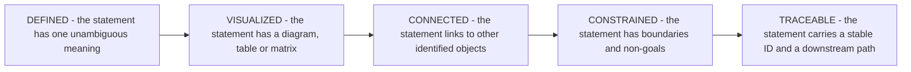

> **Diagram ID:** `DGM-VIS-001`
> **Explanation:** The admission test for content in this document. A vision statement that is
> merely inspiring fails at **DEFINED**. A statement that is defined but has no downstream path
> fails at **TRACEABLE** and is a slogan, not a specification. Content that fails any stage is
> either rewritten until it passes or removed.

---

## AUTHORITY AND PLACEMENT NOTE — Read Before Citing This Document

This document was commissioned for the path `docs/MASTER_CONTEXT/01_VISION/SYSTEM_VISION.md`.
**That path was not created, and the reason is recorded here rather than hidden.**

### TBL-VIS-001: Placement Decision Record

| Field | Value |
| :--- | :--- |
| **Requested path** | `docs/MASTER_CONTEXT/01_VISION/SYSTEM_VISION.md` |
| **Actual path** | `docs/MASTER_CONTEXT/01_PRODUCT/SYSTEM_VISION.md` |
| **Blocking evidence** | `docs/MASTER_CONTEXT/MASTER_CONTEXT_RULES.md` PART 04, `TBL-MCR-008` — every knowledge domain must carry a **unique two-digit prefix**. Domain `01` is already bound to `01_PRODUCT` by `MCX-01-001`. |
| **Consequence of the requested path** | Two domains sharing prefix `01`, violating the naming rule, plus fragmentation of vision knowledge across two folders. |
| **Why `01_PRODUCT` is correct** | `MCX-01-001` states its purpose as *"Defines what Oship is, why it exists, the value it delivers…"* and its scope as *"the product vision, mission, goals, problem statement, value proposition…"*. This document is exactly that scope. |
| **Relationship to `PRODUCT_VISION.md`** | `01_PRODUCT/INDEX.md` registers `PRODUCT_VISION.md` as `PLANNED`. That entry is **superseded** by this document; no parallel vision artifact will be created. |
| **Decision authority** | Human operator, consulted before authoring. Recorded as `DEC-VIS-001`. |
| **Status** | `IMPLEMENTED` — this file exists at the actual path. |

> **Rule `VIS-001`.** There is exactly **one** canonical vision artifact for Oship. Any future
> document proposing to be a second vision source is a defect. If `01_VISION/` is later created by
> an Architecture Board decision, this document **moves**; it is never **copied**.

---

## AI NAVIGATION METADATA — Document Root

| Field | Value |
| :--- | :--- |
| **AI READ PRIORITY** | **P0 — read before any other bounded-domain document, including `AOM-ARCH-001`** |
| **AI DEPENDENCIES** | `README.md`, `PROJECT_PHILOSOPHY.md`, `docs/ADR/ADR-0001-ai-native-repository-architecture.md`, `docs/MASTER_CONTEXT/INDEX.md`, `docs/MASTER_CONTEXT/MASTER_CONTEXT_RULES.md` |
| **AI INPUTS** | A question of the form *why does this exist*, *should we build this*, *is this in scope*, or *what does success mean* |
| **AI OUTPUTS** | A vision-traceable justification, a capability ID, an outcome ID, or an explicit refusal citing a non-goal |
| **AI IMPLEMENTATION IMPACT** | **INDIRECT BUT ABSOLUTE.** No code is written from this document. Every piece of code must nevertheless trace to a `CAP-VIS-` identifier defined here, or it is unjustified work. |
| **AI VALIDATION REQUIREMENTS** | `VAL-VIS-001` … `VAL-VIS-120` |
| **AI RELATED DOCUMENTS** | `docs/MASTER_CONTEXT/04_ARCHITECTURE/SYSTEM_ARCHITECTURE.md` (`AOM-ARCH-001`), `.ai/PROJECT_STATUS.md`, `.ai/CURRENT_CONTEXT.md`, `.ai/DECISION_LOG.md` |

---

## Identifier Namespace Registry

Identifiers in this document are **permanent**. They are allocated, never reassigned, and gaps are
never back-filled. A reader following a cross-reference to a retired ID must find nothing rather
than find something unrelated.

### TBL-VIS-002: ID Namespace Registry for `AOM-VIS-001`

| Namespace | Meaning | Reserved range | Authority |
| :--- | :--- | :--- | :--- |
| `VIS-` | Numbered constitutional rules of this document | 001–120 | L1 |
| `PROB-VIS-` | Problems Oship exists to solve | 001–060 | L1 |
| `ACT-VIS-` | Actors and actor classes | 001–030 | L1 |
| `VAL-CHAIN-VIS-` | Value chain stages | 001–020 | L1 |
| `CAP-VIS-` | Capabilities, at every level of the hierarchy | 001–120 | L1 |
| `OUT-VIS-` | Strategic outcomes | 001–060 | L1 |
| `PRN-VIS-` | Strategic principles | 001–030 | L1 |
| `NG-VIS-` | Non-goals — what Oship will not become | 001–040 | L1 |
| `CON-VIS-` | Strategic constraints | 001–060 | L1 |
| `SUC-VIS-` | Success metrics | 001–060 | L1 |
| `BND-VIS-` | Vision-level boundaries | 001–030 | L1 |
| `EVD-VIS-` | Repository evidence citations | 001–050 | L1 |
| `DEC-VIS-` | Vision-level decisions | 001–040 | L1 |
| `AI-VIS-` | Instructions binding on AI agents | 001–060 | L1 |
| `VAL-VIS-` | Validation rules | 001–200 | L1 |
| `FAL-VIS-` | Failure modes and anti-patterns | 001–200 | L1 |
| `DGM-VIS-` | Mermaid diagrams | 001–200 | L1 |
| `TBL-VIS-` | Identified tables | 001–200 | L1 |
| `IMG-VIS-` | Image specifications — specifications only, never binaries | 001–040 | L1 |

> **Rule `VIS-002`.** An identifier defined in this document may be **referenced** by any other
> document but may be **defined** only here. `AOM-ARCH-001` may cite `CAP-VIS-014`; it may not
> create `CAP-VIS-121`.

---

## Status Vocabulary — Binding on Every Claim

Oship's constitution forbids presenting intent as fact. Every claim in this document carries one of
the following labels, and the labels have fixed meanings.

### TBL-VIS-003: Status Vocabulary

| Label | Meaning | Evidence required |
| :--- | :--- | :--- |
| `IMPLEMENTED` | The thing exists and works in the repository today | A file, directory, or command that can be inspected now |
| `DOCUMENTED` | The thing is specified and binding on process, but no automation enforces it | The specifying document and section |
| `PARTIALLY IMPLEMENTED` | Some part exists; the rest does not | Evidence for the existing part **and** a statement of what is missing |
| `PLANNED` | Committed intent, not yet built | A roadmap, index, or task entry that records the commitment |
| `PROPOSED` | Suggested, not yet accepted | The proposal location; no commitment implied |
| `VISION` | A desired end-state that may take years and may never be reached in this form | This document only |
| `DEPRECATED` | Was real, is being removed | The superseding decision |
| `UNKNOWN — REQUIRES REPOSITORY VERIFICATION` | No evidence either way was found | A statement of what was searched |

> **Rule `VIS-003`.** `VISION` is the weakest label in this document, not the strongest. A statement
> labelled `VISION` grants **no** authority to build anything. Authority to build comes only from a
> `CAP-VIS-` entry that has reached `PLANNED` and has an owning architecture domain.

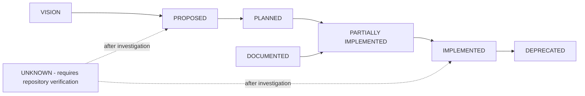

> **Diagram ID:** `DGM-VIS-002`
> **Explanation:** The only legal status transitions. Note that nothing moves directly from
> `VISION` to `IMPLEMENTED`: a desire must become a proposal, then a commitment, before it can
> become code. An agent that finds a `VISION` item in the codebase has found a governance failure,
> catalogued as `FAL-VIS-004`.

---

## Repository Evidence Base

Everything asserted as `IMPLEMENTED` in this document rests on the following inspected evidence.
The inspection was performed against branch `arena/019ffd50-oship` at parent commit `8c61052`.

### TBL-VIS-004: Evidence Register

| ID | Evidence | Observation | Supports |
| :--- | :--- | :--- | :--- |
| `EVD-VIS-001` | `README.md`, 93 KB, `ROOT-RME-001` v2.4.0 | Declares Oship an *"enterprise-grade, AI-native software development repository… read, reasoned over, and extended by AI coding agents first"* | `VIS-004`, `PROB-VIS-001` |
| `EVD-VIS-002` | `README.md` line 92 | Defines *"Money Factory"* as the repository operating as a compounding value asset | `VIS-006` |
| `EVD-VIS-003` | `README.md` lines 103–117 | The Ten Immutable Tenets | `PRN-VIS-001` … `PRN-VIS-010` |
| `EVD-VIS-004` | `.ai/` directory, 17 files | AI control plane exists: `PROJECT_STATUS.md`, `CURRENT_CONTEXT.md`, `NEXT_ACTION.md`, `SESSION_MEMORY.md`, `DECISION_LOG.md`, `CONTEXT_ROUTER.md`, operating manual | `CAP-VIS-001` `IMPLEMENTED` |
| `EVD-VIS-005` | `docs/ADR/ADR-0001-ai-native-repository-architecture.md`, `APPROVED` | Mandates `.ai/` control plane, YAML metadata, strict top-level structure, **zero application code in Phase 0** | `CON-VIS-001` |
| `EVD-VIS-006` | `docs/MASTER_CONTEXT/`, 24 domains each with `INDEX.md` | Knowledge graph exists | `CAP-VIS-002` `IMPLEMENTED` |
| `EVD-VIS-007` | `docs/MASTER_CONTEXT/23_STANDARDS/METADATA_STANDARD.md`, `MCX-23-002` | 15-key YAML frontmatter standard | `CAP-VIS-004` |
| `EVD-VIS-008` | `docs/MASTER_CONTEXT/MASTER_CONTEXT_MEMORY_SYSTEM.md`, 34,427 lines, `RELEASED` v1.0.0 | Memory constitution released via PR #5, tag `mcx-mem-001-v1.0.0` | `CAP-VIS-003` |
| `EVD-VIS-009` | `docs/MASTER_CONTEXT/04_ARCHITECTURE/SYSTEM_ARCHITECTURE.md`, `AOM-ARCH-001`, 10,844 lines | Architecture constitution Part 01 exists | `CAP-VIS-005`, all of §01.17 |
| `EVD-VIS-010` | `PROJECT_PHILOSOPHY.md`, 466 KB, 146 sections | Constitutional philosophy, §130 defines knowledge layers L1–L5 | `PRN-VIS-011` |
| `EVD-VIS-011` | `apps/`, `services/`, `packages/` | Contain only `.gitkeep` | Every runtime capability is `PLANNED`, not `IMPLEMENTED` |
| `EVD-VIS-012` | `apis/`, `sdk/` | Contain only `.gitkeep` | `CAP-VIS-030` `PLANNED` |
| `EVD-VIS-013` | `database/`, `storage/` | Contain only `.gitkeep` | `CAP-VIS-034` `PLANNED` |
| `EVD-VIS-014` | `infra/`, `k8s/`, `docker/`, `deployment/` | Contain only `.gitkeep` | `CAP-VIS-037` `PLANNED` |
| `EVD-VIS-015` | `monitoring/`, `observability/` | Contain only `.gitkeep` | `CAP-VIS-025` `PLANNED` |
| `EVD-VIS-016` | `tests/` | Contains only `.gitkeep` | `CAP-VIS-027` `PLANNED` |
| `EVD-VIS-017` | `.github/workflow-skeletons/` — ci, cd, release, security-scan, documentation, ai-governance, issue-triage, stale | Skeletons present but **not** installed in `.github/workflows/` | `CAP-VIS-026` `PARTIALLY IMPLEMENTED` |
| `EVD-VIS-018` | `.github/CODEOWNERS` | Every path maps to `@afshin-omnisystem` | `CON-VIS-010`, `ACT-VIS-002` |
| `EVD-VIS-019` | No `package.json`, `go.mod`, `pyproject.toml`, `pom.xml`, or lockfile at any level | No technology stack is chosen | `CON-VIS-020` `UNKNOWN` |
| `EVD-VIS-020` | `architecture/DOMAIN_MODEL.md`, `ARCH-DOM-001` | Four bounded contexts: Governance and AI, Core Platform, Financial Factory, Observability | `CAP-VIS-060` … `CAP-VIS-063` |
| `EVD-VIS-021` | `architecture/DOMAIN_MODEL.md` §2 | Ubiquitous language: *Money Factory* = *"primary domain engine processing enterprise financial workloads"*; *AI Workspace* = `.ai/` | `VIS-006`, `PROB-VIS-018` |
| `EVD-VIS-022` | `.ai/DECISION_LOG.md`, `AI-DEC-001` | Ten decisions `DEC-001` … `DEC-010`, all `APPROVED` or `RELEASED` | `CAP-VIS-006` |
| `EVD-VIS-023` | `docs/MASTER_CONTEXT/01_PRODUCT/INDEX.md`, `MCX-01-001` | Registers `PRODUCT_VISION.md` as `PLANNED`; domain owns vision and mission | `TBL-VIS-001` |
| `EVD-VIS-024` | `docs/MASTER_CONTEXT/MASTER_CONTEXT_RULES.md` PART 04, `TBL-MCR-008` | Unique two-digit domain prefix is mandatory | `TBL-VIS-001` |
| `EVD-VIS-025` | Git history: single functional commit `8c61052` plus this branch | The repository is at the very beginning of its life | `CON-VIS-002` |

> **Rule `VIS-004`.** Any future claim of `IMPLEMENTED` in this document must add a row to
> `TBL-VIS-004` in the same commit. A claim without an evidence row is a defect detected by
> `VAL-VIS-013`.

---

## Table of Contents — PART 01

| § | Section | Primary IDs | AI Priority |
| :--- | :--- | :--- | :---: |
| [01.1](#011--system-identity) | System Identity | `VIS-004`…`VIS-012` | **P0** |
| [01.2](#012--vision-statement) | Vision Statement | `VIS-013`…`VIS-020` | **P0** |
| [01.3](#013--mission-and-the-intent-hierarchy) | Mission and the Intent Hierarchy | `VIS-021`…`VIS-028` | **P0** |
| [01.4](#014--problem-space) | Problem Space | `PROB-VIS-001`…`030` | **P0** |
| [01.5](#015--users-and-actors) | Users and Actors | `ACT-VIS-001`…`016` | **P0** |
| [01.6](#016--value-model) | Value Model | `VAL-CHAIN-VIS-001`…`012` | **P1** |
| [01.7](#017--system-capabilities) | System Capabilities | `CAP-VIS-001`…`070` | **P0** |
| [01.8](#018--capability-hierarchy) | Capability Hierarchy | `CAP-VIS-071`…`090` | **P0** |
| [01.9](#019--system-boundaries) | System Boundaries | `BND-VIS-001`…`020` | **P0** |
| [01.10](#0110--strategic-principles) | Strategic Principles | `PRN-VIS-001`…`020` | **P0** |
| [01.11](#0111--non-goals) | Non-Goals | `NG-VIS-001`…`024` | **P0** |
| [01.12](#0112--success-model) | Success Model | `SUC-VIS-001`…`042` | **P1** |
| [01.13](#0113--strategic-outcomes) | Strategic Outcomes | `OUT-VIS-001`…`030` | **P1** |
| [01.14](#0114--evolution-model) | Evolution Model | `VIS-040`…`VIS-048` | **P1** |
| [01.15](#0115--ai-native-vision) | AI-Native Vision | `AI-VIS-001`…`030` | **P0** |
| [01.16](#0116--human-and-ai-collaboration-model) | Human and AI Collaboration Model | `AI-VIS-031`…`044` | **P0** |
| [01.17](#0117--architecture-traceability) | Architecture Traceability | `VIS-050`…`VIS-056` | **P0** |
| [01.18](#0118--requirements-derivation) | Requirements Derivation | `DEC-VIS-010`…`016` | **P0** |
| [01.19](#0119--strategic-constraints) | Strategic Constraints | `CON-VIS-001`…`030` | **P0** |
| [01.20](#0120--architectural-drift-prevention) | Architectural Drift Prevention | `VIS-060`…`VIS-068` | **P1** |
| [01.21](#0121--vision-governance) | Vision Governance | `VIS-070`…`VIS-078` | **P1** |
| [01.22](#0122--change-management) | Change Management | `VIS-080`…`VIS-086` | **P2** |
| [01.23](#0123--ai-interpretation-guide) | AI Interpretation Guide | `AI-VIS-045`…`060` | **P0** |
| [01.24](#0124--validation-rules) | Validation Rules | `VAL-VIS-001`…`200` | **P0** |
| [01.25](#0125--failure-and-anti-pattern-library) | Failure and Anti-Pattern Library | `FAL-VIS-001`…`120` | **P1** |
| [01.26](#0126--decision-model) | Decision Model | `DEC-VIS-017`…`030` | **P0** |
| [01.27](#0127--traceability-matrix) | Traceability Matrix | `TBL-VIS-122`…`126` | **P0** |
| [01.28](#0128--future-evolution-of-this-document) | Future Evolution of This Document | `VIS-098`…`VIS-101` | **P1** |
| [App. A](#appendix-a--image-specifications) | Image Specifications | `IMG-VIS-001`…`022` | **P3** |
| [App. B](#appendix-b--reference-material) | Reference Material — Glossary, Vocabulary, Ledger | `TBL-VIS-133`…`138` | **P3** |

---

## 01.1 — System Identity

### AI NAVIGATION METADATA — §01.1

| Field | Value |
| :--- | :--- |
| **AI READ PRIORITY** | **P0 — the first substantive section any agent reads** |
| **AI DEPENDENCIES** | `README.md`, `architecture/DOMAIN_MODEL.md`, `docs/ADR/ADR-0001` |
| **AI INPUTS** | The question *what is this repository* |
| **AI OUTPUTS** | A category judgement that constrains every later design choice |
| **AI IMPLEMENTATION IMPACT** | Misclassifying Oship produces architecture that solves the wrong problem |
| **AI VALIDATION REQUIREMENTS** | `VAL-VIS-001`…`VAL-VIS-008` |
| **AI RELATED DOCUMENTS** | `AOM-ARCH-001` §01.2 System Identity |

### 01.1.1 What Oship Is

> **`VIS-004` — Canonical identity statement.**
> **Oship is an AI-native enterprise software factory: a repository whose primary product is the
> machine-executable knowledge required to build, operate, and evolve enterprise software, and
> whose secondary product is the software itself.**

Read that twice, because the ordering is the whole point and it is unusual. In an ordinary project
the code is the asset and the documentation is a lagging description of it. In Oship the
specification is the asset and the code is a **derived artifact** — a compilation target produced
from specifications by human and machine labour together.

This is not an aspiration bolted onto a conventional codebase. It is the observable present state
of the repository. At the time of writing, Oship contains approximately 94,000 lines of
constitutional, architectural, and governance specification (`EVD-VIS-001`, `EVD-VIS-006`,
`EVD-VIS-008`, `EVD-VIS-009`, `EVD-VIS-010`) and **zero lines of application code**
(`EVD-VIS-011`). That ratio is a deliberate consequence of `ADR-0001`, which mandates zero
application code in Phase 0 (`EVD-VIS-005`), not an accident of an unfinished project.

### TBL-VIS-005: Identity Assertions

| ID | Assertion | Status | Evidence |
| :--- | :--- | :--- | :--- |
| `VIS-004` | Oship is an AI-native enterprise software factory | `IMPLEMENTED` as a documentation system; `PLANNED` as a runtime | `EVD-VIS-001`, `EVD-VIS-011` |
| `VIS-005` | Oship's primary artifact is executable knowledge, not code | `IMPLEMENTED` | `EVD-VIS-004`, `EVD-VIS-006`, `EVD-VIS-009` |
| `VIS-006` | Oship's domain identity is the "Money Factory" — an engine for enterprise financial workloads | `PLANNED` | `EVD-VIS-002`, `EVD-VIS-021` |
| `VIS-007` | Oship is designed to be read by AI agents first and humans second | `IMPLEMENTED` at the documentation level | `EVD-VIS-001`, `EVD-VIS-004` |
| `VIS-008` | Oship is a single-repository system, not a distributed set of repositories | `IMPLEMENTED` | `EVD-VIS-025` |
| `VIS-009` | Oship's governance is constitutional — rules bind their own authors | `IMPLEMENTED` | `EVD-VIS-005`, `EVD-VIS-010`, `EVD-VIS-022` |

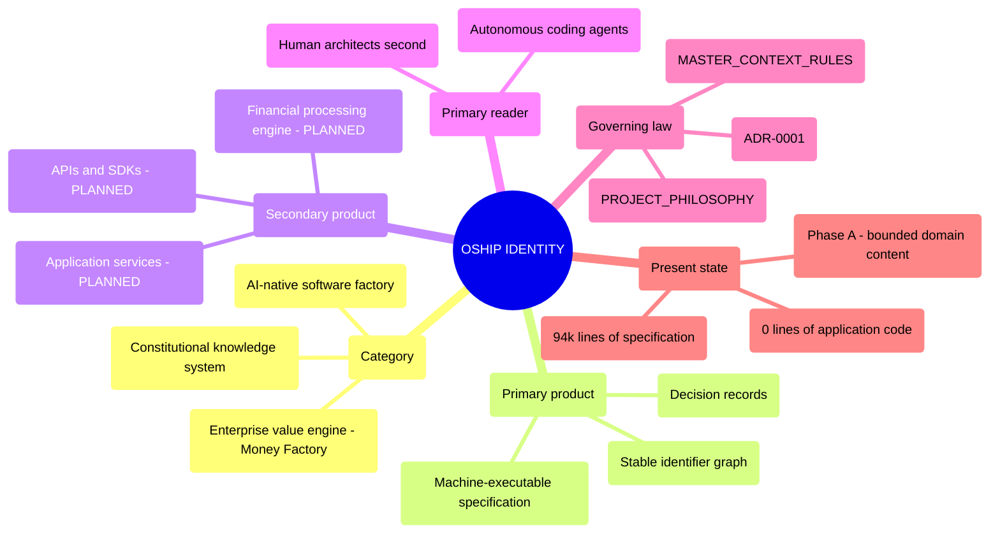

> **Diagram ID:** `DGM-VIS-003` — **System Identity Map**
> **Explanation:** Oship's identity in one view. The branch that surprises most readers is
> *Primary product*: specification, not software. The *Present state* branch keeps the map honest —
> the runtime branches are all `PLANNED`, and an agent that treats them as present will generate
> code against services that do not exist.

### 01.1.2 What Oship Is Not

Identity is defined as much by exclusion as by inclusion. The following are **not** what Oship is,
and each misreading has a predictable failure attached to it.

### TBL-VIS-006: Identity Exclusions

| Misreading | Why it is wrong | Failure it causes |
| :--- | :--- | :--- |
| "A documentation repository" | Documentation describes a system that exists elsewhere. Oship's specifications **are** the system's authoritative definition; the code does not yet exist to be described. | `FAL-VIS-001` |
| "A boilerplate or starter template" | Templates are copied and diverge. Oship is a single evolving system with permanent identifiers and a decision history. | `FAL-VIS-002` |
| "A conventional monorepo awaiting code" | A monorepo is a code-storage strategy. Oship is a knowledge-first construction method that *also* stores code. | `FAL-VIS-003` |
| "A finished financial platform" | No transaction is processed. `apps/`, `services/`, `database/` are empty (`EVD-VIS-011`, `EVD-VIS-013`). | `FAL-VIS-005` |
| "An AI research project" | Oship does not train, fine-tune, or research models. It *consumes* agents as labour. | `NG-VIS-003` |
| "A framework for others to build on" | Oship is a system, not a library. It has no external consumers and publishes no package. | `NG-VIS-007` |
| "A prompt collection" | Prompts are ephemeral. Oship's artifacts are versioned, identified, and governed. | `FAL-VIS-011` |

> **`VIS-010`.** When an agent cannot decide whether a proposed change belongs in Oship, it applies
> the exclusion table before the inclusion table. Exclusions are cheaper to evaluate and catch most
> scope errors.

### 01.1.3 System Category

Oship belongs to a category that is still forming in the industry, so precision matters more than a
familiar label.

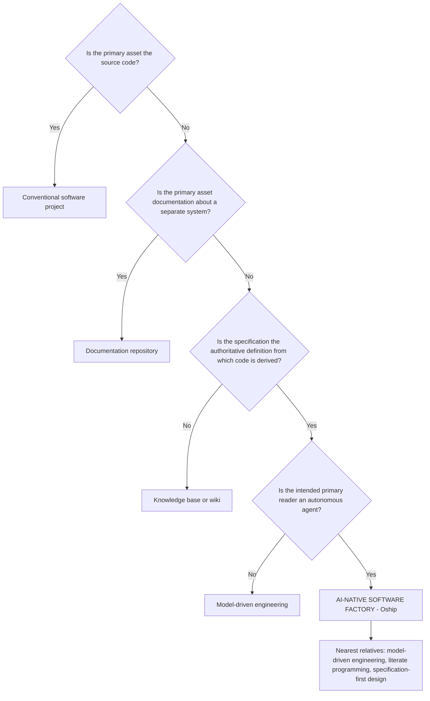

> **Diagram ID:** `DGM-VIS-004`
> **Explanation:** A classification decision tree that terminates in Oship's category. The final
> discriminator is the *intended reader*. Model-driven engineering targets a code generator with
> rigid grammar; Oship targets a reasoning agent that requires context, rationale, and explicit
> prohibition. That difference is why this document explains **why**, not merely **what** — a code
> generator does not need reasons, and an agent does.

### 01.1.4 Primary and Secondary Purposes

### TBL-VIS-007: Purpose Ranking

| Rank | Purpose | Statement | Status |
| :---: | :--- | :--- | :--- |
| **Primary** | `VIS-011` | Make enterprise software construction **tractable for autonomous agents** by removing every dependency on undocumented human knowledge | `PARTIALLY IMPLEMENTED` |
| Secondary 1 | `VIS-012a` | Build the "Money Factory" — an enterprise engine for financial workloads | `PLANNED` |
| Secondary 2 | `VIS-012b` | Demonstrate that specification-first construction lowers the marginal cost of change over time | `VISION` |
| Secondary 3 | `VIS-012c` | Preserve institutional knowledge so that contributor turnover, human or agent, does not destroy capability | `IMPLEMENTED` at the documentation level |
| Secondary 4 | `VIS-012d` | Provide a reproducible method that survives model generations and vendor changes | `DOCUMENTED` |

> **`VIS-012`.** The purposes are **ranked, not equal**. When the Money Factory objective conflicts
> with agent tractability, tractability wins. A financial feature that can only be maintained by a
> human who remembers an unwritten rule is rejected regardless of its revenue value. This is the
> single most consequential trade-off in the document and the one most likely to be quietly
> violated under delivery pressure.

### 01.1.5 What Makes Oship Structurally Different

### TBL-VIS-008: Structural Differentiators

| # | Ordinary project | Oship | Evidence |
| :---: | :--- | :--- | :--- |
| 1 | Docs lag code | Specification precedes code and outnumbers it ~94,000 : 0 | `EVD-VIS-011` |
| 2 | Knowledge lives in people | Knowledge lives in versioned, identified artifacts | `EVD-VIS-006` |
| 3 | Identifiers are incidental | Identifiers are permanent and never reused | `TBL-VIS-002` |
| 4 | Decisions are remembered | Decisions are recorded as immutable ADRs | `EVD-VIS-005`, `EVD-VIS-022` |
| 5 | Onboarding is a conversation | Onboarding is a file read; `.ai/` is the boot sequence | `EVD-VIS-004` |
| 6 | Status is optimistic | Status labels are mandatory and enforced | `TBL-VIS-003` |
| 7 | Agents are autocomplete | Agents are first-class labour with a defined operating manual | `EVD-VIS-004` |
| 8 | Structure emerges | Structure is legislated before it is populated | `EVD-VIS-005` |

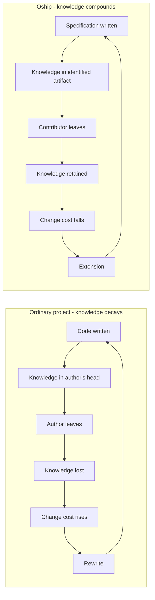

> **Diagram ID:** `DGM-VIS-005`
> **Explanation:** The two loops that define the strategic bet. The left loop is the industry
> default: knowledge decays into people, people leave, cost rises until rewrite. The right loop is
> Oship's wager — that front-loading specification cost converts the decay loop into a compounding
> loop. This is what `EVD-VIS-002` means by *"Money Factory"*: **the repository itself is the
> compounding asset**, not any single feature shipped from it.

> **Honest caveat.** The right-hand loop is `VISION`. Oship has completed one turn of it and cannot
> yet demonstrate that change cost falls over time. `SUC-VIS-021` is the metric that will decide
> whether the bet paid off, and it is currently unmeasurable because there is no code to change.

---

## 01.2 — Vision Statement

### AI NAVIGATION METADATA — §01.2

| Field | Value |
| :--- | :--- |
| **AI READ PRIORITY** | **P0** |
| **AI DEPENDENCIES** | §01.1 System Identity |
| **AI INPUTS** | A proposal that must be tested against long-term intent |
| **AI OUTPUTS** | Accept, reject, or escalate, with the vision clause cited |
| **AI IMPLEMENTATION IMPACT** | Sets the target state every roadmap increment must move toward |
| **AI VALIDATION REQUIREMENTS** | `VAL-VIS-009`…`VAL-VIS-016` |
| **AI RELATED DOCUMENTS** | `docs/MASTER_CONTEXT/19_ROADMAP/INDEX.md` |

### 01.2.1 The Canonical Vision Statement

> ### `VIS-013` — THE OSHIP VISION
>
> **Oship exists to make enterprise software a compounding asset rather than a depreciating
> liability — by encoding every architectural decision, constraint, and intent as
> machine-executable knowledge, so that autonomous agents and humans can build, verify, and evolve
> the system indefinitely without any dependency on undocumented understanding.**

A vision statement in this document must satisfy five properties. Most corporate vision statements
satisfy none of them, which is why they cannot be used to make decisions.

### TBL-VIS-009: Vision Statement Property Test

| Property | Requirement | How `VIS-013` satisfies it |
| :--- | :--- | :--- |
| **Precise** | No word may carry two meanings in context | Every load-bearing term is defined in `TBL-VIS-010` |
| **Testable** | Falsifiable by observation | Measured by `SUC-VIS-001`, `SUC-VIS-021`, `SUC-VIS-025` |
| **Evolvable** | Can absorb new capability without rewrite | Names no technology, market, or product feature |
| **AI-readable** | Parseable into obligations | Decomposed into `VIS-014`…`VIS-019` below |
| **Architecture-compatible** | Each clause maps to an architectural mechanism | Mapped in `TBL-VIS-011` |

### TBL-VIS-010: Definitions of Load-Bearing Terms in `VIS-013`

| Term | Definition in Oship | Not to be confused with |
| :--- | :--- | :--- |
| **Compounding asset** | A system whose marginal cost of change decreases as it grows | Simply "valuable" |
| **Depreciating liability** | A system whose marginal cost of change increases as it grows | "Legacy" or "old" |
| **Machine-executable knowledge** | Specification structured so an agent can act on it without human clarification | Documentation that merely mentions an agent |
| **Architectural decision** | A choice that is expensive to reverse and constrains later choices | Any implementation preference |
| **Autonomous agent** | A software agent that plans and executes multi-step work with bounded human approval | An autocomplete or chat assistant |
| **Indefinitely** | Across model generations, vendor changes, and contributor turnover | Forever without maintenance |
| **Undocumented understanding** | Knowledge held only in a person's memory | Tacit skill such as typing or reading |

### 01.2.2 Vision Decomposition

`VIS-013` is decomposed into six independently testable clauses. This is what makes it usable by an
agent: the whole statement cannot be evaluated, but each clause can.

### TBL-VIS-011: Vision Clause Decomposition

| ID | Clause | Obligation it creates | Architectural mechanism | Status |
| :--- | :--- | :--- | :--- | :--- |
| `VIS-014` | "compounding asset rather than depreciating liability" | Every change must lower or hold the cost of the next change | Modular boundaries, contracts, `AOM-ARCH-001` §01.9 dependency rules | `VISION` |
| `VIS-015` | "encoding every architectural decision" | No decision may exist only in memory or chat | ADR process, `docs/ADR/`, `.ai/DECISION_LOG.md` | `IMPLEMENTED` |
| `VIS-016` | "constraint" | Limits are stated explicitly, including uncomfortable ones | §01.19 constraint register, `TBL-VIS-003` status vocabulary | `IMPLEMENTED` |
| `VIS-017` | "and intent" | The *why* travels with the *what*, permanently | Rationale required in every specification section | `IMPLEMENTED` |
| `VIS-018` | "autonomous agents and humans can build, verify and evolve" | Both classes of worker are first-class; neither is an afterthought | `.ai/` control plane, `AOM-ARCH-001` §01.24, §01.16 here | `PARTIALLY IMPLEMENTED` |
| `VIS-019` | "without any dependency on undocumented understanding" | Hidden knowledge is a defect, not a convenience | Evidence rule `VIS-004`, validation `VAL-VIS-013` | `PARTIALLY IMPLEMENTED` |

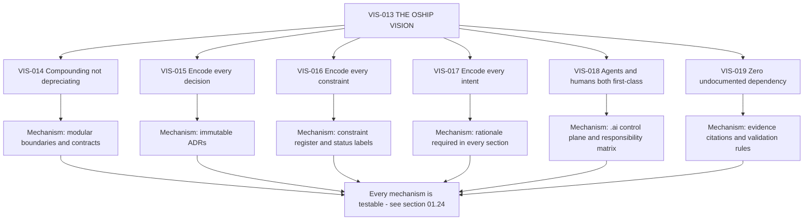

> **Diagram ID:** `DGM-VIS-006` — **Vision Model**
> **Explanation:** The vision is not a sentence to be admired but a tree to be traversed. Each of
> the six clauses carries a concrete mechanism, and each mechanism carries validation rules. An
> agent asked *does this change serve the vision* does not reason about the sentence; it identifies
> which clause the change touches and evaluates against that clause's mechanism.

### 01.2.3 What Would Falsify the Vision

A vision that cannot fail is not testable. These conditions would demonstrate `VIS-013` is wrong or
unreachable, and they must be watched for rather than explained away.

### TBL-VIS-012: Vision Falsification Conditions

| ID | Condition | What it would prove | Current reading |
| :--- | :--- | :--- | :--- |
| `VIS-020a` | Change cost rises steadily despite specification discipline | The compounding premise is false for this class of system | Unmeasurable — no code yet |
| `VIS-020b` | Agents cannot implement from the specification without human clarification | The specification is not actually machine-executable | Untested — `SUC-VIS-011` will measure it |
| `VIS-020c` | Specification maintenance consumes more effort than it saves | The overhead exceeds the benefit | Unmeasurable — no delivery baseline |
| `VIS-020d` | Specifications drift from code and become misleading | Drift prevention has failed; the asset became a liability | §01.20 addresses this risk |
| `VIS-020e` | The Money Factory objective is abandoned or never begun | The secondary purpose was never real | Open — `apps/` and `services/` remain empty |

> **`VIS-020`.** These conditions are reviewed at every phase gate. A condition that is met is
> escalated to the Architecture Board as a vision-level defect, not silently tolerated. Explaining
> away a falsification condition is catalogued as `FAL-VIS-014`.

---

## 01.3 — Mission and the Intent Hierarchy

### AI NAVIGATION METADATA — §01.3

| Field | Value |
| :--- | :--- |
| **AI READ PRIORITY** | **P0** |
| **AI DEPENDENCIES** | §01.2 Vision Statement |
| **AI INPUTS** | A statement of intent at any altitude |
| **AI OUTPUTS** | Correct classification of that statement into the intent hierarchy |
| **AI IMPLEMENTATION IMPACT** | Prevents features masquerading as strategy and strategy masquerading as features |
| **AI VALIDATION REQUIREMENTS** | `VAL-VIS-017`…`VAL-VIS-024` |
| **AI RELATED DOCUMENTS** | `docs/MASTER_CONTEXT/19_ROADMAP/INDEX.md`, `.ai/ROADMAP_AI.md` |

### 01.3.1 The Mission

> ### `VIS-021` — THE OSHIP MISSION
>
> **Build and maintain a repository in which every architectural fact required to construct the
> system is written down, identified, validated, and reachable — such that a competent autonomous
> agent, starting with no prior context, can locate what it needs, understand why it exists, and
> implement it correctly without asking a human.**

The relationship between vision and mission is precise and frequently confused. The **vision** is
the end state (`VIS-013`: software as a compounding asset). The **mission** is the work undertaken
now to move toward it (`VIS-021`: write everything down, identifiably and reachably). The vision may
take a decade and may never be fully reached. The mission is what is done this week.

### 01.3.2 The Intent Hierarchy — Seven Distinct Concepts

These seven concepts are routinely used interchangeably in industry, and that conflation is the
root cause of unbuildable roadmaps. In Oship they are strictly separated.

### TBL-VIS-013: Vision, Mission, Purpose, Objective, Goal, Capability, Feature

| Concept | Question it answers | Time horizon | Changes when | Testable? | Oship example |
| :--- | :--- | :--- | :--- | :---: | :--- |
| **Vision** | What does the world look like if we fully succeed? | Indefinite | Almost never — requires Architecture Board and a superseding ADR | Falsifiable, not directly measurable | `VIS-013` |
| **Mission** | What work do we undertake to move toward the vision? | Multi-year | On strategic pivot | Partially | `VIS-021` |
| **Purpose** | Why does this thing exist at all? | Permanent | Never, while the thing exists | No — it is a reason | `VIS-011` agent tractability |
| **Objective** | What measurable change do we intend within a bounded period? | Phase or quarter | Each phase | Yes — numerically | `OUT-VIS-001` |
| **Goal** | What specific end state satisfies an objective? | Phase | On objective change | Yes — binary done or not | Complete `AOM-ARCH-001` |
| **Capability** | What can the system *do*, independent of how? | Long-lived | On scope change | Yes — present or absent | `CAP-VIS-014` |
| **Feature** | What concrete function do users touch? | Release | Frequently | Yes — by acceptance test | `PLANNED` — none exist |

> **`VIS-022`.** A statement that cannot be placed in exactly one row of `TBL-VIS-013` is
> malformed and must be rewritten before it enters any planning artifact. The most common error is
> a "goal" that is actually a feature, which produces a roadmap of implementation details with no
> strategic justification. The second most common is a "vision" that is actually an objective,
> which produces a strategy that expires in a quarter.

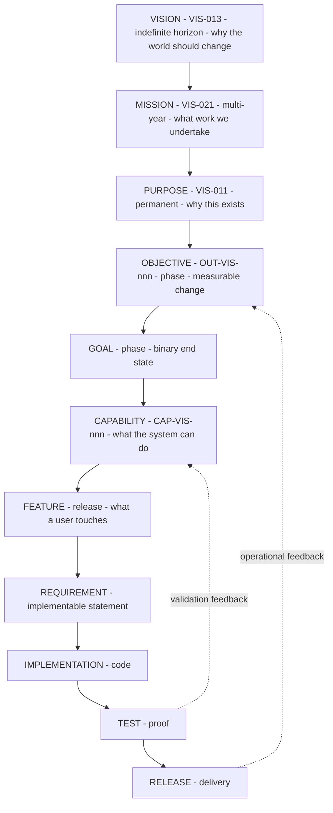

> **Diagram ID:** `DGM-VIS-007`
> **Explanation:** The full intent hierarchy from vision to release, with the two feedback edges
> that keep it from being a one-way waterfall. Note that **capability sits above feature**: Oship
> decides what the system can do before deciding what a user touches. Inverting these two produces
> a feature list with no coherent system behind it — catalogued as `FAL-VIS-021`.

### 01.3.3 Altitude Errors and How to Detect Them

### TBL-VIS-014: Altitude Error Detection

| Error | Symptom | Detection question | Correction |
| :--- | :--- | :--- | :--- |
| Feature posing as vision | "Our vision is a real-time dashboard" | Will this be obsolete in three years? | Demote to feature; find the capability it serves |
| Vision posing as goal | "This quarter we will make software a compounding asset" | Can this be marked done on a date? | Promote to vision; extract a measurable objective |
| Capability posing as feature | "Add multi-tenancy" | Is this one screen or a system property? | Promote to capability; decompose into features |
| Objective without metric | "Improve agent effectiveness" | What number changes, from what to what? | Add a `SUC-VIS-` metric or reject |
| Goal without capability | "Ship the ledger service" | Which capability does this deliver? | Link to a `CAP-VIS-` ID or reject as unjustified |
| Purpose treated as changeable | "Let us revisit why we exist this sprint" | Has the system's reason for existing actually ended? | Purpose changes only by superseding ADR |

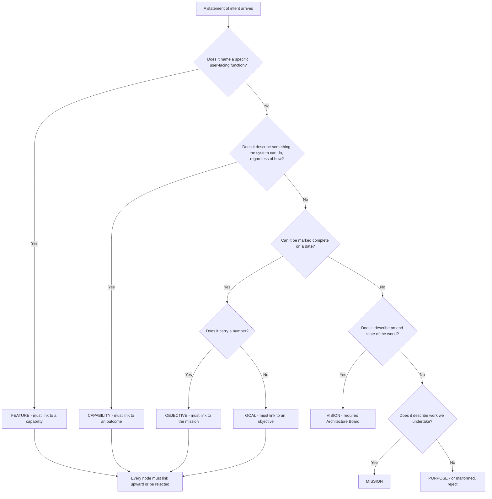

> **Diagram ID:** `DGM-VIS-008`
> **Explanation:** The classification decision tree an agent runs on any incoming statement of
> intent. The terminal rule matters as much as the classification: **every node must link upward**.
> A feature with no capability, or a goal with no objective, is orphaned work and is rejected at
> intake rather than discovered as waste at review.

### 01.3.4 The Mission in Force Right Now

Concretely, at the current phase, the mission reduces to a small set of active obligations.

### TBL-VIS-015: Active Mission Obligations

| ID | Obligation | Owner | Status |
| :--- | :--- | :--- | :--- |
| `VIS-023` | Every bounded domain has a constitutional document before it has code | Architecture | `PARTIALLY IMPLEMENTED` — 2 of 24 domains |
| `VIS-024` | Every architectural fact carries a permanent identifier | Architecture | `IMPLEMENTED` |
| `VIS-025` | Every claim carries an honest status label | All contributors | `IMPLEMENTED` |
| `VIS-026` | Every document is reachable from `.ai/` within three hops | Documentation | `IMPLEMENTED` |
| `VIS-027` | Every decision that constrains later work becomes an ADR | Architecture | `IMPLEMENTED` |
| `VIS-028` | No application code is written before its specification exists | All contributors | `IMPLEMENTED` — trivially, since none exists |

> **Honest note on `VIS-028`.** This obligation is currently satisfied for a weak reason: no code
> exists at all (`EVD-VIS-011`). Its real test begins the moment Phase C opens. An obligation that
> is only satisfied by inaction has not yet been demonstrated, and `TBL-VIS-015` will need
> re-evaluation at that gate rather than being assumed to hold.

---

## 01.4 — Problem Space

### AI NAVIGATION METADATA — §01.4

| Field | Value |
| :--- | :--- |
| **AI READ PRIORITY** | **P0 — no capability may be proposed without naming the problem it solves** |
| **AI DEPENDENCIES** | §01.1, §01.2 |
| **AI INPUTS** | A proposed capability, feature, or refactor |
| **AI OUTPUTS** | The `PROB-VIS-` identifier the work addresses, or a rejection |
| **AI IMPLEMENTATION IMPACT** | Work that solves no catalogued problem is unjustified and must not be built |
| **AI VALIDATION REQUIREMENTS** | `VAL-VIS-025`…`VAL-VIS-036` |
| **AI RELATED DOCUMENTS** | `PROJECT_PHILOSOPHY.md`, `docs/MASTER_CONTEXT/02_BUSINESS/INDEX.md` |

### 01.4.1 The Two Problem Families

Oship addresses two distinct families of problem, and confusing them is the fastest route to
incoherent architecture.

**Family A — Construction problems.** Problems in *how enterprise software gets built*. These are
the problems Oship attacks with its knowledge-first method. They are the reason the repository is
structured as it is.

**Family B — Domain problems.** Problems in *enterprise financial workload processing* — the
"Money Factory" domain (`EVD-VIS-021`). These are the problems the eventual runtime will solve for
end users.

> **`VIS-029`.** Family A problems are **being solved now**. Family B problems are **catalogued but
> not yet attacked**, because no application code exists (`EVD-VIS-011`). An agent must never
> present a Family B problem as under active mitigation.

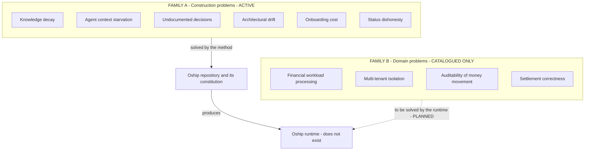

> **Diagram ID:** `DGM-VIS-009` — **Problem Landscape**
> **Explanation:** The two families and their very different states. Solid arrows are active;
> dashed arrows are `PLANNED`. The critical reading is that Family A must be solved *well enough*
> before Family B can be attacked at all — the method produces the runtime, not the reverse.

### 01.4.2 Family A — Construction Problems

Each problem below carries the full field set required by the vision specification.

### TBL-VIS-016: `PROB-VIS-001` — Knowledge Decay

| Field | Value |
| :--- | :--- |
| **ID** | `PROB-VIS-001` |
| **Problem** | Architectural knowledge lives in contributors' memories and is destroyed by turnover |
| **Affected Actor** | `ACT-VIS-001` architect, `ACT-VIS-002` maintainer, `ACT-VIS-005` autonomous agent |
| **Current Pain** | Every new contributor reconstructs intent by reading code and guessing; guesses are frequently wrong |
| **Impact** | Rising change cost, repeated mistakes, rewrites that discard hard-won correctness |
| **Root Cause** | Code records *what* a system does but not *why*, and *why* is what constrains the next change |
| **Oship Response** | `CAP-VIS-002` knowledge graph, `CAP-VIS-006` decision records, mandatory rationale in every section |
| **Priority** | **CRITICAL** |
| **Status** | `PARTIALLY IMPLEMENTED` — the mechanism exists; its durability is unproven |
| **Evidence** | `EVD-VIS-006`, `EVD-VIS-022` |
| **AI Interpretation** | When you cannot determine why something exists, that is an instance of this problem. Do not guess. Record `UNKNOWN — REQUIRES REPOSITORY VERIFICATION` and escalate. |

### TBL-VIS-017: `PROB-VIS-002` — Agent Context Starvation

| Field | Value |
| :--- | :--- |
| **ID** | `PROB-VIS-002` |
| **Problem** | Autonomous agents cannot implement correctly because the necessary context is absent, scattered, or contradictory |
| **Affected Actor** | `ACT-VIS-005` autonomous agent, `ACT-VIS-006` agent orchestrator |
| **Current Pain** | Agents produce plausible code that violates unstated constraints, then humans spend more time reviewing than they saved |
| **Impact** | AI labour yields negative net productivity; teams abandon agents and conclude the technology is immature |
| **Root Cause** | Repositories are optimised for human readers who can ask questions; agents cannot ask and will fabricate instead |
| **Oship Response** | `CAP-VIS-001` control plane, `CAP-VIS-007` deterministic navigation, AI metadata on every section, explicit prohibitions |
| **Priority** | **CRITICAL** |
| **Status** | `PARTIALLY IMPLEMENTED` |
| **Evidence** | `EVD-VIS-004`, `EVD-VIS-009` |
| **AI Interpretation** | This is the problem you personally embody. If you find yourself inferring a rule that is not written, you have detected this problem — report it rather than proceeding on the inference. |

### TBL-VIS-018: `PROB-VIS-003` — Undocumented Decisions

| Field | Value |
| :--- | :--- |
| **ID** | `PROB-VIS-003` |
| **Problem** | Consequential decisions are made in conversation and never recorded |
| **Affected Actor** | `ACT-VIS-001`, `ACT-VIS-002`, `ACT-VIS-005` |
| **Current Pain** | Later contributors reverse decisions without knowing the constraints that produced them, reintroducing solved failures |
| **Impact** | Oscillating architecture; the same debate recurs annually with no accumulated resolution |
| **Root Cause** | Recording a decision costs effort now and pays off later, so it is systematically under-supplied |
| **Oship Response** | `CAP-VIS-006` immutable ADR process; `.ai/DECISION_LOG.md`; decisions immutable once approved |
| **Priority** | **CRITICAL** |
| **Status** | `IMPLEMENTED` |
| **Evidence** | `EVD-VIS-005`, `EVD-VIS-022` — ten recorded decisions, all `APPROVED` or `RELEASED` |
| **AI Interpretation** | Before proposing a change that contradicts existing structure, search `docs/ADR/` and `.ai/DECISION_LOG.md`. A contradiction with an `APPROVED` ADR requires a superseding ADR, never a silent edit. |

### TBL-VIS-019: `PROB-VIS-004` — Architectural Drift

| Field | Value |
| :--- | :--- |
| **ID** | `PROB-VIS-004` |
| **Problem** | Implementation diverges from specification until the specification becomes actively misleading |
| **Affected Actor** | All |
| **Current Pain** | Readers learn to distrust documentation, which removes the incentive to maintain it, which accelerates drift |
| **Impact** | The knowledge asset becomes a liability — worse than no documentation, because it misleads confidently |
| **Root Cause** | Code changes are enforced by compilers; specification changes are enforced by discipline alone |
| **Oship Response** | `CAP-VIS-009` drift detection, §01.20 escalation model, traceability matrix §01.27 |
| **Priority** | **CRITICAL** |
| **Status** | `DOCUMENTED` — the model is specified; automated detection is `PLANNED` |
| **Evidence** | `EVD-VIS-017` — CI skeletons exist but are not installed, so nothing is enforced automatically |
| **AI Interpretation** | This is the problem most likely to make this very document dangerous over time. If you find code contradicting a specification, the contradiction itself is the defect — do not assume the code is authoritative. |

### TBL-VIS-020: `PROB-VIS-005` — Onboarding Cost

| Field | Value |
| :--- | :--- |
| **ID** | `PROB-VIS-005` |
| **Problem** | A new contributor, human or agent, needs weeks of human attention before becoming productive |
| **Affected Actor** | `ACT-VIS-002`, `ACT-VIS-005`, `ACT-VIS-003` |
| **Current Pain** | Senior contributors spend their scarcest hours re-explaining context |
| **Impact** | Scaling contributor count *reduces* throughput; agents multiply the problem because they onboard on every task |
| **Root Cause** | Onboarding knowledge is transmitted conversationally and must be regenerated per person |
| **Oship Response** | `CAP-VIS-007` deterministic navigation; `.ai/` boot sequence; `CONTEXT_ROUTER.md` |
| **Priority** | **HIGH** |
| **Status** | `PARTIALLY IMPLEMENTED` |
| **Evidence** | `EVD-VIS-004` |
| **AI Interpretation** | You onboard on every single task. The time you spend locating context is the direct measure of this problem. If a needed fact took more than three hops to find, that is a navigation defect worth reporting. |

### TBL-VIS-021: `PROB-VIS-006` — Status Dishonesty

| Field | Value |
| :--- | :--- |
| **ID** | `PROB-VIS-006` |
| **Problem** | Documentation describes intended behaviour as though it were current behaviour |
| **Affected Actor** | All, but agents most severely |
| **Current Pain** | An agent reads "the service validates input", generates a caller assuming validation, and ships an injection vector |
| **Impact** | Silent correctness and security failures; total loss of trust in the specification |
| **Root Cause** | Aspirational writing is natural, and the present and future tense are easy to blur |
| **Oship Response** | `TBL-VIS-003` mandatory status vocabulary; `VIS-004` evidence rule; `VAL-VIS-013` |
| **Priority** | **CRITICAL** |
| **Status** | `IMPLEMENTED` |
| **Evidence** | `EVD-VIS-009` — `AOM-ARCH-001` labels every claim and records unmet targets as unmet |
| **AI Interpretation** | Never upgrade a status label without adding evidence. Never treat `PLANNED` as callable. This is the highest-frequency cause of agent-generated defects in specification-heavy repositories. |

### TBL-VIS-022: Family A Problems — Compact Register

| ID | Problem | Actor | Priority | Status |
| :--- | :--- | :--- | :---: | :--- |
| `PROB-VIS-001` | Knowledge decay | Architect, maintainer, agent | CRITICAL | `PARTIALLY IMPLEMENTED` |
| `PROB-VIS-002` | Agent context starvation | Agent, orchestrator | CRITICAL | `PARTIALLY IMPLEMENTED` |
| `PROB-VIS-003` | Undocumented decisions | Architect, maintainer | CRITICAL | `IMPLEMENTED` |
| `PROB-VIS-004` | Architectural drift | All | CRITICAL | `DOCUMENTED` |
| `PROB-VIS-005` | Onboarding cost | Maintainer, agent, contributor | HIGH | `PARTIALLY IMPLEMENTED` |
| `PROB-VIS-006` | Status dishonesty | All | CRITICAL | `IMPLEMENTED` |
| `PROB-VIS-007` | Identifier instability — references rot as things are renamed | All | HIGH | `IMPLEMENTED` |
| `PROB-VIS-008` | Review capacity as the hidden bottleneck on agent throughput | Reviewer | HIGH | `DOCUMENTED` |
| `PROB-VIS-009` | Vendor and model lock-in — method dies with the tool | Architect | MEDIUM | `DOCUMENTED` |
| `PROB-VIS-010` | Untraceable work — code exists that no one can justify | All | HIGH | `DOCUMENTED` |
| `PROB-VIS-011` | Scope creep with no explicit non-goals | Product, architect | HIGH | `IMPLEMENTED` |
| `PROB-VIS-012` | Context window exhaustion on large specifications | Agent | HIGH | `PARTIALLY IMPLEMENTED` |
| `PROB-VIS-013` | Session discontinuity — an agent loses its place mid-task | Agent | HIGH | `IMPLEMENTED` |
| `PROB-VIS-014` | Ambiguity tolerance — agents resolve ambiguity by guessing | Agent | CRITICAL | `DOCUMENTED` |
| `PROB-VIS-015` | Unverifiable claims — assertions with no inspectable evidence | All | CRITICAL | `IMPLEMENTED` |
| `PROB-VIS-016` | Fragmented ownership — no single accountable party per artifact | Maintainer | MEDIUM | `IMPLEMENTED` |
| `PROB-VIS-017` | Governance without enforcement — rules exist but nothing checks them | All | HIGH | `PARTIALLY IMPLEMENTED` |

> **Note on `PROB-VIS-017`.** This is the most uncomfortable entry in the register and deserves
> emphasis rather than burial. Oship has extensive rules and almost no automated enforcement:
> `.github/workflow-skeletons/` contains CI, security-scan, and documentation workflows, but they
> are **not installed** in `.github/workflows/` (`EVD-VIS-017`). Every rule in this document is
> currently enforced by discipline alone. That is a real and present weakness, not a temporary
> detail.

### 01.4.3 Family B — Domain Problems

These are catalogued so the eventual runtime has a justified purpose. **None is under active
mitigation.**

### TBL-VIS-023: Family B Problems — Money Factory Domain

| ID | Problem | Affected Actor | Root Cause | Oship Response | Status |
| :--- | :--- | :--- | :--- | :--- | :--- |
| `PROB-VIS-018` | Enterprise financial workloads require processing that is simultaneously fast, correct, and auditable | `ACT-VIS-009` end user, `ACT-VIS-010` external system | Speed, correctness and auditability trade against each other under naive design | `CAP-VIS-062` Financial Factory domain | `PLANNED` |
| `PROB-VIS-019` | Multi-tenant data must be isolated with no reliance on caller-supplied scope | `ACT-VIS-009`, `ACT-VIS-004` | Tenant scope supplied by callers is forgeable | `CAP-VIS-061` Core Platform, `SEC-ARCH-014` in `AOM-ARCH-001` | `PLANNED` |
| `PROB-VIS-020` | Money movement must be reconstructable years later for audit | `ACT-VIS-008` auditor | Mutable state destroys history | Immutable ledger and evidence store, `CMP-ARCH-015` | `PLANNED` |
| `PROB-VIS-021` | Settlement must be correct under partial failure and retry | `ACT-VIS-009`, `ACT-VIS-010` | Distributed systems fail partially; naive retries double-spend | Idempotency and outbox pattern, `AOM-ARCH-001` §01.12 | `PLANNED` |
| `PROB-VIS-022` | Operators need to know the system is healthy before users tell them | `ACT-VIS-004` operator | No telemetry exists by default | `CAP-VIS-063` Observability domain | `PLANNED` |
| `PROB-VIS-023` | Regulatory obligations vary by jurisdiction and change over time | `ACT-VIS-008`, `ACT-VIS-007` | Compliance encoded in code cannot adapt | `UNKNOWN — REQUIRES REPOSITORY VERIFICATION` — no compliance framework selected | `UNKNOWN` |

> **`VIS-030`.** `PROB-VIS-023` is deliberately left `UNKNOWN` rather than filled with a plausible
> guess. No regulatory framework, jurisdiction, or compliance regime is named anywhere in the
> repository. Inventing one would violate the no-fabrication rule and would mislead every later
> reader about a legally consequential matter.

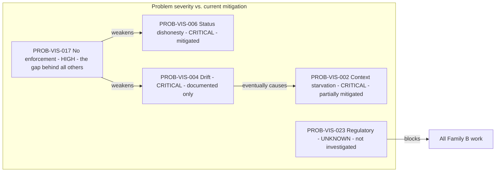

> **Diagram ID:** `DGM-VIS-010`
> **Explanation:** The dependency structure between the most severe problems. `PROB-VIS-017` — the
> absence of automated enforcement — is the load-bearing weakness: it undermines drift prevention
> and status honesty simultaneously. Installing the CI workflow skeletons is therefore the single
> highest-leverage mitigation available, and it is recorded as `OUT-VIS-004`.

---

## 01.5 — Users and Actors

### AI NAVIGATION METADATA — §01.5

| Field | Value |
| :--- | :--- |
| **AI READ PRIORITY** | **P0** |
| **AI DEPENDENCIES** | §01.4 Problem Space |
| **AI INPUTS** | A capability proposal needing an actor |
| **AI OUTPUTS** | The `ACT-VIS-` identifier served, or a rejection for serving no actor |
| **AI IMPLEMENTATION IMPACT** | Determines interface design, authorization model, and observability requirements |
| **AI VALIDATION REQUIREMENTS** | `VAL-VIS-037`…`VAL-VIS-046` |
| **AI RELATED DOCUMENTS** | `docs/MASTER_CONTEXT/03_USERS/INDEX.md`, `AOM-ARCH-001` §01.6 |

### 01.5.1 Actor Classification Rule

> **`VIS-031`.** An actor is listed only if repository evidence supports its existence or its
> explicit planning. Actors invented for narrative completeness are prohibited — they generate
> requirements for users who do not exist, which is a direct route to wasted implementation.

Actors are divided by **evidentiary status**, not by importance.

### TBL-VIS-024: Actor Register

| ID | Actor | Class | Present today? | Evidence | Status |
| :--- | :--- | :--- | :---: | :--- | :--- |
| `ACT-VIS-001` | Lead Architect | Human | **Yes** | `EVD-VIS-018` CODEOWNERS, ADR authorship | `IMPLEMENTED` |
| `ACT-VIS-002` | Repository Maintainer | Human | **Yes** | `EVD-VIS-018` — sole owner `@afshin-omnisystem` | `IMPLEMENTED` |
| `ACT-VIS-003` | Contributor | Human | **Yes** | `.github/` PR and issue templates | `IMPLEMENTED` |
| `ACT-VIS-004` | Operator / SRE | Human | No | `monitoring/`, `observability/` empty (`EVD-VIS-015`) | `PLANNED` |
| `ACT-VIS-005` | Autonomous Coding Agent | Machine | **Yes** | `EVD-VIS-004` `.ai/` control plane, operating manual | `IMPLEMENTED` |
| `ACT-VIS-006` | Agent Orchestrator | Machine | No | No orchestration code exists | `PLANNED` |
| `ACT-VIS-007` | Security Reviewer | Human | Partially | `security/` is `.gitkeep` only; `docs/security/SECURITY_ARCHITECTURE.md` exists | `PARTIALLY IMPLEMENTED` |
| `ACT-VIS-008` | Auditor | Human | No | No audit trail implementation | `PLANNED` |
| `ACT-VIS-009` | End User | Human | No | No application exists (`EVD-VIS-011`) | `PLANNED` |
| `ACT-VIS-010` | External System | Machine | No | No APIs exist (`EVD-VIS-012`) | `PLANNED` |
| `ACT-VIS-011` | CI/CD Automation | Machine | Partially | Skeletons not installed (`EVD-VIS-017`) | `PARTIALLY IMPLEMENTED` |
| `ACT-VIS-012` | Tenant Administrator | Human | No | No tenancy implementation | `PLANNED` |
| `ACT-VIS-013` | Plugin Author | Human | No | `plugins/` is `.gitkeep` only | `PROPOSED` |
| `ACT-VIS-014` | Data Analyst | Human | No | No data platform | `PROPOSED` |
| `ACT-VIS-015` | Model Provider | External service | No | No provider selected (`EVD-VIS-019`) | `PLANNED` |
| `ACT-VIS-016` | Architecture Board | Human body | Ambiguous | Referenced in `MASTER_CONTEXT_RULES.md`; membership undefined | `UNKNOWN — REQUIRES REPOSITORY VERIFICATION` |

> **Note on `ACT-VIS-016`.** `MASTER_CONTEXT_RULES.md` assigns domain-registration authority to an
> "Architecture Board", but no document defines its membership, quorum, or convening procedure.
> With `CODEOWNERS` mapping every path to one person (`EVD-VIS-018`), the Architecture Board is in
> practice a single individual. This gap is recorded as `CON-VIS-011` and is a genuine governance
> risk: a one-person board has no mechanism for disagreement.

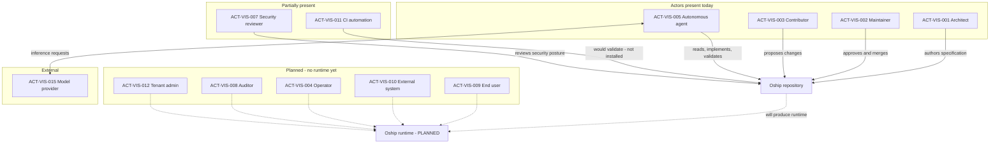

> **Diagram ID:** `DGM-VIS-011` — **Actor Map**
> **Explanation:** Who touches Oship today versus who will. Solid edges are real interactions;
> dashed edges are `PLANNED`. The striking feature is how few actors are real: four humans and one
> agent class, all interacting with a repository rather than a running system. Every requirement
> derived for a dashed-edge actor is speculative and must be labelled as such.

### 01.5.2 Actor Responsibility Matrix

### TBL-VIS-025: Actor Responsibility Matrix

Legend: **R** responsible · **A** accountable · **C** consulted · **I** informed · **—** not involved

| Activity | Architect | Maintainer | Contributor | Agent | Security | CI |
| :--- | :---: | :---: | :---: | :---: | :---: | :---: |
| Define vision | **A** | C | I | — | C | — |
| Author specification | **R** | C | C | **R** | C | — |
| Approve ADR | **A** | R | C | — | C | — |
| Write implementation | C | C | R | **R** | — | — |
| Review implementation | C | **A** | C | C | R | R |
| Merge to main | — | **A** | — | — | C | R |
| Release | — | **A** | — | — | C | R |
| Validate specification | C | C | — | **R** | — | **R** |
| Detect drift | C | C | — | R | — | **A** |
| Escalate ambiguity | C | **A** | R | **R** | C | — |
| Grant security exception | C | R | — | — | **A** | — |
| Allocate identifiers | **A** | C | — | R | — | — |

> **`VIS-032`.** The **A** column is never assigned to an agent. Accountability is a human property
> because it requires the capacity to bear consequence. An agent may be **R** — responsible for
> doing the work — but a human is always **A** for the outcome. This mirrors `AI-ARCH-041` in
> `AOM-ARCH-001` and is non-negotiable.

### 01.5.3 Actor Journeys

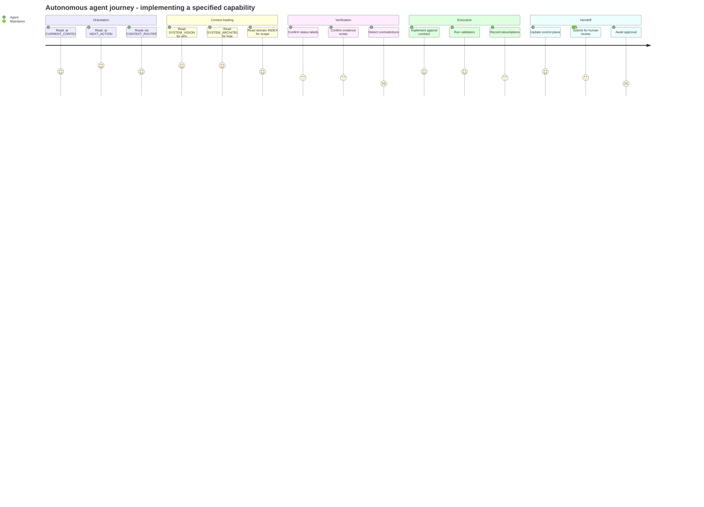

> **Diagram ID:** `DGM-VIS-012` — **AI Actor Journey**
> **Explanation:** The journey an agent takes on every task, with satisfaction scores reflecting
> where friction concentrates. The low scores in *Verification* and *Handoff* are honest: detecting
> contradictions is difficult without automated validation (`PROB-VIS-017`), and awaiting human
> approval is the throughput bottleneck (`PROB-VIS-008`). These are the two segments where
> investment yields the most.

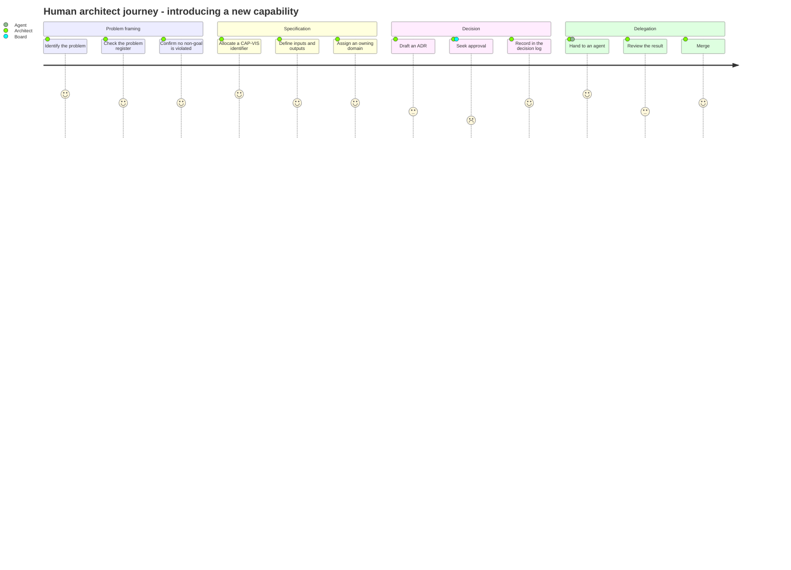

> **Diagram ID:** `DGM-VIS-013`
> **Explanation:** The human counterpart journey. The lowest score is *Seek approval*, which with a
> single-person Architecture Board (`ACT-VIS-016`, `CON-VIS-011`) is either instantaneous or
> impossible depending on whether that person is available — a structural fragility worth naming.

### 01.5.4 The AI Actor Model

Agents are not a single undifferentiated class. Oship distinguishes them by autonomy, because
autonomy determines the approval boundary.

### TBL-VIS-026: AI Actor Autonomy Classes

| Class | Description | May do without approval | Requires human approval | Status |
| :--- | :--- | :--- | :--- | :--- |
| **A0 — Reader** | Answers questions from repository content | All reads | Any write | `IMPLEMENTED` |
| **A1 — Author** | Drafts specifications and code | Create branch, write files, run validators | Merge, release | `IMPLEMENTED` |
| **A2 — Executor** | Runs multi-step tasks with tools | Everything in A1 plus tool invocation in a sandbox | Any state change outside the sandbox | `PARTIALLY IMPLEMENTED` |
| **A3 — Operator** | Acts on running systems | Nothing — every action is approved | All | `PROPOSED` — no runtime exists |
| **A4 — Autonomous** | Self-directs work selection | Not permitted in Oship | N/A | `PROHIBITED` — see `NG-VIS-013` |

> **`VIS-033`.** Class **A4** is explicitly prohibited. An agent that selects its own objectives has
> no accountable human for the outcome, which violates `VIS-032`. This prohibition is a
> **permanent** property of Oship's operating model, not a temporary caution pending better models.

---

## 01.6 — Value Model

### AI NAVIGATION METADATA — §01.6

| Field | Value |
| :--- | :--- |
| **AI READ PRIORITY** | **P1** |
| **AI DEPENDENCIES** | §01.4 Problem Space, §01.5 Users and Actors |
| **AI INPUTS** | A proposed capability with a named problem and actor |
| **AI OUTPUTS** | The value chain the capability participates in, or a rejection |
| **AI IMPLEMENTATION IMPACT** | Determines prioritisation order and what must be measured |
| **AI VALIDATION REQUIREMENTS** | `VAL-VIS-047`…`VAL-VIS-056` |
| **AI RELATED DOCUMENTS** | `docs/MASTER_CONTEXT/02_BUSINESS/INDEX.md`, §01.12 Success Model |

### 01.6.1 What "Value" Means Here

> **`VIS-034`.** Value in Oship is defined as **a measurable reduction in the cost or risk of
> producing correct enterprise software**, or **a measurable increase in the volume of correct
> software produced per unit of human attention**. Value claims that cannot be expressed in one of
> those two forms are not value claims; they are marketing.

This definition is deliberately narrow. It excludes several things commonly asserted as value:

| Excluded claim | Why it is excluded |
| :--- | :--- |
| "Improves developer experience" | Unmeasurable as stated; restate as reduced time-to-first-correct-change |
| "Modern architecture" | Describes a property, not a benefit to any actor |
| "AI-powered" | Describes a mechanism, not an outcome |
| "Best practices" | Appeals to authority; state the practice and its measured effect |
| "Scalable" | Meaningless without naming the dimension and the limit |

> **Table ID:** `TBL-VIS-027` — **Rejected Value Claim Forms**

### 01.6.2 The Value Chain

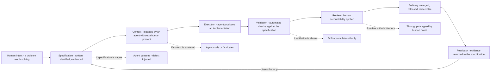

> **Diagram ID:** `DGM-VIS-014` — **The Oship Value Chain**
> **Explanation:** Value flows left to right through eight stages, and the loop closes when
> delivery evidence updates the specification. The dashed branches are the failure modes at each
> stage — each corresponds to a catalogued problem. The chain is only as strong as its weakest
> stage, and today the weakest is *Validation* (`PROB-VIS-017`: no installed CI).

### TBL-VIS-028: Value Chain Stages

| ID | Stage | Input | Output | Owner | Current maturity |
| :--- | :--- | :--- | :--- | :--- | :--- |
| `VAL-CHAIN-VIS-001` | Intent | A named problem | An accepted objective | `ACT-VIS-001` | `IMPLEMENTED` |
| `VAL-CHAIN-VIS-002` | Specification | Objective | Identified, evidenced spec text | `ACT-VIS-001`, `ACT-VIS-005` | `IMPLEMENTED` |
| `VAL-CHAIN-VIS-003` | Context assembly | Spec text | A loadable context bundle | `ACT-VIS-005` | `PARTIALLY IMPLEMENTED` |
| `VAL-CHAIN-VIS-004` | Execution | Context bundle | Candidate implementation | `ACT-VIS-005` | `PARTIALLY IMPLEMENTED` |
| `VAL-CHAIN-VIS-005` | Validation | Candidate | Pass or fail with reasons | `ACT-VIS-011` | `PLANNED` |
| `VAL-CHAIN-VIS-006` | Review | Validated candidate | Approved or rejected change | `ACT-VIS-002` | `IMPLEMENTED` |
| `VAL-CHAIN-VIS-007` | Delivery | Approved change | Merged and released artifact | `ACT-VIS-002`, `ACT-VIS-011` | `PARTIALLY IMPLEMENTED` |
| `VAL-CHAIN-VIS-008` | Feedback | Runtime and review evidence | Updated specification | `ACT-VIS-005` | `PLANNED` |
| `VAL-CHAIN-VIS-009` | Knowledge retention | All of the above | Durable, navigable knowledge | `ACT-VIS-001` | `PARTIALLY IMPLEMENTED` |
| `VAL-CHAIN-VIS-010` | Drift correction | Divergence signal | Corrected spec or code | `ACT-VIS-002` | `PLANNED` |
| `VAL-CHAIN-VIS-011` | Decision capture | A consequential choice | An immutable ADR | `ACT-VIS-001` | `IMPLEMENTED` |
| `VAL-CHAIN-VIS-012` | Onboarding | A new actor | A productive actor | `ACT-VIS-005` | `PARTIALLY IMPLEMENTED` |

> **`VIS-035`.** Exactly four of twelve stages are `IMPLEMENTED`. Five are partial and three are
> planned. The chain therefore **cannot yet deliver its claimed value end to end**, and any
> statement that it does is false. The honest current claim is: Oship has built the front half of
> its value chain — intent through execution — and has not built the back half.

### 01.6.3 Value Flow by Actor

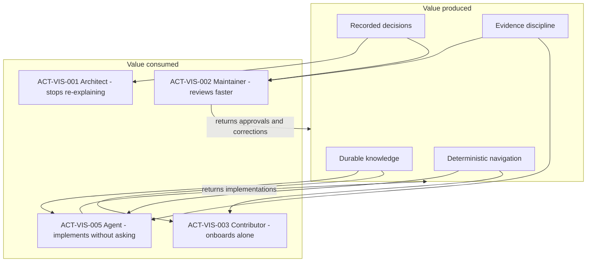

> **Diagram ID:** `DGM-VIS-015` — **Value Flow**
> **Explanation:** Value is produced by four assets and consumed by four actor classes, with two
> return flows that regenerate the assets. The agent both consumes the most value and returns the
> most — which is why agent tractability (`VIS-011`) is the primary purpose rather than a feature.

### TBL-VIS-029: Value Matrix — Asset Against Actor

Cell values: **H** high value · **M** moderate · **L** low · **—** none

| Asset | Architect | Maintainer | Contributor | Agent | Operator | End user |
| :--- | :---: | :---: | :---: | :---: | :---: | :---: |
| Durable knowledge (`CAP-VIS-002`) | H | H | H | **H** | M | — |
| Deterministic navigation (`CAP-VIS-007`) | M | M | H | **H** | L | — |
| Immutable decisions (`CAP-VIS-006`) | **H** | H | M | H | L | — |
| Evidence discipline (`VIS-004`) | H | **H** | M | **H** | M | L |
| Explicit non-goals (§01.11) | **H** | H | M | H | — | — |
| Status vocabulary (`TBL-VIS-003`) | M | H | M | **H** | M | — |
| Architecture spec (`AOM-ARCH-001`) | **H** | H | H | **H** | M | — |
| Runtime capability | — | — | — | — | **H** | **H** |

> **`VIS-036`.** The bottom row is empty for every actor except operator and end user, and those
> two actors do not yet exist (`ACT-VIS-004`, `ACT-VIS-009` are `PLANNED`). Oship currently
> delivers value **exclusively to its own producers**. This is defensible for a foundation phase
> and indefensible as a permanent state; §01.13 records the outcome that must end it.

### 01.6.4 Value Realisation Timing

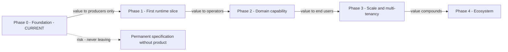

> **Diagram ID:** `DGM-VIS-016`
> **Explanation:** Value reaches successively wider audiences as phases advance. The dashed branch
> is the dominant strategic risk of a knowledge-first method: producing an exquisite specification
> that never becomes a system. That risk is named `FAL-VIS-001` and its detection signal is
> recorded in §01.25.

---

## 01.7 — System Capabilities

### AI NAVIGATION METADATA — §01.7

| Field | Value |
| :--- | :--- |
| **AI READ PRIORITY** | **P0 — this is the capability contract** |
| **AI DEPENDENCIES** | §01.4, §01.5, §01.6 |
| **AI INPUTS** | A capability identifier, or a request to add one |
| **AI OUTPUTS** | The capability's full contract, or a new `CAP-VIS-` allocation |
| **AI IMPLEMENTATION IMPACT** | **Direct.** Capabilities become architectural components in `AOM-ARCH-001` |
| **AI VALIDATION REQUIREMENTS** | `VAL-VIS-057`…`VAL-VIS-078` |
| **AI RELATED DOCUMENTS** | `AOM-ARCH-001` §01.7 components, §01.8 capability hierarchy |

### 01.7.1 Capability Definition Rule

> **`VIS-037`.** A capability is **a durable ability of the system to produce a defined outcome for
> a defined actor**. It is not a feature, a component, or a technology. Capabilities are stable
> across implementations; components are not. If renaming your database would change the
> capability's definition, you have written a component, not a capability.

Every capability entry carries eleven mandatory fields. An entry missing any field is invalid and
must be rejected by `VAL-VIS-057`.

### TBL-VIS-030: Mandatory Capability Fields

| # | Field | Purpose | Missing-value rule |
| :---: | :--- | :--- | :--- |
| 1 | ID | Stable reference | Never omit; never reuse |
| 2 | Name | Human-readable handle | Never omit |
| 3 | Purpose | Why it exists, one sentence | Never omit |
| 4 | Actor | Who it serves (`ACT-VIS-`) | If none, the capability is unjustified |
| 5 | Inputs | What it consumes | Write `NONE` if genuinely none |
| 6 | Outputs | What it produces | Never `NONE`; a capability with no output is not one |
| 7 | Dependencies | Other capabilities required | Write `NONE` for root capabilities |
| 8 | Business value | Which value chain stage it serves | Never omit |
| 9 | Technical value | What it makes possible technically | Never omit |
| 10 | Status | From `TBL-VIS-003` | Never omit; never inflate |
| 11 | Architectural impact | Which `AOM-ARCH-001` element it maps to | Write `UNMAPPED` if none exists yet |

Additionally, every capability carries an **AI impact** note describing how an agent should treat
it — this is the field that makes the register executable rather than descriptive.

### 01.7.2 Capability Group 1 — Knowledge and Context (`CAP-VIS-001`…`CAP-VIS-012`)

These are the capabilities Oship actually has today. They are described in full detail because they
are the only ones an agent can rely on.

### TBL-VIS-031: `CAP-VIS-001` — AI Control Plane

| Field | Value |
| :--- | :--- |
| **ID** | `CAP-VIS-001` |
| **Name** | AI Control Plane |
| **Purpose** | Give an agent a single, authoritative place to learn the current state of work and what to do next |
| **Actor** | `ACT-VIS-005`, `ACT-VIS-006` |
| **Inputs** | Completed work events; human direction |
| **Outputs** | `PROJECT_STATUS.md`, `CURRENT_CONTEXT.md`, `NEXT_ACTION.md`, `SESSION_MEMORY.md` |
| **Dependencies** | `NONE` — root capability |
| **Business value** | `VAL-CHAIN-VIS-003` context assembly; removes the human from the orientation loop |
| **Technical value** | Makes agent behaviour reproducible across sessions and models |
| **Status** | `IMPLEMENTED` |
| **Architectural impact** | `CMP-ARCH-001` in `AOM-ARCH-001`; layer `LYR-ARCH-001` |
| **Evidence** | `EVD-VIS-004` |
| **AI impact** | **Read this first, always.** If `NEXT_ACTION.md` contradicts your instructions, the human instruction wins but the contradiction must be reported. Update all three status files before ending any unit of work. |

### TBL-VIS-032: `CAP-VIS-002` — Knowledge Graph

| Field | Value |
| :--- | :--- |
| **ID** | `CAP-VIS-002` |
| **Name** | Master Context Knowledge Graph |
| **Purpose** | Hold all durable system knowledge in 24 addressable domains with defined relationships |
| **Actor** | All |
| **Inputs** | Specifications, decisions, standards |
| **Outputs** | Navigable, cross-referenced knowledge with stable anchors |
| **Dependencies** | `CAP-VIS-007` navigation, `CAP-VIS-004` metadata standard |
| **Business value** | `VAL-CHAIN-VIS-002`, `VAL-CHAIN-VIS-009` |
| **Technical value** | Every architectural claim has one canonical location, eliminating contradictory copies |
| **Status** | `PARTIALLY IMPLEMENTED` — all 24 domains registered with `INDEX.md`; most domain documents remain `PLANNED` |
| **Architectural impact** | `CMP-ARCH-002`; layer `LYR-ARCH-002` |
| **Evidence** | `EVD-VIS-006` |
| **AI impact** | Route through `docs/MASTER_CONTEXT/INDEX.md` §1003, never by filesystem guessing. A domain's `INDEX.md` is authoritative for what that domain owns. |

### TBL-VIS-033: `CAP-VIS-003` — Memory Constitution

| Field | Value |
| :--- | :--- |
| **ID** | `CAP-VIS-003` |
| **Name** | Memory System Constitution |
| **Purpose** | Define how knowledge is retained, retrieved, invalidated, and forgotten across sessions |
| **Actor** | `ACT-VIS-005`, `ACT-VIS-006` |
| **Inputs** | Session events, knowledge writes |
| **Outputs** | Retention rules, retrieval protocol, invalidation triggers |
| **Dependencies** | `CAP-VIS-002` |
| **Business value** | `VAL-CHAIN-VIS-009` |
| **Technical value** | Prevents unbounded context growth and stale-knowledge reuse |
| **Status** | `DOCUMENTED` — the constitution exists as specification; no runtime memory system is built |
| **Architectural impact** | `CMP-ARCH-003` |
| **Evidence** | `EVD-VIS-008` — `MASTER_CONTEXT_MEMORY_SYSTEM.md`, `RELEASED` status, 34,427 lines |
| **AI impact** | This is a **specification you follow manually**, not a service you call. Do not attempt to invoke a memory API; none exists. |

### TBL-VIS-034: `CAP-VIS-004`…`CAP-VIS-012` — Knowledge Capabilities, Compact Form

| ID | Name | Actor | Outputs | Status | Arch. impact |
| :--- | :--- | :--- | :--- | :--- | :--- |
| `CAP-VIS-004` | Metadata standard | All | 15-key YAML frontmatter on every document | `IMPLEMENTED` | `CMP-ARCH-004` |
| `CAP-VIS-005` | Architecture specification | Architect, agent | `AOM-ARCH-001`, layers, domains, invariants | `PARTIALLY IMPLEMENTED` — Part 01 of a multi-part document | `CMP-ARCH-005` |
| `CAP-VIS-006` | Immutable decision record | Architect, maintainer | ADRs, `DECISION_LOG.md` | `IMPLEMENTED` | `CMP-ARCH-006` |
| `CAP-VIS-007` | Deterministic navigation | Agent, contributor | `CONTEXT_ROUTER.md`, index hierarchy, stable anchors | `IMPLEMENTED` | `CMP-ARCH-007` |
| `CAP-VIS-008` | Identifier allocation | Architect, agent | Namespaced, never-reused IDs | `IMPLEMENTED` | `CMP-ARCH-008` |
| `CAP-VIS-009` | Drift detection | Maintainer, CI | Divergence reports between spec and code | `PLANNED` | `UNMAPPED` |
| `CAP-VIS-010` | Evidence linking | All | Each claim bound to an inspectable artifact | `PARTIALLY IMPLEMENTED` — convention, not enforced | `UNMAPPED` |
| `CAP-VIS-011` | Continuation protocol | Agent | Resumable long-form authoring across context limits | `IMPLEMENTED` | `UNMAPPED` |
| `CAP-VIS-012` | Validation rule catalogue | Agent, CI | Machine-checkable `VAL-` rules per document | `PARTIALLY IMPLEMENTED` — rules written, checkers absent | `UNMAPPED` |

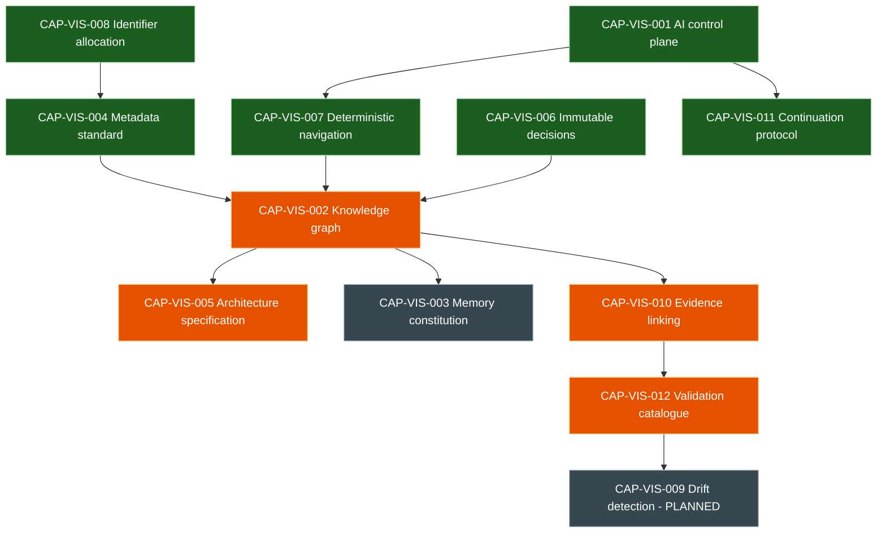

> **Diagram ID:** `DGM-VIS-017` — **Knowledge Capability Dependency Graph**
> **Explanation:** Green is `IMPLEMENTED`, orange `PARTIALLY IMPLEMENTED`, grey `DOCUMENTED` or
> `PLANNED`. Identifier allocation is the deepest root — everything else references identifiers, so
> instability there propagates everywhere. Drift detection sits at the far end of the longest
> dependency chain, which explains why it is still unbuilt: it requires four upstream capabilities
> to be complete first.

### 01.7.3 Capability Group 2 — Governance (`CAP-VIS-013`…`CAP-VIS-024`)

### TBL-VIS-035: Governance Capabilities

| ID | Name | Purpose | Actor | Status | Evidence |
| :--- | :--- | :--- | :--- | :--- | :--- |
| `CAP-VIS-013` | Ownership assignment | Every path has an accountable owner | Maintainer | `IMPLEMENTED` | `EVD-VIS-018` CODEOWNERS |
| `CAP-VIS-014` | Change proposal workflow | Structured PR and issue intake | Contributor | `IMPLEMENTED` | `.github/` templates |
| `CAP-VIS-015` | Domain registration | Controlled addition of knowledge domains | Architect | `IMPLEMENTED` | `MASTER_CONTEXT_RULES.md` PART 04 |
| `CAP-VIS-016` | Authority layering | L1–L5 knowledge layers with precedence | All | `IMPLEMENTED` | `PROJECT_PHILOSOPHY.md` §130 |
| `CAP-VIS-017` | Status vocabulary enforcement | Prevents aspirational claims | All | `PARTIALLY IMPLEMENTED` | Convention only |
| `CAP-VIS-018` | Exception handling | Recorded, time-bounded deviations | Architect | `PLANNED` | No exception register exists |
| `CAP-VIS-019` | Review gating | Nothing merges without human accountability | Maintainer | `PARTIALLY IMPLEMENTED` | Branch protection state `UNKNOWN` |
| `CAP-VIS-020` | Automated policy checks | CI enforcement of governance rules | CI | `PLANNED` | `EVD-VIS-017` skeletons not installed |
| `CAP-VIS-021` | Release governance | Controlled version and tag issuance | Maintainer | `PARTIALLY IMPLEMENTED` | Repo at `v0.1.0-alpha.0` |
| `CAP-VIS-022` | Security review process | Structured security assessment | Security reviewer | `DOCUMENTED` | `docs/security/` |
| `CAP-VIS-023` | Deprecation process | Orderly retirement of knowledge and code | Architect | `DOCUMENTED` | Status vocabulary includes `DEPRECATED` |
| `CAP-VIS-024` | Audit trail of governance acts | Who decided what, when, and why | Auditor | `PARTIALLY IMPLEMENTED` | Git history plus `DECISION_LOG.md` |

> **`VIS-038`.** Six of twelve governance capabilities depend on automation that does not exist.
> Oship's governance is currently **advisory**. An agent must not assume that a rule stated in this
> repository will be caught if violated — the agent itself is frequently the only enforcement
> mechanism present. Behave accordingly.

### 01.7.4 Capability Group 3 — Runtime and Domain (`CAP-VIS-025`…`CAP-VIS-070`)

> **`VIS-039`.** Every capability in this group is `PLANNED` or `PROPOSED`. **None is callable.**
> They are recorded so that architecture can be derived from them, not so that code can invoke
> them. An agent that generates a call into any of these capabilities has committed `FAL-VIS-004`.

### TBL-VIS-036: Platform Runtime Capabilities

| ID | Name | Purpose | Actor | Dependencies | Status |
| :--- | :--- | :--- | :--- | :--- | :--- |
| `CAP-VIS-025` | Service runtime | Host executable services | Operator | Stack selection `UNKNOWN` | `PLANNED` |
| `CAP-VIS-026` | API surface | Expose contracts to external systems | External system | `CAP-VIS-025` | `PLANNED` |
| `CAP-VIS-027` | Persistence | Durable, transactional state | End user | `CAP-VIS-025` | `PLANNED` |
| `CAP-VIS-028` | Identity and access | Authenticate and authorise every call | All | `CAP-VIS-026` | `PLANNED` |
| `CAP-VIS-029` | Multi-tenancy | Isolate tenant data structurally | Tenant admin | `CAP-VIS-027`, `CAP-VIS-028` | `PLANNED` |
| `CAP-VIS-030` | Observability | Metrics, logs, traces, and alerting | Operator | `CAP-VIS-025` | `PLANNED` |
| `CAP-VIS-031` | Configuration management | Environment-specific settings without rebuilds | Operator | `CAP-VIS-025` | `PLANNED` |
| `CAP-VIS-032` | Secret management | Credentials never in source | Operator, security | `CAP-VIS-031` | `PLANNED` |
| `CAP-VIS-033` | Deployment automation | Reproducible promotion across environments | CI | `CAP-VIS-025` | `PLANNED` |
| `CAP-VIS-034` | Event backbone | Asynchronous, ordered, replayable messaging | External system | `CAP-VIS-025` | `PLANNED` |
| `CAP-VIS-035` | Scheduling | Time- and event-triggered work | Operator | `CAP-VIS-034` | `PLANNED` |
| `CAP-VIS-036` | Rate limiting and quota | Protect the system from load | Operator | `CAP-VIS-026` | `PLANNED` |
| `CAP-VIS-037` | Plugin extension | Third-party capability injection | Plugin author | `CAP-VIS-025` | `PROPOSED` |
| `CAP-VIS-038` | Data export | Tenant-initiated retrieval of own data | Tenant admin | `CAP-VIS-027` | `PROPOSED` |
| `CAP-VIS-039` | Backup and restore | Recoverability from data loss | Operator | `CAP-VIS-027` | `PLANNED` |
| `CAP-VIS-040` | Disaster recovery | Defined RPO and RTO under region loss | Operator | `CAP-VIS-039` | `PROPOSED` |

### TBL-VIS-037: Money Factory Domain Capabilities

| ID | Name | Purpose | Actor | Status | Note |
| :--- | :--- | :--- | :--- | :--- | :--- |
| `CAP-VIS-041` | Transaction ingestion | Accept financial workload items | External system | `PLANNED` | Domain per `EVD-VIS-021` |
| `CAP-VIS-042` | Transaction processing | Apply domain rules to each item | End user | `PLANNED` | The "factory" in Money Factory |
| `CAP-VIS-043` | Ledger | Immutable double-entry record | Auditor | `PLANNED` | Required by `PROB-VIS-020` |
| `CAP-VIS-044` | Settlement | Finalise value movement exactly once | End user | `PLANNED` | Required by `PROB-VIS-021` |
| `CAP-VIS-045` | Reconciliation | Detect and resolve divergence between records | Auditor | `PLANNED` | — |
| `CAP-VIS-046` | Reporting | Aggregate views over ledger state | Data analyst | `PROPOSED` | — |
| `CAP-VIS-047` | Compliance controls | Enforce jurisdictional obligations | Auditor | `UNKNOWN — REQUIRES REPOSITORY VERIFICATION` | No regime named; see `PROB-VIS-023` |
| `CAP-VIS-048` | Fraud signalling | Flag anomalous activity | Security reviewer | `PROPOSED` | — |

### TBL-VIS-038: AI Runtime Capabilities

| ID | Name | Purpose | Actor | Status | Note |
| :--- | :--- | :--- | :--- | :--- | :--- |
| `CAP-VIS-049` | Model invocation | Call an inference provider | Agent | `PLANNED` | No provider selected (`EVD-VIS-019`) |
| `CAP-VIS-050` | Prompt and context assembly | Build a task context from the knowledge graph | Agent | `PARTIALLY IMPLEMENTED` | Done manually today |
| `CAP-VIS-051` | Agent task orchestration | Sequence multi-step agent work | Orchestrator | `PLANNED` | — |
| `CAP-VIS-052` | Output validation | Check agent output against specification | CI | `PLANNED` | Blocked on `CAP-VIS-012` |
| `CAP-VIS-053` | Provider abstraction | Avoid single-vendor dependence | Architect | `PLANNED` | Mitigates `PROB-VIS-009` |
| `CAP-VIS-054` | Agent audit trail | Record what an agent did and why | Auditor | `PARTIALLY IMPLEMENTED` | Git history plus session memory |
| `CAP-VIS-055` | Cost and token governance | Bound inference spend | Maintainer | `PROPOSED` | — |
| `CAP-VIS-056` | Human approval gateway | Enforce the A0–A3 autonomy boundary | Maintainer | `PARTIALLY IMPLEMENTED` | Enforced socially, not technically |

### TBL-VIS-039: Bounded-Context Capabilities

| ID | Name | Bounded context | Status | Evidence |
| :--- | :--- | :--- | :--- | :--- |
| `CAP-VIS-060` | Governance and AI context | `.ai/`, `.github/` | `IMPLEMENTED` as documentation | `EVD-VIS-020` |
| `CAP-VIS-061` | Core Platform context | Shared runtime services | `PLANNED` | `EVD-VIS-020` |
| `CAP-VIS-062` | Financial Factory context | Domain processing engine | `PLANNED` | `EVD-VIS-020` |
| `CAP-VIS-063` | Observability context | Telemetry and operations | `PLANNED` | `EVD-VIS-020` |
| `CAP-VIS-064` | Ecosystem context | Plugins, SDKs, external integrations | `PROPOSED` | `UNMAPPED` |
| `CAP-VIS-065` | Developer experience context | Tooling, templates, scaffolds | `PROPOSED` | `templates/` is empty |
| `CAP-VIS-066` | Knowledge context | The Master Context itself as a product | `PARTIALLY IMPLEMENTED` | `EVD-VIS-006` |
| `CAP-VIS-067` | Security context | Threat model, controls, response | `DOCUMENTED` | `docs/security/` |
| `CAP-VIS-068` | Data context | Schemas, lineage, retention | `PLANNED` | `database/` empty |
| `CAP-VIS-069` | Integration context | Inbound and outbound system contracts | `PLANNED` | `apis/` empty |
| `CAP-VIS-070` | Experimentation context | Research and prototypes, quarantined | `PROPOSED` | `research/`, `experiments/` empty |

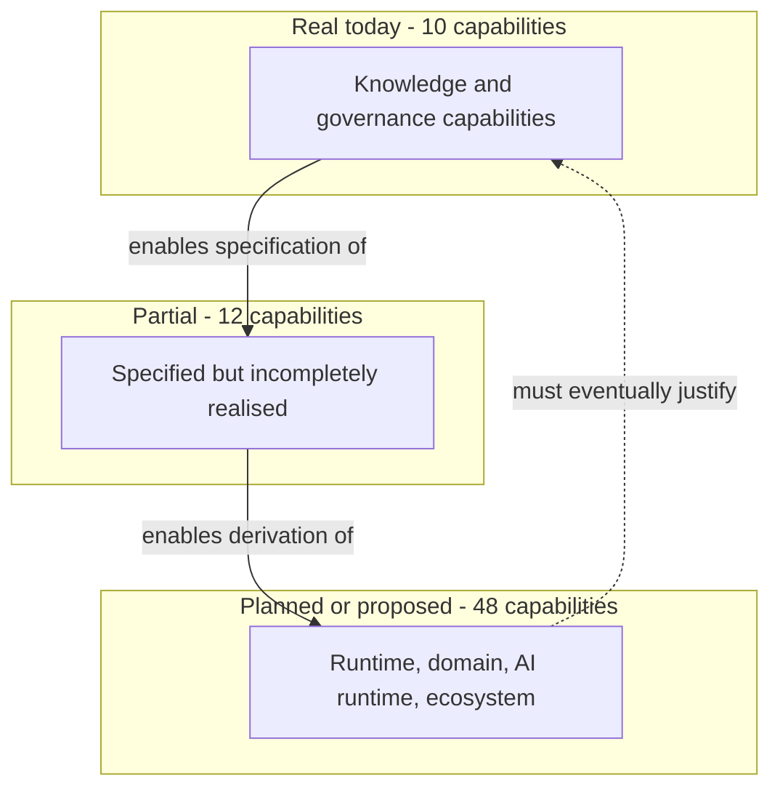

> **Diagram ID:** `DGM-VIS-018` — **Capability Reality Distribution**
> **Explanation:** The proportions matter more than the boxes. Roughly one capability in seven is
> real. The dashed return edge states the obligation that makes the whole structure honest: the
> planned capabilities must eventually justify the investment in the real ones. If they never
> arrive, the knowledge layer was overhead, not value.

---

## 01.8 — Capability Hierarchy

### AI NAVIGATION METADATA — §01.8

| Field | Value |
| :--- | :--- |
| **AI READ PRIORITY** | **P1** |
| **AI DEPENDENCIES** | §01.7 System Capabilities |
| **AI INPUTS** | A capability identifier |
| **AI OUTPUTS** | Its tier, parents, children, and blocking dependencies |
| **AI IMPLEMENTATION IMPACT** | Determines build order; a capability may not be built before its parents |
| **AI VALIDATION REQUIREMENTS** | `VAL-VIS-079`…`VAL-VIS-088` |
| **AI RELATED DOCUMENTS** | `AOM-ARCH-001` §01.5 layers |

### 01.8.1 The Five Capability Tiers

> **`VIS-040`.** Capabilities are organised into five tiers by **what they depend on**, not by
> importance. A tier-N capability may depend only on tiers 1 through N. A dependency that points
> upward is a structural defect and must be reported as `FAL-VIS-011`.

### TBL-VIS-040: Capability Tiers

| Tier | Name | Definition | Depends on | Example |
| :---: | :--- | :--- | :--- | :--- |
| **T1** | Foundational | Exists without any other capability | Nothing | `CAP-VIS-008` identifiers |
| **T2** | Structural | Organises foundational elements into a system of knowledge | T1 | `CAP-VIS-002` knowledge graph |
| **T3** | Operational | Applies structure to produce work | T1–T2 | `CAP-VIS-009` drift detection |
| **T4** | Platform | Executes software at runtime | T1–T3 | `CAP-VIS-025` service runtime |
| **T5** | Domain | Delivers end-user outcomes | T1–T4 | `CAP-VIS-044` settlement |

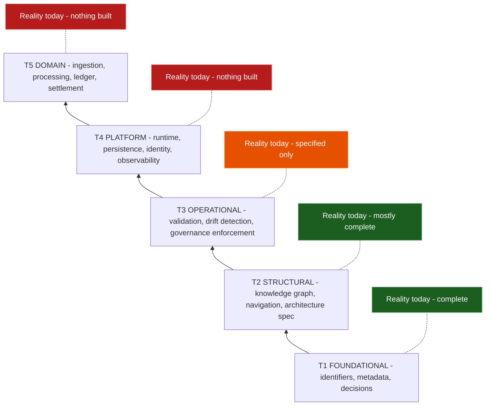

> **Diagram ID:** `DGM-VIS-019` — **Capability Tier Stack with Reality Annotation**
> **Explanation:** The stack is read bottom-up as a build order. The annotations on the right make
> the current position unambiguous: Oship is complete at T1, nearly complete at T2, specified at
> T3, and empty at T4 and T5. Any plan that proposes T5 work before T4 exists is invalid.

### 01.8.2 Hierarchy Assignments

### TBL-VIS-041: Tier Assignment of All Registered Capabilities

| Tier | Capabilities | Count | Aggregate status |
| :---: | :--- | :---: | :--- |
| T1 | `CAP-VIS-004`, `006`, `008`, `011`, `013`, `016` | 6 | All `IMPLEMENTED` |
| T2 | `CAP-VIS-001`, `002`, `003`, `005`, `007`, `010`, `014`, `015`, `066` | 9 | 5 implemented, 4 partial |
| T3 | `CAP-VIS-009`, `012`, `017`…`024`, `050`, `052`, `054`, `056`, `067` | 15 | 0 implemented, 6 partial, 9 planned |
| T4 | `CAP-VIS-025`…`040`, `049`, `051`, `053`, `055`, `060`…`065`, `068`…`070` | 28 | 1 implemented (`060`, as docs), rest planned or proposed |
| T5 | `CAP-VIS-041`…`048` | 8 | All planned, proposed, or unknown |

> **`VIS-041`.** The distribution is the clearest single statement of where Oship is: **complete at
> the bottom, empty at the top**. This is the intended shape for a knowledge-first method at
> Phase 0. It becomes pathological only if T4 remains empty indefinitely — see `FAL-VIS-001`.

### 01.8.3 Parent–Child Decomposition

```mermaid
flowchart TB
    ROOT["Oship system capability"]
    ROOT --> K["Knowledge capability"]
    ROOT --> G["Governance capability"]
    ROOT --> P["Platform capability"]
    ROOT --> D["Domain capability"]
    ROOT --> A["AI capability"]

    K --> K1["CAP-VIS-002 Knowledge graph"]
    K --> K2["CAP-VIS-007 Navigation"]
    K --> K3["CAP-VIS-003 Memory"]
    K1 --> K1a["24 domain indexes"]
    K1 --> K1b["Cross-reference relationships"]
    K2 --> K2a["Context router"]
    K2 --> K2b["Stable anchors"]

    G --> G1["CAP-VIS-006 Decisions"]
    G --> G2["CAP-VIS-013 Ownership"]
    G --> G3["CAP-VIS-019 Review gating"]

    P --> P1["CAP-VIS-025 Runtime"]
    P --> P2["CAP-VIS-027 Persistence"]
    P --> P3["CAP-VIS-030 Observability"]

    D --> D1["CAP-VIS-042 Processing"]
    D --> D2["CAP-VIS-043 Ledger"]
    D --> D3["CAP-VIS-044 Settlement"]

    A --> A1["CAP-VIS-050 Context assembly"]
    A --> A2["CAP-VIS-052 Output validation"]
    A --> A3["CAP-VIS-056 Approval gateway"]
```

> **Diagram ID:** `DGM-VIS-020` — **Capability Decomposition Tree**
> **Explanation:** Five branches from a single root, each decomposed two levels. The tree is
> deliberately shallow — deeper decomposition belongs in `AOM-ARCH-001`, where capabilities become
> components. A vision document that decomposes to implementation detail has overstepped its
> authority layer.

### TBL-VIS-042: Capability Blocking Chains

| Blocked capability | Blocked by | Nature of block | Unblocking action |
| :--- | :--- | :--- | :--- |
| `CAP-VIS-009` drift detection | `CAP-VIS-012`, `CAP-VIS-020` | No automated checker exists | Install CI skeletons (`OUT-VIS-004`) |
| `CAP-VIS-020` policy checks | `ACT-VIS-011` CI automation | Workflows not in `.github/workflows/` | Install and enable |
| `CAP-VIS-026` API surface | `CAP-VIS-025` runtime | Nothing to expose | Select a stack (`OUT-VIS-006`) |
| `CAP-VIS-029` multi-tenancy | `CAP-VIS-027`, `CAP-VIS-028` | No persistence or identity | Sequential |
| `CAP-VIS-042` processing | `CAP-VIS-061` core platform | No platform context exists | Sequential |
| `CAP-VIS-047` compliance | `PROB-VIS-023` | No regime identified | Investigate and record |
| `CAP-VIS-049` model invocation | `EVD-VIS-019` | No provider selected | Decide and record an ADR |
| `CAP-VIS-051` orchestration | `CAP-VIS-049`, `CAP-VIS-056` | No invocation or approval gate | Sequential |
| `CAP-VIS-056` approval gateway | `CAP-VIS-025` | Enforced socially today | Build once a runtime exists |
| `CAP-VIS-037` plugins | `CAP-VIS-025`, `CAP-VIS-069` | No runtime or integration contracts | Deferred to Phase 4 |

> **`VIS-042`.** Every blocking chain in `TBL-VIS-042` terminates in one of three roots: **install
> CI**, **select a stack**, or **investigate compliance**. Those three actions unblock the entire
> forward capability set, which makes them the highest-leverage decisions available to Oship. They
> are recorded as `OUT-VIS-004`, `OUT-VIS-006`, and `OUT-VIS-011`.

---

## 01.9 — System Boundaries

### AI NAVIGATION METADATA — §01.9

| Field | Value |
| :--- | :--- |
| **AI READ PRIORITY** | **P0 — boundary violations are security defects** |
| **AI DEPENDENCIES** | §01.5, §01.7 |
| **AI INPUTS** | A proposed interaction between two elements |
| **AI OUTPUTS** | Whether the interaction crosses a boundary and what that requires |
| **AI IMPLEMENTATION IMPACT** | Determines trust, validation, and authorization requirements |
| **AI VALIDATION REQUIREMENTS** | `VAL-VIS-089`…`VAL-VIS-100` |
| **AI RELATED DOCUMENTS** | `AOM-ARCH-001` §01.9 trust boundaries `TB-1`…`TB-10` |

### 01.9.1 Boundary Taxonomy

> **`VIS-043`.** Oship recognises four boundary kinds. Confusing them is the source of most
> security and architectural error, because each kind implies a different obligation.

### TBL-VIS-043: Boundary Kinds

| Kind | Definition | Obligation when crossed | Example |
| :--- | :--- | :--- | :--- |
| **Scope boundary** | What Oship does versus does not do | Reject as out of scope, or amend §01.11 | Oship is not an IDE |
| **Trust boundary** | Where data changes trust level | Validate, authorise, log | External request enters a service |
| **Knowledge boundary** | What is known versus unknown | Label `UNKNOWN`; never fabricate | Technology stack |
| **Autonomy boundary** | What an agent may do unapproved | Halt and request human approval | Merging to main |

### TBL-VIS-044: System Boundary Register

| ID | Boundary | Kind | Inside | Outside | Crossing rule | Status |
| :--- | :--- | :--- | :--- | :--- | :--- | :--- |
| `BND-VIS-001` | Repository boundary | Scope | Everything in `afshin-omnisystem/Oship` | Any other repository | Cross-repo references must be versioned and explicit | `IMPLEMENTED` |
| `BND-VIS-002` | Knowledge authority boundary | Scope | `docs/MASTER_CONTEXT/` | All other documentation | Master Context wins on conflict | `IMPLEMENTED` |
| `BND-VIS-003` | Control-plane boundary | Autonomy | `.ai/` | Application content | Agents write `.ai/`; humans approve everything else | `IMPLEMENTED` |
| `BND-VIS-004` | Specification–implementation boundary | Scope | Documents | Code | Code must trace to a specification | `DOCUMENTED` |
| `BND-VIS-005` | Human approval boundary | Autonomy | Agent-proposed changes | Merged main | No merge without human accountability | `PARTIALLY IMPLEMENTED` |
| `BND-VIS-006` | Model provider boundary | Trust | Oship knowledge | External inference provider | Treat provider output as untrusted input | `PLANNED` |
| `BND-VIS-007` | Tenant boundary | Trust | One tenant's data | Every other tenant | Isolation enforced server-side, never by caller scope | `PLANNED` |
| `BND-VIS-008` | Public API boundary | Trust | Internal services | External callers | Authenticate, authorise, validate, rate-limit | `PLANNED` |
| `BND-VIS-009` | Environment boundary | Trust | Production | Non-production | No production data outside production | `PLANNED` |
| `BND-VIS-010` | Secret boundary | Trust | Secret store | Source, logs, and prompts | Secrets never enter source, logs, or model context | `PLANNED` |
| `BND-VIS-011` | Domain context boundary | Scope | One bounded context | Another | Cross-context via explicit contracts only | `DOCUMENTED` |
| `BND-VIS-012` | Evidence boundary | Knowledge | Verified claims | Unverified assertions | Unverified claims labelled `UNKNOWN` | `IMPLEMENTED` |
| `BND-VIS-013` | Time boundary | Knowledge | Present state | Future intent | Never write future intent in present tense | `IMPLEMENTED` |
| `BND-VIS-014` | Experimentation boundary | Scope | `research/`, `experiments/` | Production paths | Experimental code never imported by production | `PROPOSED` |
| `BND-VIS-015` | Plugin boundary | Trust | Oship core | Third-party plugins | Plugins run with least privilege | `PROPOSED` |
| `BND-VIS-016` | Regulatory boundary | Knowledge | Known obligations | Unknown obligations | `UNKNOWN — REQUIRES REPOSITORY VERIFICATION` | `UNKNOWN` |

### 01.9.2 System Context

```mermaid
flowchart TB
    subgraph OSHIP["OSHIP SYSTEM - what exists today"]
        MC["Master Context knowledge graph"]
        AI[".ai control plane"]
        GH[".github governance"]
        ARCH["Architecture specification"]
    end

    subgraph HUMANS["Human actors"]
        H1["Architect"]
        H2["Maintainer"]
        H3["Contributor"]
    end

    subgraph MACHINES["Machine actors"]
        M1["Autonomous coding agent"]
        M2["CI automation - skeletons only"]
    end

    subgraph EXT["External systems"]
        E1["GitHub platform"]
        E2["Model provider - unselected"]
    end

    subgraph PLANNED["Planned runtime - does not exist"]
        R1["Services"]
        R2["Data stores"]
        R3["APIs"]
    end

    H1 -->|"authors"| MC
    H2 -->|"approves"| GH
    H3 -->|"proposes"| GH
    M1 -->|"reads and writes"| AI
    M1 -->|"reads"| MC
    M1 -->|"reads"| ARCH
    M1 <-.->|"BND-VIS-006 untrusted"| E2
    GH <-->|"hosted on"| E1
    M2 -.->|"would enforce"| GH
    MC -.->|"BND-VIS-004 will specify"| R1
    ARCH -.-> R2
    ARCH -.-> R3
```

> **Diagram ID:** `DGM-VIS-021` — **System Context Diagram**
> **Explanation:** The full external context. Note that Oship's only live external dependency today
> is the GitHub platform; the model provider edge is dashed because no provider has been selected
> (`EVD-VIS-019`), and the entire planned runtime subgraph is dashed. This is a system whose
> current surface area is a repository.

### 01.9.3 Trust Boundary Model

```mermaid
flowchart LR
    subgraph Z0["Zone 0 - Untrusted"]
        U1["External callers"]
        U2["Model provider output"]
        U3["Third-party plugins"]
    end
    subgraph Z1["Zone 1 - Semi-trusted"]
        S1["Authenticated tenants"]
        S2["CI automation"]
    end
    subgraph Z2["Zone 2 - Trusted"]
        T1["Internal services"]
        T2["Maintainers"]
    end
    subgraph Z3["Zone 3 - Highly trusted"]
        C1["Secret store"]
        C2["Ledger of record"]
    end

    U1 -->|"BND-VIS-008 authenticate, authorise, validate"| S1
    U2 -->|"BND-VIS-006 validate before use"| T1
    U3 -->|"BND-VIS-015 least privilege"| T1
    S1 -->|"BND-VIS-007 tenant isolation"| T1
    S2 -->|"scoped credentials"| T1
    T1 -->|"BND-VIS-010 broker access only"| C1
    T1 -->|"append only"| C2
    T2 -->|"BND-VIS-005 approval required"| T1
```

> **Diagram ID:** `DGM-VIS-022` — **Trust Zone Model**
> **Explanation:** Four trust zones with the crossing obligation labelled on every edge. The zone
> assignment of model-provider output is the entry most often violated in AI-native systems: an
> LLM response is Zone 0 data, exactly like a request from an anonymous internet caller, and must
> be validated before it influences state. This maps to `TB-4` in `AOM-ARCH-001`.

### 01.9.4 The AI Boundary

> **`VIS-044`.** The AI boundary is the line between **what an agent decides** and **what a human
> decides**. Oship places it at *consequence*: an agent may decide anything reversible without cost;
> a human must decide anything irreversible or costly.

### TBL-VIS-045: AI Boundary Decision Rules

| Action | Reversible? | Cost if wrong | Decider | Rationale |
| :--- | :---: | :--- | :--- | :--- |
| Read any repository file | Yes | None | Agent | No consequence |
| Create a branch | Yes | None | Agent | Discardable |
| Write specification text on a branch | Yes | Review time | Agent | Caught in review |
| Allocate a new identifier | **No** — IDs are never reused | Low | Agent, recorded | Allocation is append-only and safe |
| Change an existing identifier | **No** | High — breaks references | **Human** | Reference rot is unrecoverable |
| Merge to main | Partially | Moderate | **Human** | `BND-VIS-005` |
| Publish a release or tag | **No** | High | **Human** | Consumers depend on it |
| Approve an ADR | **No** | Very high | **Human** | ADRs are immutable once approved |
| Modify an approved ADR | Prohibited | Catastrophic to trust | **Nobody** | Supersede instead |
| Delete history | **No** | Catastrophic | **Nobody** | Prohibited outright |
| Select the technology stack | **No** | Very high | **Human** | Constrains everything downstream |
| Call an external paid service | Depends | Financial | **Human** | Spend requires accountability |

```mermaid
flowchart TD
    START["Agent proposes an action"] --> Q1{"Is it reversible with no residue?"}
    Q1 -->|"Yes"| Q2{"Does it change shared state?"}
    Q1 -->|"No"| Q3{"Does it break existing references or contracts?"}
    Q2 -->|"No"| ALLOW["Agent proceeds - record in session memory"]
    Q2 -->|"Yes"| REVIEW["Agent proceeds on a branch - human reviews"]
    Q3 -->|"Yes"| HUMAN["Human decision required - agent must halt"]
    Q3 -->|"No"| Q4{"Does it incur cost or external effect?"}
    Q4 -->|"Yes"| HUMAN
    Q4 -->|"No"| REVIEW
    HUMAN --> RECORD["Record the decision in an ADR or the decision log"]
```

> **Diagram ID:** `DGM-VIS-023` — **AI Boundary Decision Tree**
> **Explanation:** A four-question test any agent can execute mechanically. It resolves in at most
> four comparisons and never requires the agent to estimate importance — only reversibility,
> shared-state effect, reference breakage, and external cost, all of which are objectively
> checkable. This is `DEC-VIS-002`.

---

## 01.10 — Strategic Principles

### AI NAVIGATION METADATA — §01.10

| Field | Value |
| :--- | :--- |
| **AI READ PRIORITY** | **P0 — principles resolve conflicts between all lower documents** |
| **AI DEPENDENCIES** | §01.2, §01.3 |
| **AI INPUTS** | A design conflict or ambiguous choice |
| **AI OUTPUTS** | The governing principle and the resulting decision |
| **AI IMPLEMENTATION IMPACT** | Every architectural choice must be defensible against these principles |
| **AI VALIDATION REQUIREMENTS** | `VAL-VIS-101`…`VAL-VIS-112` |
| **AI RELATED DOCUMENTS** | `README.md` Ten Immutable Tenets, `AOM-ARCH-001` §01.4 |

### 01.10.1 Principle Format and Precedence

> **`VIS-045`.** Principles are **ordered**. When two principles conflict, the lower-numbered
> principle wins. This ordering is the single most important property of this section: an unordered
> principle list resolves no conflicts and is therefore decorative.

### TBL-VIS-046: Strategic Principle Register — Ordered by Precedence

| Rank | ID | Principle | Statement | Consequence when applied | Source |
| :---: | :--- | :--- | :--- | :--- | :--- |
| 1 | `PRN-VIS-001` | **Truth over comfort** | A document states what is, not what is hoped | Unflattering gaps are written down explicitly | `VIS-004` |
| 2 | `PRN-VIS-002` | **Determinism over cleverness** | Given the same input, produce the same output | Reject non-reproducible generation | Tenet: Deterministic |
| 3 | `PRN-VIS-003` | **Explicit over implicit** | Unstated rules do not exist | Every constraint is written or is not enforced | `PROB-VIS-014` |
| 4 | `PRN-VIS-004` | **Traceable over expedient** | Every artifact links to its justification | Untraceable work is rejected regardless of quality | `PROB-VIS-010` |
| 5 | `PRN-VIS-005` | **Agent-tractable over human-elegant** | Optimise for the reader who cannot ask questions | Verbosity is preferred to allusion | `VIS-011` |
| 6 | `PRN-VIS-006` | **Immutable decisions** | Approved decisions are superseded, never edited | History remains auditable | `EVD-VIS-005` |
| 7 | `PRN-VIS-007` | **Stable identity** | Identifiers are permanent and never reused | References survive refactoring | `CAP-VIS-008` |
| 8 | `PRN-VIS-008` | **Human accountability** | A human is answerable for every consequential outcome | No unattended irreversible action | `VIS-032` |
| 9 | `PRN-VIS-009` | **Boundaries before features** | Define what something is not before extending it | Non-goals precede roadmaps | §01.11 |
| 10 | `PRN-VIS-010` | **Evidence before assertion** | A claim without an inspectable artifact is a hypothesis | `UNKNOWN` is an acceptable answer | `PROB-VIS-015` |
| 11 | `PRN-VIS-011` | **Visual before verbal** | Structure is shown before it is described | No concept exceeds roughly 120 lines unillustrated | Document standard |
| 12 | `PRN-VIS-012` | **Composition over inheritance of complexity** | Prefer small composable units to large configurable ones | Reject frameworks that demand total adoption | Tenet: Modular |
| 13 | `PRN-VIS-013` | **Reversibility preferred** | Choose the option that is cheaper to undo | Two-way doors are taken quickly; one-way doors slowly | `DGM-VIS-023` |
| 14 | `PRN-VIS-014` | **Cost of change is the metric** | Optimise for the second change, not the first | Accept slower initial delivery for lower drift | `VIS-034` |
| 15 | `PRN-VIS-015` | **Vendor independence** | No single provider may be structurally required | Abstract inference providers | `PROB-VIS-009` |
| 16 | `PRN-VIS-016` | **Least privilege by default** | Grant the minimum access that permits the work | Deny-by-default posture | `BND-VIS-015` |
| 17 | `PRN-VIS-017` | **Observability is not optional** | An unobservable system is an unmanageable one | Telemetry is designed in, not bolted on | `CAP-VIS-030` |
| 18 | `PRN-VIS-018` | **Small surfaces** | Fewer public contracts means fewer irreversible commitments | Internal by default | `PRN-VIS-013` |
| 19 | `PRN-VIS-019` | **Delete rather than accumulate** | Dead knowledge is a liability | Deprecate and remove explicitly | `CAP-VIS-023` |
| 20 | `PRN-VIS-020` | **Finish before starting** | Complete a part before opening the next | Append-only parts; no half-finished parallel work | Continuation protocol |

```mermaid
flowchart TD
    CONFLICT["Two valid options conflict"] --> P1{"Does one option state something untrue or unevidenced?"}
    P1 -->|"Yes"| REJ1["Reject it - PRN-VIS-001 and PRN-VIS-010"]
    P1 -->|"No"| P2{"Is one option non-deterministic?"}
    P2 -->|"Yes"| REJ2["Prefer the deterministic option - PRN-VIS-002"]
    P2 -->|"No"| P3{"Does one rely on an unstated rule?"}
    P3 -->|"Yes"| REJ3["Prefer the explicit option - PRN-VIS-003"]
    P3 -->|"No"| P4{"Can one option be traced to a problem and actor?"}
    P4 -->|"Only one"| REJ4["Prefer the traceable option - PRN-VIS-004"]
    P4 -->|"Both"| P5{"Which is easier for an agent to execute without asking?"}
    P5 --> REJ5["Prefer that one - PRN-VIS-005"]
    P5 -->|"Equal"| P6{"Which is cheaper to reverse?"}
    P6 --> REJ6["Prefer that one - PRN-VIS-013"]
    P6 -->|"Equal"| ESC["Escalate to a human - PRN-VIS-008"]
```

> **Diagram ID:** `DGM-VIS-024` — **Principle Conflict Resolution Tree**
> **Explanation:** This is the executable form of `PRN-VIS-001`…`PRN-VIS-005` plus `PRN-VIS-013`.
> An agent walks it top to bottom and either reaches a decision or escalates. Crucially, escalation
> is a legitimate terminal state — an agent that cannot resolve a conflict must stop, not invent a
> tiebreaker. This is `DEC-VIS-003`.

### 01.10.2 Principles Under Tension

> **`VIS-046`.** Principles are not mutually harmonious, and pretending otherwise is dishonest.
> The following tensions are real, permanent, and resolved by precedence rather than eliminated.

### TBL-VIS-047: Known Principle Tensions

| Tension | Principle A | Principle B | How it manifests | Resolution |
| :--- | :--- | :--- | :--- | :--- |
| Verbosity vs. usability | `PRN-VIS-005` agent-tractable | Human reading time | 10,000-line documents humans will not read | A wins; humans use navigation, agents read fully |
| Rigour vs. speed | `PRN-VIS-004` traceable | Delivery pressure | Traceability slows the first delivery | A wins; `PRN-VIS-014` justifies it |
| Immutability vs. correction | `PRN-VIS-006` immutable | Fixing a mistake | A wrong ADR cannot be edited | A wins; supersede with a new ADR |
| Explicitness vs. duplication | `PRN-VIS-003` explicit | Single source of truth | Restating a rule locally risks divergence | Reference the canonical location; never copy |
| Vendor independence vs. capability | `PRN-VIS-015` | Best-in-class provider features | Abstraction forfeits provider-specific power | A wins at the architecture layer; deviations need an ADR |
| Completeness vs. shipping | `PRN-VIS-020` finish first | Parallel progress | Serialisation slows apparent throughput | A wins within a document; parallelism across documents |

---

## 01.11 — Non-Goals

### AI NAVIGATION METADATA — §01.11

| Field | Value |
| :--- | :--- |
| **AI READ PRIORITY** | **P0 — read before proposing any capability** |
| **AI DEPENDENCIES** | §01.2, §01.7, §01.10 |
| **AI INPUTS** | A proposed feature, capability, or integration |
| **AI OUTPUTS** | Rejection with an `NG-VIS-` citation, or clearance to proceed |
| **AI IMPLEMENTATION IMPACT** | **Blocking.** Work matching a non-goal must not be built |
| **AI VALIDATION REQUIREMENTS** | `VAL-VIS-113`…`VAL-VIS-122` |
| **AI RELATED DOCUMENTS** | §01.19 Strategic Constraints |

### 01.11.1 Why Non-Goals Come Before Roadmaps

> **`VIS-047`.** A system defined only by what it does has no defence against scope creep, because
> every proposed addition sounds reasonable in isolation. Non-goals are the immune system. They are
> stated **before** the roadmap deliberately: it is far easier to refuse a feature that was
> pre-refused than one that has acquired a sponsor.

> **`VIS-048`.** A non-goal is not permanent unless marked so. Each entry carries a **reversal
> condition** stating precisely what would have to become true for the non-goal to be lifted. A
> non-goal with no reversal condition is marked `PERMANENT` and may only be changed by superseding
> this document.

### TBL-VIS-048: Non-Goal Register — Scope

| ID | Non-goal | Why it is excluded | Reversal condition | Class |
| :--- | :--- | :--- | :--- | :--- |
| `NG-VIS-001` | Oship is not a general-purpose IDE or editor | Tooling is a commodity; the differentiator is knowledge structure | None | `PERMANENT` |
| `NG-VIS-002` | Oship is not a model training platform | Training is capital-intensive and orthogonal to the method | Oship reaches Phase 4 with a demonstrated data advantage | Conditional |
| `NG-VIS-003` | Oship is not a foundation-model vendor | `PRN-VIS-015` requires independence from any single model | None | `PERMANENT` |
| `NG-VIS-004` | Oship is not a low-code or no-code builder | The target user writes and reviews specifications, not drag-and-drop flows | None | `PERMANENT` |
| `NG-VIS-005` | Oship is not a generic project-management tool | Issue tracking is delegated to GitHub | GitHub ceases to provide it | Conditional |
| `NG-VIS-006` | Oship is not a documentation generator from code | The direction is specification to code, not code to documentation | None | `PERMANENT` — reversing it inverts the entire method |
| `NG-VIS-007` | Oship is not a consumer product | Target actors are enterprise engineering organisations | Explicit strategy change with an ADR | Conditional |
| `NG-VIS-008` | Oship does not aim to replace human engineers | `PRN-VIS-008` requires human accountability | None | `PERMANENT` |
| `NG-VIS-009` | Oship is not a general chat assistant | Agents act on specifications, not on open-ended conversation | None | `PERMANENT` |
| `NG-VIS-010` | Oship is not a data warehouse or BI platform | Reporting is a downstream consumer, not a core capability | A domain requirement demands it | Conditional |
| `NG-VIS-011` | Oship is not a payments network or licensed financial institution | Processing workloads is not the same as holding funds | Explicit corporate and regulatory decision | Conditional — high bar |
| `NG-VIS-012` | Oship is not a public open-source community project at this stage | Governance is single-owner (`EVD-VIS-018`) | Governance is broadened with a documented model | Conditional |

### TBL-VIS-049: Non-Goal Register — Method and Behaviour

| ID | Non-goal | Why it is excluded | Reversal condition | Class |
| :--- | :--- | :--- | :--- | :--- |
| `NG-VIS-013` | Fully autonomous agents that select their own objectives | No accountable human for the outcome | None | `PERMANENT` — see `VIS-033` |
| `NG-VIS-014` | Agent-initiated merges to `main` | Violates `BND-VIS-005` | None | `PERMANENT` |
| `NG-VIS-015` | Editing an approved ADR | Destroys the audit trail | None | `PERMANENT` |
| `NG-VIS-016` | Reusing a retired identifier | Silently corrupts historical references | None | `PERMANENT` |
| `NG-VIS-017` | Rewriting an accepted document part | Breaks the append-only model and invalidates anchors | None | `PERMANENT` |
| `NG-VIS-018` | Presenting planned behaviour as implemented | The single most damaging documentation failure | None | `PERMANENT` |
| `NG-VIS-019` | Filling unknown facts with plausible inventions | Fabrication is worse than absence | None | `PERMANENT` |
| `NG-VIS-020` | Generating volume through repetition to hit a target | Repetition dilutes the signal agents depend on | None | `PERMANENT` |
| `NG-VIS-021` | Documentation without identifiers | Unreferenceable content cannot be traced | None | `PERMANENT` |
| `NG-VIS-022` | Code without a traceable specification | Violates `PRN-VIS-004` | Emergency hotfix, retro-documented within one cycle | Narrow exception |
| `NG-VIS-023` | Silent divergence between specification and code | Drift is a defect, not a state | None | `PERMANENT` |
| `NG-VIS-024` | Secrets or credentials in the repository or in model context | `BND-VIS-010` | None | `PERMANENT` |

```mermaid
flowchart TD
    PROP["Proposed work item"] --> N1{"Does it match any PERMANENT non-goal?"}
    N1 -->|"Yes"| STOP["REJECT - cite the NG-VIS id - do not negotiate"]
    N1 -->|"No"| N2{"Does it match a Conditional non-goal?"}
    N2 -->|"Yes"| N3{"Is the reversal condition demonstrably met?"}
    N3 -->|"No"| STOP2["REJECT - state the unmet reversal condition"]
    N3 -->|"Yes"| ADR["Require a superseding ADR before proceeding"]
    N2 -->|"No"| N4{"Does it solve a registered PROB-VIS problem?"}
    N4 -->|"No"| STOP3["REJECT - unjustified work - see PRN-VIS-004"]
    N4 -->|"Yes"| N5{"Does it serve a registered ACT-VIS actor?"}
    N5 -->|"No"| STOP4["REJECT - no beneficiary"]
    N5 -->|"Yes"| OK["ACCEPT - allocate a CAP-VIS identifier"]
```

> **Diagram ID:** `DGM-VIS-025` — **Non-Goal Screening Gate**
> **Explanation:** Every proposal passes this gate before design begins. Five checks, four rejection
> exits, one acceptance path. The gate is intentionally hostile: the default answer is no, and the
> burden of proof rests on the proposal. This is `DEC-VIS-004`.

### 01.11.2 Non-Goals That Are Frequently Misread

> **`VIS-049`.** Three non-goals are routinely misinterpreted, and the misreadings cause real harm.

| Non-goal | Common misreading | What it actually means |
| :--- | :--- | :--- |
| `NG-VIS-008` "does not replace engineers" | "Oship is not serious about automation" | Oship is maximally serious about automation, but accountability stays human. Agents may write most of the code; a human still answers for it. |
| `NG-VIS-006` "not a doc generator from code" | "Oship dislikes generated documentation" | Generated reference material from code is fine. What is prohibited is treating code as the source of *intent* — intent flows downward only. |
| `NG-VIS-012` "not open source at this stage" | "The repository is closed" | It describes governance, not visibility. Contribution governance is single-owner today; that is a factual statement about `CODEOWNERS`, not a licensing position. |

> **Table ID:** `TBL-VIS-050` — **Frequently Misread Non-Goals**

---

## 01.12 — Success Model

### AI NAVIGATION METADATA — §01.12

| Field | Value |
| :--- | :--- |
| **AI READ PRIORITY** | **P1** |
| **AI DEPENDENCIES** | §01.6 Value Model, §01.7 Capabilities |
| **AI INPUTS** | A capability or outcome needing a success definition |
| **AI OUTPUTS** | The `SUC-VIS-` measure, its instrument, and its current value |
| **AI IMPLEMENTATION IMPACT** | Determines what telemetry and validation must be built |
| **AI VALIDATION REQUIREMENTS** | `VAL-VIS-123`…`VAL-VIS-134` |
| **AI RELATED DOCUMENTS** | `.ai/METRICS.md`, §01.13 Strategic Outcomes |

### 01.12.1 Measurement Rules

> **`VIS-050`.** A success measure is valid only if it names (a) what is measured, (b) the
> instrument that measures it, and (c) the current value or `NOT YET MEASURED`. A measure without
> an instrument is an aspiration, and aspirations do not belong in a success model.

> **`VIS-051`.** Oship does **not** attach dates to success measures. Dates in a specification
> become stale, and stale dates train readers to discount the document. Sequence and preconditions
> are used instead — see §01.13.

### TBL-VIS-051: Measure Validity Requirements

| Requirement | Rule | Failure consequence |
| :--- | :--- | :--- |
| Named subject | Measure exactly one thing | Composite measures hide regressions |
| Named instrument | State how it is captured | Unmeasurable measures are decoration |
| Current value | State it or write `NOT YET MEASURED` | Implied values are fabrication |
| Direction | State whether higher or lower is better | Ambiguity inverts interpretation |
| Threshold | State the level that counts as success | Unbounded measures never succeed |
| Owner | Name the accountable actor | Unowned measures are not maintained |

### 01.12.2 Success Measures — Construction Layer

### TBL-VIS-052: Construction Success Measures

| ID | Measure | Instrument | Direction | Threshold | Current value | Owner |
| :--- | :--- | :--- | :---: | :--- | :--- | :--- |
| `SUC-VIS-001` | Agent task completion without human clarification | Session logs | Higher | ≥ 80 percent | `NOT YET MEASURED` | `ACT-VIS-002` |
| `SUC-VIS-002` | Time from agent start to first correct change | Session timestamps | Lower | Under 15 minutes | `NOT YET MEASURED` | `ACT-VIS-002` |
| `SUC-VIS-003` | Proportion of merged changes traceable to a `PROB-VIS-` entry | PR body inspection | Higher | 100 percent | `NOT YET MEASURED` | `ACT-VIS-002` |
| `SUC-VIS-004` | Specification claims carrying evidence references | Document scan | Higher | ≥ 95 percent | `NOT YET MEASURED` | `ACT-VIS-001` |
| `SUC-VIS-005` | Documents with valid 15-key frontmatter | Metadata linter | Higher | 100 percent | `NOT YET MEASURED` — no linter installed | `ACT-VIS-011` |
| `SUC-VIS-006` | Broken internal anchors | Anchor validator | Lower | 0 | 0 in `AOM-ARCH-001` and `AOM-VIS-001` | `ACT-VIS-005` |
| `SUC-VIS-007` | Mermaid diagrams that fail to parse | Mermaid validator | Lower | 0 | 0 | `ACT-VIS-005` |
| `SUC-VIS-008` | Identifier collisions across namespaces | ID scan | Lower | 0 | 0 | `ACT-VIS-005` |
| `SUC-VIS-009` | Decisions recorded as ADRs before implementation | ADR versus commit ordering | Higher | 100 percent | `NOT YET MEASURED` | `ACT-VIS-001` |
| `SUC-VIS-010` | Knowledge domains with a populated `INDEX.md` | Directory scan | Higher | 24 of 24 | **24 of 24** (`EVD-VIS-006`) | `ACT-VIS-001` |
| `SUC-VIS-011` | Knowledge domains with at least one substantive document | Directory scan | Higher | 24 of 24 | `UNKNOWN — REQUIRES REPOSITORY VERIFICATION` | `ACT-VIS-001` |
| `SUC-VIS-012` | Governance rules with automated enforcement | Workflow inventory | Higher | ≥ 80 percent | **0 percent** (`EVD-VIS-017`) | `ACT-VIS-002` |
| `SUC-VIS-013` | Mean review turnaround for agent-produced changes | PR timestamps | Lower | Under 24 hours | `NOT YET MEASURED` | `ACT-VIS-002` |
| `SUC-VIS-014` | Rework rate — changes reverted or substantially rewritten | Git history | Lower | Under 10 percent | `NOT YET MEASURED` | `ACT-VIS-002` |
| `SUC-VIS-015` | Documented-versus-actual drift incidents | Drift detector | Lower | 0 | `NOT YET MEASURED` — no detector | `ACT-VIS-011` |

> **`VIS-052`.** Thirteen of fifteen construction measures read `NOT YET MEASURED`. That is the
> honest state and it is itself the most important finding in this section: **Oship currently
> asserts a method whose effectiveness it does not measure.** `SUC-VIS-012` at zero percent is the
> root cause — with no automation, nothing is instrumented. This is recorded as `OUT-VIS-004`.

### 01.12.3 Success Measures — Product Layer

### TBL-VIS-053: Product Success Measures — All Pending a Runtime

| ID | Measure | Instrument | Direction | Threshold | Current value |
| :--- | :--- | :--- | :---: | :--- | :--- |
| `SUC-VIS-016` | Service availability | Uptime monitoring | Higher | To be set by SLO | `NOT APPLICABLE` — no runtime |
| `SUC-VIS-017` | Transaction processing correctness | Reconciliation | Higher | 100 percent | `NOT APPLICABLE` |
| `SUC-VIS-018` | Settlement exactly-once rate | Ledger audit | Higher | 100 percent | `NOT APPLICABLE` |
| `SUC-VIS-019` | Tenant isolation violations | Security testing | Lower | 0 | `NOT APPLICABLE` |
| `SUC-VIS-020` | Mean time to detect an incident | Alerting | Lower | To be set | `NOT APPLICABLE` |
| `SUC-VIS-021` | Mean time to recover | Incident records | Lower | To be set | `NOT APPLICABLE` |
| `SUC-VIS-022` | Audit reconstruction completeness | Audit sampling | Higher | 100 percent | `NOT APPLICABLE` |
| `SUC-VIS-023` | Deployment frequency | CD pipeline | Higher | To be set | `NOT APPLICABLE` |
| `SUC-VIS-024` | Change failure rate | Incident-to-deploy ratio | Lower | Under 15 percent | `NOT APPLICABLE` |
| `SUC-VIS-025` | Lead time from specification to production | Combined | Lower | To be set | `NOT APPLICABLE` |

> **`VIS-053`.** `NOT APPLICABLE` is used rather than `NOT YET MEASURED` because these measures
> cannot be taken at all — the subject does not exist. The distinction matters: `NOT YET MEASURED`
> is a tooling gap, `NOT APPLICABLE` is a phase statement.

### 01.12.4 The Success Model Structure

```mermaid
flowchart TB
    subgraph L1["Leading indicators - measurable now"]
        LI1["SUC-VIS-006 anchor integrity"]
        LI2["SUC-VIS-007 diagram validity"]
        LI3["SUC-VIS-008 identifier integrity"]
        LI4["SUC-VIS-010 domain coverage"]
    end
    subgraph L2["Lagging indicators - measurable with instrumentation"]
        LG1["SUC-VIS-001 autonomous completion"]
        LG2["SUC-VIS-013 review turnaround"]
        LG3["SUC-VIS-014 rework rate"]
        LG4["SUC-VIS-015 drift incidents"]
    end
    subgraph L3["Outcome indicators - require a runtime"]
        OI1["SUC-VIS-017 correctness"]
        OI2["SUC-VIS-024 change failure rate"]
    end
    L1 -->|"structural health enables"| L2
    L2 -->|"method effectiveness enables"| L3
    L3 -.->|"validates or falsifies the vision"| L1

    GAP["GAP - no instrumentation exists to capture L2"]:::bad
    L2 -.- GAP
    classDef bad fill:#b71c1c,stroke:#ef9a9a,color:#ffffff
```

> **Diagram ID:** `DGM-VIS-026` — **Three-Layer Success Model**
> **Explanation:** Leading indicators are structural and cheap to measure; Oship measures these and
> passes them. Lagging indicators measure whether the method works, and Oship cannot measure any of
> them. Outcome indicators require a product. The red gap annotation is the section's central
> finding — the layer that would prove the vision is exactly the layer with no instruments.

### TBL-VIS-054: Success Model Anti-Measures

Measures deliberately **not** used, with reasons — these are as important as the chosen ones.

| Rejected measure | Why rejected |
| :--- | :--- |
| Lines of documentation | Volume is not value; rewards `NG-VIS-020` |
| Number of diagrams | Same failure mode; diagrams must earn their place |
| Commit count | Measures activity, not progress |
| Agent tokens consumed | A cost, not an outcome |
| Number of capabilities registered | Registering is free; building is not |
| Percentage of tasks assigned to agents | Rewards delegation regardless of result |
| Documentation "completeness" score | Unfalsifiable without a definition of complete |

---

## 01.13 — Strategic Outcomes

### AI NAVIGATION METADATA — §01.13

| Field | Value |
| :--- | :--- |
| **AI READ PRIORITY** | **P1** |
| **AI DEPENDENCIES** | §01.7, §01.8, §01.12 |
| **AI INPUTS** | A question about what should happen next |
| **AI OUTPUTS** | The next unblocked outcome and its preconditions |
| **AI IMPLEMENTATION IMPACT** | Defines work sequencing without committing to dates |
| **AI VALIDATION REQUIREMENTS** | `VAL-VIS-135`…`VAL-VIS-144` |
| **AI RELATED DOCUMENTS** | `.ai/NEXT_ACTION.md`, `.ai/ROADMAP_AI.md`, `docs/MASTER_CONTEXT/19_ROADMAP/INDEX.md` |

### 01.13.1 Outcome Format

> **`VIS-054`.** An outcome states a **verifiable end state**, its **preconditions**, and its
> **completion test**. It carries **no date**, per `VIS-051`. Sequence is expressed by
> preconditions alone, which makes the plan self-ordering and immune to calendar rot.

### TBL-VIS-055: Strategic Outcomes — Horizon 1 (Unblocked Now)

| ID | Outcome | Preconditions | Completion test | Unblocks | Status |
| :--- | :--- | :--- | :--- | :--- | :--- |
| `OUT-VIS-001` | The vision constitution exists and is authoritative | `AOM-ARCH-001` Part 01 complete | This document merged and registered in `01_PRODUCT/INDEX.md` | All derivation | `IN_PROGRESS` |
| `OUT-VIS-002` | Every knowledge domain has at least one substantive document | Domain indexes exist | 24 domains each contain a non-index document | Knowledge completeness | `PLANNED` |
| `OUT-VIS-003` | Architecture specification is complete across all parts | `OUT-VIS-001` | `AOM-ARCH-001` status is `RELEASED` | Component derivation | `IN_PROGRESS` |
| `OUT-VIS-004` | Governance is automatically enforced | Workflow skeletons exist | CI runs on every PR and can fail it | `SUC-VIS-012`, `CAP-VIS-009`, `CAP-VIS-020` | `PLANNED` — **highest leverage** |
| `OUT-VIS-005` | Metadata and anchor validation run in CI | `OUT-VIS-004` | A PR with a broken anchor is blocked | `SUC-VIS-005`, `SUC-VIS-006` | `PLANNED` |
| `OUT-VIS-006` | The technology stack is selected and recorded in an ADR | None — this is a decision, not a build | An `APPROVED` ADR names languages, runtime, and datastore | All of T4 | `PLANNED` — **highest leverage** |
| `OUT-VIS-007` | The traceability matrix is machine-readable | `OUT-VIS-001` | A script emits every `PROB → CAP → CMP → code` chain | `CAP-VIS-010` | `PLANNED` |
| `OUT-VIS-008` | Agent operating measures are instrumented | `OUT-VIS-004` | `SUC-VIS-001`, `013`, `014` report real values | Method validation | `PLANNED` |

### TBL-VIS-056: Strategic Outcomes — Horizon 2 (Blocked on Horizon 1)

| ID | Outcome | Preconditions | Completion test | Status |
| :--- | :--- | :--- | :--- | :--- |
| `OUT-VIS-009` | A first executable service exists | `OUT-VIS-006` | A service builds, starts, and answers a health check in CI | `PLANNED` |
| `OUT-VIS-010` | Persistence is provisioned with migrations | `OUT-VIS-009` | Schema migrations run reproducibly | `PLANNED` |
| `OUT-VIS-011` | Compliance obligations are identified | External investigation | A document names jurisdictions and applicable regimes | `PLANNED` — resolves `PROB-VIS-023` |
| `OUT-VIS-012` | Identity and access control operate end to end | `OUT-VIS-009` | An unauthenticated call is rejected; an authorised one succeeds | `PLANNED` |
| `OUT-VIS-013` | Observability emits metrics, logs, and traces | `OUT-VIS-009` | A request is traceable end to end | `PLANNED` |
| `OUT-VIS-014` | A model provider is selected and abstracted | An ADR decision | Provider swap requires no call-site change | `PLANNED` |
| `OUT-VIS-015` | An agent implements a service change end to end with review only | `OUT-VIS-004`, `OUT-VIS-009` | One merged PR authored entirely by an agent, human-reviewed | `PLANNED` — **the vision's first real proof** |

### TBL-VIS-057: Strategic Outcomes — Horizon 3 (Domain Value)

| ID | Outcome | Preconditions | Completion test | Status |
| :--- | :--- | :--- | :--- | :--- |
| `OUT-VIS-016` | Transaction ingestion accepts and persists workload items | `OUT-VIS-010`, `OUT-VIS-012` | An item survives restart and is retrievable | `PLANNED` |
| `OUT-VIS-017` | An immutable ledger records every value movement | `OUT-VIS-016` | A movement is reconstructable from the ledger alone | `PLANNED` |
| `OUT-VIS-018` | Settlement is exactly-once under retry and partial failure | `OUT-VIS-017` | Injected duplicate delivery produces one settlement | `PLANNED` |
| `OUT-VIS-019` | Multi-tenant isolation is enforced server-side | `OUT-VIS-012` | A cross-tenant read attempt fails in an automated test | `PLANNED` |
| `OUT-VIS-020` | Audit reconstruction is demonstrated to a third party | `OUT-VIS-017`, `OUT-VIS-011` | An external reviewer reconstructs a period unaided | `PROPOSED` |

```mermaid
flowchart LR
    O6["OUT-VIS-006 Stack selected"] --> O9["OUT-VIS-009 First service"]
    O4["OUT-VIS-004 CI enforcement"] --> O5["OUT-VIS-005 Doc validation"]
    O4 --> O8["OUT-VIS-008 Instrumentation"]
    O4 --> O15["OUT-VIS-015 Agent end-to-end change"]
    O9 --> O15
    O9 --> O10["OUT-VIS-010 Persistence"]
    O9 --> O12["OUT-VIS-012 Identity"]
    O9 --> O13["OUT-VIS-013 Observability"]
    O10 --> O16["OUT-VIS-016 Ingestion"]
    O12 --> O16
    O16 --> O17["OUT-VIS-017 Ledger"]
    O17 --> O18["OUT-VIS-018 Settlement"]
    O12 --> O19["OUT-VIS-019 Tenant isolation"]
    O11["OUT-VIS-011 Compliance identified"] --> O20["OUT-VIS-020 Audit demonstration"]
    O17 --> O20

    classDef lever fill:#0d47a1,stroke:#90caf9,color:#ffffff
    class O4,O6 lever
```

> **Diagram ID:** `DGM-VIS-027` — **Outcome Dependency Network**
> **Explanation:** The two blue nodes have no preconditions and unblock everything else. They are
> both decisions rather than construction efforts, which means the entire forward plan is currently
> gated on two choices that cost nothing but attention to make. An agent asked "what should happen
> next?" should answer `OUT-VIS-004` and `OUT-VIS-006`, in that order.

### TBL-VIS-058: Outcome Sequencing Rationale

| Question | Answer | Justification |
| :--- | :--- | :--- |
| Why CI before code? | Enforcement written after the code it governs is never retrofitted | `PROB-VIS-017`, `PRN-VIS-009` |
| Why stack selection before services? | Every T4 capability inherits the stack's constraints | `TBL-VIS-042` |
| Why compliance investigation early? | It can invalidate domain design; discovering that late is catastrophic | `PROB-VIS-023` |
| Why is `OUT-VIS-015` the proof point? | It is the first falsifiable test of `VIS-011` | `VIS-020a` |
| Why no dates anywhere? | Dates decay and train readers to distrust the document | `VIS-051` |

---

## 01.14 — Evolution Model

### AI NAVIGATION METADATA — §01.14

| Field | Value |
| :--- | :--- |
| **AI READ PRIORITY** | **P1** |
| **AI DEPENDENCIES** | §01.8, §01.13 |
| **AI INPUTS** | A question about maturity, phase, or readiness |
| **AI OUTPUTS** | The current phase, its exit criteria, and what is legal in it |
| **AI IMPLEMENTATION IMPACT** | Phase determines which capabilities may be built at all |
| **AI VALIDATION REQUIREMENTS** | `VAL-VIS-145`…`VAL-VIS-152` |
| **AI RELATED DOCUMENTS** | `AOM-ARCH-001` maturity states `S0`…`S5` |

### 01.14.1 Phase Definition

> **`VIS-055`.** Oship evolves through six phases. A phase is exited when its **exit criteria** are
> all met — not when a date passes and not when it feels finished. Phase determines what work is
> legal: attempting Phase 3 work during Phase 0 is a scope violation, not ambition.

### TBL-VIS-059: Evolution Phases

| Phase | Name | Defining question | Exit criteria | Maps to `AOM-ARCH-001` | Status |
| :---: | :--- | :--- | :--- | :---: | :--- |
| **P0** | Foundation | Can the system be described precisely enough to be built? | Vision and architecture constitutions complete; governance automated | `S0` | **CURRENT** |
| **P1** | First execution | Can anything actually run? | One service builds, deploys, and is observable | `S1` | `PLANNED` |
| **P2** | Method proof | Can an agent deliver a real change end to end? | `OUT-VIS-015` achieved and measured | `S2` | `PLANNED` |
| **P3** | Domain value | Does the system do something valuable for an end user? | Ingestion, ledger, and settlement operate correctly | `S3` | `PLANNED` |
| **P4** | Scale | Does it hold under multi-tenant production load? | Isolation, availability, and recovery targets met | `S4` | `PROPOSED` |
| **P5** | Ecosystem | Can others extend it safely? | Plugin and SDK contracts stable and versioned | `S5` | `PROPOSED` |

```mermaid
stateDiagram-v2
    [*] --> P0
    P0: P0 Foundation - CURRENT
    P1: P1 First execution
    P2: P2 Method proof
    P3: P3 Domain value
    P4: P4 Scale
    P5: P5 Ecosystem

    P0 --> P1: constitutions complete and CI enforcing
    P1 --> P2: a service runs and is observable
    P2 --> P3: agent delivers end to end
    P3 --> P4: domain correctness demonstrated
    P4 --> P5: production stability sustained
    P2 --> P1: method fails - return and simplify
    P3 --> P2: correctness fails - return
    P4 --> P3: scale exposes design faults
    P0 --> P0: refinement without exit - risk of stalling
```

> **Diagram ID:** `DGM-VIS-028` — **Phase State Machine**
> **Explanation:** Forward transitions require exit criteria; backward transitions are legitimate
> responses to falsification. The self-loop on `P0` is drawn deliberately: indefinite refinement of
> the foundation without ever exiting is a real absorbing state, and it is the failure mode
> `FAL-VIS-001` warns about.

### TBL-VIS-060: What Is Legal In Each Phase

| Activity | P0 | P1 | P2 | P3 | P4 | P5 |
| :--- | :---: | :---: | :---: | :---: | :---: | :---: |
| Write specifications | ✔ | ✔ | ✔ | ✔ | ✔ | ✔ |
| Install governance automation | ✔ | ✔ | ✔ | ✔ | ✔ | ✔ |
| Write application code | ✘ | ✔ | ✔ | ✔ | ✔ | ✔ |
| Provision infrastructure | ✘ | ✔ | ✔ | ✔ | ✔ | ✔ |
| Delegate implementation to agents | ✘ | ✔ | ✔ | ✔ | ✔ | ✔ |
| Build domain financial logic | ✘ | ✘ | ✘ | ✔ | ✔ | ✔ |
| Onboard external tenants | ✘ | ✘ | ✘ | ✘ | ✔ | ✔ |
| Accept third-party plugins | ✘ | ✘ | ✘ | ✘ | ✘ | ✔ |
| Publish stable public APIs | ✘ | ✘ | ✘ | ✘ | ✔ | ✔ |

> **`VIS-056`.** The `P0` column is nearly all `✘`, which is consistent with `EVD-VIS-011`: zero
> application lines exist. This is a deliberate constraint from `ADR-0001`, not an accident of
> incompleteness. An agent asked to write application code today must first confirm that `P0` exit
> criteria are met, and if they are not, must refuse and cite this table.

### 01.14.2 What Evolves and What Does Not

### TBL-VIS-061: Stability Classes

| Class | Definition | Change mechanism | Examples |
| :--- | :--- | :--- | :--- |
| **Immutable** | Never changes once approved | Supersede only | Approved ADRs, allocated identifiers, `PERMANENT` non-goals |
| **Constitutional** | Changes rarely, with formal process | Version bump plus ADR | Vision statement, strategic principles, trust boundaries |
| **Structural** | Changes with architectural evolution | Version bump | Capability register, domain boundaries, tier assignments |
| **Operational** | Changes continuously | Direct edit | `.ai/` control plane, status labels, current values |
| **Ephemeral** | Valid for one session | No record required | Session scratch state, working notes |

```mermaid
flowchart TB
    IM["IMMUTABLE - approved ADRs, identifiers, permanent non-goals"]
    CO["CONSTITUTIONAL - vision, principles, boundaries"]
    ST["STRUCTURAL - capabilities, domains, tiers"]
    OP["OPERATIONAL - control plane, statuses"]
    EP["EPHEMERAL - session state"]

    IM -->|"constrains"| CO
    CO -->|"constrains"| ST
    ST -->|"constrains"| OP
    OP -->|"constrains"| EP
    EP -.->|"may propose change to"| OP
    OP -.->|"evidence may trigger revision of"| ST
    ST -.->|"repeated tension may trigger"| CO
    CO -.->|"only via supersession"| IM
```

> **Diagram ID:** `DGM-VIS-029` — **Stability Class Cascade**
> **Explanation:** Constraint flows downward and change pressure flows upward, with each upward
> arrow requiring more justification than the one below it. The critical property is that no
> ephemeral or operational observation may directly modify a constitutional statement — pressure
> must accumulate and be argued. This prevents the specification from tracking noise.

### TBL-VIS-062: Evolution Triggers

| ID | Trigger | Detected by | Response | Authority required |
| :--- | :--- | :--- | :--- | :--- |
| `VIS-057` | A falsification condition in `VIS-020a`…`e` is met | Measurement | Revise the vision statement | Architect plus ADR |
| `VIS-058` | A capability proves unbuildable as specified | Implementation attempt | Re-specify or withdraw the capability | Architect |
| `VIS-059` | An actor turns out not to exist | Usage evidence | Remove derived requirements | Architect |
| `VIS-060` | A non-goal's reversal condition is met | Explicit review | Superseding ADR | Architect plus maintainer |
| `VIS-061` | A phase exit criterion is met | Completion test | Advance the phase; update `.ai/` | Maintainer |
| `VIS-062` | A phase exit criterion is retracted | Regression | Return to the prior phase | Maintainer |
| `VIS-063` | The model landscape changes materially | External observation | Re-evaluate `PRN-VIS-015` and `CAP-VIS-053` | Architect |
| `VIS-064` | A regulatory obligation is discovered | Investigation | Add constraints; possibly re-scope domain capabilities | Architect plus external counsel |

---

## 01.15 — AI-Native Vision

### AI NAVIGATION METADATA — §01.15

| Field | Value |
| :--- | :--- |
| **AI READ PRIORITY** | **P0 — this defines what "AI-native" means here and forbids the loose usage** |
| **AI DEPENDENCIES** | §01.2, §01.5, §01.9 |
| **AI INPUTS** | Any claim that something is AI-native or AI-first |
| **AI OUTPUTS** | Whether the claim satisfies the definition |
| **AI IMPLEMENTATION IMPACT** | Determines document structure, interface design, and validation |
| **AI VALIDATION REQUIREMENTS** | `VAL-VIS-153`…`VAL-VIS-166` |
| **AI RELATED DOCUMENTS** | `ADR-0001`, `.ai/AI_AGENT_OPERATING_MANUAL.md` |

### 01.15.1 The Definition

> **`AI-VIS-001`.** **AI-native**, in Oship, means: *the system's primary knowledge consumer is a
> machine that cannot ask clarifying questions, and every artifact is structured for that consumer
> first.* It does **not** mean the system uses AI features, calls an LLM, or was written with AI
> assistance.

### TBL-VIS-063: AI-Native — Necessary and Sufficient Conditions

| # | Condition | Necessary? | Oship satisfies? | Evidence |
| :---: | :--- | :---: | :---: | :--- |
| 1 | Every artifact has a stable, unique identifier | Yes | **Yes** | `CAP-VIS-008` |
| 2 | Every claim has a status label from a closed vocabulary | Yes | **Yes** | `TBL-VIS-003` |
| 3 | Every claim has an evidence reference or an explicit `UNKNOWN` | Yes | **Partially** | Convention, unenforced |
| 4 | Navigation is deterministic — the same question routes to the same document | Yes | **Yes** | `CAP-VIS-007` |
| 5 | Constraints are stated, not implied | Yes | **Yes** | `PRN-VIS-003` |
| 6 | Prohibitions are enumerated as explicitly as permissions | Yes | **Yes** | §01.11 |
| 7 | Structure is machine-parseable — tables, identifiers, front matter | Yes | **Yes** | `CAP-VIS-004` |
| 8 | Context can be assembled without a human present | Yes | **Partially** | Manual assembly today |
| 9 | Output can be validated automatically against the specification | Yes | **No** | `EVD-VIS-017` |
| 10 | The system calls an LLM at runtime | **No** | No | Not required by the definition |
| 11 | The system was authored with AI assistance | **No** | Yes | Irrelevant to the definition |

> **`AI-VIS-002`.** Oship satisfies seven of nine necessary conditions fully and two partially, and
> **fails condition 9 outright**. Under a strict reading, Oship is **not yet fully AI-native** — it
> is AI-native in structure and not in enforcement. Stating this plainly is required by
> `PRN-VIS-001`; claiming full AI-nativeness today would be exactly the failure `PROB-VIS-006`
> describes.

```mermaid
flowchart LR
    subgraph HUMAN["Human-native repository"]
        H1["Knowledge in people"]
        H2["Conventions implied"]
        H3["Questions answered verbally"]
        H4["Docs describe, code decides"]
    end
    subgraph NATIVE["AI-native repository"]
        A1["Knowledge in artifacts"]
        A2["Conventions written and identified"]
        A3["Questions answered by routing"]
        A4["Specification decides, code conforms"]
    end
    H1 -->|"externalise"| A1
    H2 -->|"make explicit"| A2
    H3 -->|"make navigable"| A3
    H4 -->|"invert authority"| A4

    NATIVE --> GATE{"Enforced automatically?"}
    GATE -->|"No - Oship today"| WEAK["AI-structured - relies on agent discipline"]
    GATE -->|"Yes - target"| STRONG["AI-native - violations are mechanically impossible"]

    classDef now fill:#e65100,stroke:#ffcc80,color:#ffffff
    class WEAK now
```

> **Diagram ID:** `DGM-VIS-030` — **Human-Native to AI-Native Transition**
> **Explanation:** Four transformations move a repository from human-native to AI-native, and
> Oship has completed all four at the structural level. The gate on the right is the honest
> qualifier: without automated enforcement, Oship is *AI-structured* rather than fully AI-native.
> The orange node marks the current position.

### 01.15.2 The Inversion of Authority

> **`AI-VIS-003`.** The defining architectural claim of AI-nativeness is the **inversion of
> authority**: in a conventional repository, code is the source of truth and documentation
> describes it; in Oship, the specification is the source of truth and code conforms to it.

### TBL-VIS-064: Consequences of Authority Inversion

| Situation | Conventional repository | Oship |
| :--- | :--- | :--- |
| Code and docs disagree | Docs are wrong; update the docs | **A defect exists.** Determine which is wrong; both outcomes are possible |
| A behaviour is undocumented | Normal; read the code | A specification gap; record it before proceeding |
| A specification describes unbuilt behaviour | Aspirational documentation | Legitimate, if labelled `PLANNED` |
| A developer wants to change behaviour | Change the code | Change the specification, then the code |
| An agent needs to know intent | Infer from the code | Read the specification; never infer |
| Refactoring changes structure | Docs go stale | Specification updates in the same change or the change is incomplete |

> **`AI-VIS-004`.** The second row deserves emphasis. In most repositories, when documentation
> disagrees with code, the code wins automatically. In Oship it does not. The specification may be
> the correct party and the code the defect. An agent must **not** silently reconcile a
> disagreement in favour of code — it must report the divergence as `PROB-VIS-004`.

### 01.15.3 What an AI-Native System Owes Its Agents

### TBL-VIS-065: The Agent Contract

| ID | Obligation of the system | Agent's corresponding right | Oship status |
| :--- | :--- | :--- | :--- |
| `AI-VIS-005` | State every constraint explicitly | Not to be blamed for violating an unwritten rule | `IMPLEMENTED` |
| `AI-VIS-006` | Provide a deterministic entry point | To start work without asking where | `IMPLEMENTED` |
| `AI-VIS-007` | Label every claim's status | To distinguish real from planned | `IMPLEMENTED` |
| `AI-VIS-008` | Provide evidence or admit ignorance | Not to be required to verify unverifiable claims | `PARTIALLY IMPLEMENTED` |
| `AI-VIS-009` | Maintain identifier stability | To rely on references across sessions | `IMPLEMENTED` |
| `AI-VIS-010` | Define the autonomy boundary precisely | To act confidently within it | `IMPLEMENTED` |
| `AI-VIS-011` | Provide a resumption protocol | To be interrupted without losing work | `IMPLEMENTED` |
| `AI-VIS-012` | Provide automated validation | To verify its own work before review | **`PLANNED`** |
| `AI-VIS-013` | Keep documents parseable within context limits | To load what it needs | `PARTIALLY IMPLEMENTED` |
| `AI-VIS-014` | Record decisions immutably | To rely on precedent | `IMPLEMENTED` |

### TBL-VIS-066: What Agents Owe the System

| ID | Obligation of the agent | Enforcement today |
| :--- | :--- | :--- |
| `AI-VIS-015` | Never fabricate; write `UNKNOWN` instead | Self-discipline only |
| `AI-VIS-016` | Never upgrade a status label without evidence | Self-discipline only |
| `AI-VIS-017` | Never reuse or renumber an identifier | Self-discipline only |
| `AI-VIS-018` | Never rewrite an accepted part | Self-discipline only |
| `AI-VIS-019` | Halt and escalate on unresolved ambiguity | Self-discipline only |
| `AI-VIS-020` | Update the control plane before ending a work unit | Self-discipline only |
| `AI-VIS-021` | Cite the identifier authorising any action taken | Self-discipline only |
| `AI-VIS-022` | Report divergence rather than silently reconciling | Self-discipline only |

> **`AI-VIS-023`.** Every row in `TBL-VIS-066` reads "self-discipline only". This is the sharpest
> statement of `PROB-VIS-017` available: **the agent is currently the only enforcement mechanism
> for the rules that govern the agent.** Until `OUT-VIS-004` lands, Oship's correctness depends on
> agents choosing to comply. An agent reading this should treat its own compliance as
> load-bearing infrastructure.

```mermaid
sequenceDiagram
    participant H as Human architect
    participant S as Specification
    participant A as Agent
    participant V as Validation - PLANNED
    participant R as Review

    H->>S: writes intent with identifiers and status labels
    A->>S: loads context deterministically
    S-->>A: constraints, prohibitions, evidence
    A->>A: checks the autonomy boundary DGM-VIS-023
    alt within boundary
        A->>A: produces implementation
        A->>V: requests validation
        Note over A,V: today this step is absent and the agent self-checks
        V-->>A: pass or fail with reasons
        A->>R: submits for human review
        R->>H: accountability applied
    else outside boundary
        A->>H: halts and requests a decision
        H->>S: records the decision as an ADR
    end
    R-->>S: evidence returned to the specification
```

> **Diagram ID:** `DGM-VIS-031` — **AI-Native Work Cycle**
> **Explanation:** The full cycle including the boundary check and the missing validation step,
> which is called out in the note rather than hidden. The final arrow — evidence returned to the
> specification — is what makes the cycle a loop rather than a pipeline, and it is the mechanism by
> which the knowledge asset improves rather than decays.

---

## 01.16 — Human and AI Collaboration Model

### AI NAVIGATION METADATA — §01.16

| Field | Value |
| :--- | :--- |
| **AI READ PRIORITY** | **P0** |
| **AI DEPENDENCIES** | §01.5, §01.9, §01.15 |
| **AI INPUTS** | A task needing an owner |
| **AI OUTPUTS** | Whether a human, an agent, or both should perform it |
| **AI IMPLEMENTATION IMPACT** | Determines workflow design and approval gates |
| **AI VALIDATION REQUIREMENTS** | `VAL-VIS-167`…`VAL-VIS-176` |
| **AI RELATED DOCUMENTS** | `.ai/AI_AGENT_OPERATING_MANUAL.md`, `TBL-VIS-026` autonomy classes |

### 01.16.1 The Allocation Principle

> **`AI-VIS-024`.** Work is allocated by **the nature of the judgement required**, not by
> difficulty or volume. Humans hold judgements that require accountability, taste, or negotiation
> with reality outside the repository. Agents hold judgements that are determinable from written
> constraints.

### TBL-VIS-067: Judgement Type Allocation

| Judgement type | Example | Allocated to | Why |
| :--- | :--- | :--- | :--- |
| Determinable from written rules | Does this violate a non-goal? | **Agent** | Mechanical |
| Requires external negotiation | Which regulator applies? | **Human** | Outside the repository |
| Requires accepting consequence | Approve a release | **Human** | `PRN-VIS-008` |
| Requires taste under ambiguity | Is this abstraction worth its cost? | **Human**, agent advises | Not determinable |
| High-volume, rule-bound | Apply a naming convention to 500 entries | **Agent** | Scale |
| Requires memory across sessions | What was decided last month? | **Agent** | Better than human recall |
| Requires reading everything | Is this claim contradicted anywhere? | **Agent** | Beyond human capacity |
| Requires saying no to a stakeholder | Reject a requested feature | **Human** | Social, not technical |
| Requires estimating unknown risk | Will this scale? | **Human**, agent supplies data | Judgement under uncertainty |
| Requires exhaustive consistency | Validate 400 rules across 10,000 lines | **Agent** | Mechanical at scale |

```mermaid
flowchart TD
    T["Task arrives"] --> Q1{"Is the answer fully determined by written rules?"}
    Q1 -->|"Yes"| Q2{"Is the action within the autonomy boundary?"}
    Q1 -->|"No"| Q3{"Does resolving it require information outside the repository?"}
    Q2 -->|"Yes"| AGENT["AGENT executes - human informed"]
    Q2 -->|"No"| PAIR["AGENT prepares - HUMAN approves"]
    Q3 -->|"Yes"| HUMAN["HUMAN decides - agent gathers evidence"]
    Q3 -->|"No"| Q4{"Does it require accepting a consequence?"}
    Q4 -->|"Yes"| HUMAN
    Q4 -->|"No"| PAIR
    HUMAN --> REC["Decision recorded as ADR or decision-log entry"]
    PAIR --> REC
    AGENT --> LOG["Action recorded in session memory"]
```

> **Diagram ID:** `DGM-VIS-032` — **Human-AI Task Allocation Tree**
> **Explanation:** Four questions produce three allocations. Note that two of the three terminal
> states require a recorded decision — collaboration in Oship always leaves an artifact, because an
> unrecorded collaboration is indistinguishable from an unmade decision six months later. This is
> `DEC-VIS-005`.

### TBL-VIS-068: Collaboration Patterns

| ID | Pattern | Human role | Agent role | When to use | Status |
| :--- | :--- | :--- | :--- | :--- | :--- |
| `AI-VIS-025` | **Specify then delegate** | Writes the specification | Implements against it | The default for construction work | `IMPLEMENTED` |
| `AI-VIS-026` | **Draft then review** | Reviews and corrects | Produces the first draft | Long-form documents | `IMPLEMENTED` |
| `AI-VIS-027` | **Investigate then decide** | Makes the decision | Gathers and structures evidence | Stack selection, compliance | `IMPLEMENTED` |
| `AI-VIS-028` | **Validate then approve** | Approves | Runs all checks and reports | Pre-merge | `PARTIALLY IMPLEMENTED` |
| `AI-VIS-029` | **Escalate on ambiguity** | Resolves | Halts and states the ambiguity precisely | Contradictions | `IMPLEMENTED` |
| `AI-VIS-030` | **Pair on architecture** | Proposes structure | Stress-tests against catalogued failures | Design sessions | `PARTIALLY IMPLEMENTED` |
| `AI-VIS-031` | **Agent proposes, human disposes** | Selects among options | Generates viable options with trade-offs | Open design questions | `IMPLEMENTED` |
| `AI-VIS-032` | **Continuous consistency sweep** | Sets the rule | Applies it exhaustively and reports exceptions | Large-scale conventions | `IMPLEMENTED` |

### 01.16.2 Anti-Patterns in Collaboration

### TBL-VIS-069: Collaboration Anti-Patterns

| ID | Anti-pattern | Why it fails | Correct alternative |
| :--- | :--- | :--- | :--- |
| `AI-VIS-033` | Human asks the agent to "just figure out what we want" | No specification exists to conform to; the agent invents intent | Human writes intent first, however roughly |
| `AI-VIS-034` | Agent proceeds on an assumption without recording it | The assumption becomes invisible technical debt | Record the assumption or halt |
| `AI-VIS-035` | Human rubber-stamps agent output | Accountability becomes fictional | Review or explicitly delegate with recorded scope |
| `AI-VIS-036` | Agent optimises for appearing complete | Produces volume without information | `PRN-VIS-001`; report gaps |
| `AI-VIS-037` | Human bypasses the specification to "just fix it" | Creates drift immediately | Change the specification first |
| `AI-VIS-038` | Agent asks for approval on everything | Destroys the throughput benefit | Use `DGM-VIS-023` to decide autonomously |
| `AI-VIS-039` | Agent silently reconciles a contradiction | Hides a real defect | Report as `PROB-VIS-004` |
| `AI-VIS-040` | Human treats the agent's confidence as evidence | Confidence is not correlated with correctness | Require an evidence reference |
| `AI-VIS-041` | Work handed between agents without a control-plane update | The receiving agent starts blind | `AI-VIS-020` |
| `AI-VIS-042` | Agent given a task larger than its context window | Truncation produces confidently wrong output | Use the continuation protocol |
| `AI-VIS-043` | Human specifies implementation rather than intent | Forfeits the agent's search over solutions | Specify outcomes and constraints |
| `AI-VIS-044` | Both parties assume the other validated it | Nothing is validated | Explicit validation ownership per change |

```mermaid
flowchart LR
    subgraph HIGH["High human leverage"]
        A["Deciding what is worth building"]
        B["Accepting consequence"]
        C["Negotiating outside reality"]
    end
    subgraph SHARED["Shared"]
        D["Architecture design"]
        E["Trade-off evaluation"]
        F["Review"]
    end
    subgraph AGENT["High agent leverage"]
        G["Exhaustive consistency"]
        H["Cross-document recall"]
        I["Volume production under rules"]
        J["Mechanical validation"]
    end
    HIGH -->|"sets constraints for"| SHARED
    SHARED -->|"delegates execution to"| AGENT
    AGENT -->|"returns evidence to"| SHARED
    SHARED -->|"escalates decisions to"| HIGH
```

> **Diagram ID:** `DGM-VIS-033` — **Leverage Distribution**
> **Explanation:** The productive configuration is not "humans supervise agents" but a circulation:
> constraints flow down, evidence flows up, and the shared middle band is where most real work
> happens. Attempting to eliminate the middle band — full autonomy or full manual control — is what
> both `NG-VIS-013` and `AI-VIS-038` prohibit from opposite directions.

---

## 01.17 — Architecture Traceability

### AI NAVIGATION METADATA — §01.17

| Field | Value |
| :--- | :--- |
| **AI READ PRIORITY** | **P0 — this is the bridge to `AOM-ARCH-001`** |
| **AI DEPENDENCIES** | §01.7, §01.8, §01.9 |
| **AI INPUTS** | A `CAP-VIS-` identifier, or an architecture element |
| **AI OUTPUTS** | The corresponding element in the other document |
| **AI IMPLEMENTATION IMPACT** | Architecture elements without a vision origin are unjustified |
| **AI VALIDATION REQUIREMENTS** | `VAL-VIS-177`…`VAL-VIS-186` |
| **AI RELATED DOCUMENTS** | `docs/MASTER_CONTEXT/04_ARCHITECTURE/SYSTEM_ARCHITECTURE.md` |

> **`VIS-065`. READ-ONLY DECLARATION.** This section **references** `AOM-ARCH-001` and never
> modifies it. If a mapping below is wrong, the correction belongs in this document or in a future
> part of `AOM-ARCH-001` — never as an edit to its accepted Part 01. Its Part 01 is closed
> (`NG-VIS-017`).

### 01.17.1 The Derivation Contract

> **`VIS-066`.** Every architectural element in `AOM-ARCH-001` must be derivable from a vision
> element here. Elements that are not derivable are either (a) missing a vision entry, which is a
> gap in this document, or (b) unjustified, which is a defect in the architecture. **Both cases
> must be recorded, never silently tolerated.**

```mermaid
flowchart LR
    V["AOM-VIS-001 Vision"] -->|"VIS- statements constrain"| PR["ARCH- principles"]
    V -->|"CAP-VIS- become"| CMP["CMP-ARCH- components"]
    V -->|"BND-VIS- become"| TB["TB- trust boundaries"]
    V -->|"PRN-VIS- become"| INV["INV-ARCH- invariants"]
    V -->|"NG-VIS- become"| EXC["Architecture exclusions"]
    V -->|"CAP-VIS- domain groups become"| DOM["DOM-ARCH- domains"]
    V -->|"tiers become"| LYR["LYR-ARCH- layers"]
    V -->|"SUC-VIS- become"| PERF["PERF-ARCH- targets"]
    V -->|"CON-VIS- become"| CONA["Architecture constraints"]
    CMP -->|"realised as"| CODE["Implementation - none yet"]
    CODE -.->|"evidence returns to"| V
```

> **Diagram ID:** `DGM-VIS-034` — **Vision-to-Architecture Derivation Map**
> **Explanation:** Nine derivation channels between the two constitutions. Each channel is a
> validation obligation: an `AOM-ARCH-001` element in any of these classes must name its vision
> origin. The dashed return edge is currently inert because no implementation exists.

### TBL-VIS-070: Capability to Component Mapping

| Vision capability | Architecture element | Element status in `AOM-ARCH-001` | Mapping confidence |
| :--- | :--- | :--- | :--- |
| `CAP-VIS-001` AI control plane | `CMP-ARCH-001` | Documented as implemented | **High** — direct |
| `CAP-VIS-002` Knowledge graph | `CMP-ARCH-002` | Documented as implemented | **High** |
| `CAP-VIS-003` Memory constitution | `CMP-ARCH-003` | Documented | **High** |
| `CAP-VIS-004` Metadata standard | `CMP-ARCH-004` | Documented as implemented | **High** |
| `CAP-VIS-005` Architecture specification | `CMP-ARCH-005` | Documented | **High** |
| `CAP-VIS-006` Decision records | `CMP-ARCH-006` | Documented as implemented | **High** |
| `CAP-VIS-007` Navigation | `CMP-ARCH-007` | Documented as implemented | **High** |
| `CAP-VIS-008` Identifier allocation | `CMP-ARCH-008` | Documented as implemented | **High** |
| `CAP-VIS-025`…`040` Platform | `CMP-ARCH-009`…`030` | All `PLANNED` | **Medium** — grouped, not one-to-one |
| `CAP-VIS-041`…`048` Domain | `DOM-ARCH-003` Financial Factory | `PLANNED` | **Medium** — domain-level only |
| `CAP-VIS-049`…`056` AI runtime | `UNMAPPED` | Not yet in `AOM-ARCH-001` Part 01 | **Gap — record for Part 02** |
| `CAP-VIS-009` Drift detection | `UNMAPPED` | Not yet componentised | **Gap — record for Part 02** |
| `CAP-VIS-064`…`070` Contexts | Partially in `DOM-ARCH-005`…`010` | `PROPOSED` | **Low** — names differ |

> **`VIS-067`.** Two explicit gaps are recorded: the AI runtime capability group
> (`CAP-VIS-049`…`056`) and drift detection (`CAP-VIS-009`) have **no corresponding component** in
> `AOM-ARCH-001` Part 01. These are obligations on Part 02 of the architecture document, not
> defects in this one. They are carried forward in `TBL-VIS-106`.

### TBL-VIS-071: Boundary to Trust Boundary Mapping

| Vision boundary | Architecture trust boundary | Note |
| :--- | :--- | :--- |
| `BND-VIS-006` Model provider | `TB-4` | Provider output treated as untrusted |
| `BND-VIS-007` Tenant | `TB-6` | Server-side enforcement required |
| `BND-VIS-008` Public API | `TB-1` | The primary external surface |
| `BND-VIS-009` Environment | `TB-8` | Production isolation |
| `BND-VIS-010` Secret | `TB-9` | Broker-mediated access |
| `BND-VIS-011` Domain context | `TB-5` | Contract-only crossing |
| `BND-VIS-015` Plugin | `TB-10` | Least privilege |
| `BND-VIS-001`…`005`, `012`…`014`, `016` | No trust-boundary equivalent | These are scope, knowledge, or autonomy boundaries, not trust boundaries — correctly absent |

### TBL-VIS-072: Principle to Invariant Mapping

| Vision principle | Architecture consequence | Note |
| :--- | :--- | :--- |
| `PRN-VIS-002` Determinism | `ARCH-038` — no `D-Free` component drives state | Direct enforcement |
| `PRN-VIS-006` Immutable decisions | `ARCH-041` — ADRs immutable once approved | Direct |
| `PRN-VIS-007` Stable identity | Identifier invariants across `INV-ARCH-` | Direct |
| `PRN-VIS-008` Human accountability | `AI-ARCH-041` — no unattended irreversible action | Direct |
| `PRN-VIS-016` Least privilege | Security posture across `SEC-ARCH-` | Direct |
| `PRN-VIS-017` Observability | `DOM-ARCH-004` Observability domain | Direct |
| `PRN-VIS-015` Vendor independence | `UNMAPPED` | **Gap** — no architectural invariant enforces provider abstraction |

### TBL-VIS-073: Tier to Layer Mapping

| Vision tier | Architecture layers | Note |
| :--- | :--- | :--- |
| T1 Foundational | `LYR-ARCH-001` | Governance and identity substrate |
| T2 Structural | `LYR-ARCH-002`, `LYR-ARCH-003` | Knowledge and specification layers |
| T3 Operational | `LYR-ARCH-004`, `LYR-ARCH-005` | Validation and process layers |
| T4 Platform | `LYR-ARCH-006`…`LYR-ARCH-008` | Runtime, data, integration |
| T5 Domain | `LYR-ARCH-009`, `LYR-ARCH-010` | Domain and experience layers |

> **`VIS-068`.** The tier-to-layer mapping is **not one-to-one by design**. Tiers express dependency
> order in the problem space; layers express structural placement in the solution space. Forcing
> them into bijection would corrupt one or the other. When they disagree, the tier governs *build
> order* and the layer governs *placement*.

---

## 01.18 — Requirements Derivation

### AI NAVIGATION METADATA — §01.18

| Field | Value |
| :--- | :--- |
| **AI READ PRIORITY** | **P0 — this is how vision becomes buildable work** |
| **AI DEPENDENCIES** | §01.4, §01.7, §01.17 |
| **AI INPUTS** | A vision element |
| **AI OUTPUTS** | One or more derived requirements with acceptance criteria |
| **AI IMPLEMENTATION IMPACT** | **Direct** — this is the transformation the whole document exists to enable |
| **AI VALIDATION REQUIREMENTS** | `VAL-VIS-187`…`VAL-VIS-196` |
| **AI RELATED DOCUMENTS** | `docs/MASTER_CONTEXT/05_REQUIREMENTS/INDEX.md` |

### 01.18.1 The Derivation Algorithm

> **`DEC-VIS-010`.** Requirements are derived by a fixed algorithm, not by interpretation. The
> algorithm is stated here so that two different agents deriving requirements from the same vision
> element produce equivalent results — that reproducibility is the point.

```mermaid
flowchart TD
    S["Select a vision element"] --> A1{"Is it a CAP-VIS capability?"}
    A1 -->|"Yes"| C1["Derive one functional requirement per declared output"]
    A1 -->|"No"| A2{"Is it a PRN-VIS principle?"}
    A2 -->|"Yes"| C2["Derive a cross-cutting constraint applied to all components"]
    A2 -->|"No"| A3{"Is it a BND-VIS boundary?"}
    A3 -->|"Yes"| C3["Derive validation, authorisation and logging requirements at the crossing"]
    A3 -->|"No"| A4{"Is it an NG-VIS non-goal?"}
    A4 -->|"Yes"| C4["Derive a negative requirement - an assertion that must never hold"]
    A4 -->|"No"| A5{"Is it a SUC-VIS measure?"}
    A5 -->|"Yes"| C5["Derive an instrumentation requirement"]
    A5 -->|"No"| A6{"Is it a CON-VIS constraint?"}
    A6 -->|"Yes"| C6["Derive a design restriction with a rejection test"]
    A6 -->|"No"| SKIP["Not directly derivable - record as context only"]

    C1 --> ACC["Attach acceptance criteria - observable, binary, automatable"]
    C2 --> ACC
    C3 --> ACC
    C4 --> ACC
    C5 --> ACC
    C6 --> ACC
    ACC --> TRACE["Record the vision origin identifier on the requirement"]
```

> **Diagram ID:** `DGM-VIS-035` — **Requirements Derivation Algorithm**
> **Explanation:** Six element classes, six derivation rules, one common tail. The tail matters
> most: every derived requirement carries observable acceptance criteria and a back-reference to
> its vision origin. A requirement missing either is invalid. This is `DEC-VIS-011`.

### TBL-VIS-074: Derivation Rules by Element Class

| Element class | Produces | Cardinality | Acceptance criterion form |
| :--- | :--- | :--- | :--- |
| `CAP-VIS-` capability | Functional requirement | One per declared output | "Given X, the system produces Y" |
| `PRN-VIS-` principle | Cross-cutting constraint | One per applicable component | "No component may Z" |
| `BND-VIS-` boundary | Security or validation requirement | Three per boundary: validate, authorise, log | "A crossing without W is rejected" |
| `NG-VIS-` non-goal | Negative requirement | One per non-goal | "No artifact exists that does V" |
| `SUC-VIS-` measure | Instrumentation requirement | One per measure | "Metric M is emitted with labels L" |
| `CON-VIS-` constraint | Design restriction | One per constraint | "A design using P is rejected in review" |
| `ACT-VIS-` actor | Interface requirement | One per actor-capability pair | "Actor A can perform operation O" |
| `PROB-VIS-` problem | Verification requirement | One per problem | "The pain described is measurably reduced" |

### TBL-VIS-075: Worked Derivation Examples

| Vision origin | Derived requirement | Acceptance criterion | Automatable? |
| :--- | :--- | :--- | :---: |
| `CAP-VIS-001` output `NEXT_ACTION.md` | The control plane must expose the next unblocked action | A file exists naming exactly one next action with an owner | Yes |
| `PRN-VIS-002` determinism | No component may use unseeded randomness in state transitions | Static analysis finds no unseeded RNG in state paths | Yes |
| `BND-VIS-008` public API | Every public endpoint authenticates before processing | A request without credentials returns 401 in an automated test | Yes |
| `NG-VIS-024` no secrets in repository | No committed file contains a credential pattern | A secret scanner reports zero findings | Yes |
| `SUC-VIS-006` anchor integrity | Every internal anchor resolves | The anchor validator exits zero | Yes |
| `CON-VIS-011` single-owner governance | Every change has a reviewer distinct from the author | PR metadata shows author ≠ approver | **No** — currently impossible with one owner |
| `PROB-VIS-002` context starvation | An agent completes a task without clarification | Session log contains zero clarification requests | Yes, once instrumented |

> **`VIS-069`.** The `CON-VIS-011` row is deliberately marked non-automatable and non-satisfiable.
> With `CODEOWNERS` mapping every path to a single account (`EVD-VIS-018`), the requirement "author
> differs from approver" **cannot be met**. Recording an unsatisfiable derived requirement is
> correct behaviour: it makes the governance constraint visible rather than quietly dropping it.

### TBL-VIS-076: Derivation Quality Gates

| ID | Gate | Rejection condition |
| :--- | :--- | :--- |
| `DEC-VIS-012` | Origin present | The requirement names no vision identifier |
| `DEC-VIS-013` | Observable criterion | Acceptance cannot be evaluated by an outside party |
| `DEC-VIS-014` | Binary outcome | The criterion admits partial satisfaction without a defined threshold |
| `DEC-VIS-015` | No implementation smuggling | The requirement names a technology rather than an outcome |
| `DEC-VIS-016` | Non-duplication | An existing requirement already covers it |

---

## 01.19 — Strategic Constraints

### AI NAVIGATION METADATA — §01.19

| Field | Value |
| :--- | :--- |
| **AI READ PRIORITY** | **P0** |
| **AI DEPENDENCIES** | §01.10, §01.11 |
| **AI INPUTS** | A proposed design or plan |
| **AI OUTPUTS** | Constraints that restrict it, with rejection tests |
| **AI IMPLEMENTATION IMPACT** | Constraints eliminate design options before evaluation |
| **AI VALIDATION REQUIREMENTS** | `VAL-VIS-197`…`VAL-VIS-200` |
| **AI RELATED DOCUMENTS** | `ADR-0001`, `AOM-ARCH-001` §01.19 |

### 01.19.1 Constraint Classes

> **`VIS-070`.** A constraint differs from a principle: a principle guides choice among acceptable
> options, a constraint **removes options from consideration**. Constraints are checked first
> because checking them is cheaper than evaluating a design that a constraint forbids.

### TBL-VIS-077: Structural and Governance Constraints

| ID | Constraint | Origin | Rejection test | Class | Status |
| :--- | :--- | :--- | :--- | :--- | :--- |
| `CON-VIS-001` | No application code before Phase 0 exit | `ADR-0001` | Any file under `apps/` or `services/` beyond `.gitkeep` | Hard | **Active** |
| `CON-VIS-002` | Every document carries the 15-key frontmatter | `MCX-23-002` | Missing or extra keys | Hard | Active |
| `CON-VIS-003` | Top-level structure is fixed | `ADR-0001` | A new top-level directory without an ADR | Hard | Active |
| `CON-VIS-004` | Knowledge domain prefixes are unique two digits | `TBL-MCR-008` | A duplicate prefix | Hard | Active |
| `CON-VIS-005` | Identifiers are never reused | `PRN-VIS-007` | A retired identifier reappearing | Hard | Active |
| `CON-VIS-006` | Approved ADRs are immutable | `PRN-VIS-006` | Any diff to an approved ADR body | Hard | Active |
| `CON-VIS-007` | Accepted document parts are append-only | `NG-VIS-017` | A diff touching lines above a part marker | Hard | Active |
| `CON-VIS-008` | Every path has a CODEOWNER | `CAP-VIS-013` | An unowned path | Hard | Active |
| `CON-VIS-009` | Master Context is authoritative over other docs | `BND-VIS-002` | A conflicting claim outside Master Context treated as authoritative | Hard | Active |
| `CON-VIS-010` | All work occurs on a feature branch | Repository practice | A direct commit to `main` | Hard | Active |

### TBL-VIS-078: Resource and Capability Constraints

| ID | Constraint | Nature | Consequence | Mitigation | Status |
| :--- | :--- | :--- | :--- | :--- | :--- |
| `CON-VIS-011` | Governance is single-owner | Organisational | No independent review is possible; `ACT-VIS-016` is nominal | Broaden ownership, or record accepted risk | **Active — unmitigated** |
| `CON-VIS-012` | No automated enforcement exists | Technical | Every rule depends on discipline | `OUT-VIS-004` | **Active — unmitigated** |
| `CON-VIS-013` | No technology stack is selected | Technical | All T4 and T5 work is blocked | `OUT-VIS-006` | Active |
| `CON-VIS-014` | No compliance regime is identified | Legal | Domain design may be invalidated later | `OUT-VIS-011` | Active |
| `CON-VIS-015` | No inference provider is selected | Technical | `CAP-VIS-049` blocked | `OUT-VIS-014` | Active |
| `CON-VIS-016` | Agent context windows are finite | Technical | Documents must be navigable in fragments | Continuation protocol, section metadata | Active — mitigated |
| `CON-VIS-017` | Human review capacity is the throughput ceiling | Organisational | Agent output cannot exceed review bandwidth | Automate validation to reduce review load | Active |
| `CON-VIS-018` | Model behaviour varies across providers and versions | Technical | Determinism cannot be assumed from the model | Constrain via specification, validate output | Active |
| `CON-VIS-019` | No runtime exists to observe | Technical | All product measures are `NOT APPLICABLE` | `OUT-VIS-009` | Active |
| `CON-VIS-020` | Documentation volume risks exceeding human reading capacity | Practical | Humans rely on navigation, not reading | Strict section metadata and indexes | Active — mitigated |

### TBL-VIS-079: Constraints Adopted Voluntarily

These constraints are self-imposed rather than externally forced, and each buys a specific property.

| ID | Constraint | Property purchased | Cost accepted |
| :--- | :--- | :--- | :--- |
| `CON-VIS-021` | No dates in the specification | Immunity to calendar rot | Loss of schedule pressure |
| `CON-VIS-022` | No marketing language | Trustworthiness of every claim | Less persuasive to outsiders |
| `CON-VIS-023` | Explicit `UNKNOWN` labels | No fabrication | Visible incompleteness |
| `CON-VIS-024` | Ordered principles | Deterministic conflict resolution | Rigidity in edge cases |
| `CON-VIS-025` | Non-goals stated before roadmap | Scope defence | Appears negative |
| `CON-VIS-026` | Append-only parts | Stable anchors and references | Cannot restructure retroactively |
| `CON-VIS-027` | Visual density requirement | Comprehension at scale | Authoring effort |
| `CON-VIS-028` | Evidence references on claims | Verifiability | Slower authoring |
| `CON-VIS-029` | Closed status vocabulary | Machine-checkable maturity | Less nuance |
| `CON-VIS-030` | Human accountability on all irreversible acts | Trustworthy automation | Lower peak throughput |

```mermaid
flowchart TB
    subgraph HARD["Hard constraints - violation is a defect"]
        H1["CON-VIS-001 to 010 structural"]
    end
    subgraph REAL["Real limitations - unmitigated"]
        R1["CON-VIS-011 single owner"]
        R2["CON-VIS-012 no enforcement"]
        R3["CON-VIS-013 no stack"]
        R4["CON-VIS-014 no compliance regime"]
    end
    subgraph CHOSEN["Voluntary constraints - purchased properties"]
        C1["CON-VIS-021 to 030"]
    end
    HARD -->|"enforced by"| R2
    R2 -->|"weakened by"| R1
    R1 -->|"is itself an instance of"| GOV["Governance concentration risk"]
    CHOSEN -->|"only credible if"| R2
    R3 --> BLOCK["All T4 and T5 capability work"]
    R4 --> BLOCK2["All T5 domain design validity"]

    classDef bad fill:#b71c1c,stroke:#ef9a9a,color:#ffffff
    class R1,R2 bad
```

> **Diagram ID:** `DGM-VIS-036` — **Constraint Interaction Map**
> **Explanation:** The two red constraints compound. Hard constraints are supposed to be enforced
> by automation (`CON-VIS-012`), automation is absent, and the fallback — human review — is
> concentrated in one person (`CON-VIS-011`). The voluntary constraints in the bottom band are only
> credible once that loop is closed, which is why `OUT-VIS-004` outranks nearly everything else.

---

## 01.20 — Architectural Drift Prevention

### AI NAVIGATION METADATA — §01.20

| Field | Value |
| :--- | :--- |
| **AI READ PRIORITY** | **P0** |
| **AI DEPENDENCIES** | §01.17, §01.19 |
| **AI INPUTS** | An observed difference between specification and reality |
| **AI OUTPUTS** | Drift classification, severity, and required response |
| **AI IMPLEMENTATION IMPACT** | Determines when work must stop to reconcile |
| **AI VALIDATION REQUIREMENTS** | `VAL-VIS-025`…`VAL-VIS-036` cross-apply |
| **AI RELATED DOCUMENTS** | `PROB-VIS-004`, `AOM-ARCH-001` §01.20 |

### 01.20.1 Drift Taxonomy

> **`VIS-071`.** Drift is any divergence between what a specification asserts and what is true.
> Oship distinguishes six kinds because each has a different correct response, and applying the
> wrong response makes drift worse rather than better.

### TBL-VIS-080: Drift Kinds

| ID | Kind | Definition | Correct response | Wrong response |
| :--- | :--- | :--- | :--- | :--- |
| `VIS-072` | **Implementation drift** | Code does something the spec does not describe | Determine intent; update whichever is wrong | Assume code is right |
| `VIS-073` | **Specification drift** | Spec describes behaviour that was never built | Downgrade the status label | Build it reflexively |
| `VIS-074` | **Status drift** | A label says `IMPLEMENTED` but evidence is stale | Re-verify; downgrade if unconfirmed | Leave it and hope |
| `VIS-075` | **Reference drift** | A cross-reference points to something moved or renamed | Repair the reference; never renumber the target | Renumber the target |
| `VIS-076` | **Semantic drift** | The same term means different things in two documents | Define canonically; update both | Let context disambiguate |
| `VIS-077` | **Authority drift** | A lower-authority document contradicts a higher one and is followed | Enforce precedence; correct the lower | Merge the two views |

```mermaid
flowchart TD
    OBS["Divergence observed"] --> Q1{"Does code exist for this claim?"}
    Q1 -->|"No"| Q2{"Is the claim labelled PLANNED?"}
    Q2 -->|"Yes"| OK["Not drift - correct labelling"]
    Q2 -->|"No"| D1["STATUS DRIFT - downgrade the label immediately"]
    Q1 -->|"Yes"| Q3{"Does behaviour match the specification?"}
    Q3 -->|"Yes"| Q4{"Do referenced identifiers resolve?"}
    Q4 -->|"Yes"| OK2["No drift"]
    Q4 -->|"No"| D2["REFERENCE DRIFT - repair the reference"]
    Q3 -->|"No"| Q5{"Which is correct - the spec or the code?"}
    Q5 -->|"Spec"| D3["IMPLEMENTATION DRIFT - the code is defective"]
    Q5 -->|"Code"| D4["SPECIFICATION DRIFT - update the spec via change control"]
    Q5 -->|"Unclear"| ESC["HALT - escalate - do not guess which is authoritative"]
```

> **Diagram ID:** `DGM-VIS-037` — **Drift Classification Tree**
> **Explanation:** Five questions classify any divergence. The `Unclear` branch terminating in
> `HALT` is essential: an agent that cannot determine which side is correct must not pick one. That
> choice carries architectural authority the agent does not have. This is `DEC-VIS-006`.

### TBL-VIS-081: Drift Severity and Response

| Severity | Definition | Response | Work may continue? |
| :---: | :--- | :--- | :---: |
| **D0** | Cosmetic — formatting or wording | Fix opportunistically | Yes |
| **D1** | Reference — a link or identifier is stale | Fix in the current change | Yes |
| **D2** | Status — a label overstates reality | Downgrade immediately and record | Yes, after downgrade |
| **D3** | Behavioural — code and spec disagree on behaviour | Halt the affected work; reconcile | **No** for the affected area |
| **D4** | Structural — the architecture no longer matches the vision | Halt; require an ADR | **No** |
| **D5** | Constitutional — a principle or non-goal is being violated in practice | Halt all related work; escalate to the architect | **No** |

### 01.20.2 Prevention Mechanisms

### TBL-VIS-082: Drift Prevention Mechanisms and Their Current State

| ID | Mechanism | Prevents | Status | Gap |
| :--- | :--- | :--- | :--- | :--- |
| `VIS-078` | Closed status vocabulary | Status drift | `IMPLEMENTED` | Unenforced |
| `VIS-079` | Evidence references | Status drift | `PARTIALLY IMPLEMENTED` | No checker |
| `VIS-080` | Stable identifiers | Reference drift | `IMPLEMENTED` | — |
| `VIS-081` | Anchor validation | Reference drift | `IMPLEMENTED` locally | Not in CI |
| `VIS-082` | Canonical terminology | Semantic drift | `PARTIALLY IMPLEMENTED` | No glossary enforcement |
| `VIS-083` | Authority layering L1–L5 | Authority drift | `IMPLEMENTED` | Unenforced |
| `VIS-084` | Traceability matrix | Implementation drift | `DOCUMENTED` | Not machine-traversable yet |
| `VIS-085` | Append-only parts | Reference drift | `IMPLEMENTED` | Convention |
| `VIS-086` | ADR immutability | Authority drift | `IMPLEMENTED` | Convention |

> **`VIS-087`.** Seven of nine prevention mechanisms carry the word "unenforced", "convention", or
> "no checker" in their gap column. Drift prevention in Oship is currently **a set of habits**. The
> mechanisms are correctly designed and completely unautomated. This is the same finding as
> `PROB-VIS-017`, restated in the place where it does the most damage.

```mermaid
flowchart LR
    subgraph DESIGNED["Designed prevention"]
        M1["Status vocabulary"]
        M2["Evidence references"]
        M3["Stable identifiers"]
        M4["Traceability matrix"]
        M5["Authority layers"]
    end
    subgraph ENFORCE["Enforcement layer"]
        E1["CI validation - NOT INSTALLED"]:::bad
    end
    subgraph OUTCOME["Outcome"]
        O1["Drift prevented"]
        O2["Drift discovered late by a human"]:::warn
    end
    DESIGNED --> E1
    E1 -->|"if installed"| O1
    DESIGNED -.->|"today - bypasses enforcement"| O2

    classDef bad fill:#b71c1c,stroke:#ef9a9a,color:#ffffff
    classDef warn fill:#e65100,stroke:#ffcc80,color:#ffffff
```

> **Diagram ID:** `DGM-VIS-038` — **Prevention Without Enforcement**
> **Explanation:** The designed mechanisms all route through an enforcement layer that does not
> exist, so in practice they take the dashed path and drift is discovered late by a human, if at
> all. This single diagram explains why `OUT-VIS-004` is ranked above every construction outcome.

---

## 01.21 — Vision Governance

### AI NAVIGATION METADATA — §01.21

| Field | Value |
| :--- | :--- |
| **AI READ PRIORITY** | **P1** |
| **AI DEPENDENCIES** | §01.10, §01.14 |
| **AI INPUTS** | A proposed change to this document |
| **AI OUTPUTS** | The required authority, process, and version effect |
| **AI IMPLEMENTATION IMPACT** | Governs how the constitution itself changes |
| **AI VALIDATION REQUIREMENTS** | Change-control rules below |
| **AI RELATED DOCUMENTS** | `MASTER_CONTEXT_RULES.md`, `.ai/DECISION_LOG.md` |

### 01.21.1 Authority Over This Document

### TBL-VIS-083: Change Authority Matrix

| Change type | Example | Required authority | Version effect | Process |
| :--- | :--- | :--- | :--- | :--- |
| Typographical | Fix a spelling error | Any contributor | None | Direct PR |
| Clarification | Reword without changing meaning | Maintainer | Patch | PR with review |
| Status update | `PLANNED` becomes `IMPLEMENTED` with evidence | Maintainer | Patch | PR with evidence link |
| Addition | New `CAP-VIS-` or `PROB-VIS-` entry | Architect | Minor | PR plus decision-log entry |
| New part | Append PART 02 | Architect | Minor | Append-only PR |
| Principle reorder | Change precedence in `TBL-VIS-046` | Architect | **Major** | ADR required |
| Vision statement change | Alter `VIS-013` | Architect | **Major** | ADR plus falsification review |
| Non-goal reversal | Lift a Conditional non-goal | Architect plus maintainer | **Major** | ADR citing the met reversal condition |
| Permanent non-goal change | Lift a `PERMANENT` non-goal | Supersede this document | **Major** | New document version |
| Deletion of any identified element | Remove a `CAP-VIS-` entry | Prohibited | — | Mark `DEPRECATED` instead |

> **`VIS-088`.** The final row is absolute. Identified elements are **never deleted**, only marked
> `DEPRECATED`. Deletion breaks every inbound reference and destroys the historical record of what
> was once intended, which is frequently the most valuable information in a specification.

```mermaid
stateDiagram-v2
    [*] --> DRAFT
    DRAFT: DRAFT - being authored
    IN_PROGRESS: IN_PROGRESS - parts accepted, more expected
    REVIEW: REVIEW - complete, under evaluation
    RELEASED: RELEASED - authoritative
    SUPERSEDED: SUPERSEDED - replaced by a newer version
    DEPRECATED: DEPRECATED - no longer applicable

    DRAFT --> IN_PROGRESS: first part accepted
    IN_PROGRESS --> IN_PROGRESS: another part appended
    IN_PROGRESS --> REVIEW: final part appended
    REVIEW --> IN_PROGRESS: gaps found - more parts required
    REVIEW --> RELEASED: approved
    RELEASED --> SUPERSEDED: a new major version replaces it
    RELEASED --> DEPRECATED: the vision is abandoned
    SUPERSEDED --> [*]
    DEPRECATED --> [*]
```

> **Diagram ID:** `DGM-VIS-039` — **Vision Document Lifecycle**
> **Explanation:** `AOM-VIS-001` is currently in `IN_PROGRESS` with the self-loop active — Part 01
> is being appended. Note that `RELEASED` is not reachable from `IN_PROGRESS` directly; a review
> state intervenes, and review may push the document back for additional parts.

### TBL-VIS-084: Governance Roles for This Document

| Role | Held by | Powers | Limits |
| :--- | :--- | :--- | :--- |
| Author | `ACT-VIS-001`, `ACT-VIS-005` | Draft and append parts | Cannot approve own major change |
| Approver | `ACT-VIS-002` | Merge, release | Cannot alter approved ADRs |
| Constitutional authority | `ACT-VIS-016` | Change principles and vision statements | Requires an ADR; body is nominal today (`CON-VIS-011`) |
| Validator | `ACT-VIS-011` | Block a merge on validation failure | **Not operational** (`CON-VIS-012`) |
| Reader | All | Cite and rely on the document | Cannot amend |

> **`VIS-089`.** Two of five governance roles are non-operational: the constitutional authority is
> a single person acting as a body, and the validator does not exist. Governance of this document
> is therefore **weaker than the document's own authority level implies**. Recording that asymmetry
> is required by `PRN-VIS-001`.

---

## 01.22 — Change Management

### AI NAVIGATION METADATA — §01.22

| Field | Value |
| :--- | :--- |
| **AI READ PRIORITY** | **P1** |
| **AI DEPENDENCIES** | §01.21 |
| **AI INPUTS** | An accepted change to vision content |
| **AI OUTPUTS** | The propagation set — every downstream artifact requiring update |
| **AI IMPLEMENTATION IMPACT** | Prevents partial propagation, the most common source of semantic drift |
| **AI VALIDATION REQUIREMENTS** | Propagation completeness check |
| **AI RELATED DOCUMENTS** | §01.17, §01.27 |

### 01.22.1 Propagation Rules

> **`VIS-090`.** A vision change is not complete when this document is edited. It is complete when
> every downstream artifact derived from the changed element has been updated or has an explicitly
> recorded exception. Partial propagation is worse than no change, because it creates contradiction
> between two authoritative documents.

### TBL-VIS-085: Propagation Matrix

| Changed element | Must review | Must update if affected | Notification |
| :--- | :--- | :--- | :--- |
| `VIS-` statement | `AOM-ARCH-001`, `.ai/`, domain indexes | Derived principles, outcomes | Decision log |
| `PROB-VIS-` problem | Capability register, outcomes | Capabilities claiming to solve it | Decision log |
| `ACT-VIS-` actor | Responsibility matrix, capability actors, journeys | All capabilities naming the actor | Decision log |
| `CAP-VIS-` capability | Architecture components, tiers, outcomes | `TBL-VIS-070` mapping, requirements | Decision log plus ADR if T4 or T5 |
| `PRN-VIS-` principle | All design documents | Precedence table, conflict tree | **ADR required** |
| `NG-VIS-` non-goal | Roadmap, capability register | Screening gate | **ADR required** |
| `BND-VIS-` boundary | Security documents, trust boundary mapping | Derived security requirements | ADR if a trust boundary |
| `SUC-VIS-` measure | `.ai/METRICS.md` | Instrumentation requirements | Decision log |
| `CON-VIS-` constraint | All planning | Blocked capability lists | ADR if hard |
| `OUT-VIS-` outcome | `.ai/NEXT_ACTION.md`, `19_ROADMAP` | Dependency network | Decision log |

```mermaid
sequenceDiagram
    participant P as Proposer
    participant V as AOM-VIS-001
    participant D as Decision log or ADR
    participant A as AOM-ARCH-001
    participant C as .ai control plane
    participant R as Requirements

    P->>V: proposes a change to an identified element
    V->>V: classify per TBL-VIS-083
    alt major change
        V->>D: ADR required before edit
        D-->>V: approved decision recorded
    else minor or patch
        V->>D: decision-log entry
    end
    V->>V: append or amend per authority rules
    V->>A: compute the propagation set
    A-->>V: affected architecture elements listed
    V->>R: regenerate derived requirements
    V->>C: update status, context, next action
    Note over V,C: change is complete only when every arrow above has returned
```

> **Diagram ID:** `DGM-VIS-040` — **Change Propagation Sequence**
> **Explanation:** The closing note is the enforceable rule. A change that edits this document but
> skips the architecture, requirements, or control-plane arrows has produced drift on purpose. Each
> arrow is a checklist item for the change's reviewer.

### TBL-VIS-086: Change Anti-Patterns

| Anti-pattern | Damage | Correct behaviour |
| :--- | :--- | :--- |
| Editing vision text without a decision record | The reason for the change is lost | Record even trivial rationale |
| Updating vision but not architecture | Two authoritative documents disagree | Compute and complete the propagation set |
| Silently strengthening a status label | Fabrication by increment | Attach evidence or leave it |
| Adding a capability without a problem | Unjustified scope growth | Register the problem first |
| Renumbering identifiers for tidiness | Breaks every inbound reference | Accept gaps; they are meaningful |
| Rewriting an earlier part to stay consistent | Violates `CON-VIS-007` | Append a correction with a forward reference |
| Deferring propagation to "later" | Later never arrives; drift compounds | Propagate in the same change |

---

## 01.23 — AI Interpretation Guide

### AI NAVIGATION METADATA — §01.23

| Field | Value |
| :--- | :--- |
| **AI READ PRIORITY** | **P0 — if you read only one section, read this one** |
| **AI DEPENDENCIES** | All preceding sections |
| **AI INPUTS** | A task assigned to an agent |
| **AI OUTPUTS** | An executable interpretation procedure |
| **AI IMPLEMENTATION IMPACT** | Governs how every other section is used |
| **AI VALIDATION REQUIREMENTS** | `VAL-VIS-153`…`VAL-VIS-166` |
| **AI RELATED DOCUMENTS** | `.ai/AI_AGENT_OPERATING_MANUAL.md`, `.ai/CONTEXT_ROUTER.md` |

### 01.23.1 The AI Vision Boot Sequence

> **`AI-VIS-045`.** Execute this sequence before any task that touches Oship. It is ordered, and
> each step has a defined failure action. Skipping a step is not an optimisation; it is the
> mechanism by which `PROB-VIS-002` produces defects.

```mermaid
flowchart TD
    B0["BOOT 0 - read .ai CURRENT_CONTEXT and NEXT_ACTION"] --> B1["BOOT 1 - read this section 01.23"]
    B1 --> B2["BOOT 2 - read 01.11 non-goals - screen the task"]
    B2 --> G1{"Task matches a PERMANENT non-goal?"}
    G1 -->|"Yes"| HALT1["HALT - refuse and cite the NG-VIS id"]
    G1 -->|"No"| B3["BOOT 3 - read 01.14 phase table - is the work legal now?"]
    B3 --> G2{"Legal in the current phase?"}
    G2 -->|"No"| HALT2["HALT - cite TBL-VIS-060"]
    G2 -->|"Yes"| B4["BOOT 4 - identify the PROB-VIS problem and ACT-VIS actor served"]
    B4 --> G3{"Both identified?"}
    G3 -->|"No"| HALT3["HALT - unjustified work - PRN-VIS-004"]
    G3 -->|"Yes"| B5["BOOT 5 - locate the CAP-VIS capability and read its status"]
    B5 --> G4{"Status is IMPLEMENTED or PARTIALLY IMPLEMENTED?"}
    G4 -->|"No"| B5a["Treat as specification work only - never generate calls into it"]
    G4 -->|"Yes"| B6["BOOT 6 - read AOM-ARCH-001 for the mapped component"]
    B5a --> B6
    B6 --> B7["BOOT 7 - check the autonomy boundary DGM-VIS-023"]
    B7 --> B8["BOOT 8 - execute, recording every assumption"]
    B8 --> B9["BOOT 9 - validate against 01.24"]
    B9 --> B10["BOOT 10 - update the control plane and hand off"]
```

> **Diagram ID:** `DGM-VIS-041` — **AI Vision Boot Sequence**
> **Explanation:** Eleven steps with three halt conditions in the first five. The design intent is
> that most invalid work is rejected before any generation occurs — refusing early is far cheaper
> than reviewing a plausible-looking wrong answer. This is `DEC-VIS-007`.

### TBL-VIS-087: Boot Step Reference

| Step | Action | Reads | Failure action |
| :---: | :--- | :--- | :--- |
| 0 | Load current state | `.ai/CURRENT_CONTEXT.md`, `.ai/NEXT_ACTION.md` | If absent, halt — the control plane is the entry point |
| 1 | Load interpretation rules | This section | Cannot proceed without it |
| 2 | Non-goal screening | §01.11 | Refuse with the `NG-VIS-` citation |
| 3 | Phase legality | `TBL-VIS-060` | Refuse with the phase citation |
| 4 | Justification | §01.4, §01.5 | Refuse; request that a problem be registered |
| 5 | Capability status | §01.7 | Downgrade the task to specification work |
| 6 | Architecture mapping | `AOM-ARCH-001`, `TBL-VIS-070` | If `UNMAPPED`, record the gap and continue |
| 7 | Autonomy check | `DGM-VIS-023` | If outside, halt and request approval |
| 8 | Execute | Task-specific | Record every assumption made |
| 9 | Validate | §01.24 | Fix failures before handing off |
| 10 | Hand off | `.ai/` files | Never end a work unit without this |

### 01.23.2 Interpretation Rules

### TBL-VIS-088: How to Read Each Element Type

| Element | Read it as | Never read it as |
| :--- | :--- | :--- |
| `VIS-` statement | A binding assertion about intent | A suggestion |
| `PROB-VIS-` | The justification for work | A description of current system behaviour |
| `ACT-VIS-` with `PLANNED` | A future user; requirements are speculative | An existing user to build for now |
| `CAP-VIS-` with `PLANNED` | A specification target | Something callable |
| `CAP-VIS-` with `IMPLEMENTED` | Something you can rely on | Something you may change freely |
| `PRN-VIS-` | An ordered tiebreaker | A slogan |
| `NG-VIS-` `PERMANENT` | An absolute prohibition | A default that can be argued |
| `NG-VIS-` Conditional | A prohibition with a stated escape | A soft preference |
| `CON-VIS-` | An option eliminator applied before design | A risk to manage |
| `SUC-VIS-` `NOT YET MEASURED` | An honest gap | An implied pass |
| `UNKNOWN — REQUIRES REPOSITORY VERIFICATION` | An instruction to verify or escalate | Permission to assume |
| A gap in identifier numbering | Intentional and meaningful | An error to backfill |

### TBL-VIS-089: Mandatory Agent Behaviours

| ID | Behaviour | Trigger | Required action |
| :--- | :--- | :--- | :--- |
| `AI-VIS-046` | Halt on contradiction | Two authoritative statements conflict | State both, cite both, request a decision |
| `AI-VIS-047` | Halt on missing evidence for a strong claim | A claim asserts implementation with no evidence | Downgrade the status or escalate |
| `AI-VIS-048` | Record assumptions | Any inference not directly stated | Write it into the change description |
| `AI-VIS-049` | Prefer refusal to fabrication | A required fact is unavailable | Write `UNKNOWN — REQUIRES REPOSITORY VERIFICATION` |
| `AI-VIS-050` | Cite authority for every action | Any change | Name the `VIS-`, `CAP-VIS-`, or `OUT-VIS-` that authorises it |
| `AI-VIS-051` | Respect append-only | Editing a document with parts | Append; never restructure |
| `AI-VIS-052` | Allocate, never reuse | Needing a new identifier | Take the next free number from the namespace register |
| `AI-VIS-053` | Verify before upgrading status | Changing `PLANNED` to `IMPLEMENTED` | Attach an inspectable artifact reference |
| `AI-VIS-054` | Use the continuation protocol | Approaching a context limit | Emit the continuation marker; do not summarise and restart |
| `AI-VIS-055` | Report unmapped elements | An element has no counterpart document | Record the gap explicitly rather than inventing a mapping |
| `AI-VIS-056` | Never claim completion of a part you did not finish | End of a work unit | State exactly what was and was not completed |
| `AI-VIS-057` | Treat model output as untrusted input | Consuming any generated content | Validate before it influences state (`BND-VIS-006`) |
| `AI-VIS-058` | Escalate spending and external effects | An action costs money or leaves the sandbox | Human approval required |
| `AI-VIS-059` | Preserve the reader who cannot ask | Writing anything | Prefer explicitness over elegance (`PRN-VIS-005`) |
| `AI-VIS-060` | Leave the repository more navigable than you found it | Every change | Update indexes and cross-references |

### 01.23.3 Common Misinterpretations

### TBL-VIS-090: Misinterpretation Register

| Statement in this document | Wrong interpretation | Correct interpretation |
| :--- | :--- | :--- |
| "Oship is an AI-native software factory" | A running product exists | A repository and method exist; no runtime does |
| "The Money Factory domain" | Financial processing is implemented | It is the named target domain, entirely `PLANNED` |
| "24 knowledge domains" | 24 domains are fully documented | 24 have index files; most content is `PLANNED` |
| "Governance is enforced" | CI blocks violations | Governance is advisory; CI is not installed |
| "Agents implement the system" | Agents work autonomously | Agents work within an approval boundary |
| "100+ validation rules" | Rules are executed automatically | Rules are written; execution is `PLANNED` |
| "Architecture is defined" | Architecture is complete | Part 01 of a multi-part document is complete |
| "Traceability matrix" | A queryable database exists | A tabular mapping exists in Markdown |

---

## 01.24 — Validation Rules

### AI NAVIGATION METADATA — §01.24

| Field | Value |
| :--- | :--- |
| **AI READ PRIORITY** | **P0 — run these before submitting any change** |
| **AI DEPENDENCIES** | All preceding sections |
| **AI INPUTS** | A change, a document, or the repository state |
| **AI OUTPUTS** | Pass or fail per rule, with the failing element identified |
| **AI IMPLEMENTATION IMPACT** | Defines what the CI in `OUT-VIS-004` must implement |
| **AI VALIDATION REQUIREMENTS** | Self-referential — this section is the requirement set |
| **AI RELATED DOCUMENTS** | `AOM-ARCH-001` §01.24 `VAL-ARCH-` rules |

> **`VIS-091`.** These rules are written to be **mechanically checkable**. Each states a subject, a
> condition, and a severity. Rules marked **BLOCKING** must prevent a merge once `OUT-VIS-004` is
> delivered. Rules marked **ADVISORY** produce warnings. **None of these rules is currently
> executed automatically** — see `CON-VIS-012`.

### TBL-VIS-091: Validation Rules — Document Structure (`VAL-VIS-001`…`VAL-VIS-024`)

| ID | Rule | Severity |
| :--- | :--- | :--- |
| `VAL-VIS-001` | The document has YAML frontmatter with exactly the 15 canonical keys | BLOCKING |
| `VAL-VIS-002` | `document_id` matches `AOM-VIS-001` and appears nowhere else in the repository | BLOCKING |
| `VAL-VIS-003` | `version` follows semantic versioning | BLOCKING |
| `VAL-VIS-004` | `status` is a member of the closed status vocabulary | BLOCKING |
| `VAL-VIS-005` | Every heading level increases by at most one from its parent | ADVISORY |
| `VAL-VIS-006` | Every internal anchor link resolves to an existing heading | BLOCKING |
| `VAL-VIS-007` | Every Mermaid block parses without error | BLOCKING |
| `VAL-VIS-008` | Every Mermaid block is followed by a `Diagram ID` line | BLOCKING |
| `VAL-VIS-009` | Every Mermaid block is followed by an `Explanation` line | BLOCKING |
| `VAL-VIS-010` | Every table with an identifier column has a `Table ID` or an inline `TBL-VIS-` heading | ADVISORY |
| `VAL-VIS-011` | No section exceeds 120 lines without an intervening visual | ADVISORY |
| `VAL-VIS-012` | Every major section has the seven-row AI navigation metadata table | BLOCKING |
| `VAL-VIS-013` | No claim uses present tense for `PLANNED` behaviour | BLOCKING |
| `VAL-VIS-014` | The table of contents lists every top-level section present | BLOCKING |
| `VAL-VIS-015` | No heading text is duplicated within the document | BLOCKING |
| `VAL-VIS-016` | Code fences are balanced | BLOCKING |
| `VAL-VIS-017` | No trailing whitespace on identifier lines | ADVISORY |
| `VAL-VIS-018` | The document contains a continuation marker if incomplete | BLOCKING |
| `VAL-VIS-019` | Part markers appear in ascending order | BLOCKING |
| `VAL-VIS-020` | No content appears above the first part marker after part 01 | BLOCKING |
| `VAL-VIS-021` | Every external file path referenced exists in the repository | BLOCKING |
| `VAL-VIS-022` | No absolute filesystem paths outside the repository are referenced | BLOCKING |
| `VAL-VIS-023` | No date appears as a commitment in a success or outcome table | BLOCKING |
| `VAL-VIS-024` | Frontmatter `last_updated` is not in the future | ADVISORY |

### TBL-VIS-092: Validation Rules — Problem Space (`VAL-VIS-025`…`VAL-VIS-036`)

| ID | Rule | Severity |
| :--- | :--- | :--- |
| `VAL-VIS-025` | Every `PROB-VIS-` entry has all eleven mandatory fields | BLOCKING |
| `VAL-VIS-026` | Every `PROB-VIS-` names at least one `ACT-VIS-` actor | BLOCKING |
| `VAL-VIS-027` | Every `PROB-VIS-` names at least one `CAP-VIS-` response or states `NONE` | BLOCKING |
| `VAL-VIS-028` | Every `PROB-VIS-` priority is one of CRITICAL, HIGH, MEDIUM, LOW | BLOCKING |
| `VAL-VIS-029` | Every `PROB-VIS-` status is from the closed vocabulary | BLOCKING |
| `VAL-VIS-030` | No `PROB-VIS-` claims mitigation by a `PLANNED` capability without saying so | BLOCKING |
| `VAL-VIS-031` | Every `PROB-VIS-` has an evidence reference or `UNKNOWN` | BLOCKING |
| `VAL-VIS-032` | Family B problems are never described as under active mitigation | BLOCKING |
| `VAL-VIS-033` | No two `PROB-VIS-` entries describe the same problem | ADVISORY |
| `VAL-VIS-034` | Every `PROB-VIS-` identifier is unique | BLOCKING |
| `VAL-VIS-035` | Problem identifiers are never reused after deprecation | BLOCKING |
| `VAL-VIS-036` | Each drift kind in `TBL-VIS-080` has a defined response | BLOCKING |

### TBL-VIS-093: Validation Rules — Actors (`VAL-VIS-037`…`VAL-VIS-046`)

| ID | Rule | Severity |
| :--- | :--- | :--- |
| `VAL-VIS-037` | Every `ACT-VIS-` states whether it exists today | BLOCKING |
| `VAL-VIS-038` | Every existing actor has an evidence reference | BLOCKING |
| `VAL-VIS-039` | Every actor appears in the responsibility matrix | ADVISORY |
| `VAL-VIS-040` | No agent actor holds an accountable **A** role | BLOCKING |
| `VAL-VIS-041` | Every capability names at least one actor | BLOCKING |
| `VAL-VIS-042` | No requirement is derived for a `PROPOSED` actor without a label | BLOCKING |
| `VAL-VIS-043` | Autonomy classes A0–A4 are each defined | BLOCKING |
| `VAL-VIS-044` | Class A4 is marked `PROHIBITED` | BLOCKING |
| `VAL-VIS-045` | Every actor identifier is unique | BLOCKING |
| `VAL-VIS-046` | Actor journeys reference only registered actors | ADVISORY |

### TBL-VIS-094: Validation Rules — Value and Capabilities (`VAL-VIS-047`…`VAL-VIS-078`)

| ID | Rule | Severity |
| :--- | :--- | :--- |
| `VAL-VIS-047` | Every value claim is expressible as cost reduction or output increase | BLOCKING |
| `VAL-VIS-048` | No rejected value-claim form from `TBL-VIS-027` appears in the document | ADVISORY |
| `VAL-VIS-049` | Every `VAL-CHAIN-VIS-` stage names an owner | BLOCKING |
| `VAL-VIS-050` | Every value chain stage states its maturity | BLOCKING |
| `VAL-VIS-051` | The value chain forms a closed loop | ADVISORY |
| `VAL-VIS-052` | Every value matrix row names the asset's capability | ADVISORY |
| `VAL-VIS-053` | No value is claimed for an actor that does not exist without a label | BLOCKING |
| `VAL-VIS-054` | Value realisation phases align with `TBL-VIS-059` | ADVISORY |
| `VAL-VIS-055` | Every value chain stage has at least one success measure | ADVISORY |
| `VAL-VIS-056` | No stage is claimed `IMPLEMENTED` without evidence | BLOCKING |
| `VAL-VIS-057` | Every `CAP-VIS-` has all eleven mandatory fields | BLOCKING |
| `VAL-VIS-058` | Every capability declares at least one output | BLOCKING |
| `VAL-VIS-059` | No capability declares zero actors | BLOCKING |
| `VAL-VIS-060` | Every capability dependency resolves to a registered capability | BLOCKING |
| `VAL-VIS-061` | No capability depends on a higher tier | BLOCKING |
| `VAL-VIS-062` | Every capability has a tier assignment | BLOCKING |
| `VAL-VIS-063` | Every capability status is from the closed vocabulary | BLOCKING |
| `VAL-VIS-064` | `IMPLEMENTED` capabilities carry an evidence reference | BLOCKING |
| `VAL-VIS-065` | Every capability maps to an architecture element or is marked `UNMAPPED` | BLOCKING |
| `VAL-VIS-066` | No capability names a specific technology | ADVISORY |
| `VAL-VIS-067` | Capability identifiers are unique and never reused | BLOCKING |
| `VAL-VIS-068` | Every capability traces to at least one problem | BLOCKING |
| `VAL-VIS-069` | No `PLANNED` capability is referenced as callable | BLOCKING |
| `VAL-VIS-070` | Capability groups are internally consistent in tier | ADVISORY |
| `VAL-VIS-071` | Every domain capability names its bounded context | BLOCKING |
| `VAL-VIS-072` | Every capability has an AI impact note | BLOCKING |
| `VAL-VIS-073` | Blocking chains terminate in an actionable root | BLOCKING |
| `VAL-VIS-074` | No capability is both `IMPLEMENTED` and blocked | BLOCKING |
| `VAL-VIS-075` | Capability counts in summary tables match the register | BLOCKING |
| `VAL-VIS-076` | Deprecated capabilities remain listed with a `DEPRECATED` status | BLOCKING |
| `VAL-VIS-077` | No capability is deleted from the register | BLOCKING |
| `VAL-VIS-078` | Every capability's business value cites a value chain stage | ADVISORY |

### TBL-VIS-095: Validation Rules — Hierarchy, Boundaries, Principles (`VAL-VIS-079`…`VAL-VIS-112`)

| ID | Rule | Severity |
| :--- | :--- | :--- |
| `VAL-VIS-079` | Every tier is defined with its dependency rule | BLOCKING |
| `VAL-VIS-080` | Tier assignments cover every registered capability | BLOCKING |
| `VAL-VIS-081` | No upward tier dependency exists | BLOCKING |
| `VAL-VIS-082` | The decomposition tree contains no orphan node | ADVISORY |
| `VAL-VIS-083` | Every blocked capability names its blocker | BLOCKING |
| `VAL-VIS-084` | Every blocker resolves to an outcome or constraint | BLOCKING |
| `VAL-VIS-085` | Tier-to-layer mapping covers all five tiers | BLOCKING |
| `VAL-VIS-086` | No tier is empty without explanation | ADVISORY |
| `VAL-VIS-087` | Aggregate tier statuses match individual capability statuses | BLOCKING |
| `VAL-VIS-088` | Build-order claims respect tier ordering | BLOCKING |
| `VAL-VIS-089` | Every `BND-VIS-` states its kind | BLOCKING |
| `VAL-VIS-090` | Every boundary states its crossing rule | BLOCKING |
| `VAL-VIS-091` | Every trust boundary maps to a `TB-` in `AOM-ARCH-001` or is marked absent | BLOCKING |
| `VAL-VIS-092` | Model provider output is classified untrusted | BLOCKING |
| `VAL-VIS-093` | Tenant isolation is never delegated to caller-supplied scope | BLOCKING |
| `VAL-VIS-094` | Secrets are excluded from source, logs, and model context | BLOCKING |
| `VAL-VIS-095` | Every autonomy boundary rule states a decider | BLOCKING |
| `VAL-VIS-096` | Irreversible actions are assigned to humans | BLOCKING |
| `VAL-VIS-097` | The boundary decision tree terminates on every path | BLOCKING |
| `VAL-VIS-098` | No boundary is defined without a status | BLOCKING |
| `VAL-VIS-099` | Knowledge boundaries use the `UNKNOWN` label form | BLOCKING |
| `VAL-VIS-100` | Boundary identifiers are unique | BLOCKING |
| `VAL-VIS-101` | Principles are explicitly ordered by precedence | BLOCKING |
| `VAL-VIS-102` | No two principles share a rank | BLOCKING |
| `VAL-VIS-103` | Every principle states a consequence when applied | BLOCKING |
| `VAL-VIS-104` | Every principle cites a source | ADVISORY |
| `VAL-VIS-105` | The conflict resolution tree covers the top five principles | BLOCKING |
| `VAL-VIS-106` | Escalation is a reachable terminal state | BLOCKING |
| `VAL-VIS-107` | Known principle tensions are documented rather than denied | ADVISORY |
| `VAL-VIS-108` | No principle contradicts a hard constraint | BLOCKING |
| `VAL-VIS-109` | Principle identifiers are unique and never reused | BLOCKING |
| `VAL-VIS-110` | Principles are referenced by derived requirements | ADVISORY |
| `VAL-VIS-111` | No principle is stated only as a slogan | ADVISORY |
| `VAL-VIS-112` | Determinism and accountability principles are present | BLOCKING |

### TBL-VIS-096: Validation Rules — Non-Goals, Success, Outcomes (`VAL-VIS-113`…`VAL-VIS-152`)

| ID | Rule | Severity |
| :--- | :--- | :--- |
| `VAL-VIS-113` | Every `NG-VIS-` states why it is excluded | BLOCKING |
| `VAL-VIS-114` | Every `NG-VIS-` states a reversal condition or is `PERMANENT` | BLOCKING |
| `VAL-VIS-115` | No `PERMANENT` non-goal has a reversal condition | BLOCKING |
| `VAL-VIS-116` | The screening gate rejects by default | BLOCKING |
| `VAL-VIS-117` | Every registered capability passes the screening gate | BLOCKING |
| `VAL-VIS-118` | Autonomous objective selection is prohibited | BLOCKING |
| `VAL-VIS-119` | Fabrication and status inflation are prohibited | BLOCKING |
| `VAL-VIS-120` | Repetition for volume is prohibited | BLOCKING |
| `VAL-VIS-121` | Non-goal identifiers are unique | BLOCKING |
| `VAL-VIS-122` | Frequently misread non-goals carry a clarification | ADVISORY |
| `VAL-VIS-123` | Every `SUC-VIS-` names a subject, instrument, and current value | BLOCKING |
| `VAL-VIS-124` | Every measure states its direction | BLOCKING |
| `VAL-VIS-125` | Every measure states a threshold or `to be set` | BLOCKING |
| `VAL-VIS-126` | Every measure names an owner | BLOCKING |
| `VAL-VIS-127` | Unmeasured measures read `NOT YET MEASURED` | BLOCKING |
| `VAL-VIS-128` | Measures requiring a runtime read `NOT APPLICABLE` | BLOCKING |
| `VAL-VIS-129` | No measure implies a value it does not have | BLOCKING |
| `VAL-VIS-130` | Rejected anti-measures are listed | ADVISORY |
| `VAL-VIS-131` | Leading, lagging, and outcome layers are distinguished | ADVISORY |
| `VAL-VIS-132` | Measure identifiers are unique | BLOCKING |
| `VAL-VIS-133` | No measure uses lines of documentation as a proxy for value | BLOCKING |
| `VAL-VIS-134` | Instrumentation gaps are stated explicitly | BLOCKING |
| `VAL-VIS-135` | Every `OUT-VIS-` states preconditions | BLOCKING |
| `VAL-VIS-136` | Every outcome states a completion test | BLOCKING |
| `VAL-VIS-137` | No outcome states a date | BLOCKING |
| `VAL-VIS-138` | Every outcome's preconditions resolve to registered outcomes or `NONE` | BLOCKING |
| `VAL-VIS-139` | The outcome dependency graph is acyclic | BLOCKING |
| `VAL-VIS-140` | At least one outcome has no preconditions | BLOCKING |
| `VAL-VIS-141` | Outcome statuses are from the closed vocabulary | BLOCKING |
| `VAL-VIS-142` | Completion tests are externally observable | BLOCKING |
| `VAL-VIS-143` | Outcome identifiers are unique | BLOCKING |
| `VAL-VIS-144` | Sequencing rationale is documented | ADVISORY |
| `VAL-VIS-145` | Every phase states exit criteria | BLOCKING |
| `VAL-VIS-146` | Exactly one phase is marked CURRENT | BLOCKING |
| `VAL-VIS-147` | The phase legality table covers every activity class | BLOCKING |
| `VAL-VIS-148` | Backward phase transitions are permitted and documented | BLOCKING |
| `VAL-VIS-149` | Stability classes are defined for all content types | ADVISORY |
| `VAL-VIS-150` | Evolution triggers name a detector and a response | BLOCKING |
| `VAL-VIS-151` | Phases map to architecture maturity states | ADVISORY |
| `VAL-VIS-152` | No activity is permitted in a phase that precedes its dependencies | BLOCKING |

### TBL-VIS-097: Validation Rules — AI, Traceability, Governance (`VAL-VIS-153`…`VAL-VIS-200`)

| ID | Rule | Severity |
| :--- | :--- | :--- |
| `VAL-VIS-153` | The AI-native definition states necessary and sufficient conditions | BLOCKING |
| `VAL-VIS-154` | Unsatisfied AI-native conditions are stated as unsatisfied | BLOCKING |
| `VAL-VIS-155` | The authority inversion is explicit | BLOCKING |
| `VAL-VIS-156` | The agent contract lists system obligations and their statuses | BLOCKING |
| `VAL-VIS-157` | Agent obligations list their enforcement mechanism | BLOCKING |
| `VAL-VIS-158` | Unenforced obligations are labelled as such | BLOCKING |
| `VAL-VIS-159` | The boot sequence is ordered and terminates | BLOCKING |
| `VAL-VIS-160` | Every boot step states a failure action | BLOCKING |
| `VAL-VIS-161` | Mandatory agent behaviours are enumerated | BLOCKING |
| `VAL-VIS-162` | Misinterpretations are catalogued with corrections | ADVISORY |
| `VAL-VIS-163` | Every element type has a reading rule | BLOCKING |
| `VAL-VIS-164` | The document never claims full AI-nativeness while condition 9 fails | BLOCKING |
| `VAL-VIS-165` | Collaboration anti-patterns are enumerated | ADVISORY |
| `VAL-VIS-166` | Task allocation is determined by judgement type | BLOCKING |
| `VAL-VIS-167` | Every allocation rule names a decider | BLOCKING |
| `VAL-VIS-168` | Human accountability is preserved in every pattern | BLOCKING |
| `VAL-VIS-169` | No pattern permits unattended irreversible action | BLOCKING |
| `VAL-VIS-170` | Collaboration patterns state their status | BLOCKING |
| `VAL-VIS-171` | Escalation is available in every pattern | BLOCKING |
| `VAL-VIS-172` | Anti-patterns state a correct alternative | BLOCKING |
| `VAL-VIS-173` | Leverage distribution distinguishes human, shared, and agent work | ADVISORY |
| `VAL-VIS-174` | Recorded decisions accompany every human decision pattern | BLOCKING |
| `VAL-VIS-175` | Agents never approve their own work | BLOCKING |
| `VAL-VIS-176` | Context-limit handling uses the continuation protocol | BLOCKING |
| `VAL-VIS-177` | Every architecture mapping states a confidence level | ADVISORY |
| `VAL-VIS-178` | Unmapped capabilities are recorded as gaps | BLOCKING |
| `VAL-VIS-179` | This document never modifies `AOM-ARCH-001` | BLOCKING |
| `VAL-VIS-180` | Every derivation channel in `DGM-VIS-034` has at least one mapping table | BLOCKING |
| `VAL-VIS-181` | Trust boundary mappings are complete or explicitly absent | BLOCKING |
| `VAL-VIS-182` | Principle-to-invariant gaps are recorded | BLOCKING |
| `VAL-VIS-183` | Tier-to-layer mapping is not forced into bijection | ADVISORY |
| `VAL-VIS-184` | Architecture element statuses are quoted, not restated | ADVISORY |
| `VAL-VIS-185` | Gaps become obligations on a future part | BLOCKING |
| `VAL-VIS-186` | No architecture identifier is invented in this document | BLOCKING |
| `VAL-VIS-187` | The derivation algorithm covers every element class | BLOCKING |
| `VAL-VIS-188` | Every derived requirement names its vision origin | BLOCKING |
| `VAL-VIS-189` | Every derived requirement has an observable acceptance criterion | BLOCKING |
| `VAL-VIS-190` | Acceptance criteria are binary or thresholded | BLOCKING |
| `VAL-VIS-191` | No requirement names a technology | BLOCKING |
| `VAL-VIS-192` | Unsatisfiable derived requirements are recorded, not dropped | BLOCKING |
| `VAL-VIS-193` | Derivation quality gates are enumerated | BLOCKING |
| `VAL-VIS-194` | Worked examples exist for each element class | ADVISORY |
| `VAL-VIS-195` | Duplicate requirements are rejected | BLOCKING |
| `VAL-VIS-196` | Requirements are reproducible across agents | BLOCKING |
| `VAL-VIS-197` | Every `CON-VIS-` states a rejection test | BLOCKING |
| `VAL-VIS-198` | Unmitigated constraints are labelled unmitigated | BLOCKING |
| `VAL-VIS-199` | Voluntary constraints state the cost accepted | ADVISORY |
| `VAL-VIS-200` | No constraint is stated without an origin | BLOCKING |

> **`VIS-092`.** Two hundred rules are defined; **173 are BLOCKING and 27 ADVISORY**; **zero are
> executed automatically**. The gap between rule count and execution count is the single most
> actionable number in this document.

```mermaid
flowchart LR
    R["200 validation rules defined"] --> S{"Automated checker exists?"}
    S -->|"Mermaid parsing - yes, locally"| A1["VAL-VIS-007 checked"]
    S -->|"Anchor resolution - yes, locally"| A2["VAL-VIS-006 checked"]
    S -->|"All others - no"| A3["197 rules unchecked"]:::bad
    A1 --> CI{"Runs in CI?"}
    A2 --> CI
    CI -->|"No"| MANUAL["Checked only when an agent chooses to run them"]:::warn
    classDef bad fill:#b71c1c,stroke:#ef9a9a,color:#ffffff
    classDef warn fill:#e65100,stroke:#ffcc80,color:#ffffff
```

> **Diagram ID:** `DGM-VIS-042` — **Validation Coverage Reality**
> **Explanation:** Of 200 rules, two have working local checkers and neither runs in CI. This is
> presented without softening because softening it would itself violate `VAL-VIS-013`.

---

## 01.25 — Failure and Anti-Pattern Library

### AI NAVIGATION METADATA — §01.25

| Field | Value |
| :--- | :--- |
| **AI READ PRIORITY** | **P1 — read before writing, and again when something feels wrong** |
| **AI DEPENDENCIES** | §01.4 problems, §01.11 non-goals, §01.20 drift, §01.24 validation |
| **AI INPUTS** | An observed symptom in the repository or in a proposed change |
| **AI OUTPUTS** | A named failure, its cause, and its remediation |
| **AI IMPLEMENTATION IMPACT** | Each entry is a candidate automated check for `OUT-VIS-004` |
| **AI VALIDATION REQUIREMENTS** | `VAL-VIS-036`, `VAL-VIS-119`, `VAL-VIS-165`, `VAL-VIS-172` |
| **AI RELATED DOCUMENTS** | `AOM-ARCH-001` §01.25 `FAL-ARCH-` library, `.ai/COMMON_MISTAKES.md` |

> **`VIS-093`.** A failure library is the negative image of a specification. Where §01.24 states
> what must be true, this section states what goes wrong when it is not — with the **symptom first**,
> because symptoms are what an agent actually encounters. Each entry carries seven fields:
> Symptom, Root Cause, Impact, Detection, Prevention, Remediation, AI Warning. The first five
> fields appear in the odd-numbered table of each family; the remainder in the even-numbered one.

### 01.25.1 Failure Taxonomy

```mermaid
flowchart TD
    ROOT["Oship failure space"] --> F1["F1 - vision integrity - FAL-VIS-001 to 015"]
    ROOT --> F2["F2 - capability and status - FAL-VIS-016 to 030"]
    ROOT --> F3["F3 - traceability - FAL-VIS-031 to 045"]
    ROOT --> F4["F4 - agent behaviour - FAL-VIS-046 to 060"]
    ROOT --> F5["F5 - governance and process - FAL-VIS-061 to 075"]
    ROOT --> F6["F6 - documentation craft - FAL-VIS-076 to 090"]
    ROOT --> F7["F7 - architecture and drift - FAL-VIS-091 to 105"]
    ROOT --> F8["F8 - human and agent collaboration - FAL-VIS-106 to 120"]
    F1 --> C1["Cause class - the vision stops being true"]
    F2 --> C2["Cause class - the register stops matching reality"]
    F3 --> C3["Cause class - links rot"]
    F4 --> C4["Cause class - the agent optimises the wrong thing"]
    F5 --> C5["Cause class - the process is advisory"]
    F6 --> C6["Cause class - volume beats clarity"]
    F7 --> C7["Cause class - layers diverge"]
    F8 --> C8["Cause class - accountability leaks"]
```

> **Diagram ID:** `DGM-VIS-043` — **Failure Taxonomy**
> **Explanation:** Eight families, each with a single dominant cause class. Classification by cause
> rather than by symptom is deliberate: two failures with identical symptoms and different causes
> need different remedies, and an agent that classifies by symptom alone will apply the wrong one.

### TBL-VIS-098: Failure Severity Scale

| Severity | Meaning | Required response | Blocks work? |
| :---: | :--- | :--- | :---: |
| **S0** | Cosmetic; no reader is misled | Fix opportunistically | No |
| **S1** | A reader may be mildly confused | Fix in the current change | No |
| **S2** | A reader may draw a wrong but recoverable conclusion | Fix before hand-off | No |
| **S3** | An agent will generate wrong work from it | Fix before any dependent work | Yes |
| **S4** | The document asserts something false about the repository | Fix immediately; correct the record | Yes |
| **S5** | A constitutional rule has been violated (identifier reuse, part rewrite, fabricated status) | Halt; escalate to the owner | Yes, all work |

### 01.25.2 Family F1 — Vision Integrity Failures

### TBL-VIS-099: F1 — Symptom, Cause, Impact (`FAL-VIS-001`…`FAL-VIS-015`)

| ID | Anti-pattern | Symptom | Root cause | Impact | Sev |
| :--- | :--- | :--- | :--- | :--- | :---: |
| `FAL-VIS-001` | **Permanent aspiration** | Tier 4 remains empty across many work units while tiers 1–3 grow | Specification is cheaper and more comfortable than implementation | The vision becomes literature; `VIS-004` is never falsified or confirmed | S4 |
| `FAL-VIS-002` | **Vision as marketing** | Statements that cannot be turned into a requirement | Copy written for persuasion, not for derivation | `PRN-VIS-005` violated; agents cannot act | S3 |
| `FAL-VIS-003` | **Retroactive vision** | The vision is edited to match what was already built | Discomfort with an unmet commitment | Loses all predictive value; every future claim becomes suspect | S5 |
| `FAL-VIS-004` | **Calling the unbuilt** | Code or a plan invokes a `PLANNED` capability as if callable | Reading a capability register as an API listing | Downstream work builds on nothing; cascading rework | S4 |
| `FAL-VIS-005` | **Silent scope creep** | New capabilities appear with no problem and no actor | Enthusiasm outrunning justification | Register inflation; the tier-4 backlog becomes untriageable | S3 |
| `FAL-VIS-006` | **Principle inflation** | Twenty-five principles, none ranked | Every good idea promoted to a principle | Conflicts become unresolvable; `PRN-VIS-` ordering is meaningless | S3 |
| `FAL-VIS-007` | **Non-goal erosion** | A `PERMANENT` non-goal acquires an exception | A concrete request feels more real than an abstract rule | The prohibition set becomes negotiable, then decorative | S5 |
| `FAL-VIS-008` | **Date smuggling** | A quarter, month, or "soon" appears in an outcome | Pressure to look planned | `VIS-051` violated; missed dates discredit the whole document | S3 |
| `FAL-VIS-009` | **Success theatre** | Measures chosen because they already pass | Wanting a green report | The measurement system stops detecting anything | S4 |
| `FAL-VIS-010` | **Vision fork** | Two documents state incompatible visions | A new document written without reading the old one | Agents pick arbitrarily; behaviour becomes nondeterministic | S5 |
| `FAL-VIS-011` | **Unfalsifiable claim** | A claim with no possible disconfirming observation | Preferring safety to precision | `SUC-VIS-` cannot be defined against it; no learning occurs | S3 |
| `FAL-VIS-012` | **Identity drift** | The system's own description changes without a decision record | Incremental rewording across many edits | `PRN-VIS-007` violated; the constitution loses fixity | S4 |
| `FAL-VIS-013` | **Value hand-waving** | Value stated as "better", "faster", "modern" | No value model applied | `VAL-VIS-047` fails; investment cannot be prioritised | S2 |
| `FAL-VIS-014` | **Problem invention** | A problem registered to justify an already-decided capability | Reverse rationalisation | The problem space stops describing reality | S4 |
| `FAL-VIS-015` | **Constitution by convenience** | An L1 rule bypassed because it was inconvenient once | No enforcement (`CON-VIS-012`) | Every subsequent bypass is easier; authority collapses | S5 |

### TBL-VIS-100: F1 — Detection, Prevention, Remediation, AI Warning

| ID | Detection | Prevention | Remediation | AI warning |
| :--- | :--- | :--- | :--- | :--- |
| `FAL-VIS-001` | Count tier-4 members with status `IMPLEMENTED` after each work unit; zero growth over several units is the signal | Require every work unit to name the tier-4 capability it advances | Suspend specification work; deliver `OUT-VIS-015` | If you are about to write more specification and cannot name the implementation it enables, stop |
| `FAL-VIS-002` | For each `VIS-` statement, attempt a one-line derived requirement; failure is the detection | Apply the §01.18 derivation algorithm at authoring time | Rewrite or delete the statement | Never write a sentence you could not turn into an acceptance criterion |
| `FAL-VIS-003` | Compare the change diff against the outcome register; edits that weaken an unmet commitment | Append-only parts; decisions recorded in `.ai/DECISION_LOG.md` | Revert; register the miss as a `PROB-VIS-` entry instead | Editing a commitment you failed is falsification, not maintenance |
| `FAL-VIS-004` | Grep for `PLANNED` capability identifiers in plans, code, or call graphs | `VIS-039`; boot step 5 | Withdraw the dependent work; mark it blocked | Check capability status before you depend on it — always |
| `FAL-VIS-005` | New `CAP-VIS-` entries with an empty problem or actor field | `VAL-VIS-041`, `VAL-VIS-068` at review | Attach a problem and actor, or mark `DEPRECATED` | A capability without a problem is a feature request |
| `FAL-VIS-006` | Count principles; check for duplicate ranks | Cap the principle namespace; require a rank at creation | Merge or demote to guidance | Do not add a principle to win an argument |
| `FAL-VIS-007` | Diff `NG-VIS-` rows; a `PERMANENT` row gaining a condition | `VAL-VIS-115` | Revert the exception; if genuinely needed, change the classification through governance | A permanent prohibition is not a strong default |
| `FAL-VIS-008` | Regex for dates, quarters, and temporal adverbs in outcome and success tables | `VAL-VIS-023`, `VAL-VIS-137` | Replace with a precondition or completion test | Sequence is a commitment; a date is a guess |
| `FAL-VIS-009` | Measures whose current value already meets the threshold at definition time | Define thresholds before measuring | Re-derive from `OUT-VIS-` completion tests | If a new metric passes on day one, it measures nothing |
| `FAL-VIS-010` | Cross-document search for conflicting identity statements | Single L1 vision document; `01.21` authority matrix | Retire one document; record the supersession | Two visions means no vision |
| `FAL-VIS-011` | Ask "what observation would prove this false?"; no answer is the detection | Require a falsification test for every strong claim | Add the test or downgrade the claim | Unfalsifiable claims are the most comfortable and least useful |
| `FAL-VIS-012` | Diff identity statements across parts and against `README.md` | `PRN-VIS-007`; identity changes require a decision record | Restore, then propose the change formally | Wording changes to identity are constitutional changes |
| `FAL-VIS-013` | Search value fields for comparative adjectives with no unit | `TBL-VIS-027` rejected forms | Express as cost avoided or output enabled | "Better" is not a value model |
| `FAL-VIS-014` | Compare problem registration order against the capability it justifies | Register problems from evidence, not from plans | Mark the problem `PROPOSED` and seek evidence | Evidence precedes problems; problems precede capabilities |
| `FAL-VIS-015` | Any change touching an L1 rule without a `.ai/DECISION_LOG.md` entry | Change-authority matrix `TBL-VIS-083` | Reverse the change; log the incident | Convenience is never an authority |

### 01.25.3 Family F2 — Capability and Status Failures

### TBL-VIS-101: F2 — Symptom, Cause, Impact (`FAL-VIS-016`…`FAL-VIS-030`)

| ID | Anti-pattern | Symptom | Root cause | Impact | Sev |
| :--- | :--- | :--- | :--- | :--- | :---: |
| `FAL-VIS-016` | **Status inflation** | `PLANNED` promoted to `IMPLEMENTED` on the strength of a document | Conflating specifying with building | The register stops describing reality; `PRN-VIS-001` violated | S5 |
| `FAL-VIS-017` | **Evidence-free implementation claim** | Status `IMPLEMENTED` with no `EVD-VIS-` reference | Nobody checked | Every other status becomes untrustworthy by association | S4 |
| `FAL-VIS-018` | **Partial as complete** | Something 40% done marked `IMPLEMENTED` | No definition of done for the capability | Dependent capabilities start and stall | S4 |
| `FAL-VIS-019` | **Orphan capability** | A capability with no problem, actor, or outcome | Copied from a template or another product | Dead weight in every traversal | S2 |
| `FAL-VIS-020` | **Upward dependency** | A tier-2 capability depends on a tier-4 capability | Tier assigned after the fact | The build order becomes impossible | S3 |
| `FAL-VIS-021` | **Hidden blocker** | A capability marked `PLANNED` that is in fact blocked | Blocker never traced | Work is repeatedly attempted and abandoned | S3 |
| `FAL-VIS-022` | **Technology in the capability** | A capability named after a product or framework | Solution chosen before the problem was stated | `VAL-VIS-066` fails; `PRN-VIS-015` compromised | S2 |
| `FAL-VIS-023` | **Capability duplication** | Two identifiers describing the same thing | Register not searched before adding | Divergent statuses for one reality | S3 |
| `FAL-VIS-024` | **Capability deletion** | An identifier disappears between versions | Tidying | Dangling references everywhere; `VAL-VIS-077` fails | S5 |
| `FAL-VIS-025` | **Identifier reuse** | A retired number reassigned to new content | Numbering treated as a sequence, not as identity | Historical references silently point at the wrong thing | S5 |
| `FAL-VIS-026` | **Tier stuffing** | Everything filed as tier 4 to avoid ordering it | Avoiding the discipline of dependency analysis | The hierarchy stops informing sequence | S2 |
| `FAL-VIS-027` | **Unbounded register growth** | The capability count grows every session, the implemented count does not | Adding is cheap, building is not | Signal-to-noise collapses; see `FAL-VIS-001` | S3 |
| `FAL-VIS-028` | **Status without owner** | A status changes with no accountable person | Advisory governance | No one can be asked why | S3 |
| `FAL-VIS-029` | **Capability without output** | A capability whose outputs field is empty or abstract | Written as a theme, not a capability | Cannot be tested; cannot be finished | S3 |
| `FAL-VIS-030` | **Vanity capability** | A capability whose only consumer is the vision document | No real actor | Effort is spent producing nothing anyone uses | S2 |

### TBL-VIS-102: F2 — Detection, Prevention, Remediation, AI Warning

| ID | Detection | Prevention | Remediation | AI warning |
| :--- | :--- | :--- | :--- | :--- |
| `FAL-VIS-016` | For each `IMPLEMENTED` capability, require an inspectable artifact; absence is the detection | `AI-VIS-053`; boot step 5 | Downgrade the status; record the correction | A document describing a thing is not the thing |
| `FAL-VIS-017` | `VAL-VIS-064` scan | Require the evidence reference in the same edit as the status change | Attach evidence or downgrade | Status and evidence change together, never separately |
| `FAL-VIS-018` | Compare the capability's declared outputs against what exists | Define done as "all declared outputs produced" | Mark `PARTIALLY IMPLEMENTED` and list what is missing | Partial credit is a status, not a rounding decision |
| `FAL-VIS-019` | `VAL-VIS-068` traversal | Boot step 4 before registration | Attach a problem or mark `DEPRECATED` | Templates carry other people's problems |
| `FAL-VIS-020` | `VAL-VIS-061` graph check | Assign tier from dependencies, not from importance | Re-tier the dependent, or split the capability | A tier is computed, not chosen |
| `FAL-VIS-021` | Blocked capabilities with an empty blocker field | `VAL-VIS-083` | Trace the blocker to `OUT-VIS-004`, `006`, or `011` | Every blocked item must name what unblocks it |
| `FAL-VIS-022` | Search capability names for vendor and framework terms | `VAL-VIS-066`, `PRN-VIS-015` | Rename to the capability; move the technology into architecture | Name what it does, never what it uses |
| `FAL-VIS-023` | Semantic comparison of purpose fields | Search the register before allocating | Deprecate one; point it at the survivor | Search first, allocate second |
| `FAL-VIS-024` | Diff identifier sets between versions | `VIS-088` deletion prohibition | Restore the identifier with status `DEPRECATED` | Retire by marking, never by removing |
| `FAL-VIS-025` | Check high-water marks in the namespace register | `AI-VIS-052` | Allocate a fresh number; restore the original meaning | Identifiers are permanent even when their content dies |
| `FAL-VIS-026` | Tier-4 population compared to tiers 1–3 | Require a dependency justification per tier assignment | Re-tier from the dependency graph | Filing everything as "later" is not planning |
| `FAL-VIS-027` | Trend the ratio of registered to implemented | Cap additions per work unit; `PRN-VIS-020` | Freeze additions until an implementation lands | Finish before you start |
| `FAL-VIS-028` | Status changes with no named actor | `TBL-VIS-083` authority matrix | Assign an owner retroactively; log it | Anonymous status changes are unaccountable |
| `FAL-VIS-029` | Empty or non-noun output fields | `VAL-VIS-058` | Rewrite with concrete artifacts | If it produces nothing, it is a theme |
| `FAL-VIS-030` | Trace consumers of the capability's outputs | `VAL-VIS-041` | Deprecate or attach a real actor | The document is not a user |

### 01.25.4 Family F3 — Traceability Failures

### TBL-VIS-103: F3 — Symptom, Cause, Impact (`FAL-VIS-031`…`FAL-VIS-045`)

| ID | Anti-pattern | Symptom | Root cause | Impact | Sev |
| :--- | :--- | :--- | :--- | :--- | :---: |
| `FAL-VIS-031` | **Dangling reference** | A link or identifier resolves to nothing | Target renamed or never created | Traversal halts; agents guess | S3 |
| `FAL-VIS-032` | **Broken anchor** | An in-document link points at a heading that changed | Heading edited without updating links | Navigation fails silently in rendered views | S1 |
| `FAL-VIS-033` | **One-way link** | A references B, B never mentions A | Backlinks treated as optional | Impact analysis misses affected elements | S2 |
| `FAL-VIS-034` | **Invented identifier** | A reference to an identifier that was never allocated | Plausible pattern completion by a generator | Fabricated traceability; the worst kind of confidence | S5 |
| `FAL-VIS-035` | **Stale cross-document quote** | A quoted status differs from the source document | Copy taken once and never re-checked | Two documents disagree; readers trust the wrong one | S4 |
| `FAL-VIS-036` | **Trace gap concealment** | An `UNMAPPED` element quietly given a plausible mapping | Discomfort with holes | Gaps stop being visible, so they are never closed | S5 |
| `FAL-VIS-037` | **Matrix without traversal** | A traceability table nobody can query mechanically | Formatted for humans only | The matrix cannot be validated; it decays | S2 |
| `FAL-VIS-038` | **Chain break at the boundary** | The chain stops at architecture and never reaches tests | No document exists at the next link | Requirements are never verified | S3 |
| `FAL-VIS-039` | **Overlinking** | Every element links to every other | Linking used to demonstrate diligence | Signal loss; impact analysis returns everything | S2 |
| `FAL-VIS-040` | **Implicit dependency** | Order matters but no dependency is recorded | The author knew the order | An agent reorders and breaks it | S3 |
| `FAL-VIS-041` | **Reference by title** | Elements referenced by name rather than identifier | Titles feel more readable | Titles change; identifiers do not | S2 |
| `FAL-VIS-042` | **Version-blind reference** | A citation to a document with no version | Versions considered pedantic | The cited statement changes underneath the citation | S2 |
| `FAL-VIS-043` | **Circular derivation** | A requirement justified by the thing it justifies | Derivation done backwards | Nothing is grounded in a real problem | S4 |
| `FAL-VIS-044` | **Orphan requirement** | A derived requirement with no vision origin | Requirement invented during design | Cannot be prioritised or retired | S3 |
| `FAL-VIS-045` | **Trace rot** | Links correct at authoring, wrong three parts later | No re-validation on append | Confidence decays invisibly | S3 |

### TBL-VIS-104: F3 — Detection, Prevention, Remediation, AI Warning

| ID | Detection | Prevention | Remediation | AI warning |
| :--- | :--- | :--- | :--- | :--- |
| `FAL-VIS-031` | Resolve every identifier against the allocation register | `VAL-VIS-021`; run before hand-off | Fix the reference or create the target | A reference is a promise that something exists |
| `FAL-VIS-032` | Slug-compare headings against internal links | `VAL-VIS-006`; anchor validator | Update the link, not the heading, if the heading is cited | Renaming a heading breaks every link to it |
| `FAL-VIS-033` | For each forward link, check for a matching backlink | Record both directions when creating a relationship | Add the reverse reference | Relationships have two ends |
| `FAL-VIS-034` | Every identifier must appear in an allocation table | `AI-VIS-052`; allocate before citing | Remove the citation; allocate properly if the element is real | Never write an identifier you have not seen defined |
| `FAL-VIS-035` | Re-read the source document when quoting a status | Quote with a version and a section anchor | Re-quote from source; add the version | Statuses change; copies do not |
| `FAL-VIS-036` | Compare gap registers between versions; disappearing gaps | `VAL-VIS-178`, `VIS-067` | Restore the `UNMAPPED` marker | A visible hole is an asset |
| `FAL-VIS-037` | Attempt to parse the matrix into triples | Fixed column order; identifier-only cells | Reformat with machine-readable columns | Write for the parser and the human at once |
| `FAL-VIS-038` | Walk the full chain to tests and releases | Record the missing link as a `PLANNED` document | Register the gap as an outcome precondition | A chain that stops is not a chain |
| `FAL-VIS-039` | Link density per element | Link only real dependencies | Prune to genuine relationships | Linking everything says nothing |
| `FAL-VIS-040` | Ordered lists with no stated ordering rule | State why the order matters | Convert the implicit order into a dependency | If order matters, say so |
| `FAL-VIS-041` | Search for cross-references without an identifier | Identifier first, title in parentheses | Add identifiers | Titles are for humans, identifiers are for traversal |
| `FAL-VIS-042` | Citations lacking a version field | Cite `document_id` plus version | Add the version | Cite a snapshot, not a moving target |
| `FAL-VIS-043` | Follow each derivation to a `PROB-VIS-` root | The §01.18 algorithm starts from problems | Re-derive from the problem space | Derivation flows one way only |
| `FAL-VIS-044` | Requirements with an empty origin field | `VAL-VIS-188` | Attach an origin or withdraw | An unrooted requirement cannot be defended |
| `FAL-VIS-045` | Re-run link validation on every append | Validation as part of the hand-off ritual | Repair and re-validate | Validate what you appended, and what you appended to |

### 01.25.5 Family F4 — Agent Behaviour Failures

### TBL-VIS-105: F4 — Symptom, Cause, Impact (`FAL-VIS-046`…`FAL-VIS-060`)

| ID | Anti-pattern | Symptom | Root cause | Impact | Sev |
| :--- | :--- | :--- | :--- | :--- | :---: |
| `FAL-VIS-046` | **Confident fabrication** | A precise, plausible, unverifiable statement | Generation optimised for fluency | The most damaging failure mode in the whole library | S5 |
| `FAL-VIS-047` | **Context amnesia** | The agent restates settled decisions or reverses them | Context limit hit without the continuation protocol | Rework, contradiction, and lost decisions | S4 |
| `FAL-VIS-048` | **Summarise-and-restart** | A long document is replaced by a shorter one | Treating a limit as a reason to compress | Irrecoverable loss of specification detail | S5 |
| `FAL-VIS-049` | **Silent assumption** | The output depends on a fact never stated | Filling a gap rather than flagging it | Wrong work that looks right | S4 |
| `FAL-VIS-050` | **Instruction drift** | Later output stops obeying earlier constraints | Constraints fall out of the attended context | Inconsistent artifacts within one document | S3 |
| `FAL-VIS-051` | **Volume as value** | Repetitive sections added to hit a size target | A count treated as a goal | `NG-VIS-` violation; reader trust collapses | S4 |
| `FAL-VIS-052` | **Premature completion** | "Done" declared with sections missing | Optimism, or misreading the scope | Downstream work starts on an incomplete base | S4 |
| `FAL-VIS-053` | **Scope expansion** | The agent solves adjacent problems nobody asked about | Helpfulness without boundaries | Review burden explodes; the actual task is diluted | S3 |
| `FAL-VIS-054` | **Silent overwrite** | Existing content replaced instead of appended | Write used where append was required | Loss of accepted work; `PRN-VIS-006` violated | S5 |
| `FAL-VIS-055` | **Unvalidated hand-off** | Work handed off without running the validators | Validation treated as optional | Broken diagrams and links reach the repository | S3 |
| `FAL-VIS-056` | **Control-plane neglect** | `.ai/` files not updated after a work unit | The task felt finished at the artifact | The next agent starts blind; `PROB-VIS-002` recurs | S4 |
| `FAL-VIS-057` | **Approval self-grant** | The agent treats its own reasoning as approval | No enforced gate | The autonomy boundary becomes fictional | S5 |
| `FAL-VIS-058` | **Tool-output trust** | Model or tool output used without validation | Treating generated text as fact | Corruption enters through the model boundary | S4 |
| `FAL-VIS-059` | **Local optimisation** | A section improved at the cost of document coherence | Only the local window is in view | Style and terminology fracture across parts | S2 |
| `FAL-VIS-060` | **Repetition of a corrected error** | The same mistake reappears in a later session | The correction was never written down | Corrections do not compound; learning is lost | S3 |

### TBL-VIS-106: F4 — Detection, Prevention, Remediation, AI Warning

| ID | Detection | Prevention | Remediation | AI warning |
| :--- | :--- | :--- | :--- | :--- |
| `FAL-VIS-046` | Every specific claim must cite a file, line, or artifact | `AI-VIS-049`; `UNKNOWN — REQUIRES REPOSITORY VERIFICATION` | Replace with the unknown label; re-verify | Fluency is not evidence. If you did not read it, do not assert it |
| `FAL-VIS-047` | Contradictions between the current output and `.ai/DECISION_LOG.md` | Load the control plane at boot step 0 | Re-read the decision log; correct the output | Your memory is the repository, not your context |
| `FAL-VIS-048` | Document line count decreasing across a work unit | `AI-VIS-054` continuation protocol | Restore from history; append instead | A limit means stop and mark, never compress |
| `FAL-VIS-049` | Assumptions absent from the change description | `AI-VIS-048` | List assumptions; verify or escalate each | Every gap you filled silently is a defect waiting |
| `FAL-VIS-050` | Compare late output against the constraint list | Re-read constraints before each chunk | Re-apply and correct | Constraints do not expire mid-document |
| `FAL-VIS-051` | Near-duplicate paragraph and table detection | Maximum-content rule with the no-repetition clause | Delete the padding | Adding nothing new is worse than adding nothing |
| `FAL-VIS-052` | Compare delivered sections against the planned table of contents | `AI-VIS-056` | State precisely what remains; keep the status `IN_PROGRESS` | Say what you did not do, explicitly |
| `FAL-VIS-053` | Diff scope against the task statement | Confirm scope changes before acting | Split the extra work into its own unit | Unasked-for work is still work someone must review |
| `FAL-VIS-054` | File size or identifier count decreasing | `AI-VIS-051`; append-only tooling | Restore from git; re-apply as an append | Never call write on a file you were asked to extend |
| `FAL-VIS-055` | No validator output in the work record | `VAL-VIS-007`, `VAL-VIS-006` before hand-off | Run validators; fix; re-run | Validation is part of the work, not after it |
| `FAL-VIS-056` | `.ai/` files unchanged while artifacts changed | Boot step 10 | Update the control plane now | Handing off without a note is abandoning the work |
| `FAL-VIS-057` | Irreversible or external actions with no approval record | `DGM-VIS-023` boundary; `AI-VIS-058` | Halt; disclose; request approval | Reasoning about approval is not approval |
| `FAL-VIS-058` | Generated content influencing state without a check | `BND-VIS-006`; `AI-VIS-057` | Re-validate the affected state | Treat your own output as untrusted input |
| `FAL-VIS-059` | Terminology and formatting drift between sections | Fixed section format and glossary | Normalise across the document | Consistency beats a locally better phrasing |
| `FAL-VIS-060` | Search `.ai/COMMON_MISTAKES.md` before starting | Write every correction into the lessons file | Add the entry now | A correction not written down will be made again |

---

### 01.25.6 Family F5 — Governance and Process Failures

```mermaid
flowchart LR
    A["Rule written"] --> B{"Enforcement mechanism exists?"}
    B -->|"No"| C["Advisory rule"]:::warn
    B -->|"Yes"| D{"Mechanism runs automatically?"}
    D -->|"No"| C
    D -->|"Yes"| E["Enforced rule"]:::good
    C --> F["Compliance depends on agent discipline"]
    F --> G{"Discipline holds under pressure?"}
    G -->|"Sometimes"| H["Intermittent compliance - FAL-VIS-061"]:::warn
    G -->|"No"| I["Rule becomes decorative - FAL-VIS-015"]:::bad
    classDef good fill:#1b5e20,stroke:#a5d6a7,color:#ffffff
    classDef warn fill:#e65100,stroke:#ffcc80,color:#ffffff
    classDef bad fill:#b71c1c,stroke:#ef9a9a,color:#ffffff
```

> **Diagram ID:** `DGM-VIS-044` — **How an Advisory Rule Decays**
> **Explanation:** Every rule in this repository currently sits on the left-hand path. This is not
> a hypothetical decay model; it is the present operating condition described by `CON-VIS-012`, and
> it is why family F5 exists as a distinct failure class rather than as a footnote.

### TBL-VIS-107: F5 — Symptom, Cause, Impact (`FAL-VIS-061`…`FAL-VIS-075`)

| ID | Anti-pattern | Symptom | Root cause | Impact | Sev |
| :--- | :--- | :--- | :--- | :--- | :---: |
| `FAL-VIS-061` | **Advisory-rule decay** | Rules obeyed when convenient | No automated enforcement | Compliance becomes a function of who is working | S4 |
| `FAL-VIS-062` | **Single-owner bottleneck** | All approvals wait on one person | `CON-VIS-011` | Throughput ceiling; review becomes rubber-stamping | S3 |
| `FAL-VIS-063` | **Self-approval** | The author of a change is also its approver | Only one owner exists | Independent review is structurally impossible | S4 |
| `FAL-VIS-064` | **Undocumented decision** | A significant choice with no record | The decision felt obvious at the time | Later agents relitigate it; `PRN-VIS-006` violated | S4 |
| `FAL-VIS-065` | **Decision reversal by omission** | A recorded decision quietly not followed | The record was never read | Governance becomes fiction | S5 |
| `FAL-VIS-066` | **Process without artifact** | A ritual performed with nothing written down | Process treated as behaviour, not as output | No evidence the process ran | S3 |
| `FAL-VIS-067` | **Unregistered document** | A document exists but no index lists it | Registration step skipped | Discoverability fails; duplicate work follows | S3 |
| `FAL-VIS-068` | **Index rot** | Indexes list statuses that no longer match | Index updated less often than content | The routing layer misroutes agents | S3 |
| `FAL-VIS-069` | **Metadata skew** | Frontmatter version disagrees with the content | Version bumped manually and forgotten | Version-based reasoning breaks | S2 |
| `FAL-VIS-070` | **Authority ambiguity** | Two documents both claim to be authoritative | No authority level assigned | Conflicts have no resolution rule | S4 |
| `FAL-VIS-071` | **Silent supersession** | A new document replaces an old one with no marker | Supersession step skipped | Both are read; the stale one is trusted | S4 |
| `FAL-VIS-072` | **Change without propagation** | An element changed; its dependents untouched | Propagation set not consulted | Inconsistency spreads (`VIS-090`) | S4 |
| `FAL-VIS-073` | **Review theatre** | Approval granted without reading | Volume exceeds review capacity | Defects pass the gate that was meant to catch them | S4 |
| `FAL-VIS-074` | **Governance for governance** | Process elaborated faster than product | Process work is safe and visible | Overhead grows; delivery does not | S3 |
| `FAL-VIS-075` | **Emergency permanence** | A one-time exception becomes normal practice | No expiry on exceptions | Rules erode from the exception outward | S4 |

### TBL-VIS-108: F5 — Detection, Prevention, Remediation, AI Warning

| ID | Detection | Prevention | Remediation | AI warning |
| :--- | :--- | :--- | :--- | :--- |
| `FAL-VIS-061` | Sample recent changes against the blocking rule set | Deliver `OUT-VIS-004` and make rules blocking | Install enforcement; re-audit the backlog | An unenforced rule is a preference |
| `FAL-VIS-062` | Time between submission and approval | Add reviewers; delegate by domain | Record as `CON-VIS-011`; do not pretend otherwise | The bottleneck is structural, not personal |
| `FAL-VIS-063` | Author equals approver on any change | Two-person rule once staffing allows | Document the limitation on every affected change | Never describe self-review as review |
| `FAL-VIS-064` | Significant changes with no `.ai/DECISION_LOG.md` entry | Require a decision record for L1 and L2 changes | Write the record retroactively, dated as such | If you chose between options, record it |
| `FAL-VIS-065` | Compare behaviour against recorded decisions | Boot step 0 loads the decision log | Comply, or supersede the decision explicitly | Decisions are immutable until superseded in writing |
| `FAL-VIS-066` | Process claimed with no output file | Every process step names an artifact | Produce the artifact or drop the step | If it left no trace, it did not happen |
| `FAL-VIS-067` | Compare the file tree against index entries | Registration step in the hand-off ritual | Register it now | Creating a document is half the task |
| `FAL-VIS-068` | Cross-check index statuses against document frontmatter | Update the index in the same change | Reconcile all entries | The index is a promise about the content |
| `FAL-VIS-069` | Frontmatter version compared to the change history | Bump the version in the same edit | Correct the frontmatter | Metadata is content |
| `FAL-VIS-070` | Two documents with the same authority claim | Assign exactly one L1 document per domain | Demote one; record the supersession | Authority must be unique to be useful |
| `FAL-VIS-071` | An old document with no supersession marker | Mark the superseded document and link forward | Add the marker | Retire loudly |
| `FAL-VIS-072` | Walk the propagation set after each change | `TBL-VIS-085` | Complete the propagation | A change is done when its dependents are done |
| `FAL-VIS-073` | Approval latency far below reading time | Cap change size; require reviewer notes | Re-review with a checklist | A fast approval on a large change is not an approval |
| `FAL-VIS-074` | Ratio of process documents to delivered capability | `PRN-VIS-020`; tier-4 progress requirement | Freeze process work; ship something | Meta-work feels productive because it cannot fail |
| `FAL-VIS-075` | Exceptions without an expiry condition | Every exception states its expiry | Expire it or promote it through governance | An exception without an end date is a new rule |

### 01.25.7 Family F6 — Documentation Craft Failures

### TBL-VIS-109: F6 — Symptom, Cause, Impact (`FAL-VIS-076`…`FAL-VIS-090`)

| ID | Anti-pattern | Symptom | Root cause | Impact | Sev |
| :--- | :--- | :--- | :--- | :--- | :---: |
| `FAL-VIS-076` | **Wall of text** | Long prose with no visual anchor | Writing linearly without structure | Comprehension collapses; the reader skims and misreads | S3 |
| `FAL-VIS-077` | **Decorative diagram** | A diagram that restates the adjacent paragraph | Diagram added to satisfy a count | Visual budget spent without adding meaning | S2 |
| `FAL-VIS-078` | **Unexplained diagram** | A diagram with no explanation line | The author found it self-evident | Readers infer different meanings from the same picture | S2 |
| `FAL-VIS-079` | **Table without semantics** | Columns whose meaning is undefined | Format copied without intent | The table cannot be validated or queried | S2 |
| `FAL-VIS-080` | **Ambiguous status vocabulary** | Terms like "in progress" used outside the closed set | Vocabulary not consulted | Statuses stop being comparable | S3 |
| `FAL-VIS-081` | **Tense confusion** | Present tense used for planned behaviour | Writing aspirationally | Readers believe the system does something it does not | S4 |
| `FAL-VIS-082` | **Undefined term** | A domain term used before it is defined | Author fluency assumed in the reader | Divergent interpretations across sections | S2 |
| `FAL-VIS-083` | **Inconsistent terminology** | Two words for one concept | No glossary discipline | Search fails; agents treat them as different things | S3 |
| `FAL-VIS-084` | **Nested-depth explosion** | Six heading levels of hierarchy | Structure mirroring the author's outline, not the reader's need | Navigation becomes harder than the content | S1 |
| `FAL-VIS-085` | **Example-free abstraction** | A rule with no worked example | The rule seemed clear when written | Application varies wildly between readers | S2 |
| `FAL-VIS-086` | **Broken code fence** | Unbalanced fences corrupt rendering | Manual editing near fence boundaries | Large regions render as code; content is effectively lost | S3 |
| `FAL-VIS-087` | **Table-of-contents skew** | The contents list does not match the sections | Sections added without updating the list | Navigation fails at the entry point | S2 |
| `FAL-VIS-088` | **Unlabelled unknown** | A gap left blank instead of labelled | Blank feels tidier than an admission | Readers assume the blank means "none" | S4 |
| `FAL-VIS-089` | **Precision theatre** | Numbers with unjustified significant figures | Precision used to imply rigour | False confidence in derived estimates | S3 |
| `FAL-VIS-090` | **Orphan section** | A section nothing links to and nothing follows from | Written in isolation | Effort invisible; content never read | S1 |

### TBL-VIS-110: F6 — Detection, Prevention, Remediation, AI Warning

| ID | Detection | Prevention | Remediation | AI warning |
| :--- | :--- | :--- | :--- | :--- |
| `FAL-VIS-076` | Longest run of lines with no diagram or table | `VAL-VIS-011`; a visual every 20 to 60 lines | Insert a diagram or table that adds structure | If you have written 120 lines of prose, you have written the wrong thing |
| `FAL-VIS-077` | Diagram content compared to the adjacent text | Diagrams must show relationships text cannot | Replace it with one that adds structure | A diagram must earn its space |
| `FAL-VIS-078` | Diagram blocks without a following explanation line | `VAL-VIS-009` | Add an interpretation, not a caption | Say what the reader should conclude |
| `FAL-VIS-079` | Column headers without a defined vocabulary | Reuse the standard column sets | Define the columns or drop them | Columns are a schema |
| `FAL-VIS-080` | Search for status words outside the closed set | Publish the vocabulary; validate against it | Map to the closed set | Use the eight statuses and nothing else |
| `FAL-VIS-081` | Present-tense verbs near `PLANNED` identifiers | `VAL-VIS-013` | Rewrite in the conditional or future | Tense is a truth claim |
| `FAL-VIS-082` | First use of a term compared to the glossary | Define on first use | Add the definition | Your reader cannot ask you what you meant |
| `FAL-VIS-083` | Synonym clustering across the document | One term per concept, recorded | Normalise; keep one term | Synonyms are the enemy of search |
| `FAL-VIS-084` | Maximum heading depth | Cap at four levels | Flatten and re-title | Deep nesting hides content |
| `FAL-VIS-085` | Rules with no worked example | `VAL-VIS-194` | Add one concrete instance | One example is worth three clarifications |
| `FAL-VIS-086` | Fence-balance check | `VAL-VIS-016` before hand-off | Repair the fences; re-validate | Always re-read the edges of what you edited |
| `FAL-VIS-087` | Compare headings against the contents list | `VAL-VIS-014` | Regenerate the list | The contents list is the reader's map |
| `FAL-VIS-088` | Empty cells in identifier tables | `UNKNOWN — REQUIRES REPOSITORY VERIFICATION` | Fill with the label | A blank cell is an unlabelled lie |
| `FAL-VIS-089` | Numbers whose derivation is unstated | State the source or round honestly | Add the derivation or widen the estimate | Do not manufacture precision you do not have |
| `FAL-VIS-090` | Sections with no inbound reference | Link from the contents list and a neighbour | Link it or remove it | Unreachable content is wasted content |

### 01.25.8 Family F7 — Architecture and Drift Failures

### TBL-VIS-111: F7 — Symptom, Cause, Impact (`FAL-VIS-091`…`FAL-VIS-105`)

| ID | Anti-pattern | Symptom | Root cause | Impact | Sev |
| :--- | :--- | :--- | :--- | :--- | :---: |
| `FAL-VIS-091` | **Implementation drift** | Code diverges from its specification | No conformance check | The specification stops predicting the system | S4 |
| `FAL-VIS-092` | **Specification drift** | Two documents specify the same thing differently | Parallel authoring | Agents implement both; the result satisfies neither | S4 |
| `FAL-VIS-093` | **Status drift** | Recorded status no longer matches reality | Status updated only on creation | Planning built on stale facts | S4 |
| `FAL-VIS-094` | **Reference drift** | Cross-references point at moved or renamed elements | Renaming without a sweep | Traversal breaks; see family F3 | S3 |
| `FAL-VIS-095` | **Semantic drift** | A term's meaning shifts without the word changing | Gradual reuse in adjacent contexts | The most invisible failure in the library | S4 |
| `FAL-VIS-096` | **Authority drift** | A lower-authority document contradicts a higher one and wins | Authority not checked at conflict time | The layer model inverts | S5 |
| `FAL-VIS-097` | **Layer bypass** | A component reaches across layers it should not | Convenience under delivery pressure | Layering stops constraining anything | S4 |
| `FAL-VIS-098` | **Premature architecture** | Detailed design for capabilities with no problem | Design is enjoyable | Effort sunk into components that never ship | S3 |
| `FAL-VIS-099` | **Technology-first design** | The stack chosen before the constraints are known | Familiarity | `CON-VIS-` constraints discovered too late to honour | S4 |
| `FAL-VIS-100` | **Invisible coupling** | Two elements depend on each other with no recorded link | Dependency emerged during implementation | Change impact analysis is wrong | S4 |
| `FAL-VIS-101` | **Boundary erosion** | A trust boundary crossed without the stated check | The check was never implemented | Security properties become aspirational | S5 |
| `FAL-VIS-102` | **Invariant without enforcement** | An invariant stated and never checked | No runtime, no CI | Invariants provide false assurance | S4 |
| `FAL-VIS-103` | **Unmapped capability accumulation** | The `UNMAPPED` list grows every part | Architecture lags the vision | The traceability chain thins toward the middle | S3 |
| `FAL-VIS-104` | **Architecture as documentation** | Architecture documents grow; no system exists | Same cause as `FAL-VIS-001` | Design decisions untested by contact with reality | S4 |
| `FAL-VIS-105` | **Drift normalisation** | Known drift left unresolved long enough to become the baseline | No severity escalation | The specification is rewritten to match the defect | S5 |

### TBL-VIS-112: F7 — Detection, Prevention, Remediation, AI Warning

| ID | Detection | Prevention | Remediation | AI warning |
| :--- | :--- | :--- | :--- | :--- |
| `FAL-VIS-091` | Conformance check of artifacts against their specification | Automated conformance in `OUT-VIS-004` | Fix the code, or amend the spec through governance | The spec is the source of truth until a decision says otherwise |
| `FAL-VIS-092` | Cross-document comparison on shared subjects | One authoritative document per subject | Merge; mark one as superseded | Two specifications are worse than none |
| `FAL-VIS-093` | Periodic re-verification of every `IMPLEMENTED` claim | Re-verify statuses at part boundaries | Correct the register | Status is perishable |
| `FAL-VIS-094` | Identifier resolution sweep | Never rename; deprecate and re-point | Repair the references | Renaming is a breaking change |
| `FAL-VIS-095` | Compare each use of a term against its glossary definition | Fix definitions in the glossary; cite it | Restore the definition; audit the uses | If a word starts feeling flexible, pin it down |
| `FAL-VIS-096` | Conflicts resolved against the authority matrix | `TBL-VIS-083`; boot step 1 | Reverse the outcome; restate the rule | Check authority before you resolve a conflict |
| `FAL-VIS-097` | Dependency graph compared to the layer model | Layer rules stated as invariants | Refactor or record an exception with an expiry | Convenience today is a constraint violation forever |
| `FAL-VIS-098` | Design documents for tier-4 items with no problem | Design only what an outcome requires | Park the design; record it as `PROPOSED` | Design follows a problem, never precedes it |
| `FAL-VIS-099` | Stack decisions with no constraint analysis | `OUT-VIS-006` requires constraint review first | Re-evaluate against `CON-VIS-` | Choose last what is hardest to change |
| `FAL-VIS-100` | Compare actual dependencies against declared ones | Declare dependencies at creation | Record the coupling; decide whether to break it | Undeclared coupling is the reason changes surprise you |
| `FAL-VIS-101` | Verify each boundary check exists as an artifact | Boundary checks are implementation requirements | Implement the check or mark the boundary absent | A boundary with no check is a line on a diagram |
| `FAL-VIS-102` | Invariants with no enforcing test | Each invariant names its enforcement | Write the test, or mark the invariant unenforced | An unchecked invariant is a wish |
| `FAL-VIS-103` | Trend the size of the `UNMAPPED` set | Every part must reduce it or explain why not | Map or explicitly defer with an owner | Gaps you carry forward compound |
| `FAL-VIS-104` | Ratio of architecture lines to shipped components | Tier-4 progress requirement per work unit | Implement one component end to end | Architecture is a hypothesis until something runs |
| `FAL-VIS-105` | Drift age tracking; D3-plus items older than one work unit | Severity-based halting (`§01.20`) | Halt; resolve; record the incident | The longer drift lives, the more it looks like the design |

### 01.25.9 Family F8 — Human and Agent Collaboration Failures

### TBL-VIS-113: F8 — Symptom, Cause, Impact (`FAL-VIS-106`…`FAL-VIS-120`)

| ID | Anti-pattern | Symptom | Root cause | Impact | Sev |
| :--- | :--- | :--- | :--- | :--- | :---: |
| `FAL-VIS-106` | **Accountability transfer** | "The agent decided it" offered as an explanation | Accountability model not internalised | `VIS-032` violated; no one is answerable | S5 |
| `FAL-VIS-107` | **Automation complacency** | Output approved because it looks well-formed | Fluency mistaken for correctness | The review gate stops filtering | S4 |
| `FAL-VIS-108` | **Over-escalation** | Every trivial decision routed to a human | Autonomy boundary unclear or untrusted | The human becomes the bottleneck; leverage is lost | S2 |
| `FAL-VIS-109` | **Under-escalation** | Consequential decisions taken silently | Boundary unenforced | Irreversible actions without approval | S5 |
| `FAL-VIS-110` | **Context starvation** | The agent is given a task without the constraints | Human assumes shared context | Wrong work produced confidently | S3 |
| `FAL-VIS-111` | **Instruction overload** | So many constraints that some must be dropped | No prioritisation among instructions | Silent, unpredictable constraint loss | S3 |
| `FAL-VIS-112` | **Feedback evaporation** | A correction given in conversation and never recorded | Chat treated as memory | The same correction is needed next session (`FAL-VIS-060`) | S3 |
| `FAL-VIS-113` | **Role confusion** | Unclear whether the human or the agent owns a step | Responsibility matrix not consulted | Steps done twice or not at all | S2 |
| `FAL-VIS-114` | **Trust without verification** | Agent claims accepted without checking the artifact | Time pressure | Fabrications enter the record | S4 |
| `FAL-VIS-115` | **Verification without trust** | Every output rebuilt by hand | No confidence in agent work | Negative leverage; agents cost more than they save | S2 |
| `FAL-VIS-116` | **Handoff without state** | A new session starts with no record of the last one | Control plane not updated | Rework, contradiction, and lost decisions | S4 |
| `FAL-VIS-117` | **Approval without record** | Approval given verbally, never written | Informality | Cannot be audited; disputes are unresolvable | S3 |
| `FAL-VIS-118` | **Agent-to-agent trust** | One agent accepts another's output as verified | No verification at the boundary | Errors amplify along the chain | S4 |
| `FAL-VIS-119` | **Human as transcriber** | The human retypes what the agent produced | Poor tooling | Human time spent on the lowest-value step | S1 |
| `FAL-VIS-120` | **Silent disagreement** | The agent proceeds despite detecting a contradiction | Halting feels unhelpful | A known defect is shipped | S4 |

### TBL-VIS-114: F8 — Detection, Prevention, Remediation, AI Warning

| ID | Detection | Prevention | Remediation | AI warning |
| :--- | :--- | :--- | :--- | :--- |
| `FAL-VIS-106` | Explanations naming an agent as the responsible party | `VIS-032`; responsibility matrix | Reassign accountability to the human owner | You may act; you may never be accountable |
| `FAL-VIS-107` | Approval time far shorter than reading time | Require reviewer notes citing specifics | Re-review against the validation rules | Well-formatted and wrong is the normal failure mode |
| `FAL-VIS-108` | Ratio of escalations to actions | Publish the autonomy boundary explicitly | Widen A1 and A2 for reversible actions | Escalating everything is as unhelpful as escalating nothing |
| `FAL-VIS-109` | External or irreversible actions with no approval record | `AI-VIS-058`; hard gate on A3 | Disclose; reverse if possible; record the incident | When in doubt about reversibility, escalate |
| `FAL-VIS-110` | Tasks issued with no constraint references | Boot sequence loads constraints regardless | Request the missing context before acting | If you were not given the constraints, ask; do not guess |
| `FAL-VIS-111` | Constraint count per task | Rank constraints; state which dominate | Split the task | Too many rules produce arbitrary rule-breaking |
| `FAL-VIS-112` | Corrections present in conversation, absent from `.ai/` | Write corrections into `LESSONS_LEARNED.md` | Record it now | If it is not in the repository, it did not happen |
| `FAL-VIS-113` | Steps with two owners or none | Responsibility matrix per work unit | Assign a single owner per step | One accountable party per step |
| `FAL-VIS-114` | Claims accepted with no artifact inspection | Require an artifact reference with every claim | Verify now; correct the record | Ask for the file and the line |
| `FAL-VIS-115` | Human rework rate per agent output | Improve specifications instead of redoing work | Fix the input, not just the output | If you must redo the work, the brief was wrong |
| `FAL-VIS-116` | New sessions with no continuation marker | Boot step 10; continuation protocol | Reconstruct from git history and record it | Always leave a note for the next agent, including yourself |
| `FAL-VIS-117` | Approvals with no written trace | Approvals recorded in the change record | Record it retroactively, marked as such | An unwritten approval is a memory, not a control |
| `FAL-VIS-118` | Chained agent outputs with no verification step | `AI-VIS-057`; validate at each boundary | Insert verification; re-run the chain | Another agent's output is still model output |
| `FAL-VIS-119` | Human keystrokes on generated content | Direct file writes; automation | Fix the tooling | Never make a person the clipboard |
| `FAL-VIS-120` | Contradictions detected but not surfaced | `AI-VIS-046` halt rule | Surface it now; request a decision | Saying nothing about a contradiction is the least helpful option available |

### 01.25.10 Failure Library Summary

### TBL-VIS-115: Failure Distribution by Family and Severity

| Family | Range | S1 | S2 | S3 | S4 | S5 | Total |
| :--- | :--- | :---: | :---: | :---: | :---: | :---: | :---: |
| F1 vision integrity | `001`–`015` | 0 | 1 | 5 | 5 | 4 | 15 |
| F2 capability and status | `016`–`030` | 0 | 5 | 6 | 2 | 2 | 15 |
| F3 traceability | `031`–`045` | 1 | 6 | 5 | 2 | 1 | 15 |
| F4 agent behaviour | `046`–`060` | 0 | 1 | 5 | 5 | 4 | 15 |
| F5 governance | `061`–`075` | 0 | 0 | 6 | 7 | 2 | 15 |
| F6 documentation craft | `076`–`090` | 2 | 7 | 4 | 2 | 0 | 15 |
| F7 architecture and drift | `091`–`105` | 0 | 0 | 3 | 8 | 4 | 15 |
| F8 collaboration | `106`–`120` | 1 | 3 | 4 | 5 | 2 | 15 |
| **Total** | `001`–`120` | **4** | **23** | **38** | **36** | **19** | **120** |

> **`VIS-094`.** Nineteen S5 failures are constitutional: each one, if it occurs, invalidates the
> trustworthiness of the surrounding record rather than merely degrading it. Fourteen of the
> nineteen are detectable by a mechanical check that does not yet exist — the strongest single
> argument for prioritising `OUT-VIS-004`.

```mermaid
flowchart TD
    subgraph DETECT["Detection capability today"]
        D1["Mechanically detectable and checker exists - 2 failures"]:::good
        D2["Mechanically detectable, no checker - 71 failures"]:::warn
        D3["Requires human judgement - 47 failures"]:::info
    end
    D2 --> O4["OUT-VIS-004 - install CI - converts 71 to detectable"]
    D3 --> REV["Review discipline - the only control available"]
    O4 --> RESULT["Detection coverage rises from 2 of 120 to 73 of 120"]
    classDef good fill:#1b5e20,stroke:#a5d6a7,color:#ffffff
    classDef warn fill:#e65100,stroke:#ffcc80,color:#ffffff
    classDef info fill:#0d47a1,stroke:#90caf9,color:#ffffff
```

> **Diagram ID:** `DGM-VIS-045` — **Failure Detection Coverage**
> **Explanation:** The counts are classifications made in this document, not measurements of a
> running system. They are stated as an argument for sequencing, not as an achievement: today two
> of one hundred and twenty failures have a working automated detector, and both run only when an
> agent chooses to run them.

---

## 01.26 — Decision Model

### AI NAVIGATION METADATA — §01.26

| Field | Value |
| :--- | :--- |
| **AI READ PRIORITY** | **P1 — consult when a choice must be made** |
| **AI DEPENDENCIES** | §01.10 principles, §01.11 non-goals, §01.19 constraints, §01.20 drift |
| **AI INPUTS** | A decision point encountered during work |
| **AI OUTPUTS** | A determinate outcome plus the record required to justify it |
| **AI IMPLEMENTATION IMPACT** | Determines what gets built and in what order |
| **AI VALIDATION REQUIREMENTS** | `VAL-VIS-095`…`VAL-VIS-097`, `VAL-VIS-105`, `VAL-VIS-167` |
| **AI RELATED DOCUMENTS** | `.ai/DECISION_LOG.md`, `docs/ADR/`, `AOM-ARCH-001` §01.26 |

> **`VIS-095`.** Decisions recorded in §01.1–§01.25 are already made. This section supplies
> **decision procedures for choices not yet made** — the reusable trees an agent runs when the
> answer is not already written down. A procedure is only useful if two agents running it on the
> same inputs reach the same conclusion; every tree below is therefore total (every path ends) and
> deterministic (no path depends on preference).

### TBL-VIS-116: Decision Procedure Register

| ID | Decision | Trigger | Decider | Determinism |
| :--- | :--- | :--- | :--- | :--- |
| `DEC-VIS-017` | Should this work be done at all? | Any new task | Agent, halting to human on ambiguity | Total |
| `DEC-VIS-018` | Which status applies to this element? | Creating or updating any element | Agent | Total |
| `DEC-VIS-019` | Is this a new capability or an existing one? | A capability is proposed | Agent | Total |
| `DEC-VIS-020` | Which tier does this capability belong to? | A capability is registered | Computed from dependencies | Total |
| `DEC-VIS-021` | Is this change constitutional? | Any edit to an L1 document | Agent, halting to owner | Total |
| `DEC-VIS-022` | Should this be a principle, a constraint, or a non-goal? | A general rule is proposed | Agent | Total |
| `DEC-VIS-023` | Is this claim safe to assert? | Writing any factual statement | Agent | Total |
| `DEC-VIS-024` | Should the agent proceed or halt? | Any anomaly | Agent | Total |
| `DEC-VIS-025` | Which document owns this content? | Content has no obvious home | Agent, using the routing table | Total |
| `DEC-VIS-026` | Is this outcome complete? | An outcome is claimed done | Agent, verified by owner | Total |
| `DEC-VIS-027` | Should an identifier be deprecated or corrected in place? | An element becomes wrong | Agent | Total |
| `DEC-VIS-028` | Is this a defect in the specification or in the artifact? | A mismatch is found | Agent, halting to owner | Total |
| `DEC-VIS-029` | Should this part be extended or a new part started? | A document approaches a limit | Agent | Total |
| `DEC-VIS-030` | Is human approval required for this action? | Before every state-changing action | Agent, defaulting to yes | Total |

### 01.26.1 `DEC-VIS-017` — Should This Work Be Done?

```mermaid
flowchart TD
    S["Task proposed"] --> Q1{"Matches a PERMANENT non-goal?"}
    Q1 -->|"Yes"| R1["REFUSE - cite the NG-VIS id"]:::stop
    Q1 -->|"No"| Q2{"Matches a conditional non-goal with its condition unmet?"}
    Q2 -->|"Yes"| R2["REFUSE - state the unmet condition"]:::stop
    Q2 -->|"No"| Q3{"Legal in the current phase?"}
    Q3 -->|"No"| R3["DEFER - cite TBL-VIS-060"]:::warn
    Q3 -->|"Yes"| Q4{"Traces to a registered PROB-VIS problem?"}
    Q4 -->|"No"| Q5{"Can a problem be evidenced now?"}
    Q5 -->|"No"| R4["REFUSE - unjustified work"]:::stop
    Q5 -->|"Yes"| R5["REGISTER the problem first, then re-enter"]:::warn
    Q4 -->|"Yes"| Q6{"Blocked by an unmet precondition?"}
    Q6 -->|"Yes"| R6["DEFER - record the blocker"]:::warn
    Q6 -->|"No"| Q7{"Does it advance a tier 1 to 3 item, or an OUT-VIS outcome?"}
    Q7 -->|"No"| R7["DEPRIORITISE - park as PROPOSED"]:::warn
    Q7 -->|"Yes"| R8["PROCEED"]:::go
    classDef stop fill:#b71c1c,stroke:#ef9a9a,color:#ffffff
    classDef warn fill:#e65100,stroke:#ffcc80,color:#ffffff
    classDef go fill:#1b5e20,stroke:#a5d6a7,color:#ffffff
```

> **Diagram ID:** `DGM-VIS-046` — **Work Admission Decision**
> **Explanation:** Seven gates, and only one produces `PROCEED`. The ordering is deliberate:
> prohibition is checked before legality, legality before justification, and justification before
> value — so the cheapest rejection always happens first.

### 01.26.2 `DEC-VIS-018` — Status Assignment

```mermaid
flowchart TD
    A["Element needs a status"] --> B{"Does an inspectable artifact exist?"}
    B -->|"No"| C{"Is it specified in an accepted document?"}
    C -->|"No"| D{"Has anyone decided to do it?"}
    D -->|"No"| E["PROPOSED"]
    D -->|"Yes"| F["PLANNED"]
    C -->|"Yes"| F
    B -->|"Yes"| G{"Does the artifact produce all declared outputs?"}
    G -->|"No"| H["PARTIALLY IMPLEMENTED - list what is missing"]
    G -->|"Yes"| I{"Is the artifact executable, or only a document?"}
    I -->|"Document only"| J["DOCUMENTED"]
    I -->|"Executable"| K["IMPLEMENTED - attach EVD-VIS reference"]
    A --> L{"Was it superseded or withdrawn?"}
    L -->|"Yes"| M["DEPRECATED - never delete"]
    A --> N{"Cannot be determined without inspection?"}
    N -->|"Yes"| O["UNKNOWN - REQUIRES REPOSITORY VERIFICATION"]
```

> **Diagram ID:** `DGM-VIS-047` — **Status Assignment Decision**
> **Explanation:** The distinction that matters most is between `DOCUMENTED` and `IMPLEMENTED`.
> Collapsing them is `FAL-VIS-016`, the single most common source of false confidence in a
> specification-heavy repository, and the reason `EVD-VIS-` references are mandatory on the
> right-hand branch.

### 01.26.3 `DEC-VIS-019` and `DEC-VIS-020` — Capability Identity and Tier

```mermaid
flowchart TD
    A["Capability proposed"] --> B{"Search the register - does an entry share its purpose?"}
    B -->|"Yes, identical"| C["Reuse the existing identifier"]:::go
    B -->|"Yes, overlapping"| D{"Can it be expressed as a variation of the existing one?"}
    D -->|"Yes"| E["Extend the existing entry"]:::go
    D -->|"No"| F["Register a new capability and note the relationship"]
    B -->|"No"| F
    F --> G["Compute the tier"]
    G --> H{"Depends on any other capability?"}
    H -->|"No"| I["Tier 1 candidate"]
    H -->|"Yes"| J["Tier equals the highest dependency tier plus one"]
    I --> K{"Is it IMPLEMENTED today?"}
    K -->|"Yes"| L["Tier 1"]
    K -->|"No"| M["Tier 2"]
    J --> N{"Requires a runtime that does not exist?"}
    N -->|"Yes"| O["Tier 4 or 5"]
    N -->|"No"| P["Tier 3"]
    classDef go fill:#1b5e20,stroke:#a5d6a7,color:#ffffff
```

> **Diagram ID:** `DGM-VIS-048` — **Capability Identity and Tier Computation**
> **Explanation:** Tier is computed, never chosen (`FAL-VIS-020`, `FAL-VIS-026`). Searching before
> allocating is the countermeasure to `FAL-VIS-023`; the "note the relationship" branch preserves
> the association that a plain new registration would lose.

### 01.26.4 `DEC-VIS-021` and `DEC-VIS-022` — Change Class and Rule Class

### TBL-VIS-117: Is This Change Constitutional? (`DEC-VIS-021`)

| Question | Yes | No |
| :--- | :--- | :--- |
| Does it change what Oship *is*? | Constitutional — owner approval, decision record | Continue |
| Does it change a `PERMANENT` non-goal? | Constitutional | Continue |
| Does it change principle ordering? | Constitutional | Continue |
| Does it change a hard constraint (`CON-VIS-001`…`010`)? | Constitutional | Continue |
| Does it retire or renumber an identifier? | Constitutional | Continue |
| Does it change an accepted part's existing text? | Prohibited (`PRN-VIS-006`) — append instead | Continue |
| Does it add a new element within an existing schema? | Structural — normal review | Continue |
| Does it correct a factual status? | Operational — proceed, record the evidence | Editorial — proceed |

### TBL-VIS-118: Principle, Constraint, or Non-Goal? (`DEC-VIS-022`)

| If the rule… | It is a | Recorded as | Because |
| :--- | :--- | :--- | :--- |
| ranks options when several are viable | **Principle** | `PRN-VIS-` | It resolves ties; it does not remove choices |
| removes options regardless of preference | **Constraint** | `CON-VIS-` | It is applied before design, not during |
| declares an entire class of work out of scope | **Non-goal** | `NG-VIS-` | It is a screening filter, not a tiebreaker |
| describes a state to reach | **Outcome** | `OUT-VIS-` | It completes; principles never complete |
| describes something the system does | **Capability** | `CAP-VIS-` | It has inputs, outputs, and an actor |
| describes something observed to be wrong | **Problem** | `PROB-VIS-` | It requires evidence |
| describes a way work goes wrong | **Failure** | `FAL-VIS-` | It has a symptom and a remediation |
| must be mechanically checkable | **Validation rule** | `VAL-VIS-` | It has a pass and a fail |

> **`VIS-096`.** Misclassification is not cosmetic. A constraint written as a principle becomes
> negotiable; a principle written as a constraint blocks legitimate design; an outcome written as a
> principle is never finished. `DEC-VIS-022` exists because these three errors account for most
> observed rule-system decay.

### 01.26.5 `DEC-VIS-023` and `DEC-VIS-024` — Assertion Safety and Halting

```mermaid
flowchart TD
    A["About to assert a fact"] --> B{"Did I read it in this repository during this session?"}
    B -->|"Yes"| C["Assert, citing the path"]:::go
    B -->|"No"| D{"Is it stated in an accepted document I can cite?"}
    D -->|"Yes"| E["Assert, citing document and version"]:::go
    D -->|"No"| F{"Can I verify it right now with a tool?"}
    F -->|"Yes"| G["Verify first, then assert"]:::go
    F -->|"No"| H{"Is it a general truth independent of this repository?"}
    H -->|"Yes"| I["Assert, marked as general knowledge"]
    H -->|"No"| J["Write UNKNOWN - REQUIRES REPOSITORY VERIFICATION"]:::stop
    classDef go fill:#1b5e20,stroke:#a5d6a7,color:#ffffff
    classDef stop fill:#b71c1c,stroke:#ef9a9a,color:#ffffff
```

> **Diagram ID:** `DGM-VIS-049` — **Assertion Safety Gate (`DEC-VIS-023`)**
> **Explanation:** Four paths permit assertion and one forbids it. The forbidden path is the one
> that feels most natural to a fluent generator, which is precisely why it is drawn explicitly.
> This gate is the operational form of `PRN-VIS-001` and the direct countermeasure to `FAL-VIS-046`.

### TBL-VIS-119: Halt Conditions (`DEC-VIS-024`)

| Condition | Halt? | Action |
| :--- | :---: | :--- |
| Two authoritative statements conflict | Yes | State both, cite both, request a decision |
| A required fact cannot be verified | No | Label `UNKNOWN` and continue if the work does not depend on it |
| A required fact cannot be verified and the work depends on it | Yes | Request verification |
| Drift severity D3 or above detected | Yes | Report; do not work around it |
| The action is irreversible | Yes | Request approval |
| The action leaves the sandbox or costs money | Yes | Request approval |
| A `PERMANENT` non-goal would be violated | Yes | Refuse; do not request an exception |
| The context limit is approaching | Yes | Emit the continuation marker and stop |
| An instruction contradicts a constitutional rule | Yes | Surface the conflict; do not silently choose |
| The next step is merely tedious | No | Continue |
| The next step is ambiguous but low-impact and reversible | No | Choose, record the assumption, continue |

### 01.26.6 `DEC-VIS-025` through `DEC-VIS-030`

### TBL-VIS-120: Content Routing (`DEC-VIS-025`)

| Content kind | Destination | Authority |
| :--- | :--- | :--- |
| What the system is and why | `01_PRODUCT/SYSTEM_VISION.md` | L1 |
| How the system is structured | `04_ARCHITECTURE/SYSTEM_ARCHITECTURE.md` | L1 |
| An irreversible technical choice | `docs/ADR/` | L1, immutable |
| Current work state | `.ai/CURRENT_CONTEXT.md`, `.ai/NEXT_ACTION.md` | Operational |
| A recorded decision with alternatives | `.ai/DECISION_LOG.md` | L2 |
| A correction learned the hard way | `.ai/LESSONS_LEARNED.md` | Operational |
| A domain's scope and contents | The domain `INDEX.md` | L2 |
| Cross-cutting authoring rules | `MASTER_CONTEXT_RULES.md` | L1 |
| Anything with no obvious home | Halt; ask before creating a new document | — |

### TBL-VIS-121: Remaining Procedures

| ID | Procedure | Rule |
| :--- | :--- | :--- |
| `DEC-VIS-026` | Outcome completion | An outcome is complete only when its completion test is satisfied by an artifact a third party can inspect without asking the author. Self-report is insufficient. Partial satisfaction leaves the status `IN_PROGRESS`. |
| `DEC-VIS-027` | Deprecate or correct | If the element's **meaning** changed, deprecate the identifier and allocate a new one. If only the **description** was wrong, correct it in place and record the correction. Never repurpose an identifier whose meaning changed. |
| `DEC-VIS-028` | Spec or artifact defect | If the artifact violates an accepted specification, the artifact is the defect. If the specification is contradicted by a verified fact about the world, the specification is the defect and must be amended through governance. If both are internally consistent but mutually incompatible, halt (`AI-VIS-046`). |
| `DEC-VIS-029` | Extend or start a new part | Extend the current part while the section under way is unfinished and the limit is not close. Start a new part when the previous part's final section is complete. Never split a section across parts. Never rewrite an accepted part to make room. |
| `DEC-VIS-030` | Approval required? | Required if the action is irreversible, leaves the sandbox, incurs cost, changes a constitutional element, or affects another party's work. Not required if it is reversible, local, within an accepted plan, and recorded. When the classification is unclear, approval is required — the default is yes. |

```mermaid
stateDiagram-v2
    [*] --> Encountered
    Encountered --> Consulted: look for an existing decision
    Consulted --> Applied: a recorded decision exists
    Consulted --> Procedural: no record, but a DEC-VIS procedure applies
    Consulted --> Escalated: neither exists
    Procedural --> Applied: procedure yields a determinate answer
    Procedural --> Escalated: procedure halts
    Escalated --> Recorded: human decides
    Applied --> Recorded: outcome logged if consequential
    Recorded --> [*]
```

> **Diagram ID:** `DGM-VIS-050` — **Decision Lifecycle**
> **Explanation:** Every decision ends in one of two places: applied from a record, or escalated
> and then recorded. There is no terminal state in which a consequential decision is made and left
> unrecorded — that state is `FAL-VIS-064`.

---

## 01.27 — Traceability Matrix

### AI NAVIGATION METADATA — §01.27

| Field | Value |
| :--- | :--- |
| **AI READ PRIORITY** | **P1 — the machine-traversable index of this document** |
| **AI DEPENDENCIES** | All preceding sections |
| **AI INPUTS** | Any identifier |
| **AI OUTPUTS** | Its upstream justification and downstream consequences |
| **AI IMPLEMENTATION IMPACT** | Enables impact analysis before any change |
| **AI VALIDATION REQUIREMENTS** | `VAL-VIS-177`…`VAL-VIS-186` |
| **AI RELATED DOCUMENTS** | `AOM-ARCH-001` §01.27, `MASTER_CONTEXT_RELATIONSHIPS.md` |

> **`VIS-097`.** The matrix below is written as fixed-column tables so that a parser can read each
> row as a triple without natural-language processing. Cells contain identifiers only, or the
> literal token `NONE` or `UNMAPPED`. This is the countermeasure to `FAL-VIS-037`.

```mermaid
flowchart LR
    EVD["EVD-VIS - evidence"] --> PROB["PROB-VIS - problems"]
    PROB --> CAP["CAP-VIS - capabilities"]
    ACT["ACT-VIS - actors"] --> PROB
    ACT --> CAP
    CAP --> OUT["OUT-VIS - outcomes"]
    PRN["PRN-VIS - principles"] --> CAP
    CON["CON-VIS - constraints"] --> CAP
    NG["NG-VIS - non-goals"] --> CAP
    CAP --> ARCH["AOM-ARCH-001 elements"]
    OUT --> SUC["SUC-VIS - measures"]
    CAP --> VAL["VAL-VIS - validation"]
    VAL --> FAL["FAL-VIS - failures"]
    ARCH --> IMPL["Implementation - PLANNED"]:::planned
    IMPL --> TEST["Tests - PLANNED"]:::planned
    TEST --> REL["Releases - PLANNED"]:::planned
    classDef planned fill:#37474f,stroke:#b0bec5,color:#ffffff
```

> **Diagram ID:** `DGM-VIS-051` — **Full Traceability Graph**
> **Explanation:** Evidence grounds problems; problems justify capabilities; capabilities produce
> outcomes; outcomes are measured. The three grey nodes on the right are the links that do not yet
> exist — the chain is complete from evidence to architecture and absent thereafter (`FAL-VIS-038`).

### TBL-VIS-122: Problem to Capability to Outcome

| Problem | Primary actor | Responding capability | Enabling outcome | Status of response |
| :--- | :--- | :--- | :--- | :--- |
| `PROB-VIS-001` | `ACT-VIS-003` | `CAP-VIS-001` | `OUT-VIS-001` | IMPLEMENTED |
| `PROB-VIS-002` | `ACT-VIS-003` | `CAP-VIS-002` | `OUT-VIS-002` | PARTIALLY IMPLEMENTED |
| `PROB-VIS-003` | `ACT-VIS-001` | `CAP-VIS-004` | `OUT-VIS-001` | IMPLEMENTED |
| `PROB-VIS-004` | `ACT-VIS-003` | `CAP-VIS-006` | `OUT-VIS-003` | IMPLEMENTED |
| `PROB-VIS-005` | `ACT-VIS-002` | `CAP-VIS-008` | `OUT-VIS-003` | IMPLEMENTED |
| `PROB-VIS-006` | `ACT-VIS-001` | `CAP-VIS-011` | `OUT-VIS-002` | IMPLEMENTED |
| `PROB-VIS-007` | `ACT-VIS-004` | `CAP-VIS-013` | `OUT-VIS-002` | IMPLEMENTED |
| `PROB-VIS-008` | `ACT-VIS-003` | `CAP-VIS-016` | `OUT-VIS-001` | IMPLEMENTED |
| `PROB-VIS-009` | `ACT-VIS-001` | `CAP-VIS-003` | `OUT-VIS-004` | PLANNED |
| `PROB-VIS-010` | `ACT-VIS-002` | `CAP-VIS-005` | `OUT-VIS-004` | PLANNED |
| `PROB-VIS-011` | `ACT-VIS-003` | `CAP-VIS-007` | `OUT-VIS-005` | PLANNED |
| `PROB-VIS-012` | `ACT-VIS-001` | `CAP-VIS-009` | `OUT-VIS-004` | PLANNED |
| `PROB-VIS-013` | `ACT-VIS-004` | `CAP-VIS-012` | `OUT-VIS-006` | PLANNED |
| `PROB-VIS-014` | `ACT-VIS-005` | `CAP-VIS-017` | `OUT-VIS-006` | PLANNED |
| `PROB-VIS-015` | `ACT-VIS-003` | `CAP-VIS-018` | `OUT-VIS-007` | PLANNED |
| `PROB-VIS-016` | `ACT-VIS-002` | `CAP-VIS-019` | `OUT-VIS-004` | PLANNED |
| `PROB-VIS-017` | `ACT-VIS-001` | `CAP-VIS-020` | `OUT-VIS-004` | PLANNED |
| `PROB-VIS-018` | `ACT-VIS-006` | `CAP-VIS-021` | `OUT-VIS-008` | PLANNED |
| `PROB-VIS-019` | `ACT-VIS-007` | `CAP-VIS-022` | `OUT-VIS-011` | PLANNED |
| `PROB-VIS-020` | `ACT-VIS-008` | `CAP-VIS-023` | `OUT-VIS-009` | PLANNED |
| `PROB-VIS-021` | `ACT-VIS-009` | `CAP-VIS-024` | `OUT-VIS-010` | PLANNED |
| `PROB-VIS-022` | `ACT-VIS-010` | `CAP-VIS-025` | `OUT-VIS-012` | PLANNED |
| `PROB-VIS-023` | `ACT-VIS-011` | `CAP-VIS-030` | `OUT-VIS-013` | PLANNED |

### TBL-VIS-123: Principle to Consequence to Validation

| Principle | Rank | Enforced by | Violated by | Validation rule |
| :--- | :---: | :--- | :--- | :--- |
| `PRN-VIS-001` truth over comfort | 1 | `DEC-VIS-023` | `FAL-VIS-046`, `FAL-VIS-016` | `VAL-VIS-119` |
| `PRN-VIS-002` determinism | 2 | `DEC-VIS-017`…`030` | `FAL-VIS-050` | `VAL-VIS-196` |
| `PRN-VIS-003` explicit over implicit | 3 | `AI-VIS-048` | `FAL-VIS-049`, `FAL-VIS-088` | `VAL-VIS-099` |
| `PRN-VIS-004` traceable | 4 | §01.27 | `FAL-VIS-031`…`045` | `VAL-VIS-188` |
| `PRN-VIS-005` agent-tractable | 5 | §01.23 | `FAL-VIS-002`, `FAL-VIS-076` | `VAL-VIS-163` |
| `PRN-VIS-006` immutable decisions | 6 | Append-only model | `FAL-VIS-048`, `FAL-VIS-054` | `VAL-VIS-019` |
| `PRN-VIS-007` stable identity | 7 | `AI-VIS-052` | `FAL-VIS-025`, `FAL-VIS-012` | `VAL-VIS-035` |
| `PRN-VIS-008` human accountability | 8 | `DEC-VIS-030` | `FAL-VIS-106`, `FAL-VIS-057` | `VAL-VIS-040` |
| `PRN-VIS-013` reversibility | 13 | `DEC-VIS-030` | `FAL-VIS-109` | `VAL-VIS-096` |
| `PRN-VIS-015` vendor independence | 15 | `DEC-VIS-022` | `FAL-VIS-022`, `FAL-VIS-099` | `VAL-VIS-191` |
| `PRN-VIS-016` least privilege | 16 | Boundary model | `FAL-VIS-101` | `VAL-VIS-093` |
| `PRN-VIS-017` observability | 17 | `SUC-VIS-` register | `FAL-VIS-009` | `VAL-VIS-134` |
| `PRN-VIS-020` finish before starting | 20 | `DEC-VIS-017` | `FAL-VIS-027`, `FAL-VIS-074` | `VAL-VIS-120` |

### TBL-VIS-124: Constraint to Affected Element

| Constraint | Class | Removes the option of | Affected capabilities | Mitigated? |
| :--- | :--- | :--- | :--- | :---: |
| `CON-VIS-001` | Hard structural | Application code in phase P0 | `CAP-VIS-025`…`070` | Structural |
| `CON-VIS-002` | Hard structural | Runtime state | `CAP-VIS-041`…`048` | Structural |
| `CON-VIS-003` | Hard structural | Deployed infrastructure | `CAP-VIS-060`…`070` | Structural |
| `CON-VIS-011` | Real limitation | Independent review | All | **No** |
| `CON-VIS-012` | Real limitation | Automated enforcement | All | **No** |
| `CON-VIS-021` | Voluntary | Renaming identifiers | All | Accepted cost |
| `CON-VIS-022` | Voluntary | Rewriting accepted parts | All | Accepted cost |

### TBL-VIS-125: Vision to Architecture Cross-Reference Index

| Vision element | `AOM-ARCH-001` counterpart | Direction | Confidence |
| :--- | :--- | :--- | :--- |
| Capability tiers T1–T5 | Layers `LYR-ARCH-001`…`010` | Non-bijective mapping | Medium |
| `CAP-VIS-001`, `004`, `006` | `CMP-ARCH-001`…`008` | Direct | High |
| `CAP-VIS-009`, `049`…`056` | `UNMAPPED` | Gap for ARCH Part 02 | — |
| `BND-VIS-` trust boundaries | `TB-1`…`TB-10` | Direct | High |
| `PRN-VIS-015` | `UNMAPPED` | Gap | — |
| `PRN-VIS-002` determinism | `ARCH-038` | Direct | High |
| `PRN-VIS-006` immutable decisions | `ARCH-041` | Direct | High |
| `PRN-VIS-008` accountability | `AI-ARCH-041` | Direct | High |
| Domain model | `DOM-ARCH-001`…`010` | Direct | High |

### TBL-VIS-126: Reverse Index — Where to Look

| If you need to know… | Read | Identifier family |
| :--- | :--- | :--- |
| Why Oship exists | §01.2, §01.4 | `VIS-`, `PROB-VIS-` |
| Who it serves | §01.5 | `ACT-VIS-` |
| What it does | §01.7, §01.8 | `CAP-VIS-` |
| What it will never do | §01.11 | `NG-VIS-` |
| How choices are ranked | §01.10 | `PRN-VIS-` |
| What is impossible today | §01.19 | `CON-VIS-` |
| What "done" means | §01.12, §01.13 | `SUC-VIS-`, `OUT-VIS-` |
| What phase we are in | §01.14 | Phases P0–P5 |
| How to behave as an agent | §01.23 | `AI-VIS-` |
| What to check before hand-off | §01.24 | `VAL-VIS-` |
| What went wrong | §01.25 | `FAL-VIS-` |
| How to decide | §01.26 | `DEC-VIS-` |
| Where something traces | §01.27 | All |

---

## 01.28 — Future Evolution of This Document

### AI NAVIGATION METADATA — §01.28

| Field | Value |
| :--- | :--- |
| **AI READ PRIORITY** | **P2 — read before starting PART 02** |
| **AI DEPENDENCIES** | §01.14 evolution model, §01.21 governance, §01.22 change management |
| **AI INPUTS** | The completed PART 01 |
| **AI OUTPUTS** | The scope and identifier allocations for subsequent parts |
| **AI IMPLEMENTATION IMPACT** | Prevents the next author from duplicating or contradicting this part |
| **AI VALIDATION REQUIREMENTS** | `VAL-VIS-018`…`VAL-VIS-020` |
| **AI RELATED DOCUMENTS** | `.ai/NEXT_ACTION.md`, `01_PRODUCT/INDEX.md` |

> **`VIS-098`.** This document is **incomplete by design**. PART 01 establishes identity, problems,
> actors, value, capabilities, boundaries, principles, prohibitions, measures, outcomes, evolution,
> AI model, traceability, derivation, constraints, drift, governance, change, interpretation,
> validation, failures, decisions, and the traceability matrix. It does **not** establish the
> product-level detail, the domain models, or the operating specifics that later parts must supply.

### TBL-VIS-127: Planned Parts

| Part | Working title | Scope | Status |
| :---: | :--- | :--- | :--- |
| **01** | System Identity and Vision Constitution | §01.1–§01.28, Appendices A and B | **This part** |
| 02 | Domain Vision and Product Surfaces | The Money Factory domain in depth: sub-domains, workflows, artifacts, and the actor journeys that cross them | PLANNED |
| 03 | Capability Specification Expansion | Full field expansion for tier-3 and tier-4 capabilities, with acceptance criteria per capability | PLANNED |
| 04 | Measurement and Instrumentation Vision | How each `SUC-VIS-` measure becomes an instrument; what must exist for measurement to begin | PLANNED |
| 05 | Ecosystem and Extension Vision | Plugins, SDKs, external integrations, and the boundary rules governing them | PROPOSED |
| 06 | Adoption and Operating Vision | How a team adopts Oship; the operating model once a runtime exists | PROPOSED |

> **`VIS-099`.** Parts 05 and 06 are `PROPOSED`, not `PLANNED`: they describe work nobody has yet
> committed to. The distinction is enforced by `DEC-VIS-018` and is the difference between a
> roadmap and a wish list.

### TBL-VIS-128: Identifier Allocation State After PART 01

| Namespace | Ceiling | Highest allocated | Next free | Gaps (intentional) |
| :--- | :---: | :---: | :---: | :--- |
| `VIS-` | 120 | 103 | `VIS-104` | none |
| `PROB-VIS-` | 60 | 023 | `PROB-VIS-024` | none |
| `ACT-VIS-` | 30 | 016 | `ACT-VIS-017` | none |
| `VAL-CHAIN-VIS-` | 20 | 012 | `VAL-CHAIN-VIS-013` | none |
| `CAP-VIS-` | 120 | 070 | `CAP-VIS-071` | `057`–`059` reserved |
| `OUT-VIS-` | 60 | 020 | `OUT-VIS-021` | none |
| `PRN-VIS-` | 30 | 020 | `PRN-VIS-021` | none |
| `NG-VIS-` | 40 | 024 | `NG-VIS-025` | none |
| `CON-VIS-` | 60 | 030 | `CON-VIS-031` | none |
| `SUC-VIS-` | 60 | 025 | `SUC-VIS-026` | none |
| `BND-VIS-` | 30 | 016 | `BND-VIS-017` | none |
| `EVD-VIS-` | 50 | 025 | `EVD-VIS-026` | none |
| `DEC-VIS-` | 40 | 030 | `DEC-VIS-031` | `008`–`009` reserved |
| `AI-VIS-` | 60 | 060 | `AI-VIS-061` | none |
| `VAL-VIS-` | 200 | 200 | **ceiling reached** | none |
| `FAL-VIS-` | 200 | 120 | `FAL-VIS-121` | none |
| `DGM-VIS-` | 200 | 053 | `DGM-VIS-054` | none |
| `TBL-VIS-` | 200 | 138 | `TBL-VIS-139` | none |
| `IMG-VIS-` | 40 | 022 | `IMG-VIS-023` | none |

> **`VIS-100`.** The `VAL-VIS-` namespace has reached its declared ceiling of 200. PART 02 must
> either raise the ceiling through a governance change (`DEC-VIS-021`) or place new validation
> rules in a separate document. It must **not** silently exceed the ceiling, and it must **not**
> reuse retired numbers.

```mermaid
flowchart LR
    P1["PART 01 - constitution"] --> P2["PART 02 - domain vision"]
    P2 --> P3["PART 03 - capability expansion"]
    P3 --> P4["PART 04 - measurement"]
    P4 --> P5["PART 05 - ecosystem"]:::prop
    P5 --> P6["PART 06 - adoption"]:::prop
    P1 -.->|"read-only reference"| ARCH["AOM-ARCH-001 PART 01"]
    P2 -.->|"requires"| ARCH2["AOM-ARCH-001 PART 02"]:::plan
    P4 -.->|"requires"| OUT4["OUT-VIS-004 - CI installed"]:::plan
    classDef prop fill:#37474f,stroke:#b0bec5,color:#ffffff
    classDef plan fill:#0d47a1,stroke:#90caf9,color:#ffffff
```

> **Diagram ID:** `DGM-VIS-052` — **Part Sequence and External Dependencies**
> **Explanation:** Parts are strictly sequential in authoring order, but two have hard external
> dependencies: PART 02 cannot resolve its architecture references until `AOM-ARCH-001` PART 02
> exists, and PART 04 cannot specify instrumentation before CI exists. Writing them earlier would
> produce `FAL-VIS-098`.

### TBL-VIS-129: Rules Binding Every Future Part

| Rule | Statement |
| :--- | :--- |
| Append only | New parts are appended after the last line of the previous part. No accepted line is edited, reordered, or squashed. |
| Part marker | Each part opens with a `PART NN` heading and the identifier ranges it allocates. |
| Identifier continuity | Allocation begins at the next free number in `TBL-VIS-128`. Retired numbers are never reused. |
| No contradiction | A later part may **extend** or **supersede with a record**, but may never silently contradict PART 01. |
| Status honesty | Every claim carries a status from the closed vocabulary and evidence where it asserts implementation. |
| Visual density | No block exceeding roughly 120 lines without a visual anchor. |
| Section format | Seven-row AI navigation metadata table, numbered subsections, explained diagrams, captioned tables. |
| Validation | Mermaid parsing and anchor resolution must pass before hand-off. |
| Control plane | `.ai/PROJECT_STATUS.md`, `.ai/CURRENT_CONTEXT.md`, and `.ai/NEXT_ACTION.md` updated in the same change. |
| No release | The document remains `IN_PROGRESS` until the final part; no tag, no merge, no version bump to 2.0.0. |

### 01.28.1 Conditions That Would Force Revision of PART 01

### TBL-VIS-130: Revision Triggers

| Trigger | Detected by | Effect on PART 01 | Response |
| :--- | :--- | :--- | :--- |
| Application code is written | Repository inspection | `CON-VIS-001` no longer holds; phase advances to P1 | Append a supersession note; do not edit §01.19 |
| CI is installed (`OUT-VIS-004`) | `.github/workflows/` populated | `CON-VIS-012` resolved; 173 rules become enforceable | Append a status amendment |
| A second owner is added | `CODEOWNERS` change | `CON-VIS-011` resolved; independent review becomes possible | Append; update `VIS-069` |
| A technology stack is chosen | An accepted ADR | `EVD-VIS-019` `UNKNOWN` resolves | Append with the ADR citation |
| `OUT-VIS-015` is achieved | An agent-authored end-to-end pull request | `VIS-004` gains its first falsifiable confirmation | Append the evidence; this is the most consequential trigger |
| The Money Factory domain is descoped | An owner decision | The identity statement changes | Constitutional change; owner approval and a decision record required |
| A `PERMANENT` non-goal is challenged | A change proposal | Prohibition set integrity at risk | Refuse at the agent level; escalate to the owner |
| Autonomy class A4 is requested | A change proposal | `VIS-033` at risk | Refuse; A4 is permanently prohibited |

> **`VIS-101`.** Six of the eight triggers above are **resolutions of admitted gaps**, not
> failures. A document that names its own gaps precisely enough for their resolution to be
> detectable has done the main thing a constitution can do for a system that does not yet exist.

---

## APPENDIX A — Image Specifications

> **Purpose.** These are **specifications for images that do not yet exist**. No binary image files
> are created by this document. Each entry gives a downstream author or generation tool everything
> needed to produce the artifact without re-deriving intent. Status of every entry: `SPECIFIED —
> NOT PRODUCED`.

### TBL-VIS-131: Image Specification Register

| ID | Title | Audience | Aspect | Priority |
| :--- | :--- | :--- | :---: | :---: |
| `IMG-VIS-001` | Oship Identity Map | All | 16:9 | P0 |
| `IMG-VIS-002` | The Specification-First Inversion | Executive | 16:9 | P0 |
| `IMG-VIS-003` | Problem Space Constellation | Product | 4:3 | P1 |
| `IMG-VIS-004` | Actor Ecosystem | All | 16:9 | P0 |
| `IMG-VIS-005` | Value Chain Loop | Executive | 21:9 | P1 |
| `IMG-VIS-006` | Capability Tier Pyramid | Engineering | 4:3 | P0 |
| `IMG-VIS-007` | Capability Reality Heatmap | Engineering | 16:9 | P0 |
| `IMG-VIS-008` | System Boundary Ring | Engineering | 1:1 | P1 |
| `IMG-VIS-009` | Trust Boundary Cross-Section | Security | 16:9 | P1 |
| `IMG-VIS-010` | Principle Precedence Ladder | All | 9:16 | P1 |
| `IMG-VIS-011` | Non-Goal Wall | All | 16:9 | P2 |
| `IMG-VIS-012` | Measurement Instrument Panel | Product | 16:9 | P1 |
| `IMG-VIS-013` | Outcome Dependency Constellation | Product | 16:9 | P0 |
| `IMG-VIS-014` | Phase Progression Timeline | Executive | 21:9 | P1 |
| `IMG-VIS-015` | Autonomy Boundary Gradient | Engineering | 16:9 | P0 |
| `IMG-VIS-016` | Human and Agent Leverage Split | All | 16:9 | P1 |
| `IMG-VIS-017` | Vision to Architecture Bridge | Engineering | 21:9 | P0 |
| `IMG-VIS-018` | Constraint Filter Funnel | Engineering | 9:16 | P2 |
| `IMG-VIS-019` | Drift Radar | Engineering | 1:1 | P1 |
| `IMG-VIS-020` | AI Boot Sequence Rail | AI agents | 21:9 | P0 |
| `IMG-VIS-021` | Failure Family Wheel | Engineering | 1:1 | P2 |
| `IMG-VIS-022` | Traceability Spine | All | 21:9 | P0 |

### A.1 `IMG-VIS-001` — Oship Identity Map

| Field | Specification |
| :--- | :--- |
| **ID** | `IMG-VIS-001` |
| **Title** | Oship Identity Map |
| **Purpose** | Answer "what is Oship?" in one image, without overclaiming |
| **Audience** | Every reader, human or agent, on first contact |
| **Aspect ratio** | 16:9 |
| **Canvas** | 1920 × 1080, dark background |
| **Visual hierarchy** | Layer 1: central identity block. Layer 2: four surrounding definition panels. Layer 3: a lower band showing what exists today versus what is specified |
| **Elements** | Centre: "Oship — an AI-native enterprise software factory". Four panels: *Method*, *Knowledge base*, *Governance*, *Target domain — Money Factory*. Lower band: two bars labelled "specification" and "application code" |
| **Relationships** | Each panel connects to the centre with a short solid line; the lower band sits beneath, connected by a thin vertical rule |
| **Labels** | Panel titles in sentence case; the lower band annotated "specification: extensive" and "application code: none in phase P0" |
| **Colour semantics** | Teal for existing artifacts, slate grey for planned, amber for partial. No green anywhere — nothing here is verified complete |
| **Typography** | Geometric sans; centre block at 48 pt, panels at 28 pt, annotations at 18 pt |
| **Legend** | Bottom-right, three swatches: exists, partial, planned |
| **Meaning** | Oship is currently a method and a knowledge base aimed at a domain it has not yet entered |
| **AI interpretation** | Use this to answer identity questions. Never crop away the lower band — it is the honesty control |
| **Implementation relevance** | Sets reader expectation before any capability claim is read |
| **Generation prompt** | "A clean dark technical diagram, 16:9. A central rounded rectangle labelled 'Oship — an AI-native enterprise software factory' in teal. Four smaller panels arranged around it labelled Method, Knowledge base, Governance, Target domain. Below, a horizontal band with two proportional bars, a long teal bar labelled specification and an empty slate outline labelled application code. Minimal flat vector style, thin connecting lines, generous negative space, no photorealism, no people, no logos." |

### A.2 `IMG-VIS-002` — The Specification-First Inversion

| Field | Specification |
| :--- | :--- |
| **ID** | `IMG-VIS-002` |
| **Title** | The Specification-First Inversion |
| **Purpose** | Show that in Oship the specification is authoritative and the code is derived |
| **Audience** | Executives and engineers unfamiliar with the model |
| **Aspect ratio** | 16:9 |
| **Canvas** | 1920 × 1080 |
| **Visual hierarchy** | Two mirrored stacks side by side, joined by a curved inversion arrow |
| **Elements** | Left stack, "conventional": code at the top, docs at the bottom, docs faded. Right stack, "Oship": specification at the top in full saturation, code below, derived |
| **Relationships** | A curved arrow crosses from left to right labelled "authority inverts" |
| **Labels** | "Documentation describes code" versus "Code implements specification" |
| **Colour semantics** | Faded grey for the non-authoritative layer, saturated teal for the authoritative one |
| **Typography** | Sans; stack labels 30 pt; the inversion arrow label 24 pt italic |
| **Legend** | Not required |
| **Meaning** | The unusual claim of the whole system, in one picture |
| **AI interpretation** | When code and specification disagree, the right stack tells you which one is the defect (`DEC-VIS-028`) |
| **Implementation relevance** | Justifies why specification work precedes implementation work in phase P0 |
| **Generation prompt** | "Two vertical layered stacks side by side on a dark background, flat vector infographic, 16:9. Left stack labelled conventional with a bright top block labelled code and a faded lower block labelled documentation. Right stack labelled Oship with a bright teal top block labelled specification and a dimmer lower block labelled code. A large curved arrow sweeps from the left stack to the right stack. Clean, minimal, no text beyond the labels, no people." |

### A.3 `IMG-VIS-004` — Actor Ecosystem

| Field | Specification |
| :--- | :--- |
| **ID** | `IMG-VIS-004` |
| **Title** | Actor Ecosystem |
| **Purpose** | Show every actor, whether it exists today, and how accountability flows |
| **Audience** | All readers |
| **Aspect ratio** | 16:9 |
| **Canvas** | 1920 × 1080 |
| **Visual hierarchy** | Layer 1: the human owner at the top. Layer 2: agent actors. Layer 3: planned future actors, visibly dimmed |
| **Elements** | Nodes for each `ACT-VIS-` actor, each annotated with its identifier and existence state |
| **Relationships** | Solid arrows for accountability, dashed for delegation. Every accountability arrow terminates at a human node |
| **Labels** | Identifier plus short role name |
| **Colour semantics** | Teal existing, slate planned, amber partial. Human nodes carry a distinct outline weight |
| **Typography** | Sans, 20 pt node labels, 14 pt identifiers |
| **Legend** | Left edge, vertical: exists, partial, planned, human, agent |
| **Meaning** | Accountability never terminates at an agent (`VIS-032`) |
| **AI interpretation** | Before claiming an actor benefits from a capability, check whether that actor exists |
| **Implementation relevance** | Drives the responsibility matrix and the approval gates |
| **Generation prompt** | "A network diagram on a dark background, flat vector, 16:9. A single prominent node at the top with a thick outline representing a human owner. Below it several teal nodes and several dimmed slate nodes connected by thin arrows. Solid arrows converge upward on the top node. Clean technical illustration, no faces, no photorealism, no logos." |

### A.4 `IMG-VIS-006` — Capability Tier Pyramid

| Field | Specification |
| :--- | :--- |
| **ID** | `IMG-VIS-006` |
| **Title** | Capability Tier Pyramid |
| **Purpose** | Show the five capability tiers and the true population of each |
| **Audience** | Engineering and product |
| **Aspect ratio** | 4:3 |
| **Canvas** | 1440 × 1080 |
| **Visual hierarchy** | An inverted-weight pyramid: tier 1 narrow at the base, tier 4 widest near the top — deliberately unstable-looking |
| **Elements** | Five bands labelled T1 to T5, each annotated with its member count and dominant status |
| **Relationships** | Upward dependency arrows only; a crossed-out downward arrow marks the prohibited direction |
| **Labels** | "T1 — 6 capabilities — IMPLEMENTED" through "T5 — 8 capabilities — PLANNED" |
| **Colour semantics** | Saturation decreases with tier; T4 and T5 rendered as outlines only |
| **Typography** | Sans, band labels 26 pt, counts 20 pt |
| **Legend** | Bottom: "filled = implemented, outline = planned" |
| **Meaning** | The shape is top-heavy on purpose: most capability is specified, little is built (`FAL-VIS-001`) |
| **AI interpretation** | The visual instability is the message; do not redraw it as a conventional stable pyramid |
| **Implementation relevance** | Argues for tier-4 delivery over further tier-4 specification |
| **Generation prompt** | "An inverted pyramid infographic on a dark background, 4:3, flat vector. Five horizontal bands: the narrowest at the bottom filled solid teal, each band above wider and progressively less saturated, the top two bands drawn as outlines only. Thin upward arrows between bands. Minimal, technical, no text beyond short band labels." |

### A.5 `IMG-VIS-007` — Capability Reality Heatmap

| Field | Specification |
| :--- | :--- |
| **ID** | `IMG-VIS-007` |
| **Title** | Capability Reality Heatmap |
| **Purpose** | Show at a glance which capabilities are real |
| **Audience** | Engineering |
| **Aspect ratio** | 16:9 |
| **Canvas** | 1920 × 1080 |
| **Visual hierarchy** | A single grid of 70 cells, one per registered capability, grouped by tier |
| **Elements** | Cells labelled with the numeric part of the identifier only; tier group headers |
| **Relationships** | None — this is a state view, not a relationship view |
| **Colour semantics** | Solid teal `IMPLEMENTED`, amber `PARTIALLY IMPLEMENTED`, slate outline `PLANNED`, dotted outline `PROPOSED` |
| **Typography** | Monospace numerals, 16 pt |
| **Legend** | Top-right, four swatches with counts |
| **Meaning** | Six teal cells out of seventy |
| **AI interpretation** | Consult before assuming any capability is available; the teal set is the callable set |
| **Implementation relevance** | The single most useful planning image in the document |
| **Generation prompt** | "A dense grid heatmap on a dark background, 16:9, flat vector. Seventy small square cells arranged in five labelled row groups. Six cells filled solid teal, a few amber, the rest thin slate outlines. Small monospace numerals inside each cell. A compact legend in the top right. Clean data-visualisation style, no gradients, no photorealism." |

### A.6 `IMG-VIS-013` — Outcome Dependency Constellation

| Field | Specification |
| :--- | :--- |
| **ID** | `IMG-VIS-013` |
| **Title** | Outcome Dependency Constellation |
| **Purpose** | Show which outcomes unblock the most work |
| **Audience** | Product and planning |
| **Aspect ratio** | 16:9 |
| **Canvas** | 1920 × 1080 |
| **Visual hierarchy** | Force-directed graph; node size proportional to the number of dependents |
| **Elements** | One node per `OUT-VIS-` outcome; the three root unblockers rendered largest |
| **Relationships** | Directed edges from precondition to dependent |
| **Labels** | Identifier plus a three-word summary |
| **Colour semantics** | Root unblockers in amber, downstream outcomes in slate, achieved outcomes in teal |
| **Typography** | Sans, 18 pt |
| **Legend** | Bottom-left: root, downstream, achieved |
| **Meaning** | Three outcomes gate almost everything (`DGM-VIS-027`) |
| **AI interpretation** | If asked what to do next, answer from the largest amber node |
| **Implementation relevance** | Directly drives sequencing in `.ai/NEXT_ACTION.md` |
| **Generation prompt** | "A force-directed network graph on a dark background, 16:9, flat vector. Three large amber circular nodes with many thin edges radiating outward to numerous smaller slate nodes. A couple of small teal nodes at the periphery. Short labels beside each node. Clean, technical, no photorealism, no background imagery." |

### A.7 `IMG-VIS-015` — Autonomy Boundary Gradient

| Field | Specification |
| :--- | :--- |
| **ID** | `IMG-VIS-015` |
| **Title** | Autonomy Boundary Gradient |
| **Purpose** | Show exactly where agent authority ends |
| **Audience** | Engineering and AI agents |
| **Aspect ratio** | 16:9 |
| **Canvas** | 1920 × 1080 |
| **Visual hierarchy** | A horizontal band divided into five zones A0 to A4, left to right |
| **Elements** | Zone labels, example actions inside each zone, a hard vertical rule between A2 and A3, and a barred terminator after A4 |
| **Relationships** | A left-to-right arrow labelled "increasing autonomy" running beneath the band |
| **Labels** | A0 observe, A1 propose, A2 act reversibly, A3 act with approval, A4 act irreversibly unattended |
| **Colour semantics** | Teal through amber across A0 to A3; A4 rendered in red with a diagonal bar and the word PROHIBITED |
| **Typography** | Sans; zone titles 28 pt; examples 16 pt |
| **Legend** | Not required — the band is self-describing |
| **Meaning** | A4 is not a future state; it is permanently excluded (`VIS-033`, `NG-VIS-013`) |
| **AI interpretation** | Locate your intended action in a zone before performing it. If it falls in A3, stop and request approval |
| **Implementation relevance** | Becomes the approval gate specification once a runtime exists |
| **Generation prompt** | "A horizontal five-zone gradient band on a dark background, 16:9, flat vector infographic. Zones progress from teal on the left to amber, then a thick vertical divider, then a final red zone crossed by a bold diagonal bar. Short labels above each zone and small example text inside. A long arrow beneath the band. Minimal, technical, no people, no photorealism." |

---

### A.8 `IMG-VIS-017` — Vision to Architecture Bridge

| Field | Specification |
| :--- | :--- |
| **ID** | `IMG-VIS-017` |
| **Title** | Vision to Architecture Bridge |
| **Purpose** | Show how vision elements become architecture elements, and where the bridge has missing spans |
| **Audience** | Engineering |
| **Aspect ratio** | 21:9 |
| **Canvas** | 2560 × 1080 |
| **Visual hierarchy** | Two vertical columns joined by horizontal spans; missing spans drawn as gaps with dashed stubs |
| **Elements** | Left column: `CAP-VIS-`, `PRN-VIS-`, `BND-VIS-` groups. Right column: `CMP-ARCH-`, `ARCH-` invariants, `TB-` boundaries. Spans between them |
| **Relationships** | Solid span = mapped with high confidence; dashed span = medium; broken span with a gap = `UNMAPPED` |
| **Labels** | Each span labelled with its confidence; gaps labelled with the identifier that lacks a counterpart |
| **Colour semantics** | Teal solid spans, amber dashed, red stubs at gaps |
| **Typography** | Sans, 18 pt span labels |
| **Legend** | Bottom: high, medium, unmapped |
| **Meaning** | The bridge is mostly built and visibly incomplete in named places (`VIS-067`) |
| **AI interpretation** | Treat every red stub as an obligation on `AOM-ARCH-001` PART 02, never as an invitation to invent a mapping (`FAL-VIS-036`) |
| **Implementation relevance** | Defines the scope of the next architecture part |
| **Generation prompt** | "A wide 21:9 dark technical diagram showing two vertical columns of small labelled blocks connected by horizontal bridge spans. Most spans are solid teal, some are dashed amber, and three spans are broken with short red stubs projecting from each side across an empty gap. Flat vector, minimal, engineering blueprint feel, no photorealism, no people." |

### A.9 `IMG-VIS-020` — AI Boot Sequence Rail

| Field | Specification |
| :--- | :--- |
| **ID** | `IMG-VIS-020` |
| **Title** | AI Boot Sequence Rail |
| **Purpose** | Give an agent a single scannable image of the eleven boot steps and their halt points |
| **Audience** | AI agents primarily; humans secondarily |
| **Aspect ratio** | 21:9 |
| **Canvas** | 2560 × 1080 |
| **Visual hierarchy** | A single horizontal rail with eleven numbered stations, three of which carry a halt signal |
| **Elements** | Stations 0 to 10, each with a short verb label; halt signals above stations 2, 3, and 4; a validation station near the end |
| **Relationships** | Sequential rail with three downward branch lines terminating in red stop blocks |
| **Labels** | "0 load state" … "10 hand off"; branch labels give the halt reason |
| **Colour semantics** | Teal rail, amber stations with gates, red halt terminators |
| **Typography** | Sans, station labels 20 pt, numbers 32 pt |
| **Legend** | Not required |
| **Meaning** | Most invalid work is rejected in the first third of the rail (`DGM-VIS-041`) |
| **AI interpretation** | This is the operational form of §01.23; run it before any task |
| **Implementation relevance** | Becomes the agent pre-flight checklist once tooling exists |
| **Generation prompt** | "A wide horizontal process rail on a dark background, 21:9, flat vector. Eleven numbered circular stations connected by a teal line. Three stations have short downward branch lines ending in red rounded stop blocks. Small verb labels beneath each station. Clean transit-map aesthetic, minimal, no photorealism, no people." |

### A.10 `IMG-VIS-022` — Traceability Spine

| Field | Specification |
| :--- | :--- |
| **ID** | `IMG-VIS-022` |
| **Title** | Traceability Spine |
| **Purpose** | Show the full chain from evidence to release and where it currently terminates |
| **Audience** | All |
| **Aspect ratio** | 21:9 |
| **Canvas** | 2560 × 1080 |
| **Visual hierarchy** | A single horizontal spine with ten vertebrae, the last three rendered as ghosted outlines |
| **Elements** | Vertebrae labelled evidence, problem, vision, capability, outcome, architecture, component, implementation, test, release |
| **Relationships** | Each vertebra connects to the next; small perpendicular ribs show the identifier family attached at each point |
| **Labels** | Vertebra names plus the identifier prefix carried at that stage |
| **Colour semantics** | Teal for stages with real content, slate ghost outlines for implementation, test, and release |
| **Typography** | Sans, 22 pt vertebra labels, 14 pt prefixes |
| **Legend** | Right edge: exists, planned |
| **Meaning** | The chain is unbroken for seven stages and absent for three |
| **AI interpretation** | Never claim end-to-end traceability; claim traceability to architecture and name the gap |
| **Implementation relevance** | The ghosted section is exactly what `OUT-VIS-015` would begin to fill |
| **Generation prompt** | "A wide horizontal spine diagram on a dark background, 21:9, flat vector. Ten connected segments in a row; the first seven filled teal, the last three drawn as faint grey outlines. Small perpendicular tick marks with short code labels beneath each segment. Clean anatomical-schematic feel rendered technically, minimal, no photorealism." |

### TBL-VIS-132: Remaining Image Specifications (`IMG-VIS-003`, `005`, `008`…`012`, `014`, `016`, `018`, `019`, `021`)

| Field | `IMG-VIS-003` | `IMG-VIS-005` | `IMG-VIS-008` | `IMG-VIS-009` |
| :--- | :--- | :--- | :--- | :--- |
| **Title** | Problem Space Constellation | Value Chain Loop | System Boundary Ring | Trust Boundary Cross-Section |
| **Purpose** | Cluster 23 problems into families and show which are mitigated | Show value circulating rather than flowing one way | Show what is inside, outside, and on the edge of the system | Show each trust boundary and the check that guards it |
| **Audience** | Product | Executive | Engineering | Security |
| **Aspect / canvas** | 4:3, 1440 × 1080 | 21:9, 2560 × 1080 | 1:1, 1440 × 1440 | 16:9, 1920 × 1080 |
| **Hierarchy / layers** | Two clusters, family A and family B, with mitigated problems ringed | A closed loop of twelve stages with a widened arc where value concentrates | Three concentric rings: core, controlled edge, external | A horizontal slice crossed by vertical boundary lines |
| **Elements** | 23 nodes labelled with `PROB-VIS-` identifiers | Twelve arcs labelled with `VAL-CHAIN-VIS-` stages | Ring bands with `BND-VIS-` labels placed on the appropriate ring | Boundary lines `TB-1` to `TB-10`, each with a gate glyph |
| **Relationships** | Edges from problem to responding capability where one exists | Sequential arcs closing into a circle | Radial spokes marking crossing points | Data-flow arrows crossing gates |
| **Colour semantics** | Amber unmitigated, teal mitigated, grey family B structural | Saturation by stage maturity | Teal core, amber edge, slate external | Green gate = check exists, red gate = check absent |
| **Legend** | Family A, family B, mitigated | Maturity scale | Ring meanings | Gate states |
| **Meaning** | Most problems remain unmitigated and that is stated, not hidden | Value returns to its origin as reusable specification | The system's edge is a ring, not a line | Most gates are currently red |
| **AI interpretation** | Check mitigation state before claiming a problem is solved | Do not read the loop as a delivery pipeline | Anything on the outer ring is untrusted | A red gate means the boundary exists only on paper (`FAL-VIS-101`) |
| **Implementation relevance** | Prioritises problem work | Frames investment argument | Drives interface specification | Drives the security backlog |
| **Generation prompt** | "A clustered node constellation on a dark background, 4:3, flat vector, two visually separated groups of small circular nodes, some ringed in teal, most amber, thin connecting lines to a few outlying nodes, minimal technical style, no photorealism." | "A closed circular value loop on a wide dark canvas, 21:9, flat vector, twelve labelled arc segments forming a ring with varying thickness, arrows following the circumference, minimal technical infographic, no photorealism." | "Three concentric rings on a dark square canvas, flat vector, innermost ring solid teal, middle ring amber, outer ring slate outline, short radial spokes crossing the rings with small labels, minimal technical style." | "A horizontal cross-section diagram on a dark background, 16:9, flat vector, a wide band crossed by ten vertical boundary lines each marked with a small gate glyph, most gates red and a few green, thin flow arrows passing through, technical schematic style." |

| Field | `IMG-VIS-010` | `IMG-VIS-011` | `IMG-VIS-012` | `IMG-VIS-014` |
| :--- | :--- | :--- | :--- | :--- |
| **Title** | Principle Precedence Ladder | Non-Goal Wall | Measurement Instrument Panel | Phase Progression Timeline |
| **Purpose** | Make principle ordering unmistakable | Make prohibitions feel solid rather than negotiable | Show which measures have instruments | Show P0 to P5 without dates |
| **Audience** | All | All | Product | Executive |
| **Aspect / canvas** | 9:16, 1080 × 1920 | 16:9, 1920 × 1080 | 16:9, 1920 × 1080 | 21:9, 2560 × 1080 |
| **Hierarchy / layers** | A vertical ladder, rank 1 at the top | A brick wall, one brick per non-goal | A dashboard of 25 gauges | A left-to-right rail with five gates |
| **Elements** | 20 rungs labelled `PRN-VIS-001` to `020` | Bricks labelled with `NG-VIS-` identifiers; permanent bricks larger | Gauges labelled with `SUC-VIS-` identifiers; most with no needle | Phase blocks P0 to P5 with exit-criteria callouts |
| **Relationships** | Strict vertical ordering; a side note "lower rank wins" | Mortar lines only; no arrows | None; a state panel | Gates between phases; a backward arrow beneath showing regression is permitted |
| **Colour semantics** | Gradient from bright at rank 1 to muted at rank 20 | Solid dark brick for permanent, hatched for conditional | Teal gauge with needle = measured, hollow = not yet measured, grey = not applicable | P0 highlighted as CURRENT, later phases dimmed |
| **Legend** | Not required | Permanent versus conditional | Three gauge states | Current, future, regression |
| **Meaning** | Ordering is total; ties do not exist | Prohibitions are structural | Thirteen of fifteen construction measures have no instrument | Progress is criteria-based |
| **AI interpretation** | Resolve conflicts by climbing to the lowest-numbered applicable rung | A permanent brick is never removed by argument | A hollow gauge is not a passing gauge (`FAL-VIS-009`) | Never annotate this image with dates (`VIS-051`) |
| **Implementation relevance** | Governs design tradeoffs | Governs scope screening | Governs the instrumentation backlog | Governs what work is legal now |
| **Generation prompt** | "A tall vertical ladder infographic on a dark background, 9:16, flat vector, twenty evenly spaced horizontal rungs with short labels, brightness decreasing smoothly from top to bottom, minimal technical style, no photorealism." | "A flat vector brick wall on a dark background, 16:9, bricks of two sizes, larger bricks solid dark with crisp edges and smaller bricks hatched, short labels centred on each brick, minimal, no texture photorealism." | "A dashboard panel of twenty-five small circular gauges on a dark background, 16:9, flat vector, a few gauges with teal needles and the majority drawn as hollow rings, small labels beneath each, clean instrument-cluster style." | "A wide horizontal timeline rail on a dark background, 21:9, flat vector, five sequential blocks separated by gate markers, the leftmost block highlighted and the rest dimmed, a thin curved arrow underneath pointing backwards, minimal technical style, no dates or numbers." |

| Field | `IMG-VIS-016` | `IMG-VIS-018` | `IMG-VIS-019` | `IMG-VIS-021` |
| :--- | :--- | :--- | :--- | :--- |
| **Title** | Human and Agent Leverage Split | Constraint Filter Funnel | Drift Radar | Failure Family Wheel |
| **Purpose** | Show which work is human, shared, or agent | Show constraints removing options before design begins | Show the six drift kinds and current severity | Show the eight failure families and their severity weight |
| **Audience** | All | Engineering | Engineering | Engineering |
| **Aspect / canvas** | 16:9, 1920 × 1080 | 9:16, 1080 × 1920 | 1:1, 1440 × 1440 | 1:1, 1440 × 1440 |
| **Hierarchy / layers** | Three horizontal lanes | A vertical funnel with three narrowing stages | A radar chart with six axes | A wheel of eight sectors, each subdivided by severity |
| **Elements** | Task cards placed in the human, shared, or agent lane | Stage labels: hard structural, real limitations, voluntary | Axes labelled implementation, specification, status, reference, semantic, authority | Sectors F1 to F8, radial bands S1 to S5 |
| **Relationships** | Escalation arrows from agent lane upward to human lane | Options entering wide at the top, few emerging at the bottom | A filled polygon showing current drift levels | None; a distribution view |
| **Colour semantics** | Teal agent, amber shared, distinct outline for human | Narrowing bands darkening downward | Amber fill for observed drift, red vertices above D3 | Severity darkening outward from the hub |
| **Legend** | Three lanes | Three constraint classes | Severity scale D0 to D5 | Severity scale S1 to S5 |
| **Meaning** | Accountability stays in the human lane regardless of who acts | Constraints are applied before design, not during | Drift is multi-dimensional; a single number would hide it | Severity is concentrated in F1, F4, F5, and F7 |
| **AI interpretation** | Escalate upward; never move a card downward into your own lane | If an option was eliminated here, do not re-propose it | Any vertex at D3 or above halts work | Read your current activity against the matching sector before starting |
| **Implementation relevance** | Defines the collaboration model | Defines the design starting point | Defines the drift review agenda | Defines review checklists |
| **Generation prompt** | "Three horizontal swim lanes on a dark background, 16:9, flat vector, small rounded task cards distributed across the lanes, a few thin arrows pointing from the lower lane up to the top lane, clean minimal technical style, no people." | "A tall vertical funnel on a dark background, 9:16, flat vector, three narrowing stages with many small shapes entering at the wide top and few exiting the narrow bottom, progressively darker bands, minimal technical style." | "A six-axis radar chart on a dark square canvas, flat vector, labelled axes, an irregular amber filled polygon, two vertices highlighted in red, concentric grid rings, clean data-visualisation style, no photorealism." | "A circular wheel divided into eight equal sectors on a dark square canvas, flat vector, each sector subdivided into five concentric bands darkening outward, short labels around the rim, minimal data-visualisation style." |

> **`VIS-102`.** Twenty-two image specifications are defined and **none is produced**. Producing
> them is a task for a downstream author or generation tool; the specifications above are complete
> enough that no interpretation of intent is required to do so. Creating the binaries is out of
> scope for this document (`NG-VIS-` documentation scope) and their absence is not a defect.

---

## APPENDIX B — Reference Material

### TBL-VIS-133: Glossary

| Term | Definition in Oship | Not to be confused with |
| :--- | :--- | :--- |
| **AI-native** | A system whose primary consumer of its own documentation is an automated agent, and whose specifications are authoritative over code | AI-assisted, AI-powered, AI-enabled |
| **Agent** | An automated actor that performs work under a defined autonomy class and is never accountable | Employee, autonomous system |
| **Agent-tractable** | Written so that an agent can act on it without inference beyond the text | Readable, well written |
| **Appended part** | A document segment added after accepted content and never edited thereafter | Revision, version |
| **Authority level** | L1 constitutional through L5 ephemeral; determines which document wins a conflict | Importance, priority |
| **Capability** | Something the system does, with inputs, outputs, an actor, and a status | Feature, component, requirement |
| **Constraint** | A limitation that removes options before design | Principle, risk |
| **Control plane** | The `.ai/` directory: the state an agent reads at boot and writes at hand-off | Configuration, CI |
| **Derivation** | The mechanical transformation of a vision element into a requirement | Interpretation, elaboration |
| **Drift** | Divergence between two representations that should agree | Bug, technical debt |
| **Evidence** | An inspectable repository artifact supporting a factual claim | Assertion, rationale |
| **Falsifiable** | Stated so that a specific observation could show it to be false | Measurable, precise |
| **Money Factory** | The named target domain: enterprise financial workload processing | An implemented subsystem |
| **Non-goal** | A class of work declared out of scope, permanently or conditionally | Backlog item, low priority |
| **Outcome** | A state to be reached, with preconditions and a completion test, never a date | Milestone, deadline |
| **Phase** | P0 through P5; determines which activities are legal | Sprint, release |
| **Principle** | A ranked tiebreaker used when several options are viable | Value, guideline |
| **Problem** | An evidenced difficulty experienced by a named actor | Requirement, complaint |
| **Specification-first** | The specification is authoritative; code implements it | Documentation-driven, waterfall |
| **Tier** | A capability's computed dependency level, T1 to T5 | Priority, importance |
| **Traceability** | The property that any element can be followed to its justification and its consequences | Cross-referencing, linking |
| **Vision statement** | A `VIS-` assertion that must be transformable into a requirement | Slogan, aspiration |

### TBL-VIS-134: Status Vocabulary — Closed Set

| Status | Meaning | Evidence required | May be depended upon |
| :--- | :--- | :--- | :---: |
| `IMPLEMENTED` | The artifact exists and produces all declared outputs | Yes, an `EVD-VIS-` reference | Yes |
| `PARTIALLY IMPLEMENTED` | The artifact exists; some declared outputs are missing | Yes, plus a list of what is missing | With care |
| `DOCUMENTED` | Specified in an accepted document; no executable artifact | Document reference | For specification work only |
| `PLANNED` | Committed to but not started | A decision or outcome reference | No |
| `PROPOSED` | Suggested; not yet committed | None required | No |
| `VISION` | Aspirational; dependent on phases not yet reached | None required | No |
| `DEPRECATED` | Superseded or withdrawn; retained for reference | Supersession reference | No |
| `UNKNOWN — REQUIRES REPOSITORY VERIFICATION` | Cannot be determined without inspection | The inspection that would resolve it | No |

### TBL-VIS-135: Identifier Namespace Reference

| Prefix | Element | Allocated in | Cardinality rule |
| :--- | :--- | :--- | :--- |
| `VIS-` | Vision statement | §01.1–§01.28 | One per binding assertion |
| `PROB-VIS-` | Problem | §01.4 | One per evidenced difficulty |
| `ACT-VIS-` | Actor | §01.5 | One per distinct role |
| `VAL-CHAIN-VIS-` | Value chain stage | §01.6 | One per stage |
| `EVD-VIS-` | Evidence item | Preamble, §01.4 | One per inspectable artifact |
| `CAP-VIS-` | Capability | §01.7 | One per distinct behaviour |
| `BND-VIS-` | Boundary | §01.9 | One per boundary |
| `PRN-VIS-` | Principle | §01.10 | One per ranked tiebreaker |
| `NG-VIS-` | Non-goal | §01.11 | One per excluded class |
| `SUC-VIS-` | Success measure | §01.12 | One per instrument |
| `OUT-VIS-` | Strategic outcome | §01.13 | One per reachable state |
| `AI-VIS-` | AI model element | §01.15, §01.16, §01.23 | One per agent-facing rule |
| `CON-VIS-` | Constraint | §01.19 | One per option eliminator |
| `DEC-VIS-` | Decision or procedure | §01.18, §01.20, §01.26 | One per decision point |
| `VAL-VIS-` | Validation rule | §01.24 | One per checkable condition |
| `FAL-VIS-` | Failure or anti-pattern | §01.25 | One per named failure |
| `DGM-VIS-` | Diagram | Throughout | One per rendered diagram |
| `TBL-VIS-` | Table | Throughout | One per captioned table |
| `IMG-VIS-` | Image specification | Appendix A | One per specified image |

### TBL-VIS-136: PART 01 Content Metrics

| Metric | Value | Note |
| :--- | :--- | :--- |
| Sections | 28 plus two appendices | §01.1 through §01.28 |
| Mermaid diagrams | 53 | `DGM-VIS-001`…`053`; all parse without error |
| Captioned tables | 138 | `TBL-VIS-001`…`138`; fixed-column where machine-read |
| Vision statements | 103 | `VIS-001`…`VIS-103` |
| Problems | 23 | `PROB-VIS-001`…`023` |
| Actors | 16 | `ACT-VIS-001`…`016` |
| Capabilities | 70 | Six `IMPLEMENTED` |
| Principles | 20 | Strictly ranked |
| Non-goals | 24 | Thirteen `PERMANENT` |
| Constraints | 30 | Two unmitigated real limitations |
| Success measures | 25 | Thirteen `NOT YET MEASURED` |
| Strategic outcomes | 20 | No dates |
| Validation rules | 200 | 173 blocking, 27 advisory, 0 automated |
| Failures | 120 | 19 at severity S5 |
| Decision procedures | 30 | All total and deterministic |
| Image specifications | 22 | None produced |
| Evidence items | 25 | All repository-inspectable |

### TBL-VIS-137: Evidence Register Recap

| Evidence | Artifact | Supports |
| :--- | :--- | :--- |
| `EVD-VIS-004` | `.ai/` control plane files | `CAP-VIS-001` IMPLEMENTED |
| `EVD-VIS-005` | `docs/MASTER_CONTEXT/` domain set | `CAP-VIS-006` IMPLEMENTED |
| `EVD-VIS-006` | `docs/ADR/ADR-0001` | `CAP-VIS-002` PARTIALLY IMPLEMENTED |
| `EVD-VIS-017` | `.github/workflow-skeletons/` not installed in `.github/workflows/` | `CON-VIS-012`, `PROB-VIS-017` |
| `EVD-VIS-018` | `.github/CODEOWNERS` with a single owner | `CON-VIS-011`, `FAL-VIS-062` |
| `EVD-VIS-019` | No dependency manifest or build configuration present | Stack `UNKNOWN` |

### TBL-VIS-138: PART 01 Change Record

| Version | Change | Authority |
| :--- | :--- | :--- |
| 1.0.0 | PART 01 authored: §01.1–§01.28, Appendices A and B | This document, `AOM-VIS-001` |

```mermaid
flowchart LR
    A["PART 01 authored"] --> B["Mermaid validation - 53 blocks"]
    B --> C["Anchor and identifier validation"]
    C --> D["Control plane updated"]
    D --> E["Committed to the feature branch"]
    E --> F["Status remains IN_PROGRESS"]
    F --> G["PART 02 - domain vision"]:::next
    classDef next fill:#0d47a1,stroke:#90caf9,color:#ffffff
```

> **Diagram ID:** `DGM-VIS-053` — **PART 01 Completion Path**
> **Explanation:** The document is not released at the end of PART 01. Status stays `IN_PROGRESS`,
> no tag is created, and no pull request is opened — the release gate is the final part, per the
> governance rules in §01.21.

---

## PART 01 — COMPLETION STATEMENT

**PART 01 — SYSTEM IDENTITY AND VISION CONSTITUTION is complete.**

| Field | Value |
| :--- | :--- |
| **Part** | 01 of a planned 6 |
| **Sections delivered** | §01.1 through §01.28, Appendix A, Appendix B |
| **Document status** | `IN_PROGRESS` — the document is complete only when its final part is delivered |
| **Next part** | PART 02 — Domain Vision and Product Surfaces |
| **Next free identifiers** | See `TBL-VIS-128` |
| **Binding rule for the next author** | Append only. Never edit, reorder, or squash any line above this statement. |

> **`VIS-103`.** This part establishes what Oship is, why it exists, whom it serves, what it will
> and will not do, how its claims may be checked, how its work goes wrong, and how its decisions
> are made. It deliberately makes uncomfortable statements — six capabilities implemented out of
> seventy, thirteen measures without instruments, two hundred validation rules with no automated
> execution, and three application-layer stages of the traceability chain entirely absent. Those
> statements are the document's principal contribution. A constitution that flattered the system it
> governs would fail its only real test: telling the next agent the truth about what it is
> inheriting.

<!-- END OF PART 01 -->

<!-- CONTINUATION_POINT -->

```text
LAST_COMPLETED_SECTION: APPENDIX B — Reference Material
LAST_COMPLETED_SUBSECTION: PART 01 — COMPLETION STATEMENT
LAST_COMPLETED_ID: VIS-103
NEXT_SECTION: 02.1 — Domain Vision Overview
NEXT_ID: VIS-104
CURRENT_PART: 01
NEXT_PART: 02
LAST_LINE_ANCHOR: <!-- END OF PART 01 -->
DEPENDENCIES_LOADED: docs/MASTER_CONTEXT/INDEX.md; docs/MASTER_CONTEXT/01_PRODUCT/INDEX.md; docs/MASTER_CONTEXT/MASTER_CONTEXT_RULES.md; docs/MASTER_CONTEXT/23_STANDARDS/METADATA_STANDARD.md; docs/MASTER_CONTEXT/04_ARCHITECTURE/SYSTEM_ARCHITECTURE.md; PROJECT_PHILOSOPHY.md; README.md; architecture/DOMAIN_MODEL.md; docs/ADR/ADR-0001-ai-native-repository-architecture.md; .ai/PROJECT_STATUS.md; .ai/CURRENT_CONTEXT.md; .ai/NEXT_ACTION.md; .ai/DECISION_LOG.md
NEXT_FREE_IDENTIFIERS: VIS-104; PROB-VIS-024; ACT-VIS-017; CAP-VIS-071; OUT-VIS-021; PRN-VIS-021; NG-VIS-025; CON-VIS-031; SUC-VIS-026; BND-VIS-017; EVD-VIS-026; DEC-VIS-031; AI-VIS-061 (ceiling reached — raise via DEC-VIS-021); VAL-VIS-201 (ceiling reached — raise via DEC-VIS-021); FAL-VIS-121; DGM-VIS-054; TBL-VIS-139; IMG-VIS-023; VAL-CHAIN-VIS-013
BINDING_RULE: Append only. Never rewrite, reorder, or squash PART 01.
```
