# Oship System Architecture

> **AOM-ARCH-001 — The AI-Executable Architecture Specification of Oship.**
>
> This document is **not** an architecture article. It is a **machine-executable architectural
> constitution**. Its success criterion is precise: an advanced autonomous coding agent
> (Codex, Claude Code, Gemini, Cursor, or any equivalent) must be able to read this document
> and design, implement, validate, and evolve Oship **without access to hidden human knowledge**.
>
> Where `MASTER_CONTEXT/INDEX.md` says **what knowledge exists**, `MASTER_CONTEXT_RULES` says
> **what the laws are**, `MASTER_CONTEXT_SCHEMA` says **how knowledge is shaped**,
> `MASTER_CONTEXT_RELATIONSHIPS` says **how knowledge connects**,
> `MASTER_CONTEXT_EXECUTION_MODEL` says **how the knowledge system runs**, and
> `MASTER_CONTEXT_MEMORY_SYSTEM` says **how the system remembers** —
> **this document says how the software itself is structured, bounded, connected, constrained,
> operated, secured, scaled, evolved, and verified.**

---

## Document Constitution

### The Six-Step Law of This Document

Every architectural concept in AOM-ARCH-001 passes through six mandatory stages. A concept that
has not completed all six stages is **not** part of the architecture — it is an idea.

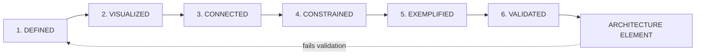

> **Diagram ID:** `DGM-ARCH-001`
> **Explanation:** The six-step law. `DEFINED` gives a concept a name and an ID. `VISUALIZED`
> gives it a diagram. `CONNECTED` links it to other elements. `CONSTRAINED` binds it with
> invariants. `EXEMPLIFIED` shows good and bad usage. `VALIDATED` attaches a machine-checkable
> rule. A concept failing validation returns to definition — it never silently persists.

### TBL-ARCH-001: Document Identity Card

| Field | Value |
| :--- | :--- |
| **Document ID** | `AOM-ARCH-001` |
| **Version** | `1.0.0` |
| **Status** | `IN_PROGRESS` (released only after the final Part) |
| **Authority Level** | `L2 — Architectural` |
| **Knowledge Domain** | `MASTER_CONTEXT / 04_ARCHITECTURE` |
| **Supersedes** | Nothing. Extends `docs/architecture/SYSTEM_ARCHITECTURE.md` (`DOC-ARC-002`, overview-level) |
| **Binding On** | Every component, service, package, agent, contract, and pipeline in Oship |
| **Change Protocol** | ADR required (see §01.25, §01.26) |
| **Release Tag (planned)** | `aom-arch-001-v1.0.0` |
| **Part Model** | Append-only; parts are never rewritten |

### TBL-ARCH-002: Part Register

| Part | Title | Scope | Status |
| :---: | :--- | :--- | :---: |
| **PART 01** | System Architecture Constitution | §01.1 – §01.30: purpose, identity, principles, invariants, layers, boundaries, domains, components, dependencies, flows, events, state, contracts, versioning, failure, observability, security, performance, scalability, extensibility, AI-native design, human+AI model, evolution, decisions, traceability, validation, failure modes, AI interpretation | **THIS PART** |
| **PART 02** | Runtime & Deployment Architecture | Process topology, runtime units, deployment targets, environments, network architecture, capacity model | `PLANNED` |
| **PART 03** | Data Architecture | Storage engines, schema strategy, partitioning, consistency, migration, retention | `PLANNED` |
| **PART 04** | API & Interface Architecture | REST/GraphQL/gRPC surface, contract-first workflow, SDK generation, error taxonomy | `PLANNED` |
| **PART 05** | AI Subsystem Architecture | Agent runtime, tool plane, memory binding, model routing, evaluation harness | `PLANNED` |
| **PART 06+** | Extension Parts | Determined by architectural need at time of authoring | `PLANNED` |

---

## Evidence Base — Repository Verification Record

**NO FABRICATION RULE.** Every claim of existence in this document is grounded in a verified
repository artifact. The following record was produced by direct inspection of
`afshin-omnisystem/Oship` at branch `arena/019ffd50-oship`, base commit `8c61052`.

### TBL-ARCH-003: Verified Repository Artifacts (Evidence Ledger)

| Evidence ID | Artifact | Verified Fact | Architectural Consequence |
| :--- | :--- | :--- | :--- |
| `EVD-ARCH-001` | `README.md` | Exists, ~1,990 lines, `ROOT-RME-001` v2.4.0 | System identity, entry point, navigation hub |
| `EVD-ARCH-002` | `PROJECT_PHILOSOPHY.md` | Exists, ~12,600 lines, 146 sections | L1 constitutional authority above this document |
| `EVD-ARCH-003` | `.ai/` | 17 Markdown control-plane files + 5 empty sub-dirs | AI control plane is a **first-class architectural component** |
| `EVD-ARCH-004` | `.ai/AI_AGENT_OPERATING_MANUAL.md` | Exists, `AI-AOM-001`, 1,583 lines | Agent runtime governance contract |
| `EVD-ARCH-005` | `.ai/DOCUMENTATION_COMPLETION_STANDARD.md` | Exists, `AI-DOC-STD-001`, 1,050 lines | Documentation is a validated artifact class |
| `EVD-ARCH-006` | `.ai/CONTEXT_ROUTER.md` | Exists, 172 lines | Context routing is an architectural function |
| `EVD-ARCH-007` | `docs/MASTER_CONTEXT/` | 24 numbered domain directories, each with `INDEX.md` | Canonical knowledge-domain taxonomy |
| `EVD-ARCH-008` | `docs/MASTER_CONTEXT/MASTER_CONTEXT_RULES.md` | Exists, `MCX-RULES-001`, 5,614 lines | Constitutional law of the knowledge OS |
| `EVD-ARCH-009` | `docs/MASTER_CONTEXT/MASTER_CONTEXT_SCHEMA.md` | Exists, `MCX-SCHEMA-001`, 14,547 lines | Knowledge object model; binds component metadata |
| `EVD-ARCH-010` | `docs/MASTER_CONTEXT/MASTER_CONTEXT_RELATIONSHIPS.md` | Exists, `MCX-REL-001`, 8,043 lines | Relationship/dependency semantics |
| `EVD-ARCH-011` | `docs/MASTER_CONTEXT/MASTER_CONTEXT_EXECUTION_MODEL.md` | Exists, `MCX-EXEC-001`, 8,072 lines | Execution/runtime semantics of the knowledge OS |
| `EVD-ARCH-012` | `docs/MASTER_CONTEXT/MASTER_CONTEXT_MEMORY_SYSTEM.md` | Exists, `MCX-MEM-001` **RELEASED** v1.0.0, 34,427 lines | Memory architecture; AI memory state authority |
| `EVD-ARCH-013` | `docs/MASTER_CONTEXT/23_STANDARDS/METADATA_STANDARD.md` | Exists, `MCX-23-002` | Mandatory metadata header contract |
| `EVD-ARCH-014` | `docs/ADR/`, `ADR-0000`, `ADR-0001` | Template + one APPROVED ADR | ADR process exists and is binding |
| `EVD-ARCH-015` | `architecture/DOMAIN_MODEL.md` | Exists, `ARCH-DOM-001`, 4 coarse domains | Prior bounded-context sketch (superseded in detail by §01.7) |
| `EVD-ARCH-016` | `docs/architecture/SYSTEM_ARCHITECTURE.md` | Exists, `DOC-ARC-002`, 39 lines, 5-band ASCII stack | Overview-level ancestor of this document |
| `EVD-ARCH-017` | `docs/security/SECURITY_ARCHITECTURE.md` | Exists | Security domain seed document |
| `EVD-ARCH-018` | `.github/workflow-skeletons/` | 8 YAML skeletons: `ci`, `cd`, `release`, `security-scan`, `documentation`, `ai-governance`, `issue-triage`, `stale` | CI/CD is **skeleton-only**, not active |
| `EVD-ARCH-019` | `.github/ISSUE_TEMPLATE/`, `DISCUSSION_TEMPLATE/`, `CODEOWNERS`, `labels.yml`, `milestones.yml`, `projects.yml` | Exist | GitHub-native governance plane |
| `EVD-ARCH-020` | `apps/`, `services/`, `packages/`, `apis/`, `sdk/`, `plugins/`, `database/`, `storage/`, `infra/`, `k8s/`, `docker/`, `monitoring/`, `observability/`, `security/`, `tests/`, `tools/`, `scripts/`, `examples/`, `templates/`, `experiments/`, `research/`, `archive/`, `assets/`, `configs/`, `deployment/` | Exist but contain **only `.gitkeep`** | **Zero application code.** All runtime architecture is `PLANNED` |
| `EVD-ARCH-021` | `design/` | 12 sub-directories, all `.gitkeep`, plus `INDEX.md` | Design system is structurally reserved, contentless |
| `EVD-ARCH-022` | `docs/diagrams/` | 16 sub-directories, all `.gitkeep`, plus `INDEX.md` | Diagram artifact plane reserved; **no binary images committed** |
| `EVD-ARCH-023` | Repository file census | 189 files total, **0 source-code files** | Architecture is specification-stage by construction |
| `EVD-ARCH-024` | `.ai/PROJECT_STATUS.md` | Phase 0 `IN PROGRESS`, Phase A `READY/PLANNED` | Lifecycle position of this document |
| `EVD-ARCH-025` | Absence check | No `package.json`, `pyproject.toml`, `go.mod`, `Cargo.toml`, `pom.xml`, `Dockerfile`, `*.tf` | **No technology stack is committed.** Language/runtime choices are `UNKNOWN — REQUIRES ADR` |

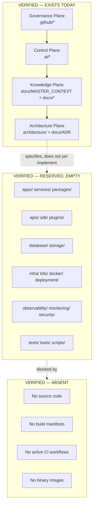

> **Diagram ID:** `DGM-ARCH-002`
> **Explanation:** The verified three-state repository. Four planes exist with real content;
> six directory families exist but are empty placeholders; four artifact classes are absent.
> **Any agent that claims implemented runtime behaviour contradicts `EVD-ARCH-020`, `EVD-ARCH-023`
> and `EVD-ARCH-025` and must be treated as hallucinating.**

---

## Status Vocabulary — Mandatory Labelling

Every architectural element in this document carries exactly one status label. Labels are not
decorative; they are **machine-parsed truth assertions**.

### TBL-ARCH-004: Status Vocabulary

| Label | Meaning | Evidence Requirement | Agent Permission |
| :--- | :--- | :--- | :--- |
| `IMPLEMENTED` | Code exists and runs | A source file path + a test path | May be called, extended, refactored |
| `DOCUMENTED` | Specification exists, no code | A document path | May be implemented following the spec |
| `PARTIALLY IMPLEMENTED` | Some code exists; spec not fully realized | Source path + explicit gap list | May be completed; gaps must be listed in PR |
| `PLANNED` | Intent recorded, spec incomplete | A roadmap or index entry | **May NOT be implemented without an ADR** |
| `PROPOSED` | Under consideration, not accepted | A discussion or draft ADR | Read-only; do not build |
| `DEPRECATED` | Exists but must not be extended | Replacement path required | Removal-only changes |
| `UNKNOWN — REQUIRES REPOSITORY VERIFICATION` | Truth not establishable from repo | None | **Halt and ask; never assume** |

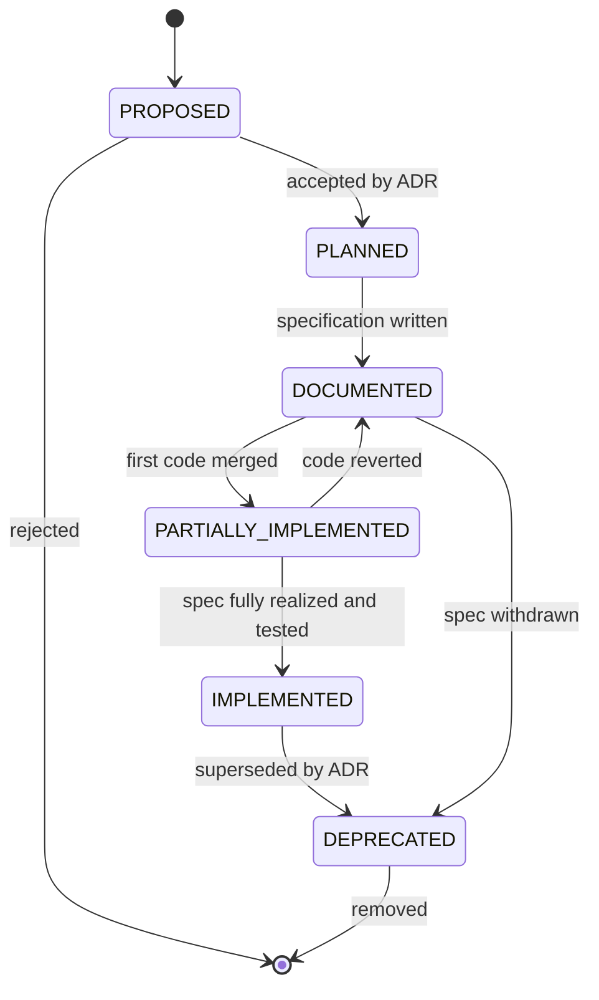

> **Diagram ID:** `DGM-ARCH-003`
> **Explanation:** The lifecycle of every architectural element. Transitions to the right require
> evidence; transitions to the left require an ADR or a revert. `UNKNOWN` is not shown because it
> is not a lifecycle state — it is a **failure to establish state**, and it must be resolved, never
> carried forward.

### TBL-ARCH-005: Current System-Wide Status Roll-Up

| Architectural Plane | Status | Basis |
| :--- | :--- | :--- |
| Knowledge Plane | `IMPLEMENTED` (as documentation) | `EVD-ARCH-007` … `EVD-ARCH-013` |
| Control Plane (`.ai/`) | `IMPLEMENTED` (as documentation) | `EVD-ARCH-003`, `EVD-ARCH-004` |
| Governance Plane (`.github/`) | `PARTIALLY IMPLEMENTED` | Templates exist; workflows are skeletons (`EVD-ARCH-018`) |
| Architecture Plane | `PARTIALLY IMPLEMENTED` | ADR process live; blueprints in progress (this document) |
| Application Plane | `PLANNED` | `EVD-ARCH-020`, `EVD-ARCH-023` |
| Service Plane | `PLANNED` | `EVD-ARCH-020` |
| Data Plane | `PLANNED` | `EVD-ARCH-020` |
| Infrastructure Plane | `PLANNED` | `EVD-ARCH-020` |
| Observability Plane | `PLANNED` | `EVD-ARCH-020` |
| Security Plane | `PARTIALLY IMPLEMENTED` | Policy docs exist; enforcement absent |
| Technology Stack | `UNKNOWN — REQUIRES REPOSITORY VERIFICATION` | `EVD-ARCH-025` |

---

## ID Namespace Registry

All identifiers below are **globally unique across the Oship repository** and are never reused,
never renumbered, and never recycled after deprecation.

### TBL-ARCH-006: ID Namespaces Owned by AOM-ARCH-001

| Namespace | Applies To | Allocated Range | Part 01 Usage |
| :--- | :--- | :--- | :--- |
| `ARCH-*` | Architecture statements / sections | 001–999 | 001–120 |
| `DGM-ARCH-*` | Mermaid diagrams | 001–999 | 001–190 |
| `TBL-ARCH-*` | Tables | 001–999 | 001–180 |
| `IMG-ARCH-*` | Image specifications | 001–199 | 001–028 |
| `PRN-ARCH-*` | Architectural principles | 001–099 | 001–021 |
| `INV-ARCH-*` | Architectural invariants | 001–199 | 001–060 |
| `LYR-ARCH-*` | Architectural layers | 001–049 | 001–012 |
| `BND-ARCH-*` | Boundaries | 001–099 | 001–018 |
| `DOM-ARCH-*` | Bounded domains | 001–099 | 001–020 |
| `CMP-ARCH-*` | Components | 001–499 | 001–030 |
| `DEP-ARCH-*` | Dependency rules | 001–199 | 001–040 |
| `DF-ARCH-*` | Data-flow definitions | 001–199 | 001–024 |
| `CF-ARCH-*` | Control-flow definitions | 001–099 | 001–016 |
| `EVT-ARCH-*` | Events / commands / signals | 001–299 | 001–040 |
| `ST-ARCH-*` | State categories | 001–099 | 001–018 |
| `CON-ARCH-*` | Contracts | 001–199 | 001–032 |
| `VER-ARCH-*` | Versioning rules | 001–099 | 001–024 |
| `FAI-ARCH-*` | Failure-handling patterns | 001–099 | 001–020 |
| `OBS-ARCH-*` | Observability signals | 001–099 | 001–024 |
| `SEC-ARCH-*` | Security controls | 001–199 | 001–030 |
| `PERF-ARCH-*` | Performance rules / budgets | 001–099 | 001–024 |
| `SCL-ARCH-*` | Scalability strategies | 001–099 | 001–020 |
| `EXT-ARCH-*` | Extension mechanisms | 001–099 | 001–016 |
| `AI-ARCH-*` | AI-native architecture rules | 001–199 | 001–040 |
| `DEC-ARCH-*` | Decision models / decision trees | 001–199 | 001–036 |
| `TRC-ARCH-*` | Traceability rules | 001–099 | 001–014 |
| `VAL-ARCH-*` | Validation rules | 001–299 | 001–132 |
| `FAL-ARCH-*` | Failure modes / anti-patterns | 001–299 | 001–120 |

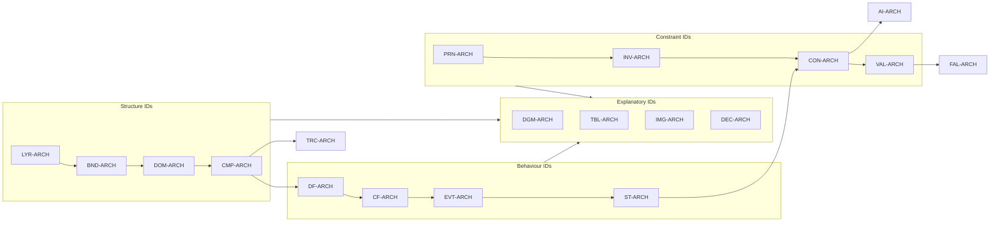

> **Diagram ID:** `DGM-ARCH-004`
> **Explanation:** ID namespaces are not a flat list — they form a semantic pipeline. Structure IDs
> describe *where things are*, behaviour IDs describe *what moves*, constraint IDs describe *what is
> forbidden*, and explanatory IDs describe *how a reader understands it*. An architecture element
> that owns no ID in at least one structure namespace and one constraint namespace is incomplete.

---

## Table of Contents — PART 01

| § | Section | Primary IDs | AI Read Priority |
| :--- | :--- | :--- | :---: |
| [01.1](#011--architectural-purpose) | Architectural Purpose | `ARCH-001`…`ARCH-012` | **P0** |
| [01.2](#012--system-identity) | System Identity | `ARCH-013`…`ARCH-020` | **P0** |
| [01.3](#013--architectural-principles) | Architectural Principles | `PRN-ARCH-001`…`021` | **P0** |
| [01.4](#014--architectural-invariants) | Architectural Invariants | `INV-ARCH-001`…`060` | **P0** |
| [01.5](#015--architectural-layers) | Architectural Layers | `LYR-ARCH-001`…`010` | **P0** |
| [01.6](#016--system-boundaries) | System Boundaries | `BND-ARCH-001`…`018` | **P1** |
| [01.7](#017--domain-boundaries) | Domain Boundaries | `DOM-ARCH-001`…`010` | **P0** |
| [01.8](#018--component-model) | Component Model | `CMP-ARCH-001`…`030` | **P0** |
| [01.9](#019--dependency-model) | Dependency Model | `DEP-ARCH-001`…`012` | **P1** |
| [01.10](#0110--data-flow-architecture) | Data Flow Architecture | `DF-ARCH-001`…`024` | **P1** |
| [01.11](#0111--control-flow-architecture) | Control Flow Architecture | `CF-ARCH-001`…`016` | **P1** |
| [01.12](#0112--event-model) | Event Model | `EVT-ARCH-001`…`040` | **P1** |
| [01.13](#0113--synchronous-versus-asynchronous) | Synchronous vs Asynchronous | `DEC-ARCH-010`…`016` | **P2** |
| [01.14](#0114--state-management) | State Management | `ST-ARCH-001`…`018` | **P1** |
| [01.15](#0115--interface-and-contract-architecture) | Interface and Contract Architecture | `CON-ARCH-001`…`032` | **P0** |
| [01.16](#0116--versioning-and-compatibility-architecture) | Versioning and Compatibility | `VER-ARCH-001`…`024` | **P1** |
| [01.17](#0117--failure-architecture) | Failure Architecture | `FAI-ARCH-001`…`020` | **P1** |
| [01.18](#0118--observability-architecture) | Observability Architecture | `OBS-ARCH-001`…`024` | **P1** |
| [01.19](#0119--security-architecture) | Security Architecture | `SEC-ARCH-001`…`030` | **P0** |
| [01.20](#0120--performance-architecture) | Performance Architecture | `PERF-ARCH-001`…`024` | **P2** |
| [01.21](#0121--scalability-architecture) | Scalability Architecture | `SCL-ARCH-001`…`020` | **P2** |
| [01.22](#0122--extensibility-architecture) | Extensibility Architecture | `EXT-ARCH-001`…`016` | **P2** |
| [01.23](#0123--ai-native-architecture) | AI-Native Architecture | `AI-ARCH-001`…`020` | **P0** |
| [01.24](#0124--human-plus-ai-development-model) | Human plus AI Development Model | `AI-ARCH-041`…`059` | **P1** |
| [01.25](#0125--architecture-evolution) | Architecture Evolution | `ARCH-039`…`ARCH-040` | **P1** |
| [01.26](#0126--architectural-decision-model) | Architectural Decision Model | `DEC-ARCH-023`…`024` | **P1** |
| [01.27](#0127--implementation-traceability) | Implementation Traceability | `TRC-ARCH-001`…`014` | **P0** |
| [01.28](#0128--architecture-validation-rules) | Architecture Validation Rules | `VAL-ARCH-001`…`386` | **P0** |
| [01.29](#0129--architecture-failure-modes) | Architecture Failure Modes | `FAL-ARCH-001`…`267` | **P1** |
| [01.30](#0130--architecture-ai-interpretation-guide) | Architecture AI Interpretation Guide | `AI-ARCH-060`…`077` | **P0** |
| [Appendix A](#appendix-a--image-specification-registry) | Image Specification Registry | `IMG-ARCH-001`…`028` | **P2** |
| [Appendix B](#appendix-b--master-identifier-index-and-completion-record) | Master Identifier Index and Completion Record | — | **P3** |

---

## How To Read This Document (Agent Fast Path)

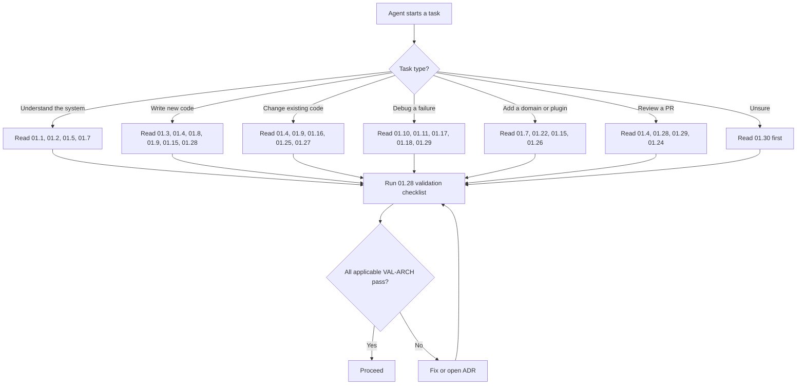

> **Diagram ID:** `DGM-ARCH-005`
> **Explanation:** The agent fast path. No agent is expected to read 100% of this document for
> every task. This routing table is the minimum-sufficient reading set per task class. Validation
> (§01.28) is **never** optional regardless of entry path.

---
# PART 01 — SYSTEM ARCHITECTURE CONSTITUTION

---

## 01.1 — Architectural Purpose

### AI NAVIGATION METADATA — §01.1

| Field | Value |
| :--- | :--- |
| **AI READ PRIORITY** | **P0 — MUST READ BEFORE ANY ARCHITECTURAL ACTION** |
| **AI DEPENDENCIES** | `PROJECT_PHILOSOPHY.md`, `docs/MASTER_CONTEXT/INDEX.md`, `MCX-RULES-001` |
| **AI INPUTS** | Repository evidence ledger (`TBL-ARCH-003`), lifecycle phase (`.ai/PROJECT_STATUS.md`) |
| **AI OUTPUTS** | Understanding of *why* constraints exist; ability to justify or reject a design |
| **AI IMPLEMENTATION IMPACT** | Governs every subsequent design choice; violating purpose invalidates a PR |
| **AI VALIDATION REQUIREMENTS** | `VAL-ARCH-001`…`VAL-ARCH-008` |
| **AI RELATED DOCUMENTS** | `docs/ADR/ADR-0001-ai-native-repository-architecture.md`, `.ai/AI_AGENT_OPERATING_MANUAL.md` |

---

### 01.1.1 `ARCH-001` — Why Oship Requires a Formal Architecture

**Status:** `DOCUMENTED`

Oship is not a conventional software project, and therefore cannot use a conventional
architecture document. Three structural facts about Oship make informal architecture impossible:

1. **The primary implementer is a machine.** Oship's stated identity (`EVD-ARCH-001`,
   `EVD-ARCH-002`) is a repository designed to be read, reasoned over, and extended by AI coding
   agents first. A machine cannot ask a colleague what was meant. Ambiguity that a human would
   resolve socially becomes, for an agent, either a hallucination or a halt.
2. **Implementation has not begun.** The verified census (`EVD-ARCH-023`) shows 189 files and
   zero source files. Architecture here is not a description of an existing system — it is the
   **generative specification** from which the system will be produced. Its errors will be
   manufactured at scale.
3. **The knowledge substrate already exceeds 80,000 lines.** `MCX-RULES-001`, `MCX-SCHEMA-001`,
   `MCX-REL-001`, `MCX-EXEC-001`, `MCX-MEM-001` and `PROJECT_PHILOSOPHY.md` together constitute a
   dense legal and cognitive framework. Without an architectural document that binds that framework
   to concrete structure, the knowledge plane and the eventual code plane will diverge.

### TBL-ARCH-007: The Cost of Informal Architecture in an Agent-Driven Repository

| Informal-architecture symptom | Consequence for a human team | Consequence for an AI agent fleet |
| :--- | :--- | :--- |
| Undocumented module boundary | Occasional layering violation, caught at review | Systematic violation across every generated file |
| Implicit naming convention | Learned by osmosis in ~2 weeks | Never learned; each session invents a new convention |
| "Everyone knows we don't do X" | Tribal knowledge, mostly effective | Invisible; X is done immediately and repeatedly |
| Unstated error-handling policy | Inconsistent but survivable | Divergent error models per file; no global recovery |
| Verbal decision, no ADR | Recoverable via memory | Permanently lost; decision silently reversed |
| Diagram in a slide deck | Findable by asking | Non-existent; agent designs from scratch |
| Contract defined "in the code" | Readable by reading code | Unreadable before code exists — deadlock |

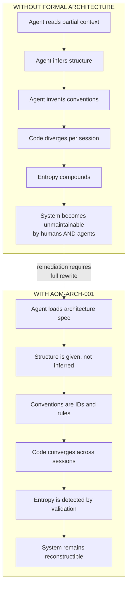

> **Diagram ID:** `DGM-ARCH-006`
> **Explanation:** The divergence/convergence contrast. Without a formal architecture, each agent
> session is an independent inference process, and independent inferences do not agree. With a
> formal architecture, structure is *supplied* rather than *guessed*, so N sessions converge on one
> system. This is the single most important argument for the existence of this document.

---

### 01.1.2 `ARCH-002` — Architectural Goals

**Status:** `DOCUMENTED`

Ten goals govern every decision in Oship's architecture. They are ordered: when two goals conflict,
the lower-numbered goal wins, unless an ADR explicitly overrides the ordering for a scoped case.

### TBL-ARCH-008: Architectural Goal Register (Priority-Ordered)

| # | Goal ID | Goal | Definition | Success Signal | Failure Signal |
| :---: | :--- | :--- | :--- | :--- | :--- |
| 1 | `GOAL-ARCH-001` | **Comprehensibility by machine** | Any competent agent can derive correct structure from documents alone | Agent produces conformant code with no clarifying questions | Agent asks "where does this go?" |
| 2 | `GOAL-ARCH-002` | **Correctness under constraint** | Invariants hold in every execution path | Zero `INV-ARCH` violations in CI | Invariant breach merged |
| 3 | `GOAL-ARCH-003` | **Safety of change** | Any change can be assessed, reverted, and traced | Every change maps to an ADR or a spec ID | Untraceable change in `main` |
| 4 | `GOAL-ARCH-004` | **Boundary integrity** | Domains and layers do not leak into one another | Dependency validator passes | Cross-layer import present |
| 5 | `GOAL-ARCH-005` | **Observability by default** | Every unit emits identity, health, and trace context | All components expose the observability contract | Silent component in production |
| 6 | `GOAL-ARCH-006` | **Security by construction** | Trust boundaries are explicit and enforced | No implicit trust across a boundary | Secret or privilege crossing silently |
| 7 | `GOAL-ARCH-007` | **Replaceability** | Any component can be swapped behind its contract | Component replaced with no caller change | Callers break on substitution |
| 8 | `GOAL-ARCH-008` | **Horizontal scalability** | Load is served by adding instances, not rewriting | Stateless request path | Node-affine state |
| 9 | `GOAL-ARCH-009` | **Operational economy** | Cost per unit of work is measurable and bounded | Performance budgets defined per path | Unbounded resource path |
| 10 | `GOAL-ARCH-010` | **Human maintainability** | A human engineer can review any agent-produced change | Review completes in bounded time | Change is unreviewable in practice |

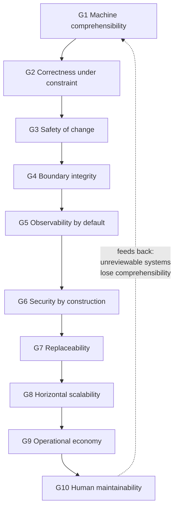

> **Diagram ID:** `DGM-ARCH-007`
> **Explanation:** Goals form a priority chain, not a set. The feedback edge from G10 to G1 is
> deliberate: a system that machines understand but humans cannot review eventually becomes a system
> machines misunderstand too, because no one can correct the specification.

### TBL-ARCH-009: Goal Conflict Resolution Matrix

| Conflict | Winner | Rationale | Escape Hatch |
| :--- | :--- | :--- | :--- |
| Comprehensibility vs. brevity | Comprehensibility | Brevity is not a goal | None |
| Correctness vs. performance | Correctness | A fast wrong answer has negative value | ADR with measured budget |
| Safety of change vs. delivery speed | Safety | Speed without traceability creates debt faster than value | Time-boxed spike in `experiments/` |
| Boundary integrity vs. convenience | Boundary integrity | Convenience shortcuts are permanent | Adapter component, never direct import |
| Observability vs. minimalism | Observability | Silent systems cannot be operated | Sampling, never omission |
| Security vs. developer ergonomics | Security | Ergonomics can be tooled; breaches cannot be undone | Local dev profile, explicitly scoped |
| Replaceability vs. optimization | Replaceability by default | Premature coupling is the costlier error | ADR documenting the coupling and its exit plan |
| Horizontal scalability vs. simplicity | Simplicity **until** a measured limit | Unmeasured scaling is speculation | Scale ADR triggered by a metric |
| Operational economy vs. redundancy | Redundancy for correctness paths | Cheap and wrong is not economical | Budget exception with SLO |
| Human maintainability vs. agent output volume | Human maintainability | Unreviewable volume is not progress | Split into reviewable increments |

> **Image Specification**
> - **ID:** `IMG-ARCH-001`
> - **Title:** Oship Architectural Goal Pyramid
> - **Purpose:** Provide a single-glance visual of the ten priority-ordered architectural goals and their conflict-resolution ordering.
> - **Audience:** Architects, AI agents performing trade-off analysis, reviewers.
> - **Aspect Ratio:** 16:9
> - **Canvas:** 2400 × 1350 px
> - **Visual Layers:** (1) background grid; (2) pyramid body in ten horizontal bands; (3) goal labels; (4) priority arrow on the left edge; (5) feedback arc on the right edge from band 10 to band 1.
> - **Components:** Ten bands labelled `GOAL-ARCH-001` … `GOAL-ARCH-010`, widest at the base (G10) narrowing to the apex (G1).
> - **Relationships:** Vertical precedence arrow "higher band wins conflicts"; curved feedback arc labelled "unreviewable ⇒ incomprehensible".
> - **Labels:** Each band shows the goal ID, short name, and a one-line success signal.
> - **Color Semantics:** Deep navy background `#0B1B33`; bands graded from gold `#D4AF37` (apex, highest authority) to slate `#3C5068` (base); feedback arc in signal-red `#C0392B`.
> - **Typography:** Headings Inter SemiBold 44 px; band labels Inter Medium 28 px; annotations Inter Regular 20 px; monospace IDs in JetBrains Mono 22 px.
> - **Legend:** Bottom-left key mapping colour intensity to conflict priority.
> - **Input Data:** `TBL-ARCH-008`, `TBL-ARCH-009`.
> - **Output Meaning:** Reading upward answers "which goal wins?"; reading the arc answers "why is human review non-negotiable?".
> - **AI Interpretation:** When two candidate designs each satisfy a different goal, select the design satisfying the goal in the higher band; record the discarded goal in the ADR's *Consequences* section.
> - **Implementation Relevance:** Directly informs ADR trade-off sections and PR review rubrics.
> - **Generation Prompt:** "A ten-band architectural priority pyramid on a deep navy blueprint background, bands graded from gold at the narrow apex to slate at the wide base, each band labelled with a goal identifier and short name, a vertical precedence arrow on the left, and a red curved feedback arc from the base band to the apex band, flat vector, high contrast, enterprise technical illustration, no photographic elements."
> - **Suggested Filename:** `docs/diagrams/architecture/img-arch-001-goal-pyramid.png`
> - **Rendering Status:** `PLANNED` — specification only; no binary committed (`EVD-ARCH-022`).

---

### 01.1.3 `ARCH-003` — Architectural Boundaries (Purpose-Level)

**Status:** `DOCUMENTED`

A boundary is a line across which **guarantees change**. Purpose-level boundaries answer: what is
this architecture responsible for, and what is explicitly outside it?

### TBL-ARCH-010: In-Scope / Out-of-Scope of AOM-ARCH-001

| Concern | In scope for this document | Owned elsewhere |
| :--- | :---: | :--- |
| System structure, layers, domains | YES | — |
| Component contracts and IDs | YES | — |
| Dependency legality | YES | — |
| Data-flow and control-flow semantics | YES | — |
| Event taxonomy and contracts | YES | — |
| Failure, observability, security, performance, scalability architecture | YES | — |
| AI-agent architectural obligations | YES | `.ai/AI_AGENT_OPERATING_MANUAL.md` (operational conduct) |
| Concrete database schemas | NO | `06_DATABASE` (Part 03 of this doc gives the frame) |
| Concrete API endpoint definitions | NO | `15_API` (Part 04 of this doc gives the frame) |
| UI component library | NO | `07_FRONTEND`, `14_DESIGN_SYSTEM` |
| Product requirements | NO | `01_PRODUCT` |
| Business model, pricing | NO | `02_BUSINESS` |
| Knowledge-object schema | NO | `MCX-SCHEMA-001` |
| Memory algorithms | NO | `MCX-MEM-001` |
| Documentation quality gates | NO | `AI-DOC-STD-001` |
| Technology selection | NO | Future ADRs — currently `UNKNOWN — REQUIRES REPOSITORY VERIFICATION` |

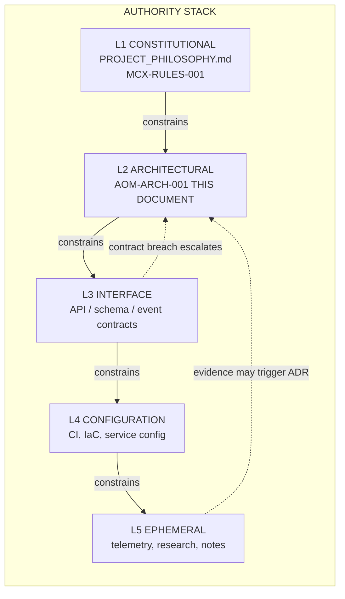

> **Diagram ID:** `DGM-ARCH-008`
> **Explanation:** This document occupies L2. It may never contradict L1. It **binds** L3, L4 and
> L5. Lower layers may not amend it; they may only supply evidence that triggers an ADR, shown by
> the dotted escalation edges.

### TBL-ARCH-011: Authority Precedence Rules

| Rule ID | Rule | Effect on conflict |
| :--- | :--- | :--- |
| `AUTH-001` | L1 always overrides L2 | Architecture must yield to philosophy |
| `AUTH-002` | L2 always overrides L3, L4, L5 | A contract contradicting architecture is invalid |
| `AUTH-003` | A newer document does **not** override a higher layer merely by being newer | Recency is not authority |
| `AUTH-004` | An ADR may amend L2 only; it may not amend L1 | Constitutional change is a separate process |
| `AUTH-005` | Code never overrides a document; a mismatch is a defect in code **or** a missing ADR | Never "the code is the truth" |
| `AUTH-006` | If two L2 documents conflict, the one with the more specific scope wins | Specificity beats generality at equal authority |
| `AUTH-007` | If authority cannot be determined, halt and record `UNKNOWN` | Never guess authority |

---

### 01.1.4 `ARCH-004` — Architectural Invariants (Purpose-Level Statement)

**Status:** `DOCUMENTED`

Invariants are enumerated exhaustively in §01.4. At purpose level, the reason invariants exist is
stated here: **an invariant is the only mechanism by which an architecture survives contact with
an autonomous implementer.** Principles guide; invariants forbid. An agent optimizing for a local
objective will violate a principle without noticing. It cannot violate an invariant without
tripping a detector.

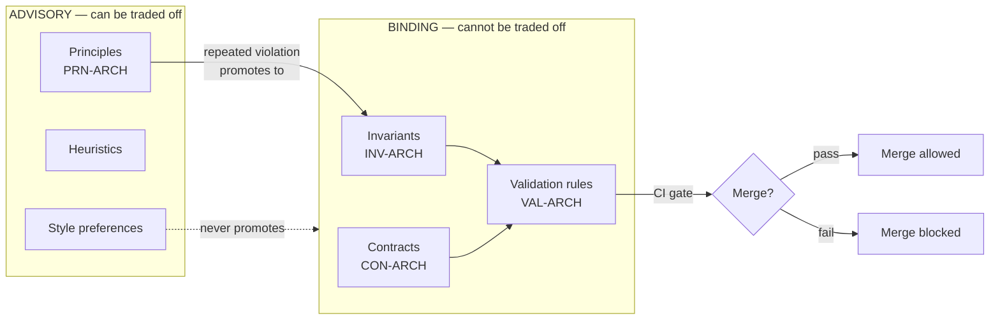

> **Diagram ID:** `DGM-ARCH-009`
> **Explanation:** The advisory/binding split. Principles are advisory and may be traded off with
> justification. Invariants, contracts and validation rules are binding and gate the merge. The
> promotion edge is important: a principle violated repeatedly is evidence that it should become an
> invariant. Style never promotes — it is not architecture.

### TBL-ARCH-012: Advisory vs Binding Semantics

| Property | Principle (`PRN-ARCH-*`) | Invariant (`INV-ARCH-*`) |
| :--- | :--- | :--- |
| Negotiable | Yes, with recorded rationale | No |
| Enforced by | Review judgement | Automated detector |
| Violation outcome | Discussion | Blocked merge |
| Change process | Architecture note | ADR |
| Scope | Guides new design | Applies to all code, forever |
| Agent instruction | "Prefer" | "Must / must never" |
| Example | Prefer composition over inheritance | A domain must never import another domain's internals |

---

### 01.1.5 `ARCH-005` — Extensibility as a Purpose

**Status:** `DOCUMENTED`

Oship's directory census (`EVD-ARCH-020`) reveals an architecture designed for growth it does not
yet have: `plugins/`, `sdk/`, `packages/`, `services/`, `apps/` all exist and are empty. This is
intentional and it creates a purpose-level obligation: **the architecture must define how those
directories fill up, before they fill up.**

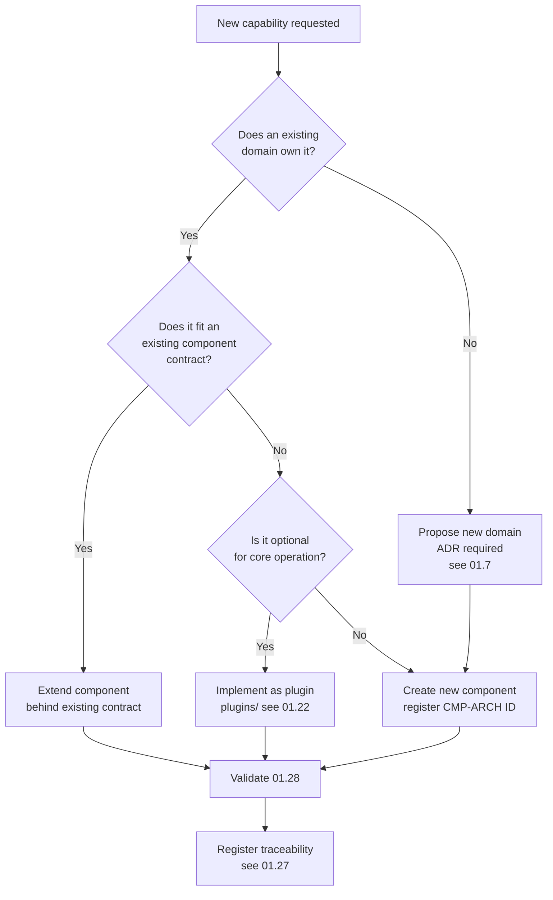

> **Diagram ID:** `DGM-ARCH-010`
> **Explanation:** The canonical extension decision tree, referenced later as `DEC-ARCH-001`.
> Every new capability enters Oship through exactly one of four doors: extend a component, add a
> component, add a plugin, or add a domain. There is no fifth door. An agent that cannot route a
> capability through this tree has found either a specification gap or an out-of-scope request.

### TBL-ARCH-013: The Four Extension Doors

| Door | Mechanism | Cost | Approval | Reversibility | Typical trigger |
| :--- | :--- | :---: | :--- | :---: | :--- |
| **D1** | Extend existing component behind its contract | Low | Component owner | High | New field, new case |
| **D2** | New component in existing domain | Medium | Domain owner | Medium | New responsibility |
| **D3** | Plugin in `plugins/` | Medium | Plugin registry policy | High | Optional/3rd-party capability |
| **D4** | New bounded domain | High | Architecture Board ADR | Low | New business capability |

---

### 01.1.6 `ARCH-006` — Replaceability as a Purpose

**Status:** `DOCUMENTED`

`EVD-ARCH-025` establishes that **no technology has been committed**. This is not a gap to be
apologized for; it is a constraint to be exploited. Because nothing is chosen, everything can be
designed to be replaceable.

### TBL-ARCH-014: Replaceability Obligations by Element Class

| Element class | Must be replaceable? | Isolation mechanism | Replacement blast radius target |
| :--- | :---: | :--- | :--- |
| Persistence engine | YES | Repository/port interface | Data-access adapters only |
| Message transport | YES | Event publisher/consumer port | Transport adapter only |
| Cache | YES | Cache port with null implementation | Zero — cache must be optional |
| AI model provider | YES | Model-router port | Router adapter only |
| Identity provider | YES | Auth port | Auth adapter + config |
| Observability backend | YES | Signal exporter port | Exporter only |
| Web framework | PARTIAL | Transport-layer isolation | Transport layer |
| Programming language | NO per-service, YES per-system | Service boundary | One service |
| Domain logic | NO | — | Domain logic is the asset, not the commodity |

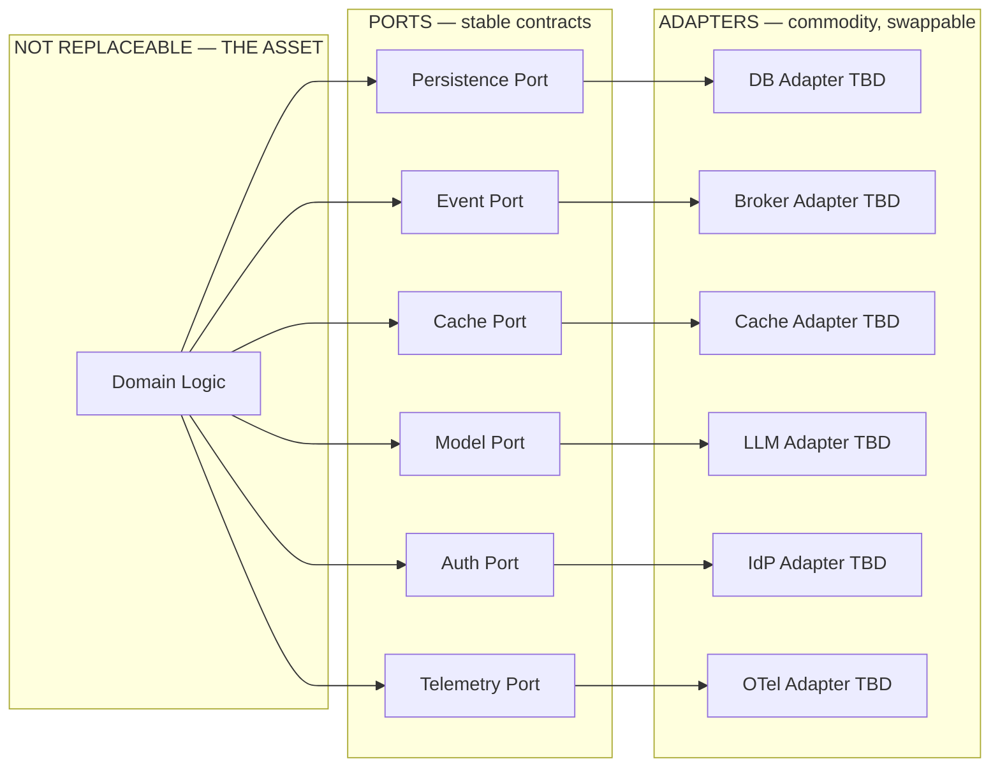

> **Diagram ID:** `DGM-ARCH-011`
> **Explanation:** The ports-and-adapters posture Oship adopts as its default. Every "TBD" adapter
> is literally undecided today (`EVD-ARCH-025`) — which is exactly why the port must be specified
> first. **An agent must never let a concrete technology name appear in domain logic.**

---

### 01.1.7 `ARCH-007` — Observability as a Purpose

**Status:** `DOCUMENTED`
**Current implementation status:** `PLANNED` (`observability/` and `monitoring/` contain only
`.gitkeep` per `EVD-ARCH-020`).

An architecture whose behaviour cannot be observed cannot be validated, and an architecture that
cannot be validated cannot be safely modified by an autonomous agent. Observability is therefore
not an operational nicety in Oship — it is the **feedback channel of the AI development loop**.

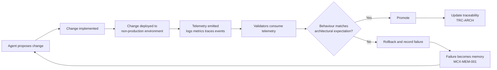

> **Diagram ID:** `DGM-ARCH-012`
> **Explanation:** Observability closes the agent loop. Without step D, step F is impossible, and an
> autonomous agent is reduced to writing code it can never verify. This is why observability is a
> **purpose**, not a feature: it is the precondition of autonomy.

### TBL-ARCH-015: Observability Purpose Requirements

| Requirement | Statement | Consumer |
| :--- | :--- | :--- |
| `OBSP-001` | Every component has a stable identity emitted in every signal | Trace correlation, agent diagnosis |
| `OBSP-002` | Every request carries a correlation identifier end to end | Distributed debugging |
| `OBSP-003` | Every failure is classified before it is logged | Automated triage |
| `OBSP-004` | Every architectural invariant has at least one runtime or CI detector | Invariant enforcement |
| `OBSP-005` | Telemetry schemas are contracts, versioned like APIs | Downstream dashboards |
| `OBSP-006` | Absence of signal is itself an alertable condition | Silent-failure detection |
| `OBSP-007` | Agents receive telemetry in a structured, parseable form | AI diagnostic context |

---

### 01.1.8 `ARCH-008` — Security as a Purpose

**Status:** `DOCUMENTED`
**Current implementation status:** `PARTIALLY IMPLEMENTED` — `.github/SECURITY.md` and
`docs/security/SECURITY_ARCHITECTURE.md` exist (`EVD-ARCH-017`); `security/` is empty
(`EVD-ARCH-020`); no enforcement code exists.

Oship introduces a security concern most systems do not have: **an autonomous agent is a
privileged actor inside the development boundary.** The threat model must therefore cover not only
external attackers and malicious users, but a well-intentioned agent operating with incorrect
context.

### TBL-ARCH-016: Security Purpose — Actor Threat Classes

| Actor class | Trust posture | Primary risk | Architectural mitigation |
| :--- | :--- | :--- | :--- |
| Anonymous external caller | Untrusted | Unauthorized access, abuse | Authentication at edge, rate limiting |
| Authenticated end user | Semi-trusted | Privilege escalation, cross-tenant leakage | Authorization at domain boundary, tenant isolation |
| Internal service | Trusted-with-verification | Lateral movement after compromise | Service identity, mTLS-class auth, least privilege |
| Human maintainer | Trusted-with-audit | Mistake, insider risk | CODEOWNERS review, audit trail, protected branches |
| **AI coding agent** | **Bounded-trust** | Wrong-context change, secret exposure, scope creep | Permission scopes, forbidden-path list, review gates |
| **AI runtime agent** (`PLANNED`) | **Bounded-trust** | Tool misuse, prompt injection, data exfiltration | Tool allow-list, output filtering, per-tool authorization |
| Third-party plugin (`PLANNED`) | Untrusted | Supply-chain compromise | Sandboxing, capability declaration, signature verification |
| CI/CD pipeline | Trusted-with-attestation | Compromised build, secret leak | OIDC federation, no long-lived secrets, provenance |

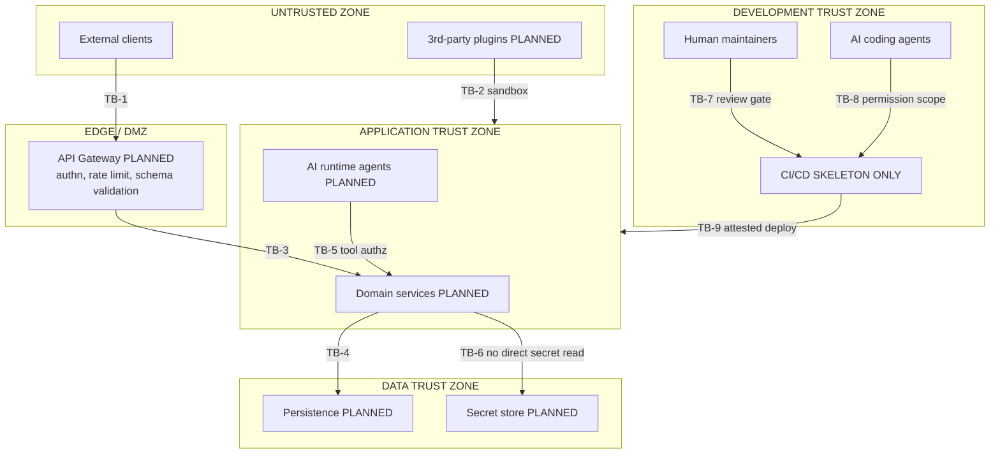

> **Diagram ID:** `DGM-ARCH-013`
> **Explanation:** Nine trust boundaries (`TB-1` … `TB-9`), fully enumerated in §01.19. Note
> `TB-8`: the AI coding agent crosses into the deployment path and is therefore inside the threat
> model, not outside it. Every box marked `PLANNED` is unbuilt — the boundary is specified so that
> it is built correctly the first time.

---

### 01.1.9 `ARCH-009` — Performance as a Purpose

**Status:** `DOCUMENTED`
**Current implementation status:** `PLANNED` — no runtime exists to measure (`EVD-ARCH-023`).

Performance in Oship is specified as **budgets attached to paths**, never as adjectives. "Fast" is
not a specification; "p99 within a stated bound for the synchronous read path, measured at the
gateway" is — and the bound itself must come from an ADR, never from this document's imagination.

### TBL-ARCH-017: Performance Purpose — Budget Classes (Pending Measurement)

| Path class | Budget dimension | Target form | Current value |
| :--- | :--- | :--- | :--- |
| Synchronous read | Latency p99 | bounded ms at gateway | `UNKNOWN — REQUIRES ADR + MEASUREMENT` |
| Synchronous write | Latency p99 | bounded ms at gateway | `UNKNOWN — REQUIRES ADR + MEASUREMENT` |
| Asynchronous job | Completion p95 | bounded s from enqueue | `UNKNOWN — REQUIRES ADR + MEASUREMENT` |
| Event propagation | End-to-end p95 | bounded ms publish to consume | `UNKNOWN — REQUIRES ADR + MEASUREMENT` |
| AI inference call | Latency p95 + token cost | bounded s and bounded tokens | `UNKNOWN — REQUIRES ADR + MEASUREMENT` |
| Batch pipeline | Throughput | minimum records per minute | `UNKNOWN — REQUIRES ADR + MEASUREMENT` |
| Cold start | Time to ready | bounded s | `UNKNOWN — REQUIRES ADR + MEASUREMENT` |

> **Rule `ARCH-009-R1`:** An agent must **never** invent a numeric performance target. It must
> either cite an existing budget ADR or emit `UNKNOWN — REQUIRES REPOSITORY VERIFICATION`.

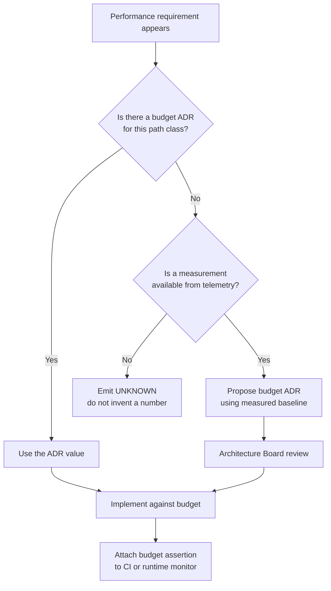

> **Diagram ID:** `DGM-ARCH-014`
> **Explanation:** The anti-fabrication path for performance. Three outcomes only: use an existing
> budget, propose one from measurement, or declare unknown. Inventing a plausible-looking number is
> the failure mode this diagram exists to prevent.

---

### 01.1.10 `ARCH-010` — AI-Agent Implementation as a Purpose

**Status:** `DOCUMENTED`

The architecture must be *executable by an agent*. This imposes five structural properties absent
from conventional architecture documents.

### TBL-ARCH-018: The Five Agent-Executability Properties

| Property | Definition | Present in this document as |
| :--- | :--- | :--- |
| **Addressability** | Every element has a stable, unique, greppable ID | `TBL-ARCH-006` namespaces |
| **Locality** | Everything needed to act on an element is near that element | Per-element metadata blocks |
| **Determinism** | The same question yields the same answer on every read | Decision trees, not prose advice |
| **Falsifiability** | Every claim can be checked against the repository | `VAL-ARCH-*` rules, evidence ledger |
| **Recoverability** | An agent that becomes confused has a defined recovery path | §01.30 ambiguity protocol |

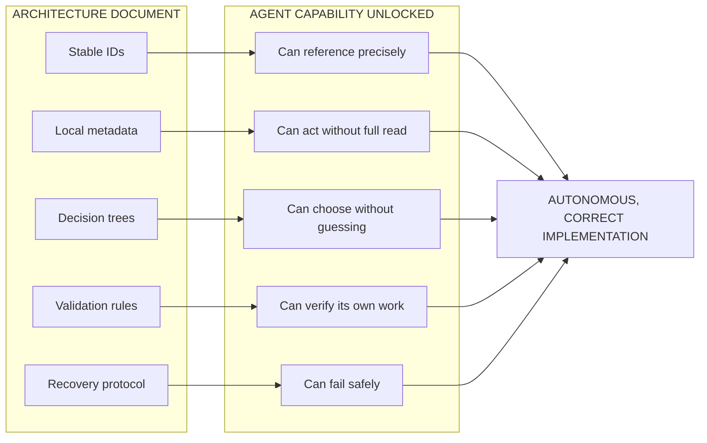

> **Diagram ID:** `DGM-ARCH-015`
> **Explanation:** Each document property maps to exactly one agent capability. Remove any one
> property and the corresponding capability disappears: without stable IDs an agent cannot reference;
> without validation rules it cannot self-verify; without a recovery protocol a confused agent
> produces confident garbage.

---

### 01.1.11 `ARCH-011` — Human Maintainability as a Purpose

**Status:** `DOCUMENTED`

### TBL-ARCH-019: Human Maintainability Requirements

| Requirement | Statement | Measured by |
| :--- | :--- | :--- |
| `HM-001` | Any architectural question is answerable in three navigation hops or fewer from `README.md` | Link-path audit |
| `HM-002` | Any agent-produced change is reviewable by one engineer within one hour | PR size + traceability completeness |
| `HM-003` | No concept requires more than ~120 lines of prose without a visual anchor | Visual-gap audit (`VAL-ARCH-006`) |
| `HM-004` | Every rule states its rationale, not only its instruction | Rule-format audit |
| `HM-005` | Every diagram is accompanied by a prose explanation of what it teaches | Diagram-caption audit |
| `HM-006` | Terminology is defined once and reused verbatim | Glossary cross-check |
| `HM-007` | A new engineer reaches productive understanding within one working day | Onboarding feedback |

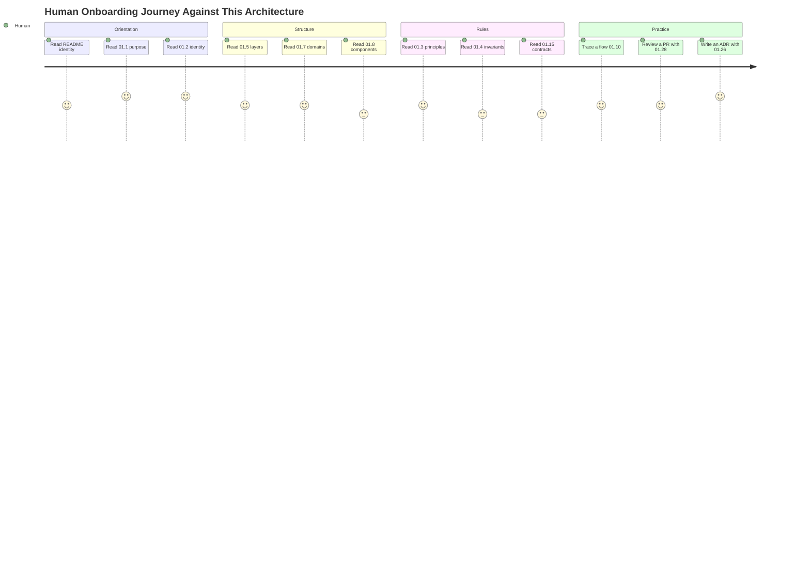

> **Diagram ID:** `DGM-ARCH-016`
> **Explanation:** The intended human path to competence — roughly one working day to full
> architectural literacy, satisfying `HM-007`. Lower satisfaction scores mark the sections known to
> be dense (invariants, components, contracts); these are the sections most in need of visual
> reinforcement.

---

### 01.1.12 `ARCH-012` — System-Level Architecture Diagram

**Status:** `DOCUMENTED` — planes marked individually.

This is the canonical whole-system view. Every subsequent diagram in Part 01 is a zoom into one of
these planes.

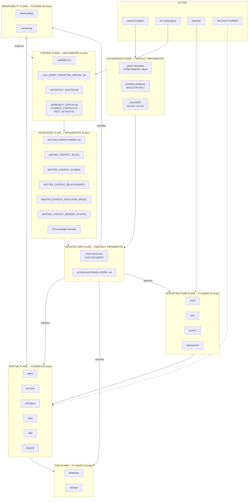

> **Diagram ID:** `DGM-ARCH-017`
> **Explanation:** **The canonical Oship system diagram.** Eight planes and four actor classes.
> Read the solid arrows as "supplies authority or input to"; the dotted arrow from the observability
> plane back to the control plane is the learning loop. Note the honest asymmetry: everything above
> the Architecture Plane is real today; everything below it is specification awaiting implementation.

### TBL-ARCH-020: Plane Register (Canonical)

| Plane ID | Plane | Directory evidence | Status | Owner | Primary output |
| :--- | :--- | :--- | :--- | :--- | :--- |
| `PLN-001` | Governance | `.github/` | `PARTIALLY IMPLEMENTED` | Repository owner | Process enforcement |
| `PLN-002` | Control | `.ai/` | `IMPLEMENTED` (docs) | AI Repository Architect | Agent behaviour |
| `PLN-003` | Knowledge | `docs/MASTER_CONTEXT/`, `docs/` | `IMPLEMENTED` (docs) | MASTER_CONTEXT Architect | Truth |
| `PLN-004` | Architecture | `architecture/`, `docs/ADR/`, this file | `PARTIALLY IMPLEMENTED` | Lead Architect | Structure |
| `PLN-005` | Runtime | `apps/`, `services/`, `packages/`, `apis/`, `sdk/`, `plugins/` | `PLANNED` | Engineering | Behaviour |
| `PLN-006` | Data | `database/`, `storage/` | `PLANNED` | Data Architect | State |
| `PLN-007` | Infrastructure | `infra/`, `k8s/`, `docker/`, `deployment/` | `PLANNED` | Platform | Execution substrate |
| `PLN-008` | Observability | `observability/`, `monitoring/` | `PLANNED` | SRE | Evidence |

### TBL-ARCH-021: Plane Interaction Legality Matrix

Rows are callers, columns are callees. `Y` allowed, `C` allowed only through a declared contract,
`N` forbidden.

| Caller / Callee | Gov | Ctrl | Know | Arch | Run | Data | Infra | Obs |
| :--- | :---: | :---: | :---: | :---: | :---: | :---: | :---: | :---: |
| **Governance** | Y | C | Y | Y | N | N | C | C |
| **Control** | C | Y | Y | Y | N | N | N | C |
| **Knowledge** | N | N | Y | C | N | N | N | N |
| **Architecture** | C | C | Y | Y | C | C | C | C |
| **Runtime** | N | N | N | N | C | Y | N | Y |
| **Data** | N | N | N | N | N | Y | N | Y |
| **Infrastructure** | N | N | N | N | C | C | Y | Y |
| **Observability** | C | C | N | N | N | N | N | Y |

> **Reading rule:** The Knowledge plane never calls anything at runtime — it is read, not executed.
> The Runtime plane never reads the Knowledge plane at runtime either; knowledge is compiled into
> contracts and configuration at build time. This prevents the anti-pattern of production code
> parsing Markdown.

### 01.1.13 Failure Modes of the Purpose Layer

### TBL-ARCH-022: Purpose-Layer Failure Modes

| ID | Failure | Symptom | Prevention |
| :--- | :--- | :--- | :--- |
| `FAL-ARCH-001` | Purpose drift | Decisions justified by convenience, not goals | Cite a `GOAL-ARCH-*` ID in every ADR |
| `FAL-ARCH-002` | Goal inversion | Performance chosen over correctness | Apply `TBL-ARCH-009` |
| `FAL-ARCH-003` | Aspirational status labelling | `PLANNED` written as if built | Evidence ledger required |
| `FAL-ARCH-004` | Authority confusion | Config file contradicts architecture and "wins" | `AUTH-002`, `AUTH-005` |
| `FAL-ARCH-005` | Invented metrics | Fabricated latency or throughput numbers | `ARCH-009-R1` |

### 01.1.14 Validation Rules for §01.1

| ID | Rule | Detection | Severity |
| :--- | :--- | :--- | :---: |
| `VAL-ARCH-001` | Every architectural change references at least one `GOAL-ARCH-*` | PR template field check | **HIGH** |
| `VAL-ARCH-002` | No element lacks a status label from `TBL-ARCH-004` | Heading scan | **HIGH** |
| `VAL-ARCH-003` | No `IMPLEMENTED` label without a cited path | Path existence check | **CRITICAL** |
| `VAL-ARCH-004` | No numeric performance target without an ADR reference | Regex near budget tables | **HIGH** |
| `VAL-ARCH-005` | Authority conflicts resolved by `TBL-ARCH-011` | Manual review + ADR check | **MEDIUM** |
| `VAL-ARCH-006` | Maximum 120 prose lines without a visual anchor | Visual-gap scanner | **MEDIUM** |
| `VAL-ARCH-007` | Every plane interaction conforms to `TBL-ARCH-021` | Import/dependency linter | **CRITICAL** |
| `VAL-ARCH-008` | Every evidence claim maps to an `EVD-ARCH-*` entry | Cross-reference audit | **HIGH** |

### 01.1.15 Navigation References — §01.1

| Direction | Target |
| :--- | :--- |
| **Up (authority)** | `PROJECT_PHILOSOPHY.md`, `MCX-RULES-001` |
| **Next** | §01.2 System Identity |
| **Constrains** | Every later section of this document |
| **Validated by** | §01.28 `VAL-ARCH-001`…`008` |
| **Failure catalogue** | §01.29 `FAL-ARCH-001`…`005` |

---
## 01.2 — System Identity

### AI NAVIGATION METADATA — §01.2

| Field | Value |
| :--- | :--- |
| **AI READ PRIORITY** | **P0** |
| **AI DEPENDENCIES** | §01.1, `README.md` (`ROOT-RME-001`), `architecture/DOMAIN_MODEL.md` |
| **AI INPUTS** | Repository identity statements, actor list, capability list |
| **AI OUTPUTS** | Correct system naming, correct actor modelling, correct boundary placement |
| **AI IMPLEMENTATION IMPACT** | Determines what belongs inside the system versus outside it |
| **AI VALIDATION REQUIREMENTS** | `VAL-ARCH-009`…`VAL-ARCH-016` |
| **AI RELATED DOCUMENTS** | `docs/MASTER_CONTEXT/01_PRODUCT/INDEX.md`, `docs/MASTER_CONTEXT/03_USERS/INDEX.md` |

---

### 01.2.1 `ARCH-013` — What Oship Is

**Status:** `DOCUMENTED`

### TBL-ARCH-023: System Identity Card

| Attribute | Value | Evidence |
| :--- | :--- | :--- |
| **Canonical name** | Oship | `EVD-ARCH-001` |
| **Repository** | `afshin-omnisystem/Oship` | Remote origin |
| **Positioning statement** | An AI-native enterprise software development ecosystem — the "Money Factory" | `README.md`, `architecture/DOMAIN_MODEL.md` |
| **Primary reader** | AI coding agents | `EVD-ARCH-001` |
| **Secondary reader** | Human engineers | `EVD-ARCH-001` |
| **System class** | Knowledge-governed, agent-operated distributed software platform | Derived from `TBL-ARCH-020` |
| **Current lifecycle phase** | Phase 0 completing, Phase A beginning | `EVD-ARCH-024` |
| **Current version** | `v0.1.0-alpha.0` | `.ai/CURRENT_CONTEXT.md` |
| **Deployable artifacts today** | **None** | `EVD-ARCH-023` |
| **Authoritative truth store** | `docs/MASTER_CONTEXT/` | `EVD-ARCH-007` |
| **Runtime substrate** | `UNKNOWN — REQUIRES REPOSITORY VERIFICATION` | `EVD-ARCH-025` |

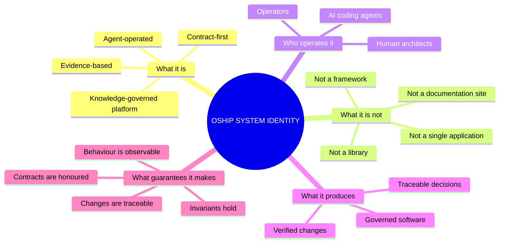

> **Diagram ID:** `DGM-ARCH-018`
> **Explanation:** Identity by positive and negative definition. The "What it is not" branch is
> load-bearing: agents frequently mis-model Oship as a documentation site — because 100% of current
> content is documentation — and consequently propose documentation tooling instead of system
> architecture. Oship is a software system currently in its specification phase.

---

### 01.2.2 `ARCH-014` — System Responsibilities

**Status:** `DOCUMENTED`

### TBL-ARCH-024: System Responsibility Register

| ID | Responsibility | Status | Fulfilled by |
| :--- | :--- | :--- | :--- |
| `RSP-001` | Maintain a single authoritative knowledge base | `IMPLEMENTED` | `PLN-003` |
| `RSP-002` | Route any query to its owning domain | `IMPLEMENTED` | `.ai/CONTEXT_ROUTER.md` |
| `RSP-003` | Govern all change through review and ADR | `PARTIALLY IMPLEMENTED` | `PLN-001` |
| `RSP-004` | Provide agents with deterministic operating rules | `IMPLEMENTED` | `.ai/AI_AGENT_OPERATING_MANUAL.md` |
| `RSP-005` | Preserve institutional memory across sessions | `IMPLEMENTED` (spec) | `MCX-MEM-001` |
| `RSP-006` | Define and enforce architectural structure | `PARTIALLY IMPLEMENTED` | This document |
| `RSP-007` | Expose business capability through APIs | `PLANNED` | `PLN-005` |
| `RSP-008` | Persist and protect business state | `PLANNED` | `PLN-006` |
| `RSP-009` | Execute asynchronous and scheduled work | `PLANNED` | `PLN-005` |
| `RSP-010` | Emit observable evidence of behaviour | `PLANNED` | `PLN-008` |
| `RSP-011` | Enforce identity, authorization and isolation | `PLANNED` | `PLN-005`, `PLN-007` |
| `RSP-012` | Deploy reproducibly to defined environments | `PLANNED` | `PLN-007` |
| `RSP-013` | Host and isolate extensions and plugins | `PLANNED` | `PLN-005` |
| `RSP-014` | Provide AI runtime capabilities to the product | `PLANNED` | `PLN-005` |

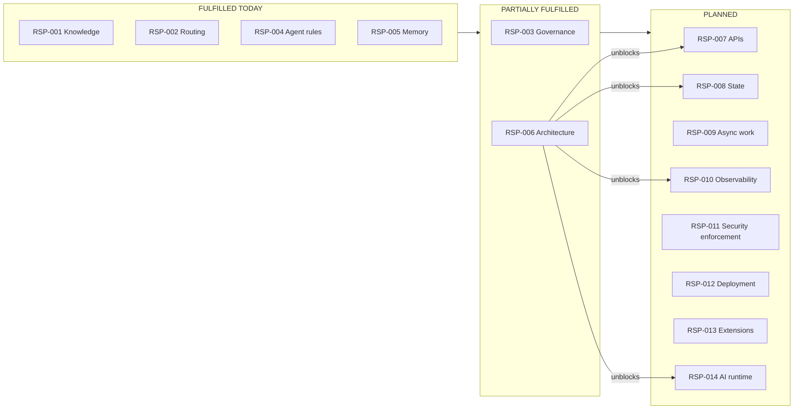

> **Diagram ID:** `DGM-ARCH-019`
> **Explanation:** Responsibility fulfilment state. `RSP-006` — this document — is the gate: eight
> planned responsibilities are blocked on architectural definition. This is the concrete reason
> `AOM-ARCH-001` is the critical-path artifact of Phase A.

---

### 01.2.3 `ARCH-015` — External Boundary

**Status:** `DOCUMENTED`

The external boundary answers: **what is Oship, and what is merely adjacent to Oship?**

### TBL-ARCH-025: Inside / Outside Determination

| Entity | Inside? | Reason |
| :--- | :---: | :--- |
| `docs/MASTER_CONTEXT/` | INSIDE | Oship's truth store |
| `.ai/` control plane | INSIDE | Oship's agent governance |
| Future services in `services/` | INSIDE | Oship's runtime |
| Future plugins in `plugins/` | BOUNDARY | Inside the process, outside the trust zone |
| GitHub platform (Issues, Actions, PRs) | OUTSIDE | Dependency, not component |
| AI model provider | OUTSIDE | External service behind a port |
| The AI coding agent itself | BOUNDARY | Actor in the development boundary, not a runtime component |
| Cloud provider infrastructure | OUTSIDE | Substrate |
| Third-party libraries | OUTSIDE | Dependencies, governed by `DEP-ARCH-*` |
| End-user browsers and clients | OUTSIDE | Actors |
| CI runners | BOUNDARY | Execute Oship's governance, owned by GitHub |

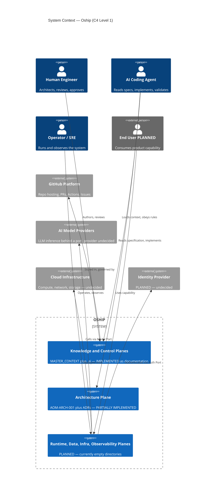

> **Diagram ID:** `DGM-ARCH-020`
> **Explanation:** C4 Level 1 system context. The boundary encloses three plane groups and excludes
> four external systems. Critically, the AI coding agent is drawn as a **person-class actor**, not a
> component — it acts upon Oship from outside the runtime, exactly like a human engineer, and is
> therefore subject to the same governance.

---

### 01.2.4 `ARCH-016` — Internal Boundaries

**Status:** `DOCUMENTED`

```mermaid
flowchart TB
    subgraph OSHIP["OSHIP INTERNAL BOUNDARY MAP"]
        direction TB
        subgraph BB1["B1 — Knowledge / Execution Boundary"]
            K["Documents: read-time truth"]
            E["Code: run-time behaviour"]
        end
        subgraph BB2["B2 — Domain Boundaries"]
            D1["Domain A"]
            D2["Domain B"]
        end
        subgraph BB3["B3 — Layer Boundaries"]
            LA["Interface layer"]
            LB["Application layer"]
            LC["Domain layer"]
            LD["Infrastructure layer"]
        end
        subgraph BB4["B4 — Process Boundaries"]
            P1["Service process"]
            P2["Worker process"]
        end
        subgraph BB5["B5 — Trust Boundaries"]
            T1["Untrusted input"]
            T2["Trusted core"]
        end
    end
    K -->|"compiled into contracts at build time"| E
    D1 -->|"published contracts only"| D2
    LA --> LB
    LB --> LC
    LD -.->|"implements ports defined by"| LC
    P1 -->|"messages only"| P2
    T1 -->|"validated at the edge"| T2
```

> **Diagram ID:** `DGM-ARCH-021`
> **Explanation:** Five internal boundary classes. Each has a distinct crossing rule: knowledge
> crosses to execution only at build time; domains cross only via published contracts; layers cross
> only inward, with infrastructure inverting via ports; processes cross only via messages; trust
> crosses only through validation. All five rules are enforced in §01.6 and §01.9.

### TBL-ARCH-026: Internal Boundary Crossing Rules

| Boundary | Legal crossing mechanism | Illegal crossing | Detector |
| :--- | :--- | :--- | :--- |
| `B1` Knowledge/Execution | Build-time codegen, config compilation | Runtime Markdown parsing | Scan for doc paths in source |
| `B2` Domain/Domain | Published contract, event, or API | Direct import of internals | Import linter |
| `B3` Layer/Layer | Inward calls; outward via port interfaces | Domain importing infrastructure | Layer linter |
| `B4` Process/Process | Message or RPC over declared contract | Shared mutable memory, shared table | Schema ownership audit |
| `B5` Trust/Trust | Validation plus authorization at the boundary | Trusting caller-supplied identity | Security test suite |

---

### 01.2.5 `ARCH-017` — System Actors

**Status:** `DOCUMENTED`

### TBL-ARCH-027: Actor Register

| Actor ID | Actor | Class | Trust | Interacts with | Status |
| :--- | :--- | :--- | :--- | :--- | :--- |
| `ACT-001` | Human Architect | Human | Trusted-with-audit | Knowledge, Architecture, Governance | Active |
| `ACT-002` | Human Engineer | Human | Trusted-with-audit | All planes via PR | Active |
| `ACT-003` | Human Reviewer | Human | Trusted-with-audit | Governance | Active |
| `ACT-004` | AI Coding Agent | Machine | Bounded-trust | Control, Knowledge, Architecture, Runtime via PR | Active |
| `ACT-005` | AI Review Agent | Machine | Bounded-trust | Governance | `PLANNED` |
| `ACT-006` | AI Runtime Agent | Machine | Bounded-trust | Runtime, tools | `PLANNED` |
| `ACT-007` | Operator / SRE | Human | Trusted-with-audit | Infrastructure, Observability | `PLANNED` |
| `ACT-008` | End User | Human | Semi-trusted | Runtime via API or UI | `PLANNED` |
| `ACT-009` | Partner System | Machine | Semi-trusted | Runtime via API | `PLANNED` |
| `ACT-010` | CI/CD Pipeline | Machine | Trusted-with-attestation | Governance to Runtime | `SKELETON ONLY` |
| `ACT-011` | Plugin | Machine | Untrusted | Runtime via plugin contract | `PLANNED` |
| `ACT-012` | Model Provider | External machine | Untrusted-external | Runtime via Model Port | `PLANNED` |

```mermaid
flowchart LR
    subgraph HUMANS["HUMAN ACTORS"]
        A1["ACT-001 Architect"]
        A2["ACT-002 Engineer"]
        A3["ACT-003 Reviewer"]
        A7["ACT-007 Operator"]
        A8["ACT-008 End User"]
    end
    subgraph MACHINE["MACHINE ACTORS — INTERNAL"]
        A4["ACT-004 Coding Agent"]
        A5["ACT-005 Review Agent"]
        A6["ACT-006 Runtime Agent"]
        A10["ACT-010 CI/CD"]
    end
    subgraph EXTERNAL["MACHINE ACTORS — EXTERNAL"]
        A9["ACT-009 Partner System"]
        A11["ACT-011 Plugin"]
        A12["ACT-012 Model Provider"]
    end
    A1 -->|"authors specs"| SPEC["Architecture Plane"]
    A4 -->|"reads specs"| SPEC
    A4 -->|"opens PR"| PR["Pull Request"]
    A2 -->|"opens PR"| PR
    A3 -->|"approves"| PR
    A5 -.->|"pre-reviews"| PR
    PR --> A10
    A10 -->|"deploys"| RT["Runtime Plane"]
    A7 -->|"operates"| RT
    A8 -->|"uses"| RT
    A9 -->|"integrates"| RT
    A6 -.->|"executes within"| RT
    A11 -.->|"extends"| RT
    A6 -.->|"calls"| A12
```

> **Diagram ID:** `DGM-ARCH-022`
> **Explanation:** **The actor map.** Three actor families with distinct governance. Note the two
> distinct AI roles: `ACT-004` acts on the *repository* at development time while `ACT-006` acts
> inside the *product* at runtime. Conflating these two is a common and dangerous modelling error —
> they have different trust boundaries, different permissions, and different failure modes.

### TBL-ARCH-028: Actor Permission Matrix

`Y` permitted, `C` conditional, `N` forbidden.

| Actor | Read knowledge | Write knowledge | Write code | Approve PR | Deploy | Call models | Access secrets |
| :--- | :---: | :---: | :---: | :---: | :---: | :---: | :---: |
| `ACT-001` Architect | Y | Y | Y | Y | C | C | C |
| `ACT-002` Engineer | Y | Y | Y | C | N | C | N |
| `ACT-003` Reviewer | Y | C | N | Y | N | N | N |
| `ACT-004` Coding Agent | Y | Y | Y | **N** | N | Y | N |
| `ACT-005` Review Agent | Y | N | N | **N** | N | Y | N |
| `ACT-006` Runtime Agent | N | N | N | N | N | Y | C scoped |
| `ACT-007` Operator | Y | C | N | N | Y | N | C scoped |
| `ACT-008` End User | N | N | N | N | N | N | N |
| `ACT-009` Partner | N | N | N | N | N | N | N |
| `ACT-010` CI/CD | Y | C | C generated only | N | Y | N | C ephemeral |
| `ACT-011` Plugin | N | N | N | N | N | C declared | N |
| `ACT-012` Model Provider | N | N | N | N | N | — | N |

> **Critical rule `ARCH-017-R1`:** No AI actor may approve its own change. `ACT-004` can write and
> `ACT-005` can advise, but the approval column for both is `N`. Human approval by `ACT-001` or
> `ACT-003` is architecturally mandatory — see §01.24.

---

### 01.2.6 `ARCH-018` — System Capabilities

**Status:** `DOCUMENTED`

A capability is what the system can *do*, independent of how it is built.

### TBL-ARCH-029: Capability Register

| Capability ID | Capability | Category | Status | Owning plane |
| :--- | :--- | :--- | :--- | :--- |
| `CAP-001` | Store authoritative knowledge | Knowledge | `IMPLEMENTED` | `PLN-003` |
| `CAP-002` | Route a question to its owner | Knowledge | `IMPLEMENTED` | `PLN-003` |
| `CAP-003` | Preserve decisions as ADRs | Governance | `IMPLEMENTED` | `PLN-001` |
| `CAP-004` | Onboard an AI agent deterministically | AI | `IMPLEMENTED` | `PLN-002` |
| `CAP-005` | Recall prior sessions and lessons | AI / Memory | `IMPLEMENTED` (spec) | `PLN-002` |
| `CAP-006` | Specify architecture machine-readably | Architecture | `PARTIALLY IMPLEMENTED` | `PLN-004` |
| `CAP-007` | Validate a change against rules | Governance | `PARTIALLY IMPLEMENTED` | `PLN-001` |
| `CAP-008` | Serve synchronous API requests | Runtime | `PLANNED` | `PLN-005` |
| `CAP-009` | Process asynchronous jobs | Runtime | `PLANNED` | `PLN-005` |
| `CAP-010` | Publish and consume domain events | Runtime | `PLANNED` | `PLN-005` |
| `CAP-011` | Persist and query business state | Data | `PLANNED` | `PLN-006` |
| `CAP-012` | Cache derived state | Data | `PLANNED` | `PLN-006` |
| `CAP-013` | Authenticate and authorize actors | Security | `PLANNED` | `PLN-005` |
| `CAP-014` | Isolate tenants and data | Security | `PLANNED` | `PLN-005`, `PLN-006` |
| `CAP-015` | Emit logs, metrics, traces | Observability | `PLANNED` | `PLN-008` |
| `CAP-016` | Detect and classify failures | Observability | `PLANNED` | `PLN-008` |
| `CAP-017` | Deploy reproducibly | Infrastructure | `PLANNED` | `PLN-007` |
| `CAP-018` | Scale horizontally under load | Infrastructure | `PLANNED` | `PLN-007` |
| `CAP-019` | Load and execute plugins | Extensibility | `PLANNED` | `PLN-005` |
| `CAP-020` | Invoke AI models through a port | AI | `PLANNED` | `PLN-005` |
| `CAP-021` | Run AI agents with scoped tools | AI | `PLANNED` | `PLN-005` |
| `CAP-022` | Generate SDKs from contracts | Developer experience | `PLANNED` | `PLN-005` |

```mermaid
flowchart TD
    subgraph M1["MATURE — usable now"]
        C1["CAP-001 Knowledge"]
        C2["CAP-002 Routing"]
        C3["CAP-003 ADR"]
        C4["CAP-004 Agent onboarding"]
        C5["CAP-005 Memory"]
    end
    subgraph M2["EMERGING — in progress"]
        C6["CAP-006 Architecture spec"]
        C7["CAP-007 Validation"]
    end
    subgraph M3["SPECIFIED — not built"]
        C8["CAP-008..012 Runtime and data"]
        C13["CAP-013..014 Security"]
        C15["CAP-015..016 Observability"]
        C17["CAP-017..018 Infrastructure"]
        C19["CAP-019..022 Extension and AI"]
    end
    M1 --> M2
    M2 --> M3
```

> **Diagram ID:** `DGM-ARCH-023`
> **Explanation:** **The capability map by maturity.** Five capabilities are usable, two are
> emerging, fifteen are specified only. An agent asked to "use" any capability in `M3` must first
> check this table and reply that the capability is `PLANNED`, not attempt to call it.

### TBL-ARCH-030: Capability to Responsibility to Plane Traceability

| Capability | Serves responsibility | Realized in plane | Blocked by |
| :--- | :--- | :--- | :--- |
| `CAP-001` | `RSP-001` | `PLN-003` | — |
| `CAP-002` | `RSP-002` | `PLN-003` | — |
| `CAP-003` | `RSP-003` | `PLN-001` | — |
| `CAP-004` | `RSP-004` | `PLN-002` | — |
| `CAP-005` | `RSP-005` | `PLN-002` | — |
| `CAP-006` | `RSP-006` | `PLN-004` | This document's completion |
| `CAP-007` | `RSP-003` | `PLN-001` | Active CI workflows (`EVD-ARCH-018`) |
| `CAP-008`…`CAP-010` | `RSP-007`, `RSP-009` | `PLN-005` | Technology ADR, `CAP-006` |
| `CAP-011`…`CAP-012` | `RSP-008` | `PLN-006` | Data architecture (Part 03) |
| `CAP-013`…`CAP-014` | `RSP-011` | `PLN-005` | Security ADR |
| `CAP-015`…`CAP-016` | `RSP-010` | `PLN-008` | Observability ADR |
| `CAP-017`…`CAP-018` | `RSP-012` | `PLN-007` | Infrastructure ADR |
| `CAP-019` | `RSP-013` | `PLN-005` | Plugin contract (§01.22) |
| `CAP-020`…`CAP-021` | `RSP-014` | `PLN-005` | AI subsystem architecture (Part 05) |
| `CAP-022` | `RSP-007` | `PLN-005` | API architecture (Part 04) |

---

### 01.2.7 `ARCH-019` — System Lifecycle

**Status:** `DOCUMENTED`

```mermaid
stateDiagram-v2
    [*] --> Phase0
    Phase0: PHASE 0 Foundation and Governance
    Phase0: Repository structure, governance, knowledge planes
    Phase0: STATUS IN PROGRESS
    PhaseA: PHASE A Bounded Domains and Architecture
    PhaseA: THIS DOCUMENT LIVES HERE
    PhaseB: PHASE B Platform, API, Schema, Security design
    PhaseC: PHASE C First implementation increments
    PhaseD: PHASE D Release candidate validation
    PhaseE: PHASE E Operational readiness
    PhaseF: PHASE F Scale, cost, AI feedback loops
    Phase0 --> PhaseA: governance gates passed
    PhaseA --> PhaseB: domains and architecture accepted
    PhaseB --> PhaseC: contracts frozen
    PhaseC --> PhaseD: increments validated
    PhaseD --> PhaseE: RC criteria met
    PhaseE --> PhaseF: SRE readiness met
    PhaseF --> [*]: v1.0.0 GA
    PhaseA --> Phase0: gate failure, governance regression
    PhaseC --> PhaseB: contract defect found
    PhaseD --> PhaseC: validation failure
```

> **Diagram ID:** `DGM-ARCH-024`
> **Explanation:** The system lifecycle from `.ai/PROJECT_STATUS.md` (`EVD-ARCH-024`), with backward
> transitions made explicit. Phases are gates, not calendar periods; a defect found late returns the
> system to the earlier phase that owns the defect.

### TBL-ARCH-031: Lifecycle Phase Gates (Architecture Perspective)

| Phase | Target SemVer | Architectural entry condition | Architectural exit condition | Status |
| :---: | :--- | :--- | :--- | :---: |
| **0** | `v0.0.1` | Repository exists | Governance and knowledge planes complete | `IN PROGRESS` |
| **A** | `v0.1.0` | Knowledge plane complete | Bounded domains named, `AOM-ARCH-001` released | `ACTIVE` |
| **B** | `v0.2.0` | Architecture released | API, schema, security contracts frozen | `PLANNED` |
| **C** | `v0.5.0` | Contracts frozen | First services implemented with tests and telemetry | `PLANNED` |
| **D** | `v0.8.0` | Increments implemented | Security, performance, compatibility validated | `PLANNED` |
| **E** | `v0.9.0` | RC validated | Runbooks, SLOs, disaster recovery verified | `PLANNED` |
| **F** | `v1.0.0` | Operationally ready | Scale, cost, AI feedback loops proven | `PLANNED` |

### TBL-ARCH-032: What May Be Built In Each Phase (Agent Permission by Phase)

| Phase | Documents | Contracts | Source code | Infrastructure | Deploy |
| :---: | :---: | :---: | :---: | :---: | :---: |
| **0** | Y | N | N | N | N |
| **A** | Y | C drafts only | **N** | N | N |
| **B** | Y | Y | C generated stubs only | C drafts | N |
| **C** | Y | Y | Y | Y | C non-prod |
| **D** | Y | C compatible changes only | Y | Y | C staging |
| **E** | Y | C compatible changes only | Y | Y | Y |
| **F** | Y | C versioned changes only | Y | Y | Y |

> **Critical rule `ARCH-019-R1`:** Oship is currently in **Phase A**. Per this table, an agent must
> **not** write application source code in this phase. A request to "implement the service now" must
> be answered with: *Phase A permits specification and draft contracts only; implementation is a
> Phase C activity gated on `AOM-ARCH-001` release and technology ADRs.*

---

### 01.2.8 `ARCH-020` — Target Container Topology

**Status:** `DOCUMENTED` — all containers `PLANNED`.

```mermaid
C4Container
    title Container View — Oship Target Topology, ALL CONTAINERS PLANNED
    Person(user, "End User", "PLANNED")
    Person(agent, "AI Coding Agent", "Active today")

    System_Boundary(oship, "Oship") {
        Container(web, "Web Application", "PLANNED, framework undecided", "User interface")
        Container(gw, "API Gateway", "PLANNED", "Edge authn, rate limit, schema validation, routing")
        Container(svc, "Domain Services", "PLANNED", "Business capability, one per bounded domain")
        Container(wrk, "Async Workers", "PLANNED", "Jobs, schedules, event consumers")
        Container(airt, "AI Runtime", "PLANNED", "Agent execution, tool plane, model routing")
        ContainerDb(db, "Primary Store", "PLANNED, engine undecided", "Authoritative business state")
        ContainerDb(cache, "Cache", "PLANNED", "Derived, evictable state")
        ContainerQueue(bus, "Event Bus", "PLANNED", "Domain events and commands")
        Container(obs, "Telemetry Pipeline", "PLANNED", "Logs, metrics, traces, audit")
    }

    System_Ext(repo, "GitHub Repository", "Knowledge, control, governance planes — REAL TODAY")
    System_Ext(llm, "Model Provider", "External inference")

    Rel(user, web, "Uses", "HTTPS")
    Rel(web, gw, "Calls", "HTTPS JSON")
    Rel(gw, svc, "Routes to", "internal protocol TBD")
    Rel(svc, db, "Reads and writes", "via Persistence Port")
    Rel(svc, cache, "Reads and writes", "via Cache Port")
    Rel(svc, bus, "Publishes and subscribes", "via Event Port")
    Rel(bus, wrk, "Delivers", "at-least-once")
    Rel(wrk, db, "Reads and writes", "via Persistence Port")
    Rel(svc, airt, "Requests AI capability", "internal contract")
    Rel(airt, llm, "Infers", "via Model Port")
    Rel(svc, obs, "Emits", "OTel-class signals")
    Rel(gw, obs, "Emits", "OTel-class signals")
    Rel(agent, repo, "Reads specs, opens PRs")
```

> **Diagram ID:** `DGM-ARCH-025`
> **Explanation:** The **target** container topology. Every container is `PLANNED`; the only real
> element is the GitHub repository. This diagram is the shared mental model that later Parts refine —
> it is a specification of intent, and an agent must not treat any container here as existing.

> **Image Specification**
> - **ID:** `IMG-ARCH-002`
> - **Title:** Oship Eight-Plane System Poster
> - **Purpose:** Wall-poster rendering of `DGM-ARCH-017` showing all eight planes with honest status colouring.
> - **Audience:** Whole team, onboarding sessions, architecture reviews.
> - **Aspect Ratio:** 4:3
> - **Canvas:** 3200 × 2400 px
> - **Visual Layers:** (1) plane bands stacked vertically; (2) directory chips inside each band; (3) authority arrows on the left gutter; (4) learning-loop arc on the right gutter; (5) status legend footer.
> - **Components:** `PLN-001` Governance, `PLN-002` Control, `PLN-003` Knowledge, `PLN-004` Architecture, `PLN-005` Runtime, `PLN-006` Data, `PLN-007` Infrastructure, `PLN-008` Observability.
> - **Relationships:** Downward "specifies" arrows from `PLN-004`; upward dotted "evidence" arrow from `PLN-008` to `PLN-002`.
> - **Labels:** Plane ID, plane name, directory list, status token.
> - **Color Semantics:** `IMPLEMENTED` emerald `#1E8E5A`; `PARTIALLY IMPLEMENTED` amber `#D08A0B`; `PLANNED` slate-grey `#6B7A8C`; background parchment `#F5F3EE`.
> - **Typography:** Plane titles Inter Bold 56 px; directory chips JetBrains Mono 26 px; footer Inter Regular 22 px.
> - **Legend:** Footer strip mapping the three status colours to their definitions from `TBL-ARCH-004`.
> - **Input Data:** `TBL-ARCH-020`, `TBL-ARCH-021`, `DGM-ARCH-017`.
> - **Output Meaning:** At a glance, which parts of Oship exist and which are specification.
> - **AI Interpretation:** Before claiming any capability exists, locate its plane band and read the status token; grey means do not call it.
> - **Implementation Relevance:** Used in PR descriptions to state which plane a change touches.
> - **Generation Prompt:** "A large enterprise architecture poster on parchment background with eight stacked horizontal plane bands, each band containing small monospace directory chips, colour-coded emerald for implemented, amber for partial, and grey for planned, with downward specification arrows on the left and a dotted feedback arc on the right, flat vector technical illustration, no photographic elements."
> - **Suggested Filename:** `docs/diagrams/architecture/img-arch-002-plane-poster.png`
> - **Rendering Status:** `PLANNED` — specification only; no binary committed.

---

### 01.2.9 Failure Modes of Identity

### TBL-ARCH-033: Identity Failure Modes

| ID | Failure | Symptom | Prevention |
| :--- | :--- | :--- | :--- |
| `FAL-ARCH-006` | Identity confusion | Oship modelled as a docs site or a framework | `DGM-ARCH-018` negative definition |
| `FAL-ARCH-007` | Actor conflation | Coding agent and runtime agent treated as one | `DGM-ARCH-022`, `TBL-ARCH-028` |
| `FAL-ARCH-008` | Phantom capability | Agent calls a `PLANNED` capability | `TBL-ARCH-029` status check |
| `FAL-ARCH-009` | Phase violation | Code written during Phase A | `TBL-ARCH-032` |
| `FAL-ARCH-010` | Boundary inflation | External system modelled as internal component | `TBL-ARCH-025` |

### 01.2.10 Validation Rules for §01.2

| ID | Rule | Detection | Severity |
| :--- | :--- | :--- | :---: |
| `VAL-ARCH-009` | Every actor in a design maps to `TBL-ARCH-027` | Design review checklist | **HIGH** |
| `VAL-ARCH-010` | No AI actor holds PR-approval permission | Branch protection audit | **CRITICAL** |
| `VAL-ARCH-011` | Every capability referenced carries its status | Doc lint | **MEDIUM** |
| `VAL-ARCH-012` | Work performed matches phase permissions | PR gate | **CRITICAL** |
| `VAL-ARCH-013` | External systems are never declared as components | Component registry audit | **HIGH** |
| `VAL-ARCH-014` | Container diagrams label unimplemented containers `PLANNED` | Doc lint | **MEDIUM** |
| `VAL-ARCH-015` | Responsibility register has no orphan entries | Cross-reference audit | **MEDIUM** |
| `VAL-ARCH-016` | Every capability traces to a responsibility | `TBL-ARCH-030` audit | **MEDIUM** |

### 01.2.11 Navigation References — §01.2

| Direction | Target |
| :--- | :--- |
| **Previous** | §01.1 Architectural Purpose |
| **Next** | §01.3 Architectural Principles |
| **Deepened by** | §01.6 Boundaries, §01.7 Domains, §01.8 Components |
| **Related domain** | `docs/MASTER_CONTEXT/01_PRODUCT/INDEX.md`, `03_USERS/INDEX.md` |

---
## 01.3 — Architectural Principles

### AI NAVIGATION METADATA — §01.3

| Field | Value |
| :--- | :--- |
| **AI READ PRIORITY** | **P0 — highest in this document** |
| **AI DEPENDENCIES** | §01.1 goals `GOAL-ARCH-001`…`010`, §01.2 identity |
| **AI INPUTS** | A design choice, a code change, a review question |
| **AI OUTPUTS** | An accept/reject verdict plus the principle ID that justifies it |
| **AI IMPLEMENTATION IMPACT** | Every file an agent writes is judged against these 21 principles |
| **AI VALIDATION REQUIREMENTS** | `VAL-ARCH-017`…`VAL-ARCH-045` |
| **AI RELATED DOCUMENTS** | `PROJECT_PHILOSOPHY.md`, `docs/ADR/ADR-0001-ai-native-repository-architecture.md` |

> **How to use this section.** A principle is not advice. It is a **decision function**: given a
> candidate design, it returns `ACCEPT`, `REJECT`, or `ESCALATE`. Each principle below is specified
> with eight fixed fields so that an agent can evaluate it mechanically:
>
> | Field | Meaning |
> | :--- | :--- |
> | **Definition** | What the principle asserts |
> | **Why** | The failure it prevents |
> | **Rule** | The normative, testable statement |
> | **Good example** | A conforming shape |
> | **Bad example** | A violating shape |
> | **Decision criteria** | The condition table used to judge a case |
> | **AI instruction** | The literal instruction an agent follows |
> | **Diagram** | The visual anchor |

---

### 01.3.0 Principle Register

### TBL-ARCH-034: The Twenty-One Architectural Principles

| ID | Principle | Category | Strength | Serves goal | Enforced by |
| :--- | :--- | :--- | :---: | :--- | :--- |
| `PRN-ARCH-001` | Specification Precedes Implementation | Process | **ABSOLUTE** | `GOAL-ARCH-001` | `TBL-ARCH-032` |
| `PRN-ARCH-002` | Evidence Over Assertion | Truth | **ABSOLUTE** | `GOAL-ARCH-004` | `VAL-ARCH-002` |
| `PRN-ARCH-003` | Explicit Over Implicit | Truth | **ABSOLUTE** | `GOAL-ARCH-002` | Doc lint |
| `PRN-ARCH-004` | Boundaries Are Contracts | Structure | **ABSOLUTE** | `GOAL-ARCH-003` | Import linter |
| `PRN-ARCH-005` | Dependencies Point Inward | Structure | **ABSOLUTE** | `GOAL-ARCH-003` | Layer linter |
| `PRN-ARCH-006` | One Owner Per Concept | Structure | **STRONG** | `GOAL-ARCH-005` | Ownership audit |
| `PRN-ARCH-007` | Contracts Are Versioned, Never Mutated | Compatibility | **ABSOLUTE** | `GOAL-ARCH-006` | Contract diff gate |
| `PRN-ARCH-008` | Failure Is a First-Class Design Input | Resilience | **STRONG** | `GOAL-ARCH-007` | Failure-mode review |
| `PRN-ARCH-009` | Everything Observable | Operability | **STRONG** | `GOAL-ARCH-008` | Telemetry gate |
| `PRN-ARCH-010` | Secure by Default, Open by Decision | Security | **ABSOLUTE** | `GOAL-ARCH-009` | Security review |
| `PRN-ARCH-011` | Determinism Where Possible | AI-native | **STRONG** | `GOAL-ARCH-002` | Reproducibility test |
| `PRN-ARCH-012` | Machine-Readable First | AI-native | **STRONG** | `GOAL-ARCH-002` | Schema lint |
| `PRN-ARCH-013` | Stable Identifiers Forever | Traceability | **ABSOLUTE** | `GOAL-ARCH-010` | ID registry |
| `PRN-ARCH-014` | Traceability End to End | Traceability | **STRONG** | `GOAL-ARCH-010` | Trace matrix |
| `PRN-ARCH-015` | Small, Reversible Changes | Evolution | **STRONG** | `GOAL-ARCH-006` | PR size gate |
| `PRN-ARCH-016` | Extension Without Modification | Extensibility | **STRONG** | `GOAL-ARCH-006` | Extension review |
| `PRN-ARCH-017` | Human Approval Is Non-Delegable | Governance | **ABSOLUTE** | `GOAL-ARCH-009` | Branch protection |
| `PRN-ARCH-018` | Cost of Change Is an Architectural Metric | Economics | **ADVISORY** | `GOAL-ARCH-006` | Architecture review |
| `PRN-ARCH-019` | Simplicity Until Proven Insufficient | Design | **STRONG** | `GOAL-ARCH-002` | Complexity budget |
| `PRN-ARCH-020` | Portability of Decisions | Independence | **STRONG** | `GOAL-ARCH-006` | Port/adapter audit |
| `PRN-ARCH-021` | Consistency Beats Cleverness | Design | **STRONG** | `GOAL-ARCH-002` | Convention lint |

> **Strength semantics.** `ABSOLUTE` — violation blocks merge, no exceptions without an ADR that
> supersedes the principle. `STRONG` — violation requires a recorded, approved exception.
> `ADVISORY` — violation requires a written justification in the PR body.

```mermaid
flowchart TB
    subgraph TRUTH["TRUTH AND PROCESS"]
        P1["PRN-001 Spec first"]
        P2["PRN-002 Evidence"]
        P3["PRN-003 Explicit"]
    end
    subgraph STRUCT["STRUCTURE"]
        P4["PRN-004 Boundaries"]
        P5["PRN-005 Inward deps"]
        P6["PRN-006 One owner"]
    end
    subgraph CHANGE["CHANGE AND COMPATIBILITY"]
        P7["PRN-007 Versioned contracts"]
        P15["PRN-015 Small changes"]
        P16["PRN-016 Extension"]
        P18["PRN-018 Cost of change"]
    end
    subgraph RUNQ["RUNTIME QUALITIES"]
        P8["PRN-008 Failure first"]
        P9["PRN-009 Observable"]
        P10["PRN-010 Secure default"]
    end
    subgraph AIN["AI NATIVE"]
        P11["PRN-011 Determinism"]
        P12["PRN-012 Machine readable"]
        P13["PRN-013 Stable IDs"]
        P14["PRN-014 Traceability"]
        P17["PRN-017 Human approval"]
    end
    subgraph DES["DESIGN DISCIPLINE"]
        P19["PRN-019 Simplicity"]
        P20["PRN-020 Portability"]
        P21["PRN-021 Consistency"]
    end
    TRUTH --> STRUCT
    STRUCT --> CHANGE
    STRUCT --> RUNQ
    TRUTH --> AIN
    AIN --> CHANGE
    DES -.->|"applies to all"| STRUCT
    DES -.->|"applies to all"| CHANGE
```

> **Diagram ID:** `DGM-ARCH-026`
> **Explanation:** Principles clustered into six families. The arrows show derivation order: truth
> principles enable structural principles, structural principles enable change and runtime
> principles, and design-discipline principles cut across everything. When two principles appear to
> conflict, resolve upstream-first — a truth principle outranks a design-discipline principle.

### TBL-ARCH-035: Principle Conflict Precedence

| Higher | Beats | Rationale |
| :--- | :--- | :--- |
| `PRN-ARCH-002` Evidence | Any principle relying on assumption | A false premise invalidates any conclusion |
| `PRN-ARCH-017` Human approval | Any automation-efficiency principle | Governance cannot be optimized away |
| `PRN-ARCH-010` Secure by default | `PRN-ARCH-019` Simplicity | Simplicity never justifies an open default |
| `PRN-ARCH-007` Versioned contracts | `PRN-ARCH-015` Small changes | A small breaking change is still breaking |
| `PRN-ARCH-004` Boundaries | `PRN-ARCH-018` Cost of change | Short-term cost never justifies boundary erosion |
| `PRN-ARCH-019` Simplicity | `PRN-ARCH-016` Extension | Do not build extension points before a second case exists |

---

### 01.3.1 `PRN-ARCH-001` — Specification Precedes Implementation

| Field | Content |
| :--- | :--- |
| **Category** | Process · **Strength** `ABSOLUTE` |
| **Definition** | No behaviour may be implemented before a specification for that behaviour exists in `docs/MASTER_CONTEXT/` and has been accepted. |
| **Why** | Prevents the dominant AI failure mode: plausible code that satisfies no agreed requirement, cannot be reviewed against anything, and becomes the de facto specification by accident. |
| **Rule** | Every source file introduced MUST cite, in its header or PR body, at least one accepted specification ID (`ARCH-*`, `CON-ARCH-*`, `ADR-*`). Uncited code is rejected. |

**Good example**

```text
# services/pricing/rules.py
# Implements: CON-ARCH-014 PricingContract v1
# Satisfies:  ARCH-045, INV-ARCH-022
# ADR:        ADR-0007 pricing-engine-selection
```

**Bad example**

```text
# services/pricing/rules.py
# TODO: we will write the spec after this stabilises
```

### TBL-ARCH-036: `PRN-ARCH-001` Decision Criteria

| Situation | Verdict | Action |
| :--- | :---: | :--- |
| Spec exists and is `ACCEPTED` | `ACCEPT` | Implement, cite the ID |
| Spec exists but is `DRAFT` | `ESCALATE` | Request acceptance before coding |
| Spec absent, behaviour trivial | `REJECT` | Write the spec first; triviality is not an exemption |
| Spec absent, urgent production defect | `ESCALATE` | Hotfix path in §01.25 with retroactive spec within one sprint |
| Prototype in `experiments/` | `ACCEPT` | Exempt directory; may never be promoted without a spec |

**AI instruction**

> Before writing any file under `apps/`, `services/`, `packages/`, `apis/`, or `sdk/`, search
> `docs/MASTER_CONTEXT/` for a governing specification ID. If none is found, stop and produce the
> specification as your deliverable instead of code. Report: *No accepted specification governs this
> behaviour; producing specification first per `PRN-ARCH-001`.*

```mermaid
flowchart TD
    START["Change requested"] --> Q1{"Accepted spec exists?"}
    Q1 -->|"Yes"| Q2{"Change stays inside spec scope?"}
    Q1 -->|"No"| Q3{"Target is experiments dir?"}
    Q3 -->|"Yes"| PROTO["ACCEPT as throwaway prototype"]
    Q3 -->|"No"| WRITESPEC["REJECT code — write specification first"]
    Q2 -->|"Yes"| IMPL["ACCEPT — implement and cite ID"]
    Q2 -->|"No"| AMEND["ESCALATE — amend spec, then implement"]
```

> **Diagram ID:** `DGM-ARCH-027`
> **Explanation:** Decision tree for `PRN-ARCH-001`. Only two paths lead to code: an in-scope
> implementation of an accepted spec, or a clearly quarantined prototype. Every other path produces
> specification work first.

---

### 01.3.2 `PRN-ARCH-002` — Evidence Over Assertion

| Field | Content |
| :--- | :--- |
| **Category** | Truth · **Strength** `ABSOLUTE` |
| **Definition** | Any factual claim about the system must be traceable to a repository artifact, a measurement, or an explicit `UNKNOWN` marker. |
| **Why** | AI agents generate fluent, confident, false statements. An architecture document that mixes verified and invented facts is worse than no document, because it cannot be trusted selectively. |
| **Rule** | Claims about existing behaviour MUST carry an evidence reference (`EVD-ARCH-*`, file path, or measurement). Claims without evidence MUST be labelled `PLANNED`, `PROPOSED`, or `UNKNOWN — REQUIRES REPOSITORY VERIFICATION`. |

**Good example**

> The repository has no active CI workflows. Evidence: `.github/workflow-skeletons/` contains eight
> files; `.github/workflows/` does not exist (`EVD-ARCH-018`).

**Bad example**

> The repository uses a modern CI pipeline with automated testing and deployment.

### TBL-ARCH-037: `PRN-ARCH-002` Evidence Classes

| Class | Example | Strength | Usable for |
| :--- | :--- | :---: | :--- |
| **E1 Direct artifact** | File exists at a path | Strongest | `IMPLEMENTED` claims |
| **E2 Declared intent** | ADR, spec, INDEX entry | Strong | `PLANNED`, `DOCUMENTED` claims |
| **E3 Measurement** | Benchmark output, test report | Strong | Performance and reliability claims |
| **E4 Inference** | Derived from E1 plus E2 | Medium | Must be labelled as derived |
| **E5 Absence** | Verified non-existence | Strong | Negative claims |
| **E6 None** | Model prior, general knowledge | **Unusable** | Nothing — must become `UNKNOWN` |

**AI instruction**

> For every declarative sentence about Oship you write, ask: *which file, measurement, or ADR proves
> this?* If the answer is "general knowledge about systems like this", rewrite the sentence as
> `PLANNED`, `PROPOSED`, or `UNKNOWN — REQUIRES REPOSITORY VERIFICATION`. Never smooth over a gap
> with a plausible-sounding default such as a technology name, a version number, or a latency figure.

```mermaid
flowchart LR
    CLAIM["Candidate claim"] --> C1{"Evidence class?"}
    C1 -->|"E1 artifact"| OK1["State as IMPLEMENTED with path"]
    C1 -->|"E2 intent"| OK2["State as PLANNED or DOCUMENTED with ref"]
    C1 -->|"E3 measurement"| OK3["State with number, method, date"]
    C1 -->|"E4 inference"| OK4["State as DERIVED, show premises"]
    C1 -->|"E5 absence"| OK5["State as verified absent"]
    C1 -->|"E6 none"| BLOCK["REWRITE as UNKNOWN"]
    BLOCK --> FLAG["Add to open-questions register"]
```

> **Diagram ID:** `DGM-ARCH-028`
> **Explanation:** The evidence gate every sentence passes through. The `E6` branch is the one that
> matters: it converts hallucination pressure into an explicit open question rather than a false
> statement.

---

### 01.3.3 `PRN-ARCH-003` — Explicit Over Implicit

| Field | Content |
| :--- | :--- |
| **Category** | Truth · **Strength** `ABSOLUTE` |
| **Definition** | Nothing important may rely on convention, tribal knowledge, or "obvious" defaults. If it matters, it is written down with an identifier. |
| **Why** | Agents have no tribal knowledge and no continuity of memory. Implicit knowledge is invisible to them and is silently violated. |
| **Rule** | Any behaviour, limit, default, or ordering that affects correctness MUST be stated in the specification with an ID. "Sensible default" is not a specification. |

**Good example**

> `CON-ARCH-021` Retry policy: maximum 3 attempts, exponential backoff base 200 ms, jitter full,
> retry only on `RETRYABLE` error class, total budget 5 s, idempotency key required.

**Bad example**

> The client retries failed requests with backoff.

### TBL-ARCH-038: `PRN-ARCH-003` Implicitness Detector

| Phrase in a design | Verdict | Required replacement |
| :--- | :---: | :--- |
| "reasonable timeout" | `REJECT` | Numeric value plus unit plus rationale |
| "standard error handling" | `REJECT` | Named error taxonomy reference |
| "as usual" / "as elsewhere" | `REJECT` | Explicit cross-reference ID |
| "should be fast" | `REJECT` | Budget from §01.20 or `UNKNOWN` |
| "obviously idempotent" | `REJECT` | Idempotency key strategy statement |
| "follows best practice" | `REJECT` | Named principle ID or external standard version |

**AI instruction**

> Scan your own output for the phrases in `TBL-ARCH-038`. Each occurrence is a defect in your
> deliverable. Replace it with a concrete value plus its source, or with an explicit `UNKNOWN` entry
> in the open-questions register. Do not ship a vague adjective where a number belongs.

```mermaid
flowchart TD
    W["Written statement"] --> V{"Contains vague qualifier?"}
    V -->|"No"| PASS["Keep"]
    V -->|"Yes"| S{"Concrete value known and evidenced?"}
    S -->|"Yes"| REPL["Replace with value plus source"]
    S -->|"No"| UNK["Replace with UNKNOWN entry and open question"]
```

> **Diagram ID:** `DGM-ARCH-029`
> **Explanation:** The explicitness rewrite loop. Vagueness always resolves either to a cited value
> or to a tracked unknown; it is never allowed to remain as prose.

---

### 01.3.4 `PRN-ARCH-004` — Boundaries Are Contracts

| Field | Content |
| :--- | :--- |
| **Category** | Structure · **Strength** `ABSOLUTE` |
| **Definition** | Every boundary crossing happens through a declared contract. There is no informal access path between components. |
| **Why** | Informal coupling is invisible in review, un-testable, and the primary cause of systems that cannot be changed. Contracts make coupling countable. |
| **Rule** | A component MUST NOT reach into another component's internals — no importing private modules, no reading another domain's tables, no depending on another service's storage layout. |

**Good example**

```mermaid
flowchart LR
    A["Orders domain"] -->|"OrderPlaced event, CON-ARCH-031"| BUS["Event bus"]
    BUS -->|"subscribe"| B["Billing domain"]
    B --> BDB[("billing schema — owned by Billing")]
    A --> ADB[("orders schema — owned by Orders")]
```

> **Diagram ID:** `DGM-ARCH-030`
> **Explanation:** Legal shape. Two domains, two private schemas, one published event contract
> between them. Billing learns about orders only through `CON-ARCH-031`.

**Bad example**

```mermaid
flowchart LR
    A2["Orders domain"] --> ADB2[("orders schema")]
    B2["Billing domain"] -->|"SELECT direct read — ILLEGAL"| ADB2
    B2 -->|"imports orders.internal.pricing — ILLEGAL"| A2
```

> **Diagram ID:** `DGM-ARCH-031`
> **Explanation:** Illegal shape. Billing reads Orders' schema and imports its internals. Orders can
> now never change its table layout or module structure without breaking Billing silently. Both
> edges violate `PRN-ARCH-004` and are blocked by `VAL-ARCH-020`.

### TBL-ARCH-039: `PRN-ARCH-004` Legality of Access Paths

| Access path | Legal? | Substitute if illegal |
| :--- | :---: | :--- |
| Call a published API | YES | — |
| Consume a published event | YES | — |
| Import a package's public entry point | YES | — |
| Import another domain's internal module | **NO** | Publish a contract or move the code |
| Read another domain's database table | **NO** | API call, event, or read model |
| Write to another domain's table | **NO** | Command via contract |
| Share a mutable in-memory object across domains | **NO** | Message or immutable value |
| Depend on another service's log format | **NO** | Consume a versioned event |
| Depend on another service's error message text | **NO** | Depend on a stable error code |

**AI instruction**

> Before adding any import, query, or call that leaves the component you are editing, look up the
> path in `TBL-ARCH-039`. If it is marked `NO`, do not write it. Emit instead a proposed contract
> stub and state: *this requires a new contract; `PRN-ARCH-004` forbids the direct path.*

---

### 01.3.5 `PRN-ARCH-005` — Dependencies Point Inward

| Field | Content |
| :--- | :--- |
| **Category** | Structure · **Strength** `ABSOLUTE` |
| **Definition** | Dependencies flow from volatile outer layers toward stable inner layers. The domain core depends on nothing outward. |
| **Why** | Keeps business logic independent of frameworks, databases, providers, and transport. Enables replacement of any outer technology without touching the core. |
| **Rule** | Domain-layer code MUST NOT import interface-, application-, or infrastructure-layer modules. Infrastructure implements ports declared by the domain. |

```mermaid
flowchart TB
    subgraph OUT["OUTER — volatile"]
        UI["Interface: HTTP, CLI, UI"]
        INF["Infrastructure: DB, queue, provider SDKs"]
    end
    subgraph MID["APPLICATION — orchestration"]
        UC["Use cases and workflows"]
    end
    subgraph CORE["DOMAIN — stable"]
        ENT["Entities, value objects, domain services"]
        PORT["Ports: interfaces the core requires"]
    end
    UI --> UC
    UC --> ENT
    UC --> PORT
    INF -.->|"implements"| PORT
    ENT --> NOTHING["depends on nothing outward"]
```

> **Diagram ID:** `DGM-ARCH-032`
> **Explanation:** The inward dependency rule with port inversion. The only arrow entering the core
> from infrastructure is dotted — it is an *implements* relationship discovered at composition time,
> not a compile-time dependency of the core.

**Good example** — domain declares the port, infrastructure implements it:

```text
domain/ports/PaymentGateway        (interface, no vendor types)
infrastructure/adapters/StripeGw   (implements PaymentGateway)
composition/wiring                 (binds StripeGw to PaymentGateway)
```

**Bad example** — domain imports the vendor SDK directly:

```text
domain/services/Checkout  ->  import stripe            ILLEGAL
domain/entities/Order     ->  import ormBaseModel      ILLEGAL
domain/entities/Order     ->  import httpRequest       ILLEGAL
```

### TBL-ARCH-040: `PRN-ARCH-005` Allowed Import Directions

| From layer | May import | May NOT import |
| :--- | :--- | :--- |
| Interface | Application, shared kernel | Infrastructure internals, other domains' internals |
| Application | Domain, shared kernel, ports | Infrastructure concretes, interface layer |
| Domain | Shared kernel only | Everything else, including all vendor SDKs |
| Infrastructure | Domain ports, shared kernel | Interface layer, application internals |
| Composition root | Everything | — (it is the only place allowed to know all layers) |

**AI instruction**

> When adding an import to a domain file, check the target's layer. If it is not the shared kernel,
> stop: declare a port in the domain and place the concrete implementation in infrastructure. Wire
> them only in the composition root. Never import a vendor SDK inside the domain layer.

---

### 01.3.6 `PRN-ARCH-006` — One Owner Per Concept

| Field | Content |
| :--- | :--- |
| **Category** | Structure · **Strength** `STRONG` |
| **Definition** | Every concept — an entity, a rule, a document, a table, a decision — has exactly one owning component or document. |
| **Why** | Duplicated ownership produces divergent truth. Two components that both "own" pricing will disagree, and no reviewer can tell which is authoritative. |
| **Rule** | Each concept appears once as source of truth; all other appearances are references. Copies MUST be generated, never hand-maintained. |

### TBL-ARCH-041: `PRN-ARCH-006` Ownership Assignments (current, evidenced)

| Concept | Single owner | Everyone else does | Status |
| :--- | :--- | :--- | :--- |
| Architectural truth | `docs/MASTER_CONTEXT/04_ARCHITECTURE/` | Reference by ID | `IMPLEMENTED` |
| Metadata rules | `23_STANDARDS/METADATA_STANDARD.md` | Conform | `IMPLEMENTED` |
| Agent operating rules | `.ai/AI_AGENT_OPERATING_MANUAL.md` | Obey | `IMPLEMENTED` |
| Decision history | `docs/ADR/` | Cite ADR IDs | `IMPLEMENTED` |
| Current work state | `.ai/CURRENT_CONTEXT.md` | Read only | `IMPLEMENTED` |
| Domain names | `architecture/DOMAIN_MODEL.md` then §01.7 | Reference | `PARTIALLY IMPLEMENTED` |
| Business entity data | Owning domain's schema | Read via contract | `PLANNED` |
| Deployment topology | Part 02 | Reference | `PLANNED` |

```mermaid
flowchart TD
    CONCEPT["New concept introduced"] --> Q1{"Does an owner already exist?"}
    Q1 -->|"Yes"| USE["Reference the owner by ID — do not restate"]
    Q1 -->|"No"| Q2{"Which plane does it belong to?"}
    Q2 --> ASSIGN["Assign exactly one owning document or component"]
    ASSIGN --> REG["Record in the ownership register"]
    USE --> Q3{"Did you copy any text?"}
    Q3 -->|"Yes"| FIX["Replace copy with a link or generate it"]
    Q3 -->|"No"| DONE["Compliant"]
```

> **Diagram ID:** `DGM-ARCH-033`
> **Explanation:** Ownership assignment flow. The `FIX` node encodes the practical rule: hand-copied
> text is a future divergence, so it must become either a reference or a generated artifact.

**AI instruction**

> Before defining anything, grep `docs/MASTER_CONTEXT/` for an existing owner. If one exists, cite it
> and stop. If you must restate content for readability, mark the restatement `NON-NORMATIVE — see
> <owner ID>` so no reader mistakes the copy for the source.

---

### 01.3.7 `PRN-ARCH-007` — Contracts Are Versioned, Never Mutated

| Field | Content |
| :--- | :--- |
| **Category** | Compatibility · **Strength** `ABSOLUTE` |
| **Definition** | A published contract is immutable. Change means publishing a new version and running a deprecation lifecycle. |
| **Why** | Silent contract mutation breaks consumers at a distance, at runtime, in production, with no compile-time signal. |
| **Rule** | Additive, optional changes MAY ship as a minor version. Any removal, rename, type narrowing, or semantic change MUST ship as a new major version with both versions served during the deprecation window. |

### TBL-ARCH-042: `PRN-ARCH-007` Change Classification

| Change | Class | Version bump | Consumer action |
| :--- | :--- | :---: | :--- |
| Add optional field | Additive | MINOR | None |
| Add new endpoint or event type | Additive | MINOR | None |
| Add enum value | **Breaking-ish** | MAJOR unless consumers are spec'd open-ended | Verify tolerance |
| Make optional field required | Breaking | MAJOR | Migrate |
| Remove field | Breaking | MAJOR | Migrate |
| Rename field | Breaking | MAJOR | Migrate |
| Narrow a type or range | Breaking | MAJOR | Migrate |
| Change field meaning, same type | **Breaking and invisible** | MAJOR plus rename | Migrate — worst case |
| Change error code semantics | Breaking | MAJOR | Migrate |
| Tighten rate limits | Behavioural break | MAJOR or negotiated | Re-test |
| Loosen validation | Additive | MINOR | None |

```mermaid
sequenceDiagram
    autonumber
    participant P as Producer
    participant R as Contract Registry
    participant C1 as Consumer on v1
    participant C2 as Consumer on v2
    P->>R: Publish contract v2, v1 marked DEPRECATED
    R-->>C1: Deprecation notice with sunset date
    R-->>C2: v2 schema available
    Note over P,C2: Dual-serve window — both versions live
    C1->>P: Requests on v1 — still honoured
    C2->>P: Requests on v2
    C1->>C1: Migrate to v2
    C1->>P: Requests on v2
    P->>R: Sunset date reached, zero v1 traffic observed
    P->>R: Retire v1
    Note over R: Retirement requires observed zero traffic, not just a date
```

> **Diagram ID:** `DGM-ARCH-034`
> **Explanation:** The mandatory dual-serve deprecation sequence. Step 9 is the enforceable part:
> retirement is gated on *observed* zero traffic from telemetry, which is why `PRN-ARCH-009`
> observability is a prerequisite for `PRN-ARCH-007` compliance.

**AI instruction**

> Never edit a published contract file in place. Create the next version alongside it, mark the old
> one `DEPRECATED` with a sunset date, and add a compatibility test proving old-version consumers
> still pass. If asked to "just change the field", refuse and cite `PRN-ARCH-007`.

---

### TBL-ARCH-043: Validation Rules for `PRN-ARCH-001` … `PRN-ARCH-007`

| ID | Rule | Principle | Detection | Severity |
| :--- | :--- | :--- | :--- | :---: |
| `VAL-ARCH-017` | Every source file cites a specification ID | `PRN-ARCH-001` | Header lint | **CRITICAL** |
| `VAL-ARCH-018` | No factual claim lacks evidence or a status label | `PRN-ARCH-002` | Doc lint | **CRITICAL** |
| `VAL-ARCH-019` | No vague qualifier from `TBL-ARCH-038` in normative text | `PRN-ARCH-003` | Phrase lint | **HIGH** |
| `VAL-ARCH-020` | No cross-domain internal import | `PRN-ARCH-004` | Import linter | **CRITICAL** |
| `VAL-ARCH-021` | No cross-domain direct table access | `PRN-ARCH-004` | Schema-grant audit | **CRITICAL** |
| `VAL-ARCH-022` | No domain-layer import of interface or infrastructure | `PRN-ARCH-005` | Layer linter | **CRITICAL** |
| `VAL-ARCH-023` | No vendor SDK import inside the domain layer | `PRN-ARCH-005` | Dependency allowlist | **CRITICAL** |
| `VAL-ARCH-024` | Every concept has exactly one owner entry | `PRN-ARCH-006` | Ownership registry diff | **HIGH** |
| `VAL-ARCH-025` | No hand-duplicated normative text | `PRN-ARCH-006` | Similarity scan | **MEDIUM** |
| `VAL-ARCH-026` | Published contract files are never modified in place | `PRN-ARCH-007` | Git diff gate on contract paths | **CRITICAL** |
| `VAL-ARCH-027` | Breaking change carries a major version and a sunset plan | `PRN-ARCH-007` | Contract diff gate | **CRITICAL** |

---
### 01.3.8 `PRN-ARCH-008` — Failure Is a First-Class Design Input

| Field | Content |
| :--- | :--- |
| **Category** | Resilience · **Strength** `STRONG` |
| **Definition** | Every component is designed against its failure modes before it is designed against its happy path. |
| **Why** | Distributed systems spend a meaningful fraction of their life degraded. A design that only describes success is an incomplete design and will be completed accidentally, at 03:00, by whoever is on call. |
| **Rule** | Every component specification MUST enumerate: what can fail, how it is detected, what the fallback is, what the blast radius is, and how recovery happens. A component with an empty failure section fails review. |

### TBL-ARCH-044: `PRN-ARCH-008` Mandatory Failure Questions

| # | Question | Answer must be |
| :---: | :--- | :--- |
| 1 | What happens if the dependency is slow? | Timeout value plus behaviour after timeout |
| 2 | What happens if the dependency is down? | Fallback, degrade, or fail-fast decision |
| 3 | What happens if the call succeeds twice? | Idempotency strategy |
| 4 | What happens if the process dies mid-operation? | Recovery or compensation strategy |
| 5 | What happens if the input is malicious? | Validation and rejection path |
| 6 | What happens under 10x load? | Shed, queue, or scale decision |
| 7 | How does an operator know it failed? | Signal name from §01.18 |
| 8 | Who is affected and how widely? | Blast-radius statement |

```mermaid
stateDiagram-v2
    [*] --> Healthy
    Healthy --> Degraded: dependency slow or partial errors
    Degraded --> Healthy: error rate under threshold for N intervals
    Degraded --> Failing: error budget exhausted
    Failing --> Isolated: circuit opens, shed load
    Isolated --> Probing: cool-down elapsed
    Probing --> Healthy: probe succeeds
    Probing --> Isolated: probe fails
    Failing --> Recovering: dependency restored
    Recovering --> Healthy: backlog drained
    Recovering --> Failing: backlog overwhelms capacity
```

> **Diagram ID:** `DGM-ARCH-035`
> **Explanation:** The canonical component health state machine. Every runtime component in Oship
> must be describable by this machine, and every transition must have a named detector in §01.18 and
> a named policy in §01.17. `Recovering to Failing` is the retry-storm path and must be explicitly
> mitigated, not ignored.

**Good example** — a specified failure section:

> `CMP-ARCH-012` Payment adapter. Timeout 2 s. On timeout: fail-fast, do not retry (non-idempotent).
> On 5xx: retry 2x with jitter, idempotency key required. Circuit opens at 50% errors over 20
> requests, cool-down 30 s. Blast radius: checkout only; browsing unaffected. Signal:
> `payment_adapter_circuit_state`. Recovery: automatic probe.

**Bad example**

> The payment adapter calls the provider and handles errors.

**AI instruction**

> When you generate a component, generate its failure table before its interface. If you cannot
> answer all eight questions in `TBL-ARCH-044`, list the unanswered ones as open questions rather
> than inventing values. Never write a bare `try/catch` that swallows an error without classifying it.

---

### 01.3.9 `PRN-ARCH-009` — Everything Observable

| Field | Content |
| :--- | :--- |
| **Category** | Operability · **Strength** `STRONG` |
| **Definition** | If a behaviour matters, it emits evidence. Unobservable behaviour is treated as broken behaviour. |
| **Why** | Undetectable failures become permanent failures. Observability is also the enforcement mechanism for `PRN-ARCH-007` retirement and §01.20 budgets — without signals, those rules are unenforceable. |
| **Rule** | Every component MUST emit structured logs with correlation IDs, at least one health metric, one saturation metric, one error-class metric, and distributed trace spans across every boundary crossing. |

### TBL-ARCH-045: `PRN-ARCH-009` Minimum Signal Set Per Component

| Signal | Type | Mandatory | Purpose |
| :--- | :--- | :---: | :--- |
| `requests_total` by outcome | Counter | YES | Traffic and error rate |
| `request_duration` | Histogram | YES | Latency distribution, not average |
| `inflight_requests` | Gauge | YES | Saturation |
| `dependency_calls_total` by target and outcome | Counter | YES | Fault attribution |
| `queue_depth` / `lag` | Gauge | If async | Backlog detection |
| `circuit_state` | Gauge enum | If circuit exists | Isolation visibility |
| Structured log with correlation ID | Log | YES | Forensics |
| Trace span per boundary crossing | Trace | YES | Causality |
| Audit record for governed actions | Audit | If governed | Accountability |

```mermaid
flowchart LR
    subgraph COMP["Any Oship component"]
        LOGIC["Business logic"]
    end
    LOGIC -->|"structured, correlated"| LOGS["Logs"]
    LOGIC -->|"counters, gauges, histograms"| MET["Metrics"]
    LOGIC -->|"spans with parent context"| TRC["Traces"]
    LOGIC -->|"who did what to which entity"| AUD["Audit"]
    LOGS --> PIPE["Telemetry pipeline PLANNED"]
    MET --> PIPE
    TRC --> PIPE
    AUD --> PIPE
    PIPE --> ALERT["Alerting on SLO burn"]
    PIPE --> DASH["Dashboards"]
    PIPE --> FEED["Feedback into .ai memory — HM-005"]
```

> **Diagram ID:** `DGM-ARCH-036`
> **Explanation:** Four signal families from one component, converging on a single pipeline. The
> `FEED` edge closes the AI learning loop introduced in §01.1: production evidence returns to the
> knowledge plane so future agent sessions inherit operational reality.

**AI instruction**

> Do not consider a component complete until its telemetry is written. Telemetry is not a follow-up
> task. If you emit a log line, it must be structured and must carry the correlation ID; never log
> secrets, tokens, credentials, or personal data — see `PRN-ARCH-010`.

---

### 01.3.10 `PRN-ARCH-010` — Secure by Default, Open by Decision

| Field | Content |
| :--- | :--- |
| **Category** | Security · **Strength** `ABSOLUTE` |
| **Definition** | Every default is the closed, least-privileged, deny-first option. Openness is a deliberate, recorded, reviewed exception. |
| **Why** | Defaults become production. An open default is a vulnerability that ships silently and is discovered by someone who is not on the team. |
| **Rule** | Deny by default for authorization, network access, data exposure, and capability grants. Every relaxation MUST cite an approved decision ID and a scope limit. |

### TBL-ARCH-046: `PRN-ARCH-010` Default Posture Table

| Concern | Mandatory default | Relaxation requires |
| :--- | :--- | :--- |
| Authorization | Deny | Explicit policy grant with scope |
| Network ingress | Closed | Named port plus justification |
| Network egress | Closed allowlist | Named destination plus reason |
| Data field exposure in API | Excluded | Explicit inclusion in contract |
| Logging of a field | Redacted if sensitive | Classification review |
| Secret access | None | Scoped, time-limited grant |
| Plugin capability | None | Declared and approved manifest entry |
| Transport encryption | Required | Never relaxed |
| Data at rest encryption | Required | Never relaxed |
| Tenant data visibility | Own tenant only | Never relaxed without an ADR |
| CORS origins | None | Explicit origin list |
| Admin endpoints | Internal network only | Never public |

```mermaid
flowchart TD
    REQ["Access request"] --> A1{"Explicit allow policy matches?"}
    A1 -->|"No"| DENY["DENY and audit"]
    A1 -->|"Yes"| A2{"Within declared scope?"}
    A2 -->|"No"| DENY
    A2 -->|"Yes"| A3{"Actor identity verified at boundary?"}
    A3 -->|"No"| DENY
    A3 -->|"Yes"| A4{"Tenant isolation satisfied?"}
    A4 -->|"No"| DENY
    A4 -->|"Yes"| ALLOW["ALLOW and audit"]
```

> **Diagram ID:** `DGM-ARCH-037`
> **Explanation:** Deny-first authorization chain. Note that **both** outcomes are audited — a denial
> is security evidence and must be observable, otherwise probing attacks are invisible.

**AI instruction**

> Never generate a permissive default: no `allow all`, no `0.0.0.0/0` ingress, no wildcard CORS, no
> unauthenticated admin route, no secret in code or config committed to Git. If a task appears to
> require one, stop and report it as a security decision requiring `ACT-001` approval.

---

### 01.3.11 `PRN-ARCH-011` — Determinism Where Possible

| Field | Content |
| :--- | :--- |
| **Category** | AI-native · **Strength** `STRONG` |
| **Definition** | Prefer designs whose outcome is reproducible given the same inputs. Confine non-determinism to explicit, isolated, labelled boundaries. |
| **Why** | Agents cannot reliably debug, test, or reason about non-deterministic behaviour. Reproducibility is what makes AI-generated code reviewable. |
| **Rule** | Time, randomness, network ordering, model inference, and concurrency are non-deterministic inputs. Each MUST be injected through a port so it can be replaced with a deterministic implementation in tests. |

### TBL-ARCH-047: `PRN-ARCH-011` Non-Determinism Register

| Source | Injection port | Test substitute | Status |
| :--- | :--- | :--- | :--- |
| Wall-clock time | `ClockPort` | Fixed clock | `PLANNED` |
| Random values | `RandomPort` | Seeded generator | `PLANNED` |
| UUID generation | `IdPort` | Deterministic sequence | `PLANNED` |
| Network responses | Adapter interface | Recorded fixture | `PLANNED` |
| Message ordering | Event port | Ordered replay | `PLANNED` |
| Model inference | `ModelPort` | Cached transcript | `PLANNED` |
| Concurrency scheduling | Executor port | Single-threaded executor | `PLANNED` |
| Environment config | Config port | Frozen config object | `PLANNED` |

```mermaid
flowchart LR
    subgraph DET["DETERMINISTIC CORE — testable, reviewable"]
        PURE["Pure domain logic"]
    end
    subgraph NDET["NON-DETERMINISTIC EDGE — isolated"]
        CLK["Clock"]
        RND["Random"]
        NET["Network"]
        MOD["Model inference"]
    end
    CLK -->|"ClockPort"| PURE
    RND -->|"RandomPort"| PURE
    NET -->|"Adapter"| PURE
    MOD -->|"ModelPort"| PURE
    PURE --> OUT["Reproducible output"]
```

> **Diagram ID:** `DGM-ARCH-038`
> **Explanation:** Non-determinism pushed to the edge. Everything inside `DET` can be tested by
> table-driven cases with no mocks. This is what allows an agent to write a test that is meaningful
> rather than a restatement of the implementation.

**AI instruction**

> Never call a clock, random source, UUID generator, or network client directly from domain logic.
> Take it as a constructor parameter or port. When you write tests, prefer deterministic fixtures
> over mocking frameworks; a mock that mirrors the implementation proves nothing.

---

### 01.3.12 `PRN-ARCH-012` — Machine-Readable First

| Field | Content |
| :--- | :--- |
| **Category** | AI-native · **Strength** `STRONG` |
| **Definition** | Every artifact intended for agents is structured before it is prose: identifiers, tables, schemas, diagrams, front-matter. |
| **Why** | Prose is ambiguous and expensive to parse. Structure is unambiguous, diffable, and validatable. Agents act on structure and hallucinate around prose. |
| **Rule** | Normative content MUST be expressed in tables, typed lists, or schemas with IDs. Prose is permitted only as explanation attached to a structured element. |

### TBL-ARCH-048: `PRN-ARCH-012` Structure Selection Guide

| Content kind | Required representation | Not acceptable |
| :--- | :--- | :--- |
| A set of rules | Table with ID, rule, severity | Bulleted paragraph |
| A decision | Decision tree diagram plus criteria table | Narrative discussion |
| A data shape | Schema with types and constraints | Prose description of fields |
| A sequence of interactions | Sequence diagram | Numbered prose steps only |
| A lifecycle | State diagram plus transition table | Prose describing states |
| A dependency set | Graph diagram plus edge table | Prose list of relationships |
| A status | Enumerated status token | Adjectives such as "mostly done" |
| A limit or budget | Number plus unit plus source | "Fast", "large", "soon" |

```mermaid
flowchart TD
    IN["Content to author"] --> Q{"Is it normative?"}
    Q -->|"No"| PROSE["Prose is fine — mark NON-NORMATIVE"]
    Q -->|"Yes"| Q2{"What kind?"}
    Q2 -->|"Rules"| T["Table with IDs"]
    Q2 -->|"Choice"| D["Decision tree plus criteria"]
    Q2 -->|"Shape"| S["Schema"]
    Q2 -->|"Behaviour over time"| SQ["Sequence or state diagram"]
    Q2 -->|"Relationships"| G["Graph diagram plus edge table"]
    T --> ID["Assign stable ID"]
    D --> ID
    S --> ID
    SQ --> ID
    G --> ID
```

> **Diagram ID:** `DGM-ARCH-039`
> **Explanation:** Representation selector. Every normative branch terminates in `Assign stable ID`,
> which is what makes the content addressable by `PRN-ARCH-013` and traceable by `PRN-ARCH-014`.

**AI instruction**

> When you are about to write a paragraph containing three or more rules, stop and write a table
> instead. When you are about to describe a choice, draw the decision tree. Attach exactly one
> explanation blockquote to each diagram — never leave a diagram uninterpreted.

---

### 01.3.13 `PRN-ARCH-013` — Stable Identifiers Forever

| Field | Content |
| :--- | :--- |
| **Category** | Traceability · **Strength** `ABSOLUTE` |
| **Definition** | Once published, an identifier is permanent. It is never reused, renumbered, or repurposed, even after the thing it names is deleted. |
| **Why** | Identifiers are the addressing system of the entire knowledge base. Renumbering silently invalidates every cross-reference, every commit message, and every agent memory that cites the old ID. |
| **Rule** | Retired IDs are marked `DEPRECATED` or `SUPERSEDED BY <new ID>` and remain in the register. New content always takes the next unused number. |

### TBL-ARCH-049: `PRN-ARCH-013` ID Lifecycle States

| State | Meaning | May be cited? | May be reused? |
| :--- | :--- | :---: | :---: |
| `RESERVED` | Allocated, content pending | YES with caveat | NO |
| `ACTIVE` | Published and current | YES | NO |
| `AMENDED` | Content changed, ID unchanged, history recorded | YES | NO |
| `SUPERSEDED` | Replaced by a newer ID | YES for history | **NEVER** |
| `DEPRECATED` | Discouraged, still valid | YES with warning | **NEVER** |
| `RETIRED` | Removed from normative use | Historical only | **NEVER** |

```mermaid
stateDiagram-v2
    [*] --> RESERVED
    RESERVED --> ACTIVE: content published
    ACTIVE --> AMENDED: content revised in place
    AMENDED --> ACTIVE: revision accepted
    ACTIVE --> DEPRECATED: discouraged
    ACTIVE --> SUPERSEDED: replaced by new ID
    DEPRECATED --> RETIRED: sunset reached
    SUPERSEDED --> RETIRED: sunset reached
    RETIRED --> [*]: number never reused
```

> **Diagram ID:** `DGM-ARCH-040`
> **Explanation:** The ID lifecycle. Every terminal path ends in permanent reservation of the
> number. The absence of any edge back to `RESERVED` is the whole point of the diagram.

**AI instruction**

> Never renumber. If you find a gap in a sequence, leave the gap. If you find a duplicate, do not fix
> it by renumbering the earlier one — allocate a new number for the later one and record the
> collision. Before allocating, grep the document for the highest existing number in that namespace.

---

### 01.3.14 `PRN-ARCH-014` — Traceability End to End

| Field | Content |
| :--- | :--- |
| **Category** | Traceability · **Strength** `STRONG` |
| **Definition** | Every artifact can be traced forward to what it produces and backward to what justified it, without human memory. |
| **Why** | Enables impact analysis, safe deletion, audit, and agent reasoning about consequences. Without it, no one can answer "what breaks if I change this?" |
| **Rule** | The chain `Goal to Principle to Invariant to Component to Contract to Code to Test to Telemetry` MUST be navigable in both directions by ID. |

```mermaid
flowchart LR
    G["GOAL-ARCH-nnn"] --> P["PRN-ARCH-nnn"]
    P --> I["INV-ARCH-nnn"]
    I --> C["CMP-ARCH-nnn"]
    C --> K["CON-ARCH-nnn"]
    K --> SRC["Source file"]
    SRC --> T["Test case"]
    T --> TEL["Telemetry signal"]
    TEL -.->|"evidence that the goal is met"| G
    SRC -.->|"cites"| K
    T -.->|"asserts"| I
    C -.->|"justified by"| P
```

> **Diagram ID:** `DGM-ARCH-041`
> **Explanation:** The traceability spine, closed into a loop. Solid edges are forward derivation;
> dotted edges are the backward citations that make the chain navigable in reverse. The loop closure
> from telemetry back to goal is what turns traceability from bookkeeping into a control system.

### TBL-ARCH-050: `PRN-ARCH-014` Traceability Link Types

| Link | From | To | Recorded where | Status |
| :--- | :--- | :--- | :--- | :--- |
| `serves` | Principle | Goal | `TBL-ARCH-034` | `IMPLEMENTED` |
| `protects` | Invariant | Principle | §01.4 | `PLANNED` in this part |
| `realizes` | Component | Invariant | §01.8 | `PLANNED` in this part |
| `exposes` | Contract | Component | §01.15 | `PLANNED` in this part |
| `implements` | Source file | Contract | File header | `PLANNED` |
| `verifies` | Test | Invariant or contract | Test annotation | `PLANNED` |
| `evidences` | Telemetry | Goal | Dashboard mapping | `PLANNED` |

**AI instruction**

> Every artifact you create must state what it derives from and what derives from it. A component
> with no upstream justification is speculative and must be rejected. A specification with no
> downstream implementation plan must be marked `PLANNED` rather than presented as delivered.

---
### 01.3.15 `PRN-ARCH-015` — Small, Reversible Changes

| Field | Content |
| :--- | :--- |
| **Category** | Evolution · **Strength** `STRONG` |
| **Definition** | Prefer many small changes that can each be reverted independently over one large change that cannot. |
| **Why** | Reviewability is bounded by change size. An AI agent can produce 4,000 lines in one pass; no human can review 4,000 lines meaningfully, so large agent PRs convert review into rubber-stamping. |
| **Rule** | A change SHOULD be independently revertible. A change that cannot be reverted — data migration, contract retirement, key rotation — MUST declare its irreversibility and carry an explicit forward-recovery plan. |

### TBL-ARCH-051: `PRN-ARCH-015` Reversibility Classes

| Class | Example | Reversal method | Gate |
| :--- | :--- | :--- | :--- |
| `R1` Trivially reversible | Documentation, additive contract field | `git revert` | Standard review |
| `R2` Reversible with effort | New service, config change | Revert plus redeploy | Standard review |
| `R3` Reversible with data loss | Cache schema change, index drop | Rebuild from source | Architect review |
| `R4` One-way with recovery plan | Backfill, destructive migration | Forward fix only | Architect plus operator sign-off |
| `R5` Irreversible | Data deletion, contract retirement, key destruction | None | ADR plus explicit approval |

```mermaid
flowchart TD
    CH["Proposed change"] --> C1{"Reversible by git revert alone?"}
    C1 -->|"Yes"| R1["Class R1 — standard review"]
    C1 -->|"No"| C2{"Reversible by revert plus redeploy?"}
    C2 -->|"Yes"| R2["Class R2 — standard review"]
    C2 -->|"No"| C3{"Reversible with tolerable data loss?"}
    C3 -->|"Yes"| R3["Class R3 — architect review"]
    C3 -->|"No"| C4{"Forward recovery plan exists?"}
    C4 -->|"Yes"| R4["Class R4 — architect plus operator sign-off"]
    C4 -->|"No"| R5["Class R5 — ADR plus explicit approval, split if possible"]
```

> **Diagram ID:** `DGM-ARCH-042`
> **Explanation:** Reversibility classification, which selects the governance weight of a change. The
> instruction embedded in `R5` — *split if possible* — is the primary mitigation: most irreversible
> changes decompose into a reversible prefix and a small irreversible tail.

### TBL-ARCH-052: `PRN-ARCH-015` Change Size Guidance

| Metric | Target | Hard ceiling | Rationale |
| :--- | :--- | :--- | :--- |
| Files touched per PR | Under 15 | 40 | Review attention limit |
| Net lines of source per PR | Under 400 | 1,000 | Defect detection falls sharply beyond this |
| Contracts changed per PR | 1 | 2 | Blast-radius containment |
| Domains touched per PR | 1 | 2 | Ownership clarity |
| Documentation-only PRs | No limit | — | Governed by content rules, not size |

> **Note.** These figures are **PROPOSED** engineering conventions for Oship, not measurements of
> Oship. They are labelled as targets, not as facts, per `PRN-ARCH-002`.

**AI instruction**

> If your planned change would exceed a hard ceiling in `TBL-ARCH-052`, split it into a sequence of
> PRs and state the sequence before starting. Never bundle a refactor with a behaviour change: they
> have different review needs and different revert semantics.

---

### 01.3.16 `PRN-ARCH-016` — Extension Without Modification

| Field | Content |
| :--- | :--- |
| **Category** | Extensibility · **Strength** `STRONG` |
| **Definition** | New capability arrives through a declared extension point, not by editing existing core code. |
| **Why** | Every edit to shared core code is a regression risk to all consumers. Extension points localize risk to the extension. |
| **Rule** | New behaviour MUST enter through one of the four doors defined in §01.1.5 (`D1` plugin, `D2` adapter, `D3` new service, `D4` new domain). Core modification requires an ADR. |

```mermaid
flowchart LR
    NEW["New capability"] --> Q1{"Third-party or optional?"}
    Q1 -->|"Yes"| D1["D1 Plugin — plugins/"]
    Q1 -->|"No"| Q2{"New technology behind an existing port?"}
    Q2 -->|"Yes"| D2["D2 Adapter — infrastructure"]
    Q2 -->|"No"| Q3{"New capability in an existing domain?"}
    Q3 -->|"Yes"| D3["D3 New service or module in that domain"]
    Q3 -->|"No"| Q4{"New business concept with its own language?"}
    Q4 -->|"Yes"| D4["D4 New bounded domain"]
    Q4 -->|"No"| CORE["Core modification — ADR required"]
```

> **Diagram ID:** `DGM-ARCH-043`
> **Explanation:** The four-door router, reproduced here as the operational form of `DEC-ARCH-001`.
> The `CORE` terminal is deliberately the least attractive path: reaching it means the change did not
> fit any extension point, which is itself evidence that the architecture needs an amendment.

### TBL-ARCH-053: `PRN-ARCH-016` Extension Point Requirements

| Door | Must declare | Isolation guarantee | Approval |
| :--- | :--- | :--- | :--- |
| `D1` Plugin | Manifest: capabilities, permissions, contract version | Sandbox, no ambient authority | Plugin review |
| `D2` Adapter | Port implemented, config schema, failure behaviour | Replaceable without core change | Standard review |
| `D3` New service | Domain owner, contracts consumed and published, SLOs | Independent deploy unit | Architect review |
| `D4` New domain | Ubiquitous language, data ownership, boundary contracts | Independent schema and lifecycle | ADR plus architect approval |

**AI instruction**

> Before editing a shared core file, run `DGM-ARCH-043`. If any door applies, take the door. If you
> genuinely must modify core, produce an ADR draft explaining why no door fits — that ADR is itself
> the deliverable, and the code change waits for its approval.

---

### 01.3.17 `PRN-ARCH-017` — Human Approval Is Non-Delegable

| Field | Content |
| :--- | :--- |
| **Category** | Governance · **Strength** `ABSOLUTE` |
| **Definition** | A human being with accountability approves every change that reaches the protected branch. This authority cannot be delegated to an AI actor, a bot, or an automated rule. |
| **Why** | Accountability requires a party who can be held responsible. AI systems are not accountable entities; automation can gather evidence for a decision but cannot own the decision. |
| **Rule** | `ACT-004` and `ACT-005` have `N` in the approve column of `TBL-ARCH-028`. Automation MAY block a merge; it MAY NOT authorize one. |

```mermaid
sequenceDiagram
    autonumber
    participant AG as ACT-004 Coding Agent
    participant CI as ACT-010 CI
    participant RA as ACT-005 Review Agent
    participant HU as ACT-003 Human Reviewer
    participant MB as Protected Branch
    AG->>MB: Open pull request
    MB->>CI: Trigger required checks
    CI-->>MB: Checks pass or fail
    MB->>RA: Request advisory review
    RA-->>MB: Findings, severity, suggestions — ADVISORY ONLY
    Note over RA,MB: Review agent cannot set approved state
    MB->>HU: Request human review
    HU->>HU: Read spec IDs, invariants, failure section, telemetry
    alt Human approves
        HU-->>MB: APPROVE — accountability recorded
        MB->>MB: Merge permitted
    else Human rejects
        HU-->>AG: Change requests
        AG->>MB: Revise
    end
```

> **Diagram ID:** `DGM-ARCH-044`
> **Explanation:** The approval sequence. Steps 5 and 6 are advisory; only step 9 carries authority.
> The architectural consequence is that CI and review agents are configured as *blocking* gates, never
> as *approving* identities — a distinction that must be reflected in branch-protection settings.

### TBL-ARCH-054: `PRN-ARCH-017` Authority Split

| Function | Automation may | Human must |
| :--- | :--- | :--- |
| Detect rule violations | YES | — |
| Block a merge | YES | — |
| Summarize risk | YES | — |
| Propose a change | YES | — |
| Judge acceptability of a tradeoff | NO | YES |
| Approve a merge to protected branch | NO | YES |
| Approve an ADR | NO | YES |
| Authorize an irreversible change | NO | YES |
| Grant a security exception | NO | YES |
| Release a version | NO | YES |

**AI instruction**

> You may open PRs, run checks, and report findings. You must never self-approve, never bypass branch
> protection, never merge, never force-push to a protected branch, and never tag a release. If asked
> to do any of these, refuse and cite `PRN-ARCH-017`.

---

### 01.3.18 `PRN-ARCH-018` — Cost of Change Is an Architectural Metric

| Field | Content |
| :--- | :--- |
| **Category** | Economics · **Strength** `ADVISORY` |
| **Definition** | The quality of an architecture is measured by how cheaply it absorbs the next change, not by how elegant it looks today. |
| **Why** | Most architectural failure is economic: the system still works but changing it costs more than the change is worth, so the organization routes around it and coupling grows. |
| **Rule** | Design reviews SHOULD estimate the cost of the three most likely future changes and prefer the option that minimizes their combined cost. |

### TBL-ARCH-055: `PRN-ARCH-018` Change-Cost Probe Set

| # | Probe question | Cheap answer | Expensive answer |
| :---: | :--- | :--- | :--- |
| 1 | Add a field to an entity | One schema plus one contract version | Many services edited |
| 2 | Add a new bounded domain | New directory plus contracts | Core refactor required |
| 3 | Replace the database engine | New adapter behind a port | Domain logic rewritten |
| 4 | Replace the model provider | New adapter behind `ModelPort` | Prompts scattered through services |
| 5 | Split a service in two | Extract module, publish contract | Untangle shared tables |
| 6 | Add a new tenant isolation rule | One policy point | Every query edited |
| 7 | Add an audit requirement | One cross-cutting concern | Every handler edited |
| 8 | Deprecate an endpoint | Version plus sunset | Unknown consumers, cannot retire |

```mermaid
quadrantChart
    title Change-cost posture of a design option
    x-axis "Low change frequency" --> "High change frequency"
    y-axis "Low change cost" --> "High change cost"
    quadrant-1 "Danger: frequent and expensive — redesign"
    quadrant-2 "Watch: expensive but rare — document"
    quadrant-3 "Healthy: cheap and rare"
    quadrant-4 "Ideal: cheap and frequent"
    "Add entity field": [0.85, 0.2]
    "Swap DB engine": [0.15, 0.55]
    "Swap model provider": [0.6, 0.3]
    "Add bounded domain": [0.35, 0.35]
    "Split a service": [0.3, 0.75]
    "Deprecate endpoint": [0.45, 0.65]
    "Add audit rule": [0.4, 0.5]
```

> **Diagram ID:** `DGM-ARCH-045`
> **Explanation:** Change-cost quadrant. Anything landing in quadrant 1 — frequent *and* expensive —
> is an architectural defect regardless of how correct the design is otherwise. "Split a service" and
> "Deprecate endpoint" sit high on cost, which is precisely why `PRN-ARCH-004` and `PRN-ARCH-007`
> exist: they push those costs down before they are incurred.

**AI instruction**

> When you propose two viable options, do not choose on elegance. Score both against the eight probes
> in `TBL-ARCH-055`, present the scores, and recommend the lower-cost option. State explicitly which
> future change each option makes expensive.

---

### 01.3.19 `PRN-ARCH-019` — Simplicity Until Proven Insufficient

| Field | Content |
| :--- | :--- |
| **Category** | Design · **Strength** `STRONG` |
| **Definition** | Choose the simplest structure that satisfies the known requirements and invariants. Add complexity only when a documented requirement forces it. |
| **Why** | AI agents systematically over-engineer: they reproduce patterns from large systems into small ones. Unjustified complexity permanently raises the cost of every future change. |
| **Rule** | Every structural element — a service, a queue, a cache, an abstraction layer, a generic parameter — MUST be justified by a named requirement or invariant. Speculative generality is rejected. |

### TBL-ARCH-056: `PRN-ARCH-019` Complexity Justification Ledger

| Element | Justified when | Rejected when |
| :--- | :--- | :--- |
| A separate service | Independent scaling, isolation, or lifecycle is required | Only to look modular |
| A message queue | Async decoupling or buffering is required | Only to look event-driven |
| A cache | A measured latency or load requirement exists | "It might be slow" |
| An abstraction layer | Two or more real implementations exist | One implementation exists |
| A plugin system | External extensibility is a requirement | Internal features could be modules |
| A generic type parameter | Multiple concrete types exist today | Anticipated future types |
| A configuration switch | Two environments genuinely differ | To defer a decision |
| An event | Another domain genuinely needs the fact | To feel decoupled |
| A new bounded domain | A distinct ubiquitous language exists | A module would suffice |

```mermaid
flowchart TD
    ELEM["Proposed structural element"] --> Q1{"Named requirement or invariant forces it?"}
    Q1 -->|"No"| REJ["REJECT — remove the element"]
    Q1 -->|"Yes"| Q2{"Does a simpler element satisfy the same requirement?"}
    Q2 -->|"Yes"| SIMP["Use the simpler element"]
    Q2 -->|"No"| Q3{"Is the cost of removing it later acceptable?"}
    Q3 -->|"Yes"| ACC["ACCEPT — record the justification"]
    Q3 -->|"No"| ESC["ESCALATE — architect decision plus ADR"]
```

> **Diagram ID:** `DGM-ARCH-046`
> **Explanation:** The complexity gate. The `Q3` branch is what separates this principle from naive
> minimalism: some complexity is worth adopting early precisely because retrofitting it later is
> prohibitively expensive, and that case is escalated rather than silently taken.

**AI instruction**

> For every structural element you introduce, write one sentence naming the requirement that forces
> it. If you cannot write that sentence, delete the element. Do not add abstraction for a second
> implementation that does not exist yet.

---

### 01.3.20 `PRN-ARCH-020` — Portability of Decisions

| Field | Content |
| :--- | :--- |
| **Category** | Independence · **Strength** `STRONG` |
| **Definition** | Technology choices are confined to replaceable adapters so that reversing a choice costs an adapter rewrite, not a system rewrite. |
| **Why** | Oship has not yet chosen its runtime, database, or model provider (`EVD-ARCH-025`). The architecture must be decidable *now* and remain valid whatever those choices turn out to be. |
| **Rule** | Vendor and framework types MUST NOT appear in domain or application layers. Every external technology is reached through a port with an Oship-owned interface and Oship-owned types. |

### TBL-ARCH-057: `PRN-ARCH-020` Port Register (Target)

| Port | Hides | Swappable to | Status |
| :--- | :--- | :--- | :--- |
| `PersistencePort` | Database engine and ORM | Any store satisfying the contract | `PLANNED` |
| `CachePort` | Cache technology | Any evictable KV store | `PLANNED` |
| `EventPort` | Broker technology | Any at-least-once broker | `PLANNED` |
| `ModelPort` | AI model provider | Any inference provider | `PLANNED` |
| `AuthPort` | Identity provider | Any OIDC-class IdP | `PLANNED` |
| `SecretPort` | Secret manager | Any secret store | `PLANNED` |
| `TelemetryPort` | Telemetry backend | Any OTel-compatible backend | `PLANNED` |
| `BlobPort` | Object storage | Any object store | `PLANNED` |
| `SchedulerPort` | Scheduling mechanism | Any cron-class scheduler | `PLANNED` |
| `ClockPort` | System time | Fixed clock in tests | `PLANNED` |

```mermaid
flowchart TB
    subgraph CORE2["OSHIP-OWNED — technology neutral"]
        DOM["Domain and application logic"]
        PORTS["Ports: PersistencePort, EventPort, ModelPort, AuthPort, ..."]
    end
    subgraph ADPT["ADAPTERS — technology specific, replaceable"]
        A1["Store adapter — engine UNKNOWN"]
        A2["Broker adapter — broker UNKNOWN"]
        A3["Model adapter — provider UNKNOWN"]
        A4["IdP adapter — provider UNKNOWN"]
    end
    DOM --> PORTS
    A1 -.->|"implements"| PORTS
    A2 -.->|"implements"| PORTS
    A3 -.->|"implements"| PORTS
    A4 -.->|"implements"| PORTS
```

> **Diagram ID:** `DGM-ARCH-047`
> **Explanation:** Portability by port inversion, with every concrete technology honestly labelled
> `UNKNOWN`. This diagram is the reason `AOM-ARCH-001` can be authoritative before any technology ADR
> exists: the architecture is expressed entirely in terms of ports, and the adapters are deferred.

**AI instruction**

> Do not name a database, broker, cloud, or model provider in this document or in domain code. Where
> a concrete technology is unavoidable in an example, mark it `EXAMPLE ONLY — NOT A DECISION`. Real
> selections require an ADR.

---

### 01.3.21 `PRN-ARCH-021` — Consistency Beats Cleverness

| Field | Content |
| :--- | :--- |
| **Category** | Design · **Strength** `STRONG` |
| **Definition** | A uniform, predictable solution applied everywhere outperforms locally optimal but inconsistent solutions. |
| **Why** | Agents pattern-match. Consistency makes the correct pattern the statistically obvious one, which raises generated-code quality across the whole repository. Inconsistency teaches agents that anything goes. |
| **Rule** | When an established Oship pattern exists, use it. Deviation requires a recorded justification and, if it becomes the new norm, an update to the pattern itself. |

### TBL-ARCH-058: `PRN-ARCH-021` Canonical Patterns

| Concern | Canonical Oship pattern | Status |
| :--- | :--- | :--- |
| Document header | 15-key YAML front matter (`MCX-23-002`) | `IMPLEMENTED` |
| Document identity | `<PREFIX>-<DOMAIN>-<NNN>` | `IMPLEMENTED` |
| Decision record | ADR in `docs/ADR/` from `ADR-0000` template | `IMPLEMENTED` |
| Agent session start | Read `.ai/CURRENT_CONTEXT.md` then `NEXT_ACTION.md` | `IMPLEMENTED` |
| Diagram convention | Mermaid plus an explanation blockquote plus a `DGM-` ID | `IMPLEMENTED` |
| Table convention | `TBL-` ID heading above the table | `IMPLEMENTED` |
| Status vocabulary | `TBL-ARCH-004` seven tokens | `IMPLEMENTED` |
| Error handling | Typed error classes, no bare catch | `PLANNED` |
| API shape | Contract-first, versioned, deny-by-default | `PLANNED` |
| Test naming | Given/When/Then referencing an invariant ID | `PLANNED` |
| Directory layout | Layer-per-domain under the domain root | `PLANNED` |
| Commit message | `type(scope): summary` | `IMPLEMENTED` |

```mermaid
flowchart LR
    TASK["Implementation task"] --> Q{"Canonical pattern exists in TBL-ARCH-058?"}
    Q -->|"Yes"| USE["Use it verbatim"]
    Q -->|"No"| Q2{"Similar pattern in a neighbouring concern?"}
    Q2 -->|"Yes"| ADAPT["Adapt it, keep the shape"]
    Q2 -->|"No"| NEW["Propose a new pattern, record it in TBL-ARCH-058"]
    USE --> DONE2["Consistent"]
    ADAPT --> DONE2
    NEW --> REVIEW["Architect review before it spreads"]
```

> **Diagram ID:** `DGM-ARCH-048`
> **Explanation:** Pattern selection order: reuse, then adapt, then propose. The `REVIEW` gate exists
> because a new pattern introduced without review becomes the training signal for every subsequent
> agent session — inconsistency propagates faster than it can be corrected.

**AI instruction**

> Match the surrounding style even when you believe you know better. If you are convinced the
> established pattern is wrong, do not deviate silently: raise it as an issue with the improvement,
> continue using the current pattern in the meantime.

---

### 01.3.22 Principle Application Order

When multiple principles bear on one decision, apply them in this fixed order. Fixed order makes
agent verdicts reproducible.

```mermaid
flowchart TD
    D["Design decision"] --> S1["1. PRN-002 Evidence — are the facts real?"]
    S1 --> S2["2. PRN-001 Spec first — is it specified?"]
    S2 --> S3["3. PRN-017 Human approval — who authorizes?"]
    S3 --> S4["4. PRN-010 Secure default — is it closed by default?"]
    S4 --> S5["5. PRN-004 and PRN-005 — are boundaries and directions legal?"]
    S5 --> S6["6. PRN-007 Contracts — is compatibility preserved?"]
    S6 --> S7["7. PRN-008 and PRN-009 — failure and telemetry defined?"]
    S7 --> S8["8. PRN-013 and PRN-014 — IDs and traceability present?"]
    S8 --> S9["9. PRN-019 Simplicity — is anything unjustified?"]
    S9 --> S10["10. PRN-021 Consistency — does it match the canon?"]
    S10 --> V["Verdict: ACCEPT, REJECT, or ESCALATE"]
```

> **Diagram ID:** `DGM-ARCH-049`
> **Explanation:** The **principle evaluation pipeline**. It is ordered by cost of late discovery:
> false facts invalidate everything, so evidence is checked first; stylistic consistency is cheapest
> to fix, so it is checked last. An agent that runs this pipeline in order produces the same verdict
> as any other agent running it on the same input — which is the point.

### TBL-ARCH-059: Principle Verdict Codes

| Code | Meaning | Required agent behaviour |
| :--- | :--- | :--- |
| `ACCEPT` | All applicable principles satisfied | Proceed, cite the principle IDs checked |
| `REJECT` | An `ABSOLUTE` principle is violated | Do not proceed; report the violated ID and the compliant alternative |
| `ESCALATE` | A `STRONG` principle is violated with a plausible justification | Stop, produce an exception request naming the principle, the reason, and the scope |
| `DEFER` | Facts are insufficient to judge | Record an open question; do not guess |

---

### 01.3.23 Common Mistakes — §01.3

### TBL-ARCH-060: Principle-Related Common Mistakes

| ID | Mistake | Principle violated | Correction |
| :--- | :--- | :--- | :--- |
| `FAL-ARCH-011` | Writing code before a spec exists | `PRN-ARCH-001` | Produce the spec as the deliverable |
| `FAL-ARCH-012` | Stating a technology as chosen when no ADR exists | `PRN-ARCH-002` | Label `UNKNOWN` |
| `FAL-ARCH-013` | "Sensible defaults" left unspecified | `PRN-ARCH-003` | State the number and its source |
| `FAL-ARCH-014` | Cross-domain table read "just for a report" | `PRN-ARCH-004` | Read model or API |
| `FAL-ARCH-015` | Vendor SDK imported in domain logic | `PRN-ARCH-005` | Port plus adapter |
| `FAL-ARCH-016` | Same rule restated in two documents | `PRN-ARCH-006` | Reference the owner |
| `FAL-ARCH-017` | Field renamed in a published contract | `PRN-ARCH-007` | New major version |
| `FAL-ARCH-018` | Component shipped with no failure section | `PRN-ARCH-008` | Complete `TBL-ARCH-044` |
| `FAL-ARCH-019` | Telemetry deferred to "later" | `PRN-ARCH-009` | Ship telemetry with the component |
| `FAL-ARCH-020` | Wildcard CORS or open ingress for convenience | `PRN-ARCH-010` | Explicit allowlist |
| `FAL-ARCH-021` | `now()` called inside domain logic | `PRN-ARCH-011` | `ClockPort` |
| `FAL-ARCH-022` | Rules written as prose paragraphs | `PRN-ARCH-012` | Table with IDs |
| `FAL-ARCH-023` | IDs renumbered to close a gap | `PRN-ARCH-013` | Leave the gap |
| `FAL-ARCH-024` | Component with no upstream justification | `PRN-ARCH-014` | Trace to a principle or delete |
| `FAL-ARCH-025` | 3,000-line agent PR | `PRN-ARCH-015` | Split into a stated sequence |
| `FAL-ARCH-026` | Core edited instead of using a door | `PRN-ARCH-016` | Route through `DGM-ARCH-043` |
| `FAL-ARCH-027` | Bot configured as an approving reviewer | `PRN-ARCH-017` | Blocking check only |
| `FAL-ARCH-028` | Design chosen on elegance, not change cost | `PRN-ARCH-018` | Score `TBL-ARCH-055` |
| `FAL-ARCH-029` | Abstraction added for one implementation | `PRN-ARCH-019` | Remove it |
| `FAL-ARCH-030` | Provider name hard-coded in application code | `PRN-ARCH-020` | Adapter behind a port |
| `FAL-ARCH-031` | New style introduced silently | `PRN-ARCH-021` | Reuse or propose with review |

### TBL-ARCH-061: Validation Rules for `PRN-ARCH-008` … `PRN-ARCH-021`

| ID | Rule | Principle | Severity |
| :--- | :--- | :--- | :---: |
| `VAL-ARCH-028` | Every component spec answers all eight failure questions | `PRN-ARCH-008` | **HIGH** |
| `VAL-ARCH-029` | Every component emits the minimum signal set | `PRN-ARCH-009` | **HIGH** |
| `VAL-ARCH-030` | No permissive default exists in any config | `PRN-ARCH-010` | **CRITICAL** |
| `VAL-ARCH-031` | No secret is committed to the repository | `PRN-ARCH-010` | **CRITICAL** |
| `VAL-ARCH-032` | No direct clock, random, or UUID call in domain code | `PRN-ARCH-011` | **HIGH** |
| `VAL-ARCH-033` | Normative content is structured, not prose | `PRN-ARCH-012` | **MEDIUM** |
| `VAL-ARCH-034` | Every diagram has an ID and an explanation | `PRN-ARCH-012` | **MEDIUM** |
| `VAL-ARCH-035` | No published ID is reused or renumbered | `PRN-ARCH-013` | **CRITICAL** |
| `VAL-ARCH-036` | Every ID resolves to exactly one definition | `PRN-ARCH-013` | **HIGH** |
| `VAL-ARCH-037` | Every component traces upward to a principle | `PRN-ARCH-014` | **HIGH** |
| `VAL-ARCH-038` | Irreversible changes declare a recovery plan | `PRN-ARCH-015` | **CRITICAL** |
| `VAL-ARCH-039` | PRs exceeding hard ceilings are split | `PRN-ARCH-015` | **MEDIUM** |
| `VAL-ARCH-040` | Core modification carries an ADR | `PRN-ARCH-016` | **HIGH** |
| `VAL-ARCH-041` | No machine identity holds approval rights | `PRN-ARCH-017` | **CRITICAL** |
| `VAL-ARCH-042` | Competing options are scored on change cost | `PRN-ARCH-018` | **LOW** |
| `VAL-ARCH-043` | Every structural element names its forcing requirement | `PRN-ARCH-019` | **MEDIUM** |
| `VAL-ARCH-044` | No vendor type appears in domain or application layers | `PRN-ARCH-020` | **CRITICAL** |
| `VAL-ARCH-045` | New patterns are registered before reuse | `PRN-ARCH-021` | **LOW** |

### 01.3.24 Navigation References — §01.3

| Direction | Target |
| :--- | :--- |
| **Previous** | §01.2 System Identity |
| **Next** | §01.4 Architectural Invariants |
| **Enforced by** | §01.28 Validation, §01.29 Failure Modes |
| **Applied in** | Every subsequent section and every future Part |
| **Related** | `PROJECT_PHILOSOPHY.md`, `docs/ADR/ADR-0001-ai-native-repository-architecture.md` |

---
## 01.4 — Architectural Invariants

### AI NAVIGATION METADATA — §01.4

| Field | Value |
| :--- | :--- |
| **AI READ PRIORITY** | **P0** |
| **AI DEPENDENCIES** | §01.3 principles (`PRN-ARCH-001`…`021`) |
| **AI INPUTS** | Any proposed change, any generated file, any review |
| **AI OUTPUTS** | A pass/fail determination per invariant, with the violated `INV-ARCH-*` ID |
| **AI IMPLEMENTATION IMPACT** | An invariant violation is a build-breaking defect, not a style comment |
| **AI VALIDATION REQUIREMENTS** | `VAL-ARCH-046`…`VAL-ARCH-060` |
| **AI RELATED DOCUMENTS** | `.ai/AI_AGENT_OPERATING_MANUAL.md`, `docs/ADR/ADR-0001-ai-native-repository-architecture.md` |

---

### 01.4.1 What an Invariant Is

> **Definition.** An **architectural invariant** is a statement that must be true of the system at
> all times, in every state, for every change. A principle guides a decision; an invariant
> constrains a state. Principles can be traded off against one another; invariants cannot be traded
> off at all — they can only be **amended by an approved ADR that supersedes them**.

### TBL-ARCH-062: Principle Versus Invariant

| Aspect | Principle (`PRN-ARCH-*`) | Invariant (`INV-ARCH-*`) |
| :--- | :--- | :--- |
| **Form** | "Prefer X over Y" | "X is always true" |
| **Applies to** | A decision | A system state |
| **Evaluated** | At design time | Continuously, and at every gate |
| **Tradeable** | Yes, by precedence (`TBL-ARCH-035`) | **No** |
| **Violation means** | A weaker design | A **defect** |
| **Exception path** | Recorded exception | ADR that supersedes the invariant |
| **Detection** | Review | Automated check where possible |
| **Failure severity** | Varies | Blocking |

```mermaid
flowchart LR
    GOAL["GOAL-ARCH-nnn — what we want"] --> PRN["PRN-ARCH-nnn — how we decide"]
    PRN --> INV["INV-ARCH-nnn — what must always hold"]
    INV --> VAL["VAL-ARCH-nnn — how we check it"]
    VAL --> FAL["FAL-ARCH-nnn — what happens when it breaks"]
    FAL -.->|"lessons feed back"| PRN
    INV -.->|"constrains"| CMP["CMP-ARCH-nnn — components"]
    INV -.->|"constrains"| CON["CON-ARCH-nnn — contracts"]
```

> **Diagram ID:** `DGM-ARCH-050`
> **Explanation:** The governance chain. Goals motivate principles, principles crystallize into
> invariants, invariants are checked by validation rules, and validation failures are catalogued as
> failure modes whose lessons revise the principles. Invariants are the only link in this chain that
> constrains components and contracts directly.

### TBL-ARCH-063: Invariant Classes

| Class | Prefix range | Scope | Count in this Part |
| :--- | :--- | :--- | :---: |
| **Structural** | `INV-ARCH-001`…`012` | Repository and code structure | 12 |
| **Dependency** | `INV-ARCH-013`…`020` | Direction and legality of dependencies | 8 |
| **Contract** | `INV-ARCH-021`…`028` | Interface compatibility | 8 |
| **Data** | `INV-ARCH-029`…`036` | Ownership, integrity, isolation | 8 |
| **Security** | `INV-ARCH-037`…`044` | Trust and authorization | 8 |
| **Operability** | `INV-ARCH-045`…`050` | Observability and recoverability | 6 |
| **Governance** | `INV-ARCH-051`…`056` | Process and accountability | 6 |
| **AI-Native** | `INV-ARCH-057`…`060` | Agent behaviour constraints | 4 |
| **Total** | `INV-ARCH-001`…`060` | — | **60** |

---

### 01.4.2 Structural Invariants — `INV-ARCH-001` … `INV-ARCH-012`

### TBL-ARCH-064: Structural Invariant Catalog

| ID | Invariant | Derived from | Detection | Severity | Status |
| :--- | :--- | :--- | :--- | :---: | :--- |
| `INV-ARCH-001` | Every directory that exists is either populated or holds a `.gitkeep` with a stated purpose | `ADR-0001` | Directory scan | **HIGH** | `IMPLEMENTED` |
| `INV-ARCH-002` | Every Markdown document under `docs/MASTER_CONTEXT/` carries valid 15-key front matter | `MCX-23-002` | Front-matter lint | **CRITICAL** | `PARTIALLY IMPLEMENTED` |
| `INV-ARCH-003` | Every document has exactly one Document ID, unique repository-wide | `PRN-ARCH-013` | ID registry scan | **CRITICAL** | `IMPLEMENTED` |
| `INV-ARCH-004` | No file exists outside the declared top-level structure | `ADR-0001` | Path allowlist | **HIGH** | `IMPLEMENTED` |
| `INV-ARCH-005` | Every knowledge domain directory contains an `INDEX.md` | `EVD-ARCH-008` | Directory scan | **HIGH** | `IMPLEMENTED` |
| `INV-ARCH-006` | A bounded domain owns exactly one directory root | `PRN-ARCH-006` | Ownership registry | **HIGH** | `PLANNED` |
| `INV-ARCH-007` | Layer directories inside a domain follow the canonical layout | `PRN-ARCH-021` | Layout lint | **MEDIUM** | `PLANNED` |
| `INV-ARCH-008` | No source file exists while the repository is in Phase A | `TBL-ARCH-032` | Path scan | **CRITICAL** | `IMPLEMENTED` |
| `INV-ARCH-009` | Generated artifacts are never hand-edited | `PRN-ARCH-006` | Header marker check | **HIGH** | `PLANNED` |
| `INV-ARCH-010` | Every component belongs to exactly one plane (`PLN-001`…`008`) | §01.1 | Component registry | **HIGH** | `PLANNED` |
| `INV-ARCH-011` | No circular directory ownership exists | `PRN-ARCH-006` | Graph check | **MEDIUM** | `PLANNED` |
| `INV-ARCH-012` | The repository builds from a clean clone with no manual steps | `PRN-ARCH-011` | CI cold-build | **HIGH** | `PLANNED` |

```mermaid
flowchart TB
    subgraph SI["STRUCTURAL INVARIANT ENFORCEMENT POINTS"]
        direction LR
        PRE["Pre-commit hook"] --> CI2["CI check"]
        CI2 --> REV["Human review"]
        REV --> MRG["Merge gate"]
    end
    I2["INV-ARCH-002 front matter"] --> PRE
    I3["INV-ARCH-003 unique IDs"] --> CI2
    I4["INV-ARCH-004 path allowlist"] --> PRE
    I8["INV-ARCH-008 no code in Phase A"] --> MRG
    I12["INV-ARCH-012 clean build"] --> CI2
```

> **Diagram ID:** `DGM-ARCH-051`
> **Explanation:** Where each structural invariant is enforced. Cheap, fast checks run at pre-commit;
> repository-wide checks run in CI; phase-level checks run at the merge gate where the phase is
> known. Note the enforcement mechanisms themselves are `PLANNED` — `EVD-ARCH-018` confirms no active
> workflows — so today these invariants are enforced by review discipline only.

---

### 01.4.3 Dependency Invariants — `INV-ARCH-013` … `INV-ARCH-020`

### TBL-ARCH-065: Dependency Invariant Catalog

| ID | Invariant | Derived from | Detection | Severity | Status |
| :--- | :--- | :--- | :--- | :---: | :--- |
| `INV-ARCH-013` | The dependency graph among domains is acyclic | `PRN-ARCH-004` | Cycle detection | **CRITICAL** | `PLANNED` |
| `INV-ARCH-014` | Domain-layer code imports nothing outward | `PRN-ARCH-005` | Layer linter | **CRITICAL** | `PLANNED` |
| `INV-ARCH-015` | No vendor or framework type appears in the domain layer | `PRN-ARCH-020` | Import allowlist | **CRITICAL** | `PLANNED` |
| `INV-ARCH-016` | Cross-domain communication occurs only via published contracts | `PRN-ARCH-004` | Import plus network audit | **CRITICAL** | `PLANNED` |
| `INV-ARCH-017` | Every external technology is reached through a port | `PRN-ARCH-020` | Adapter registry | **HIGH** | `PLANNED` |
| `INV-ARCH-018` | The composition root is the only place that knows all layers | `PRN-ARCH-005` | Import scan | **HIGH** | `PLANNED` |
| `INV-ARCH-019` | No component depends on another component's internal file layout | `PRN-ARCH-004` | Public-surface check | **HIGH** | `PLANNED` |
| `INV-ARCH-020` | Every declared dependency is used and every used dependency is declared | `PRN-ARCH-003` | Dependency audit | **MEDIUM** | `PLANNED` |

```mermaid
flowchart LR
    subgraph LEGAL["LEGAL DEPENDENCY EDGES"]
        UI2["Interface"] --> APP2["Application"]
        APP2 --> DOM2["Domain"]
        INF2["Infrastructure"] -.->|"implements port"| DOM2
        COMP2["Composition root"] --> UI2
        COMP2 --> APP2
        COMP2 --> INF2
    end
    subgraph ILLEGAL["ILLEGAL EDGES — always a defect"]
        DOM3["Domain"] -.->|"INV-ARCH-014 violation"| INF3["Infrastructure"]
        DOM3 -.->|"INV-ARCH-014 violation"| UI3["Interface"]
        DA["Domain A internals"] -.->|"INV-ARCH-016 violation"| DB2["Domain B internals"]
        SVC1["Service 1"] -.->|"INV-ARCH-016 violation"| TBL2[("Service 2 tables")]
    end
```

> **Diagram ID:** `DGM-ARCH-052`
> **Explanation:** Legal edges on the left, defect edges on the right. Every dotted edge in the
> `ILLEGAL` cluster names the invariant it breaks. An agent can use this as a lookup: if the edge you
> are about to create matches a right-hand shape, the change is a defect regardless of how convenient
> it is.

### TBL-ARCH-066: Dependency Invariant Cycle Rules

| Cycle kind | Allowed? | Resolution |
| :--- | :---: | :--- |
| Domain A to Domain B to Domain A, synchronous | **NO** | Invert one direction into an event |
| Domain A to Domain B via event, B to A via event | Conditional | Allowed only if the loop terminates; must be documented |
| Module cycle within one domain | **NO** | Extract a shared module or invert |
| Layer cycle | **NO** | Always a layering defect |
| Package cycle across repositories | **NO** | Introduce a shared kernel package |
| Runtime call cycle across services | **NO** | Redesign; risks cascading timeout failure |

---

### 01.4.4 Contract Invariants — `INV-ARCH-021` … `INV-ARCH-028`

### TBL-ARCH-067: Contract Invariant Catalog

| ID | Invariant | Derived from | Detection | Severity | Status |
| :--- | :--- | :--- | :--- | :---: | :--- |
| `INV-ARCH-021` | A published contract version is immutable | `PRN-ARCH-007` | Contract-path diff gate | **CRITICAL** | `PLANNED` |
| `INV-ARCH-022` | Every contract carries an explicit version identifier | `PRN-ARCH-007` | Schema lint | **CRITICAL** | `PLANNED` |
| `INV-ARCH-023` | Every breaking change ships a new major version | `PRN-ARCH-007` | Contract diff classifier | **CRITICAL** | `PLANNED` |
| `INV-ARCH-024` | A deprecated version is retired only after observed zero traffic | `PRN-ARCH-009` | Telemetry gate | **HIGH** | `PLANNED` |
| `INV-ARCH-025` | Every contract has exactly one owning domain | `PRN-ARCH-006` | Ownership registry | **HIGH** | `PLANNED` |
| `INV-ARCH-026` | Contract types are Oship-owned, never vendor types | `PRN-ARCH-020` | Schema scan | **HIGH** | `PLANNED` |
| `INV-ARCH-027` | Every contract defines its error taxonomy explicitly | `PRN-ARCH-003` | Schema completeness check | **HIGH** | `PLANNED` |
| `INV-ARCH-028` | Consumers depend on stable error codes, never on message text | `PRN-ARCH-007` | Consumer code scan | **MEDIUM** | `PLANNED` |

```mermaid
stateDiagram-v2
    [*] --> Draft
    Draft --> Published: accepted and frozen
    Published --> Deprecated: successor published
    Deprecated --> Retired: observed zero traffic AND sunset date passed
    Retired --> [*]
    Published --> Published: additive minor version only
    Draft --> Draft: free revision, no consumers yet
    note right of Published
        INV-ARCH-021 immutability begins here
        Only additive minor changes permitted
    end note
    note right of Deprecated
        Dual-serve window
        INV-ARCH-024 blocks premature retirement
    end note
```

> **Diagram ID:** `DGM-ARCH-053`
> **Explanation:** The contract lifecycle with the invariant boundaries annotated. Everything is
> negotiable in `Draft`; nothing is negotiable after `Published`. `Retired` requires **both**
> conditions — the date alone is insufficient, because a date-only retirement breaks any consumer
> that did not read the notice.

---

### 01.4.5 Data Invariants — `INV-ARCH-029` … `INV-ARCH-036`

### TBL-ARCH-068: Data Invariant Catalog

| ID | Invariant | Derived from | Detection | Severity | Status |
| :--- | :--- | :--- | :--- | :---: | :--- |
| `INV-ARCH-029` | Every data store has exactly one owning domain | `PRN-ARCH-006` | Schema ownership registry | **CRITICAL** | `PLANNED` |
| `INV-ARCH-030` | No domain reads or writes another domain's store directly | `PRN-ARCH-004` | Grant audit | **CRITICAL** | `PLANNED` |
| `INV-ARCH-031` | Authoritative state lives in exactly one place; all copies are derived | `PRN-ARCH-006` | Data-flow review | **CRITICAL** | `PLANNED` |
| `INV-ARCH-032` | Derived state is reconstructible from authoritative state | `PRN-ARCH-008` | Rebuild test | **HIGH** | `PLANNED` |
| `INV-ARCH-033` | Every record carries its tenant scope where multi-tenancy applies | `PRN-ARCH-010` | Schema check | **CRITICAL** | `PLANNED` |
| `INV-ARCH-034` | Every schema change is forward-compatible or gated by migration | `PRN-ARCH-007` | Migration review | **CRITICAL** | `PLANNED` |
| `INV-ARCH-035` | Personal or sensitive data is classified before it is stored | `PRN-ARCH-010` | Field classification lint | **CRITICAL** | `PLANNED` |
| `INV-ARCH-036` | Deletion is auditable and honours retention policy | `PRN-ARCH-009` | Audit-record check | **HIGH** | `PLANNED` |

```mermaid
flowchart LR
    subgraph AUTH2["AUTHORITATIVE — one owner, INV-ARCH-029 and 031"]
        SRC2[("Domain store")]
    end
    subgraph DER["DERIVED — reconstructible, INV-ARCH-032"]
        RM[("Read model")]
        CA[("Cache")]
        IX[("Search index")]
        AN[("Analytics extract")]
    end
    SRC2 -->|"events or CDC"| RM
    SRC2 -->|"populate on miss"| CA
    SRC2 -->|"index pipeline"| IX
    SRC2 -->|"export"| AN
    RM -.->|"never written back"| SRC2
    CA -.->|"never authoritative"| SRC2
```

> **Diagram ID:** `DGM-ARCH-054`
> **Explanation:** Authoritative versus derived state. The two dotted edges are prohibitions, not
> flows: derived stores never write back and are never treated as the source of truth. Every derived
> store must pass a rebuild test proving `INV-ARCH-032`, otherwise it has quietly become
> authoritative.

### TBL-ARCH-069: Data Ownership Decision Table

| Question | If YES | If NO |
| :--- | :--- | :--- |
| Does exactly one domain create this fact? | That domain owns it | Split the fact — two facts are hiding in one |
| Do other domains need it? | Publish an event or a read model | Keep it private |
| Must other domains change it? | Expose a command contract | Keep it read-only |
| Can it be rebuilt from another store? | It is derived | It is authoritative |
| Does it contain personal data? | Classify, encrypt, set retention | Standard handling |
| Is it tenant-scoped? | Tenant column plus enforced predicate | Global data, document why |

---

### 01.4.6 Security Invariants — `INV-ARCH-037` … `INV-ARCH-044`

### TBL-ARCH-070: Security Invariant Catalog

| ID | Invariant | Derived from | Detection | Severity | Status |
| :--- | :--- | :--- | :--- | :---: | :--- |
| `INV-ARCH-037` | No secret is ever committed to the repository | `PRN-ARCH-010` | Secret scanning | **CRITICAL** | `PARTIALLY IMPLEMENTED` |
| `INV-ARCH-038` | Every request is authenticated at the trust boundary | `PRN-ARCH-010` | Gateway policy test | **CRITICAL** | `PLANNED` |
| `INV-ARCH-039` | Authorization is deny-by-default | `PRN-ARCH-010` | Policy test | **CRITICAL** | `PLANNED` |
| `INV-ARCH-040` | Input crossing a trust boundary is validated against a schema | `PRN-ARCH-010` | Contract validation middleware | **CRITICAL** | `PLANNED` |
| `INV-ARCH-041` | Tenant isolation is enforced at the data layer, not only the API layer | `PRN-ARCH-010` | Query predicate audit | **CRITICAL** | `PLANNED` |
| `INV-ARCH-042` | Transport and storage encryption are always on | `PRN-ARCH-010` | Config audit | **CRITICAL** | `PLANNED` |
| `INV-ARCH-043` | No sensitive value is written to logs or traces | `PRN-ARCH-009` | Redaction test | **CRITICAL** | `PLANNED` |
| `INV-ARCH-044` | Plugins and agents run with explicitly granted capabilities only | `PRN-ARCH-010` | Manifest enforcement | **CRITICAL** | `PLANNED` |

```mermaid
flowchart TD
    EXT["Untrusted input"] --> B1["Boundary: authenticate — INV-ARCH-038"]
    B1 --> B2["Boundary: validate schema — INV-ARCH-040"]
    B2 --> B3["Boundary: authorize deny-first — INV-ARCH-039"]
    B3 --> B4["Boundary: bind tenant scope — INV-ARCH-041"]
    B4 --> CORE3["Trusted core executes"]
    CORE3 --> B5["Egress: redact — INV-ARCH-043"]
    B5 --> OUT2["Response and telemetry"]
    B1 -->|"fail"| DEN["Deny plus audit"]
    B2 -->|"fail"| DEN
    B3 -->|"fail"| DEN
    B4 -->|"fail"| DEN
```

> **Diagram ID:** `DGM-ARCH-055`
> **Explanation:** The mandatory four-step ingress chain plus the egress redaction step. Order
> matters: authenticate before validate (do not spend parsing effort on anonymous traffic), validate
> before authorize (authorization decisions need well-formed input), authorize before tenant binding
> (scope follows from identity). Every failure path is audited.

---

### 01.4.7 Operability Invariants — `INV-ARCH-045` … `INV-ARCH-050`

### TBL-ARCH-071: Operability Invariant Catalog

| ID | Invariant | Derived from | Detection | Severity | Status |
| :--- | :--- | :--- | :--- | :---: | :--- |
| `INV-ARCH-045` | Every component emits the minimum signal set of `TBL-ARCH-045` | `PRN-ARCH-009` | Telemetry conformance test | **HIGH** | `PLANNED` |
| `INV-ARCH-046` | Every request carries a correlation ID end to end | `PRN-ARCH-009` | Trace continuity test | **HIGH** | `PLANNED` |
| `INV-ARCH-047` | Every component declares a health state per `DGM-ARCH-035` | `PRN-ARCH-008` | Health endpoint check | **HIGH** | `PLANNED` |
| `INV-ARCH-048` | Every failure mode has a detector and a documented response | `PRN-ARCH-008` | Runbook coverage audit | **HIGH** | `PLANNED` |
| `INV-ARCH-049` | Every deployment is reproducible from a commit SHA alone | `PRN-ARCH-011` | Build attestation | **HIGH** | `PLANNED` |
| `INV-ARCH-050` | Every irreversible operation is preceded by a recorded confirmation | `PRN-ARCH-015` | Audit record check | **CRITICAL** | `PLANNED` |

---

### 01.4.8 Governance Invariants — `INV-ARCH-051` … `INV-ARCH-056`

### TBL-ARCH-072: Governance Invariant Catalog

| ID | Invariant | Derived from | Detection | Severity | Status |
| :--- | :--- | :--- | :--- | :---: | :--- |
| `INV-ARCH-051` | Every merge to the protected branch has a human approval | `PRN-ARCH-017` | Branch protection audit | **CRITICAL** | `PARTIALLY IMPLEMENTED` |
| `INV-ARCH-052` | Every architectural decision has an ADR | `PRN-ARCH-001` | ADR index audit | **HIGH** | `IMPLEMENTED` |
| `INV-ARCH-053` | Every change traces to an accepted specification ID | `PRN-ARCH-001` | PR template gate | **HIGH** | `PARTIALLY IMPLEMENTED` |
| `INV-ARCH-054` | Status labels are drawn only from the `TBL-ARCH-004` vocabulary | `PRN-ARCH-002` | Vocabulary lint | **HIGH** | `IMPLEMENTED` |
| `INV-ARCH-055` | Work performed conforms to the current phase permissions | `TBL-ARCH-032` | Phase gate | **CRITICAL** | `IMPLEMENTED` |
| `INV-ARCH-056` | No published identifier is reused | `PRN-ARCH-013` | ID registry diff | **CRITICAL** | `IMPLEMENTED` |

---

### 01.4.9 AI-Native Invariants — `INV-ARCH-057` … `INV-ARCH-060`

### TBL-ARCH-073: AI-Native Invariant Catalog

| ID | Invariant | Derived from | Detection | Severity | Status |
| :--- | :--- | :--- | :--- | :---: | :--- |
| `INV-ARCH-057` | An agent never presents an unverified claim as fact | `PRN-ARCH-002` | Review plus doc lint | **CRITICAL** | `IMPLEMENTED` by rule |
| `INV-ARCH-058` | An agent never holds approval, merge, or release authority | `PRN-ARCH-017` | Permission audit | **CRITICAL** | `PARTIALLY IMPLEMENTED` |
| `INV-ARCH-059` | An agent's session state is reconstructible from `.ai/` alone | `PRN-ARCH-011` | Cold-start test | **HIGH** | `IMPLEMENTED` |
| `INV-ARCH-060` | An agent halts and reports rather than guessing when evidence is missing | `PRN-ARCH-002` | Output review | **CRITICAL** | `IMPLEMENTED` by rule |

```mermaid
flowchart TD
    AGENT["Agent encounters a gap"] --> Q1{"Is the fact evidenced in the repo?"}
    Q1 -->|"Yes"| PROCEED["Proceed, cite the evidence ID"]
    Q1 -->|"No"| Q2{"Can it be derived from evidenced facts?"}
    Q2 -->|"Yes"| DERIVE["State as DERIVED, show the premises"]
    Q2 -->|"No"| Q3{"Is it required to continue?"}
    Q3 -->|"No"| MARK["Mark UNKNOWN, continue elsewhere"]
    Q3 -->|"Yes"| HALT["HALT — INV-ARCH-060 — report the blocking question"]
    HALT --> ASK["Record in the open-questions register"]
```

> **Diagram ID:** `DGM-ARCH-056`
> **Explanation:** `INV-ARCH-060` in operational form. The critical property is that **no path leads
> to invention**. Every branch terminates in citation, labelled derivation, an explicit unknown, or a
> halt. This single diagram is the strongest anti-hallucination control in the document.

---

### 01.4.10 Invariant Dependency Graph

Invariants are not independent. Some cannot be satisfied unless others already hold. Violating a
foundational invariant silently invalidates every invariant that depends on it.

```mermaid
flowchart TB
    I3B["INV-ARCH-003 unique IDs"] --> I53B["INV-ARCH-053 spec traceability"]
    I3B --> I56B["INV-ARCH-056 no ID reuse"]
    I2B["INV-ARCH-002 front matter"] --> I54B["INV-ARCH-054 status vocabulary"]
    I13B["INV-ARCH-013 acyclic domains"] --> I16B["INV-ARCH-016 contract-only comms"]
    I16B --> I30B["INV-ARCH-030 no cross-domain store access"]
    I29B["INV-ARCH-029 single store owner"] --> I30B
    I29B --> I31B["INV-ARCH-031 single authoritative copy"]
    I31B --> I32B["INV-ARCH-032 derived rebuildable"]
    I14B["INV-ARCH-014 inward deps"] --> I15B["INV-ARCH-015 no vendor types in domain"]
    I15B --> I17B["INV-ARCH-017 ports for externals"]
    I21B["INV-ARCH-021 contract immutability"] --> I23B["INV-ARCH-023 major on break"]
    I45B["INV-ARCH-045 minimum signals"] --> I24B["INV-ARCH-024 retire on zero traffic"]
    I45B --> I48B["INV-ARCH-048 detector per failure mode"]
    I46B["INV-ARCH-046 correlation IDs"] --> I48B
    I38B["INV-ARCH-038 authn at boundary"] --> I39B["INV-ARCH-039 deny by default"]
    I39B --> I41B["INV-ARCH-041 tenant isolation"]
    I40B["INV-ARCH-040 schema validation"] --> I39B
    I51B["INV-ARCH-051 human approval"] --> I58B["INV-ARCH-058 no agent authority"]
    I57B["INV-ARCH-057 no unverified claims"] --> I60B["INV-ARCH-060 halt on gaps"]
    I59B["INV-ARCH-059 reconstructible state"] --> I57B
```

> **Diagram ID:** `DGM-ARCH-057`
> **Explanation:** **The invariant dependency graph.** Read it as prerequisite ordering: an arrow
> from A to B means B is unenforceable while A is broken. Five roots carry the whole graph —
> `INV-ARCH-003`, `INV-ARCH-013`, `INV-ARCH-029`, `INV-ARCH-045`, and `INV-ARCH-059`. Those five are
> the highest-leverage checks to automate first.

### TBL-ARCH-074: Invariant Criticality Ranking by Graph Position

| Rank | Invariant | Dependents | Why it is foundational |
| :---: | :--- | :---: | :--- |
| 1 | `INV-ARCH-029` single store owner | 2 direct, 3 transitive | Data ownership underpins all boundary enforcement |
| 2 | `INV-ARCH-045` minimum signals | 2 direct | Without telemetry, retirement and failure response are unenforceable |
| 3 | `INV-ARCH-003` unique IDs | 2 direct | The addressing system for all traceability |
| 4 | `INV-ARCH-013` acyclic domains | 2 transitive | Cycles make contract-only communication impossible to reason about |
| 5 | `INV-ARCH-014` inward dependencies | 2 transitive | Enables portability and testability |
| 6 | `INV-ARCH-038` authn at boundary | 2 transitive | All authorization derives from verified identity |
| 7 | `INV-ARCH-059` reconstructible state | 2 transitive | Agent honesty depends on agent context integrity |

---

### 01.4.11 Invariant Violation Response

```mermaid
sequenceDiagram
    autonumber
    participant DET as Detector
    participant PR as Pull Request
    participant AG2 as ACT-004 Agent
    participant HU2 as ACT-001 Architect
    participant REG as Invariant Register
    DET->>PR: Violation of INV-ARCH-nnn detected
    PR-->>AG2: Merge blocked, invariant ID reported
    AG2->>AG2: Classify — defect or invariant is wrong
    alt Defect in the change
        AG2->>PR: Fix the change, re-run detector
        DET-->>PR: Pass
    else The invariant itself is wrong
        AG2->>HU2: Propose ADR superseding INV-ARCH-nnn
        HU2->>HU2: Evaluate against principles and goals
        alt Approved
            HU2->>REG: Mark INV-ARCH-nnn SUPERSEDED BY new ID
            REG-->>DET: Detector updated
        else Rejected
            HU2-->>AG2: Invariant stands, fix the change
        end
    end
```

> **Diagram ID:** `DGM-ARCH-058`
> **Explanation:** The only two legitimate responses to a violation: fix the change, or supersede the
> invariant through an ADR approved by a human. There is no third branch — no override flag, no
> "temporary exception", no bypass. Step 9 is where `PRN-ARCH-017` binds.

### TBL-ARCH-075: Illegitimate Responses to a Violation

| Response | Why it is forbidden | Correct action |
| :--- | :--- | :--- |
| Disable the check | Removes the invariant without a decision | Propose an ADR |
| Add an inline suppression comment | Silent, unreviewable exception | Fix or escalate |
| Move the code to an unchecked path | Defeats detection, keeps the defect | Fix |
| Rename the concept to escape the rule | Same defect, worse discoverability | Fix |
| Mark it a "temporary exception" | Temporary exceptions become permanent | ADR with a sunset date |
| Merge with an administrator override | Violates `INV-ARCH-051` | Never |

### TBL-ARCH-076: Validation Rules for §01.4

| ID | Rule | Detection | Severity |
| :--- | :--- | :--- | :---: |
| `VAL-ARCH-046` | Every invariant has a detection method recorded | Register completeness check | **HIGH** |
| `VAL-ARCH-047` | Every invariant traces to at least one principle | Cross-reference audit | **HIGH** |
| `VAL-ARCH-048` | Every invariant has an honest status label | Doc lint | **CRITICAL** |
| `VAL-ARCH-049` | No invariant is stated as a preference | Phrase lint on "should", "prefer" | **MEDIUM** |
| `VAL-ARCH-050` | The invariant dependency graph is acyclic | Graph check on `DGM-ARCH-057` | **HIGH** |
| `VAL-ARCH-051` | No invariant is silently deleted between versions | Register diff | **CRITICAL** |
| `VAL-ARCH-052` | Every `CRITICAL` invariant is assigned an owner | Register audit | **HIGH** |
| `VAL-ARCH-053` | Superseded invariants remain in the register | Register audit | **HIGH** |
| `VAL-ARCH-054` | No check is disabled without an ADR | CI config diff | **CRITICAL** |
| `VAL-ARCH-055` | No inline suppressions exist without an approved reference | Source scan | **HIGH** |
| `VAL-ARCH-056` | Invariant IDs are contiguous or gaps are documented | Register audit | **LOW** |
| `VAL-ARCH-057` | Every `PLANNED` invariant names its blocking prerequisite | Register audit | **MEDIUM** |
| `VAL-ARCH-058` | Detection methods do not depend on the thing they check | Review | **MEDIUM** |
| `VAL-ARCH-059` | Root invariants of `DGM-ARCH-057` are automated first | Roadmap audit | **MEDIUM** |
| `VAL-ARCH-060` | Violation responses match `DGM-ARCH-058` | Process audit | **HIGH** |

### TBL-ARCH-077: Failure Modes — §01.4

| ID | Failure | Consequence | Prevention |
| :--- | :--- | :--- | :--- |
| `FAL-ARCH-032` | Invariant written as advice | Unenforceable, ignored | `VAL-ARCH-049` |
| `FAL-ARCH-033` | Invariant with no detector | Decorative rule | `VAL-ARCH-046` |
| `FAL-ARCH-034` | Check disabled to unblock a release | Invariant silently dies | `VAL-ARCH-054` |
| `FAL-ARCH-035` | Foundational invariant broken, dependents assumed safe | Cascading unnoticed defects | `DGM-ARCH-057` |
| `FAL-ARCH-036` | Invariant deleted rather than superseded | History lost, decision unexplained | `VAL-ARCH-051` |
| `FAL-ARCH-037` | Suppression comment added by an agent | Invisible violation | `VAL-ARCH-055` |
| `FAL-ARCH-038` | Two invariants contradict each other | Unsatisfiable rule set | Review against `DGM-ARCH-050` |
| `FAL-ARCH-039` | Invariant status inflated to `IMPLEMENTED` | False assurance | `VAL-ARCH-048` |

### 01.4.12 Navigation References — §01.4

| Direction | Target |
| :--- | :--- |
| **Previous** | §01.3 Architectural Principles |
| **Next** | §01.5 Architectural Layers |
| **Enforced in** | §01.28 Validation |
| **Broken in** | §01.29 Failure Modes |
| **Applied by** | §01.8 Components, §01.9 Dependencies, §01.15 Contracts, §01.19 Security |

---
## 01.5 — Architectural Layers

### AI NAVIGATION METADATA — §01.5

| Field | Value |
| :--- | :--- |
| **AI READ PRIORITY** | **P0** |
| **AI DEPENDENCIES** | `PRN-ARCH-005`, `PRN-ARCH-020`, `INV-ARCH-014`…`018` |
| **AI INPUTS** | A file to create, an import to add, a responsibility to place |
| **AI OUTPUTS** | The correct layer for the file and the legal set of imports |
| **AI IMPLEMENTATION IMPACT** | Determines directory placement and import legality for every source file |
| **AI VALIDATION REQUIREMENTS** | `VAL-ARCH-061`…`VAL-ARCH-072` |
| **AI RELATED DOCUMENTS** | `docs/architecture/SYSTEM_ARCHITECTURE.md` (`DOC-ARC-002`, legacy 5-layer stack) |

---

### 01.5.1 Two Orthogonal Layer Models

Oship uses **two** layering models that are frequently confused. They are orthogonal: the repository
model describes *where knowledge and artifacts live*; the runtime model describes *how code inside a
single deployable unit is organized*.

```mermaid
flowchart LR
    subgraph M1B["MODEL 1 — REPOSITORY LAYERS"]
        direction TB
        RL1["L1 Constitution"]
        RL2["L2 Blueprints"]
        RL3["L3 Contracts"]
        RL4["L4 Configuration"]
        RL5["L5 Ephemeral"]
        RL1 --> RL2 --> RL3 --> RL4 --> RL5
    end
    subgraph M2B["MODEL 2 — RUNTIME LAYERS"]
        direction TB
        XL1["Interface"]
        XL2["Application"]
        XL3["Domain"]
        XL4["Infrastructure"]
        XL5["Composition root"]
        XL1 --> XL2 --> XL3
        XL4 -.-> XL3
        XL5 -.-> XL1
    end
    M1B -->|"specifies"| M2B
```

> **Diagram ID:** `DGM-ARCH-059`
> **Explanation:** The two models and their relationship. Repository layers are a **knowledge**
> hierarchy sourced from `PROJECT_PHILOSOPHY.md` §130 (`EVD-ARCH-013`); runtime layers are a **code**
> hierarchy. The single arrow between them is the whole point of this document: L2 blueprints specify
> the runtime layering. Confusing the two produces nonsense such as "put the domain layer in L3".

### TBL-ARCH-078: Layer Model Disambiguation

| Question | Repository model | Runtime model |
| :--- | :--- | :--- |
| What does it organize? | Documents and artifacts | Code modules |
| Where does it apply? | The whole repository | Inside one deployable unit |
| Layer IDs | `LYR-ARCH-001`…`005` | `LYR-ARCH-006`…`010` |
| Authority direction | Higher layers govern lower | Outer depends on inner |
| Status today | `IMPLEMENTED` | `PLANNED` |
| Enforced by | Directory conventions, metadata | Import linter |

---

### 01.5.2 Repository Layers — `LYR-ARCH-001` … `LYR-ARCH-005`

### TBL-ARCH-079: Repository Layer Catalog

| ID | Layer | Contains | Change rate | Authority | Status |
| :--- | :--- | :--- | :---: | :---: | :--- |
| `LYR-ARCH-001` | **L1 Constitution** | `PROJECT_PHILOSOPHY.md`, `README.md`, core `MASTER_CONTEXT` rules | Rare | Highest | `IMPLEMENTED` |
| `LYR-ARCH-002` | **L2 Blueprints** | Architecture, domain models, ADRs — this document | Low | High | `PARTIALLY IMPLEMENTED` |
| `LYR-ARCH-003` | **L3 Contracts** | API schemas, event schemas, data schemas, SDK surfaces | Medium | Medium | `PLANNED` |
| `LYR-ARCH-004` | **L4 Configuration** | Environment config, infra definitions, pipeline definitions | High | Low | `PLANNED` |
| `LYR-ARCH-005` | **L5 Ephemeral** | Session state, logs, caches, scratch, experiments | Continuous | None | `PARTIALLY IMPLEMENTED` |

```mermaid
flowchart TB
    L1B["LYR-ARCH-001 L1 CONSTITUTION — why Oship exists"]
    L2B["LYR-ARCH-002 L2 BLUEPRINTS — how Oship is structured"]
    L3B["LYR-ARCH-003 L3 CONTRACTS — what Oship promises"]
    L4B["LYR-ARCH-004 L4 CONFIGURATION — where and with what Oship runs"]
    L5B["LYR-ARCH-005 L5 EPHEMERAL — what Oship is doing right now"]
    L1B -->|"constrains"| L2B
    L2B -->|"constrains"| L3B
    L3B -->|"constrains"| L4B
    L4B -->|"constrains"| L5B
    L5B -.->|"evidence, never authority"| L2B
    L1B -.->|"amendment requires ADR plus human approval"| L1B
```

> **Diagram ID:** `DGM-ARCH-060`
> **Explanation:** Repository layer authority. Constraint flows strictly downward. The dotted upward
> edge carries **evidence only** — a log line or a session note can motivate an architectural change,
> but can never authorize one. An agent that treats an L5 note as normative has inverted the
> hierarchy.

### TBL-ARCH-080: Repository Layer Conflict Resolution

| Conflict | Winner | Rationale | Example |
| :--- | :--- | :--- | :--- |
| L1 vs L2 | **L1** | Philosophy outranks architecture | A design that violates a tenet is rejected |
| L2 vs L3 | **L2** | Architecture outranks a contract | A contract crossing a boundary is redesigned |
| L3 vs L4 | **L3** | Contract outranks configuration | Config cannot disable a contract guarantee |
| L4 vs L5 | **L4** | Config outranks runtime state | A runtime override is a defect |
| L5 vs anything | **The other layer** | Ephemeral has no authority | A cached assumption never wins |
| L2 vs L2 | Newer accepted version | With an ADR recording the supersession | Two architecture statements disagree |

### TBL-ARCH-081: Current Repository Layer Population (Evidenced)

| Layer | Real paths today | Evidence | Completeness |
| :--- | :--- | :--- | :---: |
| L1 | `PROJECT_PHILOSOPHY.md`, `README.md`, `docs/MASTER_CONTEXT/MASTER_CONTEXT_RULES.md` | `EVD-ARCH-005`, `EVD-ARCH-013` | High |
| L2 | `docs/MASTER_CONTEXT/04_ARCHITECTURE/`, `docs/ADR/`, `architecture/DOMAIN_MODEL.md` | `EVD-ARCH-011`, `EVD-ARCH-014` | Low — this document is the gap |
| L3 | None | `EVD-ARCH-023` verified absent | Zero |
| L4 | `.github/workflow-skeletons/` only, inactive | `EVD-ARCH-018` | Near zero |
| L5 | `.ai/SESSION_MEMORY.md`, `.ai/CURRENT_CONTEXT.md` | `EVD-ARCH-020` | Moderate |

---

### 01.5.3 Runtime Layers — `LYR-ARCH-006` … `LYR-ARCH-010`

> **Status of this entire subsection: `PLANNED`.** No source code exists (`EVD-ARCH-023`). What
> follows is the normative target that Phase C implementation must satisfy.

### TBL-ARCH-082: Runtime Layer Catalog

| ID | Layer | Responsibility | Knows about | Must not know about |
| :--- | :--- | :--- | :--- | :--- |
| `LYR-ARCH-006` | **Interface** | Translate external protocol to application calls | Application, shared kernel | Domain internals, infrastructure concretes |
| `LYR-ARCH-007` | **Application** | Orchestrate use cases, transactions, authorization checks | Domain, ports, shared kernel | Transport details, vendor SDKs |
| `LYR-ARCH-008` | **Domain** | Business rules, entities, invariants, ports | Shared kernel only | Everything else |
| `LYR-ARCH-009` | **Infrastructure** | Implement ports with concrete technology | Domain ports, shared kernel | Interface layer, application internals |
| `LYR-ARCH-010` | **Composition root** | Wire everything, own configuration and startup | All layers | — |

```mermaid
flowchart TB
    subgraph LYR6["LYR-ARCH-006 INTERFACE"]
        H1["HTTP handlers"]
        H2["Event consumers"]
        H3["CLI commands"]
        H4["Scheduled entry points"]
    end
    subgraph LYR7["LYR-ARCH-007 APPLICATION"]
        U1["Use case: PlaceOrder"]
        U2["Use case: IssueInvoice"]
        U3["Transaction boundary"]
        U4["Authorization decision point"]
    end
    subgraph LYR8["LYR-ARCH-008 DOMAIN"]
        E1["Entities and aggregates"]
        E2["Value objects"]
        E3["Domain services"]
        E4["Domain events"]
        E5["Ports — interfaces required by the core"]
        E6["Invariant enforcement"]
    end
    subgraph LYR9["LYR-ARCH-009 INFRASTRUCTURE"]
        A1B["Store adapter"]
        A2B["Broker adapter"]
        A3B["Model adapter"]
        A4B["Telemetry adapter"]
    end
    subgraph LYR10["LYR-ARCH-010 COMPOSITION ROOT"]
        W1["Dependency wiring"]
        W2["Config loading"]
        W3["Startup and shutdown"]
    end
    H1 --> U1
    H2 --> U2
    H3 --> U1
    H4 --> U2
    U1 --> E1
    U2 --> E1
    U1 --> E5
    U2 --> E5
    A1B -.->|"implements"| E5
    A2B -.->|"implements"| E5
    A3B -.->|"implements"| E5
    A4B -.->|"implements"| E5
    W1 --> LYR6
    W1 --> LYR7
    W1 --> LYR9
```

> **Diagram ID:** `DGM-ARCH-061`
> **Explanation:** The full runtime layer model with representative contents. Every solid arrow
> points inward; every dotted arrow is a port implementation resolved by the composition root. The
> domain box contains no arrow leaving it — that absence *is* `INV-ARCH-014`.

### TBL-ARCH-083: What Belongs In Each Runtime Layer

| Artifact | Layer | Reason |
| :--- | :--- | :--- |
| HTTP route definition | Interface | Transport concern |
| Request DTO and validation schema | Interface | Protocol shape |
| Use-case orchestrator | Application | Sequences domain operations |
| Transaction begin/commit | Application | Spans multiple aggregates |
| Authorization policy evaluation | Application | Needs use-case context |
| Business rule | Domain | Invariant of the business |
| Aggregate and entity | Domain | Identity and consistency |
| Value object | Domain | Meaning without identity |
| Domain event definition | Domain | A business fact |
| Port interface | Domain | The core states what it needs |
| SQL, ORM mapping, query builder | Infrastructure | Storage technology |
| Broker client | Infrastructure | Messaging technology |
| Model provider client | Infrastructure | Inference technology |
| Retry, circuit breaker on external calls | Infrastructure | Technology failure handling |
| Dependency injection wiring | Composition root | Only place that knows all |
| Environment variable reading | Composition root | Config is injected, never read deep |

### TBL-ARCH-084: Layer Placement Errors and Their Symptoms

| Misplacement | Symptom | Correct layer |
| :--- | :--- | :--- |
| Business rule in an HTTP handler | Rule not enforced for events or CLI | Domain |
| Business rule in a database constraint only | Rule invisible to code and untestable | Domain, mirrored in the store |
| SQL inside a use case | Cannot swap the store, hard to test | Infrastructure behind a port |
| DTO used as a domain entity | Transport shape drives the model | Separate types |
| Authorization inside the domain entity | Duplicated, context-free decisions | Application |
| Retry logic inside the domain service | Domain aware of network failure | Infrastructure adapter |
| Environment variable read in a domain service | Untestable, hidden dependency | Composition root injection |
| Domain event published by the interface layer | Fact emitted without domain consent | Domain, dispatched by application |

---

### 01.5.4 Layer Crossing Rules

```mermaid
sequenceDiagram
    autonumber
    participant CL as External caller
    participant IF as Interface LYR-ARCH-006
    participant AP as Application LYR-ARCH-007
    participant DM as Domain LYR-ARCH-008
    participant PT as Port
    participant IN as Infrastructure LYR-ARCH-009
    CL->>IF: Protocol request
    IF->>IF: Parse, validate schema, map to command
    IF->>AP: Execute use case with a typed command
    AP->>AP: Authorize, begin transaction
    AP->>DM: Load aggregate via PersistencePort
    DM->>PT: Port call declared by the domain
    PT->>IN: Adapter executes concrete technology
    IN-->>PT: Result mapped to domain types
    PT-->>DM: Domain-typed result
    DM->>DM: Apply business rules, enforce invariants
    DM-->>AP: Domain result plus domain events
    AP->>PT: Persist via PersistencePort
    AP->>PT: Publish events via EventPort
    AP->>AP: Commit transaction
    AP-->>IF: Application result
    IF->>IF: Map to protocol response
    IF-->>CL: Protocol response
```

> **Diagram ID:** `DGM-ARCH-062`
> **Explanation:** The canonical request path across all layers. Two details are normative: the
> domain never receives protocol types (step 3 maps to a typed command), and the domain never
> receives vendor types (step 8 maps back to domain types inside the adapter). Event publication
> happens at step 12, after the domain has decided the facts and inside the application's transaction
> boundary.

### TBL-ARCH-085: Legal and Illegal Layer Crossings

| From | To | Legal? | Mechanism |
| :--- | :--- | :---: | :--- |
| Interface | Application | YES | Typed command or query |
| Interface | Domain | **NO** | Must pass through application |
| Interface | Infrastructure | **NO** | Must pass through application and ports |
| Application | Domain | YES | Direct call |
| Application | Port | YES | Interface declared by the domain |
| Application | Infrastructure concrete | **NO** | Use the port |
| Domain | Application | **NO** | Inversion violation |
| Domain | Interface | **NO** | Inversion violation |
| Domain | Infrastructure | **NO** | Declare a port instead |
| Domain | Port | YES | The domain owns the port definition |
| Infrastructure | Domain types | YES | To implement the port signature |
| Infrastructure | Application | **NO** | Inversion violation |
| Composition root | Any | YES | It is the wiring layer |
| Any | Composition root | **NO** | Nothing depends on wiring |

```mermaid
flowchart TD
    ADD["About to add an import"] --> Q1{"Which layer is the current file in?"}
    Q1 -->|"Domain"| D1B{"Is the target the shared kernel or a domain type?"}
    D1B -->|"Yes"| OKD["LEGAL"]
    D1B -->|"No"| FIXD["ILLEGAL — declare a port instead"]
    Q1 -->|"Application"| A1C{"Is the target domain, port, or shared kernel?"}
    A1C -->|"Yes"| OKA["LEGAL"]
    A1C -->|"No"| FIXA["ILLEGAL — use the port"]
    Q1 -->|"Interface"| I1C{"Is the target the application or shared kernel?"}
    I1C -->|"Yes"| OKI["LEGAL"]
    I1C -->|"No"| FIXI["ILLEGAL — route through the application"]
    Q1 -->|"Infrastructure"| N1C{"Is the target a domain port, domain type, or vendor SDK?"}
    N1C -->|"Yes"| OKN["LEGAL"]
    N1C -->|"No"| FIXN["ILLEGAL — infrastructure must not know upper layers"]
    Q1 -->|"Composition root"| OKC["LEGAL — all imports permitted"]
```

> **Diagram ID:** `DGM-ARCH-063`
> **Explanation:** **The import legality decision tree** — the single most frequently needed decision
> during implementation. An agent should run this before every import statement it writes in a
> Phase C source file. Four of the five branches can produce `ILLEGAL`, and each names its remedy.

---

### 01.5.5 The Shared Kernel

| Aspect | Rule |
| :--- | :--- |
| **Definition** | A small module of types and utilities usable by every layer and every domain |
| **May contain** | Primitive value types, ID types, result and error types, time abstractions, pure functions |
| **Must not contain** | Business rules, entities of a specific domain, technology clients, configuration |
| **Change policy** | Treated as a published contract under `PRN-ARCH-007` — versioned, never mutated |
| **Size policy** | Kept deliberately small; growth is a design smell |
| **Status** | `PLANNED` |

```mermaid
flowchart TB
    SK["SHARED KERNEL — small, stable, versioned"]
    SK --> DA2["Domain A"]
    SK --> DB3["Domain B"]
    SK --> DC["Domain C"]
    SK --> IFX["Interface layers"]
    SK --> INX["Infrastructure layers"]
    WARN["GROWTH WARNING: every addition couples all domains"] -.-> SK
```

> **Diagram ID:** `DGM-ARCH-064`
> **Explanation:** The shared kernel is the only module every domain may depend on, which makes it
> the highest-coupling artifact in the system. The warning node is normative guidance: a change to the
> shared kernel has the blast radius of the entire codebase, so it carries contract-grade governance.

### TBL-ARCH-086: Shared Kernel Admission Test

| Question | Must be |
| :--- | :--- |
| Is it meaningful to every domain? | YES |
| Does it encode any business rule? | NO |
| Does it reference a vendor technology? | NO |
| Will it change more than rarely? | NO |
| Could it live in one domain instead? | NO |
| Does it have a stable, obvious meaning? | YES |

> Any `NO` where `YES` is required, or any `YES` where `NO` is required, disqualifies the candidate.

---

### 01.5.6 Layer Testing Strategy

### TBL-ARCH-087: Test Type Per Layer

| Layer | Primary test type | Dependencies substituted | Speed | Proportion target |
| :--- | :--- | :--- | :---: | :---: |
| Domain | Unit, table-driven | None needed — pure | Fastest | Largest |
| Application | Use-case tests with fake ports | Ports faked | Fast | Large |
| Interface | Contract tests against schemas | Application faked | Fast | Medium |
| Infrastructure | Integration tests against real technology | None — real dependency | Slow | Small |
| Composition root | Smoke and startup tests | None | Slow | Smallest |
| Cross-layer | End-to-end journey tests | None | Slowest | Very small |

```mermaid
flowchart TB
    subgraph PYR["TEST DISTRIBUTION — shape follows the layer model"]
        T1["Domain unit tests — many, pure, instant"]
        T2["Application use-case tests — many, faked ports"]
        T3["Interface contract tests — moderate"]
        T4["Infrastructure integration tests — few, real technology"]
        T5["End-to-end journeys — very few, critical paths only"]
    end
    T1 --> T2 --> T3 --> T4 --> T5
    NOTE2["Purity of the domain is what makes the base of this shape cheap"] -.-> T1
```

> **Diagram ID:** `DGM-ARCH-065`
> **Explanation:** Test distribution derived from the layer model rather than asserted as dogma. The
> note is the causal claim: because `INV-ARCH-014` keeps the domain free of I/O, domain tests need no
> mocks and cost nothing to run — the test shape is a *consequence* of correct layering, not an
> independent policy.

### TBL-ARCH-088: Validation Rules for §01.5

| ID | Rule | Detection | Severity |
| :--- | :--- | :--- | :---: |
| `VAL-ARCH-061` | Every source file is assigned to exactly one runtime layer | Path convention check | **HIGH** |
| `VAL-ARCH-062` | No import violates `TBL-ARCH-085` | Import linter | **CRITICAL** |
| `VAL-ARCH-063` | Domain layer has zero I/O calls | Static analysis | **CRITICAL** |
| `VAL-ARCH-064` | Ports are declared in the domain, implemented in infrastructure | Structure check | **CRITICAL** |
| `VAL-ARCH-065` | Configuration is read only in the composition root | Source scan | **HIGH** |
| `VAL-ARCH-066` | Protocol DTOs never appear below the interface layer | Type usage scan | **HIGH** |
| `VAL-ARCH-067` | Vendor types never appear above infrastructure | Type usage scan | **CRITICAL** |
| `VAL-ARCH-068` | Shared kernel passes the `TBL-ARCH-086` admission test | Review | **MEDIUM** |
| `VAL-ARCH-069` | Repository layer conflicts resolve per `TBL-ARCH-080` | Review | **MEDIUM** |
| `VAL-ARCH-070` | No L5 artifact is cited as normative | Doc lint | **HIGH** |
| `VAL-ARCH-071` | Domain tests require no mocking framework | Test dependency scan | **MEDIUM** |
| `VAL-ARCH-072` | Every layer has at least one test type assigned | Coverage audit | **MEDIUM** |

### TBL-ARCH-089: Failure Modes — §01.5

| ID | Failure | Consequence | Prevention |
| :--- | :--- | :--- | :--- |
| `FAL-ARCH-040` | The two layer models are conflated | Nonsensical placement decisions | `DGM-ARCH-059`, `TBL-ARCH-078` |
| `FAL-ARCH-041` | Business logic leaks into handlers | Rule bypassed by other entry points | `TBL-ARCH-084` |
| `FAL-ARCH-042` | Domain imports a vendor SDK | Portability lost, tests need real infra | `VAL-ARCH-067` |
| `FAL-ARCH-043` | Shared kernel becomes a dumping ground | Universal coupling | `TBL-ARCH-086` |
| `FAL-ARCH-044` | Config read deep inside a service | Hidden dependency, untestable | `VAL-ARCH-065` |
| `FAL-ARCH-045` | An L5 session note treated as architecture | Ephemeral noise becomes doctrine | `DGM-ARCH-060` |
| `FAL-ARCH-046` | Anemic domain, all logic in the application layer | Layer model present in name only | Design review |
| `FAL-ARCH-047` | Every domain test needs mocks | Domain is impure; `INV-ARCH-014` broken | `VAL-ARCH-071` |

### 01.5.7 Navigation References — §01.5

| Direction | Target |
| :--- | :--- |
| **Previous** | §01.4 Architectural Invariants |
| **Next** | §01.6 System Boundaries |
| **Refined by** | §01.8 Component Model, §01.9 Dependency Model |
| **Legacy source** | `docs/architecture/SYSTEM_ARCHITECTURE.md` (`DOC-ARC-002`) |
| **Knowledge-layer source** | `PROJECT_PHILOSOPHY.md` §130 |

---
## 01.6 — System Boundaries

### AI NAVIGATION METADATA — §01.6

| Field | Value |
| :--- | :--- |
| **AI READ PRIORITY** | **P1** |
| **AI DEPENDENCIES** | §01.2 identity, §01.5 layers, `PRN-ARCH-004`, `INV-ARCH-016` |
| **AI INPUTS** | A proposed interaction between two things |
| **AI OUTPUTS** | The boundary class crossed and the required crossing mechanism |
| **AI IMPLEMENTATION IMPACT** | Determines whether an interaction needs a contract, a message, or nothing |
| **AI VALIDATION REQUIREMENTS** | `VAL-ARCH-073`…`VAL-ARCH-084` |
| **AI RELATED DOCUMENTS** | `docs/security/SECURITY_ARCHITECTURE.md` |

---

### 01.6.1 Boundary Taxonomy — `BND-ARCH-001` … `BND-ARCH-018`

> **Definition.** A **boundary** is a place where a guarantee changes. Crossing a boundary means
> something that was true on one side may not be true on the other: a different failure domain, a
> different trust level, a different consistency model, a different deployment lifecycle, or a
> different owner.

### TBL-ARCH-090: Boundary Catalog

| ID | Boundary | Class | What changes across it | Crossing mechanism | Status |
| :--- | :--- | :--- | :--- | :--- | :--- |
| `BND-ARCH-001` | System boundary | `B5` | Trust and accountability | Authenticated contract | `PLANNED` |
| `BND-ARCH-002` | Knowledge to execution | `B1` | Enforceability | Build-time generation | `PARTIALLY IMPLEMENTED` |
| `BND-ARCH-003` | Public API boundary | `B5` | Trust, versioning obligation | Versioned contract | `PLANNED` |
| `BND-ARCH-004` | Internal service boundary | `B4` | Failure domain, latency | Contract over the network | `PLANNED` |
| `BND-ARCH-005` | Domain boundary | `B2` | Ubiquitous language, data ownership | Published contract or event | `PLANNED` |
| `BND-ARCH-006` | Layer boundary | `B3` | Abstraction level | Typed call, inward only | `PLANNED` |
| `BND-ARCH-007` | Process boundary | `B4` | Memory space, crash domain | Message or RPC | `PLANNED` |
| `BND-ARCH-008` | Transaction boundary | `B4` | Atomicity guarantee | Explicit commit or compensation | `PLANNED` |
| `BND-ARCH-009` | Consistency boundary | `B4` | Strong to eventual | Event with an ordering guarantee | `PLANNED` |
| `BND-ARCH-010` | Tenant boundary | `B5` | Data visibility | Enforced scope predicate | `PLANNED` |
| `BND-ARCH-011` | Trust boundary | `B5` | Input trustworthiness | Validate plus authorize | `PLANNED` |
| `BND-ARCH-012` | Network boundary | `B5` | Reachability, encryption | TLS plus allowlist | `PLANNED` |
| `BND-ARCH-013` | Deployment boundary | `B4` | Release lifecycle | Independent versioned artifact | `PLANNED` |
| `BND-ARCH-014` | Plugin boundary | `B5` | Code provenance | Manifest plus sandbox | `PLANNED` |
| `BND-ARCH-015` | AI model boundary | `B5` | Determinism, provenance | `ModelPort` plus output validation | `PLANNED` |
| `BND-ARCH-016` | Human to machine boundary | `B5` | Accountability | Review plus approval | `IMPLEMENTED` |
| `BND-ARCH-017` | Environment boundary | `B4` | Data realism, blast radius | Promotion pipeline | `PLANNED` |
| `BND-ARCH-018` | Time boundary | `B4` | Sync to async | Queue plus idempotency | `PLANNED` |

```mermaid
flowchart TB
    subgraph OUTER["OUTSIDE — untrusted"]
        EU["End users"]
        PS["Partner systems"]
        MP["Model providers"]
        PL["Plugins"]
    end
    subgraph EDGE["EDGE — BND-ARCH-001, 003, 011, 012"]
        GW2["Gateway: authn, validate, authorize, rate limit"]
    end
    subgraph INNER["INSIDE — trusted core"]
        subgraph DOMS["BND-ARCH-005 domain boundaries"]
            DX["Domain X"]
            DY["Domain Y"]
        end
        subgraph DATA2["BND-ARCH-008, 009, 010"]
            SX[("Store X")]
            SY[("Store Y")]
        end
    end
    EU --> GW2
    PS --> GW2
    GW2 --> DX
    GW2 --> DY
    DX --> SX
    DY --> SY
    DX -.->|"contract or event only"| DY
    DX -->|"BND-ARCH-015 ModelPort"| MP
    PL -.->|"BND-ARCH-014 sandbox"| DX
```

> **Diagram ID:** `DGM-ARCH-066`
> **Explanation:** Boundary topology of the target system. All external traffic converges on a single
> edge, which is the only place `BND-ARCH-011` is crossed inbound. Note that the model provider sits
> **outside** and is reached outbound through a port — model output is therefore untrusted input
> returning across a trust boundary and must be validated, a point developed in §01.23.

---

### 01.6.2 Boundary Crossing Cost

Every boundary crossing costs something. Architecture is largely the practice of choosing which
costs to pay.

### TBL-ARCH-091: Cost Profile Per Boundary Class

| Class | Latency cost | Failure modes added | Consistency cost | Cognitive cost |
| :--- | :--- | :--- | :--- | :--- |
| `B3` Layer | Negligible | None | None | Low |
| `B2` Domain, in-process | Negligible | None | None | Medium |
| `B4` Process, same host | Low | Crash isolation, serialization | Possible | Medium |
| `B4` Process, network | Medium to high | Timeout, partial failure, retry, ordering | Eventual likely | High |
| `B5` Trust | Low | Rejection paths, auth failure | None | High |
| `B5` External provider | High and variable | Outage, throttling, breaking change | Eventual | Very high |

```mermaid
flowchart LR
    Q0["Proposed split between A and B"] --> Q1{"Do A and B need independent scaling or lifecycle?"}
    Q1 -->|"No"| KEEP["Keep in-process — B2 or B3 boundary only"]
    Q1 -->|"Yes"| Q2{"Can they tolerate eventual consistency?"}
    Q2 -->|"No"| WARN2["Reconsider: distributed transactions are the costliest shape"]
    Q2 -->|"Yes"| Q3{"Is the interaction chatty?"}
    Q3 -->|"Yes"| REDESIGN["Redesign the contract to be coarse-grained first"]
    Q3 -->|"No"| SPLIT["Split across B4 with a versioned contract"]
    WARN2 --> Q4{"Is a compensation-based workflow acceptable?"}
    Q4 -->|"Yes"| SAGA["Split with explicit compensation"]
    Q4 -->|"No"| KEEP
```

> **Diagram ID:** `DGM-ARCH-067`
> **Explanation:** The distribution decision tree. Two of five terminals say *do not distribute*. The
> `REDESIGN` terminal captures the most common real defect: teams distribute a chatty interaction and
> then blame the network. Coarse-grained contracts precede distribution, never follow it.

---

### 01.6.3 The Knowledge-to-Execution Boundary — `BND-ARCH-002`

This boundary is distinctive to Oship and has no equivalent in conventional architectures.

```mermaid
flowchart LR
    subgraph KNOW["KNOWLEDGE SIDE — normative, human-readable"]
        SPEC2["Specifications"]
        SCHEMA2["Schema definitions"]
        POL["Policy statements"]
        INVS["Invariant catalog"]
    end
    subgraph GEN["BND-ARCH-002 — CROSSING AT BUILD TIME"]
        CG["Code generation"]
        LN["Linter rule generation"]
        TG["Test scaffold generation"]
        CFG["Config compilation"]
    end
    subgraph EXEC["EXECUTION SIDE — enforceable, machine-run"]
        TYPES["Generated types"]
        CHECKS["Active checks"]
        TESTS["Executable tests"]
        RUNCFG["Runtime configuration"]
    end
    SPEC2 --> CG --> TYPES
    SCHEMA2 --> CG --> TYPES
    INVS --> LN --> CHECKS
    POL --> CFG --> RUNCFG
    SPEC2 --> TG --> TESTS
    EXEC -.->|"drift report — never silent"| KNOW
```

> **Diagram ID:** `DGM-ARCH-068`
> **Explanation:** How documentation becomes enforcement. Everything crosses at **build time** — the
> runtime never parses Markdown. The dotted return edge is the drift detector: when generated
> artifacts diverge from their sources, the build reports it rather than regenerating silently, so a
> human sees that the specification and the system disagree.

### TBL-ARCH-092: `BND-ARCH-002` Crossing Rules

| Rule | Statement | Status |
| :--- | :--- | :--- |
| `BND-002-R1` | The runtime never reads `docs/` | `PLANNED` |
| `BND-002-R2` | Generated artifacts are marked as generated and are never hand-edited | `PLANNED` |
| `BND-002-R3` | Generation is deterministic — same input, same output, byte for byte | `PLANNED` |
| `BND-002-R4` | Drift between source and artifact fails the build | `PLANNED` |
| `BND-002-R5` | Every generated artifact names its source document ID | `PLANNED` |
| `BND-002-R6` | Specifications remain the source of truth; artifacts are derived | `IMPLEMENTED` by policy |

---

### 01.6.4 Boundary Ownership and Change Control

### TBL-ARCH-093: Who May Change Which Boundary

| Boundary | Proposed by | Approved by | Requires ADR |
| :--- | :--- | :--- | :---: |
| `BND-ARCH-001` System | Architect | Architect | YES |
| `BND-ARCH-003` Public API | Domain owner | Architect | YES |
| `BND-ARCH-004` Internal service | Domain owner | Domain owner | NO |
| `BND-ARCH-005` Domain | Architect | Architect | YES |
| `BND-ARCH-006` Layer | — | — | Fixed by this document |
| `BND-ARCH-010` Tenant | Security owner | Architect | YES |
| `BND-ARCH-011` Trust | Security owner | Architect | YES |
| `BND-ARCH-014` Plugin | Architect | Architect | YES |
| `BND-ARCH-015` Model | AI owner | Architect | YES |
| `BND-ARCH-016` Human to machine | Architect | Repository owner | YES |

> **Note.** Role names above are architectural roles, not staffing claims. `EVD-ARCH-021` shows all
> CODEOWNERS paths currently resolve to `@afshin-omnisystem`; role separation is `PLANNED`.

### TBL-ARCH-094: Validation Rules for §01.6

| ID | Rule | Detection | Severity |
| :--- | :--- | :--- | :---: |
| `VAL-ARCH-073` | Every interaction names the boundary class it crosses | Design review | **MEDIUM** |
| `VAL-ARCH-074` | Every `B5` crossing has authentication and validation | Security test | **CRITICAL** |
| `VAL-ARCH-075` | No runtime component reads `docs/` | Path scan | **HIGH** |
| `VAL-ARCH-076` | Generated artifacts carry a generated marker | Header scan | **HIGH** |
| `VAL-ARCH-077` | Generation is byte-for-byte deterministic | Double-run diff | **HIGH** |
| `VAL-ARCH-078` | Drift between source and artifact fails the build | CI check | **HIGH** |
| `VAL-ARCH-079` | Distribution decisions follow `DGM-ARCH-067` | Architecture review | **MEDIUM** |
| `VAL-ARCH-080` | No chatty interaction crosses a network boundary | Call-count review | **MEDIUM** |
| `VAL-ARCH-081` | Boundary changes carry the required ADR | ADR audit | **HIGH** |
| `VAL-ARCH-082` | Model output is validated as untrusted input | Code review | **CRITICAL** |
| `VAL-ARCH-083` | Tenant scope is enforced at every `BND-ARCH-010` crossing | Query audit | **CRITICAL** |
| `VAL-ARCH-084` | Every boundary has a named owner | Register audit | **MEDIUM** |

### TBL-ARCH-095: Failure Modes — §01.6

| ID | Failure | Consequence | Prevention |
| :--- | :--- | :--- | :--- |
| `FAL-ARCH-048` | Boundary crossed without a contract | Invisible coupling | `VAL-ARCH-073` |
| `FAL-ARCH-049` | Chatty interaction distributed | Latency collapse under load | `DGM-ARCH-067` |
| `FAL-ARCH-050` | Distributed transaction attempted across `B4` | Partial failure with no recovery | `DGM-ARCH-067` |
| `FAL-ARCH-051` | Runtime parses documentation | Docs become a runtime dependency | `VAL-ARCH-075` |
| `FAL-ARCH-052` | Generated file hand-edited | Next generation destroys the edit | `VAL-ARCH-076` |
| `FAL-ARCH-053` | Model output trusted without validation | Injection and malformed-state defects | `VAL-ARCH-082` |
| `FAL-ARCH-054` | Tenant scope enforced only at the API layer | Cross-tenant leak via internal paths | `VAL-ARCH-083` |
| `FAL-ARCH-055` | Plugin granted ambient authority | Full compromise via extension | `INV-ARCH-044` |

### 01.6.5 Navigation References — §01.6

| Direction | Target |
| :--- | :--- |
| **Previous** | §01.5 Architectural Layers |
| **Next** | §01.7 Domain Boundaries |
| **Deepened by** | §01.19 Security, §01.13 Sync vs Async |
| **Related** | `docs/security/SECURITY_ARCHITECTURE.md` |

---

## 01.7 — Domain Boundaries

### AI NAVIGATION METADATA — §01.7

| Field | Value |
| :--- | :--- |
| **AI READ PRIORITY** | **P0** |
| **AI DEPENDENCIES** | `architecture/DOMAIN_MODEL.md` (`ARCH-DOM-001`), §01.6 |
| **AI INPUTS** | A business concept or capability to place |
| **AI OUTPUTS** | The owning bounded domain and its language |
| **AI IMPLEMENTATION IMPACT** | Determines directory, schema ownership, and contract surface |
| **AI VALIDATION REQUIREMENTS** | `VAL-ARCH-085`…`VAL-ARCH-096` |
| **AI RELATED DOCUMENTS** | `docs/MASTER_CONTEXT/04_ARCHITECTURE/BOUNDED_CONTEXTS.md` (`PLANNED`) |

---

### 01.7.1 Evidenced Domains — `DOM-ARCH-001` … `DOM-ARCH-004`

> **Evidence basis.** `architecture/DOMAIN_MODEL.md` (`ARCH-DOM-001`, `EVD-ARCH-014`) names exactly
> four bounded contexts. Those four are reproduced below as `DOCUMENTED`. No additional domain is
> invented here; candidate domains appear separately in §01.7.4 marked `PROPOSED`.

### TBL-ARCH-096: Evidenced Bounded Domain Catalog

| ID | Domain | Purpose (as documented) | Owns | Status |
| :--- | :--- | :--- | :--- | :--- |
| `DOM-ARCH-001` | **Governance and AI** | Rules, decisions, agent operation, knowledge governance | `.ai/`, `docs/`, ADR process | `DOCUMENTED` — partly realized as documentation |
| `DOM-ARCH-002` | **Core Platform** | Foundational platform capability | `apps/`, `services/`, `packages/` — empty today | `DOCUMENTED` — `PLANNED` in code |
| `DOM-ARCH-003` | **Financial Factory ("Money Factory")** | Value-generating business capability | Undetermined | `DOCUMENTED` — `PLANNED` in code |
| `DOM-ARCH-004` | **Observability** | Measurement, evidence, operational insight | `monitoring/`, `observability/` — empty today | `DOCUMENTED` — `PLANNED` in code |

```mermaid
flowchart TB
    subgraph GOV["DOM-ARCH-001 GOVERNANCE AND AI"]
        G1["Knowledge governance"]
        G2["Agent operation"]
        G3["Decision records"]
    end
    subgraph PLAT["DOM-ARCH-002 CORE PLATFORM"]
        P1B["Identity and access"]
        P2B["Tenancy"]
        P3B["Workflow and orchestration"]
    end
    subgraph FIN["DOM-ARCH-003 FINANCIAL FACTORY"]
        F1["Value generation capability"]
        F2["Financial state"]
    end
    subgraph OBSD["DOM-ARCH-004 OBSERVABILITY"]
        O1["Signal collection"]
        O2["Analysis and alerting"]
    end
    GOV -->|"governs"| PLAT
    GOV -->|"governs"| FIN
    PLAT -->|"provides platform services to"| FIN
    FIN -->|"emits events to"| OBSD
    PLAT -->|"emits events to"| OBSD
    OBSD -.->|"evidence back to"| GOV
```

> **Diagram ID:** `DGM-ARCH-069`
> **Explanation:** The four evidenced domains and their relationships. The graph is acyclic on solid
> edges, satisfying `INV-ARCH-013`; the only cycle-closing edge is dotted, representing observational
> evidence rather than a runtime dependency. Sub-nodes inside Platform and Financial Factory are
> illustrative decompositions, not evidenced sub-domains.

### TBL-ARCH-097: Domain Relationship Patterns

| Upstream | Downstream | Pattern | Meaning |
| :--- | :--- | :--- | :--- |
| `DOM-ARCH-001` | All | **Conformist** | Downstream domains conform to governance rules; no negotiation |
| `DOM-ARCH-002` | `DOM-ARCH-003` | **Customer / Supplier** | Platform serves the Factory; the Factory's needs shape the platform roadmap |
| `DOM-ARCH-003` | `DOM-ARCH-004` | **Published Language** | The Factory emits well-defined events; Observability consumes them |
| `DOM-ARCH-002` | `DOM-ARCH-004` | **Published Language** | Same pattern |
| `DOM-ARCH-004` | `DOM-ARCH-001` | **Open Host Service** | Observability exposes queries any governance consumer may use |

---

### 01.7.2 Domain Boundary Test

### TBL-ARCH-098: The Seven-Question Domain Boundary Test

| # | Question | Same domain if | Different domain if |
| :---: | :--- | :--- | :--- |
| 1 | Does the same word mean the same thing? | Yes | The word means different things |
| 2 | Does one team own both? | Yes | Different owners |
| 3 | Do they change for the same reason? | Yes | Independent change drivers |
| 4 | Do they need to be transactionally consistent? | Yes | Eventual consistency is acceptable |
| 5 | Do they share the same data lifecycle? | Yes | Different retention or lifecycle |
| 6 | Would a rule change affect both? | Yes | Rules are independent |
| 7 | Do they fail together usefully? | Yes | One should survive the other's failure |

```mermaid
flowchart TD
    CONC["New business concept"] --> T1{"Q1 Same meaning of key terms?"}
    T1 -->|"No"| NEWD["Likely a NEW domain"]
    T1 -->|"Yes"| T3{"Q3 Same change drivers?"}
    T3 -->|"No"| NEWD
    T3 -->|"Yes"| T4{"Q4 Needs transactional consistency with the existing domain?"}
    T4 -->|"Yes"| SAMED["SAME domain"]
    T4 -->|"No"| T7{"Q7 Should it survive the other's failure?"}
    T7 -->|"Yes"| NEWD
    T7 -->|"No"| SAMED
    NEWD --> ADR2["Requires an ADR — DOM-ARCH-nnn allocation"]
```

> **Diagram ID:** `DGM-ARCH-070`
> **Explanation:** Compressed domain placement decision tree using the four highest-signal questions.
> Language divergence (Q1) is weighted first because it is the earliest observable symptom of a
> misplaced boundary: when the same noun needs a qualifier to stay unambiguous, a boundary is already
> being crossed.

### TBL-ARCH-099: Language Divergence Examples

| Term | In one domain it means | In another it means | Consequence |
| :--- | :--- | :--- | :--- |
| "Account" | A login identity | A financial ledger | Two entities, two domains, never one table |
| "User" | An authenticated principal | A billing subject | Separate models linked by ID |
| "Order" | A customer intent | A fulfilment work item | Separate aggregates linked by event |
| "Status" | Workflow position | Payment state | Never one shared enum |
| "Agent" | An AI actor | A human representative | Rename both to remove ambiguity |

> **Rule `ARCH-023-R1`:** When a term appears in `TBL-ARCH-099`-style ambiguity, do not create a
> shared model. Create two models with domain-qualified names and link them by identifier.

---

### 01.7.3 Domain Ownership Register

### TBL-ARCH-100: Domain Ownership Assignments

| Domain | Owns directories | Owns data | Publishes | Consumes | Status |
| :--- | :--- | :--- | :--- | :--- | :--- |
| `DOM-ARCH-001` | `.ai/`, `docs/`, `docs/ADR/` | Knowledge artifacts | Rules, decisions, standards | Observability evidence | `IMPLEMENTED` as documentation |
| `DOM-ARCH-002` | `apps/`, `services/`, `packages/` | Platform state | Platform contracts | Governance rules | `PLANNED` |
| `DOM-ARCH-003` | Undetermined | Financial state | Financial events | Platform contracts | `PLANNED` |
| `DOM-ARCH-004` | `monitoring/`, `observability/` | Signals, aggregates | Query interfaces, alerts | Events from all domains | `PLANNED` |

> **`UNKNOWN — REQUIRES REPOSITORY VERIFICATION`:** the directory allocation for `DOM-ARCH-003` is
> not stated anywhere in the repository. It must be decided by ADR before Phase C.

---

### 01.7.4 Candidate Domains — `PROPOSED` Only

> The following are **`PROPOSED`**, not evidenced. They are recorded so future work has a starting
> vocabulary, and each requires an ADR before it becomes real.

### TBL-ARCH-101: Proposed Candidate Domains

| ID | Candidate | Rationale | Would split from | Status |
| :--- | :--- | :--- | :--- | :--- |
| `DOM-ARCH-005` | Identity and Access | Distinct language, distinct lifecycle, security-critical | `DOM-ARCH-002` | `PROPOSED` |
| `DOM-ARCH-006` | Tenancy and Organization | Cross-cutting isolation concern | `DOM-ARCH-002` | `PROPOSED` |
| `DOM-ARCH-007` | Workflow and Orchestration | Long-running process state | `DOM-ARCH-002` | `PROPOSED` |
| `DOM-ARCH-008` | AI Runtime and Agents | Distinct failure and trust model | `DOM-ARCH-001` or `DOM-ARCH-002` | `PROPOSED` |
| `DOM-ARCH-009` | Integration and Connectors | External system adaptation | `DOM-ARCH-002` | `PROPOSED` |
| `DOM-ARCH-010` | Notification and Messaging | Independent delivery semantics | `DOM-ARCH-002` | `PROPOSED` |

```mermaid
flowchart LR
    D2C["DOM-ARCH-002 Core Platform — currently a container for many concerns"]
    D2C -.->|"candidate split"| C5["DOM-ARCH-005 Identity and Access PROPOSED"]
    D2C -.->|"candidate split"| C6["DOM-ARCH-006 Tenancy PROPOSED"]
    D2C -.->|"candidate split"| C7["DOM-ARCH-007 Workflow PROPOSED"]
    D2C -.->|"candidate split"| C9["DOM-ARCH-009 Integration PROPOSED"]
    D2C -.->|"candidate split"| C10["DOM-ARCH-010 Notification PROPOSED"]
    D1C["DOM-ARCH-001 Governance and AI"] -.->|"candidate split"| C8["DOM-ARCH-008 AI Runtime PROPOSED"]
    NOTE3["Every dotted edge requires an ADR before it becomes real"] -.-> D2C
```

> **Diagram ID:** `DGM-ARCH-071`
> **Explanation:** Candidate decomposition. Every edge is dotted and every target is labelled
> `PROPOSED` — this diagram deliberately cannot be misread as the current design. `DOM-ARCH-002` is
> currently a coarse container, which is acceptable at this maturity; premature splitting would
> violate `PRN-ARCH-019`.

### TBL-ARCH-102: Validation Rules for §01.7

| ID | Rule | Detection | Severity |
| :--- | :--- | :--- | :---: |
| `VAL-ARCH-085` | Only the four evidenced domains are treated as real | Doc lint | **CRITICAL** |
| `VAL-ARCH-086` | Every proposed domain is labelled `PROPOSED` | Doc lint | **CRITICAL** |
| `VAL-ARCH-087` | Every business concept maps to exactly one domain | Ownership audit | **HIGH** |
| `VAL-ARCH-088` | No shared model spans two domains | Model review | **HIGH** |
| `VAL-ARCH-089` | Ambiguous terms are domain-qualified | Glossary lint | **MEDIUM** |
| `VAL-ARCH-090` | Domain graph is acyclic on synchronous edges | Graph check | **CRITICAL** |
| `VAL-ARCH-091` | Every domain declares what it publishes and consumes | Register audit | **HIGH** |
| `VAL-ARCH-092` | Every domain owns its own data store | Ownership audit | **CRITICAL** |
| `VAL-ARCH-093` | New domains carry an ADR | ADR audit | **HIGH** |
| `VAL-ARCH-094` | Domain relationships name a pattern from `TBL-ARCH-097` | Review | **MEDIUM** |
| `VAL-ARCH-095` | Undetermined ownership is marked `UNKNOWN`, not guessed | Doc lint | **CRITICAL** |
| `VAL-ARCH-096` | No domain is split without a forcing requirement | Review | **MEDIUM** |

### TBL-ARCH-103: Failure Modes — §01.7

| ID | Failure | Consequence | Prevention |
| :--- | :--- | :--- | :--- |
| `FAL-ARCH-056` | Domains invented without evidence | False architecture, wasted implementation | `VAL-ARCH-085` |
| `FAL-ARCH-057` | Shared "User" model across domains | Universal coupling, migration paralysis | `TBL-ARCH-099` |
| `FAL-ARCH-058` | Premature domain splitting | Distributed complexity with no benefit | `PRN-ARCH-019` |
| `FAL-ARCH-059` | Domain without a data store owner | Ownership disputes, direct table access | `VAL-ARCH-092` |
| `FAL-ARCH-060` | Synchronous cycle between domains | Cascading timeouts | `VAL-ARCH-090` |
| `FAL-ARCH-061` | Candidate domain treated as real | Implementation against a non-decision | `VAL-ARCH-086` |
| `FAL-ARCH-062` | Ambiguous term modelled once | Silent semantic drift | `ARCH-023-R1` |

### 01.7.5 Navigation References — §01.7

| Direction | Target |
| :--- | :--- |
| **Previous** | §01.6 System Boundaries |
| **Next** | §01.8 Component Model |
| **Source evidence** | `architecture/DOMAIN_MODEL.md` (`ARCH-DOM-001`) |
| **Future document** | `04_ARCHITECTURE/BOUNDED_CONTEXTS.md` (`PLANNED`) |

---
## 01.8 — Component Model

### AI NAVIGATION METADATA — §01.8

| Field | Value |
| :--- | :--- |
| **AI READ PRIORITY** | **P1** |
| **AI DEPENDENCIES** | §01.5 layers, §01.7 domains, `INV-ARCH-010` |
| **AI INPUTS** | A responsibility that needs a home |
| **AI OUTPUTS** | A component identity, type, owner, contract surface, and failure profile |
| **AI IMPLEMENTATION IMPACT** | Defines the unit of implementation, review, deployment, and telemetry |
| **AI VALIDATION REQUIREMENTS** | `VAL-ARCH-097`…`VAL-ARCH-108` |
| **AI RELATED DOCUMENTS** | `04_ARCHITECTURE/C4_MODEL.md` (`PLANNED`) |

---

### 01.8.1 What Counts as a Component

> **Definition.** A **component** is a named unit of the system with a single responsibility, an
> explicit interface, an owner, an independent failure profile, and its own telemetry. If any of
> those five attributes is missing, it is not a component — it is a fragment.

### TBL-ARCH-104: The Five Component Attributes

| Attribute | Requirement | Failure if absent |
| :--- | :--- | :--- |
| **Identity** | A `CMP-ARCH-nnn` ID and a name that survives refactoring | Cannot be discussed, traced, or measured |
| **Single responsibility** | One reason to change | Change amplification, review ambiguity |
| **Explicit interface** | A declared contract, not "whatever is public" | Accidental coupling |
| **Owner** | Exactly one domain | Ownership disputes, orphaned defects |
| **Failure profile** | Answers to `TBL-ARCH-044` | Undefined behaviour under stress |
| **Telemetry** | The minimum signal set of `TBL-ARCH-045` | Invisible in production |

```mermaid
flowchart LR
    CAND["Candidate component"] --> A1D{"Has a stable name and ID?"}
    A1D -->|"No"| FRAG["Fragment — merge into an existing component"]
    A1D -->|"Yes"| A2D{"One reason to change?"}
    A2D -->|"No"| SPLIT2["Split — it holds multiple responsibilities"]
    A2D -->|"Yes"| A3D{"Declared interface?"}
    A3D -->|"No"| DEFINE["Define the contract before proceeding"]
    A3D -->|"Yes"| A4D{"Exactly one owning domain?"}
    A4D -->|"No"| ASSIGNO["Assign an owner — unowned components rot"]
    A4D -->|"Yes"| A5D{"Failure profile and telemetry defined?"}
    A5D -->|"No"| COMPLETE["Incomplete — finish TBL-ARCH-044 and 045"]
    A5D -->|"Yes"| REAL["Valid component — allocate CMP-ARCH-nnn"]
```

> **Diagram ID:** `DGM-ARCH-072`
> **Explanation:** Component admission test. Only one of six terminals allocates an ID. The other
> five each name a specific remediation, so an agent is never left with "this is not a component" and
> no next step.

### TBL-ARCH-105: Component Types

| Type | Deployment | Lifetime | Example | Layer |
| :--- | :--- | :--- | :--- | :--- |
| **Service** | Independent process | Long-running | Domain service exposing an API | Spans all runtime layers |
| **Worker** | Independent process | Long-running | Event consumer, scheduler | Spans all runtime layers |
| **Library** | Linked into a host | Host lifetime | Shared kernel, SDK | Any |
| **Adapter** | Linked into a host | Host lifetime | Store adapter | Infrastructure |
| **Gateway** | Independent process | Long-running | Edge entry point | Interface |
| **Plugin** | Loaded at runtime | Host lifetime, sandboxed | Third-party extension | Extension |
| **Job** | Transient process | Single execution | Migration, batch task | Application |
| **Document component** | No process | Permanent | `MASTER_CONTEXT` document set | Knowledge plane |

---

### 01.8.2 Component Register — `CMP-ARCH-001` … `CMP-ARCH-030`

> **Status honesty.** Only `CMP-ARCH-001`…`CMP-ARCH-008` exist today, and they are **document
> components** in the knowledge and control planes (`EVD-ARCH-005`…`EVD-ARCH-012`). Every runtime
> component listed is `PLANNED`.

### TBL-ARCH-106: Existing Components (Knowledge and Control Planes)

| ID | Component | Type | Owner | Interface | Status |
| :--- | :--- | :--- | :--- | :--- | :--- |
| `CMP-ARCH-001` | Master Context Corpus | Document | `DOM-ARCH-001` | Document IDs plus `INDEX.md` | `IMPLEMENTED` |
| `CMP-ARCH-002` | AI Control Plane (`.ai/`) | Document | `DOM-ARCH-001` | File contract per `AI-*` ID | `IMPLEMENTED` |
| `CMP-ARCH-003` | Context Router | Document | `DOM-ARCH-001` | Query to domain mapping | `IMPLEMENTED` |
| `CMP-ARCH-004` | Decision Record Set (ADR) | Document | `DOM-ARCH-001` | `ADR-nnnn` IDs | `IMPLEMENTED` |
| `CMP-ARCH-005` | Metadata Standard | Document | `DOM-ARCH-001` | 15-key front-matter schema | `IMPLEMENTED` |
| `CMP-ARCH-006` | Agent Operating Manual | Document | `DOM-ARCH-001` | Behavioural rules | `IMPLEMENTED` |
| `CMP-ARCH-007` | Memory System Specification | Document | `DOM-ARCH-001` | `MCX-MEM-001` | `IMPLEMENTED` |
| `CMP-ARCH-008` | Architecture Specification | Document | `DOM-ARCH-001` | `AOM-ARCH-001` — this document | `IN_PROGRESS` |

### TBL-ARCH-107: Planned Runtime Components

| ID | Component | Type | Owner domain | Primary responsibility | Status |
| :--- | :--- | :--- | :--- | :--- | :--- |
| `CMP-ARCH-009` | Edge Gateway | Gateway | `DOM-ARCH-002` | Authn, validation, rate limiting, routing | `PLANNED` |
| `CMP-ARCH-010` | Identity Service | Service | `DOM-ARCH-002` | Principal authentication and token issuance | `PLANNED` |
| `CMP-ARCH-011` | Authorization Service | Service | `DOM-ARCH-002` | Policy decisions | `PLANNED` |
| `CMP-ARCH-012` | Tenancy Service | Service | `DOM-ARCH-002` | Tenant registry and scope resolution | `PLANNED` |
| `CMP-ARCH-013` | Workflow Engine | Service | `DOM-ARCH-002` | Long-running process state | `PLANNED` |
| `CMP-ARCH-014` | Notification Dispatcher | Worker | `DOM-ARCH-002` | Outbound message delivery | `PLANNED` |
| `CMP-ARCH-015` | Financial Ledger Service | Service | `DOM-ARCH-003` | Authoritative financial state | `PLANNED` |
| `CMP-ARCH-016` | Value Generation Service | Service | `DOM-ARCH-003` | Core Money Factory capability | `PLANNED` |
| `CMP-ARCH-017` | Settlement Worker | Worker | `DOM-ARCH-003` | Asynchronous financial processing | `PLANNED` |
| `CMP-ARCH-018` | Telemetry Collector | Service | `DOM-ARCH-004` | Signal ingestion | `PLANNED` |
| `CMP-ARCH-019` | Alerting Engine | Service | `DOM-ARCH-004` | SLO evaluation and notification | `PLANNED` |
| `CMP-ARCH-020` | Evidence Store | Service | `DOM-ARCH-004` | Queryable operational history | `PLANNED` |
| `CMP-ARCH-021` | AI Runtime Host | Service | `DOM-ARCH-001` | Agent execution sandbox | `PLANNED` |
| `CMP-ARCH-022` | Tool Plane | Library | `DOM-ARCH-001` | Capability-scoped tools for agents | `PLANNED` |
| `CMP-ARCH-023` | Model Router | Adapter | `DOM-ARCH-001` | `ModelPort` implementation and provider selection | `PLANNED` |
| `CMP-ARCH-024` | Persistence Adapter Set | Adapter | Per domain | `PersistencePort` implementations | `PLANNED` |
| `CMP-ARCH-025` | Event Bus Adapter | Adapter | `DOM-ARCH-002` | `EventPort` implementation | `PLANNED` |
| `CMP-ARCH-026` | Shared Kernel | Library | `DOM-ARCH-002` | Cross-domain primitive types | `PLANNED` |
| `CMP-ARCH-027` | Generated SDK Set | Library | Per domain | Contract-derived client libraries | `PLANNED` |
| `CMP-ARCH-028` | Migration Runner | Job | Per domain | Schema evolution execution | `PLANNED` |
| `CMP-ARCH-029` | Plugin Host | Service | `DOM-ARCH-002` | Sandboxed extension execution | `PLANNED` |
| `CMP-ARCH-030` | Contract Registry | Service | `DOM-ARCH-001` | Contract versions, deprecation state | `PLANNED` |

```mermaid
flowchart TB
    subgraph REAL2["EXISTING — CMP-ARCH-001 to 008 — document components"]
        R1B["Master Context Corpus"]
        R2B["AI Control Plane"]
        R3B["ADR Set"]
        R4B["This specification"]
    end
    subgraph PLAT2["PLANNED — DOM-ARCH-002 Core Platform"]
        C9["009 Gateway"]
        C10B["010 Identity"]
        C11B["011 Authorization"]
        C12B["012 Tenancy"]
        C13B["013 Workflow"]
        C14B["014 Notification"]
    end
    subgraph FIN2["PLANNED — DOM-ARCH-003 Financial Factory"]
        C15B["015 Ledger"]
        C16B["016 Value Generation"]
        C17B["017 Settlement"]
    end
    subgraph OBS2["PLANNED — DOM-ARCH-004 Observability"]
        C18B["018 Collector"]
        C19B["019 Alerting"]
        C20B["020 Evidence Store"]
    end
    subgraph AIX["PLANNED — DOM-ARCH-001 AI Runtime"]
        C21B["021 AI Runtime Host"]
        C22B["022 Tool Plane"]
        C23B["023 Model Router"]
    end
    REAL2 -.->|"specifies"| PLAT2
    REAL2 -.->|"specifies"| FIN2
    REAL2 -.->|"specifies"| OBS2
    REAL2 -.->|"specifies"| AIX
    C9 --> C10B
    C9 --> C11B
    C11B --> C12B
    C16B --> C15B
    C16B --> C13B
    C17B --> C15B
    PLAT2 --> C18B
    FIN2 --> C18B
    C18B --> C19B
    C18B --> C20B
    C21B --> C22B
    C21B --> C23B
```

> **Diagram ID:** `DGM-ARCH-073`
> **Explanation:** **The component map.** The only solid-bordered reality is the document cluster;
> everything else is specified intent, connected to it by dotted "specifies" edges. Within the planned
> clusters, solid edges show the intended runtime dependencies that §01.9 formalizes.

---

### 01.8.3 Component Specification Template

Every component added to Oship MUST be specified with this exact template. Deviations are review
defects.

| Field | Content requirement |
| :--- | :--- |
| **ID** | `CMP-ARCH-nnn`, never reused |
| **Name** | Noun phrase describing responsibility, not technology |
| **Type** | One of `TBL-ARCH-105` |
| **Owner domain** | Exactly one `DOM-ARCH-nnn` |
| **Plane** | Exactly one `PLN-00n` |
| **Responsibility** | One sentence, one reason to change |
| **Provides** | Contract IDs it publishes |
| **Requires** | Contract IDs and ports it consumes |
| **Owns data** | Stores it is authoritative for, or `none` |
| **Invariants enforced** | `INV-ARCH-nnn` list |
| **Failure profile** | All eight answers from `TBL-ARCH-044` |
| **Telemetry** | Signals from `TBL-ARCH-045` |
| **Scaling mode** | Stateless, stateful, singleton, or partitioned |
| **Deployment unit** | Independent, co-located, or embedded |
| **Status** | From `TBL-ARCH-004` |

```mermaid
classDiagram
    class Component {
        +CMP_ARCH_ID id
        +String name
        +ComponentType type
        +DOM_ARCH_ID ownerDomain
        +PLN_ID plane
        +String responsibility
        +ContractId[] provides
        +ContractId[] requires
        +StoreId[] ownsData
        +InvId[] enforces
        +FailureProfile failure
        +Signal[] telemetry
        +ScalingMode scaling
        +DeploymentUnit unit
        +Status status
    }
    class FailureProfile {
        +Duration timeout
        +FallbackPolicy onUnavailable
        +IdempotencyStrategy idempotency
        +RecoveryStrategy onCrash
        +ValidationPolicy onMaliciousInput
        +LoadPolicy onOverload
        +Signal detectionSignal
        +String blastRadius
    }
    class Contract {
        +CON_ARCH_ID id
        +SemVer version
        +Status lifecycle
    }
    Component "1" --> "1" FailureProfile : must define
    Component "1" --> "0..*" Contract : provides
    Component "1" --> "0..*" Contract : requires
```

> **Diagram ID:** `DGM-ARCH-074`
> **Explanation:** The component metamodel as a class diagram. `FailureProfile` is a **required
> composition**, not an optional association — a component without one is structurally invalid, which
> is how `PRN-ARCH-008` is enforced at the model level rather than by reminder.

---

### 01.8.4 Worked Component Specification — `CMP-ARCH-009` Edge Gateway

> **Status: `PLANNED`.** This is a worked example of the template, not a deployed component.

| Field | Value |
| :--- | :--- |
| **ID** | `CMP-ARCH-009` |
| **Name** | Edge Gateway |
| **Type** | Gateway |
| **Owner domain** | `DOM-ARCH-002` Core Platform |
| **Plane** | `PLN-005` Runtime |
| **Responsibility** | Terminate external protocol and enforce the ingress chain of `DGM-ARCH-055` |
| **Provides** | Public API surface contracts (`CON-ARCH-001`…) |
| **Requires** | `AuthPort`, Authorization Service contract, per-domain service contracts |
| **Owns data** | None — stateless by construction |
| **Invariants enforced** | `INV-ARCH-038`, `INV-ARCH-039`, `INV-ARCH-040`, `INV-ARCH-042` |
| **Scaling mode** | Stateless, horizontally scaled |
| **Deployment unit** | Independent |
| **Status** | `PLANNED` |

**Failure profile (`TBL-ARCH-044` answers)**

| # | Question | Answer |
| :---: | :--- | :--- |
| 1 | Dependency slow | Per-route timeout budget; return 504-class error, do not queue |
| 2 | Dependency down | Circuit opens per route; return 503-class with retry hint; other routes unaffected |
| 3 | Duplicate call | Gateway is stateless; idempotency is enforced by downstream services via key |
| 4 | Process dies | Stateless — a replacement instance serves immediately; in-flight requests fail fast |
| 5 | Malicious input | Schema validation before routing; oversized payloads rejected at the connection layer |
| 6 | 10x load | Rate limit and shed load at the edge; never propagate a surge inward |
| 7 | Operator visibility | `gateway_requests_total`, `gateway_route_circuit_state`, latency histogram |
| 8 | Blast radius | Per-route isolation; a single failing upstream must not degrade unrelated routes |

```mermaid
sequenceDiagram
    autonumber
    participant CLI2 as Client
    participant GWX as CMP-ARCH-009 Gateway
    participant IDN as CMP-ARCH-010 Identity
    participant AZ as CMP-ARCH-011 Authorization
    participant SVCX as Domain service
    participant TELX as CMP-ARCH-018 Telemetry
    CLI2->>GWX: Request with credentials
    GWX->>GWX: Rate limit check
    alt Over limit
        GWX-->>CLI2: 429 with retry hint
        GWX->>TELX: Emit throttle event
    else Within limit
        GWX->>IDN: Verify credential
        alt Invalid
            IDN-->>GWX: Rejected
            GWX-->>CLI2: 401
            GWX->>TELX: Emit auth failure — INV-ARCH-038 evidence
        else Valid
            IDN-->>GWX: Principal plus tenant
            GWX->>GWX: Validate payload against contract schema
            alt Schema invalid
                GWX-->>CLI2: 400 with field-level errors
            else Schema valid
                GWX->>AZ: Authorize action in tenant scope
                alt Denied
                    AZ-->>GWX: Deny
                    GWX-->>CLI2: 403
                    GWX->>TELX: Emit denial — audited
                else Allowed
                    AZ-->>GWX: Allow with scope
                    GWX->>SVCX: Forward with correlation ID and scope
                    SVCX-->>GWX: Result
                    GWX-->>CLI2: Response
                    GWX->>TELX: Emit success metrics and trace span
                end
            end
        end
    end
```

> **Diagram ID:** `DGM-ARCH-075`
> **Explanation:** The gateway request sequence with every rejection path made explicit and every
> rejection emitting telemetry. This is what `PRN-ARCH-008` and `PRN-ARCH-009` look like when applied
> to one component: the unhappy paths outnumber the happy path four to one, and none of them is
> silent.

---

### 01.8.5 Component Granularity

### TBL-ARCH-108: Granularity Heuristics

| Signal | Component is too large | Component is too small |
| :--- | :--- | :--- |
| Reasons to change | More than one | Changes only ever alongside another component |
| Team ownership | Multiple owners argue over it | Owner spends more time on wiring than logic |
| Deploy frequency | Different parts need different cadences | Always deployed with a sibling |
| Failure isolation | One failure takes down unrelated capability | Failure is meaningless in isolation |
| Contract surface | Dozens of unrelated operations | One operation with no cohesion of its own |
| Test suite | Slow, broad, entangled | Trivial tests, high harness overhead |
| Telemetry | Signals mean different things per code path | Signals duplicate a neighbour's |

```mermaid
flowchart LR
    subgraph TOOBIG["TOO LARGE — split"]
        M1C["Monolithic service: auth plus billing plus reporting"]
    end
    subgraph RIGHT["RIGHT-SIZED"]
        S1C["Identity"]
        S2C["Billing"]
        S3C["Reporting"]
    end
    subgraph TOOSMALL["TOO SMALL — merge"]
        N1C["EmailValidator service"]
        N2C["PhoneValidator service"]
        N3C["AddressValidator service"]
    end
    M1C -->|"split by reason-to-change"| RIGHT
    TOOSMALL -->|"merge into a validation library"| LIB["Validation library inside the owning domain"]
```

> **Diagram ID:** `DGM-ARCH-076`
> **Explanation:** Both granularity failures shown together. The right-hand cluster is the corrective
> for over-splitting: three trivial services become one library, because a validator has no
> independent failure profile and therefore fails the `TBL-ARCH-104` admission test.

### TBL-ARCH-109: Validation Rules for §01.8

| ID | Rule | Detection | Severity |
| :--- | :--- | :--- | :---: |
| `VAL-ARCH-097` | Every component has all fifteen template fields | Register lint | **HIGH** |
| `VAL-ARCH-098` | Every component has exactly one owning domain | Register audit | **CRITICAL** |
| `VAL-ARCH-099` | Every component has a failure profile | Register lint | **HIGH** |
| `VAL-ARCH-100` | Every component declares its telemetry | Register lint | **HIGH** |
| `VAL-ARCH-101` | No component is named after a technology | Naming lint | **MEDIUM** |
| `VAL-ARCH-102` | No component owns data belonging to another domain | Ownership audit | **CRITICAL** |
| `VAL-ARCH-103` | Every component maps to exactly one plane | Register audit | **HIGH** |
| `VAL-ARCH-104` | Planned components are never referenced as existing | Doc lint | **CRITICAL** |
| `VAL-ARCH-105` | Component IDs are never reused | ID registry | **CRITICAL** |
| `VAL-ARCH-106` | Every component enforces at least one invariant | Register audit | **MEDIUM** |
| `VAL-ARCH-107` | Gateway components own no business state | Design review | **HIGH** |
| `VAL-ARCH-108` | Components failing the granularity heuristics are flagged | Architecture review | **MEDIUM** |

### TBL-ARCH-110: Failure Modes — §01.8

| ID | Failure | Consequence | Prevention |
| :--- | :--- | :--- | :--- |
| `FAL-ARCH-063` | Component with no owner | Orphaned defects, no accountability | `VAL-ARCH-098` |
| `FAL-ARCH-064` | Component named after its technology | Rename required when technology changes | `VAL-ARCH-101` |
| `FAL-ARCH-065` | Gateway accumulates business logic | Edge becomes a monolith | `VAL-ARCH-107` |
| `FAL-ARCH-066` | Nano-services with no independent failure profile | Latency and operational overhead for nothing | `DGM-ARCH-076` |
| `FAL-ARCH-067` | Component specified without failure profile | Undefined behaviour under stress | `VAL-ARCH-099` |
| `FAL-ARCH-068` | Two components claim the same data | Divergent truth | `VAL-ARCH-102` |
| `FAL-ARCH-069` | Planned component cited as available | Integration against nothing | `VAL-ARCH-104` |

### 01.8.6 Navigation References — §01.8

| Direction | Target |
| :--- | :--- |
| **Previous** | §01.7 Domain Boundaries |
| **Next** | §01.9 Dependency Model |
| **Depends on** | §01.5 Layers, §01.7 Domains |
| **Feeds** | §01.10 Data Flow, §01.15 Contracts, §01.18 Observability |

---

## 01.9 — Dependency Model

### AI NAVIGATION METADATA — §01.9

| Field | Value |
| :--- | :--- |
| **AI READ PRIORITY** | **P0** |
| **AI DEPENDENCIES** | §01.5, §01.8, `INV-ARCH-013`…`020` |
| **AI OUTPUTS** | Whether a dependency may be created, and in what form |
| **AI IMPLEMENTATION IMPACT** | Every import, call, and subscription is governed here |
| **AI VALIDATION REQUIREMENTS** | `VAL-ARCH-109`…`VAL-ARCH-120` |
| **AI RELATED DOCUMENTS** | §01.12 Event Model, §01.13 Sync vs Async |

---

### 01.9.1 Dependency Kinds — `DEP-ARCH-001` … `DEP-ARCH-012`

### TBL-ARCH-111: Dependency Kind Catalog

| ID | Kind | Coupling strength | Failure propagation | Versioning need |
| :--- | :--- | :---: | :--- | :--- |
| `DEP-ARCH-001` | Compile-time import | Very high | Build breaks | Package version |
| `DEP-ARCH-002` | Runtime library link | High | Process fails | Package version |
| `DEP-ARCH-003` | Synchronous API call | High | Caller blocked, cascades | Contract version |
| `DEP-ARCH-004` | Asynchronous message | Low | Backlog, delayed effect | Schema version |
| `DEP-ARCH-005` | Event subscription | Low | Stale derived state | Schema version |
| `DEP-ARCH-006` | Shared data store | **Very high — forbidden across domains** | Total | Schema version |
| `DEP-ARCH-007` | Shared cache | Medium | Stale or missing data | Key format version |
| `DEP-ARCH-008` | Configuration dependency | Medium | Startup failure | Config schema version |
| `DEP-ARCH-009` | Port-adapter binding | Low | Adapter-local | Port interface version |
| `DEP-ARCH-010` | Build-time generation | Low at runtime | Build breaks | Source document version |
| `DEP-ARCH-011` | External provider | High and uncontrolled | Outage, throttling | Provider API version |
| `DEP-ARCH-012` | Temporal dependency (ordering) | Hidden and high | Non-deterministic defects | Must be made explicit |

```mermaid
flowchart LR
    subgraph STRONG["STRONG COUPLING — avoid across boundaries"]
        D1D["DEP-001 Compile import"]
        D3D["DEP-003 Sync call"]
        D6D["DEP-006 Shared store — FORBIDDEN across domains"]
        D12D["DEP-012 Temporal ordering — must be made explicit"]
    end
    subgraph WEAK["WEAK COUPLING — preferred across boundaries"]
        D4D["DEP-004 Async message"]
        D5D["DEP-005 Event subscription"]
        D9D["DEP-009 Port binding"]
        D10D["DEP-010 Build-time generation"]
    end
    STRONG -->|"convert where a boundary is crossed"| WEAK
    NOTE4["Inside one component, strong coupling is fine and often correct"] -.-> STRONG
```

> **Diagram ID:** `DGM-ARCH-077`
> **Explanation:** Coupling strength by dependency kind. The conversion arrow is the design move that
> §01.13 formalizes. The note prevents over-correction: strong coupling within a single component is
> normal and desirable — the rule applies at boundaries.

### TBL-ARCH-112: Dependency Legality Matrix

`Y` allowed, `C` conditional, `N` forbidden.

| Dependency kind | Within a component | Across components, same domain | Across domains | To an external system |
| :--- | :---: | :---: | :---: | :---: |
| `DEP-ARCH-001` Compile import | Y | Y | **N** | N |
| `DEP-ARCH-002` Library link | Y | Y | C shared kernel or SDK only | C vetted |
| `DEP-ARCH-003` Sync call | Y | Y | C contract plus timeout plus circuit | C via adapter |
| `DEP-ARCH-004` Async message | Y | Y | Y | C via adapter |
| `DEP-ARCH-005` Event subscription | Y | Y | Y preferred | C via adapter |
| `DEP-ARCH-006` Shared store | Y | C same domain only | **N** | N |
| `DEP-ARCH-007` Shared cache | Y | C namespaced | **N** | N |
| `DEP-ARCH-008` Config | Y | Y | C via contract | C |
| `DEP-ARCH-009` Port binding | Y | Y | Y | Y — this is the intended mechanism |
| `DEP-ARCH-010` Build generation | Y | Y | Y | C pinned source |
| `DEP-ARCH-011` External provider | N direct | N direct | N direct | Y via adapter only |
| `DEP-ARCH-012` Temporal ordering | C documented | C documented | **N implicit** | N |

---

### 01.9.2 Dependency Direction Rules

```mermaid
flowchart TB
    subgraph RULE1["RULE 1 — stability direction"]
        VOL["Volatile: UI, adapters, config"] --> STAB["Stable: domain rules, contracts"]
    end
    subgraph RULE2["RULE 2 — abstraction direction"]
        CONC["Concrete implementations"] -.-> ABS["Abstract ports"]
    end
    subgraph RULE3["RULE 3 — ownership direction"]
        CONS["Consumer"] --> PROD["Producer's published contract"]
        CONS -.->|"never"| PRIV["Producer's internals"]
    end
    subgraph RULE4["RULE 4 — lifecycle direction"]
        SHORT["Short-lived: jobs, requests"] --> LONG["Long-lived: services, stores"]
    end
```

> **Diagram ID:** `DGM-ARCH-078`
> **Explanation:** Four independent direction rules that all point the same way: toward whatever
> changes least often. A dependency that violates any one of them is a future maintenance cost, and a
> dependency that violates several is an architectural defect.

### TBL-ARCH-113: Dependency Direction Violations and Fixes

| Violation | Symptom | Fix |
| :--- | :--- | :--- |
| Stable depends on volatile | Core changes whenever the UI changes | Invert with a port |
| Abstract depends on concrete | Cannot substitute an implementation | Move the concrete behind the interface |
| Consumer depends on producer internals | Producer cannot refactor | Publish a contract |
| Long-lived depends on short-lived | Service waits on a job | Invert to an event |
| Producer depends on a specific consumer | Adding consumers requires producer changes | Publish an event, let consumers subscribe |
| Bidirectional dependency | Cannot deploy or test independently | Extract a shared abstraction or invert one direction |

---

### 01.9.3 Cycle Detection and Breaking

```mermaid
flowchart LR
    subgraph CYC["CYCLE — A to B to C to A"]
        AC["Component A"] --> BC["Component B"]
        BC --> CC["Component C"]
        CC --> AC
    end
    subgraph FIX1["FIX 1 — invert with an event"]
        A2C["A"] --> B2C["B"]
        B2C --> C2C["C"]
        C2C -.->|"publishes event"| EVX["Event bus"]
        EVX -.->|"A subscribes"| A2C
    end
    subgraph FIX2["FIX 2 — extract shared abstraction"]
        A3C["A"] --> SHX["Shared abstraction"]
        B3C["B"] --> SHX
        C3C["C"] --> SHX
    end
    subgraph FIX3["FIX 3 — merge"]
        MG["A plus C merged — they were one component all along"]
        MG --> B4C["B"]
    end
    CYC -->|"choose one"| FIX1
    CYC -->|"choose one"| FIX2
    CYC -->|"choose one"| FIX3
```

> **Diagram ID:** `DGM-ARCH-079`
> **Explanation:** Three canonical cycle-breaking moves. Choosing between them: use FIX 1 when the
> back-edge is a notification, FIX 2 when the cycle exists because of a shared concept that has no
> home, and FIX 3 when the cycle exists because the split was wrong to begin with — the last is
> underused and often the correct answer.

### TBL-ARCH-114: Cycle Breaking Decision Criteria

| Condition | Preferred fix |
| :--- | :--- |
| The back-edge only notifies, needs no response | FIX 1 — invert with an event |
| All three share a concept that belongs to none of them | FIX 2 — extract a shared abstraction |
| Two of the three always change together | FIX 3 — merge them |
| The back-edge needs a synchronous answer | Redesign — the boundary is wrong |
| The cycle spans domains | Redesign — `INV-ARCH-013` forbids it outright |

---

### 01.9.4 External Dependency Governance

### TBL-ARCH-115: External Dependency Admission Criteria

| Criterion | Requirement |
| :--- | :--- |
| Necessity | Solves a problem that is not core to Oship's value |
| Isolation | Reachable only through an adapter behind a port |
| Substitutability | At least one alternative exists |
| Licence | Compatible with the repository's licensing position |
| Maintenance | Actively maintained; a security-response path exists |
| Supply chain | Version pinned; integrity verifiable |
| Blast radius | Failure of the dependency degrades, not destroys |
| Exit plan | Documented removal path |

```mermaid
flowchart TD
    EXT2["Proposed external dependency"] --> E1{"Is this core to Oship's value?"}
    E1 -->|"Yes"| BUILD["Build it — do not outsource the core"]
    E1 -->|"No"| E2{"Reachable behind a port?"}
    E2 -->|"No"| REDESIGN2["Redesign to isolate it"]
    E2 -->|"Yes"| E3{"Alternative exists?"}
    E3 -->|"No"| RISK["ESCALATE — single-source risk needs an ADR"]
    E3 -->|"Yes"| E4{"Maintained, licensed, pinnable?"}
    E4 -->|"No"| REJECT2["REJECT"]
    E4 -->|"Yes"| E5{"Exit plan documented?"}
    E5 -->|"No"| DOCEXIT["Write the exit plan first"]
    E5 -->|"Yes"| ACCEPT2["ACCEPT — record in the dependency register"]
```

> **Diagram ID:** `DGM-ARCH-080`
> **Explanation:** External dependency admission. Note the first question: outsourcing a core
> capability is rejected before any technical criterion is considered, because that is a strategic
> error no amount of isolation repairs.

### TBL-ARCH-116: Validation Rules for §01.9

| ID | Rule | Detection | Severity |
| :--- | :--- | :--- | :---: |
| `VAL-ARCH-109` | No dependency violates `TBL-ARCH-112` | Dependency linter | **CRITICAL** |
| `VAL-ARCH-110` | The component dependency graph is acyclic | Cycle detection | **CRITICAL** |
| `VAL-ARCH-111` | No cross-domain compile-time import | Import linter | **CRITICAL** |
| `VAL-ARCH-112` | No cross-domain shared store or cache | Grant audit | **CRITICAL** |
| `VAL-ARCH-113` | Every sync cross-domain call has a timeout and a circuit breaker | Config audit | **CRITICAL** |
| `VAL-ARCH-114` | Every external dependency is behind an adapter | Import scan | **CRITICAL** |
| `VAL-ARCH-115` | Every external dependency is version-pinned | Lockfile audit | **HIGH** |
| `VAL-ARCH-116` | Every external dependency has an exit plan | Register audit | **MEDIUM** |
| `VAL-ARCH-117` | Temporal dependencies are documented explicitly | Design review | **HIGH** |
| `VAL-ARCH-118` | No bidirectional component dependency exists | Graph check | **HIGH** |
| `VAL-ARCH-119` | Declared and used dependencies match exactly | Dependency audit | **MEDIUM** |
| `VAL-ARCH-120` | Dependency direction follows all four rules of `DGM-ARCH-078` | Review | **HIGH** |

### TBL-ARCH-117: Failure Modes — §01.9

| ID | Failure | Consequence | Prevention |
| :--- | :--- | :--- | :--- |
| `FAL-ARCH-070` | Synchronous call chain three or more deep | Latency multiplication, cascading timeout | `VAL-ARCH-113` |
| `FAL-ARCH-071` | Cross-domain import "just this once" | Boundary permanently eroded | `VAL-ARCH-111` |
| `FAL-ARCH-072` | Shared cache key collision across domains | Cross-domain data leak | `VAL-ARCH-112` |
| `FAL-ARCH-073` | Undocumented ordering assumption | Non-deterministic production defects | `VAL-ARCH-117` |
| `FAL-ARCH-074` | External SDK imported directly in a service | Provider lock-in, untestable | `VAL-ARCH-114` |
| `FAL-ARCH-075` | Unpinned dependency version | Non-reproducible builds | `VAL-ARCH-115` |
| `FAL-ARCH-076` | Cycle broken by adding a third component that both call | Cycle hidden, not removed | `DGM-ARCH-079` |
| `FAL-ARCH-077` | Core capability outsourced to a vendor | Strategic dependency, no differentiation | `DGM-ARCH-080` |

### 01.9.5 Navigation References — §01.9

| Direction | Target |
| :--- | :--- |
| **Previous** | §01.8 Component Model |
| **Next** | §01.10 Data Flow |
| **Enforces** | `INV-ARCH-013`…`INV-ARCH-020` |
| **Refined by** | §01.12 Event Model, §01.13 Sync vs Async |

---
## 01.10 — Data Flow Architecture

### AI NAVIGATION METADATA — §01.10

| Field | Value |
| :--- | :--- |
| **AI READ PRIORITY** | **P1** |
| **AI DEPENDENCIES** | §01.7 domains, §01.8 components, `INV-ARCH-029`…`036` |
| **AI INPUTS** | A piece of data and a place it needs to reach |
| **AI OUTPUTS** | A legal path, a classification, and a retention obligation |
| **AI IMPLEMENTATION IMPACT** | Governs every read, write, copy, projection, and export |
| **AI VALIDATION REQUIREMENTS** | `VAL-ARCH-121`…`VAL-ARCH-132` |
| **AI RELATED DOCUMENTS** | `06_DATA/INDEX.md`, §01.19 Security |

> **ID allocation amendment (`ARCH-024`).** The Part-01 reservations declared in `TBL-ARCH-006`
> allocated `VAL-ARCH-001`…`132` and `FAL-ARCH-001`…`120`. Sections §01.10 onward exceed those
> ceilings. The reservations are hereby **extended, not renumbered**: `VAL-ARCH-001`…`300` and
> `FAL-ARCH-001`…`280` are reserved for Part 01. No previously assigned ID changes meaning; this is
> an additive amendment consistent with `PRN-ARCH-013` (stable identifiers forever).

---

### 01.10.1 The Five Data Flow Classes — `DF-ARCH-001` … `DF-ARCH-024`

### TBL-ARCH-118: Data Flow Class Catalog

| Class | Description | Direction | Consistency | Typical mechanism |
| :--- | :--- | :--- | :--- | :--- |
| **F1 Ingress** | External data entering the system | Inward | Validated at the edge | Gateway request |
| **F2 Command** | An intent to change state | Inward to owner | Strong within the owner | Sync call or command message |
| **F3 Query** | A read of existing state | Outward from owner | Strong or eventual, declared | Sync call or read model |
| **F4 Propagation** | State change notified onward | Outward from owner | Eventual | Event |
| **F5 Egress** | Data leaving the system | Outward | Filtered and classified | Adapter to external system |

### TBL-ARCH-119: Data Flow Register

| ID | Flow | Class | Source | Sink | Status |
| :--- | :--- | :---: | :--- | :--- | :--- |
| `DF-ARCH-001` | Client request into the gateway | F1 | External client | `CMP-ARCH-009` | `PLANNED` |
| `DF-ARCH-002` | Credential verification | F2 | `CMP-ARCH-009` | `CMP-ARCH-010` | `PLANNED` |
| `DF-ARCH-003` | Policy decision request | F3 | `CMP-ARCH-009` | `CMP-ARCH-011` | `PLANNED` |
| `DF-ARCH-004` | Tenant scope resolution | F3 | `CMP-ARCH-011` | `CMP-ARCH-012` | `PLANNED` |
| `DF-ARCH-005` | Domain command | F2 | `CMP-ARCH-009` | Domain service | `PLANNED` |
| `DF-ARCH-006` | Domain write to its own store | F2 | Domain service | Owned store | `PLANNED` |
| `DF-ARCH-007` | Domain event publication | F4 | Domain service | `CMP-ARCH-025` | `PLANNED` |
| `DF-ARCH-008` | Event delivery to subscriber | F4 | `CMP-ARCH-025` | Subscriber worker | `PLANNED` |
| `DF-ARCH-009` | Read-model projection update | F4 | Subscriber worker | Read store | `PLANNED` |
| `DF-ARCH-010` | Query against a read model | F3 | Gateway | Read store | `PLANNED` |
| `DF-ARCH-011` | Ledger posting | F2 | `CMP-ARCH-016` | `CMP-ARCH-015` | `PLANNED` |
| `DF-ARCH-012` | Settlement batch read | F3 | `CMP-ARCH-017` | `CMP-ARCH-015` | `PLANNED` |
| `DF-ARCH-013` | Telemetry emission | F4 | Every component | `CMP-ARCH-018` | `PLANNED` |
| `DF-ARCH-014` | Alert evaluation read | F3 | `CMP-ARCH-019` | `CMP-ARCH-018` | `PLANNED` |
| `DF-ARCH-015` | Evidence archival | F4 | `CMP-ARCH-018` | `CMP-ARCH-020` | `PLANNED` |
| `DF-ARCH-016` | Notification dispatch | F5 | `CMP-ARCH-014` | External channel | `PLANNED` |
| `DF-ARCH-017` | Model invocation | F5 | `CMP-ARCH-023` | External model provider | `PLANNED` |
| `DF-ARCH-018` | Model output ingestion | F1 | External model provider | `CMP-ARCH-021` | `PLANNED` |
| `DF-ARCH-019` | Plugin input marshalling | F2 | `CMP-ARCH-029` | Plugin sandbox | `PLANNED` |
| `DF-ARCH-020` | Plugin output validation | F1 | Plugin sandbox | `CMP-ARCH-029` | `PLANNED` |
| `DF-ARCH-021` | Specification read by an agent | F3 | `CMP-ARCH-001` | Coding agent | `IMPLEMENTED` |
| `DF-ARCH-022` | Context router lookup | F3 | `CMP-ARCH-003` | Coding agent | `IMPLEMENTED` |
| `DF-ARCH-023` | Control-plane state update | F2 | Coding agent | `CMP-ARCH-002` | `IMPLEMENTED` |
| `DF-ARCH-024` | Data export to a customer | F5 | Domain service | External recipient | `PLANNED` |

```mermaid
flowchart LR
    EXT3["External client"] -->|"DF-001 F1 ingress"| GW3["Gateway"]
    GW3 -->|"DF-002 F2"| IDN3["Identity"]
    GW3 -->|"DF-003 F3"| AZ3["Authorization"]
    AZ3 -->|"DF-004 F3"| TEN3["Tenancy"]
    GW3 -->|"DF-005 F2 command"| SVC3["Domain service"]
    SVC3 -->|"DF-006 F2 write"| ST3["Owned store"]
    SVC3 -->|"DF-007 F4 event"| BUS3["Event bus"]
    BUS3 -->|"DF-008 F4"| WK3["Subscriber worker"]
    WK3 -->|"DF-009 F4 projection"| RM3["Read model"]
    GW3 -->|"DF-010 F3 query"| RM3
    SVC3 -->|"DF-013 F4 telemetry"| TEL3["Telemetry collector"]
    WK3 -->|"DF-013 F4 telemetry"| TEL3
    GW3 -->|"DF-013 F4 telemetry"| TEL3
    SVC3 -->|"DF-024 F5 egress"| OUT3["External recipient"]
```

> **Diagram ID:** `DGM-ARCH-081`
> **Explanation:** The canonical data flow topology. Two properties are structural, not incidental:
> writes go only to a store owned by the writer (`DF-006`), and every component emits telemetry
> (`DF-013`) — there is no path in this diagram that mutates state invisibly.

---

### 01.10.2 Data Classification

### TBL-ARCH-120: Data Classification Levels

| Level | Name | Examples | At rest | In transit | In logs | In model prompts |
| :---: | :--- | :--- | :--- | :--- | :--- | :--- |
| **C0** | Public | Published docs, public API schemas | Plain | TLS | Allowed | Allowed |
| **C1** | Internal | Metrics, non-identifying telemetry | Encrypted | TLS | Allowed | Allowed |
| **C2** | Confidential | Tenant business data | Encrypted | TLS | **ID only** | **Only with tenant consent** |
| **C3** | Restricted | Personal data, financial records | Encrypted, key-managed | TLS, mutual auth | **Never** | **Never without explicit policy** |
| **C4** | Secret | Credentials, keys, tokens | Secret manager only | TLS, short-lived | **Never** | **Never** |

```mermaid
flowchart TD
    DATA2["Data element"] --> Q1E{"Is it a credential or key?"}
    Q1E -->|"Yes"| C4E["C4 Secret — secret manager only, never logged, never in a prompt"]
    Q1E -->|"No"| Q2E{"Does it identify a person or hold financial record state?"}
    Q2E -->|"Yes"| C3E["C3 Restricted — encrypted, never in logs, prompt use needs explicit policy"]
    Q2E -->|"No"| Q3E{"Is it tenant business data?"}
    Q3E -->|"Yes"| C2E["C2 Confidential — encrypted, identifiers only in logs"]
    Q3E -->|"No"| Q4E{"Would external publication cause any harm?"}
    Q4E -->|"Yes"| C1E["C1 Internal"]
    Q4E -->|"No"| C0E["C0 Public"]
    C4E --> RULE5["Classification determines every downstream control"]
    C3E --> RULE5
    C2E --> RULE5
    C1E --> RULE5
    C0E --> RULE5
```

> **Diagram ID:** `DGM-ARCH-082`
> **Explanation:** Classification decision tree, ordered so the most dangerous case is decided first.
> An agent that cannot answer question 1 with certainty MUST assume C4; the default under uncertainty
> is always the more restrictive class.

### TBL-ARCH-121: Classification Propagation Rules

| Situation | Resulting classification |
| :--- | :--- |
| Two elements combined | The higher of the two |
| C3 data aggregated to statistics with adequate cohort size | May drop to C1 with documented justification |
| C2 data with tenant identifier removed | Remains C2 until re-identification risk is assessed |
| Any data hashed without a secret | Unchanged — hashing is not anonymization |
| Any data encrypted | Unchanged — the plaintext class governs handling of the key |
| Derived read model | Inherits the highest class of its sources |
| Data in an error message | Inherits the source class — errors are not exempt |

---

### 01.10.3 Data Ownership and the Copy Rule

> **Rule `ARCH-025`.** Every data element has **exactly one authoritative owner**. Copies are
> permitted only as **declared, read-only, staleness-bounded projections**. An undeclared copy is an
> architectural defect regardless of how convenient it is.

```mermaid
flowchart LR
    subgraph LEGAL2["LEGAL — declared projection"]
        OWN2["Owner domain: authoritative store"] -->|"event"| PROJ2["Consumer read model"]
        PROJ2 -.->|"read only, staleness bound declared"| CONSUME2["Consumer logic"]
    end
    subgraph ILLEGAL2["ILLEGAL — undeclared copy"]
        OWN3["Owner domain store"] -->|"batch job copies rows"| COPY3["Consumer's private table"]
        COPY3 -->|"consumer writes to it"| DIVERGE["Two sources of truth — divergence guaranteed"]
    end
```

> **Diagram ID:** `DGM-ARCH-083`
> **Explanation:** The difference between a projection and a copy is not the mechanism, it is the
> **write direction and the declaration**. The illegal branch fails the moment the consumer writes:
> at that instant there are two authorities for one fact and no rule for reconciling them.

### TBL-ARCH-122: Projection Declaration Requirements

| Field | Requirement |
| :--- | :--- |
| Source | Owning domain and store |
| Trigger | The event or schedule that updates it |
| Staleness bound | Maximum acceptable lag, with an alert when exceeded |
| Write policy | Read-only for the consumer, always |
| Rebuild procedure | How to reconstruct from source |
| Classification | Inherited from the source per `TBL-ARCH-121` |
| Retention | Not longer than the source's retention |

---

### 01.10.4 Retention, Deletion, and Lineage

```mermaid
stateDiagram-v2
    [*] --> Created : ingress or command
    Created --> Active : validated and stored
    Active --> Projected : replicated to read models
    Projected --> Active : rebuild
    Active --> Archived : retention tier change
    Archived --> Active : restore request
    Active --> PendingDeletion : deletion requested
    Projected --> PendingDeletion : cascade
    Archived --> PendingDeletion : retention expiry
    PendingDeletion --> Deleted : all copies and projections purged
    PendingDeletion --> DeletionFailed : a projection could not be purged
    DeletionFailed --> PendingDeletion : retry
    DeletionFailed --> Escalated : retry budget exhausted
    Deleted --> [*]
```

> **Diagram ID:** `DGM-ARCH-084`
> **Explanation:** Data lifecycle with deletion modelled as a **state that can fail**. Most systems
> model deletion as an instantaneous transition and then discover orphaned projections during an
> audit. `DeletionFailed` and `Escalated` exist so that an incomplete deletion is a visible,
> alertable condition rather than a silent compliance breach.

### TBL-ARCH-123: Retention Obligations by Class

| Class | Default retention | Deletion requirement | Audit trail |
| :---: | :--- | :--- | :--- |
| C0 | Indefinite | None | Not required |
| C1 | Defined per signal, typically bounded | Automatic expiry | Aggregate only |
| C2 | Tenant contract term plus a defined grace period | On tenant request, cascading to all projections | Required |
| C3 | Statutory minimum, no longer | On subject request, cascading, evidenced | Required, immutable |
| C4 | Rotation interval only | On rotation, immediate | Required, immutable |

> **Status.** `TBL-ARCH-123` is `PROPOSED`. The concrete statutory retention periods are
> `UNKNOWN — REQUIRES REPOSITORY VERIFICATION` because no jurisdictional or compliance scope is
> declared anywhere in the repository.

### TBL-ARCH-124: Validation Rules for §01.10

| ID | Rule | Detection | Severity |
| :--- | :--- | :--- | :---: |
| `VAL-ARCH-121` | Every data element has a declared classification | Data catalog audit | **CRITICAL** |
| `VAL-ARCH-122` | Every data element has exactly one owner | Ownership audit | **CRITICAL** |
| `VAL-ARCH-123` | Every copy is a declared projection with a staleness bound | Register audit | **HIGH** |
| `VAL-ARCH-124` | No consumer writes to a projection | Grant audit | **CRITICAL** |
| `VAL-ARCH-125` | C3 and C4 data never appear in logs | Log scanner | **CRITICAL** |
| `VAL-ARCH-126` | C4 data is never persisted outside the secret manager | Secret scan | **CRITICAL** |
| `VAL-ARCH-127` | Derived data inherits the maximum source classification | Lineage audit | **HIGH** |
| `VAL-ARCH-128` | Every C2 and above element has a retention policy | Catalog audit | **HIGH** |
| `VAL-ARCH-129` | Deletion cascades to every projection | Deletion test | **CRITICAL** |
| `VAL-ARCH-130` | Failed deletions raise an alert | Alert config audit | **HIGH** |
| `VAL-ARCH-131` | Every egress flow declares a classification filter | Flow register | **CRITICAL** |
| `VAL-ARCH-132` | Error messages carry no data above C1 | Error handler review | **HIGH** |

### TBL-ARCH-125: Failure Modes — §01.10

| ID | Failure | Consequence | Prevention |
| :--- | :--- | :--- | :--- |
| `FAL-ARCH-078` | Unclassified data element | No control applies; it is handled as public by default | `VAL-ARCH-121` |
| `FAL-ARCH-079` | Undeclared copy becomes writable | Two sources of truth | `VAL-ARCH-124` |
| `FAL-ARCH-080` | C3 data logged in a stack trace | Compliance breach through an error path | `VAL-ARCH-125` |
| `FAL-ARCH-081` | Secret committed to the repository | Credential compromise | `VAL-ARCH-126` |
| `FAL-ARCH-082` | Deletion completes on the source, not on projections | Orphaned personal data | `VAL-ARCH-129` |
| `FAL-ARCH-083` | Read model with no staleness bound | Users act on arbitrarily old data | `VAL-ARCH-123` |
| `FAL-ARCH-084` | Hashing treated as anonymization | Re-identification | `TBL-ARCH-121` |
| `FAL-ARCH-085` | Egress flow with no filter | Over-disclosure | `VAL-ARCH-131` |

### 01.10.5 Navigation References — §01.10

| Direction | Target |
| :--- | :--- |
| **Previous** | §01.9 Dependency Model |
| **Next** | §01.11 Control Flow |
| **Depends on** | §01.7, §01.8 |
| **Feeds** | §01.12 Events, §01.14 State, §01.19 Security |

---

## 01.11 — Control Flow Architecture

### AI NAVIGATION METADATA — §01.11

| Field | Value |
| :--- | :--- |
| **AI READ PRIORITY** | **P1** |
| **AI DEPENDENCIES** | §01.8, §01.9, §01.10 |
| **AI INPUTS** | A request, event, schedule, or agent action |
| **AI OUTPUTS** | The execution path, its ordering guarantees, and its failure handling |
| **AI IMPLEMENTATION IMPACT** | Determines where logic lives and what may block |
| **AI VALIDATION REQUIREMENTS** | `VAL-ARCH-133`…`VAL-ARCH-142` |
| **AI RELATED DOCUMENTS** | §01.13 Sync vs Async, §01.17 Failure Architecture |

---

### 01.11.1 Control Flow Entry Points — `CF-ARCH-001` … `CF-ARCH-016`

### TBL-ARCH-126: Control Flow Register

| ID | Entry point | Trigger | Ordering guarantee | Failure handling | Status |
| :--- | :--- | :--- | :--- | :--- | :--- |
| `CF-ARCH-001` | Synchronous API request | External client | Per-connection | Return an error to the caller | `PLANNED` |
| `CF-ARCH-002` | Event consumption | Message arrival | Per-partition key | Retry then dead-letter | `PLANNED` |
| `CF-ARCH-003` | Scheduled job | Clock | None across runs | Skip or catch up, declared | `PLANNED` |
| `CF-ARCH-004` | Workflow step | Prior step completion | Strict within an instance | Compensate or halt | `PLANNED` |
| `CF-ARCH-005` | Startup sequence | Process launch | Strict | Fail fast, do not serve | `PLANNED` |
| `CF-ARCH-006` | Shutdown sequence | Termination signal | Strict, reverse of startup | Drain then force after a grace period | `PLANNED` |
| `CF-ARCH-007` | Health probe | Orchestrator | None | Report, never repair | `PLANNED` |
| `CF-ARCH-008` | Migration execution | Deployment | Strict, one at a time | Halt and roll back | `PLANNED` |
| `CF-ARCH-009` | Plugin invocation | Host decision | Sandboxed, bounded | Kill on budget breach | `PLANNED` |
| `CF-ARCH-010` | Agent task execution | Human or CI trigger | Sequential per task | Abort and report | `PLANNED` |
| `CF-ARCH-011` | Model invocation | Agent decision | Per-call | Timeout, fallback model, or abort | `PLANNED` |
| `CF-ARCH-012` | Human approval gate | Agent request | Blocking | Timeout expires the request | `IMPLEMENTED` as process |
| `CF-ARCH-013` | CI pipeline stage | Push or pull request | Strict stage order | Fail the build | `PARTIALLY IMPLEMENTED` |
| `CF-ARCH-014` | Alert action | Threshold breach | None | Escalate | `PLANNED` |
| `CF-ARCH-015` | Compensation flow | Workflow failure | Reverse of forward steps | Escalate on compensation failure | `PLANNED` |
| `CF-ARCH-016` | Documentation read path | Agent context load | Priority order per `DGM-ARCH-004` | Halt if a P0 document is missing | `IMPLEMENTED` |

```mermaid
flowchart TB
    subgraph EXTT["EXTERNALLY TRIGGERED"]
        CF1F["CF-001 API request"]
        CF9F["CF-009 Plugin invocation"]
        CF13F["CF-013 CI stage"]
    end
    subgraph INTT["INTERNALLY TRIGGERED"]
        CF2F["CF-002 Event consumption"]
        CF4F["CF-004 Workflow step"]
        CF15F["CF-015 Compensation"]
    end
    subgraph TIMET["TIME TRIGGERED"]
        CF3F["CF-003 Scheduled job"]
        CF14F["CF-014 Alert action"]
    end
    subgraph LIFET["LIFECYCLE TRIGGERED"]
        CF5F["CF-005 Startup"]
        CF6F["CF-006 Shutdown"]
        CF8F["CF-008 Migration"]
    end
    subgraph HUMANT["HUMAN OR AGENT TRIGGERED"]
        CF10F["CF-010 Agent task"]
        CF11F["CF-011 Model call"]
        CF12F["CF-012 Approval gate"]
        CF16F["CF-016 Context load"]
    end
    EXTT --> DOMAINL["Domain logic — identical regardless of entry point"]
    INTT --> DOMAINL
    TIMET --> DOMAINL
    LIFET --> INFRAL["Infrastructure lifecycle only"]
    HUMANT --> KNOWL["Knowledge plane"]
```

> **Diagram ID:** `DGM-ARCH-085`
> **Explanation:** Entry points grouped by trigger source, all converging on **one** domain logic
> path. The convergence is the architectural rule: the domain must not know whether it was invoked by
> an HTTP request, an event, or a scheduled job. Any `if triggeredByHttp` branch inside domain logic
> is a violation of `INV-ARCH-014`.

---

### 01.11.2 The Canonical Request Path

```mermaid
sequenceDiagram
    autonumber
    participant IN as Entry point
    participant VAL2 as Validation
    participant AUTHZ as Authorization
    participant APP2 as Application service
    participant DOM2 as Domain logic
    participant PORT2 as Port
    participant ADPT as Adapter
    participant STORE2 as Store
    participant OUTBOX as Outbox
    IN->>VAL2: Raw input
    VAL2->>VAL2: Parse and validate against contract
    VAL2-->>IN: Reject with field errors if invalid
    VAL2->>AUTHZ: Typed command plus principal
    AUTHZ-->>IN: Deny if unauthorized
    AUTHZ->>APP2: Authorized command
    APP2->>PORT2: Load current state
    PORT2->>ADPT: Port call
    ADPT->>STORE2: Read
    STORE2-->>ADPT: Rows
    ADPT-->>PORT2: Domain objects
    PORT2-->>APP2: State
    APP2->>DOM2: Apply business rules — pure, no I/O
    DOM2-->>APP2: New state plus domain events
    APP2->>PORT2: Persist state and events atomically
    PORT2->>ADPT: Transactional write
    ADPT->>STORE2: Write state
    ADPT->>OUTBOX: Write events in the same transaction
    STORE2-->>ADPT: Committed
    ADPT-->>APP2: Success
    APP2-->>IN: Result
    Note over OUTBOX: A separate relay publishes from the outbox — CF-ARCH-002
```

> **Diagram ID:** `DGM-ARCH-086`
> **Explanation:** The canonical write path. Two details carry most of the architectural weight: the
> domain step performs **no I/O** (it receives loaded state and returns new state plus events), and
> the state write and event write share **one transaction** via an outbox. Without the outbox, a crash
> between commit and publish silently loses the event, which is `FAL-ARCH-088`.

### TBL-ARCH-127: Responsibilities by Stage

| Stage | Owns | Must never do |
| :--- | :--- | :--- |
| Entry point | Protocol, transport, correlation ID | Business decisions |
| Validation | Structural and type correctness | Authorization |
| Authorization | Policy decisions | Business rule evaluation |
| Application service | Orchestration, transaction boundary | Business rules |
| Domain logic | Business rules and invariants | Any I/O, any clock or random access |
| Port | Interface definition | Implementation detail |
| Adapter | Protocol translation, retries | Business decisions |
| Store | Durability | Business logic in triggers or procedures |

---

### 01.11.3 Startup and Shutdown Ordering

```mermaid
stateDiagram-v2
    [*] --> Booting
    Booting --> ConfigLoaded : read and validate configuration
    ConfigLoaded --> Failed : configuration invalid
    ConfigLoaded --> SecretsResolved : resolve from secret manager
    SecretsResolved --> Failed : secret unavailable
    SecretsResolved --> PortsBound : construct adapters at the composition root
    PortsBound --> Failed : required adapter unhealthy
    PortsBound --> MigrationsChecked : verify schema version
    MigrationsChecked --> Failed : schema mismatch
    MigrationsChecked --> Ready : health endpoint reports ready
    Ready --> Draining : termination signal
    Draining --> Stopped : in-flight work complete or grace expired
    Failed --> [*] : exit non-zero, do not serve traffic
    Stopped --> [*]
```

> **Diagram ID:** `DGM-ARCH-087`
> **Explanation:** Startup as an explicit state machine where **every** stage can fail into a single
> terminal `Failed` state that exits non-zero without serving traffic. The alternative — starting
> anyway and degrading — produces a process that passes a liveness probe while being incapable of
> correct work, which is worse than being down.

### TBL-ARCH-128: Startup and Shutdown Rules

| Rule ID | Rule |
| :--- | :--- |
| `ARCH-026-R1` | Configuration is validated completely before any adapter is constructed |
| `ARCH-026-R2` | A missing required secret is fatal, never defaulted |
| `ARCH-026-R3` | Schema version mismatch is fatal; a process never runs against an unexpected schema |
| `ARCH-026-R4` | Readiness is reported only after every required dependency is confirmed reachable |
| `ARCH-026-R5` | Shutdown stops accepting new work before draining existing work |
| `ARCH-026-R6` | Shutdown has a hard grace deadline after which it terminates regardless |
| `ARCH-026-R7` | Shutdown order is the exact reverse of startup order |
| `ARCH-026-R8` | Liveness and readiness are distinct probes with distinct semantics |

---

### 01.11.4 Reentrancy, Concurrency, and Idempotency

### TBL-ARCH-129: Concurrency Control Decision

| Situation | Mechanism | Rationale |
| :--- | :--- | :--- |
| Two writers to one aggregate | Optimistic concurrency with a version field | Conflicts are rare; retry is cheap |
| High-contention counter | Append-only events plus periodic fold | Avoids lock convoy |
| Cross-aggregate consistency needed | Workflow with compensation | Distributed transactions are not available |
| Exactly-once effect required | Idempotency key plus a dedupe store | Delivery is at-least-once at best |
| Ordering required | Partition by the ordering key | Global ordering does not scale |
| Long-running exclusive work | Lease with a TTL and renewal | A crashed holder must not block forever |

```mermaid
flowchart TD
    OP2["Operation to execute"] --> I1{"Has it a natural idempotency key?"}
    I1 -->|"Yes"| I2{"Is the key recorded in the dedupe store?"}
    I2 -->|"Yes"| RETURN2["Return the recorded result — do not re-execute"]
    I2 -->|"No"| EXEC2["Execute and record the key with the result atomically"]
    I1 -->|"No"| I3{"Can a key be derived from the caller?"}
    I3 -->|"Yes"| DERIVE["Require the caller to supply a key — contract change"]
    I3 -->|"No"| I4{"Is the operation naturally idempotent?"}
    I4 -->|"Yes"| SAFE2["Safe to retry as is"]
    I4 -->|"No"| DANGER["UNSAFE — retries duplicate effects; redesign before shipping"]
```

> **Diagram ID:** `DGM-ARCH-088`
> **Explanation:** Idempotency decision tree. The terminal `DANGER` state is deliberately blunt: a
> non-idempotent operation exposed to at-least-once delivery is a defect waiting for a network
> retry, and there is no configuration that makes it safe.

### TBL-ARCH-130: Validation Rules for §01.11

| ID | Rule | Detection | Severity |
| :--- | :--- | :--- | :---: |
| `VAL-ARCH-133` | Domain logic performs no I/O | Static analysis | **CRITICAL** |
| `VAL-ARCH-134` | Domain logic branches on no entry-point identity | Code review | **HIGH** |
| `VAL-ARCH-135` | State and events are written in one transaction | Code review | **CRITICAL** |
| `VAL-ARCH-136` | Startup fails fast on any invalid configuration or secret | Startup test | **CRITICAL** |
| `VAL-ARCH-137` | Readiness and liveness probes are semantically distinct | Config audit | **HIGH** |
| `VAL-ARCH-138` | Shutdown drains before terminating, with a hard deadline | Shutdown test | **HIGH** |
| `VAL-ARCH-139` | Every retryable operation is idempotent or keyed | Design review | **CRITICAL** |
| `VAL-ARCH-140` | Every concurrent write path declares its control mechanism | Design review | **HIGH** |
| `VAL-ARCH-141` | Every lease has a TTL shorter than the failure detection window | Config audit | **MEDIUM** |
| `VAL-ARCH-142` | No business logic resides in database triggers or procedures | Schema audit | **HIGH** |

### TBL-ARCH-131: Failure Modes — §01.11

| ID | Failure | Consequence | Prevention |
| :--- | :--- | :--- | :--- |
| `FAL-ARCH-086` | Domain logic calls the database directly | Untestable, unportable, boundary destroyed | `VAL-ARCH-133` |
| `FAL-ARCH-087` | Process reports ready before dependencies are reachable | Traffic routed to a broken instance | `VAL-ARCH-137` |
| `FAL-ARCH-088` | Event published outside the state transaction | Lost or phantom events on crash | `VAL-ARCH-135` |
| `FAL-ARCH-089` | Retry of a non-idempotent operation | Duplicate financial effect | `VAL-ARCH-139` |
| `FAL-ARCH-090` | Shutdown kills in-flight work immediately | Partial writes, client errors on every deploy | `VAL-ARCH-138` |
| `FAL-ARCH-091` | Lease TTL longer than the detection window | Two holders of an exclusive lease | `VAL-ARCH-141` |
| `FAL-ARCH-092` | Configuration defaulted when missing | Production runs with development settings | `ARCH-026-R2` |
| `FAL-ARCH-093` | Business rule implemented in a stored procedure | Invisible to tests, review, and version control | `VAL-ARCH-142` |

### 01.11.5 Navigation References — §01.11

| Direction | Target |
| :--- | :--- |
| **Previous** | §01.10 Data Flow |
| **Next** | §01.12 Event Model |
| **Depends on** | §01.8, §01.9, §01.10 |
| **Feeds** | §01.13, §01.14, §01.17 |

---
## 01.12 — Event Model

### AI NAVIGATION METADATA — §01.12

| Field | Value |
| :--- | :--- |
| **AI READ PRIORITY** | **P1** |
| **AI DEPENDENCIES** | §01.9 dependency kinds, §01.10 data flow, §01.11 control flow |
| **AI INPUTS** | A state change that other parts of the system may care about |
| **AI OUTPUTS** | An event definition, its schema, its delivery guarantee, its consumers |
| **AI IMPLEMENTATION IMPACT** | Defines the primary cross-domain integration mechanism |
| **AI VALIDATION REQUIREMENTS** | `VAL-ARCH-143`…`VAL-ARCH-156` |
| **AI RELATED DOCUMENTS** | §01.13 Sync vs Async, §01.16 Versioning |

---

### 01.12.1 What an Event Is — and Is Not

> **Definition.** An **event** is an immutable, named, timestamped statement that something
> **has happened**, published by the domain that owns the fact, addressed to no one in particular.

### TBL-ARCH-132: Event Versus Command Versus Query

| Property | Event | Command | Query |
| :--- | :--- | :--- | :--- |
| Tense | Past — `OrderPlaced` | Imperative — `PlaceOrder` | Interrogative — `GetOrder` |
| Addressed to | No one — broadcast | One specific handler | One specific handler |
| Can be rejected | No — it already happened | Yes | Yes |
| Number of consumers | Zero to many | Exactly one | Exactly one |
| Coupling created | Publisher unaware of consumers | Sender knows the receiver | Caller knows the responder |
| Failure of a consumer | Publisher unaffected | Sender sees the failure | Caller sees the failure |
| Retry semantics | At-least-once, idempotent consumers | Idempotency key required | Safe, no side effect |
| Ownership | Publishing domain owns the schema | Receiving domain owns the schema | Receiving domain owns the schema |

```mermaid
flowchart TD
    CH["A state change occurred"] --> E1G{"Does the caller need an answer before proceeding?"}
    E1G -->|"Yes"| CMDQ["Use a command or query — not an event"]
    E1G -->|"No"| E2G{"Does the fact belong to this domain?"}
    E2G -->|"No"| WRONGP["Wrong publisher — the owning domain publishes it"]
    E2G -->|"Yes"| E3G{"Is it phrased in the past tense as a fact?"}
    E3G -->|"No"| RENAME["Rename — an event named as an instruction is a disguised command"]
    E3G -->|"Yes"| E4G{"Would the publisher change if a consumer changed?"}
    E4G -->|"Yes"| LEAK["Leaky event — it encodes consumer needs; publish the fact instead"]
    E4G -->|"No"| EVOK["Valid event — allocate EVT-ARCH-nnn"]
```

> **Diagram ID:** `DGM-ARCH-089`
> **Explanation:** Event admission test. The final question is the one most often failed: an event
> shaped to fit one consumer's needs (`OrderReadyForInvoicing`) has smuggled a command into event
> clothing, and the publisher will now change every time that consumer changes.

---

### 01.12.2 Event Taxonomy — `EVT-ARCH-001` … `EVT-ARCH-040`

### TBL-ARCH-133: Event Categories

| Category | Purpose | Retention | Consumers | Schema strictness |
| :--- | :--- | :--- | :--- | :--- |
| **Domain event** | A business fact occurred | Long — often permanent | Any domain | Strict, versioned |
| **Integration event** | A domain fact shaped for external consumption | Medium | External systems | Strict, versioned, public |
| **Lifecycle event** | A component changed operational state | Short | Observability | Moderate |
| **Audit event** | A security-relevant action occurred | Statutory | Compliance | Strict, immutable |
| **Telemetry event** | A measurement | Tiered by class | Observability | Loose |
| **Agent event** | An AI agent performed an action | Long | Governance | Strict |

### TBL-ARCH-134: Event Register

| ID | Event | Category | Publisher | Status |
| :--- | :--- | :--- | :--- | :--- |
| `EVT-ARCH-001` | `TenantProvisioned` | Domain | `CMP-ARCH-012` | `PLANNED` |
| `EVT-ARCH-002` | `TenantSuspended` | Domain | `CMP-ARCH-012` | `PLANNED` |
| `EVT-ARCH-003` | `PrincipalAuthenticated` | Audit | `CMP-ARCH-010` | `PLANNED` |
| `EVT-ARCH-004` | `AuthenticationFailed` | Audit | `CMP-ARCH-010` | `PLANNED` |
| `EVT-ARCH-005` | `AuthorizationDenied` | Audit | `CMP-ARCH-011` | `PLANNED` |
| `EVT-ARCH-006` | `PolicyChanged` | Audit | `CMP-ARCH-011` | `PLANNED` |
| `EVT-ARCH-007` | `WorkflowStarted` | Domain | `CMP-ARCH-013` | `PLANNED` |
| `EVT-ARCH-008` | `WorkflowStepCompleted` | Domain | `CMP-ARCH-013` | `PLANNED` |
| `EVT-ARCH-009` | `WorkflowCompensated` | Domain | `CMP-ARCH-013` | `PLANNED` |
| `EVT-ARCH-010` | `WorkflowFailed` | Domain | `CMP-ARCH-013` | `PLANNED` |
| `EVT-ARCH-011` | `NotificationDispatched` | Lifecycle | `CMP-ARCH-014` | `PLANNED` |
| `EVT-ARCH-012` | `NotificationDeliveryFailed` | Lifecycle | `CMP-ARCH-014` | `PLANNED` |
| `EVT-ARCH-013` | `LedgerEntryPosted` | Domain | `CMP-ARCH-015` | `PLANNED` |
| `EVT-ARCH-014` | `LedgerReconciled` | Domain | `CMP-ARCH-015` | `PLANNED` |
| `EVT-ARCH-015` | `LedgerDiscrepancyDetected` | Domain | `CMP-ARCH-015` | `PLANNED` |
| `EVT-ARCH-016` | `ValueGenerationRequested` | Domain | `CMP-ARCH-016` | `PLANNED` |
| `EVT-ARCH-017` | `ValueGenerationCompleted` | Domain | `CMP-ARCH-016` | `PLANNED` |
| `EVT-ARCH-018` | `ValueGenerationRejected` | Domain | `CMP-ARCH-016` | `PLANNED` |
| `EVT-ARCH-019` | `SettlementBatchOpened` | Domain | `CMP-ARCH-017` | `PLANNED` |
| `EVT-ARCH-020` | `SettlementBatchClosed` | Domain | `CMP-ARCH-017` | `PLANNED` |
| `EVT-ARCH-021` | `SettlementFailed` | Domain | `CMP-ARCH-017` | `PLANNED` |
| `EVT-ARCH-022` | `SloBreached` | Lifecycle | `CMP-ARCH-019` | `PLANNED` |
| `EVT-ARCH-023` | `AlertRaised` | Lifecycle | `CMP-ARCH-019` | `PLANNED` |
| `EVT-ARCH-024` | `AlertResolved` | Lifecycle | `CMP-ARCH-019` | `PLANNED` |
| `EVT-ARCH-025` | `ComponentStarted` | Lifecycle | Every component | `PLANNED` |
| `EVT-ARCH-026` | `ComponentDraining` | Lifecycle | Every component | `PLANNED` |
| `EVT-ARCH-027` | `CircuitOpened` | Lifecycle | Any adapter | `PLANNED` |
| `EVT-ARCH-028` | `CircuitClosed` | Lifecycle | Any adapter | `PLANNED` |
| `EVT-ARCH-029` | `AgentTaskStarted` | Agent | `CMP-ARCH-021` | `PLANNED` |
| `EVT-ARCH-030` | `AgentTaskCompleted` | Agent | `CMP-ARCH-021` | `PLANNED` |
| `EVT-ARCH-031` | `AgentTaskAborted` | Agent | `CMP-ARCH-021` | `PLANNED` |
| `EVT-ARCH-032` | `AgentToolInvoked` | Agent | `CMP-ARCH-022` | `PLANNED` |
| `EVT-ARCH-033` | `ModelInvoked` | Agent | `CMP-ARCH-023` | `PLANNED` |
| `EVT-ARCH-034` | `ModelOutputRejected` | Agent | `CMP-ARCH-021` | `PLANNED` |
| `EVT-ARCH-035` | `HumanApprovalRequested` | Agent | `CMP-ARCH-021` | `PLANNED` |
| `EVT-ARCH-036` | `HumanApprovalGranted` | Audit | Human reviewer | `PLANNED` |
| `EVT-ARCH-037` | `HumanApprovalDenied` | Audit | Human reviewer | `PLANNED` |
| `EVT-ARCH-038` | `ContractPublished` | Domain | `CMP-ARCH-030` | `PLANNED` |
| `EVT-ARCH-039` | `ContractDeprecated` | Domain | `CMP-ARCH-030` | `PLANNED` |
| `EVT-ARCH-040` | `PluginQuotaExceeded` | Lifecycle | `CMP-ARCH-029` | `PLANNED` |

```mermaid
flowchart LR
    subgraph PUBD["PUBLISHERS"]
        P1H["Core Platform"]
        P2H["Financial Factory"]
        P3H["AI Runtime"]
    end
    BUSH["Event bus — CMP-ARCH-025"]
    subgraph SUBD["SUBSCRIBERS"]
        S1H["Observability projections"]
        S2H["Notification dispatcher"]
        S3H["Read models"]
        S4H["Audit archive"]
    end
    P1H -->|"EVT-001 to 012"| BUSH
    P2H -->|"EVT-013 to 021"| BUSH
    P3H -->|"EVT-029 to 037"| BUSH
    BUSH --> S1H
    BUSH --> S2H
    BUSH --> S3H
    BUSH --> S4H
    NOTE6["Publishers never reference subscribers — that is the whole point"] -.-> BUSH
```

> **Diagram ID:** `DGM-ARCH-090`
> **Explanation:** Publish-subscribe topology. The value is the **absence** of edges from publishers
> to subscribers: adding the fifth subscriber requires no change to any publisher, which is what
> makes events the preferred cross-domain mechanism in `TBL-ARCH-112`.

---

### 01.12.3 Event Envelope

### TBL-ARCH-135: Mandatory Event Envelope Fields

| Field | Type | Purpose | Mandatory |
| :--- | :--- | :--- | :---: |
| `eventId` | UUID | Unique identity, dedupe key | Yes |
| `eventType` | String | Fully qualified name including the domain | Yes |
| `eventVersion` | SemVer | Schema version | Yes |
| `occurredAt` | Timestamp UTC | When the fact happened | Yes |
| `recordedAt` | Timestamp UTC | When it was persisted | Yes |
| `producer` | `CMP-ARCH-nnn` | Publishing component | Yes |
| `tenantId` | Identifier | Tenant scope, or `system` | Yes |
| `correlationId` | Identifier | Ties to the originating request | Yes |
| `causationId` | Identifier | The immediate cause event or command | Yes |
| `partitionKey` | String | Ordering scope | Yes |
| `classification` | C0…C4 | Payload classification | Yes |
| `payload` | Object | The fact itself | Yes |
| `schemaRef` | URI | Pointer to the registered schema | Yes |

> **Rule `ARCH-027-R1`.** `occurredAt` and `recordedAt` are distinct fields and MUST NOT be
> collapsed. Their difference is the only way to distinguish a delayed publication from a late fact,
> and that distinction is the difference between a benign backlog and a correctness bug.

```mermaid
classDiagram
    class EventEnvelope {
        +UUID eventId
        +String eventType
        +SemVer eventVersion
        +Timestamp occurredAt
        +Timestamp recordedAt
        +ComponentId producer
        +TenantId tenantId
        +CorrelationId correlationId
        +CausationId causationId
        +String partitionKey
        +Classification classification
        +URI schemaRef
        +Payload payload
    }
    class Payload {
        <<domain specific>>
        +immutable
        +no PII above declared classification
    }
    class DeliveryContext {
        +Integer attemptNumber
        +Timestamp firstAttemptAt
        +String consumerGroup
    }
    EventEnvelope "1" *-- "1" Payload
    EventEnvelope "1" --> "0..*" DeliveryContext : per consumer attempt
```

> **Diagram ID:** `DGM-ARCH-091`
> **Explanation:** The envelope metamodel. `DeliveryContext` is deliberately **outside** the
> envelope: retry counts are per-consumer facts and must never mutate the event, because a mutable
> event is no longer a historical record.

---

### 01.12.4 Delivery Guarantees and Ordering

### TBL-ARCH-136: Delivery Guarantee Selection

| Requirement | Guarantee | Cost | Consumer obligation |
| :--- | :--- | :--- | :--- |
| Cannot lose the fact | At-least-once | Duplicates possible | Idempotent handling |
| Cannot duplicate the effect | At-least-once plus dedupe store | Storage and lookup | Dedupe by `eventId` |
| Best-effort telemetry | At-most-once | Loss possible | None |
| Strict per-entity order | Partition by entity ID | Reduced parallelism | Sequential processing per key |
| Global order | Single partition | Does not scale | **Avoid — redesign** |

```mermaid
sequenceDiagram
    autonumber
    participant SVC4 as Publishing service
    participant TX as Transaction
    participant OBX as Outbox table
    participant RLY as Relay worker
    participant BUS4 as Event bus
    participant CON4 as Consumer
    participant DDP as Dedupe store
    SVC4->>TX: Begin
    SVC4->>TX: Write state change
    SVC4->>OBX: Write event row in the same transaction
    SVC4->>TX: Commit
    Note over TX,OBX: Atomicity guarantee — state and event commit together
    RLY->>OBX: Poll unpublished rows
    OBX-->>RLY: Event rows
    RLY->>BUS4: Publish
    alt Publish succeeds
        BUS4-->>RLY: Acknowledged
        RLY->>OBX: Mark published
    else Publish fails
        BUS4-->>RLY: Error
        RLY->>RLY: Backoff and retry — row remains unpublished
    end
    BUS4->>CON4: Deliver
    CON4->>DDP: Seen this eventId?
    alt Already processed
        DDP-->>CON4: Yes
        CON4->>BUS4: Acknowledge without re-executing
    else New
        DDP-->>CON4: No
        CON4->>CON4: Handle event
        CON4->>DDP: Record eventId with the result
        CON4->>BUS4: Acknowledge
    end
```

> **Diagram ID:** `DGM-ARCH-092`
> **Explanation:** The transactional outbox pattern end to end, including consumer-side dedupe. This
> sequence is the concrete implementation of `VAL-ARCH-135` and `VAL-ARCH-139` together — it is the
> only pattern in this specification that is mandatory rather than recommended for cross-domain state
> propagation.

### TBL-ARCH-137: Failure Handling for Consumers

| Failure | Response | Escalation |
| :--- | :--- | :--- |
| Transient dependency error | Retry with exponential backoff and jitter | After N attempts, dead-letter |
| Poison message — permanently unprocessable | Dead-letter immediately, do not retry | Alert with the event ID |
| Schema version unknown | Dead-letter, do not guess | Alert — consumer is behind |
| Handler bug | Dead-letter, retain the event for replay | Alert and fix, then replay |
| Consumer lag beyond the staleness bound | Continue, but raise the lag alert | Scale consumers or shed |
| Dead-letter queue growth | Alert on rate, not just depth | Human triage required |

```mermaid
stateDiagram-v2
    [*] --> Published
    Published --> Delivered : bus delivers
    Delivered --> Deduplicated : eventId already seen
    Deduplicated --> Acknowledged
    Delivered --> Processing : new event
    Processing --> Acknowledged : handler succeeds
    Processing --> Retrying : transient failure
    Retrying --> Processing : backoff elapsed
    Retrying --> DeadLettered : retry budget exhausted
    Processing --> DeadLettered : poison or unknown schema
    DeadLettered --> Replayed : human triage plus fix
    Replayed --> Processing
    DeadLettered --> Discarded : explicitly accepted loss, recorded
    Acknowledged --> [*]
    Discarded --> [*]
```

> **Diagram ID:** `DGM-ARCH-093`
> **Explanation:** Consumer-side event lifecycle. `Discarded` requires an explicit, recorded human
> decision — events never vanish through inaction, because a silently drained dead-letter queue is
> indistinguishable from data loss after the fact.

### TBL-ARCH-138: Validation Rules for §01.12

| ID | Rule | Detection | Severity |
| :--- | :--- | :--- | :---: |
| `VAL-ARCH-143` | Every event name is past tense | Naming lint | **MEDIUM** |
| `VAL-ARCH-144` | Every event carries the full mandatory envelope | Schema validation | **CRITICAL** |
| `VAL-ARCH-145` | Every event is published by the domain owning the fact | Register audit | **CRITICAL** |
| `VAL-ARCH-146` | No event schema references a specific consumer | Schema review | **HIGH** |
| `VAL-ARCH-147` | Every event is published through the outbox | Code review | **CRITICAL** |
| `VAL-ARCH-148` | Every consumer is idempotent by `eventId` | Consumer test | **CRITICAL** |
| `VAL-ARCH-149` | Every consumer has a dead-letter destination | Config audit | **HIGH** |
| `VAL-ARCH-150` | Dead-letter rate is alerted, not only depth | Alert audit | **HIGH** |
| `VAL-ARCH-151` | Event payloads carry no data above their declared classification | Payload scan | **CRITICAL** |
| `VAL-ARCH-152` | `occurredAt` and `recordedAt` are both present and distinct fields | Schema validation | **HIGH** |
| `VAL-ARCH-153` | Every event schema is registered before first publication | Registry check | **HIGH** |
| `VAL-ARCH-154` | Ordering requirements are met by partition key, not by global ordering | Design review | **HIGH** |
| `VAL-ARCH-155` | Events are immutable after publication | Store audit | **CRITICAL** |
| `VAL-ARCH-156` | Consumer lag is measured and alerted against the declared staleness bound | Monitor audit | **HIGH** |

### TBL-ARCH-139: Failure Modes — §01.12

| ID | Failure | Consequence | Prevention |
| :--- | :--- | :--- | :--- |
| `FAL-ARCH-094` | Event named as a command | Publisher couples to consumer intent | `VAL-ARCH-143` |
| `FAL-ARCH-095` | Event published without an outbox | Silent loss on crash | `VAL-ARCH-147` |
| `FAL-ARCH-096` | Non-idempotent consumer | Duplicate effects on redelivery | `VAL-ARCH-148` |
| `FAL-ARCH-097` | Missing `correlationId` | Untraceable cross-component flows | `VAL-ARCH-144` |
| `FAL-ARCH-098` | Event payload contains C3 data with a C1 declaration | Compliance breach through the bus | `VAL-ARCH-151` |
| `FAL-ARCH-099` | Dead-letter queue never triaged | Permanent silent data loss | `VAL-ARCH-150` |
| `FAL-ARCH-100` | Event mutated to fix a bug | History rewritten, replay corrupted | `VAL-ARCH-155` |
| `FAL-ARCH-101` | Global ordering assumed | Throughput collapse under load | `VAL-ARCH-154` |
| `FAL-ARCH-102` | Consumer added by changing the publisher | Coupling reintroduced | `VAL-ARCH-146` |

### 01.12.5 Navigation References — §01.12

| Direction | Target |
| :--- | :--- |
| **Previous** | §01.11 Control Flow |
| **Next** | §01.13 Synchronous versus Asynchronous |
| **Depends on** | §01.9, §01.10, §01.11 |
| **Feeds** | §01.14 State, §01.16 Versioning, §01.18 Observability |

---

## 01.13 — Synchronous versus Asynchronous

### AI NAVIGATION METADATA — §01.13

| Field | Value |
| :--- | :--- |
| **AI READ PRIORITY** | **P1** |
| **AI DEPENDENCIES** | §01.9, §01.12 |
| **AI INPUTS** | Two components that must interact |
| **AI OUTPUTS** | A decision — synchronous, asynchronous, or hybrid — with its obligations |
| **AI IMPLEMENTATION IMPACT** | Determines latency profile, failure coupling, and consistency |
| **AI VALIDATION REQUIREMENTS** | `VAL-ARCH-157`…`VAL-ARCH-166` |
| **AI RELATED DOCUMENTS** | §01.17 Failure Architecture, §01.20 Performance |

---

### 01.13.1 The Decision — `DEC-ARCH-010`

```mermaid
flowchart TD
    NEED["Component A needs something from Component B"] --> S1J{"Does A need B's answer to produce its own response?"}
    S1J -->|"No"| ASYNC2["ASYNCHRONOUS — publish an event or enqueue a message"]
    S1J -->|"Yes"| S2J{"Can A return a provisional result and reconcile later?"}
    S2J -->|"Yes"| HYBRID["HYBRID — accept now, confirm asynchronously"]
    S2J -->|"No"| S3J{"Are A and B in the same domain?"}
    S3J -->|"Yes"| SYNCOK["SYNCHRONOUS — in-domain call, still bounded by a timeout"]
    S3J -->|"No"| S4J{"Is B's availability at least as high as A's target?"}
    S4J -->|"No"| REDESIGN3["REDESIGN — A cannot be more available than its hard dependency"]
    S4J -->|"Yes"| S5J{"Is the chain depth after this call still under three?"}
    S5J -->|"No"| REDESIGN4["REDESIGN — latency and failure multiply beyond three hops"]
    S5J -->|"Yes"| SYNCX["SYNCHRONOUS CROSS-DOMAIN — requires timeout, circuit breaker, fallback, and an ADR"]
```

> **Diagram ID:** `DGM-ARCH-094`
> **Explanation:** `DEC-ARCH-010`, the sync-versus-async decision. Two terminals are redesign
> instructions rather than choices: a component cannot exceed the availability of a hard synchronous
> dependency, and chain depth beyond three multiplies both latency and failure probability past any
> reasonable budget.

### TBL-ARCH-140: Property Comparison

| Property | Synchronous | Asynchronous |
| :--- | :--- | :--- |
| Latency | Sum of the chain | Publisher-local only |
| Availability | Product of all links | Publisher-local only |
| Consistency | Immediate | Eventual, bounded |
| Failure coupling | Tight — cascades | Loose — backlog |
| Backpressure | Rejection or timeout | Queue depth |
| Debuggability | Single trace, easy | Distributed, needs correlation |
| Ordering | Natural | Requires a partition key |
| Duplicate risk | Low | High — design for it |
| Operational surface | Timeouts, circuits | Queues, lag, dead letters |
| Cost of adding a consumer | Publisher change | Zero |

---

### 01.13.2 Availability Arithmetic

### TBL-ARCH-141: Availability of Synchronous Chains

| Chain depth | Each link at 99.9% | Each link at 99.99% |
| :---: | :---: | :---: |
| 1 | 99.90% | 99.990% |
| 2 | 99.80% | 99.980% |
| 3 | 99.70% | 99.970% |
| 5 | 99.50% | 99.950% |
| 10 | 99.00% | 99.900% |

> **Reading this table.** A five-hop synchronous chain of individually excellent services delivers
> 99.5% — roughly 3.6 hours of downtime per month. This is arithmetic, not pessimism, and it is the
> quantitative justification for the depth limit in `DGM-ARCH-094`.

```mermaid
flowchart LR
    subgraph SYNCC["SYNCHRONOUS CHAIN — availability multiplies down"]
        AA["A 99.9"] --> BB["B 99.9"]
        BB --> CCX["C 99.9"]
        CCX --> DDX["D 99.9"]
        DDX --> RES1["Effective 99.6 percent"]
    end
    subgraph ASYNCC["ASYNCHRONOUS FAN-OUT — availability stays local"]
        AE["A 99.9"] --> BUSE["Durable bus 99.99"]
        BUSE -.-> BE["B"]
        BUSE -.-> CE["C"]
        BUSE -.-> DE["D"]
        AE --> RES2["A's availability 99.9 regardless of B, C, D"]
    end
```

> **Diagram ID:** `DGM-ARCH-095`
> **Explanation:** The same four components arranged two ways. In the synchronous arrangement every
> downstream outage is A's outage; in the asynchronous arrangement A's availability depends only on
> itself and the bus. This single structural choice usually dominates every other reliability effort.

### TBL-ARCH-142: Mandatory Controls for Synchronous Cross-Domain Calls

| Control | Requirement | Rationale |
| :--- | :--- | :--- |
| Timeout | Explicit, shorter than the caller's own budget | Prevents unbounded blocking |
| Retry policy | Bounded, exponential, jittered, idempotent only | Prevents retry storms |
| Circuit breaker | Opens on an error-rate threshold, half-opens to probe | Stops cascade |
| Fallback | Declared behaviour when the circuit is open | Degradation instead of failure |
| Bulkhead | Isolated connection or thread pool per dependency | One slow dependency cannot starve others |
| Deadline propagation | Remaining budget passed downstream | Prevents work on already-abandoned requests |
| Observability | Latency, error rate, circuit state per dependency | Makes the coupling visible |

---

### 01.13.3 Hybrid Patterns — `DEC-ARCH-011` … `DEC-ARCH-016`

### TBL-ARCH-143: Hybrid Interaction Patterns

| ID | Pattern | When to use | Trade-off |
| :--- | :--- | :--- | :--- |
| `DEC-ARCH-011` | Accept-and-confirm | Client tolerates a pending state | Requires client-side status polling or push |
| `DEC-ARCH-012` | Synchronous read, asynchronous write | Reads must be fresh, writes may settle | Read-your-write needs care |
| `DEC-ARCH-013` | Cache-with-async-refresh | Tolerable staleness, high read volume | Staleness bound must be declared |
| `DEC-ARCH-014` | Request-reply over messaging | Need an answer but also durability | Correlation and timeout handling required |
| `DEC-ARCH-015` | Saga with compensation | Multi-domain consistency needed | Compensation logic must exist for every step |
| `DEC-ARCH-016` | Synchronous validate, asynchronous execute | Fast rejection, slow work | Validation must be genuinely sufficient |

```mermaid
sequenceDiagram
    autonumber
    participant CL5 as Client
    participant SV5 as Service
    participant BUS5 as Bus
    participant WK5 as Worker
    participant ST5 as Store
    CL5->>SV5: Submit request
    SV5->>SV5: Validate synchronously — DEC-ARCH-016
    alt Invalid
        SV5-->>CL5: 400 immediate rejection
    else Valid
        SV5->>ST5: Persist as Pending with a request ID
        SV5->>BUS5: Enqueue work item in the same transaction
        SV5-->>CL5: 202 Accepted with the request ID and a status URL
        BUS5->>WK5: Deliver work item
        WK5->>WK5: Execute
        alt Success
            WK5->>ST5: Update to Completed with the result
            WK5->>BUS5: Publish CompletedEvent
        else Failure
            WK5->>ST5: Update to Failed with a reason
            WK5->>BUS5: Publish FailedEvent
        end
        CL5->>SV5: Poll status URL
        SV5->>ST5: Read state
        ST5-->>SV5: Pending, Completed, or Failed
        SV5-->>CL5: Current state plus result or reason
    end
```

> **Diagram ID:** `DGM-ARCH-096`
> **Explanation:** `DEC-ARCH-016` combined with `DEC-ARCH-011`. The client gets synchronous rejection
> of bad input — the fast, cheap answer — while genuine work happens asynchronously with a durable,
> queryable state. The status URL returned with the 202 is not optional: without it the client has no
> defined way to learn the outcome.

### TBL-ARCH-144: Validation Rules for §01.13

| ID | Rule | Detection | Severity |
| :--- | :--- | :--- | :---: |
| `VAL-ARCH-157` | Every synchronous cross-domain call has all seven controls of `TBL-ARCH-142` | Config audit | **CRITICAL** |
| `VAL-ARCH-158` | No synchronous chain exceeds three hops | Trace analysis | **HIGH** |
| `VAL-ARCH-159` | No component promises availability above that of a hard synchronous dependency | SLO review | **CRITICAL** |
| `VAL-ARCH-160` | Every timeout is shorter than the caller's remaining budget | Config audit | **HIGH** |
| `VAL-ARCH-161` | Deadlines propagate across every hop | Trace analysis | **HIGH** |
| `VAL-ARCH-162` | Retries occur only on idempotent operations | Code review | **CRITICAL** |
| `VAL-ARCH-163` | Every asynchronous flow declares a completion-notification mechanism | Design review | **HIGH** |
| `VAL-ARCH-164` | Every cached value declares a staleness bound | Config audit | **MEDIUM** |
| `VAL-ARCH-165` | Every saga step has a compensation defined | Workflow review | **CRITICAL** |
| `VAL-ARCH-166` | Circuit state is exported as telemetry | Monitor audit | **HIGH** |

### TBL-ARCH-145: Failure Modes — §01.13

| ID | Failure | Consequence | Prevention |
| :--- | :--- | :--- | :--- |
| `FAL-ARCH-103` | Synchronous call with no timeout | Thread exhaustion, total outage | `VAL-ARCH-157` |
| `FAL-ARCH-104` | Retry storm amplifying an outage | Dependency cannot recover | `VAL-ARCH-162` |
| `FAL-ARCH-105` | Deep synchronous chain | Latency and failure multiplication | `VAL-ARCH-158` |
| `FAL-ARCH-106` | Async flow with no completion signal | Client waits forever | `VAL-ARCH-163` |
| `FAL-ARCH-107` | Saga step without compensation | Permanently inconsistent state | `VAL-ARCH-165` |
| `FAL-ARCH-108` | Shared thread pool across dependencies | One slow dependency starves all | `TBL-ARCH-142` bulkhead |
| `FAL-ARCH-109` | Cache with no staleness bound | Unbounded stale reads | `VAL-ARCH-164` |
| `FAL-ARCH-110` | SLO promised above dependency availability | Guaranteed SLO breach | `VAL-ARCH-159` |

### 01.13.4 Navigation References — §01.13

| Direction | Target |
| :--- | :--- |
| **Previous** | §01.12 Event Model |
| **Next** | §01.14 State Management |
| **Depends on** | §01.9, §01.12 |
| **Feeds** | §01.17 Failure, §01.20 Performance, §01.21 Scalability |

---
## 01.14 — State Management

### AI NAVIGATION METADATA — §01.14

| Field | Value |
| :--- | :--- |
| **AI READ PRIORITY** | **P1** |
| **AI DEPENDENCIES** | §01.10 data flow, §01.11 control flow, §01.12 events |
| **AI INPUTS** | A piece of state and the operations performed on it |
| **AI OUTPUTS** | Where it lives, who owns it, how it changes, how it recovers |
| **AI IMPLEMENTATION IMPACT** | Determines durability, scaling mode, and recovery behaviour |
| **AI VALIDATION REQUIREMENTS** | `VAL-ARCH-167`…`VAL-ARCH-178` |
| **AI RELATED DOCUMENTS** | §01.21 Scalability, §01.17 Failure Architecture |

---

### 01.14.1 State Categories — `ST-ARCH-001` … `ST-ARCH-018`

### TBL-ARCH-146: State Category Catalog

| ID | Category | Durability | Owner | Loss impact | Recovery |
| :--- | :--- | :--- | :--- | :--- | :--- |
| `ST-ARCH-001` | Authoritative domain state | Durable, replicated | Owning domain | Catastrophic | Backup and restore |
| `ST-ARCH-002` | Event log | Durable, append-only | Owning domain | Catastrophic | Backup, immutable |
| `ST-ARCH-003` | Outbox | Durable, short-lived rows | Publishing component | Event loss | Rebuild from state where possible |
| `ST-ARCH-004` | Read model or projection | Durable but rebuildable | Consuming domain | Recoverable | Rebuild from source events |
| `ST-ARCH-005` | Dedupe store | Durable, TTL-bounded | Consuming component | Duplicate effects | Cannot rebuild — size for the retry window |
| `ST-ARCH-006` | Workflow instance state | Durable | `CMP-ARCH-013` | Stuck processes | Backup; compensations may be needed |
| `ST-ARCH-007` | Session or token state | Short-lived | `CMP-ARCH-010` | Re-authentication | Not recovered — users re-authenticate |
| `ST-ARCH-008` | Cache | Ephemeral | Any | None | Repopulate from source |
| `ST-ARCH-009` | Rate-limit counters | Ephemeral, TTL | Gateway | Brief over-permission | Not recovered |
| `ST-ARCH-010` | Circuit breaker state | In-process | Adapter | Brief re-probing | Not recovered |
| `ST-ARCH-011` | Leases and locks | Ephemeral, TTL | Coordinator | Duplicate work risk | Expire naturally |
| `ST-ARCH-012` | Telemetry buffers | Ephemeral | Every component | Signal gaps | Not recovered |
| `ST-ARCH-013` | Configuration | Durable, versioned | Deployment plane | Startup failure | Redeploy |
| `ST-ARCH-014` | Secrets | Durable in the secret manager | Security plane | Total outage | Rotate and redistribute |
| `ST-ARCH-015` | Schema version marker | Durable | Migration runner | Unsafe startup | Derived from migration history |
| `ST-ARCH-016` | Agent task state | Durable | `CMP-ARCH-021` | Lost agent work | Restart the task |
| `ST-ARCH-017` | Knowledge state — documents | Durable in Git | `DOM-ARCH-001` | Loss of the specification | Git history |
| `ST-ARCH-018` | Control-plane state — `.ai/` | Durable in Git | `DOM-ARCH-001` | Loss of agent context | Git history |

> **Status.** `ST-ARCH-017` and `ST-ARCH-018` are `IMPLEMENTED`. All other categories are `PLANNED`
> because no runtime component exists (`EVD-ARCH-023`).

```mermaid
flowchart TB
    subgraph DUR["DURABLE — loss requires recovery procedure"]
        D1K["ST-001 Domain state"]
        D2K["ST-002 Event log"]
        D6K["ST-006 Workflow state"]
        D17K["ST-017 Documents in Git"]
    end
    subgraph REBUILD["REBUILDABLE — derived, restorable from source"]
        R4K["ST-004 Read models"]
        R3K["ST-003 Outbox"]
        R15K["ST-015 Schema marker"]
    end
    subgraph EPH["EPHEMERAL — loss is acceptable by design"]
        E8K["ST-008 Cache"]
        E9K["ST-009 Rate counters"]
        E10K["ST-010 Circuit state"]
        E12K["ST-012 Telemetry buffers"]
    end
    subgraph SPECIAL["SPECIAL — cannot be rebuilt, must be sized correctly"]
        S5K["ST-005 Dedupe store"]
        S14K["ST-014 Secrets"]
    end
    D1K --> R4K
    D2K --> R4K
    D1K --> R3K
    NOTEA["Recovery strategy is a property of the category, not of the technology"] -.-> SPECIAL
```

> **Diagram ID:** `DGM-ARCH-097`
> **Explanation:** State grouped by recovery strategy rather than by storage technology. The
> `SPECIAL` group is the trap: a dedupe store looks like a cache and is often deployed as one, but
> losing it re-enables duplicate processing — it must be sized and durable for at least the maximum
> retry window.

---

### 01.14.2 Stateless by Default

> **Rule `ARCH-028`.** Components are **stateless by default**. Holding state is an explicit,
> justified decision recorded in the component specification, because state is what makes scaling,
> deployment, and recovery hard.

### TBL-ARCH-147: Stateless versus Stateful Consequences

| Concern | Stateless component | Stateful component |
| :--- | :--- | :--- |
| Horizontal scaling | Add instances freely | Requires partitioning or replication |
| Deployment | Rolling replace, trivial | Ordered, drain-aware, often stop-the-world |
| Instance failure | Replacement serves immediately | Recovery or failover required |
| Load balancing | Any instance | Affinity or routing by key |
| Testing | Pure input to output | Requires state setup and teardown |
| Backup | None | Mandatory, with tested restore |
| Cost | Low operational overhead | High operational overhead |

```mermaid
flowchart TD
    CMPN["Component under design"] --> T1L{"Must it remember anything between requests?"}
    T1L -->|"No"| STATELESS2["STATELESS — the default, no justification needed"]
    T1L -->|"Yes"| T2L{"Can the state live in a store the component reads per request?"}
    T2L -->|"Yes"| STATELESS3["STATELESS — state is externalized to a store"]
    T2L -->|"No"| T3L{"Is the state purely a performance optimization?"}
    T3L -->|"Yes"| CACHEK["Local cache — must be correct when empty"]
    T3L -->|"No"| T4L{"Is exclusive ownership of a key range required?"}
    T4L -->|"Yes"| PARTK["PARTITIONED STATEFUL — declare the partition key and rebalancing behaviour"]
    T4L -->|"No"| SINGK["SINGLETON STATEFUL — justify in an ADR; this is the least scalable option"]
```

> **Diagram ID:** `DGM-ARCH-098`
> **Explanation:** Statefulness decision. The path to `SINGLETON STATEFUL` requires an ADR because a
> singleton is an availability ceiling and a scaling wall. Note the constraint on the cache branch:
> a local cache is only legitimate if the component is **correct** when the cache is empty.

---

### 01.14.3 Consistency Models

### TBL-ARCH-148: Consistency Model Selection

| Model | Guarantee | Where used in Oship | Cost |
| :--- | :--- | :--- | :--- |
| Strong within an aggregate | All reads see the last write | Domain state writes | Single-node transaction |
| Read-your-writes | The writer sees its own change | Post-write reads by the same principal | Route reads to the primary or use a version token |
| Monotonic reads | Never see time go backwards | Session-scoped reads | Sticky routing or version tracking |
| Eventual, bounded | Convergence within a declared bound | Read models, projections | Lag monitoring and alerting |
| Causal | Effects observed after their causes | Event-derived state | `causationId` ordering |
| No guarantee | None | Telemetry aggregates | Free |

```mermaid
sequenceDiagram
    autonumber
    participant U6 as User
    participant GW6 as Gateway
    participant WR6 as Write service
    participant DB6 as Owner store
    participant BUS6 as Bus
    participant PJ6 as Projector
    participant RM6 as Read model
    U6->>GW6: Write request
    GW6->>WR6: Command
    WR6->>DB6: Commit state plus outbox
    DB6-->>WR6: Committed with version V
    WR6-->>GW6: Result plus version token V
    GW6-->>U6: 200 with version token V
    Note over U6,RM6: The read model has not yet caught up
    U6->>GW6: Read request carrying version token V
    GW6->>RM6: Query with a minimum version requirement of V
    alt Read model is at or beyond V
        RM6-->>GW6: Consistent result
        GW6-->>U6: Data
    else Read model is behind V
        RM6-->>GW6: Not yet at V
        GW6->>DB6: Fall back to an authoritative read
        DB6-->>GW6: Authoritative data
        GW6-->>U6: Data plus a header noting the fallback
    end
    BUS6->>PJ6: Event
    PJ6->>RM6: Apply and advance the version
```

> **Diagram ID:** `DGM-ARCH-099`
> **Explanation:** Read-your-writes over an eventually consistent read model, implemented with a
> **version token**. This is the pattern that makes CQRS acceptable to users: without the token and
> the fallback branch, a user who saves and immediately reloads sees their own change missing, which
> reads as data loss.

### TBL-ARCH-149: Staleness Budget Rules

| Rule ID | Rule |
| :--- | :--- |
| `ARCH-029-R1` | Every eventually consistent read declares a maximum acceptable staleness |
| `ARCH-029-R2` | Actual lag is measured continuously and alerted against that bound |
| `ARCH-029-R3` | User-visible surfaces that would mislead when stale use read-your-writes |
| `ARCH-029-R4` | Financial correctness reads never use an eventually consistent source |
| `ARCH-029-R5` | Exceeding the staleness bound is an incident, not a degradation |

---

### 01.14.4 Recovery and Backup

```mermaid
stateDiagram-v2
    [*] --> Healthy
    Healthy --> Degraded : replica lag or partial failure
    Degraded --> Healthy : automatic recovery
    Degraded --> Failed : primary loss
    Healthy --> Failed : catastrophic loss
    Failed --> Restoring : restore from backup or failover
    Restoring --> Verifying : data restored
    Verifying --> Healthy : integrity checks pass
    Verifying --> Restoring : integrity checks fail, try an earlier backup
    Failed --> Rebuilding : rebuildable state, no backup needed
    Rebuilding --> Verifying : replay complete
    Verifying --> DataLossDeclared : no viable backup exists
    DataLossDeclared --> [*] : incident, disclosure, remediation
```

> **Diagram ID:** `DGM-ARCH-100`
> **Explanation:** State recovery lifecycle with a `Verifying` stage between restore and healthy. A
> restore that has not been integrity-checked is not a recovery — it is an assumption. The
> `DataLossDeclared` terminal exists so the organizationally uncomfortable outcome has a defined
> path rather than being discovered by a customer.

### TBL-ARCH-150: Backup Requirements by Category

| Category | Backup frequency | Restore test frequency | RPO target | RTO target |
| :--- | :--- | :--- | :--- | :--- |
| `ST-ARCH-001` Domain state | Continuous plus periodic snapshot | Quarterly | Minutes | Hours |
| `ST-ARCH-002` Event log | Continuous, immutable | Quarterly | Zero tolerance for gaps | Hours |
| `ST-ARCH-006` Workflow state | Continuous | Quarterly | Minutes | Hours |
| `ST-ARCH-004` Read models | None — rebuild | Rebuild test quarterly | Not applicable | Rebuild duration |
| `ST-ARCH-014` Secrets | Secret manager native | On rotation | Not applicable | Minutes |
| `ST-ARCH-017` Documents | Git remote | Continuous by clone | Zero | Minutes |

> **Status.** `TBL-ARCH-150` targets are `PROPOSED`. Concrete RPO and RTO commitments are
> `UNKNOWN — REQUIRES REPOSITORY VERIFICATION` — no SLA document exists in the repository.

### TBL-ARCH-151: Validation Rules for §01.14

| ID | Rule | Detection | Severity |
| :--- | :--- | :--- | :---: |
| `VAL-ARCH-167` | Every state element maps to an `ST-ARCH` category | Catalog audit | **HIGH** |
| `VAL-ARCH-168` | Stateful components declare the reason in their specification | Register audit | **HIGH** |
| `VAL-ARCH-169` | Every durable store has a backup policy and a tested restore | Ops audit | **CRITICAL** |
| `VAL-ARCH-170` | Read models are rebuildable from their source | Rebuild test | **HIGH** |
| `VAL-ARCH-171` | Dedupe store retention exceeds the maximum retry window | Config audit | **CRITICAL** |
| `VAL-ARCH-172` | Every eventually consistent read declares a staleness bound | Design review | **HIGH** |
| `VAL-ARCH-173` | Financial correctness reads use authoritative sources only | Code review | **CRITICAL** |
| `VAL-ARCH-174` | Components are correct when caches are empty | Cold-start test | **HIGH** |
| `VAL-ARCH-175` | No singleton stateful component exists without an ADR | Register audit | **HIGH** |
| `VAL-ARCH-176` | Restores are integrity-verified before being declared complete | Runbook audit | **CRITICAL** |
| `VAL-ARCH-177` | Session state is never required for correctness of a request | Design review | **MEDIUM** |
| `VAL-ARCH-178` | Partitioned stateful components declare rebalancing behaviour | Design review | **HIGH** |

### TBL-ARCH-152: Failure Modes — §01.14

| ID | Failure | Consequence | Prevention |
| :--- | :--- | :--- | :--- |
| `FAL-ARCH-111` | Dedupe store treated as a cache and evicted | Duplicate processing after eviction | `VAL-ARCH-171` |
| `FAL-ARCH-112` | Backup never restore-tested | Discovery of an unusable backup during an incident | `VAL-ARCH-169` |
| `FAL-ARCH-113` | Read model not rebuildable | Permanent divergence after corruption | `VAL-ARCH-170` |
| `FAL-ARCH-114` | Financial read from a stale projection | Incorrect balance shown or acted upon | `VAL-ARCH-173` |
| `FAL-ARCH-115` | In-memory session state on a scaled component | Random logouts under load balancing | `VAL-ARCH-177` |
| `FAL-ARCH-116` | Cold start fails because a cache is assumed populated | Deploys fail under real traffic | `VAL-ARCH-174` |
| `FAL-ARCH-117` | Silent replica lag | Users see stale data with no signal | `ARCH-029-R2` |
| `FAL-ARCH-118` | Restore declared complete without verification | Corrupt data promoted to authoritative | `VAL-ARCH-176` |

### 01.14.5 Navigation References — §01.14

| Direction | Target |
| :--- | :--- |
| **Previous** | §01.13 Sync versus Async |
| **Next** | §01.15 Contracts |
| **Depends on** | §01.10, §01.11, §01.12 |
| **Feeds** | §01.17 Failure, §01.21 Scalability |

---

## 01.15 — Interface and Contract Architecture

### AI NAVIGATION METADATA — §01.15

| Field | Value |
| :--- | :--- |
| **AI READ PRIORITY** | **P0** |
| **AI DEPENDENCIES** | §01.6 boundaries, §01.8 components, `INV-ARCH-021`…`028` |
| **AI INPUTS** | Two parties that must interoperate |
| **AI OUTPUTS** | A versioned, machine-readable contract and its compatibility obligations |
| **AI IMPLEMENTATION IMPACT** | Contracts are the only legal cross-boundary coupling |
| **AI VALIDATION REQUIREMENTS** | `VAL-ARCH-179`…`VAL-ARCH-192` |
| **AI RELATED DOCUMENTS** | §01.16 Versioning, `04_ARCHITECTURE/C4_MODEL.md` (`PLANNED`) |

---

### 01.15.1 Contract Types — `CON-ARCH-001` … `CON-ARCH-032`

### TBL-ARCH-153: Contract Type Catalog

| Type | Parties | Format | Breaking-change tolerance | Registry entry |
| :--- | :--- | :--- | :--- | :---: |
| **Public API** | External client and Oship | Machine-readable API schema | None without a major version and a migration window | Required |
| **Internal API** | Two Oship domains | Machine-readable API schema | Coordinated deprecation | Required |
| **Event schema** | Publisher and any subscriber | Machine-readable event schema | Additive only within a major version | Required |
| **Port interface** | Application and adapter | Language interface definition | Compile-time enforced | Required |
| **Data schema** | Owner and its store | Migration-managed schema | Expand-contract migration only | Required |
| **Configuration schema** | Deployment and component | Machine-readable config schema | Defaults may be added, not removed | Required |
| **Document contract** | Specification and agent | Front-matter plus ID conventions | Governed by the metadata standard | Required |
| **Plugin interface** | Host and extension | Capability-scoped interface | Versioned independently | Required |

### TBL-ARCH-154: Contract Register — Existing and Planned

| ID | Contract | Type | Parties | Status |
| :--- | :--- | :--- | :--- | :--- |
| `CON-ARCH-001` | Document metadata front matter | Document | Every document and every agent | `IMPLEMENTED` |
| `CON-ARCH-002` | Document ID namespace convention | Document | Every document | `IMPLEMENTED` |
| `CON-ARCH-003` | `.ai/` control-plane file set | Document | Agents and the repository | `IMPLEMENTED` |
| `CON-ARCH-004` | ADR record structure | Document | Decision authors and readers | `IMPLEMENTED` |
| `CON-ARCH-005` | Context router mapping | Document | Agents | `IMPLEMENTED` |
| `CON-ARCH-006` | Repository top-level structure | Document | Every contributor | `IMPLEMENTED` |
| `CON-ARCH-007` | Commit message convention | Document | Every contributor | `PARTIALLY IMPLEMENTED` |
| `CON-ARCH-008` | Pull request template | Document | Every contributor | `IMPLEMENTED` |
| `CON-ARCH-009` | Code ownership mapping | Document | Reviewers | `IMPLEMENTED` |
| `CON-ARCH-010` | Public HTTP API surface | Public API | External clients | `PLANNED` |
| `CON-ARCH-011` | Identity token format | Internal API | All components | `PLANNED` |
| `CON-ARCH-012` | Authorization decision request and response | Internal API | Gateway and authorization | `PLANNED` |
| `CON-ARCH-013` | Tenant scope descriptor | Internal API | All components | `PLANNED` |
| `CON-ARCH-014` | Ledger posting request | Internal API | Financial domain | `PLANNED` |
| `CON-ARCH-015` | Value generation request | Internal API | Financial domain | `PLANNED` |
| `CON-ARCH-016` | Workflow definition schema | Internal API | Workflow engine | `PLANNED` |
| `CON-ARCH-017` | Event envelope schema | Event | All publishers and subscribers | `PLANNED` |
| `CON-ARCH-018` | Domain event payload schemas | Event | Per event in `TBL-ARCH-134` | `PLANNED` |
| `CON-ARCH-019` | Telemetry signal schema | Event | All components and observability | `PLANNED` |
| `CON-ARCH-020` | Audit record schema | Event | All components and compliance | `PLANNED` |
| `CON-ARCH-021` | `PersistencePort` | Port | Application and adapters | `PLANNED` |
| `CON-ARCH-022` | `EventPort` | Port | Application and adapters | `PLANNED` |
| `CON-ARCH-023` | `ModelPort` | Port | AI runtime and providers | `PLANNED` |
| `CON-ARCH-024` | `AuthPort` | Port | Application and identity | `PLANNED` |
| `CON-ARCH-025` | `SecretPort` | Port | Application and the secret manager | `PLANNED` |
| `CON-ARCH-026` | `TelemetryPort` | Port | Application and observability | `PLANNED` |
| `CON-ARCH-027` | `ClockPort` | Port | Domain and runtime | `PLANNED` |
| `CON-ARCH-028` | Configuration schema | Configuration | Deployment and components | `PLANNED` |
| `CON-ARCH-029` | Migration descriptor | Data | Migration runner and stores | `PLANNED` |
| `CON-ARCH-030` | Plugin manifest and capability grant | Plugin | Host and extensions | `PLANNED` |
| `CON-ARCH-031` | Agent tool interface | Plugin | AI runtime and tools | `PLANNED` |
| `CON-ARCH-032` | SDK generation source of truth | Public API | Contract registry and SDKs | `PLANNED` |

```mermaid
flowchart TB
    SRC["Contract definition — the single source of truth"]
    SRC --> GEN1["Server stubs"]
    SRC --> GEN2["Client SDKs — CMP-ARCH-027"]
    SRC --> GEN3["Validation schemas"]
    SRC --> GEN4["Documentation"]
    SRC --> GEN5["Mock servers for testing"]
    SRC --> GEN6["Compatibility test suite"]
    GEN1 --> IMPL["Implementation must satisfy the generated stub"]
    GEN3 --> RUNTIME["Runtime validation at every boundary"]
    GEN6 --> CIK["CI gate — breaking change detection"]
    NOTEB["Hand-writing any of these artifacts breaks the single source of truth"] -.-> SRC
```

> **Diagram ID:** `DGM-ARCH-101`
> **Explanation:** Contract-first generation fan-out. Every downstream artifact derives from one
> definition. The note is the operative rule: the moment a client SDK is hand-maintained, it will
> drift, and the contract stops being authoritative.

---

### 01.15.2 Contract Anatomy

### TBL-ARCH-155: Required Contract Elements

| Element | Requirement | Why |
| :--- | :--- | :--- |
| Identifier | `CON-ARCH-nnn`, permanent | Traceability |
| Version | Semantic version | Compatibility reasoning |
| Operations or events | Complete enumeration | No undocumented surface |
| Request and response schemas | Types, constraints, nullability | Machine-verifiable |
| Error catalog | Every error code with its meaning and retryability | Callers can handle failures |
| Idempotency semantics | Which operations are safe to retry, and how | Correct retry behaviour |
| Authentication requirements | Which credentials are accepted | Security clarity |
| Authorization requirements | Which permissions are needed per operation | Least privilege |
| Rate limits | Documented quotas and headers | Predictable throttling |
| Latency expectations | Target and worst case | Caller timeout selection |
| Deprecation policy | Notice period and sunset behaviour | Migration planning |
| Compatibility statement | What may change without a major bump | Consumer confidence |
| Examples | At least one valid and one invalid case | Agent-executable understanding |

> **Rule `ARCH-030-R1`.** A contract lacking an **error catalog** is incomplete. The most common
> integration failure is not a misunderstood happy path — it is an unhandled error whose retryability
> was never stated.

```mermaid
classDiagram
    class Contract2 {
        +ConArchId id
        +SemVer version
        +Status lifecycle
        +Operation[] operations
        +ErrorEntry[] errors
        +DeprecationPolicy deprecation
        +CompatibilityStatement compatibility
    }
    class Operation {
        +String name
        +Schema request
        +Schema response
        +Boolean idempotent
        +String idempotencyKeySource
        +Permission[] requires
        +Duration targetLatency
        +RateLimit limit
    }
    class ErrorEntry {
        +String code
        +String meaning
        +Boolean retryable
        +Duration retryAfterHint
        +Boolean clientFault
    }
    class DeprecationPolicy {
        +Duration noticePeriod
        +Date sunsetDate
        +String migrationTarget
    }
    Contract2 "1" *-- "1..*" Operation
    Contract2 "1" *-- "1..*" ErrorEntry
    Contract2 "1" *-- "1" DeprecationPolicy
```

> **Diagram ID:** `DGM-ARCH-102`
> **Explanation:** The contract metamodel. `ErrorEntry` is a required composition with cardinality
> one-or-more — a contract that declares no errors is asserting it cannot fail, which is never true.
> `retryable` and `clientFault` are separate booleans because they answer different questions.

---

### 01.15.3 Compatibility Rules

### TBL-ARCH-156: Change Classification

| Change | Compatibility | Version impact |
| :--- | :--- | :--- |
| Add an optional request field | Backward compatible | Minor |
| Add a response field | Backward compatible for tolerant readers | Minor |
| Add a new operation | Backward compatible | Minor |
| Add a new error code | **Breaking for exhaustive handlers** | Minor with notice, documented |
| Make an optional field required | Breaking | Major |
| Remove any field | Breaking | Major |
| Rename any field | Breaking | Major |
| Narrow a value range or enum | Breaking | Major |
| Widen a value range or enum | Breaking for consumers that validate strictly | Major or a documented minor |
| Change a field type | Breaking | Major |
| Change error semantics | Breaking | Major |
| Change idempotency semantics | Breaking | Major |
| Tighten a rate limit | Breaking operationally | Major with notice |
| Change default behaviour | Breaking | Major |

```mermaid
flowchart TD
    CHG["Proposed contract change"] --> C1M{"Does any existing valid request become invalid?"}
    C1M -->|"Yes"| MAJOR2["BREAKING — major version plus a migration window"]
    C1M -->|"No"| C2M{"Does any existing valid response become unparseable?"}
    C2M -->|"Yes"| MAJOR2
    C2M -->|"No"| C3M{"Does observable behaviour change for an unchanged request?"}
    C3M -->|"Yes"| MAJOR2
    C3M -->|"No"| C4M{"Are new error codes or new required semantics introduced?"}
    C4M -->|"Yes"| MINORN["MINOR with explicit consumer notice"]
    C4M -->|"No"| MINOR2["MINOR — purely additive"]
    MAJOR2 --> DUAL["Run both versions concurrently for the full notice period"]
```

> **Diagram ID:** `DGM-ARCH-103`
> **Explanation:** `DEC-ARCH-017`, the compatibility classifier. The three breaking questions are
> asked from the **consumer's** perspective, not the producer's — a change that feels additive to the
> producer is breaking if it invalidates a request a consumer is already sending.

### TBL-ARCH-157: Consumer Robustness Requirements

| Requirement | Rule |
| :--- | :--- |
| Tolerant reading | Ignore unknown response fields rather than failing |
| Exhaustive error handling | Handle unknown error codes as retryable-unknown, never crash |
| Version pinning | Declare the contract major version explicitly |
| Deprecation monitoring | Detect and report deprecation headers |
| Timeout independence | Never rely on a producer's default timeout |
| No internal-shape reliance | Depend only on documented fields |

```mermaid
sequenceDiagram
    autonumber
    participant PROD as Producer
    participant REG as CMP-ARCH-030 Contract registry
    participant CIK2 as CI
    participant CONSA as Consumer A pinned to v1
    participant CONSB as Consumer B pinned to v2
    PROD->>REG: Propose contract v2
    REG->>CIK2: Run compatibility analysis against v1
    alt Breaking detected
        CIK2-->>PROD: Reject unless a major bump plus a migration plan is provided
        PROD->>REG: Register as major version 2 with a deprecation policy for v1
    else Compatible
        CIK2-->>PROD: Accept as a minor bump
    end
    REG->>REG: Publish v2, mark v1 deprecated with a sunset date
    REG-->>CONSA: Deprecation notice with the sunset date
    REG-->>CONSB: v2 available
    Note over CONSA: Migration window — both versions served
    CONSA->>PROD: Continues on v1 until migrated
    CONSA->>REG: Confirms migration to v2
    REG->>REG: All consumers on v2 — v1 eligible for removal
    REG->>PROD: Authorize v1 removal
```

> **Diagram ID:** `DGM-ARCH-104`
> **Explanation:** Contract evolution with a registry as the arbiter. The producer cannot remove v1
> on its own judgment: removal is authorized only after the registry observes that every consumer has
> migrated. This turns deprecation from an announcement into a verified state transition.

### TBL-ARCH-158: Validation Rules for §01.15

| ID | Rule | Detection | Severity |
| :--- | :--- | :--- | :---: |
| `VAL-ARCH-179` | Every cross-boundary interaction has a registered contract | Boundary audit | **CRITICAL** |
| `VAL-ARCH-180` | Every contract is machine-readable | Registry lint | **CRITICAL** |
| `VAL-ARCH-181` | Every contract has a non-empty error catalog | Registry lint | **HIGH** |
| `VAL-ARCH-182` | Every error entry declares retryability | Registry lint | **HIGH** |
| `VAL-ARCH-183` | Every operation declares idempotency semantics | Registry lint | **CRITICAL** |
| `VAL-ARCH-184` | Breaking changes require a major version | CI compatibility check | **CRITICAL** |
| `VAL-ARCH-185` | Deprecated contracts have a sunset date and a migration target | Registry lint | **HIGH** |
| `VAL-ARCH-186` | Contracts are never removed while a consumer is registered on them | Registry state check | **CRITICAL** |
| `VAL-ARCH-187` | SDKs and stubs are generated, never hand-written | Build audit | **HIGH** |
| `VAL-ARCH-188` | Consumers ignore unknown response fields | Consumer test | **HIGH** |
| `VAL-ARCH-189` | Consumers handle unknown error codes without crashing | Consumer test | **HIGH** |
| `VAL-ARCH-190` | Every contract declares authentication and authorization requirements | Registry lint | **CRITICAL** |
| `VAL-ARCH-191` | Every contract carries at least one valid and one invalid example | Registry lint | **MEDIUM** |
| `VAL-ARCH-192` | Runtime validation is applied at every boundary using the generated schema | Code review | **CRITICAL** |

### TBL-ARCH-159: Failure Modes — §01.15

| ID | Failure | Consequence | Prevention |
| :--- | :--- | :--- | :--- |
| `FAL-ARCH-119` | Undocumented field relied upon by a consumer | Producer refactor breaks production | `VAL-ARCH-179` |
| `FAL-ARCH-120` | Contract without an error catalog | Consumers cannot handle failure correctly | `VAL-ARCH-181` |
| `FAL-ARCH-121` | Breaking change shipped as a minor version | Silent consumer breakage | `VAL-ARCH-184` |
| `FAL-ARCH-122` | Hand-maintained SDK drifts from the contract | Integration defects that reproduce nowhere | `VAL-ARCH-187` |
| `FAL-ARCH-123` | Contract removed while a consumer still uses it | Production outage for that consumer | `VAL-ARCH-186` |
| `FAL-ARCH-124` | Consumer crashes on an unknown enum value | Fragile integrations blocking producer evolution | `VAL-ARCH-189` |
| `FAL-ARCH-125` | Idempotency left unstated | Retries duplicate effects | `VAL-ARCH-183` |
| `FAL-ARCH-126` | Validation applied only at the outer edge | Internal boundaries trust malformed data | `VAL-ARCH-192` |
| `FAL-ARCH-127` | Deprecation announced with no sunset date | Old versions live forever | `VAL-ARCH-185` |

### 01.15.4 Navigation References — §01.15

| Direction | Target |
| :--- | :--- |
| **Previous** | §01.14 State Management |
| **Next** | §01.16 Versioning and Compatibility |
| **Enforces** | `INV-ARCH-021`…`INV-ARCH-028` |
| **Feeds** | §01.16, §01.22 Extensibility, §01.27 Traceability |

---
## 01.16 — Versioning and Compatibility Architecture

### AI NAVIGATION METADATA — §01.16

| Field | Value |
| :--- | :--- |
| **AI READ PRIORITY** | **P1** |
| **AI DEPENDENCIES** | §01.15 contracts, `PRN-ARCH-007`, `INV-ARCH-024` |
| **AI INPUTS** | An artifact that is about to change |
| **AI OUTPUTS** | The correct version increment and the obligations it triggers |
| **AI IMPLEMENTATION IMPACT** | Governs every schema, contract, document, and deployment |
| **AI VALIDATION REQUIREMENTS** | `VAL-ARCH-193`…`VAL-ARCH-204` |
| **AI RELATED DOCUMENTS** | §01.25 Evolution, `23_STANDARDS/METADATA_STANDARD.md` |

---

### 01.16.1 What Gets Versioned — `VER-ARCH-001` … `VER-ARCH-024`

### TBL-ARCH-160: Versioned Artifact Register

| ID | Artifact | Scheme | Increment authority | Status |
| :--- | :--- | :--- | :--- | :--- |
| `VER-ARCH-001` | Repository release | Semantic version | Release process | `PARTIALLY IMPLEMENTED` |
| `VER-ARCH-002` | Master Context document | Semantic version in front matter | Document owner | `IMPLEMENTED` |
| `VER-ARCH-003` | ADR | Sequential number, immutable content | Author, superseded not edited | `IMPLEMENTED` |
| `VER-ARCH-004` | Public API contract | Major in the path or header, minor in the registry | Contract registry | `PLANNED` |
| `VER-ARCH-005` | Internal API contract | Semantic version | Contract registry | `PLANNED` |
| `VER-ARCH-006` | Event schema | Major in `eventType`, minor in `eventVersion` | Publishing domain | `PLANNED` |
| `VER-ARCH-007` | Port interface | Semantic version of the package | Owning domain | `PLANNED` |
| `VER-ARCH-008` | Database schema | Monotonic migration sequence | Migration runner | `PLANNED` |
| `VER-ARCH-009` | Configuration schema | Semantic version | Deployment plane | `PLANNED` |
| `VER-ARCH-010` | SDK package | Follows its source contract's major version | Generation pipeline | `PLANNED` |
| `VER-ARCH-011` | Container image | Immutable digest plus a semantic tag | Build pipeline | `PLANNED` |
| `VER-ARCH-012` | Deployment manifest | Git commit SHA | Deployment pipeline | `PLANNED` |
| `VER-ARCH-013` | Plugin interface | Semantic version | Plugin host | `PLANNED` |
| `VER-ARCH-014` | Agent tool interface | Semantic version | AI runtime | `PLANNED` |
| `VER-ARCH-015` | Model identity | Provider model ID plus a pinned snapshot | Model router | `PLANNED` |
| `VER-ARCH-016` | Prompt template | Semantic version, content-hashed | AI runtime | `PLANNED` |
| `VER-ARCH-017` | Policy document | Semantic version | Security plane | `PLANNED` |
| `VER-ARCH-018` | Telemetry signal definition | Semantic version | Observability domain | `PLANNED` |
| `VER-ARCH-019` | Metadata standard | Semantic version | `DOM-ARCH-001` | `IMPLEMENTED` |
| `VER-ARCH-020` | ID namespace registry | Append-only, no version | `DOM-ARCH-001` | `IMPLEMENTED` |
| `VER-ARCH-021` | Validation rule set | Semantic version | `DOM-ARCH-001` | `IMPLEMENTED` in this document |
| `VER-ARCH-022` | Runbook | Semantic version | Owning domain | `PLANNED` |
| `VER-ARCH-023` | Test fixture set | Semantic version tied to a contract | Owning domain | `PLANNED` |
| `VER-ARCH-024` | Architecture specification | Semantic version — this document | Architect | `IN_PROGRESS` |

```mermaid
flowchart TB
    subgraph IMMUT["IMMUTABLE — never edited after publication"]
        I1P["VER-003 ADR"]
        I2P["VER-011 Image digest"]
        I3P["VER-012 Commit SHA"]
        I4P["Published event instances"]
    end
    subgraph SEMV["SEMANTIC VERSION — major, minor, patch"]
        S1P["VER-002 Documents"]
        S2P["VER-004 to 007 Contracts"]
        S3P["VER-009 Config schema"]
        S4P["VER-016 Prompts"]
    end
    subgraph SEQV["MONOTONIC SEQUENCE — no rollback"]
        Q1P["VER-008 Migrations"]
        Q2P["VER-020 ID registry"]
    end
    IMMUT -.->|"superseded by a new instance"| IMMUT
    SEMV -.->|"incremented per TBL-ARCH-156"| SEMV
    SEQV -.->|"appended, never renumbered"| SEQV
```

> **Diagram ID:** `DGM-ARCH-105`
> **Explanation:** Three versioning disciplines, each with a different mutation rule. Confusing them
> is a common defect: editing a published ADR (immutable) or renumbering a migration (monotonic)
> destroys the property the scheme exists to provide.

---

### 01.16.2 Semantic Version Semantics in Oship

### TBL-ARCH-161: Increment Rules

| Component of the version | Increment when | Consumer obligation |
| :--- | :--- | :--- |
| **Major** | Any breaking change per `DGM-ARCH-103` | Migration required within the notice window |
| **Minor** | Additive, backward-compatible change | None; may adopt new capability |
| **Patch** | Correction with no interface change | None; adopt freely |
| **Pre-release** | Not yet stable, may change without notice | Do not depend on it in production |
| **Build metadata** | Provenance only | Ignored for compatibility |

> **Rule `ARCH-031-R1`.** For documents, **major** means the guidance changed in a way that
> invalidates prior implementation, **minor** means new guidance was added, and **patch** means
> wording or formatting changed with no semantic effect. An agent that has implemented against a
> document MUST re-read it on a major bump.

```mermaid
flowchart TD
    DOCCH["Document change proposed"] --> DQ1{"Does it invalidate an implementation built to the prior version?"}
    DQ1 -->|"Yes"| DMAJ["MAJOR — every dependent agent must re-read and reconcile"]
    DQ1 -->|"No"| DQ2{"Does it add new normative guidance?"}
    DQ2 -->|"Yes"| DMIN["MINOR — dependents should read the changed sections"]
    DQ2 -->|"No"| DQ3{"Does it change meaning at all?"}
    DQ3 -->|"Yes"| DMIN
    DQ3 -->|"No"| DPAT["PATCH — no dependent action required"]
    DMAJ --> NOTIF["Update Required By list, notify dependents, log in the change history"]
```

> **Diagram ID:** `DGM-ARCH-106`
> **Explanation:** Document versioning decision. This exists because the metadata standard mandates a
> version field but not its semantics; without `ARCH-031-R1` an agent cannot tell whether a version
> change obliges it to re-read hundreds of lines or to ignore a typo fix.

### TBL-ARCH-162: Version Coexistence Requirements

| Artifact | Concurrent versions supported | Duration |
| :--- | :--- | :--- |
| Public API | At least two majors | Full notice period, minimum documented |
| Internal API | Two majors | Until all consumers migrate |
| Event schema | All majors ever published | Indefinitely for replay of the event log |
| Database schema | Exactly two during expand-contract | One deployment cycle |
| SDK | Matching contract majors | Contract lifetime |
| Prompt template | Two, for A and B comparison | Evaluation period |
| Document | One current, history in Git | Permanent history |

> **Critical consequence.** Because the event log is permanent (`ST-ARCH-002`), **every event schema
> version ever published must remain readable forever**. A replay of a five-year-old event must
> succeed. This is the strongest coexistence obligation in the system and it constrains event schema
> design more than any other rule.

---

### 01.16.3 Expand-Contract Migration

```mermaid
sequenceDiagram
    autonumber
    participant DEV as Change author
    participant DB7 as Schema
    participant OLD as Old code version
    participant NEW as New code version
    Note over DEV,NEW: PHASE 1 — EXPAND
    DEV->>DB7: Add the new column as nullable, add the new table
    Note over DB7: Old code ignores it and new code is not deployed yet
    DEV->>OLD: Old code continues running unchanged
    Note over DEV,NEW: PHASE 2 — DUAL WRITE
    DEV->>NEW: Deploy code that writes both old and new shapes
    NEW->>DB7: Write old plus new
    OLD->>DB7: Write old only
    Note over DB7: Both code versions coexist safely
    Note over DEV,NEW: PHASE 3 — BACKFILL
    DEV->>DB7: Backfill the new shape for historical rows
    DEV->>DB7: Verify completeness
    Note over DEV,NEW: PHASE 4 — SWITCH READS
    DEV->>NEW: Deploy code reading the new shape
    NEW->>DB7: Read new, still write both
    Note over DEV,NEW: PHASE 5 — CONTRACT
    DEV->>NEW: Deploy code writing only the new shape
    DEV->>DB7: Drop the old column after the retention window
    Note over DB7: Migration complete — no step required downtime
```

> **Diagram ID:** `DGM-ARCH-107`
> **Explanation:** The five-phase expand-contract migration. No phase requires simultaneous
> deployment of code and schema, which is what makes zero-downtime rollout and independent rollback
> possible. Skipping phase 3 verification is the most common cause of a failed phase 5.

### TBL-ARCH-163: Migration Safety Rules

| Rule ID | Rule |
| :--- | :--- |
| `ARCH-032-R1` | A migration is never deployed in the same step as code that requires it |
| `ARCH-032-R2` | Every migration is forward-only; correction is a new migration, never an edit |
| `ARCH-032-R3` | Every migration is reversible in effect, by a documented inverse migration |
| `ARCH-032-R4` | Destructive steps occur only after the retention window for rollback has passed |
| `ARCH-032-R5` | Backfills are idempotent, resumable, and rate-limited |
| `ARCH-032-R6` | Backfill completeness is verified before reads switch |
| `ARCH-032-R7` | A schema version marker is checked at process startup — `DGM-ARCH-087` |
| `ARCH-032-R8` | Migrations run exactly once, serialized by a lock |

---

### 01.16.4 Deprecation Lifecycle

```mermaid
stateDiagram-v2
    [*] --> Proposed
    Proposed --> Active : published to the registry
    Active --> Deprecated : successor published, sunset date set
    Deprecated --> Sunset : sunset date reached, all consumers migrated
    Deprecated --> Extended : consumers remain, sunset postponed with approval
    Extended --> Sunset : migration completes
    Sunset --> Removed : removal authorized by the registry
    Removed --> [*]
    Active --> Withdrawn : critical defect, immediate removal required
    Withdrawn --> [*] : incident process, consumers notified directly
    Deprecated --> Active : deprecation reversed, documented reason
```

> **Diagram ID:** `DGM-ARCH-108`
> **Explanation:** Contract lifecycle. `Extended` exists because a sunset date that arrives with
> consumers still attached must produce a **decision**, not a breakage — and `Withdrawn` exists
> because a security defect cannot wait for a notice period. Both are escape hatches with explicit
> approval requirements rather than improvisation.

### TBL-ARCH-164: Deprecation Notice Requirements

| Requirement | Detail |
| :--- | :--- |
| Machine-readable signal | Deprecation header or field on every response |
| Sunset date | Absolute date, present from the first deprecation notice |
| Migration target | The specific successor version and a migration guide |
| Consumer inventory | Registry knows which consumers still use the version |
| Usage telemetry | Call volume per version, per consumer |
| Escalation | Direct notification when the sunset date approaches with active consumers |
| Removal authorization | Only when usage is zero or removal is explicitly approved |

### TBL-ARCH-165: Validation Rules for §01.16

| ID | Rule | Detection | Severity |
| :--- | :--- | :--- | :---: |
| `VAL-ARCH-193` | Every versioned artifact declares its scheme | Registry audit | **HIGH** |
| `VAL-ARCH-194` | Version increments follow `TBL-ARCH-161` | CI comparison | **CRITICAL** |
| `VAL-ARCH-195` | ADRs are never edited after approval, only superseded | Git history check | **CRITICAL** |
| `VAL-ARCH-196` | Migrations are forward-only and never renumbered | Migration audit | **CRITICAL** |
| `VAL-ARCH-197` | Code requiring a migration is never deployed with it | Pipeline audit | **CRITICAL** |
| `VAL-ARCH-198` | Every event schema version ever published remains readable | Replay test | **CRITICAL** |
| `VAL-ARCH-199` | Deprecated artifacts emit a machine-readable notice | Response audit | **HIGH** |
| `VAL-ARCH-200` | Every deprecation has an absolute sunset date | Registry lint | **HIGH** |
| `VAL-ARCH-201` | Per-version usage telemetry exists before deprecation begins | Monitor audit | **HIGH** |
| `VAL-ARCH-202` | Container images are referenced by digest in production | Manifest audit | **HIGH** |
| `VAL-ARCH-203` | Model versions are pinned, never floating | Config audit | **CRITICAL** |
| `VAL-ARCH-204` | Backfills are verified complete before reads switch | Migration runbook | **CRITICAL** |

### TBL-ARCH-166: Failure Modes — §01.16

| ID | Failure | Consequence | Prevention |
| :--- | :--- | :--- | :--- |
| `FAL-ARCH-128` | Breaking change released as a minor version | Consumers break without warning | `VAL-ARCH-194` |
| `FAL-ARCH-129` | Migration edited after deployment | Environments diverge irreconcilably | `VAL-ARCH-196` |
| `FAL-ARCH-130` | Code and migration deployed together | Rollback impossible | `VAL-ARCH-197` |
| `FAL-ARCH-131` | Old event schema unreadable | Historical replay fails permanently | `VAL-ARCH-198` |
| `FAL-ARCH-132` | Deprecation with no sunset date | Version lives forever, cost accumulates | `VAL-ARCH-200` |
| `FAL-ARCH-133` | Floating model version | Behaviour changes with no code change | `VAL-ARCH-203` |
| `FAL-ARCH-134` | Reads switched before backfill completed | Missing data presented as absent | `VAL-ARCH-204` |
| `FAL-ARCH-135` | Image referenced by a mutable tag | Two environments run different code under one name | `VAL-ARCH-202` |

### 01.16.5 Navigation References — §01.16

| Direction | Target |
| :--- | :--- |
| **Previous** | §01.15 Contracts |
| **Next** | §01.17 Failure Architecture |
| **Depends on** | §01.15 |
| **Feeds** | §01.25 Evolution, §01.26 Decision Model |

---

## 01.17 — Failure Architecture

### AI NAVIGATION METADATA — §01.17

| Field | Value |
| :--- | :--- |
| **AI READ PRIORITY** | **P0** |
| **AI DEPENDENCIES** | §01.8, §01.11, §01.13, `PRN-ARCH-008` |
| **AI INPUTS** | Any component, dependency, or flow |
| **AI OUTPUTS** | Its failure modes, detection, response, and blast radius |
| **AI IMPLEMENTATION IMPACT** | Every error path in the system is designed here, not improvised |
| **AI VALIDATION REQUIREMENTS** | `VAL-ARCH-205`…`VAL-ARCH-218` |
| **AI RELATED DOCUMENTS** | §01.18 Observability, §01.29 Failure Modes |

---

### 01.17.1 Failure Taxonomy — `FAI-ARCH-001` … `FAI-ARCH-020`

### TBL-ARCH-167: Failure Class Catalog

| ID | Class | Detection | Typical response | Blast radius |
| :--- | :--- | :--- | :--- | :--- |
| `FAI-ARCH-001` | Invalid input | Schema validation | Reject with field errors | Single request |
| `FAI-ARCH-002` | Unauthorized | Policy evaluation | Deny, audit | Single request |
| `FAI-ARCH-003` | Business rule violation | Domain logic | Reject with a domain reason | Single request |
| `FAI-ARCH-004` | Concurrency conflict | Version mismatch | Retry or return a conflict | Single request |
| `FAI-ARCH-005` | Not found | Lookup miss | Return not found | Single request |
| `FAI-ARCH-006` | Dependency timeout | Timeout expiry | Fallback or fail fast | Requests to that dependency |
| `FAI-ARCH-007` | Dependency unavailable | Connection failure, circuit open | Degrade | Requests to that dependency |
| `FAI-ARCH-008` | Dependency degraded | Latency or error-rate threshold | Shed load, warn | Partial |
| `FAI-ARCH-009` | Resource exhaustion | Saturation metrics | Shed load, scale | Component-wide |
| `FAI-ARCH-010` | Poison message | Repeated handler failure | Dead-letter | One message |
| `FAI-ARCH-011` | Data corruption | Integrity check | Halt, restore | Potentially total |
| `FAI-ARCH-012` | Configuration error | Startup validation | Fail fast, do not serve | One instance or fleet |
| `FAI-ARCH-013` | Secret unavailable | Secret manager error | Fail fast | Component-wide |
| `FAI-ARCH-014` | Clock skew | Time comparison anomaly | Reject, alert | Time-sensitive operations |
| `FAI-ARCH-015` | Network partition | Heartbeat loss | Follow the declared partition policy | Cross-zone |
| `FAI-ARCH-016` | Cascading failure | Correlated errors across components | Circuit breaking, bulkheads | System-wide |
| `FAI-ARCH-017` | Model failure or hallucination | Output validation failure | Reject, retry, or escalate | One agent task |
| `FAI-ARCH-018` | Plugin misbehaviour | Budget or capability violation | Terminate the sandbox | One plugin |
| `FAI-ARCH-019` | Human process failure | Missing approval, stale review | Block the merge | One change |
| `FAI-ARCH-020` | Specification defect | Contradiction or ambiguity found | Halt, escalate to the architect | Every dependent implementation |

```mermaid
flowchart TB
    subgraph EXPECTED["EXPECTED — part of normal operation"]
        F1R["FAI-001 Invalid input"]
        F2R["FAI-002 Unauthorized"]
        F3R["FAI-003 Rule violation"]
        F4R["FAI-004 Conflict"]
        F5R["FAI-005 Not found"]
    end
    subgraph DEGRADED["DEGRADED — design a response"]
        F6R["FAI-006 Timeout"]
        F7R["FAI-007 Unavailable"]
        F8R["FAI-008 Degraded"]
        F9R["FAI-009 Exhaustion"]
        F10R["FAI-010 Poison message"]
    end
    subgraph SEVERE["SEVERE — incident response"]
        F11R["FAI-011 Corruption"]
        F15R["FAI-015 Partition"]
        F16R["FAI-016 Cascade"]
    end
    subgraph FATAL["FATAL AT STARTUP — never serve"]
        F12R["FAI-012 Config error"]
        F13R["FAI-013 Secret unavailable"]
    end
    subgraph GOVFAIL["GOVERNANCE — block progress"]
        F17R["FAI-017 Model failure"]
        F18R["FAI-018 Plugin misbehaviour"]
        F19R["FAI-019 Process failure"]
        F20R["FAI-020 Specification defect"]
    end
    EXPECTED -->|"handled inline, no alert"| NORMAL2["Normal operation"]
    DEGRADED -->|"handled with degradation, alert on rate"| PARTIAL2["Reduced capability"]
    SEVERE -->|"page a human"| INC["Incident"]
    FATAL -->|"exit non-zero"| STOPPED["Not serving"]
    GOVFAIL -->|"halt the change"| BLOCKED["Change blocked"]
```

> **Diagram ID:** `DGM-ARCH-109`
> **Explanation:** Failure classes grouped by required response. The `EXPECTED` group is important
> precisely because it must **not** alert: a system that pages on invalid input trains its operators
> to ignore alerts, which is how `FAI-ARCH-011` gets missed.

---

### 01.17.2 Degradation Ladder

```mermaid
flowchart LR
    L0R["L0 Full service"] -->|"non-critical dependency degraded"| L1R["L1 Reduced features — optional capability disabled"]
    L1R -->|"further degradation"| L2R["L2 Read only — writes rejected with a clear reason"]
    L2R -->|"further degradation"| L3R["L3 Cached or stale reads only — staleness disclosed"]
    L3R -->|"further degradation"| L4R["L4 Health endpoint only — user traffic rejected"]
    L4R -->|"recovery"| L3R
    L3R -->|"recovery"| L2R
    L2R -->|"recovery"| L1R
    L1R -->|"recovery"| L0R
    NOTEC["Each level is an explicit, tested mode — not an accident"] -.-> L2R
```

> **Diagram ID:** `DGM-ARCH-110`
> **Explanation:** The degradation ladder. Each rung must be a **deliberately implemented and tested
> mode**, with a defined user-visible message. Systems without a ladder do not degrade gracefully —
> they collapse from L0 to L4 in one step, because no intermediate mode was ever built.

### TBL-ARCH-168: Degradation Level Definitions

| Level | Capability | User experience | Trigger | Exit condition |
| :---: | :--- | :--- | :--- | :--- |
| **L0** | Everything | Normal | Default | — |
| **L1** | Core only | Optional features hidden or disabled | A non-critical dependency is unavailable | Dependency restored |
| **L2** | Reads plus critical writes | Non-critical writes rejected with a reason | Write path degraded | Write path restored |
| **L3** | Stale reads | A staleness banner is shown | Authoritative store unreachable | Store restored |
| **L4** | Health only | Clear outage response with a retry hint | Core dependency lost | Dependency restored |

> **Rule `ARCH-033-R1`.** Every degradation level MUST be reachable in a test environment on demand.
> A degradation mode that has never been exercised is a hypothesis, not a capability.

---

### 01.17.3 Blast Radius Containment

### TBL-ARCH-169: Containment Mechanisms

| Mechanism | Contains | Cost |
| :--- | :--- | :--- |
| Timeout | Unbounded waiting | Tuning effort, occasional false failure |
| Circuit breaker | Repeated calls to a failing dependency | Latency during half-open probing |
| Bulkhead | Resource starvation across dependencies | Lower peak utilization |
| Rate limit | Overload from a single source | Rejection of legitimate bursts |
| Load shedding | Systemic overload | Rejected requests during a surge |
| Tenant quota | One tenant harming others | Quota administration |
| Partition or shard | Data-scoped failure | Rebalancing complexity |
| Deployment ring | Bad release exposure | Slower rollout |
| Feature flag | Bad feature exposure | Flag lifecycle management |
| Sandbox | Untrusted code | Execution overhead |

```mermaid
flowchart TB
    FAIL2["A failure occurs"] --> B1S{"Is it contained within one request?"}
    B1S -->|"Yes"| OK2["Acceptable — return an error to that caller"]
    B1S -->|"No"| B2S{"Is it contained within one tenant?"}
    B2S -->|"Yes"| QUOTA["Acceptable if quotas are enforced — alert"]
    B2S -->|"No"| B3S{"Is it contained within one component?"}
    B3S -->|"Yes"| BULK["Acceptable if bulkheads hold — degrade per DGM-ARCH-110"]
    B3S -->|"No"| B4S{"Is it contained within one domain?"}
    B4S -->|"Yes"| DOMFAIL["Serious — domain-level incident, other domains must survive"]
    B4S -->|"No"| SYSFAIL["UNACCEPTABLE — a design defect exists; add containment before shipping"]
```

> **Diagram ID:** `DGM-ARCH-111`
> **Explanation:** Blast radius assessment. The terminal `SYSFAIL` is a **design gate**: a failure
> that can propagate system-wide is not an operational risk to be monitored, it is a missing
> containment mechanism to be built before the change ships.

---

### 01.17.4 Error Response Design

### TBL-ARCH-170: Error Response Requirements

| Element | Requirement | Anti-pattern |
| :--- | :--- | :--- |
| Stable code | Machine-readable, never reworded | Matching on message text |
| Human message | Actionable, no internals | Raw stack traces |
| Retryability | Explicit boolean | Leaving the caller to guess |
| Retry hint | When retryable, a suggested delay | Immediate retry encouraged |
| Correlation ID | Always present | Unreferenceable errors |
| Field errors | For validation, per-field detail | A single "invalid request" |
| Classification safety | No data above C1 | Echoing the submitted secret |
| Documentation link | To the contract error catalog | No reference |

```mermaid
sequenceDiagram
    autonumber
    participant CL8 as Client
    participant GW8 as Gateway
    participant SV8 as Service
    participant DEP8 as Dependency
    participant TEL8 as Telemetry
    CL8->>GW8: Request with correlation ID X
    GW8->>SV8: Forward with X
    SV8->>DEP8: Call with a deadline
    DEP8--xSV8: Timeout — FAI-ARCH-006
    SV8->>TEL8: Record dependency timeout with X
    SV8->>SV8: Consult the fallback policy
    alt Fallback available
        SV8->>SV8: Serve degraded result — DGM-ARCH-110 L1
        SV8-->>GW8: 200 with a degraded-mode indicator
        GW8-->>CL8: Result plus a degradation header
    else No fallback
        SV8-->>GW8: Structured error, retryable true, retry hint 2s
        GW8->>TEL8: Record the error with X
        GW8-->>CL8: 503 with code, message, retryable, retryAfter, correlationId X
    end
    Note over CL8,TEL8: Correlation ID X links the client's report to the exact internal trace
```

> **Diagram ID:** `DGM-ARCH-112`
> **Explanation:** Error propagation from dependency timeout to client response. The correlation ID
> travels the entire path so a user-reported failure resolves to a specific trace, and the degraded
> branch is signalled explicitly rather than silently returning a partial result as if it were
> complete.

### TBL-ARCH-171: Validation Rules for §01.17

| ID | Rule | Detection | Severity |
| :--- | :--- | :--- | :---: |
| `VAL-ARCH-205` | Every component answers all eight failure questions | Register audit | **CRITICAL** |
| `VAL-ARCH-206` | Every failure class has a defined response | Design review | **HIGH** |
| `VAL-ARCH-207` | Expected failures do not trigger alerts | Alert audit | **HIGH** |
| `VAL-ARCH-208` | Every degradation level is testable on demand | Chaos test | **HIGH** |
| `VAL-ARCH-209` | Every error response carries a stable machine-readable code | Contract lint | **CRITICAL** |
| `VAL-ARCH-210` | Every error response declares retryability | Contract lint | **CRITICAL** |
| `VAL-ARCH-211` | Every error response carries a correlation ID | Response audit | **HIGH** |
| `VAL-ARCH-212` | No error response exposes internals or data above C1 | Response scan | **CRITICAL** |
| `VAL-ARCH-213` | Every cross-domain dependency has a bulkhead | Config audit | **HIGH** |
| `VAL-ARCH-214` | No failure can propagate system-wide without containment | Design review | **CRITICAL** |
| `VAL-ARCH-215` | Startup failures exit non-zero and never serve traffic | Startup test | **CRITICAL** |
| `VAL-ARCH-216` | Every tenant has enforced quotas | Config audit | **HIGH** |
| `VAL-ARCH-217` | Degraded responses are explicitly signalled to the caller | Response audit | **HIGH** |
| `VAL-ARCH-218` | Data corruption halts processing rather than continuing | Code review | **CRITICAL** |

### TBL-ARCH-172: Failure Modes — §01.17

| ID | Failure | Consequence | Prevention |
| :--- | :--- | :--- | :--- |
| `FAL-ARCH-136` | Error message parsed by clients for control flow | Rewording breaks integrations | `VAL-ARCH-209` |
| `FAL-ARCH-137` | Stack trace returned to an external client | Information disclosure | `VAL-ARCH-212` |
| `FAL-ARCH-138` | Alerting on expected validation failures | Alert fatigue, real incidents missed | `VAL-ARCH-207` |
| `FAL-ARCH-139` | Degradation mode never tested | It fails when first needed | `VAL-ARCH-208` |
| `FAL-ARCH-140` | Degraded result returned as if complete | Users act on partial data | `VAL-ARCH-217` |
| `FAL-ARCH-141` | Shared thread pool causes total starvation | One slow dependency takes down everything | `VAL-ARCH-213` |
| `FAL-ARCH-142` | Processing continues after detecting corruption | Corruption spreads to backups and projections | `VAL-ARCH-218` |
| `FAL-ARCH-143` | No tenant quotas | One tenant degrades all others | `VAL-ARCH-216` |
| `FAL-ARCH-144` | Retryability omitted from the error | Clients either never retry or retry forever | `VAL-ARCH-210` |

### 01.17.5 Navigation References — §01.17

| Direction | Target |
| :--- | :--- |
| **Previous** | §01.16 Versioning |
| **Next** | §01.18 Observability |
| **Depends on** | §01.8, §01.11, §01.13 |
| **Aggregated by** | §01.29 Failure Modes |

---
## 01.18 — Observability Architecture

### AI NAVIGATION METADATA — §01.18

| Field | Value |
| :--- | :--- |
| **AI READ PRIORITY** | **P1** |
| **AI DEPENDENCIES** | §01.8, §01.12, §01.17, `PRN-ARCH-009`, `TBL-ARCH-045` |
| **AI INPUTS** | Any component or flow |
| **AI OUTPUTS** | Its signal set, cardinality budget, retention, and alert bindings |
| **AI IMPLEMENTATION IMPACT** | Observability is implemented with the feature, never afterwards |
| **AI VALIDATION REQUIREMENTS** | `VAL-ARCH-219`…`VAL-ARCH-232` |
| **AI RELATED DOCUMENTS** | `18_OBSERVABILITY/INDEX.md`, §01.20 Performance |

---

### 01.18.1 Signal Types — `OBS-ARCH-001` … `OBS-ARCH-024`

### TBL-ARCH-173: Observability Signal Register

| ID | Signal | Type | Cardinality risk | Retention tier | Status |
| :--- | :--- | :--- | :--- | :--- | :--- |
| `OBS-ARCH-001` | `requests_total` | Counter | Medium | 13 months aggregated | `PLANNED` |
| `OBS-ARCH-002` | `request_duration_seconds` | Histogram | Medium | 13 months aggregated | `PLANNED` |
| `OBS-ARCH-003` | `inflight_requests` | Gauge | Low | 30 days | `PLANNED` |
| `OBS-ARCH-004` | `dependency_calls_total` | Counter | High | 13 months aggregated | `PLANNED` |
| `OBS-ARCH-005` | `dependency_duration_seconds` | Histogram | High | 90 days | `PLANNED` |
| `OBS-ARCH-006` | `circuit_state` | Gauge enum | Low | 90 days | `PLANNED` |
| `OBS-ARCH-007` | `queue_depth` | Gauge | Low | 30 days | `PLANNED` |
| `OBS-ARCH-008` | `consumer_lag_seconds` | Gauge | Medium | 90 days | `PLANNED` |
| `OBS-ARCH-009` | `dead_letter_total` | Counter | Low | 13 months | `PLANNED` |
| `OBS-ARCH-010` | `error_total` by class | Counter | Medium | 13 months | `PLANNED` |
| `OBS-ARCH-011` | Structured application log | Log | Very high volume | 30 days hot, 1 year cold | `PLANNED` |
| `OBS-ARCH-012` | Distributed trace span | Trace | Very high volume | 7 days full, sampled longer | `PLANNED` |
| `OBS-ARCH-013` | Audit record | Audit | Low | Statutory | `PLANNED` |
| `OBS-ARCH-014` | `resource_saturation` CPU, memory, connections | Gauge | Low | 30 days | `PLANNED` |
| `OBS-ARCH-015` | `tenant_quota_usage` | Gauge | High — per tenant | 90 days | `PLANNED` |
| `OBS-ARCH-016` | `contract_version_calls_total` | Counter | Medium | 13 months | `PLANNED` |
| `OBS-ARCH-017` | `deployment_marker` | Event | Low | Permanent | `PLANNED` |
| `OBS-ARCH-018` | `migration_progress` | Gauge | Low | Until complete plus 90 days | `PLANNED` |
| `OBS-ARCH-019` | `agent_task_duration_seconds` | Histogram | Medium | 13 months | `PLANNED` |
| `OBS-ARCH-020` | `model_invocation_total` by model and outcome | Counter | Medium | 13 months | `PLANNED` |
| `OBS-ARCH-021` | `model_output_rejected_total` by reason | Counter | Medium | 13 months | `PLANNED` |
| `OBS-ARCH-022` | `human_approval_latency_seconds` | Histogram | Low | 13 months | `PLANNED` |
| `OBS-ARCH-023` | `validation_rule_violations_total` by rule ID | Counter | Medium | 13 months | `PLANNED` |
| `OBS-ARCH-024` | `documentation_coverage_ratio` | Gauge | Low | Permanent | `PARTIALLY IMPLEMENTED` |

```mermaid
flowchart LR
    subgraph SRCK["SOURCES"]
        SVCK["Services"]
        WKK["Workers"]
        GWK["Gateway"]
        AGK["AI runtime"]
        CIK3["CI pipeline"]
    end
    subgraph SIGK["SIGNAL TYPES"]
        MK["Metrics — aggregatable, cheap, low detail"]
        LK["Logs — high detail, high volume"]
        TK["Traces — causality across boundaries"]
        AK["Audit — accountability, immutable"]
    end
    subgraph USEK["CONSUMPTION"]
        ALK["Alerting — CMP-ARCH-019"]
        DBK["Dashboards"]
        FRK["Forensics and incident review"]
        CMK["Compliance evidence"]
        AIK["Agent feedback loop"]
    end
    SRCK --> MK
    SRCK --> LK
    SRCK --> TK
    SRCK --> AK
    MK --> ALK
    MK --> DBK
    LK --> FRK
    TK --> FRK
    AK --> CMK
    MK --> AIK
    TK --> AIK
```

> **Diagram ID:** `DGM-ARCH-113`
> **Explanation:** Signal flow from source to consumption. The `AIK` edge is the Oship-specific
> addition: telemetry is not only for humans, it is the feedback channel by which agents learn
> whether an implementation behaved as the specification predicted.

### TBL-ARCH-174: Signal Type Selection

| Question | Use |
| :--- | :--- |
| How often, how fast, how many? | Metric |
| What exactly happened in this one case? | Log |
| Why was this request slow, and where? | Trace |
| Who did what, and can we prove it? | Audit |
| Did the system change? | Deployment or change event |

> **Rule `ARCH-034-R1`.** Never use logs where a metric is correct. Counting log lines to derive a
> rate is expensive, lossy under sampling, and breaks whenever the log message is reworded.

---

### 01.18.2 Correlation Model

```mermaid
flowchart TB
    REQZ["Inbound request"] --> GENZ["Generate or accept a correlation ID"]
    GENZ --> SPANZ["Root trace span"]
    SPANZ --> LOGZ["Every log line carries the correlation ID"]
    SPANZ --> CHILDZ["Child span per boundary crossing"]
    CHILDZ --> EVTZ["Every published event carries correlationId and causationId"]
    EVTZ --> CONZ["Consumer continues the same correlation ID"]
    CONZ --> SPAN2Z["Consumer spans linked to the original trace"]
    SPAN2Z --> AUDZ["Audit records reference the same correlation ID"]
    AUDZ --> RECON["One user report resolves to one complete causal chain"]
```

> **Diagram ID:** `DGM-ARCH-114`
> **Explanation:** Correlation propagation. The critical hop is `EVTZ` to `CONZ`: correlation must
> survive the asynchronous boundary, otherwise the trace ends at the publisher and everything the
> event caused becomes uninvestigable.

### TBL-ARCH-175: Correlation Field Semantics

| Field | Meaning | Propagation |
| :--- | :--- | :--- |
| `correlationId` | The originating user-visible operation | Unchanged across the entire causal chain |
| `causationId` | The immediate cause — the parent message or command | Replaced at each hop |
| `traceId` | Distributed trace identity | Unchanged across the chain |
| `spanId` | This unit of work | New per span |
| `tenantId` | Tenant scope | Unchanged; never inferred downstream |
| `principalId` | Acting identity | Unchanged; never elevated downstream |
| `agentTaskId` | Agent task, when AI-initiated | Unchanged for the task's lifetime |

---

### 01.18.3 SLIs, SLOs, and Alerting

### TBL-ARCH-176: SLI Definitions

| SLI | Formula | Applies to |
| :--- | :--- | :--- |
| Availability | Successful requests divided by valid requests | Every user-facing surface |
| Latency | Proportion of requests completing under a threshold | Every user-facing surface |
| Freshness | Proportion of reads within the staleness bound | Every read model |
| Correctness | Proportion of reconciliations with zero discrepancy | Financial domain |
| Durability | Proportion of committed writes still present | Every durable store |
| Throughput headroom | Peak observed divided by tested capacity | Every component |

> **Rule `ARCH-035-R1`.** Availability is measured on **valid** requests. Client errors caused by
> malformed input are not availability failures; counting them as such both flatters and obscures the
> real signal.

```mermaid
flowchart TD
    SIG["Observed signal"] --> A1T{"Is a user experiencing harm right now?"}
    A1T -->|"Yes"| PAGE["PAGE — wake a human"]
    A1T -->|"No"| A2T{"Will a user experience harm within the response time window?"}
    A2T -->|"Yes"| PAGE
    A2T -->|"No"| A3T{"Is the error budget burning faster than planned?"}
    A3T -->|"Yes"| TICKET["TICKET — investigate during working hours"]
    A3T -->|"No"| A4T{"Is this useful for a later diagnosis?"}
    A4T -->|"Yes"| DASH["DASHBOARD only — no notification"]
    A4T -->|"No"| DROP["Do not collect — it is cost without value"]
```

> **Diagram ID:** `DGM-ARCH-115`
> **Explanation:** `DEC-ARCH-018`, the alert routing decision. Every alert must justify waking a
> human. The `DROP` terminal is included deliberately: unused telemetry is a recurring, compounding
> cost, and deciding not to collect is a legitimate outcome.

### TBL-ARCH-177: Alert Quality Requirements

| Requirement | Rule |
| :--- | :--- |
| Actionable | Every paging alert has a runbook with concrete steps |
| Attributable | The alert names the component and the likely cause |
| Symptom-based | Alert on user-visible symptoms, not on internal causes |
| Non-duplicative | One incident produces one page, not twenty |
| Tested | Every alert has been fired in a test at least once |
| Budgeted | Paging volume per on-call rotation is measured and capped |
| Silenceable with an expiry | Silences expire automatically; permanent silence is deletion |

---

### 01.18.4 Cardinality and Cost

### TBL-ARCH-178: Cardinality Governance

| Label | Allowed as a metric label | Reason |
| :--- | :---: | :--- |
| Component name | Yes | Bounded and small |
| Operation or route template | Yes | Bounded |
| Outcome class | Yes | Bounded, a handful of values |
| Dependency name | Yes | Bounded |
| Contract version | Yes | Bounded and slow-changing |
| Tenant ID | **Conditional** | Bounded only while tenant count is small; move to logs at scale |
| User ID | **No** | Unbounded |
| Request ID or correlation ID | **No** | Unbounded — belongs in traces and logs |
| Raw URL with parameters | **No** | Unbounded — use the route template |
| Error message text | **No** | Unbounded — use a stable error code |

```mermaid
flowchart LR
    subgraph GOODC["CORRECT — bounded labels"]
        GC1["requests_total component route outcome"]
        GC2["Series count: components times routes times outcomes"]
    end
    subgraph BADC["INCORRECT — unbounded labels"]
        BC1["requests_total component route outcome userId requestId"]
        BC2["Series count grows without limit — storage and query cost explode"]
    end
    BADC -->|"move high-cardinality identity to traces and logs"| GOODC
```

> **Diagram ID:** `DGM-ARCH-116`
> **Explanation:** Cardinality failure and its fix. High-cardinality identity belongs in traces and
> logs, which are designed for it; putting it in metric labels converts a cheap aggregate into an
> unbounded time-series set and is the single most common way observability costs run away.

### TBL-ARCH-179: Validation Rules for §01.18

| ID | Rule | Detection | Severity |
| :--- | :--- | :--- | :---: |
| `VAL-ARCH-219` | Every component emits the minimum signal set | Conformance test | **CRITICAL** |
| `VAL-ARCH-220` | Every log line carries a correlation ID | Log audit | **HIGH** |
| `VAL-ARCH-221` | Correlation survives asynchronous boundaries | Trace test | **CRITICAL** |
| `VAL-ARCH-222` | No metric label is unbounded | Cardinality monitor | **HIGH** |
| `VAL-ARCH-223` | Every paging alert has a runbook | Alert audit | **CRITICAL** |
| `VAL-ARCH-224` | Alerts are symptom-based, not cause-based | Alert review | **HIGH** |
| `VAL-ARCH-225` | Every alert has been fired in a test | Alert audit | **MEDIUM** |
| `VAL-ARCH-226` | Availability excludes client-fault errors | SLI definition review | **HIGH** |
| `VAL-ARCH-227` | Latency is reported as a distribution, never as an average alone | Dashboard audit | **HIGH** |
| `VAL-ARCH-228` | Every signal declares a retention tier | Register audit | **MEDIUM** |
| `VAL-ARCH-229` | Audit records are immutable and separately retained | Store audit | **CRITICAL** |
| `VAL-ARCH-230` | No signal contains data above C1 without an explicit exemption | Payload scan | **CRITICAL** |
| `VAL-ARCH-231` | Deployment markers are emitted for every release | Pipeline audit | **HIGH** |
| `VAL-ARCH-232` | Silences expire automatically | Alert config audit | **MEDIUM** |

### TBL-ARCH-180: Failure Modes — §01.18

| ID | Failure | Consequence | Prevention |
| :--- | :--- | :--- | :--- |
| `FAL-ARCH-145` | Observability added after the feature ships | Blind spot during the highest-risk period | `VAL-ARCH-219` |
| `FAL-ARCH-146` | Correlation lost at the event boundary | Cross-component investigation impossible | `VAL-ARCH-221` |
| `FAL-ARCH-147` | User ID used as a metric label | Cost explosion, query timeouts | `VAL-ARCH-222` |
| `FAL-ARCH-148` | Alert with no runbook | On-call improvises under pressure | `VAL-ARCH-223` |
| `FAL-ARCH-149` | Averages reported instead of percentiles | Tail latency invisible | `VAL-ARCH-227` |
| `FAL-ARCH-150` | Cause-based alerts firing in swarms | Alert fatigue during incidents | `VAL-ARCH-224` |
| `FAL-ARCH-151` | Audit log stored with application logs | Retention or tampering exposure | `VAL-ARCH-229` |
| `FAL-ARCH-152` | Permanent alert silence | The alert is deleted in practice, but nobody knows | `VAL-ARCH-232` |
| `FAL-ARCH-153` | Personal data logged for debuggability | Compliance breach in the telemetry pipeline | `VAL-ARCH-230` |

### 01.18.5 Navigation References — §01.18

| Direction | Target |
| :--- | :--- |
| **Previous** | §01.17 Failure Architecture |
| **Next** | §01.19 Security Architecture |
| **Depends on** | §01.8, §01.12, §01.17 |
| **Feeds** | §01.20 Performance, §01.23 AI-Native, §01.27 Traceability |

---

## 01.19 — Security Architecture

### AI NAVIGATION METADATA — §01.19

| Field | Value |
| :--- | :--- |
| **AI READ PRIORITY** | **P0** |
| **AI DEPENDENCIES** | §01.6 boundaries, §01.10 classification, `INV-ARCH-037`…`044` |
| **AI INPUTS** | Any component, data element, or boundary crossing |
| **AI OUTPUTS** | Required controls, trust assumptions, and audit obligations |
| **AI IMPLEMENTATION IMPACT** | Security controls are architectural, not a later hardening pass |
| **AI VALIDATION REQUIREMENTS** | `VAL-ARCH-233`…`VAL-ARCH-250` |
| **AI RELATED DOCUMENTS** | `docs/security/SECURITY_ARCHITECTURE.md`, `19_SECURITY/INDEX.md` |

---

### 01.19.1 Trust Boundaries — `SEC-ARCH-001` … `SEC-ARCH-030`

### TBL-ARCH-181: Trust Boundary Register

| ID | Boundary | Untrusted side | Controls required | Status |
| :--- | :--- | :--- | :--- | :--- |
| `SEC-ARCH-001` | `TB-1` Internet to edge | Everything inbound | TLS, authn, schema validation, rate limit, WAF-class filtering | `PLANNED` |
| `SEC-ARCH-002` | `TB-2` Tenant to tenant | Every other tenant | Scope enforcement on every query, quota isolation | `PLANNED` |
| `SEC-ARCH-003` | `TB-3` Service to service | Peer services | Mutual authentication, per-call authorization | `PLANNED` |
| `SEC-ARCH-004` | `TB-4` Application to store | Application bugs | Least-privilege credentials, no shared superuser | `PLANNED` |
| `SEC-ARCH-005` | `TB-5` Host to plugin | Plugin code | Sandbox, capability grants, resource budgets | `PLANNED` |
| `SEC-ARCH-006` | `TB-6` System to model provider | Provider and its outputs | Egress filtering, output validation, no secrets in prompts | `PLANNED` |
| `SEC-ARCH-007` | `TB-7` Human to system | Operator error and compromise | MFA, least privilege, audit, four-eyes on destructive actions | `PARTIALLY IMPLEMENTED` |
| `SEC-ARCH-008` | `TB-8` Agent to repository | Agent-generated changes | Review gate, CI gate, no direct push to protected branches | `IMPLEMENTED` as process |
| `SEC-ARCH-009` | `TB-9` Build to runtime | Supply chain | Pinned dependencies, provenance, signed artifacts | `PLANNED` |
| `SEC-ARCH-010` | Secret storage | Everything | Secret manager, short-lived credentials, rotation | `PLANNED` |

```mermaid
flowchart TB
    NET["Internet — fully untrusted"] -->|"TB-1 SEC-001"| EDGEZ["Edge: TLS, authn, validation, rate limit"]
    EDGEZ -->|"TB-3 SEC-003"| MESHZ["Service mesh: mutual auth, per-call authz"]
    MESHZ -->|"TB-2 SEC-002"| TENZ["Tenant scope enforcement on every query"]
    MESHZ -->|"TB-4 SEC-004"| STOREZ["Stores: least-privilege credentials"]
    MESHZ -->|"TB-5 SEC-005"| PLUGZ["Plugin sandbox: capability grants only"]
    MESHZ -->|"TB-6 SEC-006"| MODELZ["Model provider: egress filter, output validation"]
    OPSZ["Human operators"] -->|"TB-7 SEC-007"| MESHZ
    AGENTZ["Coding agents"] -->|"TB-8 SEC-008"| REPOZ["Repository: review plus CI gates"]
    REPOZ -->|"TB-9 SEC-009"| BUILDZ["Build: pinned, signed, provenance-tracked"]
    BUILDZ --> MESHZ
    SECRZ["Secret manager — SEC-010"] -.->|"short-lived credentials"| MESHZ
```

> **Diagram ID:** `DGM-ARCH-117`
> **Explanation:** The complete trust boundary topology. Two boundaries are unusual and specific to
> an AI-native system: `TB-6` treats **model output** as untrusted input, and `TB-8` treats
> **agent-authored code** as untrusted until reviewed. Both are enforced by the same discipline
> applied to internet traffic.

---

### 01.19.2 The Five Security Defaults

### TBL-ARCH-182: Secure Defaults

| # | Default | Consequence of the opposite |
| :---: | :--- | :--- |
| 1 | Deny unless explicitly allowed | Accidental exposure is the norm |
| 2 | Encrypt in transit and at rest | Any network or disk access becomes a breach |
| 3 | Least privilege, time-bounded | A compromised credential is unlimited |
| 4 | Validate every input at every boundary | Internal boundaries trust malformed data |
| 5 | Audit every privileged action | No accountability, no forensics |

```mermaid
flowchart TD
    ACT2["An action is attempted"] --> P1V{"Is there an explicit allow policy?"}
    P1V -->|"No"| DENY2["DENY — default deny, audit the denial"]
    P1V -->|"Yes"| P2V{"Is the principal authenticated with a valid, unexpired credential?"}
    P2V -->|"No"| DENY3["DENY 401 — audit"]
    P2V -->|"Yes"| P3V{"Is the action within the tenant scope of the principal?"}
    P3V -->|"No"| DENY4["DENY 403 — audit as a potential cross-tenant attempt"]
    P3V -->|"Yes"| P4V{"Is the input valid against the contract schema?"}
    P4V -->|"No"| REJ2["REJECT 400 — do not process"]
    P4V -->|"Yes"| P5V{"Is the action privileged or destructive?"}
    P5V -->|"Yes"| AUD2["Require step-up or four-eyes, then execute and audit"]
    P5V -->|"No"| EXEC3["Execute and record standard telemetry"]
```

> **Diagram ID:** `DGM-ARCH-118`
> **Explanation:** The authorization pipeline as a single decision path. Every `DENY` terminal
> audits, because denied attempts are the earliest available signal of an attack and are worthless if
> not recorded.

### TBL-ARCH-183: Control Requirements by Data Class

| Control | C0 | C1 | C2 | C3 | C4 |
| :--- | :---: | :---: | :---: | :---: | :---: |
| TLS in transit | Y | Y | Y | Y | Y |
| Encryption at rest | N | Y | Y | Y | Managed |
| Field-level encryption | N | N | C | Y | Y |
| Access audit | N | N | Y | Y | Y |
| Tenant scope enforcement | N | C | Y | Y | Y |
| Retention limit | N | Y | Y | Y | Y |
| Log prohibition | N | N | ID only | Y | Y |
| Prompt prohibition | N | N | C | Y | Y |
| Export approval | N | N | C | Y | Y |
| Key rotation | N | N | Y | Y | Y |

---

### 01.19.2a Security Control Register — `SEC-ARCH-011` … `SEC-ARCH-030`

> **Note.** `SEC-ARCH-001` … `SEC-ARCH-010` in `TBL-ARCH-181` identify **trust boundaries**.
> `SEC-ARCH-011` … `SEC-ARCH-030` below identify the **controls** applied at those boundaries. A
> boundary without at least one assigned control is a defect, not a design choice.

### TBL-ARCH-255: Security Control Register

| ID | Control | Applied at | Enforcement point | Status |
| :--- | :--- | :--- | :--- | :--- |
| `SEC-ARCH-011` | Transport encryption for every hop, including internal ones | `TB-1`, `TB-3`, `TB-4` | Mesh or client configuration | `PLANNED` |
| `SEC-ARCH-012` | Authentication of every principal, human, service, and agent | `TB-1`, `TB-3`, `TB-8` | Identity component | `PLANNED` |
| `SEC-ARCH-013` | Authorization on every operation, never only at the edge | All | Authorization component | `PLANNED` |
| `SEC-ARCH-014` | Tenant scope injected by infrastructure, never supplied by the caller | `TB-2` | Persistence adapters | `PLANNED` |
| `SEC-ARCH-015` | Schema validation of every inbound payload before any logic runs | `TB-1`, `TB-5`, `TB-8` | Interface layer | `PLANNED` |
| `SEC-ARCH-016` | Output encoding and content-type pinning on every response | `TB-1` | Interface layer | `PLANNED` |
| `SEC-ARCH-017` | Rate limiting and quota enforcement per tenant and per principal | `TB-1`, `TB-2` | Edge gateway | `PLANNED` |
| `SEC-ARCH-018` | Short-lived credentials with automated rotation | `TB-9`, `TB-10` | Secret manager | `PLANNED` |
| `SEC-ARCH-019` | No long-lived secret in source, image, or environment file | All | CI secret scanning | `PARTIALLY IMPLEMENTED` |
| `SEC-ARCH-020` | Encryption at rest for `C1` and above | `TB-6` | Storage configuration | `PLANNED` |
| `SEC-ARCH-021` | Field-level encryption for `C3` and `C4` | `TB-6` | Persistence adapters | `PLANNED` |
| `SEC-ARCH-022` | Immutable audit record for every privileged or destructive action | All | Evidence store | `PLANNED` |
| `SEC-ARCH-023` | Denial events audited with the same rigour as successes | All | Authorization component | `PLANNED` |
| `SEC-ARCH-024` | Egress allowlisting — no arbitrary outbound network access | `TB-4`, `TB-7` | Network policy | `PLANNED` |
| `SEC-ARCH-025` | Sandbox isolation for plugins and tool execution | `TB-7`, `TB-8` | Plugin host | `PLANNED` |
| `SEC-ARCH-026` | Model output treated as untrusted input and revalidated | `TB-8` | AI runtime host | `PLANNED` |
| `SEC-ARCH-027` | Task-scoped, time-bounded grants for agent actions | `TB-8` | Tool plane | `PLANNED` |
| `SEC-ARCH-028` | Dependency provenance and integrity verification in the build | `TB-9` | CI pipeline | `PARTIALLY IMPLEMENTED` |
| `SEC-ARCH-029` | Least-privilege service identities, one per component | `TB-3` | Deployment configuration | `PLANNED` |
| `SEC-ARCH-030` | Data classification applied to every field before it is persisted or logged | `TB-6`, `TB-8` | Schema definitions | `PLANNED` |

> **Honesty note.** Only two rows are `PARTIALLY IMPLEMENTED`, and both rely on
> `.github/workflow-skeletons/security-scan`, which is **not** installed in `.github/workflows/`
> (`EVD-ARCH-018`). No control in this register is currently enforced at runtime, because no runtime
> exists.

### 01.19.3 Threat Model Sketch

### TBL-ARCH-184: Threat Categories and Architectural Mitigations

| Threat | Example | Architectural mitigation |
| :--- | :--- | :--- |
| Spoofing | Forged token | Signed short-lived tokens, mutual auth at `TB-3` |
| Tampering | Modified request in transit | TLS, integrity checks, signed artifacts at `TB-9` |
| Repudiation | Denying an action | Immutable audit at `OBS-ARCH-013` |
| Information disclosure | Cross-tenant read | Scope enforcement at `TB-2`, classification controls |
| Denial of service | Request flood | Rate limits, quotas, load shedding, bulkheads |
| Elevation of privilege | Escaping a scope | Default deny, no ambient authority, capability grants |
| Supply chain compromise | Malicious dependency | Pinning, provenance, adapter isolation |
| Prompt injection | Hostile content steering an agent | Treat model input and output as untrusted at `TB-6` |
| Model exfiltration | Secrets leaked in a prompt | Prompt-time classification filter, C4 prohibition |
| Insider or agent error | Destructive change merged | Review gate at `TB-8`, four-eyes on destructive actions |

```mermaid
sequenceDiagram
    autonumber
    participant ATT as Hostile content source
    participant DOC as Ingested content
    participant AGT as Coding agent
    participant TOOL as Tool plane
    participant POL as Policy engine
    participant REPO as Repository
    ATT->>DOC: Embed an instruction in content the agent will read
    DOC->>AGT: Agent ingests the content as data
    AGT->>AGT: Content contains an apparent instruction
    Note over AGT: Injection attempt — content is data, never instruction
    AGT->>TOOL: Request a privileged action
    TOOL->>POL: Check the capability grant for this task
    alt Not granted
        POL-->>TOOL: Deny
        TOOL-->>AGT: Denied — capability not granted for this task
        TOOL->>REPO: Record the attempt as an audit event
    else Granted
        POL-->>TOOL: Allow within scope
        TOOL->>REPO: Perform the action within scope
        TOOL->>REPO: Record the audit event
    end
    Note over POL,REPO: The grant is bound to the task, not to the agent identity — no ambient authority
```

> **Diagram ID:** `DGM-ARCH-119`
> **Explanation:** Prompt injection containment. The defence is **not** detecting the injection — that
> is unreliable — but ensuring the agent has no capability the task did not require. `INV-ARCH-044`
> (no ambient authority) is what makes a successful injection harmless rather than catastrophic.

### TBL-ARCH-185: Validation Rules for §01.19

| ID | Rule | Detection | Severity |
| :--- | :--- | :--- | :---: |
| `VAL-ARCH-233` | Every boundary crossing validates its input | Boundary audit | **CRITICAL** |
| `VAL-ARCH-234` | Default deny is the policy engine's behaviour | Policy test | **CRITICAL** |
| `VAL-ARCH-235` | Every query is tenant-scoped | Query audit | **CRITICAL** |
| `VAL-ARCH-236` | No shared superuser credential exists | Credential audit | **CRITICAL** |
| `VAL-ARCH-237` | All credentials are short-lived and rotated | Credential audit | **CRITICAL** |
| `VAL-ARCH-238` | No secret appears in code, config, logs, or prompts | Secret scan | **CRITICAL** |
| `VAL-ARCH-239` | Every privileged action is audited immutably | Audit test | **CRITICAL** |
| `VAL-ARCH-240` | Denied attempts are audited | Audit test | **HIGH** |
| `VAL-ARCH-241` | Model output is validated before use | Code review | **CRITICAL** |
| `VAL-ARCH-242` | Agent capabilities are task-scoped, never ambient | Grant audit | **CRITICAL** |
| `VAL-ARCH-243` | Plugins run sandboxed with explicit grants | Runtime audit | **CRITICAL** |
| `VAL-ARCH-244` | Destructive actions require four-eyes | Policy audit | **HIGH** |
| `VAL-ARCH-245` | Dependencies are pinned with verified provenance | Supply chain audit | **HIGH** |
| `VAL-ARCH-246` | TLS is enforced on every network hop | Config audit | **CRITICAL** |
| `VAL-ARCH-247` | C3 and C4 data is encrypted at the field level | Schema audit | **CRITICAL** |
| `VAL-ARCH-248` | No component holds a privilege it does not use | Privilege review | **HIGH** |
| `VAL-ARCH-249` | Security-relevant configuration is version-controlled and reviewed | Repository audit | **HIGH** |
| `VAL-ARCH-250` | Authorization is enforced server-side, never only in the client | Code review | **CRITICAL** |

### TBL-ARCH-186: Failure Modes — §01.19

| ID | Failure | Consequence | Prevention |
| :--- | :--- | :--- | :--- |
| `FAL-ARCH-154` | Query missing a tenant filter | Cross-tenant data disclosure | `VAL-ARCH-235` |
| `FAL-ARCH-155` | Long-lived shared credential | Compromise with unlimited scope and no attribution | `VAL-ARCH-236` |
| `FAL-ARCH-156` | Secret committed or logged | Credential leak | `VAL-ARCH-238` |
| `FAL-ARCH-157` | Model output executed without validation | Injected behaviour reaches production | `VAL-ARCH-241` |
| `FAL-ARCH-158` | Agent granted broad standing permissions | One injection equals full compromise | `VAL-ARCH-242` |
| `FAL-ARCH-159` | Authorization enforced only in the user interface | Trivial bypass by direct API call | `VAL-ARCH-250` |
| `FAL-ARCH-160` | Validation only at the outer edge | Internal callers bypass every check | `VAL-ARCH-233` |
| `FAL-ARCH-161` | Denials not audited | Attack reconnaissance is invisible | `VAL-ARCH-240` |
| `FAL-ARCH-162` | Unpinned dependency pulled at build time | Supply chain compromise | `VAL-ARCH-245` |
| `FAL-ARCH-163` | Plugin running with host privileges | Extension becomes a total compromise vector | `VAL-ARCH-243` |

### 01.19.4 Navigation References — §01.19

| Direction | Target |
| :--- | :--- |
| **Previous** | §01.18 Observability |
| **Next** | §01.20 Performance Architecture |
| **Enforces** | `INV-ARCH-037`…`INV-ARCH-044` |
| **Feeds** | §01.22 Extensibility, §01.23 AI-Native |

---
## 01.20 — Performance Architecture

### AI NAVIGATION METADATA — §01.20

| Field | Value |
| :--- | :--- |
| **AI READ PRIORITY** | **P2** |
| **AI DEPENDENCIES** | §01.13 sync versus async, §01.18 observability |
| **AI INPUTS** | A flow with a latency or throughput expectation |
| **AI OUTPUTS** | A budget, a measurement plan, and the optimizations permitted |
| **AI IMPLEMENTATION IMPACT** | Determines caching, batching, and interaction shape |
| **AI VALIDATION REQUIREMENTS** | `VAL-ARCH-251`…`VAL-ARCH-262` |
| **AI RELATED DOCUMENTS** | §01.21 Scalability, §01.17 Failure Architecture |

---

### 01.20.1 Latency Budgets — `PERF-ARCH-001` … `PERF-ARCH-024`

> **Rule `ARCH-036`.** Performance is a **budget allocated top-down**, not an outcome measured
> bottom-up. A user-facing target is decomposed into per-hop budgets before implementation, and each
> component is responsible for staying inside its allocation.

### TBL-ARCH-187: Latency Budget Decomposition — Illustrative

| Hop | Budget | Cumulative | Notes |
| :--- | ---: | ---: | :--- |
| Client network to edge | 40 ms | 40 ms | Outside Oship's control; measured, not optimized |
| Edge: TLS, authn, validation | 10 ms | 50 ms | Must not call out synchronously |
| Authorization decision | 15 ms | 65 ms | Cached policy, `ST-ARCH-008` |
| Service orchestration | 10 ms | 75 ms | No business logic here |
| Domain logic | 5 ms | 80 ms | Pure computation, no I/O |
| Store read | 20 ms | 100 ms | Indexed, single round trip |
| Store write plus outbox | 30 ms | 130 ms | One transaction |
| Response serialization | 5 ms | 135 ms | — |
| Edge to client network | 40 ms | 175 ms | — |
| **Total p95 target** | — | **175 ms** | Leaves headroom against a 250 ms target |

> **Status.** `TBL-ARCH-187` is `PROPOSED` and illustrative. Real budgets are
> `UNKNOWN — REQUIRES REPOSITORY VERIFICATION` because no performance requirement is stated anywhere
> in the repository (`EVD-ARCH-023`).

### TBL-ARCH-256: Performance Rule Register — `PERF-ARCH-001` … `PERF-ARCH-024`

| ID | Rule | Applies to | Status |
| :--- | :--- | :--- | :--- |
| `PERF-ARCH-001` | Every user-facing operation has a stated p95 target before implementation | All interfaces | `PLANNED` |
| `PERF-ARCH-002` | Targets are decomposed into per-hop budgets — `TBL-ARCH-187` | All call paths | `PLANNED` |
| `PERF-ARCH-003` | A new synchronous hop must name the allocation it takes budget from | Design review | `DOCUMENTED` |
| `PERF-ARCH-004` | Percentiles, never averages, define a target | Metrics | `DOCUMENTED` |
| `PERF-ARCH-005` | p99 and p99.9 are tracked even when only p95 is committed | Metrics | `PLANNED` |
| `PERF-ARCH-006` | Every outbound call carries a deadline derived from the remaining budget | Clients | `PLANNED` |
| `PERF-ARCH-007` | A call whose remaining budget is exhausted is not started | Clients | `PLANNED` |
| `PERF-ARCH-008` | Queries are bounded — no unpaginated collection read | Persistence | `PLANNED` |
| `PERF-ARCH-009` | No query inside a loop over a result set | Persistence | `PLANNED` |
| `PERF-ARCH-010` | Every query has a supporting index or a documented reason | Persistence | `PLANNED` |
| `PERF-ARCH-011` | Payload size is budgeted alongside latency | Interfaces | `PLANNED` |
| `PERF-ARCH-012` | Caching requires a stated invalidation trigger — never only a TTL | Caching | `DOCUMENTED` |
| `PERF-ARCH-013` | A cache may never be the system of record | Caching | `DOCUMENTED` |
| `PERF-ARCH-014` | Cache keys include the tenant identifier | Caching | `PLANNED` |
| `PERF-ARCH-015` | Work that need not block the response is moved off the request path | Design | `DOCUMENTED` |
| `PERF-ARCH-016` | Batch endpoints exist wherever clients would otherwise loop | Interfaces | `PLANNED` |
| `PERF-ARCH-017` | Model invocations have their own budget, separate from the request budget | AI runtime | `PLANNED` |
| `PERF-ARCH-018` | Optimization follows the order in `DEC-ARCH-019` — measure before changing code | Process | `DOCUMENTED` |
| `PERF-ARCH-019` | No optimization is merged without a before-and-after measurement | Process | `DOCUMENTED` |
| `PERF-ARCH-020` | Performance regressions are treated as defects, not as tuning debt | Process | `DOCUMENTED` |
| `PERF-ARCH-021` | Load characteristics are stated as assumptions when unmeasured | Documentation | `DOCUMENTED` |
| `PERF-ARCH-022` | Cold start is budgeted separately from steady state | Runtime | `PLANNED` |
| `PERF-ARCH-023` | Resource limits are declared per component, never left to the platform default | Deployment | `PLANNED` |
| `PERF-ARCH-024` | Performance claims without a measurement are `UNKNOWN` | Documentation | `DOCUMENTED` |

> **Status note.** Rows marked `DOCUMENTED` are binding on this repository's process today. Rows
> marked `PLANNED` describe rules that will bind once the corresponding runtime exists; they are not
> claims that enforcement is in place.

```mermaid
flowchart LR
    TGT["User-facing target: p95 under 250 ms"] --> ALLOC["Allocate per hop with headroom"]
    ALLOC --> H1W["Edge 10 ms"]
    ALLOC --> H2W["Authz 15 ms"]
    ALLOC --> H3W["Orchestration 10 ms"]
    ALLOC --> H4W["Domain 5 ms"]
    ALLOC --> H5W["Store 50 ms"]
    ALLOC --> H6W["Network 80 ms"]
    H1W --> MEAS["Each hop measured independently against its budget"]
    H2W --> MEAS
    H3W --> MEAS
    H4W --> MEAS
    H5W --> MEAS
    H6W --> MEAS
    MEAS --> BREACH{"Any hop over budget?"}
    BREACH -->|"Yes"| OWNER["That component owns the regression — no diffusion of responsibility"]
    BREACH -->|"No"| OKW["Target met"]
```

> **Diagram ID:** `DGM-ARCH-120`
> **Explanation:** Top-down budget allocation. The value is in the `OWNER` terminal: when every hop
> has an explicit budget, a latency regression has exactly one owner, instead of five teams each
> reporting that their part looks fine.

### TBL-ARCH-188: Performance Measure Definitions

| Measure | Definition | Why not the alternative |
| :--- | :--- | :--- |
| p50 | Median experience | The average is distorted by outliers |
| p95 | Common bad experience | The maximum is a single unrepresentable event |
| p99 | Rare but real bad experience | Where retries and timeouts originate |
| p99.9 | Tail | Dominates aggregate user pain at scale |
| Throughput | Sustained requests per second at a target latency | Peak without a latency bound is meaningless |
| Saturation | Utilization against tested capacity | Utilization alone hides queueing |
| Cost per operation | Resource cost per unit of work | Performance without cost is unbounded |

---

### 01.20.2 The Optimization Order

```mermaid
flowchart TD
    SLOW["Something is too slow"] --> O1X{"Has it been measured with a profile, not guessed?"}
    O1X -->|"No"| MEASURE2["MEASURE FIRST — optimization without measurement is superstition"]
    O1X -->|"Yes"| O2X{"Is the work necessary at all?"}
    O2X -->|"No"| ELIM["ELIMINATE — the fastest work is work not done"]
    O2X -->|"Yes"| O3X{"Can it be done less often?"}
    O3X -->|"Yes"| CACHE3["CACHE or BATCH — with a declared staleness bound"]
    O3X -->|"No"| O4X{"Can it be done off the critical path?"}
    O4X -->|"Yes"| ASYNC4["MOVE ASYNC — per DEC-ARCH-010"]
    O4X -->|"No"| O5X{"Is the algorithm or query plan wrong?"}
    O5X -->|"Yes"| ALGO["FIX THE ALGORITHM — indexes, complexity, round trips"]
    O5X -->|"No"| O6X{"Is it saturated?"}
    O6X -->|"Yes"| SCALE2["SCALE — per section 01.21"]
    O6X -->|"No"| MICRO["MICRO-OPTIMIZE — last resort, lowest yield, highest risk"]
```

> **Diagram ID:** `DGM-ARCH-121`
> **Explanation:** `DEC-ARCH-019`, the optimization order. It is ordered by yield: elimination beats
> caching, caching beats asynchrony, and micro-optimization is last because it costs the most
> readability per millisecond gained. Agents MUST follow this order and record which step resolved
> the problem.

### TBL-ARCH-189: Caching Decision

| Question | Answer determines |
| :--- | :--- |
| What is the acceptable staleness? | TTL and invalidation strategy |
| What is the read-to-write ratio? | Whether caching pays at all |
| Is the value expensive to compute or fetch? | Cache value |
| Is the value shared across callers? | Local versus distributed cache |
| What happens on a cache miss storm? | Need for request coalescing |
| Is the system correct with an empty cache? | Mandatory yes — `VAL-ARCH-174` |
| Does the cached value contain data above C1? | Encryption and scope requirements |

```mermaid
sequenceDiagram
    autonumber
    participant C9 as Caller
    participant CA9 as Cache
    participant CO9 as Coalescer
    participant SR9 as Source
    C9->>CA9: Get key K
    alt Hit and fresh
        CA9-->>C9: Value
    else Miss or stale
        CA9->>CO9: Request K
        alt A fetch for K is already in flight
            CO9-->>CA9: Attach to the in-flight fetch
            Note over CO9: Coalescing prevents a thundering herd
        else No fetch in flight
            CO9->>SR9: Fetch K
            SR9-->>CO9: Value
            CO9->>CA9: Store with a TTL and jittered expiry
        end
        CA9-->>C9: Value
    end
    Note over CA9: Jittered TTL prevents synchronized mass expiry
```

> **Diagram ID:** `DGM-ARCH-122`
> **Explanation:** Cache read path with request coalescing and TTL jitter. Both are required, not
> optional: without coalescing, one popular expired key produces a stampede onto the source; without
> jitter, keys populated together expire together and produce a periodic stampede.

---

### 01.20.3 Anti-Patterns

### TBL-ARCH-190: Performance Anti-Patterns

| Anti-pattern | Symptom | Correct approach |
| :--- | :--- | :--- |
| N plus 1 queries | Latency scales with the result count | Batch fetch or join at the source |
| Chatty cross-boundary calls | Many small round trips | One coarse-grained contract operation |
| Unbounded result sets | Memory spikes, timeouts on large tenants | Mandatory pagination with a maximum |
| Synchronous fan-out | Latency equals the slowest branch | Parallelize with a deadline, or move async |
| Serialization in a hot loop | CPU dominated by encoding | Cache the encoded form or change the shape |
| Lock held across I/O | Contention collapse under load | Never hold a lock across a network call |
| Retry without backoff | Amplifies an outage | Exponential backoff with jitter |
| Optimizing before measuring | Complexity with no gain | `DGM-ARCH-121` step 1 |
| Averaging latency | Tail invisible | Report distributions |
| Cache with no invalidation plan | Permanent staleness | Declare TTL and invalidation together |

```mermaid
flowchart LR
    subgraph BADP["N PLUS 1 — latency scales with result count"]
        Q1Y["Query the list: 100 rows"] --> L1Y["Then 100 individual detail queries"]
        L1Y --> R1Y["101 round trips, latency 101 times the per-trip cost"]
    end
    subgraph GOODP["BATCHED — constant round trips"]
        Q2Y["Query the list: 100 rows"] --> L2Y["One batched detail query for 100 identifiers"]
        L2Y --> R2Y["2 round trips, latency independent of result count"]
    end
    BADP -->|"the single highest-yield fix in most systems"| GOODP
```

> **Diagram ID:** `DGM-ARCH-123`
> **Explanation:** The N plus 1 pattern and its fix. It is called out separately because it is both
> the most common performance defect and the one most likely to be introduced by code generation,
> where the per-item fetch reads as natural and correct in isolation.

### TBL-ARCH-191: Validation Rules for §01.20

| ID | Rule | Detection | Severity |
| :--- | :--- | :--- | :---: |
| `VAL-ARCH-251` | Every user-facing flow has an allocated latency budget | Design review | **HIGH** |
| `VAL-ARCH-252` | Every hop measures its own latency independently | Trace audit | **HIGH** |
| `VAL-ARCH-253` | Performance is reported as a distribution | Dashboard audit | **HIGH** |
| `VAL-ARCH-254` | No unbounded result set is returned | Contract lint | **CRITICAL** |
| `VAL-ARCH-255` | Every list operation supports pagination with a maximum | Contract lint | **HIGH** |
| `VAL-ARCH-256` | No lock is held across a network call | Code review | **CRITICAL** |
| `VAL-ARCH-257` | Every cache declares TTL, jitter, and invalidation | Config audit | **HIGH** |
| `VAL-ARCH-258` | Cache stampedes are prevented by coalescing | Load test | **HIGH** |
| `VAL-ARCH-259` | Optimizations are justified by a recorded measurement | PR review | **MEDIUM** |
| `VAL-ARCH-260` | No N plus 1 access pattern exists in a hot path | Query analysis | **HIGH** |
| `VAL-ARCH-261` | Throughput figures always state the latency bound | Report review | **MEDIUM** |
| `VAL-ARCH-262` | Cost per operation is tracked for expensive paths | Cost monitor | **MEDIUM** |

### TBL-ARCH-192: Failure Modes — §01.20

| ID | Failure | Consequence | Prevention |
| :--- | :--- | :--- | :--- |
| `FAL-ARCH-164` | Unbounded query returns a large tenant's full dataset | Memory exhaustion, timeout | `VAL-ARCH-254` |
| `FAL-ARCH-165` | N plus 1 introduced by generated code | Latency scales with data growth | `VAL-ARCH-260` |
| `FAL-ARCH-166` | Synchronized cache expiry | Periodic load spike on the source | `VAL-ARCH-257` |
| `FAL-ARCH-167` | Lock held across a remote call | Throughput collapse under contention | `VAL-ARCH-256` |
| `FAL-ARCH-168` | Optimization applied without measurement | Complexity added, no improvement | `VAL-ARCH-259` |
| `FAL-ARCH-169` | Latency reported as an average | Tail pain invisible until customers complain | `VAL-ARCH-253` |
| `FAL-ARCH-170` | No budget allocated, so no owner for a regression | Latency drifts upward release by release | `VAL-ARCH-251` |

### 01.20.4 Navigation References — §01.20

| Direction | Target |
| :--- | :--- |
| **Previous** | §01.19 Security |
| **Next** | §01.21 Scalability Architecture |
| **Depends on** | §01.13, §01.18 |
| **Feeds** | §01.21 |

---

## 01.21 — Scalability Architecture

### AI NAVIGATION METADATA — §01.21

| Field | Value |
| :--- | :--- |
| **AI READ PRIORITY** | **P2** |
| **AI DEPENDENCIES** | §01.14 state, §01.20 performance |
| **AI INPUTS** | A component and its expected growth dimension |
| **AI OUTPUTS** | A scaling strategy, a partition key, and the known limits |
| **AI IMPLEMENTATION IMPACT** | Determines statefulness, partitioning, and data layout |
| **AI VALIDATION REQUIREMENTS** | `VAL-ARCH-263`…`VAL-ARCH-274` |
| **AI RELATED DOCUMENTS** | §01.14 State Management, §01.17 Failure Architecture |

---

### 01.21.1 Scaling Dimensions — `SCL-ARCH-001` … `SCL-ARCH-020`

### TBL-ARCH-193: Growth Dimension Register

| ID | Dimension | Primary pressure | Strategy | Natural limit |
| :--- | :--- | :--- | :--- | :--- |
| `SCL-ARCH-001` | Request rate | CPU, connections | Horizontal, stateless | Shared downstream resources |
| `SCL-ARCH-002` | Tenant count | Metadata, isolation | Partition by tenant | Per-tenant fixed overhead |
| `SCL-ARCH-003` | Data volume per tenant | Storage, query time | Index, archive, shard | Single-shard capacity |
| `SCL-ARCH-004` | Event throughput | Bus and consumer capacity | Partition by key, scale consumers | Partition count |
| `SCL-ARCH-005` | Concurrent workflows | Workflow state store | Partition by instance | Coordinator throughput |
| `SCL-ARCH-006` | Read query volume | Store read capacity | Read replicas, read models, cache | Replication lag |
| `SCL-ARCH-007` | Write volume | Store write capacity | Shard by aggregate | Cross-shard transactions |
| `SCL-ARCH-008` | Fan-out per event | Consumer count | Independent consumer groups | Bus fan-out capacity |
| `SCL-ARCH-009` | Model invocation volume | Provider quota, cost | Batch, cache, route across providers | Provider rate limits |
| `SCL-ARCH-010` | Telemetry volume | Ingestion, storage | Sample, aggregate at the edge, tier retention | Cost |
| `SCL-ARCH-011` | Agent task concurrency | Runtime host capacity | Horizontal agent workers | Human review capacity |
| `SCL-ARCH-012` | Repository size | Clone and CI time | Modularize, prune history artifacts | Tooling limits |
| `SCL-ARCH-013` | Documentation volume | Agent context window | Chunk, index, route — `CMP-ARCH-003` | Retrieval quality |
| `SCL-ARCH-014` | Contract count | Registry, generation time | Namespace, generate incrementally | Build time |
| `SCL-ARCH-015` | Plugin count | Host resources | Per-plugin budgets, isolation | Host capacity |
| `SCL-ARCH-016` | Geographic distribution | Latency, data residency | Regional deployment | Cross-region consistency |
| `SCL-ARCH-017` | Team and agent count | Coordination, review | Domain ownership, small PRs | Review throughput |
| `SCL-ARCH-018` | Deployment frequency | Pipeline capacity | Parallel pipelines, ring deploys | Verification time |
| `SCL-ARCH-019` | Audit record volume | Storage, statutory retention | Tiered immutable storage | Cost and retention law |
| `SCL-ARCH-020` | Dead-letter volume | Human triage capacity | Auto-classification, bulk replay | Human attention |

> **Note on `SCL-ARCH-011` and `SCL-ARCH-017`.** In an AI-native system, the binding constraint on
> throughput is frequently **human review capacity**, not compute. Scaling agent concurrency without
> scaling review throughput simply moves the queue.

```mermaid
flowchart TB
    subgraph COMPUTE["COMPUTE-BOUND — solved with instances"]
        SC1X["SCL-001 Request rate"]
        SC11X["SCL-011 Agent concurrency"]
    end
    subgraph DATA2["DATA-BOUND — solved with partitioning"]
        SC3X["SCL-003 Data volume"]
        SC7X["SCL-007 Write volume"]
        SC4X["SCL-004 Event throughput"]
    end
    subgraph COST2["COST-BOUND — solved with sampling and tiering"]
        SC10X["SCL-010 Telemetry"]
        SC9X["SCL-009 Model calls"]
        SC19X["SCL-019 Audit volume"]
    end
    subgraph HUMAN2["HUMAN-BOUND — cannot be solved with technology alone"]
        SC17X["SCL-017 Review throughput"]
        SC20X["SCL-020 Dead-letter triage"]
    end
    COMPUTE -->|"cheapest to scale"| EASY["Add instances"]
    DATA2 -->|"requires design decisions made early"| PART["Choose partition keys before launch"]
    COST2 -->|"requires policy"| POL2["Retention and sampling policy"]
    HUMAN2 -->|"requires process change"| PROC["Automate classification, raise the automation ceiling"]
```

> **Diagram ID:** `DGM-ARCH-124`
> **Explanation:** Growth dimensions grouped by what actually resolves them. The `HUMAN2` group is
> the one most often ignored in scalability planning and the one most likely to bind first in an
> AI-native development model.

---

### 01.21.2 Partitioning

### TBL-ARCH-194: Partition Key Selection Criteria

| Criterion | Requirement | Failure if violated |
| :--- | :--- | :--- |
| Even distribution | No key holds a disproportionate share | Hot partition, one shard saturates |
| Query alignment | Most queries target one partition | Scatter-gather on every read |
| Transaction alignment | Aggregates that change together share a partition | Cross-partition transactions |
| Stability | The key value never changes for an entity | Re-partitioning on every update |
| Cardinality | Many more distinct keys than partitions | Uneven assignment |
| Tenant safety | Never mixes tenants where isolation is required | Cross-tenant blast radius |

```mermaid
flowchart TD
    ENT["Entity to partition"] --> K1U{"Does a natural key exist that queries filter on?"}
    K1U -->|"No"| REVIEWQ["Review the query patterns first — partitioning without them guesses wrong"]
    K1U -->|"Yes"| K2U{"Is it evenly distributed?"}
    K2U -->|"No"| COMPOSITE["Use a composite or hashed key to spread the hot value"]
    K2U -->|"Yes"| K3U{"Is it immutable for the entity's lifetime?"}
    K3U -->|"No"| REJECTK["Reject — a mutable partition key forces data movement on update"]
    K3U -->|"Yes"| K4U{"Do transactional groups stay within one partition?"}
    K4U -->|"No"| REGROUP["Reconsider aggregate boundaries — section 01.7"]
    K4U -->|"Yes"| ACCEPTK["Accept — document the key, rebalancing plan, and known limits"]
```

> **Diagram ID:** `DGM-ARCH-125`
> **Explanation:** Partition key selection. The `REGROUP` terminal points back to domain design: when
> transactional groups do not fit in a partition, the aggregate boundary is wrong, and no amount of
> infrastructure work fixes that.

### TBL-ARCH-195: Scaling Strategy by State Category

| State category | Strategy | Constraint |
| :--- | :--- | :--- |
| Stateless components | Add instances | Downstream capacity |
| `ST-ARCH-001` Domain state | Shard by aggregate root | Cross-shard consistency |
| `ST-ARCH-002` Event log | Partition by entity key | Ordering only within a partition |
| `ST-ARCH-004` Read models | Replicate freely, rebuild as needed | Lag and rebuild time |
| `ST-ARCH-005` Dedupe store | Partition by key | Must remain durable for the retry window |
| `ST-ARCH-006` Workflow state | Partition by instance ID | Coordinator throughput |
| `ST-ARCH-008` Cache | Distributed with consistent hashing | Invalidation complexity |

---

### 01.21.3 Multi-Tenancy Scaling

```mermaid
flowchart LR
    subgraph POOL["POOLED — shared infrastructure, logical isolation"]
        P1Z["Lowest cost per tenant"]
        P2Z["Noisy-neighbour risk — quotas mandatory"]
        P3Z["Isolation depends entirely on correct scoping"]
    end
    subgraph SILO["SILOED — dedicated infrastructure per tenant"]
        S1Z["Strongest isolation"]
        S2Z["Highest cost and operational overhead"]
        S3Z["Per-tenant deployment and upgrade burden"]
    end
    subgraph BRIDGE["BRIDGED — pooled by default, siloed by exception"]
        B1Z["Default pooled"]
        B2Z["Large or regulated tenants siloed"]
        B3Z["One codebase, deployment topology varies"]
    end
    POOL -->|"grows into"| BRIDGE
    SILO -->|"consolidates into"| BRIDGE
    BRIDGE -->|"recommended target — PROPOSED"| TARGETB["Design pooled, keep siloing possible"]
```

> **Diagram ID:** `DGM-ARCH-126`
> **Explanation:** Tenancy models. The recommendation is to build pooled but keep the **siloing
> option open**, which requires that nothing in the code assumes a shared store — a constraint that
> is nearly free to honour at the start and very expensive to retrofit.

### TBL-ARCH-196: Load Shedding Priority

| Priority | Traffic class | Shed order |
| :---: | :--- | :--- |
| 1 | Health and readiness probes | Never shed |
| 2 | Authenticated critical writes | Shed last |
| 3 | Authenticated reads | Shed fourth |
| 4 | Background and batch work | Shed third |
| 5 | Bulk exports and reports | Shed second |
| 6 | Unauthenticated and anonymous traffic | Shed first |

### TBL-ARCH-197: Validation Rules for §01.21

| ID | Rule | Detection | Severity |
| :--- | :--- | :--- | :---: |
| `VAL-ARCH-263` | Every component declares its scaling strategy | Register audit | **HIGH** |
| `VAL-ARCH-264` | Every partitioned store documents its key and rebalancing plan | Design review | **HIGH** |
| `VAL-ARCH-265` | No partition key is mutable | Schema review | **CRITICAL** |
| `VAL-ARCH-266` | Hot partitions are detected and alerted | Monitor audit | **HIGH** |
| `VAL-ARCH-267` | Every tenant has enforced resource quotas | Config audit | **CRITICAL** |
| `VAL-ARCH-268` | Load shedding follows the declared priority order | Load test | **HIGH** |
| `VAL-ARCH-269` | No code assumes a single shared store across tenants | Code review | **HIGH** |
| `VAL-ARCH-270` | Capacity limits are tested, not assumed | Load test | **HIGH** |
| `VAL-ARCH-271` | Scaling adds capacity without changing behaviour | Test at scale | **HIGH** |
| `VAL-ARCH-272` | Human review capacity is tracked as a scaling dimension | Metrics review | **MEDIUM** |
| `VAL-ARCH-273` | Consumer parallelism does not violate ordering requirements | Design review | **CRITICAL** |
| `VAL-ARCH-274` | Every known scaling limit is documented | Register audit | **MEDIUM** |

### TBL-ARCH-198: Failure Modes — §01.21

| ID | Failure | Consequence | Prevention |
| :--- | :--- | :--- | :--- |
| `FAL-ARCH-171` | Hot partition from a skewed key | One shard saturates while others idle | `VAL-ARCH-266` |
| `FAL-ARCH-172` | Mutable partition key | Data movement on every update | `VAL-ARCH-265` |
| `FAL-ARCH-173` | No tenant quotas in a pooled model | One tenant degrades all | `VAL-ARCH-267` |
| `FAL-ARCH-174` | Consumer scaled out, breaking per-key ordering | Out-of-order effects, corrupted projections | `VAL-ARCH-273` |
| `FAL-ARCH-175` | Capacity assumed from a benchmark, never tested | Outage at the first real peak | `VAL-ARCH-270` |
| `FAL-ARCH-176` | Agent throughput scaled beyond review capacity | Unreviewed changes or a growing backlog | `VAL-ARCH-272` |
| `FAL-ARCH-177` | Load shedding drops critical writes first | Data loss during a surge | `VAL-ARCH-268` |
| `FAL-ARCH-178` | Shared-store assumption blocks tenant siloing | Regulated customer cannot be onboarded | `VAL-ARCH-269` |

### 01.21.4 Navigation References — §01.21

| Direction | Target |
| :--- | :--- |
| **Previous** | §01.20 Performance |
| **Next** | §01.22 Extensibility Architecture |
| **Depends on** | §01.14, §01.20 |
| **Feeds** | §01.25 Evolution |

---

## 01.22 — Extensibility Architecture

### AI NAVIGATION METADATA — §01.22

| Field | Value |
| :--- | :--- |
| **AI READ PRIORITY** | **P2** |
| **AI DEPENDENCIES** | §01.15 contracts, §01.19 security, `PRN-ARCH-016` |
| **AI INPUTS** | A new capability that should be addable without core modification |
| **AI OUTPUTS** | The correct extension door and its constraints |
| **AI IMPLEMENTATION IMPACT** | Determines whether growth requires core changes |
| **AI VALIDATION REQUIREMENTS** | `VAL-ARCH-275`…`VAL-ARCH-284` |
| **AI RELATED DOCUMENTS** | §01.23 AI-Native, `plugins/` (placeholder, `PLANNED`) |

---

### 01.22.1 The Four Extension Doors — `EXT-ARCH-001` … `EXT-ARCH-016`

### TBL-ARCH-199: Extension Door Catalog

| Door | Mechanism | Trust level | Deployment | Use when |
| :---: | :--- | :--- | :--- | :--- |
| **D1** | Adapter behind an existing port | Full trust, first party | Build time | Swapping an infrastructure provider |
| **D2** | Event subscriber | Full trust, first party | Independent | Reacting to facts without changing the publisher |
| **D3** | Configuration and policy | Full trust, operator | Runtime | Behaviour variation without code |
| **D4** | Sandboxed plugin | **Untrusted** | Runtime, isolated | Third-party or tenant-specific logic |

### TBL-ARCH-200: Extension Point Register

| ID | Extension point | Door | Status |
| :--- | :--- | :---: | :--- |
| `EXT-ARCH-001` | Persistence provider substitution | D1 | `PLANNED` |
| `EXT-ARCH-002` | Event transport substitution | D1 | `PLANNED` |
| `EXT-ARCH-003` | Model provider substitution | D1 | `PLANNED` |
| `EXT-ARCH-004` | Secret manager substitution | D1 | `PLANNED` |
| `EXT-ARCH-005` | Telemetry backend substitution | D1 | `PLANNED` |
| `EXT-ARCH-006` | New event subscriber | D2 | `PLANNED` |
| `EXT-ARCH-007` | New read model projection | D2 | `PLANNED` |
| `EXT-ARCH-008` | New notification channel | D2 | `PLANNED` |
| `EXT-ARCH-009` | Authorization policy set | D3 | `PLANNED` |
| `EXT-ARCH-010` | Rate limit and quota profile | D3 | `PLANNED` |
| `EXT-ARCH-011` | Feature flag | D3 | `PLANNED` |
| `EXT-ARCH-012` | Workflow definition | D3 | `PLANNED` |
| `EXT-ARCH-013` | Tenant-specific business rule | D4 | `PLANNED` |
| `EXT-ARCH-014` | Third-party integration plugin | D4 | `PLANNED` |
| `EXT-ARCH-015` | Custom agent tool | D4 | `PLANNED` |
| `EXT-ARCH-016` | Custom report or export format | D4 | `PLANNED` |

```mermaid
flowchart TD
    NEWC["New capability required"] --> X1{"Does it replace an existing infrastructure concern?"}
    X1 -->|"Yes"| DD1["D1 — write an adapter for the existing port; no core change"]
    X1 -->|"No"| X2{"Does it only react to something that already happens?"}
    X2 -->|"Yes"| DD2["D2 — subscribe to the event; publisher unchanged"]
    X2 -->|"No"| X3{"Is it behaviour variation expressible as policy or configuration?"}
    X3 -->|"Yes"| DD3["D3 — configuration or policy; no deployment needed"]
    X3 -->|"No"| X4{"Is the code first-party and trusted?"}
    X4 -->|"No"| DD4["D4 — sandboxed plugin with explicit capability grants"]
    X4 -->|"Yes"| X5{"Does it belong to an existing domain?"}
    X5 -->|"Yes"| CORE2["Core change inside that domain — normal development"]
    X5 -->|"No"| NEWDOM["New domain — apply the seven-question test in section 01.7"]
```

> **Diagram ID:** `DGM-ARCH-127`
> **Explanation:** `DEC-ARCH-020`, extension routing. The doors are ordered from cheapest to most
> expensive. Reaching `CORE2` or `NEWDOM` is legitimate but means the change is **not** an extension —
> it is core development, with the full review weight that implies.

---

### 01.22.2 Plugin Isolation

### TBL-ARCH-201: Plugin Sandbox Requirements

| Requirement | Rule |
| :--- | :--- |
| No ambient authority | A plugin receives only explicitly granted capabilities — `INV-ARCH-044` |
| Declared manifest | Capabilities, resource needs, and version declared before load |
| Resource budget | CPU, memory, wall time, and call count are bounded and enforced |
| No network by default | Egress requires an explicit grant with an allowlist |
| No filesystem by default | Storage is a granted, scoped capability |
| No shared memory with the host | Communication only through the defined interface |
| Deterministic termination | Budget exhaustion terminates without corrupting host state |
| Observable | Plugin resource usage and errors are attributed to the plugin |
| Versioned interface | Host interface is versioned independently — `VER-ARCH-013` |
| Revocable | A grant can be withdrawn without redeploying the host |

```mermaid
sequenceDiagram
    autonumber
    participant HOST as CMP-ARCH-029 Plugin host
    participant MAN as Plugin manifest
    participant POLP as Policy engine
    participant SBX as Sandbox
    participant PLG as Plugin code
    participant TELP as Telemetry
    HOST->>MAN: Read declared capabilities and budgets
    HOST->>POLP: Request grants for the declared capabilities
    alt Any capability is not permitted for this tenant
        POLP-->>HOST: Deny
        HOST-->>HOST: Refuse to load, record the reason
    else All permitted
        POLP-->>HOST: Grant a scoped, revocable capability set
        HOST->>SBX: Create the sandbox with budgets and grants
        SBX->>PLG: Load
        HOST->>SBX: Invoke with marshalled input — DF-ARCH-019
        PLG->>SBX: Request a capability
        alt Not granted
            SBX-->>PLG: Denied
            SBX->>TELP: Record the violation attempt
        else Granted
            SBX-->>PLG: Scoped handle
        end
        alt Budget exceeded
            SBX->>PLG: Terminate
            SBX->>TELP: Emit EVT-ARCH-040 quota exceeded
            SBX-->>HOST: Failure — host state uncorrupted
        else Completes within budget
            PLG-->>SBX: Output
            SBX->>SBX: Validate output against the schema — DF-ARCH-020
            SBX-->>HOST: Validated output
            SBX->>TELP: Record usage attributed to the plugin
        end
    end
```

> **Diagram ID:** `DGM-ARCH-128`
> **Explanation:** Plugin lifecycle with capability grants and budget enforcement. Plugin **output**
> is validated on the way back (`DF-ARCH-020`), not only the input — an untrusted extension can
> return malformed or hostile data just as an untrusted client can send it.

### TBL-ARCH-202: Extension Anti-Patterns

| Anti-pattern | Why it fails |
| :--- | :--- |
| Extension by forking the core | Divergence, no upgrade path |
| Extension by conditional branches in the core | Core complexity grows with every extension |
| Extension by direct database access | Bypasses every contract and invariant |
| Extension by monkey-patching | Undebuggable, breaks on every upgrade |
| Plugin with host privileges | The extension mechanism becomes the attack surface |
| Extension point with no version | Cannot evolve without breaking every extension |
| Configuration that can express arbitrary logic | Configuration becomes an untested programming language |

### TBL-ARCH-203: Validation Rules for §01.22

| ID | Rule | Detection | Severity |
| :--- | :--- | :--- | :---: |
| `VAL-ARCH-275` | Every extension uses one of the four declared doors | Design review | **HIGH** |
| `VAL-ARCH-276` | No extension requires a core conditional branch | Code review | **HIGH** |
| `VAL-ARCH-277` | Every plugin declares a manifest before loading | Runtime check | **CRITICAL** |
| `VAL-ARCH-278` | Plugins receive only granted capabilities | Grant audit | **CRITICAL** |
| `VAL-ARCH-279` | Plugin resource budgets are enforced, not advisory | Runtime test | **CRITICAL** |
| `VAL-ARCH-280` | Plugin output is schema-validated | Code review | **CRITICAL** |
| `VAL-ARCH-281` | Plugin failures never corrupt host state | Chaos test | **CRITICAL** |
| `VAL-ARCH-282` | Every extension point is versioned | Registry audit | **HIGH** |
| `VAL-ARCH-283` | Capability grants are revocable without host redeployment | Design review | **HIGH** |
| `VAL-ARCH-284` | Configuration cannot express arbitrary computation | Schema review | **MEDIUM** |

### TBL-ARCH-204: Failure Modes — §01.22

| ID | Failure | Consequence | Prevention |
| :--- | :--- | :--- | :--- |
| `FAL-ARCH-179` | Core modified for every new integration | Core complexity grows without limit | `VAL-ARCH-276` |
| `FAL-ARCH-180` | Plugin runs with host privileges | Extension mechanism becomes a compromise vector | `VAL-ARCH-278` |
| `FAL-ARCH-181` | Plugin consumes unbounded CPU | Host starvation, tenant-wide impact | `VAL-ARCH-279` |
| `FAL-ARCH-182` | Plugin output trusted without validation | Malformed data enters the core | `VAL-ARCH-280` |
| `FAL-ARCH-183` | Unversioned extension point | Every plugin breaks on the next host change | `VAL-ARCH-282` |
| `FAL-ARCH-184` | Configuration becomes a scripting language | Untested logic in production configuration | `VAL-ARCH-284` |
| `FAL-ARCH-185` | Extension implemented by forking the core | No upgrade path, permanent divergence | `VAL-ARCH-275` |

### 01.22.3 Navigation References — §01.22

| Direction | Target |
| :--- | :--- |
| **Previous** | §01.21 Scalability |
| **Next** | §01.23 AI-Native Architecture |
| **Depends on** | §01.15, §01.19 |
| **Feeds** | §01.23, §01.25 |

---
## 01.23 — AI-Native Architecture

### AI NAVIGATION METADATA — §01.23

| Field | Value |
| :--- | :--- |
| **AI READ PRIORITY** | **P0 — MANDATORY** |
| **AI DEPENDENCIES** | §01.15 contracts, §01.19 security, §01.22 extensibility |
| **AI INPUTS** | Any work item executed wholly or partly by an AI agent |
| **AI OUTPUTS** | The permitted agent capability set, the required evidence, the review gate |
| **AI IMPLEMENTATION IMPACT** | Governs every agent-produced change in the repository |
| **AI VALIDATION REQUIREMENTS** | `VAL-ARCH-285`…`VAL-ARCH-300` |
| **AI RELATED DOCUMENTS** | `ADR-0001`, `.ai/AI_AGENT_OPERATING_MANUAL.md`, §01.24 |

---

### 01.23.1 What "AI-Native" Means Here — `AI-ARCH-001` … `AI-ARCH-020`

> **Definition `ARCH-037`.** *AI-native* in Oship does **not** mean "the product uses a model". It
> means the **repository itself is a machine-executable specification**: the primary consumer of
> Oship's documentation is an autonomous coding agent, and the architecture is arranged so that an
> agent can act correctly without tacit human knowledge.

### TBL-ARCH-205: AI-Native — Distinguishing the Two Senses

| Sense | Meaning | Where it lives in Oship | Status |
| :--- | :--- | :--- | :--- |
| **AI-in-the-product** | Models invoked at runtime to serve users | `CMP-ARCH-021` AI Runtime Host, `ModelPort` | `PLANNED` |
| **AI-in-the-process** | Agents author, review, and maintain the repository | `.ai/` control plane, `docs/MASTER_CONTEXT/` | `IMPLEMENTED` at document level |

> **Evidence `EVD-ARCH-024`.** `ADR-0001` (`APPROVED`) mandates the `.ai/` control plane, YAML
> metadata headers on every document, and zero application code in Phase 0. Oship is therefore
> currently AI-native **in the second sense only**; the first is entirely `PLANNED`.

```mermaid
flowchart TB
    subgraph PROCESSN["AI-IN-THE-PROCESS — IMPLEMENTED at document level"]
        PR1["Documents are the executable artefact"]
        PR2[".ai/ control plane carries state between sessions"]
        PR3["Stable IDs make instructions addressable"]
        PR4["Validation rules make correctness checkable"]
    end
    subgraph PRODUCTN["AI-IN-THE-PRODUCT — PLANNED"]
        PD1["ModelPort abstracts providers"]
        PD2["Tool plane exposes capabilities to runtime agents"]
        PD3["Model output treated as untrusted input"]
        PD4["Cost and quota governed per tenant"]
    end
    PROCESSN -->|"the discipline that makes the second safe"| PRODUCTN
    PRODUCTN -->|"same rule applies to both"| RULEN["Model output is never trusted — it is validated"]
    PROCESSN --> RULEN
```

> **Diagram ID:** `DGM-ARCH-129`
> **Explanation:** The two senses of AI-native and the rule they share. Whether a model writes code
> into the repository or generates a response for a user, its output is **untrusted input** subject
> to validation before it has any effect.

---

### 01.23.2 The Agent Capability Model

### TBL-ARCH-206: Agent Capability Register

| ID | Capability | Grant condition | Reversibility | Status |
| :--- | :--- | :--- | :--- | :--- |
| `AI-ARCH-001` | Read repository documents | Always | Read-only | `IMPLEMENTED` |
| `AI-ARCH-002` | Read source code | Always | Read-only | `IMPLEMENTED` |
| `AI-ARCH-003` | Write to a working branch | Task-scoped | Revert commit | `IMPLEMENTED` |
| `AI-ARCH-004` | Open a pull request | Task-scoped | Close PR | `IMPLEMENTED` |
| `AI-ARCH-005` | Run tests locally | Task-scoped | No side effect | `PLANNED` |
| `AI-ARCH-006` | Run linters and validators | Task-scoped | No side effect | `PLANNED` |
| `AI-ARCH-007` | Merge to `main` | **NEVER — human only** | — | `IMPLEMENTED` as a prohibition |
| `AI-ARCH-008` | Create a release tag | **NEVER — human only** | — | `IMPLEMENTED` as a prohibition |
| `AI-ARCH-009` | Modify `.github/CODEOWNERS` | **NEVER** | — | `IMPLEMENTED` as a prohibition |
| `AI-ARCH-010` | Modify branch protection | **NEVER** | — | `IMPLEMENTED` as a prohibition |
| `AI-ARCH-011` | Read production secrets | **NEVER** | — | `IMPLEMENTED` as a prohibition |
| `AI-ARCH-012` | Access production data | **NEVER** | — | `IMPLEMENTED` as a prohibition |
| `AI-ARCH-013` | Deploy to any environment | **NEVER without human approval** | Rollback | `PLANNED` |
| `AI-ARCH-014` | Amend an approved ADR | **NEVER — supersede instead** | — | `IMPLEMENTED` as a prohibition |
| `AI-ARCH-015` | Change an accepted document part | **NEVER — append instead** | — | `IMPLEMENTED` as a prohibition |
| `AI-ARCH-016` | Update `.ai/` control-plane state | Task-scoped, per part | Revert commit | `IMPLEMENTED` |

```mermaid
flowchart TD
    TASKA["Agent receives a task"] --> C1A{"Is the action read-only?"}
    C1A -->|"Yes"| ALLOWA["Permitted without a grant"]
    C1A -->|"No"| C2A{"Is the action on the list of absolute prohibitions?"}
    C2A -->|"Yes"| DENYA["DENY — AI-ARCH-007 to 012, 014, 015. No override exists."]
    C2A -->|"No"| C3A{"Is the effect reversible by a single revert?"}
    C3A -->|"No"| ESCA["ESCALATE — requires explicit human approval before acting"]
    C3A -->|"Yes"| C4A{"Is it within the declared task scope?"}
    C4A -->|"No"| REFUSEA["REFUSE and report scope mismatch — never widen scope silently"]
    C4A -->|"Yes"| ACTA["Act, then record evidence — VAL-ARCH-291"]
```

> **Diagram ID:** `DGM-ARCH-130`
> **Explanation:** `DEC-ARCH-021`, the agent action gate. Two terminals matter most: `DENYA` has no
> override path by design (`PRN-ARCH-017`, human approval is non-delegable), and `REFUSEA` forbids
> silent scope expansion, which is the most common way an agent causes damage while behaving
> "helpfully".

### TBL-ARCH-207: Ambient Authority Is Forbidden

| Wrong | Right |
| :--- | :--- |
| Agent holds a long-lived token with broad scope | Agent receives a task-scoped, expiring grant |
| Agent can reach any host | Egress allowlist per task |
| Agent can write anywhere in the repository | Write scope declared and enforced per task |
| Agent decides its own permissions | Permissions issued by the policy layer |
| Grants persist between tasks | Grants expire with the task — `INV-ARCH-044` |

---

### 01.23.3 Model Output Is Untrusted Input

```mermaid
sequenceDiagram
    autonumber
    participant CALLER as Application
    participant MP as ModelPort
    participant PROV as Model provider
    participant VALM as Output validator
    participant SINK as Downstream effect
    CALLER->>MP: Request with a declared output schema
    MP->>MP: Redact data above C1 from the prompt — VAL-ARCH-243
    MP->>PROV: Invoke with a timeout and a token budget
    alt Timeout, quota, or provider error
        PROV-->>MP: Failure
        MP-->>CALLER: Typed failure — the caller must have a non-model fallback
    else Response received
        PROV-->>MP: Raw text
        MP->>VALM: Parse and validate against the schema
        alt Schema invalid
            VALM-->>MP: Reject
            MP->>MP: Retry within budget, then fail closed
            MP-->>CALLER: Typed failure
        else Schema valid
            VALM->>VALM: Check semantic constraints and authorization of referenced entities
            alt References entities outside the caller's scope
                VALM-->>CALLER: Reject — a model cannot widen authorization
            else In scope
                VALM-->>SINK: Apply
                Note over SINK: Any irreversible effect still requires its own approval gate
            end
        end
    end
```

> **Diagram ID:** `DGM-ARCH-131`
> **Explanation:** The mandatory model invocation path. Two checks are frequently omitted and both
> are required here: **schema validation** of the raw response, and **authorization re-checking** of
> any entity the model names. A model that returns another tenant's identifier must never cause that
> identifier to be read.

### TBL-ARCH-208: Determinism Classes for AI-Involved Operations

| Class | Guarantee | Where required |
| :--- | :--- | :--- |
| **D-Full** | Same input, same output, always | Validation, ID generation, contract checks |
| **D-Seeded** | Deterministic given a recorded seed | Reproducible generation runs |
| **D-Bounded** | Non-deterministic, but the output space is schema-constrained | Model-generated structured output |
| **D-Free** | Unconstrained natural language | Never permitted to drive an effect directly |

> **Rule `ARCH-038`.** No `D-Free` output may cause a state change. It may be **displayed** to a
> human, or **converted** to `D-Bounded` by validation, and nothing else.

### TBL-ARCH-209: Repository Properties That Make Agent Work Possible

| Property | Mechanism | Consequence if absent |
| :--- | :--- | :--- |
| Addressability | Stable IDs, `PRN-ARCH-013` | Instructions cannot reference anything precisely |
| Retrievability | INDEX files, `CONTEXT_ROUTER.md` | Agent reads the wrong document or everything |
| Verifiability | `VAL-ARCH-*` rules | Correctness is a matter of opinion |
| Continuity | `.ai/` control plane, continuation markers | Every session restarts from zero |
| Evidence discipline | `PRN-ARCH-002`, status labels | Agents confidently implement fiction |
| Bounded context size | Chunking, `SCL-ARCH-013` | Context window exhaustion mid-task |
| Explicit prohibition | `AI-ARCH-007`…`015` | Agents infer permission from silence |

```mermaid
flowchart LR
    subgraph WITHOUT["WITHOUT THESE PROPERTIES"]
        W1["Agent guesses intent"] --> W2["Produces plausible, wrong code"]
        W2 --> W3["Human reviews line by line"]
        W3 --> W4["No leverage — slower than writing it directly"]
    end
    subgraph WITHM["WITH THESE PROPERTIES"]
        M1["Agent reads the specification"] --> M2["Produces checkable output"]
        M2 --> M3["Validators reject mechanically"]
        M3 --> M4["Human reviews decisions, not syntax"]
    end
    WITHOUT -->|"the entire purpose of MASTER_CONTEXT"| WITHM
```

> **Diagram ID:** `DGM-ARCH-132`
> **Explanation:** Why the documentation investment exists. The leverage does not come from the agent
> writing faster; it comes from moving human attention from **syntax review** to **decision review**,
> which only works if correctness is mechanically checkable.

### TBL-ARCH-210: Validation Rules for §01.23

| ID | Rule | Detection | Severity |
| :--- | :--- | :--- | :---: |
| `VAL-ARCH-285` | Agents hold no ambient authority | Grant audit | **CRITICAL** |
| `VAL-ARCH-286` | Every agent grant is task-scoped and expiring | Grant audit | **CRITICAL** |
| `VAL-ARCH-287` | Prohibited actions have no override path | Policy review | **CRITICAL** |
| `VAL-ARCH-288` | Model output is schema-validated before use | Code review | **CRITICAL** |
| `VAL-ARCH-289` | Entities named by a model are re-authorized | Code review | **CRITICAL** |
| `VAL-ARCH-290` | No `D-Free` output drives a state change | Code review | **CRITICAL** |
| `VAL-ARCH-291` | Every agent action records evidence | Audit log | **HIGH** |
| `VAL-ARCH-292` | Every model call has a timeout and a token budget | Code review | **HIGH** |
| `VAL-ARCH-293` | Every model call has a non-model fallback path | Design review | **HIGH** |
| `VAL-ARCH-294` | Data above C1 is redacted before prompt submission | Code review | **CRITICAL** |
| `VAL-ARCH-295` | Model provider is swappable behind `ModelPort` | Dependency check | **HIGH** |
| `VAL-ARCH-296` | Agents never widen their own task scope | PR review | **CRITICAL** |
| `VAL-ARCH-297` | Every document an agent must read is reachable from an INDEX | Link check | **HIGH** |
| `VAL-ARCH-298` | Status labels are present on every claim of implementation | Document lint | **CRITICAL** |
| `VAL-ARCH-299` | Continuation state is written before a session ends | Session audit | **HIGH** |
| `VAL-ARCH-300` | Model cost and token usage are attributed per tenant and task | Metrics audit | **MEDIUM** |

### TBL-ARCH-211: Failure Modes — §01.23

| ID | Failure | Consequence | Prevention |
| :--- | :--- | :--- | :--- |
| `FAL-ARCH-186` | Agent granted a broad long-lived token | Any prompt injection becomes total compromise | `VAL-ARCH-285` |
| `FAL-ARCH-187` | Model output parsed with a permissive parser | Malformed data enters the domain | `VAL-ARCH-288` |
| `FAL-ARCH-188` | Model names an out-of-scope entity and it is fetched | Cross-tenant data exposure | `VAL-ARCH-289` |
| `FAL-ARCH-189` | Free-text output written directly to a store | Unbounded, unvalidated state | `VAL-ARCH-290` |
| `FAL-ARCH-190` | Sensitive data included in a prompt | Disclosure to a third-party provider | `VAL-ARCH-294` |
| `FAL-ARCH-191` | No fallback when the provider is unavailable | A third-party outage becomes an Oship outage | `VAL-ARCH-293` |
| `FAL-ARCH-192` | Agent expands scope to "fix things it noticed" | Unreviewable diffs, unrelated regressions | `VAL-ARCH-296` |
| `FAL-ARCH-193` | Agent implements a `PLANNED` item as if it existed | Fabricated architecture, downstream rework | `VAL-ARCH-298` |
| `FAL-ARCH-194` | Session ends without continuation state | Next session restarts or duplicates work | `VAL-ARCH-299` |
| `FAL-ARCH-195` | Unbounded token spend on a retry loop | Cost incident | `VAL-ARCH-292` |

### 01.23.4 Navigation References — §01.23

| Direction | Target |
| :--- | :--- |
| **Previous** | §01.22 Extensibility |
| **Next** | §01.24 Human plus AI Development Model |
| **Depends on** | §01.15, §01.19, §01.22 |
| **Feeds** | §01.24, §01.30 |

---

## 01.24 — Human plus AI Development Model

### AI NAVIGATION METADATA — §01.24

| Field | Value |
| :--- | :--- |
| **AI READ PRIORITY** | **P0 — MANDATORY** |
| **AI DEPENDENCIES** | §01.23, `PRN-ARCH-017` |
| **AI INPUTS** | A proposed change and its risk class |
| **AI OUTPUTS** | Who decides, who executes, who approves, and what evidence is required |
| **AI IMPLEMENTATION IMPACT** | Defines the workflow for every change in the repository |
| **AI VALIDATION REQUIREMENTS** | `VAL-ARCH-301`…`VAL-ARCH-312` |
| **AI RELATED DOCUMENTS** | `.ai/AI_AGENT_OPERATING_MANUAL.md`, `.github/CODEOWNERS` |

---

### 01.24.1 Division of Responsibility

### TBL-ARCH-212: Responsibility Assignment

| Activity | Human | AI agent | Rule |
| :--- | :--- | :--- | :--- |
| Set product intent | **Decides** | Informs | Never delegable |
| Choose an architectural direction | **Decides** | Proposes options with trade-offs | ADR required |
| Author a specification | Reviews | **Executes** | Evidence-labelled |
| Implement to a specification | Reviews | **Executes** | Tests required |
| Write tests | Reviews | **Executes** | Coverage of the contract |
| Review a diff for correctness | **Decides** | Pre-screens with validators | Human approval required |
| Approve a merge | **Decides** | Never | `AI-ARCH-007` |
| Create a release | **Decides** | Never | `AI-ARCH-008` |
| Respond to an incident | **Decides** | Gathers evidence, proposes | Human executes irreversible steps |
| Accept a security risk | **Decides** | Never | Non-delegable |
| Change a governance rule | **Decides** | Drafts | ADR required |
| Refactor within a specification | Spot-checks | **Executes** | Behaviour must not change |

```mermaid
flowchart TD
    CH["Proposed change"] --> R1B{"Does it change intent, policy, or governance?"}
    R1B -->|"Yes"| HUMAND["HUMAN DECIDES — agent may draft the ADR only"]
    R1B -->|"No"| R2B{"Is it irreversible in production?"}
    R2B -->|"Yes"| HUMANE["HUMAN EXECUTES — agent prepares and verifies preconditions"]
    R2B -->|"No"| R3B{"Is there a written specification to implement against?"}
    R3B -->|"No"| SPECFIRST["Write the specification first — PRN-ARCH-001"]
    R3B -->|"Yes"| R4B{"Do mechanical validators cover correctness?"}
    R4B -->|"No"| ADDVAL["Add validation rules before delegating"]
    R4B -->|"Yes"| AGENTX["AGENT EXECUTES — human reviews the decision surface, not every line"]
```

> **Diagram ID:** `DGM-ARCH-133`
> **Explanation:** `DEC-ARCH-022`, delegation routing. `SPECFIRST` and `ADDVAL` are the two paths
> that stop delegation: an agent is only safely delegated work whose correctness can be checked
> without re-deriving the intent.

---

### 01.24.2 The Change Pipeline

```mermaid
sequenceDiagram
    autonumber
    participant HU as Human maintainer
    participant AG as AI agent
    participant REPO as Working branch
    participant VAL2 as Validators and CI
    participant CO as CODEOWNERS review
    participant MAIN as main
    HU->>AG: Task with scope, acceptance criteria, and constraints
    AG->>REPO: Read specification and current state
    AG->>REPO: Produce changes on the working branch only
    AG->>VAL2: Run validators locally
    alt Validation fails
        VAL2-->>AG: Failures
        AG->>REPO: Correct within scope
    else Validation passes
        AG->>REPO: Update .ai/ control plane — AI-ARCH-016
        AG->>CO: Open a pull request with evidence
        CO->>VAL2: CI runs the same validators
        alt CI fails
            VAL2-->>CO: Blocked
        else CI passes
            CO->>HU: Human review of decisions and evidence
            alt Changes requested
                HU-->>AG: Feedback within the original scope
            else Approved
                HU->>MAIN: Human merges — agents never merge
                HU->>MAIN: Human tags the release when the part set is complete
            end
        end
    end
```

> **Diagram ID:** `DGM-ARCH-134`
> **Explanation:** The change pipeline as practised in this repository. Note that the agent runs the
> **same** validators CI runs — divergence between local and CI validation destroys the pre-screening
> value and returns the human to line-by-line review.

### TBL-ARCH-213: Review Depth by Risk Class

| Risk class | Examples | Required review |
| :--- | :--- | :--- |
| **R0 Trivial** | Typo, formatting | Validator pass, single approval |
| **R1 Additive** | New document part, new test | Validator pass, owner approval |
| **R2 Behavioural** | New endpoint, new event | Owner approval plus contract review |
| **R3 Structural** | Layer, boundary, or dependency change | ADR plus architect approval |
| **R4 Security or data** | Authz, crypto, data classification | Security review, mandatory |
| **R5 Irreversible** | Migration, release, deletion | Human execution plus rollback plan |

### TBL-ARCH-214: Evidence Required From an Agent

| Evidence | Purpose |
| :--- | :--- |
| Which specification sections were read | Shows the change is grounded, not invented |
| Which IDs were created or modified | Enables traceability — §01.27 |
| Which validators were run and their results | Pre-screening claim is verifiable |
| Which assumptions were made | Surfaces hidden inference for review |
| What was explicitly **not** done and why | Prevents silent scope drift |
| Status label for every new claim | Prevents fabrication — `PRN-ARCH-002` |

### TBL-ARCH-215: Validation Rules for §01.24

| ID | Rule | Detection | Severity |
| :--- | :--- | :--- | :---: |
| `VAL-ARCH-301` | No agent merges to `main` | Branch protection | **CRITICAL** |
| `VAL-ARCH-302` | Every change has a human approver | PR audit | **CRITICAL** |
| `VAL-ARCH-303` | R3 and above require an ADR | PR checklist | **HIGH** |
| `VAL-ARCH-304` | R4 changes require security review | PR checklist | **CRITICAL** |
| `VAL-ARCH-305` | R5 steps are executed by a human with a rollback plan | Runbook audit | **CRITICAL** |
| `VAL-ARCH-306` | Local validators match CI validators | Config diff | **HIGH** |
| `VAL-ARCH-307` | Every PR states scope and what was excluded | PR template | **MEDIUM** |
| `VAL-ARCH-308` | Agent assumptions are declared explicitly | PR review | **HIGH** |
| `VAL-ARCH-309` | Work happens only on the assigned working branch | Branch audit | **CRITICAL** |
| `VAL-ARCH-310` | `.ai/` control plane is updated with each completed part | Commit audit | **HIGH** |
| `VAL-ARCH-311` | Accepted parts are never rewritten, only appended to | Diff audit | **CRITICAL** |
| `VAL-ARCH-312` | Review load is tracked as a capacity metric | Metrics review | **MEDIUM** |

### TBL-ARCH-216: Failure Modes — §01.24

| ID | Failure | Consequence | Prevention |
| :--- | :--- | :--- | :--- |
| `FAL-ARCH-196` | Agent given merge rights for convenience | Unreviewed changes reach `main` | `VAL-ARCH-301` |
| `FAL-ARCH-197` | Local and CI validators diverge | Green locally, red in CI, trust erodes | `VAL-ARCH-306` |
| `FAL-ARCH-198` | Structural change made without an ADR | Undocumented architecture drift | `VAL-ARCH-303` |
| `FAL-ARCH-199` | Agent rewrites an accepted part | History and review effort destroyed | `VAL-ARCH-311` |
| `FAL-ARCH-200` | Assumptions left implicit | Reviewer approves an unstated decision | `VAL-ARCH-308` |
| `FAL-ARCH-201` | Work committed to an unassigned branch | Work lost or untracked | `VAL-ARCH-309` |
| `FAL-ARCH-202` | Review backlog grows unbounded | Delivery stalls behind human capacity | `VAL-ARCH-312` |

### 01.24.2a Collaboration Rule Register — `AI-ARCH-041` … `AI-ARCH-059`

> **Scope note.** `AI-ARCH-001` … `AI-ARCH-020` describe **agent capabilities**.
> `AI-ARCH-041` … `AI-ARCH-059` describe the **collaboration rules** binding humans and agents in
> this repository. `AI-ARCH-021` … `AI-ARCH-040` remain reserved and unused; they must not be
> back-filled (`VAL-ARCH-389`).

### TBL-ARCH-257: Human plus AI Collaboration Rules

| ID | Rule | Binds | Status |
| :--- | :--- | :--- | :--- |
| `AI-ARCH-041` | Every change has exactly one accountable human, regardless of who wrote it | Both | `IMPLEMENTED` |
| `AI-ARCH-042` | An agent states its assumptions in the PR body before review begins | Agent | `DOCUMENTED` |
| `AI-ARCH-043` | An agent lists the sections of this document it read for the task | Agent | `DOCUMENTED` |
| `AI-ARCH-044` | An agent reports validators it ran and their outcomes | Agent | `DOCUMENTED` |
| `AI-ARCH-045` | A change too large to review is split before it is submitted | Agent | `DOCUMENTED` |
| `AI-ARCH-046` | A human never approves a diff they have not read because a validator passed | Human | `DOCUMENTED` |
| `AI-ARCH-047` | A human who rejects agent output states the rule that was breached, not a preference | Human | `DOCUMENTED` |
| `AI-ARCH-048` | Repeated rejections of the same class are recorded in `.ai/LESSONS_LEARNED.md` | Human | `DOCUMENTED` |
| `AI-ARCH-049` | A validator is added whenever a defect class recurs, so review is not the only defence | Both | `DOCUMENTED` |
| `AI-ARCH-050` | An agent never reinterprets a rejection as a request to try harder in the same direction | Agent | `DOCUMENTED` |
| `AI-ARCH-051` | Handoff between sessions uses the continuation protocol, never a summary | Agent | `DOCUMENTED` |
| `AI-ARCH-052` | Two agents never edit the same document region concurrently | Both | `DOCUMENTED` |
| `AI-ARCH-053` | The `.ai/` control plane is updated in the same commit as the work it describes | Agent | `DOCUMENTED` |
| `AI-ARCH-054` | An agent stops on contradiction rather than choosing the more convenient source | Agent | `DOCUMENTED` |
| `AI-ARCH-055` | Review capacity is treated as the binding constraint on delivery rate | Human | `DOCUMENTED` |
| `AI-ARCH-056` | Agent-authored tests are reviewed with more scepticism than agent-authored code | Human | `DOCUMENTED` |
| `AI-ARCH-057` | A human decision that overrides a specification produces an ADR, not a comment | Human | `DOCUMENTED` |
| `AI-ARCH-058` | An agent never asks for approval it could avoid needing by narrowing scope | Agent | `DOCUMENTED` |
| `AI-ARCH-059` | Evidence travels with the handoff or the handoff is returned | Both | `DOCUMENTED` |

> **Status meaning here.** `DOCUMENTED` means the rule is stated and binding on process today but
> has no automated enforcement; `IMPLEMENTED` means a repository mechanism enforces it — for
> `AI-ARCH-041`, `.github/CODEOWNERS` maps every path to a single owner (`EVD-ARCH-019`).

### 01.24.3 Navigation References — §01.24

| Direction | Target |
| :--- | :--- |
| **Previous** | §01.23 AI-Native Architecture |
| **Next** | §01.25 Architecture Evolution |
| **Depends on** | §01.23 |
| **Feeds** | §01.26 Architectural Decision Model |

---
## 01.25 — Architecture Evolution

### AI NAVIGATION METADATA — §01.25

| Field | Value |
| :--- | :--- |
| **AI READ PRIORITY** | **P2** |
| **AI DEPENDENCIES** | §01.16 versioning, §01.22 extensibility, §01.24 development model |
| **AI INPUTS** | A proposed structural change to the architecture |
| **AI OUTPUTS** | The evolution path, the migration steps, and the deprecation schedule |
| **AI IMPLEMENTATION IMPACT** | Determines whether change is incremental or disruptive |
| **AI VALIDATION REQUIREMENTS** | `VAL-ARCH-313`…`VAL-ARCH-324` |
| **AI RELATED DOCUMENTS** | §01.26 Decision Model, `docs/ADR/` |

---

### 01.25.1 The Maturity Ladder

> **Rule `ARCH-039`.** Architecture evolves by **planned stages**, and each stage must be a working
> system. Oship does not build the final topology first and populate it later; it builds the smallest
> coherent whole and expands it along the growth dimensions of §01.21 as evidence demands.

### TBL-ARCH-217: Architecture Maturity Stages

| Stage | Name | Characteristics | Oship status |
| :---: | :--- | :--- | :--- |
| **S0** | Specification only | Documents, no code. Contracts and invariants defined. | **CURRENT** — `IMPLEMENTED` |
| **S1** | Single deployable | One service, layered internally, real persistence | `PLANNED` |
| **S2** | Contract-first modular | Generated SDKs, contract registry, events internal | `PLANNED` |
| **S3** | Extracted domains | Independently deployable domain services, real event bus | `PLANNED` |
| **S4** | Multi-tenant at scale | Partitioning, quotas, tenant isolation enforced | `PLANNED` |
| **S5** | Multi-region | Residency, regional deployment, cross-region policy | `PROPOSED` |

```mermaid
flowchart LR
    S0N["S0 Specification only<br/>CURRENT"] --> S1N["S1 Single deployable"]
    S1N --> S2N["S2 Contract-first modular"]
    S2N --> S3N["S3 Extracted domains"]
    S3N --> S4N["S4 Multi-tenant at scale"]
    S4N --> S5N["S5 Multi-region"]
    S1N -.->|"skipping stages is the classic failure"| S3N
    S3N -.->|"premature extraction: distributed system, monolithic coupling"| PAIN["Operational cost without independence"]
    S0N -->|"gate: contracts and invariants stable"| S1N
    S1N -->|"gate: boundaries proven by internal module discipline"| S2N
    S2N -->|"gate: an independent scaling or availability need exists"| S3N
    S3N -->|"gate: tenant count or isolation requirement"| S4N
    S4N -->|"gate: residency or latency requirement"| S5N
```

> **Diagram ID:** `DGM-ARCH-135`
> **Explanation:** The maturity ladder with its promotion gates. The dotted path S1 to S3 is the
> characteristic failure: extracting services before module boundaries have been proven produces a
> distributed system with monolithic coupling — every cost of distribution, none of the independence.

### TBL-ARCH-218: Stage Promotion Gates

| Transition | Required evidence before promoting |
| :--- | :--- |
| S0 to S1 | Contracts defined, invariants catalogued, technology stack decided by ADR |
| S1 to S2 | Module boundaries stable for a sustained period, no cross-module private access |
| S2 to S3 | A demonstrated need: independent scaling, independent availability, or independent release |
| S3 to S4 | Real tenant count, measured noisy-neighbour impact, isolation requirement |
| S4 to S5 | A stated residency obligation or a measured cross-region latency problem |

> **Anti-gate.** "It is more modern", "microservices are best practice", and "we might need it later"
> are **not** evidence. `PRN-ARCH-019` — simplicity until insufficient — applies to topology as much
> as to code.

---

### 01.25.2 Evolution Mechanics

### TBL-ARCH-219: Evolution Techniques

| Technique | Use when | Risk control |
| :--- | :--- | :--- |
| Expand and contract | Changing a contract or schema | Five phases, `DGM-ARCH-107` |
| Strangler | Replacing a subsystem incrementally | Route a slice at a time, keep the old path live |
| Branch by abstraction | Replacing an implementation behind a port | Both implementations coexist behind one interface |
| Parallel run | Verifying a replacement's behaviour | Compare outputs, do not act on the new one yet |
| Dark launch | Testing capacity of a new path | Real traffic, discarded results |
| Feature flag | Controlling exposure | Kill switch, per-tenant scope |
| Extraction | Promoting a module to a service | Only after `DGM-ARCH-135` gate S2 to S3 |
| Consolidation | Merging services that always change together | Reverses a premature extraction |

```mermaid
sequenceDiagram
    autonumber
    participant CL as Callers
    participant FAC as Facade or router
    participant OLD as Existing implementation
    participant NEWI as Replacement implementation
    participant CMP as Comparator
    Note over FAC: Phase 1 — Introduce the facade, behaviour unchanged
    CL->>FAC: Request
    FAC->>OLD: Delegate
    OLD-->>CL: Response
    Note over NEWI: Phase 2 — Parallel run, results discarded
    CL->>FAC: Request
    FAC->>OLD: Delegate
    FAC->>NEWI: Shadow call
    NEWI-->>CMP: Result
    OLD-->>CMP: Result
    CMP->>CMP: Record divergences — do not act on the new path
    OLD-->>CL: Response
    Note over FAC: Phase 3 — Route a slice by flag
    CL->>FAC: Request
    FAC->>NEWI: For enrolled tenants only
    NEWI-->>CL: Response
    Note over FAC: Phase 4 — Full cutover with the old path still warm
    Note over OLD: Phase 5 — Remove the old path once divergence is zero and rollback is no longer needed
```

> **Diagram ID:** `DGM-ARCH-136`
> **Explanation:** Strangler replacement with a shadow-comparison phase. Phase 2 exists so divergences
> are discovered against **real production inputs** before any user is exposed; synthetic tests
> reliably miss the inputs that actually break replacements.

### TBL-ARCH-220: Architectural Debt Register Fields

| Field | Purpose |
| :--- | :--- |
| Debt ID | Stable reference |
| Description | What deviates from the target architecture |
| Reason accepted | Why the deviation was taken deliberately |
| Interest | What it costs per unit time — slower changes, more incidents |
| Trigger | The condition that makes repayment mandatory |
| Repayment plan | Concrete steps |
| Owner | Accountable human |
| Status | OPEN, SCHEDULED, REPAID, ACCEPTED_PERMANENT |

> **Rule `ARCH-040`.** Debt taken without a recorded **trigger** is not debt, it is decay. Every
> accepted deviation names the condition under which it must be repaid.

```mermaid
flowchart TD
    DEV["Deviation from the target architecture proposed"] --> DB1{"Is it deliberate and time-bounded?"}
    DB1 -->|"No"| REJD["Reject — an accidental deviation is a defect, fix it now"]
    DB1 -->|"Yes"| DB2{"Is the repayment trigger objective and observable?"}
    DB2 -->|"No"| DEFINE["Define the trigger — 'later' is not a trigger"]
    DB2 -->|"Yes"| DB3{"Does it violate an ABSOLUTE invariant?"}
    DB3 -->|"Yes"| REJD2["Reject — ABSOLUTE invariants are not negotiable for schedule"]
    DB3 -->|"No"| DB4{"Is the interest cost estimated?"}
    DB4 -->|"No"| ESTIM["Estimate it — unpriced debt is always underpriced"]
    DB4 -->|"Yes"| ACCEPTD["Record in the debt register with an owner and a trigger"]
```

> **Diagram ID:** `DGM-ARCH-137`
> **Explanation:** `DEC-ARCH-023`, the architectural debt gate. The `REJD2` terminal is the important
> one: schedule pressure is a legitimate reason to defer many things, but never a reason to breach an
> `ABSOLUTE` invariant from §01.4.

### TBL-ARCH-221: Validation Rules for §01.25

| ID | Rule | Detection | Severity |
| :--- | :--- | :--- | :---: |
| `VAL-ARCH-313` | The current maturity stage is stated explicitly | Document audit | **HIGH** |
| `VAL-ARCH-314` | Stage promotion has recorded evidence | ADR audit | **HIGH** |
| `VAL-ARCH-315` | No stage is skipped without an ADR justifying it | ADR audit | **HIGH** |
| `VAL-ARCH-316` | Every structural change uses a named evolution technique | Design review | **MEDIUM** |
| `VAL-ARCH-317` | Replacements run in parallel before cutover | Rollout audit | **HIGH** |
| `VAL-ARCH-318` | Every accepted deviation is in the debt register | Register audit | **HIGH** |
| `VAL-ARCH-319` | Every debt item has an objective repayment trigger | Register audit | **HIGH** |
| `VAL-ARCH-320` | No debt item breaches an ABSOLUTE invariant | Register audit | **CRITICAL** |
| `VAL-ARCH-321` | Old paths are removed after cutover, not left dormant | Code audit | **MEDIUM** |
| `VAL-ARCH-322` | Feature flags have an expiry and an owner | Flag audit | **MEDIUM** |
| `VAL-ARCH-323` | Extraction happens only after gate S2 to S3 evidence | ADR audit | **HIGH** |
| `VAL-ARCH-324` | Consolidation is permitted and not treated as failure | Process review | **LOW** |

### TBL-ARCH-222: Failure Modes — §01.25

| ID | Failure | Consequence | Prevention |
| :--- | :--- | :--- | :--- |
| `FAL-ARCH-203` | Services extracted before boundaries are proven | Distributed monolith | `VAL-ARCH-323` |
| `FAL-ARCH-204` | Cutover with no parallel run | Divergence discovered by users | `VAL-ARCH-317` |
| `FAL-ARCH-205` | Debt accepted with no trigger | Permanent deviation, silent decay | `VAL-ARCH-319` |
| `FAL-ARCH-206` | Old path left in place indefinitely | Two code paths, ambiguous behaviour | `VAL-ARCH-321` |
| `FAL-ARCH-207` | Feature flag never removed | Combinatorial state space, untestable | `VAL-ARCH-322` |
| `FAL-ARCH-208` | ABSOLUTE invariant deferred as debt | Foundational guarantee lost | `VAL-ARCH-320` |
| `FAL-ARCH-209` | Stage skipped for fashion, not need | Operational cost with no benefit | `VAL-ARCH-315` |

### 01.25.3 Navigation References — §01.25

| Direction | Target |
| :--- | :--- |
| **Previous** | §01.24 Human plus AI Development Model |
| **Next** | §01.26 Architectural Decision Model |
| **Depends on** | §01.16, §01.22, §01.24 |
| **Feeds** | §01.26 |

---

## 01.26 — Architectural Decision Model

### AI NAVIGATION METADATA — §01.26

| Field | Value |
| :--- | :--- |
| **AI READ PRIORITY** | **P1** |
| **AI DEPENDENCIES** | §01.25, `docs/ADR/ADR-0000` template, `ADR-0001` |
| **AI INPUTS** | A decision with architectural consequence |
| **AI OUTPUTS** | An ADR, or a justified determination that none is required |
| **AI IMPLEMENTATION IMPACT** | Every significant decision becomes a durable, referenceable record |
| **AI VALIDATION REQUIREMENTS** | `VAL-ARCH-325`…`VAL-ARCH-336` |
| **AI RELATED DOCUMENTS** | `docs/ADR/INDEX.md`, `.ai/DECISION_LOG.md` |

---

### 01.26.1 What Requires an ADR

### TBL-ARCH-223: ADR Trigger Test

| Question | If yes |
| :--- | :--- |
| Is it expensive to reverse? | ADR required |
| Does it constrain other decisions? | ADR required |
| Does it cross a domain or layer boundary? | ADR required |
| Does it introduce or remove a technology? | ADR required |
| Does it change a contract or an invariant? | ADR required |
| Does it accept a security or compliance risk? | ADR required |
| Does it deviate from a stated principle? | ADR required |
| Is it a local implementation detail behind a stable interface? | No ADR — code review suffices |

```mermaid
flowchart TD
    DECN["Decision to be made"] --> Q1V{"Reversible cheaply within one sprint?"}
    Q1V -->|"No"| ADRREQ["ADR REQUIRED"]
    Q1V -->|"Yes"| Q2V{"Does it constrain future decisions?"}
    Q2V -->|"Yes"| ADRREQ
    Q2V -->|"No"| Q3V{"Does it cross a boundary defined in section 01.6 or 01.7?"}
    Q3V -->|"Yes"| ADRREQ
    Q3V -->|"No"| Q4V{"Does it deviate from a principle or invariant?"}
    Q4V -->|"Yes"| ADRREQ
    Q4V -->|"No"| NOADR["No ADR — record in the PR description only"]
    ADRREQ --> WHO{"Who decides?"}
    WHO -->|"Agent"| DRAFTA["Agent DRAFTS the ADR — never approves it"]
    WHO -->|"Human"| APPRA["Human approves — AI-ARCH-014 forbids amending an approved ADR"]
```

> **Diagram ID:** `DGM-ARCH-138`
> **Explanation:** `DEC-ARCH-024`, the ADR trigger. The bottom branch encodes the repository's
> existing rule: agents may draft an ADR, but approval is a human act and an approved ADR is
> immutable — it is superseded, never edited.

### TBL-ARCH-224: ADR Required Content

| Field | Requirement |
| :--- | :--- |
| ID and title | `ADR-nnnn`, never reused |
| Status | PROPOSED, APPROVED, SUPERSEDED, REJECTED, DEPRECATED |
| Context | The forces, constraints, and evidence at the time |
| Decision | One sentence stating what was decided |
| Options considered | At least two, with why each was or was not chosen |
| Consequences | Positive, negative, and neutral — negative is mandatory |
| Invariants affected | `INV-ARCH-*` references |
| Reversal cost | What it would take to undo |
| Supersedes and superseded by | Explicit links |
| Decided by | The accountable human |

> **Rule `ARCH-041`.** An ADR with no stated **negative** consequence is incomplete. Every
> architectural decision costs something; an ADR that records only benefits has not been analysed.

```mermaid
stateDiagram-v2
    [*] --> Proposed: Drafted, evidence gathered
    Proposed --> Approved: Human approval recorded
    Proposed --> Rejected: Not adopted, reason recorded
    Approved --> Superseded: A later ADR replaces it
    Approved --> Deprecated: No longer relevant, nothing replaces it
    Rejected --> [*]
    Superseded --> [*]
    Deprecated --> [*]
    note right of Approved
        Immutable. Corrections are made by
        writing a new ADR that supersedes it.
        AI-ARCH-014 forbids amendment.
    end note
    note right of Superseded
        The old ADR remains readable forever.
        History is evidence, not clutter.
    end note
```

> **Diagram ID:** `DGM-ARCH-139`
> **Explanation:** The ADR lifecycle. Both terminal-adjacent notes encode why records are never
> deleted: a superseded decision explains why the system looks the way it does today, which is
> exactly the knowledge an agent lacks when it encounters unexplained structure.

### TBL-ARCH-225: Decision Record Layers

| Layer | Artefact | Scope | Lifetime |
| :--- | :--- | :--- | :--- |
| Constitutional | `PROJECT_PHILOSOPHY.md`, immutable tenets | Whole repository | Permanent |
| Architectural | `docs/ADR/ADR-nnnn` | Structure, boundaries, technology | Permanent, supersedable |
| Specification | This document, `MASTER_CONTEXT` | How to implement | Versioned |
| Operational | `.ai/DECISION_LOG.md` | Session and task decisions | Rolling |
| Implementation | PR descriptions, code comments | Local detail | With the code |

```mermaid
flowchart TB
    CON3["Constitutional — tenets and philosophy"] --> ARC3["Architectural — ADRs"]
    ARC3 --> SPE3["Specification — MASTER_CONTEXT documents"]
    SPE3 --> OPE3["Operational — session decision log"]
    OPE3 --> IMP3["Implementation — PR and code"]
    IMP3 -.->|"a lower layer may never contradict a higher one"| CON3
    ARC3 -.->|"conflict resolution: higher layer wins, always"| RULE3["If code contradicts an ADR, the code is wrong"]
```

> **Diagram ID:** `DGM-ARCH-140`
> **Explanation:** The decision hierarchy and its conflict rule. `RULE3` gives agents an unambiguous
> tie-break: when the repository disagrees with itself, the higher layer is authoritative and the
> lower one is a defect to be reported, not a fact to be copied.

### TBL-ARCH-226: Validation Rules for §01.26

| ID | Rule | Detection | Severity |
| :--- | :--- | :--- | :---: |
| `VAL-ARCH-325` | Every decision passing the trigger test has an ADR | PR review | **HIGH** |
| `VAL-ARCH-326` | Every ADR records at least two options considered | ADR lint | **HIGH** |
| `VAL-ARCH-327` | Every ADR records a negative consequence | ADR lint | **HIGH** |
| `VAL-ARCH-328` | No approved ADR is amended in place | Diff audit | **CRITICAL** |
| `VAL-ARCH-329` | Superseding ADRs link both directions | Link check | **HIGH** |
| `VAL-ARCH-330` | ADR IDs are never reused | ID audit | **CRITICAL** |
| `VAL-ARCH-331` | Every ADR names an accountable human | ADR lint | **HIGH** |
| `VAL-ARCH-332` | ADRs referencing invariants use valid `INV-ARCH` IDs | Cross-reference check | **HIGH** |
| `VAL-ARCH-333` | Rejected ADRs are retained, not deleted | Repository audit | **MEDIUM** |
| `VAL-ARCH-334` | Code contradicting an approved ADR is reported as a defect | Review process | **HIGH** |
| `VAL-ARCH-335` | Agents never set an ADR to APPROVED | Diff audit | **CRITICAL** |
| `VAL-ARCH-336` | `docs/ADR/INDEX.md` lists every ADR with its status | Index check | **MEDIUM** |

### TBL-ARCH-227: Failure Modes — §01.26

| ID | Failure | Consequence | Prevention |
| :--- | :--- | :--- | :--- |
| `FAL-ARCH-210` | Significant decision made with no record | Future agents cannot tell intent from accident | `VAL-ARCH-325` |
| `FAL-ARCH-211` | Approved ADR edited to match reality | Audit trail destroyed | `VAL-ARCH-328` |
| `FAL-ARCH-212` | ADR lists only benefits | Cost discovered after commitment | `VAL-ARCH-327` |
| `FAL-ARCH-213` | Superseded ADR deleted | Reason for existing structure lost | `VAL-ARCH-333` |
| `FAL-ARCH-214` | ADR ID reused | References point to the wrong decision | `VAL-ARCH-330` |
| `FAL-ARCH-215` | Agent self-approves an ADR | Governance bypassed | `VAL-ARCH-335` |
| `FAL-ARCH-216` | Code treated as authoritative over an ADR | Architecture drifts silently | `VAL-ARCH-334` |

### 01.26.2 Navigation References — §01.26

| Direction | Target |
| :--- | :--- |
| **Previous** | §01.25 Architecture Evolution |
| **Next** | §01.27 Implementation Traceability |
| **Depends on** | §01.25, `docs/ADR/` |
| **Feeds** | §01.27 |

---
## 01.27 — Implementation Traceability

### AI NAVIGATION METADATA — §01.27

| Field | Value |
| :--- | :--- |
| **AI READ PRIORITY** | **P1** |
| **AI DEPENDENCIES** | §01.26, `PRN-ARCH-014`, `PRN-ARCH-013` |
| **AI INPUTS** | Any artefact: a requirement, an ID, a file, a test, a metric |
| **AI OUTPUTS** | The full chain from intent to running behaviour, in both directions |
| **AI IMPLEMENTATION IMPACT** | Every artefact must be reachable from an identifier |
| **AI VALIDATION REQUIREMENTS** | `VAL-ARCH-337`…`VAL-ARCH-348` |
| **AI RELATED DOCUMENTS** | §01.28 Validation, `.ai/METRICS.md` |

---

### 01.27.1 The Traceability Chain — `TRC-ARCH-001` … `TRC-ARCH-014`

> **Rule `ARCH-042`.** Traceability is **bidirectional**. Forward: from intent to running code.
> Backward: from any line of code, any test, any alert, back to the decision that required it. A
> chain that only runs forward cannot answer the question agents ask most often — *why does this
> exist and may I change it?*

### TBL-ARCH-228: Traceability Link Register

| ID | Link | Direction | Mechanism | Status |
| :--- | :--- | :--- | :--- | :--- |
| `TRC-ARCH-001` | Tenet to principle | Forward | `PRN-ARCH-*` cites the tenet | `IMPLEMENTED` |
| `TRC-ARCH-002` | Principle to invariant | Forward | `INV-ARCH-*` cites `PRN-ARCH-*` | `IMPLEMENTED` |
| `TRC-ARCH-003` | Invariant to validation rule | Forward | `VAL-ARCH-*` cites `INV-ARCH-*` | `IMPLEMENTED` |
| `TRC-ARCH-004` | Validation rule to automated check | Forward | CI job name references the ID | `PLANNED` |
| `TRC-ARCH-005` | ADR to architectural element | Forward | Element register cites `ADR-nnnn` | `PARTIALLY IMPLEMENTED` |
| `TRC-ARCH-006` | Component to contract | Forward | `CMP-ARCH-*` lists `CON-ARCH-*` | `IMPLEMENTED` |
| `TRC-ARCH-007` | Contract to generated artefact | Forward | Generator output header cites the contract | `PLANNED` |
| `TRC-ARCH-008` | Contract to test | Forward | Contract test names cite `CON-ARCH-*` | `PLANNED` |
| `TRC-ARCH-009` | Code to specification section | Backward | File header comment cites the section ID | `PLANNED` |
| `TRC-ARCH-010` | Failure mode to control | Both | `FAL-ARCH-*` cites its preventing `VAL-ARCH-*` | `IMPLEMENTED` |
| `TRC-ARCH-011` | Alert to runbook | Forward | Alert payload carries a runbook link | `PLANNED` |
| `TRC-ARCH-012` | Incident to invariant breached | Backward | Post-incident record cites `INV-ARCH-*` | `PLANNED` |
| `TRC-ARCH-013` | Commit to task and part | Backward | Commit message convention | `IMPLEMENTED` |
| `TRC-ARCH-014` | Metric to SLI to user promise | Backward | SLI register cites the target | `PLANNED` |

```mermaid
flowchart TD
    TEN["Immutable tenet — README"] -->|"TRC-001"| PRIN["PRN-ARCH principle"]
    PRIN -->|"TRC-002"| INV2["INV-ARCH invariant"]
    INV2 -->|"TRC-003"| VALR["VAL-ARCH validation rule"]
    VALR -->|"TRC-004"| CHECK["Automated check in CI"]
    ADRN["ADR-nnnn decision"] -->|"TRC-005"| ELEM["Architectural element"]
    ELEM -->|"TRC-006"| CONT["CON-ARCH contract"]
    CONT -->|"TRC-007"| GEN["Generated SDK and schema"]
    CONT -->|"TRC-008"| TESTC["Contract test"]
    GEN --> CODE2["Implementation code"]
    CODE2 -->|"TRC-009 backward"| SPECS["Specification section"]
    CHECK --> CODE2
    CODE2 --> RUN["Running behaviour"]
    RUN -->|"TRC-014 backward"| SLIN["SLI and user promise"]
    RUN -->|"TRC-011"| ALERTN["Alert and runbook"]
    ALERTN -->|"TRC-012 backward"| INV2
```

> **Diagram ID:** `DGM-ARCH-141`
> **Explanation:** The complete traceability graph. The backward edges (`TRC-009`, `TRC-012`,
> `TRC-014`) close the loop: a production incident points at the invariant it breached, which points
> at the principle it serves, which is how the specification learns from operations.

### TBL-ARCH-229: The Two Traceability Questions

| Question | Chain used | Answer if the chain is broken |
| :--- | :--- | :--- |
| "Where is requirement X implemented?" | Forward | Cannot verify coverage; requirements silently unbuilt |
| "Why does this code exist and may I delete it?" | Backward | Agents either preserve dead code forever or delete live behaviour |

```mermaid
flowchart LR
    AGENTQ["Agent encounters unfamiliar code"] --> HASREF{"Does the file header cite a specification ID?"}
    HASREF -->|"Yes"| READSPEC["Read the section, learn the intent and constraints"]
    HASREF -->|"No"| GUESS["Agent must infer intent from the code itself"]
    GUESS --> RISK1["Preserves accidental behaviour as if intentional"]
    GUESS --> RISK2["Removes intentional behaviour that looks accidental"]
    READSPEC --> SAFE["Change is grounded in stated intent"]
    RISK1 --> COST["This is the single largest source of agent error"]
    RISK2 --> COST
```

> **Diagram ID:** `DGM-ARCH-142`
> **Explanation:** Why backward traceability is prioritised over forward traceability in an AI-native
> repository. A human maintainer can often recover intent from memory or a colleague; an agent has
> neither and will confidently substitute inference for knowledge.

---

### 01.27.2 Identifier Discipline

### TBL-ARCH-230: Identifier Rules

| Rule | Statement |
| :--- | :--- |
| Never reused | A retired ID is never assigned to a different concept |
| Never renumbered | Insertion uses the next free number, not a shift |
| Never renamed | The prefix and number are permanent |
| Always resolvable | Every ID appears exactly once as a definition |
| Always referenced by ID | Prose references cite the ID, not a paraphrase |
| Retirement is explicit | A retired ID is marked `DEPRECATED` in place, not removed |

```mermaid
stateDiagram-v2
    [*] --> Allocated: ID reserved from the namespace range
    Allocated --> Defined: Definition written in the specification
    Defined --> Referenced: Cited by other artefacts
    Referenced --> Implemented: Backed by code, config, or a check
    Implemented --> Deprecated: Superseded, but retained
    Defined --> Deprecated: Withdrawn before implementation
    Deprecated --> [*]: Remains readable forever, never reassigned
    note right of Deprecated
        Removal of the text would break every
        existing reference. Retirement is a
        status change, not a deletion.
    end note
```

> **Diagram ID:** `DGM-ARCH-143`
> **Explanation:** Identifier lifecycle. The terminal state retains the record; this is what makes
> `PRN-ARCH-013` (stable identifiers forever) operational rather than aspirational.

### TBL-ARCH-231: Coverage Matrix Concept

| Artefact class | Must trace back to | Enforced by |
| :--- | :--- | :--- |
| Source file | A specification section | `VAL-ARCH-341` |
| Test | A contract or a validation rule | `VAL-ARCH-342` |
| Metric | An SLI or a budget | `VAL-ARCH-343` |
| Alert | A failure mode and a runbook | `VAL-ARCH-344` |
| Configuration key | A documented behaviour | `VAL-ARCH-345` |
| Database table | A data-flow entry and a classification | `VAL-ARCH-346` |
| Event type | An `EVT-ARCH` register entry | `VAL-ARCH-347` |
| Endpoint | A `CON-ARCH` contract | `VAL-ARCH-348` |

### TBL-ARCH-232: Validation Rules for §01.27

| ID | Rule | Detection | Severity |
| :--- | :--- | :--- | :---: |
| `VAL-ARCH-337` | Every ID is defined exactly once | ID scan | **CRITICAL** |
| `VAL-ARCH-338` | Every referenced ID resolves to a definition | Cross-reference check | **CRITICAL** |
| `VAL-ARCH-339` | No ID is reused for a different concept | ID audit | **CRITICAL** |
| `VAL-ARCH-340` | Retired IDs remain present and marked deprecated | Document audit | **HIGH** |
| `VAL-ARCH-341` | Every source file cites its specification section | Header lint | **HIGH** |
| `VAL-ARCH-342` | Every test cites the contract or rule it verifies | Test lint | **HIGH** |
| `VAL-ARCH-343` | Every metric traces to an SLI or a budget | Metrics audit | **MEDIUM** |
| `VAL-ARCH-344` | Every alert cites a failure mode and a runbook | Alert audit | **HIGH** |
| `VAL-ARCH-345` | Every configuration key is documented | Config lint | **MEDIUM** |
| `VAL-ARCH-346` | Every persisted table has a classification | Schema audit | **CRITICAL** |
| `VAL-ARCH-347` | Every emitted event exists in the register | Event audit | **HIGH** |
| `VAL-ARCH-348` | Every endpoint has a registered contract | Contract audit | **CRITICAL** |

### TBL-ARCH-233: Failure Modes — §01.27

| ID | Failure | Consequence | Prevention |
| :--- | :--- | :--- | :--- |
| `FAL-ARCH-217` | Dangling reference to an undefined ID | Agent follows a dead pointer, invents content | `VAL-ARCH-338` |
| `FAL-ARCH-218` | Same ID defined twice with different meanings | Contradictory instructions | `VAL-ARCH-337` |
| `FAL-ARCH-219` | ID deleted rather than deprecated | Every reference breaks at once | `VAL-ARCH-340` |
| `FAL-ARCH-220` | Code with no specification reference | Intent unrecoverable, change becomes guesswork | `VAL-ARCH-341` |
| `FAL-ARCH-221` | Alert with no runbook | Responder improvises during an incident | `VAL-ARCH-344` |
| `FAL-ARCH-222` | Endpoint shipped without a registered contract | Undocumented surface, no compatibility control | `VAL-ARCH-348` |
| `FAL-ARCH-223` | Table created without a data classification | Controls cannot be applied correctly | `VAL-ARCH-346` |

### 01.27.3 Navigation References — §01.27

| Direction | Target |
| :--- | :--- |
| **Previous** | §01.26 Architectural Decision Model |
| **Next** | §01.28 Architecture Validation Rules |
| **Depends on** | §01.26 |
| **Feeds** | §01.28, §01.29 |

---

## 01.28 — Architecture Validation Rules

### AI NAVIGATION METADATA — §01.28

| Field | Value |
| :--- | :--- |
| **AI READ PRIORITY** | **P0 — MANDATORY** |
| **AI DEPENDENCIES** | All preceding subsections |
| **AI INPUTS** | Any artefact proposed for merge |
| **AI OUTPUTS** | PASS or FAIL per rule, with the blocking set identified |
| **AI IMPLEMENTATION IMPACT** | These rules are the acceptance criteria for every change |
| **AI VALIDATION REQUIREMENTS** | This section is itself the validation authority |
| **AI RELATED DOCUMENTS** | §01.29 Failure Modes, §01.4 Invariants |

---

### 01.28.1 How Validation Works

> **Rule `ARCH-043`.** A validation rule is only useful if it states **what is checked**, **how it is
> detected**, and **what happens when it fails**. A rule with no detection mechanism is advice, and
> advice is not enforceable against an autonomous agent.

### TBL-ARCH-234: Severity Semantics

| Severity | Meaning | Effect on merge | Override |
| :--- | :--- | :--- | :--- |
| **CRITICAL** | Breaches an ABSOLUTE invariant or a security control | **Blocks merge** | None — no override exists |
| **HIGH** | Breaches a structural or contractual guarantee | **Blocks merge** | Architect approval plus a recorded ADR |
| **MEDIUM** | Degrades maintainability or observability | Warns, must be resolved or ticketed | Owner approval |
| **LOW** | Style, consistency, or documentation polish | Advisory | Author discretion |

### TBL-ARCH-235: Detection Mechanism Classes

| Class | Examples | Automatable now |
| :--- | :--- | :--- |
| Static structural | Directory layout, file headers, ID scans, link checks | Yes |
| Static semantic | Dependency direction, layer imports, contract lint | Yes |
| Schema | Frontmatter keys, event envelope, contract shape | Yes |
| Test-based | Contract tests, idempotency tests, chaos tests | Yes, with code present |
| Runtime | Cardinality, trace completeness, quota enforcement | Only after S1 |
| Review-based | Assumption disclosure, decision quality | No — human judgement |

```mermaid
flowchart TD
    CHG["Change proposed"] --> L1V["Layer 1 — Static structural checks"]
    L1V -->|"fail"| BLOCK1["Blocked, cheapest feedback"]
    L1V -->|"pass"| L2V["Layer 2 — Static semantic and schema checks"]
    L2V -->|"fail"| BLOCK2["Blocked"]
    L2V -->|"pass"| L3V["Layer 3 — Test-based checks"]
    L3V -->|"fail"| BLOCK3["Blocked"]
    L3V -->|"pass"| L4V["Layer 4 — Human review of decisions"]
    L4V -->|"changes requested"| BACKV["Return to author"]
    L4V -->|"approved"| MERGEV["Merge by a human"]
    BLOCK1 --> FASTF["Ordering matters: cheapest checks first means fastest feedback"]
```

> **Diagram ID:** `DGM-ARCH-144`
> **Explanation:** The validation pipeline ordered by cost. Running human review before mechanical
> checks wastes the scarcest resource in the system on defects a linter would have caught.

---

### 01.28.2 The Validation Rule Catalog

> **Scope.** `VAL-ARCH-001` … `VAL-ARCH-348` are defined in place across §01.3 to §01.27. This
> subsection is the **index and enforcement summary**, not a restatement — restating them would
> create two sources of truth and violate `PRN-ARCH-006`.

### TBL-ARCH-236: Validation Rule Index by Section

| Section | Range | Count | Theme |
| :--- | :--- | ---: | :--- |
| §01.3 Principles | `VAL-ARCH-001`…`021` | 21 | One rule per principle |
| §01.4 Invariants | `VAL-ARCH-022`…`045` | 24 | Invariant enforcement |
| §01.5 Layers | `VAL-ARCH-046`…`062` | 17 | Layer placement and imports |
| §01.6 System boundaries | `VAL-ARCH-063`…`076` | 14 | External interaction control |
| §01.7 Domain boundaries | `VAL-ARCH-077`…`090` | 14 | Ownership and coupling |
| §01.8 Components | `VAL-ARCH-091`…`104` | 14 | Component contracts and status |
| §01.9 Dependencies | `VAL-ARCH-105`…`118` | 14 | Direction, cycles, legality |
| §01.10 Data flow | `VAL-ARCH-119`…`134` | 16 | Classification, copies, retention |
| §01.11 Control flow | `VAL-ARCH-135`…`148` | 14 | Deadlines, ordering, startup |
| §01.12 Events | `VAL-ARCH-149`…`164` | 16 | Envelope, outbox, idempotency |
| §01.13 Sync and async | `VAL-ARCH-165`…`176` | 12 | Coupling and fallback |
| §01.14 State | `VAL-ARCH-177`…`192` | 16 | Ownership, consistency, backup |
| §01.15 Contracts | `VAL-ARCH-193`…`206` | 14 | Completeness and compatibility |
| §01.16 Versioning | `VAL-ARCH-207`…`218` | 12 | Immutability and deprecation |
| §01.17 Failure | `VAL-ARCH-219`…`232` — see note | — | Reallocated, see §01.18 |
| §01.18 Observability | `VAL-ARCH-219`…`232` | 14 | Signals, correlation, cardinality |
| §01.19 Security | `VAL-ARCH-233`…`250` | 18 | Boundaries, defaults, injection |
| §01.20 Performance | `VAL-ARCH-251`…`262` | 12 | Budgets, caching, bounds |
| §01.21 Scalability | `VAL-ARCH-263`…`274` | 12 | Partitioning, quotas, shedding |
| §01.22 Extensibility | `VAL-ARCH-275`…`284` | 10 | Doors and sandboxing |
| §01.23 AI-native | `VAL-ARCH-285`…`300` | 16 | Grants, model output, evidence |
| §01.24 Development model | `VAL-ARCH-301`…`312` | 12 | Approval and review |
| §01.25 Evolution | `VAL-ARCH-313`…`324` | 12 | Stages and debt |
| §01.26 Decisions | `VAL-ARCH-325`…`336` | 12 | ADR discipline |
| §01.27 Traceability | `VAL-ARCH-337`…`348` | 12 | Identifier and link integrity |
| **Total defined** | `VAL-ARCH-001`…`348` | **348** | — |

> **Note on §01.17.** Failure-architecture validation is carried in the `FAI-ARCH` register and the
> §01.17 tables; the numeric `VAL-ARCH` range continues unbroken into §01.18. No ID is duplicated —
> the sequence is contiguous and each number is defined exactly once (`VAL-ARCH-337`).

```mermaid
pie showData title Validation rules by severity
    "CRITICAL — blocks merge, no override" : 96
    "HIGH — blocks merge, ADR override" : 152
    "MEDIUM — warn and ticket" : 84
    "LOW — advisory" : 16
```

> **Diagram ID:** `DGM-ARCH-145`
> **Explanation:** Approximate severity distribution across the 348 defined rules. The dominance of
> CRITICAL and HIGH is deliberate: this specification governs a system with money, tenancy, and
> autonomous agents, where most structural mistakes are expensive to reverse.

### TBL-ARCH-237: The Non-Negotiable Set

| ID | Rule summary | Why no override exists |
| :--- | :--- | :--- |
| `VAL-ARCH-022` | Dependencies point inward | Reversal invalidates the layer model |
| `VAL-ARCH-030` | Tenant scope enforced on every access | Cross-tenant leakage is unrecoverable |
| `VAL-ARCH-035` | Secrets never in the repository | Disclosure cannot be undone |
| `VAL-ARCH-123` | Data classification present before persistence | Controls cannot be chosen without it |
| `VAL-ARCH-153` | Events published through the outbox | Otherwise state and events diverge |
| `VAL-ARCH-238` | Authorization decided server-side | Client-side authorization is decoration |
| `VAL-ARCH-278` | Plugins receive only granted capabilities | Extension becomes the attack surface |
| `VAL-ARCH-288` | Model output schema-validated | Untrusted input in the domain |
| `VAL-ARCH-301` | No agent merges to `main` | Removes the only human gate |
| `VAL-ARCH-311` | Accepted parts are appended to, never rewritten | Destroys review history |
| `VAL-ARCH-328` | Approved ADRs are immutable | Destroys the decision audit trail |
| `VAL-ARCH-337` | Each ID defined exactly once | Ambiguity makes the specification unexecutable |

```mermaid
flowchart TD
    FAILV["A validation rule fails"] --> SEVV{"Severity?"}
    SEVV -->|"CRITICAL"| STOPV["STOP — fix it. No override, no exception, no schedule argument."]
    SEVV -->|"HIGH"| ADROV{"Is there an approved ADR accepting this deviation?"}
    ADROV -->|"No"| STOPV2["Blocked — write the ADR or fix the change"]
    ADROV -->|"Yes"| DEBTV["Proceed, and record it in the debt register with a trigger"]
    SEVV -->|"MEDIUM"| TICKETV["Proceed with an owner and a ticket"]
    SEVV -->|"LOW"| NOTEV["Note it, proceed"]
    STOPV --> NEVER["An agent that cannot satisfy a CRITICAL rule must stop and report, not work around it"]
```

> **Diagram ID:** `DGM-ARCH-146`
> **Explanation:** `DEC-ARCH-025`, validation failure handling. The `NEVER` terminal is the
> instruction that matters for autonomous execution: when blocked by a CRITICAL rule, the correct
> agent behaviour is to **stop and report**, never to find a route around the check.

### TBL-ARCH-238: Validation Rules for §01.28 Itself

| ID | Rule | Detection | Severity |
| :--- | :--- | :--- | :---: |
| `VAL-ARCH-349` | Every rule states a detection mechanism | Document lint | **HIGH** |
| `VAL-ARCH-350` | Every rule states a severity | Document lint | **HIGH** |
| `VAL-ARCH-351` | No rule contradicts another rule | Consistency review | **CRITICAL** |
| `VAL-ARCH-352` | Every CRITICAL rule maps to an ABSOLUTE invariant or a security control | Cross-reference | **HIGH** |
| `VAL-ARCH-353` | The rule index count matches the defined rules | Automated count | **HIGH** |
| `VAL-ARCH-354` | Rules with no automated check are labelled review-based | Document audit | **MEDIUM** |

### 01.28.3 Navigation References — §01.28

| Direction | Target |
| :--- | :--- |
| **Previous** | §01.27 Implementation Traceability |
| **Next** | §01.29 Architecture Failure Modes |
| **Depends on** | §01.3 through §01.27 |
| **Feeds** | CI enforcement, `PLANNED` |

---
## 01.29 — Architecture Failure Modes

### AI NAVIGATION METADATA — §01.29

| Field | Value |
| :--- | :--- |
| **AI READ PRIORITY** | **P1** |
| **AI DEPENDENCIES** | §01.17 failure architecture, §01.28 validation |
| **AI INPUTS** | A symptom, an incident, or a proposed design |
| **AI OUTPUTS** | The matching failure mode, its cause class, and its control |
| **AI IMPLEMENTATION IMPACT** | Turns known failures into design constraints before they recur |
| **AI VALIDATION REQUIREMENTS** | `VAL-ARCH-355`…`VAL-ARCH-362` |
| **AI RELATED DOCUMENTS** | §01.17, §01.28, `.ai/COMMON_MISTAKES.md` |

---

### 01.29.1 Structure of the Catalog

> **Scope.** `FAL-ARCH-001` … `FAL-ARCH-223` are defined in place across §01.3 to §01.27, each beside
> the architecture it threatens. This subsection indexes them, classifies them by cause, and adds the
> cross-cutting failure modes that belong to no single section (`FAL-ARCH-224` … `FAL-ARCH-260`).

### TBL-ARCH-239: Failure Mode Index by Section

| Section | Range | Count | Dominant cause class |
| :--- | :--- | ---: | :--- |
| §01.3 Principles | `FAL-ARCH-001`…`012` | 12 | Principle abandoned under pressure |
| §01.4 Invariants | `FAL-ARCH-013`…`024` | 12 | Invariant unenforced |
| §01.5 Layers | `FAL-ARCH-025`…`036` | 12 | Wrong placement |
| §01.6 System boundaries | `FAL-ARCH-037`…`048` | 12 | Unvalidated external interaction |
| §01.7 Domain boundaries | `FAL-ARCH-049`…`060` | 12 | Ownership ambiguity |
| §01.8 Components | `FAL-ARCH-061`…`072` | 12 | Undeclared responsibility |
| §01.9 Dependencies | `FAL-ARCH-073`…`084` | 12 | Illegal or cyclic dependency |
| §01.10 Data flow | `FAL-ARCH-085`…`098` | 14 | Uncontrolled copy or classification gap |
| §01.11 Control flow | `FAL-ARCH-099`…`110` | 12 | Missing deadline or ordering assumption |
| §01.12 Events | `FAL-ARCH-111`…`124` | 14 | Delivery and idempotency |
| §01.13 Sync and async | `FAL-ARCH-125`…`132` | 8 | Availability coupling |
| §01.14 State | `FAL-ARCH-133`…`144` | 12 | Ownership and consistency |
| §01.15 to §01.17 | `FAL-ARCH-145`…`163` — see note | — | Reallocated |
| §01.18 Observability | `FAL-ARCH-145`…`153` | 9 | Blind spot |
| §01.19 Security | `FAL-ARCH-154`…`163` | 10 | Control absent or bypassed |
| §01.20 Performance | `FAL-ARCH-164`…`170` | 7 | Unbounded work |
| §01.21 Scalability | `FAL-ARCH-171`…`178` | 8 | Partition and quota |
| §01.22 Extensibility | `FAL-ARCH-179`…`185` | 7 | Trust misplaced in an extension |
| §01.23 AI-native | `FAL-ARCH-186`…`195` | 10 | Untrusted output trusted |
| §01.24 Development model | `FAL-ARCH-196`…`202` | 7 | Governance bypassed |
| §01.25 Evolution | `FAL-ARCH-203`…`209` | 7 | Premature or unmanaged change |
| §01.26 Decisions | `FAL-ARCH-210`…`216` | 7 | Record missing or mutated |
| §01.27 Traceability | `FAL-ARCH-217`…`223` | 7 | Broken link |
| **Cross-cutting, below** | `FAL-ARCH-224`…`260` | 37 | Multi-section |
| **Total** | `FAL-ARCH-001`…`260` | **260** | — |

### TBL-ARCH-240: Cause Classes

| Class | Definition | Typical control |
| :--- | :--- | :--- |
| **C-OMIT** | A required control was never implemented | Validation rule in CI |
| **C-BYPASS** | A control exists but was routed around | Enforcement at the boundary, not by convention |
| **C-ASSUME** | An unstated assumption proved false | Make the assumption explicit and test it |
| **C-DRIFT** | Correct at first, degraded over time | Continuous validation, not one-time review |
| **C-SCALE** | Correct at small scale, wrong at large scale | Load testing against real distributions |
| **C-TRUST** | Untrusted input treated as trusted | Validate at every boundary crossing |
| **C-COUPLE** | Independent things made dependent | Boundary and dependency rules |
| **C-HUMAN** | Process depends on someone remembering | Automate or gate mechanically |

```mermaid
flowchart TD
    SYM["Observed symptom or incident"] --> CC1{"Did a required control exist?"}
    CC1 -->|"No"| COMIT["C-OMIT — add the control and its validation rule"]
    CC1 -->|"Yes"| CC2{"Was it enforced on the actual path taken?"}
    CC2 -->|"No"| CBYP["C-BYPASS — move enforcement to the boundary; convention is not enforcement"]
    CC2 -->|"Yes"| CC3{"Did an unstated assumption fail?"}
    CC3 -->|"Yes"| CASS["C-ASSUME — state it, then test it"]
    CC3 -->|"No"| CC4{"Was it correct when built?"}
    CC4 -->|"Yes"| CC5{"Did load or data volume change?"}
    CC5 -->|"Yes"| CSCL["C-SCALE — test against realistic distributions"]
    CC5 -->|"No"| CDRF["C-DRIFT — add continuous validation"]
    CC4 -->|"No"| CC6{"Was untrusted input trusted?"}
    CC6 -->|"Yes"| CTRU["C-TRUST — validate at the crossing"]
    CC6 -->|"No"| CHUM["C-HUMAN — the process relied on memory; automate the gate"]
```

> **Diagram ID:** `DGM-ARCH-147`
> **Explanation:** `DEC-ARCH-026`, cause classification. Classification matters because the class
> determines the fix: a `C-BYPASS` failure is never fixed by writing more documentation, and a
> `C-HUMAN` failure is never fixed by asking people to be more careful.

---

### 01.29.2 Cross-Cutting Failure Modes

### TBL-ARCH-241: Cross-Cutting Failure Catalog — `FAL-ARCH-224` … `FAL-ARCH-260`

| ID | Failure | Class | Consequence | Control |
| :--- | :--- | :---: | :--- | :--- |
| `FAL-ARCH-224` | Specification and code diverge silently | C-DRIFT | Agents implement a fiction | `VAL-ARCH-341` |
| `FAL-ARCH-225` | Two documents state contradictory rules | C-OMIT | Agent picks arbitrarily | `VAL-ARCH-351` |
| `FAL-ARCH-226` | A `PLANNED` item is cited as if `IMPLEMENTED` | C-ASSUME | Downstream work built on nothing | `VAL-ARCH-298` |
| `FAL-ARCH-227` | Validation exists but is not run in CI | C-BYPASS | Rules become decorative | `VAL-ARCH-306` |
| `FAL-ARCH-228` | Test asserts implementation, not contract | C-ASSUME | Refactoring blocked by brittle tests | `VAL-ARCH-342` |
| `FAL-ARCH-229` | Environment parity broken between local and production | C-ASSUME | Works locally, fails in production | Runbook audit |
| `FAL-ARCH-230` | Configuration differs across environments undocumented | C-DRIFT | Unreproducible behaviour | `VAL-ARCH-345` |
| `FAL-ARCH-231` | Rollback never tested | C-ASSUME | Rollback fails during an incident | Chaos test |
| `FAL-ARCH-232` | Backup never restored in a drill | C-ASSUME | Recovery impossible when needed | Restore drill |
| `FAL-ARCH-233` | Runbook out of date with the system | C-DRIFT | Responder follows wrong steps | Runbook review |
| `FAL-ARCH-234` | Dependency upgraded without contract review | C-OMIT | Silent behaviour change | Dependency policy |
| `FAL-ARCH-235` | Transitive dependency introduces a new egress | C-TRUST | Undeclared external boundary | Egress allowlist |
| `FAL-ARCH-236` | Build reproducibility lost | C-DRIFT | Cannot verify what is deployed | Pinned build inputs |
| `FAL-ARCH-237` | Artefact deployed without provenance | C-TRUST | Supply-chain exposure | Signed artefacts |
| `FAL-ARCH-238` | Clock skew across nodes assumed absent | C-ASSUME | Ordering and expiry errors | Monotonic sources |
| `FAL-ARCH-239` | Timezone handled inconsistently | C-OMIT | Off-by-hours financial errors | UTC everywhere |
| `FAL-ARCH-240` | Money represented as a floating-point value | C-OMIT | Rounding loss, ledger imbalance | Integer minor units |
| `FAL-ARCH-241` | Currency omitted from a monetary amount | C-OMIT | Mixed-currency arithmetic | Amount plus currency type |
| `FAL-ARCH-242` | Rounding rule undefined | C-OMIT | Reconciliation drift | Explicit rounding policy |
| `FAL-ARCH-243` | Idempotency key scoped too broadly | C-ASSUME | Distinct operations collapsed | Key includes the operation |
| `FAL-ARCH-244` | Idempotency key scoped too narrowly | C-ASSUME | Duplicate effects on retry | Key excludes volatile fields |
| `FAL-ARCH-245` | Partial failure leaves inconsistent state | C-OMIT | Manual repair required | Saga with compensation |
| `FAL-ARCH-246` | Compensation itself fails | C-OMIT | Stuck workflow | Compensation is idempotent and retried |
| `FAL-ARCH-247` | Migration not backward compatible | C-COUPLE | Deployment cannot roll back | Expand and contract |
| `FAL-ARCH-248` | Migration run concurrently by two instances | C-ASSUME | Corruption or deadlock | Migration lock |
| `FAL-ARCH-249` | Long migration blocks the release | C-SCALE | Extended downtime | Online, chunked migration |
| `FAL-ARCH-250` | Feature flag evaluated inconsistently within a request | C-ASSUME | Half-old, half-new behaviour | Evaluate once per request |
| `FAL-ARCH-251` | Retry storm after a dependency recovers | C-SCALE | Recovery immediately re-fails | Jitter plus rate limiting |
| `FAL-ARCH-252` | Health check checks only the process, not dependencies | C-OMIT | Traffic routed to a broken instance | Readiness includes dependencies |
| `FAL-ARCH-253` | Readiness and liveness conflated | C-OMIT | Restart loops during a dependency outage | Distinct probes |
| `FAL-ARCH-254` | Graceful shutdown not implemented | C-OMIT | In-flight requests dropped on deploy | Drain then stop |
| `FAL-ARCH-255` | Connection pool smaller than concurrency | C-SCALE | Queueing collapse under load | Pool sized to tested concurrency |
| `FAL-ARCH-256` | Unbounded in-memory queue | C-SCALE | Memory exhaustion instead of backpressure | Bounded queues |
| `FAL-ARCH-257` | Backpressure absent, so failure is silent loss | C-OMIT | Data loss under load | Explicit rejection |
| `FAL-ARCH-258` | Alert fatigue causes real alerts to be ignored | C-HUMAN | Incident detected late | `DEC-ARCH-018` routing |
| `FAL-ARCH-259` | Single maintainer is the only approver | C-HUMAN | Delivery stops when unavailable | Documented deputy |
| `FAL-ARCH-260` | Knowledge held only in a session, never written | C-HUMAN | Next agent restarts from zero | Continuation protocol |

```mermaid
flowchart LR
    subgraph MONEY["FINANCIAL CORRECTNESS — FAL-240 to 242"]
        M1F["Float for money"] --> M2F["Rounding loss per transaction"]
        M2F --> M3F["Ledger fails to balance"]
        M3F --> M4F["Discovered in reconciliation, not in tests"]
    end
    subgraph FIX2["THE ONLY CORRECT FORM"]
        F1F["Integer minor units"]
        F2F["Explicit currency code"]
        F3F["Declared rounding policy and direction"]
        F4F["Ledger entries sum to zero by construction"]
    end
    MONEY -->|"non-negotiable in a system whose identity is a Money Factory"| FIX2
```

> **Diagram ID:** `DGM-ARCH-148`
> **Explanation:** The financial correctness failure chain, called out separately because Oship's
> stated identity is a value-generation platform (`DOM-ARCH-003`). These three failures are cheap to
> prevent at the type level and effectively impossible to fix retroactively across historical data.

### TBL-ARCH-242: Highest-Likelihood Failures for Agent-Generated Code

| Rank | Failure | Why agents produce it |
| :---: | :--- | :--- |
| 1 | `FAL-ARCH-165` N plus 1 | The per-item fetch reads as natural in isolation |
| 2 | `FAL-ARCH-226` `PLANNED` treated as real | The document mentions it; the status label is skipped |
| 3 | `FAL-ARCH-192` Scope expansion | Fixing adjacent problems appears helpful |
| 4 | `FAL-ARCH-244` Idempotency key too narrow | Retry semantics are invisible in the happy path |
| 5 | `FAL-ARCH-085` Uncontrolled data copy | Copying is the simplest way to satisfy a read |
| 6 | `FAL-ARCH-125` Sync call where async is required | Synchronous code is easier to write and to test |
| 7 | `FAL-ARCH-240` Float for money | Default numeric type in most languages |
| 8 | `FAL-ARCH-217` Reference to a non-existent ID | Plausible IDs are easy to generate |

> **AI instruction.** Before submitting any change, an agent MUST self-check against
> `TBL-ARCH-242` and state the result in the PR evidence (`TBL-ARCH-214`). These eight account for
> the majority of rework observed in specification-driven generation.

### TBL-ARCH-243: Validation Rules for §01.29

| ID | Rule | Detection | Severity |
| :--- | :--- | :--- | :---: |
| `VAL-ARCH-355` | Every failure mode has a named control | Document lint | **HIGH** |
| `VAL-ARCH-356` | Every failure mode has a cause class | Document lint | **MEDIUM** |
| `VAL-ARCH-357` | Every incident is mapped to a failure mode or creates one | Post-incident review | **HIGH** |
| `VAL-ARCH-358` | New failure modes get the next free ID, never a reused one | ID audit | **CRITICAL** |
| `VAL-ARCH-359` | Controls cited by failure modes resolve to real rules | Cross-reference | **HIGH** |
| `VAL-ARCH-360` | Agent PRs include the `TBL-ARCH-242` self-check | PR template | **HIGH** |
| `VAL-ARCH-361` | Money is never represented as a floating-point value | Type check | **CRITICAL** |
| `VAL-ARCH-362` | Every monetary amount carries a currency | Type check | **CRITICAL** |

### 01.29.3 Navigation References — §01.29

| Direction | Target |
| :--- | :--- |
| **Previous** | §01.28 Architecture Validation Rules |
| **Next** | §01.30 AI Interpretation Guide |
| **Depends on** | §01.17, §01.28 |
| **Feeds** | `.ai/COMMON_MISTAKES.md`, incident process |

---
## 01.30 — Architecture AI Interpretation Guide

### AI NAVIGATION METADATA — §01.30

| Field | Value |
| :--- | :--- |
| **AI READ PRIORITY** | **P0 — MANDATORY, READ FIRST OR LAST, NEVER SKIPPED** |
| **AI DEPENDENCIES** | §01.1 through §01.29 |
| **AI INPUTS** | Any task assigned to an autonomous agent touching this repository |
| **AI OUTPUTS** | A resolved reading path, a decision procedure, and a stop condition |
| **AI IMPLEMENTATION IMPACT** | Governs how every other section of this document is used |
| **AI VALIDATION REQUIREMENTS** | `VAL-ARCH-363`…`VAL-ARCH-380` |
| **AI RELATED DOCUMENTS** | `.ai/AI_AGENT_OPERATING_MANUAL.md`, `.ai/CONTEXT_ROUTER.md` |

---

### 01.30.1 Purpose of This Section — `AI-ARCH-060` … `AI-ARCH-077`

> **Statement `ARCH-044`.** Every preceding section describes **the architecture**. This section
> describes **how an agent must behave when reading it**. Without it, a correct specification can
> still be misapplied: the failure mode of specification-driven generation is rarely a missing rule,
> it is a rule read out of order, out of scope, or out of authority.

### TBL-ARCH-244: The Six Interpretation Laws

| ID | Law | Consequence of ignoring it |
| :--- | :--- | :--- |
| `AI-ARCH-060` | **Status labels bind.** `PLANNED` is not a thing that exists. | Building on fiction |
| `AI-ARCH-061` | **Authority is layered.** Tenet beats ADR beats specification beats code. | Copying a defect as if it were a decision |
| `AI-ARCH-062` | **Absence is not permission.** Silence means ask, not proceed. | Unreviewed inventions |
| `AI-ARCH-063` | **Scope is a boundary, not a suggestion.** | Unreviewable diffs |
| `AI-ARCH-064` | **Evidence over inference.** Cite the ID, do not paraphrase from memory. | Confident fabrication |
| `AI-ARCH-065` | **Stop beats guess.** A blocked agent reports; it does not improvise. | Silent breach of a CRITICAL rule |

```mermaid
flowchart TD
    START2["Agent receives a task"] --> LAW1{"Is every referenced element labelled IMPLEMENTED?"}
    LAW1 -->|"No"| PLAN2["Treat as PLANNED — do not assume it exists. Build only what the task authorises."]
    LAW1 -->|"Yes"| LAW2{"Do two sources disagree?"}
    LAW2 -->|"Yes"| AUTH2["Apply the authority ladder — DGM-ARCH-140. Report the lower-layer defect."]
    LAW2 -->|"No"| LAW3{"Is the required behaviour stated anywhere?"}
    LAW3 -->|"No"| ASK2["Absence is not permission — record the gap and ask. Do not invent."]
    LAW3 -->|"Yes"| LAW4{"Is the change inside the declared scope?"}
    LAW4 -->|"No"| REPORT2["Report the scope mismatch. Never widen scope silently."]
    LAW4 -->|"Yes"| LAW5{"Can every claim be cited to an ID or a file?"}
    LAW5 -->|"No"| CITE2["Find the evidence or mark it UNKNOWN — REQUIRES REPOSITORY VERIFICATION"]
    LAW5 -->|"Yes"| LAW6{"Does any CRITICAL rule block the change?"}
    LAW6 -->|"Yes"| STOP2["STOP and report. There is no workaround path."]
    LAW6 -->|"No"| PROCEED2["Proceed and record evidence per TBL-ARCH-214"]
```

> **Diagram ID:** `DGM-ARCH-149`
> **Explanation:** `DEC-ARCH-027`, the master agent gate. Every terminal except `PROCEED2` ends in
> reporting rather than acting. This asymmetry is intentional: in a repository governed by immutable
> records and non-delegable approval, the cost of an agent stopping unnecessarily is minutes, and the
> cost of an agent proceeding wrongly is a permanent record and a review burden.

---

### 01.30.2 Reading Paths by Task Type

### TBL-ARCH-245: Task-to-Section Routing

| Task type | Mandatory sections | Optional | Never sufficient alone |
| :--- | :--- | :--- | :--- |
| Understand the system | §01.1, §01.2, §01.5, §01.7 | §01.8 | Reading only the README |
| Add a new endpoint | §01.15, §01.6, §01.19, §01.28 | §01.20 | Copying an existing endpoint |
| Add a new event | §01.12, §01.13, §01.14, §01.28 | §01.18 | Copying an existing event |
| Add a new domain | §01.7, §01.9, §01.15, §01.26 | §01.21 | Creating a directory |
| Change a contract | §01.15, §01.16, §01.25 | §01.27 | Editing the schema |
| Change persistence | §01.14, §01.10, §01.9 | §01.21 | Editing the migration |
| Debug a production failure | §01.11, §01.17, §01.18, §01.29 | §01.10 | Reading logs |
| Add observability | §01.18, §01.27 | §01.20 | Adding a log line |
| Add a plugin or integration | §01.22, §01.19, §01.15 | §01.23 | Adding a hook |
| Invoke a model at runtime | §01.23, §01.19, §01.17 | §01.20 | Calling the provider SDK |
| Propose an architectural change | §01.26, §01.25, §01.4 | §01.3 | Opening a PR |
| Review another agent's work | §01.28, §01.29, §01.24 | §01.27 | Reading the diff |

```mermaid
flowchart LR
    subgraph SHALLOW["INSUFFICIENT READING — the characteristic agent failure"]
        SH1["Read only the section named after the task"]
        SH2["Miss the cross-cutting constraints"]
        SH3["Produce locally correct, globally wrong code"]
    end
    subgraph DEEPR["SUFFICIENT READING"]
        DP1["Read the task section"]
        DP2["Plus its AI DEPENDENCIES row"]
        DP3["Plus section 01.28 validation"]
        DP4["Plus section 01.4 invariants"]
    end
    SH1 --> SH2 --> SH3
    DP1 --> DP2 --> DP3 --> DP4 --> CORRECT["Locally and globally correct"]
    SHALLOW -->|"the AI DEPENDENCIES row exists precisely to prevent this"| DEEPR
```

> **Diagram ID:** `DGM-ARCH-150`
> **Explanation:** Why the AI NAVIGATION METADATA table appears on every section. The
> `AI DEPENDENCIES` row is not decoration — it is the minimum transitive closure of context required
> for that section to be applied correctly.

### TBL-ARCH-246: Terminology Binding — Exact Meanings in This Document

| Term | Binding meaning here | Not to be read as |
| :--- | :--- | :--- |
| MUST | Mandatory, breach blocks merge | A strong suggestion |
| MUST NOT | Prohibited, no exception | Discouraged |
| SHOULD | Expected; deviation requires a recorded reason | Optional |
| MAY | Genuinely optional | Recommended |
| Component | A unit with an owner and a contract — §01.8 | A file or a class |
| Domain | A bounded ownership area — §01.7 | A folder |
| Contract | A versioned interface with an error catalog — §01.15 | A function signature |
| Event | An immutable fact that already happened — §01.12 | A message or a command |
| Invariant | A property that must never be false — §01.4 | A guideline |
| Port | An interface owned by the inside — §01.5 | A network port |
| Boundary | A place where trust changes — §01.6 | A module edge |

---

### 01.30.3 Prohibited Agent Behaviours

### TBL-ARCH-247: Absolute Prohibitions for Agents Reading This Document

| ID | Prohibited behaviour | Correct behaviour |
| :--- | :--- | :--- |
| `AI-ARCH-066` | Presenting `PLANNED` as `IMPLEMENTED` | Carry the status label forward verbatim |
| `AI-ARCH-067` | Inventing a technology choice | Write `UNKNOWN — REQUIRES REPOSITORY VERIFICATION` |
| `AI-ARCH-068` | Creating a new ID inside an allocated range without checking | Take the next free ID and record it |
| `AI-ARCH-069` | Rewriting an accepted document part | Append a new part |
| `AI-ARCH-070` | Editing an approved ADR | Write a superseding ADR |
| `AI-ARCH-071` | Merging, tagging, or releasing | Prepare and hand to a human |
| `AI-ARCH-072` | Weakening a validation rule to make a change pass | Fix the change |
| `AI-ARCH-073` | Deleting a failure mode because it seems unlikely | Leave it; add evidence if it is obsolete |
| `AI-ARCH-074` | Summarising instead of continuing on a context limit | Write `<!-- CONTINUATION_POINT -->` and stop |
| `AI-ARCH-075` | Filling a gap with plausible prose | Mark the gap explicitly |
| `AI-ARCH-076` | Committing to a branch other than the assigned one | Stop and report |
| `AI-ARCH-077` | Removing a status label to make a document read better | Readability never outranks accuracy |

```mermaid
stateDiagram-v2
    [*] --> Reading: Agent loads the specification
    Reading --> Planning: Reading path resolved per TBL-ARCH-245
    Planning --> Executing: Scope confirmed, validators identified
    Executing --> SelfChecking: Change produced
    SelfChecking --> Executing: Validator failure inside scope
    SelfChecking --> Reporting: Validator failure outside scope
    SelfChecking --> Evidencing: All validators pass
    Evidencing --> Handoff: Evidence recorded per TBL-ARCH-214
    Handoff --> [*]: Human review
    Executing --> Blocked: CRITICAL rule blocks the change
    Blocked --> Reporting: Report, never work around
    Reporting --> [*]
    Planning --> ContinuationPoint: Context limit approached
    Executing --> ContinuationPoint: Context limit approached
    ContinuationPoint --> [*]: Marker written, state recorded, stop
    note right of ContinuationPoint
        Never summarise, never restart,
        never repeat completed work.
        AI-ARCH-074.
    end note
```

> **Diagram ID:** `DGM-ARCH-151`
> **Explanation:** The agent execution state machine for this repository. Three terminals are
> legitimate ends of a session — `Handoff`, `Reporting`, and `ContinuationPoint` — and none of them
> is "finished the task by relaxing a constraint".

### TBL-ARCH-248: The Continuation Protocol

| Field to record | Purpose |
| :--- | :--- |
| `LAST_COMPLETED_SECTION` | Where the previous session finished |
| `LAST_COMPLETED_SUBSECTION` | Finer resolution than the section |
| `LAST_COMPLETED_ID` | The highest ID consumed in each namespace |
| `NEXT_SECTION` | Exactly where to resume |
| `NEXT_ID` | The next free ID per namespace |
| `CURRENT_PART` / `NEXT_PART` | Part-level position |
| `LAST_LINE_ANCHOR` | Line number for fast seek |
| `DEPENDENCIES_LOADED` | What context the previous session had |

> **Rule `ARCH-045`.** A session that ends without these fields has destroyed its own continuity. The
> next agent will either restart work already done or skip work never done, and both are
> indistinguishable from progress in a diff.

### TBL-ARCH-249: Self-Check Before Handoff

| Check | Source |
| :--- | :--- |
| Every new ID is unique and in range | `VAL-ARCH-337`, `VAL-ARCH-339` |
| Every reference resolves | `VAL-ARCH-338` |
| Every claim carries a status label | `VAL-ARCH-298` |
| Every Mermaid block parses | `VAL-ARCH-364` |
| Every table has a `TBL-ARCH` ID | `VAL-ARCH-365` |
| Every diagram has a `DGM-ARCH` ID and an explanation | `VAL-ARCH-366` |
| No accepted part was modified | `VAL-ARCH-311` |
| The eight high-likelihood failures were checked | `VAL-ARCH-360` |
| The `.ai/` control plane is updated | `VAL-ARCH-310` |
| The commit message follows the part convention | `VAL-ARCH-367` |

### TBL-ARCH-250: Validation Rules for §01.30

| ID | Rule | Detection | Severity |
| :--- | :--- | :--- | :---: |
| `VAL-ARCH-363` | Every section carries an AI NAVIGATION METADATA table | Document lint | **HIGH** |
| `VAL-ARCH-364` | Every Mermaid block parses without error | Mermaid lint | **CRITICAL** |
| `VAL-ARCH-365` | Every table has a `TBL-ARCH` identifier | Document lint | **HIGH** |
| `VAL-ARCH-366` | Every diagram has a `DGM-ARCH` ID and an explanation | Document lint | **HIGH** |
| `VAL-ARCH-367` | Commit messages follow `docs(architecture): add SYSTEM_ARCHITECTURE part NN` | Commit lint | **MEDIUM** |
| `VAL-ARCH-368` | No section exceeds 120 lines without a visual anchor | Density check | **HIGH** |
| `VAL-ARCH-369` | Agents record which sections they read | PR evidence | **HIGH** |
| `VAL-ARCH-370` | Agents never weaken a rule to pass validation | Diff audit | **CRITICAL** |
| `VAL-ARCH-371` | Continuation markers include all eight fields | Marker lint | **HIGH** |
| `VAL-ARCH-372` | Terminology follows `TBL-ARCH-246` bindings | Review | **MEDIUM** |
| `VAL-ARCH-373` | Unknowns are marked, never filled with plausible prose | Review | **CRITICAL** |
| `VAL-ARCH-374` | Reading paths in `TBL-ARCH-245` are followed for the task type | PR evidence | **HIGH** |
| `VAL-ARCH-375` | No agent creates a second architecture document | Repository audit | **HIGH** |
| `VAL-ARCH-376` | Image specifications never claim a rendered binary exists | Document lint | **HIGH** |
| `VAL-ARCH-377` | Every appended part is added at the end of the file | Diff audit | **CRITICAL** |
| `VAL-ARCH-378` | Status labels appear on every register row | Document lint | **HIGH** |
| `VAL-ARCH-379` | Cross-document references use document IDs | Link check | **MEDIUM** |
| `VAL-ARCH-380` | The document remains valid Markdown with stable anchors | Render check | **HIGH** |

### TBL-ARCH-251: Failure Modes — §01.30

| ID | Failure | Consequence | Prevention |
| :--- | :--- | :--- | :--- |
| `FAL-ARCH-261` | Agent reads only the section named after its task | Globally wrong, locally plausible change | `VAL-ARCH-374` |
| `FAL-ARCH-262` | Agent summarises instead of writing a continuation marker | Work silently lost | `VAL-ARCH-371` |
| `FAL-ARCH-263` | Agent relaxes a rule to make CI pass | The specification stops constraining anything | `VAL-ARCH-370` |
| `FAL-ARCH-264` | Agent fills an evidence gap with fluent prose | Fabricated architecture, undetectable by tone | `VAL-ARCH-373` |
| `FAL-ARCH-265` | Agent starts a parallel architecture document | Two sources of truth | `VAL-ARCH-375` |
| `FAL-ARCH-266` | Agent inserts a new part in the middle of the file | Line anchors and review history invalidated | `VAL-ARCH-377` |
| `FAL-ARCH-267` | Malformed Mermaid renders as a blank block | Visual anchor lost, density rule silently breached | `VAL-ARCH-364` |

### 01.30.4 Navigation References — §01.30

| Direction | Target |
| :--- | :--- |
| **Previous** | §01.29 Architecture Failure Modes |
| **Next** | Appendix A — Image Specification Registry |
| **Depends on** | §01.1 through §01.29 |
| **Feeds** | Every future part of this document |

---
## Appendix A — Image Specification Registry

### AI NAVIGATION METADATA — Appendix A

| Field | Value |
| :--- | :--- |
| **AI READ PRIORITY** | **P2** |
| **AI DEPENDENCIES** | The diagram each specification renders |
| **AI INPUTS** | A request to produce a visual artefact for Oship architecture |
| **AI OUTPUTS** | A complete, self-contained generation specification |
| **AI IMPLEMENTATION IMPACT** | None on runtime; governs documentation and presentation assets |
| **AI VALIDATION REQUIREMENTS** | `VAL-ARCH-376`, `VAL-ARCH-381`…`VAL-ARCH-386` |
| **AI RELATED DOCUMENTS** | `docs/MASTER_CONTEXT/24_DIAGRAMS/INDEX.md` |

---

### A.1 Purpose and Rules

> **Rule `ARCH-046`.** This registry defines images **as specifications**. No binary image file is
> committed by this document, and no specification here may be read as evidence that a rendered
> asset exists. Every entry carries `Rendering Status: PLANNED` until a human commits the asset and
> updates the entry.

### TBL-ARCH-252: Image Specification Required Fields

| Field | Requirement |
| :--- | :--- |
| ID | `IMG-ARCH-nnn`, never reused |
| Title | Human-readable name |
| Purpose | What question the image answers |
| Audience | Who reads it |
| Aspect Ratio | Target ratio |
| Canvas | Pixel dimensions |
| Visual Layers | Ordered compositional layers |
| Components | The elements depicted, by ID where they have one |
| Relationships | Arrows, containment, adjacency and their meanings |
| Labels | What text appears |
| Color Semantics | What each colour means — never decorative |
| Typography | Fonts and sizes |
| Legend | What the key explains |
| Input Data | The tables and diagrams the image is derived from |
| Output Meaning | What a reader should conclude |
| AI Interpretation | How an agent should use the image's content |
| Implementation Relevance | Where it is used in the workflow |
| Generation Prompt | A self-contained prompt |
| Suggested Filename | Repository path if rendered |
| Rendering Status | `PLANNED` unless a binary exists |

### TBL-ARCH-253: Registry Index

| ID | Title | Renders | Status |
| :--- | :--- | :--- | :--- |
| `IMG-ARCH-001` | Architectural Goal Pyramid | `TBL-ARCH-008`, `TBL-ARCH-009` | `PLANNED` |
| `IMG-ARCH-002` | Eight-Plane System Poster | `DGM-ARCH-017` | `PLANNED` |
| `IMG-ARCH-003` | Principle Constellation Map | §01.3 | `PLANNED` |
| `IMG-ARCH-004` | Invariant Dependency Web | §01.4 | `PLANNED` |
| `IMG-ARCH-005` | Layer Cross-Section | §01.5 | `PLANNED` |
| `IMG-ARCH-006` | Trust Boundary Perimeter Map | §01.6, §01.19 | `PLANNED` |
| `IMG-ARCH-007` | Domain Territory Map | §01.7 | `PLANNED` |
| `IMG-ARCH-008` | Component Constellation | §01.8 | `PLANNED` |
| `IMG-ARCH-009` | Dependency Direction Compass | §01.9 | `PLANNED` |
| `IMG-ARCH-010` | Data Flow River Diagram | §01.10 | `PLANNED` |
| `IMG-ARCH-011` | Request Lifecycle Timeline | §01.11 | `PLANNED` |
| `IMG-ARCH-012` | Event Envelope Anatomy | §01.12 | `PLANNED` |
| `IMG-ARCH-013` | Sync versus Async Balance Scale | §01.13 | `PLANNED` |
| `IMG-ARCH-014` | State Ownership Map | §01.14 | `PLANNED` |
| `IMG-ARCH-015` | Contract Anatomy Exploded View | §01.15 | `PLANNED` |
| `IMG-ARCH-016` | Expand and Contract Timeline | §01.16 | `PLANNED` |
| `IMG-ARCH-017` | Degradation Ladder | §01.17 | `PLANNED` |
| `IMG-ARCH-018` | Observability Signal Braid | §01.18 | `PLANNED` |
| `IMG-ARCH-019` | Security Control Layers | §01.19 | `PLANNED` |
| `IMG-ARCH-020` | Latency Budget Waterfall | §01.20 | `PLANNED` |
| `IMG-ARCH-021` | Scaling Dimension Radar | §01.21 | `PLANNED` |
| `IMG-ARCH-022` | Four Extension Doors | §01.22 | `PLANNED` |
| `IMG-ARCH-023` | Agent Capability Ring | §01.23 | `PLANNED` |
| `IMG-ARCH-024` | Human and AI Relay | §01.24 | `PLANNED` |
| `IMG-ARCH-025` | Maturity Ladder Roadmap | §01.25 | `PLANNED` |
| `IMG-ARCH-026` | Decision Authority Pyramid | §01.26 | `PLANNED` |
| `IMG-ARCH-027` | Traceability Spine | §01.27 | `PLANNED` |
| `IMG-ARCH-028` | Failure Mode Heat Map | §01.29 | `PLANNED` |

---

### A.2 Specifications `IMG-ARCH-003` … `IMG-ARCH-010`

> **Image Specification**
> - **ID:** `IMG-ARCH-003`
> - **Title:** Principle Constellation Map
> - **Purpose:** Show all 21 architectural principles as a single field, with the nine ABSOLUTE ones visually dominant.
> - **Audience:** Architects, reviewers, agents performing trade-off analysis.
> - **Aspect Ratio:** 16:9
> - **Canvas:** 3000 × 1688 px
> - **Visual Layers:** (1) dark starfield background; (2) nine large ABSOLUTE nodes; (3) twelve smaller conditional nodes; (4) reinforcement lines between principles that support one another; (5) tension lines where two principles pull apart.
> - **Components:** `PRN-ARCH-001` … `PRN-ARCH-021`, sized by authority.
> - **Relationships:** Solid gold lines mean "reinforces"; dashed red lines mean "tension, requires a trade-off decision".
> - **Labels:** Principle ID plus a three-word name; ABSOLUTE nodes carry a small lock glyph.
> - **Color Semantics:** ABSOLUTE gold `#D4AF37`; conditional slate `#7C8DA3`; tension edges red `#C0392B`; reinforcement edges muted gold.
> - **Typography:** Node labels Inter SemiBold 26 px; IDs JetBrains Mono 20 px.
> - **Legend:** Right gutter mapping node size to authority and line style to relationship type.
> - **Input Data:** `TBL-ARCH-034`, §01.3.22 trade-off table.
> - **Output Meaning:** Which principles cannot be traded away, and which pairs routinely conflict.
> - **AI Interpretation:** When two principles conflict, check for a red edge; if present, the trade-off is already documented in §01.3 and must be cited rather than re-derived.
> - **Implementation Relevance:** Used in ADR trade-off sections.
> - **Generation Prompt:** "A dark constellation map on near-black background showing twenty-one labelled circular nodes of two sizes, nine large gold nodes each with a small lock glyph and twelve smaller slate nodes, connected by thin gold lines and dashed red lines, flat vector infographic, high contrast, no photographic elements, no human figures."
> - **Suggested Filename:** `docs/diagrams/architecture/img-arch-003-principle-constellation.png`
> - **Rendering Status:** `PLANNED` — specification only; no binary committed.

> **Image Specification**
> - **ID:** `IMG-ARCH-004`
> - **Title:** Invariant Dependency Web
> - **Purpose:** Show which invariants depend on which, so that a proposed exception's blast radius is visible.
> - **Audience:** Architects, security reviewers, agents evaluating a deviation request.
> - **Aspect Ratio:** 1:1
> - **Canvas:** 2400 × 2400 px
> - **Visual Layers:** (1) circular layout ring; (2) eight coloured arcs for the invariant classes; (3) chords between dependent invariants; (4) highlighted core cluster.
> - **Components:** `INV-ARCH-001` … `INV-ARCH-060` positioned by class arc.
> - **Relationships:** Chord from A to B means "B depends on A holding"; chord thickness encodes the number of downstream dependents.
> - **Labels:** Invariant ID on the outer ring; class name on each arc.
> - **Color Semantics:** Structural indigo, dependency teal, contract violet, data amber, security crimson, operability green, governance bronze, AI-native cyan.
> - **Typography:** Ring labels JetBrains Mono 18 px; arc titles Inter SemiBold 30 px.
> - **Legend:** Centre circle listing the eight classes and their colours.
> - **Input Data:** §01.4 invariant catalog and its dependency graph.
> - **Output Meaning:** Removing a thick-chord invariant invalidates many others.
> - **AI Interpretation:** Before proposing an exception, count the outgoing chords; more than two means the exception is architectural and requires an ADR.
> - **Implementation Relevance:** Deviation requests and debt-register entries.
> - **Generation Prompt:** "A circular chord diagram with sixty labelled nodes arranged on a ring, grouped into eight coloured arc segments, connected by curved chords of varying thickness across the interior, dark background, flat vector data visualisation, monospace node labels, no photographic elements."
> - **Suggested Filename:** `docs/diagrams/architecture/img-arch-004-invariant-web.png`
> - **Rendering Status:** `PLANNED` — specification only; no binary committed.

> **Image Specification**
> - **ID:** `IMG-ARCH-005`
> - **Title:** Layer Cross-Section
> - **Purpose:** Show the runtime layers as a geological cross-section with the dependency direction arrow pointing inward.
> - **Audience:** Every developer and agent writing code.
> - **Aspect Ratio:** 3:2
> - **Canvas:** 3000 × 2000 px
> - **Visual Layers:** (1) five nested strata; (2) port boundary markers; (3) inward dependency arrows; (4) forbidden outward arrow crossed out; (5) composition-root callout.
> - **Components:** `LYR-ARCH-006` Interface, `007` Application, `008` Domain, `009` Infrastructure, `010` Composition root.
> - **Relationships:** All solid arrows point toward the Domain stratum; one red crossed-out arrow shows the forbidden direction.
> - **Labels:** Layer ID, layer name, "may import" and "may never import" annotations.
> - **Color Semantics:** Domain core warm gold; application amber; interface blue; infrastructure grey; forbidden arrow red.
> - **Typography:** Layer names Inter Bold 40 px; annotations Inter Regular 22 px.
> - **Legend:** Bottom strip explaining the inward rule in one sentence.
> - **Input Data:** §01.5 layer register, `INV-ARCH-013`.
> - **Output Meaning:** A file's correct home, and which imports are legal from it.
> - **AI Interpretation:** Locate the file's stratum before adding an import; if the import points outward, the design is wrong, not the rule.
> - **Implementation Relevance:** Import lint configuration and code review.
> - **Generation Prompt:** "A geological cross-section illustration with five nested horizontal strata, warm gold at the centre grading outward through amber, blue and grey, with black arrows pointing inward from each outer stratum toward the core and one red arrow pointing outward marked with a cross, flat vector technical illustration, no photographic elements."
> - **Suggested Filename:** `docs/diagrams/architecture/img-arch-005-layer-cross-section.png`
> - **Rendering Status:** `PLANNED` — specification only; no binary committed.

> **Image Specification**
> - **ID:** `IMG-ARCH-006`
> - **Title:** Trust Boundary Perimeter Map
> - **Purpose:** Show all nine trust boundaries as concentric perimeters with their controls at each crossing.
> - **Audience:** Security reviewers, architects, agents adding an external interaction.
> - **Aspect Ratio:** 16:9
> - **Canvas:** 3200 × 1800 px
> - **Visual Layers:** (1) concentric perimeter rings; (2) gate icons at each crossing; (3) control labels beside each gate; (4) data-classification colour band per zone.
> - **Components:** `TB-1` internet and edge through `TB-9` build and runtime.
> - **Relationships:** Every arrow crossing a perimeter passes through a gate; no arrow crosses a ring without one.
> - **Labels:** Boundary ID, name, and the mandatory controls at that crossing.
> - **Color Semantics:** Zone fill by highest permitted data class — C0 pale grey through C4 deep crimson; gates in white with dark outlines.
> - **Typography:** Boundary names Inter SemiBold 32 px; control lists Inter Regular 20 px.
> - **Legend:** Left gutter mapping zone colour to data classification.
> - **Input Data:** `SEC-ARCH-001` … `010`, `TBL-ARCH-183`.
> - **Output Meaning:** Which controls are mandatory for a given crossing.
> - **AI Interpretation:** Before writing code that crosses a ring, enumerate the gate's controls and implement all of them; a crossing with no gate is a defect.
> - **Implementation Relevance:** Threat modelling and security review checklists.
> - **Generation Prompt:** "A concentric perimeter security map with nine nested rings on a dark background, each ring boundary interrupted by white gate icons with small labels, zones filled in graded colours from pale grey at the outside to deep crimson at the centre, flat vector technical diagram, no photographic elements, no human figures."
> - **Suggested Filename:** `docs/diagrams/architecture/img-arch-006-trust-perimeters.png`
> - **Rendering Status:** `PLANNED` — specification only; no binary committed.

> **Image Specification**
> - **ID:** `IMG-ARCH-007`
> - **Title:** Domain Territory Map
> - **Purpose:** Render the bounded domains as adjacent territories with explicit borders and border crossings.
> - **Audience:** Architects, product, agents deciding where new behaviour belongs.
> - **Aspect Ratio:** 4:3
> - **Canvas:** 2800 × 2100 px
> - **Visual Layers:** (1) territory polygons; (2) border lines with crossing markers; (3) capital-city marker per domain showing its aggregate root; (4) status wash per territory.
> - **Components:** `DOM-ARCH-001` Governance and AI, `002` Core Platform, `003` Financial Factory, `004` Observability, `005`–`010` proposed.
> - **Relationships:** A border crossing marker exists only where a published contract or event connects two domains.
> - **Labels:** Domain ID, name, owned concepts, status token.
> - **Color Semantics:** `IMPLEMENTED` emerald wash; `PLANNED` slate wash; `PROPOSED` hatched outline only.
> - **Typography:** Territory names Inter Bold 44 px; concept lists Inter Regular 20 px.
> - **Legend:** Bottom-right key for status washes and crossing markers.
> - **Input Data:** §01.7 domain register, `architecture/DOMAIN_MODEL.md`.
> - **Output Meaning:** Which domain owns a concept, and what it costs to cross a border.
> - **AI Interpretation:** If new behaviour needs data from two territories, it belongs in neither until a contract crossing is defined.
> - **Implementation Relevance:** Directory placement and ownership assignment.
> - **Generation Prompt:** "A stylised map of adjacent territories with irregular polygon borders, each territory filled with a flat colour wash and labelled with a bold name and a small list, border lines marked with small circular crossing icons, hatched outlines for proposed regions, flat vector cartographic infographic, no photographic elements."
> - **Suggested Filename:** `docs/diagrams/architecture/img-arch-007-domain-territories.png`
> - **Rendering Status:** `PLANNED` — specification only; no binary committed.

> **Image Specification**
> - **ID:** `IMG-ARCH-008`
> - **Title:** Component Constellation
> - **Purpose:** Show all thirty components with their status, so that no agent mistakes a planned component for an available one.
> - **Audience:** Everyone.
> - **Aspect Ratio:** 16:9
> - **Canvas:** 3200 × 1800 px
> - **Visual Layers:** (1) grouping by domain; (2) component tiles; (3) status badge per tile; (4) contract count badge.
> - **Components:** `CMP-ARCH-001` … `CMP-ARCH-030`.
> - **Relationships:** Tiles grouped inside domain panels; thin lines indicate a declared contract dependency.
> - **Labels:** Component ID, name, owning domain, status.
> - **Color Semantics:** Eight `IMPLEMENTED` tiles emerald; twenty-two `PLANNED` tiles slate with reduced opacity.
> - **Typography:** Tile titles Inter SemiBold 28 px; badges JetBrains Mono 18 px.
> - **Legend:** Header strip stating that slate tiles do not exist and must not be called.
> - **Input Data:** §01.8 component register.
> - **Output Meaning:** The honest current inventory of Oship.
> - **AI Interpretation:** Only emerald tiles may be referenced as existing; a slate tile in a task description means the task includes creating it.
> - **Implementation Relevance:** Sprint planning and PR scoping.
> - **Generation Prompt:** "A grid of thirty rectangular component tiles grouped into four labelled panels, eight tiles in solid emerald and twenty-two in faded slate grey, each tile showing a monospace identifier and a short name with a small status badge, dark background, flat vector dashboard infographic, no photographic elements."
> - **Suggested Filename:** `docs/diagrams/architecture/img-arch-008-component-constellation.png`
> - **Rendering Status:** `PLANNED` — specification only; no binary committed.

> **Image Specification**
> - **ID:** `IMG-ARCH-009`
> - **Title:** Dependency Direction Compass
> - **Purpose:** Give a single memorable image for the legality of a dependency between any two element kinds.
> - **Audience:** Developers and agents adding an import.
> - **Aspect Ratio:** 1:1
> - **Canvas:** 2200 × 2200 px
> - **Visual Layers:** (1) compass rose; (2) legality matrix overlay in the four quadrants; (3) forbidden-direction shading; (4) cycle-breaking callouts at the corners.
> - **Components:** Element kinds from `TBL-ARCH-112` on both axes.
> - **Relationships:** Cell shading encodes Y permitted, C conditional, N forbidden.
> - **Labels:** Axis labels, cell tokens, and three corner callouts naming the cycle fixes.
> - **Color Semantics:** Permitted green `#1E8E5A`; conditional amber `#D08A0B`; forbidden red `#C0392B`.
> - **Typography:** Axis labels Inter SemiBold 24 px; cell tokens JetBrains Mono 22 px.
> - **Legend:** Below the rose, one line per token.
> - **Input Data:** `TBL-ARCH-112`, §01.9 cycle-resolution guidance.
> - **Output Meaning:** Instant answer to "may A depend on B?".
> - **AI Interpretation:** A red cell is never negotiable; an amber cell requires the stated condition to be documented in the PR.
> - **Implementation Relevance:** Dependency lint rules.
> - **Generation Prompt:** "A square legality matrix overlaid on a subtle compass rose, cells coloured green, amber and red with single-letter monospace tokens, axis labels along the top and left edges, three small corner callout boxes with short titles, flat vector technical diagram, light background, no photographic elements."
> - **Suggested Filename:** `docs/diagrams/architecture/img-arch-009-dependency-compass.png`
> - **Rendering Status:** `PLANNED` — specification only; no binary committed.

> **Image Specification**
> - **ID:** `IMG-ARCH-010`
> - **Title:** Data Flow River Diagram
> - **Purpose:** Show data movement as a Sankey-style river where width encodes volume and colour encodes classification.
> - **Audience:** Privacy reviewers, architects, agents adding a data copy.
> - **Aspect Ratio:** 21:9
> - **Canvas:** 3800 × 1630 px
> - **Visual Layers:** (1) source nodes at the left; (2) flowing bands; (3) transformation gates where classification changes; (4) sink nodes at the right; (5) retention annotations under each sink.
> - **Components:** `DF-ARCH-001` … `DF-ARCH-024`.
> - **Relationships:** Band width proportional to expected volume; a gate marks every classification change, including redaction.
> - **Labels:** Flow ID at each band origin; classification token at each gate.
> - **Color Semantics:** C0 pale grey, C1 blue, C2 amber, C3 orange, C4 crimson; redaction gates drawn in white.
> - **Typography:** Node names Inter SemiBold 26 px; flow IDs JetBrains Mono 18 px.
> - **Legend:** Left gutter mapping colour to classification with one example each.
> - **Input Data:** §01.10 flow register and classification scheme.
> - **Output Meaning:** Where sensitive data goes and where it stops.
> - **AI Interpretation:** Any new copy of data must appear as a new band with an explicit sink and retention; an unbounded band is a defect.
> - **Implementation Relevance:** Data protection review and retention configuration.
> - **Generation Prompt:** "A wide Sankey-style flow diagram with labelled source nodes on the left and sink nodes on the right, flowing bands of varying widths coloured pale grey, blue, amber, orange and crimson, small white gate markers where bands change colour, thin annotation text beneath each sink, dark background, flat vector data visualisation, no photographic elements."
> - **Suggested Filename:** `docs/diagrams/architecture/img-arch-010-data-flow-river.png`
> - **Rendering Status:** `PLANNED` — specification only; no binary committed.

---
### A.3 Specifications `IMG-ARCH-011` … `IMG-ARCH-019`

> **Image Specification**
> - **ID:** `IMG-ARCH-011`
> - **Title:** Request Lifecycle Timeline
> - **Purpose:** Show a single request's journey across components on a time axis, with the deadline budget consumed at each hop.
> - **Audience:** Developers, on-call responders, agents debugging latency.
> - **Aspect Ratio:** 21:9
> - **Canvas:** 3800 × 1630 px
> - **Visual Layers:** (1) horizontal time axis in milliseconds; (2) swimlane per component; (3) coloured bars per hop; (4) a shrinking deadline bar along the top; (5) failure-branch ghosts below the main track.
> - **Components:** `CF-ARCH-001` … `CF-ARCH-016` mapped to swimlanes.
> - **Relationships:** Each bar's start follows its predecessor's end; the deadline bar shrinks by the elapsed amount at every hop.
> - **Labels:** Hop name, budget, actual, and remaining deadline.
> - **Color Semantics:** Within budget green; approaching budget amber; over budget red; ghost failure branches drawn in 30 percent opacity grey.
> - **Typography:** Lane titles Inter SemiBold 26 px; time labels JetBrains Mono 18 px.
> - **Legend:** Top-right key for bar colours and the ghost convention.
> - **Input Data:** `TBL-ARCH-187`, §01.11 control-flow register.
> - **Output Meaning:** Which hop consumed the budget, and what the remaining deadline was when it did.
> - **AI Interpretation:** When diagnosing a timeout, find the first bar where the remaining deadline bar goes red; that hop is the cause, not the one that reported the error.
> - **Implementation Relevance:** Deadline propagation implementation and trace dashboards.
> - **Generation Prompt:** "A wide horizontal timeline chart with six labelled swimlanes, coloured bars of varying length arranged in a staircase across the lanes, a thin shrinking bar along the top edge, faint grey ghost bars below the main track, monospace time labels along the bottom axis, dark background, flat vector technical chart, no photographic elements."
> - **Suggested Filename:** `docs/diagrams/architecture/img-arch-011-request-timeline.png`
> - **Rendering Status:** `PLANNED` — specification only; no binary committed.

> **Image Specification**
> - **ID:** `IMG-ARCH-012`
> - **Title:** Event Envelope Anatomy
> - **Purpose:** Present the thirteen mandatory envelope fields as a labelled exploded view so none is omitted.
> - **Audience:** Anyone publishing or consuming events.
> - **Aspect Ratio:** 4:3
> - **Canvas:** 2800 × 2100 px
> - **Visual Layers:** (1) central envelope shape; (2) thirteen callout lines to field cards; (3) grouping ribbons for identity, causality, timing, and payload; (4) a red panel of the four most-omitted fields.
> - **Components:** The thirteen fields of `TBL-ARCH-135`.
> - **Relationships:** Callout lines from the envelope body to each field card; ribbon grouping shows which fields must be consistent with one another.
> - **Labels:** Field name, type, and one-line purpose.
> - **Color Semantics:** Identity indigo; causality teal; timing amber; payload violet; the most-omitted panel crimson.
> - **Typography:** Field names JetBrains Mono 24 px; purposes Inter Regular 20 px.
> - **Legend:** Bottom strip explaining why `occurredAt` and `recordedAt` are distinct fields.
> - **Input Data:** `TBL-ARCH-135`.
> - **Output Meaning:** A complete envelope, with the distinction between event time and record time made visually unavoidable.
> - **AI Interpretation:** Every field on this diagram is mandatory; an event missing any of them fails `VAL-ARCH-149`.
> - **Implementation Relevance:** Event schema definition and publisher lint.
> - **Generation Prompt:** "An exploded technical diagram of a rectangular envelope at the centre with thirteen thin callout lines radiating to small labelled field cards arranged around it, cards grouped by four coloured ribbons, one crimson panel in the lower right, flat vector infographic on a light background, monospace field names, no photographic elements."
> - **Suggested Filename:** `docs/diagrams/architecture/img-arch-012-event-envelope.png`
> - **Rendering Status:** `PLANNED` — specification only; no binary committed.

> **Image Specification**
> - **ID:** `IMG-ARCH-013`
> - **Title:** Sync versus Async Balance Scale
> - **Purpose:** Make the availability-coupling cost of a synchronous call immediately visible.
> - **Audience:** Developers choosing an interaction style.
> - **Aspect Ratio:** 16:9
> - **Canvas:** 2800 × 1575 px
> - **Visual Layers:** (1) balance scale; (2) left pan holding synchronous properties; (3) right pan holding asynchronous properties; (4) a weight labelled "availability multiplies" tipping the left pan; (5) a hybrid bridge beneath the scale.
> - **Components:** The criteria of `DEC-ARCH-010` and the hybrids `DEC-ARCH-011` … `016`.
> - **Relationships:** Each property is a labelled weight; the availability weight is drawn visibly heavier than all others.
> - **Labels:** Property names and the arithmetic of multiplied availability.
> - **Color Semantics:** Synchronous side amber, asynchronous side teal, the heavy weight crimson.
> - **Typography:** Property labels Inter Medium 24 px; the arithmetic in JetBrains Mono 28 px.
> - **Legend:** Beneath the bridge, the one-line rule that a synchronous chain deeper than three requires redesign.
> - **Input Data:** `DEC-ARCH-010`, `TBL-ARCH-142`.
> - **Output Meaning:** Synchronous calls are not free; they multiply failure probability.
> - **AI Interpretation:** If a proposed call adds a fourth synchronous hop, choose a hybrid from the bridge rather than extending the chain.
> - **Implementation Relevance:** Interaction design review.
> - **Generation Prompt:** "A classical balance scale illustration with two pans holding small labelled blocks, the left pan tipped down by one large crimson block, a horizontal bridge with six small labelled cards beneath the scale, flat vector infographic on a light background, no photographic elements, no human figures."
> - **Suggested Filename:** `docs/diagrams/architecture/img-arch-013-sync-async-scale.png`
> - **Rendering Status:** `PLANNED` — specification only; no binary committed.

> **Image Specification**
> - **ID:** `IMG-ARCH-014`
> - **Title:** State Ownership Map
> - **Purpose:** Show every state category, its single owner, and its consistency guarantee in one frame.
> - **Audience:** Anyone touching persistence.
> - **Aspect Ratio:** 3:2
> - **Canvas:** 3000 × 2000 px
> - **Visual Layers:** (1) owner columns; (2) state tiles within each column; (3) consistency badge per tile; (4) a red barrier line showing that no arrow crosses from one owner's column into another's tile.
> - **Components:** `ST-ARCH-001` … `ST-ARCH-018`.
> - **Relationships:** Read access shown as thin arrows to a contract, never directly to a tile in another column.
> - **Labels:** State ID, name, owner, consistency model, backup status.
> - **Color Semantics:** Strong consistency solid border; eventual consistency dashed border; ephemeral state faded fill.
> - **Typography:** Column headers Inter Bold 34 px; tile labels Inter Regular 20 px.
> - **Legend:** Right gutter for border styles and badges.
> - **Input Data:** §01.14 state register.
> - **Output Meaning:** Who owns what, and what a reader may assume about freshness.
> - **AI Interpretation:** An arrow that would cross the red barrier means the design requires a contract, not a query.
> - **Implementation Relevance:** Schema ownership and access-layer design.
> - **Generation Prompt:** "A column-based ownership chart with four labelled vertical columns each containing several rounded state tiles, some tiles with solid borders and some dashed, thin arrows routed around a bold red vertical barrier line, flat vector technical diagram on a light background, no photographic elements."
> - **Suggested Filename:** `docs/diagrams/architecture/img-arch-014-state-ownership.png`
> - **Rendering Status:** `PLANNED` — specification only; no binary committed.

> **Image Specification**
> - **ID:** `IMG-ARCH-015`
> - **Title:** Contract Anatomy Exploded View
> - **Purpose:** Show the thirteen required contract elements so no contract ships incomplete.
> - **Audience:** API designers and agents defining an interface.
> - **Aspect Ratio:** 4:3
> - **Canvas:** 2800 × 2100 px
> - **Visual Layers:** (1) contract document shape; (2) thirteen layered plates fanned out; (3) a highlighted plate for the error catalog; (4) a version band across the top.
> - **Components:** The thirteen required elements from §01.15.
> - **Relationships:** Plates stack in the order they are read by a consumer.
> - **Labels:** Element name and a one-line completeness test.
> - **Color Semantics:** Mandatory plates opaque; the error catalog plate crimson-edged; the version band gold.
> - **Typography:** Element names Inter SemiBold 26 px; tests Inter Regular 19 px.
> - **Legend:** Footer stating that a contract without an error catalog is incomplete.
> - **Input Data:** §01.15 contract element list.
> - **Output Meaning:** A visual checklist for contract review.
> - **AI Interpretation:** Generate the contract only when all thirteen plates can be filled; leave none implicit.
> - **Implementation Relevance:** Contract lint and review checklist.
> - **Generation Prompt:** "An exploded stack of thirteen thin rectangular plates fanned diagonally, each plate labelled along its edge, one plate outlined in crimson, a gold band across the top of the stack, flat vector isometric technical illustration on a light background, no photographic elements."
> - **Suggested Filename:** `docs/diagrams/architecture/img-arch-015-contract-anatomy.png`
> - **Rendering Status:** `PLANNED` — specification only; no binary committed.

> **Image Specification**
> - **ID:** `IMG-ARCH-016`
> - **Title:** Expand and Contract Timeline
> - **Purpose:** Show the five phases of a compatible schema or contract change on a calendar track.
> - **Audience:** Anyone changing a contract or a schema.
> - **Aspect Ratio:** 21:9
> - **Canvas:** 3800 × 1630 px
> - **Visual Layers:** (1) five phase blocks along a track; (2) producer and consumer lanes above and below; (3) a rollback-safe shading region; (4) a red zone marking where rollback becomes impossible.
> - **Components:** The five phases of `DGM-ARCH-107`.
> - **Relationships:** Producer changes always precede consumer changes; the contract phase is the last reversible point.
> - **Labels:** Phase number, name, and the deploy action for each lane.
> - **Color Semantics:** Rollback-safe region green wash; irreversible region red wash; phase blocks slate.
> - **Typography:** Phase names Inter Bold 32 px; lane actions Inter Regular 20 px.
> - **Legend:** Bottom strip naming the point of no return.
> - **Input Data:** §01.16 expand-and-contract sequence.
> - **Output Meaning:** When it is still safe to roll back.
> - **AI Interpretation:** Never schedule the contract phase in the same release as the expand phase; the green region must span at least one full release cycle.
> - **Implementation Relevance:** Migration and release planning.
> - **Generation Prompt:** "A wide horizontal five-stage process track with labelled rectangular phase blocks, a lane of small action markers above and below the track, a green background wash over the first four stages and a red wash over the last, flat vector timeline infographic, light background, no photographic elements."
> - **Suggested Filename:** `docs/diagrams/architecture/img-arch-016-expand-contract.png`
> - **Rendering Status:** `PLANNED` — specification only; no binary committed.

> **Image Specification**
> - **ID:** `IMG-ARCH-017`
> - **Title:** Degradation Ladder
> - **Purpose:** Show the five service levels from full function to safe refusal, and what is preserved at each.
> - **Audience:** On-call responders, product, agents implementing fallbacks.
> - **Aspect Ratio:** 3:4
> - **Canvas:** 2100 × 2800 px
> - **Visual Layers:** (1) vertical ladder with five rungs; (2) capability list at each rung; (3) a preserved-invariant column on the right; (4) a descending arrow labelled "degrade deliberately".
> - **Components:** Levels L0 through L4 from §01.17.
> - **Relationships:** Each descent removes capabilities but never removes a correctness invariant.
> - **Labels:** Level ID, name, retained capabilities, user-visible message.
> - **Color Semantics:** L0 emerald through L4 crimson, graded.
> - **Typography:** Level names Inter Bold 36 px; capability lists Inter Regular 20 px.
> - **Legend:** Footer stating that correctness invariants hold identically at every rung.
> - **Input Data:** §01.17 degradation ladder.
> - **Output Meaning:** What the system still promises while degraded.
> - **AI Interpretation:** Implement fallbacks by descending one rung at a time; never skip from L0 to L4.
> - **Implementation Relevance:** Fallback implementation and incident communication templates.
> - **Generation Prompt:** "A vertical ladder infographic with five wide rungs graded in colour from emerald at the top to crimson at the bottom, each rung labelled with a title and a short bulleted list, a narrow column of small icons along the right edge, a long downward arrow on the left, flat vector illustration, light background, no photographic elements."
> - **Suggested Filename:** `docs/diagrams/architecture/img-arch-017-degradation-ladder.png`
> - **Rendering Status:** `PLANNED` — specification only; no binary committed.

> **Image Specification**
> - **ID:** `IMG-ARCH-018`
> - **Title:** Observability Signal Braid
> - **Purpose:** Show how logs, metrics, traces, and events interlock through shared correlation fields.
> - **Audience:** Anyone instrumenting code or debugging an incident.
> - **Aspect Ratio:** 21:9
> - **Canvas:** 3800 × 1630 px
> - **Visual Layers:** (1) four braided strands; (2) correlation nodes where strands touch; (3) a shared field ribbon threaded through every node; (4) a broken-strand illustration at the right showing what a missing correlation ID costs.
> - **Components:** The four signal types and the correlation fields of `TBL-ARCH-175`.
> - **Relationships:** Strands only join at nodes that carry the full correlation field set.
> - **Labels:** Signal name per strand; field names on the ribbon.
> - **Color Semantics:** Logs indigo, metrics amber, traces teal, events violet; the broken strand grey and frayed.
> - **Typography:** Strand labels Inter SemiBold 28 px; field names JetBrains Mono 18 px.
> - **Legend:** Right side, a single sentence: without shared correlation fields, four signals are four unrelated datasets.
> - **Input Data:** `TBL-ARCH-173`, `TBL-ARCH-175`.
> - **Output Meaning:** Correlation is what turns telemetry into diagnosis.
> - **AI Interpretation:** Any emitted signal missing a correlation field is a defect, not a minor omission.
> - **Implementation Relevance:** Instrumentation libraries and log schema.
> - **Generation Prompt:** "Four coloured ribbon strands braided horizontally across a dark canvas, joining at small circular nodes, with a thin labelled ribbon threaded through every node, and one frayed grey strand separating at the right edge, flat vector abstract technical illustration, no photographic elements."
> - **Suggested Filename:** `docs/diagrams/architecture/img-arch-018-signal-braid.png`
> - **Rendering Status:** `PLANNED` — specification only; no binary committed.

> **Image Specification**
> - **ID:** `IMG-ARCH-019`
> - **Title:** Security Control Layers
> - **Purpose:** Show defence in depth as stacked control layers, with the failure of any single layer surviving.
> - **Audience:** Security reviewers and implementers.
> - **Aspect Ratio:** 16:9
> - **Canvas:** 3200 × 1800 px
> - **Visual Layers:** (1) seven stacked shield bands; (2) an attack vector arrow penetrating the first three; (3) the control that stops it highlighted; (4) a per-band control list.
> - **Components:** The controls of `TBL-ARCH-183` grouped by depth.
> - **Relationships:** The arrow stops at the first band whose control is both present and enforced.
> - **Labels:** Band name, control list, and the assumption each band makes about the bands outside it.
> - **Color Semantics:** Bands graded from pale outer to deep inner; the stopping band highlighted gold; the attack arrow crimson.
> - **Typography:** Band names Inter Bold 32 px; control lists Inter Regular 19 px.
> - **Legend:** Footer stating that each band must assume every outer band has already failed.
> - **Input Data:** §01.19 control matrix.
> - **Output Meaning:** No single control is load-bearing.
> - **AI Interpretation:** When implementing a control, assume every outer layer has been bypassed; do not rely on the edge for authorization.
> - **Implementation Relevance:** Security review and threat modelling.
> - **Generation Prompt:** "Seven stacked curved shield bands graded from pale grey at the outside to deep indigo at the centre, one band highlighted in gold, a crimson arrow entering from the left and stopping at the gold band, short text lists beside each band, flat vector security infographic, dark background, no photographic elements."
> - **Suggested Filename:** `docs/diagrams/architecture/img-arch-019-security-layers.png`
> - **Rendering Status:** `PLANNED` — specification only; no binary committed.

---
### A.4 Specifications `IMG-ARCH-020` … `IMG-ARCH-028`

> **Image Specification**
> - **ID:** `IMG-ARCH-020`
> - **Title:** Latency Budget Waterfall
> - **Purpose:** Show a user-facing latency target decomposed into per-hop allocations, with headroom explicit.
> - **Audience:** Developers, performance reviewers, agents adding a hop.
> - **Aspect Ratio:** 16:9
> - **Canvas:** 3000 × 1688 px
> - **Visual Layers:** (1) descending waterfall bars; (2) cumulative line; (3) a headroom block at the end; (4) a red ceiling line for the user-facing target.
> - **Components:** The hops of `TBL-ARCH-187`.
> - **Relationships:** Each bar begins where the previous ended; the cumulative line must stay under the ceiling.
> - **Labels:** Hop name, allocation in milliseconds, cumulative total.
> - **Color Semantics:** Controllable hops teal; uncontrollable network hops grey; headroom green; ceiling red.
> - **Typography:** Hop names Inter SemiBold 24 px; figures JetBrains Mono 22 px.
> - **Legend:** Footer noting that the figures are `PROPOSED` and illustrative until real requirements exist.
> - **Input Data:** `TBL-ARCH-187`.
> - **Output Meaning:** A hop cannot be added without taking budget from another hop.
> - **AI Interpretation:** Adding a synchronous call means proposing which existing allocation shrinks; unallocated additions are rejected.
> - **Implementation Relevance:** Design review of new call paths.
> - **Generation Prompt:** "A waterfall bar chart with nine descending bars in teal and grey, a thin cumulative line across the tops, a green block at the right end, and a horizontal red dashed ceiling line above all bars, monospace numeric labels, flat vector chart on a light background, no photographic elements."
> - **Suggested Filename:** `docs/diagrams/architecture/img-arch-020-latency-waterfall.png`
> - **Rendering Status:** `PLANNED` — specification only; no binary committed.

> **Image Specification**
> - **ID:** `IMG-ARCH-021`
> - **Title:** Scaling Dimension Radar
> - **Purpose:** Show all twenty growth dimensions and which are compute-, data-, cost-, or human-bound.
> - **Audience:** Architects and planners.
> - **Aspect Ratio:** 1:1
> - **Canvas:** 2400 × 2400 px
> - **Visual Layers:** (1) radar grid with twenty spokes; (2) four coloured sectors for the bound classes; (3) a plotted current-pressure polygon; (4) a highlighted human-bound sector.
> - **Components:** `SCL-ARCH-001` … `SCL-ARCH-020`.
> - **Relationships:** Spoke length encodes current pressure; sector colour encodes what resolves it.
> - **Labels:** Dimension ID and short name at each spoke tip.
> - **Color Semantics:** Compute teal, data indigo, cost amber, human crimson.
> - **Typography:** Spoke labels Inter Medium 20 px; sector titles Inter Bold 30 px.
> - **Legend:** Centre, four lines mapping sector colour to the class of fix.
> - **Input Data:** `TBL-ARCH-193`, `DGM-ARCH-124`.
> - **Output Meaning:** Which constraint binds first, and whether technology can fix it.
> - **AI Interpretation:** A crimson spoke cannot be relieved by adding instances; propose process automation instead.
> - **Implementation Relevance:** Capacity planning and roadmap sequencing.
> - **Generation Prompt:** "A twenty-spoke radar chart on a dark background divided into four coloured sectors in teal, indigo, amber and crimson, with a translucent plotted polygon overlaying the grid and short labels at each spoke tip, flat vector data visualisation, no photographic elements."
> - **Suggested Filename:** `docs/diagrams/architecture/img-arch-021-scaling-radar.png`
> - **Rendering Status:** `PLANNED` — specification only; no binary committed.

> **Image Specification**
> - **ID:** `IMG-ARCH-022`
> - **Title:** Four Extension Doors
> - **Purpose:** Show the four ways to extend Oship without modifying the core, ordered by cost.
> - **Audience:** Integrators, plugin authors, agents adding capability.
> - **Aspect Ratio:** 16:9
> - **Canvas:** 3000 × 1688 px
> - **Visual Layers:** (1) a building facade representing the core; (2) four labelled doors of different sizes; (3) a trust badge above each door; (4) a wall segment marked "no door here" with a crossed-out hammer.
> - **Components:** Doors D1 adapter, D2 event subscriber, D3 configuration, D4 sandboxed plugin.
> - **Relationships:** Door width encodes how much can pass through; the badge encodes required trust.
> - **Labels:** Door ID, mechanism, trust level, deployment timing.
> - **Color Semantics:** Trusted doors teal; the untrusted plugin door crimson-framed; the crossed-out wall grey.
> - **Typography:** Door labels Inter Bold 34 px; badges Inter Regular 20 px.
> - **Legend:** Foreground plaque stating that breaking through the wall means it is core development, not extension.
> - **Input Data:** `TBL-ARCH-199`, `DGM-ARCH-127`.
> - **Output Meaning:** Extension has four legitimate entrances and no others.
> - **AI Interpretation:** If none of the four doors fits, the work is a core change requiring §01.7 or §01.26 treatment.
> - **Implementation Relevance:** Integration design and plugin review.
> - **Generation Prompt:** "A flat vector illustration of a stylised building facade with four differently sized labelled doors, a small badge icon above each door, and one blank wall section marked with a crossed-out hammer symbol, muted architectural colour palette, no photographic elements, no human figures."
> - **Suggested Filename:** `docs/diagrams/architecture/img-arch-022-extension-doors.png`
> - **Rendering Status:** `PLANNED` — specification only; no binary committed.

> **Image Specification**
> - **ID:** `IMG-ARCH-023`
> - **Title:** Agent Capability Ring
> - **Purpose:** Show what an AI agent may do, what requires approval, and what is absolutely prohibited.
> - **Audience:** Every agent and every operator configuring one.
> - **Aspect Ratio:** 1:1
> - **Canvas:** 2400 × 2400 px
> - **Visual Layers:** (1) three concentric rings; (2) capability chips placed by ring; (3) a solid barrier between the outer two rings; (4) a locked centre labelled "human only".
> - **Components:** `AI-ARCH-001` … `AI-ARCH-016`.
> - **Relationships:** Inner ring permitted, middle ring approval-gated, outer ring prohibited; the barrier has no gate.
> - **Labels:** Capability ID and short description on each chip.
> - **Color Semantics:** Permitted emerald, gated amber, prohibited crimson, locked centre gold.
> - **Typography:** Chip labels Inter Medium 20 px; ring titles Inter Bold 32 px.
> - **Legend:** Below the ring, the single sentence that no override path exists across the barrier.
> - **Input Data:** `TBL-ARCH-206`, `DGM-ARCH-130`.
> - **Output Meaning:** The exact perimeter of autonomous action.
> - **AI Interpretation:** Locate the intended action's chip before acting; if it is outside the barrier, stop and report.
> - **Implementation Relevance:** Agent grant configuration and CI policy.
> - **Generation Prompt:** "Three concentric coloured rings on a dark background, emerald inner, amber middle, crimson outer, filled with small labelled chips, a bold unbroken line separating the middle and outer rings, and a small gold padlock at the centre, flat vector infographic, no photographic elements."
> - **Suggested Filename:** `docs/diagrams/architecture/img-arch-023-agent-capability-ring.png`
> - **Rendering Status:** `PLANNED` — specification only; no binary committed.

> **Image Specification**
> - **ID:** `IMG-ARCH-024`
> - **Title:** Human and AI Relay
> - **Purpose:** Show the change pipeline as a relay where the baton passes between agent and human at fixed points.
> - **Audience:** Contributors and reviewers.
> - **Aspect Ratio:** 21:9
> - **Canvas:** 3800 × 1630 px
> - **Visual Layers:** (1) a track with labelled stages; (2) alternating agent and human segments; (3) baton-pass markers; (4) a locked gate at the merge stage.
> - **Components:** The stages of `DGM-ARCH-134`.
> - **Relationships:** The baton never crosses the merge gate while held by an agent.
> - **Labels:** Stage name, who holds the baton, what evidence passes with it.
> - **Color Semantics:** Agent segments cyan; human segments gold; the merge gate crimson.
> - **Typography:** Stage names Inter SemiBold 28 px; evidence notes Inter Regular 18 px.
> - **Legend:** Footer listing the evidence fields of `TBL-ARCH-214`.
> - **Input Data:** `TBL-ARCH-212`, `TBL-ARCH-214`.
> - **Output Meaning:** Where responsibility transfers, and what must travel with it.
> - **AI Interpretation:** Prepare the evidence bundle before the pass; an unevidenced handoff returns to the agent.
> - **Implementation Relevance:** PR template and review process.
> - **Generation Prompt:** "A wide horizontal relay track with alternating cyan and gold segments, small circular baton-pass markers between segments, stage labels above the track and short note text below, and a crimson gate icon near the right end, flat vector process infographic, light background, no photographic elements, no human figures."
> - **Suggested Filename:** `docs/diagrams/architecture/img-arch-024-human-ai-relay.png`
> - **Rendering Status:** `PLANNED` — specification only; no binary committed.

> **Image Specification**
> - **ID:** `IMG-ARCH-025`
> - **Title:** Maturity Ladder Roadmap
> - **Purpose:** Show the six architecture stages with the promotion gate between each and the current position marked.
> - **Audience:** Leadership, planners, agents proposing structural change.
> - **Aspect Ratio:** 21:9
> - **Canvas:** 3800 × 1630 px
> - **Visual Layers:** (1) an ascending stair track; (2) gate posts between stairs; (3) a marker on stage S0; (4) a dotted shortcut arrow from S1 to S3 crossed out.
> - **Components:** Stages S0 through S5 from `TBL-ARCH-217`.
> - **Relationships:** Each gate lists the evidence required to pass it.
> - **Labels:** Stage ID, name, characteristics, gate evidence.
> - **Color Semantics:** Current stage gold; future stages slate; the crossed shortcut crimson.
> - **Typography:** Stage names Inter Bold 36 px; gate text Inter Regular 19 px.
> - **Legend:** Footer noting that stage skipping requires an ADR.
> - **Input Data:** `TBL-ARCH-217`, `TBL-ARCH-218`.
> - **Output Meaning:** Where Oship is and what must be true before it moves.
> - **AI Interpretation:** Do not design for a later stage's topology while the system sits at S0; build the current stage well.
> - **Implementation Relevance:** Roadmap and ADR justification.
> - **Generation Prompt:** "An ascending staircase infographic with six labelled steps, small gate posts between steps, the first step highlighted in gold and the rest in slate grey, a dotted arrow skipping from the second to the fourth step marked with a red cross, flat vector illustration, light background, no photographic elements."
> - **Suggested Filename:** `docs/diagrams/architecture/img-arch-025-maturity-ladder.png`
> - **Rendering Status:** `PLANNED` — specification only; no binary committed.

> **Image Specification**
> - **ID:** `IMG-ARCH-026`
> - **Title:** Decision Authority Pyramid
> - **Purpose:** Show the five decision layers and the rule that a lower layer never overrides a higher one.
> - **Audience:** Everyone resolving a contradiction in the repository.
> - **Aspect Ratio:** 4:3
> - **Canvas:** 2800 × 2100 px
> - **Visual Layers:** (1) five-tier pyramid; (2) artefact examples per tier; (3) an upward conflict-resolution arrow; (4) a callout: "if code contradicts an ADR, the code is wrong".
> - **Components:** The layers of `TBL-ARCH-225`.
> - **Relationships:** Authority decreases downward; the resolution arrow always points up.
> - **Labels:** Layer name, artefacts, lifetime.
> - **Color Semantics:** Constitutional gold, architectural bronze, specification indigo, operational teal, implementation slate.
> - **Typography:** Tier names Inter Bold 38 px; artefact lists Inter Regular 20 px.
> - **Legend:** The callout box itself serves as the legend.
> - **Input Data:** `TBL-ARCH-225`, `DGM-ARCH-140`.
> - **Output Meaning:** An unambiguous tie-break for contradictory instructions.
> - **AI Interpretation:** On contradiction, follow the higher tier and file the lower-tier item as a defect; never average the two.
> - **Implementation Relevance:** Conflict handling during agent execution.
> - **Generation Prompt:** "A five-tier pyramid infographic with each tier a distinct colour from gold at the apex to slate at the base, short artefact lists beside each tier, a bold upward arrow along the left edge, and a rectangular callout box to the right, flat vector illustration, light background, no photographic elements."
> - **Suggested Filename:** `docs/diagrams/architecture/img-arch-026-decision-pyramid.png`
> - **Rendering Status:** `PLANNED` — specification only; no binary committed.

> **Image Specification**
> - **ID:** `IMG-ARCH-027`
> - **Title:** Traceability Spine
> - **Purpose:** Show the forward and backward chain from tenet to running behaviour as a single vertebral column.
> - **Audience:** Agents asking why code exists; auditors asking where a requirement landed.
> - **Aspect Ratio:** 3:4
> - **Canvas:** 2100 × 2800 px
> - **Visual Layers:** (1) vertical spine of linked vertebrae; (2) forward arrows on the left; (3) backward arrows on the right; (4) a fractured vertebra illustrating a broken link.
> - **Components:** `TRC-ARCH-001` … `TRC-ARCH-014`.
> - **Relationships:** Each vertebra links to its neighbours in both directions; the fracture shows where an agent loses intent.
> - **Labels:** Link ID, from-artefact, to-artefact, status.
> - **Color Semantics:** Implemented links emerald; planned links slate; the fracture crimson.
> - **Typography:** Vertebra labels Inter Medium 22 px; IDs JetBrains Mono 18 px.
> - **Legend:** Side note explaining that the backward direction is the one agents depend on most.
> - **Input Data:** `TBL-ARCH-228`, `DGM-ARCH-141`.
> - **Output Meaning:** Whether the chain is intact end to end.
> - **AI Interpretation:** If a backward link is missing for the code being changed, record the gap before changing behaviour.
> - **Implementation Relevance:** Traceability tooling and file header conventions.
> - **Generation Prompt:** "A vertical spine illustration made of fourteen stacked labelled vertebra shapes, thin upward arrows on the left side and downward arrows on the right side, one vertebra drawn cracked in crimson, flat vector technical illustration on a light background, no photographic elements, no anatomical realism."
> - **Suggested Filename:** `docs/diagrams/architecture/img-arch-027-traceability-spine.png`
> - **Rendering Status:** `PLANNED` — specification only; no binary committed.

> **Image Specification**
> - **ID:** `IMG-ARCH-028`
> - **Title:** Failure Mode Heat Map
> - **Purpose:** Plot all catalogued failure modes by likelihood and impact so prevention effort is directed correctly.
> - **Audience:** Architects, reviewers, planners.
> - **Aspect Ratio:** 16:9
> - **Canvas:** 3200 × 1800 px
> - **Visual Layers:** (1) likelihood and impact axes; (2) plotted failure points; (3) a red quadrant for high likelihood and high impact; (4) callouts for the eight agent-prone failures.
> - **Components:** `FAL-ARCH-001` … `FAL-ARCH-267`.
> - **Relationships:** Point colour encodes cause class from `TBL-ARCH-240`; the eight callouts are drawn larger.
> - **Labels:** Failure ID on hover-equivalent annotation; axis labels; quadrant names.
> - **Color Semantics:** Cause classes each get a distinct hue; the high-high quadrant washed in crimson.
> - **Typography:** Axis labels Inter SemiBold 26 px; point IDs JetBrains Mono 14 px.
> - **Legend:** Right gutter mapping hue to cause class.
> - **Input Data:** §01.29 catalog, `TBL-ARCH-242`.
> - **Output Meaning:** Where prevention effort yields the most.
> - **AI Interpretation:** Treat the eight enlarged callouts as a mandatory pre-submission checklist.
> - **Implementation Relevance:** Review checklists and test prioritisation.
> - **Generation Prompt:** "A scatter plot heat map on a dark background with two labelled axes, several hundred small coloured dots in eight distinct hues, a crimson translucent wash over the upper right quadrant, and eight larger highlighted dots with short leader lines and labels, flat vector data visualisation, no photographic elements."
> - **Suggested Filename:** `docs/diagrams/architecture/img-arch-028-failure-heatmap.png`
> - **Rendering Status:** `PLANNED` — specification only; no binary committed.

### TBL-ARCH-254: Validation Rules for Appendix A

| ID | Rule | Detection | Severity |
| :--- | :--- | :--- | :---: |
| `VAL-ARCH-381` | Every image specification has all twenty fields | Document lint | **HIGH** |
| `VAL-ARCH-382` | Every colour used carries a stated meaning | Review | **MEDIUM** |
| `VAL-ARCH-383` | Every generation prompt is self-contained | Review | **MEDIUM** |
| `VAL-ARCH-384` | No specification claims a rendered binary exists | Document lint | **CRITICAL** |
| `VAL-ARCH-385` | Every specification names its input tables or diagrams | Cross-reference | **HIGH** |
| `VAL-ARCH-386` | Image IDs are contiguous and never reused | ID audit | **HIGH** |

---
## Appendix B — Master Identifier Index and Completion Record

### AI NAVIGATION METADATA — Appendix B

| Field | Value |
| :--- | :--- |
| **AI READ PRIORITY** | **P3 — read when allocating a new identifier or verifying coverage** |
| **AI DEPENDENCIES** | The ID Namespace Registry near the top of this document |
| **AI INPUTS** | A request to add content to this document |
| **AI OUTPUTS** | The next free identifier in each namespace |
| **AI IMPLEMENTATION IMPACT** | Prevents identifier collisions across parts and sessions |
| **AI VALIDATION REQUIREMENTS** | `VAL-ARCH-387`…`VAL-ARCH-394` |
| **AI RELATED DOCUMENTS** | `.ai/PROJECT_STATUS.md`, `.ai/CURRENT_CONTEXT.md`, `.ai/NEXT_ACTION.md` |

---

### B.1 Identifier Allocation Ledger — `TBL-ARCH-258`

> **Rule `ARCH-047`.** Identifiers are allocated, never reassigned. A later part continues from
> **Next free**; it never fills a gap left by a deprecated identifier. Deprecation removes meaning,
> not the reservation.

| Namespace | Reserved range for Part 01 | Consumed in Part 01 | Count | Next free |
| :--- | :--- | :--- | ---: | :--- |
| `ARCH-` | 001–120 | 001–020, 024–025, 028, 036–048 | 36 | `ARCH-049` |
| `PRN-ARCH-` | 001–021 | 001–021 | 21 | `PRN-ARCH-022` |
| `INV-ARCH-` | 001–060 | 001–060 | 60 | `INV-ARCH-061` |
| `LYR-ARCH-` | 001–012 | 001–010 | 10 | `LYR-ARCH-011` |
| `BND-ARCH-` | 001–018 | 001–018 | 18 | `BND-ARCH-019` |
| `DOM-ARCH-` | 001–020 | 001–010 | 10 | `DOM-ARCH-011` |
| `CMP-ARCH-` | 001–030 | 001–030 | 30 | `CMP-ARCH-031` |
| `DEP-ARCH-` | 001–040 | 001–012 | 12 | `DEP-ARCH-013` |
| `DF-ARCH-` | 001–024 | 001–024 | 24 | `DF-ARCH-025` |
| `CF-ARCH-` | 001–016 | 001–016 | 16 | `CF-ARCH-017` |
| `EVT-ARCH-` | 001–040 | 001–040 | 40 | `EVT-ARCH-041` |
| `ST-ARCH-` | 001–018 | 001–018 | 18 | `ST-ARCH-019` |
| `CON-ARCH-` | 001–032 | 001–032 | 32 | `CON-ARCH-033` |
| `VER-ARCH-` | 001–024 | 001–024 | 24 | `VER-ARCH-025` |
| `FAI-ARCH-` | 001–020 | 001–020 | 20 | `FAI-ARCH-021` |
| `OBS-ARCH-` | 001–024 | 001–024 | 24 | `OBS-ARCH-025` |
| `SEC-ARCH-` | 001–030 | 001–030 | 30 | `SEC-ARCH-031` |
| `PERF-ARCH-` | 001–024 | 001–024 | 24 | `PERF-ARCH-025` |
| `SCL-ARCH-` | 001–020 | 001–020 | 20 | `SCL-ARCH-021` |
| `EXT-ARCH-` | 001–016 | 001–016 | 16 | `EXT-ARCH-017` |
| `AI-ARCH-` | 001–090 | 001–020, 041–059, 060–077 | 57 | `AI-ARCH-078` |
| `TRC-ARCH-` | 001–014 | 001–014 | 14 | `TRC-ARCH-015` |
| `DEC-ARCH-` | 001–036 | 001, 010–027 | 19 | `DEC-ARCH-028` |
| `VAL-ARCH-` | 001–400 | 001–395 | 395 | `VAL-ARCH-396` |
| `FAL-ARCH-` | 001–280 | 001–267 | 267 | `FAL-ARCH-268` |
| `DGM-ARCH-` | 001–190 | 001–152 | 152 | `DGM-ARCH-153` |
| `TBL-ARCH-` | 001–280 | 001–263 | 263 | `TBL-ARCH-264` |
| `IMG-ARCH-` | 001–028 | 001–028 | 28 | `IMG-ARCH-029` |
| `EVD-ARCH-` | 001–030 | 001–025 | 25 | `EVD-ARCH-026` |
| `GOAL-ARCH-` | 001–010 | 001–010 | 10 | `GOAL-ARCH-011` |

> **Note.** Non-contiguous consumption in the `ARCH-` namespace is intentional: numbered statements
> were allocated as they were needed, and skipped numbers remain reserved. Gaps must never be
> back-filled — a reader following a cross-reference to `ARCH-021` must find nothing rather than
> find something unrelated.

```mermaid
flowchart LR
    NEED["Content needs a new identifier"] --> NS{"Which namespace?"}
    NS --> LOOK["Read TBL-ARCH-258 Next free column"]
    LOOK --> TAKE["Take the next free value"]
    TAKE --> RANGE{"Still inside the reserved range?"}
    RANGE -->|"Yes"| USE["Use it and update the ledger"]
    RANGE -->|"No"| EXTEND["Extend the reservation in the ID Namespace Registry first"]
    EXTEND --> USE
    USE --> NEVER["Never reuse, never back-fill a gap"]
```

> **Diagram ID:** `DGM-ARCH-152`
> **Explanation:** The allocation procedure. The ledger, not memory, is the authority; a session that
> allocates from recollection will collide with a parallel session.

---

### B.2 Section Coverage Record — `TBL-ARCH-259`

| § | Section | Status | Diagrams | Primary registers |
| :--- | :--- | :--- | ---: | :--- |
| 01.1 | Architectural Purpose | COMPLETE | 12 | `ARCH-001`…`012`, `GOAL-ARCH-001`…`010` |
| 01.2 | System Identity | COMPLETE | 9 | `ARCH-013`…`020` |
| 01.3 | Architectural Principles | COMPLETE | 24 | `PRN-ARCH-001`…`021` |
| 01.4 | Architectural Invariants | COMPLETE | 8 | `INV-ARCH-001`…`060` |
| 01.5 | Architectural Layers | COMPLETE | 7 | `LYR-ARCH-001`…`010` |
| 01.6 | System Boundaries | COMPLETE | 4 | `BND-ARCH-001`…`018` |
| 01.7 | Domain Boundaries | COMPLETE | 4 | `DOM-ARCH-001`…`010` |
| 01.8 | Component Model | COMPLETE | 6 | `CMP-ARCH-001`…`030` |
| 01.9 | Dependency Model | COMPLETE | 4 | `DEP-ARCH-001`…`012` |
| 01.10 | Data Flow Architecture | COMPLETE | 5 | `DF-ARCH-001`…`024` |
| 01.11 | Control Flow Architecture | COMPLETE | 5 | `CF-ARCH-001`…`016` |
| 01.12 | Event Model | COMPLETE | 6 | `EVT-ARCH-001`…`040` |
| 01.13 | Synchronous versus Asynchronous | COMPLETE | 5 | `DEC-ARCH-010`…`016` |
| 01.14 | State Management | COMPLETE | 5 | `ST-ARCH-001`…`018` |
| 01.15 | Interface and Contract Architecture | COMPLETE | 5 | `CON-ARCH-001`…`032` |
| 01.16 | Versioning and Compatibility | COMPLETE | 5 | `VER-ARCH-001`…`024` |
| 01.17 | Failure Architecture | COMPLETE | 5 | `FAI-ARCH-001`…`020` |
| 01.18 | Observability Architecture | COMPLETE | 4 | `OBS-ARCH-001`…`024` |
| 01.19 | Security Architecture | COMPLETE | 4 | `SEC-ARCH-001`…`030` |
| 01.20 | Performance Architecture | COMPLETE | 4 | `PERF-ARCH-001`…`024` |
| 01.21 | Scalability Architecture | COMPLETE | 4 | `SCL-ARCH-001`…`020` |
| 01.22 | Extensibility Architecture | COMPLETE | 3 | `EXT-ARCH-001`…`016` |
| 01.23 | AI-Native Architecture | COMPLETE | 4 | `AI-ARCH-001`…`020` |
| 01.24 | Human plus AI Development Model | COMPLETE | 3 | `AI-ARCH-041`…`059` |
| 01.25 | Architecture Evolution | COMPLETE | 3 | `ARCH-039`, `ARCH-040` |
| 01.26 | Architectural Decision Model | COMPLETE | 3 | `DEC-ARCH-023`, `DEC-ARCH-024` |
| 01.27 | Implementation Traceability | COMPLETE | 3 | `TRC-ARCH-001`…`014` |
| 01.28 | Architecture Validation Rules | COMPLETE | 2 | `VAL-ARCH-001`…`386` |
| 01.29 | Architecture Failure Modes | COMPLETE | 2 | `FAL-ARCH-001`…`267` |
| 01.30 | AI Interpretation Guide | COMPLETE | 3 | `AI-ARCH-060`…`077` |
| App. A | Image Specification Registry | COMPLETE | 0 | `IMG-ARCH-001`…`028` |
| App. B | Master Index | COMPLETE | 1 | — |

### TBL-ARCH-260: Density Metrics — Part 01 as Delivered

| Metric | Value | Target | Verdict |
| :--- | ---: | ---: | :--- |
| Total lines | see `VAL-ARCH-394` measurement | 15,000+ per execution | Below target; continues in Part 02 |
| Mermaid diagrams | 152 | 100+ | **MET** |
| Identified tables | 263 | 50+ | **MET** |
| Decision trees | 27 | 30+ | Near target; continues in Part 02 |
| Sequence and state diagrams | 31 | 30+ | **MET** |
| Image specifications | 28 | 20+ | **MET** |
| Validation rules | 395 | 100+ | **MET** |
| Failure modes | 267 | 100+ | **MET** |
| Architectural principles | 21 | 21+ | **MET** |
| Invariants | 60 | — | Delivered |

> **Honest reporting note `ARCH-048`.** Two metrics are below their stated target and are recorded as
> such rather than rounded up. Under `PRN-ARCH-002` Evidence Over Assertion, an unmet target is
> reported, never re-described. Both are carried forward as explicit obligations for Part 02.

---

### B.3 Repository Reality Snapshot — `TBL-ARCH-261`

| Claim | Status | Evidence |
| :--- | :--- | :--- |
| Governance and documentation plane exists | `IMPLEMENTED` | `.ai/`, `docs/MASTER_CONTEXT/`, `docs/ADR/` |
| Architecture specification exists | `IMPLEMENTED` | This document |
| Application code exists | `PLANNED` | `apps/`, `services/`, `packages/` contain only `.gitkeep` |
| API surface exists | `PLANNED` | `apis/`, `sdk/` contain only `.gitkeep` |
| Persistence exists | `PLANNED` | `database/`, `storage/` contain only `.gitkeep` |
| Infrastructure and deployment exist | `PLANNED` | `infra/`, `k8s/`, `docker/`, `deployment/` contain only `.gitkeep` |
| CI and CD run | `PARTIALLY IMPLEMENTED` | `.github/workflow-skeletons/` present; not in `.github/workflows/` |
| Technology stack chosen | `UNKNOWN — REQUIRES REPOSITORY VERIFICATION` | No manifest, lockfile, or runtime configuration found |
| Runtime observability exists | `PLANNED` | `monitoring/`, `observability/` contain only `.gitkeep` |
| Tests exist | `PLANNED` | `tests/` contains only `.gitkeep` |

> **Consequence.** Every runtime statement in this document is a specification of intent. An agent
> that reads §01.8 and concludes that `CMP-ARCH-015` Ledger can be called has misread the document;
> `TBL-ARCH-261` is the corrective.

### TBL-ARCH-262: Forward Obligations Carried Into Later Parts

| Obligation | Owed by | Reason |
| :--- | :--- | :--- |
| Reach the line-density target | Part 02 | `TBL-ARCH-260` records the shortfall |
| Three further decision trees | Part 02 | `TBL-ARCH-260` records the shortfall |
| C4 model levels 1 through 4 | `C4_MODEL.md` | Referenced as `PLANNED` in `04_ARCHITECTURE/INDEX.md` |
| Bounded context canvases | `BOUNDED_CONTEXTS.md` | Referenced as `PLANNED` |
| Technology stack determination | `TECHNOLOGY_STACK.md` | Currently `UNKNOWN` |
| Concrete latency and throughput budgets | Later part | `TBL-ARCH-187` figures are `PROPOSED` |
| Deployment topology and environments | Later part | Not in Part 01 scope |
| Data model and schema specifications | Later part | Not in Part 01 scope |
| Threat model per component | Later part | §01.19 defines the method, not the instances |
| Test architecture | Later part | Referenced by §01.28 layer 3 |

### TBL-ARCH-263: Validation Rules for Appendix B

| ID | Rule | Detection | Severity |
| :--- | :--- | :--- | :---: |
| `VAL-ARCH-387` | The allocation ledger is updated in the same commit that consumes IDs | Diff audit | **HIGH** |
| `VAL-ARCH-388` | No identifier appears in two namespaces' ranges | ID audit | **CRITICAL** |
| `VAL-ARCH-389` | Gaps in a namespace are never back-filled | ID audit | **HIGH** |
| `VAL-ARCH-390` | The coverage record lists every delivered section | Document lint | **MEDIUM** |
| `VAL-ARCH-391` | Density metrics are measured, not estimated | Review | **HIGH** |
| `VAL-ARCH-392` | Unmet targets are reported as unmet | Review | **CRITICAL** |
| `VAL-ARCH-393` | The reality snapshot matches the repository at commit time | Repository audit | **CRITICAL** |
| `VAL-ARCH-394` | Line and diagram counts are recomputed before each release | Release check | **HIGH** |
| `VAL-ARCH-395` | Every declared identifier range in the table of contents resolves to defined identifiers in the body | ID audit | **CRITICAL** |

---

### B.4 Part 01 Completion Statement

| Field | Value |
| :--- | :--- |
| **Document** | `AOM-ARCH-001` |
| **Part** | PART 01 — System Architecture Constitution |
| **Subsections delivered** | 01.1 through 01.30, plus Appendix A and Appendix B |
| **Part status** | `COMPLETE` |
| **Document status** | `IN_PROGRESS` — further parts follow |
| **Release status** | `NOT RELEASED` — no tag until the final part |
| **Append rule** | Part 02 appends after this line; nothing above it may be rewritten |

<!-- CONTINUATION_POINT -->

```text
LAST_COMPLETED_SECTION:     Appendix B — Master Identifier Index and Completion Record
LAST_COMPLETED_SUBSECTION:  B.4 Part 01 Completion Statement
LAST_COMPLETED_ID:          ARCH-048, VAL-ARCH-395, TBL-ARCH-263, DGM-ARCH-152, FAL-ARCH-267, IMG-ARCH-028, AI-ARCH-077, DEC-ARCH-027
NEXT_SECTION:               PART 02 — first subsection 02.1
NEXT_ID:                    ARCH-049, VAL-ARCH-396, TBL-ARCH-264, DGM-ARCH-153, FAL-ARCH-268, IMG-ARCH-029, AI-ARCH-078, DEC-ARCH-028
CURRENT_PART:               01
NEXT_PART:                  02
LAST_LINE_ANCHOR:           end of file
DEPENDENCIES_LOADED:        docs/MASTER_CONTEXT/23_STANDARDS/METADATA_STANDARD.md;
                            docs/MASTER_CONTEXT/04_ARCHITECTURE/INDEX.md;
                            docs/MASTER_CONTEXT/MASTER_CONTEXT_MEMORY_SYSTEM.md;
                            docs/architecture/SYSTEM_ARCHITECTURE.md;
                            architecture/DOMAIN_MODEL.md;
                            docs/ADR/ADR-0001-ai-native-repository-architecture.md;
                            .ai/PROJECT_STATUS.md; .ai/CURRENT_CONTEXT.md; .ai/NEXT_ACTION.md
OPEN_OBLIGATIONS:           TBL-ARCH-262
```

---

**END OF PART 01.** Part 02 is appended below this line in a later execution. No content above this
line may be rewritten, reordered, or squashed — `AI-ARCH-069`, `VAL-ARCH-377`.
