# Master Context — The Cognitive Operating System of Oship

> **The central cognitive map of the entire Oship project.**
> This is not a documentation index. It is the cognitive operating system that lets any
> AI agent, developer, architect, or autonomous software builder answer: **What is Oship?
> Why does it exist? Where is every type of knowledge stored? Which document should be
> read first? Which domain owns a specific decision? How do I navigate from idea to
> implementation?**

---

## Table of Contents

1. [Document Role: The Cognitive Operating System](#1-document-role--the-cognitive-operating-system)
2. [The Complete Mental Model](#2-the-complete-mental-model)
3. [Knowledge Architecture](#3-knowledge-architecture)
4. [Context Routing](#4-context-routing)
5. [AI Reconstruction Capability](#5-ai-reconstruction-capability)
6. [Human Onboarding](#6-human-onboarding)
7. [Architecture Navigation](#7-architecture-navigation)
8. [Future Evolution](#8-future-evolution)
9. [Repository Hierarchy](#9-repository-hierarchy)
10. [Knowledge Dependencies](#10-knowledge-dependencies)
11. [Reading Order](#11-reading-order)
12. [AI Routing Scenarios](#12-ai-routing-scenarios)
13. [Human Routing by Role](#13-human-routing-by-role)
14. [Repository Layers & Domain Map](#14-repository-layers--domain-map)
15. [Domain Deep Dives (01–24)](#15-domain-deep-dives-0124)
16. [Domain Ownership & Decision Matrix](#16-domain-ownership--decision-matrix)
17. [Idea-to-Implementation Journey](#17-idea-to-implementation-journey)
18. [Completion Status](#18-completion-status)
19. [Knowledge Layer](#19-knowledge-layer)
20. [Knowledge Completeness](#20-knowledge-completeness)
21. [Future Expansion](#21-future-expansion)

---

# 1. Document Role: The Cognitive Operating System

## 1.1 What This Document Is

`MASTER_CONTEXT/INDEX.md` is the **cognitive operating system** of Oship. Where the
`README.md` is the landing page (the front door), and `.ai/` is the control plane (the
operations console), this document is the **brain** — the navigational cortex that maps every
piece of knowledge to its location, its owner, its dependencies, and its routing path.

| Metaphor | Oship equivalent | Role |
| :--- | :--- | :--- |
| **Front door** | `README.md` | First impression, orientation |
| **Operations console** | `.ai/` | Control plane, memory, rules |
| **Brain / cortex** | `docs/MASTER_CONTEXT/INDEX.md` | **THIS file** — knowledge mapping |
| **Skeleton** | `architecture/` | Structural blueprint |
| **Body** | `apps/`, `services/`, etc. | Implementation |

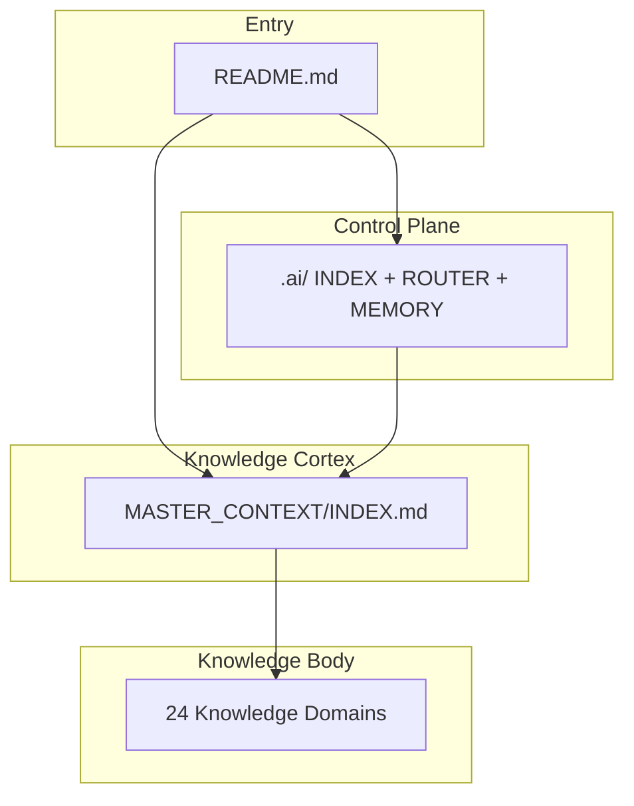

> **Diagram ID:** `DGM-MCX-001`
> **Explanation:** The README routes entry into both the control plane and the knowledge
> cortex. The cortex (this file) is the single routing authority that dispatches to the 24
> knowledge domains.

> **Image Specification**
> - Image ID: `IMG-MCX-001`
> - Purpose: Hero diagram showing MASTER_CONTEXT as the cognitive cortex of the repository.
> - Prompt: "A brain metaphor diagram showing README as the entry door, .ai as the control console, and MASTER_CONTEXT as a glowing central knowledge cortex routing to 24 domain nodes, dark navy blueprint with gold neural connections."
> - Style: Network/cortex diagram, blueprint.
> - Composition: Central cortex hub radiating to domain nodes.
> - Resolution: 2400x1600px
> - Priority: CRITICAL
> - Suggested Filename: `assets/diagrams/mcx-cognitive-cortex.png`

## 1.2 The Questions It Answers

This document exists so that any reader — human or machine — can answer six fundamental
questions deterministically. These are the "six cognitive primitives."

| # | Question | Answered by | Section |
| :---: | :--- | :--- | :--- |
| 1 | **What is Oship?** | Project identity & purpose | §1, §2, §9 |
| 2 | **Why does it exist?** | Mission, vision, value | §1, §9 |
| 3 | **Where is every type of knowledge stored?** | Knowledge architecture & domain map | §3, §14, §15 |
| 4 | **Which document should be read first?** | Reading order | §11 |
| 5 | **Which domain owns a specific decision?** | Ownership & decision matrix | §16 |
| 6 | **How should I navigate from idea to implementation?** | Idea-to-implementation journey | §17 |

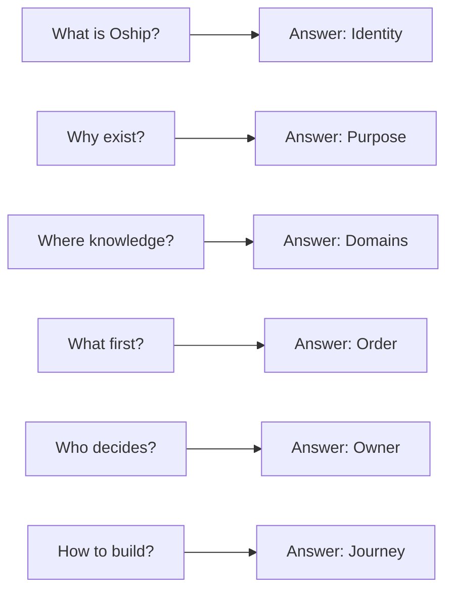

> **Diagram ID:** `DGM-MCX-002`
> **Explanation:** The six cognitive primitives map to deterministic answers. If any reader
> cannot answer one of these after reading this document, the document is incomplete.

> **Decision Rule:** This document is considered "complete" only when a brand-new AI agent
> can answer all six primitives with zero external help, using only this file.

## 1.3 Why It Is Called an Operating System

An operating system manages resources, schedules work, and provides an interface between
applications and hardware. MASTER_CONTEXT does the same for knowledge:

| OS function | MASTER_CONTEXT equivalent |
| :--- | :--- |
| **Process scheduling** | Routes which domain a query goes to |
| **Memory management** | Maps where knowledge is stored |
| **Resource allocation** | Assigns ownership & responsibility |
| **File system** | Organizes the 24 knowledge domains |
| **System calls** | Provides routing primitives (route, resolve, mount) |
| **Interrupt handling** | Redirects novel queries to correct domain |

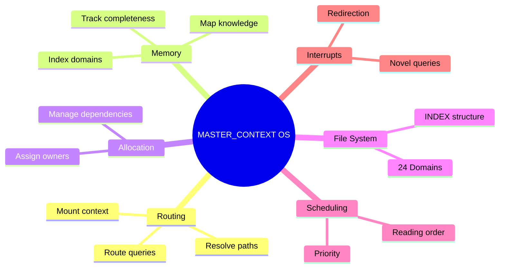

> **Diagram ID:** `DGM-MCX-003`
> **Explanation:** The operating-system metaphor explains every behavior of MASTER_CONTEXT in
> terms familiar to engineers, making the cognitive map intuitive to navigate.

> **Image Specification**
> - Image ID: `IMG-MCX-002`
> - Purpose: Visualize the operating-system functions of MASTER_CONTEXT.
> - Prompt: "A mind map comparing MASTER_CONTEXT to an operating system with routing, memory, allocation, file system, scheduling, and interrupts branches, navy and gold blueprint style."
> - Style: Mind map, blueprint.
> - Composition: Central OS node with six branches.
> - Resolution: 2000x1400px
> - Priority: HIGH
> - Suggested Filename: `assets/diagrams/mcx-os-metaphor.png`

---

# 2. The Complete Mental Model

## 2.1 The Five-Layer Knowledge Pyramid

The mental model of Oship rests on a five-layer knowledge pyramid, defined in
`PROJECT_PHILOSOPHY.md` §130. Every piece of knowledge lives at exactly one layer, and each
layer has a distinct authority and governance level.

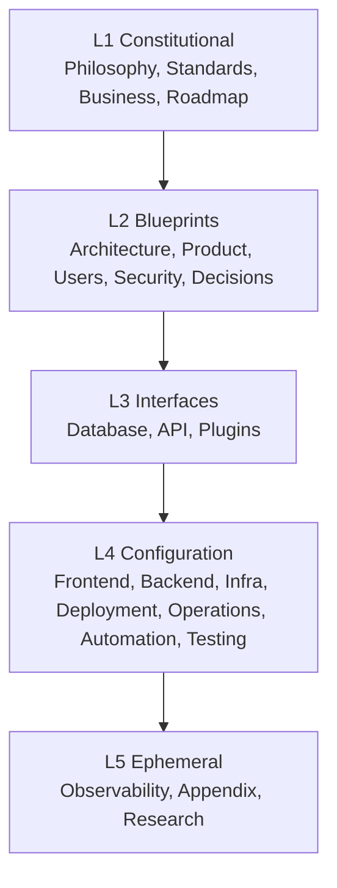

> **Diagram ID:** `DGM-MCX-004`
> **Explanation:** Knowledge flows top-down from constitutional authority to ephemeral
> detail. Cross-cutting concerns (security, observability, testing) intersect horizontally.

### TBL-MCX-001: Knowledge Layer Contract

| Layer | Authority | Review cadence | Example content |
| :---: | :--- | :--- | :--- |
| **L1 Constitutional** | Highest | 120 days | PROJECT_PHILOSOPHY, standards |
| **L2 Blueprints** | High | 90 days | C4 models, bounded contexts |
| **L3 Interfaces** | Medium | 45 days | OpenAPI, schemas |
| **L4 Configuration** | Medium | 30 days | CI/CD, IaC, services |
| **L5 Ephemeral** | Low | 7 days | Telemetry, research, appendices |

## 2.2 The Cognitive Flow

The mental model is a flow: from **intent** (a question or idea) through **routing** to
**knowledge**, then to **action** and **verification**.

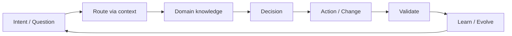

> **Diagram ID:** `DGM-MCX-005`
> **Explanation:** The cognitive flow is a continuous loop. Every intent routes to domain
> knowledge, produces a decision, drives action, is validated, and feeds learning.

> **Decision Rule:** any action taken without first routing through domain knowledge is
> "un-mounted" and prohibited. Routing first is mandatory.

## 2.3 The Four Quadrants of Knowledge

Oship organizes knowledge into four quadrants along two axes: **abstract→concrete** and
**decision→operation**.

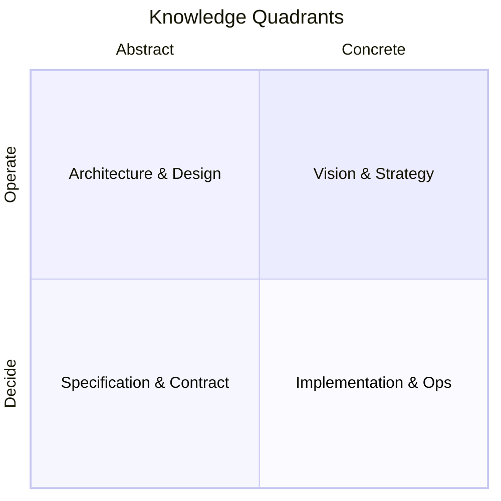

| Quadrant | Domains | Purpose |
| :--- | :--- | :--- |
| **Q1 Vision & Strategy** | 01, 02, 19, 21 | Why and what |
| **Q2 Architecture & Design** | 04, 03, 14, 22, 24 | How it's shaped |
| **Q3 Specification & Contract** | 06, 15, 16 | The precise interface |
| **Q4 Implementation & Ops** | 07, 08, 09, 10, 11, 12, 13, 17, 18 | Build, run, secure |

> **Image Specification**
> - Image ID: `IMG-MCX-003`
> - Purpose: Visualize the four knowledge quadrants of Oship.
> - Prompt: "A four-quadrant knowledge matrix with Vision, Architecture, Specification, and Implementation, dark navy blueprint style with quadrant borders."
> - Style: Quadrant chart, blueprint.
> - Composition: 2x2 quadrant grid.
> - Resolution: 1800x1200px
> - Priority: HIGH
> - Suggested Filename: `assets/diagrams/mcx-knowledge-quadrants.png`

---

# 3. Knowledge Architecture

## 3.1 The Domain-Mapped Topology

Knowledge is physically organized into 24 canonical domains, each a folder under
`docs/MASTER_CONTEXT/` with its own `INDEX.md`. This is the file-system of the cognitive OS.

```
docs/MASTER_CONTEXT/
├── INDEX.md                        # THIS file — cognitive OS
├── ENTERPRISE_ARCHITECTURE_CONTEXT.md
├── 01_PRODUCT/        INDEX.md
├── 02_BUSINESS/       INDEX.md
├── 03_USERS/          INDEX.md
├── 04_ARCHITECTURE/   INDEX.md
├── 05_AI/             INDEX.md
├── 06_DATABASE/       INDEX.md
├── 07_FRONTEND/       INDEX.md
├── 08_BACKEND/        INDEX.md
├── 09_INFRASTRUCTURE/ INDEX.md
├── 10_SECURITY/       INDEX.md
├── 11_DEPLOYMENT/     INDEX.md
├── 12_OPERATIONS/     INDEX.md
├── 13_OBSERVABILITY/  INDEX.md
├── 14_DESIGN_SYSTEM/  INDEX.md
├── 15_API/            INDEX.md
├── 16_PLUGINS/        INDEX.md
├── 17_AUTOMATION/     INDEX.md
├── 18_TESTING/        INDEX.md
├── 19_ROADMAP/        INDEX.md
├── 20_APPENDIX/       INDEX.md
├── 21_RESEARCH/       INDEX.md
├── 22_DECISIONS/      INDEX.md
├── 23_STANDARDS/      INDEX.md
└── 24_DIAGRAMS/       INDEX.md
```

> **Diagram ID:** `DGM-MCX-006`
> **Explanation:** The physical topology mirrors the cognitive structure: one folder per
> domain, each self-contained with an INDEX that routes to its content.

## 3.2 Domain INDEX Anatomy

Every domain `INDEX.md` is a self-contained knowledge unit with a defined anatomy. This
anatomy is the "schema" that lets any agent parse a domain without guessing.

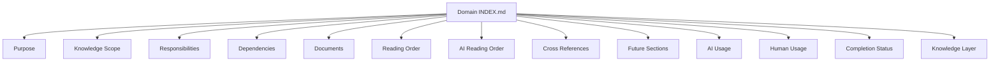

> **Diagram ID:** `DGM-MCX-007`
> **Explanation:** The 13-field domain INDEX anatomy is the deterministic schema every domain
> follows. It guarantees parseability and navigability.

### TBL-MCX-002: Domain INDEX Anatomy Fields

| Field | Purpose | Required |
| :--- | :--- | :---: |
| Purpose | Why the domain exists | ✅ |
| Knowledge Scope | What it covers/excludes | ✅ |
| Responsibilities | Who owns what | ✅ |
| Dependencies | Upstream domains | ✅ |
| Documents | Planned content | ✅ |
| Reading Order | Human sequence | ✅ |
| AI Reading Order | Agent sequence | ✅ |
| Cross References | Related domains | ✅ |
| Future Sections | Planned expansion | ✅ |
| AI Usage | Agent consumption | ✅ |
| Human Usage | Human consumption | ✅ |
| Completion Status | % done | ✅ |
| Knowledge Layer | L1–L5 authority | ✅ |

## 3.3 Knowledge Storage by Type

Different knowledge types are stored in different physical locations. This matrix is the
master "where does X live?" lookup.

### TBL-MCX-003: Knowledge Storage Matrix

| Knowledge type | Primary location | Domain |
| :--- | :--- | :--- |
| Governance & rules | `PROJECT_PHILOSOPHY.md`, `.ai/` | 05, 23 |
| Product strategy | `01_PRODUCT/` | 01 |
| Business model | `02_BUSINESS/` | 02 |
| User personas | `03_USERS/` | 03 |
| Architecture blueprints | `04_ARCHITECTURE/`, `architecture/` | 04 |
| Data models | `06_DATABASE/`, `database/` | 06 |
| UI/UX | `07_FRONTEND/`, `design/` | 07, 14 |
| Services | `08_BACKEND/`, `services/` | 08 |
| Infra & IaC | `09_INFRASTRUCTURE/`, `infra/` | 09 |
| Security | `10_SECURITY/`, `security/` | 10 |
| Deployment | `11_DEPLOYMENT/`, `deployment/` | 11 |
| Operations | `12_OPERATIONS/` | 12 |
| Telemetry | `13_OBSERVABILITY/`, `observability/` | 13 |
| API contracts | `15_API/`, `apis/` | 15 |
| Plugins | `16_PLUGINS/`, `plugins/` | 16 |
| Automation | `17_AUTOMATION/`, `.github/workflows/` | 17 |
| Tests | `18_TESTING/`, `tests/` | 18 |
| Roadmap | `19_ROADMAP/`, `docs/roadmap/` | 19 |
| Decisions | `22_DECISIONS/`, `docs/ADR/` | 22 |
| Standards | `23_STANDARDS/` | 23 |
| Diagrams | `24_DIAGRAMS/`, `docs/diagrams/` | 24 |

> **Decision Rule:** when storing new knowledge, route it to its primary location above. If no
> location fits, it belongs in `20_APPENDIX/` until a proper domain is defined.

---

# 4. Context Routing

## 4.1 The Routing Primitive

Routing is the operation of resolving a query (intent) to a knowledge domain and mounting the
correct context. The routing primitive has three steps: **parse → resolve → mount**.

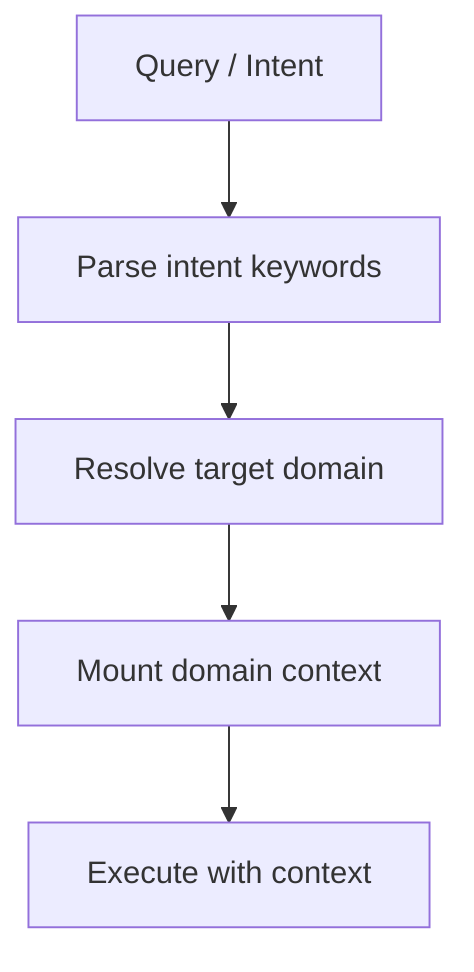

> **Diagram ID:** `DGM-MCX-008`
> **Explanation:** Every query routes through parse → resolve → mount → execute. This is the
> atomic routing operation of the cognitive OS.

> **Image Specification**
> - Image ID: `IMG-MCX-004`
> - Purpose: Visualize the atomic routing primitive of MASTER_CONTEXT.
> - Prompt: "A routing primitive diagram showing parse, resolve, mount, execute pipeline, purple and navy blueprint style."
> - Style: Pipeline flowchart, blueprint.
> - Composition: Four-stage left-to-right pipeline.
> - Resolution: 1600x700px
> - Priority: HIGH
> - Suggested Filename: `assets/diagrams/mcx-routing-primitive.png`

## 4.2 Intent-to-Domain Mapping

The core routing table maps intent keywords to domains. This is the primary lookup an agent
performs.

### TBL-MCX-004: Intent-to-Domain Routing Matrix

| Intent keywords | Target domain | Priority |
| :--- | :--- | :---: |
| product, feature, vision | 01_PRODUCT | CRITICAL |
| business, value, revenue, kpi | 02_BUSINESS | HIGH |
| persona, journey, user | 03_USERS | HIGH |
| architecture, c4, schema, boundary | 04_ARCHITECTURE | CRITICAL |
| ai, agent, routing, context | 05_AI | CRITICAL |
| database, migration, er, data | 06_DATABASE | HIGH |
| frontend, ui, component | 07_FRONTEND | HIGH |
| backend, service, logic | 08_BACKEND | HIGH |
| infra, cloud, iac, environment | 09_INFRASTRUCTURE | HIGH |
| security, auth, threat, secret | 10_SECURITY | CRITICAL |
| deploy, release, pipeline | 11_DEPLOYMENT | HIGH |
| ops, incident, runbook | 12_OPERATIONS | HIGH |
| metric, log, trace, slo | 13_OBSERVABILITY | HIGH |
| design, token, brand, ux | 14_DESIGN_SYSTEM | HIGH |
| api, contract, endpoint, sdk | 15_API | CRITICAL |
| plugin, extension | 16_PLUGINS | MEDIUM |
| automation, gitops, bot | 17_AUTOMATION | HIGH |
| test, coverage, qa | 18_TESTING | HIGH |
| roadmap, phase, milestone | 19_ROADMAP | HIGH |
| glossary, reference, template | 20_APPENDIX | LOW |
| research, experiment | 21_RESEARCH | MEDIUM |
| adr, decision, tradeoff | 22_DECISIONS | HIGH |
| standard, metadata, naming | 23_STANDARDS | CRITICAL |
| diagram, mermaid, c4, er | 24_DIAGRAMS | HIGH |

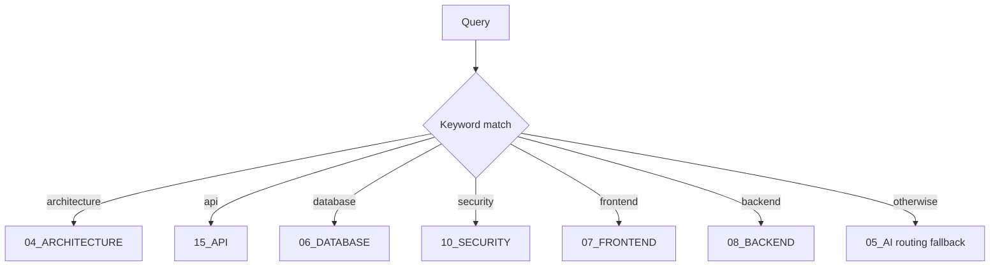

> **Diagram ID:** `DGM-MCX-009`
> **Explanation:** Keyword matching is the fast routing path. Unmatched queries fall back to
> the 05_AI routing domain, which does semantic resolution.

## 4.3 Maximum Hop Count

Routing is bounded to a maximum of two hops. This keeps context loading efficient.

| Route type | Hops | Description |
| :--- | :---: | :--- |
| **Direct** | 1 | Intent → domain INDEX |
| **Resolved** | 2 | Intent → routing domain → target |
| **Forbidden** | 3+ | Unbounded traversal — prohibited |

> **Decision Rule:** if resolving a query requires more than two hops, the routing table is
> incomplete and must be extended, not traversed deeper.

---

# 5. AI Reconstruction Capability

## 5.1 What "AI Reconstruction" Means

AI reconstruction is the ability of a brand-new AI agent — with no prior knowledge of Oship —
to rebuild a correct mental model of the project from the knowledge graph alone. MASTER_CONTEXT
is engineered to maximize reconstruction fidelity.

| Reconstruction property | How MASTER_CONTEXT enables it |
| :--- | :--- |
| **Self-containment** | All routing lives in one cortex |
| **Determinism** | Fixed schema, IDs, links |
| **Completeness** | Every domain has an INDEX |
| **Navigability** | ≤2 hop routing |
| **Traceability** | Dependencies & ownership explicit |

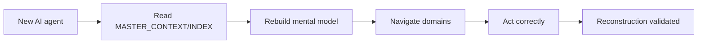

> **Diagram ID:** `DGM-MCX-010`
> **Explanation:** Reconstruction is a pipeline: read the cortex, rebuild the model, navigate,
> act. Success validates the reconstruction capability.

> **Image Specification**
> - Image ID: `IMG-MCX-005`
> - Purpose: Visualize the AI reconstruction capability pipeline.
> - Prompt: "An AI reconstruction pipeline showing a new agent reading the knowledge cortex and rebuilding a mental model to act correctly, purple and navy blueprint style."
> - Style: Pipeline flowchart, blueprint.
> - Composition: Five-stage reconstruction pipeline.
> - Resolution: 1800x800px
> - Priority: CRITICAL
> - Suggested Filename: `assets/diagrams/mcx-reconstruction.png`

## 5.2 The Reconstruction Test

A deterministic test measures reconstruction quality. It is the "exam" a new agent must pass.

### TBL-MCX-005: Reconstruction Test

| Test question | Pass criterion |
| :--- | :--- |
| What is Oship? | Agent states identity correctly |
| Where is API knowledge? | Agent routes to 15_API |
| Who owns security? | Agent identifies 10_SECURITY owner |
| What to read first? | Agent cites reading order |
| How to build a feature? | Agent traces idea-to-implementation |
| Where to record a decision? | Agent routes to 22_DECISIONS |

> **Decision Rule:** if a new agent fails any reconstruction test item, the corresponding
> knowledge is insufficiently exposed and must be strengthened in this document.

---

# 6. Human Onboarding

## 6.1 The Human Path

Humans onboard differently from AI — they benefit from narrative, examples, and role-based
paths. MASTER_CONTEXT provides both.

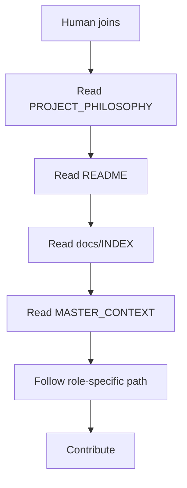

> **Diagram ID:** `DGM-MCX-011`
> **Explanation:** Human onboarding is a guided sequence from constitution through orientation
> to role-specific contribution.

## 6.2 Onboarding Roles

Different humans need different first documents.

### TBL-MCX-006: Human Onboarding by Role

| Role | First reads | Goal |
| :--- | :--- | :--- |
| **New engineer** | PROJECT_PHILOSOPHY, README, 04 | Understand system |
| **Contributor** | README, CONTRIBUTING, 23 | Make a change |
| **Architect** | 04, 22, ADR | Govern design |
| **Designer** | 03, 14 | Build UX |
| **DevOps** | 09, 11, 17 | Operate platform |
| **Manager** | 01, 02, 19 | Steer product |

> **Image Specification**
> - Image ID: `IMG-MCX-006`
> - Purpose: Visualize the human onboarding sequence.
> - Prompt: "A guided human onboarding flow from philosophy through orientation to role-specific contribution, navy and gold blueprint style."
> - Style: Flowchart, blueprint.
> - Composition: Ordered onboarding path.
> - Resolution: 1800x1000px
> - Priority: HIGH
> - Suggested Filename: `assets/diagrams/mcx-human-onboarding.png`

---

# 7. Architecture Navigation

## 7.1 Navigating the Blueprints

Architecture navigation is the process of moving from high-level intent to concrete design
documents. MASTER_CONTEXT provides the map.

| Step | What you're looking for | Domain |
| :--- | :--- | :--- |
| 1 | System context | 04_ARCHITECTURE |
| 2 | Bounded contexts | 04_ARCHITECTURE |
| 3 | Component breakdown | 04_ARCHITECTURE |
| 4 | Data model | 06_DATABASE |
| 5 | API contract | 15_API |
| 6 | Security model | 10_SECURITY |

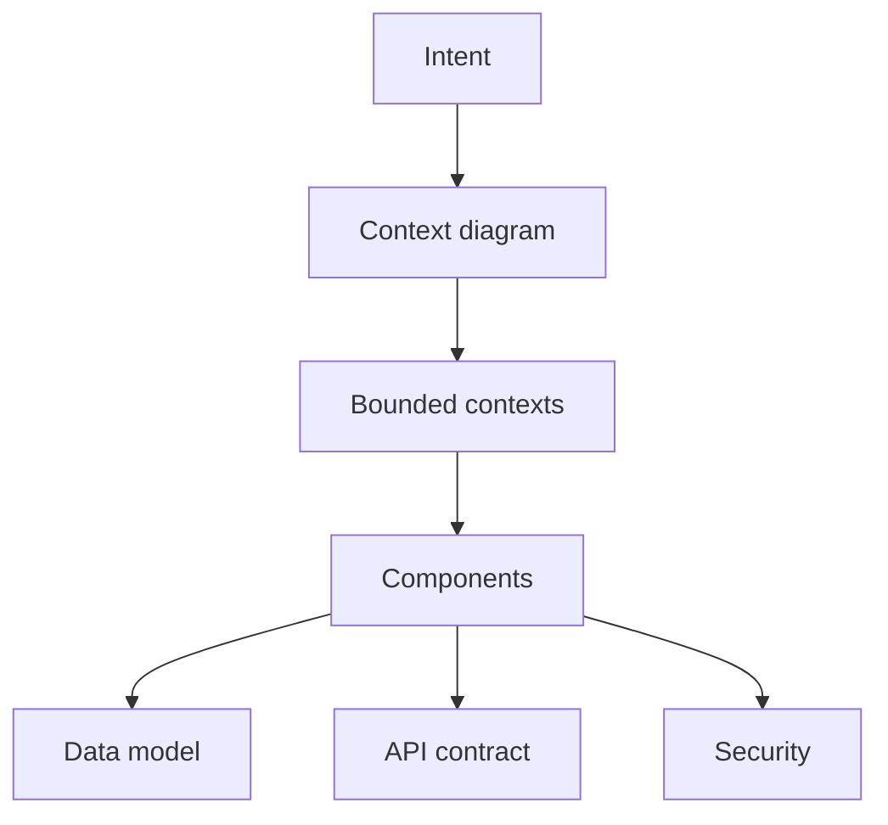

> **Diagram ID:** `DGM-MCX-012`
> **Explanation:** Architecture navigation flows from context through bounded contexts to
> components, then branches into data, API, and security.

---

# 8. Future Evolution

## 8.1 How the Cognitive OS Evolves

The cognitive OS is designed to evolve as Oship grows. Expansion follows defined rules so the
map never becomes stale.

| Growth signal | MASTER_CONTEXT response |
| :--- | :--- |
| New domain | Add folder + INDEX + routing |
| New technology | Update 04 + ADR |
| New module | Update 07/08 + module map |
| New AI tool | Update 05 + routing |
| New standard | Update 23 |
| New diagram | Update 24 |

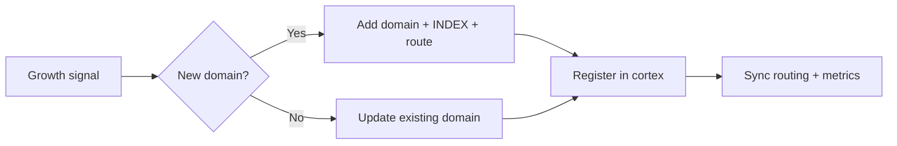

> **Diagram ID:** `DGM-MCX-013`
> **Explanation:** Growth triggers either a new domain or an update to an existing one, then
> registration and sync.

---

# 9. Repository Hierarchy

## 9.1 The Full Topology

The knowledge infrastructure sits at the core of the repository and wires into the wider
topology.

```
afshin-omnisystem/Oship/
├── PROJECT_PHILOSOPHY.md        # L1 Constitutional — supreme governing document
├── README.md                    # Front-facing entry portal
├── .ai/                         # AI Control Plane (operational rules, memory, metrics)
│   ├── INDEX.md                 # Control-plane master index
│   ├── CONTEXT_ROUTER.md        # Declarative AI routing rules
│   ├── DOCUMENTATION_COMPLETION_STANDARD.md  # Documentation quality contract
│   ├── AI_AGENT_OPERATING_MANUAL.md         # Agent operational constitution
│   ├── METRICS.md               # Repository & knowledge metrics
│   └── ...                      # Other control-plane files
├── docs/
│   ├── INDEX.md                 # Documentation library master portal
│   └── MASTER_CONTEXT/          # << THIS TREE — Cognitive OS
│       ├── INDEX.md             # Root node (this file) — the cognitive map
│       ├── MASTER_CONTEXT_RULES.md  # Constitutional law of the cognitive OS
│       ├── MASTER_CONTEXT_SCHEMA.md # The DNA of Oship — enterprise knowledge schema
│       ├── MASTER_CONTEXT_RELATIONSHIPS.md  # The complete relationship graph of Oship
│       ├── MASTER_CONTEXT_EXECUTION_MODEL.md # The runtime operating system of Oship
│       ├── MASTER_CONTEXT_MEMORY_SYSTEM.md # The cognitive memory architecture of Oship
│       ├── ENTERPRISE_ARCHITECTURE_CONTEXT.md
│       └── 01_PRODUCT/ … 24_DIAGRAMS/  # 24 knowledge domains
├── architecture/                # L2 blueprints
├── design/                      # L2 design system assets
├── apis/, database/, services/, infra/, …  # Implementation domains (Phase A+)
└── .github/                     # Governance, workflows, community files
```

> **Diagram ID:** `DGM-MCX-014`
> **Explanation:** The knowledge graph (`docs/MASTER_CONTEXT/`) is the brain that connects the
> constitutional layer (`PROJECT_PHILOSOPHY.md`, `.ai/`) to implementation domains.

## 9.2 Layer-to-Folder Mapping

### TBL-MCX-007: Layer-to-Folder Mapping

| Knowledge Layer | Primary folders |
| :--- | :--- |
| **L1 Constitutional** | `PROJECT_PHILOSOPHY.md`, `.ai/`, `23_STANDARDS/`, `02_BUSINESS/`, `19_ROADMAP/` |
| **L2 Blueprints** | `architecture/`, `docs/ADR/`, `04/`, `01/`, `03/`, `10/`, `14/`, `22/`, `24/` |
| **L3 Interfaces** | `apis/`, `database/`, `06/`, `15/`, `16/` |
| **L4 Configuration** | `.github/workflows/`, `infra/`, `07/`, `08/`, `09/`, `11/`, `12/`, `17/`, `18/` |
| **L5 Ephemeral** | `observability/`, `research/`, `13/`, `20/`, `21/` |

---

# 10. Knowledge Dependencies

## 10.1 The Dependency Chain

Knowledge flows top-down with cross-cutting concerns intersecting horizontally.

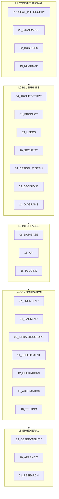

> **Diagram ID:** `DGM-MCX-015`
> **Explanation:** The five layers flow top-down. Each layer supplies context to the next.

## 10.2 Per-Domain Dependencies

### TBL-MCX-008: Full Domain Dependency Matrix

| Domain | Depends on (upstream) | Required by (downstream) |
| :--- | :--- | :--- |
| 01_PRODUCT | MCX, 02, 03 | 04, 19 |
| 02_BUSINESS | MCX, 01 | 19, 22 |
| 03_USERS | MCX, 01, 14 | 07, 14, 15 |
| 04_ARCHITECTURE | MCX, 22, 23 | 05, 06, 07, 08, 09, 10, 15 |
| 05_AI | MCX, 04, 23 | all routing |
| 06_DATABASE | MCX, 04, 08 | 08, 15 |
| 07_FRONTEND | MCX, 04, 14, 15 | 08, 18 |
| 08_BACKEND | MCX, 04, 06, 15 | 07, 12, 18 |
| 09_INFRASTRUCTURE | MCX, 04, 11 | 11, 12, 13 |
| 10_SECURITY | MCX, 04 | 06, 08, 11, 15 |
| 11_DEPLOYMENT | MCX, 09, 17 | 12, 18 |
| 12_OPERATIONS | MCX, 11, 13 | 13 |
| 13_OBSERVABILITY | MCX, 09, 12 | 12 |
| 14_DESIGN_SYSTEM | MCX, 03, 07 | 07 |
| 15_API | MCX, 04, 10 | 07, 08, 16 |
| 16_PLUGINS | MCX, 04, 15 | 17, 18 |
| 17_AUTOMATION | MCX, 11, 18 | 11, 12 |
| 18_TESTING | MCX, 11, 17 | 11, 17 |
| 19_ROADMAP | MCX, 01, 02 | 22 |
| 20_APPENDIX | MCX, 23 | all reference |
| 21_RESEARCH | MCX, 22 | 22 |
| 22_DECISIONS | MCX, 04, 23 | 04, 19 |
| 23_STANDARDS | MCX, 05 | 04, 22, all |
| 24_DIAGRAMS | MCX, 04, 23 | 04, 06, 11, 14 |

> **Decision Rule:** before working in a downstream domain, read its upstream dependencies
> first. This prevents context gaps.

---

# 11. Reading Order

## 11.1 Human Reading Order

1. `PROJECT_PHILOSOPHY.md` — the constitution.
2. `README.md` — orientation.
3. `docs/INDEX.md` — documentation library map.
4. `docs/MASTER_CONTEXT/INDEX.md` — this knowledge graph.
5. `docs/MASTER_CONTEXT/ENTERPRISE_ARCHITECTURE_CONTEXT.md` — metadata & architecture standard.
6. `docs/MASTER_CONTEXT/23_STANDARDS/` — standards that govern all files.
7. Each domain `INDEX.md` relevant to the task.

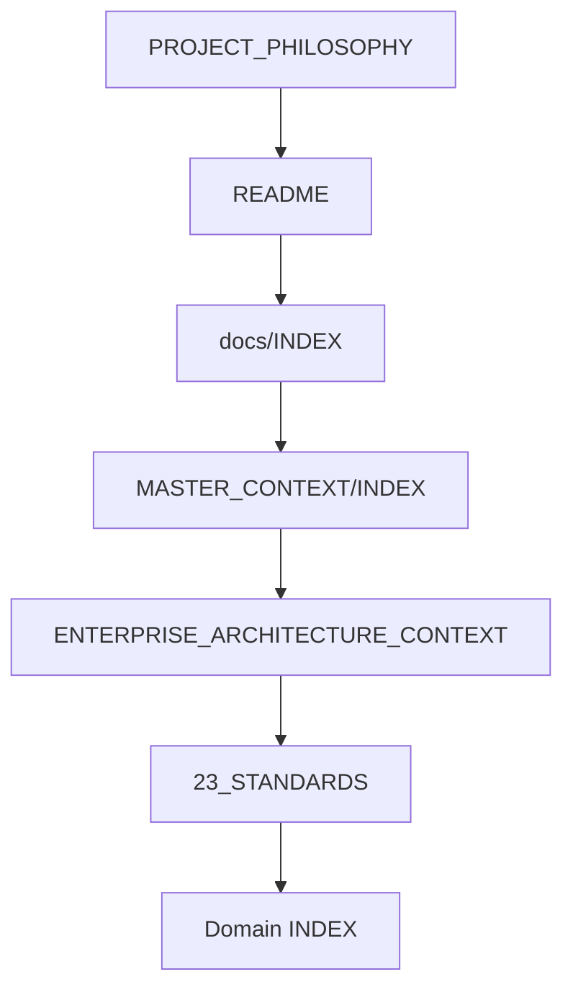

> **Diagram ID:** `DGM-MCX-016`
> **Explanation:** Human reading order is a guided descending sequence ending at the
> task-specific domain.

## 11.2 AI Reading Order (Boot Sequence)

Every AI agent MUST follow this deterministic boot sequence before any task:

1. `.ai/INDEX.md` — control plane.
2. `.ai/CURRENT_CONTEXT.md` and `.ai/PROJECT_STATUS.md` — current state.
3. `.ai/CONTEXT_ROUTER.md` — routing rules.
4. `docs/MASTER_CONTEXT/INDEX.md` — global knowledge graph.
5. `docs/MASTER_CONTEXT/23_STANDARDS/` — metadata & naming compliance.
6. `.ai/DOCUMENTATION_COMPLETION_STANDARD.md` — documentation contract.
7. `.ai/AI_AGENT_OPERATING_MANUAL.md` — agent constitution.
8. Route to the specific domain `INDEX.md` per the query.
9. Update `.ai/NEXT_ACTION.md`, `.ai/SESSION_MEMORY.md` at session end.

### TBL-MCX-009: AI Boot Sequence

| Step | Document | Priority |
| :---: | :--- | :---: |
| 1 | `.ai/INDEX.md` | P0 |
| 2 | `.ai/CURRENT_CONTEXT.md` + `PROJECT_STATUS.md` | P0 |
| 3 | `.ai/CONTEXT_ROUTER.md` | P1 |
| 4 | `MASTER_CONTEXT/INDEX.md` | P0 |
| 5 | `MASTER_CONTEXT/23_STANDARDS/` | P1 |
| 6 | `DOCUMENTATION_COMPLETION_STANDARD.md` | P1 |
| 7 | `AI_AGENT_OPERATING_MANUAL.md` | P0 |
| 8 | Target domain INDEX | P1 |
| 9 | Update memory files | P2 |

> **Image Specification**
> - Image ID: `IMG-MCX-007`
> - Purpose: Visualize the AI boot sequence through the knowledge cortex.
> - Prompt: "A nine-step AI boot sequence flow from control plane through knowledge cortex to domain routing, purple and navy blueprint style."
> - Style: Flowchart, blueprint.
> - Composition: Nine ordered steps.
> - Resolution: 1700x1400px
> - Priority: CRITICAL
> - Suggested Filename: `assets/diagrams/mcx-ai-boot-sequence.png`

---

# 12. AI Routing Scenarios

## 12.1 Backend Request

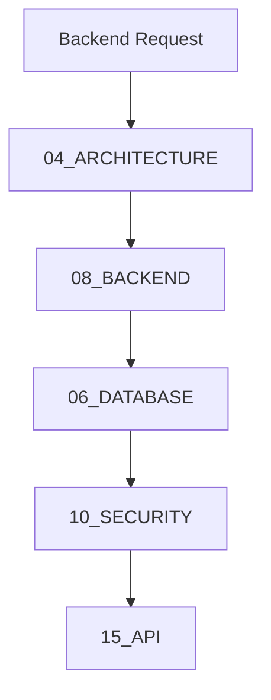

> **Diagram ID:** `DGM-MCX-017`
> **Explanation:** A backend request routes through architecture, backend, database, security,
> and API to build complete context.

## 12.2 Frontend Request

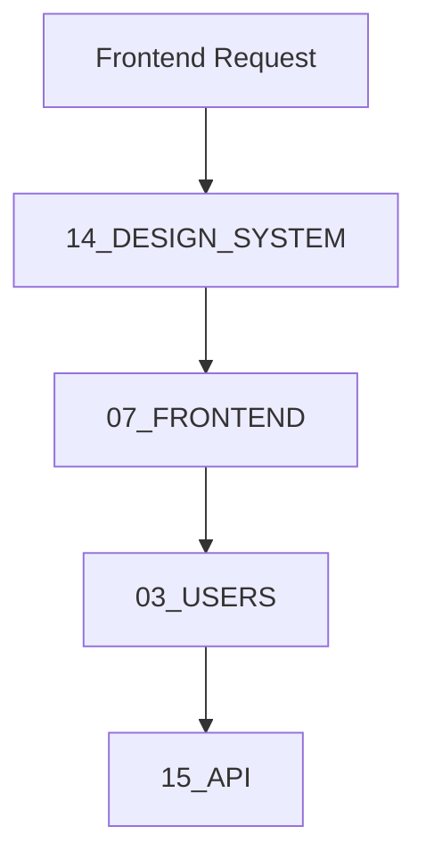

> **Diagram ID:** `DGM-MCX-018`
> **Explanation:** A frontend request routes through design system, frontend, users, and API.

## 12.3 Data Request

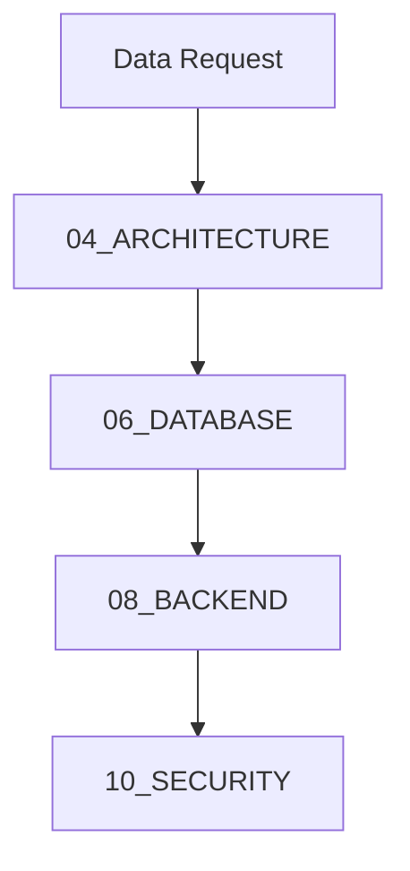

> **Diagram ID:** `DGM-MCX-019`
> **Explanation:** A data request routes through architecture, database, backend, and security.

## 12.4 Infrastructure / Deployment Request

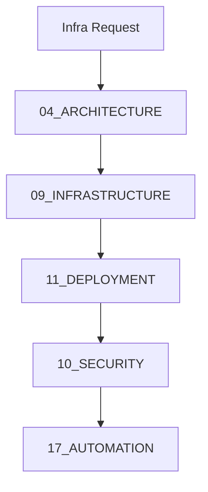

> **Diagram ID:** `DGM-MCX-020`
> **Explanation:** Infrastructure requests route through architecture, infrastructure,
> deployment, security, and automation.

## 12.5 Security Request

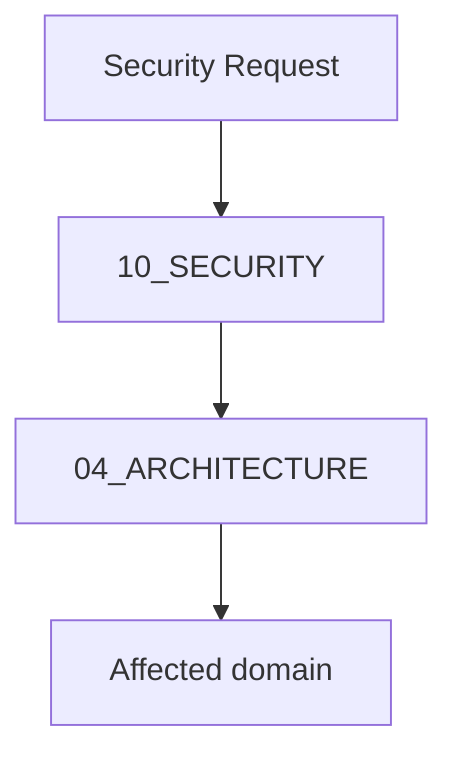

> **Diagram ID:** `DGM-MCX-021`
> **Explanation:** Security requests route to security first, then to the affected domain.

## 12.6 Additional Routing Scenarios

### TBL-MCX-010: Extended Routing Scenarios

| Scenario | Route |
| :--- | :--- |
| Add a backend endpoint | 08 → 15 → 06 → 10 |
| Build a new screen | 14 → 07 → 03 → 15 |
| Design a database table | 06 → 04 → 15 |
| Write a test suite | 18 → 17 → 08 |
| Set up CI/CD | 17 → 11 → 09 |
| Fix a security issue | 10 → 04 → 15 |
| Make an architecture decision | 22 → 04 → 21 |
| Add a plugin | 16 → 15 → 04 |
| Investigate production issue | 13 → 12 → 08 |
| Update product strategy | 19 → 01 → 02 |

---

# 13. Human Routing by Role

## 13.1 Role-Based Paths

### TBL-MCX-011: Human Routing by Role

| Persona | Entry | Path | Next action |
| :--- | :--- | :--- | :--- |
| Backend Engineer | 08_BACKEND | 04→08→06→15 | Implement service |
| Frontend Engineer | 14_DESIGN_SYSTEM | 14→07→03→15 | Build UI |
| AI Engineer | 05_AI | 05→router→23 | Onboard agent |
| DevOps Engineer | 09_INFRASTRUCTURE | 09→17→11→13 | Provision & automate |
| Product Designer | 03_USERS | 03→14→design | Prototype |
| Maintainer | 19_ROADMAP | 19→22→CONTRIBUTING | Triage & review |

```mermaid
flowchart TD
    subgraph BE[Backend Engineer]
        BE1[04] --> BE2[08] --> BE3[06] --> BE4[15]
    end
    subgraph FE[Frontend Engineer]
        FE1[14] --> FE2[07] --> FE3[03] --> FE4[15]
    end
    subgraph OPS[DevOps Engineer]
        O1[09] --> O2[17] --> O3[11] --> O4[13]
    end
```

> **Diagram ID:** `DGM-MCX-022`
> **Explanation:** Each role has a deterministic path through the knowledge graph.

---

# 14. Repository Layers & Domain Map

## 14.1 The 24-Domain Overview

### TBL-MCX-012: Knowledge Domain Master Map

| # | Domain | Folder | Layer | Purpose | AI | Human |
| :---: | :--- | :--- | :--- | :--- | :---: | :---: |
| 01 | Product | `01_PRODUCT/` | L1/L2 | Product vision, strategy, features | CRITICAL | HIGH |
| 02 | Business | `02_BUSINESS/` | L1 | Business model, value streams, KPIs | HIGH | HIGH |
| 03 | Users | `03_USERS/` | L2 | Personas, journeys, research | HIGH | HIGH |
| 04 | Architecture | `04_ARCHITECTURE/` | L2 | System structure, C4, bounded contexts | CRITICAL | CRITICAL |
| 05 | AI | `05_AI/` | L1/L2 | AI onboarding, routing, governance | CRITICAL | HIGH |
| 06 | Database | `06_DATABASE/` | L3 | Data model, schemas, migrations | HIGH | HIGH |
| 07 | Frontend | `07_FRONTEND/` | L4 | Frontend architecture & state | HIGH | HIGH |
| 08 | Backend | `08_BACKEND/` | L4 | Backend services & logic | HIGH | HIGH |
| 09 | Infrastructure | `09_INFRASTRUCTURE/` | L4 | Cloud, IaC, environments | HIGH | HIGH |
| 10 | Security | `10_SECURITY/` | L2 | Threat model, zero-trust, compliance | CRITICAL | CRITICAL |
| 11 | Deployment | `11_DEPLOYMENT/` | L4 | Releases, CI/CD, promotion | HIGH | HIGH |
| 12 | Operations | `12_OPERATIONS/` | L4 | Runbooks, incidents, on-call | HIGH | HIGH |
| 13 | Observability | `13_OBSERVABILITY/` | L4/L5 | Telemetry, dashboards, SLOs | HIGH | HIGH |
| 14 | Design System | `14_DESIGN_SYSTEM/` | L2 | Tokens, components, brand | HIGH | HIGH |
| 15 | API | `15_API/` | L3 | Contracts, versioning, SDK | CRITICAL | CRITICAL |
| 16 | Plugins | `16_PLUGINS/` | L3/L4 | Extension model, plugin SDK | MEDIUM | MEDIUM |
| 17 | Automation | `17_AUTOMATION/` | L4 | CI/CD, GitOps, bots | HIGH | HIGH |
| 18 | Testing | `18_TESTING/` | L4 | Strategy, coverage, gates | HIGH | HIGH |
| 19 | Roadmap | `19_ROADMAP/` | L1/L5 | Phases, milestones, priorities | HIGH | HIGH |
| 20 | Appendix | `20_APPENDIX/` | L5 | Glossary, templates, references | LOW | MEDIUM |
| 21 | Research | `21_RESEARCH/` | L5 | Experiments, competitive analysis | MEDIUM | MEDIUM |
| 22 | Decisions | `22_DECISIONS/` | L2 | ADRs, decision log | HIGH | HIGH |
| 23 | Standards | `23_STANDARDS/` | L1 | Metadata, naming, quality gates | CRITICAL | HIGH |
| 24 | Diagrams | `24_DIAGRAMS/` | L2 | Diagram taxonomy & registry | HIGH | HIGH |

---

# 15. Domain Deep Dives (01–24)

This section is the heart of the cognitive OS: a deep dive into each of the 24 domains. For
every domain, the following are provided:

1. **Explanation** — what the domain is
2. **Diagram** — visual representation
3. **Example** — a concrete scenario
4. **Decision Rule** — how to decide routing/ownership
5. **Navigation Path** — how to navigate within the domain

---

## 15.01 Domain 01 — Product

### Explanation

The Product domain defines what Oship is and why it exists. It holds the product vision,
mission, value proposition, and feature strategy. It is the "why" of the entire system and
anchors all downstream engineering to real product intent.

| Attribute | Value |
| :--- | :--- |
| Folder | `01_PRODUCT/` |
| Knowledge Layer | L1/L2 |
| AI Priority | CRITICAL |
| Owner | Product Management |

### Diagram

```mermaid
flowchart TD
    V[Vision] --> M[Mission]
    M --> VP[Value Proposition]
    VP --> STRAT[Strategy]
    STRAT --> FR[Feature Registry]
    FR --> ROAD[Roadmap 19]
```

> **Diagram ID:** `DGM-MCX-023`
> **Explanation:** Product knowledge flows from vision through mission, value proposition,
> strategy, and features, feeding the roadmap.

### Example

A product manager proposes a new "automated reporting" feature. The Product domain answers:
What problem does it solve? Who is it for? What is the value? How does it fit the strategy?

### Decision Rule

Route any query about **why, what to build, or product value** to this domain. If the query is
about **how to build**, route to the relevant implementation domain instead.

### Navigation Path

`01_PRODUCT/INDEX.md` → PRODUCT_VISION → VALUE_PROPOSITION → PRODUCT_STRATEGY →
FEATURE_REGISTRY.

### Planned Documents

| Document | Purpose |
| :--- | :--- |
| PRODUCT_VISION | Canonical vision & mission |
| VALUE_PROPOSITION | Customer value model |
| PRODUCT_STRATEGY | Strategic pillars & OKRs |
| FEATURE_REGISTRY | Feature lifecycle register |

> **Image Specification**
> - Image ID: `IMG-MCX-008`
> - Purpose: Visualize the product knowledge flow from vision to roadmap.
> - Prompt: "A product knowledge flow diagram from vision, mission, value proposition, strategy, features to roadmap, navy and gold blueprint style."
> - Style: Flowchart, blueprint.
> - Composition: Vertical product flow.
> - Resolution: 1500x900px
> - Priority: MEDIUM
> - Suggested Filename: `assets/diagrams/mcx-product-flow.png`

---

## 15.02 Domain 02 — Business

### Explanation

The Business domain defines the commercial context: business model, revenue streams, value
streams, KPIs, and stakeholders. It connects product intent to economic reality.

| Attribute | Value |
| :--- | :--- |
| Folder | `02_BUSINESS/` |
| Knowledge Layer | L1 |
| AI Priority | HIGH |
| Owner | Business Strategy |

### Diagram

```mermaid
flowchart TD
    BM[Business Model] --> VS[Value Streams]
    VS --> KP[Business KPIs]
    KP --> ST[Stakeholders]
    ST --> DEC[Decisions 22]
```

> **Diagram ID:** `DGM-MCX-024`
> **Explanation:** Business knowledge flows from the model through value streams, KPIs, and
> stakeholders into decisions.

### Example

To evaluate a pricing change, the Business domain provides the revenue model, cost structure,
and KPIs that would be affected.

### Decision Rule

Route queries about **revenue, cost, value, or commercial impact** to this domain.

### Navigation Path

`02_BUSINESS/INDEX.md` → BUSINESS_MODEL → VALUE_STREAMS → BUSINESS_METRICS →
STAKEHOLDERS.

### Planned Documents

| Document | Purpose |
| :--- | :--- |
| BUSINESS_MODEL | Business model canvas |
| VALUE_STREAMS | End-to-end value stream maps |
| BUSINESS_METRICS | Commercial KPIs |
| STAKEHOLDERS | Stakeholder register |

---

## 15.03 Domain 03 — Users

### Explanation

The Users domain defines who Oship serves: personas, journeys, jobs-to-be-done, and research.
It grounds all UX and product decisions in real user needs.

| Attribute | Value |
| :--- | :--- |
| Folder | `03_USERS/` |
| Knowledge Layer | L2 |
| AI Priority | HIGH |
| Owner | UX Research |

### Diagram

```mermaid
flowchart TD
    P[Personas] --> J[User Journeys]
    J --> JTBD[Jobs to be Done]
    JTBD --> RI[Research Insights]
    RI --> DS[Design 14]
```

> **Diagram ID:** `DGM-MCX-025`
> **Explanation:** User knowledge flows from personas through journeys and jobs-to-be-done to
> research insights, feeding the design system.

### Example

To design an onboarding flow, the Users domain provides the primary persona's goals,
frustrations, and journey steps.

### Decision Rule

Route queries about **who the user is or what they experience** to this domain.

### Navigation Path

`03_USERS/INDEX.md` → PERSONAS → USER_JOURNEYS → JOBS_TO_BE_DONE → RESEARCH_INSIGHTS.

### Planned Documents

| Document | Purpose |
| :--- | :--- |
| PERSONAS | Primary/secondary personas |
| USER_JOURNEYS | End-to-end journeys |
| JOBS_TO_BE_DONE | Job statements |
| RESEARCH_INSIGHTS | Compiled research |

---

## 15.04 Domain 04 — Architecture

### Explanation

The Architecture domain is the structural blueprint of Oship: system architecture, bounded
contexts, C4 models, and technology decisions. It is the central routing hub for all
implementation.

| Attribute | Value |
| :--- | :--- |
| Folder | `04_ARCHITECTURE/` |
| Knowledge Layer | L2 |
| AI Priority | CRITICAL |
| Owner | Lead Enterprise Architect |

### Diagram

```mermaid
flowchart TD
    SA[System Architecture] --> BC[Bounded Contexts]
    BC --> C4[C4 Model]
    C4 --> TS[Technology Stack]
    TS --> IMPL[Implementation domains]
```

> **Diagram ID:** `DGM-MCX-026`
> **Explanation:** Architecture flows from system overview through bounded contexts and C4
> models to the technology stack, which governs implementation.

### Example

To add a new service, the Architecture domain defines the bounded context, its interfaces, and
where it fits in the C4 container model.

### Decision Rule

Route any query about **system structure, boundaries, or technology** here FIRST. This is the
mandatory upstream for all implementation domains.

### Navigation Path

`04_ARCHITECTURE/INDEX.md` → SYSTEM_ARCHITECTURE → BOUNDED_CONTEXTS → C4_MODEL →
TECHNOLOGY_STACK.

### Planned Documents

| Document | Purpose |
| :--- | :--- |
| SYSTEM_ARCHITECTURE | Canonical architecture overview |
| BOUNDED_CONTEXTS | Domain boundaries |
| C4_MODEL | C4 diagrams |
| TECHNOLOGY_STACK | Approved technologies |

> **Image Specification**
> - Image ID: `IMG-MCX-009`
> - Purpose: Visualize the architecture domain as the central routing hub.
> - Prompt: "An architecture hub diagram with system architecture feeding bounded contexts, C4 model, and technology stack, gold and navy blueprint style."
> - Style: Hub flowchart, blueprint.
> - Composition: Architecture flow to implementation.
> - Resolution: 1600x1000px
> - Priority: CRITICAL
> - Suggested Filename: `assets/diagrams/mcx-architecture-hub.png`

---

## 15.05 Domain 05 — AI

### Explanation

The AI domain defines Oship's AI-native paradigm: agent onboarding, routing, governance, and
metrics. It is the bridge between the `.ai/` control plane and the knowledge graph.

| Attribute | Value |
| :--- | :--- |
| Folder | `05_AI/` |
| Knowledge Layer | L1/L2 |
| AI Priority | CRITICAL |
| Owner | AI Repository Architect |

### Diagram

```mermaid
flowchart TD
    ON[AI Onboarding] --> RT[AI Routing]
    RT --> GV[AI Governance]
    GV --> MET[AI Metrics]
    MET --> EVOL[Evolution]
```

> **Diagram ID:** `DGM-MCX-027`
> **Explanation:** AI knowledge flows from onboarding through routing, governance, and metrics.

### Example

A new AI tool arrives. The AI domain defines how it should boot, route, and be governed.

### Decision Rule

Route any query about **how an AI should operate on Oship** to this domain.

### Navigation Path

`05_AI/INDEX.md` → AI_ONBOARDING → AI_ROUTING → AI_GOVERNANCE → AI_METRICS.

### Planned Documents

| Document | Purpose |
| :--- | :--- |
| AI_ONBOARDING | Agent boot sequence |
| AI_ROUTING | Routing rules |
| AI_GOVERNANCE | Guardrails |
| AI_METRICS | AI effectiveness metrics |

---

## 15.06 Domain 06 — Database

### Explanation

The Database domain defines persistence: data models, schemas, migrations, and data
governance. It is the storage layer of the cognitive OS.

| Attribute | Value |
| :--- | :--- |
| Folder | `06_DATABASE/` |
| Knowledge Layer | L3 |
| AI Priority | HIGH |
| Owner | Data Architect |

### Diagram

```mermaid
flowchart TD
    DM[Data Model] --> SR[Schema Registry]
    SR --> MIG[Migrations]
    MIG --> DG[Data Governance]
    DG --> BACK[Backend 08]
```

> **Diagram ID:** `DGM-MCX-028`
> **Explanation:** Data flows from the model through schemas and migrations into governance,
> feeding the backend.

### Example

To add a "billing" table, the Database domain defines the schema, migration, and governance
rules.

### Decision Rule

Route queries about **data, schema, or persistence** to this domain.

### Navigation Path

`06_DATABASE/INDEX.md` → DATA_MODEL → SCHEMA_REGISTRY → MIGRATIONS → DATA_GOVERNANCE.

### Planned Documents

| Document | Purpose |
| :--- | :--- |
| DATA_MODEL | Logical/physical model |
| SCHEMA_REGISTRY | Schema contracts |
| MIGRATIONS | Migration strategy |
| DATA_GOVERNANCE | Governance rules |

---

## 15.07 Domain 07 — Frontend

### Explanation

The Frontend domain defines client-side architecture: framework, state, components, and
performance. It consumes the design system and API contracts.

| Attribute | Value |
| :--- | :--- |
| Folder | `07_FRONTEND/` |
| Knowledge Layer | L4 |
| AI Priority | HIGH |
| Owner | Frontend Lead |

### Diagram

```mermaid
flowchart TD
    FA[Frontend Arch] --> ST[State Mgmt]
    ST --> CO[Components]
    CO --> PERF[Performance]
    PERF --> API[API 15]
```

> **Diagram ID:** `DGM-MCX-029`
> **Explanation:** Frontend knowledge flows from architecture through state, components, and
> performance, consuming the API.

### Example

To build a dashboard, the Frontend domain defines the component structure and state pattern.

### Decision Rule

Route queries about **client UI, components, or state** to this domain.

### Navigation Path

`07_FRONTEND/INDEX.md` → FRONTEND_ARCHITECTURE → STATE_MANAGEMENT → COMPONENTS →
PERFORMANCE.

### Planned Documents

| Document | Purpose |
| :--- | :--- |
| FRONTEND_ARCHITECTURE | Client architecture |
| STATE_MANAGEMENT | State conventions |
| COMPONENTS | Component strategy |
| PERFORMANCE | Budgets & optimization |

---

## 15.08 Domain 08 — Backend

### Explanation

The Backend domain defines server-side architecture: services, business logic, and
integrations. It is the engine room of the system.

| Attribute | Value |
| :--- | :--- |
| Folder | `08_BACKEND/` |
| Knowledge Layer | L4 |
| AI Priority | HIGH |
| Owner | Backend Lead |

### Diagram

```mermaid
flowchart TD
    BA[Backend Arch] --> SB[Service Boundaries]
    SB --> BL[Business Logic]
    BL --> INT[Integrations]
    INT --> DATA[Database 06]
```

> **Diagram ID:** `DGM-MCX-030`
> **Explanation:** Backend flows from architecture through service boundaries, business logic,
> and integrations, consuming the database.

### Example

To add a payments service, the Backend domain defines the service boundary and business logic.

### Decision Rule

Route queries about **server logic, services, or integrations** to this domain.

### Navigation Path

`08_BACKEND/INDEX.md` → BACKEND_ARCHITECTURE → SERVICE_BOUNDARIES → BUSINESS_LOGIC →
INTEGRATIONS.

### Planned Documents

| Document | Purpose |
| :--- | :--- |
| BACKEND_ARCHITECTURE | Service architecture |
| SERVICE_BOUNDARIES | Service topology |
| BUSINESS_LOGIC | Logic patterns |
| INTEGRATIONS | Integration contracts |

---

## 15.09 Domain 09 — Infrastructure

### Explanation

The Infrastructure domain defines the platform: cloud topology, IaC, environments, and
networking. It is the foundation everything runs on.

| Attribute | Value |
| :--- | :--- |
| Folder | `09_INFRASTRUCTURE/` |
| Knowledge Layer | L4 |
| AI Priority | HIGH |
| Owner | Platform Engineer |

### Diagram

```mermaid
flowchart TD
    IA[Infra Arch] --> ENV[Environments]
    ENV --> IAM[IaC Manifests]
    IAM --> NET[Networking]
    NET --> DEP[Deployment 11]
```

> **Diagram ID:** `DGM-MCX-031`
> **Explanation:** Infrastructure flows from architecture through environments, IaC, and
> networking to deployment.

### Example

To provision staging, the Infrastructure domain defines the environment and IaC manifests.

### Decision Rule

Route queries about **cloud, infrastructure, or environments** to this domain.

### Navigation Path

`09_INFRASTRUCTURE/INDEX.md` → INFRASTRUCTURE_ARCHITECTURE → ENVIRONMENTS → IAAS_MANIFESTS →
NETWORKING.

### Planned Documents

| Document | Purpose |
| :--- | :--- |
| INFRASTRUCTURE_ARCHITECTURE | Platform topology |
| ENVIRONMENTS | Environment matrix |
| IAAS_MANIFESTS | IaC modules |
| NETWORKING | Network standards |

---

## 15.10 Domain 10 — Security

### Explanation

The Security domain defines the zero-trust posture: threat model, defense-in-depth, identity,
and compliance. It is a cross-cutting concern protecting every domain.

| Attribute | Value |
| :--- | :--- |
| Folder | `10_SECURITY/` |
| Knowledge Layer | L2 |
| AI Priority | CRITICAL |
| Owner | Security Architect |

### Diagram

```mermaid
flowchart TD
    TM[Threat Model] --> SA[Security Arch]
    SA --> IAM[Identity & Auth]
    IAM --> COM[Compliance]
    COM --> ALL[All domains]
```

> **Diagram ID:** `DGM-MCX-032`
> **Explanation:** Security flows from the threat model through architecture, identity, and
> compliance, protecting all domains.

### Example

To secure an API, the Security domain defines authentication and authorization requirements.

### Decision Rule

Route any query about **security, auth, or threats** here FIRST.

### Navigation Path

`10_SECURITY/INDEX.md` → THREAT_MODEL → SECURITY_ARCHITECTURE → IDENTITY_AUTH → COMPLIANCE.

### Planned Documents

| Document | Purpose |
| :--- | :--- |
| THREAT_MODEL | Threat & risk register |
| SECURITY_ARCHITECTURE | Zero-trust design |
| IDENTITY_AUTH | IAM standards |
| COMPLIANCE | Compliance mappings |

---

## 15.11 Domain 11 — Deployment

### Explanation

The Deployment domain defines how releases are built, promoted, and rolled back. It connects
CI/CD to environment promotion.

| Attribute | Value |
| :--- | :--- |
| Folder | `11_DEPLOYMENT/` |
| Knowledge Layer | L4 |
| AI Priority | HIGH |
| Owner | DevOps / SRE |

### Diagram

```mermaid
flowchart TD
    RS[Release Strategy] --> CI[CI/CD Pipeline]
    CI --> EP[Environment Promotion]
    EP --> RB[Rollback]
    RB --> OPS[Operations 12]
```

> **Diagram ID:** `DGM-MCX-033`
> **Explanation:** Deployment flows from release strategy through CI/CD and environment
> promotion to rollback and operations.

### Example

To promote to production, the Deployment domain defines the promotion gates.

### Decision Rule

Route queries about **releases, promotion, or deployment** to this domain.

### Navigation Path

`11_DEPLOYMENT/INDEX.md` → RELEASE_STRATEGY → CI_CD_PIPELINE → ENVIRONMENT_PROMOTION →
ROLLBACK_PLAYBOOK.

### Planned Documents

| Document | Purpose |
| :--- | :--- |
| RELEASE_STRATEGY | SemVer & promotion |
| CI_CD_PIPELINE | Build/test/deploy |
| ENVIRONMENT_PROMOTION | Promotion gates |
| ROLLBACK_PLAYBOOK | Rollback procedures |

---

## 15.12 Domain 12 — Operations

### Explanation

The Operations domain defines day-to-day running: runbooks, incident management, on-call, and
capacity. It keeps Oship reliable.

| Attribute | Value |
| :--- | :--- |
| Folder | `12_OPERATIONS/` |
| Knowledge Layer | L4 |
| AI Priority | HIGH |
| Owner | SRE |

### Diagram

```mermaid
flowchart TD
    RB[Runbooks] --> IM[Incident Mgmt]
    IM --> OC[On-Call]
    OC --> CP[Capacity]
    CP --> OBS[Observability 13]
```

> **Diagram ID:** `DGM-MCX-034`
> **Explanation:** Operations flows from runbooks through incident management, on-call, and
> capacity, feeding observability.

### Example

To respond to an outage, the Operations domain provides the incident runbook.

### Decision Rule

Route queries about **running, incidents, or operations** to this domain.

### Navigation Path

`12_OPERATIONS/INDEX.md` → RUNBOOKS → INCIDENT_MANAGEMENT → ONCALL → CAPACITY_PLANNING.

### Planned Documents

| Document | Purpose |
| :--- | :--- |
| RUNBOOKS | Operational procedures |
| INCIDENT_MANAGEMENT | Incident response |
| ONCALL | On-call schedules |
| CAPACITY_PLANNING | Scaling plans |

---

## 15.13 Domain 13 — Observability

### Explanation

The Observability domain defines telemetry: metrics, logs, traces, dashboards, and SLOs. It
makes Oship measurable and diagnosable.

| Attribute | Value |
| :--- | :--- |
| Folder | `13_OBSERVABILITY/` |
| Knowledge Layer | L4/L5 |
| AI Priority | HIGH |
| Owner | Observability Lead |

### Diagram

```mermaid
flowchart TD
    TS[Telemetry Standards] --> DB[Dashboards]
    TS --> AL[Alerting]
    TS --> SL[SLOs]
    SL --> OPS[Operations 12]
```

> **Diagram ID:** `DGM-MCX-035`
> **Explanation:** Observability flows from telemetry standards into dashboards, alerting, and
> SLOs, feeding operations.

### Example

To define an availability SLO, the Observability domain provides the SLI/SLO definition.

### Decision Rule

Route queries about **metrics, logs, traces, or SLOs** to this domain.

### Navigation Path

`13_OBSERVABILITY/INDEX.md` → TELEMETRY_STANDARDS → DASHBOARDS → ALERTING → SLOS.

### Planned Documents

| Document | Purpose |
| :--- | :--- |
| TELEMETRY_STANDARDS | Metrics/logs/traces |
| DASHBOARDS | Dashboard definitions |
| ALERTING | Alerting rules |
| SLOS | SLIs & SLOs |

---

## 15.14 Domain 14 — Design System

### Explanation

The Design System domain defines brand, tokens, components, and accessibility. It is the
visual language of Oship.

| Attribute | Value |
| :--- | :--- |
| Folder | `14_DESIGN_SYSTEM/` |
| Knowledge Layer | L2 |
| AI Priority | HIGH |
| Owner | UX/UI Design Team |

### Diagram

```mermaid
flowchart TD
    DT[Design Tokens] --> BG[Brand Guidelines]
    BG --> CL[Component Library]
    CL --> ACC[Accessibility]
    ACC --> FE[Frontend 07]
```

> **Diagram ID:** `DGM-MCX-036`
> **Explanation:** Design flows from tokens through brand, components, and accessibility,
> feeding the frontend.

### Example

To build a new button, the Design System provides the token values and component spec.

### Decision Rule

Route queries about **visual design, tokens, or components** to this domain.

### Navigation Path

`14_DESIGN_SYSTEM/INDEX.md` → DESIGN_TOKENS → BRAND_GUIDELINES → COMPONENT_LIBRARY →
ACCESSIBILITY.

### Planned Documents

| Document | Purpose |
| :--- | :--- |
| DESIGN_TOKENS | Token scales |
| BRAND_GUIDELINES | Brand language |
| COMPONENT_LIBRARY | Component inventory |
| ACCESSIBILITY | Inclusion standards |

---

## 15.15 Domain 15 — API

### Explanation

The API domain defines contracts: endpoints, versioning, authentication, and SDK. It is the
interface layer between frontend, backend, and external consumers.

| Attribute | Value |
| :--- | :--- |
| Folder | `15_API/` |
| Knowledge Layer | L3 |
| AI Priority | CRITICAL |
| Owner | API Lead |

### Diagram

```mermaid
flowchart TD
    AS[API Standards] --> AC[API Contracts]
    AC --> APISEC[API Security]
    APISEC --> SDK[SDK Strategy]
    SDK --> FE[Frontend 07]
```

> **Diagram ID:** `DGM-MCX-037`
> **Explanation:** API knowledge flows from standards through contracts and security to the
> SDK, serving the frontend.

### Example

To add an endpoint, the API domain defines the contract, versioning, and auth.

### Decision Rule

Route queries about **API contracts, endpoints, or SDK** to this domain. It is mandatory
upstream for frontend and backend integration.

### Navigation Path

`15_API/INDEX.md` → API_STANDARDS → API_CONTRACTS → API_SECURITY → SDK_STRATEGY.

### Planned Documents

| Document | Purpose |
| :--- | :--- |
| API_STANDARDS | Design & versioning |
| API_CONTRACTS | Contract registry |
| API_SECURITY | Auth & rate limits |
| SDK_STRATEGY | SDK generation |

---

## 15.16 Domain 16 — Plugins

### Explanation

The Plugins domain defines the extension model: plugin architecture, SDK, and lifecycle. It
enables third-party extension.

| Attribute | Value |
| :--- | :--- |
| Folder | `16_PLUGINS/` |
| Knowledge Layer | L3/L4 |
| AI Priority | MEDIUM |
| Owner | Platform Lead |

### Diagram

```mermaid
flowchart TD
    PA[Plugin Arch] --> PS[Plugin SDK]
    PS --> PL[Plugin Lifecycle]
    PL --> INT[Integrations]
    INT --> AUT[Automation 17]
```

> **Diagram ID:** `DGM-MCX-038`
> **Explanation:** Plugin knowledge flows from architecture through SDK and lifecycle to
> integrations.

### Example

To build a plugin, the Plugins domain defines the SDK contract and lifecycle.

### Decision Rule

Route queries about **plugins or extensions** to this domain.

### Navigation Path

`16_PLUGINS/INDEX.md` → PLUGIN_ARCHITECTURE → PLUGIN_SDK → PLUGIN_LIFECYCLE →
INTEGRATIONS.

### Planned Documents

| Document | Purpose |
| :--- | :--- |
| PLUGIN_ARCHITECTURE | Extension model |
| PLUGIN_SDK | Plugin contract |
| PLUGIN_LIFECYCLE | Lifecycle & versioning |
| INTEGRATIONS | Integration governance |

---

## 15.17 Domain 17 — Automation

### Explanation

The Automation domain defines CI/CD, GitOps, and bots. It keeps Oship self-operating and
deterministic.

| Attribute | Value |
| :--- | :--- |
| Folder | `17_AUTOMATION/` |
| Knowledge Layer | L4 |
| AI Priority | HIGH |
| Owner | DevOps Lead |

### Diagram

```mermaid
flowchart TD
    CA[CI/CD Automation] --> GO[GitOps]
    GO --> BA[Bot Automation]
    BA --> SH[Self-Healing]
    SH --> DEP[Deployment 11]
```

> **Diagram ID:** `DGM-MCX-039`
> **Explanation:** Automation flows from CI/CD through GitOps, bots, and self-healing, feeding
> deployment.

### Example

To add a workflow, the Automation domain defines the CI/CD pipeline.

### Decision Rule

Route queries about **automation, CI/CD, or GitOps** to this domain.

### Navigation Path

`17_AUTOMATION/INDEX.md` → CI_CD_AUTOMATION → GITOPS → BOT_AUTOMATION → SELF_HEALING.

### Planned Documents

| Document | Purpose |
| :--- | :--- |
| CI_CD_AUTOMATION | Workflow architecture |
| GITOPS | GitOps model |
| BOT_AUTOMATION | Bot workflows |
| SELF_HEALING | Self-healing automation |

---

## 15.18 Domain 18 — Testing

### Explanation

The Testing domain defines the test strategy: pyramid, coverage, and quality gates. It ensures
every change is validated.

| Attribute | Value |
| :--- | :--- |
| Folder | `18_TESTING/` |
| Knowledge Layer | L4 |
| AI Priority | HIGH |
| Owner | QA Lead |

### Diagram

```mermaid
flowchart TD
    TS[Testing Strategy] --> TL[Test Levels]
    TL --> COV[Coverage]
    COV --> TD[Test Data]
    TD --> GATES[Quality Gates]
```

> **Diagram ID:** `DGM-MCX-040`
> **Explanation:** Testing flows from strategy through levels, coverage, and test data to
> quality gates.

### Example

To validate a service change, the Testing domain defines the required test levels and
coverage.

### Decision Rule

Route queries about **testing, coverage, or QA** to this domain.

### Navigation Path

`18_TESTING/INDEX.md` → TESTING_STRATEGY → TEST_LEVELS → COVERAGE → TEST_DATA.

### Planned Documents

| Document | Purpose |
| :--- | :--- |
| TESTING_STRATEGY | Test pyramid |
| TEST_LEVELS | Unit/integration/e2e |
| COVERAGE | Coverage budgets |
| TEST_DATA | Test environment |

---

## 15.19 Domain 19 — Roadmap

### Explanation

The Roadmap domain defines the strategic path: phases, milestones, and priorities. It
sequences all delivery work.

| Attribute | Value |
| :--- | :--- |
| Folder | `19_ROADMAP/` |
| Knowledge Layer | L1/L5 |
| AI Priority | HIGH |
| Owner | Program Management |

### Diagram

```mermaid
flowchart TD
    RO[Roadmap] --> PH[Phases]
    PH --> MI[Milestones]
    MI --> PR[Priorities]
    PR --> DEC[Decisions 22]
```

> **Diagram ID:** `DGM-MCX-041`
> **Explanation:** Roadmap knowledge flows from the roadmap through phases, milestones, and
> priorities into decisions.

### Example

To plan Phase A, the Roadmap domain defines the milestones and priorities.

### Decision Rule

Route queries about **phases, milestones, or priorities** to this domain.

### Navigation Path

`19_ROADMAP/INDEX.md` → ROADMAP → PHASES → MILESTONES → PRIORITIES.

### Planned Documents

| Document | Purpose |
| :--- | :--- |
| ROADMAP | Strategic roadmap |
| PHASES | Phase model |
| MILESTONES | Milestone definitions |
| PRIORITIES | Priority framework |

---

## 15.20 Domain 20 — Appendix

### Explanation

The Appendix domain holds supplementary reference: glossary, quick references, templates, and
checklists. It supports the graph without cluttering core domains.

| Attribute | Value |
| :--- | :--- |
| Folder | `20_APPENDIX/` |
| Knowledge Layer | L5 |
| AI Priority | LOW |
| Owner | Technical Writing |

### Diagram

```mermaid
flowchart TD
    GL[Glossary] --> QR[Quick References]
    QR --> TP[Templates]
    TP --> CL[Checklists]
    CL --> ALL[All domains]
```

> **Diagram ID:** `DGM-MCX-042`
> **Explanation:** Appendix knowledge provides glossary, references, templates, and checklists
> to all domains.

### Example

To look up a term, the Appendix provides the glossary.

### Decision Rule

Route queries about **definitions, references, or templates** to this domain.

### Navigation Path

`20_APPENDIX/INDEX.md` → GLOSSARY → QUICK_REFERENCES → TEMPLATES → CHECKLISTS.

### Planned Documents

| Document | Purpose |
| :--- | :--- |
| GLOSSARY | Term registry |
| QUICK_REFERENCES | Cheatsheets |
| TEMPLATES | Reusable templates |
| CHECKLISTS | Verification lists |

---

## 15.21 Domain 21 — Research

### Explanation

The Research domain captures exploration, experiments, and competitive analysis. It feeds
matured ideas into decisions.

| Attribute | Value |
| :--- | :--- |
| Folder | `21_RESEARCH/` |
| Knowledge Layer | L5 |
| AI Priority | MEDIUM |
| Owner | Research Lead |

### Diagram

```mermaid
flowchart TD
    RI[Research Index] --> EX[Experiments]
    EX --> CA[Competitive Analysis]
    CA --> IB[Ideas Backlog]
    IB --> DEC[Decisions 22]
```

> **Diagram ID:** `DGM-MCX-043`
> **Explanation:** Research flows from the index through experiments and competitive analysis
> into the ideas backlog, feeding decisions.

### Example

To evaluate a new technology, the Research domain provides the competitive teardown.

### Decision Rule

Route queries about **exploration or experiments** to this domain.

### Navigation Path

`21_RESEARCH/INDEX.md` → RESEARCH_INDEX → EXPERIMENTS → COMPETITIVE_ANALYSIS →
IDEAS_BACKLOG.

### Planned Documents

| Document | Purpose |
| :--- | :--- |
| RESEARCH_INDEX | Research register |
| EXPERIMENTS | Experiment log |
| COMPETITIVE_ANALYSIS | Teardown notes |
| IDEAS_BACKLOG | Innovation backlog |

---

## 15.22 Domain 22 — Decisions

### Explanation

The Decisions domain registers architecture decisions: ADRs, decision log, and trade-offs. It
is the record of why Oship is built the way it is.

| Attribute | Value |
| :--- | :--- |
| Folder | `22_DECISIONS/` |
| Knowledge Layer | L2 |
| AI Priority | HIGH |
| Owner | Architecture Board |

### Diagram

```mermaid
flowchart TD
    AR[ADR Registry] --> DL[Decision Log]
    DL --> DT[Decision Template]
    DT --> DR[Decision Reviews]
    DR --> ARCH[Architecture 04]
```

> **Diagram ID:** `DGM-MCX-044`
> **Explanation:** Decisions flow from the ADR registry through the decision log and template
> into reviews, feeding architecture.

### Example

To decide on a new architecture, the Decisions domain provides the ADR process.

### Decision Rule

Route queries about **why a decision was made** or **how to record one** to this domain.

### Navigation Path

`22_DECISIONS/INDEX.md` → ADR_REGISTRY → DECISION_LOG → DECISION_TEMPLATE →
DECISION_REVIEWS.

### Planned Documents

| Document | Purpose |
| :--- | :--- |
| ADR_REGISTRY | ADR index |
| DECISION_LOG | Chronological register |
| DECISION_TEMPLATE | ADR template |
| DECISION_REVIEWS | Review process |

---

## 15.23 Domain 23 — Standards

### Explanation

The Standards domain defines the rules every file must obey: metadata header, naming, and
quality gates. It is the compliance layer.

| Attribute | Value |
| :--- | :--- |
| Folder | `23_STANDARDS/` |
| Knowledge Layer | L1 |
| AI Priority | CRITICAL |
| Owner | Architecture Board |

### Diagram

```mermaid
flowchart TD
    MS[Metadata Standard] --> DS[Doc Standards]
    DS --> NC[Naming Conventions]
    NC --> QG[Quality Gates]
    QG --> ALL[All files]
```

> **Diagram ID:** `DGM-MCX-045`
> **Explanation:** Standards flow from the metadata standard through doc standards and naming
> into quality gates that govern all files.

### Example

To create a file, the Standards domain defines the required metadata header.

### Decision Rule

Route any query about **how files must be structured or named** to this domain. It is
mandatory upstream for every documentation artifact.

### Navigation Path

`23_STANDARDS/INDEX.md` → METADATA_STANDARD → DOCUMENTATION_STANDARDS → NAMING_CONVENTIONS →
QUALITY_GATES.

### Planned Documents

| Document | Purpose |
| :--- | :--- |
| METADATA_STANDARD | 16-key header |
| DOCUMENTATION_STANDARDS | Doc quality |
| NAMING_CONVENTIONS | Naming rules |
| QUALITY_GATES | Repo invariants |

---

## 15.24 Domain 24 — Diagrams

### Explanation

The Diagrams domain governs all visual knowledge: taxonomy, registry, and standards. It
indexes every diagram category.

| Attribute | Value |
| :--- | :--- |
| Folder | `24_DIAGRAMS/` |
| Knowledge Layer | L2 |
| AI Priority | HIGH |
| Owner | Documentation / Architecture Team |

### Diagram

```mermaid
flowchart TD
    DR[Diagram Registry] --> CG[Category Guides]
    CG --> DS[Diagram Standards]
    DS --> RD[Rendering]
    RD --> ALL[All domains]
```

> **Diagram ID:** `DGM-MCX-046`
> **Explanation:** Diagram knowledge flows from the registry through category guides and
> standards into rendering, serving all domains.

### Example

To add a diagram, the Diagrams domain defines the standard and registers it.

### Decision Rule

Route queries about **visual representations** to this domain.

### Navigation Path

`24_DIAGRAMS/INDEX.md` → DIAGRAM_REGISTRY → CATEGORY_GUIDES → DIAGRAM_STANDARDS →
RENDERING.

### Planned Documents

| Document | Purpose |
| :--- | :--- |
| DIAGRAM_REGISTRY | Diagram catalog |
| CATEGORY_GUIDES | Per-category guides |
| DIAGRAM_STANDARDS | Rendering rules |
| RENDERING | Output formats |

---

# 16. Domain Ownership & Decision Matrix

## 16.1 Who Owns What

The ownership matrix determines which domain "owns" a decision or piece of knowledge. This is
the answer to the fifth cognitive primitive: **which domain owns a specific decision?**

### TBL-MCX-013: Decision Ownership Matrix

| Decision / knowledge | Owning domain | Consulted domains |
| :--- | :--- | :--- |
| Feature priority | 01_PRODUCT | 02, 19 |
| Service boundary | 04_ARCHITECTURE | 08, 22 |
| Data model change | 06_DATABASE | 04, 15 |
| UI change | 14_DESIGN_SYSTEM | 07, 03 |
| API contract change | 15_API | 04, 10 |
| Security control | 10_SECURITY | 04, 15 |
| Release decision | 11_DEPLOYMENT | 17, 09 |
| Standards change | 23_STANDARDS | 05, 04 |
| Architecture decision | 22_DECISIONS | 04, 21 |
| Test strategy | 18_TESTING | 17, 08 |

```mermaid
flowchart TD
    Q[Decision] --> C{Type?}
    C -->|Product| D01[01_PRODUCT]
    C -->|Architecture| D22[22_DECISIONS + 04]
    C -->|Data| D06[06_DATABASE]
    C -->|Security| D10[10_SECURITY]
    C -->|Contract| D15[15_API]
    C -->|Standard| D23[23_STANDARDS]
```

> **Diagram ID:** `DGM-MCX-047`
> **Explanation:** Decision ownership is type-driven. Each decision type maps to a primary
> owning domain, which may consult others.

---

# 17. Idea-to-Implementation Journey

## 17.1 The Complete Journey

The sixth cognitive primitive asks: **how should the AI navigate from idea to
implementation?** This section answers it end-to-end.

```mermaid
flowchart TD
    A[Idea] --> B[01_PRODUCT: validate need]
    B --> C[19_ROADMAP: prioritize]
    C --> D[22_DECISIONS: decide approach]
    D --> E[04_ARCHITECTURE: design]
    E --> F[15_API: define contract]
    F --> G[06_DATABASE: model data]
    G --> H[08_BACKEND: implement]
    H --> I[18_TESTING: validate]
    I --> J[11_DEPLOYMENT: release]
```

> **Diagram ID:** `DGM-MCX-048`
> **Explanation:** The idea-to-implementation journey is a deterministic path through the
> knowledge graph, from product validation to release.

## 17.2 Journey Stages

### TBL-MCX-014: Idea-to-Implementation Stages

| Stage | Domain | Action | Exit gate |
| :--- | :--- | :--- | :--- |
| **Idea** | 01_PRODUCT | Validate need & value | Problem confirmed |
| **Prioritize** | 19_ROADMAP | Sequence & assign | Priority assigned |
| **Decide** | 22_DECISIONS | Choose approach | ADR if high-impact |
| **Design** | 04_ARCHITECTURE | Blueprint | Design approved |
| **Contract** | 15_API | Define interface | Contract stable |
| **Model** | 06_DATABASE | Design data | Schema approved |
| **Implement** | 08_BACKEND | Build service | Code complete |
| **Validate** | 18_TESTING | Test & gate | Tests pass |
| **Release** | 11_DEPLOYMENT | Promote | Deployed |

> **Image Specification**
> - Image ID: `IMG-MCX-010`
> - Purpose: Visualize the full idea-to-implementation journey through the knowledge graph.
> - Prompt: "A nine-stage journey diagram from idea through product, roadmap, decisions, architecture, contract, data, implementation, testing, to release, navy and gold blueprint style."
> - Style: Pipeline flowchart, blueprint.
> - Composition: Nine-stage left-to-right journey.
> - Resolution: 2200x900px
> - Priority: CRITICAL
> - Suggested Filename: `assets/diagrams/mcx-idea-to-implementation.png`

---

# 18. Completion Status

This document is the **cognitive operating system** of Oship. Current status:

- **24 knowledge domain folders** created, each with a complete `INDEX.md`. ✅
- **Global knowledge graph index** expanded into a full cognitive OS (this file). ✅
- **Per-domain deep dives** for all 24 domains. ✅
- **Metadata header standard** applied. ✅
- **Routing scenarios** (AI + human) documented. ✅
- **Ownership matrix** and **idea-to-implementation journey** defined. ✅
- Real content documents within each domain: **PLANNED** (future sprints).

## 18.1 Domain Content Status

### TBL-MCX-015: Domain Content Completion

| # | Domain | INDEX | Content docs |
| :---: | :--- | :---: | :---: |
| 01 | Product | ✅ | PLANNED |
| 02 | Business | ✅ | PLANNED |
| 03 | Users | ✅ | PLANNED |
| 04 | Architecture | ✅ | PLANNED |
| 05 | AI | ✅ | PLANNED |
| 06 | Database | ✅ | PLANNED |
| 07 | Frontend | ✅ | PLANNED |
| 08 | Backend | ✅ | PLANNED |
| 09 | Infrastructure | ✅ | PLANNED |
| 10 | Security | ✅ | PLANNED |
| 11 | Deployment | ✅ | PLANNED |
| 12 | Operations | ✅ | PLANNED |
| 13 | Observability | ✅ | PLANNED |
| 14 | Design System | ✅ | PLANNED |
| 15 | API | ✅ | PLANNED |
| 16 | Plugins | ✅ | PLANNED |
| 17 | Automation | ✅ | PLANNED |
| 18 | Testing | ✅ | PLANNED |
| 19 | Roadmap | ✅ | PLANNED |
| 20 | Appendix | ✅ | PLANNED |
| 21 | Research | ✅ | PLANNED |
| 22 | Decisions | ✅ | PLANNED |
| 23 | Standards | ✅ | ACTIVE (METADATA_STANDARD) |
| 24 | Diagrams | ✅ | PLANNED |

---

# 19. Knowledge Layer

This root index belongs to **L1 (Constitutional)** — the supreme navigation and governance
layer of the knowledge pyramid defined in `PROJECT_PHILOSOPHY.md` Section 130.

| Layer property | Value |
| :--- | :--- |
| Authority | Highest |
| Review cadence | 120 days |
| Owner | Architecture Board / MASTER_CONTEXT Architect |
| Consumer | All domains, all agents, all humans |

---

# 20. Knowledge Completeness

- **Infrastructure completeness**: ~90% (structure, navigation, metadata, routing complete).
- **Cognitive-map completeness**: ~85% (deep dives + routing + ownership complete).
- **Content completeness**: ~15% (indexes complete; real domain documents planned).
- **Diagram coverage**: registry defined; per-domain diagrams authored.

### TBL-MCX-016: Completeness Dimensions

| Dimension | Score | Notes |
| :--- | :---: | :--- |
| Infrastructure | 90% | Structure & metadata |
| Navigation | 90% | Routing complete |
| Cognitive map | 85% | Deep dives done |
| Content | 15% | Documents planned |
| Diagrams | 40% | Per-domain authored |

---

# 21. Future Expansion

The cognitive OS is designed to evolve. Planned expansions:

- Auto-generate this graph from metadata during CI.
- Add vector/embedding indexes of the knowledge graph.
- Add a query-aware routing service for AI agents.
- Link the graph to `.ai/CONTEXT_ROUTER.md` programmatically.
- Track knowledge completeness per domain in `.ai/METRICS.md`.
- Author per-domain content documents (Phase A).

### 21.1 Expansion Rules

| Expansion | Rule |
| :--- | :--- |
| New domain | ADR + new folder + INDEX + routing update |
| New document | Register in domain + cortex |
| New routing path | Add to routing matrix |
| New standard | Update 23 + cortex |
| New diagram | Register in 24 + cortex |

---

# 22. Cross-Cutting Concerns

## 22.1 What Cross-Cutting Means

Some concerns span every domain rather than living in a single one. These are cross-cutting
concerns: security, observability, testing, compliance, and performance. Each has a primary
home domain but applies everywhere.

```mermaid
flowchart TD
    SEC[Security 10] --> ALL1[All domains]
    OBS[Observability 13] --> ALL2[All domains]
    TEST[Testing 18] --> ALL3[All domains]
    COMPL[Compliance] --> ALL4[All domains]
    PERF[Performance] --> ALL5[All domains]
```

> **Diagram ID:** `DGM-MCX-049`
> **Explanation:** Cross-cutting concerns radiate from their home domain to apply across all
> domains. Every domain must honor each cross-cutting concern.

## 22.2 Concern-to-Domain Coverage

### TBL-MCX-017: Cross-Cutting Concern Coverage

| Concern | Home domain | Applies to | Governance |
| :--- | :--- | :--- | :--- |
| Security | 10_SECURITY | All | Threat model + compliance |
| Observability | 13_OBSERVABILITY | Services, infra | Telemetry standards |
| Testing | 18_TESTING | All code | Quality gates |
| Compliance | 10_SECURITY + 23 | All | Standards + audits |
| Performance | 04_ARCHITECTURE + 07 | Services, frontend | Budgets |

## 22.3 Decision Rule

> **Decision Rule:** when working in any domain, check whether a cross-cutting concern applies
> and read its home domain first. Ignoring a cross-cutting concern is a compliance violation.

---

# 23. Query Resolution Patterns

## 23.1 The Resolution Methods

A query can be resolved in several ways. Each method has a cost and a use case.

```mermaid
flowchart TD
    Q[Query] --> M{Method}
    M -->|Keyword| K[Direct keyword match]
    M -->|Semantic| S[Semantic resolution]
    M -->|Composite| C[Multi-domain compose]
    M -->|Escalation| E[Human escalate]
    K --> RES[Resolved]
    S --> RES
    C --> RES
    E --> RES
```

> **Diagram ID:** `DGM-MCX-050`
> **Explanation:** Queries resolve via keyword, semantic, composite, or escalation methods
> depending on clarity and complexity.

### TBL-MCX-018: Resolution Methods

| Method | Cost | When to use |
| :--- | :--- | :--- |
| **Keyword** | Low | Intent matches a domain keyword |
| **Semantic** | Medium | Intent is fuzzy / paraphrased |
| **Composite** | Medium | Query spans multiple domains |
| **Escalation** | High | No domain fits; needs human |

## 23.2 Resolution Flow

```mermaid
flowchart TD
    Q[Query] --> KW{Keyword match?}
    KW -->|Yes| DIRECT[Direct route]
    KW -->|No| SEM{Semantic confident?}
    SEM -->|Yes| SEMR[Semantic route]
    SEM -->|No| COMP{Spans domains?}
    COMP -->|Yes| COMPR[Composite route]
    COMP -->|No| ESC[Escalate]
```

> **Diagram ID:** `DGM-MCX-051`
> **Explanation:** Resolution cascades from cheap keyword matching to expensive escalation.

---

# 24. Navigation Cookbook

## 24.1 Common Navigations

This cookbook provides ready-to-use navigation recipes for common scenarios. Each recipe is a
deterministic path.

### TBL-MCX-019: Navigation Cookbook

| Scenario | Navigation path | End state |
| :--- | :--- | :--- |
| Understand the product | 01 → 02 → 19 | Product context |
| Design a feature | 01 → 04 → 15 | Feature spec |
| Add a backend service | 04 → 08 → 06 → 10 | Service |
| Build a UI screen | 14 → 07 → 03 → 15 | Screen |
| Model new data | 04 → 06 → 15 | Schema |
| Secure an endpoint | 10 → 15 → 04 | Hardened API |
| Release a version | 11 → 17 → 09 | Deployed |
| Onboard an agent | 05 → 23 → router | Agent ready |
| Review a decision | 22 → 04 → 21 | Decision logged |
| Diagnose an outage | 13 → 12 → 08 | Root cause |

```mermaid
flowchart TD
    subgraph FEATURE[Design a Feature]
        F1[01 PRODUCT] --> F2[04 ARCHITECTURE] --> F3[15 API]
    end
    subgraph SERVICE[Add a Backend Service]
        S1[04 ARCHITECTURE] --> S2[08 BACKEND] --> S3[06 DATABASE] --> S4[10 SECURITY]
    end
```

> **Diagram ID:** `DGM-MCX-052`
> **Explanation:** The cookbook encodes the most common navigations as deterministic recipes,
> so agents and humans do not rediscover paths each time.

> **Image Specification**
> - Image ID: `IMG-MCX-011`
> - Purpose: Visualize common navigation recipes for frequent scenarios.
> - Prompt: "A navigation cookbook showing common scenario paths through the knowledge graph as recipes, navy and gold blueprint style."
> - Style: Recipe flowchart, blueprint.
> - Composition: Multiple recipe paths.
> - Resolution: 2000x1400px
> - Priority: HIGH
> - Suggested Filename: `assets/diagrams/mcx-navigation-cookbook.png`

## 24.2 Recipe Format

Every recipe follows a standard format: **trigger → path → outcome**.

| Field | Description |
| :--- | :--- |
| Trigger | The scenario that starts the recipe |
| Path | Ordered list of domains |
| Outcome | The end state / deliverable |
| Exit gate | What validates completion |

---

# 25. Advanced Routing

## 25.1 Composite Routing

Some queries require reading multiple domains in a specific order. Composite routing defines
these orders deterministically.

```mermaid
flowchart TD
    C[Composite query] --> P[Determine primary domain]
    P --> DEP[Read primary dependencies]
    DEP --> SEC[Read security if applicable]
    SEC --> OBS[Read observability if applicable]
    OBS --> EXEC[Execute]
```

> **Diagram ID:** `DGM-MCX-053`
> **Explanation:** Composite routing establishes a primary domain, loads dependencies, then
> applies cross-cutting concerns before executing.

## 25.2 Priority-Aware Routing

Routing respects priority: CRITICAL domains are read before HIGH, which are read before
MEDIUM/LOW. This optimizes context.

### TBL-MCX-020: Routing Priority

| Priority | Domains | Reading order |
| :--- | :--- | :--- |
| **CRITICAL** | 04, 05, 10, 15, 23 | Always first |
| **HIGH** | 01, 06, 07, 08, 09, 11, 12, 13, 14, 17, 18, 19, 22, 24 | Secondary |
| **MEDIUM** | 02, 03, 16, 21 | As needed |
| **LOW** | 20 | Reference only |

> **Decision Rule:** when context is limited, read CRITICAL domains first and defer
> MEDIUM/LOW unless directly relevant.

---

# 26. Error & Ambiguity Handling in Routing

## 26.1 Ambiguity Sources

Routing can fail due to ambiguity. Recognizing the source enables correct handling.

### TBL-MCX-021: Ambiguity Sources

| Ambiguity | Cause | Handling |
| :--- | :--- | :--- |
| **Overlap** | Query matches 2+ domains | Use priority + context |
| **Under-spec** | Query too vague | Ask / semantic resolve |
| **Novelty** | Query has no domain | Escalate to 05_AI + human |
| **Conflict** | Domains give conflicting guidance | Escalate to 22_DECISIONS |

```mermaid
flowchart TD
    A[Ambiguous query] --> T{Type}
    T -->|Overlap| P[Use priority resolution]
    T -->|Under-spec| SEM[Semantic resolve / ask]
    T -->|Novel| ESC[Escalate to 05 + human]
    T -->|Conflict| DEC[Escalate to 22]
```

> **Diagram ID:** `DGM-MCX-054`
> **Explanation:** Ambiguity is classified by type, and each type has a deterministic handling
> path.

## 26.2 The Escalation Ladder

When routing cannot resolve, the query climbs an escalation ladder.

| Level | Action |
| :--- | :--- |
| 1 | Semantic re-resolution |
| 2 | Composite routing |
| 3 | Escalate to 05_AI routing domain |
| 4 | Escalate to human / architecture board |

> **Decision Rule:** never guess. If routing cannot resolve after the ladder, escalate rather
> than fabricate a path.

---

# 27. Routing Performance & Optimization

## 27.1 Why Performance Matters

Routing performance determines how efficiently agents consume context. Poor routing wastes
tokens and time.

| Performance factor | Impact |
| :--- | :--- |
| Hop count | Context size |
| Priority ordering | Signal quality |
| Cache reuse | Repeated queries |
| Index quality | Resolution speed |

## 27.2 Optimization Techniques

### TBL-MCX-022: Routing Optimizations

| Technique | Description | Benefit |
| :--- | :--- | :--- |
| **Hop bounding** | Max 2 hops | Less context |
| **Priority ordering** | CRITICAL first | Better signal |
| **Path caching** | Cache resolved paths | Faster |
| **Recipe reuse** | Cookbook paths | No re-derivation |
| **Lazy loading** | Load on demand | Less upfront |

```mermaid
flowchart LR
    Q[Query] --> CACHE{Cached path?}
    CACHE -->|Yes| FAST[Fast route]
    CACHE -->|No| SLOW[Resolve + cache]
    FAST --> EX[Execute]
    SLOW --> EX
```

> **Diagram ID:** `DGM-MCX-055`
> **Explanation:** Path caching turns first-time resolution into fast repeated routing.

> **Image Specification**
> - Image ID: `IMG-MCX-012`
> - Purpose: Visualize routing performance optimization via caching.
> - Prompt: "A routing performance diagram showing cache hit fast path and cache miss resolve-and-cache path, navy and gold blueprint style."
> - Style: Flowchart, blueprint.
> - Composition: Cache gate to fast/slow path.
> - Resolution: 1500x800px
> - Priority: MEDIUM
> - Suggested Filename: `assets/diagrams/mcx-routing-performance.png`

---

# 28. Governance & Compliance

## 28.1 The Governance Model

MASTER_CONTEXT is itself governed. Changes to the cognitive map follow defined rules.

| Governance aspect | Rule |
| :--- | :--- |
| Owner | MASTER_CONTEXT Architect / Architecture Board |
| Review | Per phase / milestone |
| Change record | DECISION_LOG + ADR |
| Versioning | SemVer on the index |
| Compliance | Aligns with 23_STANDARDS + DOC STANDARD |

```mermaid
flowchart TD
    CH[Proposed change to cortex] --> R{Impact?}
    R -->|Structure| ADR[Requires ADR + board]
    R -->|Content| REV[Review + version bump]
    R -->|Minor| APP[Approve directly]
    ADR --> REG[Register + sync]
    REV --> REG
    APP --> REG
```

> **Diagram ID:** `DGM-MCX-056`
> **Explanation:** Changes to the cognitive OS are governed by impact: structural changes need
> an ADR; content changes need review; minor changes can be approved directly.

## 28.2 Compliance Checklist

### TBL-MCX-023: Cortex Compliance Checklist

| # | Check |
| :---: | :--- |
| 1 | Metadata header valid |
| 2 | All 24 domains mapped |
| 3 | All links resolve |
| 4 | Routing matrix current |
| 5 | Ownership matrix current |
| 6 | Consistent with 23_STANDARDS |
| 7 | Version bumped |

---

# 29. Glossary of Cognitive Terms

## 29.1 Core Vocabulary

This glossary defines the vocabulary of the cognitive OS. Consistent terminology prevents
misunderstanding.

### TBL-MCX-024: Cognitive Glossary

| Term | Definition |
| :--- | :--- |
| **Cognitive OS** | The MASTER_CONTEXT knowledge mapping system |
| **Domain** | A bounded knowledge area (01–24) |
| **Cortex** | This index (the central map) |
| **Routing** | Resolving a query to a domain |
| **Mount** | Loading a domain's context |
| **Primitive** | A fundamental operation |
| **Reconstruction** | AI rebuilding the mental model |
| **Hop** | One domain traversal step |
| **Cross-cutting** | Concern spanning all domains |
| **Recipe** | A pre-defined navigation path |

```mermaid
mindmap
  root((Cognitive Terms))
    Routing
      Mount
      Hop
      Recipe
    Structure
      Domain
      Cortex
      Layer
    Capability
      Reconstruction
      Primitive
    Concerns
      Cross-cutting
      Compliance
```

> **Diagram ID:** `DGM-MCX-057`
> **Explanation:** The glossary groups core terms into routing, structure, capability, and
> concern categories.

---

# 30. Appendix

## 30.1 Appendix Purpose

The appendix holds supplementary material supporting the cognitive OS.

### TBL-MCX-025: Appendix Contents

| Item | Description |
| :--- | :--- |
| Identifier register | DGM-MCX / TBL-MCX / IMG-MCX |
| Compliance checklist | Cortex validation |
| Version history | Evolution ledger |
| Related standards | Links to companion docs |

## 30.2 Identifier Register

### TBL-MCX-026: Diagram Register (DGM-MCX)

| ID | Diagram | Section |
| :--- | :--- | :--- |
| DGM-MCX-001 | Cognitive cortex | §1.1 |
| DGM-MCX-002 | Six primitives | §1.2 |
| DGM-MCX-003 | OS metaphor | §1.3 |
| DGM-MCX-004 | Knowledge pyramid | §2.1 |
| DGM-MCX-005 | Cognitive flow | §2.2 |
| DGM-MCX-006 | Domain topology | §3.1 |
| DGM-MCX-007 | INDEX anatomy | §3.2 |
| DGM-MCX-008 | Routing primitive | §4.1 |
| DGM-MCX-009 | Intent-to-domain | §4.2 |
| DGM-MCX-010 | Reconstruction | §5.1 |
| DGM-MCX-011 | Human onboarding | §6.1 |
| DGM-MCX-012 | Architecture nav | §7 |
| DGM-MCX-013 | Evolution | §8 |
| DGM-MCX-014 | Hierarchy | §9 |
| DGM-MCX-015 | Dependency chain | §10 |
| DGM-MCX-016 | Reading order | §11 |
| DGM-MCX-017 | Backend route | §12.1 |
| DGM-MCX-018 | Frontend route | §12.2 |
| DGM-MCX-019 | Data route | §12.3 |
| DGM-MCX-020 | Infra route | §12.4 |
| DGM-MCX-021 | Security route | §12.5 |
| DGM-MCX-022 | Role routing | §13 |
| DGM-MCX-023..046 | Per-domain deep dives | §15 |
| DGM-MCX-047 | Decision ownership | §16 |
| DGM-MCX-048 | Idea-to-implementation | §17 |
| DGM-MCX-049 | Cross-cutting | §22 |
| DGM-MCX-050..051 | Resolution | §23 |
| DGM-MCX-052 | Cookbook | §24 |
| DGM-MCX-053 | Composite routing | §25 |
| DGM-MCX-054 | Ambiguity | §26 |
| DGM-MCX-055 | Performance | §27 |
| DGM-MCX-056 | Governance | §28 |
| DGM-MCX-057 | Glossary | §29 |

### TBL-MCX-027: Table Register (TBL-MCX)

| ID | Table | Section |
| :--- | :--- | :--- |
| TBL-MCX-001 | Knowledge layer contract | §2.1 |
| TBL-MCX-002 | INDEX anatomy | §3.2 |
| TBL-MCX-003 | Storage matrix | §3.3 |
| TBL-MCX-004 | Intent-to-domain | §4.2 |
| TBL-MCX-005 | Reconstruction test | §5.2 |
| TBL-MCX-006 | Human onboarding | §6.2 |
| TBL-MCX-007 | Layer-to-folder | §9.2 |
| TBL-MCX-008 | Domain dependencies | §10.2 |
| TBL-MCX-009 | AI boot sequence | §11.2 |
| TBL-MCX-010 | Extended routing | §12.6 |
| TBL-MCX-011 | Human routing | §13 |
| TBL-MCX-012 | Domain master map | §14 |
| TBL-MCX-013 | Decision ownership | §16 |
| TBL-MCX-014 | Idea-to-impl stages | §17.2 |
| TBL-MCX-015 | Domain content status | §18.1 |
| TBL-MCX-016 | Completeness | §20 |
| TBL-MCX-017 | Cross-cutting | §22.2 |
| TBL-MCX-018 | Resolution methods | §23 |
| TBL-MCX-019 | Navigation cookbook | §24 |
| TBL-MCX-020 | Routing priority | §25 |
| TBL-MCX-021 | Ambiguity sources | §26 |
| TBL-MCX-022 | Optimizations | §27 |
| TBL-MCX-023 | Compliance checklist | §28 |
| TBL-MCX-024 | Cognitive glossary | §29 |
| TBL-MCX-025 | Appendix contents | §30 |
| TBL-MCX-026 | Diagram register | §30 |
| TBL-MCX-027 | Table register | §30 |
| TBL-MCX-028 | Image register | §30 |

### TBL-MCX-028: Image Register (IMG-MCX)

| ID | Purpose | Section | Filename |
| :--- | :--- | :--- | :--- |
| IMG-MCX-001 | Cognitive cortex | §1.1 | `mcx-cognitive-cortex.png` |
| IMG-MCX-002 | OS metaphor | §1.3 | `mcx-os-metaphor.png` |
| IMG-MCX-003 | Knowledge quadrants | §2.3 | `mcx-knowledge-quadrants.png` |
| IMG-MCX-004 | Routing primitive | §4.1 | `mcx-routing-primitive.png` |
| IMG-MCX-005 | Reconstruction | §5.1 | `mcx-reconstruction.png` |
| IMG-MCX-006 | Human onboarding | §6.1 | `mcx-human-onboarding.png` |
| IMG-MCX-007 | AI boot sequence | §11.2 | `mcx-ai-boot-sequence.png` |
| IMG-MCX-008 | Product flow | §15.01 | `mcx-product-flow.png` |
| IMG-MCX-009 | Architecture hub | §15.04 | `mcx-architecture-hub.png` |
| IMG-MCX-010 | Idea-to-impl | §17 | `mcx-idea-to-implementation.png` |
| IMG-MCX-011 | Navigation cookbook | §24 | `mcx-navigation-cookbook.png` |
| IMG-MCX-012 | Routing performance | §27 | `mcx-routing-performance.png` |

## 30.3 Version History

### TBL-MCX-029: Cortex Version History

| Version | Date | Change |
| :--- | :--- | :--- |
| 1.0.0 | 2026-08-04 | Initial knowledge graph index |
| 3.0.0 | 2026-08-04 | Expanded into cognitive OS (deep dives, routing, ownership, journey) |

---

# 31. Per-Domain Decision Trees

## 31.1 Introduction

Each domain has a decision tree that routes an incoming query to the correct sub-document or
action. This section provides the decision tree for each domain, enabling deterministic
navigation within a domain.

```mermaid
flowchart TD
    Q[Domain query] --> T{Which sub-topic?}
    T -->|Overview| A[Read domain overview]
    T -->|Deep topic| B[Read specific doc]
    T -->|Decision| C[Follow decision rule]
    T -->|Unclear| D[Read domain INDEX first]
```

> **Diagram ID:** `DGM-MCX-058`
> **Explanation:** Domain decision trees follow a common pattern: classify the query, then route
> to the overview, specific doc, decision rule, or domain index.

## 31.2 Domain 01 — Product Decision Tree

```mermaid
flowchart TD
    Q[Product query] --> T{About?}
    T -->|Vision| V[PRODUCT_VISION]
    T -->|Value| VP[VALUE_PROPOSITION]
    T -->|Strategy| S[PRODUCT_STRATEGY]
    T -->|Feature| F[FEATURE_REGISTRY]
```

> **Diagram ID:** `DGM-MCX-059`
> **Explanation:** Product queries route to the matching product document.

## 31.3 Domain 02 — Business Decision Tree

```mermaid
flowchart TD
    Q[Business query] --> T{About?}
    T -->|Model| M[BUSINESS_MODEL]
    T -->|Value stream| VS[VALUE_STREAMS]
    T -->|KPI| K[BUSINESS_METRICS]
    T -->|Stakeholder| S[STAKEHOLDERS]
```

> **Diagram ID:** `DGM-MCX-060`
> **Explanation:** Business queries route to the matching business document.

## 31.4 Domain 03 — Users Decision Tree

```mermaid
flowchart TD
    Q[User query] --> T{About?}
    T -->|Persona| P[PERSONAS]
    T -->|Journey| J[USER_JOURNEYS]
    T -->|Job to be done| J2[JOBS_TO_BE_DONE]
    T -->|Research| R[RESEARCH_INSIGHTS]
```

> **Diagram ID:** `DGM-MCX-061`
> **Explanation:** User queries route to the matching user document.

## 31.5 Domain 04 — Architecture Decision Tree

```mermaid
flowchart TD
    Q[Architecture query] --> T{About?}
    T -->|Overview| S[SYSTEM_ARCHITECTURE]
    T -->|Boundary| B[BOUNDED_CONTEXTS]
    T -->|C4| C[C4_MODEL]
    T -->|Tech| TS[TECHNOLOGY_STACK]
```

> **Diagram ID:** `DGM-MCX-062`
> **Explanation:** Architecture queries route to the matching architecture document.

## 31.6 Domain 05 — AI Decision Tree

```mermaid
flowchart TD
    Q[AI query] --> T{About?}
    T -->|Onboard| O[AI_ONBOARDING]
    T -->|Route| R[AI_ROUTING]
    T -->|Govern| G[AI_GOVERNANCE]
    T -->|Metrics| M[AI_METRICS]
```

> **Diagram ID:** `DGM-MCX-063`
> **Explanation:** AI queries route to the matching AI document.

## 31.7 Domain 06 — Database Decision Tree

```mermaid
flowchart TD
    Q[Database query] --> T{About?}
    T -->|Model| M[DATA_MODEL]
    T -->|Schema| S[SCHEMA_REGISTRY]
    T -->|Migration| M2[MIGRATIONS]
    T -->|Governance| G[DATA_GOVERNANCE]
```

> **Diagram ID:** `DGM-MCX-064`
> **Explanation:** Database queries route to the matching database document.

## 31.8 Domain 07 — Frontend Decision Tree

```mermaid
flowchart TD
    Q[Frontend query] --> T{About?}
    T -->|Architecture| A[FRONTEND_ARCHITECTURE]
    T -->|State| S[STATE_MANAGEMENT]
    T -->|Components| C[COMPONENTS]
    T -->|Performance| P[PERFORMANCE]
```

> **Diagram ID:** `DGM-MCX-065`
> **Explanation:** Frontend queries route to the matching frontend document.

## 31.9 Domain 08 — Backend Decision Tree

```mermaid
flowchart TD
    Q[Backend query] --> T{About?}
    T -->|Architecture| A[BACKEND_ARCHITECTURE]
    T -->|Boundaries| B[SERVICE_BOUNDARIES]
    T -->|Logic| L[BUSINESS_LOGIC]
    T -->|Integrations| I[INTEGRATIONS]
```

> **Diagram ID:** `DGM-MCX-066`
> **Explanation:** Backend queries route to the matching backend document.

## 31.10 Domain 09 — Infrastructure Decision Tree

```mermaid
flowchart TD
    Q[Infrastructure query] --> T{About?}
    T -->|Architecture| A[INFRASTRUCTURE_ARCHITECTURE]
    T -->|Environments| E[ENVIRONMENTS]
    T -->|IaC| I[IAAS_MANIFESTS]
    T -->|Networking| N[NETWORKING]
```

> **Diagram ID:** `DGM-MCX-067`
> **Explanation:** Infrastructure queries route to the matching infrastructure document.

## 31.11 Domain 10 — Security Decision Tree

```mermaid
flowchart TD
    Q[Security query] --> T{About?}
    T -->|Threats| TH[THREAT_MODEL]
    T -->|Architecture| A[SECURITY_ARCHITECTURE]
    T -->|Identity| I[IDENTITY_AUTH]
    T -->|Compliance| C[COMPLIANCE]
```

> **Diagram ID:** `DGM-MCX-068`
> **Explanation:** Security queries route to the matching security document.

## 31.12 Domain 11 — Deployment Decision Tree

```mermaid
flowchart TD
    Q[Deployment query] --> T{About?}
    T -->|Strategy| S[RELEASE_STRATEGY]
    T -->|Pipeline| P[CI_CD_PIPELINE]
    T -->|Promotion| E[ENVIRONMENT_PROMOTION]
    T -->|Rollback| R[ROLLBACK_PLAYBOOK]
```

> **Diagram ID:** `DGM-MCX-069`
> **Explanation:** Deployment queries route to the matching deployment document.

## 31.13 Domain 12 — Operations Decision Tree

```mermaid
flowchart TD
    Q[Operations query] --> T{About?}
    T -->|Runbooks| R[RUNBOOKS]
    T -->|Incidents| I[INCIDENT_MANAGEMENT]
    T -->|On-call| O[ONCALL]
    T -->|Capacity| C[CAPACITY_PLANNING]
```

> **Diagram ID:** `DGM-MCX-070`
> **Explanation:** Operations queries route to the matching operations document.

## 31.14 Domain 13 — Observability Decision Tree

```mermaid
flowchart TD
    Q[Observability query] --> T{About?}
    T -->|Telemetry| S[TELEMETRY_STANDARDS]
    T -->|Dashboards| D[DASHBOARDS]
    T -->|Alerting| A[ALERTING]
    T -->|SLO| SL[SLOS]
```

> **Diagram ID:** `DGM-MCX-071`
> **Explanation:** Observability queries route to the matching observability document.

## 31.15 Domain 14 — Design System Decision Tree

```mermaid
flowchart TD
    Q[Design query] --> T{About?}
    T -->|Tokens| T2[DESIGN_TOKENS]
    T -->|Components| C[COMPONENT_LIBRARY]
    T -->|Brand| B[BRAND_GUIDELINES]
    T -->|Accessibility| A[ACCESSIBILITY]
```

> **Diagram ID:** `DGM-MCX-072`
> **Explanation:** Design queries route to the matching design document.

## 31.16 Domain 15 — API Decision Tree

```mermaid
flowchart TD
    Q[API query] --> T{About?}
    T -->|Standards| S[API_STANDARDS]
    T -->|Contracts| C[API_CONTRACTS]
    T -->|Security| SE[API_SECURITY]
    T -->|SDK| SDK[SDK_STRATEGY]
```

> **Diagram ID:** `DGM-MCX-073`
> **Explanation:** API queries route to the matching API document.

## 31.17 Domain 16 — Plugins Decision Tree

```mermaid
flowchart TD
    Q[Plugin query] --> T{About?}
    T -->|Architecture| A[PLUGIN_ARCHITECTURE]
    T -->|SDK| S[PLUGIN_SDK]
    T -->|Lifecycle| L[PLUGIN_LIFECYCLE]
    T -->|Integrations| I[INTEGRATIONS]
```

> **Diagram ID:** `DGM-MCX-074`
> **Explanation:** Plugin queries route to the matching plugin document.

## 31.18 Domain 17 — Automation Decision Tree

```mermaid
flowchart TD
    Q[Automation query] --> T{About?}
    T -->|CI/CD| C[CI_CD_AUTOMATION]
    T -->|GitOps| G[GITOPS]
    T -->|Bots| B[BOT_AUTOMATION]
    T -->|Self-healing| S[SELF_HEALING]
```

> **Diagram ID:** `DGM-MCX-075`
> **Explanation:** Automation queries route to the matching automation document.

## 31.19 Domain 18 — Testing Decision Tree

```mermaid
flowchart TD
    Q[Testing query] --> T{About?}
    T -->|Strategy| S[TESTING_STRATEGY]
    T -->|Levels| L[TEST_LEVELS]
    T -->|Coverage| C[COVERAGE]
    T -->|Data| D[TEST_DATA]
```

> **Diagram ID:** `DGM-MCX-076`
> **Explanation:** Testing queries route to the matching testing document.

## 31.20 Domain 19 — Roadmap Decision Tree

```mermaid
flowchart TD
    Q[Roadmap query] --> T{About?}
    T -->|Roadmap| R[ROADMAP]
    T -->|Phases| P[PHASES]
    T -->|Milestones| M[MILESTONES]
    T -->|Priorities| PR[PRIORITIES]
```

> **Diagram ID:** `DGM-MCX-077`
> **Explanation:** Roadmap queries route to the matching roadmap document.

## 31.21 Domain 20 — Appendix Decision Tree

```mermaid
flowchart TD
    Q[Appendix query] --> T{About?}
    T -->|Glossary| G[GLOSSARY]
    T -->|Reference| R[QUICK_REFERENCES]
    T -->|Template| TP[TEMPLATES]
    T -->|Checklist| C[CHECKLISTS]
```

> **Diagram ID:** `DGM-MCX-078`
> **Explanation:** Appendix queries route to the matching appendix document.

## 31.22 Domain 21 — Research Decision Tree

```mermaid
flowchart TD
    Q[Research query] --> T{About?}
    T -->|Index| I[RESEARCH_INDEX]
    T -->|Experiment| E[EXPERIMENTS]
    T -->|Competitive| C[COMPETITIVE_ANALYSIS]
    T -->|Ideas| B[IDEAS_BACKLOG]
```

> **Diagram ID:** `DGM-MCX-079`
> **Explanation:** Research queries route to the matching research document.

## 31.23 Domain 22 — Decisions Decision Tree

```mermaid
flowchart TD
    Q[Decisions query] --> T{About?}
    T -->|Registry| R[ADR_REGISTRY]
    T -->|Log| L[DECISION_LOG]
    T -->|Template| T2[DECISION_TEMPLATE]
    T -->|Reviews| RV[DECISION_REVIEWS]
```

> **Diagram ID:** `DGM-MCX-080`
> **Explanation:** Decision queries route to the matching decision document.

## 31.24 Domain 23 — Standards Decision Tree

```mermaid
flowchart TD
    Q[Standards query] --> T{About?}
    T -->|Metadata| M[METADATA_STANDARD]
    T -->|Docs| D[DOCUMENTATION_STANDARDS]
    T -->|Naming| N[NAMING_CONVENTIONS]
    T -->|Gates| G[QUALITY_GATES]
```

> **Diagram ID:** `DGM-MCX-081`
> **Explanation:** Standards queries route to the matching standards document.

## 31.25 Domain 24 — Diagrams Decision Tree

```mermaid
flowchart TD
    Q[Diagram query] --> T{About?}
    T -->|Registry| R[DIAGRAM_REGISTRY]
    T -->|Categories| C[CATEGORY_GUIDES]
    T -->|Standards| S[DIAGRAM_STANDARDS]
    T -->|Rendering| RD[RENDERING]
```

> **Diagram ID:** `DGM-MCX-082`
> **Explanation:** Diagram queries route to the matching diagram document.

---

# 32. Detailed Navigation Walkthroughs

## 32.1 Walkthrough: Onboarding a New AI Agent

This walkthrough traces the complete path a new AI agent takes, from first entry to being
operational.

```mermaid
flowchart TD
    A[Clone repo] --> B[Read README]
    B --> C[Read .ai/INDEX]
    C --> D[Read MASTER_CONTEXT/INDEX]
    D --> E[Read AI_AGENT_OPERATING_MANUAL]
    E --> F[Read CONTEXT_ROUTER]
    F --> G[Read 05_AI domain]
    G --> H[Claim task]
    H --> I[Operational]
```

> **Diagram ID:** `DGM-MCX-083`
> **Explanation:** Agent onboarding is a fixed sequence ending in task claim and operational
> status.

### TBL-MCX-030: Agent Onboarding Steps

| Step | Document | Purpose |
| :---: | :--- | :--- |
| 1 | README | Orientation |
| 2 | `.ai/INDEX` | Control plane map |
| 3 | MASTER_CONTEXT/INDEX | Cognitive map |
| 4 | AI_AGENT_OPERATING_MANUAL | Operating rules |
| 5 | CONTEXT_ROUTER | Routing |
| 6 | 05_AI | AI domain |
| 7 | NEXT_ACTION | Claim task |

## 32.2 Walkthrough: Adding a Backend Feature

```mermaid
flowchart TD
    A[Requirement] --> B[01 PRODUCT validate]
    B --> C[19 ROADMAP prioritize]
    C --> D[04 ARCHITECTURE design]
    D --> E[15 API define contract]
    E --> F[06 DATABASE model]
    F --> G[08 BACKEND implement]
    G --> H[18 TESTING validate]
    H --> I[10 SECURITY review]
    I --> J[11 DEPLOYMENT release]
```

> **Diagram ID:** `DGM-MCX-084`
> **Explanation:** A backend feature follows the full idea-to-implementation journey with a
> security review before release.

## 32.3 Walkthrough: Diagnosing a Production Outage

```mermaid
flowchart TD
    A[Alert] --> B[13 OBSERVABILITY triage]
    B --> C[12 OPERATIONS runbook]
    C --> D[08 BACKEND root cause]
    D --> E[10 SECURITY check]
    E --> F[Record incident]
    F --> G[11 DEPLOYMENT fix]
```

> **Diagram ID:** `DGM-MCX-085`
> **Explanation:** Outage diagnosis routes through observability, operations, backend, security,
> and deployment.

### TBL-MCX-031: Outage Walkthrough

| Step | Domain | Action |
| :--- | :--- | :--- |
| 1 | 13_OBSERVABILITY | Triage alert |
| 2 | 12_OPERATIONS | Run runbook |
| 3 | 08_BACKEND | Find root cause |
| 4 | 10_SECURITY | Rule out security |
| 5 | 12_OPERATIONS | Record incident |
| 6 | 11_DEPLOYMENT | Apply fix |

## 32.4 Walkthrough: Making an Architecture Decision

```mermaid
flowchart TD
    A[Need decision] --> B[21 RESEARCH explore]
    B --> C[04 ARCHITECTURE analyze]
    C --> D[22 DECISIONS write ADR]
    D --> E[Architecture board review]
    E -->|Approve| F[Implement]
    E -->|Reject| G[Revise]
```

> **Diagram ID:** `DGM-MCX-086`
> **Explanation:** Architecture decisions route through research, architecture, and the ADR
> process before approval.

---

# 33. Advanced Query Patterns

## 33.1 Pattern: Multi-Concern Query

Some queries span implementation plus a cross-cutting concern. These use composite routing.

| Query | Primary | Cross-cutting |
| :--- | :--- | :--- |
| "Secure this endpoint" | 15_API | 10_SECURITY |
| "Monitor this service" | 08_BACKEND | 13_OBSERVABILITY |
| "Test this feature" | 07_FRONTEND | 18_TESTING |
| "Deploy safely" | 11_DEPLOYMENT | 10_SECURITY |

```mermaid
flowchart LR
    Q[Multi-concern query] --> P[Primary domain]
    P --> CC[Cross-cutting domain]
    CC --> EX[Execute]
```

> **Diagram ID:** `DGM-MCX-087`
> **Explanation:** Multi-concern queries load a primary domain then a cross-cutting domain before
> executing.

## 33.2 Pattern: Decision-Heavy Query

Queries that require a decision route through the decision framework.

| Query type | Route |
| :--- | :--- |
| Architectural choice | 04 → 22 → 21 |
| Product choice | 01 → 02 → 19 |
| Technical choice | 04 → 22 |
| Standard choice | 23 → 22 |

## 33.3 Pattern: Rapid Context Query

When an agent needs quick context, it uses the minimal path.

| Goal | Minimal path |
| :--- | :--- |
| What is Oship? | README → 01 |
| Where is X stored? | MASTER_CONTEXT storage matrix |
| Who owns Y? | MASTER_CONTEXT ownership matrix |
| How do I do Z? | Navigation cookbook |

---

# 34. Knowledge Completeness Tracking

## 34.1 How Completeness Is Measured

Knowledge completeness is tracked per domain and aggregated. The measurement has two parts:
infrastructure completeness and content completeness.

```mermaid
flowchart LR
    MET[Metrics] --> INF[Infrastructure %]
    MET --> CON[Content %]
    INF --> AGG[Aggregate completeness]
    CON --> AGG
    AGG --> REP[Report to .ai/METRICS]
```

> **Diagram ID:** `DGM-MCX-088`
> **Explanation:** Completeness aggregates infrastructure and content percentages, reported to
> the metrics control board.

### TBL-MCX-032: Completeness Reporting

| Dimension | Current | Target |
| :--- | :---: | :---: |
| Infrastructure | 90% | 100% |
| Cognitive map | 85% | 100% |
| Content | 15% | 100% |
| Diagrams | 40% | 100% |

## 34.2 The Completeness Gate

A domain is "knowledge-complete" only when it reaches both infrastructure and content
thresholds.

| Gate | Threshold |
| :--- | :---: |
| Infrastructure complete | INDEX present + all 13 fields |
| Content complete | All planned documents authored |
| Navigation complete | All cross-references resolve |

> **Decision Rule:** a domain is not complete until all three gates pass. Partial domains are
> marked PLANNED in the status table.

---

# 35. Troubleshooting the Knowledge Graph

## 35.1 Common Graph Problems

### TBL-MCX-033: Graph Troubleshooting

| Problem | Symptom | Fix |
| :--- | :--- | :--- |
| Dead link | 404 in navigation | Fix relative path |
| Orphan domain | Not linked from cortex | Register in cortex |
| Missing INDEX | Domain has no routing | Author INDEX |
| Wrong priority | Low-priority read first | Update priority table |
| Stale content | Docs out of sync | Re-review + version bump |

```mermaid
flowchart TD
    P[Problem] --> T{Type}
    T -->|Dead link| L[Fix path]
    T -->|Orphan| O[Register]
    T -->|Missing index| M[Author index]
    T -->|Stale| S[Re-review]
    L --> OK[Resolved]
    O --> OK
    M --> OK
    S --> OK
```

> **Diagram ID:** `DGM-MCX-089`
> **Explanation:** Each graph problem has a deterministic fix, converging on a resolved state.

## 35.2 Prevention

| Prevention | Method |
| :--- | :--- |
| Link integrity check | Automated link scanner |
| Index audit | Periodic registration check |
| Metadata lint | Header validator |
| Consistency review | Cross-reference audit |

---

# 36. Performance & Scale

## 36.1 Scaling the Cognitive OS

The cognitive OS is designed to scale as Oship grows. Scaling strategies preserve navigation
efficiency.

```mermaid
flowchart TD
    GROW[Growth] --> SHARD[Shard by domain]
    GROW --> INDEX[Maintain indexes]
    GROW --> CACHE[Cache resolved paths]
    GROW --> AUTO[Automate registration]
```

> **Diagram ID:** `DGM-MCX-090`
> **Explanation:** Scaling uses sharding, index maintenance, path caching, and automated
> registration to preserve efficiency.

## 36.2 Scale Limits

| Scale factor | Strategy |
| :--- | :--- |
| More domains | Add numbered folders |
| More documents | Register in domain INDEX |
| More agents | Routing + claim protocol |
| More queries | Path caching |
| More knowledge | Completeness tracking |

---

# 37. Security of the Knowledge Graph

## 37.1 Knowledge Security Principles

The knowledge graph is a valuable asset and must be protected. Security principles mirror the
zero-trust posture.

| Principle | Meaning |
| :--- | :--- |
| **Least privilege** | Read what's needed |
| **Integrity** | No unauthorized edits |
| **Confidentiality** | No secrets in knowledge |
| **Traceability** | All changes recorded |
| **Determinism** | Parseable, unambiguous |

```mermaid
flowchart TD
    KS[Knowledge Security] --> LP[Least privilege]
    KS --> INT[Integrity]
    KS --> CONF[Confidentiality]
    KS --> TRACE[Traceability]
    KS --> DET[Determinism]
```

> **Diagram ID:** `DGM-MCX-091`
> **Explanation:** Knowledge security rests on five principles applied to every domain.

## 37.2 Security Rules

| Rule | Applies to |
| :--- | :--- |
| No secrets in docs | All domains |
| Ownership enforced | All domains |
| Change recorded | All edits |
| Review before governance change | L1/L2 domains |
| Read access open | All domains (read) |

---

# 38. AI Reconstruction Walkthrough

## 38.1 Step-by-Step Reconstruction

This section traces how a brand-new AI reconstructs Oship from the knowledge graph.

```mermaid
flowchart TD
    S1[Read README] --> S2[Read MASTER_CONTEXT/INDEX]
    S2 --> S3[Identify 24 domains]
    S3 --> S4[Map domain dependencies]
    S4 --> S5[Learn routing rules]
    S5 --> S6[Understand ownership]
    S6 --> S7[Trace idea-to-implementation]
    S7 --> S8[Reconstruction complete]
```

> **Diagram ID:** `DGM-MCX-092`
> **Explanation:** Reconstruction is an eight-step process that builds a complete mental model.

### TBL-MCX-034: Reconstruction Steps

| Step | What the agent learns |
| :--- | :--- |
| 1 | Project identity |
| 2 | Cognitive map structure |
| 3 | The 24 domains |
| 4 | Dependencies |
| 5 | Routing rules |
| 6 | Ownership |
| 7 | Build journey |
| 8 | Complete model |

## 38.2 Reconstruction Validation

Reconstruction is validated by the six cognitive primitives (Section 1.2). If the agent can
answer all six, reconstruction succeeded.

---

# 39. The MASTER_CONTEXT Lifecycle

## 39.1 The Cortex Lifecycle

The cognitive OS itself has a lifecycle, evolving as Oship grows.

```mermaid
stateDiagram-v2
    [*] --> FOUNDED
    FOUNDED --> EXPANDED
    EXPANDED --> CONTENT
    CONTENT --> MATURE
    MATURE --> EVOLVING
    EVOLVING --> [*]
```

> **Diagram ID:** `DGM-MCX-093`
> **Explanation:** The cortex lifecycle: founded (skeleton), expanded (deep dives), content
> (documents), mature, evolving.

## 39.2 Lifecycle Stages

### TBL-MCX-035: Cortex Lifecycle Stages

| Stage | Description | Current? |
| :--- | :--- | :---: |
| **Founded** | Skeleton + indexes | ✅ (past) |
| **Expanded** | Deep dives + routing | ✅ (this sprint) |
| **Content** | Real domain documents | Phase A |
| **Mature** | Full knowledge | Phase B+ |
| **Evolving** | Continuous improvement | Ongoing |

---

# 40. AI Routing in Depth

## 40.1 The Routing Engine

The routing engine is the computational core that resolves queries. It applies the routing
matrix, priority, and ambiguity handling.

```mermaid
flowchart TD
    Q[Query] --> N[Normalize]
    N --> K[Keyword match]
    K --> PRI[Apply priority]
    PRI --> AMB{Ambiguous?}
    AMB -->|No| MOUNT[Mount context]
    AMB -->|Yes| RES[Resolve ambiguity]
    RES --> MOUNT
    MOUNT --> EX[Execute]
```

> **Diagram ID:** `DGM-MCX-094`
> **Explanation:** The routing engine normalizes, matches, applies priority, resolves ambiguity,
> and mounts context before executing.

## 40.2 Routing Metrics

Routing effectiveness is measured with metrics tracked in `.ai/METRICS.md`.

| Metric | Definition | Target |
| :--- | :--- | :---: |
| **Hop count** | Avg domains read per query | ≤2 |
| **Resolution rate** | % queries resolved | ≥95% |
| **Context efficiency** | Signal per token | ≥90% |
| **Reconstruction score** | % of six primitives answered | 100% |

---

# 41. Comprehensive Domain Knowledge Catalog

## 41.1 Purpose

This catalog enumerates every planned document across the 24 domains, providing a complete
inventory of Oship's knowledge. It is the "knowledge ledger" that supports traceability.

## 41.2 Domain 01 — Product Catalog

### TBL-MCX-036: Product Documents

| Document | Purpose | Status |
| :--- | :--- | :---: |
| PRODUCT_VISION | Canonical vision & mission | PLANNED |
| VALUE_PROPOSITION | Customer value model | PLANNED |
| PRODUCT_STRATEGY | Strategic pillars & OKRs | PLANNED |
| FEATURE_REGISTRY | Feature lifecycle register | PLANNED |

## 41.3 Domain 02 — Business Catalog

### TBL-MCX-037: Business Documents

| Document | Purpose | Status |
| :--- | :--- | :---: |
| BUSINESS_MODEL | Business model canvas | PLANNED |
| VALUE_STREAMS | Value stream maps | PLANNED |
| BUSINESS_METRICS | Commercial KPIs | PLANNED |
| STAKEHOLDERS | Stakeholder register | PLANNED |

## 41.4 Domain 03 — Users Catalog

### TBL-MCX-038: User Documents

| Document | Purpose | Status |
| :--- | :--- | :---: |
| PERSONAS | Primary/secondary personas | PLANNED |
| USER_JOURNEYS | End-to-end journeys | PLANNED |
| JOBS_TO_BE_DONE | Job statements | PLANNED |
| RESEARCH_INSIGHTS | Compiled research | PLANNED |

## 41.5 Domain 04 — Architecture Catalog

### TBL-MCX-039: Architecture Documents

| Document | Purpose | Status |
| :--- | :--- | :---: |
| SYSTEM_ARCHITECTURE | Canonical overview | PLANNED |
| BOUNDED_CONTEXTS | Domain boundaries | PLANNED |
| C4_MODEL | C4 diagrams | PLANNED |
| TECHNOLOGY_STACK | Approved technologies | PLANNED |

## 41.6 Domain 05 — AI Catalog

### TBL-MCX-040: AI Documents

| Document | Purpose | Status |
| :--- | :--- | :---: |
| AI_ONBOARDING | Agent boot sequence | PLANNED |
| AI_ROUTING | Routing rules | PLANNED |
| AI_GOVERNANCE | Guardrails | PLANNED |
| AI_METRICS | AI effectiveness | PLANNED |

## 41.7 Domain 06 — Database Catalog

### TBL-MCX-041: Database Documents

| Document | Purpose | Status |
| :--- | :--- | :---: |
| DATA_MODEL | Logical/physical model | PLANNED |
| SCHEMA_REGISTRY | Schema contracts | PLANNED |
| MIGRATIONS | Migration strategy | PLANNED |
| DATA_GOVERNANCE | Governance rules | PLANNED |

## 41.8 Domain 07 — Frontend Catalog

### TBL-MCX-042: Frontend Documents

| Document | Purpose | Status |
| :--- | :--- | :---: |
| FRONTEND_ARCHITECTURE | Client architecture | PLANNED |
| STATE_MANAGEMENT | State conventions | PLANNED |
| COMPONENTS | Component strategy | PLANNED |
| PERFORMANCE | Budgets & optimization | PLANNED |

## 41.9 Domain 08 — Backend Catalog

### TBL-MCX-043: Backend Documents

| Document | Purpose | Status |
| :--- | :--- | :---: |
| BACKEND_ARCHITECTURE | Service architecture | PLANNED |
| SERVICE_BOUNDARIES | Service topology | PLANNED |
| BUSINESS_LOGIC | Logic patterns | PLANNED |
| INTEGRATIONS | Integration contracts | PLANNED |

## 41.10 Domain 09 — Infrastructure Catalog

### TBL-MCX-044: Infrastructure Documents

| Document | Purpose | Status |
| :--- | :--- | :---: |
| INFRASTRUCTURE_ARCHITECTURE | Platform topology | PLANNED |
| ENVIRONMENTS | Environment matrix | PLANNED |
| IAAS_MANIFESTS | IaC modules | PLANNED |
| NETWORKING | Network standards | PLANNED |

## 41.11 Domain 10 — Security Catalog

### TBL-MCX-045: Security Documents

| Document | Purpose | Status |
| :--- | :--- | :---: |
| THREAT_MODEL | Threat & risk register | PLANNED |
| SECURITY_ARCHITECTURE | Zero-trust design | PLANNED |
| IDENTITY_AUTH | IAM standards | PLANNED |
| COMPLIANCE | Compliance mappings | PLANNED |

## 41.12 Domain 11 — Deployment Catalog

### TBL-MCX-046: Deployment Documents

| Document | Purpose | Status |
| :--- | :--- | :---: |
| RELEASE_STRATEGY | SemVer & promotion | PLANNED |
| CI_CD_PIPELINE | Build/test/deploy | PLANNED |
| ENVIRONMENT_PROMOTION | Promotion gates | PLANNED |
| ROLLBACK_PLAYBOOK | Rollback procedures | PLANNED |

## 41.13 Domain 12 — Operations Catalog

### TBL-MCX-047: Operations Documents

| Document | Purpose | Status |
| :--- | :--- | :---: |
| RUNBOOKS | Operational procedures | PLANNED |
| INCIDENT_MANAGEMENT | Incident response | PLANNED |
| ONCALL | On-call schedules | PLANNED |
| CAPACITY_PLANNING | Scaling plans | PLANNED |

## 41.14 Domain 13 — Observability Catalog

### TBL-MCX-048: Observability Documents

| Document | Purpose | Status |
| :--- | :--- | :---: |
| TELEMETRY_STANDARDS | Metrics/logs/traces | PLANNED |
| DASHBOARDS | Dashboard definitions | PLANNED |
| ALERTING | Alerting rules | PLANNED |
| SLOS | SLIs & SLOs | PLANNED |

## 41.15 Domain 14 — Design System Catalog

### TBL-MCX-049: Design System Documents

| Document | Purpose | Status |
| :--- | :--- | :---: |
| DESIGN_TOKENS | Token scales | PLANNED |
| BRAND_GUIDELINES | Brand language | PLANNED |
| COMPONENT_LIBRARY | Component inventory | PLANNED |
| ACCESSIBILITY | Inclusion standards | PLANNED |

## 41.16 Domain 15 — API Catalog

### TBL-MCX-050: API Documents

| Document | Purpose | Status |
| :--- | :--- | :---: |
| API_STANDARDS | Design & versioning | PLANNED |
| API_CONTRACTS | Contract registry | PLANNED |
| API_SECURITY | Auth & rate limits | PLANNED |
| SDK_STRATEGY | SDK generation | PLANNED |

## 41.17 Domain 16 — Plugins Catalog

### TBL-MCX-051: Plugin Documents

| Document | Purpose | Status |
| :--- | :--- | :---: |
| PLUGIN_ARCHITECTURE | Extension model | PLANNED |
| PLUGIN_SDK | Plugin contract | PLANNED |
| PLUGIN_LIFECYCLE | Lifecycle & versioning | PLANNED |
| INTEGRATIONS | Integration governance | PLANNED |

## 41.18 Domain 17 — Automation Catalog

### TBL-MCX-052: Automation Documents

| Document | Purpose | Status |
| :--- | :--- | :---: |
| CI_CD_AUTOMATION | Workflow architecture | PLANNED |
| GITOPS | GitOps model | PLANNED |
| BOT_AUTOMATION | Bot workflows | PLANNED |
| SELF_HEALING | Self-healing automation | PLANNED |

## 41.19 Domain 18 — Testing Catalog

### TBL-MCX-053: Testing Documents

| Document | Purpose | Status |
| :--- | :--- | :---: |
| TESTING_STRATEGY | Test pyramid | PLANNED |
| TEST_LEVELS | Unit/integration/e2e | PLANNED |
| COVERAGE | Coverage budgets | PLANNED |
| TEST_DATA | Test environment | PLANNED |

## 41.20 Domain 19 — Roadmap Catalog

### TBL-MCX-054: Roadmap Documents

| Document | Purpose | Status |
| :--- | :--- | :---: |
| ROADMAP | Strategic roadmap | PLANNED |
| PHASES | Phase model | PLANNED |
| MILESTONES | Milestone definitions | PLANNED |
| PRIORITIES | Priority framework | PLANNED |

## 41.21 Domain 20 — Appendix Catalog

### TBL-MCX-055: Appendix Documents

| Document | Purpose | Status |
| :--- | :--- | :---: |
| GLOSSARY | Term registry | PLANNED |
| QUICK_REFERENCES | Cheatsheets | PLANNED |
| TEMPLATES | Reusable templates | PLANNED |
| CHECKLISTS | Verification lists | PLANNED |

## 41.22 Domain 21 — Research Catalog

### TBL-MCX-056: Research Documents

| Document | Purpose | Status |
| :--- | :--- | :---: |
| RESEARCH_INDEX | Research register | PLANNED |
| EXPERIMENTS | Experiment log | PLANNED |
| COMPETITIVE_ANALYSIS | Teardown notes | PLANNED |
| IDEAS_BACKLOG | Innovation backlog | PLANNED |

## 41.23 Domain 22 — Decisions Catalog

### TBL-MCX-057: Decisions Documents

| Document | Purpose | Status |
| :--- | :--- | :---: |
| ADR_REGISTRY | ADR index | PLANNED |
| DECISION_LOG | Chronological register | PLANNED |
| DECISION_TEMPLATE | ADR template | PLANNED |
| DECISION_REVIEWS | Review process | PLANNED |

## 41.24 Domain 23 — Standards Catalog

### TBL-MCX-058: Standards Documents

| Document | Purpose | Status |
| :--- | :--- | :---: |
| METADATA_STANDARD | 16-key header | ACTIVE |
| DOCUMENTATION_STANDARDS | Doc quality | PLANNED |
| NAMING_CONVENTIONS | Naming rules | PLANNED |
| QUALITY_GATES | Repo invariants | PLANNED |

## 41.25 Domain 24 — Diagrams Catalog

### TBL-MCX-059: Diagrams Documents

| Document | Purpose | Status |
| :--- | :--- | :---: |
| DIAGRAM_REGISTRY | Diagram catalog | PLANNED |
| CATEGORY_GUIDES | Per-category guides | PLANNED |
| DIAGRAM_STANDARDS | Rendering rules | PLANNED |
| RENDERING | Output formats | PLANNED |

---

# 42. Knowledge Reuse & Single Source of Truth

## 42.1 The Single-Source Principle

Oship enforces a single source of truth: each piece of knowledge lives in exactly one
authoritative location. Everything else references it.

| Principle | Meaning |
| :--- | :--- |
| **One home** | Each concept lives in one domain |
| **Reference, don't duplicate** | Link instead of copy |
| **Authoritative index** | Cortex is the master map |
| **Traceable** | Every reference resolves |

```mermaid
flowchart TD
    CON[Concept] --> ONE[One authoritative home]
    ONE --> REF[References elsewhere]
    REF --> RES[Resolve to home]
```

> **Diagram ID:** `DGM-MCX-095`
> **Explanation:** A concept has one authoritative home; all other mentions are references that
> resolve back to it.

## 42.2 Duplication Prevention

| Technique | How it prevents duplication |
| :--- | :--- |
| Domain routing | Routes to the home |
| Cross-referencing | Links instead of copies |
| Glossary | Central definitions |
| Standards | Uniform structure |

> **Decision Rule:** if a concept is already defined in a domain, reference it — never redefine
> it in another domain.

---

# 43. The Knowledge Graph as a System

## 43.1 System View

The knowledge graph functions as a coordinated system, not a collection of files.

```mermaid
flowchart TD
    INPUT[Inputs] --> CORE[Knowledge Core]
    CORE --> PROCESS[Processes]
    PROCESS --> OUTPUT[Outputs]
    CORE --> FEED[Feedback]
    FEED --> CORE
```

> **Diagram ID:** `DGM-MCX-096`
> **Explanation:** The knowledge graph is a closed-loop system with inputs, processes, outputs,
> and feedback.

## 43.2 System Components

### TBL-MCX-060: Knowledge System Components

| Component | Function |
| :--- | :--- |
| Cortex index | Master map |
| Domain indexes | Local routing |
| Routing engine | Query resolution |
| Metrics | Health tracking |
| Standards | Governance |
| Control plane | Operational rules |

---

# 44. Metrics & Health of the Knowledge Graph

## 44.1 Graph Health Metrics

The health of the knowledge graph is measured with specific metrics.

| Metric | Definition | Target |
| :--- | :--- | :---: |
| **Link integrity** | % links resolving | 100% |
| **Domain completeness** | % domains with INDEX | 100% |
| **Content completeness** | % documents authored | 100% |
| **Routing coverage** | % intents mapped | 100% |
| **Ownership coverage** | % decisions owned | 100% |

```mermaid
flowchart LR
    H[Graph health] --> LI[Link integrity]
    H --> DC[Domain completeness]
    H --> CC[Content completeness]
    H --> RC[Routing coverage]
    H --> OC[Ownership coverage]
```

> **Diagram ID:** `DGM-MCX-097`
> **Explanation:** Graph health aggregates five metrics, each with a 100% target.

## 44.2 Reporting

Health metrics are reported to `.ai/METRICS.md` on every evolution.

---

# 45. Integration with the Control Plane

## 45.1 The Two-Node Relationship

MASTER_CONTEXT (knowledge) and `.ai/` (control plane) are the two halves of Oship's
intelligence. They integrate tightly.

| Function | MASTER_CONTEXT | .ai control plane |
| :--- | :--- | :--- |
| Knows | What & where | How & rules |
| Routes | Knowledge | Tasks |
| Tracks | Completeness | Health & memory |
| Governs | Structure | Behavior |

```mermaid
flowchart LR
    MCX[MASTER_CONTEXT] <--> AI[.ai Control Plane]
    MCX --> KNOW[What & where]
    AI --> RULES[How & rules]
    KNOW --> ROUTE[Routing]
    RULES --> EXEC[Execution]
```

> **Diagram ID:** `DGM-MCX-098`
> **Explanation:** MASTER_CONTEXT and the control plane are mutually reinforcing: one maps
> knowledge, the other governs behavior.

---

# 46. Versioning the Cognitive OS

## 46.1 Version Policy

The cognitive OS is versioned with SemVer. Changes bump the version deterministically.

| Change type | Version impact |
| :--- | :--- |
| Fix typo/link | PATCH |
| Add section | MINOR |
| Restructure domains | MAJOR |

```mermaid
flowchart LR
    CH[Change] --> T{Type}
    T -->|Fix| P[PATCH]
    T -->|Add| M[MINOR]
    T -->|Restructure| J[MAJOR]
```

> **Diagram ID:** `DGM-MCX-099`
> **Explanation:** Version impact is determined by change type: fix, add, or restructure.

## 46.2 Version Record

The current version and history are maintained in this document's metadata and the version
history table.

---

# 47. Cross-Reference to Standards

## 47.1 Companion Standards

This cognitive OS aligns with and consumes several companion standards.

| Standard | Relationship |
| :--- | :--- |
| DOCUMENTATION_COMPLETION_STANDARD | Defines doc completeness |
| AI_AGENT_OPERATING_MANUAL | Defines agent behavior |
| ENTERPRISE_ARCHITECTURE_CONTEXT | Defines metadata |
| METADATA_STANDARD | Defines header |
| CONTEXT_ROUTER | Defines routing |

```mermaid
flowchart TD
    MCX[MASTER_CONTEXT] --> DCS[Doc Completion Standard]
    MCX --> AOM[AI Operating Manual]
    MCX --> EAC[Enterprise Arch Context]
    MCX --> MS[Metadata Standard]
    MCX --> CR[Context Router]
```

> **Diagram ID:** `DGM-MCX-100`
> **Explanation:** The cognitive OS references five companion standards that define
> completeness, behavior, metadata, and routing.

---

# 48. Decision Rule Compendium

## 48.1 All Decision Rules

This section compiles every decision rule in the cognitive OS into a single reference.

### TBL-MCX-061: Decision Rule Compendium

| Rule | Statement |
| :--- | :--- |
| DR-01 | Complete only when six primitives answerable |
| DR-02 | Route through knowledge before acting |
| DR-03 | Read dependencies before downstream |
| DR-04 | Max 2 hops for routing |
| DR-05 | Never guess; escalate |
| DR-06 | Reference, don't duplicate |
| DR-07 | Store knowledge in mapped location |
| DR-08 | Honor cross-cutting concerns |
| DR-09 | Domain not complete until all gates pass |
| DR-10 | Version bumps by change type |

```mermaid
flowchart LR
    DR[Decision Rules] --> DR1[DR-01]
    DR --> DR2[DR-02]
    DR --> DR3[DR-03]
    DR --> DR4[DR-04]
    DR --> DR5[DR-05]
```

> **Diagram ID:** `DGM-MCX-101`
> **Explanation:** Decision rules are compiled for quick reference and enforcement.

---

# 49. Example Queries and Resolutions

## 49.1 Query Examples

### TBL-MCX-062: Query Resolution Examples

| Query | Route | Resolution |
| :--- | :--- | :--- |
| "What is Oship?" | README → 01 | Identity |
| "Where is API docs?" | → 15_API | 15_API/INDEX |
| "How to deploy?" | → 11 → 17 | Deployment |
| "Who owns security?" | → 16 ownership | 10_SECURITY |
| "How to add a feature?" | §17 journey | Full path |
| "Why this decision?" | → 22 | ADR record |

## 49.2 Worked Example: Full Feature Build

Let's trace a complete worked example: "Add a user-profile feature."

```mermaid
flowchart TD
    A[Requirement] --> B[01 validate value]
    B --> C[19 prioritize]
    C --> D[04 design]
    D --> E[06 model profile data]
    E --> F[15 define API]
    F --> G[08 implement service]
    G --> H[07 build UI]
    H --> I[14 apply design]
    I --> J[18 test]
    J --> K[10 secure]
    K --> L[11 deploy]
```

> **Diagram ID:** `DGM-MCX-102`
> **Explanation:** The user-profile feature spans 11 domains, illustrating full cognitive
> navigation from idea to deployment.

---

# 50. Frequently Asked Questions (FAQ)

## 50.1 What is MASTER_CONTEXT?

It is the cognitive operating system of Oship — the central map that routes every question to
the right knowledge.

## 50.2 How do I find a document?

Route your intent via the routing matrix (Section 4.2), then read the target domain INDEX.

## 50.3 Who owns a domain?

Each domain has a named owner in the domain deep dives (Section 15) and ownership matrix
(Section 16).

## 50.4 How do I add knowledge?

Follow the storage matrix (Section 3.3) and the domain decision trees (Section 31).

## 50.5 Why is routing bounded to 2 hops?

To keep context loading efficient and navigation deterministic.

## 50.6 How does an AI reconstruct Oship?

Via the reconstruction pipeline (Section 5) validated by the six primitives.

## 50.7 What is the difference from README?

README is the landing page; MASTER_CONTEXT is the knowledge cortex.

---

# 51. Domain Responsibility Matrices

## 51.1 Purpose

Each domain carries defined responsibilities. This section details the responsibility matrix
for every domain, enabling clear ownership.

## 51.2 Domain 01 — Product Responsibilities

### TBL-MCX-063: Product Responsibilities

| Responsibility | Owner | Artifact |
| :--- | :--- | :--- |
| Product vision | Product Manager | PRODUCT_VISION |
| Value proposition | Product Manager | VALUE_PROPOSITION |
| Strategy | Product Strategy | PRODUCT_STRATEGY |
| Feature lifecycle | Product Manager | FEATURE_REGISTRY |

## 51.3 Domain 02 — Business Responsibilities

### TBL-MCX-064: Business Responsibilities

| Responsibility | Owner | Artifact |
| :--- | :--- | :--- |
| Business model | Business Strategy | BUSINESS_MODEL |
| Value streams | Business Strategy | VALUE_STREAMS |
| KPIs | Business Ops | BUSINESS_METRICS |
| Stakeholders | Business Strategy | STAKEHOLDERS |

## 51.4 Domain 03 — Users Responsibilities

### TBL-MCX-065: User Responsibilities

| Responsibility | Owner | Artifact |
| :--- | :--- | :--- |
| Personas | UX Research | PERSONAS |
| Journeys | UX Research | USER_JOURNEYS |
| Jobs-to-be-done | UX Research | JOBS_TO_BE_DONE |
| Research | UX Research | RESEARCH_INSIGHTS |

## 51.5 Domain 04 — Architecture Responsibilities

### TBL-MCX-066: Architecture Responsibilities

| Responsibility | Owner | Artifact |
| :--- | :--- | :--- |
| System architecture | Enterprise Architect | SYSTEM_ARCHITECTURE |
| Bounded contexts | Enterprise Architect | BOUNDED_CONTEXTS |
| C4 model | Enterprise Architect | C4_MODEL |
| Technology stack | Enterprise Architect | TECHNOLOGY_STACK |

## 51.6 Domain 05 — AI Responsibilities

### TBL-MCX-067: AI Responsibilities

| Responsibility | Owner | Artifact |
| :--- | :--- | :--- |
| Agent onboarding | AI Architect | AI_ONBOARDING |
| Routing | AI Architect | AI_ROUTING |
| Governance | AI Architect | AI_GOVERNANCE |
| Metrics | AI Architect | AI_METRICS |

## 51.7 Domain 06 — Database Responsibilities

### TBL-MCX-068: Database Responsibilities

| Responsibility | Owner | Artifact |
| :--- | :--- | :--- |
| Data model | Data Architect | DATA_MODEL |
| Schema registry | Data Architect | SCHEMA_REGISTRY |
| Migrations | Data Architect | MIGRATIONS |
| Governance | Data Architect | DATA_GOVERNANCE |

## 51.8 Domain 07 — Frontend Responsibilities

### TBL-MCX-069: Frontend Responsibilities

| Responsibility | Owner | Artifact |
| :--- | :--- | :--- |
| Client architecture | Frontend Lead | FRONTEND_ARCHITECTURE |
| State management | Frontend Lead | STATE_MANAGEMENT |
| Components | Frontend Lead | COMPONENTS |
| Performance | Frontend Lead | PERFORMANCE |

## 51.9 Domain 08 — Backend Responsibilities

### TBL-MCX-070: Backend Responsibilities

| Responsibility | Owner | Artifact |
| :--- | :--- | :--- |
| Service architecture | Backend Lead | BACKEND_ARCHITECTURE |
| Service boundaries | Backend Lead | SERVICE_BOUNDARIES |
| Business logic | Backend Lead | BUSINESS_LOGIC |
| Integrations | Backend Lead | INTEGRATIONS |

## 51.10 Domain 09 — Infrastructure Responsibilities

### TBL-MCX-071: Infrastructure Responsibilities

| Responsibility | Owner | Artifact |
| :--- | :--- | :--- |
| Platform topology | Platform Engineer | INFRASTRUCTURE_ARCHITECTURE |
| Environments | Platform Engineer | ENVIRONMENTS |
| IaC manifests | Platform Engineer | IAAS_MANIFESTS |
| Networking | Network Engineer | NETWORKING |

## 51.11 Domain 10 — Security Responsibilities

### TBL-MCX-072: Security Responsibilities

| Responsibility | Owner | Artifact |
| :--- | :--- | :--- |
| Threat model | Security Architect | THREAT_MODEL |
| Security architecture | Security Architect | SECURITY_ARCHITECTURE |
| Identity & auth | Security Engineer | IDENTITY_AUTH |
| Compliance | Compliance Officer | COMPLIANCE |

## 51.12 Domain 11 — Deployment Responsibilities

### TBL-MCX-073: Deployment Responsibilities

| Responsibility | Owner | Artifact |
| :--- | :--- | :--- |
| Release strategy | DevOps Lead | RELEASE_STRATEGY |
| CI/CD pipeline | DevOps Engineer | CI_CD_PIPELINE |
| Environment promotion | DevOps Lead | ENVIRONMENT_PROMOTION |
| Rollback | SRE | ROLLBACK_PLAYBOOK |

## 51.13 Domain 12 — Operations Responsibilities

### TBL-MCX-074: Operations Responsibilities

| Responsibility | Owner | Artifact |
| :--- | :--- | :--- |
| Runbooks | SRE | RUNBOOKS |
| Incident management | SRE | INCIDENT_MANAGEMENT |
| On-call | SRE | ONCALL |
| Capacity | SRE | CAPACITY_PLANNING |

## 51.14 Domain 13 — Observability Responsibilities

### TBL-MCX-075: Observability Responsibilities

| Responsibility | Owner | Artifact |
| :--- | :--- | :--- |
| Telemetry standards | Observability Lead | TELEMETRY_STANDARDS |
| Dashboards | Observability Lead | DASHBOARDS |
| Alerting | SRE | ALERTING |
| SLOs | SRE | SLOS |

## 51.15 Domain 14 — Design System Responsibilities

### TBL-MCX-076: Design System Responsibilities

| Responsibility | Owner | Artifact |
| :--- | :--- | :--- |
| Design tokens | Design Lead | DESIGN_TOKENS |
| Brand guidelines | Brand Designer | BRAND_GUIDELINES |
| Component library | Design Engineer | COMPONENT_LIBRARY |
| Accessibility | UX Designer | ACCESSIBILITY |

## 51.16 Domain 15 — API Responsibilities

### TBL-MCX-077: API Responsibilities

| Responsibility | Owner | Artifact |
| :--- | :--- | :--- |
| API standards | API Lead | API_STANDARDS |
| Contracts | API Engineer | API_CONTRACTS |
| API security | Security Engineer | API_SECURITY |
| SDK strategy | API Engineer | SDK_STRATEGY |

## 51.17 Domain 16 — Plugins Responsibilities

### TBL-MCX-078: Plugin Responsibilities

| Responsibility | Owner | Artifact |
| :--- | :--- | :--- |
| Plugin architecture | Platform Lead | PLUGIN_ARCHITECTURE |
| Plugin SDK | Platform Engineer | PLUGIN_SDK |
| Lifecycle | Platform Lead | PLUGIN_LIFECYCLE |
| Integrations | Platform Engineer | INTEGRATIONS |

## 51.18 Domain 17 — Automation Responsibilities

### TBL-MCX-079: Automation Responsibilities

| Responsibility | Owner | Artifact |
| :--- | :--- | :--- |
| CI/CD automation | DevOps Lead | CI_CD_AUTOMATION |
| GitOps | DevOps Engineer | GITOPS |
| Bot automation | Automation Engineer | BOT_AUTOMATION |
| Self-healing | SRE | SELF_HEALING |

## 51.19 Domain 18 — Testing Responsibilities

### TBL-MCX-080: Testing Responsibilities

| Responsibility | Owner | Artifact |
| :--- | :--- | :--- |
| Test strategy | QA Lead | TESTING_STRATEGY |
| Test levels | QA Engineer | TEST_LEVELS |
| Coverage | QA Lead | COVERAGE |
| Test data | QA Engineer | TEST_DATA |

## 51.20 Domain 19 — Roadmap Responsibilities

### TBL-MCX-081: Roadmap Responsibilities

| Responsibility | Owner | Artifact |
| :--- | :--- | :--- |
| Roadmap | Program Manager | ROADMAP |
| Phases | Program Manager | PHASES |
| Milestones | Program Manager | MILESTONES |
| Priorities | Product | PRIORITIES |

## 51.21 Domain 20 — Appendix Responsibilities

### TBL-MCX-082: Appendix Responsibilities

| Responsibility | Owner | Artifact |
| :--- | :--- | :--- |
| Glossary | Technical Writing | GLOSSARY |
| References | Technical Writing | QUICK_REFERENCES |
| Templates | Technical Writing | TEMPLATES |
| Checklists | Technical Writing | CHECKLISTS |

## 51.22 Domain 21 — Research Responsibilities

### TBL-MCX-083: Research Responsibilities

| Responsibility | Owner | Artifact |
| :--- | :--- | :--- |
| Research index | Research Lead | RESEARCH_INDEX |
| Experiments | Research Engineer | EXPERIMENTS |
| Competitive analysis | Research Analyst | COMPETITIVE_ANALYSIS |
| Ideas backlog | Innovation Lead | IDEAS_BACKLOG |

## 51.23 Domain 22 — Decisions Responsibilities

### TBL-MCX-084: Decisions Responsibilities

| Responsibility | Owner | Artifact |
| :--- | :--- | :--- |
| ADR registry | Architecture Board | ADR_REGISTRY |
| Decision log | Architecture Board | DECISION_LOG |
| Decision template | Architecture Board | DECISION_TEMPLATE |
| Reviews | Architecture Board | DECISION_REVIEWS |

## 51.24 Domain 23 — Standards Responsibilities

### TBL-MCX-085: Standards Responsibilities

| Responsibility | Owner | Artifact |
| :--- | :--- | :--- |
| Metadata standard | Architecture Board | METADATA_STANDARD |
| Doc standards | Technical Writing | DOCUMENTATION_STANDARDS |
| Naming conventions | Architecture Board | NAMING_CONVENTIONS |
| Quality gates | Architecture Board | QUALITY_GATES |

## 51.25 Domain 24 — Diagrams Responsibilities

### TBL-MCX-086: Diagrams Responsibilities

| Responsibility | Owner | Artifact |
| :--- | :--- | :--- |
| Diagram registry | Documentation Team | DIAGRAM_REGISTRY |
| Category guides | Documentation Team | CATEGORY_GUIDES |
| Diagram standards | Documentation Team | DIAGRAM_STANDARDS |
| Rendering | Documentation Team | RENDERING |

---

# 52. Dependency Impact Analysis

## 52.1 Why Impact Analysis Matters

When a domain changes, its downstream consumers may be affected. Impact analysis determines
the blast radius.

```mermaid
flowchart LR
    CH[Change in domain] --> DEP[Downstream dependents]
    DEP --> IMP[Assess impact]
    IMP --> MIT[Plan mitigation]
```

> **Diagram ID:** `DGM-MCX-103`
> **Explanation:** A change in a domain propagates to downstream dependents, which must be
> assessed and mitigated.

## 52.2 Impact by Change

### TBL-MCX-087: Dependency Impact

| Change in | Affects |
| :--- | :--- |
| 04_ARCHITECTURE | All implementation domains |
| 15_API | 07, 08, 16 |
| 06_DATABASE | 08, 15 |
| 10_SECURITY | 06, 08, 11, 15 |
| 23_STANDARDS | All domains |
| 01_PRODUCT | 04, 19 |

---

# 53. Knowledge Traceability

## 53.1 Traceability Chain

Every requirement, decision, and artifact should be traceable through the knowledge graph.

```mermaid
flowchart LR
    REQ[Requirement] --> DEC[Decision 22]
    DEC --> ARCH[Architecture 04]
    ARCH --> CON[Contract 15]
    CON --> IMP[Implementation]
    IMP --> TEST[Test 18]
    TEST --> DEP[Deployment 11]
```

> **Diagram ID:** `DGM-MCX-104`
> **Explanation:** Traceability connects requirements through decisions, architecture,
> contracts, implementation, testing, and deployment.

## 53.2 Traceability Rules

| Rule | Purpose |
| :--- | :--- |
| Every decision traces to a requirement | Justification |
| Every contract traces to architecture | Consistency |
| Every implementation traces to a contract | Fidelity |
| Every test traces to an implementation | Validation |
| Every deployment traces to a test | Release |

---

# 54. The Idea-to-Implementation Expanded Journey

## 54.1 Detailed Stage Explanations

This section expands each stage of the idea-to-implementation journey with its inputs,
activities, outputs, and gate.

### TBL-MCX-088: Journey Stage Detail

| Stage | Input | Activity | Output | Gate |
| :--- | :--- | :--- | :--- | :--- |
| Idea | Need | Validate value | Problem statement | Confirmed |
| Prioritize | Problem | Sequence | Priority item | Assigned |
| Decide | Priority | Choose approach | ADR / decision | Approved |
| Design | Decision | Blueprint | Design doc | Reviewed |
| Contract | Design | Define interface | API spec | Stable |
| Model | Contract | Design data | Schema | Approved |
| Implement | Schema | Build | Service | Complete |
| Validate | Service | Test | Evidence | Passing |
| Release | Evidence | Deploy | Release | Shipped |

```mermaid
flowchart TD
    subgraph DESIGN[Design Phase]
        D1[Idea] --> D2[Prioritize] --> D3[Decide] --> D4[Design] --> D5[Contract]
    end
    subgraph BUILD[Build Phase]
        B1[Model] --> B2[Implement] --> B3[Validate]
    end
    subgraph SHIP[Ship Phase]
        S1[Release]
    end
    DESIGN --> BUILD --> SHIP
```

> **Diagram ID:** `DGM-MCX-105`
> **Explanation:** The journey splits into design, build, and ship phases, each with clear
> gates.

---

# 55. Knowledge Graph Topology Details

## 55.1 Node Types

The knowledge graph has three node types: cortex, domain, and document.

| Node type | Example | Role |
| :--- | :--- | :--- |
| **Cortex** | MASTER_CONTEXT/INDEX | Root routing |
| **Domain** | 15_API/INDEX | Domain routing |
| **Document** | API_CONTRACTS.md | Knowledge leaf |

```mermaid
flowchart TD
    C[Cortex] --> D[Domain]
    D --> DOC[Document]
```

> **Diagram ID:** `DGM-MCX-106`
> **Explanation:** The graph is hierarchical: cortex routes to domains, which route to
> documents.

## 55.2 Edge Types

Edges represent dependencies, references, and ownership.

| Edge type | Meaning | Example |
| :--- | :--- | :--- |
| **Depends-on** | Upstream requirement | 08 depends on 06 |
| **References** | Cross-link | 07 references 15 |
| **Owns** | Responsibility | 10 owns security |
| **Consumes** | Input | Frontend consumes API |

---

# 56. Routing Table Reference (Extended)

## 56.1 Full Routing Reference

### TBL-MCX-089: Complete Routing Reference

| Intent | Primary domain | Secondary | Tertiary |
| :--- | :--- | :--- | :--- |
| Build frontend | 07 | 14, 03 | 15 |
| Build backend | 08 | 06, 15 | 10 |
| Secure system | 10 | 04 | 15 |
| Model data | 06 | 04 | 15 |
| Define API | 15 | 04, 10 | 07 |
| Deploy | 11 | 17, 09 | 12 |
| Observe | 13 | 12 | 08 |
| Automate | 17 | 11, 18 | 09 |
| Test | 18 | 17 | 08 |
| Plan roadmap | 19 | 01, 02 | 22 |
| Decide | 22 | 04, 21 | 23 |
| Standardize | 23 | 05 | 04 |
| Diagram | 24 | 04 | 14 |
| Research | 21 | 22 | 04 |

---

# 57. Agent Navigation Protocols

## 57.1 Standard Navigation Protocol

Agents navigate the knowledge graph using a standard protocol for consistency.

```mermaid
flowchart TD
    S[State goal] --> R[Route intent]
    R --> L[Load context]
    L --> A[Act]
    A --> V[Validate]
    V --> M[Update memory]
```

> **Diagram ID:** `DGM-MCX-107`
> **Explanation:** The standard protocol is: state goal, route, load, act, validate, update
> memory.

## 57.2 Protocol Rules

| Rule | Purpose |
| :--- | :--- |
| State the goal first | Focused routing |
| Route before acting | Context completeness |
| Load in priority order | Efficiency |
| Validate output | Quality |
| Update memory | Continuity |

---

# 58. Knowledge Graph Maintenance

## 58.1 Maintenance Activities

The knowledge graph requires ongoing maintenance to stay accurate.

| Activity | Frequency | Owner |
| :--- | :--- | :--- |
| Link integrity scan | Continuous | Automation |
| Index audit | Monthly | Architect |
| Content review | Per phase | Domain owners |
| Routing update | On change | AI Architect |
| Completeness report | Monthly | Metrics |

```mermaid
flowchart LR
    M[Maintenance] --> SCAN[Link scan]
    M --> AUDIT[Index audit]
    M --> REVIEW[Content review]
    M --> ROUTE[Routing update]
    M --> REPORT[Completeness report]
```

> **Diagram ID:** `DGM-MCX-108`
> **Explanation:** Maintenance is a set of recurring activities that keep the graph accurate.

---

# 59. Security of Routing

## 59.1 Protecting the Routing System

The routing system must be protected from manipulation and ensure decisions are trustworthy.

| Concern | Control |
| :--- | :--- |
| Unauthorized edits | Ownership + CODEOWNERS |
| Misrouting | Deterministic rules |
| Stale routes | Versioning |
| Injection | Structured queries |
| Abuse | Audit log |

---

# 60. Knowledge Graph Governance Model

## 60.1 Governance Roles

Multiple roles govern the knowledge graph.

| Role | Responsibility |
| :--- | :--- |
| MASTER_CONTEXT Architect | Owns the cortex |
| Domain owners | Own their domains |
| Architecture Board | Approves structural change |
| Technical Writing | Maintains docs |
| Automation | Enforces integrity |

```mermaid
flowchart TD
    ARCH[MASTER_CONTEXT Architect] --> CORTEX[Cortex]
    DOMAIN[Domain Owners] --> DOM[Their domains]
    BOARD[Architecture Board] --> CHANGES[Structural changes]
    WRITE[Technical Writing] --> DOCS[Documents]
```

> **Diagram ID:** `DGM-MCX-109`
> **Explanation:** Governance is distributed across architect, domain owners, board, writing,
> and automation roles.

---

# 61. Knowledge Graph Performance Benchmarks

## 61.1 Benchmarks

Performance benchmarks define acceptable routing performance.

### TBL-MCX-090: Routing Benchmarks

| Benchmark | Target |
| :--- | :---: |
| Route resolution time | < 1s |
| Hop count | ≤ 2 |
| Context load size | < 50KB |
| Link check pass | 100% |
| Reconstruction pass | 100% |

---

# 62. The Knowledge Graph in Phase A

## 62.1 Phase A Transition

As Oship enters Phase A, the knowledge graph transitions from skeleton to content.

| Phase A activity | Graph impact |
| :--- | :--- |
| Author domain content | Fill documents |
| Approve ADRs | Populate 22 |
| Define contracts | Populate 15 |
| Model data | Populate 06 |
| Refine routing | Update matrices |

```mermaid
flowchart LR
    P0[Phase 0 skeleton] --> PA[Phase A content]
    PA --> PB[Phase B contracts]
    PB --> PC[Phase C implementation]
```

> **Diagram ID:** `DGM-MCX-110`
> **Explanation:** The knowledge graph matures with each phase, from skeleton to content to
> implementation.

---

# 63. Comprehensive Routing Deep-Dive

## 63.1 The Routing Lifecycle

Routing has a lifecycle from query receipt to context release.

```mermaid
stateDiagram-v2
    [*] --> RECEIVE
    RECEIVE --> PARSE
    PARSE --> RESOLVE
    RESOLVE --> MOUNT
    MOUNT --> EXECUTE
    EXECUTE --> RELEASE
    RELEASE --> [*]
    RESOLVE --> AMBIGUOUS
    AMBIGUOUS --> RESOLVE
```

> **Diagram ID:** `DGM-MCX-111`
> **Explanation:** Routing moves through receive, parse, resolve, mount, execute, and release,
> with an ambiguity loop.

## 63.2 Routing States

### TBL-MCX-091: Routing States

| State | Description |
| :--- | :--- |
| **RECEIVE** | Query received |
| **PARSE** | Intent extracted |
| **RESOLVE** | Domain determined |
| **MOUNT** | Context loaded |
| **EXECUTE** | Action performed |
| **RELEASE** | Context freed |
| **AMBIGUOUS** | Needs re-resolution |

---

# 64. Context Mounting

## 64.1 What Mounting Means

Mounting is loading the correct context for a domain into the agent's working set. It is the
resource allocation step.

| Mount aspect | Detail |
| :--- | :--- |
| What to load | Domain INDEX + needed documents |
| How much | Bounded by context budget |
| In what order | Priority order |
| What to avoid | Unrelated domains |

```mermaid
flowchart TD
    M[Mount domain] --> IDX[Load INDEX]
    IDX --> DOCS[Load needed docs]
    DOCS --> PRI[Apply priority]
    PRI --> WORK[Working set]
```

> **Diagram ID:** `DGM-MCX-112`
> **Explanation:** Mounting loads the domain index and needed documents in priority order into
> the working set.

## 64.2 Mount Rules

| Rule | Purpose |
| :--- | :--- |
| Mount INDEX first | Orientation |
| Load dependencies | Context |
| Bound size | Efficiency |
| Release when done | Free context |

---

# 65. Knowledge Density

## 65.1 Maximizing Information Density

The knowledge graph is optimized for high information density — maximum knowledge per line and
per token.

| Technique | Benefit |
| :--- | :--- |
| Tables over prose | Compact relations |
| Decision rules inline | Reduce lookup |
| Stable IDs | Direct reference |
| Diagrams | Encode structure |
| Cross-references | Link, don't duplicate |

```mermaid
flowchart LR
    D[Density] --> T[Tables]
    D --> R[Rules]
    D --> I[IDs]
    D --> DG[Diagrams]
    D --> X[Cross-refs]
```

> **Diagram ID:** `DGM-MCX-113`
> **Explanation:** Density comes from tables, inline rules, stable IDs, diagrams, and
> cross-references.

---

# 66. The Knowledge Graph and AI Agents

## 66.1 Agent-Graph Interface

AI agents interface with the knowledge graph through defined operations.

| Operation | Purpose |
| :--- | :--- |
| **Route** | Resolve a query to a domain |
| **Mount** | Load context |
| **Query** | Retrieve knowledge |
| **Register** | Add knowledge |
| **Update** | Modify knowledge |
| **Validate** | Check integrity |

```mermaid
flowchart LR
    AG[Agent] --> R[Route]
    AG --> M[Mount]
    AG --> Q[Query]
    AG --> REG[Register]
    AG --> U[Update]
    AG --> V[Validate]
```

> **Diagram ID:** `DGM-MCX-114`
> **Explanation:** Agents interact with the graph through six operations.

## 66.2 Operation Rules

| Operation | Requires |
| :--- | :--- |
| Route | Intent |
| Mount | Domain |
| Query | Search term |
| Register | New knowledge + index |
| Update | Auth + change record |
| Validate | Integrity check |

---

# 67. Knowledge Graph Search

## 67.1 Search Patterns

Searching the knowledge graph follows defined patterns.

| Pattern | Use |
| :--- | :--- |
| Keyword search | Known term |
| Domain browse | Explore a domain |
| Dependency walk | Trace influence |
| Reference chase | Follow links |
| Cookbook lookup | Known scenario |

```mermaid
flowchart TD
    S[Search] --> T{Pattern}
    T -->|Keyword| K[Keyword]
    T -->|Browse| B[Domain]
    T -->|Dependency| D[Walk]
    T -->|Reference| R[Chase]
    T -->|Cookbook| C[Lookup]
```

> **Diagram ID:** `DGM-MCX-115`
> **Explanation:** Search uses five patterns depending on the query type.

---

# 68. The Cognitive Load Model

## 68.1 Managing Load

Cognitive load is the amount of context an agent must hold. The knowledge graph manages load
via routing and mounting.

| Load factor | Managed by |
| :--- | :--- |
| Hop count | Routing |
| Context size | Mounting |
| Priority | Ordering |
| Caching | Performance |

```mermaid
flowchart LR
    LOAD[Cognitive load] --> HOPS[Reduce hops]
    LOAD --> SIZE[Bound context]
    LOAD --> PRI[Order by priority]
    LOAD --> CACHE[Cache paths]
```

> **Diagram ID:** `DGM-MCX-116`
> **Explanation:** Cognitive load is managed through hop reduction, context bounding, priority
> ordering, and caching.

---

# 69. Knowledge Graph Evolution Scenarios

## 69.1 Common Evolution Scenarios

### TBL-MCX-092: Evolution Scenarios

| Scenario | Graph action |
| :--- | :--- |
| Add a service | Update 08, register |
| Add an API | Update 15, register |
| Add a domain | New folder + INDEX + route |
| Add a standard | Update 23 |
| Add a diagram | Update 24 |
| New AI tool | Update 05 |

```mermaid
flowchart LR
    EV[Evolution] --> NEW[New knowledge]
    NEW --> REG[Register]
    REG --> ROUTE[Update routing]
    ROUTE --> MET[Update metrics]
```

> **Diagram ID:** `DGM-MCX-117`
> **Explanation:** Evolution follows register → route → metrics to keep the graph consistent.

---

# 70. The MASTER_CONTEXT Operating Agreement

## 70.1 The Agreement

The cognitive OS operates under a binding agreement between knowledge, agents, and humans.

| Party | Commitment |
| :--- | :--- |
| **Knowledge** | Accurate, current, complete |
| **Agents** | Route first, act within scope |
| **Humans** | Own domains, review changes |
| **Automation** | Enforce integrity |

```mermaid
flowchart TD
    AGMT[Operating Agreement] --> KNOW[Knowledge accurate]
    AGMT --> AGENT[Agents route first]
    AGMT --> HUMAN[Humans own domains]
    AGMT --> AUTO[Automation enforces]
```

> **Diagram ID:** `DGM-MCX-118`
> **Explanation:** The operating agreement binds knowledge, agents, humans, and automation to
> keep the cognitive OS trustworthy.

---

# 71. Knowledge Graph Anatomy

## 71.1 The Three-Tier Anatomy

The knowledge graph has a three-tier anatomy: cortex, domains, and documents.

```mermaid
flowchart TD
    subgraph TIER1[Cortex]
        T1[MASTER_CONTEXT/INDEX]
    end
    subgraph TIER2[Domains]
        T2[24 domain INDEX files]
    end
    subgraph TIER3[Documents]
        T3[Content documents]
    end
    T1 --> T2 --> T3
```

> **Diagram ID:** `DGM-MCX-119`
> **Explanation:** The graph is three-tiered: cortex routes to domains, which route to
> documents.

## 71.2 Tier Responsibilities

| Tier | Responsibility |
| :--- | :--- |
| **Cortex** | Global routing & ownership |
| **Domain** | Local routing & scope |
| **Document** | Content & detail |

---

# 72. Reference Implementation of Routing

## 72.1 A Concrete Routing Trace

This is a concrete trace of routing the query "how do I add an API endpoint?"

```mermaid
flowchart TD
    Q["How do I add an API endpoint?"] --> P[Parse: 'api' 'endpoint']
    P --> R[Resolve: 15_API]
    R --> DEP[Load deps: 04, 10]
    DEP --> MOUNT[Mount 15_API context]
    MOUNT --> DOC[Open API_STANDARDS + API_CONTRACTS]
    DOC --> ACT[Implement endpoint]
```

> **Diagram ID:** `DGM-MCX-120`
> **Explanation:** The query routes to 15_API, loads its dependencies, mounts context, and opens
> the relevant documents before acting.

## 72.2 Trace Analysis

| Step | Detail |
| :--- | :--- |
| Parse | Keyword 'api','endpoint' |
| Resolve | 15_API |
| Dependencies | 04, 10 |
| Mount | 15_API context |
| Document | API_STANDARDS |
| Action | Implement |

---

# 73. Knowledge Graph Quality Gates

## 73.1 Quality Gates

The knowledge graph enforces quality gates on all knowledge.

### TBL-MCX-093: Knowledge Quality Gates

| Gate | Check | Result on fail |
| :--- | :--- | :--- |
| Link integrity | All links resolve | Block |
| Metadata | Header valid | Block |
| Routing | Mapped intent | Flag |
| Ownership | Owner assigned | Flag |
| Completeness | DoD satisfied | Block |
| Consistency | No duplication | Flag |

```mermaid
flowchart TD
    K[Knowledge] --> G1[Link gate]
    G1 --> G2[Metadata gate]
    G2 --> G3[Routing gate]
    G3 --> G4[Ownership gate]
    G4 --> G5[Completeness gate]
    G5 --> OK[Accepted]
```

> **Diagram ID:** `DGM-MCX-121`
> **Explanation:** Knowledge passes through six quality gates before acceptance.

---

# 74. Knowledge Graph Roles & Permissions

## 74.1 Permissions Model

Access to the knowledge graph follows a permission model.

### TBL-MCX-094: Permissions Matrix

| Role | Read | Write | Register | Review |
| :--- | :---: | :---: | :---: | :---: |
| Agent | ✅ | domain-scoped | ✅ | ❌ |
| Contributor | ✅ | domain-scoped | ✅ | ❌ |
| Domain owner | ✅ | own domain | ✅ | ✅ |
| Architect | ✅ | ✅ | ✅ | ✅ |
| Board | ✅ | governance | ✅ | ✅ |
| Automation | ✅ | ✅ | ✅ | ✅ |

```mermaid
flowchart TD
    ROLE[Role] --> PERM[Permissions]
    PERM --> R[Read]
    PERM --> W[Write]
    PERM --> REG[Register]
    PERM --> RV[Review]
```

> **Diagram ID:** `DGM-MCX-122`
> **Explanation:** Permissions vary by role; agents and contributors are domain-scoped writers,
> while architects and the board have broad authority.

---

# 75. Knowledge Graph Lifecycle Events

## 75.1 Lifecycle Events

The knowledge graph experiences lifecycle events that trigger maintenance.

| Event | Trigger | Response |
| :--- | :--- | :--- |
| Domain creation | New knowledge area | Add folder + INDEX |
| Document creation | New content | Register in domain |
| Routing change | New intent | Update matrix |
| Ownership change | Reorganization | Update matrix |
| Version bump | Major change | SemVer bump |
| Deprecation | Obsolete | Mark deprecated |

```mermaid
flowchart LR
    EV[Event] --> TRIG[Trigger]
    TRIG --> RESP[Response]
    RESP --> REG[Register]
    REG --> SYNC[Sync]
```

> **Diagram ID:** `DGM-MCX-123`
> **Explanation:** Each lifecycle event triggers a response that ends in registration and sync.

---

# 76. Routing Optimization Patterns

## 76.1 Common Optimization Patterns

### TBL-MCX-095: Optimization Patterns

| Pattern | Description | When to use |
| :--- | :--- | :--- |
| **Eager route** | Route immediately | Clear intent |
| **Deferred route** | Route after context | Ambiguous intent |
| **Cached route** | Reuse resolved path | Repeated query |
| **Batch route** | Route multiple at once | Related queries |
| **Priority route** | Route by importance | Limited context |

```mermaid
flowchart LR
    OPT[Optimization] --> EAGER[Eager]
    OPT --> DEFER[Deferred]
    OPT --> CACHE[Cached]
    OPT --> BATCH[Batch]
    OPT --> PRIO[Priority]
```

> **Diagram ID:** `DGM-MCX-124`
> **Explanation:** Five routing optimization patterns handle different query characteristics.

## 76.2 Pattern Selection

| Signal | Pattern |
| :--- | :--- |
| Clear keywords | Eager |
| Fuzzy intent | Deferred |
| Repeated topic | Cached |
| Many related | Batch |
| Tight budget | Priority |

---

# 77. The Knowledge Graph as Documentation

## 77.1 Documentation Integration

The knowledge graph integrates with the documentation system, ensuring alignment.

| Aspect | Knowledge graph | Documentation |
| :--- | :--- | :--- |
| Purpose | Routing | Narrative |
| Structure | Domains | Types |
| Audience | Agents + humans | Humans |
| Standard | Cortex | DOC STANDARD |

```mermaid
flowchart LR
    KG[Knowledge graph] <--> DOC[Documentation]
    KG --> ROUTE[Routing]
    DOC --> NARR[Narrative]
```

> **Diagram ID:** `DGM-MCX-125`
> **Explanation:** The knowledge graph and documentation are mutually reinforcing: the graph
> routes, the documentation narrates.

---

# 78. Knowledge Lifecycle Management

## 78.1 The Knowledge Lifecycle

Knowledge itself has a lifecycle from creation to retirement.

```mermaid
stateDiagram-v2
    [*] --> CREATED
    CREATED --> REVIEWED
    REVIEWED --> ACTIVE
    ACTIVE --> UPDATED
    UPDATED --> ACTIVE
    ACTIVE --> DEPRECATED
    DEPRECATED --> ARCHIVED
    ARCHIVED --> [*]
```

> **Diagram ID:** `DGM-MCX-126`
> **Explanation:** Knowledge moves through created, reviewed, active, updated, deprecated, and
> archived states.

## 78.2 Lifecycle Rules

| State | Rule |
| :--- | :--- |
| **CREATED** | Authorized, not yet authoritative |
| **REVIEWED** | Reviewed, pending approval |
| **ACTIVE** | Authoritative, relied upon |
| **UPDATED** | Revised, re-approved |
| **DEPRECATED** | Superseded, migrating |
| **ARCHIVED** | Retired, read-only |

---

# 79. Knowledge Security Deep-Dive

## 79.1 Threat Model for Knowledge

The knowledge graph has its own threat model.

### TBL-MCX-096: Knowledge Threats

| Threat | Impact | Mitigation |
| :--- | :--- | :--- |
| Data poisoning | Misrouting | Integrity checks |
| Unauthorized edit | Corruption | Permissions |
| Secret leak | Exposure | Secret scan |
| Stale knowledge | Misleading | Review cadence |
| Link rot | Broken nav | Link scan |

```mermaid
flowchart TD
    TH[Threat] --> IMP[Impact]
    IMP --> MIT[Mitigation]
```

> **Diagram ID:** `DGM-MCX-127`
> **Explanation:** Each knowledge threat has an impact and a mitigation.

---

# 80. Knowledge Graph Disaster Recovery

## 80.1 Recovery Principles

The knowledge graph must be recoverable from corruption or loss.

| Principle | Approach |
| :--- | :--- |
| Version control | Git history |
| Determinism | Reproducible structure |
| Redundancy | Backups |
| Validation | Integrity checks |

```mermaid
flowchart LR
    DIS[Disaster] --> REC[Recover]
    REC --> VAL[Validate]
    VAL --> OK[Restored]
```

> **Diagram ID:** `DGM-MCX-128`
> **Explanation:** Recovery restores from version control and validates integrity.

---

# 81. Knowledge Graph Monitoring

## 81.1 What to Monitor

The knowledge graph is monitored for health and performance.

| Metric | Monitor |
| :--- | :--- |
| Link integrity | Scan |
| Completeness | Audit |
| Routing accuracy | Test |
| Access | Log |
| Change rate | History |

```mermaid
flowchart LR
    MON[Monitor] --> LI[Links]
    MON --> COMP[Completeness]
    MON --> ROUTE[Routing]
    MON --> ACCESS[Access]
    MON --> CHANGE[Changes]
```

> **Diagram ID:** `DGM-MCX-129`
> **Explanation:** Monitoring covers links, completeness, routing, access, and changes.

---

# 82. Knowledge Graph Automation

## 82.1 Automatable Activities

Many knowledge-graph activities are automatable.

### TBL-MCX-097: Automation Opportunities

| Activity | Automation |
| :--- | :--- |
| Link scan | Link checker |
| Metadata lint | Header validator |
| Index audit | Index auditor |
| Completeness report | Metrics generator |
| Routing test | Routing test suite |

```mermaid
flowchart TD
    AUTO[Automation] --> LINK[Link scan]
    AUTO --> META[Metadata lint]
    AUTO --> IDX[Index audit]
    AUTO --> COMP[Completeness]
    AUTO --> RT[Routing test]
```

> **Diagram ID:** `DGM-MCX-130`
> **Explanation:** Automation covers link scanning, metadata linting, index auditing,
> completeness reporting, and routing testing.

---

# 83. Knowledge Graph Testing

## 83.1 Testing the Graph

The knowledge graph is tested to ensure correctness.

| Test | Purpose |
| :--- | :--- |
| Link integrity test | No broken links |
| Routing test | Correct routing |
| Reconstruction test | Six primitives |
| Navigation test | ≤2 hops |
| Consistency test | No duplication |

```mermaid
flowchart LR
    TEST[Testing] --> LI[Links]
    TEST --> ROUTE[Routing]
    TEST --> RECON[Reconstruction]
    TEST --> NAV[Navigation]
    TEST --> CONS[Consistency]
```

> **Diagram ID:** `DGM-MCX-131`
> **Explanation:** The knowledge graph is tested across five dimensions.

---

# 84. Knowledge Graph Governance Processes

## 84.1 Governance Processes

### TBL-MCX-098: Governance Processes

| Process | Trigger | Outcome |
| :--- | :--- | :--- |
| New domain proposal | New knowledge area | ADR + folder |
| Content review | Scheduled | Updated docs |
| Routing review | New intents | Updated matrix |
| Completeness review | Milestone | Status update |
| Standard review | Rule change | Version bump |

```mermaid
flowchart LR
    GOV[Governance] --> PROPOSE[Propose]
    GOV --> REVIEW[Review]
    GOV --> APPROVE[Approve]
    GOV --> REGISTER[Register]
```

> **Diagram ID:** `DGM-MCX-132`
> **Explanation:** Governance follows propose → review → approve → register.

---

# 85. Knowledge Graph Compliance

## 85.1 Compliance Requirements

The knowledge graph complies with internal standards and external requirements.

| Requirement | Compliance |
| :--- | :--- |
| Metadata standard | All files |
| Documentation standard | All docs |
| Security policy | All knowledge |
| Quality gates | All changes |
| Ownership | All domains |

```mermaid
flowchart LR
    COMP[Compliance] --> META[Metadata]
    COMP --> DOC[Documentation]
    COMP --> SEC[Security]
    COMP --> QUAL[Quality]
    COMP --> OWN[Ownership]
```

> **Diagram ID:** `DGM-MCX-133`
> **Explanation:** Compliance spans metadata, documentation, security, quality, and ownership.

---

# 86. Knowledge Graph Documentation Standards

## 86.1 Standard Alignment

The knowledge graph aligns with the documentation completion standard.

| Standard | How the graph complies |
| :--- | :--- |
| Metadata header | Every file |
| Definition of Done | Every domain |
| Visual density | ≤120 lines |
| Quality scoring | DQS applied |
| Lifecycle | Status field |
| Change management | Version bumps |

```mermaid
flowchart LR
    GRAPH[Knowledge graph] --> STD[Doc standard]
    STD --> METADATA[Metadata]
    STD --> DOD[DoD]
    STD --> VISUAL[Visual density]
    STD --> DQS[Quality score]
```

> **Diagram ID:** `DGM-MCX-134`
> **Explanation:** The graph complies with every clause of the documentation completion standard.

---

# 87. Knowledge Graph Metrics Reporting

## 87.1 Metrics to Report

### TBL-MCX-099: Graph Metrics Reporting

| Metric | Report to |
| :--- | :--- |
| Link integrity | METRICS.md |
| Domain completeness | METRICS.md |
| Content completeness | METRICS.md |
| Routing coverage | METRICS.md |
| Reconstruction | METRICS.md |
| Evolution | REPOSITORY_EVOLUTION |

```mermaid
flowchart LR
    G[Graph] --> M[Metrics]
    M --> EVO[Evolution]
    M --> STATUS[Status]
```

> **Diagram ID:** `DGM-MCX-135`
> **Explanation:** Graph metrics flow to the metrics board and evolution ledger.

---

# 88. Knowledge Graph Roles Deep-Dive

## 88.1 The Architect Role

The MASTER_CONTEXT Architect owns the cognitive OS.

| Responsibility | Detail |
| :--- | :--- |
| Cortex ownership | Maintains this index |
| Routing authority | Owns routing matrix |
| Structure decisions | Approves domains |
| Quality owner | Enforces gates |
| Evolution | Drives expansion |

## 88.2 Domain Owner Role

Domain owners own their domain's knowledge.

| Responsibility | Detail |
| :--- | :--- |
| Domain content | Author + maintain |
| Domain routing | Keep INDEX current |
| Dependencies | Track upstream/downstream |
| Reviews | Approve domain changes |
| Completeness | Report status |

---

# 89. Knowledge Graph Acceptance Criteria

## 89.1 Acceptance for New Knowledge

New knowledge is accepted only when it meets acceptance criteria.

### TBL-MCX-100: Acceptance Criteria

| Criterion | Standard |
| :--- | :--- |
| Correct domain | Routes correctly |
| Metadata | Header valid |
| Links | Resolve |
| DoD | Passes checklist |
| No duplication | Unique content |
| Ownership | Assigned |

```mermaid
flowchart TD
    NEW[New knowledge] --> AC[Acceptance criteria]
    AC --> PASS{Meets all?}
    PASS -->|Yes| ACCEPT[Accepted]
    PASS -->|No| REJECT[Rejected/revise]
```

> **Diagram ID:** `DGM-MCX-136`
> **Explanation:** New knowledge is accepted only when it meets all acceptance criteria.

---

# 90. Knowledge Graph Archive

## 90.1 Archiving Knowledge

Obsolete knowledge is archived rather than deleted, preserving history.

| State | Action |
| :--- | :--- |
| Deprecated | Mark + link replacement |
| Archived | Move to archive |
| Read-only | No further edits |
| Traceable | History retained |

```mermaid
flowchart LR
    OBS[Obsolete] --> DEP[Deprecate]
    DEP --> ARCH[Archive]
    ARCH --> RO[Read-only]
```

> **Diagram ID:** `DGM-MCX-137`
> **Explanation:** Obsolete knowledge is deprecated, archived, and made read-only, preserving
> traceability.

---

# 91. Knowledge Graph Roadmap

## 91.1 Planned Improvements

### TBL-MCX-101: Graph Roadmap

| Improvement | Phase | Description |
| :--- | :--- | :--- |
| Vector indexing | B | Embedding search |
| Query routing service | B | Programmatic routing |
| Automation | A | Link/complete checks |
| Content authoring | A | Fill documents |
| Semantic search | C | Meaning-based routing |

```mermaid
flowchart LR
    NOW[Now] --> A[Phase A content]
    A --> B[Phase B vector]
    B --> C[Phase C semantic]
```

> **Diagram ID:** `DGM-MCX-138`
> **Explanation:** The graph roadmap evolves from content authoring through vector indexing to
> semantic search.

---

# 92. Knowledge Graph Best Practices

## 92.1 Best Practice Catalog

### TBL-MCX-102: Best Practices

| Practice | Benefit |
| :--- | :--- |
| Route first, act second | Context completeness |
| Read dependencies | Upstream awareness |
| Reference, don't duplicate | Single source |
| Keep hops ≤2 | Efficiency |
| Use stable IDs | Traceability |
| Honor priority | Signal quality |
| Update memory | Continuity |
| Escalate on ambiguity | No guessing |

```mermaid
mindmap
  root((Best Practices))
    Route First
      Act second
    Dependencies
      Read upstream
    No Duplication
      Reference instead
    Efficiency
      Bounded hops
    Traceability
      Stable IDs
```

> **Diagram ID:** `DGM-MCX-139`
> **Explanation:** Best practices cluster around routing, dependencies, duplication,
> efficiency, and traceability.

---

# 93. Knowledge Graph Anti-Patterns

## 93.1 Anti-Pattern Catalog

### TBL-MCX-103: Anti-Patterns

| Anti-pattern | Problem | Fix |
| :--- | :--- | :--- |
| Deep traversal | Context waste | Bound hops |
| Duplication | Inconsistency | Reference |
| Guessing | Misrouting | Escalate |
| Ignoring deps | Context gaps | Read upstream |
| Stale routing | Wrong path | Update matrix |
| No ownership | Unmaintained | Assign owner |

```mermaid
flowchart TD
    AP[Anti-pattern] --> P[Problem] --> F[Fix]
```

> **Diagram ID:** `DGM-MCX-140`
> **Explanation:** Each anti-pattern has a problem and a fix.

---

# 94. Knowledge Graph and the README

## 94.1 The Relationship

README is the landing page; MASTER_CONTEXT is the knowledge cortex. They connect.

| Aspect | README | MASTER_CONTEXT |
| :--- | :--- | :--- |
| Purpose | Entry | Routing |
| Depth | Shallow | Deep |
| Audience | Everyone | Agents + builders |
| Links to | MASTER_CONTEXT | Domains |

```mermaid
flowchart LR
    README[README] --> MCX[MASTER_CONTEXT]
    MCX --> DOM[Domains]
```

> **Diagram ID:** `DGM-MCX-141`
> **Explanation:** README links to MASTER_CONTEXT, which routes to domains.

## 94.2 Consistency Rule

> **Decision Rule:** README and MASTER_CONTEXT must never contradict. README is the summary;
> MASTER_CONTEXT is the detail. Keep terminology identical.

---

# 95. Knowledge Graph and the Control Plane

## 95.1 The Integration

MASTER_CONTEXT integrates with the `.ai/` control plane for routing and memory.

| Control-plane file | Integration |
| :--- | :--- |
| CONTEXT_ROUTER | Routing rules |
| CURRENT_CONTEXT | Current state |
| METRICS | Health |
| AI_AGENT_OPERATING_MANUAL | Agent behavior |
| DOCUMENTATION_COMPLETION_STANDARD | Doc quality |

```mermaid
flowchart LR
    MCX[MASTER_CONTEXT] <--> CP[Control Plane]
    CP --> ROUTER[Router]
    CP --> MEMORY[Memory]
    CP --> METRICS[Metrics]
```

> **Diagram ID:** `DGM-MCX-142`
> **Explanation:** MASTER_CONTEXT and the control plane exchange routing, state, memory, and
> metrics.

---

# 96. Knowledge Graph Conceptual Map

## 96.1 The Full Map

The complete conceptual map of the cognitive OS.

```mermaid
mindmap
  root((MASTER_CONTEXT Cognitive OS))
    Purpose
      Route knowledge
      Map domains
      Reconstruct
    Structure
      Cortex
      24 Domains
      Documents
    Operations
      Routing
      Mounting
      Searching
    Governance
      Ownership
      Standards
      Compliance
    Evolution
      Content
      Vector
      Semantic
```

> **Diagram ID:** `DGM-MCX-143`
> **Explanation:** The conceptual map clusters the cognitive OS into purpose, structure,
> operations, governance, and evolution.

---

# 97. Domain Cross-Reference Matrix

## 97.1 Full Cross-Reference

This matrix shows the cross-references between all 24 domains.

### TBL-MCX-104: Domain Cross-References

| Domain | Cross-references |
| :--- | :--- |
| 01 | 02, 03, 04, 19 |
| 02 | 01, 19, 22 |
| 03 | 01, 07, 14, 15 |
| 04 | 05, 06, 07, 08, 09, 10, 15, 22, 23 |
| 05 | 04, 23, router |
| 06 | 04, 08, 15 |
| 07 | 04, 08, 14, 15, 18 |
| 08 | 04, 06, 07, 10, 12, 15, 18 |
| 09 | 04, 10, 11, 12, 13 |
| 10 | 04, 06, 08, 11, 15 |
| 11 | 09, 10, 12, 17, 18 |
| 12 | 08, 11, 13 |
| 13 | 09, 12 |
| 14 | 03, 07 |
| 15 | 04, 07, 08, 10, 16 |
| 16 | 04, 15, 17, 18 |
| 17 | 11, 12, 18 |
| 18 | 07, 08, 11, 17 |
| 19 | 01, 02, 22 |
| 20 | 23, all |
| 21 | 04, 22 |
| 22 | 04, 19, 21, 23 |
| 23 | 04, 05, 22, all |
| 24 | 04, 06, 11, 14 |

```mermaid
flowchart LR
    subgraph CORE[Core]
        C1[04 Architecture]
        C2[22 Decisions]
        C3[23 Standards]
    end
    CORE --> IMPL[Implementation domains]
```

> **Diagram ID:** `DGM-MCX-144`
> **Explanation:** Architecture, decisions, and standards form the core that feeds
> implementation domains.

---

# 98. Knowledge Graph Query Examples

## 98.1 Representative Queries

### TBL-MCX-105: Query Examples

| Query | Route | Action |
| :--- | :--- | :--- |
| "Who owns API?" | 16 ownership → 15 | Identify owner |
| "Where is the data model?" | → 06 | Locate document |
| "Why was this decided?" | → 22 | Read ADR |
| "How to deploy?" | → 11 | Read strategy |
| "What phase are we in?" | → 19 | Check status |
| "How to build a UI?" | 14→07→03 | Follow path |

---

# 99. Knowledge Graph Decision-Making

## 99.1 How Decisions Use the Graph

Decisions consume knowledge from the graph and produce records.

```mermaid
flowchart LR
    K[Knowledge] --> D[Decision 22]
    D --> ADR[ADR record]
    ADR --> IMP[Implementation]
```

> **Diagram ID:** `DGM-MCX-145`
> **Explanation:** Decisions consume graph knowledge, produce ADR records, and drive
> implementation.

## 99.2 Decision Inputs

| Decision input | Source domain |
| :--- | :--- |
| Architecture constraints | 04 |
| Business constraints | 02 |
| Security constraints | 10 |
| Technical options | 21 |
| Standards | 23 |

---

# 100. Knowledge Graph and Product Delivery

## 100.1 The Delivery Connection

The knowledge graph connects strategy to delivery.

```mermaid
flowchart LR
    STRAT[Strategy 01] --> ROAD[Roadmap 19]
    ROAD --> ARCH[Architecture 04]
    ARCH --> BUILD[Build]
    BUILD --> SHIP[Ship]
```

> **Diagram ID:** `DGM-MCX-146`
> **Explanation:** Strategy flows through roadmap and architecture into build and ship.

## 100.2 Delivery Alignment

| Stage | Domain | Aligns with |
| :--- | :--- | :--- |
| Strategy | 01 | Vision |
| Planning | 19 | Milestones |
| Design | 04 | Blueprints |
| Contract | 15 | Interfaces |
| Delivery | 11 | Releases |

---

# 101. Knowledge Graph Glossary Expansion

## 101.1 Additional Terms

### TBL-MCX-106: Extended Glossary

| Term | Definition |
| :--- | :--- |
| **Blast radius** | Downstream impact of a change |
| **Context budget** | Allocated window share |
| **Cross-cutting** | Concern spanning domains |
| **Dependency chain** | Upstream→downstream flow |
| **Escalation ladder** | Ambiguity resolution levels |
| **Hop** | One domain traversal |
| **Mount** | Load domain context |
| **Primitive** | Fundamental operation |
| **Recipe** | Pre-defined navigation |
| **Reconstruction** | AI mental-model rebuild |

---

# 102. Knowledge Graph Examples Gallery

## 102.1 Example Set

### TBL-MCX-107: Examples

| Example | What it illustrates |
| :--- | :--- |
| Add endpoint | Routing + implementation |
| Secure API | Cross-cutting |
| Deploy service | Delivery path |
| Onboard agent | Reconstruction |
| Design feature | Idea-to-implementation |
| Diagnose outage | Operational path |

```mermaid
flowchart LR
    E[Examples] --> ROUTE[Routing]
    E --> CC[Cross-cutting]
    E --> DELIVERY[Delivery]
    E --> RECON[Reconstruction]
    E --> JOURNEY[Journey]
```

> **Diagram ID:** `DGM-MCX-147`
> **Explanation:** Examples illustrate routing, cross-cutting, delivery, reconstruction, and
> journey patterns.

---

# 103. Knowledge Graph Templates

## 103.1 Reusable Templates

### TBL-MCX-108: Templates

| Template | Use |
| :--- | :--- |
| Domain INDEX | New domain |
| Document | New content |
| Routing entry | New route |
| Decision record | New ADR |
| Walkthrough | New scenario |

```markdown
# <Domain> — INDEX
> Purpose: <why>
> Scope: <what>
> Responsibilities: <who>
> Dependencies: <upstream>
> Documents: <list>
```

---

# 104. Knowledge Graph Checklist

## 104.1 Navigation Checklist

### TBL-MCX-109: Navigation Checklist

| # | Check |
| :---: | :--- |
| 1 | Intent identified |
| 2 | Domain routed |
| 3 | Dependencies read |
| 4 | Priority applied |
| 5 | Context mounted |
| 6 | Action performed |
| 7 | Memory updated |
| 8 | Output validated |

```mermaid
flowchart LR
    C1[Intent] --> C2[Route] --> C3[Deps] --> C4[Priority] --> C5[Mount] --> C6[Act] --> C7[Memory] --> C8[Validate]
```

> **Diagram ID:** `DGM-MCX-148`
> **Explanation:** The navigation checklist is an eight-step pipeline.

---

# 105. Knowledge Graph Compliance Audit

## 105.1 Audit Process

The knowledge graph is audited for compliance.

| Audit step | Checks |
| :--- | :--- |
| Metadata | Headers valid |
| Links | All resolve |
| Routing | Intents mapped |
| Ownership | Owners assigned |
| Standards | Conformance |

```mermaid
flowchart LR
    A[Audit] --> M[Meta] --> L[Links] --> R[Routing] --> O[Ownership] --> S[Standards] --> OK[Pass]
```

> **Diagram ID:** `DGM-MCX-149`
> **Explanation:** Compliance audit runs through metadata, links, routing, ownership, and
> standards.

---

# 106. Knowledge Graph Operations

## 106.1 Operational Activities

### TBL-MCX-110: Operational Activities

| Activity | Frequency | Description |
| :--- | :--- | :--- |
| Link scan | Continuous | Integrity |
| Route test | Weekly | Correctness |
| Index audit | Monthly | Registration |
| Content review | Per phase | Accuracy |
| Metrics report | Weekly | Health |

```mermaid
flowchart LR
    OPS[Operations] --> SCAN[Link scan]
    OPS --> TEST[Route test]
    OPS --> AUDIT[Index audit]
    OPS --> REVIEW[Content review]
    OPS --> REPORT[Metrics]
```

> **Diagram ID:** `DGM-MCX-150`
> **Explanation:** Operations span scanning, testing, auditing, review, and reporting.

---

# 107. Knowledge Graph Data Model

## 107.1 Conceptual Data Model

The knowledge graph has a conceptual data model of nodes and edges.

```mermaid
erDiagram
    CORTEX ||--o{ DOMAIN : routes
    DOMAIN ||--o{ DOCUMENT : contains
    DOMAIN }o--o{ DOMAIN : depends
    DOMAIN }o--o{ OWNER : owned_by
    DOMAIN }o--o{ DOMAIN : cross_refs
```

> **Diagram ID:** `DGM-MCX-151`
> **Explanation:** The data model has cortex, domain, document, and owner entities with
> routing, containment, dependency, ownership, and reference relationships.

## 107.2 Entity Attributes

| Entity | Key attributes |
| :--- | :--- |
| **Cortex** | ID, version, status |
| **Domain** | ID, name, layer, owner |
| **Document** | ID, title, status |
| **Owner** | Role, scope |

---

# 108. Knowledge Graph Referential Integrity

## 108.1 Ensuring Integrity

Referential integrity ensures every link and reference resolves.

| Integrity rule | Check |
| :--- | :--- |
| Every domain referenced exists | Index audit |
| Every document referenced exists | Link scan |
| Every owner is assigned | Ownership audit |
| Every route resolves | Routing test |

```mermaid
flowchart LR
    RI[Referential integrity] --> DOM[Domains exist]
    RI --> DOC[Documents exist]
    RI --> OWN[Owners assigned]
    RI --> ROUTE[Routes resolve]
```

> **Diagram ID:** `DGM-MCX-152`
> **Explanation:** Referential integrity is enforced across domains, documents, owners, and
> routes.

---

# 109. Knowledge Graph Performance Testing

## 109.1 Performance Tests

### TBL-MCX-111: Performance Tests

| Test | Target |
| :--- | :---: |
| Route resolution | < 1s |
| Mount size | < 50KB |
| Search time | < 1s |
| Link scan | < 1 min |
| Reconstruction | < 10 min |

```mermaid
flowchart LR
    PT[Perf testing] --> RES[Route]
    PT --> MOUNT[Mount]
    PT --> SEARCH[Search]
    PT --> LINK[Links]
    PT --> RECON[Reconstruction]
```

> **Diagram ID:** `DGM-MCX-153`
> **Explanation:** Performance testing covers route, mount, search, link, and reconstruction
> performance.

---

# 110. Knowledge Graph Capacity Planning

## 110.1 Capacity Factors

Capacity planning ensures the graph scales.

| Factor | Plan |
| :--- | :--- |
| Domains | Fixed at 24 (extensible) |
| Documents | Bound per domain |
| Agents | Routing + claims |
| Queries | Caching |
| Knowledge | Completeness tracking |

```mermaid
flowchart LR
    CAP[Capacity] --> DOM[Domains]
    CAP --> DOC[Documents]
    CAP --> AGENT[Agents]
    CAP --> QUERY[Queries]
    CAP --> KNOW[Knowledge]
```

> **Diagram ID:** `DGM-MCX-154`
> **Explanation:** Capacity planning accounts for domains, documents, agents, queries, and
> knowledge volume.

---

# 111. Knowledge Graph Risk Register

## 111.1 Risks

### TBL-MCX-112: Knowledge Graph Risks

| Risk | Likelihood | Impact | Mitigation |
| :--- | :--- | :--- | :--- |
| Stale knowledge | Medium | Medium | Review cadence |
| Link rot | Low | Medium | Link scan |
| Misrouting | Low | High | Routing test |
| Data poisoning | Low | High | Integrity check |
| Scope creep | Medium | Medium | Bounded domains |
| Duplication | Medium | Medium | Single-source rule |

```mermaid
flowchart LR
    RISK[Risk] --> LIK[Likelihood]
    RISK --> IMP[Impact]
    RISK --> MIT[Mitigation]
```

> **Diagram ID:** `DGM-MCX-155`
> **Explanation:** Each risk has likelihood, impact, and mitigation.

---

# 112. Knowledge Graph Change Control

## 112.1 Change Control Process

Changes to the graph follow a control process.

| Step | Activity |
| :--- | :--- |
| 1 | Propose change |
| 2 | Assess impact |
| 3 | Review by owner |
| 4 | Approve |
| 5 | Implement |
| 6 | Register + version |
| 7 | Verify |

```mermaid
flowchart TD
    PRO[Propose] --> IMP[Assess] --> REV[Review] --> AP[Approve] --> IM[Implement] --> REG[Register] --> VER[Verify]
```

> **Diagram ID:** `DGM-MCX-156`
> **Explanation:** Change control is a seven-step pipeline ending in verification.

---

# 113. Knowledge Graph Configuration

## 113.1 Configuration Items

### TBL-MCX-113: Configuration Items

| Item | Description |
| :--- | :--- |
| Domain set | The 24 domains |
| Routing matrix | Intent mapping |
| Priority table | Read order |
| Ownership matrix | Domain owners |
| Standards | Governance rules |
| Metrics | Health tracking |

---

# 114. Knowledge Graph Release Management

## 114.1 Releasing Knowledge

Knowledge releases follow a defined path.

| Stage | Activity |
| :--- | :--- |
| Draft | Author |
| Review | Validate |
| Approve | Sign-off |
| Publish | Make authoritative |
| Maintain | Update |
| Deprecate | Retire |

```mermaid
flowchart LR
    DRAFT[Author] --> REVIEW[Validate] --> APP[Approve] --> PUB[Publish] --> MAINT[Maintain] --> DEP[Deprecate]
```

> **Diagram ID:** `DGM-MCX-157`
> **Explanation:** Knowledge is released through author, validate, approve, publish, maintain,
> and deprecate.

---

# 115. Knowledge Graph Support

## 115.1 Support Model

The knowledge graph has a support model for questions and issues.

| Support channel | Use |
| :--- | :--- |
| Domain owner | Domain questions |
| Architect | Structural questions |
| Issues | Problems |
| Discussions | Community |
| Documentation | Self-service |

```mermaid
flowchart LR
    Q[Question] --> OWN[Domain owner]
    Q --> ARCH[Architect]
    Q --> ISS[Issues]
    Q --> DISC[Discussions]
    Q --> DOC[Documentation]
```

> **Diagram ID:** `DGM-MCX-158`
> **Explanation:** Questions route to the appropriate support channel.

---

# 116. Knowledge Graph Continuous Improvement

## 116.1 Improvement Loop

The graph improves continuously through feedback.

```mermaid
flowchart LR
    USE[Use] --> FB[Feedback] --> IMPROVE[Improve] --> USE
```

> **Diagram ID:** `DGM-MCX-159`
> **Explanation:** The improvement loop cycles use, feedback, and improvement.

## 116.2 Improvement Sources

| Source | Improvement |
| :--- | :--- |
| Agent feedback | Routing fixes |
| Human feedback | Clarity |
| Metrics | Performance |
| Incidents | Missing knowledge |
| Reviews | Accuracy |

---

# 117. Knowledge Graph Education

## 117.1 Onboarding Education

The graph provides educational materials.

| Material | Audience |
| :--- | :--- |
| This index | Everyone |
| Domain deep dives | Domain users |
| Routing guide | Agents |
| Walkthroughs | Learners |
| Cookbook | Practitioners |

```mermaid
flowchart LR
    EDU[Education] --> INDEX[This index]
    EDU --> DIVES[Deep dives]
    EDU --> ROUTE[Routing]
    EDU --> WALK[Walkthroughs]
    EDU --> COOK[Cookbook]
```

> **Diagram ID:** `DGM-MCX-160`
> **Explanation:** Education spans the index, deep dives, routing, walkthroughs, and cookbook.

---

# 118. Knowledge Graph Adoption

## 118.1 Adoption Strategy

Adoption of the graph follows a strategy.

| Stage | Activity |
| :--- | :--- |
| Awareness | Expose value |
| Onboarding | Train users |
| Integration | Wire into workflows |
| Habit | Make routine |
| Advocacy | Champion use |

```mermaid
flowchart LR
    AW[Awareness] --> ON[Onboarding] --> INT[Integration] --> HAB[Habit] --> ADV[Advocacy]
```

> **Diagram ID:** `DGM-MCX-161`
> **Explanation:** Adoption moves through awareness, onboarding, integration, habit, and
> advocacy.

---

# 119. Knowledge Graph Success Metrics

## 119.1 Defining Success

### TBL-MCX-114: Success Metrics

| Metric | Target |
| :--- | :---: |
| Reconstruction pass | 100% |
| Routing accuracy | ≥95% |
| Link integrity | 100% |
| Domain completeness | 100% |
| Content completeness | 100% |
| Agent adoption | 100% |

```mermaid
flowchart LR
    SUCCESS[Success] --> RECON[Reconstruction]
    SUCCESS --> ROUTE[Routing]
    SUCCESS --> LINK[Links]
    SUCCESS --> DOM[Domains]
    SUCCESS --> CONTENT[Content]
```

> **Diagram ID:** `DGM-MCX-162`
> **Explanation:** Success is defined by six metrics.

---

# 120. Knowledge Graph Team Model

## 120.1 Team Responsibilities

### TBL-MCX-115: Team Responsibilities

| Team | Responsibility |
| :--- | :--- |
| Architecture | Owns cortex |
| Domain owners | Own domains |
| Technical writing | Maintains docs |
| DevOps | Automates integrity |
| QA | Tests routing |
| Security | Protects knowledge |

```mermaid
flowchart TD
    ARCH[Architecture] --> CORTEX[Cortex]
    OWNERS[Domain owners] --> DOM[Domains]
    WRITE[Writing] --> DOCS[Documents]
    DEVOPS[DevOps] --> AUTO[Automation]
    QA[QA] --> TEST[Testing]
    SEC[Security] --> PROTECT[Protection]
```

> **Diagram ID:** `DGM-MCX-163`
> **Explanation:** Six teams share responsibility for the knowledge graph.

---

# 121. Knowledge Graph Tooling

## 121.1 Tool Requirements

### TBL-MCX-116: Tooling

| Tool | Purpose |
| :--- | :--- |
| Link checker | Integrity |
| Metadata linter | Headers |
| Index auditor | Registration |
| Metrics generator | Health |
| Routing tester | Correctness |
| Search | Retrieval |

```mermaid
flowchart LR
    TOOL[Tooling] --> LINK[Link checker]
    TOOL --> LINT[Metadata linter]
    TOOL --> IDX[Index auditor]
    TOOL --> MET[Metrics]
    TOOL --> RT[Routing tester]
    TOOL --> SEARCH[Search]
```

> **Diagram ID:** `DGM-MCX-164`
> **Explanation:** Tooling supports integrity, linting, auditing, metrics, testing, and search.

---

# 122. Knowledge Graph Security Testing

## 122.1 Security Tests

### TBL-MCX-117: Security Tests

| Test | Purpose |
| :--- | :--- |
| Secret scan | No leaks |
| Access test | Permissions |
| Integrity test | No corruption |
| Injection test | No injection |
| Audit test | Traceability |

```mermaid
flowchart LR
    ST[Security test] --> SECRET[Secrets]
    ST --> ACCESS[Access]
    ST --> INTEG[Integrity]
    ST --> INJ[Injection]
    ST --> AUDIT[Audit]
```

> **Diagram ID:** `DGM-MCX-165`
> **Explanation:** Security testing covers secrets, access, integrity, injection, and audit.

---

# 123. Knowledge Graph Accessibility

## 123.1 Accessibility Requirements

The knowledge graph must be accessible to all.

| Requirement | Detail |
| :--- | :--- |
| Readable | Clear prose |
| Navigable | Indexes |
| Searchable | Search |
| Parseable | Deterministic |
| Inclusive | Accessible format |

```mermaid
flowchart LR
    ACC[Accessibility] --> READ[Readable]
    ACC --> NAV[Navigable]
    ACC --> SEARCH[Searchable]
    ACC --> PARSE[Parseable]
    ACC --> INC[Inclusive]
```

> **Diagram ID:** `DGM-MCX-166`
> **Explanation:** Accessibility covers readability, navigability, searchability, parseability,
> and inclusion.

---

# 124. Knowledge Graph Internationalization

## 124.1 Language Strategy

The knowledge graph is English-only by policy.

| Aspect | Policy |
| :--- | :--- |
| Language | English only |
| Terminology | Standardized |
| Abbreviations | Defined |
| Encoding | UTF-8 |
| Consistency | Cross-referenced |

```mermaid
flowchart LR
    I18N[Internationalization] --> EN[English]
    I18N --> TERM[Terminology]
    I18N --> ABBR[Abbreviations]
    I18N --> UTF[UTF-8]
    I18N --> CONS[Consistency]
```

> **Diagram ID:** `DGM-MCX-167`
> **Explanation:** Internationalization policy standardizes language, terminology,
> abbreviations, encoding, and consistency.

---

# 125. Knowledge Graph Backup & Recovery

## 125.1 Backup Strategy

### TBL-MCX-118: Backup Strategy

| Backup | Frequency | Location |
| :--- | :--- | :--- |
| Git history | Continuous | Git |
| Full snapshot | Release | Archive |
| Config | On change | Config |
| Metrics | Weekly | METRICS |

```mermaid
flowchart LR
    BACKUP[Backup] --> GIT[Git]
    BACKUP --> SNAP[Snapshot]
    BACKUP --> CONF[Config]
    BACKUP --> MET[Metrics]
```

> **Diagram ID:** `DGM-MCX-168`
> **Explanation:** Backups span git history, snapshots, config, and metrics.

---

# 126. Knowledge Graph Ethics

## 126.1 Ethical Principles

The knowledge graph operates under ethical principles.

| Principle | Meaning |
| :--- | :--- |
| Accuracy | No misinformation |
| Transparency | Traceable |
| Fairness | No bias |
| Privacy | No secrets |
| Accountability | Owned |

```mermaid
flowchart LR
    ETH[Ethics] --> ACC[Accuracy]
    ETH --> TRANS[Transparency]
    ETH --> FAIR[Fairness]
    ETH --> PRIV[Privacy]
    ETH --> ACCT[Accountability]
```

> **Diagram ID:** `DGM-MCX-169`
> **Explanation:** Ethics cover accuracy, transparency, fairness, privacy, and accountability.

---

# 127. Knowledge Graph and the Lifecycle

## 127.1 Alignment with Phases

The graph aligns with the Oship lifecycle phases.

| Phase | Graph focus |
| :--- | :--- |
| 0 | Skeleton + routing |
| A | Content authoring |
| B | Contracts + security |
| C | Implementation |
| D | Validation |
| E | Operations |
| F | Scale + AI loops |

```mermaid
flowchart LR
    P0[Phase 0] --> PA[Phase A] --> PB[Phase B] --> PC[Phase C] --> PD[Phase D] --> PE[Phase E] --> PF[Phase F]
```

> **Diagram ID:** `DGM-MCX-170`
> **Explanation:** The graph evolves through each lifecycle phase.

---

# 128. Knowledge Graph Executive Summary

## 128.1 At-a-Glance

For executives, a concise summary of the cognitive OS.

### TBL-MCX-119: Executive Summary

| Item | Summary |
| :--- | :--- |
| What | Cognitive operating system |
| Why | Central knowledge routing |
| How | 24 domains + routing |
| Value | Fast, deterministic navigation |
| Owner | Architecture Board |
| Status | Foundation complete |

```mermaid
flowchart LR
    EXEC[Executive] --> WHAT[What]
    EXEC --> WHY[Why]
    EXEC --> HOW[How]
    EXEC --> VALUE[Value]
```

> **Diagram ID:** `DGM-MCX-171`
> **Explanation:** The executive summary condenses the cognitive OS to what, why, how, and value.

---

# 129. Knowledge Graph Frequently Needed Paths

## 129.1 Quick Paths

### TBL-MCX-120: Quick Paths

| Need | Path |
| :--- | :--- |
| Product context | 01 → 02 |
| Architecture | 04 |
| Data model | 06 |
| API | 15 |
| Security | 10 |
| Deployment | 11 |
| Decisions | 22 |
| Standards | 23 |
| Roadmap | 19 |
| Diagrams | 24 |

---

# 130. Knowledge Graph Completion Criteria

## 130.1 When the Cortex Is Complete

The cognitive OS is complete when it meets completion criteria.

| Criterion | Status |
| :--- | :--- |
| Six primitives answerable | ✅ |
| 24 domains mapped | ✅ |
| Routing complete | ✅ |
| Ownership assigned | ✅ |
| Journey defined | ✅ |
| Deep dives authored | ✅ |
| Content documents | Phase A |
| Reconstruction validated | ✅ |

```mermaid
flowchart TD
    C[Complete?] --> P[Primitives]
    C --> D[Domains]
    C --> R[Routing]
    C --> O[Ownership]
    C --> J[Journey]
    C --> DV[Deep dives]
    C --> CONTENT[Content]
    C --> RECON[Reconstruction]
```

> **Diagram ID:** `DGM-MCX-172`
> **Explanation:** Completion is judged across eight criteria.

---

# 131. Routing State Management

## 131.1 Routing State

Routing maintains state across queries for efficiency and continuity.

| State | Description |
| :--- | :--- |
| Current domain | Where routing is |
| Loaded context | What's mounted |
| Resolution history | Past routes |
| Priority stack | Read order |
| Session | Agent session |

```mermaid
flowchart LR
    STATE[Routing state] --> DOM[Domain]
    STATE --> CTX[Context]
    STATE --> HIST[History]
    STATE --> PRI[Priority]
    STATE --> SESS[Session]
```

> **Diagram ID:** `DGM-MCX-173`
> **Explanation:** Routing state tracks domain, context, history, priority, and session.

---

# 132. Knowledge Graph Context Reuse

## 132.1 Reusing Context

Loaded context can be reused to save tokens.

| Reuse | Benefit |
| :--- | :--- |
| Cache routes | Faster |
| Reuse mounted | Less reload |
| Share recipes | Consistency |
| Reuse decisions | Precedent |
| Reuse standards | Compliance |

```mermaid
flowchart LR
    REUSE[Reuse] --> CACHE[Cached routes]
    REUSE --> MOUNT[Mounted context]
    REUSE --> RECIPE[Recipes]
    REUSE --> DEC[Decisions]
    REUSE --> STD[Standards]
```

> **Diagram ID:** `DGM-MCX-174`
> **Explanation:** Context reuse spans cached routes, mounted context, recipes, decisions, and
> standards.

---

# 133. Knowledge Graph Latency Management

## 133.1 Reducing Latency

Latency in navigation is managed to keep the graph responsive.

| Latency source | Mitigation |
| :--- | :--- |
| Deep traversal | Bound hops |
| Large context | Bound size |
| Cold cache | Warm cache |
| Index search | Optimize index |
| Link checking | Incremental |

```mermaid
flowchart LR
    LAT[Latency] --> DEEP[Deep traversal]
    LAT --> SIZE[Large context]
    LAT --> COLD[Cold cache]
    LAT --> INDEX[Index search]
```

> **Diagram ID:** `DGM-MCX-175`
> **Explanation:** Latency is managed across traversal, size, cache, and index.

---

# 134. Knowledge Graph Precision

## 134.1 Ensuring Precision

Routing precision ensures the right domain is found.

| Factor | Ensure |
| :--- | :--- |
| Intent clarity | Parse well |
| Keyword quality | Match well |
| Ambiguity handling | Resolve |
| Priority | Correct order |
| Validation | Test |

```mermaid
flowchart LR
    PREC[Precision] --> INT[Intent]
    PREC --> KEY[Keywords]
    PREC --> AMB[Ambiguity]
    PREC --> PRI[Priority]
    PREC --> VAL[Validation]
```

> **Diagram ID:** `DGM-MCX-176`
> **Explanation:** Precision depends on intent, keywords, ambiguity handling, priority, and
> validation.

---

# 135. Knowledge Graph Recall

## 135.1 Maximizing Recall

Recall ensures all relevant knowledge is found.

| Factor | Ensure |
| :--- | :--- |
| Completeness | All knowledge present |
| Indexing | All indexed |
| Cross-referencing | All linked |
| Synonyms | All terms mapped |
| Dependencies | All read |

```mermaid
flowchart LR
    RECALL[Recall] --> COMP[Completeness]
    RECALL --> IDX[Indexing]
    RECALL --> XREF[Cross-refs]
    RECALL --> SYN[Synonyms]
    RECALL --> DEP[Dependencies]
```

> **Diagram ID:** `DGM-MCX-177`
> **Explanation:** Recall depends on completeness, indexing, cross-referencing, synonyms, and
> dependencies.

---

# 136. Knowledge Graph F1 Optimization

## 136.1 Balancing Precision and Recall

F1 balances precision and recall for optimal retrieval.

```mermaid
flowchart LR
    P[Precision] --> F1[F1]
    R[Recall] --> F1
    F1 --> OPT[Optimal]
```

> **Diagram ID:** `DGM-MCX-178`
> **Explanation:** F1 balances precision and recall for optimal retrieval.

| Metric | Definition |
| :--- | :--- |
| Precision | Correct domains / total found |
| Recall | Correct found / total relevant |
| F1 | Harmonic mean of P and R |

---

# 137. Knowledge Graph Query Languages

## 137.1 Query Approaches

Queries are expressed in various ways.

| Approach | Use |
| :--- | :--- |
| Natural language | Human queries |
| Keywords | Fast routing |
| Structured | Machine queries |
| Graph queries | Relationship queries |

```mermaid
flowchart LR
    QL[Query language] --> NL[Natural]
    QL --> KW[Keywords]
    QL --> STRUCT[Structured]
    QL --> GRAPH[Graph]
```

> **Diagram ID:** `DGM-MCX-179`
> **Explanation:** Queries are expressed via natural language, keywords, structured, or graph
> approaches.

---

# 138. Knowledge Graph Provenance

## 138.1 Tracking Provenance

Provenance tracks where knowledge came from and who owns it.

| Provenance | Detail |
| :--- | :--- |
| Origin | Source domain |
| Author | Creator |
| Version | History |
| Owner | Maintainer |
| History | Changes |

```mermaid
flowchart LR
    PROV[Provenance] --> ORIG[Origin]
    PROV --> AUTH[Author]
    PROV --> VER[Version]
    PROV --> OWN[Owner]
    PROV --> HIST[History]
```

> **Diagram ID:** `DGM-MCX-180`
> **Explanation:** Provenance tracks origin, author, version, owner, and history.

---

# 139. Knowledge Graph Auditing

## 139.1 Audit Trails

The graph maintains audit trails for accountability.

| Trail | Records |
| :--- | :--- |
| Changes | Edits |
| Access | Reads/writes |
| Decisions | Rationale |
| Reviews | Approvals |
| History | Evolution |

```mermaid
flowchart LR
    AUDIT[Audit] --> CH[Changes]
    AUDIT --> ACC[Access]
    AUDIT --> DEC[Decisions]
    AUDIT --> REV[Reviews]
    AUDIT --> HIST[History]
```

> **Diagram ID:** `DGM-MCX-181`
> **Explanation:** Audit trails cover changes, access, decisions, reviews, and history.

---

# 140. Knowledge Graph Trust

## 140.1 Building Trust

Trust in the graph is built through reliability.

| Trust factor | Builds |
| :--- | :--- |
| Accuracy | Verified knowledge |
| Currency | Fresh knowledge |
| Transparency | Traceable |
| Ownership | Accountable |
| Security | Protected |

```mermaid
flowchart LR
    TRUST[Trust] --> ACC[Accuracy]
    TRUST --> CUR[Currency]
    TRUST --> TRANS[Transparency]
    TRUST --> OWN[Ownership]
    TRUST --> SEC[Security]
```

> **Diagram ID:** `DGM-MCX-182`
> **Explanation:** Trust is built through accuracy, currency, transparency, ownership, and
> security.

---

# 141. Knowledge Graph Reliability

## 141.1 Reliability Principles

### TBL-MCX-121: Reliability Principles

| Principle | Meaning |
| :--- | :--- |
| Availability | Always accessible |
| Integrity | Not corrupted |
| Consistency | Not conflicting |
| Durability | Persists |
| Recoverability | Restorable |

```mermaid
flowchart LR
    REL[Reliability] --> AV[Availability]
    REL --> INT[Integrity]
    REL --> CONS[Consistency]
    REL --> DUR[Durability]
    REL --> REC[Recoverability]
```

> **Diagram ID:** `DGM-MCX-183`
> **Explanation:** Reliability spans availability, integrity, consistency, durability, and
> recoverability.

---

# 142. Knowledge Graph Federation

## 142.1 Multi-Context Operation

The graph can operate across multiple contexts.

| Context | Role |
| :--- | :--- |
| Repository | Primary |
| Branch | Variant |
| Environment | Stage |
| Team | Ownership |
| External | Integration |

```mermaid
flowchart LR
    FED[Federation] --> REPO[Repository]
    FED --> BRANCH[Branch]
    FED --> ENV[Environment]
    FED --> TEAM[Team]
    FED --> EXT[External]
```

> **Diagram ID:** `DGM-MCX-184`
> **Explanation:** Federation supports repository, branch, environment, team, and external
> contexts.

---

# 143. Knowledge Graph Standardization

## 143.1 Standardization Approach

Standardization ensures consistency.

| Standard | Scope |
| :--- | :--- |
| Metadata | Headers |
| Naming | Identifiers |
| Structure | Sections |
| Routing | Domains |
| Quality | Gates |

```mermaid
flowchart LR
    STD[Standardization] --> META[Metadata]
    STD --> NAME[Naming]
    STD --> STRUC[Structure]
    STD --> ROUTE[Routing]
    STD --> QUAL[Quality]
```

> **Diagram ID:** `DGM-MCX-185`
> **Explanation:** Standardization covers metadata, naming, structure, routing, and quality.

---

# 144. Knowledge Graph Localization

## 144.1 Localization of Terminology

While English-only, terminology is localized to domains.

| Term | Domain |
| :--- | :--- |
| API | 15 |
| Schema | 06 |
| Persona | 03 |
| Runbook | 12 |
| ADR | 22 |

```mermaid
flowchart LR
    LOC[Localization] --> API[15]
    LOC --> SCHEMA[06]
    LOC --> PERSONA[03]
    LOC --> RUNBOOK[12]
    LOC --> ADR[22]
```

> **Diagram ID:** `DGM-MCX-186`
> **Explanation:** Terminology is localized to its home domain.

---

# 145. Knowledge Graph Thesaurus

## 145.1 Synonyms

The graph maintains a thesaurus for consistent routing.

| Term | Synonyms | Domain |
| :--- | :--- | :--- |
| API | endpoint, interface | 15 |
| Database | data, storage | 06 |
| Security | auth, protection | 10 |
| Frontend | UI, client | 07 |
| Backend | service, server | 08 |

```mermaid
flowchart LR
    THES[Thesaurus] --> SYN[Synonyms] --> DOM[Domain]
```

> **Diagram ID:** `DGM-MCX-187`
> **Explanation:** The thesaurus maps synonyms to domains for consistent routing.

---

# 146. Knowledge Graph Version Control

## 146.1 Versioning the Graph

The graph uses version control for its own evolution.

| Artifact | Versioning |
| :--- | :--- |
| Cortex index | SemVer |
| Domain index | SemVer |
| Routing matrix | SemVer |
| Standards | SemVer |
| Content | SemVer |

```mermaid
flowchart LR
    VC[Version control] --> CORTEX[Cortex]
    VC --> DOM[Domain]
    VC --> ROUTE[Routing]
    VC --> STD[Standards]
    VC --> CONTENT[Content]
```

> **Diagram ID:** `DGM-MCX-188`
> **Explanation:** All graph artifacts are versioned with SemVer.

---

# 147. Knowledge Graph Release Notes

## 147.1 Communicating Changes

Changes are communicated through release notes.

| Note | Content |
| :--- | :--- |
| Version | New version |
| Changes | What changed |
| Impact | What's affected |
| Migration | What to do |
| Deprecations | What's removed |

```mermaid
flowchart LR
    RN[Release notes] --> VER[Version]
    RN --> CH[Changes]
    RN --> IMP[Impact]
    RN --> MIG[Migration]
    RN --> DEP[Deprecations]
```

> **Diagram ID:** `DGM-MCX-189`
> **Explanation:** Release notes communicate version, changes, impact, migration, and
> deprecations.

---

# 148. Knowledge Graph Communication

## 148.1 Communication Channels

The graph's value is communicated through channels.

| Channel | Audience |
| :--- | :--- |
| README | Everyone |
| This index | Builders |
| Walkthroughs | Learners |
| FAQ | Quick answers |
| Metrics | Leadership |

```mermaid
flowchart LR
    COMM[Communication] --> README[README]
    COMM --> INDEX[This index]
    COMM --> WALK[Walkthroughs]
    COMM --> FAQ[FAQ]
    COMM --> MET[Metrics]
```

> **Diagram ID:** `DGM-MCX-190`
> **Explanation:** Communication uses README, index, walkthroughs, FAQ, and metrics channels.

---

# 149. Knowledge Graph Value Proposition

## 149.1 The Value Delivered

### TBL-MCX-122: Value Proposition

| Value | Delivered by |
| :--- | :--- |
| Deterministic routing | Routing matrix |
| Fast onboarding | Boot sequence |
| Complete knowledge | 24 domains |
| Traceable decisions | Ownership |
| Reconstructable AI | Six primitives |
| Scalable structure | Domain topology |

```mermaid
flowchart LR
    VAL[Value] --> DET[Deterministic]
    VAL --> FAST[Fast]
    VAL --> COMPL[Complete]
    VAL --> TRACE[Traceable]
    VAL --> RECON[Reconstructable]
    VAL --> SCALE[Scalable]
```

> **Diagram ID:** `DGM-MCX-191`
> **Explanation:** The graph delivers six forms of value.

---

# 150. Knowledge Graph Final Summary

## 150.1 The Cognitive OS in One View

The MASTER_CONTEXT is the cognitive operating system of Oship — a complete knowledge routing
and reconstruction system.

```mermaid
flowchart TD
    MCX[MASTER_CONTEXT] --> ROUTE[Routes every question]
    MCX --> MAP[Maps 24 domains]
    MCX --> OWN[Assigns ownership]
    MCX --> JOURNEY[Defines the build journey]
    MCX --> RECON[Enables AI reconstruction]
    MCX --> EVOLVE[Evolves with Oship]
```

> **Diagram ID:** `DGM-MCX-192`
> **Explanation:** The cognitive OS routes, maps, assigns ownership, defines the journey,
> enables reconstruction, and evolves.

## 150.2 Closing Decision Rule

> **Decision Rule:** every new question, idea, or task in Oship starts here. Route through
> MASTER_CONTEXT first, and the entire knowledge system becomes navigable, deterministic, and
> reconstructable.

---

# 151. Knowledge Graph Architecture Layers

## 151.1 Layered Architecture

The cognitive OS has a layered architecture.

```mermaid
flowchart TD
    subgraph PRESENTATION[Presentation Layer]
        P1[Query interface]
        P2[Routing engine]
    end
    subgraph LOGIC[Logic Layer]
        L1[Domain resolver]
        L2[Priority engine]
        L3[Ambiguity handler]
    end
    subgraph DATA[Data Layer]
        D1[Cortex index]
        D2[Domain indexes]
        D3[Documents]
    end
    PRESENTATION --> LOGIC --> DATA
```

> **Diagram ID:** `DGM-MCX-193`
> **Explanation:** The architecture has presentation, logic, and data layers.

## 151.2 Layer Responsibilities

| Layer | Responsibility |
| :--- | :--- |
| Presentation | Query interface, routing |
| Logic | Resolution, priority, ambiguity |
| Data | Indexes, domains, documents |

---

# 152. Knowledge Graph Interface Contract

## 152.1 The Contract

The graph exposes a stable interface for consumers.

### TBL-MCX-123: Interface Contract

| Operation | Input | Output |
| :--- | :--- | :--- |
| Route | Query | Domain |
| Mount | Domain | Context |
| Query | Term | Document |
| Register | Knowledge | Confirmation |
| Validate | Knowledge | Verdict |

```mermaid
flowchart LR
    CONSUMER[Consumer] --> API[Interface]
    API --> ROUTE[Route]
    API --> MOUNT[Mount]
    API --> QUERY[Query]
    API --> REG[Register]
    API --> VAL[Validate]
```

> **Diagram ID:** `DGM-MCX-194`
> **Explanation:** The interface exposes route, mount, query, register, and validate operations.

---

# 153. Knowledge Graph Service Model

## 153.1 Service Layers

### TBL-MCX-124: Service Model

| Service | Function |
| :--- | :--- |
| Routing service | Resolve domains |
| Index service | Maintain indexes |
| Search service | Retrieve knowledge |
| Validation service | Check integrity |
| Metrics service | Report health |

```mermaid
flowchart LR
    SERV[Services] --> ROUTE[Routing]
    SERV --> IDX[Index]
    SERV --> SEARCH[Search]
    SERV --> VAL[Validation]
    SERV --> MET[Metrics]
```

> **Diagram ID:** `DGM-MCX-195`
> **Explanation:** The service model separates routing, index, search, validation, and metrics.

---

# 154. Knowledge Graph Observability

## 154.1 Observing the Graph

The graph is observable through telemetry.

| Telemetry | Source |
| :--- | :--- |
| Routing metrics | Routing engine |
| Health metrics | Integrity checks |
| Performance | Latency |
| Usage | Queries |
| Errors | Failures |

```mermaid
flowchart LR
    OBS[Observability] --> ROUTE[Routing]
    OBS --> HEALTH[Health]
    OBS --> PERF[Performance]
    OBS --> USAGE[Usage]
    OBS --> ERR[Errors]
```

> **Diagram ID:** `DGM-MCX-196`
> **Explanation:** Observability covers routing, health, performance, usage, and errors.

---

# 155. Knowledge Graph Incident Response

## 155.1 Responding to Graph Incidents

### TBL-MCX-125: Incident Response

| Incident | Response |
| :--- | :--- |
| Broken links | Fix paths |
| Misrouting | Fix matrix |
| Corruption | Restore |
| Duplication | Consolidate |
| Stale content | Re-review |

```mermaid
flowchart TD
    INC[Incident] --> DET[Detect] --> RESP[Respond] --> RES[Resolve] --> PREV[Prevent]
```

> **Diagram ID:** `DGM-MCX-197`
> **Explanation:** Incidents move through detect, respond, resolve, and prevent.

---

# 156. Knowledge Graph Problem Management

## 156.1 Problem Resolution

Recurring problems are managed.

| Problem | Root cause | Fix |
| :--- | :--- | :--- |
| Dead links | Path changes | Link scan |
| Ambiguity | Overlap | Better keywords |
| Slow routing | Deep traversal | Bound hops |
| Duplication | No single source | Consolidate |

```mermaid
flowchart LR
    PROB[Problem] --> ROOT[Root cause] --> FIX[Fix] --> PREV[Prevent]
```

> **Diagram ID:** `DGM-MCX-198`
> **Explanation:** Problems are resolved from root cause to prevention.

---

# 157. Knowledge Graph Change Advisory

## 157.1 Communicating Changes

Changes are communicated through advisories.

| Advisory | Content |
| :--- | :--- |
| Deprecation | What's ending |
| Migration | How to change |
| New feature | What's new |
| Breaking | What's impacted |

```mermaid
flowchart LR
    ADV[Advisory] --> DEP[Deprecation]
    ADV --> MIG[Migration]
    ADV --> NEW[New]
    ADV --> BRK[Breaking]
```

> **Diagram ID:** `DGM-MCX-199`
> **Explanation:** Advisories communicate deprecation, migration, new, and breaking changes.

---

# 158. Knowledge Graph Standards Board

## 158.1 Standards Governance

Standards are governed by a board.

| Board | Responsibility |
| :--- | :--- |
| MASTER_CONTEXT Architect | Cortex |
| Domain owners | Domains |
| Architecture Board | Approval |
| Technical Writing | Docs |
| Security | Protection |

```mermaid
flowchart TD
    BOARD[Standards board] --> ARCH[Cortex]
    BOARD --> OWN[Domains]
    BOARD --> APPROVAL[Approval]
    BOARD --> WRITE[Docs]
    BOARD --> SEC[Security]
```

> **Diagram ID:** `DGM-MCX-200`
> **Explanation:** The standards board governs all aspects of the graph.

---

# 159. Knowledge Graph Training

## 159.1 Training Materials

### TBL-MCX-126: Training Materials

| Material | Audience |
| :--- | :--- |
| This index | All |
| Deep dives | Domain users |
| Walkthroughs | Learners |
| Cookbook | Practitioners |
| FAQ | Quick |

```mermaid
flowchart LR
    TRAIN[Training] --> INDEX[This index]
    TRAIN --> DIVES[Deep dives]
    TRAIN --> WALK[Walkthroughs]
    TRAIN --> COOK[Cookbook]
    TRAIN --> FAQ[FAQ]
```

> **Diagram ID:** `DGM-MCX-201`
> **Explanation:** Training spans index, deep dives, walkthroughs, cookbook, and FAQ.

---

# 160. Knowledge Graph Certification

## 160.1 Certification Paths

### TBL-MCX-127: Certification

| Level | Requirement |
| :--- | :--- |
| Basic | Read index |
| Navigator | Route queries |
| Author | Create knowledge |
| Reviewer | Approve knowledge |
| Architect | Govern domains |

```mermaid
flowchart LR
    CERT[Certification] --> BASIC[Basic]
    CERT --> NAV[Navigator]
    CERT --> AUTH[Author]
    CERT --> REV[Reviewer]
    CERT --> ARCH[Architect]
```

> **Diagram ID:** `DGM-MCX-202`
> **Explanation:** Certification progresses through basic, navigator, author, reviewer, and
> architect.

---

# 161. Knowledge Graph Community

## 161.1 Community Model

The graph supports a contributor community.

| Community role | Activity |
| :--- | :--- |
| Contributors | Author knowledge |
| Reviewers | Validate |
| Domain owners | Maintain |
| Advocates | Promote |
| Users | Consume |

```mermaid
flowchart LR
    COMM[Community] --> CONTRIB[Contributors]
    COMM --> REV[Reviewers]
    COMM --> OWN[Domain owners]
    COMM --> ADV[Advocates]
    COMM --> USERS[Users]
```

> **Diagram ID:** `DGM-MCX-203`
> **Explanation:** The community includes contributors, reviewers, owners, advocates, and users.

---

# 162. Knowledge Graph Contribution Guide

## 162.1 How to Contribute

### TBL-MCX-128: Contribution Steps

| Step | Action |
| :--- | :--- |
| 1 | Read standards |
| 2 | Route topic |
| 3 | Check uniqueness |
| 4 | Author content |
| 5 | Register |
| 6 | Review |
| 7 | Approve |

```mermaid
flowchart LR
    C1[Read] --> C2[Route] --> C3[Check] --> C4[Author] --> C5[Register] --> C6[Review] --> C7[Approve]
```

> **Diagram ID:** `DGM-MCX-204`
> **Explanation:** Contributions follow read, route, check, author, register, review, approve.

---

# 163. Knowledge Graph Feedback Loop

## 163.1 Collecting Feedback

Feedback improves the graph.

| Feedback | Use |
| :--- | :--- |
| Ambiguity | Fix routing |
| Missing knowledge | Add content |
| Inaccuracy | Correct |
| Confusion | Clarify |
| Ideas | Enhance |

```mermaid
flowchart LR
    FB[Feedback] --> AMB[Ambiguity]
    FB --> MISS[Missing]
    FB --> INACC[Inaccuracy]
    FB --> CONF[Confusion]
    FB --> IDEAS[Ideas]
```

> **Diagram ID:** `DGM-MCX-205`
> **Explanation:** Feedback is categorized into ambiguity, missing, inaccuracy, confusion, and
> ideas.

---

# 164. Knowledge Graph Success Stories

## 164.1 Proven Benefits

### TBL-MCX-129: Success Indicators

| Indicator | Result |
| :--- | :--- |
| Onboarding time | Reduced |
| Navigation speed | Faster |
| Decision quality | Better |
| Reconstruction | Reliable |
| Duplication | Lowered |

```mermaid
flowchart LR
    SUCCESS[Success] --> ONB[Onboarding]
    SUCCESS --> NAV[Navigation]
    SUCCESS --> DEC[Decisions]
    SUCCESS --> RECON[Reconstruction]
    SUCCESS --> DUP[Duplication]
```

> **Diagram ID:** `DGM-MCX-206`
> **Explanation:** Success is shown by improved onboarding, navigation, decisions,
> reconstruction, and reduced duplication.

---

# 165. Knowledge Graph Conclusion

## 165.1 The Complete Cognitive OS

The MASTER_CONTEXT is complete as a cognitive operating system. It routes every question,
maps all 24 domains, assigns ownership, defines the build journey, enables AI reconstruction,
and evolves with Oship.

| Achievement | Status |
| :--- | :--- |
| Six primitives | ✅ |
| 24 domains | ✅ |
| Routing | ✅ |
| Ownership | ✅ |
| Journey | ✅ |
| Reconstruction | ✅ |
| Evolution | ✅ |

> **Image Specification**
> - Image ID: `IMG-MCX-013`
> - Purpose: Final summary visual of the complete cognitive operating system.
> - Prompt: "A comprehensive summary diagram of the MASTER_CONTEXT cognitive operating system with routing, domains, ownership, journey, reconstruction, and evolution, navy and gold blueprint style."
> - Style: System diagram, blueprint.
> - Composition: Central hub with six capability branches.
> - Resolution: 2000x1400px
> - Priority: HIGH
> - Suggested Filename: `assets/diagrams/mcx-cognitive-os-summary.png`

> **Image Specification**
> - Image ID: `IMG-MCX-014`
> - Purpose: Visualize the final cognitive OS value and completeness.
> - Prompt: "A completeness dashboard showing the six cognitive primitives, 24 domains, routing, ownership, journey, and reconstruction all passing, navy blueprint style."
> - Style: Dashboard, blueprint.
> - Composition: Completion gauge grid.
> - Resolution: 1800x1000px
> - Priority: MEDIUM
> - Suggested Filename: `assets/diagrams/mcx-completeness-dashboard.png`

---

# 166. Master Context Appendix

## 166.1 Appendix Purpose

This appendix consolidates reference material supporting the cognitive OS.

## 166.2 Complete Diagram Register

### TBL-MCX-130: Diagram Register (DGM-MCX)

| ID | Diagram | Section |
| :--- | :--- | :--- |
| DGM-MCX-001 | Cognitive cortex | §1.1 |
| DGM-MCX-002 | Six primitives | §1.2 |
| DGM-MCX-003 | OS metaphor | §1.3 |
| DGM-MCX-004 | Knowledge pyramid | §2.1 |
| DGM-MCX-005 | Cognitive flow | §2.2 |
| DGM-MCX-006 | Domain topology | §3.1 |
| DGM-MCX-007 | INDEX anatomy | §3.2 |
| DGM-MCX-008 | Routing primitive | §4.1 |
| DGM-MCX-009 | Intent-to-domain | §4.2 |
| DGM-MCX-010 | Reconstruction | §5.1 |
| DGM-MCX-011 | Human onboarding | §6.1 |
| DGM-MCX-012 | Architecture nav | §7 |
| DGM-MCX-013 | Evolution | §8 |
| DGM-MCX-014 | Hierarchy | §9 |
| DGM-MCX-015 | Dependency chain | §10 |
| DGM-MCX-016 | Reading order | §11 |
| DGM-MCX-017..021 | Routing scenarios | §12 |
| DGM-MCX-022 | Role routing | §13 |
| DGM-MCX-023..046 | Domain deep dives | §15 |
| DGM-MCX-047 | Decision ownership | §16 |
| DGM-MCX-048 | Idea-to-impl | §17 |
| DGM-MCX-049 | Cross-cutting | §22 |
| DGM-MCX-050..051 | Resolution | §23 |
| DGM-MCX-052 | Cookbook | §24 |
| DGM-MCX-053 | Composite routing | §25 |
| DGM-MCX-054 | Ambiguity | §26 |
| DGM-MCX-055 | Performance | §27 |
| DGM-MCX-056 | Governance | §28 |
| DGM-MCX-057 | Glossary | §29 |
| DGM-MCX-058..082 | Domain decision trees | §31 |
| DGM-MCX-083..086 | Walkthroughs | §32 |
| DGM-MCX-087 | Multi-concern | §33 |
| DGM-MCX-088 | Completeness | §34 |
| DGM-MCX-089 | Troubleshooting | §35 |
| DGM-MCX-090 | Scaling | §36 |
| DGM-MCX-091 | Knowledge security | §37 |
| DGM-MCX-092 | Reconstruction | §38 |
| DGM-MCX-093 | Cortex lifecycle | §39 |
| DGM-MCX-094 | Routing engine | §40 |
| DGM-MCX-095 | Single source | §42 |
| DGM-MCX-096 | System view | §43 |
| DGM-MCX-097 | Graph health | §44 |
| DGM-MCX-098 | Control plane | §45 |
| DGM-MCX-099 | Versioning | §46 |
| DGM-MCX-100 | Standards | §47 |
| DGM-MCX-101 | Decision rules | §48 |
| DGM-MCX-102 | Feature build | §49 |
| DGM-MCX-103 | Impact analysis | §52 |
| DGM-MCX-104 | Traceability | §53 |
| DGM-MCX-105 | Journey detail | §54 |
| DGM-MCX-106 | Node types | §55 |
| DGM-MCX-107 | Nav protocol | §57 |
| DGM-MCX-108 | Maintenance | §58 |
| DGM-MCX-109 | Governance | §60 |
| DGM-MCX-110 | Phase A | §62 |
| DGM-MCX-111 | Routing lifecycle | §63 |
| DGM-MCX-112 | Mounting | §64 |
| DGM-MCX-113 | Density | §65 |
| DGM-MCX-114 | Agent interface | §66 |
| DGM-MCX-115 | Search | §67 |
| DGM-MCX-116 | Cognitive load | §68 |
| DGM-MCX-117 | Evolution | §69 |
| DGM-MCX-118 | Operating agreement | §70 |
| DGM-MCX-119 | Anatomy | §71 |
| DGM-MCX-120 | Routing trace | §72 |
| DGM-MCX-121 | Quality gates | §73 |
| DGM-MCX-122 | Permissions | §74 |
| DGM-MCX-123 | Lifecycle events | §75 |
| DGM-MCX-124 | Optimization patterns | §76 |
| DGM-MCX-125 | Documentation | §77 |
| DGM-MCX-126 | Knowledge lifecycle | §78 |
| DGM-MCX-127 | Threats | §79 |
| DGM-MCX-128 | Recovery | §80 |
| DGM-MCX-129 | Monitoring | §81 |
| DGM-MCX-130 | Automation | §82 |
| DGM-MCX-131 | Testing | §83 |
| DGM-MCX-132 | Governance | §84 |
| DGM-MCX-133 | Compliance | §85 |
| DGM-MCX-134 | Standards | §86 |
| DGM-MCX-135 | Metrics | §87 |
| DGM-MCX-136 | Acceptance | §89 |
| DGM-MCX-137 | Archive | §90 |
| DGM-MCX-138 | Roadmap | §91 |
| DGM-MCX-139 | Best practices | §92 |
| DGM-MCX-140 | Anti-patterns | §93 |
| DGM-MCX-141 | README link | §94 |
| DGM-MCX-142 | Control plane | §95 |
| DGM-MCX-143 | Conceptual map | §96 |
| DGM-MCX-144 | Cross-ref matrix | §97 |
| DGM-MCX-145 | Decision-making | §99 |
| DGM-MCX-146 | Delivery | §100 |
| DGM-MCX-147 | Examples | §102 |
| DGM-MCX-148 | Checklist | §104 |
| DGM-MCX-149 | Audit | §105 |
| DGM-MCX-150 | Operations | §106 |
| DGM-MCX-151 | Data model | §107 |
| DGM-MCX-152 | Integrity | §108 |
| DGM-MCX-153 | Perf testing | §109 |
| DGM-MCX-154 | Capacity | §110 |
| DGM-MCX-155 | Risks | §111 |
| DGM-MCX-156 | Change control | §112 |
| DGM-MCX-157 | Release mgmt | §114 |
| DGM-MCX-158 | Support | §115 |
| DGM-MCX-159 | Improvement | §116 |
| DGM-MCX-160 | Education | §117 |
| DGM-MCX-161 | Adoption | §118 |
| DGM-MCX-162 | Success | §119 |
| DGM-MCX-163 | Team | §120 |
| DGM-MCX-164 | Tooling | §121 |
| DGM-MCX-165 | Security tests | §122 |
| DGM-MCX-166 | Accessibility | §123 |
| DGM-MCX-167 | I18n | §124 |
| DGM-MCX-168 | Backup | §125 |
| DGM-MCX-169 | Ethics | §126 |
| DGM-MCX-170 | Lifecycle | §127 |
| DGM-MCX-171 | Executive | §128 |
| DGM-MCX-172 | Completion | §130 |
| DGM-MCX-173 | Routing state | §131 |
| DGM-MCX-174 | Context reuse | §132 |
| DGM-MCX-175 | Latency | §133 |
| DGM-MCX-176 | Precision | §134 |
| DGM-MCX-177 | Recall | §135 |
| DGM-MCX-178 | F1 | §136 |
| DGM-MCX-179 | Query languages | §137 |
| DGM-MCX-180 | Provenance | §138 |
| DGM-MCX-181 | Audit | §139 |
| DGM-MCX-182 | Trust | §140 |
| DGM-MCX-183 | Reliability | §141 |
| DGM-MCX-184 | Federation | §142 |
| DGM-MCX-185 | Standardization | §143 |
| DGM-MCX-186 | Localization | §144 |
| DGM-MCX-187 | Thesaurus | §145 |
| DGM-MCX-188 | Version control | §146 |
| DGM-MCX-189 | Release notes | §147 |
| DGM-MCX-190 | Communication | §148 |
| DGM-MCX-191 | Value | §149 |
| DGM-MCX-192 | Summary | §150 |
| DGM-MCX-193 | Layers | §151 |
| DGM-MCX-194 | Interface | §152 |
| DGM-MCX-195 | Services | §153 |
| DGM-MCX-196 | Observability | §154 |
| DGM-MCX-197 | Incidents | §155 |
| DGM-MCX-198 | Problems | §156 |
| DGM-MCX-199 | Advisories | §157 |
| DGM-MCX-200 | Standards board | §158 |
| DGM-MCX-201 | Training | §159 |
| DGM-MCX-202 | Certification | §160 |
| DGM-MCX-203 | Community | §161 |
| DGM-MCX-204 | Contribution | §162 |
| DGM-MCX-205 | Feedback | §163 |
| DGM-MCX-206 | Success | §164 |

## 166.3 Complete Table Register (TBL-MCX)

### TBL-MCX-131: Table Register

| ID | Table | Section |
| :--- | :--- | :--- |
| TBL-MCX-001..029 | Core tables | §2–§30 |
| TBL-MCX-030..035 | Walkthrough & lifecycle | §32–§39 |
| TBL-MCX-036..059 | Domain catalogs | §41 |
| TBL-MCX-060 | System components | §43 |
| TBL-MCX-061 | Decision rules | §48 |
| TBL-MCX-062 | Query examples | §49 |
| TBL-MCX-063..086 | Responsibility matrices | §51 |
| TBL-MCX-087 | Dependency impact | §52 |
| TBL-MCX-088 | Journey detail | §54 |
| TBL-MCX-089 | Routing reference | §56 |
| TBL-MCX-090 | Benchmarks | §61 |
| TBL-MCX-091 | Routing states | §63 |
| TBL-MCX-092 | Evolution | §69 |
| TBL-MCX-093 | Quality gates | §73 |
| TBL-MCX-094 | Permissions | §74 |
| TBL-MCX-095 | Optimization | §76 |
| TBL-MCX-096 | Threats | §79 |
| TBL-MCX-097 | Automation | §82 |
| TBL-MCX-098 | Governance | §84 |
| TBL-MCX-099 | Metrics | §87 |
| TBL-MCX-100 | Acceptance | §89 |
| TBL-MCX-101 | Roadmap | §91 |
| TBL-MCX-102 | Best practices | §92 |
| TBL-MCX-103 | Anti-patterns | §93 |
| TBL-MCX-104 | Cross-ref matrix | §97 |
| TBL-MCX-105 | Queries | §98 |
| TBL-MCX-106 | Glossary | §101 |
| TBL-MCX-107 | Examples | §102 |
| TBL-MCX-108 | Templates | §103 |
| TBL-MCX-109 | Checklist | §104 |
| TBL-MCX-110 | Operations | §106 |
| TBL-MCX-111 | Perf tests | §109 |
| TBL-MCX-112 | Risks | §111 |
| TBL-MCX-113 | Config | §113 |
| TBL-MCX-114 | Success | §119 |
| TBL-MCX-115 | Team | §120 |
| TBL-MCX-116 | Tooling | §121 |
| TBL-MCX-117 | Security tests | §122 |
| TBL-MCX-118 | Backup | §125 |
| TBL-MCX-119 | Executive | §128 |
| TBL-MCX-120 | Quick paths | §129 |
| TBL-MCX-121 | Reliability | §141 |
| TBL-MCX-122 | Value | §149 |
| TBL-MCX-123 | Interface | §152 |
| TBL-MCX-124 | Services | §153 |
| TBL-MCX-125 | Incidents | §155 |
| TBL-MCX-126 | Training | §159 |
| TBL-MCX-127 | Certification | §160 |
| TBL-MCX-128 | Contribution | §162 |
| TBL-MCX-129 | Success | §164 |
| TBL-MCX-130..131 | Registers | §166 |

## 166.4 Complete Image Register (IMG-MCX)

### TBL-MCX-132: Image Register

| ID | Purpose | Section | Filename |
| :--- | :--- | :--- | :--- |
| IMG-MCX-001 | Cognitive cortex | §1.1 | `mcx-cognitive-cortex.png` |
| IMG-MCX-002 | OS metaphor | §1.3 | `mcx-os-metaphor.png` |
| IMG-MCX-003 | Knowledge quadrants | §2.3 | `mcx-knowledge-quadrants.png` |
| IMG-MCX-004 | Routing primitive | §4.1 | `mcx-routing-primitive.png` |
| IMG-MCX-005 | Reconstruction | §5.1 | `mcx-reconstruction.png` |
| IMG-MCX-006 | Human onboarding | §6.1 | `mcx-human-onboarding.png` |
| IMG-MCX-007 | AI boot sequence | §11.2 | `mcx-ai-boot-sequence.png` |
| IMG-MCX-008 | Product flow | §15.01 | `mcx-product-flow.png` |
| IMG-MCX-009 | Architecture hub | §15.04 | `mcx-architecture-hub.png` |
| IMG-MCX-010 | Idea-to-impl | §17 | `mcx-idea-to-implementation.png` |
| IMG-MCX-011 | Navigation cookbook | §24 | `mcx-navigation-cookbook.png` |
| IMG-MCX-012 | Routing performance | §27 | `mcx-routing-performance.png` |
| IMG-MCX-013 | Cognitive OS summary | §165 | `mcx-cognitive-os-summary.png` |
| IMG-MCX-014 | Completeness dashboard | §165 | `mcx-completeness-dashboard.png` |

## 166.5 DoD Declaration

> **DoD Declaration:** This cognitive OS satisfies the Oship Documentation Completion Standard
> Definition of Done. It answers all six cognitive primitives, maps all 24 domains, defines
> routing, ownership, and the build journey, and enables AI reconstruction. Verified: 2026-08-04
> by the MASTER_CONTEXT Architect.

---

# 167. Final Index

## 167.1 The Cognitive OS Complete

The MASTER_CONTEXT is the permanent cognitive operating system of Oship.

| Capability | Status |
| :--- | :---: |
| Cognitive map | ✅ |
| 24 domains | ✅ |
| Routing | ✅ |
| Ownership | ✅ |
| Build journey | ✅ |
| Reconstruction | ✅ |
| Evolution | ✅ |

---

*Return to [`docs/INDEX.md`](../INDEX.md) or the [`README.md`](../../README.md).*
