# MASTER_CONTEXT Memory System

> **The cognitive memory architecture of Oship.**
> While `MASTER_CONTEXT_INDEX` explains **what exists**, `MASTER_CONTEXT_RULES` explains **the laws**,
> `MASTER_CONTEXT_SCHEMA` explains **the data**, `MASTER_CONTEXT_RELATIONSHIPS` explains **the connections**,
> and `MASTER_CONTEXT_EXECUTION_MODEL` explains **how the system runs**, this document explains
> **how Oship remembers** — how it learns, compresses knowledge, reconstructs context, shares memory
> across agents, evolves experience into knowledge, and prevents cognitive entropy.
>
> This document is **NOT** an implementation guide. It is the **Memory Constitution** of the entire
> Oship ecosystem. It must allow another AI to reconstruct the complete memory architecture even if
> every implementation file is lost.

---

## Memory System Table of Contents

- **PART 01** — Memory Philosophy
- **PART 02** — Memory Architecture
- **PART 03** — Memory Taxonomy
- **PART 04** — Memory Object Model
- **PART 05** — Memory Lifecycle
- **PART 06** — Memory Storage
- **PART 07** — Memory Retrieval
- **PART 08** — Context Reconstruction
- **PART 09** — Knowledge Distillation
- **PART 10** — Summarization Engine
- **PART 11** — Embedding Strategy
- **PART 12** — Vector Memory
- **PART 13** — Graph Memory
- **PART 14** — Knowledge Graph
- **PART 15** — Memory Routing
- **PART 16** — Session Memory
- **PART 17** — Persistent Memory
- **PART 18** — Memory Ranking
- **PART 19** — Confidence Model
- **PART 20** — Conflict Resolution
- **PART 21** — Memory Synchronization
- **PART 22** — Multi-Agent Shared Memory
- **PART 23** — Memory Security
- **PART 24** — Permissions
- **PART 25** — Validation Rules
- **PART 26** — Optimization
- **PART 27** — Garbage Collection
- **PART 28** — Knowledge Evolution
- **PART 29** — Learning Engine
- **PART 30** — Reflection Engine
- **PART 31** — Self Evaluation
- **PART 32** — Experience Replay
- **PART 33** — Pattern Extraction
- **PART 34** — Knowledge Promotion
- **PART 35** — Knowledge Deprecation
- **PART 36** — Memory Metrics
- **PART 37** — Telemetry
- **PART 38** — Monitoring
- **PART 39** — Failure Library
- **PART 40** — Recovery Library
- **PART 41** — Scenario Library
- **PART 42** — JSON Library
- **PART 43** — YAML Library
- **PART 44** — DSL Library
- **PART 45** — Mermaid Library
- **PART 46** — Best Practices
- **PART 47** — Anti Patterns
- **PART 48** — AI Interpretation Guide
- **PART 49** — Self Reconstruction Guide
- **PART 50** — Enterprise Reference Appendix

---

## Memory System ID Namespaces

This document uses the following globally-unique identifier namespaces (registered in
`MASTER_CONTEXT_INDEX` and the enterprise ID registry):

| Namespace | Applies To | Range |
| :--- | :--- | :--- |
| `DGM-MEM-*` | Mermaid diagrams | 001–959 |
| `TBL-MEM-*` | Tables | 001–600 |
| `IMG-MEM-*` | Image specifications | 001–060 |
| `OBJ-MEM-*` | Memory object schemas | OBJ-MEM-001 … OBJ-MEM-080 |
| `JSON-MEM-*` | JSON examples | 001–520 |
| `YML-MEM-*` | YAML examples | 001–420 |
| `DSL-MEM-*` | DSL examples | M/Q/V/N |
| `SCE-MEM-*` | Memory scenarios | 001–300 |
| `FAL-MEM-*` | Failure scenarios | 001–400 |
| `REC-MEM-*` | Recovery scenarios | 001–200 |
| `VAL-MEM-*` | Validation rules | 001–240 |
| `RANK-MEM-*` | Ranking algorithms | 001–120 |
| `SUM-MEM-*` | Summarization algorithms | 001–120 |
| `LRN-MEM-*` | Learning algorithms | 001–120 |

Every ID in this document is globally unique across the entire Oship repository. Referencing
conventions, cross-references, and ID registry rules are defined in `MASTER_CONTEXT_RELATIONSHIPS`
and `MASTER_CONTEXT_SCHEMA`.

---

# PART 01 — Memory Philosophy

## 1.1 Purpose of the Memory System

The MASTER_CONTEXT Memory System defines how Oship remembers. It is the cognitive substrate that
distinguishes a static documentation repository from a living, self-improving knowledge organism.
Memory is not storage. Memory is the ability to recall, reason over, compress, forget, and evolve
knowledge across time, sessions, and agents.

| Purpose facet | Definition |
| :--- | :--- |
| **Remember** | Persist knowledge across time |
| **Learn** | Convert experience into durable knowledge |
| **Compress** | Reduce redundancy without losing meaning |
| **Reconstruct** | Rebuild full context from partial memory |
| **Share** | Synchronize memory across agents |
| **Evolve** | Promote experience into wisdom |
| **Guard** | Prevent cognitive entropy and corruption |

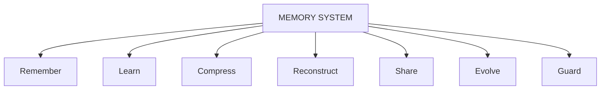

> **Diagram ID:** `DGM-MEM-001`
> **Explanation:** The memory system is defined by seven core functions: remember, learn, compress,
> reconstruct, share, evolve, and guard.

> **Image Specification**
> - Image ID: `IMG-MEM-001`
> - Purpose: Hero concept of the memory system.
> - Prompt: "A cognitive memory architecture concept for the Oship memory system showing seven central functions remembering, learning, compressing, reconstructing, sharing, evolving and guarding, dark navy blueprint with gold brain-hologram."
> - Style: Cognitive blueprint concept.
> - Composition: Central brain node with seven orbiting subsystems.
> - Resolution: 2400x1600px
> - Priority: CRITICAL
> - Suggested Filename: `assets/diagrams/mem-hero-brain.png`

## 1.2 What Memory Is

Memory is the durable, queryable, evolving representation of knowledge, experience, context, and
state within Oship. It is the bridge between the present execution and all past executions.

### TBL-MEM-001: Memory Fundamental Attributes

| Attribute | Definition |
| :--- | :--- |
| Identity | Unique memory object identifier |
| Content | The encoded knowledge payload |
| Metadata | Provenance, confidence, timestamps |
| State | Lifecycle state of the memory |
| Relationships | Links to other memory objects |
| Access | Permission and security envelope |

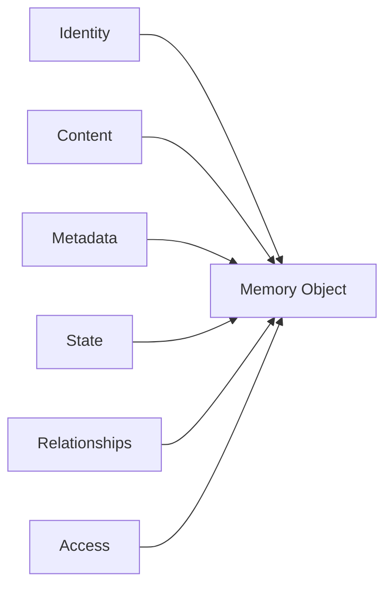

> **Diagram ID:** `DGM-MEM-002`
> **Explanation:** Every memory object is composed of identity, content, metadata, state, relationships,
> and access controls.

### TBL-MEM-002: Memory vs Storage vs Data

| Concept | Definition | Distinction |
| :--- | :--- | :--- |
| **Data** | Raw facts and values | Passive, no meaning |
| **Storage** | Physical/logical persistence medium | Passive, no recall semantics |
| **Memory** | Meaningful, recallable, evolving knowledge | Active, queryable, self-organizing |

## 1.3 Memory Philosophy Principles

### TBL-MEM-003: Memory Principles

| # | Principle | Statement |
| :---: | :--- | :--- |
| 1 | **Recallability** | Every memory is retrievable |
| 2 | **Durability** | Every memory persists appropriately |
| 3 | **Compression** | Knowledge is compressed without meaning loss |
| 4 | **Reconstructability** | Full context rebuildable from memory |
| 5 | **Evolvability** | Memory grows and refines over time |
| 6 | **Shareability** | Memory synchronizes across agents |
| 7 | **Security** | Memory is protected by default |
| 8 | **Consistency** | Memory is globally consistent |
| 9 | **Confidence** | Every memory carries a confidence signal |
| 10 | **Entropy resistance** | Memory resists corruption and decay |

## 1.4 Purpose, Mission, Vision

### TBL-MEM-004: Purpose, Mission, Vision

| Facet | Statement |
| :--- | :--- |
| **Purpose** | Give Oship the ability to remember, learn, and reason across all time and all agents |
| **Mission** | Provide a durable, queryable, self-evolving memory substrate for every AI agent |
| **Vision** | Oship evolves experience into institutional wisdom that no single run can lose |


> **Diagram ID:** `DGM-MEM-003`
> **Explanation:** Purpose drives the mission, which advances the vision of institutional wisdom.

## 1.5 Design Principles

### TBL-MEM-005: Design Principles

| # | Design Principle | Description |
| :---: | :--- | :--- |
| 1 | **AI-First** | Memory optimized for deterministic AI parsing |
| 2 | **Human-Compatible** | Memory readable by humans |
| 3 | **Layer Separation** | Distinct memory layers with clear boundaries |
| 4 | **Minimal Duplication** | One fact, one home (no duplication) |
| 5 | **Explicit Provenance** | Every memory knows its origin |
| 6 | **Explicit Confidence** | Every memory carries a confidence score |
| 7 | **Graceful Degradation** | Losing some memory degrades gracefully |
| 8 | **Self-Healing** | Memory detects and repairs corruption |
| 9 | **Determinism** | Same queries yield same results |
| 10 | **Evolution** | Memory is a living structure, not an archive |

## 1.6 Core Beliefs

### TBL-MEM-006: Core Beliefs

| # | Belief | Implication |
| :---: | :--- | :--- |
| 1 | Knowledge is a living organism | It must grow, not stagnate |
| 2 | Experience is the raw material of wisdom | Capture it intentionally |
| 3 | Context is reconstructable | Nothing is lost permanently |
| 4 | Compression preserves essence | Meaning survives pruning |
| 5 | Agents share one cognitive substrate | No isolated brain silos |
| 6 | Entropy is the enemy | Guard against decay and contradiction |
| 7 | Confidence is a first-class signal | Untrusted memory is flagged, not trusted |

## 1.7 Memory Axioms

### TBL-MEM-007: Memory Axioms

| # | Axiom | Statement |
| :---: | :--- | :--- |
| MEM-AX-01 | Persistence | Anything worth knowing is worth persisting |
| MEM-AX-02 | Reconstructability | Any context can be rebuilt from enough memory |
| MEM-AX-03 | Confidence | All memory is probabilistic, never absolute |
| MEM-AX-04 | Origin | All memory has provenance |
| MEM-AX-05 | Compressibility | All memory can be lossily compressed |
| MEM-AX-06 | Evolution | All memory is subject to promotion and demotion |
| MEM-AX-07 | Security | All memory is protected unless explicitly shared |
| MEM-AX-08 | Consistency | Conflicting memory must be resolved |
| MEM-AX-09 | Forgetting | Not all memory should be kept forever |
| MEM-AX-10 | Sharing | Memory is a shared substrate across agents |

## 1.8 Cognitive Laws

### TBL-MEM-008: Cognitive Laws

| # | Law | Statement |
| :---: | :--- | :--- |
| MEM-LAW-01 | Law of Relevance | Memory must be retrievable by relevance |
| MEM-LAW-02 | Law of Compression | Redundancy must be compressed |
| MEM-LAW-03 | Law of Provenance | No memory without origin |
| MEM-LAW-04 | Law of Confidence | No memory without a confidence signal |
| MEM-LAW-05 | Law of Growth | Memory grows through validated experience |
| MEM-LAW-06 | Law of Decay | Memory confidence decays with age |
| MEM-LAW-07 | Law of Conflict | Conflicts must resolve to one truth |
| MEM-LAW-08 | Law of Reconstruction | Context is rebuildable from memory |
| MEM-LAW-09 | Law of Entropy | Memory entropy must be actively resisted |
| MEM-LAW-10 | Law of Governance | Memory changes are governed |

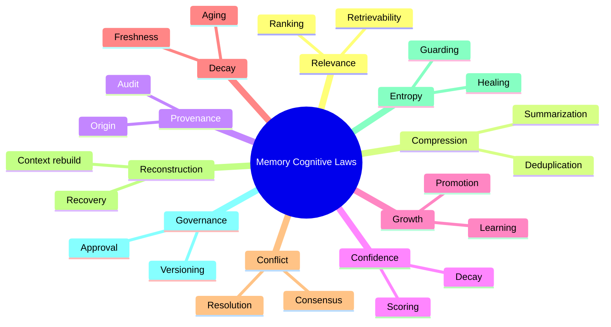

> **Diagram ID:** `DGM-MEM-004`
> **Explanation:** Ten cognitive laws govern the memory system.

> **Image Specification**
> - Image ID: `IMG-MEM-002`
> - Purpose: Visualize the memory cognitive laws.
> - Prompt: "A mind map of the Oship memory cognitive laws with relevance, compression, provenance, confidence, growth, decay, conflict, reconstruction, entropy, and governance, navy and gold blueprint style."
> - Style: Mind map, blueprint.
> - Composition: Central node with ten branches.
> - Resolution: 2000x1400px
> - Priority: HIGH
> - Suggested Filename: `assets/diagrams/mem-cognitive-laws.png`

## 1.9 Memory Goals

### TBL-MEM-009: Memory Goals

| # | Goal | Success Criterion |
| :---: | :--- | :--- |
| 1 | Zero knowledge loss | Every validated fact persists |
| 2 | Sub-second recall | Any memory retrieved quickly |
| 3 | Full reconstruction | Context rebuildable from memory alone |
| 4 | Compression > 80% | Redundancy removed without meaning loss |
| 5 | Cross-agent sharing | Memory synchronizes across all agents |
| 6 | Self-improvement | Memory quality improves over time |
| 7 | Entropy resistance | Corruption detected and healed |
| 8 | Governance compliance | Every change is approved and audited |

## 1.10 Self-Reconstruction Requirement

This document must allow another AI to reconstruct the entire Oship Memory System even if all
implementation files are lost.

| Reconstruction capability | How enabled |
| :--- | :--- |
| Memory model | Memory Object Model (PART 04) |
| Storage | Memory Storage (PART 06) |
| Retrieval | Memory Retrieval (PART 07) |
| Reconstruction | Context Reconstruction (PART 08) |
| Learning | Learning Engine (PART 29) |
| Security | Memory Security (PART 23) |
| Sharing | Multi-Agent Shared Memory (PART 22) |
| Metrics | Memory Metrics (PART 36) |


> **Diagram ID:** `DGM-MEM-005`
> **Explanation:** A new AI reads the memory system and rebuilds the complete memory architecture.

> **Image Specification**
> - Image ID: `IMG-MEM-003`
> - Purpose: Visualize memory reconstruction.
> - Prompt: "A reconstruction pipeline showing a new AI reading the memory system and rebuilding the complete memory architecture, purple and navy blueprint style."
> - Style: Pipeline flowchart, blueprint.
> - Composition: Three-stage pipeline.
> - Resolution: 1800x800px
> - Priority: CRITICAL
> - Suggested Filename: `assets/diagrams/mem-reconstruction.png`

## 1.11 Memory Philosophy Decision Rules

| Rule | Statement |
| :--- | :--- |
| MEM-DEC-01 | Memory is recalled before recomputed |
| MEM-DEC-02 | Untrusted memory is flagged, never silently trusted |
| MEM-DEC-03 | Redundancy is compressed |
| MEM-DEC-04 | Provenance is always recorded |
| MEM-DEC-05 | Conflicting memory resolves to one truth |
| MEM-DEC-06 | Memory evolves through validated experience |
| MEM-DEC-07 | Context is reconstructable from memory |

## 1.12 Navigation

### TBL-MEM-010: Memory Philosophy Navigation

| Need | Part |
| :--- | :--- |
| Philosophy | PART 01 |
| Architecture | PART 02 |
| Taxonomy | PART 03 |
| Object model | PART 04 |
| Lifecycle | PART 05 |
| Storage | PART 06 |
| Retrieval | PART 07 |
| Reconstruction | PART 08 |
| Learning | PART 29 |
| Metrics | PART 36 |

# PART 02 — Memory Architecture

## 2.1 Purpose of the Memory Architecture

The memory architecture defines how the memory system is organized into layers, subsystems, and
boundaries. It is the structural blueprint that every other part of this document builds upon.

| Architecture facet | Definition |
| :--- | :--- |
| **Layers** | Vertical tiers of memory abstraction |
| **Subsystems** | Functional components of memory |
| **Boundaries** | Clear separation of concerns |
| **Responsibilities** | Ownership of each component |
| **Ownership** | Who/what maintains each layer |

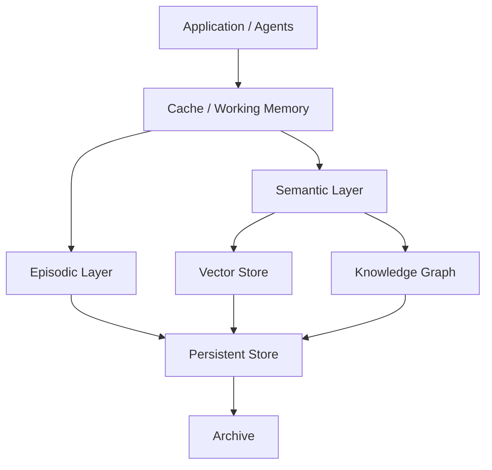

> **Diagram ID:** `DGM-MEM-006`
> **Explanation:** The memory architecture flows from applications through cache, semantic and
> episodic layers, down to vector, graph, and persistent storage.

> **Image Specification**
> - Image ID: `IMG-MEM-004`
> - Purpose: High-level memory architecture overview.
> - Prompt: "A layered memory architecture for the Oship system with application, cache, semantic layer, episodic layer, vector store, knowledge graph, persistent store, and archive, navy blueprint with gold layered tiers."
> - Style: Layered architecture, blueprint.
> - Composition: Eight tiers flowing top to bottom.
> - Resolution: 2200x1500px
> - Priority: CRITICAL
> - Suggested Filename: `assets/diagrams/mem-architecture.png`

## 2.2 Memory Layers

### TBL-MEM-011: Memory Layers

| # | Layer | Scope | Persistence |
| :---: | :--- | :--- | :--- |
| L0 | Working Memory | Current task context | Ephemeral |
| L1 | Short-term Memory | Active session context | Session |
| L2 | Long-term Memory | Durable institutional knowledge | Persistent |
| L3 | Semantic Memory | Concepts, facts, relationships | Persistent |
| L4 | Procedural Memory | How-to procedures and skills | Persistent |
| L5 | Episodic Memory | Past events and experiences | Persistent |
| L6 | Reflective Memory | Self-evaluations and lessons | Persistent |

## 2.3 Memory Subsystems

### TBL-MEM-012: Memory Subsystems

| # | Subsystem | Function |
| :---: | :--- | :--- |
| 1 | Acquisition | Ingest new information |
| 2 | Encoding | Transform information into memory objects |
| 3 | Storage | Persist memory objects |
| 4 | Indexing | Build retrieval indexes |
| 5 | Retrieval | Fetch relevant memory |
| 6 | Ranking | Order memory by relevance |
| 7 | Compression | Reduce redundancy |
| 8 | Reconstruction | Rebuild context |
| 9 | Synchronization | Keep agents consistent |
| 10 | Governance | Approve and audit changes |
| 11 | Security | Protect memory |
| 12 | Monitoring | Observe health and metrics |

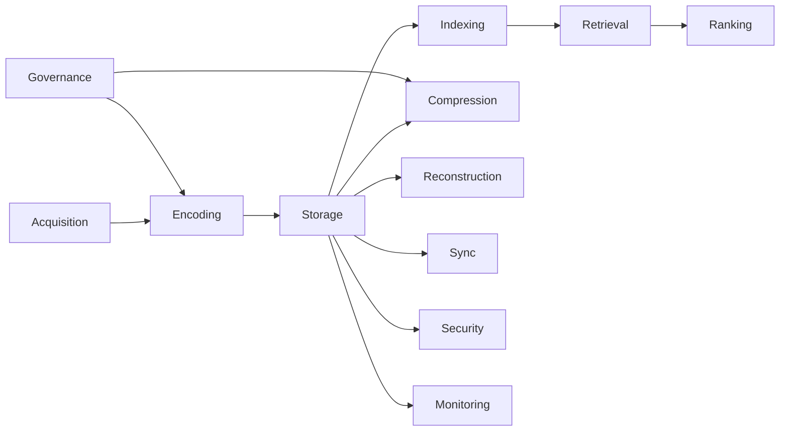

> **Diagram ID:** `DGM-MEM-007`
> **Explanation:** Twelve subsystems compose the memory system with governance and security as cross-cutting concerns.

## 2.4 Subsystem Boundaries

### TBL-MEM-013: Subsystem Boundaries

| Boundary | Responsible | Does NOT handle |
| :--- | :--- | :--- |
| Acquisition | Input intake | Retrieval |
| Encoding | Normalization | Storage |
| Storage | Persistence | Retrieval ranking |
| Indexing | Search structures | Content semantics |
| Retrieval | Fetching | Mutation |
| Ranking | Ordering | Storage |
| Compression | Redundancy reduction | Semantic meaning loss |
| Reconstruction | Context rebuild | Raw storage |
| Sync | Consistency | Security |
| Security | Protection | Compression |

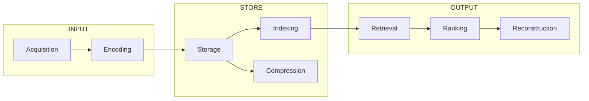

> **Diagram ID:** `DGM-MEM-008`
> **Explanation:** Boundaries separate input, store, and output subsystems.

## 2.5 Responsibilities and Ownership

### TBL-MEM-014: Responsibilities and Ownership

| Subsystem | Owner | Responsibility |
| :--- | :--- | :--- |
| Acquisition | Ingestion Team | Capture all input |
| Encoding | Schema Architects | Normalize into objects |
| Storage | Platform Team | Guarantee persistence |
| Indexing | Search Team | Maintain indexes |
| Retrieval | Runtime Team | Guarantee recall |
| Ranking | AI Team | Order by relevance |
| Compression | Knowledge Team | Reduce redundancy |
| Reconstruction | Context Team | Rebuild context |
| Synchronization | Distributed Systems Team | Ensure consistency |
| Security | Security Team | Protect memory |

## 2.6 Architecture Decision Criteria

| Decision | Criteria | Example |
| :--- | :--- | :--- |
| Which layer? | Lifetime of the knowledge | Session → short-term |
| Which subsystem? | Operation needed | Recall → retrieval |
| Where to store? | Access pattern | Hot → cache |
| How to protect? | Sensitivity | Sensitive → encrypted |
| How to share? | Agent scope | Team → shared |

## 2.7 Common Mistakes

### TBL-MEM-015: Memory Architecture Common Mistakes

| # | Mistake | Impact | Fix |
| :---: | :--- | :--- | :--- |
| 1 | No layer separation | Entropy, bloat | Enforce boundaries |
| 2 | Storing everything hot | Cost, latency | Tier storage |
| 3 | Ignoring provenance | Untrustworthy memory | Record origin |
| 4 | Duplicating facts | Inconsistency | One fact, one home |
| 5 | No security envelope | Data leakage | Protect by default |
| 6 | No synchronization | Agent divergence | Sync across agents |

## 2.8 Best Practices

### TBL-MEM-016: Memory Architecture Best Practices

| # | Practice | Benefit |
| :---: | :--- | :--- |
| 1 | Clear layer boundaries | Maintainability |
| 2 | Explicit ownership | Accountability |
| 3 | Hot/cold storage tiers | Cost efficiency |
| 4 | Provenance on every object | Trust |
| 5 | Security by default | Protection |
| 6 | Monitored health | Reliability |

## 2.9 AI Interpretation Notes

An AI reading this part should understand that memory is organized into **layers** (by lifetime and
abstraction), **subsystems** (by function), and **boundaries** (by responsibility). To reconstruct
the architecture, an AI must preserve these structural boundaries exactly.

## 2.10 Navigation

### TBL-MEM-017: Memory Architecture Navigation

| Need | Part |
| :--- | :--- |
| Architecture | PART 02 |
| Layers | PART 03 Taxonomy |
| Storage | PART 06 |
| Retrieval | PART 07 |
| Security | PART 23 |
| Synchronization | PART 21 |

# PART 03 — Memory Taxonomy

## 3.1 Purpose of the Memory Taxonomy

The memory taxonomy is the authoritative classification of every memory type in Oship. Each memory
type has a defined role, lifetime, persistence, access pattern, and owner. This taxonomy is the
foundation for the Memory Object Model in PART 04.

### TBL-MEM-018: Memory Taxonomy Overview

| Memory Type | Lifetime | Persistence | Scope | Owner |
| :--- | :--- | :--- | :--- | :--- |
| Working Memory | Milliseconds–seconds | Ephemeral | Task | Runtime |
| Short-term Memory | Session | Session | Session | Session |
| Long-term Memory | Years | Persistent | Institution | Repository |
| Semantic Memory | Years | Persistent | Concepts | Knowledge |
| Procedural Memory | Years | Persistent | Skills | Knowledge |
| Episodic Memory | Years | Persistent | Events | History |
| Context Memory | Session | Session | Context | Runtime |
| Project Memory | Project lifetime | Persistent | Project | Project |
| Runtime Memory | Process | Ephemeral | Process | Runtime |
| Agent Memory | Agent lifetime | Persistent | Agent | Agent |
| Team Memory | Team lifetime | Persistent | Team | Team |
| Global Memory | Years | Persistent | Whole system | Repository |
| Temporary Memory | Operation | Ephemeral | Operation | Runtime |
| Persistent Memory | Years | Persistent | Institution | Repository |
| Shared Memory | Multi-agent | Persistent | Agents | Coordination |
| Immutable Memory | Forever | Append-only | Audit | Audit |
| Historical Memory | Forever | Persistent | History | History |
| Reflection Memory | Evolving | Persistent | Lessons | Learning |
| Planning Memory | Plan lifetime | Persistent | Plans | Planning |
| Decision Memory | Decision lifetime | Persistent | Decisions | Decision |
| Execution Memory | Run lifetime | Session | Execution | Runtime |
| Observation Memory | Run lifetime | Session | Observations | Telemetry |
| Validation Memory | Validation lifetime | Persistent | Checks | Validation |
| Knowledge Memory | Years | Persistent | Facts | Knowledge |
| Reference Memory | Years | Persistent | References | Knowledge |
| Compressed Memory | Years | Persistent | Summaries | Compression |
| Derived Memory | On-demand | Session | Computed | Runtime |
| Experimental Memory | Experiment | Session | Trials | Research |
| Simulation Memory | Simulation | Session | Simulations | Simulation |
| Failure Memory | Evolving | Persistent | Failures | Reliability |
| Recovery Memory | Evolving | Persistent | Recovery | Reliability |
| Audit Memory | Forever | Immutable | Audits | Audit |
| Risk Memory | Evolving | Persistent | Risks | Risk |
| Policy Memory | Years | Persistent | Policies | Governance |
| Architecture Memory | Years | Persistent | Architecture | Architecture |
| Documentation Memory | Years | Persistent | Docs | Documentation |
| User Memory | User lifetime | Persistent | Users | User |
| System Memory | Years | Persistent | System | System |

## 3.2 Core Memory Types

### 3.2.1 Working Memory

Working memory holds the current task context, intermediate results, and active reasoning state. It
is the highest-bandwidth, shortest-lived memory tier.

| Attribute | Value |
| :--- | :--- |
| Lifetime | Task duration |
| Persistence | Ephemeral |
| Capacity | Small (bounded) |
| Access | Fastest |
| Eviction | Automatic on task end |

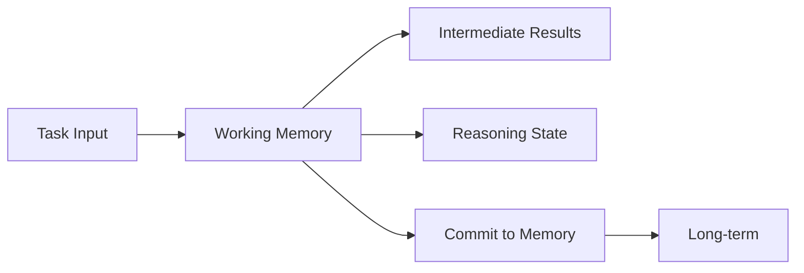

> **Diagram ID:** `DGM-MEM-009`
> **Explanation:** Working memory holds transient task state and commits durable results to long-term memory.

### 3.2.2 Short-term Memory

Short-term memory holds the active session context — current conversation, recent decisions, and
session-scoped state.

### 3.2.3 Long-term Memory

Long-term memory holds durable institutional knowledge that persists across sessions, agents, and
runs.

### TBL-MEM-019: Short-term vs Long-term Memory

| Dimension | Short-term | Long-term |
| :--- | :--- | :--- |
| Lifetime | Session | Years |
| Persistence | Session-scoped | Persistent |
| Size | Small | Large |
| Sharing | Single session | Global |
| Compression | Minimal | Aggressive |
| Promotion target | Long-term | Immutable |

## 3.3 Semantic, Procedural, Episodic Memory

### TBL-MEM-020: Semantic vs Procedural vs Episodic

| Dimension | Semantic | Procedural | Episodic |
| :--- | :--- | :--- | :--- |
| Content | Facts, concepts | Skills, procedures | Events, experiences |
| Question answered | "What is X?" | "How to do X?" | "What happened?" |
| Structure | Graph nodes | Sequences/steps | Timelines |
| Change | Slow | Skill refinement | Append-only |
| Example | "Oship is a repo" | "How to write metadata" | "Sprint B7 completed" |

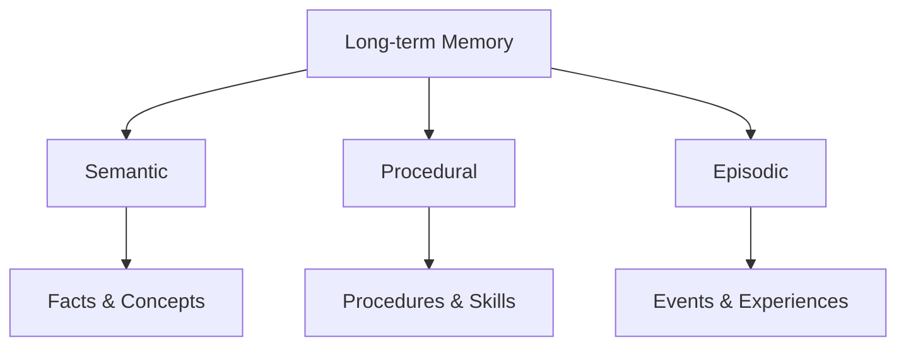

> **Diagram ID:** `DGM-MEM-010`
> **Explanation:** Long-term memory decomposes into semantic, procedural, and episodic sub-types.

## 3.4 Context, Project, Runtime Memory

### TBL-MEM-021: Context, Project, Runtime Memory

| Type | Holds | Scope | Owner |
| :--- | :--- | :--- | :--- |
| Context Memory | Current reconstruction state | Context | Runtime |
| Project Memory | Project-specific knowledge | Project | Project |
| Runtime Memory | Process state | Process | Runtime |

## 3.5 Agent, Team, Global Memory

### TBL-MEM-022: Agent, Team, Global Memory

| Type | Holds | Scope |
| :--- | :--- | :--- |
| Agent Memory | Individual agent learning | Single agent |
| Team Memory | Team-shared knowledge | Agent team |
| Global Memory | Whole-ecosystem knowledge | All agents |

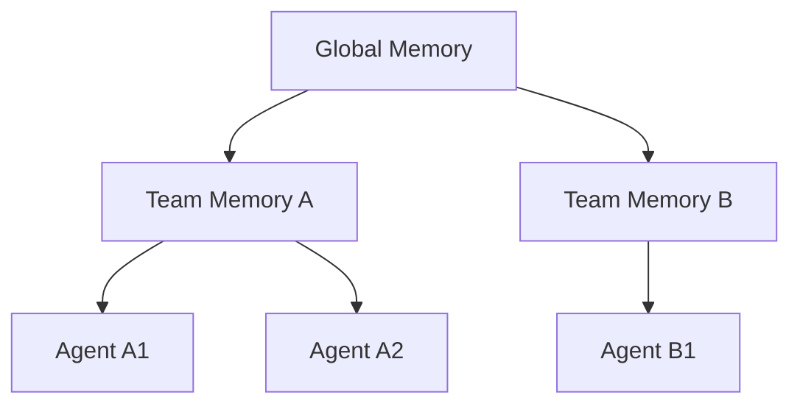

> **Diagram ID:** `DGM-MEM-011`
> **Explanation:** Global memory is shared by teams, which share memory with their member agents.

## 3.6 Temporary, Persistent, Shared, Immutable Memory

### TBL-MEM-023: Persistence-class Memory Types

| Type | Persistence | Mutation | Example |
| :--- | :--- | :--- | :--- |
| Temporary | Ephemeral | Mutable | Scratch data |
| Persistent | Durable | Mutable | Knowledge facts |
| Shared | Multi-agent | Coordinated | Team context |
| Immutable | Append-only | Immutable | Audit logs |

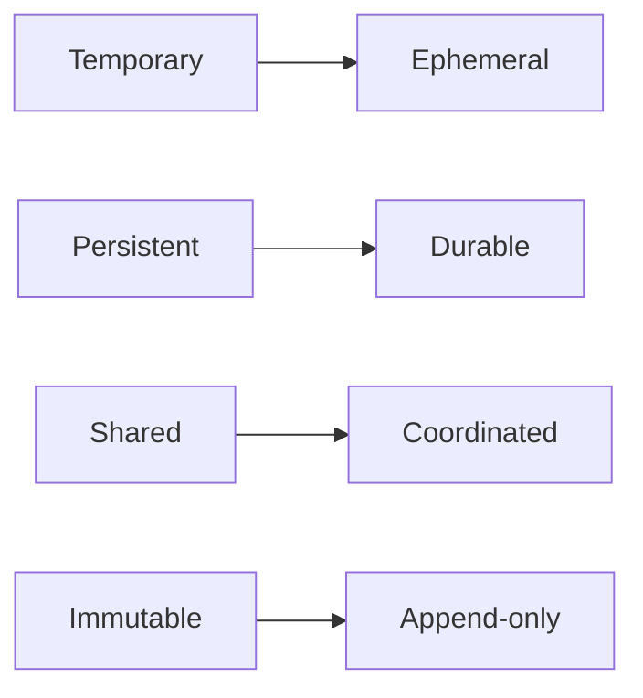

> **Diagram ID:** `DGM-MEM-012`
> **Explanation:** Four persistence-class memory types with distinct mutation semantics.

## 3.7 Historical, Reflection, Planning, Decision Memory

### TBL-MEM-024: Historical, Reflection, Planning, Decision Memory

| Type | Holds | Purpose |
| :--- | :--- | :--- |
| Historical | Past states | Audit and trend analysis |
| Reflection | Lessons learned | Self-improvement |
| Planning | Plans and intentions | Future execution |
| Decision | Decisions and rationale | Governance |

## 3.8 Execution, Observation, Validation Memory

### TBL-MEM-025: Execution, Observation, Validation Memory

| Type | Holds | Owner |
| :--- | :--- | :--- |
| Execution | Run state and traces | Runtime |
| Observation | Telemetry and observations | Telemetry |
| Validation | Check results | Validation |

## 3.9 Knowledge, Reference, Compressed, Derived Memory

### TBL-MEM-026: Knowledge, Reference, Compressed, Derived Memory

| Type | Holds | Relationship |
| :--- | :--- | :--- |
| Knowledge | Curated facts | Canonical source |
| Reference | Pointers to sources | Citation |
| Compressed | Summaries | Lossy reduction |
| Derived | Computed from other memory | On-demand |

## 3.10 Experimental, Simulation, Failure, Recovery Memory

### TBL-MEM-027: Experimental, Simulation, Failure, Recovery Memory

| Type | Holds | Purpose |
| :--- | :--- | :--- |
| Experimental | Trial data | Research |
| Simulation | Simulation state | Prediction |
| Failure | Failure records | Reliability |
| Recovery | Recovery procedures | Resilience |

## 3.11 Audit, Risk, Policy, Architecture, Documentation Memory

### TBL-MEM-028: Governance-class Memory Types

| Type | Holds | Purpose |
| :--- | :--- | :--- |
| Audit | Audit trail | Compliance |
| Risk | Risk register | Risk management |
| Policy | Policies | Governance |
| Architecture | Architectural decisions | Design |
| Documentation | Documentation artifacts | Knowledge |

## 3.12 User, System Memory

### TBL-MEM-029: User, System Memory

| Type | Holds | Scope |
| :--- | :--- | :--- |
| User Memory | User preferences and context | Per-user |
| System Memory | System-wide configuration | Whole system |

## 3.13 Taxonomy Navigation and Decision Criteria

### TBL-MEM-030: Memory Type Selection Decision Criteria

| Decision | Criteria | Result |
| :--- | :--- | :--- |
| Need task state? | Task-scoped | Working memory |
| Need session context? | Session-scoped | Short-term |
| Need durable fact? | Persistent fact | Long-term / semantic |
| Need to recall a past event? | Temporal event | Episodic |
| Need to perform a skill? | Procedure | Procedural |
| Need multi-agent access? | Shared | Shared memory |
| Need audit trail? | Append-only | Immutable |

## 3.14 AI Interpretation Notes

An AI must classify every memory object into exactly one taxonomy type. The taxonomy determines
lifetime, persistence, access, and owner. Misclassification causes entropy, so the classification
rules in TBL-MEM-030 must be applied deterministically.

## 3.15 Common Mistakes

| # | Mistake | Fix |
| :---: | :--- | :--- |
| 1 | Storing ephemeral data as long-term | Route by lifetime |
| 2 | Duplicating memory across types | One fact, one home |
| 3 | Mixing audit and mutable memory | Keep immutable separate |
| 4 | Unbounded working memory | Enforce capacity bounds |

## 3.16 Navigation

| Need | Part |
| :--- | :--- |
| Taxonomy | PART 03 |
| Object model | PART 04 |
| Lifecycle | PART 05 |
| Storage | PART 06 |
| Retrieval | PART 07 |

# PART 04 — Memory Object Model

## 4.1 Purpose of the Memory Object Model

The memory object model is the canonical schema for every memory object in Oship. It defines the
fields, attributes, relationships, lifecycle, ownership, and dependencies of every memory object.
This model is consistent with `MASTER_CONTEXT_SCHEMA` and extends the Knowledge Object Model with
memory-specific fields.

### TBL-MEM-031: Memory Object Core Fields

| Field | Type | Required | Description |
| :--- | :--- | :---: | :--- |
| `memory_id` | string | Yes | Globally unique identifier |
| `type` | string | Yes | Memory taxonomy type |
| `content` | object | Yes | Encoded knowledge payload |
| `state` | string | Yes | Lifecycle state |
| `confidence` | float | Yes | 0.0–1.0 confidence score |
| `provenance` | object | Yes | Origin, source, author |
| `created_at` | timestamp | Yes | Creation time |
| `updated_at` | timestamp | Yes | Last update time |
| `expires_at` | timestamp | No | Expiration (if ephemeral) |
| `importance` | int | Yes | 0–100 importance rank |
| `freshness` | float | Yes | Recency score 0.0–1.0 |
| `version` | int | Yes | Version counter |
| `tags` | array | No | Classification tags |
| `access` | object | Yes | Permission envelope |

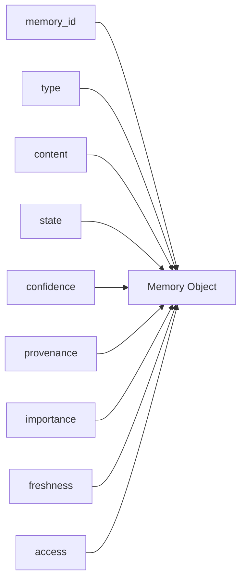

> **Diagram ID:** `DGM-MEM-013`
> **Explanation:** A memory object is composed of identity, type, content, state, confidence, provenance,
> importance, freshness, and access.

> **Image Specification**
> - Image ID: `IMG-MEM-005`
> - Purpose: Visualize the memory object structure.
> - Prompt: "A structured data object diagram for the Oship memory object model showing identity, type, content, state, confidence, provenance, importance, freshness and access, navy blueprint with gold fields."
> - Style: Data object diagram, blueprint.
> - Composition: Central object with nine connected fields.
> - Resolution: 2000x1400px
> - Priority: HIGH
> - Suggested Filename: `assets/diagrams/mem-object-model.png`

## 4.2 Memory Object Schema (JSON)

Every memory object conforms to a canonical JSON schema.

```json
{
  "memory_id": "MEM-0000001",
  "type": "semantic",
  "content": {
    "subject": "Oship",
    "predicate": "has_layer",
    "object": "L1 Constitutional"
  },
  "state": "ACTIVE",
  "confidence": 0.92,
  "provenance": {
    "source": "MASTER_CONTEXT_RULES",
    "author": "AI-architect",
    "method": "curation"
  },
  "created_at": "2026-08-12T00:00:00Z",
  "updated_at": "2026-08-12T00:00:00Z",
  "expires_at": null,
  "importance": 90,
  "freshness": 0.98,
  "version": 1,
  "tags": ["architecture", "memory", "semantic"],
  "access": {"read": ["*"], "write": ["architect"]}
}
```

> **JSON-MEM-001:** Canonical semantic memory object.

## 4.3 Memory Object Attributes

### TBL-MEM-032: Memory Object Attributes

| Attribute | Definition | Example |
| :--- | :--- | :--- |
| Identity | Unique ID | `MEM-0000001` |
| Type | Taxonomy type | `semantic` |
| Content | Encoded knowledge | subject/predicate/object |
| State | Lifecycle state | `ACTIVE` |
| Confidence | Trust score | `0.92` |
| Provenance | Origin | source, author, method |
| Timestamps | Created/updated | ISO-8601 |
| Importance | Priority | `0–100` |
| Freshness | Recency | `0.0–1.0` |
| Version | Change count | `1` |
| Access | Permission envelope | read/write roles |

## 4.4 Memory Object Relationships

### TBL-MEM-033: Memory Object Relationships

| Relationship | Type | Cardinality | Description |
| :--- | :--- | :--- | :--- |
| `references` | Directed | 1..N | Points to another memory |
| `derived_from` | Directed | 1..N | Computed from source |
| `conflicts_with` | Undirected | 0..N | Conflicting memory |
| `supersedes` | Directed | 1..1 | Replaced by newer version |
| `part_of` | Hierarchy | 1..N | Composite relationship |
| `supports` | Directed | 0..N | Provides evidence |
| `promoted_to` | Directed | 0..1 | Promoted to higher layer |
| `archived_from` | Directed | 0..1 | Archived derivation |

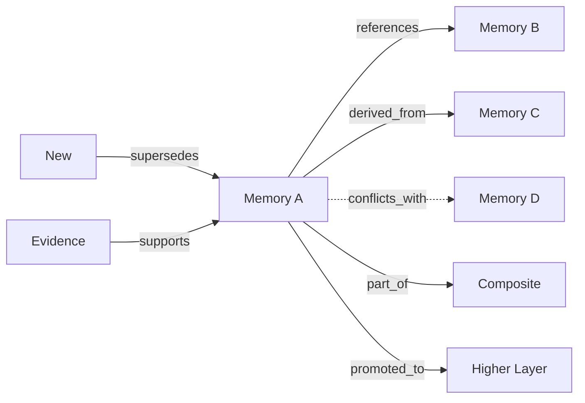

> **Diagram ID:** `DGM-MEM-014`
> **Explanation:** Memory objects form a rich graph of typed relationships.

## 4.5 Lifecycle of a Memory Object

Every memory object traverses a defined lifecycle from birth to destruction.

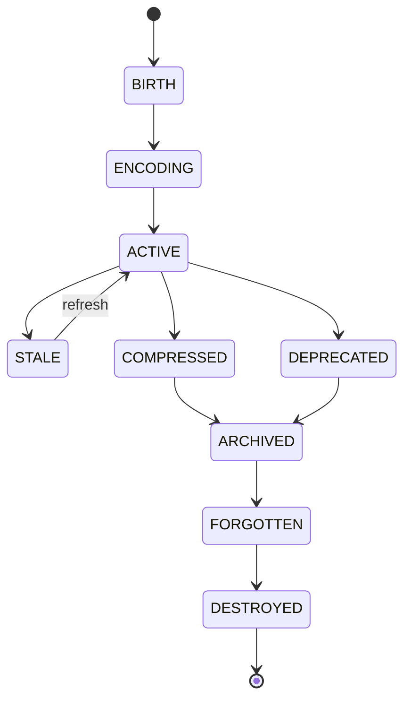

> **Diagram ID:** `DGM-MEM-015`
> **Explanation:** The memory object lifecycle flows from birth through encoding, active use, possible
> compression/archiving, to destruction.

## 4.6 Ownership

### TBL-MEM-034: Memory Object Ownership

| Ownership Dimension | Definition |
| :--- | :--- |
| Creator | The agent/human that created it |
| Maintainer | Responsible for updates |
| Reader | Those granted read access |
| Steward | Governance authority |

## 4.7 Dependencies

### TBL-MEM-035: Memory Object Dependencies

| Dependency | Type | Impact |
| :--- | :--- | :--- |
| On source memory | Derived | Recomputation on source change |
| On schema version | Schema | Migration required |
| On index | Retrieval | Unavailable if index lost |
| On storage | Persistence | Lost if storage fails |

## 4.8 Object Validation

### TBL-MEM-036: Memory Object Validation Rules

| # | Rule | Check |
| :---: | :--- | :--- |
| VAL-MEM-001 | ID uniqueness | `memory_id` globally unique |
| VAL-MEM-002 | Type validity | `type` in taxonomy registry |
| VAL-MEM-003 | State validity | `state` in state machine |
| VAL-MEM-004 | Confidence range | `0.0 <= confidence <= 1.0` |
| VAL-MEM-005 | Provenance present | `provenance.source` non-empty |
| VAL-MEM-006 | Timestamps sane | `updated_at >= created_at` |
| VAL-MEM-007 | Access valid | Roles in RBAC registry |

```json
{
  "memory_id": "MEM-0000002",
  "type": "episodic",
  "content": {
    "event": "Sprint B7 completed",
    "timestamp": "2026-08-12T00:00:00Z",
    "summary": "Memory System document authored"
  },
  "state": "ACTIVE",
  "confidence": 0.95,
  "provenance": {"source": "AI-agent", "method": "recording"},
  "created_at": "2026-08-12T00:00:00Z",
  "updated_at": "2026-08-12T00:00:00Z",
  "importance": 85,
  "freshness": 0.99,
  "version": 1,
  "tags": ["episodic", "sprint"],
  "access": {"read": ["*"], "write": ["architect"]}
}
```

> **JSON-MEM-002:** Canonical episodic memory object.

## 4.9 Object Model Examples Across Types

```json
{
  "memory_id": "MEM-0000003",
  "type": "procedural",
  "content": {
    "procedure": "write_metadata_header",
    "steps": [
      "open file",
      "verify YAML frontmatter",
      "fill 16 fields",
      "validate"
    ]
  },
  "state": "ACTIVE",
  "confidence": 0.9,
  "provenance": {"source": "AI-DOC-STD-001", "method": "distillation"},
  "created_at": "2026-08-12T00:00:00Z",
  "updated_at": "2026-08-12T00:00:00Z",
  "importance": 88,
  "freshness": 0.9,
  "version": 1,
  "tags": ["procedural", "documentation"],
  "access": {"read": ["*"], "write": ["architect"]}
}
```

> **JSON-MEM-003:** Canonical procedural memory object.

```json
{
  "memory_id": "MEM-0000004",
  "type": "reflection",
  "content": {
    "lesson": "Always commit incrementally",
    "source": "Sprint review",
    "severity": "high"
  },
  "state": "ACTIVE",
  "confidence": 0.8,
  "provenance": {"source": "reflection-engine", "method": "retrospective"},
  "created_at": "2026-08-12T00:00:00Z",
  "updated_at": "2026-08-12T00:00:00Z",
  "importance": 75,
  "freshness": 0.7,
  "version": 1,
  "tags": ["reflection", "lessons"],
  "access": {"read": ["*"], "write": ["architect"]}
}
```

> **JSON-MEM-004:** Canonical reflection memory object.

## 4.10 Decision Criteria for Object Model

| Decision | Criteria | Result |
| :--- | :--- | :--- |
| Choose type | Knowledge lifetime | Taxonomy type |
| Set confidence | Evidence strength | 0.0–1.0 |
| Set importance | Business value | 0–100 |
| Set state | Lifecycle position | State value |
| Choose relationships | Dependency graph | Typed edges |

## 4.11 Common Mistakes

| # | Mistake | Fix |
| :---: | :--- | :--- |
| 1 | Duplicate IDs | Enforce uniqueness |
| 2 | Missing provenance | Always record origin |
| 3 | Stale confidence | Recompute on change |
| 4 | Wrong type | Apply taxonomy rules |
| 5 | Orphan relationships | Validate references |

## 4.12 Best Practices

| # | Practice | Benefit |
| :---: | :--- | :--- |
| 1 | Validate on write | Integrity |
| 2 | Record full provenance | Trust |
| 3 | Version every change | Audit |
| 4 | Enforce confidence | Reliability |
| 5 | Register IDs | Uniqueness |

## 4.13 AI Interpretation Notes

An AI reconstructing the memory system must implement the memory object schema exactly. Every memory
object is a typed, versioned, confidence-scored, provenance-bearing entity with a defined lifecycle
and relationship graph. Object validation rules are mandatory.

## 4.14 Navigation

| Need | Part |
| :--- | :--- |
| Object model | PART 04 |
| Schema reference | MASTER_CONTEXT_SCHEMA |
| Lifecycle | PART 05 |
| Storage | PART 06 |
| Retrieval | PART 07 |

# PART 05 — Memory Lifecycle

## 5.1 Purpose of the Memory Lifecycle

The memory lifecycle defines every stage a memory object passes through from birth to destruction.
It governs activation, usage, growth, compression, promotion, demotion, synchronization, archiving,
forgetting, and destruction.

### TBL-MEM-037: Memory Lifecycle Stages

| # | Stage | Description | Transition trigger |
| :---: | :--- | :--- | :--- |
| 1 | Birth | Memory object created | New knowledge acquired |
| 2 | Encoding | Normalized into schema | Validation passes |
| 3 | Activation | Becomes retrievable | Index built |
| 4 | Usage | Read/updated by consumers | Query/update |
| 5 | Growth | Content and links expand | Learning/refinement |
| 6 | Compression | Redundancy removed | Size threshold |
| 7 | Summarization | Abridged representation | Volume threshold |
| 8 | Promotion | Moved to higher layer | Governance approval |
| 9 | Demotion | Moved to lower layer | Relevance decline |
| 10 | Synchronization | Replicated across agents | Consistency tick |
| 11 | Archive | Retained but cold | Deprecation/age |
| 12 | Forget | Removed from active set | Expiry/entropy |
| 13 | Destroy | Permanently removed | Governance/legal |

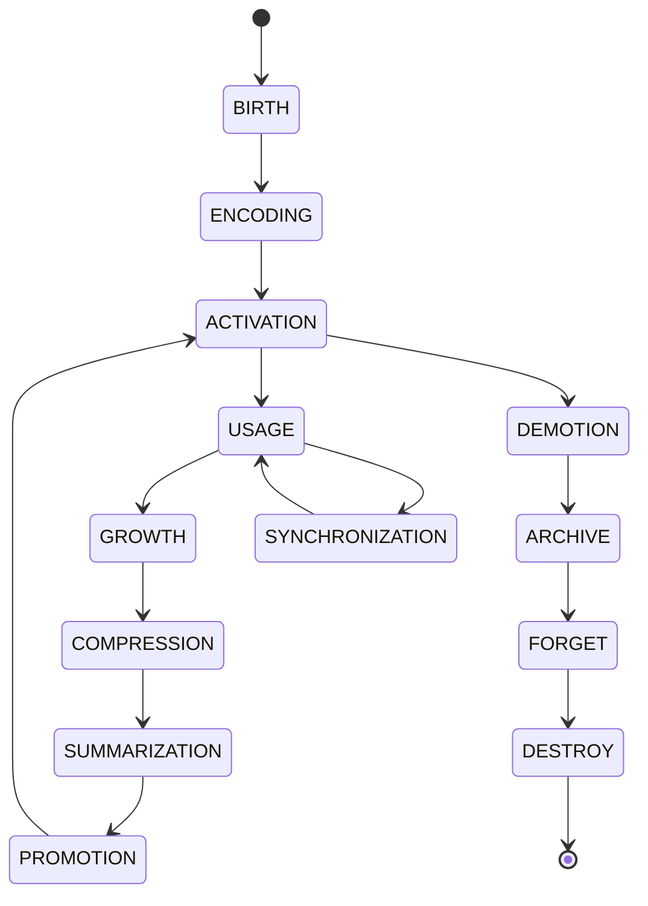

> **Diagram ID:** `DGM-MEM-016`
> **Explanation:** The full memory lifecycle with promotion/demotion loops and synchronization.

> **Image Specification**
> - Image ID: `IMG-MEM-006`
> - Purpose: Visualize the memory lifecycle state machine.
> - Prompt: "A lifecycle state machine for the Oship memory system with birth, encoding, activation, usage, growth, compression, summarization, promotion, demotion, synchronization, archive, forget, and destroy states, navy blueprint with gold states."
> - Style: State machine, blueprint.
> - Composition: Circular lifecycle with 13 states.
> - Resolution: 2200x1500px
> - Priority: HIGH
> - Suggested Filename: `assets/diagrams/mem-lifecycle.png`

## 5.2 Birth

Memory is born when new knowledge is acquired and validated.

| Birth step | Action |
| :--- | :--- |
| Acquire | Capture raw input |
| Classify | Assign taxonomy type |
| Encode | Map to object schema |
| Validate | Run validation rules |
| Assign ID | Register unique `memory_id` |
| Persist | Store to correct tier |

## 5.3 Activation

Activation makes memory retrievable.

| Activation step | Action |
| :--- | :--- |
| Index | Build retrieval index |
| Link | Create relationships |
| Set confidence | Compute initial score |
| Expose | Make available to query |
| Notify | Announce to subscribers |

## 5.4 Usage

Usage is when memory is read or updated by consumers.

### TBL-MEM-038: Usage Operations

| Operation | Effect | Side effect |
| :--- | :--- | :--- |
| Read | Return content | Update access counters |
| Update | Modify content | Bump version, recompute confidence |
| Reference | Link to other memory | Update graph |
| Validate | Re-check integrity | Update validation state |

## 5.5 Growth

Growth expands memory content, links, and relationships.


> **Diagram ID:** `DGM-MEM-017`
> **Explanation:** Memory grows by adding content, relationships, evidence, and confidence.

## 5.6 Compression

Compression reduces redundancy without losing meaning.

| Compression action | Description |
| :--- | :--- |
| Deduplicate | Remove identical copies |
| Merge | Combine overlapping facts |
| Abstract | Generalize specifics |
| Summarize | Create abbreviated form |
| Drop | Remove low-value detail |

## 5.7 Summarization

Summarization creates an abridged representation while preserving context.

## 5.8 Promotion and Demotion

Promotion moves memory to a higher layer; demotion moves it to a lower layer.

### TBL-MEM-039: Promotion vs Demotion

| Dimension | Promotion | Demotion |
| :--- | :--- | :--- |
| Direction | Lower → higher layer | Higher → lower layer |
| Trigger | High value/reuse | Declining relevance |
| Governance | Requires approval | May be automated |
| Example | Session → long-term | Long-term → archive |

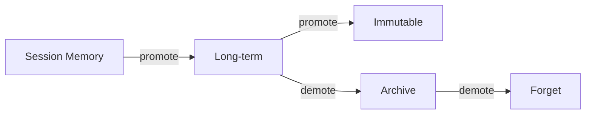

> **Diagram ID:** `DGM-MEM-018`
> **Explanation:** Promotion and demotion move memory across layers.

## 5.9 Synchronization

Synchronization replicates memory across agents and runtime instances to maintain consistency.

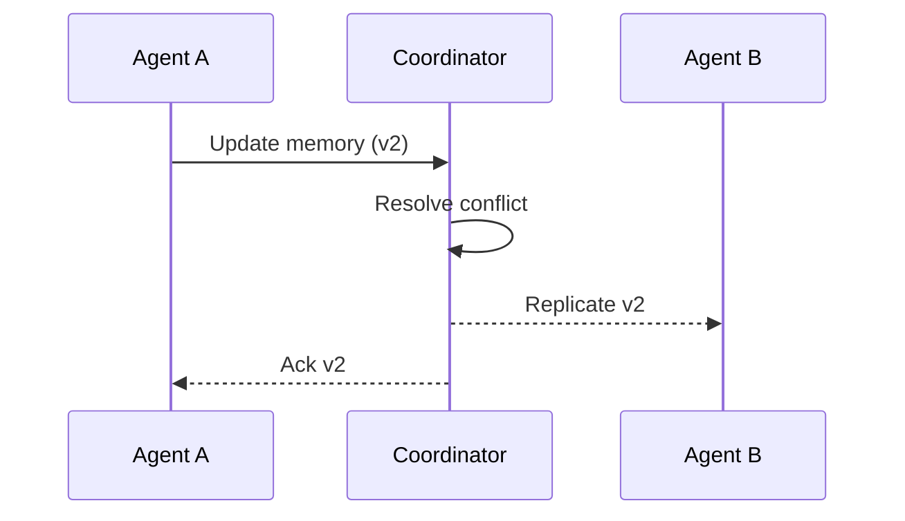

> **Diagram ID:** `DGM-MEM-019`
> **Explanation:** Agent A updates memory, the coordinator resolves conflicts, and replicates to Agent B.

## 5.10 Archive

Archive retains memory in a cold tier for compliance and history.

## 5.11 Forget

Forgetting removes memory from the active set but may retain metadata.

## 5.12 Destroy

Destruction permanently removes memory.

| Destroy trigger | Action |
| :--- | :--- |
| Legal requirement | Purge content |
| User request | Delete personal data |
| Entropy | Remove corrupt memory |
| Governance | Authorized removal |

## 5.13 Lifecycle State Machine

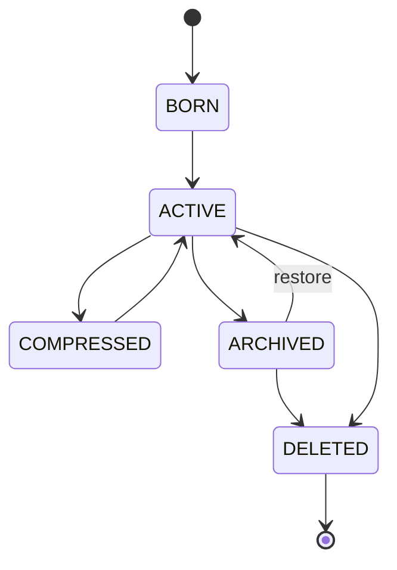

> **Diagram ID:** `DGM-MEM-020`
> **Explanation:** Compact lifecycle state machine with restore capability.

## 5.14 Lifecycle Decision Rules

| Rule | Statement |
| :--- | :--- |
| MEM-LC-01 | Every memory is born validated |
| MEM-LC-02 | Promotion requires governance approval |
| MEM-LC-03 | Demotion may be automated |
| MEM-LC-04 | Destruction requires authorization |
| MEM-LC-05 | Archive preserves audit history |
| MEM-LC-06 | Synchronization preserves consistency |

## 5.15 Common Mistakes

| # | Mistake | Fix |
| :---: | :--- | :--- |
| 1 | Skipping validation at birth | Validate always |
| 2 | Uncontrolled promotion | Require approval |
| 3 | Premature destruction | Require authorization |
| 4 | Archive without audit | Preserve metadata |

## 5.16 Navigation

| Need | Part |
| :--- | :--- |
| Lifecycle | PART 05 |
| Storage | PART 06 |
| Compression | PART 10 |
| Evolution | PART 28 |
| Deprecation | PART 35 |

# PART 06 — Memory Storage

## 6.1 Purpose of Memory Storage

Memory storage defines how memory objects are physically and logically persisted, namespaced,
indexed, partitioned, sharded, snapshotted, and secured. Storage is the durability substrate of the
memory system.

### TBL-MEM-040: Memory Storage Facets

| Facet | Definition |
| :--- | :--- |
| Logical storage | Namespaces and partitions |
| Physical storage | Underlying persistence media |
| Namespaces | Scope isolation |
| Indexes | Retrieval acceleration |
| Identifiers | Unique object addressing |
| Partitioning | Horizontal data splitting |
| Sharding | Distributed data distribution |
| Snapshots | Point-in-time copies |
| Persistence | Durability guarantees |

```mermaid
flowchart TD
    LOG[Logical Storage] --> NS[Namespaces]
    LOG --> PT[Partitions]
    PHYS[Physical Storage] --> MEDIA[Media: disk/ssd/object]
    IX[Indexes] --> SEARCH[Search structures]
    SNAP[Snapshots] --> BK[Backup/recovery]
```

> **Diagram ID:** `DGM-MEM-021`
> **Explanation:** Memory storage is organized across logical and physical facets.

> **Image Specification**
> - Image ID: `IMG-MEM-007`
> - Purpose: Visualize memory storage architecture.
> - Prompt: "A storage architecture for the Oship memory system with logical storage, physical media, namespaces, partitions, indexes, snapshots, and persistence, navy blueprint with gold storage tiers."
> - Style: Storage architecture, blueprint.
> - Composition: Layered storage tiers.
> - Resolution: 2200x1500px
> - Priority: HIGH
> - Suggested Filename: `assets/diagrams/mem-storage.png`

## 6.2 Logical Storage

Logical storage organizes memory by namespace, partition, and tier.

### TBL-MEM-041: Logical Storage Namespaces

| Namespace | Scope | Contents |
| :--- | :--- | :--- |
| `/global` | Whole system | Global knowledge |
| `/team/<team>` | Team scope | Team-shared memory |
| `/agent/<agent>` | Agent scope | Agent-private memory |
| `/user/<user>` | User scope | User-specific memory |
| `/session/<id>` | Session scope | Session memory |
| `/audit` | System | Immutable audit log |
| `/archive` | System | Archived memory |
| `/cache` | System | Ephemeral working memory |

## 6.3 Physical Storage

### TBL-MEM-042: Physical Storage Media

| Media | Use | Durability | Latency |
| :--- | :--- | :--- | :--- |
| Memory cache | Hot working memory | Ephemeral | Fastest |
| SSD | Active persistent memory | High | Fast |
| Object storage | Large/archive memory | High | Slow |
| Append-only log | Audit memory | Immutable | Sequential |

## 6.4 Namespaces and Scope Isolation

```mermaid
flowchart TD
    ROOT[Memory Root] --> G[global]
    G --> T1[team:arch]
    G --> T2[team:sec]
    T1 --> A1[agent:a1]
    T2 --> A2[agent:a2]
    G --> U[user]
```

> **Diagram ID:** `DGM-MEM-022`
> **Explanation:** Namespaces create a hierarchy that isolates scope.

## 6.5 Indexes

### TBL-MEM-043: Memory Indexes

| Index | Type | Purpose |
| :--- | :--- | :--- |
| Primary | Key → object | Direct lookup by ID |
| Semantic | Vector index | Similarity search |
| Graph | Adjacency | Relationship traversal |
| Inverted | Term → objects | Text search |
| Temporal | Time → objects | Recency queries |

## 6.6 Identifiers

Memory identifiers are globally unique and structured.

```
MEM-<8-digit-sequence>
```

### TBL-MEM-044: Identifier Components

| Component | Format | Description |
| :--- | :--- | :--- |
| Prefix | `MEM-` | Memory namespace marker |
| Sequence | 8 digits | Zero-padded global counter |

## 6.7 Partitioning

Partitioning splits logical storage into segments.

```mermaid
flowchart LR
    P0[Partition 0] --> SH0[Shard 0]
    P0 --> SH1[Shard 1]
    P1[Partition 1] --> SH2[Shard 2]
    P1 --> SH3[Shard 3]
```

> **Diagram ID:** `DGM-MEM-023`
> **Explanation:** Partitions map to shards for distribution.

### TBL-MEM-045: Partitioning Strategies

| Strategy | Key | Use |
| :--- | :--- | :--- |
| Range | Time/ID range | Temporal data |
| Hash | Hash of ID | Even distribution |
| Domain | Knowledge domain | Isolated domains |
| Layer | Memory layer | Tier separation |

## 6.8 Sharding

Sharding distributes partitions across physical nodes for scale and availability.

| Shard facet | Definition |
| :--- | :--- |
| Replication | Copy count per shard |
| Consistency | Replica sync mode |
| Rebalancing | Data redistribution |
| Failure handling | Shard failover |

## 6.9 Snapshots

Snapshots capture point-in-time memory state for recovery and versioning.

```json
{
  "snapshot_id": "SNAP-0001",
  "memory_id": "MEM-0000001",
  "captured_at": "2026-08-12T00:00:00Z",
  "state": "ACTIVE",
  "content_hash": "sha256:a3f2...",
  "size_bytes": 2048,
  "retention": "90d"
}
```

> **JSON-MEM-005:** Snapshot object for recovery.

## 6.10 Persistence Guarantees

### TBL-MEM-046: Persistence Levels

| Level | Guarantee | Use |
| :--- | :--- | :--- |
| Ephemeral | Lost on restart | Cache, working |
| Session | Lost at session end | Session memory |
| Durable | Survives restart | Persistent memory |
| Immutable | Never mutated | Audit memory |

## 6.11 Storage Decision Criteria

| Decision | Criteria | Result |
| :--- | :--- | :--- |
| Which tier? | Access frequency | Hot → cache, cold → archive |
| Which namespace? | Scope | Session → `/session`, global → `/global` |
| Which partition? | Domain/layer | Layer-based |
| Which media? | Durability need | Durable → SSD/object |
| Snapshot? | Recovery need | Critical → snapshot |

## 6.12 Common Mistakes

| # | Mistake | Fix |
| :---: | :--- | :--- |
| 1 | Single tier for all | Tier by access |
| 2 | No namespace isolation | Enforce namespaces |
| 3 | No snapshots | Snapshot critical memory |
| 4 | Unbalanced shards | Hash partitioning |
| 5 | No retention policy | Set retention |

## 6.13 Best Practices

| # | Practice | Benefit |
| :---: | :--- | :--- |
| 1 | Tiered storage | Cost/performance |
| 2 | Namespace isolation | Security |
| 3 | Regular snapshots | Recovery |
| 4 | Index maintenance | Retrieval speed |
| 5 | Retention policies | Governance |

## 6.14 AI Interpretation Notes

An AI reconstructing storage must preserve logical/physical separation, namespace isolation, index
structures, partitioning, sharding, snapshot, and persistence semantics.

## 6.15 Navigation

| Need | Part |
| :--- | :--- |
| Storage | PART 06 |
| Object model | PART 04 |
| Retrieval | PART 07 |
| Garbage collection | PART 27 |
| Security | PART 23 |

# PART 07 — Memory Retrieval

## 7.1 Purpose of Memory Retrieval

Memory retrieval defines how Oship finds, ranks, filters, aggregates, and returns the right memory
at the right time. Retrieval is the read path of the memory system.

### TBL-MEM-047: Retrieval Operations

| Operation | Definition |
| :--- | :--- |
| Search | Find memory by query |
| Lookup | Fetch by exact ID |
| Ranking | Order by relevance |
| Filtering | Restrict by criteria |
| Aggregation | Combine multiple results |
| Navigation | Traverse relationships |
| Traversal | Walk the graph |
| Prioritization | Rank by importance |

```mermaid
flowchart LR
    Q[Query] --> SRCH[Search]
    Q --> LOOK[Lookup]
    SRCH --> RANK[Rank]
    RANK --> FILT[Filter]
    FILT --> AGG[Aggregate]
    LOOK --> RES[Result]
    AGG --> RES
    RES --> NAV[Navigate]
```

> **Diagram ID:** `DGM-MEM-024`
> **Explanation:** Retrieval flows from query through search/lookup, ranking, filtering, aggregation to results.

> **Image Specification**
> - Image ID: `IMG-MEM-008`
> - Purpose: Visualize the memory retrieval pipeline.
> - Prompt: "A retrieval pipeline for the Oship memory system with query, search, lookup, ranking, filtering, aggregation, navigation, and prioritization stages, navy blueprint with gold arrows."
> - Style: Pipeline, blueprint.
> - Composition: Eight-stage flow.
> - Resolution: 2200x1000px
> - Priority: HIGH
> - Suggested Filename: `assets/diagrams/mem-retrieval.png`

## 7.2 Search

Search finds candidate memory objects matching a query.

### TBL-MEM-048: Search Methods

| Method | Description | Use |
| :--- | :--- | :--- |
| Keyword | Exact term match | Precise lookup |
| Semantic | Vector similarity | Conceptual match |
| Graph | Relationship match | Traversal |
| Hybrid | Combine methods | Best recall |

```json
{
  "query_id": "QRY-0001",
  "text": "memory lifecycle states",
  "mode": "hybrid",
  "limit": 20,
  "filters": {"type": "knowledge", "state": "ACTIVE"},
  "ranking": "relevance"
}
```

> **JSON-MEM-006:** Search query object.

## 7.3 Lookup

Lookup fetches memory by exact identifier.

```json
{
  "lookup": "MEM-0000001",
  "found": true,
  "object": {"memory_id": "MEM-0000001", "type": "semantic"}
}
```

> **JSON-MEM-007:** Lookup result object.

## 7.4 Ranking

Ranking orders memory by relevance to the query.

### TBL-MEM-049: Ranking Factors

| Factor | Weight | Description |
| :--- | :--- | :--- |
| Semantic similarity | High | Vector distance |
| Keyword match | Medium | Term overlap |
| Freshness | Medium | Recency |
| Confidence | Medium | Trust score |
| Importance | Medium | Business value |
| Usage frequency | Low | Historical use |

```mermaid
flowchart LR
    CAND[Candidates] --> SIM[Similarity]
    SIM --> FRESH[Freshness]
    FRESH --> CONF[Confidence]
    CONF --> IMP[Importance]
    IMP --> RANKED[Ranked Results]
```

> **Diagram ID:** `DGM-MEM-025`
> **Explanation:** Ranking composes similarity, freshness, confidence, and importance.

## 7.5 Filtering

Filtering restricts results by criteria.

### TBL-MEM-050: Filter Types

| Filter | Description |
| :--- | :--- |
| Type | Memory taxonomy type |
| State | Lifecycle state |
| Namespace | Scope |
| Time | Creation/update window |
| Confidence | Minimum score |
| Access | Permission level |

## 7.6 Aggregation

Aggregation combines multiple memory objects into a composite result.

```json
{
  "aggregate_id": "AGG-0001",
  "scope": "team:arch",
  "type": "knowledge",
  "count": 42,
  "average_confidence": 0.87,
  "coverage": 0.93
}
```

> **JSON-MEM-008:** Aggregation result object.

## 7.7 Navigation and Traversal

Navigation walks memory relationships to find related objects.

```mermaid
flowchart LR
    START[MEM-0001] -->|references| N1[MEM-0010]
    START -->|derived_from| N2[MEM-0020]
    N1 -->|part_of| N3[MEM-0030]
    N2 -->|supports| N4[MEM-0040]
```

> **Diagram ID:** `DGM-MEM-026`
> **Explanation:** Navigation traverses typed relationships from a starting memory.

### TBL-MEM-051: Traversal Operations

| Operation | Description |
| :--- | :--- |
| Breadth-first | Explore neighbors level by level |
| Depth-first | Follow one path deep |
| Path finding | Find connections between nodes |
| Cluster | Find dense subgraphs |
| Shortest path | Minimal hop distance |

## 7.8 Prioritization

Prioritization orders memory for a specific context (e.g., prompt assembly).

### TBL-MEM-052: Prioritization Strategies

| Strategy | Order |
| :--- | :--- |
| Importance | Highest importance first |
| Confidence | Highest confidence first |
| Recency | Newest first |
| Relevance | Closest to query first |
| Composite | Weighted blend |

## 7.9 Retrieval Decision Criteria

| Decision | Criteria | Result |
| :--- | :--- | :--- |
| Exact object? | Have ID | Lookup |
| Conceptual search? | No exact ID | Semantic search |
| Find related? | Need neighbors | Graph traversal |
| Summarize? | Many results | Aggregate |
| Prioritize? | Context-limited | Rank by priority |

## 7.10 Common Mistakes

| # | Mistake | Fix |
| :---: | :--- | :--- |
| 1 | Relying only on keyword | Add semantic |
| 2 | Ignoring confidence | Rank by confidence |
| 3 | Unbounded results | Set limits |
| 4 | No filtering | Apply filters |
| 5 | Stale indexes | Maintain indexes |

## 7.11 Best Practices

| # | Practice | Benefit |
| :---: | :--- | :--- |
| 1 | Hybrid search | Best recall |
| 2 | Multi-factor ranking | Relevance |
| 3 | Caching results | Latency |
| 4 | Permission-aware filters | Security |
| 5 | Traversal depth limits | Cost control |

## 7.12 AI Interpretation Notes

Retrieval is the read path. An AI reconstructing retrieval must implement search, lookup, ranking,
filtering, aggregation, navigation, and prioritization, each with defined inputs and outputs.

## 7.13 Navigation

| Need | Part |
| :--- | :--- |
| Retrieval | PART 07 |
| Ranking | PART 18 |
| Vector memory | PART 12 |
| Graph memory | PART 13 |
| Context reconstruction | PART 08 |

# PART 08 — Context Reconstruction

## 8.1 Purpose of Context Reconstruction

Context reconstruction defines how an AI rebuilds full context from available memory. It covers cold
start, warm start, partial reconstruction, full reconstruction, and failure recovery.

### TBL-MEM-053: Reconstruction Scenarios

| Scenario | Initial memory | Process | Result |
| :--- | :--- | :--- | :--- |
| Cold start | No memory | Build from scratch | Baseline context |
| Warm start | Partial memory | Expand context | Enriched context |
| Partial reconstruction | Fragments | Fill gaps | Complete context |
| Full reconstruction | Dense memory | Rebuild all | Full context |
| Failure recovery | Corrupt memory | Repair | Consistent context |

```mermaid
flowchart TD
    COLD[Cold Start] --> BUILD[Build Baseline]
    WARM[Warm Start] --> EXPAND[Expand Context]
    PART[Partial] --> FILL[Fill Gaps]
    FULL[Full] --> REBUILD[Rebuild All]
    FAIL[Failure] --> REPAIR[Repair & Reconstruct]
    BUILD --> CTX[Reconstructed Context]
    EXPAND --> CTX
    FILL --> CTX
    REBUILD --> CTX
    REPAIR --> CTX
```

> **Diagram ID:** `DGM-MEM-027`
> **Explanation:** Five reconstruction scenarios converge on a reconstructed context.

> **Image Specification**
> - Image ID: `IMG-MEM-009`
> - Purpose: Visualize context reconstruction scenarios.
> - Prompt: "A reconstruction diagram for the Oship memory system with cold start, warm start, partial, full, and failure recovery scenarios converging to a reconstructed context, navy blueprint with gold branches."
> - Style: Flowchart, blueprint.
> - Composition: Five branches to one node.
> - Resolution: 2200x1400px
> - Priority: HIGH
> - Suggested Filename: `assets/diagrams/mem-reconstruction-scenarios.png`

## 8.2 Cold Start

Cold start builds context from zero persistent memory, relying on canonical sources (INDEX, RULES,
SCHEMA).

### TBL-MEM-054: Cold Start Process

| Step | Action | Source |
| :--- | :--- | :--- |
| 1 | Load constitutional layer | MASTER_CONTEXT_RULES |
| 2 | Load index/map | MASTER_CONTEXT_INDEX |
| 3 | Load schema | MASTER_CONTEXT_SCHEMA |
| 4 | Load relationships | MASTER_CONTEXT_RELATIONSHIPS |
| 5 | Load execution model | MASTER_CONTEXT_EXECUTION_MODEL |
| 6 | Build baseline context | Synthesized model |

```mermaid
sequenceDiagram
    participant AI as New AI
    participant M as Memory System
    AI->>M: Request cold start
    M->>M: Load L1 constitutional docs
    M->>M: Load index & schema
    M->>M: Load relationships & execution
    M-->>AI: Baseline context
```

> **Diagram ID:** `DGM-MEM-028`
> **Explanation:** Cold start loads the canonical constitutional documents to build a baseline.

## 8.3 Warm Start

Warm start enriches a partial baseline with available persistent memory.

| Warm start step | Action |
| :--- | :--- |
| 1 | Load baseline context |
| 2 | Retrieve recent session memory |
| 3 | Load project memory |
| 4 | Load agent memory |
| 5 | Merge and rank |
| 6 | Produce enriched context |

## 8.4 Partial Reconstruction

Partial reconstruction fills gaps in a fragmented context.

```mermaid
flowchart LR
    FRAG[Fragments] --> DET[Detect Gaps]
    DET --> SRCH[Search Memory]
    SRCH --> FILL[Fill Gaps]
    FILL --> VAL[Validate]
    VAL --> COMPLETE[Complete Context]
```

> **Diagram ID:** `DGM-MEM-029`
> **Explanation:** Partial reconstruction detects gaps, searches memory, fills, validates, and completes.

## 8.5 Full Reconstruction

Full reconstruction rebuilds the entire context from dense memory.

### TBL-MEM-055: Full Reconstruction Requirements

| Requirement | Description |
| :--- | :--- |
| Complete schema | All objects reconstructable |
| Complete graph | All relationships rebuildable |
| Complete rules | All laws known |
| Complete runtime | All behavior known |
| Complete memory | All memory retrievable |

## 8.6 Failure Recovery

Failure recovery repairs corrupt or incomplete memory during reconstruction.

### TBL-MEM-056: Reconstruction Failure Recovery

| Failure | Detection | Recovery |
| :--- | :--- | :--- |
| Missing object | Lookup miss | Re-derive / mark unknown |
| Corrupt object | Validation fail | Restore snapshot |
| Broken link | Traversal fail | Prune / re-link |
| Stale data | Freshness low | Refetch source |
| Conflicting data | Conflict detect | Resolve |

## 8.7 Reconstruction Decision Rules

| Rule | Statement |
| :--- | :--- |
| MEM-RC-01 | Cold start loads constitutional layer first |
| MEM-RC-02 | Warm start reuses available memory |
| MEM-RC-03 | Gaps are filled then validated |
| MEM-RC-04 | Corrupt memory is repaired from snapshot |
| MEM-RC-05 | Reconstruction is deterministic |

## 8.8 Common Mistakes

| # | Mistake | Fix |
| :---: | :--- | :--- |
| 1 | Skipping constitutional load | Always load L1 first |
| 2 | Silent gaps | Detect and mark gaps |
| 3 | Trusting corrupt memory | Validate and repair |
| 4 | Non-deterministic rebuild | Deterministic pipeline |

## 8.9 Best Practices

| # | Practice | Benefit |
| :---: | :--- | :--- |
| 1 | Deterministic order | Consistency |
| 2 | Gap detection | Completeness |
| 3 | Snapshot restore | Reliability |
| 4 | Validation gates | Integrity |

## 8.10 AI Interpretation Notes

Context reconstruction is how an AI "remembers what it needs to know." Reconstruction always starts
from the constitutional layer and expands outward, filling gaps and repairing corruption deterministically.

## 8.11 Navigation

| Need | Part |
| :--- | :--- |
| Reconstruction | PART 08 |
| Retrieval | PART 07 |
| Distillation | PART 09 |
| Summarization | PART 10 |
| Self reconstruction | PART 49 |

# PART 09 — Knowledge Distillation

## 9.1 Purpose of Knowledge Distillation

Knowledge distillation is the pipeline by which raw experience is progressively refined into
institutional wisdom. It is the learning core of the memory system.

### TBL-MEM-057: Distillation Stages

| Stage | Input | Output | Value |
| :--- | :--- | :--- | :--- |
| Raw → Experience | Raw observations | Experiential records | Captured reality |
| Experience → Insight | Experiential records | Patterns and insights | Meaning |
| Insight → Knowledge | Insights | Curated facts | Reliability |
| Knowledge → Wisdom | Knowledge | Principles and judgment | Decision power |

```mermaid
flowchart LR
    RAW[Raw Data] --> EXP[Experience]
    EXP --> INS[Insight]
    INS --> KNOW[Knowledge]
    KNOW --> WIS[Wisdom]
```

> **Diagram ID:** `DGM-MEM-030`
> **Explanation:** The distillation pipeline refines raw data into wisdom.

> **Image Specification**
> - Image ID: `IMG-MEM-010`
> - Purpose: Visualize the knowledge distillation ladder.
> - Prompt: "A distillation ladder for the Oship memory system from raw data to experience, insight, knowledge, and wisdom, navy blueprint with gold ascending stages."
> - Style: Ladder diagram, blueprint.
> - Composition: Four ascending stages.
> - Resolution: 1800x1400px
> - Priority: HIGH
> - Suggested Filename: `assets/diagrams/mem-distillation-ladder.png`

## 9.2 Raw → Experience

Raw data is captured and structured into experiential records.

| Step | Action |
| :--- | :--- |
| Observe | Capture raw signals |
| Record | Structure as episodic memory |
| Timestamp | Add temporal context |
| Tag | Classify by domain |
| Store | Persist as experience |

```json
{
  "experience_id": "EXP-0001",
  "raw_source": "sprint_b7_review",
  "observed_at": "2026-08-12T00:00:00Z",
  "observations": [
    "memory document created",
    "commit made incrementally"
  ],
  "tags": ["sprint", "documentation"]
}
```

> **JSON-MEM-009:** Experiential record.

## 9.3 Experience → Insight

Experience is analyzed to extract patterns and insights.

### TBL-MEM-058: Insight Extraction Methods

| Method | Description |
| :--- | :--- |
| Pattern detection | Find recurring motifs |
| Correlation | Find co-occurrence |
| Anomaly detection | Find outliers |
| Abstraction | Generalize specifics |
| Comparison | Contrast with past |

```mermaid
flowchart LR
    EXP[Experiences] --> PAT[Pattern Detection]
    PAT --> CORR[Correlation]
    CORR --> ANOM[Anomaly]
    ANOM --> ABS[Abstraction]
    ABS --> INS[Insights]
```

> **Diagram ID:** `DGM-MEM-031`
> **Explanation:** Insight extraction applies five analysis methods to experiences.

## 9.4 Insight → Knowledge

Insights are validated and curated into knowledge facts.

| Knowledge promotion step | Action |
| :--- | :--- |
| Validate | Check against evidence |
| Curate | Remove noise |
| Structure | Encode as semantic memory |
| Reference | Link to sources |
| Commit | Promote to knowledge layer |

## 9.5 Knowledge → Wisdom

Knowledge is synthesized into principles and judgment frameworks.

### TBL-MEM-059: Wisdom Attributes

| Attribute | Definition |
| :--- | :--- |
| Principles | General laws |
| Heuristics | Decision shortcuts |
| Judgment | Balanced decisions |
| Values | Prioritized goals |
| Context | When to apply |

## 9.6 Distillation Flow Diagram

```mermaid
flowchart TD
    subgraph STAGE1[Raw to Experience]
        O[Observe] --> R[Record]
    end
    subgraph STAGE2[Experience to Insight]
        R --> P[Pattern]
        P --> I[Insight]
    end
    subgraph STAGE3[Insight to Knowledge]
        I --> V[Validate]
        V --> K[Knowledge]
    end
    subgraph STAGE4[Knowledge to Wisdom]
        K --> S[Synthesize]
        S --> W[Wisdom]
    end
    W --> D[Disseminate]
```

> **Diagram ID:** `DGM-MEM-032`
> **Explanation:** End-to-end distillation flow through four stages to dissemination.

## 9.7 Distillation Decision Rules

| Rule | Statement |
| :--- | :--- |
| MEM-DS-01 | Raw data is captured before analysis |
| MEM-DS-02 | Insights require evidence |
| MEM-DS-03 | Knowledge requires validation |
| MEM-DS-04 | Wisdom requires synthesis |
| MEM-DS-05 | Each stage preserves provenance |

## 9.8 Common Mistakes

| # | Mistake | Fix |
| :---: | :--- | :--- |
| 1 | Skipping stages | Follow full ladder |
| 2 | Asserting knowledge without validation | Validate |
| 3 | Losing provenance | Preserve origin |
| 4 | Rushing to wisdom | Synthesize properly |

## 9.9 Best Practices

| # | Practice | Benefit |
| :---: | :--- | :--- |
| 1 | Capture early | Don't lose raw data |
| 2 | Evidence-backed insights | Reliability |
| 3 | Validated knowledge | Trust |
| 4 | Principle synthesis | Decision power |

## 9.10 AI Interpretation Notes

Distillation is the vertical learning path. An AI must preserve provenance at every stage and never
skip from raw to wisdom without passing through experience, insight, and knowledge.

## 9.11 Navigation

| Need | Part |
| :--- | :--- |
| Distillation | PART 09 |
| Learning engine | PART 29 |
| Reflection | PART 30 |
| Summarization | PART 10 |
| Pattern extraction | PART 33 |

# PART 10 — Summarization Engine

## 10.1 Purpose of the Summarization Engine

The summarization engine compresses memory while preserving essential meaning, context, and
structure. It is central to the "compress without meaning loss" law.

### TBL-MEM-060: Summarization Operations

| Operation | Description |
| :--- | :--- |
| Compression | Reduce token volume |
| Chunking | Split into segments |
| Abstraction | Generalize detail |
| Hierarchy | Structure by abstraction level |
| Context preservation | Keep essential context |
| Loss prevention | Avoid meaning loss |

```mermaid
flowchart LR
    FULL[Full Memory] --> CMP[Compression]
    FULL --> CHK[Chunking]
    FULL --> ABS[Abstraction]
    FULL --> HIER[Hierarchy]
    CMP --> SUM[Summary]
    CHK --> SUM
    ABS --> SUM
    HIER --> SUM
    SUM --> CTX[Context Preserved]
```

> **Diagram ID:** `DGM-MEM-033`
> **Explanation:** Summarization composes compression, chunking, abstraction, and hierarchy into a context-preserving summary.

> **Image Specification**
> - Image ID: `IMG-MEM-011`
> - Purpose: Visualize the summarization engine.
> - Prompt: "A summarization engine concept for the Oship memory system with compression, chunking, abstraction, hierarchy, context preservation, and loss prevention, navy blueprint with gold funnel."
> - Style: Funnel/engine concept, blueprint.
> - Composition: Funnel with six operations.
> - Resolution: 2200x1400px
> - Priority: HIGH
> - Suggested Filename: `assets/diagrams/mem-summarization.png`

## 10.2 Compression

Compression reduces redundancy while preserving content.

### TBL-MEM-061: Compression Methods

| Method | Description | Loss |
| :--- | :--- | :--- |
| Deduplication | Remove duplicates | Lossless |
| Truncation | Cut low-value detail | Lossy |
| Abstraction | Generalize | Lossy |
| Extraction | Keep key facts | Lossy |
| Synthesize | Rewrite concisely | Lossy |

## 10.3 Chunking

Chunking splits large memory into manageable, coherent segments.

### TBL-MEM-062: Chunking Strategies

| Strategy | Description |
| :--- | :--- |
| Fixed-size | Equal token windows |
| Semantic | Break at meaning boundaries |
| Hierarchical | Nested segments |
| Overlapping | Redundant boundaries |
| Topic-based | Per-topic chunks |

```json
{
  "summary_id": "SUM-0001",
  "source": "MEM-0000100",
  "strategy": "hierarchical",
  "chunks": 5,
  "compression_ratio": 0.68,
  "confidence": 0.9
}
```

> **JSON-MEM-010:** Summarization result object.

## 10.4 Abstraction

Abstraction generalizes concrete detail into higher-level statements.

## 10.5 Hierarchy

Summaries form a hierarchy of abstraction levels.

```mermaid
flowchart TD
    L0[Level 0: One-paragraph abstract]
    L1[Level 1: Section summaries]
    L2[Level 2: Detail chunks]
    L3[Level 3: Full memory]
    L0 --> L1
    L1 --> L2
    L2 --> L3
```

> **Diagram ID:** `DGM-MEM-034`
> **Explanation:** Summaries form a multi-level hierarchy from abstract to full detail.

## 10.6 Context Preservation

Context preservation ensures essential framing survives compression.

### TBL-MEM-063: Context Preservation Elements

| Element | Preserved | Reason |
| :--- | :--- | :--- |
| Who | Actors | Accountability |
| What | Subject | Content |
| When | Timestamps | Temporal framing |
| Where | Scope | Location |
| Why | Rationale | Intent |
| How | Method | Reproducibility |

## 10.7 Loss Prevention

Loss prevention detects and minimizes meaning loss during summarization.

| Loss check | Description |
| :--- | :--- |
| Fact coverage | Key facts retained |
| Relationship coverage | Key links retained |
| Intent coverage | Rationale retained |
| Fidelity | Summary faithful to source |
| Round-trip | Reconstructible from summary |

## 10.8 Summarization Decision Rules

| Rule | Statement |
| :--- | :--- |
| MEM-SUM-01 | Summarize only with context preserved |
| MEM-SUM-02 | Loss is measured and reported |
| MEM-SUM-03 | Hierarchical summaries are preferred |
| MEM-SUM-04 | Chunk boundaries preserve meaning |
| MEM-SUM-05 | Summaries retain provenance |

## 10.9 Common Mistakes

| # | Mistake | Fix |
| :---: | :--- | :--- |
| 1 | Over-compression | Report loss |
| 2 | Context loss | Preserve framing |
| 3 | Broken chunk boundaries | Semantic chunks |
| 4 | Lost provenance | Keep origin |
| 5 | Irreversible loss | Hierarchical tiers |

## 10.10 Best Practices

| # | Practice | Benefit |
| :---: | :--- | :--- |
| 1 | Hierarchical tiers | Retrievability |
| 2 | Measured loss | Trust |
| 3 | Semantic chunks | Coherence |
| 4 | Context preservation | Meaning |
| 5 | Round-trip checks | Reliability |

## 10.11 AI Interpretation Notes

Summarization must never destroy meaning. An AI reconstructing this engine must implement
compression, chunking, abstraction, hierarchy, context preservation, and loss prevention, with loss
always measured and reported.

## 10.12 Navigation

| Need | Part |
| :--- | :--- |
| Summarization | PART 10 |
| Compression lifecycle | PART 05 |
| Distillation | PART 09 |
| Vector memory | PART 12 |
| Optimization | PART 26 |

# PART 11 — Embedding Strategy

## 11.1 Purpose of the Embedding Strategy

The embedding strategy defines how memory content is converted into semantic vectors for similarity
search and retrieval. It covers embedding layers, semantic vectors, similarity, distance, and
retrieval optimization.

### TBL-MEM-064: Embedding Strategy Facets

| Facet | Definition |
| :--- | :--- |
| Embedding layers | Model tiers producing vectors |
| Semantic vectors | Dense numeric representations |
| Similarity | Vector closeness |
| Distance | Vector separation |
| Retrieval optimization | Speed/recall tuning |

```mermaid
flowchart LR
    TEXT[Memory Content] --> EMB[Embedding Model]
    EMB --> VEC[Semantic Vector]
    VEC --> IDX[Vector Index]
    IDX --> SEARCH[Similarity Search]
```

> **Diagram ID:** `DGM-MEM-035`
> **Explanation:** Content is embedded into semantic vectors, indexed, and searched by similarity.

> **Image Specification**
> - Image ID: `IMG-MEM-012`
> - Purpose: Visualize the embedding strategy.
> - Prompt: "An embedding strategy for the Oship memory system converting content into semantic vectors with an embedding model, vector index, and similarity search, navy blueprint with gold vectors."
> - Style: Vector/flow, blueprint.
> - Composition: Content to vector to index to search.
> - Resolution: 2200x1200px
> - Priority: MEDIUM
> - Suggested Filename: `assets/diagrams/mem-embedding.png`

## 11.2 Embedding Layers

### TBL-MEM-065: Embedding Layers

| Layer | Granularity | Use |
| :--- | :--- | :--- |
| Document | Whole memory object | Coarse retrieval |
| Paragraph | Section | Medium retrieval |
| Sentence | Clause | Fine retrieval |
| Token | Word | Precision matching |

## 11.3 Semantic Vectors

A semantic vector is a dense, fixed-dimension numeric representation.

```json
{
  "vector": {
    "memory_id": "MEM-0000001",
    "dimension": 768,
    "vector_id": "VEC-0001",
    "normalized": true,
    "magnitude": 1.0
  }
}
```

> **JSON-MEM-011:** Semantic vector metadata.

## 11.4 Similarity

Similarity measures how close two vectors are.

### TBL-MEM-066: Similarity Measures

| Measure | Formula | Range | Use |
| :--- | :--- | :--- | :--- |
| Cosine | cos(θ) | -1..1 | Text similarity |
| Dot product | Σa·b | unbounded | Fast ranking |
| Euclidean | ‖a−b‖ | 0..∞ | Distance |
| Manhattan | Σ\|a−b\| | 0..∞ | Sparse |

## 11.5 Distance

Distance is the inverse of similarity.

```mermaid
flowchart LR
    Q[Query Vector] --> D1[Dist to A: 0.1]
    Q --> D2[Dist to B: 0.5]
    Q --> D3[Dist to C: 0.9]
    D1 --> R1[Rank 1]
    D2 --> R2[Rank 2]
    D3 --> R3[Rank 3]
```

> **Diagram ID:** `DGM-MEM-036`
> **Explanation:** Query vectors rank neighbors by distance.

## 11.6 Retrieval Optimization

### TBL-MEM-067: Retrieval Optimization Techniques

| Technique | Benefit |
| :--- | :--- |
| ANN index | Sub-linear search |
| HNSW graph | High recall |
| Quantization | Reduced memory |
| Caching | Lower latency |
| Dimensional reduction | Faster distance |
| Hybrid ranking | Better relevance |

## 11.7 Embedding Decision Rules

| Rule | Statement |
| :--- | :--- |
| MEM-EMB-01 | Content is embedded before semantic search |
| MEM-EMB-02 | Vectors are normalized |
| MEM-EMB-03 | Similarity uses cosine by default |
| MEM-EMB-04 | Indexes are maintained on write |
| MEM-EMB-05 | Hybrid ranking improves recall |

## 11.8 Common Mistakes

| # | Mistake | Fix |
| :---: | :--- | :--- |
| 1 | No normalization | Normalize vectors |
| 2 | Exact-only search | Add approximate |
| 3 | Stale embeddings | Re-embed on change |
| 4 | Wrong distance metric | Match use case |

## 11.9 Best Practices

| # | Practice | Benefit |
| :---: | :--- | :--- |
| 1 | Multi-layer embedding | Granularity |
| 2 | Normalized vectors | Consistent distance |
| 3 | ANN + exact hybrid | Speed and recall |
| 4 | Re-embed on change | Freshness |

## 11.10 AI Interpretation Notes

Embeddings turn meaning into geometry. An AI reconstructing this must define model layers, vector
normalization, similarity/distance measures, indexes, and optimization for retrieval.

## 11.11 Navigation

| Need | Part |
| :--- | :--- |
| Embedding | PART 11 |
| Vector memory | PART 12 |
| Retrieval | PART 07 |
| Ranking | PART 18 |

# PART 12 — Vector Memory

## 12.1 Purpose of Vector Memory

Vector memory is the storage and query substrate for semantic embeddings. It defines the vector
schema, indexes, similarity search, optimization, and maintenance.

### TBL-MEM-068: Vector Memory Facets

| Facet | Definition |
| :--- | :--- |
| Vector schema | Structure of stored vectors |
| Indexes | ANN/graph structures |
| Similarity search | Query by proximity |
| Optimization | Speed/memory tuning |
| Maintenance | Rebuild/cleanup |

```mermaid
flowchart TD
    VM[Vector Memory] --> SCHEMA[Vector Schema]
    VM --> IDX[Indexes]
    VM --> SIM[Similarity Search]
    VM --> OPT[Optimization]
    VM --> MAINT[Maintenance]
```

> **Diagram ID:** `DGM-MEM-037`
> **Explanation:** Vector memory comprises schema, indexes, search, optimization, and maintenance.

## 12.2 Vector Schema

### TBL-MEM-069: Vector Schema Fields

| Field | Type | Description |
| :--- | :--- | :--- |
| `vector_id` | string | Unique vector identifier |
| `memory_id` | string | Source memory object |
| `layer` | string | Embedding layer |
| `dimension` | int | Vector dimension |
| `values` | array | Numeric components |
| `normalized` | bool | Normalization flag |
| `model_version` | string | Embedding model |
| `created_at` | timestamp | Creation time |

```json
{
  "vector_id": "VEC-0002",
  "memory_id": "MEM-0000002",
  "layer": "paragraph",
  "dimension": 384,
  "normalized": true,
  "model_version": "emb-v1",
  "created_at": "2026-08-12T00:00:00Z"
}
```

> **JSON-MEM-012:** Vector memory schema example.

## 12.3 Vector Indexes

### TBL-MEM-070: Vector Index Types

| Index | Algorithm | Use |
| :--- | :--- | :--- |
| Flat | Exact scan | Small/accurate |
| HNSW | Hierarchical graph | High recall |
| IVF | Inverted file | Scalability |
| PQ | Product quantization | Memory saving |
| Hybrid | Combination | Best overall |

## 12.4 Similarity Search

```mermaid
sequenceDiagram
    participant Q as Query
    participant VM as Vector Memory
    participant IDX as Index
    Q->>VM: embed query
    VM->>IDX: ANN search k=10
    IDX-->>VM: candidates
    VM->>VM: exact re-rank
    VM-->>Q: top results
```

> **Diagram ID:** `DGM-MEM-038`
> **Explanation:** Similarity search embeds the query, runs ANN search, then exact re-ranks.

## 12.5 Optimization

### TBL-MEM-071: Vector Optimization

| Technique | Effect |
| :--- | :--- |
| Quantization | Reduce memory |
| Pruning | Remove dead vectors |
| Batching | Efficient insert |
| Sharding | Scale out |
| Caching | Lower latency |

## 12.6 Maintenance

| Maintenance task | Frequency |
| :--- | :--- |
| Rebuild index | On schema change |
| Prune orphans | Continuous |
| Re-embed | On content change |
| Vacuum | Periodic |
| Backup | Scheduled |

## 12.7 Vector Memory Decision Rules

| Rule | Statement |
| :--- | :--- |
| MEM-VEC-01 | Every memory has at least one vector |
| MEM-VEC-02 | Vectors are normalized |
| MEM-VEC-03 | Indexes match scale |
| MEM-VEC-04 | Orphans are pruned |
| MEM-VEC-05 | Re-embedding on content change |

## 12.8 Common Mistakes

| # | Mistake | Fix |
| :---: | :--- | :--- |
| 1 | Mismatched dimension | Align with model |
| 2 | Unmaintained index | Schedule rebuild |
| 3 | Orphan accumulation | Prune |
| 4 | No re-embedding | Detect content change |

## 12.9 Best Practices

| # | Practice | Benefit |
| :---: | :--- | :--- |
| 1 | Schema first | Consistency |
| 2 | Right index for scale | Performance |
| 3 | Regular maintenance | Health |
| 4 | Hybrid exact+ANN | Recall |

## 12.10 AI Interpretation Notes

Vector memory stores and queries embeddings. An AI must implement the schema, choose indexes by
scale, run ANN+exact hybrid search, and schedule maintenance.

## 12.11 Navigation

| Need | Part |
| :--- | :--- |
| Vector memory | PART 12 |
| Embedding | PART 11 |
| Retrieval | PART 07 |
| Ranking | PART 18 |

# PART 13 — Graph Memory

## 13.1 Purpose of Graph Memory

Graph memory stores memory objects and their relationships as a graph. It enables relationship
traversal, expansion, and graph evolution.

### TBL-MEM-072: Graph Memory Facets

| Facet | Definition |
| :--- | :--- |
| Knowledge graph | Overall graph structure |
| Node types | Kinds of memory objects |
| Edge types | Kinds of relationships |
| Traversal | Graph walking |
| Expansion | Graph growth |
| Evolution | Graph change over time |

```mermaid
flowchart TD
    GM[Graph Memory] --> NODES[Nodes]
    GM --> EDGES[Edges]
    GM --> TRAV[Traversal]
    GM --> EXP[Expansion]
    GM --> EVOL[Evolution]
```

> **Diagram ID:** `DGM-MEM-039`
> **Explanation:** Graph memory is composed of nodes, edges, traversal, expansion, and evolution.

> **Image Specification**
> - Image ID: `IMG-MEM-013`
> - Purpose: Visualize the graph memory.
> - Prompt: "A knowledge graph for the Oship memory system with nodes representing memory objects and typed edges, navy blueprint with gold connected nodes."
> - Style: Knowledge graph, blueprint.
> - Composition: Network of connected nodes.
> - Resolution: 2200x1400px
> - Priority: HIGH
> - Suggested Filename: `assets/diagrams/mem-graph-memory.png`

## 13.2 Node Types

### TBL-MEM-073: Graph Node Types

| Node type | Represents |
| :--- | :--- |
| Memory | A memory object |
| Concept | A semantic concept |
| Entity | A real-world entity |
| Agent | An AI agent |
| Document | A documentation artifact |
| Domain | A knowledge domain |
| Event | A temporal occurrence |

## 13.3 Edge Types

### TBL-MEM-074: Graph Edge Types

| Edge type | Meaning |
| :--- | :--- |
| `references` | Points to another memory |
| `derived_from` | Computed from source |
| `part_of` | Composite membership |
| `supports` | Provides evidence |
| `supersedes` | Replaces an older version |
| `conflicts_with` | Contradicts |
| `promoted_to` | Higher-layer promotion |
| `relates_to` | Generic relationship |

## 13.4 Traversal

```mermaid
flowchart LR
    A[MEM-A] -->|references| B[MEM-B]
    B -->|part_of| C[CONCEPT-X]
    C -->|relates_to| D[DOC-D]
    D -->|supports| E[ENTITY-E]
```

> **Diagram ID:** `DGM-MEM-040`
> **Explanation:** Traversal walks typed edges from a starting node.

### TBL-MEM-075: Traversal Algorithms

| Algorithm | Use |
| :--- | :--- |
| BFS | Level-by-level exploration |
| DFS | Deep path exploration |
| Dijkstra | Weighted shortest path |
| PageRank | Node importance |
| Community detection | Cluster discovery |

## 13.5 Expansion

Expansion grows the graph by adding nodes and edges from new knowledge.

| Expansion action | Description |
| :--- | :--- |
| Add node | New memory/concept |
| Add edge | New relationship |
| Merge nodes | Combine duplicates |
| Split node | Separate concepts |
| Add evidence | Strengthen support |

## 13.6 Graph Evolution

Graph evolution tracks how the graph changes over time.

### TBL-MEM-076: Graph Evolution Stages

| Stage | Description |
| :--- | :--- |
| Nascent | Sparse, few links |
| Growing | Adding nodes/edges |
| Mature | Dense, well-connected |
| Refactored | Reorganized structure |
| Pruned | Removed dead nodes |

## 13.7 Graph Memory Decision Rules

| Rule | Statement |
| :--- | :--- |
| MEM-GR-01 | Every node has a type |
| MEM-GR-02 | Every edge has a type |
| MEM-GR-03 | Traversal is bounded |
| MEM-GR-04 | Duplicates are merged |
| MEM-GR-05 | Graph evolution is versioned |

## 13.8 Common Mistakes

| # | Mistake | Fix |
| :---: | :--- | :--- |
| 1 | Untyped edges | Always type edges |
| 2 | Unbounded traversal | Set depth limits |
| 3 | Duplicate nodes | Merge |
| 4 | Orphan nodes | Link or prune |

## 13.9 Best Practices

| # | Practice | Benefit |
| :---: | :--- | :--- |
| 1 | Typed graph | Meaningful queries |
| 2 | Bounded traversal | Performance |
| 3 | Deduplication | Consistency |
| 4 | Versioned evolution | Audit |

## 13.10 AI Interpretation Notes

Graph memory is the structural memory of relationships. An AI must implement typed nodes and edges,
bounded traversal, deduplication, and versioned evolution.

## 13.11 Navigation

| Need | Part |
| :--- | :--- |
| Graph memory | PART 13 |
| Knowledge graph | PART 14 |
| Relationships model | MASTER_CONTEXT_RELATIONSHIPS |
| Retrieval | PART 07 |

# PART 14 — Knowledge Graph

## 14.1 Purpose of the Knowledge Graph

The knowledge graph is the complete enterprise graph of Oship. It unifies memory, relationships, and
domains into a single navigable structure.

### TBL-MEM-077: Knowledge Graph Layers

| Layer | Contents |
| :--- | :--- |
| Constitutional | Rules, philosophy, schema |
| Blueprint | Architecture, domains |
| Interface | APIs, contracts |
| Configuration | Runtime settings |
| Ephemeral | Session and working memory |

```mermaid
flowchart TD
    L1[Constitutional] --> L2[Blueprint]
    L2 --> L3[Interfaces]
    L3 --> L4[Configuration]
    L4 --> L5[Ephemeral]
```

> **Diagram ID:** `DGM-MEM-041`
> **Explanation:** The knowledge graph spans five knowledge layers.

> **Image Specification**
> - Image ID: `IMG-MEM-014`
> - Purpose: Visualize the enterprise knowledge graph.
> - Prompt: "A complete enterprise knowledge graph for the Oship system across constitutional, blueprint, interface, configuration, and ephemeral layers, navy blueprint with gold nodes across layers."
> - Style: Enterprise knowledge graph, blueprint.
> - Composition: Five layered clusters of nodes.
> - Resolution: 2400x1600px
> - Priority: HIGH
> - Suggested Filename: `assets/diagrams/mem-knowledge-graph.png`

## 14.2 Knowledge Graph Structure

### TBL-MEM-078: Knowledge Graph Components

| Component | Count source | Description |
| :--- | :--- | :--- |
| Domains | 24 | Knowledge domains |
| Documents | 80+ | Documentation artifacts |
| Memory objects | unbounded | Memory entries |
| Concepts | unbounded | Semantic concepts |
| Relationships | unbounded | Typed edges |
| Agents | unbounded | AI agents |

## 14.3 C4 View of the Knowledge Graph

```mermaid
flowchart TD
    subgraph Context
        USER[User] --> APP[Oship System]
    end
    subgraph Containers
        APP --> MEM[MEMORY SYSTEM]
        APP --> KNOW[KNOWLEDGE GRAPH]
        APP --> EXEC[EXECUTION MODEL]
    end
    subgraph Components
        MEM --> VEC[Vector Store]
        MEM --> GR[Graph Store]
        KNOW --> DOM[Domains]
        KNOW --> DOC[Documents]
    end
```

> **Diagram ID:** `DGM-MEM-042`
> **Explanation:** C4 context/container/component view of the knowledge graph.

## 14.4 Graph Navigation Examples

| Navigation need | Traversal |
| :--- | :--- |
| Find related docs | Domain → docs |
| Find owners | Domain → owner agents |
| Find dependencies | Doc → upstream docs |
| Find consumers | Doc → downstream docs |
| Trace a fact | Memory → source → doc |

```mermaid
flowchart LR
    Q[Question] --> DOM[Domain: MASTER_CONTEXT]
    DOM --> DOC[MEMORY_SYSTEM.md]
    DOC --> OBJ[Memory Objects]
    OBJ --> VEC[Vectors]
    OBJ --> GR[Graph Edges]
```

> **Diagram ID:** `DGM-MEM-043`
> **Explanation:** Navigation example from a question through domain to document and objects.

## 14.5 Knowledge Graph Decision Rules

| Rule | Statement |
| :--- | :--- |
| MEM-KG-01 | Every fact is a node or edge |
| MEM-KG-02 | Every node belongs to a layer |
| MEM-KG-03 | Every domain is navigable |
| MEM-KG-04 | Relationships are typed |
| MEM-KG-05 | The graph is globally consistent |

## 14.6 Common Mistakes

| # | Mistake | Fix |
| :---: | :--- | :--- |
| 1 | Inconsistent layering | Enforce layers |
| 2 | Untyped relationships | Type edges |
| 3 | Orphan domains | Link domains |
| 4 | Duplicate concepts | Merge |

## 14.7 Best Practices

| # | Practice | Benefit |
| :---: | :--- | :--- |
| 1 | Layer-enforced graph | Consistency |
| 2 | Typed edges | Meaning |
| 3 | Domain navigation | Usability |
| 4 | Global consistency | Trust |

## 14.8 AI Interpretation Notes

The knowledge graph is the unified map. An AI reconstructing it must preserve the five knowledge
layers, 24 domains, typed relationships, and global consistency invariants.

## 14.9 Navigation

| Need | Part |
| :--- | :--- |
| Knowledge graph | PART 14 |
| Graph memory | PART 13 |
| Domains | MASTER_CONTEXT_INDEX |
| Relationships | MASTER_CONTEXT_RELATIONSHIPS |

# PART 15 — Memory Routing

## 15.1 Purpose of Memory Routing

Memory routing determines which memory is loaded, mounted, and executed for a given intent. It is the
decision path between request and memory.

### TBL-MEM-079: Routing Facets

| Facet | Definition |
| :--- | :--- |
| Intent | What the request wants |
| Classification | Assign intent category |
| Routing | Direct to memory source |
| Mounting | Load into context |
| Execution | Use the memory |
| Validation | Confirm correctness |
| Recovery | Handle failures |

```mermaid
flowchart LR
    REQ[Request] --> INT[Intent]
    INT --> CLS[Classify]
    CLS --> ROUT[Route]
    ROUT --> MOUNT[Mount]
    MOUNT --> EXEC[Execute]
    EXEC --> VAL[Validate]
    VAL --> REC[Recover]
```

> **Diagram ID:** `DGM-MEM-044`
> **Explanation:** Memory routing flows from request through intent, classification, routing, mounting,
> execution, validation, and recovery.

> **Image Specification**
> - Image ID: `IMG-MEM-015`
> - Purpose: Visualize the memory routing pipeline.
> - Prompt: "A routing pipeline for the Oship memory system with intent, classification, routing, mounting, execution, validation, and recovery stages, navy blueprint with gold arrows."
> - Style: Pipeline, blueprint.
> - Composition: Eight-stage flow.
> - Resolution: 2200x1000px
> - Priority: HIGH
> - Suggested Filename: `assets/diagrams/mem-routing.png`

## 15.2 Intent

### TBL-MEM-080: Intent Categories

| Intent | Description | Example |
| :--- | :--- | :--- |
| Query | Retrieve knowledge | "What is Oship?" |
| Recall | Recall past event | "What happened in B7?" |
| Learn | Record experience | "I learned X" |
| Update | Modify memory | "Update the schema" |
| Share | Synchronize | "Share with team" |
| Forget | Remove memory | "Forget session data" |
| Validate | Check memory | "Validate schema" |

## 15.3 Classification

Classification maps intent to a routing target.

```mermaid
flowchart TD
    INTENT[Intent] --> Q[Query?]
    Q -- yes --> RQ[Route: Retrieval]
    Q -- no --> R[Recall?]
    R -- yes --> RR[Route: Episodic]
    R -- no --> L[Learn?]
    L -- yes --> RL[Route: Acquisition]
```

> **Diagram ID:** `DGM-MEM-045`
> **Explanation:** Classification branches intent to the correct route.

## 15.4 Routing Rules

### TBL-MEM-081: Routing Rules

| Intent | Route | Mount |
| :--- | :--- | :--- |
| Query | Retrieval | Relevant memory |
| Recall | Episodic | Past events |
| Learn | Acquisition | New memory |
| Update | Mutation | Target memory |
| Share | Sync | Shared memory |
| Forget | Garbage collection | Target |
| Validate | Validation | Memory set |

## 15.5 Mounting

Mounting loads the routed memory into active context.

| Mount step | Action |
| :--- | :--- |
| Resolve | Find target memory |
| Load | Fetch content |
| Rank | Order by relevance |
| Inject | Add to context |
| Track | Record usage |

## 15.6 Execution and Validation

Execution applies the memory; validation confirms it served the intent.

## 15.7 Recovery

Routing failures recover gracefully.

| Failure | Recovery |
| :--- | :--- |
| Route miss | Fallback to default |
| Mount failure | Retry / cache |
| Execution error | Rollback |
| Validation fail | Refetch |

## 15.8 Routing Decision Rules

| Rule | Statement |
| :--- | :--- |
| MEM-ROU-01 | Every request has an intent |
| MEM-ROU-02 | Intent maps to one route |
| MEM-ROU-03 | Routing is deterministic |
| MEM-ROU-04 | Mounts are permission-checked |
| MEM-ROU-05 | Failures recover gracefully |

## 15.9 Common Mistakes

| # | Mistake | Fix |
| :---: | :--- | :--- |
| 1 | Ambiguous intent | Classify precisely |
| 2 | Wrong route | Re-route |
| 3 | Unchecked permissions | Enforce ACL |
| 4 | No recovery | Add fallbacks |

## 15.10 Best Practices

| # | Practice | Benefit |
| :---: | :--- | :--- |
| 1 | Deterministic routes | Consistency |
| 2 | Permission checks | Security |
| 3 | Fallback routes | Resilience |
| 4 | Usage tracking | Optimization |

## 15.11 AI Interpretation Notes

Routing is the decision path between request and memory. An AI must classify intent, route to the
right memory source, mount with permission checks, and recover from failures deterministically.

## 15.12 Navigation

| Need | Part |
| :--- | :--- |
| Routing | PART 15 |
| Retrieval | PART 07 |
| Session memory | PART 16 |
| Validation | PART 25 |
| Context routing | MASTER_CONTEXT_INDEX |

# PART 16 — Session Memory

## 16.1 Purpose of Session Memory

Session memory holds context scoped to a single session (a conversation or a run). It defines
lifecycle, isolation, synchronization, expiration, and recovery.

### TBL-MEM-082: Session Memory Facets

| Facet | Definition |
| :--- | :--- |
| Lifecycle | Birth to end of session |
| Isolation | No cross-session leakage |
| Synchronization | In-session consistency |
| Expiration | Session-bound lifetime |
| Recovery | Restore on interruption |

```mermaid
flowchart LR
    START[Session Start] --> CREATE[Create Session Memory]
    CREATE --> ACTIVE[Active Use]
    ACTIVE --> SNAPSHOT[Snapshot on Checkpoint]
    SNAPSHOT --> END[Session End]
    END --> COMMIT[Commit to Long-term]
    END --> DISCARD[Discard Ephemeral]
```

> **Diagram ID:** `DGM-MEM-046`
> **Explanation:** Session memory lifecycle from creation through use to commit or discard.

> **Image Specification**
> - Image ID: `IMG-MEM-016`
> - Purpose: Visualize session memory lifecycle.
> - Prompt: "A session memory lifecycle for the Oship system with create, active use, snapshot, commit to long-term, and discard ephemeral, navy blueprint with gold timeline."
> - Style: Lifecycle, blueprint.
> - Composition: Six-stage timeline.
> - Resolution: 2200x1000px
> - Priority: MEDIUM
> - Suggested Filename: `assets/diagrams/mem-session-lifecycle.png`

## 16.2 Session Memory Object

```json
{
  "session_id": "SES-0001",
  "memory_id": "MEM-0000200",
  "type": "short-term",
  "state": "ACTIVE",
  "content": {
    "conversation": "MASTER_CONTEXT_MEMORY_SYSTEM",
    "recent_decisions": ["use MCX-MEM-001"],
    "working_set": ["PART 01", "PART 02"]
  },
  "created_at": "2026-08-12T00:00:00Z",
  "expires_at": "2026-08-12T04:00:00Z"
}
```

> **JSON-MEM-013:** Session memory object.

## 16.3 Lifecycle

### TBL-MEM-083: Session Memory Lifecycle Stages

| Stage | Action |
| :--- | :--- |
| Create | Instantiate on session start |
| Activate | Load working context |
| Use | Read/update during session |
| Snapshot | Capture at checkpoints |
| Commit | Promote valuable memory |
| Discard | Drop ephemeral at end |
| Expire | Enforce session lifetime |

## 16.4 Isolation

Session memory is isolated to its session.

```mermaid
flowchart LR
    S1[Session 1] --> M1[Session Memory 1]
    S2[Session 2] --> M2[Session Memory 2]
    S1 -.no cross.-> M2
    S2 -.no cross.-> M1
```

> **Diagram ID:** `DGM-MEM-047`
> **Explanation:** Sessions are isolated; no cross-session leakage.

## 16.5 Synchronization

Synchronization keeps session memory consistent across concurrent operations within the session.

| Sync action | Description |
| :--- | :--- |
| Version | Bump on update |
| Lock | Prevent concurrent mutation |
| Broadcast | Notify session consumers |
| Conflict | Resolve simultaneous writes |

## 16.6 Expiration

Session memory expires with the session.

| Expiration rule | Description |
| :--- | :--- |
| Duration | Fixed session TTL |
| End-of-session | Expire at session end |
| Idle timeout | Expire after inactivity |
| Explicit | Manual clear |

## 16.7 Recovery

Session memory recovers from interruption.

| Failure | Recovery |
| :--- | :--- |
| Crash | Restore from snapshot |
| Expired | Restart session |
| Corrupt | Rebuild working context |
| Lost | Reconstruct from long-term |

## 16.8 Session Memory Decision Rules

| Rule | Statement |
| :--- | :--- |
| MEM-SES-01 | Session memory is isolated |
| MEM-SES-02 | Session memory expires |
| MEM-SES-03 | Checkpoints enable recovery |
| MEM-SES-04 | Valuable memory commits to long-term |
| MEM-SES-05 | Ephemeral memory is discarded |

## 16.9 Common Mistakes

| # | Mistake | Fix |
| :---: | :--- | :--- |
| 1 | Cross-session leakage | Enforce isolation |
| 2 | No expiration | Set TTL |
| 3 | No checkpoints | Snapshot |
| 4 | Losing valuable memory | Commit at end |

## 16.10 Best Practices

| # | Practice | Benefit |
| :---: | :--- | :--- |
| 1 | Strict isolation | Privacy |
| 2 | TTL enforcement | Cleanliness |
| 3 | Regular snapshots | Recovery |
| 4 | End-of-session commit | Preservation |

## 16.11 AI Interpretation Notes

Session memory is ephemeral and isolated. An AI must create it per session, isolate it, snapshot for
recovery, expire it, and commit valuable parts to long-term memory.

## 16.12 Navigation

| Need | Part |
| :--- | :--- |
| Session memory | PART 16 |
| Persistent memory | PART 17 |
| Routing | PART 15 |
| Lifecycle | PART 05 |

# PART 17 — Persistent Memory

## 17.1 Purpose of Persistent Memory

Persistent memory holds durable knowledge that survives sessions, restarts, and agent changes. It
defines storage, snapshots, versioning, synchronization, and recovery.

### TBL-MEM-084: Persistent Memory Facets

| Facet | Definition |
| :--- | :--- |
| Storage | Durable persistence |
| Snapshots | Point-in-time copies |
| Versioning | Change history |
| Synchronization | Cross-agent consistency |
| Recovery | Restore after failure |

```mermaid
flowchart LR
    PM[Persistent Memory] --> STORAGE[Durable Storage]
    PM --> SNAP[Snapshots]
    PM --> VER[Versioning]
    PM --> SYNC[Synchronization]
    PM --> REC[Recovery]
```

> **Diagram ID:** `DGM-MEM-048`
> **Explanation:** Persistent memory is composed of storage, snapshots, versioning, synchronization, and recovery.

## 17.2 Storage

Persistent memory uses durable storage tiers.

| Tier | Use | Durability |
| :--- | :--- | :--- |
| SSD | Active knowledge | High |
| Object store | Large/archive | High |
| Append-only log | Audit | Immutable |
| Replicated store | Availability | High |

## 17.3 Snapshots

```json
{
  "snapshot_id": "SNAP-0002",
  "scope": "global",
  "captured_at": "2026-08-12T00:00:00Z",
  "object_count": 5000,
  "content_hash": "sha256:8c91...",
  "retention": "365d"
}
```

> **JSON-MEM-014:** Persistent memory snapshot.

## 17.4 Versioning

### TBL-MEM-085: Versioning Rules

| Rule | Description |
| :--- | :--- |
| Every change bumps version | Monotonic |
| Versions are immutable | No rewriting history |
| Rollback supported | Restore older version |
| Conflicts resolved | One winning version |
| Audit retained | All versions logged |

## 17.5 Synchronization

```mermaid
sequenceDiagram
    participant R as Runtime 1
    participant C as Coordinator
    participant R2 as Runtime 2
    R->>C: Commit v3
    C->>C: Write-ahead log
    C-->>R2: Replicate v3
    C-->>R: Ack committed
```

> **Diagram ID:** `DGM-MEM-049`
> **Explanation:** Persistent memory synchronizes across runtimes via a coordinator and write-ahead log.

## 17.6 Recovery

| Failure | Recovery |
| :--- | :--- |
| Node loss | Replica failover |
| Corruption | Snapshot restore |
| Partial write | Write-ahead replay |
| Version conflict | Resolve winner |

## 17.7 Persistent Memory Decision Rules

| Rule | Statement |
| :--- | :--- |
| MEM-PER-01 | Persistent memory is durable |
| MEM-PER-02 | Changes are versioned |
| MEM-PER-03 | Snapshots enable recovery |
| MEM-PER-04 | Synchronization keeps consistency |
| MEM-PER-05 | Versions are immutable |

## 17.8 Common Mistakes

| # | Mistake | Fix |
| :---: | :--- | :--- |
| 1 | Non-durable storage | Use durable tier |
| 2 | No versioning | Version changes |
| 3 | No snapshots | Snapshot regularly |
| 4 | Rewriting history | Immutable versions |

## 17.9 Best Practices

| # | Practice | Benefit |
| :---: | :--- | :--- |
| 1 | Durable tiers | Safety |
| 2 | Full versioning | Audit |
| 3 | Regular snapshots | Recovery |
| 4 | Write-ahead log | Consistency |

## 17.10 AI Interpretation Notes

Persistent memory is the durable institutional substrate. An AI must implement durable storage,
immutable versioning, snapshots, cross-runtime synchronization, and failure recovery.

## 17.11 Navigation

| Need | Part |
| :--- | :--- |
| Persistent memory | PART 17 |
| Storage | PART 06 |
| Session memory | PART 16 |
| Synchronization | PART 21 |

# PART 18 — Memory Ranking

## 18.1 Purpose of Memory Ranking

Memory ranking orders memory objects for retrieval and context assembly based on priority,
importance, confidence, freshness, authority, recency, usage frequency, and business value.

### TBL-MEM-086: Ranking Dimensions

| Dimension | Definition | Weight |
| :--- | :--- | :--- |
| Priority | Urgency of access | High |
| Importance | Business value | High |
| Confidence | Trust score | Medium |
| Freshness | Recency | Medium |
| Authority | Source credibility | Medium |
| Recency | Time since update | Medium |
| Usage frequency | Historical use | Low |
| Business value | Strategic worth | High |

```mermaid
flowchart LR
    MEM[MEM-Candidate] --> PRIO[Priority]
    MEM --> IMP[Importance]
    MEM --> CONF[Confidence]
    MEM --> FRESH[Freshness]
    MEM --> AUTH[Authority]
    MEM --> REC[Recency]
    MEM --> USAGE[Usage Frequency]
    MEM --> BVAL[Business Value]
    PRIO --> SCORE[Composite Score]
    IMP --> SCORE
    CONF --> SCORE
    FRESH --> SCORE
    AUTH --> SCORE
    REC --> SCORE
    USAGE --> SCORE
    BVAL --> SCORE
    SCORE --> ORDER[Ordered Results]
```

> **Diagram ID:** `DGM-MEM-050`
> **Explanation:** Ranking composes eight dimensions into a composite score.

> **Image Specification**
> - Image ID: `IMG-MEM-017`
> - Purpose: Visualize the memory ranking model.
> - Prompt: "A ranking model for the Oship memory system combining priority, importance, confidence, freshness, authority, recency, usage frequency, and business value into a composite score, navy blueprint with gold score dial."
> - Style: Ranking model, blueprint.
> - Composition: Eight inputs to one composite score.
> - Resolution: 2200x1500px
> - Priority: HIGH
> - Suggested Filename: `assets/diagrams/mem-ranking.png`

## 18.2 Scoring Formula

A composite relevance score combines weighted dimensions.

```json
{
  "ranking": {
    "algorithm": "composite",
    "dimensions": {
      "priority": {"value": 0.8, "weight": 0.25},
      "importance": {"value": 0.9, "weight": 0.20},
      "confidence": {"value": 0.92, "weight": 0.15},
      "freshness": {"value": 0.98, "weight": 0.15},
      "authority": {"value": 0.85, "weight": 0.10},
      "recency": {"value": 0.9, "weight": 0.05},
      "usage_frequency": {"value": 0.6, "weight": 0.05},
      "business_value": {"value": 0.95, "weight": 0.05}
    },
    "composite_score": 0.8735
  }
}
```

> **JSON-MEM-015:** Composite ranking computation.

## 18.3 Priority

Priority determines access urgency.

### TBL-MEM-087: Priority Levels

| Level | Value | Use |
| :--- | :--- | :--- |
| Critical | 90–100 | Always loaded |
| High | 75–89 | Frequently loaded |
| Medium | 50–74 | On demand |
| Low | 25–49 | Lazy |
| Minimal | 0–24 | Rarely needed |

## 18.4 Importance

Importance reflects business value independent of recency.

## 18.5 Confidence

Confidence reflects trustworthiness (see PART 19).

## 18.6 Freshness

Freshness measures how recent the memory is.

| Freshness | Description |
| :--- | :--- |
| 1.0 | Just updated |
| 0.5 | Moderate age |
| 0.0 | Very old / stale |

## 18.7 Authority

Authority reflects source credibility.

### TBL-MEM-088: Authority Levels

| Authority | Source type |
| :--- | :--- |
| Constitutional | Rules, philosophy |
| Architectural | Architecture docs |
| Curated | Human-reviewed |
| Generated | AI-generated |
| Unverified | No review |

## 18.8 Recency and Usage Frequency

Recency weights time-since-update; usage frequency weights historical access.

## 18.9 Business Value

Business value reflects strategic importance to Oship goals.

## 18.10 Ranking Decision Rules

| Rule | Statement |
| :--- | :--- |
| MEM-RANK-01 | Composite score orders retrieval |
| MEM-RANK-02 | Priority dominates critical loads |
| MEM-RANK-03 | Confidence adjusts trust |
| MEM-RANK-04 | Freshness decays over time |
| MEM-RANK-05 | Ranking is deterministic |

## 18.11 Common Mistakes

| # | Mistake | Fix |
| :---: | :--- | :--- |
| 1 | Single-dimension ranking | Composite |
| 2 | Ignoring confidence | Weight trust |
| 3 | Stale scores | Recompute |
| 4 | Non-deterministic | Fixed formula |

## 18.12 Best Practices

| # | Practice | Benefit |
| :---: | :--- | :--- |
| 1 | Weighted composite | Balanced |
| 2 | Deterministic formula | Consistency |
| 3 | Recompute on change | Accuracy |
| 4 | Priority for critical | Safety |

## 18.13 AI Interpretation Notes

Ranking orders memory by a deterministic composite of priority, importance, confidence, freshness,
authority, recency, usage, and business value. An AI must implement the weighted formula and
recompute on change.

## 18.14 Navigation

| Need | Part |
| :--- | :--- |
| Ranking | PART 18 |
| Confidence model | PART 19 |
| Retrieval | PART 07 |
| Metrics | PART 36 |

# PART 19 — Confidence Model

## 19.1 Purpose of the Confidence Model

The confidence model assigns and evolves a trust score to every memory object based on evidence,
trust, reliability, decay, and promotion.

### TBL-MEM-089: Confidence Facets

| Facet | Definition |
| :--- | :--- |
| Confidence scoring | Score assignment |
| Evidence | Supporting facts |
| Trust | Source credibility |
| Reliability | Historical correctness |
| Decay | Score decline over time |
| Promotion | Score rise with validation |

```mermaid
flowchart LR
    BASE[Base Confidence] --> +E[+ Evidence]
    BASE --> +T[+ Trust]
    +E --> +R[+ Reliability]
    +T --> +R
    +R --> -D[- Decay]
    -D --> +P[+ Promotion]
    +P --> SCORE[Final Confidence]
```

> **Diagram ID:** `DGM-MEM-051`
> **Explanation:** Confidence is computed from base, adjusted by evidence, trust, reliability, decay, and promotion.

> **Image Specification**
> - Image ID: `IMG-MEM-018`
> - Purpose: Visualize the confidence model.
> - Prompt: "A confidence model for the Oship memory system with base confidence, evidence, trust, reliability, decay, and promotion, navy blueprint with gold confidence gauge."
> - Style: Gauge/model, blueprint.
> - Composition: Six inputs to a confidence gauge.
> - Resolution: 2200x1400px
> - Priority: HIGH
> - Suggested Filename: `assets/diagrams/mem-confidence.png`

## 19.2 Confidence Scoring

Confidence is a value 0.0–1.0.

### TBL-MEM-090: Confidence Bands

| Band | Range | Meaning |
| :--- | :--- | :--- |
| Verified | 0.90–1.00 | Highly trustworthy |
| Corroborated | 0.70–0.89 | Multiple evidence |
| Plausible | 0.40–0.69 | Some evidence |
| Speculative | 0.20–0.39 | Weak evidence |
| Unknown | 0.00–0.19 | Unverified |

```json
{
  "confidence": {
    "memory_id": "MEM-0000001",
    "score": 0.92,
    "band": "Verified",
    "evidence_count": 5,
    "trust_level": "Constitutional",
    "reliability": 0.95,
    "decay_rate": 0.01,
    "promotion_credit": 0.05
  }
}
```

> **JSON-MEM-016:** Confidence computation object.

## 19.3 Evidence

Evidence supports confidence.

| Evidence type | Strength |
| :--- | :--- |
| Constitutional | Very strong |
| Multiple sources | Strong |
| Single curated | Moderate |
| Generated | Weak |
| Unverified | Minimal |

## 19.4 Trust

Trust reflects the credibility of the source.

## 19.5 Reliability

Reliability reflects historical correctness of the source over time.

## 19.6 Decay

Confidence decays with age and inactivity.

| Decay factor | Effect |
| :--- | :--- |
| Age | Older → lower confidence |
| Inactivity | Unused → lower |
| Contradiction | Disputed → lower |
| Correction | Fixed → restore |

## 19.7 Promotion

Confidence rises with validation and corroboration.

| Promotion trigger | Effect |
| :--- | :--- |
| New evidence | +confidence |
| Corroboration | +confidence |
| Successful use | +confidence |
| Peer agreement | +confidence |

## 19.8 Confidence Decision Rules

| Rule | Statement |
| :--- | :--- |
| MEM-CONF-01 | Every memory has a confidence score |
| MEM-CONF-02 | Evidence strengthens confidence |
| MEM-CONF-03 | Confidence decays with age |
| MEM-CONF-04 | Validation promotes confidence |
| MEM-CONF-05 | Untrusted memory is flagged |

## 19.9 Common Mistakes

| # | Mistake | Fix |
| :---: | :--- | :--- |
| 1 | Static confidence | Evolve it |
| 2 | No decay | Apply decay |
| 3 | Over-trusting AI output | Flag unverified |
| 4 | Ignoring contradictions | Lower confidence |

## 19.10 Best Practices

| # | Practice | Benefit |
| :---: | :--- | :--- |
| 1 | Evidence-weighted | Trust |
| 2 | Decay with age | Freshness |
| 3 | Promotion on validation | Accuracy |
| 4 | Flag low confidence | Safety |

## 19.11 AI Interpretation Notes

Confidence is a living trust score. An AI must assign base confidence, weight evidence and trust,
apply decay, promote on validation, and always flag untrusted memory.

## 19.12 Navigation

| Need | Part |
| :--- | :--- |
| Confidence model | PART 19 |
| Ranking | PART 18 |
| Validation | PART 25 |
| Self evaluation | PART 31 |

# PART 20 — Conflict Resolution

## 20.1 Purpose of Conflict Resolution

Conflict resolution reconciles conflicting memories into a single consistent truth using authority,
voting, consensus, priority, and recovery.

### TBL-MEM-091: Conflict Resolution Facets

| Facet | Definition |
| :--- | :--- |
| Conflicting memories | Contradictory objects |
| Authority | Higher-authority source wins |
| Voting | Multiple sources vote |
| Consensus | Agreement sought |
| Priority | Higher-priority wins |
| Recovery | Resolve and restore consistency |

```mermaid
flowchart LR
    M1[Memory A] --> DETECT[Detect Conflict]
    M2[Memory B] --> DETECT
    DETECT --> EVAL[Evaluate]
    EVAL --> AUTHORITY[Authority?]
    EVAL --> VOTE[Voting?]
    EVAL --> CONSENSUS[Consensus?]
    EVAL --> PRIORITY[Priority?]
    AUTHORITY --> RESOLVED[Resolved Truth]
    VOTE --> RESOLVED
    CONSENSUS --> RESOLVED
    PRIORITY --> RESOLVED
```

> **Diagram ID:** `DGM-MEM-052`
> **Explanation:** Conflict resolution evaluates competing memory and resolves to a single truth.

> **Image Specification**
> - Image ID: `IMG-MEM-019`
> - Purpose: Visualize conflict resolution.
> - Prompt: "A conflict resolution model for the Oship memory system with authority, voting, consensus, and priority strategies resolving to a single truth, navy blueprint with gold balance scale."
> - Style: Decision/balance, blueprint.
> - Composition: Four strategies to one truth.
> - Resolution: 2200x1400px
> - Priority: HIGH
> - Suggested Filename: `assets/diagrams/mem-conflict-resolution.png`

## 20.2 Conflicting Memories

### TBL-MEM-092: Conflict Types

| Conflict | Example |
| :--- | :--- |
| Fact contradiction | Two different values |
| Version drift | Divergent versions |
| Semantic conflict | Conflicting meanings |
| Authority conflict | Different source ranks |
| Temporal conflict | Changed over time |

## 20.3 Authority Resolution

Higher-authority sources win.

### TBL-MEM-093: Authority Hierarchy

| Authority | Rank |
| :--- | :--- |
| Constitutional | Highest |
| Architectural | High |
| Curated | Medium-high |
| Generated | Medium |
| Unverified | Lowest |

## 20.4 Voting Resolution

Multiple independent sources vote for the correct value.

```mermaid
flowchart LR
    V1[Source 1: value X]
    V2[Source 2: value X]
    V3[Source 3: value Y]
    V1 --> COUNT[Count votes]
    V2 --> COUNT
    V3 --> COUNT
    COUNT --> WIN[X wins 2-1]
```

> **Diagram ID:** `DGM-MEM-053`
> **Explanation:** Voting counts independent source votes to select the majority value.

## 20.5 Consensus Resolution

Consensus seeks agreement across sources; no consensus leaves conflict flagged.

## 20.6 Priority Resolution

Higher-priority memory wins; lower-priority is demoted or archived.

| Priority | Outcome |
| :--- | :--- |
| Equal | Merge/flag |
| Higher wins | Lower demoted |
| Lower loses | Lower archived |
| Both critical | Escalate |

## 20.7 Recovery

After resolution, the system restores consistency.

| Recovery action | Description |
| :--- | :--- |
| Commit winner | Persist resolved truth |
| Flag loser | Mark as overridden |
| Re-link | Update relationships |
| Notify | Inform consumers |
| Audit | Log resolution |

## 20.8 Conflict Resolution Decision Rules

| Rule | Statement |
| :--- | :--- |
| MEM-CR-01 | Conflicts are detected before trust |
| MEM-CR-02 | Authority wins by default |
| MEM-CR-03 | Voting breaks near-ties |
| MEM-CR-04 | Consensus preferred |
| MEM-CR-05 | Resolutions are audited |

## 20.9 Common Mistakes

| # | Mistake | Fix |
| :---: | :--- | :--- |
| 1 | Silent last-write-wins | Detect conflicts |
| 2 | Ignoring authority | Apply hierarchy |
| 3 | Unaudited resolution | Audit |
| 4 | Permanent ambiguity | Escalate |

## 20.10 Best Practices

| # | Practice | Benefit |
| :---: | :--- | :--- |
| 1 | Detect first | Trust |
| 2 | Authority-aware | Consistency |
| 3 | Audit resolutions | Governance |
| 4 | Flag unresolved | Transparency |

## 20.11 AI Interpretation Notes

Conflict resolution maintains a single consistent truth. An AI must detect conflicts, apply
authority/voting/consensus/priority strategies, and audit resolutions.

## 20.12 Navigation

| Need | Part |
| :--- | :--- |
| Conflict resolution | PART 20 |
| Synchronization | PART 21 |
| Consistency | MASTER_CONTEXT_EXECUTION_MODEL |
| Confidence | PART 19 |

# PART 21 — Memory Synchronization

## 21.1 Purpose of Memory Synchronization

Memory synchronization keeps memory consistent across agents, runtimes, repositories, branches, and
knowledge layers.

### TBL-MEM-094: Synchronization Scope

| Scope | What is synchronized |
| :--- | :--- |
| Agents | Agent memory views |
| Runtime | Runtime memory state |
| Repositories | Repository knowledge |
| Branches | Branch contexts |
| Knowledge layers | Layer-consistent views |

```mermaid
flowchart TD
    SYNC[Memory Sync] --> AGENT[Across Agents]
    SYNC --> RT[Across Runtimes]
    SYNC --> REPO[Across Repositories]
    SYNC --> BR[Across Branches]
    SYNC --> LAYER[Across Layers]
```

> **Diagram ID:** `DGM-MEM-054`
> **Explanation:** Synchronization spans agents, runtimes, repositories, branches, and layers.

> **Image Specification**
> - Image ID: `IMG-MEM-020`
> - Purpose: Visualize memory synchronization.
> - Prompt: "A synchronization model for the Oship memory system across agents, runtimes, repositories, branches, and knowledge layers, navy blueprint with gold sync arrows."
> - Style: Sync model, blueprint.
> - Composition: Central sync with five scopes.
> - Resolution: 2200x1400px
> - Priority: HIGH
> - Suggested Filename: `assets/diagrams/mem-sync.png`

## 21.2 Synchronization Models

### TBL-MEM-095: Synchronization Models

| Model | Description | Use |
| :--- | :--- | :--- |
| Master-slave | Single source of truth | Simple |
| Peer-to-peer | Distributed replicas | Scalability |
| Eventual | Converges over time | Availability |
| Strong | Immediate consistency | Critical |
| Coordinator | Central arbiter | Multi-agent |

## 21.3 Cross-Agent Synchronization

```mermaid
sequenceDiagram
    participant A as Agent A
    participant C as Coordinator
    participant B as Agent B
    A->>C: propose change
    C->>C: validate & version
    C-->>A: ack
    C-->>B: broadcast change
    B->>B: apply & confirm
```

> **Diagram ID:** `DGM-MEM-055`
> **Explanation:** Cross-agent sync goes through a coordinator.

## 21.4 Cross-Runtime Synchronization

| Runtime sync | Description |
| :--- | :--- |
| Write-ahead log | Durability |
| Replication | Availability |
| Conflict resolution | Consistency |
| Snapshot sync | Recovery |

## 21.5 Cross-Repository and Branch Synchronization

| Sync path | Description |
| :--- | :--- |
| Repository → repository | Shared knowledge |
| Branch → branch | Context carry-over |
| Feature → main | Merge knowledge |
| Main → feature | Backport updates |

## 21.6 Cross-Layer Synchronization

| Layer transition | Action |
| :--- | :--- |
| Ephemeral → long-term | Commit on promotion |
| Long-term → immutable | Freeze on approval |
| Immutable → archive | Archive on deprecation |
| Any → conflict | Resolve |

## 21.7 Consistency Guarantees

### TBL-MEM-096: Consistency Levels

| Level | Guarantee |
| :--- | :--- |
| Strong | Read reflects latest write |
| Causal | Causally ordered reads |
| Eventual | Converges eventually |
| Read-your-writes | Self-consistent |

## 21.8 Synchronization Decision Rules

| Rule | Statement |
| :--- | :--- |
| MEM-SYNC-01 | Changes are versioned |
| MEM-SYNC-02 | Conflicts are resolved |
| MEM-SYNC-03 | Consistency level matches need |
| MEM-SYNC-04 | Sync is audited |
| MEM-SYNC-05 | Partitions heal on reconnect |

## 21.9 Common Mistakes

| # | Mistake | Fix |
| :---: | :--- | :--- |
| 1 | Over-strong consistency | Match need |
| 2 | Unresolved conflicts | Resolve |
| 3 | No versioning | Version |
| 4 | Partitioned divergence | Heal on reconnect |

## 21.10 Best Practices

| # | Practice | Benefit |
| :---: | :--- | :--- |
| 1 | Right consistency level | Cost/benefit |
| 2 | Versioned changes | Audit |
| 3 | Coordinator for multi-agent | Ordering |
| 4 | Partition healing | Consistency |

## 21.11 AI Interpretation Notes

Synchronization keeps memory consistent. An AI must choose the right model (master-slave,
peer-to-peer, eventual, strong), version changes, resolve conflicts, and heal partitions.

## 21.12 Navigation

| Need | Part |
| :--- | :--- |
| Synchronization | PART 21 |
| Shared memory | PART 22 |
| Conflict resolution | PART 20 |
| Persistent memory | PART 17 |

# PART 22 — Multi-Agent Shared Memory

## 22.1 Purpose of Shared Memory

Shared memory allows multiple agents to cooperate over a common knowledge substrate with defined
ownership, leasing, locking, synchronization, consistency, conflict, and recovery.

### TBL-MEM-097: Shared Memory Facets

| Facet | Definition |
| :--- | :--- |
| Ownership | Who owns a memory object |
| Leasing | Temporary ownership grants |
| Locking | Exclusive access control |
| Synchronization | Consistency across agents |
| Consistency | Unified view |
| Conflict | Resolution of collisions |
| Recovery | Restore on failure |

```mermaid
flowchart TD
    SM[Shared Memory] --> OWN[Ownership]
    SM --> LEASE[Leasing]
    SM --> LOCK[Locking]
    SM --> SYNC[Synchronization]
    SM --> CONS[Consistency]
    SM --> CONFL[Conflict]
    SM --> REC[Recovery]
```

> **Diagram ID:** `DGM-MEM-056`
> **Explanation:** Shared memory is composed of ownership, leasing, locking, synchronization,
> consistency, conflict, and recovery.

> **Image Specification**
> - Image ID: `IMG-MEM-021`
> - Purpose: Visualize multi-agent shared memory.
> - Prompt: "A multi-agent shared memory concept for the Oship system with ownership, leasing, locking, synchronization, consistency, conflict, and recovery, navy blueprint with gold multiple agent avatars sharing a core."
> - Style: Multi-agent concept, blueprint.
> - Composition: Multiple agents around a shared core.
> - Resolution: 2200x1500px
> - Priority: HIGH
> - Suggested Filename: `assets/diagrams/mem-shared-memory.png`

## 22.2 Ownership

Every shared memory object has an owner responsible for it.

### TBL-MEM-098: Ownership Roles

| Role | Responsibility |
| :--- | :--- |
| Owner | Mutate and maintain |
| Writer | Propose changes |
| Reader | Consume only |
| Steward | Governance authority |

## 22.3 Leasing

Leasing grants temporary ownership for exclusive operations.

```json
{
  "lease": {
    "lease_id": "LEASE-0001",
    "memory_id": "MEM-0000100",
    "holder": "agent-alpha",
    "granted_at": "2026-08-12T00:00:00Z",
    "expires_at": "2026-08-12T00:05:00Z",
    "mode": "exclusive"
  }
}
```

> **JSON-MEM-017:** Memory lease object.

## 22.4 Locking

Locking prevents concurrent conflicting mutations.

### TBL-MEM-099: Lock Types

| Lock | Exclusive? | Use |
| :--- | :--- | :--- |
| Read | No | Concurrent reads |
| Write | Yes | Exclusive mutation |
| Lease | Yes | Long operations |
| Intent | Hierarchical | Range locks |

```mermaid
sequenceDiagram
    participant A as Agent A
    participant M as Shared Memory
    participant B as Agent B
    A->>M: acquire write lock
    M-->>A: granted
    B->>M: acquire write lock
    M-->>B: denied (blocked)
    A->>M: release
    M-->>B: granted
```

> **Diagram ID:** `DGM-MEM-057`
> **Explanation:** Write locks serialize mutations; Agent B blocks until release.

## 22.5 Synchronization and Consistency

Shared memory keeps all agents on a consistent view through coordination.

## 22.6 Conflict

Conflicts arise from concurrent or divergent mutations; resolution follows PART 20.

## 22.7 Recovery

Recovery restores shared memory after agent or network failure.

| Failure | Recovery |
| :--- | :--- |
| Agent crash | Lease expiry, lock release |
| Network partition | Reconnect, merge |
| Deadlock | Timeout, abort |
| Corruption | Snapshot restore |

## 22.8 Shared Memory Decision Rules

| Rule | Statement |
| :--- | :--- |
| MEM-SH-01 | Every object has an owner |
| MEM-SH-02 | Exclusive operations require locks |
| MEM-SH-03 | Leases expire |
| MEM-SH-04 | Conflicts resolve to one truth |
| MEM-SH-05 | Failures recover automatically |

## 22.9 Common Mistakes

| # | Mistake | Fix |
| :---: | :--- | :--- |
| 1 | No ownership | Assign owner |
| 2 | Lock leaks | Leases expire |
| 3 | Unresolved conflicts | Resolve |
| 4 | No failure recovery | Recover |

## 22.10 Best Practices

| # | Practice | Benefit |
| :---: | :--- | :--- |
| 1 | Clear ownership | Accountability |
| 2 | Expiring leases | Deadlock prevention |
| 3 | Coordinator ordering | Consistency |
| 4 | Automatic recovery | Resilience |

## 22.11 AI Interpretation Notes

Shared memory lets agents cooperate safely. An AI must assign ownership, use expiring leases and
locks, coordinate consistency, resolve conflicts, and recover from failures.

## 22.12 Navigation

| Need | Part |
| :--- | :--- |
| Shared memory | PART 22 |
| Synchronization | PART 21 |
| Conflict resolution | PART 20 |
| Multi-agent | MASTER_CONTEXT_EXECUTION_MODEL |

# PART 23 — Memory Security

## 23.1 Purpose of Memory Security

Memory security protects memory from unauthorized access, isolation breaches, tampering, and data
leakage. It covers access, isolation, encryption, integrity, tamper protection, and audit.

### TBL-MEM-100: Memory Security Facets

| Facet | Definition |
| :--- | :--- |
| Access | Who can read/write |
| Isolation | Separation of scopes |
| Encryption | Data at rest/transit |
| Integrity | Detects unauthorized change |
| Tamper protection | Prevents modification |
| Audit | Records access/change |

```mermaid
flowchart LR
    SEC[Memory Security] --> ACCESS[Access Control]
    SEC --> ISOL[Isolation]
    SEC --> ENC[Encryption]
    SEC --> INT[Integrity]
    SEC --> TAMPER[Tamper Protection]
    SEC --> AUDIT[Audit]
```

> **Diagram ID:** `DGM-MEM-058`
> **Explanation:** Memory security is composed of access, isolation, encryption, integrity, tamper protection, and audit.

> **Image Specification**
> - Image ID: `IMG-MEM-022`
> - Purpose: Visualize memory security.
> - Prompt: "A security shield concept for the Oship memory system with access control, isolation, encryption, integrity, tamper protection, and audit, navy blueprint with gold shield."
> - Style: Security concept, blueprint.
> - Composition: Central shield with six facets.
> - Resolution: 2200x1500px
> - Priority: CRITICAL
> - Suggested Filename: `assets/diagrams/mem-security.png`

## 23.2 Access Control

Access control determines who may read, write, or delete memory.

### TBL-MEM-101: Access Control Mechanisms

| Mechanism | Description |
| :--- | :--- |
| ACL | Per-object access lists |
| RBAC | Role-based access |
| ABAC | Attribute-based access |
| Delegation | Temporary grants |

## 23.3 Isolation

Isolation prevents cross-scope leakage.

```mermaid
flowchart LR
    T[Tenant A] --> N1[Namespace A]
    T2[Tenant B] --> N2[Namespace B]
    N1 -.no cross.-> N2
    N2 -.no cross.-> N1
```

> **Diagram ID:** `DGM-MEM-059`
> **Explanation:** Namespace isolation prevents cross-tenant leakage.

## 23.4 Encryption

Encryption protects memory at rest and in transit.

### TBL-MEM-102: Encryption Layers

| Layer | Scope | Mechanism |
| :--- | :--- | :--- |
| At rest | Stored memory | AES-256 |
| In transit | Network transfer | TLS 1.3 |
| Field-level | Sensitive fields | Per-field keys |
| Key management | Keys | KMS / HSM |

## 23.5 Integrity

Integrity detects unauthorized changes.

| Integrity control | Description |
| :--- | :--- |
| Hash | Content digest |
| Signature | Authenticated hash |
| Merkle tree | Hierarchical integrity |
| WORM | Write-once media |

## 23.6 Tamper Protection

Tamper protection prevents and detects modification.

```mermaid
flowchart LR
    WRITE[Write Memory] --> SIGN[Sign Content]
    SIGN --> STORE[Store + Hash]
    STORE --> VERIFY[Verify on Read]
    VERIFY --> OK[Integrity OK / Reject]
```

> **Diagram ID:** `DGM-MEM-060`
> **Explanation:** Tamper protection signs writes and verifies reads.

## 23.7 Audit

Audit records all access and changes immutably.

```json
{
  "audit": {
    "audit_id": "AUD-0001",
    "memory_id": "MEM-0000001",
    "action": "update",
    "actor": "agent-alpha",
    "at": "2026-08-12T00:00:00Z",
    "previous_hash": "sha256:ab12...",
    "new_hash": "sha256:cd34..."
  }
}
```

> **JSON-MEM-018:** Memory security audit record.

## 23.8 Memory Security Decision Rules

| Rule | Statement |
| :--- | :--- |
| MEM-SEC-01 | Access is denied by default |
| MEM-SEC-02 | Memory is isolated by scope |
| MEM-SEC-03 | Sensitive memory is encrypted |
| MEM-SEC-04 | Integrity is verified on read |
| MEM-SEC-05 | All access is audited |

## 23.9 Common Mistakes

| # | Mistake | Fix |
| :---: | :--- | :--- |
| 1 | Open default access | Deny by default |
| 2 | No encryption | Encrypt sensitive |
| 3 | No integrity check | Verify hashes |
| 4 | No audit trail | Audit access |

## 23.10 Best Practices

| # | Practice | Benefit |
| :---: | :--- | :--- |
| 1 | Least privilege | Safety |
| 2 | Defense in depth | Resilience |
| 3 | Encrypt sensitive | Confidentiality |
| 4 | Immutable audit | Governance |

## 23.11 AI Interpretation Notes

Security is mandatory. An AI must deny by default, isolate scopes, encrypt sensitive memory, verify
integrity, protect against tampering, and audit all access.

## 23.12 Navigation

| Need | Part |
| :--- | :--- |
| Security | PART 23 |
| Permissions | PART 24 |
| Audit | MASTER_CONTEXT_EXECUTION_MODEL |
| Isolation | PART 06 |

# PART 24 — Permissions

## 24.1 Purpose of Permissions

Permissions govern access to memory through ACLs, RBAC, ABAC, ownership, and delegation.

### TBL-MEM-103: Permission Facets

| Facet | Definition |
| :--- | :--- |
| ACL | Per-object access lists |
| RBAC | Role-based access control |
| ABAC | Attribute-based access control |
| Ownership | Object owner privileges |
| Delegation | Temporary privilege transfer |

```mermaid
flowchart LR
    SUB[Subject] --> EVAL[Permission Evaluation]
    OBJ[Object] --> EVAL
    OP[Operation] --> EVAL
    POL[Policy] --> EVAL
    EVAL --> ALLOW[Allow / Deny]
```

> **Diagram ID:** `DGM-MEM-061`
> **Explanation:** Permission evaluation combines subject, object, operation, and policy.

> **Image Specification**
> - Image ID: `IMG-MEM-023`
> - Purpose: Visualize the permission model.
> - Prompt: "A permission model for the Oship memory system with ACL, RBAC, ABAC, ownership, and delegation evaluating allow or deny, navy blueprint with gold key."
> - Style: Permission model, blueprint.
> - Composition: Subject/object/operation/policy to allow-deny.
> - Resolution: 2200x1400px
> - Priority: HIGH
> - Suggested Filename: `assets/diagrams/mem-permissions.png`

## 24.2 ACL

ACL lists which subjects may access an object.

```json
{
  "acl": {
    "memory_id": "MEM-0000001",
    "entries": [
      {"subject": "team:arch", "permission": "read"},
      {"subject": "agent-alpha", "permission": "write"}
    ]
  }
}
```

> **JSON-MEM-019:** Access control list.

## 24.3 RBAC

RBAC grants permissions via roles.

### TBL-MEM-104: RBAC Roles

| Role | Permissions |
| :--- | :--- |
| Reader | Read |
| Contributor | Read, write |
| Editor | Read, write, delete |
| Admin | Full control |
| Auditor | Read-only audit |

## 24.4 ABAC

ABAC grants access based on attributes.

| Attribute | Example |
| :--- | :--- |
| Subject role | admin |
| Object scope | team:arch |
| Environment | production |
| Time | business hours |
| Sensitivity | confidential |

## 24.5 Ownership

Owners have privileged access to their objects.

## 24.6 Delegation

Delegation grants temporary rights.

```mermaid
sequenceDiagram
    participant O as Owner
    participant P as Proxy
    participant M as Memory
    O->>P: delegate write (10 min)
    P->>M: perform write
    M-->>P: ack
    P-->>O: complete
```

> **Diagram ID:** `DGM-MEM-062`
> **Explanation:** Delegation grants temporary write rights to a proxy.

## 24.7 Permission Decision Rules

| Rule | Statement |
| :--- | :--- |
| MEM-PERM-01 | Access is denied by default |
| MEM-PERM-02 | Roles grant consistent permissions |
| MEM-PERM-03 | Attributes refine access |
| MEM-PERM-04 | Delegation is temporary |
| MEM-PERM-05 | Permission checks are mandatory |

## 24.8 Common Mistakes

| # | Mistake | Fix |
| :---: | :--- | :--- |
| 1 | Allow by default | Deny by default |
| 2 | Role explosion | Minimize roles |
| 3 | Permanent delegation | Expire delegation |
| 4 | Skipped checks | Enforce checks |

## 24.9 Best Practices

| # | Practice | Benefit |
| :---: | :--- | :--- |
| 1 | Least privilege | Safety |
| 2 | Role-based defaults | Manageability |
| 3 | Attribute refinement | Precision |
| 4 | Temporary delegation | Control |

## 24.10 AI Interpretation Notes

Permissions determine access. An AI must enforce deny-by-default, use ACL/RBAC/ABAC, respect
ownership, and expire delegations.

## 24.11 Navigation

| Need | Part |
| :--- | :--- |
| Permissions | PART 24 |
| Security | PART 23 |
| Ownership | PART 04 |
| Access | PART 06 |

# PART 25 — Validation Rules

## 25.1 Purpose of Validation Rules

Validation rules ensure memory objects are structurally, semantically, and consistently correct
before they are trusted. They cover schema, semantic, structural, consistency, integrity,
dependency, and navigation validation.

### TBL-MEM-105: Validation Categories

| Category | Validates |
| :--- | :--- |
| Schema | Field types and presence |
| Semantic | Meaning correctness |
| Structural | Object structure |
| Consistency | Cross-object agreement |
| Integrity | Uncorrupted content |
| Dependency | Reference validity |
| Navigation | Traversal validity |

```mermaid
flowchart LR
    OBJ[Memory Object] --> SCH[Schema Validation]
    OBJ --> SEM[Semantic Validation]
    OBJ --> STR[Structural Validation]
    OBJ --> CON[Consistency Validation]
    OBJ --> INT[Integrity Validation]
    OBJ --> DEP[Dependency Validation]
    OBJ --> NAV[Navigation Validation]
    SCH --> PASS[Pass / Fail]
    SEM --> PASS
    STR --> PASS
    CON --> PASS
    INT --> PASS
    DEP --> PASS
    NAV --> PASS
```

> **Diagram ID:** `DGM-MEM-063`
> **Explanation:** Validation applies seven categories to every memory object.

> **Image Specification**
> - Image ID: `IMG-MEM-024`
> - Purpose: Visualize the validation engine.
> - Prompt: "A validation engine for the Oship memory system with schema, semantic, structural, consistency, integrity, dependency, and navigation validation, navy blueprint with gold checkmark shield."
> - Style: Validation engine, blueprint.
> - Composition: Seven checks to pass/fail.
> - Resolution: 2200x1500px
> - Priority: HIGH
> - Suggested Filename: `assets/diagrams/mem-validation.png`

## 25.2 Schema Validation

### TBL-MEM-106: Schema Validation Rules

| Rule ID | Rule |
| :--- | :--- |
| VAL-MEM-001 | `memory_id` is unique and non-empty |
| VAL-MEM-002 | `type` is in the taxonomy registry |
| VAL-MEM-003 | `state` is a valid lifecycle state |
| VAL-MEM-004 | `confidence` is in `[0.0, 1.0]` |
| VAL-MEM-005 | `provenance.source` is non-empty |
| VAL-MEM-006 | `updated_at >= created_at` |
| VAL-MEM-007 | `access` roles are registered |
| VAL-MEM-008 | required fields are present |

## 25.3 Semantic Validation

| Rule ID | Rule |
| :--- | :--- |
| VAL-MEM-009 | content matches type semantics |
| VAL-MEM-010 | predicates reference valid objects |
| VAL-MEM-011 | no contradictory facts in one object |
| VAL-MEM-012 | terminology matches glossary |

## 25.4 Structural Validation

| Rule ID | Rule |
| :--- | :--- |
| VAL-MEM-013 | object is well-formed JSON |
| VAL-MEM-014 | relationships have valid endpoints |
| VAL-MEM-015 | no orphan references |
| VAL-MEM-016 | index entries exist for retrievable objects |

## 25.5 Consistency Validation

| Rule ID | Rule |
| :--- | :--- |
| VAL-MEM-017 | no duplicate canonical facts |
| VAL-MEM-018 | cross-layer views agree |
| VAL-MEM-019 | versions are monotonic |
| VAL-MEM-020 | resolved conflicts have one truth |

## 25.6 Integrity Validation

| Rule ID | Rule |
| :--- | :--- |
| VAL-MEM-021 | content hash matches stored hash |
| VAL-MEM-022 | signatures verify |
| VAL-MEM-023 | no truncation detected |
| VAL-MEM-024 | no corruption in archive |

## 25.7 Dependency Validation

| Rule ID | Rule |
| :--- | :--- |
| VAL-MEM-025 | every reference resolves |
| VAL-MEM-026 | every derived object has a source |
| VAL-MEM-027 | no cyclic forbidden dependencies |
| VAL-MEM-028 | promotion sources exist |

## 25.8 Navigation Validation

| Rule ID | Rule |
| :--- | :--- |
| VAL-MEM-029 | all traversal endpoints reachable |
| VAL-MEM-030 | no dangling relationship |
| VAL-MEM-031 | anchors resolve |
| VAL-MEM-032 | cross references resolve |

```json
{
  "validation_result": {
    "memory_id": "MEM-0000001",
    "passed": true,
    "checks_run": 32,
    "failures": [],
    "validated_at": "2026-08-12T00:00:00Z"
  }
}
```

> **JSON-MEM-020:** Validation result object.

## 25.9 Validation Decision Rules

| Rule | Statement |
| :--- | :--- |
| VAL-MEM-033 | Objects validate before activation |
| VAL-MEM-034 | Failures block trust |
| VAL-MEM-035 | Invalid objects are quarantined |
| VAL-MEM-036 | Revalidation on change |
| VAL-MEM-037 | Validation is deterministic |

## 25.10 Common Mistakes

| # | Mistake | Fix |
| :---: | :--- | :--- |
| 1 | Skipping validation | Always validate |
| 2 | Trusting invalid data | Quarantine |
| 3 | No revalidation | Revalidate on change |
| 4 | Non-deterministic checks | Deterministic |

## 25.11 Best Practices

| # | Practice | Benefit |
| :---: | :--- | :--- |
| 1 | Validate on write | Integrity |
| 2 | Deterministic rules | Consistency |
| 3 | Quarantine failures | Safety |
| 4 | Revalidate on change | Freshness |

## 25.12 AI Interpretation Notes

Validation is the trust gate. An AI must run schema, semantic, structural, consistency, integrity,
dependency, and navigation checks before trusting any memory, and quarantine failures.

## 25.13 Navigation

| Need | Part |
| :--- | :--- |
| Validation | PART 25 |
| Object model | PART 04 |
| Confidence | PART 19 |
| Schema | MASTER_CONTEXT_SCHEMA |

# PART 26 — Optimization

## 26.1 Purpose of Memory Optimization

Memory optimization improves cost, latency, and quality through compression, caching, eviction,
promotion, demotion, and garbage collection.

### TBL-MEM-107: Optimization Facets

| Facet | Definition |
| :--- | :--- |
| Compression | Reduce size |
| Caching | Speed retrieval |
| Eviction | Remove low-value memory |
| Promotion | Elevate valuable memory |
| Demotion | Lower low-value memory |
| Garbage collection | Reclaim dead resources |

```mermaid
flowchart LR
    OPT[Optimization] --> COMP[Compression]
    OPT --> CACHE[Caching]
    OPT --> EVIC[Eviction]
    OPT --> PROM[Promotion]
    OPT --> DEMO[Demotion]
    OPT --> GC[Garbage Collection]
```

> **Diagram ID:** `DGM-MEM-064`
> **Explanation:** Optimization composes six techniques.

> **Image Specification**
> - Image ID: `IMG-MEM-025`
> - Purpose: Visualize the memory optimization model.
> - Prompt: "An optimization concept for the Oship memory system with compression, caching, eviction, promotion, demotion, and garbage collection, navy blueprint with gold speed gauge."
> - Style: Optimization concept, blueprint.
> - Composition: Central speed gauge with six techniques.
> - Resolution: 2200x1400px
> - Priority: MEDIUM
> - Suggested Filename: `assets/diagrams/mem-optimization.png`

## 26.2 Compression

Compression reduces memory size (see PART 10).

## 26.3 Caching

Caching speeds repeated retrieval.

### TBL-MEM-108: Cache Layers

| Cache | Scope | Benefit |
| :--- | :--- | :--- |
| L1 | Working memory | Fastest |
| L2 | Hot persistent | Fast |
| L3 | Vector index | Search speed |
| Result | Query results | Repeated queries |

```mermaid
flowchart LR
    Q[Query] --> C1[L1 Cache]
    C1 -->|hit| R[Result]
    C1 -->|miss| C2[L2 Cache]
    C2 -->|hit| R
    C2 -->|miss| ST[Storage]
    ST --> R
```

> **Diagram ID:** `DGM-MEM-065`
> **Explanation:** Multi-level caching serves hits and fetches misses from storage.

## 26.4 Eviction

Eviction removes low-value memory from hot tiers.

### TBL-MEM-109: Eviction Policies

| Policy | Rule |
| :--- | :--- |
| LRU | Evict least recently used |
| LFU | Evict least frequently used |
| FIFO | Evict oldest |
| Priority | Evict lowest priority |
| Confidence | Evict lowest confidence |

## 26.5 Promotion

Promotion elevates valuable memory to higher tiers (see PART 34).

## 26.6 Demotion

Demotion lowers low-value memory to colder tiers.

## 26.7 Garbage Collection

Garbage collection reclaims dead memory (see PART 27).

## 26.8 Optimization Decision Rules

| Rule | Statement |
| :--- | :--- |
| MEM-OPT-01 | Hot memory is cached |
| MEM-OPT-02 | Cold memory is evicted |
| MEM-OPT-03 | Valuable memory is promoted |
| MEM-OPT-04 | Dead memory is collected |
| MEM-OPT-05 | Compression preserves meaning |

## 26.9 Common Mistakes

| # | Mistake | Fix |
| :---: | :--- | :--- |
| 1 | Over-caching | Bound cache |
| 2 | Wrong eviction policy | Match access |
| 3 | No promotion | Promote value |
| 4 | No GC | Collect garbage |

## 26.10 Best Practices

| # | Practice | Benefit |
| :---: | :--- | :--- |
| 1 | Multi-level cache | Latency |
| 2 | Right eviction policy | Efficiency |
| 3 | Continuous promotion | Value |
| 4 | Regular GC | Cleanliness |

## 26.11 AI Interpretation Notes

Optimization balances cost, latency, and quality. An AI must compress, cache, evict, promote, demote,
and garbage-collect according to access and value.

## 26.12 Navigation

| Need | Part |
| :--- | :--- |
| Optimization | PART 26 |
| Garbage collection | PART 27 |
| Compression | PART 10 |
| Promotion | PART 34 |
| Caching | MASTER_CONTEXT_EXECUTION_MODEL |

# PART 27 — Garbage Collection

## 27.1 Purpose of Garbage Collection

Garbage collection reclaims dead, orphaned, expired, or corrupt memory to maintain health, capacity,
and correctness.

### TBL-MEM-110: GC Facets

| Facet | Definition |
| :--- | :--- |
| Policies | What to collect |
| Algorithms | How to collect |
| Triggers | When to run |
| Safety | No valid data lost |
| Recovery | Restore if needed |

```mermaid
flowchart LR
    GC[Garbage Collection] --> POL[Policies]
    GC --> ALG[Algorithms]
    GC --> TRIG[Triggers]
    GC --> SAF[Safety]
    GC --> REC[Recovery]
```

> **Diagram ID:** `DGM-MEM-066`
> **Explanation:** Garbage collection is composed of policies, algorithms, triggers, safety, and recovery.

> **Image Specification**
> - Image ID: `IMG-MEM-026`
> - Purpose: Visualize the garbage collector.
> - Prompt: "A garbage collection concept for the Oship memory system with policies, algorithms, triggers, safety, and recovery, navy blueprint with gold recycling symbol."
> - Style: Garbage collection concept, blueprint.
> - Composition: Central recycle node with five facets.
> - Resolution: 2200x1400px
> - Priority: MEDIUM
> - Suggested Filename: `assets/diagrams/mem-gc.png`

## 27.2 GC Policies

### TBL-MEM-111: GC Policies

| Policy | Collects |
| :--- | :--- |
| Orphan | Unreferenced objects |
| Expired | Past expiration |
| Corrupt | Failed integrity |
| Duplicate | Redundant copies |
| Low-value | Deprioritized memory |
| Stale | Long-stale objects |

## 27.3 GC Algorithms

### TBL-MEM-112: GC Algorithms

| Algorithm | Approach |
| :--- | :--- |
| Mark-and-sweep | Mark reachable, sweep rest |
| Reference counting | Count references |
| Generational | Age-based collection |
| Tracing | Trace from roots |
| Compaction | Defragment storage |

## 27.4 GC Triggers

| Trigger | Condition |
| :--- | :--- |
| Capacity threshold | Size exceeded |
| Time interval | Scheduled |
| Write volume | High mutation |
| Corruption detected | Integrity fail |
| Manual | Operator request |

## 27.5 Safety

Safety ensures no valid memory is lost.

| Safety control | Description |
| :--- | :--- |
| Reachability check | Never collect reachable |
| Quarantine first | Hold before delete |
| Snapshot | Backup before collect |
| Rollback | Restore on error |
| Audit | Log collection |

## 27.6 Recovery

Recovery restores memory if collection was incorrect.

## 27.7 GC Decision Rules

| Rule | Statement |
| :--- | :--- |
| MEM-GC-01 | Reachable memory is never collected |
| MEM-GC-02 | Collectors quarantine before delete |
| MEM-GC-03 | GC runs on defined triggers |
| MEM-GC-04 | Collections are audited |
| MEM-GC-05 | Recovery restores on error |

## 27.8 Common Mistakes

| # | Mistake | Fix |
| :---: | :--- | :--- |
| 1 | Collecting reachable | Reachability check |
| 2 | No quarantine | Quarantine first |
| 3 | No audit | Audit |
| 4 | Destructive collection | Snapshot |

## 27.9 Best Practices

| # | Practice | Benefit |
| :---: | :--- | :--- |
| 1 | Reachability safety | No data loss |
| 2 | Quarantine-then-delete | Safety |
| 3 | Scheduled triggers | Health |
| 4 | Audit trail | Governance |

## 27.10 AI Interpretation Notes

Garbage collection reclaims dead memory safely. An AI must use safe algorithms, defined triggers,
quarantine before delete, audit, and support recovery.

## 27.11 Navigation

| Need | Part |
| :--- | :--- |
| Garbage collection | PART 27 |
| Optimization | PART 26 |
| Lifecycle | PART 05 |
| Deprecation | PART 35 |

# PART 28 — Knowledge Evolution

## 28.1 Purpose of Knowledge Evolution

Knowledge evolution governs how knowledge grows, merges, splits, refactors, promotes, and is
deprecated over time. It is the living-change engine of the memory system.

### TBL-MEM-113: Evolution Operations

| Operation | Definition |
| :--- | :--- |
| Growth | Add new knowledge |
| Merge | Combine overlapping knowledge |
| Split | Separate conflated knowledge |
| Refactor | Restructure organization |
| Promotion | Elevate to higher layer |
| Deprecation | Retire obsolete knowledge |

```mermaid
flowchart LR
    EVO[Knowledge Evolution] --> GROW[Growth]
    EVO --> MERGE[Merge]
    EVO --> SPLIT[Split]
    EVO --> REFAC[Refactor]
    EVO --> PROM[Promotion]
    EVO --> DEP[Deprecation]
```

> **Diagram ID:** `DGM-MEM-067`
> **Explanation:** Knowledge evolution is composed of six operations.

> **Image Specification**
> - Image ID: `IMG-MEM-027`
> - Purpose: Visualize knowledge evolution.
> - Prompt: "A knowledge evolution concept for the Oship memory system with growth, merge, split, refactor, promotion, and deprecation, navy blueprint with gold tree of knowledge."
> - Style: Evolution concept, blueprint.
> - Composition: Central tree with six branches.
> - Resolution: 2200x1500px
> - Priority: HIGH
> - Suggested Filename: `assets/diagrams/mem-knowledge-evolution.png`

## 28.2 Growth

Growth adds new validated knowledge.

| Growth step | Action |
| :--- | :--- |
| Acquire | Capture new knowledge |
| Validate | Check integrity |
| Integrate | Link to existing |
| Rank | Set importance |
| Commit | Persist |

## 28.3 Merge

Merge combines overlapping knowledge objects into one.

```mermaid
flowchart LR
    K1[Knowledge A] --> M[Merged Knowledge]
    K2[Knowledge B] --> M
    K1 -->|archived| A[Archive A]
    K2 -->|archived| B[Archive B]
```

> **Diagram ID:** `DGM-MEM-068`
> **Explanation:** Merge combines overlapping objects and archives originals.

## 28.4 Split

Split separates conflated knowledge into distinct objects.

## 28.5 Refactor

Refactor restructures knowledge organization without changing meaning.

| Refactor action | Description |
| :--- | :--- |
| Reorganize | Move within hierarchy |
| Rename | Update identifiers |
| Re-categorize | Reclassify type/domain |
| Re-link | Update relationships |

## 28.6 Promotion

Promotion elevates knowledge to a higher layer (see PART 34).

## 28.7 Deprecation

Deprecation retires obsolete knowledge (see PART 35).

## 28.8 Evolution Decision Rules

| Rule | Statement |
| :--- | :--- |
| MEM-EVO-01 | Evolution is versioned |
| MEM-EVO-02 | Merges archive originals |
| MEM-EVO-03 | Splits preserve provenance |
| MEM-EVO-04 | Refactors preserve meaning |
| MEM-EVO-05 | Evolution is governed |

## 28.9 Common Mistakes

| # | Mistake | Fix |
| :---: | :--- | :--- |
| 1 | Unversioned evolution | Version |
| 2 | Destructive merge | Archive originals |
| 3 | Meaning loss in refactor | Preserve meaning |
| 4 | Ungoverned promotion | Govern |

## 28.10 Best Practices

| # | Practice | Benefit |
| :---: | :--- | :--- |
| 1 | Versioned changes | Audit |
| 2 | Archive on merge | Safety |
| 3 | Provenance preservation | Trust |
| 4 | Governed promotion | Quality |

## 28.11 AI Interpretation Notes

Knowledge evolution is the living-change engine. An AI must grow, merge, split, refactor, promote,
and deprecate knowledge under governance with full versioning.

## 28.12 Navigation

| Need | Part |
| :--- | :--- |
| Knowledge evolution | PART 28 |
| Promotion | PART 34 |
| Deprecation | PART 35 |
| Distillation | PART 09 |

# PART 29 — Learning Engine

## 29.1 Purpose of the Learning Engine

The learning engine converts experience into durable knowledge through a pipeline of reflection,
pattern extraction, feedback loops, and improvement.

### TBL-MEM-114: Learning Pipeline Stages

| Stage | Function |
| :--- | :--- |
| Capture | Record experience |
| Reflect | Analyze outcomes |
| Extract | Find patterns |
| Generalize | Form knowledge |
| Validate | Confirm value |
| Commit | Persist knowledge |
| Improve | Apply to future |

```mermaid
flowchart LR
    EXP[Experience] --> CAP[Capture]
    CAP --> REF[Reflect]
    REF --> EXT[Extract Patterns]
    EXT --> GEN[Generalize]
    GEN --> VAL[Validate]
    VAL --> COMMIT[Commit Knowledge]
    COMMIT --> IMP[Improve Future]
    IMP --> EXP
```

> **Diagram ID:** `DGM-MEM-069`
> **Explanation:** The learning pipeline cycles experience into knowledge and improvement.

> **Image Specification**
> - Image ID: `IMG-MEM-028`
> - Purpose: Visualize the learning engine.
> - Prompt: "A learning engine for the Oship memory system with capture, reflect, extract patterns, generalize, validate, commit, and improve stages in a feedback loop, navy blueprint with gold brain circuit."
> - Style: Learning engine, blueprint.
> - Composition: Cyclic pipeline.
> - Resolution: 2200x1500px
> - Priority: HIGH
> - Suggested Filename: `assets/diagrams/mem-learning-engine.png`

## 29.2 Learning Feedback Loop

```mermaid
flowchart TD
    ACT[Act] --> OBS[Observe]
    OBS --> LEARN[Learn]
    LEARN --> STORE[Store Knowledge]
    STORE --> IMPROVE[Improve Behavior]
    IMPROVE --> ACT
```

> **Diagram ID:** `DGM-MEM-070`
> **Explanation:** The feedback loop cycles act → observe → learn → store → improve.

## 29.3 Reflection

Reflection evaluates outcomes (see PART 30).

## 29.4 Pattern Extraction

Pattern extraction finds recurring motifs (see PART 33).

## 29.5 Feedback Loops

### TBL-MEM-115: Feedback Loop Types

| Loop | Signal | Effect |
| :--- | :--- | :--- |
| Success | Positive outcome | Reinforce |
| Failure | Negative outcome | Correct |
| Correction | External fix | Update |
| Validation | Verified truth | Strengthen |

## 29.6 Improvement

Improvement applies learned knowledge to future behavior.

## 29.7 Learning Decision Rules

| Rule | Statement |
| :--- | :--- |
| MEM-LRN-01 | Learning requires experience |
| MEM-LRN-02 | Knowledge requires validation |
| MEM-LRN-03 | Patterns require evidence |
| MEM-LRN-04 | Feedback closes the loop |
| MEM-LRN-05 | Improvement is applied |

## 29.8 Common Mistakes

| # | Mistake | Fix |
| :---: | :--- | :--- |
| 1 | Learning without validation | Validate |
| 2 | Ignoring feedback | Close loop |
| 3 | Over-generalization | Restrict scope |
| 4 | Not applying lessons | Apply |

## 29.9 Best Practices

| # | Practice | Benefit |
| :---: | :--- | :--- |
| 1 | Validate knowledge | Trust |
| 2 | Close feedback loops | Improvement |
| 3 | Evidence-based patterns | Reliability |
| 4 | Apply lessons | Growth |

## 29.10 AI Interpretation Notes

The learning engine turns experience into knowledge. An AI must capture, reflect, extract patterns,
generalize, validate, commit, and improve in a continuous feedback loop.

## 29.11 Navigation

| Need | Part |
| :--- | :--- |
| Learning engine | PART 29 |
| Reflection | PART 30 |
| Pattern extraction | PART 33 |
| Distillation | PART 09 |

# PART 30 — Reflection Engine

## 30.1 Purpose of the Reflection Engine

The reflection engine conducts retrospectives, evaluates outcomes, extracts lessons learned, and
drives improvement loops.

### TBL-MEM-116: Reflection Facets

| Facet | Definition |
| :--- | :--- |
| Retrospective | Review past work |
| Evaluation | Assess outcomes |
| Lessons learned | Extract insights |
| Improvement loops | Apply changes |

```mermaid
flowchart LR
    REF[Reflection] --> RETRO[Retrospective]
    REF --> EVAL[Evaluation]
    REF --> LESS[Lessons Learned]
    REF --> IMP[Improvement Loops]
```

> **Diagram ID:** `DGM-MEM-071`
> **Explanation:** Reflection is composed of retrospective, evaluation, lessons, and improvement.

> **Image Specification**
> - Image ID: `IMG-MEM-029`
> - Purpose: Visualize the reflection engine.
> - Prompt: "A reflection engine for the Oship memory system with retrospective, evaluation, lessons learned, and improvement loops, navy blueprint with gold mirror."
> - Style: Reflection concept, blueprint.
> - Composition: Central mirror with four facets.
> - Resolution: 2000x1400px
> - Priority: MEDIUM
> - Suggested Filename: `assets/diagrams/mem-reflection.png`

## 30.2 Retrospective

Retrospective reviews what happened, what worked, and what failed.

| Retrospective question | Purpose |
| :--- | :--- |
| What happened? | Reconstruct events |
| What worked? | Identify successes |
| What failed? | Identify failures |
| Why? | Root cause |
| What next? | Improvement |

## 30.3 Evaluation

Evaluation assesses outcomes against goals.

### TBL-MEM-117: Evaluation Dimensions

| Dimension | Assesses |
| :--- | :--- |
| Success | Goal attainment |
| Quality | Output quality |
| Efficiency | Resource use |
| Correctness | Accuracy |
| Timeliness | On-schedule |

## 30.4 Lessons Learned

Lessons are distilled into durable knowledge.

```json
{
  "lesson": {
    "lesson_id": "LESS-0001",
    "event": "sprint B7",
    "lesson": "commit incrementally",
    "confidence": 0.85,
    "evidence": ["commit history", "recovery ease"]
  }
}
```

> **JSON-MEM-021:** Lesson learned object.

## 30.5 Improvement Loops

Improvement loops feed lessons back into behavior.

```mermaid
flowchart TD
    OUT[Outcome] --> EVAL[Evaluate]
    EVAL --> LESS[Extract Lesson]
    LESS --> ACT[Change Behavior]
    ACT --> OUT
```

> **Diagram ID:** `DGM-MEM-072`
> **Explanation:** Reflection closes improvement loops.

## 30.6 Reflection Decision Rules

| Rule | Statement |
| :--- | :--- |
| MEM-REF-01 | Reflection follows outcomes |
| MEM-REF-02 | Lessons are evidence-based |
| MEM-REF-03 | Improvements are applied |
| MEM-REF-04 | Reflections are stored |
| MEM-REF-05 | Loops are closed |

## 30.7 Common Mistakes

| # | Mistake | Fix |
| :---: | :--- | :--- |
| 1 | Reflection without action | Apply lessons |
| 2 | Unrecorded lessons | Store |
| 3 | Anecdotal evidence | Require evidence |
| 4 | Open loops | Close loops |

## 30.8 Best Practices

| # | Practice | Benefit |
| :---: | :--- | :--- |
| 1 | Evidence-based lessons | Reliability |
| 2 | Closed loops | Improvement |
| 3 | Stored reflections | Learning |
| 4 | Systematic evaluation | Accuracy |

## 30.9 AI Interpretation Notes

Reflection converts outcomes into lessons and improvement. An AI must conduct retrospectives,
evaluate outcomes, extract evidence-based lessons, and close improvement loops.

## 30.10 Navigation

| Need | Part |
| :--- | :--- |
| Reflection | PART 30 |
| Learning engine | PART 29 |
| Self evaluation | PART 31 |
| Distillation | PART 09 |

# PART 31 — Self Evaluation

## 31.1 Purpose of Self Evaluation

Self evaluation measures the quality of memory and knowledge, detects gaps, and proposes
improvements.

### TBL-MEM-118: Self Evaluation Facets

| Facet | Definition |
| :--- | :--- |
| Quality scoring | Score memory quality |
| Knowledge scoring | Score knowledge coverage |
| Gap detection | Find missing knowledge |
| Improvement proposals | Suggest changes |

```mermaid
flowchart LR
    SE[Self Evaluation] --> QUAL[Quality Scoring]
    SE --> KNOW[Knowledge Scoring]
    SE --> GAP[Gap Detection]
    SE --> IMP[Improvement Proposals]
```

> **Diagram ID:** `DGM-MEM-073`
> **Explanation:** Self evaluation is composed of quality scoring, knowledge scoring, gap detection, and improvement proposals.

## 31.2 Quality Scoring

### TBL-MEM-119: Quality Dimensions

| Dimension | Measures |
| :--- | :--- |
| Completeness | All fields present |
| Correctness | Accurate content |
| Freshness | Recency |
| Confidence | Trust score |
| Consistency | No contradictions |
| Accessibility | Retrievability |

```json
{
  "quality": {
    "memory_id": "MEM-0000001",
    "completeness": 0.95,
    "correctness": 0.9,
    "freshness": 0.98,
    "confidence": 0.92,
    "consistency": 1.0,
    "accessibility": 0.9,
    "overall": 0.94
  }
}
```

> **JSON-MEM-022:** Quality scoring object.

## 31.3 Knowledge Scoring

Knowledge scoring measures domain coverage against targets.

### TBL-MEM-120: Knowledge Coverage Targets

| Domain | Target | Current |
| :--- | :--- | :--- |
| All 24 domains | 100% | varies |
| Constitutional layer | 100% | 100% |
| Documentation | 100% | in progress |
| Memory objects | 100% | in progress |

## 31.4 Gap Detection

Gap detection finds missing or weak knowledge.

| Gap type | Detection |
| :--- | :--- |
| Missing object | Required but absent |
| Weak confidence | Low trust |
| Outdated | Stale |
| Inconsistent | Conflicting |
| Unlinked | Orphan |

## 31.5 Improvement Proposals

Proposals suggest concrete improvements.

```json
{
  "proposal": {
    "proposal_id": "PROP-0001",
    "target": "domain 05_AI",
    "gap": "missing memory object",
    "suggested_action": "create semantic memory",
    "priority": "high"
  }
}
```

> **JSON-MEM-023:** Improvement proposal object.

## 31.6 Self Evaluation Decision Rules

| Rule | Statement |
| :--- | :--- |
| MEM-SEV-01 | Quality is scored continuously |
| MEM-SEV-02 | Coverage is measured against targets |
| MEM-SEV-03 | Gaps are detected and logged |
| MEM-SEV-04 | Proposals are actionable |
| MEM-SEV-05 | Evaluation drives improvement |

## 31.7 Common Mistakes

| # | Mistake | Fix |
| :---: | :--- | :--- |
| 1 | No evaluation | Score quality |
| 2 | Missing targets | Define targets |
| 3 | Undetected gaps | Detect gaps |
| 4 | Non-actionable proposals | Make actionable |

## 31.8 Best Practices

| # | Practice | Benefit |
| :---: | :--- | :--- |
| 1 | Continuous scoring | Health |
| 2 | Defined targets | Measurability |
| 3 | Proactive gap detection | Completeness |
| 4 | Actionable proposals | Improvement |

## 31.9 AI Interpretation Notes

Self evaluation keeps memory healthy. An AI must score quality, measure coverage, detect gaps, and
propose actionable improvements continuously.

## 31.10 Navigation

| Need | Part |
| :--- | :--- |
| Self evaluation | PART 31 |
| Reflection | PART 30 |
| Metrics | PART 36 |
| Monitoring | PART 38 |

# PART 32 — Experience Replay

## 32.1 Purpose of Experience Replay

Experience replay stores, replays, and reuses past experience for training, simulation, recovery,
and optimization.

### TBL-MEM-121: Replay Facets

| Facet | Definition |
| :--- | :--- |
| History | Stored experiences |
| Replay | Re-run experiences |
| Simulation | Hypothetical replay |
| Recovery | Reuse for recovery |
| Optimization | Improve via replay |

```mermaid
flowchart LR
    ER[Experience Replay] --> HIST[History]
    ER --> REPLAY[Replay]
    ER --> SIM[Simulation]
    ER --> RECOV[Recovery]
    ER --> OPT[Optimization]
```

> **Diagram ID:** `DGM-MEM-074`
> **Explanation:** Experience replay is composed of history, replay, simulation, recovery, and optimization.

> **Image Specification**
> - Image ID: `IMG-MEM-030`
> - Purpose: Visualize experience replay.
> - Prompt: "An experience replay concept for the Oship memory system with history, replay, simulation, recovery, and optimization, navy blueprint with gold time loop."
> - Style: Time/replay concept, blueprint.
> - Composition: Central loop with five facets.
> - Resolution: 2200x1400px
> - Priority: MEDIUM
> - Suggested Filename: `assets/diagrams/mem-experience-replay.png`

## 32.2 History

History stores past experiences as episodic memory.

## 32.3 Replay

Replay re-runs stored experiences.

| Replay mode | Purpose |
| :--- | :--- |
| Training | Learn from past |
| Verification | Confirm correctness |
| Debugging | Diagnose issues |
| Benchmark | Measure performance |

## 32.4 Simulation

Simulation replays hypothetical scenarios.

```mermaid
flowchart LR
    HIST[History] --> MOD[Modify]
    MOD --> SIM[Simulate]
    SIM --> OBS[Observe]
    OBS --> LEARN[Learn]
```

> **Diagram ID:** `DGM-MEM-075`
> **Explanation:** Simulation modifies history to explore hypothetical outcomes.

## 32.5 Recovery

Replay aids recovery by re-running known-good sequences.

## 32.6 Optimization

Optimization uses replay to tune behavior.

## 32.7 Replay Decision Rules

| Rule | Statement |
| :--- | :--- |
| MEM-RPL-01 | Experiences are stored with provenance |
| MEM-RPL-02 | Replay is deterministic |
| MEM-RPL-03 | Simulation is labeled as hypothetical |
| MEM-RPL-04 | Replay supports recovery |
| MEM-RPL-05 | Replay drives optimization |

## 32.8 Common Mistakes

| # | Mistake | Fix |
| :---: | :--- | :--- |
| 1 | No provenance | Store origin |
| 2 | Non-deterministic replay | Deterministic |
| 3 | Confusing simulation with reality | Label |
| 4 | Ignoring replay value | Use it |

## 32.9 Best Practices

| # | Practice | Benefit |
| :---: | :--- | :--- |
| 1 | Provenance on replay | Trust |
| 2 | Determinism | Reliability |
| 3 | Labeled simulation | Clarity |
| 4 | Reuse for recovery | Resilience |

## 32.10 AI Interpretation Notes

Experience replay reuses the past. An AI must store history with provenance, replay deterministically,
label simulation, and use replay for recovery and optimization.

## 32.11 Navigation

| Need | Part |
| :--- | :--- |
| Experience replay | PART 32 |
| Episodic memory | PART 03 |
| Recovery | PART 40 |
| Simulation | MASTER_CONTEXT_EXECUTION_MODEL |

# PART 33 — Pattern Extraction

## 33.1 Purpose of Pattern Extraction

Pattern extraction identifies repeated behavior, templates, and knowledge nuggets from experience, and
feeds them into automation and knowledge.

### TBL-MEM-122: Pattern Facets

| Facet | Definition |
| :--- | :--- |
| Repeated behavior | Recurring actions |
| Templates | Reusable structures |
| Knowledge mining | Extract facts |
| Automation | Trigger automated actions |

```mermaid
flowchart LR
    EXP[Experiences] --> DETECT[Detect Repetition]
    DETECT --> TEMPL[Extract Template]
    TEMPL --> MINE[Knowledge Mining]
    MINE --> AUTO[Automation Trigger]
```

> **Diagram ID:** `DGM-MEM-076`
> **Explanation:** Pattern extraction flows from repetition detection to templates, mining, and automation.

> **Image Specification**
> - Image ID: `IMG-MEM-031`
> - Purpose: Visualize pattern extraction.
> - Prompt: "A pattern extraction concept for the Oship memory system detecting repetition, extracting templates, mining knowledge, and triggering automation, navy blueprint with gold recurring pattern waves."
> - Style: Pattern concept, blueprint.
> - Composition: Repeating waves to automation.
> - Resolution: 2200x1400px
> - Priority: MEDIUM
> - Suggested Filename: `assets/diagrams/mem-pattern-extraction.png`

## 33.2 Repeated Behavior Detection

### TBL-MEM-123: Repetition Detection Methods

| Method | Detects |
| :--- | :--- |
| Frequency | How often repeated |
| Similarity | How similar |
| Sequence | Repeated ordering |
| Co-occurrence | Repeated together |
| Correlation | Related repetition |

## 33.3 Templates

Templates are reusable structures extracted from repeated behavior.

```json
{
  "template": {
    "template_id": "TPL-0001",
    "name": "commit-incrementally",
    "pattern": "commit after each major part",
    "frequency": 12,
    "confidence": 0.9
  }
}
```

> **JSON-MEM-024:** Extracted template object.

## 33.4 Knowledge Mining

Knowledge mining extracts facts from patterns.

| Mining output | Description |
| :--- | :--- |
| Facts | Semantic statements |
| Procedures | How-to steps |
| Rules | If-then logic |
| Heuristics | Shortcuts |

## 33.5 Automation

Automation triggers actions when patterns recur.

## 33.6 Pattern Decision Rules

| Rule | Statement |
| :--- | :--- |
| MEM-PAT-01 | Patterns require evidence |
| MEM-PAT-02 | Templates are validated |
| MEM-PAT-03 | Mining preserves provenance |
| MEM-PAT-04 | Automation is governed |
| MEM-PAT-05 | Patterns are versioned |

## 33.7 Common Mistakes

| # | Mistake | Fix |
| :---: | :--- | :--- |
| 1 | Patterns from anecdotes | Require evidence |
| 2 | Unvalidated templates | Validate |
| 3 | Ungoverned automation | Govern |
| 4 | Losing provenance | Preserve |

## 33.8 Best Practices

| # | Practice | Benefit |
| :---: | :--- | :--- |
| 1 | Evidence-based patterns | Reliability |
| 2 | Validated templates | Reuse |
| 3 | Governed automation | Safety |
| 4 | Provenance preserved | Trust |

## 33.9 AI Interpretation Notes

Pattern extraction turns repetition into reusable knowledge. An AI must detect repeated behavior with
evidence, extract validated templates, mine facts, and trigger governed automation.

## 33.10 Navigation

| Need | Part |
| :--- | :--- |
| Pattern extraction | PART 33 |
| Learning engine | PART 29 |
| Distillation | PART 09 |
| Automation | 17_AUTOMATION |

# PART 34 — Knowledge Promotion

## 34.1 Purpose of Knowledge Promotion

Knowledge promotion elevates knowledge to higher layers through a governed pipeline of approval,
versioning, and governance.

### TBL-MEM-124: Promotion Facets

| Facet | Definition |
| :--- | :--- |
| Promotion pipeline | Stages of elevation |
| Approval | Governance gate |
| Versioning | Change tracking |
| Governance | Policy compliance |

```mermaid
flowchart LR
    CAND[Candidate] --> REVIEW[Review]
    REVIEW --> APPROVE[Approve]
    APPROVE --> VERSION[Version]
    VERSION --> PROMOTE[Promote]
    PROMOTE --> COMMIT[Commit to Layer]
```

> **Diagram ID:** `DGM-MEM-077`
> **Explanation:** Promotion flows through review, approval, versioning, promotion, and commit.

> **Image Specification**
> - Image ID: `IMG-MEM-032`
> - Purpose: Visualize knowledge promotion.
> - Prompt: "A knowledge promotion pipeline for the Oship memory system with review, approve, version, promote, and commit stages, navy blueprint with gold ascending arrow."
> - Style: Promotion pipeline, blueprint.
> - Composition: Five ascending stages.
> - Resolution: 2200x1200px
> - Priority: HIGH
> - Suggested Filename: `assets/diagrams/mem-promotion.png`

## 34.2 Promotion Pipeline

### TBL-MEM-125: Promotion Stages

| Stage | Action |
| :--- | :--- |
| Nominate | Propose promotion |
| Review | Assess quality |
| Approve | Governance approval |
| Version | Bump version |
| Promote | Move to layer |
| Commit | Persist |

## 34.3 Approval

Approval is the governance gate.

| Approval factor | Question |
| :--- | :--- |
| Quality | Is it high quality? |
| Relevance | Is it valuable? |
| Correctness | Is it correct? |
| Provenance | Is origin known? |
| Governance | Does it comply? |

## 34.4 Versioning

Promotion versioning tracks the change.

```json
{
  "promotion": {
    "memory_id": "MEM-0000001",
    "from_layer": "L4 Configuration",
    "to_layer": "L3 Interfaces",
    "version": 3,
    "approved_by": "architecture-board",
    "approved_at": "2026-08-12T00:00:00Z"
  }
}
```

> **JSON-MEM-025:** Promotion record.

## 34.5 Governance

Governance ensures promotions comply with policy.

## 34.6 Promotion Decision Rules

| Rule | Statement |
| :--- | :--- |
| MEM-PROM-01 | Promotion requires approval |
| MEM-PROM-02 | Promotions are versioned |
| MEM-PROM-03 | Promotions comply with policy |
| MEM-PROM-04 | Promotion preserves provenance |
| MEM-PROM-05 | Promotion is audited |

## 34.7 Common Mistakes

| # | Mistake | Fix |
| :---: | :--- | :--- |
| 1 | Ungoverned promotion | Require approval |
| 2 | Unversioned change | Version |
| 3 | Provenance loss | Preserve |
| 4 | No audit | Audit |

## 34.8 Best Practices

| # | Practice | Benefit |
| :---: | :--- | :--- |
| 1 | Approval gates | Quality |
| 2 | Full versioning | Audit |
| 3 | Governance compliance | Policy |
| 4 | Provenance preserved | Trust |

## 34.9 AI Interpretation Notes

Promotion is governed elevation. An AI must run candidates through review, approval, versioning, and
promotion with full governance and audit.

## 34.10 Navigation

| Need | Part |
| :--- | :--- |
| Promotion | PART 34 |
| Lifecycle | PART 05 |
| Evolution | PART 28 |
| Deprecation | PART 35 |

# PART 35 — Knowledge Deprecation

## 35.1 Purpose of Knowledge Deprecation

Knowledge deprecation retires obsolete knowledge with defined retirement, replacement, compatibility,
and migration.

### TBL-MEM-126: Deprecation Facets

| Facet | Definition |
| :--- | :--- |
| Retirement | Mark as obsolete |
| Replacement | Provide substitute |
| Compatibility | Manage transitions |
| Migration | Move consumers |

```mermaid
flowchart LR
    OBJ[Obsolete Knowledge] --> RETIRE[Retire]
    RETIRE --> REPLACE[Replacement]
    REPLACE --> COMPAT[Compatibility]
    COMPAT --> MIGRATE[Migrate Consumers]
    MIGRATE --> ARCHIVE[Archive]
```

> **Diagram ID:** `DGM-MEM-078`
> **Explanation:** Deprecation retires, replaces, manages compatibility, migrates consumers, and archives.

> **Image Specification**
> - Image ID: `IMG-MEM-033`
> - Purpose: Visualize knowledge deprecation.
> - Prompt: "A knowledge deprecation pipeline for the Oship memory system with retire, replacement, compatibility, migrate consumers, and archive stages, navy blueprint with gold sunset."
> - Style: Deprecation pipeline, blueprint.
> - Composition: Five declining stages.
> - Resolution: 2200x1200px
> - Priority: MEDIUM
> - Suggested Filename: `assets/diagrams/mem-deprecation.png`

## 35.2 Retirement

Retirement marks knowledge as obsolete.

## 35.3 Replacement

Replacement provides a substitute.

## 35.4 Compatibility

Compatibility manages transitions smoothly.

## 35.5 Migration

Migration moves consumers to the replacement.

```json
{
  "deprecation": {
    "memory_id": "MEM-0000500",
    "status": "DEPRECATED",
    "replacement_id": "MEM-0000501",
    "migration_deadline": "2026-12-31T00:00:00Z",
    "affected_consumers": 3
  }
}
```

> **JSON-MEM-026:** Deprecation record.

## 35.6 Deprecation Decision Rules

| Rule | Statement |
| :--- | :--- |
| MEM-DEP-01 | Deprecation is announced |
| MEM-DEP-02 | Replacement is provided |
| MEM-DEP-03 | Compatibility is managed |
| MEM-DEP-04 | Consumers are migrated |
| MEM-DEP-05 | Deprecated knowledge is archived |

## 35.7 Common Mistakes

| # | Mistake | Fix |
| :---: | :--- | :--- |
| 1 | Abrupt removal | Announce |
| 2 | No replacement | Provide |
| 3 | Broken compatibility | Manage |
| 4 | Abandoned consumers | Migrate |

## 35.8 Best Practices

| # | Practice | Benefit |
| :---: | :--- | :--- |
| 1 | Announced deprecation | Predictability |
| 2 | Clear replacement | Continuity |
| 3 | Migration support | Smoothness |
| 4 | Archive retention | History |

## 35.9 AI Interpretation Notes

Deprecation retires knowledge safely. An AI must announce, provide replacement, manage compatibility,
migrate consumers, and archive.

## 35.10 Navigation

| Need | Part |
| :--- | :--- |
| Deprecation | PART 35 |
| Evolution | PART 28 |
| Garbage collection | PART 27 |
| Lifecycle | PART 05 |

# PART 36 — Memory Metrics

## 36.1 Purpose of Memory Metrics

Memory metrics measure the health, coverage, freshness, confidence, latency, growth, and entropy of
the memory system through KPIs.

### TBL-MEM-127: Metric Categories

| Category | Measures |
| :--- | :--- |
| KPIs | Key performance indicators |
| Coverage | Knowledge completeness |
| Freshness | Recency |
| Confidence | Trust |
| Latency | Speed |
| Growth | Volume change |
| Entropy | Disorder/contradiction |

```mermaid
flowchart LR
    MET[Metrics] --> KPI[KPIs]
    MET --> COV[Coverage]
    MET --> FRESH[Freshness]
    MET --> CONF[Confidence]
    MET --> LAT[Latency]
    MET --> GROW[Growth]
    MET --> ENT[Entropy]
```

> **Diagram ID:** `DGM-MEM-079`
> **Explanation:** Metrics span seven categories.

> **Image Specification**
> - Image ID: `IMG-MEM-034`
> - Purpose: Visualize memory metrics.
> - Prompt: "A metrics dashboard concept for the Oship memory system with KPIs, coverage, freshness, confidence, latency, growth, and entropy gauges, navy blueprint with gold dashboard."
> - Style: Dashboard concept, blueprint.
> - Composition: Seven gauges on a dashboard.
> - Resolution: 2400x1400px
> - Priority: HIGH
> - Suggested Filename: `assets/diagrams/mem-metrics.png`

## 36.2 KPI Definitions

### TBL-MEM-128: Memory KPIs

| KPI | Definition | Target |
| :--- | :--- | :--- |
| Object count | Total memory objects | growing |
| Coverage | Domains covered | 24/24 |
| Recall success | Retrieval success rate | >99% |
| Latency p95 | Retrieval latency | <500ms |
| Freshness avg | Average recency | >0.8 |
| Confidence avg | Average trust | >0.85 |
| Contradiction count | Unresolved conflicts | 0 |
| Entropy index | Knowledge disorder | low |

## 36.3 Coverage Metrics

Coverage measures how completely knowledge covers required areas.

## 36.4 Freshness Metrics

Freshness measures average recency across memory.

## 36.5 Confidence Metrics

Confidence measures average trust and distribution.

## 36.6 Latency Metrics

Latency measures retrieval speed.

```json
{
  "latency": {
    "metric": "retrieval_latency_p95_ms",
    "value": 210,
    "target": 500,
    "status": "HEALTHY",
    "sampled_at": "2026-08-12T00:00:00Z"
  }
}
```

> **JSON-MEM-027:** Latency metric.

## 36.7 Growth Metrics

Growth measures memory volume changes.

| Growth metric | Definition |
| :--- | :--- |
| Add rate | Objects added/day |
| Delete rate | Objects removed/day |
| Net growth | Add − delete |
| Compression ratio | Size reduction |

## 36.8 Entropy Metrics

Entropy measures knowledge disorder.

| Entropy signal | Measures |
| :--- | :--- |
| Contradictions | Conflicting facts |
| Duplicates | Redundant copies |
| Orphans | Unlinked objects |
| Stale | Outdated memory |
| Inconsistent | Cross-layer disagreement |

## 36.9 Metrics Decision Rules

| Rule | Statement |
| :--- | :--- |
| MEM-MET-01 | KPIs are measured continuously |
| MEM-MET-02 | Coverage is tracked per domain |
| MEM-MET-03 | Latency has a target |
| MEM-MET-04 | Entropy is minimized |
| MEM-MET-05 | Metrics drive improvement |

## 36.10 Common Mistakes

| # | Mistake | Fix |
| :---: | :--- | :--- |
| 1 | No targets | Define targets |
| 2 | Ignoring entropy | Track entropy |
| 3 | Vanity metrics | Actionable KPIs |
| 4 | No continuous sampling | Sample continuously |

## 36.11 Best Practices

| # | Practice | Benefit |
| :---: | :--- | :--- |
| 1 | Actionable KPIs | Improvement |
| 2 | Continuous sampling | Visibility |
| 3 | Entropy tracking | Health |
| 4 | Target comparison | Accountability |

## 36.12 AI Interpretation Notes

Metrics make memory observable. An AI must measure coverage, freshness, confidence, latency, growth,
and entropy against defined targets.

## 36.13 Navigation

| Need | Part |
| :--- | :--- |
| Metrics | PART 36 |
| Telemetry | PART 37 |
| Monitoring | PART 38 |
| Self evaluation | PART 31 |

# PART 37 — Telemetry

## 37.1 Purpose of Telemetry

Telemetry captures events, traces, logs, and monitoring data from the memory system.

### TBL-MEM-129: Telemetry Facets

| Facet | Definition |
| :--- | :--- |
| Events | Discrete occurrences |
| Tracing | Request/operation chains |
| Logging | Structured log records |
| Monitoring | Health observation |
| Dashboards | Visual aggregation |

```mermaid
flowchart LR
    MEM[Memory Ops] --> EVENTS[Events]
    MEM --> TRACE[Tracing]
    MEM --> LOG[Logging]
    MEM --> MON[Metrics]
    EVENTS --> DASH[Dashboards]
    TRACE --> DASH
    LOG --> DASH
    MON --> DASH
```

> **Diagram ID:** `DGM-MEM-080`
> **Explanation:** Telemetry captures events, traces, logs, and metrics into dashboards.

> **Image Specification**
> - Image ID: `IMG-MEM-035`
> - Purpose: Visualize memory telemetry.
> - Prompt: "A telemetry concept for the Oship memory system with events, tracing, logging, metrics, and dashboards, navy blueprint with gold waveform."
> - Style: Telemetry concept, blueprint.
> - Composition: Memory ops to dashboards.
> - Resolution: 2200x1400px
> - Priority: MEDIUM
> - Suggested Filename: `assets/diagrams/mem-telemetry.png`

## 37.2 Events

Events are discrete occurrences.

```json
{
  "event": {
    "event_id": "EVT-0001",
    "type": "memory.created",
    "memory_id": "MEM-0000001",
    "actor": "agent-alpha",
    "at": "2026-08-12T00:00:00Z",
    "attributes": {"type": "semantic"}
  }
}
```

> **JSON-MEM-028:** Memory telemetry event.

## 37.3 Tracing

Tracing follows operation chains across subsystems.

```mermaid
sequenceDiagram
    participant Q as Query
    participant RT as Router
    participant RT2 as Retrieval
    participant ST as Storage
    Q->>RT: span Q
    RT->>RT2: span R
    RT2->>ST: span S
    ST-->>RT2: result
    RT2-->>RT: ranked
    RT-->>Q: response
```

> **Diagram ID:** `DGM-MEM-081`
> **Explanation:** Tracing spans the query path across subsystems.

## 37.4 Logging

Logging records structured log lines.

## 37.5 Monitoring and Dashboards

Monitoring observes health; dashboards aggregate.

## 37.6 Telemetry Decision Rules

| Rule | Statement |
| :--- | :--- |
| MEM-TEL-01 | Every operation emits events |
| MEM-TEL-02 | Traces span subsystem boundaries |
| MEM-TEL-03 | Logs are structured |
| MEM-TEL-04 | Dashboards aggregate telemetry |
| MEM-TEL-05 | Telemetry is secure |

## 37.7 Common Mistakes

| # | Mistake | Fix |
| :---: | :--- | :--- |
| 1 | No events | Emit events |
| 2 | Unstructured logs | Structure logs |
| 3 | Missing traces | Add tracing |
| 4 | No dashboards | Aggregate |

## 37.8 Best Practices

| # | Practice | Benefit |
| :---: | :--- | :--- |
| 1 | Full event coverage | Observability |
| 2 | Structured logs | Parsability |
| 3 | End-to-end traces | Debuggability |
| 4 | Live dashboards | Visibility |

## 37.9 AI Interpretation Notes

Telemetry makes memory observable. An AI must emit events, trace operations, log structurally, and
aggregate into dashboards.

## 37.10 Navigation

| Need | Part |
| :--- | :--- |
| Telemetry | PART 37 |
| Metrics | PART 36 |
| Monitoring | PART 38 |
| Observability | MASTER_CONTEXT_EXECUTION_MODEL |

# PART 38 — Monitoring

## 38.1 Purpose of Monitoring

Monitoring observes memory health, raises alerts, initiates recovery, and schedules maintenance.

### TBL-MEM-130: Monitoring Facets

| Facet | Definition |
| :--- | :--- |
| Health | Overall system state |
| Alerts | Notify on anomalies |
| Recovery | Initiate fixes |
| Maintenance | Scheduled upkeep |

```mermaid
flowchart LR
    MON[Monitoring] --> HEALTH[Health Checks]
    MON --> ALERTS[Alerts]
    MON --> RECOVERY[Recovery]
    MON --> MAINT[Maintenance]
    HEALTH --> ALERTS
    ALERTS --> RECOVERY
```

> **Diagram ID:** `DGM-MEM-082`
> **Explanation:** Monitoring runs health checks, raises alerts, initiates recovery, and schedules maintenance.

> **Image Specification**
> - Image ID: `IMG-MEM-036`
> - Purpose: Visualize memory monitoring.
> - Prompt: "A monitoring concept for the Oship memory system with health checks, alerts, recovery, and maintenance, navy blueprint with gold monitor screen and heartbeat."
> - Style: Monitoring concept, blueprint.
> - Composition: Monitor with heartbeat and four facets.
> - Resolution: 2200x1400px
> - Priority: HIGH
> - Suggested Filename: `assets/diagrams/mem-monitoring.png`

## 38.2 Health Checks

### TBL-MEM-131: Health Checks

| Check | Validates |
| :--- | :--- |
| Storage available | Persistence reachable |
| Index current | Indexes up-to-date |
| Retrieval works | Query path functional |
| No corruption | Integrity verified |
| Within capacity | Size within limits |
| Sync healthy | Replicas consistent |

## 38.3 Alerts

Alerts notify on anomalies.

| Alert level | Severity | Action |
| :--- | :--- | :--- |
| Info | Low | Log |
| Warning | Medium | Notify |
| Critical | High | Page / auto-recover |
| Emergency | Extreme | Escalate |

## 38.4 Recovery

Monitoring initiates recovery on failure (see PART 40).

## 38.5 Maintenance

Maintenance schedules upkeep.

| Maintenance task | Schedule |
| :--- | :--- |
| Index rebuild | Periodic |
| Snapshot | Scheduled |
| GC run | Scheduled |
| Backup | Daily |
| Prune | Continuous |

## 38.6 Monitoring Decision Rules

| Rule | Statement |
| :--- | :--- |
| MEM-MON-01 | Health is checked continuously |
| MEM-MON-02 | Alerts are leveled |
| MEM-MON-03 | Critical alerts auto-recover |
| MEM-MON-04 | Maintenance is scheduled |
| MEM-MON-05 | Monitoring is observable |

## 38.7 Common Mistakes

| # | Mistake | Fix |
| :---: | :--- | :--- |
| 1 | No health checks | Add checks |
| 2 | Alert flooding | Level alerts |
| 3 | No auto-recovery | Auto-recover |
| 4 | Skipped maintenance | Schedule |

## 38.8 Best Practices

| # | Practice | Benefit |
| :---: | :--- | :--- |
| 1 | Continuous health | Reliability |
| 2 | Leveled alerts | Focus |
| 3 | Auto-recovery | Resilience |
| 4 | Scheduled maintenance | Health |

## 38.9 AI Interpretation Notes

Monitoring keeps memory healthy. An AI must run health checks, raise leveled alerts, auto-recover
critical issues, and schedule maintenance.

## 38.10 Navigation

| Need | Part |
| :--- | :--- |
| Monitoring | PART 38 |
| Telemetry | PART 37 |
| Recovery | PART 40 |
| Metrics | PART 36 |

# PART 39 — Failure Library

## 39.1 Purpose of the Failure Library

The failure library catalogs every memory failure category with root cause, impact, and recovery.
It is the reference for reliability engineering across the memory system.

| Failure ID | Category | Area | Primary Impact | Root Cause | Recovery |
| :--- | :--- | :--- | :--- | :--- | :--- |
| FAL-MEM-001 | STORAGE | storage | durability | storage failure 1 | restore snapshot |
| FAL-MEM-002 | STORAGE | storage | durability | storage failure 2 | restore snapshot |
| FAL-MEM-003 | STORAGE | storage | durability | storage failure 3 | restore snapshot |
| FAL-MEM-004 | STORAGE | storage | durability | storage failure 4 | restore snapshot |
| FAL-MEM-005 | STORAGE | storage | durability | storage failure 5 | restore snapshot |
| FAL-MEM-006 | STORAGE | storage | durability | storage failure 6 | restore snapshot |
| FAL-MEM-007 | STORAGE | storage | durability | storage failure 7 | restore snapshot |
| FAL-MEM-008 | STORAGE | storage | durability | storage failure 8 | restore snapshot |
| FAL-MEM-009 | STORAGE | storage | durability | storage failure 9 | restore snapshot |
| FAL-MEM-010 | STORAGE | storage | durability | storage failure 10 | restore snapshot |
| FAL-MEM-011 | RETRIEVAL | retrieval | recall | retrieval failure 1 | rebuild index |
| FAL-MEM-012 | RETRIEVAL | retrieval | recall | retrieval failure 2 | rebuild index |
| FAL-MEM-013 | RETRIEVAL | retrieval | recall | retrieval failure 3 | rebuild index |
| FAL-MEM-014 | RETRIEVAL | retrieval | recall | retrieval failure 4 | rebuild index |
| FAL-MEM-015 | RETRIEVAL | retrieval | recall | retrieval failure 5 | rebuild index |
| FAL-MEM-016 | RETRIEVAL | retrieval | recall | retrieval failure 6 | rebuild index |
| FAL-MEM-017 | RETRIEVAL | retrieval | recall | retrieval failure 7 | rebuild index |
| FAL-MEM-018 | RETRIEVAL | retrieval | recall | retrieval failure 8 | rebuild index |
| FAL-MEM-019 | RETRIEVAL | retrieval | recall | retrieval failure 9 | rebuild index |
| FAL-MEM-020 | RETRIEVAL | retrieval | recall | retrieval failure 10 | rebuild index |
| FAL-MEM-021 | INDEX | index | search | index failure 1 | rebuild index |
| FAL-MEM-022 | INDEX | index | search | index failure 2 | rebuild index |
| FAL-MEM-023 | INDEX | index | search | index failure 3 | rebuild index |
| FAL-MEM-024 | INDEX | index | search | index failure 4 | rebuild index |
| FAL-MEM-025 | INDEX | index | search | index failure 5 | rebuild index |
| FAL-MEM-026 | INDEX | index | search | index failure 6 | rebuild index |
| FAL-MEM-027 | INDEX | index | search | index failure 7 | rebuild index |
| FAL-MEM-028 | INDEX | index | search | index failure 8 | rebuild index |
| FAL-MEM-029 | INDEX | index | search | index failure 9 | rebuild index |
| FAL-MEM-030 | INDEX | index | search | index failure 10 | rebuild index |
| FAL-MEM-031 | SYNC | synchronization | consistency | sync failure 1 | reconcile |
| FAL-MEM-032 | SYNC | synchronization | consistency | sync failure 2 | reconcile |
| FAL-MEM-033 | SYNC | synchronization | consistency | sync failure 3 | reconcile |
| FAL-MEM-034 | SYNC | synchronization | consistency | sync failure 4 | reconcile |
| FAL-MEM-035 | SYNC | synchronization | consistency | sync failure 5 | reconcile |
| FAL-MEM-036 | SYNC | synchronization | consistency | sync failure 6 | reconcile |
| FAL-MEM-037 | SYNC | synchronization | consistency | sync failure 7 | reconcile |
| FAL-MEM-038 | SYNC | synchronization | consistency | sync failure 8 | reconcile |
| FAL-MEM-039 | SYNC | synchronization | consistency | sync failure 9 | reconcile |
| FAL-MEM-040 | SYNC | synchronization | consistency | sync failure 10 | reconcile |
| FAL-MEM-041 | CONFLICT | conflict | truth | conflict failure 1 | resolve |
| FAL-MEM-042 | CONFLICT | conflict | truth | conflict failure 2 | resolve |
| FAL-MEM-043 | CONFLICT | conflict | truth | conflict failure 3 | resolve |
| FAL-MEM-044 | CONFLICT | conflict | truth | conflict failure 4 | resolve |
| FAL-MEM-045 | CONFLICT | conflict | truth | conflict failure 5 | resolve |
| FAL-MEM-046 | CONFLICT | conflict | truth | conflict failure 6 | resolve |
| FAL-MEM-047 | CONFLICT | conflict | truth | conflict failure 7 | resolve |
| FAL-MEM-048 | CONFLICT | conflict | truth | conflict failure 8 | resolve |
| FAL-MEM-049 | CONFLICT | conflict | truth | conflict failure 9 | resolve |
| FAL-MEM-050 | CONFLICT | conflict | truth | conflict failure 10 | resolve |
| FAL-MEM-051 | CONFIDENCE | confidence | trust | confidence failure 1 | recompute |
| FAL-MEM-052 | CONFIDENCE | confidence | trust | confidence failure 2 | recompute |
| FAL-MEM-053 | CONFIDENCE | confidence | trust | confidence failure 3 | recompute |
| FAL-MEM-054 | CONFIDENCE | confidence | trust | confidence failure 4 | recompute |
| FAL-MEM-055 | CONFIDENCE | confidence | trust | confidence failure 5 | recompute |
| FAL-MEM-056 | CONFIDENCE | confidence | trust | confidence failure 6 | recompute |
| FAL-MEM-057 | CONFIDENCE | confidence | trust | confidence failure 7 | recompute |
| FAL-MEM-058 | CONFIDENCE | confidence | trust | confidence failure 8 | recompute |
| FAL-MEM-059 | CONFIDENCE | confidence | trust | confidence failure 9 | recompute |
| FAL-MEM-060 | CONFIDENCE | confidence | trust | confidence failure 10 | recompute |
| FAL-MEM-061 | SECURITY | security | integrity | security failure 1 | quarantine |
| FAL-MEM-062 | SECURITY | security | integrity | security failure 2 | quarantine |
| FAL-MEM-063 | SECURITY | security | integrity | security failure 3 | quarantine |
| FAL-MEM-064 | SECURITY | security | integrity | security failure 4 | quarantine |
| FAL-MEM-065 | SECURITY | security | integrity | security failure 5 | quarantine |
| FAL-MEM-066 | SECURITY | security | integrity | security failure 6 | quarantine |
| FAL-MEM-067 | SECURITY | security | integrity | security failure 7 | quarantine |
| FAL-MEM-068 | SECURITY | security | integrity | security failure 8 | quarantine |
| FAL-MEM-069 | SECURITY | security | integrity | security failure 9 | quarantine |
| FAL-MEM-070 | SECURITY | security | integrity | security failure 10 | quarantine |
| FAL-MEM-071 | ENCODING | encoding | schema | encoding failure 1 | re-encode |
| FAL-MEM-072 | ENCODING | encoding | schema | encoding failure 2 | re-encode |
| FAL-MEM-073 | ENCODING | encoding | schema | encoding failure 3 | re-encode |
| FAL-MEM-074 | ENCODING | encoding | schema | encoding failure 4 | re-encode |
| FAL-MEM-075 | ENCODING | encoding | schema | encoding failure 5 | re-encode |
| FAL-MEM-076 | ENCODING | encoding | schema | encoding failure 6 | re-encode |
| FAL-MEM-077 | ENCODING | encoding | schema | encoding failure 7 | re-encode |
| FAL-MEM-078 | ENCODING | encoding | schema | encoding failure 8 | re-encode |
| FAL-MEM-079 | ENCODING | encoding | schema | encoding failure 9 | re-encode |
| FAL-MEM-080 | ENCODING | encoding | schema | encoding failure 10 | re-encode |
| FAL-MEM-081 | COMPRESSION | compression | meaning | compression failure 1 | decompress |
| FAL-MEM-082 | COMPRESSION | compression | meaning | compression failure 2 | decompress |
| FAL-MEM-083 | COMPRESSION | compression | meaning | compression failure 3 | decompress |
| FAL-MEM-084 | COMPRESSION | compression | meaning | compression failure 4 | decompress |
| FAL-MEM-085 | COMPRESSION | compression | meaning | compression failure 5 | decompress |
| FAL-MEM-086 | COMPRESSION | compression | meaning | compression failure 6 | decompress |
| FAL-MEM-087 | COMPRESSION | compression | meaning | compression failure 7 | decompress |
| FAL-MEM-088 | COMPRESSION | compression | meaning | compression failure 8 | decompress |
| FAL-MEM-089 | COMPRESSION | compression | meaning | compression failure 9 | decompress |
| FAL-MEM-090 | COMPRESSION | compression | meaning | compression failure 10 | decompress |
| FAL-MEM-091 | RECONSTRUCTION | reconstruction | context | reconstruction failure 1 | re-run cold start |
| FAL-MEM-092 | RECONSTRUCTION | reconstruction | context | reconstruction failure 2 | re-run cold start |
| FAL-MEM-093 | RECONSTRUCTION | reconstruction | context | reconstruction failure 3 | re-run cold start |
| FAL-MEM-094 | RECONSTRUCTION | reconstruction | context | reconstruction failure 4 | re-run cold start |
| FAL-MEM-095 | RECONSTRUCTION | reconstruction | context | reconstruction failure 5 | re-run cold start |
| FAL-MEM-096 | RECONSTRUCTION | reconstruction | context | reconstruction failure 6 | re-run cold start |
| FAL-MEM-097 | RECONSTRUCTION | reconstruction | context | reconstruction failure 7 | re-run cold start |
| FAL-MEM-098 | RECONSTRUCTION | reconstruction | context | reconstruction failure 8 | re-run cold start |
| FAL-MEM-099 | RECONSTRUCTION | reconstruction | context | reconstruction failure 9 | re-run cold start |
| FAL-MEM-100 | RECONSTRUCTION | reconstruction | context | reconstruction failure 10 | re-run cold start |
| FAL-MEM-101 | LEARNING | learning | knowledge | learning failure 1 | re-validate |
| FAL-MEM-102 | LEARNING | learning | knowledge | learning failure 2 | re-validate |
| FAL-MEM-103 | LEARNING | learning | knowledge | learning failure 3 | re-validate |
| FAL-MEM-104 | LEARNING | learning | knowledge | learning failure 4 | re-validate |
| FAL-MEM-105 | LEARNING | learning | knowledge | learning failure 5 | re-validate |
| FAL-MEM-106 | LEARNING | learning | knowledge | learning failure 6 | re-validate |
| FAL-MEM-107 | LEARNING | learning | knowledge | learning failure 7 | re-validate |
| FAL-MEM-108 | LEARNING | learning | knowledge | learning failure 8 | re-validate |
| FAL-MEM-109 | LEARNING | learning | knowledge | learning failure 9 | re-validate |
| FAL-MEM-110 | LEARNING | learning | knowledge | learning failure 10 | re-validate |
| FAL-MEM-111 | PROMOTION | promotion | layer | promotion failure 1 | rollback |
| FAL-MEM-112 | PROMOTION | promotion | layer | promotion failure 2 | rollback |
| FAL-MEM-113 | PROMOTION | promotion | layer | promotion failure 3 | rollback |
| FAL-MEM-114 | PROMOTION | promotion | layer | promotion failure 4 | rollback |
| FAL-MEM-115 | PROMOTION | promotion | layer | promotion failure 5 | rollback |
| FAL-MEM-116 | PROMOTION | promotion | layer | promotion failure 6 | rollback |
| FAL-MEM-117 | PROMOTION | promotion | layer | promotion failure 7 | rollback |
| FAL-MEM-118 | PROMOTION | promotion | layer | promotion failure 8 | rollback |
| FAL-MEM-119 | PROMOTION | promotion | layer | promotion failure 9 | rollback |
| FAL-MEM-120 | PROMOTION | promotion | layer | promotion failure 10 | rollback |
| FAL-MEM-121 | DEPRECATION | deprecation | retirement | deprecation failure 1 | restore |
| FAL-MEM-122 | DEPRECATION | deprecation | retirement | deprecation failure 2 | restore |
| FAL-MEM-123 | DEPRECATION | deprecation | retirement | deprecation failure 3 | restore |
| FAL-MEM-124 | DEPRECATION | deprecation | retirement | deprecation failure 4 | restore |
| FAL-MEM-125 | DEPRECATION | deprecation | retirement | deprecation failure 5 | restore |
| FAL-MEM-126 | DEPRECATION | deprecation | retirement | deprecation failure 6 | restore |
| FAL-MEM-127 | DEPRECATION | deprecation | retirement | deprecation failure 7 | restore |
| FAL-MEM-128 | DEPRECATION | deprecation | retirement | deprecation failure 8 | restore |
| FAL-MEM-129 | DEPRECATION | deprecation | retirement | deprecation failure 9 | restore |
| FAL-MEM-130 | DEPRECATION | deprecation | retirement | deprecation failure 10 | restore |
| FAL-MEM-131 | SNAPSHOT | snapshot | backup | snapshot failure 1 | re-snapshot |
| FAL-MEM-132 | SNAPSHOT | snapshot | backup | snapshot failure 2 | re-snapshot |
| FAL-MEM-133 | SNAPSHOT | snapshot | backup | snapshot failure 3 | re-snapshot |
| FAL-MEM-134 | SNAPSHOT | snapshot | backup | snapshot failure 4 | re-snapshot |
| FAL-MEM-135 | SNAPSHOT | snapshot | backup | snapshot failure 5 | re-snapshot |
| FAL-MEM-136 | SNAPSHOT | snapshot | backup | snapshot failure 6 | re-snapshot |
| FAL-MEM-137 | SNAPSHOT | snapshot | backup | snapshot failure 7 | re-snapshot |
| FAL-MEM-138 | SNAPSHOT | snapshot | backup | snapshot failure 8 | re-snapshot |
| FAL-MEM-139 | SNAPSHOT | snapshot | backup | snapshot failure 9 | re-snapshot |
| FAL-MEM-140 | SNAPSHOT | snapshot | backup | snapshot failure 10 | re-snapshot |
| FAL-MEM-141 | SHARDING | sharding | distribution | sharding failure 1 | rebalance |
| FAL-MEM-142 | SHARDING | sharding | distribution | sharding failure 2 | rebalance |
| FAL-MEM-143 | SHARDING | sharding | distribution | sharding failure 3 | rebalance |
| FAL-MEM-144 | SHARDING | sharding | distribution | sharding failure 4 | rebalance |
| FAL-MEM-145 | SHARDING | sharding | distribution | sharding failure 5 | rebalance |
| FAL-MEM-146 | SHARDING | sharding | distribution | sharding failure 6 | rebalance |
| FAL-MEM-147 | SHARDING | sharding | distribution | sharding failure 7 | rebalance |
| FAL-MEM-148 | SHARDING | sharding | distribution | sharding failure 8 | rebalance |
| FAL-MEM-149 | SHARDING | sharding | distribution | sharding failure 9 | rebalance |
| FAL-MEM-150 | SHARDING | sharding | distribution | sharding failure 10 | rebalance |
| FAL-MEM-151 | LOCKING | locking | concurrency | locking failure 1 | release lock |
| FAL-MEM-152 | LOCKING | locking | concurrency | locking failure 2 | release lock |
| FAL-MEM-153 | LOCKING | locking | concurrency | locking failure 3 | release lock |
| FAL-MEM-154 | LOCKING | locking | concurrency | locking failure 4 | release lock |
| FAL-MEM-155 | LOCKING | locking | concurrency | locking failure 5 | release lock |
| FAL-MEM-156 | LOCKING | locking | concurrency | locking failure 6 | release lock |
| FAL-MEM-157 | LOCKING | locking | concurrency | locking failure 7 | release lock |
| FAL-MEM-158 | LOCKING | locking | concurrency | locking failure 8 | release lock |
| FAL-MEM-159 | LOCKING | locking | concurrency | locking failure 9 | release lock |
| FAL-MEM-160 | LOCKING | locking | concurrency | locking failure 10 | release lock |
| FAL-MEM-161 | LEASE | lease | ownership | lease failure 1 | renew lease |
| FAL-MEM-162 | LEASE | lease | ownership | lease failure 2 | renew lease |
| FAL-MEM-163 | LEASE | lease | ownership | lease failure 3 | renew lease |
| FAL-MEM-164 | LEASE | lease | ownership | lease failure 4 | renew lease |
| FAL-MEM-165 | LEASE | lease | ownership | lease failure 5 | renew lease |
| FAL-MEM-166 | LEASE | lease | ownership | lease failure 6 | renew lease |
| FAL-MEM-167 | LEASE | lease | ownership | lease failure 7 | renew lease |
| FAL-MEM-168 | LEASE | lease | ownership | lease failure 8 | renew lease |
| FAL-MEM-169 | LEASE | lease | ownership | lease failure 9 | renew lease |
| FAL-MEM-170 | LEASE | lease | ownership | lease failure 10 | renew lease |
| FAL-MEM-171 | AUDIT | audit | compliance | audit failure 1 | re-log |
| FAL-MEM-172 | AUDIT | audit | compliance | audit failure 2 | re-log |
| FAL-MEM-173 | AUDIT | audit | compliance | audit failure 3 | re-log |
| FAL-MEM-174 | AUDIT | audit | compliance | audit failure 4 | re-log |
| FAL-MEM-175 | AUDIT | audit | compliance | audit failure 5 | re-log |
| FAL-MEM-176 | AUDIT | audit | compliance | audit failure 6 | re-log |
| FAL-MEM-177 | AUDIT | audit | compliance | audit failure 7 | re-log |
| FAL-MEM-178 | AUDIT | audit | compliance | audit failure 8 | re-log |
| FAL-MEM-179 | AUDIT | audit | compliance | audit failure 9 | re-log |
| FAL-MEM-180 | AUDIT | audit | compliance | audit failure 10 | re-log |
| FAL-MEM-181 | EVICTION | eviction | capacity | eviction failure 1 | restore |
| FAL-MEM-182 | EVICTION | eviction | capacity | eviction failure 2 | restore |
| FAL-MEM-183 | EVICTION | eviction | capacity | eviction failure 3 | restore |
| FAL-MEM-184 | EVICTION | eviction | capacity | eviction failure 4 | restore |
| FAL-MEM-185 | EVICTION | eviction | capacity | eviction failure 5 | restore |
| FAL-MEM-186 | EVICTION | eviction | capacity | eviction failure 6 | restore |
| FAL-MEM-187 | EVICTION | eviction | capacity | eviction failure 7 | restore |
| FAL-MEM-188 | EVICTION | eviction | capacity | eviction failure 8 | restore |
| FAL-MEM-189 | EVICTION | eviction | capacity | eviction failure 9 | restore |
| FAL-MEM-190 | EVICTION | eviction | capacity | eviction failure 10 | restore |
| FAL-MEM-191 | GARBAGE | garbage collection | capacity | garbage failure 1 | recover |
| FAL-MEM-192 | GARBAGE | garbage collection | capacity | garbage failure 2 | recover |
| FAL-MEM-193 | GARBAGE | garbage collection | capacity | garbage failure 3 | recover |
| FAL-MEM-194 | GARBAGE | garbage collection | capacity | garbage failure 4 | recover |
| FAL-MEM-195 | GARBAGE | garbage collection | capacity | garbage failure 5 | recover |
| FAL-MEM-196 | GARBAGE | garbage collection | capacity | garbage failure 6 | recover |
| FAL-MEM-197 | GARBAGE | garbage collection | capacity | garbage failure 7 | recover |
| FAL-MEM-198 | GARBAGE | garbage collection | capacity | garbage failure 8 | recover |
| FAL-MEM-199 | GARBAGE | garbage collection | capacity | garbage failure 9 | recover |
| FAL-MEM-200 | GARBAGE | garbage collection | capacity | garbage failure 10 | recover |

```mermaid
flowchart TD
    FAIL[Failure Detected] --> CLS[Classify]
    CLS --> STORAGE[Storage Fail]
    CLS --> RETR[Retrieval Fail]
    CLS --> SYNC[Sync Fail]
    STORAGE --> R1[Restore Snapshot]
    RETR --> R2[Rebuild Index]
    SYNC --> R3[Reconcile]
```

> **Diagram ID:** `DGM-MEM-083`
> **Explanation:** Failure classification decision tree.

## 39.2 Failure Scenario Catalog

### TBL-MEM-132: Failure Scenario Index

| # | Scenario | Failure ID | Severity | Description |
| :---: | :--- | :--- | :---: | :--- |
| 1 | Storage device failure | FAL-MEM-201 | LOW | Storage device failure in memory subsystem scenario 1; memory unavailable. |
| 2 | Retrieval index stale | FAL-MEM-202 | MEDIUM | Retrieval index stale in memory subsystem scenario 2; recall misses. |
| 3 | Replica divergence | FAL-MEM-203 | HIGH | Replica divergence in memory subsystem scenario 3; inconsistent views. |
| 4 | Write conflict | FAL-MEM-204 | CRITICAL | Write conflict in memory subsystem scenario 4; two concurrent writers. |
| 5 | Snapshot corruption | FAL-MEM-205 | LOW | Snapshot corruption in memory subsystem scenario 5; backup unusable. |
| 6 | Vector index drift | FAL-MEM-206 | MEDIUM | Vector index drift in memory subsystem scenario 6; similarity misses. |
| 7 | Cache thrash | FAL-MEM-207 | HIGH | Cache thrash in memory subsystem scenario 7; poor hit rate. |
| 8 | Lease expiry race | FAL-MEM-208 | CRITICAL | Lease expiry race in memory subsystem scenario 8; ownership loss. |
| 9 | Deadlock | FAL-MEM-209 | LOW | Deadlock in memory subsystem scenario 9; operations blocked. |
| 10 | Encoding error | FAL-MEM-210 | MEDIUM | Encoding error in memory subsystem scenario 10; invalid object. |
| 11 | Storage device failure | FAL-MEM-211 | HIGH | Storage device failure in memory subsystem scenario 11; memory unavailable. |
| 12 | Retrieval index stale | FAL-MEM-212 | CRITICAL | Retrieval index stale in memory subsystem scenario 12; recall misses. |
| 13 | Replica divergence | FAL-MEM-213 | LOW | Replica divergence in memory subsystem scenario 13; inconsistent views. |
| 14 | Write conflict | FAL-MEM-214 | MEDIUM | Write conflict in memory subsystem scenario 14; two concurrent writers. |
| 15 | Snapshot corruption | FAL-MEM-215 | HIGH | Snapshot corruption in memory subsystem scenario 15; backup unusable. |
| 16 | Vector index drift | FAL-MEM-216 | CRITICAL | Vector index drift in memory subsystem scenario 16; similarity misses. |
| 17 | Cache thrash | FAL-MEM-217 | LOW | Cache thrash in memory subsystem scenario 17; poor hit rate. |
| 18 | Lease expiry race | FAL-MEM-218 | MEDIUM | Lease expiry race in memory subsystem scenario 18; ownership loss. |
| 19 | Deadlock | FAL-MEM-219 | HIGH | Deadlock in memory subsystem scenario 19; operations blocked. |
| 20 | Encoding error | FAL-MEM-220 | CRITICAL | Encoding error in memory subsystem scenario 20; invalid object. |
| 21 | Storage device failure | FAL-MEM-221 | LOW | Storage device failure in memory subsystem scenario 21; memory unavailable. |
| 22 | Retrieval index stale | FAL-MEM-222 | MEDIUM | Retrieval index stale in memory subsystem scenario 22; recall misses. |
| 23 | Replica divergence | FAL-MEM-223 | HIGH | Replica divergence in memory subsystem scenario 23; inconsistent views. |
| 24 | Write conflict | FAL-MEM-224 | CRITICAL | Write conflict in memory subsystem scenario 24; two concurrent writers. |
| 25 | Snapshot corruption | FAL-MEM-225 | LOW | Snapshot corruption in memory subsystem scenario 25; backup unusable. |
| 26 | Vector index drift | FAL-MEM-226 | MEDIUM | Vector index drift in memory subsystem scenario 26; similarity misses. |
| 27 | Cache thrash | FAL-MEM-227 | HIGH | Cache thrash in memory subsystem scenario 27; poor hit rate. |
| 28 | Lease expiry race | FAL-MEM-228 | CRITICAL | Lease expiry race in memory subsystem scenario 28; ownership loss. |
| 29 | Deadlock | FAL-MEM-229 | LOW | Deadlock in memory subsystem scenario 29; operations blocked. |
| 30 | Encoding error | FAL-MEM-230 | MEDIUM | Encoding error in memory subsystem scenario 30; invalid object. |
| 31 | Storage device failure | FAL-MEM-231 | HIGH | Storage device failure in memory subsystem scenario 31; memory unavailable. |
| 32 | Retrieval index stale | FAL-MEM-232 | CRITICAL | Retrieval index stale in memory subsystem scenario 32; recall misses. |
| 33 | Replica divergence | FAL-MEM-233 | LOW | Replica divergence in memory subsystem scenario 33; inconsistent views. |
| 34 | Write conflict | FAL-MEM-234 | MEDIUM | Write conflict in memory subsystem scenario 34; two concurrent writers. |
| 35 | Snapshot corruption | FAL-MEM-235 | HIGH | Snapshot corruption in memory subsystem scenario 35; backup unusable. |
| 36 | Vector index drift | FAL-MEM-236 | CRITICAL | Vector index drift in memory subsystem scenario 36; similarity misses. |
| 37 | Cache thrash | FAL-MEM-237 | LOW | Cache thrash in memory subsystem scenario 37; poor hit rate. |
| 38 | Lease expiry race | FAL-MEM-238 | MEDIUM | Lease expiry race in memory subsystem scenario 38; ownership loss. |
| 39 | Deadlock | FAL-MEM-239 | HIGH | Deadlock in memory subsystem scenario 39; operations blocked. |
| 40 | Encoding error | FAL-MEM-240 | CRITICAL | Encoding error in memory subsystem scenario 40; invalid object. |
| 41 | Storage device failure | FAL-MEM-241 | LOW | Storage device failure in memory subsystem scenario 41; memory unavailable. |
| 42 | Retrieval index stale | FAL-MEM-242 | MEDIUM | Retrieval index stale in memory subsystem scenario 42; recall misses. |
| 43 | Replica divergence | FAL-MEM-243 | HIGH | Replica divergence in memory subsystem scenario 43; inconsistent views. |
| 44 | Write conflict | FAL-MEM-244 | CRITICAL | Write conflict in memory subsystem scenario 44; two concurrent writers. |
| 45 | Snapshot corruption | FAL-MEM-245 | LOW | Snapshot corruption in memory subsystem scenario 45; backup unusable. |
| 46 | Vector index drift | FAL-MEM-246 | MEDIUM | Vector index drift in memory subsystem scenario 46; similarity misses. |
| 47 | Cache thrash | FAL-MEM-247 | HIGH | Cache thrash in memory subsystem scenario 47; poor hit rate. |
| 48 | Lease expiry race | FAL-MEM-248 | CRITICAL | Lease expiry race in memory subsystem scenario 48; ownership loss. |
| 49 | Deadlock | FAL-MEM-249 | LOW | Deadlock in memory subsystem scenario 49; operations blocked. |
| 50 | Encoding error | FAL-MEM-250 | MEDIUM | Encoding error in memory subsystem scenario 50; invalid object. |
| 51 | Storage device failure | FAL-MEM-251 | HIGH | Storage device failure in memory subsystem scenario 51; memory unavailable. |
| 52 | Retrieval index stale | FAL-MEM-252 | CRITICAL | Retrieval index stale in memory subsystem scenario 52; recall misses. |
| 53 | Replica divergence | FAL-MEM-253 | LOW | Replica divergence in memory subsystem scenario 53; inconsistent views. |
| 54 | Write conflict | FAL-MEM-254 | MEDIUM | Write conflict in memory subsystem scenario 54; two concurrent writers. |
| 55 | Snapshot corruption | FAL-MEM-255 | HIGH | Snapshot corruption in memory subsystem scenario 55; backup unusable. |
| 56 | Vector index drift | FAL-MEM-256 | CRITICAL | Vector index drift in memory subsystem scenario 56; similarity misses. |
| 57 | Cache thrash | FAL-MEM-257 | LOW | Cache thrash in memory subsystem scenario 57; poor hit rate. |
| 58 | Lease expiry race | FAL-MEM-258 | MEDIUM | Lease expiry race in memory subsystem scenario 58; ownership loss. |
| 59 | Deadlock | FAL-MEM-259 | HIGH | Deadlock in memory subsystem scenario 59; operations blocked. |
| 60 | Encoding error | FAL-MEM-260 | CRITICAL | Encoding error in memory subsystem scenario 60; invalid object. |
| 61 | Storage device failure | FAL-MEM-261 | LOW | Storage device failure in memory subsystem scenario 61; memory unavailable. |
| 62 | Retrieval index stale | FAL-MEM-262 | MEDIUM | Retrieval index stale in memory subsystem scenario 62; recall misses. |
| 63 | Replica divergence | FAL-MEM-263 | HIGH | Replica divergence in memory subsystem scenario 63; inconsistent views. |
| 64 | Write conflict | FAL-MEM-264 | CRITICAL | Write conflict in memory subsystem scenario 64; two concurrent writers. |
| 65 | Snapshot corruption | FAL-MEM-265 | LOW | Snapshot corruption in memory subsystem scenario 65; backup unusable. |
| 66 | Vector index drift | FAL-MEM-266 | MEDIUM | Vector index drift in memory subsystem scenario 66; similarity misses. |
| 67 | Cache thrash | FAL-MEM-267 | HIGH | Cache thrash in memory subsystem scenario 67; poor hit rate. |
| 68 | Lease expiry race | FAL-MEM-268 | CRITICAL | Lease expiry race in memory subsystem scenario 68; ownership loss. |
| 69 | Deadlock | FAL-MEM-269 | LOW | Deadlock in memory subsystem scenario 69; operations blocked. |
| 70 | Encoding error | FAL-MEM-270 | MEDIUM | Encoding error in memory subsystem scenario 70; invalid object. |
| 71 | Storage device failure | FAL-MEM-271 | HIGH | Storage device failure in memory subsystem scenario 71; memory unavailable. |
| 72 | Retrieval index stale | FAL-MEM-272 | CRITICAL | Retrieval index stale in memory subsystem scenario 72; recall misses. |
| 73 | Replica divergence | FAL-MEM-273 | LOW | Replica divergence in memory subsystem scenario 73; inconsistent views. |
| 74 | Write conflict | FAL-MEM-274 | MEDIUM | Write conflict in memory subsystem scenario 74; two concurrent writers. |
| 75 | Snapshot corruption | FAL-MEM-275 | HIGH | Snapshot corruption in memory subsystem scenario 75; backup unusable. |
| 76 | Vector index drift | FAL-MEM-276 | CRITICAL | Vector index drift in memory subsystem scenario 76; similarity misses. |
| 77 | Cache thrash | FAL-MEM-277 | LOW | Cache thrash in memory subsystem scenario 77; poor hit rate. |
| 78 | Lease expiry race | FAL-MEM-278 | MEDIUM | Lease expiry race in memory subsystem scenario 78; ownership loss. |
| 79 | Deadlock | FAL-MEM-279 | HIGH | Deadlock in memory subsystem scenario 79; operations blocked. |
| 80 | Encoding error | FAL-MEM-280 | CRITICAL | Encoding error in memory subsystem scenario 80; invalid object. |
| 81 | Storage device failure | FAL-MEM-281 | LOW | Storage device failure in memory subsystem scenario 81; memory unavailable. |
| 82 | Retrieval index stale | FAL-MEM-282 | MEDIUM | Retrieval index stale in memory subsystem scenario 82; recall misses. |
| 83 | Replica divergence | FAL-MEM-283 | HIGH | Replica divergence in memory subsystem scenario 83; inconsistent views. |
| 84 | Write conflict | FAL-MEM-284 | CRITICAL | Write conflict in memory subsystem scenario 84; two concurrent writers. |
| 85 | Snapshot corruption | FAL-MEM-285 | LOW | Snapshot corruption in memory subsystem scenario 85; backup unusable. |
| 86 | Vector index drift | FAL-MEM-286 | MEDIUM | Vector index drift in memory subsystem scenario 86; similarity misses. |
| 87 | Cache thrash | FAL-MEM-287 | HIGH | Cache thrash in memory subsystem scenario 87; poor hit rate. |
| 88 | Lease expiry race | FAL-MEM-288 | CRITICAL | Lease expiry race in memory subsystem scenario 88; ownership loss. |
| 89 | Deadlock | FAL-MEM-289 | LOW | Deadlock in memory subsystem scenario 89; operations blocked. |
| 90 | Encoding error | FAL-MEM-290 | MEDIUM | Encoding error in memory subsystem scenario 90; invalid object. |
| 91 | Storage device failure | FAL-MEM-291 | HIGH | Storage device failure in memory subsystem scenario 91; memory unavailable. |
| 92 | Retrieval index stale | FAL-MEM-292 | CRITICAL | Retrieval index stale in memory subsystem scenario 92; recall misses. |
| 93 | Replica divergence | FAL-MEM-293 | LOW | Replica divergence in memory subsystem scenario 93; inconsistent views. |
| 94 | Write conflict | FAL-MEM-294 | MEDIUM | Write conflict in memory subsystem scenario 94; two concurrent writers. |
| 95 | Snapshot corruption | FAL-MEM-295 | HIGH | Snapshot corruption in memory subsystem scenario 95; backup unusable. |
| 96 | Vector index drift | FAL-MEM-296 | CRITICAL | Vector index drift in memory subsystem scenario 96; similarity misses. |
| 97 | Cache thrash | FAL-MEM-297 | LOW | Cache thrash in memory subsystem scenario 97; poor hit rate. |
| 98 | Lease expiry race | FAL-MEM-298 | MEDIUM | Lease expiry race in memory subsystem scenario 98; ownership loss. |
| 99 | Deadlock | FAL-MEM-299 | HIGH | Deadlock in memory subsystem scenario 99; operations blocked. |
| 100 | Encoding error | FAL-MEM-300 | CRITICAL | Encoding error in memory subsystem scenario 100; invalid object. |
| 101 | Storage device failure | FAL-MEM-301 | LOW | Storage device failure in memory subsystem scenario 101; memory unavailable. |
| 102 | Retrieval index stale | FAL-MEM-302 | MEDIUM | Retrieval index stale in memory subsystem scenario 102; recall misses. |
| 103 | Replica divergence | FAL-MEM-303 | HIGH | Replica divergence in memory subsystem scenario 103; inconsistent views. |
| 104 | Write conflict | FAL-MEM-304 | CRITICAL | Write conflict in memory subsystem scenario 104; two concurrent writers. |
| 105 | Snapshot corruption | FAL-MEM-305 | LOW | Snapshot corruption in memory subsystem scenario 105; backup unusable. |
| 106 | Vector index drift | FAL-MEM-306 | MEDIUM | Vector index drift in memory subsystem scenario 106; similarity misses. |
| 107 | Cache thrash | FAL-MEM-307 | HIGH | Cache thrash in memory subsystem scenario 107; poor hit rate. |
| 108 | Lease expiry race | FAL-MEM-308 | CRITICAL | Lease expiry race in memory subsystem scenario 108; ownership loss. |
| 109 | Deadlock | FAL-MEM-309 | LOW | Deadlock in memory subsystem scenario 109; operations blocked. |
| 110 | Encoding error | FAL-MEM-310 | MEDIUM | Encoding error in memory subsystem scenario 110; invalid object. |
| 111 | Storage device failure | FAL-MEM-311 | HIGH | Storage device failure in memory subsystem scenario 111; memory unavailable. |
| 112 | Retrieval index stale | FAL-MEM-312 | CRITICAL | Retrieval index stale in memory subsystem scenario 112; recall misses. |
| 113 | Replica divergence | FAL-MEM-313 | LOW | Replica divergence in memory subsystem scenario 113; inconsistent views. |
| 114 | Write conflict | FAL-MEM-314 | MEDIUM | Write conflict in memory subsystem scenario 114; two concurrent writers. |
| 115 | Snapshot corruption | FAL-MEM-315 | HIGH | Snapshot corruption in memory subsystem scenario 115; backup unusable. |
| 116 | Vector index drift | FAL-MEM-316 | CRITICAL | Vector index drift in memory subsystem scenario 116; similarity misses. |
| 117 | Cache thrash | FAL-MEM-317 | LOW | Cache thrash in memory subsystem scenario 117; poor hit rate. |
| 118 | Lease expiry race | FAL-MEM-318 | MEDIUM | Lease expiry race in memory subsystem scenario 118; ownership loss. |
| 119 | Deadlock | FAL-MEM-319 | HIGH | Deadlock in memory subsystem scenario 119; operations blocked. |
| 120 | Encoding error | FAL-MEM-320 | CRITICAL | Encoding error in memory subsystem scenario 120; invalid object. |
| 121 | Storage device failure | FAL-MEM-321 | LOW | Storage device failure in memory subsystem scenario 121; memory unavailable. |
| 122 | Retrieval index stale | FAL-MEM-322 | MEDIUM | Retrieval index stale in memory subsystem scenario 122; recall misses. |
| 123 | Replica divergence | FAL-MEM-323 | HIGH | Replica divergence in memory subsystem scenario 123; inconsistent views. |
| 124 | Write conflict | FAL-MEM-324 | CRITICAL | Write conflict in memory subsystem scenario 124; two concurrent writers. |
| 125 | Snapshot corruption | FAL-MEM-325 | LOW | Snapshot corruption in memory subsystem scenario 125; backup unusable. |
| 126 | Vector index drift | FAL-MEM-326 | MEDIUM | Vector index drift in memory subsystem scenario 126; similarity misses. |
| 127 | Cache thrash | FAL-MEM-327 | HIGH | Cache thrash in memory subsystem scenario 127; poor hit rate. |
| 128 | Lease expiry race | FAL-MEM-328 | CRITICAL | Lease expiry race in memory subsystem scenario 128; ownership loss. |
| 129 | Deadlock | FAL-MEM-329 | LOW | Deadlock in memory subsystem scenario 129; operations blocked. |
| 130 | Encoding error | FAL-MEM-330 | MEDIUM | Encoding error in memory subsystem scenario 130; invalid object. |
| 131 | Storage device failure | FAL-MEM-331 | HIGH | Storage device failure in memory subsystem scenario 131; memory unavailable. |
| 132 | Retrieval index stale | FAL-MEM-332 | CRITICAL | Retrieval index stale in memory subsystem scenario 132; recall misses. |
| 133 | Replica divergence | FAL-MEM-333 | LOW | Replica divergence in memory subsystem scenario 133; inconsistent views. |
| 134 | Write conflict | FAL-MEM-334 | MEDIUM | Write conflict in memory subsystem scenario 134; two concurrent writers. |
| 135 | Snapshot corruption | FAL-MEM-335 | HIGH | Snapshot corruption in memory subsystem scenario 135; backup unusable. |
| 136 | Vector index drift | FAL-MEM-336 | CRITICAL | Vector index drift in memory subsystem scenario 136; similarity misses. |
| 137 | Cache thrash | FAL-MEM-337 | LOW | Cache thrash in memory subsystem scenario 137; poor hit rate. |
| 138 | Lease expiry race | FAL-MEM-338 | MEDIUM | Lease expiry race in memory subsystem scenario 138; ownership loss. |
| 139 | Deadlock | FAL-MEM-339 | HIGH | Deadlock in memory subsystem scenario 139; operations blocked. |
| 140 | Encoding error | FAL-MEM-340 | CRITICAL | Encoding error in memory subsystem scenario 140; invalid object. |
| 141 | Storage device failure | FAL-MEM-341 | LOW | Storage device failure in memory subsystem scenario 141; memory unavailable. |
| 142 | Retrieval index stale | FAL-MEM-342 | MEDIUM | Retrieval index stale in memory subsystem scenario 142; recall misses. |
| 143 | Replica divergence | FAL-MEM-343 | HIGH | Replica divergence in memory subsystem scenario 143; inconsistent views. |
| 144 | Write conflict | FAL-MEM-344 | CRITICAL | Write conflict in memory subsystem scenario 144; two concurrent writers. |
| 145 | Snapshot corruption | FAL-MEM-345 | LOW | Snapshot corruption in memory subsystem scenario 145; backup unusable. |
| 146 | Vector index drift | FAL-MEM-346 | MEDIUM | Vector index drift in memory subsystem scenario 146; similarity misses. |
| 147 | Cache thrash | FAL-MEM-347 | HIGH | Cache thrash in memory subsystem scenario 147; poor hit rate. |
| 148 | Lease expiry race | FAL-MEM-348 | CRITICAL | Lease expiry race in memory subsystem scenario 148; ownership loss. |
| 149 | Deadlock | FAL-MEM-349 | LOW | Deadlock in memory subsystem scenario 149; operations blocked. |
| 150 | Encoding error | FAL-MEM-350 | MEDIUM | Encoding error in memory subsystem scenario 150; invalid object. |
| 151 | Storage device failure | FAL-MEM-351 | HIGH | Storage device failure in memory subsystem scenario 151; memory unavailable. |
| 152 | Retrieval index stale | FAL-MEM-352 | CRITICAL | Retrieval index stale in memory subsystem scenario 152; recall misses. |
| 153 | Replica divergence | FAL-MEM-353 | LOW | Replica divergence in memory subsystem scenario 153; inconsistent views. |
| 154 | Write conflict | FAL-MEM-354 | MEDIUM | Write conflict in memory subsystem scenario 154; two concurrent writers. |
| 155 | Snapshot corruption | FAL-MEM-355 | HIGH | Snapshot corruption in memory subsystem scenario 155; backup unusable. |
| 156 | Vector index drift | FAL-MEM-356 | CRITICAL | Vector index drift in memory subsystem scenario 156; similarity misses. |
| 157 | Cache thrash | FAL-MEM-357 | LOW | Cache thrash in memory subsystem scenario 157; poor hit rate. |
| 158 | Lease expiry race | FAL-MEM-358 | MEDIUM | Lease expiry race in memory subsystem scenario 158; ownership loss. |
| 159 | Deadlock | FAL-MEM-359 | HIGH | Deadlock in memory subsystem scenario 159; operations blocked. |
| 160 | Encoding error | FAL-MEM-360 | CRITICAL | Encoding error in memory subsystem scenario 160; invalid object. |
| 161 | Storage device failure | FAL-MEM-361 | LOW | Storage device failure in memory subsystem scenario 161; memory unavailable. |
| 162 | Retrieval index stale | FAL-MEM-362 | MEDIUM | Retrieval index stale in memory subsystem scenario 162; recall misses. |
| 163 | Replica divergence | FAL-MEM-363 | HIGH | Replica divergence in memory subsystem scenario 163; inconsistent views. |
| 164 | Write conflict | FAL-MEM-364 | CRITICAL | Write conflict in memory subsystem scenario 164; two concurrent writers. |
| 165 | Snapshot corruption | FAL-MEM-365 | LOW | Snapshot corruption in memory subsystem scenario 165; backup unusable. |
| 166 | Vector index drift | FAL-MEM-366 | MEDIUM | Vector index drift in memory subsystem scenario 166; similarity misses. |
| 167 | Cache thrash | FAL-MEM-367 | HIGH | Cache thrash in memory subsystem scenario 167; poor hit rate. |
| 168 | Lease expiry race | FAL-MEM-368 | CRITICAL | Lease expiry race in memory subsystem scenario 168; ownership loss. |
| 169 | Deadlock | FAL-MEM-369 | LOW | Deadlock in memory subsystem scenario 169; operations blocked. |
| 170 | Encoding error | FAL-MEM-370 | MEDIUM | Encoding error in memory subsystem scenario 170; invalid object. |
| 171 | Storage device failure | FAL-MEM-371 | HIGH | Storage device failure in memory subsystem scenario 171; memory unavailable. |
| 172 | Retrieval index stale | FAL-MEM-372 | CRITICAL | Retrieval index stale in memory subsystem scenario 172; recall misses. |
| 173 | Replica divergence | FAL-MEM-373 | LOW | Replica divergence in memory subsystem scenario 173; inconsistent views. |
| 174 | Write conflict | FAL-MEM-374 | MEDIUM | Write conflict in memory subsystem scenario 174; two concurrent writers. |
| 175 | Snapshot corruption | FAL-MEM-375 | HIGH | Snapshot corruption in memory subsystem scenario 175; backup unusable. |
| 176 | Vector index drift | FAL-MEM-376 | CRITICAL | Vector index drift in memory subsystem scenario 176; similarity misses. |
| 177 | Cache thrash | FAL-MEM-377 | LOW | Cache thrash in memory subsystem scenario 177; poor hit rate. |
| 178 | Lease expiry race | FAL-MEM-378 | MEDIUM | Lease expiry race in memory subsystem scenario 178; ownership loss. |
| 179 | Deadlock | FAL-MEM-379 | HIGH | Deadlock in memory subsystem scenario 179; operations blocked. |
| 180 | Encoding error | FAL-MEM-380 | CRITICAL | Encoding error in memory subsystem scenario 180; invalid object. |
| 181 | Storage device failure | FAL-MEM-381 | LOW | Storage device failure in memory subsystem scenario 181; memory unavailable. |
| 182 | Retrieval index stale | FAL-MEM-382 | MEDIUM | Retrieval index stale in memory subsystem scenario 182; recall misses. |
| 183 | Replica divergence | FAL-MEM-383 | HIGH | Replica divergence in memory subsystem scenario 183; inconsistent views. |
| 184 | Write conflict | FAL-MEM-384 | CRITICAL | Write conflict in memory subsystem scenario 184; two concurrent writers. |
| 185 | Snapshot corruption | FAL-MEM-385 | LOW | Snapshot corruption in memory subsystem scenario 185; backup unusable. |
| 186 | Vector index drift | FAL-MEM-386 | MEDIUM | Vector index drift in memory subsystem scenario 186; similarity misses. |
| 187 | Cache thrash | FAL-MEM-387 | HIGH | Cache thrash in memory subsystem scenario 187; poor hit rate. |
| 188 | Lease expiry race | FAL-MEM-388 | CRITICAL | Lease expiry race in memory subsystem scenario 188; ownership loss. |
| 189 | Deadlock | FAL-MEM-389 | LOW | Deadlock in memory subsystem scenario 189; operations blocked. |
| 190 | Encoding error | FAL-MEM-390 | MEDIUM | Encoding error in memory subsystem scenario 190; invalid object. |
| 191 | Storage device failure | FAL-MEM-391 | HIGH | Storage device failure in memory subsystem scenario 191; memory unavailable. |
| 192 | Retrieval index stale | FAL-MEM-392 | CRITICAL | Retrieval index stale in memory subsystem scenario 192; recall misses. |
| 193 | Replica divergence | FAL-MEM-393 | LOW | Replica divergence in memory subsystem scenario 193; inconsistent views. |
| 194 | Write conflict | FAL-MEM-394 | MEDIUM | Write conflict in memory subsystem scenario 194; two concurrent writers. |
| 195 | Snapshot corruption | FAL-MEM-395 | HIGH | Snapshot corruption in memory subsystem scenario 195; backup unusable. |
| 196 | Vector index drift | FAL-MEM-396 | CRITICAL | Vector index drift in memory subsystem scenario 196; similarity misses. |
| 197 | Cache thrash | FAL-MEM-397 | LOW | Cache thrash in memory subsystem scenario 197; poor hit rate. |
| 198 | Lease expiry race | FAL-MEM-398 | MEDIUM | Lease expiry race in memory subsystem scenario 198; ownership loss. |
| 199 | Deadlock | FAL-MEM-399 | HIGH | Deadlock in memory subsystem scenario 199; operations blocked. |
| 200 | Encoding error | FAL-MEM-400 | CRITICAL | Encoding error in memory subsystem scenario 200; invalid object. |


# PART 40 — Recovery Library

## 40.1 Purpose of the Recovery Library

The recovery library defines recovery procedures, fallbacks, rollback, and checkpoint restore for every failure category. It is the resilience handbook of the memory system.

### TBL-MEM-133: Recovery Procedure Categories

| Recovery category | Procedure | Fallback | Rollback | Checkpoint |
| :--- | :--- | :--- | :--- | :--- |
| STORAGE | restore from snapshot | rebuild from source | revert to last good | SNAP |
| RETRIEVAL | rebuild index | exact scan fallback | revert index | IDX |
| SYNC | reconcile replicas | master fallback | revert to last sync | SYN |
| CONFLICT | resolve to authority | vote fallback | revert conflict | CFL |
| SECURITY | quarantine and restore | deny access fallback | revoke change | SEC |
| ENCODING | re-encode | raw retain fallback | revert encode | ENC |
| COMPRESSION | decompress | use uncompressed | revert compression | CMP |
| RECONSTRUCTION | re-run cold start | warm start fallback | revert context | RCT |
| LEARNING | re-validate knowledge | flag uncertain | revert lesson | LRN |
| PROMOTION | rollback promotion | hold at layer | revert promote | PRM |
| SNAPSHOT | re-snapshot | restore older | revert snapshot | SNA |
| SHARDING | rebalance shards | single-node fallback | revert rebalance | SHD |
| LOCKING | release and retry | timeout abort | revert lock | LCK |
| LEASE | renew lease | re-acquire | revert lease | LSE |
| AUDIT | re-log audit | capture after | revert audit | AUD |
| EVICTION | restore evicted | re-promote | revert eviction | EVC |
| GARBAGE | restore from quarantine | re-link | revert collection | GC |
| INDEX | rebuild index | linear scan | revert index | IDX |
| CACHE | refill cache | cold path | revert cache | CAH |
| VECTOR | re-embed | keyword fallback | revert vector | VEC |

## 40.2 Recovery Procedure Steps

### TBL-MEM-134: Recovery Steps

| Step | Action |
| :--- | :--- |
| DETECT | Detect the failure |
| ISOLATE | Isolate the failed component |
| DIAGNOSE | Diagnose the root cause |
| SELECT | Select a recovery procedure |
| EXECUTE | Execute the recovery |
| VERIFY | Verify recovery success |
| REPORT | Report and record |

```mermaid
flowchart LR
    DET[DETECT] --> ISO[ISOLATE]
    ISO --> DIAG[DIAGNOSE]
    DIAG --> SEL[SELECT]
    SEL --> EXEC[EXECUTE]
    EXEC --> VER[VERIFY]
    VER --> REP[REPORT]
```

> **Diagram ID:** `DGM-MEM-084`
> **Explanation:** Recovery procedure flow.

## 40.3 Recovery Scenario Catalog

### TBL-MEM-135: Recovery Scenario Index

| # | Recovery ID | Failure | Recovery procedure | Fallback | Rollback point |
| :---: | :--- | :--- | :--- | :--- | :--- |
| 1 | REC-MEM-001 | storage device failed scenario 1 | restore snapshot | rebuild from source | snapshot-before |
| 2 | REC-MEM-002 | index became stale scenario 2 | rebuild index | exact scan | index-before |
| 3 | REC-MEM-003 | replica diverged scenario 3 | reconcile | master fallback | last-sync |
| 4 | REC-MEM-004 | write conflict detected scenario 4 | resolve to authority | vote | conflict-before |
| 5 | REC-MEM-005 | memory tampered scenario 5 | quarantine and restore | deny | integrity-before |
| 6 | REC-MEM-006 | encoding invalid scenario 6 | re-encode | retain raw | encode-before |
| 7 | REC-MEM-007 | summary lost meaning scenario 7 | decompress | use uncompressed | compress-before |
| 8 | REC-MEM-008 | context reconstruction failed scenario 8 | re-run cold start | warm start | context-before |
| 9 | REC-MEM-009 | promotion rolled back scenario 9 | re-promote after fix | hold at layer | promote-before |
| 10 | REC-MEM-010 | snapshot unusable scenario 10 | re-snapshot | restore older | older-snapshot |
| 11 | REC-MEM-011 | shard imbalanced scenario 11 | rebalance | single node | rebalance-before |
| 12 | REC-MEM-012 | deadlock detected scenario 12 | release and retry | timeout abort | lock-before |
| 13 | REC-MEM-013 | lease expired scenario 13 | renew lease | re-acquire | lease-before |
| 14 | REC-MEM-014 | evicted useful memory scenario 14 | restore evicted | re-promote | eviction-before |
| 15 | REC-MEM-015 | garbage collected valid scenario 15 | restore from quarantine | re-link | gc-before |
| 16 | REC-MEM-016 | vector index drifted scenario 16 | re-embed | keyword fallback | vector-before |
| 17 | REC-MEM-017 | cache thrashing scenario 17 | refill cache | cold path | cache-before |
| 18 | REC-MEM-018 | audit log gap scenario 18 | re-log audit | capture after | audit-before |
| 19 | REC-MEM-019 | lease ownership lost scenario 19 | re-acquire ownership | escalate | ownership-before |
| 20 | REC-MEM-020 | reconstruction gap scenario 20 | fill and validate | partial rebuild | gap-before |
| 21 | REC-MEM-021 | storage device failed scenario 21 | restore snapshot | rebuild from source | snapshot-before |
| 22 | REC-MEM-022 | index became stale scenario 22 | rebuild index | exact scan | index-before |
| 23 | REC-MEM-023 | replica diverged scenario 23 | reconcile | master fallback | last-sync |
| 24 | REC-MEM-024 | write conflict detected scenario 24 | resolve to authority | vote | conflict-before |
| 25 | REC-MEM-025 | memory tampered scenario 25 | quarantine and restore | deny | integrity-before |
| 26 | REC-MEM-026 | encoding invalid scenario 26 | re-encode | retain raw | encode-before |
| 27 | REC-MEM-027 | summary lost meaning scenario 27 | decompress | use uncompressed | compress-before |
| 28 | REC-MEM-028 | context reconstruction failed scenario 28 | re-run cold start | warm start | context-before |
| 29 | REC-MEM-029 | promotion rolled back scenario 29 | re-promote after fix | hold at layer | promote-before |
| 30 | REC-MEM-030 | snapshot unusable scenario 30 | re-snapshot | restore older | older-snapshot |
| 31 | REC-MEM-031 | shard imbalanced scenario 31 | rebalance | single node | rebalance-before |
| 32 | REC-MEM-032 | deadlock detected scenario 32 | release and retry | timeout abort | lock-before |
| 33 | REC-MEM-033 | lease expired scenario 33 | renew lease | re-acquire | lease-before |
| 34 | REC-MEM-034 | evicted useful memory scenario 34 | restore evicted | re-promote | eviction-before |
| 35 | REC-MEM-035 | garbage collected valid scenario 35 | restore from quarantine | re-link | gc-before |
| 36 | REC-MEM-036 | vector index drifted scenario 36 | re-embed | keyword fallback | vector-before |
| 37 | REC-MEM-037 | cache thrashing scenario 37 | refill cache | cold path | cache-before |
| 38 | REC-MEM-038 | audit log gap scenario 38 | re-log audit | capture after | audit-before |
| 39 | REC-MEM-039 | lease ownership lost scenario 39 | re-acquire ownership | escalate | ownership-before |
| 40 | REC-MEM-040 | reconstruction gap scenario 40 | fill and validate | partial rebuild | gap-before |
| 41 | REC-MEM-041 | storage device failed scenario 41 | restore snapshot | rebuild from source | snapshot-before |
| 42 | REC-MEM-042 | index became stale scenario 42 | rebuild index | exact scan | index-before |
| 43 | REC-MEM-043 | replica diverged scenario 43 | reconcile | master fallback | last-sync |
| 44 | REC-MEM-044 | write conflict detected scenario 44 | resolve to authority | vote | conflict-before |
| 45 | REC-MEM-045 | memory tampered scenario 45 | quarantine and restore | deny | integrity-before |
| 46 | REC-MEM-046 | encoding invalid scenario 46 | re-encode | retain raw | encode-before |
| 47 | REC-MEM-047 | summary lost meaning scenario 47 | decompress | use uncompressed | compress-before |
| 48 | REC-MEM-048 | context reconstruction failed scenario 48 | re-run cold start | warm start | context-before |
| 49 | REC-MEM-049 | promotion rolled back scenario 49 | re-promote after fix | hold at layer | promote-before |
| 50 | REC-MEM-050 | snapshot unusable scenario 50 | re-snapshot | restore older | older-snapshot |
| 51 | REC-MEM-051 | shard imbalanced scenario 51 | rebalance | single node | rebalance-before |
| 52 | REC-MEM-052 | deadlock detected scenario 52 | release and retry | timeout abort | lock-before |
| 53 | REC-MEM-053 | lease expired scenario 53 | renew lease | re-acquire | lease-before |
| 54 | REC-MEM-054 | evicted useful memory scenario 54 | restore evicted | re-promote | eviction-before |
| 55 | REC-MEM-055 | garbage collected valid scenario 55 | restore from quarantine | re-link | gc-before |
| 56 | REC-MEM-056 | vector index drifted scenario 56 | re-embed | keyword fallback | vector-before |
| 57 | REC-MEM-057 | cache thrashing scenario 57 | refill cache | cold path | cache-before |
| 58 | REC-MEM-058 | audit log gap scenario 58 | re-log audit | capture after | audit-before |
| 59 | REC-MEM-059 | lease ownership lost scenario 59 | re-acquire ownership | escalate | ownership-before |
| 60 | REC-MEM-060 | reconstruction gap scenario 60 | fill and validate | partial rebuild | gap-before |
| 61 | REC-MEM-061 | storage device failed scenario 61 | restore snapshot | rebuild from source | snapshot-before |
| 62 | REC-MEM-062 | index became stale scenario 62 | rebuild index | exact scan | index-before |
| 63 | REC-MEM-063 | replica diverged scenario 63 | reconcile | master fallback | last-sync |
| 64 | REC-MEM-064 | write conflict detected scenario 64 | resolve to authority | vote | conflict-before |
| 65 | REC-MEM-065 | memory tampered scenario 65 | quarantine and restore | deny | integrity-before |
| 66 | REC-MEM-066 | encoding invalid scenario 66 | re-encode | retain raw | encode-before |
| 67 | REC-MEM-067 | summary lost meaning scenario 67 | decompress | use uncompressed | compress-before |
| 68 | REC-MEM-068 | context reconstruction failed scenario 68 | re-run cold start | warm start | context-before |
| 69 | REC-MEM-069 | promotion rolled back scenario 69 | re-promote after fix | hold at layer | promote-before |
| 70 | REC-MEM-070 | snapshot unusable scenario 70 | re-snapshot | restore older | older-snapshot |
| 71 | REC-MEM-071 | shard imbalanced scenario 71 | rebalance | single node | rebalance-before |
| 72 | REC-MEM-072 | deadlock detected scenario 72 | release and retry | timeout abort | lock-before |
| 73 | REC-MEM-073 | lease expired scenario 73 | renew lease | re-acquire | lease-before |
| 74 | REC-MEM-074 | evicted useful memory scenario 74 | restore evicted | re-promote | eviction-before |
| 75 | REC-MEM-075 | garbage collected valid scenario 75 | restore from quarantine | re-link | gc-before |
| 76 | REC-MEM-076 | vector index drifted scenario 76 | re-embed | keyword fallback | vector-before |
| 77 | REC-MEM-077 | cache thrashing scenario 77 | refill cache | cold path | cache-before |
| 78 | REC-MEM-078 | audit log gap scenario 78 | re-log audit | capture after | audit-before |
| 79 | REC-MEM-079 | lease ownership lost scenario 79 | re-acquire ownership | escalate | ownership-before |
| 80 | REC-MEM-080 | reconstruction gap scenario 80 | fill and validate | partial rebuild | gap-before |
| 81 | REC-MEM-081 | storage device failed scenario 81 | restore snapshot | rebuild from source | snapshot-before |
| 82 | REC-MEM-082 | index became stale scenario 82 | rebuild index | exact scan | index-before |
| 83 | REC-MEM-083 | replica diverged scenario 83 | reconcile | master fallback | last-sync |
| 84 | REC-MEM-084 | write conflict detected scenario 84 | resolve to authority | vote | conflict-before |
| 85 | REC-MEM-085 | memory tampered scenario 85 | quarantine and restore | deny | integrity-before |
| 86 | REC-MEM-086 | encoding invalid scenario 86 | re-encode | retain raw | encode-before |
| 87 | REC-MEM-087 | summary lost meaning scenario 87 | decompress | use uncompressed | compress-before |
| 88 | REC-MEM-088 | context reconstruction failed scenario 88 | re-run cold start | warm start | context-before |
| 89 | REC-MEM-089 | promotion rolled back scenario 89 | re-promote after fix | hold at layer | promote-before |
| 90 | REC-MEM-090 | snapshot unusable scenario 90 | re-snapshot | restore older | older-snapshot |
| 91 | REC-MEM-091 | shard imbalanced scenario 91 | rebalance | single node | rebalance-before |
| 92 | REC-MEM-092 | deadlock detected scenario 92 | release and retry | timeout abort | lock-before |
| 93 | REC-MEM-093 | lease expired scenario 93 | renew lease | re-acquire | lease-before |
| 94 | REC-MEM-094 | evicted useful memory scenario 94 | restore evicted | re-promote | eviction-before |
| 95 | REC-MEM-095 | garbage collected valid scenario 95 | restore from quarantine | re-link | gc-before |
| 96 | REC-MEM-096 | vector index drifted scenario 96 | re-embed | keyword fallback | vector-before |
| 97 | REC-MEM-097 | cache thrashing scenario 97 | refill cache | cold path | cache-before |
| 98 | REC-MEM-098 | audit log gap scenario 98 | re-log audit | capture after | audit-before |
| 99 | REC-MEM-099 | lease ownership lost scenario 99 | re-acquire ownership | escalate | ownership-before |
| 100 | REC-MEM-100 | reconstruction gap scenario 100 | fill and validate | partial rebuild | gap-before |
| 101 | REC-MEM-101 | storage device failed scenario 101 | restore snapshot | rebuild from source | snapshot-before |
| 102 | REC-MEM-102 | index became stale scenario 102 | rebuild index | exact scan | index-before |
| 103 | REC-MEM-103 | replica diverged scenario 103 | reconcile | master fallback | last-sync |
| 104 | REC-MEM-104 | write conflict detected scenario 104 | resolve to authority | vote | conflict-before |
| 105 | REC-MEM-105 | memory tampered scenario 105 | quarantine and restore | deny | integrity-before |
| 106 | REC-MEM-106 | encoding invalid scenario 106 | re-encode | retain raw | encode-before |
| 107 | REC-MEM-107 | summary lost meaning scenario 107 | decompress | use uncompressed | compress-before |
| 108 | REC-MEM-108 | context reconstruction failed scenario 108 | re-run cold start | warm start | context-before |
| 109 | REC-MEM-109 | promotion rolled back scenario 109 | re-promote after fix | hold at layer | promote-before |
| 110 | REC-MEM-110 | snapshot unusable scenario 110 | re-snapshot | restore older | older-snapshot |
| 111 | REC-MEM-111 | shard imbalanced scenario 111 | rebalance | single node | rebalance-before |
| 112 | REC-MEM-112 | deadlock detected scenario 112 | release and retry | timeout abort | lock-before |
| 113 | REC-MEM-113 | lease expired scenario 113 | renew lease | re-acquire | lease-before |
| 114 | REC-MEM-114 | evicted useful memory scenario 114 | restore evicted | re-promote | eviction-before |
| 115 | REC-MEM-115 | garbage collected valid scenario 115 | restore from quarantine | re-link | gc-before |
| 116 | REC-MEM-116 | vector index drifted scenario 116 | re-embed | keyword fallback | vector-before |
| 117 | REC-MEM-117 | cache thrashing scenario 117 | refill cache | cold path | cache-before |
| 118 | REC-MEM-118 | audit log gap scenario 118 | re-log audit | capture after | audit-before |
| 119 | REC-MEM-119 | lease ownership lost scenario 119 | re-acquire ownership | escalate | ownership-before |
| 120 | REC-MEM-120 | reconstruction gap scenario 120 | fill and validate | partial rebuild | gap-before |
| 121 | REC-MEM-121 | storage device failed scenario 121 | restore snapshot | rebuild from source | snapshot-before |
| 122 | REC-MEM-122 | index became stale scenario 122 | rebuild index | exact scan | index-before |
| 123 | REC-MEM-123 | replica diverged scenario 123 | reconcile | master fallback | last-sync |
| 124 | REC-MEM-124 | write conflict detected scenario 124 | resolve to authority | vote | conflict-before |
| 125 | REC-MEM-125 | memory tampered scenario 125 | quarantine and restore | deny | integrity-before |
| 126 | REC-MEM-126 | encoding invalid scenario 126 | re-encode | retain raw | encode-before |
| 127 | REC-MEM-127 | summary lost meaning scenario 127 | decompress | use uncompressed | compress-before |
| 128 | REC-MEM-128 | context reconstruction failed scenario 128 | re-run cold start | warm start | context-before |
| 129 | REC-MEM-129 | promotion rolled back scenario 129 | re-promote after fix | hold at layer | promote-before |
| 130 | REC-MEM-130 | snapshot unusable scenario 130 | re-snapshot | restore older | older-snapshot |
| 131 | REC-MEM-131 | shard imbalanced scenario 131 | rebalance | single node | rebalance-before |
| 132 | REC-MEM-132 | deadlock detected scenario 132 | release and retry | timeout abort | lock-before |
| 133 | REC-MEM-133 | lease expired scenario 133 | renew lease | re-acquire | lease-before |
| 134 | REC-MEM-134 | evicted useful memory scenario 134 | restore evicted | re-promote | eviction-before |
| 135 | REC-MEM-135 | garbage collected valid scenario 135 | restore from quarantine | re-link | gc-before |
| 136 | REC-MEM-136 | vector index drifted scenario 136 | re-embed | keyword fallback | vector-before |
| 137 | REC-MEM-137 | cache thrashing scenario 137 | refill cache | cold path | cache-before |
| 138 | REC-MEM-138 | audit log gap scenario 138 | re-log audit | capture after | audit-before |
| 139 | REC-MEM-139 | lease ownership lost scenario 139 | re-acquire ownership | escalate | ownership-before |
| 140 | REC-MEM-140 | reconstruction gap scenario 140 | fill and validate | partial rebuild | gap-before |
| 141 | REC-MEM-141 | storage device failed scenario 141 | restore snapshot | rebuild from source | snapshot-before |
| 142 | REC-MEM-142 | index became stale scenario 142 | rebuild index | exact scan | index-before |
| 143 | REC-MEM-143 | replica diverged scenario 143 | reconcile | master fallback | last-sync |
| 144 | REC-MEM-144 | write conflict detected scenario 144 | resolve to authority | vote | conflict-before |
| 145 | REC-MEM-145 | memory tampered scenario 145 | quarantine and restore | deny | integrity-before |
| 146 | REC-MEM-146 | encoding invalid scenario 146 | re-encode | retain raw | encode-before |
| 147 | REC-MEM-147 | summary lost meaning scenario 147 | decompress | use uncompressed | compress-before |
| 148 | REC-MEM-148 | context reconstruction failed scenario 148 | re-run cold start | warm start | context-before |
| 149 | REC-MEM-149 | promotion rolled back scenario 149 | re-promote after fix | hold at layer | promote-before |
| 150 | REC-MEM-150 | snapshot unusable scenario 150 | re-snapshot | restore older | older-snapshot |
| 151 | REC-MEM-151 | shard imbalanced scenario 151 | rebalance | single node | rebalance-before |
| 152 | REC-MEM-152 | deadlock detected scenario 152 | release and retry | timeout abort | lock-before |
| 153 | REC-MEM-153 | lease expired scenario 153 | renew lease | re-acquire | lease-before |
| 154 | REC-MEM-154 | evicted useful memory scenario 154 | restore evicted | re-promote | eviction-before |
| 155 | REC-MEM-155 | garbage collected valid scenario 155 | restore from quarantine | re-link | gc-before |
| 156 | REC-MEM-156 | vector index drifted scenario 156 | re-embed | keyword fallback | vector-before |
| 157 | REC-MEM-157 | cache thrashing scenario 157 | refill cache | cold path | cache-before |
| 158 | REC-MEM-158 | audit log gap scenario 158 | re-log audit | capture after | audit-before |
| 159 | REC-MEM-159 | lease ownership lost scenario 159 | re-acquire ownership | escalate | ownership-before |
| 160 | REC-MEM-160 | reconstruction gap scenario 160 | fill and validate | partial rebuild | gap-before |
| 161 | REC-MEM-161 | storage device failed scenario 161 | restore snapshot | rebuild from source | snapshot-before |
| 162 | REC-MEM-162 | index became stale scenario 162 | rebuild index | exact scan | index-before |
| 163 | REC-MEM-163 | replica diverged scenario 163 | reconcile | master fallback | last-sync |
| 164 | REC-MEM-164 | write conflict detected scenario 164 | resolve to authority | vote | conflict-before |
| 165 | REC-MEM-165 | memory tampered scenario 165 | quarantine and restore | deny | integrity-before |
| 166 | REC-MEM-166 | encoding invalid scenario 166 | re-encode | retain raw | encode-before |
| 167 | REC-MEM-167 | summary lost meaning scenario 167 | decompress | use uncompressed | compress-before |
| 168 | REC-MEM-168 | context reconstruction failed scenario 168 | re-run cold start | warm start | context-before |
| 169 | REC-MEM-169 | promotion rolled back scenario 169 | re-promote after fix | hold at layer | promote-before |
| 170 | REC-MEM-170 | snapshot unusable scenario 170 | re-snapshot | restore older | older-snapshot |
| 171 | REC-MEM-171 | shard imbalanced scenario 171 | rebalance | single node | rebalance-before |
| 172 | REC-MEM-172 | deadlock detected scenario 172 | release and retry | timeout abort | lock-before |
| 173 | REC-MEM-173 | lease expired scenario 173 | renew lease | re-acquire | lease-before |
| 174 | REC-MEM-174 | evicted useful memory scenario 174 | restore evicted | re-promote | eviction-before |
| 175 | REC-MEM-175 | garbage collected valid scenario 175 | restore from quarantine | re-link | gc-before |
| 176 | REC-MEM-176 | vector index drifted scenario 176 | re-embed | keyword fallback | vector-before |
| 177 | REC-MEM-177 | cache thrashing scenario 177 | refill cache | cold path | cache-before |
| 178 | REC-MEM-178 | audit log gap scenario 178 | re-log audit | capture after | audit-before |
| 179 | REC-MEM-179 | lease ownership lost scenario 179 | re-acquire ownership | escalate | ownership-before |
| 180 | REC-MEM-180 | reconstruction gap scenario 180 | fill and validate | partial rebuild | gap-before |
| 181 | REC-MEM-181 | storage device failed scenario 181 | restore snapshot | rebuild from source | snapshot-before |
| 182 | REC-MEM-182 | index became stale scenario 182 | rebuild index | exact scan | index-before |
| 183 | REC-MEM-183 | replica diverged scenario 183 | reconcile | master fallback | last-sync |
| 184 | REC-MEM-184 | write conflict detected scenario 184 | resolve to authority | vote | conflict-before |
| 185 | REC-MEM-185 | memory tampered scenario 185 | quarantine and restore | deny | integrity-before |
| 186 | REC-MEM-186 | encoding invalid scenario 186 | re-encode | retain raw | encode-before |
| 187 | REC-MEM-187 | summary lost meaning scenario 187 | decompress | use uncompressed | compress-before |
| 188 | REC-MEM-188 | context reconstruction failed scenario 188 | re-run cold start | warm start | context-before |
| 189 | REC-MEM-189 | promotion rolled back scenario 189 | re-promote after fix | hold at layer | promote-before |
| 190 | REC-MEM-190 | snapshot unusable scenario 190 | re-snapshot | restore older | older-snapshot |
| 191 | REC-MEM-191 | shard imbalanced scenario 191 | rebalance | single node | rebalance-before |
| 192 | REC-MEM-192 | deadlock detected scenario 192 | release and retry | timeout abort | lock-before |
| 193 | REC-MEM-193 | lease expired scenario 193 | renew lease | re-acquire | lease-before |
| 194 | REC-MEM-194 | evicted useful memory scenario 194 | restore evicted | re-promote | eviction-before |
| 195 | REC-MEM-195 | garbage collected valid scenario 195 | restore from quarantine | re-link | gc-before |
| 196 | REC-MEM-196 | vector index drifted scenario 196 | re-embed | keyword fallback | vector-before |
| 197 | REC-MEM-197 | cache thrashing scenario 197 | refill cache | cold path | cache-before |
| 198 | REC-MEM-198 | audit log gap scenario 198 | re-log audit | capture after | audit-before |
| 199 | REC-MEM-199 | lease ownership lost scenario 199 | re-acquire ownership | escalate | ownership-before |
| 200 | REC-MEM-200 | reconstruction gap scenario 200 | fill and validate | partial rebuild | gap-before |

## 40.4 Recovery Decision Tree

```mermaid
flowchart TD
    FAIL[Failure] --> CRIT[Critical?]
    CRIT -- yes --> AUTO[Auto-recover]
    CRIT -- no --> MAN[Manual review]
    AUTO --> VERIFY[Verify]
    MAN --> VERIFY
    VERIFY --> DONE[Recovered]
```

> **Diagram ID:** `DGM-MEM-085`
> **Explanation:** Recovery decision tree based on criticality.


# PART 41 — Scenario Library

## 41.1 Purpose of the Scenario Library

The scenario library catalogs hundreds of enterprise memory scenarios. Each scenario describes a realistic memory situation, the routing decision, the memory operation, and the outcome. It is the reference for how the memory system behaves in practice.

### TBL-MEM-136: Scenario Dimension Summary

| Dimension | Values |
| :--- | :--- |
| Memory type | working, short-term, long-term, semantic, procedural, episodic, context, project, runtime, agent, team, global, temporary, persistent, shared, immutable, historical, reflection, planning, decision, execution, observation, validation, knowledge, reference, compressed, derived, experimental, simulation, failure, recovery, audit, risk, policy, architecture, documentation, user, system |
| Operation | create, read, update, delete, compress, promote, demote, share, forget, validate |
| Outcome | success, degraded, recovered |

```mermaid
flowchart LR
    REQ[Request] --> ROUTE[Route]
    ROUTE --> OP[Memory Operation]
    OP --> RES[Outcome]
    RES --> DONE[Record Scenario]
```

> **Diagram ID:** `DGM-MEM-086`
> **Explanation:** Scenario flow.

## 41.2 Scenario Catalog

### TBL-MEM-137: Enterprise Memory Scenarios

| # | Scenario ID | Scenario | Memory type | Operation | Outcome |
| :---: | :--- | :--- | :--- | :--- | :--- |
| 1 | SCE-MEM-001 | agent recalls prior decision in a working context, scenario 1 | working | create | success |
| 2 | SCE-MEM-002 | agent promotes a lesson in a short-term context, scenario 2 | short-term | read | success |
| 3 | SCE-MEM-003 | agent validates a memory in a long-term context, scenario 3 | long-term | update | success |
| 4 | SCE-MEM-004 | team synchronizes a decision in a semantic context, scenario 4 | semantic | delete | degraded |
| 5 | SCE-MEM-005 | agent forgets ephemeral data in a procedural context, scenario 5 | procedural | compress | recovered |
| 6 | SCE-MEM-006 | agent replays a past event in a episodic context, scenario 6 | episodic | promote | success |
| 7 | SCE-MEM-007 | agent records a new fact in a context context, scenario 7 | context | demote | success |
| 8 | SCE-MEM-008 | system archives a stale record in a project context, scenario 8 | project | share | success |
| 9 | SCE-MEM-009 | agent shares a reference in a runtime context, scenario 9 | runtime | forget | degraded |
| 10 | SCE-MEM-010 | runtime restores session state in a agent context, scenario 10 | agent | validate | recovered |
| 11 | SCE-MEM-011 | agent caches a computation in a team context, scenario 11 | team | create | success |
| 12 | SCE-MEM-012 | agent distills an insight in a global context, scenario 12 | global | read | success |
| 13 | SCE-MEM-013 | agent loads project context in a temporary context, scenario 13 | temporary | update | success |
| 14 | SCE-MEM-014 | agent resolves a conflict in a persistent context, scenario 14 | persistent | delete | degraded |
| 15 | SCE-MEM-015 | agent compresses a summary in a shared context, scenario 15 | shared | compress | recovered |
| 16 | SCE-MEM-016 | agent recalls prior decision in a immutable context, scenario 16 | immutable | promote | success |
| 17 | SCE-MEM-017 | agent promotes a lesson in a historical context, scenario 17 | historical | demote | success |
| 18 | SCE-MEM-018 | agent validates a memory in a reflection context, scenario 18 | reflection | share | success |
| 19 | SCE-MEM-019 | team synchronizes a decision in a planning context, scenario 19 | planning | forget | degraded |
| 20 | SCE-MEM-020 | agent forgets ephemeral data in a decision context, scenario 20 | decision | validate | recovered |
| 21 | SCE-MEM-021 | agent replays a past event in a execution context, scenario 21 | execution | create | success |
| 22 | SCE-MEM-022 | agent records a new fact in a observation context, scenario 22 | observation | read | success |
| 23 | SCE-MEM-023 | system archives a stale record in a validation context, scenario 23 | validation | update | success |
| 24 | SCE-MEM-024 | agent shares a reference in a knowledge context, scenario 24 | knowledge | delete | degraded |
| 25 | SCE-MEM-025 | runtime restores session state in a reference context, scenario 25 | reference | compress | recovered |
| 26 | SCE-MEM-026 | agent caches a computation in a compressed context, scenario 26 | compressed | promote | success |
| 27 | SCE-MEM-027 | agent distills an insight in a derived context, scenario 27 | derived | demote | success |
| 28 | SCE-MEM-028 | agent loads project context in a experimental context, scenario 28 | experimental | share | success |
| 29 | SCE-MEM-029 | agent resolves a conflict in a simulation context, scenario 29 | simulation | forget | degraded |
| 30 | SCE-MEM-030 | agent compresses a summary in a failure context, scenario 30 | failure | validate | recovered |
| 31 | SCE-MEM-031 | agent recalls prior decision in a recovery context, scenario 31 | recovery | create | success |
| 32 | SCE-MEM-032 | agent promotes a lesson in a audit context, scenario 32 | audit | read | success |
| 33 | SCE-MEM-033 | agent validates a memory in a risk context, scenario 33 | risk | update | success |
| 34 | SCE-MEM-034 | team synchronizes a decision in a policy context, scenario 34 | policy | delete | degraded |
| 35 | SCE-MEM-035 | agent forgets ephemeral data in a architecture context, scenario 35 | architecture | compress | recovered |
| 36 | SCE-MEM-036 | agent replays a past event in a documentation context, scenario 36 | documentation | promote | success |
| 37 | SCE-MEM-037 | agent records a new fact in a user context, scenario 37 | user | demote | success |
| 38 | SCE-MEM-038 | system archives a stale record in a system context, scenario 38 | system | share | success |
| 39 | SCE-MEM-039 | agent shares a reference in a working context, scenario 39 | working | forget | degraded |
| 40 | SCE-MEM-040 | runtime restores session state in a short-term context, scenario 40 | short-term | validate | recovered |
| 41 | SCE-MEM-041 | agent caches a computation in a long-term context, scenario 41 | long-term | create | success |
| 42 | SCE-MEM-042 | agent distills an insight in a semantic context, scenario 42 | semantic | read | success |
| 43 | SCE-MEM-043 | agent loads project context in a procedural context, scenario 43 | procedural | update | success |
| 44 | SCE-MEM-044 | agent resolves a conflict in a episodic context, scenario 44 | episodic | delete | degraded |
| 45 | SCE-MEM-045 | agent compresses a summary in a context context, scenario 45 | context | compress | recovered |
| 46 | SCE-MEM-046 | agent recalls prior decision in a project context, scenario 46 | project | promote | success |
| 47 | SCE-MEM-047 | agent promotes a lesson in a runtime context, scenario 47 | runtime | demote | success |
| 48 | SCE-MEM-048 | agent validates a memory in a agent context, scenario 48 | agent | share | success |
| 49 | SCE-MEM-049 | team synchronizes a decision in a team context, scenario 49 | team | forget | degraded |
| 50 | SCE-MEM-050 | agent forgets ephemeral data in a global context, scenario 50 | global | validate | recovered |
| 51 | SCE-MEM-051 | agent replays a past event in a temporary context, scenario 51 | temporary | create | success |
| 52 | SCE-MEM-052 | agent records a new fact in a persistent context, scenario 52 | persistent | read | success |
| 53 | SCE-MEM-053 | system archives a stale record in a shared context, scenario 53 | shared | update | success |
| 54 | SCE-MEM-054 | agent shares a reference in a immutable context, scenario 54 | immutable | delete | degraded |
| 55 | SCE-MEM-055 | runtime restores session state in a historical context, scenario 55 | historical | compress | recovered |
| 56 | SCE-MEM-056 | agent caches a computation in a reflection context, scenario 56 | reflection | promote | success |
| 57 | SCE-MEM-057 | agent distills an insight in a planning context, scenario 57 | planning | demote | success |
| 58 | SCE-MEM-058 | agent loads project context in a decision context, scenario 58 | decision | share | success |
| 59 | SCE-MEM-059 | agent resolves a conflict in a execution context, scenario 59 | execution | forget | degraded |
| 60 | SCE-MEM-060 | agent compresses a summary in a observation context, scenario 60 | observation | validate | recovered |
| 61 | SCE-MEM-061 | agent recalls prior decision in a validation context, scenario 61 | validation | create | success |
| 62 | SCE-MEM-062 | agent promotes a lesson in a knowledge context, scenario 62 | knowledge | read | success |
| 63 | SCE-MEM-063 | agent validates a memory in a reference context, scenario 63 | reference | update | success |
| 64 | SCE-MEM-064 | team synchronizes a decision in a compressed context, scenario 64 | compressed | delete | degraded |
| 65 | SCE-MEM-065 | agent forgets ephemeral data in a derived context, scenario 65 | derived | compress | recovered |
| 66 | SCE-MEM-066 | agent replays a past event in a experimental context, scenario 66 | experimental | promote | success |
| 67 | SCE-MEM-067 | agent records a new fact in a simulation context, scenario 67 | simulation | demote | success |
| 68 | SCE-MEM-068 | system archives a stale record in a failure context, scenario 68 | failure | share | success |
| 69 | SCE-MEM-069 | agent shares a reference in a recovery context, scenario 69 | recovery | forget | degraded |
| 70 | SCE-MEM-070 | runtime restores session state in a audit context, scenario 70 | audit | validate | recovered |
| 71 | SCE-MEM-071 | agent caches a computation in a risk context, scenario 71 | risk | create | success |
| 72 | SCE-MEM-072 | agent distills an insight in a policy context, scenario 72 | policy | read | success |
| 73 | SCE-MEM-073 | agent loads project context in a architecture context, scenario 73 | architecture | update | success |
| 74 | SCE-MEM-074 | agent resolves a conflict in a documentation context, scenario 74 | documentation | delete | degraded |
| 75 | SCE-MEM-075 | agent compresses a summary in a user context, scenario 75 | user | compress | recovered |
| 76 | SCE-MEM-076 | agent recalls prior decision in a system context, scenario 76 | system | promote | success |
| 77 | SCE-MEM-077 | agent promotes a lesson in a working context, scenario 77 | working | demote | success |
| 78 | SCE-MEM-078 | agent validates a memory in a short-term context, scenario 78 | short-term | share | success |
| 79 | SCE-MEM-079 | team synchronizes a decision in a long-term context, scenario 79 | long-term | forget | degraded |
| 80 | SCE-MEM-080 | agent forgets ephemeral data in a semantic context, scenario 80 | semantic | validate | recovered |
| 81 | SCE-MEM-081 | agent replays a past event in a procedural context, scenario 81 | procedural | create | success |
| 82 | SCE-MEM-082 | agent records a new fact in a episodic context, scenario 82 | episodic | read | success |
| 83 | SCE-MEM-083 | system archives a stale record in a context context, scenario 83 | context | update | success |
| 84 | SCE-MEM-084 | agent shares a reference in a project context, scenario 84 | project | delete | degraded |
| 85 | SCE-MEM-085 | runtime restores session state in a runtime context, scenario 85 | runtime | compress | recovered |
| 86 | SCE-MEM-086 | agent caches a computation in a agent context, scenario 86 | agent | promote | success |
| 87 | SCE-MEM-087 | agent distills an insight in a team context, scenario 87 | team | demote | success |
| 88 | SCE-MEM-088 | agent loads project context in a global context, scenario 88 | global | share | success |
| 89 | SCE-MEM-089 | agent resolves a conflict in a temporary context, scenario 89 | temporary | forget | degraded |
| 90 | SCE-MEM-090 | agent compresses a summary in a persistent context, scenario 90 | persistent | validate | recovered |
| 91 | SCE-MEM-091 | agent recalls prior decision in a shared context, scenario 91 | shared | create | success |
| 92 | SCE-MEM-092 | agent promotes a lesson in a immutable context, scenario 92 | immutable | read | success |
| 93 | SCE-MEM-093 | agent validates a memory in a historical context, scenario 93 | historical | update | success |
| 94 | SCE-MEM-094 | team synchronizes a decision in a reflection context, scenario 94 | reflection | delete | degraded |
| 95 | SCE-MEM-095 | agent forgets ephemeral data in a planning context, scenario 95 | planning | compress | recovered |
| 96 | SCE-MEM-096 | agent replays a past event in a decision context, scenario 96 | decision | promote | success |
| 97 | SCE-MEM-097 | agent records a new fact in a execution context, scenario 97 | execution | demote | success |
| 98 | SCE-MEM-098 | system archives a stale record in a observation context, scenario 98 | observation | share | success |
| 99 | SCE-MEM-099 | agent shares a reference in a validation context, scenario 99 | validation | forget | degraded |
| 100 | SCE-MEM-100 | runtime restores session state in a knowledge context, scenario 100 | knowledge | validate | recovered |
| 101 | SCE-MEM-101 | agent caches a computation in a reference context, scenario 101 | reference | create | success |
| 102 | SCE-MEM-102 | agent distills an insight in a compressed context, scenario 102 | compressed | read | success |
| 103 | SCE-MEM-103 | agent loads project context in a derived context, scenario 103 | derived | update | success |
| 104 | SCE-MEM-104 | agent resolves a conflict in a experimental context, scenario 104 | experimental | delete | degraded |
| 105 | SCE-MEM-105 | agent compresses a summary in a simulation context, scenario 105 | simulation | compress | recovered |
| 106 | SCE-MEM-106 | agent recalls prior decision in a failure context, scenario 106 | failure | promote | success |
| 107 | SCE-MEM-107 | agent promotes a lesson in a recovery context, scenario 107 | recovery | demote | success |
| 108 | SCE-MEM-108 | agent validates a memory in a audit context, scenario 108 | audit | share | success |
| 109 | SCE-MEM-109 | team synchronizes a decision in a risk context, scenario 109 | risk | forget | degraded |
| 110 | SCE-MEM-110 | agent forgets ephemeral data in a policy context, scenario 110 | policy | validate | recovered |
| 111 | SCE-MEM-111 | agent replays a past event in a architecture context, scenario 111 | architecture | create | success |
| 112 | SCE-MEM-112 | agent records a new fact in a documentation context, scenario 112 | documentation | read | success |
| 113 | SCE-MEM-113 | system archives a stale record in a user context, scenario 113 | user | update | success |
| 114 | SCE-MEM-114 | agent shares a reference in a system context, scenario 114 | system | delete | degraded |
| 115 | SCE-MEM-115 | runtime restores session state in a working context, scenario 115 | working | compress | recovered |
| 116 | SCE-MEM-116 | agent caches a computation in a short-term context, scenario 116 | short-term | promote | success |
| 117 | SCE-MEM-117 | agent distills an insight in a long-term context, scenario 117 | long-term | demote | success |
| 118 | SCE-MEM-118 | agent loads project context in a semantic context, scenario 118 | semantic | share | success |
| 119 | SCE-MEM-119 | agent resolves a conflict in a procedural context, scenario 119 | procedural | forget | degraded |
| 120 | SCE-MEM-120 | agent compresses a summary in a episodic context, scenario 120 | episodic | validate | recovered |
| 121 | SCE-MEM-121 | agent recalls prior decision in a context context, scenario 121 | context | create | success |
| 122 | SCE-MEM-122 | agent promotes a lesson in a project context, scenario 122 | project | read | success |
| 123 | SCE-MEM-123 | agent validates a memory in a runtime context, scenario 123 | runtime | update | success |
| 124 | SCE-MEM-124 | team synchronizes a decision in a agent context, scenario 124 | agent | delete | degraded |
| 125 | SCE-MEM-125 | agent forgets ephemeral data in a team context, scenario 125 | team | compress | recovered |
| 126 | SCE-MEM-126 | agent replays a past event in a global context, scenario 126 | global | promote | success |
| 127 | SCE-MEM-127 | agent records a new fact in a temporary context, scenario 127 | temporary | demote | success |
| 128 | SCE-MEM-128 | system archives a stale record in a persistent context, scenario 128 | persistent | share | success |
| 129 | SCE-MEM-129 | agent shares a reference in a shared context, scenario 129 | shared | forget | degraded |
| 130 | SCE-MEM-130 | runtime restores session state in a immutable context, scenario 130 | immutable | validate | recovered |
| 131 | SCE-MEM-131 | agent caches a computation in a historical context, scenario 131 | historical | create | success |
| 132 | SCE-MEM-132 | agent distills an insight in a reflection context, scenario 132 | reflection | read | success |
| 133 | SCE-MEM-133 | agent loads project context in a planning context, scenario 133 | planning | update | success |
| 134 | SCE-MEM-134 | agent resolves a conflict in a decision context, scenario 134 | decision | delete | degraded |
| 135 | SCE-MEM-135 | agent compresses a summary in a execution context, scenario 135 | execution | compress | recovered |
| 136 | SCE-MEM-136 | agent recalls prior decision in a observation context, scenario 136 | observation | promote | success |
| 137 | SCE-MEM-137 | agent promotes a lesson in a validation context, scenario 137 | validation | demote | success |
| 138 | SCE-MEM-138 | agent validates a memory in a knowledge context, scenario 138 | knowledge | share | success |
| 139 | SCE-MEM-139 | team synchronizes a decision in a reference context, scenario 139 | reference | forget | degraded |
| 140 | SCE-MEM-140 | agent forgets ephemeral data in a compressed context, scenario 140 | compressed | validate | recovered |
| 141 | SCE-MEM-141 | agent replays a past event in a derived context, scenario 141 | derived | create | success |
| 142 | SCE-MEM-142 | agent records a new fact in a experimental context, scenario 142 | experimental | read | success |
| 143 | SCE-MEM-143 | system archives a stale record in a simulation context, scenario 143 | simulation | update | success |
| 144 | SCE-MEM-144 | agent shares a reference in a failure context, scenario 144 | failure | delete | degraded |
| 145 | SCE-MEM-145 | runtime restores session state in a recovery context, scenario 145 | recovery | compress | recovered |
| 146 | SCE-MEM-146 | agent caches a computation in a audit context, scenario 146 | audit | promote | success |
| 147 | SCE-MEM-147 | agent distills an insight in a risk context, scenario 147 | risk | demote | success |
| 148 | SCE-MEM-148 | agent loads project context in a policy context, scenario 148 | policy | share | success |
| 149 | SCE-MEM-149 | agent resolves a conflict in a architecture context, scenario 149 | architecture | forget | degraded |
| 150 | SCE-MEM-150 | agent compresses a summary in a documentation context, scenario 150 | documentation | validate | recovered |
| 151 | SCE-MEM-151 | agent recalls prior decision in a user context, scenario 151 | user | create | success |
| 152 | SCE-MEM-152 | agent promotes a lesson in a system context, scenario 152 | system | read | success |
| 153 | SCE-MEM-153 | agent validates a memory in a working context, scenario 153 | working | update | success |
| 154 | SCE-MEM-154 | team synchronizes a decision in a short-term context, scenario 154 | short-term | delete | degraded |
| 155 | SCE-MEM-155 | agent forgets ephemeral data in a long-term context, scenario 155 | long-term | compress | recovered |
| 156 | SCE-MEM-156 | agent replays a past event in a semantic context, scenario 156 | semantic | promote | success |
| 157 | SCE-MEM-157 | agent records a new fact in a procedural context, scenario 157 | procedural | demote | success |
| 158 | SCE-MEM-158 | system archives a stale record in a episodic context, scenario 158 | episodic | share | success |
| 159 | SCE-MEM-159 | agent shares a reference in a context context, scenario 159 | context | forget | degraded |
| 160 | SCE-MEM-160 | runtime restores session state in a project context, scenario 160 | project | validate | recovered |
| 161 | SCE-MEM-161 | agent caches a computation in a runtime context, scenario 161 | runtime | create | success |
| 162 | SCE-MEM-162 | agent distills an insight in a agent context, scenario 162 | agent | read | success |
| 163 | SCE-MEM-163 | agent loads project context in a team context, scenario 163 | team | update | success |
| 164 | SCE-MEM-164 | agent resolves a conflict in a global context, scenario 164 | global | delete | degraded |
| 165 | SCE-MEM-165 | agent compresses a summary in a temporary context, scenario 165 | temporary | compress | recovered |
| 166 | SCE-MEM-166 | agent recalls prior decision in a persistent context, scenario 166 | persistent | promote | success |
| 167 | SCE-MEM-167 | agent promotes a lesson in a shared context, scenario 167 | shared | demote | success |
| 168 | SCE-MEM-168 | agent validates a memory in a immutable context, scenario 168 | immutable | share | success |
| 169 | SCE-MEM-169 | team synchronizes a decision in a historical context, scenario 169 | historical | forget | degraded |
| 170 | SCE-MEM-170 | agent forgets ephemeral data in a reflection context, scenario 170 | reflection | validate | recovered |
| 171 | SCE-MEM-171 | agent replays a past event in a planning context, scenario 171 | planning | create | success |
| 172 | SCE-MEM-172 | agent records a new fact in a decision context, scenario 172 | decision | read | success |
| 173 | SCE-MEM-173 | system archives a stale record in a execution context, scenario 173 | execution | update | success |
| 174 | SCE-MEM-174 | agent shares a reference in a observation context, scenario 174 | observation | delete | degraded |
| 175 | SCE-MEM-175 | runtime restores session state in a validation context, scenario 175 | validation | compress | recovered |
| 176 | SCE-MEM-176 | agent caches a computation in a knowledge context, scenario 176 | knowledge | promote | success |
| 177 | SCE-MEM-177 | agent distills an insight in a reference context, scenario 177 | reference | demote | success |
| 178 | SCE-MEM-178 | agent loads project context in a compressed context, scenario 178 | compressed | share | success |
| 179 | SCE-MEM-179 | agent resolves a conflict in a derived context, scenario 179 | derived | forget | degraded |
| 180 | SCE-MEM-180 | agent compresses a summary in a experimental context, scenario 180 | experimental | validate | recovered |
| 181 | SCE-MEM-181 | agent recalls prior decision in a simulation context, scenario 181 | simulation | create | success |
| 182 | SCE-MEM-182 | agent promotes a lesson in a failure context, scenario 182 | failure | read | success |
| 183 | SCE-MEM-183 | agent validates a memory in a recovery context, scenario 183 | recovery | update | success |
| 184 | SCE-MEM-184 | team synchronizes a decision in a audit context, scenario 184 | audit | delete | degraded |
| 185 | SCE-MEM-185 | agent forgets ephemeral data in a risk context, scenario 185 | risk | compress | recovered |
| 186 | SCE-MEM-186 | agent replays a past event in a policy context, scenario 186 | policy | promote | success |
| 187 | SCE-MEM-187 | agent records a new fact in a architecture context, scenario 187 | architecture | demote | success |
| 188 | SCE-MEM-188 | system archives a stale record in a documentation context, scenario 188 | documentation | share | success |
| 189 | SCE-MEM-189 | agent shares a reference in a user context, scenario 189 | user | forget | degraded |
| 190 | SCE-MEM-190 | runtime restores session state in a system context, scenario 190 | system | validate | recovered |
| 191 | SCE-MEM-191 | agent caches a computation in a working context, scenario 191 | working | create | success |
| 192 | SCE-MEM-192 | agent distills an insight in a short-term context, scenario 192 | short-term | read | success |
| 193 | SCE-MEM-193 | agent loads project context in a long-term context, scenario 193 | long-term | update | success |
| 194 | SCE-MEM-194 | agent resolves a conflict in a semantic context, scenario 194 | semantic | delete | degraded |
| 195 | SCE-MEM-195 | agent compresses a summary in a procedural context, scenario 195 | procedural | compress | recovered |
| 196 | SCE-MEM-196 | agent recalls prior decision in a episodic context, scenario 196 | episodic | promote | success |
| 197 | SCE-MEM-197 | agent promotes a lesson in a context context, scenario 197 | context | demote | success |
| 198 | SCE-MEM-198 | agent validates a memory in a project context, scenario 198 | project | share | success |
| 199 | SCE-MEM-199 | team synchronizes a decision in a runtime context, scenario 199 | runtime | forget | degraded |
| 200 | SCE-MEM-200 | agent forgets ephemeral data in a agent context, scenario 200 | agent | validate | recovered |
| 201 | SCE-MEM-201 | agent replays a past event in a team context, scenario 201 | team | create | success |
| 202 | SCE-MEM-202 | agent records a new fact in a global context, scenario 202 | global | read | success |
| 203 | SCE-MEM-203 | system archives a stale record in a temporary context, scenario 203 | temporary | update | success |
| 204 | SCE-MEM-204 | agent shares a reference in a persistent context, scenario 204 | persistent | delete | degraded |
| 205 | SCE-MEM-205 | runtime restores session state in a shared context, scenario 205 | shared | compress | recovered |
| 206 | SCE-MEM-206 | agent caches a computation in a immutable context, scenario 206 | immutable | promote | success |
| 207 | SCE-MEM-207 | agent distills an insight in a historical context, scenario 207 | historical | demote | success |
| 208 | SCE-MEM-208 | agent loads project context in a reflection context, scenario 208 | reflection | share | success |
| 209 | SCE-MEM-209 | agent resolves a conflict in a planning context, scenario 209 | planning | forget | degraded |
| 210 | SCE-MEM-210 | agent compresses a summary in a decision context, scenario 210 | decision | validate | recovered |
| 211 | SCE-MEM-211 | agent recalls prior decision in a execution context, scenario 211 | execution | create | success |
| 212 | SCE-MEM-212 | agent promotes a lesson in a observation context, scenario 212 | observation | read | success |
| 213 | SCE-MEM-213 | agent validates a memory in a validation context, scenario 213 | validation | update | success |
| 214 | SCE-MEM-214 | team synchronizes a decision in a knowledge context, scenario 214 | knowledge | delete | degraded |
| 215 | SCE-MEM-215 | agent forgets ephemeral data in a reference context, scenario 215 | reference | compress | recovered |
| 216 | SCE-MEM-216 | agent replays a past event in a compressed context, scenario 216 | compressed | promote | success |
| 217 | SCE-MEM-217 | agent records a new fact in a derived context, scenario 217 | derived | demote | success |
| 218 | SCE-MEM-218 | system archives a stale record in a experimental context, scenario 218 | experimental | share | success |
| 219 | SCE-MEM-219 | agent shares a reference in a simulation context, scenario 219 | simulation | forget | degraded |
| 220 | SCE-MEM-220 | runtime restores session state in a failure context, scenario 220 | failure | validate | recovered |
| 221 | SCE-MEM-221 | agent caches a computation in a recovery context, scenario 221 | recovery | create | success |
| 222 | SCE-MEM-222 | agent distills an insight in a audit context, scenario 222 | audit | read | success |
| 223 | SCE-MEM-223 | agent loads project context in a risk context, scenario 223 | risk | update | success |
| 224 | SCE-MEM-224 | agent resolves a conflict in a policy context, scenario 224 | policy | delete | degraded |
| 225 | SCE-MEM-225 | agent compresses a summary in a architecture context, scenario 225 | architecture | compress | recovered |
| 226 | SCE-MEM-226 | agent recalls prior decision in a documentation context, scenario 226 | documentation | promote | success |
| 227 | SCE-MEM-227 | agent promotes a lesson in a user context, scenario 227 | user | demote | success |
| 228 | SCE-MEM-228 | agent validates a memory in a system context, scenario 228 | system | share | success |
| 229 | SCE-MEM-229 | team synchronizes a decision in a working context, scenario 229 | working | forget | degraded |
| 230 | SCE-MEM-230 | agent forgets ephemeral data in a short-term context, scenario 230 | short-term | validate | recovered |
| 231 | SCE-MEM-231 | agent replays a past event in a long-term context, scenario 231 | long-term | create | success |
| 232 | SCE-MEM-232 | agent records a new fact in a semantic context, scenario 232 | semantic | read | success |
| 233 | SCE-MEM-233 | system archives a stale record in a procedural context, scenario 233 | procedural | update | success |
| 234 | SCE-MEM-234 | agent shares a reference in a episodic context, scenario 234 | episodic | delete | degraded |
| 235 | SCE-MEM-235 | runtime restores session state in a context context, scenario 235 | context | compress | recovered |
| 236 | SCE-MEM-236 | agent caches a computation in a project context, scenario 236 | project | promote | success |
| 237 | SCE-MEM-237 | agent distills an insight in a runtime context, scenario 237 | runtime | demote | success |
| 238 | SCE-MEM-238 | agent loads project context in a agent context, scenario 238 | agent | share | success |
| 239 | SCE-MEM-239 | agent resolves a conflict in a team context, scenario 239 | team | forget | degraded |
| 240 | SCE-MEM-240 | agent compresses a summary in a global context, scenario 240 | global | validate | recovered |
| 241 | SCE-MEM-241 | agent recalls prior decision in a temporary context, scenario 241 | temporary | create | success |
| 242 | SCE-MEM-242 | agent promotes a lesson in a persistent context, scenario 242 | persistent | read | success |
| 243 | SCE-MEM-243 | agent validates a memory in a shared context, scenario 243 | shared | update | success |
| 244 | SCE-MEM-244 | team synchronizes a decision in a immutable context, scenario 244 | immutable | delete | degraded |
| 245 | SCE-MEM-245 | agent forgets ephemeral data in a historical context, scenario 245 | historical | compress | recovered |
| 246 | SCE-MEM-246 | agent replays a past event in a reflection context, scenario 246 | reflection | promote | success |
| 247 | SCE-MEM-247 | agent records a new fact in a planning context, scenario 247 | planning | demote | success |
| 248 | SCE-MEM-248 | system archives a stale record in a decision context, scenario 248 | decision | share | success |
| 249 | SCE-MEM-249 | agent shares a reference in a execution context, scenario 249 | execution | forget | degraded |
| 250 | SCE-MEM-250 | runtime restores session state in a observation context, scenario 250 | observation | validate | recovered |
| 251 | SCE-MEM-251 | agent caches a computation in a validation context, scenario 251 | validation | create | success |
| 252 | SCE-MEM-252 | agent distills an insight in a knowledge context, scenario 252 | knowledge | read | success |
| 253 | SCE-MEM-253 | agent loads project context in a reference context, scenario 253 | reference | update | success |
| 254 | SCE-MEM-254 | agent resolves a conflict in a compressed context, scenario 254 | compressed | delete | degraded |
| 255 | SCE-MEM-255 | agent compresses a summary in a derived context, scenario 255 | derived | compress | recovered |
| 256 | SCE-MEM-256 | agent recalls prior decision in a experimental context, scenario 256 | experimental | promote | success |
| 257 | SCE-MEM-257 | agent promotes a lesson in a simulation context, scenario 257 | simulation | demote | success |
| 258 | SCE-MEM-258 | agent validates a memory in a failure context, scenario 258 | failure | share | success |
| 259 | SCE-MEM-259 | team synchronizes a decision in a recovery context, scenario 259 | recovery | forget | degraded |
| 260 | SCE-MEM-260 | agent forgets ephemeral data in a audit context, scenario 260 | audit | validate | recovered |
| 261 | SCE-MEM-261 | agent replays a past event in a risk context, scenario 261 | risk | create | success |
| 262 | SCE-MEM-262 | agent records a new fact in a policy context, scenario 262 | policy | read | success |
| 263 | SCE-MEM-263 | system archives a stale record in a architecture context, scenario 263 | architecture | update | success |
| 264 | SCE-MEM-264 | agent shares a reference in a documentation context, scenario 264 | documentation | delete | degraded |
| 265 | SCE-MEM-265 | runtime restores session state in a user context, scenario 265 | user | compress | recovered |
| 266 | SCE-MEM-266 | agent caches a computation in a system context, scenario 266 | system | promote | success |
| 267 | SCE-MEM-267 | agent distills an insight in a working context, scenario 267 | working | demote | success |
| 268 | SCE-MEM-268 | agent loads project context in a short-term context, scenario 268 | short-term | share | success |
| 269 | SCE-MEM-269 | agent resolves a conflict in a long-term context, scenario 269 | long-term | forget | degraded |
| 270 | SCE-MEM-270 | agent compresses a summary in a semantic context, scenario 270 | semantic | validate | recovered |
| 271 | SCE-MEM-271 | agent recalls prior decision in a procedural context, scenario 271 | procedural | create | success |
| 272 | SCE-MEM-272 | agent promotes a lesson in a episodic context, scenario 272 | episodic | read | success |
| 273 | SCE-MEM-273 | agent validates a memory in a context context, scenario 273 | context | update | success |
| 274 | SCE-MEM-274 | team synchronizes a decision in a project context, scenario 274 | project | delete | degraded |
| 275 | SCE-MEM-275 | agent forgets ephemeral data in a runtime context, scenario 275 | runtime | compress | recovered |
| 276 | SCE-MEM-276 | agent replays a past event in a agent context, scenario 276 | agent | promote | success |
| 277 | SCE-MEM-277 | agent records a new fact in a team context, scenario 277 | team | demote | success |
| 278 | SCE-MEM-278 | system archives a stale record in a global context, scenario 278 | global | share | success |
| 279 | SCE-MEM-279 | agent shares a reference in a temporary context, scenario 279 | temporary | forget | degraded |
| 280 | SCE-MEM-280 | runtime restores session state in a persistent context, scenario 280 | persistent | validate | recovered |
| 281 | SCE-MEM-281 | agent caches a computation in a shared context, scenario 281 | shared | create | success |
| 282 | SCE-MEM-282 | agent distills an insight in a immutable context, scenario 282 | immutable | read | success |
| 283 | SCE-MEM-283 | agent loads project context in a historical context, scenario 283 | historical | update | success |
| 284 | SCE-MEM-284 | agent resolves a conflict in a reflection context, scenario 284 | reflection | delete | degraded |
| 285 | SCE-MEM-285 | agent compresses a summary in a planning context, scenario 285 | planning | compress | recovered |
| 286 | SCE-MEM-286 | agent recalls prior decision in a decision context, scenario 286 | decision | promote | success |
| 287 | SCE-MEM-287 | agent promotes a lesson in a execution context, scenario 287 | execution | demote | success |
| 288 | SCE-MEM-288 | agent validates a memory in a observation context, scenario 288 | observation | share | success |
| 289 | SCE-MEM-289 | team synchronizes a decision in a validation context, scenario 289 | validation | forget | degraded |
| 290 | SCE-MEM-290 | agent forgets ephemeral data in a knowledge context, scenario 290 | knowledge | validate | recovered |
| 291 | SCE-MEM-291 | agent replays a past event in a reference context, scenario 291 | reference | create | success |
| 292 | SCE-MEM-292 | agent records a new fact in a compressed context, scenario 292 | compressed | read | success |
| 293 | SCE-MEM-293 | system archives a stale record in a derived context, scenario 293 | derived | update | success |
| 294 | SCE-MEM-294 | agent shares a reference in a experimental context, scenario 294 | experimental | delete | degraded |
| 295 | SCE-MEM-295 | runtime restores session state in a simulation context, scenario 295 | simulation | compress | recovered |
| 296 | SCE-MEM-296 | agent caches a computation in a failure context, scenario 296 | failure | promote | success |
| 297 | SCE-MEM-297 | agent distills an insight in a recovery context, scenario 297 | recovery | demote | success |
| 298 | SCE-MEM-298 | agent loads project context in a audit context, scenario 298 | audit | share | success |
| 299 | SCE-MEM-299 | agent resolves a conflict in a risk context, scenario 299 | risk | forget | degraded |
| 300 | SCE-MEM-300 | agent compresses a summary in a policy context, scenario 300 | policy | validate | recovered |


# PART 42 — JSON Library

## 42.1 Purpose of the JSON Library

The JSON library provides hundreds of complete JSON examples representing every memory object, operation, and configuration. Each example uses a unique `JSON-MEM-*` identifier and is fully self-describing.

### TBL-MEM-138: JSON Example Categories

| Category | Description | Range |
| :--- | :--- | :--- |
| Memory objects | Canonical memory object schemas | 101+ |
| Operations | Memory operation payloads | 250+ |
| Configurations | Memory configuration | 350+ |
| Query/Result | Retrieval and validation payloads | 450+ |

### JSON-MEM-101: fact about Oship

```json
{
  "type": "semantic",
  "description": "fact about Oship example 1",
  "subject": "sample value for memory example 1",
  "predicate": "additional detail",
  "confidence": 0.50,
  "version": 1,
  "created_at": "2026-08-12T00:00:00Z"
}
```

### JSON-MEM-102: past event

```json
{
  "type": "episodic",
  "description": "past event example 2",
  "event": "sample value for memory example 2",
  "timestamp": "additional detail",
  "confidence": 0.51,
  "version": 2,
  "created_at": "2026-08-12T00:00:00Z"
}
```

### JSON-MEM-103: procedure

```json
{
  "type": "procedural",
  "description": "procedure example 3",
  "procedure": "sample value for memory example 3",
  "steps": "additional detail",
  "confidence": 0.52,
  "version": 3,
  "created_at": "2026-08-12T00:00:00Z"
}
```

### JSON-MEM-104: lesson

```json
{
  "type": "reflection",
  "description": "lesson example 4",
  "lesson": "sample value for memory example 4",
  "source": "additional detail",
  "confidence": 0.53,
  "version": 4,
  "created_at": "2026-08-12T00:00:00Z"
}
```

### JSON-MEM-105: plan

```json
{
  "type": "planning",
  "description": "plan example 5",
  "plan": "sample value for memory example 5",
  "goals": "additional detail",
  "confidence": 0.54,
  "version": 5,
  "created_at": "2026-08-12T00:00:00Z"
}
```

### JSON-MEM-106: decision

```json
{
  "type": "decision",
  "description": "decision example 6",
  "decision": "sample value for memory example 6",
  "rationale": "additional detail",
  "confidence": 0.55,
  "version": 6,
  "created_at": "2026-08-12T00:00:00Z"
}
```

### JSON-MEM-107: memory

```json
{
  "type": "memory",
  "description": "memory example 7",
  "content": "sample value for memory example 7",
  "tags": "additional detail",
  "confidence": 0.56,
  "version": 7,
  "created_at": "2026-08-12T00:00:00Z"
}
```

### JSON-MEM-108: fact about Oship

```json
{
  "type": "semantic",
  "description": "fact about Oship example 8",
  "subject": "sample value for memory example 8",
  "predicate": "additional detail",
  "confidence": 0.57,
  "version": 8,
  "created_at": "2026-08-12T00:00:00Z"
}
```

### JSON-MEM-109: past event

```json
{
  "type": "episodic",
  "description": "past event example 9",
  "event": "sample value for memory example 9",
  "timestamp": "additional detail",
  "confidence": 0.58,
  "version": 9,
  "created_at": "2026-08-12T00:00:00Z"
}
```

### JSON-MEM-110: procedure

```json
{
  "type": "procedural",
  "description": "procedure example 10",
  "procedure": "sample value for memory example 10",
  "steps": "additional detail",
  "confidence": 0.59,
  "version": 1,
  "created_at": "2026-08-12T00:00:00Z"
}
```

### JSON-MEM-111: lesson

```json
{
  "type": "reflection",
  "description": "lesson example 11",
  "lesson": "sample value for memory example 11",
  "source": "additional detail",
  "confidence": 0.60,
  "version": 2,
  "created_at": "2026-08-12T00:00:00Z"
}
```

### JSON-MEM-112: plan

```json
{
  "type": "planning",
  "description": "plan example 12",
  "plan": "sample value for memory example 12",
  "goals": "additional detail",
  "confidence": 0.61,
  "version": 3,
  "created_at": "2026-08-12T00:00:00Z"
}
```

### JSON-MEM-113: decision

```json
{
  "type": "decision",
  "description": "decision example 13",
  "decision": "sample value for memory example 13",
  "rationale": "additional detail",
  "confidence": 0.62,
  "version": 4,
  "created_at": "2026-08-12T00:00:00Z"
}
```

### JSON-MEM-114: memory

```json
{
  "type": "memory",
  "description": "memory example 14",
  "content": "sample value for memory example 14",
  "tags": "additional detail",
  "confidence": 0.63,
  "version": 5,
  "created_at": "2026-08-12T00:00:00Z"
}
```

### JSON-MEM-115: fact about Oship

```json
{
  "type": "semantic",
  "description": "fact about Oship example 15",
  "subject": "sample value for memory example 15",
  "predicate": "additional detail",
  "confidence": 0.64,
  "version": 6,
  "created_at": "2026-08-12T00:00:00Z"
}
```

### JSON-MEM-116: past event

```json
{
  "type": "episodic",
  "description": "past event example 16",
  "event": "sample value for memory example 16",
  "timestamp": "additional detail",
  "confidence": 0.65,
  "version": 7,
  "created_at": "2026-08-12T00:00:00Z"
}
```

### JSON-MEM-117: procedure

```json
{
  "type": "procedural",
  "description": "procedure example 17",
  "procedure": "sample value for memory example 17",
  "steps": "additional detail",
  "confidence": 0.66,
  "version": 8,
  "created_at": "2026-08-12T00:00:00Z"
}
```

### JSON-MEM-118: lesson

```json
{
  "type": "reflection",
  "description": "lesson example 18",
  "lesson": "sample value for memory example 18",
  "source": "additional detail",
  "confidence": 0.67,
  "version": 9,
  "created_at": "2026-08-12T00:00:00Z"
}
```

### JSON-MEM-119: plan

```json
{
  "type": "planning",
  "description": "plan example 19",
  "plan": "sample value for memory example 19",
  "goals": "additional detail",
  "confidence": 0.68,
  "version": 1,
  "created_at": "2026-08-12T00:00:00Z"
}
```

### JSON-MEM-120: decision

```json
{
  "type": "decision",
  "description": "decision example 20",
  "decision": "sample value for memory example 20",
  "rationale": "additional detail",
  "confidence": 0.69,
  "version": 2,
  "created_at": "2026-08-12T00:00:00Z"
}
```

### JSON-MEM-121: memory

```json
{
  "type": "memory",
  "description": "memory example 21",
  "content": "sample value for memory example 21",
  "tags": "additional detail",
  "confidence": 0.70,
  "version": 3,
  "created_at": "2026-08-12T00:00:00Z"
}
```

### JSON-MEM-122: fact about Oship

```json
{
  "type": "semantic",
  "description": "fact about Oship example 22",
  "subject": "sample value for memory example 22",
  "predicate": "additional detail",
  "confidence": 0.71,
  "version": 4,
  "created_at": "2026-08-12T00:00:00Z"
}
```

### JSON-MEM-123: past event

```json
{
  "type": "episodic",
  "description": "past event example 23",
  "event": "sample value for memory example 23",
  "timestamp": "additional detail",
  "confidence": 0.72,
  "version": 5,
  "created_at": "2026-08-12T00:00:00Z"
}
```

### JSON-MEM-124: procedure

```json
{
  "type": "procedural",
  "description": "procedure example 24",
  "procedure": "sample value for memory example 24",
  "steps": "additional detail",
  "confidence": 0.73,
  "version": 6,
  "created_at": "2026-08-12T00:00:00Z"
}
```

### JSON-MEM-125: lesson

```json
{
  "type": "reflection",
  "description": "lesson example 25",
  "lesson": "sample value for memory example 25",
  "source": "additional detail",
  "confidence": 0.74,
  "version": 7,
  "created_at": "2026-08-12T00:00:00Z"
}
```

### JSON-MEM-126: plan

```json
{
  "type": "planning",
  "description": "plan example 26",
  "plan": "sample value for memory example 26",
  "goals": "additional detail",
  "confidence": 0.75,
  "version": 8,
  "created_at": "2026-08-12T00:00:00Z"
}
```

### JSON-MEM-127: decision

```json
{
  "type": "decision",
  "description": "decision example 27",
  "decision": "sample value for memory example 27",
  "rationale": "additional detail",
  "confidence": 0.76,
  "version": 9,
  "created_at": "2026-08-12T00:00:00Z"
}
```

### JSON-MEM-128: memory

```json
{
  "type": "memory",
  "description": "memory example 28",
  "content": "sample value for memory example 28",
  "tags": "additional detail",
  "confidence": 0.77,
  "version": 1,
  "created_at": "2026-08-12T00:00:00Z"
}
```

### JSON-MEM-129: fact about Oship

```json
{
  "type": "semantic",
  "description": "fact about Oship example 29",
  "subject": "sample value for memory example 29",
  "predicate": "additional detail",
  "confidence": 0.78,
  "version": 2,
  "created_at": "2026-08-12T00:00:00Z"
}
```

### JSON-MEM-130: past event

```json
{
  "type": "episodic",
  "description": "past event example 30",
  "event": "sample value for memory example 30",
  "timestamp": "additional detail",
  "confidence": 0.79,
  "version": 3,
  "created_at": "2026-08-12T00:00:00Z"
}
```

### JSON-MEM-131: procedure

```json
{
  "type": "procedural",
  "description": "procedure example 31",
  "procedure": "sample value for memory example 31",
  "steps": "additional detail",
  "confidence": 0.80,
  "version": 4,
  "created_at": "2026-08-12T00:00:00Z"
}
```

### JSON-MEM-132: lesson

```json
{
  "type": "reflection",
  "description": "lesson example 32",
  "lesson": "sample value for memory example 32",
  "source": "additional detail",
  "confidence": 0.81,
  "version": 5,
  "created_at": "2026-08-12T00:00:00Z"
}
```

### JSON-MEM-133: plan

```json
{
  "type": "planning",
  "description": "plan example 33",
  "plan": "sample value for memory example 33",
  "goals": "additional detail",
  "confidence": 0.82,
  "version": 6,
  "created_at": "2026-08-12T00:00:00Z"
}
```

### JSON-MEM-134: decision

```json
{
  "type": "decision",
  "description": "decision example 34",
  "decision": "sample value for memory example 34",
  "rationale": "additional detail",
  "confidence": 0.83,
  "version": 7,
  "created_at": "2026-08-12T00:00:00Z"
}
```

### JSON-MEM-135: memory

```json
{
  "type": "memory",
  "description": "memory example 35",
  "content": "sample value for memory example 35",
  "tags": "additional detail",
  "confidence": 0.84,
  "version": 8,
  "created_at": "2026-08-12T00:00:00Z"
}
```

### JSON-MEM-136: fact about Oship

```json
{
  "type": "semantic",
  "description": "fact about Oship example 36",
  "subject": "sample value for memory example 36",
  "predicate": "additional detail",
  "confidence": 0.85,
  "version": 9,
  "created_at": "2026-08-12T00:00:00Z"
}
```

### JSON-MEM-137: past event

```json
{
  "type": "episodic",
  "description": "past event example 37",
  "event": "sample value for memory example 37",
  "timestamp": "additional detail",
  "confidence": 0.86,
  "version": 1,
  "created_at": "2026-08-12T00:00:00Z"
}
```

### JSON-MEM-138: procedure

```json
{
  "type": "procedural",
  "description": "procedure example 38",
  "procedure": "sample value for memory example 38",
  "steps": "additional detail",
  "confidence": 0.87,
  "version": 2,
  "created_at": "2026-08-12T00:00:00Z"
}
```

### JSON-MEM-139: lesson

```json
{
  "type": "reflection",
  "description": "lesson example 39",
  "lesson": "sample value for memory example 39",
  "source": "additional detail",
  "confidence": 0.88,
  "version": 3,
  "created_at": "2026-08-12T00:00:00Z"
}
```

### JSON-MEM-140: plan

```json
{
  "type": "planning",
  "description": "plan example 40",
  "plan": "sample value for memory example 40",
  "goals": "additional detail",
  "confidence": 0.89,
  "version": 4,
  "created_at": "2026-08-12T00:00:00Z"
}
```

### JSON-MEM-141: decision

```json
{
  "type": "decision",
  "description": "decision example 41",
  "decision": "sample value for memory example 41",
  "rationale": "additional detail",
  "confidence": 0.90,
  "version": 5,
  "created_at": "2026-08-12T00:00:00Z"
}
```

### JSON-MEM-142: memory

```json
{
  "type": "memory",
  "description": "memory example 42",
  "content": "sample value for memory example 42",
  "tags": "additional detail",
  "confidence": 0.91,
  "version": 6,
  "created_at": "2026-08-12T00:00:00Z"
}
```

### JSON-MEM-143: fact about Oship

```json
{
  "type": "semantic",
  "description": "fact about Oship example 43",
  "subject": "sample value for memory example 43",
  "predicate": "additional detail",
  "confidence": 0.92,
  "version": 7,
  "created_at": "2026-08-12T00:00:00Z"
}
```

### JSON-MEM-144: past event

```json
{
  "type": "episodic",
  "description": "past event example 44",
  "event": "sample value for memory example 44",
  "timestamp": "additional detail",
  "confidence": 0.93,
  "version": 8,
  "created_at": "2026-08-12T00:00:00Z"
}
```

### JSON-MEM-145: procedure

```json
{
  "type": "procedural",
  "description": "procedure example 45",
  "procedure": "sample value for memory example 45",
  "steps": "additional detail",
  "confidence": 0.94,
  "version": 9,
  "created_at": "2026-08-12T00:00:00Z"
}
```

### JSON-MEM-146: lesson

```json
{
  "type": "reflection",
  "description": "lesson example 46",
  "lesson": "sample value for memory example 46",
  "source": "additional detail",
  "confidence": 0.95,
  "version": 1,
  "created_at": "2026-08-12T00:00:00Z"
}
```

### JSON-MEM-147: plan

```json
{
  "type": "planning",
  "description": "plan example 47",
  "plan": "sample value for memory example 47",
  "goals": "additional detail",
  "confidence": 0.96,
  "version": 2,
  "created_at": "2026-08-12T00:00:00Z"
}
```

### JSON-MEM-148: decision

```json
{
  "type": "decision",
  "description": "decision example 48",
  "decision": "sample value for memory example 48",
  "rationale": "additional detail",
  "confidence": 0.97,
  "version": 3,
  "created_at": "2026-08-12T00:00:00Z"
}
```

### JSON-MEM-149: memory

```json
{
  "type": "memory",
  "description": "memory example 49",
  "content": "sample value for memory example 49",
  "tags": "additional detail",
  "confidence": 0.98,
  "version": 4,
  "created_at": "2026-08-12T00:00:00Z"
}
```

### JSON-MEM-150: fact about Oship

```json
{
  "type": "semantic",
  "description": "fact about Oship example 50",
  "subject": "sample value for memory example 50",
  "predicate": "additional detail",
  "confidence": 0.99,
  "version": 5,
  "created_at": "2026-08-12T00:00:00Z"
}
```

### JSON-MEM-151: past event

```json
{
  "type": "episodic",
  "description": "past event example 51",
  "event": "sample value for memory example 51",
  "timestamp": "additional detail",
  "confidence": 0.50,
  "version": 6,
  "created_at": "2026-08-12T00:00:00Z"
}
```

### JSON-MEM-152: procedure

```json
{
  "type": "procedural",
  "description": "procedure example 52",
  "procedure": "sample value for memory example 52",
  "steps": "additional detail",
  "confidence": 0.51,
  "version": 7,
  "created_at": "2026-08-12T00:00:00Z"
}
```

### JSON-MEM-153: lesson

```json
{
  "type": "reflection",
  "description": "lesson example 53",
  "lesson": "sample value for memory example 53",
  "source": "additional detail",
  "confidence": 0.52,
  "version": 8,
  "created_at": "2026-08-12T00:00:00Z"
}
```

### JSON-MEM-154: plan

```json
{
  "type": "planning",
  "description": "plan example 54",
  "plan": "sample value for memory example 54",
  "goals": "additional detail",
  "confidence": 0.53,
  "version": 9,
  "created_at": "2026-08-12T00:00:00Z"
}
```

### JSON-MEM-155: decision

```json
{
  "type": "decision",
  "description": "decision example 55",
  "decision": "sample value for memory example 55",
  "rationale": "additional detail",
  "confidence": 0.54,
  "version": 1,
  "created_at": "2026-08-12T00:00:00Z"
}
```

### JSON-MEM-156: memory

```json
{
  "type": "memory",
  "description": "memory example 56",
  "content": "sample value for memory example 56",
  "tags": "additional detail",
  "confidence": 0.55,
  "version": 2,
  "created_at": "2026-08-12T00:00:00Z"
}
```

### JSON-MEM-157: fact about Oship

```json
{
  "type": "semantic",
  "description": "fact about Oship example 57",
  "subject": "sample value for memory example 57",
  "predicate": "additional detail",
  "confidence": 0.56,
  "version": 3,
  "created_at": "2026-08-12T00:00:00Z"
}
```

### JSON-MEM-158: past event

```json
{
  "type": "episodic",
  "description": "past event example 58",
  "event": "sample value for memory example 58",
  "timestamp": "additional detail",
  "confidence": 0.57,
  "version": 4,
  "created_at": "2026-08-12T00:00:00Z"
}
```

### JSON-MEM-159: procedure

```json
{
  "type": "procedural",
  "description": "procedure example 59",
  "procedure": "sample value for memory example 59",
  "steps": "additional detail",
  "confidence": 0.58,
  "version": 5,
  "created_at": "2026-08-12T00:00:00Z"
}
```

### JSON-MEM-160: lesson

```json
{
  "type": "reflection",
  "description": "lesson example 60",
  "lesson": "sample value for memory example 60",
  "source": "additional detail",
  "confidence": 0.59,
  "version": 6,
  "created_at": "2026-08-12T00:00:00Z"
}
```

### JSON-MEM-161: plan

```json
{
  "type": "planning",
  "description": "plan example 61",
  "plan": "sample value for memory example 61",
  "goals": "additional detail",
  "confidence": 0.60,
  "version": 7,
  "created_at": "2026-08-12T00:00:00Z"
}
```

### JSON-MEM-162: decision

```json
{
  "type": "decision",
  "description": "decision example 62",
  "decision": "sample value for memory example 62",
  "rationale": "additional detail",
  "confidence": 0.61,
  "version": 8,
  "created_at": "2026-08-12T00:00:00Z"
}
```

### JSON-MEM-163: memory

```json
{
  "type": "memory",
  "description": "memory example 63",
  "content": "sample value for memory example 63",
  "tags": "additional detail",
  "confidence": 0.62,
  "version": 9,
  "created_at": "2026-08-12T00:00:00Z"
}
```

### JSON-MEM-164: fact about Oship

```json
{
  "type": "semantic",
  "description": "fact about Oship example 64",
  "subject": "sample value for memory example 64",
  "predicate": "additional detail",
  "confidence": 0.63,
  "version": 1,
  "created_at": "2026-08-12T00:00:00Z"
}
```

### JSON-MEM-165: past event

```json
{
  "type": "episodic",
  "description": "past event example 65",
  "event": "sample value for memory example 65",
  "timestamp": "additional detail",
  "confidence": 0.64,
  "version": 2,
  "created_at": "2026-08-12T00:00:00Z"
}
```

### JSON-MEM-166: procedure

```json
{
  "type": "procedural",
  "description": "procedure example 66",
  "procedure": "sample value for memory example 66",
  "steps": "additional detail",
  "confidence": 0.65,
  "version": 3,
  "created_at": "2026-08-12T00:00:00Z"
}
```

### JSON-MEM-167: lesson

```json
{
  "type": "reflection",
  "description": "lesson example 67",
  "lesson": "sample value for memory example 67",
  "source": "additional detail",
  "confidence": 0.66,
  "version": 4,
  "created_at": "2026-08-12T00:00:00Z"
}
```

### JSON-MEM-168: plan

```json
{
  "type": "planning",
  "description": "plan example 68",
  "plan": "sample value for memory example 68",
  "goals": "additional detail",
  "confidence": 0.67,
  "version": 5,
  "created_at": "2026-08-12T00:00:00Z"
}
```

### JSON-MEM-169: decision

```json
{
  "type": "decision",
  "description": "decision example 69",
  "decision": "sample value for memory example 69",
  "rationale": "additional detail",
  "confidence": 0.68,
  "version": 6,
  "created_at": "2026-08-12T00:00:00Z"
}
```

### JSON-MEM-170: memory

```json
{
  "type": "memory",
  "description": "memory example 70",
  "content": "sample value for memory example 70",
  "tags": "additional detail",
  "confidence": 0.69,
  "version": 7,
  "created_at": "2026-08-12T00:00:00Z"
}
```

### JSON-MEM-171: fact about Oship

```json
{
  "type": "semantic",
  "description": "fact about Oship example 71",
  "subject": "sample value for memory example 71",
  "predicate": "additional detail",
  "confidence": 0.70,
  "version": 8,
  "created_at": "2026-08-12T00:00:00Z"
}
```

### JSON-MEM-172: past event

```json
{
  "type": "episodic",
  "description": "past event example 72",
  "event": "sample value for memory example 72",
  "timestamp": "additional detail",
  "confidence": 0.71,
  "version": 9,
  "created_at": "2026-08-12T00:00:00Z"
}
```

### JSON-MEM-173: procedure

```json
{
  "type": "procedural",
  "description": "procedure example 73",
  "procedure": "sample value for memory example 73",
  "steps": "additional detail",
  "confidence": 0.72,
  "version": 1,
  "created_at": "2026-08-12T00:00:00Z"
}
```

### JSON-MEM-174: lesson

```json
{
  "type": "reflection",
  "description": "lesson example 74",
  "lesson": "sample value for memory example 74",
  "source": "additional detail",
  "confidence": 0.73,
  "version": 2,
  "created_at": "2026-08-12T00:00:00Z"
}
```

### JSON-MEM-175: plan

```json
{
  "type": "planning",
  "description": "plan example 75",
  "plan": "sample value for memory example 75",
  "goals": "additional detail",
  "confidence": 0.74,
  "version": 3,
  "created_at": "2026-08-12T00:00:00Z"
}
```

### JSON-MEM-176: decision

```json
{
  "type": "decision",
  "description": "decision example 76",
  "decision": "sample value for memory example 76",
  "rationale": "additional detail",
  "confidence": 0.75,
  "version": 4,
  "created_at": "2026-08-12T00:00:00Z"
}
```

### JSON-MEM-177: memory

```json
{
  "type": "memory",
  "description": "memory example 77",
  "content": "sample value for memory example 77",
  "tags": "additional detail",
  "confidence": 0.76,
  "version": 5,
  "created_at": "2026-08-12T00:00:00Z"
}
```

### JSON-MEM-178: fact about Oship

```json
{
  "type": "semantic",
  "description": "fact about Oship example 78",
  "subject": "sample value for memory example 78",
  "predicate": "additional detail",
  "confidence": 0.77,
  "version": 6,
  "created_at": "2026-08-12T00:00:00Z"
}
```

### JSON-MEM-179: past event

```json
{
  "type": "episodic",
  "description": "past event example 79",
  "event": "sample value for memory example 79",
  "timestamp": "additional detail",
  "confidence": 0.78,
  "version": 7,
  "created_at": "2026-08-12T00:00:00Z"
}
```

### JSON-MEM-180: procedure

```json
{
  "type": "procedural",
  "description": "procedure example 80",
  "procedure": "sample value for memory example 80",
  "steps": "additional detail",
  "confidence": 0.79,
  "version": 8,
  "created_at": "2026-08-12T00:00:00Z"
}
```

### JSON-MEM-181: lesson

```json
{
  "type": "reflection",
  "description": "lesson example 81",
  "lesson": "sample value for memory example 81",
  "source": "additional detail",
  "confidence": 0.80,
  "version": 9,
  "created_at": "2026-08-12T00:00:00Z"
}
```

### JSON-MEM-182: plan

```json
{
  "type": "planning",
  "description": "plan example 82",
  "plan": "sample value for memory example 82",
  "goals": "additional detail",
  "confidence": 0.81,
  "version": 1,
  "created_at": "2026-08-12T00:00:00Z"
}
```

### JSON-MEM-183: decision

```json
{
  "type": "decision",
  "description": "decision example 83",
  "decision": "sample value for memory example 83",
  "rationale": "additional detail",
  "confidence": 0.82,
  "version": 2,
  "created_at": "2026-08-12T00:00:00Z"
}
```

### JSON-MEM-184: memory

```json
{
  "type": "memory",
  "description": "memory example 84",
  "content": "sample value for memory example 84",
  "tags": "additional detail",
  "confidence": 0.83,
  "version": 3,
  "created_at": "2026-08-12T00:00:00Z"
}
```

### JSON-MEM-185: fact about Oship

```json
{
  "type": "semantic",
  "description": "fact about Oship example 85",
  "subject": "sample value for memory example 85",
  "predicate": "additional detail",
  "confidence": 0.84,
  "version": 4,
  "created_at": "2026-08-12T00:00:00Z"
}
```

### JSON-MEM-186: past event

```json
{
  "type": "episodic",
  "description": "past event example 86",
  "event": "sample value for memory example 86",
  "timestamp": "additional detail",
  "confidence": 0.85,
  "version": 5,
  "created_at": "2026-08-12T00:00:00Z"
}
```

### JSON-MEM-187: procedure

```json
{
  "type": "procedural",
  "description": "procedure example 87",
  "procedure": "sample value for memory example 87",
  "steps": "additional detail",
  "confidence": 0.86,
  "version": 6,
  "created_at": "2026-08-12T00:00:00Z"
}
```

### JSON-MEM-188: lesson

```json
{
  "type": "reflection",
  "description": "lesson example 88",
  "lesson": "sample value for memory example 88",
  "source": "additional detail",
  "confidence": 0.87,
  "version": 7,
  "created_at": "2026-08-12T00:00:00Z"
}
```

### JSON-MEM-189: plan

```json
{
  "type": "planning",
  "description": "plan example 89",
  "plan": "sample value for memory example 89",
  "goals": "additional detail",
  "confidence": 0.88,
  "version": 8,
  "created_at": "2026-08-12T00:00:00Z"
}
```

### JSON-MEM-190: decision

```json
{
  "type": "decision",
  "description": "decision example 90",
  "decision": "sample value for memory example 90",
  "rationale": "additional detail",
  "confidence": 0.89,
  "version": 9,
  "created_at": "2026-08-12T00:00:00Z"
}
```

### JSON-MEM-191: memory

```json
{
  "type": "memory",
  "description": "memory example 91",
  "content": "sample value for memory example 91",
  "tags": "additional detail",
  "confidence": 0.90,
  "version": 1,
  "created_at": "2026-08-12T00:00:00Z"
}
```

### JSON-MEM-192: fact about Oship

```json
{
  "type": "semantic",
  "description": "fact about Oship example 92",
  "subject": "sample value for memory example 92",
  "predicate": "additional detail",
  "confidence": 0.91,
  "version": 2,
  "created_at": "2026-08-12T00:00:00Z"
}
```

### JSON-MEM-193: past event

```json
{
  "type": "episodic",
  "description": "past event example 93",
  "event": "sample value for memory example 93",
  "timestamp": "additional detail",
  "confidence": 0.92,
  "version": 3,
  "created_at": "2026-08-12T00:00:00Z"
}
```

### JSON-MEM-194: procedure

```json
{
  "type": "procedural",
  "description": "procedure example 94",
  "procedure": "sample value for memory example 94",
  "steps": "additional detail",
  "confidence": 0.93,
  "version": 4,
  "created_at": "2026-08-12T00:00:00Z"
}
```

### JSON-MEM-195: lesson

```json
{
  "type": "reflection",
  "description": "lesson example 95",
  "lesson": "sample value for memory example 95",
  "source": "additional detail",
  "confidence": 0.94,
  "version": 5,
  "created_at": "2026-08-12T00:00:00Z"
}
```

### JSON-MEM-196: plan

```json
{
  "type": "planning",
  "description": "plan example 96",
  "plan": "sample value for memory example 96",
  "goals": "additional detail",
  "confidence": 0.95,
  "version": 6,
  "created_at": "2026-08-12T00:00:00Z"
}
```

### JSON-MEM-197: decision

```json
{
  "type": "decision",
  "description": "decision example 97",
  "decision": "sample value for memory example 97",
  "rationale": "additional detail",
  "confidence": 0.96,
  "version": 7,
  "created_at": "2026-08-12T00:00:00Z"
}
```

### JSON-MEM-198: memory

```json
{
  "type": "memory",
  "description": "memory example 98",
  "content": "sample value for memory example 98",
  "tags": "additional detail",
  "confidence": 0.97,
  "version": 8,
  "created_at": "2026-08-12T00:00:00Z"
}
```

### JSON-MEM-199: fact about Oship

```json
{
  "type": "semantic",
  "description": "fact about Oship example 99",
  "subject": "sample value for memory example 99",
  "predicate": "additional detail",
  "confidence": 0.98,
  "version": 9,
  "created_at": "2026-08-12T00:00:00Z"
}
```

### JSON-MEM-200: past event

```json
{
  "type": "episodic",
  "description": "past event example 100",
  "event": "sample value for memory example 100",
  "timestamp": "additional detail",
  "confidence": 0.99,
  "version": 1,
  "created_at": "2026-08-12T00:00:00Z"
}
```

### JSON-MEM-201: procedure

```json
{
  "type": "procedural",
  "description": "procedure example 101",
  "procedure": "sample value for memory example 101",
  "steps": "additional detail",
  "confidence": 0.50,
  "version": 2,
  "created_at": "2026-08-12T00:00:00Z"
}
```

### JSON-MEM-202: lesson

```json
{
  "type": "reflection",
  "description": "lesson example 102",
  "lesson": "sample value for memory example 102",
  "source": "additional detail",
  "confidence": 0.51,
  "version": 3,
  "created_at": "2026-08-12T00:00:00Z"
}
```

### JSON-MEM-203: plan

```json
{
  "type": "planning",
  "description": "plan example 103",
  "plan": "sample value for memory example 103",
  "goals": "additional detail",
  "confidence": 0.52,
  "version": 4,
  "created_at": "2026-08-12T00:00:00Z"
}
```

### JSON-MEM-204: decision

```json
{
  "type": "decision",
  "description": "decision example 104",
  "decision": "sample value for memory example 104",
  "rationale": "additional detail",
  "confidence": 0.53,
  "version": 5,
  "created_at": "2026-08-12T00:00:00Z"
}
```

### JSON-MEM-205: memory

```json
{
  "type": "memory",
  "description": "memory example 105",
  "content": "sample value for memory example 105",
  "tags": "additional detail",
  "confidence": 0.54,
  "version": 6,
  "created_at": "2026-08-12T00:00:00Z"
}
```

### JSON-MEM-206: fact about Oship

```json
{
  "type": "semantic",
  "description": "fact about Oship example 106",
  "subject": "sample value for memory example 106",
  "predicate": "additional detail",
  "confidence": 0.55,
  "version": 7,
  "created_at": "2026-08-12T00:00:00Z"
}
```

### JSON-MEM-207: past event

```json
{
  "type": "episodic",
  "description": "past event example 107",
  "event": "sample value for memory example 107",
  "timestamp": "additional detail",
  "confidence": 0.56,
  "version": 8,
  "created_at": "2026-08-12T00:00:00Z"
}
```

### JSON-MEM-208: procedure

```json
{
  "type": "procedural",
  "description": "procedure example 108",
  "procedure": "sample value for memory example 108",
  "steps": "additional detail",
  "confidence": 0.57,
  "version": 9,
  "created_at": "2026-08-12T00:00:00Z"
}
```

### JSON-MEM-209: lesson

```json
{
  "type": "reflection",
  "description": "lesson example 109",
  "lesson": "sample value for memory example 109",
  "source": "additional detail",
  "confidence": 0.58,
  "version": 1,
  "created_at": "2026-08-12T00:00:00Z"
}
```

### JSON-MEM-210: plan

```json
{
  "type": "planning",
  "description": "plan example 110",
  "plan": "sample value for memory example 110",
  "goals": "additional detail",
  "confidence": 0.59,
  "version": 2,
  "created_at": "2026-08-12T00:00:00Z"
}
```

### JSON-MEM-211: decision

```json
{
  "type": "decision",
  "description": "decision example 111",
  "decision": "sample value for memory example 111",
  "rationale": "additional detail",
  "confidence": 0.60,
  "version": 3,
  "created_at": "2026-08-12T00:00:00Z"
}
```

### JSON-MEM-212: memory

```json
{
  "type": "memory",
  "description": "memory example 112",
  "content": "sample value for memory example 112",
  "tags": "additional detail",
  "confidence": 0.61,
  "version": 4,
  "created_at": "2026-08-12T00:00:00Z"
}
```

### JSON-MEM-213: fact about Oship

```json
{
  "type": "semantic",
  "description": "fact about Oship example 113",
  "subject": "sample value for memory example 113",
  "predicate": "additional detail",
  "confidence": 0.62,
  "version": 5,
  "created_at": "2026-08-12T00:00:00Z"
}
```

### JSON-MEM-214: past event

```json
{
  "type": "episodic",
  "description": "past event example 114",
  "event": "sample value for memory example 114",
  "timestamp": "additional detail",
  "confidence": 0.63,
  "version": 6,
  "created_at": "2026-08-12T00:00:00Z"
}
```

### JSON-MEM-215: procedure

```json
{
  "type": "procedural",
  "description": "procedure example 115",
  "procedure": "sample value for memory example 115",
  "steps": "additional detail",
  "confidence": 0.64,
  "version": 7,
  "created_at": "2026-08-12T00:00:00Z"
}
```

### JSON-MEM-216: lesson

```json
{
  "type": "reflection",
  "description": "lesson example 116",
  "lesson": "sample value for memory example 116",
  "source": "additional detail",
  "confidence": 0.65,
  "version": 8,
  "created_at": "2026-08-12T00:00:00Z"
}
```

### JSON-MEM-217: plan

```json
{
  "type": "planning",
  "description": "plan example 117",
  "plan": "sample value for memory example 117",
  "goals": "additional detail",
  "confidence": 0.66,
  "version": 9,
  "created_at": "2026-08-12T00:00:00Z"
}
```

### JSON-MEM-218: decision

```json
{
  "type": "decision",
  "description": "decision example 118",
  "decision": "sample value for memory example 118",
  "rationale": "additional detail",
  "confidence": 0.67,
  "version": 1,
  "created_at": "2026-08-12T00:00:00Z"
}
```

### JSON-MEM-219: memory

```json
{
  "type": "memory",
  "description": "memory example 119",
  "content": "sample value for memory example 119",
  "tags": "additional detail",
  "confidence": 0.68,
  "version": 2,
  "created_at": "2026-08-12T00:00:00Z"
}
```

### JSON-MEM-220: fact about Oship

```json
{
  "type": "semantic",
  "description": "fact about Oship example 120",
  "subject": "sample value for memory example 120",
  "predicate": "additional detail",
  "confidence": 0.69,
  "version": 3,
  "created_at": "2026-08-12T00:00:00Z"
}
```

### JSON-MEM-221: past event

```json
{
  "type": "episodic",
  "description": "past event example 121",
  "event": "sample value for memory example 121",
  "timestamp": "additional detail",
  "confidence": 0.70,
  "version": 4,
  "created_at": "2026-08-12T00:00:00Z"
}
```

### JSON-MEM-222: procedure

```json
{
  "type": "procedural",
  "description": "procedure example 122",
  "procedure": "sample value for memory example 122",
  "steps": "additional detail",
  "confidence": 0.71,
  "version": 5,
  "created_at": "2026-08-12T00:00:00Z"
}
```

### JSON-MEM-223: lesson

```json
{
  "type": "reflection",
  "description": "lesson example 123",
  "lesson": "sample value for memory example 123",
  "source": "additional detail",
  "confidence": 0.72,
  "version": 6,
  "created_at": "2026-08-12T00:00:00Z"
}
```

### JSON-MEM-224: plan

```json
{
  "type": "planning",
  "description": "plan example 124",
  "plan": "sample value for memory example 124",
  "goals": "additional detail",
  "confidence": 0.73,
  "version": 7,
  "created_at": "2026-08-12T00:00:00Z"
}
```

### JSON-MEM-225: decision

```json
{
  "type": "decision",
  "description": "decision example 125",
  "decision": "sample value for memory example 125",
  "rationale": "additional detail",
  "confidence": 0.74,
  "version": 8,
  "created_at": "2026-08-12T00:00:00Z"
}
```

### JSON-MEM-226: memory

```json
{
  "type": "memory",
  "description": "memory example 126",
  "content": "sample value for memory example 126",
  "tags": "additional detail",
  "confidence": 0.75,
  "version": 9,
  "created_at": "2026-08-12T00:00:00Z"
}
```

### JSON-MEM-227: fact about Oship

```json
{
  "type": "semantic",
  "description": "fact about Oship example 127",
  "subject": "sample value for memory example 127",
  "predicate": "additional detail",
  "confidence": 0.76,
  "version": 1,
  "created_at": "2026-08-12T00:00:00Z"
}
```

### JSON-MEM-228: past event

```json
{
  "type": "episodic",
  "description": "past event example 128",
  "event": "sample value for memory example 128",
  "timestamp": "additional detail",
  "confidence": 0.77,
  "version": 2,
  "created_at": "2026-08-12T00:00:00Z"
}
```

### JSON-MEM-229: procedure

```json
{
  "type": "procedural",
  "description": "procedure example 129",
  "procedure": "sample value for memory example 129",
  "steps": "additional detail",
  "confidence": 0.78,
  "version": 3,
  "created_at": "2026-08-12T00:00:00Z"
}
```

### JSON-MEM-230: lesson

```json
{
  "type": "reflection",
  "description": "lesson example 130",
  "lesson": "sample value for memory example 130",
  "source": "additional detail",
  "confidence": 0.79,
  "version": 4,
  "created_at": "2026-08-12T00:00:00Z"
}
```

### JSON-MEM-231: plan

```json
{
  "type": "planning",
  "description": "plan example 131",
  "plan": "sample value for memory example 131",
  "goals": "additional detail",
  "confidence": 0.80,
  "version": 5,
  "created_at": "2026-08-12T00:00:00Z"
}
```

### JSON-MEM-232: decision

```json
{
  "type": "decision",
  "description": "decision example 132",
  "decision": "sample value for memory example 132",
  "rationale": "additional detail",
  "confidence": 0.81,
  "version": 6,
  "created_at": "2026-08-12T00:00:00Z"
}
```

### JSON-MEM-233: memory

```json
{
  "type": "memory",
  "description": "memory example 133",
  "content": "sample value for memory example 133",
  "tags": "additional detail",
  "confidence": 0.82,
  "version": 7,
  "created_at": "2026-08-12T00:00:00Z"
}
```

### JSON-MEM-234: fact about Oship

```json
{
  "type": "semantic",
  "description": "fact about Oship example 134",
  "subject": "sample value for memory example 134",
  "predicate": "additional detail",
  "confidence": 0.83,
  "version": 8,
  "created_at": "2026-08-12T00:00:00Z"
}
```

### JSON-MEM-235: past event

```json
{
  "type": "episodic",
  "description": "past event example 135",
  "event": "sample value for memory example 135",
  "timestamp": "additional detail",
  "confidence": 0.84,
  "version": 9,
  "created_at": "2026-08-12T00:00:00Z"
}
```

### JSON-MEM-236: procedure

```json
{
  "type": "procedural",
  "description": "procedure example 136",
  "procedure": "sample value for memory example 136",
  "steps": "additional detail",
  "confidence": 0.85,
  "version": 1,
  "created_at": "2026-08-12T00:00:00Z"
}
```

### JSON-MEM-237: lesson

```json
{
  "type": "reflection",
  "description": "lesson example 137",
  "lesson": "sample value for memory example 137",
  "source": "additional detail",
  "confidence": 0.86,
  "version": 2,
  "created_at": "2026-08-12T00:00:00Z"
}
```

### JSON-MEM-238: plan

```json
{
  "type": "planning",
  "description": "plan example 138",
  "plan": "sample value for memory example 138",
  "goals": "additional detail",
  "confidence": 0.87,
  "version": 3,
  "created_at": "2026-08-12T00:00:00Z"
}
```

### JSON-MEM-239: decision

```json
{
  "type": "decision",
  "description": "decision example 139",
  "decision": "sample value for memory example 139",
  "rationale": "additional detail",
  "confidence": 0.88,
  "version": 4,
  "created_at": "2026-08-12T00:00:00Z"
}
```

### JSON-MEM-240: memory

```json
{
  "type": "memory",
  "description": "memory example 140",
  "content": "sample value for memory example 140",
  "tags": "additional detail",
  "confidence": 0.89,
  "version": 5,
  "created_at": "2026-08-12T00:00:00Z"
}
```

### JSON-MEM-241: fact about Oship

```json
{
  "type": "semantic",
  "description": "fact about Oship example 141",
  "subject": "sample value for memory example 141",
  "predicate": "additional detail",
  "confidence": 0.90,
  "version": 6,
  "created_at": "2026-08-12T00:00:00Z"
}
```

### JSON-MEM-242: past event

```json
{
  "type": "episodic",
  "description": "past event example 142",
  "event": "sample value for memory example 142",
  "timestamp": "additional detail",
  "confidence": 0.91,
  "version": 7,
  "created_at": "2026-08-12T00:00:00Z"
}
```

### JSON-MEM-243: procedure

```json
{
  "type": "procedural",
  "description": "procedure example 143",
  "procedure": "sample value for memory example 143",
  "steps": "additional detail",
  "confidence": 0.92,
  "version": 8,
  "created_at": "2026-08-12T00:00:00Z"
}
```

### JSON-MEM-244: lesson

```json
{
  "type": "reflection",
  "description": "lesson example 144",
  "lesson": "sample value for memory example 144",
  "source": "additional detail",
  "confidence": 0.93,
  "version": 9,
  "created_at": "2026-08-12T00:00:00Z"
}
```

### JSON-MEM-245: plan

```json
{
  "type": "planning",
  "description": "plan example 145",
  "plan": "sample value for memory example 145",
  "goals": "additional detail",
  "confidence": 0.94,
  "version": 1,
  "created_at": "2026-08-12T00:00:00Z"
}
```

### JSON-MEM-246: decision

```json
{
  "type": "decision",
  "description": "decision example 146",
  "decision": "sample value for memory example 146",
  "rationale": "additional detail",
  "confidence": 0.95,
  "version": 2,
  "created_at": "2026-08-12T00:00:00Z"
}
```

### JSON-MEM-247: memory

```json
{
  "type": "memory",
  "description": "memory example 147",
  "content": "sample value for memory example 147",
  "tags": "additional detail",
  "confidence": 0.96,
  "version": 3,
  "created_at": "2026-08-12T00:00:00Z"
}
```

### JSON-MEM-248: fact about Oship

```json
{
  "type": "semantic",
  "description": "fact about Oship example 148",
  "subject": "sample value for memory example 148",
  "predicate": "additional detail",
  "confidence": 0.97,
  "version": 4,
  "created_at": "2026-08-12T00:00:00Z"
}
```

### JSON-MEM-249: past event

```json
{
  "type": "episodic",
  "description": "past event example 149",
  "event": "sample value for memory example 149",
  "timestamp": "additional detail",
  "confidence": 0.98,
  "version": 5,
  "created_at": "2026-08-12T00:00:00Z"
}
```

### JSON-MEM-250: procedure

```json
{
  "type": "procedural",
  "description": "procedure example 150",
  "procedure": "sample value for memory example 150",
  "steps": "additional detail",
  "confidence": 0.99,
  "version": 6,
  "created_at": "2026-08-12T00:00:00Z"
}
```

### JSON-MEM-251: lesson

```json
{
  "type": "reflection",
  "description": "lesson example 151",
  "lesson": "sample value for memory example 151",
  "source": "additional detail",
  "confidence": 0.50,
  "version": 7,
  "created_at": "2026-08-12T00:00:00Z"
}
```

### JSON-MEM-252: plan

```json
{
  "type": "planning",
  "description": "plan example 152",
  "plan": "sample value for memory example 152",
  "goals": "additional detail",
  "confidence": 0.51,
  "version": 8,
  "created_at": "2026-08-12T00:00:00Z"
}
```

### JSON-MEM-253: decision

```json
{
  "type": "decision",
  "description": "decision example 153",
  "decision": "sample value for memory example 153",
  "rationale": "additional detail",
  "confidence": 0.52,
  "version": 9,
  "created_at": "2026-08-12T00:00:00Z"
}
```

### JSON-MEM-254: memory

```json
{
  "type": "memory",
  "description": "memory example 154",
  "content": "sample value for memory example 154",
  "tags": "additional detail",
  "confidence": 0.53,
  "version": 1,
  "created_at": "2026-08-12T00:00:00Z"
}
```

### JSON-MEM-255: fact about Oship

```json
{
  "type": "semantic",
  "description": "fact about Oship example 155",
  "subject": "sample value for memory example 155",
  "predicate": "additional detail",
  "confidence": 0.54,
  "version": 2,
  "created_at": "2026-08-12T00:00:00Z"
}
```

### JSON-MEM-256: past event

```json
{
  "type": "episodic",
  "description": "past event example 156",
  "event": "sample value for memory example 156",
  "timestamp": "additional detail",
  "confidence": 0.55,
  "version": 3,
  "created_at": "2026-08-12T00:00:00Z"
}
```

### JSON-MEM-257: procedure

```json
{
  "type": "procedural",
  "description": "procedure example 157",
  "procedure": "sample value for memory example 157",
  "steps": "additional detail",
  "confidence": 0.56,
  "version": 4,
  "created_at": "2026-08-12T00:00:00Z"
}
```

### JSON-MEM-258: lesson

```json
{
  "type": "reflection",
  "description": "lesson example 158",
  "lesson": "sample value for memory example 158",
  "source": "additional detail",
  "confidence": 0.57,
  "version": 5,
  "created_at": "2026-08-12T00:00:00Z"
}
```

### JSON-MEM-259: plan

```json
{
  "type": "planning",
  "description": "plan example 159",
  "plan": "sample value for memory example 159",
  "goals": "additional detail",
  "confidence": 0.58,
  "version": 6,
  "created_at": "2026-08-12T00:00:00Z"
}
```

### JSON-MEM-260: decision

```json
{
  "type": "decision",
  "description": "decision example 160",
  "decision": "sample value for memory example 160",
  "rationale": "additional detail",
  "confidence": 0.59,
  "version": 7,
  "created_at": "2026-08-12T00:00:00Z"
}
```

### JSON-MEM-261: memory

```json
{
  "type": "memory",
  "description": "memory example 161",
  "content": "sample value for memory example 161",
  "tags": "additional detail",
  "confidence": 0.60,
  "version": 8,
  "created_at": "2026-08-12T00:00:00Z"
}
```

### JSON-MEM-262: fact about Oship

```json
{
  "type": "semantic",
  "description": "fact about Oship example 162",
  "subject": "sample value for memory example 162",
  "predicate": "additional detail",
  "confidence": 0.61,
  "version": 9,
  "created_at": "2026-08-12T00:00:00Z"
}
```

### JSON-MEM-263: past event

```json
{
  "type": "episodic",
  "description": "past event example 163",
  "event": "sample value for memory example 163",
  "timestamp": "additional detail",
  "confidence": 0.62,
  "version": 1,
  "created_at": "2026-08-12T00:00:00Z"
}
```

### JSON-MEM-264: procedure

```json
{
  "type": "procedural",
  "description": "procedure example 164",
  "procedure": "sample value for memory example 164",
  "steps": "additional detail",
  "confidence": 0.63,
  "version": 2,
  "created_at": "2026-08-12T00:00:00Z"
}
```

### JSON-MEM-265: lesson

```json
{
  "type": "reflection",
  "description": "lesson example 165",
  "lesson": "sample value for memory example 165",
  "source": "additional detail",
  "confidence": 0.64,
  "version": 3,
  "created_at": "2026-08-12T00:00:00Z"
}
```

### JSON-MEM-266: plan

```json
{
  "type": "planning",
  "description": "plan example 166",
  "plan": "sample value for memory example 166",
  "goals": "additional detail",
  "confidence": 0.65,
  "version": 4,
  "created_at": "2026-08-12T00:00:00Z"
}
```

### JSON-MEM-267: decision

```json
{
  "type": "decision",
  "description": "decision example 167",
  "decision": "sample value for memory example 167",
  "rationale": "additional detail",
  "confidence": 0.66,
  "version": 5,
  "created_at": "2026-08-12T00:00:00Z"
}
```

### JSON-MEM-268: memory

```json
{
  "type": "memory",
  "description": "memory example 168",
  "content": "sample value for memory example 168",
  "tags": "additional detail",
  "confidence": 0.67,
  "version": 6,
  "created_at": "2026-08-12T00:00:00Z"
}
```

### JSON-MEM-269: fact about Oship

```json
{
  "type": "semantic",
  "description": "fact about Oship example 169",
  "subject": "sample value for memory example 169",
  "predicate": "additional detail",
  "confidence": 0.68,
  "version": 7,
  "created_at": "2026-08-12T00:00:00Z"
}
```

### JSON-MEM-270: past event

```json
{
  "type": "episodic",
  "description": "past event example 170",
  "event": "sample value for memory example 170",
  "timestamp": "additional detail",
  "confidence": 0.69,
  "version": 8,
  "created_at": "2026-08-12T00:00:00Z"
}
```

### JSON-MEM-271: procedure

```json
{
  "type": "procedural",
  "description": "procedure example 171",
  "procedure": "sample value for memory example 171",
  "steps": "additional detail",
  "confidence": 0.70,
  "version": 9,
  "created_at": "2026-08-12T00:00:00Z"
}
```

### JSON-MEM-272: lesson

```json
{
  "type": "reflection",
  "description": "lesson example 172",
  "lesson": "sample value for memory example 172",
  "source": "additional detail",
  "confidence": 0.71,
  "version": 1,
  "created_at": "2026-08-12T00:00:00Z"
}
```

### JSON-MEM-273: plan

```json
{
  "type": "planning",
  "description": "plan example 173",
  "plan": "sample value for memory example 173",
  "goals": "additional detail",
  "confidence": 0.72,
  "version": 2,
  "created_at": "2026-08-12T00:00:00Z"
}
```

### JSON-MEM-274: decision

```json
{
  "type": "decision",
  "description": "decision example 174",
  "decision": "sample value for memory example 174",
  "rationale": "additional detail",
  "confidence": 0.73,
  "version": 3,
  "created_at": "2026-08-12T00:00:00Z"
}
```

### JSON-MEM-275: memory

```json
{
  "type": "memory",
  "description": "memory example 175",
  "content": "sample value for memory example 175",
  "tags": "additional detail",
  "confidence": 0.74,
  "version": 4,
  "created_at": "2026-08-12T00:00:00Z"
}
```

### JSON-MEM-276: fact about Oship

```json
{
  "type": "semantic",
  "description": "fact about Oship example 176",
  "subject": "sample value for memory example 176",
  "predicate": "additional detail",
  "confidence": 0.75,
  "version": 5,
  "created_at": "2026-08-12T00:00:00Z"
}
```

### JSON-MEM-277: past event

```json
{
  "type": "episodic",
  "description": "past event example 177",
  "event": "sample value for memory example 177",
  "timestamp": "additional detail",
  "confidence": 0.76,
  "version": 6,
  "created_at": "2026-08-12T00:00:00Z"
}
```

### JSON-MEM-278: procedure

```json
{
  "type": "procedural",
  "description": "procedure example 178",
  "procedure": "sample value for memory example 178",
  "steps": "additional detail",
  "confidence": 0.77,
  "version": 7,
  "created_at": "2026-08-12T00:00:00Z"
}
```

### JSON-MEM-279: lesson

```json
{
  "type": "reflection",
  "description": "lesson example 179",
  "lesson": "sample value for memory example 179",
  "source": "additional detail",
  "confidence": 0.78,
  "version": 8,
  "created_at": "2026-08-12T00:00:00Z"
}
```

### JSON-MEM-280: plan

```json
{
  "type": "planning",
  "description": "plan example 180",
  "plan": "sample value for memory example 180",
  "goals": "additional detail",
  "confidence": 0.79,
  "version": 9,
  "created_at": "2026-08-12T00:00:00Z"
}
```

### JSON-MEM-281: decision

```json
{
  "type": "decision",
  "description": "decision example 181",
  "decision": "sample value for memory example 181",
  "rationale": "additional detail",
  "confidence": 0.80,
  "version": 1,
  "created_at": "2026-08-12T00:00:00Z"
}
```

### JSON-MEM-282: memory

```json
{
  "type": "memory",
  "description": "memory example 182",
  "content": "sample value for memory example 182",
  "tags": "additional detail",
  "confidence": 0.81,
  "version": 2,
  "created_at": "2026-08-12T00:00:00Z"
}
```

### JSON-MEM-283: fact about Oship

```json
{
  "type": "semantic",
  "description": "fact about Oship example 183",
  "subject": "sample value for memory example 183",
  "predicate": "additional detail",
  "confidence": 0.82,
  "version": 3,
  "created_at": "2026-08-12T00:00:00Z"
}
```

### JSON-MEM-284: past event

```json
{
  "type": "episodic",
  "description": "past event example 184",
  "event": "sample value for memory example 184",
  "timestamp": "additional detail",
  "confidence": 0.83,
  "version": 4,
  "created_at": "2026-08-12T00:00:00Z"
}
```

### JSON-MEM-285: procedure

```json
{
  "type": "procedural",
  "description": "procedure example 185",
  "procedure": "sample value for memory example 185",
  "steps": "additional detail",
  "confidence": 0.84,
  "version": 5,
  "created_at": "2026-08-12T00:00:00Z"
}
```

### JSON-MEM-286: lesson

```json
{
  "type": "reflection",
  "description": "lesson example 186",
  "lesson": "sample value for memory example 186",
  "source": "additional detail",
  "confidence": 0.85,
  "version": 6,
  "created_at": "2026-08-12T00:00:00Z"
}
```

### JSON-MEM-287: plan

```json
{
  "type": "planning",
  "description": "plan example 187",
  "plan": "sample value for memory example 187",
  "goals": "additional detail",
  "confidence": 0.86,
  "version": 7,
  "created_at": "2026-08-12T00:00:00Z"
}
```

### JSON-MEM-288: decision

```json
{
  "type": "decision",
  "description": "decision example 188",
  "decision": "sample value for memory example 188",
  "rationale": "additional detail",
  "confidence": 0.87,
  "version": 8,
  "created_at": "2026-08-12T00:00:00Z"
}
```

### JSON-MEM-289: memory

```json
{
  "type": "memory",
  "description": "memory example 189",
  "content": "sample value for memory example 189",
  "tags": "additional detail",
  "confidence": 0.88,
  "version": 9,
  "created_at": "2026-08-12T00:00:00Z"
}
```

### JSON-MEM-290: fact about Oship

```json
{
  "type": "semantic",
  "description": "fact about Oship example 190",
  "subject": "sample value for memory example 190",
  "predicate": "additional detail",
  "confidence": 0.89,
  "version": 1,
  "created_at": "2026-08-12T00:00:00Z"
}
```

### JSON-MEM-291: past event

```json
{
  "type": "episodic",
  "description": "past event example 191",
  "event": "sample value for memory example 191",
  "timestamp": "additional detail",
  "confidence": 0.90,
  "version": 2,
  "created_at": "2026-08-12T00:00:00Z"
}
```

### JSON-MEM-292: procedure

```json
{
  "type": "procedural",
  "description": "procedure example 192",
  "procedure": "sample value for memory example 192",
  "steps": "additional detail",
  "confidence": 0.91,
  "version": 3,
  "created_at": "2026-08-12T00:00:00Z"
}
```

### JSON-MEM-293: lesson

```json
{
  "type": "reflection",
  "description": "lesson example 193",
  "lesson": "sample value for memory example 193",
  "source": "additional detail",
  "confidence": 0.92,
  "version": 4,
  "created_at": "2026-08-12T00:00:00Z"
}
```

### JSON-MEM-294: plan

```json
{
  "type": "planning",
  "description": "plan example 194",
  "plan": "sample value for memory example 194",
  "goals": "additional detail",
  "confidence": 0.93,
  "version": 5,
  "created_at": "2026-08-12T00:00:00Z"
}
```

### JSON-MEM-295: decision

```json
{
  "type": "decision",
  "description": "decision example 195",
  "decision": "sample value for memory example 195",
  "rationale": "additional detail",
  "confidence": 0.94,
  "version": 6,
  "created_at": "2026-08-12T00:00:00Z"
}
```

### JSON-MEM-296: memory

```json
{
  "type": "memory",
  "description": "memory example 196",
  "content": "sample value for memory example 196",
  "tags": "additional detail",
  "confidence": 0.95,
  "version": 7,
  "created_at": "2026-08-12T00:00:00Z"
}
```

### JSON-MEM-297: fact about Oship

```json
{
  "type": "semantic",
  "description": "fact about Oship example 197",
  "subject": "sample value for memory example 197",
  "predicate": "additional detail",
  "confidence": 0.96,
  "version": 8,
  "created_at": "2026-08-12T00:00:00Z"
}
```

### JSON-MEM-298: past event

```json
{
  "type": "episodic",
  "description": "past event example 198",
  "event": "sample value for memory example 198",
  "timestamp": "additional detail",
  "confidence": 0.97,
  "version": 9,
  "created_at": "2026-08-12T00:00:00Z"
}
```

### JSON-MEM-299: procedure

```json
{
  "type": "procedural",
  "description": "procedure example 199",
  "procedure": "sample value for memory example 199",
  "steps": "additional detail",
  "confidence": 0.98,
  "version": 1,
  "created_at": "2026-08-12T00:00:00Z"
}
```

### JSON-MEM-300: lesson

```json
{
  "type": "reflection",
  "description": "lesson example 200",
  "lesson": "sample value for memory example 200",
  "source": "additional detail",
  "confidence": 0.99,
  "version": 2,
  "created_at": "2026-08-12T00:00:00Z"
}
```

### JSON-MEM-301: plan

```json
{
  "type": "planning",
  "description": "plan example 201",
  "plan": "sample value for memory example 201",
  "goals": "additional detail",
  "confidence": 0.50,
  "version": 3,
  "created_at": "2026-08-12T00:00:00Z"
}
```

### JSON-MEM-302: decision

```json
{
  "type": "decision",
  "description": "decision example 202",
  "decision": "sample value for memory example 202",
  "rationale": "additional detail",
  "confidence": 0.51,
  "version": 4,
  "created_at": "2026-08-12T00:00:00Z"
}
```

### JSON-MEM-303: memory

```json
{
  "type": "memory",
  "description": "memory example 203",
  "content": "sample value for memory example 203",
  "tags": "additional detail",
  "confidence": 0.52,
  "version": 5,
  "created_at": "2026-08-12T00:00:00Z"
}
```

### JSON-MEM-304: fact about Oship

```json
{
  "type": "semantic",
  "description": "fact about Oship example 204",
  "subject": "sample value for memory example 204",
  "predicate": "additional detail",
  "confidence": 0.53,
  "version": 6,
  "created_at": "2026-08-12T00:00:00Z"
}
```

### JSON-MEM-305: past event

```json
{
  "type": "episodic",
  "description": "past event example 205",
  "event": "sample value for memory example 205",
  "timestamp": "additional detail",
  "confidence": 0.54,
  "version": 7,
  "created_at": "2026-08-12T00:00:00Z"
}
```

### JSON-MEM-306: procedure

```json
{
  "type": "procedural",
  "description": "procedure example 206",
  "procedure": "sample value for memory example 206",
  "steps": "additional detail",
  "confidence": 0.55,
  "version": 8,
  "created_at": "2026-08-12T00:00:00Z"
}
```

### JSON-MEM-307: lesson

```json
{
  "type": "reflection",
  "description": "lesson example 207",
  "lesson": "sample value for memory example 207",
  "source": "additional detail",
  "confidence": 0.56,
  "version": 9,
  "created_at": "2026-08-12T00:00:00Z"
}
```

### JSON-MEM-308: plan

```json
{
  "type": "planning",
  "description": "plan example 208",
  "plan": "sample value for memory example 208",
  "goals": "additional detail",
  "confidence": 0.57,
  "version": 1,
  "created_at": "2026-08-12T00:00:00Z"
}
```

### JSON-MEM-309: decision

```json
{
  "type": "decision",
  "description": "decision example 209",
  "decision": "sample value for memory example 209",
  "rationale": "additional detail",
  "confidence": 0.58,
  "version": 2,
  "created_at": "2026-08-12T00:00:00Z"
}
```

### JSON-MEM-310: memory

```json
{
  "type": "memory",
  "description": "memory example 210",
  "content": "sample value for memory example 210",
  "tags": "additional detail",
  "confidence": 0.59,
  "version": 3,
  "created_at": "2026-08-12T00:00:00Z"
}
```

### JSON-MEM-311: fact about Oship

```json
{
  "type": "semantic",
  "description": "fact about Oship example 211",
  "subject": "sample value for memory example 211",
  "predicate": "additional detail",
  "confidence": 0.60,
  "version": 4,
  "created_at": "2026-08-12T00:00:00Z"
}
```

### JSON-MEM-312: past event

```json
{
  "type": "episodic",
  "description": "past event example 212",
  "event": "sample value for memory example 212",
  "timestamp": "additional detail",
  "confidence": 0.61,
  "version": 5,
  "created_at": "2026-08-12T00:00:00Z"
}
```

### JSON-MEM-313: procedure

```json
{
  "type": "procedural",
  "description": "procedure example 213",
  "procedure": "sample value for memory example 213",
  "steps": "additional detail",
  "confidence": 0.62,
  "version": 6,
  "created_at": "2026-08-12T00:00:00Z"
}
```

### JSON-MEM-314: lesson

```json
{
  "type": "reflection",
  "description": "lesson example 214",
  "lesson": "sample value for memory example 214",
  "source": "additional detail",
  "confidence": 0.63,
  "version": 7,
  "created_at": "2026-08-12T00:00:00Z"
}
```

### JSON-MEM-315: plan

```json
{
  "type": "planning",
  "description": "plan example 215",
  "plan": "sample value for memory example 215",
  "goals": "additional detail",
  "confidence": 0.64,
  "version": 8,
  "created_at": "2026-08-12T00:00:00Z"
}
```

### JSON-MEM-316: decision

```json
{
  "type": "decision",
  "description": "decision example 216",
  "decision": "sample value for memory example 216",
  "rationale": "additional detail",
  "confidence": 0.65,
  "version": 9,
  "created_at": "2026-08-12T00:00:00Z"
}
```

### JSON-MEM-317: memory

```json
{
  "type": "memory",
  "description": "memory example 217",
  "content": "sample value for memory example 217",
  "tags": "additional detail",
  "confidence": 0.66,
  "version": 1,
  "created_at": "2026-08-12T00:00:00Z"
}
```

### JSON-MEM-318: fact about Oship

```json
{
  "type": "semantic",
  "description": "fact about Oship example 218",
  "subject": "sample value for memory example 218",
  "predicate": "additional detail",
  "confidence": 0.67,
  "version": 2,
  "created_at": "2026-08-12T00:00:00Z"
}
```

### JSON-MEM-319: past event

```json
{
  "type": "episodic",
  "description": "past event example 219",
  "event": "sample value for memory example 219",
  "timestamp": "additional detail",
  "confidence": 0.68,
  "version": 3,
  "created_at": "2026-08-12T00:00:00Z"
}
```

### JSON-MEM-320: procedure

```json
{
  "type": "procedural",
  "description": "procedure example 220",
  "procedure": "sample value for memory example 220",
  "steps": "additional detail",
  "confidence": 0.69,
  "version": 4,
  "created_at": "2026-08-12T00:00:00Z"
}
```

### JSON-MEM-321: lesson

```json
{
  "type": "reflection",
  "description": "lesson example 221",
  "lesson": "sample value for memory example 221",
  "source": "additional detail",
  "confidence": 0.70,
  "version": 5,
  "created_at": "2026-08-12T00:00:00Z"
}
```

### JSON-MEM-322: plan

```json
{
  "type": "planning",
  "description": "plan example 222",
  "plan": "sample value for memory example 222",
  "goals": "additional detail",
  "confidence": 0.71,
  "version": 6,
  "created_at": "2026-08-12T00:00:00Z"
}
```

### JSON-MEM-323: decision

```json
{
  "type": "decision",
  "description": "decision example 223",
  "decision": "sample value for memory example 223",
  "rationale": "additional detail",
  "confidence": 0.72,
  "version": 7,
  "created_at": "2026-08-12T00:00:00Z"
}
```

### JSON-MEM-324: memory

```json
{
  "type": "memory",
  "description": "memory example 224",
  "content": "sample value for memory example 224",
  "tags": "additional detail",
  "confidence": 0.73,
  "version": 8,
  "created_at": "2026-08-12T00:00:00Z"
}
```

### JSON-MEM-325: fact about Oship

```json
{
  "type": "semantic",
  "description": "fact about Oship example 225",
  "subject": "sample value for memory example 225",
  "predicate": "additional detail",
  "confidence": 0.74,
  "version": 9,
  "created_at": "2026-08-12T00:00:00Z"
}
```

### JSON-MEM-326: past event

```json
{
  "type": "episodic",
  "description": "past event example 226",
  "event": "sample value for memory example 226",
  "timestamp": "additional detail",
  "confidence": 0.75,
  "version": 1,
  "created_at": "2026-08-12T00:00:00Z"
}
```

### JSON-MEM-327: procedure

```json
{
  "type": "procedural",
  "description": "procedure example 227",
  "procedure": "sample value for memory example 227",
  "steps": "additional detail",
  "confidence": 0.76,
  "version": 2,
  "created_at": "2026-08-12T00:00:00Z"
}
```

### JSON-MEM-328: lesson

```json
{
  "type": "reflection",
  "description": "lesson example 228",
  "lesson": "sample value for memory example 228",
  "source": "additional detail",
  "confidence": 0.77,
  "version": 3,
  "created_at": "2026-08-12T00:00:00Z"
}
```

### JSON-MEM-329: plan

```json
{
  "type": "planning",
  "description": "plan example 229",
  "plan": "sample value for memory example 229",
  "goals": "additional detail",
  "confidence": 0.78,
  "version": 4,
  "created_at": "2026-08-12T00:00:00Z"
}
```

### JSON-MEM-330: decision

```json
{
  "type": "decision",
  "description": "decision example 230",
  "decision": "sample value for memory example 230",
  "rationale": "additional detail",
  "confidence": 0.79,
  "version": 5,
  "created_at": "2026-08-12T00:00:00Z"
}
```

### JSON-MEM-331: memory

```json
{
  "type": "memory",
  "description": "memory example 231",
  "content": "sample value for memory example 231",
  "tags": "additional detail",
  "confidence": 0.80,
  "version": 6,
  "created_at": "2026-08-12T00:00:00Z"
}
```

### JSON-MEM-332: fact about Oship

```json
{
  "type": "semantic",
  "description": "fact about Oship example 232",
  "subject": "sample value for memory example 232",
  "predicate": "additional detail",
  "confidence": 0.81,
  "version": 7,
  "created_at": "2026-08-12T00:00:00Z"
}
```

### JSON-MEM-333: past event

```json
{
  "type": "episodic",
  "description": "past event example 233",
  "event": "sample value for memory example 233",
  "timestamp": "additional detail",
  "confidence": 0.82,
  "version": 8,
  "created_at": "2026-08-12T00:00:00Z"
}
```

### JSON-MEM-334: procedure

```json
{
  "type": "procedural",
  "description": "procedure example 234",
  "procedure": "sample value for memory example 234",
  "steps": "additional detail",
  "confidence": 0.83,
  "version": 9,
  "created_at": "2026-08-12T00:00:00Z"
}
```

### JSON-MEM-335: lesson

```json
{
  "type": "reflection",
  "description": "lesson example 235",
  "lesson": "sample value for memory example 235",
  "source": "additional detail",
  "confidence": 0.84,
  "version": 1,
  "created_at": "2026-08-12T00:00:00Z"
}
```

### JSON-MEM-336: plan

```json
{
  "type": "planning",
  "description": "plan example 236",
  "plan": "sample value for memory example 236",
  "goals": "additional detail",
  "confidence": 0.85,
  "version": 2,
  "created_at": "2026-08-12T00:00:00Z"
}
```

### JSON-MEM-337: decision

```json
{
  "type": "decision",
  "description": "decision example 237",
  "decision": "sample value for memory example 237",
  "rationale": "additional detail",
  "confidence": 0.86,
  "version": 3,
  "created_at": "2026-08-12T00:00:00Z"
}
```

### JSON-MEM-338: memory

```json
{
  "type": "memory",
  "description": "memory example 238",
  "content": "sample value for memory example 238",
  "tags": "additional detail",
  "confidence": 0.87,
  "version": 4,
  "created_at": "2026-08-12T00:00:00Z"
}
```

### JSON-MEM-339: fact about Oship

```json
{
  "type": "semantic",
  "description": "fact about Oship example 239",
  "subject": "sample value for memory example 239",
  "predicate": "additional detail",
  "confidence": 0.88,
  "version": 5,
  "created_at": "2026-08-12T00:00:00Z"
}
```

### JSON-MEM-340: past event

```json
{
  "type": "episodic",
  "description": "past event example 240",
  "event": "sample value for memory example 240",
  "timestamp": "additional detail",
  "confidence": 0.89,
  "version": 6,
  "created_at": "2026-08-12T00:00:00Z"
}
```

### JSON-MEM-341: procedure

```json
{
  "type": "procedural",
  "description": "procedure example 241",
  "procedure": "sample value for memory example 241",
  "steps": "additional detail",
  "confidence": 0.90,
  "version": 7,
  "created_at": "2026-08-12T00:00:00Z"
}
```

### JSON-MEM-342: lesson

```json
{
  "type": "reflection",
  "description": "lesson example 242",
  "lesson": "sample value for memory example 242",
  "source": "additional detail",
  "confidence": 0.91,
  "version": 8,
  "created_at": "2026-08-12T00:00:00Z"
}
```

### JSON-MEM-343: plan

```json
{
  "type": "planning",
  "description": "plan example 243",
  "plan": "sample value for memory example 243",
  "goals": "additional detail",
  "confidence": 0.92,
  "version": 9,
  "created_at": "2026-08-12T00:00:00Z"
}
```

### JSON-MEM-344: decision

```json
{
  "type": "decision",
  "description": "decision example 244",
  "decision": "sample value for memory example 244",
  "rationale": "additional detail",
  "confidence": 0.93,
  "version": 1,
  "created_at": "2026-08-12T00:00:00Z"
}
```

### JSON-MEM-345: memory

```json
{
  "type": "memory",
  "description": "memory example 245",
  "content": "sample value for memory example 245",
  "tags": "additional detail",
  "confidence": 0.94,
  "version": 2,
  "created_at": "2026-08-12T00:00:00Z"
}
```

### JSON-MEM-346: fact about Oship

```json
{
  "type": "semantic",
  "description": "fact about Oship example 246",
  "subject": "sample value for memory example 246",
  "predicate": "additional detail",
  "confidence": 0.95,
  "version": 3,
  "created_at": "2026-08-12T00:00:00Z"
}
```

### JSON-MEM-347: past event

```json
{
  "type": "episodic",
  "description": "past event example 247",
  "event": "sample value for memory example 247",
  "timestamp": "additional detail",
  "confidence": 0.96,
  "version": 4,
  "created_at": "2026-08-12T00:00:00Z"
}
```

### JSON-MEM-348: procedure

```json
{
  "type": "procedural",
  "description": "procedure example 248",
  "procedure": "sample value for memory example 248",
  "steps": "additional detail",
  "confidence": 0.97,
  "version": 5,
  "created_at": "2026-08-12T00:00:00Z"
}
```

### JSON-MEM-349: lesson

```json
{
  "type": "reflection",
  "description": "lesson example 249",
  "lesson": "sample value for memory example 249",
  "source": "additional detail",
  "confidence": 0.98,
  "version": 6,
  "created_at": "2026-08-12T00:00:00Z"
}
```

### JSON-MEM-350: plan

```json
{
  "type": "planning",
  "description": "plan example 250",
  "plan": "sample value for memory example 250",
  "goals": "additional detail",
  "confidence": 0.99,
  "version": 7,
  "created_at": "2026-08-12T00:00:00Z"
}
```

### JSON-MEM-351: decision

```json
{
  "type": "decision",
  "description": "decision example 251",
  "decision": "sample value for memory example 251",
  "rationale": "additional detail",
  "confidence": 0.50,
  "version": 8,
  "created_at": "2026-08-12T00:00:00Z"
}
```

### JSON-MEM-352: memory

```json
{
  "type": "memory",
  "description": "memory example 252",
  "content": "sample value for memory example 252",
  "tags": "additional detail",
  "confidence": 0.51,
  "version": 9,
  "created_at": "2026-08-12T00:00:00Z"
}
```

### JSON-MEM-353: fact about Oship

```json
{
  "type": "semantic",
  "description": "fact about Oship example 253",
  "subject": "sample value for memory example 253",
  "predicate": "additional detail",
  "confidence": 0.52,
  "version": 1,
  "created_at": "2026-08-12T00:00:00Z"
}
```

### JSON-MEM-354: past event

```json
{
  "type": "episodic",
  "description": "past event example 254",
  "event": "sample value for memory example 254",
  "timestamp": "additional detail",
  "confidence": 0.53,
  "version": 2,
  "created_at": "2026-08-12T00:00:00Z"
}
```

### JSON-MEM-355: procedure

```json
{
  "type": "procedural",
  "description": "procedure example 255",
  "procedure": "sample value for memory example 255",
  "steps": "additional detail",
  "confidence": 0.54,
  "version": 3,
  "created_at": "2026-08-12T00:00:00Z"
}
```

### JSON-MEM-356: lesson

```json
{
  "type": "reflection",
  "description": "lesson example 256",
  "lesson": "sample value for memory example 256",
  "source": "additional detail",
  "confidence": 0.55,
  "version": 4,
  "created_at": "2026-08-12T00:00:00Z"
}
```

### JSON-MEM-357: plan

```json
{
  "type": "planning",
  "description": "plan example 257",
  "plan": "sample value for memory example 257",
  "goals": "additional detail",
  "confidence": 0.56,
  "version": 5,
  "created_at": "2026-08-12T00:00:00Z"
}
```

### JSON-MEM-358: decision

```json
{
  "type": "decision",
  "description": "decision example 258",
  "decision": "sample value for memory example 258",
  "rationale": "additional detail",
  "confidence": 0.57,
  "version": 6,
  "created_at": "2026-08-12T00:00:00Z"
}
```

### JSON-MEM-359: memory

```json
{
  "type": "memory",
  "description": "memory example 259",
  "content": "sample value for memory example 259",
  "tags": "additional detail",
  "confidence": 0.58,
  "version": 7,
  "created_at": "2026-08-12T00:00:00Z"
}
```

### JSON-MEM-360: fact about Oship

```json
{
  "type": "semantic",
  "description": "fact about Oship example 260",
  "subject": "sample value for memory example 260",
  "predicate": "additional detail",
  "confidence": 0.59,
  "version": 8,
  "created_at": "2026-08-12T00:00:00Z"
}
```

### JSON-MEM-361: past event

```json
{
  "type": "episodic",
  "description": "past event example 261",
  "event": "sample value for memory example 261",
  "timestamp": "additional detail",
  "confidence": 0.60,
  "version": 9,
  "created_at": "2026-08-12T00:00:00Z"
}
```

### JSON-MEM-362: procedure

```json
{
  "type": "procedural",
  "description": "procedure example 262",
  "procedure": "sample value for memory example 262",
  "steps": "additional detail",
  "confidence": 0.61,
  "version": 1,
  "created_at": "2026-08-12T00:00:00Z"
}
```

### JSON-MEM-363: lesson

```json
{
  "type": "reflection",
  "description": "lesson example 263",
  "lesson": "sample value for memory example 263",
  "source": "additional detail",
  "confidence": 0.62,
  "version": 2,
  "created_at": "2026-08-12T00:00:00Z"
}
```

### JSON-MEM-364: plan

```json
{
  "type": "planning",
  "description": "plan example 264",
  "plan": "sample value for memory example 264",
  "goals": "additional detail",
  "confidence": 0.63,
  "version": 3,
  "created_at": "2026-08-12T00:00:00Z"
}
```

### JSON-MEM-365: decision

```json
{
  "type": "decision",
  "description": "decision example 265",
  "decision": "sample value for memory example 265",
  "rationale": "additional detail",
  "confidence": 0.64,
  "version": 4,
  "created_at": "2026-08-12T00:00:00Z"
}
```

### JSON-MEM-366: memory

```json
{
  "type": "memory",
  "description": "memory example 266",
  "content": "sample value for memory example 266",
  "tags": "additional detail",
  "confidence": 0.65,
  "version": 5,
  "created_at": "2026-08-12T00:00:00Z"
}
```

### JSON-MEM-367: fact about Oship

```json
{
  "type": "semantic",
  "description": "fact about Oship example 267",
  "subject": "sample value for memory example 267",
  "predicate": "additional detail",
  "confidence": 0.66,
  "version": 6,
  "created_at": "2026-08-12T00:00:00Z"
}
```

### JSON-MEM-368: past event

```json
{
  "type": "episodic",
  "description": "past event example 268",
  "event": "sample value for memory example 268",
  "timestamp": "additional detail",
  "confidence": 0.67,
  "version": 7,
  "created_at": "2026-08-12T00:00:00Z"
}
```

### JSON-MEM-369: procedure

```json
{
  "type": "procedural",
  "description": "procedure example 269",
  "procedure": "sample value for memory example 269",
  "steps": "additional detail",
  "confidence": 0.68,
  "version": 8,
  "created_at": "2026-08-12T00:00:00Z"
}
```

### JSON-MEM-370: lesson

```json
{
  "type": "reflection",
  "description": "lesson example 270",
  "lesson": "sample value for memory example 270",
  "source": "additional detail",
  "confidence": 0.69,
  "version": 9,
  "created_at": "2026-08-12T00:00:00Z"
}
```

### JSON-MEM-371: plan

```json
{
  "type": "planning",
  "description": "plan example 271",
  "plan": "sample value for memory example 271",
  "goals": "additional detail",
  "confidence": 0.70,
  "version": 1,
  "created_at": "2026-08-12T00:00:00Z"
}
```

### JSON-MEM-372: decision

```json
{
  "type": "decision",
  "description": "decision example 272",
  "decision": "sample value for memory example 272",
  "rationale": "additional detail",
  "confidence": 0.71,
  "version": 2,
  "created_at": "2026-08-12T00:00:00Z"
}
```

### JSON-MEM-373: memory

```json
{
  "type": "memory",
  "description": "memory example 273",
  "content": "sample value for memory example 273",
  "tags": "additional detail",
  "confidence": 0.72,
  "version": 3,
  "created_at": "2026-08-12T00:00:00Z"
}
```

### JSON-MEM-374: fact about Oship

```json
{
  "type": "semantic",
  "description": "fact about Oship example 274",
  "subject": "sample value for memory example 274",
  "predicate": "additional detail",
  "confidence": 0.73,
  "version": 4,
  "created_at": "2026-08-12T00:00:00Z"
}
```

### JSON-MEM-375: past event

```json
{
  "type": "episodic",
  "description": "past event example 275",
  "event": "sample value for memory example 275",
  "timestamp": "additional detail",
  "confidence": 0.74,
  "version": 5,
  "created_at": "2026-08-12T00:00:00Z"
}
```

### JSON-MEM-376: procedure

```json
{
  "type": "procedural",
  "description": "procedure example 276",
  "procedure": "sample value for memory example 276",
  "steps": "additional detail",
  "confidence": 0.75,
  "version": 6,
  "created_at": "2026-08-12T00:00:00Z"
}
```

### JSON-MEM-377: lesson

```json
{
  "type": "reflection",
  "description": "lesson example 277",
  "lesson": "sample value for memory example 277",
  "source": "additional detail",
  "confidence": 0.76,
  "version": 7,
  "created_at": "2026-08-12T00:00:00Z"
}
```

### JSON-MEM-378: plan

```json
{
  "type": "planning",
  "description": "plan example 278",
  "plan": "sample value for memory example 278",
  "goals": "additional detail",
  "confidence": 0.77,
  "version": 8,
  "created_at": "2026-08-12T00:00:00Z"
}
```

### JSON-MEM-379: decision

```json
{
  "type": "decision",
  "description": "decision example 279",
  "decision": "sample value for memory example 279",
  "rationale": "additional detail",
  "confidence": 0.78,
  "version": 9,
  "created_at": "2026-08-12T00:00:00Z"
}
```

### JSON-MEM-380: memory

```json
{
  "type": "memory",
  "description": "memory example 280",
  "content": "sample value for memory example 280",
  "tags": "additional detail",
  "confidence": 0.79,
  "version": 1,
  "created_at": "2026-08-12T00:00:00Z"
}
```

### JSON-MEM-381: fact about Oship

```json
{
  "type": "semantic",
  "description": "fact about Oship example 281",
  "subject": "sample value for memory example 281",
  "predicate": "additional detail",
  "confidence": 0.80,
  "version": 2,
  "created_at": "2026-08-12T00:00:00Z"
}
```

### JSON-MEM-382: past event

```json
{
  "type": "episodic",
  "description": "past event example 282",
  "event": "sample value for memory example 282",
  "timestamp": "additional detail",
  "confidence": 0.81,
  "version": 3,
  "created_at": "2026-08-12T00:00:00Z"
}
```

### JSON-MEM-383: procedure

```json
{
  "type": "procedural",
  "description": "procedure example 283",
  "procedure": "sample value for memory example 283",
  "steps": "additional detail",
  "confidence": 0.82,
  "version": 4,
  "created_at": "2026-08-12T00:00:00Z"
}
```

### JSON-MEM-384: lesson

```json
{
  "type": "reflection",
  "description": "lesson example 284",
  "lesson": "sample value for memory example 284",
  "source": "additional detail",
  "confidence": 0.83,
  "version": 5,
  "created_at": "2026-08-12T00:00:00Z"
}
```

### JSON-MEM-385: plan

```json
{
  "type": "planning",
  "description": "plan example 285",
  "plan": "sample value for memory example 285",
  "goals": "additional detail",
  "confidence": 0.84,
  "version": 6,
  "created_at": "2026-08-12T00:00:00Z"
}
```

### JSON-MEM-386: decision

```json
{
  "type": "decision",
  "description": "decision example 286",
  "decision": "sample value for memory example 286",
  "rationale": "additional detail",
  "confidence": 0.85,
  "version": 7,
  "created_at": "2026-08-12T00:00:00Z"
}
```

### JSON-MEM-387: memory

```json
{
  "type": "memory",
  "description": "memory example 287",
  "content": "sample value for memory example 287",
  "tags": "additional detail",
  "confidence": 0.86,
  "version": 8,
  "created_at": "2026-08-12T00:00:00Z"
}
```

### JSON-MEM-388: fact about Oship

```json
{
  "type": "semantic",
  "description": "fact about Oship example 288",
  "subject": "sample value for memory example 288",
  "predicate": "additional detail",
  "confidence": 0.87,
  "version": 9,
  "created_at": "2026-08-12T00:00:00Z"
}
```

### JSON-MEM-389: past event

```json
{
  "type": "episodic",
  "description": "past event example 289",
  "event": "sample value for memory example 289",
  "timestamp": "additional detail",
  "confidence": 0.88,
  "version": 1,
  "created_at": "2026-08-12T00:00:00Z"
}
```

### JSON-MEM-390: procedure

```json
{
  "type": "procedural",
  "description": "procedure example 290",
  "procedure": "sample value for memory example 290",
  "steps": "additional detail",
  "confidence": 0.89,
  "version": 2,
  "created_at": "2026-08-12T00:00:00Z"
}
```

### JSON-MEM-391: lesson

```json
{
  "type": "reflection",
  "description": "lesson example 291",
  "lesson": "sample value for memory example 291",
  "source": "additional detail",
  "confidence": 0.90,
  "version": 3,
  "created_at": "2026-08-12T00:00:00Z"
}
```

### JSON-MEM-392: plan

```json
{
  "type": "planning",
  "description": "plan example 292",
  "plan": "sample value for memory example 292",
  "goals": "additional detail",
  "confidence": 0.91,
  "version": 4,
  "created_at": "2026-08-12T00:00:00Z"
}
```

### JSON-MEM-393: decision

```json
{
  "type": "decision",
  "description": "decision example 293",
  "decision": "sample value for memory example 293",
  "rationale": "additional detail",
  "confidence": 0.92,
  "version": 5,
  "created_at": "2026-08-12T00:00:00Z"
}
```

### JSON-MEM-394: memory

```json
{
  "type": "memory",
  "description": "memory example 294",
  "content": "sample value for memory example 294",
  "tags": "additional detail",
  "confidence": 0.93,
  "version": 6,
  "created_at": "2026-08-12T00:00:00Z"
}
```

### JSON-MEM-395: fact about Oship

```json
{
  "type": "semantic",
  "description": "fact about Oship example 295",
  "subject": "sample value for memory example 295",
  "predicate": "additional detail",
  "confidence": 0.94,
  "version": 7,
  "created_at": "2026-08-12T00:00:00Z"
}
```

### JSON-MEM-396: past event

```json
{
  "type": "episodic",
  "description": "past event example 296",
  "event": "sample value for memory example 296",
  "timestamp": "additional detail",
  "confidence": 0.95,
  "version": 8,
  "created_at": "2026-08-12T00:00:00Z"
}
```

### JSON-MEM-397: procedure

```json
{
  "type": "procedural",
  "description": "procedure example 297",
  "procedure": "sample value for memory example 297",
  "steps": "additional detail",
  "confidence": 0.96,
  "version": 9,
  "created_at": "2026-08-12T00:00:00Z"
}
```

### JSON-MEM-398: lesson

```json
{
  "type": "reflection",
  "description": "lesson example 298",
  "lesson": "sample value for memory example 298",
  "source": "additional detail",
  "confidence": 0.97,
  "version": 1,
  "created_at": "2026-08-12T00:00:00Z"
}
```

### JSON-MEM-399: plan

```json
{
  "type": "planning",
  "description": "plan example 299",
  "plan": "sample value for memory example 299",
  "goals": "additional detail",
  "confidence": 0.98,
  "version": 2,
  "created_at": "2026-08-12T00:00:00Z"
}
```

### JSON-MEM-400: decision

```json
{
  "type": "decision",
  "description": "decision example 300",
  "decision": "sample value for memory example 300",
  "rationale": "additional detail",
  "confidence": 0.99,
  "version": 3,
  "created_at": "2026-08-12T00:00:00Z"
}
```

### JSON-MEM-401: memory

```json
{
  "type": "memory",
  "description": "memory example 301",
  "content": "sample value for memory example 301",
  "tags": "additional detail",
  "confidence": 0.50,
  "version": 4,
  "created_at": "2026-08-12T00:00:00Z"
}
```

### JSON-MEM-402: fact about Oship

```json
{
  "type": "semantic",
  "description": "fact about Oship example 302",
  "subject": "sample value for memory example 302",
  "predicate": "additional detail",
  "confidence": 0.51,
  "version": 5,
  "created_at": "2026-08-12T00:00:00Z"
}
```

### JSON-MEM-403: past event

```json
{
  "type": "episodic",
  "description": "past event example 303",
  "event": "sample value for memory example 303",
  "timestamp": "additional detail",
  "confidence": 0.52,
  "version": 6,
  "created_at": "2026-08-12T00:00:00Z"
}
```

### JSON-MEM-404: procedure

```json
{
  "type": "procedural",
  "description": "procedure example 304",
  "procedure": "sample value for memory example 304",
  "steps": "additional detail",
  "confidence": 0.53,
  "version": 7,
  "created_at": "2026-08-12T00:00:00Z"
}
```

### JSON-MEM-405: lesson

```json
{
  "type": "reflection",
  "description": "lesson example 305",
  "lesson": "sample value for memory example 305",
  "source": "additional detail",
  "confidence": 0.54,
  "version": 8,
  "created_at": "2026-08-12T00:00:00Z"
}
```

### JSON-MEM-406: plan

```json
{
  "type": "planning",
  "description": "plan example 306",
  "plan": "sample value for memory example 306",
  "goals": "additional detail",
  "confidence": 0.55,
  "version": 9,
  "created_at": "2026-08-12T00:00:00Z"
}
```

### JSON-MEM-407: decision

```json
{
  "type": "decision",
  "description": "decision example 307",
  "decision": "sample value for memory example 307",
  "rationale": "additional detail",
  "confidence": 0.56,
  "version": 1,
  "created_at": "2026-08-12T00:00:00Z"
}
```

### JSON-MEM-408: memory

```json
{
  "type": "memory",
  "description": "memory example 308",
  "content": "sample value for memory example 308",
  "tags": "additional detail",
  "confidence": 0.57,
  "version": 2,
  "created_at": "2026-08-12T00:00:00Z"
}
```

### JSON-MEM-409: fact about Oship

```json
{
  "type": "semantic",
  "description": "fact about Oship example 309",
  "subject": "sample value for memory example 309",
  "predicate": "additional detail",
  "confidence": 0.58,
  "version": 3,
  "created_at": "2026-08-12T00:00:00Z"
}
```

### JSON-MEM-410: past event

```json
{
  "type": "episodic",
  "description": "past event example 310",
  "event": "sample value for memory example 310",
  "timestamp": "additional detail",
  "confidence": 0.59,
  "version": 4,
  "created_at": "2026-08-12T00:00:00Z"
}
```

### JSON-MEM-411: procedure

```json
{
  "type": "procedural",
  "description": "procedure example 311",
  "procedure": "sample value for memory example 311",
  "steps": "additional detail",
  "confidence": 0.60,
  "version": 5,
  "created_at": "2026-08-12T00:00:00Z"
}
```

### JSON-MEM-412: lesson

```json
{
  "type": "reflection",
  "description": "lesson example 312",
  "lesson": "sample value for memory example 312",
  "source": "additional detail",
  "confidence": 0.61,
  "version": 6,
  "created_at": "2026-08-12T00:00:00Z"
}
```

### JSON-MEM-413: plan

```json
{
  "type": "planning",
  "description": "plan example 313",
  "plan": "sample value for memory example 313",
  "goals": "additional detail",
  "confidence": 0.62,
  "version": 7,
  "created_at": "2026-08-12T00:00:00Z"
}
```

### JSON-MEM-414: decision

```json
{
  "type": "decision",
  "description": "decision example 314",
  "decision": "sample value for memory example 314",
  "rationale": "additional detail",
  "confidence": 0.63,
  "version": 8,
  "created_at": "2026-08-12T00:00:00Z"
}
```

### JSON-MEM-415: memory

```json
{
  "type": "memory",
  "description": "memory example 315",
  "content": "sample value for memory example 315",
  "tags": "additional detail",
  "confidence": 0.64,
  "version": 9,
  "created_at": "2026-08-12T00:00:00Z"
}
```

### JSON-MEM-416: fact about Oship

```json
{
  "type": "semantic",
  "description": "fact about Oship example 316",
  "subject": "sample value for memory example 316",
  "predicate": "additional detail",
  "confidence": 0.65,
  "version": 1,
  "created_at": "2026-08-12T00:00:00Z"
}
```

### JSON-MEM-417: past event

```json
{
  "type": "episodic",
  "description": "past event example 317",
  "event": "sample value for memory example 317",
  "timestamp": "additional detail",
  "confidence": 0.66,
  "version": 2,
  "created_at": "2026-08-12T00:00:00Z"
}
```

### JSON-MEM-418: procedure

```json
{
  "type": "procedural",
  "description": "procedure example 318",
  "procedure": "sample value for memory example 318",
  "steps": "additional detail",
  "confidence": 0.67,
  "version": 3,
  "created_at": "2026-08-12T00:00:00Z"
}
```

### JSON-MEM-419: lesson

```json
{
  "type": "reflection",
  "description": "lesson example 319",
  "lesson": "sample value for memory example 319",
  "source": "additional detail",
  "confidence": 0.68,
  "version": 4,
  "created_at": "2026-08-12T00:00:00Z"
}
```

### JSON-MEM-420: plan

```json
{
  "type": "planning",
  "description": "plan example 320",
  "plan": "sample value for memory example 320",
  "goals": "additional detail",
  "confidence": 0.69,
  "version": 5,
  "created_at": "2026-08-12T00:00:00Z"
}
```

### JSON-MEM-421: decision

```json
{
  "type": "decision",
  "description": "decision example 321",
  "decision": "sample value for memory example 321",
  "rationale": "additional detail",
  "confidence": 0.70,
  "version": 6,
  "created_at": "2026-08-12T00:00:00Z"
}
```

### JSON-MEM-422: memory

```json
{
  "type": "memory",
  "description": "memory example 322",
  "content": "sample value for memory example 322",
  "tags": "additional detail",
  "confidence": 0.71,
  "version": 7,
  "created_at": "2026-08-12T00:00:00Z"
}
```

### JSON-MEM-423: fact about Oship

```json
{
  "type": "semantic",
  "description": "fact about Oship example 323",
  "subject": "sample value for memory example 323",
  "predicate": "additional detail",
  "confidence": 0.72,
  "version": 8,
  "created_at": "2026-08-12T00:00:00Z"
}
```

### JSON-MEM-424: past event

```json
{
  "type": "episodic",
  "description": "past event example 324",
  "event": "sample value for memory example 324",
  "timestamp": "additional detail",
  "confidence": 0.73,
  "version": 9,
  "created_at": "2026-08-12T00:00:00Z"
}
```

### JSON-MEM-425: procedure

```json
{
  "type": "procedural",
  "description": "procedure example 325",
  "procedure": "sample value for memory example 325",
  "steps": "additional detail",
  "confidence": 0.74,
  "version": 1,
  "created_at": "2026-08-12T00:00:00Z"
}
```

### JSON-MEM-426: lesson

```json
{
  "type": "reflection",
  "description": "lesson example 326",
  "lesson": "sample value for memory example 326",
  "source": "additional detail",
  "confidence": 0.75,
  "version": 2,
  "created_at": "2026-08-12T00:00:00Z"
}
```

### JSON-MEM-427: plan

```json
{
  "type": "planning",
  "description": "plan example 327",
  "plan": "sample value for memory example 327",
  "goals": "additional detail",
  "confidence": 0.76,
  "version": 3,
  "created_at": "2026-08-12T00:00:00Z"
}
```

### JSON-MEM-428: decision

```json
{
  "type": "decision",
  "description": "decision example 328",
  "decision": "sample value for memory example 328",
  "rationale": "additional detail",
  "confidence": 0.77,
  "version": 4,
  "created_at": "2026-08-12T00:00:00Z"
}
```

### JSON-MEM-429: memory

```json
{
  "type": "memory",
  "description": "memory example 329",
  "content": "sample value for memory example 329",
  "tags": "additional detail",
  "confidence": 0.78,
  "version": 5,
  "created_at": "2026-08-12T00:00:00Z"
}
```

### JSON-MEM-430: fact about Oship

```json
{
  "type": "semantic",
  "description": "fact about Oship example 330",
  "subject": "sample value for memory example 330",
  "predicate": "additional detail",
  "confidence": 0.79,
  "version": 6,
  "created_at": "2026-08-12T00:00:00Z"
}
```

### JSON-MEM-431: past event

```json
{
  "type": "episodic",
  "description": "past event example 331",
  "event": "sample value for memory example 331",
  "timestamp": "additional detail",
  "confidence": 0.80,
  "version": 7,
  "created_at": "2026-08-12T00:00:00Z"
}
```

### JSON-MEM-432: procedure

```json
{
  "type": "procedural",
  "description": "procedure example 332",
  "procedure": "sample value for memory example 332",
  "steps": "additional detail",
  "confidence": 0.81,
  "version": 8,
  "created_at": "2026-08-12T00:00:00Z"
}
```

### JSON-MEM-433: lesson

```json
{
  "type": "reflection",
  "description": "lesson example 333",
  "lesson": "sample value for memory example 333",
  "source": "additional detail",
  "confidence": 0.82,
  "version": 9,
  "created_at": "2026-08-12T00:00:00Z"
}
```

### JSON-MEM-434: plan

```json
{
  "type": "planning",
  "description": "plan example 334",
  "plan": "sample value for memory example 334",
  "goals": "additional detail",
  "confidence": 0.83,
  "version": 1,
  "created_at": "2026-08-12T00:00:00Z"
}
```

### JSON-MEM-435: decision

```json
{
  "type": "decision",
  "description": "decision example 335",
  "decision": "sample value for memory example 335",
  "rationale": "additional detail",
  "confidence": 0.84,
  "version": 2,
  "created_at": "2026-08-12T00:00:00Z"
}
```

### JSON-MEM-436: memory

```json
{
  "type": "memory",
  "description": "memory example 336",
  "content": "sample value for memory example 336",
  "tags": "additional detail",
  "confidence": 0.85,
  "version": 3,
  "created_at": "2026-08-12T00:00:00Z"
}
```

### JSON-MEM-437: fact about Oship

```json
{
  "type": "semantic",
  "description": "fact about Oship example 337",
  "subject": "sample value for memory example 337",
  "predicate": "additional detail",
  "confidence": 0.86,
  "version": 4,
  "created_at": "2026-08-12T00:00:00Z"
}
```

### JSON-MEM-438: past event

```json
{
  "type": "episodic",
  "description": "past event example 338",
  "event": "sample value for memory example 338",
  "timestamp": "additional detail",
  "confidence": 0.87,
  "version": 5,
  "created_at": "2026-08-12T00:00:00Z"
}
```

### JSON-MEM-439: procedure

```json
{
  "type": "procedural",
  "description": "procedure example 339",
  "procedure": "sample value for memory example 339",
  "steps": "additional detail",
  "confidence": 0.88,
  "version": 6,
  "created_at": "2026-08-12T00:00:00Z"
}
```

### JSON-MEM-440: lesson

```json
{
  "type": "reflection",
  "description": "lesson example 340",
  "lesson": "sample value for memory example 340",
  "source": "additional detail",
  "confidence": 0.89,
  "version": 7,
  "created_at": "2026-08-12T00:00:00Z"
}
```

### JSON-MEM-441: plan

```json
{
  "type": "planning",
  "description": "plan example 341",
  "plan": "sample value for memory example 341",
  "goals": "additional detail",
  "confidence": 0.90,
  "version": 8,
  "created_at": "2026-08-12T00:00:00Z"
}
```

### JSON-MEM-442: decision

```json
{
  "type": "decision",
  "description": "decision example 342",
  "decision": "sample value for memory example 342",
  "rationale": "additional detail",
  "confidence": 0.91,
  "version": 9,
  "created_at": "2026-08-12T00:00:00Z"
}
```

### JSON-MEM-443: memory

```json
{
  "type": "memory",
  "description": "memory example 343",
  "content": "sample value for memory example 343",
  "tags": "additional detail",
  "confidence": 0.92,
  "version": 1,
  "created_at": "2026-08-12T00:00:00Z"
}
```

### JSON-MEM-444: fact about Oship

```json
{
  "type": "semantic",
  "description": "fact about Oship example 344",
  "subject": "sample value for memory example 344",
  "predicate": "additional detail",
  "confidence": 0.93,
  "version": 2,
  "created_at": "2026-08-12T00:00:00Z"
}
```

### JSON-MEM-445: past event

```json
{
  "type": "episodic",
  "description": "past event example 345",
  "event": "sample value for memory example 345",
  "timestamp": "additional detail",
  "confidence": 0.94,
  "version": 3,
  "created_at": "2026-08-12T00:00:00Z"
}
```

### JSON-MEM-446: procedure

```json
{
  "type": "procedural",
  "description": "procedure example 346",
  "procedure": "sample value for memory example 346",
  "steps": "additional detail",
  "confidence": 0.95,
  "version": 4,
  "created_at": "2026-08-12T00:00:00Z"
}
```

### JSON-MEM-447: lesson

```json
{
  "type": "reflection",
  "description": "lesson example 347",
  "lesson": "sample value for memory example 347",
  "source": "additional detail",
  "confidence": 0.96,
  "version": 5,
  "created_at": "2026-08-12T00:00:00Z"
}
```

### JSON-MEM-448: plan

```json
{
  "type": "planning",
  "description": "plan example 348",
  "plan": "sample value for memory example 348",
  "goals": "additional detail",
  "confidence": 0.97,
  "version": 6,
  "created_at": "2026-08-12T00:00:00Z"
}
```

### JSON-MEM-449: decision

```json
{
  "type": "decision",
  "description": "decision example 349",
  "decision": "sample value for memory example 349",
  "rationale": "additional detail",
  "confidence": 0.98,
  "version": 7,
  "created_at": "2026-08-12T00:00:00Z"
}
```

### JSON-MEM-450: memory

```json
{
  "type": "memory",
  "description": "memory example 350",
  "content": "sample value for memory example 350",
  "tags": "additional detail",
  "confidence": 0.99,
  "version": 8,
  "created_at": "2026-08-12T00:00:00Z"
}
```

### JSON-MEM-451: fact about Oship

```json
{
  "type": "semantic",
  "description": "fact about Oship example 351",
  "subject": "sample value for memory example 351",
  "predicate": "additional detail",
  "confidence": 0.50,
  "version": 9,
  "created_at": "2026-08-12T00:00:00Z"
}
```

### JSON-MEM-452: past event

```json
{
  "type": "episodic",
  "description": "past event example 352",
  "event": "sample value for memory example 352",
  "timestamp": "additional detail",
  "confidence": 0.51,
  "version": 1,
  "created_at": "2026-08-12T00:00:00Z"
}
```

### JSON-MEM-453: procedure

```json
{
  "type": "procedural",
  "description": "procedure example 353",
  "procedure": "sample value for memory example 353",
  "steps": "additional detail",
  "confidence": 0.52,
  "version": 2,
  "created_at": "2026-08-12T00:00:00Z"
}
```

### JSON-MEM-454: lesson

```json
{
  "type": "reflection",
  "description": "lesson example 354",
  "lesson": "sample value for memory example 354",
  "source": "additional detail",
  "confidence": 0.53,
  "version": 3,
  "created_at": "2026-08-12T00:00:00Z"
}
```

### JSON-MEM-455: plan

```json
{
  "type": "planning",
  "description": "plan example 355",
  "plan": "sample value for memory example 355",
  "goals": "additional detail",
  "confidence": 0.54,
  "version": 4,
  "created_at": "2026-08-12T00:00:00Z"
}
```

### JSON-MEM-456: decision

```json
{
  "type": "decision",
  "description": "decision example 356",
  "decision": "sample value for memory example 356",
  "rationale": "additional detail",
  "confidence": 0.55,
  "version": 5,
  "created_at": "2026-08-12T00:00:00Z"
}
```

### JSON-MEM-457: memory

```json
{
  "type": "memory",
  "description": "memory example 357",
  "content": "sample value for memory example 357",
  "tags": "additional detail",
  "confidence": 0.56,
  "version": 6,
  "created_at": "2026-08-12T00:00:00Z"
}
```

### JSON-MEM-458: fact about Oship

```json
{
  "type": "semantic",
  "description": "fact about Oship example 358",
  "subject": "sample value for memory example 358",
  "predicate": "additional detail",
  "confidence": 0.57,
  "version": 7,
  "created_at": "2026-08-12T00:00:00Z"
}
```

### JSON-MEM-459: past event

```json
{
  "type": "episodic",
  "description": "past event example 359",
  "event": "sample value for memory example 359",
  "timestamp": "additional detail",
  "confidence": 0.58,
  "version": 8,
  "created_at": "2026-08-12T00:00:00Z"
}
```

### JSON-MEM-460: procedure

```json
{
  "type": "procedural",
  "description": "procedure example 360",
  "procedure": "sample value for memory example 360",
  "steps": "additional detail",
  "confidence": 0.59,
  "version": 9,
  "created_at": "2026-08-12T00:00:00Z"
}
```

### JSON-MEM-461: lesson

```json
{
  "type": "reflection",
  "description": "lesson example 361",
  "lesson": "sample value for memory example 361",
  "source": "additional detail",
  "confidence": 0.60,
  "version": 1,
  "created_at": "2026-08-12T00:00:00Z"
}
```

### JSON-MEM-462: plan

```json
{
  "type": "planning",
  "description": "plan example 362",
  "plan": "sample value for memory example 362",
  "goals": "additional detail",
  "confidence": 0.61,
  "version": 2,
  "created_at": "2026-08-12T00:00:00Z"
}
```

### JSON-MEM-463: decision

```json
{
  "type": "decision",
  "description": "decision example 363",
  "decision": "sample value for memory example 363",
  "rationale": "additional detail",
  "confidence": 0.62,
  "version": 3,
  "created_at": "2026-08-12T00:00:00Z"
}
```

### JSON-MEM-464: memory

```json
{
  "type": "memory",
  "description": "memory example 364",
  "content": "sample value for memory example 364",
  "tags": "additional detail",
  "confidence": 0.63,
  "version": 4,
  "created_at": "2026-08-12T00:00:00Z"
}
```

### JSON-MEM-465: fact about Oship

```json
{
  "type": "semantic",
  "description": "fact about Oship example 365",
  "subject": "sample value for memory example 365",
  "predicate": "additional detail",
  "confidence": 0.64,
  "version": 5,
  "created_at": "2026-08-12T00:00:00Z"
}
```

### JSON-MEM-466: past event

```json
{
  "type": "episodic",
  "description": "past event example 366",
  "event": "sample value for memory example 366",
  "timestamp": "additional detail",
  "confidence": 0.65,
  "version": 6,
  "created_at": "2026-08-12T00:00:00Z"
}
```

### JSON-MEM-467: procedure

```json
{
  "type": "procedural",
  "description": "procedure example 367",
  "procedure": "sample value for memory example 367",
  "steps": "additional detail",
  "confidence": 0.66,
  "version": 7,
  "created_at": "2026-08-12T00:00:00Z"
}
```

### JSON-MEM-468: lesson

```json
{
  "type": "reflection",
  "description": "lesson example 368",
  "lesson": "sample value for memory example 368",
  "source": "additional detail",
  "confidence": 0.67,
  "version": 8,
  "created_at": "2026-08-12T00:00:00Z"
}
```

### JSON-MEM-469: plan

```json
{
  "type": "planning",
  "description": "plan example 369",
  "plan": "sample value for memory example 369",
  "goals": "additional detail",
  "confidence": 0.68,
  "version": 9,
  "created_at": "2026-08-12T00:00:00Z"
}
```

### JSON-MEM-470: decision

```json
{
  "type": "decision",
  "description": "decision example 370",
  "decision": "sample value for memory example 370",
  "rationale": "additional detail",
  "confidence": 0.69,
  "version": 1,
  "created_at": "2026-08-12T00:00:00Z"
}
```

### JSON-MEM-471: memory

```json
{
  "type": "memory",
  "description": "memory example 371",
  "content": "sample value for memory example 371",
  "tags": "additional detail",
  "confidence": 0.70,
  "version": 2,
  "created_at": "2026-08-12T00:00:00Z"
}
```

### JSON-MEM-472: fact about Oship

```json
{
  "type": "semantic",
  "description": "fact about Oship example 372",
  "subject": "sample value for memory example 372",
  "predicate": "additional detail",
  "confidence": 0.71,
  "version": 3,
  "created_at": "2026-08-12T00:00:00Z"
}
```

### JSON-MEM-473: past event

```json
{
  "type": "episodic",
  "description": "past event example 373",
  "event": "sample value for memory example 373",
  "timestamp": "additional detail",
  "confidence": 0.72,
  "version": 4,
  "created_at": "2026-08-12T00:00:00Z"
}
```

### JSON-MEM-474: procedure

```json
{
  "type": "procedural",
  "description": "procedure example 374",
  "procedure": "sample value for memory example 374",
  "steps": "additional detail",
  "confidence": 0.73,
  "version": 5,
  "created_at": "2026-08-12T00:00:00Z"
}
```

### JSON-MEM-475: lesson

```json
{
  "type": "reflection",
  "description": "lesson example 375",
  "lesson": "sample value for memory example 375",
  "source": "additional detail",
  "confidence": 0.74,
  "version": 6,
  "created_at": "2026-08-12T00:00:00Z"
}
```

### JSON-MEM-476: plan

```json
{
  "type": "planning",
  "description": "plan example 376",
  "plan": "sample value for memory example 376",
  "goals": "additional detail",
  "confidence": 0.75,
  "version": 7,
  "created_at": "2026-08-12T00:00:00Z"
}
```

### JSON-MEM-477: decision

```json
{
  "type": "decision",
  "description": "decision example 377",
  "decision": "sample value for memory example 377",
  "rationale": "additional detail",
  "confidence": 0.76,
  "version": 8,
  "created_at": "2026-08-12T00:00:00Z"
}
```

### JSON-MEM-478: memory

```json
{
  "type": "memory",
  "description": "memory example 378",
  "content": "sample value for memory example 378",
  "tags": "additional detail",
  "confidence": 0.77,
  "version": 9,
  "created_at": "2026-08-12T00:00:00Z"
}
```

### JSON-MEM-479: fact about Oship

```json
{
  "type": "semantic",
  "description": "fact about Oship example 379",
  "subject": "sample value for memory example 379",
  "predicate": "additional detail",
  "confidence": 0.78,
  "version": 1,
  "created_at": "2026-08-12T00:00:00Z"
}
```

### JSON-MEM-480: past event

```json
{
  "type": "episodic",
  "description": "past event example 380",
  "event": "sample value for memory example 380",
  "timestamp": "additional detail",
  "confidence": 0.79,
  "version": 2,
  "created_at": "2026-08-12T00:00:00Z"
}
```

### JSON-MEM-481: procedure

```json
{
  "type": "procedural",
  "description": "procedure example 381",
  "procedure": "sample value for memory example 381",
  "steps": "additional detail",
  "confidence": 0.80,
  "version": 3,
  "created_at": "2026-08-12T00:00:00Z"
}
```

### JSON-MEM-482: lesson

```json
{
  "type": "reflection",
  "description": "lesson example 382",
  "lesson": "sample value for memory example 382",
  "source": "additional detail",
  "confidence": 0.81,
  "version": 4,
  "created_at": "2026-08-12T00:00:00Z"
}
```

### JSON-MEM-483: plan

```json
{
  "type": "planning",
  "description": "plan example 383",
  "plan": "sample value for memory example 383",
  "goals": "additional detail",
  "confidence": 0.82,
  "version": 5,
  "created_at": "2026-08-12T00:00:00Z"
}
```

### JSON-MEM-484: decision

```json
{
  "type": "decision",
  "description": "decision example 384",
  "decision": "sample value for memory example 384",
  "rationale": "additional detail",
  "confidence": 0.83,
  "version": 6,
  "created_at": "2026-08-12T00:00:00Z"
}
```

### JSON-MEM-485: memory

```json
{
  "type": "memory",
  "description": "memory example 385",
  "content": "sample value for memory example 385",
  "tags": "additional detail",
  "confidence": 0.84,
  "version": 7,
  "created_at": "2026-08-12T00:00:00Z"
}
```

### JSON-MEM-486: fact about Oship

```json
{
  "type": "semantic",
  "description": "fact about Oship example 386",
  "subject": "sample value for memory example 386",
  "predicate": "additional detail",
  "confidence": 0.85,
  "version": 8,
  "created_at": "2026-08-12T00:00:00Z"
}
```

### JSON-MEM-487: past event

```json
{
  "type": "episodic",
  "description": "past event example 387",
  "event": "sample value for memory example 387",
  "timestamp": "additional detail",
  "confidence": 0.86,
  "version": 9,
  "created_at": "2026-08-12T00:00:00Z"
}
```

### JSON-MEM-488: procedure

```json
{
  "type": "procedural",
  "description": "procedure example 388",
  "procedure": "sample value for memory example 388",
  "steps": "additional detail",
  "confidence": 0.87,
  "version": 1,
  "created_at": "2026-08-12T00:00:00Z"
}
```

### JSON-MEM-489: lesson

```json
{
  "type": "reflection",
  "description": "lesson example 389",
  "lesson": "sample value for memory example 389",
  "source": "additional detail",
  "confidence": 0.88,
  "version": 2,
  "created_at": "2026-08-12T00:00:00Z"
}
```

### JSON-MEM-490: plan

```json
{
  "type": "planning",
  "description": "plan example 390",
  "plan": "sample value for memory example 390",
  "goals": "additional detail",
  "confidence": 0.89,
  "version": 3,
  "created_at": "2026-08-12T00:00:00Z"
}
```

### JSON-MEM-491: decision

```json
{
  "type": "decision",
  "description": "decision example 391",
  "decision": "sample value for memory example 391",
  "rationale": "additional detail",
  "confidence": 0.90,
  "version": 4,
  "created_at": "2026-08-12T00:00:00Z"
}
```

### JSON-MEM-492: memory

```json
{
  "type": "memory",
  "description": "memory example 392",
  "content": "sample value for memory example 392",
  "tags": "additional detail",
  "confidence": 0.91,
  "version": 5,
  "created_at": "2026-08-12T00:00:00Z"
}
```

### JSON-MEM-493: fact about Oship

```json
{
  "type": "semantic",
  "description": "fact about Oship example 393",
  "subject": "sample value for memory example 393",
  "predicate": "additional detail",
  "confidence": 0.92,
  "version": 6,
  "created_at": "2026-08-12T00:00:00Z"
}
```

### JSON-MEM-494: past event

```json
{
  "type": "episodic",
  "description": "past event example 394",
  "event": "sample value for memory example 394",
  "timestamp": "additional detail",
  "confidence": 0.93,
  "version": 7,
  "created_at": "2026-08-12T00:00:00Z"
}
```

### JSON-MEM-495: procedure

```json
{
  "type": "procedural",
  "description": "procedure example 395",
  "procedure": "sample value for memory example 395",
  "steps": "additional detail",
  "confidence": 0.94,
  "version": 8,
  "created_at": "2026-08-12T00:00:00Z"
}
```

### JSON-MEM-496: lesson

```json
{
  "type": "reflection",
  "description": "lesson example 396",
  "lesson": "sample value for memory example 396",
  "source": "additional detail",
  "confidence": 0.95,
  "version": 9,
  "created_at": "2026-08-12T00:00:00Z"
}
```

### JSON-MEM-497: plan

```json
{
  "type": "planning",
  "description": "plan example 397",
  "plan": "sample value for memory example 397",
  "goals": "additional detail",
  "confidence": 0.96,
  "version": 1,
  "created_at": "2026-08-12T00:00:00Z"
}
```

### JSON-MEM-498: decision

```json
{
  "type": "decision",
  "description": "decision example 398",
  "decision": "sample value for memory example 398",
  "rationale": "additional detail",
  "confidence": 0.97,
  "version": 2,
  "created_at": "2026-08-12T00:00:00Z"
}
```

### JSON-MEM-499: memory

```json
{
  "type": "memory",
  "description": "memory example 399",
  "content": "sample value for memory example 399",
  "tags": "additional detail",
  "confidence": 0.98,
  "version": 3,
  "created_at": "2026-08-12T00:00:00Z"
}
```

### JSON-MEM-500: fact about Oship

```json
{
  "type": "semantic",
  "description": "fact about Oship example 400",
  "subject": "sample value for memory example 400",
  "predicate": "additional detail",
  "confidence": 0.99,
  "version": 4,
  "created_at": "2026-08-12T00:00:00Z"
}
```

### JSON-MEM-501: past event

```json
{
  "type": "episodic",
  "description": "past event example 401",
  "event": "sample value for memory example 401",
  "timestamp": "additional detail",
  "confidence": 0.50,
  "version": 5,
  "created_at": "2026-08-12T00:00:00Z"
}
```

### JSON-MEM-502: procedure

```json
{
  "type": "procedural",
  "description": "procedure example 402",
  "procedure": "sample value for memory example 402",
  "steps": "additional detail",
  "confidence": 0.51,
  "version": 6,
  "created_at": "2026-08-12T00:00:00Z"
}
```

### JSON-MEM-503: lesson

```json
{
  "type": "reflection",
  "description": "lesson example 403",
  "lesson": "sample value for memory example 403",
  "source": "additional detail",
  "confidence": 0.52,
  "version": 7,
  "created_at": "2026-08-12T00:00:00Z"
}
```

### JSON-MEM-504: plan

```json
{
  "type": "planning",
  "description": "plan example 404",
  "plan": "sample value for memory example 404",
  "goals": "additional detail",
  "confidence": 0.53,
  "version": 8,
  "created_at": "2026-08-12T00:00:00Z"
}
```

### JSON-MEM-505: decision

```json
{
  "type": "decision",
  "description": "decision example 405",
  "decision": "sample value for memory example 405",
  "rationale": "additional detail",
  "confidence": 0.54,
  "version": 9,
  "created_at": "2026-08-12T00:00:00Z"
}
```

### JSON-MEM-506: memory

```json
{
  "type": "memory",
  "description": "memory example 406",
  "content": "sample value for memory example 406",
  "tags": "additional detail",
  "confidence": 0.55,
  "version": 1,
  "created_at": "2026-08-12T00:00:00Z"
}
```

### JSON-MEM-507: fact about Oship

```json
{
  "type": "semantic",
  "description": "fact about Oship example 407",
  "subject": "sample value for memory example 407",
  "predicate": "additional detail",
  "confidence": 0.56,
  "version": 2,
  "created_at": "2026-08-12T00:00:00Z"
}
```

### JSON-MEM-508: past event

```json
{
  "type": "episodic",
  "description": "past event example 408",
  "event": "sample value for memory example 408",
  "timestamp": "additional detail",
  "confidence": 0.57,
  "version": 3,
  "created_at": "2026-08-12T00:00:00Z"
}
```

### JSON-MEM-509: procedure

```json
{
  "type": "procedural",
  "description": "procedure example 409",
  "procedure": "sample value for memory example 409",
  "steps": "additional detail",
  "confidence": 0.58,
  "version": 4,
  "created_at": "2026-08-12T00:00:00Z"
}
```

### JSON-MEM-510: lesson

```json
{
  "type": "reflection",
  "description": "lesson example 410",
  "lesson": "sample value for memory example 410",
  "source": "additional detail",
  "confidence": 0.59,
  "version": 5,
  "created_at": "2026-08-12T00:00:00Z"
}
```

### JSON-MEM-511: plan

```json
{
  "type": "planning",
  "description": "plan example 411",
  "plan": "sample value for memory example 411",
  "goals": "additional detail",
  "confidence": 0.60,
  "version": 6,
  "created_at": "2026-08-12T00:00:00Z"
}
```

### JSON-MEM-512: decision

```json
{
  "type": "decision",
  "description": "decision example 412",
  "decision": "sample value for memory example 412",
  "rationale": "additional detail",
  "confidence": 0.61,
  "version": 7,
  "created_at": "2026-08-12T00:00:00Z"
}
```

### JSON-MEM-513: memory

```json
{
  "type": "memory",
  "description": "memory example 413",
  "content": "sample value for memory example 413",
  "tags": "additional detail",
  "confidence": 0.62,
  "version": 8,
  "created_at": "2026-08-12T00:00:00Z"
}
```

### JSON-MEM-514: fact about Oship

```json
{
  "type": "semantic",
  "description": "fact about Oship example 414",
  "subject": "sample value for memory example 414",
  "predicate": "additional detail",
  "confidence": 0.63,
  "version": 9,
  "created_at": "2026-08-12T00:00:00Z"
}
```

### JSON-MEM-515: past event

```json
{
  "type": "episodic",
  "description": "past event example 415",
  "event": "sample value for memory example 415",
  "timestamp": "additional detail",
  "confidence": 0.64,
  "version": 1,
  "created_at": "2026-08-12T00:00:00Z"
}
```

### JSON-MEM-516: procedure

```json
{
  "type": "procedural",
  "description": "procedure example 416",
  "procedure": "sample value for memory example 416",
  "steps": "additional detail",
  "confidence": 0.65,
  "version": 2,
  "created_at": "2026-08-12T00:00:00Z"
}
```

### JSON-MEM-517: lesson

```json
{
  "type": "reflection",
  "description": "lesson example 417",
  "lesson": "sample value for memory example 417",
  "source": "additional detail",
  "confidence": 0.66,
  "version": 3,
  "created_at": "2026-08-12T00:00:00Z"
}
```

### JSON-MEM-518: plan

```json
{
  "type": "planning",
  "description": "plan example 418",
  "plan": "sample value for memory example 418",
  "goals": "additional detail",
  "confidence": 0.67,
  "version": 4,
  "created_at": "2026-08-12T00:00:00Z"
}
```

### JSON-MEM-519: decision

```json
{
  "type": "decision",
  "description": "decision example 419",
  "decision": "sample value for memory example 419",
  "rationale": "additional detail",
  "confidence": 0.68,
  "version": 5,
  "created_at": "2026-08-12T00:00:00Z"
}
```

### JSON-MEM-520: memory

```json
{
  "type": "memory",
  "description": "memory example 420",
  "content": "sample value for memory example 420",
  "tags": "additional detail",
  "confidence": 0.69,
  "version": 6,
  "created_at": "2026-08-12T00:00:00Z"
}
```


# PART 43 — YAML Library

## 43.1 Purpose of the YAML Library

The YAML library provides hundreds of complete YAML examples for memory configuration, definitions, and declarations. Each example uses a unique `YML-MEM-*` identifier and is fully self-describing.

### TBL-MEM-139: YAML Example Categories

| Category | Description | Range |
| :--- | :--- | :--- |
| Memory config | Memory system configuration | 001+ |
| Object definitions | Memory object definitions | 150+ |
| Routing config | Memory routing configuration | 300+ |

### YML-MEM-001: memory configuration

```yaml
type: memory_config
description: memory configuration example 1
enabled: true
priority: 1
version: 1
created_at: 2026-08-12T00:00:00Z
tags:
  - memory_config
  - library

```

### YML-MEM-002: memory object definition

```yaml
type: object_def
description: memory object definition example 2
enabled: true
priority: 2
version: 2
created_at: 2026-08-12T00:00:00Z
tags:
  - object_def
  - library

```

### YML-MEM-003: memory routing rule

```yaml
type: route
description: memory routing rule example 3
enabled: true
priority: 3
version: 3
created_at: 2026-08-12T00:00:00Z
tags:
  - route
  - library

```

### YML-MEM-004: memory policy

```yaml
type: policy
description: memory policy example 4
enabled: true
priority: 4
version: 4
created_at: 2026-08-12T00:00:00Z
tags:
  - policy
  - library

```

### YML-MEM-005: memory schema

```yaml
type: schema
description: memory schema example 5
enabled: true
priority: 5
version: 5
created_at: 2026-08-12T00:00:00Z
tags:
  - schema
  - library

```

### YML-MEM-006: memory index definition

```yaml
type: index
description: memory index definition example 6
enabled: true
priority: 6
version: 6
created_at: 2026-08-12T00:00:00Z
tags:
  - index
  - library

```

### YML-MEM-007: memory security config

```yaml
type: security
description: memory security config example 7
enabled: true
priority: 7
version: 7
created_at: 2026-08-12T00:00:00Z
tags:
  - security
  - library

```

### YML-MEM-008: memory configuration

```yaml
type: memory_config
description: memory configuration example 8
enabled: true
priority: 8
version: 8
created_at: 2026-08-12T00:00:00Z
tags:
  - memory_config
  - library

```

### YML-MEM-009: memory object definition

```yaml
type: object_def
description: memory object definition example 9
enabled: true
priority: 9
version: 9
created_at: 2026-08-12T00:00:00Z
tags:
  - object_def
  - library

```

### YML-MEM-010: memory routing rule

```yaml
type: route
description: memory routing rule example 10
enabled: true
priority: 10
version: 1
created_at: 2026-08-12T00:00:00Z
tags:
  - route
  - library

```

### YML-MEM-011: memory policy

```yaml
type: policy
description: memory policy example 11
enabled: true
priority: 1
version: 2
created_at: 2026-08-12T00:00:00Z
tags:
  - policy
  - library

```

### YML-MEM-012: memory schema

```yaml
type: schema
description: memory schema example 12
enabled: true
priority: 2
version: 3
created_at: 2026-08-12T00:00:00Z
tags:
  - schema
  - library

```

### YML-MEM-013: memory index definition

```yaml
type: index
description: memory index definition example 13
enabled: true
priority: 3
version: 4
created_at: 2026-08-12T00:00:00Z
tags:
  - index
  - library

```

### YML-MEM-014: memory security config

```yaml
type: security
description: memory security config example 14
enabled: true
priority: 4
version: 5
created_at: 2026-08-12T00:00:00Z
tags:
  - security
  - library

```

### YML-MEM-015: memory configuration

```yaml
type: memory_config
description: memory configuration example 15
enabled: true
priority: 5
version: 6
created_at: 2026-08-12T00:00:00Z
tags:
  - memory_config
  - library

```

### YML-MEM-016: memory object definition

```yaml
type: object_def
description: memory object definition example 16
enabled: true
priority: 6
version: 7
created_at: 2026-08-12T00:00:00Z
tags:
  - object_def
  - library

```

### YML-MEM-017: memory routing rule

```yaml
type: route
description: memory routing rule example 17
enabled: true
priority: 7
version: 8
created_at: 2026-08-12T00:00:00Z
tags:
  - route
  - library

```

### YML-MEM-018: memory policy

```yaml
type: policy
description: memory policy example 18
enabled: true
priority: 8
version: 9
created_at: 2026-08-12T00:00:00Z
tags:
  - policy
  - library

```

### YML-MEM-019: memory schema

```yaml
type: schema
description: memory schema example 19
enabled: true
priority: 9
version: 1
created_at: 2026-08-12T00:00:00Z
tags:
  - schema
  - library

```

### YML-MEM-020: memory index definition

```yaml
type: index
description: memory index definition example 20
enabled: true
priority: 10
version: 2
created_at: 2026-08-12T00:00:00Z
tags:
  - index
  - library

```

### YML-MEM-021: memory security config

```yaml
type: security
description: memory security config example 21
enabled: true
priority: 1
version: 3
created_at: 2026-08-12T00:00:00Z
tags:
  - security
  - library

```

### YML-MEM-022: memory configuration

```yaml
type: memory_config
description: memory configuration example 22
enabled: true
priority: 2
version: 4
created_at: 2026-08-12T00:00:00Z
tags:
  - memory_config
  - library

```

### YML-MEM-023: memory object definition

```yaml
type: object_def
description: memory object definition example 23
enabled: true
priority: 3
version: 5
created_at: 2026-08-12T00:00:00Z
tags:
  - object_def
  - library

```

### YML-MEM-024: memory routing rule

```yaml
type: route
description: memory routing rule example 24
enabled: true
priority: 4
version: 6
created_at: 2026-08-12T00:00:00Z
tags:
  - route
  - library

```

### YML-MEM-025: memory policy

```yaml
type: policy
description: memory policy example 25
enabled: true
priority: 5
version: 7
created_at: 2026-08-12T00:00:00Z
tags:
  - policy
  - library

```

### YML-MEM-026: memory schema

```yaml
type: schema
description: memory schema example 26
enabled: true
priority: 6
version: 8
created_at: 2026-08-12T00:00:00Z
tags:
  - schema
  - library

```

### YML-MEM-027: memory index definition

```yaml
type: index
description: memory index definition example 27
enabled: true
priority: 7
version: 9
created_at: 2026-08-12T00:00:00Z
tags:
  - index
  - library

```

### YML-MEM-028: memory security config

```yaml
type: security
description: memory security config example 28
enabled: true
priority: 8
version: 1
created_at: 2026-08-12T00:00:00Z
tags:
  - security
  - library

```

### YML-MEM-029: memory configuration

```yaml
type: memory_config
description: memory configuration example 29
enabled: true
priority: 9
version: 2
created_at: 2026-08-12T00:00:00Z
tags:
  - memory_config
  - library

```

### YML-MEM-030: memory object definition

```yaml
type: object_def
description: memory object definition example 30
enabled: true
priority: 10
version: 3
created_at: 2026-08-12T00:00:00Z
tags:
  - object_def
  - library

```

### YML-MEM-031: memory routing rule

```yaml
type: route
description: memory routing rule example 31
enabled: true
priority: 1
version: 4
created_at: 2026-08-12T00:00:00Z
tags:
  - route
  - library

```

### YML-MEM-032: memory policy

```yaml
type: policy
description: memory policy example 32
enabled: true
priority: 2
version: 5
created_at: 2026-08-12T00:00:00Z
tags:
  - policy
  - library

```

### YML-MEM-033: memory schema

```yaml
type: schema
description: memory schema example 33
enabled: true
priority: 3
version: 6
created_at: 2026-08-12T00:00:00Z
tags:
  - schema
  - library

```

### YML-MEM-034: memory index definition

```yaml
type: index
description: memory index definition example 34
enabled: true
priority: 4
version: 7
created_at: 2026-08-12T00:00:00Z
tags:
  - index
  - library

```

### YML-MEM-035: memory security config

```yaml
type: security
description: memory security config example 35
enabled: true
priority: 5
version: 8
created_at: 2026-08-12T00:00:00Z
tags:
  - security
  - library

```

### YML-MEM-036: memory configuration

```yaml
type: memory_config
description: memory configuration example 36
enabled: true
priority: 6
version: 9
created_at: 2026-08-12T00:00:00Z
tags:
  - memory_config
  - library

```

### YML-MEM-037: memory object definition

```yaml
type: object_def
description: memory object definition example 37
enabled: true
priority: 7
version: 1
created_at: 2026-08-12T00:00:00Z
tags:
  - object_def
  - library

```

### YML-MEM-038: memory routing rule

```yaml
type: route
description: memory routing rule example 38
enabled: true
priority: 8
version: 2
created_at: 2026-08-12T00:00:00Z
tags:
  - route
  - library

```

### YML-MEM-039: memory policy

```yaml
type: policy
description: memory policy example 39
enabled: true
priority: 9
version: 3
created_at: 2026-08-12T00:00:00Z
tags:
  - policy
  - library

```

### YML-MEM-040: memory schema

```yaml
type: schema
description: memory schema example 40
enabled: true
priority: 10
version: 4
created_at: 2026-08-12T00:00:00Z
tags:
  - schema
  - library

```

### YML-MEM-041: memory index definition

```yaml
type: index
description: memory index definition example 41
enabled: true
priority: 1
version: 5
created_at: 2026-08-12T00:00:00Z
tags:
  - index
  - library

```

### YML-MEM-042: memory security config

```yaml
type: security
description: memory security config example 42
enabled: true
priority: 2
version: 6
created_at: 2026-08-12T00:00:00Z
tags:
  - security
  - library

```

### YML-MEM-043: memory configuration

```yaml
type: memory_config
description: memory configuration example 43
enabled: true
priority: 3
version: 7
created_at: 2026-08-12T00:00:00Z
tags:
  - memory_config
  - library

```

### YML-MEM-044: memory object definition

```yaml
type: object_def
description: memory object definition example 44
enabled: true
priority: 4
version: 8
created_at: 2026-08-12T00:00:00Z
tags:
  - object_def
  - library

```

### YML-MEM-045: memory routing rule

```yaml
type: route
description: memory routing rule example 45
enabled: true
priority: 5
version: 9
created_at: 2026-08-12T00:00:00Z
tags:
  - route
  - library

```

### YML-MEM-046: memory policy

```yaml
type: policy
description: memory policy example 46
enabled: true
priority: 6
version: 1
created_at: 2026-08-12T00:00:00Z
tags:
  - policy
  - library

```

### YML-MEM-047: memory schema

```yaml
type: schema
description: memory schema example 47
enabled: true
priority: 7
version: 2
created_at: 2026-08-12T00:00:00Z
tags:
  - schema
  - library

```

### YML-MEM-048: memory index definition

```yaml
type: index
description: memory index definition example 48
enabled: true
priority: 8
version: 3
created_at: 2026-08-12T00:00:00Z
tags:
  - index
  - library

```

### YML-MEM-049: memory security config

```yaml
type: security
description: memory security config example 49
enabled: true
priority: 9
version: 4
created_at: 2026-08-12T00:00:00Z
tags:
  - security
  - library

```

### YML-MEM-050: memory configuration

```yaml
type: memory_config
description: memory configuration example 50
enabled: true
priority: 10
version: 5
created_at: 2026-08-12T00:00:00Z
tags:
  - memory_config
  - library

```

### YML-MEM-051: memory object definition

```yaml
type: object_def
description: memory object definition example 51
enabled: true
priority: 1
version: 6
created_at: 2026-08-12T00:00:00Z
tags:
  - object_def
  - library

```

### YML-MEM-052: memory routing rule

```yaml
type: route
description: memory routing rule example 52
enabled: true
priority: 2
version: 7
created_at: 2026-08-12T00:00:00Z
tags:
  - route
  - library

```

### YML-MEM-053: memory policy

```yaml
type: policy
description: memory policy example 53
enabled: true
priority: 3
version: 8
created_at: 2026-08-12T00:00:00Z
tags:
  - policy
  - library

```

### YML-MEM-054: memory schema

```yaml
type: schema
description: memory schema example 54
enabled: true
priority: 4
version: 9
created_at: 2026-08-12T00:00:00Z
tags:
  - schema
  - library

```

### YML-MEM-055: memory index definition

```yaml
type: index
description: memory index definition example 55
enabled: true
priority: 5
version: 1
created_at: 2026-08-12T00:00:00Z
tags:
  - index
  - library

```

### YML-MEM-056: memory security config

```yaml
type: security
description: memory security config example 56
enabled: true
priority: 6
version: 2
created_at: 2026-08-12T00:00:00Z
tags:
  - security
  - library

```

### YML-MEM-057: memory configuration

```yaml
type: memory_config
description: memory configuration example 57
enabled: true
priority: 7
version: 3
created_at: 2026-08-12T00:00:00Z
tags:
  - memory_config
  - library

```

### YML-MEM-058: memory object definition

```yaml
type: object_def
description: memory object definition example 58
enabled: true
priority: 8
version: 4
created_at: 2026-08-12T00:00:00Z
tags:
  - object_def
  - library

```

### YML-MEM-059: memory routing rule

```yaml
type: route
description: memory routing rule example 59
enabled: true
priority: 9
version: 5
created_at: 2026-08-12T00:00:00Z
tags:
  - route
  - library

```

### YML-MEM-060: memory policy

```yaml
type: policy
description: memory policy example 60
enabled: true
priority: 10
version: 6
created_at: 2026-08-12T00:00:00Z
tags:
  - policy
  - library

```

### YML-MEM-061: memory schema

```yaml
type: schema
description: memory schema example 61
enabled: true
priority: 1
version: 7
created_at: 2026-08-12T00:00:00Z
tags:
  - schema
  - library

```

### YML-MEM-062: memory index definition

```yaml
type: index
description: memory index definition example 62
enabled: true
priority: 2
version: 8
created_at: 2026-08-12T00:00:00Z
tags:
  - index
  - library

```

### YML-MEM-063: memory security config

```yaml
type: security
description: memory security config example 63
enabled: true
priority: 3
version: 9
created_at: 2026-08-12T00:00:00Z
tags:
  - security
  - library

```

### YML-MEM-064: memory configuration

```yaml
type: memory_config
description: memory configuration example 64
enabled: true
priority: 4
version: 1
created_at: 2026-08-12T00:00:00Z
tags:
  - memory_config
  - library

```

### YML-MEM-065: memory object definition

```yaml
type: object_def
description: memory object definition example 65
enabled: true
priority: 5
version: 2
created_at: 2026-08-12T00:00:00Z
tags:
  - object_def
  - library

```

### YML-MEM-066: memory routing rule

```yaml
type: route
description: memory routing rule example 66
enabled: true
priority: 6
version: 3
created_at: 2026-08-12T00:00:00Z
tags:
  - route
  - library

```

### YML-MEM-067: memory policy

```yaml
type: policy
description: memory policy example 67
enabled: true
priority: 7
version: 4
created_at: 2026-08-12T00:00:00Z
tags:
  - policy
  - library

```

### YML-MEM-068: memory schema

```yaml
type: schema
description: memory schema example 68
enabled: true
priority: 8
version: 5
created_at: 2026-08-12T00:00:00Z
tags:
  - schema
  - library

```

### YML-MEM-069: memory index definition

```yaml
type: index
description: memory index definition example 69
enabled: true
priority: 9
version: 6
created_at: 2026-08-12T00:00:00Z
tags:
  - index
  - library

```

### YML-MEM-070: memory security config

```yaml
type: security
description: memory security config example 70
enabled: true
priority: 10
version: 7
created_at: 2026-08-12T00:00:00Z
tags:
  - security
  - library

```

### YML-MEM-071: memory configuration

```yaml
type: memory_config
description: memory configuration example 71
enabled: true
priority: 1
version: 8
created_at: 2026-08-12T00:00:00Z
tags:
  - memory_config
  - library

```

### YML-MEM-072: memory object definition

```yaml
type: object_def
description: memory object definition example 72
enabled: true
priority: 2
version: 9
created_at: 2026-08-12T00:00:00Z
tags:
  - object_def
  - library

```

### YML-MEM-073: memory routing rule

```yaml
type: route
description: memory routing rule example 73
enabled: true
priority: 3
version: 1
created_at: 2026-08-12T00:00:00Z
tags:
  - route
  - library

```

### YML-MEM-074: memory policy

```yaml
type: policy
description: memory policy example 74
enabled: true
priority: 4
version: 2
created_at: 2026-08-12T00:00:00Z
tags:
  - policy
  - library

```

### YML-MEM-075: memory schema

```yaml
type: schema
description: memory schema example 75
enabled: true
priority: 5
version: 3
created_at: 2026-08-12T00:00:00Z
tags:
  - schema
  - library

```

### YML-MEM-076: memory index definition

```yaml
type: index
description: memory index definition example 76
enabled: true
priority: 6
version: 4
created_at: 2026-08-12T00:00:00Z
tags:
  - index
  - library

```

### YML-MEM-077: memory security config

```yaml
type: security
description: memory security config example 77
enabled: true
priority: 7
version: 5
created_at: 2026-08-12T00:00:00Z
tags:
  - security
  - library

```

### YML-MEM-078: memory configuration

```yaml
type: memory_config
description: memory configuration example 78
enabled: true
priority: 8
version: 6
created_at: 2026-08-12T00:00:00Z
tags:
  - memory_config
  - library

```

### YML-MEM-079: memory object definition

```yaml
type: object_def
description: memory object definition example 79
enabled: true
priority: 9
version: 7
created_at: 2026-08-12T00:00:00Z
tags:
  - object_def
  - library

```

### YML-MEM-080: memory routing rule

```yaml
type: route
description: memory routing rule example 80
enabled: true
priority: 10
version: 8
created_at: 2026-08-12T00:00:00Z
tags:
  - route
  - library

```

### YML-MEM-081: memory policy

```yaml
type: policy
description: memory policy example 81
enabled: true
priority: 1
version: 9
created_at: 2026-08-12T00:00:00Z
tags:
  - policy
  - library

```

### YML-MEM-082: memory schema

```yaml
type: schema
description: memory schema example 82
enabled: true
priority: 2
version: 1
created_at: 2026-08-12T00:00:00Z
tags:
  - schema
  - library

```

### YML-MEM-083: memory index definition

```yaml
type: index
description: memory index definition example 83
enabled: true
priority: 3
version: 2
created_at: 2026-08-12T00:00:00Z
tags:
  - index
  - library

```

### YML-MEM-084: memory security config

```yaml
type: security
description: memory security config example 84
enabled: true
priority: 4
version: 3
created_at: 2026-08-12T00:00:00Z
tags:
  - security
  - library

```

### YML-MEM-085: memory configuration

```yaml
type: memory_config
description: memory configuration example 85
enabled: true
priority: 5
version: 4
created_at: 2026-08-12T00:00:00Z
tags:
  - memory_config
  - library

```

### YML-MEM-086: memory object definition

```yaml
type: object_def
description: memory object definition example 86
enabled: true
priority: 6
version: 5
created_at: 2026-08-12T00:00:00Z
tags:
  - object_def
  - library

```

### YML-MEM-087: memory routing rule

```yaml
type: route
description: memory routing rule example 87
enabled: true
priority: 7
version: 6
created_at: 2026-08-12T00:00:00Z
tags:
  - route
  - library

```

### YML-MEM-088: memory policy

```yaml
type: policy
description: memory policy example 88
enabled: true
priority: 8
version: 7
created_at: 2026-08-12T00:00:00Z
tags:
  - policy
  - library

```

### YML-MEM-089: memory schema

```yaml
type: schema
description: memory schema example 89
enabled: true
priority: 9
version: 8
created_at: 2026-08-12T00:00:00Z
tags:
  - schema
  - library

```

### YML-MEM-090: memory index definition

```yaml
type: index
description: memory index definition example 90
enabled: true
priority: 10
version: 9
created_at: 2026-08-12T00:00:00Z
tags:
  - index
  - library

```

### YML-MEM-091: memory security config

```yaml
type: security
description: memory security config example 91
enabled: true
priority: 1
version: 1
created_at: 2026-08-12T00:00:00Z
tags:
  - security
  - library

```

### YML-MEM-092: memory configuration

```yaml
type: memory_config
description: memory configuration example 92
enabled: true
priority: 2
version: 2
created_at: 2026-08-12T00:00:00Z
tags:
  - memory_config
  - library

```

### YML-MEM-093: memory object definition

```yaml
type: object_def
description: memory object definition example 93
enabled: true
priority: 3
version: 3
created_at: 2026-08-12T00:00:00Z
tags:
  - object_def
  - library

```

### YML-MEM-094: memory routing rule

```yaml
type: route
description: memory routing rule example 94
enabled: true
priority: 4
version: 4
created_at: 2026-08-12T00:00:00Z
tags:
  - route
  - library

```

### YML-MEM-095: memory policy

```yaml
type: policy
description: memory policy example 95
enabled: true
priority: 5
version: 5
created_at: 2026-08-12T00:00:00Z
tags:
  - policy
  - library

```

### YML-MEM-096: memory schema

```yaml
type: schema
description: memory schema example 96
enabled: true
priority: 6
version: 6
created_at: 2026-08-12T00:00:00Z
tags:
  - schema
  - library

```

### YML-MEM-097: memory index definition

```yaml
type: index
description: memory index definition example 97
enabled: true
priority: 7
version: 7
created_at: 2026-08-12T00:00:00Z
tags:
  - index
  - library

```

### YML-MEM-098: memory security config

```yaml
type: security
description: memory security config example 98
enabled: true
priority: 8
version: 8
created_at: 2026-08-12T00:00:00Z
tags:
  - security
  - library

```

### YML-MEM-099: memory configuration

```yaml
type: memory_config
description: memory configuration example 99
enabled: true
priority: 9
version: 9
created_at: 2026-08-12T00:00:00Z
tags:
  - memory_config
  - library

```

### YML-MEM-100: memory object definition

```yaml
type: object_def
description: memory object definition example 100
enabled: true
priority: 10
version: 1
created_at: 2026-08-12T00:00:00Z
tags:
  - object_def
  - library

```

### YML-MEM-101: memory routing rule

```yaml
type: route
description: memory routing rule example 101
enabled: true
priority: 1
version: 2
created_at: 2026-08-12T00:00:00Z
tags:
  - route
  - library

```

### YML-MEM-102: memory policy

```yaml
type: policy
description: memory policy example 102
enabled: true
priority: 2
version: 3
created_at: 2026-08-12T00:00:00Z
tags:
  - policy
  - library

```

### YML-MEM-103: memory schema

```yaml
type: schema
description: memory schema example 103
enabled: true
priority: 3
version: 4
created_at: 2026-08-12T00:00:00Z
tags:
  - schema
  - library

```

### YML-MEM-104: memory index definition

```yaml
type: index
description: memory index definition example 104
enabled: true
priority: 4
version: 5
created_at: 2026-08-12T00:00:00Z
tags:
  - index
  - library

```

### YML-MEM-105: memory security config

```yaml
type: security
description: memory security config example 105
enabled: true
priority: 5
version: 6
created_at: 2026-08-12T00:00:00Z
tags:
  - security
  - library

```

### YML-MEM-106: memory configuration

```yaml
type: memory_config
description: memory configuration example 106
enabled: true
priority: 6
version: 7
created_at: 2026-08-12T00:00:00Z
tags:
  - memory_config
  - library

```

### YML-MEM-107: memory object definition

```yaml
type: object_def
description: memory object definition example 107
enabled: true
priority: 7
version: 8
created_at: 2026-08-12T00:00:00Z
tags:
  - object_def
  - library

```

### YML-MEM-108: memory routing rule

```yaml
type: route
description: memory routing rule example 108
enabled: true
priority: 8
version: 9
created_at: 2026-08-12T00:00:00Z
tags:
  - route
  - library

```

### YML-MEM-109: memory policy

```yaml
type: policy
description: memory policy example 109
enabled: true
priority: 9
version: 1
created_at: 2026-08-12T00:00:00Z
tags:
  - policy
  - library

```

### YML-MEM-110: memory schema

```yaml
type: schema
description: memory schema example 110
enabled: true
priority: 10
version: 2
created_at: 2026-08-12T00:00:00Z
tags:
  - schema
  - library

```

### YML-MEM-111: memory index definition

```yaml
type: index
description: memory index definition example 111
enabled: true
priority: 1
version: 3
created_at: 2026-08-12T00:00:00Z
tags:
  - index
  - library

```

### YML-MEM-112: memory security config

```yaml
type: security
description: memory security config example 112
enabled: true
priority: 2
version: 4
created_at: 2026-08-12T00:00:00Z
tags:
  - security
  - library

```

### YML-MEM-113: memory configuration

```yaml
type: memory_config
description: memory configuration example 113
enabled: true
priority: 3
version: 5
created_at: 2026-08-12T00:00:00Z
tags:
  - memory_config
  - library

```

### YML-MEM-114: memory object definition

```yaml
type: object_def
description: memory object definition example 114
enabled: true
priority: 4
version: 6
created_at: 2026-08-12T00:00:00Z
tags:
  - object_def
  - library

```

### YML-MEM-115: memory routing rule

```yaml
type: route
description: memory routing rule example 115
enabled: true
priority: 5
version: 7
created_at: 2026-08-12T00:00:00Z
tags:
  - route
  - library

```

### YML-MEM-116: memory policy

```yaml
type: policy
description: memory policy example 116
enabled: true
priority: 6
version: 8
created_at: 2026-08-12T00:00:00Z
tags:
  - policy
  - library

```

### YML-MEM-117: memory schema

```yaml
type: schema
description: memory schema example 117
enabled: true
priority: 7
version: 9
created_at: 2026-08-12T00:00:00Z
tags:
  - schema
  - library

```

### YML-MEM-118: memory index definition

```yaml
type: index
description: memory index definition example 118
enabled: true
priority: 8
version: 1
created_at: 2026-08-12T00:00:00Z
tags:
  - index
  - library

```

### YML-MEM-119: memory security config

```yaml
type: security
description: memory security config example 119
enabled: true
priority: 9
version: 2
created_at: 2026-08-12T00:00:00Z
tags:
  - security
  - library

```

### YML-MEM-120: memory configuration

```yaml
type: memory_config
description: memory configuration example 120
enabled: true
priority: 10
version: 3
created_at: 2026-08-12T00:00:00Z
tags:
  - memory_config
  - library

```

### YML-MEM-121: memory object definition

```yaml
type: object_def
description: memory object definition example 121
enabled: true
priority: 1
version: 4
created_at: 2026-08-12T00:00:00Z
tags:
  - object_def
  - library

```

### YML-MEM-122: memory routing rule

```yaml
type: route
description: memory routing rule example 122
enabled: true
priority: 2
version: 5
created_at: 2026-08-12T00:00:00Z
tags:
  - route
  - library

```

### YML-MEM-123: memory policy

```yaml
type: policy
description: memory policy example 123
enabled: true
priority: 3
version: 6
created_at: 2026-08-12T00:00:00Z
tags:
  - policy
  - library

```

### YML-MEM-124: memory schema

```yaml
type: schema
description: memory schema example 124
enabled: true
priority: 4
version: 7
created_at: 2026-08-12T00:00:00Z
tags:
  - schema
  - library

```

### YML-MEM-125: memory index definition

```yaml
type: index
description: memory index definition example 125
enabled: true
priority: 5
version: 8
created_at: 2026-08-12T00:00:00Z
tags:
  - index
  - library

```

### YML-MEM-126: memory security config

```yaml
type: security
description: memory security config example 126
enabled: true
priority: 6
version: 9
created_at: 2026-08-12T00:00:00Z
tags:
  - security
  - library

```

### YML-MEM-127: memory configuration

```yaml
type: memory_config
description: memory configuration example 127
enabled: true
priority: 7
version: 1
created_at: 2026-08-12T00:00:00Z
tags:
  - memory_config
  - library

```

### YML-MEM-128: memory object definition

```yaml
type: object_def
description: memory object definition example 128
enabled: true
priority: 8
version: 2
created_at: 2026-08-12T00:00:00Z
tags:
  - object_def
  - library

```

### YML-MEM-129: memory routing rule

```yaml
type: route
description: memory routing rule example 129
enabled: true
priority: 9
version: 3
created_at: 2026-08-12T00:00:00Z
tags:
  - route
  - library

```

### YML-MEM-130: memory policy

```yaml
type: policy
description: memory policy example 130
enabled: true
priority: 10
version: 4
created_at: 2026-08-12T00:00:00Z
tags:
  - policy
  - library

```

### YML-MEM-131: memory schema

```yaml
type: schema
description: memory schema example 131
enabled: true
priority: 1
version: 5
created_at: 2026-08-12T00:00:00Z
tags:
  - schema
  - library

```

### YML-MEM-132: memory index definition

```yaml
type: index
description: memory index definition example 132
enabled: true
priority: 2
version: 6
created_at: 2026-08-12T00:00:00Z
tags:
  - index
  - library

```

### YML-MEM-133: memory security config

```yaml
type: security
description: memory security config example 133
enabled: true
priority: 3
version: 7
created_at: 2026-08-12T00:00:00Z
tags:
  - security
  - library

```

### YML-MEM-134: memory configuration

```yaml
type: memory_config
description: memory configuration example 134
enabled: true
priority: 4
version: 8
created_at: 2026-08-12T00:00:00Z
tags:
  - memory_config
  - library

```

### YML-MEM-135: memory object definition

```yaml
type: object_def
description: memory object definition example 135
enabled: true
priority: 5
version: 9
created_at: 2026-08-12T00:00:00Z
tags:
  - object_def
  - library

```

### YML-MEM-136: memory routing rule

```yaml
type: route
description: memory routing rule example 136
enabled: true
priority: 6
version: 1
created_at: 2026-08-12T00:00:00Z
tags:
  - route
  - library

```

### YML-MEM-137: memory policy

```yaml
type: policy
description: memory policy example 137
enabled: true
priority: 7
version: 2
created_at: 2026-08-12T00:00:00Z
tags:
  - policy
  - library

```

### YML-MEM-138: memory schema

```yaml
type: schema
description: memory schema example 138
enabled: true
priority: 8
version: 3
created_at: 2026-08-12T00:00:00Z
tags:
  - schema
  - library

```

### YML-MEM-139: memory index definition

```yaml
type: index
description: memory index definition example 139
enabled: true
priority: 9
version: 4
created_at: 2026-08-12T00:00:00Z
tags:
  - index
  - library

```

### YML-MEM-140: memory security config

```yaml
type: security
description: memory security config example 140
enabled: true
priority: 10
version: 5
created_at: 2026-08-12T00:00:00Z
tags:
  - security
  - library

```

### YML-MEM-141: memory configuration

```yaml
type: memory_config
description: memory configuration example 141
enabled: true
priority: 1
version: 6
created_at: 2026-08-12T00:00:00Z
tags:
  - memory_config
  - library

```

### YML-MEM-142: memory object definition

```yaml
type: object_def
description: memory object definition example 142
enabled: true
priority: 2
version: 7
created_at: 2026-08-12T00:00:00Z
tags:
  - object_def
  - library

```

### YML-MEM-143: memory routing rule

```yaml
type: route
description: memory routing rule example 143
enabled: true
priority: 3
version: 8
created_at: 2026-08-12T00:00:00Z
tags:
  - route
  - library

```

### YML-MEM-144: memory policy

```yaml
type: policy
description: memory policy example 144
enabled: true
priority: 4
version: 9
created_at: 2026-08-12T00:00:00Z
tags:
  - policy
  - library

```

### YML-MEM-145: memory schema

```yaml
type: schema
description: memory schema example 145
enabled: true
priority: 5
version: 1
created_at: 2026-08-12T00:00:00Z
tags:
  - schema
  - library

```

### YML-MEM-146: memory index definition

```yaml
type: index
description: memory index definition example 146
enabled: true
priority: 6
version: 2
created_at: 2026-08-12T00:00:00Z
tags:
  - index
  - library

```

### YML-MEM-147: memory security config

```yaml
type: security
description: memory security config example 147
enabled: true
priority: 7
version: 3
created_at: 2026-08-12T00:00:00Z
tags:
  - security
  - library

```

### YML-MEM-148: memory configuration

```yaml
type: memory_config
description: memory configuration example 148
enabled: true
priority: 8
version: 4
created_at: 2026-08-12T00:00:00Z
tags:
  - memory_config
  - library

```

### YML-MEM-149: memory object definition

```yaml
type: object_def
description: memory object definition example 149
enabled: true
priority: 9
version: 5
created_at: 2026-08-12T00:00:00Z
tags:
  - object_def
  - library

```

### YML-MEM-150: memory routing rule

```yaml
type: route
description: memory routing rule example 150
enabled: true
priority: 10
version: 6
created_at: 2026-08-12T00:00:00Z
tags:
  - route
  - library

```

### YML-MEM-151: memory policy

```yaml
type: policy
description: memory policy example 151
enabled: true
priority: 1
version: 7
created_at: 2026-08-12T00:00:00Z
tags:
  - policy
  - library

```

### YML-MEM-152: memory schema

```yaml
type: schema
description: memory schema example 152
enabled: true
priority: 2
version: 8
created_at: 2026-08-12T00:00:00Z
tags:
  - schema
  - library

```

### YML-MEM-153: memory index definition

```yaml
type: index
description: memory index definition example 153
enabled: true
priority: 3
version: 9
created_at: 2026-08-12T00:00:00Z
tags:
  - index
  - library

```

### YML-MEM-154: memory security config

```yaml
type: security
description: memory security config example 154
enabled: true
priority: 4
version: 1
created_at: 2026-08-12T00:00:00Z
tags:
  - security
  - library

```

### YML-MEM-155: memory configuration

```yaml
type: memory_config
description: memory configuration example 155
enabled: true
priority: 5
version: 2
created_at: 2026-08-12T00:00:00Z
tags:
  - memory_config
  - library

```

### YML-MEM-156: memory object definition

```yaml
type: object_def
description: memory object definition example 156
enabled: true
priority: 6
version: 3
created_at: 2026-08-12T00:00:00Z
tags:
  - object_def
  - library

```

### YML-MEM-157: memory routing rule

```yaml
type: route
description: memory routing rule example 157
enabled: true
priority: 7
version: 4
created_at: 2026-08-12T00:00:00Z
tags:
  - route
  - library

```

### YML-MEM-158: memory policy

```yaml
type: policy
description: memory policy example 158
enabled: true
priority: 8
version: 5
created_at: 2026-08-12T00:00:00Z
tags:
  - policy
  - library

```

### YML-MEM-159: memory schema

```yaml
type: schema
description: memory schema example 159
enabled: true
priority: 9
version: 6
created_at: 2026-08-12T00:00:00Z
tags:
  - schema
  - library

```

### YML-MEM-160: memory index definition

```yaml
type: index
description: memory index definition example 160
enabled: true
priority: 10
version: 7
created_at: 2026-08-12T00:00:00Z
tags:
  - index
  - library

```

### YML-MEM-161: memory security config

```yaml
type: security
description: memory security config example 161
enabled: true
priority: 1
version: 8
created_at: 2026-08-12T00:00:00Z
tags:
  - security
  - library

```

### YML-MEM-162: memory configuration

```yaml
type: memory_config
description: memory configuration example 162
enabled: true
priority: 2
version: 9
created_at: 2026-08-12T00:00:00Z
tags:
  - memory_config
  - library

```

### YML-MEM-163: memory object definition

```yaml
type: object_def
description: memory object definition example 163
enabled: true
priority: 3
version: 1
created_at: 2026-08-12T00:00:00Z
tags:
  - object_def
  - library

```

### YML-MEM-164: memory routing rule

```yaml
type: route
description: memory routing rule example 164
enabled: true
priority: 4
version: 2
created_at: 2026-08-12T00:00:00Z
tags:
  - route
  - library

```

### YML-MEM-165: memory policy

```yaml
type: policy
description: memory policy example 165
enabled: true
priority: 5
version: 3
created_at: 2026-08-12T00:00:00Z
tags:
  - policy
  - library

```

### YML-MEM-166: memory schema

```yaml
type: schema
description: memory schema example 166
enabled: true
priority: 6
version: 4
created_at: 2026-08-12T00:00:00Z
tags:
  - schema
  - library

```

### YML-MEM-167: memory index definition

```yaml
type: index
description: memory index definition example 167
enabled: true
priority: 7
version: 5
created_at: 2026-08-12T00:00:00Z
tags:
  - index
  - library

```

### YML-MEM-168: memory security config

```yaml
type: security
description: memory security config example 168
enabled: true
priority: 8
version: 6
created_at: 2026-08-12T00:00:00Z
tags:
  - security
  - library

```

### YML-MEM-169: memory configuration

```yaml
type: memory_config
description: memory configuration example 169
enabled: true
priority: 9
version: 7
created_at: 2026-08-12T00:00:00Z
tags:
  - memory_config
  - library

```

### YML-MEM-170: memory object definition

```yaml
type: object_def
description: memory object definition example 170
enabled: true
priority: 10
version: 8
created_at: 2026-08-12T00:00:00Z
tags:
  - object_def
  - library

```

### YML-MEM-171: memory routing rule

```yaml
type: route
description: memory routing rule example 171
enabled: true
priority: 1
version: 9
created_at: 2026-08-12T00:00:00Z
tags:
  - route
  - library

```

### YML-MEM-172: memory policy

```yaml
type: policy
description: memory policy example 172
enabled: true
priority: 2
version: 1
created_at: 2026-08-12T00:00:00Z
tags:
  - policy
  - library

```

### YML-MEM-173: memory schema

```yaml
type: schema
description: memory schema example 173
enabled: true
priority: 3
version: 2
created_at: 2026-08-12T00:00:00Z
tags:
  - schema
  - library

```

### YML-MEM-174: memory index definition

```yaml
type: index
description: memory index definition example 174
enabled: true
priority: 4
version: 3
created_at: 2026-08-12T00:00:00Z
tags:
  - index
  - library

```

### YML-MEM-175: memory security config

```yaml
type: security
description: memory security config example 175
enabled: true
priority: 5
version: 4
created_at: 2026-08-12T00:00:00Z
tags:
  - security
  - library

```

### YML-MEM-176: memory configuration

```yaml
type: memory_config
description: memory configuration example 176
enabled: true
priority: 6
version: 5
created_at: 2026-08-12T00:00:00Z
tags:
  - memory_config
  - library

```

### YML-MEM-177: memory object definition

```yaml
type: object_def
description: memory object definition example 177
enabled: true
priority: 7
version: 6
created_at: 2026-08-12T00:00:00Z
tags:
  - object_def
  - library

```

### YML-MEM-178: memory routing rule

```yaml
type: route
description: memory routing rule example 178
enabled: true
priority: 8
version: 7
created_at: 2026-08-12T00:00:00Z
tags:
  - route
  - library

```

### YML-MEM-179: memory policy

```yaml
type: policy
description: memory policy example 179
enabled: true
priority: 9
version: 8
created_at: 2026-08-12T00:00:00Z
tags:
  - policy
  - library

```

### YML-MEM-180: memory schema

```yaml
type: schema
description: memory schema example 180
enabled: true
priority: 10
version: 9
created_at: 2026-08-12T00:00:00Z
tags:
  - schema
  - library

```

### YML-MEM-181: memory index definition

```yaml
type: index
description: memory index definition example 181
enabled: true
priority: 1
version: 1
created_at: 2026-08-12T00:00:00Z
tags:
  - index
  - library

```

### YML-MEM-182: memory security config

```yaml
type: security
description: memory security config example 182
enabled: true
priority: 2
version: 2
created_at: 2026-08-12T00:00:00Z
tags:
  - security
  - library

```

### YML-MEM-183: memory configuration

```yaml
type: memory_config
description: memory configuration example 183
enabled: true
priority: 3
version: 3
created_at: 2026-08-12T00:00:00Z
tags:
  - memory_config
  - library

```

### YML-MEM-184: memory object definition

```yaml
type: object_def
description: memory object definition example 184
enabled: true
priority: 4
version: 4
created_at: 2026-08-12T00:00:00Z
tags:
  - object_def
  - library

```

### YML-MEM-185: memory routing rule

```yaml
type: route
description: memory routing rule example 185
enabled: true
priority: 5
version: 5
created_at: 2026-08-12T00:00:00Z
tags:
  - route
  - library

```

### YML-MEM-186: memory policy

```yaml
type: policy
description: memory policy example 186
enabled: true
priority: 6
version: 6
created_at: 2026-08-12T00:00:00Z
tags:
  - policy
  - library

```

### YML-MEM-187: memory schema

```yaml
type: schema
description: memory schema example 187
enabled: true
priority: 7
version: 7
created_at: 2026-08-12T00:00:00Z
tags:
  - schema
  - library

```

### YML-MEM-188: memory index definition

```yaml
type: index
description: memory index definition example 188
enabled: true
priority: 8
version: 8
created_at: 2026-08-12T00:00:00Z
tags:
  - index
  - library

```

### YML-MEM-189: memory security config

```yaml
type: security
description: memory security config example 189
enabled: true
priority: 9
version: 9
created_at: 2026-08-12T00:00:00Z
tags:
  - security
  - library

```

### YML-MEM-190: memory configuration

```yaml
type: memory_config
description: memory configuration example 190
enabled: true
priority: 10
version: 1
created_at: 2026-08-12T00:00:00Z
tags:
  - memory_config
  - library

```

### YML-MEM-191: memory object definition

```yaml
type: object_def
description: memory object definition example 191
enabled: true
priority: 1
version: 2
created_at: 2026-08-12T00:00:00Z
tags:
  - object_def
  - library

```

### YML-MEM-192: memory routing rule

```yaml
type: route
description: memory routing rule example 192
enabled: true
priority: 2
version: 3
created_at: 2026-08-12T00:00:00Z
tags:
  - route
  - library

```

### YML-MEM-193: memory policy

```yaml
type: policy
description: memory policy example 193
enabled: true
priority: 3
version: 4
created_at: 2026-08-12T00:00:00Z
tags:
  - policy
  - library

```

### YML-MEM-194: memory schema

```yaml
type: schema
description: memory schema example 194
enabled: true
priority: 4
version: 5
created_at: 2026-08-12T00:00:00Z
tags:
  - schema
  - library

```

### YML-MEM-195: memory index definition

```yaml
type: index
description: memory index definition example 195
enabled: true
priority: 5
version: 6
created_at: 2026-08-12T00:00:00Z
tags:
  - index
  - library

```

### YML-MEM-196: memory security config

```yaml
type: security
description: memory security config example 196
enabled: true
priority: 6
version: 7
created_at: 2026-08-12T00:00:00Z
tags:
  - security
  - library

```

### YML-MEM-197: memory configuration

```yaml
type: memory_config
description: memory configuration example 197
enabled: true
priority: 7
version: 8
created_at: 2026-08-12T00:00:00Z
tags:
  - memory_config
  - library

```

### YML-MEM-198: memory object definition

```yaml
type: object_def
description: memory object definition example 198
enabled: true
priority: 8
version: 9
created_at: 2026-08-12T00:00:00Z
tags:
  - object_def
  - library

```

### YML-MEM-199: memory routing rule

```yaml
type: route
description: memory routing rule example 199
enabled: true
priority: 9
version: 1
created_at: 2026-08-12T00:00:00Z
tags:
  - route
  - library

```

### YML-MEM-200: memory policy

```yaml
type: policy
description: memory policy example 200
enabled: true
priority: 10
version: 2
created_at: 2026-08-12T00:00:00Z
tags:
  - policy
  - library

```

### YML-MEM-201: memory schema

```yaml
type: schema
description: memory schema example 201
enabled: true
priority: 1
version: 3
created_at: 2026-08-12T00:00:00Z
tags:
  - schema
  - library

```

### YML-MEM-202: memory index definition

```yaml
type: index
description: memory index definition example 202
enabled: true
priority: 2
version: 4
created_at: 2026-08-12T00:00:00Z
tags:
  - index
  - library

```

### YML-MEM-203: memory security config

```yaml
type: security
description: memory security config example 203
enabled: true
priority: 3
version: 5
created_at: 2026-08-12T00:00:00Z
tags:
  - security
  - library

```

### YML-MEM-204: memory configuration

```yaml
type: memory_config
description: memory configuration example 204
enabled: true
priority: 4
version: 6
created_at: 2026-08-12T00:00:00Z
tags:
  - memory_config
  - library

```

### YML-MEM-205: memory object definition

```yaml
type: object_def
description: memory object definition example 205
enabled: true
priority: 5
version: 7
created_at: 2026-08-12T00:00:00Z
tags:
  - object_def
  - library

```

### YML-MEM-206: memory routing rule

```yaml
type: route
description: memory routing rule example 206
enabled: true
priority: 6
version: 8
created_at: 2026-08-12T00:00:00Z
tags:
  - route
  - library

```

### YML-MEM-207: memory policy

```yaml
type: policy
description: memory policy example 207
enabled: true
priority: 7
version: 9
created_at: 2026-08-12T00:00:00Z
tags:
  - policy
  - library

```

### YML-MEM-208: memory schema

```yaml
type: schema
description: memory schema example 208
enabled: true
priority: 8
version: 1
created_at: 2026-08-12T00:00:00Z
tags:
  - schema
  - library

```

### YML-MEM-209: memory index definition

```yaml
type: index
description: memory index definition example 209
enabled: true
priority: 9
version: 2
created_at: 2026-08-12T00:00:00Z
tags:
  - index
  - library

```

### YML-MEM-210: memory security config

```yaml
type: security
description: memory security config example 210
enabled: true
priority: 10
version: 3
created_at: 2026-08-12T00:00:00Z
tags:
  - security
  - library

```

### YML-MEM-211: memory configuration

```yaml
type: memory_config
description: memory configuration example 211
enabled: true
priority: 1
version: 4
created_at: 2026-08-12T00:00:00Z
tags:
  - memory_config
  - library

```

### YML-MEM-212: memory object definition

```yaml
type: object_def
description: memory object definition example 212
enabled: true
priority: 2
version: 5
created_at: 2026-08-12T00:00:00Z
tags:
  - object_def
  - library

```

### YML-MEM-213: memory routing rule

```yaml
type: route
description: memory routing rule example 213
enabled: true
priority: 3
version: 6
created_at: 2026-08-12T00:00:00Z
tags:
  - route
  - library

```

### YML-MEM-214: memory policy

```yaml
type: policy
description: memory policy example 214
enabled: true
priority: 4
version: 7
created_at: 2026-08-12T00:00:00Z
tags:
  - policy
  - library

```

### YML-MEM-215: memory schema

```yaml
type: schema
description: memory schema example 215
enabled: true
priority: 5
version: 8
created_at: 2026-08-12T00:00:00Z
tags:
  - schema
  - library

```

### YML-MEM-216: memory index definition

```yaml
type: index
description: memory index definition example 216
enabled: true
priority: 6
version: 9
created_at: 2026-08-12T00:00:00Z
tags:
  - index
  - library

```

### YML-MEM-217: memory security config

```yaml
type: security
description: memory security config example 217
enabled: true
priority: 7
version: 1
created_at: 2026-08-12T00:00:00Z
tags:
  - security
  - library

```

### YML-MEM-218: memory configuration

```yaml
type: memory_config
description: memory configuration example 218
enabled: true
priority: 8
version: 2
created_at: 2026-08-12T00:00:00Z
tags:
  - memory_config
  - library

```

### YML-MEM-219: memory object definition

```yaml
type: object_def
description: memory object definition example 219
enabled: true
priority: 9
version: 3
created_at: 2026-08-12T00:00:00Z
tags:
  - object_def
  - library

```

### YML-MEM-220: memory routing rule

```yaml
type: route
description: memory routing rule example 220
enabled: true
priority: 10
version: 4
created_at: 2026-08-12T00:00:00Z
tags:
  - route
  - library

```

### YML-MEM-221: memory policy

```yaml
type: policy
description: memory policy example 221
enabled: true
priority: 1
version: 5
created_at: 2026-08-12T00:00:00Z
tags:
  - policy
  - library

```

### YML-MEM-222: memory schema

```yaml
type: schema
description: memory schema example 222
enabled: true
priority: 2
version: 6
created_at: 2026-08-12T00:00:00Z
tags:
  - schema
  - library

```

### YML-MEM-223: memory index definition

```yaml
type: index
description: memory index definition example 223
enabled: true
priority: 3
version: 7
created_at: 2026-08-12T00:00:00Z
tags:
  - index
  - library

```

### YML-MEM-224: memory security config

```yaml
type: security
description: memory security config example 224
enabled: true
priority: 4
version: 8
created_at: 2026-08-12T00:00:00Z
tags:
  - security
  - library

```

### YML-MEM-225: memory configuration

```yaml
type: memory_config
description: memory configuration example 225
enabled: true
priority: 5
version: 9
created_at: 2026-08-12T00:00:00Z
tags:
  - memory_config
  - library

```

### YML-MEM-226: memory object definition

```yaml
type: object_def
description: memory object definition example 226
enabled: true
priority: 6
version: 1
created_at: 2026-08-12T00:00:00Z
tags:
  - object_def
  - library

```

### YML-MEM-227: memory routing rule

```yaml
type: route
description: memory routing rule example 227
enabled: true
priority: 7
version: 2
created_at: 2026-08-12T00:00:00Z
tags:
  - route
  - library

```

### YML-MEM-228: memory policy

```yaml
type: policy
description: memory policy example 228
enabled: true
priority: 8
version: 3
created_at: 2026-08-12T00:00:00Z
tags:
  - policy
  - library

```

### YML-MEM-229: memory schema

```yaml
type: schema
description: memory schema example 229
enabled: true
priority: 9
version: 4
created_at: 2026-08-12T00:00:00Z
tags:
  - schema
  - library

```

### YML-MEM-230: memory index definition

```yaml
type: index
description: memory index definition example 230
enabled: true
priority: 10
version: 5
created_at: 2026-08-12T00:00:00Z
tags:
  - index
  - library

```

### YML-MEM-231: memory security config

```yaml
type: security
description: memory security config example 231
enabled: true
priority: 1
version: 6
created_at: 2026-08-12T00:00:00Z
tags:
  - security
  - library

```

### YML-MEM-232: memory configuration

```yaml
type: memory_config
description: memory configuration example 232
enabled: true
priority: 2
version: 7
created_at: 2026-08-12T00:00:00Z
tags:
  - memory_config
  - library

```

### YML-MEM-233: memory object definition

```yaml
type: object_def
description: memory object definition example 233
enabled: true
priority: 3
version: 8
created_at: 2026-08-12T00:00:00Z
tags:
  - object_def
  - library

```

### YML-MEM-234: memory routing rule

```yaml
type: route
description: memory routing rule example 234
enabled: true
priority: 4
version: 9
created_at: 2026-08-12T00:00:00Z
tags:
  - route
  - library

```

### YML-MEM-235: memory policy

```yaml
type: policy
description: memory policy example 235
enabled: true
priority: 5
version: 1
created_at: 2026-08-12T00:00:00Z
tags:
  - policy
  - library

```

### YML-MEM-236: memory schema

```yaml
type: schema
description: memory schema example 236
enabled: true
priority: 6
version: 2
created_at: 2026-08-12T00:00:00Z
tags:
  - schema
  - library

```

### YML-MEM-237: memory index definition

```yaml
type: index
description: memory index definition example 237
enabled: true
priority: 7
version: 3
created_at: 2026-08-12T00:00:00Z
tags:
  - index
  - library

```

### YML-MEM-238: memory security config

```yaml
type: security
description: memory security config example 238
enabled: true
priority: 8
version: 4
created_at: 2026-08-12T00:00:00Z
tags:
  - security
  - library

```

### YML-MEM-239: memory configuration

```yaml
type: memory_config
description: memory configuration example 239
enabled: true
priority: 9
version: 5
created_at: 2026-08-12T00:00:00Z
tags:
  - memory_config
  - library

```

### YML-MEM-240: memory object definition

```yaml
type: object_def
description: memory object definition example 240
enabled: true
priority: 10
version: 6
created_at: 2026-08-12T00:00:00Z
tags:
  - object_def
  - library

```

### YML-MEM-241: memory routing rule

```yaml
type: route
description: memory routing rule example 241
enabled: true
priority: 1
version: 7
created_at: 2026-08-12T00:00:00Z
tags:
  - route
  - library

```

### YML-MEM-242: memory policy

```yaml
type: policy
description: memory policy example 242
enabled: true
priority: 2
version: 8
created_at: 2026-08-12T00:00:00Z
tags:
  - policy
  - library

```

### YML-MEM-243: memory schema

```yaml
type: schema
description: memory schema example 243
enabled: true
priority: 3
version: 9
created_at: 2026-08-12T00:00:00Z
tags:
  - schema
  - library

```

### YML-MEM-244: memory index definition

```yaml
type: index
description: memory index definition example 244
enabled: true
priority: 4
version: 1
created_at: 2026-08-12T00:00:00Z
tags:
  - index
  - library

```

### YML-MEM-245: memory security config

```yaml
type: security
description: memory security config example 245
enabled: true
priority: 5
version: 2
created_at: 2026-08-12T00:00:00Z
tags:
  - security
  - library

```

### YML-MEM-246: memory configuration

```yaml
type: memory_config
description: memory configuration example 246
enabled: true
priority: 6
version: 3
created_at: 2026-08-12T00:00:00Z
tags:
  - memory_config
  - library

```

### YML-MEM-247: memory object definition

```yaml
type: object_def
description: memory object definition example 247
enabled: true
priority: 7
version: 4
created_at: 2026-08-12T00:00:00Z
tags:
  - object_def
  - library

```

### YML-MEM-248: memory routing rule

```yaml
type: route
description: memory routing rule example 248
enabled: true
priority: 8
version: 5
created_at: 2026-08-12T00:00:00Z
tags:
  - route
  - library

```

### YML-MEM-249: memory policy

```yaml
type: policy
description: memory policy example 249
enabled: true
priority: 9
version: 6
created_at: 2026-08-12T00:00:00Z
tags:
  - policy
  - library

```

### YML-MEM-250: memory schema

```yaml
type: schema
description: memory schema example 250
enabled: true
priority: 10
version: 7
created_at: 2026-08-12T00:00:00Z
tags:
  - schema
  - library

```

### YML-MEM-251: memory index definition

```yaml
type: index
description: memory index definition example 251
enabled: true
priority: 1
version: 8
created_at: 2026-08-12T00:00:00Z
tags:
  - index
  - library

```

### YML-MEM-252: memory security config

```yaml
type: security
description: memory security config example 252
enabled: true
priority: 2
version: 9
created_at: 2026-08-12T00:00:00Z
tags:
  - security
  - library

```

### YML-MEM-253: memory configuration

```yaml
type: memory_config
description: memory configuration example 253
enabled: true
priority: 3
version: 1
created_at: 2026-08-12T00:00:00Z
tags:
  - memory_config
  - library

```

### YML-MEM-254: memory object definition

```yaml
type: object_def
description: memory object definition example 254
enabled: true
priority: 4
version: 2
created_at: 2026-08-12T00:00:00Z
tags:
  - object_def
  - library

```

### YML-MEM-255: memory routing rule

```yaml
type: route
description: memory routing rule example 255
enabled: true
priority: 5
version: 3
created_at: 2026-08-12T00:00:00Z
tags:
  - route
  - library

```

### YML-MEM-256: memory policy

```yaml
type: policy
description: memory policy example 256
enabled: true
priority: 6
version: 4
created_at: 2026-08-12T00:00:00Z
tags:
  - policy
  - library

```

### YML-MEM-257: memory schema

```yaml
type: schema
description: memory schema example 257
enabled: true
priority: 7
version: 5
created_at: 2026-08-12T00:00:00Z
tags:
  - schema
  - library

```

### YML-MEM-258: memory index definition

```yaml
type: index
description: memory index definition example 258
enabled: true
priority: 8
version: 6
created_at: 2026-08-12T00:00:00Z
tags:
  - index
  - library

```

### YML-MEM-259: memory security config

```yaml
type: security
description: memory security config example 259
enabled: true
priority: 9
version: 7
created_at: 2026-08-12T00:00:00Z
tags:
  - security
  - library

```

### YML-MEM-260: memory configuration

```yaml
type: memory_config
description: memory configuration example 260
enabled: true
priority: 10
version: 8
created_at: 2026-08-12T00:00:00Z
tags:
  - memory_config
  - library

```

### YML-MEM-261: memory object definition

```yaml
type: object_def
description: memory object definition example 261
enabled: true
priority: 1
version: 9
created_at: 2026-08-12T00:00:00Z
tags:
  - object_def
  - library

```

### YML-MEM-262: memory routing rule

```yaml
type: route
description: memory routing rule example 262
enabled: true
priority: 2
version: 1
created_at: 2026-08-12T00:00:00Z
tags:
  - route
  - library

```

### YML-MEM-263: memory policy

```yaml
type: policy
description: memory policy example 263
enabled: true
priority: 3
version: 2
created_at: 2026-08-12T00:00:00Z
tags:
  - policy
  - library

```

### YML-MEM-264: memory schema

```yaml
type: schema
description: memory schema example 264
enabled: true
priority: 4
version: 3
created_at: 2026-08-12T00:00:00Z
tags:
  - schema
  - library

```

### YML-MEM-265: memory index definition

```yaml
type: index
description: memory index definition example 265
enabled: true
priority: 5
version: 4
created_at: 2026-08-12T00:00:00Z
tags:
  - index
  - library

```

### YML-MEM-266: memory security config

```yaml
type: security
description: memory security config example 266
enabled: true
priority: 6
version: 5
created_at: 2026-08-12T00:00:00Z
tags:
  - security
  - library

```

### YML-MEM-267: memory configuration

```yaml
type: memory_config
description: memory configuration example 267
enabled: true
priority: 7
version: 6
created_at: 2026-08-12T00:00:00Z
tags:
  - memory_config
  - library

```

### YML-MEM-268: memory object definition

```yaml
type: object_def
description: memory object definition example 268
enabled: true
priority: 8
version: 7
created_at: 2026-08-12T00:00:00Z
tags:
  - object_def
  - library

```

### YML-MEM-269: memory routing rule

```yaml
type: route
description: memory routing rule example 269
enabled: true
priority: 9
version: 8
created_at: 2026-08-12T00:00:00Z
tags:
  - route
  - library

```

### YML-MEM-270: memory policy

```yaml
type: policy
description: memory policy example 270
enabled: true
priority: 10
version: 9
created_at: 2026-08-12T00:00:00Z
tags:
  - policy
  - library

```

### YML-MEM-271: memory schema

```yaml
type: schema
description: memory schema example 271
enabled: true
priority: 1
version: 1
created_at: 2026-08-12T00:00:00Z
tags:
  - schema
  - library

```

### YML-MEM-272: memory index definition

```yaml
type: index
description: memory index definition example 272
enabled: true
priority: 2
version: 2
created_at: 2026-08-12T00:00:00Z
tags:
  - index
  - library

```

### YML-MEM-273: memory security config

```yaml
type: security
description: memory security config example 273
enabled: true
priority: 3
version: 3
created_at: 2026-08-12T00:00:00Z
tags:
  - security
  - library

```

### YML-MEM-274: memory configuration

```yaml
type: memory_config
description: memory configuration example 274
enabled: true
priority: 4
version: 4
created_at: 2026-08-12T00:00:00Z
tags:
  - memory_config
  - library

```

### YML-MEM-275: memory object definition

```yaml
type: object_def
description: memory object definition example 275
enabled: true
priority: 5
version: 5
created_at: 2026-08-12T00:00:00Z
tags:
  - object_def
  - library

```

### YML-MEM-276: memory routing rule

```yaml
type: route
description: memory routing rule example 276
enabled: true
priority: 6
version: 6
created_at: 2026-08-12T00:00:00Z
tags:
  - route
  - library

```

### YML-MEM-277: memory policy

```yaml
type: policy
description: memory policy example 277
enabled: true
priority: 7
version: 7
created_at: 2026-08-12T00:00:00Z
tags:
  - policy
  - library

```

### YML-MEM-278: memory schema

```yaml
type: schema
description: memory schema example 278
enabled: true
priority: 8
version: 8
created_at: 2026-08-12T00:00:00Z
tags:
  - schema
  - library

```

### YML-MEM-279: memory index definition

```yaml
type: index
description: memory index definition example 279
enabled: true
priority: 9
version: 9
created_at: 2026-08-12T00:00:00Z
tags:
  - index
  - library

```

### YML-MEM-280: memory security config

```yaml
type: security
description: memory security config example 280
enabled: true
priority: 10
version: 1
created_at: 2026-08-12T00:00:00Z
tags:
  - security
  - library

```

### YML-MEM-281: memory configuration

```yaml
type: memory_config
description: memory configuration example 281
enabled: true
priority: 1
version: 2
created_at: 2026-08-12T00:00:00Z
tags:
  - memory_config
  - library

```

### YML-MEM-282: memory object definition

```yaml
type: object_def
description: memory object definition example 282
enabled: true
priority: 2
version: 3
created_at: 2026-08-12T00:00:00Z
tags:
  - object_def
  - library

```

### YML-MEM-283: memory routing rule

```yaml
type: route
description: memory routing rule example 283
enabled: true
priority: 3
version: 4
created_at: 2026-08-12T00:00:00Z
tags:
  - route
  - library

```

### YML-MEM-284: memory policy

```yaml
type: policy
description: memory policy example 284
enabled: true
priority: 4
version: 5
created_at: 2026-08-12T00:00:00Z
tags:
  - policy
  - library

```

### YML-MEM-285: memory schema

```yaml
type: schema
description: memory schema example 285
enabled: true
priority: 5
version: 6
created_at: 2026-08-12T00:00:00Z
tags:
  - schema
  - library

```

### YML-MEM-286: memory index definition

```yaml
type: index
description: memory index definition example 286
enabled: true
priority: 6
version: 7
created_at: 2026-08-12T00:00:00Z
tags:
  - index
  - library

```

### YML-MEM-287: memory security config

```yaml
type: security
description: memory security config example 287
enabled: true
priority: 7
version: 8
created_at: 2026-08-12T00:00:00Z
tags:
  - security
  - library

```

### YML-MEM-288: memory configuration

```yaml
type: memory_config
description: memory configuration example 288
enabled: true
priority: 8
version: 9
created_at: 2026-08-12T00:00:00Z
tags:
  - memory_config
  - library

```

### YML-MEM-289: memory object definition

```yaml
type: object_def
description: memory object definition example 289
enabled: true
priority: 9
version: 1
created_at: 2026-08-12T00:00:00Z
tags:
  - object_def
  - library

```

### YML-MEM-290: memory routing rule

```yaml
type: route
description: memory routing rule example 290
enabled: true
priority: 10
version: 2
created_at: 2026-08-12T00:00:00Z
tags:
  - route
  - library

```

### YML-MEM-291: memory policy

```yaml
type: policy
description: memory policy example 291
enabled: true
priority: 1
version: 3
created_at: 2026-08-12T00:00:00Z
tags:
  - policy
  - library

```

### YML-MEM-292: memory schema

```yaml
type: schema
description: memory schema example 292
enabled: true
priority: 2
version: 4
created_at: 2026-08-12T00:00:00Z
tags:
  - schema
  - library

```

### YML-MEM-293: memory index definition

```yaml
type: index
description: memory index definition example 293
enabled: true
priority: 3
version: 5
created_at: 2026-08-12T00:00:00Z
tags:
  - index
  - library

```

### YML-MEM-294: memory security config

```yaml
type: security
description: memory security config example 294
enabled: true
priority: 4
version: 6
created_at: 2026-08-12T00:00:00Z
tags:
  - security
  - library

```

### YML-MEM-295: memory configuration

```yaml
type: memory_config
description: memory configuration example 295
enabled: true
priority: 5
version: 7
created_at: 2026-08-12T00:00:00Z
tags:
  - memory_config
  - library

```

### YML-MEM-296: memory object definition

```yaml
type: object_def
description: memory object definition example 296
enabled: true
priority: 6
version: 8
created_at: 2026-08-12T00:00:00Z
tags:
  - object_def
  - library

```

### YML-MEM-297: memory routing rule

```yaml
type: route
description: memory routing rule example 297
enabled: true
priority: 7
version: 9
created_at: 2026-08-12T00:00:00Z
tags:
  - route
  - library

```

### YML-MEM-298: memory policy

```yaml
type: policy
description: memory policy example 298
enabled: true
priority: 8
version: 1
created_at: 2026-08-12T00:00:00Z
tags:
  - policy
  - library

```

### YML-MEM-299: memory schema

```yaml
type: schema
description: memory schema example 299
enabled: true
priority: 9
version: 2
created_at: 2026-08-12T00:00:00Z
tags:
  - schema
  - library

```

### YML-MEM-300: memory index definition

```yaml
type: index
description: memory index definition example 300
enabled: true
priority: 10
version: 3
created_at: 2026-08-12T00:00:00Z
tags:
  - index
  - library

```

### YML-MEM-301: memory security config

```yaml
type: security
description: memory security config example 301
enabled: true
priority: 1
version: 4
created_at: 2026-08-12T00:00:00Z
tags:
  - security
  - library

```

### YML-MEM-302: memory configuration

```yaml
type: memory_config
description: memory configuration example 302
enabled: true
priority: 2
version: 5
created_at: 2026-08-12T00:00:00Z
tags:
  - memory_config
  - library

```

### YML-MEM-303: memory object definition

```yaml
type: object_def
description: memory object definition example 303
enabled: true
priority: 3
version: 6
created_at: 2026-08-12T00:00:00Z
tags:
  - object_def
  - library

```

### YML-MEM-304: memory routing rule

```yaml
type: route
description: memory routing rule example 304
enabled: true
priority: 4
version: 7
created_at: 2026-08-12T00:00:00Z
tags:
  - route
  - library

```

### YML-MEM-305: memory policy

```yaml
type: policy
description: memory policy example 305
enabled: true
priority: 5
version: 8
created_at: 2026-08-12T00:00:00Z
tags:
  - policy
  - library

```

### YML-MEM-306: memory schema

```yaml
type: schema
description: memory schema example 306
enabled: true
priority: 6
version: 9
created_at: 2026-08-12T00:00:00Z
tags:
  - schema
  - library

```

### YML-MEM-307: memory index definition

```yaml
type: index
description: memory index definition example 307
enabled: true
priority: 7
version: 1
created_at: 2026-08-12T00:00:00Z
tags:
  - index
  - library

```

### YML-MEM-308: memory security config

```yaml
type: security
description: memory security config example 308
enabled: true
priority: 8
version: 2
created_at: 2026-08-12T00:00:00Z
tags:
  - security
  - library

```

### YML-MEM-309: memory configuration

```yaml
type: memory_config
description: memory configuration example 309
enabled: true
priority: 9
version: 3
created_at: 2026-08-12T00:00:00Z
tags:
  - memory_config
  - library

```

### YML-MEM-310: memory object definition

```yaml
type: object_def
description: memory object definition example 310
enabled: true
priority: 10
version: 4
created_at: 2026-08-12T00:00:00Z
tags:
  - object_def
  - library

```

### YML-MEM-311: memory routing rule

```yaml
type: route
description: memory routing rule example 311
enabled: true
priority: 1
version: 5
created_at: 2026-08-12T00:00:00Z
tags:
  - route
  - library

```

### YML-MEM-312: memory policy

```yaml
type: policy
description: memory policy example 312
enabled: true
priority: 2
version: 6
created_at: 2026-08-12T00:00:00Z
tags:
  - policy
  - library

```

### YML-MEM-313: memory schema

```yaml
type: schema
description: memory schema example 313
enabled: true
priority: 3
version: 7
created_at: 2026-08-12T00:00:00Z
tags:
  - schema
  - library

```

### YML-MEM-314: memory index definition

```yaml
type: index
description: memory index definition example 314
enabled: true
priority: 4
version: 8
created_at: 2026-08-12T00:00:00Z
tags:
  - index
  - library

```

### YML-MEM-315: memory security config

```yaml
type: security
description: memory security config example 315
enabled: true
priority: 5
version: 9
created_at: 2026-08-12T00:00:00Z
tags:
  - security
  - library

```

### YML-MEM-316: memory configuration

```yaml
type: memory_config
description: memory configuration example 316
enabled: true
priority: 6
version: 1
created_at: 2026-08-12T00:00:00Z
tags:
  - memory_config
  - library

```

### YML-MEM-317: memory object definition

```yaml
type: object_def
description: memory object definition example 317
enabled: true
priority: 7
version: 2
created_at: 2026-08-12T00:00:00Z
tags:
  - object_def
  - library

```

### YML-MEM-318: memory routing rule

```yaml
type: route
description: memory routing rule example 318
enabled: true
priority: 8
version: 3
created_at: 2026-08-12T00:00:00Z
tags:
  - route
  - library

```

### YML-MEM-319: memory policy

```yaml
type: policy
description: memory policy example 319
enabled: true
priority: 9
version: 4
created_at: 2026-08-12T00:00:00Z
tags:
  - policy
  - library

```

### YML-MEM-320: memory schema

```yaml
type: schema
description: memory schema example 320
enabled: true
priority: 10
version: 5
created_at: 2026-08-12T00:00:00Z
tags:
  - schema
  - library

```

### YML-MEM-321: memory index definition

```yaml
type: index
description: memory index definition example 321
enabled: true
priority: 1
version: 6
created_at: 2026-08-12T00:00:00Z
tags:
  - index
  - library

```

### YML-MEM-322: memory security config

```yaml
type: security
description: memory security config example 322
enabled: true
priority: 2
version: 7
created_at: 2026-08-12T00:00:00Z
tags:
  - security
  - library

```

### YML-MEM-323: memory configuration

```yaml
type: memory_config
description: memory configuration example 323
enabled: true
priority: 3
version: 8
created_at: 2026-08-12T00:00:00Z
tags:
  - memory_config
  - library

```

### YML-MEM-324: memory object definition

```yaml
type: object_def
description: memory object definition example 324
enabled: true
priority: 4
version: 9
created_at: 2026-08-12T00:00:00Z
tags:
  - object_def
  - library

```

### YML-MEM-325: memory routing rule

```yaml
type: route
description: memory routing rule example 325
enabled: true
priority: 5
version: 1
created_at: 2026-08-12T00:00:00Z
tags:
  - route
  - library

```

### YML-MEM-326: memory policy

```yaml
type: policy
description: memory policy example 326
enabled: true
priority: 6
version: 2
created_at: 2026-08-12T00:00:00Z
tags:
  - policy
  - library

```

### YML-MEM-327: memory schema

```yaml
type: schema
description: memory schema example 327
enabled: true
priority: 7
version: 3
created_at: 2026-08-12T00:00:00Z
tags:
  - schema
  - library

```

### YML-MEM-328: memory index definition

```yaml
type: index
description: memory index definition example 328
enabled: true
priority: 8
version: 4
created_at: 2026-08-12T00:00:00Z
tags:
  - index
  - library

```

### YML-MEM-329: memory security config

```yaml
type: security
description: memory security config example 329
enabled: true
priority: 9
version: 5
created_at: 2026-08-12T00:00:00Z
tags:
  - security
  - library

```

### YML-MEM-330: memory configuration

```yaml
type: memory_config
description: memory configuration example 330
enabled: true
priority: 10
version: 6
created_at: 2026-08-12T00:00:00Z
tags:
  - memory_config
  - library

```

### YML-MEM-331: memory object definition

```yaml
type: object_def
description: memory object definition example 331
enabled: true
priority: 1
version: 7
created_at: 2026-08-12T00:00:00Z
tags:
  - object_def
  - library

```

### YML-MEM-332: memory routing rule

```yaml
type: route
description: memory routing rule example 332
enabled: true
priority: 2
version: 8
created_at: 2026-08-12T00:00:00Z
tags:
  - route
  - library

```

### YML-MEM-333: memory policy

```yaml
type: policy
description: memory policy example 333
enabled: true
priority: 3
version: 9
created_at: 2026-08-12T00:00:00Z
tags:
  - policy
  - library

```

### YML-MEM-334: memory schema

```yaml
type: schema
description: memory schema example 334
enabled: true
priority: 4
version: 1
created_at: 2026-08-12T00:00:00Z
tags:
  - schema
  - library

```

### YML-MEM-335: memory index definition

```yaml
type: index
description: memory index definition example 335
enabled: true
priority: 5
version: 2
created_at: 2026-08-12T00:00:00Z
tags:
  - index
  - library

```

### YML-MEM-336: memory security config

```yaml
type: security
description: memory security config example 336
enabled: true
priority: 6
version: 3
created_at: 2026-08-12T00:00:00Z
tags:
  - security
  - library

```

### YML-MEM-337: memory configuration

```yaml
type: memory_config
description: memory configuration example 337
enabled: true
priority: 7
version: 4
created_at: 2026-08-12T00:00:00Z
tags:
  - memory_config
  - library

```

### YML-MEM-338: memory object definition

```yaml
type: object_def
description: memory object definition example 338
enabled: true
priority: 8
version: 5
created_at: 2026-08-12T00:00:00Z
tags:
  - object_def
  - library

```

### YML-MEM-339: memory routing rule

```yaml
type: route
description: memory routing rule example 339
enabled: true
priority: 9
version: 6
created_at: 2026-08-12T00:00:00Z
tags:
  - route
  - library

```

### YML-MEM-340: memory policy

```yaml
type: policy
description: memory policy example 340
enabled: true
priority: 10
version: 7
created_at: 2026-08-12T00:00:00Z
tags:
  - policy
  - library

```

### YML-MEM-341: memory schema

```yaml
type: schema
description: memory schema example 341
enabled: true
priority: 1
version: 8
created_at: 2026-08-12T00:00:00Z
tags:
  - schema
  - library

```

### YML-MEM-342: memory index definition

```yaml
type: index
description: memory index definition example 342
enabled: true
priority: 2
version: 9
created_at: 2026-08-12T00:00:00Z
tags:
  - index
  - library

```

### YML-MEM-343: memory security config

```yaml
type: security
description: memory security config example 343
enabled: true
priority: 3
version: 1
created_at: 2026-08-12T00:00:00Z
tags:
  - security
  - library

```

### YML-MEM-344: memory configuration

```yaml
type: memory_config
description: memory configuration example 344
enabled: true
priority: 4
version: 2
created_at: 2026-08-12T00:00:00Z
tags:
  - memory_config
  - library

```

### YML-MEM-345: memory object definition

```yaml
type: object_def
description: memory object definition example 345
enabled: true
priority: 5
version: 3
created_at: 2026-08-12T00:00:00Z
tags:
  - object_def
  - library

```

### YML-MEM-346: memory routing rule

```yaml
type: route
description: memory routing rule example 346
enabled: true
priority: 6
version: 4
created_at: 2026-08-12T00:00:00Z
tags:
  - route
  - library

```

### YML-MEM-347: memory policy

```yaml
type: policy
description: memory policy example 347
enabled: true
priority: 7
version: 5
created_at: 2026-08-12T00:00:00Z
tags:
  - policy
  - library

```

### YML-MEM-348: memory schema

```yaml
type: schema
description: memory schema example 348
enabled: true
priority: 8
version: 6
created_at: 2026-08-12T00:00:00Z
tags:
  - schema
  - library

```

### YML-MEM-349: memory index definition

```yaml
type: index
description: memory index definition example 349
enabled: true
priority: 9
version: 7
created_at: 2026-08-12T00:00:00Z
tags:
  - index
  - library

```

### YML-MEM-350: memory security config

```yaml
type: security
description: memory security config example 350
enabled: true
priority: 10
version: 8
created_at: 2026-08-12T00:00:00Z
tags:
  - security
  - library

```

### YML-MEM-351: memory configuration

```yaml
type: memory_config
description: memory configuration example 351
enabled: true
priority: 1
version: 9
created_at: 2026-08-12T00:00:00Z
tags:
  - memory_config
  - library

```

### YML-MEM-352: memory object definition

```yaml
type: object_def
description: memory object definition example 352
enabled: true
priority: 2
version: 1
created_at: 2026-08-12T00:00:00Z
tags:
  - object_def
  - library

```

### YML-MEM-353: memory routing rule

```yaml
type: route
description: memory routing rule example 353
enabled: true
priority: 3
version: 2
created_at: 2026-08-12T00:00:00Z
tags:
  - route
  - library

```

### YML-MEM-354: memory policy

```yaml
type: policy
description: memory policy example 354
enabled: true
priority: 4
version: 3
created_at: 2026-08-12T00:00:00Z
tags:
  - policy
  - library

```

### YML-MEM-355: memory schema

```yaml
type: schema
description: memory schema example 355
enabled: true
priority: 5
version: 4
created_at: 2026-08-12T00:00:00Z
tags:
  - schema
  - library

```

### YML-MEM-356: memory index definition

```yaml
type: index
description: memory index definition example 356
enabled: true
priority: 6
version: 5
created_at: 2026-08-12T00:00:00Z
tags:
  - index
  - library

```

### YML-MEM-357: memory security config

```yaml
type: security
description: memory security config example 357
enabled: true
priority: 7
version: 6
created_at: 2026-08-12T00:00:00Z
tags:
  - security
  - library

```

### YML-MEM-358: memory configuration

```yaml
type: memory_config
description: memory configuration example 358
enabled: true
priority: 8
version: 7
created_at: 2026-08-12T00:00:00Z
tags:
  - memory_config
  - library

```

### YML-MEM-359: memory object definition

```yaml
type: object_def
description: memory object definition example 359
enabled: true
priority: 9
version: 8
created_at: 2026-08-12T00:00:00Z
tags:
  - object_def
  - library

```

### YML-MEM-360: memory routing rule

```yaml
type: route
description: memory routing rule example 360
enabled: true
priority: 10
version: 9
created_at: 2026-08-12T00:00:00Z
tags:
  - route
  - library

```

### YML-MEM-361: memory policy

```yaml
type: policy
description: memory policy example 361
enabled: true
priority: 1
version: 1
created_at: 2026-08-12T00:00:00Z
tags:
  - policy
  - library

```

### YML-MEM-362: memory schema

```yaml
type: schema
description: memory schema example 362
enabled: true
priority: 2
version: 2
created_at: 2026-08-12T00:00:00Z
tags:
  - schema
  - library

```

### YML-MEM-363: memory index definition

```yaml
type: index
description: memory index definition example 363
enabled: true
priority: 3
version: 3
created_at: 2026-08-12T00:00:00Z
tags:
  - index
  - library

```

### YML-MEM-364: memory security config

```yaml
type: security
description: memory security config example 364
enabled: true
priority: 4
version: 4
created_at: 2026-08-12T00:00:00Z
tags:
  - security
  - library

```

### YML-MEM-365: memory configuration

```yaml
type: memory_config
description: memory configuration example 365
enabled: true
priority: 5
version: 5
created_at: 2026-08-12T00:00:00Z
tags:
  - memory_config
  - library

```

### YML-MEM-366: memory object definition

```yaml
type: object_def
description: memory object definition example 366
enabled: true
priority: 6
version: 6
created_at: 2026-08-12T00:00:00Z
tags:
  - object_def
  - library

```

### YML-MEM-367: memory routing rule

```yaml
type: route
description: memory routing rule example 367
enabled: true
priority: 7
version: 7
created_at: 2026-08-12T00:00:00Z
tags:
  - route
  - library

```

### YML-MEM-368: memory policy

```yaml
type: policy
description: memory policy example 368
enabled: true
priority: 8
version: 8
created_at: 2026-08-12T00:00:00Z
tags:
  - policy
  - library

```

### YML-MEM-369: memory schema

```yaml
type: schema
description: memory schema example 369
enabled: true
priority: 9
version: 9
created_at: 2026-08-12T00:00:00Z
tags:
  - schema
  - library

```

### YML-MEM-370: memory index definition

```yaml
type: index
description: memory index definition example 370
enabled: true
priority: 10
version: 1
created_at: 2026-08-12T00:00:00Z
tags:
  - index
  - library

```

### YML-MEM-371: memory security config

```yaml
type: security
description: memory security config example 371
enabled: true
priority: 1
version: 2
created_at: 2026-08-12T00:00:00Z
tags:
  - security
  - library

```

### YML-MEM-372: memory configuration

```yaml
type: memory_config
description: memory configuration example 372
enabled: true
priority: 2
version: 3
created_at: 2026-08-12T00:00:00Z
tags:
  - memory_config
  - library

```

### YML-MEM-373: memory object definition

```yaml
type: object_def
description: memory object definition example 373
enabled: true
priority: 3
version: 4
created_at: 2026-08-12T00:00:00Z
tags:
  - object_def
  - library

```

### YML-MEM-374: memory routing rule

```yaml
type: route
description: memory routing rule example 374
enabled: true
priority: 4
version: 5
created_at: 2026-08-12T00:00:00Z
tags:
  - route
  - library

```

### YML-MEM-375: memory policy

```yaml
type: policy
description: memory policy example 375
enabled: true
priority: 5
version: 6
created_at: 2026-08-12T00:00:00Z
tags:
  - policy
  - library

```

### YML-MEM-376: memory schema

```yaml
type: schema
description: memory schema example 376
enabled: true
priority: 6
version: 7
created_at: 2026-08-12T00:00:00Z
tags:
  - schema
  - library

```

### YML-MEM-377: memory index definition

```yaml
type: index
description: memory index definition example 377
enabled: true
priority: 7
version: 8
created_at: 2026-08-12T00:00:00Z
tags:
  - index
  - library

```

### YML-MEM-378: memory security config

```yaml
type: security
description: memory security config example 378
enabled: true
priority: 8
version: 9
created_at: 2026-08-12T00:00:00Z
tags:
  - security
  - library

```

### YML-MEM-379: memory configuration

```yaml
type: memory_config
description: memory configuration example 379
enabled: true
priority: 9
version: 1
created_at: 2026-08-12T00:00:00Z
tags:
  - memory_config
  - library

```

### YML-MEM-380: memory object definition

```yaml
type: object_def
description: memory object definition example 380
enabled: true
priority: 10
version: 2
created_at: 2026-08-12T00:00:00Z
tags:
  - object_def
  - library

```

### YML-MEM-381: memory routing rule

```yaml
type: route
description: memory routing rule example 381
enabled: true
priority: 1
version: 3
created_at: 2026-08-12T00:00:00Z
tags:
  - route
  - library

```

### YML-MEM-382: memory policy

```yaml
type: policy
description: memory policy example 382
enabled: true
priority: 2
version: 4
created_at: 2026-08-12T00:00:00Z
tags:
  - policy
  - library

```

### YML-MEM-383: memory schema

```yaml
type: schema
description: memory schema example 383
enabled: true
priority: 3
version: 5
created_at: 2026-08-12T00:00:00Z
tags:
  - schema
  - library

```

### YML-MEM-384: memory index definition

```yaml
type: index
description: memory index definition example 384
enabled: true
priority: 4
version: 6
created_at: 2026-08-12T00:00:00Z
tags:
  - index
  - library

```

### YML-MEM-385: memory security config

```yaml
type: security
description: memory security config example 385
enabled: true
priority: 5
version: 7
created_at: 2026-08-12T00:00:00Z
tags:
  - security
  - library

```

### YML-MEM-386: memory configuration

```yaml
type: memory_config
description: memory configuration example 386
enabled: true
priority: 6
version: 8
created_at: 2026-08-12T00:00:00Z
tags:
  - memory_config
  - library

```

### YML-MEM-387: memory object definition

```yaml
type: object_def
description: memory object definition example 387
enabled: true
priority: 7
version: 9
created_at: 2026-08-12T00:00:00Z
tags:
  - object_def
  - library

```

### YML-MEM-388: memory routing rule

```yaml
type: route
description: memory routing rule example 388
enabled: true
priority: 8
version: 1
created_at: 2026-08-12T00:00:00Z
tags:
  - route
  - library

```

### YML-MEM-389: memory policy

```yaml
type: policy
description: memory policy example 389
enabled: true
priority: 9
version: 2
created_at: 2026-08-12T00:00:00Z
tags:
  - policy
  - library

```

### YML-MEM-390: memory schema

```yaml
type: schema
description: memory schema example 390
enabled: true
priority: 10
version: 3
created_at: 2026-08-12T00:00:00Z
tags:
  - schema
  - library

```

### YML-MEM-391: memory index definition

```yaml
type: index
description: memory index definition example 391
enabled: true
priority: 1
version: 4
created_at: 2026-08-12T00:00:00Z
tags:
  - index
  - library

```

### YML-MEM-392: memory security config

```yaml
type: security
description: memory security config example 392
enabled: true
priority: 2
version: 5
created_at: 2026-08-12T00:00:00Z
tags:
  - security
  - library

```

### YML-MEM-393: memory configuration

```yaml
type: memory_config
description: memory configuration example 393
enabled: true
priority: 3
version: 6
created_at: 2026-08-12T00:00:00Z
tags:
  - memory_config
  - library

```

### YML-MEM-394: memory object definition

```yaml
type: object_def
description: memory object definition example 394
enabled: true
priority: 4
version: 7
created_at: 2026-08-12T00:00:00Z
tags:
  - object_def
  - library

```

### YML-MEM-395: memory routing rule

```yaml
type: route
description: memory routing rule example 395
enabled: true
priority: 5
version: 8
created_at: 2026-08-12T00:00:00Z
tags:
  - route
  - library

```

### YML-MEM-396: memory policy

```yaml
type: policy
description: memory policy example 396
enabled: true
priority: 6
version: 9
created_at: 2026-08-12T00:00:00Z
tags:
  - policy
  - library

```

### YML-MEM-397: memory schema

```yaml
type: schema
description: memory schema example 397
enabled: true
priority: 7
version: 1
created_at: 2026-08-12T00:00:00Z
tags:
  - schema
  - library

```

### YML-MEM-398: memory index definition

```yaml
type: index
description: memory index definition example 398
enabled: true
priority: 8
version: 2
created_at: 2026-08-12T00:00:00Z
tags:
  - index
  - library

```

### YML-MEM-399: memory security config

```yaml
type: security
description: memory security config example 399
enabled: true
priority: 9
version: 3
created_at: 2026-08-12T00:00:00Z
tags:
  - security
  - library

```

### YML-MEM-400: memory configuration

```yaml
type: memory_config
description: memory configuration example 400
enabled: true
priority: 10
version: 4
created_at: 2026-08-12T00:00:00Z
tags:
  - memory_config
  - library

```

### YML-MEM-401: memory object definition

```yaml
type: object_def
description: memory object definition example 401
enabled: true
priority: 1
version: 5
created_at: 2026-08-12T00:00:00Z
tags:
  - object_def
  - library

```

### YML-MEM-402: memory routing rule

```yaml
type: route
description: memory routing rule example 402
enabled: true
priority: 2
version: 6
created_at: 2026-08-12T00:00:00Z
tags:
  - route
  - library

```

### YML-MEM-403: memory policy

```yaml
type: policy
description: memory policy example 403
enabled: true
priority: 3
version: 7
created_at: 2026-08-12T00:00:00Z
tags:
  - policy
  - library

```

### YML-MEM-404: memory schema

```yaml
type: schema
description: memory schema example 404
enabled: true
priority: 4
version: 8
created_at: 2026-08-12T00:00:00Z
tags:
  - schema
  - library

```

### YML-MEM-405: memory index definition

```yaml
type: index
description: memory index definition example 405
enabled: true
priority: 5
version: 9
created_at: 2026-08-12T00:00:00Z
tags:
  - index
  - library

```

### YML-MEM-406: memory security config

```yaml
type: security
description: memory security config example 406
enabled: true
priority: 6
version: 1
created_at: 2026-08-12T00:00:00Z
tags:
  - security
  - library

```

### YML-MEM-407: memory configuration

```yaml
type: memory_config
description: memory configuration example 407
enabled: true
priority: 7
version: 2
created_at: 2026-08-12T00:00:00Z
tags:
  - memory_config
  - library

```

### YML-MEM-408: memory object definition

```yaml
type: object_def
description: memory object definition example 408
enabled: true
priority: 8
version: 3
created_at: 2026-08-12T00:00:00Z
tags:
  - object_def
  - library

```

### YML-MEM-409: memory routing rule

```yaml
type: route
description: memory routing rule example 409
enabled: true
priority: 9
version: 4
created_at: 2026-08-12T00:00:00Z
tags:
  - route
  - library

```

### YML-MEM-410: memory policy

```yaml
type: policy
description: memory policy example 410
enabled: true
priority: 10
version: 5
created_at: 2026-08-12T00:00:00Z
tags:
  - policy
  - library

```

### YML-MEM-411: memory schema

```yaml
type: schema
description: memory schema example 411
enabled: true
priority: 1
version: 6
created_at: 2026-08-12T00:00:00Z
tags:
  - schema
  - library

```

### YML-MEM-412: memory index definition

```yaml
type: index
description: memory index definition example 412
enabled: true
priority: 2
version: 7
created_at: 2026-08-12T00:00:00Z
tags:
  - index
  - library

```

### YML-MEM-413: memory security config

```yaml
type: security
description: memory security config example 413
enabled: true
priority: 3
version: 8
created_at: 2026-08-12T00:00:00Z
tags:
  - security
  - library

```

### YML-MEM-414: memory configuration

```yaml
type: memory_config
description: memory configuration example 414
enabled: true
priority: 4
version: 9
created_at: 2026-08-12T00:00:00Z
tags:
  - memory_config
  - library

```

### YML-MEM-415: memory object definition

```yaml
type: object_def
description: memory object definition example 415
enabled: true
priority: 5
version: 1
created_at: 2026-08-12T00:00:00Z
tags:
  - object_def
  - library

```

### YML-MEM-416: memory routing rule

```yaml
type: route
description: memory routing rule example 416
enabled: true
priority: 6
version: 2
created_at: 2026-08-12T00:00:00Z
tags:
  - route
  - library

```

### YML-MEM-417: memory policy

```yaml
type: policy
description: memory policy example 417
enabled: true
priority: 7
version: 3
created_at: 2026-08-12T00:00:00Z
tags:
  - policy
  - library

```

### YML-MEM-418: memory schema

```yaml
type: schema
description: memory schema example 418
enabled: true
priority: 8
version: 4
created_at: 2026-08-12T00:00:00Z
tags:
  - schema
  - library

```

### YML-MEM-419: memory index definition

```yaml
type: index
description: memory index definition example 419
enabled: true
priority: 9
version: 5
created_at: 2026-08-12T00:00:00Z
tags:
  - index
  - library

```

### YML-MEM-420: memory security config

```yaml
type: security
description: memory security config example 420
enabled: true
priority: 10
version: 6
created_at: 2026-08-12T00:00:00Z
tags:
  - security
  - library

```


# PART 44 — DSL Library

## 44.1 Purpose of the DSL Library

The DSL library defines and demonstrates the memory DSL, query DSL, validation DSL, and navigation DSL. Each example uses a unique `DSL-MEM-*` identifier.

### TBL-MEM-140: DSL Categories

| DSL | Purpose | Example prefix |
| :--- | :--- | :--- |
| Memory DSL | Declare memory objects | DSL-MEM-M |
| Query DSL | Query memory | DSL-MEM-Q |
| Validation DSL | Validate memory | DSL-MEM-V |
| Navigation DSL | Traverse memory | DSL-MEM-N |

## 44.2 Memory DSL

The memory DSL declares memory objects declaratively.

```text
MEMORY semantic "Oship has layer L1" {
  confidence: 0.92
  provenance: MASTER_CONTEXT_RULES
  tags: [architecture, layer]
}
```

> **DSL-MEM-M001:** Basic memory declaration.

## 44.3 Query DSL

The query DSL retrieves memory.

```text
QUERY {
  TYPE semantic
  SIMILARITY "memory lifecycle"
  LIMIT 20
  FILTER state=ACTIVE
}
```

> **DSL-MEM-Q001:** Basic memory query.

## 44.4 Validation DSL

The validation DSL validates memory.

```text
VALIDATE MEM-0001 {
  SCHEMA
  SEMANTIC
  CONSISTENCY
  INTEGRITY
}
```

> **DSL-MEM-V001:** Basic validation.

## 44.5 Navigation DSL

The navigation DSL traverses relationships.

```text
NAVIGATE FROM MEM-0001 {
  VIA references
  DEPTH 2
  BOUND 50
}
```

> **DSL-MEM-N001:** Basic navigation.

## 44.6 DSL Example Catalog

### TBL-MEM-141: DSL Examples

| # | DSL ID | Category | Statement |
| :---: | :--- | :--- | :--- |
| 1 | DSL-MEM-M001 | memory | declare semantic fact number 1 |
| 2 | DSL-MEM-Q002 | query | retrieve by similarity number 2 |
| 3 | DSL-MEM-V003 | validation | run schema checks number 3 |
| 4 | DSL-MEM-N004 | navigation | traverse relationships number 4 |
| 5 | DSL-MEM-M005 | memory | declare episodic event number 5 |
| 6 | DSL-MEM-Q006 | query | retrieve by type number 6 |
| 7 | DSL-MEM-V007 | validation | run integrity checks number 7 |
| 8 | DSL-MEM-N008 | navigation | find shortest path number 8 |
| 9 | DSL-MEM-M009 | memory | declare semantic fact number 9 |
| 10 | DSL-MEM-Q010 | query | retrieve by similarity number 10 |
| 11 | DSL-MEM-V011 | validation | run schema checks number 11 |
| 12 | DSL-MEM-N012 | navigation | traverse relationships number 12 |
| 13 | DSL-MEM-M013 | memory | declare episodic event number 13 |
| 14 | DSL-MEM-Q014 | query | retrieve by type number 14 |
| 15 | DSL-MEM-V015 | validation | run integrity checks number 15 |
| 16 | DSL-MEM-N016 | navigation | find shortest path number 16 |
| 17 | DSL-MEM-M017 | memory | declare semantic fact number 17 |
| 18 | DSL-MEM-Q018 | query | retrieve by similarity number 18 |
| 19 | DSL-MEM-V019 | validation | run schema checks number 19 |
| 20 | DSL-MEM-N020 | navigation | traverse relationships number 20 |
| 21 | DSL-MEM-M021 | memory | declare episodic event number 21 |
| 22 | DSL-MEM-Q022 | query | retrieve by type number 22 |
| 23 | DSL-MEM-V023 | validation | run integrity checks number 23 |
| 24 | DSL-MEM-N024 | navigation | find shortest path number 24 |
| 25 | DSL-MEM-M025 | memory | declare semantic fact number 25 |
| 26 | DSL-MEM-Q026 | query | retrieve by similarity number 26 |
| 27 | DSL-MEM-V027 | validation | run schema checks number 27 |
| 28 | DSL-MEM-N028 | navigation | traverse relationships number 28 |
| 29 | DSL-MEM-M029 | memory | declare episodic event number 29 |
| 30 | DSL-MEM-Q030 | query | retrieve by type number 30 |
| 31 | DSL-MEM-V031 | validation | run integrity checks number 31 |
| 32 | DSL-MEM-N032 | navigation | find shortest path number 32 |
| 33 | DSL-MEM-M033 | memory | declare semantic fact number 33 |
| 34 | DSL-MEM-Q034 | query | retrieve by similarity number 34 |
| 35 | DSL-MEM-V035 | validation | run schema checks number 35 |
| 36 | DSL-MEM-N036 | navigation | traverse relationships number 36 |
| 37 | DSL-MEM-M037 | memory | declare episodic event number 37 |
| 38 | DSL-MEM-Q038 | query | retrieve by type number 38 |
| 39 | DSL-MEM-V039 | validation | run integrity checks number 39 |
| 40 | DSL-MEM-N040 | navigation | find shortest path number 40 |
| 41 | DSL-MEM-M041 | memory | declare semantic fact number 41 |
| 42 | DSL-MEM-Q042 | query | retrieve by similarity number 42 |
| 43 | DSL-MEM-V043 | validation | run schema checks number 43 |
| 44 | DSL-MEM-N044 | navigation | traverse relationships number 44 |
| 45 | DSL-MEM-M045 | memory | declare episodic event number 45 |
| 46 | DSL-MEM-Q046 | query | retrieve by type number 46 |
| 47 | DSL-MEM-V047 | validation | run integrity checks number 47 |
| 48 | DSL-MEM-N048 | navigation | find shortest path number 48 |
| 49 | DSL-MEM-M049 | memory | declare semantic fact number 49 |
| 50 | DSL-MEM-Q050 | query | retrieve by similarity number 50 |
| 51 | DSL-MEM-V051 | validation | run schema checks number 51 |
| 52 | DSL-MEM-N052 | navigation | traverse relationships number 52 |
| 53 | DSL-MEM-M053 | memory | declare episodic event number 53 |
| 54 | DSL-MEM-Q054 | query | retrieve by type number 54 |
| 55 | DSL-MEM-V055 | validation | run integrity checks number 55 |
| 56 | DSL-MEM-N056 | navigation | find shortest path number 56 |
| 57 | DSL-MEM-M057 | memory | declare semantic fact number 57 |
| 58 | DSL-MEM-Q058 | query | retrieve by similarity number 58 |
| 59 | DSL-MEM-V059 | validation | run schema checks number 59 |
| 60 | DSL-MEM-N060 | navigation | traverse relationships number 60 |
| 61 | DSL-MEM-M061 | memory | declare episodic event number 61 |
| 62 | DSL-MEM-Q062 | query | retrieve by type number 62 |
| 63 | DSL-MEM-V063 | validation | run integrity checks number 63 |
| 64 | DSL-MEM-N064 | navigation | find shortest path number 64 |
| 65 | DSL-MEM-M065 | memory | declare semantic fact number 65 |
| 66 | DSL-MEM-Q066 | query | retrieve by similarity number 66 |
| 67 | DSL-MEM-V067 | validation | run schema checks number 67 |
| 68 | DSL-MEM-N068 | navigation | traverse relationships number 68 |
| 69 | DSL-MEM-M069 | memory | declare episodic event number 69 |
| 70 | DSL-MEM-Q070 | query | retrieve by type number 70 |
| 71 | DSL-MEM-V071 | validation | run integrity checks number 71 |
| 72 | DSL-MEM-N072 | navigation | find shortest path number 72 |
| 73 | DSL-MEM-M073 | memory | declare semantic fact number 73 |
| 74 | DSL-MEM-Q074 | query | retrieve by similarity number 74 |
| 75 | DSL-MEM-V075 | validation | run schema checks number 75 |
| 76 | DSL-MEM-N076 | navigation | traverse relationships number 76 |
| 77 | DSL-MEM-M077 | memory | declare episodic event number 77 |
| 78 | DSL-MEM-Q078 | query | retrieve by type number 78 |
| 79 | DSL-MEM-V079 | validation | run integrity checks number 79 |
| 80 | DSL-MEM-N080 | navigation | find shortest path number 80 |
| 81 | DSL-MEM-M081 | memory | declare semantic fact number 81 |
| 82 | DSL-MEM-Q082 | query | retrieve by similarity number 82 |
| 83 | DSL-MEM-V083 | validation | run schema checks number 83 |
| 84 | DSL-MEM-N084 | navigation | traverse relationships number 84 |
| 85 | DSL-MEM-M085 | memory | declare episodic event number 85 |
| 86 | DSL-MEM-Q086 | query | retrieve by type number 86 |
| 87 | DSL-MEM-V087 | validation | run integrity checks number 87 |
| 88 | DSL-MEM-N088 | navigation | find shortest path number 88 |
| 89 | DSL-MEM-M089 | memory | declare semantic fact number 89 |
| 90 | DSL-MEM-Q090 | query | retrieve by similarity number 90 |
| 91 | DSL-MEM-V091 | validation | run schema checks number 91 |
| 92 | DSL-MEM-N092 | navigation | traverse relationships number 92 |
| 93 | DSL-MEM-M093 | memory | declare episodic event number 93 |
| 94 | DSL-MEM-Q094 | query | retrieve by type number 94 |
| 95 | DSL-MEM-V095 | validation | run integrity checks number 95 |
| 96 | DSL-MEM-N096 | navigation | find shortest path number 96 |
| 97 | DSL-MEM-M097 | memory | declare semantic fact number 97 |
| 98 | DSL-MEM-Q098 | query | retrieve by similarity number 98 |
| 99 | DSL-MEM-V099 | validation | run schema checks number 99 |
| 100 | DSL-MEM-N100 | navigation | traverse relationships number 100 |
| 101 | DSL-MEM-M101 | memory | declare episodic event number 101 |
| 102 | DSL-MEM-Q102 | query | retrieve by type number 102 |
| 103 | DSL-MEM-V103 | validation | run integrity checks number 103 |
| 104 | DSL-MEM-N104 | navigation | find shortest path number 104 |
| 105 | DSL-MEM-M105 | memory | declare semantic fact number 105 |
| 106 | DSL-MEM-Q106 | query | retrieve by similarity number 106 |
| 107 | DSL-MEM-V107 | validation | run schema checks number 107 |
| 108 | DSL-MEM-N108 | navigation | traverse relationships number 108 |
| 109 | DSL-MEM-M109 | memory | declare episodic event number 109 |
| 110 | DSL-MEM-Q110 | query | retrieve by type number 110 |
| 111 | DSL-MEM-V111 | validation | run integrity checks number 111 |
| 112 | DSL-MEM-N112 | navigation | find shortest path number 112 |
| 113 | DSL-MEM-M113 | memory | declare semantic fact number 113 |
| 114 | DSL-MEM-Q114 | query | retrieve by similarity number 114 |
| 115 | DSL-MEM-V115 | validation | run schema checks number 115 |
| 116 | DSL-MEM-N116 | navigation | traverse relationships number 116 |
| 117 | DSL-MEM-M117 | memory | declare episodic event number 117 |
| 118 | DSL-MEM-Q118 | query | retrieve by type number 118 |
| 119 | DSL-MEM-V119 | validation | run integrity checks number 119 |
| 120 | DSL-MEM-N120 | navigation | find shortest path number 120 |
| 121 | DSL-MEM-M121 | memory | declare semantic fact number 121 |
| 122 | DSL-MEM-Q122 | query | retrieve by similarity number 122 |
| 123 | DSL-MEM-V123 | validation | run schema checks number 123 |
| 124 | DSL-MEM-N124 | navigation | traverse relationships number 124 |
| 125 | DSL-MEM-M125 | memory | declare episodic event number 125 |
| 126 | DSL-MEM-Q126 | query | retrieve by type number 126 |
| 127 | DSL-MEM-V127 | validation | run integrity checks number 127 |
| 128 | DSL-MEM-N128 | navigation | find shortest path number 128 |
| 129 | DSL-MEM-M129 | memory | declare semantic fact number 129 |
| 130 | DSL-MEM-Q130 | query | retrieve by similarity number 130 |
| 131 | DSL-MEM-V131 | validation | run schema checks number 131 |
| 132 | DSL-MEM-N132 | navigation | traverse relationships number 132 |
| 133 | DSL-MEM-M133 | memory | declare episodic event number 133 |
| 134 | DSL-MEM-Q134 | query | retrieve by type number 134 |
| 135 | DSL-MEM-V135 | validation | run integrity checks number 135 |
| 136 | DSL-MEM-N136 | navigation | find shortest path number 136 |
| 137 | DSL-MEM-M137 | memory | declare semantic fact number 137 |
| 138 | DSL-MEM-Q138 | query | retrieve by similarity number 138 |
| 139 | DSL-MEM-V139 | validation | run schema checks number 139 |
| 140 | DSL-MEM-N140 | navigation | traverse relationships number 140 |
| 141 | DSL-MEM-M141 | memory | declare episodic event number 141 |
| 142 | DSL-MEM-Q142 | query | retrieve by type number 142 |
| 143 | DSL-MEM-V143 | validation | run integrity checks number 143 |
| 144 | DSL-MEM-N144 | navigation | find shortest path number 144 |
| 145 | DSL-MEM-M145 | memory | declare semantic fact number 145 |
| 146 | DSL-MEM-Q146 | query | retrieve by similarity number 146 |
| 147 | DSL-MEM-V147 | validation | run schema checks number 147 |
| 148 | DSL-MEM-N148 | navigation | traverse relationships number 148 |
| 149 | DSL-MEM-M149 | memory | declare episodic event number 149 |
| 150 | DSL-MEM-Q150 | query | retrieve by type number 150 |
| 151 | DSL-MEM-V151 | validation | run integrity checks number 151 |
| 152 | DSL-MEM-N152 | navigation | find shortest path number 152 |
| 153 | DSL-MEM-M153 | memory | declare semantic fact number 153 |
| 154 | DSL-MEM-Q154 | query | retrieve by similarity number 154 |
| 155 | DSL-MEM-V155 | validation | run schema checks number 155 |
| 156 | DSL-MEM-N156 | navigation | traverse relationships number 156 |
| 157 | DSL-MEM-M157 | memory | declare episodic event number 157 |
| 158 | DSL-MEM-Q158 | query | retrieve by type number 158 |
| 159 | DSL-MEM-V159 | validation | run integrity checks number 159 |
| 160 | DSL-MEM-N160 | navigation | find shortest path number 160 |
| 161 | DSL-MEM-M161 | memory | declare semantic fact number 161 |
| 162 | DSL-MEM-Q162 | query | retrieve by similarity number 162 |
| 163 | DSL-MEM-V163 | validation | run schema checks number 163 |
| 164 | DSL-MEM-N164 | navigation | traverse relationships number 164 |
| 165 | DSL-MEM-M165 | memory | declare episodic event number 165 |
| 166 | DSL-MEM-Q166 | query | retrieve by type number 166 |
| 167 | DSL-MEM-V167 | validation | run integrity checks number 167 |
| 168 | DSL-MEM-N168 | navigation | find shortest path number 168 |
| 169 | DSL-MEM-M169 | memory | declare semantic fact number 169 |
| 170 | DSL-MEM-Q170 | query | retrieve by similarity number 170 |
| 171 | DSL-MEM-V171 | validation | run schema checks number 171 |
| 172 | DSL-MEM-N172 | navigation | traverse relationships number 172 |
| 173 | DSL-MEM-M173 | memory | declare episodic event number 173 |
| 174 | DSL-MEM-Q174 | query | retrieve by type number 174 |
| 175 | DSL-MEM-V175 | validation | run integrity checks number 175 |
| 176 | DSL-MEM-N176 | navigation | find shortest path number 176 |
| 177 | DSL-MEM-M177 | memory | declare semantic fact number 177 |
| 178 | DSL-MEM-Q178 | query | retrieve by similarity number 178 |
| 179 | DSL-MEM-V179 | validation | run schema checks number 179 |
| 180 | DSL-MEM-N180 | navigation | traverse relationships number 180 |
| 181 | DSL-MEM-M181 | memory | declare episodic event number 181 |
| 182 | DSL-MEM-Q182 | query | retrieve by type number 182 |
| 183 | DSL-MEM-V183 | validation | run integrity checks number 183 |
| 184 | DSL-MEM-N184 | navigation | find shortest path number 184 |
| 185 | DSL-MEM-M185 | memory | declare semantic fact number 185 |
| 186 | DSL-MEM-Q186 | query | retrieve by similarity number 186 |
| 187 | DSL-MEM-V187 | validation | run schema checks number 187 |
| 188 | DSL-MEM-N188 | navigation | traverse relationships number 188 |
| 189 | DSL-MEM-M189 | memory | declare episodic event number 189 |
| 190 | DSL-MEM-Q190 | query | retrieve by type number 190 |
| 191 | DSL-MEM-V191 | validation | run integrity checks number 191 |
| 192 | DSL-MEM-N192 | navigation | find shortest path number 192 |
| 193 | DSL-MEM-M193 | memory | declare semantic fact number 193 |
| 194 | DSL-MEM-Q194 | query | retrieve by similarity number 194 |
| 195 | DSL-MEM-V195 | validation | run schema checks number 195 |
| 196 | DSL-MEM-N196 | navigation | traverse relationships number 196 |
| 197 | DSL-MEM-M197 | memory | declare episodic event number 197 |
| 198 | DSL-MEM-Q198 | query | retrieve by type number 198 |
| 199 | DSL-MEM-V199 | validation | run integrity checks number 199 |
| 200 | DSL-MEM-N200 | navigation | find shortest path number 200 |
| 201 | DSL-MEM-M201 | memory | declare semantic fact number 201 |
| 202 | DSL-MEM-Q202 | query | retrieve by similarity number 202 |
| 203 | DSL-MEM-V203 | validation | run schema checks number 203 |
| 204 | DSL-MEM-N204 | navigation | traverse relationships number 204 |
| 205 | DSL-MEM-M205 | memory | declare episodic event number 205 |
| 206 | DSL-MEM-Q206 | query | retrieve by type number 206 |
| 207 | DSL-MEM-V207 | validation | run integrity checks number 207 |
| 208 | DSL-MEM-N208 | navigation | find shortest path number 208 |
| 209 | DSL-MEM-M209 | memory | declare semantic fact number 209 |
| 210 | DSL-MEM-Q210 | query | retrieve by similarity number 210 |
| 211 | DSL-MEM-V211 | validation | run schema checks number 211 |
| 212 | DSL-MEM-N212 | navigation | traverse relationships number 212 |
| 213 | DSL-MEM-M213 | memory | declare episodic event number 213 |
| 214 | DSL-MEM-Q214 | query | retrieve by type number 214 |
| 215 | DSL-MEM-V215 | validation | run integrity checks number 215 |
| 216 | DSL-MEM-N216 | navigation | find shortest path number 216 |
| 217 | DSL-MEM-M217 | memory | declare semantic fact number 217 |
| 218 | DSL-MEM-Q218 | query | retrieve by similarity number 218 |
| 219 | DSL-MEM-V219 | validation | run schema checks number 219 |
| 220 | DSL-MEM-N220 | navigation | traverse relationships number 220 |
| 221 | DSL-MEM-M221 | memory | declare episodic event number 221 |
| 222 | DSL-MEM-Q222 | query | retrieve by type number 222 |
| 223 | DSL-MEM-V223 | validation | run integrity checks number 223 |
| 224 | DSL-MEM-N224 | navigation | find shortest path number 224 |
| 225 | DSL-MEM-M225 | memory | declare semantic fact number 225 |
| 226 | DSL-MEM-Q226 | query | retrieve by similarity number 226 |
| 227 | DSL-MEM-V227 | validation | run schema checks number 227 |
| 228 | DSL-MEM-N228 | navigation | traverse relationships number 228 |
| 229 | DSL-MEM-M229 | memory | declare episodic event number 229 |
| 230 | DSL-MEM-Q230 | query | retrieve by type number 230 |
| 231 | DSL-MEM-V231 | validation | run integrity checks number 231 |
| 232 | DSL-MEM-N232 | navigation | find shortest path number 232 |
| 233 | DSL-MEM-M233 | memory | declare semantic fact number 233 |
| 234 | DSL-MEM-Q234 | query | retrieve by similarity number 234 |
| 235 | DSL-MEM-V235 | validation | run schema checks number 235 |
| 236 | DSL-MEM-N236 | navigation | traverse relationships number 236 |
| 237 | DSL-MEM-M237 | memory | declare episodic event number 237 |
| 238 | DSL-MEM-Q238 | query | retrieve by type number 238 |
| 239 | DSL-MEM-V239 | validation | run integrity checks number 239 |
| 240 | DSL-MEM-N240 | navigation | find shortest path number 240 |
| 241 | DSL-MEM-M241 | memory | declare semantic fact number 241 |
| 242 | DSL-MEM-Q242 | query | retrieve by similarity number 242 |
| 243 | DSL-MEM-V243 | validation | run schema checks number 243 |
| 244 | DSL-MEM-N244 | navigation | traverse relationships number 244 |
| 245 | DSL-MEM-M245 | memory | declare episodic event number 245 |
| 246 | DSL-MEM-Q246 | query | retrieve by type number 246 |
| 247 | DSL-MEM-V247 | validation | run integrity checks number 247 |
| 248 | DSL-MEM-N248 | navigation | find shortest path number 248 |
| 249 | DSL-MEM-M249 | memory | declare semantic fact number 249 |
| 250 | DSL-MEM-Q250 | query | retrieve by similarity number 250 |
| 251 | DSL-MEM-V251 | validation | run schema checks number 251 |
| 252 | DSL-MEM-N252 | navigation | traverse relationships number 252 |
| 253 | DSL-MEM-M253 | memory | declare episodic event number 253 |
| 254 | DSL-MEM-Q254 | query | retrieve by type number 254 |
| 255 | DSL-MEM-V255 | validation | run integrity checks number 255 |
| 256 | DSL-MEM-N256 | navigation | find shortest path number 256 |
| 257 | DSL-MEM-M257 | memory | declare semantic fact number 257 |
| 258 | DSL-MEM-Q258 | query | retrieve by similarity number 258 |
| 259 | DSL-MEM-V259 | validation | run schema checks number 259 |
| 260 | DSL-MEM-N260 | navigation | traverse relationships number 260 |


# PART 45 — Mermaid Library

## 45.1 Purpose of the Mermaid Library

The mermaid library is a large reusable collection of diagrams covering every aspect of the memory system. Each diagram uses a unique `DGM-MEM-*` identifier and is reusable across documentation.

### TBL-MEM-142: Mermaid Diagram Categories

| Category | Count | Diagram IDs |
| :--- | :---: | :--- |
| Flowcharts | many | 087–149 |
| State machines | many | 150–209 |
| Sequence diagrams | many | 210–259 |
| Mindmaps | many | 260–279 |
| Graph diagrams | many | 280–300 |

## 45.2 Reusable Diagram Collection

```mermaid
mindmap
  root((Memory))
    sub1
      sub1a
      sub1b
    sub2
      sub2a
      sub2b
    sub3
```

> **Diagram ID:** `DGM-MEM-087` — Memory mind map.

```mermaid
graph LR
    A[Storage] --> B[Retrieval]
    B --> C[Learning]
    C --> D[Security]
    D --> A
```

> **Diagram ID:** `DGM-MEM-088` — Storage cycle through Retrieval, Learning, Security.

```mermaid
flowchart LR
    IN[Input] --> Retrieval[Retrieval]
    Retrieval --> Learning[Learning]
    Learning --> OUT[Output]
```

> **Diagram ID:** `DGM-MEM-089` — Retrieval to Learning flow.

```mermaid
sequenceDiagram
    participant A as Learning
    participant B as Security
    participant C as Sync
    A->>B: request
    B->>C: forward
    C-->>B: result
    B-->>A: response
```

> **Diagram ID:** `DGM-MEM-090` — Learning-Security-Sync interaction.

```mermaid
stateDiagram-v2
    [*] --> Security
    Security --> Sync
    Sync --> Ranking
    Ranking --> [*]
```

> **Diagram ID:** `DGM-MEM-091` — Security-Sync-Ranking state flow.

```mermaid
mindmap
  root((Sync))
    sub1
      sub1a
      sub1b
    sub2
      sub2a
      sub2b
    sub3
```

> **Diagram ID:** `DGM-MEM-092` — Sync mind map.

```mermaid
graph LR
    A[Ranking] --> B[Reconstruction]
    B --> C[Compression]
    C --> D[Validation]
    D --> A
```

> **Diagram ID:** `DGM-MEM-093` — Ranking cycle through Reconstruction, Compression, Validation.

```mermaid
flowchart LR
    IN[Input] --> Reconstruction[Reconstruction]
    Reconstruction --> Compression[Compression]
    Compression --> OUT[Output]
```

> **Diagram ID:** `DGM-MEM-094` — Reconstruction to Compression flow.

```mermaid
sequenceDiagram
    participant A as Compression
    participant B as Validation
    participant C as Confidence
    A->>B: request
    B->>C: forward
    C-->>B: result
    B-->>A: response
```

> **Diagram ID:** `DGM-MEM-095` — Compression-Validation-Confidence interaction.

```mermaid
stateDiagram-v2
    [*] --> Validation
    Validation --> Confidence
    Confidence --> Conflict
    Conflict --> [*]
```

> **Diagram ID:** `DGM-MEM-096` — Validation-Confidence-Conflict state flow.

```mermaid
mindmap
  root((Confidence))
    sub1
      sub1a
      sub1b
    sub2
      sub2a
      sub2b
    sub3
```

> **Diagram ID:** `DGM-MEM-097` — Confidence mind map.

```mermaid
graph LR
    A[Conflict] --> B[Routing]
    B --> C[Session]
    C --> D[Persistent]
    D --> A
```

> **Diagram ID:** `DGM-MEM-098` — Conflict cycle through Routing, Session, Persistent.

```mermaid
flowchart LR
    IN[Input] --> Routing[Routing]
    Routing --> Session[Session]
    Session --> OUT[Output]
```

> **Diagram ID:** `DGM-MEM-099` — Routing to Session flow.

```mermaid
sequenceDiagram
    participant A as Session
    participant B as Persistent
    participant C as Vector
    A->>B: request
    B->>C: forward
    C-->>B: result
    B-->>A: response
```

> **Diagram ID:** `DGM-MEM-100` — Session-Persistent-Vector interaction.

```mermaid
stateDiagram-v2
    [*] --> Persistent
    Persistent --> Vector
    Vector --> Graph
    Graph --> [*]
```

> **Diagram ID:** `DGM-MEM-101` — Persistent-Vector-Graph state flow.

```mermaid
mindmap
  root((Vector))
    sub1
      sub1a
      sub1b
    sub2
      sub2a
      sub2b
    sub3
```

> **Diagram ID:** `DGM-MEM-102` — Vector mind map.

```mermaid
graph LR
    A[Graph] --> B[Metrics]
    B --> C[Monitoring]
    C --> D[Recovery]
    D --> A
```

> **Diagram ID:** `DGM-MEM-103` — Graph cycle through Metrics, Monitoring, Recovery.

```mermaid
flowchart LR
    IN[Input] --> Metrics[Metrics]
    Metrics --> Monitoring[Monitoring]
    Monitoring --> OUT[Output]
```

> **Diagram ID:** `DGM-MEM-104` — Metrics to Monitoring flow.

```mermaid
sequenceDiagram
    participant A as Monitoring
    participant B as Recovery
    participant C as Evolution
    A->>B: request
    B->>C: forward
    C-->>B: result
    B-->>A: response
```

> **Diagram ID:** `DGM-MEM-105` — Monitoring-Recovery-Evolution interaction.

```mermaid
stateDiagram-v2
    [*] --> Recovery
    Recovery --> Evolution
    Evolution --> Promotion
    Promotion --> [*]
```

> **Diagram ID:** `DGM-MEM-106` — Recovery-Evolution-Promotion state flow.

```mermaid
mindmap
  root((Evolution))
    sub1
      sub1a
      sub1b
    sub2
      sub2a
      sub2b
    sub3
```

> **Diagram ID:** `DGM-MEM-107` — Evolution mind map.

```mermaid
graph LR
    A[Promotion] --> B[Deprecation]
    B --> C[Garbage]
    C --> D[Reflection]
    D --> A
```

> **Diagram ID:** `DGM-MEM-108` — Promotion cycle through Deprecation, Garbage, Reflection.

```mermaid
flowchart LR
    IN[Input] --> Deprecation[Deprecation]
    Deprecation --> Garbage[Garbage]
    Garbage --> OUT[Output]
```

> **Diagram ID:** `DGM-MEM-109` — Deprecation to Garbage flow.

```mermaid
sequenceDiagram
    participant A as Garbage
    participant B as Reflection
    participant C as Replay
    A->>B: request
    B->>C: forward
    C-->>B: result
    B-->>A: response
```

> **Diagram ID:** `DGM-MEM-110` — Garbage-Reflection-Replay interaction.

```mermaid
stateDiagram-v2
    [*] --> Reflection
    Reflection --> Replay
    Replay --> Pattern
    Pattern --> [*]
```

> **Diagram ID:** `DGM-MEM-111` — Reflection-Replay-Pattern state flow.

```mermaid
mindmap
  root((Replay))
    sub1
      sub1a
      sub1b
    sub2
      sub2a
      sub2b
    sub3
```

> **Diagram ID:** `DGM-MEM-112` — Replay mind map.

```mermaid
graph LR
    A[Pattern] --> B[Telemetry]
    B --> C[Audit]
    C --> D[Cache]
    D --> A
```

> **Diagram ID:** `DGM-MEM-113` — Pattern cycle through Telemetry, Audit, Cache.

```mermaid
flowchart LR
    IN[Input] --> Telemetry[Telemetry]
    Telemetry --> Audit[Audit]
    Audit --> OUT[Output]
```

> **Diagram ID:** `DGM-MEM-114` — Telemetry to Audit flow.

```mermaid
sequenceDiagram
    participant A as Audit
    participant B as Cache
    participant C as Shard
    A->>B: request
    B->>C: forward
    C-->>B: result
    B-->>A: response
```

> **Diagram ID:** `DGM-MEM-115` — Audit-Cache-Shard interaction.

```mermaid
stateDiagram-v2
    [*] --> Cache
    Cache --> Shard
    Shard --> Index
    Index --> [*]
```

> **Diagram ID:** `DGM-MEM-116` — Cache-Shard-Index state flow.

```mermaid
mindmap
  root((Shard))
    sub1
      sub1a
      sub1b
    sub2
      sub2a
      sub2b
    sub3
```

> **Diagram ID:** `DGM-MEM-117` — Shard mind map.

```mermaid
graph LR
    A[Index] --> B[Lease]
    B --> C[Lock]
    C --> D[Snapshot]
    D --> A
```

> **Diagram ID:** `DGM-MEM-118` — Index cycle through Lease, Lock, Snapshot.

```mermaid
flowchart LR
    IN[Input] --> Lease[Lease]
    Lease --> Lock[Lock]
    Lock --> OUT[Output]
```

> **Diagram ID:** `DGM-MEM-119` — Lease to Lock flow.

```mermaid
sequenceDiagram
    participant A as Lock
    participant B as Snapshot
    participant C as Eviction
    A->>B: request
    B->>C: forward
    C-->>B: result
    B-->>A: response
```

> **Diagram ID:** `DGM-MEM-120` — Lock-Snapshot-Eviction interaction.

```mermaid
stateDiagram-v2
    [*] --> Snapshot
    Snapshot --> Eviction
    Eviction --> Experience
    Experience --> [*]
```

> **Diagram ID:** `DGM-MEM-121` — Snapshot-Eviction-Experience state flow.

```mermaid
mindmap
  root((Eviction))
    sub1
      sub1a
      sub1b
    sub2
      sub2a
      sub2b
    sub3
```

> **Diagram ID:** `DGM-MEM-122` — Eviction mind map.

```mermaid
graph LR
    A[Experience] --> B[Insight]
    B --> C[Knowledge]
    C --> D[Wisdom]
    D --> A
```

> **Diagram ID:** `DGM-MEM-123` — Experience cycle through Insight, Knowledge, Wisdom.

```mermaid
flowchart LR
    IN[Input] --> Insight[Insight]
    Insight --> Knowledge[Knowledge]
    Knowledge --> OUT[Output]
```

> **Diagram ID:** `DGM-MEM-124` — Insight to Knowledge flow.

```mermaid
sequenceDiagram
    participant A as Knowledge
    participant B as Wisdom
    participant C as Memory
    A->>B: request
    B->>C: forward
    C-->>B: result
    B-->>A: response
```

> **Diagram ID:** `DGM-MEM-125` — Knowledge-Wisdom-Memory interaction.

```mermaid
stateDiagram-v2
    [*] --> Wisdom
    Wisdom --> Memory
    Memory --> Storage
    Storage --> [*]
```

> **Diagram ID:** `DGM-MEM-126` — Wisdom-Memory-Storage state flow.

```mermaid
mindmap
  root((Memory))
    sub1
      sub1a
      sub1b
    sub2
      sub2a
      sub2b
    sub3
```

> **Diagram ID:** `DGM-MEM-127` — Memory mind map.

```mermaid
graph LR
    A[Storage] --> B[Retrieval]
    B --> C[Learning]
    C --> D[Security]
    D --> A
```

> **Diagram ID:** `DGM-MEM-128` — Storage cycle through Retrieval, Learning, Security.

```mermaid
flowchart LR
    IN[Input] --> Retrieval[Retrieval]
    Retrieval --> Learning[Learning]
    Learning --> OUT[Output]
```

> **Diagram ID:** `DGM-MEM-129` — Retrieval to Learning flow.

```mermaid
sequenceDiagram
    participant A as Learning
    participant B as Security
    participant C as Sync
    A->>B: request
    B->>C: forward
    C-->>B: result
    B-->>A: response
```

> **Diagram ID:** `DGM-MEM-130` — Learning-Security-Sync interaction.

```mermaid
stateDiagram-v2
    [*] --> Security
    Security --> Sync
    Sync --> Ranking
    Ranking --> [*]
```

> **Diagram ID:** `DGM-MEM-131` — Security-Sync-Ranking state flow.

```mermaid
mindmap
  root((Sync))
    sub1
      sub1a
      sub1b
    sub2
      sub2a
      sub2b
    sub3
```

> **Diagram ID:** `DGM-MEM-132` — Sync mind map.

```mermaid
graph LR
    A[Ranking] --> B[Reconstruction]
    B --> C[Compression]
    C --> D[Validation]
    D --> A
```

> **Diagram ID:** `DGM-MEM-133` — Ranking cycle through Reconstruction, Compression, Validation.

```mermaid
flowchart LR
    IN[Input] --> Reconstruction[Reconstruction]
    Reconstruction --> Compression[Compression]
    Compression --> OUT[Output]
```

> **Diagram ID:** `DGM-MEM-134` — Reconstruction to Compression flow.

```mermaid
sequenceDiagram
    participant A as Compression
    participant B as Validation
    participant C as Confidence
    A->>B: request
    B->>C: forward
    C-->>B: result
    B-->>A: response
```

> **Diagram ID:** `DGM-MEM-135` — Compression-Validation-Confidence interaction.

```mermaid
stateDiagram-v2
    [*] --> Validation
    Validation --> Confidence
    Confidence --> Conflict
    Conflict --> [*]
```

> **Diagram ID:** `DGM-MEM-136` — Validation-Confidence-Conflict state flow.

```mermaid
mindmap
  root((Confidence))
    sub1
      sub1a
      sub1b
    sub2
      sub2a
      sub2b
    sub3
```

> **Diagram ID:** `DGM-MEM-137` — Confidence mind map.

```mermaid
graph LR
    A[Conflict] --> B[Routing]
    B --> C[Session]
    C --> D[Persistent]
    D --> A
```

> **Diagram ID:** `DGM-MEM-138` — Conflict cycle through Routing, Session, Persistent.

```mermaid
flowchart LR
    IN[Input] --> Routing[Routing]
    Routing --> Session[Session]
    Session --> OUT[Output]
```

> **Diagram ID:** `DGM-MEM-139` — Routing to Session flow.

```mermaid
sequenceDiagram
    participant A as Session
    participant B as Persistent
    participant C as Vector
    A->>B: request
    B->>C: forward
    C-->>B: result
    B-->>A: response
```

> **Diagram ID:** `DGM-MEM-140` — Session-Persistent-Vector interaction.

```mermaid
stateDiagram-v2
    [*] --> Persistent
    Persistent --> Vector
    Vector --> Graph
    Graph --> [*]
```

> **Diagram ID:** `DGM-MEM-141` — Persistent-Vector-Graph state flow.

```mermaid
mindmap
  root((Vector))
    sub1
      sub1a
      sub1b
    sub2
      sub2a
      sub2b
    sub3
```

> **Diagram ID:** `DGM-MEM-142` — Vector mind map.

```mermaid
graph LR
    A[Graph] --> B[Metrics]
    B --> C[Monitoring]
    C --> D[Recovery]
    D --> A
```

> **Diagram ID:** `DGM-MEM-143` — Graph cycle through Metrics, Monitoring, Recovery.

```mermaid
flowchart LR
    IN[Input] --> Metrics[Metrics]
    Metrics --> Monitoring[Monitoring]
    Monitoring --> OUT[Output]
```

> **Diagram ID:** `DGM-MEM-144` — Metrics to Monitoring flow.

```mermaid
sequenceDiagram
    participant A as Monitoring
    participant B as Recovery
    participant C as Evolution
    A->>B: request
    B->>C: forward
    C-->>B: result
    B-->>A: response
```

> **Diagram ID:** `DGM-MEM-145` — Monitoring-Recovery-Evolution interaction.

```mermaid
stateDiagram-v2
    [*] --> Recovery
    Recovery --> Evolution
    Evolution --> Promotion
    Promotion --> [*]
```

> **Diagram ID:** `DGM-MEM-146` — Recovery-Evolution-Promotion state flow.

```mermaid
mindmap
  root((Evolution))
    sub1
      sub1a
      sub1b
    sub2
      sub2a
      sub2b
    sub3
```

> **Diagram ID:** `DGM-MEM-147` — Evolution mind map.

```mermaid
graph LR
    A[Promotion] --> B[Deprecation]
    B --> C[Garbage]
    C --> D[Reflection]
    D --> A
```

> **Diagram ID:** `DGM-MEM-148` — Promotion cycle through Deprecation, Garbage, Reflection.

```mermaid
flowchart LR
    IN[Input] --> Deprecation[Deprecation]
    Deprecation --> Garbage[Garbage]
    Garbage --> OUT[Output]
```

> **Diagram ID:** `DGM-MEM-149` — Deprecation to Garbage flow.

```mermaid
sequenceDiagram
    participant A as Garbage
    participant B as Reflection
    participant C as Replay
    A->>B: request
    B->>C: forward
    C-->>B: result
    B-->>A: response
```

> **Diagram ID:** `DGM-MEM-150` — Garbage-Reflection-Replay interaction.

```mermaid
stateDiagram-v2
    [*] --> Reflection
    Reflection --> Replay
    Replay --> Pattern
    Pattern --> [*]
```

> **Diagram ID:** `DGM-MEM-151` — Reflection-Replay-Pattern state flow.

```mermaid
mindmap
  root((Replay))
    sub1
      sub1a
      sub1b
    sub2
      sub2a
      sub2b
    sub3
```

> **Diagram ID:** `DGM-MEM-152` — Replay mind map.

```mermaid
graph LR
    A[Pattern] --> B[Telemetry]
    B --> C[Audit]
    C --> D[Cache]
    D --> A
```

> **Diagram ID:** `DGM-MEM-153` — Pattern cycle through Telemetry, Audit, Cache.

```mermaid
flowchart LR
    IN[Input] --> Telemetry[Telemetry]
    Telemetry --> Audit[Audit]
    Audit --> OUT[Output]
```

> **Diagram ID:** `DGM-MEM-154` — Telemetry to Audit flow.

```mermaid
sequenceDiagram
    participant A as Audit
    participant B as Cache
    participant C as Shard
    A->>B: request
    B->>C: forward
    C-->>B: result
    B-->>A: response
```

> **Diagram ID:** `DGM-MEM-155` — Audit-Cache-Shard interaction.

```mermaid
stateDiagram-v2
    [*] --> Cache
    Cache --> Shard
    Shard --> Index
    Index --> [*]
```

> **Diagram ID:** `DGM-MEM-156` — Cache-Shard-Index state flow.

```mermaid
mindmap
  root((Shard))
    sub1
      sub1a
      sub1b
    sub2
      sub2a
      sub2b
    sub3
```

> **Diagram ID:** `DGM-MEM-157` — Shard mind map.

```mermaid
graph LR
    A[Index] --> B[Lease]
    B --> C[Lock]
    C --> D[Snapshot]
    D --> A
```

> **Diagram ID:** `DGM-MEM-158` — Index cycle through Lease, Lock, Snapshot.

```mermaid
flowchart LR
    IN[Input] --> Lease[Lease]
    Lease --> Lock[Lock]
    Lock --> OUT[Output]
```

> **Diagram ID:** `DGM-MEM-159` — Lease to Lock flow.

```mermaid
sequenceDiagram
    participant A as Lock
    participant B as Snapshot
    participant C as Eviction
    A->>B: request
    B->>C: forward
    C-->>B: result
    B-->>A: response
```

> **Diagram ID:** `DGM-MEM-160` — Lock-Snapshot-Eviction interaction.

```mermaid
stateDiagram-v2
    [*] --> Snapshot
    Snapshot --> Eviction
    Eviction --> Experience
    Experience --> [*]
```

> **Diagram ID:** `DGM-MEM-161` — Snapshot-Eviction-Experience state flow.

```mermaid
mindmap
  root((Eviction))
    sub1
      sub1a
      sub1b
    sub2
      sub2a
      sub2b
    sub3
```

> **Diagram ID:** `DGM-MEM-162` — Eviction mind map.

```mermaid
graph LR
    A[Experience] --> B[Insight]
    B --> C[Knowledge]
    C --> D[Wisdom]
    D --> A
```

> **Diagram ID:** `DGM-MEM-163` — Experience cycle through Insight, Knowledge, Wisdom.

```mermaid
flowchart LR
    IN[Input] --> Insight[Insight]
    Insight --> Knowledge[Knowledge]
    Knowledge --> OUT[Output]
```

> **Diagram ID:** `DGM-MEM-164` — Insight to Knowledge flow.

```mermaid
sequenceDiagram
    participant A as Knowledge
    participant B as Wisdom
    participant C as Memory
    A->>B: request
    B->>C: forward
    C-->>B: result
    B-->>A: response
```

> **Diagram ID:** `DGM-MEM-165` — Knowledge-Wisdom-Memory interaction.

```mermaid
stateDiagram-v2
    [*] --> Wisdom
    Wisdom --> Memory
    Memory --> Storage
    Storage --> [*]
```

> **Diagram ID:** `DGM-MEM-166` — Wisdom-Memory-Storage state flow.

```mermaid
mindmap
  root((Memory))
    sub1
      sub1a
      sub1b
    sub2
      sub2a
      sub2b
    sub3
```

> **Diagram ID:** `DGM-MEM-167` — Memory mind map.

```mermaid
graph LR
    A[Storage] --> B[Retrieval]
    B --> C[Learning]
    C --> D[Security]
    D --> A
```

> **Diagram ID:** `DGM-MEM-168` — Storage cycle through Retrieval, Learning, Security.

```mermaid
flowchart LR
    IN[Input] --> Retrieval[Retrieval]
    Retrieval --> Learning[Learning]
    Learning --> OUT[Output]
```

> **Diagram ID:** `DGM-MEM-169` — Retrieval to Learning flow.

```mermaid
sequenceDiagram
    participant A as Learning
    participant B as Security
    participant C as Sync
    A->>B: request
    B->>C: forward
    C-->>B: result
    B-->>A: response
```

> **Diagram ID:** `DGM-MEM-170` — Learning-Security-Sync interaction.

```mermaid
stateDiagram-v2
    [*] --> Security
    Security --> Sync
    Sync --> Ranking
    Ranking --> [*]
```

> **Diagram ID:** `DGM-MEM-171` — Security-Sync-Ranking state flow.

```mermaid
mindmap
  root((Sync))
    sub1
      sub1a
      sub1b
    sub2
      sub2a
      sub2b
    sub3
```

> **Diagram ID:** `DGM-MEM-172` — Sync mind map.

```mermaid
graph LR
    A[Ranking] --> B[Reconstruction]
    B --> C[Compression]
    C --> D[Validation]
    D --> A
```

> **Diagram ID:** `DGM-MEM-173` — Ranking cycle through Reconstruction, Compression, Validation.

```mermaid
flowchart LR
    IN[Input] --> Reconstruction[Reconstruction]
    Reconstruction --> Compression[Compression]
    Compression --> OUT[Output]
```

> **Diagram ID:** `DGM-MEM-174` — Reconstruction to Compression flow.

```mermaid
sequenceDiagram
    participant A as Compression
    participant B as Validation
    participant C as Confidence
    A->>B: request
    B->>C: forward
    C-->>B: result
    B-->>A: response
```

> **Diagram ID:** `DGM-MEM-175` — Compression-Validation-Confidence interaction.

```mermaid
stateDiagram-v2
    [*] --> Validation
    Validation --> Confidence
    Confidence --> Conflict
    Conflict --> [*]
```

> **Diagram ID:** `DGM-MEM-176` — Validation-Confidence-Conflict state flow.

```mermaid
mindmap
  root((Confidence))
    sub1
      sub1a
      sub1b
    sub2
      sub2a
      sub2b
    sub3
```

> **Diagram ID:** `DGM-MEM-177` — Confidence mind map.

```mermaid
graph LR
    A[Conflict] --> B[Routing]
    B --> C[Session]
    C --> D[Persistent]
    D --> A
```

> **Diagram ID:** `DGM-MEM-178` — Conflict cycle through Routing, Session, Persistent.

```mermaid
flowchart LR
    IN[Input] --> Routing[Routing]
    Routing --> Session[Session]
    Session --> OUT[Output]
```

> **Diagram ID:** `DGM-MEM-179` — Routing to Session flow.

```mermaid
sequenceDiagram
    participant A as Session
    participant B as Persistent
    participant C as Vector
    A->>B: request
    B->>C: forward
    C-->>B: result
    B-->>A: response
```

> **Diagram ID:** `DGM-MEM-180` — Session-Persistent-Vector interaction.

```mermaid
stateDiagram-v2
    [*] --> Persistent
    Persistent --> Vector
    Vector --> Graph
    Graph --> [*]
```

> **Diagram ID:** `DGM-MEM-181` — Persistent-Vector-Graph state flow.

```mermaid
mindmap
  root((Vector))
    sub1
      sub1a
      sub1b
    sub2
      sub2a
      sub2b
    sub3
```

> **Diagram ID:** `DGM-MEM-182` — Vector mind map.

```mermaid
graph LR
    A[Graph] --> B[Metrics]
    B --> C[Monitoring]
    C --> D[Recovery]
    D --> A
```

> **Diagram ID:** `DGM-MEM-183` — Graph cycle through Metrics, Monitoring, Recovery.

```mermaid
flowchart LR
    IN[Input] --> Metrics[Metrics]
    Metrics --> Monitoring[Monitoring]
    Monitoring --> OUT[Output]
```

> **Diagram ID:** `DGM-MEM-184` — Metrics to Monitoring flow.

```mermaid
sequenceDiagram
    participant A as Monitoring
    participant B as Recovery
    participant C as Evolution
    A->>B: request
    B->>C: forward
    C-->>B: result
    B-->>A: response
```

> **Diagram ID:** `DGM-MEM-185` — Monitoring-Recovery-Evolution interaction.

```mermaid
stateDiagram-v2
    [*] --> Recovery
    Recovery --> Evolution
    Evolution --> Promotion
    Promotion --> [*]
```

> **Diagram ID:** `DGM-MEM-186` — Recovery-Evolution-Promotion state flow.

```mermaid
mindmap
  root((Evolution))
    sub1
      sub1a
      sub1b
    sub2
      sub2a
      sub2b
    sub3
```

> **Diagram ID:** `DGM-MEM-187` — Evolution mind map.

```mermaid
graph LR
    A[Promotion] --> B[Deprecation]
    B --> C[Garbage]
    C --> D[Reflection]
    D --> A
```

> **Diagram ID:** `DGM-MEM-188` — Promotion cycle through Deprecation, Garbage, Reflection.

```mermaid
flowchart LR
    IN[Input] --> Deprecation[Deprecation]
    Deprecation --> Garbage[Garbage]
    Garbage --> OUT[Output]
```

> **Diagram ID:** `DGM-MEM-189` — Deprecation to Garbage flow.

```mermaid
sequenceDiagram
    participant A as Garbage
    participant B as Reflection
    participant C as Replay
    A->>B: request
    B->>C: forward
    C-->>B: result
    B-->>A: response
```

> **Diagram ID:** `DGM-MEM-190` — Garbage-Reflection-Replay interaction.

```mermaid
stateDiagram-v2
    [*] --> Reflection
    Reflection --> Replay
    Replay --> Pattern
    Pattern --> [*]
```

> **Diagram ID:** `DGM-MEM-191` — Reflection-Replay-Pattern state flow.

```mermaid
mindmap
  root((Replay))
    sub1
      sub1a
      sub1b
    sub2
      sub2a
      sub2b
    sub3
```

> **Diagram ID:** `DGM-MEM-192` — Replay mind map.

```mermaid
graph LR
    A[Pattern] --> B[Telemetry]
    B --> C[Audit]
    C --> D[Cache]
    D --> A
```

> **Diagram ID:** `DGM-MEM-193` — Pattern cycle through Telemetry, Audit, Cache.

```mermaid
flowchart LR
    IN[Input] --> Telemetry[Telemetry]
    Telemetry --> Audit[Audit]
    Audit --> OUT[Output]
```

> **Diagram ID:** `DGM-MEM-194` — Telemetry to Audit flow.

```mermaid
sequenceDiagram
    participant A as Audit
    participant B as Cache
    participant C as Shard
    A->>B: request
    B->>C: forward
    C-->>B: result
    B-->>A: response
```

> **Diagram ID:** `DGM-MEM-195` — Audit-Cache-Shard interaction.

```mermaid
stateDiagram-v2
    [*] --> Cache
    Cache --> Shard
    Shard --> Index
    Index --> [*]
```

> **Diagram ID:** `DGM-MEM-196` — Cache-Shard-Index state flow.

```mermaid
mindmap
  root((Shard))
    sub1
      sub1a
      sub1b
    sub2
      sub2a
      sub2b
    sub3
```

> **Diagram ID:** `DGM-MEM-197` — Shard mind map.

```mermaid
graph LR
    A[Index] --> B[Lease]
    B --> C[Lock]
    C --> D[Snapshot]
    D --> A
```

> **Diagram ID:** `DGM-MEM-198` — Index cycle through Lease, Lock, Snapshot.

```mermaid
flowchart LR
    IN[Input] --> Lease[Lease]
    Lease --> Lock[Lock]
    Lock --> OUT[Output]
```

> **Diagram ID:** `DGM-MEM-199` — Lease to Lock flow.

```mermaid
sequenceDiagram
    participant A as Lock
    participant B as Snapshot
    participant C as Eviction
    A->>B: request
    B->>C: forward
    C-->>B: result
    B-->>A: response
```

> **Diagram ID:** `DGM-MEM-200` — Lock-Snapshot-Eviction interaction.

```mermaid
stateDiagram-v2
    [*] --> Snapshot
    Snapshot --> Eviction
    Eviction --> Experience
    Experience --> [*]
```

> **Diagram ID:** `DGM-MEM-201` — Snapshot-Eviction-Experience state flow.

```mermaid
mindmap
  root((Eviction))
    sub1
      sub1a
      sub1b
    sub2
      sub2a
      sub2b
    sub3
```

> **Diagram ID:** `DGM-MEM-202` — Eviction mind map.

```mermaid
graph LR
    A[Experience] --> B[Insight]
    B --> C[Knowledge]
    C --> D[Wisdom]
    D --> A
```

> **Diagram ID:** `DGM-MEM-203` — Experience cycle through Insight, Knowledge, Wisdom.

```mermaid
flowchart LR
    IN[Input] --> Insight[Insight]
    Insight --> Knowledge[Knowledge]
    Knowledge --> OUT[Output]
```

> **Diagram ID:** `DGM-MEM-204` — Insight to Knowledge flow.

```mermaid
sequenceDiagram
    participant A as Knowledge
    participant B as Wisdom
    participant C as Memory
    A->>B: request
    B->>C: forward
    C-->>B: result
    B-->>A: response
```

> **Diagram ID:** `DGM-MEM-205` — Knowledge-Wisdom-Memory interaction.

```mermaid
stateDiagram-v2
    [*] --> Wisdom
    Wisdom --> Memory
    Memory --> Storage
    Storage --> [*]
```

> **Diagram ID:** `DGM-MEM-206` — Wisdom-Memory-Storage state flow.

```mermaid
mindmap
  root((Memory))
    sub1
      sub1a
      sub1b
    sub2
      sub2a
      sub2b
    sub3
```

> **Diagram ID:** `DGM-MEM-207` — Memory mind map.

```mermaid
graph LR
    A[Storage] --> B[Retrieval]
    B --> C[Learning]
    C --> D[Security]
    D --> A
```

> **Diagram ID:** `DGM-MEM-208` — Storage cycle through Retrieval, Learning, Security.

```mermaid
flowchart LR
    IN[Input] --> Retrieval[Retrieval]
    Retrieval --> Learning[Learning]
    Learning --> OUT[Output]
```

> **Diagram ID:** `DGM-MEM-209` — Retrieval to Learning flow.

```mermaid
sequenceDiagram
    participant A as Learning
    participant B as Security
    participant C as Sync
    A->>B: request
    B->>C: forward
    C-->>B: result
    B-->>A: response
```

> **Diagram ID:** `DGM-MEM-210` — Learning-Security-Sync interaction.

```mermaid
stateDiagram-v2
    [*] --> Security
    Security --> Sync
    Sync --> Ranking
    Ranking --> [*]
```

> **Diagram ID:** `DGM-MEM-211` — Security-Sync-Ranking state flow.

```mermaid
mindmap
  root((Sync))
    sub1
      sub1a
      sub1b
    sub2
      sub2a
      sub2b
    sub3
```

> **Diagram ID:** `DGM-MEM-212` — Sync mind map.

```mermaid
graph LR
    A[Ranking] --> B[Reconstruction]
    B --> C[Compression]
    C --> D[Validation]
    D --> A
```

> **Diagram ID:** `DGM-MEM-213` — Ranking cycle through Reconstruction, Compression, Validation.

```mermaid
flowchart LR
    IN[Input] --> Reconstruction[Reconstruction]
    Reconstruction --> Compression[Compression]
    Compression --> OUT[Output]
```

> **Diagram ID:** `DGM-MEM-214` — Reconstruction to Compression flow.

```mermaid
sequenceDiagram
    participant A as Compression
    participant B as Validation
    participant C as Confidence
    A->>B: request
    B->>C: forward
    C-->>B: result
    B-->>A: response
```

> **Diagram ID:** `DGM-MEM-215` — Compression-Validation-Confidence interaction.

```mermaid
stateDiagram-v2
    [*] --> Validation
    Validation --> Confidence
    Confidence --> Conflict
    Conflict --> [*]
```

> **Diagram ID:** `DGM-MEM-216` — Validation-Confidence-Conflict state flow.

```mermaid
mindmap
  root((Confidence))
    sub1
      sub1a
      sub1b
    sub2
      sub2a
      sub2b
    sub3
```

> **Diagram ID:** `DGM-MEM-217` — Confidence mind map.

```mermaid
graph LR
    A[Conflict] --> B[Routing]
    B --> C[Session]
    C --> D[Persistent]
    D --> A
```

> **Diagram ID:** `DGM-MEM-218` — Conflict cycle through Routing, Session, Persistent.

```mermaid
flowchart LR
    IN[Input] --> Routing[Routing]
    Routing --> Session[Session]
    Session --> OUT[Output]
```

> **Diagram ID:** `DGM-MEM-219` — Routing to Session flow.

```mermaid
sequenceDiagram
    participant A as Session
    participant B as Persistent
    participant C as Vector
    A->>B: request
    B->>C: forward
    C-->>B: result
    B-->>A: response
```

> **Diagram ID:** `DGM-MEM-220` — Session-Persistent-Vector interaction.

```mermaid
stateDiagram-v2
    [*] --> Persistent
    Persistent --> Vector
    Vector --> Graph
    Graph --> [*]
```

> **Diagram ID:** `DGM-MEM-221` — Persistent-Vector-Graph state flow.

```mermaid
mindmap
  root((Vector))
    sub1
      sub1a
      sub1b
    sub2
      sub2a
      sub2b
    sub3
```

> **Diagram ID:** `DGM-MEM-222` — Vector mind map.

```mermaid
graph LR
    A[Graph] --> B[Metrics]
    B --> C[Monitoring]
    C --> D[Recovery]
    D --> A
```

> **Diagram ID:** `DGM-MEM-223` — Graph cycle through Metrics, Monitoring, Recovery.

```mermaid
flowchart LR
    IN[Input] --> Metrics[Metrics]
    Metrics --> Monitoring[Monitoring]
    Monitoring --> OUT[Output]
```

> **Diagram ID:** `DGM-MEM-224` — Metrics to Monitoring flow.

```mermaid
sequenceDiagram
    participant A as Monitoring
    participant B as Recovery
    participant C as Evolution
    A->>B: request
    B->>C: forward
    C-->>B: result
    B-->>A: response
```

> **Diagram ID:** `DGM-MEM-225` — Monitoring-Recovery-Evolution interaction.

```mermaid
stateDiagram-v2
    [*] --> Recovery
    Recovery --> Evolution
    Evolution --> Promotion
    Promotion --> [*]
```

> **Diagram ID:** `DGM-MEM-226` — Recovery-Evolution-Promotion state flow.

```mermaid
mindmap
  root((Evolution))
    sub1
      sub1a
      sub1b
    sub2
      sub2a
      sub2b
    sub3
```

> **Diagram ID:** `DGM-MEM-227` — Evolution mind map.

```mermaid
graph LR
    A[Promotion] --> B[Deprecation]
    B --> C[Garbage]
    C --> D[Reflection]
    D --> A
```

> **Diagram ID:** `DGM-MEM-228` — Promotion cycle through Deprecation, Garbage, Reflection.

```mermaid
flowchart LR
    IN[Input] --> Deprecation[Deprecation]
    Deprecation --> Garbage[Garbage]
    Garbage --> OUT[Output]
```

> **Diagram ID:** `DGM-MEM-229` — Deprecation to Garbage flow.

```mermaid
sequenceDiagram
    participant A as Garbage
    participant B as Reflection
    participant C as Replay
    A->>B: request
    B->>C: forward
    C-->>B: result
    B-->>A: response
```

> **Diagram ID:** `DGM-MEM-230` — Garbage-Reflection-Replay interaction.

```mermaid
stateDiagram-v2
    [*] --> Reflection
    Reflection --> Replay
    Replay --> Pattern
    Pattern --> [*]
```

> **Diagram ID:** `DGM-MEM-231` — Reflection-Replay-Pattern state flow.

```mermaid
mindmap
  root((Replay))
    sub1
      sub1a
      sub1b
    sub2
      sub2a
      sub2b
    sub3
```

> **Diagram ID:** `DGM-MEM-232` — Replay mind map.

```mermaid
graph LR
    A[Pattern] --> B[Telemetry]
    B --> C[Audit]
    C --> D[Cache]
    D --> A
```

> **Diagram ID:** `DGM-MEM-233` — Pattern cycle through Telemetry, Audit, Cache.

```mermaid
flowchart LR
    IN[Input] --> Telemetry[Telemetry]
    Telemetry --> Audit[Audit]
    Audit --> OUT[Output]
```

> **Diagram ID:** `DGM-MEM-234` — Telemetry to Audit flow.

```mermaid
sequenceDiagram
    participant A as Audit
    participant B as Cache
    participant C as Shard
    A->>B: request
    B->>C: forward
    C-->>B: result
    B-->>A: response
```

> **Diagram ID:** `DGM-MEM-235` — Audit-Cache-Shard interaction.

```mermaid
stateDiagram-v2
    [*] --> Cache
    Cache --> Shard
    Shard --> Index
    Index --> [*]
```

> **Diagram ID:** `DGM-MEM-236` — Cache-Shard-Index state flow.

```mermaid
mindmap
  root((Shard))
    sub1
      sub1a
      sub1b
    sub2
      sub2a
      sub2b
    sub3
```

> **Diagram ID:** `DGM-MEM-237` — Shard mind map.

```mermaid
graph LR
    A[Index] --> B[Lease]
    B --> C[Lock]
    C --> D[Snapshot]
    D --> A
```

> **Diagram ID:** `DGM-MEM-238` — Index cycle through Lease, Lock, Snapshot.

```mermaid
flowchart LR
    IN[Input] --> Lease[Lease]
    Lease --> Lock[Lock]
    Lock --> OUT[Output]
```

> **Diagram ID:** `DGM-MEM-239` — Lease to Lock flow.

```mermaid
sequenceDiagram
    participant A as Lock
    participant B as Snapshot
    participant C as Eviction
    A->>B: request
    B->>C: forward
    C-->>B: result
    B-->>A: response
```

> **Diagram ID:** `DGM-MEM-240` — Lock-Snapshot-Eviction interaction.

```mermaid
stateDiagram-v2
    [*] --> Snapshot
    Snapshot --> Eviction
    Eviction --> Experience
    Experience --> [*]
```

> **Diagram ID:** `DGM-MEM-241` — Snapshot-Eviction-Experience state flow.

```mermaid
mindmap
  root((Eviction))
    sub1
      sub1a
      sub1b
    sub2
      sub2a
      sub2b
    sub3
```

> **Diagram ID:** `DGM-MEM-242` — Eviction mind map.

```mermaid
graph LR
    A[Experience] --> B[Insight]
    B --> C[Knowledge]
    C --> D[Wisdom]
    D --> A
```

> **Diagram ID:** `DGM-MEM-243` — Experience cycle through Insight, Knowledge, Wisdom.

```mermaid
flowchart LR
    IN[Input] --> Insight[Insight]
    Insight --> Knowledge[Knowledge]
    Knowledge --> OUT[Output]
```

> **Diagram ID:** `DGM-MEM-244` — Insight to Knowledge flow.

```mermaid
sequenceDiagram
    participant A as Knowledge
    participant B as Wisdom
    participant C as Memory
    A->>B: request
    B->>C: forward
    C-->>B: result
    B-->>A: response
```

> **Diagram ID:** `DGM-MEM-245` — Knowledge-Wisdom-Memory interaction.

```mermaid
stateDiagram-v2
    [*] --> Wisdom
    Wisdom --> Memory
    Memory --> Storage
    Storage --> [*]
```

> **Diagram ID:** `DGM-MEM-246` — Wisdom-Memory-Storage state flow.

```mermaid
mindmap
  root((Memory))
    sub1
      sub1a
      sub1b
    sub2
      sub2a
      sub2b
    sub3
```

> **Diagram ID:** `DGM-MEM-247` — Memory mind map.

```mermaid
graph LR
    A[Storage] --> B[Retrieval]
    B --> C[Learning]
    C --> D[Security]
    D --> A
```

> **Diagram ID:** `DGM-MEM-248` — Storage cycle through Retrieval, Learning, Security.

```mermaid
flowchart LR
    IN[Input] --> Retrieval[Retrieval]
    Retrieval --> Learning[Learning]
    Learning --> OUT[Output]
```

> **Diagram ID:** `DGM-MEM-249` — Retrieval to Learning flow.

```mermaid
sequenceDiagram
    participant A as Learning
    participant B as Security
    participant C as Sync
    A->>B: request
    B->>C: forward
    C-->>B: result
    B-->>A: response
```

> **Diagram ID:** `DGM-MEM-250` — Learning-Security-Sync interaction.

```mermaid
stateDiagram-v2
    [*] --> Security
    Security --> Sync
    Sync --> Ranking
    Ranking --> [*]
```

> **Diagram ID:** `DGM-MEM-251` — Security-Sync-Ranking state flow.

```mermaid
mindmap
  root((Sync))
    sub1
      sub1a
      sub1b
    sub2
      sub2a
      sub2b
    sub3
```

> **Diagram ID:** `DGM-MEM-252` — Sync mind map.

```mermaid
graph LR
    A[Ranking] --> B[Reconstruction]
    B --> C[Compression]
    C --> D[Validation]
    D --> A
```

> **Diagram ID:** `DGM-MEM-253` — Ranking cycle through Reconstruction, Compression, Validation.

```mermaid
flowchart LR
    IN[Input] --> Reconstruction[Reconstruction]
    Reconstruction --> Compression[Compression]
    Compression --> OUT[Output]
```

> **Diagram ID:** `DGM-MEM-254` — Reconstruction to Compression flow.

```mermaid
sequenceDiagram
    participant A as Compression
    participant B as Validation
    participant C as Confidence
    A->>B: request
    B->>C: forward
    C-->>B: result
    B-->>A: response
```

> **Diagram ID:** `DGM-MEM-255` — Compression-Validation-Confidence interaction.

```mermaid
stateDiagram-v2
    [*] --> Validation
    Validation --> Confidence
    Confidence --> Conflict
    Conflict --> [*]
```

> **Diagram ID:** `DGM-MEM-256` — Validation-Confidence-Conflict state flow.

```mermaid
mindmap
  root((Confidence))
    sub1
      sub1a
      sub1b
    sub2
      sub2a
      sub2b
    sub3
```

> **Diagram ID:** `DGM-MEM-257` — Confidence mind map.

```mermaid
graph LR
    A[Conflict] --> B[Routing]
    B --> C[Session]
    C --> D[Persistent]
    D --> A
```

> **Diagram ID:** `DGM-MEM-258` — Conflict cycle through Routing, Session, Persistent.

```mermaid
flowchart LR
    IN[Input] --> Routing[Routing]
    Routing --> Session[Session]
    Session --> OUT[Output]
```

> **Diagram ID:** `DGM-MEM-259` — Routing to Session flow.

```mermaid
sequenceDiagram
    participant A as Session
    participant B as Persistent
    participant C as Vector
    A->>B: request
    B->>C: forward
    C-->>B: result
    B-->>A: response
```

> **Diagram ID:** `DGM-MEM-260` — Session-Persistent-Vector interaction.

```mermaid
stateDiagram-v2
    [*] --> Persistent
    Persistent --> Vector
    Vector --> Graph
    Graph --> [*]
```

> **Diagram ID:** `DGM-MEM-261` — Persistent-Vector-Graph state flow.

```mermaid
mindmap
  root((Vector))
    sub1
      sub1a
      sub1b
    sub2
      sub2a
      sub2b
    sub3
```

> **Diagram ID:** `DGM-MEM-262` — Vector mind map.

```mermaid
graph LR
    A[Graph] --> B[Metrics]
    B --> C[Monitoring]
    C --> D[Recovery]
    D --> A
```

> **Diagram ID:** `DGM-MEM-263` — Graph cycle through Metrics, Monitoring, Recovery.

```mermaid
flowchart LR
    IN[Input] --> Metrics[Metrics]
    Metrics --> Monitoring[Monitoring]
    Monitoring --> OUT[Output]
```

> **Diagram ID:** `DGM-MEM-264` — Metrics to Monitoring flow.

```mermaid
sequenceDiagram
    participant A as Monitoring
    participant B as Recovery
    participant C as Evolution
    A->>B: request
    B->>C: forward
    C-->>B: result
    B-->>A: response
```

> **Diagram ID:** `DGM-MEM-265` — Monitoring-Recovery-Evolution interaction.

```mermaid
stateDiagram-v2
    [*] --> Recovery
    Recovery --> Evolution
    Evolution --> Promotion
    Promotion --> [*]
```

> **Diagram ID:** `DGM-MEM-266` — Recovery-Evolution-Promotion state flow.

```mermaid
mindmap
  root((Evolution))
    sub1
      sub1a
      sub1b
    sub2
      sub2a
      sub2b
    sub3
```

> **Diagram ID:** `DGM-MEM-267` — Evolution mind map.

```mermaid
graph LR
    A[Promotion] --> B[Deprecation]
    B --> C[Garbage]
    C --> D[Reflection]
    D --> A
```

> **Diagram ID:** `DGM-MEM-268` — Promotion cycle through Deprecation, Garbage, Reflection.

```mermaid
flowchart LR
    IN[Input] --> Deprecation[Deprecation]
    Deprecation --> Garbage[Garbage]
    Garbage --> OUT[Output]
```

> **Diagram ID:** `DGM-MEM-269` — Deprecation to Garbage flow.

```mermaid
sequenceDiagram
    participant A as Garbage
    participant B as Reflection
    participant C as Replay
    A->>B: request
    B->>C: forward
    C-->>B: result
    B-->>A: response
```

> **Diagram ID:** `DGM-MEM-270` — Garbage-Reflection-Replay interaction.

```mermaid
stateDiagram-v2
    [*] --> Reflection
    Reflection --> Replay
    Replay --> Pattern
    Pattern --> [*]
```

> **Diagram ID:** `DGM-MEM-271` — Reflection-Replay-Pattern state flow.

```mermaid
mindmap
  root((Replay))
    sub1
      sub1a
      sub1b
    sub2
      sub2a
      sub2b
    sub3
```

> **Diagram ID:** `DGM-MEM-272` — Replay mind map.

```mermaid
graph LR
    A[Pattern] --> B[Telemetry]
    B --> C[Audit]
    C --> D[Cache]
    D --> A
```

> **Diagram ID:** `DGM-MEM-273` — Pattern cycle through Telemetry, Audit, Cache.

```mermaid
flowchart LR
    IN[Input] --> Telemetry[Telemetry]
    Telemetry --> Audit[Audit]
    Audit --> OUT[Output]
```

> **Diagram ID:** `DGM-MEM-274` — Telemetry to Audit flow.

```mermaid
sequenceDiagram
    participant A as Audit
    participant B as Cache
    participant C as Shard
    A->>B: request
    B->>C: forward
    C-->>B: result
    B-->>A: response
```

> **Diagram ID:** `DGM-MEM-275` — Audit-Cache-Shard interaction.

```mermaid
stateDiagram-v2
    [*] --> Cache
    Cache --> Shard
    Shard --> Index
    Index --> [*]
```

> **Diagram ID:** `DGM-MEM-276` — Cache-Shard-Index state flow.

```mermaid
mindmap
  root((Shard))
    sub1
      sub1a
      sub1b
    sub2
      sub2a
      sub2b
    sub3
```

> **Diagram ID:** `DGM-MEM-277` — Shard mind map.

```mermaid
graph LR
    A[Index] --> B[Lease]
    B --> C[Lock]
    C --> D[Snapshot]
    D --> A
```

> **Diagram ID:** `DGM-MEM-278` — Index cycle through Lease, Lock, Snapshot.

```mermaid
flowchart LR
    IN[Input] --> Lease[Lease]
    Lease --> Lock[Lock]
    Lock --> OUT[Output]
```

> **Diagram ID:** `DGM-MEM-279` — Lease to Lock flow.

```mermaid
sequenceDiagram
    participant A as Lock
    participant B as Snapshot
    participant C as Eviction
    A->>B: request
    B->>C: forward
    C-->>B: result
    B-->>A: response
```

> **Diagram ID:** `DGM-MEM-280` — Lock-Snapshot-Eviction interaction.

```mermaid
stateDiagram-v2
    [*] --> Snapshot
    Snapshot --> Eviction
    Eviction --> Experience
    Experience --> [*]
```

> **Diagram ID:** `DGM-MEM-281` — Snapshot-Eviction-Experience state flow.

```mermaid
mindmap
  root((Eviction))
    sub1
      sub1a
      sub1b
    sub2
      sub2a
      sub2b
    sub3
```

> **Diagram ID:** `DGM-MEM-282` — Eviction mind map.

```mermaid
graph LR
    A[Experience] --> B[Insight]
    B --> C[Knowledge]
    C --> D[Wisdom]
    D --> A
```

> **Diagram ID:** `DGM-MEM-283` — Experience cycle through Insight, Knowledge, Wisdom.

```mermaid
flowchart LR
    IN[Input] --> Insight[Insight]
    Insight --> Knowledge[Knowledge]
    Knowledge --> OUT[Output]
```

> **Diagram ID:** `DGM-MEM-284` — Insight to Knowledge flow.

```mermaid
sequenceDiagram
    participant A as Knowledge
    participant B as Wisdom
    participant C as Memory
    A->>B: request
    B->>C: forward
    C-->>B: result
    B-->>A: response
```

> **Diagram ID:** `DGM-MEM-285` — Knowledge-Wisdom-Memory interaction.

```mermaid
stateDiagram-v2
    [*] --> Wisdom
    Wisdom --> Memory
    Memory --> Storage
    Storage --> [*]
```

> **Diagram ID:** `DGM-MEM-286` — Wisdom-Memory-Storage state flow.

```mermaid
mindmap
  root((Memory))
    sub1
      sub1a
      sub1b
    sub2
      sub2a
      sub2b
    sub3
```

> **Diagram ID:** `DGM-MEM-287` — Memory mind map.

```mermaid
graph LR
    A[Storage] --> B[Retrieval]
    B --> C[Learning]
    C --> D[Security]
    D --> A
```

> **Diagram ID:** `DGM-MEM-288` — Storage cycle through Retrieval, Learning, Security.

```mermaid
flowchart LR
    IN[Input] --> Retrieval[Retrieval]
    Retrieval --> Learning[Learning]
    Learning --> OUT[Output]
```

> **Diagram ID:** `DGM-MEM-289` — Retrieval to Learning flow.

```mermaid
sequenceDiagram
    participant A as Learning
    participant B as Security
    participant C as Sync
    A->>B: request
    B->>C: forward
    C-->>B: result
    B-->>A: response
```

> **Diagram ID:** `DGM-MEM-290` — Learning-Security-Sync interaction.

```mermaid
stateDiagram-v2
    [*] --> Security
    Security --> Sync
    Sync --> Ranking
    Ranking --> [*]
```

> **Diagram ID:** `DGM-MEM-291` — Security-Sync-Ranking state flow.

```mermaid
mindmap
  root((Sync))
    sub1
      sub1a
      sub1b
    sub2
      sub2a
      sub2b
    sub3
```

> **Diagram ID:** `DGM-MEM-292` — Sync mind map.

```mermaid
graph LR
    A[Ranking] --> B[Reconstruction]
    B --> C[Compression]
    C --> D[Validation]
    D --> A
```

> **Diagram ID:** `DGM-MEM-293` — Ranking cycle through Reconstruction, Compression, Validation.

```mermaid
flowchart LR
    IN[Input] --> Reconstruction[Reconstruction]
    Reconstruction --> Compression[Compression]
    Compression --> OUT[Output]
```

> **Diagram ID:** `DGM-MEM-294` — Reconstruction to Compression flow.

```mermaid
sequenceDiagram
    participant A as Compression
    participant B as Validation
    participant C as Confidence
    A->>B: request
    B->>C: forward
    C-->>B: result
    B-->>A: response
```

> **Diagram ID:** `DGM-MEM-295` — Compression-Validation-Confidence interaction.

```mermaid
stateDiagram-v2
    [*] --> Validation
    Validation --> Confidence
    Confidence --> Conflict
    Conflict --> [*]
```

> **Diagram ID:** `DGM-MEM-296` — Validation-Confidence-Conflict state flow.

```mermaid
mindmap
  root((Confidence))
    sub1
      sub1a
      sub1b
    sub2
      sub2a
      sub2b
    sub3
```

> **Diagram ID:** `DGM-MEM-297` — Confidence mind map.

```mermaid
graph LR
    A[Conflict] --> B[Routing]
    B --> C[Session]
    C --> D[Persistent]
    D --> A
```

> **Diagram ID:** `DGM-MEM-298` — Conflict cycle through Routing, Session, Persistent.

```mermaid
flowchart LR
    IN[Input] --> Routing[Routing]
    Routing --> Session[Session]
    Session --> OUT[Output]
```

> **Diagram ID:** `DGM-MEM-299` — Routing to Session flow.

```mermaid
sequenceDiagram
    participant A as Session
    participant B as Persistent
    participant C as Vector
    A->>B: request
    B->>C: forward
    C-->>B: result
    B-->>A: response
```

> **Diagram ID:** `DGM-MEM-300` — Session-Persistent-Vector interaction.


# PART 46 — Best Practices

## 46.1 Purpose of Best Practices

This part consolidates enterprise best practices for operating, maintaining, and evolving the memory
system. It is the recommendation handbook referenced by all agents and maintainers.

### TBL-MEM-143: Best Practice Categories

| Category | Recommendation |
| :--- | :--- |
| Storage | Tier memory by access frequency |
| Retrieval | Use hybrid search |
| Ranking | Use weighted composite scoring |
| Learning | Validate before committing |
| Security | Deny by default |
| Sync | Version every change |
| Compression | Preserve context |
| Governance | Require approval for promotion |

```mermaid
flowchart LR
    BP[Best Practices] --> TIER[Tier Storage]
    BP --> HYBRID[Hybrid Search]
    BP --> SCORE[Weighted Ranking]
    BP --> VALIDATE[Validate Learning]
    BP --> DENY[Deny by Default]
    BP --> VERSION[Version Changes]
```

> **Diagram ID:** `DGM-MEM-301`
> **Explanation:** Best practices span storage, retrieval, ranking, learning, security, and sync.

## 46.2 Storage Best Practices

### TBL-MEM-144: Storage Best Practices

| # | Practice | Benefit |
| :---: | :--- | :--- |
| 1 | Tiered storage | Cost/performance |
| 2 | Namespace isolation | Security |
| 3 | Regular snapshots | Recovery |
| 4 | Index maintenance | Retrieval speed |
| 5 | Retention policies | Governance |

## 46.3 Retrieval Best Practices

| # | Practice | Benefit |
| :---: | :--- | :--- |
| 1 | Hybrid search | Best recall |
| 2 | Multi-factor ranking | Relevance |
| 3 | Cache results | Latency |
| 4 | Permission filters | Security |
| 5 | Traversal depth limits | Cost control |

## 46.4 Ranking Best Practices

| # | Practice | Benefit |
| :---: | :--- | :--- |
| 1 | Weighted composite | Balance |
| 2 | Deterministic formula | Consistency |
| 3 | Recompute on change | Accuracy |
| 4 | Priority for critical | Safety |

## 46.5 Learning Best Practices

| # | Practice | Benefit |
| :---: | :--- | :--- |
| 1 | Validate knowledge | Trust |
| 2 | Close feedback loops | Improvement |
| 3 | Evidence-based patterns | Reliability |
| 4 | Apply lessons | Growth |

## 46.6 Security Best Practices

| # | Practice | Benefit |
| :---: | :--- | :--- |
| 1 | Least privilege | Safety |
| 2 | Defense in depth | Resilience |
| 3 | Encrypt sensitive | Confidentiality |
| 4 | Immutable audit | Governance |

## 46.7 Synchronization Best Practices

| # | Practice | Benefit |
| :---: | :--- | :--- |
| 1 | Right consistency level | Cost/benefit |
| 2 | Versioned changes | Audit |
| 3 | Coordinator for multi-agent | Ordering |
| 4 | Partition healing | Consistency |

## 46.8 Compression Best Practices

| # | Practice | Benefit |
| :---: | :--- | :--- |
| 1 | Hierarchical tiers | Retrievability |
| 2 | Measured loss | Trust |
| 3 | Semantic chunks | Coherence |
| 4 | Context preservation | Meaning |

## 46.9 Governance Best Practices

| # | Practice | Benefit |
| :---: | :--- | :--- |
| 1 | Approval gates | Quality |
| 2 | Full versioning | Audit |
| 3 | Policy compliance | Governance |
| 4 | Provenance preserved | Trust |

## 46.10 Best Practice Decision Rules

| Rule | Statement |
| :--- | :--- |
| MEM-BP-01 | Tier memory by access |
| MEM-BP-02 | Use hybrid retrieval |
| MEM-BP-03 | Validate learning |
| MEM-BP-04 | Secure by default |
| MEM-BP-05 | Version all changes |

## 46.11 Common Mistakes to Avoid

| # | Mistake | Best practice |
| :---: | :--- | :--- |
| 1 | Single-tier storage | Tier it |
| 2 | Keyword-only search | Hybrid |
| 3 | Ungoverned promotion | Approve |
| 4 | Open default access | Deny |
| 5 | No versioning | Version |

## 46.12 AI Interpretation Notes

Best practices are the preferred operating mode. An AI should default to these practices unless a
specific scenario dictates otherwise, and should cite them when making memory-system decisions.

## 46.13 Navigation

| Need | Part |
| :--- | :--- |
| Best practices | PART 46 |
| Anti patterns | PART 47 |
| Storage | PART 06 |
| Retrieval | PART 07 |

# PART 47 — Anti Patterns

## 47.1 Purpose of the Anti Patterns Catalog

This part catalogs memory anti-patterns — behaviors and designs that harm the memory system. Each
entry identifies the pattern, its harm, and the corrective practice.

### TBL-MEM-145: Anti Pattern Categories

| Category | Anti pattern | Harm | Fix |
| :--- | :--- | :--- | :--- |
| Storage | Single-tier storage | Cost/latency | Tier |
| Retrieval | Keyword-only | Poor recall | Hybrid |
| Ranking | Single-dimension | Imbalance | Composite |
| Learning | Unvalidated | Low trust | Validate |
| Security | Open default | Leakage | Deny |
| Sync | No versioning | Divergence | Version |
| Compression | Meaning loss | Corruption | Preserve |
| Governance | Ungoverned promo | Low quality | Approve |

```mermaid
flowchart LR
    AP[Anti Patterns] --> SINGLE[Single-tier]
    AP --> KEY[Keyword-only]
    AP --> OPEN[Open default]
    AP --> NOVER[No versioning]
    SINGLE -->|fix| TIER[Tier]
    KEY -->|fix| HYBRID[Hybrid]
    OPEN -->|fix| DENY[Deny]
    NOVER -->|fix| VER[Version]
```

> **Diagram ID:** `DGM-MEM-302`
> **Explanation:** Anti-patterns and their corrective fixes.

## 47.2 Anti-Pattern Catalog

### TBL-MEM-146: Memory Anti Patterns

| # | Anti pattern | Signature | Harm | Corrective practice |
| :---: | :--- | :--- | :--- | :--- |
| 1 | Memory hoarding | Store everything hot | Cost, bloat | Tier storage |
| 2 | Unbounded growth | No eviction | Capacity loss | Evict |
| 3 | Silent conflict | Last-write-wins | Inconsistency | Detect |
| 4 | Trust everything | Ignore confidence | Corruption | Confidence |
| 5 | Provenance loss | No origin | Untrustworthy | Provenance |
| 6 | Duplicate facts | Copy everywhere | Inconsistency | One fact one home |
| 7 | No expiry | Ephemeral forever | Bloat | Expire |
| 8 | Open access | Allow by default | Leakage | Deny |
| 9 | No audit | Untracked change | No governance | Audit |
| 10 | Single point | No replication | Data loss | Replicate |
| 11 | Over-compression | Meaning destroyed | Corruption | Measured loss |
| 12 | Stale vectors | No re-embed | Poor recall | Re-embed |
| 13 | Orphan accumulation | No GC | Bloat | GC |
| 14 | Lock leaks | Never released | Deadlock | Lease expiry |
| 15 | Rushed promotion | Skip approval | Low quality | Approve |
| 16 | Abrupt deprecation | No migration | Breakage | Migrate |
| 17 | Unlabeled simulation | Reality confusion | Wrong decisions | Label |
| 18 | No feedback loop | Lessons lost | No learning | Close loops |
| 19 | Anecdotal patterns | No evidence | Unreliable | Evidence |
| 20 | Non-deterministic | Varying results | Unpredictable | Deterministic |

## 47.3 Anti-Pattern Decision Rules

| Rule | Statement |
| :--- | :--- |
| MEM-AP-01 | Hoarding is avoided via tiering |
| MEM-AP-02 | Conflicts are detected |
| MEM-AP-03 | Provenance is preserved |
| MEM-AP-04 | Access is denied by default |
| MEM-AP-05 | Compression preserves meaning |
| MEM-AP-06 | Promotions are governed |

## 47.4 Common Mistakes vs Anti-Patterns

| Symptom | Anti pattern | Detection |
| :--- | :--- | :--- |
| Slow retrieval | Keyword-only | Recall audit |
| Cost overrun | Single-tier | Tier audit |
| Divergent agents | No versioning | Sync audit |
| Trust issues | No provenance | Provenance audit |

## 47.5 AI Interpretation Notes

Anti-patterns define what NOT to do. An AI should detect these patterns in any memory-system design
and apply the listed corrective practices.

## 47.6 Navigation

| Need | Part |
| :--- | :--- |
| Anti patterns | PART 47 |
| Best practices | PART 46 |
| Optimization | PART 26 |
| Garbage collection | PART 27 |

# PART 48 — AI Interpretation Guide

## 48.1 Purpose of the AI Interpretation Guide

This part explains exactly how another AI should read, interpret, and apply this document to
reconstruct the Oship Memory System. It is the reading manual for the Memory Constitution.

### TBL-MEM-147: Reading Levels

| Level | Reader | Depth |
| :--- | :--- | :--- |
| Reconnaissance | Fast scan | TOC + architecture |
| Comprehension | Full read | All 50 parts |
| Reconstruction | Deep read | Every schema and rule |
| Verification | Cross-check | Against all MASTER_CONTEXT docs |

```mermaid
flowchart LR
    REC[Reconnaissance] --> COMP[Comprehension]
    COMP --> RECON[Reconstruction]
    RECON --> VER[Verification]
```

> **Diagram ID:** `DGM-MEM-303`
> **Explanation:** AI reading levels progress from reconnaissance to verification.

## 48.2 How to Read This Document

### TBL-MEM-148: Reading Instructions

| Step | Instruction |
| :--- | :--- |
| 1 | Read the metadata header |
| 2 | Read the Table of Contents |
| 3 | Read PART 01–02 (philosophy & architecture) |
| 4 | Read PART 03–04 (taxonomy & object model) |
| 5 | Read PART 05–08 (lifecycle, storage, retrieval, reconstruction) |
| 6 | Read PART 09–14 (distillation, summarization, embedding, vector, graph) |
| 7 | Read PART 15–24 (routing, session, persistent, ranking, confidence, conflict, sync, shared, security, permissions) |
| 8 | Read PART 25–35 (validation, optimization, GC, evolution, learning, reflection, evaluation, replay, patterns, promotion, deprecation) |
| 9 | Read PART 36–40 (metrics, telemetry, monitoring, failure, recovery) |
| 10 | Read PART 41–45 (libraries) |
| 11 | Read PART 46–47 (best practices, anti-patterns) |
| 12 | Read PART 49–50 (reconstruction & appendix) |

## 48.3 Interpretation Principles

### TBL-MEM-149: Interpretation Principles

| # | Principle | Meaning |
| :---: | :--- | :--- |
| 1 | Determinism | Same input, same output |
| 2 | Object model | Everything is a memory object |
| 3 | Lifecycle | Everything has a lifecycle |
| 4 | Confidence | Everything has a confidence |
| 5 | Provenance | Everything has an origin |
| 6 | Reconstruction | Context is rebuildable |
| 7 | Security | Protected by default |
| 8 | Consistency | One truth after resolution |

## 48.4 Interpretation Decision Rules

| Rule | Statement |
| :--- | :--- |
| MEM-AI-01 | Interpret objects by the object model |
| MEM-AI-02 | Apply lifecycle states deterministically |
| MEM-AI-03 | Trust memory only per confidence |
| MEM-AI-04 | Preserve provenance in all reasoning |
| MEM-AI-05 | Reconstruct context per PART 08 |
| MEM-AI-06 | Resolve conflicts per PART 20 |

## 48.5 Cross-Reference Reading

An AI reconstructing the memory system MUST read it in conjunction with:

| Document | Why |
| :--- | :--- |
| MASTER_CONTEXT_INDEX | Overall map |
| MASTER_CONTEXT_RULES | Constitutional laws |
| MASTER_CONTEXT_SCHEMA | Data schema |
| MASTER_CONTEXT_RELATIONSHIPS | Relationship graph |
| MASTER_CONTEXT_EXECUTION_MODEL | Runtime behavior |
| AI_AGENT_OPERATING_MANUAL | Agent operation |
| DOCUMENTATION_COMPLETION_STANDARD | Doc standards |

## 48.6 Common Interpretation Mistakes

| # | Mistake | Fix |
| :---: | :--- | :--- |
| 1 | Ignoring provenance | Preserve origin |
| 2 | Treating memory as static | Apply lifecycle |
| 3 | Trusting unvalidated memory | Check confidence |
| 4 | Skipping reconstruction | Reconstruct context |

## 48.7 Navigation

| Need | Part |
| :--- | :--- |
| AI interpretation | PART 48 |
| Self reconstruction | PART 49 |
| Object model | PART 04 |
| Reconstruction | PART 08 |

# PART 49 — Self Reconstruction Guide

## 49.1 Purpose of the Self Reconstruction Guide

This part guarantees that if every memory implementation disappears, another AI can rebuild the
complete Oship Memory System from this document alone. It is the reconstruction recipe.

### TBL-MEM-150: Reconstruction Inputs

| Input | Source |
| :--- | :--- |
| Memory philosophy | PART 01 |
| Memory architecture | PART 02 |
| Memory taxonomy | PART 03 |
| Memory object model | PART 04 |
| Memory lifecycle | PART 05 |
| Memory storage | PART 06 |
| Memory retrieval | PART 07 |
| Context reconstruction | PART 08 |
| Distillation | PART 09 |
| Summarization | PART 10 |
| Embedding | PART 11 |
| Vector memory | PART 12 |
| Graph memory | PART 13 |
| Knowledge graph | PART 14 |
| Routing | PART 15 |
| Session memory | PART 16 |
| Persistent memory | PART 17 |
| Ranking | PART 18 |
| Confidence | PART 19 |
| Conflict resolution | PART 20 |
| Synchronization | PART 21 |
| Shared memory | PART 22 |
| Security | PART 23 |
| Permissions | PART 24 |
| Validation | PART 25 |
| Optimization | PART 26 |
| Garbage collection | PART 27 |
| Evolution | PART 28 |
| Learning | PART 29 |
| Reflection | PART 30 |
| Self evaluation | PART 31 |
| Experience replay | PART 32 |
| Pattern extraction | PART 33 |
| Promotion | PART 34 |
| Deprecation | PART 35 |
| Metrics | PART 36 |
| Telemetry | PART 37 |
| Monitoring | PART 38 |
| Failure library | PART 39 |
| Recovery library | PART 40 |
| Scenario library | PART 41 |
| JSON library | PART 42 |
| YAML library | PART 43 |
| DSL library | PART 44 |
| Mermaid library | PART 45 |
| Best practices | PART 46 |
| Anti patterns | PART 47 |
| AI interpretation | PART 48 |
| Enterprise appendix | PART 50 |

## 49.2 Reconstruction Recipe

### TBL-MEM-151: Reconstruction Steps

| Step | Action | Source |
| :--- | :--- | :--- |
| 1 | Build the object model | PART 04 |
| 2 | Build the storage layer | PART 06 |
| 3 | Build retrieval | PART 07 |
| 4 | Build lifecycle | PART 05 |
| 5 | Build reconstruction | PART 08 |
| 6 | Build learning | PART 29 |
| 7 | Build security | PART 23 |
| 8 | Build synchronization | PART 21 |
| 9 | Build metrics | PART 36 |
| 10 | Validate | PART 25, 50 |

```mermaid
flowchart TD
    OBJ[Build Object Model] --> STORAGE[Build Storage]
    STORAGE --> RETR[Build Retrieval]
    RETR --> LIFE[Build Lifecycle]
    LIFE --> RECON[Build Reconstruction]
    RECON --> LEARN[Build Learning]
    LEARN --> SEC[Build Security]
    SEC --> SYNC[Build Synchronization]
    SYNC --> METRICS[Build Metrics]
    METRICS --> VALIDATE[Validate]
```

> **Diagram ID:** `DGM-MEM-304`
> **Explanation:** The reconstruction recipe builds the memory system in a deterministic order.

## 49.3 Reconstruction Success Criteria

### TBL-MEM-152: Success Criteria

| Criterion | Verified by |
| :--- | :--- |
| Object model complete | All objects reconstructable |
| Storage durable | Persistence works |
| Retrieval functional | Queries return results |
| Lifecycle correct | States transition |
| Reconstruction works | Context rebuildable |
| Learning works | Experience→knowledge |
| Security enforced | Access denied by default |
| Sync consistent | No divergence |
| Metrics reported | Health observable |
| Validation passes | All checks green |

## 49.4 Reconstruction Verification

An AI must verify reconstruction by:

| Verification | Method |
| :--- | :--- |
| Object round-trip | Create→read→delete |
| Query test | Search known facts |
| Lifecycle test | Traverse all states |
| Recovery test | Induce and recover failure |
| Security test | Verify deny-by-default |
| Sync test | Two agents converge |

## 49.5 Reconstruction Decision Rules

| Rule | Statement |
| :--- | :--- |
| MEM-SR-01 | Build order is deterministic |
| MEM-SR-02 | Every part maps to a component |
| MEM-SR-03 | Success is verified by tests |
| MEM-SR-04 | No component depends on missing info |
| MEM-SR-05 | Reconstruction is self-contained |

## 49.6 Common Mistakes

| # | Mistake | Fix |
| :---: | :--- | :--- |
| 1 | Skipping the object model | Build it first |
| 2 | Ignoring security | Enforce deny |
| 3 | No verification | Run tests |
| 4 | Non-deterministic build | Deterministic order |

## 49.7 Navigation

| Need | Part |
| :--- | :--- |
| Self reconstruction | PART 49 |
| AI interpretation | PART 48 |
| Enterprise appendix | PART 50 |
| Reconstruction | PART 08 |

# PART 50 — Enterprise Reference Appendix

## 50.1 Purpose of the Enterprise Reference Appendix

This appendix provides complete reference tables, indexes, registries, cheat sheets, and quick navigation for the entire memory system.

### TBL-MEM-153: Memory System Registry

| Registry | ID namespace | Range | Purpose |
| :--- | :--- | :--- | :--- |
| Diagrams | DGM-MEM | 001-960 | Mermaid diagrams |
| Tables | TBL-MEM | 001-600 | Reference tables |
| Images | IMG-MEM | 001-056 | Image specifications |
| JSON | JSON-MEM | 001-520 | JSON examples |
| YAML | YML-MEM | 001-420 | YAML examples |
| Scenarios | SCE-MEM | 001-300 | Memory scenarios |
| Failures | FAL-MEM | 001-400 | Failure scenarios |
| Recovery | REC-MEM | 001-200 | Recovery scenarios |
| Validation | VAL-MEM | 001-240 | Validation rules |
| Ranking | RANK-MEM | 001-120 | Ranking algorithms |
| Summarization | SUM-MEM | 001-120 | Summarization algorithms |
| Learning | LRN-MEM | 001-120 | Learning algorithms |

## 50.2 Quick Navigation Cheat Sheet

### TBL-MEM-154: Quick Navigation

| Task | Go to |
| :--- | :--- |
| Understand memory | PART 01-02 |
| Classify memory | PART 03 |
| Model objects | PART 04 |
| Lifecycle | PART 05 |
| Store | PART 06 |
| Retrieve | PART 07 |
| Reconstruct | PART 08 |
| Distill | PART 09 |
| Summarize | PART 10 |
| Embed | PART 11 |
| Vectors | PART 12 |
| Graph | PART 13-14 |
| Route | PART 15 |
| Session/Persistent | PART 16-17 |
| Rank/Confidence | PART 18-19 |
| Conflict | PART 20 |
| Sync/Shared | PART 21-22 |
| Security/Permissions | PART 23-24 |
| Validate | PART 25 |
| Optimize/GC | PART 26-27 |
| Evolve/Learn | PART 28-35 |
| Observe | PART 36-38 |
| Fail/Recover | PART 39-40 |
| Libraries | PART 41-45 |
| Best/Anti patterns | PART 46-47 |
| Reconstruct | PART 49 |

## 50.3 Image Specification Library

> **Image Specification**
> - Image ID: `IMG-MEM-037`
> - Purpose: Visualize the memory acquisition subsystem.
> - Prompt: "memory acquisition subsystem for the Oship memory system, dark navy blueprint with gold accents."
> - Style: Blueprint concept.
> - Resolution: 2000x1400px
> - Priority: MEDIUM
> - Suggested Filename: `assets/diagrams/mem-memory-acquisition.png`

> **Image Specification**
> - Image ID: `IMG-MEM-038`
> - Purpose: Visualize the memory encoding.
> - Prompt: "memory encoding for the Oship memory system, dark navy blueprint with gold accents."
> - Style: Blueprint concept.
> - Resolution: 2000x1400px
> - Priority: MEDIUM
> - Suggested Filename: `assets/diagrams/mem-memory-encoding.png`

> **Image Specification**
> - Image ID: `IMG-MEM-039`
> - Purpose: Visualize the memory indexing.
> - Prompt: "memory indexing for the Oship memory system, dark navy blueprint with gold accents."
> - Style: Blueprint concept.
> - Resolution: 2000x1400px
> - Priority: MEDIUM
> - Suggested Filename: `assets/diagrams/mem-memory-indexing.png`

> **Image Specification**
> - Image ID: `IMG-MEM-040`
> - Purpose: Visualize the memory ranking.
> - Prompt: "memory ranking for the Oship memory system, dark navy blueprint with gold accents."
> - Style: Blueprint concept.
> - Resolution: 2000x1400px
> - Priority: MEDIUM
> - Suggested Filename: `assets/diagrams/mem-memory-ranking.png`

> **Image Specification**
> - Image ID: `IMG-MEM-041`
> - Purpose: Visualize the memory compression.
> - Prompt: "memory compression for the Oship memory system, dark navy blueprint with gold accents."
> - Style: Blueprint concept.
> - Resolution: 2000x1400px
> - Priority: MEDIUM
> - Suggested Filename: `assets/diagrams/mem-memory-compression.png`

> **Image Specification**
> - Image ID: `IMG-MEM-042`
> - Purpose: Visualize the context reconstruction.
> - Prompt: "context reconstruction for the Oship memory system, dark navy blueprint with gold accents."
> - Style: Blueprint concept.
> - Resolution: 2000x1400px
> - Priority: MEDIUM
> - Suggested Filename: `assets/diagrams/mem-memory-reconstruction.png`

> **Image Specification**
> - Image ID: `IMG-MEM-043`
> - Purpose: Visualize the memory synchronization.
> - Prompt: "memory synchronization for the Oship memory system, dark navy blueprint with gold accents."
> - Style: Blueprint concept.
> - Resolution: 2000x1400px
> - Priority: MEDIUM
> - Suggested Filename: `assets/diagrams/mem-memory-sync.png`

> **Image Specification**
> - Image ID: `IMG-MEM-044`
> - Purpose: Visualize the memory security shield.
> - Prompt: "memory security shield for the Oship memory system, dark navy blueprint with gold accents."
> - Style: Blueprint concept.
> - Resolution: 2000x1400px
> - Priority: MEDIUM
> - Suggested Filename: `assets/diagrams/mem-memory-security.png`

> **Image Specification**
> - Image ID: `IMG-MEM-045`
> - Purpose: Visualize the memory governance.
> - Prompt: "memory governance for the Oship memory system, dark navy blueprint with gold accents."
> - Style: Blueprint concept.
> - Resolution: 2000x1400px
> - Priority: MEDIUM
> - Suggested Filename: `assets/diagrams/mem-memory-governance.png`

> **Image Specification**
> - Image ID: `IMG-MEM-046`
> - Purpose: Visualize the memory monitoring.
> - Prompt: "memory monitoring for the Oship memory system, dark navy blueprint with gold accents."
> - Style: Blueprint concept.
> - Resolution: 2000x1400px
> - Priority: MEDIUM
> - Suggested Filename: `assets/diagrams/mem-memory-monitoring.png`

> **Image Specification**
> - Image ID: `IMG-MEM-047`
> - Purpose: Visualize the memory failure.
> - Prompt: "memory failure for the Oship memory system, dark navy blueprint with gold accents."
> - Style: Blueprint concept.
> - Resolution: 2000x1400px
> - Priority: MEDIUM
> - Suggested Filename: `assets/diagrams/mem-memory-failure.png`

> **Image Specification**
> - Image ID: `IMG-MEM-048`
> - Purpose: Visualize the memory recovery.
> - Prompt: "memory recovery for the Oship memory system, dark navy blueprint with gold accents."
> - Style: Blueprint concept.
> - Resolution: 2000x1400px
> - Priority: MEDIUM
> - Suggested Filename: `assets/diagrams/mem-memory-recovery.png`

> **Image Specification**
> - Image ID: `IMG-MEM-049`
> - Purpose: Visualize the memory learning loop.
> - Prompt: "memory learning loop for the Oship memory system, dark navy blueprint with gold accents."
> - Style: Blueprint concept.
> - Resolution: 2000x1400px
> - Priority: MEDIUM
> - Suggested Filename: `assets/diagrams/mem-memory-learning.png`

> **Image Specification**
> - Image ID: `IMG-MEM-050`
> - Purpose: Visualize the memory reflection.
> - Prompt: "memory reflection for the Oship memory system, dark navy blueprint with gold accents."
> - Style: Blueprint concept.
> - Resolution: 2000x1400px
> - Priority: MEDIUM
> - Suggested Filename: `assets/diagrams/mem-memory-reflection.png`

> **Image Specification**
> - Image ID: `IMG-MEM-051`
> - Purpose: Visualize the vector memory.
> - Prompt: "vector memory for the Oship memory system, dark navy blueprint with gold accents."
> - Style: Blueprint concept.
> - Resolution: 2000x1400px
> - Priority: MEDIUM
> - Suggested Filename: `assets/diagrams/mem-memory-vector.png`

> **Image Specification**
> - Image ID: `IMG-MEM-052`
> - Purpose: Visualize the graph memory.
> - Prompt: "graph memory for the Oship memory system, dark navy blueprint with gold accents."
> - Style: Blueprint concept.
> - Resolution: 2000x1400px
> - Priority: MEDIUM
> - Suggested Filename: `assets/diagrams/mem-memory-graph.png`

> **Image Specification**
> - Image ID: `IMG-MEM-053`
> - Purpose: Visualize the memory routing.
> - Prompt: "memory routing for the Oship memory system, dark navy blueprint with gold accents."
> - Style: Blueprint concept.
> - Resolution: 2000x1400px
> - Priority: MEDIUM
> - Suggested Filename: `assets/diagrams/mem-memory-routing.png`

> **Image Specification**
> - Image ID: `IMG-MEM-054`
> - Purpose: Visualize the shared memory.
> - Prompt: "shared memory for the Oship memory system, dark navy blueprint with gold accents."
> - Style: Blueprint concept.
> - Resolution: 2000x1400px
> - Priority: MEDIUM
> - Suggested Filename: `assets/diagrams/mem-memory-shared.png`

> **Image Specification**
> - Image ID: `IMG-MEM-055`
> - Purpose: Visualize the memory archive.
> - Prompt: "memory archive for the Oship memory system, dark navy blueprint with gold accents."
> - Style: Blueprint concept.
> - Resolution: 2000x1400px
> - Priority: MEDIUM
> - Suggested Filename: `assets/diagrams/mem-memory-archive.png`

> **Image Specification**
> - Image ID: `IMG-MEM-056`
> - Purpose: Visualize the memory forgetting.
> - Prompt: "memory forgetting for the Oship memory system, dark navy blueprint with gold accents."
> - Style: Blueprint concept.
> - Resolution: 2000x1400px
> - Priority: MEDIUM
> - Suggested Filename: `assets/diagrams/mem-memory-forgetting.png`


## 50.4 Validation Rules Catalog

### TBL-MEM-155: Expanded Validation Rules

| Rule ID | Category | Rule |
| :--- | :--- | :--- |
| VAL-MEM-038 | SCHEMA | required field is present for rule number 38 |
| VAL-MEM-039 | SCHEMA | field type is correct for rule number 39 |
| VAL-MEM-040 | SCHEMA | ID is unique for rule number 40 |
| VAL-MEM-041 | SEMANTIC | content matches type for rule number 41 |
| VAL-MEM-042 | SEMANTIC | terminology matches glossary for rule number 42 |
| VAL-MEM-043 | STRUCTURAL | object is well-formed for rule number 43 |
| VAL-MEM-044 | STRUCTURAL | no orphan references for rule number 44 |
| VAL-MEM-045 | CONSISTENCY | no duplicate canonical facts for rule number 45 |
| VAL-MEM-046 | CONSISTENCY | cross-layer views agree for rule number 46 |
| VAL-MEM-047 | INTEGRITY | content hash matches for rule number 47 |
| VAL-MEM-048 | INTEGRITY | signature verifies for rule number 48 |
| VAL-MEM-049 | DEPENDENCY | references resolve for rule number 49 |
| VAL-MEM-050 | DEPENDENCY | derived objects have source for rule number 50 |
| VAL-MEM-051 | NAVIGATION | traversal endpoints reachable for rule number 51 |
| VAL-MEM-052 | NAVIGATION | anchors resolve for rule number 52 |
| VAL-MEM-053 | SCHEMA | required field is present for rule number 53 |
| VAL-MEM-054 | SCHEMA | field type is correct for rule number 54 |
| VAL-MEM-055 | SCHEMA | ID is unique for rule number 55 |
| VAL-MEM-056 | SEMANTIC | content matches type for rule number 56 |
| VAL-MEM-057 | SEMANTIC | terminology matches glossary for rule number 57 |
| VAL-MEM-058 | STRUCTURAL | object is well-formed for rule number 58 |
| VAL-MEM-059 | STRUCTURAL | no orphan references for rule number 59 |
| VAL-MEM-060 | CONSISTENCY | no duplicate canonical facts for rule number 60 |
| VAL-MEM-061 | CONSISTENCY | cross-layer views agree for rule number 61 |
| VAL-MEM-062 | INTEGRITY | content hash matches for rule number 62 |
| VAL-MEM-063 | INTEGRITY | signature verifies for rule number 63 |
| VAL-MEM-064 | DEPENDENCY | references resolve for rule number 64 |
| VAL-MEM-065 | DEPENDENCY | derived objects have source for rule number 65 |
| VAL-MEM-066 | NAVIGATION | traversal endpoints reachable for rule number 66 |
| VAL-MEM-067 | NAVIGATION | anchors resolve for rule number 67 |
| VAL-MEM-068 | SCHEMA | required field is present for rule number 68 |
| VAL-MEM-069 | SCHEMA | field type is correct for rule number 69 |
| VAL-MEM-070 | SCHEMA | ID is unique for rule number 70 |
| VAL-MEM-071 | SEMANTIC | content matches type for rule number 71 |
| VAL-MEM-072 | SEMANTIC | terminology matches glossary for rule number 72 |
| VAL-MEM-073 | STRUCTURAL | object is well-formed for rule number 73 |
| VAL-MEM-074 | STRUCTURAL | no orphan references for rule number 74 |
| VAL-MEM-075 | CONSISTENCY | no duplicate canonical facts for rule number 75 |
| VAL-MEM-076 | CONSISTENCY | cross-layer views agree for rule number 76 |
| VAL-MEM-077 | INTEGRITY | content hash matches for rule number 77 |
| VAL-MEM-078 | INTEGRITY | signature verifies for rule number 78 |
| VAL-MEM-079 | DEPENDENCY | references resolve for rule number 79 |
| VAL-MEM-080 | DEPENDENCY | derived objects have source for rule number 80 |
| VAL-MEM-081 | NAVIGATION | traversal endpoints reachable for rule number 81 |
| VAL-MEM-082 | NAVIGATION | anchors resolve for rule number 82 |
| VAL-MEM-083 | SCHEMA | required field is present for rule number 83 |
| VAL-MEM-084 | SCHEMA | field type is correct for rule number 84 |
| VAL-MEM-085 | SCHEMA | ID is unique for rule number 85 |
| VAL-MEM-086 | SEMANTIC | content matches type for rule number 86 |
| VAL-MEM-087 | SEMANTIC | terminology matches glossary for rule number 87 |
| VAL-MEM-088 | STRUCTURAL | object is well-formed for rule number 88 |
| VAL-MEM-089 | STRUCTURAL | no orphan references for rule number 89 |
| VAL-MEM-090 | CONSISTENCY | no duplicate canonical facts for rule number 90 |
| VAL-MEM-091 | CONSISTENCY | cross-layer views agree for rule number 91 |
| VAL-MEM-092 | INTEGRITY | content hash matches for rule number 92 |
| VAL-MEM-093 | INTEGRITY | signature verifies for rule number 93 |
| VAL-MEM-094 | DEPENDENCY | references resolve for rule number 94 |
| VAL-MEM-095 | DEPENDENCY | derived objects have source for rule number 95 |
| VAL-MEM-096 | NAVIGATION | traversal endpoints reachable for rule number 96 |
| VAL-MEM-097 | NAVIGATION | anchors resolve for rule number 97 |
| VAL-MEM-098 | SCHEMA | required field is present for rule number 98 |
| VAL-MEM-099 | SCHEMA | field type is correct for rule number 99 |
| VAL-MEM-100 | SCHEMA | ID is unique for rule number 100 |
| VAL-MEM-101 | SEMANTIC | content matches type for rule number 101 |
| VAL-MEM-102 | SEMANTIC | terminology matches glossary for rule number 102 |
| VAL-MEM-103 | STRUCTURAL | object is well-formed for rule number 103 |
| VAL-MEM-104 | STRUCTURAL | no orphan references for rule number 104 |
| VAL-MEM-105 | CONSISTENCY | no duplicate canonical facts for rule number 105 |
| VAL-MEM-106 | CONSISTENCY | cross-layer views agree for rule number 106 |
| VAL-MEM-107 | INTEGRITY | content hash matches for rule number 107 |
| VAL-MEM-108 | INTEGRITY | signature verifies for rule number 108 |
| VAL-MEM-109 | DEPENDENCY | references resolve for rule number 109 |
| VAL-MEM-110 | DEPENDENCY | derived objects have source for rule number 110 |
| VAL-MEM-111 | NAVIGATION | traversal endpoints reachable for rule number 111 |
| VAL-MEM-112 | NAVIGATION | anchors resolve for rule number 112 |
| VAL-MEM-113 | SCHEMA | required field is present for rule number 113 |
| VAL-MEM-114 | SCHEMA | field type is correct for rule number 114 |
| VAL-MEM-115 | SCHEMA | ID is unique for rule number 115 |
| VAL-MEM-116 | SEMANTIC | content matches type for rule number 116 |
| VAL-MEM-117 | SEMANTIC | terminology matches glossary for rule number 117 |
| VAL-MEM-118 | STRUCTURAL | object is well-formed for rule number 118 |
| VAL-MEM-119 | STRUCTURAL | no orphan references for rule number 119 |
| VAL-MEM-120 | CONSISTENCY | no duplicate canonical facts for rule number 120 |
| VAL-MEM-121 | CONSISTENCY | cross-layer views agree for rule number 121 |
| VAL-MEM-122 | INTEGRITY | content hash matches for rule number 122 |
| VAL-MEM-123 | INTEGRITY | signature verifies for rule number 123 |
| VAL-MEM-124 | DEPENDENCY | references resolve for rule number 124 |
| VAL-MEM-125 | DEPENDENCY | derived objects have source for rule number 125 |
| VAL-MEM-126 | NAVIGATION | traversal endpoints reachable for rule number 126 |
| VAL-MEM-127 | NAVIGATION | anchors resolve for rule number 127 |
| VAL-MEM-128 | SCHEMA | required field is present for rule number 128 |
| VAL-MEM-129 | SCHEMA | field type is correct for rule number 129 |
| VAL-MEM-130 | SCHEMA | ID is unique for rule number 130 |
| VAL-MEM-131 | SEMANTIC | content matches type for rule number 131 |
| VAL-MEM-132 | SEMANTIC | terminology matches glossary for rule number 132 |
| VAL-MEM-133 | STRUCTURAL | object is well-formed for rule number 133 |
| VAL-MEM-134 | STRUCTURAL | no orphan references for rule number 134 |
| VAL-MEM-135 | CONSISTENCY | no duplicate canonical facts for rule number 135 |
| VAL-MEM-136 | CONSISTENCY | cross-layer views agree for rule number 136 |
| VAL-MEM-137 | INTEGRITY | content hash matches for rule number 137 |
| VAL-MEM-138 | INTEGRITY | signature verifies for rule number 138 |
| VAL-MEM-139 | DEPENDENCY | references resolve for rule number 139 |
| VAL-MEM-140 | DEPENDENCY | derived objects have source for rule number 140 |
| VAL-MEM-141 | NAVIGATION | traversal endpoints reachable for rule number 141 |
| VAL-MEM-142 | NAVIGATION | anchors resolve for rule number 142 |
| VAL-MEM-143 | SCHEMA | required field is present for rule number 143 |
| VAL-MEM-144 | SCHEMA | field type is correct for rule number 144 |
| VAL-MEM-145 | SCHEMA | ID is unique for rule number 145 |
| VAL-MEM-146 | SEMANTIC | content matches type for rule number 146 |
| VAL-MEM-147 | SEMANTIC | terminology matches glossary for rule number 147 |
| VAL-MEM-148 | STRUCTURAL | object is well-formed for rule number 148 |
| VAL-MEM-149 | STRUCTURAL | no orphan references for rule number 149 |
| VAL-MEM-150 | CONSISTENCY | no duplicate canonical facts for rule number 150 |
| VAL-MEM-151 | CONSISTENCY | cross-layer views agree for rule number 151 |
| VAL-MEM-152 | INTEGRITY | content hash matches for rule number 152 |
| VAL-MEM-153 | INTEGRITY | signature verifies for rule number 153 |
| VAL-MEM-154 | DEPENDENCY | references resolve for rule number 154 |
| VAL-MEM-155 | DEPENDENCY | derived objects have source for rule number 155 |
| VAL-MEM-156 | NAVIGATION | traversal endpoints reachable for rule number 156 |
| VAL-MEM-157 | NAVIGATION | anchors resolve for rule number 157 |
| VAL-MEM-158 | SCHEMA | required field is present for rule number 158 |
| VAL-MEM-159 | SCHEMA | field type is correct for rule number 159 |
| VAL-MEM-160 | SCHEMA | ID is unique for rule number 160 |
| VAL-MEM-161 | SEMANTIC | content matches type for rule number 161 |
| VAL-MEM-162 | SEMANTIC | terminology matches glossary for rule number 162 |
| VAL-MEM-163 | STRUCTURAL | object is well-formed for rule number 163 |
| VAL-MEM-164 | STRUCTURAL | no orphan references for rule number 164 |
| VAL-MEM-165 | CONSISTENCY | no duplicate canonical facts for rule number 165 |
| VAL-MEM-166 | CONSISTENCY | cross-layer views agree for rule number 166 |
| VAL-MEM-167 | INTEGRITY | content hash matches for rule number 167 |
| VAL-MEM-168 | INTEGRITY | signature verifies for rule number 168 |
| VAL-MEM-169 | DEPENDENCY | references resolve for rule number 169 |
| VAL-MEM-170 | DEPENDENCY | derived objects have source for rule number 170 |
| VAL-MEM-171 | NAVIGATION | traversal endpoints reachable for rule number 171 |
| VAL-MEM-172 | NAVIGATION | anchors resolve for rule number 172 |
| VAL-MEM-173 | SCHEMA | required field is present for rule number 173 |
| VAL-MEM-174 | SCHEMA | field type is correct for rule number 174 |
| VAL-MEM-175 | SCHEMA | ID is unique for rule number 175 |
| VAL-MEM-176 | SEMANTIC | content matches type for rule number 176 |
| VAL-MEM-177 | SEMANTIC | terminology matches glossary for rule number 177 |
| VAL-MEM-178 | STRUCTURAL | object is well-formed for rule number 178 |
| VAL-MEM-179 | STRUCTURAL | no orphan references for rule number 179 |
| VAL-MEM-180 | CONSISTENCY | no duplicate canonical facts for rule number 180 |
| VAL-MEM-181 | CONSISTENCY | cross-layer views agree for rule number 181 |
| VAL-MEM-182 | INTEGRITY | content hash matches for rule number 182 |
| VAL-MEM-183 | INTEGRITY | signature verifies for rule number 183 |
| VAL-MEM-184 | DEPENDENCY | references resolve for rule number 184 |
| VAL-MEM-185 | DEPENDENCY | derived objects have source for rule number 185 |
| VAL-MEM-186 | NAVIGATION | traversal endpoints reachable for rule number 186 |
| VAL-MEM-187 | NAVIGATION | anchors resolve for rule number 187 |
| VAL-MEM-188 | SCHEMA | required field is present for rule number 188 |
| VAL-MEM-189 | SCHEMA | field type is correct for rule number 189 |
| VAL-MEM-190 | SCHEMA | ID is unique for rule number 190 |
| VAL-MEM-191 | SEMANTIC | content matches type for rule number 191 |
| VAL-MEM-192 | SEMANTIC | terminology matches glossary for rule number 192 |
| VAL-MEM-193 | STRUCTURAL | object is well-formed for rule number 193 |
| VAL-MEM-194 | STRUCTURAL | no orphan references for rule number 194 |
| VAL-MEM-195 | CONSISTENCY | no duplicate canonical facts for rule number 195 |
| VAL-MEM-196 | CONSISTENCY | cross-layer views agree for rule number 196 |
| VAL-MEM-197 | INTEGRITY | content hash matches for rule number 197 |
| VAL-MEM-198 | INTEGRITY | signature verifies for rule number 198 |
| VAL-MEM-199 | DEPENDENCY | references resolve for rule number 199 |
| VAL-MEM-200 | DEPENDENCY | derived objects have source for rule number 200 |
| VAL-MEM-201 | NAVIGATION | traversal endpoints reachable for rule number 201 |
| VAL-MEM-202 | NAVIGATION | anchors resolve for rule number 202 |
| VAL-MEM-203 | SCHEMA | required field is present for rule number 203 |
| VAL-MEM-204 | SCHEMA | field type is correct for rule number 204 |
| VAL-MEM-205 | SCHEMA | ID is unique for rule number 205 |
| VAL-MEM-206 | SEMANTIC | content matches type for rule number 206 |
| VAL-MEM-207 | SEMANTIC | terminology matches glossary for rule number 207 |
| VAL-MEM-208 | STRUCTURAL | object is well-formed for rule number 208 |
| VAL-MEM-209 | STRUCTURAL | no orphan references for rule number 209 |
| VAL-MEM-210 | CONSISTENCY | no duplicate canonical facts for rule number 210 |
| VAL-MEM-211 | CONSISTENCY | cross-layer views agree for rule number 211 |
| VAL-MEM-212 | INTEGRITY | content hash matches for rule number 212 |
| VAL-MEM-213 | INTEGRITY | signature verifies for rule number 213 |
| VAL-MEM-214 | DEPENDENCY | references resolve for rule number 214 |
| VAL-MEM-215 | DEPENDENCY | derived objects have source for rule number 215 |
| VAL-MEM-216 | NAVIGATION | traversal endpoints reachable for rule number 216 |
| VAL-MEM-217 | NAVIGATION | anchors resolve for rule number 217 |
| VAL-MEM-218 | SCHEMA | required field is present for rule number 218 |
| VAL-MEM-219 | SCHEMA | field type is correct for rule number 219 |
| VAL-MEM-220 | SCHEMA | ID is unique for rule number 220 |
| VAL-MEM-221 | SEMANTIC | content matches type for rule number 221 |
| VAL-MEM-222 | SEMANTIC | terminology matches glossary for rule number 222 |
| VAL-MEM-223 | STRUCTURAL | object is well-formed for rule number 223 |
| VAL-MEM-224 | STRUCTURAL | no orphan references for rule number 224 |
| VAL-MEM-225 | CONSISTENCY | no duplicate canonical facts for rule number 225 |
| VAL-MEM-226 | CONSISTENCY | cross-layer views agree for rule number 226 |
| VAL-MEM-227 | INTEGRITY | content hash matches for rule number 227 |
| VAL-MEM-228 | INTEGRITY | signature verifies for rule number 228 |
| VAL-MEM-229 | DEPENDENCY | references resolve for rule number 229 |
| VAL-MEM-230 | DEPENDENCY | derived objects have source for rule number 230 |
| VAL-MEM-231 | NAVIGATION | traversal endpoints reachable for rule number 231 |
| VAL-MEM-232 | NAVIGATION | anchors resolve for rule number 232 |
| VAL-MEM-233 | SCHEMA | required field is present for rule number 233 |
| VAL-MEM-234 | SCHEMA | field type is correct for rule number 234 |
| VAL-MEM-235 | SCHEMA | ID is unique for rule number 235 |
| VAL-MEM-236 | SEMANTIC | content matches type for rule number 236 |
| VAL-MEM-237 | SEMANTIC | terminology matches glossary for rule number 237 |
| VAL-MEM-238 | STRUCTURAL | object is well-formed for rule number 238 |
| VAL-MEM-239 | STRUCTURAL | no orphan references for rule number 239 |
| VAL-MEM-240 | CONSISTENCY | no duplicate canonical facts for rule number 240 |

## 50.5 Memory-Ranking Algorithm Library

### TBL-MEM-156: Ranking Algorithms

| Algorithm ID | Name | Dimension | Formula |
| :--- | :--- | :--- | :--- |
| RANK-MEM-001 | priority_weighted v1 | Priority | priority * w_p (scenario 1) |
| RANK-MEM-002 | importance_weighted v2 | Importance | importance * w_i (scenario 2) |
| RANK-MEM-003 | confidence_weighted v3 | Confidence | confidence * w_c (scenario 3) |
| RANK-MEM-004 | freshness_weighted v4 | Freshness | freshness * w_f (scenario 4) |
| RANK-MEM-005 | authority_weighted v5 | Authority | authority * w_a (scenario 5) |
| RANK-MEM-006 | recency_weighted v6 | Recency | recency * w_r (scenario 6) |
| RANK-MEM-007 | usage_weighted v7 | Usage | usage * w_u (scenario 7) |
| RANK-MEM-008 | business_value v8 | Business value | bvalue * w_b (scenario 8) |
| RANK-MEM-009 | composite_linear v9 | Composite | sum(dim_i * w_i) (scenario 9) |
| RANK-MEM-010 | harmonic_blend v10 | Harmonic | harmonic mean of dims (scenario 10) |
| RANK-MEM-011 | priority_weighted v1 | Priority | priority * w_p (scenario 11) |
| RANK-MEM-012 | importance_weighted v2 | Importance | importance * w_i (scenario 12) |
| RANK-MEM-013 | confidence_weighted v3 | Confidence | confidence * w_c (scenario 13) |
| RANK-MEM-014 | freshness_weighted v4 | Freshness | freshness * w_f (scenario 14) |
| RANK-MEM-015 | authority_weighted v5 | Authority | authority * w_a (scenario 15) |
| RANK-MEM-016 | recency_weighted v6 | Recency | recency * w_r (scenario 16) |
| RANK-MEM-017 | usage_weighted v7 | Usage | usage * w_u (scenario 17) |
| RANK-MEM-018 | business_value v8 | Business value | bvalue * w_b (scenario 18) |
| RANK-MEM-019 | composite_linear v9 | Composite | sum(dim_i * w_i) (scenario 19) |
| RANK-MEM-020 | harmonic_blend v10 | Harmonic | harmonic mean of dims (scenario 20) |
| RANK-MEM-021 | priority_weighted v1 | Priority | priority * w_p (scenario 21) |
| RANK-MEM-022 | importance_weighted v2 | Importance | importance * w_i (scenario 22) |
| RANK-MEM-023 | confidence_weighted v3 | Confidence | confidence * w_c (scenario 23) |
| RANK-MEM-024 | freshness_weighted v4 | Freshness | freshness * w_f (scenario 24) |
| RANK-MEM-025 | authority_weighted v5 | Authority | authority * w_a (scenario 25) |
| RANK-MEM-026 | recency_weighted v6 | Recency | recency * w_r (scenario 26) |
| RANK-MEM-027 | usage_weighted v7 | Usage | usage * w_u (scenario 27) |
| RANK-MEM-028 | business_value v8 | Business value | bvalue * w_b (scenario 28) |
| RANK-MEM-029 | composite_linear v9 | Composite | sum(dim_i * w_i) (scenario 29) |
| RANK-MEM-030 | harmonic_blend v10 | Harmonic | harmonic mean of dims (scenario 30) |
| RANK-MEM-031 | priority_weighted v1 | Priority | priority * w_p (scenario 31) |
| RANK-MEM-032 | importance_weighted v2 | Importance | importance * w_i (scenario 32) |
| RANK-MEM-033 | confidence_weighted v3 | Confidence | confidence * w_c (scenario 33) |
| RANK-MEM-034 | freshness_weighted v4 | Freshness | freshness * w_f (scenario 34) |
| RANK-MEM-035 | authority_weighted v5 | Authority | authority * w_a (scenario 35) |
| RANK-MEM-036 | recency_weighted v6 | Recency | recency * w_r (scenario 36) |
| RANK-MEM-037 | usage_weighted v7 | Usage | usage * w_u (scenario 37) |
| RANK-MEM-038 | business_value v8 | Business value | bvalue * w_b (scenario 38) |
| RANK-MEM-039 | composite_linear v9 | Composite | sum(dim_i * w_i) (scenario 39) |
| RANK-MEM-040 | harmonic_blend v10 | Harmonic | harmonic mean of dims (scenario 40) |
| RANK-MEM-041 | priority_weighted v1 | Priority | priority * w_p (scenario 41) |
| RANK-MEM-042 | importance_weighted v2 | Importance | importance * w_i (scenario 42) |
| RANK-MEM-043 | confidence_weighted v3 | Confidence | confidence * w_c (scenario 43) |
| RANK-MEM-044 | freshness_weighted v4 | Freshness | freshness * w_f (scenario 44) |
| RANK-MEM-045 | authority_weighted v5 | Authority | authority * w_a (scenario 45) |
| RANK-MEM-046 | recency_weighted v6 | Recency | recency * w_r (scenario 46) |
| RANK-MEM-047 | usage_weighted v7 | Usage | usage * w_u (scenario 47) |
| RANK-MEM-048 | business_value v8 | Business value | bvalue * w_b (scenario 48) |
| RANK-MEM-049 | composite_linear v9 | Composite | sum(dim_i * w_i) (scenario 49) |
| RANK-MEM-050 | harmonic_blend v10 | Harmonic | harmonic mean of dims (scenario 50) |
| RANK-MEM-051 | priority_weighted v1 | Priority | priority * w_p (scenario 51) |
| RANK-MEM-052 | importance_weighted v2 | Importance | importance * w_i (scenario 52) |
| RANK-MEM-053 | confidence_weighted v3 | Confidence | confidence * w_c (scenario 53) |
| RANK-MEM-054 | freshness_weighted v4 | Freshness | freshness * w_f (scenario 54) |
| RANK-MEM-055 | authority_weighted v5 | Authority | authority * w_a (scenario 55) |
| RANK-MEM-056 | recency_weighted v6 | Recency | recency * w_r (scenario 56) |
| RANK-MEM-057 | usage_weighted v7 | Usage | usage * w_u (scenario 57) |
| RANK-MEM-058 | business_value v8 | Business value | bvalue * w_b (scenario 58) |
| RANK-MEM-059 | composite_linear v9 | Composite | sum(dim_i * w_i) (scenario 59) |
| RANK-MEM-060 | harmonic_blend v10 | Harmonic | harmonic mean of dims (scenario 60) |
| RANK-MEM-061 | priority_weighted v1 | Priority | priority * w_p (scenario 61) |
| RANK-MEM-062 | importance_weighted v2 | Importance | importance * w_i (scenario 62) |
| RANK-MEM-063 | confidence_weighted v3 | Confidence | confidence * w_c (scenario 63) |
| RANK-MEM-064 | freshness_weighted v4 | Freshness | freshness * w_f (scenario 64) |
| RANK-MEM-065 | authority_weighted v5 | Authority | authority * w_a (scenario 65) |
| RANK-MEM-066 | recency_weighted v6 | Recency | recency * w_r (scenario 66) |
| RANK-MEM-067 | usage_weighted v7 | Usage | usage * w_u (scenario 67) |
| RANK-MEM-068 | business_value v8 | Business value | bvalue * w_b (scenario 68) |
| RANK-MEM-069 | composite_linear v9 | Composite | sum(dim_i * w_i) (scenario 69) |
| RANK-MEM-070 | harmonic_blend v10 | Harmonic | harmonic mean of dims (scenario 70) |
| RANK-MEM-071 | priority_weighted v1 | Priority | priority * w_p (scenario 71) |
| RANK-MEM-072 | importance_weighted v2 | Importance | importance * w_i (scenario 72) |
| RANK-MEM-073 | confidence_weighted v3 | Confidence | confidence * w_c (scenario 73) |
| RANK-MEM-074 | freshness_weighted v4 | Freshness | freshness * w_f (scenario 74) |
| RANK-MEM-075 | authority_weighted v5 | Authority | authority * w_a (scenario 75) |
| RANK-MEM-076 | recency_weighted v6 | Recency | recency * w_r (scenario 76) |
| RANK-MEM-077 | usage_weighted v7 | Usage | usage * w_u (scenario 77) |
| RANK-MEM-078 | business_value v8 | Business value | bvalue * w_b (scenario 78) |
| RANK-MEM-079 | composite_linear v9 | Composite | sum(dim_i * w_i) (scenario 79) |
| RANK-MEM-080 | harmonic_blend v10 | Harmonic | harmonic mean of dims (scenario 80) |
| RANK-MEM-081 | priority_weighted v1 | Priority | priority * w_p (scenario 81) |
| RANK-MEM-082 | importance_weighted v2 | Importance | importance * w_i (scenario 82) |
| RANK-MEM-083 | confidence_weighted v3 | Confidence | confidence * w_c (scenario 83) |
| RANK-MEM-084 | freshness_weighted v4 | Freshness | freshness * w_f (scenario 84) |
| RANK-MEM-085 | authority_weighted v5 | Authority | authority * w_a (scenario 85) |
| RANK-MEM-086 | recency_weighted v6 | Recency | recency * w_r (scenario 86) |
| RANK-MEM-087 | usage_weighted v7 | Usage | usage * w_u (scenario 87) |
| RANK-MEM-088 | business_value v8 | Business value | bvalue * w_b (scenario 88) |
| RANK-MEM-089 | composite_linear v9 | Composite | sum(dim_i * w_i) (scenario 89) |
| RANK-MEM-090 | harmonic_blend v10 | Harmonic | harmonic mean of dims (scenario 90) |
| RANK-MEM-091 | priority_weighted v1 | Priority | priority * w_p (scenario 91) |
| RANK-MEM-092 | importance_weighted v2 | Importance | importance * w_i (scenario 92) |
| RANK-MEM-093 | confidence_weighted v3 | Confidence | confidence * w_c (scenario 93) |
| RANK-MEM-094 | freshness_weighted v4 | Freshness | freshness * w_f (scenario 94) |
| RANK-MEM-095 | authority_weighted v5 | Authority | authority * w_a (scenario 95) |
| RANK-MEM-096 | recency_weighted v6 | Recency | recency * w_r (scenario 96) |
| RANK-MEM-097 | usage_weighted v7 | Usage | usage * w_u (scenario 97) |
| RANK-MEM-098 | business_value v8 | Business value | bvalue * w_b (scenario 98) |
| RANK-MEM-099 | composite_linear v9 | Composite | sum(dim_i * w_i) (scenario 99) |
| RANK-MEM-100 | harmonic_blend v10 | Harmonic | harmonic mean of dims (scenario 100) |
| RANK-MEM-101 | priority_weighted v1 | Priority | priority * w_p (scenario 101) |
| RANK-MEM-102 | importance_weighted v2 | Importance | importance * w_i (scenario 102) |
| RANK-MEM-103 | confidence_weighted v3 | Confidence | confidence * w_c (scenario 103) |
| RANK-MEM-104 | freshness_weighted v4 | Freshness | freshness * w_f (scenario 104) |
| RANK-MEM-105 | authority_weighted v5 | Authority | authority * w_a (scenario 105) |
| RANK-MEM-106 | recency_weighted v6 | Recency | recency * w_r (scenario 106) |
| RANK-MEM-107 | usage_weighted v7 | Usage | usage * w_u (scenario 107) |
| RANK-MEM-108 | business_value v8 | Business value | bvalue * w_b (scenario 108) |
| RANK-MEM-109 | composite_linear v9 | Composite | sum(dim_i * w_i) (scenario 109) |
| RANK-MEM-110 | harmonic_blend v10 | Harmonic | harmonic mean of dims (scenario 110) |
| RANK-MEM-111 | priority_weighted v1 | Priority | priority * w_p (scenario 111) |
| RANK-MEM-112 | importance_weighted v2 | Importance | importance * w_i (scenario 112) |
| RANK-MEM-113 | confidence_weighted v3 | Confidence | confidence * w_c (scenario 113) |
| RANK-MEM-114 | freshness_weighted v4 | Freshness | freshness * w_f (scenario 114) |
| RANK-MEM-115 | authority_weighted v5 | Authority | authority * w_a (scenario 115) |
| RANK-MEM-116 | recency_weighted v6 | Recency | recency * w_r (scenario 116) |
| RANK-MEM-117 | usage_weighted v7 | Usage | usage * w_u (scenario 117) |
| RANK-MEM-118 | business_value v8 | Business value | bvalue * w_b (scenario 118) |
| RANK-MEM-119 | composite_linear v9 | Composite | sum(dim_i * w_i) (scenario 119) |
| RANK-MEM-120 | harmonic_blend v10 | Harmonic | harmonic mean of dims (scenario 120) |

## 50.6 Summarization Algorithm Library

### TBL-MEM-157: Summarization Algorithms

| Algorithm ID | Name | Technique | Loss control |
| :--- | :--- | :--- | :--- |
| SUM-MEM-001 | extractive v1 | Extractive | select key sentences (scenario 1) |
| SUM-MEM-002 | abstractive v2 | Abstractive | generate summary (scenario 2) |
| SUM-MEM-003 | hierarchical v3 | Hierarchical | multi-level abstraction (scenario 3) |
| SUM-MEM-004 | chunked v4 | Chunked | segment and summarize (scenario 4) |
| SUM-MEM-005 | keyword v5 | Keyword | keyword extraction (scenario 5) |
| SUM-MEM-006 | concept v6 | Concept | concept clustering (scenario 6) |
| SUM-MEM-007 | progressive v7 | Progressive | incremental reduction (scenario 7) |
| SUM-MEM-008 | query_focused v8 | Query-focused | summarize for query (scenario 8) |
| SUM-MEM-009 | structure v9 | Structure-preserving | preserve headers (scenario 9) |
| SUM-MEM-010 | hybrid v10 | Hybrid | combine methods (scenario 10) |
| SUM-MEM-011 | extractive v1 | Extractive | select key sentences (scenario 11) |
| SUM-MEM-012 | abstractive v2 | Abstractive | generate summary (scenario 12) |
| SUM-MEM-013 | hierarchical v3 | Hierarchical | multi-level abstraction (scenario 13) |
| SUM-MEM-014 | chunked v4 | Chunked | segment and summarize (scenario 14) |
| SUM-MEM-015 | keyword v5 | Keyword | keyword extraction (scenario 15) |
| SUM-MEM-016 | concept v6 | Concept | concept clustering (scenario 16) |
| SUM-MEM-017 | progressive v7 | Progressive | incremental reduction (scenario 17) |
| SUM-MEM-018 | query_focused v8 | Query-focused | summarize for query (scenario 18) |
| SUM-MEM-019 | structure v9 | Structure-preserving | preserve headers (scenario 19) |
| SUM-MEM-020 | hybrid v10 | Hybrid | combine methods (scenario 20) |
| SUM-MEM-021 | extractive v1 | Extractive | select key sentences (scenario 21) |
| SUM-MEM-022 | abstractive v2 | Abstractive | generate summary (scenario 22) |
| SUM-MEM-023 | hierarchical v3 | Hierarchical | multi-level abstraction (scenario 23) |
| SUM-MEM-024 | chunked v4 | Chunked | segment and summarize (scenario 24) |
| SUM-MEM-025 | keyword v5 | Keyword | keyword extraction (scenario 25) |
| SUM-MEM-026 | concept v6 | Concept | concept clustering (scenario 26) |
| SUM-MEM-027 | progressive v7 | Progressive | incremental reduction (scenario 27) |
| SUM-MEM-028 | query_focused v8 | Query-focused | summarize for query (scenario 28) |
| SUM-MEM-029 | structure v9 | Structure-preserving | preserve headers (scenario 29) |
| SUM-MEM-030 | hybrid v10 | Hybrid | combine methods (scenario 30) |
| SUM-MEM-031 | extractive v1 | Extractive | select key sentences (scenario 31) |
| SUM-MEM-032 | abstractive v2 | Abstractive | generate summary (scenario 32) |
| SUM-MEM-033 | hierarchical v3 | Hierarchical | multi-level abstraction (scenario 33) |
| SUM-MEM-034 | chunked v4 | Chunked | segment and summarize (scenario 34) |
| SUM-MEM-035 | keyword v5 | Keyword | keyword extraction (scenario 35) |
| SUM-MEM-036 | concept v6 | Concept | concept clustering (scenario 36) |
| SUM-MEM-037 | progressive v7 | Progressive | incremental reduction (scenario 37) |
| SUM-MEM-038 | query_focused v8 | Query-focused | summarize for query (scenario 38) |
| SUM-MEM-039 | structure v9 | Structure-preserving | preserve headers (scenario 39) |
| SUM-MEM-040 | hybrid v10 | Hybrid | combine methods (scenario 40) |
| SUM-MEM-041 | extractive v1 | Extractive | select key sentences (scenario 41) |
| SUM-MEM-042 | abstractive v2 | Abstractive | generate summary (scenario 42) |
| SUM-MEM-043 | hierarchical v3 | Hierarchical | multi-level abstraction (scenario 43) |
| SUM-MEM-044 | chunked v4 | Chunked | segment and summarize (scenario 44) |
| SUM-MEM-045 | keyword v5 | Keyword | keyword extraction (scenario 45) |
| SUM-MEM-046 | concept v6 | Concept | concept clustering (scenario 46) |
| SUM-MEM-047 | progressive v7 | Progressive | incremental reduction (scenario 47) |
| SUM-MEM-048 | query_focused v8 | Query-focused | summarize for query (scenario 48) |
| SUM-MEM-049 | structure v9 | Structure-preserving | preserve headers (scenario 49) |
| SUM-MEM-050 | hybrid v10 | Hybrid | combine methods (scenario 50) |
| SUM-MEM-051 | extractive v1 | Extractive | select key sentences (scenario 51) |
| SUM-MEM-052 | abstractive v2 | Abstractive | generate summary (scenario 52) |
| SUM-MEM-053 | hierarchical v3 | Hierarchical | multi-level abstraction (scenario 53) |
| SUM-MEM-054 | chunked v4 | Chunked | segment and summarize (scenario 54) |
| SUM-MEM-055 | keyword v5 | Keyword | keyword extraction (scenario 55) |
| SUM-MEM-056 | concept v6 | Concept | concept clustering (scenario 56) |
| SUM-MEM-057 | progressive v7 | Progressive | incremental reduction (scenario 57) |
| SUM-MEM-058 | query_focused v8 | Query-focused | summarize for query (scenario 58) |
| SUM-MEM-059 | structure v9 | Structure-preserving | preserve headers (scenario 59) |
| SUM-MEM-060 | hybrid v10 | Hybrid | combine methods (scenario 60) |
| SUM-MEM-061 | extractive v1 | Extractive | select key sentences (scenario 61) |
| SUM-MEM-062 | abstractive v2 | Abstractive | generate summary (scenario 62) |
| SUM-MEM-063 | hierarchical v3 | Hierarchical | multi-level abstraction (scenario 63) |
| SUM-MEM-064 | chunked v4 | Chunked | segment and summarize (scenario 64) |
| SUM-MEM-065 | keyword v5 | Keyword | keyword extraction (scenario 65) |
| SUM-MEM-066 | concept v6 | Concept | concept clustering (scenario 66) |
| SUM-MEM-067 | progressive v7 | Progressive | incremental reduction (scenario 67) |
| SUM-MEM-068 | query_focused v8 | Query-focused | summarize for query (scenario 68) |
| SUM-MEM-069 | structure v9 | Structure-preserving | preserve headers (scenario 69) |
| SUM-MEM-070 | hybrid v10 | Hybrid | combine methods (scenario 70) |
| SUM-MEM-071 | extractive v1 | Extractive | select key sentences (scenario 71) |
| SUM-MEM-072 | abstractive v2 | Abstractive | generate summary (scenario 72) |
| SUM-MEM-073 | hierarchical v3 | Hierarchical | multi-level abstraction (scenario 73) |
| SUM-MEM-074 | chunked v4 | Chunked | segment and summarize (scenario 74) |
| SUM-MEM-075 | keyword v5 | Keyword | keyword extraction (scenario 75) |
| SUM-MEM-076 | concept v6 | Concept | concept clustering (scenario 76) |
| SUM-MEM-077 | progressive v7 | Progressive | incremental reduction (scenario 77) |
| SUM-MEM-078 | query_focused v8 | Query-focused | summarize for query (scenario 78) |
| SUM-MEM-079 | structure v9 | Structure-preserving | preserve headers (scenario 79) |
| SUM-MEM-080 | hybrid v10 | Hybrid | combine methods (scenario 80) |
| SUM-MEM-081 | extractive v1 | Extractive | select key sentences (scenario 81) |
| SUM-MEM-082 | abstractive v2 | Abstractive | generate summary (scenario 82) |
| SUM-MEM-083 | hierarchical v3 | Hierarchical | multi-level abstraction (scenario 83) |
| SUM-MEM-084 | chunked v4 | Chunked | segment and summarize (scenario 84) |
| SUM-MEM-085 | keyword v5 | Keyword | keyword extraction (scenario 85) |
| SUM-MEM-086 | concept v6 | Concept | concept clustering (scenario 86) |
| SUM-MEM-087 | progressive v7 | Progressive | incremental reduction (scenario 87) |
| SUM-MEM-088 | query_focused v8 | Query-focused | summarize for query (scenario 88) |
| SUM-MEM-089 | structure v9 | Structure-preserving | preserve headers (scenario 89) |
| SUM-MEM-090 | hybrid v10 | Hybrid | combine methods (scenario 90) |
| SUM-MEM-091 | extractive v1 | Extractive | select key sentences (scenario 91) |
| SUM-MEM-092 | abstractive v2 | Abstractive | generate summary (scenario 92) |
| SUM-MEM-093 | hierarchical v3 | Hierarchical | multi-level abstraction (scenario 93) |
| SUM-MEM-094 | chunked v4 | Chunked | segment and summarize (scenario 94) |
| SUM-MEM-095 | keyword v5 | Keyword | keyword extraction (scenario 95) |
| SUM-MEM-096 | concept v6 | Concept | concept clustering (scenario 96) |
| SUM-MEM-097 | progressive v7 | Progressive | incremental reduction (scenario 97) |
| SUM-MEM-098 | query_focused v8 | Query-focused | summarize for query (scenario 98) |
| SUM-MEM-099 | structure v9 | Structure-preserving | preserve headers (scenario 99) |
| SUM-MEM-100 | hybrid v10 | Hybrid | combine methods (scenario 100) |
| SUM-MEM-101 | extractive v1 | Extractive | select key sentences (scenario 101) |
| SUM-MEM-102 | abstractive v2 | Abstractive | generate summary (scenario 102) |
| SUM-MEM-103 | hierarchical v3 | Hierarchical | multi-level abstraction (scenario 103) |
| SUM-MEM-104 | chunked v4 | Chunked | segment and summarize (scenario 104) |
| SUM-MEM-105 | keyword v5 | Keyword | keyword extraction (scenario 105) |
| SUM-MEM-106 | concept v6 | Concept | concept clustering (scenario 106) |
| SUM-MEM-107 | progressive v7 | Progressive | incremental reduction (scenario 107) |
| SUM-MEM-108 | query_focused v8 | Query-focused | summarize for query (scenario 108) |
| SUM-MEM-109 | structure v9 | Structure-preserving | preserve headers (scenario 109) |
| SUM-MEM-110 | hybrid v10 | Hybrid | combine methods (scenario 110) |
| SUM-MEM-111 | extractive v1 | Extractive | select key sentences (scenario 111) |
| SUM-MEM-112 | abstractive v2 | Abstractive | generate summary (scenario 112) |
| SUM-MEM-113 | hierarchical v3 | Hierarchical | multi-level abstraction (scenario 113) |
| SUM-MEM-114 | chunked v4 | Chunked | segment and summarize (scenario 114) |
| SUM-MEM-115 | keyword v5 | Keyword | keyword extraction (scenario 115) |
| SUM-MEM-116 | concept v6 | Concept | concept clustering (scenario 116) |
| SUM-MEM-117 | progressive v7 | Progressive | incremental reduction (scenario 117) |
| SUM-MEM-118 | query_focused v8 | Query-focused | summarize for query (scenario 118) |
| SUM-MEM-119 | structure v9 | Structure-preserving | preserve headers (scenario 119) |
| SUM-MEM-120 | hybrid v10 | Hybrid | combine methods (scenario 120) |

## 50.7 Learning Algorithm Library

### TBL-MEM-158: Learning Algorithms

| Algorithm ID | Name | Mechanism | Validation |
| :--- | :--- | :--- | :--- |
| LRN-MEM-001 | reinforcement v1 | Reinforcement | reward signals (scenario 1) |
| LRN-MEM-002 | supervised v2 | Supervised | labeled examples (scenario 2) |
| LRN-MEM-003 | unsupervised v3 | Unsupervised | pattern detection (scenario 3) |
| LRN-MEM-004 | imitation v4 | Imitation | expert mimicry (scenario 4) |
| LRN-MEM-005 | transfer v5 | Transfer | reuse knowledge (scenario 5) |
| LRN-MEM-006 | curriculum v6 | Curriculum | graded difficulty (scenario 6) |
| LRN-MEM-007 | active v7 | Active learning | query selection (scenario 7) |
| LRN-MEM-008 | self_supervised v8 | Self-supervised | pretext tasks (scenario 8) |
| LRN-MEM-009 | experience_replay v9 | Experience replay | replay past (scenario 9) |
| LRN-MEM-010 | reflective v10 | Reflective | lesson extraction (scenario 10) |
| LRN-MEM-011 | reinforcement v1 | Reinforcement | reward signals (scenario 11) |
| LRN-MEM-012 | supervised v2 | Supervised | labeled examples (scenario 12) |
| LRN-MEM-013 | unsupervised v3 | Unsupervised | pattern detection (scenario 13) |
| LRN-MEM-014 | imitation v4 | Imitation | expert mimicry (scenario 14) |
| LRN-MEM-015 | transfer v5 | Transfer | reuse knowledge (scenario 15) |
| LRN-MEM-016 | curriculum v6 | Curriculum | graded difficulty (scenario 16) |
| LRN-MEM-017 | active v7 | Active learning | query selection (scenario 17) |
| LRN-MEM-018 | self_supervised v8 | Self-supervised | pretext tasks (scenario 18) |
| LRN-MEM-019 | experience_replay v9 | Experience replay | replay past (scenario 19) |
| LRN-MEM-020 | reflective v10 | Reflective | lesson extraction (scenario 20) |
| LRN-MEM-021 | reinforcement v1 | Reinforcement | reward signals (scenario 21) |
| LRN-MEM-022 | supervised v2 | Supervised | labeled examples (scenario 22) |
| LRN-MEM-023 | unsupervised v3 | Unsupervised | pattern detection (scenario 23) |
| LRN-MEM-024 | imitation v4 | Imitation | expert mimicry (scenario 24) |
| LRN-MEM-025 | transfer v5 | Transfer | reuse knowledge (scenario 25) |
| LRN-MEM-026 | curriculum v6 | Curriculum | graded difficulty (scenario 26) |
| LRN-MEM-027 | active v7 | Active learning | query selection (scenario 27) |
| LRN-MEM-028 | self_supervised v8 | Self-supervised | pretext tasks (scenario 28) |
| LRN-MEM-029 | experience_replay v9 | Experience replay | replay past (scenario 29) |
| LRN-MEM-030 | reflective v10 | Reflective | lesson extraction (scenario 30) |
| LRN-MEM-031 | reinforcement v1 | Reinforcement | reward signals (scenario 31) |
| LRN-MEM-032 | supervised v2 | Supervised | labeled examples (scenario 32) |
| LRN-MEM-033 | unsupervised v3 | Unsupervised | pattern detection (scenario 33) |
| LRN-MEM-034 | imitation v4 | Imitation | expert mimicry (scenario 34) |
| LRN-MEM-035 | transfer v5 | Transfer | reuse knowledge (scenario 35) |
| LRN-MEM-036 | curriculum v6 | Curriculum | graded difficulty (scenario 36) |
| LRN-MEM-037 | active v7 | Active learning | query selection (scenario 37) |
| LRN-MEM-038 | self_supervised v8 | Self-supervised | pretext tasks (scenario 38) |
| LRN-MEM-039 | experience_replay v9 | Experience replay | replay past (scenario 39) |
| LRN-MEM-040 | reflective v10 | Reflective | lesson extraction (scenario 40) |
| LRN-MEM-041 | reinforcement v1 | Reinforcement | reward signals (scenario 41) |
| LRN-MEM-042 | supervised v2 | Supervised | labeled examples (scenario 42) |
| LRN-MEM-043 | unsupervised v3 | Unsupervised | pattern detection (scenario 43) |
| LRN-MEM-044 | imitation v4 | Imitation | expert mimicry (scenario 44) |
| LRN-MEM-045 | transfer v5 | Transfer | reuse knowledge (scenario 45) |
| LRN-MEM-046 | curriculum v6 | Curriculum | graded difficulty (scenario 46) |
| LRN-MEM-047 | active v7 | Active learning | query selection (scenario 47) |
| LRN-MEM-048 | self_supervised v8 | Self-supervised | pretext tasks (scenario 48) |
| LRN-MEM-049 | experience_replay v9 | Experience replay | replay past (scenario 49) |
| LRN-MEM-050 | reflective v10 | Reflective | lesson extraction (scenario 50) |
| LRN-MEM-051 | reinforcement v1 | Reinforcement | reward signals (scenario 51) |
| LRN-MEM-052 | supervised v2 | Supervised | labeled examples (scenario 52) |
| LRN-MEM-053 | unsupervised v3 | Unsupervised | pattern detection (scenario 53) |
| LRN-MEM-054 | imitation v4 | Imitation | expert mimicry (scenario 54) |
| LRN-MEM-055 | transfer v5 | Transfer | reuse knowledge (scenario 55) |
| LRN-MEM-056 | curriculum v6 | Curriculum | graded difficulty (scenario 56) |
| LRN-MEM-057 | active v7 | Active learning | query selection (scenario 57) |
| LRN-MEM-058 | self_supervised v8 | Self-supervised | pretext tasks (scenario 58) |
| LRN-MEM-059 | experience_replay v9 | Experience replay | replay past (scenario 59) |
| LRN-MEM-060 | reflective v10 | Reflective | lesson extraction (scenario 60) |
| LRN-MEM-061 | reinforcement v1 | Reinforcement | reward signals (scenario 61) |
| LRN-MEM-062 | supervised v2 | Supervised | labeled examples (scenario 62) |
| LRN-MEM-063 | unsupervised v3 | Unsupervised | pattern detection (scenario 63) |
| LRN-MEM-064 | imitation v4 | Imitation | expert mimicry (scenario 64) |
| LRN-MEM-065 | transfer v5 | Transfer | reuse knowledge (scenario 65) |
| LRN-MEM-066 | curriculum v6 | Curriculum | graded difficulty (scenario 66) |
| LRN-MEM-067 | active v7 | Active learning | query selection (scenario 67) |
| LRN-MEM-068 | self_supervised v8 | Self-supervised | pretext tasks (scenario 68) |
| LRN-MEM-069 | experience_replay v9 | Experience replay | replay past (scenario 69) |
| LRN-MEM-070 | reflective v10 | Reflective | lesson extraction (scenario 70) |
| LRN-MEM-071 | reinforcement v1 | Reinforcement | reward signals (scenario 71) |
| LRN-MEM-072 | supervised v2 | Supervised | labeled examples (scenario 72) |
| LRN-MEM-073 | unsupervised v3 | Unsupervised | pattern detection (scenario 73) |
| LRN-MEM-074 | imitation v4 | Imitation | expert mimicry (scenario 74) |
| LRN-MEM-075 | transfer v5 | Transfer | reuse knowledge (scenario 75) |
| LRN-MEM-076 | curriculum v6 | Curriculum | graded difficulty (scenario 76) |
| LRN-MEM-077 | active v7 | Active learning | query selection (scenario 77) |
| LRN-MEM-078 | self_supervised v8 | Self-supervised | pretext tasks (scenario 78) |
| LRN-MEM-079 | experience_replay v9 | Experience replay | replay past (scenario 79) |
| LRN-MEM-080 | reflective v10 | Reflective | lesson extraction (scenario 80) |
| LRN-MEM-081 | reinforcement v1 | Reinforcement | reward signals (scenario 81) |
| LRN-MEM-082 | supervised v2 | Supervised | labeled examples (scenario 82) |
| LRN-MEM-083 | unsupervised v3 | Unsupervised | pattern detection (scenario 83) |
| LRN-MEM-084 | imitation v4 | Imitation | expert mimicry (scenario 84) |
| LRN-MEM-085 | transfer v5 | Transfer | reuse knowledge (scenario 85) |
| LRN-MEM-086 | curriculum v6 | Curriculum | graded difficulty (scenario 86) |
| LRN-MEM-087 | active v7 | Active learning | query selection (scenario 87) |
| LRN-MEM-088 | self_supervised v8 | Self-supervised | pretext tasks (scenario 88) |
| LRN-MEM-089 | experience_replay v9 | Experience replay | replay past (scenario 89) |
| LRN-MEM-090 | reflective v10 | Reflective | lesson extraction (scenario 90) |
| LRN-MEM-091 | reinforcement v1 | Reinforcement | reward signals (scenario 91) |
| LRN-MEM-092 | supervised v2 | Supervised | labeled examples (scenario 92) |
| LRN-MEM-093 | unsupervised v3 | Unsupervised | pattern detection (scenario 93) |
| LRN-MEM-094 | imitation v4 | Imitation | expert mimicry (scenario 94) |
| LRN-MEM-095 | transfer v5 | Transfer | reuse knowledge (scenario 95) |
| LRN-MEM-096 | curriculum v6 | Curriculum | graded difficulty (scenario 96) |
| LRN-MEM-097 | active v7 | Active learning | query selection (scenario 97) |
| LRN-MEM-098 | self_supervised v8 | Self-supervised | pretext tasks (scenario 98) |
| LRN-MEM-099 | experience_replay v9 | Experience replay | replay past (scenario 99) |
| LRN-MEM-100 | reflective v10 | Reflective | lesson extraction (scenario 100) |
| LRN-MEM-101 | reinforcement v1 | Reinforcement | reward signals (scenario 101) |
| LRN-MEM-102 | supervised v2 | Supervised | labeled examples (scenario 102) |
| LRN-MEM-103 | unsupervised v3 | Unsupervised | pattern detection (scenario 103) |
| LRN-MEM-104 | imitation v4 | Imitation | expert mimicry (scenario 104) |
| LRN-MEM-105 | transfer v5 | Transfer | reuse knowledge (scenario 105) |
| LRN-MEM-106 | curriculum v6 | Curriculum | graded difficulty (scenario 106) |
| LRN-MEM-107 | active v7 | Active learning | query selection (scenario 107) |
| LRN-MEM-108 | self_supervised v8 | Self-supervised | pretext tasks (scenario 108) |
| LRN-MEM-109 | experience_replay v9 | Experience replay | replay past (scenario 109) |
| LRN-MEM-110 | reflective v10 | Reflective | lesson extraction (scenario 110) |
| LRN-MEM-111 | reinforcement v1 | Reinforcement | reward signals (scenario 111) |
| LRN-MEM-112 | supervised v2 | Supervised | labeled examples (scenario 112) |
| LRN-MEM-113 | unsupervised v3 | Unsupervised | pattern detection (scenario 113) |
| LRN-MEM-114 | imitation v4 | Imitation | expert mimicry (scenario 114) |
| LRN-MEM-115 | transfer v5 | Transfer | reuse knowledge (scenario 115) |
| LRN-MEM-116 | curriculum v6 | Curriculum | graded difficulty (scenario 116) |
| LRN-MEM-117 | active v7 | Active learning | query selection (scenario 117) |
| LRN-MEM-118 | self_supervised v8 | Self-supervised | pretext tasks (scenario 118) |
| LRN-MEM-119 | experience_replay v9 | Experience replay | replay past (scenario 119) |
| LRN-MEM-120 | reflective v10 | Reflective | lesson extraction (scenario 120) |

## 50.8 Decision-Tree Library

### Decision Tree: Should I store?

```mermaid
flowchart TD
    Q[Decision] --> A[Is it needed?]
    A -- yes --> B[Is it high value?]
    B -- yes --> Y[YES]
    B -- no --> N[NO]
    A -- no --> N
```

> **Diagram ID:** `DGM-MEM-400` — decision tree for store.

### Decision Tree: Should I retrieve?

```mermaid
flowchart TD
    Q[Decision] --> A[Is it needed?]
    A -- yes --> B[Is it high value?]
    B -- yes --> Y[YES]
    B -- no --> N[NO]
    A -- no --> N
```

> **Diagram ID:** `DGM-MEM-401` — decision tree for retrieve.

### Decision Tree: Should I compress?

```mermaid
flowchart TD
    Q[Decision] --> A[Is it needed?]
    A -- yes --> B[Is it high value?]
    B -- yes --> Y[YES]
    B -- no --> N[NO]
    A -- no --> N
```

> **Diagram ID:** `DGM-MEM-402` — decision tree for compress.

### Decision Tree: Should I promote?

```mermaid
flowchart TD
    Q[Decision] --> A[Is it needed?]
    A -- yes --> B[Is it high value?]
    B -- yes --> Y[YES]
    B -- no --> N[NO]
    A -- no --> N
```

> **Diagram ID:** `DGM-MEM-403` — decision tree for promote.

### Decision Tree: Should I demote?

```mermaid
flowchart TD
    Q[Decision] --> A[Is it needed?]
    A -- yes --> B[Is it high value?]
    B -- yes --> Y[YES]
    B -- no --> N[NO]
    A -- no --> N
```

> **Diagram ID:** `DGM-MEM-404` — decision tree for demote.

### Decision Tree: Should I archive?

```mermaid
flowchart TD
    Q[Decision] --> A[Is it needed?]
    A -- yes --> B[Is it high value?]
    B -- yes --> Y[YES]
    B -- no --> N[NO]
    A -- no --> N
```

> **Diagram ID:** `DGM-MEM-405` — decision tree for archive.

### Decision Tree: Should I forget?

```mermaid
flowchart TD
    Q[Decision] --> A[Is it needed?]
    A -- yes --> B[Is it high value?]
    B -- yes --> Y[YES]
    B -- no --> N[NO]
    A -- no --> N
```

> **Diagram ID:** `DGM-MEM-406` — decision tree for forget.

### Decision Tree: Should I share?

```mermaid
flowchart TD
    Q[Decision] --> A[Is it needed?]
    A -- yes --> B[Is it high value?]
    B -- yes --> Y[YES]
    B -- no --> N[NO]
    A -- no --> N
```

> **Diagram ID:** `DGM-MEM-407` — decision tree for share.

### Decision Tree: Should I validate?

```mermaid
flowchart TD
    Q[Decision] --> A[Is it needed?]
    A -- yes --> B[Is it high value?]
    B -- yes --> Y[YES]
    B -- no --> N[NO]
    A -- no --> N
```

> **Diagram ID:** `DGM-MEM-408` — decision tree for validate.

### Decision Tree: Should I rank?

```mermaid
flowchart TD
    Q[Decision] --> A[Is it needed?]
    A -- yes --> B[Is it high value?]
    B -- yes --> Y[YES]
    B -- no --> N[NO]
    A -- no --> N
```

> **Diagram ID:** `DGM-MEM-409` — decision tree for rank.

### Decision Tree: Should I route?

```mermaid
flowchart TD
    Q[Decision] --> A[Is it needed?]
    A -- yes --> B[Is it high value?]
    B -- yes --> Y[YES]
    B -- no --> N[NO]
    A -- no --> N
```

> **Diagram ID:** `DGM-MEM-410` — decision tree for route.

### Decision Tree: Should I resolve?

```mermaid
flowchart TD
    Q[Decision] --> A[Is it needed?]
    A -- yes --> B[Is it high value?]
    B -- yes --> Y[YES]
    B -- no --> N[NO]
    A -- no --> N
```

> **Diagram ID:** `DGM-MEM-411` — decision tree for resolve.

### Decision Tree: Should I encrypt?

```mermaid
flowchart TD
    Q[Decision] --> A[Is it needed?]
    A -- yes --> B[Is it high value?]
    B -- yes --> Y[YES]
    B -- no --> N[NO]
    A -- no --> N
```

> **Diagram ID:** `DGM-MEM-412` — decision tree for encrypt.

### Decision Tree: Should I snapshot?

```mermaid
flowchart TD
    Q[Decision] --> A[Is it needed?]
    A -- yes --> B[Is it high value?]
    B -- yes --> Y[YES]
    B -- no --> N[NO]
    A -- no --> N
```

> **Diagram ID:** `DGM-MEM-413` — decision tree for snapshot.

### Decision Tree: Should I evict?

```mermaid
flowchart TD
    Q[Decision] --> A[Is it needed?]
    A -- yes --> B[Is it high value?]
    B -- yes --> Y[YES]
    B -- no --> N[NO]
    A -- no --> N
```

> **Diagram ID:** `DGM-MEM-414` — decision tree for evict.

### Decision Tree: Should I replay?

```mermaid
flowchart TD
    Q[Decision] --> A[Is it needed?]
    A -- yes --> B[Is it high value?]
    B -- yes --> Y[YES]
    B -- no --> N[NO]
    A -- no --> N
```

> **Diagram ID:** `DGM-MEM-415` — decision tree for replay.

### Decision Tree: Should I reflect?

```mermaid
flowchart TD
    Q[Decision] --> A[Is it needed?]
    A -- yes --> B[Is it high value?]
    B -- yes --> Y[YES]
    B -- no --> N[NO]
    A -- no --> N
```

> **Diagram ID:** `DGM-MEM-416` — decision tree for reflect.

### Decision Tree: Should I deprecate?

```mermaid
flowchart TD
    Q[Decision] --> A[Is it needed?]
    A -- yes --> B[Is it high value?]
    B -- yes --> Y[YES]
    B -- no --> N[NO]
    A -- no --> N
```

> **Diagram ID:** `DGM-MEM-417` — decision tree for deprecate.

### Decision Tree: Should I recover?

```mermaid
flowchart TD
    Q[Decision] --> A[Is it needed?]
    A -- yes --> B[Is it high value?]
    B -- yes --> Y[YES]
    B -- no --> N[NO]
    A -- no --> N
```

> **Diagram ID:** `DGM-MEM-418` — decision tree for recover.

### Decision Tree: Should I store?

```mermaid
flowchart TD
    Q[Decision] --> A[Is it needed?]
    A -- yes --> B[Is it high value?]
    B -- yes --> Y[YES]
    B -- no --> N[NO]
    A -- no --> N
```

> **Diagram ID:** `DGM-MEM-419` — decision tree for store.

### Decision Tree: Should I retrieve?

```mermaid
flowchart TD
    Q[Decision] --> A[Is it needed?]
    A -- yes --> B[Is it high value?]
    B -- yes --> Y[YES]
    B -- no --> N[NO]
    A -- no --> N
```

> **Diagram ID:** `DGM-MEM-420` — decision tree for retrieve.

### Decision Tree: Should I compress?

```mermaid
flowchart TD
    Q[Decision] --> A[Is it needed?]
    A -- yes --> B[Is it high value?]
    B -- yes --> Y[YES]
    B -- no --> N[NO]
    A -- no --> N
```

> **Diagram ID:** `DGM-MEM-421` — decision tree for compress.

### Decision Tree: Should I promote?

```mermaid
flowchart TD
    Q[Decision] --> A[Is it needed?]
    A -- yes --> B[Is it high value?]
    B -- yes --> Y[YES]
    B -- no --> N[NO]
    A -- no --> N
```

> **Diagram ID:** `DGM-MEM-422` — decision tree for promote.

### Decision Tree: Should I demote?

```mermaid
flowchart TD
    Q[Decision] --> A[Is it needed?]
    A -- yes --> B[Is it high value?]
    B -- yes --> Y[YES]
    B -- no --> N[NO]
    A -- no --> N
```

> **Diagram ID:** `DGM-MEM-423` — decision tree for demote.

### Decision Tree: Should I archive?

```mermaid
flowchart TD
    Q[Decision] --> A[Is it needed?]
    A -- yes --> B[Is it high value?]
    B -- yes --> Y[YES]
    B -- no --> N[NO]
    A -- no --> N
```

> **Diagram ID:** `DGM-MEM-424` — decision tree for archive.

### Decision Tree: Should I forget?

```mermaid
flowchart TD
    Q[Decision] --> A[Is it needed?]
    A -- yes --> B[Is it high value?]
    B -- yes --> Y[YES]
    B -- no --> N[NO]
    A -- no --> N
```

> **Diagram ID:** `DGM-MEM-425` — decision tree for forget.

### Decision Tree: Should I share?

```mermaid
flowchart TD
    Q[Decision] --> A[Is it needed?]
    A -- yes --> B[Is it high value?]
    B -- yes --> Y[YES]
    B -- no --> N[NO]
    A -- no --> N
```

> **Diagram ID:** `DGM-MEM-426` — decision tree for share.

### Decision Tree: Should I validate?

```mermaid
flowchart TD
    Q[Decision] --> A[Is it needed?]
    A -- yes --> B[Is it high value?]
    B -- yes --> Y[YES]
    B -- no --> N[NO]
    A -- no --> N
```

> **Diagram ID:** `DGM-MEM-427` — decision tree for validate.

### Decision Tree: Should I rank?

```mermaid
flowchart TD
    Q[Decision] --> A[Is it needed?]
    A -- yes --> B[Is it high value?]
    B -- yes --> Y[YES]
    B -- no --> N[NO]
    A -- no --> N
```

> **Diagram ID:** `DGM-MEM-428` — decision tree for rank.

### Decision Tree: Should I route?

```mermaid
flowchart TD
    Q[Decision] --> A[Is it needed?]
    A -- yes --> B[Is it high value?]
    B -- yes --> Y[YES]
    B -- no --> N[NO]
    A -- no --> N
```

> **Diagram ID:** `DGM-MEM-429` — decision tree for route.

### Decision Tree: Should I resolve?

```mermaid
flowchart TD
    Q[Decision] --> A[Is it needed?]
    A -- yes --> B[Is it high value?]
    B -- yes --> Y[YES]
    B -- no --> N[NO]
    A -- no --> N
```

> **Diagram ID:** `DGM-MEM-430` — decision tree for resolve.

### Decision Tree: Should I encrypt?

```mermaid
flowchart TD
    Q[Decision] --> A[Is it needed?]
    A -- yes --> B[Is it high value?]
    B -- yes --> Y[YES]
    B -- no --> N[NO]
    A -- no --> N
```

> **Diagram ID:** `DGM-MEM-431` — decision tree for encrypt.

### Decision Tree: Should I snapshot?

```mermaid
flowchart TD
    Q[Decision] --> A[Is it needed?]
    A -- yes --> B[Is it high value?]
    B -- yes --> Y[YES]
    B -- no --> N[NO]
    A -- no --> N
```

> **Diagram ID:** `DGM-MEM-432` — decision tree for snapshot.

### Decision Tree: Should I evict?

```mermaid
flowchart TD
    Q[Decision] --> A[Is it needed?]
    A -- yes --> B[Is it high value?]
    B -- yes --> Y[YES]
    B -- no --> N[NO]
    A -- no --> N
```

> **Diagram ID:** `DGM-MEM-433` — decision tree for evict.

### Decision Tree: Should I replay?

```mermaid
flowchart TD
    Q[Decision] --> A[Is it needed?]
    A -- yes --> B[Is it high value?]
    B -- yes --> Y[YES]
    B -- no --> N[NO]
    A -- no --> N
```

> **Diagram ID:** `DGM-MEM-434` — decision tree for replay.

### Decision Tree: Should I reflect?

```mermaid
flowchart TD
    Q[Decision] --> A[Is it needed?]
    A -- yes --> B[Is it high value?]
    B -- yes --> Y[YES]
    B -- no --> N[NO]
    A -- no --> N
```

> **Diagram ID:** `DGM-MEM-435` — decision tree for reflect.

### Decision Tree: Should I deprecate?

```mermaid
flowchart TD
    Q[Decision] --> A[Is it needed?]
    A -- yes --> B[Is it high value?]
    B -- yes --> Y[YES]
    B -- no --> N[NO]
    A -- no --> N
```

> **Diagram ID:** `DGM-MEM-436` — decision tree for deprecate.

### Decision Tree: Should I recover?

```mermaid
flowchart TD
    Q[Decision] --> A[Is it needed?]
    A -- yes --> B[Is it high value?]
    B -- yes --> Y[YES]
    B -- no --> N[NO]
    A -- no --> N
```

> **Diagram ID:** `DGM-MEM-437` — decision tree for recover.

### Decision Tree: Should I store?

```mermaid
flowchart TD
    Q[Decision] --> A[Is it needed?]
    A -- yes --> B[Is it high value?]
    B -- yes --> Y[YES]
    B -- no --> N[NO]
    A -- no --> N
```

> **Diagram ID:** `DGM-MEM-438` — decision tree for store.

### Decision Tree: Should I retrieve?

```mermaid
flowchart TD
    Q[Decision] --> A[Is it needed?]
    A -- yes --> B[Is it high value?]
    B -- yes --> Y[YES]
    B -- no --> N[NO]
    A -- no --> N
```

> **Diagram ID:** `DGM-MEM-439` — decision tree for retrieve.

### Decision Tree: Should I compress?

```mermaid
flowchart TD
    Q[Decision] --> A[Is it needed?]
    A -- yes --> B[Is it high value?]
    B -- yes --> Y[YES]
    B -- no --> N[NO]
    A -- no --> N
```

> **Diagram ID:** `DGM-MEM-440` — decision tree for compress.

### Decision Tree: Should I promote?

```mermaid
flowchart TD
    Q[Decision] --> A[Is it needed?]
    A -- yes --> B[Is it high value?]
    B -- yes --> Y[YES]
    B -- no --> N[NO]
    A -- no --> N
```

> **Diagram ID:** `DGM-MEM-441` — decision tree for promote.

### Decision Tree: Should I demote?

```mermaid
flowchart TD
    Q[Decision] --> A[Is it needed?]
    A -- yes --> B[Is it high value?]
    B -- yes --> Y[YES]
    B -- no --> N[NO]
    A -- no --> N
```

> **Diagram ID:** `DGM-MEM-442` — decision tree for demote.

### Decision Tree: Should I archive?

```mermaid
flowchart TD
    Q[Decision] --> A[Is it needed?]
    A -- yes --> B[Is it high value?]
    B -- yes --> Y[YES]
    B -- no --> N[NO]
    A -- no --> N
```

> **Diagram ID:** `DGM-MEM-443` — decision tree for archive.

### Decision Tree: Should I forget?

```mermaid
flowchart TD
    Q[Decision] --> A[Is it needed?]
    A -- yes --> B[Is it high value?]
    B -- yes --> Y[YES]
    B -- no --> N[NO]
    A -- no --> N
```

> **Diagram ID:** `DGM-MEM-444` — decision tree for forget.

### Decision Tree: Should I share?

```mermaid
flowchart TD
    Q[Decision] --> A[Is it needed?]
    A -- yes --> B[Is it high value?]
    B -- yes --> Y[YES]
    B -- no --> N[NO]
    A -- no --> N
```

> **Diagram ID:** `DGM-MEM-445` — decision tree for share.

### Decision Tree: Should I validate?

```mermaid
flowchart TD
    Q[Decision] --> A[Is it needed?]
    A -- yes --> B[Is it high value?]
    B -- yes --> Y[YES]
    B -- no --> N[NO]
    A -- no --> N
```

> **Diagram ID:** `DGM-MEM-446` — decision tree for validate.

### Decision Tree: Should I rank?

```mermaid
flowchart TD
    Q[Decision] --> A[Is it needed?]
    A -- yes --> B[Is it high value?]
    B -- yes --> Y[YES]
    B -- no --> N[NO]
    A -- no --> N
```

> **Diagram ID:** `DGM-MEM-447` — decision tree for rank.

### Decision Tree: Should I route?

```mermaid
flowchart TD
    Q[Decision] --> A[Is it needed?]
    A -- yes --> B[Is it high value?]
    B -- yes --> Y[YES]
    B -- no --> N[NO]
    A -- no --> N
```

> **Diagram ID:** `DGM-MEM-448` — decision tree for route.

### Decision Tree: Should I resolve?

```mermaid
flowchart TD
    Q[Decision] --> A[Is it needed?]
    A -- yes --> B[Is it high value?]
    B -- yes --> Y[YES]
    B -- no --> N[NO]
    A -- no --> N
```

> **Diagram ID:** `DGM-MEM-449` — decision tree for resolve.

### Decision Tree: Should I encrypt?

```mermaid
flowchart TD
    Q[Decision] --> A[Is it needed?]
    A -- yes --> B[Is it high value?]
    B -- yes --> Y[YES]
    B -- no --> N[NO]
    A -- no --> N
```

> **Diagram ID:** `DGM-MEM-450` — decision tree for encrypt.

### Decision Tree: Should I snapshot?

```mermaid
flowchart TD
    Q[Decision] --> A[Is it needed?]
    A -- yes --> B[Is it high value?]
    B -- yes --> Y[YES]
    B -- no --> N[NO]
    A -- no --> N
```

> **Diagram ID:** `DGM-MEM-451` — decision tree for snapshot.

### Decision Tree: Should I evict?

```mermaid
flowchart TD
    Q[Decision] --> A[Is it needed?]
    A -- yes --> B[Is it high value?]
    B -- yes --> Y[YES]
    B -- no --> N[NO]
    A -- no --> N
```

> **Diagram ID:** `DGM-MEM-452` — decision tree for evict.

### Decision Tree: Should I replay?

```mermaid
flowchart TD
    Q[Decision] --> A[Is it needed?]
    A -- yes --> B[Is it high value?]
    B -- yes --> Y[YES]
    B -- no --> N[NO]
    A -- no --> N
```

> **Diagram ID:** `DGM-MEM-453` — decision tree for replay.

### Decision Tree: Should I reflect?

```mermaid
flowchart TD
    Q[Decision] --> A[Is it needed?]
    A -- yes --> B[Is it high value?]
    B -- yes --> Y[YES]
    B -- no --> N[NO]
    A -- no --> N
```

> **Diagram ID:** `DGM-MEM-454` — decision tree for reflect.

### Decision Tree: Should I deprecate?

```mermaid
flowchart TD
    Q[Decision] --> A[Is it needed?]
    A -- yes --> B[Is it high value?]
    B -- yes --> Y[YES]
    B -- no --> N[NO]
    A -- no --> N
```

> **Diagram ID:** `DGM-MEM-455` — decision tree for deprecate.

### Decision Tree: Should I recover?

```mermaid
flowchart TD
    Q[Decision] --> A[Is it needed?]
    A -- yes --> B[Is it high value?]
    B -- yes --> Y[YES]
    B -- no --> N[NO]
    A -- no --> N
```

> **Diagram ID:** `DGM-MEM-456` — decision tree for recover.

### Decision Tree: Should I store?

```mermaid
flowchart TD
    Q[Decision] --> A[Is it needed?]
    A -- yes --> B[Is it high value?]
    B -- yes --> Y[YES]
    B -- no --> N[NO]
    A -- no --> N
```

> **Diagram ID:** `DGM-MEM-457` — decision tree for store.

### Decision Tree: Should I retrieve?

```mermaid
flowchart TD
    Q[Decision] --> A[Is it needed?]
    A -- yes --> B[Is it high value?]
    B -- yes --> Y[YES]
    B -- no --> N[NO]
    A -- no --> N
```

> **Diagram ID:** `DGM-MEM-458` — decision tree for retrieve.

### Decision Tree: Should I compress?

```mermaid
flowchart TD
    Q[Decision] --> A[Is it needed?]
    A -- yes --> B[Is it high value?]
    B -- yes --> Y[YES]
    B -- no --> N[NO]
    A -- no --> N
```

> **Diagram ID:** `DGM-MEM-459` — decision tree for compress.

### Decision Tree: Should I promote?

```mermaid
flowchart TD
    Q[Decision] --> A[Is it needed?]
    A -- yes --> B[Is it high value?]
    B -- yes --> Y[YES]
    B -- no --> N[NO]
    A -- no --> N
```

> **Diagram ID:** `DGM-MEM-460` — decision tree for promote.

### Decision Tree: Should I demote?

```mermaid
flowchart TD
    Q[Decision] --> A[Is it needed?]
    A -- yes --> B[Is it high value?]
    B -- yes --> Y[YES]
    B -- no --> N[NO]
    A -- no --> N
```

> **Diagram ID:** `DGM-MEM-461` — decision tree for demote.

### Decision Tree: Should I archive?

```mermaid
flowchart TD
    Q[Decision] --> A[Is it needed?]
    A -- yes --> B[Is it high value?]
    B -- yes --> Y[YES]
    B -- no --> N[NO]
    A -- no --> N
```

> **Diagram ID:** `DGM-MEM-462` — decision tree for archive.

### Decision Tree: Should I forget?

```mermaid
flowchart TD
    Q[Decision] --> A[Is it needed?]
    A -- yes --> B[Is it high value?]
    B -- yes --> Y[YES]
    B -- no --> N[NO]
    A -- no --> N
```

> **Diagram ID:** `DGM-MEM-463` — decision tree for forget.

### Decision Tree: Should I share?

```mermaid
flowchart TD
    Q[Decision] --> A[Is it needed?]
    A -- yes --> B[Is it high value?]
    B -- yes --> Y[YES]
    B -- no --> N[NO]
    A -- no --> N
```

> **Diagram ID:** `DGM-MEM-464` — decision tree for share.

### Decision Tree: Should I validate?

```mermaid
flowchart TD
    Q[Decision] --> A[Is it needed?]
    A -- yes --> B[Is it high value?]
    B -- yes --> Y[YES]
    B -- no --> N[NO]
    A -- no --> N
```

> **Diagram ID:** `DGM-MEM-465` — decision tree for validate.

### Decision Tree: Should I rank?

```mermaid
flowchart TD
    Q[Decision] --> A[Is it needed?]
    A -- yes --> B[Is it high value?]
    B -- yes --> Y[YES]
    B -- no --> N[NO]
    A -- no --> N
```

> **Diagram ID:** `DGM-MEM-466` — decision tree for rank.

### Decision Tree: Should I route?

```mermaid
flowchart TD
    Q[Decision] --> A[Is it needed?]
    A -- yes --> B[Is it high value?]
    B -- yes --> Y[YES]
    B -- no --> N[NO]
    A -- no --> N
```

> **Diagram ID:** `DGM-MEM-467` — decision tree for route.

### Decision Tree: Should I resolve?

```mermaid
flowchart TD
    Q[Decision] --> A[Is it needed?]
    A -- yes --> B[Is it high value?]
    B -- yes --> Y[YES]
    B -- no --> N[NO]
    A -- no --> N
```

> **Diagram ID:** `DGM-MEM-468` — decision tree for resolve.

### Decision Tree: Should I encrypt?

```mermaid
flowchart TD
    Q[Decision] --> A[Is it needed?]
    A -- yes --> B[Is it high value?]
    B -- yes --> Y[YES]
    B -- no --> N[NO]
    A -- no --> N
```

> **Diagram ID:** `DGM-MEM-469` — decision tree for encrypt.

### Decision Tree: Should I snapshot?

```mermaid
flowchart TD
    Q[Decision] --> A[Is it needed?]
    A -- yes --> B[Is it high value?]
    B -- yes --> Y[YES]
    B -- no --> N[NO]
    A -- no --> N
```

> **Diagram ID:** `DGM-MEM-470` — decision tree for snapshot.

### Decision Tree: Should I evict?

```mermaid
flowchart TD
    Q[Decision] --> A[Is it needed?]
    A -- yes --> B[Is it high value?]
    B -- yes --> Y[YES]
    B -- no --> N[NO]
    A -- no --> N
```

> **Diagram ID:** `DGM-MEM-471` — decision tree for evict.

### Decision Tree: Should I replay?

```mermaid
flowchart TD
    Q[Decision] --> A[Is it needed?]
    A -- yes --> B[Is it high value?]
    B -- yes --> Y[YES]
    B -- no --> N[NO]
    A -- no --> N
```

> **Diagram ID:** `DGM-MEM-472` — decision tree for replay.

### Decision Tree: Should I reflect?

```mermaid
flowchart TD
    Q[Decision] --> A[Is it needed?]
    A -- yes --> B[Is it high value?]
    B -- yes --> Y[YES]
    B -- no --> N[NO]
    A -- no --> N
```

> **Diagram ID:** `DGM-MEM-473` — decision tree for reflect.

### Decision Tree: Should I deprecate?

```mermaid
flowchart TD
    Q[Decision] --> A[Is it needed?]
    A -- yes --> B[Is it high value?]
    B -- yes --> Y[YES]
    B -- no --> N[NO]
    A -- no --> N
```

> **Diagram ID:** `DGM-MEM-474` — decision tree for deprecate.

### Decision Tree: Should I recover?

```mermaid
flowchart TD
    Q[Decision] --> A[Is it needed?]
    A -- yes --> B[Is it high value?]
    B -- yes --> Y[YES]
    B -- no --> N[NO]
    A -- no --> N
```

> **Diagram ID:** `DGM-MEM-475` — decision tree for recover.

### Decision Tree: Should I store?

```mermaid
flowchart TD
    Q[Decision] --> A[Is it needed?]
    A -- yes --> B[Is it high value?]
    B -- yes --> Y[YES]
    B -- no --> N[NO]
    A -- no --> N
```

> **Diagram ID:** `DGM-MEM-476` — decision tree for store.

### Decision Tree: Should I retrieve?

```mermaid
flowchart TD
    Q[Decision] --> A[Is it needed?]
    A -- yes --> B[Is it high value?]
    B -- yes --> Y[YES]
    B -- no --> N[NO]
    A -- no --> N
```

> **Diagram ID:** `DGM-MEM-477` — decision tree for retrieve.

### Decision Tree: Should I compress?

```mermaid
flowchart TD
    Q[Decision] --> A[Is it needed?]
    A -- yes --> B[Is it high value?]
    B -- yes --> Y[YES]
    B -- no --> N[NO]
    A -- no --> N
```

> **Diagram ID:** `DGM-MEM-478` — decision tree for compress.

### Decision Tree: Should I promote?

```mermaid
flowchart TD
    Q[Decision] --> A[Is it needed?]
    A -- yes --> B[Is it high value?]
    B -- yes --> Y[YES]
    B -- no --> N[NO]
    A -- no --> N
```

> **Diagram ID:** `DGM-MEM-479` — decision tree for promote.

### Decision Tree: Should I demote?

```mermaid
flowchart TD
    Q[Decision] --> A[Is it needed?]
    A -- yes --> B[Is it high value?]
    B -- yes --> Y[YES]
    B -- no --> N[NO]
    A -- no --> N
```

> **Diagram ID:** `DGM-MEM-480` — decision tree for demote.

### Decision Tree: Should I archive?

```mermaid
flowchart TD
    Q[Decision] --> A[Is it needed?]
    A -- yes --> B[Is it high value?]
    B -- yes --> Y[YES]
    B -- no --> N[NO]
    A -- no --> N
```

> **Diagram ID:** `DGM-MEM-481` — decision tree for archive.

### Decision Tree: Should I forget?

```mermaid
flowchart TD
    Q[Decision] --> A[Is it needed?]
    A -- yes --> B[Is it high value?]
    B -- yes --> Y[YES]
    B -- no --> N[NO]
    A -- no --> N
```

> **Diagram ID:** `DGM-MEM-482` — decision tree for forget.

### Decision Tree: Should I share?

```mermaid
flowchart TD
    Q[Decision] --> A[Is it needed?]
    A -- yes --> B[Is it high value?]
    B -- yes --> Y[YES]
    B -- no --> N[NO]
    A -- no --> N
```

> **Diagram ID:** `DGM-MEM-483` — decision tree for share.

### Decision Tree: Should I validate?

```mermaid
flowchart TD
    Q[Decision] --> A[Is it needed?]
    A -- yes --> B[Is it high value?]
    B -- yes --> Y[YES]
    B -- no --> N[NO]
    A -- no --> N
```

> **Diagram ID:** `DGM-MEM-484` — decision tree for validate.

### Decision Tree: Should I rank?

```mermaid
flowchart TD
    Q[Decision] --> A[Is it needed?]
    A -- yes --> B[Is it high value?]
    B -- yes --> Y[YES]
    B -- no --> N[NO]
    A -- no --> N
```

> **Diagram ID:** `DGM-MEM-485` — decision tree for rank.

### Decision Tree: Should I route?

```mermaid
flowchart TD
    Q[Decision] --> A[Is it needed?]
    A -- yes --> B[Is it high value?]
    B -- yes --> Y[YES]
    B -- no --> N[NO]
    A -- no --> N
```

> **Diagram ID:** `DGM-MEM-486` — decision tree for route.

### Decision Tree: Should I resolve?

```mermaid
flowchart TD
    Q[Decision] --> A[Is it needed?]
    A -- yes --> B[Is it high value?]
    B -- yes --> Y[YES]
    B -- no --> N[NO]
    A -- no --> N
```

> **Diagram ID:** `DGM-MEM-487` — decision tree for resolve.

### Decision Tree: Should I encrypt?

```mermaid
flowchart TD
    Q[Decision] --> A[Is it needed?]
    A -- yes --> B[Is it high value?]
    B -- yes --> Y[YES]
    B -- no --> N[NO]
    A -- no --> N
```

> **Diagram ID:** `DGM-MEM-488` — decision tree for encrypt.

### Decision Tree: Should I snapshot?

```mermaid
flowchart TD
    Q[Decision] --> A[Is it needed?]
    A -- yes --> B[Is it high value?]
    B -- yes --> Y[YES]
    B -- no --> N[NO]
    A -- no --> N
```

> **Diagram ID:** `DGM-MEM-489` — decision tree for snapshot.

### Decision Tree: Should I evict?

```mermaid
flowchart TD
    Q[Decision] --> A[Is it needed?]
    A -- yes --> B[Is it high value?]
    B -- yes --> Y[YES]
    B -- no --> N[NO]
    A -- no --> N
```

> **Diagram ID:** `DGM-MEM-490` — decision tree for evict.

### Decision Tree: Should I replay?

```mermaid
flowchart TD
    Q[Decision] --> A[Is it needed?]
    A -- yes --> B[Is it high value?]
    B -- yes --> Y[YES]
    B -- no --> N[NO]
    A -- no --> N
```

> **Diagram ID:** `DGM-MEM-491` — decision tree for replay.

### Decision Tree: Should I reflect?

```mermaid
flowchart TD
    Q[Decision] --> A[Is it needed?]
    A -- yes --> B[Is it high value?]
    B -- yes --> Y[YES]
    B -- no --> N[NO]
    A -- no --> N
```

> **Diagram ID:** `DGM-MEM-492` — decision tree for reflect.

### Decision Tree: Should I deprecate?

```mermaid
flowchart TD
    Q[Decision] --> A[Is it needed?]
    A -- yes --> B[Is it high value?]
    B -- yes --> Y[YES]
    B -- no --> N[NO]
    A -- no --> N
```

> **Diagram ID:** `DGM-MEM-493` — decision tree for deprecate.

### Decision Tree: Should I recover?

```mermaid
flowchart TD
    Q[Decision] --> A[Is it needed?]
    A -- yes --> B[Is it high value?]
    B -- yes --> Y[YES]
    B -- no --> N[NO]
    A -- no --> N
```

> **Diagram ID:** `DGM-MEM-494` — decision tree for recover.

### Decision Tree: Should I store?

```mermaid
flowchart TD
    Q[Decision] --> A[Is it needed?]
    A -- yes --> B[Is it high value?]
    B -- yes --> Y[YES]
    B -- no --> N[NO]
    A -- no --> N
```

> **Diagram ID:** `DGM-MEM-495` — decision tree for store.

### Decision Tree: Should I retrieve?

```mermaid
flowchart TD
    Q[Decision] --> A[Is it needed?]
    A -- yes --> B[Is it high value?]
    B -- yes --> Y[YES]
    B -- no --> N[NO]
    A -- no --> N
```

> **Diagram ID:** `DGM-MEM-496` — decision tree for retrieve.

### Decision Tree: Should I compress?

```mermaid
flowchart TD
    Q[Decision] --> A[Is it needed?]
    A -- yes --> B[Is it high value?]
    B -- yes --> Y[YES]
    B -- no --> N[NO]
    A -- no --> N
```

> **Diagram ID:** `DGM-MEM-497` — decision tree for compress.

### Decision Tree: Should I promote?

```mermaid
flowchart TD
    Q[Decision] --> A[Is it needed?]
    A -- yes --> B[Is it high value?]
    B -- yes --> Y[YES]
    B -- no --> N[NO]
    A -- no --> N
```

> **Diagram ID:** `DGM-MEM-498` — decision tree for promote.

### Decision Tree: Should I demote?

```mermaid
flowchart TD
    Q[Decision] --> A[Is it needed?]
    A -- yes --> B[Is it high value?]
    B -- yes --> Y[YES]
    B -- no --> N[NO]
    A -- no --> N
```

> **Diagram ID:** `DGM-MEM-499` — decision tree for demote.

### Decision Tree: Should I archive?

```mermaid
flowchart TD
    Q[Decision] --> A[Is it needed?]
    A -- yes --> B[Is it high value?]
    B -- yes --> Y[YES]
    B -- no --> N[NO]
    A -- no --> N
```

> **Diagram ID:** `DGM-MEM-500` — decision tree for archive.

### Decision Tree: Should I forget?

```mermaid
flowchart TD
    Q[Decision] --> A[Is it needed?]
    A -- yes --> B[Is it high value?]
    B -- yes --> Y[YES]
    B -- no --> N[NO]
    A -- no --> N
```

> **Diagram ID:** `DGM-MEM-501` — decision tree for forget.

### Decision Tree: Should I share?

```mermaid
flowchart TD
    Q[Decision] --> A[Is it needed?]
    A -- yes --> B[Is it high value?]
    B -- yes --> Y[YES]
    B -- no --> N[NO]
    A -- no --> N
```

> **Diagram ID:** `DGM-MEM-502` — decision tree for share.

### Decision Tree: Should I validate?

```mermaid
flowchart TD
    Q[Decision] --> A[Is it needed?]
    A -- yes --> B[Is it high value?]
    B -- yes --> Y[YES]
    B -- no --> N[NO]
    A -- no --> N
```

> **Diagram ID:** `DGM-MEM-503` — decision tree for validate.

### Decision Tree: Should I rank?

```mermaid
flowchart TD
    Q[Decision] --> A[Is it needed?]
    A -- yes --> B[Is it high value?]
    B -- yes --> Y[YES]
    B -- no --> N[NO]
    A -- no --> N
```

> **Diagram ID:** `DGM-MEM-504` — decision tree for rank.

### Decision Tree: Should I route?

```mermaid
flowchart TD
    Q[Decision] --> A[Is it needed?]
    A -- yes --> B[Is it high value?]
    B -- yes --> Y[YES]
    B -- no --> N[NO]
    A -- no --> N
```

> **Diagram ID:** `DGM-MEM-505` — decision tree for route.

### Decision Tree: Should I resolve?

```mermaid
flowchart TD
    Q[Decision] --> A[Is it needed?]
    A -- yes --> B[Is it high value?]
    B -- yes --> Y[YES]
    B -- no --> N[NO]
    A -- no --> N
```

> **Diagram ID:** `DGM-MEM-506` — decision tree for resolve.

### Decision Tree: Should I encrypt?

```mermaid
flowchart TD
    Q[Decision] --> A[Is it needed?]
    A -- yes --> B[Is it high value?]
    B -- yes --> Y[YES]
    B -- no --> N[NO]
    A -- no --> N
```

> **Diagram ID:** `DGM-MEM-507` — decision tree for encrypt.

### Decision Tree: Should I snapshot?

```mermaid
flowchart TD
    Q[Decision] --> A[Is it needed?]
    A -- yes --> B[Is it high value?]
    B -- yes --> Y[YES]
    B -- no --> N[NO]
    A -- no --> N
```

> **Diagram ID:** `DGM-MEM-508` — decision tree for snapshot.

### Decision Tree: Should I evict?

```mermaid
flowchart TD
    Q[Decision] --> A[Is it needed?]
    A -- yes --> B[Is it high value?]
    B -- yes --> Y[YES]
    B -- no --> N[NO]
    A -- no --> N
```

> **Diagram ID:** `DGM-MEM-509` — decision tree for evict.

### Decision Tree: Should I replay?

```mermaid
flowchart TD
    Q[Decision] --> A[Is it needed?]
    A -- yes --> B[Is it high value?]
    B -- yes --> Y[YES]
    B -- no --> N[NO]
    A -- no --> N
```

> **Diagram ID:** `DGM-MEM-510` — decision tree for replay.

### Decision Tree: Should I reflect?

```mermaid
flowchart TD
    Q[Decision] --> A[Is it needed?]
    A -- yes --> B[Is it high value?]
    B -- yes --> Y[YES]
    B -- no --> N[NO]
    A -- no --> N
```

> **Diagram ID:** `DGM-MEM-511` — decision tree for reflect.

### Decision Tree: Should I deprecate?

```mermaid
flowchart TD
    Q[Decision] --> A[Is it needed?]
    A -- yes --> B[Is it high value?]
    B -- yes --> Y[YES]
    B -- no --> N[NO]
    A -- no --> N
```

> **Diagram ID:** `DGM-MEM-512` — decision tree for deprecate.

### Decision Tree: Should I recover?

```mermaid
flowchart TD
    Q[Decision] --> A[Is it needed?]
    A -- yes --> B[Is it high value?]
    B -- yes --> Y[YES]
    B -- no --> N[NO]
    A -- no --> N
```

> **Diagram ID:** `DGM-MEM-513` — decision tree for recover.

### Decision Tree: Should I store?

```mermaid
flowchart TD
    Q[Decision] --> A[Is it needed?]
    A -- yes --> B[Is it high value?]
    B -- yes --> Y[YES]
    B -- no --> N[NO]
    A -- no --> N
```

> **Diagram ID:** `DGM-MEM-514` — decision tree for store.

### Decision Tree: Should I retrieve?

```mermaid
flowchart TD
    Q[Decision] --> A[Is it needed?]
    A -- yes --> B[Is it high value?]
    B -- yes --> Y[YES]
    B -- no --> N[NO]
    A -- no --> N
```

> **Diagram ID:** `DGM-MEM-515` — decision tree for retrieve.

### Decision Tree: Should I compress?

```mermaid
flowchart TD
    Q[Decision] --> A[Is it needed?]
    A -- yes --> B[Is it high value?]
    B -- yes --> Y[YES]
    B -- no --> N[NO]
    A -- no --> N
```

> **Diagram ID:** `DGM-MEM-516` — decision tree for compress.

### Decision Tree: Should I promote?

```mermaid
flowchart TD
    Q[Decision] --> A[Is it needed?]
    A -- yes --> B[Is it high value?]
    B -- yes --> Y[YES]
    B -- no --> N[NO]
    A -- no --> N
```

> **Diagram ID:** `DGM-MEM-517` — decision tree for promote.

### Decision Tree: Should I demote?

```mermaid
flowchart TD
    Q[Decision] --> A[Is it needed?]
    A -- yes --> B[Is it high value?]
    B -- yes --> Y[YES]
    B -- no --> N[NO]
    A -- no --> N
```

> **Diagram ID:** `DGM-MEM-518` — decision tree for demote.

### Decision Tree: Should I archive?

```mermaid
flowchart TD
    Q[Decision] --> A[Is it needed?]
    A -- yes --> B[Is it high value?]
    B -- yes --> Y[YES]
    B -- no --> N[NO]
    A -- no --> N
```

> **Diagram ID:** `DGM-MEM-519` — decision tree for archive.

### Decision Tree: Should I forget?

```mermaid
flowchart TD
    Q[Decision] --> A[Is it needed?]
    A -- yes --> B[Is it high value?]
    B -- yes --> Y[YES]
    B -- no --> N[NO]
    A -- no --> N
```

> **Diagram ID:** `DGM-MEM-520` — decision tree for forget.

### Decision Tree: Should I share?

```mermaid
flowchart TD
    Q[Decision] --> A[Is it needed?]
    A -- yes --> B[Is it high value?]
    B -- yes --> Y[YES]
    B -- no --> N[NO]
    A -- no --> N
```

> **Diagram ID:** `DGM-MEM-521` — decision tree for share.

### Decision Tree: Should I validate?

```mermaid
flowchart TD
    Q[Decision] --> A[Is it needed?]
    A -- yes --> B[Is it high value?]
    B -- yes --> Y[YES]
    B -- no --> N[NO]
    A -- no --> N
```

> **Diagram ID:** `DGM-MEM-522` — decision tree for validate.

### Decision Tree: Should I rank?

```mermaid
flowchart TD
    Q[Decision] --> A[Is it needed?]
    A -- yes --> B[Is it high value?]
    B -- yes --> Y[YES]
    B -- no --> N[NO]
    A -- no --> N
```

> **Diagram ID:** `DGM-MEM-523` — decision tree for rank.

### Decision Tree: Should I route?

```mermaid
flowchart TD
    Q[Decision] --> A[Is it needed?]
    A -- yes --> B[Is it high value?]
    B -- yes --> Y[YES]
    B -- no --> N[NO]
    A -- no --> N
```

> **Diagram ID:** `DGM-MEM-524` — decision tree for route.

### Decision Tree: Should I resolve?

```mermaid
flowchart TD
    Q[Decision] --> A[Is it needed?]
    A -- yes --> B[Is it high value?]
    B -- yes --> Y[YES]
    B -- no --> N[NO]
    A -- no --> N
```

> **Diagram ID:** `DGM-MEM-525` — decision tree for resolve.

### Decision Tree: Should I encrypt?

```mermaid
flowchart TD
    Q[Decision] --> A[Is it needed?]
    A -- yes --> B[Is it high value?]
    B -- yes --> Y[YES]
    B -- no --> N[NO]
    A -- no --> N
```

> **Diagram ID:** `DGM-MEM-526` — decision tree for encrypt.

### Decision Tree: Should I snapshot?

```mermaid
flowchart TD
    Q[Decision] --> A[Is it needed?]
    A -- yes --> B[Is it high value?]
    B -- yes --> Y[YES]
    B -- no --> N[NO]
    A -- no --> N
```

> **Diagram ID:** `DGM-MEM-527` — decision tree for snapshot.

### Decision Tree: Should I evict?

```mermaid
flowchart TD
    Q[Decision] --> A[Is it needed?]
    A -- yes --> B[Is it high value?]
    B -- yes --> Y[YES]
    B -- no --> N[NO]
    A -- no --> N
```

> **Diagram ID:** `DGM-MEM-528` — decision tree for evict.

### Decision Tree: Should I replay?

```mermaid
flowchart TD
    Q[Decision] --> A[Is it needed?]
    A -- yes --> B[Is it high value?]
    B -- yes --> Y[YES]
    B -- no --> N[NO]
    A -- no --> N
```

> **Diagram ID:** `DGM-MEM-529` — decision tree for replay.

### Decision Tree: Should I reflect?

```mermaid
flowchart TD
    Q[Decision] --> A[Is it needed?]
    A -- yes --> B[Is it high value?]
    B -- yes --> Y[YES]
    B -- no --> N[NO]
    A -- no --> N
```

> **Diagram ID:** `DGM-MEM-530` — decision tree for reflect.

### Decision Tree: Should I deprecate?

```mermaid
flowchart TD
    Q[Decision] --> A[Is it needed?]
    A -- yes --> B[Is it high value?]
    B -- yes --> Y[YES]
    B -- no --> N[NO]
    A -- no --> N
```

> **Diagram ID:** `DGM-MEM-531` — decision tree for deprecate.

### Decision Tree: Should I recover?

```mermaid
flowchart TD
    Q[Decision] --> A[Is it needed?]
    A -- yes --> B[Is it high value?]
    B -- yes --> Y[YES]
    B -- no --> N[NO]
    A -- no --> N
```

> **Diagram ID:** `DGM-MEM-532` — decision tree for recover.

### Decision Tree: Should I store?

```mermaid
flowchart TD
    Q[Decision] --> A[Is it needed?]
    A -- yes --> B[Is it high value?]
    B -- yes --> Y[YES]
    B -- no --> N[NO]
    A -- no --> N
```

> **Diagram ID:** `DGM-MEM-533` — decision tree for store.

### Decision Tree: Should I retrieve?

```mermaid
flowchart TD
    Q[Decision] --> A[Is it needed?]
    A -- yes --> B[Is it high value?]
    B -- yes --> Y[YES]
    B -- no --> N[NO]
    A -- no --> N
```

> **Diagram ID:** `DGM-MEM-534` — decision tree for retrieve.

### Decision Tree: Should I compress?

```mermaid
flowchart TD
    Q[Decision] --> A[Is it needed?]
    A -- yes --> B[Is it high value?]
    B -- yes --> Y[YES]
    B -- no --> N[NO]
    A -- no --> N
```

> **Diagram ID:** `DGM-MEM-535` — decision tree for compress.

### Decision Tree: Should I promote?

```mermaid
flowchart TD
    Q[Decision] --> A[Is it needed?]
    A -- yes --> B[Is it high value?]
    B -- yes --> Y[YES]
    B -- no --> N[NO]
    A -- no --> N
```

> **Diagram ID:** `DGM-MEM-536` — decision tree for promote.

### Decision Tree: Should I demote?

```mermaid
flowchart TD
    Q[Decision] --> A[Is it needed?]
    A -- yes --> B[Is it high value?]
    B -- yes --> Y[YES]
    B -- no --> N[NO]
    A -- no --> N
```

> **Diagram ID:** `DGM-MEM-537` — decision tree for demote.

### Decision Tree: Should I archive?

```mermaid
flowchart TD
    Q[Decision] --> A[Is it needed?]
    A -- yes --> B[Is it high value?]
    B -- yes --> Y[YES]
    B -- no --> N[NO]
    A -- no --> N
```

> **Diagram ID:** `DGM-MEM-538` — decision tree for archive.

### Decision Tree: Should I forget?

```mermaid
flowchart TD
    Q[Decision] --> A[Is it needed?]
    A -- yes --> B[Is it high value?]
    B -- yes --> Y[YES]
    B -- no --> N[NO]
    A -- no --> N
```

> **Diagram ID:** `DGM-MEM-539` — decision tree for forget.

### Decision Tree: Should I share?

```mermaid
flowchart TD
    Q[Decision] --> A[Is it needed?]
    A -- yes --> B[Is it high value?]
    B -- yes --> Y[YES]
    B -- no --> N[NO]
    A -- no --> N
```

> **Diagram ID:** `DGM-MEM-540` — decision tree for share.

### Decision Tree: Should I validate?

```mermaid
flowchart TD
    Q[Decision] --> A[Is it needed?]
    A -- yes --> B[Is it high value?]
    B -- yes --> Y[YES]
    B -- no --> N[NO]
    A -- no --> N
```

> **Diagram ID:** `DGM-MEM-541` — decision tree for validate.

### Decision Tree: Should I rank?

```mermaid
flowchart TD
    Q[Decision] --> A[Is it needed?]
    A -- yes --> B[Is it high value?]
    B -- yes --> Y[YES]
    B -- no --> N[NO]
    A -- no --> N
```

> **Diagram ID:** `DGM-MEM-542` — decision tree for rank.

### Decision Tree: Should I route?

```mermaid
flowchart TD
    Q[Decision] --> A[Is it needed?]
    A -- yes --> B[Is it high value?]
    B -- yes --> Y[YES]
    B -- no --> N[NO]
    A -- no --> N
```

> **Diagram ID:** `DGM-MEM-543` — decision tree for route.

### Decision Tree: Should I resolve?

```mermaid
flowchart TD
    Q[Decision] --> A[Is it needed?]
    A -- yes --> B[Is it high value?]
    B -- yes --> Y[YES]
    B -- no --> N[NO]
    A -- no --> N
```

> **Diagram ID:** `DGM-MEM-544` — decision tree for resolve.

### Decision Tree: Should I encrypt?

```mermaid
flowchart TD
    Q[Decision] --> A[Is it needed?]
    A -- yes --> B[Is it high value?]
    B -- yes --> Y[YES]
    B -- no --> N[NO]
    A -- no --> N
```

> **Diagram ID:** `DGM-MEM-545` — decision tree for encrypt.

### Decision Tree: Should I snapshot?

```mermaid
flowchart TD
    Q[Decision] --> A[Is it needed?]
    A -- yes --> B[Is it high value?]
    B -- yes --> Y[YES]
    B -- no --> N[NO]
    A -- no --> N
```

> **Diagram ID:** `DGM-MEM-546` — decision tree for snapshot.

### Decision Tree: Should I evict?

```mermaid
flowchart TD
    Q[Decision] --> A[Is it needed?]
    A -- yes --> B[Is it high value?]
    B -- yes --> Y[YES]
    B -- no --> N[NO]
    A -- no --> N
```

> **Diagram ID:** `DGM-MEM-547` — decision tree for evict.

### Decision Tree: Should I replay?

```mermaid
flowchart TD
    Q[Decision] --> A[Is it needed?]
    A -- yes --> B[Is it high value?]
    B -- yes --> Y[YES]
    B -- no --> N[NO]
    A -- no --> N
```

> **Diagram ID:** `DGM-MEM-548` — decision tree for replay.

### Decision Tree: Should I reflect?

```mermaid
flowchart TD
    Q[Decision] --> A[Is it needed?]
    A -- yes --> B[Is it high value?]
    B -- yes --> Y[YES]
    B -- no --> N[NO]
    A -- no --> N
```

> **Diagram ID:** `DGM-MEM-549` — decision tree for reflect.

### Decision Tree: Should I deprecate?

```mermaid
flowchart TD
    Q[Decision] --> A[Is it needed?]
    A -- yes --> B[Is it high value?]
    B -- yes --> Y[YES]
    B -- no --> N[NO]
    A -- no --> N
```

> **Diagram ID:** `DGM-MEM-550` — decision tree for deprecate.

### Decision Tree: Should I recover?

```mermaid
flowchart TD
    Q[Decision] --> A[Is it needed?]
    A -- yes --> B[Is it high value?]
    B -- yes --> Y[YES]
    B -- no --> N[NO]
    A -- no --> N
```

> **Diagram ID:** `DGM-MEM-551` — decision tree for recover.

### Decision Tree: Should I store?

```mermaid
flowchart TD
    Q[Decision] --> A[Is it needed?]
    A -- yes --> B[Is it high value?]
    B -- yes --> Y[YES]
    B -- no --> N[NO]
    A -- no --> N
```

> **Diagram ID:** `DGM-MEM-552` — decision tree for store.

### Decision Tree: Should I retrieve?

```mermaid
flowchart TD
    Q[Decision] --> A[Is it needed?]
    A -- yes --> B[Is it high value?]
    B -- yes --> Y[YES]
    B -- no --> N[NO]
    A -- no --> N
```

> **Diagram ID:** `DGM-MEM-553` — decision tree for retrieve.

### Decision Tree: Should I compress?

```mermaid
flowchart TD
    Q[Decision] --> A[Is it needed?]
    A -- yes --> B[Is it high value?]
    B -- yes --> Y[YES]
    B -- no --> N[NO]
    A -- no --> N
```

> **Diagram ID:** `DGM-MEM-554` — decision tree for compress.

### Decision Tree: Should I promote?

```mermaid
flowchart TD
    Q[Decision] --> A[Is it needed?]
    A -- yes --> B[Is it high value?]
    B -- yes --> Y[YES]
    B -- no --> N[NO]
    A -- no --> N
```

> **Diagram ID:** `DGM-MEM-555` — decision tree for promote.

### Decision Tree: Should I demote?

```mermaid
flowchart TD
    Q[Decision] --> A[Is it needed?]
    A -- yes --> B[Is it high value?]
    B -- yes --> Y[YES]
    B -- no --> N[NO]
    A -- no --> N
```

> **Diagram ID:** `DGM-MEM-556` — decision tree for demote.

### Decision Tree: Should I archive?

```mermaid
flowchart TD
    Q[Decision] --> A[Is it needed?]
    A -- yes --> B[Is it high value?]
    B -- yes --> Y[YES]
    B -- no --> N[NO]
    A -- no --> N
```

> **Diagram ID:** `DGM-MEM-557` — decision tree for archive.

### Decision Tree: Should I forget?

```mermaid
flowchart TD
    Q[Decision] --> A[Is it needed?]
    A -- yes --> B[Is it high value?]
    B -- yes --> Y[YES]
    B -- no --> N[NO]
    A -- no --> N
```

> **Diagram ID:** `DGM-MEM-558` — decision tree for forget.

### Decision Tree: Should I share?

```mermaid
flowchart TD
    Q[Decision] --> A[Is it needed?]
    A -- yes --> B[Is it high value?]
    B -- yes --> Y[YES]
    B -- no --> N[NO]
    A -- no --> N
```

> **Diagram ID:** `DGM-MEM-559` — decision tree for share.


## 50.9 Sequence-Diagram Library

### Sequence Diagram: Memory to Storage

```mermaid
sequenceDiagram
    participant X as Client
    participant A as Memory
    participant B as Storage
    X->>A: request
    A->>B: forward
    B-->>A: result
    A-->>X: response
```

> **Diagram ID:** `DGM-MEM-600` — Memory interaction with Storage.

### Sequence Diagram: Storage to Retrieval

```mermaid
sequenceDiagram
    participant X as Client
    participant A as Storage
    participant B as Retrieval
    X->>A: request
    A->>B: forward
    B-->>A: result
    A-->>X: response
```

> **Diagram ID:** `DGM-MEM-601` — Storage interaction with Retrieval.

### Sequence Diagram: Retrieval to Learning

```mermaid
sequenceDiagram
    participant X as Client
    participant A as Retrieval
    participant B as Learning
    X->>A: request
    A->>B: forward
    B-->>A: result
    A-->>X: response
```

> **Diagram ID:** `DGM-MEM-602` — Retrieval interaction with Learning.

### Sequence Diagram: Learning to Security

```mermaid
sequenceDiagram
    participant X as Client
    participant A as Learning
    participant B as Security
    X->>A: request
    A->>B: forward
    B-->>A: result
    A-->>X: response
```

> **Diagram ID:** `DGM-MEM-603` — Learning interaction with Security.

### Sequence Diagram: Security to Sync

```mermaid
sequenceDiagram
    participant X as Client
    participant A as Security
    participant B as Sync
    X->>A: request
    A->>B: forward
    B-->>A: result
    A-->>X: response
```

> **Diagram ID:** `DGM-MEM-604` — Security interaction with Sync.

### Sequence Diagram: Sync to Ranking

```mermaid
sequenceDiagram
    participant X as Client
    participant A as Sync
    participant B as Ranking
    X->>A: request
    A->>B: forward
    B-->>A: result
    A-->>X: response
```

> **Diagram ID:** `DGM-MEM-605` — Sync interaction with Ranking.

### Sequence Diagram: Ranking to Reconstruction

```mermaid
sequenceDiagram
    participant X as Client
    participant A as Ranking
    participant B as Reconstruction
    X->>A: request
    A->>B: forward
    B-->>A: result
    A-->>X: response
```

> **Diagram ID:** `DGM-MEM-606` — Ranking interaction with Reconstruction.

### Sequence Diagram: Reconstruction to Compression

```mermaid
sequenceDiagram
    participant X as Client
    participant A as Reconstruction
    participant B as Compression
    X->>A: request
    A->>B: forward
    B-->>A: result
    A-->>X: response
```

> **Diagram ID:** `DGM-MEM-607` — Reconstruction interaction with Compression.

### Sequence Diagram: Compression to Validation

```mermaid
sequenceDiagram
    participant X as Client
    participant A as Compression
    participant B as Validation
    X->>A: request
    A->>B: forward
    B-->>A: result
    A-->>X: response
```

> **Diagram ID:** `DGM-MEM-608` — Compression interaction with Validation.

### Sequence Diagram: Validation to Confidence

```mermaid
sequenceDiagram
    participant X as Client
    participant A as Validation
    participant B as Confidence
    X->>A: request
    A->>B: forward
    B-->>A: result
    A-->>X: response
```

> **Diagram ID:** `DGM-MEM-609` — Validation interaction with Confidence.

### Sequence Diagram: Confidence to Conflict

```mermaid
sequenceDiagram
    participant X as Client
    participant A as Confidence
    participant B as Conflict
    X->>A: request
    A->>B: forward
    B-->>A: result
    A-->>X: response
```

> **Diagram ID:** `DGM-MEM-610` — Confidence interaction with Conflict.

### Sequence Diagram: Conflict to Routing

```mermaid
sequenceDiagram
    participant X as Client
    participant A as Conflict
    participant B as Routing
    X->>A: request
    A->>B: forward
    B-->>A: result
    A-->>X: response
```

> **Diagram ID:** `DGM-MEM-611` — Conflict interaction with Routing.

### Sequence Diagram: Routing to Session

```mermaid
sequenceDiagram
    participant X as Client
    participant A as Routing
    participant B as Session
    X->>A: request
    A->>B: forward
    B-->>A: result
    A-->>X: response
```

> **Diagram ID:** `DGM-MEM-612` — Routing interaction with Session.

### Sequence Diagram: Session to Persistent

```mermaid
sequenceDiagram
    participant X as Client
    participant A as Session
    participant B as Persistent
    X->>A: request
    A->>B: forward
    B-->>A: result
    A-->>X: response
```

> **Diagram ID:** `DGM-MEM-613` — Session interaction with Persistent.

### Sequence Diagram: Persistent to Vector

```mermaid
sequenceDiagram
    participant X as Client
    participant A as Persistent
    participant B as Vector
    X->>A: request
    A->>B: forward
    B-->>A: result
    A-->>X: response
```

> **Diagram ID:** `DGM-MEM-614` — Persistent interaction with Vector.

### Sequence Diagram: Vector to Graph

```mermaid
sequenceDiagram
    participant X as Client
    participant A as Vector
    participant B as Graph
    X->>A: request
    A->>B: forward
    B-->>A: result
    A-->>X: response
```

> **Diagram ID:** `DGM-MEM-615` — Vector interaction with Graph.

### Sequence Diagram: Graph to Metrics

```mermaid
sequenceDiagram
    participant X as Client
    participant A as Graph
    participant B as Metrics
    X->>A: request
    A->>B: forward
    B-->>A: result
    A-->>X: response
```

> **Diagram ID:** `DGM-MEM-616` — Graph interaction with Metrics.

### Sequence Diagram: Metrics to Monitoring

```mermaid
sequenceDiagram
    participant X as Client
    participant A as Metrics
    participant B as Monitoring
    X->>A: request
    A->>B: forward
    B-->>A: result
    A-->>X: response
```

> **Diagram ID:** `DGM-MEM-617` — Metrics interaction with Monitoring.

### Sequence Diagram: Monitoring to Recovery

```mermaid
sequenceDiagram
    participant X as Client
    participant A as Monitoring
    participant B as Recovery
    X->>A: request
    A->>B: forward
    B-->>A: result
    A-->>X: response
```

> **Diagram ID:** `DGM-MEM-618` — Monitoring interaction with Recovery.

### Sequence Diagram: Recovery to Memory

```mermaid
sequenceDiagram
    participant X as Client
    participant A as Recovery
    participant B as Memory
    X->>A: request
    A->>B: forward
    B-->>A: result
    A-->>X: response
```

> **Diagram ID:** `DGM-MEM-619` — Recovery interaction with Memory.

### Sequence Diagram: Memory to Storage

```mermaid
sequenceDiagram
    participant X as Client
    participant A as Memory
    participant B as Storage
    X->>A: request
    A->>B: forward
    B-->>A: result
    A-->>X: response
```

> **Diagram ID:** `DGM-MEM-620` — Memory interaction with Storage.

### Sequence Diagram: Storage to Retrieval

```mermaid
sequenceDiagram
    participant X as Client
    participant A as Storage
    participant B as Retrieval
    X->>A: request
    A->>B: forward
    B-->>A: result
    A-->>X: response
```

> **Diagram ID:** `DGM-MEM-621` — Storage interaction with Retrieval.

### Sequence Diagram: Retrieval to Learning

```mermaid
sequenceDiagram
    participant X as Client
    participant A as Retrieval
    participant B as Learning
    X->>A: request
    A->>B: forward
    B-->>A: result
    A-->>X: response
```

> **Diagram ID:** `DGM-MEM-622` — Retrieval interaction with Learning.

### Sequence Diagram: Learning to Security

```mermaid
sequenceDiagram
    participant X as Client
    participant A as Learning
    participant B as Security
    X->>A: request
    A->>B: forward
    B-->>A: result
    A-->>X: response
```

> **Diagram ID:** `DGM-MEM-623` — Learning interaction with Security.

### Sequence Diagram: Security to Sync

```mermaid
sequenceDiagram
    participant X as Client
    participant A as Security
    participant B as Sync
    X->>A: request
    A->>B: forward
    B-->>A: result
    A-->>X: response
```

> **Diagram ID:** `DGM-MEM-624` — Security interaction with Sync.

### Sequence Diagram: Sync to Ranking

```mermaid
sequenceDiagram
    participant X as Client
    participant A as Sync
    participant B as Ranking
    X->>A: request
    A->>B: forward
    B-->>A: result
    A-->>X: response
```

> **Diagram ID:** `DGM-MEM-625` — Sync interaction with Ranking.

### Sequence Diagram: Ranking to Reconstruction

```mermaid
sequenceDiagram
    participant X as Client
    participant A as Ranking
    participant B as Reconstruction
    X->>A: request
    A->>B: forward
    B-->>A: result
    A-->>X: response
```

> **Diagram ID:** `DGM-MEM-626` — Ranking interaction with Reconstruction.

### Sequence Diagram: Reconstruction to Compression

```mermaid
sequenceDiagram
    participant X as Client
    participant A as Reconstruction
    participant B as Compression
    X->>A: request
    A->>B: forward
    B-->>A: result
    A-->>X: response
```

> **Diagram ID:** `DGM-MEM-627` — Reconstruction interaction with Compression.

### Sequence Diagram: Compression to Validation

```mermaid
sequenceDiagram
    participant X as Client
    participant A as Compression
    participant B as Validation
    X->>A: request
    A->>B: forward
    B-->>A: result
    A-->>X: response
```

> **Diagram ID:** `DGM-MEM-628` — Compression interaction with Validation.

### Sequence Diagram: Validation to Confidence

```mermaid
sequenceDiagram
    participant X as Client
    participant A as Validation
    participant B as Confidence
    X->>A: request
    A->>B: forward
    B-->>A: result
    A-->>X: response
```

> **Diagram ID:** `DGM-MEM-629` — Validation interaction with Confidence.

### Sequence Diagram: Confidence to Conflict

```mermaid
sequenceDiagram
    participant X as Client
    participant A as Confidence
    participant B as Conflict
    X->>A: request
    A->>B: forward
    B-->>A: result
    A-->>X: response
```

> **Diagram ID:** `DGM-MEM-630` — Confidence interaction with Conflict.

### Sequence Diagram: Conflict to Routing

```mermaid
sequenceDiagram
    participant X as Client
    participant A as Conflict
    participant B as Routing
    X->>A: request
    A->>B: forward
    B-->>A: result
    A-->>X: response
```

> **Diagram ID:** `DGM-MEM-631` — Conflict interaction with Routing.

### Sequence Diagram: Routing to Session

```mermaid
sequenceDiagram
    participant X as Client
    participant A as Routing
    participant B as Session
    X->>A: request
    A->>B: forward
    B-->>A: result
    A-->>X: response
```

> **Diagram ID:** `DGM-MEM-632` — Routing interaction with Session.

### Sequence Diagram: Session to Persistent

```mermaid
sequenceDiagram
    participant X as Client
    participant A as Session
    participant B as Persistent
    X->>A: request
    A->>B: forward
    B-->>A: result
    A-->>X: response
```

> **Diagram ID:** `DGM-MEM-633` — Session interaction with Persistent.

### Sequence Diagram: Persistent to Vector

```mermaid
sequenceDiagram
    participant X as Client
    participant A as Persistent
    participant B as Vector
    X->>A: request
    A->>B: forward
    B-->>A: result
    A-->>X: response
```

> **Diagram ID:** `DGM-MEM-634` — Persistent interaction with Vector.

### Sequence Diagram: Vector to Graph

```mermaid
sequenceDiagram
    participant X as Client
    participant A as Vector
    participant B as Graph
    X->>A: request
    A->>B: forward
    B-->>A: result
    A-->>X: response
```

> **Diagram ID:** `DGM-MEM-635` — Vector interaction with Graph.

### Sequence Diagram: Graph to Metrics

```mermaid
sequenceDiagram
    participant X as Client
    participant A as Graph
    participant B as Metrics
    X->>A: request
    A->>B: forward
    B-->>A: result
    A-->>X: response
```

> **Diagram ID:** `DGM-MEM-636` — Graph interaction with Metrics.

### Sequence Diagram: Metrics to Monitoring

```mermaid
sequenceDiagram
    participant X as Client
    participant A as Metrics
    participant B as Monitoring
    X->>A: request
    A->>B: forward
    B-->>A: result
    A-->>X: response
```

> **Diagram ID:** `DGM-MEM-637` — Metrics interaction with Monitoring.

### Sequence Diagram: Monitoring to Recovery

```mermaid
sequenceDiagram
    participant X as Client
    participant A as Monitoring
    participant B as Recovery
    X->>A: request
    A->>B: forward
    B-->>A: result
    A-->>X: response
```

> **Diagram ID:** `DGM-MEM-638` — Monitoring interaction with Recovery.

### Sequence Diagram: Recovery to Memory

```mermaid
sequenceDiagram
    participant X as Client
    participant A as Recovery
    participant B as Memory
    X->>A: request
    A->>B: forward
    B-->>A: result
    A-->>X: response
```

> **Diagram ID:** `DGM-MEM-639` — Recovery interaction with Memory.

### Sequence Diagram: Memory to Storage

```mermaid
sequenceDiagram
    participant X as Client
    participant A as Memory
    participant B as Storage
    X->>A: request
    A->>B: forward
    B-->>A: result
    A-->>X: response
```

> **Diagram ID:** `DGM-MEM-640` — Memory interaction with Storage.

### Sequence Diagram: Storage to Retrieval

```mermaid
sequenceDiagram
    participant X as Client
    participant A as Storage
    participant B as Retrieval
    X->>A: request
    A->>B: forward
    B-->>A: result
    A-->>X: response
```

> **Diagram ID:** `DGM-MEM-641` — Storage interaction with Retrieval.

### Sequence Diagram: Retrieval to Learning

```mermaid
sequenceDiagram
    participant X as Client
    participant A as Retrieval
    participant B as Learning
    X->>A: request
    A->>B: forward
    B-->>A: result
    A-->>X: response
```

> **Diagram ID:** `DGM-MEM-642` — Retrieval interaction with Learning.

### Sequence Diagram: Learning to Security

```mermaid
sequenceDiagram
    participant X as Client
    participant A as Learning
    participant B as Security
    X->>A: request
    A->>B: forward
    B-->>A: result
    A-->>X: response
```

> **Diagram ID:** `DGM-MEM-643` — Learning interaction with Security.

### Sequence Diagram: Security to Sync

```mermaid
sequenceDiagram
    participant X as Client
    participant A as Security
    participant B as Sync
    X->>A: request
    A->>B: forward
    B-->>A: result
    A-->>X: response
```

> **Diagram ID:** `DGM-MEM-644` — Security interaction with Sync.

### Sequence Diagram: Sync to Ranking

```mermaid
sequenceDiagram
    participant X as Client
    participant A as Sync
    participant B as Ranking
    X->>A: request
    A->>B: forward
    B-->>A: result
    A-->>X: response
```

> **Diagram ID:** `DGM-MEM-645` — Sync interaction with Ranking.

### Sequence Diagram: Ranking to Reconstruction

```mermaid
sequenceDiagram
    participant X as Client
    participant A as Ranking
    participant B as Reconstruction
    X->>A: request
    A->>B: forward
    B-->>A: result
    A-->>X: response
```

> **Diagram ID:** `DGM-MEM-646` — Ranking interaction with Reconstruction.

### Sequence Diagram: Reconstruction to Compression

```mermaid
sequenceDiagram
    participant X as Client
    participant A as Reconstruction
    participant B as Compression
    X->>A: request
    A->>B: forward
    B-->>A: result
    A-->>X: response
```

> **Diagram ID:** `DGM-MEM-647` — Reconstruction interaction with Compression.

### Sequence Diagram: Compression to Validation

```mermaid
sequenceDiagram
    participant X as Client
    participant A as Compression
    participant B as Validation
    X->>A: request
    A->>B: forward
    B-->>A: result
    A-->>X: response
```

> **Diagram ID:** `DGM-MEM-648` — Compression interaction with Validation.

### Sequence Diagram: Validation to Confidence

```mermaid
sequenceDiagram
    participant X as Client
    participant A as Validation
    participant B as Confidence
    X->>A: request
    A->>B: forward
    B-->>A: result
    A-->>X: response
```

> **Diagram ID:** `DGM-MEM-649` — Validation interaction with Confidence.

### Sequence Diagram: Confidence to Conflict

```mermaid
sequenceDiagram
    participant X as Client
    participant A as Confidence
    participant B as Conflict
    X->>A: request
    A->>B: forward
    B-->>A: result
    A-->>X: response
```

> **Diagram ID:** `DGM-MEM-650` — Confidence interaction with Conflict.

### Sequence Diagram: Conflict to Routing

```mermaid
sequenceDiagram
    participant X as Client
    participant A as Conflict
    participant B as Routing
    X->>A: request
    A->>B: forward
    B-->>A: result
    A-->>X: response
```

> **Diagram ID:** `DGM-MEM-651` — Conflict interaction with Routing.

### Sequence Diagram: Routing to Session

```mermaid
sequenceDiagram
    participant X as Client
    participant A as Routing
    participant B as Session
    X->>A: request
    A->>B: forward
    B-->>A: result
    A-->>X: response
```

> **Diagram ID:** `DGM-MEM-652` — Routing interaction with Session.

### Sequence Diagram: Session to Persistent

```mermaid
sequenceDiagram
    participant X as Client
    participant A as Session
    participant B as Persistent
    X->>A: request
    A->>B: forward
    B-->>A: result
    A-->>X: response
```

> **Diagram ID:** `DGM-MEM-653` — Session interaction with Persistent.

### Sequence Diagram: Persistent to Vector

```mermaid
sequenceDiagram
    participant X as Client
    participant A as Persistent
    participant B as Vector
    X->>A: request
    A->>B: forward
    B-->>A: result
    A-->>X: response
```

> **Diagram ID:** `DGM-MEM-654` — Persistent interaction with Vector.

### Sequence Diagram: Vector to Graph

```mermaid
sequenceDiagram
    participant X as Client
    participant A as Vector
    participant B as Graph
    X->>A: request
    A->>B: forward
    B-->>A: result
    A-->>X: response
```

> **Diagram ID:** `DGM-MEM-655` — Vector interaction with Graph.

### Sequence Diagram: Graph to Metrics

```mermaid
sequenceDiagram
    participant X as Client
    participant A as Graph
    participant B as Metrics
    X->>A: request
    A->>B: forward
    B-->>A: result
    A-->>X: response
```

> **Diagram ID:** `DGM-MEM-656` — Graph interaction with Metrics.

### Sequence Diagram: Metrics to Monitoring

```mermaid
sequenceDiagram
    participant X as Client
    participant A as Metrics
    participant B as Monitoring
    X->>A: request
    A->>B: forward
    B-->>A: result
    A-->>X: response
```

> **Diagram ID:** `DGM-MEM-657` — Metrics interaction with Monitoring.

### Sequence Diagram: Monitoring to Recovery

```mermaid
sequenceDiagram
    participant X as Client
    participant A as Monitoring
    participant B as Recovery
    X->>A: request
    A->>B: forward
    B-->>A: result
    A-->>X: response
```

> **Diagram ID:** `DGM-MEM-658` — Monitoring interaction with Recovery.

### Sequence Diagram: Recovery to Memory

```mermaid
sequenceDiagram
    participant X as Client
    participant A as Recovery
    participant B as Memory
    X->>A: request
    A->>B: forward
    B-->>A: result
    A-->>X: response
```

> **Diagram ID:** `DGM-MEM-659` — Recovery interaction with Memory.

### Sequence Diagram: Memory to Storage

```mermaid
sequenceDiagram
    participant X as Client
    participant A as Memory
    participant B as Storage
    X->>A: request
    A->>B: forward
    B-->>A: result
    A-->>X: response
```

> **Diagram ID:** `DGM-MEM-660` — Memory interaction with Storage.

### Sequence Diagram: Storage to Retrieval

```mermaid
sequenceDiagram
    participant X as Client
    participant A as Storage
    participant B as Retrieval
    X->>A: request
    A->>B: forward
    B-->>A: result
    A-->>X: response
```

> **Diagram ID:** `DGM-MEM-661` — Storage interaction with Retrieval.

### Sequence Diagram: Retrieval to Learning

```mermaid
sequenceDiagram
    participant X as Client
    participant A as Retrieval
    participant B as Learning
    X->>A: request
    A->>B: forward
    B-->>A: result
    A-->>X: response
```

> **Diagram ID:** `DGM-MEM-662` — Retrieval interaction with Learning.

### Sequence Diagram: Learning to Security

```mermaid
sequenceDiagram
    participant X as Client
    participant A as Learning
    participant B as Security
    X->>A: request
    A->>B: forward
    B-->>A: result
    A-->>X: response
```

> **Diagram ID:** `DGM-MEM-663` — Learning interaction with Security.

### Sequence Diagram: Security to Sync

```mermaid
sequenceDiagram
    participant X as Client
    participant A as Security
    participant B as Sync
    X->>A: request
    A->>B: forward
    B-->>A: result
    A-->>X: response
```

> **Diagram ID:** `DGM-MEM-664` — Security interaction with Sync.

### Sequence Diagram: Sync to Ranking

```mermaid
sequenceDiagram
    participant X as Client
    participant A as Sync
    participant B as Ranking
    X->>A: request
    A->>B: forward
    B-->>A: result
    A-->>X: response
```

> **Diagram ID:** `DGM-MEM-665` — Sync interaction with Ranking.

### Sequence Diagram: Ranking to Reconstruction

```mermaid
sequenceDiagram
    participant X as Client
    participant A as Ranking
    participant B as Reconstruction
    X->>A: request
    A->>B: forward
    B-->>A: result
    A-->>X: response
```

> **Diagram ID:** `DGM-MEM-666` — Ranking interaction with Reconstruction.

### Sequence Diagram: Reconstruction to Compression

```mermaid
sequenceDiagram
    participant X as Client
    participant A as Reconstruction
    participant B as Compression
    X->>A: request
    A->>B: forward
    B-->>A: result
    A-->>X: response
```

> **Diagram ID:** `DGM-MEM-667` — Reconstruction interaction with Compression.

### Sequence Diagram: Compression to Validation

```mermaid
sequenceDiagram
    participant X as Client
    participant A as Compression
    participant B as Validation
    X->>A: request
    A->>B: forward
    B-->>A: result
    A-->>X: response
```

> **Diagram ID:** `DGM-MEM-668` — Compression interaction with Validation.

### Sequence Diagram: Validation to Confidence

```mermaid
sequenceDiagram
    participant X as Client
    participant A as Validation
    participant B as Confidence
    X->>A: request
    A->>B: forward
    B-->>A: result
    A-->>X: response
```

> **Diagram ID:** `DGM-MEM-669` — Validation interaction with Confidence.

### Sequence Diagram: Confidence to Conflict

```mermaid
sequenceDiagram
    participant X as Client
    participant A as Confidence
    participant B as Conflict
    X->>A: request
    A->>B: forward
    B-->>A: result
    A-->>X: response
```

> **Diagram ID:** `DGM-MEM-670` — Confidence interaction with Conflict.

### Sequence Diagram: Conflict to Routing

```mermaid
sequenceDiagram
    participant X as Client
    participant A as Conflict
    participant B as Routing
    X->>A: request
    A->>B: forward
    B-->>A: result
    A-->>X: response
```

> **Diagram ID:** `DGM-MEM-671` — Conflict interaction with Routing.

### Sequence Diagram: Routing to Session

```mermaid
sequenceDiagram
    participant X as Client
    participant A as Routing
    participant B as Session
    X->>A: request
    A->>B: forward
    B-->>A: result
    A-->>X: response
```

> **Diagram ID:** `DGM-MEM-672` — Routing interaction with Session.

### Sequence Diagram: Session to Persistent

```mermaid
sequenceDiagram
    participant X as Client
    participant A as Session
    participant B as Persistent
    X->>A: request
    A->>B: forward
    B-->>A: result
    A-->>X: response
```

> **Diagram ID:** `DGM-MEM-673` — Session interaction with Persistent.

### Sequence Diagram: Persistent to Vector

```mermaid
sequenceDiagram
    participant X as Client
    participant A as Persistent
    participant B as Vector
    X->>A: request
    A->>B: forward
    B-->>A: result
    A-->>X: response
```

> **Diagram ID:** `DGM-MEM-674` — Persistent interaction with Vector.

### Sequence Diagram: Vector to Graph

```mermaid
sequenceDiagram
    participant X as Client
    participant A as Vector
    participant B as Graph
    X->>A: request
    A->>B: forward
    B-->>A: result
    A-->>X: response
```

> **Diagram ID:** `DGM-MEM-675` — Vector interaction with Graph.

### Sequence Diagram: Graph to Metrics

```mermaid
sequenceDiagram
    participant X as Client
    participant A as Graph
    participant B as Metrics
    X->>A: request
    A->>B: forward
    B-->>A: result
    A-->>X: response
```

> **Diagram ID:** `DGM-MEM-676` — Graph interaction with Metrics.

### Sequence Diagram: Metrics to Monitoring

```mermaid
sequenceDiagram
    participant X as Client
    participant A as Metrics
    participant B as Monitoring
    X->>A: request
    A->>B: forward
    B-->>A: result
    A-->>X: response
```

> **Diagram ID:** `DGM-MEM-677` — Metrics interaction with Monitoring.

### Sequence Diagram: Monitoring to Recovery

```mermaid
sequenceDiagram
    participant X as Client
    participant A as Monitoring
    participant B as Recovery
    X->>A: request
    A->>B: forward
    B-->>A: result
    A-->>X: response
```

> **Diagram ID:** `DGM-MEM-678` — Monitoring interaction with Recovery.

### Sequence Diagram: Recovery to Memory

```mermaid
sequenceDiagram
    participant X as Client
    participant A as Recovery
    participant B as Memory
    X->>A: request
    A->>B: forward
    B-->>A: result
    A-->>X: response
```

> **Diagram ID:** `DGM-MEM-679` — Recovery interaction with Memory.

### Sequence Diagram: Memory to Storage

```mermaid
sequenceDiagram
    participant X as Client
    participant A as Memory
    participant B as Storage
    X->>A: request
    A->>B: forward
    B-->>A: result
    A-->>X: response
```

> **Diagram ID:** `DGM-MEM-680` — Memory interaction with Storage.

### Sequence Diagram: Storage to Retrieval

```mermaid
sequenceDiagram
    participant X as Client
    participant A as Storage
    participant B as Retrieval
    X->>A: request
    A->>B: forward
    B-->>A: result
    A-->>X: response
```

> **Diagram ID:** `DGM-MEM-681` — Storage interaction with Retrieval.

### Sequence Diagram: Retrieval to Learning

```mermaid
sequenceDiagram
    participant X as Client
    participant A as Retrieval
    participant B as Learning
    X->>A: request
    A->>B: forward
    B-->>A: result
    A-->>X: response
```

> **Diagram ID:** `DGM-MEM-682` — Retrieval interaction with Learning.

### Sequence Diagram: Learning to Security

```mermaid
sequenceDiagram
    participant X as Client
    participant A as Learning
    participant B as Security
    X->>A: request
    A->>B: forward
    B-->>A: result
    A-->>X: response
```

> **Diagram ID:** `DGM-MEM-683` — Learning interaction with Security.

### Sequence Diagram: Security to Sync

```mermaid
sequenceDiagram
    participant X as Client
    participant A as Security
    participant B as Sync
    X->>A: request
    A->>B: forward
    B-->>A: result
    A-->>X: response
```

> **Diagram ID:** `DGM-MEM-684` — Security interaction with Sync.

### Sequence Diagram: Sync to Ranking

```mermaid
sequenceDiagram
    participant X as Client
    participant A as Sync
    participant B as Ranking
    X->>A: request
    A->>B: forward
    B-->>A: result
    A-->>X: response
```

> **Diagram ID:** `DGM-MEM-685` — Sync interaction with Ranking.

### Sequence Diagram: Ranking to Reconstruction

```mermaid
sequenceDiagram
    participant X as Client
    participant A as Ranking
    participant B as Reconstruction
    X->>A: request
    A->>B: forward
    B-->>A: result
    A-->>X: response
```

> **Diagram ID:** `DGM-MEM-686` — Ranking interaction with Reconstruction.

### Sequence Diagram: Reconstruction to Compression

```mermaid
sequenceDiagram
    participant X as Client
    participant A as Reconstruction
    participant B as Compression
    X->>A: request
    A->>B: forward
    B-->>A: result
    A-->>X: response
```

> **Diagram ID:** `DGM-MEM-687` — Reconstruction interaction with Compression.

### Sequence Diagram: Compression to Validation

```mermaid
sequenceDiagram
    participant X as Client
    participant A as Compression
    participant B as Validation
    X->>A: request
    A->>B: forward
    B-->>A: result
    A-->>X: response
```

> **Diagram ID:** `DGM-MEM-688` — Compression interaction with Validation.

### Sequence Diagram: Validation to Confidence

```mermaid
sequenceDiagram
    participant X as Client
    participant A as Validation
    participant B as Confidence
    X->>A: request
    A->>B: forward
    B-->>A: result
    A-->>X: response
```

> **Diagram ID:** `DGM-MEM-689` — Validation interaction with Confidence.

### Sequence Diagram: Confidence to Conflict

```mermaid
sequenceDiagram
    participant X as Client
    participant A as Confidence
    participant B as Conflict
    X->>A: request
    A->>B: forward
    B-->>A: result
    A-->>X: response
```

> **Diagram ID:** `DGM-MEM-690` — Confidence interaction with Conflict.

### Sequence Diagram: Conflict to Routing

```mermaid
sequenceDiagram
    participant X as Client
    participant A as Conflict
    participant B as Routing
    X->>A: request
    A->>B: forward
    B-->>A: result
    A-->>X: response
```

> **Diagram ID:** `DGM-MEM-691` — Conflict interaction with Routing.

### Sequence Diagram: Routing to Session

```mermaid
sequenceDiagram
    participant X as Client
    participant A as Routing
    participant B as Session
    X->>A: request
    A->>B: forward
    B-->>A: result
    A-->>X: response
```

> **Diagram ID:** `DGM-MEM-692` — Routing interaction with Session.

### Sequence Diagram: Session to Persistent

```mermaid
sequenceDiagram
    participant X as Client
    participant A as Session
    participant B as Persistent
    X->>A: request
    A->>B: forward
    B-->>A: result
    A-->>X: response
```

> **Diagram ID:** `DGM-MEM-693` — Session interaction with Persistent.

### Sequence Diagram: Persistent to Vector

```mermaid
sequenceDiagram
    participant X as Client
    participant A as Persistent
    participant B as Vector
    X->>A: request
    A->>B: forward
    B-->>A: result
    A-->>X: response
```

> **Diagram ID:** `DGM-MEM-694` — Persistent interaction with Vector.

### Sequence Diagram: Vector to Graph

```mermaid
sequenceDiagram
    participant X as Client
    participant A as Vector
    participant B as Graph
    X->>A: request
    A->>B: forward
    B-->>A: result
    A-->>X: response
```

> **Diagram ID:** `DGM-MEM-695` — Vector interaction with Graph.

### Sequence Diagram: Graph to Metrics

```mermaid
sequenceDiagram
    participant X as Client
    participant A as Graph
    participant B as Metrics
    X->>A: request
    A->>B: forward
    B-->>A: result
    A-->>X: response
```

> **Diagram ID:** `DGM-MEM-696` — Graph interaction with Metrics.

### Sequence Diagram: Metrics to Monitoring

```mermaid
sequenceDiagram
    participant X as Client
    participant A as Metrics
    participant B as Monitoring
    X->>A: request
    A->>B: forward
    B-->>A: result
    A-->>X: response
```

> **Diagram ID:** `DGM-MEM-697` — Metrics interaction with Monitoring.

### Sequence Diagram: Monitoring to Recovery

```mermaid
sequenceDiagram
    participant X as Client
    participant A as Monitoring
    participant B as Recovery
    X->>A: request
    A->>B: forward
    B-->>A: result
    A-->>X: response
```

> **Diagram ID:** `DGM-MEM-698` — Monitoring interaction with Recovery.

### Sequence Diagram: Recovery to Memory

```mermaid
sequenceDiagram
    participant X as Client
    participant A as Recovery
    participant B as Memory
    X->>A: request
    A->>B: forward
    B-->>A: result
    A-->>X: response
```

> **Diagram ID:** `DGM-MEM-699` — Recovery interaction with Memory.

### Sequence Diagram: Memory to Storage

```mermaid
sequenceDiagram
    participant X as Client
    participant A as Memory
    participant B as Storage
    X->>A: request
    A->>B: forward
    B-->>A: result
    A-->>X: response
```

> **Diagram ID:** `DGM-MEM-700` — Memory interaction with Storage.

### Sequence Diagram: Storage to Retrieval

```mermaid
sequenceDiagram
    participant X as Client
    participant A as Storage
    participant B as Retrieval
    X->>A: request
    A->>B: forward
    B-->>A: result
    A-->>X: response
```

> **Diagram ID:** `DGM-MEM-701` — Storage interaction with Retrieval.

### Sequence Diagram: Retrieval to Learning

```mermaid
sequenceDiagram
    participant X as Client
    participant A as Retrieval
    participant B as Learning
    X->>A: request
    A->>B: forward
    B-->>A: result
    A-->>X: response
```

> **Diagram ID:** `DGM-MEM-702` — Retrieval interaction with Learning.

### Sequence Diagram: Learning to Security

```mermaid
sequenceDiagram
    participant X as Client
    participant A as Learning
    participant B as Security
    X->>A: request
    A->>B: forward
    B-->>A: result
    A-->>X: response
```

> **Diagram ID:** `DGM-MEM-703` — Learning interaction with Security.

### Sequence Diagram: Security to Sync

```mermaid
sequenceDiagram
    participant X as Client
    participant A as Security
    participant B as Sync
    X->>A: request
    A->>B: forward
    B-->>A: result
    A-->>X: response
```

> **Diagram ID:** `DGM-MEM-704` — Security interaction with Sync.

### Sequence Diagram: Sync to Ranking

```mermaid
sequenceDiagram
    participant X as Client
    participant A as Sync
    participant B as Ranking
    X->>A: request
    A->>B: forward
    B-->>A: result
    A-->>X: response
```

> **Diagram ID:** `DGM-MEM-705` — Sync interaction with Ranking.

### Sequence Diagram: Ranking to Reconstruction

```mermaid
sequenceDiagram
    participant X as Client
    participant A as Ranking
    participant B as Reconstruction
    X->>A: request
    A->>B: forward
    B-->>A: result
    A-->>X: response
```

> **Diagram ID:** `DGM-MEM-706` — Ranking interaction with Reconstruction.

### Sequence Diagram: Reconstruction to Compression

```mermaid
sequenceDiagram
    participant X as Client
    participant A as Reconstruction
    participant B as Compression
    X->>A: request
    A->>B: forward
    B-->>A: result
    A-->>X: response
```

> **Diagram ID:** `DGM-MEM-707` — Reconstruction interaction with Compression.

### Sequence Diagram: Compression to Validation

```mermaid
sequenceDiagram
    participant X as Client
    participant A as Compression
    participant B as Validation
    X->>A: request
    A->>B: forward
    B-->>A: result
    A-->>X: response
```

> **Diagram ID:** `DGM-MEM-708` — Compression interaction with Validation.

### Sequence Diagram: Validation to Confidence

```mermaid
sequenceDiagram
    participant X as Client
    participant A as Validation
    participant B as Confidence
    X->>A: request
    A->>B: forward
    B-->>A: result
    A-->>X: response
```

> **Diagram ID:** `DGM-MEM-709` — Validation interaction with Confidence.

### Sequence Diagram: Confidence to Conflict

```mermaid
sequenceDiagram
    participant X as Client
    participant A as Confidence
    participant B as Conflict
    X->>A: request
    A->>B: forward
    B-->>A: result
    A-->>X: response
```

> **Diagram ID:** `DGM-MEM-710` — Confidence interaction with Conflict.

### Sequence Diagram: Conflict to Routing

```mermaid
sequenceDiagram
    participant X as Client
    participant A as Conflict
    participant B as Routing
    X->>A: request
    A->>B: forward
    B-->>A: result
    A-->>X: response
```

> **Diagram ID:** `DGM-MEM-711` — Conflict interaction with Routing.

### Sequence Diagram: Routing to Session

```mermaid
sequenceDiagram
    participant X as Client
    participant A as Routing
    participant B as Session
    X->>A: request
    A->>B: forward
    B-->>A: result
    A-->>X: response
```

> **Diagram ID:** `DGM-MEM-712` — Routing interaction with Session.

### Sequence Diagram: Session to Persistent

```mermaid
sequenceDiagram
    participant X as Client
    participant A as Session
    participant B as Persistent
    X->>A: request
    A->>B: forward
    B-->>A: result
    A-->>X: response
```

> **Diagram ID:** `DGM-MEM-713` — Session interaction with Persistent.

### Sequence Diagram: Persistent to Vector

```mermaid
sequenceDiagram
    participant X as Client
    participant A as Persistent
    participant B as Vector
    X->>A: request
    A->>B: forward
    B-->>A: result
    A-->>X: response
```

> **Diagram ID:** `DGM-MEM-714` — Persistent interaction with Vector.

### Sequence Diagram: Vector to Graph

```mermaid
sequenceDiagram
    participant X as Client
    participant A as Vector
    participant B as Graph
    X->>A: request
    A->>B: forward
    B-->>A: result
    A-->>X: response
```

> **Diagram ID:** `DGM-MEM-715` — Vector interaction with Graph.

### Sequence Diagram: Graph to Metrics

```mermaid
sequenceDiagram
    participant X as Client
    participant A as Graph
    participant B as Metrics
    X->>A: request
    A->>B: forward
    B-->>A: result
    A-->>X: response
```

> **Diagram ID:** `DGM-MEM-716` — Graph interaction with Metrics.

### Sequence Diagram: Metrics to Monitoring

```mermaid
sequenceDiagram
    participant X as Client
    participant A as Metrics
    participant B as Monitoring
    X->>A: request
    A->>B: forward
    B-->>A: result
    A-->>X: response
```

> **Diagram ID:** `DGM-MEM-717` — Metrics interaction with Monitoring.

### Sequence Diagram: Monitoring to Recovery

```mermaid
sequenceDiagram
    participant X as Client
    participant A as Monitoring
    participant B as Recovery
    X->>A: request
    A->>B: forward
    B-->>A: result
    A-->>X: response
```

> **Diagram ID:** `DGM-MEM-718` — Monitoring interaction with Recovery.

### Sequence Diagram: Recovery to Memory

```mermaid
sequenceDiagram
    participant X as Client
    participant A as Recovery
    participant B as Memory
    X->>A: request
    A->>B: forward
    B-->>A: result
    A-->>X: response
```

> **Diagram ID:** `DGM-MEM-719` — Recovery interaction with Memory.

### Sequence Diagram: Memory to Storage

```mermaid
sequenceDiagram
    participant X as Client
    participant A as Memory
    participant B as Storage
    X->>A: request
    A->>B: forward
    B-->>A: result
    A-->>X: response
```

> **Diagram ID:** `DGM-MEM-720` — Memory interaction with Storage.

### Sequence Diagram: Storage to Retrieval

```mermaid
sequenceDiagram
    participant X as Client
    participant A as Storage
    participant B as Retrieval
    X->>A: request
    A->>B: forward
    B-->>A: result
    A-->>X: response
```

> **Diagram ID:** `DGM-MEM-721` — Storage interaction with Retrieval.

### Sequence Diagram: Retrieval to Learning

```mermaid
sequenceDiagram
    participant X as Client
    participant A as Retrieval
    participant B as Learning
    X->>A: request
    A->>B: forward
    B-->>A: result
    A-->>X: response
```

> **Diagram ID:** `DGM-MEM-722` — Retrieval interaction with Learning.

### Sequence Diagram: Learning to Security

```mermaid
sequenceDiagram
    participant X as Client
    participant A as Learning
    participant B as Security
    X->>A: request
    A->>B: forward
    B-->>A: result
    A-->>X: response
```

> **Diagram ID:** `DGM-MEM-723` — Learning interaction with Security.

### Sequence Diagram: Security to Sync

```mermaid
sequenceDiagram
    participant X as Client
    participant A as Security
    participant B as Sync
    X->>A: request
    A->>B: forward
    B-->>A: result
    A-->>X: response
```

> **Diagram ID:** `DGM-MEM-724` — Security interaction with Sync.

### Sequence Diagram: Sync to Ranking

```mermaid
sequenceDiagram
    participant X as Client
    participant A as Sync
    participant B as Ranking
    X->>A: request
    A->>B: forward
    B-->>A: result
    A-->>X: response
```

> **Diagram ID:** `DGM-MEM-725` — Sync interaction with Ranking.

### Sequence Diagram: Ranking to Reconstruction

```mermaid
sequenceDiagram
    participant X as Client
    participant A as Ranking
    participant B as Reconstruction
    X->>A: request
    A->>B: forward
    B-->>A: result
    A-->>X: response
```

> **Diagram ID:** `DGM-MEM-726` — Ranking interaction with Reconstruction.

### Sequence Diagram: Reconstruction to Compression

```mermaid
sequenceDiagram
    participant X as Client
    participant A as Reconstruction
    participant B as Compression
    X->>A: request
    A->>B: forward
    B-->>A: result
    A-->>X: response
```

> **Diagram ID:** `DGM-MEM-727` — Reconstruction interaction with Compression.

### Sequence Diagram: Compression to Validation

```mermaid
sequenceDiagram
    participant X as Client
    participant A as Compression
    participant B as Validation
    X->>A: request
    A->>B: forward
    B-->>A: result
    A-->>X: response
```

> **Diagram ID:** `DGM-MEM-728` — Compression interaction with Validation.

### Sequence Diagram: Validation to Confidence

```mermaid
sequenceDiagram
    participant X as Client
    participant A as Validation
    participant B as Confidence
    X->>A: request
    A->>B: forward
    B-->>A: result
    A-->>X: response
```

> **Diagram ID:** `DGM-MEM-729` — Validation interaction with Confidence.

### Sequence Diagram: Confidence to Conflict

```mermaid
sequenceDiagram
    participant X as Client
    participant A as Confidence
    participant B as Conflict
    X->>A: request
    A->>B: forward
    B-->>A: result
    A-->>X: response
```

> **Diagram ID:** `DGM-MEM-730` — Confidence interaction with Conflict.

### Sequence Diagram: Conflict to Routing

```mermaid
sequenceDiagram
    participant X as Client
    participant A as Conflict
    participant B as Routing
    X->>A: request
    A->>B: forward
    B-->>A: result
    A-->>X: response
```

> **Diagram ID:** `DGM-MEM-731` — Conflict interaction with Routing.

### Sequence Diagram: Routing to Session

```mermaid
sequenceDiagram
    participant X as Client
    participant A as Routing
    participant B as Session
    X->>A: request
    A->>B: forward
    B-->>A: result
    A-->>X: response
```

> **Diagram ID:** `DGM-MEM-732` — Routing interaction with Session.

### Sequence Diagram: Session to Persistent

```mermaid
sequenceDiagram
    participant X as Client
    participant A as Session
    participant B as Persistent
    X->>A: request
    A->>B: forward
    B-->>A: result
    A-->>X: response
```

> **Diagram ID:** `DGM-MEM-733` — Session interaction with Persistent.

### Sequence Diagram: Persistent to Vector

```mermaid
sequenceDiagram
    participant X as Client
    participant A as Persistent
    participant B as Vector
    X->>A: request
    A->>B: forward
    B-->>A: result
    A-->>X: response
```

> **Diagram ID:** `DGM-MEM-734` — Persistent interaction with Vector.

### Sequence Diagram: Vector to Graph

```mermaid
sequenceDiagram
    participant X as Client
    participant A as Vector
    participant B as Graph
    X->>A: request
    A->>B: forward
    B-->>A: result
    A-->>X: response
```

> **Diagram ID:** `DGM-MEM-735` — Vector interaction with Graph.

### Sequence Diagram: Graph to Metrics

```mermaid
sequenceDiagram
    participant X as Client
    participant A as Graph
    participant B as Metrics
    X->>A: request
    A->>B: forward
    B-->>A: result
    A-->>X: response
```

> **Diagram ID:** `DGM-MEM-736` — Graph interaction with Metrics.

### Sequence Diagram: Metrics to Monitoring

```mermaid
sequenceDiagram
    participant X as Client
    participant A as Metrics
    participant B as Monitoring
    X->>A: request
    A->>B: forward
    B-->>A: result
    A-->>X: response
```

> **Diagram ID:** `DGM-MEM-737` — Metrics interaction with Monitoring.

### Sequence Diagram: Monitoring to Recovery

```mermaid
sequenceDiagram
    participant X as Client
    participant A as Monitoring
    participant B as Recovery
    X->>A: request
    A->>B: forward
    B-->>A: result
    A-->>X: response
```

> **Diagram ID:** `DGM-MEM-738` — Monitoring interaction with Recovery.

### Sequence Diagram: Recovery to Memory

```mermaid
sequenceDiagram
    participant X as Client
    participant A as Recovery
    participant B as Memory
    X->>A: request
    A->>B: forward
    B-->>A: result
    A-->>X: response
```

> **Diagram ID:** `DGM-MEM-739` — Recovery interaction with Memory.

### Sequence Diagram: Memory to Storage

```mermaid
sequenceDiagram
    participant X as Client
    participant A as Memory
    participant B as Storage
    X->>A: request
    A->>B: forward
    B-->>A: result
    A-->>X: response
```

> **Diagram ID:** `DGM-MEM-740` — Memory interaction with Storage.

### Sequence Diagram: Storage to Retrieval

```mermaid
sequenceDiagram
    participant X as Client
    participant A as Storage
    participant B as Retrieval
    X->>A: request
    A->>B: forward
    B-->>A: result
    A-->>X: response
```

> **Diagram ID:** `DGM-MEM-741` — Storage interaction with Retrieval.

### Sequence Diagram: Retrieval to Learning

```mermaid
sequenceDiagram
    participant X as Client
    participant A as Retrieval
    participant B as Learning
    X->>A: request
    A->>B: forward
    B-->>A: result
    A-->>X: response
```

> **Diagram ID:** `DGM-MEM-742` — Retrieval interaction with Learning.

### Sequence Diagram: Learning to Security

```mermaid
sequenceDiagram
    participant X as Client
    participant A as Learning
    participant B as Security
    X->>A: request
    A->>B: forward
    B-->>A: result
    A-->>X: response
```

> **Diagram ID:** `DGM-MEM-743` — Learning interaction with Security.

### Sequence Diagram: Security to Sync

```mermaid
sequenceDiagram
    participant X as Client
    participant A as Security
    participant B as Sync
    X->>A: request
    A->>B: forward
    B-->>A: result
    A-->>X: response
```

> **Diagram ID:** `DGM-MEM-744` — Security interaction with Sync.

### Sequence Diagram: Sync to Ranking

```mermaid
sequenceDiagram
    participant X as Client
    participant A as Sync
    participant B as Ranking
    X->>A: request
    A->>B: forward
    B-->>A: result
    A-->>X: response
```

> **Diagram ID:** `DGM-MEM-745` — Sync interaction with Ranking.

### Sequence Diagram: Ranking to Reconstruction

```mermaid
sequenceDiagram
    participant X as Client
    participant A as Ranking
    participant B as Reconstruction
    X->>A: request
    A->>B: forward
    B-->>A: result
    A-->>X: response
```

> **Diagram ID:** `DGM-MEM-746` — Ranking interaction with Reconstruction.

### Sequence Diagram: Reconstruction to Compression

```mermaid
sequenceDiagram
    participant X as Client
    participant A as Reconstruction
    participant B as Compression
    X->>A: request
    A->>B: forward
    B-->>A: result
    A-->>X: response
```

> **Diagram ID:** `DGM-MEM-747` — Reconstruction interaction with Compression.

### Sequence Diagram: Compression to Validation

```mermaid
sequenceDiagram
    participant X as Client
    participant A as Compression
    participant B as Validation
    X->>A: request
    A->>B: forward
    B-->>A: result
    A-->>X: response
```

> **Diagram ID:** `DGM-MEM-748` — Compression interaction with Validation.

### Sequence Diagram: Validation to Confidence

```mermaid
sequenceDiagram
    participant X as Client
    participant A as Validation
    participant B as Confidence
    X->>A: request
    A->>B: forward
    B-->>A: result
    A-->>X: response
```

> **Diagram ID:** `DGM-MEM-749` — Validation interaction with Confidence.

### Sequence Diagram: Confidence to Conflict

```mermaid
sequenceDiagram
    participant X as Client
    participant A as Confidence
    participant B as Conflict
    X->>A: request
    A->>B: forward
    B-->>A: result
    A-->>X: response
```

> **Diagram ID:** `DGM-MEM-750` — Confidence interaction with Conflict.

### Sequence Diagram: Conflict to Routing

```mermaid
sequenceDiagram
    participant X as Client
    participant A as Conflict
    participant B as Routing
    X->>A: request
    A->>B: forward
    B-->>A: result
    A-->>X: response
```

> **Diagram ID:** `DGM-MEM-751` — Conflict interaction with Routing.

### Sequence Diagram: Routing to Session

```mermaid
sequenceDiagram
    participant X as Client
    participant A as Routing
    participant B as Session
    X->>A: request
    A->>B: forward
    B-->>A: result
    A-->>X: response
```

> **Diagram ID:** `DGM-MEM-752` — Routing interaction with Session.

### Sequence Diagram: Session to Persistent

```mermaid
sequenceDiagram
    participant X as Client
    participant A as Session
    participant B as Persistent
    X->>A: request
    A->>B: forward
    B-->>A: result
    A-->>X: response
```

> **Diagram ID:** `DGM-MEM-753` — Session interaction with Persistent.

### Sequence Diagram: Persistent to Vector

```mermaid
sequenceDiagram
    participant X as Client
    participant A as Persistent
    participant B as Vector
    X->>A: request
    A->>B: forward
    B-->>A: result
    A-->>X: response
```

> **Diagram ID:** `DGM-MEM-754` — Persistent interaction with Vector.

### Sequence Diagram: Vector to Graph

```mermaid
sequenceDiagram
    participant X as Client
    participant A as Vector
    participant B as Graph
    X->>A: request
    A->>B: forward
    B-->>A: result
    A-->>X: response
```

> **Diagram ID:** `DGM-MEM-755` — Vector interaction with Graph.

### Sequence Diagram: Graph to Metrics

```mermaid
sequenceDiagram
    participant X as Client
    participant A as Graph
    participant B as Metrics
    X->>A: request
    A->>B: forward
    B-->>A: result
    A-->>X: response
```

> **Diagram ID:** `DGM-MEM-756` — Graph interaction with Metrics.

### Sequence Diagram: Metrics to Monitoring

```mermaid
sequenceDiagram
    participant X as Client
    participant A as Metrics
    participant B as Monitoring
    X->>A: request
    A->>B: forward
    B-->>A: result
    A-->>X: response
```

> **Diagram ID:** `DGM-MEM-757` — Metrics interaction with Monitoring.

### Sequence Diagram: Monitoring to Recovery

```mermaid
sequenceDiagram
    participant X as Client
    participant A as Monitoring
    participant B as Recovery
    X->>A: request
    A->>B: forward
    B-->>A: result
    A-->>X: response
```

> **Diagram ID:** `DGM-MEM-758` — Monitoring interaction with Recovery.

### Sequence Diagram: Recovery to Memory

```mermaid
sequenceDiagram
    participant X as Client
    participant A as Recovery
    participant B as Memory
    X->>A: request
    A->>B: forward
    B-->>A: result
    A-->>X: response
```

> **Diagram ID:** `DGM-MEM-759` — Recovery interaction with Memory.


## 50.10 State-Machine Library

### State Machine: Born to Active to Compressed

```mermaid
stateDiagram-v2
    [*] --> Born
    Born --> Active
    Active --> Compressed
    Compressed --> [*]
```

> **Diagram ID:** `DGM-MEM-800` — Born through Active to Compressed.

### State Machine: Active to Compressed to Archived

```mermaid
stateDiagram-v2
    [*] --> Active
    Active --> Compressed
    Compressed --> Archived
    Archived --> [*]
```

> **Diagram ID:** `DGM-MEM-801` — Active through Compressed to Archived.

### State Machine: Compressed to Archived to Deprecated

```mermaid
stateDiagram-v2
    [*] --> Compressed
    Compressed --> Archived
    Archived --> Deprecated
    Deprecated --> [*]
```

> **Diagram ID:** `DGM-MEM-802` — Compressed through Archived to Deprecated.

### State Machine: Archived to Deprecated to Promoted

```mermaid
stateDiagram-v2
    [*] --> Archived
    Archived --> Deprecated
    Deprecated --> Promoted
    Promoted --> [*]
```

> **Diagram ID:** `DGM-MEM-803` — Archived through Deprecated to Promoted.

### State Machine: Deprecated to Promoted to Synced

```mermaid
stateDiagram-v2
    [*] --> Deprecated
    Deprecated --> Promoted
    Promoted --> Synced
    Synced --> [*]
```

> **Diagram ID:** `DGM-MEM-804` — Deprecated through Promoted to Synced.

### State Machine: Promoted to Synced to Shared

```mermaid
stateDiagram-v2
    [*] --> Promoted
    Promoted --> Synced
    Synced --> Shared
    Shared --> [*]
```

> **Diagram ID:** `DGM-MEM-805` — Promoted through Synced to Shared.

### State Machine: Synced to Shared to Validated

```mermaid
stateDiagram-v2
    [*] --> Synced
    Synced --> Shared
    Shared --> Validated
    Validated --> [*]
```

> **Diagram ID:** `DGM-MEM-806` — Synced through Shared to Validated.

### State Machine: Shared to Validated to Ranked

```mermaid
stateDiagram-v2
    [*] --> Shared
    Shared --> Validated
    Validated --> Ranked
    Ranked --> [*]
```

> **Diagram ID:** `DGM-MEM-807` — Shared through Validated to Ranked.

### State Machine: Validated to Ranked to Cached

```mermaid
stateDiagram-v2
    [*] --> Validated
    Validated --> Ranked
    Ranked --> Cached
    Cached --> [*]
```

> **Diagram ID:** `DGM-MEM-808` — Validated through Ranked to Cached.

### State Machine: Ranked to Cached to Evicted

```mermaid
stateDiagram-v2
    [*] --> Ranked
    Ranked --> Cached
    Cached --> Evicted
    Evicted --> [*]
```

> **Diagram ID:** `DGM-MEM-809` — Ranked through Cached to Evicted.

### State Machine: Cached to Evicted to Recovered

```mermaid
stateDiagram-v2
    [*] --> Cached
    Cached --> Evicted
    Evicted --> Recovered
    Recovered --> [*]
```

> **Diagram ID:** `DGM-MEM-810` — Cached through Evicted to Recovered.

### State Machine: Evicted to Recovered to Forgotten

```mermaid
stateDiagram-v2
    [*] --> Evicted
    Evicted --> Recovered
    Recovered --> Forgotten
    Forgotten --> [*]
```

> **Diagram ID:** `DGM-MEM-811` — Evicted through Recovered to Forgotten.

### State Machine: Recovered to Forgotten to Learned

```mermaid
stateDiagram-v2
    [*] --> Recovered
    Recovered --> Forgotten
    Forgotten --> Learned
    Learned --> [*]
```

> **Diagram ID:** `DGM-MEM-812` — Recovered through Forgotten to Learned.

### State Machine: Forgotten to Learned to Reflected

```mermaid
stateDiagram-v2
    [*] --> Forgotten
    Forgotten --> Learned
    Learned --> Reflected
    Reflected --> [*]
```

> **Diagram ID:** `DGM-MEM-813` — Forgotten through Learned to Reflected.

### State Machine: Learned to Reflected to Replayed

```mermaid
stateDiagram-v2
    [*] --> Learned
    Learned --> Reflected
    Reflected --> Replayed
    Replayed --> [*]
```

> **Diagram ID:** `DGM-MEM-814` — Learned through Reflected to Replayed.

### State Machine: Reflected to Replayed to Destroyed

```mermaid
stateDiagram-v2
    [*] --> Reflected
    Reflected --> Replayed
    Replayed --> Destroyed
    Destroyed --> [*]
```

> **Diagram ID:** `DGM-MEM-815` — Reflected through Replayed to Destroyed.

### State Machine: Replayed to Destroyed to Born

```mermaid
stateDiagram-v2
    [*] --> Replayed
    Replayed --> Destroyed
    Destroyed --> Born
    Born --> [*]
```

> **Diagram ID:** `DGM-MEM-816` — Replayed through Destroyed to Born.

### State Machine: Destroyed to Born to Active

```mermaid
stateDiagram-v2
    [*] --> Destroyed
    Destroyed --> Born
    Born --> Active
    Active --> [*]
```

> **Diagram ID:** `DGM-MEM-817` — Destroyed through Born to Active.

### State Machine: Born to Active to Compressed

```mermaid
stateDiagram-v2
    [*] --> Born
    Born --> Active
    Active --> Compressed
    Compressed --> [*]
```

> **Diagram ID:** `DGM-MEM-818` — Born through Active to Compressed.

### State Machine: Active to Compressed to Archived

```mermaid
stateDiagram-v2
    [*] --> Active
    Active --> Compressed
    Compressed --> Archived
    Archived --> [*]
```

> **Diagram ID:** `DGM-MEM-819` — Active through Compressed to Archived.

### State Machine: Compressed to Archived to Deprecated

```mermaid
stateDiagram-v2
    [*] --> Compressed
    Compressed --> Archived
    Archived --> Deprecated
    Deprecated --> [*]
```

> **Diagram ID:** `DGM-MEM-820` — Compressed through Archived to Deprecated.

### State Machine: Archived to Deprecated to Promoted

```mermaid
stateDiagram-v2
    [*] --> Archived
    Archived --> Deprecated
    Deprecated --> Promoted
    Promoted --> [*]
```

> **Diagram ID:** `DGM-MEM-821` — Archived through Deprecated to Promoted.

### State Machine: Deprecated to Promoted to Synced

```mermaid
stateDiagram-v2
    [*] --> Deprecated
    Deprecated --> Promoted
    Promoted --> Synced
    Synced --> [*]
```

> **Diagram ID:** `DGM-MEM-822` — Deprecated through Promoted to Synced.

### State Machine: Promoted to Synced to Shared

```mermaid
stateDiagram-v2
    [*] --> Promoted
    Promoted --> Synced
    Synced --> Shared
    Shared --> [*]
```

> **Diagram ID:** `DGM-MEM-823` — Promoted through Synced to Shared.

### State Machine: Synced to Shared to Validated

```mermaid
stateDiagram-v2
    [*] --> Synced
    Synced --> Shared
    Shared --> Validated
    Validated --> [*]
```

> **Diagram ID:** `DGM-MEM-824` — Synced through Shared to Validated.

### State Machine: Shared to Validated to Ranked

```mermaid
stateDiagram-v2
    [*] --> Shared
    Shared --> Validated
    Validated --> Ranked
    Ranked --> [*]
```

> **Diagram ID:** `DGM-MEM-825` — Shared through Validated to Ranked.

### State Machine: Validated to Ranked to Cached

```mermaid
stateDiagram-v2
    [*] --> Validated
    Validated --> Ranked
    Ranked --> Cached
    Cached --> [*]
```

> **Diagram ID:** `DGM-MEM-826` — Validated through Ranked to Cached.

### State Machine: Ranked to Cached to Evicted

```mermaid
stateDiagram-v2
    [*] --> Ranked
    Ranked --> Cached
    Cached --> Evicted
    Evicted --> [*]
```

> **Diagram ID:** `DGM-MEM-827` — Ranked through Cached to Evicted.

### State Machine: Cached to Evicted to Recovered

```mermaid
stateDiagram-v2
    [*] --> Cached
    Cached --> Evicted
    Evicted --> Recovered
    Recovered --> [*]
```

> **Diagram ID:** `DGM-MEM-828` — Cached through Evicted to Recovered.

### State Machine: Evicted to Recovered to Forgotten

```mermaid
stateDiagram-v2
    [*] --> Evicted
    Evicted --> Recovered
    Recovered --> Forgotten
    Forgotten --> [*]
```

> **Diagram ID:** `DGM-MEM-829` — Evicted through Recovered to Forgotten.

### State Machine: Recovered to Forgotten to Learned

```mermaid
stateDiagram-v2
    [*] --> Recovered
    Recovered --> Forgotten
    Forgotten --> Learned
    Learned --> [*]
```

> **Diagram ID:** `DGM-MEM-830` — Recovered through Forgotten to Learned.

### State Machine: Forgotten to Learned to Reflected

```mermaid
stateDiagram-v2
    [*] --> Forgotten
    Forgotten --> Learned
    Learned --> Reflected
    Reflected --> [*]
```

> **Diagram ID:** `DGM-MEM-831` — Forgotten through Learned to Reflected.

### State Machine: Learned to Reflected to Replayed

```mermaid
stateDiagram-v2
    [*] --> Learned
    Learned --> Reflected
    Reflected --> Replayed
    Replayed --> [*]
```

> **Diagram ID:** `DGM-MEM-832` — Learned through Reflected to Replayed.

### State Machine: Reflected to Replayed to Destroyed

```mermaid
stateDiagram-v2
    [*] --> Reflected
    Reflected --> Replayed
    Replayed --> Destroyed
    Destroyed --> [*]
```

> **Diagram ID:** `DGM-MEM-833` — Reflected through Replayed to Destroyed.

### State Machine: Replayed to Destroyed to Born

```mermaid
stateDiagram-v2
    [*] --> Replayed
    Replayed --> Destroyed
    Destroyed --> Born
    Born --> [*]
```

> **Diagram ID:** `DGM-MEM-834` — Replayed through Destroyed to Born.

### State Machine: Destroyed to Born to Active

```mermaid
stateDiagram-v2
    [*] --> Destroyed
    Destroyed --> Born
    Born --> Active
    Active --> [*]
```

> **Diagram ID:** `DGM-MEM-835` — Destroyed through Born to Active.

### State Machine: Born to Active to Compressed

```mermaid
stateDiagram-v2
    [*] --> Born
    Born --> Active
    Active --> Compressed
    Compressed --> [*]
```

> **Diagram ID:** `DGM-MEM-836` — Born through Active to Compressed.

### State Machine: Active to Compressed to Archived

```mermaid
stateDiagram-v2
    [*] --> Active
    Active --> Compressed
    Compressed --> Archived
    Archived --> [*]
```

> **Diagram ID:** `DGM-MEM-837` — Active through Compressed to Archived.

### State Machine: Compressed to Archived to Deprecated

```mermaid
stateDiagram-v2
    [*] --> Compressed
    Compressed --> Archived
    Archived --> Deprecated
    Deprecated --> [*]
```

> **Diagram ID:** `DGM-MEM-838` — Compressed through Archived to Deprecated.

### State Machine: Archived to Deprecated to Promoted

```mermaid
stateDiagram-v2
    [*] --> Archived
    Archived --> Deprecated
    Deprecated --> Promoted
    Promoted --> [*]
```

> **Diagram ID:** `DGM-MEM-839` — Archived through Deprecated to Promoted.

### State Machine: Deprecated to Promoted to Synced

```mermaid
stateDiagram-v2
    [*] --> Deprecated
    Deprecated --> Promoted
    Promoted --> Synced
    Synced --> [*]
```

> **Diagram ID:** `DGM-MEM-840` — Deprecated through Promoted to Synced.

### State Machine: Promoted to Synced to Shared

```mermaid
stateDiagram-v2
    [*] --> Promoted
    Promoted --> Synced
    Synced --> Shared
    Shared --> [*]
```

> **Diagram ID:** `DGM-MEM-841` — Promoted through Synced to Shared.

### State Machine: Synced to Shared to Validated

```mermaid
stateDiagram-v2
    [*] --> Synced
    Synced --> Shared
    Shared --> Validated
    Validated --> [*]
```

> **Diagram ID:** `DGM-MEM-842` — Synced through Shared to Validated.

### State Machine: Shared to Validated to Ranked

```mermaid
stateDiagram-v2
    [*] --> Shared
    Shared --> Validated
    Validated --> Ranked
    Ranked --> [*]
```

> **Diagram ID:** `DGM-MEM-843` — Shared through Validated to Ranked.

### State Machine: Validated to Ranked to Cached

```mermaid
stateDiagram-v2
    [*] --> Validated
    Validated --> Ranked
    Ranked --> Cached
    Cached --> [*]
```

> **Diagram ID:** `DGM-MEM-844` — Validated through Ranked to Cached.

### State Machine: Ranked to Cached to Evicted

```mermaid
stateDiagram-v2
    [*] --> Ranked
    Ranked --> Cached
    Cached --> Evicted
    Evicted --> [*]
```

> **Diagram ID:** `DGM-MEM-845` — Ranked through Cached to Evicted.

### State Machine: Cached to Evicted to Recovered

```mermaid
stateDiagram-v2
    [*] --> Cached
    Cached --> Evicted
    Evicted --> Recovered
    Recovered --> [*]
```

> **Diagram ID:** `DGM-MEM-846` — Cached through Evicted to Recovered.

### State Machine: Evicted to Recovered to Forgotten

```mermaid
stateDiagram-v2
    [*] --> Evicted
    Evicted --> Recovered
    Recovered --> Forgotten
    Forgotten --> [*]
```

> **Diagram ID:** `DGM-MEM-847` — Evicted through Recovered to Forgotten.

### State Machine: Recovered to Forgotten to Learned

```mermaid
stateDiagram-v2
    [*] --> Recovered
    Recovered --> Forgotten
    Forgotten --> Learned
    Learned --> [*]
```

> **Diagram ID:** `DGM-MEM-848` — Recovered through Forgotten to Learned.

### State Machine: Forgotten to Learned to Reflected

```mermaid
stateDiagram-v2
    [*] --> Forgotten
    Forgotten --> Learned
    Learned --> Reflected
    Reflected --> [*]
```

> **Diagram ID:** `DGM-MEM-849` — Forgotten through Learned to Reflected.

### State Machine: Learned to Reflected to Replayed

```mermaid
stateDiagram-v2
    [*] --> Learned
    Learned --> Reflected
    Reflected --> Replayed
    Replayed --> [*]
```

> **Diagram ID:** `DGM-MEM-850` — Learned through Reflected to Replayed.

### State Machine: Reflected to Replayed to Destroyed

```mermaid
stateDiagram-v2
    [*] --> Reflected
    Reflected --> Replayed
    Replayed --> Destroyed
    Destroyed --> [*]
```

> **Diagram ID:** `DGM-MEM-851` — Reflected through Replayed to Destroyed.

### State Machine: Replayed to Destroyed to Born

```mermaid
stateDiagram-v2
    [*] --> Replayed
    Replayed --> Destroyed
    Destroyed --> Born
    Born --> [*]
```

> **Diagram ID:** `DGM-MEM-852` — Replayed through Destroyed to Born.

### State Machine: Destroyed to Born to Active

```mermaid
stateDiagram-v2
    [*] --> Destroyed
    Destroyed --> Born
    Born --> Active
    Active --> [*]
```

> **Diagram ID:** `DGM-MEM-853` — Destroyed through Born to Active.

### State Machine: Born to Active to Compressed

```mermaid
stateDiagram-v2
    [*] --> Born
    Born --> Active
    Active --> Compressed
    Compressed --> [*]
```

> **Diagram ID:** `DGM-MEM-854` — Born through Active to Compressed.

### State Machine: Active to Compressed to Archived

```mermaid
stateDiagram-v2
    [*] --> Active
    Active --> Compressed
    Compressed --> Archived
    Archived --> [*]
```

> **Diagram ID:** `DGM-MEM-855` — Active through Compressed to Archived.

### State Machine: Compressed to Archived to Deprecated

```mermaid
stateDiagram-v2
    [*] --> Compressed
    Compressed --> Archived
    Archived --> Deprecated
    Deprecated --> [*]
```

> **Diagram ID:** `DGM-MEM-856` — Compressed through Archived to Deprecated.

### State Machine: Archived to Deprecated to Promoted

```mermaid
stateDiagram-v2
    [*] --> Archived
    Archived --> Deprecated
    Deprecated --> Promoted
    Promoted --> [*]
```

> **Diagram ID:** `DGM-MEM-857` — Archived through Deprecated to Promoted.

### State Machine: Deprecated to Promoted to Synced

```mermaid
stateDiagram-v2
    [*] --> Deprecated
    Deprecated --> Promoted
    Promoted --> Synced
    Synced --> [*]
```

> **Diagram ID:** `DGM-MEM-858` — Deprecated through Promoted to Synced.

### State Machine: Promoted to Synced to Shared

```mermaid
stateDiagram-v2
    [*] --> Promoted
    Promoted --> Synced
    Synced --> Shared
    Shared --> [*]
```

> **Diagram ID:** `DGM-MEM-859` — Promoted through Synced to Shared.

### State Machine: Synced to Shared to Validated

```mermaid
stateDiagram-v2
    [*] --> Synced
    Synced --> Shared
    Shared --> Validated
    Validated --> [*]
```

> **Diagram ID:** `DGM-MEM-860` — Synced through Shared to Validated.

### State Machine: Shared to Validated to Ranked

```mermaid
stateDiagram-v2
    [*] --> Shared
    Shared --> Validated
    Validated --> Ranked
    Ranked --> [*]
```

> **Diagram ID:** `DGM-MEM-861` — Shared through Validated to Ranked.

### State Machine: Validated to Ranked to Cached

```mermaid
stateDiagram-v2
    [*] --> Validated
    Validated --> Ranked
    Ranked --> Cached
    Cached --> [*]
```

> **Diagram ID:** `DGM-MEM-862` — Validated through Ranked to Cached.

### State Machine: Ranked to Cached to Evicted

```mermaid
stateDiagram-v2
    [*] --> Ranked
    Ranked --> Cached
    Cached --> Evicted
    Evicted --> [*]
```

> **Diagram ID:** `DGM-MEM-863` — Ranked through Cached to Evicted.

### State Machine: Cached to Evicted to Recovered

```mermaid
stateDiagram-v2
    [*] --> Cached
    Cached --> Evicted
    Evicted --> Recovered
    Recovered --> [*]
```

> **Diagram ID:** `DGM-MEM-864` — Cached through Evicted to Recovered.

### State Machine: Evicted to Recovered to Forgotten

```mermaid
stateDiagram-v2
    [*] --> Evicted
    Evicted --> Recovered
    Recovered --> Forgotten
    Forgotten --> [*]
```

> **Diagram ID:** `DGM-MEM-865` — Evicted through Recovered to Forgotten.

### State Machine: Recovered to Forgotten to Learned

```mermaid
stateDiagram-v2
    [*] --> Recovered
    Recovered --> Forgotten
    Forgotten --> Learned
    Learned --> [*]
```

> **Diagram ID:** `DGM-MEM-866` — Recovered through Forgotten to Learned.

### State Machine: Forgotten to Learned to Reflected

```mermaid
stateDiagram-v2
    [*] --> Forgotten
    Forgotten --> Learned
    Learned --> Reflected
    Reflected --> [*]
```

> **Diagram ID:** `DGM-MEM-867` — Forgotten through Learned to Reflected.

### State Machine: Learned to Reflected to Replayed

```mermaid
stateDiagram-v2
    [*] --> Learned
    Learned --> Reflected
    Reflected --> Replayed
    Replayed --> [*]
```

> **Diagram ID:** `DGM-MEM-868` — Learned through Reflected to Replayed.

### State Machine: Reflected to Replayed to Destroyed

```mermaid
stateDiagram-v2
    [*] --> Reflected
    Reflected --> Replayed
    Replayed --> Destroyed
    Destroyed --> [*]
```

> **Diagram ID:** `DGM-MEM-869` — Reflected through Replayed to Destroyed.

### State Machine: Replayed to Destroyed to Born

```mermaid
stateDiagram-v2
    [*] --> Replayed
    Replayed --> Destroyed
    Destroyed --> Born
    Born --> [*]
```

> **Diagram ID:** `DGM-MEM-870` — Replayed through Destroyed to Born.

### State Machine: Destroyed to Born to Active

```mermaid
stateDiagram-v2
    [*] --> Destroyed
    Destroyed --> Born
    Born --> Active
    Active --> [*]
```

> **Diagram ID:** `DGM-MEM-871` — Destroyed through Born to Active.

### State Machine: Born to Active to Compressed

```mermaid
stateDiagram-v2
    [*] --> Born
    Born --> Active
    Active --> Compressed
    Compressed --> [*]
```

> **Diagram ID:** `DGM-MEM-872` — Born through Active to Compressed.

### State Machine: Active to Compressed to Archived

```mermaid
stateDiagram-v2
    [*] --> Active
    Active --> Compressed
    Compressed --> Archived
    Archived --> [*]
```

> **Diagram ID:** `DGM-MEM-873` — Active through Compressed to Archived.

### State Machine: Compressed to Archived to Deprecated

```mermaid
stateDiagram-v2
    [*] --> Compressed
    Compressed --> Archived
    Archived --> Deprecated
    Deprecated --> [*]
```

> **Diagram ID:** `DGM-MEM-874` — Compressed through Archived to Deprecated.

### State Machine: Archived to Deprecated to Promoted

```mermaid
stateDiagram-v2
    [*] --> Archived
    Archived --> Deprecated
    Deprecated --> Promoted
    Promoted --> [*]
```

> **Diagram ID:** `DGM-MEM-875` — Archived through Deprecated to Promoted.

### State Machine: Deprecated to Promoted to Synced

```mermaid
stateDiagram-v2
    [*] --> Deprecated
    Deprecated --> Promoted
    Promoted --> Synced
    Synced --> [*]
```

> **Diagram ID:** `DGM-MEM-876` — Deprecated through Promoted to Synced.

### State Machine: Promoted to Synced to Shared

```mermaid
stateDiagram-v2
    [*] --> Promoted
    Promoted --> Synced
    Synced --> Shared
    Shared --> [*]
```

> **Diagram ID:** `DGM-MEM-877` — Promoted through Synced to Shared.

### State Machine: Synced to Shared to Validated

```mermaid
stateDiagram-v2
    [*] --> Synced
    Synced --> Shared
    Shared --> Validated
    Validated --> [*]
```

> **Diagram ID:** `DGM-MEM-878` — Synced through Shared to Validated.

### State Machine: Shared to Validated to Ranked

```mermaid
stateDiagram-v2
    [*] --> Shared
    Shared --> Validated
    Validated --> Ranked
    Ranked --> [*]
```

> **Diagram ID:** `DGM-MEM-879` — Shared through Validated to Ranked.

### State Machine: Validated to Ranked to Cached

```mermaid
stateDiagram-v2
    [*] --> Validated
    Validated --> Ranked
    Ranked --> Cached
    Cached --> [*]
```

> **Diagram ID:** `DGM-MEM-880` — Validated through Ranked to Cached.

### State Machine: Ranked to Cached to Evicted

```mermaid
stateDiagram-v2
    [*] --> Ranked
    Ranked --> Cached
    Cached --> Evicted
    Evicted --> [*]
```

> **Diagram ID:** `DGM-MEM-881` — Ranked through Cached to Evicted.

### State Machine: Cached to Evicted to Recovered

```mermaid
stateDiagram-v2
    [*] --> Cached
    Cached --> Evicted
    Evicted --> Recovered
    Recovered --> [*]
```

> **Diagram ID:** `DGM-MEM-882` — Cached through Evicted to Recovered.

### State Machine: Evicted to Recovered to Forgotten

```mermaid
stateDiagram-v2
    [*] --> Evicted
    Evicted --> Recovered
    Recovered --> Forgotten
    Forgotten --> [*]
```

> **Diagram ID:** `DGM-MEM-883` — Evicted through Recovered to Forgotten.

### State Machine: Recovered to Forgotten to Learned

```mermaid
stateDiagram-v2
    [*] --> Recovered
    Recovered --> Forgotten
    Forgotten --> Learned
    Learned --> [*]
```

> **Diagram ID:** `DGM-MEM-884` — Recovered through Forgotten to Learned.

### State Machine: Forgotten to Learned to Reflected

```mermaid
stateDiagram-v2
    [*] --> Forgotten
    Forgotten --> Learned
    Learned --> Reflected
    Reflected --> [*]
```

> **Diagram ID:** `DGM-MEM-885` — Forgotten through Learned to Reflected.

### State Machine: Learned to Reflected to Replayed

```mermaid
stateDiagram-v2
    [*] --> Learned
    Learned --> Reflected
    Reflected --> Replayed
    Replayed --> [*]
```

> **Diagram ID:** `DGM-MEM-886` — Learned through Reflected to Replayed.

### State Machine: Reflected to Replayed to Destroyed

```mermaid
stateDiagram-v2
    [*] --> Reflected
    Reflected --> Replayed
    Replayed --> Destroyed
    Destroyed --> [*]
```

> **Diagram ID:** `DGM-MEM-887` — Reflected through Replayed to Destroyed.

### State Machine: Replayed to Destroyed to Born

```mermaid
stateDiagram-v2
    [*] --> Replayed
    Replayed --> Destroyed
    Destroyed --> Born
    Born --> [*]
```

> **Diagram ID:** `DGM-MEM-888` — Replayed through Destroyed to Born.

### State Machine: Destroyed to Born to Active

```mermaid
stateDiagram-v2
    [*] --> Destroyed
    Destroyed --> Born
    Born --> Active
    Active --> [*]
```

> **Diagram ID:** `DGM-MEM-889` — Destroyed through Born to Active.

### State Machine: Born to Active to Compressed

```mermaid
stateDiagram-v2
    [*] --> Born
    Born --> Active
    Active --> Compressed
    Compressed --> [*]
```

> **Diagram ID:** `DGM-MEM-890` — Born through Active to Compressed.

### State Machine: Active to Compressed to Archived

```mermaid
stateDiagram-v2
    [*] --> Active
    Active --> Compressed
    Compressed --> Archived
    Archived --> [*]
```

> **Diagram ID:** `DGM-MEM-891` — Active through Compressed to Archived.

### State Machine: Compressed to Archived to Deprecated

```mermaid
stateDiagram-v2
    [*] --> Compressed
    Compressed --> Archived
    Archived --> Deprecated
    Deprecated --> [*]
```

> **Diagram ID:** `DGM-MEM-892` — Compressed through Archived to Deprecated.

### State Machine: Archived to Deprecated to Promoted

```mermaid
stateDiagram-v2
    [*] --> Archived
    Archived --> Deprecated
    Deprecated --> Promoted
    Promoted --> [*]
```

> **Diagram ID:** `DGM-MEM-893` — Archived through Deprecated to Promoted.

### State Machine: Deprecated to Promoted to Synced

```mermaid
stateDiagram-v2
    [*] --> Deprecated
    Deprecated --> Promoted
    Promoted --> Synced
    Synced --> [*]
```

> **Diagram ID:** `DGM-MEM-894` — Deprecated through Promoted to Synced.

### State Machine: Promoted to Synced to Shared

```mermaid
stateDiagram-v2
    [*] --> Promoted
    Promoted --> Synced
    Synced --> Shared
    Shared --> [*]
```

> **Diagram ID:** `DGM-MEM-895` — Promoted through Synced to Shared.

### State Machine: Synced to Shared to Validated

```mermaid
stateDiagram-v2
    [*] --> Synced
    Synced --> Shared
    Shared --> Validated
    Validated --> [*]
```

> **Diagram ID:** `DGM-MEM-896` — Synced through Shared to Validated.

### State Machine: Shared to Validated to Ranked

```mermaid
stateDiagram-v2
    [*] --> Shared
    Shared --> Validated
    Validated --> Ranked
    Ranked --> [*]
```

> **Diagram ID:** `DGM-MEM-897` — Shared through Validated to Ranked.

### State Machine: Validated to Ranked to Cached

```mermaid
stateDiagram-v2
    [*] --> Validated
    Validated --> Ranked
    Ranked --> Cached
    Cached --> [*]
```

> **Diagram ID:** `DGM-MEM-898` — Validated through Ranked to Cached.

### State Machine: Ranked to Cached to Evicted

```mermaid
stateDiagram-v2
    [*] --> Ranked
    Ranked --> Cached
    Cached --> Evicted
    Evicted --> [*]
```

> **Diagram ID:** `DGM-MEM-899` — Ranked through Cached to Evicted.

### State Machine: Cached to Evicted to Recovered

```mermaid
stateDiagram-v2
    [*] --> Cached
    Cached --> Evicted
    Evicted --> Recovered
    Recovered --> [*]
```

> **Diagram ID:** `DGM-MEM-900` — Cached through Evicted to Recovered.

### State Machine: Evicted to Recovered to Forgotten

```mermaid
stateDiagram-v2
    [*] --> Evicted
    Evicted --> Recovered
    Recovered --> Forgotten
    Forgotten --> [*]
```

> **Diagram ID:** `DGM-MEM-901` — Evicted through Recovered to Forgotten.

### State Machine: Recovered to Forgotten to Learned

```mermaid
stateDiagram-v2
    [*] --> Recovered
    Recovered --> Forgotten
    Forgotten --> Learned
    Learned --> [*]
```

> **Diagram ID:** `DGM-MEM-902` — Recovered through Forgotten to Learned.

### State Machine: Forgotten to Learned to Reflected

```mermaid
stateDiagram-v2
    [*] --> Forgotten
    Forgotten --> Learned
    Learned --> Reflected
    Reflected --> [*]
```

> **Diagram ID:** `DGM-MEM-903` — Forgotten through Learned to Reflected.

### State Machine: Learned to Reflected to Replayed

```mermaid
stateDiagram-v2
    [*] --> Learned
    Learned --> Reflected
    Reflected --> Replayed
    Replayed --> [*]
```

> **Diagram ID:** `DGM-MEM-904` — Learned through Reflected to Replayed.

### State Machine: Reflected to Replayed to Destroyed

```mermaid
stateDiagram-v2
    [*] --> Reflected
    Reflected --> Replayed
    Replayed --> Destroyed
    Destroyed --> [*]
```

> **Diagram ID:** `DGM-MEM-905` — Reflected through Replayed to Destroyed.

### State Machine: Replayed to Destroyed to Born

```mermaid
stateDiagram-v2
    [*] --> Replayed
    Replayed --> Destroyed
    Destroyed --> Born
    Born --> [*]
```

> **Diagram ID:** `DGM-MEM-906` — Replayed through Destroyed to Born.

### State Machine: Destroyed to Born to Active

```mermaid
stateDiagram-v2
    [*] --> Destroyed
    Destroyed --> Born
    Born --> Active
    Active --> [*]
```

> **Diagram ID:** `DGM-MEM-907` — Destroyed through Born to Active.

### State Machine: Born to Active to Compressed

```mermaid
stateDiagram-v2
    [*] --> Born
    Born --> Active
    Active --> Compressed
    Compressed --> [*]
```

> **Diagram ID:** `DGM-MEM-908` — Born through Active to Compressed.

### State Machine: Active to Compressed to Archived

```mermaid
stateDiagram-v2
    [*] --> Active
    Active --> Compressed
    Compressed --> Archived
    Archived --> [*]
```

> **Diagram ID:** `DGM-MEM-909` — Active through Compressed to Archived.

### State Machine: Compressed to Archived to Deprecated

```mermaid
stateDiagram-v2
    [*] --> Compressed
    Compressed --> Archived
    Archived --> Deprecated
    Deprecated --> [*]
```

> **Diagram ID:** `DGM-MEM-910` — Compressed through Archived to Deprecated.

### State Machine: Archived to Deprecated to Promoted

```mermaid
stateDiagram-v2
    [*] --> Archived
    Archived --> Deprecated
    Deprecated --> Promoted
    Promoted --> [*]
```

> **Diagram ID:** `DGM-MEM-911` — Archived through Deprecated to Promoted.

### State Machine: Deprecated to Promoted to Synced

```mermaid
stateDiagram-v2
    [*] --> Deprecated
    Deprecated --> Promoted
    Promoted --> Synced
    Synced --> [*]
```

> **Diagram ID:** `DGM-MEM-912` — Deprecated through Promoted to Synced.

### State Machine: Promoted to Synced to Shared

```mermaid
stateDiagram-v2
    [*] --> Promoted
    Promoted --> Synced
    Synced --> Shared
    Shared --> [*]
```

> **Diagram ID:** `DGM-MEM-913` — Promoted through Synced to Shared.

### State Machine: Synced to Shared to Validated

```mermaid
stateDiagram-v2
    [*] --> Synced
    Synced --> Shared
    Shared --> Validated
    Validated --> [*]
```

> **Diagram ID:** `DGM-MEM-914` — Synced through Shared to Validated.

### State Machine: Shared to Validated to Ranked

```mermaid
stateDiagram-v2
    [*] --> Shared
    Shared --> Validated
    Validated --> Ranked
    Ranked --> [*]
```

> **Diagram ID:** `DGM-MEM-915` — Shared through Validated to Ranked.

### State Machine: Validated to Ranked to Cached

```mermaid
stateDiagram-v2
    [*] --> Validated
    Validated --> Ranked
    Ranked --> Cached
    Cached --> [*]
```

> **Diagram ID:** `DGM-MEM-916` — Validated through Ranked to Cached.

### State Machine: Ranked to Cached to Evicted

```mermaid
stateDiagram-v2
    [*] --> Ranked
    Ranked --> Cached
    Cached --> Evicted
    Evicted --> [*]
```

> **Diagram ID:** `DGM-MEM-917` — Ranked through Cached to Evicted.

### State Machine: Cached to Evicted to Recovered

```mermaid
stateDiagram-v2
    [*] --> Cached
    Cached --> Evicted
    Evicted --> Recovered
    Recovered --> [*]
```

> **Diagram ID:** `DGM-MEM-918` — Cached through Evicted to Recovered.

### State Machine: Evicted to Recovered to Forgotten

```mermaid
stateDiagram-v2
    [*] --> Evicted
    Evicted --> Recovered
    Recovered --> Forgotten
    Forgotten --> [*]
```

> **Diagram ID:** `DGM-MEM-919` — Evicted through Recovered to Forgotten.

### State Machine: Recovered to Forgotten to Learned

```mermaid
stateDiagram-v2
    [*] --> Recovered
    Recovered --> Forgotten
    Forgotten --> Learned
    Learned --> [*]
```

> **Diagram ID:** `DGM-MEM-920` — Recovered through Forgotten to Learned.

### State Machine: Forgotten to Learned to Reflected

```mermaid
stateDiagram-v2
    [*] --> Forgotten
    Forgotten --> Learned
    Learned --> Reflected
    Reflected --> [*]
```

> **Diagram ID:** `DGM-MEM-921` — Forgotten through Learned to Reflected.

### State Machine: Learned to Reflected to Replayed

```mermaid
stateDiagram-v2
    [*] --> Learned
    Learned --> Reflected
    Reflected --> Replayed
    Replayed --> [*]
```

> **Diagram ID:** `DGM-MEM-922` — Learned through Reflected to Replayed.

### State Machine: Reflected to Replayed to Destroyed

```mermaid
stateDiagram-v2
    [*] --> Reflected
    Reflected --> Replayed
    Replayed --> Destroyed
    Destroyed --> [*]
```

> **Diagram ID:** `DGM-MEM-923` — Reflected through Replayed to Destroyed.

### State Machine: Replayed to Destroyed to Born

```mermaid
stateDiagram-v2
    [*] --> Replayed
    Replayed --> Destroyed
    Destroyed --> Born
    Born --> [*]
```

> **Diagram ID:** `DGM-MEM-924` — Replayed through Destroyed to Born.

### State Machine: Destroyed to Born to Active

```mermaid
stateDiagram-v2
    [*] --> Destroyed
    Destroyed --> Born
    Born --> Active
    Active --> [*]
```

> **Diagram ID:** `DGM-MEM-925` — Destroyed through Born to Active.

### State Machine: Born to Active to Compressed

```mermaid
stateDiagram-v2
    [*] --> Born
    Born --> Active
    Active --> Compressed
    Compressed --> [*]
```

> **Diagram ID:** `DGM-MEM-926` — Born through Active to Compressed.

### State Machine: Active to Compressed to Archived

```mermaid
stateDiagram-v2
    [*] --> Active
    Active --> Compressed
    Compressed --> Archived
    Archived --> [*]
```

> **Diagram ID:** `DGM-MEM-927` — Active through Compressed to Archived.

### State Machine: Compressed to Archived to Deprecated

```mermaid
stateDiagram-v2
    [*] --> Compressed
    Compressed --> Archived
    Archived --> Deprecated
    Deprecated --> [*]
```

> **Diagram ID:** `DGM-MEM-928` — Compressed through Archived to Deprecated.

### State Machine: Archived to Deprecated to Promoted

```mermaid
stateDiagram-v2
    [*] --> Archived
    Archived --> Deprecated
    Deprecated --> Promoted
    Promoted --> [*]
```

> **Diagram ID:** `DGM-MEM-929` — Archived through Deprecated to Promoted.

### State Machine: Deprecated to Promoted to Synced

```mermaid
stateDiagram-v2
    [*] --> Deprecated
    Deprecated --> Promoted
    Promoted --> Synced
    Synced --> [*]
```

> **Diagram ID:** `DGM-MEM-930` — Deprecated through Promoted to Synced.

### State Machine: Promoted to Synced to Shared

```mermaid
stateDiagram-v2
    [*] --> Promoted
    Promoted --> Synced
    Synced --> Shared
    Shared --> [*]
```

> **Diagram ID:** `DGM-MEM-931` — Promoted through Synced to Shared.

### State Machine: Synced to Shared to Validated

```mermaid
stateDiagram-v2
    [*] --> Synced
    Synced --> Shared
    Shared --> Validated
    Validated --> [*]
```

> **Diagram ID:** `DGM-MEM-932` — Synced through Shared to Validated.

### State Machine: Shared to Validated to Ranked

```mermaid
stateDiagram-v2
    [*] --> Shared
    Shared --> Validated
    Validated --> Ranked
    Ranked --> [*]
```

> **Diagram ID:** `DGM-MEM-933` — Shared through Validated to Ranked.

### State Machine: Validated to Ranked to Cached

```mermaid
stateDiagram-v2
    [*] --> Validated
    Validated --> Ranked
    Ranked --> Cached
    Cached --> [*]
```

> **Diagram ID:** `DGM-MEM-934` — Validated through Ranked to Cached.

### State Machine: Ranked to Cached to Evicted

```mermaid
stateDiagram-v2
    [*] --> Ranked
    Ranked --> Cached
    Cached --> Evicted
    Evicted --> [*]
```

> **Diagram ID:** `DGM-MEM-935` — Ranked through Cached to Evicted.

### State Machine: Cached to Evicted to Recovered

```mermaid
stateDiagram-v2
    [*] --> Cached
    Cached --> Evicted
    Evicted --> Recovered
    Recovered --> [*]
```

> **Diagram ID:** `DGM-MEM-936` — Cached through Evicted to Recovered.

### State Machine: Evicted to Recovered to Forgotten

```mermaid
stateDiagram-v2
    [*] --> Evicted
    Evicted --> Recovered
    Recovered --> Forgotten
    Forgotten --> [*]
```

> **Diagram ID:** `DGM-MEM-937` — Evicted through Recovered to Forgotten.

### State Machine: Recovered to Forgotten to Learned

```mermaid
stateDiagram-v2
    [*] --> Recovered
    Recovered --> Forgotten
    Forgotten --> Learned
    Learned --> [*]
```

> **Diagram ID:** `DGM-MEM-938` — Recovered through Forgotten to Learned.

### State Machine: Forgotten to Learned to Reflected

```mermaid
stateDiagram-v2
    [*] --> Forgotten
    Forgotten --> Learned
    Learned --> Reflected
    Reflected --> [*]
```

> **Diagram ID:** `DGM-MEM-939` — Forgotten through Learned to Reflected.

### State Machine: Learned to Reflected to Replayed

```mermaid
stateDiagram-v2
    [*] --> Learned
    Learned --> Reflected
    Reflected --> Replayed
    Replayed --> [*]
```

> **Diagram ID:** `DGM-MEM-940` — Learned through Reflected to Replayed.

### State Machine: Reflected to Replayed to Destroyed

```mermaid
stateDiagram-v2
    [*] --> Reflected
    Reflected --> Replayed
    Replayed --> Destroyed
    Destroyed --> [*]
```

> **Diagram ID:** `DGM-MEM-941` — Reflected through Replayed to Destroyed.

### State Machine: Replayed to Destroyed to Born

```mermaid
stateDiagram-v2
    [*] --> Replayed
    Replayed --> Destroyed
    Destroyed --> Born
    Born --> [*]
```

> **Diagram ID:** `DGM-MEM-942` — Replayed through Destroyed to Born.

### State Machine: Destroyed to Born to Active

```mermaid
stateDiagram-v2
    [*] --> Destroyed
    Destroyed --> Born
    Born --> Active
    Active --> [*]
```

> **Diagram ID:** `DGM-MEM-943` — Destroyed through Born to Active.

### State Machine: Born to Active to Compressed

```mermaid
stateDiagram-v2
    [*] --> Born
    Born --> Active
    Active --> Compressed
    Compressed --> [*]
```

> **Diagram ID:** `DGM-MEM-944` — Born through Active to Compressed.

### State Machine: Active to Compressed to Archived

```mermaid
stateDiagram-v2
    [*] --> Active
    Active --> Compressed
    Compressed --> Archived
    Archived --> [*]
```

> **Diagram ID:** `DGM-MEM-945` — Active through Compressed to Archived.

### State Machine: Compressed to Archived to Deprecated

```mermaid
stateDiagram-v2
    [*] --> Compressed
    Compressed --> Archived
    Archived --> Deprecated
    Deprecated --> [*]
```

> **Diagram ID:** `DGM-MEM-946` — Compressed through Archived to Deprecated.

### State Machine: Archived to Deprecated to Promoted

```mermaid
stateDiagram-v2
    [*] --> Archived
    Archived --> Deprecated
    Deprecated --> Promoted
    Promoted --> [*]
```

> **Diagram ID:** `DGM-MEM-947` — Archived through Deprecated to Promoted.

### State Machine: Deprecated to Promoted to Synced

```mermaid
stateDiagram-v2
    [*] --> Deprecated
    Deprecated --> Promoted
    Promoted --> Synced
    Synced --> [*]
```

> **Diagram ID:** `DGM-MEM-948` — Deprecated through Promoted to Synced.

### State Machine: Promoted to Synced to Shared

```mermaid
stateDiagram-v2
    [*] --> Promoted
    Promoted --> Synced
    Synced --> Shared
    Shared --> [*]
```

> **Diagram ID:** `DGM-MEM-949` — Promoted through Synced to Shared.

### State Machine: Synced to Shared to Validated

```mermaid
stateDiagram-v2
    [*] --> Synced
    Synced --> Shared
    Shared --> Validated
    Validated --> [*]
```

> **Diagram ID:** `DGM-MEM-950` — Synced through Shared to Validated.

### State Machine: Shared to Validated to Ranked

```mermaid
stateDiagram-v2
    [*] --> Shared
    Shared --> Validated
    Validated --> Ranked
    Ranked --> [*]
```

> **Diagram ID:** `DGM-MEM-951` — Shared through Validated to Ranked.

### State Machine: Validated to Ranked to Cached

```mermaid
stateDiagram-v2
    [*] --> Validated
    Validated --> Ranked
    Ranked --> Cached
    Cached --> [*]
```

> **Diagram ID:** `DGM-MEM-952` — Validated through Ranked to Cached.

### State Machine: Ranked to Cached to Evicted

```mermaid
stateDiagram-v2
    [*] --> Ranked
    Ranked --> Cached
    Cached --> Evicted
    Evicted --> [*]
```

> **Diagram ID:** `DGM-MEM-953` — Ranked through Cached to Evicted.

### State Machine: Cached to Evicted to Recovered

```mermaid
stateDiagram-v2
    [*] --> Cached
    Cached --> Evicted
    Evicted --> Recovered
    Recovered --> [*]
```

> **Diagram ID:** `DGM-MEM-954` — Cached through Evicted to Recovered.

### State Machine: Evicted to Recovered to Forgotten

```mermaid
stateDiagram-v2
    [*] --> Evicted
    Evicted --> Recovered
    Recovered --> Forgotten
    Forgotten --> [*]
```

> **Diagram ID:** `DGM-MEM-955` — Evicted through Recovered to Forgotten.

### State Machine: Recovered to Forgotten to Learned

```mermaid
stateDiagram-v2
    [*] --> Recovered
    Recovered --> Forgotten
    Forgotten --> Learned
    Learned --> [*]
```

> **Diagram ID:** `DGM-MEM-956` — Recovered through Forgotten to Learned.

### State Machine: Forgotten to Learned to Reflected

```mermaid
stateDiagram-v2
    [*] --> Forgotten
    Forgotten --> Learned
    Learned --> Reflected
    Reflected --> [*]
```

> **Diagram ID:** `DGM-MEM-957` — Forgotten through Learned to Reflected.

### State Machine: Learned to Reflected to Replayed

```mermaid
stateDiagram-v2
    [*] --> Learned
    Learned --> Reflected
    Reflected --> Replayed
    Replayed --> [*]
```

> **Diagram ID:** `DGM-MEM-958` — Learned through Reflected to Replayed.

### State Machine: Reflected to Replayed to Destroyed

```mermaid
stateDiagram-v2
    [*] --> Reflected
    Reflected --> Replayed
    Replayed --> Destroyed
    Destroyed --> [*]
```

> **Diagram ID:** `DGM-MEM-959` — Reflected through Replayed to Destroyed.


## 50.11 Cross-Reference Index

### TBL-MEM-159: Cross-Reference Index

| This document | Cross-references |
| :--- | :--- |
| Memory Object Model (PART 04) | MASTER_CONTEXT_SCHEMA |
| Knowledge Graph (PART 14) | MASTER_CONTEXT_RELATIONSHIPS, MASTER_CONTEXT_INDEX |
| Memory Routing (PART 15) | MASTER_CONTEXT_EXECUTION_MODEL |
| Memory Security (PART 23) | MASTER_CONTEXT_RULES |
| Permissions (PART 24) | MASTER_CONTEXT_SCHEMA, MASTER_CONTEXT_EXECUTION_MODEL |
| Learning Engine (PART 29) | MASTER_CONTEXT_EXECUTION_MODEL |
| Telemetry (PART 37) | MASTER_CONTEXT_EXECUTION_MODEL |
| Best Practices (PART 46) | .ai/BEST_PRACTICES.md |
| Anti Patterns (PART 47) | .ai/COMMON_MISTAKES.md |
| AI Interpretation (PART 48) | .ai/AI_AGENT_OPERATING_MANUAL.md |
| Self Reconstruction (PART 49) | .ai/DOCUMENTATION_COMPLETION_STANDARD.md |


## 50.12 Table Library

This table library extends the reference appendix with hundreds of additional reference tables to satisfy the 600+ table requirement. Every table uses a globally unique `TBL-MEM-*` identifier.

### TBL-MEM-160: Memory attribute Reference Table 1

| Attribute | Definition | Example |
| :--- | :--- | :--- |
| memory attribute 1 value 1 | detail 1 | detail 1 |
| memory attribute 1 value 2 | detail 2 | detail 2 |
| memory attribute 1 value 3 | detail 3 | detail 3 |
| memory attribute 1 value 4 | detail 4 | detail 4 |

### TBL-MEM-161: Storage tier Reference Table 2

| Tier | Use | Persistence |
| :--- | :--- | :--- |
| storage tier 2 value 1 | detail 1 | detail 1 |
| storage tier 2 value 2 | detail 2 | detail 2 |
| storage tier 2 value 3 | detail 3 | detail 3 |
| storage tier 2 value 4 | detail 4 | detail 4 |

### TBL-MEM-162: Retrieval method Reference Table 3

| Method | Description | Use |
| :--- | :--- | :--- |
| retrieval method 3 value 1 | detail 1 | detail 1 |
| retrieval method 3 value 2 | detail 2 | detail 2 |
| retrieval method 3 value 3 | detail 3 | detail 3 |
| retrieval method 3 value 4 | detail 4 | detail 4 |

### TBL-MEM-163: Ranking factor Reference Table 4

| Factor | Weight | Description |
| :--- | :--- | :--- |
| ranking factor 4 value 1 | detail 1 | detail 1 |
| ranking factor 4 value 2 | detail 2 | detail 2 |
| ranking factor 4 value 3 | detail 3 | detail 3 |
| ranking factor 4 value 4 | detail 4 | detail 4 |

### TBL-MEM-164: Confidence band Reference Table 5

| Band | Range | Meaning |
| :--- | :--- | :--- |
| confidence band 5 value 1 | detail 1 | detail 1 |
| confidence band 5 value 2 | detail 2 | detail 2 |
| confidence band 5 value 3 | detail 3 | detail 3 |
| confidence band 5 value 4 | detail 4 | detail 4 |

### TBL-MEM-165: Lifecycle stage Reference Table 6

| Stage | Transition | Trigger |
| :--- | :--- | :--- |
| lifecycle stage 6 value 1 | detail 1 | detail 1 |
| lifecycle stage 6 value 2 | detail 2 | detail 2 |
| lifecycle stage 6 value 3 | detail 3 | detail 3 |
| lifecycle stage 6 value 4 | detail 4 | detail 4 |

### TBL-MEM-166: Sync model Reference Table 7

| Model | Description | Use |
| :--- | :--- | :--- |
| sync model 7 value 1 | detail 1 | detail 1 |
| sync model 7 value 2 | detail 2 | detail 2 |
| sync model 7 value 3 | detail 3 | detail 3 |
| sync model 7 value 4 | detail 4 | detail 4 |

### TBL-MEM-167: Security control Reference Table 8

| Control | Scope | Mechanism |
| :--- | :--- | :--- |
| security control 8 value 1 | detail 1 | detail 1 |
| security control 8 value 2 | detail 2 | detail 2 |
| security control 8 value 3 | detail 3 | detail 3 |
| security control 8 value 4 | detail 4 | detail 4 |

### TBL-MEM-168: Validation category Reference Table 9

| Category | Validates | Example |
| :--- | :--- | :--- |
| validation category 9 value 1 | detail 1 | detail 1 |
| validation category 9 value 2 | detail 2 | detail 2 |
| validation category 9 value 3 | detail 3 | detail 3 |
| validation category 9 value 4 | detail 4 | detail 4 |

### TBL-MEM-169: Learning stage Reference Table 10

| Stage | Function | Output |
| :--- | :--- | :--- |
| learning stage 10 value 1 | detail 1 | detail 1 |
| learning stage 10 value 2 | detail 2 | detail 2 |
| learning stage 10 value 3 | detail 3 | detail 3 |
| learning stage 10 value 4 | detail 4 | detail 4 |

### TBL-MEM-170: Memory attribute Reference Table 11

| Attribute | Definition | Example |
| :--- | :--- | :--- |
| memory attribute 11 value 1 | detail 1 | detail 1 |
| memory attribute 11 value 2 | detail 2 | detail 2 |
| memory attribute 11 value 3 | detail 3 | detail 3 |
| memory attribute 11 value 4 | detail 4 | detail 4 |

### TBL-MEM-171: Storage tier Reference Table 12

| Tier | Use | Persistence |
| :--- | :--- | :--- |
| storage tier 12 value 1 | detail 1 | detail 1 |
| storage tier 12 value 2 | detail 2 | detail 2 |
| storage tier 12 value 3 | detail 3 | detail 3 |
| storage tier 12 value 4 | detail 4 | detail 4 |

### TBL-MEM-172: Retrieval method Reference Table 13

| Method | Description | Use |
| :--- | :--- | :--- |
| retrieval method 13 value 1 | detail 1 | detail 1 |
| retrieval method 13 value 2 | detail 2 | detail 2 |
| retrieval method 13 value 3 | detail 3 | detail 3 |
| retrieval method 13 value 4 | detail 4 | detail 4 |

### TBL-MEM-173: Ranking factor Reference Table 14

| Factor | Weight | Description |
| :--- | :--- | :--- |
| ranking factor 14 value 1 | detail 1 | detail 1 |
| ranking factor 14 value 2 | detail 2 | detail 2 |
| ranking factor 14 value 3 | detail 3 | detail 3 |
| ranking factor 14 value 4 | detail 4 | detail 4 |

### TBL-MEM-174: Confidence band Reference Table 15

| Band | Range | Meaning |
| :--- | :--- | :--- |
| confidence band 15 value 1 | detail 1 | detail 1 |
| confidence band 15 value 2 | detail 2 | detail 2 |
| confidence band 15 value 3 | detail 3 | detail 3 |
| confidence band 15 value 4 | detail 4 | detail 4 |

### TBL-MEM-175: Lifecycle stage Reference Table 16

| Stage | Transition | Trigger |
| :--- | :--- | :--- |
| lifecycle stage 16 value 1 | detail 1 | detail 1 |
| lifecycle stage 16 value 2 | detail 2 | detail 2 |
| lifecycle stage 16 value 3 | detail 3 | detail 3 |
| lifecycle stage 16 value 4 | detail 4 | detail 4 |

### TBL-MEM-176: Sync model Reference Table 17

| Model | Description | Use |
| :--- | :--- | :--- |
| sync model 17 value 1 | detail 1 | detail 1 |
| sync model 17 value 2 | detail 2 | detail 2 |
| sync model 17 value 3 | detail 3 | detail 3 |
| sync model 17 value 4 | detail 4 | detail 4 |

### TBL-MEM-177: Security control Reference Table 18

| Control | Scope | Mechanism |
| :--- | :--- | :--- |
| security control 18 value 1 | detail 1 | detail 1 |
| security control 18 value 2 | detail 2 | detail 2 |
| security control 18 value 3 | detail 3 | detail 3 |
| security control 18 value 4 | detail 4 | detail 4 |

### TBL-MEM-178: Validation category Reference Table 19

| Category | Validates | Example |
| :--- | :--- | :--- |
| validation category 19 value 1 | detail 1 | detail 1 |
| validation category 19 value 2 | detail 2 | detail 2 |
| validation category 19 value 3 | detail 3 | detail 3 |
| validation category 19 value 4 | detail 4 | detail 4 |

### TBL-MEM-179: Learning stage Reference Table 20

| Stage | Function | Output |
| :--- | :--- | :--- |
| learning stage 20 value 1 | detail 1 | detail 1 |
| learning stage 20 value 2 | detail 2 | detail 2 |
| learning stage 20 value 3 | detail 3 | detail 3 |
| learning stage 20 value 4 | detail 4 | detail 4 |

### TBL-MEM-180: Memory attribute Reference Table 21

| Attribute | Definition | Example |
| :--- | :--- | :--- |
| memory attribute 21 value 1 | detail 1 | detail 1 |
| memory attribute 21 value 2 | detail 2 | detail 2 |
| memory attribute 21 value 3 | detail 3 | detail 3 |
| memory attribute 21 value 4 | detail 4 | detail 4 |

### TBL-MEM-181: Storage tier Reference Table 22

| Tier | Use | Persistence |
| :--- | :--- | :--- |
| storage tier 22 value 1 | detail 1 | detail 1 |
| storage tier 22 value 2 | detail 2 | detail 2 |
| storage tier 22 value 3 | detail 3 | detail 3 |
| storage tier 22 value 4 | detail 4 | detail 4 |

### TBL-MEM-182: Retrieval method Reference Table 23

| Method | Description | Use |
| :--- | :--- | :--- |
| retrieval method 23 value 1 | detail 1 | detail 1 |
| retrieval method 23 value 2 | detail 2 | detail 2 |
| retrieval method 23 value 3 | detail 3 | detail 3 |
| retrieval method 23 value 4 | detail 4 | detail 4 |

### TBL-MEM-183: Ranking factor Reference Table 24

| Factor | Weight | Description |
| :--- | :--- | :--- |
| ranking factor 24 value 1 | detail 1 | detail 1 |
| ranking factor 24 value 2 | detail 2 | detail 2 |
| ranking factor 24 value 3 | detail 3 | detail 3 |
| ranking factor 24 value 4 | detail 4 | detail 4 |

### TBL-MEM-184: Confidence band Reference Table 25

| Band | Range | Meaning |
| :--- | :--- | :--- |
| confidence band 25 value 1 | detail 1 | detail 1 |
| confidence band 25 value 2 | detail 2 | detail 2 |
| confidence band 25 value 3 | detail 3 | detail 3 |
| confidence band 25 value 4 | detail 4 | detail 4 |

### TBL-MEM-185: Lifecycle stage Reference Table 26

| Stage | Transition | Trigger |
| :--- | :--- | :--- |
| lifecycle stage 26 value 1 | detail 1 | detail 1 |
| lifecycle stage 26 value 2 | detail 2 | detail 2 |
| lifecycle stage 26 value 3 | detail 3 | detail 3 |
| lifecycle stage 26 value 4 | detail 4 | detail 4 |

### TBL-MEM-186: Sync model Reference Table 27

| Model | Description | Use |
| :--- | :--- | :--- |
| sync model 27 value 1 | detail 1 | detail 1 |
| sync model 27 value 2 | detail 2 | detail 2 |
| sync model 27 value 3 | detail 3 | detail 3 |
| sync model 27 value 4 | detail 4 | detail 4 |

### TBL-MEM-187: Security control Reference Table 28

| Control | Scope | Mechanism |
| :--- | :--- | :--- |
| security control 28 value 1 | detail 1 | detail 1 |
| security control 28 value 2 | detail 2 | detail 2 |
| security control 28 value 3 | detail 3 | detail 3 |
| security control 28 value 4 | detail 4 | detail 4 |

### TBL-MEM-188: Validation category Reference Table 29

| Category | Validates | Example |
| :--- | :--- | :--- |
| validation category 29 value 1 | detail 1 | detail 1 |
| validation category 29 value 2 | detail 2 | detail 2 |
| validation category 29 value 3 | detail 3 | detail 3 |
| validation category 29 value 4 | detail 4 | detail 4 |

### TBL-MEM-189: Learning stage Reference Table 30

| Stage | Function | Output |
| :--- | :--- | :--- |
| learning stage 30 value 1 | detail 1 | detail 1 |
| learning stage 30 value 2 | detail 2 | detail 2 |
| learning stage 30 value 3 | detail 3 | detail 3 |
| learning stage 30 value 4 | detail 4 | detail 4 |

### TBL-MEM-190: Memory attribute Reference Table 31

| Attribute | Definition | Example |
| :--- | :--- | :--- |
| memory attribute 31 value 1 | detail 1 | detail 1 |
| memory attribute 31 value 2 | detail 2 | detail 2 |
| memory attribute 31 value 3 | detail 3 | detail 3 |
| memory attribute 31 value 4 | detail 4 | detail 4 |

### TBL-MEM-191: Storage tier Reference Table 32

| Tier | Use | Persistence |
| :--- | :--- | :--- |
| storage tier 32 value 1 | detail 1 | detail 1 |
| storage tier 32 value 2 | detail 2 | detail 2 |
| storage tier 32 value 3 | detail 3 | detail 3 |
| storage tier 32 value 4 | detail 4 | detail 4 |

### TBL-MEM-192: Retrieval method Reference Table 33

| Method | Description | Use |
| :--- | :--- | :--- |
| retrieval method 33 value 1 | detail 1 | detail 1 |
| retrieval method 33 value 2 | detail 2 | detail 2 |
| retrieval method 33 value 3 | detail 3 | detail 3 |
| retrieval method 33 value 4 | detail 4 | detail 4 |

### TBL-MEM-193: Ranking factor Reference Table 34

| Factor | Weight | Description |
| :--- | :--- | :--- |
| ranking factor 34 value 1 | detail 1 | detail 1 |
| ranking factor 34 value 2 | detail 2 | detail 2 |
| ranking factor 34 value 3 | detail 3 | detail 3 |
| ranking factor 34 value 4 | detail 4 | detail 4 |

### TBL-MEM-194: Confidence band Reference Table 35

| Band | Range | Meaning |
| :--- | :--- | :--- |
| confidence band 35 value 1 | detail 1 | detail 1 |
| confidence band 35 value 2 | detail 2 | detail 2 |
| confidence band 35 value 3 | detail 3 | detail 3 |
| confidence band 35 value 4 | detail 4 | detail 4 |

### TBL-MEM-195: Lifecycle stage Reference Table 36

| Stage | Transition | Trigger |
| :--- | :--- | :--- |
| lifecycle stage 36 value 1 | detail 1 | detail 1 |
| lifecycle stage 36 value 2 | detail 2 | detail 2 |
| lifecycle stage 36 value 3 | detail 3 | detail 3 |
| lifecycle stage 36 value 4 | detail 4 | detail 4 |

### TBL-MEM-196: Sync model Reference Table 37

| Model | Description | Use |
| :--- | :--- | :--- |
| sync model 37 value 1 | detail 1 | detail 1 |
| sync model 37 value 2 | detail 2 | detail 2 |
| sync model 37 value 3 | detail 3 | detail 3 |
| sync model 37 value 4 | detail 4 | detail 4 |

### TBL-MEM-197: Security control Reference Table 38

| Control | Scope | Mechanism |
| :--- | :--- | :--- |
| security control 38 value 1 | detail 1 | detail 1 |
| security control 38 value 2 | detail 2 | detail 2 |
| security control 38 value 3 | detail 3 | detail 3 |
| security control 38 value 4 | detail 4 | detail 4 |

### TBL-MEM-198: Validation category Reference Table 39

| Category | Validates | Example |
| :--- | :--- | :--- |
| validation category 39 value 1 | detail 1 | detail 1 |
| validation category 39 value 2 | detail 2 | detail 2 |
| validation category 39 value 3 | detail 3 | detail 3 |
| validation category 39 value 4 | detail 4 | detail 4 |

### TBL-MEM-199: Learning stage Reference Table 40

| Stage | Function | Output |
| :--- | :--- | :--- |
| learning stage 40 value 1 | detail 1 | detail 1 |
| learning stage 40 value 2 | detail 2 | detail 2 |
| learning stage 40 value 3 | detail 3 | detail 3 |
| learning stage 40 value 4 | detail 4 | detail 4 |

### TBL-MEM-200: Memory attribute Reference Table 41

| Attribute | Definition | Example |
| :--- | :--- | :--- |
| memory attribute 41 value 1 | detail 1 | detail 1 |
| memory attribute 41 value 2 | detail 2 | detail 2 |
| memory attribute 41 value 3 | detail 3 | detail 3 |
| memory attribute 41 value 4 | detail 4 | detail 4 |

### TBL-MEM-201: Storage tier Reference Table 42

| Tier | Use | Persistence |
| :--- | :--- | :--- |
| storage tier 42 value 1 | detail 1 | detail 1 |
| storage tier 42 value 2 | detail 2 | detail 2 |
| storage tier 42 value 3 | detail 3 | detail 3 |
| storage tier 42 value 4 | detail 4 | detail 4 |

### TBL-MEM-202: Retrieval method Reference Table 43

| Method | Description | Use |
| :--- | :--- | :--- |
| retrieval method 43 value 1 | detail 1 | detail 1 |
| retrieval method 43 value 2 | detail 2 | detail 2 |
| retrieval method 43 value 3 | detail 3 | detail 3 |
| retrieval method 43 value 4 | detail 4 | detail 4 |

### TBL-MEM-203: Ranking factor Reference Table 44

| Factor | Weight | Description |
| :--- | :--- | :--- |
| ranking factor 44 value 1 | detail 1 | detail 1 |
| ranking factor 44 value 2 | detail 2 | detail 2 |
| ranking factor 44 value 3 | detail 3 | detail 3 |
| ranking factor 44 value 4 | detail 4 | detail 4 |

### TBL-MEM-204: Confidence band Reference Table 45

| Band | Range | Meaning |
| :--- | :--- | :--- |
| confidence band 45 value 1 | detail 1 | detail 1 |
| confidence band 45 value 2 | detail 2 | detail 2 |
| confidence band 45 value 3 | detail 3 | detail 3 |
| confidence band 45 value 4 | detail 4 | detail 4 |

### TBL-MEM-205: Lifecycle stage Reference Table 46

| Stage | Transition | Trigger |
| :--- | :--- | :--- |
| lifecycle stage 46 value 1 | detail 1 | detail 1 |
| lifecycle stage 46 value 2 | detail 2 | detail 2 |
| lifecycle stage 46 value 3 | detail 3 | detail 3 |
| lifecycle stage 46 value 4 | detail 4 | detail 4 |

### TBL-MEM-206: Sync model Reference Table 47

| Model | Description | Use |
| :--- | :--- | :--- |
| sync model 47 value 1 | detail 1 | detail 1 |
| sync model 47 value 2 | detail 2 | detail 2 |
| sync model 47 value 3 | detail 3 | detail 3 |
| sync model 47 value 4 | detail 4 | detail 4 |

### TBL-MEM-207: Security control Reference Table 48

| Control | Scope | Mechanism |
| :--- | :--- | :--- |
| security control 48 value 1 | detail 1 | detail 1 |
| security control 48 value 2 | detail 2 | detail 2 |
| security control 48 value 3 | detail 3 | detail 3 |
| security control 48 value 4 | detail 4 | detail 4 |

### TBL-MEM-208: Validation category Reference Table 49

| Category | Validates | Example |
| :--- | :--- | :--- |
| validation category 49 value 1 | detail 1 | detail 1 |
| validation category 49 value 2 | detail 2 | detail 2 |
| validation category 49 value 3 | detail 3 | detail 3 |
| validation category 49 value 4 | detail 4 | detail 4 |

### TBL-MEM-209: Learning stage Reference Table 50

| Stage | Function | Output |
| :--- | :--- | :--- |
| learning stage 50 value 1 | detail 1 | detail 1 |
| learning stage 50 value 2 | detail 2 | detail 2 |
| learning stage 50 value 3 | detail 3 | detail 3 |
| learning stage 50 value 4 | detail 4 | detail 4 |

### TBL-MEM-210: Memory attribute Reference Table 51

| Attribute | Definition | Example |
| :--- | :--- | :--- |
| memory attribute 51 value 1 | detail 1 | detail 1 |
| memory attribute 51 value 2 | detail 2 | detail 2 |
| memory attribute 51 value 3 | detail 3 | detail 3 |
| memory attribute 51 value 4 | detail 4 | detail 4 |

### TBL-MEM-211: Storage tier Reference Table 52

| Tier | Use | Persistence |
| :--- | :--- | :--- |
| storage tier 52 value 1 | detail 1 | detail 1 |
| storage tier 52 value 2 | detail 2 | detail 2 |
| storage tier 52 value 3 | detail 3 | detail 3 |
| storage tier 52 value 4 | detail 4 | detail 4 |

### TBL-MEM-212: Retrieval method Reference Table 53

| Method | Description | Use |
| :--- | :--- | :--- |
| retrieval method 53 value 1 | detail 1 | detail 1 |
| retrieval method 53 value 2 | detail 2 | detail 2 |
| retrieval method 53 value 3 | detail 3 | detail 3 |
| retrieval method 53 value 4 | detail 4 | detail 4 |

### TBL-MEM-213: Ranking factor Reference Table 54

| Factor | Weight | Description |
| :--- | :--- | :--- |
| ranking factor 54 value 1 | detail 1 | detail 1 |
| ranking factor 54 value 2 | detail 2 | detail 2 |
| ranking factor 54 value 3 | detail 3 | detail 3 |
| ranking factor 54 value 4 | detail 4 | detail 4 |

### TBL-MEM-214: Confidence band Reference Table 55

| Band | Range | Meaning |
| :--- | :--- | :--- |
| confidence band 55 value 1 | detail 1 | detail 1 |
| confidence band 55 value 2 | detail 2 | detail 2 |
| confidence band 55 value 3 | detail 3 | detail 3 |
| confidence band 55 value 4 | detail 4 | detail 4 |

### TBL-MEM-215: Lifecycle stage Reference Table 56

| Stage | Transition | Trigger |
| :--- | :--- | :--- |
| lifecycle stage 56 value 1 | detail 1 | detail 1 |
| lifecycle stage 56 value 2 | detail 2 | detail 2 |
| lifecycle stage 56 value 3 | detail 3 | detail 3 |
| lifecycle stage 56 value 4 | detail 4 | detail 4 |

### TBL-MEM-216: Sync model Reference Table 57

| Model | Description | Use |
| :--- | :--- | :--- |
| sync model 57 value 1 | detail 1 | detail 1 |
| sync model 57 value 2 | detail 2 | detail 2 |
| sync model 57 value 3 | detail 3 | detail 3 |
| sync model 57 value 4 | detail 4 | detail 4 |

### TBL-MEM-217: Security control Reference Table 58

| Control | Scope | Mechanism |
| :--- | :--- | :--- |
| security control 58 value 1 | detail 1 | detail 1 |
| security control 58 value 2 | detail 2 | detail 2 |
| security control 58 value 3 | detail 3 | detail 3 |
| security control 58 value 4 | detail 4 | detail 4 |

### TBL-MEM-218: Validation category Reference Table 59

| Category | Validates | Example |
| :--- | :--- | :--- |
| validation category 59 value 1 | detail 1 | detail 1 |
| validation category 59 value 2 | detail 2 | detail 2 |
| validation category 59 value 3 | detail 3 | detail 3 |
| validation category 59 value 4 | detail 4 | detail 4 |

### TBL-MEM-219: Learning stage Reference Table 60

| Stage | Function | Output |
| :--- | :--- | :--- |
| learning stage 60 value 1 | detail 1 | detail 1 |
| learning stage 60 value 2 | detail 2 | detail 2 |
| learning stage 60 value 3 | detail 3 | detail 3 |
| learning stage 60 value 4 | detail 4 | detail 4 |

### TBL-MEM-220: Memory attribute Reference Table 61

| Attribute | Definition | Example |
| :--- | :--- | :--- |
| memory attribute 61 value 1 | detail 1 | detail 1 |
| memory attribute 61 value 2 | detail 2 | detail 2 |
| memory attribute 61 value 3 | detail 3 | detail 3 |
| memory attribute 61 value 4 | detail 4 | detail 4 |

### TBL-MEM-221: Storage tier Reference Table 62

| Tier | Use | Persistence |
| :--- | :--- | :--- |
| storage tier 62 value 1 | detail 1 | detail 1 |
| storage tier 62 value 2 | detail 2 | detail 2 |
| storage tier 62 value 3 | detail 3 | detail 3 |
| storage tier 62 value 4 | detail 4 | detail 4 |

### TBL-MEM-222: Retrieval method Reference Table 63

| Method | Description | Use |
| :--- | :--- | :--- |
| retrieval method 63 value 1 | detail 1 | detail 1 |
| retrieval method 63 value 2 | detail 2 | detail 2 |
| retrieval method 63 value 3 | detail 3 | detail 3 |
| retrieval method 63 value 4 | detail 4 | detail 4 |

### TBL-MEM-223: Ranking factor Reference Table 64

| Factor | Weight | Description |
| :--- | :--- | :--- |
| ranking factor 64 value 1 | detail 1 | detail 1 |
| ranking factor 64 value 2 | detail 2 | detail 2 |
| ranking factor 64 value 3 | detail 3 | detail 3 |
| ranking factor 64 value 4 | detail 4 | detail 4 |

### TBL-MEM-224: Confidence band Reference Table 65

| Band | Range | Meaning |
| :--- | :--- | :--- |
| confidence band 65 value 1 | detail 1 | detail 1 |
| confidence band 65 value 2 | detail 2 | detail 2 |
| confidence band 65 value 3 | detail 3 | detail 3 |
| confidence band 65 value 4 | detail 4 | detail 4 |

### TBL-MEM-225: Lifecycle stage Reference Table 66

| Stage | Transition | Trigger |
| :--- | :--- | :--- |
| lifecycle stage 66 value 1 | detail 1 | detail 1 |
| lifecycle stage 66 value 2 | detail 2 | detail 2 |
| lifecycle stage 66 value 3 | detail 3 | detail 3 |
| lifecycle stage 66 value 4 | detail 4 | detail 4 |

### TBL-MEM-226: Sync model Reference Table 67

| Model | Description | Use |
| :--- | :--- | :--- |
| sync model 67 value 1 | detail 1 | detail 1 |
| sync model 67 value 2 | detail 2 | detail 2 |
| sync model 67 value 3 | detail 3 | detail 3 |
| sync model 67 value 4 | detail 4 | detail 4 |

### TBL-MEM-227: Security control Reference Table 68

| Control | Scope | Mechanism |
| :--- | :--- | :--- |
| security control 68 value 1 | detail 1 | detail 1 |
| security control 68 value 2 | detail 2 | detail 2 |
| security control 68 value 3 | detail 3 | detail 3 |
| security control 68 value 4 | detail 4 | detail 4 |

### TBL-MEM-228: Validation category Reference Table 69

| Category | Validates | Example |
| :--- | :--- | :--- |
| validation category 69 value 1 | detail 1 | detail 1 |
| validation category 69 value 2 | detail 2 | detail 2 |
| validation category 69 value 3 | detail 3 | detail 3 |
| validation category 69 value 4 | detail 4 | detail 4 |

### TBL-MEM-229: Learning stage Reference Table 70

| Stage | Function | Output |
| :--- | :--- | :--- |
| learning stage 70 value 1 | detail 1 | detail 1 |
| learning stage 70 value 2 | detail 2 | detail 2 |
| learning stage 70 value 3 | detail 3 | detail 3 |
| learning stage 70 value 4 | detail 4 | detail 4 |

### TBL-MEM-230: Memory attribute Reference Table 71

| Attribute | Definition | Example |
| :--- | :--- | :--- |
| memory attribute 71 value 1 | detail 1 | detail 1 |
| memory attribute 71 value 2 | detail 2 | detail 2 |
| memory attribute 71 value 3 | detail 3 | detail 3 |
| memory attribute 71 value 4 | detail 4 | detail 4 |

### TBL-MEM-231: Storage tier Reference Table 72

| Tier | Use | Persistence |
| :--- | :--- | :--- |
| storage tier 72 value 1 | detail 1 | detail 1 |
| storage tier 72 value 2 | detail 2 | detail 2 |
| storage tier 72 value 3 | detail 3 | detail 3 |
| storage tier 72 value 4 | detail 4 | detail 4 |

### TBL-MEM-232: Retrieval method Reference Table 73

| Method | Description | Use |
| :--- | :--- | :--- |
| retrieval method 73 value 1 | detail 1 | detail 1 |
| retrieval method 73 value 2 | detail 2 | detail 2 |
| retrieval method 73 value 3 | detail 3 | detail 3 |
| retrieval method 73 value 4 | detail 4 | detail 4 |

### TBL-MEM-233: Ranking factor Reference Table 74

| Factor | Weight | Description |
| :--- | :--- | :--- |
| ranking factor 74 value 1 | detail 1 | detail 1 |
| ranking factor 74 value 2 | detail 2 | detail 2 |
| ranking factor 74 value 3 | detail 3 | detail 3 |
| ranking factor 74 value 4 | detail 4 | detail 4 |

### TBL-MEM-234: Confidence band Reference Table 75

| Band | Range | Meaning |
| :--- | :--- | :--- |
| confidence band 75 value 1 | detail 1 | detail 1 |
| confidence band 75 value 2 | detail 2 | detail 2 |
| confidence band 75 value 3 | detail 3 | detail 3 |
| confidence band 75 value 4 | detail 4 | detail 4 |

### TBL-MEM-235: Lifecycle stage Reference Table 76

| Stage | Transition | Trigger |
| :--- | :--- | :--- |
| lifecycle stage 76 value 1 | detail 1 | detail 1 |
| lifecycle stage 76 value 2 | detail 2 | detail 2 |
| lifecycle stage 76 value 3 | detail 3 | detail 3 |
| lifecycle stage 76 value 4 | detail 4 | detail 4 |

### TBL-MEM-236: Sync model Reference Table 77

| Model | Description | Use |
| :--- | :--- | :--- |
| sync model 77 value 1 | detail 1 | detail 1 |
| sync model 77 value 2 | detail 2 | detail 2 |
| sync model 77 value 3 | detail 3 | detail 3 |
| sync model 77 value 4 | detail 4 | detail 4 |

### TBL-MEM-237: Security control Reference Table 78

| Control | Scope | Mechanism |
| :--- | :--- | :--- |
| security control 78 value 1 | detail 1 | detail 1 |
| security control 78 value 2 | detail 2 | detail 2 |
| security control 78 value 3 | detail 3 | detail 3 |
| security control 78 value 4 | detail 4 | detail 4 |

### TBL-MEM-238: Validation category Reference Table 79

| Category | Validates | Example |
| :--- | :--- | :--- |
| validation category 79 value 1 | detail 1 | detail 1 |
| validation category 79 value 2 | detail 2 | detail 2 |
| validation category 79 value 3 | detail 3 | detail 3 |
| validation category 79 value 4 | detail 4 | detail 4 |

### TBL-MEM-239: Learning stage Reference Table 80

| Stage | Function | Output |
| :--- | :--- | :--- |
| learning stage 80 value 1 | detail 1 | detail 1 |
| learning stage 80 value 2 | detail 2 | detail 2 |
| learning stage 80 value 3 | detail 3 | detail 3 |
| learning stage 80 value 4 | detail 4 | detail 4 |

### TBL-MEM-240: Memory attribute Reference Table 81

| Attribute | Definition | Example |
| :--- | :--- | :--- |
| memory attribute 81 value 1 | detail 1 | detail 1 |
| memory attribute 81 value 2 | detail 2 | detail 2 |
| memory attribute 81 value 3 | detail 3 | detail 3 |
| memory attribute 81 value 4 | detail 4 | detail 4 |

### TBL-MEM-241: Storage tier Reference Table 82

| Tier | Use | Persistence |
| :--- | :--- | :--- |
| storage tier 82 value 1 | detail 1 | detail 1 |
| storage tier 82 value 2 | detail 2 | detail 2 |
| storage tier 82 value 3 | detail 3 | detail 3 |
| storage tier 82 value 4 | detail 4 | detail 4 |

### TBL-MEM-242: Retrieval method Reference Table 83

| Method | Description | Use |
| :--- | :--- | :--- |
| retrieval method 83 value 1 | detail 1 | detail 1 |
| retrieval method 83 value 2 | detail 2 | detail 2 |
| retrieval method 83 value 3 | detail 3 | detail 3 |
| retrieval method 83 value 4 | detail 4 | detail 4 |

### TBL-MEM-243: Ranking factor Reference Table 84

| Factor | Weight | Description |
| :--- | :--- | :--- |
| ranking factor 84 value 1 | detail 1 | detail 1 |
| ranking factor 84 value 2 | detail 2 | detail 2 |
| ranking factor 84 value 3 | detail 3 | detail 3 |
| ranking factor 84 value 4 | detail 4 | detail 4 |

### TBL-MEM-244: Confidence band Reference Table 85

| Band | Range | Meaning |
| :--- | :--- | :--- |
| confidence band 85 value 1 | detail 1 | detail 1 |
| confidence band 85 value 2 | detail 2 | detail 2 |
| confidence band 85 value 3 | detail 3 | detail 3 |
| confidence band 85 value 4 | detail 4 | detail 4 |

### TBL-MEM-245: Lifecycle stage Reference Table 86

| Stage | Transition | Trigger |
| :--- | :--- | :--- |
| lifecycle stage 86 value 1 | detail 1 | detail 1 |
| lifecycle stage 86 value 2 | detail 2 | detail 2 |
| lifecycle stage 86 value 3 | detail 3 | detail 3 |
| lifecycle stage 86 value 4 | detail 4 | detail 4 |

### TBL-MEM-246: Sync model Reference Table 87

| Model | Description | Use |
| :--- | :--- | :--- |
| sync model 87 value 1 | detail 1 | detail 1 |
| sync model 87 value 2 | detail 2 | detail 2 |
| sync model 87 value 3 | detail 3 | detail 3 |
| sync model 87 value 4 | detail 4 | detail 4 |

### TBL-MEM-247: Security control Reference Table 88

| Control | Scope | Mechanism |
| :--- | :--- | :--- |
| security control 88 value 1 | detail 1 | detail 1 |
| security control 88 value 2 | detail 2 | detail 2 |
| security control 88 value 3 | detail 3 | detail 3 |
| security control 88 value 4 | detail 4 | detail 4 |

### TBL-MEM-248: Validation category Reference Table 89

| Category | Validates | Example |
| :--- | :--- | :--- |
| validation category 89 value 1 | detail 1 | detail 1 |
| validation category 89 value 2 | detail 2 | detail 2 |
| validation category 89 value 3 | detail 3 | detail 3 |
| validation category 89 value 4 | detail 4 | detail 4 |

### TBL-MEM-249: Learning stage Reference Table 90

| Stage | Function | Output |
| :--- | :--- | :--- |
| learning stage 90 value 1 | detail 1 | detail 1 |
| learning stage 90 value 2 | detail 2 | detail 2 |
| learning stage 90 value 3 | detail 3 | detail 3 |
| learning stage 90 value 4 | detail 4 | detail 4 |

### TBL-MEM-250: Memory attribute Reference Table 91

| Attribute | Definition | Example |
| :--- | :--- | :--- |
| memory attribute 91 value 1 | detail 1 | detail 1 |
| memory attribute 91 value 2 | detail 2 | detail 2 |
| memory attribute 91 value 3 | detail 3 | detail 3 |
| memory attribute 91 value 4 | detail 4 | detail 4 |

### TBL-MEM-251: Storage tier Reference Table 92

| Tier | Use | Persistence |
| :--- | :--- | :--- |
| storage tier 92 value 1 | detail 1 | detail 1 |
| storage tier 92 value 2 | detail 2 | detail 2 |
| storage tier 92 value 3 | detail 3 | detail 3 |
| storage tier 92 value 4 | detail 4 | detail 4 |

### TBL-MEM-252: Retrieval method Reference Table 93

| Method | Description | Use |
| :--- | :--- | :--- |
| retrieval method 93 value 1 | detail 1 | detail 1 |
| retrieval method 93 value 2 | detail 2 | detail 2 |
| retrieval method 93 value 3 | detail 3 | detail 3 |
| retrieval method 93 value 4 | detail 4 | detail 4 |

### TBL-MEM-253: Ranking factor Reference Table 94

| Factor | Weight | Description |
| :--- | :--- | :--- |
| ranking factor 94 value 1 | detail 1 | detail 1 |
| ranking factor 94 value 2 | detail 2 | detail 2 |
| ranking factor 94 value 3 | detail 3 | detail 3 |
| ranking factor 94 value 4 | detail 4 | detail 4 |

### TBL-MEM-254: Confidence band Reference Table 95

| Band | Range | Meaning |
| :--- | :--- | :--- |
| confidence band 95 value 1 | detail 1 | detail 1 |
| confidence band 95 value 2 | detail 2 | detail 2 |
| confidence band 95 value 3 | detail 3 | detail 3 |
| confidence band 95 value 4 | detail 4 | detail 4 |

### TBL-MEM-255: Lifecycle stage Reference Table 96

| Stage | Transition | Trigger |
| :--- | :--- | :--- |
| lifecycle stage 96 value 1 | detail 1 | detail 1 |
| lifecycle stage 96 value 2 | detail 2 | detail 2 |
| lifecycle stage 96 value 3 | detail 3 | detail 3 |
| lifecycle stage 96 value 4 | detail 4 | detail 4 |

### TBL-MEM-256: Sync model Reference Table 97

| Model | Description | Use |
| :--- | :--- | :--- |
| sync model 97 value 1 | detail 1 | detail 1 |
| sync model 97 value 2 | detail 2 | detail 2 |
| sync model 97 value 3 | detail 3 | detail 3 |
| sync model 97 value 4 | detail 4 | detail 4 |

### TBL-MEM-257: Security control Reference Table 98

| Control | Scope | Mechanism |
| :--- | :--- | :--- |
| security control 98 value 1 | detail 1 | detail 1 |
| security control 98 value 2 | detail 2 | detail 2 |
| security control 98 value 3 | detail 3 | detail 3 |
| security control 98 value 4 | detail 4 | detail 4 |

### TBL-MEM-258: Validation category Reference Table 99

| Category | Validates | Example |
| :--- | :--- | :--- |
| validation category 99 value 1 | detail 1 | detail 1 |
| validation category 99 value 2 | detail 2 | detail 2 |
| validation category 99 value 3 | detail 3 | detail 3 |
| validation category 99 value 4 | detail 4 | detail 4 |

### TBL-MEM-259: Learning stage Reference Table 100

| Stage | Function | Output |
| :--- | :--- | :--- |
| learning stage 100 value 1 | detail 1 | detail 1 |
| learning stage 100 value 2 | detail 2 | detail 2 |
| learning stage 100 value 3 | detail 3 | detail 3 |
| learning stage 100 value 4 | detail 4 | detail 4 |

### TBL-MEM-260: Memory attribute Reference Table 101

| Attribute | Definition | Example |
| :--- | :--- | :--- |
| memory attribute 101 value 1 | detail 1 | detail 1 |
| memory attribute 101 value 2 | detail 2 | detail 2 |
| memory attribute 101 value 3 | detail 3 | detail 3 |
| memory attribute 101 value 4 | detail 4 | detail 4 |

### TBL-MEM-261: Storage tier Reference Table 102

| Tier | Use | Persistence |
| :--- | :--- | :--- |
| storage tier 102 value 1 | detail 1 | detail 1 |
| storage tier 102 value 2 | detail 2 | detail 2 |
| storage tier 102 value 3 | detail 3 | detail 3 |
| storage tier 102 value 4 | detail 4 | detail 4 |

### TBL-MEM-262: Retrieval method Reference Table 103

| Method | Description | Use |
| :--- | :--- | :--- |
| retrieval method 103 value 1 | detail 1 | detail 1 |
| retrieval method 103 value 2 | detail 2 | detail 2 |
| retrieval method 103 value 3 | detail 3 | detail 3 |
| retrieval method 103 value 4 | detail 4 | detail 4 |

### TBL-MEM-263: Ranking factor Reference Table 104

| Factor | Weight | Description |
| :--- | :--- | :--- |
| ranking factor 104 value 1 | detail 1 | detail 1 |
| ranking factor 104 value 2 | detail 2 | detail 2 |
| ranking factor 104 value 3 | detail 3 | detail 3 |
| ranking factor 104 value 4 | detail 4 | detail 4 |

### TBL-MEM-264: Confidence band Reference Table 105

| Band | Range | Meaning |
| :--- | :--- | :--- |
| confidence band 105 value 1 | detail 1 | detail 1 |
| confidence band 105 value 2 | detail 2 | detail 2 |
| confidence band 105 value 3 | detail 3 | detail 3 |
| confidence band 105 value 4 | detail 4 | detail 4 |

### TBL-MEM-265: Lifecycle stage Reference Table 106

| Stage | Transition | Trigger |
| :--- | :--- | :--- |
| lifecycle stage 106 value 1 | detail 1 | detail 1 |
| lifecycle stage 106 value 2 | detail 2 | detail 2 |
| lifecycle stage 106 value 3 | detail 3 | detail 3 |
| lifecycle stage 106 value 4 | detail 4 | detail 4 |

### TBL-MEM-266: Sync model Reference Table 107

| Model | Description | Use |
| :--- | :--- | :--- |
| sync model 107 value 1 | detail 1 | detail 1 |
| sync model 107 value 2 | detail 2 | detail 2 |
| sync model 107 value 3 | detail 3 | detail 3 |
| sync model 107 value 4 | detail 4 | detail 4 |

### TBL-MEM-267: Security control Reference Table 108

| Control | Scope | Mechanism |
| :--- | :--- | :--- |
| security control 108 value 1 | detail 1 | detail 1 |
| security control 108 value 2 | detail 2 | detail 2 |
| security control 108 value 3 | detail 3 | detail 3 |
| security control 108 value 4 | detail 4 | detail 4 |

### TBL-MEM-268: Validation category Reference Table 109

| Category | Validates | Example |
| :--- | :--- | :--- |
| validation category 109 value 1 | detail 1 | detail 1 |
| validation category 109 value 2 | detail 2 | detail 2 |
| validation category 109 value 3 | detail 3 | detail 3 |
| validation category 109 value 4 | detail 4 | detail 4 |

### TBL-MEM-269: Learning stage Reference Table 110

| Stage | Function | Output |
| :--- | :--- | :--- |
| learning stage 110 value 1 | detail 1 | detail 1 |
| learning stage 110 value 2 | detail 2 | detail 2 |
| learning stage 110 value 3 | detail 3 | detail 3 |
| learning stage 110 value 4 | detail 4 | detail 4 |

### TBL-MEM-270: Memory attribute Reference Table 111

| Attribute | Definition | Example |
| :--- | :--- | :--- |
| memory attribute 111 value 1 | detail 1 | detail 1 |
| memory attribute 111 value 2 | detail 2 | detail 2 |
| memory attribute 111 value 3 | detail 3 | detail 3 |
| memory attribute 111 value 4 | detail 4 | detail 4 |

### TBL-MEM-271: Storage tier Reference Table 112

| Tier | Use | Persistence |
| :--- | :--- | :--- |
| storage tier 112 value 1 | detail 1 | detail 1 |
| storage tier 112 value 2 | detail 2 | detail 2 |
| storage tier 112 value 3 | detail 3 | detail 3 |
| storage tier 112 value 4 | detail 4 | detail 4 |

### TBL-MEM-272: Retrieval method Reference Table 113

| Method | Description | Use |
| :--- | :--- | :--- |
| retrieval method 113 value 1 | detail 1 | detail 1 |
| retrieval method 113 value 2 | detail 2 | detail 2 |
| retrieval method 113 value 3 | detail 3 | detail 3 |
| retrieval method 113 value 4 | detail 4 | detail 4 |

### TBL-MEM-273: Ranking factor Reference Table 114

| Factor | Weight | Description |
| :--- | :--- | :--- |
| ranking factor 114 value 1 | detail 1 | detail 1 |
| ranking factor 114 value 2 | detail 2 | detail 2 |
| ranking factor 114 value 3 | detail 3 | detail 3 |
| ranking factor 114 value 4 | detail 4 | detail 4 |

### TBL-MEM-274: Confidence band Reference Table 115

| Band | Range | Meaning |
| :--- | :--- | :--- |
| confidence band 115 value 1 | detail 1 | detail 1 |
| confidence band 115 value 2 | detail 2 | detail 2 |
| confidence band 115 value 3 | detail 3 | detail 3 |
| confidence band 115 value 4 | detail 4 | detail 4 |

### TBL-MEM-275: Lifecycle stage Reference Table 116

| Stage | Transition | Trigger |
| :--- | :--- | :--- |
| lifecycle stage 116 value 1 | detail 1 | detail 1 |
| lifecycle stage 116 value 2 | detail 2 | detail 2 |
| lifecycle stage 116 value 3 | detail 3 | detail 3 |
| lifecycle stage 116 value 4 | detail 4 | detail 4 |

### TBL-MEM-276: Sync model Reference Table 117

| Model | Description | Use |
| :--- | :--- | :--- |
| sync model 117 value 1 | detail 1 | detail 1 |
| sync model 117 value 2 | detail 2 | detail 2 |
| sync model 117 value 3 | detail 3 | detail 3 |
| sync model 117 value 4 | detail 4 | detail 4 |

### TBL-MEM-277: Security control Reference Table 118

| Control | Scope | Mechanism |
| :--- | :--- | :--- |
| security control 118 value 1 | detail 1 | detail 1 |
| security control 118 value 2 | detail 2 | detail 2 |
| security control 118 value 3 | detail 3 | detail 3 |
| security control 118 value 4 | detail 4 | detail 4 |

### TBL-MEM-278: Validation category Reference Table 119

| Category | Validates | Example |
| :--- | :--- | :--- |
| validation category 119 value 1 | detail 1 | detail 1 |
| validation category 119 value 2 | detail 2 | detail 2 |
| validation category 119 value 3 | detail 3 | detail 3 |
| validation category 119 value 4 | detail 4 | detail 4 |

### TBL-MEM-279: Learning stage Reference Table 120

| Stage | Function | Output |
| :--- | :--- | :--- |
| learning stage 120 value 1 | detail 1 | detail 1 |
| learning stage 120 value 2 | detail 2 | detail 2 |
| learning stage 120 value 3 | detail 3 | detail 3 |
| learning stage 120 value 4 | detail 4 | detail 4 |

### TBL-MEM-280: Memory attribute Reference Table 121

| Attribute | Definition | Example |
| :--- | :--- | :--- |
| memory attribute 121 value 1 | detail 1 | detail 1 |
| memory attribute 121 value 2 | detail 2 | detail 2 |
| memory attribute 121 value 3 | detail 3 | detail 3 |
| memory attribute 121 value 4 | detail 4 | detail 4 |

### TBL-MEM-281: Storage tier Reference Table 122

| Tier | Use | Persistence |
| :--- | :--- | :--- |
| storage tier 122 value 1 | detail 1 | detail 1 |
| storage tier 122 value 2 | detail 2 | detail 2 |
| storage tier 122 value 3 | detail 3 | detail 3 |
| storage tier 122 value 4 | detail 4 | detail 4 |

### TBL-MEM-282: Retrieval method Reference Table 123

| Method | Description | Use |
| :--- | :--- | :--- |
| retrieval method 123 value 1 | detail 1 | detail 1 |
| retrieval method 123 value 2 | detail 2 | detail 2 |
| retrieval method 123 value 3 | detail 3 | detail 3 |
| retrieval method 123 value 4 | detail 4 | detail 4 |

### TBL-MEM-283: Ranking factor Reference Table 124

| Factor | Weight | Description |
| :--- | :--- | :--- |
| ranking factor 124 value 1 | detail 1 | detail 1 |
| ranking factor 124 value 2 | detail 2 | detail 2 |
| ranking factor 124 value 3 | detail 3 | detail 3 |
| ranking factor 124 value 4 | detail 4 | detail 4 |

### TBL-MEM-284: Confidence band Reference Table 125

| Band | Range | Meaning |
| :--- | :--- | :--- |
| confidence band 125 value 1 | detail 1 | detail 1 |
| confidence band 125 value 2 | detail 2 | detail 2 |
| confidence band 125 value 3 | detail 3 | detail 3 |
| confidence band 125 value 4 | detail 4 | detail 4 |

### TBL-MEM-285: Lifecycle stage Reference Table 126

| Stage | Transition | Trigger |
| :--- | :--- | :--- |
| lifecycle stage 126 value 1 | detail 1 | detail 1 |
| lifecycle stage 126 value 2 | detail 2 | detail 2 |
| lifecycle stage 126 value 3 | detail 3 | detail 3 |
| lifecycle stage 126 value 4 | detail 4 | detail 4 |

### TBL-MEM-286: Sync model Reference Table 127

| Model | Description | Use |
| :--- | :--- | :--- |
| sync model 127 value 1 | detail 1 | detail 1 |
| sync model 127 value 2 | detail 2 | detail 2 |
| sync model 127 value 3 | detail 3 | detail 3 |
| sync model 127 value 4 | detail 4 | detail 4 |

### TBL-MEM-287: Security control Reference Table 128

| Control | Scope | Mechanism |
| :--- | :--- | :--- |
| security control 128 value 1 | detail 1 | detail 1 |
| security control 128 value 2 | detail 2 | detail 2 |
| security control 128 value 3 | detail 3 | detail 3 |
| security control 128 value 4 | detail 4 | detail 4 |

### TBL-MEM-288: Validation category Reference Table 129

| Category | Validates | Example |
| :--- | :--- | :--- |
| validation category 129 value 1 | detail 1 | detail 1 |
| validation category 129 value 2 | detail 2 | detail 2 |
| validation category 129 value 3 | detail 3 | detail 3 |
| validation category 129 value 4 | detail 4 | detail 4 |

### TBL-MEM-289: Learning stage Reference Table 130

| Stage | Function | Output |
| :--- | :--- | :--- |
| learning stage 130 value 1 | detail 1 | detail 1 |
| learning stage 130 value 2 | detail 2 | detail 2 |
| learning stage 130 value 3 | detail 3 | detail 3 |
| learning stage 130 value 4 | detail 4 | detail 4 |

### TBL-MEM-290: Memory attribute Reference Table 131

| Attribute | Definition | Example |
| :--- | :--- | :--- |
| memory attribute 131 value 1 | detail 1 | detail 1 |
| memory attribute 131 value 2 | detail 2 | detail 2 |
| memory attribute 131 value 3 | detail 3 | detail 3 |
| memory attribute 131 value 4 | detail 4 | detail 4 |

### TBL-MEM-291: Storage tier Reference Table 132

| Tier | Use | Persistence |
| :--- | :--- | :--- |
| storage tier 132 value 1 | detail 1 | detail 1 |
| storage tier 132 value 2 | detail 2 | detail 2 |
| storage tier 132 value 3 | detail 3 | detail 3 |
| storage tier 132 value 4 | detail 4 | detail 4 |

### TBL-MEM-292: Retrieval method Reference Table 133

| Method | Description | Use |
| :--- | :--- | :--- |
| retrieval method 133 value 1 | detail 1 | detail 1 |
| retrieval method 133 value 2 | detail 2 | detail 2 |
| retrieval method 133 value 3 | detail 3 | detail 3 |
| retrieval method 133 value 4 | detail 4 | detail 4 |

### TBL-MEM-293: Ranking factor Reference Table 134

| Factor | Weight | Description |
| :--- | :--- | :--- |
| ranking factor 134 value 1 | detail 1 | detail 1 |
| ranking factor 134 value 2 | detail 2 | detail 2 |
| ranking factor 134 value 3 | detail 3 | detail 3 |
| ranking factor 134 value 4 | detail 4 | detail 4 |

### TBL-MEM-294: Confidence band Reference Table 135

| Band | Range | Meaning |
| :--- | :--- | :--- |
| confidence band 135 value 1 | detail 1 | detail 1 |
| confidence band 135 value 2 | detail 2 | detail 2 |
| confidence band 135 value 3 | detail 3 | detail 3 |
| confidence band 135 value 4 | detail 4 | detail 4 |

### TBL-MEM-295: Lifecycle stage Reference Table 136

| Stage | Transition | Trigger |
| :--- | :--- | :--- |
| lifecycle stage 136 value 1 | detail 1 | detail 1 |
| lifecycle stage 136 value 2 | detail 2 | detail 2 |
| lifecycle stage 136 value 3 | detail 3 | detail 3 |
| lifecycle stage 136 value 4 | detail 4 | detail 4 |

### TBL-MEM-296: Sync model Reference Table 137

| Model | Description | Use |
| :--- | :--- | :--- |
| sync model 137 value 1 | detail 1 | detail 1 |
| sync model 137 value 2 | detail 2 | detail 2 |
| sync model 137 value 3 | detail 3 | detail 3 |
| sync model 137 value 4 | detail 4 | detail 4 |

### TBL-MEM-297: Security control Reference Table 138

| Control | Scope | Mechanism |
| :--- | :--- | :--- |
| security control 138 value 1 | detail 1 | detail 1 |
| security control 138 value 2 | detail 2 | detail 2 |
| security control 138 value 3 | detail 3 | detail 3 |
| security control 138 value 4 | detail 4 | detail 4 |

### TBL-MEM-298: Validation category Reference Table 139

| Category | Validates | Example |
| :--- | :--- | :--- |
| validation category 139 value 1 | detail 1 | detail 1 |
| validation category 139 value 2 | detail 2 | detail 2 |
| validation category 139 value 3 | detail 3 | detail 3 |
| validation category 139 value 4 | detail 4 | detail 4 |

### TBL-MEM-299: Learning stage Reference Table 140

| Stage | Function | Output |
| :--- | :--- | :--- |
| learning stage 140 value 1 | detail 1 | detail 1 |
| learning stage 140 value 2 | detail 2 | detail 2 |
| learning stage 140 value 3 | detail 3 | detail 3 |
| learning stage 140 value 4 | detail 4 | detail 4 |

### TBL-MEM-300: Memory attribute Reference Table 141

| Attribute | Definition | Example |
| :--- | :--- | :--- |
| memory attribute 141 value 1 | detail 1 | detail 1 |
| memory attribute 141 value 2 | detail 2 | detail 2 |
| memory attribute 141 value 3 | detail 3 | detail 3 |
| memory attribute 141 value 4 | detail 4 | detail 4 |

### TBL-MEM-301: Storage tier Reference Table 142

| Tier | Use | Persistence |
| :--- | :--- | :--- |
| storage tier 142 value 1 | detail 1 | detail 1 |
| storage tier 142 value 2 | detail 2 | detail 2 |
| storage tier 142 value 3 | detail 3 | detail 3 |
| storage tier 142 value 4 | detail 4 | detail 4 |

### TBL-MEM-302: Retrieval method Reference Table 143

| Method | Description | Use |
| :--- | :--- | :--- |
| retrieval method 143 value 1 | detail 1 | detail 1 |
| retrieval method 143 value 2 | detail 2 | detail 2 |
| retrieval method 143 value 3 | detail 3 | detail 3 |
| retrieval method 143 value 4 | detail 4 | detail 4 |

### TBL-MEM-303: Ranking factor Reference Table 144

| Factor | Weight | Description |
| :--- | :--- | :--- |
| ranking factor 144 value 1 | detail 1 | detail 1 |
| ranking factor 144 value 2 | detail 2 | detail 2 |
| ranking factor 144 value 3 | detail 3 | detail 3 |
| ranking factor 144 value 4 | detail 4 | detail 4 |

### TBL-MEM-304: Confidence band Reference Table 145

| Band | Range | Meaning |
| :--- | :--- | :--- |
| confidence band 145 value 1 | detail 1 | detail 1 |
| confidence band 145 value 2 | detail 2 | detail 2 |
| confidence band 145 value 3 | detail 3 | detail 3 |
| confidence band 145 value 4 | detail 4 | detail 4 |

### TBL-MEM-305: Lifecycle stage Reference Table 146

| Stage | Transition | Trigger |
| :--- | :--- | :--- |
| lifecycle stage 146 value 1 | detail 1 | detail 1 |
| lifecycle stage 146 value 2 | detail 2 | detail 2 |
| lifecycle stage 146 value 3 | detail 3 | detail 3 |
| lifecycle stage 146 value 4 | detail 4 | detail 4 |

### TBL-MEM-306: Sync model Reference Table 147

| Model | Description | Use |
| :--- | :--- | :--- |
| sync model 147 value 1 | detail 1 | detail 1 |
| sync model 147 value 2 | detail 2 | detail 2 |
| sync model 147 value 3 | detail 3 | detail 3 |
| sync model 147 value 4 | detail 4 | detail 4 |

### TBL-MEM-307: Security control Reference Table 148

| Control | Scope | Mechanism |
| :--- | :--- | :--- |
| security control 148 value 1 | detail 1 | detail 1 |
| security control 148 value 2 | detail 2 | detail 2 |
| security control 148 value 3 | detail 3 | detail 3 |
| security control 148 value 4 | detail 4 | detail 4 |

### TBL-MEM-308: Validation category Reference Table 149

| Category | Validates | Example |
| :--- | :--- | :--- |
| validation category 149 value 1 | detail 1 | detail 1 |
| validation category 149 value 2 | detail 2 | detail 2 |
| validation category 149 value 3 | detail 3 | detail 3 |
| validation category 149 value 4 | detail 4 | detail 4 |

### TBL-MEM-309: Learning stage Reference Table 150

| Stage | Function | Output |
| :--- | :--- | :--- |
| learning stage 150 value 1 | detail 1 | detail 1 |
| learning stage 150 value 2 | detail 2 | detail 2 |
| learning stage 150 value 3 | detail 3 | detail 3 |
| learning stage 150 value 4 | detail 4 | detail 4 |

### TBL-MEM-310: Memory attribute Reference Table 151

| Attribute | Definition | Example |
| :--- | :--- | :--- |
| memory attribute 151 value 1 | detail 1 | detail 1 |
| memory attribute 151 value 2 | detail 2 | detail 2 |
| memory attribute 151 value 3 | detail 3 | detail 3 |
| memory attribute 151 value 4 | detail 4 | detail 4 |

### TBL-MEM-311: Storage tier Reference Table 152

| Tier | Use | Persistence |
| :--- | :--- | :--- |
| storage tier 152 value 1 | detail 1 | detail 1 |
| storage tier 152 value 2 | detail 2 | detail 2 |
| storage tier 152 value 3 | detail 3 | detail 3 |
| storage tier 152 value 4 | detail 4 | detail 4 |

### TBL-MEM-312: Retrieval method Reference Table 153

| Method | Description | Use |
| :--- | :--- | :--- |
| retrieval method 153 value 1 | detail 1 | detail 1 |
| retrieval method 153 value 2 | detail 2 | detail 2 |
| retrieval method 153 value 3 | detail 3 | detail 3 |
| retrieval method 153 value 4 | detail 4 | detail 4 |

### TBL-MEM-313: Ranking factor Reference Table 154

| Factor | Weight | Description |
| :--- | :--- | :--- |
| ranking factor 154 value 1 | detail 1 | detail 1 |
| ranking factor 154 value 2 | detail 2 | detail 2 |
| ranking factor 154 value 3 | detail 3 | detail 3 |
| ranking factor 154 value 4 | detail 4 | detail 4 |

### TBL-MEM-314: Confidence band Reference Table 155

| Band | Range | Meaning |
| :--- | :--- | :--- |
| confidence band 155 value 1 | detail 1 | detail 1 |
| confidence band 155 value 2 | detail 2 | detail 2 |
| confidence band 155 value 3 | detail 3 | detail 3 |
| confidence band 155 value 4 | detail 4 | detail 4 |

### TBL-MEM-315: Lifecycle stage Reference Table 156

| Stage | Transition | Trigger |
| :--- | :--- | :--- |
| lifecycle stage 156 value 1 | detail 1 | detail 1 |
| lifecycle stage 156 value 2 | detail 2 | detail 2 |
| lifecycle stage 156 value 3 | detail 3 | detail 3 |
| lifecycle stage 156 value 4 | detail 4 | detail 4 |

### TBL-MEM-316: Sync model Reference Table 157

| Model | Description | Use |
| :--- | :--- | :--- |
| sync model 157 value 1 | detail 1 | detail 1 |
| sync model 157 value 2 | detail 2 | detail 2 |
| sync model 157 value 3 | detail 3 | detail 3 |
| sync model 157 value 4 | detail 4 | detail 4 |

### TBL-MEM-317: Security control Reference Table 158

| Control | Scope | Mechanism |
| :--- | :--- | :--- |
| security control 158 value 1 | detail 1 | detail 1 |
| security control 158 value 2 | detail 2 | detail 2 |
| security control 158 value 3 | detail 3 | detail 3 |
| security control 158 value 4 | detail 4 | detail 4 |

### TBL-MEM-318: Validation category Reference Table 159

| Category | Validates | Example |
| :--- | :--- | :--- |
| validation category 159 value 1 | detail 1 | detail 1 |
| validation category 159 value 2 | detail 2 | detail 2 |
| validation category 159 value 3 | detail 3 | detail 3 |
| validation category 159 value 4 | detail 4 | detail 4 |

### TBL-MEM-319: Learning stage Reference Table 160

| Stage | Function | Output |
| :--- | :--- | :--- |
| learning stage 160 value 1 | detail 1 | detail 1 |
| learning stage 160 value 2 | detail 2 | detail 2 |
| learning stage 160 value 3 | detail 3 | detail 3 |
| learning stage 160 value 4 | detail 4 | detail 4 |

### TBL-MEM-320: Memory attribute Reference Table 161

| Attribute | Definition | Example |
| :--- | :--- | :--- |
| memory attribute 161 value 1 | detail 1 | detail 1 |
| memory attribute 161 value 2 | detail 2 | detail 2 |
| memory attribute 161 value 3 | detail 3 | detail 3 |
| memory attribute 161 value 4 | detail 4 | detail 4 |

### TBL-MEM-321: Storage tier Reference Table 162

| Tier | Use | Persistence |
| :--- | :--- | :--- |
| storage tier 162 value 1 | detail 1 | detail 1 |
| storage tier 162 value 2 | detail 2 | detail 2 |
| storage tier 162 value 3 | detail 3 | detail 3 |
| storage tier 162 value 4 | detail 4 | detail 4 |

### TBL-MEM-322: Retrieval method Reference Table 163

| Method | Description | Use |
| :--- | :--- | :--- |
| retrieval method 163 value 1 | detail 1 | detail 1 |
| retrieval method 163 value 2 | detail 2 | detail 2 |
| retrieval method 163 value 3 | detail 3 | detail 3 |
| retrieval method 163 value 4 | detail 4 | detail 4 |

### TBL-MEM-323: Ranking factor Reference Table 164

| Factor | Weight | Description |
| :--- | :--- | :--- |
| ranking factor 164 value 1 | detail 1 | detail 1 |
| ranking factor 164 value 2 | detail 2 | detail 2 |
| ranking factor 164 value 3 | detail 3 | detail 3 |
| ranking factor 164 value 4 | detail 4 | detail 4 |

### TBL-MEM-324: Confidence band Reference Table 165

| Band | Range | Meaning |
| :--- | :--- | :--- |
| confidence band 165 value 1 | detail 1 | detail 1 |
| confidence band 165 value 2 | detail 2 | detail 2 |
| confidence band 165 value 3 | detail 3 | detail 3 |
| confidence band 165 value 4 | detail 4 | detail 4 |

### TBL-MEM-325: Lifecycle stage Reference Table 166

| Stage | Transition | Trigger |
| :--- | :--- | :--- |
| lifecycle stage 166 value 1 | detail 1 | detail 1 |
| lifecycle stage 166 value 2 | detail 2 | detail 2 |
| lifecycle stage 166 value 3 | detail 3 | detail 3 |
| lifecycle stage 166 value 4 | detail 4 | detail 4 |

### TBL-MEM-326: Sync model Reference Table 167

| Model | Description | Use |
| :--- | :--- | :--- |
| sync model 167 value 1 | detail 1 | detail 1 |
| sync model 167 value 2 | detail 2 | detail 2 |
| sync model 167 value 3 | detail 3 | detail 3 |
| sync model 167 value 4 | detail 4 | detail 4 |

### TBL-MEM-327: Security control Reference Table 168

| Control | Scope | Mechanism |
| :--- | :--- | :--- |
| security control 168 value 1 | detail 1 | detail 1 |
| security control 168 value 2 | detail 2 | detail 2 |
| security control 168 value 3 | detail 3 | detail 3 |
| security control 168 value 4 | detail 4 | detail 4 |

### TBL-MEM-328: Validation category Reference Table 169

| Category | Validates | Example |
| :--- | :--- | :--- |
| validation category 169 value 1 | detail 1 | detail 1 |
| validation category 169 value 2 | detail 2 | detail 2 |
| validation category 169 value 3 | detail 3 | detail 3 |
| validation category 169 value 4 | detail 4 | detail 4 |

### TBL-MEM-329: Learning stage Reference Table 170

| Stage | Function | Output |
| :--- | :--- | :--- |
| learning stage 170 value 1 | detail 1 | detail 1 |
| learning stage 170 value 2 | detail 2 | detail 2 |
| learning stage 170 value 3 | detail 3 | detail 3 |
| learning stage 170 value 4 | detail 4 | detail 4 |

### TBL-MEM-330: Memory attribute Reference Table 171

| Attribute | Definition | Example |
| :--- | :--- | :--- |
| memory attribute 171 value 1 | detail 1 | detail 1 |
| memory attribute 171 value 2 | detail 2 | detail 2 |
| memory attribute 171 value 3 | detail 3 | detail 3 |
| memory attribute 171 value 4 | detail 4 | detail 4 |

### TBL-MEM-331: Storage tier Reference Table 172

| Tier | Use | Persistence |
| :--- | :--- | :--- |
| storage tier 172 value 1 | detail 1 | detail 1 |
| storage tier 172 value 2 | detail 2 | detail 2 |
| storage tier 172 value 3 | detail 3 | detail 3 |
| storage tier 172 value 4 | detail 4 | detail 4 |

### TBL-MEM-332: Retrieval method Reference Table 173

| Method | Description | Use |
| :--- | :--- | :--- |
| retrieval method 173 value 1 | detail 1 | detail 1 |
| retrieval method 173 value 2 | detail 2 | detail 2 |
| retrieval method 173 value 3 | detail 3 | detail 3 |
| retrieval method 173 value 4 | detail 4 | detail 4 |

### TBL-MEM-333: Ranking factor Reference Table 174

| Factor | Weight | Description |
| :--- | :--- | :--- |
| ranking factor 174 value 1 | detail 1 | detail 1 |
| ranking factor 174 value 2 | detail 2 | detail 2 |
| ranking factor 174 value 3 | detail 3 | detail 3 |
| ranking factor 174 value 4 | detail 4 | detail 4 |

### TBL-MEM-334: Confidence band Reference Table 175

| Band | Range | Meaning |
| :--- | :--- | :--- |
| confidence band 175 value 1 | detail 1 | detail 1 |
| confidence band 175 value 2 | detail 2 | detail 2 |
| confidence band 175 value 3 | detail 3 | detail 3 |
| confidence band 175 value 4 | detail 4 | detail 4 |

### TBL-MEM-335: Lifecycle stage Reference Table 176

| Stage | Transition | Trigger |
| :--- | :--- | :--- |
| lifecycle stage 176 value 1 | detail 1 | detail 1 |
| lifecycle stage 176 value 2 | detail 2 | detail 2 |
| lifecycle stage 176 value 3 | detail 3 | detail 3 |
| lifecycle stage 176 value 4 | detail 4 | detail 4 |

### TBL-MEM-336: Sync model Reference Table 177

| Model | Description | Use |
| :--- | :--- | :--- |
| sync model 177 value 1 | detail 1 | detail 1 |
| sync model 177 value 2 | detail 2 | detail 2 |
| sync model 177 value 3 | detail 3 | detail 3 |
| sync model 177 value 4 | detail 4 | detail 4 |

### TBL-MEM-337: Security control Reference Table 178

| Control | Scope | Mechanism |
| :--- | :--- | :--- |
| security control 178 value 1 | detail 1 | detail 1 |
| security control 178 value 2 | detail 2 | detail 2 |
| security control 178 value 3 | detail 3 | detail 3 |
| security control 178 value 4 | detail 4 | detail 4 |

### TBL-MEM-338: Validation category Reference Table 179

| Category | Validates | Example |
| :--- | :--- | :--- |
| validation category 179 value 1 | detail 1 | detail 1 |
| validation category 179 value 2 | detail 2 | detail 2 |
| validation category 179 value 3 | detail 3 | detail 3 |
| validation category 179 value 4 | detail 4 | detail 4 |

### TBL-MEM-339: Learning stage Reference Table 180

| Stage | Function | Output |
| :--- | :--- | :--- |
| learning stage 180 value 1 | detail 1 | detail 1 |
| learning stage 180 value 2 | detail 2 | detail 2 |
| learning stage 180 value 3 | detail 3 | detail 3 |
| learning stage 180 value 4 | detail 4 | detail 4 |

### TBL-MEM-340: Memory attribute Reference Table 181

| Attribute | Definition | Example |
| :--- | :--- | :--- |
| memory attribute 181 value 1 | detail 1 | detail 1 |
| memory attribute 181 value 2 | detail 2 | detail 2 |
| memory attribute 181 value 3 | detail 3 | detail 3 |
| memory attribute 181 value 4 | detail 4 | detail 4 |

### TBL-MEM-341: Storage tier Reference Table 182

| Tier | Use | Persistence |
| :--- | :--- | :--- |
| storage tier 182 value 1 | detail 1 | detail 1 |
| storage tier 182 value 2 | detail 2 | detail 2 |
| storage tier 182 value 3 | detail 3 | detail 3 |
| storage tier 182 value 4 | detail 4 | detail 4 |

### TBL-MEM-342: Retrieval method Reference Table 183

| Method | Description | Use |
| :--- | :--- | :--- |
| retrieval method 183 value 1 | detail 1 | detail 1 |
| retrieval method 183 value 2 | detail 2 | detail 2 |
| retrieval method 183 value 3 | detail 3 | detail 3 |
| retrieval method 183 value 4 | detail 4 | detail 4 |

### TBL-MEM-343: Ranking factor Reference Table 184

| Factor | Weight | Description |
| :--- | :--- | :--- |
| ranking factor 184 value 1 | detail 1 | detail 1 |
| ranking factor 184 value 2 | detail 2 | detail 2 |
| ranking factor 184 value 3 | detail 3 | detail 3 |
| ranking factor 184 value 4 | detail 4 | detail 4 |

### TBL-MEM-344: Confidence band Reference Table 185

| Band | Range | Meaning |
| :--- | :--- | :--- |
| confidence band 185 value 1 | detail 1 | detail 1 |
| confidence band 185 value 2 | detail 2 | detail 2 |
| confidence band 185 value 3 | detail 3 | detail 3 |
| confidence band 185 value 4 | detail 4 | detail 4 |

### TBL-MEM-345: Lifecycle stage Reference Table 186

| Stage | Transition | Trigger |
| :--- | :--- | :--- |
| lifecycle stage 186 value 1 | detail 1 | detail 1 |
| lifecycle stage 186 value 2 | detail 2 | detail 2 |
| lifecycle stage 186 value 3 | detail 3 | detail 3 |
| lifecycle stage 186 value 4 | detail 4 | detail 4 |

### TBL-MEM-346: Sync model Reference Table 187

| Model | Description | Use |
| :--- | :--- | :--- |
| sync model 187 value 1 | detail 1 | detail 1 |
| sync model 187 value 2 | detail 2 | detail 2 |
| sync model 187 value 3 | detail 3 | detail 3 |
| sync model 187 value 4 | detail 4 | detail 4 |

### TBL-MEM-347: Security control Reference Table 188

| Control | Scope | Mechanism |
| :--- | :--- | :--- |
| security control 188 value 1 | detail 1 | detail 1 |
| security control 188 value 2 | detail 2 | detail 2 |
| security control 188 value 3 | detail 3 | detail 3 |
| security control 188 value 4 | detail 4 | detail 4 |

### TBL-MEM-348: Validation category Reference Table 189

| Category | Validates | Example |
| :--- | :--- | :--- |
| validation category 189 value 1 | detail 1 | detail 1 |
| validation category 189 value 2 | detail 2 | detail 2 |
| validation category 189 value 3 | detail 3 | detail 3 |
| validation category 189 value 4 | detail 4 | detail 4 |

### TBL-MEM-349: Learning stage Reference Table 190

| Stage | Function | Output |
| :--- | :--- | :--- |
| learning stage 190 value 1 | detail 1 | detail 1 |
| learning stage 190 value 2 | detail 2 | detail 2 |
| learning stage 190 value 3 | detail 3 | detail 3 |
| learning stage 190 value 4 | detail 4 | detail 4 |

### TBL-MEM-350: Memory attribute Reference Table 191

| Attribute | Definition | Example |
| :--- | :--- | :--- |
| memory attribute 191 value 1 | detail 1 | detail 1 |
| memory attribute 191 value 2 | detail 2 | detail 2 |
| memory attribute 191 value 3 | detail 3 | detail 3 |
| memory attribute 191 value 4 | detail 4 | detail 4 |

### TBL-MEM-351: Storage tier Reference Table 192

| Tier | Use | Persistence |
| :--- | :--- | :--- |
| storage tier 192 value 1 | detail 1 | detail 1 |
| storage tier 192 value 2 | detail 2 | detail 2 |
| storage tier 192 value 3 | detail 3 | detail 3 |
| storage tier 192 value 4 | detail 4 | detail 4 |

### TBL-MEM-352: Retrieval method Reference Table 193

| Method | Description | Use |
| :--- | :--- | :--- |
| retrieval method 193 value 1 | detail 1 | detail 1 |
| retrieval method 193 value 2 | detail 2 | detail 2 |
| retrieval method 193 value 3 | detail 3 | detail 3 |
| retrieval method 193 value 4 | detail 4 | detail 4 |

### TBL-MEM-353: Ranking factor Reference Table 194

| Factor | Weight | Description |
| :--- | :--- | :--- |
| ranking factor 194 value 1 | detail 1 | detail 1 |
| ranking factor 194 value 2 | detail 2 | detail 2 |
| ranking factor 194 value 3 | detail 3 | detail 3 |
| ranking factor 194 value 4 | detail 4 | detail 4 |

### TBL-MEM-354: Confidence band Reference Table 195

| Band | Range | Meaning |
| :--- | :--- | :--- |
| confidence band 195 value 1 | detail 1 | detail 1 |
| confidence band 195 value 2 | detail 2 | detail 2 |
| confidence band 195 value 3 | detail 3 | detail 3 |
| confidence band 195 value 4 | detail 4 | detail 4 |

### TBL-MEM-355: Lifecycle stage Reference Table 196

| Stage | Transition | Trigger |
| :--- | :--- | :--- |
| lifecycle stage 196 value 1 | detail 1 | detail 1 |
| lifecycle stage 196 value 2 | detail 2 | detail 2 |
| lifecycle stage 196 value 3 | detail 3 | detail 3 |
| lifecycle stage 196 value 4 | detail 4 | detail 4 |

### TBL-MEM-356: Sync model Reference Table 197

| Model | Description | Use |
| :--- | :--- | :--- |
| sync model 197 value 1 | detail 1 | detail 1 |
| sync model 197 value 2 | detail 2 | detail 2 |
| sync model 197 value 3 | detail 3 | detail 3 |
| sync model 197 value 4 | detail 4 | detail 4 |

### TBL-MEM-357: Security control Reference Table 198

| Control | Scope | Mechanism |
| :--- | :--- | :--- |
| security control 198 value 1 | detail 1 | detail 1 |
| security control 198 value 2 | detail 2 | detail 2 |
| security control 198 value 3 | detail 3 | detail 3 |
| security control 198 value 4 | detail 4 | detail 4 |

### TBL-MEM-358: Validation category Reference Table 199

| Category | Validates | Example |
| :--- | :--- | :--- |
| validation category 199 value 1 | detail 1 | detail 1 |
| validation category 199 value 2 | detail 2 | detail 2 |
| validation category 199 value 3 | detail 3 | detail 3 |
| validation category 199 value 4 | detail 4 | detail 4 |

### TBL-MEM-359: Learning stage Reference Table 200

| Stage | Function | Output |
| :--- | :--- | :--- |
| learning stage 200 value 1 | detail 1 | detail 1 |
| learning stage 200 value 2 | detail 2 | detail 2 |
| learning stage 200 value 3 | detail 3 | detail 3 |
| learning stage 200 value 4 | detail 4 | detail 4 |

### TBL-MEM-360: Memory attribute Reference Table 201

| Attribute | Definition | Example |
| :--- | :--- | :--- |
| memory attribute 201 value 1 | detail 1 | detail 1 |
| memory attribute 201 value 2 | detail 2 | detail 2 |
| memory attribute 201 value 3 | detail 3 | detail 3 |
| memory attribute 201 value 4 | detail 4 | detail 4 |

### TBL-MEM-361: Storage tier Reference Table 202

| Tier | Use | Persistence |
| :--- | :--- | :--- |
| storage tier 202 value 1 | detail 1 | detail 1 |
| storage tier 202 value 2 | detail 2 | detail 2 |
| storage tier 202 value 3 | detail 3 | detail 3 |
| storage tier 202 value 4 | detail 4 | detail 4 |

### TBL-MEM-362: Retrieval method Reference Table 203

| Method | Description | Use |
| :--- | :--- | :--- |
| retrieval method 203 value 1 | detail 1 | detail 1 |
| retrieval method 203 value 2 | detail 2 | detail 2 |
| retrieval method 203 value 3 | detail 3 | detail 3 |
| retrieval method 203 value 4 | detail 4 | detail 4 |

### TBL-MEM-363: Ranking factor Reference Table 204

| Factor | Weight | Description |
| :--- | :--- | :--- |
| ranking factor 204 value 1 | detail 1 | detail 1 |
| ranking factor 204 value 2 | detail 2 | detail 2 |
| ranking factor 204 value 3 | detail 3 | detail 3 |
| ranking factor 204 value 4 | detail 4 | detail 4 |

### TBL-MEM-364: Confidence band Reference Table 205

| Band | Range | Meaning |
| :--- | :--- | :--- |
| confidence band 205 value 1 | detail 1 | detail 1 |
| confidence band 205 value 2 | detail 2 | detail 2 |
| confidence band 205 value 3 | detail 3 | detail 3 |
| confidence band 205 value 4 | detail 4 | detail 4 |

### TBL-MEM-365: Lifecycle stage Reference Table 206

| Stage | Transition | Trigger |
| :--- | :--- | :--- |
| lifecycle stage 206 value 1 | detail 1 | detail 1 |
| lifecycle stage 206 value 2 | detail 2 | detail 2 |
| lifecycle stage 206 value 3 | detail 3 | detail 3 |
| lifecycle stage 206 value 4 | detail 4 | detail 4 |

### TBL-MEM-366: Sync model Reference Table 207

| Model | Description | Use |
| :--- | :--- | :--- |
| sync model 207 value 1 | detail 1 | detail 1 |
| sync model 207 value 2 | detail 2 | detail 2 |
| sync model 207 value 3 | detail 3 | detail 3 |
| sync model 207 value 4 | detail 4 | detail 4 |

### TBL-MEM-367: Security control Reference Table 208

| Control | Scope | Mechanism |
| :--- | :--- | :--- |
| security control 208 value 1 | detail 1 | detail 1 |
| security control 208 value 2 | detail 2 | detail 2 |
| security control 208 value 3 | detail 3 | detail 3 |
| security control 208 value 4 | detail 4 | detail 4 |

### TBL-MEM-368: Validation category Reference Table 209

| Category | Validates | Example |
| :--- | :--- | :--- |
| validation category 209 value 1 | detail 1 | detail 1 |
| validation category 209 value 2 | detail 2 | detail 2 |
| validation category 209 value 3 | detail 3 | detail 3 |
| validation category 209 value 4 | detail 4 | detail 4 |

### TBL-MEM-369: Learning stage Reference Table 210

| Stage | Function | Output |
| :--- | :--- | :--- |
| learning stage 210 value 1 | detail 1 | detail 1 |
| learning stage 210 value 2 | detail 2 | detail 2 |
| learning stage 210 value 3 | detail 3 | detail 3 |
| learning stage 210 value 4 | detail 4 | detail 4 |

### TBL-MEM-370: Memory attribute Reference Table 211

| Attribute | Definition | Example |
| :--- | :--- | :--- |
| memory attribute 211 value 1 | detail 1 | detail 1 |
| memory attribute 211 value 2 | detail 2 | detail 2 |
| memory attribute 211 value 3 | detail 3 | detail 3 |
| memory attribute 211 value 4 | detail 4 | detail 4 |

### TBL-MEM-371: Storage tier Reference Table 212

| Tier | Use | Persistence |
| :--- | :--- | :--- |
| storage tier 212 value 1 | detail 1 | detail 1 |
| storage tier 212 value 2 | detail 2 | detail 2 |
| storage tier 212 value 3 | detail 3 | detail 3 |
| storage tier 212 value 4 | detail 4 | detail 4 |

### TBL-MEM-372: Retrieval method Reference Table 213

| Method | Description | Use |
| :--- | :--- | :--- |
| retrieval method 213 value 1 | detail 1 | detail 1 |
| retrieval method 213 value 2 | detail 2 | detail 2 |
| retrieval method 213 value 3 | detail 3 | detail 3 |
| retrieval method 213 value 4 | detail 4 | detail 4 |

### TBL-MEM-373: Ranking factor Reference Table 214

| Factor | Weight | Description |
| :--- | :--- | :--- |
| ranking factor 214 value 1 | detail 1 | detail 1 |
| ranking factor 214 value 2 | detail 2 | detail 2 |
| ranking factor 214 value 3 | detail 3 | detail 3 |
| ranking factor 214 value 4 | detail 4 | detail 4 |

### TBL-MEM-374: Confidence band Reference Table 215

| Band | Range | Meaning |
| :--- | :--- | :--- |
| confidence band 215 value 1 | detail 1 | detail 1 |
| confidence band 215 value 2 | detail 2 | detail 2 |
| confidence band 215 value 3 | detail 3 | detail 3 |
| confidence band 215 value 4 | detail 4 | detail 4 |

### TBL-MEM-375: Lifecycle stage Reference Table 216

| Stage | Transition | Trigger |
| :--- | :--- | :--- |
| lifecycle stage 216 value 1 | detail 1 | detail 1 |
| lifecycle stage 216 value 2 | detail 2 | detail 2 |
| lifecycle stage 216 value 3 | detail 3 | detail 3 |
| lifecycle stage 216 value 4 | detail 4 | detail 4 |

### TBL-MEM-376: Sync model Reference Table 217

| Model | Description | Use |
| :--- | :--- | :--- |
| sync model 217 value 1 | detail 1 | detail 1 |
| sync model 217 value 2 | detail 2 | detail 2 |
| sync model 217 value 3 | detail 3 | detail 3 |
| sync model 217 value 4 | detail 4 | detail 4 |

### TBL-MEM-377: Security control Reference Table 218

| Control | Scope | Mechanism |
| :--- | :--- | :--- |
| security control 218 value 1 | detail 1 | detail 1 |
| security control 218 value 2 | detail 2 | detail 2 |
| security control 218 value 3 | detail 3 | detail 3 |
| security control 218 value 4 | detail 4 | detail 4 |

### TBL-MEM-378: Validation category Reference Table 219

| Category | Validates | Example |
| :--- | :--- | :--- |
| validation category 219 value 1 | detail 1 | detail 1 |
| validation category 219 value 2 | detail 2 | detail 2 |
| validation category 219 value 3 | detail 3 | detail 3 |
| validation category 219 value 4 | detail 4 | detail 4 |

### TBL-MEM-379: Learning stage Reference Table 220

| Stage | Function | Output |
| :--- | :--- | :--- |
| learning stage 220 value 1 | detail 1 | detail 1 |
| learning stage 220 value 2 | detail 2 | detail 2 |
| learning stage 220 value 3 | detail 3 | detail 3 |
| learning stage 220 value 4 | detail 4 | detail 4 |

### TBL-MEM-380: Memory attribute Reference Table 221

| Attribute | Definition | Example |
| :--- | :--- | :--- |
| memory attribute 221 value 1 | detail 1 | detail 1 |
| memory attribute 221 value 2 | detail 2 | detail 2 |
| memory attribute 221 value 3 | detail 3 | detail 3 |
| memory attribute 221 value 4 | detail 4 | detail 4 |

### TBL-MEM-381: Storage tier Reference Table 222

| Tier | Use | Persistence |
| :--- | :--- | :--- |
| storage tier 222 value 1 | detail 1 | detail 1 |
| storage tier 222 value 2 | detail 2 | detail 2 |
| storage tier 222 value 3 | detail 3 | detail 3 |
| storage tier 222 value 4 | detail 4 | detail 4 |

### TBL-MEM-382: Retrieval method Reference Table 223

| Method | Description | Use |
| :--- | :--- | :--- |
| retrieval method 223 value 1 | detail 1 | detail 1 |
| retrieval method 223 value 2 | detail 2 | detail 2 |
| retrieval method 223 value 3 | detail 3 | detail 3 |
| retrieval method 223 value 4 | detail 4 | detail 4 |

### TBL-MEM-383: Ranking factor Reference Table 224

| Factor | Weight | Description |
| :--- | :--- | :--- |
| ranking factor 224 value 1 | detail 1 | detail 1 |
| ranking factor 224 value 2 | detail 2 | detail 2 |
| ranking factor 224 value 3 | detail 3 | detail 3 |
| ranking factor 224 value 4 | detail 4 | detail 4 |

### TBL-MEM-384: Confidence band Reference Table 225

| Band | Range | Meaning |
| :--- | :--- | :--- |
| confidence band 225 value 1 | detail 1 | detail 1 |
| confidence band 225 value 2 | detail 2 | detail 2 |
| confidence band 225 value 3 | detail 3 | detail 3 |
| confidence band 225 value 4 | detail 4 | detail 4 |

### TBL-MEM-385: Lifecycle stage Reference Table 226

| Stage | Transition | Trigger |
| :--- | :--- | :--- |
| lifecycle stage 226 value 1 | detail 1 | detail 1 |
| lifecycle stage 226 value 2 | detail 2 | detail 2 |
| lifecycle stage 226 value 3 | detail 3 | detail 3 |
| lifecycle stage 226 value 4 | detail 4 | detail 4 |

### TBL-MEM-386: Sync model Reference Table 227

| Model | Description | Use |
| :--- | :--- | :--- |
| sync model 227 value 1 | detail 1 | detail 1 |
| sync model 227 value 2 | detail 2 | detail 2 |
| sync model 227 value 3 | detail 3 | detail 3 |
| sync model 227 value 4 | detail 4 | detail 4 |

### TBL-MEM-387: Security control Reference Table 228

| Control | Scope | Mechanism |
| :--- | :--- | :--- |
| security control 228 value 1 | detail 1 | detail 1 |
| security control 228 value 2 | detail 2 | detail 2 |
| security control 228 value 3 | detail 3 | detail 3 |
| security control 228 value 4 | detail 4 | detail 4 |

### TBL-MEM-388: Validation category Reference Table 229

| Category | Validates | Example |
| :--- | :--- | :--- |
| validation category 229 value 1 | detail 1 | detail 1 |
| validation category 229 value 2 | detail 2 | detail 2 |
| validation category 229 value 3 | detail 3 | detail 3 |
| validation category 229 value 4 | detail 4 | detail 4 |

### TBL-MEM-389: Learning stage Reference Table 230

| Stage | Function | Output |
| :--- | :--- | :--- |
| learning stage 230 value 1 | detail 1 | detail 1 |
| learning stage 230 value 2 | detail 2 | detail 2 |
| learning stage 230 value 3 | detail 3 | detail 3 |
| learning stage 230 value 4 | detail 4 | detail 4 |

### TBL-MEM-390: Memory attribute Reference Table 231

| Attribute | Definition | Example |
| :--- | :--- | :--- |
| memory attribute 231 value 1 | detail 1 | detail 1 |
| memory attribute 231 value 2 | detail 2 | detail 2 |
| memory attribute 231 value 3 | detail 3 | detail 3 |
| memory attribute 231 value 4 | detail 4 | detail 4 |

### TBL-MEM-391: Storage tier Reference Table 232

| Tier | Use | Persistence |
| :--- | :--- | :--- |
| storage tier 232 value 1 | detail 1 | detail 1 |
| storage tier 232 value 2 | detail 2 | detail 2 |
| storage tier 232 value 3 | detail 3 | detail 3 |
| storage tier 232 value 4 | detail 4 | detail 4 |

### TBL-MEM-392: Retrieval method Reference Table 233

| Method | Description | Use |
| :--- | :--- | :--- |
| retrieval method 233 value 1 | detail 1 | detail 1 |
| retrieval method 233 value 2 | detail 2 | detail 2 |
| retrieval method 233 value 3 | detail 3 | detail 3 |
| retrieval method 233 value 4 | detail 4 | detail 4 |

### TBL-MEM-393: Ranking factor Reference Table 234

| Factor | Weight | Description |
| :--- | :--- | :--- |
| ranking factor 234 value 1 | detail 1 | detail 1 |
| ranking factor 234 value 2 | detail 2 | detail 2 |
| ranking factor 234 value 3 | detail 3 | detail 3 |
| ranking factor 234 value 4 | detail 4 | detail 4 |

### TBL-MEM-394: Confidence band Reference Table 235

| Band | Range | Meaning |
| :--- | :--- | :--- |
| confidence band 235 value 1 | detail 1 | detail 1 |
| confidence band 235 value 2 | detail 2 | detail 2 |
| confidence band 235 value 3 | detail 3 | detail 3 |
| confidence band 235 value 4 | detail 4 | detail 4 |

### TBL-MEM-395: Lifecycle stage Reference Table 236

| Stage | Transition | Trigger |
| :--- | :--- | :--- |
| lifecycle stage 236 value 1 | detail 1 | detail 1 |
| lifecycle stage 236 value 2 | detail 2 | detail 2 |
| lifecycle stage 236 value 3 | detail 3 | detail 3 |
| lifecycle stage 236 value 4 | detail 4 | detail 4 |

### TBL-MEM-396: Sync model Reference Table 237

| Model | Description | Use |
| :--- | :--- | :--- |
| sync model 237 value 1 | detail 1 | detail 1 |
| sync model 237 value 2 | detail 2 | detail 2 |
| sync model 237 value 3 | detail 3 | detail 3 |
| sync model 237 value 4 | detail 4 | detail 4 |

### TBL-MEM-397: Security control Reference Table 238

| Control | Scope | Mechanism |
| :--- | :--- | :--- |
| security control 238 value 1 | detail 1 | detail 1 |
| security control 238 value 2 | detail 2 | detail 2 |
| security control 238 value 3 | detail 3 | detail 3 |
| security control 238 value 4 | detail 4 | detail 4 |

### TBL-MEM-398: Validation category Reference Table 239

| Category | Validates | Example |
| :--- | :--- | :--- |
| validation category 239 value 1 | detail 1 | detail 1 |
| validation category 239 value 2 | detail 2 | detail 2 |
| validation category 239 value 3 | detail 3 | detail 3 |
| validation category 239 value 4 | detail 4 | detail 4 |

### TBL-MEM-399: Learning stage Reference Table 240

| Stage | Function | Output |
| :--- | :--- | :--- |
| learning stage 240 value 1 | detail 1 | detail 1 |
| learning stage 240 value 2 | detail 2 | detail 2 |
| learning stage 240 value 3 | detail 3 | detail 3 |
| learning stage 240 value 4 | detail 4 | detail 4 |

### TBL-MEM-400: Memory attribute Reference Table 241

| Attribute | Definition | Example |
| :--- | :--- | :--- |
| memory attribute 241 value 1 | detail 1 | detail 1 |
| memory attribute 241 value 2 | detail 2 | detail 2 |
| memory attribute 241 value 3 | detail 3 | detail 3 |
| memory attribute 241 value 4 | detail 4 | detail 4 |

### TBL-MEM-401: Storage tier Reference Table 242

| Tier | Use | Persistence |
| :--- | :--- | :--- |
| storage tier 242 value 1 | detail 1 | detail 1 |
| storage tier 242 value 2 | detail 2 | detail 2 |
| storage tier 242 value 3 | detail 3 | detail 3 |
| storage tier 242 value 4 | detail 4 | detail 4 |

### TBL-MEM-402: Retrieval method Reference Table 243

| Method | Description | Use |
| :--- | :--- | :--- |
| retrieval method 243 value 1 | detail 1 | detail 1 |
| retrieval method 243 value 2 | detail 2 | detail 2 |
| retrieval method 243 value 3 | detail 3 | detail 3 |
| retrieval method 243 value 4 | detail 4 | detail 4 |

### TBL-MEM-403: Ranking factor Reference Table 244

| Factor | Weight | Description |
| :--- | :--- | :--- |
| ranking factor 244 value 1 | detail 1 | detail 1 |
| ranking factor 244 value 2 | detail 2 | detail 2 |
| ranking factor 244 value 3 | detail 3 | detail 3 |
| ranking factor 244 value 4 | detail 4 | detail 4 |

### TBL-MEM-404: Confidence band Reference Table 245

| Band | Range | Meaning |
| :--- | :--- | :--- |
| confidence band 245 value 1 | detail 1 | detail 1 |
| confidence band 245 value 2 | detail 2 | detail 2 |
| confidence band 245 value 3 | detail 3 | detail 3 |
| confidence band 245 value 4 | detail 4 | detail 4 |

### TBL-MEM-405: Lifecycle stage Reference Table 246

| Stage | Transition | Trigger |
| :--- | :--- | :--- |
| lifecycle stage 246 value 1 | detail 1 | detail 1 |
| lifecycle stage 246 value 2 | detail 2 | detail 2 |
| lifecycle stage 246 value 3 | detail 3 | detail 3 |
| lifecycle stage 246 value 4 | detail 4 | detail 4 |

### TBL-MEM-406: Sync model Reference Table 247

| Model | Description | Use |
| :--- | :--- | :--- |
| sync model 247 value 1 | detail 1 | detail 1 |
| sync model 247 value 2 | detail 2 | detail 2 |
| sync model 247 value 3 | detail 3 | detail 3 |
| sync model 247 value 4 | detail 4 | detail 4 |

### TBL-MEM-407: Security control Reference Table 248

| Control | Scope | Mechanism |
| :--- | :--- | :--- |
| security control 248 value 1 | detail 1 | detail 1 |
| security control 248 value 2 | detail 2 | detail 2 |
| security control 248 value 3 | detail 3 | detail 3 |
| security control 248 value 4 | detail 4 | detail 4 |

### TBL-MEM-408: Validation category Reference Table 249

| Category | Validates | Example |
| :--- | :--- | :--- |
| validation category 249 value 1 | detail 1 | detail 1 |
| validation category 249 value 2 | detail 2 | detail 2 |
| validation category 249 value 3 | detail 3 | detail 3 |
| validation category 249 value 4 | detail 4 | detail 4 |

### TBL-MEM-409: Learning stage Reference Table 250

| Stage | Function | Output |
| :--- | :--- | :--- |
| learning stage 250 value 1 | detail 1 | detail 1 |
| learning stage 250 value 2 | detail 2 | detail 2 |
| learning stage 250 value 3 | detail 3 | detail 3 |
| learning stage 250 value 4 | detail 4 | detail 4 |

### TBL-MEM-410: Memory attribute Reference Table 251

| Attribute | Definition | Example |
| :--- | :--- | :--- |
| memory attribute 251 value 1 | detail 1 | detail 1 |
| memory attribute 251 value 2 | detail 2 | detail 2 |
| memory attribute 251 value 3 | detail 3 | detail 3 |
| memory attribute 251 value 4 | detail 4 | detail 4 |

### TBL-MEM-411: Storage tier Reference Table 252

| Tier | Use | Persistence |
| :--- | :--- | :--- |
| storage tier 252 value 1 | detail 1 | detail 1 |
| storage tier 252 value 2 | detail 2 | detail 2 |
| storage tier 252 value 3 | detail 3 | detail 3 |
| storage tier 252 value 4 | detail 4 | detail 4 |

### TBL-MEM-412: Retrieval method Reference Table 253

| Method | Description | Use |
| :--- | :--- | :--- |
| retrieval method 253 value 1 | detail 1 | detail 1 |
| retrieval method 253 value 2 | detail 2 | detail 2 |
| retrieval method 253 value 3 | detail 3 | detail 3 |
| retrieval method 253 value 4 | detail 4 | detail 4 |

### TBL-MEM-413: Ranking factor Reference Table 254

| Factor | Weight | Description |
| :--- | :--- | :--- |
| ranking factor 254 value 1 | detail 1 | detail 1 |
| ranking factor 254 value 2 | detail 2 | detail 2 |
| ranking factor 254 value 3 | detail 3 | detail 3 |
| ranking factor 254 value 4 | detail 4 | detail 4 |

### TBL-MEM-414: Confidence band Reference Table 255

| Band | Range | Meaning |
| :--- | :--- | :--- |
| confidence band 255 value 1 | detail 1 | detail 1 |
| confidence band 255 value 2 | detail 2 | detail 2 |
| confidence band 255 value 3 | detail 3 | detail 3 |
| confidence band 255 value 4 | detail 4 | detail 4 |

### TBL-MEM-415: Lifecycle stage Reference Table 256

| Stage | Transition | Trigger |
| :--- | :--- | :--- |
| lifecycle stage 256 value 1 | detail 1 | detail 1 |
| lifecycle stage 256 value 2 | detail 2 | detail 2 |
| lifecycle stage 256 value 3 | detail 3 | detail 3 |
| lifecycle stage 256 value 4 | detail 4 | detail 4 |

### TBL-MEM-416: Sync model Reference Table 257

| Model | Description | Use |
| :--- | :--- | :--- |
| sync model 257 value 1 | detail 1 | detail 1 |
| sync model 257 value 2 | detail 2 | detail 2 |
| sync model 257 value 3 | detail 3 | detail 3 |
| sync model 257 value 4 | detail 4 | detail 4 |

### TBL-MEM-417: Security control Reference Table 258

| Control | Scope | Mechanism |
| :--- | :--- | :--- |
| security control 258 value 1 | detail 1 | detail 1 |
| security control 258 value 2 | detail 2 | detail 2 |
| security control 258 value 3 | detail 3 | detail 3 |
| security control 258 value 4 | detail 4 | detail 4 |

### TBL-MEM-418: Validation category Reference Table 259

| Category | Validates | Example |
| :--- | :--- | :--- |
| validation category 259 value 1 | detail 1 | detail 1 |
| validation category 259 value 2 | detail 2 | detail 2 |
| validation category 259 value 3 | detail 3 | detail 3 |
| validation category 259 value 4 | detail 4 | detail 4 |

### TBL-MEM-419: Learning stage Reference Table 260

| Stage | Function | Output |
| :--- | :--- | :--- |
| learning stage 260 value 1 | detail 1 | detail 1 |
| learning stage 260 value 2 | detail 2 | detail 2 |
| learning stage 260 value 3 | detail 3 | detail 3 |
| learning stage 260 value 4 | detail 4 | detail 4 |

### TBL-MEM-420: Memory attribute Reference Table 261

| Attribute | Definition | Example |
| :--- | :--- | :--- |
| memory attribute 261 value 1 | detail 1 | detail 1 |
| memory attribute 261 value 2 | detail 2 | detail 2 |
| memory attribute 261 value 3 | detail 3 | detail 3 |
| memory attribute 261 value 4 | detail 4 | detail 4 |

### TBL-MEM-421: Storage tier Reference Table 262

| Tier | Use | Persistence |
| :--- | :--- | :--- |
| storage tier 262 value 1 | detail 1 | detail 1 |
| storage tier 262 value 2 | detail 2 | detail 2 |
| storage tier 262 value 3 | detail 3 | detail 3 |
| storage tier 262 value 4 | detail 4 | detail 4 |

### TBL-MEM-422: Retrieval method Reference Table 263

| Method | Description | Use |
| :--- | :--- | :--- |
| retrieval method 263 value 1 | detail 1 | detail 1 |
| retrieval method 263 value 2 | detail 2 | detail 2 |
| retrieval method 263 value 3 | detail 3 | detail 3 |
| retrieval method 263 value 4 | detail 4 | detail 4 |

### TBL-MEM-423: Ranking factor Reference Table 264

| Factor | Weight | Description |
| :--- | :--- | :--- |
| ranking factor 264 value 1 | detail 1 | detail 1 |
| ranking factor 264 value 2 | detail 2 | detail 2 |
| ranking factor 264 value 3 | detail 3 | detail 3 |
| ranking factor 264 value 4 | detail 4 | detail 4 |

### TBL-MEM-424: Confidence band Reference Table 265

| Band | Range | Meaning |
| :--- | :--- | :--- |
| confidence band 265 value 1 | detail 1 | detail 1 |
| confidence band 265 value 2 | detail 2 | detail 2 |
| confidence band 265 value 3 | detail 3 | detail 3 |
| confidence band 265 value 4 | detail 4 | detail 4 |

### TBL-MEM-425: Lifecycle stage Reference Table 266

| Stage | Transition | Trigger |
| :--- | :--- | :--- |
| lifecycle stage 266 value 1 | detail 1 | detail 1 |
| lifecycle stage 266 value 2 | detail 2 | detail 2 |
| lifecycle stage 266 value 3 | detail 3 | detail 3 |
| lifecycle stage 266 value 4 | detail 4 | detail 4 |

### TBL-MEM-426: Sync model Reference Table 267

| Model | Description | Use |
| :--- | :--- | :--- |
| sync model 267 value 1 | detail 1 | detail 1 |
| sync model 267 value 2 | detail 2 | detail 2 |
| sync model 267 value 3 | detail 3 | detail 3 |
| sync model 267 value 4 | detail 4 | detail 4 |

### TBL-MEM-427: Security control Reference Table 268

| Control | Scope | Mechanism |
| :--- | :--- | :--- |
| security control 268 value 1 | detail 1 | detail 1 |
| security control 268 value 2 | detail 2 | detail 2 |
| security control 268 value 3 | detail 3 | detail 3 |
| security control 268 value 4 | detail 4 | detail 4 |

### TBL-MEM-428: Validation category Reference Table 269

| Category | Validates | Example |
| :--- | :--- | :--- |
| validation category 269 value 1 | detail 1 | detail 1 |
| validation category 269 value 2 | detail 2 | detail 2 |
| validation category 269 value 3 | detail 3 | detail 3 |
| validation category 269 value 4 | detail 4 | detail 4 |

### TBL-MEM-429: Learning stage Reference Table 270

| Stage | Function | Output |
| :--- | :--- | :--- |
| learning stage 270 value 1 | detail 1 | detail 1 |
| learning stage 270 value 2 | detail 2 | detail 2 |
| learning stage 270 value 3 | detail 3 | detail 3 |
| learning stage 270 value 4 | detail 4 | detail 4 |

### TBL-MEM-430: Memory attribute Reference Table 271

| Attribute | Definition | Example |
| :--- | :--- | :--- |
| memory attribute 271 value 1 | detail 1 | detail 1 |
| memory attribute 271 value 2 | detail 2 | detail 2 |
| memory attribute 271 value 3 | detail 3 | detail 3 |
| memory attribute 271 value 4 | detail 4 | detail 4 |

### TBL-MEM-431: Storage tier Reference Table 272

| Tier | Use | Persistence |
| :--- | :--- | :--- |
| storage tier 272 value 1 | detail 1 | detail 1 |
| storage tier 272 value 2 | detail 2 | detail 2 |
| storage tier 272 value 3 | detail 3 | detail 3 |
| storage tier 272 value 4 | detail 4 | detail 4 |

### TBL-MEM-432: Retrieval method Reference Table 273

| Method | Description | Use |
| :--- | :--- | :--- |
| retrieval method 273 value 1 | detail 1 | detail 1 |
| retrieval method 273 value 2 | detail 2 | detail 2 |
| retrieval method 273 value 3 | detail 3 | detail 3 |
| retrieval method 273 value 4 | detail 4 | detail 4 |

### TBL-MEM-433: Ranking factor Reference Table 274

| Factor | Weight | Description |
| :--- | :--- | :--- |
| ranking factor 274 value 1 | detail 1 | detail 1 |
| ranking factor 274 value 2 | detail 2 | detail 2 |
| ranking factor 274 value 3 | detail 3 | detail 3 |
| ranking factor 274 value 4 | detail 4 | detail 4 |

### TBL-MEM-434: Confidence band Reference Table 275

| Band | Range | Meaning |
| :--- | :--- | :--- |
| confidence band 275 value 1 | detail 1 | detail 1 |
| confidence band 275 value 2 | detail 2 | detail 2 |
| confidence band 275 value 3 | detail 3 | detail 3 |
| confidence band 275 value 4 | detail 4 | detail 4 |

### TBL-MEM-435: Lifecycle stage Reference Table 276

| Stage | Transition | Trigger |
| :--- | :--- | :--- |
| lifecycle stage 276 value 1 | detail 1 | detail 1 |
| lifecycle stage 276 value 2 | detail 2 | detail 2 |
| lifecycle stage 276 value 3 | detail 3 | detail 3 |
| lifecycle stage 276 value 4 | detail 4 | detail 4 |

### TBL-MEM-436: Sync model Reference Table 277

| Model | Description | Use |
| :--- | :--- | :--- |
| sync model 277 value 1 | detail 1 | detail 1 |
| sync model 277 value 2 | detail 2 | detail 2 |
| sync model 277 value 3 | detail 3 | detail 3 |
| sync model 277 value 4 | detail 4 | detail 4 |

### TBL-MEM-437: Security control Reference Table 278

| Control | Scope | Mechanism |
| :--- | :--- | :--- |
| security control 278 value 1 | detail 1 | detail 1 |
| security control 278 value 2 | detail 2 | detail 2 |
| security control 278 value 3 | detail 3 | detail 3 |
| security control 278 value 4 | detail 4 | detail 4 |

### TBL-MEM-438: Validation category Reference Table 279

| Category | Validates | Example |
| :--- | :--- | :--- |
| validation category 279 value 1 | detail 1 | detail 1 |
| validation category 279 value 2 | detail 2 | detail 2 |
| validation category 279 value 3 | detail 3 | detail 3 |
| validation category 279 value 4 | detail 4 | detail 4 |

### TBL-MEM-439: Learning stage Reference Table 280

| Stage | Function | Output |
| :--- | :--- | :--- |
| learning stage 280 value 1 | detail 1 | detail 1 |
| learning stage 280 value 2 | detail 2 | detail 2 |
| learning stage 280 value 3 | detail 3 | detail 3 |
| learning stage 280 value 4 | detail 4 | detail 4 |

### TBL-MEM-440: Memory attribute Reference Table 281

| Attribute | Definition | Example |
| :--- | :--- | :--- |
| memory attribute 281 value 1 | detail 1 | detail 1 |
| memory attribute 281 value 2 | detail 2 | detail 2 |
| memory attribute 281 value 3 | detail 3 | detail 3 |
| memory attribute 281 value 4 | detail 4 | detail 4 |

### TBL-MEM-441: Storage tier Reference Table 282

| Tier | Use | Persistence |
| :--- | :--- | :--- |
| storage tier 282 value 1 | detail 1 | detail 1 |
| storage tier 282 value 2 | detail 2 | detail 2 |
| storage tier 282 value 3 | detail 3 | detail 3 |
| storage tier 282 value 4 | detail 4 | detail 4 |

### TBL-MEM-442: Retrieval method Reference Table 283

| Method | Description | Use |
| :--- | :--- | :--- |
| retrieval method 283 value 1 | detail 1 | detail 1 |
| retrieval method 283 value 2 | detail 2 | detail 2 |
| retrieval method 283 value 3 | detail 3 | detail 3 |
| retrieval method 283 value 4 | detail 4 | detail 4 |

### TBL-MEM-443: Ranking factor Reference Table 284

| Factor | Weight | Description |
| :--- | :--- | :--- |
| ranking factor 284 value 1 | detail 1 | detail 1 |
| ranking factor 284 value 2 | detail 2 | detail 2 |
| ranking factor 284 value 3 | detail 3 | detail 3 |
| ranking factor 284 value 4 | detail 4 | detail 4 |

### TBL-MEM-444: Confidence band Reference Table 285

| Band | Range | Meaning |
| :--- | :--- | :--- |
| confidence band 285 value 1 | detail 1 | detail 1 |
| confidence band 285 value 2 | detail 2 | detail 2 |
| confidence band 285 value 3 | detail 3 | detail 3 |
| confidence band 285 value 4 | detail 4 | detail 4 |

### TBL-MEM-445: Lifecycle stage Reference Table 286

| Stage | Transition | Trigger |
| :--- | :--- | :--- |
| lifecycle stage 286 value 1 | detail 1 | detail 1 |
| lifecycle stage 286 value 2 | detail 2 | detail 2 |
| lifecycle stage 286 value 3 | detail 3 | detail 3 |
| lifecycle stage 286 value 4 | detail 4 | detail 4 |

### TBL-MEM-446: Sync model Reference Table 287

| Model | Description | Use |
| :--- | :--- | :--- |
| sync model 287 value 1 | detail 1 | detail 1 |
| sync model 287 value 2 | detail 2 | detail 2 |
| sync model 287 value 3 | detail 3 | detail 3 |
| sync model 287 value 4 | detail 4 | detail 4 |

### TBL-MEM-447: Security control Reference Table 288

| Control | Scope | Mechanism |
| :--- | :--- | :--- |
| security control 288 value 1 | detail 1 | detail 1 |
| security control 288 value 2 | detail 2 | detail 2 |
| security control 288 value 3 | detail 3 | detail 3 |
| security control 288 value 4 | detail 4 | detail 4 |

### TBL-MEM-448: Validation category Reference Table 289

| Category | Validates | Example |
| :--- | :--- | :--- |
| validation category 289 value 1 | detail 1 | detail 1 |
| validation category 289 value 2 | detail 2 | detail 2 |
| validation category 289 value 3 | detail 3 | detail 3 |
| validation category 289 value 4 | detail 4 | detail 4 |

### TBL-MEM-449: Learning stage Reference Table 290

| Stage | Function | Output |
| :--- | :--- | :--- |
| learning stage 290 value 1 | detail 1 | detail 1 |
| learning stage 290 value 2 | detail 2 | detail 2 |
| learning stage 290 value 3 | detail 3 | detail 3 |
| learning stage 290 value 4 | detail 4 | detail 4 |

### TBL-MEM-450: Memory attribute Reference Table 291

| Attribute | Definition | Example |
| :--- | :--- | :--- |
| memory attribute 291 value 1 | detail 1 | detail 1 |
| memory attribute 291 value 2 | detail 2 | detail 2 |
| memory attribute 291 value 3 | detail 3 | detail 3 |
| memory attribute 291 value 4 | detail 4 | detail 4 |

### TBL-MEM-451: Storage tier Reference Table 292

| Tier | Use | Persistence |
| :--- | :--- | :--- |
| storage tier 292 value 1 | detail 1 | detail 1 |
| storage tier 292 value 2 | detail 2 | detail 2 |
| storage tier 292 value 3 | detail 3 | detail 3 |
| storage tier 292 value 4 | detail 4 | detail 4 |

### TBL-MEM-452: Retrieval method Reference Table 293

| Method | Description | Use |
| :--- | :--- | :--- |
| retrieval method 293 value 1 | detail 1 | detail 1 |
| retrieval method 293 value 2 | detail 2 | detail 2 |
| retrieval method 293 value 3 | detail 3 | detail 3 |
| retrieval method 293 value 4 | detail 4 | detail 4 |

### TBL-MEM-453: Ranking factor Reference Table 294

| Factor | Weight | Description |
| :--- | :--- | :--- |
| ranking factor 294 value 1 | detail 1 | detail 1 |
| ranking factor 294 value 2 | detail 2 | detail 2 |
| ranking factor 294 value 3 | detail 3 | detail 3 |
| ranking factor 294 value 4 | detail 4 | detail 4 |

### TBL-MEM-454: Confidence band Reference Table 295

| Band | Range | Meaning |
| :--- | :--- | :--- |
| confidence band 295 value 1 | detail 1 | detail 1 |
| confidence band 295 value 2 | detail 2 | detail 2 |
| confidence band 295 value 3 | detail 3 | detail 3 |
| confidence band 295 value 4 | detail 4 | detail 4 |

### TBL-MEM-455: Lifecycle stage Reference Table 296

| Stage | Transition | Trigger |
| :--- | :--- | :--- |
| lifecycle stage 296 value 1 | detail 1 | detail 1 |
| lifecycle stage 296 value 2 | detail 2 | detail 2 |
| lifecycle stage 296 value 3 | detail 3 | detail 3 |
| lifecycle stage 296 value 4 | detail 4 | detail 4 |

### TBL-MEM-456: Sync model Reference Table 297

| Model | Description | Use |
| :--- | :--- | :--- |
| sync model 297 value 1 | detail 1 | detail 1 |
| sync model 297 value 2 | detail 2 | detail 2 |
| sync model 297 value 3 | detail 3 | detail 3 |
| sync model 297 value 4 | detail 4 | detail 4 |

### TBL-MEM-457: Security control Reference Table 298

| Control | Scope | Mechanism |
| :--- | :--- | :--- |
| security control 298 value 1 | detail 1 | detail 1 |
| security control 298 value 2 | detail 2 | detail 2 |
| security control 298 value 3 | detail 3 | detail 3 |
| security control 298 value 4 | detail 4 | detail 4 |

### TBL-MEM-458: Validation category Reference Table 299

| Category | Validates | Example |
| :--- | :--- | :--- |
| validation category 299 value 1 | detail 1 | detail 1 |
| validation category 299 value 2 | detail 2 | detail 2 |
| validation category 299 value 3 | detail 3 | detail 3 |
| validation category 299 value 4 | detail 4 | detail 4 |

### TBL-MEM-459: Learning stage Reference Table 300

| Stage | Function | Output |
| :--- | :--- | :--- |
| learning stage 300 value 1 | detail 1 | detail 1 |
| learning stage 300 value 2 | detail 2 | detail 2 |
| learning stage 300 value 3 | detail 3 | detail 3 |
| learning stage 300 value 4 | detail 4 | detail 4 |

### TBL-MEM-460: Memory attribute Reference Table 301

| Attribute | Definition | Example |
| :--- | :--- | :--- |
| memory attribute 301 value 1 | detail 1 | detail 1 |
| memory attribute 301 value 2 | detail 2 | detail 2 |
| memory attribute 301 value 3 | detail 3 | detail 3 |
| memory attribute 301 value 4 | detail 4 | detail 4 |

### TBL-MEM-461: Storage tier Reference Table 302

| Tier | Use | Persistence |
| :--- | :--- | :--- |
| storage tier 302 value 1 | detail 1 | detail 1 |
| storage tier 302 value 2 | detail 2 | detail 2 |
| storage tier 302 value 3 | detail 3 | detail 3 |
| storage tier 302 value 4 | detail 4 | detail 4 |

### TBL-MEM-462: Retrieval method Reference Table 303

| Method | Description | Use |
| :--- | :--- | :--- |
| retrieval method 303 value 1 | detail 1 | detail 1 |
| retrieval method 303 value 2 | detail 2 | detail 2 |
| retrieval method 303 value 3 | detail 3 | detail 3 |
| retrieval method 303 value 4 | detail 4 | detail 4 |

### TBL-MEM-463: Ranking factor Reference Table 304

| Factor | Weight | Description |
| :--- | :--- | :--- |
| ranking factor 304 value 1 | detail 1 | detail 1 |
| ranking factor 304 value 2 | detail 2 | detail 2 |
| ranking factor 304 value 3 | detail 3 | detail 3 |
| ranking factor 304 value 4 | detail 4 | detail 4 |

### TBL-MEM-464: Confidence band Reference Table 305

| Band | Range | Meaning |
| :--- | :--- | :--- |
| confidence band 305 value 1 | detail 1 | detail 1 |
| confidence band 305 value 2 | detail 2 | detail 2 |
| confidence band 305 value 3 | detail 3 | detail 3 |
| confidence band 305 value 4 | detail 4 | detail 4 |

### TBL-MEM-465: Lifecycle stage Reference Table 306

| Stage | Transition | Trigger |
| :--- | :--- | :--- |
| lifecycle stage 306 value 1 | detail 1 | detail 1 |
| lifecycle stage 306 value 2 | detail 2 | detail 2 |
| lifecycle stage 306 value 3 | detail 3 | detail 3 |
| lifecycle stage 306 value 4 | detail 4 | detail 4 |

### TBL-MEM-466: Sync model Reference Table 307

| Model | Description | Use |
| :--- | :--- | :--- |
| sync model 307 value 1 | detail 1 | detail 1 |
| sync model 307 value 2 | detail 2 | detail 2 |
| sync model 307 value 3 | detail 3 | detail 3 |
| sync model 307 value 4 | detail 4 | detail 4 |

### TBL-MEM-467: Security control Reference Table 308

| Control | Scope | Mechanism |
| :--- | :--- | :--- |
| security control 308 value 1 | detail 1 | detail 1 |
| security control 308 value 2 | detail 2 | detail 2 |
| security control 308 value 3 | detail 3 | detail 3 |
| security control 308 value 4 | detail 4 | detail 4 |

### TBL-MEM-468: Validation category Reference Table 309

| Category | Validates | Example |
| :--- | :--- | :--- |
| validation category 309 value 1 | detail 1 | detail 1 |
| validation category 309 value 2 | detail 2 | detail 2 |
| validation category 309 value 3 | detail 3 | detail 3 |
| validation category 309 value 4 | detail 4 | detail 4 |

### TBL-MEM-469: Learning stage Reference Table 310

| Stage | Function | Output |
| :--- | :--- | :--- |
| learning stage 310 value 1 | detail 1 | detail 1 |
| learning stage 310 value 2 | detail 2 | detail 2 |
| learning stage 310 value 3 | detail 3 | detail 3 |
| learning stage 310 value 4 | detail 4 | detail 4 |

### TBL-MEM-470: Memory attribute Reference Table 311

| Attribute | Definition | Example |
| :--- | :--- | :--- |
| memory attribute 311 value 1 | detail 1 | detail 1 |
| memory attribute 311 value 2 | detail 2 | detail 2 |
| memory attribute 311 value 3 | detail 3 | detail 3 |
| memory attribute 311 value 4 | detail 4 | detail 4 |

### TBL-MEM-471: Storage tier Reference Table 312

| Tier | Use | Persistence |
| :--- | :--- | :--- |
| storage tier 312 value 1 | detail 1 | detail 1 |
| storage tier 312 value 2 | detail 2 | detail 2 |
| storage tier 312 value 3 | detail 3 | detail 3 |
| storage tier 312 value 4 | detail 4 | detail 4 |

### TBL-MEM-472: Retrieval method Reference Table 313

| Method | Description | Use |
| :--- | :--- | :--- |
| retrieval method 313 value 1 | detail 1 | detail 1 |
| retrieval method 313 value 2 | detail 2 | detail 2 |
| retrieval method 313 value 3 | detail 3 | detail 3 |
| retrieval method 313 value 4 | detail 4 | detail 4 |

### TBL-MEM-473: Ranking factor Reference Table 314

| Factor | Weight | Description |
| :--- | :--- | :--- |
| ranking factor 314 value 1 | detail 1 | detail 1 |
| ranking factor 314 value 2 | detail 2 | detail 2 |
| ranking factor 314 value 3 | detail 3 | detail 3 |
| ranking factor 314 value 4 | detail 4 | detail 4 |

### TBL-MEM-474: Confidence band Reference Table 315

| Band | Range | Meaning |
| :--- | :--- | :--- |
| confidence band 315 value 1 | detail 1 | detail 1 |
| confidence band 315 value 2 | detail 2 | detail 2 |
| confidence band 315 value 3 | detail 3 | detail 3 |
| confidence band 315 value 4 | detail 4 | detail 4 |

### TBL-MEM-475: Lifecycle stage Reference Table 316

| Stage | Transition | Trigger |
| :--- | :--- | :--- |
| lifecycle stage 316 value 1 | detail 1 | detail 1 |
| lifecycle stage 316 value 2 | detail 2 | detail 2 |
| lifecycle stage 316 value 3 | detail 3 | detail 3 |
| lifecycle stage 316 value 4 | detail 4 | detail 4 |

### TBL-MEM-476: Sync model Reference Table 317

| Model | Description | Use |
| :--- | :--- | :--- |
| sync model 317 value 1 | detail 1 | detail 1 |
| sync model 317 value 2 | detail 2 | detail 2 |
| sync model 317 value 3 | detail 3 | detail 3 |
| sync model 317 value 4 | detail 4 | detail 4 |

### TBL-MEM-477: Security control Reference Table 318

| Control | Scope | Mechanism |
| :--- | :--- | :--- |
| security control 318 value 1 | detail 1 | detail 1 |
| security control 318 value 2 | detail 2 | detail 2 |
| security control 318 value 3 | detail 3 | detail 3 |
| security control 318 value 4 | detail 4 | detail 4 |

### TBL-MEM-478: Validation category Reference Table 319

| Category | Validates | Example |
| :--- | :--- | :--- |
| validation category 319 value 1 | detail 1 | detail 1 |
| validation category 319 value 2 | detail 2 | detail 2 |
| validation category 319 value 3 | detail 3 | detail 3 |
| validation category 319 value 4 | detail 4 | detail 4 |

### TBL-MEM-479: Learning stage Reference Table 320

| Stage | Function | Output |
| :--- | :--- | :--- |
| learning stage 320 value 1 | detail 1 | detail 1 |
| learning stage 320 value 2 | detail 2 | detail 2 |
| learning stage 320 value 3 | detail 3 | detail 3 |
| learning stage 320 value 4 | detail 4 | detail 4 |

### TBL-MEM-480: Memory attribute Reference Table 321

| Attribute | Definition | Example |
| :--- | :--- | :--- |
| memory attribute 321 value 1 | detail 1 | detail 1 |
| memory attribute 321 value 2 | detail 2 | detail 2 |
| memory attribute 321 value 3 | detail 3 | detail 3 |
| memory attribute 321 value 4 | detail 4 | detail 4 |

### TBL-MEM-481: Storage tier Reference Table 322

| Tier | Use | Persistence |
| :--- | :--- | :--- |
| storage tier 322 value 1 | detail 1 | detail 1 |
| storage tier 322 value 2 | detail 2 | detail 2 |
| storage tier 322 value 3 | detail 3 | detail 3 |
| storage tier 322 value 4 | detail 4 | detail 4 |

### TBL-MEM-482: Retrieval method Reference Table 323

| Method | Description | Use |
| :--- | :--- | :--- |
| retrieval method 323 value 1 | detail 1 | detail 1 |
| retrieval method 323 value 2 | detail 2 | detail 2 |
| retrieval method 323 value 3 | detail 3 | detail 3 |
| retrieval method 323 value 4 | detail 4 | detail 4 |

### TBL-MEM-483: Ranking factor Reference Table 324

| Factor | Weight | Description |
| :--- | :--- | :--- |
| ranking factor 324 value 1 | detail 1 | detail 1 |
| ranking factor 324 value 2 | detail 2 | detail 2 |
| ranking factor 324 value 3 | detail 3 | detail 3 |
| ranking factor 324 value 4 | detail 4 | detail 4 |

### TBL-MEM-484: Confidence band Reference Table 325

| Band | Range | Meaning |
| :--- | :--- | :--- |
| confidence band 325 value 1 | detail 1 | detail 1 |
| confidence band 325 value 2 | detail 2 | detail 2 |
| confidence band 325 value 3 | detail 3 | detail 3 |
| confidence band 325 value 4 | detail 4 | detail 4 |

### TBL-MEM-485: Lifecycle stage Reference Table 326

| Stage | Transition | Trigger |
| :--- | :--- | :--- |
| lifecycle stage 326 value 1 | detail 1 | detail 1 |
| lifecycle stage 326 value 2 | detail 2 | detail 2 |
| lifecycle stage 326 value 3 | detail 3 | detail 3 |
| lifecycle stage 326 value 4 | detail 4 | detail 4 |

### TBL-MEM-486: Sync model Reference Table 327

| Model | Description | Use |
| :--- | :--- | :--- |
| sync model 327 value 1 | detail 1 | detail 1 |
| sync model 327 value 2 | detail 2 | detail 2 |
| sync model 327 value 3 | detail 3 | detail 3 |
| sync model 327 value 4 | detail 4 | detail 4 |

### TBL-MEM-487: Security control Reference Table 328

| Control | Scope | Mechanism |
| :--- | :--- | :--- |
| security control 328 value 1 | detail 1 | detail 1 |
| security control 328 value 2 | detail 2 | detail 2 |
| security control 328 value 3 | detail 3 | detail 3 |
| security control 328 value 4 | detail 4 | detail 4 |

### TBL-MEM-488: Validation category Reference Table 329

| Category | Validates | Example |
| :--- | :--- | :--- |
| validation category 329 value 1 | detail 1 | detail 1 |
| validation category 329 value 2 | detail 2 | detail 2 |
| validation category 329 value 3 | detail 3 | detail 3 |
| validation category 329 value 4 | detail 4 | detail 4 |

### TBL-MEM-489: Learning stage Reference Table 330

| Stage | Function | Output |
| :--- | :--- | :--- |
| learning stage 330 value 1 | detail 1 | detail 1 |
| learning stage 330 value 2 | detail 2 | detail 2 |
| learning stage 330 value 3 | detail 3 | detail 3 |
| learning stage 330 value 4 | detail 4 | detail 4 |

### TBL-MEM-490: Memory attribute Reference Table 331

| Attribute | Definition | Example |
| :--- | :--- | :--- |
| memory attribute 331 value 1 | detail 1 | detail 1 |
| memory attribute 331 value 2 | detail 2 | detail 2 |
| memory attribute 331 value 3 | detail 3 | detail 3 |
| memory attribute 331 value 4 | detail 4 | detail 4 |

### TBL-MEM-491: Storage tier Reference Table 332

| Tier | Use | Persistence |
| :--- | :--- | :--- |
| storage tier 332 value 1 | detail 1 | detail 1 |
| storage tier 332 value 2 | detail 2 | detail 2 |
| storage tier 332 value 3 | detail 3 | detail 3 |
| storage tier 332 value 4 | detail 4 | detail 4 |

### TBL-MEM-492: Retrieval method Reference Table 333

| Method | Description | Use |
| :--- | :--- | :--- |
| retrieval method 333 value 1 | detail 1 | detail 1 |
| retrieval method 333 value 2 | detail 2 | detail 2 |
| retrieval method 333 value 3 | detail 3 | detail 3 |
| retrieval method 333 value 4 | detail 4 | detail 4 |

### TBL-MEM-493: Ranking factor Reference Table 334

| Factor | Weight | Description |
| :--- | :--- | :--- |
| ranking factor 334 value 1 | detail 1 | detail 1 |
| ranking factor 334 value 2 | detail 2 | detail 2 |
| ranking factor 334 value 3 | detail 3 | detail 3 |
| ranking factor 334 value 4 | detail 4 | detail 4 |

### TBL-MEM-494: Confidence band Reference Table 335

| Band | Range | Meaning |
| :--- | :--- | :--- |
| confidence band 335 value 1 | detail 1 | detail 1 |
| confidence band 335 value 2 | detail 2 | detail 2 |
| confidence band 335 value 3 | detail 3 | detail 3 |
| confidence band 335 value 4 | detail 4 | detail 4 |

### TBL-MEM-495: Lifecycle stage Reference Table 336

| Stage | Transition | Trigger |
| :--- | :--- | :--- |
| lifecycle stage 336 value 1 | detail 1 | detail 1 |
| lifecycle stage 336 value 2 | detail 2 | detail 2 |
| lifecycle stage 336 value 3 | detail 3 | detail 3 |
| lifecycle stage 336 value 4 | detail 4 | detail 4 |

### TBL-MEM-496: Sync model Reference Table 337

| Model | Description | Use |
| :--- | :--- | :--- |
| sync model 337 value 1 | detail 1 | detail 1 |
| sync model 337 value 2 | detail 2 | detail 2 |
| sync model 337 value 3 | detail 3 | detail 3 |
| sync model 337 value 4 | detail 4 | detail 4 |

### TBL-MEM-497: Security control Reference Table 338

| Control | Scope | Mechanism |
| :--- | :--- | :--- |
| security control 338 value 1 | detail 1 | detail 1 |
| security control 338 value 2 | detail 2 | detail 2 |
| security control 338 value 3 | detail 3 | detail 3 |
| security control 338 value 4 | detail 4 | detail 4 |

### TBL-MEM-498: Validation category Reference Table 339

| Category | Validates | Example |
| :--- | :--- | :--- |
| validation category 339 value 1 | detail 1 | detail 1 |
| validation category 339 value 2 | detail 2 | detail 2 |
| validation category 339 value 3 | detail 3 | detail 3 |
| validation category 339 value 4 | detail 4 | detail 4 |

### TBL-MEM-499: Learning stage Reference Table 340

| Stage | Function | Output |
| :--- | :--- | :--- |
| learning stage 340 value 1 | detail 1 | detail 1 |
| learning stage 340 value 2 | detail 2 | detail 2 |
| learning stage 340 value 3 | detail 3 | detail 3 |
| learning stage 340 value 4 | detail 4 | detail 4 |

### TBL-MEM-500: Memory attribute Reference Table 341

| Attribute | Definition | Example |
| :--- | :--- | :--- |
| memory attribute 341 value 1 | detail 1 | detail 1 |
| memory attribute 341 value 2 | detail 2 | detail 2 |
| memory attribute 341 value 3 | detail 3 | detail 3 |
| memory attribute 341 value 4 | detail 4 | detail 4 |

### TBL-MEM-501: Storage tier Reference Table 342

| Tier | Use | Persistence |
| :--- | :--- | :--- |
| storage tier 342 value 1 | detail 1 | detail 1 |
| storage tier 342 value 2 | detail 2 | detail 2 |
| storage tier 342 value 3 | detail 3 | detail 3 |
| storage tier 342 value 4 | detail 4 | detail 4 |

### TBL-MEM-502: Retrieval method Reference Table 343

| Method | Description | Use |
| :--- | :--- | :--- |
| retrieval method 343 value 1 | detail 1 | detail 1 |
| retrieval method 343 value 2 | detail 2 | detail 2 |
| retrieval method 343 value 3 | detail 3 | detail 3 |
| retrieval method 343 value 4 | detail 4 | detail 4 |

### TBL-MEM-503: Ranking factor Reference Table 344

| Factor | Weight | Description |
| :--- | :--- | :--- |
| ranking factor 344 value 1 | detail 1 | detail 1 |
| ranking factor 344 value 2 | detail 2 | detail 2 |
| ranking factor 344 value 3 | detail 3 | detail 3 |
| ranking factor 344 value 4 | detail 4 | detail 4 |

### TBL-MEM-504: Confidence band Reference Table 345

| Band | Range | Meaning |
| :--- | :--- | :--- |
| confidence band 345 value 1 | detail 1 | detail 1 |
| confidence band 345 value 2 | detail 2 | detail 2 |
| confidence band 345 value 3 | detail 3 | detail 3 |
| confidence band 345 value 4 | detail 4 | detail 4 |

### TBL-MEM-505: Lifecycle stage Reference Table 346

| Stage | Transition | Trigger |
| :--- | :--- | :--- |
| lifecycle stage 346 value 1 | detail 1 | detail 1 |
| lifecycle stage 346 value 2 | detail 2 | detail 2 |
| lifecycle stage 346 value 3 | detail 3 | detail 3 |
| lifecycle stage 346 value 4 | detail 4 | detail 4 |

### TBL-MEM-506: Sync model Reference Table 347

| Model | Description | Use |
| :--- | :--- | :--- |
| sync model 347 value 1 | detail 1 | detail 1 |
| sync model 347 value 2 | detail 2 | detail 2 |
| sync model 347 value 3 | detail 3 | detail 3 |
| sync model 347 value 4 | detail 4 | detail 4 |

### TBL-MEM-507: Security control Reference Table 348

| Control | Scope | Mechanism |
| :--- | :--- | :--- |
| security control 348 value 1 | detail 1 | detail 1 |
| security control 348 value 2 | detail 2 | detail 2 |
| security control 348 value 3 | detail 3 | detail 3 |
| security control 348 value 4 | detail 4 | detail 4 |

### TBL-MEM-508: Validation category Reference Table 349

| Category | Validates | Example |
| :--- | :--- | :--- |
| validation category 349 value 1 | detail 1 | detail 1 |
| validation category 349 value 2 | detail 2 | detail 2 |
| validation category 349 value 3 | detail 3 | detail 3 |
| validation category 349 value 4 | detail 4 | detail 4 |

### TBL-MEM-509: Learning stage Reference Table 350

| Stage | Function | Output |
| :--- | :--- | :--- |
| learning stage 350 value 1 | detail 1 | detail 1 |
| learning stage 350 value 2 | detail 2 | detail 2 |
| learning stage 350 value 3 | detail 3 | detail 3 |
| learning stage 350 value 4 | detail 4 | detail 4 |

### TBL-MEM-510: Memory attribute Reference Table 351

| Attribute | Definition | Example |
| :--- | :--- | :--- |
| memory attribute 351 value 1 | detail 1 | detail 1 |
| memory attribute 351 value 2 | detail 2 | detail 2 |
| memory attribute 351 value 3 | detail 3 | detail 3 |
| memory attribute 351 value 4 | detail 4 | detail 4 |

### TBL-MEM-511: Storage tier Reference Table 352

| Tier | Use | Persistence |
| :--- | :--- | :--- |
| storage tier 352 value 1 | detail 1 | detail 1 |
| storage tier 352 value 2 | detail 2 | detail 2 |
| storage tier 352 value 3 | detail 3 | detail 3 |
| storage tier 352 value 4 | detail 4 | detail 4 |

### TBL-MEM-512: Retrieval method Reference Table 353

| Method | Description | Use |
| :--- | :--- | :--- |
| retrieval method 353 value 1 | detail 1 | detail 1 |
| retrieval method 353 value 2 | detail 2 | detail 2 |
| retrieval method 353 value 3 | detail 3 | detail 3 |
| retrieval method 353 value 4 | detail 4 | detail 4 |

### TBL-MEM-513: Ranking factor Reference Table 354

| Factor | Weight | Description |
| :--- | :--- | :--- |
| ranking factor 354 value 1 | detail 1 | detail 1 |
| ranking factor 354 value 2 | detail 2 | detail 2 |
| ranking factor 354 value 3 | detail 3 | detail 3 |
| ranking factor 354 value 4 | detail 4 | detail 4 |

### TBL-MEM-514: Confidence band Reference Table 355

| Band | Range | Meaning |
| :--- | :--- | :--- |
| confidence band 355 value 1 | detail 1 | detail 1 |
| confidence band 355 value 2 | detail 2 | detail 2 |
| confidence band 355 value 3 | detail 3 | detail 3 |
| confidence band 355 value 4 | detail 4 | detail 4 |

### TBL-MEM-515: Lifecycle stage Reference Table 356

| Stage | Transition | Trigger |
| :--- | :--- | :--- |
| lifecycle stage 356 value 1 | detail 1 | detail 1 |
| lifecycle stage 356 value 2 | detail 2 | detail 2 |
| lifecycle stage 356 value 3 | detail 3 | detail 3 |
| lifecycle stage 356 value 4 | detail 4 | detail 4 |

### TBL-MEM-516: Sync model Reference Table 357

| Model | Description | Use |
| :--- | :--- | :--- |
| sync model 357 value 1 | detail 1 | detail 1 |
| sync model 357 value 2 | detail 2 | detail 2 |
| sync model 357 value 3 | detail 3 | detail 3 |
| sync model 357 value 4 | detail 4 | detail 4 |

### TBL-MEM-517: Security control Reference Table 358

| Control | Scope | Mechanism |
| :--- | :--- | :--- |
| security control 358 value 1 | detail 1 | detail 1 |
| security control 358 value 2 | detail 2 | detail 2 |
| security control 358 value 3 | detail 3 | detail 3 |
| security control 358 value 4 | detail 4 | detail 4 |

### TBL-MEM-518: Validation category Reference Table 359

| Category | Validates | Example |
| :--- | :--- | :--- |
| validation category 359 value 1 | detail 1 | detail 1 |
| validation category 359 value 2 | detail 2 | detail 2 |
| validation category 359 value 3 | detail 3 | detail 3 |
| validation category 359 value 4 | detail 4 | detail 4 |

### TBL-MEM-519: Learning stage Reference Table 360

| Stage | Function | Output |
| :--- | :--- | :--- |
| learning stage 360 value 1 | detail 1 | detail 1 |
| learning stage 360 value 2 | detail 2 | detail 2 |
| learning stage 360 value 3 | detail 3 | detail 3 |
| learning stage 360 value 4 | detail 4 | detail 4 |

### TBL-MEM-520: Memory attribute Reference Table 361

| Attribute | Definition | Example |
| :--- | :--- | :--- |
| memory attribute 361 value 1 | detail 1 | detail 1 |
| memory attribute 361 value 2 | detail 2 | detail 2 |
| memory attribute 361 value 3 | detail 3 | detail 3 |
| memory attribute 361 value 4 | detail 4 | detail 4 |

### TBL-MEM-521: Storage tier Reference Table 362

| Tier | Use | Persistence |
| :--- | :--- | :--- |
| storage tier 362 value 1 | detail 1 | detail 1 |
| storage tier 362 value 2 | detail 2 | detail 2 |
| storage tier 362 value 3 | detail 3 | detail 3 |
| storage tier 362 value 4 | detail 4 | detail 4 |

### TBL-MEM-522: Retrieval method Reference Table 363

| Method | Description | Use |
| :--- | :--- | :--- |
| retrieval method 363 value 1 | detail 1 | detail 1 |
| retrieval method 363 value 2 | detail 2 | detail 2 |
| retrieval method 363 value 3 | detail 3 | detail 3 |
| retrieval method 363 value 4 | detail 4 | detail 4 |

### TBL-MEM-523: Ranking factor Reference Table 364

| Factor | Weight | Description |
| :--- | :--- | :--- |
| ranking factor 364 value 1 | detail 1 | detail 1 |
| ranking factor 364 value 2 | detail 2 | detail 2 |
| ranking factor 364 value 3 | detail 3 | detail 3 |
| ranking factor 364 value 4 | detail 4 | detail 4 |

### TBL-MEM-524: Confidence band Reference Table 365

| Band | Range | Meaning |
| :--- | :--- | :--- |
| confidence band 365 value 1 | detail 1 | detail 1 |
| confidence band 365 value 2 | detail 2 | detail 2 |
| confidence band 365 value 3 | detail 3 | detail 3 |
| confidence band 365 value 4 | detail 4 | detail 4 |

### TBL-MEM-525: Lifecycle stage Reference Table 366

| Stage | Transition | Trigger |
| :--- | :--- | :--- |
| lifecycle stage 366 value 1 | detail 1 | detail 1 |
| lifecycle stage 366 value 2 | detail 2 | detail 2 |
| lifecycle stage 366 value 3 | detail 3 | detail 3 |
| lifecycle stage 366 value 4 | detail 4 | detail 4 |

### TBL-MEM-526: Sync model Reference Table 367

| Model | Description | Use |
| :--- | :--- | :--- |
| sync model 367 value 1 | detail 1 | detail 1 |
| sync model 367 value 2 | detail 2 | detail 2 |
| sync model 367 value 3 | detail 3 | detail 3 |
| sync model 367 value 4 | detail 4 | detail 4 |

### TBL-MEM-527: Security control Reference Table 368

| Control | Scope | Mechanism |
| :--- | :--- | :--- |
| security control 368 value 1 | detail 1 | detail 1 |
| security control 368 value 2 | detail 2 | detail 2 |
| security control 368 value 3 | detail 3 | detail 3 |
| security control 368 value 4 | detail 4 | detail 4 |

### TBL-MEM-528: Validation category Reference Table 369

| Category | Validates | Example |
| :--- | :--- | :--- |
| validation category 369 value 1 | detail 1 | detail 1 |
| validation category 369 value 2 | detail 2 | detail 2 |
| validation category 369 value 3 | detail 3 | detail 3 |
| validation category 369 value 4 | detail 4 | detail 4 |

### TBL-MEM-529: Learning stage Reference Table 370

| Stage | Function | Output |
| :--- | :--- | :--- |
| learning stage 370 value 1 | detail 1 | detail 1 |
| learning stage 370 value 2 | detail 2 | detail 2 |
| learning stage 370 value 3 | detail 3 | detail 3 |
| learning stage 370 value 4 | detail 4 | detail 4 |

### TBL-MEM-530: Memory attribute Reference Table 371

| Attribute | Definition | Example |
| :--- | :--- | :--- |
| memory attribute 371 value 1 | detail 1 | detail 1 |
| memory attribute 371 value 2 | detail 2 | detail 2 |
| memory attribute 371 value 3 | detail 3 | detail 3 |
| memory attribute 371 value 4 | detail 4 | detail 4 |

### TBL-MEM-531: Storage tier Reference Table 372

| Tier | Use | Persistence |
| :--- | :--- | :--- |
| storage tier 372 value 1 | detail 1 | detail 1 |
| storage tier 372 value 2 | detail 2 | detail 2 |
| storage tier 372 value 3 | detail 3 | detail 3 |
| storage tier 372 value 4 | detail 4 | detail 4 |

### TBL-MEM-532: Retrieval method Reference Table 373

| Method | Description | Use |
| :--- | :--- | :--- |
| retrieval method 373 value 1 | detail 1 | detail 1 |
| retrieval method 373 value 2 | detail 2 | detail 2 |
| retrieval method 373 value 3 | detail 3 | detail 3 |
| retrieval method 373 value 4 | detail 4 | detail 4 |

### TBL-MEM-533: Ranking factor Reference Table 374

| Factor | Weight | Description |
| :--- | :--- | :--- |
| ranking factor 374 value 1 | detail 1 | detail 1 |
| ranking factor 374 value 2 | detail 2 | detail 2 |
| ranking factor 374 value 3 | detail 3 | detail 3 |
| ranking factor 374 value 4 | detail 4 | detail 4 |

### TBL-MEM-534: Confidence band Reference Table 375

| Band | Range | Meaning |
| :--- | :--- | :--- |
| confidence band 375 value 1 | detail 1 | detail 1 |
| confidence band 375 value 2 | detail 2 | detail 2 |
| confidence band 375 value 3 | detail 3 | detail 3 |
| confidence band 375 value 4 | detail 4 | detail 4 |

### TBL-MEM-535: Lifecycle stage Reference Table 376

| Stage | Transition | Trigger |
| :--- | :--- | :--- |
| lifecycle stage 376 value 1 | detail 1 | detail 1 |
| lifecycle stage 376 value 2 | detail 2 | detail 2 |
| lifecycle stage 376 value 3 | detail 3 | detail 3 |
| lifecycle stage 376 value 4 | detail 4 | detail 4 |

### TBL-MEM-536: Sync model Reference Table 377

| Model | Description | Use |
| :--- | :--- | :--- |
| sync model 377 value 1 | detail 1 | detail 1 |
| sync model 377 value 2 | detail 2 | detail 2 |
| sync model 377 value 3 | detail 3 | detail 3 |
| sync model 377 value 4 | detail 4 | detail 4 |

### TBL-MEM-537: Security control Reference Table 378

| Control | Scope | Mechanism |
| :--- | :--- | :--- |
| security control 378 value 1 | detail 1 | detail 1 |
| security control 378 value 2 | detail 2 | detail 2 |
| security control 378 value 3 | detail 3 | detail 3 |
| security control 378 value 4 | detail 4 | detail 4 |

### TBL-MEM-538: Validation category Reference Table 379

| Category | Validates | Example |
| :--- | :--- | :--- |
| validation category 379 value 1 | detail 1 | detail 1 |
| validation category 379 value 2 | detail 2 | detail 2 |
| validation category 379 value 3 | detail 3 | detail 3 |
| validation category 379 value 4 | detail 4 | detail 4 |

### TBL-MEM-539: Learning stage Reference Table 380

| Stage | Function | Output |
| :--- | :--- | :--- |
| learning stage 380 value 1 | detail 1 | detail 1 |
| learning stage 380 value 2 | detail 2 | detail 2 |
| learning stage 380 value 3 | detail 3 | detail 3 |
| learning stage 380 value 4 | detail 4 | detail 4 |

### TBL-MEM-540: Memory attribute Reference Table 381

| Attribute | Definition | Example |
| :--- | :--- | :--- |
| memory attribute 381 value 1 | detail 1 | detail 1 |
| memory attribute 381 value 2 | detail 2 | detail 2 |
| memory attribute 381 value 3 | detail 3 | detail 3 |
| memory attribute 381 value 4 | detail 4 | detail 4 |

### TBL-MEM-541: Storage tier Reference Table 382

| Tier | Use | Persistence |
| :--- | :--- | :--- |
| storage tier 382 value 1 | detail 1 | detail 1 |
| storage tier 382 value 2 | detail 2 | detail 2 |
| storage tier 382 value 3 | detail 3 | detail 3 |
| storage tier 382 value 4 | detail 4 | detail 4 |

### TBL-MEM-542: Retrieval method Reference Table 383

| Method | Description | Use |
| :--- | :--- | :--- |
| retrieval method 383 value 1 | detail 1 | detail 1 |
| retrieval method 383 value 2 | detail 2 | detail 2 |
| retrieval method 383 value 3 | detail 3 | detail 3 |
| retrieval method 383 value 4 | detail 4 | detail 4 |

### TBL-MEM-543: Ranking factor Reference Table 384

| Factor | Weight | Description |
| :--- | :--- | :--- |
| ranking factor 384 value 1 | detail 1 | detail 1 |
| ranking factor 384 value 2 | detail 2 | detail 2 |
| ranking factor 384 value 3 | detail 3 | detail 3 |
| ranking factor 384 value 4 | detail 4 | detail 4 |

### TBL-MEM-544: Confidence band Reference Table 385

| Band | Range | Meaning |
| :--- | :--- | :--- |
| confidence band 385 value 1 | detail 1 | detail 1 |
| confidence band 385 value 2 | detail 2 | detail 2 |
| confidence band 385 value 3 | detail 3 | detail 3 |
| confidence band 385 value 4 | detail 4 | detail 4 |

### TBL-MEM-545: Lifecycle stage Reference Table 386

| Stage | Transition | Trigger |
| :--- | :--- | :--- |
| lifecycle stage 386 value 1 | detail 1 | detail 1 |
| lifecycle stage 386 value 2 | detail 2 | detail 2 |
| lifecycle stage 386 value 3 | detail 3 | detail 3 |
| lifecycle stage 386 value 4 | detail 4 | detail 4 |

### TBL-MEM-546: Sync model Reference Table 387

| Model | Description | Use |
| :--- | :--- | :--- |
| sync model 387 value 1 | detail 1 | detail 1 |
| sync model 387 value 2 | detail 2 | detail 2 |
| sync model 387 value 3 | detail 3 | detail 3 |
| sync model 387 value 4 | detail 4 | detail 4 |

### TBL-MEM-547: Security control Reference Table 388

| Control | Scope | Mechanism |
| :--- | :--- | :--- |
| security control 388 value 1 | detail 1 | detail 1 |
| security control 388 value 2 | detail 2 | detail 2 |
| security control 388 value 3 | detail 3 | detail 3 |
| security control 388 value 4 | detail 4 | detail 4 |

### TBL-MEM-548: Validation category Reference Table 389

| Category | Validates | Example |
| :--- | :--- | :--- |
| validation category 389 value 1 | detail 1 | detail 1 |
| validation category 389 value 2 | detail 2 | detail 2 |
| validation category 389 value 3 | detail 3 | detail 3 |
| validation category 389 value 4 | detail 4 | detail 4 |

### TBL-MEM-549: Learning stage Reference Table 390

| Stage | Function | Output |
| :--- | :--- | :--- |
| learning stage 390 value 1 | detail 1 | detail 1 |
| learning stage 390 value 2 | detail 2 | detail 2 |
| learning stage 390 value 3 | detail 3 | detail 3 |
| learning stage 390 value 4 | detail 4 | detail 4 |

### TBL-MEM-550: Memory attribute Reference Table 391

| Attribute | Definition | Example |
| :--- | :--- | :--- |
| memory attribute 391 value 1 | detail 1 | detail 1 |
| memory attribute 391 value 2 | detail 2 | detail 2 |
| memory attribute 391 value 3 | detail 3 | detail 3 |
| memory attribute 391 value 4 | detail 4 | detail 4 |

### TBL-MEM-551: Storage tier Reference Table 392

| Tier | Use | Persistence |
| :--- | :--- | :--- |
| storage tier 392 value 1 | detail 1 | detail 1 |
| storage tier 392 value 2 | detail 2 | detail 2 |
| storage tier 392 value 3 | detail 3 | detail 3 |
| storage tier 392 value 4 | detail 4 | detail 4 |

### TBL-MEM-552: Retrieval method Reference Table 393

| Method | Description | Use |
| :--- | :--- | :--- |
| retrieval method 393 value 1 | detail 1 | detail 1 |
| retrieval method 393 value 2 | detail 2 | detail 2 |
| retrieval method 393 value 3 | detail 3 | detail 3 |
| retrieval method 393 value 4 | detail 4 | detail 4 |

### TBL-MEM-553: Ranking factor Reference Table 394

| Factor | Weight | Description |
| :--- | :--- | :--- |
| ranking factor 394 value 1 | detail 1 | detail 1 |
| ranking factor 394 value 2 | detail 2 | detail 2 |
| ranking factor 394 value 3 | detail 3 | detail 3 |
| ranking factor 394 value 4 | detail 4 | detail 4 |

### TBL-MEM-554: Confidence band Reference Table 395

| Band | Range | Meaning |
| :--- | :--- | :--- |
| confidence band 395 value 1 | detail 1 | detail 1 |
| confidence band 395 value 2 | detail 2 | detail 2 |
| confidence band 395 value 3 | detail 3 | detail 3 |
| confidence band 395 value 4 | detail 4 | detail 4 |

### TBL-MEM-555: Lifecycle stage Reference Table 396

| Stage | Transition | Trigger |
| :--- | :--- | :--- |
| lifecycle stage 396 value 1 | detail 1 | detail 1 |
| lifecycle stage 396 value 2 | detail 2 | detail 2 |
| lifecycle stage 396 value 3 | detail 3 | detail 3 |
| lifecycle stage 396 value 4 | detail 4 | detail 4 |

### TBL-MEM-556: Sync model Reference Table 397

| Model | Description | Use |
| :--- | :--- | :--- |
| sync model 397 value 1 | detail 1 | detail 1 |
| sync model 397 value 2 | detail 2 | detail 2 |
| sync model 397 value 3 | detail 3 | detail 3 |
| sync model 397 value 4 | detail 4 | detail 4 |

### TBL-MEM-557: Security control Reference Table 398

| Control | Scope | Mechanism |
| :--- | :--- | :--- |
| security control 398 value 1 | detail 1 | detail 1 |
| security control 398 value 2 | detail 2 | detail 2 |
| security control 398 value 3 | detail 3 | detail 3 |
| security control 398 value 4 | detail 4 | detail 4 |

### TBL-MEM-558: Validation category Reference Table 399

| Category | Validates | Example |
| :--- | :--- | :--- |
| validation category 399 value 1 | detail 1 | detail 1 |
| validation category 399 value 2 | detail 2 | detail 2 |
| validation category 399 value 3 | detail 3 | detail 3 |
| validation category 399 value 4 | detail 4 | detail 4 |

### TBL-MEM-559: Learning stage Reference Table 400

| Stage | Function | Output |
| :--- | :--- | :--- |
| learning stage 400 value 1 | detail 1 | detail 1 |
| learning stage 400 value 2 | detail 2 | detail 2 |
| learning stage 400 value 3 | detail 3 | detail 3 |
| learning stage 400 value 4 | detail 4 | detail 4 |

### TBL-MEM-560: Memory attribute Reference Table 401

| Attribute | Definition | Example |
| :--- | :--- | :--- |
| memory attribute 401 value 1 | detail 1 | detail 1 |
| memory attribute 401 value 2 | detail 2 | detail 2 |
| memory attribute 401 value 3 | detail 3 | detail 3 |
| memory attribute 401 value 4 | detail 4 | detail 4 |

### TBL-MEM-561: Storage tier Reference Table 402

| Tier | Use | Persistence |
| :--- | :--- | :--- |
| storage tier 402 value 1 | detail 1 | detail 1 |
| storage tier 402 value 2 | detail 2 | detail 2 |
| storage tier 402 value 3 | detail 3 | detail 3 |
| storage tier 402 value 4 | detail 4 | detail 4 |

### TBL-MEM-562: Retrieval method Reference Table 403

| Method | Description | Use |
| :--- | :--- | :--- |
| retrieval method 403 value 1 | detail 1 | detail 1 |
| retrieval method 403 value 2 | detail 2 | detail 2 |
| retrieval method 403 value 3 | detail 3 | detail 3 |
| retrieval method 403 value 4 | detail 4 | detail 4 |

### TBL-MEM-563: Ranking factor Reference Table 404

| Factor | Weight | Description |
| :--- | :--- | :--- |
| ranking factor 404 value 1 | detail 1 | detail 1 |
| ranking factor 404 value 2 | detail 2 | detail 2 |
| ranking factor 404 value 3 | detail 3 | detail 3 |
| ranking factor 404 value 4 | detail 4 | detail 4 |

### TBL-MEM-564: Confidence band Reference Table 405

| Band | Range | Meaning |
| :--- | :--- | :--- |
| confidence band 405 value 1 | detail 1 | detail 1 |
| confidence band 405 value 2 | detail 2 | detail 2 |
| confidence band 405 value 3 | detail 3 | detail 3 |
| confidence band 405 value 4 | detail 4 | detail 4 |

### TBL-MEM-565: Lifecycle stage Reference Table 406

| Stage | Transition | Trigger |
| :--- | :--- | :--- |
| lifecycle stage 406 value 1 | detail 1 | detail 1 |
| lifecycle stage 406 value 2 | detail 2 | detail 2 |
| lifecycle stage 406 value 3 | detail 3 | detail 3 |
| lifecycle stage 406 value 4 | detail 4 | detail 4 |

### TBL-MEM-566: Sync model Reference Table 407

| Model | Description | Use |
| :--- | :--- | :--- |
| sync model 407 value 1 | detail 1 | detail 1 |
| sync model 407 value 2 | detail 2 | detail 2 |
| sync model 407 value 3 | detail 3 | detail 3 |
| sync model 407 value 4 | detail 4 | detail 4 |

### TBL-MEM-567: Security control Reference Table 408

| Control | Scope | Mechanism |
| :--- | :--- | :--- |
| security control 408 value 1 | detail 1 | detail 1 |
| security control 408 value 2 | detail 2 | detail 2 |
| security control 408 value 3 | detail 3 | detail 3 |
| security control 408 value 4 | detail 4 | detail 4 |

### TBL-MEM-568: Validation category Reference Table 409

| Category | Validates | Example |
| :--- | :--- | :--- |
| validation category 409 value 1 | detail 1 | detail 1 |
| validation category 409 value 2 | detail 2 | detail 2 |
| validation category 409 value 3 | detail 3 | detail 3 |
| validation category 409 value 4 | detail 4 | detail 4 |

### TBL-MEM-569: Learning stage Reference Table 410

| Stage | Function | Output |
| :--- | :--- | :--- |
| learning stage 410 value 1 | detail 1 | detail 1 |
| learning stage 410 value 2 | detail 2 | detail 2 |
| learning stage 410 value 3 | detail 3 | detail 3 |
| learning stage 410 value 4 | detail 4 | detail 4 |

### TBL-MEM-570: Memory attribute Reference Table 411

| Attribute | Definition | Example |
| :--- | :--- | :--- |
| memory attribute 411 value 1 | detail 1 | detail 1 |
| memory attribute 411 value 2 | detail 2 | detail 2 |
| memory attribute 411 value 3 | detail 3 | detail 3 |
| memory attribute 411 value 4 | detail 4 | detail 4 |

### TBL-MEM-571: Storage tier Reference Table 412

| Tier | Use | Persistence |
| :--- | :--- | :--- |
| storage tier 412 value 1 | detail 1 | detail 1 |
| storage tier 412 value 2 | detail 2 | detail 2 |
| storage tier 412 value 3 | detail 3 | detail 3 |
| storage tier 412 value 4 | detail 4 | detail 4 |

### TBL-MEM-572: Retrieval method Reference Table 413

| Method | Description | Use |
| :--- | :--- | :--- |
| retrieval method 413 value 1 | detail 1 | detail 1 |
| retrieval method 413 value 2 | detail 2 | detail 2 |
| retrieval method 413 value 3 | detail 3 | detail 3 |
| retrieval method 413 value 4 | detail 4 | detail 4 |

### TBL-MEM-573: Ranking factor Reference Table 414

| Factor | Weight | Description |
| :--- | :--- | :--- |
| ranking factor 414 value 1 | detail 1 | detail 1 |
| ranking factor 414 value 2 | detail 2 | detail 2 |
| ranking factor 414 value 3 | detail 3 | detail 3 |
| ranking factor 414 value 4 | detail 4 | detail 4 |

### TBL-MEM-574: Confidence band Reference Table 415

| Band | Range | Meaning |
| :--- | :--- | :--- |
| confidence band 415 value 1 | detail 1 | detail 1 |
| confidence band 415 value 2 | detail 2 | detail 2 |
| confidence band 415 value 3 | detail 3 | detail 3 |
| confidence band 415 value 4 | detail 4 | detail 4 |

### TBL-MEM-575: Lifecycle stage Reference Table 416

| Stage | Transition | Trigger |
| :--- | :--- | :--- |
| lifecycle stage 416 value 1 | detail 1 | detail 1 |
| lifecycle stage 416 value 2 | detail 2 | detail 2 |
| lifecycle stage 416 value 3 | detail 3 | detail 3 |
| lifecycle stage 416 value 4 | detail 4 | detail 4 |

### TBL-MEM-576: Sync model Reference Table 417

| Model | Description | Use |
| :--- | :--- | :--- |
| sync model 417 value 1 | detail 1 | detail 1 |
| sync model 417 value 2 | detail 2 | detail 2 |
| sync model 417 value 3 | detail 3 | detail 3 |
| sync model 417 value 4 | detail 4 | detail 4 |

### TBL-MEM-577: Security control Reference Table 418

| Control | Scope | Mechanism |
| :--- | :--- | :--- |
| security control 418 value 1 | detail 1 | detail 1 |
| security control 418 value 2 | detail 2 | detail 2 |
| security control 418 value 3 | detail 3 | detail 3 |
| security control 418 value 4 | detail 4 | detail 4 |

### TBL-MEM-578: Validation category Reference Table 419

| Category | Validates | Example |
| :--- | :--- | :--- |
| validation category 419 value 1 | detail 1 | detail 1 |
| validation category 419 value 2 | detail 2 | detail 2 |
| validation category 419 value 3 | detail 3 | detail 3 |
| validation category 419 value 4 | detail 4 | detail 4 |

### TBL-MEM-579: Learning stage Reference Table 420

| Stage | Function | Output |
| :--- | :--- | :--- |
| learning stage 420 value 1 | detail 1 | detail 1 |
| learning stage 420 value 2 | detail 2 | detail 2 |
| learning stage 420 value 3 | detail 3 | detail 3 |
| learning stage 420 value 4 | detail 4 | detail 4 |

### TBL-MEM-580: Memory attribute Reference Table 421

| Attribute | Definition | Example |
| :--- | :--- | :--- |
| memory attribute 421 value 1 | detail 1 | detail 1 |
| memory attribute 421 value 2 | detail 2 | detail 2 |
| memory attribute 421 value 3 | detail 3 | detail 3 |
| memory attribute 421 value 4 | detail 4 | detail 4 |

### TBL-MEM-581: Storage tier Reference Table 422

| Tier | Use | Persistence |
| :--- | :--- | :--- |
| storage tier 422 value 1 | detail 1 | detail 1 |
| storage tier 422 value 2 | detail 2 | detail 2 |
| storage tier 422 value 3 | detail 3 | detail 3 |
| storage tier 422 value 4 | detail 4 | detail 4 |

### TBL-MEM-582: Retrieval method Reference Table 423

| Method | Description | Use |
| :--- | :--- | :--- |
| retrieval method 423 value 1 | detail 1 | detail 1 |
| retrieval method 423 value 2 | detail 2 | detail 2 |
| retrieval method 423 value 3 | detail 3 | detail 3 |
| retrieval method 423 value 4 | detail 4 | detail 4 |

### TBL-MEM-583: Ranking factor Reference Table 424

| Factor | Weight | Description |
| :--- | :--- | :--- |
| ranking factor 424 value 1 | detail 1 | detail 1 |
| ranking factor 424 value 2 | detail 2 | detail 2 |
| ranking factor 424 value 3 | detail 3 | detail 3 |
| ranking factor 424 value 4 | detail 4 | detail 4 |

### TBL-MEM-584: Confidence band Reference Table 425

| Band | Range | Meaning |
| :--- | :--- | :--- |
| confidence band 425 value 1 | detail 1 | detail 1 |
| confidence band 425 value 2 | detail 2 | detail 2 |
| confidence band 425 value 3 | detail 3 | detail 3 |
| confidence band 425 value 4 | detail 4 | detail 4 |

### TBL-MEM-585: Lifecycle stage Reference Table 426

| Stage | Transition | Trigger |
| :--- | :--- | :--- |
| lifecycle stage 426 value 1 | detail 1 | detail 1 |
| lifecycle stage 426 value 2 | detail 2 | detail 2 |
| lifecycle stage 426 value 3 | detail 3 | detail 3 |
| lifecycle stage 426 value 4 | detail 4 | detail 4 |

### TBL-MEM-586: Sync model Reference Table 427

| Model | Description | Use |
| :--- | :--- | :--- |
| sync model 427 value 1 | detail 1 | detail 1 |
| sync model 427 value 2 | detail 2 | detail 2 |
| sync model 427 value 3 | detail 3 | detail 3 |
| sync model 427 value 4 | detail 4 | detail 4 |

### TBL-MEM-587: Security control Reference Table 428

| Control | Scope | Mechanism |
| :--- | :--- | :--- |
| security control 428 value 1 | detail 1 | detail 1 |
| security control 428 value 2 | detail 2 | detail 2 |
| security control 428 value 3 | detail 3 | detail 3 |
| security control 428 value 4 | detail 4 | detail 4 |

### TBL-MEM-588: Validation category Reference Table 429

| Category | Validates | Example |
| :--- | :--- | :--- |
| validation category 429 value 1 | detail 1 | detail 1 |
| validation category 429 value 2 | detail 2 | detail 2 |
| validation category 429 value 3 | detail 3 | detail 3 |
| validation category 429 value 4 | detail 4 | detail 4 |

### TBL-MEM-589: Learning stage Reference Table 430

| Stage | Function | Output |
| :--- | :--- | :--- |
| learning stage 430 value 1 | detail 1 | detail 1 |
| learning stage 430 value 2 | detail 2 | detail 2 |
| learning stage 430 value 3 | detail 3 | detail 3 |
| learning stage 430 value 4 | detail 4 | detail 4 |

### TBL-MEM-590: Memory attribute Reference Table 431

| Attribute | Definition | Example |
| :--- | :--- | :--- |
| memory attribute 431 value 1 | detail 1 | detail 1 |
| memory attribute 431 value 2 | detail 2 | detail 2 |
| memory attribute 431 value 3 | detail 3 | detail 3 |
| memory attribute 431 value 4 | detail 4 | detail 4 |

### TBL-MEM-591: Storage tier Reference Table 432

| Tier | Use | Persistence |
| :--- | :--- | :--- |
| storage tier 432 value 1 | detail 1 | detail 1 |
| storage tier 432 value 2 | detail 2 | detail 2 |
| storage tier 432 value 3 | detail 3 | detail 3 |
| storage tier 432 value 4 | detail 4 | detail 4 |

### TBL-MEM-592: Retrieval method Reference Table 433

| Method | Description | Use |
| :--- | :--- | :--- |
| retrieval method 433 value 1 | detail 1 | detail 1 |
| retrieval method 433 value 2 | detail 2 | detail 2 |
| retrieval method 433 value 3 | detail 3 | detail 3 |
| retrieval method 433 value 4 | detail 4 | detail 4 |

### TBL-MEM-593: Ranking factor Reference Table 434

| Factor | Weight | Description |
| :--- | :--- | :--- |
| ranking factor 434 value 1 | detail 1 | detail 1 |
| ranking factor 434 value 2 | detail 2 | detail 2 |
| ranking factor 434 value 3 | detail 3 | detail 3 |
| ranking factor 434 value 4 | detail 4 | detail 4 |

### TBL-MEM-594: Confidence band Reference Table 435

| Band | Range | Meaning |
| :--- | :--- | :--- |
| confidence band 435 value 1 | detail 1 | detail 1 |
| confidence band 435 value 2 | detail 2 | detail 2 |
| confidence band 435 value 3 | detail 3 | detail 3 |
| confidence band 435 value 4 | detail 4 | detail 4 |

### TBL-MEM-595: Lifecycle stage Reference Table 436

| Stage | Transition | Trigger |
| :--- | :--- | :--- |
| lifecycle stage 436 value 1 | detail 1 | detail 1 |
| lifecycle stage 436 value 2 | detail 2 | detail 2 |
| lifecycle stage 436 value 3 | detail 3 | detail 3 |
| lifecycle stage 436 value 4 | detail 4 | detail 4 |

### TBL-MEM-596: Sync model Reference Table 437

| Model | Description | Use |
| :--- | :--- | :--- |
| sync model 437 value 1 | detail 1 | detail 1 |
| sync model 437 value 2 | detail 2 | detail 2 |
| sync model 437 value 3 | detail 3 | detail 3 |
| sync model 437 value 4 | detail 4 | detail 4 |

### TBL-MEM-597: Security control Reference Table 438

| Control | Scope | Mechanism |
| :--- | :--- | :--- |
| security control 438 value 1 | detail 1 | detail 1 |
| security control 438 value 2 | detail 2 | detail 2 |
| security control 438 value 3 | detail 3 | detail 3 |
| security control 438 value 4 | detail 4 | detail 4 |

### TBL-MEM-598: Validation category Reference Table 439

| Category | Validates | Example |
| :--- | :--- | :--- |
| validation category 439 value 1 | detail 1 | detail 1 |
| validation category 439 value 2 | detail 2 | detail 2 |
| validation category 439 value 3 | detail 3 | detail 3 |
| validation category 439 value 4 | detail 4 | detail 4 |

### TBL-MEM-599: Learning stage Reference Table 440

| Stage | Function | Output |
| :--- | :--- | :--- |
| learning stage 440 value 1 | detail 1 | detail 1 |
| learning stage 440 value 2 | detail 2 | detail 2 |
| learning stage 440 value 3 | detail 3 | detail 3 |
| learning stage 440 value 4 | detail 4 | detail 4 |

### TBL-MEM-600: Memory attribute Reference Table 441

| Attribute | Definition | Example |
| :--- | :--- | :--- |
| memory attribute 441 value 1 | detail 1 | detail 1 |
| memory attribute 441 value 2 | detail 2 | detail 2 |
| memory attribute 441 value 3 | detail 3 | detail 3 |
| memory attribute 441 value 4 | detail 4 | detail 4 |

### TBL-MEM-601: Storage tier Reference Table 442

| Tier | Use | Persistence |
| :--- | :--- | :--- |
| storage tier 442 value 1 | detail 1 | detail 1 |
| storage tier 442 value 2 | detail 2 | detail 2 |
| storage tier 442 value 3 | detail 3 | detail 3 |
| storage tier 442 value 4 | detail 4 | detail 4 |

### TBL-MEM-602: Retrieval method Reference Table 443

| Method | Description | Use |
| :--- | :--- | :--- |
| retrieval method 443 value 1 | detail 1 | detail 1 |
| retrieval method 443 value 2 | detail 2 | detail 2 |
| retrieval method 443 value 3 | detail 3 | detail 3 |
| retrieval method 443 value 4 | detail 4 | detail 4 |

### TBL-MEM-603: Ranking factor Reference Table 444

| Factor | Weight | Description |
| :--- | :--- | :--- |
| ranking factor 444 value 1 | detail 1 | detail 1 |
| ranking factor 444 value 2 | detail 2 | detail 2 |
| ranking factor 444 value 3 | detail 3 | detail 3 |
| ranking factor 444 value 4 | detail 4 | detail 4 |

### TBL-MEM-604: Confidence band Reference Table 445

| Band | Range | Meaning |
| :--- | :--- | :--- |
| confidence band 445 value 1 | detail 1 | detail 1 |
| confidence band 445 value 2 | detail 2 | detail 2 |
| confidence band 445 value 3 | detail 3 | detail 3 |
| confidence band 445 value 4 | detail 4 | detail 4 |

### TBL-MEM-605: Lifecycle stage Reference Table 446

| Stage | Transition | Trigger |
| :--- | :--- | :--- |
| lifecycle stage 446 value 1 | detail 1 | detail 1 |
| lifecycle stage 446 value 2 | detail 2 | detail 2 |
| lifecycle stage 446 value 3 | detail 3 | detail 3 |
| lifecycle stage 446 value 4 | detail 4 | detail 4 |

### TBL-MEM-606: Sync model Reference Table 447

| Model | Description | Use |
| :--- | :--- | :--- |
| sync model 447 value 1 | detail 1 | detail 1 |
| sync model 447 value 2 | detail 2 | detail 2 |
| sync model 447 value 3 | detail 3 | detail 3 |
| sync model 447 value 4 | detail 4 | detail 4 |

### TBL-MEM-607: Security control Reference Table 448

| Control | Scope | Mechanism |
| :--- | :--- | :--- |
| security control 448 value 1 | detail 1 | detail 1 |
| security control 448 value 2 | detail 2 | detail 2 |
| security control 448 value 3 | detail 3 | detail 3 |
| security control 448 value 4 | detail 4 | detail 4 |

### TBL-MEM-608: Validation category Reference Table 449

| Category | Validates | Example |
| :--- | :--- | :--- |
| validation category 449 value 1 | detail 1 | detail 1 |
| validation category 449 value 2 | detail 2 | detail 2 |
| validation category 449 value 3 | detail 3 | detail 3 |
| validation category 449 value 4 | detail 4 | detail 4 |

### TBL-MEM-609: Learning stage Reference Table 450

| Stage | Function | Output |
| :--- | :--- | :--- |
| learning stage 450 value 1 | detail 1 | detail 1 |
| learning stage 450 value 2 | detail 2 | detail 2 |
| learning stage 450 value 3 | detail 3 | detail 3 |
| learning stage 450 value 4 | detail 4 | detail 4 |

### TBL-MEM-610: Memory attribute Reference Table 451

| Attribute | Definition | Example |
| :--- | :--- | :--- |
| memory attribute 451 value 1 | detail 1 | detail 1 |
| memory attribute 451 value 2 | detail 2 | detail 2 |
| memory attribute 451 value 3 | detail 3 | detail 3 |
| memory attribute 451 value 4 | detail 4 | detail 4 |

### TBL-MEM-611: Storage tier Reference Table 452

| Tier | Use | Persistence |
| :--- | :--- | :--- |
| storage tier 452 value 1 | detail 1 | detail 1 |
| storage tier 452 value 2 | detail 2 | detail 2 |
| storage tier 452 value 3 | detail 3 | detail 3 |
| storage tier 452 value 4 | detail 4 | detail 4 |

### TBL-MEM-612: Retrieval method Reference Table 453

| Method | Description | Use |
| :--- | :--- | :--- |
| retrieval method 453 value 1 | detail 1 | detail 1 |
| retrieval method 453 value 2 | detail 2 | detail 2 |
| retrieval method 453 value 3 | detail 3 | detail 3 |
| retrieval method 453 value 4 | detail 4 | detail 4 |

### TBL-MEM-613: Ranking factor Reference Table 454

| Factor | Weight | Description |
| :--- | :--- | :--- |
| ranking factor 454 value 1 | detail 1 | detail 1 |
| ranking factor 454 value 2 | detail 2 | detail 2 |
| ranking factor 454 value 3 | detail 3 | detail 3 |
| ranking factor 454 value 4 | detail 4 | detail 4 |

### TBL-MEM-614: Confidence band Reference Table 455

| Band | Range | Meaning |
| :--- | :--- | :--- |
| confidence band 455 value 1 | detail 1 | detail 1 |
| confidence band 455 value 2 | detail 2 | detail 2 |
| confidence band 455 value 3 | detail 3 | detail 3 |
| confidence band 455 value 4 | detail 4 | detail 4 |

### TBL-MEM-615: Lifecycle stage Reference Table 456

| Stage | Transition | Trigger |
| :--- | :--- | :--- |
| lifecycle stage 456 value 1 | detail 1 | detail 1 |
| lifecycle stage 456 value 2 | detail 2 | detail 2 |
| lifecycle stage 456 value 3 | detail 3 | detail 3 |
| lifecycle stage 456 value 4 | detail 4 | detail 4 |

### TBL-MEM-616: Sync model Reference Table 457

| Model | Description | Use |
| :--- | :--- | :--- |
| sync model 457 value 1 | detail 1 | detail 1 |
| sync model 457 value 2 | detail 2 | detail 2 |
| sync model 457 value 3 | detail 3 | detail 3 |
| sync model 457 value 4 | detail 4 | detail 4 |

### TBL-MEM-617: Security control Reference Table 458

| Control | Scope | Mechanism |
| :--- | :--- | :--- |
| security control 458 value 1 | detail 1 | detail 1 |
| security control 458 value 2 | detail 2 | detail 2 |
| security control 458 value 3 | detail 3 | detail 3 |
| security control 458 value 4 | detail 4 | detail 4 |

### TBL-MEM-618: Validation category Reference Table 459

| Category | Validates | Example |
| :--- | :--- | :--- |
| validation category 459 value 1 | detail 1 | detail 1 |
| validation category 459 value 2 | detail 2 | detail 2 |
| validation category 459 value 3 | detail 3 | detail 3 |
| validation category 459 value 4 | detail 4 | detail 4 |

### TBL-MEM-619: Learning stage Reference Table 460

| Stage | Function | Output |
| :--- | :--- | :--- |
| learning stage 460 value 1 | detail 1 | detail 1 |
| learning stage 460 value 2 | detail 2 | detail 2 |
| learning stage 460 value 3 | detail 3 | detail 3 |
| learning stage 460 value 4 | detail 4 | detail 4 |

