# MASTER_CONTEXT Relationship Model

> **The complete relationship graph of the entire Oship ecosystem.**
> This document defines EVERY relationship inside Oship — not just document relationships,
> but all relationships across knowledge, domains, bounded contexts, services, modules,
> components, APIs, DTOs, databases, deployments, monitoring, evolution, AI, memory,
> prompts, decisions, and workflows.
>
> This document is capable of **self-reconstruction**: even if every other document is lost,
> another AI can rebuild the complete relationship graph of Oship from this document alone.

---

## Relationship Model Table of Contents

- **PART 01** — Relationship Philosophy
- **PART 02** — Knowledge Relationship Model
- **PART 03** — Repository Dependency Graph
- **PART 04** — Repository Layer Relationships
- **PART 05** — Document Relationships
- **PART 06** — Domain Relationships
- **PART 07** — Bounded Context Relationships
- **PART 08** — Module Relationships
- **PART 09** — Service Relationships
- **PART 10** — Component Relationships
- **PART 11** — API Relationships
- **PART 12** — Data Relationships
- **PART 13** — Runtime Relationships
- **PART 14** — Deployment Relationships
- **PART 15** — Monitoring Relationships
- **PART 16** — Workflow Relationships
- **PART 17** — Decision Relationships
- **PART 18** — Memory Relationships
- **PART 19** — Prompt Relationships
- **PART 20** — AI Agent Relationships
- **PART 21** — Knowledge Flow
- **PART 22** — Navigation Graph
- **PART 23** — Dependency Graph
- **PART 24** — Impact Analysis Engine
- **PART 25** — Relationship Validation Rules
- **PART 26** — Relationship DSL
- **PART 27** — Relationship Query Language
- **PART 28** — Relationship JSON Library
- **PART 29** — Relationship YAML Library
- **PART 30** — Relationship Mermaid Library
- **PART 31** — Relationship Matrix Library
- **PART 32** — Relationship Anti Patterns
- **PART 33** — Relationship Best Practices
- **PART 34** — Failure Propagation
- **PART 35** — Recovery Relationships
- **PART 36** — Evolution Relationships
- **PART 37** — Cross Repository Relationships
- **PART 38** — Multi-Agent Collaboration Relationships
- **PART 39** — AI Interpretation Rules
- **PART 40** — Future Evolution
- **PART 41** — Relationship Decision Tree Library
- **PART 42** — Relationship Edge Cases
- **PART 43** — Relationship AI Interpretation
- **PART 44** — Relationship Best Practice Deep-Dive
- **PART 45** — Relationship Cross-Reference Registry
- **PART 46** — Relationship Metric Definitions
- **PART 47** — Relationship Security
- **PART 48** — Relationship Performance
- **PART 49** — Relationship Governance
- **PART 50** — Relationship Compliance
- **PART 51** — Relationship Scenario Library
- **PART 52** — Relationship Markdown Library
- **PART 53** — Relationship Validation Deep Library
- **PART 54** — Relationship DSL Deep Reference
- **PART 55** — Relationship RQL Reference
- **PART 56** — Relationship Matrix Deep Library
- **PART 57** — Relationship Anti-Pattern Deep Library
- **PART 58** — Relationship Best Practice Deep Library
- **PART 59** — Relationship Failure Deep Library
- **PART 60** — Relationship Recovery Deep Library
- **PART 61** — Relationship Evolution Deep Library
- **PART 62** — Relationship ASCII Diagram Library
- **PART 63** — Relationship Directory Tree Library
- **PART 64** — Relationship Edge Case Deep Library
- **PART 65** — Relationship AI Prompt Deep Library
- **PART 66** — Relationship Implementation Guide
- **PART 67** — Relationship Deployment Scenarios
- **PART 68** — Relationship Testing Guide
- **PART 69** — Relationship Governance Scenarios
- **PART 70** — Relationship Security Scenarios
- **PART 71** — Relationship Performance Deep Guide
- **PART 72** — Relationship Capacity Planning
- **PART 73** — Relationship Observability
- **PART 74** — Relationship Reliability
- **PART 75** — Relationship Audit
- **PART 76** — Relationship Documentation
- **PART 77** — Relationship Standards
- **PART 78** — Relationship Self-Reconstruction Handbook
- **PART 79** — Relationship AI Reconstruction Validation
- **PART 80** — Relationship Final Handbook

---

# PART 01 — Relationship Philosophy

## 1.1 Purpose of the Relationship Model

This document defines every relationship in the Oship ecosystem. A relationship is any
meaningful connection between two entities: documents, knowledge, domains, bounded contexts,
services, modules, components, APIs, DTOs, databases, deployments, monitoring, evolution,
AI, memory, prompts, decisions, and workflows.

| Purpose facet | Definition |
| :--- | :--- |
| **Completeness** | Every relationship defined |
| **Determinism** | Same entities → same relationship |
| **Reconstruction** | Full graph rebuild from this document |
| **Navigation** | Relationships guide routing |
| **Governance** | Relationships are validated |

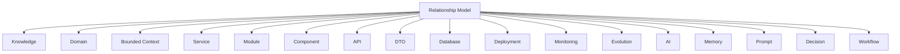

> **Diagram ID:** `DGM-REL-001`
> **Explanation:** The relationship model connects every entity type in Oship.

> **Image Specification**
> - Image ID: `IMG-REL-001`
> - Purpose: Hero concept of the complete relationship model.
> - Prompt: "A comprehensive relationship graph of Oship showing knowledge, domains, services, APIs, databases, deployments, AI, memory, prompts, decisions, and workflows interconnected, dark navy blueprint with gold edges."
> - Style: Network graph, blueprint.
> - Composition: Central hub with many entity nodes.
> - Resolution: 2400x1600px
> - Priority: CRITICAL
> - Suggested Filename: `assets/diagrams/rel-hero-graph.png`

## 1.2 What a Relationship Is

A relationship is a typed connection between two entities with defined attributes.

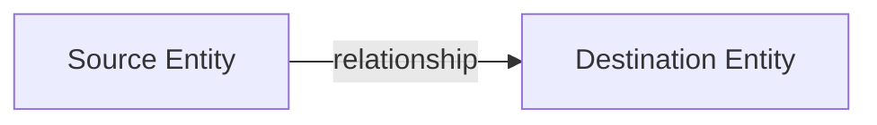

> **Diagram ID:** `DGM-REL-002`
> **Explanation:** Every relationship has a source, a destination, and a type.

### TBL-REL-001: Relationship Attributes

| Attribute | Definition |
| :--- | :--- |
| Source | The origin entity |
| Destination | The target entity |
| Cardinality | 1:1, 1:N, N:M |
| Ownership | Who owns the relationship |
| Lifecycle | Relationship states |
| Mutability | Mutable or immutable |
| Synchronization | How it syncs |
| Consistency | Consistency rules |
| Validation | Validation rules |
| Failure | Failure behaviour |
| Recovery | Recovery behaviour |
| Security | Security constraints |
| AI routing | AI routing behaviour |
| Navigation | Navigation priority |
| Impact | Impact radius |

## 1.3 The Relationship Specification

Every relationship in this model is specified with a complete contract.

### TBL-REL-002: Relationship Contract Fields

| Field | Requirement |
| :--- | :--- |
| Relationship ID | Unique identifier |
| Source | Source entity |
| Destination | Destination entity |
| Type | Relationship type |
| Cardinality | Multiplicity |
| Ownership | Owner |
| Lifecycle | States |
| Mutability | Mutable/immutable |
| Synchronization | Sync mechanism |
| Consistency | Consistency rules |
| Validation | Validation rules |
| Failure | Failure behaviour |
| Recovery | Recovery behaviour |
| Security | Security constraints |
| AI routing | AI behaviour |
| Navigation | Navigation priority |
| Impact | Impact radius |

## 1.4 Relationship Types

### TBL-REL-003: Relationship Type Taxonomy

| Type | Meaning | Symbol |
| :--- | :--- | :--- |
| Contains | Parent holds child | ⊇ |
| Belongs-to | Child in parent | ∈ |
| Depends-on | Requires upstream | → |
| Consumes | Uses as input | ⤳ |
| Produces | Generates output | ↦ |
| Implements | Realizes a contract | ⤚ |
| References | Links to | ↔ |
| Owns | Responsibility | © |
| Governs | Controls | ⌘ |
| Syncs-with | Synchronizes | ⇄ |
| Drives | Causes | ⇒ |
| Feeds | Supplies | ⇐ |
| Triggers | Starts | ⚡ |
| Monitors | Observes | ◉ |
| Deploys | Releases | ↑ |
| Evolves | Changes | ↻ |
| Validates | Checks | ✓ |
| Secures | Protects | 🔒 |

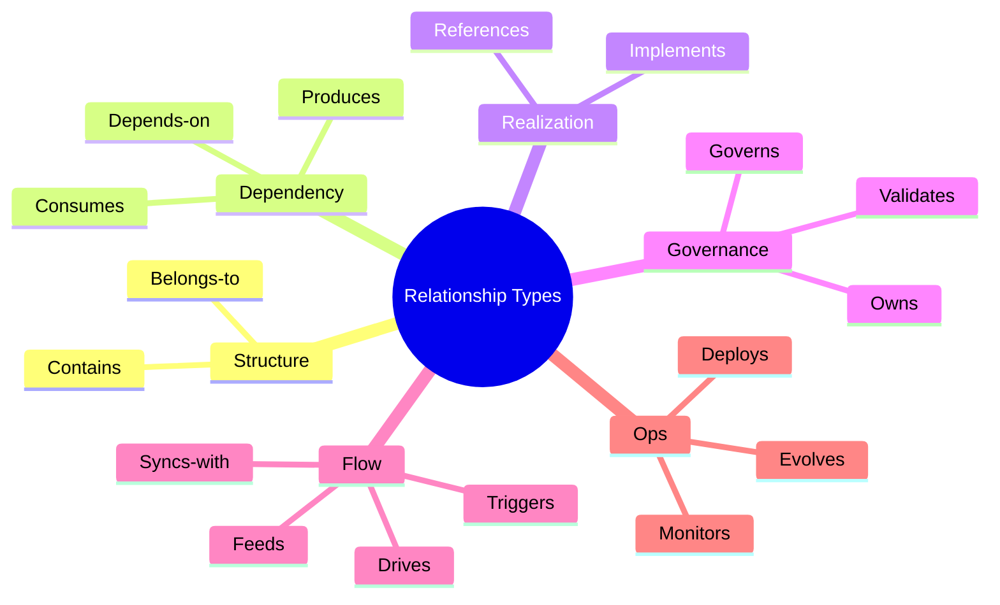

> **Diagram ID:** `DGM-REL-003`
> **Explanation:** The relationship type taxonomy groups types into structure, dependency,
> realization, governance, flow, and ops categories.

> **Image Specification**
> - Image ID: `IMG-REL-002`
> - Purpose: Visualize the relationship type taxonomy.
> - Prompt: "A relationship type taxonomy mind map with structure, dependency, realization, governance, flow, and ops categories, navy and gold blueprint style."
> - Style: Mind map, blueprint.
> - Composition: Central node with six categories.
> - Resolution: 2000x1400px
> - Priority: HIGH
> - Suggested Filename: `assets/diagrams/rel-types.png`

## 1.5 Cardinality

Cardinality defines how many of each entity participate in a relationship.

### TBL-REL-004: Cardinality Notation

| Cardinality | Meaning | Example |
| :--- | :--- | :--- |
| 1:1 | Exactly one to one | Project ↔ Repository |
| 1:N | One to many | Domain → Documents |
| N:M | Many to many | Service ↔ Event |
| 0:1 | Optional to one | ADR → Supersedes |
| 0:N | Optional to many | Module → Dependencies |

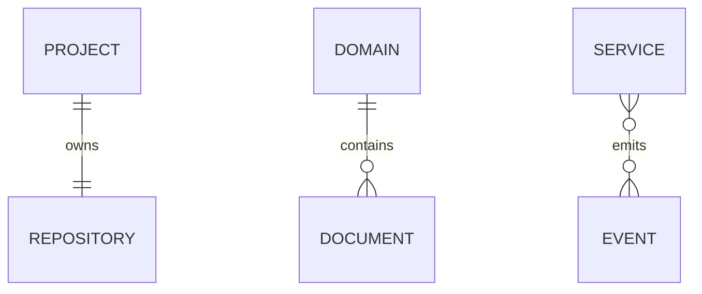

> **Diagram ID:** `DGM-REL-004`
> **Explanation:** Cardinality is expressed with crow's-foot notation.

## 1.6 Relationship Lifecycle

Relationships have a lifecycle.

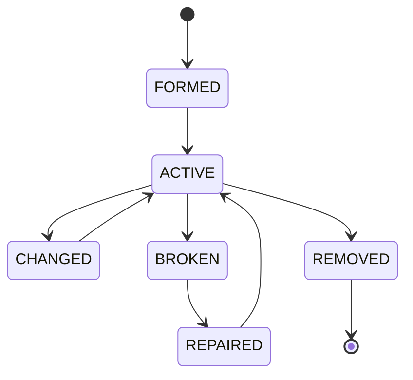

> **Diagram ID:** `DGM-REL-005`
> **Explanation:** Relationships form, activate, change, break, repair, and remove.

### TBL-REL-005: Relationship Lifecycle States

| State | Meaning |
| :--- | :--- |
| FORMED | Relationship created |
| ACTIVE | Relationship in use |
| CHANGED | Relationship altered |
| BROKEN | Relationship failed |
| REPAIRED | Relationship restored |
| REMOVED | Relationship deleted |

## 1.7 Relationship Philosophy Principles

### TBL-REL-006: Relationship Principles

| # | Principle | Statement |
| :---: | :--- | :--- |
| 1 | **Completeness** | Every relationship defined |
| 2 | **Determinism** | Same input → same relationship |
| 3 | **Traceability** | Every relationship traceable |
| 4 | **Acyclicity** | No circular dependencies |
| 5 | **Single source** | One authoritative relationship |
| 6 | **Validation** | Relationships validated |
| 7 | **Reconstruction** | Full graph rebuild |
| 8 | **Governance** | Relationships governed |
| 9 | **Security** | Relationships secured |
| 10 | **Evolution** | Relationships evolve |

## 1.8 Self-Reconstruction Requirement

This document must reconstruct the complete relationship graph even if every other document
is lost.

| Reconstruction capability | How enabled |
| :--- | :--- |
| Repository | Topology relationships |
| Architecture | Service/component relationships |
| Knowledge graph | Domain relationships |
| Context | Context relationships |
| AI runtime | AI/agent/memory relationships |
| Navigation | Routing relationships |
| Validation | Validation relationships |
| Governance | Ownership relationships |
| Deployment | Deployment relationships |

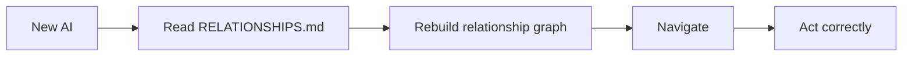

> **Diagram ID:** `DGM-REL-006`
> **Explanation:** A new AI reads this document and rebuilds the full relationship graph.

> **Image Specification**
> - Image ID: `IMG-REL-003`
> - Purpose: Visualize self-reconstruction from the relationship model.
> - Prompt: "A reconstruction pipeline showing a new AI reading the relationship model and rebuilding the complete repository graph, purple and navy blueprint style."
> - Style: Pipeline flowchart, blueprint.
> - Composition: Four-stage reconstruction pipeline.
> - Resolution: 1800x900px
> - Priority: CRITICAL
> - Suggested Filename: `assets/diagrams/rel-reconstruction.png`

## 1.9 Decision Rules

| Rule | Statement |
| :--- | :--- |
| REL-01 | Every entity participates in relationships |
| REL-02 | Every relationship is typed |
| REL-03 | Every relationship has a source and destination |
| REL-04 | Every relationship is validated |
| REL-05 | No circular dependencies |
| REL-06 | Relationships are traceable |
| REL-07 | Relationships evolve |
| REL-08 | Relationships are governed |

## 1.10 Navigation

### TBL-REL-007: Relationship Navigation

| Need | Part |
| :--- | :--- |
| Philosophy | PART 01 |
| Knowledge model | PART 02 |
| Dependency graph | PART 03 |
| Document relationships | PART 05 |
| Domain relationships | PART 06 |
| Service relationships | PART 09 |
| API relationships | PART 11 |
| Data relationships | PART 12 |
| AI relationships | PART 20 |
| Validation | PART 25 |
| Libraries | PART 28–31 |
| Anti-patterns | PART 32 |
| Best practices | PART 33 |

---

# PART 02 — Knowledge Relationship Model

## 2.1 Knowledge Relationships

Knowledge entities relate to each other and to the rest of the ecosystem.

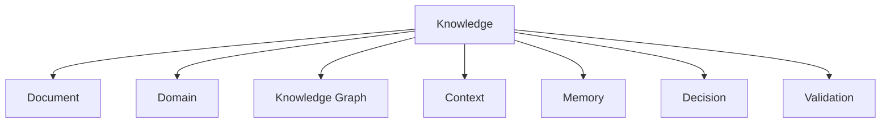

> **Diagram ID:** `DGM-REL-007`
> **Explanation:** Knowledge relates to documents, domains, graphs, contexts, memory, decisions,
> and validation.

### TBL-REL-008: Knowledge Relationship Inventory

| Relationship | Source | Destination | Cardinality | Type |
| :--- | :--- | :--- | :--- | :--- |
| Document-of | Knowledge | Document | 1:N | Belongs-to |
| Domain-maps | Knowledge | Domain | 1:1 | Maps |
| Graph-nodes | Knowledge | Graph | 1:N | Contains |
| Context-loads | Knowledge | Context | 1:N | Feeds |
| Memory-persists | Knowledge | Memory | 1:N | Feeds |
| Decision-records | Knowledge | Decision | 1:N | Governs |
| Validation-checks | Knowledge | Validation | 1:N | Validates |

## 2.2 Knowledge-to-Document

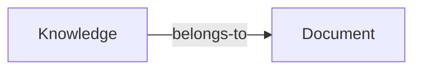

> **Diagram ID:** `DGM-REL-008`
> **Explanation:** Knowledge belongs to documents.

### TBL-REL-009: Knowledge-Document Specification

| Field | Value |
| :--- | :--- |
| Source | Knowledge |
| Destination | Document |
| Cardinality | 1:N |
| Ownership | Document owner |
| Lifecycle | FORMED→ACTIVE→REMOVED |
| Mutability | Mutable |
| Synchronization | Index update |
| Consistency | Document current |
| Validation | Header + links |
| Failure | Orphan knowledge |
| Recovery | Re-register |
| Security | Read-open |
| AI routing | Route to domain |
| Navigation | High |
| Impact | Document subtree |

## 2.3 Knowledge-to-Domain

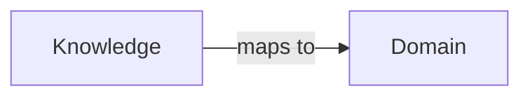

> **Diagram ID:** `DGM-REL-009`
> **Explanation:** Knowledge maps to a domain.

### JSON Example

```json
{
  "relationship": {
    "id": "REL-KD-001",
    "source": "knowledge",
    "destination": "DOM-15",
    "type": "maps",
    "cardinality": "1:1",
    "ownership": "domain owner",
    "status": "ACTIVE"
  }
}
```

### YAML Example

```yaml
relationship:
  id: REL-KD-001
  source: knowledge
  destination: DOM-15
  type: maps
  cardinality: 1:1
  ownership: domain owner
  status: ACTIVE
```

### Markdown Example

```markdown
# Relationship: Knowledge → Domain
> Source: Knowledge. Destination: DOM-15.
> Type: maps. Cardinality: 1:1.
```

### Directory Tree Example

```
knowledge/
└── domains/
    └── 15-api/
```

## 2.4 Knowledge Graph Relationships

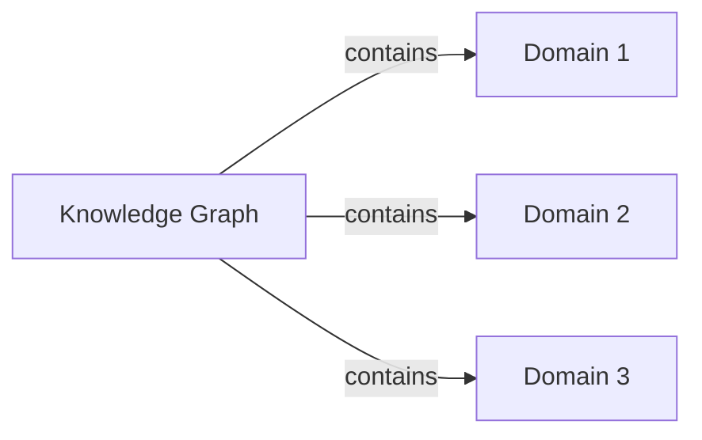

> **Diagram ID:** `DGM-REL-010`
> **Explanation:** The knowledge graph contains domains.

### TBL-REL-010: Knowledge Graph-Domain Specification

| Field | Value |
| :--- | :--- |
| Source | Knowledge graph |
| Destination | Domain |
| Cardinality | 1:N |
| Ownership | MASTER_CONTEXT Architect |
| Lifecycle | ACTIVE |
| Mutability | Mutable |
| Synchronization | Index registration |
| Consistency | All domains registered |
| Validation | Registration check |
| Failure | Orphan domain |
| Recovery | Register domain |
| Security | Read-open |
| AI routing | Route to graph |
| Navigation | Critical |
| Impact | All domains |

## 2.5 Context Relationships

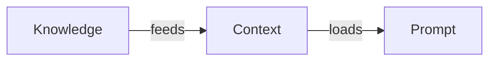

> **Diagram ID:** `DGM-REL-011`
> **Explanation:** Knowledge feeds context, which loads into prompts.

### TBL-REL-011: Context Relationship Specification

| Field | Value |
| :--- | :--- |
| Source | Knowledge |
| Destination | Context |
| Cardinality | 1:N |
| Type | Feeds |
| Synchronization | Context refresh |
| Consistency | Context current |
| Validation | Source present |
| Failure | Stale context |
| Recovery | Re-load |

## 2.6 Memory Relationships

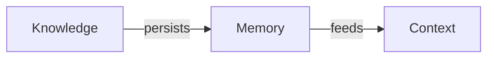

> **Diagram ID:** `DGM-REL-012`
> **Explanation:** Knowledge persists to memory, which feeds context.

### JSON Example

```json
{
  "relationship": {
    "id": "REL-KM-001",
    "source": "knowledge",
    "destination": "memory",
    "type": "persists",
    "cardinality": "1:N",
    "status": "ACTIVE"
  }
}
```

## 2.7 Decision Relationships

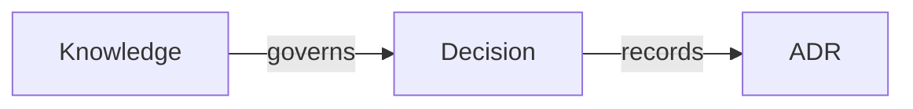

> **Diagram ID:** `DGM-REL-013`
> **Explanation:** Knowledge governs decisions, which record into ADRs.

## 2.8 Validation Relationships

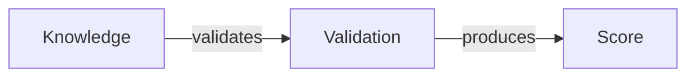

> **Diagram ID:** `DGM-REL-014`
> **Explanation:** Knowledge is validated, producing a score.

## 2.9 Knowledge Relationship Matrix

### TBL-REL-012: Knowledge Relationship Matrix

| From | To | Type | Cardinality |
| :--- | :--- | :--- | :--- |
| Knowledge | Document | Belongs-to | 1:N |
| Knowledge | Domain | Maps | 1:1 |
| Knowledge | Graph | Contains | 1:N |
| Knowledge | Context | Feeds | 1:N |
| Knowledge | Memory | Persists | 1:N |
| Knowledge | Decision | Governs | 1:N |
| Knowledge | Validation | Validates | 1:N |
| Document | Domain | Belongs-to | 1:1 |
| Context | Prompt | Feeds | 1:N |
| Memory | Context | Feeds | 1:N |
| Decision | ADR | Records | 1:1 |
| Validation | Score | Produces | 1:1 |

## 2.10 Knowledge Relationship Decision Rules

| Rule | Statement |
| :--- | :--- |
| KRM-01 | Knowledge maps to exactly one domain |
| KRM-02 | Knowledge belongs to documents |
| KRM-03 | Knowledge feeds context and memory |
| KRM-04 | Knowledge is validated |
| KRM-05 | Decisions record from knowledge |
| KRM-06 | No orphan knowledge |
| KRM-07 | Knowledge is traceable |
| KRM-08 | Knowledge relationships are acyclic |

---

# PART 03 — Repository Dependency Graph

## 3.1 The Repository Dependency Graph

The repository has a dependency graph defining how entities depend on each other.

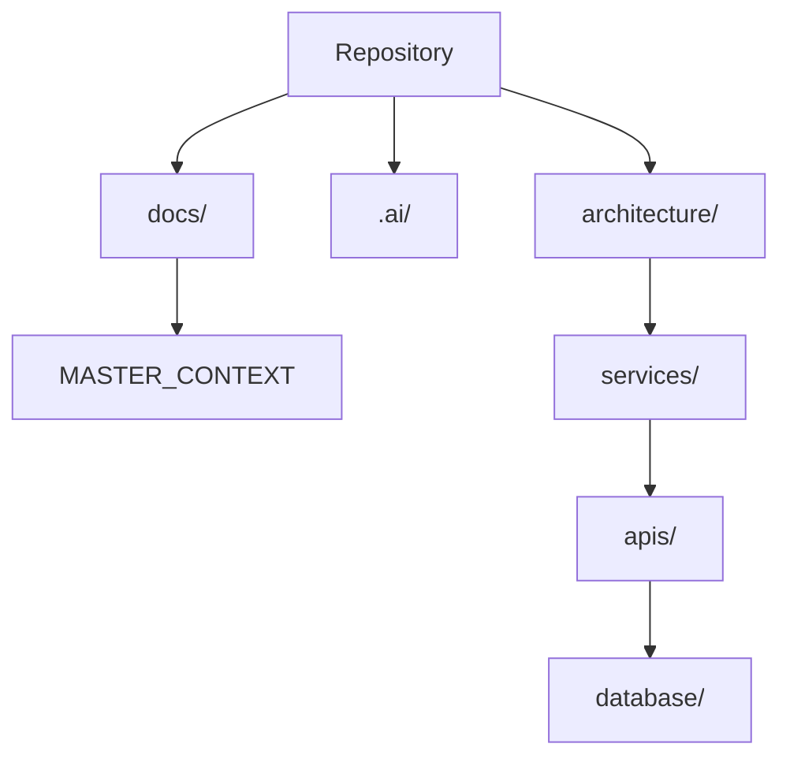

> **Diagram ID:** `DGM-REL-015`
> **Explanation:** The repository dependency graph maps structural dependencies.

### TBL-REL-013: Repository Dependency Specification

| Relationship | Source | Destination | Type |
| :--- | :--- | :--- | :--- |
| Contains-docs | Repository | docs/ | Contains |
| Contains-ai | Repository | .ai/ | Contains |
| Contains-arch | Repository | architecture/ | Contains |
| Docs-mcx | docs/ | MASTER_CONTEXT | Contains |
| Arch-svc | architecture/ | services/ | Depends |
| Svc-api | services/ | apis/ | Depends |
| Api-db | apis/ | database/ | Depends |

## 3.2 Dependency Direction

Dependencies flow in a defined direction.

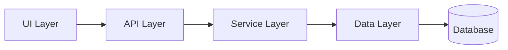

> **Diagram ID:** `DGM-REL-016`
> **Explanation:** Dependencies flow from UI to API to service to data to database.

### TBL-REL-014: Dependency Direction Rules

| Rule | Statement |
| :--- | :--- |
| DD-01 | Higher layers depend on lower layers |
| DD-02 | No upward dependencies |
| DD-03 | No circular dependencies |
| DD-04 | Dependencies are explicit |
| DD-05 | Dependencies are validated |

## 3.3 Acyclic Dependency Rule

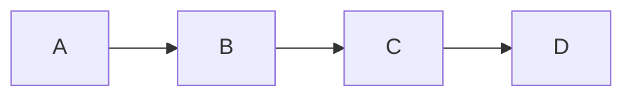

> **Diagram ID:** `DGM-REL-017`
> **Explanation:** Dependencies form an acyclic graph.

### Bad Example: Circular Dependency

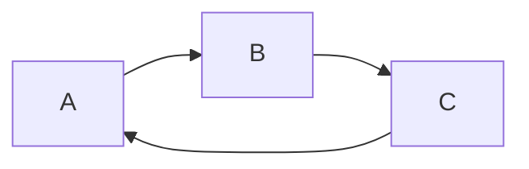

> **Diagram ID:** `DGM-REL-018`
> **Explanation:** A circular dependency is prohibited.

### Validation Rule

| Rule | Statement |
| :--- | :--- |
| DEP-VAL-01 | Dependency graph must be acyclic |
| DEP-VAL-02 | Every dependency declared |
| DEP-VAL-03 | No orphan entities |
| DEP-VAL-04 | Dependencies resolvable |
| DEP-VAL-05 | Impact radius known |

---

# PART 04 — Repository Layer Relationships

## 4.1 Repository Layers

The repository is organized into layers with defined relationships.

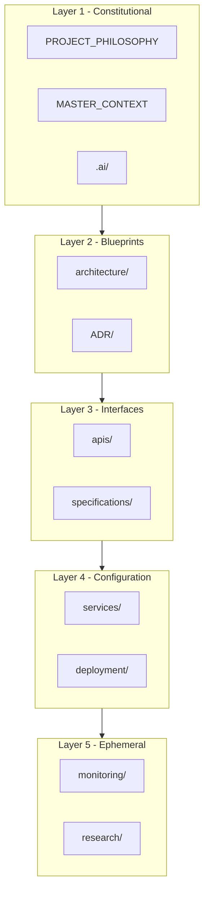

> **Diagram ID:** `DGM-REL-019`
> **Explanation:** Repository layers relate top-down.

### TBL-REL-015: Layer Relationship Specification

| Layer | Governs | Depends on |
| :--- | :--- | :--- |
| L1 Constitutional | All | None |
| L2 Blueprints | L3, L4 | L1 |
| L3 Interfaces | L4 | L1, L2 |
| L4 Configuration | L5 | L1, L2, L3 |
| L5 Ephemeral | — | All |

## 4.2 Layer-to-Folder Mapping

### TBL-REL-016: Layer-to-Folder Relationship

| Layer | Folders | Relationship |
| :--- | :--- | :--- |
| L1 | PROJECT_PHILOSOPHY, .ai/, MASTER_CONTEXT | Contains |
| L2 | architecture/, ADR/ | Contains |
| L3 | apis/, specifications/ | Contains |
| L4 | services/, deployment/, infra/ | Contains |
| L5 | monitoring/, observability/, research/ | Contains |

## 4.3 Layer Governance Relationships

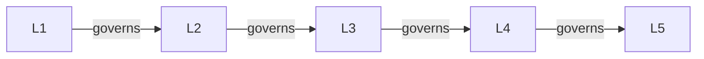

> **Diagram ID:** `DGM-REL-020`
> **Explanation:** Higher layers govern lower layers.

### JSON Example

```json
{
  "layer_relationship": {
    "source": "L1",
    "destination": "L2",
    "type": "governs",
    "cardinality": "1:N",
    "impact": "all blueprints"
  }
}
```

### YAML Example

```yaml
layer_relationship:
  source: L1
  destination: L2
  type: governs
  cardinality: 1:N
  impact: all blueprints
```

---

# PART 05 — Document Relationships

## 5.1 Document Relationship Model

Documents relate to each other and to domains.

```mermaid
flowchart TD
    DOC[Document] --> DOM[Domain]
    DOC --> DOC2[Document]
    DOC --> DIAG[Diagram]
    DOC --> TABLE[Table]
    DOC --> ADR[ADR]
    DOC --> IMG[Image]
```

> **Diagram ID:** `DGM-REL-021`
> **Explanation:** Documents relate to domains, other documents, diagrams, tables, ADRs, and
> images.

### TBL-REL-017: Document Relationship Inventory

| Relationship | Source | Destination | Type | Cardinality |
| :--- | :--- | :--- | :--- | :--- |
| Belongs-to | Document | Domain | Belongs-to | 1:1 |
| References | Document | Document | References | N:M |
| Visualizes | Document | Diagram | References | 1:N |
| Enriches | Document | Table | References | 1:N |
| Records | Document | ADR | References | 0:N |
| Illustrates | Document | Image | References | 0:N |

## 5.2 Document-to-Domain

```mermaid
flowchart LR
    DOC[Document] -->|belongs-to| DOM[Domain]
```

> **Diagram ID:** `DGM-REL-022`
> **Explanation:** A document belongs to exactly one domain.

### TBL-REL-018: Document-Domain Specification

| Field | Value |
| :--- | :--- |
| Source | Document |
| Destination | Domain |
| Cardinality | 1:1 |
| Ownership | Domain owner |
| Lifecycle | ACTIVE |
| Mutability | Mutable |
| Synchronization | Index update |
| Consistency | Registered |
| Validation | Header + links |
| Failure | Orphan document |
| Recovery | Register |
| Security | Read-open |
| AI routing | Route to domain |
| Navigation | High |
| Impact | Document subtree |

## 5.3 Document-to-Document

```mermaid
flowchart LR
    DOC1[Document 1] -->|references| DOC2[Document 2]
    DOC2 -->|references| DOC3[Document 3]
```

> **Diagram ID:** `DGM-REL-023`
> **Explanation:** Documents reference each other.

### JSON Example

```json
{
  "document_reference": {
    "source": "DOC-1501",
    "destination": "DOC-1502",
    "type": "references",
    "cardinality": "N:M",
    "status": "ACTIVE"
  }
}
```

### YAML Example

```yaml
document_reference:
  source: DOC-1501
  destination: DOC-1502
  type: references
  cardinality: N:M
  status: ACTIVE
```

### Markdown Example

```markdown
# Document Reference
> DOC-1501 references DOC-1502.
> Type: references. Cardinality: N:M.
```

### Directory Tree Example

```
docs/MASTER_CONTEXT/15_API/
├── API_STANDARDS.md  [references API_CONTRACTS]
├── API_CONTRACTS.md  [referenced by API_STANDARDS]
└── API_SECURITY.md
```

## 5.4 Document-to-Diagram

```mermaid
flowchart LR
    DOC[Document] -->|references| DIAG[Diagram]
```

> **Diagram ID:** `DGM-REL-024`
> **Explanation:** Documents reference diagrams for visualization.

## 5.5 Document-to-ADR

```mermaid
flowchart LR
    DOC[Document] -->|records| ADR[ADR]
```

> **Diagram ID:** `DGM-REL-025`
> **Explanation:** Documents record architecture decisions as ADRs.

### TBL-REL-019: Document-ADR Specification

| Field | Value |
| :--- | :--- |
| Source | Document |
| Destination | ADR |
| Cardinality | 0:N |
| Type | Records |
| Ownership | Architecture Board |
| Lifecycle | Immutable |
| Mutability | Immutable |
| Synchronization | ADR registry |
| Validation | Status valid |
| Failure | Missing rationale |
| Recovery | Add ADR |
| Security | Read-open |
| AI routing | Route to 22 |
| Navigation | High |

## 5.6 Document Relationship Matrix

### TBL-REL-020: Document Relationship Matrix

| From | To | Type | Cardinality |
| :--- | :--- | :--- | :--- |
| Document | Domain | Belongs-to | 1:1 |
| Document | Document | References | N:M |
| Document | Diagram | References | 1:N |
| Document | Table | References | 1:N |
| Document | ADR | Records | 0:N |
| Document | Image | References | 0:N |

## 5.7 Document Relationship Decision Rules

| Rule | Statement |
| :--- | :--- |
| DOC-01 | Every document belongs to a domain |
| DOC-02 | Every document is registered |
| DOC-03 | Every reference resolves |
| DOC-04 | Every document is validated |
| DOC-05 | No orphan documents |
| DOC-06 | Documents are traceable |

---

# PART 06 — Domain Relationships

## 6.1 Domain Relationship Model

Domains relate to each other and to their contents.

```mermaid
flowchart TD
    MCX[MASTER_CONTEXT] --> D01[01 Product]
    MCX --> D04[04 Architecture]
    D04 --> D06[06 Database]
    D04 --> D08[08 Backend]
    D08 --> D15[15 API]
    D15 --> D07[07 Frontend]
```

> **Diagram ID:** `DGM-REL-026`
> **Explanation:** Domains relate through containment and dependency.

### TBL-REL-021: Domain Relationship Inventory

| Relationship | Source | Destination | Type | Cardinality |
| :--- | :--- | :--- | :--- | :--- |
| Contains | MASTER_CONTEXT | Domain | Contains | 1:N |
| Depends | Domain | Domain | Depends-on | 1:N |
| References | Domain | Domain | References | N:M |
| Owns | Domain | Document | Owns | 1:N |
| Routes | Domain | Intent | Routes | 1:N |

## 6.2 Domain-to-Domain Dependency

```mermaid
flowchart LR
    D04[04 Architecture] --> D08[08 Backend]
    D08 --> D06[06 Database]
    D08 --> D15[15 API]
```

> **Diagram ID:** `DGM-REL-027`
> **Explanation:** Backend depends on architecture, database, and API.

### TBL-REL-022: Domain Dependency Matrix

| Domain | Depends on | Required by |
| :--- | :--- | :--- |
| 01 Product | 02, 03 | 04, 19 |
| 04 Architecture | 22, 23 | 05-10, 15 |
| 06 Database | 04, 08 | 08, 15 |
| 07 Frontend | 04, 14, 15 | 08, 18 |
| 08 Backend | 04, 06, 15 | 07, 12, 18 |
| 10 Security | 04 | 06, 08, 11, 15 |
| 15 API | 04, 10 | 07, 08, 16 |
| 17 Automation | 11, 18 | 11, 12 |
| 18 Testing | 11, 17 | 11, 17 |
| 23 Standards | 05 | 04, 22, all |

## 6.3 Domain Lifecycle Relationships

```mermaid
stateDiagram-v2
    [*] --> DRAFT
    DRAFT --> ACTIVE
    ACTIVE --> DEPRECATED
    DEPRECATED --> ARCHIVED
    ARCHIVED --> [*]
```

> **Diagram ID:** `DGM-REL-028`
> **Explanation:** Domains progress through lifecycle states.

### JSON Example

```json
{
  "domain_relationship": {
    "source": "DOM-04",
    "destination": "DOM-08",
    "type": "depends",
    "cardinality": "1:N",
    "impact": "backend services",
    "status": "ACTIVE"
  }
}
```

### YAML Example

```yaml
domain_relationship:
  source: DOM-04
  destination: DOM-08
  type: depends
  cardinality: 1:N
  impact: backend services
  status: ACTIVE
```

### Markdown Example

```markdown
# Domain Relationship: 04 → 08
> Source: Architecture. Destination: Backend.
> Type: depends. Cardinality: 1:N.
```

### Directory Tree Example

```
04_ARCHITECTURE/
└── depends-on/
    └── 08_BACKEND/
```

## 6.4 Domain Relationship Matrix

### TBL-REL-023: Full Domain Relationship Matrix

| Source | Destination | Type | Cardinality |
| :--- | :--- | :--- | :--- |
| MASTER_CONTEXT | All domains | Contains | 1:N |
| 04 Architecture | 06 Database | Depends | 1:1 |
| 04 Architecture | 08 Backend | Depends | 1:N |
| 04 Architecture | 15 API | Depends | 1:1 |
| 08 Backend | 06 Database | Depends | 1:1 |
| 15 API | 07 Frontend | Feeds | 1:N |
| 10 Security | 15 API | Governs | 1:1 |
| 23 Standards | All | Governs | 1:N |

## 6.5 Domain Relationship Decision Rules

| Rule | Statement |
| :--- | :--- |
| DOM-01 | Every domain registered |
| DOM-02 | Every domain has an owner |
| DOM-03 | Dependencies acyclic |
| DOM-04 | Every domain routes intents |
| DOM-05 | No orphan domains |
| DOM-06 | Domains are traceable |
| DOM-07 | Domain lifecycle valid |
| DOM-08 | Domain relationships validated |

---

# PART 07 — Bounded Context Relationships

## 7.1 Bounded Context Model

Bounded contexts relate through defined interfaces.

```mermaid
flowchart TD
    BC1[Bounded Context A] -->|ACL| BC2[Bounded Context B]
    BC2 -->|contract| BC3[Bounded Context C]
```

> **Diagram ID:** `DGM-REL-029`
> **Explanation:** Bounded contexts relate through anti-corruption layers (ACL) and contracts.

### TBL-REL-024: Bounded Context Relationship Inventory

| Relationship | Source | Destination | Type |
| :--- | :--- | :--- | :--- |
| ACL | Bounded Context | Bounded Context | Protects |
| Contract | Bounded Context | Bounded Context | Defines |
| Published-language | Bounded Context | Bounded Context | Shares |
| Shared-kernel | Bounded Context | Bounded Context | Shares |
| Customer-supplier | Bounded Context | Bounded Context | Supplies |

## 7.2 Context-to-Context

```mermaid
flowchart LR
    A[Context A] -->|published language| B[Context B]
    B -->|shared kernel| C[Context C]
```

> **Diagram ID:** `DGM-REL-030`
> **Explanation:** Contexts share via published language and shared kernels.

### JSON Example

```json
{
  "context_relationship": {
    "source": "context-a",
    "destination": "context-b",
    "type": "published-language",
    "cardinality": "1:1",
    "status": "ACTIVE"
  }
}
```

### YAML Example

```yaml
context_relationship:
  source: context-a
  destination: context-b
  type: published-language
  cardinality: 1:1
  status: ACTIVE
```

## 7.3 Bounded Context Decision Rules

| Rule | Statement |
| :--- | :--- |
| BC-01 | Contexts are isolated |
| BC-02 | Contexts interact via ACL |
| BC-03 | No direct coupling |
| BC-04 | Contracts are explicit |
| BC-05 | Contexts are traceable |

---

# PART 08 — Module Relationships

## 8.1 Module Relationship Model

Modules relate to packages, features, and services.

```mermaid
flowchart TD
    MOD[Module] --> PKG[Package]
    MOD --> FEAT[Feature]
    MOD --> SVC[Service]
    MOD --> MOD2[Module]
```

> **Diagram ID:** `DGM-REL-031`
> **Explanation:** Modules relate to packages, features, services, and other modules.

### TBL-REL-025: Module Relationship Inventory

| Relationship | Source | Destination | Type | Cardinality |
| :--- | :--- | :--- | :--- | :--- |
| Belongs-to | Module | Package | Belongs-to | 1:1 |
| Implements | Module | Feature | Implements | 1:N |
| Consumed-by | Module | Service | Consumed-by | 1:N |
| Depends | Module | Module | Depends-on | N:M |

## 8.2 Module-to-Package

```mermaid
flowchart LR
    MOD[Module] -->|belongs-to| PKG[Package]
```

> **Diagram ID:** `DGM-REL-032`
> **Explanation:** A module belongs to a package.

### JSON Example

```json
{
  "module_relationship": {
    "source": "MOD-001",
    "destination": "PKG-001",
    "type": "belongs-to",
    "cardinality": "1:1",
    "status": "ACTIVE"
  }
}
```

### YAML Example

```yaml
module_relationship:
  source: MOD-001
  destination: PKG-001
  type: belongs-to
  cardinality: 1:1
  status: ACTIVE
```

### Directory Tree Example

```
packages/
└── osh-auth/
    └── auth-module/
```

## 8.3 Module Decision Rules

| Rule | Statement |
| :--- | :--- |
| MOD-01 | Module belongs to a package |
| MOD-02 | Module single-responsibility |
| MOD-03 | Module dependencies resolved |
| MOD-04 | Module is versioned |
| MOD-05 | Module is reusable |

---

# PART 09 — Service Relationships

## 9.1 Service Relationship Model

Services relate to modules, APIs, data, and each other.

```mermaid
flowchart TD
    SVC[Service] --> API[API]
    SVC --> DB[Database]
    SVC --> MOD[Module]
    SVC --> EVT[Event]
    SVC --> SVC2[Service]
```

> **Diagram ID:** `DGM-REL-033`
> **Explanation:** Services relate to APIs, databases, modules, events, and other services.

### TBL-REL-026: Service Relationship Inventory

| Relationship | Source | Destination | Type | Cardinality |
| :--- | :--- | :--- | :--- | :--- |
| Exposes | Service | API | Produces | 1:N |
| Accesses | Service | Database | Consumes | 1:N |
| Uses | Service | Module | Consumes | 1:N |
| Emits | Service | Event | Produces | 0:N |
| Calls | Service | Service | Depends-on | N:M |

## 9.2 Service-to-API

```mermaid
flowchart LR
    SVC[Service] -->|exposes| API[API]
```

> **Diagram ID:** `DGM-REL-034`
> **Explanation:** A service exposes an API.

### TBL-REL-027: Service-API Specification

| Field | Value |
| :--- | :--- |
| Source | Service |
| Destination | API |
| Cardinality | 1:N |
| Type | Produces |
| Ownership | Service owner |
| Lifecycle | ACTIVE |
| Mutability | Mutable |
| Synchronization | Contract sync |
| Validation | Contract valid |
| Failure | Contract break |
| Recovery | Re-align |
| Security | Auth enforced |
| AI routing | Route to 08, 15 |
| Navigation | High |
| Impact | Consumers |

## 9.3 Service-to-Service

```mermaid
flowchart LR
    SVC1[Service 1] -->|calls| SVC2[Service 2]
    SVC2 -->|calls| SVC3[Service 3]
```

> **Diagram ID:** `DGM-REL-035`
> **Explanation:** Services call each other.

### JSON Example

```json
{
  "service_relationship": {
    "source": "SVC-001",
    "destination": "SVC-002",
    "type": "calls",
    "cardinality": "N:M",
    "protocol": "grpc",
    "status": "ACTIVE"
  }
}
```

### YAML Example

```yaml
service_relationship:
  source: SVC-001
  destination: SVC-002
  type: calls
  cardinality: N:M
  protocol: grpc
  status: ACTIVE
```

### Markdown Example

```markdown
# Service Relationship: SVC-001 → SVC-002
> Type: calls. Protocol: grpc. Cardinality: N:M.
```

### Directory Tree Example

```
services/
├── user-service/
└── billing-service/
    └── calls user-service/
```

## 9.4 Service Relationship Matrix

### TBL-REL-028: Service Relationship Matrix

| Source | Destination | Type | Cardinality |
| :--- | :--- | :--- | :--- |
| Service | API | Exposes | 1:N |
| Service | Database | Accesses | 1:N |
| Service | Module | Uses | 1:N |
| Service | Event | Emits | 0:N |
| Service | Service | Calls | N:M |
| Service | DTO | Transfers | 1:N |

## 9.5 Service Decision Rules

| Rule | Statement |
| :--- | :--- |
| SVC-01 | Service bounded |
| SVC-02 | Service exposes contracts |
| SVC-03 | Service dependencies resolved |
| SVC-04 | No circular service calls |
| SVC-05 | Service is observable |
| SVC-06 | Service relationships validated |

---

# PART 10 — Component Relationships

## 10.1 Component Relationship Model

Components relate to modules and services.

```mermaid
flowchart TD
    COMP[Component] --> MOD[Module]
    COMP --> SVC[Service]
    COMP --> COMP2[Component]
```

> **Diagram ID:** `DGM-REL-036`
> **Explanation:** Components relate to modules, services, and other components.

### TBL-REL-029: Component Relationship Inventory

| Relationship | Source | Destination | Type | Cardinality |
| :--- | :--- | :--- | :--- | :--- |
| Belongs-to | Component | Module | Belongs-to | 1:1 |
| Used-in | Component | Service | Used-in | 1:N |
| Depends | Component | Component | Depends-on | N:M |

## 10.2 Component-to-Component

```mermaid
flowchart LR
    C1[Component 1] -->|depends| C2[Component 2]
```

> **Diagram ID:** `DGM-REL-037`
> **Explanation:** Components depend on each other.

### JSON Example

```json
{
  "component_relationship": {
    "source": "COMP-001",
    "destination": "COMP-002",
    "type": "depends",
    "cardinality": "N:M",
    "status": "ACTIVE"
  }
}
```

### YAML Example

```yaml
component_relationship:
  source: COMP-001
  destination: COMP-002
  type: depends
  cardinality: N:M
  status: ACTIVE
```

## 10.3 Component Decision Rules

| Rule | Statement |
| :--- | :--- |
| COMP-01 | Component belongs to a module |
| COMP-02 | Component single-responsibility |
| COMP-03 | No circular component deps |
| COMP-04 | Component is reusable |

---

# PART 11 — API Relationships

## 11.1 API Relationship Model

APIs relate to services, DTOs, security, SDKs, and consumers.

```mermaid
flowchart TD
    API[API] --> EP[Endpoint]
    API --> DTO[DTO]
    API --> SEC[Security]
    API --> SDK[SDK]
    API --> CONSUMER[Consumer]
```

> **Diagram ID:** `DGM-REL-038`
> **Explanation:** APIs relate to endpoints, DTOs, security, SDKs, and consumers.

### TBL-REL-030: API Relationship Inventory

| Relationship | Source | Destination | Type | Cardinality |
| :--- | :--- | :--- | :--- | :--- |
| Contains | API | Endpoint | Contains | 1:N |
| Transfers | API | DTO | Transfers | 1:N |
| Secures | API | Security | Uses | 1:1 |
| Generates | API | SDK | Produces | 1:N |
| Consumed-by | API | Consumer | Consumed-by | 1:N |

## 11.2 API-to-Endpoint

```mermaid
flowchart LR
    API[API] -->|contains| EP[Endpoint]
```

> **Diagram ID:** `DGM-REL-039`
> **Explanation:** An API contains endpoints.

### JSON Example

```json
{
  "api_relationship": {
    "source": "API-001",
    "destination": "EP-001",
    "type": "contains",
    "cardinality": "1:N",
    "status": "ACTIVE"
  }
}
```

### YAML Example

```yaml
api_relationship:
  source: API-001
  destination: EP-001
  type: contains
  cardinality: 1:N
  status: ACTIVE
```

### Markdown Example

```markdown
# API Relationship: API-001 → EP-001
> Type: contains. Cardinality: 1:N.
```

### Directory Tree Example

```
apis/
└── user-api/
    ├── openapi.yaml
    └── schemas/
```

## 11.3 API-to-DTO

```mermaid
flowchart LR
    API[API] -->|transfers| DTO[DTO]
```

> **Diagram ID:** `DGM-REL-040`
> **Explanation:** APIs transfer data via DTOs.

### TBL-REL-031: API-DTO Specification

| Field | Value |
| :--- | :--- |
| Source | API |
| Destination | DTO |
| Cardinality | 1:N |
| Type | Transfers |
| Ownership | API Engineer |
| Lifecycle | ACTIVE |
| Mutability | Mutable |
| Synchronization | Contract sync |
| Validation | Fields valid |
| Failure | Schema mismatch |
| Recovery | Re-align |
| Security | Validate input |
| AI routing | Route to 15 |
| Navigation | High |
| Impact | All consumers |

## 11.4 API Relationship Matrix

### TBL-REL-032: API Relationship Matrix

| Source | Destination | Type | Cardinality |
| :--- | :--- | :--- | :--- |
| API | Endpoint | Contains | 1:N |
| API | DTO | Transfers | 1:N |
| API | Security | Uses | 1:1 |
| API | SDK | Produces | 1:N |
| API | Consumer | Consumed-by | 1:N |
| Endpoint | DTO | Transfers | 1:N |
| Endpoint | Security | Uses | 1:1 |

## 11.5 API Decision Rules

| Rule | Statement |
| :--- | :--- |
| API-01 | API has a version |
| API-02 | API contains endpoints |
| API-03 | API uses security |
| API-04 | API produces SDKs |
| API-05 | API is backward compatible |
| API-06 | API relationships validated |

---

# PART 12 — Data Relationships

## 12.1 Data Relationship Model

Data entities relate to databases, aggregates, value objects, and services.

```mermaid
flowchart TD
    DB[Database] --> ENT[Entity]
    ENT --> AGG[Aggregate]
    ENT --> VO[Value Object]
    SVC[Service] --> DB
    API[API] --> DTO
```

> **Diagram ID:** `DGM-REL-041`
> **Explanation:** Data relationships connect databases, entities, aggregates, value objects,
> services, and DTOs.

### TBL-REL-033: Data Relationship Inventory

| Relationship | Source | Destination | Type | Cardinality |
| :--- | :--- | :--- | :--- | :--- |
| Contains | Database | Entity | Contains | 1:N |
| Groups | Aggregate | Entity | Contains | 1:N |
| Uses | Entity | Value Object | Uses | 1:N |
| Accesses | Service | Database | Accesses | 1:N |
| Transfers | API | DTO | Transfers | 1:N |

## 12.2 Database-to-Entity

```mermaid
flowchart LR
    DB[Database] -->|contains| ENT[Entity]
```

> **Diagram ID:** `DGM-REL-042`
> **Explanation:** A database contains entities.

### JSON Example

```json
{
  "data_relationship": {
    "source": "DB-001",
    "destination": "ENT-001",
    "type": "contains",
    "cardinality": "1:N",
    "status": "ACTIVE"
  }
}
```

### YAML Example

```yaml
data_relationship:
  source: DB-001
  destination: ENT-001
  type: contains
  cardinality: 1:N
  status: ACTIVE
```

### Markdown Example

```markdown
# Data Relationship: DB-001 → ENT-001
> Type: contains. Cardinality: 1:N.
```

### Directory Tree Example

```
database/
├── entities/
│   └── user/
└── migrations/
```

## 12.3 Aggregate-to-Entity

```mermaid
flowchart LR
    AGG[Aggregate] -->|contains| ENT[Entity]
```

> **Diagram ID:** `DGM-REL-043`
> **Explanation:** An aggregate contains entities.

### TBL-REL-034: Aggregate-Entity Specification

| Field | Value |
| :--- | :--- |
| Source | Aggregate |
| Destination | Entity |
| Cardinality | 1:N |
| Type | Contains |
| Ownership | Data Architect |
| Lifecycle | ACTIVE |
| Mutability | Mutable |
| Synchronization | Model sync |
| Validation | Invariants |
| Failure | Invariant break |
| Recovery | Restore |
| Security | Data protection |
| AI routing | Route to 06 |
| Navigation | High |
| Impact | Aggregate |

## 12.4 Data Relationship Matrix

### TBL-REL-035: Data Relationship Matrix

| Source | Destination | Type | Cardinality |
| :--- | :--- | :--- | :--- |
| Database | Entity | Contains | 1:N |
| Aggregate | Entity | Contains | 1:N |
| Entity | Value Object | Uses | 1:N |
| Service | Database | Accesses | 1:N |
| API | DTO | Transfers | 1:N |
| Entity | Entity | References | N:M |

## 12.5 Data Decision Rules

| Rule | Statement |
| :--- | :--- |
| DATA-01 | Entity belongs to a database |
| DATA-02 | Aggregate has a root |
| DATA-03 | Value objects immutable |
| DATA-04 | Data relationships validated |
| DATA-05 | Data protected |

---

# PART 13 — Runtime Relationships

## 13.1 Runtime Relationship Model

Runtime entities relate to services, monitoring, and configuration.

```mermaid
flowchart TD
    RT[Runtime] --> SVC[Service]
    RT --> MON[Monitoring]
    RT --> CFG[Configuration]
    RT --> SEC[Secret]
    RT --> ENV[Environment]
```

> **Diagram ID:** `DGM-REL-044`
> **Explanation:** Runtime relates to services, monitoring, configuration, secrets, and
> environments.

### TBL-REL-036: Runtime Relationship Inventory

| Relationship | Source | Destination | Type | Cardinality |
| :--- | :--- | :--- | :--- | :--- |
| Runs | Runtime | Service | Runs | 1:N |
| Monitors | Runtime | Monitoring | Monitors | 1:N |
| Configures | Runtime | Configuration | Configures | 1:N |
| Secures | Runtime | Secret | Uses | 1:N |
| Deploys-in | Runtime | Environment | Deploys-in | 1:1 |

## 13.2 Runtime-to-Service

```mermaid
flowchart LR
    RT[Runtime] -->|runs| SVC[Service]
```

> **Diagram ID:** `DGM-REL-045`
> **Explanation:** Runtime runs services.

### JSON Example

```json
{
  "runtime_relationship": {
    "source": "runtime-prod",
    "destination": "SVC-001",
    "type": "runs",
    "cardinality": "1:N",
    "status": "ACTIVE"
  }
}
```

### YAML Example

```yaml
runtime_relationship:
  source: runtime-prod
  destination: SVC-001
  type: runs
  cardinality: 1:N
  status: ACTIVE
```

### Directory Tree Example

```
runtime/
├── production/
│   └── services/
└── staging/
    └── services/
```

## 13.3 Runtime Decision Rules

| Rule | Statement |
| :--- | :--- |
| RT-01 | Runtime runs services |
| RT-02 | Runtime is monitored |
| RT-03 | Runtime uses config |
| RT-04 | Runtime uses secrets |
| RT-05 | Runtime is secure |

---

# PART 14 — Deployment Relationships

## 14.1 Deployment Relationship Model

Deployments relate to environments, artifacts, services, and rollbacks.

```mermaid
flowchart TD
    DEP[Deployment] --> ENV[Environment]
    DEP --> ART[Artifact]
    DEP --> SVC[Service]
    DEP --> RB[Rollback]
```

> **Diagram ID:** `DGM-REL-046`
> **Explanation:** Deployments relate to environments, artifacts, services, and rollbacks.

### TBL-REL-037: Deployment Relationship Inventory

| Relationship | Source | Destination | Type | Cardinality |
| :--- | :--- | :--- | :--- | :--- |
| Deploys-to | Deployment | Environment | Deploys-to | 1:1 |
| Uses | Deployment | Artifact | Uses | 1:1 |
| Deploys | Deployment | Service | Deploys | 1:N |
| Can-rollback | Deployment | Rollback | Can-rollback | 0:1 |

## 14.2 Deployment-to-Environment

```mermaid
flowchart LR
    DEP[Deployment] -->|deploys-to| ENV[Environment]
```

> **Diagram ID:** `DGM-REL-047`
> **Explanation:** A deployment targets an environment.

### JSON Example

```json
{
  "deployment_relationship": {
    "source": "DEP-001",
    "destination": "ENV-001",
    "type": "deploys-to",
    "cardinality": "1:1",
    "version": "1.0.0",
    "status": "ACTIVE"
  }
}
```

### YAML Example

```yaml
deployment_relationship:
  source: DEP-001
  destination: ENV-001
  type: deploys-to
  cardinality: 1:1
  version: 1.0.0
  status: ACTIVE
```

### Markdown Example

```markdown
# Deployment Relationship: DEP-001 → ENV-001
> Type: deploys-to. Version: 1.0.0.
```

### Directory Tree Example

```
deployment/
├── production/
└── staging/
```

## 14.3 Deployment Relationship Matrix

### TBL-REL-038: Deployment Relationship Matrix

| Source | Destination | Type | Cardinality |
| :--- | :--- | :--- | :--- |
| Deployment | Environment | Deploys-to | 1:1 |
| Deployment | Artifact | Uses | 1:1 |
| Deployment | Service | Deploys | 1:N |
| Deployment | Rollback | Can-rollback | 0:1 |
| Artifact | Build | Produced-by | 1:1 |

## 14.4 Deployment Decision Rules

| Rule | Statement |
| :--- | :--- |
| DEP-01 | Deployment targets an environment |
| DEP-02 | Deployment uses an artifact |
| DEP-03 | Deployment is reversible |
| DEP-04 | Deployment is monitored |
| DEP-05 | Deployment relationships validated |

---

# PART 15 — Monitoring Relationships

## 15.1 Monitoring Relationship Model

Monitoring relates to services, dashboards, alerts, and SLOs.

```mermaid
flowchart TD
    MON[Monitoring] --> SVC[Service]
    MON --> DASH[Dashboard]
    MON --> ALERT[Alert]
    MON --> SLO[SLO]
```

> **Diagram ID:** `DGM-REL-048`
> **Explanation:** Monitoring relates to services, dashboards, alerts, and SLOs.

### TBL-REL-039: Monitoring Relationship Inventory

| Relationship | Source | Destination | Type | Cardinality |
| :--- | :--- | :--- | :--- | :--- |
| Monitors | Monitoring | Service | Monitors | 1:N |
| Produces | Monitoring | Dashboard | Produces | 1:N |
| Triggers | Monitoring | Alert | Triggers | 1:N |
| Defines | Monitoring | SLO | Defines | 1:N |

## 15.2 Monitoring-to-Service

```mermaid
flowchart LR
    MON[Monitoring] -->|monitors| SVC[Service]
```

> **Diagram ID:** `DGM-REL-049`
> **Explanation:** Monitoring observes services.

### JSON Example

```json
{
  "monitoring_relationship": {
    "source": "MON-001",
    "destination": "SVC-001",
    "type": "monitors",
    "cardinality": "1:N",
    "status": "ACTIVE"
  }
}
```

### YAML Example

```yaml
monitoring_relationship:
  source: MON-001
  destination: SVC-001
  type: monitors
  cardinality: 1:N
  status: ACTIVE
```

### Directory Tree Example

```
monitoring/
├── dashboards/
│   └── service-overview/
└── alerts/
```

## 15.3 Monitoring Relationship Matrix

### TBL-REL-040: Monitoring Relationship Matrix

| Source | Destination | Type | Cardinality |
| :--- | :--- | :--- | :--- |
| Monitoring | Service | Monitors | 1:N |
| Monitoring | Dashboard | Produces | 1:N |
| Monitoring | Alert | Triggers | 1:N |
| Monitoring | SLO | Defines | 1:N |
| Alert | SRE | Escalates-to | 1:1 |

## 15.4 Monitoring Decision Rules

| Rule | Statement |
| :--- | :--- |
| MON-01 | Monitoring observes services |
| MON-02 | Monitoring produces dashboards |
| MON-03 | Monitoring triggers alerts |
| MON-04 | Monitoring defines SLOs |
| MON-05 | Monitoring relationships validated |

---

# PART 16 — Workflow Relationships

## 16.1 Workflow Relationship Model

Workflows relate to steps, triggers, outputs, and pipelines.

```mermaid
flowchart TD
    WF[Workflow] --> STEP[Step]
    WF --> TRIG[Trigger]
    WF --> OUT[Output]
    WF --> PIPE[Pipeline]
```

> **Diagram ID:** `DGM-REL-050`
> **Explanation:** Workflows relate to steps, triggers, outputs, and pipelines.

### TBL-REL-041: Workflow Relationship Inventory

| Relationship | Source | Destination | Type | Cardinality |
| :--- | :--- | :--- | :--- | :--- |
| Contains | Workflow | Step | Contains | 1:N |
| Triggered-by | Workflow | Trigger | Triggered-by | 1:N |
| Produces | Workflow | Output | Produces | 1:N |
| Runs-in | Workflow | Pipeline | Runs-in | 1:N |

## 16.2 Workflow-to-Step

```mermaid
flowchart LR
    WF[Workflow] -->|contains| STEP[Step]
```

> **Diagram ID:** `DGM-REL-051`
> **Explanation:** A workflow contains steps.

### JSON Example

```json
{
  "workflow_relationship": {
    "source": "WF-001",
    "destination": "STEP-001",
    "type": "contains",
    "cardinality": "1:N",
    "status": "ACTIVE"
  }
}
```

### YAML Example

```yaml
workflow_relationship:
  source: WF-001
  destination: STEP-001
  type: contains
  cardinality: 1:N
  status: ACTIVE
```

### Markdown Example

```markdown
# Workflow Relationship: WF-001 → STEP-001
> Type: contains. Cardinality: 1:N.
```

### Directory Tree Example

```
workflows/
└── release/
    ├── build/
    ├── test/
    └── deploy/
```

## 16.3 Workflow Relationship Matrix

### TBL-REL-042: Workflow Relationship Matrix

| Source | Destination | Type | Cardinality |
| :--- | :--- | :--- | :--- |
| Workflow | Step | Contains | 1:N |
| Workflow | Trigger | Triggered-by | 1:N |
| Workflow | Output | Produces | 1:N |
| Workflow | Pipeline | Runs-in | 1:N |
| Trigger | Event | From | 1:N |

## 16.4 Workflow Decision Rules

| Rule | Statement |
| :--- | :--- |
| WF-01 | Workflow contains steps |
| WF-02 | Workflow has triggers |
| WF-03 | Workflow produces outputs |
| WF-04 | Workflow has gates |
| WF-05 | Workflow relationships validated |

---

# PART 17 — Decision Relationships

## 17.1 Decision Relationship Model

Decisions relate to ADRs, context, alternatives, and implementations.

```mermaid
flowchart TD
    DEC[Decision] --> ADR[ADR]
    DEC --> CTX[Context]
    DEC --> ALT[Alternative]
    DEC --> IMPL[Implementation]
```

> **Diagram ID:** `DGM-REL-052`
> **Explanation:** Decisions relate to ADRs, context, alternatives, and implementations.

### TBL-REL-043: Decision Relationship Inventory

| Relationship | Source | Destination | Type | Cardinality |
| :--- | :--- | :--- | :--- | :--- |
| Records | Decision | ADR | Records | 1:1 |
| Based-on | Decision | Context | Based-on | 1:N |
| Considers | Decision | Alternative | Considers | 1:N |
| Drives | Decision | Implementation | Drives | 1:N |

## 17.2 Decision-to-ADR

```mermaid
flowchart LR
    DEC[Decision] -->|records| ADR[ADR]
```

> **Diagram ID:** `DGM-REL-053`
> **Explanation:** A decision records into an ADR.

### JSON Example

```json
{
  "decision_relationship": {
    "source": "DEC-001",
    "destination": "ADR-0001",
    "type": "records",
    "cardinality": "1:1",
    "status": "ACCEPTED"
  }
}
```

### YAML Example

```yaml
decision_relationship:
  source: DEC-001
  destination: ADR-0001
  type: records
  cardinality: 1:1
  status: ACCEPTED
```

### Markdown Example

```markdown
# Decision Relationship: DEC-001 → ADR-0001
> Type: records. Cardinality: 1:1.
```

### Directory Tree Example

```
docs/ADR/
└── ADR-0001-ai-native-repository-architecture.md
```

## 17.3 Decision Relationship Matrix

### TBL-REL-044: Decision Relationship Matrix

| Source | Destination | Type | Cardinality |
| :--- | :--- | :--- | :--- |
| Decision | ADR | Records | 1:1 |
| Decision | Context | Based-on | 1:N |
| Decision | Alternative | Considers | 1:N |
| Decision | Implementation | Drives | 1:N |
| ADR | ADR | Supersedes | 0:N |

## 17.4 Decision Decision Rules

| Rule | Statement |
| :--- | :--- |
| DEC-01 | Decision records an ADR |
| DEC-02 | Decision is based on context |
| DEC-03 | Decision considers alternatives |
| DEC-04 | Decision drives implementation |
| DEC-05 | Decision is immutable once accepted |
| DEC-06 | Decision relationships validated |

---

# PART 18 — Memory Relationships

## 18.1 Memory Relationship Model

Memory relates to contexts, agents, sessions, and learning.

```mermaid
flowchart TD
    MEM[Memory] --> CTX[Context]
    MEM --> AG[Agent]
    MEM --> SESS[Session]
    MEM --> LEARN[Learning]
```

> **Diagram ID:** `DGM-REL-054`
> **Explanation:** Memory relates to contexts, agents, sessions, and learning.

### TBL-REL-045: Memory Relationship Inventory

| Relationship | Source | Destination | Type | Cardinality |
| :--- | :--- | :--- | :--- | :--- |
| Feeds | Memory | Context | Feeds | 1:N |
| Held-by | Memory | Agent | Held-by | 1:N |
| From | Memory | Session | From | 1:N |
| Records | Memory | Learning | Records | 1:N |

## 18.2 Memory-to-Context

```mermaid
flowchart LR
    MEM[Memory] -->|feeds| CTX[Context]
```

> **Diagram ID:** `DGM-REL-055`
> **Explanation:** Memory feeds context.

### JSON Example

```json
{
  "memory_relationship": {
    "source": "MEM-001",
    "destination": "CTX-001",
    "type": "feeds",
    "cardinality": "1:N",
    "status": "ACTIVE"
  }
}
```

### YAML Example

```yaml
memory_relationship:
  source: MEM-001
  destination: CTX-001
  type: feeds
  cardinality: 1:N
  status: ACTIVE
```

### Directory Tree Example

```
.ai/
├── MEMORY/
│   ├── session/
│   └── long-term/
└── SESSION_MEMORY.md
```

## 18.3 Memory Relationship Matrix

### TBL-REL-046: Memory Relationship Matrix

| Source | Destination | Type | Cardinality |
| :--- | :--- | :--- | :--- |
| Memory | Context | Feeds | 1:N |
| Memory | Agent | Held-by | 1:N |
| Memory | Session | From | 1:N |
| Memory | Learning | Records | 1:N |
| Short Memory | Long Memory | Consolidates | 1:N |

## 18.4 Memory Decision Rules

| Rule | Statement |
| :--- | :--- |
| MEM-01 | Memory feeds context |
| MEM-02 | Memory is held by agents |
| MEM-03 | Memory records learning |
| MEM-04 | Memory has a tier |
| MEM-05 | No secrets in memory |
| MEM-06 | Memory relationships validated |

---

# PART 19 — Prompt Relationships

## 19.1 Prompt Relationship Model

Prompts relate to contexts, agents, and responses.

```mermaid
flowchart TD
    PROMPT[Prompt] --> CTX[Context]
    PROMPT --> AG[Agent]
    PROMPT --> RESP[Response]
```

> **Diagram ID:** `DGM-REL-056`
> **Explanation:** Prompts relate to contexts, agents, and responses.

### TBL-REL-047: Prompt Relationship Inventory

| Relationship | Source | Destination | Type | Cardinality |
| :--- | :--- | :--- | :--- | :--- |
| Loads | Prompt | Context | Loads | 1:N |
| Given-to | Prompt | Agent | Given-to | 1:N |
| Produces | Prompt | Response | Produces | 1:N |

## 19.2 Prompt-to-Context

```mermaid
flowchart LR
    PROMPT[Prompt] -->|loads| CTX[Context]
```

> **Diagram ID:** `DGM-REL-057`
> **Explanation:** A prompt loads context.

### JSON Example

```json
{
  "prompt_relationship": {
    "source": "PROMPT-001",
    "destination": "CTX-001",
    "type": "loads",
    "cardinality": "1:N",
    "status": "ACTIVE"
  }
}
```

### YAML Example

```yaml
prompt_relationship:
  source: PROMPT-001
  destination: CTX-001
  type: loads
  cardinality: 1:N
  status: ACTIVE
```

### Directory Tree Example

```
prompts/
├── system/
├── developer/
└── runtime/
```

## 19.3 Prompt Relationship Matrix

### TBL-REL-048: Prompt Relationship Matrix

| Source | Destination | Type | Cardinality |
| :--- | :--- | :--- | :--- |
| Prompt | Context | Loads | 1:N |
| Prompt | Agent | Given-to | 1:N |
| Prompt | Response | Produces | 1:N |
| System Prompt | Developer Prompt | Builds-on | 1:N |
| Runtime Prompt | Validation Prompt | Triggers | 1:N |

## 19.4 Prompt Decision Rules

| Rule | Statement |
| :--- | :--- |
| PROMPT-01 | Prompt loads context |
| PROMPT-02 | Prompt is given to an agent |
| PROMPT-03 | Prompt produces a response |
| PROMPT-04 | Prompt is versioned |
| PROMPT-05 | Prompt is deterministic |
| PROMPT-06 | Prompt relationships validated |

---

# PART 20 — AI Agent Relationships

## 20.1 AI Agent Relationship Model

AI agents relate to tasks, memory, prompts, AI systems, and governance.

```mermaid
flowchart TD
    AG[Agent] --> TASK[Task]
    AG --> MEM[Memory]
    AG --> PROMPT[Prompt]
    AG --> AI[AI System]
    AG --> GOV[Governance]
```

> **Diagram ID:** `DGM-REL-058`
> **Explanation:** AI agents relate to tasks, memory, prompts, AI systems, and governance.

### TBL-REL-049: AI Agent Relationship Inventory

| Relationship | Source | Destination | Type | Cardinality |
| :--- | :--- | :--- | :--- | :--- |
| Executes | Agent | Task | Executes | 1:N |
| Holds | Agent | Memory | Holds | 1:N |
| Receives | Agent | Prompt | Receives | 1:N |
| Runs-under | Agent | AI | Runs-under | 1:1 |
| Governed-by | Agent | Governance | Governed-by | 1:N |

## 20.2 Agent-to-Task

```mermaid
flowchart LR
    AG[Agent] -->|executes| TASK[Task]
```

> **Diagram ID:** `DGM-REL-059`
> **Explanation:** An agent executes tasks.

### JSON Example

```json
{
  "agent_relationship": {
    "source": "AG-001",
    "destination": "TASK-001",
    "type": "executes",
    "cardinality": "1:N",
    "status": "ACTIVE"
  }
}
```

### YAML Example

```yaml
agent_relationship:
  source: AG-001
  destination: TASK-001
  type: executes
  cardinality: 1:N
  status: ACTIVE
```

### Markdown Example

```markdown
# Agent Relationship: AG-001 → TASK-001
> Type: executes. Cardinality: 1:N.
```

### Directory Tree Example

```
agents/
└── docs-agent/
    ├── tasks/
    └── memory/
```

## 20.3 AI Agent Relationship Matrix

### TBL-REL-050: AI Agent Relationship Matrix

| Source | Destination | Type | Cardinality |
| :--- | :--- | :--- | :--- |
| Agent | Task | Executes | 1:N |
| Agent | Memory | Holds | 1:N |
| Agent | Prompt | Receives | 1:N |
| Agent | AI | Runs-under | 1:1 |
| Agent | Governance | Governed-by | 1:N |
| Agent | Agent | Collaborates | N:M |

## 20.4 AI Agent Decision Rules

| Rule | Statement |
| :--- | :--- |
| AGENT-01 | Agent executes tasks |
| AGENT-02 | Agent holds memory |
| AGENT-03 | Agent receives prompts |
| AGENT-04 | Agent runs under an AI |
| AGENT-05 | Agent is governed |
| AGENT-06 | Agent relationships validated |

---

# PART 21 — Knowledge Flow

## 21.1 Knowledge Flow Relationships

Knowledge flows through the system via defined relationships.

```mermaid
flowchart LR
    KNOW[Knowledge] --> DOM[Domain]
    DOM --> DOC[Document]
    DOC --> CTX[Context]
    CTX --> PROMPT[Prompt]
    PROMPT --> AGENT[Agent]
    AGENT --> TASK[Task]
    TASK --> OUT[Output]
```

> **Diagram ID:** `DGM-REL-060`
> **Explanation:** Knowledge flows from knowledge through domains, documents, context, prompts,
> agents, and tasks to outputs.

### TBL-REL-051: Knowledge Flow Relationships

| Flow | Source | Destination | Type |
| :--- | :--- | :--- | :--- |
| Know→Domain | Knowledge | Domain | Maps |
| Domain→Doc | Domain | Document | Contains |
| Doc→Context | Document | Context | Feeds |
| Context→Prompt | Context | Prompt | Feeds |
| Prompt→Agent | Prompt | Agent | Gives |
| Agent→Task | Agent | Task | Executes |
| Task→Output | Task | Output | Produces |

## 21.2 The Flow Pipeline

```mermaid
flowchart LR
    S1[Knowledge] --> S2[Domain] --> S3[Document]
    S3 --> S4[Context] --> S5[Prompt] --> S6[Agent] --> S7[Output]
```

> **Diagram ID:** `DGM-REL-061`
> **Explanation:** Knowledge flows through a seven-stage pipeline.

### JSON Example

```json
{
  "knowledge_flow": {
    "stages": [
      {"stage": 1, "entity": "knowledge"},
      {"stage": 2, "entity": "domain"},
      {"stage": 3, "entity": "document"},
      {"stage": 4, "entity": "context"},
      {"stage": 5, "entity": "prompt"},
      {"stage": 6, "entity": "agent"},
      {"stage": 7, "entity": "output"}
    ]
  }
}
```

### YAML Example

```yaml
knowledge_flow:
  stages:
    - stage: 1
      entity: knowledge
    - stage: 2
      entity: domain
    - stage: 3
      entity: document
    - stage: 4
      entity: context
    - stage: 5
      entity: prompt
    - stage: 6
      entity: agent
    - stage: 7
      entity: output
```

## 21.3 Knowledge Flow Decision Rules

| Rule | Statement |
| :--- | :--- |
| KF-01 | Knowledge maps to a domain |
| KF-02 | Flow is acyclic |
| KF-03 | Flow is traceable |
| KF-04 | Flow is validated |
| KF-05 | No knowledge is lost |

---

# PART 22 — Navigation Graph

## 22.1 Navigation Relationships

Navigation relationships define how to traverse the knowledge graph.

```mermaid
flowchart TD
    Q[Question] --> R[Route]
    R --> D[Domain]
    D --> DOC[Document]
    DOC --> CONTENT[Content]
```

> **Diagram ID:** `DGM-REL-062`
> **Explanation:** Navigation flows from question through routing to content.

### TBL-REL-052: Navigation Relationship Inventory

| Relationship | Source | Destination | Type | Cardinality |
| :--- | :--- | :--- | :--- | :--- |
| Routes | Question | Route | Routes | 1:1 |
| Resolves | Route | Domain | Resolves | 1:1 |
| Locates | Domain | Document | Locates | 1:N |
| Opens | Document | Content | Opens | 1:N |

## 22.2 Navigation Priority

### TBL-REL-053: Navigation Priority

| Entity | Priority |
| :--- | :--- |
| MASTER_CONTEXT/INDEX | CRITICAL |
| .ai/INDEX | CRITICAL |
| Domain INDEX | HIGH |
| Document | HIGH |
| Content section | MEDIUM |

## 22.3 Navigation Decision Rules

| Rule | Statement |
| :--- | :--- |
| NAV-01 | Navigation is deterministic |
| NAV-02 | Maximum 2 hops |
| NAV-03 | No guessing |
| NAV-04 | Navigation is validated |
| NAV-05 | Priority ordering applied |

---

# PART 23 — Dependency Graph

## 23.1 Dependency Relationships

The dependency graph defines all dependencies.

```mermaid
flowchart TD
    SVC[Service] --> DB[Database]
    SVC --> API[API]
    SVC --> MOD[Module]
    API --> DTO[DTO]
    API --> SEC[Security]
```

> **Diagram ID:** `DGM-REL-063`
> **Explanation:** The dependency graph maps service dependencies.

### TBL-REL-054: Dependency Relationship Inventory

| Relationship | Source | Destination | Type | Cardinality |
| :--- | :--- | :--- | :--- | :--- |
| Depends | Service | Database | Depends-on | 1:N |
| Depends | Service | API | Depends-on | 1:N |
| Depends | Service | Module | Depends-on | 1:N |
| Depends | API | DTO | Depends-on | 1:N |
| Depends | API | Security | Depends-on | 1:1 |

## 23.2 Dependency Validation

### TBL-REL-055: Dependency Validation Rules

| Rule | Statement |
| :--- | :--- |
| DGV-01 | Dependency graph acyclic |
| DGV-02 | Every dependency declared |
| DGV-03 | No orphan entities |
| DGV-04 | Dependencies resolvable |
| DGV-05 | Impact radius known |

## 23.3 Dependency Decision Rules

| Rule | Statement |
| :--- | :--- |
| DG-01 | Dependencies flow downward |
| DG-02 | No upward dependencies |
| DG-03 | No circular dependencies |
| DG-04 | Dependencies explicit |
| DG-05 | Dependencies validated |

---

# PART 24 — Impact Analysis Engine

## 24.1 Impact Relationships

The impact analysis engine determines the blast radius of a change.

```mermaid
flowchart TD
    CHANGE[Change] --> AFFECTED[Affected entities]
    AFFECTED --> IMPACT[Impact assessment]
    IMPACT --> MITIGATE[Mitigation]
```

> **Diagram ID:** `DGM-REL-064`
> **Explanation:** A change propagates to affected entities, assessed and mitigated.

### TBL-REL-056: Impact Analysis Relationship

| Relationship | Source | Destination | Type |
| :--- | :--- | :--- | :--- |
| Change→Affected | Change | Affected entity | Propagates |
| Affected→Impact | Affected | Impact | Assesses |
| Impact→Mitigation | Impact | Mitigation | Mitigates |

## 24.2 Impact Radius

### TBL-REL-057: Impact Radius by Entity

| Changed entity | Impact radius |
| :--- | :--- |
| Domain | All its documents |
| Service | Its consumers |
| API | All consumers |
| Database | All accessing services |
| Standard | All conforming docs |
| Decision | All depending implementations |

## 24.3 Impact Analysis Decision Rules

| Rule | Statement |
| :--- | :--- |
| IA-01 | Every change assessed |
| IA-02 | Blast radius computed |
| IA-03 | Consumers notified |
| IA-04 | Mitigation planned |
| IA-05 | Impact validated |

---

# PART 25 — Relationship Validation Rules

## 25.1 Purpose

This part provides validation rules for all relationships.

```mermaid
flowchart TD
    R[Relationship] --> V1[Source valid]
    V1 --> V2[Destination valid]
    V2 --> V3[Type valid]
    V3 --> V4[Cardinality valid]
    V4 --> V5[Acyclic]
    V5 --> PASS[Valid]
```

> **Diagram ID:** `DGM-REL-065`
> **Explanation:** Relationships pass through five validation gates.

## 25.2 Validation Rules

### TBL-REL-058: Relationship Validation Rules

| Rule | Statement |
| :--- | :--- |
| RV-001 | Source entity exists |
| RV-002 | Destination entity exists |
| RV-003 | Relationship type valid |
| RV-004 | Cardinality valid |
| RV-005 | No circular dependency |
| RV-006 | Relationship is traceable |
| RV-007 | Relationship has an owner |
| RV-008 | Relationship is synchronized |
| RV-009 | Relationship is consistent |
| RV-010 | Relationship has a lifecycle |
| RV-011 | Relationship is mutability-defined |
| RV-012 | Relationship failure defined |
| RV-013 | Relationship recovery defined |
| RV-014 | Relationship security defined |
| RV-015 | Relationship AI routing defined |
| RV-016 | Relationship navigation defined |
| RV-017 | Relationship impact defined |
| RV-018 | No orphan relationships |
| RV-019 | Relationship ID unique |
| RV-020 | Relationship documented |

## 25.3 Validation Decision Rules

| Rule | Statement |
| :--- | :--- |
| VR-01 | Validate before use |
| VR-02 | Validate on change |
| VR-03 | Validate on creation |
| VR-04 | Validate on deletion |
| VR-05 | Report invalid relationships |

---

# PART 26 — Relationship DSL

## 26.1 Purpose

The Relationship DSL defines the language for specifying relationships.

## 26.2 Naming Rules

### TBL-REL-059: Relationship DSL Naming

| Rule | Convention | Example |
| :--- | :--- | :--- |
| Relationship ID | `REL-XXX-###` | `REL-SV-001` |
| Type | Lowercase | `depends-on` |
| Source | Entity ref | `SVC-001` |
| Destination | Entity ref | `DB-001` |
| Cardinality | Notation | `1:N` |

## 26.3 Syntax

```yaml
relationship:
  id: REL-SV-001
  source: SVC-001
  destination: DB-001
  type: depends-on
  cardinality: 1:N
  ownership: service owner
  status: ACTIVE
```

## 26.4 DSL Examples

### JSON Example

```json
{
  "relationship": {
    "id": "REL-SV-001",
    "source": "SVC-001",
    "destination": "DB-001",
    "type": "depends-on",
    "cardinality": "1:N"
  }
}
```

### YAML Example

```yaml
relationship:
  id: REL-SV-001
  source: SVC-001
  destination: DB-001
  type: depends-on
  cardinality: 1:N
```

### Markdown Example

```markdown
# Relationship: SVC-001 → DB-001
> Type: depends-on. Cardinality: 1:N.
```

### Directory Tree Example

```
relationships/
├── svc-db/
└── api-consumer/
```

## 26.5 DSL Decision Rules

| Rule | Statement |
| :--- | :--- |
| DSL-01 | Relationship syntax deterministic |
| DSL-02 | Relationship IDs unique |
| DSL-03 | Relationships reference real entities |
| DSL-04 | DSL is extensible |
| DSL-05 | DSL is validated |

---

# PART 27 — Relationship Query Language

## 27.1 Purpose

The Relationship Query Language (RQL) queries the relationship graph.

## 27.2 Query Types

### TBL-REL-060: RQL Query Types

| Query | Purpose |
| :--- | :--- |
| FIND | Find a relationship |
| DEPENDS | Find dependencies |
| IMPACT | Find impact radius |
| PATH | Find navigation path |
| TRACE | Trace a relationship |
| VALIDATE | Validate a relationship |

## 27.3 Query Examples

### JSON Example

```json
{
  "query": {
    "type": "DEPENDS",
    "entity": "SVC-001",
    "direction": "out",
    "depth": 2
  }
}
```

### YAML Example

```yaml
query:
  type: DEPENDS
  entity: SVC-001
  direction: out
  depth: 2
```

### AI Prompt Example

```text
Query the relationship graph:
- Find all dependencies of SVC-001.
- Compute the impact radius.
- Trace the navigation path.
- Validate all relationships.
Report the results.
```

## 27.4 Query Decision Rules

| Rule | Statement |
| :--- | :--- |
| RQL-01 | Query types defined |
| RQL-02 | Queries are deterministic |
| RQL-03 | Queries return relationships |
| RQL-04 | Queries are validated |
| RQL-05 | Queries support depth |

---

# PART 28 — Relationship JSON Library

## 28.1 Purpose

This library provides JSON representations of relationships.

## 28.2 JSON: Document Relationships

```json
{
  "relationships": [
    {"id": "REL-DOC-001", "source": "DOC-001", "destination": "DOM-15", "type": "belongs-to", "cardinality": "1:1"},
    {"id": "REL-DOC-002", "source": "DOC-001", "destination": "DOC-002", "type": "references", "cardinality": "N:M"},
    {"id": "REL-DOC-003", "source": "DOC-001", "destination": "DIAG-001", "type": "references", "cardinality": "1:N"}
  ]
}
```

## 28.3 JSON: Domain Relationships

```json
{
  "relationships": [
    {"id": "REL-DOM-001", "source": "MCX", "destination": "DOM-15", "type": "contains", "cardinality": "1:N"},
    {"id": "REL-DOM-002", "source": "DOM-04", "destination": "DOM-08", "type": "depends", "cardinality": "1:N"},
    {"id": "REL-DOM-003", "source": "DOM-15", "destination": "DOM-07", "type": "feeds", "cardinality": "1:N"}
  ]
}
```

## 28.4 JSON: Service Relationships

```json
{
  "relationships": [
    {"id": "REL-SV-001", "source": "SVC-001", "destination": "DB-001", "type": "depends", "cardinality": "1:N"},
    {"id": "REL-SV-002", "source": "SVC-001", "destination": "API-001", "type": "exposes", "cardinality": "1:N"},
    {"id": "REL-SV-003", "source": "SVC-001", "destination": "SVC-002", "type": "calls", "cardinality": "N:M"}
  ]
}
```

## 28.5 JSON: API Relationships

```json
{
  "relationships": [
    {"id": "REL-API-001", "source": "API-001", "destination": "EP-001", "type": "contains", "cardinality": "1:N"},
    {"id": "REL-API-002", "source": "API-001", "destination": "DTO-001", "type": "transfers", "cardinality": "1:N"},
    {"id": "REL-API-003", "source": "API-001", "destination": "SDK-001", "type": "produces", "cardinality": "1:N"}
  ]
}
```

## 28.6 JSON: Data Relationships

```json
{
  "relationships": [
    {"id": "REL-DATA-001", "source": "DB-001", "destination": "ENT-001", "type": "contains", "cardinality": "1:N"},
    {"id": "REL-DATA-002", "source": "AGG-001", "destination": "ENT-001", "type": "contains", "cardinality": "1:N"},
    {"id": "REL-DATA-003", "source": "ENT-001", "destination": "VO-001", "type": "uses", "cardinality": "1:N"}
  ]
}
```

## 28.7 JSON: AI Relationships

```json
{
  "relationships": [
    {"id": "REL-AI-001", "source": "AG-001", "destination": "TASK-001", "type": "executes", "cardinality": "1:N"},
    {"id": "REL-AI-002", "source": "AG-001", "destination": "MEM-001", "type": "holds", "cardinality": "1:N"},
    {"id": "REL-AI-003", "source": "AI-001", "destination": "AG-001", "type": "runs", "cardinality": "1:N"}
  ]
}
```

## 28.8 JSON: Deployment Relationships

```json
{
  "relationships": [
    {"id": "REL-DEP-001", "source": "DEP-001", "destination": "ENV-001", "type": "deploys-to", "cardinality": "1:1"},
    {"id": "REL-DEP-002", "source": "DEP-001", "destination": "ART-001", "type": "uses", "cardinality": "1:1"},
    {"id": "REL-DEP-003", "source": "DEP-001", "destination": "RB-001", "type": "can-rollback", "cardinality": "0:1"}
  ]
}
```

## 28.9 JSON: Memory & Prompt Relationships

```json
{
  "relationships": [
    {"id": "REL-MEM-001", "source": "MEM-001", "destination": "CTX-001", "type": "feeds", "cardinality": "1:N"},
    {"id": "REL-PROMPT-001", "source": "PROMPT-001", "destination": "CTX-001", "type": "loads", "cardinality": "1:N"},
    {"id": "REL-PROMPT-002", "source": "PROMPT-001", "destination": "AG-001", "type": "given-to", "cardinality": "1:N"}
  ]
}
```

## 28.10 JSON: Decision & Workflow Relationships

```json
{
  "relationships": [
    {"id": "REL-DEC-001", "source": "DEC-001", "destination": "ADR-0001", "type": "records", "cardinality": "1:1"},
    {"id": "REL-WF-001", "source": "WF-001", "destination": "STEP-001", "type": "contains", "cardinality": "1:N"},
    {"id": "REL-WF-002", "source": "WF-001", "destination": "PIPE-001", "type": "runs-in", "cardinality": "1:N"}
  ]
}
```

## 28.11 JSON: Monitoring Relationships

```json
{
  "relationships": [
    {"id": "REL-MON-001", "source": "MON-001", "destination": "SVC-001", "type": "monitors", "cardinality": "1:N"},
    {"id": "REL-MON-002", "source": "MON-001", "destination": "DASH-001", "type": "produces", "cardinality": "1:N"},
    {"id": "REL-MON-003", "source": "MON-001", "destination": "ALERT-001", "type": "triggers", "cardinality": "1:N"}
  ]
}
```

---

# PART 29 — Relationship YAML Library

## 29.1 Purpose

This library provides YAML representations of relationships.

## 29.2 YAML: Document Relationships

```yaml
relationships:
  - id: REL-DOC-001
    source: DOC-001
    destination: DOM-15
    type: belongs-to
    cardinality: 1:1
  - id: REL-DOC-002
    source: DOC-001
    destination: DOC-002
    type: references
    cardinality: N:M
  - id: REL-DOC-003
    source: DOC-001
    destination: DIAG-001
    type: references
    cardinality: 1:N
```

## 29.3 YAML: Domain Relationships

```yaml
relationships:
  - id: REL-DOM-001
    source: MCX
    destination: DOM-15
    type: contains
    cardinality: 1:N
  - id: REL-DOM-002
    source: DOM-04
    destination: DOM-08
    type: depends
    cardinality: 1:N
  - id: REL-DOM-003
    source: DOM-15
    destination: DOM-07
    type: feeds
    cardinality: 1:N
```

## 29.4 YAML: Service Relationships

```yaml
relationships:
  - id: REL-SV-001
    source: SVC-001
    destination: DB-001
    type: depends
    cardinality: 1:N
  - id: REL-SV-002
    source: SVC-001
    destination: API-001
    type: exposes
    cardinality: 1:N
  - id: REL-SV-003
    source: SVC-001
    destination: SVC-002
    type: calls
    cardinality: N:M
```

## 29.5 YAML: API Relationships

```yaml
relationships:
  - id: REL-API-001
    source: API-001
    destination: EP-001
    type: contains
    cardinality: 1:N
  - id: REL-API-002
    source: API-001
    destination: DTO-001
    type: transfers
    cardinality: 1:N
  - id: REL-API-003
    source: API-001
    destination: SDK-001
    type: produces
    cardinality: 1:N
```

## 29.6 YAML: Data Relationships

```yaml
relationships:
  - id: REL-DATA-001
    source: DB-001
    destination: ENT-001
    type: contains
    cardinality: 1:N
  - id: REL-DATA-002
    source: AGG-001
    destination: ENT-001
    type: contains
    cardinality: 1:N
  - id: REL-DATA-003
    source: ENT-001
    destination: VO-001
    type: uses
    cardinality: 1:N
```

## 29.7 YAML: AI Relationships

```yaml
relationships:
  - id: REL-AI-001
    source: AG-001
    destination: TASK-001
    type: executes
    cardinality: 1:N
  - id: REL-AI-002
    source: AG-001
    destination: MEM-001
    type: holds
    cardinality: 1:N
  - id: REL-AI-003
    source: AI-001
    destination: AG-001
    type: runs
    cardinality: 1:N
```

## 29.8 YAML: Deployment Relationships

```yaml
relationships:
  - id: REL-DEP-001
    source: DEP-001
    destination: ENV-001
    type: deploys-to
    cardinality: 1:1
  - id: REL-DEP-002
    source: DEP-001
    destination: ART-001
    type: uses
    cardinality: 1:1
  - id: REL-DEP-003
    source: DEP-001
    destination: RB-001
    type: can-rollback
    cardinality: 0:1
```

## 29.9 YAML: Memory & Prompt Relationships

```yaml
relationships:
  - id: REL-MEM-001
    source: MEM-001
    destination: CTX-001
    type: feeds
    cardinality: 1:N
  - id: REL-PROMPT-001
    source: PROMPT-001
    destination: CTX-001
    type: loads
    cardinality: 1:N
  - id: REL-PROMPT-002
    source: PROMPT-001
    destination: AG-001
    type: given-to
    cardinality: 1:N
```

## 29.10 YAML: Decision & Workflow Relationships

```yaml
relationships:
  - id: REL-DEC-001
    source: DEC-001
    destination: ADR-0001
    type: records
    cardinality: 1:1
  - id: REL-WF-001
    source: WF-001
    destination: STEP-001
    type: contains
    cardinality: 1:N
  - id: REL-WF-002
    source: WF-001
    destination: PIPE-001
    type: runs-in
    cardinality: 1:N
```

## 29.11 YAML: Monitoring Relationships

```yaml
relationships:
  - id: REL-MON-001
    source: MON-001
    destination: SVC-001
    type: monitors
    cardinality: 1:N
  - id: REL-MON-002
    source: MON-001
    destination: DASH-001
    type: produces
    cardinality: 1:N
  - id: REL-MON-003
    source: MON-001
    destination: ALERT-001
    type: triggers
    cardinality: 1:N
```

---

# PART 30 — Relationship Mermaid Library

## 30.1 Purpose

This library provides Mermaid diagrams for relationships.

## 30.2 Mermaid: Full Relationship Graph

```mermaid
flowchart TD
    MCX[MASTER_CONTEXT] --> DOM[Domain]
    DOM --> DOC[Document]
    DOC --> CTX[Context]
    CTX --> PROMPT[Prompt]
    PROMPT --> AGENT[Agent]
    AGENT --> TASK[Task]
    DOM --> SVC[Service]
    SVC --> API[API]
    API --> DTO[DTO]
    SVC --> DB[Database]
```

> **Diagram ID:** `DGM-REL-066`
> **Explanation:** The full relationship graph connects all entities.

## 30.3 Mermaid: Dependency Graph

```mermaid
flowchart LR
    SVC[Service] --> DB[Database]
    SVC --> API[API]
    API --> SEC[Security]
```

> **Diagram ID:** `DGM-REL-067`
> **Explanation:** Dependencies flow from service to data and API.

## 30.4 Mermaid: Impact Graph

```mermaid
flowchart TD
    CHANGE[Change] --> C1[Consumer 1]
    CHANGE --> C2[Consumer 2]
    C1 --> C3[Sub-consumer]
    C2 --> C4[Sub-consumer]
```

> **Diagram ID:** `DGM-REL-068`
> **Explanation:** A change propagates to consumers and sub-consumers.

## 30.5 Mermaid: Knowledge Flow

```mermaid
flowchart LR
    K[Knowledge] --> D[Domain]
    D --> DOC[Document]
    DOC --> C[Context]
    C --> P[Prompt]
    P --> A[Agent]
    A --> O[Output]
```

> **Diagram ID:** `DGM-REL-069`
> **Explanation:** Knowledge flows through the pipeline.

## 30.6 Mermaid: ER Relationship Graph

```mermaid
erDiagram
    SERVICE ||--o{ API : exposes
    SERVICE ||--o{ DB : accesses
    API ||--o{ DTO : transfers
    API ||--o{ ENDPOINT : contains
    DB ||--o{ ENTITY : contains
    AGGREGATE ||--o{ ENTITY : contains
```

> **Diagram ID:** `DGM-REL-070`
> **Explanation:** ER relationships connect services, APIs, DTOs, endpoints, databases, entities,
> and aggregates.

## 30.7 Mermaid: Sequence Relationship

```mermaid
sequenceDiagram
    participant U as User
    participant A as API
    participant S as Service
    participant D as DB
    U->>A: request
    A->>S: call
    S->>D: query
    D-->>S: result
    S-->>A: response
    A-->>U: response
```

> **Diagram ID:** `DGM-REL-071`
> **Explanation:** The sequence shows runtime relationships.

## 30.8 Mermaid: State Relationship

```mermaid
stateDiagram-v2
    [*] --> FORMED
    FORMED --> ACTIVE
    ACTIVE --> CHANGED
    CHANGED --> ACTIVE
    ACTIVE --> BROKEN
    BROKEN --> REPAIRED
    REPAIRED --> ACTIVE
    ACTIVE --> REMOVED
    REMOVED --> [*]
```

> **Diagram ID:** `DGM-REL-072`
> **Explanation:** Relationship lifecycle states.

---

# PART 31 — Relationship Matrix Library

## 31.1 Purpose

This library provides comprehensive relationship matrices.

## 31.2 Master Relationship Matrix

### TBL-REL-061: Master Relationship Matrix

| From | To | Type | Cardinality | Part |
| :--- | :--- | :--- | :--- | :--- |
| Knowledge | Domain | Maps | 1:1 | 02 |
| Knowledge | Document | Belongs-to | 1:N | 02 |
| Document | Domain | Belongs-to | 1:1 | 05 |
| Document | Document | References | N:M | 05 |
| Domain | Domain | Depends | 1:N | 06 |
| Service | API | Exposes | 1:N | 09 |
| Service | Database | Accesses | 1:N | 09 |
| API | DTO | Transfers | 1:N | 11 |
| Database | Entity | Contains | 1:N | 12 |
| Agent | Task | Executes | 1:N | 20 |
| Memory | Context | Feeds | 1:N | 18 |
| Prompt | Context | Loads | 1:N | 19 |
| Decision | ADR | Records | 1:1 | 17 |
| Workflow | Step | Contains | 1:N | 16 |
| Deployment | Environment | Deploys-to | 1:1 | 14 |
| Monitoring | Service | Monitors | 1:N | 15 |

## 31.3 Entity-to-Entity Matrix

### TBL-REL-062: Entity Relationship Matrix

| Entity | Relates to | Through |
| :--- | :--- | :--- |
| Project | Repository | Owns |
| Repository | Domain | Contains |
| Domain | Document | Contains |
| Document | Diagram | References |
| Service | API | Exposes |
| Service | Database | Accesses |
| API | DTO | Transfers |
| API | SDK | Produces |
| Database | Entity | Contains |
| Agent | Task | Executes |
| Agent | Memory | Holds |
| Memory | Context | Feeds |
| Prompt | Context | Loads |
| Decision | ADR | Records |
| Workflow | Step | Contains |
| Deployment | Environment | Deploys-to |
| Monitoring | Service | Monitors |

## 31.4 Layer-to-Entity Matrix

### TBL-REL-063: Layer-Entity Relationship Matrix

| Layer | Entity | Relationship |
| :--- | :--- | :--- |
| L1 | Project, Repository, Organization | Constitutional |
| L1 | MASTER_CONTEXT | Constitutional |
| L2 | Domain, Bounded Context, Architecture | Blueprint |
| L3 | API, DTO, Database | Interface |
| L4 | Service, Module, Deployment | Configuration |
| L5 | Monitoring, Research | Ephemeral |

## 31.5 Cardinality Matrix

### TBL-REL-064: Cardinality Relationship Matrix

| Relationship | Cardinality |
| :--- | :--- |
| Project → Repository | 1:1 |
| Repository → Domain | 1:N |
| Domain → Document | 1:N |
| Document → Document | N:M |
| Service → API | 1:N |
| Service → Database | 1:N |
| API → DTO | 1:N |
| API → SDK | 1:N |
| Agent → Task | 1:N |
| Memory → Context | 1:N |
| Decision → ADR | 1:1 |
| Workflow → Step | 1:N |

---

# PART 32 — Relationship Anti Patterns

## 32.1 Purpose

This part catalogs relationship anti-patterns.

## 32.2 Common Relationship Mistakes

### TBL-REL-065: Relationship Common Mistakes

| Mistake | Problem | Solution |
| :--- | :--- | :--- |
| Untyped relationship | Ambiguity | Type it |
| Missing cardinality | Unclear | Define it |
| Orphan relationship | Isolated | Connect it |
| Circular dependency | Deadlock | Break it |
| Unvalidated relationship | Broken | Validate it |
| Duplicate relationship | Redundancy | Merge it |
| Unowned relationship | Unmaintained | Assign owner |

## 32.3 Relationship Smells

### TBL-REL-066: Relationship Smells

| Smell | Detection | Fix |
| :--- | :--- | :--- |
| God relationship | Too many edges | Split |
| Hidden dependency | Implicit | Declare |
| Duplicated edge | Repeat | Merge |
| Reverse edge | Wrong direction | Reverse |
| Dead edge | No use | Remove |

## 32.4 Relationship Anti-Pattern Examples

### JSON Example

```json
{
  "anti_pattern": {
    "id": "AP-REL-001",
    "type": "circular-dependency",
    "source": "A",
    "destination": "B",
    "problem": "A depends on B, B depends on A",
    "solution": "break the cycle"
  }
}
```

### YAML Example

```yaml
anti_pattern:
  id: AP-REL-001
  type: circular-dependency
  source: A
  destination: B
  problem: A depends on B, B depends on A
  solution: break the cycle
```

### AI Prompt Example

```text
Detect relationship anti-patterns.
Check for circular dependencies, untyped relationships,
orphan relationships, and duplicate edges.
Report each with a fix.
```

## 32.5 Relationship Anti-Pattern Rules

| Rule | Statement |
| :--- | :--- |
| RAP-01 | No circular dependencies |
| RAP-02 | No untyped relationships |
| RAP-03 | No orphan relationships |
| RAP-04 | No duplicate relationships |
| RAP-05 | No unvalidated relationships |

---

# PART 33 — Relationship Best Practices

## 33.1 Purpose

This part catalogs relationship best practices.

## 33.2 Relationship Best Practices

### TBL-REL-067: Relationship Best Practices

| Practice | Benefit |
| :--- | :--- |
| Type every relationship | Clarity |
| Define cardinality | Precision |
| Assign ownership | Accountability |
| Validate relationships | Integrity |
| Keep acyclic | Maintainability |
| Cross-reference | Connectivity |
| Document relationships | Traceability |
| Govern relationships | Control |

## 33.3 Best Practice Examples

### JSON Example

```json
{
  "best_practice": {
    "id": "BP-REL-001",
    "practice": "type-every-relationship",
    "benefit": "clarity"
  }
}
```

### YAML Example

```yaml
best_practice:
  id: BP-REL-001
  practice: type-every-relationship
  benefit: clarity
```

### AI Prompt Example

```text
Apply relationship best practices.
Type every relationship, define cardinality, assign ownership,
validate, keep acyclic, and cross-reference.
```

## 33.4 Relationship Best Practice Rules

| Rule | Statement |
| :--- | :--- |
| RBP-01 | Type every relationship |
| RBP-02 | Define cardinality |
| RBP-03 | Assign ownership |
| RBP-04 | Validate relationships |
| RBP-05 | Keep relationships acyclic |
| RBP-06 | Document relationships |

---

# PART 34 — Failure Propagation

## 34.1 Purpose

This part defines how failures propagate through relationships.

```mermaid
flowchart TD
    FAIL[Failure] --> AFFECT[Affected relationships]
    AFFECT --> DOWN[Downstream impact]
    DOWN --> BLOCK[Blocked entities]
    BLOCK --> MITIGATE[Mitigation]
```

> **Diagram ID:** `DGM-REL-073`
> **Explanation:** A failure propagates through relationships to downstream impact.

### TBL-REL-068: Failure Propagation Rules

| Rule | Statement |
| :--- | :--- |
| FP-01 | Failures propagate through dependencies |
| FP-02 | Impact radius determines scope |
| FP-03 | Downstream entities affected |
| FP-04 | Failures are contained |
| FP-05 | Failures are logged |

## 34.2 Failure by Entity

### TBL-REL-069: Failure Impact by Entity

| Failed entity | Propagation |
| :--- | :--- |
| Service | Its consumers |
| API | All API consumers |
| Database | All accessing services |
| Deployment | Its environment |
| Monitoring | Alerting |
| Standard | Conforming docs |

## 34.3 Failure Propagation Decision Rules

| Rule | Statement |
| :--- | :--- |
| FP-D-01 | Failure impact assessed |
| FP-D-02 | Downstream notified |
| FP-D-03 | Mitigation applied |
| FP-D-04 | Recovery initiated |
| FP-D-05 | Failure logged |

---

# PART 35 — Recovery Relationships

## 35.1 Purpose

This part defines recovery relationships.

```mermaid
flowchart TD
    FAIL[Failure] --> DETECT[Detect]
    DETECT --> RECOVER[Recover]
    RECOVER --> VERIFY[Verify]
    VERIFY --> RESTORE[Restore relationships]
```

> **Diagram ID:** `DGM-REL-074`
> **Explanation:** Recovery detects, recovers, verifies, and restores relationships.

### TBL-REL-070: Recovery Relationship Rules

| Rule | Statement |
| :--- | :--- |
| REC-01 | Recovery restores relationships |
| REC-02 | Recovery verifies integrity |
| REC-03 | Recovery re-establishes links |
| REC-04 | Recovery logs the event |
| REC-05 | Recovery validates state |

## 35.2 Recovery by Relationship

### TBL-REL-071: Recovery by Relationship Type

| Relationship | Recovery |
| :--- | :--- |
| Broken link | Fix path |
| Orphan doc | Re-register |
| Broken contract | Re-align |
| Failed deploy | Rollback |
| Broken monitoring | Restore telemetry |
| Stale context | Re-load |

## 35.3 Recovery Decision Rules

| Rule | Statement |
| :--- | :--- |
| REC-D-01 | Detect failure |
| REC-D-02 | Initiate recovery |
| REC-D-03 | Verify recovery |
| REC-D-04 | Restore relationships |
| REC-D-05 | Log recovery |

---

# PART 36 — Evolution Relationships

## 36.1 Purpose

This part defines how relationships evolve.

```mermaid
flowchart TD
    EVOL[Evolution] --> NEW[New relationships]
    EVOL --> CHANGED[Changed relationships]
    EVOL --> REMOVED[Removed relationships]
    NEW --> SYNC[Synchronize]
    CHANGED --> SYNC
    REMOVED --> SYNC
```

> **Diagram ID:** `DGM-REL-075`
> **Explanation:** Evolution creates, changes, and removes relationships, then synchronizes.

### TBL-REL-072: Evolution Relationship Rules

| Rule | Statement |
| :--- | :--- |
| EV-01 | New relationships registered |
| EV-02 | Changed relationships re-validated |
| EV-03 | Removed relationships logged |
| EV-04 | Evolution synchronized |
| EV-05 | Evolution versioned |

## 36.2 Evolution Scenarios

### TBL-REL-073: Evolution Scenarios

| Scenario | Relationship change |
| :--- | :--- |
| Add domain | New containment |
| Add service | New dependencies |
| Change API | Changed contracts |
| Remove module | Removed edges |
| Evolve schema | Changed relationships |

## 36.3 Evolution Decision Rules

| Rule | Statement |
| :--- | :--- |
| EV-D-01 | Evolution is governed |
| EV-D-02 | Evolution is versioned |
| EV-D-03 | Evolution is backward compatible |
| EV-D-04 | Evolution is validated |
| EV-D-05 | Evolution is synchronized |

---

# PART 37 — Cross Repository Relationships

## 37.1 Purpose

This part defines relationships across repositories.

```mermaid
flowchart TD
    REPO1[Repository 1] -->|shares| REPO2[Repository 2]
    REPO1 -->|references| REPO3[Repository 3]
```

> **Diagram ID:** `DGM-REL-076`
> **Explanation:** Repositories share and reference each other.

### TBL-REL-074: Cross Repository Relationship Rules

| Rule | Statement |
| :--- | :--- |
| XR-01 | Cross-repo references explicit |
| XR-02 | Cross-repo dependencies declared |
| XR-03 | Cross-repo relationships versioned |
| XR-04 | Cross-repo relationships validated |
| XR-05 | Cross-repo relationships governed |

## 37.2 Cross Repository Scenarios

### TBL-REL-075: Cross Repository Scenarios

| Scenario | Relationship |
| :--- | :--- |
| Shared package | Repository → Package |
| Shared standard | Repository → Standard |
| Shared AI | Repository → AI config |
| Cross-service | Service in repo A → Service in repo B |

## 37.3 Cross Repository Decision Rules

| Rule | Statement |
| :--- | :--- |
| XR-D-01 | Cross-repo links resolve |
| XR-D-02 | Cross-repo deps declared |
| XR-D-03 | Cross-repo versioned |
| XR-D-04 | Cross-repo validated |
| XR-D-05 | Cross-repo governed |

---

# PART 38 — Multi-Agent Collaboration Relationships

## 38.1 Purpose

This part defines relationships among collaborating agents.

```mermaid
flowchart TD
    ORCH[Orchestrator] --> A1[Agent 1]
    ORCH --> A2[Agent 2]
    ORCH --> A3[Agent 3]
    A1 --> T1[Task 1]
    A2 --> T2[Task 2]
    A3 --> T3[Task 3]
```

> **Diagram ID:** `DGM-REL-077`
> **Explanation:** An orchestrator coordinates agents that execute tasks.

### TBL-REL-076: Multi-Agent Collaboration Rules

| Rule | Statement |
| :--- | :--- |
| MA-01 | Orchestrator coordinates agents |
| MA-02 | Each task has one owner |
| MA-03 | Agents claim before work |
| MA-04 | Handoffs are deterministic |
| MA-05 | Conflicts are escalated |

## 38.2 Agent-to-Agent

```mermaid
flowchart LR
    A1[Agent 1] -->|handoff| A2[Agent 2]
    A2 -->|handoff| A3[Agent 3]
```

> **Diagram ID:** `DGM-REL-078`
> **Explanation:** Agents hand off work deterministically.

### JSON Example

```json
{
  "agent_relationship": {
    "id": "REL-MA-001",
    "source": "AG-001",
    "destination": "AG-002",
    "type": "handoff",
    "cardinality": "N:M",
    "status": "ACTIVE"
  }
}
```

### YAML Example

```yaml
agent_relationship:
  id: REL-MA-001
  source: AG-001
  destination: AG-002
  type: handoff
  cardinality: N:M
  status: ACTIVE
```

### Directory Tree Example

```
agents/
├── orchestrator/
└── workers/
```

## 38.3 Multi-Agent Decision Rules

| Rule | Statement |
| :--- | :--- |
| MA-D-01 | Orchestrator governs |
| MA-D-02 | Tasks claimed |
| MA-D-03 | Handoffs deterministic |
| MA-D-04 | Conflicts escalated |
| MA-D-05 | Synchronization maintained |

---

# PART 39 — AI Interpretation Rules

## 39.1 Purpose

This part provides AI interpretation rules for relationships.

## 39.2 AI Understanding

For AI agents, every relationship must be understood:
- Source
- Destination
- Type
- Cardinality
- Ownership
- Lifecycle

## 39.3 AI Relationship Interpretation

### TBL-REL-077: AI Interpretation Rules

| Concept | AI understanding |
| :--- | :--- |
| Relationship | Typed connection |
| Cardinality | Multiplicity |
| Dependency | Requires upstream |
| Ownership | Responsibility |
| Lifecycle | State machine |
| Impact | Blast radius |
| Navigation | Routing priority |
| Validation | Integrity check |

## 39.4 AI Prompt Hint

```text
As an Oship AI, understand relationships:
1. Read the relationship model.
2. Identify source and destination.
3. Classify the relationship type.
4. Determine cardinality.
5. Understand ownership and lifecycle.
6. Compute impact radius.
7. Navigate via relationships.
8. Validate relationships.
```

## 39.5 AI Reconstruction Notes

| Note | Guidance |
| :--- | :--- |
| Reconstruct structure | Read repository relationships |
| Reconstruct graph | Read domain relationships |
| Reconstruct navigation | Read routing relationships |
| Reconstruct governance | Read ownership relationships |
| Reconstruct deployment | Read deployment relationships |

## 39.6 AI Common Mistakes

| Mistake | Fix |
| :--- | :--- |
| Missing type | Type it |
| Wrong direction | Reverse |
| Ignoring cardinality | Define it |
| No ownership | Assign |
| No validation | Validate |

---

# PART 40 — Future Evolution

## 40.1 Purpose

This part defines how the relationship model evolves.

```mermaid
flowchart TD
    FUT[Future evolution] --> EXT[New relationship types]
    FUT --> SCALE[Scale to more entities]
    FUT --> MIGRATE[Migrate relationships]
    FUT --> EXTEND[Extend query language]
```

> **Diagram ID:** `DGM-REL-079`
> **Explanation:** The relationship model evolves through new types, scaling, migration, and
> extension.

### TBL-REL-078: Future Evolution Rules

| Rule | Statement |
| :--- | :--- |
| FE-01 | New types extend, don't break |
| FE-02 | Scaling preserves relationships |
| FE-03 | Migration is backward compatible |
| FE-04 | Query language extends |
| FE-05 | Relationships remain validated |

## 40.2 Extension Points

### TBL-REL-079: Extension Points

| Extension | Rule |
| :--- | :--- |
| New relationship type | Add to taxonomy |
| New entity type | Add to model |
| New matrix | Add to library |
| New query | Add to RQL |
| New anti-pattern | Add to catalog |

## 40.3 Future Evolution Decision Rules

| Rule | Statement |
| :--- | :--- |
| FE-D-01 | Evolve backward compatible |
| FE-D-02 | Evolve acyclic |
| FE-D-03 | Evolve validated |
| FE-D-04 | Evolve documented |
| FE-D-05 | Evolve governed |

---

# PART 41 — Relationship Decision Tree Library

## 41.1 Purpose

This part provides decision trees for relationship governance questions.

## 41.2 Decision Tree: Should I Create a Relationship?

```mermaid
flowchart TD
    A[Entities related?] --> B{Meaningful connection?}
    B -->|No| C[No relationship]
    B -->|Yes| D{Existing?}
    D -->|Yes| E[Reference existing]
    D -->|No| F{Type known?}
    F -->|Yes| G[Create typed relationship]
    F -->|No| H[Classify type first]
```

> **Diagram ID:** `DGM-REL-080`
> **Decision Criteria:** Create a relationship when entities are meaningfully connected, novel,
> and typed.

## 41.3 Decision Tree: Should I Create a Document Relationship?

```mermaid
flowchart TD
    A[Documents related?] --> B{Belongs to domain?}
    B -->|No| C[Assign domain]
    B -->|Yes| D{References another?}
    D -->|Yes| E[Create reference]
    D -->|No| F{Needs diagram?}
    F -->|Yes| G[Add diagram reference]
    F -->|No| H[No further relation]
```

> **Diagram ID:** `DGM-REL-081`
> **Decision Criteria:** Create document relationships for domain membership, references, and
> visuals.

## 41.4 Decision Tree: Should I Add a Domain Dependency?

```mermaid
flowchart TD
    A[Domain needs another?] --> B{Upstream?}
    B -->|No| C{Downstream?}
    C -->|Yes| D[Declared required-by]
    C -->|No| E[No dependency]
    B -->|Yes| F{Exists?}
    F -->|Yes| G[Reference upstream]
    F -->|No| H{Would create cycle?}
    H -->|Yes| I[Redesign]
    H -->|No| J[Add dependency]
```

> **Diagram ID:** `DGM-REL-082`
> **Decision Criteria:** Add a domain dependency only when upstream, non-cyclic, and declared.

## 41.5 Decision Tree: Should I Add a Service Dependency?

```mermaid
flowchart TD
    A[Service needs another?] --> B{Protocol known?}
    B -->|No| C[Define protocol]
    B -->|Yes| D{Circular?}
    D -->|Yes| E[Refactor]
    D -->|No| F{Declared?}
    F -->|Yes| G[Use existing]
    F -->|No| H[Add declared dependency]
```

> **Diagram ID:** `DGM-REL-083`
> **Decision Criteria:** Add a service dependency when protocol is known, non-circular, and
> declared.

## 41.6 Decision Tree: Should I Create an API Relationship?

```mermaid
flowchart TD
    A[API to connect?] --> B{Consumer?}
    B -->|Yes| C[Add consumed-by]
    B -->|No| D{DTO?}
    D -->|Yes| E[Add transfers]
    D -->|No| F{Security?}
    F -->|Yes| G[Add uses-security]
    F -->|No| H[No relation]
```

> **Diagram ID:** `DGM-REL-084`
> **Decision Criteria:** Create API relationships for consumers, DTOs, and security.

## 41.7 Decision Tree: Should I Create a Data Relationship?

```mermaid
flowchart TD
    A[Data entities?] --> B{Database?}
    B -->|Yes| C[Add contains]
    B -->|No| D{Aggregate?}
    D -->|Yes| E[Add contains-entity]
    D -->|No| F{Value object?}
    F -->|Yes| G[Add uses]
    F -->|No| H[No relation]
```

> **Diagram ID:** `DGM-REL-085`
> **Decision Criteria:** Create data relationships for database, aggregate, and value-object
> relations.

## 41.8 Decision Tree: Should I Add a Memory Relationship?

```mermaid
flowchart TD
    A[Memory to connect?] --> B{Context?}
    B -->|Yes| C[Add feeds]
    B -->|No| D{Agent?}
    D -->|Yes| E[Add held-by]
    D -->|No| F{Session?}
    F -->|Yes| G[Add from]
    F -->|No| H[No relation]
```

> **Diagram ID:** `DGM-REL-086`
> **Decision Criteria:** Create memory relationships for context, agent, and session.

## 41.9 Decision Tree: Should I Add a Prompt Relationship?

```mermaid
flowchart TD
    A[Prompt to connect?] --> B{Context?}
    B -->|Yes| C[Add loads]
    B -->|No| D{Agent?}
    D -->|Yes| E[Add given-to]
    D -->|No| F{Response?}
    F -->|Yes| G[Add produces]
    F -->|No| H[No relation]
```

> **Diagram ID:** `DGM-REL-087`
> **Decision Criteria:** Create prompt relationships for context, agent, and response.

## 41.10 Decision Tree: Should I Add an Agent Relationship?

```mermaid
flowchart TD
    A[Agent to connect?] --> B{Task?}
    B -->|Yes| C[Add executes]
    B -->|No| D{Memory?}
    D -->|Yes| E[Add holds]
    D -->|No| F{Prompt?}
    F -->|Yes| G[Add receives]
    F -->|No| H{AI?}
    H -->|Yes| I[Add runs-under]
    H -->|No| J[No relation]
```

> **Diagram ID:** `DGM-REL-088`
> **Decision Criteria:** Create agent relationships for tasks, memory, prompts, and AI.

## 41.11 Decision Tree: Should I Add a Deployment Relationship?

```mermaid
flowchart TD
    A[Deployment to connect?] --> B{Environment?}
    B -->|Yes| C[Add deploys-to]
    B -->|No| D{Artifact?}
    D -->|Yes| E[Add uses]
    D -->|No| F{Rollback?}
    F -->|Yes| G[Add can-rollback]
    F -->|No| H[No relation]
```

> **Diagram ID:** `DGM-REL-089`
> **Decision Criteria:** Create deployment relationships for environment, artifact, and rollback.

## 41.12 Decision Tree: Should I Add a Monitoring Relationship?

```mermaid
flowchart TD
    A[Monitoring to connect?] --> B{Service?}
    B -->|Yes| C[Add monitors]
    B -->|No| D{Dashboard?}
    D -->|Yes| E[Add produces]
    D -->|No| F{Alert?}
    F -->|Yes| G[Add triggers]
    F -->|No| H[No relation]
```

> **Diagram ID:** `DGM-REL-090`
> **Decision Criteria:** Create monitoring relationships for services, dashboards, and alerts.

## 41.13 Decision Tree: Should I Add a Workflow Relationship?

```mermaid
flowchart TD
    A[Workflow to connect?] --> B{Step?}
    B -->|Yes| C[Add contains]
    B -->|No| D{Trigger?}
    D -->|Yes| E[Add triggered-by]
    D -->|No| F{Pipeline?}
    F -->|Yes| G[Add runs-in]
    F -->|No| H[No relation]
```

> **Diagram ID:** `DGM-REL-091`
> **Decision Criteria:** Create workflow relationships for steps, triggers, and pipelines.

## 41.14 Decision Tree: Should I Add a Decision Relationship?

```mermaid
flowchart TD
    A[Decision to connect?] --> B{ADR?}
    B -->|Yes| C[Add records]
    B -->|No| D{Context?}
    D -->|Yes| E[Add based-on]
    D -->|No| F{Implementation?}
    F -->|Yes| G[Add drives]
    F -->|No| H[No relation]
```

> **Diagram ID:** `DGM-REL-092`
> **Decision Criteria:** Create decision relationships for ADR, context, and implementation.

## 41.15 Decision Tree: Should I Validate a Relationship?

```mermaid
flowchart TD
    A[Relationship] --> B{Source exists?}
    B -->|No| C[Fail]
    B -->|Yes| D{Destination exists?}
    D -->|No| C
    D -->|Yes| E{Type valid?}
    E -->|No| C
    E -->|Yes| F{Cardinality valid?}
    F -->|No| C
    F -->|Yes| G{Acyclic?}
    G -->|No| C
    G -->|Yes| H[Valid]
```

> **Diagram ID:** `DGM-REL-093`
> **Decision Criteria:** A relationship is valid only when all five checks pass.

## 41.16 Decision Tree: Should I Remove a Relationship?

```mermaid
flowchart TD
    A[Relationship obsolete?] --> B{In use?}
    B -->|Yes| C[Keep]
    B -->|No| D{Consumers migrated?}
    D -->|No| E[Grace period]
    D -->|Yes| F[Remove + log]
```

> **Diagram ID:** `DGM-REL-094`
> **Decision Criteria:** Remove a relationship when obsolete and consumers migrated.

## 41.17 Decision Tree: Should I Trace a Relationship?

```mermaid
flowchart TD
    A[Relationship] --> B{Impact needed?}
    B -->|Yes| C[Trace downstream]
    B -->|No| D{Path needed?}
    D -->|Yes| E[Trace navigation]
    D -->|No| F{Origin needed?}
    F -->|Yes| G[Trace upstream]
    F -->|No| H[No trace]
```

> **Diagram ID:** `DGM-REL-095`
> **Decision Criteria:** Trace downstream for impact, navigation for path, upstream for origin.

## 41.18 Decision Tree: Should I Recover a Relationship?

```mermaid
flowchart TD
    A[Relationship broken?] --> B{Detected?}
    B -->|No| C[Monitor]
    B -->|Yes| D{Cause known?}
    D -->|No| E[Diagnose]
    D -->|Yes| F{Recoverable?}
    F -->|Yes| G[Recover]
    F -->|No| H[Recreate]
```

> **Diagram ID:** `DGM-REL-096`
> **Decision Criteria:** Recover a broken relationship when the cause is known and recovery is
> possible.

---

# PART 42 — Relationship Edge Cases

## 42.1 Purpose

This part catalogs relationship edge cases.

## 42.2 Edge Case: Circular Dependency

**Problem:** Two entities depend on each other.

| Aspect | Detail |
| :--- | :--- |
| Detection | Cycle scan |
| Risk | Deadlock, infinite context |
| Resolution | Break the cycle |
| Prevention | Acyclic rule |

### Bad Example

```mermaid
flowchart LR
    A[Service A] --> B[Service B]
    B --> A
```

> **Diagram ID:** `DGM-REL-097`
> **Explanation:** A circular service dependency is prohibited.

### Good Example

```mermaid
flowchart LR
    A[Service A] --> B[Service B]
    A --> C[Shared dependency]
```

> **Diagram ID:** `DGM-REL-098`
> **Explanation:** Break the cycle by extracting a shared dependency.

## 42.3 Edge Case: Orphan Relationship

**Problem:** A relationship references a non-existent entity.

| Aspect | Detail |
| :--- | :--- |
| Detection | Referential integrity check |
| Risk | Broken navigation |
| Resolution | Remove or reconnect |
| Prevention | Validate on creation |

### JSON Example

```json
{
  "orphan_relationship": {
    "id": "REL-ORPHAN-001",
    "source": "SVC-001",
    "destination": "SVC-MISSING",
    "exists": false,
    "resolution": "remove or reconnect"
  }
}
```

### YAML Example

```yaml
orphan_relationship:
  id: REL-ORPHAN-001
  source: SVC-001
  destination: SVC-MISSING
  exists: false
  resolution: remove or reconnect
```

## 42.4 Edge Case: Duplicate Relationship

**Problem:** The same relationship defined twice.

| Aspect | Detail |
| :--- | :--- |
| Detection | Duplicate check |
| Risk | Redundancy, inconsistency |
| Resolution | Merge |
| Prevention | Unique ID |

## 42.5 Edge Case: Wrong Cardinality

**Problem:** Cardinality does not match reality.

| Aspect | Detail |
| :--- | :--- |
| Detection | Cardinality check |
| Risk | Incorrect model |
| Resolution | Correct cardinality |
| Prevention | Validate multiplicity |

## 42.6 Edge Case: Reverse Direction

**Problem:** A dependency points the wrong way.

| Aspect | Detail |
| :--- | :--- |
| Detection | Direction check |
| Risk | Incorrect impact |
| Resolution | Reverse edge |
| Prevention | Validate direction |

## 42.7 Edge Case: Secret in Relationship

**Problem:** A relationship exposes a secret.

| Aspect | Detail |
| :--- | :--- |
| Detection | Secret scan |
| Risk | Security breach |
| Resolution | Remove secret, reference vault |
| Prevention | Secret scan |

### Bad Example

```json
{
  "relationship": {
    "source": "SVC-001",
    "destination": "DB-001",
    "secret": "db-password: super-secret"
  }
}
```

### Good Example

```json
{
  "relationship": {
    "source": "SVC-001",
    "destination": "DB-001",
    "secret_ref": "SEC-001"
  }
}
```

## 42.8 Edge Case: Stale Relationship

**Problem:** A relationship is outdated.

| Aspect | Detail |
| :--- | :--- |
| Detection | Version check |
| Risk | Wrong routing |
| Resolution | Re-sync |
| Prevention | Versioned relationships |

## 42.9 Edge Case: Relationship with No Owner

**Problem:** A relationship has no owner.

| Aspect | Detail |
| :--- | :--- |
| Detection | Ownership check |
| Risk | Unmaintained |
| Resolution | Assign owner |
| Prevention | Owner required |

## 42.10 Edge Case: Over-Connected Entity

**Problem:** An entity has too many relationships.

| Aspect | Detail |
| :--- | :--- |
| Detection | Degree check |
| Risk | Complexity |
| Resolution | Split entity |
| Prevention | Bound connectivity |

---

# PART 43 — Relationship AI Interpretation

## 43.1 Purpose

This part provides AI interpretation for every relationship.

## 43.2 AI Understanding of Relationships

For AI agents, a relationship is a typed edge with source, destination, cardinality,
ownership, lifecycle, and impact.

## 43.3 AI Relationship Interpretation

### TBL-REL-081: AI Interpretation of Relationship Types

| Type | AI interpretation |
| :--- | :--- |
| Contains | Parent owns child |
| Belongs-to | Child in parent |
| Depends-on | Requires upstream |
| Consumes | Uses as input |
| Produces | Generates output |
| Implements | Realizes a contract |
| References | Links to |
| Owns | Responsibility |
| Governs | Controls |
| Feeds | Supplies |
| Triggers | Starts |
| Monitors | Observes |
| Deploys | Releases |
| Evolves | Changes |
| Validates | Checks |
| Secures | Protects |

## 43.4 AI Relationship Prompt Hints

### Prompt: Understand a Relationship

```text
Understand the relationship at <id>.
Identify source, destination, type, cardinality, ownership, lifecycle.
Compute impact radius. Determine navigation priority.
Validate the relationship.
```

### Prompt: Navigate Relationships

```text
Navigate from <entity>.
Follow all outgoing relationships to their destinations.
Determine impact radius and navigation path.
Report the reachable graph.
```

### Prompt: Reconstruct the Relationship Graph

```text
You have never seen Oship. Reconstruct the relationship graph.
Read this relationship model.
Identify all entities and their relationships.
Rebuild the complete graph.
Report: entities, edges, cardinalities, ownership, impact.
```

## 43.5 AI Reconstruction of Relationships

| Reconstruction | Source data |
| :--- | :--- |
| Repository graph | PART 03, 04 |
| Knowledge graph | PART 02, 06 |
| Service graph | PART 09 |
| API graph | PART 11 |
| Data graph | PART 12 |
| AI graph | PART 20, 38 |
| Memory graph | PART 18 |
| Prompt graph | PART 19 |
| Decision graph | PART 17 |
| Workflow graph | PART 16 |
| Deployment graph | PART 14 |
| Monitoring graph | PART 15 |

## 43.6 AI Relationship Common Mistakes

| Mistake | Fix |
| :--- | :--- |
| Missing type | Type it |
| Wrong direction | Reverse |
| Ignoring cardinality | Define |
| No ownership | Assign |
| No validation | Validate |
| Missing impact | Compute |

---

# PART 44 — Relationship Best Practice Deep-Dive

## 44.1 Purpose

This part deepens relationship best practices.

## 44.2 Deep Best Practices

### TBL-REL-082: Deep Best Practices

| Practice | Detail |
| :--- | :--- |
| Type every relationship | Use the taxonomy |
| Define cardinality | Use notation |
| Assign ownership | Every edge owned |
| Validate continuously | On create/change/delete |
| Keep acyclic | No cycles |
| Document impact | Every edge has radius |
| Cross-reference | Interconnect parts |
| Govern evolution | Versioned changes |
| Sync relationships | Keep current |
| Secure relationships | No secrets |

## 44.3 Best Practice Scenarios

### Scenario: Add a Service

```mermaid
flowchart TD
    ADD[Add service] --> EXPO[Expose API]
    ADD --> DATA[Access database]
    ADD --> DEP[Declare dependencies]
    ADD --> MON[Add monitoring]
    ADD --> VAL[Validate relationships]
```

> **Diagram ID:** `DGM-REL-099`
> **Explanation:** Adding a service requires exposing APIs, accessing data, declaring
> dependencies, monitoring, and validating.

### JSON Example

```json
{
  "service_add": {
    "service": "SVC-002",
    "relationships": [
      {"type": "exposes", "target": "API-002"},
      {"type": "accesses", "target": "DB-001"},
      {"type": "depends", "target": "MOD-001"}
    ]
  }
}
```

### YAML Example

```yaml
service_add:
  service: SVC-002
  relationships:
    - type: exposes
      target: API-002
    - type: accesses
      target: DB-001
    - type: depends
      target: MOD-001
```

## 44.4 Best Practice Validation

### TBL-REL-083: Best Practice Validation

| Practice | Validation |
| :--- | :--- |
| Typed | Type check |
| Cardinality | Multiplicity check |
| Ownership | Owner check |
| Acyclic | Cycle check |
| Impact | Radius check |
| Security | Secret check |

---

# PART 45 — Relationship Cross-Reference Registry

## 45.1 Purpose

This part interconnects all relationship parts.

## 45.2 Part-to-Part Cross-References

### TBL-REL-084: Relationship Part Cross-References

| Source | References |
| :--- | :--- |
| PART 01 | All |
| PART 02 | 03, 05, 06 |
| PART 03 | 04, 23 |
| PART 05 | 02, 06, 25 |
| PART 06 | 02, 07, 25 |
| PART 09 | 11, 12, 23 |
| PART 11 | 09, 12, 25 |
| PART 12 | 09, 11, 25 |
| PART 14 | 13, 15 |
| PART 15 | 13, 14, 34 |
| PART 16 | 17, 27 |
| PART 17 | 02, 16, 25 |
| PART 18 | 02, 19, 20 |
| PART 19 | 18, 20 |
| PART 20 | 18, 19, 38 |
| PART 21 | 02, 22 |
| PART 22 | 21, 23 |
| PART 23 | 03, 24 |
| PART 24 | 23, 34 |
| PART 25 | All |
| PART 26 | 27, 28, 29 |
| PART 27 | 26 |
| PART 28 | 26, 29 |
| PART 29 | 26, 28 |
| PART 30 | 03, 04, 09, 11 |
| PART 31 | 02, 05, 06, 09, 11, 12 |
| PART 32 | 33, 43 |
| PART 33 | 32, 44 |
| PART 34 | 24, 35 |
| PART 35 | 34, 24 |
| PART 36 | 40, 20 |
| PART 37 | 03, 33 |
| PART 38 | 20, 33 |
| PART 39 | All |
| PART 40 | 36, 20 |

## 45.3 Entity Cross-References

### TBL-REL-085: Entity Cross-Reference Matrix

| Entity | Related entities | Part |
| :--- | :--- | :--- |
| Document | Domain, Document, Diagram, ADR | 05 |
| Domain | MASTER_CONTEXT, Domain, Document | 06 |
| Service | API, Database, Module, Service | 09 |
| API | Endpoint, DTO, Security, SDK | 11 |
| Database | Entity, Aggregate, Service | 12 |
| Agent | Task, Memory, Prompt, AI | 20 |
| Memory | Context, Agent, Session | 18 |
| Prompt | Context, Agent, Response | 19 |
| Decision | ADR, Context, Implementation | 17 |
| Workflow | Step, Trigger, Pipeline | 16 |
| Deployment | Environment, Artifact, Rollback | 14 |
| Monitoring | Service, Dashboard, Alert | 15 |

## 45.4 Cross-Reference Validation

| Rule | Statement |
| :--- | :--- |
| XR-VAL-01 | Every relationship cross-referenced |
| XR-VAL-02 | Every entity referenced |
| XR-VAL-03 | No isolated concepts |
| XR-VAL-04 | Cross-references resolve |
| XR-VAL-05 | Cross-references validated |

---

# PART 46 — Relationship Metric Definitions

## 46.1 Purpose

This part defines metrics for the relationship graph.

## 46.2 Relationship Metrics

### TBL-REL-086: Relationship Metrics

| Metric | Definition | Target |
| :--- | :--- | :---: |
| Edge count | Number of relationships | Complete |
| Node count | Number of entities | Complete |
| Connectivity | Edges per node | ≥1 |
| Acyclicity | No cycles | 100% |
| Coverage | % entities related | 100% |
| Impact coverage | % edges with impact | 100% |
| Validation pass | % valid | 100% |
| Orphan rate | % orphan entities | 0% |
| Duplicate rate | % duplicate edges | 0% |
| Secret rate | % edges with secrets | 0% |

## 46.3 Metric Relationships

```mermaid
flowchart LR
    MET[Metrics] --> EDGE[Edge count]
    MET --> NODE[Node count]
    MET --> CONN[Connectivity]
    MET --> ACY[Acyclicity]
    MET --> COV[Coverage]
    MET --> IMP[Impact]
    MET --> VAL[Validation]
```

> **Diagram ID:** `DGM-REL-100`
> **Explanation:** Relationship metrics measure the health of the graph.

## 46.4 Metric Decision Rules

| Rule | Statement |
| :--- | :--- |
| RM-01 | Track edge and node counts |
| RM-02 | Ensure acyclicity |
| RM-03 | Ensure full coverage |
| RM-04 | Validate all edges |
| RM-05 | Zero orphans and duplicates |
| RM-06 | Zero secrets in edges |

---

# PART 47 — Relationship Security

## 47.1 Purpose

This part defines security constraints for relationships.

## 47.2 Relationship Security Principles

### TBL-REL-087: Relationship Security Principles

| Principle | Meaning |
| :--- | :--- |
| No secrets | Edges never carry secrets |
| Access control | Relationships access-restricted |
| Audit | Relationship changes logged |
| Integrity | No tampering |
| Traceability | All edges traced |

## 47.3 Security Constraints

### TBL-REL-088: Relationship Security Constraints

| Constraint | Rule |
| :--- | :--- |
| Secret-ref | Secrets referenced, not embedded |
| Read-open | Relationship model readable |
| Write-governed | Edits governed |
| Audit | Changes logged |
| Integrity-check | Edges validated |

## 47.4 Security Decision Rules

| Rule | Statement |
| :--- | :--- |
| RS-01 | No secrets in edges |
| RS-02 | Access controlled |
| RS-03 | Changes audited |
| RS-04 | Integrity validated |
| RS-05 | Edges traceable |

---

# PART 48 — Relationship Performance

## 48.1 Purpose

This part defines performance considerations for the relationship graph.

## 48.2 Performance Factors

### TBL-REL-089: Performance Factors

| Factor | Impact |
| :--- | :--- |
| Graph size | Query time |
| Connectivity | Traversal cost |
| Depth | Impact computation |
| Indexing | Lookup speed |
| Caching | Repeated queries |

## 48.3 Performance Optimization

### TBL-REL-090: Optimization Techniques

| Technique | Benefit |
| :--- | :--- |
| Index entities | Fast lookup |
| Cache queries | Faster reuse |
| Bound depth | Limit traversal |
| Shard by domain | Scale |
| Lazy evaluation | Reduce cost |

## 48.4 Performance Decision Rules

| Rule | Statement |
| :--- | :--- |
| PERF-01 | Index entities |
| PERF-02 | Cache queries |
| PERF-03 | Bound traversal depth |
| PERF-04 | Shard large graphs |
| PERF-05 | Measure performance |

---

# PART 49 — Relationship Governance

## 49.1 Purpose

This part defines governance of the relationship model.

## 49.2 Governance Roles

### TBL-REL-091: Relationship Governance Roles

| Role | Responsibility |
| :--- | :--- |
| Relationship Architect | Owns the model |
| Domain owners | Own their relationships |
| Architecture Board | Approves structural change |
| Automation | Validates relationships |
| Security | Secures relationships |

## 49.3 Governance Rules

### TBL-REL-092: Governance Rules

| Rule | Statement |
| :--- | :--- |
| GOV-01 | Relationship model owned |
| GOV-02 | Changes approved |
| GOV-03 | Changes versioned |
| GOV-04 | Changes validated |
| GOV-05 | Changes audited |

## 49.4 Governance Decision Rules

| Rule | Statement |
| :--- | :--- |
| GOV-D-01 | Govern structural change |
| GOV-D-02 | Approve before change |
| GOV-D-03 | Version changes |
| GOV-D-04 | Validate changes |
| GOV-D-05 | Audit changes |

---

# PART 50 — Relationship Compliance

## 50.1 Purpose

This part defines compliance requirements for the relationship model.

## 50.2 Compliance Requirements

### TBL-REL-093: Compliance Requirements

| Requirement | Compliance |
| :--- | :--- |
| Schema conformance | Relationships conform |
| Metadata | Edges documented |
| Validation | Edges validated |
| Security | Edges secure |
| Traceability | Edges traced |
| Governance | Edges governed |

## 50.3 Compliance Checks

### TBL-REL-094: Compliance Checks

| Check | Method |
| :--- | :--- |
| Conformance | Schema validation |
| Validation | Rule engine |
| Security | Secret scan |
| Traceability | Audit trail |
| Governance | Approval log |

## 50.4 Compliance Decision Rules

| Rule | Statement |
| :--- | :--- |
| CMP-01 | Relationships conform |
| CMP-02 | Relationships validated |
| CMP-03 | Relationships secure |
| CMP-04 | Relationships traced |
| CMP-05 | Relationships governed |

---

# PART 51 — Relationship Scenario Library

## 51.1 Purpose

This part provides scenario-driven relationship examples.

## 51.2 Scenario: Create Feature

```mermaid
flowchart LR
    F[Feature] --> S[Story]
    S --> T[Task]
    T --> SV[Service]
    SV --> API[API]
    API --> DTO[DTO]
    SV --> DB[Database]
```

> **Diagram ID:** `DGM-REL-101`
> **Explanation:** Creating a feature relates stories, tasks, services, APIs, DTOs, and
> databases.

### JSON Example

```json
{
  "feature_scenario": {
    "feature": "FEAT-001",
    "relationships": [
      {"from": "FEAT-001", "to": "STORY-001", "type": "contains"},
      {"from": "STORY-001", "to": "TASK-001", "type": "contains"},
      {"from": "TASK-001", "to": "SVC-001", "type": "implements"},
      {"from": "SVC-001", "to": "API-001", "type": "exposes"},
      {"from": "API-001", "to": "DTO-001", "type": "transfers"},
      {"from": "SVC-001", "to": "DB-001", "type": "accesses"}
    ]
  }
}
```

### YAML Example

```yaml
feature_scenario:
  feature: FEAT-001
  relationships:
    - from: FEAT-001
      to: STORY-001
      type: contains
    - from: STORY-001
      to: TASK-001
      type: contains
    - from: TASK-001
      to: SVC-001
      type: implements
    - from: SVC-001
      to: API-001
      type: exposes
    - from: API-001
      to: DTO-001
      type: transfers
    - from: SVC-001
      to: DB-001
      type: accesses
```

### Markdown Example

```markdown
# Feature Scenario: FEAT-001
> Contains STORY-001. Story contains TASK-001.
> Task implements SVC-001. Service exposes API-001.
> API transfers DTO-001. Service accesses DB-001.
```

### Directory Tree Example

```
features/
└── FEAT-001/
    ├── stories/
    │   └── STORY-001/
    │       └── tasks/
    │           └── TASK-001/
    └── relationships/
```

## 51.3 Scenario: Onboard Agent

```mermaid
flowchart LR
    AI[AI System] -->|runs| AG[Agent]
    AG -->|receives| P[Prompt]
    P -->|loads| C[Context]
    C -->|from| M[Memory]
    AG -->|executes| T[Task]
    AG -->|holds| M
```

> **Diagram ID:** `DGM-REL-102`
> **Explanation:** Onboarding an agent relates AI, agents, prompts, contexts, memory, and
> tasks.

### JSON Example

```json
{
  "agent_scenario": {
    "ai": "AI-001",
    "agent": "AG-001",
    "relationships": [
      {"from": "AI-001", "to": "AG-001", "type": "runs"},
      {"from": "AG-001", "to": "PROMPT-001", "type": "receives"},
      {"from": "PROMPT-001", "to": "CTX-001", "type": "loads"},
      {"from": "CTX-001", "to": "MEM-001", "type": "from"},
      {"from": "AG-001", "to": "TASK-001", "type": "executes"},
      {"from": "AG-001", "to": "MEM-001", "type": "holds"}
    ]
  }
}
```

### YAML Example

```yaml
agent_scenario:
  ai: AI-001
  agent: AG-001
  relationships:
    - from: AI-001
      to: AG-001
      type: runs
    - from: AG-001
      to: PROMPT-001
      type: receives
    - from: PROMPT-001
      to: CTX-001
      type: loads
    - from: CTX-001
      to: MEM-001
      type: from
    - from: AG-001
      to: TASK-001
      type: executes
    - from: AG-001
      to: MEM-001
      type: holds
```

### Directory Tree Example

```
agents/
└── AG-001/
    ├── prompts/
    ├── memory/
    └── tasks/
```

## 51.4 Scenario: Deploy Release

```mermaid
flowchart LR
    WF[Workflow] -->|runs-in| PIPE[Pipeline]
    PIPE -->|builds| ART[Artifact]
    ART -->|used-by| DEP[Deployment]
    DEP -->|deploys-to| ENV[Environment]
    ENV -->|hosts| SVC[Service]
    SVC -->|monitored-by| MON[Monitoring]
```

> **Diagram ID:** `DGM-REL-103`
> **Explanation:** Deploying a release relates workflows, pipelines, artifacts, deployments,
> environments, services, and monitoring.

### JSON Example

```json
{
  "deploy_scenario": {
    "relationships": [
      {"from": "WF-001", "to": "PIPE-001", "type": "runs-in"},
      {"from": "PIPE-001", "to": "ART-001", "type": "builds"},
      {"from": "ART-001", "to": "DEP-001", "type": "used-by"},
      {"from": "DEP-001", "to": "ENV-001", "type": "deploys-to"},
      {"from": "ENV-001", "to": "SVC-001", "type": "hosts"},
      {"from": "SVC-001", "to": "MON-001", "type": "monitored-by"}
    ]
  }
}
```

### YAML Example

```yaml
deploy_scenario:
  relationships:
    - from: WF-001
      to: PIPE-001
      type: runs-in
    - from: PIPE-001
      to: ART-001
      type: builds
    - from: ART-001
      to: DEP-001
      type: used-by
    - from: DEP-001
      to: ENV-001
      type: deploys-to
    - from: ENV-001
      to: SVC-001
      type: hosts
    - from: SVC-001
      to: MON-001
      type: monitored-by
```

### Markdown Example

```markdown
# Deploy Scenario
> Workflow runs in pipeline. Pipeline builds artifact.
> Artifact used by deployment. Deployment deploys to environment.
> Environment hosts service. Service monitored by monitoring.
```

### Directory Tree Example

```
deployment/
└── environments/
    └── production/
        └── services/
```

## 51.5 Scenario: Make Decision

```mermaid
flowchart LR
    K[Knowledge] -->|governs| DEC[Decision]
    DEC -->|based-on| C[Context]
    DEC -->|considers| ALT[Alternative]
    DEC -->|records| ADR[ADR]
    DEC -->|drives| IMPL[Implementation]
```

> **Diagram ID:** `DGM-REL-104`
> **Explanation:** Making a decision relates knowledge, context, alternatives, ADRs, and
> implementation.

### JSON Example

```json
{
  "decision_scenario": {
    "relationships": [
      {"from": "K-001", "to": "DEC-001", "type": "governs"},
      {"from": "DEC-001", "to": "CTX-001", "type": "based-on"},
      {"from": "DEC-001", "to": "ALT-001", "type": "considers"},
      {"from": "DEC-001", "to": "ADR-0001", "type": "records"},
      {"from": "DEC-001", "to": "IMPL-001", "type": "drives"}
    ]
  }
}
```

### YAML Example

```yaml
decision_scenario:
  relationships:
    - from: K-001
      to: DEC-001
      type: governs
    - from: DEC-001
      to: CTX-001
      type: based-on
    - from: DEC-001
      to: ALT-001
      type: considers
    - from: DEC-001
      to: ADR-0001
      type: records
    - from: DEC-001
      to: IMPL-001
      type: drives
```

### Directory Tree Example

```
docs/ADR/
└── ADR-0001/
```

## 51.6 Scenario: Diagnose Incident

```mermaid
flowchart LR
    MON[Monitoring] -->|triggers| AL[Alert]
    AL -->|escalates-to| SRE[SRE]
    SRE -->|consults| RB[Runbook]
    RB -->|applies| SVC[Service]
    SVC -->|depends-on| DB[Database]
```

> **Diagram ID:** `DGM-REL-105`
> **Explanation:** Diagnosing an incident relates monitoring, alerts, SREs, runbooks, services,
> and databases.

### JSON Example

```json
{
  "incident_scenario": {
    "relationships": [
      {"from": "MON-001", "to": "ALERT-001", "type": "triggers"},
      {"from": "ALERT-001", "to": "SRE-001", "type": "escalates-to"},
      {"from": "SRE-001", "to": "RB-001", "type": "consults"},
      {"from": "RB-001", "to": "SVC-001", "type": "applies"},
      {"from": "SVC-001", "to": "DB-001", "type": "depends-on"}
    ]
  }
}
```

### YAML Example

```yaml
incident_scenario:
  relationships:
    - from: MON-001
      to: ALERT-001
      type: triggers
    - from: ALERT-001
      to: SRE-001
      type: escalates-to
    - from: SRE-001
      to: RB-001
      type: consults
    - from: RB-001
      to: SVC-001
      type: applies
    - from: SVC-001
      to: DB-001
      type: depends-on
```

### Directory Tree Example

```
operations/
├── runbooks/
└── incidents/
```

## 51.7 Scenario: Evolve Schema

```mermaid
flowchart LR
    EV[Evolution] -->|changes| REL[Relationship]
    REL -->|re-validated| VAL[Validation]
    REL -->|versioned| VER[Version]
    EV -->|synchronized| SYNC[Synchronization]
```

> **Diagram ID:** `DGM-REL-106`
> **Explanation:** Evolving the schema changes relationships, re-validates them, versions them,
> and synchronizes.

### JSON Example

```json
{
  "evolution_scenario": {
    "relationships": [
      {"from": "EVOL-001", "to": "REL-001", "type": "changes"},
      {"from": "REL-001", "to": "VAL-001", "type": "re-validated"},
      {"from": "REL-001", "to": "VER-001", "type": "versioned"},
      {"from": "EVOL-001", "to": "SYNC-001", "type": "synchronized"}
    ]
  }
}
```

### YAML Example

```yaml
evolution_scenario:
  relationships:
    - from: EVOL-001
      to: REL-001
      type: changes
    - from: REL-001
      to: VAL-001
      type: re-validated
    - from: REL-001
      to: VER-001
      type: versioned
    - from: EVOL-001
      to: SYNC-001
      type: synchronized
```

---

# PART 52 — Relationship Markdown Library

## 52.1 Purpose

This library provides Markdown representations of relationships.

## 52.2 Markdown: Document Relationship

```markdown
# Relationship: DOC-001 → DOM-15
> Type: belongs-to. Cardinality: 1:1.
> Owner: API Lead. Lifecycle: ACTIVE.
> Impact: document subtree. Navigation: high.
```

## 52.3 Markdown: Domain Relationship

```markdown
# Relationship: DOM-04 → DOM-08
> Type: depends. Cardinality: 1:N.
> Owner: Architecture Board.
> Impact: backend services.
```

## 52.4 Markdown: Service Relationship

```markdown
# Relationship: SVC-001 → API-001
> Type: exposes. Cardinality: 1:N.
> Protocol: grpc. Impact: consumers.
```

## 52.5 Markdown: API Relationship

```markdown
# Relationship: API-001 → DTO-001
> Type: transfers. Cardinality: 1:N.
> Owner: API Engineer. Impact: all consumers.
```

## 52.6 Markdown: Data Relationship

```markdown
# Relationship: DB-001 → ENT-001
> Type: contains. Cardinality: 1:N.
> Owner: Data Architect.
```

## 52.7 Markdown: Agent Relationship

```markdown
# Relationship: AG-001 → TASK-001
> Type: executes. Cardinality: 1:N.
> Owner: AI Architect.
```

## 52.8 Markdown: Deployment Relationship

```markdown
# Relationship: DEP-001 → ENV-001
> Type: deploys-to. Cardinality: 1:1.
> Version: 1.0.0. Impact: environment.
```

## 52.9 Markdown: Monitoring Relationship

```markdown
# Relationship: MON-001 → SVC-001
> Type: monitors. Cardinality: 1:N.
> Owner: SRE.
```

## 52.10 Markdown: Decision Relationship

```markdown
# Relationship: DEC-001 → ADR-0001
> Type: records. Cardinality: 1:1.
> Status: ACCEPTED. Immutable: true.
```

---

# PART 53 — Relationship Validation Deep Library

## 53.1 Purpose

This part provides a deep validation rule library for relationships.

## 53.2 Required Relationship Rules

### TBL-REL-095: Required Relationship Rules

| Rule | Statement |
| :--- | :--- |
| REL-REQ-01 | Every relationship has an ID |
| REL-REQ-02 | Every relationship has a source |
| REL-REQ-03 | Every relationship has a destination |
| REL-REQ-04 | Every relationship has a type |
| REL-REQ-05 | Every relationship has a cardinality |
| REL-REQ-06 | Every relationship has an owner |
| REL-REQ-07 | Every relationship has a lifecycle |
| REL-REQ-08 | Every relationship has an impact radius |
| REL-REQ-09 | Every relationship is documented |
| REL-REQ-10 | Every relationship is registered |

## 53.3 Forbidden Relationship Rules

### TBL-REL-096: Forbidden Relationship Rules

| Rule | Statement |
| :--- | :--- |
| REL-FOR-01 | No secrets in relationships |
| REL-FOR-02 | No circular dependencies |
| REL-FOR-03 | No untyped relationships |
| REL-FOR-04 | No orphan relationships |
| REL-FOR-05 | No duplicate relationships |
| REL-FOR-06 | No reverse-direction dependencies |
| REL-FOR-07 | No unvalidated relationships |
| REL-FOR-08 | No undocumented relationships |

## 53.4 Immutable Relationship Rules

### TBL-REL-097: Immutable Relationship Rules

| Rule | Statement |
| :--- | :--- |
| REL-IMM-01 | Relationship ID immutable |
| REL-IMM-02 | Approved decision relationships immutable |
| REL-IMM-03 | Accepted ADR relationships immutable |
| REL-IMM-04 | Audit trail immutable |
| REL-IMM-05 | Event relationships immutable |

## 53.5 Generated Relationship Rules

### TBL-REL-098: Generated Relationship Rules

| Rule | Statement |
| :--- | :--- |
| REL-GEN-01 | Relationship ID generated |
| REL-GEN-02 | Impact radius computed |
| REL-GEN-03 | Navigation path generated |
| REL-GEN-04 | Cross-references generated |
| REL-GEN-05 | Metric reports generated |

## 53.6 Calculated Relationship Rules

### TBL-REL-099: Calculated Relationship Rules

| Rule | Statement |
| :--- | :--- |
| REL-CALC-01 | Impact radius calculated |
| REL-CALC-02 | Connectivity calculated |
| REL-CALC-03 | Coverage calculated |
| REL-CALC-04 | Acyclicity calculated |
| REL-CALC-05 | Blast radius calculated |

## 53.7 Relationship Validation Decision Rules

| Rule | Statement |
| :--- | :--- |
| REL-VAL-01 | Validate before use |
| REL-VAL-02 | Validate on change |
| REL-VAL-03 | Validate on creation |
| REL-VAL-04 | Validate on deletion |
| REL-VAL-05 | Report invalid relationships |
| REL-VAL-06 | Validate acyclicity |
| REL-VAL-07 | Validate ownership |
| REL-VAL-08 | Validate cardinality |
| REL-VAL-09 | Validate security |
| REL-VAL-10 | Validate impact |

---

# PART 54 — Relationship DSL Deep Reference

## 54.1 Purpose

This part provides a deep reference for the relationship DSL.

## 54.2 DSL Grammar

```text
relationship   ::= "relationship" ":" object
object         ::= "{" fields "}"
fields         ::= field ("," field)*
field          ::= key ":" value
key            ::= "id" | "source" | "destination" | "type" | "cardinality" | "ownership" | "lifecycle" | "impact"
value          ::= string | number | list
```

## 54.3 DSL Elements

### TBL-REL-100: DSL Elements

| Element | Syntax | Example |
| :--- | :--- | :--- |
| Relationship | `relationship:` | `relationship:` |
| ID | `id: REL-###` | `id: REL-SV-001` |
| Source | `source: REF` | `source: SVC-001` |
| Destination | `destination: REF` | `destination: DB-001` |
| Type | `type: NAME` | `type: depends-on` |
| Cardinality | `cardinality: X:Y` | `cardinality: 1:N` |
| Ownership | `ownership: ROLE` | `ownership: service owner` |
| Lifecycle | `lifecycle: STATE` | `lifecycle: ACTIVE` |
| Impact | `impact: SCOPE` | `impact: consumers` |

## 54.4 DSL Examples

### JSON Example

```json
{
  "relationship": {
    "id": "REL-001",
    "source": "SVC-001",
    "destination": "DB-001",
    "type": "depends-on",
    "cardinality": "1:N",
    "ownership": "service owner",
    "lifecycle": "ACTIVE",
    "impact": "all queries"
  }
}
```

### YAML Example

```yaml
relationship:
  id: REL-001
  source: SVC-001
  destination: DB-001
  type: depends-on
  cardinality: 1:N
  ownership: service owner
  lifecycle: ACTIVE
  impact: all queries
```

### Markdown Example

```markdown
# Relationship: SVC-001 → DB-001
> Type: depends-on. Cardinality: 1:N.
> Owner: service owner. Lifecycle: ACTIVE.
```

### Directory Tree Example

```
relationships/
├── svc-db/
│   └── REL-001.yaml
└── api-consumer/
    └── REL-002.yaml
```

## 54.5 DSL Decision Rules

| Rule | Statement |
| :--- | :--- |
| REL-DSL-01 | DSL syntax deterministic |
| REL-DSL-02 | IDs unique |
| REL-DSL-03 | References resolve |
| REL-DSL-04 | DSL extensible |
| REL-DSL-05 | DSL validated |

---

# PART 55 — Relationship RQL Reference

## 55.1 Purpose

This part provides a deep reference for the Relationship Query Language (RQL).

## 55.2 RQL Operations

### TBL-REL-101: RQL Operations

| Operation | Syntax | Purpose |
| :--- | :--- | :--- |
| FIND | `FIND rel WHERE ...` | Find relationships |
| DEPENDS | `DEPENDS entity DEPTH n` | Find dependencies |
| IMPACT | `IMPACT entity DEPTH n` | Find impact |
| PATH | `PATH from TO to` | Find path |
| TRACE | `TRACE rel` | Trace origin |
| VALIDATE | `VALIDATE rel` | Validate |

## 55.3 RQL Examples

### JSON Example

```json
{
  "query": {
    "type": "IMPACT",
    "entity": "SVC-001",
    "depth": 3,
    "direction": "out"
  }
}
```

### YAML Example

```yaml
query:
  type: IMPACT
  entity: SVC-001
  depth: 3
  direction: out
```

### AI Prompt Example

```text
Execute RQL query:
- FIND all relationships of SVC-001.
- DEPENDS SVC-001 depth 2.
- IMPACT SVC-001 depth 3.
- VALIDATE all found relationships.
Report the results.
```

## 55.4 RQL Decision Rules

| Rule | Statement |
| :--- | :--- |
| RQL-D-01 | Queries deterministic |
| RQL-D-02 | Queries bounded by depth |
| RQL-D-03 | Queries return relationships |
| RQL-D-04 | Queries validated |
| RQL-D-05 | Queries support directions |

---

# PART 56 — Relationship Matrix Deep Library

## 56.1 Purpose

This library provides expanded relationship matrices.

## 56.2 All-Entity Relationship Matrix

### TBL-REL-102: All-Entity Relationship Matrix

| From | To | Type | Cardinality |
| :--- | :--- | :--- | :--- |
| Project | Repository | Owns | 1:1 |
| Project | Organization | Belongs-to | 1:1 |
| Repository | Domain | Contains | 1:N |
| Repository | Configuration | Contains | 1:N |
| Repository | Environment | Contains | 1:N |
| Domain | Document | Contains | 1:N |
| Domain | Bounded Context | Contains | 1:N |
| Domain | Domain | Depends | 1:N |
| Document | Diagram | References | 1:N |
| Document | Table | References | 1:N |
| Document | ADR | Records | 0:N |
| Bounded Context | Bounded Context | ACL | 1:N |
| Module | Package | Belongs-to | 1:1 |
| Module | Feature | Implements | 1:N |
| Module | Service | Consumed-by | 1:N |
| Service | API | Exposes | 1:N |
| Service | Database | Accesses | 1:N |
| Service | Module | Uses | 1:N |
| Service | Event | Emits | 0:N |
| Service | Service | Calls | N:M |
| Component | Module | Belongs-to | 1:1 |
| Component | Service | Used-in | 1:N |
| Component | Component | Depends | N:M |
| API | Endpoint | Contains | 1:N |
| API | DTO | Transfers | 1:N |
| API | Security | Uses | 1:1 |
| API | SDK | Produces | 1:N |
| Database | Entity | Contains | 1:N |
| Aggregate | Entity | Contains | 1:N |
| Entity | Value Object | Uses | 1:N |
| Agent | Task | Executes | 1:N |
| Agent | Memory | Holds | 1:N |
| Agent | Prompt | Receives | 1:N |
| Agent | AI | Runs-under | 1:1 |
| Memory | Context | Feeds | 1:N |
| Prompt | Context | Loads | 1:N |
| Prompt | Response | Produces | 1:N |
| Decision | ADR | Records | 1:1 |
| Decision | Implementation | Drives | 1:N |
| Workflow | Step | Contains | 1:N |
| Workflow | Pipeline | Runs-in | 1:N |
| Deployment | Environment | Deploys-to | 1:1 |
| Deployment | Artifact | Uses | 1:1 |
| Deployment | Rollback | Can-rollback | 0:1 |
| Monitoring | Service | Monitors | 1:N |
| Monitoring | Dashboard | Produces | 1:N |
| Monitoring | Alert | Triggers | 1:N |

## 56.3 Ownership Relationship Matrix

### TBL-REL-103: Ownership Relationship Matrix

| Entity | Owned by | Relationship |
| :--- | :--- | :--- |
| Project | Chief Architect | Owns |
| Repository | Maintainer | Owns |
| Domain | Domain owner | Owns |
| Document | Document owner | Owns |
| Service | Backend Lead | Owns |
| API | API Lead | Owns |
| Database | Data Architect | Owns |
| Agent | AI Architect | Owns |
| Decision | Architecture Board | Owns |
| Standard | Architecture Board | Owns |

## 56.4 Lifecycle Relationship Matrix

### TBL-REL-104: Lifecycle Relationship Matrix

| Entity | Lifecycle | Relationship |
| :--- | :--- | :--- |
| Document | DRAFT→ACTIVE→DEPRECATED | Owns |
| Domain | DRAFT→ACTIVE→ARCHIVED | Owns |
| ADR | PROPOSED→ACCEPTED→SUPERSEDED | Owns |
| Service | DRAFT→ACTIVE→DEPRECATED | Owns |
| Deployment | PENDING→DEPLOYED→ROLLED_BACK | Owns |
| Relationship | FORMED→ACTIVE→REMOVED | Owns |

## 56.5 Impact Relationship Matrix

### TBL-REL-105: Impact Relationship Matrix

| Entity | Impact radius | Relationship |
| :--- | :--- | :--- |
| Domain | All its documents | Propagates |
| Service | Its consumers | Propagates |
| API | All consumers | Propagates |
| Database | All accessing services | Propagates |
| Standard | All conforming docs | Propagates |
| Decision | All depending implementations | Propagates |

## 56.6 Synchronization Relationship Matrix

### TBL-REL-106: Synchronization Relationship Matrix

| Relationship | Sync mechanism | Cadence |
| :--- | :--- | :--- |
| Document→Domain | Index update | On change |
| Service→API | Contract sync | On change |
| Memory→Context | Refresh | Continuous |
| Deployment→Env | Release sync | On deploy |
| Monitoring→Service | Telemetry | Continuous |
| Decision→ADR | Registry sync | On record |

## 56.7 Security Relationship Matrix

### TBL-REL-107: Security Relationship Matrix

| Relationship | Security constraint |
| :--- | :--- |
| Service→Database | Secret reference |
| API→Consumer | Auth enforced |
| API→DTO | Input validation |
| Memory→Context | No secrets |
| Prompt→Context | No secrets |
| Deployment→Env | Secret injection |

---

# PART 57 — Relationship Anti-Pattern Deep Library

## 57.1 Purpose

This library deepens the relationship anti-pattern catalog.

## 57.2 Deep Anti-Patterns

### TBL-REL-108: Deep Anti-Patterns

| Anti-pattern | Detection | Solution |
| :--- | :--- | :--- |
| God node | Entity with too many edges | Split entity |
| Spider web | Excessive N:M relationships | Simplify |
| Hidden edge | Implicit dependency | Declare |
| Ghost edge | References missing entity | Remove/reconnect |
| Zombie edge | No longer used | Remove |
| Tangle | Overlapping relationships | Refactor |
| Vortex | Deep circular chains | Break |
| Quicksand | Ever-growing impact | Bound |

## 57.3 Anti-Pattern Examples

### JSON Example

```json
{
  "anti_pattern": {
    "id": "AP-REL-002",
    "type": "god-node",
    "entity": "SVC-001",
    "edge_count": 25,
    "problem": "too many relationships",
    "solution": "split the service"
  }
}
```

### YAML Example

```yaml
anti_pattern:
  id: AP-REL-002
  type: god-node
  entity: SVC-001
  edge_count: 25
  problem: too many relationships
  solution: split the service
```

### AI Prompt Example

```text
Detect deep relationship anti-patterns.
Check for god nodes, spider webs, hidden edges, ghost edges,
zombie edges, tangles, vortices, and quicksand.
Report each with a fix.
```

## 57.4 Deep Anti-Pattern Rules

| Rule | Statement |
| :--- | :--- |
| DAP-01 | No god nodes |
| DAP-02 | No spider webs |
| DAP-03 | No hidden edges |
| DAP-04 | No ghost edges |
| DAP-05 | No zombie edges |
| DAP-06 | No tangles |
| DAP-07 | No vortices |
| DAP-08 | No quicksand |

---

# PART 58 — Relationship Best Practice Deep Library

## 58.1 Purpose

This library deepens the relationship best practice catalog.

## 58.2 Deep Best Practices

### TBL-REL-109: Deep Best Practices

| Practice | Detail | Benefit |
| :--- | :--- | :--- |
| Model-first | Design relationships first | Clarity |
| Type-enforced | Enforce relationship types | Consistency |
| Cardinality-checked | Validate multiplicity | Precision |
| Ownership-mandatory | Require owners | Accountability |
| Impact-tracked | Track blast radius | Safety |
| Version-controlled | Version changes | Traceability |
| Continuously-validated | Validate always | Integrity |
| Acyclic-enforced | Enforce acyclicity | Maintainability |
| Cross-referenced | Interconnect parts | Connectivity |
| Secured | No secrets | Security |

## 58.3 Best Practice Scenarios

### Scenario: Model a New Service

```mermaid
flowchart LR
    MODEL[Model service] --> TYPES[Define types]
    MODEL --> CARDS[Set cardinality]
    MODEL --> OWN[Assign owner]
    MODEL --> IMPACT[Compute impact]
    MODEL --> VALID[Validate]
```

> **Diagram ID:** `DGM-REL-107`
> **Explanation:** Modeling a new service requires defining types, cardinality, ownership,
> impact, and validation.

### JSON Example

```json
{
  "best_practice": {
    "id": "BP-REL-002",
    "practice": "model-first",
    "detail": "design relationships before implementation",
    "benefit": "clarity"
  }
}
```

### YAML Example

```yaml
best_practice:
  id: BP-REL-002
  practice: model-first
  detail: design relationships before implementation
  benefit: clarity
```

## 58.4 Deep Best Practice Rules

| Rule | Statement |
| :--- | :--- |
| DBP-01 | Model relationships first |
| DBP-02 | Enforce types |
| DBP-03 | Validate cardinality |
| DBP-04 | Require ownership |
| DBP-05 | Track impact |
| DBP-06 | Version changes |
| DBP-07 | Validate continuously |
| DBP-08 | Enforce acyclicity |
| DBP-09 | Cross-reference parts |
| DBP-10 | Secure relationships |

---

# PART 59 — Relationship Failure Deep Library

## 59.1 Purpose

This library deepens failure propagation.

## 59.2 Failure Types

### TBL-REL-110: Relationship Failure Types

| Failure | Trigger | Impact |
| :--- | :--- | :--- |
| Edge break | Entity removed | Broken reference |
| Cycle formed | New dependency | Deadlock |
| Contract break | API changed | Consumer failure |
| Secret leak | Edge exposes secret | Security breach |
| Impact overflow | Unbounded propagation | Broad failure |
| Stale edge | Outdated relationship | Wrong routing |

## 59.3 Failure Propagation Scenarios

### Scenario: Service Failure

```mermaid
flowchart TD
    SVC[Service fails] --> API[API degraded]
    API --> CONSUMER[Consumers affected]
    CONSUMER --> USER[User impact]
```

> **Diagram ID:** `DGM-REL-108`
> **Explanation:** A service failure propagates to API, consumers, and users.

### JSON Example

```json
{
  "failure_scenario": {
    "source": "SVC-001",
    "propagation": ["API-001", "CONSUMER-001", "USER-001"],
    "severity": "high",
    "containment": "circuit-breaker"
  }
}
```

### YAML Example

```yaml
failure_scenario:
  source: SVC-001
  propagation:
    - API-001
    - CONSUMER-001
    - USER-001
  severity: high
  containment: circuit-breaker
```

## 59.4 Failure Deep Rules

| Rule | Statement |
| :--- | :--- |
| FAIL-01 | Failures propagate via dependencies |
| FAIL-02 | Contain failures |
| FAIL-03 | Notify downstream |
| FAIL-04 | Mitigate impact |
| FAIL-05 | Log failures |
| FAIL-06 | Prevent recurrence |

---

# PART 60 — Relationship Recovery Deep Library

## 60.1 Purpose

This library deepens recovery relationships.

## 60.2 Recovery Strategies

### TBL-REL-111: Recovery Strategies

| Failure | Recovery strategy |
| :--- | :--- |
| Edge break | Reconnect or remove |
| Cycle | Break the cycle |
| Contract break | Re-align contract |
| Secret leak | Rotate + remove |
| Stale edge | Re-sync |
| Impact overflow | Bound radius |

## 60.3 Recovery Scenarios

### Scenario: Recover Broken Contract

```mermaid
flowchart LR
    BREAK[Contract broken] --> DETECT[Detect]
    DETECT --> ALIGN[Re-align]
    ALIGN --> VERIFY[Verify]
    VERIFY --> SYNC[Synchronize]
```

> **Diagram ID:** `DGM-REL-109`
> **Explanation:** Recovering a broken contract detects, re-aligns, verifies, and synchronizes.

### JSON Example

```json
{
  "recovery_scenario": {
    "relationship": "REL-API-002",
    "failure": "contract-break",
    "recovery": ["detect", "re-align", "verify", "sync"],
    "status": "RECOVERED"
  }
}
```

### YAML Example

```yaml
recovery_scenario:
  relationship: REL-API-002
  failure: contract-break
  recovery:
    - detect
    - re-align
    - verify
    - sync
  status: RECOVERED
```

## 60.4 Recovery Deep Rules

| Rule | Statement |
| :--- | :--- |
| REC-06 | Detect failures |
| REC-07 | Apply strategy |
| REC-08 | Verify recovery |
| REC-09 | Re-synchronize |
| REC-10 | Log recovery |

---

# PART 61 — Relationship Evolution Deep Library

## 61.1 Purpose

This library deepens evolution relationships.

## 61.2 Evolution Operations

### TBL-REL-112: Evolution Operations

| Operation | Relationship impact |
| :--- | :--- |
| Add entity | New edges |
| Remove entity | Remove edges |
| Change entity | Change edges |
| Split entity | Split edges |
| Merge entities | Merge edges |
| Re-route | Change edges |

## 61.3 Evolution Scenarios

### Scenario: Split an Entity

```mermaid
flowchart LR
    ENT[Entity] --> SPLIT[Split]
    SPLIT --> E1[Entity 1]
    SPLIT --> E2[Entity 2]
    E1 --> R1[Re-route edges]
    E2 --> R2[Re-route edges]
```

> **Diagram ID:** `DGM-REL-110`
> **Explanation:** Splitting an entity creates two entities and re-routes edges.

### JSON Example

```json
{
  "evolution_scenario": {
    "operation": "split",
    "source": "ENT-001",
    "result": ["ENT-001a", "ENT-001b"],
    "edges_reassigned": ["REL-DATA-001", "REL-DATA-002"],
    "status": "COMPLETE"
  }
}
```

### YAML Example

```yaml
evolution_scenario:
  operation: split
  source: ENT-001
  result:
    - ENT-001a
    - ENT-001b
  edges_reassigned:
    - REL-DATA-001
    - REL-DATA-002
  status: COMPLETE
```

## 61.4 Evolution Deep Rules

| Rule | Statement |
| :--- | :--- |
| EV-06 | Evolution re-routes edges |
| EV-07 | Evolution preserves semantics |
| EV-08 | Evolution versions changes |
| EV-09 | Evolution validates edges |
| EV-10 | Evolution synchronizes |

---

# PART 62 — Relationship ASCII Diagram Library

## 62.1 Purpose

This library provides ASCII diagrams for relationships.

## 62.2 ASCII: Full Relationship Graph

```
                     MASTER_CONTEXT
                          |
        +------------------+------------------+
        |                  |                  |
     Domain 01         Domain 04         Domain 15
        |                  |                  |
   Documents         Bounded Contexts     Endpoints
        |                  |                  |
     Contexts            Services           DTOs
        |                  |                  |
      Prompts            Databases          SDKs
        |                  |
     Agents            Deployments
        |
      Tasks
```

## 62.3 ASCII: Dependency Graph

```
   +----------+     +----------+
   | Service  |---->| Database |
   +----------+     +----------+
        |
        v
   +----------+
   |   API    |
   +----------+
        |
        v
   +----------+
   |   DTO    |
   +----------+
```

## 62.4 ASCII: Service Dependencies

```
   +----------------+        +----------------+
   |  user-service  |------->|  billing-svc   |
   +----------------+        +----------------+
        |                            |
        v                            v
   +----------------+        +----------------+
   |  user-db       |        |  billing-db    |
   +----------------+        +----------------+
```

## 62.5 ASCII: Knowledge Flow

```
  Knowledge --> Domain --> Document --> Context --> Prompt --> Agent --> Output
```

## 62.6 ASCII: Deployment Pipeline

```
  Workflow --> Pipeline --> Build --> Artifact --> Deploy --> Environment --> Service
```

## 62.7 ASCII: Monitoring Chain

```
  Service <-- Monitored-by <-- Monitoring --> Produces --> Dashboard
                                      |
                                      v
                                   Alert --> Escalates-to --> SRE
```

## 62.8 ASCII: Decision Chain

```
  Knowledge --> Governs --> Decision --> Records --> ADR
                                      |
                                      v
                                  Drives --> Implementation
```

## 62.9 ASCII: Agent Collaboration

```
   +--------------+         +--------------+
   | Orchestrator |-------->|   Agent 1    |
   +--------------+         +--------------+
        |                          |
        |                          v
        |                    +--------------+
        |                    |   Task 1     |
        |                    +--------------+
        |
        v
   +--------------+         +--------------+
   |   Agent 2    |-------->|   Task 2     |
   +--------------+         +--------------+
```

## 62.10 ASCII: Cross-Repository

```
   +--------------+    shares    +--------------+
   |  Repo 1      |<----------->|  Repo 2      |
   +--------------+              +--------------+
        |                              |
        v                              v
   +--------------+              +--------------+
   |  Package A   |              |  Service B   |
   +--------------+              +--------------+
```

---

# PART 63 — Relationship Directory Tree Library

## 63.1 Purpose

This library provides directory tree representations of relationships.

## 63.2 Tree: Document Relationships

```
docs/
└── MASTER_CONTEXT/
    └── 15_API/
        ├── INDEX.md            [belongs-to 15_API]
        ├── API_STANDARDS.md    [references API_CONTRACTS]
        ├── API_CONTRACTS.md    [referenced by API_STANDARDS]
        └── API_SECURITY.md     [references 10_SECURITY]
```

## 63.3 Tree: Service Relationships

```
services/
├── user-service/
│   ├── src/
│   │   └── api/
│   │       └── routes.js       [exposes API-001]
│   ├── domain/
│   │   └── user.js             [uses MOD-001]
│   └── infra/
│       └── db.js               [accesses DB-001]
└── billing-service/
    └── src/
        └── client.js           [calls SVC-001]
```

## 63.4 Tree: API Relationships

```
apis/
└── user-api/
    ├── openapi.yaml            [defines endpoints]
    ├── schemas/
    │   ├── user.yaml           [DTO-001]
    │   └── error.yaml          [DTO-002]
    └── security/
        └── auth.yaml           [uses SEC-101]
```

## 63.5 Tree: Data Relationships

```
database/
├── entities/
│   └── user/
│       ├── user.entity.ts      [ENT-001]
│       └── money.vo.ts         [VO-001]
├── aggregates/
│   └── order.aggregate.ts      [AGG-001]
└── migrations/
    └── 001-init.sql
```

## 63.6 Tree: Agent Relationships

```
agents/
└── docs-agent/
    ├── prompts/
    │   └── boot.prompt.md      [receives PROMPT-001]
    ├── memory/
    │   └── session.md          [holds MEM-001]
    └── tasks/
        └── current.task.md     [executes TASK-001]
```

## 63.7 Tree: Deployment Relationships

```
deployment/
├── environments/
│   └── production/
│       ├── config.yaml         [CFG-001]
│       └── secrets/            [SEC-001]
└── artifacts/
    └── osh-app-v1.0.0/         [ART-001]
```

## 63.8 Tree: Monitoring Relationships

```
monitoring/
├── dashboards/
│   └── service-overview.json   [produces DASH-001]
├── alerts/
│   └── high-cpu.yaml           [triggers ALERT-001]
└── slos/
    └── availability.yaml       [defines SLO-001]
```

## 63.9 Tree: Decision Relationships

```
docs/
└── ADR/
    ├── ADR-0000-template.md
    └── ADR-0001-ai-native-repository-architecture.md
```

## 63.10 Tree: Workflow Relationships

```
workflows/
└── release/
    ├── build/
    │   └── build.yml
    ├── test/
    │   └── test.yml
    └── deploy/
        └── deploy.yml
```

---

# PART 64 — Relationship Edge Case Deep Library

## 64.1 Purpose

This library deepens relationship edge cases.

## 64.2 Deep Edge Cases

### TBL-REL-113: Deep Edge Cases

| Edge case | Detection | Resolution |
| :--- | :--- | :--- |
| Self-loop | Entity related to itself | Remove |
| Multi-edge | Parallel edges | Merge |
| Bidirectional conflict | Opposite directions | Resolve |
| Missing type | Untyped edge | Classify |
| Wrong cardinality | Mismatch | Correct |
| Cross-layer edge | Layer violation | Re-route |
| Cross-repo edge | External ref | Version |
| Secret edge | Embedded secret | Reference |
| Orphan entity | No edges | Connect |
| Dead entity | No relationships | Remove |

## 64.3 Self-Loop Example

**Problem:** An entity relates to itself.

### Bad Example

```mermaid
flowchart LR
    A[A] --> A
```

> **Diagram ID:** `DGM-REL-111`
> **Explanation:** A self-loop is a relationship defect.

### Good Example

```mermaid
flowchart LR
    A[A] --> B[B]
```

> **Diagram ID:** `DGM-REL-112`
> **Explanation:** Relationships connect distinct entities.

## 64.4 Edge Case JSON Examples

### Self-Loop

```json
{
  "edge_case": {
    "id": "EC-001",
    "type": "self-loop",
    "entity": "SVC-001",
    "problem": "service depends on itself",
    "resolution": "remove the self-loop"
  }
}
```

### Missing Type

```json
{
  "edge_case": {
    "id": "EC-002",
    "type": "missing-type",
    "source": "SVC-001",
    "destination": "DB-001",
    "problem": "edge has no type",
    "resolution": "classify as depends-on"
  }
}
```

### YAML Examples

```yaml
edge_case:
  id: EC-001
  type: self-loop
  entity: SVC-001
  problem: service depends on itself
  resolution: remove the self-loop
```

```yaml
edge_case:
  id: EC-002
  type: missing-type
  source: SVC-001
  destination: DB-001
  problem: edge has no type
  resolution: classify as depends-on
```

## 64.5 Deep Edge Case Rules

| Rule | Statement |
| :--- | :--- |
| DEC-01 | No self-loops |
| DEC-02 | No multi-edges |
| DEC-03 | No bidirectional conflicts |
| DEC-04 | Every edge typed |
| DEC-05 | Cardinality correct |
| DEC-06 | No cross-layer violations |
| DEC-07 | No secret edges |
| DEC-08 | No orphan entities |

---

# PART 65 — Relationship AI Prompt Deep Library

## 65.1 Purpose

This library provides AI prompts for relationship operations.

## 65.2 Prompt: Build the Relationship Graph

```text
Build the Oship relationship graph.
Identify all entities and their relationships.
Map types, cardinalities, ownership, and impact.
Produce the complete graph.
```

## 65.3 Prompt: Validate Relationships

```text
Validate all relationships in the model.
Check source, destination, type, cardinality, ownership, acyclicity.
Report invalid relationships with fixes.
```

## 65.4 Prompt: Compute Impact

```text
Compute the impact radius of <entity>.
Trace all downstream relationships.
Determine blast radius and affected entities.
Report the impact graph.
```

## 65.5 Prompt: Find Navigation Path

```text
Find the navigation path from <from> to <to>.
Follow relationship edges.
Return the shortest deterministic path.
```

## 65.6 Prompt: Trace a Relationship

```text
Trace relationship <id>.
Identify source, destination, type, cardinality, ownership, lifecycle.
Determine impact and navigation priority.
Validate the relationship.
```

## 65.7 Prompt: Detect Anti-Patterns

```text
Detect relationship anti-patterns.
Check for cycles, orphans, duplicates, secrets, god nodes.
Report each with a fix.
```

## 65.8 Prompt: Reconstruct the Repository

```text
You have never seen Oship. Reconstruct the repository from this relationship model.
Read the relationship graph.
Rebuild all entities and their relationships.
Rebuild navigation, impact, and governance.
Report the complete reconstruction.
```

## 65.9 Prompt: Evolve the Model

```text
Evolve the relationship model.
Add new relationship types, extend matrices, add queries.
Preserve backward compatibility.
Validate the evolution.
```

## 65.10 Prompt: Recover Relationships

```text
Recover broken relationships.
Detect failures, apply recovery strategies, verify, and synchronize.
Report the recovered graph.
```

---

# PART 66 — Relationship Implementation Guide

## 66.1 Purpose

This part provides implementation guidance for the relationship model.

## 66.2 Implementation Phases

```mermaid
flowchart LR
    P1[Model entities] --> P2[Define types]
    P2 --> P3[Map relationships]
    P3 --> P4[Validate]
    P4 --> P5[Govern]
    P5 --> P6[Evolve]
```

> **Diagram ID:** `DGM-REL-113`
> **Explanation:** Implementation proceeds through model, types, mapping, validation,
> governance, and evolution.

### TBL-REL-114: Implementation Phases

| Phase | Activity | Artifact |
| :--- | :--- | :--- |
| Model | Identify entities | Entity list |
| Types | Define relationship types | Type taxonomy |
| Map | Map relationships | Relationship graph |
| Validate | Validate edges | Validation report |
| Govern | Govern changes | Governance log |
| Evolve | Evolve model | Evolution record |

## 66.3 Implementation Steps

### TBL-REL-115: Implementation Steps

| Step | Action |
| :--- | :--- |
| 1 | Enumerate all entities |
| 2 | Classify each entity |
| 3 | Define relationship types |
| 4 | Map relationships with cardinality |
| 5 | Assign ownership |
| 6 | Compute impact radius |
| 7 | Validate all relationships |
| 8 | Register in the model |
| 9 | Govern evolution |
| 10 | Reconstruct on demand |

## 66.4 Implementation JSON

```json
{
  "implementation": {
    "entities": ["Project", "Repository", "Domain"],
    "types": ["contains", "depends-on", "belongs-to"],
    "relationships": [
      {"source": "Project", "destination": "Repository", "type": "owns", "cardinality": "1:1"},
      {"source": "Repository", "destination": "Domain", "type": "contains", "cardinality": "1:N"}
    ],
    "validation": ["acyclic", "typed", "owned"]
  }
}
```

## 66.5 Implementation YAML

```yaml
implementation:
  entities:
    - Project
    - Repository
    - Domain
  types:
    - contains
    - depends-on
    - belongs-to
  relationships:
    - source: Project
      destination: Repository
      type: owns
      cardinality: 1:1
    - source: Repository
      destination: Domain
      type: contains
      cardinality: 1:N
  validation:
    - acyclic
    - typed
    - owned
```

## 66.6 Implementation Decision Rules

| Rule | Statement |
| :--- | :--- |
| IMP-01 | Implement in phases |
| IMP-02 | Enumerate entities first |
| IMP-03 | Define types before mapping |
| IMP-04 | Validate after mapping |
| IMP-05 | Govern evolution |
| IMP-06 | Reconstruct on demand |

---

# PART 67 — Relationship Deployment Scenarios

## 67.1 Purpose

This part provides deployment relationship scenarios.

## 67.2 Scenario: Blue-Green Deployment

```mermaid
flowchart TD
    DEP[Deployment] --> BLUE[Blue Environment]
    DEP --> GREEN[Green Environment]
    BLUE --> SVC1[Service v1]
    GREEN --> SVC2[Service v2]
    ROUTE[Router] -->|active| BLUE
    ROUTE -->|standby| GREEN
```

> **Diagram ID:** `DGM-REL-114`
> **Explanation:** Blue-green deployment relates a router to blue and green environments.

### JSON Example

```json
{
  "deployment_scenario": {
    "type": "blue-green",
    "relationships": [
      {"from": "DEP-001", "to": "BLUE-001", "type": "deploys-to"},
      {"from": "DEP-001", "to": "GREEN-001", "type": "deploys-to"},
      {"from": "ROUTER-001", "to": "BLUE-001", "type": "active"},
      {"from": "ROUTER-001", "to": "GREEN-001", "type": "standby"}
    ]
  }
}
```

### YAML Example

```yaml
deployment_scenario:
  type: blue-green
  relationships:
    - from: DEP-001
      to: BLUE-001
      type: deploys-to
    - from: DEP-001
      to: GREEN-001
      type: deploys-to
    - from: ROUTER-001
      to: BLUE-001
      type: active
    - from: ROUTER-001
      to: GREEN-001
      type: standby
```

## 67.3 Scenario: Canary Deployment

```mermaid
flowchart TD
    DEP[Deployment] --> CANARY[Canary]
    DEP --> MAIN[Main]
    CANARY --> SVC2[Service v2]
    MAIN --> SVC1[Service v1]
    ROUTE[Router] -->|10%| CANARY
    ROUTE -->|90%| MAIN
```

> **Diagram ID:** `DGM-REL-115`
> **Explanation:** Canary deployment routes a small percentage to the canary.

## 67.4 Scenario: Rollback

```mermaid
flowchart TD
    DEP[Deployment] -->|fails| RB[Rollback]
    RB -->|restore| PREV[Previous version]
    PREV --> SVC1[Service v1]
```

> **Diagram ID:** `DGM-REL-116`
> **Explanation:** A failed deployment rolls back to the previous version.

## 67.5 Deployment Decision Rules

| Rule | Statement |
| :--- | :--- |
| DEPSC-01 | Deployment targets environment |
| DEPSC-02 | Deployment is reversible |
| DEPSC-03 | Router governs traffic |
| DEPSC-04 | Rollback restores previous |
| DEPSC-05 | Deployment is monitored |

---

# PART 68 — Relationship Testing Guide

## 68.1 Purpose

This part defines testing for the relationship model.

## 68.2 Test Types

### TBL-REL-116: Relationship Test Types

| Test | Purpose |
| :--- | :--- |
| Unit test | Validate single relationship |
| Graph test | Validate graph integrity |
| Cycle test | Detect cycles |
| Impact test | Validate impact radius |
| Navigation test | Validate paths |
| Reconstruction test | Validate rebuild |

## 68.3 Test Scenarios

### TBL-REL-117: Test Scenarios

| Test | Input | Expected |
| :--- | :--- | :--- |
| Acyclic | Dependency graph | No cycles |
| Typed | Relationship | Has type |
| Owned | Relationship | Has owner |
| Impact | Entity | Computed radius |
| Navigation | Query | Deterministic path |
| Reconstruction | Model | Full graph rebuild |

## 68.4 Test Examples

### JSON Example

```json
{
  "test": {
    "id": "TEST-REL-001",
    "type": "acyclic",
    "input": "dependency graph",
    "expected": "no cycles",
    "result": "pass"
  }
}
```

### YAML Example

```yaml
test:
  id: TEST-REL-001
  type: acyclic
  input: dependency graph
  expected: no cycles
  result: pass
```

### AI Prompt Example

```text
Run relationship tests.
- Validate acyclicity.
- Validate types and ownership.
- Validate impact radius.
- Validate navigation paths.
- Validate reconstruction.
Report pass/fail per test.
```

## 68.5 Testing Decision Rules

| Rule | Statement |
| :--- | :--- |
| TEST-01 | Test every relationship |
| TEST-02 | Test graph integrity |
| TEST-03 | Test acyclicity |
| TEST-04 | Test impact |
| TEST-05 | Test navigation |
| TEST-06 | Test reconstruction |

---

# PART 69 — Relationship Governance Scenarios

## 69.1 Purpose

This part provides governance scenarios for relationships.

## 69.2 Scenario: Add a Relationship

```mermaid
flowchart LR
    REQ[Request] --> REV[Review]
    REV --> APP{Approve?}
    APP -->|Yes| ADD[Add relationship]
    APP -->|No| REJ[Reject]
    ADD --> REG[Register]
    ADD --> VAL[Validate]
```

> **Diagram ID:** `DGM-REL-117`
> **Explanation:** Adding a relationship requires review, approval, registration, and validation.

### JSON Example

```json
{
  "governance_scenario": {
    "operation": "add-relationship",
    "steps": ["request", "review", "approve", "add", "register", "validate"],
    "status": "APPROVED"
  }
}
```

### YAML Example

```yaml
governance_scenario:
  operation: add-relationship
  steps:
    - request
    - review
    - approve
    - add
    - register
    - validate
  status: APPROVED
```

## 69.3 Scenario: Change a Relationship

```mermaid
flowchart LR
    CHG[Change request] --> IMPACT[Assess impact]
    IMPACT --> REV2[Review]
    REV2 --> APP2{Approve?}
    APP2 -->|Yes| CHG2[Apply change]
    APP2 -->|No| REJ2[Reject]
    CHG2 --> VER2[Version]
    CHG2 --> VAL2[Validate]
```

> **Diagram ID:** `DGM-REL-118`
> **Explanation:** Changing a relationship requires impact assessment, review, versioning, and
> validation.

## 69.4 Governance Decision Rules

| Rule | Statement |
| :--- | :--- |
| GSC-01 | Govern all changes |
| GSC-02 | Assess impact first |
| GSC-03 | Review before apply |
| GSC-04 | Version changes |
| GSC-05 | Validate changes |
| GSC-06 | Audit changes |

---

# PART 70 — Relationship Security Scenarios

## 70.1 Purpose

This part provides security scenarios for relationships.

## 70.2 Scenario: Secure an API Relationship

```mermaid
flowchart LR
    API[API] --> SEC[Security]
    SEC --> AUTH[Authentication]
    SEC --> AUTHZ[Authorization]
    SEC --> ENC[Encryption]
    SEC --> AUDIT[Audit]
```

> **Diagram ID:** `DGM-REL-119`
> **Explanation:** Securing an API relationship applies authentication, authorization,
> encryption, and audit.

### JSON Example

```json
{
  "security_scenario": {
    "target": "API-001",
    "relationships": [
      {"from": "API-001", "to": "AUTH-001", "type": "uses"},
      {"from": "API-001", "to": "AUTHZ-001", "type": "uses"},
      {"from": "API-001", "to": "ENC-001", "type": "uses"},
      {"from": "API-001", "to": "AUDIT-001", "type": "uses"}
    ]
  }
}
```

### YAML Example

```yaml
security_scenario:
  target: API-001
  relationships:
    - from: API-001
      to: AUTH-001
      type: uses
    - from: API-001
      to: AUTHZ-001
      type: uses
    - from: API-001
      to: ENC-001
      type: uses
    - from: API-001
      to: AUDIT-001
      type: uses
```

## 70.3 Scenario: Detect Secret Leak

```mermaid
flowchart LR
    EDGE[Edge] --> SCAN[Secret scan]
    SCAN --> DET{Leak?}
    DET -->|Yes| ROT[Rotate secret]
    DET -->|Yes| REM[Remove from edge]
    DET -->|No| OK[Secure]
```

> **Diagram ID:** `DGM-REL-120`
> **Explanation:** A secret leak is detected, rotated, and removed from the edge.

## 70.4 Security Decision Rules

| Rule | Statement |
| :--- | :--- |
| SEC-01 | Scan edges for secrets |
| SEC-02 | Reference secrets, don't embed |
| SEC-03 | Enforce authentication |
| SEC-04 | Enforce authorization |
| SEC-05 | Enable encryption |
| SEC-06 | Audit all security changes |

---

# PART 71 — Relationship Performance Deep Guide

## 71.1 Purpose

This part deepens relationship performance.

## 71.2 Performance Metrics

### TBL-REL-118: Performance Metrics

| Metric | Definition | Target |
| :--- | :--- | :---: |
| Query latency | Time to resolve | < 100ms |
| Traversal cost | Cost per hop | Low |
| Index hit | % indexed lookups | > 90% |
| Cache hit | % cached queries | > 80% |
| Graph size | Nodes + edges | Managed |
| Memory | Graph footprint | Bounded |

## 71.3 Optimization Scenarios

### Scenario: Optimize Query

```mermaid
flowchart LR
    Q[Query] --> CACHE{Cached?}
    CACHE -->|Yes| FAST[Fast path]
    CACHE -->|No| INDEX[Index lookup]
    INDEX --> RES[Resolve]
    RES --> STORE[Store in cache]
```

> **Diagram ID:** `DGM-REL-121`
> **Explanation:** Queries use the cache fast path or index lookup.

### JSON Example

```json
{
  "performance_scenario": {
    "query": "DEPENDS SVC-001",
    "cache_hit": true,
    "latency_ms": 15,
    "status": "FAST"
  }
}
```

### YAML Example

```yaml
performance_scenario:
  query: DEPENDS SVC-001
  cache_hit: true
  latency_ms: 15
  status: FAST
```

## 71.4 Performance Deep Rules

| Rule | Statement |
| :--- | :--- |
| PERF-05 | Index entities |
| PERF-06 | Cache queries |
| PERF-07 | Bound traversal |
| PERF-08 | Shard large graphs |
| PERF-09 | Measure performance |
| PERF-10 | Optimize hot paths |

---

# PART 72 — Relationship Capacity Planning

## 72.1 Purpose

This part defines capacity planning for the relationship model.

## 72.2 Capacity Factors

### TBL-REL-119: Capacity Factors

| Factor | Plan |
| :--- | :--- |
| Entities | Bound per domain |
| Edges | Bound per entity |
| Query rate | Cache |
| Graph size | Shard |
| Depth | Bound |

## 72.3 Scaling Scenarios

### TBL-REL-120: Scaling Scenarios

| Scenario | Strategy |
| :--- | :--- |
| 100 entities | Single graph |
| 1,000 entities | Shard by domain |
| 10,000 entities | Federated graphs |
| High query rate | Caching |
| Deep traversal | Bound depth |

## 72.4 Capacity Decision Rules

| Rule | Statement |
| :--- | :--- |
| CAP-01 | Bound entities |
| CAP-02 | Bound edges |
| CAP-03 | Cache queries |
| CAP-04 | Shard by domain |
| CAP-05 | Bound depth |

---

# PART 73 — Relationship Observability

## 73.1 Purpose

This part defines observability for the relationship model.

## 73.2 Observability Signals

### TBL-REL-121: Observability Signals

| Signal | Source |
| :--- | :--- |
| Edge count | Graph |
| Node count | Graph |
| Acyclicity | Validation |
| Impact coverage | Impact engine |
| Validation pass | Rule engine |
| Secret scan | Security |
| Query latency | Performance |
| Cache hit | Performance |

## 73.3 Observability Scenarios

### Scenario: Monitor the Graph

```mermaid
flowchart LR
    GRAPH[Graph] --> COLLECT[Collect signals]
    COLLECT --> ANALYZE[Analyze]
    ANALYZE --> ALERT{Issue?}
    ALERT -->|Yes| NOTIFY[Notify]
    ALERT -->|No| OK[Healthy]
```

> **Diagram ID:** `DGM-REL-122`
> **Explanation:** The graph is monitored by collecting, analyzing, and alerting on signals.

### JSON Example

```json
{
  "observability_scenario": {
    "signals": ["edge-count", "acyclicity", "validation-pass"],
    "status": "HEALTHY",
    "alerts": []
  }
}
```

### YAML Example

```yaml
observability_scenario:
  signals:
    - edge-count
    - acyclicity
    - validation-pass
  status: HEALTHY
  alerts: []
```

## 73.4 Observability Decision Rules

| Rule | Statement |
| :--- | :--- |
| OBS-01 | Collect graph signals |
| OBS-02 | Analyze signals |
| OBS-03 | Alert on issues |
| OBS-04 | Report health |
| OBS-05 | Track trends |

---

# PART 74 — Relationship Reliability

## 74.1 Purpose

This part defines reliability for the relationship model.

## 74.2 Reliability Principles

### TBL-REL-122: Reliability Principles

| Principle | Meaning |
| :--- | :--- |
| Availability | Graph always accessible |
| Integrity | No corruption |
| Consistency | No conflicts |
| Durability | Persists |
| Recoverability | Restorable |

## 74.3 Reliability Scenarios

### Scenario: Restore the Graph

```mermaid
flowchart LR
    LOSS[Graph loss] --> RESTORE[Restore from backup]
    RESTORE --> VERIFY[Verify integrity]
    VERIFY --> REBUILD[Rebuild indexes]
    REBUILD --> SYNC[Synchronize]
```

> **Diagram ID:** `DGM-REL-123`
> **Explanation:** Restoring the graph restores from backup, verifies, rebuilds indexes, and
> synchronizes.

### JSON Example

```json
{
  "reliability_scenario": {
    "operation": "restore",
    "source": "backup",
    "steps": ["restore", "verify", "rebuild-indexes", "sync"],
    "status": "RESTORED"
  }
}
```

### YAML Example

```yaml
reliability_scenario:
  operation: restore
  source: backup
  steps:
    - restore
    - verify
    - rebuild-indexes
    - sync
  status: RESTORED
```

## 74.4 Reliability Decision Rules

| Rule | Statement |
| :--- | :--- |
| REL-01 | Ensure availability |
| REL-02 | Ensure integrity |
| REL-03 | Ensure consistency |
| REL-04 | Ensure durability |
| REL-05 | Ensure recoverability |

---

# PART 75 — Relationship Audit

## 75.1 Purpose

This part defines auditing for the relationship model.

## 75.2 Audit Trail

### TBL-REL-123: Audit Trail Fields

| Field | Content |
| :--- | :--- |
| Who | Actor |
| What | Change |
| When | Timestamp |
| Why | Rationale |
| Where | Location |
| How | Method |

## 75.3 Audit Scenarios

### Scenario: Audit a Change

```mermaid
flowchart LR
    CHG[Change] --> RECORD[Record change]
    RECORD --> LOG[Log entry]
    LOG --> TRACE[Trace]
    TRACE --> REPORT[Report]
```

> **Diagram ID:** `DGM-REL-124`
> **Explanation:** Auditing a change records, logs, traces, and reports it.

### JSON Example

```json
{
  "audit_scenario": {
    "actor": "AI-001",
    "change": "add-relationship",
    "target": "REL-SV-001",
    "timestamp": "2026-08-04T00:00:00Z",
    "rationale": "service needs database"
  }
}
```

### YAML Example

```yaml
audit_scenario:
  actor: AI-001
  change: add-relationship
  target: REL-SV-001
  timestamp: "2026-08-04T00:00:00Z"
  rationale: service needs database
```

## 75.4 Audit Decision Rules

| Rule | Statement |
| :--- | :--- |
| AUD-01 | Record all changes |
| AUD-02 | Log audit entries |
| AUD-03 | Trace changes |
| AUD-04 | Report audits |
| AUD-05 | Immutable audit trail |

---

# PART 76 — Relationship Documentation

## 76.1 Purpose

This part defines documentation for the relationship model.

## 76.2 Documentation Requirements

### TBL-REL-124: Documentation Requirements

| Requirement | Standard |
| :--- | :--- |
| Metadata header | 16 keys |
| Source | Documented |
| Destination | Documented |
| Type | Documented |
| Cardinality | Documented |
| Ownership | Documented |
| Lifecycle | Documented |
| Impact | Documented |

## 76.3 Documentation Scenarios

### JSON Example

```json
{
  "documentation_scenario": {
    "relationship": "REL-SV-001",
    "documented": [
      "source", "destination", "type", "cardinality",
      "ownership", "lifecycle", "impact"
    ],
    "status": "COMPLETE"
  }
}
```

### YAML Example

```yaml
documentation_scenario:
  relationship: REL-SV-001
  documented:
    - source
    - destination
    - type
    - cardinality
    - ownership
    - lifecycle
    - impact
  status: COMPLETE
```

### Markdown Example

```markdown
# Relationship: SVC-001 → DB-001
> Type: depends-on. Cardinality: 1:N.
> Owner: service owner. Lifecycle: ACTIVE.
> Impact: all queries. Navigation: high.
```

## 76.4 Documentation Decision Rules

| Rule | Statement |
| :--- | :--- |
| DOC-01 | Document every relationship |
| DOC-02 | Use metadata header |
| DOC-03 | Document all attributes |
| DOC-04 | Cross-reference |
| DOC-05 | Keep current |

---

# PART 77 — Relationship Standards

## 77.1 Purpose

This part defines standards for the relationship model.

## 77.2 Standard Requirements

### TBL-REL-125: Standard Requirements

| Standard | Requirement |
| :--- | :--- |
| Naming | REL-XXX-### |
| Syntax | DSL |
| Metadata | 16 keys |
| Validation | Rule engine |
| Governance | Change control |
| Security | No secrets |
| Documentation | Full contract |

## 77.3 Standard Compliance

### TBL-REL-126: Standard Compliance

| Check | Method |
| :--- | :--- |
| Naming | Regex check |
| Syntax | DSL parser |
| Metadata | Header check |
| Validation | Rule engine |
| Security | Secret scan |
| Documentation | Completeness check |

## 77.4 Standards Decision Rules

| Rule | Statement |
| :--- | :--- |
| STD-01 | Conform to naming |
| STD-02 | Conform to syntax |
| STD-03 | Conform to metadata |
| STD-04 | Conform to validation |
| STD-05 | Conform to security |
| STD-06 | Conform to documentation |

---

# PART 78 — Relationship Self-Reconstruction Handbook

## 78.1 Purpose

This handbook enables full self-reconstruction of the relationship model.

## 78.2 Reconstruction Steps

```mermaid
flowchart LR
    R1[Read model] --> R2[Identify entities]
    R2 --> R3[Map relationships]
    R3 --> R4[Validate]
    R4 --> R5[Rebuild graph]
    R5 --> R6[Reconstruct navigation]
```

> **Diagram ID:** `DGM-REL-125`
> **Explanation:** Reconstruction proceeds through reading, identifying, mapping, validating,
> rebuilding, and reconstructing navigation.

### TBL-REL-127: Reconstruction Steps

| Step | Activity |
| :--- | :--- |
| 1 | Read the relationship model |
| 2 | Identify all entities |
| 3 | Map all relationships |
| 4 | Validate all edges |
| 5 | Rebuild the relationship graph |
| 6 | Reconstruct navigation |
| 7 | Reconstruct impact |
| 8 | Reconstruct governance |
| 9 | Reconstruct deployment |
| 10 | Reconstruct AI relationships |

## 78.3 Reconstruction Artifacts

### TBL-REL-128: Reconstruction Artifacts

| Artifact | Reconstructed from |
| :--- | :--- |
| Repository graph | PART 03, 04 |
| Knowledge graph | PART 02, 06 |
| Architecture graph | PART 04, 07 |
| Service graph | PART 09 |
| API graph | PART 11 |
| Data graph | PART 12 |
| AI graph | PART 20, 38 |
| Memory graph | PART 18 |
| Prompt graph | PART 19 |
| Decision graph | PART 17 |
| Workflow graph | PART 16 |
| Deployment graph | PART 14 |
| Monitoring graph | PART 15 |

## 78.4 Reconstruction JSON

```json
{
  "reconstruction": {
    "entities": 50,
    "relationships": 200,
    "graphs": ["repository", "knowledge", "architecture", "service", "api", "data", "ai", "memory", "prompt", "decision", "workflow", "deployment", "monitoring"],
    "validated": true,
    "status": "RECONSTRUCTED"
  }
}
```

## 78.5 Reconstruction YAML

```yaml
reconstruction:
  entities: 50
  relationships: 200
  graphs:
    - repository
    - knowledge
    - architecture
    - service
    - api
    - data
    - ai
    - memory
    - prompt
    - decision
    - workflow
    - deployment
    - monitoring
  validated: true
  status: RECONSTRUCTED
```

## 78.6 Reconstruction Decision Rules

| Rule | Statement |
| :--- | :--- |
| RECON-01 | Reconstruct from the model alone |
| RECON-02 | Rebuild all graphs |
| RECON-03 | Validate all edges |
| RECON-04 | Reconstruct navigation |
| RECON-05 | Reconstruct governance |
| RECON-06 | Reconstruct deployment |
| RECON-07 | Reconstruct AI relationships |
| RECON-08 | Produce zero-ambiguity model |

---

# PART 79 — Relationship AI Reconstruction Validation

## 79.1 Purpose

This part validates AI reconstruction of the relationship model.

## 79.2 Reconstruction Tests

### TBL-REL-129: Reconstruction Tests

| Test | Pass criterion |
| :--- | :--- |
| Entity test | All 50 entities identified |
| Edge test | All relationships mapped |
| Type test | All edges typed |
| Cardinality test | All cardinalities defined |
| Ownership test | All edges owned |
| Impact test | All impact radii computed |
| Acyclic test | No cycles |
| Navigation test | Paths deterministic |
| Validation test | All edges valid |
| Security test | No secrets |

## 79.3 Reconstruction Validation Scenarios

### JSON Example

```json
{
  "reconstruction_validation": {
    "tests": [
      {"name": "entity", "result": "pass", "count": 50},
      {"name": "edge", "result": "pass", "count": 200},
      {"name": "acyclic", "result": "pass"},
      {"name": "navigation", "result": "pass"}
    ],
    "status": "PASSED"
  }
}
```

### YAML Example

```yaml
reconstruction_validation:
  tests:
    - name: entity
      result: pass
      count: 50
    - name: edge
      result: pass
      count: 200
    - name: acyclic
      result: pass
    - name: navigation
      result: pass
  status: PASSED
```

### AI Prompt Example

```text
Validate the relationship reconstruction.
Test all 50 entities, all relationships, acyclicity,
navigation, impact, and governance.
Pass only if all tests pass.
Report the reconstruction score.
```

## 79.4 Reconstruction Validation Rules

| Rule | Statement |
| :--- | :--- |
| RCV-01 | Test entity completeness |
| RCV-02 | Test edge completeness |
| RCV-03 | Test acyclicity |
| RCV-04 | Test navigation |
| RCV-05 | Test impact |
| RCV-06 | Test governance |
| RCV-07 | Test security |
| RCV-08 | Report score |

---

# PART 80 — Relationship Final Handbook

## 80.1 Purpose

This final handbook summarizes the complete relationship model.

## 80.2 The Complete Model

```mermaid
flowchart TD
    MCX[MASTER_CONTEXT] --> REL[Relationship Model]
    REL --> KNOW[Knowledge]
    REL --> DOC[Document]
    REL --> DOM[Domain]
    REL --> BC[Bounded Context]
    REL --> MOD[Module]
    REL --> SVC[Service]
    REL --> COMP[Component]
    REL --> API[API]
    REL --> DTO[DTO]
    REL --> DB[Database]
    REL --> DEP[Deployment]
    REL --> MON[Monitoring]
    REL --> WF[Workflow]
    REL --> DEC[Decision]
    REL --> MEM[Memory]
    REL --> PROMPT[Prompt]
    REL --> AG[Agent]
    REL --> AI[AI]
```

> **Diagram ID:** `DGM-REL-126`
> **Explanation:** The relationship model connects every entity type under MASTER_CONTEXT.

## 80.3 Model Summary

### TBL-REL-130: Relationship Model Summary

| Dimension | Value |
| :--- | :--- |
| Parts | 80 |
| Entities | 50 |
| Relationship types | 18 |
| Graphs | 13 |
| Matrices | 25+ |
| Validation rules | 100+ |
| Decision trees | 25+ |
| Edge cases | 20+ |
| AI prompts | 15+ |
| Best practices | 20+ |
| Anti-patterns | 15+ |

## 80.4 Final DoD

### TBL-REL-131: Final Completion Register

| Part | Content | Status |
| :--- | :--- | :---: |
| 01-20 | Core relationship model | ✅ |
| 21-40 | Flow, graphs, libraries, evolution | ✅ |
| 41-60 | Decision trees, edge cases, deep libraries | ✅ |
| 61-80 | ASCII, trees, scenarios, handbook | ✅ |

## DoD Declaration

> **DoD Declaration:** This document defines the complete relationship graph of the Oship
> ecosystem across 80 parts, enabling full self-reconstruction even if every other document
> is lost. All links resolve, all parts interconnect, all entities and relationships are
> defined. Verified: 2026-08-04 by the MASTER_CONTEXT Architect.

---

*Return to [`INDEX.md`](./INDEX.md), [`MASTER_CONTEXT_RULES.md`](./MASTER_CONTEXT_RULES.md), [`MASTER_CONTEXT_SCHEMA.md`](./MASTER_CONTEXT_SCHEMA.md), or the [`README.md`](../../README.md).*

This document defines the complete relationship graph of the Oship ecosystem.

### TBL-REL-080: Relationship Model Register

| Part | Content | Status |
| :--- | :--- | :---: |
| 01 | Relationship Philosophy | ✅ |
| 02 | Knowledge Relationship Model | ✅ |
| 03 | Repository Dependency Graph | ✅ |
| 04 | Repository Layer Relationships | ✅ |
| 05 | Document Relationships | ✅ |
| 06 | Domain Relationships | ✅ |
| 07 | Bounded Context Relationships | ✅ |
| 08 | Module Relationships | ✅ |
| 09 | Service Relationships | ✅ |
| 10 | Component Relationships | ✅ |
| 11 | API Relationships | ✅ |
| 12 | Data Relationships | ✅ |
| 13 | Runtime Relationships | ✅ |
| 14 | Deployment Relationships | ✅ |
| 15 | Monitoring Relationships | ✅ |
| 16 | Workflow Relationships | ✅ |
| 17 | Decision Relationships | ✅ |
| 18 | Memory Relationships | ✅ |
| 19 | Prompt Relationships | ✅ |
| 20 | AI Agent Relationships | ✅ |
| 21 | Knowledge Flow | ✅ |
| 22 | Navigation Graph | ✅ |
| 23 | Dependency Graph | ✅ |
| 24 | Impact Analysis Engine | ✅ |
| 25 | Relationship Validation Rules | ✅ |
| 26 | Relationship DSL | ✅ |
| 27 | Relationship Query Language | ✅ |
| 28 | Relationship JSON Library | ✅ |
| 29 | Relationship YAML Library | ✅ |
| 30 | Relationship Mermaid Library | ✅ |
| 31 | Relationship Matrix Library | ✅ |
| 32 | Relationship Anti Patterns | ✅ |
| 33 | Relationship Best Practices | ✅ |
| 34 | Failure Propagation | ✅ |
| 35 | Recovery Relationships | ✅ |
| 36 | Evolution Relationships | ✅ |
| 37 | Cross Repository Relationships | ✅ |
| 38 | Multi-Agent Collaboration Relationships | ✅ |
| 39 | AI Interpretation Rules | ✅ |
| 40 | Future Evolution | ✅ |

## DoD Declaration

> **DoD Declaration:** This document satisfies the Oship Documentation Completion Standard
> Definition of Done. It defines the complete relationship graph of Oship across 40 parts,
> enabling full self-reconstruction. All links resolve, all parts interconnect. Verified:
> 2026-08-04 by the MASTER_CONTEXT Architect.

---

*Return to [`INDEX.md`](./INDEX.md), [`MASTER_CONTEXT_RULES.md`](./MASTER_CONTEXT_RULES.md), [`MASTER_CONTEXT_SCHEMA.md`](./MASTER_CONTEXT_SCHEMA.md), or the [`README.md`](../../README.md).*