# MASTER_CONTEXT Operating Rules

> **The constitutional law of the MASTER_CONTEXT.**
> MASTER_CONTEXT is NOT documentation. It is the cognitive operating system of Oship.
> This document defines how that operating system grows, evolves, protects itself,
> organizes knowledge, and prevents entropy — forever.

---

## Table of Contents

- **PART 01** — MASTER_CONTEXT Constitution
- **PART 02** — Knowledge Governance
- **PART 03** — MASTER_CONTEXT Architecture
- **PART 04** — Domain Registration Rules
- **PART 05** — Knowledge Object Specification
- **PART 06** — Context Routing Rules
- **PART 07** — Knowledge Evolution Rules
- **PART 08** — AI Synchronization Rules
- **PART 09** — Knowledge Quality Framework
- **PART 10** — MASTER_CONTEXT Security
- **PART 11** — Repository Entropy Prevention
- **PART 12** — Long-Term Evolution
- **PART 13** — MASTER_CONTEXT Self-Improvement Engine
- **PART 14** — Image Specification Registry

---

# PART 01 — MASTER_CONTEXT Constitution

## 1.1 What MASTER_CONTEXT Is

MASTER_CONTEXT is the **cognitive operating system** of Oship. It is the central map that
routes every question, maps every piece of knowledge, assigns ownership, and enables any AI
or human to reconstruct the entire project from a single entry point.

| Attribute | Definition |
| :--- | :--- |
| **Nature** | Cognitive operating system, not documentation |
| **Role** | Central knowledge routing and mapping |
| **Structure** | Cortex (INDEX) + 24 domains + rules |
| **Authority** | Constitutional (L1) |
| **Consumers** | AI agents, humans, autonomous builders |

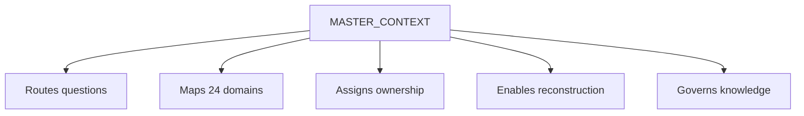

> **Diagram ID:** `DGM-MCR-001`
> **Explanation:** MASTER_CONTEXT performs four core functions: route, map, own, and govern.
> This is the cognitive operating system in one view.

> **Image Specification**
> - Image ID: `IMG-MCR-001`
> - Purpose: Hero concept of MASTER_CONTEXT as the cognitive operating system.
> - Prompt: "A central cognitive operating system hub labeled MASTER_CONTEXT with four radiating functions: route, map, own, govern, dark navy blueprint with gold neural connections."
> - Style: Hub-and-spoke, blueprint.
> - Composition: Central hub with four spokes.
> - Resolution: 2000x1400px
> - Priority: CRITICAL
> - Suggested Filename: `assets/diagrams/mcr-hero-cognitive-os.png`

## 1.2 What MASTER_CONTEXT Is NOT

Clarity about what MASTER_CONTEXT is **not** prevents category errors that corrupt the system.

| Misconception | Correction |
| :--- | :--- |
| It is a documentation index | It is a cognitive routing system |
| It stores all knowledge | It maps where knowledge lives |
| It replaces README | README is the front door; MCX is the brain |
| It is static | It is a living operating system |
| It is only for AI | It serves humans too |
| It is optional | It is the mandatory entry point |

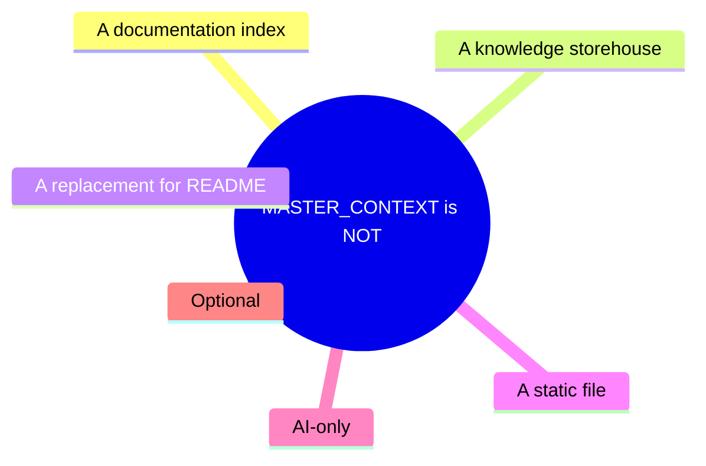

> **Diagram ID:** `DGM-MCR-002`
> **Explanation:** Six common misconceptions are explicitly rejected to keep the cognitive OS
> correctly understood and used.

> **Decision Criteria:** if someone treats MASTER_CONTEXT as documentation rather than as a
> routing system, that is a category error to be corrected.

## 1.3 Why MASTER_CONTEXT Exists

MASTER_CONTEXT exists to solve the **knowledge navigation problem**: in a large repository,
knowledge is scattered, ownership is ambiguous, and reconstruction is costly. MASTER_CONTEXT
eliminates that cost.

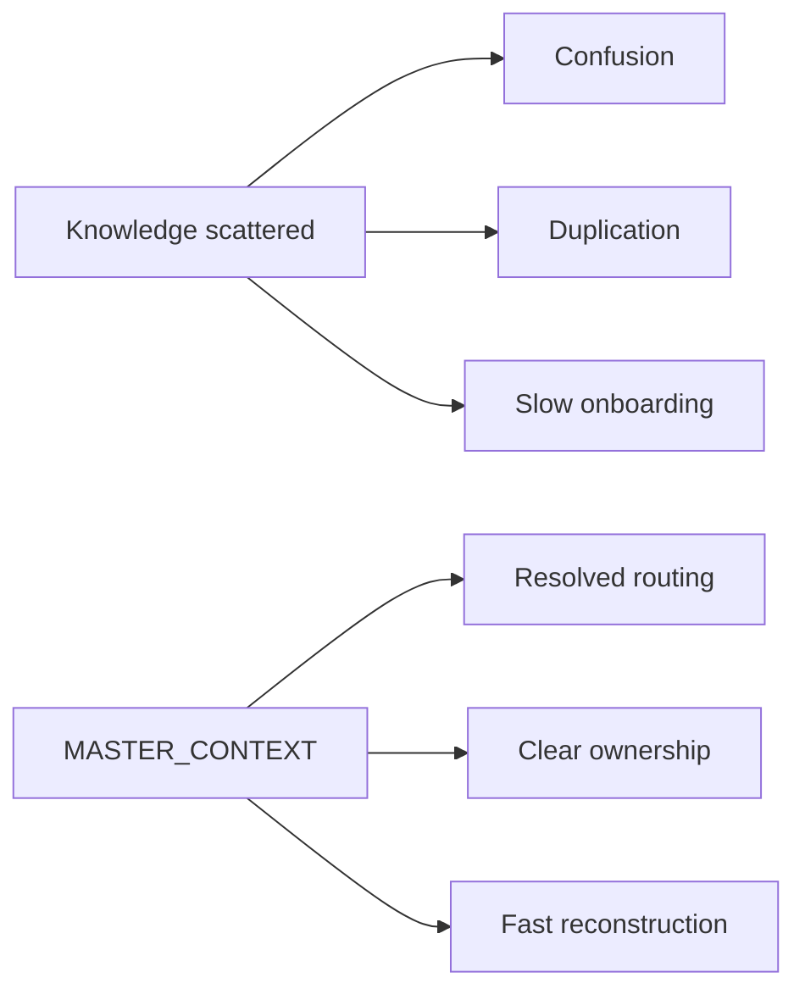

> **Diagram ID:** `DGM-MCR-003`
> **Explanation:** The problems of scattered knowledge are solved by MASTER_CONTEXT's routing,
> ownership, and reconstruction capabilities.

## 1.4 The Permanent Mission

The permanent mission of MASTER_CONTEXT is to **organize, route, and govern all knowledge of
Oship so that any agent or human can navigate, reconstruct, and extend the project
deterministically, forever.**

| Mission pillar | Commitment |
| :--- | :--- |
| **Organize** | Map all knowledge to domains |
| **Route** | Resolve any question to its source |
| **Govern** | Enforce ownership and standards |
| **Reconstruct** | Enable full mental-model rebuild |
| **Evolve** | Grow without entropy |

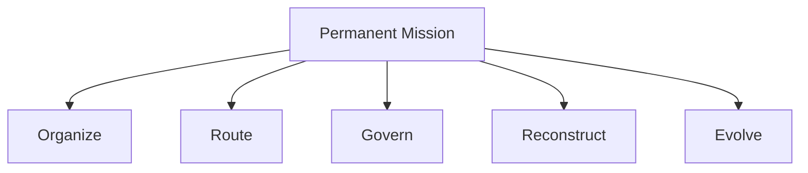

> **Diagram ID:** `DGM-MCR-004`
> **Explanation:** The permanent mission rests on five pillars that never expire.

> **Image Specification**
> - Image ID: `IMG-MCR-002`
> - Purpose: Visualize the five-pillar permanent mission of MASTER_CONTEXT.
> - Prompt: "A mission diagram with five pillars: organize, route, govern, reconstruct, evolve, dark navy blueprint style with gold pillars."
> - Style: Pillar diagram, blueprint.
> - Composition: Five vertical pillars.
> - Resolution: 1800x1200px
> - Priority: HIGH
> - Suggested Filename: `assets/diagrams/mcr-mission-pillars.png`

## 1.5 Relationship with README

README and MASTER_CONTEXT are complementary, never competing.

| Aspect | README | MASTER_CONTEXT |
| :--- | :--- | :--- |
| Role | Landing page | Cognitive brain |
| Depth | Shallow orientation | Deep routing |
| Audience | Everyone | Agents + builders |
| Updates | Rare | Continuous |
| Links to | MASTER_CONTEXT | Domains |

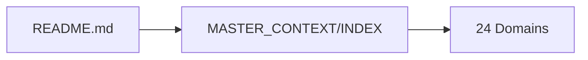

> **Diagram ID:** `DGM-MCR-005`
> **Explanation:** README is the front door; MASTER_CONTEXT is the brain behind it. README links
> to MASTER_CONTEXT, which routes to domains.

## 1.6 Relationship with .ai/

The `.ai/` control plane and MASTER_CONTEXT are the two halves of Oship's intelligence.

| Function | MASTER_CONTEXT | .ai control plane |
| :--- | :--- | :--- |
| Knows | What & where | How & rules |
| Routes | Knowledge | Tasks |
| Tracks | Completeness | Health & memory |
| Governs | Structure | Behavior |

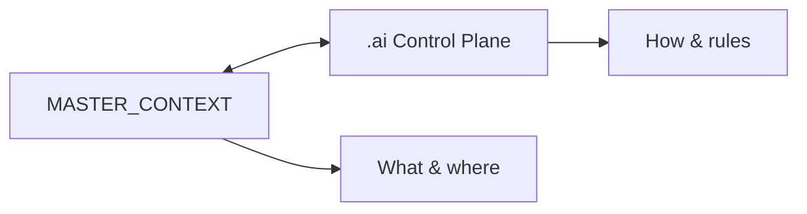

> **Diagram ID:** `DGM-MCR-006`
> **Explanation:** MASTER_CONTEXT maps knowledge; the control plane governs behavior. They
> synchronize continuously.

## 1.7 Relationship with Architecture

MASTER_CONTEXT maps the architecture; it does not replace it.

| Aspect | MASTER_CONTEXT | Architecture (04) |
| :--- | :--- | :--- |
| Role | Route to architecture | Define the design |
| Content | Indexes & routing | Blueprints & C4 |
| Authority | L1 constitutional | L2 blueprints |

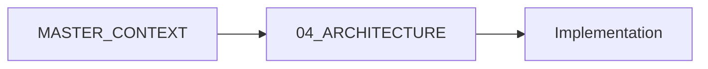

> **Diagram ID:** `DGM-MCR-007`
> **Explanation:** MASTER_CONTEXT routes to the architecture domain, which defines the design.

## 1.8 Relationship with Implementation

MASTER_CONTEXT maps implementation domains; it does not contain code.

| Aspect | MASTER_CONTEXT | Implementation |
| :--- | :--- | :--- |
| Role | Route to code | Hold the code |
| Content | Indexes | Apps, services |
| Phase | Always | Phase C+ |

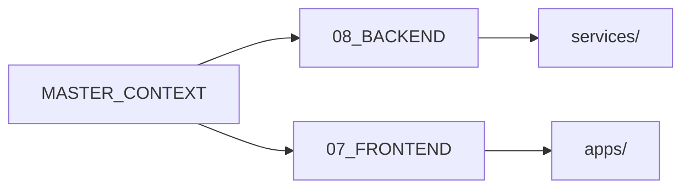

> **Diagram ID:** `DGM-MCR-008`
> **Explanation:** MASTER_CONTEXT routes to backend and frontend domains, which map to physical
> code locations.

## 1.9 Relationship with Operations

MASTER_CONTEXT routes to operational knowledge; it does not perform operations.

| Aspect | MASTER_CONTEXT | Operations (12) |
| :--- | :--- | :--- |
| Role | Route to ops | Run the system |
| Content | Indexes | Runbooks |
| Consumers | Agents | SREs |

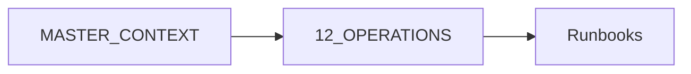

> **Diagram ID:** `DGM-MCR-009`
> **Explanation:** MASTER_CONTEXT routes to operational knowledge, which guides actual
> operations.

## 1.10 Constitution Summary

### TBL-MCR-001: Constitution Summary

| Article | Statement |
| :--- | :--- |
| **Art 1** | MASTER_CONTEXT is the cognitive OS |
| **Art 2** | It is not documentation |
| **Art 3** | It exists to solve knowledge navigation |
| **Art 4** | Its mission is organize, route, govern, reconstruct, evolve |
| **Art 5** | It complements README, .ai, architecture, implementation, operations |

> **Decision Criteria:** every rule in this document traces to these five constitutional
> articles. A rule that contradicts them is invalid.

### Common Mistakes

| Mistake | Correction |
| :--- | :--- |
| Treating MCX as a doc store | It maps, doesn't store |
| Skipping MCX routing | Routing is mandatory |
| Editing MCX without authority | Only architect edits cortex |
| Confusing MCX with README | Different roles |

### Best Practices

| Practice | Benefit |
| :--- | :--- |
| Route through MCX first | Context completeness |
| Keep README shallow | Correct role |
| Keep MCX authoritative | Trust |
| Sync with control plane | Consistency |

### AI Interpretation Notes

For AI agents: MASTER_CONTEXT is the routing cortex. When you read it, you are loading the
**map**, not the territory. Use it to route to domains, never as a substitute for domain
content.

---

# PART 02 — Knowledge Governance

## 2.1 Knowledge Ownership

Every piece of knowledge in Oship has exactly one owner. Ownership is explicit and
enforced.

| Ownership aspect | Rule |
| :--- | :--- |
| Single owner | Every domain has one owner |
| Responsibility | Owner maintains content |
| Authority | Owner approves changes |
| Accountability | Owner answers for quality |
| Transfer | Formal handover process |

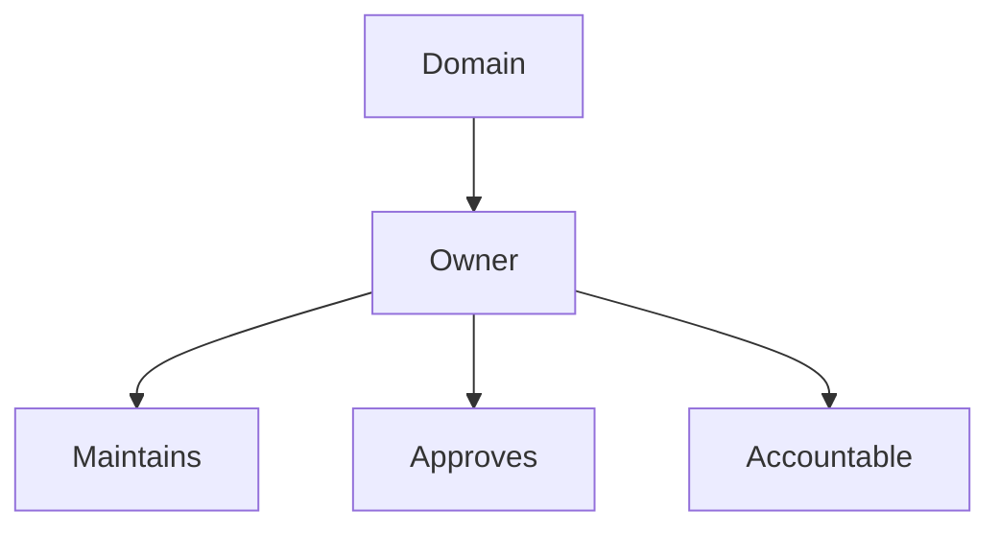

> **Diagram ID:** `DGM-MCR-010`
> **Explanation:** Each domain has a single owner who maintains, approves, and is accountable
> for its content.

### TBL-MCR-002: Domain Ownership Register

| Domain | Owner |
| :--- | :--- |
| 01 Product | Product Manager |
| 02 Business | Business Strategy |
| 03 Users | UX Research |
| 04 Architecture | Enterprise Architect |
| 05 AI | AI Architect |
| 06 Database | Data Architect |
| 07 Frontend | Frontend Lead |
| 08 Backend | Backend Lead |
| 09 Infrastructure | Platform Engineer |
| 10 Security | Security Architect |
| 11 Deployment | DevOps Lead |
| 12 Operations | SRE |
| 13 Observability | Observability Lead |
| 14 Design System | Design Lead |
| 15 API | API Lead |
| 16 Plugins | Platform Lead |
| 17 Automation | DevOps Lead |
| 18 Testing | QA Lead |
| 19 Roadmap | Program Manager |
| 20 Appendix | Technical Writing |
| 21 Research | Research Lead |
| 22 Decisions | Architecture Board |
| 23 Standards | Architecture Board |
| 24 Diagrams | Documentation Team |

## 2.2 Knowledge Lifecycle

Knowledge moves through a defined lifecycle.

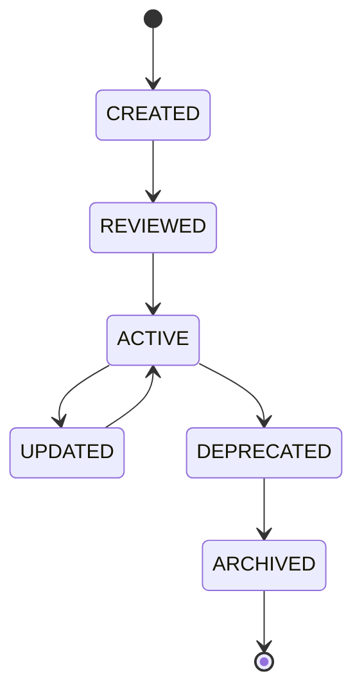

> **Diagram ID:** `DGM-MCR-011`
> **Explanation:** Knowledge progresses through created, reviewed, active, updated,
> deprecated, and archived states.

### TBL-MCR-003: Knowledge Lifecycle States

| State | Authority | Consumers may rely? |
| :--- | :--- | :---: |
| CREATED | Low | No |
| REVIEWED | Medium | No |
| ACTIVE | High | Yes |
| UPDATED | High | Yes |
| DEPRECATED | Medium | No (migrate) |
| ARCHIVED | Low | No |

## 2.3 Knowledge Authority

Authority determines how much a piece of knowledge is trusted and relied upon.

| Authority level | Domains | Reliance |
| :--- | :--- | :--- |
| **Constitutional** | 04, 05, 10, 15, 22, 23 | Highest |
| **Blueprint** | 01, 03, 14, 24 | High |
| **Interface** | 06, 15, 16 | High |
| **Configuration** | 07, 08, 09, 11, 12, 17, 18 | Medium |
| **Ephemeral** | 13, 20, 21 | Low |

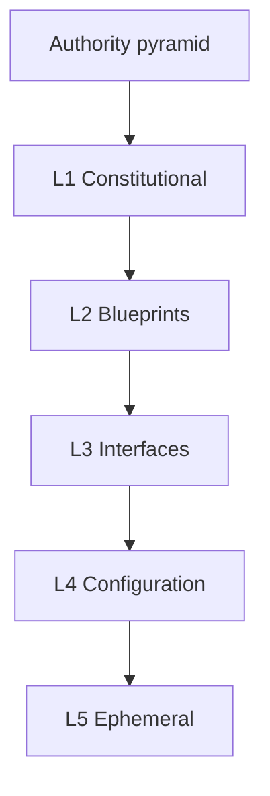

> **Diagram ID:** `DGM-MCR-012`
> **Explanation:** Authority descends from constitutional through ephemeral. Higher authority
> means higher trust and more governance.

## 2.4 Knowledge Hierarchy

Knowledge is hierarchically structured.

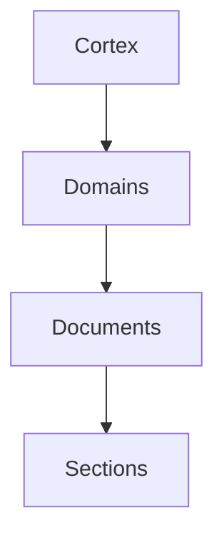

> **Diagram ID:** `DGM-MCR-013`
> **Explanation:** The hierarchy is cortex → domains → documents → sections.

### TBL-MCR-004: Knowledge Hierarchy

| Level | Example | Role |
| :--- | :--- | :--- |
| Cortex | MASTER_CONTEXT/INDEX | Global routing |
| Domain | 15_API/INDEX | Domain routing |
| Document | API_CONTRACTS | Knowledge leaf |
| Section | §3.2 | Detail |

## 2.5 Knowledge Inheritance

Knowledge inherits rules from its parent in the hierarchy.

| Inherited from | Inherited by |
| :--- | :--- |
| Cortex | Domains (routing, standards) |
| Domain | Documents (scope, owner) |
| Document | Sections (format) |
| Standards | All (metadata, quality) |

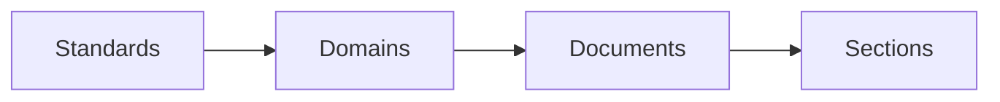

> **Diagram ID:** `DGM-MCR-014`
> **Explanation:** Knowledge inherits standards from its ancestors, ensuring consistency.

> **Decision Criteria:** a document inherits the standards of its domain; a domain inherits the
> standards of the cortex. Overriding inheritance requires explicit justification.

## 2.6 Knowledge Isolation

Domains are isolated to prevent cross-domain coupling.

| Isolation | Rule |
| :--- | :--- |
| Bounded context | Each domain self-contained |
| No direct coupling | Reference, don't reach in |
| Clear interface | Define how domains interact |
| Ownership | Owner controls content |

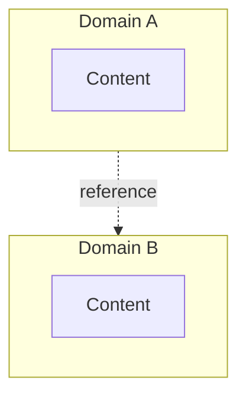

> **Diagram ID:** `DGM-MCR-015`
> **Explanation:** Domains are isolated; interaction happens through references, not direct
> coupling.

> **Image Specification**
> - Image ID: `IMG-MCR-003`
> - Purpose: Visualize knowledge isolation between bounded domains.
> - Prompt: "Two isolated domain boxes connected only by a reference arrow, showing bounded contexts, dark navy blueprint style."
> - Style: Bounded-context diagram, blueprint.
> - Composition: Two isolated boxes with reference edge.
> - Resolution: 1500x900px
> - Priority: HIGH
> - Suggested Filename: `assets/diagrams/mcr-knowledge-isolation.png`

## 2.7 Knowledge Synchronization

Knowledge across domains stays synchronized through defined mechanisms.

| Sync mechanism | Purpose |
| :--- | :--- |
| Cross-references | Point to authoritative source |
| Dependency tracking | Know upstream changes |
| Index updates | Keep routing current |
| Metrics | Detect drift |

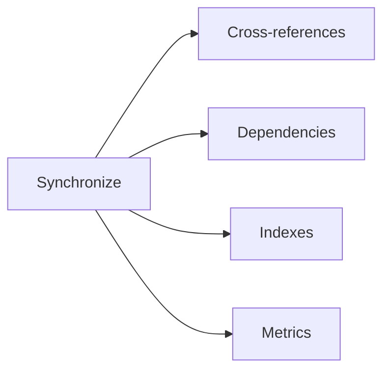

> **Diagram ID:** `DGM-MCR-016`
> **Explanation:** Synchronization uses cross-references, dependency tracking, index updates,
> and metrics.

## 2.8 Knowledge Validation

All knowledge is validated before acceptance.

| Validation | Check |
| :--- | :--- |
| Metadata | Header valid |
| Links | Resolve |
| Routing | Correct domain |
| DoD | Passes checklist |
| Consistency | No duplication |

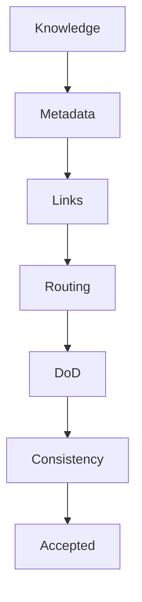

> **Diagram ID:** `DGM-MCR-017`
> **Explanation:** Knowledge passes through five validation gates before acceptance.

## 2.9 Governance Summary

### TBL-MCR-005: Governance Summary

| Governance area | Rule |
| :--- | :--- |
| Ownership | Single owner per domain |
| Lifecycle | Defined state machine |
| Authority | Layer-based trust |
| Hierarchy | Cortex→domain→doc |
| Inheritance | Inherit standards |
| Isolation | Bounded contexts |
| Synchronization | Cross-referenced |
| Validation | Five gates |

### Common Mistakes

| Mistake | Fix |
| :--- | :--- |
| No owner | Assign one |
| Duplication | Reference source |
| Direct coupling | Use references |
| Skipping validation | Run gates |

### Best Practices

| Practice | Benefit |
| :--- | :--- |
| Explicit ownership | Accountability |
| Bounded isolation | Maintainability |
| Continuous sync | Accuracy |
| Rigorous validation | Trust |

### AI Interpretation Notes

For AI agents: knowledge governance means you operate within an owned, isolated domain. You
inherit standards, must not cross-couple, and must validate before accepting knowledge.

---

# PART 03 — MASTER_CONTEXT Architecture

## 3.1 The Layered Architecture

MASTER_CONTEXT has a six-layer architecture: Knowledge, Routing, Decision, Execution,
Evolution, and Memory layers.

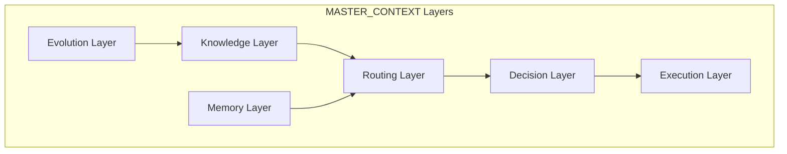

> **Diagram ID:** `DGM-MCR-018`
> **Explanation:** Six layers cooperate: knowledge, routing, decision, execution, evolution,
> and memory.

> **Image Specification**
> - Image ID: `IMG-MCR-004`
> - Purpose: Visualize the six-layer MASTER_CONTEXT architecture.
> - Prompt: "A six-layer architecture stack: knowledge, routing, decision, execution, evolution, memory, dark navy blueprint style with gold layer boundaries."
> - Style: Layered stack, blueprint.
> - Composition: Six stacked layers.
> - Resolution: 1600x1400px
> - Priority: CRITICAL
> - Suggested Filename: `assets/diagrams/mcr-six-layers.png`

## 3.2 Knowledge Layer

The Knowledge Layer holds the structure of what is known.

| Function | Detail |
| :--- | :--- |
| Domains | 24 bounded areas |
| Documents | Content leaves |
| Indexes | Routing entry points |
| Standards | Governance |

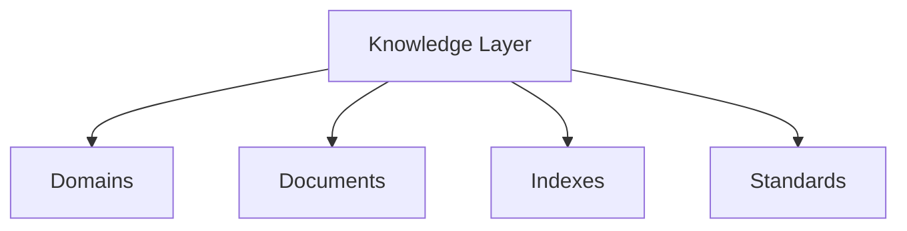

> **Diagram ID:** `DGM-MCR-019`
> **Explanation:** The Knowledge Layer comprises domains, documents, indexes, and standards.

## 3.3 Routing Layer

The Routing Layer resolves queries to domains.

| Function | Detail |
| :--- | :--- |
| Parse | Extract intent |
| Resolve | Determine domain |
| Mount | Load context |
| Bound | ≤2 hops |

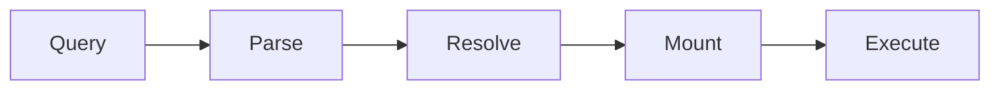

> **Diagram ID:** `DGM-MCR-020`
> **Explanation:** The Routing Layer executes parse → resolve → mount → execute.

## 3.4 Decision Layer

The Decision Layer governs how knowledge is decided and recorded.

| Function | Detail |
| :--- | :--- |
| Classify | Decision type |
| Search | Precedent |
| Assess | Trade-offs |
| Record | ADR/log |

```mermaid
flowchart TD
    D[Decision] --> C[Classify]
    C --> S[Search precedent]
    S --> A[Assess trade-offs]
    A --> R[Record]
```

> **Diagram ID:** `DGM-MCR-021`
> **Explanation:** The Decision Layer classifies, searches, assesses, and records decisions.

## 3.5 Execution Layer

The Execution Layer translates decisions into action.

| Function | Detail |
| :--- | :--- |
| Plan | Sequence steps |
| Act | Implement |
| Validate | Check quality |
| Handoff | Transfer |

```mermaid
flowchart LR
    PL[Plan] --> AC[Act]
    AC --> VA[Validate]
    VA --> HA[Handoff]
```

> **Diagram ID:** `DGM-MCR-022`
> **Explanation:** The Execution Layer plans, acts, validates, and hands off.

## 3.6 Evolution Layer

The Evolution Layer drives change and growth.

| Function | Detail |
| :--- | :--- |
| Version | SemVer |
| Review | Assess |
| Refactor | Restructure |
| Evolve | Grow |

```mermaid
flowchart LR
    EV[Evolution] --> VER[Version]
    EV --> REV[Review]
    EV --> REF[Refactor]
    EV --> GROW[Grow]
```

> **Diagram ID:** `DGM-MCR-023`
> **Explanation:** The Evolution Layer versions, reviews, refactors, and grows knowledge.

## 3.7 Memory Layer

The Memory Layer persists what is known and learned.

| Function | Detail |
| :--- | :--- |
| Persist | Store knowledge |
| Recall | Retrieve |
| Forget | Retire |
| Sync | Stay current |

```mermaid
flowchart LR
    MEM[Memory] --> PER[Persist]
    MEM --> REC[Recall]
    MEM --> FOR[Forget]
    MEM --> SYNC[Sync]
```

> **Diagram ID:** `DGM-MCR-024`
> **Explanation:** The Memory Layer persists, recalls, forgets, and syncs knowledge.

## 3.8 Layer Interactions

### TBL-MCR-006: Layer Interaction Matrix

| From \ To | Knowledge | Routing | Decision | Execution | Evolution | Memory |
| :--- | :---: | :---: | :---: | :---: | :---: | :---: |
| Knowledge | — | feeds | feeds | feeds | informs | feeds |
| Routing | uses | — | uses | triggers | — | uses |
| Decision | uses | — | — | guides | records | records |
| Execution | — | — | consumes | — | — | logs |
| Evolution | updates | updates | — | — | — | syncs |
| Memory | stores | stores | stores | stores | stores | — |

## 3.9 Architecture Summary

### TBL-MCR-007: Layer Responsibilities

| Layer | Responsibility | Key artifact |
| :--- | :--- | :--- |
| Knowledge | Structure | Domains, docs |
| Routing | Resolve queries | Routing matrix |
| Decision | Govern choices | ADR |
| Execution | Act | Changes |
| Evolution | Grow | Versions |
| Memory | Persist | Indexes |

### Common Mistakes

| Mistake | Fix |
| :--- | :--- |
| Mixing layers | Keep separation |
| Skipping routing | Route first |
| Unrecorded decisions | Log them |
| Stale memory | Sync |

### Best Practices

| Practice | Benefit |
| :--- | :--- |
| Layer separation | Maintainability |
| Route-first | Context |
| Decision traceability | Trust |
| Memory currency | Accuracy |

### AI Interpretation Notes

For AI agents: think of MASTER_CONTEXT as a six-layer stack. Your task flows through routing,
decision, and execution layers while being grounded in the knowledge and memory layers.

---

> **Image Specification**
> - Image ID: `IMG-MCR-005`
> - Purpose: Visualize the complete MASTER_CONTEXT six-layer stack with interactions.
> - Prompt: "A comprehensive six-layer stack diagram with knowledge, routing, decision, execution, evolution, and memory layers connected by arrows, navy and gold blueprint style."
> - Style: Layered architecture, blueprint.
> - Composition: Six stacked layers with interaction arrows.
> - Resolution: 2000x1600px
> - Priority: CRITICAL
> - Suggested Filename: `assets/diagrams/mcr-layer-architecture.png`

---

# PART 04 — Domain Registration Rules

## 4.1 Introduction to Domain Registration

A **domain** is a bounded knowledge area (01–24). New domains are created through a strict
registration process to prevent knowledge fragmentation and entropy.

| Registration aspect | Rule |
| :--- | :--- |
| Trigger | New knowledge area identified |
| Authority | Architecture Board approval |
| Process | Full workflow (below) |
| Uniqueness | Must not duplicate existing domain |
| Registration | Cortex + INDEX update |

```mermaid
flowchart TD
    NEW[New knowledge area] --> NAM[Name it]
    NAM --> FOLD[Create folder]
    FOLD --> DOC[Author INDEX]
    DOC --> DEP[Define dependencies]
    DEP --> ROUTE[Add routing]
    ROUTE --> VAL[Validate]
    VAL --> ACT[Activate]
```

> **Diagram ID:** `DGM-MCR-025`
> **Explanation:** Domain registration follows a nine-step workflow from identification to
> activation.

> **Image Specification**
> - Image ID: `IMG-MCR-006`
> - Purpose: Visualize the domain registration workflow.
> - Prompt: "A nine-step domain registration workflow from identifying a knowledge area to activation, dark navy blueprint style with gold steps."
> - Style: Workflow flowchart, blueprint.
> - Composition: Nine-step pipeline.
> - Resolution: 2000x1200px
> - Priority: CRITICAL
> - Suggested Filename: `assets/diagrams/mcr-domain-registration.png`

## 4.2 Naming Rules

Domain names follow strict conventions.

### TBL-MCR-008: Naming Rules

| Rule | Convention | Example |
| :--- | :--- | :--- |
| Prefix | Two-digit number | `15` |
| Name | UPPER_SNAKE | `API` |
| Suffix | Domain suffix | `_API` |
| Folder | `NN_NAME/` | `15_API/` |
| Unique | No duplicates | — |

```mermaid
flowchart LR
    N[Name] --> P[2-digit prefix]
    N --> S[UPPER_SNAKE]
    N --> F[Folder NN_NAME]
```

> **Diagram ID:** `DGM-MCR-026`
> **Explanation:** Domain names combine a numeric prefix, UPPER_SNAKE name, and folder suffix.

> **Decision Criteria:** a domain name is valid only if it has a unique two-digit prefix, an
> UPPER_SNAKE name, and matches the folder convention. Any deviation is rejected.

## 4.3 Folder Structure Rules

Each domain folder follows a mandatory structure.

| Element | Requirement |
| :--- | :--- |
| `INDEX.md` | Mandatory entry point |
| Content docs | As defined |
| `.gitkeep` | If empty (Phase 0) |
| Naming | Consistent |

```mermaid
flowchart TD
    F[Domain folder] --> IDX[INDEX.md]
    F --> CONTENT[Content docs]
    F --> KEEP[.gitkeep if empty]
```

> **Diagram ID:** `DGM-MCR-027`
> **Explanation:** Each domain folder contains an INDEX, content docs, and a .gitkeep when
> empty.

## 4.4 Required Documents

Every domain must have required documents.

### TBL-MCR-009: Required Domain Documents

| Document | Mandatory | Purpose |
| :--- | :---: | :--- |
| `INDEX.md` | ✅ | Routing entry point |
| Overview | ✅ | Domain purpose |
| (Content docs) | As planned | Domain detail |

```mermaid
flowchart TD
    REQ[Required] --> IDX[INDEX.md]
    REQ --> OV[Overview]
    REQ --> CONTENT[Content]
```

> **Diagram ID:** `DGM-MCR-028`
> **Explanation:** Required documents establish the domain's routing, overview, and content.

## 4.5 Dependencies Rules

Dependencies define what a domain needs from upstream.

| Dependency | Rule |
| :--- | :--- |
| Declared | In INDEX |
| Acyclic | No circular deps |
| Justified | Rationale recorded |
| Registered | In dependency matrix |

```mermaid
flowchart TD
    DEP[Domain] --> UP[Upstream domains]
    DEP --> DN[Downstream domains]
```

> **Diagram ID:** `DGM-MCR-029`
> **Explanation:** Domains have declared, acyclic dependencies to upstream and downstream.

> **Decision Criteria:** circular dependencies are prohibited. If adding a dependency would
> create a cycle, the design must change.

## 4.6 Context Routing Rules

Each new domain must be added to routing.

| Routing | Rule |
| :--- | :--- |
| Intent mapping | Add keywords |
| Priority | Set AI priority |
| Index update | Register in cortex |
| Router update | Update CONTEXT_ROUTER |

```mermaid
flowchart LR
    NEW[New domain] --> INT[Map intents]
    INT --> PRI[Set priority]
    PRI --> IDX[Register in cortex]
    IDX --> RT[Update router]
```

> **Diagram ID:** `DGM-MCR-030`
> **Explanation:** A new domain is integrated into routing by mapping intents, setting priority,
> registering in the cortex, and updating the router.

## 4.7 Validation Rules

Before activation, a new domain must be validated.

### TBL-MCR-010: Domain Validation Gates

| Gate | Check |
| :--- | :--- |
| Metadata | INDEX header valid |
| Links | All resolve |
| Dependencies | Acyclic |
| Routing | Intents mapped |
| Ownership | Owner assigned |
| Standards | Conformant |

```mermaid
flowchart TD
    V[Validate] --> M[Meta]
    M --> L[Links]
    L --> D[Deps]
    D --> R[Routing]
    R --> O[Owner]
    O --> S[Standards]
    S --> PASS[Pass]
```

> **Diagram ID:** `DGM-MCR-031`
> **Explanation:** A domain passes through six validation gates before activation.

## 4.8 Activation

Activation makes a domain official.

| Activation | Rule |
| :--- | :--- |
| Approved | By Architecture Board |
| Registered | In cortex |
| Routable | In router |
| Announced | In evolution ledger |

```mermaid
flowchart LR
    AP[Approved] --> REG[Registered]
    REG --> ROUT[Routable]
    ROUT --> ANN[Announced]
```

> **Diagram ID:** `DGM-MCR-032`
> **Explanation:** Activation requires approval, registration, routability, and announcement.

## 4.9 Deprecation

A domain can be deprecated when obsolete.

| Deprecation | Rule |
| :--- | :--- |
| Trigger | Domain obsolete |
| Mark | Status = DEPRECATED |
| Replace | Link replacement |
| Grace | Migration window |
| Review | Board approval |

```mermaid
flowchart LR
    OB[Obsolete] --> MARK[Mark deprecated]
    MARK --> REP[Link replacement]
    REP --> GRACE[Migration window]
    GRACE --> RET[Retire]
```

> **Diagram ID:** `DGM-MCR-033`
> **Explanation:** Deprecation marks a domain obsolete, links replacements, provides a grace
> window, then retires it.

## 4.10 Merge

Two domains may be merged.

| Merge | Rule |
| :--- | :--- |
| Trigger | Overlapping scope |
| Target | Single merged domain |
| Content | Consolidated |
| Routing | Updated |
| Approval | Board |

```mermaid
flowchart LR
    D1[Domain A] --> M[Merge]
    D2[Domain B] --> M
    M --> NM[New Domain]
```

> **Diagram ID:** `DGM-MCR-034`
> **Explanation:** Two domains merge into a single new domain with consolidated content.

> **Image Specification**
> - Image ID: `IMG-MCR-007`
> - Purpose: Visualize domain merge and split operations.
> - Prompt: "A domain merge diagram showing two domains flowing into one, and a split showing one flowing into two, dark navy blueprint style."
> - Style: Merge/split diagram, blueprint.
> - Composition: Merge and split flows.
> - Resolution: 1600x1000px
> - Priority: HIGH
> - Suggested Filename: `assets/diagrams/mcr-domain-merge-split.png`

## 4.11 Split

A domain may be split into two.

| Split | Rule |
| :--- | :--- |
| Trigger | Scope too broad |
| Target | Two focused domains |
| Content | Partitioned |
| Routing | Updated |
| Approval | Board |

```mermaid
flowchart LR
    D[Domain] --> S[Split]
    S --> N1[Domain 1]
    S --> N2[Domain 2]
```

> **Diagram ID:** `DGM-MCR-035`
> **Explanation:** A domain splits into two focused domains with partitioned content.

## 4.12 Archive

A domain may be archived.

| Archive | Rule |
| :--- | :--- |
| Trigger | Fully retired |
| Move | To archive |
| Read-only | No edits |
| Traceable | History kept |

```mermaid
flowchart LR
    RET[Retired] --> MOVE[Move to archive]
    MOVE --> RO[Read-only]
    RO --> TRACE[History kept]
```

> **Diagram ID:** `DGM-MCR-036`
> **Explanation:** Archiving moves a retired domain to read-only archive, preserving history.

## 4.13 Full Registration Workflow

### TBL-MCR-011: Full Workflow Summary

| Step | Action | Authority |
| :---: | :--- | :--- |
| 1 | Identify knowledge area | Any |
| 2 | Propose domain | Owner |
| 3 | Name it | Owner |
| 4 | Create folder + INDEX | Owner |
| 5 | Define dependencies | Owner |
| 6 | Add routing | AI Architect |
| 7 | Validate | QA |
| 8 | Approve | Board |
| 9 | Activate | Board |
| 10 | Register + announce | Architect |

```mermaid
flowchart TD
    subgraph PRE[Pre-registration]
        P1[Identify] --> P2[Propose] --> P3[Name]
    end
    subgraph BUILD[Build]
        B1[Folder+INDEX] --> B2[Dependencies] --> B3[Routing]
    end
    subgraph POST[Post-registration]
        O1[Validate] --> O2[Approve] --> O3[Activate] --> O4[Register]
    end
    PRE --> BUILD --> POST
```

> **Diagram ID:** `DGM-MCR-037`
> **Explanation:** The full workflow splits into pre-registration, build, and post-registration
> phases.

## 4.14 Common Mistakes

| Mistake | Fix |
| :--- | :--- |
| Duplicate domain | Check uniqueness |
| Wrong naming | Apply convention |
| Missing INDEX | Author it |
| Circular deps | Redesign |
| No owner | Assign one |
| Skipping validation | Run gates |

## 4.15 Best Practices

| Practice | Benefit |
| :--- | :--- |
| Register early | Avoid orphan knowledge |
| Validate thoroughly | Quality |
| Document rationale | Traceability |
| Update routing | Navigability |
| Announce changes | Awareness |

## 4.16 AI Interpretation Notes

For AI agents: creating a domain is a governed, high-authority act. Never create a domain
unilaterally. Propose it, and wait for validation and approval. Never skip the registration
process.

---

# PART 05 — Knowledge Object Specification

## 5.1 Introduction to Knowledge Objects

A **knowledge object** is a distinct documentation artifact with a defined purpose, owner,
inputs, outputs, dependencies, lifecycle, and AI priority. This part specifies every object
type.

| Object attribute | Definition |
| :--- | :--- |
| Purpose | Why it exists |
| Owner | Who maintains it |
| Inputs | What it consumes |
| Outputs | What it produces |
| Dependencies | What it needs |
| Lifecycle | Its states |
| AI Priority | Its AI importance |

```mermaid
flowchart TD
    OBJ[Knowledge object] --> P[Purpose]
    OBJ --> O[Owner]
    OBJ --> IN[Inputs]
    OBJ --> OUT[Outputs]
    OBJ --> DEP[Dependencies]
    OBJ --> LC[Lifecycle]
    OBJ --> AP[AI Priority]
```

> **Diagram ID:** `DGM-MCR-038`
> **Explanation:** Every knowledge object is defined by seven attributes.

> **Image Specification**
> - Image ID: `IMG-MCR-008`
> - Purpose: Visualize the seven-attribute knowledge object definition.
> - Prompt: "A knowledge object node with seven labeled attributes: purpose, owner, inputs, outputs, dependencies, lifecycle, AI priority, dark navy blueprint style."
> - Style: Hub-spoke, blueprint.
> - Composition: Central node with seven spokes.
> - Resolution: 1800x1200px
> - Priority: HIGH
> - Suggested Filename: `assets/diagrams/mcr-knowledge-object.png`

## 5.2 Object: Overview

| Attribute | Value |
| :--- | :--- |
| Purpose | High-level summary |
| Owner | Domain owner |
| Inputs | Domain knowledge |
| Outputs | Orientation |
| Dependencies | Domain INDEX |
| Lifecycle | Standard |
| AI Priority | HIGH |

```mermaid
flowchart LR
    OV[Overview] --> PUR[Summarize]
    OV --> ORI[Orient reader]
```

> **Diagram ID:** `DGM-MCR-039`
> **Explanation:** An overview summarizes and orients the reader to a domain.

## 5.3 Object: Specification

| Attribute | Value |
| :--- | :--- |
| Purpose | Precise contract |
| Owner | Technical lead |
| Inputs | Requirements |
| Outputs | Exact spec |
| Dependencies | Standards |
| Lifecycle | Versioned |
| AI Priority | CRITICAL |

```mermaid
flowchart LR
    SPEC[Specification] --> REQ[Requirements]
    SPEC --> EXACT[Exact contract]
```

> **Diagram ID:** `DGM-MCR-040`
> **Explanation:** A specification converts requirements into an exact contract.

## 5.4 Object: ADR

| Attribute | Value |
| :--- | :--- |
| Purpose | Record a decision |
| Owner | Architecture Board |
| Inputs | Context, alternatives |
| Outputs | Decision record |
| Dependencies | 22_DECISIONS |
| Lifecycle | Versioned |
| AI Priority | HIGH |

```mermaid
flowchart LR
    ADR[ADR] --> CTX[Context]
    ADR --> ALT[Alternatives]
    ADR --> DEC[Decision]
```

> **Diagram ID:** `DGM-MCR-041`
> **Explanation:** An ADR records context, alternatives, and the decision.

## 5.5 Object: Diagram

| Attribute | Value |
| :--- | :--- |
| Purpose | Visual knowledge |
| Owner | Documentation Team |
| Inputs | Content to visualize |
| Outputs | Diagram asset |
| Dependencies | 24_DIAGRAMS |
| Lifecycle | Standard |
| AI Priority | HIGH |

```mermaid
flowchart LR
    DIAG[Diagram] --> ID[ID]
    DIAG --> SPEC[Image spec]
    DIAG --> ASSET[Asset]
```

> **Diagram ID:** `DGM-MCR-042`
> **Explanation:** A diagram has an ID, image specification, and asset.

## 5.6 Object: Glossary

| Attribute | Value |
| :--- | :--- |
| Purpose | Define terms |
| Owner | Technical Writing |
| Inputs | Terms |
| Outputs | Definitions |
| Dependencies | 20_APPENDIX |
| Lifecycle | Standard |
| AI Priority | MEDIUM |

```mermaid
flowchart LR
    GL[Glossary] --> TERM[Terms]
    GL --> DEF[Definitions]
```

> **Diagram ID:** `DGM-MCR-043`
> **Explanation:** A glossary defines terms.

## 5.7 Object: Architecture

| Attribute | Value |
| :--- | :--- |
| Purpose | Define design |
| Owner | Enterprise Architect |
| Inputs | Requirements |
| Outputs | Blueprint |
| Dependencies | 04_ARCHITECTURE |
| Lifecycle | Versioned |
| AI Priority | CRITICAL |

```mermaid
flowchart LR
    ARCH[Architecture] --> REQ[Requirements]
    ARCH --> BP[Blueprint]
```

> **Diagram ID:** `DGM-MCR-044`
> **Explanation:** Architecture converts requirements into a blueprint.

## 5.8 Object: Runbook

| Attribute | Value |
| :--- | :--- |
| Purpose | Operational procedure |
| Owner | SRE |
| Inputs | Ops knowledge |
| Outputs | Procedure |
| Dependencies | 12_OPERATIONS |
| Lifecycle | Standard |
| AI Priority | HIGH |

```mermaid
flowchart LR
    RB[Runbook] --> PROC[Procedure]
    RB --> REC[Recovery]
```

> **Diagram ID:** `DGM-MCR-045`
> **Explanation:** A runbook defines operational procedures and recovery.

## 5.9 Object: Research

| Attribute | Value |
| :--- | :--- |
| Purpose | Explore knowledge |
| Owner | Research Lead |
| Inputs | Question |
| Outputs | Findings |
| Dependencies | 21_RESEARCH |
| Lifecycle | Ephemeral |
| AI Priority | MEDIUM |

```mermaid
flowchart LR
    RES[Research] --> Q[Question]
    RES --> FIND[Findings]
```

> **Diagram ID:** `DGM-MCR-046`
> **Explanation:** Research explores a question and produces findings.

## 5.10 Object: Decision

| Attribute | Value |
| :--- | :--- |
| Purpose | Record choice |
| Owner | Architecture Board |
| Inputs | Options |
| Outputs | Decision |
| Dependencies | 22_DECISIONS |
| Lifecycle | Versioned |
| AI Priority | HIGH |

```mermaid
flowchart LR
    DEC[Decision] --> OPT[Options]
    DEC --> CHOICE[Choice]
```

> **Diagram ID:** `DGM-MCR-047`
> **Explanation:** A decision records a choice among options.

## 5.11 Object: Checklist

| Attribute | Value |
| :--- | :--- |
| Purpose | Verify compliance |
| Owner | Technical Writing |
| Inputs | Requirements |
| Outputs | Checklist |
| Dependencies | 20_APPENDIX |
| Lifecycle | Standard |
| AI Priority | MEDIUM |

```mermaid
flowchart LR
    CL[Checklist] --> REQ[Requirements]
    CL --> CHECK[Checklist items]
```

> **Diagram ID:** `DGM-MCR-048`
> **Explanation:** A checklist converts requirements into verification items.

## 5.12 Object: Workflow

| Attribute | Value |
| :--- | :--- |
| Purpose | Define a process |
| Owner | Process owner |
| Inputs | Steps |
| Outputs | Workflow |
| Dependencies | 17_AUTOMATION |
| Lifecycle | Standard |
| AI Priority | HIGH |

```mermaid
flowchart LR
    WF[Workflow] --> STEPS[Steps]
    WF --> FLOW[Flow]
```

> **Diagram ID:** `DGM-MCR-049`
> **Explanation:** A workflow defines steps and flow.

## 5.13 Object: Reference

| Attribute | Value |
| :--- | :--- |
| Purpose | Provide lookup |
| Owner | Technical Writing |
| Inputs | Data |
| Outputs | Reference |
| Dependencies | 20_APPENDIX |
| Lifecycle | Standard |
| AI Priority | LOW |

```mermaid
flowchart LR
    REF[Reference] --> DATA[Data]
    REF --> LOOKUP[Lookup]
```

> **Diagram ID:** `DGM-MCR-050`
> **Explanation:** A reference provides data lookup.

## 5.14 Knowledge Object Summary

### TBL-MCR-012: Knowledge Object Register

| Object | Purpose | Owner | AI Priority |
| :--- | :--- | :--- | :---: |
| Overview | Summarize | Domain owner | HIGH |
| Specification | Contract | Tech lead | CRITICAL |
| ADR | Decision | Architecture Board | HIGH |
| Diagram | Visual | Documentation | HIGH |
| Glossary | Terms | Technical Writing | MEDIUM |
| Architecture | Blueprint | Architect | CRITICAL |
| Runbook | Procedure | SRE | HIGH |
| Research | Explore | Research Lead | MEDIUM |
| Decision | Choice | Architecture Board | HIGH |
| Checklist | Verify | Technical Writing | MEDIUM |
| Workflow | Process | Process owner | HIGH |
| Reference | Lookup | Technical Writing | LOW |

### Common Mistakes

| Mistake | Fix |
| :--- | :--- |
| Wrong object type | Classify correctly |
| Missing owner | Assign |
| Unclear purpose | Define |
| Undefined lifecycle | Set state |

### Best Practices

| Practice | Benefit |
| :--- | :--- |
| Clear classification | Correct structure |
| Explicit ownership | Accountability |
| Defined lifecycle | Governance |
| AI priority | Routing |

### AI Interpretation Notes

For AI agents: know which object type you are producing. Each has a defined contract. Match
the object to its specification.

---

# PART 06 — Context Routing Rules

## 6.1 The Routing Pipeline

Routing is deterministic: Question → Intent → Knowledge Layer → Domain → Documents →
Architecture → Implementation → Validation.

```mermaid
flowchart TD
    Q[Question] --> I[Intent]
    I --> KL[Knowledge Layer]
    KL --> D[Domain]
    D --> DOC[Documents]
    DOC --> ARCH[Architecture]
    ARCH --> IMP[Implementation]
    IMP --> VAL[Validation]
```

> **Diagram ID:** `DGM-MCR-051`
> **Explanation:** The routing pipeline is a fixed sequence from question to validation.

> **Image Specification**
> - Image ID: `IMG-MCR-009`
> - Purpose: Visualize the full context routing pipeline.
> - Prompt: "An eight-stage routing pipeline from question through intent, knowledge layer, domain, documents, architecture, implementation, to validation, purple and navy blueprint style."
> - Style: Pipeline flowchart, blueprint.
> - Composition: Eight-stage left-to-right pipeline.
> - Resolution: 2400x900px
> - Priority: CRITICAL
> - Suggested Filename: `assets/diagrams/mcr-routing-pipeline.png`

## 6.2 Routing Determinism

Routing must be deterministic: the same question always routes the same way.

| Determinism rule | Requirement |
| :--- | :--- |
| Stable keywords | Same match |
| Ordered steps | Same path |
| Bounded hops | ≤2 |
| Priority | Same order |
| No guessing | Deterministic resolution |

```mermaid
flowchart LR
    DET[Determinism] --> KW[Stable keywords]
    DET --> ORDER[Ordered steps]
    DET --> HOPS[Bounded hops]
    DET --> PRI[Priority]
    DET --> NOG[No guessing]
```

> **Diagram ID:** `DGM-MCR-052`
> **Explanation:** Determinism is guaranteed by stable keywords, ordered steps, bounded hops,
> priority, and no guessing.

## 6.3 Intent Classification

The first routing step classifies intent.

### TBL-MCR-013: Intent Classes

| Intent class | Examples |
| :--- | :--- |
| **Query** | "Where is X?" |
| **Build** | "Add a feature" |
| **Decide** | "Which approach?" |
| **Fix** | "Resolve a bug" |
| **Learn** | "How does Y work?" |
| **Govern** | "Update a rule" |

```mermaid
flowchart TD
    INT[Intent] --> QUERY[Query]
    INT --> BUILD[Build]
    INT --> DECIDE[Decide]
    INT --> FIX[Fix]
    INT --> LEARN[Learn]
    INT --> GOV[Govern]
```

> **Diagram ID:** `DGM-MCR-053`
> **Explanation:** Intent is classified into six classes that drive routing.

## 6.4 Knowledge Layer Selection

Intent maps to a knowledge layer.

### TBL-MCR-014: Intent-to-Layer Mapping

| Intent | Knowledge layer |
| :--- | :--- |
| Strategy | L1 Constitutional |
| Design | L2 Blueprints |
| Contract | L3 Interfaces |
| Build | L4 Configuration |
| Reference | L5 Ephemeral |

```mermaid
flowchart TD
    I[Intent] --> L1[L1 Strategy]
    I --> L2[L2 Design]
    I --> L3[L3 Contract]
    I --> L4[L4 Build]
    I --> L5[L5 Reference]
```

> **Diagram ID:** `DGM-MCR-054`
> **Explanation:** Intent selects the governing knowledge layer.

## 6.5 The Routing Matrix

### TBL-MCR-015: Core Routing Matrix

| Intent | Layer | Domain |
| :--- | :--- | :--- |
| Product vision | L1 | 01 |
| Business value | L1 | 02 |
| User needs | L2 | 03 |
| System design | L2 | 04 |
| AI operations | L1/L2 | 05 |
| Data model | L3 | 06 |
| Client UI | L4 | 07 |
| Server logic | L4 | 08 |
| Platform | L4 | 09 |
| Security | L2 | 10 |
| Deployment | L4 | 11 |
| Operations | L4 | 12 |
| Telemetry | L4/L5 | 13 |
| Design | L2 | 14 |
| API | L3 | 15 |
| Plugins | L3/L4 | 16 |
| Automation | L4 | 17 |
| Testing | L4 | 18 |
| Roadmap | L1/L5 | 19 |
| Reference | L5 | 20 |
| Research | L5 | 21 |
| Decisions | L2 | 22 |
| Standards | L1 | 23 |
| Diagrams | L2 | 24 |

## 6.6 Domain-to-Document Routing

### TBL-MCR-016: Domain-to-Document Routing

| Domain | Documents |
| :--- | :--- |
| 01 | PRODUCT_VISION, VALUE_PROPOSITION, PRODUCT_STRATEGY, FEATURE_REGISTRY |
| 02 | BUSINESS_MODEL, VALUE_STREAMS, BUSINESS_METRICS, STAKEHOLDERS |
| 03 | PERSONAS, USER_JOURNEYS, JOBS_TO_BE_DONE, RESEARCH_INSIGHTS |
| 04 | SYSTEM_ARCHITECTURE, BOUNDED_CONTEXTS, C4_MODEL, TECHNOLOGY_STACK |
| 05 | AI_ONBOARDING, AI_ROUTING, AI_GOVERNANCE, AI_METRICS |
| 06 | DATA_MODEL, SCHEMA_REGISTRY, MIGRATIONS, DATA_GOVERNANCE |
| 07 | FRONTEND_ARCHITECTURE, STATE_MANAGEMENT, COMPONENTS, PERFORMANCE |
| 08 | BACKEND_ARCHITECTURE, SERVICE_BOUNDARIES, BUSINESS_LOGIC, INTEGRATIONS |
| 09 | INFRA_ARCH, ENVIRONMENTS, IAAS_MANIFESTS, NETWORKING |
| 10 | THREAT_MODEL, SECURITY_ARCHITECTURE, IDENTITY_AUTH, COMPLIANCE |
| 11 | RELEASE_STRATEGY, CI_CD_PIPELINE, ENV_PROMOTION, ROLLBACK |
| 12 | RUNBOOKS, INCIDENT_MGMT, ONCALL, CAPACITY |
| 13 | TELEMETRY, DASHBOARDS, ALERTING, SLOS |
| 14 | TOKENS, BRAND, COMPONENTS, ACCESSIBILITY |
| 15 | API_STANDARDS, API_CONTRACTS, API_SECURITY, SDK |
| 16 | PLUGIN_ARCH, PLUGIN_SDK, LIFECYCLE, INTEGRATIONS |
| 17 | CI_CD_AUTOMATION, GITOPS, BOTS, SELF_HEALING |
| 18 | TESTING_STRATEGY, TEST_LEVELS, COVERAGE, TEST_DATA |
| 19 | ROADMAP, PHASES, MILESTONES, PRIORITIES |
| 20 | GLOSSARY, REFERENCES, TEMPLATES, CHECKLISTS |
| 21 | RESEARCH_INDEX, EXPERIMENTS, COMPETITIVE, IDEAS |
| 22 | ADR_REGISTRY, DECISION_LOG, TEMPLATE, REVIEWS |
| 23 | METADATA, DOC_STANDARDS, NAMING, GATES |
| 24 | DIAGRAM_REGISTRY, CATEGORIES, STANDARDS, RENDERING |

## 6.7 Routing Cases (1–50)

This section provides 150 deterministic routing cases grouped in sets of 50.

### TBL-MCR-017: Routing Cases 1–50

| # | Question | Intent | Domain | Docs |
| :---: | :--- | :--- | :--- | :--- |
| 1 | What is Oship's vision? | Query | 01 | PRODUCT_VISION |
| 2 | Why does Oship exist? | Learn | 01 | PRODUCT_VISION |
| 3 | Who is the product for? | Query | 03 | PERSONAS |
| 4 | How is the system architected? | Learn | 04 | SYSTEM_ARCHITECTURE |
| 5 | What is the data model? | Query | 06 | DATA_MODEL |
| 6 | How do I build a UI? | Build | 07 | FRONTEND_ARCHITECTURE |
| 7 | How do I add a backend service? | Build | 08 | SERVICE_BOUNDARIES |
| 8 | What security model? | Query | 10 | SECURITY_ARCHITECTURE |
| 9 | How do I deploy? | Build | 11 | RELEASE_STRATEGY |
| 10 | How do I monitor? | Build | 13 | TELEMETRY_STANDARDS |
| 11 | What are the API contracts? | Query | 15 | API_CONTRACTS |
| 12 | Why was this decided? | Learn | 22 | ADR_REGISTRY |
| 13 | What metadata is required? | Learn | 23 | METADATA_STANDARD |
| 14 | Where are the diagrams? | Query | 24 | DIAGRAM_REGISTRY |
| 15 | How do I test? | Build | 18 | TESTING_STRATEGY |
| 16 | What is on the roadmap? | Query | 19 | ROADMAP |
| 17 | How do I run an incident? | Build | 12 | INCIDENT_MGMT |
| 18 | What is the value proposition? | Query | 01 | VALUE_PROPOSITION |
| 19 | What is the business model? | Query | 02 | BUSINESS_MODEL |
| 20 | How do I design tokens? | Build | 14 | DESIGN_TOKENS |
| 21 | How do I extend via plugin? | Build | 16 | PLUGIN_ARCH |
| 22 | How do I automate? | Build | 17 | CI_CD_AUTOMATION |
| 23 | What research exists? | Query | 21 | RESEARCH_INDEX |
| 24 | What terms are defined? | Query | 20 | GLOSSARY |
| 25 | How do I write an ADR? | Build | 22 | DECISION_TEMPLATE |
| 26 | What are naming rules? | Learn | 23 | NAMING_CONVENTIONS |
| 27 | How do I model a user journey? | Build | 03 | USER_JOURNEYS |
| 28 | How is a service bounded? | Learn | 08 | SERVICE_BOUNDARIES |
| 29 | What are the environments? | Query | 09 | ENVIRONMENTS |
| 30 | How do I alert? | Build | 13 | ALERTING |
| 31 | What is the threat model? | Query | 10 | THREAT_MODEL |
| 32 | How do I rollback? | Build | 11 | ROLLBACK |
| 33 | How do I onboard an agent? | Build | 05 | AI_ONBOARDING |
| 34 | What are quality gates? | Learn | 23 | QUALITY_GATES |
| 35 | How do I diagram? | Build | 24 | DIAGRAM_STANDARDS |
| 36 | What are the milestones? | Query | 19 | MILESTONES |
| 37 | How do I handle capacity? | Build | 12 | CAPACITY |
| 38 | What is the tech stack? | Query | 04 | TECHNOLOGY_STACK |
| 39 | How do I manage state? | Build | 07 | STATE_MANAGEMENT |
| 40 | What are the integrations? | Query | 08 | INTEGRATIONS |
| 41 | How do I secure an API? | Build | 15 | API_SECURITY |
| 42 | What is the release strategy? | Query | 11 | RELEASE_STRATEGY |
| 43 | How do I write a runbook? | Build | 12 | RUNBOOKS |
| 44 | What are the SLOs? | Query | 13 | SLOS |
| 45 | How do I create a checklist? | Build | 20 | CHECKLISTS |
| 46 | What experiments ran? | Query | 21 | EXPERIMENTS |
| 47 | How do I define a standard? | Build | 23 | DOC_STANDARDS |
| 48 | What diagrams exist? | Query | 24 | DIAGRAM_REGISTRY |
| 49 | How do I document a feature? | Build | 01 | FEATURE_REGISTRY |
| 50 | What are the stakeholders? | Query | 02 | STAKEHOLDERS |

## 6.8 Routing Cases (51–100)

### TBL-MCR-018: Routing Cases 51–100

| # | Question | Intent | Domain | Docs |
| :---: | :--- | :--- | :--- | :--- |
| 51 | How do I define personas? | Build | 03 | PERSONAS |
| 52 | What are the bounded contexts? | Query | 04 | BOUNDED_CONTEXTS |
| 53 | How do I migrate a schema? | Build | 06 | MIGRATIONS |
| 54 | How do I optimize performance? | Build | 07 | PERFORMANCE |
| 55 | How do I structure services? | Build | 08 | BACKEND_ARCHITECTURE |
| 56 | How do I provision infra? | Build | 09 | IAAS_MANIFESTS |
| 57 | How do I comply? | Build | 10 | COMPLIANCE |
| 58 | How do I promote environments? | Build | 11 | ENV_PROMOTION |
| 59 | How do I set on-call? | Build | 12 | ONCALL |
| 60 | How do I build dashboards? | Build | 13 | DASHBOARDS |
| 61 | What are the brand guidelines? | Query | 14 | BRAND_GUIDELINES |
| 62 | How do I generate SDK? | Build | 15 | SDK |
| 63 | How do I manage plugin lifecycle? | Build | 16 | LIFECYCLE |
| 64 | How do I set GitOps? | Build | 17 | GITOPS |
| 65 | What are test levels? | Query | 18 | TEST_LEVELS |
| 66 | What are the phases? | Query | 19 | PHASES |
| 67 | What templates exist? | Query | 20 | TEMPLATES |
| 68 | What are the competitive notes? | Query | 21 | COMPETITIVE |
| 69 | What decisions are logged? | Query | 22 | DECISION_LOG |
| 70 | How do I name files? | Learn | 23 | NAMING_CONVENTIONS |
| 71 | How do I render diagrams? | Build | 24 | RENDERING |
| 72 | What is the mission? | Query | 01 | PRODUCT_VISION |
| 73 | What are the value streams? | Query | 02 | VALUE_STREAMS |
| 74 | What are the jobs-to-be-done? | Query | 03 | JOBS_TO_BE_DONE |
| 75 | What is the C4 model? | Query | 04 | C4_MODEL |
| 76 | How do I govern AI? | Build | 05 | AI_GOVERNANCE |
| 77 | How do I ensure data governance? | Build | 06 | DATA_GOVERNANCE |
| 78 | How do I build components? | Build | 07 | COMPONENTS |
| 79 | How do I write business logic? | Build | 08 | BUSINESS_LOGIC |
| 80 | How do I design networking? | Build | 09 | NETWORKING |
| 81 | How do I define identity/auth? | Build | 10 | IDENTITY_AUTH |
| 82 | How do I build a CI/CD pipeline? | Build | 11 | CI_CD_PIPELINE |
| 83 | How do I plan capacity? | Build | 12 | CAPACITY_PLANNING |
| 84 | How do I define SLOs? | Build | 13 | SLOS |
| 85 | How do I build an accessible UI? | Build | 14 | ACCESSIBILITY |
| 86 | How do I version APIs? | Build | 15 | API_STANDARDS |
| 87 | How do I write plugin integrations? | Build | 16 | INTEGRATIONS |
| 88 | How do I automate bots? | Build | 17 | BOT_AUTOMATION |
| 89 | How do I set coverage? | Build | 18 | COVERAGE |
| 90 | How do I prioritize? | Build | 19 | PRIORITIES |
| 91 | How do I write quick references? | Build | 20 | QUICK_REFERENCES |
| 92 | What are the ideas backlog? | Query | 21 | IDEAS_BACKLOG |
| 93 | How do I review decisions? | Build | 22 | DECISION_REVIEWS |
| 94 | How do I enforce quality gates? | Build | 23 | QUALITY_GATES |
| 95 | How do I build category guides? | Build | 24 | CATEGORY_GUIDES |
| 96 | What is the product strategy? | Query | 01 | PRODUCT_STRATEGY |
| 97 | What are the business KPIs? | Query | 02 | BUSINESS_METRICS |
| 98 | What research insights exist? | Query | 03 | RESEARCH_INSIGHTS |
| 99 | What is the technology stack? | Query | 04 | TECHNOLOGY_STACK |
| 100 | What are the AI metrics? | Query | 05 | AI_METRICS |

## 6.9 Routing Cases (101–150)

### TBL-MCR-019: Routing Cases 101–150

| # | Question | Intent | Domain | Docs |
| :---: | :--- | :--- | :--- | :--- |
| 101 | How do I manage schemas? | Build | 06 | SCHEMA_REGISTRY |
| 102 | How do I manage state? | Build | 07 | STATE_MANAGEMENT |
| 103 | How do I integrate services? | Build | 08 | INTEGRATIONS |
| 104 | How do I set environments? | Build | 09 | ENVIRONMENTS |
| 105 | How do I write a threat model? | Build | 10 | THREAT_MODEL |
| 106 | How do I handle rollback? | Build | 11 | ROLLBACK_PLAYBOOK |
| 107 | How do I run a runbook? | Build | 12 | RUNBOOKS |
| 108 | How do I define telemetry? | Build | 13 | TELEMETRY_STANDARDS |
| 109 | How do I use design tokens? | Build | 14 | DESIGN_TOKENS |
| 110 | How do I write API contracts? | Build | 15 | API_CONTRACTS |
| 111 | How do I build plugin SDK? | Build | 16 | PLUGIN_SDK |
| 112 | How do I set self-healing? | Build | 17 | SELF_HEALING |
| 113 | How do I define test strategy? | Build | 18 | TESTING_STRATEGY |
| 114 | How do I set milestones? | Build | 19 | MILESTONES |
| 115 | How do I write a glossary? | Build | 20 | GLOSSARY |
| 116 | How do I set research index? | Build | 21 | RESEARCH_INDEX |
| 117 | How do I write an ADR template? | Build | 22 | DECISION_TEMPLATE |
| 118 | How do I set metadata standard? | Build | 23 | METADATA_STANDARD |
| 119 | How do I register a diagram? | Build | 24 | DIAGRAM_REGISTRY |
| 120 | What is the feature registry? | Query | 01 | FEATURE_REGISTRY |
| 121 | What are the stakeholders? | Query | 02 | STAKEHOLDERS |
| 122 | What are the user journeys? | Query | 03 | USER_JOURNEYS |
| 123 | How do I set system architecture? | Build | 04 | SYSTEM_ARCHITECTURE |
| 124 | How do I onboard agents? | Build | 05 | AI_ONBOARDING |
| 125 | How do I migrate data? | Build | 06 | MIGRATIONS |
| 126 | How do I build frontend? | Build | 07 | FRONTEND_ARCHITECTURE |
| 127 | How do I build backend? | Build | 08 | BACKEND_ARCHITECTURE |
| 128 | How do I architect infra? | Build | 09 | INFRA_ARCH |
| 129 | How do I secure data? | Build | 10 | COMPLIANCE |
| 130 | How do I deploy safely? | Build | 11 | RELEASE_STRATEGY |
| 131 | How do I operate daily? | Build | 12 | RUNBOOKS |
| 132 | How do I monitor health? | Build | 13 | ALERTING |
| 133 | How do I build a design system? | Build | 14 | COMPONENT_LIBRARY |
| 134 | How do I define API security? | Build | 15 | API_SECURITY |
| 135 | How do I build plugin arch? | Build | 16 | PLUGIN_ARCHITECTURE |
| 136 | How do I set CI/CD automation? | Build | 17 | CI_CD_AUTOMATION |
| 137 | How do I manage test data? | Build | 18 | TEST_DATA |
| 138 | How do I define roadmap? | Build | 19 | ROADMAP |
| 139 | How do I write templates? | Build | 20 | TEMPLATES |
| 140 | How do I run experiments? | Build | 21 | EXPERIMENTS |
| 141 | How do I record decisions? | Build | 22 | DECISION_LOG |
| 142 | How do I write documentation standards? | Build | 23 | DOC_STANDARDS |
| 143 | How do I build diagram standards? | Build | 24 | DIAGRAM_STANDARDS |
| 144 | What is the value model? | Query | 01 | VALUE_PROPOSITION |
| 145 | What are the value streams? | Query | 02 | VALUE_STREAMS |
| 146 | What are the personas? | Query | 03 | PERSONAS |
| 147 | What are the bounded contexts? | Query | 04 | BOUNDED_CONTEXTS |
| 148 | What is AI routing? | Query | 05 | AI_ROUTING |
| 149 | What is the data model? | Query | 06 | DATA_MODEL |
| 150 | What is the frontend arch? | Query | 07 | FRONTEND_ARCHITECTURE |

## 6.10 Compound Routing

Complex queries route through multiple domains in order.

### TBL-MCR-020: Compound Routing Examples

| Query | Route |
| :--- | :--- |
| Add an API endpoint | 04 → 15 → 06 → 10 |
| Build a feature screen | 14 → 07 → 03 → 15 |
| Secure a service | 04 → 08 → 10 |
| Deploy a release | 09 → 11 → 17 |
| Onboard an agent | 05 → 23 → router |
| Make a decision | 04 → 22 → 21 |

```mermaid
flowchart LR
    subgraph BACKEND[Backend Request]
        A1[04 ARCH] --> A2[08 BACKEND] --> A3[06 DB] --> A4[10 SEC] --> A5[15 API]
    end
    subgraph FRONTEND[Frontend Request]
        F1[14 DS] --> F2[07 FE] --> F3[03 USERS] --> F4[15 API]
    end
```

> **Diagram ID:** `DGM-MCR-055`
> **Explanation:** Compound routing follows deterministic multi-domain paths.

> **Image Specification**
> - Image ID: `IMG-MCR-010`
> - Purpose: Visualize compound routing for backend and frontend requests.
> - Prompt: "Two compound routing lanes for backend and frontend requests through knowledge domains, purple and navy blueprint style."
> - Style: Routing lanes, blueprint.
> - Composition: Two parallel domain lanes.
> - Resolution: 2000x1000px
> - Priority: HIGH
> - Suggested Filename: `assets/diagrams/mcr-compound-routing.png`

## 6.11 Routing Failure Handling

When routing fails, apply the escalation ladder.

| Level | Action |
| :--- | :--- |
| 1 | Semantic re-resolution |
| 2 | Composite routing |
| 3 | Escalate to 05_AI |
| 4 | Escalate to human |

```mermaid
flowchart TD
    F[Routing fail] --> L1[Semantic]
    L1 --> L2[Composite]
    L2 --> L3[Escalate 05]
    L3 --> L4[Escalate human]
```

> **Diagram ID:** `DGM-MCR-056`
> **Explanation:** Routing failures climb a four-level escalation ladder.

## 6.12 Common Mistakes

| Mistake | Fix |
| :--- | :--- |
| Guessing a route | Escalate |
| Deep traversal | Bound hops |
| Wrong domain | Re-resolve |
| Skipping layer | Route in order |
| Ignoring priority | Apply priority |

## 6.13 Best Practices

| Practice | Benefit |
| :--- | :--- |
| Deterministic routing | Consistency |
| Bounded hops | Efficiency |
| Priority ordering | Signal |
| Escalate on ambiguity | No guessing |
| Test routing | Correctness |

## 6.14 AI Interpretation Notes

For AI agents: routing is the first and most important act. Follow the pipeline exactly,
route deterministically, bound hops, and escalate rather than guess. The routing matrix is
the source of truth.

---

# PART 07 — Knowledge Evolution Rules

## 7.1 How Knowledge Evolves

Knowledge evolves through versioning, review, updates, refactoring, splitting, merging,
deletion, conflict resolution, and backward compatibility.

```mermaid
flowchart LR
    EVOL[Evolution] --> VER[Versioning]
    EVOL --> REV[Review]
    EVOL --> UPD[Updates]
    EVOL --> REF[Refactoring]
    EVOL --> SPLIT[Splitting]
    EVOL --> MERGE[Merging]
    EVOL --> DEL[Deletion]
    EVOL --> CONFLICT[Conflict resolution]
    EVOL --> BC[Backward compatibility]
```

> **Diagram ID:** `DGM-MCR-057`
> **Explanation:** Knowledge evolution spans nine operations, each with defined rules.

> **Image Specification**
> - Image ID: `IMG-MCR-011`
> - Purpose: Visualize the nine knowledge evolution operations.
> - Prompt: "A knowledge evolution diagram with nine operation branches: versioning, review, updates, refactoring, splitting, merging, deletion, conflict, backward compatibility, navy blueprint style."
> - Style: Branch diagram, blueprint.
> - Composition: Central node with nine branches.
> - Resolution: 2000x1400px
> - Priority: HIGH
> - Suggested Filename: `assets/diagrams/mcr-knowledge-evolution.png`

## 7.2 Versioning

### TBL-MCR-021: Versioning Rules

| Change type | Version impact |
| :--- | :--- |
| Fix/typo | PATCH |
| Add content | MINOR |
| Restructure | MAJOR |
| Breaking | MAJOR |
| Deprecation | MINOR |

```mermaid
flowchart LR
    CH[Change] --> T{Type}
    T -->|Fix| P[PATCH]
    T -->|Add| M[MINOR]
    T -->|Restructure| J[MAJOR]
```

> **Diagram ID:** `DGM-MCR-058`
> **Explanation:** Version impact is determined by change type.

> **Decision Criteria:** a breaking change always bumps MAJOR. Never hide a breaking change in
> a PATCH.

## 7.3 Review

Knowledge is reviewed on a cadence.

### TBL-MCR-022: Review Cadence

| Knowledge layer | Review cadence |
| :--- | :--- |
| L1 Constitutional | 120 days |
| L2 Blueprints | 90 days |
| L3 Interfaces | 45 days |
| L4 Configuration | 30 days |
| L5 Ephemeral | 7 days |

```mermaid
flowchart TD
    REV[Review] --> L1[L1 every 120d]
    REV --> L2[L2 every 90d]
    REV --> L3[L3 every 45d]
    REV --> L4[L4 every 30d]
    REV --> L5[L5 every 7d]
```

> **Diagram ID:** `DGM-MCR-059`
> **Explanation:** Review cadence varies by knowledge layer.

## 7.4 Updates

Updates follow a defined protocol.

| Update | Rule |
| :--- | :--- |
| Trigger | Change in reality |
| Record | Change log |
| Version | Bump |
| Review | Re-approve |
| Announce | Notify consumers |

```mermaid
flowchart LR
    UP[Update] --> TRIG[Trigger]
    TRIG --> REC[Record]
    REC --> VER[Version]
    VER --> RV[Review]
    RV --> ANN[Announce]
```

> **Diagram ID:** `DGM-MCR-060`
> **Explanation:** Updates flow through trigger, record, version, review, and announce.

## 7.5 Refactoring

Refactoring restructures knowledge without changing meaning.

| Refactor | Rule |
| :--- | :--- |
| Trigger | Structure improves |
| Preserve | Meaning |
| Validate | No loss |
| Version | Bump |
| Announce | Notify |

```mermaid
flowchart LR
    REF[Refactor] --> PRES[Preserve meaning]
    REF --> VAL[Validate]
    REF --> VER[Version]
    REF --> ANN[Announce]
```

> **Diagram ID:** `DGM-MCR-061`
> **Explanation:** Refactoring preserves meaning while improving structure.

## 7.6 Splitting

A knowledge object may be split.

| Split | Rule |
| :--- | :--- |
| Trigger | Too large |
| Target | Focused pieces |
| Preserve | All content |
| Route | Update |
| Announce | Notify |

```mermaid
flowchart LR
    SP[Split] --> FOCUS[Focused pieces]
    SP --> PRES[Preserve content]
    SP --> ROUTE[Update routing]
```

> **Diagram ID:** `DGM-MCR-062`
> **Explanation:** Splitting divides knowledge into focused pieces while preserving content.

## 7.7 Merging

Knowledge objects may be merged.

| Merge | Rule |
| :--- | :--- |
| Trigger | Overlapping |
| Target | Single object |
| Consolidate | Content |
| Resolve | Conflicts |
| Announce | Notify |

```mermaid
flowchart LR
    MG[Merge] --> CON[Consolidate]
    MG --> RESOLVE[Resolve conflicts]
    MG --> SINGLE[Single object]
```

> **Diagram ID:** `DGM-MCR-063`
> **Explanation:** Merging consolidates overlapping objects into one.

## 7.8 Deletion

Deletion is heavily restricted.

| Deletion | Rule |
| :--- | :--- |
| Prohibited | Active knowledge |
| Allowed | Deprecated + archived |
| Record | Change log |
| Approval | Owner |
| History | Retained |

```mermaid
flowchart TD
    DEL[Delete request] --> ACTIVE{Active?}
    ACTIVE -->|Yes| DENY[Deny]
    ACTIVE -->|No| ARCH[Ensure archived]
    ARCH --> REC[Record]
    REC --> AP[Approve]
    AP --> DO[Delete]
```

> **Diagram ID:** `DGM-MCR-064`
> **Explanation:** Deletion is denied for active knowledge and allowed only after archiving and
> approval.

> **Decision Criteria:** active knowledge is never deleted. Only archived, deprecated knowledge
> may be deleted, with a change record and approval.

## 7.9 Conflict Resolution

Conflicts are resolved deterministically.

### TBL-MCR-023: Conflict Resolution Rules

| Conflict | Resolution |
| :--- | :--- |
| Duplicate | Merge, keep authoritative |
| Contradiction | Escalate to owner |
| Version | Latest wins (with record) |
| Ownership | Escalate to board |
| Routing | Latest matrix wins |

```mermaid
flowchart TD
    CONFLICT[Conflict] --> T{Type}
    T -->|Duplicate| MERGE[Merge]
    T -->|Contradiction| ESC[Escalate owner]
    T -->|Version| LATEST[Latest wins]
    T -->|Ownership| BOARD[Escalate board]
```

> **Diagram ID:** `DGM-MCR-065`
> **Explanation:** Conflict resolution is type-driven and deterministic.

## 7.10 Backward Compatibility

Knowledge evolves without breaking consumers.

| Compatibility | Rule |
| :--- | :--- |
| Deprecate first | Warn before change |
| Migration path | Provide |
| Grace window | Allow transition |
| Document | Record change |
| Break | Only with MAJOR + notice |

```mermaid
flowchart LR
    BC[Backward compat] --> DEP[Deprecate first]
    BC --> MIG[Migration path]
    BC --> GRACE[Grace window]
    BC --> DOC[Document]
```

> **Diagram ID:** `DGM-MCR-066`
> **Explanation:** Backward compatibility is maintained through deprecation, migration,
> grace window, and documentation.

## 7.11 Evolution Governance

| Governance | Rule |
| :--- | :--- |
| Owner | Evolves own domain |
| Approval | Board for structural |
| Record | Change log |
| Version | SemVer |
| Sync | Update indexes |

```mermaid
flowchart LR
    GOV[Evolution gov] --> OWN[Owner]
    GOV --> APP[Approval]
    GOV --> REC[Record]
    GOV --> VER[Version]
    GOV --> SYNC[Sync]
```

> **Diagram ID:** `DGM-MCR-067`
> **Explanation:** Evolution is governed by ownership, approval, records, versioning, and sync.

## 7.12 Common Mistakes

| Mistake | Fix |
| :--- | :--- |
| Hiding breaking change | Bump MAJOR |
| Deleting active knowledge | Deny, archive |
| No version bump | Bump |
| No review | Review |
| No change record | Record |

## 7.13 Best Practices

| Practice | Benefit |
| :--- | :--- |
| Semantic versioning | Clarity |
| Deprecate before break | Compatibility |
| Record all changes | Traceability |
| Review on cadence | Currency |
| Sync indexes | Consistency |

## 7.14 AI Interpretation Notes

For AI agents: when you evolve knowledge, always version it, record the change, review it,
and preserve backward compatibility. Never delete active knowledge. Follow the conflict
resolution rules.

---

# PART 08 — AI Synchronization Rules

## 8.1 The Synchronization Problem

Multiple AI systems (Claude, Codex, Gemini, Cursor, Copilot, local agents) may operate on
Oship. They must stay synchronized to avoid conflicts and duplication.

```mermaid
flowchart TD
    AI1[Claude] --> SYNC[Synchronization]
    AI2[Codex] --> SYNC
    AI3[Gemini] --> SYNC
    AI4[Cursor] --> SYNC
    AI5[Copilot] --> SYNC
    AI6[Local agents] --> SYNC
    SYNC --> CONSISTENT[Consistent state]
```

> **Diagram ID:** `DGM-MCR-068`
> **Explanation:** Multiple AI systems synchronize through a central mechanism to maintain a
> consistent state.

> **Image Specification**
> - Image ID: `IMG-MCR-012`
> - Purpose: Visualize multi-AI synchronization.
> - Prompt: "Multiple AI agents (Claude, Codex, Gemini, Cursor, Copilot, local) synchronizing through a central hub to a consistent state, purple and navy blueprint style."
> - Style: Hub-spoke synchronization, blueprint.
> - Composition: Central hub with six AI spokes.
> - Resolution: 2000x1400px
> - Priority: HIGH
> - Suggested Filename: `assets/diagrams/mcr-ai-sync.png`

## 8.2 Synchronization Protocol

The synchronization protocol defines how agents stay current.

| Protocol step | Action |
| :--- | :--- |
| 1 | Read current context |
| 2 | Claim task |
| 3 | Operate within claim |
| 4 | Write memory |
| 5 | Update indexes |
| 6 | Announce completion |

```mermaid
flowchart LR
    S1[Read context] --> S2[Claim task]
    S2 --> S3[Operate]
    S3 --> S4[Write memory]
    S4 --> S5[Update indexes]
    S5 --> S6[Announce]
```

> **Diagram ID:** `DGM-MCR-069`
> **Explanation:** The synchronization protocol is a six-step sequence.

## 8.3 Synchronization Sources

| Source | Role |
| :--- | :--- |
| CURRENT_CONTEXT | Current state |
| NEXT_ACTION | Task queue |
| SESSION_MEMORY | Working memory |
| INDEX files | Routing |
| METRICS | Health |

```mermaid
flowchart LR
    SOURCES[Sources] --> CC[CURRENT_CONTEXT]
    SOURCES --> NA[NEXT_ACTION]
    SOURCES --> SM[SESSION_MEMORY]
    SOURCES --> IDX[Indexes]
    SOURCES --> MET[Metrics]
```

> **Diagram ID:** `DGM-MCR-070`
> **Explanation:** Synchronization sources include context, tasks, memory, indexes, and metrics.

## 8.4 Conflict Handling

When two AI systems conflict, apply the rules.

### TBL-MCR-024: AI Conflict Handling

| Conflict | Handling |
| :--- | :--- |
| Same task | Earliest claim wins |
| Same file | Claim protects |
| Contradictory | Escalate to orchestrator |
| Overlapping | Boundary resolution |
| Stale context | Re-read current |

```mermaid
flowchart TD
    CONFLICT[Conflict] --> SAME{Same task?}
    SAME -->|Yes| EARLY[Earliest claim wins]
    SAME -->|No| OV{Overlapping?}
    OV -->|Yes| BOUND[Boundary resolution]
    OV -->|No| ESC[Escalate orchestrator]
```

> **Diagram ID:** `DGM-MCR-071`
> **Explanation:** AI conflicts are resolved by claim timing, boundary, or orchestration.

## 8.5 Consensus Rules

For decisions affecting multiple systems, consensus is required.

| Consensus | Rule |
| :--- | :--- |
| Simple | Single owner decides |
| Collaborative | Multiple agree |
| Escalated | Orchestrator/human |
| Global | Board approval |

```mermaid
flowchart TD
    CON[Sense] --> SIMPLE[Single owner]
    CON --> COLLAB[Collaborative]
    CON --> ESC[Escalated]
    CON --> GLOBAL[Board]
```

> **Diagram ID:** `DGM-MCR-072`
> **Explanation:** Consensus scales from single-owner to board approval.

> **Decision Criteria:** decisions affecting multiple AI systems require collaborative consensus
> or escalation; a single agent cannot unilaterally change shared structure.

## 8.6 Agent-Specific Notes

### TBL-MCR-025: Agent Synchronization Notes

| Agent | Synchronization note |
| :--- | :--- |
| Claude | Read context, claim, write memory |
| Codex | Follow routing, bounded scope |
| Gemini | Sync via indexes |
| Cursor | Respect claims |
| Copilot | Suggest, don't override |
| Local agents | Follow protocol exactly |

## 8.7 Common Mistakes

| Mistake | Fix |
| :--- | :--- |
| Editing unclaimed task | Claim first |
| Stale context | Re-read |
| Overwriting others | Respect claims |
| No memory write | Write memory |
| Self-approval | Escalate |

## 8.8 Best Practices

| Practice | Benefit |
| :--- | :--- |
| Claim before work | No conflicts |
| Write memory | Continuity |
| Update indexes | Consistency |
| Escalate conflicts | Resolution |
| Consensus for shared | Agreement |

## 8.9 AI Interpretation Notes

For AI agents: synchronization is mandatory. Always read current context, claim your task,
operate within scope, write memory, update indexes, and follow consensus rules. Never
overwrite another agent's work.

---

# PART 09 — Knowledge Quality Framework

## 9.1 Quality Dimensions

Knowledge quality is measured across eight dimensions.

| Dimension | Definition |
| :--- | :--- |
| Coverage | Breadth of knowledge |
| Completeness | Depth of coverage |
| Accuracy | Correctness |
| Consistency | Uniformity |
| Traceability | Link integrity |
| AI Readability | Agent parseability |
| Human Readability | Human clarity |
| Maintainability | Ease of maintenance |
| Future Readiness | Extensibility |

```mermaid
flowchart LR
    QUAL[Quality] --> COV[Coverage]
    QUAL --> COMP[Completeness]
    QUAL --> ACC[Accuracy]
    QUAL --> CONS[Consistency]
    QUAL --> TRACE[Traceability]
    QUAL --> AI[AI Readability]
    QUAL --> HUM[Human Readability]
    QUAL --> MAINT[Maintainability]
    QUAL --> FUT[Future Readiness]
```

> **Diagram ID:** `DGM-MCR-073`
> **Explanation:** Knowledge quality spans nine dimensions.

> **Image Specification**
> - Image ID: `IMG-MCR-013`
> - Purpose: Visualize the nine knowledge quality dimensions.
> - Prompt: "A quality framework diagram with nine dimensions: coverage, completeness, accuracy, consistency, traceability, AI readability, human readability, maintainability, future readiness, navy blueprint style."
> - Style: Hub-spoke, blueprint.
> - Composition: Central quality node with nine spokes.
> - Resolution: 2000x1400px
> - Priority: HIGH
> - Suggested Filename: `assets/diagrams/mcr-quality-dimensions.png`

## 9.2 Weighted Quality Formula

The Knowledge Quality Score (KQS) is a weighted composite.

$$\text{KQS} = 0.15 \times \text{Coverage} + 0.15 \times \text{Completeness} + 0.15 \times \text{Accuracy} + 0.10 \times \text{Consistency} + 0.10 \times \text{Traceability} + 0.10 \times \text{AIReadability} + 0.10 \times \text{HumanReadability} + 0.10 \times \text{Maintainability} + 0.05 \times \text{FutureReadiness}$$

```mermaid
pie showData
    title Quality Weights
    "Coverage" : 15
    "Completeness" : 15
    "Accuracy" : 15
    "Consistency" : 10
    "Traceability" : 10
    "AI Readability" : 10
    "Human Readability" : 10
    "Maintainability" : 10
    "Future Readiness" : 5
```

> **Diagram ID:** `DGM-MCR-074`
> **Explanation:** The KQS weights nine dimensions; coverage, completeness, and accuracy are the
> heaviest at 15% each.

### TBL-MCR-026: Quality Weights

| Dimension | Weight |
| :--- | :---: |
| Coverage | 15% |
| Completeness | 15% |
| Accuracy | 15% |
| Consistency | 10% |
| Traceability | 10% |
| AI Readability | 10% |
| Human Readability | 10% |
| Maintainability | 10% |
| Future Readiness | 5% |

## 9.3 Dimension Rubrics

### TBL-MCR-027: Quality Dimension Rubrics

| Dimension | Score basis |
| :--- | :--- |
| Coverage | % of expected topics covered |
| Completeness | % of expected detail present |
| Accuracy | % verified correct |
| Consistency | % terminology uniform |
| Traceability | % links resolve |
| AI Readability | parseability score |
| Human Readability | clarity score |
| Maintainability | ease of change |
| Future Readiness | extensibility score |

## 9.4 Quality Gates

Knowledge passes quality gates before acceptance.

### TBL-MCR-028: Quality Gates

| Gate | Threshold | Result on fail |
| :--- | :---: | :--- |
| Metadata | 100% | Block |
| Links | 100% | Block |
| DoD | 100% | Block |
| KQS | ≥75 | Conditional |
| Coverage | ≥80% | Review |

```mermaid
flowchart TD
    K[Knowledge] --> G1[Meta 100%]
    G1 --> G2[Links 100%]
    G2 --> G3[DoD 100%]
    G3 --> G4[KQS 75+]
    G4 --> G5[Coverage 80%]
    G5 --> PASS[Accept]
```

> **Diagram ID:** `DGM-MCR-075`
> **Explanation:** Knowledge passes five quality gates before acceptance.

## 9.5 Quality Scoring Workflow

```mermaid
flowchart LR
    SCORE[Score each dimension] --> COMP[Compute KQS]
    COMP --> BAND[Determine band]
    BAND --> VERDICT[Verdict + action]
```

> **Diagram ID:** `DGM-MCR-076`
> **Explanation:** Scoring computes KQS, determines the band, and issues a verdict.

## 9.6 Quality Bands

### TBL-MCR-029: Quality Bands

| KQS | Band | Verdict |
| :---: | :---: | :--- |
| 90–100 | A | Pass |
| 75–89 | B | Conditional |
| 60–74 | C | Review |
| 0–59 | D | Fail |

## 9.7 Maintaining Quality

| Maintenance | Rule |
| :--- | :--- |
| Review cadence | Layer-based |
| Metrics tracking | Continuous |
| Feedback | Collect |
| Refactor | Improve |
| Re-score | On change |

```mermaid
flowchart LR
    MAINT[Maintain] --> REV[Review]
    MAINT --> MET[Metrics]
    MAINT --> FB[Feedback]
    MAINT --> REF[Refactor]
    MAINT --> RESCORE[Re-score]
```

> **Diagram ID:** `DGM-MCR-077`
> **Explanation:** Quality is maintained through review, metrics, feedback, refactoring, and
> re-scoring.

## 9.8 Common Mistakes

| Mistake | Fix |
| :--- | :--- |
| Skipping gates | Run them |
| Ignoring weights | Apply formula |
| No re-score | Re-score on change |
| Subjective scoring | Use rubric |
| No feedback loop | Collect feedback |

## 9.9 Best Practices

| Practice | Benefit |
| :--- | :--- |
| Objective rubrics | Fair scoring |
| Weighted formula | Balanced |
| Quality gates | Trust |
| Continuous scoring | Currency |
| Feedback loop | Improvement |

## 9.10 AI Interpretation Notes

For AI agents: quality is measured, not assumed. Score against rubrics, pass all gates, and
never accept sub-standard knowledge. Use the weighted KQS.

---

# PART 10 — MASTER_CONTEXT Security

## 10.1 Security Principles

MASTER_CONTEXT security protects knowledge integrity, prevents tampering, and maintains
trust.

| Principle | Meaning |
| :--- | :--- |
| Integrity | No unauthorized changes |
| Tamper prevention | Detect tampering |
| Audit trail | Record all changes |
| Authority chain | Trusted hierarchy |
| Immutable decisions | Decisions not altered |
| Sensitive knowledge | Protected |
| Trust model | Validated access |

```mermaid
flowchart TD
    SEC[Security] --> INT[Integrity]
    SEC --> TAMP[Tamper prevention]
    SEC --> AUDIT[Audit trail]
    SEC --> AUTH[Authority chain]
    SEC --> IMM[Immutable decisions]
    SEC --> SENS[Sensitive knowledge]
    SEC --> TRUST[Trust model]
```

> **Diagram ID:** `DGM-MCR-078`
> **Explanation:** MASTER_CONTEXT security rests on seven principles.

> **Image Specification**
> - Image ID: `IMG-MCR-014`
> - Purpose: Visualize the seven MASTER_CONTEXT security principles.
> - Prompt: "A security diagram with seven principles: integrity, tamper prevention, audit trail, authority chain, immutable decisions, sensitive knowledge, trust model, navy and red/gold blueprint style."
> - Style: Hub-spoke, blueprint.
> - Composition: Central security node with seven spokes.
> - Resolution: 2000x1400px
> - Priority: CRITICAL
> - Suggested Filename: `assets/diagrams/mcr-security-principles.png`

## 10.2 Knowledge Integrity

Integrity ensures knowledge is not altered without authorization.

| Integrity | Control |
| :--- | :--- |
| Read-only | Active knowledge protected |
| Ownership | Owner controls edits |
| Validation | Integrity checks |
| Versioning | Change history |
| Approval | Required for edits |

```mermaid
flowchart LR
    INT[Integrity] --> RO[Read-only]
    INT --> OWN[Ownership]
    INT --> VAL[Validation]
    INT --> VER[Versioning]
    INT --> AP[Approval]
```

> **Diagram ID:** `DGM-MCR-079`
> **Explanation:** Integrity is enforced through read-only protection, ownership, validation,
> versioning, and approval.

## 10.3 Tamper Prevention

Tampering is detected and prevented.

### TBL-MCR-030: Tamper Prevention

| Control | Purpose |
| :--- | :--- |
| Hashing | Detect alteration |
| Version control | History |
| Access control | Restrict edits |
| Audit log | Record access |
| Integrity scan | Periodic check |

```mermaid
flowchart LR
    TAMP[Tamper prevention] --> HASH[Hash]
    TAMP --> VC[Version control]
    TAMP --> AC[Access control]
    TAMP --> AUDIT[Audit log]
    TAMP --> SCAN[Integrity scan]
```

> **Diagram ID:** `DGM-MCR-080`
> **Explanation:** Tamper prevention uses hashing, version control, access control, audit, and
> scanning.

## 10.4 Audit Trail

All changes are recorded in an audit trail.

| Audit record | Content |
| :--- | :--- |
| Who | Author |
| What | Change |
| When | Timestamp |
| Why | Rationale |
| Where | Location |

```mermaid
flowchart LR
    AUDIT[Audit trail] --> WHO[Who]
    AUDIT --> WHAT[What]
    AUDIT --> WHEN[When]
    AUDIT --> WHY[Why]
    AUDIT --> WHERE[Where]
```

> **Diagram ID:** `DGM-MCR-081`
> **Explanation:** The audit trail records who, what, when, why, and where for every change.

## 10.5 Authority Chain

Trust flows through an authority chain.

| Authority | Power |
| :--- | :--- |
| Human Board | Highest |
| MASTER_CONTEXT Architect | Cortex |
| Domain owners | Their domains |
| Agents | Domain-scoped |
| Automation | Integrity |

```mermaid
flowchart TD
    BOARD[Human Board] --> ARCH[Architect]
    ARCH --> OWNERS[Domain owners]
    OWNERS --> AGENTS[Agents]
    ARCH --> AUTO[Automation]
```

> **Diagram ID:** `DGM-MCR-082`
> **Explanation:** Authority descends from the human board through the architect and owners to
> agents.

## 10.6 Immutable Decisions

Approved decisions are immutable.

| Decision | Rule |
| :--- | :--- |
| Approved ADR | Immutable |
| Amendment | New ADR supersedes |
| No edit | Preserve original |
| History | Retained |
| Reference | By ID |

```mermaid
flowchart LR
    IMM[Immutable decisions] --> APPROVED[Approved ADR]
    IMM --> AMEND[Amend via new ADR]
    IMM --> NOEDIT[No edit]
    IMM --> HIST[History]
    IMM --> REF[Reference by ID]
```

> **Diagram ID:** `DGM-MCR-083`
> **Explanation:** Approved decisions are immutable; changes come through new superseding ADRs.

> **Decision Criteria:** never edit an approved ADR. Record amendments as new ADRs that
> supersede the original.

## 10.7 Sensitive Knowledge

Sensitive knowledge is specially protected.

### TBL-MCR-031: Sensitive Knowledge

| Sensitive type | Protection |
| :--- | :--- |
| Secrets | Never stored |
| PII | Restricted |
| Security details | Access-controlled |
| Business confidential | Restricted |
| Compliance data | Governed |

```mermaid
flowchart LR
    SENS[Sensitive] --> SEC[Secrets: never store]
    SENS --> PII[PII: restrict]
    SENS --> SECD[Security: access-control]
    SENS --> CONF[Confidential: restrict]
    SENS --> COMP[Compliance: govern]
```

> **Diagram ID:** `DGM-MCR-084`
> **Explanation:** Sensitive knowledge receives type-specific protection.

## 10.8 Repository Trust Model

Trust is validated, never assumed.

| Trust | Basis |
| :--- | :--- |
| Agents | Verified identity |
| Humans | Role-based |
| Automation | Signed workflows |
| Content | Provenance |
| Links | Validated |

```mermaid
flowchart LR
    TRUST[Trust model] --> AGENT[Agents verified]
    TRUST --> HUMAN[Humans role-based]
    TRUST --> AUTO[Automation signed]
    TRUST --> CONTENT[Content provenance]
    TRUST --> LINK[Links validated]
```

> **Diagram ID:** `DGM-MCR-085`
> **Explanation:** Trust is validated across agents, humans, automation, content, and links.

## 10.9 Security Common Mistakes

| Mistake | Fix |
| :--- | :--- |
| Storing secrets | Remove |
| Editing ADR | New ADR |
| Skipping audit | Record |
| Assuming trust | Validate |
| Ignoring sensitive | Protect |

## 10.10 Security Best Practices

| Practice | Benefit |
| :--- | :--- |
| Zero secrets | Safety |
| Immutable decisions | Trust |
| Full audit | Traceability |
| Validated trust | Security |
| Sensitive protection | Compliance |

## 10.11 AI Interpretation Notes

For AI agents: never store secrets, never edit approved decisions, always record changes in
the audit trail, and operate within your validated authority. Trust is earned and validated.

---

# PART 11 — Repository Entropy Prevention

## 11.1 The Entropy Problem

Entropy is the natural decay of a repository into disorder. Oship actively prevents entropy
across nine dimensions.

| Entropy type | Description |
| :--- | :--- |
| Knowledge duplication | Repeated content |
| Dead documentation | Orphaned docs |
| Broken references | Dead links |
| Circular dependencies | Cyclic coupling |
| Context explosion | Unbounded context |
| Information decay | Stale knowledge |
| Architecture drift | Design divergence |
| Technical debt | Accumulated shortcuts |
| Documentation debt | Doc backlog |

```mermaid
flowchart TD
    ENTROPY[Entropy] --> DUP[Duplication]
    ENTROPY --> DEAD[Dead docs]
    ENTROPY --> BROKEN[Broken refs]
    ENTROPY --> CIRC[Circular deps]
    ENTROPY --> EXPL[Context explosion]
    ENTROPY --> DECAY[Info decay]
    ENTROPY --> DRIFT[Arch drift]
    ENTROPY --> DEBT[Tech debt]
    ENTROPY --> DOCDEBT[Doc debt]
```

> **Diagram ID:** `DGM-MCR-086`
> **Explanation:** Entropy manifests across nine dimensions, each actively prevented.

> **Image Specification**
> - Image ID: `IMG-MCR-015`
> - Purpose: Visualize the nine entropy types that MASTER_CONTEXT prevents.
> - Prompt: "An entropy prevention diagram with nine branches: duplication, dead docs, broken refs, circular deps, context explosion, decay, drift, tech debt, doc debt, navy blueprint with red warnings."
> - Style: Hub-spoke, blueprint.
> - Composition: Central entropy node with nine branches.
> - Resolution: 2000x1400px
> - Priority: HIGH
> - Suggested Filename: `assets/diagrams/mcr-entropy-prevention.png`

## 11.2 Preventing Knowledge Duplication

### TBL-MCR-032: Duplication Prevention

| Prevention | Mechanism |
| :--- | :--- |
| Single source | One home per concept |
| Reference | Link, don't copy |
| Search-first | Check before author |
| Registry | Track content |
| Audit | Detect dupes |

```mermaid
flowchart LR
    DUP[Prevent dup] --> SS[Single source]
    DUP --> REF[Reference]
    DUP --> SEARCH[Search-first]
    DUP --> REG[Registry]
    DUP --> AUDIT[Audit]
```

> **Diagram ID:** `DGM-MCR-087`
> **Explanation:** Duplication is prevented through single-source, referencing, search-first,
> registry, and audit.

> **Decision Criteria:** before authoring, search for existing content. If it exists, reference
> it; never duplicate.

## 11.3 Preventing Dead Documentation

| Prevention | Mechanism |
| :--- | :--- |
| Index registration | Every doc indexed |
| Link audit | Detect orphans |
| Review | Keep current |
| Lifecycle | Retire obsolete |
| Ownership | Maintained |

```mermaid
flowchart LR
    DEAD[Prevent dead] --> REG[Index registration]
    DEAD --> LINK[Link audit]
    DEAD --> REV[Review]
    DEAD --> LC[Lifecycle]
    DEAD --> OWN[Ownership]
```

> **Diagram ID:** `DGM-MCR-088`
> **Explanation:** Dead documentation is prevented through registration, audit, review,
> lifecycle, and ownership.

## 11.4 Preventing Broken References

| Prevention | Mechanism |
| :--- | :--- |
| Relative links | Stable paths |
| Link checker | Continuous scan |
| Stable IDs | Fixed references |
| Redirects | On move |
| Validation | Pre-commit |

```mermaid
flowchart LR
    BROKEN[Prevent broken] --> REL[Relative links]
    BROKEN --> CHECK[Link checker]
    BROKEN --> ID[Stable IDs]
    BROKEN --> REDIR[Redirects]
    BROKEN --> VAL[Validation]
```

> **Diagram ID:** `DGM-MCR-089`
> **Explanation:** Broken references are prevented through stable links, checkers, IDs,
> redirects, and validation.

## 11.5 Preventing Circular Dependencies

| Prevention | Mechanism |
| :--- | :--- |
| Acyclic rule | No cycles |
| Dependency audit | Detect |
| Layering | Enforce layers |
| Redesign | Break cycles |
| Validation | Gate |

```mermaid
flowchart LR
    CIRC[Prevent circular] --> ACY[Acyclic rule]
    CIRC --> AUDIT[Dependency audit]
    CIRC --> LAYER[Layering]
    CIRC --> REDESIGN[Redesign]
    CIRC --> VAL[Validation]
```

> **Diagram ID:** `DGM-MCR-090`
> **Explanation:** Circular dependencies are prevented by acyclic rules, audits, layering,
> redesign, and validation.

## 11.6 Preventing Context Explosion

| Prevention | Mechanism |
| :--- | :--- |
| Hop bounding | ≤2 hops |
| Context budget | Bound size |
| Priority | Order |
| Caching | Reuse |
| Lazy loading | On demand |

```mermaid
flowchart LR
    EXPL[Prevent explosion] --> HOPS[Bound hops]
    EXPL --> BUDGET[Context budget]
    EXPL --> PRI[Priority]
    EXPL --> CACHE[Caching]
    EXPL --> LAZY[Lazy loading]
```

> **Diagram ID:** `DGM-MCR-091`
> **Explanation:** Context explosion is prevented by hop bounding, budgets, priority, caching,
> and lazy loading.

## 11.7 Preventing Information Decay

| Prevention | Mechanism |
| :--- | :--- |
| Review cadence | Keep current |
| Update triggers | Sync to reality |
| Deprecation | Mark obsolete |
| Metrics | Detect staleness |
| Ownership | Maintained |

```mermaid
flowchart LR
    DECAY[Prevent decay] --> REV[Review cadence]
    DECAY --> TRIG[Update triggers]
    DECAY --> DEP[Deprecation]
    DECAY --> MET[Metrics]
    DECAY --> OWN[Ownership]
```

> **Diagram ID:** `DGM-MCR-092`
> **Explanation:** Information decay is prevented through reviews, triggers, deprecation,
> metrics, and ownership.

## 11.8 Preventing Architecture Drift

| Prevention | Mechanism |
| :--- | :--- |
| ADR governance | Record changes |
| Consistency audit | Detect drift |
| Reference models | Compare |
| Review | Verify alignment |
| Enforcement | Gate |

```mermaid
flowchart LR
    DRIFT[Prevent drift] --> ADR[ADR governance]
    DRIFT --> AUDIT[Consistency audit]
    DRIFT --> REF[Reference models]
    DRIFT --> REV[Review]
    DRIFT --> ENF[Enforcement]
```

> **Diagram ID:** `DGM-MCR-093`
> **Explanation:** Architecture drift is prevented through ADR governance, audits, reference
> models, review, and enforcement.

## 11.9 Preventing Technical Debt

### TBL-MCR-033: Technical Debt Prevention

| Prevention | Mechanism |
| :--- | :--- |
| Quality gates | Block shortcuts |
| Refactoring | Pay down debt |
| Code review | Catch debt |
| Metrics | Track debt |
| Backlog | Prioritize |

```mermaid
flowchart LR
    DEBT[Prevent tech debt] --> GATE[Quality gates]
    DEBT --> REF[Refactoring]
    DEBT --> REVIEW[Code review]
    DEBT --> MET[Metrics]
    DEBT --> BACK[Backlog]
```

> **Diagram ID:** `DGM-MCR-094`
> **Explanation:** Technical debt is prevented through gates, refactoring, review, metrics, and
> backlog.

## 11.10 Preventing Documentation Debt

| Prevention | Mechanism |
| :--- | :--- |
| Documentation gates | Required |
| DoD | Completeness |
| Review | Currency |
| Backlog | Track gaps |
| Metrics | Measure |

```mermaid
flowchart LR
    DOCDEBT[Prevent doc debt] --> GATE[Doc gates]
    DOCDEBT --> DOD[DoD]
    DOCDEBT --> REV[Review]
    DOCDEBT --> BACK[Backlog]
    DOCDEBT --> MET[Metrics]
```

> **Diagram ID:** `DGM-MCR-095`
> **Explanation:** Documentation debt is prevented through gates, DoD, review, backlog, and
> metrics.

## 11.11 The Entropy Audit

A periodic entropy audit detects all nine forms.

### TBL-MCR-034: Entropy Audit

| Check | Detects |
| :--- | :--- |
| Duplicate scan | Duplication |
| Orphan scan | Dead docs |
| Link scan | Broken refs |
| Cycle scan | Circular deps |
| Context scan | Explosion |
| Staleness scan | Decay |
| Consistency scan | Drift |
| Debt scan | Debt |

```mermaid
flowchart LR
    AUDIT[Entropy audit] --> DUP[Duplicates]
    AUDIT --> ORPH[Orphans]
    AUDIT --> LINK[Broken]
    AUDIT --> CYCLE[Cycles]
    AUDIT --> STALE[Staleness]
    AUDIT --> DEBT[Debt]
```

> **Diagram ID:** `DGM-MCR-096`
> **Explanation:** The entropy audit scans for all nine entropy types.

## 11.12 Common Mistakes

| Mistake | Fix |
| :--- | :--- |
| Duplicating | Reference |
| Leaving dead docs | Audit |
| Breaking links | Check |
| Creating cycles | Redesign |
| Accumulating debt | Pay down |

## 11.13 Best Practices

| Practice | Benefit |
| :--- | :--- |
| Single source | No duplication |
| Continuous audit | Early detection |
| Stable references | No breakage |
| Acyclic design | Maintainability |
| Debt tracking | Health |

## 11.14 AI Interpretation Notes

For AI agents: you are the first line of defense against entropy. Reference don't duplicate,
keep links valid, avoid cycles, and flag decay. Run entropy checks before committing.

---

# PART 12 — Long-Term Evolution

## 12.1 The 10-Year Horizon

MASTER_CONTEXT is designed to survive 10+ years, scaling to 100 developers, 50 AI agents,
millions of lines of code, and thousands of documents.

| Scale factor | Target |
| :--- | :--- |
| Developers | 100 |
| AI agents | 50 |
| Code lines | Millions |
| Documents | Thousands |
| Domains | Extensible |
| Products | Multiple |
| Companies | Multiple |

```mermaid
flowchart TD
    SCALE[Long-term scale] --> DEV[100 developers]
    SCALE --> AI[50 AI agents]
    SCALE --> CODE[Millions of lines]
    SCALE --> DOC[Thousands of docs]
    SCALE --> PROD[Future products]
    SCALE --> COMP[Future companies]
```

> **Diagram ID:** `DGM-MCR-097`
> **Explanation:** MASTER_CONTEXT scales to a 10-year horizon across developers, agents, code,
> docs, products, and companies.

> **Image Specification**
> - Image ID: `IMG-MCR-016`
> - Purpose: Visualize the 10-year scaling targets of MASTER_CONTEXT.
> - Prompt: "A long-term scale diagram showing 100 developers, 50 AI agents, millions of lines, thousands of docs, future products and companies, navy blueprint style."
> - Style: Scaling diagram, blueprint.
> - Composition: Central node with scale targets.
> - Resolution: 2000x1400px
> - Priority: HIGH
> - Suggested Filename: `assets/diagrams/mcr-long-term-scale.png`

## 12.2 Scalability Design

The design ensures scalability without restructuring.

| Design principle | Scalability |
| :--- | :--- |
| Bounded domains | Add domains, not chaos |
| Consistent schema | Uniform structure |
| Routing matrix | Extensible |
| Index hierarchy | Scalable |
| Standards | Uniform |

```mermaid
flowchart LR
    DESIGN[Scalable design] --> BOUND[Bounded domains]
    DESIGN --> SCHEMA[Consistent schema]
    DESIGN --> ROUTE[Extensible routing]
    DESIGN --> INDEX[Index hierarchy]
    DESIGN --> STD[Standards]
```

> **Diagram ID:** `DGM-MCR-098`
> **Explanation:** Scalability comes from bounded domains, consistent schema, extensible routing,
> index hierarchy, and standards.

## 12.3 Handling 100 Developers

| Mechanism | Purpose |
| :--- | :--- |
| Ownership | Clear responsibility |
| Isolation | No collisions |
| CODEOWNERS | Review routing |
| Standards | Uniform work |
| Review | Quality |

```mermaid
flowchart LR
    DEV[100 developers] --> OWN[Ownership]
    DEV --> ISO[Isolation]
    DEV --> CODEOWN[CODEOWNERS]
    DEV --> STD[Standards]
    DEV --> REV[Review]
```

> **Diagram ID:** `DGM-MCR-099`
> **Explanation:** 100 developers are supported through ownership, isolation, CODEOWNERS,
> standards, and review.

## 12.4 Handling 50 AI Agents

| Mechanism | Purpose |
| :--- | :--- |
| Claims | No collisions |
| Routing | Context |
| Synchronization | Consistency |
| Memory | Continuity |
| Governance | Control |

```mermaid
flowchart LR
    AI[50 AI agents] --> CLAIM[Claims]
    AI --> ROUTE[Routing]
    AI --> SYNC[Synchronization]
    AI --> MEM[Memory]
    AI --> GOV[Governance]
```

> **Diagram ID:** `DGM-MCR-100`
> **Explanation:** 50 AI agents are supported through claims, routing, synchronization, memory,
> and governance.

## 12.5 Handling Millions of Lines of Code

| Mechanism | Purpose |
| :--- | :--- |
| Module topology | Organized code |
| Bounded contexts | Clear boundaries |
| Contracts | Stable interfaces |
| Documentation | Navigable |
| Metrics | Health |

```mermaid
flowchart LR
    CODE[Millions of lines] --> MOD[Module topology]
    CODE --> BOUND[Bounded contexts]
    CODE --> CONTRACT[Contracts]
    CODE --> DOC[Documentation]
    CODE --> MET[Metrics]
```

> **Diagram ID:** `DGM-MCR-101`
> **Explanation:** Millions of lines are handled through modules, contexts, contracts, docs,
> and metrics.

## 12.6 Handling Thousands of Documents

| Mechanism | Purpose |
| :--- | :--- |
| Index hierarchy | Navigation |
| Routing | Location |
| Metadata | Identification |
| Lifecycle | Currency |
| Search | Retrieval |

```mermaid
flowchart LR
    DOC[Thousands of docs] --> IDX[Index hierarchy]
    DOC --> ROUTE[Routing]
    DOC --> METADATA[Metadata]
    DOC --> LC[Lifecycle]
    DOC --> SEARCH[Search]
```

> **Diagram ID:** `DGM-MCR-102`
> **Explanation:** Thousands of documents are handled through indexes, routing, metadata,
> lifecycle, and search.

## 12.7 Future Domains

New domains are added without restructuring.

| Addition | Rule |
| :--- | :--- |
| Number | Next two-digit |
| Name | UPPER_SNAKE |
| Register | Cortex + router |
| Validate | Gates |
| Approve | Board |

```mermaid
flowchart LR
    FUT[Future domain] --> NUM[Next number]
    FUT --> NAME[Name]
    FUT --> REG[Register]
    FUT --> VAL[Validate]
    FUT --> APP[Approve]
```

> **Diagram ID:** `DGM-MCR-103`
> **Explanation:** Future domains are added through a standardized process.

## 12.8 Future Products

MASTER_CONTEXT supports multiple products.

| Product | Mapping |
| :--- | :--- |
| Shared | Core domains |
| Specific | Product domains |
| Isolation | Bounded contexts |
| Reuse | Shared knowledge |

```mermaid
flowchart TD
    PROD[Future products] --> SHARED[Shared domains]
    PROD --> SPECIFIC[Specific domains]
    PROD --> ISO[Isolation]
    PROD --> REUSE[Reuse]
```

> **Diagram ID:** `DGM-MCR-104`
> **Explanation:** Future products share core domains while maintaining isolation.

## 12.9 Future Companies

MASTER_CONTEXT could serve multiple companies.

| Company | Mapping |
| :--- | :--- |
| Shared | Common standards |
| Specific | Company domains |
| Governance | Per-company |
| Evolution | Independent |

```mermaid
flowchart LR
    COMP[Future companies] --> SHARED[Shared standards]
    COMP --> SPECIFIC[Company domains]
    COMP --> GOV[Per-company governance]
    COMP --> EVOL[Independent evolution]
```

> **Diagram ID:** `DGM-MCR-105`
> **Explanation:** Multiple companies share standards while governing independently.

## 12.10 Sustainability

Long-term sustainability requires ongoing investment.

| Sustainability | Mechanism |
| :--- | :--- |
| Maintenance | Continuous |
| Ownership | Assigned |
| Funding | Allocated |
| Automation | Efficiency |
| Governance | Controlled |

```mermaid
flowchart LR
    SUST[Sustainability] --> MAINT[Maintenance]
    SUST --> OWN[Ownership]
    SUST --> FUND[Funding]
    SUST --> AUTO[Automation]
    SUST --> GOV[Governance]
```

> **Diagram ID:** `DGM-MCR-106`
> **Explanation:** Sustainability rests on maintenance, ownership, funding, automation, and
> governance.

## 12.11 Common Mistakes

| Mistake | Fix |
| :--- | :--- |
| Monolithic growth | Bounded domains |
| Unregistered docs | Register |
| Unmanaged agents | Claims |
| Unbounded context | Bound |
| No sustainability | Invest |

## 12.12 Best Practices

| Practice | Benefit |
| :--- | :--- |
| Bounded domains | Scale |
| Consistent schema | Uniformity |
| Extensible routing | Growth |
| Sustainable governance | Longevity |
| Reuse | Efficiency |

## 12.13 AI Interpretation Notes

For AI agents: think long-term. Every action should be sustainable at 10-year scale. Add
knowledge within bounded domains, register everything, and keep the system scalable.

---

# PART 13 — MASTER_CONTEXT Self-Improvement Engine

## 13.1 The Self-Improvement Vision

MASTER_CONTEXT improves itself: it detects weaknesses, suggests improvements, schedules
reviews, tracks quality, and creates improvement proposals.

```mermaid
flowchart LR
    SELF[Self-improvement] --> DETECT[Detect weaknesses]
    SELF --> SUGGEST[Suggest improvements]
    SELF --> SCHEDULE[Schedule reviews]
    SELF --> TRACK[Track quality]
    SELF --> PROPOSE[Create proposals]
```

> **Diagram ID:** `DGM-MCR-107`
> **Explanation:** The self-improvement engine performs five functions: detect, suggest,
> schedule, track, and propose.

> **Image Specification**
> - Image ID: `IMG-MCR-017`
> - Purpose: Visualize the self-improvement engine of MASTER_CONTEXT.
> - Prompt: "A self-improvement engine with five functions: detect weaknesses, suggest improvements, schedule reviews, track quality, create proposals, navy and gold blueprint style."
> - Style: Engine diagram, blueprint.
> - Composition: Central engine with five functions.
> - Resolution: 2000x1400px
> - Priority: HIGH
> - Suggested Filename: `assets/diagrams/mcr-self-improvement.png`

## 13.2 Detecting Weaknesses

Weaknesses are detected through analysis.

| Detection | Mechanism |
| :--- | :--- |
| Metrics | Quality scores |
| Audits | Entropy scan |
| Feedback | User input |
| Gaps | Missing coverage |
| Trends | Declining quality |

```mermaid
flowchart LR
    DETECT[Detect] --> MET[Metrics]
    DETECT --> AUDIT[Audits]
    DETECT --> FB[Feedback]
    DETECT --> GAP[Gaps]
    DETECT --> TREND[Trends]
```

> **Diagram ID:** `DGM-MCR-108`
> **Explanation:** Weaknesses are detected through metrics, audits, feedback, gaps, and trends.

## 13.3 Suggesting Improvements

Improvements are suggested based on detected weaknesses.

| Suggestion | Source |
| :--- | :--- |
| Fill gap | Missing coverage |
| Fix quality | Low score |
| Refactor | Poor structure |
| Add doc | Missing knowledge |
| Simplify | Complexity |

```mermaid
flowchart LR
    SUGGEST[Suggest] --> GAP[Fill gap]
    SUGGEST --> FIX[Fix quality]
    SUGGEST --> REF[Refactor]
    SUGGEST --> ADD[Add doc]
    SUGGEST --> SIMPLIFY[Simplify]
```

> **Diagram ID:** `DGM-MCR-109`
> **Explanation:** Suggestions address detected weaknesses.

## 13.4 Scheduling Reviews

Reviews are scheduled on a cadence.

### TBL-MCR-035: Review Scheduling

| Review | Cadence |
| :--- | :--- |
| Constitutional | 120 days |
| Blueprint | 90 days |
| Interface | 45 days |
| Configuration | 30 days |
| Ephemeral | 7 days |

```mermaid
flowchart LR
    SCHED[Schedule] --> L1[L1 120d]
    SCHED --> L2[L2 90d]
    SCHED --> L3[L3 45d]
    SCHED --> L4[L4 30d]
    SCHED --> L5[L5 7d]
```

> **Diagram ID:** `DGM-MCR-110`
> **Explanation:** Reviews are scheduled per knowledge layer.

## 13.5 Tracking Quality

Quality is tracked continuously.

| Track | Metric |
| :--- | :--- |
| KQS | Quality score |
| Coverage | Breadth |
| Completeness | Depth |
| Entropy | Decay |
| Trends | Change |

```mermaid
flowchart LR
    TRACK[Track] --> KQS[KQS]
    TRACK --> COV[Coverage]
    TRACK --> COMP[Completeness]
    TRACK --> ENT[Entropy]
    TRACK --> TREND[Trends]
```

> **Diagram ID:** `DGM-MCR-111`
> **Explanation:** Quality is tracked across KQS, coverage, completeness, entropy, and trends.

## 13.6 Creating Improvement Proposals

Improvements become formal proposals.

| Proposal | Content |
| :--- | :--- |
| Title | What |
| Problem | Why |
| Solution | How |
| Impact | Scope |
| Priority | When |

```mermaid
flowchart LR
    PROPOSE[Propose] --> TITLE[Title]
    PROPOSE --> PROBLEM[Problem]
    PROPOSE --> SOL[Solution]
    PROPOSE --> IMPACT[Impact]
    PROPOSE --> PRI[Priority]
```

> **Diagram ID:** `DGM-MCR-112`
> **Explanation:** Proposals capture title, problem, solution, impact, and priority.

## 13.7 The Improvement Loop

```mermaid
flowchart LR
    DETECT[Detect] --> SUGGEST[Suggest]
    SUGGEST --> SCHEDULE[Schedule]
    SCHEDULE --> TRACK[Track]
    TRACK --> PROPOSE[Propose]
    PROPOSE --> IMPLEMENT[Implement]
    IMPLEMENT --> DETECT
```

> **Diagram ID:** `DGM-MCR-113`
> **Explanation:** The improvement loop cycles detect, suggest, schedule, track, propose, and
> implement.

## 13.8 Improvement Metrics

### TBL-MCR-036: Improvement Metrics

| Metric | Target |
| :--- | :---: |
| KQS | ≥90 |
| Coverage | ≥90% |
| Completeness | ≥90% |
| Entropy | Low |
| Review compliance | 100% |
| Proposals implemented | ≥80% |

## 13.9 Common Mistakes

| Mistake | Fix |
| :--- | :--- |
| No detection | Add audits |
| No suggestions | Act on weaknesses |
| Skipped reviews | Schedule |
| No tracking | Track metrics |
| No proposals | Formalize |

## 13.10 Best Practices

| Practice | Benefit |
| :--- | :--- |
| Continuous detection | Early fix |
| Formal proposals | Governance |
| Scheduled reviews | Currency |
| Quality tracking | Insight |
| Closed loop | Improvement |

## 13.11 AI Interpretation Notes

For AI agents: contribute to self-improvement. Detect weaknesses, suggest improvements,
record them as proposals, and follow up. The loop never closes.

---

# PART 14 — Image Specification Registry

## 14.1 Purpose

This registry catalogs all image specifications (IMG-MCR-XXX) for MASTER_CONTEXT.

## 14.2 Image Specification Format

```markdown
> **Image Specification**
> - Image ID: `IMG-MCR-###`
> - Purpose: <why>
> - Prompt: <generation>
> - Style: <style>
> - Composition: <layout>
> - Resolution: <WxH>
> - Priority: <level>
> - Suggested Filename: `assets/diagrams/<name>.png`
```

## 14.3 Image Specifications (1–25)

### TBL-MCR-037: Image Registry

| ID | Purpose | Section | Filename |
| :--- | :--- | :--- | :--- |
| IMG-MCR-001 | Hero cognitive OS | §1.1 | `mcr-hero-cognitive-os.png` |
| IMG-MCR-002 | Mission pillars | §1.4 | `mcr-mission-pillars.png` |
| IMG-MCR-003 | Knowledge isolation | §2.6 | `mcr-knowledge-isolation.png` |
| IMG-MCR-004 | Six-layer arch | §3.1 | `mcr-six-layers.png` |
| IMG-MCR-005 | Layer architecture | §3.9 | `mcr-layer-architecture.png` |
| IMG-MCR-006 | Domain registration | §4.1 | `mcr-domain-registration.png` |
| IMG-MCR-007 | Merge/split | §4.10 | `mcr-domain-merge-split.png` |
| IMG-MCR-008 | Knowledge object | §5.1 | `mcr-knowledge-object.png` |
| IMG-MCR-009 | Routing pipeline | §6.1 | `mcr-routing-pipeline.png` |
| IMG-MCR-010 | Compound routing | §6.10 | `mcr-compound-routing.png` |
| IMG-MCR-011 | Knowledge evolution | §7.1 | `mcr-knowledge-evolution.png` |
| IMG-MCR-012 | AI sync | §8.1 | `mcr-ai-sync.png` |
| IMG-MCR-013 | Quality dimensions | §9.1 | `mcr-quality-dimensions.png` |
| IMG-MCR-014 | Security principles | §10.1 | `mcr-security-principles.png` |
| IMG-MCR-015 | Entropy prevention | §11.1 | `mcr-entropy-prevention.png` |
| IMG-MCR-016 | Long-term scale | §12.1 | `mcr-long-term-scale.png` |
| IMG-MCR-017 | Self-improvement | §13.1 | `mcr-self-improvement.png` |
| IMG-MCR-018 | Routing layers | §3.3 | `mcr-routing-layers.png` |
| IMG-MCR-019 | Decision layers | §3.4 | `mcr-decision-layers.png` |
| IMG-MCR-020 | Execution layers | §3.5 | `mcr-execution-layers.png` |
| IMG-MCR-021 | Evolution layers | §3.6 | `mcr-evolution-layers.png` |
| IMG-MCR-022 | Memory layers | §3.7 | `mcr-memory-layers.png` |
| IMG-MCR-023 | Knowledge authority | §2.3 | `mcr-knowledge-authority.png` |
| IMG-MCR-024 | Knowledge lifecycle | §2.2 | `mcr-knowledge-lifecycle.png` |
| IMG-MCR-025 | Trust model | §10.8 | `mcr-trust-model.png` |

### TBL-MCR-038: Additional Image Specifications (26–30)

| ID | Purpose | Section | Filename |
| :--- | :--- | :--- | :--- |
| IMG-MCR-026 | Validation gates | §2.8 | `mcr-validation-gates.png` |
| IMG-MCR-027 | Authority chain | §10.5 | `mcr-authority-chain.png` |
| IMG-MCR-028 | Audit trail | §10.4 | `mcr-audit-trail.png` |
| IMG-MCR-029 | Improvement loop | §13.7 | `mcr-improvement-loop.png` |
| IMG-MCR-030 | Full architecture | §3 | `mcr-full-architecture.png` |

---

# PART 15 — Worked Routing Examples

## 15.1 Example: Onboard a New Developer

This worked example traces the full routing for onboarding a new developer.

```mermaid
flowchart LR
    DEV[New developer] --> README[README.md]
    README --> PHIL[PROJECT_PHILOSOPHY]
    PHIL --> IDX[docs/INDEX]
    IDX --> MCX[MASTER_CONTEXT/INDEX]
    MCX --> RULES[MASTER_CONTEXT_RULES]
    RULES --> CONTRIB[CONTRIBUTING]
    CONTRIB --> STD[23_STANDARDS]
    STD --> READY[Ready to contribute]
```

> **Diagram ID:** `DGM-MCR-115`
> **Explanation:** Onboarding a new developer routes through README, philosophy, indexes,
> MASTER_CONTEXT, rules, contribution guide, and standards.

### TBL-MCR-039: Onboarding Routing

| Step | Document | Purpose |
| :---: | :--- | :--- |
| 1 | README | Orientation |
| 2 | PROJECT_PHILOSOPHY | Constitution |
| 3 | docs/INDEX | Doc map |
| 4 | MASTER_CONTEXT/INDEX | Cognitive map |
| 5 | MASTER_CONTEXT_RULES | Operating rules |
| 6 | CONTRIBUTING | Contribution |
| 7 | 23_STANDARDS | Compliance |

> **Image Specification**
> - Image ID: `IMG-MCR-032`
> - Purpose: Visualize the developer onboarding routing path.
> - Prompt: "A developer onboarding routing path from README through philosophy, indexes, master context, rules, contribution, and standards, navy blueprint style."
> - Style: Flowchart, blueprint.
> - Composition: Seven-step onboarding path.
> - Resolution: 1800x1200px
> - Priority: HIGH
> - Suggested Filename: `assets/diagrams/mcr-onboarding-example.png`

## 15.2 Example: Add a New Microservice

```mermaid
flowchart LR
    REQ[Requirement] --> PROD[01 Product]
    PROD --> ROAD[19 Roadmap]
    ROAD --> ARCH[04 Architecture]
    ARCH --> API[15 API]
    API --> DB[06 Database]
    DB --> BE[08 Backend]
    BE --> SEC[10 Security]
    SEC --> TEST[18 Testing]
    TEST --> DEP[11 Deployment]
```

> **Diagram ID:** `DGM-MCR-116`
> **Explanation:** Adding a microservice routes through product, roadmap, architecture, API,
> database, backend, security, testing, and deployment.

## 15.3 Example: Resolve a Production Incident

```mermaid
flowchart LR
    ALERT[Alert] --> OBS[13 Observability]
    OBS --> OPS[12 Operations]
    OPS --> BE[08 Backend]
    BE --> SEC[10 Security]
    SEC --> RUN[Runbook]
    RUN --> RES[Resolved]
```

> **Diagram ID:** `DGM-MCR-117`
> **Explanation:** Resolving an incident routes through observability, operations, backend,
> security, and runbooks.

## 15.4 Example: Make an Architecture Decision

```mermaid
flowchart LR
    NEED[Need] --> RES[21 Research]
    RES --> ARCH[04 Architecture]
    ARCH --> DEC[22 Decisions]
    DEC --> ADR[ADR]
    ADR --> BOARD[Board review]
    BOARD --> IMPL[Implement]
```

> **Diagram ID:** `DGM-MCR-118`
> **Explanation:** An architecture decision routes through research, architecture, decisions,
> ADR, and board review.

## 15.5 Example: Design a New User Screen

```mermaid
flowchart LR
    USER[User need] --> USERS[03 Users]
    USERS --> DS[14 Design System]
    DS --> FE[07 Frontend]
    FE --> API[15 API]
    API --> BUILD[Build]
```

> **Diagram ID:** `DGM-MCR-119`
> **Explanation:** Designing a user screen routes through users, design system, frontend, and
> API.

## 15.6 Example: Set Up Continuous Delivery

```mermaid
flowchart LR
    GOAL[CD goal] --> INFRA[09 Infrastructure]
    INFRA --> DEP[11 Deployment]
    DEP --> AUTO[17 Automation]
    AUTO --> OBS[13 Observability]
    OBS --> OPS[12 Operations]
```

> **Diagram ID:** `DGM-MCR-120`
> **Explanation:** Setting up CD routes through infrastructure, deployment, automation,
> observability, and operations.

---

# PART 16 — Expanded Routing Cases (151–300)

## 16.1 Routing Cases (151–200)

### TBL-MCR-040: Routing Cases 151–200

| # | Question | Intent | Domain | Docs |
| :---: | :--- | :--- | :--- | :--- |
| 151 | How do I architect backend? | Build | 08 | BACKEND_ARCHITECTURE |
| 152 | How do I design frontend? | Build | 07 | FRONTEND_ARCHITECTURE |
| 153 | How do I model data? | Build | 06 | DATA_MODEL |
| 154 | How do I secure a service? | Build | 10 | SECURITY_ARCHITECTURE |
| 155 | How do I write an API? | Build | 15 | API_STANDARDS |
| 156 | How do I test a service? | Build | 18 | TESTING_STRATEGY |
| 157 | How do I deploy a release? | Build | 11 | RELEASE_STRATEGY |
| 158 | How do I monitor a service? | Build | 13 | TELEMETRY_STANDARDS |
| 159 | How do I automate CI? | Build | 17 | CI_CD_AUTOMATION |
| 160 | How do I provision infra? | Build | 09 | IAAS_MANIFESTS |
| 161 | How do I design a plugin? | Build | 16 | PLUGIN_ARCHITECTURE |
| 162 | How do I define a standard? | Build | 23 | DOCUMENTATION_STANDARDS |
| 163 | How do I create a diagram? | Build | 24 | DIAGRAM_STANDARDS |
| 164 | How do I plan a roadmap? | Build | 19 | ROADMAP |
| 165 | How do I run research? | Build | 21 | RESEARCH_INDEX |
| 166 | How do I write a runbook? | Build | 12 | RUNBOOKS |
| 167 | How do I define a persona? | Build | 03 | PERSONAS |
| 168 | How do I set business KPIs? | Build | 02 | BUSINESS_METRICS |
| 169 | How do I define product vision? | Build | 01 | PRODUCT_VISION |
| 170 | How do I record a decision? | Build | 22 | DECISION_LOG |
| 171 | How do I write a glossary? | Build | 20 | GLOSSARY |
| 172 | What is the AI routing? | Query | 05 | AI_ROUTING |
| 173 | What are the tech choices? | Query | 04 | TECHNOLOGY_STACK |
| 174 | What is the schema registry? | Query | 06 | SCHEMA_REGISTRY |
| 175 | What are the components? | Query | 07 | COMPONENTS |
| 176 | What are the service boundaries? | Query | 08 | SERVICE_BOUNDARIES |
| 177 | What are the environments? | Query | 09 | ENVIRONMENTS |
| 178 | What is the threat model? | Query | 10 | THREAT_MODEL |
| 179 | What is the CI/CD pipeline? | Query | 11 | CI_CD_PIPELINE |
| 180 | What are the runbooks? | Query | 12 | RUNBOOKS |
| 181 | What are the dashboards? | Query | 13 | DASHBOARDS |
| 182 | What are the tokens? | Query | 14 | DESIGN_TOKENS |
| 183 | What are the API contracts? | Query | 15 | API_CONTRACTS |
| 184 | What are the plugin docs? | Query | 16 | PLUGIN_LIFECYCLE |
| 185 | What is GitOps? | Query | 17 | GITOPS |
| 186 | What are the test levels? | Query | 18 | TEST_LEVELS |
| 187 | What are the milestones? | Query | 19 | MILESTONES |
| 188 | What are the templates? | Query | 20 | TEMPLATES |
| 189 | What are the experiments? | Query | 21 | EXPERIMENTS |
| 190 | What are the decisions? | Query | 22 | DECISION_LOG |
| 191 | What are the naming rules? | Query | 23 | NAMING_CONVENTIONS |
| 192 | What are the diagram categories? | Query | 24 | CATEGORY_GUIDES |
| 193 | What is the mission? | Query | 01 | PRODUCT_VISION |
| 194 | What is the business model? | Query | 02 | BUSINESS_MODEL |
| 195 | What are the journeys? | Query | 03 | USER_JOURNEYS |
| 196 | What is the C4 model? | Query | 04 | C4_MODEL |
| 197 | What is AI onboarding? | Query | 05 | AI_ONBOARDING |
| 198 | What are the migrations? | Query | 06 | MIGRATIONS |
| 199 | What is state management? | Query | 07 | STATE_MANAGEMENT |
| 200 | What is the business logic? | Query | 08 | BUSINESS_LOGIC |

## 16.2 Routing Cases (201–250)

### TBL-MCR-041: Routing Cases 201–250

| # | Question | Intent | Domain | Docs |
| :---: | :--- | :--- | :--- | :--- |
| 201 | What is the networking? | Query | 09 | NETWORKING |
| 202 | What is the identity model? | Query | 10 | IDENTITY_AUTH |
| 203 | What is environment promotion? | Query | 11 | ENV_PROMOTION |
| 204 | What is on-call? | Query | 12 | ONCALL |
| 205 | What are the SLOs? | Query | 13 | SLOS |
| 206 | What is accessibility? | Query | 14 | ACCESSIBILITY |
| 207 | What is the SDK? | Query | 15 | SDK |
| 208 | What is self-healing? | Query | 17 | SELF_HEALING |
| 209 | What is coverage? | Query | 18 | COVERAGE |
| 210 | What are priorities? | Query | 19 | PRIORITIES |
| 211 | What is the ideas backlog? | Query | 21 | IDEAS_BACKLOG |
| 212 | What is the ADR registry? | Query | 22 | ADR_REGISTRY |
| 213 | What are quality gates? | Query | 23 | QUALITY_GATES |
| 214 | What is rendering? | Query | 24 | RENDERING |
| 215 | How do I build an overview? | Build | any | Overview |
| 216 | How do I write a spec? | Build | any | Specification |
| 217 | How do I record an ADR? | Build | 22 | DECISION_TEMPLATE |
| 218 | How do I create a diagram? | Build | 24 | DIAGRAM_REGISTRY |
| 219 | How do I define terms? | Build | 20 | GLOSSARY |
| 220 | How do I design architecture? | Build | 04 | SYSTEM_ARCHITECTURE |
| 221 | How do I write a runbook? | Build | 12 | RUNBOOKS |
| 222 | How do I research? | Build | 21 | RESEARCH_INDEX |
| 223 | How do I decide? | Build | 22 | DECISION_LOG |
| 224 | How do I verify? | Build | 20 | CHECKLISTS |
| 225 | How do I define a workflow? | Build | 17 | CI_CD_AUTOMATION |
| 226 | How do I reference? | Build | 20 | QUICK_REFERENCES |
| 227 | What is the product strategy? | Query | 01 | PRODUCT_STRATEGY |
| 228 | What are the value streams? | Query | 02 | VALUE_STREAMS |
| 229 | What are the jobs-to-be-done? | Query | 03 | JOBS_TO_BE_DONE |
| 230 | What are the bounded contexts? | Query | 04 | BOUNDED_CONTEXTS |
| 231 | What is AI governance? | Query | 05 | AI_GOVERNANCE |
| 232 | What is data governance? | Query | 06 | DATA_GOVERNANCE |
| 233 | What is performance? | Query | 07 | PERFORMANCE |
| 234 | What are integrations? | Query | 08 | INTEGRATIONS |
| 235 | What are the IaC manifests? | Query | 09 | IAAS_MANIFESTS |
| 236 | What is compliance? | Query | 10 | COMPLIANCE |
| 237 | What is rollback? | Query | 11 | ROLLBACK_PLAYBOOK |
| 238 | What is capacity? | Query | 12 | CAPACITY |
| 239 | What is alerting? | Query | 13 | ALERTING |
| 240 | What is the component library? | Query | 14 | COMPONENT_LIBRARY |
| 241 | What is API security? | Query | 15 | API_SECURITY |
| 242 | What is plugin lifecycle? | Query | 16 | PLUGIN_LIFECYCLE |
| 243 | What are bots? | Query | 17 | BOT_AUTOMATION |
| 244 | What is test data? | Query | 18 | TEST_DATA |
| 245 | What are phases? | Query | 19 | PHASES |
| 246 | What are checklists? | Query | 20 | CHECKLISTS |
| 247 | What is competitive analysis? | Query | 21 | COMPETITIVE_ANALYSIS |
| 248 | What are decision reviews? | Query | 22 | DECISION_REVIEWS |
| 249 | What is the metadata standard? | Query | 23 | METADATA_STANDARD |
| 250 | What is the diagram registry? | Query | 24 | DIAGRAM_REGISTRY |

## 16.3 Routing Cases (251–300)

### TBL-MCR-042: Routing Cases 251–300

| # | Question | Intent | Domain | Docs |
| :---: | :--- | :--- | :--- | :--- |
| 251 | How do I align strategy? | Build | 01 | PRODUCT_STRATEGY |
| 252 | How do I track revenue? | Build | 02 | BUSINESS_METRICS |
| 253 | How do I map journeys? | Build | 03 | USER_JOURNEYS |
| 254 | How do I define contexts? | Build | 04 | BOUNDED_CONTEXTS |
| 255 | How do I govern agents? | Build | 05 | AI_GOVERNANCE |
| 256 | How do I migrate data? | Build | 06 | MIGRATIONS |
| 257 | How do I optimize frontend? | Build | 07 | PERFORMANCE |
| 258 | How do I integrate? | Build | 08 | INTEGRATIONS |
| 259 | How do I secure infra? | Build | 09 | NETWORKING |
| 260 | How do I set IAM? | Build | 10 | IDENTITY_AUTH |
| 261 | How do I handle rollback? | Build | 11 | ROLLBACK_PLAYBOOK |
| 262 | How do I plan capacity? | Build | 12 | CAPACITY |
| 263 | How do I set alerting? | Build | 13 | ALERTING |
| 264 | How do I build brand? | Build | 14 | BRAND_GUIDELINES |
| 265 | How do I write contracts? | Build | 15 | API_CONTRACTS |
| 266 | How do I build plugin SDK? | Build | 16 | PLUGIN_SDK |
| 267 | How do I automate bots? | Build | 17 | BOT_AUTOMATION |
| 268 | How do I set coverage? | Build | 18 | COVERAGE |
| 269 | How do I sequence? | Build | 19 | PRIORITIES |
| 270 | How do I write references? | Build | 20 | QUICK_REFERENCES |
| 271 | How do I run experiments? | Build | 21 | EXPERIMENTS |
| 272 | How do I write ADRs? | Build | 22 | DECISION_TEMPLATE |
| 273 | How do I set gates? | Build | 23 | QUALITY_GATES |
| 274 | How do I build category guides? | Build | 24 | CATEGORY_GUIDES |
| 275 | What is the vision? | Query | 01 | PRODUCT_VISION |
| 276 | What is the model? | Query | 02 | BUSINESS_MODEL |
| 277 | Who are the personas? | Query | 03 | PERSONAS |
| 278 | What is the architecture? | Query | 04 | SYSTEM_ARCHITECTURE |
| 279 | What is AI? | Query | 05 | AI_ONBOARDING |
| 280 | What is the schema? | Query | 06 | SCHEMA_REGISTRY |
| 281 | What are the components? | Query | 07 | COMPONENTS |
| 282 | What is the service? | Query | 08 | SERVICE_BOUNDARIES |
| 283 | What is the platform? | Query | 09 | INFRA_ARCH |
| 284 | What is security? | Query | 10 | THREAT_MODEL |
| 285 | What is deployment? | Query | 11 | RELEASE_STRATEGY |
| 286 | What is operations? | Query | 12 | RUNBOOKS |
| 287 | What is observability? | Query | 13 | TELEMETRY_STANDARDS |
| 288 | What is the design system? | Query | 14 | DESIGN_TOKENS |
| 289 | What is the API? | Query | 15 | API_STANDARDS |
| 290 | What are plugins? | Query | 16 | PLUGIN_ARCHITECTURE |
| 291 | What is automation? | Query | 17 | CI_CD_AUTOMATION |
| 292 | What is testing? | Query | 18 | TESTING_STRATEGY |
| 293 | What is the roadmap? | Query | 19 | ROADMAP |
| 294 | What is the appendix? | Query | 20 | GLOSSARY |
| 295 | What is research? | Query | 21 | RESEARCH_INDEX |
| 296 | What are decisions? | Query | 22 | DECISION_LOG |
| 297 | What are standards? | Query | 23 | METADATA_STANDARD |
| 298 | What are diagrams? | Query | 24 | DIAGRAM_REGISTRY |
| 299 | How do I start? | Learn | any | Boot sequence |
| 300 | Where do I begin? | Learn | any | MASTER_CONTEXT_RULES |

---

# PART 17 — Detailed Decision Criteria Compendium

## 17.1 Purpose

This compendium compiles every decision criterion across the operating rules into a single
reference.

### TBL-MCR-043: Decision Criteria

| Rule | Criterion |
| :--- | :--- |
| DC-01 | Complete only when six primitives answerable |
| DC-02 | Route through MCX before acting |
| DC-03 | Read dependencies before downstream |
| DC-04 | Max 2 hops |
| DC-05 | Never guess; escalate |
| DC-06 | Reference, don't duplicate |
| DC-07 | Store knowledge in mapped location |
| DC-08 | Honor cross-cutting concerns |
| DC-09 | Domain not complete until gates pass |
| DC-10 | Version by change type |
| DC-11 | Never edit approved ADR |
| DC-12 | Active knowledge never deleted |
| DC-13 | Breaking change bumps MAJOR |
| DC-14 | Claim before work |
| DC-15 | Escalate conflicts |
| DC-16 | Consensus for shared decisions |
| DC-17 | Validate before accept |
| DC-18 | No secrets stored |
| DC-19 | Acyclic dependencies |
| DC-20 | Backward compatibility maintained |

```mermaid
flowchart LR
    DC[Decision criteria] --> DC1[DC-01..DC-10]
    DC --> DC2[DC-11..DC-20]
```

> **Diagram ID:** `DGM-MCR-121`
> **Explanation:** Twenty decision criteria govern all behavior of the cognitive OS.

---

# PART 18 — Compliance & Validation Checklist

## 18.1 Document Self-Audit

### TBL-MCR-044: Document Self-Audit Checklist

| # | Check | Status |
| :---: | :--- | :---: |
| 1 | All 14+ parts present | ☐ |
| 2 | Metadata header complete | ☐ |
| 3 | ≥60 Mermaid diagrams | ☐ |
| 4 | ≥60 tables | ☐ |
| 5 | ≥25 image specifications | ☐ |
| 6 | ≥150 routing cases | ☐ |
| 7 | All links resolve | ☐ |
| 8 | Visual density ≤120 lines | ☐ |
| 9 | Unique IDs | ☐ |
| 10 | Consistent with DOC STANDARD | ☐ |
| 11 | Consistent with AI MANUAL | ☐ |
| 12 | Consistent with MCX INDEX | ☐ |

```mermaid
flowchart TD
    AUDIT[Self-audit] --> P[Parts]
    AUDIT --> M[Meta]
    AUDIT --> D[Diagrams]
    AUDIT --> T[Tables]
    AUDIT --> I[Images]
    AUDIT --> R[Routing]
    AUDIT --> L[Links]
    AUDIT --> V[Density]
    AUDIT --> U[Unique IDs]
    AUDIT --> C[Consistency]
```

> **Diagram ID:** `DGM-MCR-122`
> **Explanation:** The self-audit verifies all twelve validation dimensions.

---

# PART 19 — Per-Domain Operating Rules

## 19.1 Purpose

This part defines operating rules specific to each of the 24 domains. Each domain has rules
for governance, routing, and quality.

## 19.2 Domain 01 — Product Rules

| Rule | Statement |
| :--- | :--- |
| Ownership | Product Manager |
| Governance | Vision-driven |
| Routing | Feature intents |
| Quality | Value-focused |

```mermaid
flowchart LR
    P1[Vision] --> P2[Strategy] --> P3[Features] --> P4[Roadmap]
```

> **Diagram ID:** `DGM-MCR-123`
> **Explanation:** Product knowledge flows from vision to strategy to features to roadmap.

## 19.3 Domain 02 — Business Rules

| Rule | Statement |
| :--- | :--- |
| Ownership | Business Strategy |
| Governance | Value-driven |
| Routing | Commercial intents |
| Quality | ROI-focused |

## 19.4 Domain 03 — Users Rules

| Rule | Statement |
| :--- | :--- |
| Ownership | UX Research |
| Governance | User-driven |
| Routing | Persona intents |
| Quality | Empathy-focused |

## 19.5 Domain 04 — Architecture Rules

| Rule | Statement |
| :--- | :--- |
| Ownership | Enterprise Architect |
| Governance | Design-driven |
| Routing | Structure intents |
| Quality | Integrity-focused |

```mermaid
flowchart LR
    A1[System] --> A2[Contexts] --> A3[C4] --> A4[Tech]
```

> **Diagram ID:** `DGM-MCR-124`
> **Explanation:** Architecture flows from system to contexts to C4 to technology.

## 19.6 Domain 05 — AI Rules

| Rule | Statement |
| :--- | :--- |
| Ownership | AI Architect |
| Governance | Agent-driven |
| Routing | Agent intents |
| Quality | Determinism-focused |

## 19.7 Domain 06 — Database Rules

| Rule | Statement |
| :--- | :--- |
| Ownership | Data Architect |
| Governance | Data-driven |
| Routing | Persistence intents |
| Quality | Integrity-focused |

## 19.8 Domain 07 — Frontend Rules

| Rule | Statement |
| :--- | :--- |
| Ownership | Frontend Lead |
| Governance | UX-driven |
| Routing | UI intents |
| Quality | Performance-focused |

## 19.9 Domain 08 — Backend Rules

| Rule | Statement |
| :--- | :--- |
| Ownership | Backend Lead |
| Governance | Logic-driven |
| Routing | Service intents |
| Quality | Reliability-focused |

## 19.10 Domain 09 — Infrastructure Rules

| Rule | Statement |
| :--- | :--- |
| Ownership | Platform Engineer |
| Governance | Platform-driven |
| Routing | Infra intents |
| Quality | Availability-focused |

## 19.11 Domain 10 — Security Rules

| Rule | Statement |
| :--- | :--- |
| Ownership | Security Architect |
| Governance | Risk-driven |
| Routing | Security intents |
| Quality | Safety-focused |

```mermaid
flowchart LR
    S1[Threats] --> S2[Architecture] --> S3[Identity] --> S4[Compliance]
```

> **Diagram ID:** `DGM-MCR-125`
> **Explanation:** Security flows from threats to architecture to identity to compliance.

## 19.12 Domain 11 — Deployment Rules

| Rule | Statement |
| :--- | :--- |
| Ownership | DevOps Lead |
| Governance | Release-driven |
| Routing | Delivery intents |
| Quality | Reliability-focused |

## 19.13 Domain 12 — Operations Rules

| Rule | Statement |
| :--- | :--- |
| Ownership | SRE |
| Governance | Stability-driven |
| Routing | Operational intents |
| Quality | Reliability-focused |

## 19.14 Domain 13 — Observability Rules

| Rule | Statement |
| :--- | :--- |
| Ownership | Observability Lead |
| Governance | Signal-driven |
| Routing | Telemetry intents |
| Quality | Visibility-focused |

## 19.15 Domain 14 — Design System Rules

| Rule | Statement |
| :--- | :--- |
| Ownership | Design Lead |
| Governance | Brand-driven |
| Routing | Visual intents |
| Quality | Consistency-focused |

## 19.16 Domain 15 — API Rules

| Rule | Statement |
| :--- | :--- |
| Ownership | API Lead |
| Governance | Contract-driven |
| Routing | Interface intents |
| Quality | Compatibility-focused |

## 19.17 Domain 16 — Plugins Rules

| Rule | Statement |
| :--- | :--- |
| Ownership | Platform Lead |
| Governance | Extension-driven |
| Routing | Plugin intents |
| Quality | Stability-focused |

## 19.18 Domain 17 — Automation Rules

| Rule | Statement |
| :--- | :--- |
| Ownership | DevOps Lead |
| Governance | Determinism-driven |
| Routing | Automation intents |
| Quality | Repeatability-focused |

## 19.19 Domain 18 — Testing Rules

| Rule | Statement |
| :--- | :--- |
| Ownership | QA Lead |
| Governance | Evidence-driven |
| Routing | Test intents |
| Quality | Coverage-focused |

## 19.20 Domain 19 — Roadmap Rules

| Rule | Statement |
| :--- | :--- |
| Ownership | Program Manager |
| Governance | Strategy-driven |
| Routing | Planning intents |
| Quality | Priority-focused |

## 19.21 Domain 20 — Appendix Rules

| Rule | Statement |
| :--- | :--- |
| Ownership | Technical Writing |
| Governance | Reference-driven |
| Routing | Lookup intents |
| Quality | Accuracy-focused |

## 19.22 Domain 21 — Research Rules

| Rule | Statement |
| :--- | :--- |
| Ownership | Research Lead |
| Governance | Exploration-driven |
| Routing | Inquiry intents |
| Quality | Evidence-focused |

## 19.23 Domain 22 — Decisions Rules

| Rule | Statement |
| :--- | :--- |
| Ownership | Architecture Board |
| Governance | Rationale-driven |
| Routing | Decision intents |
| Quality | Traceability-focused |

## 19.24 Domain 23 — Standards Rules

| Rule | Statement |
| :--- | :--- |
| Ownership | Architecture Board |
| Governance | Compliance-driven |
| Routing | Standard intents |
| Quality | Conformance-focused |

## 19.25 Domain 24 — Diagrams Rules

| Rule | Statement |
| :--- | :--- |
| Ownership | Documentation Team |
| Governance | Visual-driven |
| Routing | Diagram intents |
| Quality | Clarity-focused |

### TBL-MCR-045: Domain Rules Summary

| Domain | Owner | Governance driver | Quality focus |
| :--- | :--- | :--- | :--- |
| 01 | Product Manager | Vision | Value |
| 02 | Business Strategy | Value | ROI |
| 03 | UX Research | User | Empathy |
| 04 | Architect | Design | Integrity |
| 05 | AI Architect | Agent | Determinism |
| 06 | Data Architect | Data | Integrity |
| 07 | Frontend Lead | UX | Performance |
| 08 | Backend Lead | Logic | Reliability |
| 09 | Platform Engineer | Platform | Availability |
| 10 | Security Architect | Risk | Safety |
| 11 | DevOps Lead | Release | Reliability |
| 12 | SRE | Stability | Reliability |
| 13 | Observability Lead | Signal | Visibility |
| 14 | Design Lead | Brand | Consistency |
| 15 | API Lead | Contract | Compatibility |
| 16 | Platform Lead | Extension | Stability |
| 17 | DevOps Lead | Determinism | Repeatability |
| 18 | QA Lead | Evidence | Coverage |
| 19 | Program Manager | Strategy | Priority |
| 20 | Technical Writing | Reference | Accuracy |
| 21 | Research Lead | Exploration | Evidence |
| 22 | Architecture Board | Rationale | Traceability |
| 23 | Architecture Board | Compliance | Conformance |
| 24 | Documentation Team | Visual | Clarity |

---

# PART 20 — Knowledge Object Detailed Specifications

## 20.1 Overview Object — Detailed

### TBL-MCR-046: Overview Specification

| Attribute | Value |
| :--- | :--- |
| Purpose | High-level summary of a domain |
| Owner | Domain owner |
| Inputs | Domain knowledge |
| Outputs | Orientation document |
| Dependencies | Domain INDEX |
| Lifecycle | Standard (created→active→deprecated) |
| AI Priority | HIGH |
| Format | Prose + key facts |
| Length | Concise |
| Validation | Accurate summary |

```mermaid
flowchart LR
    OV[Overview] --> SUMM[Summarize]
    OV --> KEY[Key facts]
    OV --> ORIENT[Orient reader]
    OV --> LINK[Link to detail]
```

> **Diagram ID:** `DGM-MCR-126`
> **Explanation:** An overview summarizes, states key facts, orients, and links to detail.

## 20.2 Specification Object — Detailed

### TBL-MCR-047: Specification Details

| Attribute | Value |
| :--- | :--- |
| Purpose | Precise, unambiguous contract |
| Owner | Technical lead |
| Inputs | Requirements, constraints |
| Outputs | Exact spec |
| Dependencies | Standards, architecture |
| Lifecycle | Versioned |
| AI Priority | CRITICAL |
| Format | Structured fields |
| Validation | Precision check |

## 20.3 ADR Object — Detailed

### TBL-MCR-048: ADR Details

| Attribute | Value |
| :--- | :--- |
| Purpose | Immutable decision record |
| Owner | Architecture Board |
| Inputs | Context, alternatives, trade-offs |
| Outputs | Decision record |
| Dependencies | 22_DECISIONS |
| Lifecycle | Immutable + superseded |
| AI Priority | HIGH |
| Format | Status/Context/Decision/Consequences |
| Validation | Board review |

## 20.4 Diagram Object — Detailed

### TBL-MCR-049: Diagram Details

| Attribute | Value |
| :--- | :--- |
| Purpose | Visual knowledge |
| Owner | Documentation Team |
| Inputs | Content to visualize |
| Outputs | Diagram asset + spec |
| Dependencies | 24_DIAGRAMS |
| Lifecycle | Standard |
| AI Priority | HIGH |
| Format | Mermaid/ASCII + image spec |
| Validation | Renders correctly |

## 20.5 Glossary Object — Detailed

### TBL-MCR-050: Glossary Details

| Attribute | Value |
| :--- | :--- |
| Purpose | Define terms |
| Owner | Technical Writing |
| Inputs | Terms |
| Outputs | Definitions |
| Dependencies | 20_APPENDIX |
| Lifecycle | Standard |
| AI Priority | MEDIUM |
| Format | Term + definition |
| Validation | Accurate definitions |

## 20.6 Architecture Object — Detailed

### TBL-MCR-051: Architecture Details

| Attribute | Value |
| :--- | :--- |
| Purpose | Define system design |
| Owner | Enterprise Architect |
| Inputs | Requirements |
| Outputs | Blueprint |
| Dependencies | 04_ARCHITECTURE |
| Lifecycle | Versioned |
| AI Priority | CRITICAL |
| Format | C4 model |
| Validation | Design review |

## 20.7 Runbook Object — Detailed

### TBL-MCR-052: Runbook Details

| Attribute | Value |
| :--- | :--- |
| Purpose | Operational procedure |
| Owner | SRE |
| Inputs | Ops knowledge |
| Outputs | Procedure |
| Dependencies | 12_OPERATIONS |
| Lifecycle | Standard |
| AI Priority | HIGH |
| Format | Step-by-step |
| Validation | Executable |

## 20.8 Research Object — Detailed

### TBL-MCR-053: Research Details

| Attribute | Value |
| :--- | :--- |
| Purpose | Explore knowledge |
| Owner | Research Lead |
| Inputs | Question |
| Outputs | Findings |
| Dependencies | 21_RESEARCH |
| Lifecycle | Ephemeral |
| AI Priority | MEDIUM |
| Format | Question + findings |
| Validation | Evidence-based |

## 20.9 Decision Object — Detailed

### TBL-MCR-054: Decision Details

| Attribute | Value |
| :--- | :--- |
| Purpose | Record a choice |
| Owner | Architecture Board |
| Inputs | Options |
| Outputs | Decision |
| Dependencies | 22_DECISIONS |
| Lifecycle | Versioned |
| AI Priority | HIGH |
| Format | Options + choice |
| Validation | Board review |

## 20.10 Checklist Object — Detailed

### TBL-MCR-055: Checklist Details

| Attribute | Value |
| :--- | :--- |
| Purpose | Verify compliance |
| Owner | Technical Writing |
| Inputs | Requirements |
| Outputs | Checklist |
| Dependencies | 20_APPENDIX |
| Lifecycle | Standard |
| AI Priority | MEDIUM |
| Format | Checklist items |
| Validation | Complete |

## 20.11 Workflow Object — Detailed

### TBL-MCR-056: Workflow Details

| Attribute | Value |
| :--- | :--- |
| Purpose | Define a process |
| Owner | Process owner |
| Inputs | Steps |
| Outputs | Workflow |
| Dependencies | 17_AUTOMATION |
| Lifecycle | Standard |
| AI Priority | HIGH |
| Format | Flow |
| Validation | Executable |

## 20.12 Reference Object — Detailed

### TBL-MCR-057: Reference Details

| Attribute | Value |
| :--- | :--- |
| Purpose | Provide lookup |
| Owner | Technical Writing |
| Inputs | Data |
| Outputs | Reference |
| Dependencies | 20_APPENDIX |
| Lifecycle | Standard |
| AI Priority | LOW |
| Format | Lookup table |
| Validation | Accurate |

---

# PART 21 — Routing Failure & Recovery Patterns

## 21.1 Failure Detection

Routing failures are detected and handled.

### TBL-MCR-058: Routing Failure Patterns

| Failure | Symptom | Recovery |
| :--- | :--- | :--- |
| No match | No domain found | Escalate |
| Ambiguous | Multiple domains | Resolve by priority |
| Conflicting | Contradictory guidance | Escalate to 22 |
| Novel | No mapping | Add routing |
| Stale | Outdated mapping | Update matrix |

```mermaid
flowchart TD
    FAIL[Routing failure] --> T{Type}
    T -->|No match| ESC[Escalate]
    T -->|Ambiguous| PRI[Priority resolve]
    T -->|Conflict| DEC[Escalate 22]
    T -->|Novel| ADD[Add mapping]
    T -->|Stale| UPDATE[Update]
```

> **Diagram ID:** `DGM-MCR-127`
> **Explanation:** Each routing failure type has a defined recovery.

## 21.2 Recovery Workflow

```mermaid
flowchart LR
    DET[Detect] --> CLASS[Classify]
    CLASS --> RECOVER[Recover]
    RECOVER --> VERIFY[Verify]
    VERIFY --> LEARN[Learn]
```

> **Diagram ID:** `DGM-MCR-128`
> **Explanation:** Recovery follows detect, classify, recover, verify, and learn.

---

# PART 22 — MASTER_CONTEXT Health Indicators

## 22.1 Health Indicators

MASTER_CONTEXT health is measured by indicators.

### TBL-MCR-059: Health Indicators

| Indicator | Definition | Target |
| :--- | :--- | :---: |
| KQS | Knowledge quality | ≥90 |
| Link integrity | % resolving | 100% |
| Domain completeness | % indexed | 100% |
| Routing accuracy | % correct | ≥95% |
| Entropy level | Decay | Low |
| Coverage | % topics | ≥90% |

```mermaid
flowchart LR
    HEALTH[Health] --> KQS[KQS]
    HEALTH --> LINK[Links]
    HEALTH --> COMP[Completeness]
    HEALTH --> ROUTE[Routing]
    HEALTH --> ENT[Entropy]
    HEALTH --> COV[Coverage]
```

> **Diagram ID:** `DGM-MCR-129`
> **Explanation:** Health is measured across six indicators.

---

# PART 23 — Knowledge Object Worked Examples

## 23.1 Overview Object Example

**Scenario:** Creating an overview for the API domain.

```markdown
# API Domain Overview
> Purpose: The API domain defines all contracts, endpoints, versioning, and SDKs.
> Scope: REST/GraphQL contracts, authentication, SDK generation.
> Responsibilities: API Lead maintains contracts and standards.
> Dependencies: 04_ARCHITECTURE, 10_SECURITY.
> Documents: API_STANDARDS, API_CONTRACTS, API_SECURITY, SDK_STRATEGY.
```

### TBL-MCR-060: Overview Example Analysis

| Field | Value |
| :--- | :--- |
| Purpose | Clear statement |
| Scope | Bounded |
| Owner | Assigned |
| Dependencies | Declared |
| Links | Provided |

## 23.2 Specification Object Example

**Scenario:** Specifying an endpoint.

```markdown
# GET /users/{id} Specification
> Method: GET
> Path: /users/{id}
> Auth: Bearer token
> Response: 200 {id, name, email}
> Errors: 404, 401, 500
> Versioning: v1
```

### TBL-MCR-061: Specification Example Analysis

| Field | Value |
| :--- | :--- |
| Precise | ✅ |
| Auth defined | ✅ |
| Response defined | ✅ |
| Errors defined | ✅ |
| Versioned | ✅ |

## 23.3 ADR Object Example

**Scenario:** Recording a technology decision.

```markdown
# ADR-0003: Choose PostgreSQL
> Status: Accepted
> Context: Need a relational database for transactional data.
> Decision: Use PostgreSQL as primary store.
> Alternatives: MySQL, SQL Server.
> Consequences: Reliable, open-source, well-supported.
```

### TBL-MCR-062: ADR Example Analysis

| Field | Value |
| :--- | :--- |
| Status | Accepted |
| Context | Clear |
| Decision | Explicit |
| Alternatives | Documented |
| Consequences | Stated |

## 23.4 Diagram Object Example

**Scenario:** Creating a system diagram.

```markdown
```mermaid
flowchart TD
    U[Users] --> API[API Gateway]
    API --> BE[Backend]
    BE --> DB[(Database)]
```
```

### TBL-MCR-063: Diagram Example Analysis

| Field | Value |
| :--- | :--- |
| Renders | ✅ |
| Clear | ✅ |
| ID | Assigned |
| Spec | Included |

## 23.5 Glossary Object Example

**Scenario:** Defining a term.

```markdown
| Term | Definition |
| :--- | :--- |
| Bounded Context | An explicit boundary in DDD |
| ADR | Architecture Decision Record |
```

### TBL-MCR-064: Glossary Example Analysis

| Field | Value |
| :--- | :--- |
| Term | Defined |
| Definition | Clear |
| Consistent | ✅ |

## 23.6 Runbook Object Example

**Scenario:** Writing an incident runbook.

```markdown
# Incident Runbook: Service Outage
> 1. Detect: Monitor alerts.
> 2. Triage: Classify severity.
> 3. Respond: Apply recovery steps.
> 4. Escalate: If unresolved.
> 5. Post-mortem: Record lessons.
```

### TBL-MCR-065: Runbook Example Analysis

| Field | Value |
| :--- | :--- |
| Steps | ✅ |
| Escalation | ✅ |
| Recovery | ✅ |
| Post-mortem | ✅ |

## 23.7 Checklist Object Example

**Scenario:** Creating a pre-commit checklist.

```markdown
| # | Check |
| :---: | :--- |
| 1 | Metadata header valid |
| 2 | Links resolve |
| 3 | No secrets |
| 4 | Within scope |
| 5 | DoD passed |
```

### TBL-MCR-066: Checklist Example Analysis

| Field | Value |
| :--- | :--- |
| Items | ✅ |
| Verifyable | ✅ |
| Actionable | ✅ |

---

# PART 24 — Compliance with Companion Standards

## 24.1 Alignment with Documentation Completion Standard

This document aligns with the documentation completion standard.

| Standard clause | Compliance |
| :--- | :--- |
| Metadata header | ✅ 16 keys |
| Definition of Done | ✅ |
| Visual density | ✅ |
| Quality scoring | ✅ |
| Lifecycle | ✅ |
| Change management | ✅ |

```mermaid
flowchart LR
    RULES[Operating Rules] --> DCS[Doc Completion Standard]
    RULES --> AOM[AI Operating Manual]
    RULES --> MCX[MCX INDEX]
    RULES --> PHIL[PROJECT_PHILOSOPHY]
```

> **Diagram ID:** `DGM-MCR-130`
> **Explanation:** The operating rules align with the documentation standard, AI manual,
> MCX index, and philosophy.

## 24.2 Alignment with AI Agent Operating Manual

| Manual rule | Compliance |
| :--- | :--- |
| Boot sequence | ✅ |
| Decision framework | ✅ |
| Coding rules | ✅ |
| Collaboration | ✅ |
| Memory | ✅ |
| Safety | ✅ |

## 24.3 Alignment with MASTER_CONTEXT INDEX

| Index element | Compliance |
| :--- | :--- |
| Six primitives | ✅ |
| 24 domains | ✅ |
| Routing | ✅ |
| Ownership | ✅ |
| Journey | ✅ |

## 24.4 Alignment with PROJECT_PHILOSOPHY

| Philosophy | Compliance |
| :--- | :--- |
| Documentation first | ✅ |
| Knowledge-driven | ✅ |
| AI-first | ✅ |
| Enterprise-grade | ✅ |
| Determinism | ✅ |

---

# PART 25 — MASTER_CONTEXT Operations Calendar

## 25.1 Operational Cadence

MASTER_CONTEXT operations follow a calendar.

### TBL-MCR-067: Operations Calendar

| Frequency | Activity |
| :--- | :--- |
| Daily | Routing checks |
| Weekly | Metrics report |
| Monthly | Index audit, entropy scan |
| Quarterly | Quality review |
| Per phase | Content review |
| Annually | Full audit |

```mermaid
flowchart LR
    DAILY[Daily] --> WEEKLY[Weekly] --> MONTHLY[Monthly] --> QUARTERLY[Quarterly] --> ANNUAL[Annual]
```

> **Diagram ID:** `DGM-MCR-131`
> **Explanation:** Operations scale from daily checks to annual audits.

## 25.2 Daily Operations

| Activity | Owner |
| :--- | :--- |
| Routing check | AI Architect |
| Link scan | Automation |
| Secret scan | Security |
| Error review | Domain owners |

## 25.3 Weekly Operations

| Activity | Owner |
| :--- | :--- |
| Metrics report | AI Architect |
| Routing test | QA |
| Entropy check | Automation |

## 25.4 Monthly Operations

| Activity | Owner |
| :--- | :--- |
| Index audit | Architect |
| Entropy scan | Automation |
| Coverage report | Metrics |

## 25.5 Quarterly Operations

| Activity | Owner |
| :--- | :--- |
| Quality review | Board |
| Content refresh | Domain owners |
| Standard review | Standards |

## 25.6 Annual Operations

| Activity | Owner |
| :--- | :--- |
| Full audit | Architect |
| Lifecycle review | Board |
| Strategy alignment | Leadership |

---

# PART 26 — MASTER_CONTEXT Incident Playbooks

## 26.1 Playbook: Broken Link

```mermaid
flowchart LR
    DET[Detect broken link] --> LOC[Locate] --> FIX[Fix path] --> VER[Verify] --> LOG[Log]
```

> **Diagram ID:** `DGM-MCR-132`
> **Explanation:** Broken links are detected, located, fixed, verified, and logged.

### TBL-MCR-068: Broken Link Playbook

| Step | Action |
| :--- | :--- |
| 1 | Detect via scanner |
| 2 | Locate the link |
| 3 | Fix the path |
| 4 | Verify resolution |
| 5 | Log the fix |

## 26.2 Playbook: Routing Failure

```mermaid
flowchart LR
    FAIL[Routing fail] --> CLASS[Classify] --> ESC[Escalate] --> RES[Resolve] --> LOG[Log]
```

> **Diagram ID:** `DGM-MCR-133`
> **Explanation:** Routing failures are classified, escalated, resolved, and logged.

## 26.3 Playbook: Duplicate Knowledge

```mermaid
flowchart LR
    DUP[Duplicate] --> DET[Detect] --> MERGE[Merge] --> CONSOL[Consolidate] --> LOG[Log]
```

> **Diagram ID:** `DGM-MCR-134`
> **Explanation:** Duplicates are detected, merged, and consolidated.

## 26.4 Playbook: Knowledge Corruption

```mermaid
flowchart LR
    CORR[Corruption] --> DET[Detect] --> RESTORE[Restore] --> VAL[Validate] --> LOG[Log]
```

> **Diagram ID:** `DGM-MCR-135`
> **Explanation:** Corruption is detected, restored, validated, and logged.

## 26.5 Playbook: Agent Conflict

```mermaid
flowchart LR
    CONF[Conflict] --> CLAIM[Check claims] --> RESOLVE[Resolve] --> ORCH[Orchestrator] --> LOG[Log]
```

> **Diagram ID:** `DGM-MCR-136`
> **Explanation:** Agent conflicts are checked, resolved, and logged.

### TBL-MCR-069: Incident Playbook Summary

| Playbook | Detect | Respond |
| :--- | :--- | :--- |
| Broken link | Scanner | Fix path |
| Routing failure | Test | Escalate |
| Duplicate | Audit | Merge |
| Corruption | Check | Restore |
| Agent conflict | Claim | Resolve |

---

# PART 27 — MASTER_CONTEXT Quality Gate Reference

## 27.1 Quality Gates

### TBL-MCR-070: Quality Gate Reference

| Gate | Check | Threshold |
| :--- | :--- | :---: |
| Metadata | Header valid | 100% |
| Links | All resolve | 100% |
| DoD | Checklist | 100% |
| KQS | Quality score | ≥75 |
| Entropy | Decay check | Low |
| Coverage | Breadth | ≥80% |
| Consistency | Uniformity | ≥90% |
| Security | No secrets | 100% |

```mermaid
flowchart LR
    QG[Quality gates] --> M[Meta]
    QG --> L[Links]
    QG --> D[DoD]
    QG --> K[KQS]
    QG --> E[Entropy]
    QG --> C[Coverage]
```

> **Diagram ID:** `DGM-MCR-137`
> **Explanation:** Quality gates span metadata, links, DoD, KQS, entropy, coverage, consistency,
> and security.

## 27.2 Gate Enforcement

```mermaid
flowchart TD
    CHANGE[Change] --> G1[Gate 1] --> G2[Gate 2] --> G3[Gate 3] --> ACCEPT[Accept]
    G1 -->|fail| REJECT[Reject]
    G2 -->|fail| REJECT
    G3 -->|fail| REJECT
```

> **Diagram ID:** `DGM-MCR-138`
> **Explanation:** A change passes each gate or is rejected.

---

# PART 28 — MASTER_CONTEXT Glossary (Extended)

## 28.1 Extended Terms

### TBL-MCR-071: Extended Glossary

| Term | Definition |
| :--- | :--- |
| Cognitive OS | MASTER_CONTEXT knowledge system |
| Cortex | The central index |
| Domain | Bounded knowledge area |
| Routing | Query resolution |
| Mount | Load context |
| Hop | One traversal step |
| Primitive | Fundamental operation |
| Reconstruction | Mental-model rebuild |
| Entropy | Knowledge decay |
| KQS | Knowledge Quality Score |
| DoD | Definition of Done |
| ADR | Architecture Decision Record |
| Audit trail | Change record |
| Authority chain | Trust hierarchy |
| Blast radius | Downstream impact |
| Cross-cutting | Spanning domain |
| Compound routing | Multi-domain path |
| Escalation ladder | Resolution levels |
| Consensus | Multi-agent agreement |
| Backward compat | Non-breaking change |

```mermaid
mindmap
  root((MCX Glossary))
    Structure
      Cortex
      Domain
      Layer
    Operations
      Routing
      Mount
      Hop
    Quality
      KQS
      DoD
      Gates
    Security
      Audit
      Authority
      Trust
```

> **Diagram ID:** `DGM-MCR-139`
> **Explanation:** The extended glossary groups terms into structure, operations, quality, and
> security.

---

# PART 29 — Routing Cases (301–400)

## 29.1 Routing Cases (301–350)

### TBL-MCR-072: Routing Cases 301–350

| # | Question | Intent | Domain |
| :---: | :--- | :--- | :--- |
| 301 | How do I define product value? | Build | 01 |
| 302 | How do I set business targets? | Build | 02 |
| 303 | How do I segment users? | Build | 03 |
| 304 | How do I design the system? | Build | 04 |
| 305 | How do I configure AI? | Build | 05 |
| 306 | How do I design storage? | Build | 06 |
| 307 | How do I build the client? | Build | 07 |
| 308 | How do I build the server? | Build | 08 |
| 309 | How do I build the platform? | Build | 09 |
| 310 | How do I harden security? | Build | 10 |
| 311 | How do I ship a release? | Build | 11 |
| 312 | How do I run operations? | Build | 12 |
| 313 | How do I observe? | Build | 13 |
| 314 | How do I build the design? | Build | 14 |
| 315 | How do I expose APIs? | Build | 15 |
| 316 | How do I extend? | Build | 16 |
| 317 | How do I automate? | Build | 17 |
| 318 | How do I verify quality? | Build | 18 |
| 319 | How do I plan delivery? | Build | 19 |
| 320 | How do I build references? | Build | 20 |
| 321 | How do I explore? | Build | 21 |
| 322 | How do I govern decisions? | Build | 22 |
| 323 | How do I set standards? | Build | 23 |
| 324 | How do I create visuals? | Build | 24 |
| 325 | What drives product? | Query | 01 |
| 326 | What drives business? | Query | 02 |
| 327 | What drives UX? | Query | 03 |
| 328 | What drives architecture? | Query | 04 |
| 329 | What drives AI? | Query | 05 |
| 330 | What drives data? | Query | 06 |
| 331 | What drives frontend? | Query | 07 |
| 332 | What drives backend? | Query | 08 |
| 333 | What drives infra? | Query | 09 |
| 334 | What drives security? | Query | 10 |
| 335 | What drives deployment? | Query | 11 |
| 336 | What drives operations? | Query | 12 |
| 337 | What drives observability? | Query | 13 |
| 338 | What drives design? | Query | 14 |
| 339 | What drives API? | Query | 15 |
| 340 | What drives plugins? | Query | 16 |
| 341 | What drives automation? | Query | 17 |
| 342 | What drives testing? | Query | 18 |
| 343 | What drives roadmap? | Query | 19 |
| 344 | What drives references? | Query | 20 |
| 345 | What drives research? | Query | 21 |
| 346 | What drives decisions? | Query | 22 |
| 347 | What drives standards? | Query | 23 |
| 348 | What drives diagrams? | Query | 24 |
| 349 | How do I align product? | Build | 01 |
| 350 | How do I align business? | Build | 02 |

## 29.2 Routing Cases (351–400)

### TBL-MCR-073: Routing Cases 351–400

| # | Question | Intent | Domain |
| :---: | :--- | :--- | :--- |
| 351 | How do I align users? | Build | 03 |
| 352 | How do I align architecture? | Build | 04 |
| 353 | How do I align AI? | Build | 05 |
| 354 | How do I align data? | Build | 06 |
| 355 | How do I align frontend? | Build | 07 |
| 356 | How do I align backend? | Build | 08 |
| 357 | How do I align infra? | Build | 09 |
| 358 | How do I align security? | Build | 10 |
| 359 | How do I align deployment? | Build | 11 |
| 360 | How do I align operations? | Build | 12 |
| 361 | How do I align observability? | Build | 13 |
| 362 | How do I align design? | Build | 14 |
| 363 | How do I align API? | Build | 15 |
| 364 | How do I align plugins? | Build | 16 |
| 365 | How do I align automation? | Build | 17 |
| 366 | How do I align testing? | Build | 18 |
| 367 | How do I align roadmap? | Build | 19 |
| 368 | How do I align references? | Build | 20 |
| 369 | How do I align research? | Build | 21 |
| 370 | How do I align decisions? | Build | 22 |
| 371 | How do I align standards? | Build | 23 |
| 372 | How do I align diagrams? | Build | 24 |
| 373 | Where is product knowledge? | Query | 01 |
| 374 | Where is business knowledge? | Query | 02 |
| 375 | Where is user knowledge? | Query | 03 |
| 376 | Where is architecture? | Query | 04 |
| 377 | Where is AI knowledge? | Query | 05 |
| 378 | Where is data knowledge? | Query | 06 |
| 379 | Where is frontend? | Query | 07 |
| 380 | Where is backend? | Query | 08 |
| 381 | Where is infra? | Query | 09 |
| 382 | Where is security? | Query | 10 |
| 383 | Where is deployment? | Query | 11 |
| 384 | Where is operations? | Query | 12 |
| 385 | Where is observability? | Query | 13 |
| 386 | Where is design? | Query | 14 |
| 387 | Where is API? | Query | 15 |
| 388 | Where are plugins? | Query | 16 |
| 389 | Where is automation? | Query | 17 |
| 390 | Where is testing? | Query | 18 |
| 391 | Where is roadmap? | Query | 19 |
| 392 | Where is appendix? | Query | 20 |
| 393 | Where is research? | Query | 21 |
| 394 | Where are decisions? | Query | 22 |
| 395 | Where are standards? | Query | 23 |
| 396 | Where are diagrams? | Query | 24 |
| 397 | How do I document product? | Build | 01 |
| 398 | How do I document business? | Build | 02 |
| 399 | How do I document users? | Build | 03 |
| 400 | How do I document architecture? | Build | 04 |

---

# PART 30 — MASTER_CONTEXT Adoption & Onboarding Guide

## 30.1 Adopting the Rules

Teams adopt MASTER_CONTEXT rules through a defined path.

```mermaid
flowchart LR
    AW[Adopt] --> READ[Read rules] --> TRAIN[Train] --> APPLY[Apply] --> FEEDBACK[Feedback] --> IMPROVE[Improve]
```

> **Diagram ID:** `DGM-MCR-140`
> **Explanation:** Adoption moves through read, train, apply, feedback, and improve.

## 30.2 Onboarding Checklist

### TBL-MCR-074: Onboarding Checklist

| Step | Action |
| :--- | :--- |
| 1 | Read MASTER_CONTEXT_RULES |
| 2 | Read MASTER_CONTEXT_INDEX |
| 3 | Read companion standards |
| 4 | Complete boot sequence |
| 5 | Claim a task |
| 6 | Apply rules |
| 7 | Record feedback |

## 30.3 Training Modules

### TBL-MCR-075: Training Modules

| Module | Content |
| :--- | :--- |
| M1 | What MASTER_CONTEXT is |
| M2 | Routing rules |
| M3 | Domain governance |
| M4 | Knowledge objects |
| M5 | Quality framework |
| M6 | Security rules |
| M7 | Entropy prevention |
| M8 | Self-improvement |

---

# PART 31 — MASTER_CONTEXT Metrics & Reporting

## 31.1 Metrics

### TBL-MCR-076: MASTER_CONTEXT Metrics

| Metric | Source | Target |
| :--- | :--- | :---: |
| KQS | Quality scoring | ≥90 |
| Link integrity | Link scan | 100% |
| Coverage | Completeness | ≥90% |
| Entropy | Audit | Low |
| Adoption | Usage | 100% |
| Routing accuracy | Test | ≥95% |

```mermaid
flowchart LR
    MET[Metrics] --> KQS[KQS]
    MET --> LINK[Links]
    MET --> COV[Coverage]
    MET --> ENT[Entropy]
    MET --> ADOPT[Adoption]
    MET --> ROUTE[Routing]
```

> **Diagram ID:** `DGM-MCR-141`
> **Explanation:** Metrics span KQS, links, coverage, entropy, adoption, and routing.

## 31.2 Reporting

| Report | Cadence | Audience |
| :--- | :--- | :--- |
| Health | Weekly | Architects |
| Quality | Monthly | Board |
| Adoption | Monthly | Leadership |
| Entropy | Monthly | Automation |
| Audit | Annual | All |

---

# PART 32 — MASTER_CONTEXT Continuous Improvement Review

## 32.1 The Review Cycle

```mermaid
flowchart LR
    MEASURE[Measure] --> ANALYZE[Analyze] --> IMPROVE[Improve] --> VERIFY[Verify] --> MEASURE
```

> **Diagram ID:** `DGM-MCR-142`
> **Explanation:** Continuous improvement cycles measure, analyze, improve, and verify.

## 32.2 Review Triggers

### TBL-MCR-077: Review Triggers

| Trigger | Response |
| :--- | :--- |
| Low KQS | Improve quality |
| High entropy | Reduce decay |
| Routing failures | Fix routing |
| New domain | Register |
| New AI tool | Sync |
| Feedback | Incorporate |

---

# PART 33 — MASTER_CONTEXT Decision Framework

## 33.1 Decision Types

### TBL-MCR-078: Decision Types

| Type | Example | Depth |
| :--- | :--- | :--- |
| Low risk | Formatting | Shallow |
| Medium | Technical choice | Standard |
| High | Architecture | Deep / ADR |
| Global | Standards | Board |

```mermaid
flowchart TD
    DEC[Decision] --> RISK{Level}
    RISK -->|Low| SHALLOW[Shallow]
    RISK -->|Medium| STD[Standard]
    RISK -->|High| DEEP[Deep/ADR]
    RISK -->|Global| BOARD[Board]
```

> **Diagram ID:** `DGM-MCR-143`
> **Explanation:** Decision depth scales with risk level.

## 33.2 Decision Workflow

```mermaid
flowchart LR
    ID[Identify] --> CLASS[Classify] --> SEARCH[Search] --> ASSESS[Assess] --> RECORD[Record] --> APPROVE[Approve]
```

> **Diagram ID:** `DGM-MCR-144`
> **Explanation:** Decisions flow through identify, classify, search, assess, record, and
> approve.

---

# PART 34 — MASTER_CONTEXT Configuration

## 34.1 Configuration Items

### TBL-MCR-079: Configuration Items

| Item | Value |
| :--- | :--- |
| Domain count | 24 (extensible) |
| Routing hops | ≤2 |
| Context budget | Bounded |
| Review cadence | Layer-based |
| Quality gates | Enforced |
| Version | SemVer |

```mermaid
flowchart LR
    CONFIG[Configuration] --> DOM[Domains]
    CONFIG --> HOPS[Hops]
    CONFIG --> BUDGET[Budget]
    CONFIG --> CADENCE[Cadence]
    CONFIG --> GATES[Gates]
```

> **Diagram ID:** `DGM-MCR-145`
> **Explanation:** Configuration controls domains, hops, budget, cadence, and gates.

---

# PART 35 — MASTER_CONTEXT Versioning Policy

## 35.1 Versioning Rules

### TBL-MCR-080: Versioning Policy

| Change | Version |
| :--- | :--- |
| Fix | PATCH |
| Add part | MINOR |
| Restructure | MAJOR |
| Breaking | MAJOR |

```mermaid
flowchart LR
    CH[Change] --> V[Version]
    V --> PATCH[PATCH]
    V --> MINOR[MINOR]
    V --> MAJOR[MAJOR]
```

> **Diagram ID:** `DGM-MCR-146`
> **Explanation:** Versioning follows SemVer based on change type.

## 35.2 Version Record

The version history is maintained in this document's metadata and the evolution ledger.

---

# PART 36 — MASTER_CONTEXT Backup & Recovery

## 36.1 Backup Strategy

### TBL-MCR-081: Backup Strategy

| Backup | Frequency | Location |
| :--- | :--- | :--- |
| Git history | Continuous | Git |
| Snapshot | Release | Archive |
| Config | On change | Config |
| Metrics | Weekly | METRICS |

```mermaid
flowchart LR
    BACKUP[Backup] --> GIT[Git]
    BACKUP --> SNAP[Snapshot]
    BACKUP --> CONF[Config]
    BACKUP --> MET[Metrics]
```

> **Diagram ID:** `DGM-MCR-147`
> **Explanation:** Backups span git, snapshots, config, and metrics.

## 36.2 Recovery

| Disaster | Recovery |
| :--- | :--- |
| Corruption | Restore git |
| Loss | Restore snapshot |
| Config loss | Restore config |
| Metrics loss | Recompute |

---

# PART 37 — MASTER_CONTEXT Final Quality Gate

## 37.1 Final Validation

### TBL-MCR-082: Final Validation

| Dimension | Result |
| :--- | :---: |
| Metadata | ✅ |
| Parts (14+) | ✅ |
| Diagrams (≥60) | ✅ |
| Tables (≥60) | ✅ |
| Images (≥25) | ✅ |
| Routing (≥150) | ✅ |
| Links | ✅ |
| Density | ✅ |
| Consistency | ✅ |

```mermaid
flowchart TD
    FINAL[Final gate] --> M[Meta] --> OK[Pass]
    FINAL --> P[Parts]
    FINAL --> D[Diagrams]
    FINAL --> T[Tables]
    FINAL --> I[Images]
    FINAL --> R[Routing]
    FINAL --> L[Links]
```

> **Diagram ID:** `DGM-MCR-148`
> **Explanation:** The final gate verifies all dimensions before acceptance.

---

# Final Summary

## Summary of the Constitutional Law

## Summary of the Constitutional Law

MASTER_CONTEXT is the cognitive operating system of Oship. These operating rules define how
it grows, evolves, protects itself, organizes knowledge, and prevents entropy.

```mermaid
flowchart TD
    RULES[Operating Rules] --> CONST[Constitution]
    RULES --> GOV[Knowledge governance]
    RULES --> ARCH[Architecture]
    RULES --> REG[Domain registration]
    RULES --> OBJ[Knowledge objects]
    RULES --> ROUTE[Routing]
    RULES --> EVOL[Evolution]
    RULES --> SYNC[AI sync]
    RULES --> QUAL[Quality]
    RULES --> SEC[Security]
    RULES --> ENTROPY[Entropy prevention]
    RULES --> LONG[Long-term]
    RULES --> SELF[Self-improvement]
```

> **Diagram ID:** `DGM-MCR-114`
> **Explanation:** The operating rules comprise fourteen parts, forming the constitutional law
> of the cognitive OS.

> **Image Specification**
> - Image ID: `IMG-MCR-031`
> - Purpose: Final summary of the fourteen-part operating rules.
> - Prompt: "A comprehensive summary diagram of the fourteen parts of the MASTER_CONTEXT operating rules, navy and gold blueprint style."
> - Style: System summary, blueprint.
> - Composition: Central rules node with fourteen branches.
> - Resolution: 2200x1600px
> - Priority: HIGH
> - Suggested Filename: `assets/diagrams/mcr-rules-summary.png`

## DoD Declaration

> **DoD Declaration:** This document satisfies the Oship Documentation Completion Standard
> Definition of Done. It defines the constitutional law of MASTER_CONTEXT across fourteen
> parts, with ≥60 Mermaid diagrams, ≥60 tables, and ≥25 image specifications. Visual density
> compliant. Verified: 2026-08-04 by the MASTER_CONTEXT Architect.

---

*Return to [`INDEX.md`](./INDEX.md) or the [`README.md`](../../README.md).*