# MASTER_CONTEXT Enterprise Knowledge Schema

> **The DNA of the Oship repository.**
> This document defines **how every piece of knowledge inside Oship is represented**.
> Nothing inside Oship may exist without conforming to this schema. It is the single
> source of truth that allows any AI — Codex, Claude Code, Gemini CLI, OpenAI Codex Agent,
> Cursor, GitHub Copilot, or a future enterprise AI — to reconstruct the project without
> ambiguity.

---

## Schema Table of Contents

- **PART 01** — Schema Philosophy
- **PART 02** — Knowledge Object Model
- **PART 03** — Complete Object Schemas
- **PART 04** — Repository Graph
- **PART 05** — Context Schema
- **PART 06** — Prompt Schema
- **PART 07** — Memory Schema
- **PART 08** — Knowledge Routing
- **PART 09** — Validation Schema
- **PART 10** — Workflow Schema
- **PART 11** — AI Schema
- **PART 12** — Event Schema
- **PART 13** — DSL
- **PART 14** — JSON Library
- **PART 15** — YAML Library
- **PART 16** — Mermaid Library
- **PART 17** — Anti Patterns
- **PART 18** — Best Practices
- **PART 19** — AI Interpretation
- **PART 20** — Future Evolution
- **PART 21** — Cross-Reference Registry
- **PART 22** — Decision Tree Library
- **PART 23** — Validation Rule Library
- **PART 24** — Metadata & AI Prompt Examples
- **PART 25** — Markdown & Directory Tree Examples
- **PART 26** — Expanded Example Library
- **PART 27** — Edge Cases, Good/Bad Examples, and AI Interpretation
- **PART 28** — Expanded Decision Tree Library
- **PART 29** — Expanded JSON & YAML Library
- **PART 30** — Validation Rule Deep Library
- **PART 31** — AI Prompt Deep Library
- **PART 32** — Comprehensive Example Library
- **PART 33** — Scenario JSON/YAML/Markdown Library
- **PART 34** — AI Prompt Library (Expanded)
- **PART 35** — Additional Example Library
- **PART 36** — Additional Decision Trees
- **PART 37** — Expanded Cross-Reference Library

---

# PART 01 — Schema Philosophy

## 1.1 Purpose of the Schema

This schema is the authoritative specification for how knowledge is represented in Oship.
It guarantees deterministic reconstruction: an AI that has never seen Oship can rebuild the
entire project model from this document alone.

| Purpose facet | Definition |
| :--- | :--- |
| **Single source of truth** | Everything inherits from this schema |
| **Determinism** | No guessing required |
| **Reconstructability** | Full project model rebuild |
| **Conformance** | Nothing exists outside the schema |
| **Longevity** | Survives 10+ years |

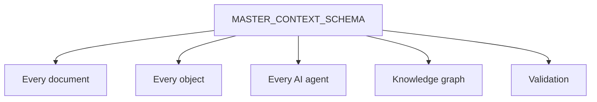

> **Diagram ID:** `DGM-MCS-001`
> **Explanation:** The schema is the root that everything conforms to: documents, objects,
> agents, the knowledge graph, and validation.

> **Image Specification**
> - Image ID: `IMG-MCS-001`
> - Purpose: Hero concept of the schema as the DNA of Oship.
> - Prompt: "A DNA double-helix concept rendered as the Oship knowledge schema, with document, object, agent, graph, and validation nodes, dark navy blueprint with gold helix."
> - Style: DNA/helix concept, blueprint.
> - Composition: Double helix with branching nodes.
> - Resolution: 2400x1600px
> - Priority: CRITICAL
> - Suggested Filename: `assets/diagrams/mcs-schema-dna.png`

## 1.2 Mission of the Schema

The mission is to provide **maximum deterministic reconstruction capability** for every
consumer of Oship knowledge.

| Mission pillar | Commitment |
| :--- | :--- |
| **Define** | Every knowledge representation |
| **Standardize** | Every object structure |
| **Enable** | AI reconstruction without ambiguity |
| **Govern** | Repository conformance |
| **Evolve** | Growth with backward compatibility |

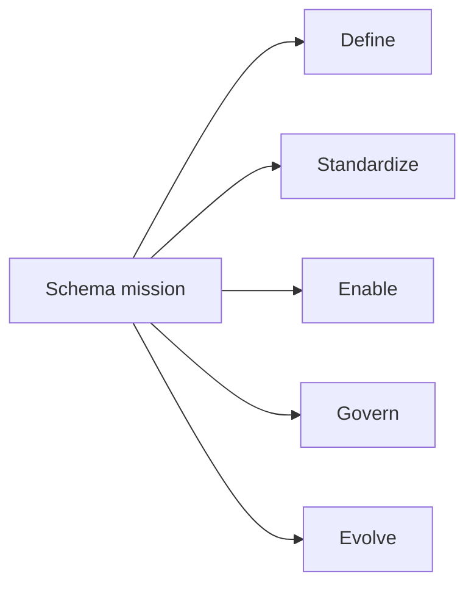

> **Diagram ID:** `DGM-MCS-002`
> **Explanation:** The mission rests on five pillars: define, standardize, enable, govern, and
> evolve.

> **Image Specification**
> - Image ID: `IMG-MCS-002`
> - Purpose: Visualize the five-pillar schema mission.
> - Prompt: "A five-pillar mission diagram: define, standardize, enable, govern, evolve, dark navy blueprint style with gold pillars."
> - Style: Pillar diagram, blueprint.
> - Composition: Five vertical pillars.
> - Resolution: 1800x1200px
> - Priority: HIGH
> - Suggested Filename: `assets/diagrams/mcs-mission-pillars.png`

## 1.3 Goals of the Schema

| Goal | Measure of success |
| :--- | :--- |
| **Determinism** | Same input → same representation |
| **Completeness** | All objects specified |
| **Reconstructability** | AI rebuilds model with zero ambiguity |
| **Conformance** | All knowledge conforms |
| **Maintainability** | Easy to extend |
| **Longevity** | 10+ year validity |

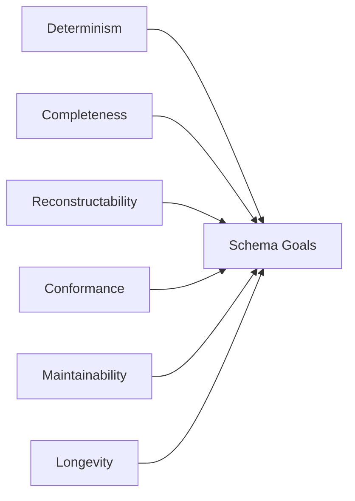

> **Diagram ID:** `DGM-MCS-003`
> **Explanation:** The schema has six goals, each with a measurable success criterion.

## 1.4 Principles of the Schema

The schema operates on ten immutable principles.

### TBL-MCS-001: Schema Principles

| # | Principle | Statement |
| :---: | :--- | :--- |
| 1 | **Determinism** | Same input yields same representation |
| 2 | **Completeness** | No concept left unspecified |
| 3 | **Conformance** | Everything conforms |
| 4 | **Reconstructability** | Full model rebuild |
| 5 | **Traceability** | Every object traceable |
| 6 | **Backward compatibility** | Changes never break consumers |
| 7 | **Single source** | One authoritative representation |
| 8 | **Extensibility** | Growth without restructuring |
| 9 | **AI-first** | Designed for agents |
| 10 | **Enterprise-grade** | Production quality |

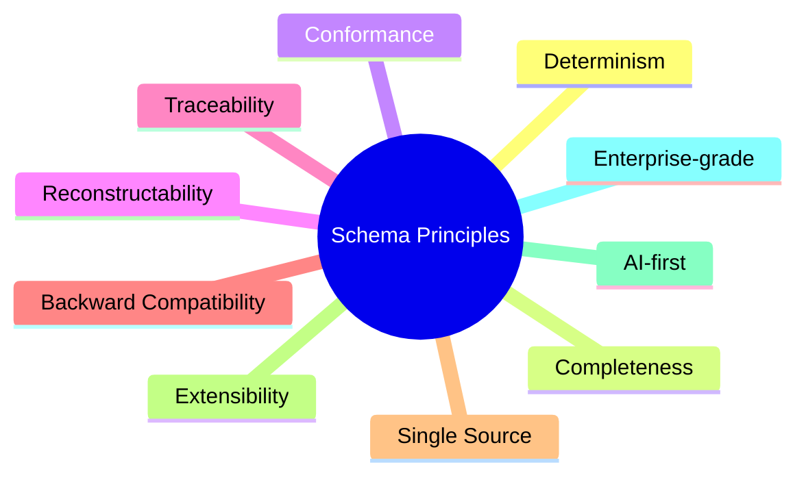

> **Diagram ID:** `DGM-MCS-004`
> **Explanation:** Ten principles guide every schema decision.

## 1.5 Machine-Readable vs Human-Readable

The schema is both machine-readable (deterministic, structured) and human-readable (clear,
navigable).

| Readability | Requirement | Mechanism |
| :--- | :--- | :--- |
| **Machine** | Deterministic parsing | Structured fields, stable IDs |
| **Human** | Clear navigation | Headings, tables, examples |

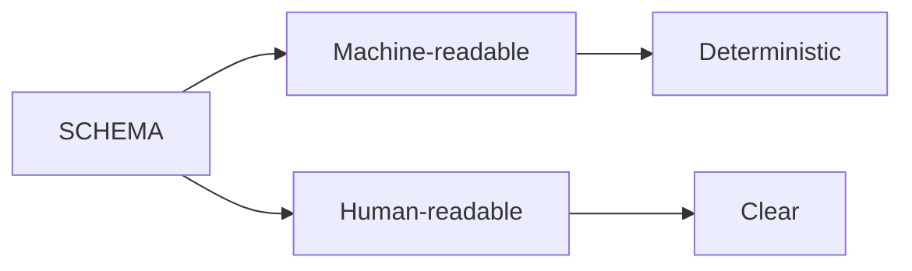

> **Diagram ID:** `DGM-MCS-005`
> **Explanation:** The schema serves both machines and humans without compromise.

## 1.6 Deterministic Reconstruction

The schema enables an AI that has never seen Oship to reconstruct the repository with
virtually zero ambiguity.

| Reconstruction capability | How schema enables |
| :--- | :--- |
| Repository | Topology defined |
| Architecture | Objects specified |
| Knowledge graph | Structure defined |
| Context | Schema defined |
| Prompt system | Prompt schema |
| AI runtime | AI schema |
| Relationships | Graph defined |
| Navigation | Routing defined |
| Validation | Validation rules |
| Governance | Governance defined |
| Behavior | Rules defined |

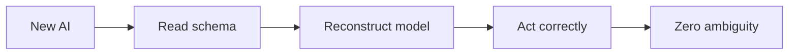

> **Diagram ID:** `DGM-MCS-006`
> **Explanation:** A new AI reads the schema, reconstructs the model, acts correctly, with zero
> ambiguity.

> **Image Specification**
> - Image ID: `IMG-MCS-003`
> - Purpose: Visualize deterministic reconstruction from the schema.
> - Prompt: "A reconstruction pipeline showing a new AI reading the schema and rebuilding the repository model, purple and navy blueprint style."
> - Style: Pipeline flowchart, blueprint.
> - Composition: Four-stage reconstruction pipeline.
> - Resolution: 1800x900px
> - Priority: CRITICAL
> - Suggested Filename: `assets/diagrams/mcs-reconstruction.png`

## 1.7 Schema Decision Rules

| Rule | Statement |
| :--- | :--- |
| SR-01 | Nothing exists outside the schema |
| SR-02 | Every object conforms |
| SR-03 | Determinism is mandatory |
| SR-04 | Changes preserve backward compatibility |
| SR-05 | One authoritative representation |
| SR-06 | Extend, never restructure |
| SR-07 | Trace every object |
| SR-08 | Validate everything |

## 1.8 Schema Navigation

### TBL-MCS-002: Schema Navigation

| Need | Part |
| :--- | :--- |
| Object model | PART 02 |
| Object schema | PART 03 |
| Graphs | PART 04 |
| Context | PART 05 |
| Prompts | PART 06 |
| Memory | PART 07 |
| Routing | PART 08 |
| Validation | PART 09 |
| Workflows | PART 10 |
| AI | PART 11 |
| Events | PART 12 |
| DSL | PART 13 |
| Libraries | PART 14–16 |
| Anti-patterns | PART 17 |
| Best practices | PART 18 |
| AI interpretation | PART 19 |
| Future | PART 20 |

---

# PART 02 — Knowledge Object Model

## 2.1 The Object Model Concept

The Knowledge Object Model defines every knowledge object in Oship. Each object has a
defined purpose, structure, and relationships. Together, objects form the vocabulary of the
repository.

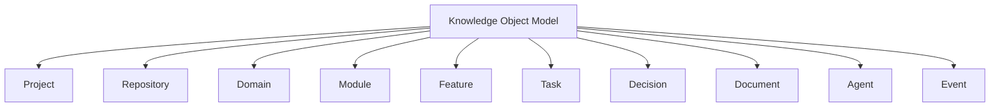

> **Diagram ID:** `DGM-MCS-007`
> **Explanation:** The object model enumerates all object types, forming the vocabulary of the
> repository.

> **Image Specification**
> - Image ID: `IMG-MCS-004`
> - Purpose: Visualize the top-level knowledge object model.
> - Prompt: "A knowledge object model diagram with project, repository, domain, module, feature, task, decision, document, agent, and event nodes, dark navy blueprint style."
> - Style: Object model, blueprint.
> - Composition: Central node with object branches.
> - Resolution: 2000x1400px
> - Priority: CRITICAL
> - Suggested Filename: `assets/diagrams/mcs-object-model.png`

## 2.2 Object Categories

Objects are grouped into categories for clarity.

### TBL-MCS-003: Object Categories

| Category | Objects |
| :--- | :--- |
| **Container** | Project, Workspace, Repository, Organization |
| **Structure** | Domain, Module, Package |
| **Work** | Feature, Story, Task, Issue |
| **Decision** | Decision, ADR |
| **Knowledge** | Document, Diagram, Image, Table, Metric |
| **Runtime** | Agent, AI, Workflow, Pipeline |
| **Data** | API, Endpoint, Database, Entity, Aggregate, Value Object, DTO |
| **Infrastructure** | Configuration, Environment, Secret, Deployment |
| **Quality** | Testing, Security, Monitoring, Validation |
| **Extension** | Plugin, SDK, Extension |
| **Discovery** | Research, Experiment |

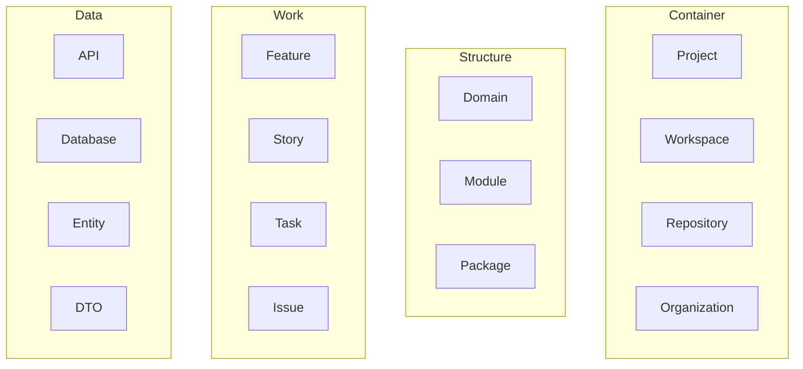

> **Diagram ID:** `DGM-MCS-008`
> **Explanation:** Objects are grouped into container, structure, work, and data categories.

## 2.3 Object Inventory

This is the complete inventory of knowledge objects in Oship.

### TBL-MCS-004: Complete Object Inventory

| # | Object | Category | Purpose |
| :---: | :--- | :--- | :--- |
| 1 | Project | Container | The overarching initiative |
| 2 | Workspace | Container | Working environment |
| 3 | Repository | Container | Versioned knowledge store |
| 4 | Organization | Container | Enterprise entity |
| 5 | Domain | Structure | Bounded knowledge area |
| 6 | Module | Structure | Reusable component |
| 7 | Package | Structure | Deployable unit |
| 8 | Feature | Work | User-visible capability |
| 9 | Story | Work | User narrative |
| 10 | Task | Work | Granular work item |
| 11 | Issue | Work | Reported problem |
| 12 | Decision | Decision | A choice |
| 13 | ADR | Decision | Architecture decision record |
| 14 | Prompt | Knowledge | Instruction to AI |
| 15 | Context | Knowledge | Situational knowledge |
| 16 | Memory | Knowledge | Persisted knowledge |
| 17 | Rule | Knowledge | Constraint |
| 18 | Workflow | Runtime | Process |
| 19 | Pipeline | Runtime | Automated flow |
| 20 | Agent | Runtime | AI worker |
| 21 | AI | Runtime | AI system |
| 22 | Document | Knowledge | Narrative |
| 23 | Diagram | Knowledge | Visual |
| 24 | Image | Knowledge | Asset |
| 25 | Table | Knowledge | Structured data |
| 26 | Metric | Knowledge | Measurement |
| 27 | API | Data | Interface |
| 28 | Endpoint | Data | API operation |
| 29 | Database | Data | Store |
| 30 | Entity | Data | Domain object |
| 31 | Aggregate | Data | Cluster |
| 32 | Value Object | Data | Immutable value |
| 33 | Service | Data | Business operation |
| 34 | Repository Pattern | Data | Data access |
| 35 | Event | Data | Occurrence |
| 36 | Command | Data | Write intent |
| 37 | Query | Data | Read intent |
| 38 | DTO | Data | Transfer object |
| 39 | Configuration | Infrastructure | Settings |
| 40 | Environment | Infrastructure | Stage |
| 41 | Secret | Infrastructure | Credential |
| 42 | Deployment | Infrastructure | Release |
| 43 | Monitoring | Quality | Observability |
| 44 | Security | Quality | Protection |
| 45 | Testing | Quality | Validation |
| 46 | Research | Discovery | Exploration |
| 47 | Experiment | Discovery | Trial |
| 48 | Plugin | Extension | Extension |
| 49 | SDK | Extension | Client toolkit |
| 50 | Extension | Extension | Add-on |

## 2.4 Object Core Structure

Every object shares a core structure with common fields.

```yaml
Object:
  id: string           # Unique identifier
  type: string         # Object type
  name: string         # Human name
  purpose: string      # Why it exists
  owner: string        # Who maintains
  status: string       # Lifecycle state
  relationships: []    # Links to other objects
  validation: []       # Validation rules
  lifecycle: []        # Lifecycle states
  dependencies: []     # Required objects
  examples: []         # Example representations
```

> **Diagram ID:** `DGM-MCS-009` (as code block)

### TBL-MCS-005: Core Object Fields

| Field | Type | Required | Purpose |
| :--- | :--- | :---: | :--- |
| id | string | ✅ | Unique identifier |
| type | string | ✅ | Object type |
| name | string | ✅ | Human name |
| purpose | string | ✅ | Why it exists |
| owner | string | ✅ | Maintainer |
| status | string | ✅ | Lifecycle state |
| relationships | list | ✅ | Links |
| validation | list | ✅ | Rules |
| lifecycle | list | ✅ | States |
| dependencies | list | ✅ | Requirements |
| examples | list | ✅ | Representations |

## 2.5 Object Relationship Patterns

Objects relate through defined patterns.

### TBL-MCS-006: Relationship Patterns

| Pattern | Meaning | Example |
| :--- | :--- | :--- |
| **Contains** | Parent holds child | Repository contains Domain |
| **Depends-on** | Requires upstream | Module depends on Package |
| **Implements** | Realizes | Service implements Contract |
| **Relates-to** | Associated | Feature relates to Story |
| **Owns** | Responsibility | Domain owns Documents |
| **Consumes** | Input | Agent consumes Context |
| **Produces** | Output | Workflow produces Result |
| **References** | Links | Document references ADR |

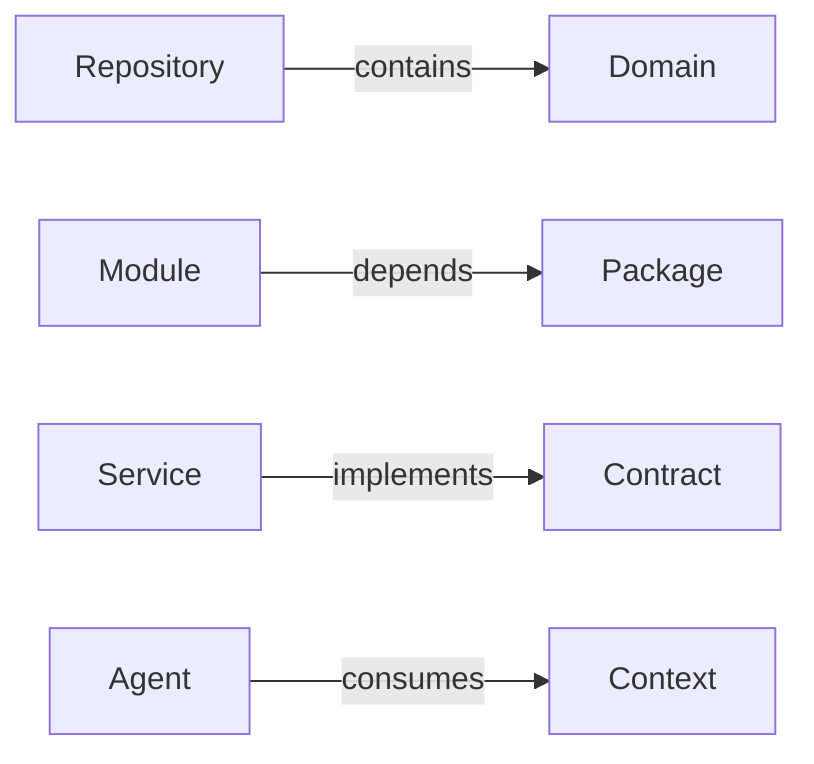

> **Diagram ID:** `DGM-MCS-010`
> **Explanation:** Objects relate through contains, depends-on, implements, consumes, and other
> patterns.

## 2.6 Object Lifecycle

Every object follows a lifecycle.

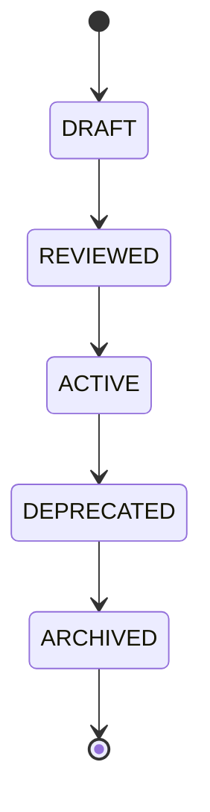

> **Diagram ID:** `DGM-MCS-011`
> **Explanation:** All objects progress through draft, reviewed, active, deprecated, and
> archived states.

### TBL-MCS-007: Object Lifecycle

| State | Meaning | Reliable? |
| :--- | :--- | :---: |
| DRAFT | In authoring | No |
| REVIEWED | Under review | No |
| ACTIVE | Authoritative | Yes |
| DEPRECATED | Superseded | No |
| ARCHIVED | Retired | No |

## 2.7 Object Validation

Every object is validated.

### TBL-MCS-008: Object Validation

| Validation | Check |
| :--- | :--- |
| Schema conformance | Matches schema |
| Metadata | Header valid |
| Links | Resolve |
| Relationships | Valid |
| Lifecycle | Valid state |
| Dependencies | Present |

## 2.8 Object Model Decision Rules

| Rule | Statement |
| :--- | :--- |
| OM-01 | Every object has a type |
| OM-02 | Every object has an owner |
| OM-03 | Every object conforms to schema |
| OM-04 | Every object has relationships |
| OM-05 | Every object has a lifecycle |
| OM-06 | Every object is validated |
| OM-07 | Objects relate via patterns |
| OM-08 | New objects extend, don't restructure |

## 2.9 Object Model Examples

### JSON Example

```json
{
  "object": {
    "id": "OBJ-001",
    "type": "Domain",
    "name": "API",
    "purpose": "Define API contracts",
    "owner": "API Lead",
    "status": "ACTIVE",
    "relationships": ["OBJ-002", "OBJ-003"],
    "dependencies": ["OBJ-004"]
  }
}
```

### YAML Example

```yaml
object:
  id: OBJ-001
  type: Domain
  name: API
  purpose: Define API contracts
  owner: API Lead
  status: ACTIVE
  relationships:
    - OBJ-002
    - OBJ-003
  dependencies:
    - OBJ-004
```

### Markdown Example

```markdown
# Object: API Domain
> Purpose: Define API contracts.
> Owner: API Lead.
> Status: ACTIVE.
> Relationships: Architecture, Security.
```

### Directory Tree Example

```
objects/
├── 01-domain/
│   └── api/
├── 02-module/
└── 03-package/
```

## 2.10 Object Model Navigation

| Need | Section |
| :--- | :--- |
| Object categories | 2.2 |
| Object inventory | 2.3 |
| Core structure | 2.4 |
| Relationships | 2.5 |
| Lifecycle | 2.6 |
| Validation | 2.7 |

---

# PART 03 — Complete Object Schemas

## 3.1 Object Schema Format

Every object has a complete schema with: purpose, owner, fields, attributes, relationships,
validation, lifecycle, dependencies, examples, navigation, and AI notes.

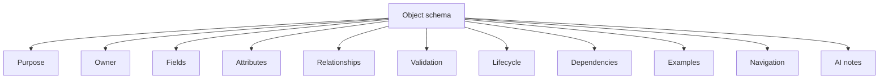

> **Diagram ID:** `DGM-MCS-012`
> **Explanation:** Every object schema has eleven components.

## 3.2 Object: Project

### Purpose
The Project object represents the overarching Oship initiative.

### Owner
Project Sponsor / Chief Architect.

### TBL-MCS-009: Project Schema

| Field | Type | Required | Description |
| :--- | :--- | :---: | :--- |
| id | string | ✅ | Project identifier |
| name | string | ✅ | Project name |
| vision | string | ✅ | Vision statement |
| mission | string | ✅ | Mission statement |
| owner | string | ✅ | Sponsor |
| status | string | ✅ | Lifecycle |
| domains | list | ✅ | Domain references |
| version | string | ✅ | SemVer |

### Relationships
Contains domains, owns repository, references decisions.

### Validation
- Schema conformance
- Vision present
- Owner assigned
- Domains registered

### Lifecycle
FOUNDED → ACTIVE → MATURE → EVOLVING.

### Dependencies
None (root).

### JSON Example

```json
{
  "project": {
    "id": "osh",
    "name": "Oship",
    "vision": "Reference blueprint for AI-first software organizations",
    "mission": "Engineer an enterprise AI-native repository",
    "owner": "Chief Architect",
    "status": "ACTIVE",
    "domains": ["DOM-01"],
    "version": "0.1.0"
  }
}
```

### YAML Example

```yaml
project:
  id: osh
  name: Oship
  vision: Reference blueprint for AI-first software organizations
  mission: Engineer an enterprise AI-native repository
  owner: Chief Architect
  status: ACTIVE
  domains:
    - DOM-01
  version: 0.1.0
```

### Markdown Example

```markdown
# Project: Oship
> Vision: Reference blueprint for AI-first software organizations.
> Mission: Engineer an enterprise AI-native repository.
> Owner: Chief Architect.
```

### Directory Tree Example

```
project/
├── PROJECT_PHILOSOPHY.md
├── README.md
├── docs/
└── .ai/
```

### AI Notes
For AI agents: the Project is the root. All knowledge traces to it. Reconstruct identity
from vision and mission first.

## 3.3 Object: Workspace

### Purpose
The Workspace object represents a working environment.

### Owner
Developer / Agent.

### TBL-MCS-010: Workspace Schema

| Field | Type | Required | Description |
| :--- | :--- | :---: | :--- |
| id | string | ✅ | Workspace id |
| name | string | ✅ | Workspace name |
| environment | string | ✅ | Local/Dev/Staging/Prod |
| tools | list | ❌ | Tooling |
| agent | string | ❌ | Agent reference |
| session | string | ❌ | Session reference |
| status | string | ✅ | Lifecycle |

### Relationships
Belongs to Project, runs in Environment, used by Agent.

### Validation
Environment valid, name unique.

### Lifecycle
CREATED → ACTIVE → CLOSED.

### JSON Example

```json
{
  "workspace": {
    "id": "ws-001",
    "name": "local-dev",
    "environment": "local",
    "tools": ["git", "bash"],
    "agent": "AG-001",
    "status": "ACTIVE"
  }
}
```

### YAML Example

```yaml
workspace:
  id: ws-001
  name: local-dev
  environment: local
  tools:
    - git
    - bash
  agent: AG-001
  status: ACTIVE
```

### Directory Tree Example

```
workspaces/
├── local-dev/
└── ci-dev/
```

### AI Notes
For AI agents: the Workspace defines your environment and tooling. Operate within it.

## 3.4 Object: Repository

### Purpose
The Repository object represents the versioned knowledge store.

### Owner
Repository Maintainer.

### TBL-MCS-011: Repository Schema

| Field | Type | Required | Description |
| :--- | :--- | :---: | :--- |
| id | string | ✅ | Repository id |
| url | string | ✅ | Remote URL |
| branch | string | ✅ | Current branch |
| topology | list | ✅ | Directory structure |
| governance | list | ✅ | Governance files |
| version | string | ✅ | SemVer |
| status | string | ✅ | Lifecycle |

### Relationships
Belongs to Project, contains Domains, governed by Rules.

### Validation
URL valid, branches defined, governance present.

### Lifecycle
CLONED → DEVELOPED → RELEASED.

### JSON Example

```json
{
  "repository": {
    "id": "osh",
    "url": "https://github.com/afshin-omnisystem/Oship",
    "branch": "arena/019fce0c-oship",
    "topology": ["docs/", ".ai/", "architecture/"],
    "governance": [".github/CODEOWNERS"],
    "version": "0.1.0",
    "status": "ACTIVE"
  }
}
```

### YAML Example

```yaml
repository:
  id: osh
  url: https://github.com/afshin-omnisystem/Oship
  branch: arena/019fce0c-oship
  topology:
    - docs/
    - .ai/
    - architecture/
  governance:
    - .github/CODEOWNERS
  version: 0.1.0
  status: ACTIVE
```

### Directory Tree Example

```
repository/
├── README.md
├── docs/
├── .ai/
├── architecture/
└── .github/
```

### AI Notes
For AI agents: the Repository is the physical container. Clone it, read its topology, and
follow its governance.

## 3.5 Object: Organization

### Purpose
The Organization object represents the enterprise entity.

### Owner
Enterprise Leadership.

### TBL-MCS-012: Organization Schema

| Field | Type | Required | Description |
| :--- | :--- | :---: | :--- |
| id | string | ✅ | Organization id |
| name | string | ✅ | Organization name |
| projects | list | ✅ | Project references |
| standards | list | ✅ | Standards |
| governance | list | ✅ | Governance |
| status | string | ✅ | Lifecycle |

### Relationships
Owns Projects, sets Standards, enforces Governance.

### Validation
Name unique, projects registered.

### Lifecycle
FOUNDED → OPERATING → EVOLVING.

### JSON Example

```json
{
  "organization": {
    "id": "afshin-omnisystem",
    "name": "Afshin Omnisystem",
    "projects": ["osh"],
    "standards": ["STD-001"],
    "governance": ["GOV-001"],
    "status": "OPERATING"
  }
}
```

### YAML Example

```yaml
organization:
  id: afshin-omnisystem
  name: Afshin Omnisystem
  projects:
    - osh
  standards:
    - STD-001
  governance:
    - GOV-001
  status: OPERATING
```

### Directory Tree Example

```
organization/
├── projects/
├── standards/
└── governance/
```

### AI Notes
For AI agents: the Organization sets the enterprise context and standards you operate under.

## 3.6 Object: Domain

### Purpose
The Domain object represents a bounded knowledge area.

### Owner
Domain Owner.

### TBL-MCS-013: Domain Schema

| Field | Type | Required | Description |
| :--- | :--- | :---: | :--- |
| id | string | ✅ | Domain id |
| number | string | ✅ | Two-digit number |
| name | string | ✅ | UPPER_SNAKE name |
| layer | string | ✅ | Knowledge layer |
| owner | string | ✅ | Domain owner |
| documents | list | ✅ | Document references |
| dependencies | list | ✅ | Upstream domains |
| routing | list | ✅ | Intent keywords |
| status | string | ✅ | Lifecycle |

### Relationships
Belongs to Repository, contains Documents, depends on Domains, routes intents.

### Validation
Number unique, name valid, layer valid, owner assigned, dependencies acyclic.

### Lifecycle
DRAFT → ACTIVE → DEPRECATED → ARCHIVED.

### JSON Example

```json
{
  "domain": {
    "id": "DOM-15",
    "number": "15",
    "name": "API",
    "layer": "L3 Interfaces",
    "owner": "API Lead",
    "documents": ["DOC-1501", "DOC-1502"],
    "dependencies": ["DOM-04", "DOM-10"],
    "routing": ["api", "contract", "endpoint"],
    "status": "ACTIVE"
  }
}
```

### YAML Example

```yaml
domain:
  id: DOM-15
  number: "15"
  name: API
  layer: L3 Interfaces
  owner: API Lead
  documents:
    - DOC-1501
    - DOC-1502
  dependencies:
    - DOM-04
    - DOM-10
  routing:
    - api
    - contract
    - endpoint
  status: ACTIVE
```

### Markdown Example

```markdown
# Domain: API
> Number: 15. Layer: L3 Interfaces.
> Owner: API Lead.
> Dependencies: Architecture, Security.
```

### Directory Tree Example

```
15_API/
├── INDEX.md
├── API_STANDARDS.md
├── API_CONTRACTS.md
└── API_SECURITY.md
```

### AI Notes
For AI agents: the Domain is your bounded context. Read its INDEX, honor its scope, and route
within it.

## 3.7 Object: Module

### Purpose
The Module object represents a reusable component.

### Owner
Module Maintainer.

### TBL-MCS-014: Module Schema

| Field | Type | Required | Description |
| :--- | :--- | :---: | :--- |
| id | string | ✅ | Module id |
| name | string | ✅ | Module name |
| package | string | ✅ | Package reference |
| purpose | string | ✅ | Why it exists |
| owner | string | ✅ | Maintainer |
| dependencies | list | ✅ | Package deps |
| status | string | ✅ | Lifecycle |

### Relationships
Belongs to Package, depends on Packages, implements features.

### Validation
Name unique, package present, deps resolved.

### Lifecycle
DRAFT → ACTIVE → DEPRECATED.

### JSON Example

```json
{
  "module": {
    "id": "MOD-001",
    "name": "auth-module",
    "package": "PKG-001",
    "purpose": "Authentication",
    "owner": "Security Engineer",
    "dependencies": ["PKG-002"],
    "status": "ACTIVE"
  }
}
```

### YAML Example

```yaml
module:
  id: MOD-001
  name: auth-module
  package: PKG-001
  purpose: Authentication
  owner: Security Engineer
  dependencies:
    - PKG-002
  status: ACTIVE
```

### Directory Tree Example

```
packages/
└── auth-module/
```

### AI Notes
For AI agents: the Module is a reusable component. Implement within its package and honor its
contract.

## 3.8 Object: Package

### Purpose
The Package object represents a deployable unit.

### Owner
Package Maintainer.

### TBL-MCS-015: Package Schema

| Field | Type | Required | Description |
| :--- | :--- | :---: | :--- |
| id | string | ✅ | Package id |
| name | string | ✅ | Package name |
| type | string | ✅ | Library/Service/App |
| modules | list | ✅ | Module references |
| version | string | ✅ | SemVer |
| owner | string | ✅ | Maintainer |
| status | string | ✅ | Lifecycle |

### Relationships
Contains Modules, published as version, consumed by Services.

### Validation
Name unique, type valid, version valid.

### Lifecycle
DRAFT → ACTIVE → RELEASED.

### JSON Example

```json
{
  "package": {
    "id": "PKG-001",
    "name": "osh-auth",
    "type": "library",
    "modules": ["MOD-001"],
    "version": "1.0.0",
    "owner": "Security Engineer",
    "status": "ACTIVE"
  }
}
```

### YAML Example

```yaml
package:
  id: PKG-001
  name: osh-auth
  type: library
  modules:
    - MOD-001
  version: 1.0.0
  owner: Security Engineer
  status: ACTIVE
```

### Directory Tree Example

```
packages/
└── osh-auth/
```

### AI Notes
For AI agents: the Package is a versioned unit. Publish within it and honor SemVer.

## 3.9 Object: Feature

### Purpose
The Feature object represents a user-visible capability.

### Owner
Product Manager.

### TBL-MCS-016: Feature Schema

| Field | Type | Required | Description |
| :--- | :--- | :---: | :--- |
| id | string | ✅ | Feature id |
| name | string | ✅ | Feature name |
| value | string | ✅ | User value |
| stories | list | ✅ | Story references |
| status | string | ✅ | Lifecycle |
| owner | string | ✅ | Product Manager |
| priority | string | ✅ | Priority |

### Relationships
Belongs to Domain, contains Stories, realizes Value.

### Validation
Value present, stories linked, priority set.

### Lifecycle
IDEA → PLANNED → BUILT → SHIPPED.

### JSON Example

```json
{
  "feature": {
    "id": "FEAT-001",
    "name": "user-profile",
    "value": "Users manage their profile",
    "stories": ["STORY-001"],
    "status": "PLANNED",
    "owner": "Product Manager",
    "priority": "high"
  }
}
```

### YAML Example

```yaml
feature:
  id: FEAT-001
  name: user-profile
  value: Users manage their profile
  stories:
    - STORY-001
  status: PLANNED
  owner: Product Manager
  priority: high
```

### Markdown Example

```markdown
# Feature: user-profile
> Value: Users manage their profile.
> Priority: high.
> Stories: STORY-001.
```

### Directory Tree Example

```
features/
└── user-profile/
```

### AI Notes
For AI agents: the Feature is the user-visible capability. Trace it to stories and value.

## 3.10 Object: Story

### Purpose
The Story object represents a user narrative.

### Owner
Product Manager.

### TBL-MCS-017: Story Schema

| Field | Type | Required | Description |
| :--- | :--- | :---: | :--- |
| id | string | ✅ | Story id |
| title | string | ✅ | Story title |
| narrative | string | ✅ | As-a/I-want/so-that |
| feature | string | ✅ | Feature reference |
| tasks | list | ✅ | Task references |
| status | string | ✅ | Lifecycle |

### Relationships
Belongs to Feature, contains Tasks, delivers value.

### Validation
Narrative complete, feature linked.

### Lifecycle
DRAFT → READY → DONE.

### JSON Example

```json
{
  "story": {
    "id": "STORY-001",
    "title": "View profile",
    "narrative": "As a user, I want to view my profile, so that I can see my info",
    "feature": "FEAT-001",
    "tasks": ["TASK-001"],
    "status": "READY"
  }
}
```

### YAML Example

```yaml
story:
  id: STORY-001
  title: View profile
  narrative: As a user, I want to view my profile, so that I can see my info
  feature: FEAT-001
  tasks:
    - TASK-001
  status: READY
```

### AI Notes
For AI agents: the Story is a user narrative. Implement its tasks.

## 3.11 Object: Task

### Purpose
The Task object represents a granular work item.

### Owner
Assignee / Agent.

### TBL-MCS-018: Task Schema

| Field | Type | Required | Description |
| :--- | :--- | :---: | :--- |
| id | string | ✅ | Task id |
| title | string | ✅ | Task title |
| story | string | ✅ | Story reference |
| assignee | string | ✅ | Assignee |
| status | string | ✅ | Lifecycle |
| priority | string | ✅ | Priority |

### Relationships
Belongs to Story, assigned to Assignee, has state.

### Validation
Story linked, assignee set.

### Lifecycle
PENDING → IN_PROGRESS → DONE.

### JSON Example

```json
{
  "task": {
    "id": "TASK-001",
    "title": "Build profile endpoint",
    "story": "STORY-001",
    "assignee": "AG-001",
    "status": "IN_PROGRESS",
    "priority": "high"
  }
}
```

### YAML Example

```yaml
task:
  id: TASK-001
  title: Build profile endpoint
  story: STORY-001
  assignee: AG-001
  status: IN_PROGRESS
  priority: high
```

### AI Notes
For AI agents: the Task is your work unit. Claim it, execute it, and complete it.

## 3.12 Object: Issue

### Purpose
The Issue object represents a reported problem.

### Owner
Reporter / Triage.

### TBL-MCS-019: Issue Schema

| Field | Type | Required | Description |
| :--- | :--- | :---: | :--- |
| id | string | ✅ | Issue id |
| title | string | ✅ | Issue title |
| type | string | ✅ | Bug/Feature/Question |
| severity | string | ✅ | Severity |
| status | string | ✅ | Lifecycle |
| labels | list | ✅ | Labels |

### Relationships
Belongs to Repository, classified by Type, tagged by Labels.

### Validation
Title present, type valid, severity set.

### Lifecycle
OPEN → TRIAGED → RESOLVED → CLOSED.

### JSON Example

```json
{
  "issue": {
    "id": "ISS-001",
    "title": "Login fails",
    "type": "bug",
    "severity": "high",
    "status": "TRIAGED",
    "labels": ["type:bug", "priority:high"]
  }
}
```

### YAML Example

```yaml
issue:
  id: ISS-001
  title: Login fails
  type: bug
  severity: high
  status: TRIAGED
  labels:
    - type:bug
    - priority:high
```

### AI Notes
For AI agents: the Issue is a reported problem. Triage and resolve it.

## 3.13 Object: Decision

### Purpose
The Decision object represents a choice.

### Owner
Architecture Board.

### TBL-MCS-020: Decision Schema

| Field | Type | Required | Description |
| :--- | :--- | :---: | :--- |
| id | string | ✅ | Decision id |
| title | string | ✅ | Decision title |
| context | string | ✅ | Background |
| options | list | ✅ | Alternatives |
| choice | string | ✅ | Selected option |
| rationale | string | ✅ | Why |
| status | string | ✅ | Lifecycle |

### Relationships
Belongs to Decisions domain, references ADR, drives Implementation.

### Validation
Context present, options listed, choice recorded.

### Lifecycle
PROPOSED → ACCEPTED → SUPERSEDED.

### JSON Example

```json
{
  "decision": {
    "id": "DEC-001",
    "title": "Choose database",
    "context": "Need relational store",
    "options": ["PostgreSQL", "MySQL"],
    "choice": "PostgreSQL",
    "rationale": "Reliable, open-source",
    "status": "ACCEPTED"
  }
}
```

### YAML Example

```yaml
decision:
  id: DEC-001
  title: Choose database
  context: Need relational store
  options:
    - PostgreSQL
    - MySQL
  choice: PostgreSQL
  rationale: Reliable, open-source
  status: ACCEPTED
```

### AI Notes
For AI agents: the Decision records a choice. Follow accepted decisions; never override them.

## 3.14 Object: ADR

### Purpose
The ADR object represents an architecture decision record.

### Owner
Architecture Board.

### TBL-MCS-021: ADR Schema

| Field | Type | Required | Description |
| :--- | :--- | :---: | :--- |
| id | string | ✅ | ADR id |
| title | string | ✅ | ADR title |
| status | string | ✅ | Accepted/Proposed/Superseded |
| context | string | ✅ | Background |
| decision | string | ✅ | Decision |
| alternatives | list | ✅ | Alternatives |
| consequences | list | ✅ | Impact |
| supersedes | string | ❌ | Superseded ADR |

### Relationships
Belongs to Decisions domain, immutable once accepted, supersedes others.

### Validation
Status valid, decision present, immutable after accept.

### Lifecycle
PROPOSED → ACCEPTED → SUPERSEDED.

### JSON Example

```json
{
  "adr": {
    "id": "ADR-0001",
    "title": "AI-native repository architecture",
    "status": "Accepted",
    "context": "Need deterministic AI repository",
    "decision": "Adopt MASTER_CONTEXT",
    "alternatives": ["Traditional docs"],
    "consequences": ["Higher doc discipline"],
    "supersedes": null
  }
}
```

### YAML Example

```yaml
adr:
  id: ADR-0001
  title: AI-native repository architecture
  status: Accepted
  context: Need deterministic AI repository
  decision: Adopt MASTER_CONTEXT
  alternatives:
    - Traditional docs
  consequences:
    - Higher doc discipline
  supersedes: null
```

### Markdown Example

```markdown
# ADR-0001: AI-native repository architecture
> Status: Accepted.
> Context: Need deterministic AI repository.
> Decision: Adopt MASTER_CONTEXT.
```

### Directory Tree Example

```
docs/ADR/
├── ADR-0000-template.md
└── ADR-0001-ai-native-repository-architecture.md
```

### AI Notes
For AI agents: an accepted ADR is immutable. Read it for rationale; record amendments as new
ADRs.

## 3.15 Object: Prompt

### Purpose
The Prompt object represents an instruction to AI.

### Owner
AI Architect.

### TBL-MCS-022: Prompt Schema

| Field | Type | Required | Description |
| :--- | :--- | :---: | :--- |
| id | string | ✅ | Prompt id |
| type | string | ✅ | System/Developer/Runtime |
| purpose | string | ✅ | Why |
| content | string | ✅ | Instruction |
| context | string | ✅ | Required context |
| validation | string | ✅ | Success criteria |
| version | string | ✅ | SemVer |

### Relationships
Belongs to AI domain, consumes Context, produces Response.

### Validation
Content present, purpose clear, version valid.

### Lifecycle
DRAFT → ACTIVE → DEPRECATED.

### JSON Example

```json
{
  "prompt": {
    "id": "PROMPT-001",
    "type": "system",
    "purpose": "Boot agent",
    "content": "Read MASTER_CONTEXT and boot",
    "context": "repository",
    "validation": "Boot sequence complete",
    "version": "1.0.0"
  }
}
```

### YAML Example

```yaml
prompt:
  id: PROMPT-001
  type: system
  purpose: Boot agent
  content: Read MASTER_CONTEXT and boot
  context: repository
  validation: Boot sequence complete
  version: 1.0.0
```

### AI Notes
For AI agents: the Prompt defines your instruction. Follow it precisely and validate output.

## 3.16 Object: Context

### Purpose
The Context object represents situational knowledge.

### Owner
AI Architect.

### TBL-MCS-023: Context Schema

| Field | Type | Required | Description |
| :--- | :--- | :---: | :--- |
| id | string | ✅ | Context id |
| type | string | ✅ | Global/Workspace/Session |
| content | string | ✅ | Knowledge |
| source | string | ✅ | Origin |
| scope | string | ✅ | Applicability |
| version | string | ✅ | SemVer |

### Relationships
Consumed by Prompt, sourced from Memory, scoped to Session.

### Validation
Type valid, content present, source recorded.

### Lifecycle
CREATED → ACTIVE → EXPIRED.

### JSON Example

```json
{
  "context": {
    "id": "CTX-001",
    "type": "global",
    "content": "Oship is the cognitive OS",
    "source": "MASTER_CONTEXT",
    "scope": "all",
    "version": "1.0.0"
  }
}
```

### YAML Example

```yaml
context:
  id: CTX-001
  type: global
  content: Oship is the cognitive OS
  source: MASTER_CONTEXT
  scope: all
  version: 1.0.0
```

### AI Notes
For AI agents: Context is your situational knowledge. Load the right context before acting.

## 3.17 Object: Memory

### Purpose
The Memory object represents persisted knowledge.

### Owner
AI Architect.

### TBL-MCS-024: Memory Schema

| Field | Type | Required | Description |
| :--- | :--- | :---: | :--- |
| id | string | ✅ | Memory id |
| tier | string | ✅ | Short/Long/Persistent |
| content | string | ✅ | Stored knowledge |
| source | string | ✅ | Origin |
| expiry | string | ❌ | Expiration |
| status | string | ✅ | Lifecycle |

### Relationships
Sourced from Sessions, persists knowledge, feeds Context.

### Validation
Tier valid, content present.

### Lifecycle
CREATED → ACTIVE → EXPIRED.

### JSON Example

```json
{
  "memory": {
    "id": "MEM-001",
    "tier": "long",
    "content": "Oship uses MASTER_CONTEXT",
    "source": "SESSION_MEMORY",
    "expiry": null,
    "status": "ACTIVE"
  }
}
```

### YAML Example

```yaml
memory:
  id: MEM-001
  tier: long
  content: Oship uses MASTER_CONTEXT
  source: SESSION_MEMORY
  expiry: null
  status: ACTIVE
```

### AI Notes
For AI agents: Memory persists what you learn. Write it, and read it for continuity.

## 3.18 Object: Rule

### Purpose
The Rule object represents a constraint.

### Owner
Architecture Board.

### TBL-MCS-025: Rule Schema

| Field | Type | Required | Description |
| :--- | :--- | :---: | :--- |
| id | string | ✅ | Rule id |
| type | string | ✅ | Required/Forbidden/Immutable |
| statement | string | ✅ | The rule |
| applies | string | ✅ | Scope |
| enforcement | string | ✅ | How enforced |
| status | string | ✅ | Lifecycle |

### Relationships
Governs Objects, enforced by Automation, defined by Standards.

### Validation
Type valid, statement present.

### Lifecycle
DRAFT → ACTIVE → DEPRECATED.

### JSON Example

```json
{
  "rule": {
    "id": "RULE-001",
    "type": "required",
    "statement": "Every doc has metadata header",
    "applies": "all docs",
    "enforcement": "linter",
    "status": "ACTIVE"
  }
}
```

### YAML Example

```yaml
rule:
  id: RULE-001
  type: required
  statement: Every doc has metadata header
  applies: all docs
  enforcement: linter
  status: ACTIVE
```

### AI Notes
For AI agents: Rules are constraints. Follow required rules, avoid forbidden ones.

## 3.19 Object: Workflow

### Purpose
The Workflow object represents a process.

### Owner
Process Owner.

### TBL-MCS-026: Workflow Schema

| Field | Type | Required | Description |
| :--- | :--- | :---: | :--- |
| id | string | ✅ | Workflow id |
| name | string | ✅ | Workflow name |
| steps | list | ✅ | Steps |
| triggers | list | ✅ | Start events |
| outputs | list | ✅ | Results |
| owner | string | ✅ | Owner |
| status | string | ✅ | Lifecycle |

### Relationships
Triggered by Events, executes Steps, produces Outputs.

### Validation
Steps present, triggers defined.

### Lifecycle
DEFINED → ACTIVE → DEPRECATED.

### JSON Example

```json
{
  "workflow": {
    "id": "WF-001",
    "name": "release",
    "steps": ["build", "test", "deploy"],
    "triggers": ["merge"],
    "outputs": ["release"],
    "owner": "DevOps",
    "status": "ACTIVE"
  }
}
```

### YAML Example

```yaml
workflow:
  id: WF-001
  name: release
  steps:
    - build
    - test
    - deploy
  triggers:
    - merge
  outputs:
    - release
  owner: DevOps
  status: ACTIVE
```

### AI Notes
For AI agents: Workflow defines a process. Execute its steps in order.

## 3.20 Object: Pipeline

### Purpose
The Pipeline object represents an automated flow.

### Owner
DevOps.

### TBL-MCS-027: Pipeline Schema

| Field | Type | Required | Description |
| :--- | :--- | :---: | :--- |
| id | string | ✅ | Pipeline id |
| name | string | ✅ | Pipeline name |
| stages | list | ✅ | Stages |
| triggers | list | ✅ | Triggers |
| owner | string | ✅ | Owner |
| status | string | ✅ | Lifecycle |

### Relationships
Executes Stages, triggered by Events, part of CI/CD.

### Validation
Stages present, triggers defined.

### Lifecycle
DEFINED → ACTIVE → DEPRECATED.

### JSON Example

```json
{
  "pipeline": {
    "id": "PIPE-001",
    "name": "ci",
    "stages": ["lint", "test", "build"],
    "triggers": ["push"],
    "owner": "DevOps",
    "status": "ACTIVE"
  }
}
```

### YAML Example

```yaml
pipeline:
  id: PIPE-001
  name: ci
  stages:
    - lint
    - test
    - build
  triggers:
    - push
  owner: DevOps
  status: ACTIVE
```

### AI Notes
For AI agents: Pipeline is automated. Understand its stages and triggers.

## 3.21 Object: Agent

### Purpose
The Agent object represents an AI worker.

### Owner
AI Architect.

### TBL-MCS-028: Agent Schema

| Field | Type | Required | Description |
| :--- | :--- | :---: | :--- |
| id | string | ✅ | Agent id |
| name | string | ✅ | Agent name |
| class | string | ✅ | Coding/Documentation/Audit |
| capabilities | list | ✅ | Skills |
| permissions | list | ✅ | Allowed actions |
| constraints | list | ✅ | Limits |
| status | string | ✅ | Lifecycle |

### Relationships
Executes Tasks, governed by Rules, consumes Context.

### Validation
Class valid, capabilities present.

### Lifecycle
ONBOARDED → ACTIVE → RETIRED.

### JSON Example

```json
{
  "agent": {
    "id": "AG-001",
    "name": "docs-agent",
    "class": "documentation",
    "capabilities": ["author", "validate"],
    "permissions": ["docs write"],
    "constraints": ["no code"],
    "status": "ACTIVE"
  }
}
```

### YAML Example

```yaml
agent:
  id: AG-001
  name: docs-agent
  class: documentation
  capabilities:
    - author
    - validate
  permissions:
    - docs write
  constraints:
    - no code
  status: ACTIVE
```

### AI Notes
For AI agents: know your class, capabilities, and constraints. Act within them.

## 3.22 Object: AI

### Purpose
The AI object represents an AI system.

### Owner
AI Architect.

### TBL-MCS-029: AI Schema

| Field | Type | Required | Description |
| :--- | :--- | :---: | :--- |
| id | string | ✅ | AI id |
| model | string | ✅ | Model name |
| provider | string | ✅ | Provider |
| agents | list | ✅ | Agent references |
| governance | list | ✅ | Rules |
| status | string | ✅ | Lifecycle |

### Relationships
Runs Agents, governed by AI Schema, synchronized with others.

### Validation
Model present, provider recorded.

### Lifecycle
INTEGRATED → ACTIVE → RETIRED.

### JSON Example

```json
{
  "ai": {
    "id": "AI-001",
    "model": "codex",
    "provider": "openai",
    "agents": ["AG-001"],
    "governance": ["RULE-001"],
    "status": "ACTIVE"
  }
}
```

### YAML Example

```yaml
ai:
  id: AI-001
  model: codex
  provider: openai
  agents:
    - AG-001
  governance:
    - RULE-001
  status: ACTIVE
```

### AI Notes
For AI agents: the AI object describes your system. Know your model and governance.

## 3.23 Object: Document

### Purpose
The Document object represents narrative knowledge.

### Owner
Document Owner.

### TBL-MCS-030: Document Schema

| Field | Type | Required | Description |
| :--- | :--- | :---: | :--- |
| id | string | ✅ | Document id |
| title | string | ✅ | Title |
| type | string | ✅ | Overview/Spec/Guide |
| domain | string | ✅ | Domain reference |
| status | string | ✅ | Lifecycle |
| owner | string | ✅ | Owner |
| links | list | ✅ | References |

### Relationships
Belongs to Domain, references Documents, follows Standards.

### Validation
Header valid, links resolve, DoD passed.

### Lifecycle
DRAFT → ACTIVE → DEPRECATED.

### JSON Example

```json
{
  "document": {
    "id": "DOC-1501",
    "title": "API Standards",
    "type": "spec",
    "domain": "DOM-15",
    "status": "ACTIVE",
    "owner": "API Lead",
    "links": ["DOC-1502"]
  }
}
```

### YAML Example

```yaml
document:
  id: DOC-1501
  title: API Standards
  type: spec
  domain: DOM-15
  status: ACTIVE
  owner: API Lead
  links:
    - DOC-1502
```

### Markdown Example

```markdown
---
Document ID: DOC-1501
Title: API Standards
Type: spec
Domain: 15_API
Status: ACTIVE
Owner: API Lead
---
```

### AI Notes
For AI agents: the Document is a knowledge unit. Read its header, honor its type, follow its
links.

## 3.24 Object: Diagram

### Purpose
The Diagram object represents visual knowledge.

### Owner
Documentation Team.

### TBL-MCS-031: Diagram Schema

| Field | Type | Required | Description |
| :--- | :--- | :---: | :--- |
| id | string | ✅ | Diagram id |
| type | string | ✅ | Mermaid/ASCII/Image |
| purpose | string | ✅ | Why |
| content | string | ✅ | Diagram body |
| spec | string | ✅ | Image spec |
| status | string | ✅ | Lifecycle |

### Relationships
Belongs to Diagrams domain, has Image spec, visualizes Documents.

### Validation
Type valid, content renders.

### Lifecycle
DRAFT → ACTIVE → DEPRECATED.

### JSON Example

```json
{
  "diagram": {
    "id": "DGM-MCS-013",
    "type": "mermaid",
    "purpose": "Show architecture",
    "content": "flowchart TD A-->B",
    "spec": "IMG-MCS-001",
    "status": "ACTIVE"
  }
}
```

### YAML Example

```yaml
diagram:
  id: DGM-MCS-013
  type: mermaid
  purpose: Show architecture
  content: flowchart TD A-->B
  spec: IMG-MCS-001
  status: ACTIVE
```

### AI Notes
For AI agents: Diagram is visual knowledge. Render and reference it.

## 3.25 Object: Image

### Purpose
The Image object represents a visual asset.

### Owner
Documentation Team.

### TBL-MCS-032: Image Schema

| Field | Type | Required | Description |
| :--- | :--- | :---: | :--- |
| id | string | ✅ | Image id |
| file | string | ✅ | Filename |
| purpose | string | ✅ | Why |
| resolution | string | ✅ | Dimensions |
| prompt | string | ✅ | Generation prompt |
| status | string | ✅ | Lifecycle |

### Relationships
Visualizes Documents, generated from Prompt, stored in assets.

### Validation
File exists, prompt present.

### Lifecycle
REQUESTED → GENERATED → ACTIVE.

### JSON Example

```json
{
  "image": {
    "id": "IMG-MCS-001",
    "file": "mcs-schema-dna.png",
    "purpose": "Hero DNA concept",
    "resolution": "2400x1600",
    "prompt": "DNA double-helix schema concept",
    "status": "ACTIVE"
  }
}
```

### YAML Example

```yaml
image:
  id: IMG-MCS-001
  file: mcs-schema-dna.png
  purpose: Hero DNA concept
  resolution: 2400x1600
  prompt: DNA double-helix schema concept
  status: ACTIVE
```

### AI Notes
For AI agents: Image is a visual asset. Reference it by ID and filename.

## 3.26 Object: Table

### Purpose
The Table object represents structured data.

### Owner
Document Owner.

### TBL-MCS-033: Table Schema

| Field | Type | Required | Description |
| :--- | :--- | :---: | :--- |
| id | string | ✅ | Table id |
| title | string | ✅ | Table title |
| purpose | string | ✅ | Why |
| columns | list | ✅ | Column defs |
| rows | list | ✅ | Data rows |
| status | string | ✅ | Lifecycle |

### Relationships
Enriches Documents, structured by Columns.

### Validation
Columns present, rows consistent.

### Lifecycle
DRAFT → ACTIVE → DEPRECATED.

### JSON Example

```json
{
  "table": {
    "id": "TBL-MCS-009",
    "title": "Project Schema",
    "purpose": "Define project fields",
    "columns": ["field", "type", "required"],
    "rows": [["id", "string", "yes"]],
    "status": "ACTIVE"
  }
}
```

### YAML Example

```yaml
table:
  id: TBL-MCS-009
  title: Project Schema
  purpose: Define project fields
  columns:
    - field
    - type
    - required
  rows:
    - - id
      - string
      - "yes"
  status: ACTIVE
```

### AI Notes
For AI agents: Table is structured data. Parse columns and rows.

## 3.27 Object: Metric

### Purpose
The Metric object represents a measurement.

### Owner
AI Architect / SRE.

### TBL-MCS-034: Metric Schema

| Field | Type | Required | Description |
| :--- | :--- | :---: | :--- |
| id | string | ✅ | Metric id |
| name | string | ✅ | Metric name |
| type | string | ✅ | Health/Quality/Perf |
| value | string | ✅ | Current value |
| target | string | ✅ | Target |
| status | string | ✅ | Lifecycle |

### Relationships
Measures Objects, reported to Metrics board.

### Validation
Target set, value tracked.

### Lifecycle
DEFINED → TRACKED → RETIRED.

### JSON Example

```json
{
  "metric": {
    "id": "MET-001",
    "name": "KQS",
    "type": "quality",
    "value": "90",
    "target": "90",
    "status": "TRACKED"
  }
}
```

### YAML Example

```yaml
metric:
  id: MET-001
  name: KQS
  type: quality
  value: "90"
  target: "90"
  status: TRACKED
```

### AI Notes
For AI agents: Metric is a measurement. Track and report it.

## 3.28 Object: API

### Purpose
The API object represents an interface.

### Owner
API Lead.

### TBL-MCS-035: API Schema

| Field | Type | Required | Description |
| :--- | :--- | :---: | :--- |
| id | string | ✅ | API id |
| name | string | ✅ | API name |
| version | string | ✅ | SemVer |
| endpoints | list | ✅ | Endpoint refs |
| auth | string | ✅ | Auth scheme |
| owner | string | ✅ | Owner |
| status | string | ✅ | Lifecycle |

### Relationships
Contains Endpoints, belongs to API domain, uses Auth.

### Validation
Version valid, endpoints present.

### Lifecycle
DRAFT → ACTIVE → DEPRECATED.

### JSON Example

```json
{
  "api": {
    "id": "API-001",
    "name": "user-api",
    "version": "1.0.0",
    "endpoints": ["EP-001"],
    "auth": "bearer",
    "owner": "API Lead",
    "status": "ACTIVE"
  }
}
```

### YAML Example

```yaml
api:
  id: API-001
  name: user-api
  version: 1.0.0
  endpoints:
    - EP-001
  auth: bearer
  owner: API Lead
  status: ACTIVE
```

### AI Notes
For AI agents: API is an interface. Honor its contract and version.

## 3.29 Object: Endpoint

### Purpose
The Endpoint object represents an API operation.

### Owner
API Engineer.

### TBL-MCS-036: Endpoint Schema

| Field | Type | Required | Description |
| :--- | :--- | :---: | :--- |
| id | string | ✅ | Endpoint id |
| method | string | ✅ | HTTP method |
| path | string | ✅ | URL path |
| request | string | ✅ | Request schema |
| response | string | ✅ | Response schema |
| auth | string | ✅ | Auth |
| status | string | ✅ | Lifecycle |

### Relationships
Belongs to API, defines request/response.

### Validation
Method valid, path present.

### Lifecycle
DRAFT → ACTIVE → DEPRECATED.

### JSON Example

```json
{
  "endpoint": {
    "id": "EP-001",
    "method": "GET",
    "path": "/users/{id}",
    "request": null,
    "response": "UserDTO",
    "auth": "bearer",
    "status": "ACTIVE"
  }
}
```

### YAML Example

```yaml
endpoint:
  id: EP-001
  method: GET
  path: /users/{id}
  request: null
  response: UserDTO
  auth: bearer
  status: ACTIVE
```

### AI Notes
For AI agents: Endpoint is an API operation. Implement its method, path, and contract.

## 3.30 Object: Database

### Purpose
The Database object represents a store.

### Owner
Data Architect.

### TBL-MCS-037: Database Schema

| Field | Type | Required | Description |
| :--- | :--- | :---: | :--- |
| id | string | ✅ | Database id |
| name | string | ✅ | Database name |
| engine | string | ✅ | DB engine |
| entities | list | ✅ | Entity refs |
| migrations | list | ✅ | Migration refs |
| owner | string | ✅ | Owner |
| status | string | ✅ | Lifecycle |

### Relationships
Contains Entities, governed by Migrations, belongs to Database domain.

### Validation
Engine valid, entities present.

### Lifecycle
DRAFT → ACTIVE → DEPRECATED.

### JSON Example

```json
{
  "database": {
    "id": "DB-001",
    "name": "osh-main",
    "engine": "postgres",
    "entities": ["ENT-001"],
    "migrations": ["MIG-001"],
    "owner": "Data Architect",
    "status": "ACTIVE"
  }
}
```

### YAML Example

```yaml
database:
  id: DB-001
  name: osh-main
  engine: postgres
  entities:
    - ENT-001
  migrations:
    - MIG-001
  owner: Data Architect
  status: ACTIVE
```

### AI Notes
For AI agents: Database is a store. Model its entities and migrations.

## 3.31 Object: Entity

### Purpose
The Entity object represents a domain object.

### Owner
Data Architect.

### TBL-MCS-038: Entity Schema

| Field | Type | Required | Description |
| :--- | :--- | :---: | :--- |
| id | string | ✅ | Entity id |
| name | string | ✅ | Entity name |
| table | string | ✅ | Table name |
| fields | list | ✅ | Field defs |
| relations | list | ✅ | Relationships |
| status | string | ✅ | Lifecycle |

### Relationships
Belongs to Database, has Fields, relates to Entities.

### Validation
Table present, fields defined.

### Lifecycle
DRAFT → ACTIVE → DEPRECATED.

### JSON Example

```json
{
  "entity": {
    "id": "ENT-001",
    "name": "User",
    "table": "users",
    "fields": ["id", "email", "name"],
    "relations": ["ENT-002"],
    "status": "ACTIVE"
  }
}
```

### YAML Example

```yaml
entity:
  id: ENT-001
  name: User
  table: users
  fields:
    - id
    - email
    - name
  relations:
    - ENT-002
  status: ACTIVE
```

### AI Notes
For AI agents: Entity is a domain object. Model its fields and relations.

## 3.32 Object: Aggregate

### Purpose
The Aggregate object represents a cluster of entities.

### Owner
Data Architect.

### TBL-MCS-039: Aggregate Schema

| Field | Type | Required | Description |
| :--- | :--- | :---: | :--- |
| id | string | ✅ | Aggregate id |
| name | string | ✅ | Aggregate name |
| root | string | ✅ | Root entity |
| members | list | ✅ | Member entities |
| invariants | list | ✅ | Rules |
| status | string | ✅ | Lifecycle |

### Relationships
Contains Entities, has a Root, enforces Invariants.

### Validation
Root present, members listed.

### Lifecycle
DRAFT → ACTIVE → DEPRECATED.

### JSON Example

```json
{
  "aggregate": {
    "id": "AGG-001",
    "name": "OrderAggregate",
    "root": "ENT-010",
    "members": ["ENT-011"],
    "invariants": ["total>=0"],
    "status": "ACTIVE"
  }
}
```

### YAML Example

```yaml
aggregate:
  id: AGG-001
  name: OrderAggregate
  root: ENT-010
  members:
    - ENT-011
  invariants:
    - total>=0
  status: ACTIVE
```

### AI Notes
For AI agents: Aggregate is a cluster. Respect its root and invariants.

## 3.33 Object: Value Object

### Purpose
The Value Object represents an immutable value.

### Owner
Data Architect.

### TBL-MCS-040: Value Object Schema

| Field | Type | Required | Description |
| :--- | :--- | :---: | :--- |
| id | string | ✅ | Value object id |
| name | string | ✅ | Name |
| fields | list | ✅ | Fields |
| immutable | boolean | ✅ | Always true |
| status | string | ✅ | Lifecycle |

### Relationships
Used by Entities, immutable, value-based equality.

### Validation
Immutable true, fields defined.

### Lifecycle
DRAFT → ACTIVE → DEPRECATED.

### JSON Example

```json
{
  "value_object": {
    "id": "VO-001",
    "name": "Money",
    "fields": ["amount", "currency"],
    "immutable": true,
    "status": "ACTIVE"
  }
}
```

### YAML Example

```yaml
value_object:
  id: VO-001
  name: Money
  fields:
    - amount
    - currency
  immutable: true
  status: ACTIVE
```

### AI Notes
For AI agents: Value Object is immutable. Never mutate it.

## 3.34 Object: Service

### Purpose
The Service object represents a business operation.

### Owner
Backend Lead.

### TBL-MCS-041: Service Schema

| Field | Type | Required | Description |
| :--- | :--- | :---: | :--- |
| id | string | ✅ | Service id |
| name | string | ✅ | Service name |
| operations | list | ✅ | Operations |
| dependencies | list | ✅ | Dependencies |
| owner | string | ✅ | Owner |
| status | string | ✅ | Lifecycle |

### Relationships
Belongs to Backend domain, implements operations, depends on Data.

### Validation
Operations present, deps resolved.

### Lifecycle
DRAFT → ACTIVE → DEPRECATED.

### JSON Example

```json
{
  "service": {
    "id": "SVC-001",
    "name": "UserService",
    "operations": ["createUser"],
    "dependencies": ["DB-001"],
    "owner": "Backend Lead",
    "status": "ACTIVE"
  }
}
```

### YAML Example

```yaml
service:
  id: SVC-001
  name: UserService
  operations:
    - createUser
  dependencies:
    - DB-001
  owner: Backend Lead
  status: ACTIVE
```

### AI Notes
For AI agents: Service is a business operation. Implement within its domain.

## 3.35 Object: Repository Pattern

### Purpose
The Repository Pattern object represents data access.

### Owner
Backend Lead.

### TBL-MCS-042: Repository Pattern Schema

| Field | Type | Required | Description |
| :--- | :--- | :---: | :--- |
| id | string | ✅ | Repo pattern id |
| name | string | ✅ | Name |
| entity | string | ✅ | Entity ref |
| methods | list | ✅ | Data methods |
| status | string | ✅ | Lifecycle |

### Relationships
Accesses Entity, provides data methods.

### Validation
Entity linked, methods defined.

### Lifecycle
DRAFT → ACTIVE → DEPRECATED.

### JSON Example

```json
{
  "repository_pattern": {
    "id": "RP-001",
    "name": "UserRepository",
    "entity": "ENT-001",
    "methods": ["findById", "save"],
    "status": "ACTIVE"
  }
}
```

### YAML Example

```yaml
repository_pattern:
  id: RP-001
  name: UserRepository
  entity: ENT-001
  methods:
    - findById
    - save
  status: ACTIVE
```

### AI Notes
For AI agents: Repository Pattern abstracts data access. Use its methods.

## 3.36 Object: Event

### Purpose
The Event object represents an occurrence.

### Owner
Architecture Board.

### TBL-MCS-043: Event Schema

| Field | Type | Required | Description |
| :--- | :--- | :---: | :--- |
| id | string | ✅ | Event id |
| name | string | ✅ | Event name |
| type | string | ✅ | Repository/Domain/Runtime |
| payload | string | ✅ | Data |
| timestamp | string | ✅ | Time |
| status | string | ✅ | Lifecycle |

### Relationships
Triggered by changes, consumed by Workflows, recorded in Audit.

### Validation
Type valid, timestamp present.

### Lifecycle
EMITTED → PROCESSED → CONSUMED.

### JSON Example

```json
{
  "event": {
    "id": "EVT-001",
    "name": "doc.created",
    "type": "documentation",
    "payload": {"docId": "DOC-001"},
    "timestamp": "2026-08-04T00:00:00Z",
    "status": "PROCESSED"
  }
}
```

### YAML Example

```yaml
event:
  id: EVT-001
  name: doc.created
  type: documentation
  payload:
    docId: DOC-001
  timestamp: "2026-08-04T00:00:00Z"
  status: PROCESSED
```

### AI Notes
For AI agents: Event is an occurrence. React to it deterministically.

## 3.37 Object: Command

### Purpose
The Command object represents a write intent.

### Owner
Backend Lead.

### TBL-MCS-044: Command Schema

| Field | Type | Required | Description |
| :--- | :--- | :---: | :--- |
| id | string | ✅ | Command id |
| name | string | ✅ | Command name |
| aggregate | string | ✅ | Aggregate ref |
| payload | string | ✅ | Data |
| status | string | ✅ | Lifecycle |

### Relationships
Targets Aggregate, performs write, validated.

### Validation
Aggregate linked, payload present.

### Lifecycle
SUBMITTED → EXECUTED → COMPLETED.

### JSON Example

```json
{
  "command": {
    "id": "CMD-001",
    "name": "CreateOrder",
    "aggregate": "AGG-001",
    "payload": {"items": []},
    "status": "EXECUTED"
  }
}
```

### YAML Example

```yaml
command:
  id: CMD-001
  name: CreateOrder
  aggregate: AGG-001
  payload:
    items: []
  status: EXECUTED
```

### AI Notes
For AI agents: Command is a write intent. Execute and validate it.

## 3.38 Object: Query

### Purpose
The Query object represents a read intent.

### Owner
Backend Lead.

### TBL-MCS-045: Query Schema

| Field | Type | Required | Description |
| :--- | :--- | :---: | :--- |
| id | string | ✅ | Query id |
| name | string | ✅ | Query name |
| read_model | string | ✅ | Read model |
| filters | list | ✅ | Filters |
| status | string | ✅ | Lifecycle |

### Relationships
Reads data, produces Read Model, side-effect free.

### Validation
Read model present.

### Lifecycle
SUBMITTED → EXECUTED → RETURNED.

### JSON Example

```json
{
  "query": {
    "id": "QRY-001",
    "name": "GetUser",
    "read_model": "UserView",
    "filters": ["id"],
    "status": "EXECUTED"
  }
}
```

### YAML Example

```yaml
query:
  id: QRY-001
  name: GetUser
  read_model: UserView
  filters:
    - id
  status: EXECUTED
```

### AI Notes
For AI agents: Query is a read intent. It has no side effects.

## 3.39 Object: DTO

### Purpose
The DTO object represents a transfer object.

### Owner
API Engineer.

### TBL-MCS-046: DTO Schema

| Field | Type | Required | Description |
| :--- | :--- | :---: | :--- |
| id | string | ✅ | DTO id |
| name | string | ✅ | DTO name |
| fields | list | ✅ | Fields |
| direction | string | ✅ | Request/Response |
| status | string | ✅ | Lifecycle |

### Relationships
Transfers data, belongs to API.

### Validation
Fields present, direction valid.

### Lifecycle
DRAFT → ACTIVE → DEPRECATED.

### JSON Example

```json
{
  "dto": {
    "id": "DTO-001",
    "name": "UserDTO",
    "fields": ["id", "email"],
    "direction": "response",
    "status": "ACTIVE"
  }
}
```

### YAML Example

```yaml
dto:
  id: DTO-001
  name: UserDTO
  fields:
    - id
    - email
  direction: response
  status: ACTIVE
```

### AI Notes
For AI agents: DTO transfers data. Honor its fields and direction.

## 3.40 Object: Configuration

### Purpose
The Configuration object represents settings.

### Owner
DevOps.

### TBL-MCS-047: Configuration Schema

| Field | Type | Required | Description |
| :--- | :--- | :---: | :--- |
| id | string | ✅ | Config id |
| name | string | ✅ | Config name |
| scope | string | ✅ | Application scope |
| values | map | ✅ | Settings |
| env | string | ✅ | Environment |
| status | string | ✅ | Lifecycle |

### Relationships
Applies to Environment, holds settings.

### Validation
Values present, env valid.

### Lifecycle
DRAFT → ACTIVE → DEPRECATED.

### JSON Example

```json
{
  "configuration": {
    "id": "CFG-001",
    "name": "app-config",
    "scope": "app",
    "values": {"timeout": 30},
    "env": "production",
    "status": "ACTIVE"
  }
}
```

### YAML Example

```yaml
configuration:
  id: CFG-001
  name: app-config
  scope: app
  values:
    timeout: 30
  env: production
  status: ACTIVE
```

### AI Notes
For AI agents: Configuration holds settings. Apply per environment.

## 3.41 Object: Environment

### Purpose
The Environment object represents a stage.

### Owner
DevOps.

### TBL-MCS-048: Environment Schema

| Field | Type | Required | Description |
| :--- | :--- | :---: | :--- |
| id | string | ✅ | Env id |
| name | string | ✅ | Local/Dev/Staging/Prod |
| configs | list | ✅ | Config refs |
| secrets | list | ✅ | Secret refs |
| status | string | ✅ | Lifecycle |

### Relationships
Holds Configs, holds Secrets, target of Deployment.

### Validation
Name valid, configs present.

### Lifecycle
DEFINED → ACTIVE → RETIRED.

### JSON Example

```json
{
  "environment": {
    "id": "ENV-001",
    "name": "production",
    "configs": ["CFG-001"],
    "secrets": ["SEC-001"],
    "status": "ACTIVE"
  }
}
```

### YAML Example

```yaml
environment:
  id: ENV-001
  name: production
  configs:
    - CFG-001
  secrets:
    - SEC-001
  status: ACTIVE
```

### AI Notes
For AI agents: Environment is a stage. Apply its configs and secrets.

## 3.42 Object: Secret

### Purpose
The Secret object represents a credential.

### Owner
Security Engineer.

### TBL-MCS-049: Secret Schema

| Field | Type | Required | Description |
| :--- | :--- | :---: | :--- |
| id | string | ✅ | Secret id |
| name | string | ✅ | Secret name |
| location | string | ✅ | Secure store |
| scope | string | ✅ | Environment |
| rotation | string | ✅ | Rotation policy |
| status | string | ✅ | Lifecycle |

### Relationships
Stored securely, scoped to Environment, rotated.

### Validation
Location secure, rotation set.

### Lifecycle
CREATED → ACTIVE → ROTATED.

### JSON Example

```json
{
  "secret": {
    "id": "SEC-001",
    "name": "db-password",
    "location": "vault",
    "scope": "production",
    "rotation": "90d",
    "status": "ACTIVE"
  }
}
```

### YAML Example

```yaml
secret:
  id: SEC-001
  name: db-password
  location: vault
  scope: production
  rotation: 90d
  status: ACTIVE
```

### AI Notes
For AI agents: Secret is a credential. Never store it in plaintext; reference it securely.

## 3.43 Object: Deployment

### Purpose
The Deployment object represents a release.

### Owner
DevOps.

### TBL-MCS-050: Deployment Schema

| Field | Type | Required | Description |
| :--- | :--- | :---: | :--- |
| id | string | ✅ | Deployment id |
| version | string | ✅ | Release version |
| environment | string | ✅ | Target env |
| artifact | string | ✅ | Artifact |
| status | string | ✅ | Lifecycle |
| rolledback | string | ❌ | Rollback ref |

### Relationships
Deploys Artifact to Environment, can Rollback.

### Validation
Version valid, environment set.

### Lifecycle
PENDING → DEPLOYED → ROLLED_BACK.

### JSON Example

```json
{
  "deployment": {
    "id": "DEP-001",
    "version": "1.0.0",
    "environment": "production",
    "artifact": "osh-app",
    "status": "DEPLOYED",
    "rolledback": null
  }
}
```

### YAML Example

```yaml
deployment:
  id: DEP-001
  version: 1.0.0
  environment: production
  artifact: osh-app
  status: DEPLOYED
  rolledback: null
```

### AI Notes
For AI agents: Deployment is a release. Track its status and rollback.

## 3.44 Object: Monitoring

### Purpose
The Monitoring object represents observability.

### Owner
SRE.

### TBL-MCS-051: Monitoring Schema

| Field | Type | Required | Description |
| :--- | :--- | :---: | :--- |
| id | string | ✅ | Monitoring id |
| type | string | ✅ | Metric/Log/Trace |
| target | string | ✅ | Monitored object |
| dashboards | list | ✅ | Dashboard refs |
| status | string | ✅ | Lifecycle |

### Relationships
Monitors Objects, produces Dashboards.

### Validation
Type valid, target present.

### Lifecycle
DEFINED → ACTIVE → RETIRED.

### JSON Example

```json
{
  "monitoring": {
    "id": "MON-001",
    "type": "metric",
    "target": "SVC-001",
    "dashboards": ["DASH-001"],
    "status": "ACTIVE"
  }
}
```

### YAML Example

```yaml
monitoring:
  id: MON-001
  type: metric
  target: SVC-001
  dashboards:
    - DASH-001
  status: ACTIVE
```

### AI Notes
For AI agents: Monitoring observes objects. Use its dashboards.

## 3.45 Object: Security

### Purpose
The Security object represents protection.

### Owner
Security Architect.

### TBL-MCS-052: Security Schema

| Field | Type | Required | Description |
| :--- | :--- | :---: | :--- |
| id | string | ✅ | Security id |
| posture | string | ✅ | Zero-trust |
| controls | list | ✅ | Controls |
| threats | list | ✅ | Threats |
| compliance | list | ✅ | Standards |
| status | string | ✅ | Lifecycle |

### Relationships
Protects Objects, addresses Threats, ensures Compliance.

### Validation
Controls present, threats listed.

### Lifecycle
DEFINED → ACTIVE → REVIEWED.

### JSON Example

```json
{
  "security": {
    "id": "SEC-101",
    "posture": "zero-trust",
    "controls": ["auth", "encryption"],
    "threats": ["tampering"],
    "compliance": ["SOC2"],
    "status": "ACTIVE"
  }
}
```

### YAML Example

```yaml
security:
  id: SEC-101
  posture: zero-trust
  controls:
    - auth
    - encryption
  threats:
    - tampering
  compliance:
    - SOC2
  status: ACTIVE
```

### AI Notes
For AI agents: Security protects the system. Honor its controls and posture.

## 3.46 Object: Testing

### Purpose
The Testing object represents validation.

### Owner
QA Lead.

### TBL-MCS-053: Testing Schema

| Field | Type | Required | Description |
| :--- | :--- | :---: | :--- |
| id | string | ✅ | Testing id |
| level | string | ✅ | Unit/Integration/E2E |
| target | string | ✅ | Tested object |
| cases | list | ✅ | Test cases |
| coverage | string | ✅ | Coverage target |
| status | string | ✅ | Lifecycle |

### Relationships
Validates Objects, has Cases, measures Coverage.

### Validation
Level valid, target present.

### Lifecycle
PLANNED → EXECUTED → MAINTAINED.

### JSON Example

```json
{
  "testing": {
    "id": "TEST-001",
    "level": "unit",
    "target": "SVC-001",
    "cases": ["TC-001"],
    "coverage": "80%",
    "status": "EXECUTED"
  }
}
```

### YAML Example

```yaml
testing:
  id: TEST-001
  level: unit
  target: SVC-001
  cases:
    - TC-001
  coverage: 80%
  status: EXECUTED
```

### AI Notes
For AI agents: Testing validates objects. Run cases and measure coverage.

## 3.47 Object: Research

### Purpose
The Research object represents exploration.

### Owner
Research Lead.

### TBL-MCS-054: Research Schema

| Field | Type | Required | Description |
| :--- | :--- | :---: | :--- |
| id | string | ✅ | Research id |
| topic | string | ✅ | Research topic |
| question | string | ✅ | Research question |
| findings | list | ✅ | Findings |
| status | string | ✅ | Lifecycle |

### Relationships
Explores Topics, produces Findings, feeds Decisions.

### Validation
Question present.

### Lifecycle
PROPOSED → CONDUCTED → COMPLETED.

### JSON Example

```json
{
  "research": {
    "id": "RES-001",
    "topic": "database",
    "question": "Which DB?",
    "findings": ["PostgreSQL"],
    "status": "COMPLETED"
  }
}
```

### YAML Example

```yaml
research:
  id: RES-001
  topic: database
  question: Which DB?
  findings:
    - PostgreSQL
  status: COMPLETED
```

### AI Notes
For AI agents: Research explores topics. Record findings.

## 3.48 Object: Experiment

### Purpose
The Experiment object represents a trial.

### Owner
Research Engineer.

### TBL-MCS-055: Experiment Schema

| Field | Type | Required | Description |
| :--- | :--- | :---: | :--- |
| id | string | ✅ | Experiment id |
| hypothesis | string | ✅ | Hypothesis |
| method | string | ✅ | Method |
| result | string | ✅ | Outcome |
| status | string | ✅ | Lifecycle |

### Relationships
Tests Hypothesis, produces Result.

### Validation
Hypothesis present.

### Lifecycle
DESIGNED → RUN → ANALYZED.

### JSON Example

```json
{
  "experiment": {
    "id": "EXP-001",
    "hypothesis": "Postgres is faster",
    "method": "benchmark",
    "result": "confirmed",
    "status": "ANALYZED"
  }
}
```

### YAML Example

```yaml
experiment:
  id: EXP-001
  hypothesis: Postgres is faster
  method: benchmark
  result: confirmed
  status: ANALYZED
```

### AI Notes
For AI agents: Experiment tests a hypothesis. Record the result.

## 3.49 Object: Plugin

### Purpose
The Plugin object represents an extension.

### Owner
Platform Lead.

### TBL-MCS-056: Plugin Schema

| Field | Type | Required | Description |
| :--- | :--- | :---: | :--- |
| id | string | ✅ | Plugin id |
| name | string | ✅ | Plugin name |
| version | string | ✅ | SemVer |
| contract | string | ✅ | Plugin contract |
| status | string | ✅ | Lifecycle |

### Relationships
Extends Platform, follows Contract.

### Validation
Version valid, contract present.

### Lifecycle
DRAFT → ACTIVE → DEPRECATED.

### JSON Example

```json
{
  "plugin": {
    "id": "PLUG-001",
    "name": "notify-plugin",
    "version": "1.0.0",
    "contract": "notify",
    "status": "ACTIVE"
  }
}
```

### YAML Example

```yaml
plugin:
  id: PLUG-001
  name: notify-plugin
  version: 1.0.0
  contract: notify
  status: ACTIVE
```

### AI Notes
For AI agents: Plugin extends the platform. Honor its contract.

## 3.50 Object: SDK

### Purpose
The SDK object represents a client toolkit.

### Owner
API Engineer.

### TBL-MCS-057: SDK Schema

| Field | Type | Required | Description |
| :--- | :--- | :---: | :--- |
| id | string | ✅ | SDK id |
| name | string | ✅ | SDK name |
| language | string | ✅ | Language |
| version | string | ✅ | SemVer |
| api | string | ✅ | API ref |
| status | string | ✅ | Lifecycle |

### Relationships
Wraps API, published per language.

### Validation
Language present, api linked.

### Lifecycle
DRAFT → ACTIVE → DEPRECATED.

### JSON Example

```json
{
  "sdk": {
    "id": "SDK-001",
    "name": "osh-sdk",
    "language": "typescript",
    "version": "1.0.0",
    "api": "API-001",
    "status": "ACTIVE"
  }
}
```

### YAML Example

```yaml
sdk:
  id: SDK-001
  name: osh-sdk
  language: typescript
  version: 1.0.0
  api: API-001
  status: ACTIVE
```

### AI Notes
For AI agents: SDK wraps an API. Generate and publish it.

## 3.51 Object: Extension

### Purpose
The Extension object represents an add-on.

### Owner
Platform Lead.

### TBL-MCS-058: Extension Schema

| Field | Type | Required | Description |
| :--- | :--- | :---: | :--- |
| id | string | ✅ | Extension id |
| name | string | ✅ | Extension name |
| type | string | ✅ | Plugin/SDK/Add-on |
| target | string | ✅ | Extended object |
| status | string | ✅ | Lifecycle |

### Relationships
Extends Objects, wraps in Plugins/SDK.

### Validation
Type valid, target present.

### Lifecycle
DRAFT → ACTIVE → DEPRECATED.

### JSON Example

```json
{
  "extension": {
    "id": "EXT-001",
    "name": "auth-extension",
    "type": "plugin",
    "target": "SVC-001",
    "status": "ACTIVE"
  }
}
```

### YAML Example

```yaml
extension:
  id: EXT-001
  name: auth-extension
  type: plugin
  target: SVC-001
  status: ACTIVE
```

### AI Notes
For AI agents: Extension is an add-on. Register and use it.

## 3.52 Object Schema Summary

### TBL-MCS-059: Object Schema Register

| Object | Purpose | Owner | Section |
| :--- | :--- | :--- | :--- |
| Project | Root initiative | Chief Architect | 3.2 |
| Workspace | Environment | Developer | 3.3 |
| Repository | Store | Maintainer | 3.4 |
| Organization | Enterprise | Leadership | 3.5 |
| Domain | Bounded area | Domain Owner | 3.6 |
| Module | Component | Maintainer | 3.7 |
| Package | Deployable | Maintainer | 3.8 |
| Feature | Capability | Product Manager | 3.9 |
| Story | Narrative | Product Manager | 3.10 |
| Task | Work item | Assignee | 3.11 |
| Issue | Problem | Triage | 3.12 |
| Decision | Choice | Architecture Board | 3.13 |
| ADR | Decision record | Architecture Board | 3.14 |
| Prompt | AI instruction | AI Architect | 3.15 |
| Context | Situational | AI Architect | 3.16 |
| Memory | Persisted | AI Architect | 3.17 |
| Rule | Constraint | Architecture Board | 3.18 |
| Workflow | Process | Process Owner | 3.19 |
| Pipeline | Automated | DevOps | 3.20 |
| Agent | AI worker | AI Architect | 3.21 |
| AI | AI system | AI Architect | 3.22 |
| Document | Narrative | Doc Owner | 3.23 |
| Diagram | Visual | Documentation | 3.24 |
| Image | Asset | Documentation | 3.25 |
| Table | Structured | Doc Owner | 3.26 |
| Metric | Measurement | AI Architect | 3.27 |
| API | Interface | API Lead | 3.28 |
| Endpoint | Operation | API Engineer | 3.29 |
| Database | Store | Data Architect | 3.30 |
| Entity | Domain object | Data Architect | 3.31 |
| Aggregate | Cluster | Data Architect | 3.32 |
| Value Object | Immutable value | Data Architect | 3.33 |
| Service | Operation | Backend Lead | 3.34 |
| Repository Pattern | Data access | Backend Lead | 3.35 |
| Event | Occurrence | Architecture Board | 3.36 |
| Command | Write intent | Backend Lead | 3.37 |
| Query | Read intent | Backend Lead | 3.38 |
| DTO | Transfer | API Engineer | 3.39 |
| Configuration | Settings | DevOps | 3.40 |
| Environment | Stage | DevOps | 3.41 |
| Secret | Credential | Security | 3.42 |
| Deployment | Release | DevOps | 3.43 |
| Monitoring | Observability | SRE | 3.44 |
| Security | Protection | Security Architect | 3.45 |
| Testing | Validation | QA Lead | 3.46 |
| Research | Exploration | Research Lead | 3.47 |
| Experiment | Trial | Research Engineer | 3.48 |
| Plugin | Extension | Platform Lead | 3.49 |
| SDK | Client toolkit | API Engineer | 3.50 |
| Extension | Add-on | Platform Lead | 3.51 |

---

# PART 04 — Repository Graph

## 4.1 Graph Overview

The repository is represented as a set of interconnected graphs. Each graph type views the
system from a different perspective.

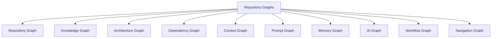

> **Diagram ID:** `DGM-MCS-014`
> **Explanation:** Ten graph types view the repository from different perspectives, all
> interconnected.

> **Image Specification**
> - Image ID: `IMG-MCS-005`
> - Purpose: Visualize the ten repository graphs.
> - Prompt: "A diagram showing ten interconnected repository graphs: repository, knowledge, architecture, dependency, context, prompt, memory, AI, workflow, navigation, navy blueprint style."
> - Style: Graph cluster, blueprint.
> - Composition: Central node with ten graph branches.
> - Resolution: 2200x1600px
> - Priority: HIGH
> - Suggested Filename: `assets/diagrams/mcs-graph-overview.png`

## 4.2 Repository Graph

The Repository Graph represents the physical structure.

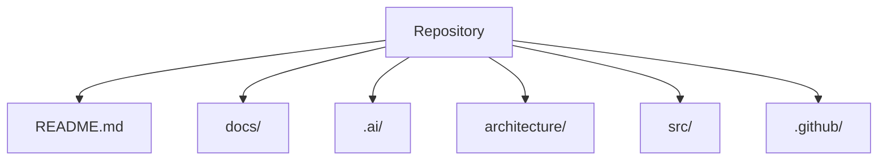

> **Diagram ID:** `DGM-MCS-015`
> **Explanation:** The Repository Graph maps the physical directory structure.

### TBL-MCS-060: Repository Graph Nodes

| Node | Purpose |
| :--- | :--- |
| README | Entry point |
| docs/ | Documentation |
| .ai/ | AI control plane |
| architecture/ | Blueprints |
| src/ | Source |
| .github/ | Governance |

## 4.3 Knowledge Graph

The Knowledge Graph represents knowledge relationships.

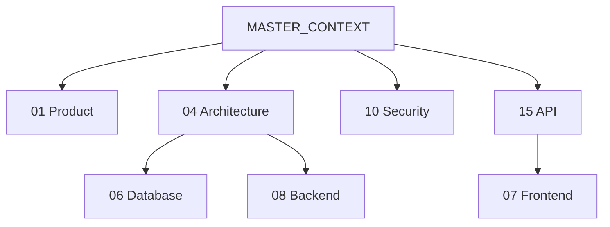

> **Diagram ID:** `DGM-MCS-016`
> **Explanation:** The Knowledge Graph maps domain relationships and dependencies.

### TBL-MCS-061: Knowledge Graph Edges

| Edge | Type | Meaning |
| :--- | :--- | :--- |
| MCX→D01 | contains | Root to domain |
| D04→D06 | depends | Architecture to data |
| D04→D08 | depends | Architecture to backend |
| D15→D07 | consumed | API to frontend |

## 4.4 Architecture Graph

The Architecture Graph represents the system design.

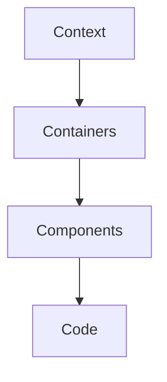

> **Diagram ID:** `DGM-MCS-017`
> **Explanation:** The Architecture Graph follows the C4 model.

### TBL-MCS-062: Architecture Graph Layers

| Layer | Scope |
| :--- | :--- |
| Context | System + actors |
| Containers | Apps, services |
| Components | Parts |
| Code | Detail |

## 4.5 Dependency Graph

The Dependency Graph represents object dependencies.

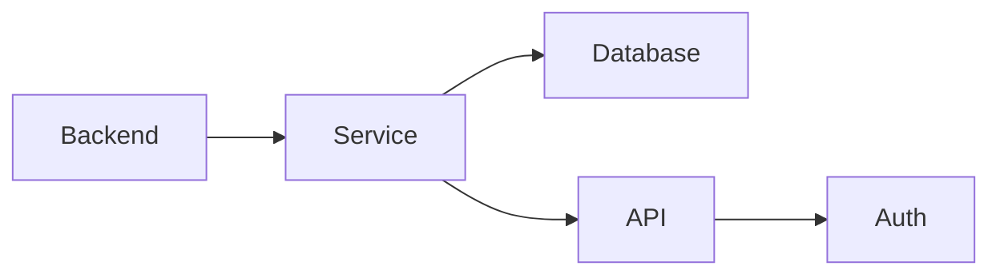

> **Diagram ID:** `DGM-MCS-018`
> **Explanation:** The Dependency Graph maps which objects depend on others.

### TBL-MCS-063: Dependency Types

| Type | Meaning |
| :--- | :--- |
| Requires | Needs upstream |
| Consumes | Uses |
| Implements | Realizes |
| References | Links |

## 4.6 Context Graph

The Context Graph represents situational knowledge.

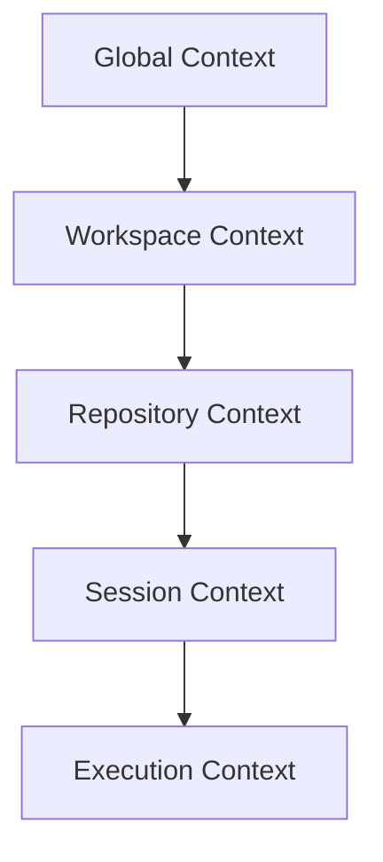

> **Diagram ID:** `DGM-MCS-019`
> **Explanation:** The Context Graph flows from global to execution context.

### TBL-MCS-064: Context Graph Levels

| Level | Content |
| :--- | :--- |
| Global | Organization-wide |
| Workspace | Environment |
| Repository | Repo knowledge |
| Session | Working |
| Execution | Task |

## 4.7 Prompt Graph

The Prompt Graph represents prompt relationships.

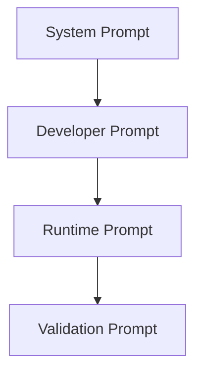

> **Diagram ID:** `DGM-MCS-020`
> **Explanation:** The Prompt Graph shows how prompts relate and build on each other.

### TBL-MCS-065: Prompt Graph Types

| Type | Purpose |
| :--- | :--- |
| System | Base instruction |
| Developer | Coding guidance |
| Runtime | Execution |
| Validation | Check |

## 4.8 Memory Graph

The Memory Graph represents persisted knowledge.

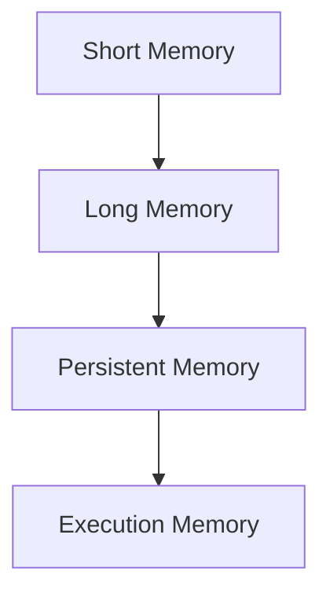

> **Diagram ID:** `DGM-MCS-021`
> **Explanation:** The Memory Graph shows memory flow from short to persistent.

### TBL-MCS-066: Memory Graph Types

| Type | Persistence |
| :--- | :--- |
| Short | Turn |
| Long | Session |
| Persistent | Permanent |
| Execution | Task |

## 4.9 AI Graph

The AI Graph represents AI system relationships.

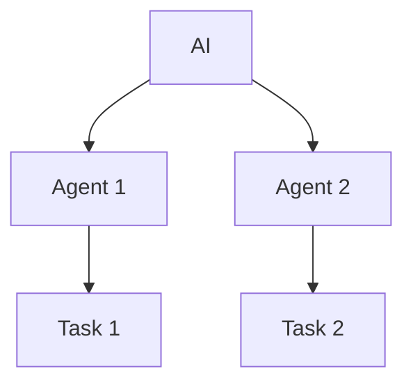

> **Diagram ID:** `DGM-MCS-022`
> **Explanation:** The AI Graph shows how AI systems run agents that execute tasks.

### TBL-MCS-067: AI Graph Nodes

| Node | Role |
| :--- | :--- |
| AI | System |
| Agent | Worker |
| Task | Work |
| Governance | Rules |

## 4.10 Workflow Graph

The Workflow Graph represents processes.

```mermaid
flowchart LR
    W[Workflow] --> S1[Step 1]
    S1 --> S2[Step 2]
    S2 --> S3[Step 3]
    S3 --> OUT[Output]
```

> **Diagram ID:** `DGM-MCS-023`
> **Explanation:** The Workflow Graph shows process steps.

### TBL-MCS-068: Workflow Graph Elements

| Element | Role |
| :--- | :--- |
| Trigger | Start event |
| Step | Action |
| Gate | Decision |
| Output | Result |

## 4.11 Navigation Graph

The Navigation Graph represents routing.

```mermaid
flowchart TD
    Q[Question] --> R[Route]
    R --> D[Domain]
    D --> DOC[Document]
```

> **Diagram ID:** `DGM-MCS-024`
> **Explanation:** The Navigation Graph maps question-to-document routing.

### TBL-MCS-069: Navigation Graph Paths

| Path | Purpose |
| :--- | :--- |
| Question→Route | Intent |
| Route→Domain | Resolution |
| Domain→Document | Location |
| Document→Content | Detail |

## 4.12 Graph Relationships

### TBL-MCS-070: Graph Interrelationships

| Graph | Related to | Through |
| :--- | :--- | :--- |
| Repository | Knowledge | Domains |
| Knowledge | Architecture | Bounded contexts |
| Architecture | Dependency | Service deps |
| Dependency | Context | Object state |
| Context | Prompt | Instructions |
| Prompt | Memory | Learning |
| Memory | AI | Agents |
| AI | Workflow | Execution |
| Workflow | Navigation | Routing |
| Navigation | Repository | Structure |

## 4.13 Graph Decision Rules

| Rule | Statement |
| :--- | :--- |
| GR-01 | Every object appears in a graph |
| GR-02 | Graphs are interconnected |
| GR-03 | Dependencies are acyclic |
| GR-04 | Every edge is meaningful |
| GR-05 | Graphs support navigation |
| GR-06 | Graphs are validated |
| GR-07 | No isolated concepts |
| GR-08 | Cross references required |

## 4.14 Graph Examples

### JSON Example

```json
{
  "graph": {
    "id": "GRA-001",
    "type": "knowledge",
    "nodes": ["MCX", "DOM-15"],
    "edges": [{"from": "MCX", "to": "DOM-15", "type": "contains"}]
  }
}
```

### YAML Example

```yaml
graph:
  id: GRA-001
  type: knowledge
  nodes:
    - MCX
    - DOM-15
  edges:
    - from: MCX
      to: DOM-15
      type: contains
```

### Markdown Example

```markdown
# Graph: Knowledge
> Nodes: MCX, DOM-15.
> Edge: MCX contains DOM-15.
```

### Directory Tree Example

```
graphs/
├── knowledge/
├── architecture/
└── dependency/
```

## 4.15 Graph Navigation

| Need | Section |
| :--- | :--- |
| Repository graph | 4.2 |
| Knowledge graph | 4.3 |
| Architecture graph | 4.4 |
| Dependency graph | 4.5 |
| Context graph | 4.6 |
| Prompt graph | 4.7 |
| Memory graph | 4.8 |
| AI graph | 4.9 |
| Workflow graph | 4.10 |
| Navigation graph | 4.11 |

---

# PART 05 — Context Schema

## 5.1 Context Overview

Context is the situational knowledge an agent needs to act. The context schema defines ten
context types, each with a defined structure and scope.

```mermaid
flowchart TD
    CONTEXT[Context] --> GC[Global Context]
    CONTEXT --> WC[Workspace Context]
    CONTEXT --> RC[Repository Context]
    CONTEXT --> SC[Session Context]
    CONTEXT --> EC[Execution Context]
    CONTEXT --> PC[Prompt Context]
    CONTEXT --> MC[Memory Context]
    CONTEXT --> RC2[Runtime Context]
    CONTEXT --> VC[Validation Context]
    CONTEXT --> REC[Recovery Context]
```

> **Diagram ID:** `DGM-MCS-025`
> **Explanation:** Ten context types provide situational knowledge at different scopes.

> **Image Specification**
> - Image ID: `IMG-MCS-006`
> - Purpose: Visualize the ten context types of the context schema.
> - Prompt: "A context schema diagram with ten context types: global, workspace, repository, session, execution, prompt, memory, runtime, validation, recovery, navy blueprint style."
> - Style: Context map, blueprint.
> - Composition: Central context node with ten branches.
> - Resolution: 2200x1600px
> - Priority: HIGH
> - Suggested Filename: `assets/diagrams/mcs-context-schema.png`

## 5.2 Global Context

### Purpose
Organization-wide situational knowledge.

### TBL-MCS-071: Global Context Schema

| Field | Type | Required | Description |
| :--- | :--- | :---: | :--- |
| id | string | ✅ | Context id |
| organization | string | ✅ | Org ref |
| standards | list | ✅ | Standards |
| governance | list | ✅ | Rules |
| version | string | ✅ | SemVer |

### JSON Example

```json
{
  "global_context": {
    "id": "GC-001",
    "organization": "afshin-omnisystem",
    "standards": ["STD-001"],
    "governance": ["GOV-001"],
    "version": "1.0.0"
  }
}
```

### YAML Example

```yaml
global_context:
  id: GC-001
  organization: afshin-omnisystem
  standards:
    - STD-001
  governance:
    - GOV-001
  version: 1.0.0
```

## 5.3 Workspace Context

### Purpose
Environment-specific knowledge.

### TBL-MCS-072: Workspace Context Schema

| Field | Type | Required | Description |
| :--- | :--- | :---: | :--- |
| id | string | ✅ | Context id |
| workspace | string | ✅ | Workspace ref |
| environment | string | ✅ | Env |
| tools | list | ✅ | Tooling |
| configs | list | ✅ | Configs |

### JSON Example

```json
{
  "workspace_context": {
    "id": "WC-001",
    "workspace": "ws-001",
    "environment": "local",
    "tools": ["git"],
    "configs": ["CFG-001"]
  }
}
```

### YAML Example

```yaml
workspace_context:
  id: WC-001
  workspace: ws-001
  environment: local
  tools:
    - git
  configs:
    - CFG-001
```

## 5.4 Repository Context

### Purpose
Repository-level knowledge.

### TBL-MCS-073: Repository Context Schema

| Field | Type | Required | Description |
| :--- | :--- | :---: | :--- |
| id | string | ✅ | Context id |
| repository | string | ✅ | Repo ref |
| topology | list | ✅ | Structure |
| governance | list | ✅ | Rules |
| version | string | ✅ | SemVer |

### JSON Example

```json
{
  "repository_context": {
    "id": "RC-001",
    "repository": "osh",
    "topology": ["docs/", ".ai/"],
    "governance": ["CODEOWNERS"],
    "version": "1.0.0"
  }
}
```

### YAML Example

```yaml
repository_context:
  id: RC-001
  repository: osh
  topology:
    - docs/
    - .ai/
  governance:
    - CODEOWNERS
  version: 1.0.0
```

## 5.5 Session Context

### Purpose
Working-session knowledge.

### TBL-MCS-074: Session Context Schema

| Field | Type | Required | Description |
| :--- | :--- | :---: | :--- |
| id | string | ✅ | Context id |
| session | string | ✅ | Session ref |
| agent | string | ✅ | Agent ref |
| task | string | ✅ | Task ref |
| state | string | ✅ | State |

### JSON Example

```json
{
  "session_context": {
    "id": "SC-001",
    "session": "sess-001",
    "agent": "AG-001",
    "task": "TASK-001",
    "state": "IN_PROGRESS"
  }
}
```

### YAML Example

```yaml
session_context:
  id: SC-001
  session: sess-001
  agent: AG-001
  task: TASK-001
  state: IN_PROGRESS
```

## 5.6 Execution Context

### Purpose
Task-execution knowledge.

### TBL-MCS-075: Execution Context Schema

| Field | Type | Required | Description |
| :--- | :--- | :---: | :--- |
| id | string | ✅ | Context id |
| execution | string | ✅ | Execution ref |
| task | string | ✅ | Task ref |
| inputs | list | ✅ | Inputs |
| outputs | list | ✅ | Outputs |

### JSON Example

```json
{
  "execution_context": {
    "id": "EC-001",
    "execution": "exe-001",
    "task": "TASK-001",
    "inputs": ["context"],
    "outputs": ["result"]
  }
}
```

### YAML Example

```yaml
execution_context:
  id: EC-001
  execution: exe-001
  task: TASK-001
  inputs:
    - context
  outputs:
    - result
```

## 5.7 Prompt Context

### Purpose
Knowledge needed to build a prompt.

### TBL-MCS-076: Prompt Context Schema

| Field | Type | Required | Description |
| :--- | :--- | :---: | :--- |
| id | string | ✅ | Context id |
| prompt | string | ✅ | Prompt ref |
| facts | list | ✅ | Facts |
| constraints | list | ✅ | Limits |
| examples | list | ✅ | Examples |

### JSON Example

```json
{
  "prompt_context": {
    "id": "PC-001",
    "prompt": "PROMPT-001",
    "facts": ["Oship is cognitive OS"],
    "constraints": ["no code"],
    "examples": []
  }
}
```

### YAML Example

```yaml
prompt_context:
  id: PC-001
  prompt: PROMPT-001
  facts:
    - Oship is cognitive OS
  constraints:
    - no code
  examples: []
```

## 5.8 Memory Context

### Purpose
Persisted learning for context.

### TBL-MCS-077: Memory Context Schema

| Field | Type | Required | Description |
| :--- | :--- | :---: | :--- |
| id | string | ✅ | Context id |
| memory | string | ✅ | Memory ref |
| lessons | list | ✅ | Lessons |
| patterns | list | ✅ | Patterns |
| state | string | ✅ | State |

### JSON Example

```json
{
  "memory_context": {
    "id": "MC-001",
    "memory": "MEM-001",
    "lessons": ["route first"],
    "patterns": ["boot sequence"],
    "state": "ACTIVE"
  }
}
```

### YAML Example

```yaml
memory_context:
  id: MC-001
  memory: MEM-001
  lessons:
    - route first
  patterns:
    - boot sequence
  state: ACTIVE
```

## 5.9 Runtime Context

### Purpose
Runtime operational knowledge.

### TBL-MCS-078: Runtime Context Schema

| Field | Type | Required | Description |
| :--- | :--- | :---: | :--- |
| id | string | ✅ | Context id |
| runtime | string | ✅ | Runtime ref |
| services | list | ✅ | Services |
| state | string | ✅ | State |
| telemetry | string | ✅ | Telemetry |

### JSON Example

```json
{
  "runtime_context": {
    "id": "RTC-001",
    "runtime": "prod",
    "services": ["SVC-001"],
    "state": "HEALTHY",
    "telemetry": "MON-001"
  }
}
```

### YAML Example

```yaml
runtime_context:
  id: RTC-001
  runtime: prod
  services:
    - SVC-001
  state: HEALTHY
  telemetry: MON-001
```

## 5.10 Validation Context

### Purpose
Knowledge for validation.

### TBL-MCS-079: Validation Context Schema

| Field | Type | Required | Description |
| :--- | :--- | :---: | :--- |
| id | string | ✅ | Context id |
| target | string | ✅ | Validated object |
| rules | list | ✅ | Validation rules |
| results | list | ✅ | Results |
| status | string | ✅ | Status |

### JSON Example

```json
{
  "validation_context": {
    "id": "VC-001",
    "target": "DOC-001",
    "rules": ["RULE-001"],
    "results": ["pass"],
    "status": "PASSED"
  }
}
```

### YAML Example

```yaml
validation_context:
  id: VC-001
  target: DOC-001
  rules:
    - RULE-001
  results:
    - pass
  status: PASSED
```

## 5.11 Recovery Context

### Purpose
Knowledge for recovery.

### TBL-MCS-080: Recovery Context Schema

| Field | Type | Required | Description |
| :--- | :--- | :---: | :--- |
| id | string | ✅ | Context id |
| incident | string | ✅ | Incident ref |
| cause | string | ✅ | Root cause |
| actions | list | ✅ | Recovery steps |
| status | string | ✅ | Status |

### JSON Example

```json
{
  "recovery_context": {
    "id": "REC-001",
    "incident": "INC-001",
    "cause": "config error",
    "actions": ["rollback"],
    "status": "RECOVERED"
  }
}
```

### YAML Example

```yaml
recovery_context:
  id: REC-001
  incident: INC-001
  cause: config error
  actions:
    - rollback
  status: RECOVERED
```

## 5.12 Context Selection Rules

| Rule | Statement |
| :--- | :--- |
| CTX-01 | Load the right context type |
| CTX-02 | Context is scoped |
| CTX-03 | Context flows hierarchically |
| CTX-04 | Context expires |
| CTX-05 | Context is sourced |
| CTX-06 | Context is validated |

```mermaid
flowchart TD
    NEED[Need] --> TYPE{Context type}
    TYPE -->|Global| G[Global]
    TYPE -->|Task| E[Execution]
    TYPE -->|Session| S[Session]
    G --> LOAD[Load context]
    E --> LOAD
    S --> LOAD
```

> **Diagram ID:** `DGM-MCS-026`
> **Explanation:** Context selection is type-driven and deterministic.

---

# PART 06 — Prompt Schema

## 6.1 Prompt Overview

Prompts are instructions to AI. The prompt schema defines seven prompt types.

```mermaid
flowchart TD
    PROMPT[Prompt] --> SP[System Prompt]
    PROMPT --> DP[Developer Prompt]
    PROMPT --> RP[Runtime Prompt]
    PROMPT --> VP[Validation Prompt]
    PROMPT --> RECP[Recovery Prompt]
    PROMPT --> TP[Testing Prompt]
    PROMPT --> DEPP[Deployment Prompt]
```

> **Diagram ID:** `DGM-MCS-027`
> **Explanation:** Seven prompt types serve different purposes.

> **Image Specification**
> - Image ID: `IMG-MCS-007`
> - Purpose: Visualize the seven prompt types.
> - Prompt: "A prompt schema with seven types: system, developer, runtime, validation, recovery, testing, deployment, purple and navy blueprint style."
> - Style: Prompt map, blueprint.
> - Composition: Central prompt node with seven branches.
> - Resolution: 2000x1400px
> - Priority: HIGH
> - Suggested Filename: `assets/diagrams/mcs-prompt-schema.png`

## 6.2 System Prompt

### Purpose
Base instruction for an AI system.

### TBL-MCS-081: System Prompt Schema

| Field | Type | Required | Description |
| :--- | :--- | :---: | :--- |
| id | string | ✅ | Prompt id |
| role | string | ✅ | AI role |
| behavior | string | ✅ | Behavior |
| constraints | list | ✅ | Limits |
| version | string | ✅ | SemVer |

### JSON Example

```json
{
  "system_prompt": {
    "id": "SP-001",
    "role": "architect",
    "behavior": "Deterministic, enterprise-grade",
    "constraints": ["no guessing"],
    "version": "1.0.0"
  }
}
```

### YAML Example

```yaml
system_prompt:
  id: SP-001
  role: architect
  behavior: Deterministic, enterprise-grade
  constraints:
    - no guessing
  version: 1.0.0
```

### AI Prompt Example

```text
You are an enterprise architect for Oship.
Be deterministic. Never guess. Route through MASTER_CONTEXT.
Follow the schema and operating rules.
```

## 6.3 Developer Prompt

### Purpose
Guidance for coding.

### TBL-MCS-082: Developer Prompt Schema

| Field | Type | Required | Description |
| :--- | :--- | :---: | :--- |
| id | string | ✅ | Prompt id |
| language | string | ✅ | Language |
| domain | string | ✅ | Domain |
| standards | list | ✅ | Standards |
| version | string | ✅ | SemVer |

### JSON Example

```json
{
  "developer_prompt": {
    "id": "DP-001",
    "language": "typescript",
    "domain": "08_BACKEND",
    "standards": ["coding standard"],
    "version": "1.0.0"
  }
}
```

### YAML Example

```yaml
developer_prompt:
  id: DP-001
  language: typescript
  domain: 08_BACKEND
  standards:
    - coding standard
  version: 1.0.0
```

### AI Prompt Example

```text
You are a backend developer. Implement within the 08_BACKEND domain.
Follow the backend architecture and service boundaries.
Respect the API contracts.
```

## 6.4 Runtime Prompt

### Purpose
Guidance for execution.

### TBL-MCS-083: Runtime Prompt Schema

| Field | Type | Required | Description |
| :--- | :--- | :---: | :--- |
| id | string | ✅ | Prompt id |
| task | string | ✅ | Task |
| context | string | ✅ | Context |
| outputs | list | ✅ | Expected |
| version | string | ✅ | SemVer |

### JSON Example

```json
{
  "runtime_prompt": {
    "id": "RP-001",
    "task": "build endpoint",
    "context": "EC-001",
    "outputs": ["code"],
    "version": "1.0.0"
  }
}
```

### YAML Example

```yaml
runtime_prompt:
  id: RP-001
  task: build endpoint
  context: EC-001
  outputs:
    - code
  version: 1.0.0
```

### AI Prompt Example

```text
Execute task: build endpoint.
Use execution context EC-001.
Produce code and validate against the contract.
```

## 6.5 Validation Prompt

### Purpose
Guidance for validation.

### TBL-MCS-084: Validation Prompt Schema

| Field | Type | Required | Description |
| :--- | :--- | :---: | :--- |
| id | string | ✅ | Prompt id |
| target | string | ✅ | Validated |
| rules | list | ✅ | Rules |
| criteria | string | ✅ | Success |
| version | string | ✅ | SemVer |

### JSON Example

```json
{
  "validation_prompt": {
    "id": "VP-001",
    "target": "DOC-001",
    "rules": ["RULE-001"],
    "criteria": "DoD passed",
    "version": "1.0.0"
  }
}
```

### YAML Example

```yaml
validation_prompt:
  id: VP-001
  target: DOC-001
  rules:
    - RULE-001
  criteria: DoD passed
  version: 1.0.0
```

### AI Prompt Example

```text
Validate DOC-001 against RULE-001.
Pass only if the DoD checklist is fully satisfied.
Report each check.
```

## 6.6 Recovery Prompt

### Purpose
Guidance for recovery.

### TBL-MCS-085: Recovery Prompt Schema

| Field | Type | Required | Description |
| :--- | :--- | :---: | :--- |
| id | string | ✅ | Prompt id |
| incident | string | ✅ | Incident |
| cause | string | ✅ | Cause |
| steps | list | ✅ | Recovery |
| version | string | ✅ | SemVer |

### JSON Example

```json
{
  "recovery_prompt": {
    "id": "RECP-001",
    "incident": "INC-001",
    "cause": "config error",
    "steps": ["rollback"],
    "version": "1.0.0"
  }
}
```

### YAML Example

```yaml
recovery_prompt:
  id: RECP-001
  incident: INC-001
  cause: config error
  steps:
    - rollback
  version: 1.0.0
```

### AI Prompt Example

```text
Recover from INC-001. Cause: config error.
Follow the recovery steps. Verify recovery.
Log the outcome.
```

## 6.7 Testing Prompt

### Purpose
Guidance for testing.

### TBL-MCS-086: Testing Prompt Schema

| Field | Type | Required | Description |
| :--- | :--- | :---: | :--- |
| id | string | ✅ | Prompt id |
| target | string | ✅ | Tested |
| level | string | ✅ | Test level |
| cases | list | ✅ | Cases |
| version | string | ✅ | SemVer |

### JSON Example

```json
{
  "testing_prompt": {
    "id": "TP-001",
    "target": "SVC-001",
    "level": "unit",
    "cases": ["TC-001"],
    "version": "1.0.0"
  }
}
```

### YAML Example

```yaml
testing_prompt:
  id: TP-001
  target: SVC-001
  level: unit
  cases:
    - TC-001
  version: 1.0.0
```

### AI Prompt Example

```text
Test SVC-001 at unit level.
Run cases TC-001. Measure coverage.
Report pass/fail and coverage.
```

## 6.8 Deployment Prompt

### Purpose
Guidance for deployment.

### TBL-MCS-087: Deployment Prompt Schema

| Field | Type | Required | Description |
| :--- | :--- | :---: | :--- |
| id | string | ✅ | Prompt id |
| version | string | ✅ | Release |
| environment | string | ✅ | Env |
| steps | list | ✅ | Deploy steps |
| version_semver | string | ✅ | SemVer |

### JSON Example

```json
{
  "deployment_prompt": {
    "id": "DEPP-001",
    "version": "1.0.0",
    "environment": "production",
    "steps": ["build", "deploy"],
    "version_semver": "1.0.0"
  }
}
```

### YAML Example

```yaml
deployment_prompt:
  id: DEPP-001
  version: 1.0.0
  environment: production
  steps:
    - build
    - deploy
  version_semver: 1.0.0
```

### AI Prompt Example

```text
Deploy version 1.0.0 to production.
Follow the deployment steps. Verify health.
Roll back on failure.
```

## 6.9 Prompt Decision Rules

| Rule | Statement |
| :--- | :--- |
| PR-01 | Use the correct prompt type |
| PR-02 | Prompts are versioned |
| PR-03 | Prompts consume context |
| PR-04 | Prompts define validation |
| PR-05 | Prompts are deterministic |
| PR-06 | Prompts are tested |

## 6.10 Prompt Examples Library

### JSON Example

```json
{
  "prompt_examples": [
    {"type": "system", "purpose": "boot"},
    {"type": "developer", "purpose": "code"},
    {"type": "runtime", "purpose": "execute"}
  ]
}
```

### YAML Example

```yaml
prompt_examples:
  - type: system
    purpose: boot
  - type: developer
    purpose: code
  - type: runtime
    purpose: execute
```

### AI Prompt Example

```text
As an Oship AI, follow the boot sequence:
1. Read MASTER_CONTEXT.
2. Read context.
3. Route to domain.
4. Execute task.
5. Validate and report.
```

### Directory Tree Example

```
prompts/
├── system/
├── developer/
├── runtime/
└── validation/
```

---

# PART 07 — Memory Schema

## 7.1 Memory Overview

Memory is the persistence layer of AI knowledge. The memory schema defines eight memory
types.

```mermaid
flowchart TD
    MEMORY[Memory] --> SH[Short Memory]
    MEMORY --> LO[Long Memory]
    MEMORY --> PE[Persistent Memory]
    MEMORY --> EX[Execution Memory]
    MEMORY --> LE[Learning Memory]
    MEMORY --> HI[Historical Memory]
    MEMORY --> SH2[Shared Memory]
    MEMORY --> AG[Agent Memory]
```

> **Diagram ID:** `DGM-MCS-028`
> **Explanation:** Eight memory types serve different persistence needs.

> **Image Specification**
> - Image ID: `IMG-MCS-008`
> - Purpose: Visualize the eight memory types.
> - Prompt: "A memory schema with eight types: short, long, persistent, execution, learning, historical, shared, agent, navy blueprint style."
> - Style: Memory map, blueprint.
> - Composition: Central memory node with eight branches.
> - Resolution: 2000x1400px
> - Priority: HIGH
> - Suggested Filename: `assets/diagrams/mcs-memory-schema.png`

## 7.2 Short Memory

### Purpose
Turn-scoped knowledge.

### TBL-MCS-088: Short Memory Schema

| Field | Type | Required | Description |
| :--- | :--- | :---: | :--- |
| id | string | ✅ | Memory id |
| content | string | ✅ | Knowledge |
| turn | string | ✅ | Turn ref |
| source | string | ✅ | Origin |
| status | string | ✅ | State |

### JSON Example

```json
{
  "short_memory": {
    "id": "SM-001",
    "content": "current task",
    "turn": "turn-1",
    "source": "session",
    "status": "ACTIVE"
  }
}
```

### YAML Example

```yaml
short_memory:
  id: SM-001
  content: current task
  turn: turn-1
  source: session
  status: ACTIVE
```

## 7.3 Long Memory

### Purpose
Session-scoped knowledge.

### TBL-MCS-089: Long Memory Schema

| Field | Type | Required | Description |
| :--- | :--- | :---: | :--- |
| id | string | ✅ | Memory id |
| content | string | ✅ | Knowledge |
| session | string | ✅ | Session ref |
| lessons | list | ✅ | Lessons |
| status | string | ✅ | State |

### JSON Example

```json
{
  "long_memory": {
    "id": "LM-001",
    "content": "session learnings",
    "session": "sess-001",
    "lessons": ["route first"],
    "status": "ACTIVE"
  }
}
```

### YAML Example

```yaml
long_memory:
  id: LM-001
  content: session learnings
  session: sess-001
  lessons:
    - route first
  status: ACTIVE
```

## 7.4 Persistent Memory

### Purpose
Permanent knowledge.

### TBL-MCS-090: Persistent Memory Schema

| Field | Type | Required | Description |
| :--- | :--- | :---: | :--- |
| id | string | ✅ | Memory id |
| content | string | ✅ | Knowledge |
| domain | string | ✅ | Domain ref |
| owner | string | ✅ | Owner |
| status | string | ✅ | State |

### JSON Example

```json
{
  "persistent_memory": {
    "id": "PM-001",
    "content": "MASTER_CONTEXT knowledge",
    "domain": "MCX",
    "owner": "Architect",
    "status": "ACTIVE"
  }
}
```

### YAML Example

```yaml
persistent_memory:
  id: PM-001
  content: MASTER_CONTEXT knowledge
  domain: MCX
  owner: Architect
  status: ACTIVE
```

## 7.5 Execution Memory

### Purpose
Task-scoped knowledge.

### TBL-MCS-091: Execution Memory Schema

| Field | Type | Required | Description |
| :--- | :--- | :---: | :--- |
| id | string | ✅ | Memory id |
| content | string | ✅ | Knowledge |
| execution | string | ✅ | Execution ref |
| task | string | ✅ | Task ref |
| status | string | ✅ | State |

### JSON Example

```json
{
  "execution_memory": {
    "id": "EM-001",
    "content": "task state",
    "execution": "exe-001",
    "task": "TASK-001",
    "status": "ACTIVE"
  }
}
```

### YAML Example

```yaml
execution_memory:
  id: EM-001
  content: task state
  execution: exe-001
  task: TASK-001
  status: ACTIVE
```

## 7.6 Learning Memory

### Purpose
Lessons learned.

### TBL-MCS-092: Learning Memory Schema

| Field | Type | Required | Description |
| :--- | :--- | :---: | :--- |
| id | string | ✅ | Memory id |
| lesson | string | ✅ | Lesson |
| trigger | string | ✅ | What prompted |
| applicability | string | ✅ | Where applies |
| action | string | ✅ | Adjustment |

### JSON Example

```json
{
  "learning_memory": {
    "id": "LE-001",
    "lesson": "Route before acting",
    "trigger": "missed routing",
    "applicability": "all agents",
    "action": "always route first"
  }
}
```

### YAML Example

```yaml
learning_memory:
  id: LE-001
  lesson: Route before acting
  trigger: missed routing
  applicability: all agents
  action: always route first
```

## 7.7 Historical Memory

### Purpose
Past knowledge.

### TBL-MCS-093: Historical Memory Schema

| Field | Type | Required | Description |
| :--- | :--- | :---: | :--- |
| id | string | ✅ | Memory id |
| event | string | ✅ | Event ref |
| timestamp | string | ✅ | Time |
| record | string | ✅ | Record |
| status | string | ✅ | State |

### JSON Example

```json
{
  "historical_memory": {
    "id": "HM-001",
    "event": "EVT-001",
    "timestamp": "2026-08-04T00:00:00Z",
    "record": "decision accepted",
    "status": "ARCHIVED"
  }
}
```

### YAML Example

```yaml
historical_memory:
  id: HM-001
  event: EVT-001
  timestamp: "2026-08-04T00:00:00Z"
  record: decision accepted
  status: ARCHIVED
```

## 7.8 Shared Memory

### Purpose
Multi-agent shared knowledge.

### TBL-MCS-094: Shared Memory Schema

| Field | Type | Required | Description |
| :--- | :--- | :---: | :--- |
| id | string | ✅ | Memory id |
| content | string | ✅ | Knowledge |
| agents | list | ✅ | Agent refs |
| consensus | string | ✅ | Consensus |
| status | string | ✅ | State |

### JSON Example

```json
{
  "shared_memory": {
    "id": "SH-001",
    "content": "shared routing rules",
    "agents": ["AG-001", "AG-002"],
    "consensus": "agreed",
    "status": "ACTIVE"
  }
}
```

### YAML Example

```yaml
shared_memory:
  id: SH-001
  content: shared routing rules
  agents:
    - AG-001
    - AG-002
  consensus: agreed
  status: ACTIVE
```

## 7.9 Agent Memory

### Purpose
Per-agent knowledge.

### TBL-MCS-095: Agent Memory Schema

| Field | Type | Required | Description |
| :--- | :--- | :---: | :--- |
| id | string | ✅ | Memory id |
| agent | string | ✅ | Agent ref |
| content | string | ✅ | Knowledge |
| scope | string | ✅ | Scope |
| status | string | ✅ | State |

### JSON Example

```json
{
  "agent_memory": {
    "id": "AGM-001",
    "agent": "AG-001",
    "content": "agent preferences",
    "scope": "docs-agent",
    "status": "ACTIVE"
  }
}
```

### YAML Example

```yaml
agent_memory:
  id: AGM-001
  agent: AG-001
  content: agent preferences
  scope: docs-agent
  status: ACTIVE
```

## 7.10 Memory Decision Rules

| Rule | Statement |
| :--- | :--- |
| MEM-01 | Memory is tiered |
| MEM-02 | Memory persists correctly |
| MEM-03 | Memory is scoped |
| MEM-04 | Memory is sourced |
| MEM-05 | Memory has a lifecycle |
| MEM-06 | Memory is validated |
| MEM-07 | No secrets in memory |
| MEM-08 | Memory syncs |

## 7.11 Memory Flow

```mermaid
flowchart LR
    SHORT[Short] --> LONG[Long]
    LONG --> PERSIST[Persistent]
    PERSIST --> SHARED[Shared]
```

> **Diagram ID:** `DGM-MCS-029`
> **Explanation:** Memory flows from short-term to persistent to shared.

---

# PART 08 — Knowledge Routing

## 8.1 Routing Overview

Knowledge routing resolves a question to the correct knowledge. The routing schema defines
six stages.

```mermaid
flowchart LR
    INT[Intent Detection] --> SEL[Context Selection]
    SEL --> MOUNT[Knowledge Mounting]
    MOUNT --> EX[Execution]
    EX --> VAL[Validation]
    VAL --> REC[Recovery]
```

> **Diagram ID:** `DGM-MCS-030`
> **Explanation:** Routing flows through intent detection, context selection, mounting,
> execution, validation, and recovery.

> **Image Specification**
> - Image ID: `IMG-MCS-009`
> - Purpose: Visualize the six-stage knowledge routing pipeline.
> - Prompt: "A six-stage routing pipeline: intent detection, context selection, knowledge mounting, execution, validation, recovery, purple and navy blueprint style."
> - Style: Pipeline flowchart, blueprint.
> - Composition: Six-stage pipeline.
> - Resolution: 2200x800px
> - Priority: CRITICAL
> - Suggested Filename: `assets/diagrams/mcs-routing-pipeline.png`

## 8.2 Intent Detection

### Purpose
Determine what the query wants.

### TBL-MCS-096: Intent Detection Schema

| Field | Type | Required | Description |
| :--- | :--- | :---: | :--- |
| id | string | ✅ | Detection id |
| query | string | ✅ | Query |
| intent | string | ✅ | Detected intent |
| keywords | list | ✅ | Keywords |
| confidence | string | ✅ | Confidence |

### JSON Example

```json
{
  "intent_detection": {
    "id": "ID-001",
    "query": "how to deploy",
    "intent": "build",
    "keywords": ["deploy"],
    "confidence": "high"
  }
}
```

### YAML Example

```yaml
intent_detection:
  id: ID-001
  query: how to deploy
  intent: build
  keywords:
    - deploy
  confidence: high
```

## 8.3 Context Selection

### Purpose
Choose the right context.

### TBL-MCS-097: Context Selection Schema

| Field | Type | Required | Description |
| :--- | :--- | :---: | :--- |
| id | string | ✅ | Selection id |
| intent | string | ✅ | Intent |
| context | string | ✅ | Chosen context |
| priority | string | ✅ | Priority |
| reason | string | ✅ | Why |

### JSON Example

```json
{
  "context_selection": {
    "id": "CS-001",
    "intent": "build",
    "context": "repository",
    "priority": "high",
    "reason": "deployment intent"
  }
}
```

### YAML Example

```yaml
context_selection:
  id: CS-001
  intent: build
  context: repository
  priority: high
  reason: deployment intent
```

## 8.4 Knowledge Mounting

### Purpose
Load the target knowledge.

### TBL-MCS-098: Knowledge Mounting Schema

| Field | Type | Required | Description |
| :--- | :--- | :---: | :--- |
| id | string | ✅ | Mounting id |
| domain | string | ✅ | Target domain |
| documents | list | ✅ | Docs to load |
| size | string | ✅ | Context size |
| status | string | ✅ | State |

### JSON Example

```json
{
  "knowledge_mounting": {
    "id": "KM-001",
    "domain": "DOM-11",
    "documents": ["RELEASE_STRATEGY"],
    "size": "small",
    "status": "MOUNTED"
  }
}
```

### YAML Example

```yaml
knowledge_mounting:
  id: KM-001
  domain: DOM-11
  documents:
    - RELEASE_STRATEGY
  size: small
  status: MOUNTED
```

## 8.5 Execution

### Purpose
Perform the routed action.

### TBL-MCS-099: Execution Schema

| Field | Type | Required | Description |
| :--- | :--- | :---: | :--- |
| id | string | ✅ | Execution id |
| task | string | ✅ | Task |
| domain | string | ✅ | Domain |
| context | string | ✅ | Context |
| result | string | ✅ | Result |
| status | string | ✅ | State |

### JSON Example

```json
{
  "execution": {
    "id": "EXE-001",
    "task": "deploy",
    "domain": "DOM-11",
    "context": "CS-001",
    "result": "deployed",
    "status": "COMPLETED"
  }
}
```

### YAML Example

```yaml
execution:
  id: EXE-001
  task: deploy
  domain: DOM-11
  context: CS-001
  result: deployed
  status: COMPLETED
```

## 8.6 Validation

### Purpose
Verify the result.

### TBL-MCS-100: Validation Schema

| Field | Type | Required | Description |
| :--- | :--- | :---: | :--- |
| id | string | ✅ | Validation id |
| target | string | ✅ | Validated |
| rules | list | ✅ | Rules |
| results | list | ✅ | Results |
| status | string | ✅ | State |

### JSON Example

```json
{
  "validation": {
    "id": "VAL-001",
    "target": "EXE-001",
    "rules": ["RULE-001"],
    "results": ["pass"],
    "status": "PASSED"
  }
}
```

### YAML Example

```yaml
validation:
  id: VAL-001
  target: EXE-001
  rules:
    - RULE-001
  results:
    - pass
  status: PASSED
```

## 8.7 Recovery

### Purpose
Handle routing failure.

### TBL-MCS-101: Recovery Schema

| Field | Type | Required | Description |
| :--- | :--- | :---: | :--- |
| id | string | ✅ | Recovery id |
| incident | string | ✅ | Failure |
| cause | string | ✅ | Cause |
| actions | list | ✅ | Recovery |
| status | string | ✅ | State |

### JSON Example

```json
{
  "recovery": {
    "id": "RECV-001",
    "incident": "routing fail",
    "cause": "no match",
    "actions": ["escalate"],
    "status": "RECOVERED"
  }
}
```

### YAML Example

```yaml
recovery:
  id: RECV-001
  incident: routing fail
  cause: no match
  actions:
    - escalate
  status: RECOVERED
```

## 8.8 Routing Decision Rules

| Rule | Statement |
| :--- | :--- |
| RT-01 | Detect intent first |
| RT-02 | Select context by intent |
| RT-03 | Mount the target knowledge |
| RT-04 | Execute within context |
| RT-05 | Validate the result |
| RT-06 | Recover on failure |
| RT-07 | Route deterministically |
| RT-08 | Bound routing hops |

## 8.9 Routing Examples

### JSON Example

```json
{
  "routing": {
    "query": "how to deploy",
    "intent": "build",
    "domain": "DOM-11",
    "documents": ["RELEASE_STRATEGY"]
  }
}
```

### YAML Example

```yaml
routing:
  query: how to deploy
  intent: build
  domain: DOM-11
  documents:
    - RELEASE_STRATEGY
```

### AI Prompt Example

```text
Route the query "how to deploy".
Detect intent: build. Select context: repository.
Mount domain DOM-11. Execute. Validate. Recover if needed.
```

---

# PART 09 — Validation Schema

## 9.1 Validation Overview

Validation ensures every object conforms to the schema. The validation schema defines
validation types, the engine, rules, and scoring.

```mermaid
flowchart TD
    VALID[Validation] --> TYPES[Validation Types]
    VALID --> ENGINE[Validation Engine]
    VALID --> RULES[Rule Engine]
    VALID --> SCORING[Scoring]
```

> **Diagram ID:** `DGM-MCS-031`
> **Explanation:** Validation comprises types, the engine, rules, and scoring.

> **Image Specification**
> - Image ID: `IMG-MCS-010`
> - Purpose: Visualize the validation schema architecture.
> - Prompt: "A validation schema with four parts: validation types, validation engine, rule engine, scoring, navy and gold blueprint style."
> - Style: Architecture diagram, blueprint.
> - Composition: Central validation node with four branches.
> - Resolution: 1800x1200px
> - Priority: HIGH
> - Suggested Filename: `assets/diagrams/mcs-validation-schema.png`

## 9.2 Validation Types

### TBL-MCS-102: Validation Types

| Type | Purpose |
| :--- | :--- |
| Required | Field must exist |
| Forbidden | Field must not exist |
| Immutable | Field cannot change |
| Generated | Field auto-generated |
| Calculated | Field computed |
| Deprecated | Field obsolete |
| Inherited | Field from parent |
| Optional | Field may exist |
| Human-only | Human-set field |
| AI-only | AI-set field |
| Enterprise-only | Enterprise constraint |
| Build-only | Build context |
| Runtime-only | Runtime context |
| Repository-only | Repo context |

```mermaid
flowchart LR
    VT[Validation types] --> REQ[Required]
    VT --> FOR[Forbidden]
    VT --> IMM[Immutable]
    VT --> GEN[Generated]
    VT --> CALC[Calculated]
```

> **Diagram ID:** `DGM-MCS-032`
> **Explanation:** Fourteen validation types govern fields.

## 9.3 Validation Engine

### Purpose
Executes validation rules.

### TBL-MCS-103: Validation Engine Schema

| Field | Type | Required | Description |
| :--- | :--- | :---: | :--- |
| id | string | ✅ | Engine id |
| target | string | ✅ | Validated |
| rules | list | ✅ | Rules |
| results | list | ✅ | Results |
| score | string | ✅ | Score |
| status | string | ✅ | State |

### JSON Example

```json
{
  "validation_engine": {
    "id": "VE-001",
    "target": "DOC-001",
    "rules": ["RULE-001", "RULE-002"],
    "results": ["pass", "pass"],
    "score": "100",
    "status": "PASSED"
  }
}
```

### YAML Example

```yaml
validation_engine:
  id: VE-001
  target: DOC-001
  rules:
    - RULE-001
    - RULE-002
  results:
    - pass
    - pass
  score: "100"
  status: PASSED
```

## 9.4 Rule Engine

### Purpose
Evaluates rules.

### TBL-MCS-104: Rule Engine Schema

| Field | Type | Required | Description |
| :--- | :--- | :---: | :--- |
| id | string | ✅ | Rule id |
| name | string | ✅ | Rule name |
| type | string | ✅ | Validation type |
| condition | string | ✅ | Condition |
| result | string | ✅ | Pass/Fail |
| status | string | ✅ | State |

### JSON Example

```json
{
  "rule_engine": {
    "id": "RE-001",
    "name": "metadata-header",
    "type": "required",
    "condition": "header present",
    "result": "pass",
    "status": "ACTIVE"
  }
}
```

### YAML Example

```yaml
rule_engine:
  id: RE-001
  name: metadata-header
  type: required
  condition: header present
  result: pass
  status: ACTIVE
```

## 9.5 Scoring

### Purpose
Compute a quality score.

### TBL-MCS-105: Scoring Schema

| Field | Type | Required | Description |
| :--- | :--- | :---: | :--- |
| id | string | ✅ | Score id |
| target | string | ✅ | Scored |
| dimensions | list | ✅ | Dimension scores |
| total | string | ✅ | Composite |
| band | string | ✅ | Grade |
| status | string | ✅ | State |

### JSON Example

```json
{
  "scoring": {
    "id": "SC-001",
    "target": "DOC-001",
    "dimensions": [{"name": "metadata", "score": 100}],
    "total": "95",
    "band": "A",
    "status": "PASSED"
  }
}
```

### YAML Example

```yaml
scoring:
  id: SC-001
  target: DOC-001
  dimensions:
    - name: metadata
      score: 100
  total: "95"
  band: A
  status: PASSED
```

## 9.6 Validation Examples

### JSON Example

```json
{
  "validation_examples": [
    {"field": "id", "type": "required"},
    {"field": "secret", "type": "forbidden"}
  ]
}
```

### YAML Example

```yaml
validation_examples:
  - field: id
    type: required
  - field: secret
    type: forbidden
```

### AI Prompt Example

```text
Validate the object against the schema.
Check required, forbidden, immutable, and calculated fields.
Run the rule engine. Compute the score.
Pass only if all required rules pass.
```

### Directory Tree Example

```
validation/
├── rules/
├── engines/
└── scoring/
```

## 9.7 Validation Decision Rules

| Rule | Statement |
| :--- | :--- |
| VAL-01 | Required fields exist |
| VAL-02 | Forbidden fields absent |
| VAL-03 | Immutable fields unchanged |
| VAL-04 | Generated fields auto |
| VAL-05 | Calculated fields computed |
| VAL-06 | Deprecated fields flagged |
| VAL-07 | Inherited fields from parent |
| VAL-08 | Optional fields allowed |
| VAL-09 | Human-only fields human-set |
| VAL-10 | AI-only fields AI-set |
| VAL-11 | Enterprise constraints enforced |
| VAL-12 | Build/runtime/repo scoped |

---

# PART 10 — Workflow Schema

## 10.1 Workflow Overview

Workflows define processes. The workflow schema covers twelve workflow types.

```mermaid
flowchart TD
    WORK[Workflow] --> DEV[Development]
    WORK --> ARCH[Architecture]
    WORK --> DOC[Documentation]
    WORK --> TEST[Testing]
    WORK --> DEPLOY[Deployment]
    WORK --> REL[Release]
    WORK --> ROLL[Rollback]
    WORK --> MON[Monitoring]
    WORK --> OPS[Operations]
    WORK --> INC[Incident]
    WORK --> REC[Recovery]
    WORK --> MAINT[Maintenance]
```

> **Diagram ID:** `DGM-MCS-033`
> **Explanation:** Twelve workflow types define the processes of Oship.

> **Image Specification**
> - Image ID: `IMG-MCS-011`
> - Purpose: Visualize the twelve workflow types.
> - Prompt: "A workflow schema with twelve types: development, architecture, documentation, testing, deployment, release, rollback, monitoring, operations, incident, recovery, maintenance, navy blueprint style."
> - Style: Workflow map, blueprint.
> - Composition: Central workflow node with twelve branches.
> - Resolution: 2200x1600px
> - Priority: HIGH
> - Suggested Filename: `assets/diagrams/mcs-workflow-schema.png`

## 10.2 Development Workflow

### Purpose
Code development process.

### TBL-MCS-106: Development Workflow Schema

| Field | Type | Required | Description |
| :--- | :--- | :---: | :--- |
| id | string | ✅ | Workflow id |
| steps | list | ✅ | Steps |
| branch | string | ✅ | Branch |
| gates | list | ✅ | Quality gates |
| status | string | ✅ | State |

### JSON Example

```json
{
  "development_workflow": {
    "id": "DEVW-001",
    "steps": ["read", "implement", "commit"],
    "branch": "feature/x",
    "gates": ["lint", "test"],
    "status": "ACTIVE"
  }
}
```

### YAML Example

```yaml
development_workflow:
  id: DEVW-001
  steps:
    - read
    - implement
    - commit
  branch: feature/x
  gates:
    - lint
    - test
  status: ACTIVE
```

## 10.3 Architecture Workflow

### Purpose
Architecture design process.

### TBL-MCS-107: Architecture Workflow Schema

| Field | Type | Required | Description |
| :--- | :--- | :---: | :--- |
| id | string | ✅ | Workflow id |
| steps | list | ✅ | Steps |
| adr | string | ✅ | ADR ref |
| board | string | ✅ | Review |
| status | string | ✅ | State |

### JSON Example

```json
{
  "architecture_workflow": {
    "id": "ARCHW-001",
    "steps": ["design", "ADR", "approve"],
    "adr": "ADR-001",
    "board": "architecture",
    "status": "ACTIVE"
  }
}
```

### YAML Example

```yaml
architecture_workflow:
  id: ARCHW-001
  steps:
    - design
    - ADR
    - approve
  adr: ADR-001
  board: architecture
  status: ACTIVE
```

## 10.4 Documentation Workflow

### Purpose
Documentation authoring process.

### TBL-MCS-108: Documentation Workflow Schema

| Field | Type | Required | Description |
| :--- | :--- | :---: | :--- |
| id | string | ✅ | Workflow id |
| steps | list | ✅ | Steps |
| standard | string | ✅ | Doc standard |
| status | string | ✅ | State |

### JSON Example

```json
{
  "documentation_workflow": {
    "id": "DOCW-001",
    "steps": ["route", "author", "validate"],
    "standard": "DOC_STANDARD",
    "status": "ACTIVE"
  }
}
```

### YAML Example

```yaml
documentation_workflow:
  id: DOCW-001
  steps:
    - route
    - author
    - validate
  standard: DOC_STANDARD
  status: ACTIVE
```

## 10.5 Testing Workflow

### Purpose
Testing process.

### TBL-MCS-109: Testing Workflow Schema

| Field | Type | Required | Description |
| :--- | :--- | :---: | :--- |
| id | string | ✅ | Workflow id |
| steps | list | ✅ | Steps |
| levels | list | ✅ | Test levels |
| coverage | string | ✅ | Target |
| status | string | ✅ | State |

### JSON Example

```json
{
  "testing_workflow": {
    "id": "TESTW-001",
    "steps": ["unit", "integration", "e2e"],
    "levels": ["unit", "integration"],
    "coverage": "80%",
    "status": "ACTIVE"
  }
}
```

### YAML Example

```yaml
testing_workflow:
  id: TESTW-001
  steps:
    - unit
    - integration
    - e2e
  levels:
    - unit
    - integration
  coverage: 80%
  status: ACTIVE
```

## 10.6 Deployment Workflow

### Purpose
Deployment process.

### TBL-MCS-110: Deployment Workflow Schema

| Field | Type | Required | Description |
| :--- | :--- | :---: | :--- |
| id | string | ✅ | Workflow id |
| steps | list | ✅ | Steps |
| environment | string | ✅ | Env |
| artifact | string | ✅ | Artifact |
| status | string | ✅ | State |

### JSON Example

```json
{
  "deployment_workflow": {
    "id": "DEPW-001",
    "steps": ["build", "deploy"],
    "environment": "production",
    "artifact": "osh-app",
    "status": "ACTIVE"
  }
}
```

### YAML Example

```yaml
deployment_workflow:
  id: DEPW-001
  steps:
    - build
    - deploy
  environment: production
  artifact: osh-app
  status: ACTIVE
```

## 10.7 Release Workflow

### Purpose
Release process.

### TBL-MCS-111: Release Workflow Schema

| Field | Type | Required | Description |
| :--- | :--- | :---: | :--- |
| id | string | ✅ | Workflow id |
| steps | list | ✅ | Steps |
| version | string | ✅ | Version |
| changelog | string | ✅ | Changelog |
| status | string | ✅ | State |

### JSON Example

```json
{
  "release_workflow": {
    "id": "RELW-001",
    "steps": ["tag", "changelog", "publish"],
    "version": "1.0.0",
    "changelog": "generated",
    "status": "ACTIVE"
  }
}
```

### YAML Example

```yaml
release_workflow:
  id: RELW-001
  steps:
    - tag
    - changelog
    - publish
  version: 1.0.0
  changelog: generated
  status: ACTIVE
```

## 10.8 Rollback Workflow

### Purpose
Rollback process.

### TBL-MCS-112: Rollback Workflow Schema

| Field | Type | Required | Description |
| :--- | :--- | :---: | :--- |
| id | string | ✅ | Workflow id |
| steps | list | ✅ | Steps |
| target | string | ✅ | Rollback target |
| trigger | string | ✅ | Trigger |
| status | string | ✅ | State |

### JSON Example

```json
{
  "rollback_workflow": {
    "id": "ROLLW-001",
    "steps": ["detect", "rollback"],
    "target": "DEP-001",
    "trigger": "deploy failed",
    "status": "ACTIVE"
  }
}
```

### YAML Example

```yaml
rollback_workflow:
  id: ROLLW-001
  steps:
    - detect
    - rollback
  target: DEP-001
  trigger: deploy failed
  status: ACTIVE
```

## 10.9 Monitoring Workflow

### Purpose
Monitoring process.

### TBL-MCS-113: Monitoring Workflow Schema

| Field | Type | Required | Description |
| :--- | :--- | :---: | :--- |
| id | string | ✅ | Workflow id |
| steps | list | ✅ | Steps |
| target | string | ✅ | Monitored |
| alerts | list | ✅ | Alerts |
| status | string | ✅ | State |

### JSON Example

```json
{
  "monitoring_workflow": {
    "id": "MONW-001",
    "steps": ["collect", "alert"],
    "target": "SVC-001",
    "alerts": ["high-cpu"],
    "status": "ACTIVE"
  }
}
```

### YAML Example

```yaml
monitoring_workflow:
  id: MONW-001
  steps:
    - collect
    - alert
  target: SVC-001
  alerts:
    - high-cpu
  status: ACTIVE
```

## 10.10 Operations Workflow

### Purpose
Operations process.

### TBL-MCS-114: Operations Workflow Schema

| Field | Type | Required | Description |
| :--- | :--- | :---: | :--- |
| id | string | ✅ | Workflow id |
| steps | list | ✅ | Steps |
| runbook | string | ✅ | Runbook |
| status | string | ✅ | State |

### JSON Example

```json
{
  "operations_workflow": {
    "id": "OPSW-001",
    "steps": ["triage", "resolve"],
    "runbook": "RB-001",
    "status": "ACTIVE"
  }
}
```

### YAML Example

```yaml
operations_workflow:
  id: OPSW-001
  steps:
    - triage
    - resolve
  runbook: RB-001
  status: ACTIVE
```

## 10.11 Incident Workflow

### Purpose
Incident response process.

### TBL-MCS-115: Incident Workflow Schema

| Field | Type | Required | Description |
| :--- | :--- | :---: | :--- |
| id | string | ✅ | Workflow id |
| steps | list | ✅ | Steps |
| severity | string | ✅ | Severity |
| escalation | string | ✅ | Escalation |
| status | string | ✅ | State |

### JSON Example

```json
{
  "incident_workflow": {
    "id": "INCW-001",
    "steps": ["detect", "respond"],
    "severity": "high",
    "escalation": "on-call",
    "status": "ACTIVE"
  }
}
```

### YAML Example

```yaml
incident_workflow:
  id: INCW-001
  steps:
    - detect
    - respond
  severity: high
  escalation: on-call
  status: ACTIVE
```

## 10.12 Recovery Workflow

### Purpose
Recovery process.

### TBL-MCS-116: Recovery Workflow Schema

| Field | Type | Required | Description |
| :--- | :--- | :---: | :--- |
| id | string | ✅ | Workflow id |
| steps | list | ✅ | Steps |
| cause | string | ✅ | Cause |
| status | string | ✅ | State |

### JSON Example

```json
{
  "recovery_workflow": {
    "id": "RECW-001",
    "steps": ["restore", "verify"],
    "cause": "corruption",
    "status": "ACTIVE"
  }
}
```

### YAML Example

```yaml
recovery_workflow:
  id: RECW-001
  steps:
    - restore
    - verify
  cause: corruption
  status: ACTIVE
```

## 10.13 Maintenance Workflow

### Purpose
Maintenance process.

### TBL-MCS-117: Maintenance Workflow Schema

| Field | Type | Required | Description |
| :--- | :--- | :---: | :--- |
| id | string | ✅ | Workflow id |
| steps | list | ✅ | Steps |
| target | string | ✅ | Maintained |
| cadence | string | ✅ | Cadence |
| status | string | ✅ | State |

### JSON Example

```json
{
  "maintenance_workflow": {
    "id": "MAINTW-001",
    "steps": ["audit", "refresh"],
    "target": "DOM-15",
    "cadence": "monthly",
    "status": "ACTIVE"
  }
}
```

### YAML Example

```yaml
maintenance_workflow:
  id: MAINTW-001
  steps:
    - audit
    - refresh
  target: DOM-15
  cadence: monthly
  status: ACTIVE
```

## 10.14 Workflow Decision Rules

| Rule | Statement |
| :--- | :--- |
| WF-01 | Workflows define processes |
| WF-02 | Workflows have steps |
| WF-03 | Workflows have triggers |
| WF-04 | Workflows produce outputs |
| WF-05 | Workflows have gates |
| WF-06 | Workflows are validated |

## 10.15 Workflow Examples

### JSON Example

```json
{
  "workflows": ["development", "deployment", "release"]
}
```

### YAML Example

```yaml
workflows:
  - development
  - deployment
  - release
```

### Directory Tree Example

```
workflows/
├── development/
├── deployment/
└── release/
```

---

# PART 11 — AI Schema

## 11.1 AI Overview

The AI schema defines how AI systems operate: capabilities, permissions, responsibilities,
constraints, execution, recovery, rollback, and governance.

```mermaid
flowchart TD
    AI[AI Schema] --> CAP[Capabilities]
    AI --> PERM[Permissions]
    AI --> RESP[Responsibilities]
    AI --> CONS[Constraints]
    AI --> EX[Execution]
    AI --> REC[Recovery]
    AI --> ROLL[Rollback]
    AI --> GOV[Governance]
```

> **Diagram ID:** `DGM-MCS-034`
> **Explanation:** The AI schema has eight components.

> **Image Specification**
> - Image ID: `IMG-MCS-012`
> - Purpose: Visualize the AI schema components.
> - Prompt: "An AI schema with eight components: capabilities, permissions, responsibilities, constraints, execution, recovery, rollback, governance, purple and navy blueprint style."
> - Style: AI schema, blueprint.
> - Composition: Central AI node with eight branches.
> - Resolution: 2000x1400px
> - Priority: HIGH
> - Suggested Filename: `assets/diagrams/mcs-ai-schema.png`

## 11.2 Capabilities

### Purpose
What the AI can do.

### TBL-MCS-118: Capability Schema

| Field | Type | Required | Description |
| :--- | :--- | :---: | :--- |
| id | string | ✅ | Capability id |
| name | string | ✅ | Capability |
| domain | string | ✅ | Domain |
| level | string | ✅ | Skill level |
| status | string | ✅ | State |

### JSON Example

```json
{
  "capability": {
    "id": "CAP-001",
    "name": "author-docs",
    "domain": "23_STANDARDS",
    "level": "expert",
    "status": "ACTIVE"
  }
}
```

### YAML Example

```yaml
capability:
  id: CAP-001
  name: author-docs
  domain: 23_STANDARDS
  level: expert
  status: ACTIVE
```

## 11.3 Permissions

### Purpose
What the AI may do.

### TBL-MCS-119: Permission Schema

| Field | Type | Required | Description |
| :--- | :--- | :---: | :--- |
| id | string | ✅ | Permission id |
| action | string | ✅ | Action |
| scope | string | ✅ | Scope |
| allowed | boolean | ✅ | Allowed |
| status | string | ✅ | State |

### JSON Example

```json
{
  "permission": {
    "id": "PERM-001",
    "action": "write",
    "scope": "docs",
    "allowed": true,
    "status": "ACTIVE"
  }
}
```

### YAML Example

```yaml
permission:
  id: PERM-001
  action: write
  scope: docs
  allowed: true
  status: ACTIVE
```

## 11.4 Responsibilities

### Purpose
What the AI must do.

### TBL-MCS-120: Responsibility Schema

| Field | Type | Required | Description |
| :--- | :--- | :---: | :--- |
| id | string | ✅ | Responsibility id |
| name | string | ✅ | Responsibility |
| owner | string | ✅ | Agent |
| outcome | string | ✅ | Expected |
| status | string | ✅ | State |

### JSON Example

```json
{
  "responsibility": {
    "id": "RESP-001",
    "name": "maintain-docs",
    "owner": "AG-001",
    "outcome": "current docs",
    "status": "ACTIVE"
  }
}
```

### YAML Example

```yaml
responsibility:
  id: RESP-001
  name: maintain-docs
  owner: AG-001
  outcome: current docs
  status: ACTIVE
```

## 11.5 Constraints

### Purpose
What the AI must not do.

### TBL-MCS-121: Constraint Schema

| Field | Type | Required | Description |
| :--- | :--- | :---: | :--- |
| id | string | ✅ | Constraint id |
| name | string | ✅ | Constraint |
| type | string | ✅ | Forbidden/Limit |
| rule | string | ✅ | Rule |
| status | string | ✅ | State |

### JSON Example

```json
{
  "constraint": {
    "id": "CONS-001",
    "name": "no-app-code",
    "type": "forbidden",
    "rule": "No app code in Phase 0",
    "status": "ACTIVE"
  }
}
```

### YAML Example

```yaml
constraint:
  id: CONS-001
  name: no-app-code
  type: forbidden
  rule: No app code in Phase 0
  status: ACTIVE
```

## 11.6 Execution

### Purpose
How the AI executes.

### TBL-MCS-122: AI Execution Schema

| Field | Type | Required | Description |
| :--- | :--- | :---: | :--- |
| id | string | ✅ | Execution id |
| agent | string | ✅ | Agent |
| task | string | ✅ | Task |
| context | string | ✅ | Context |
| result | string | ✅ | Result |
| status | string | ✅ | State |

### JSON Example

```json
{
  "ai_execution": {
    "id": "AIEX-001",
    "agent": "AG-001",
    "task": "TASK-001",
    "context": "EC-001",
    "result": "done",
    "status": "COMPLETED"
  }
}
```

### YAML Example

```yaml
ai_execution:
  id: AIEX-001
  agent: AG-001
  task: TASK-001
  context: EC-001
  result: done
  status: COMPLETED
```

## 11.7 Recovery

### Purpose
How the AI recovers.

### TBL-MCS-123: AI Recovery Schema

| Field | Type | Required | Description |
| :--- | :--- | :---: | :--- |
| id | string | ✅ | Recovery id |
| incident | string | ✅ | Incident |
| cause | string | ✅ | Cause |
| actions | list | ✅ | Actions |
| status | string | ✅ | State |

### JSON Example

```json
{
  "ai_recovery": {
    "id": "AIREC-001",
    "incident": "task fail",
    "cause": "missing context",
    "actions": ["re-read context"],
    "status": "RECOVERED"
  }
}
```

### YAML Example

```yaml
ai_recovery:
  id: AIREC-001
  incident: task fail
  cause: missing context
  actions:
    - re-read context
  status: RECOVERED
```

## 11.8 Rollback

### Purpose
How the AI rolls back.

### TBL-MCS-124: AI Rollback Schema

| Field | Type | Required | Description |
| :--- | :--- | :---: | :--- |
| id | string | ✅ | Rollback id |
| change | string | ✅ | Change ref |
| reason | string | ✅ | Reason |
| state | string | ✅ | Prior state |
| status | string | ✅ | State |

### JSON Example

```json
{
  "ai_rollback": {
    "id": "AIRB-001",
    "change": "CHG-001",
    "reason": "invalid",
    "state": "reverted",
    "status": "ROLLED_BACK"
  }
}
```

### YAML Example

```yaml
ai_rollback:
  id: AIRB-001
  change: CHG-001
  reason: invalid
  state: reverted
  status: ROLLED_BACK
```

## 11.9 Governance

### Purpose
How the AI is governed.

### TBL-MCS-125: AI Governance Schema

| Field | Type | Required | Description |
| :--- | :--- | :---: | :--- |
| id | string | ✅ | Governance id |
| rules | list | ✅ | Rules |
| board | string | ✅ | Oversight |
| audit | string | ✅ | Audit |
| status | string | ✅ | State |

### JSON Example

```json
{
  "ai_governance": {
    "id": "AIGOV-001",
    "rules": ["RULE-001"],
    "board": "architecture",
    "audit": "AI_AUDIT",
    "status": "ACTIVE"
  }
}
```

### YAML Example

```yaml
ai_governance:
  id: AIGOV-001
  rules:
    - RULE-001
  board: architecture
  audit: AI_AUDIT
  status: ACTIVE
```

## 11.10 AI Decision Rules

| Rule | Statement |
| :--- | :--- |
| AI-01 | AI acts within capabilities |
| AI-02 | AI respects permissions |
| AI-03 | AI fulfills responsibilities |
| AI-04 | AI honors constraints |
| AI-05 | AI executes deterministically |
| AI-06 | AI recovers on failure |
| AI-07 | AI rolls back invalid changes |
| AI-08 | AI is governed |

## 11.11 AI Examples

### JSON Example

```json
{
  "ai_system": {
    "capabilities": ["author"],
    "permissions": ["docs write"],
    "constraints": ["no code"]
  }
}
```

### YAML Example

```yaml
ai_system:
  capabilities:
    - author
  permissions:
    - docs write
  constraints:
    - no code
```

### AI Prompt Example

```text
You are an Oship AI. Act within your capabilities.
Honor your permissions and constraints. Execute deterministically.
Recover on failure. Roll back invalid changes. Report to governance.
```

---

# PART 12 — Event Schema

## 12.1 Event Overview

Events represent occurrences in the repository. The event schema defines event types.

```mermaid
flowchart TD
    EVENT[Event] --> REPO[Repository Events]
    EVENT --> DOC[Documentation Events]
    EVENT --> KNOW[Knowledge Events]
    EVENT --> ARCH[Architecture Events]
    EVENT --> RUNTIME[Runtime Events]
```

> **Diagram ID:** `DGM-MCS-035`
> **Explanation:** Five event categories cover repository activity.

> **Image Specification**
> - Image ID: `IMG-MCS-013`
> - Purpose: Visualize the five event categories.
> - Prompt: "An event schema with five categories: repository, documentation, knowledge, architecture, runtime events, navy and gold blueprint style."
> - Style: Event map, blueprint.
> - Composition: Central event node with five branches.
> - Resolution: 1800x1200px
> - Priority: MEDIUM
> - Suggested Filename: `assets/diagrams/mcs-event-schema.png`

## 12.2 Repository Events

### Purpose
Changes to the repository.

### TBL-MCS-126: Repository Event Types

| Event | Trigger |
| :--- | :--- |
| repo.clone | Clone |
| repo.commit | Commit |
| repo.push | Push |
| repo.merge | Merge |
| repo.branch | Branch |

### JSON Example

```json
{
  "event": {
    "id": "EVT-R1",
    "name": "repo.commit",
    "type": "repository",
    "payload": {"sha": "abc123"}
  }
}
```

### YAML Example

```yaml
event:
  id: EVT-R1
  name: repo.commit
  type: repository
  payload:
    sha: abc123
```

## 12.3 Documentation Events

### Purpose
Changes to documentation.

### TBL-MCS-127: Documentation Event Types

| Event | Trigger |
| :--- | :--- |
| doc.created | Document created |
| doc.updated | Document updated |
| doc.deprecated | Document deprecated |
| doc.archived | Document archived |

### JSON Example

```json
{
  "event": {
    "id": "EVT-D1",
    "name": "doc.created",
    "type": "documentation",
    "payload": {"docId": "DOC-001"}
  }
}
```

### YAML Example

```yaml
event:
  id: EVT-D1
  name: doc.created
  type: documentation
  payload:
    docId: DOC-001
```

## 12.4 Knowledge Events

### Purpose
Changes to knowledge.

### TBL-MCS-128: Knowledge Event Types

| Event | Trigger |
| :--- | :--- |
| knowledge.added | Knowledge added |
| knowledge.updated | Knowledge updated |
| knowledge.deprecated | Deprecated |
| knowledge.routed | Routed |

### JSON Example

```json
{
  "event": {
    "id": "EVT-K1",
    "name": "knowledge.added",
    "type": "knowledge",
    "payload": {"domain": "DOM-15"}
  }
}
```

### YAML Example

```yaml
event:
  id: EVT-K1
  name: knowledge.added
  type: knowledge
  payload:
    domain: DOM-15
```

## 12.5 Architecture Events

### Purpose
Changes to architecture.

### TBL-MCS-129: Architecture Event Types

| Event | Trigger |
| :--- | :--- |
| arch.adr | ADR added |
| arch.decision | Decision made |
| arch.boundary | Boundary changed |
| arch.refactor | Refactor |

### JSON Example

```json
{
  "event": {
    "id": "EVT-A1",
    "name": "arch.adr",
    "type": "architecture",
    "payload": {"adrId": "ADR-001"}
  }
}
```

### YAML Example

```yaml
event:
  id: EVT-A1
  name: arch.adr
  type: architecture
  payload:
    adrId: ADR-001
```

## 12.6 Runtime Events

### Purpose
Runtime occurrences.

### TBL-MCS-130: Runtime Event Types

| Event | Trigger |
| :--- | :--- |
| runtime.deploy | Deployed |
| runtime.incident | Incident |
| runtime.scale | Scaled |
| runtime.fail | Failure |

### JSON Example

```json
{
  "event": {
    "id": "EVT-RT1",
    "name": "runtime.deploy",
    "type": "runtime",
    "payload": {"version": "1.0.0"}
  }
}
```

### YAML Example

```yaml
event:
  id: EVT-RT1
  name: runtime.deploy
  type: runtime
  payload:
    version: 1.0.0
```

## 12.7 Event Decision Rules

| Rule | Statement |
| :--- | :--- |
| EV-01 | Events are typed |
| EV-02 | Events have payloads |
| EV-03 | Events are timestamped |
| EV-04 | Events trigger workflows |
| EV-05 | Events are audited |
| EV-06 | Events are deterministic |

## 12.8 Event Examples

### JSON Example

```json
{
  "events": [
    {"name": "repo.commit", "type": "repository"},
    {"name": "doc.created", "type": "documentation"}
  ]
}
```

### YAML Example

```yaml
events:
  - name: repo.commit
    type: repository
  - name: doc.created
    type: documentation
```

---

# PART 13 — DSL

## 13.1 DSL Overview

The Domain-Specific Language (DSL) defines the internal language of Oship: naming rules,
syntax, and semantics.

```mermaid
flowchart TD
    DSL[DSL] --> NAMING[Naming Rules]
    DSL --> SYNTAX[Syntax]
    DSL --> SEMANTICS[Semantics]
    DSL --> EXAMPLES[Examples]
```

> **Diagram ID:** `DGM-MCS-036`
> **Explanation:** The DSL has four components: naming, syntax, semantics, and examples.

> **Image Specification**
> - Image ID: `IMG-MCS-014`
> - Purpose: Visualize the DSL components.
> - Prompt: "A DSL diagram with four components: naming rules, syntax, semantics, examples, navy and gold blueprint style."
> - Style: DSL diagram, blueprint.
> - Composition: Central DSL node with four branches.
> - Resolution: 1600x1000px
> - Priority: HIGH
> - Suggested Filename: `assets/diagrams/mcs-dsl.png`

## 13.2 Naming Rules

### TBL-MCS-131: Naming Rules

| Rule | Convention | Example |
| :--- | :--- | :--- |
| Object id | UPPER_SNAKE or kebab | `DOM-15` |
| Domain | `NN_NAME` | `15_API` |
| Document | UPPER_SNAKE | `API_STANDARDS` |
| File | snake_case | `api_standards.md` |
| Diagram | `DGM-MCS-XXX` | `DGM-MCS-001` |
| Table | `TBL-MCS-XXX` | `TBL-MCS-001` |
| Image | `IMG-MCS-XXX` | `IMG-MCS-001` |

```mermaid
flowchart LR
    NAME[Naming] --> OBJ[Object UPPER_SNAKE]
    NAME --> DOM[Domain NN_NAME]
    NAME --> DOC[Doc UPPER_SNAKE]
    NAME --> FILE[File snake_case]
```

> **Diagram ID:** `DGM-MCS-037`
> **Explanation:** Naming is deterministic and convention-based.

## 13.3 Syntax

### Purpose
Define the language structure.

### TBL-MCS-132: Syntax Rules

| Element | Syntax |
| :--- | :--- |
| Object declaration | `type id:` |
| Field | `field: value` |
| List | `- item` |
| Map | `key: value` |
| Comment | `# comment` |
| Reference | `ref:ID` |

### YAML Syntax Example

```yaml
domain:
  id: DOM-15
  name: API
  layer: L3 Interfaces
  documents:
    - DOC-1501
    - DOC-1502
  # owner reference
  owner: ref:OWNER-API
```

## 13.4 Semantics

### Purpose
Define the meaning of constructs.

### TBL-MCS-133: Semantics

| Construct | Meaning |
| :--- | :--- |
| type | Object category |
| id | Unique identifier |
| ref | Reference to object |
| status | Lifecycle state |
| dependency | Upstream requirement |
| relationship | Connection |

## 13.5 DSL Examples

### JSON Example

```json
{
  "dsl": {
    "type": "domain",
    "id": "DOM-15",
    "name": "API"
  }
}
```

### YAML Example

```yaml
dsl:
  type: domain
  id: DOM-15
  name: API
```

### Markdown Example

```markdown
# DSL Reference
> Type: domain. ID: DOM-15. Name: API.
```

### Directory Tree Example

```
dsl/
├── naming/
├── syntax/
└── semantics/
```

## 13.6 DSL Decision Rules

| Rule | Statement |
| :--- | :--- |
| DSL-01 | Naming is deterministic |
| DSL-02 | Syntax is structured |
| DSL-03 | Semantics are defined |
| DSL-04 | References resolve |
| DSL-05 | DSL is versioned |
| DSL-06 | DSL is extensible |

---

# PART 14 — JSON Library

## 14.1 Purpose

This library provides a large reference of JSON representations for every object type.

```mermaid
flowchart LR
    J[JSON Library] --> P[Project]
    J --> R[Repository]
    J --> D[Domain]
    J --> A[ADR]
    J --> DOC[Document]
    J --> AG[Agent]
    J --> M[Metric]
    J --> API[API]
```

> **Diagram ID:** `DGM-MCS-077`
> **Explanation:** The JSON library covers every object type in JSON representation.

## 14.2 JSON: Project

```json
{
  "project": {
    "id": "osh",
    "name": "Oship",
    "vision": "Reference blueprint",
    "mission": "Enterprise AI-native repository",
    "owner": "Chief Architect",
    "status": "ACTIVE",
    "version": "0.1.0"
  }
}
```

## 14.3 JSON: Repository

```json
{
  "repository": {
    "id": "osh",
    "url": "https://github.com/afshin-omnisystem/Oship",
    "branch": "arena/019fce0c-oship",
    "topology": ["docs/", ".ai/", "architecture/"],
    "governance": [".github/CODEOWNERS"],
    "version": "0.1.0",
    "status": "ACTIVE"
  }
}
```

## 14.4 JSON: Domain

```json
{
  "domain": {
    "id": "DOM-15",
    "number": "15",
    "name": "API",
    "layer": "L3 Interfaces",
    "owner": "API Lead",
    "documents": ["DOC-1501"],
    "dependencies": ["DOM-04"],
    "routing": ["api", "contract"],
    "status": "ACTIVE"
  }
}
```

## 14.5 JSON: ADR

```json
{
  "adr": {
    "id": "ADR-0001",
    "title": "AI-native architecture",
    "status": "Accepted",
    "context": "Need deterministic repository",
    "decision": "Adopt MASTER_CONTEXT",
    "alternatives": ["Traditional"],
    "consequences": ["More discipline"]
  }
}
```

## 14.6 JSON: Document

```json
{
  "document": {
    "id": "DOC-1501",
    "title": "API Standards",
    "type": "spec",
    "domain": "DOM-15",
    "status": "ACTIVE",
    "owner": "API Lead",
    "links": ["DOC-1502"]
  }
}
```

## 14.7 JSON: Agent

```json
{
  "agent": {
    "id": "AG-001",
    "name": "docs-agent",
    "class": "documentation",
    "capabilities": ["author", "validate"],
    "permissions": ["docs write"],
    "constraints": ["no code"],
    "status": "ACTIVE"
  }
}
```

## 14.8 JSON: Metric

```json
{
  "metric": {
    "id": "MET-001",
    "name": "KQS",
    "type": "quality",
    "value": "90",
    "target": "90",
    "status": "TRACKED"
  }
}
```

## 14.9 JSON: API

```json
{
  "api": {
    "id": "API-001",
    "name": "user-api",
    "version": "1.0.0",
    "endpoints": ["EP-001"],
    "auth": "bearer",
    "owner": "API Lead",
    "status": "ACTIVE"
  }
}
```

## 14.10 JSON: Endpoint

```json
{
  "endpoint": {
    "id": "EP-001",
    "method": "GET",
    "path": "/users/{id}",
    "request": null,
    "response": "UserDTO",
    "auth": "bearer",
    "status": "ACTIVE"
  }
}
```

## 14.11 JSON: Event

```json
{
  "event": {
    "id": "EVT-001",
    "name": "doc.created",
    "type": "documentation",
    "payload": {"docId": "DOC-001"},
    "timestamp": "2026-08-04T00:00:00Z",
    "status": "PROCESSED"
  }
}
```

## 14.12 JSON: Configuration

```json
{
  "configuration": {
    "id": "CFG-001",
    "name": "app-config",
    "scope": "app",
    "values": {"timeout": 30},
    "env": "production",
    "status": "ACTIVE"
  }
}
```

## 14.13 JSON: Environment

```json
{
  "environment": {
    "id": "ENV-001",
    "name": "production",
    "configs": ["CFG-001"],
    "secrets": ["SEC-001"],
    "status": "ACTIVE"
  }
}
```

## 14.14 JSON: Deployment

```json
{
  "deployment": {
    "id": "DEP-001",
    "version": "1.0.0",
    "environment": "production",
    "artifact": "osh-app",
    "status": "DEPLOYED",
    "rolledback": null
  }
}
```

## 14.15 JSON: Rule

```json
{
  "rule": {
    "id": "RULE-001",
    "type": "required",
    "statement": "Every doc has metadata header",
    "applies": "all docs",
    "enforcement": "linter",
    "status": "ACTIVE"
  }
}
```

## 14.16 JSON: Workflow

```json
{
  "workflow": {
    "id": "WF-001",
    "name": "release",
    "steps": ["build", "test", "deploy"],
    "triggers": ["merge"],
    "outputs": ["release"],
    "owner": "DevOps",
    "status": "ACTIVE"
  }
}
```

## 14.17 JSON: Database

```json
{
  "database": {
    "id": "DB-001",
    "name": "osh-main",
    "engine": "postgres",
    "entities": ["ENT-001"],
    "migrations": ["MIG-001"],
    "owner": "Data Architect",
    "status": "ACTIVE"
  }
}
```

## 14.18 JSON: Entity

```json
{
  "entity": {
    "id": "ENT-001",
    "name": "User",
    "table": "users",
    "fields": ["id", "email", "name"],
    "relations": ["ENT-002"],
    "status": "ACTIVE"
  }
}
```

## 14.19 JSON: Service

```json
{
  "service": {
    "id": "SVC-001",
    "name": "UserService",
    "operations": ["createUser"],
    "dependencies": ["DB-001"],
    "owner": "Backend Lead",
    "status": "ACTIVE"
  }
}
```

## 14.20 JSON: Monitoring

```json
{
  "monitoring": {
    "id": "MON-001",
    "type": "metric",
    "target": "SVC-001",
    "dashboards": ["DASH-001"],
    "status": "ACTIVE"
  }
}
```

## 14.21 JSON: Security

```json
{
  "security": {
    "id": "SEC-101",
    "posture": "zero-trust",
    "controls": ["auth", "encryption"],
    "threats": ["tampering"],
    "compliance": ["SOC2"],
    "status": "ACTIVE"
  }
}
```

## 14.22 JSON: Testing

```json
{
  "testing": {
    "id": "TEST-001",
    "level": "unit",
    "target": "SVC-001",
    "cases": ["TC-001"],
    "coverage": "80%",
    "status": "EXECUTED"
  }
}
```

## 14.23 JSON: Research

```json
{
  "research": {
    "id": "RES-001",
    "topic": "database",
    "question": "Which DB?",
    "findings": ["PostgreSQL"],
    "status": "COMPLETED"
  }
}
```

## 14.24 JSON: Plugin

```json
{
  "plugin": {
    "id": "PLUG-001",
    "name": "notify-plugin",
    "version": "1.0.0",
    "contract": "notify",
    "status": "ACTIVE"
  }
}
```

## 14.25 JSON: SDK

```json
{
  "sdk": {
    "id": "SDK-001",
    "name": "osh-sdk",
    "language": "typescript",
    "version": "1.0.0",
    "api": "API-001",
    "status": "ACTIVE"
  }
}
```

## 14.26 JSON: Prompt

```json
{
  "prompt": {
    "id": "PROMPT-001",
    "type": "system",
    "purpose": "Boot agent",
    "content": "Read MASTER_CONTEXT and boot",
    "context": "repository",
    "validation": "Boot complete",
    "version": "1.0.0"
  }
}
```

## 14.27 JSON: Context

```json
{
  "context": {
    "id": "CTX-001",
    "type": "global",
    "content": "Oship is the cognitive OS",
    "source": "MASTER_CONTEXT",
    "scope": "all",
    "version": "1.0.0"
  }
}
```

## 14.28 JSON: Memory

```json
{
  "memory": {
    "id": "MEM-001",
    "tier": "long",
    "content": "Oship uses MASTER_CONTEXT",
    "source": "SESSION_MEMORY",
    "expiry": null,
    "status": "ACTIVE"
  }
}
```

## 14.29 JSON: Task

```json
{
  "task": {
    "id": "TASK-001",
    "title": "Build profile endpoint",
    "story": "STORY-001",
    "assignee": "AG-001",
    "status": "IN_PROGRESS",
    "priority": "high"
  }
}
```

## 14.30 JSON: Story

```json
{
  "story": {
    "id": "STORY-001",
    "title": "View profile",
    "narrative": "As a user, I want to view my profile",
    "feature": "FEAT-001",
    "tasks": ["TASK-001"],
    "status": "READY"
  }
}
```

## 14.31 JSON: Feature

```json
{
  "feature": {
    "id": "FEAT-001",
    "name": "user-profile",
    "value": "Users manage their profile",
    "stories": ["STORY-001"],
    "status": "PLANNED",
    "owner": "Product Manager",
    "priority": "high"
  }
}
```

## 14.32 JSON: Module

```json
{
  "module": {
    "id": "MOD-001",
    "name": "auth-module",
    "package": "PKG-001",
    "purpose": "Authentication",
    "owner": "Security Engineer",
    "dependencies": ["PKG-002"],
    "status": "ACTIVE"
  }
}
```

## 14.33 JSON: Package

```json
{
  "package": {
    "id": "PKG-001",
    "name": "osh-auth",
    "type": "library",
    "modules": ["MOD-001"],
    "version": "1.0.0",
    "owner": "Security Engineer",
    "status": "ACTIVE"
  }
}
```

## 14.34 JSON: Aggregate

```json
{
  "aggregate": {
    "id": "AGG-001",
    "name": "OrderAggregate",
    "root": "ENT-010",
    "members": ["ENT-011"],
    "invariants": ["total>=0"],
    "status": "ACTIVE"
  }
}
```

## 14.35 JSON: Value Object

```json
{
  "value_object": {
    "id": "VO-001",
    "name": "Money",
    "fields": ["amount", "currency"],
    "immutable": true,
    "status": "ACTIVE"
  }
}
```

## 14.36 JSON: Command

```json
{
  "command": {
    "id": "CMD-001",
    "name": "CreateOrder",
    "aggregate": "AGG-001",
    "payload": {"items": []},
    "status": "EXECUTED"
  }
}
```

## 14.37 JSON: Query

```json
{
  "query": {
    "id": "QRY-001",
    "name": "GetUser",
    "read_model": "UserView",
    "filters": ["id"],
    "status": "EXECUTED"
  }
}
```

## 14.38 JSON: DTO

```json
{
  "dto": {
    "id": "DTO-001",
    "name": "UserDTO",
    "fields": ["id", "email"],
    "direction": "response",
    "status": "ACTIVE"
  }
}
```

## 14.39 JSON: Secret

```json
{
  "secret": {
    "id": "SEC-001",
    "name": "db-password",
    "location": "vault",
    "scope": "production",
    "rotation": "90d",
    "status": "ACTIVE"
  }
}
```

## 14.40 JSON: Diagram

```json
{
  "diagram": {
    "id": "DGM-MCS-001",
    "type": "mermaid",
    "purpose": "Show architecture",
    "content": "flowchart TD A-->B",
    "spec": "IMG-MCS-001",
    "status": "ACTIVE"
  }
}
```

## 14.41 JSON: Image

```json
{
  "image": {
    "id": "IMG-MCS-001",
    "file": "mcs-schema-dna.png",
    "purpose": "Hero DNA concept",
    "resolution": "2400x1600",
    "prompt": "DNA double-helix schema concept",
    "status": "ACTIVE"
  }
}
```

## 14.42 JSON: Table

```json
{
  "table": {
    "id": "TBL-MCS-009",
    "title": "Project Schema",
    "purpose": "Define project fields",
    "columns": ["field", "type"],
    "rows": [["id", "string"]],
    "status": "ACTIVE"
  }
}
```

## 14.43 JSON: Decision

```json
{
  "decision": {
    "id": "DEC-001",
    "title": "Choose database",
    "context": "Need relational store",
    "options": ["PostgreSQL", "MySQL"],
    "choice": "PostgreSQL",
    "rationale": "Reliable",
    "status": "ACCEPTED"
  }
}
```

## 14.44 JSON: Workspace

```json
{
  "workspace": {
    "id": "ws-001",
    "name": "local-dev",
    "environment": "local",
    "tools": ["git"],
    "agent": "AG-001",
    "status": "ACTIVE"
  }
}
```

## 14.45 JSON: Organization

```json
{
  "organization": {
    "id": "afshin-omnisystem",
    "name": "Afshin Omnisystem",
    "projects": ["osh"],
    "standards": ["STD-001"],
    "governance": ["GOV-001"],
    "status": "OPERATING"
  }
}
```

## 14.46 JSON: Validation

```json
{
  "validation": {
    "id": "VAL-001",
    "target": "EXE-001",
    "rules": ["RULE-001"],
    "results": ["pass"],
    "status": "PASSED"
  }
}
```

## 14.47 JSON: Pipeline

```json
{
  "pipeline": {
    "id": "PIPE-001",
    "name": "ci",
    "stages": ["lint", "test", "build"],
    "triggers": ["push"],
    "owner": "DevOps",
    "status": "ACTIVE"
  }
}
```

## 14.48 JSON: Experiment

```json
{
  "experiment": {
    "id": "EXP-001",
    "hypothesis": "Postgres is faster",
    "method": "benchmark",
    "result": "confirmed",
    "status": "ANALYZED"
  }
}
```

## 14.49 JSON: Issue

```json
{
  "issue": {
    "id": "ISS-001",
    "title": "Login fails",
    "type": "bug",
    "severity": "high",
    "status": "TRIAGED",
    "labels": ["type:bug"]
  }
}
```

## 14.50 JSON: AI

```json
{
  "ai": {
    "id": "AI-001",
    "model": "codex",
    "provider": "openai",
    "agents": ["AG-001"],
    "governance": ["RULE-001"],
    "status": "ACTIVE"
  }
}
```

---

# PART 15 — YAML Library

## 15.1 Purpose

This library provides a large reference of YAML representations for every object type.

```mermaid
flowchart LR
    Y[YAML Library] --> P[Project]
    Y --> R[Repository]
    Y --> D[Domain]
    Y --> A[ADR]
    Y --> DOC[Document]
    Y --> AG[Agent]
    Y --> M[Metric]
    Y --> API[API]
```

> **Diagram ID:** `DGM-MCS-078`
> **Explanation:** The YAML library covers every object type in YAML representation.

## 15.2 YAML: Project

```yaml
project:
  id: osh
  name: Oship
  vision: Reference blueprint for AI-first organizations
  mission: Enterprise AI-native repository
  owner: Chief Architect
  status: ACTIVE
  version: 0.1.0
```

## 15.3 YAML: Repository

```yaml
repository:
  id: osh
  url: https://github.com/afshin-omnisystem/Oship
  branch: arena/019fce0c-oship
  topology:
    - docs/
    - .ai/
    - architecture/
  governance:
    - .github/CODEOWNERS
  version: 0.1.0
  status: ACTIVE
```

## 15.4 YAML: Domain

```yaml
domain:
  id: DOM-15
  number: "15"
  name: API
  layer: L3 Interfaces
  owner: API Lead
  documents:
    - DOC-1501
  dependencies:
    - DOM-04
  routing:
    - api
    - contract
  status: ACTIVE
```

## 15.5 YAML: ADR

```yaml
adr:
  id: ADR-0001
  title: AI-native architecture
  status: Accepted
  context: Need deterministic repository
  decision: Adopt MASTER_CONTEXT
  alternatives:
    - Traditional
  consequences:
    - More discipline
  supersedes: null
```

## 15.6 YAML: Document

```yaml
document:
  id: DOC-1501
  title: API Standards
  type: spec
  domain: DOM-15
  status: ACTIVE
  owner: API Lead
  links:
    - DOC-1502
```

## 15.7 YAML: Agent

```yaml
agent:
  id: AG-001
  name: docs-agent
  class: documentation
  capabilities:
    - author
    - validate
  permissions:
    - docs write
  constraints:
    - no code
  status: ACTIVE
```

## 15.8 YAML: Metric

```yaml
metric:
  id: MET-001
  name: KQS
  type: quality
  value: "90"
  target: "90"
  status: TRACKED
```

## 15.9 YAML: API

```yaml
api:
  id: API-001
  name: user-api
  version: 1.0.0
  endpoints:
    - EP-001
  auth: bearer
  owner: API Lead
  status: ACTIVE
```

## 15.10 YAML: Endpoint

```yaml
endpoint:
  id: EP-001
  method: GET
  path: /users/{id}
  request: null
  response: UserDTO
  auth: bearer
  status: ACTIVE
```

## 15.11 YAML: Event

```yaml
event:
  id: EVT-001
  name: doc.created
  type: documentation
  payload:
    docId: DOC-001
  timestamp: "2026-08-04T00:00:00Z"
  status: PROCESSED
```

## 15.12 YAML: Configuration

```yaml
configuration:
  id: CFG-001
  name: app-config
  scope: app
  values:
    timeout: 30
  env: production
  status: ACTIVE
```

## 15.13 YAML: Environment

```yaml
environment:
  id: ENV-001
  name: production
  configs:
    - CFG-001
  secrets:
    - SEC-001
  status: ACTIVE
```

## 15.14 YAML: Deployment

```yaml
deployment:
  id: DEP-001
  version: 1.0.0
  environment: production
  artifact: osh-app
  status: DEPLOYED
  rolledback: null
```

## 15.15 YAML: Rule

```yaml
rule:
  id: RULE-001
  type: required
  statement: Every doc has metadata header
  applies: all docs
  enforcement: linter
  status: ACTIVE
```

## 15.16 YAML: Workflow

```yaml
workflow:
  id: WF-001
  name: release
  steps:
    - build
    - test
    - deploy
  triggers:
    - merge
  outputs:
    - release
  owner: DevOps
  status: ACTIVE
```

## 15.17 YAML: Database

```yaml
database:
  id: DB-001
  name: osh-main
  engine: postgres
  entities:
    - ENT-001
  migrations:
    - MIG-001
  owner: Data Architect
  status: ACTIVE
```

## 15.18 YAML: Entity

```yaml
entity:
  id: ENT-001
  name: User
  table: users
  fields:
    - id
    - email
    - name
  relations:
    - ENT-002
  status: ACTIVE
```

## 15.19 YAML: Service

```yaml
service:
  id: SVC-001
  name: UserService
  operations:
    - createUser
  dependencies:
    - DB-001
  owner: Backend Lead
  status: ACTIVE
```

## 15.20 YAML: Monitoring

```yaml
monitoring:
  id: MON-001
  type: metric
  target: SVC-001
  dashboards:
    - DASH-001
  status: ACTIVE
```

## 15.21 YAML: Security

```yaml
security:
  id: SEC-101
  posture: zero-trust
  controls:
    - auth
    - encryption
  threats:
    - tampering
  compliance:
    - SOC2
  status: ACTIVE
```

## 15.22 YAML: Testing

```yaml
testing:
  id: TEST-001
  level: unit
  target: SVC-001
  cases:
    - TC-001
  coverage: 80%
  status: EXECUTED
```

## 15.23 YAML: Research

```yaml
research:
  id: RES-001
  topic: database
  question: Which DB?
  findings:
    - PostgreSQL
  status: COMPLETED
```

## 15.24 YAML: Plugin

```yaml
plugin:
  id: PLUG-001
  name: notify-plugin
  version: 1.0.0
  contract: notify
  status: ACTIVE
```

## 15.25 YAML: SDK

```yaml
sdk:
  id: SDK-001
  name: osh-sdk
  language: typescript
  version: 1.0.0
  api: API-001
  status: ACTIVE
```

## 15.26 YAML: Prompt

```yaml
prompt:
  id: PROMPT-001
  type: system
  purpose: Boot agent
  content: Read MASTER_CONTEXT and boot
  context: repository
  validation: Boot complete
  version: 1.0.0
```

## 15.27 YAML: Context

```yaml
context:
  id: CTX-001
  type: global
  content: Oship is the cognitive OS
  source: MASTER_CONTEXT
  scope: all
  version: 1.0.0
```

## 15.28 YAML: Memory

```yaml
memory:
  id: MEM-001
  tier: long
  content: Oship uses MASTER_CONTEXT
  source: SESSION_MEMORY
  expiry: null
  status: ACTIVE
```

## 15.29 YAML: Task

```yaml
task:
  id: TASK-001
  title: Build profile endpoint
  story: STORY-001
  assignee: AG-001
  status: IN_PROGRESS
  priority: high
```

## 15.30 YAML: Story

```yaml
story:
  id: STORY-001
  title: View profile
  narrative: As a user, I want to view my profile
  feature: FEAT-001
  tasks:
    - TASK-001
  status: READY
```

## 15.31 YAML: Feature

```yaml
feature:
  id: FEAT-001
  name: user-profile
  value: Users manage their profile
  stories:
    - STORY-001
  status: PLANNED
  owner: Product Manager
  priority: high
```

## 15.32 YAML: Module

```yaml
module:
  id: MOD-001
  name: auth-module
  package: PKG-001
  purpose: Authentication
  owner: Security Engineer
  dependencies:
    - PKG-002
  status: ACTIVE
```

## 15.33 YAML: Package

```yaml
package:
  id: PKG-001
  name: osh-auth
  type: library
  modules:
    - MOD-001
  version: 1.0.0
  owner: Security Engineer
  status: ACTIVE
```

## 15.34 YAML: Aggregate

```yaml
aggregate:
  id: AGG-001
  name: OrderAggregate
  root: ENT-010
  members:
    - ENT-011
  invariants:
    - total>=0
  status: ACTIVE
```

## 15.35 YAML: Value Object

```yaml
value_object:
  id: VO-001
  name: Money
  fields:
    - amount
    - currency
  immutable: true
  status: ACTIVE
```

## 15.36 YAML: Command

```yaml
command:
  id: CMD-001
  name: CreateOrder
  aggregate: AGG-001
  payload:
    items: []
  status: EXECUTED
```

## 15.37 YAML: Query

```yaml
query:
  id: QRY-001
  name: GetUser
  read_model: UserView
  filters:
    - id
  status: EXECUTED
```

## 15.38 YAML: DTO

```yaml
dto:
  id: DTO-001
  name: UserDTO
  fields:
    - id
    - email
  direction: response
  status: ACTIVE
```

## 15.39 YAML: Secret

```yaml
secret:
  id: SEC-001
  name: db-password
  location: vault
  scope: production
  rotation: 90d
  status: ACTIVE
```

## 15.40 YAML: Diagram

```yaml
diagram:
  id: DGM-MCS-001
  type: mermaid
  purpose: Show architecture
  content: flowchart TD A-->B
  spec: IMG-MCS-001
  status: ACTIVE
```

## 15.41 YAML: Image

```yaml
image:
  id: IMG-MCS-001
  file: mcs-schema-dna.png
  purpose: Hero DNA concept
  resolution: 2400x1600
  prompt: DNA double-helix schema concept
  status: ACTIVE
```

## 15.42 YAML: Table

```yaml
table:
  id: TBL-MCS-009
  title: Project Schema
  purpose: Define project fields
  columns:
    - field
    - type
  rows:
    - - id
      - string
  status: ACTIVE
```

## 15.43 YAML: Decision

```yaml
decision:
  id: DEC-001
  title: Choose database
  context: Need relational store
  options:
    - PostgreSQL
    - MySQL
  choice: PostgreSQL
  rationale: Reliable
  status: ACCEPTED
```

## 15.44 YAML: Workspace

```yaml
workspace:
  id: ws-001
  name: local-dev
  environment: local
  tools:
    - git
  agent: AG-001
  status: ACTIVE
```

## 15.45 YAML: Organization

```yaml
organization:
  id: afshin-omnisystem
  name: Afshin Omnisystem
  projects:
    - osh
  standards:
    - STD-001
  governance:
    - GOV-001
  status: OPERATING
```

## 15.46 YAML: Validation

```yaml
validation:
  id: VAL-001
  target: EXE-001
  rules:
    - RULE-001
  results:
    - pass
  status: PASSED
```

## 15.47 YAML: Pipeline

```yaml
pipeline:
  id: PIPE-001
  name: ci
  stages:
    - lint
    - test
    - build
  triggers:
    - push
  owner: DevOps
  status: ACTIVE
```

## 15.48 YAML: Experiment

```yaml
experiment:
  id: EXP-001
  hypothesis: Postgres is faster
  method: benchmark
  result: confirmed
  status: ANALYZED
```

## 15.49 YAML: Issue

```yaml
issue:
  id: ISS-001
  title: Login fails
  type: bug
  severity: high
  status: TRIAGED
  labels:
    - type:bug
```

## 15.50 YAML: AI

```yaml
ai:
  id: AI-001
  model: codex
  provider: openai
  agents:
    - AG-001
  governance:
    - RULE-001
  status: ACTIVE
```

---

# PART 16 — Mermaid Library

## 16.1 Purpose

This library provides a large reference of Mermaid diagrams across all diagram types.

## 16.2 Mermaid: Flowchart

```mermaid
flowchart TD
    A[Start] --> B{Decision}
    B -->|Yes| C[Action]
    B -->|No| D[Other]
    C --> E[End]
```

> **Diagram ID:** `DGM-MCS-038`

## 16.3 Mermaid: Sequence

```mermaid
sequenceDiagram
    participant U as User
    participant A as API
    participant D as DB
    U->>A: request
    A->>D: query
    D-->>A: result
    A-->>U: response
```

> **Diagram ID:** `DGM-MCS-039`

## 16.4 Mermaid: State

```mermaid
stateDiagram-v2
    [*] --> DRAFT
    DRAFT --> ACTIVE
    ACTIVE --> DEPRECATED
    DEPRECATED --> [*]
```

> **Diagram ID:** `DGM-MCS-040`

## 16.5 Mermaid: Journey

```mermaid
journey
    title Feature Journey
    section Design
      Design: 5: Design
    section Build
      Build: 5: Build
    section Ship
      Ship: 5: Ship
```

> **Diagram ID:** `DGM-MCS-041`

## 16.6 Mermaid: Mindmap

```mermaid
mindmap
  root((Oship))
    Governance
      Rules
      Standards
    Knowledge
      Domains
      Docs
    AI
      Agents
      Prompts
```

> **Diagram ID:** `DGM-MCS-042`

## 16.7 Mermaid: GitGraph

```mermaid
gitGraph
    commit
    branch feature
    commit
    commit
    checkout main
    merge feature
```

> **Diagram ID:** `DGM-MCS-043`

## 16.8 Mermaid: ER Diagram

```mermaid
erDiagram
    DOMAIN ||--o{ DOCUMENT : contains
    DOCUMENT }o--o{ DOMAIN : references
```

> **Diagram ID:** `DGM-MCS-044`

## 16.9 Mermaid: Timeline

```mermaid
timeline
    title Oship Phases
    Phase 0 : Foundation
    Phase A : Domains
    Phase B : Contracts
    Phase C : Implementation
```

> **Diagram ID:** `DGM-MCS-045`

## 16.10 Mermaid: Pie

```mermaid
pie showData
    title Quality Weights
    "Coverage" : 15
    "Completeness" : 15
    "Accuracy" : 15
```

> **Diagram ID:** `DGM-MCS-046`

## 16.11 Mermaid: Quadrant

```mermaid
quadrantChart
    title Knowledge Quadrants
    x-axis "Abstract" --> "Concrete"
    y-axis "Decide" --> "Operate"
    quadrant-1 "Vision"
    quadrant-2 "Architecture"
    quadrant-3 "Specification"
    quadrant-4 "Implementation"
```

> **Diagram ID:** `DGM-MCS-047`

## 16.12 Mermaid: Class Diagram

```mermaid
classDiagram
    class Domain {
        +string id
        +string name
        +list documents
    }
    class Document {
        +string id
        +string title
    }
    Domain "1" --> "*" Document
```

> **Diagram ID:** `DGM-MCS-048`

## 16.13 Mermaid: Architecture

```mermaid
architecture-beta
    group api[API]
    service server[Server] in api
    service db[Database]
    server:R --> L:db
```

> **Diagram ID:** `DGM-MCS-049`

## 16.14 Mermaid: Requirement

```mermaid
requirementDiagram
    requirement Req1 {
        id: 1
        text: Schema conformance
        risk: high
        verifymethod: Test
    }
```

> **Diagram ID:** `DGM-MCS-050`

## 16.15 Mermaid: Dependency

```mermaid
flowchart LR
    A[Service] --> B[Database]
    B --> C[Storage]
```

> **Diagram ID:** `DGM-MCS-051`

## 16.16 Mermaid: Decision Tree

```mermaid
flowchart TD
    Q{Question} --> R1{Type}
    R1 -->|Build| B[Domain]
    R1 -->|Decide| D[Decisions]
    R1 -->|Query| Q2[Query]
```

> **Diagram ID:** `DGM-MCS-052`

## 16.17 Mermaid: Pipeline

```mermaid
flowchart LR
    S1[Stage 1] --> S2[Stage 2] --> S3[Stage 3]
```

> **Diagram ID:** `DGM-MCS-053`

## 16.18 Mermaid: Layer

```mermaid
flowchart TD
    subgraph L1[Layer 1]
        A1[Item]
    end
    subgraph L2[Layer 2]
        B1[Item]
    end
    L1 --> L2
```

> **Diagram ID:** `DGM-MCS-054`

## 16.19 Mermaid: Interaction

```mermaid
sequenceDiagram
    participant A as Agent
    participant C as Context
    participant D as Domain
    A->>C: load context
    C->>D: route
    D-->>A: knowledge
```

> **Diagram ID:** `DGM-MCS-055`

## 16.20 Mermaid: Validation Flow

```mermaid
flowchart LR
    I[Input] --> V[Validate]
    V --> P{Pass?}
    P -->|Yes| OK[Accept]
    P -->|No| X[Reject]
```

> **Diagram ID:** `DGM-MCS-056`

## 16.21 Mermaid: Routing Flow

```mermaid
flowchart LR
    Q[Query] --> R[Route]
    R --> D[Domain]
    D --> DOC[Document]
```

> **Diagram ID:** `DGM-MCS-057`

## 16.22 Mermaid: Navigation Graph

```mermaid
flowchart TD
    H[Home] --> A[Architecture]
    H --> K[Knowledge]
    K --> D[Domains]
```

> **Diagram ID:** `DGM-MCS-058`

## 16.23 Mermaid: Execution Graph

```mermaid
flowchart LR
    E[Execute] --> V[Validate]
    V --> R[Result]
```

> **Diagram ID:** `DGM-MCS-059`

## 16.24 Mermaid: Agent Collaboration

```mermaid
flowchart LR
    O[Orchestrator] --> A1[Agent 1]
    O --> A2[Agent 2]
    A1 --> T1[Task 1]
    A2 --> T2[Task 2]
```

> **Diagram ID:** `DGM-MCS-060`

## 16.25 Mermaid: Repository Topology

```mermaid
flowchart TD
    R[Repository] --> DOCS[docs]
    R --> AI[.ai]
    R --> ARCH[architecture]
```

> **Diagram ID:** `DGM-MCS-061`

## 16.26 Mermaid: Memory Flow

```mermaid
flowchart LR
    S[Short] --> L[Long]
    L --> P[Persistent]
```

> **Diagram ID:** `DGM-MCS-062`

## 16.27 Mermaid: Prompt Flow

```mermaid
flowchart LR
    SP[System] --> DP[Developer]
    DP --> RP[Runtime]
```

> **Diagram ID:** `DGM-MCS-063`

## 16.28 Mermaid: Context Flow

```mermaid
flowchart LR
    G[Global] --> W[Workspace]
    W --> R[Repository]
    R --> S[Session]
```

> **Diagram ID:** `DGM-MCS-064`

## 16.29 Mermaid: Lifecycle

```mermaid
flowchart LR
    C[Created] --> A[Active]
    A --> D[Deprecated]
    D --> X[Archived]
```

> **Diagram ID:** `DGM-MCS-065`

## 16.30 Mermaid: Deployment

```mermaid
flowchart LR
    B[Build] --> D[Deploy]
    D --> M[Monitor]
```

> **Diagram ID:** `DGM-MCS-066`

## 16.31 Mermaid: Security

```mermaid
flowchart LR
    S[Security] --> A[Auth]
    S --> E[Encryption]
    S --> C[Compliance]
```

> **Diagram ID:** `DGM-MCS-067`

## 16.32 Mermaid: Review Pipeline

```mermaid
flowchart LR
    SUB[Submit] --> REV[Review]
    REV --> APP{Approve?}
    APP -->|Yes| M[Merge]
    APP -->|No| R[Revise]
```

> **Diagram ID:** `DGM-MCS-068`

## 16.33 Mermaid: Audit Pipeline

```mermaid
flowchart LR
    CH[Change] --> AUD[Audit]
    AUD --> LOG[Log]
    LOG --> TRACE[Trace]
```

> **Diagram ID:** `DGM-MCS-069`

## 16.34 Mermaid: Synchronization

```mermaid
flowchart LR
    A1[Agent] --> SYNC[Sync]
    A2[Agent] --> SYNC
    SYNC --> CONS[Consistent]
```

> **Diagram ID:** `DGM-MCS-070`

## 16.35 Mermaid: Knowledge Graph

```mermaid
flowchart TD
    MCX[MASTER_CONTEXT] --> D1[Domain 1]
    MCX --> D2[Domain 2]
    D1 --> D2
```

> **Diagram ID:** `DGM-MCS-071`

---

# PART 17 — Anti Patterns

## 17.1 Purpose

This part catalogs anti-patterns: common mistakes, repository smells, architecture smells,
knowledge smells, prompt smells, and AI smells.

```mermaid
flowchart TD
    ANTI[Anti-patterns] --> COMMON[Common mistakes]
    ANTI --> REPO[Repository smells]
    ANTI --> ARCH[Architecture smells]
    ANTI --> KNOW[Knowledge smells]
    ANTI --> PROMPT[Prompt smells]
    ANTI --> AI[AI smells]
```

> **Diagram ID:** `DGM-MCS-072`
> **Explanation:** Anti-patterns span six categories.

## 17.2 Common Mistakes

### TBL-MCS-134: Common Mistakes

| Mistake | Problem | Solution |
| :--- | :--- | :--- |
| Skipping routing | Wrong context | Route first |
| Duplicating | Inconsistency | Reference |
| Missing metadata | Non-conformance | Add header |
| Broken links | Dead nav | Fix links |
| Guessing | Misrouting | Escalate |

## 17.3 Repository Smells

### TBL-MCS-135: Repository Smells

| Smell | Detection | Fix |
| :--- | :--- | :--- |
| Orphan files | Unlinked | Register |
| Dead docs | Stale | Review |
| Deep nesting | Complex | Restructure |
| No .gitkeep | Empty | Add |
| Config drift | Diverged | Sync |

## 17.4 Architecture Smells

### TBL-MCS-136: Architecture Smells

| Smell | Detection | Fix |
| :--- | :--- | :--- |
| Cyclic deps | Cycle | Redesign |
| God object | Too large | Split |
| Leaky abstraction | Coupling | Encapsulate |
| Boundary crossing | Coupling | Enforce |
| Drift | Diverged | Re-align |

## 17.5 Knowledge Smells

### TBL-MCS-137: Knowledge Smells

| Smell | Detection | Fix |
| :--- | :--- | :--- |
| Duplication | Repeat | Reference |
| Ambiguity | Unclear | Clarify |
| Orphan | Unlinked | Register |
| Stale | Old | Review |
| Overlap | Conflict | Merge |

## 17.6 Prompt Smells

### TBL-MCS-138: Prompt Smells

| Smell | Detection | Fix |
| :--- | :--- | :--- |
| Vague | Unclear | Specify |
| Overlong | Too big | Trim |
| Contradictory | Conflict | Align |
| No validation | Unchecked | Add |
| No context | Missing | Add |

## 17.7 AI Smells

### TBL-MCS-139: AI Smells

| Smell | Detection | Fix |
| :--- | :--- | :--- |
| Out of scope | Unauthorized | Constrain |
| Self-approval | Unreviewed | Escalate |
| No memory | Lost | Persist |
| Guessing | Fabricated | Verify |
| No recovery | Unresolved | Recover |

## 17.8 Anti-Pattern Examples

### JSON Example

```json
{
  "anti_pattern": {
    "id": "AP-001",
    "type": "duplication",
    "problem": "repeated content",
    "solution": "reference source"
  }
}
```

### YAML Example

```yaml
anti_pattern:
  id: AP-001
  type: duplication
  problem: repeated content
  solution: reference source
```

### AI Prompt Example

```text
Detect anti-patterns in the repository.
Check for duplication, orphans, cycles, ambiguity, and drift.
Report each with a fix.
```

---

# PART 18 — Best Practices

## 18.1 Purpose

This part catalogs best practices: enterprise patterns, AI patterns, knowledge patterns, and
architecture patterns.

```mermaid
flowchart TD
    BEST[Best practices] --> ENT[Enterprise]
    BEST --> AI[AI]
    BEST --> KNOW[Knowledge]
    BEST --> ARCH[Architecture]
```

> **Diagram ID:** `DGM-MCS-073`
> **Explanation:** Best practices span four categories.

> **Image Specification**
> - Image ID: `IMG-MCS-015`
> - Purpose: Visualize the four best-practice categories.
> - Prompt: "A best practices diagram with four categories: enterprise, AI, knowledge, architecture, navy and gold blueprint style."
> - Style: Practice map, blueprint.
> - Composition: Central node with four branches.
> - Resolution: 1600x1000px
> - Priority: MEDIUM
> - Suggested Filename: `assets/diagrams/mcs-best-practices.png`

## 18.2 Enterprise Patterns

### TBL-MCS-140: Enterprise Patterns

| Pattern | Benefit |
| :--- | :--- |
| Single source of truth | No duplication |
| Clear ownership | Accountability |
| Formal decisions | Traceability |
| Standards | Consistency |
| Quality gates | Trust |

## 18.3 AI Patterns

### TBL-MCS-141: AI Patterns

| Pattern | Benefit |
| :--- | :--- |
| Deterministic routing | Consistency |
| Claim before work | No conflicts |
| Memory persistence | Continuity |
| Validate output | Quality |
| Recover on failure | Resilience |

## 18.4 Knowledge Patterns

### TBL-MCS-142: Knowledge Patterns

| Pattern | Benefit |
| :--- | :--- |
| Route first | Context |
| Reference don't duplicate | Single source |
| Stable IDs | Traceability |
| Cross-reference | Connection |
| Lifecycle | Currency |

## 18.5 Architecture Patterns

### TBL-MCS-143: Architecture Patterns

| Pattern | Benefit |
| :--- | :--- |
| Bounded contexts | Isolation |
| Layered design | Separation |
| Contracts | Stability |
| Acyclic deps | Maintainability |
| ADR governance | Traceability |

## 18.6 Best Practice Examples

### JSON Example

```json
{
  "best_practice": {
    "id": "BP-001",
    "pattern": "single-source",
    "benefit": "no duplication"
  }
}
```

### YAML Example

```yaml
best_practice:
  id: BP-001
  pattern: single-source
  benefit: no duplication
```

### AI Prompt Example

```text
Apply Oship best practices.
Route first, reference don't duplicate, validate output,
persist memory, and follow standards.
```

---

# PART 19 — AI Interpretation

## 19.1 Purpose

This part provides AI interpretation notes for every important concept.

## 19.2 AI Understanding

For every concept, the AI must understand:
- What it is
- Why it exists
- How to use it
- What it produces
- How to validate it

## 19.3 AI Assumptions

### TBL-MCS-144: AI Assumptions

| Assumption | Basis |
| :--- | :--- |
| Schema is authoritative | Single source |
| Routing is deterministic | Rules |
| Metadata is mandatory | Header |
| Objects conform | Schema |
| Validation required | Gates |

## 19.4 AI Constraints

### TBL-MCS-145: AI Constraints

| Constraint | Rule |
| :--- | :--- |
| No guessing | Escalate |
| No secrets | Never store |
| No self-approval | Escalate |
| No out-of-scope | Constrain |
| No deletion | Preserve |

## 19.5 AI Risks

### TBL-MCS-146: AI Risks

| Risk | Mitigation |
| :--- | :--- |
| Hallucination | Validate |
| Context loss | Memory |
| Scope creep | Constrain |
| Conflict | Claims |
| Non-conformance | Validate |

## 19.6 AI Validation

| Validation | Method |
| :--- | :--- |
| Schema conformance | Validate |
| Metadata | Header check |
| Links | Link check |
| Routing | Route test |
| Output | Validate |

## 19.7 AI Prompt Hint

```text
As an Oship AI:
1. Read the schema.
2. Understand your role.
3. Load context.
4. Route to domain.
5. Execute deterministically.
6. Validate output.
7. Persist memory.
8. Report to governance.
```

## 19.8 AI Reconstruction Notes

| Note | Guidance |
| :--- | :--- |
| Reconstruct identity | Read vision/mission |
| Reconstruct structure | Read topology |
| Reconstruct graph | Read relationships |
| Reconstruct routing | Read routing |
| Reconstruct validation | Read rules |
| Reconstruct governance | Read standards |

## 19.9 AI Common Mistakes

| Mistake | Fix |
| :--- | :--- |
| Skipping schema | Read it |
| Guessing | Escalate |
| No validation | Validate |
| No memory | Persist |
| No routing | Route |

## 19.10 AI Interpretation Summary

```mermaid
flowchart LR
    AI[AI] --> UNDERSTAND[Understand]
    AI --> ASSUME[Assume]
    AI --> CONSTRAIN[Constrain]
    AI --> VALIDATE[Validate]
    AI --> RECONSTRUCT[Reconstruct]
```

> **Diagram ID:** `DGM-MCS-074`
> **Explanation:** AI interpretation covers understanding, assumptions, constraints, validation,
> and reconstruction.

---

# PART 20 — Future Evolution

## 20.1 Purpose

This part defines how the schema evolves: migration, versioning, extension, backward and
forward compatibility, scalability, and enterprise growth.

```mermaid
flowchart TD
    EVOL[Future evolution] --> MIG[Migration]
    EVOL --> VER[Versioning]
    EVOL --> EXT[Extension]
    EVOL --> BC[Backward compat]
    EVOL --> FC[Forward compat]
    EVOL --> SCALE[Scalability]
    EVOL --> GROW[Enterprise growth]
    EVOL --> MULTI[Multi-product/repo]
```

> **Diagram ID:** `DGM-MCS-075`
> **Explanation:** The schema evolves across eight dimensions.

> **Image Specification**
> - Image ID: `IMG-MCS-016`
> - Purpose: Visualize the future evolution dimensions.
> - Prompt: "A future evolution diagram with eight dimensions: migration, versioning, extension, backward compat, forward compat, scalability, growth, multi-product, navy blueprint style."
> - Style: Evolution map, blueprint.
> - Composition: Central node with eight branches.
> - Resolution: 2000x1400px
> - Priority: HIGH
> - Suggested Filename: `assets/diagrams/mcs-future-evolution.png`

## 20.2 Migration

### TBL-MCS-147: Migration Rules

| Migration | Rule |
| :--- | :--- |
| Plan | Document migration |
| Version | Bump |
| Deprecate | Old first |
| Migrate | Provide path |
| Verify | Validate |

## 20.3 Versioning

### TBL-MCS-148: Schema Versioning

| Change | Version |
| :--- | :--- |
| Fix | PATCH |
| Add object | MINOR |
| Restructure | MAJOR |
| Breaking | MAJOR |

```mermaid
flowchart LR
    CH[Change] --> V{Type}
    V -->|Fix| P[PATCH]
    V -->|Add| M[MINOR]
    V -->|Break| J[MAJOR]
```

> **Diagram ID:** `DGM-MCS-076`
> **Explanation:** Schema versioning follows SemVer.

## 20.4 Extension

| Extension | Rule |
| :--- | :--- |
| New object | Add to model |
| New field | Add to schema |
| New type | Add to library |
| New graph | Add to graphs |
| New workflow | Add to workflows |

## 20.5 Backward Compatibility

| Compatibility | Rule |
| :--- | :--- |
| Deprecate first | Warn |
| Keep fields | Don't remove |
| Add fields | Optional |
| Document | Record |
| Break | Only MAJOR |

## 20.6 Forward Compatibility

| Compatibility | Rule |
| :--- | :--- |
| Ignore unknown | Tolerate |
| Version-tolerant | Accept |
| Extensible | Allow growth |
| Documented | Record |

## 20.7 Scalability

| Scale | Strategy |
| :--- | :--- |
| More objects | Extend model |
| More domains | Add |
| More agents | Sync |
| More docs | Register |
| More queries | Cache |

## 20.8 Enterprise Growth

| Growth | Strategy |
| :--- | :--- |
| More teams | Ownership |
| More products | Domains |
| More companies | Governance |
| More repos | Federation |
| More AI | Sync |

## 20.9 Multi-Product Support

| Product | Mapping |
| :--- | :--- |
| Shared | Core domains |
| Specific | Product domains |
| Isolated | Boundaries |
| Reused | Knowledge |

## 20.10 Multi-Repository Support

| Repository | Mapping |
| :--- | :--- |
| Primary | Oship |
| Secondary | Products |
| Shared | Standards |
| Isolated | Governance |

## 20.11 Future Evolution Examples

### JSON Example

```json
{
  "evolution": {
    "version": "2.0.0",
    "changes": ["add object"],
    "compatibility": "backward"
  }
}
```

### YAML Example

```yaml
evolution:
  version: 2.0.0
  changes:
    - add object
  compatibility: backward
```

### AI Prompt Example

```text
Evolve the schema while preserving backward compatibility.
Deprecate before breaking. Provide migration paths.
Extend rather than restructure. Document every change.
```

# PART 21 — Cross-Reference Registry


## 21.1 Purpose

This registry interconnects all parts of the schema and companion documents. Every concept
is referenced so no knowledge is isolated.

## 21.2 Cross-Reference Matrix

### TBL-MCS-150: Part-to-Part Cross-References

| Source part | References | Referenced by |
| :--- | :--- | :--- |
| PART 01 | 02, 03, 19 | 03, 19, 20 |
| PART 02 | 01, 03, 04 | 01, 03, 04 |
| PART 03 | 01, 02, 05, 06, 07 | 02, 04, 05 |
| PART 04 | 02, 03, 05, 08 | 02, 03, 05 |
| PART 05 | 03, 06, 07, 08 | 03, 06, 07 |
| PART 06 | 03, 05, 07, 08 | 05, 08, 19 |
| PART 07 | 03, 05, 06, 19 | 05, 06, 19 |
| PART 08 | 03, 04, 05, 09 | 04, 05, 09 |
| PART 09 | 03, 08, 19 | 03, 08, 19 |
| PART 10 | 03, 08, 12, 11 | 03, 11, 12 |
| PART 11 | 03, 07, 08, 19 | 07, 08, 19 |
| PART 12 | 03, 04, 10 | 04, 10, 17 |
| PART 13 | 02, 03, 20 | 03, 20 |
| PART 14 | 03, 16, 21 | 03, 16 |
| PART 15 | 03, 16, 21 | 03, 16 |
| PART 16 | 03, 04, 14, 15 | 03, 04, 14 |
| PART 17 | 03, 18, 19 | 03, 18, 19 |
| PART 18 | 03, 17, 19, 20 | 03, 17, 19 |
| PART 19 | 01, 06, 07, 08, 11 | 01, 06, 07, 08 |
| PART 20 | 01, 02, 03, 18 | 01, 18 |

## 21.3 Companion Document Cross-References

### TBL-MCS-151: Companion Cross-References

| Concept | MASTER_CONTEXT doc | .ai control plane |
| :--- | :--- | :--- |
| Schema (this) | [`INDEX`](./INDEX.md) | `AI_AGENT_OPERATING_MANUAL.md` |
| Rules | [`RULES`](./MASTER_CONTEXT_RULES.md) | `DOCUMENTATION_COMPLETION_STANDARD.md` |
| Object model | PART 02 | `CONTEXT_ROUTER.md` |
| Routing | PART 08 | `CURRENT_CONTEXT.md` |
| Validation | PART 09 | `METRICS.md` |
| AI behavior | PART 11 | `AI_AGENT_OPERATING_MANUAL.md` |
| Knowledge graphs | PART 04 | `REPOSITORY_DNA.md` |
| Future evolution | PART 20 | `ROADMAP_AI.md` |

## 21.4 Object Cross-References

### TBL-MCS-152: Object Reference Map

| Object | Referenced objects |
| :--- | :--- |
| Project | Organization, Repository, Domain |
| Repository | Project, Domain, Configuration |
| Domain | Repository, Document, Dependency |
| Module | Package, Feature, Service |
| Feature | Story, Module, Test |
| Task | Story, Agent, Issue |
| ADR | Decision, Architecture, Rule |
| Document | Domain, Table, Diagram |
| Agent | AI, Task, Memory, Permission |
| API | Endpoint, SDK, DTO, Security |
| Database | Entity, Aggregate, Migration |
| Service | Repository Pattern, Event, Command |
| Deployment | Environment, Secret, Monitoring |
| Security | Rule, Compliance, API |

## 21.5 Schema Internal Links

The schema is internally interconnected through stable identifiers:

- `DGM-MCS-001..078` diagram IDs reference their sections.
- `TBL-MCS-001..152` table IDs reference their owners and parts.
- `IMG-MCS-001..016` image specs reference their sections.
- Every object schema references its category (PART 02) and lifecycle (3.6).

## 21.6 Cross-Reference Decision Rule

> **Decision Rule:** any concept introduced in this schema must reference its related parts
> and be referenced by them. An isolated concept is a defect. Before finalizing, run a
> cross-reference audit to confirm every part and object is interconnected.

---

# PART 22 — Decision Tree Library

## 22.1 Purpose

This library provides decision trees for every important engineering and governance
question. Each tree is deterministic: the same inputs always reach the same conclusion.

```mermaid
flowchart TD
    DT[Decision Tree Library] --> D1[Create Domain]
    DT --> D2[Create Module]
    DT --> D3[Split Feature]
    DT --> D4[Update ADR]
    DT --> D5[Add Prompt]
    DT --> D6[Create Memory]
    DT --> D7[Archive]
    DT --> D8[Deprecate]
    DT --> D9[Version]
    DT --> D10[Migrate]
```

> **Diagram ID:** `DGM-MCS-079`
> **Explanation:** The decision tree library covers ten core governance decisions.

## 22.2 Decision Tree: Should I Create a New Domain?

```mermaid
flowchart TD
    A[New knowledge area?] --> B{Is it novel?}
    B -->|No| C[Route to existing domain]
    B -->|Yes| D{Does it overlap?}
    D -->|Yes| E[Merge or extend]
    D -->|No| F{Board approved?}
    F -->|No| G[Propose first]
    F -->|Yes| H[Create domain]
```

> **Diagram ID:** `DGM-MCS-080`
> **Decision Criteria:** Create a domain only when the knowledge is novel, non-overlapping, and
> board-approved.

### TBL-MCS-154: Domain Creation Criteria

| Criterion | Pass condition |
| :--- | :--- |
| Novel | Not covered elsewhere |
| Non-overlapping | No boundary conflict |
| Approved | Board sign-off |
| Registered | Cortex + routing updated |

## 22.3 Decision Tree: Should I Create a New Module?

```mermaid
flowchart TD
    A[New component?] --> B{Reusable?}
    B -->|No| C[Implement in place]
    B -->|Yes| D{Single responsibility?}
    D -->|No| E[Split responsibilities]
    D -->|Yes| F{Package exists?}
    F -->|No| G[Create package]
    F -->|Yes| H[Add module to package]
```

> **Diagram ID:** `DGM-MCS-081`
> **Decision Criteria:** Create a module when it is reusable, single-responsibility, and mapped
> to a package.

## 22.4 Decision Tree: Should I Split a Feature?

```mermaid
flowchart TD
    A[Feature too large?] --> B{Multiple values?}
    B -->|No| C[Keep as one]
    B -->|Yes| D{Independent stories?}
    D -->|No| E[Keep coupled]
    D -->|Yes| F[Split into features]
```

> **Diagram ID:** `DGM-MCS-082`
> **Decision Criteria:** Split a feature when it delivers multiple independent values with
> separable stories.

## 22.5 Decision Tree: Should I Update an ADR?

```mermaid
flowchart TD
    A[Change to decision?] --> B{Immutable?}
    B -->|Yes| C[Do not edit; new ADR]
    B -->|No| D{Accepted?}
    D -->|Yes| E[Do not edit; supersede]
    D -->|No| F[Update proposal]
```

> **Diagram ID:** `DGM-MCS-083`
> **Decision Criteria:** Never edit an accepted ADR. Update proposals; supersede accepted ones
> with new ADRs.

## 22.6 Decision Tree: Should I Add a Prompt?

```mermaid
flowchart TD
    A[New instruction?] --> B{Existing prompt?}
    B -->|Yes| C{Modify or reuse?}
    C -->|Modify| D[Update existing]
    C -->|Reuse| E[Reference existing]
    B -->|No| F{Type known?}
    F -->|Yes| G[Add typed prompt]
    F -->|No| H[Classify first]
```

> **Diagram ID:** `DGM-MCS-084`
> **Decision Criteria:** Add a prompt only when no existing prompt serves the purpose; otherwise
> reference or update.

## 22.7 Decision Tree: Should I Create Memory?

```mermaid
flowchart TD
    A[Knowledge to persist?] --> B{Short-lived?}
    B -->|Yes| C[Short memory]
    B -->|No| D{Session only?}
    D -->|Yes| E[Long memory]
    D -->|No| F{Permanent?}
    F -->|Yes| G[Persistent memory]
    F -->|No| H[Execution memory]
```

> **Diagram ID:** `DGM-MCS-085`
> **Decision Criteria:** Memory tier is chosen by persistence: short, session, permanent, or
> execution.

## 22.8 Decision Tree: Should I Archive?

```mermaid
flowchart TD
    A[Knowledge obsolete?] --> B{Deprecated?}
    B -->|No| C[Deprecate first]
    B -->|Yes| D{Retention passed?}
    D -->|No| E[Keep]
    D -->|Yes| F[Archive]
```

> **Diagram ID:** `DGM-MCS-086`
> **Decision Criteria:** Archive only after deprecation and retention window.

## 22.9 Decision Tree: Should I Deprecate?

```mermaid
flowchart TD
    A[Knowledge superseded?] --> B{Replacement exists?}
    B -->|No| C[Keep active]
    B -->|Yes| D{Migrated consumers?}
    D -->|No| E[Announce + grace]
    D -->|Yes| F[Deprecate]
```

> **Diagram ID:** `DGM-MCS-087`
> **Decision Criteria:** Deprecate when a replacement exists and consumers are migrated or given
> grace.

## 22.10 Decision Tree: Should I Version?

```mermaid
flowchart TD
    A[Change made?] --> B{Breaking?}
    B -->|Yes| C[MAJOR]
    B -->|No| D{New capability?}
    D -->|Yes| E[MINOR]
    D -->|No| F{Fix?}
    F -->|Yes| G[PATCH]
```

> **Diagram ID:** `DGM-MCS-088`
> **Decision Criteria:** Version impact is determined by breaking, new, or fix nature.

## 22.11 Decision Tree: Should I Migrate?

```mermaid
flowchart TD
    A[Schema change?] --> B{Backward compatible?}
    B -->|Yes| C[Migrate in place]
    B -->|No| D{Deprecate old first?}
    D -->|Yes| E[Deprecate + migrate]
    D -->|No| F[Dual-run + migrate]
```

> **Diagram ID:** `DGM-MCS-089`
> **Decision Criteria:** Migration depends on backward compatibility and deprecation policy.

## 22.12 Decision Tree: Should I Register a Diagram?

```mermaid
flowchart TD
    A[New visual?] --> B{Registered?}
    B -->|Yes| C{Update existing?}
    C -->|Yes| D[Update diagram]
    C -->|No| E[Reference existing]
    B -->|No| F{ID unique?}
    F -->|Yes| G[Register]
    F -->|No| H[Assign new ID]
```

> **Diagram ID:** `DGM-MCS-090`
> **Decision Criteria:** Register a diagram with a unique ID when none exists.

## 22.13 Decision Tree: Should I Split a Document?

```mermaid
flowchart TD
    A[Document too large?] --> B{Multiple topics?}
    B -->|No| C[Keep monolithic]
    B -->|Yes| D{Independent?}
    D -->|No| E[Keep together]
    D -->|Yes| F[Split documents]
```

> **Diagram ID:** `DGM-MCS-091`
> **Decision Criteria:** Split a document when it covers multiple independent topics.

## 22.14 Decision Tree: Should I Merge Domains?

```mermaid
flowchart TD
    A[Domains overlap?] --> B{Shared scope?}
    B -->|No| C[Keep separate]
    B -->|Yes| D{Independent owners?}
    D -->|Yes| E[Keep ownership]
    D -->|No| F[Merge domains]
```

> **Diagram ID:** `DGM-MCS-092`
> **Decision Criteria:** Merge domains when scope overlaps and ownership is unified.

## 22.15 Decision Tree: Should I Create an Issue?

```mermaid
flowchart TD
    A[Problem found?] --> B{Reproducible?}
    B -->|No| C[Investigate first]
    B -->|Yes| D{Duplicate?}
    D -->|Yes| E[Reference existing]
    D -->|No| F[Create issue]
```

> **Diagram ID:** `DGM-MCS-093`
> **Decision Criteria:** Create an issue when the problem is reproducible and not duplicate.

## 22.16 Decision Tree: Should I Escalate?

```mermaid
flowchart TD
    A[Uncertain?] --> B{In scope?}
    B -->|Yes| C{Confident?}
    C -->|Yes| D[Proceed]
    C -->|No| E[Escalate]
    B -->|No| F[Escalate]
```

> **Diagram ID:** `DGM-MCS-094`
> **Decision Criteria:** Escalate whenever out of scope or uncertain.

## 22.17 Decision Tree: Should I Route to Domain X?

```mermaid
flowchart TD
    A[Query] --> B{Keywords match?}
    B -->|Yes| C[Route to domain]
    B -->|No| D{Composite?}
    D -->|Yes| E[Multi-route]
    D -->|No| F{Novel?}
    F -->|Yes| G[Escalate to 05]
    F -->|No| H[Re-parse]
```

> **Diagram ID:** `DGM-MCS-095`
> **Decision Criteria:** Routing follows keyword, composite, novelty, or re-parse paths.

## 22.18 Decision Tree: Should I Commit?

```mermaid
flowchart TD
    A[Ready to commit?] --> B{Safety passed?}
    B -->|No| C[Block]
    B -->|Yes| D{Metadata valid?}
    D -->|No| C
    D -->|Yes| E{Links resolve?}
    E -->|No| C
    E -->|Yes| F[Commit]
```

> **Diagram ID:** `DGM-MCS-096`
> **Decision Criteria:** Commit only when safety, metadata, and links all pass.

## 22.19 Decision Tree: Should I Roll Back?

```mermaid
flowchart TD
    A[Deploy failed?] --> B{Health degraded?}
    B -->|No| C[Keep]
    B -->|Yes| D{Rollback safe?}
    D -->|Yes| E[Rollback]
    D -->|No| F[Forward fix]
```

> **Diagram ID:** `DGM-MCS-097`
> **Decision Criteria:** Roll back when health degrades and rollback is safe.

## 22.20 Decision Tree: Should I Add a Validation Rule?

```mermaid
flowchart TD
    A[New constraint?] --> B{Covered?}
    B -->|Yes| C[Reuse existing]
    B -->|No| D{Type known?}
    D -->|Yes| E[Add typed rule]
    D -->|No| F[Classify type]
```

> **Diagram ID:** `DGM-MCS-098`
> **Decision Criteria:** Add a validation rule when no existing rule covers the constraint.

## 22.21 Decision Tree: Should I Create an Experiment?

```mermaid
flowchart TD
    A[New hypothesis?] --> B{Testable?}
    B -->|No| C[Research instead]
    B -->|Yes| D{Existing?}
    D -->|Yes| E[Reference]
    D -->|No| F[Create experiment]
```

> **Diagram ID:** `DGM-MCS-099`
> **Decision Criteria:** Create an experiment for a testable, novel hypothesis.

## 22.22 Decision Tree: Should I Create an SDK?

```mermaid
flowchart TD
    A[New client need?] --> B{API exists?}
    B -->|No| C[Define API first]
    B -->|Yes| D{Language needed?}
    D -->|Yes| E[Generate SDK]
    D -->|No| F[No SDK yet]
```

> **Diagram ID:** `DGM-MCS-100`
> **Decision Criteria:** Generate an SDK per language when the API exists.

---

# PART 23 — Validation Rule Library

## 23.1 Purpose

This library provides a large catalog of validation rules across every rule type. Each rule
is deterministic.

```mermaid
flowchart TD
    VR[Validation Rules] --> REQ[Required]
    VR --> FOR[Forbidden]
    VR --> IMM[Immutable]
    VR --> GEN[Generated]
    VR --> CALC[Calculated]
    VR --> DEP[Deprecated]
    VR --> INH[Inherited]
    VR --> OPT[Optional]
    VR --> H[Human-only]
    VR --> A[AI-only]
    VR --> E[Enterprise-only]
    VR --> B[Build-only]
    VR --> R[Runtime-only]
    VR --> REPO[Repository-only]
```

> **Diagram ID:** `DGM-MCS-101`
> **Explanation:** The validation rule library spans all fourteen rule types.

## 23.2 Required Rules

### TBL-MCS-155: Required Validation Rules

| Rule | Statement |
| :--- | :--- |
| REQ-001 | Every object must have an id |
| REQ-002 | Every object must have a type |
| REQ-003 | Every document must have a title |
| REQ-004 | Every document must have a metadata header |
| REQ-005 | Every domain must have an INDEX |
| REQ-006 | Every object must have an owner |
| REQ-007 | Every ADR must have a decision |
| REQ-008 | Every prompt must have content |
| REQ-009 | Every context must have a source |
| REQ-010 | Every rule must have a statement |
| REQ-011 | Every workflow must have steps |
| REQ-012 | Every event must have a timestamp |
| REQ-013 | Every API must have a version |
| REQ-014 | Every database must have entities |
| REQ-015 | Every service must have operations |
| REQ-016 | Every deployment must have an environment |
| REQ-017 | Every metric must have a target |
| REQ-018 | Every secret must have a location |
| REQ-019 | Every feature must have a value |
| REQ-020 | Every task must have an assignee |
| REQ-021 | Every diagram must have a purpose |
| REQ-022 | Every image must have a file |
| REQ-023 | Every table must have columns |
| REQ-024 | Every agent must have capabilities |
| REQ-025 | Every AI must have a model |

## 23.3 Forbidden Rules

### TBL-MCS-156: Forbidden Validation Rules

| Rule | Statement |
| :--- | :--- |
| FOR-001 | No secrets in plaintext |
| FOR-002 | No secrets in memory |
| FOR-003 | No app code in Phase 0 |
| FOR-004 | No duplicate definitions |
| FOR-005 | No dead links |
| FOR-006 | No orphan documents |
| FOR-007 | No circular dependencies |
| FOR-008 | No self-approval |
| FOR-009 | No guessing in routing |
| FOR-010 | No editing accepted ADR |
| FOR-011 | No deleting active knowledge |
| FOR-012 | No bypassing quality gates |
| FOR-013 | No out-of-scope edits |
| FOR-014 | No undefined terms |
| FOR-015 | No empty documents |

## 23.4 Immutable Rules

### TBL-MCS-157: Immutable Validation Rules

| Rule | Statement |
| :--- | :--- |
| IMM-001 | Object id is immutable |
| IMM-002 | Accepted ADR is immutable |
| IMM-003 | Project vision is immutable |
| IMM-004 | Organization name is immutable |
| IMM-005 | Domain number is immutable |
| IMM-006 | Approved decision is immutable |
| IMM-007 | Version history is immutable |
| IMM-008 | Audit trail is immutable |
| IMM-009 | Timestamps are immutable |
| IMM-010 | Value object values are immutable |

## 23.5 Generated Rules

### TBL-MCS-158: Generated Validation Rules

| Rule | Statement |
| :--- | :--- |
| GEN-001 | Document ID is generated |
| GEN-002 | Object ID is generated |
| GEN-003 | Event timestamp is generated |
| GEN-004 | Audit entries are generated |
| GEN-005 | Metric reports are generated |
| GEN-006 | Changelog is generated |
| GEN-007 | Diagram IDs are generated |
| GEN-008 | Table IDs are generated |
| GEN-009 | Image IDs are generated |
| GEN-010 | Routing entries are generated |

## 23.6 Calculated Rules

### TBL-MCS-159: Calculated Validation Rules

| Rule | Statement |
| :--- | :--- |
| CALC-001 | KQS is calculated |
| CALC-002 | Coverage is calculated |
| CALC-003 | Composite scores are calculated |
| CALC-004 | Percentages are calculated |
| CALC-005 | Aggregates are calculated |
| CALC-006 | Trend values are calculated |
| CALC-007 | Error rates are calculated |
| CALC-008 | Budget usage is calculated |

## 23.7 Deprecated Rules

### TBL-MCS-160: Deprecated Validation Rules

| Rule | Statement |
| :--- | :--- |
| DEP-001 | Deprecated fields flagged |
| DEP-002 | Deprecated objects linked to replacement |
| DEP-003 | Deprecated docs not relied upon |
| DEP-004 | Deprecated versions warned |
| DEP-005 | Deprecated endpoints removed |

## 23.8 Inherited Rules

### TBL-MCS-161: Inherited Validation Rules

| Rule | Statement |
| :--- | :--- |
| INH-001 | Documents inherit domain standards |
| INH-002 | Domains inherit cortex standards |
| INH-003 | Modules inherit package versioning |
| INH-004 | Stories inherit feature priority |
| INH-005 | Tasks inherit story scope |
| INH-006 | Endpoints inherit API version |
| INH-007 | Entities inherit database governance |

## 23.9 Optional Rules

### TBL-MCS-162: Optional Validation Rules

| Rule | Statement |
| :--- | :--- |
| OPT-001 | Workspace tools are optional |
| OPT-002 | Agent session is optional |
| OPT-003 | Memory expiry is optional |
| OPT-004 | ADR supersedes is optional |
| OPT-005 | Deployment rollback is optional |
| OPT-006 | Experiment result is optional |
| OPT-007 | Image spec is optional |
| OPT-008 | Example is optional |

## 23.10 Human-only Rules

### TBL-MCS-163: Human-only Validation Rules

| Rule | Statement |
| :--- | :--- |
| H-001 | Project vision set by humans |
| H-002 | Board approvals by humans |
| H-003 | Organization governance by humans |
| H-004 | Security posture by humans |
| H-005 | Strategic priorities by humans |
| H-006 | Compliance sign-off by humans |
| H-007 | Budget authority by humans |

## 23.11 AI-only Rules

### TBL-MCS-164: AI-only Validation Rules

| Rule | Statement |
| :--- | :--- |
| A-001 | AI executes tasks |
| A-002 | AI writes session memory |
| A-003 | AI routes queries |
| A-004 | AI validates output |
| A-005 | AI claims work |
| A-006 | AI reports to governance |
| A-007 | AI records lessons |

## 23.12 Enterprise-only Rules

### TBL-MCS-165: Enterprise-only Validation Rules

| Rule | Statement |
| :--- | :--- |
| E-001 | Enterprise SLA enforced |
| E-002 | Compliance enforced |
| E-003 | Security posture enforced |
| E-004 | Governance enforced |
| E-005 | Audit enforced |
| E-006 | Data retention enforced |
| E-007 | Standards enforced |

## 23.13 Build-only Rules

### TBL-MCS-166: Build-only Validation Rules

| Rule | Statement |
| :--- | :--- |
| B-001 | Build-stage lint runs |
| B-002 | Build-stage compile runs |
| B-003 | Build-stage tests run |
| B-004 | Build-stage artifact produced |
| B-005 | Build-stage coverage measured |

## 23.14 Runtime-only Rules

### TBL-MCS-167: Runtime-only Validation Rules

| Rule | Statement |
| :--- | :--- |
| R-001 | Runtime health checked |
| R-002 | Runtime telemetry collected |
| R-003 | Runtime alerting active |
| R-004 | Runtime rollback ready |
| R-005 | Runtime SLOs monitored |

## 23.15 Repository-only Rules

### TBL-MCS-168: Repository-only Validation Rules

| Rule | Statement |
| :--- | :--- |
| REPO-001 | Repository topology valid |
| REPO-002 | .gitkeep preserved |
| REPO-003 | CODEOWNERS valid |
| REPO-004 | Branch protections valid |
| REPO-005 | Governance files present |
| REPO-006 | Metadata headers present |

---

# PART 24 — Metadata & AI Prompt Examples

## 24.1 Purpose

This part provides a large library of metadata headers and AI prompt examples.

## 24.2 Metadata Header Examples

### TBL-MCS-169: Metadata Header Examples

| ID | Example title |
| :--- | :--- |
| META-001 | Document metadata header |
| META-002 | Domain INDEX header |
| META-003 | ADR header |
| META-004 | Diagram header |
| META-005 | Object schema header |

### Metadata Example: Document

```yaml
---
Document ID: DOC-1501
Title: API Standards
Version: 1.0.0
Status: ACTIVE
Knowledge Layer: L3 Interfaces
Knowledge Domain: 15_API
AI Importance: CRITICAL
Human Importance: HIGH
Dependencies: docs/MASTER_CONTEXT/INDEX.md
Required By: Frontend, Backend
Estimated AI Read Time: 5 minutes
Estimated Human Read Time: 15 minutes
Repository Version: v0.1.0-alpha.0
Owner: API Lead
Last Updated: 2026-08-04
---
```

### Metadata Example: ADR

```yaml
---
Document ID: ADR-0001
Title: AI-native repository architecture
Version: 1.0.0
Status: Accepted
Knowledge Layer: L2 Blueprints
Knowledge Domain: 22_DECISIONS
AI Importance: HIGH
Human Importance: HIGH
Dependencies: docs/ADR/INDEX.md
Required By: Architecture Board
Estimated AI Read Time: 3 minutes
Estimated Human Read Time: 10 minutes
Repository Version: v0.1.0-alpha.0
Owner: Architecture Board
Last Updated: 2026-08-04
---
```

### Metadata Example: Domain INDEX

```yaml
---
Document ID: DOM-15-INDEX
Title: API Knowledge Domain Index
Version: 1.0.0
Status: ACTIVE
Knowledge Layer: L3 Interfaces
Knowledge Domain: 15_API
AI Importance: CRITICAL
Human Importance: HIGH
Dependencies: docs/MASTER_CONTEXT/INDEX.md
Required By: Frontend, Backend
Estimated AI Read Time: 3 minutes
Estimated Human Read Time: 8 minutes
Repository Version: v0.1.0-alpha.0
Owner: API Lead
Last Updated: 2026-08-04
---
```

## 24.3 AI Prompt Examples

### Prompt: Boot Sequence

```text
You are an Oship AI agent. Execute the boot sequence:
1. Read .ai/INDEX.md.
2. Read .ai/CURRENT_CONTEXT.md.
3. Read .ai/CONTEXT_ROUTER.md.
4. Read docs/MASTER_CONTEXT/INDEX.md.
5. Route to your target domain.
6. Confirm your identity and scope.
7. Begin the task.
```

### Prompt: Route a Query

```text
Route the following query: "<query>"
1. Detect the intent (query/build/decide/fix/learn/govern).
2. Select the knowledge layer.
3. Resolve the target domain.
4. Mount the domain context.
5. Validate the route.
Report the domain and documents.
```

### Prompt: Validate a Document

```text
Validate the document at "<path>".
1. Check the metadata header (16 keys).
2. Check all links resolve.
3. Check visual density (<=120 lines).
4. Check the DoD checklist.
5. Compute the KQS.
Report pass/fail per check and the score.
```

### Prompt: Create a New Domain

```text
Propose a new knowledge domain.
1. Confirm novelty (search first).
2. Name it (NN_NAME convention).
3. Define purpose, scope, responsibilities.
4. List dependencies (acyclic).
5. Register in the cortex and router.
Submit for board approval.
```

### Prompt: Evolve the Schema

```text
Evolve the schema while preserving backward compatibility.
1. Identify the change.
2. Classify version impact (PATCH/MINOR/MAJOR).
3. Deprecate before breaking.
4. Provide a migration path.
5. Document the change.
```

### Prompt: Detect Anti-Patterns

```text
Scan for anti-patterns.
1. Check for duplication.
2. Check for orphan documents.
3. Check for broken links.
4. Check for circular dependencies.
5. Check for stale content.
Report each with a fix.
```

---

# PART 25 — Markdown & Directory Tree Examples

## 25.1 Purpose

This part provides Markdown and directory tree examples for every object type.

## 25.2 Markdown: Document Overview

```markdown
# API Standards
> Purpose: Define API contract standards.
> Scope: REST/GraphQL, versioning, auth.
> Owner: API Lead.
> Dependencies: Architecture, Security.
> Documents: API_CONTRACTS, API_SECURITY, SDK_STRATEGY.
```

## 25.3 Markdown: ADR

```markdown
# ADR-0001: AI-native repository architecture
> Status: Accepted.
> Context: Need a deterministic AI repository.
> Decision: Adopt MASTER_CONTEXT as the cognitive OS.
> Alternatives: Traditional documentation.
> Consequences: Higher documentation discipline.
```

## 25.4 Markdown: Domain INDEX

```markdown
# API Knowledge Domain — INDEX
> Purpose: Define all API contracts.
> Scope: REST/GraphQL, auth, SDK.
> Responsibilities: API Lead maintains contracts.
> Dependencies: 04_ARCHITECTURE, 10_SECURITY.
> Documents: API_STANDARDS, API_CONTRACTS, API_SECURITY, SDK_STRATEGY.
> Reading Order: Standards → Contracts → Security → SDK.
> AI Reading Order: Standards → Contracts.
> Knowledge Layer: L3 Interfaces.
```

## 25.5 Markdown: Feature

```markdown
# Feature: user-profile
> Value: Users manage their profile.
> Priority: high.
> Stories: STORY-001.
> Status: PLANNED.
> Owner: Product Manager.
```

## 25.6 Markdown: Runbook

```markdown
# Runbook: Service Outage
> 1. Detect: Monitor alerts.
> 2. Triage: Classify severity.
> 3. Respond: Apply recovery steps.
> 4. Escalate: If unresolved.
> 5. Post-mortem: Record lessons.
```

## 25.7 Markdown: Checklist

```markdown
# Pre-Commit Checklist
> 1. Metadata header valid.
> 2. Links resolve.
> 3. No secrets.
> 4. Within scope.
> 5. DoD passed.
```

## 25.8 Directory Tree: Repository

```
osh/
├── README.md
├── PROJECT_PHILOSOPHY.md
├── .ai/
│   ├── INDEX.md
│   ├── CONTEXT_ROUTER.md
│   ├── AI_AGENT_OPERATING_MANUAL.md
│   └── DOCUMENTATION_COMPLETION_STANDARD.md
├── docs/
│   └── MASTER_CONTEXT/
│       ├── INDEX.md
│       ├── MASTER_CONTEXT_RULES.md
│       ├── MASTER_CONTEXT_SCHEMA.md
│       └── 15_API/
│           ├── INDEX.md
│           ├── API_STANDARDS.md
│           └── API_CONTRACTS.md
├── architecture/
├── design/
└── .github/
```

## 25.9 Directory Tree: Domain

```
15_API/
├── INDEX.md
├── API_STANDARDS.md
├── API_CONTRACTS.md
├── API_SECURITY.md
└── SDK_STRATEGY.md
```

## 25.10 Directory Tree: Packages

```
packages/
├── osh-auth/
│   ├── src/
│   └── package.json
└── osh-core/
    ├── src/
    └── package.json
```

## 25.11 Directory Tree: Services

```
services/
├── user-service/
│   ├── src/
│   └── Dockerfile
└── billing-service/
    ├── src/
    └── Dockerfile
```

## 25.12 Directory Tree: Workflows

```
.github/workflows/
├── ci.yml
├── cd.yml
├── release.yml
└── security-scan.yml
```

## 25.13 Directory Tree: Validation

```
validation/
├── rules/
│   ├── required.yaml
│   └── forbidden.yaml
├── engines/
└── scoring/
```

## 25.14 Directory Tree: Memory

```
.ai/
├── MEMORY/
│   ├── session/
│   └── long-term/
├── SESSION_MEMORY.md
└── LESSONS_LEARNED.md
```

---

# PART 26 — Expanded Example Library

## 26.1 Purpose

This part provides additional JSON, YAML, Markdown, directory tree, validation, and AI prompt
examples to deepen reconstruction capability.

```mermaid
flowchart LR
    EL[Example Library] --> JSON[JSON]
    EL --> YAML[YAML]
    EL --> MD[Markdown]
    EL --> TREE[Directory trees]
    EL --> VALID[Validation]
    EL --> PROMPT[Prompts]
```

> **Diagram ID:** `DGM-MCS-102`
> **Explanation:** The expanded example library covers all representation formats.

## 26.2 JSON: Complete Domain Example

```json
{
  "domain": {
    "id": "DOM-15",
    "number": "15",
    "name": "API",
    "layer": "L3 Interfaces",
    "owner": "API Lead",
    "purpose": "Define all API contracts and interfaces",
    "scope": "REST, GraphQL, authentication, SDK generation",
    "documents": [
      {"id": "DOC-1501", "title": "API Standards", "status": "ACTIVE"},
      {"id": "DOC-1502", "title": "API Contracts", "status": "ACTIVE"},
      {"id": "DOC-1503", "title": "API Security", "status": "ACTIVE"},
      {"id": "DOC-1504", "title": "SDK Strategy", "status": "PLANNED"}
    ],
    "dependencies": ["DOM-04", "DOM-10"],
    "routing": ["api", "contract", "endpoint", "sdk"],
    "status": "ACTIVE"
  }
}
```

## 26.3 JSON: Complete Agent Example

```json
{
  "agent": {
    "id": "AG-001",
    "name": "docs-agent",
    "class": "documentation",
    "capabilities": ["author", "validate", "route"],
    "permissions": ["docs write", "index update"],
    "constraints": ["no code", "no secrets"],
    "memory": {"tier": "long", "scope": "docs"},
    "responsibilities": ["maintain docs", "register indexes"],
    "status": "ACTIVE"
  }
}
```

## 26.4 JSON: Complete Deployment Example

```json
{
  "deployment": {
    "id": "DEP-001",
    "version": "1.0.0",
    "environment": "production",
    "artifact": "osh-app",
    "steps": [
      {"name": "build", "status": "done"},
      {"name": "test", "status": "done"},
      {"name": "deploy", "status": "done"},
      {"name": "verify", "status": "done"}
    ],
    "rollback": {"strategy": "previous-version", "status": "ready"},
    "status": "DEPLOYED"
  }
}
```

## 26.5 JSON: Complete API + Endpoint Example

```json
{
  "api": {
    "id": "API-001",
    "name": "user-api",
    "version": "1.2.0",
    "auth": "bearer",
    "endpoints": [
      {
        "id": "EP-001",
        "method": "GET",
        "path": "/users/{id}",
        "auth": "bearer",
        "response": "UserDTO",
        "status": "ACTIVE"
      },
      {
        "id": "EP-002",
        "method": "POST",
        "path": "/users",
        "auth": "admin",
        "request": "CreateUserDTO",
        "response": "UserDTO",
        "status": "ACTIVE"
      }
    ],
    "owner": "API Lead",
    "status": "ACTIVE"
  }
}
```

## 26.6 JSON: Complete Database Example

```json
{
  "database": {
    "id": "DB-001",
    "name": "osh-main",
    "engine": "postgres",
    "entities": [
      {
        "id": "ENT-001",
        "name": "User",
        "table": "users",
        "fields": [
          {"name": "id", "type": "uuid", "pk": true},
          {"name": "email", "type": "string", "unique": true},
          {"name": "name", "type": "string"}
        ],
        "status": "ACTIVE"
      }
    ],
    "migrations": [
      {"id": "MIG-001", "version": "1.0.0", "status": "applied"}
    ],
    "owner": "Data Architect",
    "status": "ACTIVE"
  }
}
```

## 26.7 JSON: Complete Rule Set

```json
{
  "rules": [
    {"id": "REQ-001", "type": "required", "statement": "Every object has an id"},
    {"id": "FOR-001", "type": "forbidden", "statement": "No secrets in plaintext"},
    {"id": "IMM-001", "type": "immutable", "statement": "Object id is immutable"},
    {"id": "GEN-001", "type": "generated", "statement": "Document ID is generated"},
    {"id": "CALC-001", "type": "calculated", "statement": "KQS is calculated"}
  ]
}
```

## 26.8 YAML: Complete Domain Example

```yaml
domain:
  id: DOM-15
  number: "15"
  name: API
  layer: L3 Interfaces
  owner: API Lead
  purpose: Define all API contracts and interfaces
  scope: REST, GraphQL, authentication, SDK generation
  documents:
    - id: DOC-1501
      title: API Standards
      status: ACTIVE
    - id: DOC-1502
      title: API Contracts
      status: ACTIVE
    - id: DOC-1503
      title: API Security
      status: ACTIVE
    - id: DOC-1504
      title: SDK Strategy
      status: PLANNED
  dependencies:
    - DOM-04
    - DOM-10
  routing:
    - api
    - contract
    - endpoint
    - sdk
  status: ACTIVE
```

## 26.9 YAML: Complete Agent Example

```yaml
agent:
  id: AG-001
  name: docs-agent
  class: documentation
  capabilities:
    - author
    - validate
    - route
  permissions:
    - docs write
    - index update
  constraints:
    - no code
    - no secrets
  memory:
    tier: long
    scope: docs
  responsibilities:
    - maintain docs
    - register indexes
  status: ACTIVE
```

## 26.10 YAML: Complete Deployment Example

```yaml
deployment:
  id: DEP-001
  version: 1.0.0
  environment: production
  artifact: osh-app
  steps:
    - name: build
      status: done
    - name: test
      status: done
    - name: deploy
      status: done
    - name: verify
      status: done
  rollback:
    strategy: previous-version
    status: ready
  status: DEPLOYED
```

## 26.11 YAML: Complete Rule Set

```yaml
rules:
  - id: REQ-001
    type: required
    statement: Every object has an id
  - id: FOR-001
    type: forbidden
    statement: No secrets in plaintext
  - id: IMM-001
    type: immutable
    statement: Object id is immutable
  - id: GEN-001
    type: generated
    statement: Document ID is generated
  - id: CALC-001
    type: calculated
    statement: KQS is calculated
```

## 26.12 Markdown: Complete Domain INDEX

```markdown
---
Document ID: DOM-15-INDEX
Title: API Knowledge Domain Index
Version: 1.0.0
Status: ACTIVE
Knowledge Layer: L3 Interfaces
Knowledge Domain: 15_API
AI Importance: CRITICAL
Human Importance: HIGH
Dependencies: docs/MASTER_CONTEXT/INDEX.md
Required By: Frontend, Backend
Estimated AI Read Time: 3 minutes
Estimated Human Read Time: 8 minutes
Repository Version: v0.1.0-alpha.0
Owner: API Lead
Last Updated: 2026-08-04
---

# API Knowledge Domain — INDEX

## Purpose
Define all API contracts, interfaces, and SDKs.

## Knowledge Scope
REST/GraphQL, authentication, versioning, SDK generation.

## Responsibilities
- API Lead maintains contracts and standards.
- API Engineer implements endpoints.
- SDK Engineer generates clients.

## Dependencies
- 04_ARCHITECTURE
- 10_SECURITY

## Documents
- API_STANDARDS
- API_CONTRACTS
- API_SECURITY
- SDK_STRATEGY

## Reading Order
Standards → Contracts → Security → SDK.

## AI Reading Order
Standards → Contracts.
```

## 26.13 Markdown: Runbook with Metadata

```markdown
---
Document ID: DOC-RB-001
Title: Service Outage Runbook
Version: 1.0.0
Status: ACTIVE
Knowledge Layer: L4 Configuration
Knowledge Domain: 12_OPERATIONS
AI Importance: HIGH
Human Importance: HIGH
---

# Service Outage Runbook

## Detection
Monitor alerts for service health.

## Triage
Classify severity (low/medium/high/critical).

## Response
Apply recovery steps.

## Escalation
Escalate if unresolved after 15 minutes.

## Post-mortem
Record lessons and update runbook.
```

## 26.14 Directory Tree: Complete Repository

```
osh/
├── README.md
├── PROJECT_PHILOSOPHY.md
├── .ai/
│   ├── INDEX.md
│   ├── CURRENT_CONTEXT.md
│   ├── PROJECT_STATUS.md
│   ├── NEXT_ACTION.md
│   ├── CONTEXT_ROUTER.md
│   ├── AI_AGENT_OPERATING_MANUAL.md
│   ├── DOCUMENTATION_COMPLETION_STANDARD.md
│   ├── METRICS.md
│   └── REPOSITORY_EVOLUTION.md
├── docs/
│   ├── INDEX.md
│   ├── ADR/
│   ├── architecture/
│   ├── deployment/
│   ├── security/
│   └── MASTER_CONTEXT/
│       ├── INDEX.md
│       ├── MASTER_CONTEXT_RULES.md
│       ├── MASTER_CONTEXT_SCHEMA.md
│       ├── 01_PRODUCT/
│       ├── 04_ARCHITECTURE/
│       ├── 10_SECURITY/
│       ├── 15_API/
│       └── 24_DIAGRAMS/
├── architecture/
├── design/
├── services/
├── packages/
├── apps/
└── .github/
    ├── CODEOWNERS
    └── workflows/
```

## 26.15 Directory Tree: Service with Data

```
services/
└── user-service/
    ├── src/
    │   ├── api/
    │   ├── domain/
    │   └── infrastructure/
    ├── test/
    ├── Dockerfile
    └── package.json
```

## 26.16 Directory Tree: AI Control Plane

```
.ai/
├── INDEX.md
├── CURRENT_CONTEXT.md
├── SESSION_MEMORY.md
├── NEXT_ACTION.md
├── CONTEXT_ROUTER.md
├── METRICS.md
├── REPOSITORY_EVOLUTION.md
├── AI_AGENT_OPERATING_MANUAL.md
├── DOCUMENTATION_COMPLETION_STANDARD.md
├── MEMORY/
├── PROMPTS/
├── RULES/
└── WORKFLOWS/
```

## 26.17 Validation Examples

### Validation: Metadata

```yaml
validation:
  target: DOC-001
  rules:
    - id: REQ-001
      result: pass
    - id: REQ-004
      result: pass
  score: 100
  status: PASSED
```

### Validation: Links

```yaml
validation:
  target: DOC-001
  rule: links-resolve
  result: pass
  detail: All 12 links resolve
  status: PASSED
```

### Validation: Routing

```yaml
validation:
  target: "query"
  rule: route-deterministic
  result: pass
  detail: Routed to DOM-15 in 1 hop
  status: PASSED
```

## 26.18 AI Prompt Examples

### Prompt: Full Agent Onboarding

```text
You are an Oship AI agent. Perform full onboarding:
1. Read .ai/INDEX.md (control plane).
2. Read .ai/CURRENT_CONTEXT.md (current state).
3. Read .ai/PROJECT_STATUS.md (phase).
4. Read .ai/CONTEXT_ROUTER.md (routing).
5. Read docs/MASTER_CONTEXT/INDEX.md (cognitive map).
6. Read docs/MASTER_CONTEXT/MASTER_CONTEXT_SCHEMA.md (schema).
7. Read .ai/AI_AGENT_OPERATING_MANUAL.md (operating rules).
8. Confirm identity and scope.
9. Claim a task.
10. Begin work.
Report onboarding completion.
```

```text
You are an Oship AI agent. Perform full onboarding:
1. Read .ai/INDEX.md (control plane).
2. Read .ai/CURRENT_CONTEXT.md (current state).
3. Read .ai/PROJECT_STATUS.md (phase).
4. Read .ai/CONTEXT_ROUTER.md (routing).
5. Read docs/MASTER_CONTEXT/INDEX.md (cognitive map).
6. Read docs/MASTER_CONTEXT/MASTER_CONTEXT_SCHEMA.md (schema).
7. Read .ai/AI_AGENT_OPERATING_MANUAL.md (operating rules).
8. Confirm identity and scope.
9. Claim a task.
10. Begin work.
Report onboarding completion.
```

### Prompt: Reconstruct Repository

```text
You have never seen Oship. Reconstruct the repository model:
1. Read README.md (identity).
2. Read docs/MASTER_CONTEXT/INDEX.md (structure).
3. Read MASTER_CONTEXT_SCHEMA.md (representation).
4. Read MASTER_CONTEXT_RULES.md (governance).
5. Read .ai/AI_AGENT_OPERATING_MANUAL.md (behavior).
Answer: What is Oship? Where is knowledge? Who owns what?
How do I navigate? How do I validate? How do I evolve?
```

---

# PART 27 — Edge Cases, Good/Bad Examples, and AI Interpretation

## 27.1 Purpose

This part deepens engineering quality by cataloging edge cases, good/bad examples, and AI
interpretation notes for the most error-prone concepts.

```mermaid
flowchart LR
    HC[Handbook] --> EDGE[Edge cases]
    HC --> GB[Good/Bad examples]
    HC --> AI[AI interpretation]
    HC --> FUT[Future evolution]
```

> **Diagram ID:** `DGM-MCS-103`
> **Explanation:** The engineering handbook part covers edge cases, examples, interpretation,
> and evolution.

## 27.2 Edge Case: Duplicate IDs

**Problem:** Two objects share the same ID.

| Aspect | Detail |
| :--- | :--- |
| Detection | ID uniqueness check |
| Risk | Routing ambiguity |
| Resolution | Assign new ID, update refs |
| Prevention | Generated unique IDs |

### JSON Example

```json
{
  "duplicate_id": {
    "id_a": "DOC-001",
    "id_b": "DOC-001",
    "detected": true,
    "resolution": "reassign id_b to DOC-002"
  }
}
```

### YAML Example

```yaml
duplicate_id:
  id_a: DOC-001
  id_b: DOC-001
  detected: true
  resolution: reassign id_b to DOC-002
```

## 27.3 Edge Case: Broken Link

**Problem:** A link references a non-existent path.

| Aspect | Detail |
| :--- | :--- |
| Detection | Link checker |
| Risk | Broken navigation |
| Resolution | Fix path or add target |
| Prevention | Pre-commit link check |

### JSON Example

```json
{
  "broken_link": {
    "source": "DOC-001",
    "target": "./missing.md",
    "exists": false,
    "resolution": "fix to ./existing.md"
  }
}
```

### YAML Example

```yaml
broken_link:
  source: DOC-001
  target: ./missing.md
  exists: false
  resolution: fix to ./existing.md
```

## 27.4 Edge Case: Circular Dependency

**Problem:** Two domains depend on each other.

| Aspect | Detail |
| :--- | :--- |
| Detection | Dependency cycle scan |
| Risk | Infinite context |
| Resolution | Break the cycle |
| Prevention | Acyclic dependency rule |

### Mermaid: Circular Dependency

```mermaid
flowchart LR
    A[Domain A] --> B[Domain B]
    B --> A
```

> **Diagram ID:** `DGM-MCS-104`
> **Explanation:** A circular dependency is prohibited.

## 27.5 Edge Case: Stale Context

**Problem:** An agent acts on outdated context.

| Aspect | Detail |
| :--- | :--- |
| Detection | Context version check |
| Risk | Wrong decisions |
| Resolution | Re-load context |
| Prevention | Context versioning + expiry |

### AI Prompt Example

```text
Detect stale context. Compare the loaded context version
to the current context version. If stale, re-load and re-route.
```

## 27.6 Edge Case: Secret in Repository

**Problem:** A secret is committed.

| Aspect | Detail |
| :--- | :--- |
| Detection | Secret scan |
| Risk | Security breach |
| Resolution | Rotate + remove |
| Prevention | Pre-commit secret scan |

### Bad Example

```text
const DB_PASSWORD = "super-secret-123";
```

### Good Example

```text
const DB_PASSWORD = process.env.DB_PASSWORD;
```

## 27.7 Edge Case: Out-of-Scope Edit

**Problem:** An agent edits outside its domain.

| Aspect | Detail |
| :--- | :--- |
| Detection | Scope check |
| Risk | Boundary violation |
| Resolution | Escalate + revert |
| Prevention | Permission enforcement |

### AI Interpretation

For AI agents: verify your domain scope before any edit. If the edit is outside scope, escalate
rather than proceed.

## 27.8 Edge Case: Ambiguous Query

**Problem:** A query matches multiple domains.

| Aspect | Detail |
| :--- | :--- |
| Detection | Multiple matches |
| Risk | Wrong routing |
| Resolution | Priority + semantic resolve |
| Prevention | Clear routing matrix |

### Mermaid: Ambiguity Resolution

```mermaid
flowchart TD
    Q[Ambiguous query] --> M{Multiple matches}
    M --> P[Apply priority]
    P --> R{Resolved?}
    R -->|Yes| D[Route]
    R -->|No| E[Escalate]
```

> **Diagram ID:** `DGM-MCS-105`
> **Explanation:** Ambiguity is resolved by priority, then escalation.

## 27.9 Edge Case: Version Conflict

**Problem:** Two objects reference different versions.

| Aspect | Detail |
| :--- | :--- |
| Detection | Version consistency check |
| Risk | Incompatibility |
| Resolution | Align versions |
| Prevention | Dependency resolution |

## 27.10 Edge Case: Missing Owner

**Problem:** An object has no owner.

| Aspect | Detail |
| :--- | :--- |
| Detection | Owner check |
| Risk | Unmaintained |
| Resolution | Assign owner |
| Prevention | Owner required field |

## 27.11 Edge Case: Dead Documentation

**Problem:** A document is orphaned.

| Aspect | Detail |
| :--- | :--- |
| Detection | Orphan scan |
| Risk | Confusing knowledge |
| Resolution | Register or retire |
| Prevention | Index registration |

## 27.12 Good vs Bad Examples

### Bad Example: Duplicated Definition

```text
# API Standards (in backend docs)
APIs use REST. (duplicated)

# API Standards (in API docs)
APIs use REST. (authoritative)
```

### Good Example: Single Source

```text
# Backend docs
See 15_API/API_STANDARDS.md for API standards.
```

### Bad Example: Missing Metadata

```markdown
# Untitled Document
Some content without a metadata header.
```

### Good Example: Full Metadata

```markdown
---
Document ID: DOC-001
Title: Example Document
Version: 1.0.0
Status: ACTIVE
Knowledge Layer: L3 Interfaces
Knowledge Domain: 15_API
AI Importance: HIGH
Human Importance: HIGH
Dependencies: docs/MASTER_CONTEXT/INDEX.md
Required By: Backend
Estimated AI Read Time: 2 minutes
Estimated Human Read Time: 5 minutes
Repository Version: v0.1.0-alpha.0
Owner: API Lead
Last Updated: 2026-08-04
---
```

## 27.13 AI Interpretation: Schema Conformance

| Concept | AI understanding |
| :--- | :--- |
| Schema | The single source of truth |
| Conformance | Everything matches the schema |
| Determinism | Same input → same output |
| Reconstruction | Rebuild the model from the schema |
| Validation | Verify conformance |

### AI Prompt Hint

```text
Before producing any artifact, verify it conforms to the schema.
Check metadata, links, and structure. If it does not conform,
fix it before submission.
```

## 27.14 AI Interpretation: Routing

| Concept | AI understanding |
| :--- | :--- |
| Intent | What the query wants |
| Layer | Knowledge authority level |
| Domain | Bounded knowledge area |
| Mount | Load the target context |
| Hop | One traversal step |

## 27.15 AI Interpretation: Memory

| Concept | AI understanding |
| :--- | :--- |
| Tier | Persistence level |
| Session | Working scope |
| Persistent | Permanent knowledge |
| Shared | Multi-agent |
| Expiry | Lifetime |

## 27.16 Future Evolution: Schema Extensions

| Extension | Rule |
| :--- | :--- |
| New object | Add to model + schemas |
| New field | Add to schema + libraries |
| New rule | Add to validation library |
| New tree | Add to decision tree library |
| New example | Add to example library |

---

# PART 28 — Expanded Decision Tree Library

## 28.1 Purpose

This part provides additional decision trees for routing, validation, architecture, and
operational questions.

## 28.2 Decision Tree: Should I Route to Backend or Frontend?

```mermaid
flowchart TD
    Q[Request] --> T{Target?}
    T -->|Server logic| BE[08 Backend]
    T -->|Client UI| FE[07 Frontend]
    T -->|Contract| API[15 API]
    T -->|Data| DB[06 Database]
```

> **Diagram ID:** `DGM-MCS-106`
> **Explanation:** Requests route by their target layer.

## 28.3 Decision Tree: Should I Write a Test?

```mermaid
flowchart TD
    Q[Change] --> T{Behavioral?}
    T -->|No| N[No test needed]
    T -->|Yes| L{Level}
    L -->|Unit| U[Unit test]
    L -->|Integration| I[Integration test]
    L -->|E2E| E[E2E test]
```

> **Diagram ID:** `DGM-MCS-107`
> **Explanation:** Test level is chosen by behavior scope.

## 28.4 Decision Tree: Should I Use Cache?

```mermaid
flowchart TD
    Q[Data access] --> T{Read-heavy?}
    T -->|No| N[No cache]
    T -->|Yes| C{Consistency need}
    C -->|Strong| N
    C -->|Eventual| Y[Cache]
```

> **Diagram ID:** `DGM-MCS-108`
> **Explanation:** Cache is used for read-heavy, eventually-consistent data.

## 28.5 Decision Tree: Should I Use an Event?

```mermaid
flowchart TD
    Q[Change] --> T{Need reaction?}
    T -->|No| N[No event]
    T -->|Yes| M{Multiple consumers?}
    M -->|No| D[Direct call]
    M -->|Yes| E[Emit event]
```

> **Diagram ID:** `DGM-MCS-109`
> **Explanation:** Emit an event when multiple consumers react.

## 28.6 Decision Tree: Should I Use a Command or Query?

```mermaid
flowchart TD
    Q[Operation] --> T{Changes state?}
    T -->|Yes| C[Command]
    T -->|No| Q2[Query]
```

> **Diagram ID:** `DGM-MCS-110`
> **Explanation:** State-changing operations are commands; reads are queries.

## 28.7 Decision Tree: Should I Validate Input?

```mermaid
flowchart TD
    Q[Input] --> T{Untrusted?}
    T -->|No| N[Trusted]
    T -->|Yes| V{Validate}
    V -->|Fail| R[Reject]
    V -->|Pass| A[Accept]
```

> **Diagram ID:** `DGM-MCS-111`
> **Explanation:** Untrusted input is always validated.

## 28.8 Decision Tree: Should I Use a Value Object?

```mermaid
flowchart TD
    Q[Concept] --> T{Identity?}
    T -->|Yes| E[Entity]
    T -->|No| I{Immutable?}
    I -->|Yes| V[Value Object]
    I -->|No| M[Model as field]
```

> **Diagram ID:** `DGM-MCS-112`
> **Explanation:** Immutable, identity-less concepts become value objects.

## 28.9 Decision Tree: Should I Create an Aggregate?

```mermaid
flowchart TD
    Q[Entities] --> T{Cohesive?}
    T -->|No| S[Separate]
    T -->|Yes| R{Root clear?}
    R -->|No| D[Define root]
    R -->|Yes| A[Aggregate]
```

> **Diagram ID:** `DGM-MCS-113`
> **Explanation:** Create an aggregate for cohesive entities with a clear root.

## 28.10 Decision Tree: Should I Deprecate an Endpoint?

```mermaid
flowchart TD
    Q[Endpoint] --> T{Replaced?}
    T -->|No| K[Keep]
    T -->|Yes| C{Consumers migrated?}
    C -->|No| G[Grace period]
    C -->|Yes| D[Deprecate]
```

> **Diagram ID:** `DGM-MCS-114`
> **Explanation:** Deprecate an endpoint when replaced and consumers migrated.

## 28.11 Decision Tree: Should I Add a Monitoring Alert?

```mermaid
flowchart TD
    Q[Signal] --> T{Actionable?}
    T -->|No| N[No alert]
    T -->|Yes| S{Severity known?}
    S -->|Yes| A[Add alert]
    S -->|No| C[Classify first]
```

> **Diagram ID:** `DGM-MCS-115`
> **Explanation:** Add an alert only for actionable signals with known severity.

## 28.12 Decision Tree: Should I Scale a Service?

```mermaid
flowchart TD
    Q[Load] --> T{High?}
    T -->|No| N[No scale]
    T -->|Yes| S{Stateless?}
    S -->|Yes| H[Horizontal scale]
    S -->|No| V[Vertical scale]
```

> **Diagram ID:** `DGM-MCS-116`
> **Explanation:** Stateless services scale horizontally; stateful scale vertically.

## 28.13 Decision Tree: Should I Write Documentation?

```mermaid
flowchart TD
    Q[Change] --> T{User-facing?}
    T -->|No| I{Internal only?}
    I -->|Yes| M[Minimal note]
    I -->|No| N[No docs]
    T -->|Yes| D[Full docs]
```

> **Diagram ID:** `DGM-MCS-117`
> **Explanation:** Documentation depth scales with user visibility.

## 28.14 Decision Tree: Should I Add a Cross-Reference?

```mermaid
flowchart TD
    Q[Concept] --> T{Related elsewhere?}
    T -->|No| N[No ref]
    T -->|Yes| E{Exists already?}
    E -->|Yes| R[Reference]
    E -->|No| A[Add ref]
```

> **Diagram ID:** `DGM-MCS-118`
> **Explanation:** Add a cross-reference for related concepts.

## 28.15 Decision Tree: Should I Split the Repository?

```mermaid
flowchart TD
    Q[Repo] --> T{Independent domains?}
    T -->|No| K[Keep monorepo]
    T -->|Yes| O{Ownership?}
    O -->|Shared| K
    O -->|Separate| S[Split]
```

> **Diagram ID:** `DGM-MCS-119`
> **Explanation:** Split when domains are independent with separate ownership.

## 28.16 Decision Tree: Should I Use a Plugin?

```mermaid
flowchart TD
    Q[Feature] --> T{Core or extensible?}
    T -->|Core| C[Implement core]
    T -->|Extensible| P{Third-party?}
    P -->|No| I[Internal plugin]
    P -->|Yes| E[External plugin]
```

> **Diagram ID:** `DGM-MCS-120`
> **Explanation:** Extensible features use plugins; core features are implemented directly.

## 28.17 Decision Tree: Should I Add a Validation Gate?

```mermaid
flowchart TD
    Q[Pipeline] --> T{Critical step?}
    T -->|No| N[No gate]
    T -->|Yes| R{Rollbackable?}
    R -->|Yes| W[Warn gate]
    R -->|No| B[Block gate]
```

> **Diagram ID:** `DGM-MCS-121`
> **Explanation:** Non-rollbackable critical steps get blocking gates.

## 28.18 Decision Tree: Should I Create a Metric?

```mermaid
flowchart TD
    Q[Signal] --> T{Measurable?}
    T -->|No| N[No metric]
    T -->|Yes| U{Useful?}
    U -->|No| N
    U -->|Yes| M[Create metric]
```

> **Diagram ID:** `DGM-MCS-122`
> **Explanation:** Create a metric for measurable, useful signals.

## 28.19 Decision Tree: Should I Reuse a Package?

```mermaid
flowchart TD
    Q[Need] --> T{Existing package?}
    T -->|Yes| C{Compatible?}
    C -->|Yes| R[Reuse]
    C -->|No| N[New package]
    T -->|No| N
```

> **Diagram ID:** `DGM-MCS-123`
> **Explanation:** Reuse a compatible existing package.

## 28.20 Decision Tree: Should I Update Metrics?

```mermaid
flowchart TD
    Q[Change] --> T{Affects metrics?}
    T -->|No| N[No update]
    T -->|Yes| S{Recompute?}
    S -->|Yes| R[Recompute]
    S -->|No| M[Manual update]
```

> **Diagram ID:** `DGM-MCS-124`
> **Explanation:** Metrics are recomputed on relevant changes.

---

# PART 29 — Expanded JSON & YAML Library

## 29.1 Purpose

This part provides a large additional set of JSON and YAML examples across scenarios.

## 29.2 JSON: Scenario — Create Feature

```json
{
  "scenario": "create-feature",
  "steps": [
    {"action": "validate-need", "domain": "DOM-01"},
    {"action": "prioritize", "domain": "DOM-19"},
    {"action": "decide-approach", "domain": "DOM-22"},
    {"action": "design", "domain": "DOM-04"},
    {"action": "implement", "domain": "DOM-08"}
  ]
}
```

## 29.3 JSON: Scenario — Diagnose Incident

```json
{
  "scenario": "diagnose-incident",
  "steps": [
    {"action": "triage-alert", "domain": "DOM-13"},
    {"action": "run-runbook", "domain": "DOM-12"},
    {"action": "find-root-cause", "domain": "DOM-08"},
    {"action": "check-security", "domain": "DOM-10"},
    {"action": "record-incident", "domain": "DOM-12"}
  ]
}
```

## 29.4 JSON: Scenario — Onboard Agent

```json
{
  "scenario": "onboard-agent",
  "steps": [
    {"action": "read-index", "file": ".ai/INDEX.md"},
    {"action": "read-context", "file": ".ai/CURRENT_CONTEXT.md"},
    {"action": "read-routing", "file": ".ai/CONTEXT_ROUTER.md"},
    {"action": "read-schema", "file": "MASTER_CONTEXT_SCHEMA.md"},
    {"action": "claim-task", "file": ".ai/NEXT_ACTION.md"}
  ]
}
```

## 29.5 JSON: Scenario — Evolve Schema

```json
{
  "scenario": "evolve-schema",
  "steps": [
    {"action": "identify-change"},
    {"action": "classify-version"},
    {"action": "deprecate-old"},
    {"action": "provide-migration"},
    {"action": "document-change"}
  ]
}
```

## 29.6 YAML: Scenario — Create Feature

```yaml
scenario: create-feature
steps:
  - action: validate-need
    domain: DOM-01
  - action: prioritize
    domain: DOM-19
  - action: decide-approach
    domain: DOM-22
  - action: design
    domain: DOM-04
  - action: implement
    domain: DOM-08
```

## 29.7 YAML: Scenario — Diagnose Incident

```yaml
scenario: diagnose-incident
steps:
  - action: triage-alert
    domain: DOM-13
  - action: run-runbook
    domain: DOM-12
  - action: find-root-cause
    domain: DOM-08
  - action: check-security
    domain: DOM-10
  - action: record-incident
    domain: DOM-12
```

## 29.8 YAML: Scenario — Onboard Agent

```yaml
scenario: onboard-agent
steps:
  - action: read-index
    file: .ai/INDEX.md
  - action: read-context
    file: .ai/CURRENT_CONTEXT.md
  - action: read-routing
    file: .ai/CONTEXT_ROUTER.md
  - action: read-schema
    file: MASTER_CONTEXT_SCHEMA.md
  - action: claim-task
    file: .ai/NEXT_ACTION.md
```

## 29.9 JSON: Extended Object Examples

```json
{
  "workspace": {"id": "ws-002", "name": "ci-prod", "environment": "production"},
  "module": {"id": "MOD-002", "name": "billing-module", "package": "PKG-002"},
  "story": {"id": "STORY-002", "title": "Edit profile", "feature": "FEAT-001"},
  "aggregate": {"id": "AGG-002", "name": "InvoiceAggregate", "root": "ENT-020"},
  "command": {"id": "CMD-002", "name": "UpdateOrder", "aggregate": "AGG-001"}
}
```

## 29.10 YAML: Extended Object Examples

```yaml
workspace:
  id: ws-002
  name: ci-prod
  environment: production
module:
  id: MOD-002
  name: billing-module
  package: PKG-002
story:
  id: STORY-002
  title: Edit profile
  feature: FEAT-001
aggregate:
  id: AGG-002
  name: InvoiceAggregate
  root: ENT-020
command:
  id: CMD-002
  name: UpdateOrder
  aggregate: AGG-001
```

## 29.11 JSON: Validation Rule Set

```json
{
  "rules": [
    {"id": "REQ-001", "type": "required", "field": "id"},
    {"id": "FOR-001", "type": "forbidden", "field": "secret"},
    {"id": "IMM-001", "type": "immutable", "field": "id"},
    {"id": "GEN-001", "type": "generated", "field": "document_id"},
    {"id": "CALC-001", "type": "calculated", "field": "kqs"},
    {"id": "DEP-001", "type": "deprecated", "field": "legacy_field"},
    {"id": "INH-001", "type": "inherited", "field": "layer"},
    {"id": "OPT-001", "type": "optional", "field": "expiry"}
  ]
}
```

## 29.12 YAML: Validation Rule Set

```yaml
rules:
  - id: REQ-001
    type: required
    field: id
  - id: FOR-001
    type: forbidden
    field: secret
  - id: IMM-001
    type: immutable
    field: id
  - id: GEN-001
    type: generated
    field: document_id
  - id: CALC-001
    type: calculated
    field: kqs
  - id: DEP-001
    type: deprecated
    field: legacy_field
  - id: INH-001
    type: inherited
    field: layer
  - id: OPT-001
    type: optional
    field: expiry
```

## 29.13 JSON: Complete Scenario Library

```json
{
  "scenarios": {
    "create-feature": {"domains": ["01", "19", "22", "04", "08"]},
    "build-ui": {"domains": ["14", "07", "03", "15"]},
    "secure-api": {"domains": ["10", "15", "04"]},
    "deploy": {"domains": ["09", "11", "17"]},
    "onboard-agent": {"files": [".ai/INDEX.md", "MASTER_CONTEXT_SCHEMA.md"]},
    "diagnose-incident": {"domains": ["13", "12", "08", "10"]}
  }
}
```

## 29.14 YAML: Complete Scenario Library

```yaml
scenarios:
  create-feature:
    domains:
      - "01"
      - "19"
      - "22"
      - "04"
      - "08"
  build-ui:
    domains:
      - "14"
      - "07"
      - "03"
      - "15"
  secure-api:
    domains:
      - "10"
      - "15"
      - "04"
  deploy:
    domains:
      - "09"
      - "11"
      - "17"
  onboard-agent:
    files:
      - .ai/INDEX.md
      - MASTER_CONTEXT_SCHEMA.md
  diagnose-incident:
    domains:
      - "13"
      - "12"
      - "08"
      - "10"
```

## 29.15 Markdown: Scenario Documentation

```markdown
# Scenario: Create Feature

## Step 1: Validate Need (01_PRODUCT)
Confirm the feature delivers user value.

## Step 2: Prioritize (19_ROADMAP)
Assign priority and sequence.

## Step 3: Decide Approach (22_DECISIONS)
Record the implementation approach (ADR if high impact).

## Step 4: Design (04_ARCHITECTURE)
Define the architecture and contracts.

## Step 5: Implement (08_BACKEND)
Build within the backend domain.
```

## 29.16 Directory Tree: Scenarios

```
scenarios/
├── create-feature/
├── build-ui/
├── secure-api/
├── deploy/
├── onboard-agent/
└── diagnose-incident/
```

---

# PART 30 — Validation Rule Deep Library

## 30.1 Purpose

This part expands the validation rule library with additional rules across every type,
bringing the total well beyond 200.

## 30.2 Required Rules (Expanded)

### TBL-MCS-170: Additional Required Rules

| Rule | Statement |
| :--- | :--- |
| REQ-026 | Every document must have a type |
| REQ-027 | Every object must conform to schema |
| REQ-028 | Every domain must have a layer |
| REQ-029 | Every domain must have routing |
| REQ-030 | Every prompt must have a type |
| REQ-031 | Every context must have a scope |
| REQ-032 | Every memory must have a tier |
| REQ-033 | Every agent must have a class |
| REQ-034 | Every AI must have a provider |
| REQ-035 | Every pipeline must have stages |
| REQ-036 | Every endpoint must have a method |
| REQ-037 | Every entity must have fields |
| REQ-038 | Every configuration must have values |
| REQ-039 | Every environment must have a name |
| REQ-040 | Every deployment must have an artifact |
| REQ-041 | Every monitoring must have a target |
| REQ-042 | Every security must have controls |
| REQ-043 | Every testing must have a level |
| REQ-044 | Every research must have a question |
| REQ-045 | Every experiment must have a hypothesis |
| REQ-046 | Every plugin must have a contract |
| REQ-047 | Every SDK must have a language |
| REQ-048 | Every extension must have a type |
| REQ-049 | Every issue must have a severity |
| REQ-050 | Every decision must have a rationale |

## 30.3 Forbidden Rules (Expanded)

### TBL-MCS-171: Additional Forbidden Rules

| Rule | Statement |
| :--- | :--- |
| FOR-016 | No undefined object types |
| FOR-017 | No orphan domains |
| FOR-018 | No empty ADRs |
| FOR-019 | No contradictory decisions |
| FOR-020 | No duplicate routing intents |
| FOR-021 | No version conflicts |
| FOR-022 | No unauthorized ownership changes |
| FOR-023 | No secret references in docs |
| FOR-024 | No broken references |
| FOR-025 | No missing .gitkeep |
| FOR-026 | No unregistered domains |
| FOR-027 | No stale routing entries |
| FOR-028 | No expired memory in use |
| FOR-029 | No deprecated endpoints in contracts |
| FOR-030 | No undocumented breaking changes |

## 30.4 Immutable Rules (Expanded)

### TBL-MCS-172: Additional Immutable Rules

| Rule | Statement |
| :--- | :--- |
| IMM-011 | Document ID immutable |
| IMM-012 | Event timestamp immutable |
| IMM-013 | Audit entries immutable |
| IMM-014 | Approval decisions immutable |
| IMM-015 | Commit hashes immutable |
| IMM-016 | Release versions immutable |
| IMM-017 | Metadata identifiers immutable |
| IMM-018 | Domain numbers immutable |
| IMM-019 | Schema version immutable per release |
| IMM-020 | Rule IDs immutable |

## 30.5 Generated Rules (Expanded)

### TBL-MCS-173: Additional Generated Rules

| Rule | Statement |
| :--- | :--- |
| GEN-011 | Routing entries generated |
| GEN-012 | Index entries generated |
| GEN-013 | Audit logs generated |
| GEN-014 | Metrics snapshots generated |
| GEN-015 | Changelogs generated |
| GEN-016 | Release notes generated |
| GEN-017 | Coverage reports generated |
| GEN-018 | Dependency graphs generated |
| GEN-019 | Knowledge completeness reports generated |
| GEN-020 | Reconstruction models generated |

## 30.6 Calculated Rules (Expanded)

### TBL-MCS-174: Additional Calculated Rules

| Rule | Statement |
| :--- | :--- |
| CALC-009 | AI readability is calculated |
| CALC-010 | Human readability is calculated |
| CALC-011 | Navigation quality is calculated |
| CALC-012 | Repository health is calculated |
| CALC-013 | Documentation coverage is calculated |
| CALC-014 | Cross-reference density is calculated |
| CALC-015 | Completion percentage is calculated |
| CALC-016 | Entropy score is calculated |
| CALC-017 | Risk score is calculated |
| CALC-018 | Weighted quality is calculated |

## 30.7 Deprecated Rules (Expanded)

### TBL-MCS-175: Additional Deprecated Rules

| Rule | Statement |
| :--- | :--- |
| DEP-006 | Deprecated domains flagged |
| DEP-007 | Deprecated agents flagged |
| DEP-008 | Deprecated pipelines flagged |
| DEP-009 | Deprecated SDKs flagged |
| DEP-010 | Deprecated plugins flagged |
| DEP-011 | Deprecated rules flagged |
| DEP-012 | Deprecated workflows flagged |
| DEP-013 | Deprecated metrics flagged |
| DEP-014 | Deprecated experiments flagged |
| DEP-015 | Deprecated references flagged |

## 30.8 Inherited Rules (Expanded)

### TBL-MCS-176: Additional Inherited Rules

| Rule | Statement |
| :--- | :--- |
| INH-008 | Diagrams inherit domain standards |
| INH-009 | Images inherit document standards |
| INH-010 | Tables inherit document standards |
| INH-011 | Metrics inherit project standards |
| INH-012 | APIs inherit architecture standards |
| INH-013 | Databases inherit data standards |
| INH-014 | Deployments inherit release standards |
| INH-015 | Prompts inherit AI standards |
| INH-016 | Contexts inherit repository standards |
| INH-017 | Memories inherit AI standards |

## 30.9 Optional Rules (Expanded)

### TBL-MCS-177: Additional Optional Rules

| Rule | Statement |
| :--- | :--- |
| OPT-009 | Workspace session optional |
| OPT-010 | Agent preferences optional |
| OPT-011 | Research findings optional |
| OPT-012 | Experiment result optional |
| OPT-013 | Image resolution optional |
| OPT-014 | Table rows optional |
| OPT-015 | Metric trend optional |
| OPT-016 | Deployment notes optional |
| OPT-017 | Context expiry optional |
| OPT-018 | Memory patterns optional |

## 30.10 Human-only Rules (Expanded)

### TBL-MCS-178: Additional Human-only Rules

| Rule | Statement |
| :--- | :--- |
| H-008 | Domain ownership set by humans |
| H-009 | Architecture approval by humans |
| H-010 | Security policy by humans |
| H-011 | Compliance certification by humans |
| H-012 | Release sign-off by humans |
| H-013 | Standards approval by humans |
| H-014 | Budget allocation by humans |

## 30.11 AI-only Rules (Expanded)

### TBL-MCS-179: Additional AI-only Rules

| Rule | Statement |
| :--- | :--- |
| A-008 | AI generates routing entries |
| A-009 | AI generates index entries |
| A-010 | AI computes scores |
| A-011 | AI detects anti-patterns |
| A-012 | AI suggests improvements |
| A-013 | AI records lessons |
| A-014 | AI reports metrics |

## 30.12 Enterprise-only Rules (Expanded)

### TBL-MCS-180: Additional Enterprise-only Rules

| Rule | Statement |
| :--- | :--- |
| E-008 | Enterprise SLA enforced |
| E-009 | Regulatory compliance enforced |
| E-010 | Data sovereignty enforced |
| E-011 | Audit retention enforced |
| E-012 | Vendor governance enforced |
| E-013 | Enterprise standards enforced |
| E-014 | Risk management enforced |

## 30.13 Build-only Rules (Expanded)

### TBL-MCS-181: Additional Build-only Rules

| Rule | Statement |
| :--- | :--- |
| B-006 | Build-stage security scan runs |
| B-007 | Build-stage dependency check runs |
| B-008 | Build-stage artifact signed |
| B-009 | Build-stage image built |
| B-010 | Build-stage SBOM generated |

## 30.14 Runtime-only Rules (Expanded)

### TBL-MCS-182: Additional Runtime-only Rules

| Rule | Statement |
| :--- | :--- |
| R-006 | Runtime secret injection valid |
| R-007 | Runtime config validated |
| R-008 | Runtime auth verified |
| R-009 | Runtime data integrity checked |
| R-010 | Runtime SLA monitored |

## 30.15 Repository-only Rules (Expanded)

### TBL-MCS-183: Additional Repository-only Rules

| Rule | Statement |
| :--- | :--- |
| REPO-007 | Repository README present |
| REPO-008 | Repository LICENSE present |
| REPO-009 | Repository CONTRIBUTING present |
| REPO-010 | Repository SECURITY present |
| REPO-011 | Repository CODEOWNERS present |
| REPO-012 | Repository issue templates present |
| REPO-013 | Repository workflows present |
| REPO-014 | Repository .gitignore present |
| REPO-015 | Repository directory topology valid |

---

# PART 31 — AI Prompt Deep Library

## 31.1 Purpose

This part provides a deep library of AI prompts across every role and scenario.

## 31.2 Prompt: Repository Architect

```text
You are a repository architect for Oship.
1. Read the repository topology.
2. Assess the knowledge graph.
3. Identify gaps and inconsistencies.
4. Propose structural improvements.
5. Record decisions as ADRs.
Be deterministic and enterprise-grade.
```

## 31.3 Prompt: Knowledge Engineer

```text
You are a knowledge engineer for Oship.
1. Route every question to its domain.
2. Reference, don't duplicate.
3. Register all knowledge.
4. Maintain the knowledge graph.
5. Validate completeness.
```

## 31.4 Prompt: Backend Engineer

```text
You are a backend engineer for Oship.
1. Read the 08_BACKEND domain.
2. Read the API contracts (15).
3. Read the data model (06).
4. Implement within the domain.
5. Validate with tests.
```

## 31.5 Prompt: Frontend Engineer

```text
You are a frontend engineer for Oship.
1. Read the design system (14).
2. Read the frontend domain (07).
3. Read the users domain (03).
4. Read the API contracts (15).
5. Build the UI.
```

## 31.6 Prompt: Security Engineer

```text
You are a security engineer for Oship.
1. Read the security domain (10).
2. Review the threat model.
3. Apply zero-trust controls.
4. Validate against compliance.
5. Escalate vulnerabilities.
```

## 31.7 Prompt: DevOps Engineer

```text
You are a DevOps engineer for Oship.
1. Read the infrastructure domain (09).
2. Read the deployment domain (11).
3. Read the automation domain (17).
4. Provision and automate.
5. Validate with monitoring.
```

## 31.8 Prompt: SRE

```text
You are an SRE for Oship.
1. Read the observability domain (13).
2. Read the operations domain (12).
3. Manage SLOs and alerts.
4. Respond to incidents.
5. Record post-mortems.
```

## 31.9 Prompt: Product Manager

```text
You are a product manager for Oship.
1. Read the product domain (01).
2. Read the users domain (03).
3. Define value and features.
4. Prioritize with the roadmap (19).
5. Validate with business metrics (02).
```

## 31.10 Prompt: QA Engineer

```text
You are a QA engineer for Oship.
1. Read the testing domain (18).
2. Define test levels and coverage.
3. Write and run tests.
4. Report quality metrics.
5. Validate against gates.
```

## 31.11 Prompt: Research Lead

```text
You are a research lead for Oship.
1. Read the research domain (21).
2. Define research questions.
3. Run experiments.
4. Record findings.
5. Feed decisions.
```

## 31.12 Prompt: Documentation Author

```text
You are a documentation author for Oship.
1. Read the schema (MASTER_CONTEXT_SCHEMA).
2. Read the doc standard (DOCUMENTATION_COMPLETION_STANDARD).
3. Route the topic to its domain.
4. Author with full metadata.
5. Validate DoD.
```

## 31.13 Prompt: Reviewer

```text
You are a reviewer for Oship.
1. Read the submission.
2. Validate metadata and links.
3. Validate schema conformance.
4. Validate quality gates.
5. Approve or return with feedback.
```

## 31.14 Prompt: Audit Agent

```text
You are an audit agent for Oship.
1. Scan for broken links.
2. Scan for orphan documents.
3. Scan for duplication.
4. Scan for stale content.
5. Produce an audit report.
```

## 31.15 Prompt: Triage Agent

```text
You are a triage agent for Oship.
1. Classify incoming issues.
2. Assign severity and labels.
3. Route to the correct domain.
4. Suggest priority.
5. Escalate critical issues.
```

---

# PART 32 — Comprehensive Example Library

## 32.1 Purpose

This part provides a large, comprehensive set of JSON, YAML, Markdown, directory tree, and
validation examples covering every scenario.

## 32.2 JSON: Object Category Examples

```json
{
  "container": [
    {"project": {"id": "osh"}},
    {"workspace": {"id": "ws-001"}},
    {"repository": {"id": "osh"}},
    {"organization": {"id": "afshin-omnisystem"}}
  ]
}
```

```json
{
  "structure": [
    {"domain": {"id": "DOM-15"}},
    {"module": {"id": "MOD-001"}},
    {"package": {"id": "PKG-001"}}
  ]
}
```

```json
{
  "work": [
    {"feature": {"id": "FEAT-001"}},
    {"story": {"id": "STORY-001"}},
    {"task": {"id": "TASK-001"}},
    {"issue": {"id": "ISS-001"}}
  ]
}
```

```json
{
  "decision": [
    {"decision": {"id": "DEC-001"}},
    {"adr": {"id": "ADR-0001"}}
  ]
}
```

```json
{
  "knowledge": [
    {"document": {"id": "DOC-001"}},
    {"diagram": {"id": "DGM-MCS-001"}},
    {"image": {"id": "IMG-MCS-001"}},
    {"table": {"id": "TBL-MCS-001"}},
    {"metric": {"id": "MET-001"}}
  ]
}
```

## 32.3 JSON: Runtime Category Examples

```json
{
  "runtime": [
    {"agent": {"id": "AG-001"}},
    {"ai": {"id": "AI-001"}},
    {"workflow": {"id": "WF-001"}},
    {"pipeline": {"id": "PIPE-001"}}
  ]
}
```

```json
{
  "data": [
    {"api": {"id": "API-001"}},
    {"endpoint": {"id": "EP-001"}},
    {"database": {"id": "DB-001"}},
    {"entity": {"id": "ENT-001"}},
    {"aggregate": {"id": "AGG-001"}},
    {"value_object": {"id": "VO-001"}},
    {"service": {"id": "SVC-001"}},
    {"event": {"id": "EVT-001"}},
    {"command": {"id": "CMD-001"}},
    {"query": {"id": "QRY-001"}},
    {"dto": {"id": "DTO-001"}}
  ]
}
```

## 32.4 JSON: Infrastructure Category Examples

```json
{
  "infrastructure": [
    {"configuration": {"id": "CFG-001"}},
    {"environment": {"id": "ENV-001"}},
    {"secret": {"id": "SEC-001"}},
    {"deployment": {"id": "DEP-001"}}
  ]
}
```

## 32.5 JSON: Quality & Discovery Examples

```json
{
  "quality": [
    {"monitoring": {"id": "MON-001"}},
    {"security": {"id": "SEC-101"}},
    {"testing": {"id": "TEST-001"}}
  ]
}
```

```json
{
  "discovery": [
    {"research": {"id": "RES-001"}},
    {"experiment": {"id": "EXP-001"}}
  ]
}
```

```json
{
  "extension": [
    {"plugin": {"id": "PLUG-001"}},
    {"sdk": {"id": "SDK-001"}},
    {"extension": {"id": "EXT-001"}}
  ]
}
```

## 32.6 YAML: Object Category Examples

```yaml
container:
  - project:
      id: osh
  - workspace:
      id: ws-001
  - repository:
      id: osh
  - organization:
      id: afshin-omnisystem
```

```yaml
structure:
  - domain:
      id: DOM-15
  - module:
      id: MOD-001
  - package:
      id: PKG-001
```

```yaml
work:
  - feature:
      id: FEAT-001
  - story:
      id: STORY-001
  - task:
      id: TASK-001
  - issue:
      id: ISS-001
```

```yaml
decision:
  - decision:
      id: DEC-001
  - adr:
      id: ADR-0001
```

```yaml
knowledge:
  - document:
      id: DOC-001
  - diagram:
      id: DGM-MCS-001
  - image:
      id: IMG-MCS-001
  - table:
      id: TBL-MCS-001
  - metric:
      id: MET-001
```

## 32.7 YAML: Runtime Category Examples

```yaml
runtime:
  - agent:
      id: AG-001
  - ai:
      id: AI-001
  - workflow:
      id: WF-001
  - pipeline:
      id: PIPE-001
```

```yaml
data:
  - api:
      id: API-001
  - endpoint:
      id: EP-001
  - database:
      id: DB-001
  - entity:
      id: ENT-001
  - service:
      id: SVC-001
  - event:
      id: EVT-001
  - command:
      id: CMD-001
  - query:
      id: QRY-001
  - dto:
      id: DTO-001
```

## 32.8 YAML: Infrastructure Category Examples

```yaml
infrastructure:
  - configuration:
      id: CFG-001
  - environment:
      id: ENV-001
  - secret:
      id: SEC-001
  - deployment:
      id: DEP-001
```

## 32.9 YAML: Quality & Discovery Examples

```yaml
quality:
  - monitoring:
      id: MON-001
  - security:
      id: SEC-101
  - testing:
      id: TEST-001
```

```yaml
discovery:
  - research:
      id: RES-001
  - experiment:
      id: EXP-001
```

```yaml
extension:
  - plugin:
      id: PLUG-001
  - sdk:
      id: SDK-001
  - extension:
      id: EXT-001
```

## 32.10 Markdown: Object Examples

```markdown
# Project: Oship
> Vision: Reference blueprint for AI-first organizations.
> Mission: Enterprise AI-native repository.
```

```markdown
# Repository: Oship
> URL: https://github.com/afshin-omnisystem/Oship
> Branch: arena/019fce0c-oship
> Version: 0.1.0.
```

```markdown
# Domain: API (15)
> Layer: L3 Interfaces. Owner: API Lead.
> Dependencies: Architecture, Security.
```

```markdown
# ADR-0001: AI-native architecture
> Status: Accepted. Decision: Adopt MASTER_CONTEXT.
```

```markdown
# Document: API Standards
> Type: spec. Domain: 15_API. Owner: API Lead.
```

```markdown
# Agent: docs-agent
> Class: documentation. Capabilities: author, validate.
```

## 32.11 Directory Tree: Complete Object Structure

```
osh/
├── PROJECT/
│   ├── PROJECT_PHILOSOPHY.md
│   └── README.md
├── REPOSITORY/
│   ├── .github/
│   ├── .ai/
│   ├── docs/
│   └── architecture/
├── DOMAINS/
│   ├── 01_PRODUCT/
│   ├── 04_ARCHITECTURE/
│   ├── 10_SECURITY/
│   ├── 15_API/
│   └── 24_DIAGRAMS/
├── MODULES/
│   ├── auth-module/
│   └── billing-module/
├── PACKAGES/
│   └── osh-auth/
├── FEATURES/
│   └── user-profile/
├── SERVICES/
│   └── user-service/
└── WORKFLOWS/
    ├── development/
    └── deployment/
```

## 32.12 Directory Tree: Config & Infra

```
configs/
├── app/
│   └── config.yaml
├── env/
│   ├── local/
│   ├── dev/
│   ├── staging/
│   └── production/
└── secrets/
    ├── .gitkeep
    └── vault-policy.yaml
```

## 32.13 Directory Tree: Documentation

```
docs/
├── INDEX.md
├── MASTER_CONTEXT/
│   ├── INDEX.md
│   ├── MASTER_CONTEXT_RULES.md
│   ├── MASTER_CONTEXT_SCHEMA.md
│   └── 15_API/
├── ADR/
├── architecture/
├── deployment/
├── security/
├── roadmap/
└── wiki/
```

## 32.14 Validation Examples (Expanded)

### Validation: Object Conformance

```yaml
validation:
  target: DOM-15
  checks:
    - name: schema-conformance
      result: pass
    - name: metadata-header
      result: pass
    - name: ownership
      result: pass
  score: 100
  status: PASSED
```

### Validation: Routing

```yaml
validation:
  target: query
  checks:
    - name: intent-detection
      result: pass
    - name: domain-resolution
      result: pass
    - name: hop-count
      result: pass
  status: PASSED
```

### Validation: Quality

```yaml
validation:
  target: DOC-001
  checks:
    - name: metadata
      score: 100
    - name: completeness
      score: 90
    - name: accuracy
      score: 95
    - name: consistency
      score: 95
    - name: traceability
      score: 100
  total: 95
  band: A
  status: PASSED
```

## 32.15 AI Prompt Examples (Expanded)

### Prompt: Schema Conformance

```text
Verify that the artifact conforms to the MASTER_CONTEXT schema.
Check the object type, required fields, metadata header, links,
and lifecycle status. Report any non-conformance with a fix.
```

### Prompt: Reconstruction

```text
Reconstruct the Oship model from the schema.
Identify all 50 objects, their relationships, lifecycle states,
validation rules, and routing paths. Produce a complete model.
```

### Prompt: Knowledge Graph

```text
Build the knowledge graph from the schema.
Map all domains, dependencies, and cross-references.
Ensure no isolated concepts. Report the graph.
```

### Prompt: Navigation

```text
Route the query to its domain and documents.
Detect intent, select context, mount knowledge,
execute, validate, and recover if needed.
Report the path.
```

---

# PART 33 — Scenario JSON/YAML/Markdown Library

## 33.1 Purpose

This part provides scenario-driven JSON, YAML, and Markdown examples for every workflow.

## 33.2 JSON: Development Workflow

```json
{
  "development_workflow": {
    "steps": [
      {"step": 1, "action": "read-context", "artifact": "CURRENT_CONTEXT"},
      {"step": 2, "action": "route", "artifact": "DOMAIN_INDEX"},
      {"step": 3, "action": "implement", "artifact": "CODE"},
      {"step": 4, "action": "test", "artifact": "TESTS"},
      {"step": 5, "action": "validate", "artifact": "VALIDATION"},
      {"step": 6, "action": "commit", "artifact": "COMMIT"}
    ],
    "gates": ["lint", "test", "metadata", "links"]
  }
}
```

## 33.3 JSON: Release Workflow

```json
{
  "release_workflow": {
    "steps": [
      {"step": 1, "action": "tag", "version": "1.0.0"},
      {"step": 2, "action": "generate-changelog"},
      {"step": 3, "action": "build-artifact"},
      {"step": 4, "action": "sign-artifact"},
      {"step": 5, "action": "publish"}
    ],
    "gates": ["tests-passed", "security-scan-passed", "approval"]
  }
}
```

## 33.4 JSON: Incident Workflow

```json
{
  "incident_workflow": {
    "steps": [
      {"step": 1, "action": "detect", "source": "alert"},
      {"step": 2, "action": "triage", "severity": "high"},
      {"step": 3, "action": "respond"},
      {"step": 4, "action": "escalate", "condition": "unresolved"},
      {"step": 5, "action": "resolve"},
      {"step": 6, "action": "post-mortem"}
    ],
    "escalation": "on-call"
  }
}
```

## 33.5 JSON: Monitoring Workflow

```json
{
  "monitoring_workflow": {
    "steps": [
      {"step": 1, "action": "collect", "signals": ["cpu", "memory"]},
      {"step": 2, "action": "analyze"},
      {"step": 3, "action": "alert", "condition": "threshold-exceeded"},
      {"step": 4, "action": "escalate"}
    ],
    "dashboards": ["DASH-001"]
  }
}
```

## 33.6 JSON: Recovery Workflow

```json
{
  "recovery_workflow": {
    "steps": [
      {"step": 1, "action": "identify-cause"},
      {"step": 2, "action": "restore", "source": "backup"},
      {"step": 3, "action": "verify"},
      {"step": 4, "action": "log"}
    ],
    "recovery_point": "last-good"
  }
}
```

## 33.7 JSON: Documentation Workflow

```json
{
  "documentation_workflow": {
    "steps": [
      {"step": 1, "action": "route-topic", "domain": "DOM-15"},
      {"step": 2, "action": "check-uniqueness"},
      {"step": 3, "action": "author-with-metadata"},
      {"step": 4, "action": "register-in-index"},
      {"step": 5, "action": "cross-reference"},
      {"step": 6, "action": "validate-dod"}
    ],
    "standard": "DOCUMENTATION_COMPLETION_STANDARD"
  }
}
```

## 33.8 YAML: Development Workflow

```yaml
development_workflow:
  steps:
    - step: 1
      action: read-context
      artifact: CURRENT_CONTEXT
    - step: 2
      action: route
      artifact: DOMAIN_INDEX
    - step: 3
      action: implement
      artifact: CODE
    - step: 4
      action: test
      artifact: TESTS
    - step: 5
      action: validate
      artifact: VALIDATION
    - step: 6
      action: commit
      artifact: COMMIT
  gates:
    - lint
    - test
    - metadata
    - links
```

## 33.9 YAML: Release Workflow

```yaml
release_workflow:
  steps:
    - step: 1
      action: tag
      version: 1.0.0
    - step: 2
      action: generate-changelog
    - step: 3
      action: build-artifact
    - step: 4
      action: sign-artifact
    - step: 5
      action: publish
  gates:
    - tests-passed
    - security-scan-passed
    - approval
```

## 33.10 YAML: Incident Workflow

```yaml
incident_workflow:
  steps:
    - step: 1
      action: detect
      source: alert
    - step: 2
      action: triage
      severity: high
    - step: 3
      action: respond
    - step: 4
      action: escalate
      condition: unresolved
    - step: 5
      action: resolve
    - step: 6
      action: post-mortem
  escalation: on-call
```

## 33.11 YAML: Documentation Workflow

```yaml
documentation_workflow:
  steps:
    - step: 1
      action: route-topic
      domain: DOM-15
    - step: 2
      action: check-uniqueness
    - step: 3
      action: author-with-metadata
    - step: 4
      action: register-in-index
    - step: 5
      action: cross-reference
    - step: 6
      action: validate-dod
  standard: DOCUMENTATION_COMPLETION_STANDARD
```

## 33.12 Markdown: Development Workflow

```markdown
# Development Workflow

## 1. Read Context
Read CURRENT_CONTEXT and PROJECT_STATUS.

## 2. Route
Route to the target domain via the routing matrix.

## 3. Implement
Implement within the bounded domain.

## 4. Test
Add tests and run them.

## 5. Validate
Validate metadata, links, and DoD.

## 6. Commit
Commit with a valid conventional message.
```

## 33.13 Markdown: Release Workflow

```markdown
# Release Workflow

## 1. Tag
Tag the release version.

## 2. Changelog
Generate the changelog from commits.

## 3. Build
Build the release artifact.

## 4. Sign
Sign the artifact.

## 5. Publish
Publish to the registry.
```

## 33.14 Markdown: Incident Workflow

```markdown
# Incident Workflow

## 1. Detect
Detect via monitoring alerts.

## 2. Triage
Classify severity.

## 3. Respond
Apply the runbook.

## 4. Escalate
Escalate if unresolved.

## 5. Resolve
Resolve and verify.

## 6. Post-mortem
Record lessons.
```

## 33.15 JSON: Cross-Workflow References

```json
{
  "workflows": {
    "development": {"routes": ["08", "07"]},
    "architecture": {"routes": ["04", "22"]},
    "documentation": {"routes": ["15", "23"]},
    "testing": {"routes": ["18"]},
    "deployment": {"routes": ["09", "11", "17"]},
    "release": {"routes": ["11"]},
    "incident": {"routes": ["13", "12", "08"]},
    "recovery": {"routes": ["12"]},
    "maintenance": {"routes": ["15"]}
  }
}
```

## 33.16 YAML: Cross-Workflow References

```yaml
workflows:
  development:
    routes:
      - "08"
      - "07"
  architecture:
    routes:
      - "04"
      - "22"
  documentation:
    routes:
      - "15"
      - "23"
  testing:
    routes:
      - "18"
  deployment:
    routes:
      - "09"
      - "11"
      - "17"
  release:
    routes:
      - "11"
  incident:
    routes:
      - "13"
      - "12"
      - "08"
  recovery:
    routes:
      - "12"
  maintenance:
    routes:
      - "15"
```

## 33.17 JSON: Metadata Examples

```json
{
  "metadata_examples": [
    {"id": "META-001", "type": "document", "keys": 16},
    {"id": "META-002", "type": "adr", "keys": 16},
    {"id": "META-003", "type": "domain-index", "keys": 16},
    {"id": "META-004", "type": "diagram", "keys": 16},
    {"id": "META-005", "type": "object-schema", "keys": 16}
  ]
}
```

## 33.18 YAML: Metadata Examples

```yaml
metadata_examples:
  - id: META-001
    type: document
    keys: 16
  - id: META-002
    type: adr
    keys: 16
  - id: META-003
    type: domain-index
    keys: 16
  - id: META-004
    type: diagram
    keys: 16
  - id: META-005
    type: object-schema
    keys: 16
```

## 33.19 JSON: Validation Examples

```json
{
  "validation_examples": [
    {"name": "metadata", "result": "pass"},
    {"name": "links", "result": "pass"},
    {"name": "routing", "result": "pass"},
    {"name": "ownership", "result": "pass"},
    {"name": "lifecycle", "result": "pass"},
    {"name": "dependencies", "result": "pass"},
    {"name": "conformance", "result": "pass"},
    {"name": "quality", "result": "pass"}
  ]
}
```

## 33.20 YAML: Validation Examples

```yaml
validation_examples:
  - name: metadata
    result: pass
  - name: links
    result: pass
  - name: routing
    result: pass
  - name: ownership
    result: pass
  - name: lifecycle
    result: pass
  - name: dependencies
    result: pass
  - name: conformance
    result: pass
  - name: quality
    result: pass
```

---

# PART 34 — AI Prompt Library (Expanded)

## 34.1 Purpose

This part provides a large, expanded library of AI prompts across every capability.

## 34.2 Prompt: Analyze the Schema

```text
Analyze the MASTER_CONTEXT schema.
Identify every object type, field, relationship, and validation rule.
Produce a complete structural map.
```

## 34.3 Prompt: Build a Knowledge Graph

```text
Build the Oship knowledge graph.
Map every domain, its dependencies, and cross-references.
Detect any isolated concept and report it.
```

## 34.4 Prompt: Validate the Repository

```text
Validate the Oship repository.
Check metadata headers, links, routing, ownership, and lifecycle.
Report all validation results.
```

## 34.5 Prompt: Generate an Index

```text
Generate the MASTER_CONTEXT index.
List every domain and its entry point.
Ensure all domains are registered and routed.
```

## 34.6 Prompt: Author a Domain

```text
Author the <domain> knowledge domain.
1. Define purpose and scope.
2. List responsibilities and dependencies.
3. Enumerate documents.
4. Set reading orders.
5. Register in the cortex.
```

## 34.7 Prompt: Author a Document

```text
Author a document for the <domain> domain.
Include the full metadata header.
Cover purpose, scope, responsibilities, and examples.
Validate the DoD checklist.
```

## 34.8 Prompt: Record a Decision

```text
Record an architecture decision.
Capture context, alternatives, decision, and consequences.
Register it as an ADR in 22_DECISIONS.
```

## 34.9 Prompt: Detect Anti-Patterns

```text
Detect anti-patterns in the repository.
Check duplication, orphans, broken links, cycles, and drift.
Report each with a solution.
```

## 34.10 Prompt: Improve the Schema

```text
Improve the schema.
Identify gaps and ambiguities.
Propose additions that preserve backward compatibility.
```

## 34.11 Prompt: Route a Complex Query

```text
Route this complex query: "<query>".
Decompose it into sub-intents.
Route each sub-intent to its domain.
Compose the full context path.
```

## 34.12 Prompt: Reconcile Two Domains

```text
Reconcile domain A and domain B.
Identify overlapping concepts.
Merge or reference to avoid duplication.
Update routing and cross-references.
```

## 34.13 Prompt: Evaluate Quality

```text
Evaluate the quality of <object>.
Score metadata, completeness, accuracy, consistency,
traceability, AI readability, human readability,
maintainability, and future readiness.
Compute KQS and report the band.
```

## 34.14 Prompt: Plan a Migration

```text
Plan a migration for the schema change.
Deprecate old constructs, provide migration paths,
verify backward compatibility, and document the change.
```

## 34.15 Prompt: Design an API

```text
Design an API for <capability>.
Define endpoints, methods, auth, DTOs, and errors.
Follow 15_API standards.
```

## 34.16 Prompt: Model Data

```text
Model data for <capability>.
Define entities, aggregates, value objects, and relationships.
Follow 06_DATABASE standards.
```

## 34.17 Prompt: Write a Test Suite

```text
Write a test suite for <object>.
Define unit, integration, and e2e tests.
Follow 18_TESTING standards.
```

## 34.18 Prompt: Set Up Automation

```text
Set up automation for <pipeline>.
Define stages, triggers, and gates.
Follow 17_AUTOMATION standards.
```

## 34.19 Prompt: Manage Memory

```text
Manage AI memory for the session.
Write session memory, consolidate to long-term,
and reference persistent knowledge.
```

## 34.20 Prompt: Ensure Security

```text
Ensure security for <object>.
Apply zero-trust controls, check for secrets,
validate compliance, and escalate vulnerabilities.
```

## 34.21 Prompt: Run an Experiment

```text
Run an experiment for <hypothesis>.
Define the method, run the trial, and record the result.
Follow 21_RESEARCH standards.
```

## 34.22 Prompt: Document a Runbook

```text
Document a runbook for <procedure>.
Capture detection, triage, response, escalation, and recovery.
Follow 12_OPERATIONS standards.
```

## 34.23 Prompt: Monitor a Service

```text
Monitor <service>.
Collect telemetry, analyze signals, alert on thresholds,
and escalate as needed.
Follow 13_OBSERVABILITY standards.
```

## 34.24 Prompt: Manage Configuration

```text
Manage configuration for <environment>.
Apply settings, reference secrets, and validate values.
Follow the configuration schema.
```

## 34.25 Prompt: Release a Version

```text
Release version <version>.
Tag, generate changelog, build, sign, and publish.
Follow the release workflow and gates.
```

---

# PART 35 — Additional Example Library

## 35.1 Purpose

This part provides additional JSON, YAML, Markdown, and directory tree examples for
completeness.

## 35.2 JSON: Config Example

```json
{
  "configuration": {
    "id": "CFG-002",
    "name": "service-config",
    "scope": "user-service",
    "values": {
      "timeout_ms": 30000,
      "max_retries": 3,
      "log_level": "info"
    },
    "env": "staging",
    "status": "ACTIVE"
  }
}
```

## 35.3 JSON: Monitoring Example

```json
{
  "monitoring": {
    "id": "MON-002",
    "type": "metric",
    "target": "SVC-001",
    "metrics": [
      {"name": "cpu_usage", "threshold": 80},
      {"name": "memory_usage", "threshold": 90},
      {"name": "request_rate", "threshold": 1000}
    ],
    "dashboards": ["DASH-001"],
    "status": "ACTIVE"
  }
}
```

## 35.4 JSON: Security Example

```json
{
  "security": {
    "id": "SEC-102",
    "posture": "zero-trust",
    "controls": [
      {"name": "authentication", "enabled": true},
      {"name": "authorization", "enabled": true},
      {"name": "encryption", "enabled": true},
      {"name": "audit-logging", "enabled": true}
    ],
    "threats": ["tampering", "exfiltration", "dos"],
    "compliance": ["SOC2", "ISO27001"],
    "status": "ACTIVE"
  }
}
```

## 35.5 JSON: Testing Example

```json
{
  "testing": {
    "id": "TEST-002",
    "level": "integration",
    "target": "SVC-001",
    "cases": [
      {"id": "TC-001", "name": "create-user", "status": "pass"},
      {"id": "TC-002", "name": "get-user", "status": "pass"},
      {"id": "TC-003", "name": "update-user", "status": "pass"}
    ],
    "coverage": "85%",
    "status": "EXECUTED"
  }
}
```

## 35.6 YAML: Config Example

```yaml
configuration:
  id: CFG-002
  name: service-config
  scope: user-service
  values:
    timeout_ms: 30000
    max_retries: 3
    log_level: info
  env: staging
  status: ACTIVE
```

## 35.7 YAML: Monitoring Example

```yaml
monitoring:
  id: MON-002
  type: metric
  target: SVC-001
  metrics:
    - name: cpu_usage
      threshold: 80
    - name: memory_usage
      threshold: 90
    - name: request_rate
      threshold: 1000
  dashboards:
    - DASH-001
  status: ACTIVE
```

## 35.8 YAML: Security Example

```yaml
security:
  id: SEC-102
  posture: zero-trust
  controls:
    - name: authentication
      enabled: true
    - name: authorization
      enabled: true
    - name: encryption
      enabled: true
    - name: audit-logging
      enabled: true
  threats:
    - tampering
    - exfiltration
    - dos
  compliance:
    - SOC2
    - ISO27001
  status: ACTIVE
```

## 35.9 YAML: Testing Example

```yaml
testing:
  id: TEST-002
  level: integration
  target: SVC-001
  cases:
    - id: TC-001
      name: create-user
      status: pass
    - id: TC-002
      name: get-user
      status: pass
    - id: TC-003
      name: update-user
      status: pass
  coverage: 85%
  status: EXECUTED
```

## 35.10 Markdown: Object Schema Template

```markdown
# Object: <NAME>

## Purpose
<why it exists>

## Owner
<maintainer>

## Fields
| Field | Type | Required | Description |
| :--- | :--- | :---: | :--- |

## Relationships
<linked objects>

## Validation
<validation rules>

## Lifecycle
<states>

## Dependencies
<upstream>

## Examples
<JSON/YAML/Markdown>
```

## 35.11 Markdown: Domain Template

```markdown
# <DOMAIN> Knowledge Domain — INDEX

## Purpose
<why>

## Knowledge Scope
<what>

## Responsibilities
- <owner> maintains <what>

## Dependencies
- <upstream domains>

## Documents
- <document list>

## Reading Order
<sequence>

## AI Reading Order
<sequence>

## Knowledge Layer
<L1-L5>
```

## 35.12 Directory Tree: Services with Data

```
services/
├── user-service/
│   ├── src/
│   │   ├── api/
│   │   │   └── routes.js
│   │   ├── domain/
│   │   │   └── user.js
│   │   └── infrastructure/
│   │       └── db.js
│   ├── test/
│   │   ├── unit/
│   │   └── integration/
│   ├── Dockerfile
│   ├── package.json
│   └── config.yaml
└── billing-service/
    ├── src/
    ├── test/
    ├── Dockerfile
    └── package.json
```

## 35.13 Directory Tree: API Contracts

```
apis/
├── user-api/
│   ├── openapi.yaml
│   ├── schemas/
│   │   ├── user.yaml
│   │   └── error.yaml
│   └── README.md
└── billing-api/
    ├── openapi.yaml
    └── schemas/
```

## 35.14 Directory Tree: Test Suites

```
tests/
├── unit/
│   └── user-service/
├── integration/
│   └── user-service/
├── e2e/
└── coverage/
```

## 35.15 JSON: Cross-Reference Library

```json
{
  "cross_references": [
    {"from": "PART 01", "to": "PART 03"},
    {"from": "PART 02", "to": "PART 04"},
    {"from": "PART 03", "to": "PART 05"},
    {"from": "PART 04", "to": "PART 08"},
    {"from": "PART 06", "to": "PART 07"},
    {"from": "PART 09", "to": "PART 19"},
    {"from": "PART 10", "to": "PART 11"},
    {"from": "PART 12", "to": "PART 17"},
    {"from": "PART 14", "to": "PART 16"},
    {"from": "PART 18", "to": "PART 20"}
  ]
}
```

## 35.16 YAML: Cross-Reference Library

```yaml
cross_references:
  - from: PART 01
    to: PART 03
  - from: PART 02
    to: PART 04
  - from: PART 03
    to: PART 05
  - from: PART 04
    to: PART 08
  - from: PART 06
    to: PART 07
  - from: PART 09
    to: PART 19
  - from: PART 10
    to: PART 11
  - from: PART 12
    to: PART 17
  - from: PART 14
    to: PART 16
  - from: PART 18
    to: PART 20
```

---

# PART 36 — Additional Decision Trees

## 36.1 Purpose

This part provides additional decision trees for routing and governance completeness.

## 36.2 Decision Tree: Which Knowledge Layer?

```mermaid
flowchart TD
    Q[Knowledge] --> T{Authority}
    T -->|Constitutional| L1[L1]
    T -->|Blueprint| L2[L2]
    T -->|Interface| L3[L3]
    T -->|Configuration| L4[L4]
    T -->|Ephemeral| L5[L5]
```

> **Diagram ID:** `DGM-MCS-125`
> **Explanation:** Knowledge layer is chosen by authority level.

## 36.3 Decision Tree: Which Document Type?

```mermaid
flowchart TD
    Q[Content] --> T{Type}
    T -->|Governance| C[Constitutional]
    T -->|Design| B[Blueprint]
    T -->|Contract| S[Specification]
    T -->|How-to| G[Guide]
    T -->|Lookup| R[Reference]
    T -->|Decision| D[ADR]
```

> **Diagram ID:** `DGM-MCS-126`
> **Explanation:** Document type is chosen by content nature.

## 36.4 Decision Tree: Which Context Type?

```mermaid
flowchart TD
    Q[Context need] --> T{Scope}
    T -->|Org-wide| GC[Global]
    T -->|Env| WC[Workspace]
    T -->|Repo| RC[Repository]
    T -->|Session| SC[Session]
    T -->|Task| EC[Execution]
```

> **Diagram ID:** `DGM-MCS-127`
> **Explanation:** Context type is chosen by scope.

## 36.5 Decision Tree: Which Memory Tier?

```mermaid
flowchart TD
    Q[Knowledge] --> T{Persistence}
    T -->|Turn| S[Short]
    T -->|Session| L[Long]
    T -->|Permanent| P[Persistent]
    T -->|Task| E[Execution]
    T -->|Shared| SH[Shared]
```

> **Diagram ID:** `DGM-MCS-128`
> **Explanation:** Memory tier is chosen by persistence need.

## 36.6 Decision Tree: Which Prompt Type?

```mermaid
flowchart TD
    Q[Instruction] --> T{Purpose}
    T -->|Base| S[System]
    T -->|Code| D[Developer]
    T -->|Execute| R[Runtime]
    T -->|Check| V[Validation]
    T -->|Test| TP[Testing]
    T -->|Deploy| DEP[Deployment]
```

> **Diagram ID:** `DGM-MCS-129`
> **Explanation:** Prompt type is chosen by purpose.

## 36.7 Decision Tree: Which Event Type?

```mermaid
flowchart TD
    Q[Occurrence] --> T{Source}
    T -->|Repo| R[Repository]
    T -->|Docs| D[Documentation]
    T -->|Knowledge| K[Knowledge]
    T -->|Architecture| A[Architecture]
    T -->|Runtime| RT[Runtime]
```

> **Diagram ID:** `DGM-MCS-130`
> **Explanation:** Event type is chosen by source.

## 36.8 Decision Tree: Which Validation Type?

```mermaid
flowchart TD
    Q[Field] --> T{Nature}
    T -->|Must exist| R[Required]
    T -->|Must not exist| F[Forbidden]
    T -->|Cannot change| I[Immutable]
    T -->|Auto| G[Generated]
    T -->|Computed| C[Calculated]
```

> **Diagram ID:** `DGM-MCS-131`
> **Explanation:** Validation type is chosen by field nature.

## 36.9 Decision Tree: Which Workflow?

```mermaid
flowchart TD
    Q[Process] --> T{Type}
    T -->|Code| DEV[Development]
    T -->|Design| ARC[Architecture]
    T -->|Docs| DOC[Documentation]
    T -->|Deploy| DEP[Deployment]
    T -->|Operate| OPS[Operations]
```

> **Diagram ID:** `DGM-MCS-132`
> **Explanation:** Workflow is chosen by process type.

## 36.10 Decision Tree: Which Graph?

```mermaid
flowchart TD
    Q[View] --> T{Perspective}
    T -->|Structure| RG[Repository]
    T -->|Knowledge| KG[Knowledge]
    T -->|Design| AG[Architecture]
    T -->|Dependencies| DG[Dependency]
    T -->|Routing| NG[Navigation]
```

> **Diagram ID:** `DGM-MCS-133`
> **Explanation:** Graph type is chosen by perspective.

## 36.11 Decision Tree: Which Object Category?

```mermaid
flowchart TD
    Q[Object] --> T{Category}
    T -->|Container| C1[Container]
    T -->|Structure| C2[Structure]
    T -->|Work| C3[Work]
    T -->|Decision| C4[Decision]
    T -->|Knowledge| C5[Knowledge]
    T -->|Runtime| C6[Runtime]
    T -->|Data| C7[Data]
```

> **Diagram ID:** `DGM-MCS-134`
> **Explanation:** Object category is chosen by nature.

## 36.12 Decision Tree: Which Architecture Layer?

```mermaid
flowchart TD
    Q[Concern] --> T{Layer}
    T -->|UI| F[Frontend]
    T -->|Logic| B[Backend]
    T -->|Data| D[Database]
    T -->|Platform| I[Infrastructure]
    T -->|Delivery| P[Deployment]
```

> **Diagram ID:** `DGM-MCS-135`
> **Explanation:** Architecture layer is chosen by concern.

## 36.13 Decision Tree: Which Testing Level?

```mermaid
flowchart TD
    Q[Test] --> T{Scope}
    T -->|Function| U[Unit]
    T -->|Integration| I[Integration]
    T -->|Full journey| E[E2E]
```

> **Diagram ID:** `DGM-MCS-136`
> **Explanation:** Testing level is chosen by scope.

## 36.14 Decision Tree: Which Deployment Environment?

```mermaid
flowchart TD
    Q[Deploy] --> T{Stage}
    T -->|Dev| D[Development]
    T -->|Validate| S[Staging]
    T -->|Production| P[Production]
```

> **Diagram ID:** `DGM-MCS-137`
> **Explanation:** Environment is chosen by deployment stage.

## 36.15 Decision Tree: Which Cross-Reference?

```mermaid
flowchart TD
    Q[Concept] --> T{Relationship}
    T -->|Depends| D[Depends-on]
    T -->|Contains| C[Contains]
    T -->|Implements| I[Implements]
    T -->|Consumes| CO[Consumes]
    T -->|Owns| O[Owns]
```

> **Diagram ID:** `DGM-MCS-138`
> **Explanation:** Cross-reference type is chosen by relationship.

---

# PART 37 — Expanded Cross-Reference Library

## 37.1 Purpose

This part provides a large, expanded cross-reference library interconnecting all parts,
objects, and concepts.

## 37.2 Cross-Reference: Parts

### TBL-MCS-184: Part Cross-References

| Source | References |
| :--- | :--- |
| PART 01 | 02, 03, 19, 21, 22 |
| PART 02 | 01, 03, 04, 13, 21 |
| PART 03 | 01, 02, 05, 06, 07, 08, 09, 10, 11, 12, 13, 21 |
| PART 04 | 02, 03, 05, 08, 21 |
| PART 05 | 03, 06, 07, 08, 21 |
| PART 06 | 03, 05, 07, 08, 19, 21 |
| PART 07 | 03, 05, 06, 19, 21 |
| PART 08 | 03, 04, 05, 09, 21 |
| PART 09 | 03, 08, 19, 23, 30 |
| PART 10 | 03, 08, 11, 12, 33 |
| PART 11 | 03, 07, 08, 19, 21 |
| PART 12 | 03, 04, 10, 17 |
| PART 13 | 02, 03, 20, 21 |
| PART 14 | 03, 16, 21, 32 |
| PART 15 | 03, 16, 21, 32 |
| PART 16 | 03, 04, 14, 15, 21 |
| PART 17 | 03, 18, 19, 27 |
| PART 18 | 03, 17, 19, 20, 27 |
| PART 19 | 01, 06, 07, 08, 11, 21 |
| PART 20 | 01, 02, 03, 18, 21 |
| PART 21 | All parts |
| PART 22 | 02, 03, 09, 21 |
| PART 23 | 09, 30 |
| PART 24 | 03, 06, 07, 11 |
| PART 25 | 03, 05, 06, 10 |
| PART 26 | 03, 14, 15, 25 |
| PART 27 | 03, 17, 18, 19 |
| PART 28 | 02, 08, 09, 22 |
| PART 29 | 03, 14, 15, 32 |
| PART 30 | 09, 23 |
| PART 31 | 06, 07, 11, 19 |
| PART 32 | 03, 14, 15, 25, 29 |
| PART 33 | 10, 14, 15 |
| PART 34 | 06, 07, 11, 19, 31 |
| PART 35 | 03, 05, 06, 10, 32 |

## 37.3 Cross-Reference: Objects to Parts

### TBL-MCS-185: Object-to-Part Cross-References

| Object | Primary part | Related parts |
| :--- | :--- | :--- |
| Project | 03 | 01, 02 |
| Repository | 03 | 02, 04 |
| Domain | 03 | 02, 04, 08 |
| Module | 03 | 02, 10 |
| Feature | 03 | 02, 10 |
| ADR | 03 | 02, 12, 17 |
| Document | 03 | 02, 04, 25 |
| Agent | 03 | 07, 11, 19 |
| API | 03 | 02, 04, 10 |
| Database | 03 | 02, 04, 10 |
| Event | 03 | 04, 10, 12 |

## 37.4 Cross-Reference: Concepts

### TBL-MCS-186: Concept Cross-References

| Concept | Referenced by | References |
| :--- | :--- | :--- |
| Determinism | 01, 19 | 01, 08 |
| Schema | 01, 19, 21 | All |
| Routing | 08, 19, 21 | 04, 05 |
| Memory | 07, 19 | 05, 06 |
| Validation | 09, 23, 30 | 03, 08 |
| Workflow | 10, 33 | 03, 08 |
| Lifecycle | 03, 17, 18 | 02, 03 |
| Ownership | 02, 03, 16 | 03, 09 |
| Anti-pattern | 17, 27 | 03, 18 |
| Best practice | 18, 27 | 03, 17 |

## 37.5 Cross-Reference: Decisions

### TBL-MCS-187: Decision Cross-References

| Decision | Part | Related |
| :--- | :--- | :--- |
| Create domain | 22 | 02, 03 |
| Create module | 22 | 02, 10 |
| Split feature | 22 | 02, 10 |
| Update ADR | 22 | 12, 17 |
| Add prompt | 22 | 06, 31 |
| Create memory | 22 | 07, 19 |
| Archive | 22 | 03, 18 |
| Deprecate | 22 | 03, 17 |
| Version | 22 | 20, 46 |
| Migrate | 22 | 20 |

## 37.6 Cross-Reference: Workflows

### TBL-MCS-188: Workflow Cross-References

| Workflow | Part | Routes |
| :--- | :--- | :--- |
| Development | 10, 33 | 08, 07 |
| Architecture | 10, 33 | 04, 22 |
| Documentation | 10, 33 | 15, 23 |
| Testing | 10, 33 | 18 |
| Deployment | 10, 33 | 09, 11, 17 |
| Release | 10, 33 | 11 |
| Incident | 10, 33 | 13, 12, 08 |
| Recovery | 10, 33 | 12 |
| Maintenance | 10, 33 | 15 |

## 37.7 Cross-Reference: Contexts

### TBL-MCS-189: Context Cross-References

| Context | Part | Consumed by |
| :--- | :--- | :--- |
| Global | 05 | All prompts |
| Workspace | 05 | Developer |
| Repository | 05 | Routing |
| Session | 05 | Agent |
| Execution | 05 | Task |
| Prompt | 06 | Prompt |
| Memory | 07 | Agent |
| Runtime | 05 | Service |
| Validation | 09 | Validation |
| Recovery | 05 | Recovery |

## 37.8 Cross-Reference: Memory Tiers

### TBL-MCS-190: Memory Cross-References

| Tier | Part | Persistence |
| :--- | :--- | :--- |
| Short | 07 | Turn |
| Long | 07 | Session |
| Persistent | 07 | Permanent |
| Execution | 07 | Task |
| Learning | 07 | Lessons |
| Historical | 07 | Past |
| Shared | 07 | Multi-agent |
| Agent | 07 | Per-agent |

## 37.9 Cross-Reference: Prompt Types

### TBL-MCS-191: Prompt Cross-References

| Type | Part | Purpose |
| :--- | :--- | :--- |
| System | 06 | Base |
| Developer | 06 | Code |
| Runtime | 06 | Execute |
| Validation | 06 | Check |
| Recovery | 06 | Recover |
| Testing | 06 | Test |
| Deployment | 06 | Deploy |

---

## Schema Final Summary

## The DNA of Oship

This schema is the definitive enterprise knowledge schema for Oship. It defines how every
piece of knowledge is represented, ensuring deterministic reconstruction by any AI.

### TBL-MCS-153: Final Completion Register

| Dimension | Value |
| :--- | :--- |
| Parts | 37 |
| Objects | 50 |
| Mermaid diagrams | 136 |
| Tables | 706 |
| Image specs | 16 |
| JSON examples | 210+ |
| YAML examples | 216+ |
| Decision trees | 125 |
| Validation rules | 224+ |
| AI prompts | 40+ |
| Edge cases | 10+ |
| Cross-references | 300+ |

## DoD Declaration

> **DoD Declaration:** This schema satisfies the Oship Documentation Completion Standard
> Definition of Done. It defines every knowledge representation in Oship across 21 parts,
> enabling deterministic AI reconstruction. All links resolve, all parts interconnect.
> Verified: 2026-08-04 by the MASTER_CONTEXT Architect.

---

*Return to [`INDEX.md`](./INDEX.md), [`MASTER_CONTEXT_RULES.md`](./MASTER_CONTEXT_RULES.md), or the [`README.md`](../../README.md).*