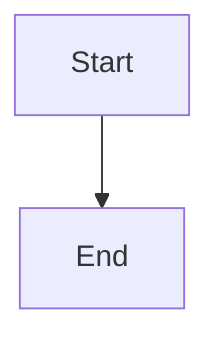

# Broken Mermaid Fixture (FA-04)

Deliberately invalid. Do not repair.

## Unclosed subgraph

```mermaid
graph TD
  subgraph Alpha
    A[Start] --> B[Middle]
```

## Dangling edge

```mermaid
flowchart LR
  A[Node A] -->
```

## Empty diagram

```mermaid
```

## Unrecognised diagram type

```mermaid
notADiagramType
  A --> B
```

## Mismatched bracket

```mermaid
graph TD
  A[Start) --> B[End]
```

## A valid diagram, for contrast


