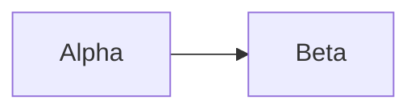

# Cross-File Duplicate — Case 11

`DGM-FIX-001` is defined here **and** in `identifier-semantics.md`. Two definitions of one
identifier in two files is always a collision (`DEC-VIS-052` §5.6). This is the
`IMG-VIS-030` defect class and must never be excused.

> **Diagram ID:** `DGM-FIX-001`

A legitimate cross-file **reference** — must not fire:

The rule `VAL-FIX-001` is defined in `identifier-semantics.md` and merely cited here.

| ID | Owner |
| :--- | :--- |
| `VAL-FIX-001` | Architecture Team |
