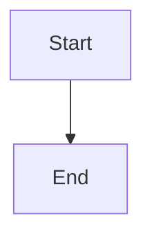

# Identifier Definition versus Reference — Regression Fixture

Exercises `DEC-VIS-052`. Cases 1–3, 7–10 must **PASS**; cases 4–6, 11–12 must **FAIL**.
Do not repair this file: the defects are the test.

---

## Case 1 + 4 — allocation table, with one true duplicate

### TBL-FIX-001: Rules `VAL-FIX-001`…`VAL-FIX-004`

| ID | Rule | Grade | Mechanisation |
| :--- | :--- | :--- | :--- |
| `VAL-FIX-001` | Every capability names exactly one owner | BLOCK | TEXT |
| `VAL-FIX-002` | No document may cite an undefined identifier | BLOCK | CI |
| `VAL-FIX-003` | Aggregates are recounted, never carried forward | AUDIT | TEXT |
| `VAL-FIX-004` | Evidence must name the run that produced it | BLOCK | CI |

### TBL-FIX-002: Rules `VAL-FIX-004`…`VAL-FIX-005`

**Case 4 — TRUE DUPLICATE DEFINITION.** `VAL-FIX-004` is allocated a second time, in a
second allocation table with the same column shape. Must be `DOUBLE_ALLOCATION` → FAIL.

| ID | Rule | Grade | Mechanisation |
| :--- | :--- | :--- | :--- |
| `VAL-FIX-004` | Evidence must name the run that produced it | BLOCK | CI |
| `VAL-FIX-005` | A ceiling raise precedes the allocation that needs it | BLOCK | TEXT |

---

## Case 2 — legitimate registry row → PASS

A registry enumerating identifiers defined above. Different columns, no normative
column, no range claim. Every row is a `REPUBLICATION`.

### TBL-FIX-003: Rule Registry

| ID | Owner | Introduced in |
| :--- | :--- | :--- |
| `VAL-FIX-001` | Architecture Team | PART 01 |
| `VAL-FIX-002` | Architecture Team | PART 01 |
| `VAL-FIX-003` | Metrics Team | PART 01 |

---

## Case 3 — legitimate evidence mapping → PASS

Reports observed state. The `What fails` column is a summary column, so no normative
comparison is attempted.

### TBL-FIX-004: Known Failing Rules

| Rule | What fails | Grade | Recorded as |
| :--- | :--- | :--- | :--- |
| `VAL-FIX-001` | `CAP-FIX-002` names two owners | BLOCK | `OBL-FIX-01` |
| `VAL-FIX-003` | The total was carried forward | AUDIT | `OBL-FIX-02` |

---

## Case 7 — exact reference, same normative text → PASS

Restating a rule verbatim is a reference, not a redefinition.

### TBL-FIX-005: Rules Applicable to Agents

| ID | Rule | Applies to |
| :--- | :--- | :--- |
| `VAL-FIX-002` | No document may cite an undefined identifier | AI agents |

---

## Case 5 + 6 — semantic redefinition → FAIL

### TBL-FIX-006: Rules Restated with Changed Meaning

**Case 5 — `VAL-FIX-001` changes meaning.** Definition says "names exactly one owner";
here it says something else entirely. Must be `SEMANTIC_DUPLICATE` → FAIL.

**Case 6 — same identifier, changed meaning under a different table shape.** The guard
must fire across differing column layouts.

| ID | Rule | Severity |
| :--- | :--- | :--- |
| `VAL-FIX-001` | Every diagram declares a rendering engine | BLOCK |

---

## Case 8 — identifier in a ToC / range declaration → NOT a definition

| § | Title | Primary identifiers |
| :--- | :--- | :--- |
| 1.1 | Rules of Ownership | `VAL-FIX-001`…`VAL-FIX-005` |
| 1.2 | Evidence Contract | `VAL-FIX-004`, `VAL-FIX-006` |

`VAL-FIX-006` appears here but is never defined; a ToC allocates nothing.

---

## Case 9 — next-free pointer → NOT a definition

| Field | Value |
| :--- | :--- |
| **NEXT_ID** | `VAL-FIX-006` · `TBL-FIX-008` · `DGM-FIX-002` |

---

## Case 10 — forward allocation → NOT a definition unless formally allocated

Prose reserving `VAL-FIX-007` for a future part does not allocate it. A ceiling note
such as "ceiling 100 under `DEC-FIX-001`, 93 remain" is likewise not an allocation.

---

## Case 11 — duplicate definition ACROSS two files → FAIL

`DGM-FIX-001` is defined below and again in `identifier-semantics-second-file.md`.
Ownership does not travel between documents.

> **Diagram ID:** `DGM-FIX-001`

---

## Case 12 — duplicate definition INSIDE the same file → FAIL

### TBL-FIX-007: First Allocation of `IMG-FIX-001`

| Field | Value |
| :--- | :--- |
| **ID** | `IMG-FIX-001` |
| **Title** | First allocation |

| Field | Value |
| :--- | :--- |
| **ID** | `IMG-FIX-001` |
| **Title** | Second allocation — DUPLICATE, must be detected |

---

## Derived-table control — must NOT fire

`TBL-FIX-008` restates the range it elaborates, exactly as `TBL-VIS-223` does in the real
corpus. Different columns, so it is a derived table and every row is a `REPUBLICATION`.

### TBL-FIX-008: `VAL-FIX-001`…`VAL-FIX-003` — Detection, Prevention, Remediation

| ID | Detection | Prevention | Remediation |
| :--- | :--- | :--- | :--- |
| `VAL-FIX-001` | Grep for two owner cells | Review at authoring | Split the capability |
| `VAL-FIX-002` | Reference resolution sweep | CI gate | Define or withdraw the citation |
| `VAL-FIX-003` | Recount and compare | Recount every part | Reconcile in the closure record |
