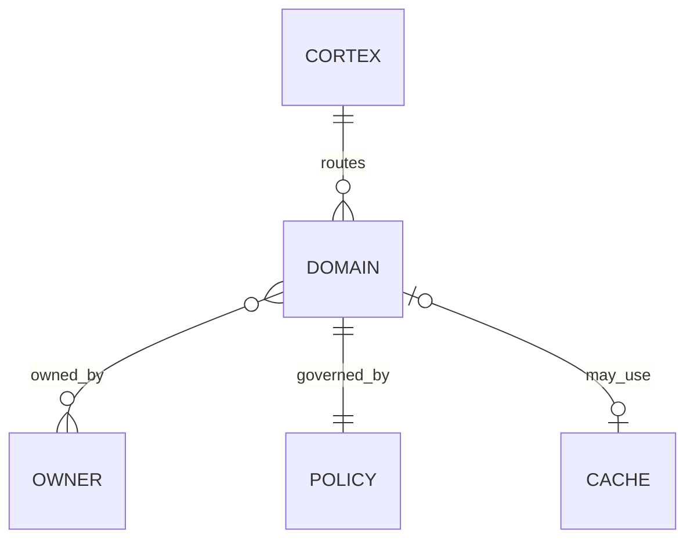
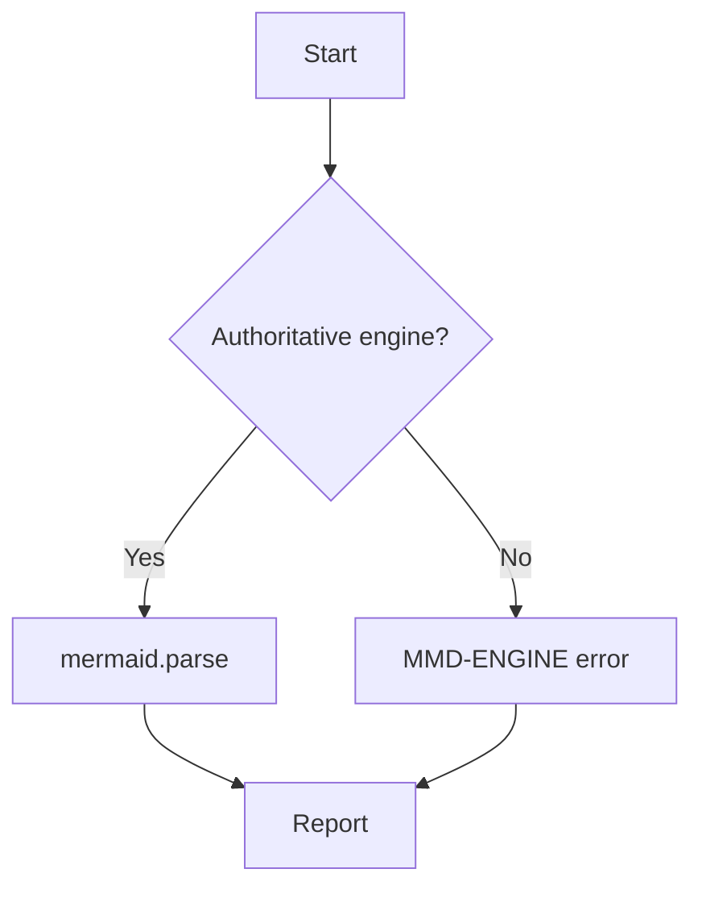
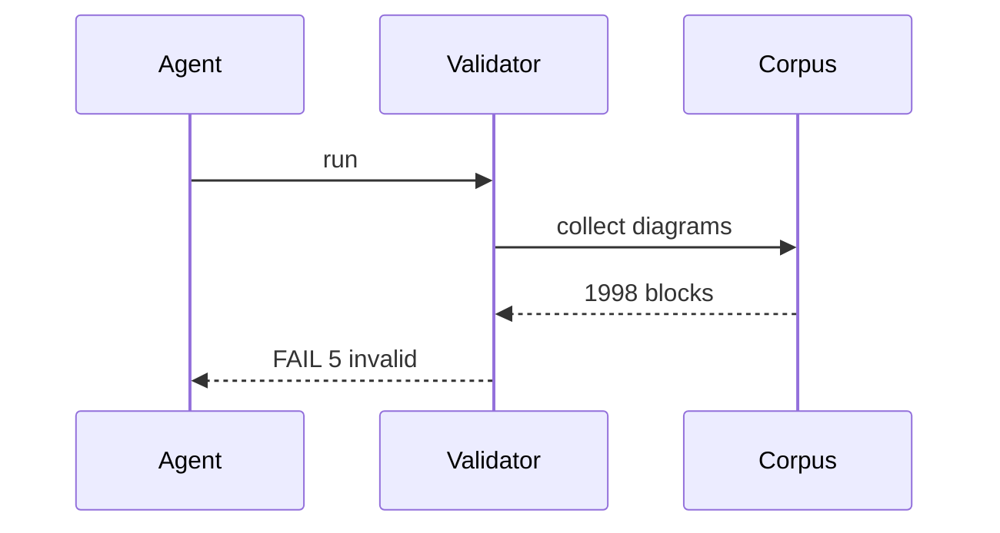
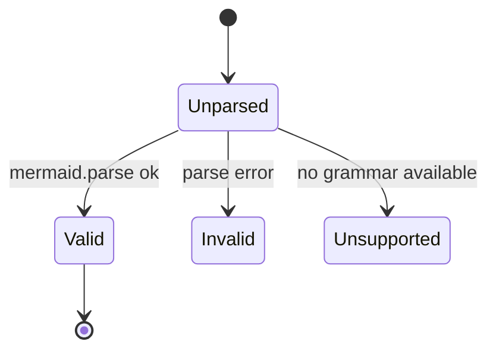

# Mermaid family coverage — Phase 4 regression fixtures

`ADOPT-OBL-01a` requires the parser to distinguish **valid**, **malformed**,
**unsupported** and **parser-limited** Mermaid. This fixture supplies one diagram per
required family so that a regression in any single grammar is caught in isolation.

Every diagram below has been checked against the reference implementation
(`mermaid@11` `mermaid.parse()` under `jsdom`). The expected verdict is stated in the
heading and asserted by `--self-test`.

## VALID — erDiagram, crow's-foot cardinality

The class `v1.0.0` wrongly rejected. `||--o{` and `}o--o{` are relationship glyphs, not
node delimiters.



## VALID — flowchart



## VALID — sequenceDiagram



## VALID — stateDiagram-v2



## INVALID — malformed erDiagram

`|X--oX` is not a cardinality token in any Mermaid version.

```mermaid
erDiagram
    CUSTOMER |X--oX ORDER : places
```

## INVALID — malformed flowchart

Mismatched node bracket: opens with `{`, closes with `]`. This is the exact defect at
`MASTER_CONTEXT_EXECUTION_MODEL.md:5123` (`ADOPT-OBL-02`).

```mermaid
flowchart TD
    A[Start] --> B{Mount]
```
