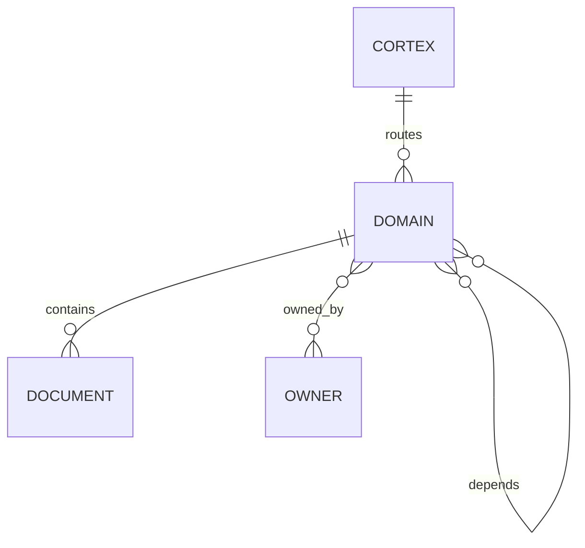
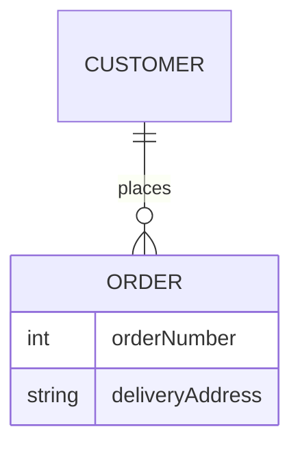
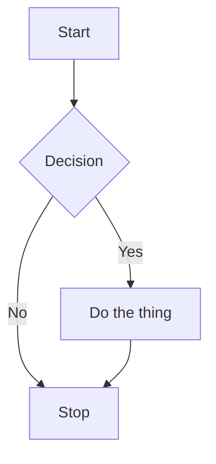
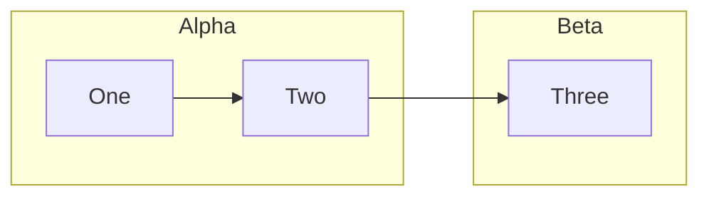
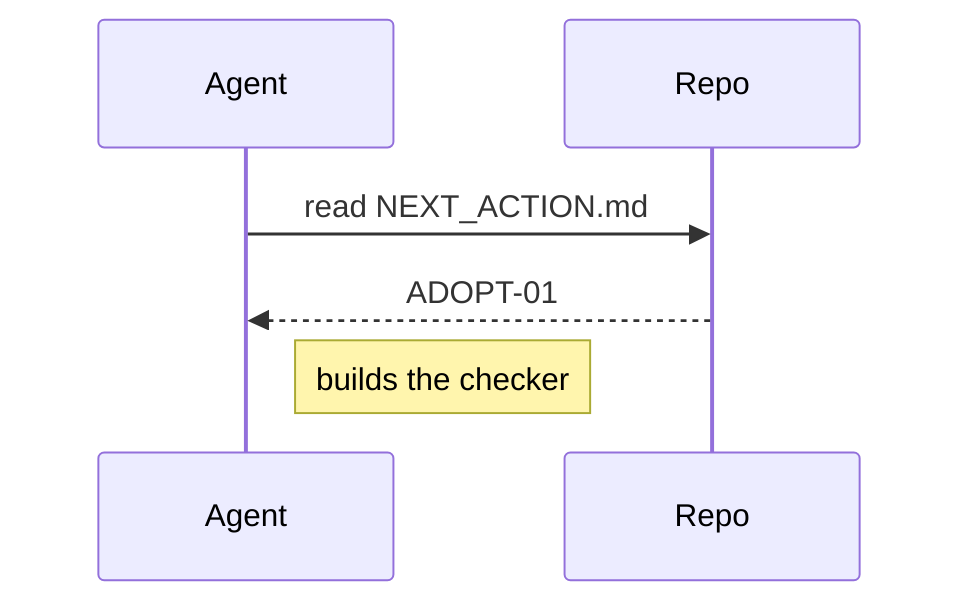
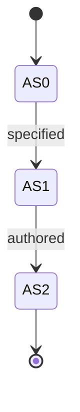
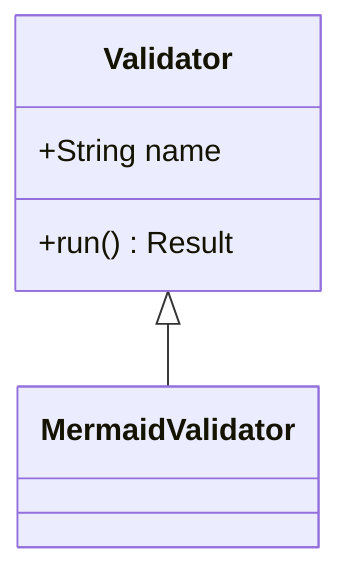
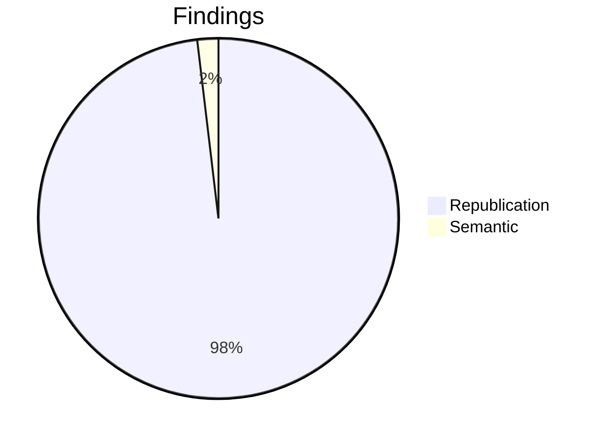

# Valid Mermaid — must never be reported INVALID

Every diagram here is valid. `ADOPT-OBL-01a` exists because v1.0.0 wrongly rejected
the erDiagram cases below.

## Valid erDiagram with crow's-foot cardinality

## Valid erDiagram with attributes

## Valid flowchart

## Valid flowchart with subgraphs

## Valid sequenceDiagram

## Valid stateDiagram-v2

## Valid classDiagram

## Valid pie

